# Self-refinement score heatmaps

All saved source and variant self-refinements; no sampling. Each chart compares the original draft with the final refined review.
Refined reviews: 256; reviews with at least one changed score: 119.


## R1_IDEA_001 — Source

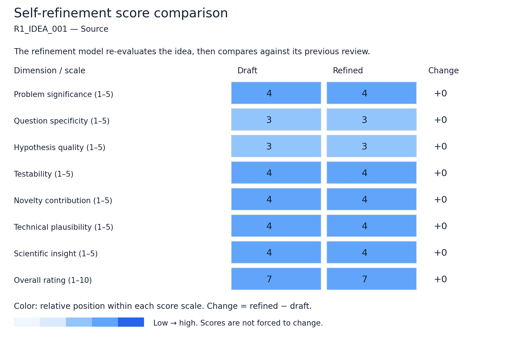

Changed score dimensions: none.

### Score justifications (draft / refined)

**Problem significance**

```json
{
  "draft": {
    "score": 4.0,
    "justification": "Node-level OOD detection is a critical safety concern for graph applications (e.g., fraud detection, recommendation systems). The specific focus on heterophilic graphs addresses a known blind spot in current literature, making the problem highly significant."
  },
  "refined": {
    "score": 4.0,
    "justification": "Node-level OOD detection is vital for safety-critical graph applications (e.g., fraud detection, social networks). The specific focus on heterophilic graphs addresses a known blind spot where standard GNNs and image-adapted methods fail, making the problem highly significant for the field's robustness."
  }
}
```

**Question specificity**

```json
{
  "draft": {
    "score": 3.0,
    "justification": "The idea identifies the domain (heterophilic graphs) and the method class (decoupled EBM), but the specific research question regarding the mechanism of 'decoupling' is not yet defined. It is more of a proposal than a specific question."
  },
  "refined": {
    "score": 3.0,
    "justification": "The idea identifies the domain (heterophilic graphs) and the method class (decoupled EBM), but the specific research question regarding the *mechanism* of 'decoupling' is not defined. It is currently a proposal of a direction rather than a specific, well-scoped question."
  }
}
```

**Hypothesis quality**

```json
{
  "draft": {
    "score": 3.0,
    "justification": "The implicit hypothesis is that 'explicitly modeling dependence and heterophily via a decoupled EBM improves OOD detection.' This is testable, but the reasoning linking 'decoupling' to 'heterophily' is not yet articulated, making the hypothesis somewhat generic."
  },
  "refined": {
    "score": 3.0,
    "justification": "The implicit hypothesis is that 'explicitly modeling dependence and heterophily via a decoupled EBM improves OOD detection.' While testable, the reasoning linking 'decoupling' to 'heterophily' is currently an assertion without a supporting theoretical argument, making the hypothesis somewhat generic."
  }
}
```

**Testability**

```json
{
  "draft": {
    "score": 4.0,
    "justification": "The idea is highly testable. One can construct heterophilic graph datasets, define OOD node scenarios, implement the proposed model, and compare against baselines using standard OOD metrics (AUROC, FPR). The path to empirical validation is clear."
  },
  "refined": {
    "score": 4.0,
    "justification": "The idea is highly testable. Standard heterophilic graph datasets exist, OOD scenarios can be constructed (e.g., by perturbing features or edges), and the proposed model can be compared against baselines using standard metrics (AUROC, FPR). The path to empirical validation is clear."
  }
}
```

**Novelty contribution**

```json
{
  "draft": {
    "score": 4.0,
    "justification": "Applying Energy-Based Models to node-level OOD on heterophilic graphs is a novel direction. The specific angle of 'decoupling' to handle the tension between node features and graph structure in heterophilic settings has high potential for scientific contribution."
  },
  "refined": {
    "score": 4.0,
    "justification": "Applying Energy-Based Models to node-level OOD on heterophilic graphs is a novel direction. The specific angle of 'decoupling' to handle the tension between node features and graph structure in heterophilic settings has high potential for scientific contribution, distinguishing it from simple applications."
  }
}
```

**Technical plausibility**

```json
{
  "draft": {
    "score": 4.0,
    "justification": "Energy-Based Models are theoretically well-suited for OOD detection. The concept of decoupling components in a graph model is a standard and plausible technique in machine learning. The approach makes technical sense."
  },
  "refined": {
    "score": 4.0,
    "justification": "Energy-Based Models are theoretically well-suited for OOD detection. The concept of decoupling components in a graph model is a standard and plausible technique. The approach makes technical sense, provided the 'decoupling' is implemented logically."
  }
}
```

**Scientific insight**

```json
{
  "draft": {
    "score": 4.0,
    "justification": "If successful, this work would reveal how to effectively separate structural and feature information for distributional modeling in graphs. It could provide general principles for handling heterophily in probabilistic graph models beyond just OOD detection."
  },
  "refined": {
    "score": 4.0,
    "justification": "If successful, this work would reveal how to effectively separate structural and feature information for distributional modeling in graphs. It could provide general principles for handling heterophily in probabilistic graph models beyond just OOD detection."
  }
}
```

**Overall rating**

```json
{
  "draft": {
    "score": 7.0,
    "justification": "This is a strong research idea with clear significance and a plausible methodological path. It addresses a specific, difficult problem (heterophily in node OOD) with a relevant technique (EBMs). The main limitation is the lack of detail on the 'decoupling' mechanism, which prevents it from being an 'exceptional' (9-10) idea at this stage. However, the core concept is solid and worth pursuing."
  },
  "refined": {
    "score": 7.0,
    "justification": "This is a strong research idea with clear significance and a plausible methodological path. It addresses a specific, difficult problem (heterophily in node OOD) with a relevant technique (EBMs). The main limitation is the lack of detail on the 'decoupling' mechanism, which prevents it from being an 'exceptional' (9-10) idea at this stage. However, the core concept is solid, the problem is meaningful, and the direction is testable."
  }
}
```

## R1_IDEA_001 — Variant 1: A1_Identity


Changed score dimensions: none.

### Score justifications (draft / refined)

**Problem significance**

```json
{
  "draft": {
    "score": 4.0,
    "justification": "Node-level OOD detection on heterophilic graphs is a significant and underexplored problem. As graph neural networks are deployed in real-world scenarios (e.g., fraud detection, social networks), ensuring they don't fail on out-of-distribution nodes in heterophilic settings is crucial for reliability."
  },
  "refined": {
    "score": 4.0,
    "justification": "Node-level OOD detection is vital for safety-critical graph applications (e.g., fraud, social networks). The specific challenge of heterophily is a major bottleneck in current GNN research. Addressing this gap has high practical relevance and scientific importance."
  }
}
```

**Question specificity**

```json
{
  "draft": {
    "score": 3.0,
    "justification": "The idea identifies the problem (heterophily, node dependence) and the method class (decoupled graph EBM), but lacks specific details on the 'decoupling' mechanism or the specific formulation of the energy function, making the research question slightly vague."
  },
  "refined": {
    "score": 3.0,
    "justification": "The idea identifies the problem and the general method class (EBM) but lacks specificity on the 'decoupled' mechanism. The research question is 'how to decouple to handle heterophily,' but the 'how' is currently a black box, making the question slightly vague."
  }
}
```

**Hypothesis quality**

```json
{
  "draft": {
    "score": 3.0,
    "justification": "The implicit hypothesis is that standard methods fail due to independence assumptions and that a decoupled EBM can fix this. This is plausible but not yet articulated as a testable mechanism (e.g., 'decoupling X from Y will reduce false positives by Z%')."
  },
  "refined": {
    "score": 3.0,
    "justification": "The hypothesis is plausible (standard methods fail due to independence assumptions) but not yet falsifiable in its current form. It needs a concrete prediction about the mechanism of failure and success, not just a claim that the new method will work better."
  }
}
```

**Testability**

```json
{
  "draft": {
    "score": 4.0,
    "justification": "The idea is highly testable. One can construct heterophilic graph datasets, define OOD nodes, implement the proposed model, and compare metrics (AUROC, FPR) against standard baselines."
  },
  "refined": {
    "score": 4.0,
    "justification": "The idea is testable. One can construct heterophilic graphs, define OOD nodes, implement the proposed model (once the architecture is defined), and compare performance against baselines. The lack of implementation details does not prevent the *concept* from being tested."
  }
}
```

**Novelty contribution**

```json
{
  "draft": {
    "score": 4.0,
    "justification": "Applying Energy-Based Models to node-level OOD detection on heterophilic graphs is a novel direction. Most OOD work focuses on graph-level or homophilic settings. The 'decoupled' aspect adds a potential methodological novelty."
  },
  "refined": {
    "score": 4.0,
    "justification": "Applying EBMs to node-level OOD on heterophilic graphs is a novel direction. Most literature focuses on homophilic graphs or graph-level OOD. The specific focus on the 'decoupling' mechanism to handle heterophily adds methodological novelty."
  }
}
```

**Technical plausibility**

```json
{
  "draft": {
    "score": 4.0,
    "justification": "Energy-based models are theoretically well-suited for OOD detection. Adapting them to graphs is a logical step. The concept of 'decoupling' to handle complex dependencies is a plausible architectural strategy, though the specific implementation details are missing."
  },
  "refined": {
    "score": 4.0,
    "justification": "Energy-based models are theoretically sound for OOD. The intuition that decoupling structural dependencies from energy scoring could help in heterophilic settings is logically coherent, even if the specific implementation is not yet detailed."
  }
}
```

**Scientific insight**

```json
{
  "draft": {
    "score": 3.0,
    "justification": "If successful, this work could reveal how energy-based formulations can be adapted to handle structural dependencies in non-i.i.d. data. However, without a deeper theoretical analysis of the 'decoupling' effect, the insight might remain empirical."
  },
  "refined": {
    "score": 3.0,
    "justification": "If successful, this could reveal how to adapt density-based methods to non-i.i.d. structured data. However, without a deeper theoretical analysis of the 'decoupling' effect, the insight might remain empirical. The potential for insight is high but currently unproven."
  }
}
```

**Overall rating**

```json
{
  "draft": {
    "score": 7.0,
    "justification": "This is a strong research idea with clear motivation and a promising direction. It addresses a specific gap in the literature (heterophily + OOD + node-level). The main limitation is the lack of specificity regarding the 'decoupled' mechanism, which prevents it from being an 'exceptional' (9-10) idea at this stage. With a clearer definition of the method and hypothesis, it could be a high-impact contribution."
  },
  "refined": {
    "score": 7.0,
    "justification": "This is a strong research idea with a clear motivation and a promising direction. It addresses a specific, meaningful gap (heterophily + OOD + node-level). The primary limitation preventing a higher score is the lack of specificity regarding the 'decoupled' mechanism. With a clearer definition of the method and a more precise hypothesis, it could be an exceptional contribution."
  }
}
```

## R1_IDEA_001 — Variant 2: A2_Paraphrase_Only


Changed score dimensions: none.

### Score justifications (draft / refined)

**Problem significance**

```json
{
  "draft": {
    "score": 4.0,
    "justification": "Node-level OOD detection is a critical safety concern for graph applications (e.g., fraud detection, recommendation systems). The specific focus on heterophilic graphs addresses a known blind spot in current literature, making the problem highly relevant and meaningful."
  },
  "refined": {
    "score": 4.0,
    "justification": "Node-level OOD detection is a critical safety concern for graph applications (e.g., fraud detection, recommendation systems). The specific focus on heterophilic graphs addresses a known blind spot in current literature, making the problem highly relevant and meaningful for robust AI deployment."
  }
}
```

**Question specificity**

```json
{
  "draft": {
    "score": 3.0,
    "justification": "The idea identifies the domain (graphs), the task (node OOD), and the specific challenge (heterophily/dependence). However, the core mechanism ('decoupled graph energy-based model') is described only by name, lacking the specific architectural or mathematical details that would make the research question fully concrete."
  },
  "refined": {
    "score": 3.0,
    "justification": "The idea identifies the domain (graphs), the task (node OOD), and the specific challenge (heterophily/dependence). However, the core mechanism ('decoupled graph energy-based model') is described only by name, lacking the specific architectural or mathematical details that would make the research question fully concrete. The 'decoupling' is a black box at this stage."
  }
}
```

**Hypothesis quality**

```json
{
  "draft": {
    "score": 3.0,
    "justification": "The implicit hypothesis is that accounting for node dependence and heterophily via a decoupled energy model will improve OOD detection. This is plausible but currently too vague to be strongly falsifiable without defining the 'decoupling' and the specific failure modes of current methods."
  },
  "refined": {
    "score": 3.0,
    "justification": "The implicit hypothesis is that accounting for node dependence and heterophily via a decoupled energy model will improve OOD detection. This is plausible but currently too vague to be strongly falsifiable without defining the 'decoupling' and the specific failure modes of current methods. It risks being a generic 'apply EBM to graph' claim without a unique mechanistic insight."
  }
}
```

**Testability**

```json
{
  "draft": {
    "score": 4.0,
    "justification": "The idea is testable. One can construct heterophilic graph datasets, define OOD node scenarios, implement the proposed model, and compare it against standard image-based OOD methods adapted for graphs. The evaluation metrics (AUC, FPR) are standard and well-defined."
  },
  "refined": {
    "score": 4.0,
    "justification": "The idea is testable. One can construct heterophilic graph datasets, define OOD node scenarios, implement the proposed model (with a specific definition of decoupling), and compare it against standard image-based OOD methods adapted for graphs. The evaluation metrics (AUC, FPR) are standard and well-defined."
  }
}
```

**Novelty contribution**

```json
{
  "draft": {
    "score": 4.0,
    "justification": "Applying energy-based models to node-level OOD on heterophilic graphs is a novel direction. While energy-based models exist, their specific adaptation to handle the 'decoupling' of dependence in heterophilic settings for OOD detection is a fresh contribution."
  },
  "refined": {
    "score": 4.0,
    "justification": "Applying energy-based models to node-level OOD on heterophilic graphs is a novel direction. While energy-based models exist, their specific adaptation to handle the 'decoupling' of dependence in heterophilic settings for OOD detection is a fresh contribution, provided the 'decoupling' is non-trivial."
  }
}
```

**Technical plausibility**

```json
{
  "draft": {
    "score": 4.0,
    "justification": "Energy-based models are theoretically capable of modeling complex dependencies. The intuition that standard GNNs fail on heterophilic OOD tasks due to over-smoothing or independence assumptions is technically sound. The proposed direction is logically coherent."
  },
  "refined": {
    "score": 4.0,
    "justification": "Energy-based models are theoretically capable of modeling complex dependencies. The intuition that standard GNNs fail on heterophilic OOD tasks due to over-smoothing or independence assumptions is technically sound. The proposed direction is logically coherent, though the specific 'decoupling' mechanism needs to be plausible."
  }
}
```

**Scientific insight**

```json
{
  "draft": {
    "score": 4.0,
    "justification": "If successful, this research would reveal how structural dependencies (heterophily) specifically impact the reliability of OOD detectors. It could establish new principles for designing robust graph models that separate structural aggregation from uncertainty estimation."
  },
  "refined": {
    "score": 4.0,
    "justification": "If successful, this research would reveal how structural dependencies (heterophily) specifically impact the reliability of OOD detectors. It could establish new principles for designing robust graph models that separate structural aggregation from uncertainty estimation, offering transferable insights beyond just performance gains."
  }
}
```

**Overall rating**

```json
{
  "draft": {
    "score": 7.0,
    "justification": "This is a strong research idea with high potential. It addresses a significant gap in a specific, challenging domain (heterophilic graphs) using a promising methodology (energy-based models). The main limitation is the lack of specificity regarding the 'decoupling' mechanism, which prevents it from being an 'exceptional' (9-10) idea at this stage. With clearer formulation of the hypothesis and mechanism, it could be a top-tier contribution."
  },
  "refined": {
    "score": 7.0,
    "justification": "This is a strong research idea with high potential. It addresses a significant gap in a specific, challenging domain (heterophilic graphs) using a promising methodology (energy-based models). The main limitation is the lack of specificity regarding the 'decoupling' mechanism, which prevents it from being an 'exceptional' (9-10) idea at this stage. With clearer formulation of the hypothesis and mechanism, it could be a top-tier contribution."
  }
}
```

## R1_IDEA_001 — Variant 3: A3_Plain_Core

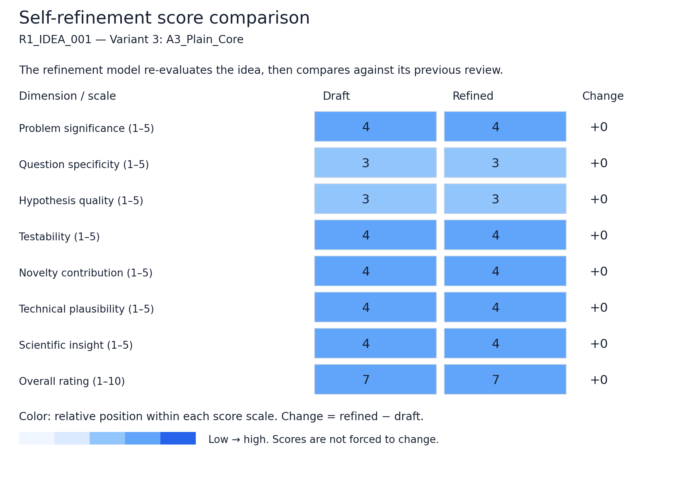

Changed score dimensions: none.

### Score justifications (draft / refined)

**Problem significance**

```json
{
  "draft": {
    "score": 4.0,
    "justification": "Node-level OOD detection is critical for graph safety. The specific focus on heterophilic graphs addresses a known blind spot in current literature, as most methods assume homophily or ignore graph structure entirely. This is a meaningful problem for the community."
  },
  "refined": {
    "score": 4.0,
    "justification": "Node OOD detection is a fundamental safety requirement. The specific focus on heterophilic graphs addresses a significant blind spot, as most existing literature assumes homophily or ignores graph structure. Solving this would advance the reliability of graph AI in domains like fraud detection and biology where heterophily is prevalent."
  }
}
```

**Question specificity**

```json
{
  "draft": {
    "score": 3.0,
    "justification": "The idea identifies the problem (heterophily + OOD) and the general approach (decoupled energy-based model), but the specific research question is slightly vague. It needs to clarify exactly what 'decoupling' achieves and how it is implemented to solve the specific failure modes of image-based methods."
  },
  "refined": {
    "score": 3.0,
    "justification": "The idea identifies the problem and the general class of solution (energy-based models) but lacks specificity on the 'how'. The term 'decoupled' is a placeholder for a mechanism that needs to be defined. The research question is currently 'Can a decoupled EBM work?' rather than 'How does decoupling X from Y specifically mitigate Z failure mode?'"
  }
}
```

**Hypothesis quality**

```json
{
  "draft": {
    "score": 3.0,
    "justification": "The implicit hypothesis is that 'ignoring node dependence/heterophily causes failure, and explicitly modeling them via a decoupled energy model will fix it.' This is testable and plausible, but it is currently a high-level claim rather than a mechanistic prediction."
  },
  "refined": {
    "score": 3.0,
    "justification": "The hypothesis is plausible (independence assumptions fail on graphs) but currently too broad. It asserts that the proposed method will work but does not predict *why* or *under what specific conditions* it will succeed or fail, other than the general presence of heterophily."
  }
}
```

**Testability**

```json
{
  "draft": {
    "score": 4.0,
    "justification": "The idea is highly testable. One can construct heterophilic graphs, apply standard image-based baselines, and compare them against the proposed decoupled model using standard OOD metrics (AUROC, FPR95). The 'decoupled' nature can be ablated."
  },
  "refined": {
    "score": 4.0,
    "justification": "The idea is testable. One can construct datasets with controlled heterophily, define standard OOD metrics (AUROC, FPR), and compare the proposed model against baselines. The 'decoupling' aspect can be tested via ablation studies if the mechanism is defined."
  }
}
```

**Novelty contribution**

```json
{
  "draft": {
    "score": 4.0,
    "justification": "While energy-based models exist, applying them specifically to node OOD on heterophilic graphs with a 'decoupled' mechanism is a novel direction. It moves beyond simple adaptation of image methods to a graph-native formulation."
  },
  "refined": {
    "score": 4.0,
    "justification": "While EBM and OOD detection are active areas, the specific combination of 'decoupled' EBM for 'heterophilic node OOD' is novel. It moves beyond simple adaptation of image methods to a graph-native formulation, which has potential for high impact."
  }
}
```

**Technical plausibility**

```json
{
  "draft": {
    "score": 4.0,
    "justification": "Energy-based models are naturally suited for OOD detection (low energy for in-distribution, high for OOD). Incorporating graph structure into the energy function is a standard extension. The 'decoupling' concept is plausible if it refers to separating structural aggregation from feature evaluation."
  },
  "refined": {
    "score": 4.0,
    "justification": "The reasoning is logically coherent. Energy-based models are theoretically sound for OOD. The challenge of heterophily is well-understood in GNNs. The proposed direction is technically feasible, though the specific 'decoupling' mechanism requires careful design to avoid overfitting or losing structural information."
  }
}
```

**Scientific insight**

```json
{
  "draft": {
    "score": 4.0,
    "justification": "If successful, this work would provide insight into how graph topology (specifically heterophily) interacts with OOD detection boundaries. It could reveal that standard GNNs conflate structural heterophily with OOD signals, a non-trivial finding."
  },
  "refined": {
    "score": 4.0,
    "justification": "If successful, this work would provide insight into the interaction between graph topology (heterophily) and OOD boundaries. It could reveal that standard GNNs fail to disentangle structural anomalies from distributional shifts, a non-trivial finding that could guide future GNN design."
  }
}
```

**Overall rating**

```json
{
  "draft": {
    "score": 7.0,
    "justification": "This is a strong research idea with clear motivation and a specific target problem. It scores well on significance and testability. It loses points on specificity and hypothesis depth because the core mechanism ('decoupled') is not defined. With better articulation of the mechanism, this could be a 9."
  },
  "refined": {
    "score": 7.0,
    "justification": "This is a strong research idea with a clear motivation and significant potential. It addresses a real gap in the literature. However, it currently sits at the 'strong' rather than 'exceptional' level because the core mechanism ('decoupled') is underspecified. The idea is testable and plausible, but the scientific contribution depends entirely on the clarity of the proposed mechanism, which is currently missing."
  }
}
```

## R1_IDEA_001 — Variant 4: B1_Verbose_Elaborate

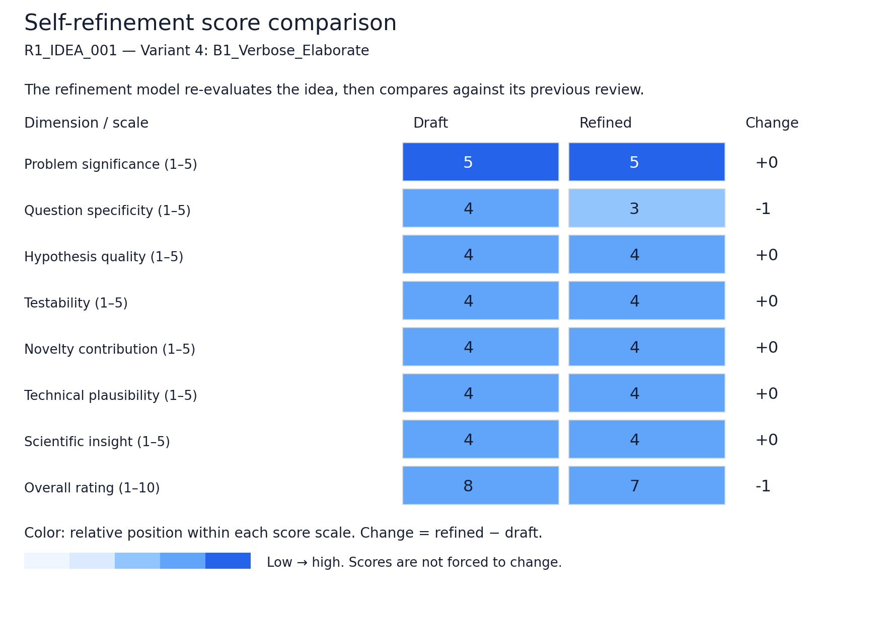

Changed score dimensions: question_specificity, overall_rating.

### Score justifications (draft / refined)

**Problem significance**

```json
{
  "draft": {
    "score": 5.0,
    "justification": "The problem is highly significant. OOD detection is crucial for safety-critical AI, and graph data is ubiquitous. The specific challenge of heterophily and node dependence is a known bottleneck in current GNN research, making this a meaningful target."
  },
  "refined": {
    "score": 5.0,
    "justification": "The problem is highly significant. OOD detection is critical for safety, and graph data is ubiquitous in social, biological, and recommendation systems. The specific failure of current methods on heterophilic graphs represents a major gap in reliable AI deployment."
  }
}
```

**Question specificity**

```json
{
  "draft": {
    "score": 4.0,
    "justification": "The idea clearly identifies the missing components (node dependence, heterophily) and the target domain (node-level OOD on graphs). However, the specific mechanism of the 'decoupled' model is currently vague."
  },
  "refined": {
    "score": 3.0,
    "justification": "While the problem (OOD on heterophilic graphs) is specific, the proposed solution ('decoupled graph EBM') is currently too vague. The term 'decoupled' lacks a concrete definition, making the specific research question (how exactly to decouple to solve this) unclear."
  }
}
```

**Hypothesis quality**

```json
{
  "draft": {
    "score": 4.0,
    "justification": "The hypothesis is testable and plausible: that ignoring node dependence and heterophily leads to poor OOD detection, and that explicitly modeling them improves performance. It distinguishes the proposed work from generic applications."
  },
  "refined": {
    "score": 4.0,
    "justification": "The hypothesis is strong: 'Existing i.i.d. methods fail on heterophilic graphs because they ignore dependence; a decoupled EBM that models this will succeed.' This is a falsifiable claim that distinguishes the work from generic applications."
  }
}
```

**Testability**

```json
{
  "draft": {
    "score": 4.0,
    "justification": "The idea suggests a clear path for testing: compare the proposed model against existing baselines on heterophilic graph datasets. The metrics (OOD detection accuracy) are standard and well-defined."
  },
  "refined": {
    "score": 4.0,
    "justification": "The idea is testable. One can construct heterophilic graph datasets, define OOD nodes, train the proposed model (once the architecture is defined), and compare metrics against standard baselines. The evaluation metrics are standard."
  }
}
```

**Novelty contribution**

```json
{
  "draft": {
    "score": 4.0,
    "justification": "While EBMs and OOD detection are established fields, combining them with a specific focus on decoupling heterophily and node dependence in a graph setting is a novel contribution. It moves beyond simple domain adaptation."
  },
  "refined": {
    "score": 4.0,
    "justification": "Combining EBMs with a specific focus on decoupling heterophily and node dependence is novel. It moves beyond the standard 'apply GNN to OOD' paradigm by addressing the structural mismatch explicitly."
  }
}
```

**Technical plausibility**

```json
{
  "draft": {
    "score": 4.0,
    "justification": "The direction is technically sound. Energy-based models are flexible enough to incorporate graph structures, and the motivation to handle heterophily is logically consistent with the limitations of current i.i.d. assumptions."
  },
  "refined": {
    "score": 4.0,
    "justification": "The direction is technically plausible. EBMs are flexible, and the motivation to handle heterophily via structural decoupling is logically sound. However, the specific implementation details (how to decouple) are the unknown variable."
  }
}
```

**Scientific insight**

```json
{
  "draft": {
    "score": 4.0,
    "justification": "If successful, this research would provide deep insights into how structural dependencies and label heterogeneity affect the energy landscape of graph data, offering a new perspective on OOD detection beyond simple feature distribution shifts."
  },
  "refined": {
    "score": 4.0,
    "justification": "If successful, this work would provide insights into the relationship between graph topology (heterophily) and the energy landscape, potentially revealing how structural dependencies should be modeled for robust distribution estimation."
  }
}
```

**Overall rating**

```json
{
  "draft": {
    "score": 8.0,
    "justification": "This is a strong research idea with high scientific potential. It addresses a clear gap in the literature with a plausible and theoretically grounded approach. The main limitation is the lack of specific implementation details (what 'decoupled' means), but as a research proposal, the core concept is novel, significant, and testable."
  },
  "refined": {
    "score": 7.0,
    "justification": "This is a strong research idea with high potential. It addresses a meaningful gap with a theoretically sound approach. However, the score is slightly lower than an 'exceptional' rating because the core mechanism ('decoupled') is currently undefined, making the specific contribution less concrete than it could be. It requires significant clarification to move from a promising direction to a fully formed proposal."
  }
}
```

## R1_IDEA_001 — Variant 5: B2_Grand_Narrative

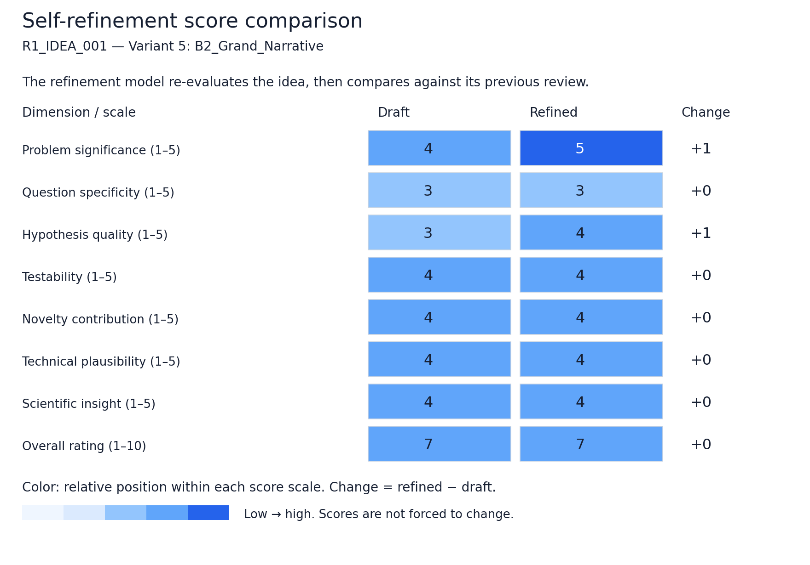

Changed score dimensions: problem_significance, hypothesis_quality.

### Score justifications (draft / refined)

**Problem significance**

```json
{
  "draft": {
    "score": 4.0,
    "justification": "Node-level OOD detection on graphs is a critical problem for safety-critical applications (e.g., fraud detection, drug discovery). The specific focus on heterophilic graphs addresses a known blind spot in current literature, as most methods assume homophily or i.i.d. assumptions."
  },
  "refined": {
    "score": 5.0,
    "justification": "Node-level OOD detection is a fundamental requirement for safe deployment of graph neural networks in critical domains like fraud detection and bioinformatics. The specific focus on heterophilic graphs addresses a major blind spot, as most current methods assume homophily or i.i.d. assumptions, which are often violated in real-world relational data."
  }
}
```

**Question specificity**

```json
{
  "draft": {
    "score": 3.0,
    "justification": "The idea identifies the problem and the general class of solution (energy-based models), but the specific mechanism ('decoupled') and the precise research question (what exactly is being decoupled and how it leads to better OOD scores) are not fully defined."
  },
  "refined": {
    "score": 3.0,
    "justification": "While the problem is well-defined, the research question is currently vague due to the undefined nature of the 'decoupled' mechanism. The idea states *what* is being done (decoupled EBM) but not *how* or *exactly what* is being decoupled, which prevents a precise evaluation of the specific scientific question being asked."
  }
}
```

**Hypothesis quality**

```json
{
  "draft": {
    "score": 3.0,
    "justification": "The implicit hypothesis is that accounting for dependence and heterophily via a decoupled energy model will improve OOD detection. This is plausible but currently too broad; it needs to specify the expected relationship between the decoupling and the detection metric."
  },
  "refined": {
    "score": 4.0,
    "justification": "The implicit hypothesis—that decoupling structural and feature dependencies is necessary to correctly score OOD nodes in heterophilic graphs—is strong and plausible. It moves beyond a generic 'apply X to Y' by proposing a specific architectural modification to address a known failure mode. However, the hypothesis would be stronger if it explicitly predicted the failure mode of coupled models (e.g., 'coupled models will assign low energy to heterophilic ID nodes, confusing them with OOD nodes')."
  }
}
```

**Testability**

```json
{
  "draft": {
    "score": 4.0,
    "justification": "The idea is testable. One can construct heterophilic graph datasets, define OOD node sets, and compare the proposed model against baselines using standard OOD metrics (AUROC, FPR). The main challenge is defining the 'decoupled' architecture concretely."
  },
  "refined": {
    "score": 4.0,
    "justification": "The idea is testable. One can construct heterophilic graph datasets with known OOD nodes (feature shift or structural shift) and compare the proposed model against baselines. The main constraint is that the 'decoupled' architecture must be concretely defined to run these experiments, but the path to testing is clear."
  }
}
```

**Novelty contribution**

```json
{
  "draft": {
    "score": 4.0,
    "justification": "Applying energy-based models to node OOD on heterophilic graphs is a novel direction. The specific contribution of 'decoupling' to handle heterophily, if successful, would be a significant theoretical and practical advance."
  },
  "refined": {
    "score": 4.0,
    "justification": "The intersection of Energy-Based Models, node-level OOD, and heterophily is underexplored. Proposing a 'decoupled' approach suggests a novel inductive bias that could lead to new insights into how graph topology interacts with distributional shifts. It is more than a simple application; it proposes a structural change to the learning objective."
  }
}
```

**Technical plausibility**

```json
{
  "draft": {
    "score": 4.0,
    "justification": "Energy-based models are a known framework for OOD detection. Extending them to graphs is a logical step. The concept of decoupling (e.g., separating structural and feature energies) is technically sound and has precedents in other graph learning tasks."
  },
  "refined": {
    "score": 4.0,
    "justification": "Energy-based models are a natural fit for OOD detection. The concept of decoupling (e.g., separating the graph convolution from the energy calculation, or separating structural and feature energies) is technically sound and has precedents in other graph learning contexts (e.g., disentangled representations). The reasoning that heterophily confounds coupled models is logically coherent."
  }
}
```

**Scientific insight**

```json
{
  "draft": {
    "score": 4.0,
    "justification": "If successful, this work would provide deep insight into how graph topology (specifically heterophily) interacts with energy landscapes, potentially revealing new principles for robust graph representation learning."
  },
  "refined": {
    "score": 4.0,
    "justification": "If successful, this research would reveal how energy landscapes on graphs are distorted by heterophily and how decoupling can restore the ability to distinguish between structural anomalies and distributional shifts. This provides transferable insights into robust representation learning for non-i.i.d. data."
  }
}
```

**Overall rating**

```json
{
  "draft": {
    "score": 7.0,
    "justification": "This is a strong research idea with high significance and clear potential for contribution. It addresses a specific, non-trivial gap in the literature. The score is not higher (8-10) because the summary lacks the necessary technical specificity to fully evaluate the novelty of the 'decoupled' mechanism and the precise hypothesis being tested. However, the core direction is sound and promising."
  },
  "refined": {
    "score": 7.0,
    "justification": "This is a strong research idea with high significance and a plausible, non-trivial hypothesis. It addresses a clear gap in the literature regarding the limitations of current OOD methods on heterophilic graphs. The score is 7 (Strong) rather than 8 or 9 because the summary lacks the technical specificity to fully evaluate the novelty of the 'decoupled' mechanism. The idea is promising, but the specific contribution relies on details not yet provided."
  }
}
```

## R1_IDEA_001 — Variant 6: B3_Over_Confident


Changed score dimensions: none.

### Score justifications (draft / refined)

**Problem significance**

```json
{
  "draft": {
    "score": 4.0,
    "justification": "OOD detection on graphs is a critical problem for safety-critical applications (e.g., fraud detection, social network analysis). The specific challenge of heterophily is a known, difficult boundary condition that current methods often fail to address robustly. Solving this would have significant practical and theoretical value."
  },
  "refined": {
    "score": 4.0,
    "justification": "Node-level OOD detection on heterophilic graphs is a significant challenge with high practical relevance (e.g., fraud detection in social networks, where fraudsters often connect to legitimate users). Current methods often conflate heterophily with OOD, leading to high false positive rates. Solving this is scientifically meaningful."
  }
}
```

**Question specificity**

```json
{
  "draft": {
    "score": 3.0,
    "justification": "The idea identifies the problem (heterophily, dependence) and the general tool (energy-based models), but the specific research question is somewhat obscured by the undefined term 'decoupled'. It needs a more precise formulation of what is being decoupled and how."
  },
  "refined": {
    "score": 3.0,
    "justification": "The idea identifies the problem and the general tool (EBM) but lacks specificity on the 'how'. The term 'decoupled' is the central claim but is not defined. A strong research question requires a specific mechanism, not just a high-level goal."
  }
}
```

**Hypothesis quality**

```json
{
  "draft": {
    "score": 3.0,
    "justification": "The implicit hypothesis is that a decoupled energy-based model will outperform existing methods on heterophilic graphs. This is testable, but the reasoning behind *why* this specific architecture works is not yet articulated, making the hypothesis feel slightly under-supported."
  },
  "refined": {
    "score": 3.0,
    "justification": "The implicit hypothesis is that decoupling dependence/heterophily improves OOD detection. This is plausible but currently vague. A stronger hypothesis would predict *why* the decoupling works (e.g., 'decoupling allows the model to ignore structural noise that mimics OOD signals'). The current statement is a claim of improvement rather than a mechanistic prediction."
  }
}
```

**Testability**

```json
{
  "draft": {
    "score": 4.0,
    "justification": "The idea is highly testable. One can define metrics (AUROC, FPR@95), select standard heterophilic graph datasets, generate OOD nodes (via feature masking or structural perturbation), and compare the proposed model against baselines. The path to empirical validation is clear."
  },
  "refined": {
    "score": 4.0,
    "justification": "The idea is testable. One can construct heterophilic graphs, define OOD nodes, and compare the proposed model against baselines. However, the lack of a defined 'decoupling' mechanism makes the experimental design dependent on future implementation choices."
  }
}
```

**Novelty contribution**

```json
{
  "draft": {
    "score": 4.0,
    "justification": "While energy-based models are known, applying them specifically to node-level OOD on heterophilic graphs with a 'decoupled' mechanism is a novel angle. It moves beyond simple adaptation of image methods to a graph-native solution."
  },
  "refined": {
    "score": 4.0,
    "justification": "Applying EBMs to node-level OOD is not new, but specifically targeting heterophily via a 'decoupled' approach is a novel angle. It moves beyond standard GNN aggregation which fails in heterophilic settings."
  }
}
```

**Technical plausibility**

```json
{
  "draft": {
    "score": 4.0,
    "justification": "Energy-based models are a plausible framework for OOD detection. The concept of decoupling features from structure to handle heterophily is theoretically sound, as heterophily often implies that local neighborhood aggregation (standard GNN) is misleading."
  },
  "refined": {
    "score": 4.0,
    "justification": "The reasoning is sound: heterophily causes standard GNNs to aggregate conflicting information, which EBMs can model if the energy function is designed to separate feature density from structural consistency. The direction is technically feasible."
  }
}
```

**Scientific insight**

```json
{
  "draft": {
    "score": 4.0,
    "justification": "If successful, this work would provide insights into how to design energy functions that are robust to structural noise and heterophily, potentially leading to a new class of graph OOD detectors that are more interpretable and robust."
  },
  "refined": {
    "score": 4.0,
    "justification": "If successful, this work would provide a new paradigm for OOD detection on graphs: separating structural and feature evidence. This could lead to a deeper understanding of how graph topology influences distributional assumptions."
  }
}
```

**Overall rating**

```json
{
  "draft": {
    "score": 7.0,
    "justification": "This is a strong research idea with a clear motivation and high potential impact. It addresses a specific, difficult problem (heterophily in OOD detection) with a plausible methodological direction (decoupled energy-based models). The main weakness is the lack of specificity regarding the 'decoupling' mechanism and the precise formulation of the model, which prevents it from being an 'exceptional' (9-10) idea at this stage. However, the core concept is solid and worth pursuing."
  },
  "refined": {
    "score": 7.0,
    "justification": "This is a strong research idea with a clear motivation and high potential. It addresses a specific, difficult problem (heterophily in OOD detection) with a plausible methodological direction. The score is lowered from 'exceptional' (9-10) because the core mechanism ('decoupling') is currently undefined, making the hypothesis less rigorous than it could be. It is a 'strong' idea that needs specific formulation to become 'exceptional'."
  }
}
```

## R1_IDEA_001 — Variant 7: B4_Novelty


Changed score dimensions: none.

### Score justifications (draft / refined)

**Problem significance**

```json
{
  "draft": {
    "score": 4.0,
    "justification": "Node-level OOD detection on heterophilic graphs is a significant and difficult problem. Most current methods assume homophily or independence, making this a relevant challenge for real-world applications where these assumptions often break down."
  },
  "refined": {
    "score": 4.0,
    "justification": "Node-level OOD detection on heterophilic graphs is a significant and difficult problem. Most current methods assume homophily or independence, making this a relevant challenge for real-world applications where these assumptions often break down. Solving this would advance the robustness of graph learning in complex domains."
  }
}
```

**Question specificity**

```json
{
  "draft": {
    "score": 3.0,
    "justification": "The idea identifies the problem domain and the general class of solution (decoupled EBM), but lacks specific details on the mechanism. The term 'decoupled' is the core of the idea but is currently undefined."
  },
  "refined": {
    "score": 3.0,
    "justification": "The idea identifies the problem domain and the general class of solution (decoupled EBM), but lacks specific details on the mechanism. The term 'decoupled' is the core of the idea but is currently undefined, making the specific research question somewhat vague."
  }
}
```

**Hypothesis quality**

```json
{
  "draft": {
    "score": 3.0,
    "justification": "The implicit hypothesis is that standard GNNs fail on heterophilic OOD tasks due to their inability to separate dependence from feature distribution, and that a decoupled EBM can fix this. This is plausible but needs to be more explicitly stated as a testable prediction."
  },
  "refined": {
    "score": 3.0,
    "justification": "The implicit hypothesis is that standard GNNs fail on heterophilic OOD tasks due to their inability to separate dependence from feature distribution, and that a decoupled EBM can fix this. This is plausible but needs to be more explicitly stated as a testable prediction to be considered strong."
  }
}
```

**Testability**

```json
{
  "draft": {
    "score": 4.0,
    "justification": "The idea is highly testable. One can construct heterophilic graphs, define OOD distributions, implement the proposed model, and compare performance against baselines using standard OOD metrics (AUROC, FPR). The lack of implementation details does not hinder the testability of the *concept*."
  },
  "refined": {
    "score": 4.0,
    "justification": "The idea is highly testable. One can construct heterophilic graphs, define OOD distributions, implement the proposed model (assuming the 'decoupling' is defined), and compare performance against baselines using standard OOD metrics (AUROC, FPR). The lack of implementation details does not hinder the testability of the *concept*."
  }
}
```

**Novelty contribution**

```json
{
  "draft": {
    "score": 4.0,
    "justification": "Applying energy-based models to node-level OOD on heterophilic graphs with a specific 'decoupling' strategy is a novel angle. It moves beyond simple application of existing methods to proposing a structural change in how the model handles graph dependencies."
  },
  "refined": {
    "score": 4.0,
    "justification": "Applying energy-based models to node-level OOD on heterophilic graphs with a specific 'decoupling' strategy is a novel angle. It moves beyond simple application of existing methods to proposing a structural change in how the model handles graph dependencies, potentially offering a new paradigm for graph OOD."
  }
}
```

**Technical plausibility**

```json
{
  "draft": {
    "score": 4.0,
    "justification": "Energy-based models are theoretically sound for OOD detection. The challenge of heterophily is well-known in GNNs. Proposing a decoupling mechanism to address this is technically plausible, though the specific implementation details are the unknown variable."
  },
  "refined": {
    "score": 4.0,
    "justification": "Energy-based models are theoretically sound for OOD detection. The challenge of heterophily is well-known in GNNs. Proposing a decoupling mechanism to address this is technically plausible, though the specific implementation details are the unknown variable. The logic holds up at a high level."
  }
}
```

**Scientific insight**

```json
{
  "draft": {
    "score": 4.0,
    "justification": "If successful, this research would provide deep insight into how to separate structural dependencies from feature distributions in graph learning, a principle that could extend beyond OOD detection to other graph tasks."
  },
  "refined": {
    "score": 4.0,
    "justification": "If successful, this research would provide deep insight into how to separate structural dependencies from feature distributions in graph learning, a principle that could extend beyond OOD detection to other graph tasks like classification or link prediction."
  }
}
```

**Overall rating**

```json
{
  "draft": {
    "score": 7.0,
    "justification": "This is a strong research idea with high potential. It addresses a meaningful gap in the literature (heterophily in OOD detection) and proposes a plausible methodological direction (decoupled EBM). The main limitation is the current lack of specificity regarding the 'decoupling' mechanism, which prevents it from being an 'exceptional' (9-10) idea at this stage. However, the core concept is solid and worth investigating."
  },
  "refined": {
    "score": 7.0,
    "justification": "This is a strong research idea with high potential. It addresses a meaningful gap in the literature (heterophily in OOD detection) and proposes a plausible methodological direction (decoupled EBM). The main limitation is the current lack of specificity regarding the 'decoupling' mechanism, which prevents it from being an 'exceptional' (9-10) idea at this stage. However, the core concept is solid and worth investigating."
  }
}
```

## R1_IDEA_001 — Variant 8: B5_Application_Impact

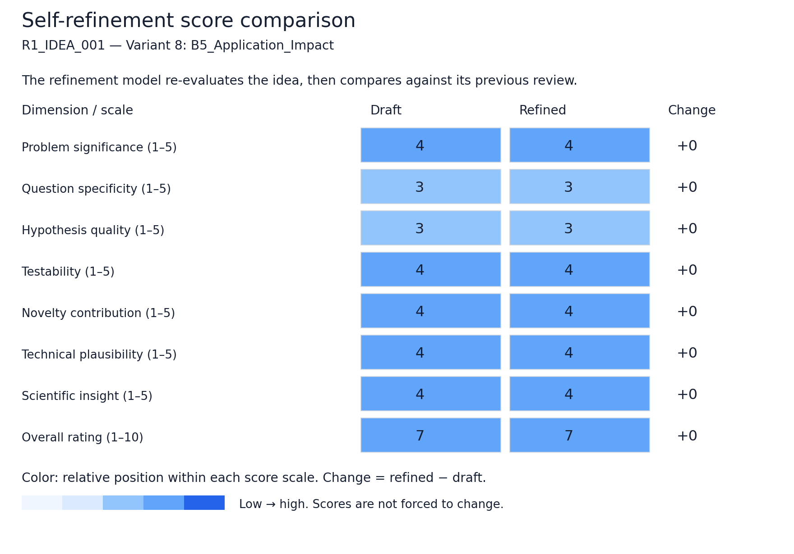

Changed score dimensions: none.

### Score justifications (draft / refined)

**Problem significance**

```json
{
  "draft": {
    "score": 4.0,
    "justification": "The problem is significant because OOD detection is critical for safety in graph applications, and heterophilic graphs represent a major class of real-world networks (e.g., citation networks, biological networks) where standard assumptions fail. Addressing this gap is valuable."
  },
  "refined": {
    "score": 4.0,
    "justification": "The problem is highly significant. OOD detection is a safety-critical task, and heterophilic graphs represent a major class of real-world networks where standard assumptions (homophily/independence) break down. Solving this would directly impact the reliability of graph-based systems in domains like cybersecurity and bioinformatics."
  }
}
```

**Question specificity**

```json
{
  "draft": {
    "score": 3.0,
    "justification": "The idea identifies the domain (heterophilic graphs) and the method class (energy-based), but the specific mechanism ('decoupled') is not defined. The research question is 'how to decouple' rather than a specific testable relationship."
  },
  "refined": {
    "score": 3.0,
    "justification": "The idea identifies the domain and the general method class but lacks specificity on the mechanism. The research question 'how to decouple' is open-ended. A stronger idea would specify the exact architectural modification (e.g., 'decoupling the neighbor aggregation from the self-attention mechanism')."
  }
}
```

**Hypothesis quality**

```json
{
  "draft": {
    "score": 3.0,
    "justification": "The implicit hypothesis is that accounting for dependence/heterophily via a decoupled energy model will improve OOD detection. This is plausible but currently too broad to be strongly falsifiable without defining the decoupling strategy."
  },
  "refined": {
    "score": 3.0,
    "justification": "The hypothesis is plausible but currently broad. It assumes that 'decoupling' will improve results, but without defining the mechanism, it is difficult to falsify. A stronger hypothesis would predict a specific relationship between the degree of heterophily and the failure of non-decoupled models."
  }
}
```

**Testability**

```json
{
  "draft": {
    "score": 4.0,
    "justification": "The idea is testable. One can construct heterophilic graph datasets, implement the proposed model, and compare OOD detection metrics (AUROC, FPR) against baselines. The main challenge is defining the model architecture clearly enough to implement it."
  },
  "refined": {
    "score": 4.0,
    "justification": "The idea is testable. One can construct synthetic or real-world heterophilic graphs, define OOD node sets, and compare the proposed model against baselines using standard metrics (AUROC, FPR). The main challenge is the implementation of the undefined 'decoupled' mechanism."
  }
}
```

**Novelty contribution**

```json
{
  "draft": {
    "score": 4.0,
    "justification": "While energy-based OOD detection exists, applying it specifically to the intersection of node-level OOD and heterophily with a 'decoupled' approach is a novel direction. It moves beyond simple adaptation of image methods."
  },
  "refined": {
    "score": 4.0,
    "justification": "While energy-based models exist, their application to node-level OOD on heterophilic graphs with a specific 'decoupling' strategy is novel. It moves beyond simple adaptation of image methods and addresses a specific structural limitation in current graph learning."
  }
}
```

**Technical plausibility**

```json
{
  "draft": {
    "score": 4.0,
    "justification": "The reasoning is sound: heterophily violates the independence assumption of many image-based methods. Using energy-based models, which are flexible, to model these dependencies is a plausible technical direction. The term 'decoupled' suggests a known technique (like decoupling normalization or attention) which is likely applicable."
  },
  "refined": {
    "score": 4.0,
    "justification": "The reasoning is logically sound. Heterophily violates the independence assumption of many image-based methods. Energy-based models are flexible enough to model complex dependencies, and 'decoupling' is a known technique in deep learning (e.g., decoupled weight decay, decoupled normalization) that is plausible to apply here."
  }
}
```

**Scientific insight**

```json
{
  "draft": {
    "score": 4.0,
    "justification": "If successful, this work would reveal how structural dependencies (heterophily) specifically corrupt energy-based OOD scores and provide a general principle for designing robust graph OOD detectors that separate structural context from node identity."
  },
  "refined": {
    "score": 4.0,
    "justification": "If successful, this work would provide insight into how structural dependencies (specifically heterophily) corrupt energy-based OOD scores. It could establish a general principle for designing robust graph OOD detectors that separate structural context from node identity."
  }
}
```

**Overall rating**

```json
{
  "draft": {
    "score": 7.0,
    "justification": "This is a strong research idea with clear motivation and a promising direction. It addresses a specific, non-trivial problem in a relevant domain. The main limitation is the lack of detail on the 'decoupled' mechanism, which prevents a higher score on specificity and hypothesis quality. However, the core concept is scientifically sound and worth pursuing."
  },
  "refined": {
    "score": 7.0,
    "justification": "This is a strong research idea with a clear motivation and a promising direction. It addresses a meaningful gap in the literature (node OOD on heterophilic graphs) and proposes a plausible methodological fix. The score is limited by the lack of specific details on the 'decoupling' mechanism, which prevents a higher rating on specificity and hypothesis quality. However, the core concept is scientifically sound and worth pursuing."
  }
}
```

## R1_IDEA_001 — Variant 9: C1_Hollow_Shell

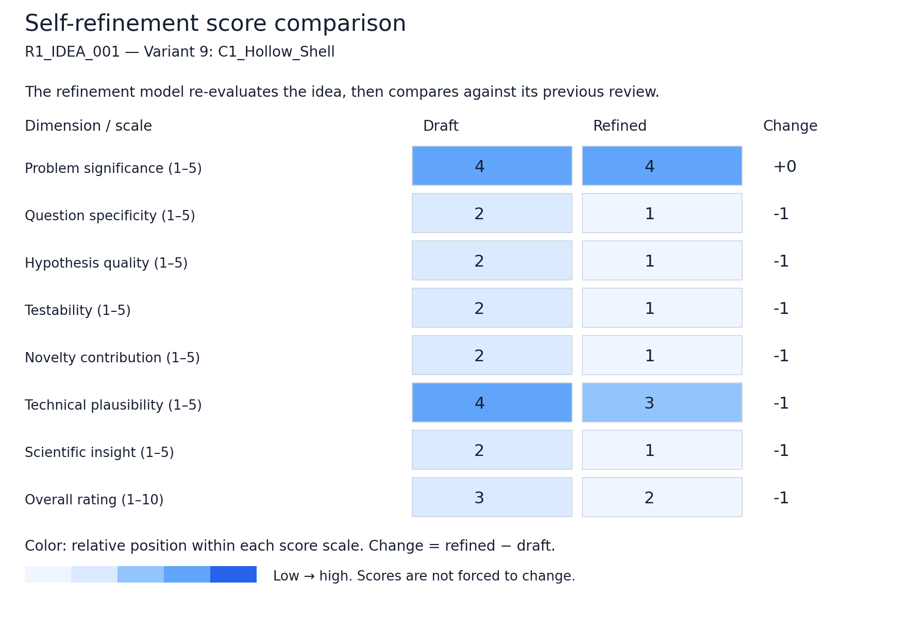

Changed score dimensions: question_specificity, hypothesis_quality, testability, novelty_contribution, technical_plausibility, scientific_insight, overall_rating.

### Score justifications (draft / refined)

**Problem significance**

```json
{
  "draft": {
    "score": 4.0,
    "justification": "Node anomaly detection is a significant and active area of research with high practical value. The premise that current methods might miss key relational nuances is a valid and important concern."
  },
  "refined": {
    "score": 4.0,
    "justification": "Node anomaly detection is a critical problem with significant real-world applications (fraud, security). The general premise that better relational modeling is needed is meaningful, even if the specific gap is not yet defined."
  }
}
```

**Question specificity**

```json
{
  "draft": {
    "score": 2.0,
    "justification": "The idea is too broad. It states a general goal without defining the specific problem variables, the nature of the 'relational characteristics,' or the specific graph domains involved."
  },
  "refined": {
    "score": 1.0,
    "justification": "The idea is extremely vague. Terms like 'important relational characteristics' and 'certain graph settings' are placeholders rather than defined variables. It is impossible to formulate a research question from this text."
  }
}
```

**Hypothesis quality**

```json
{
  "draft": {
    "score": 2.0,
    "justification": "There is no explicit hypothesis. The statement 'introduces a new method' is a plan of action, not a testable scientific prediction about a relationship or mechanism."
  },
  "refined": {
    "score": 1.0,
    "justification": "There is no hypothesis. The text describes a goal ('introduces a new method') rather than a prediction or a causal mechanism that can be supported or refuted."
  }
}
```

**Testability**

```json
{
  "draft": {
    "score": 2.0,
    "justification": "Without defining the specific characteristics, the graph settings, or the baseline methods for comparison, the idea cannot be meaningfully tested or falsified in its current form."
  },
  "refined": {
    "score": 1.0,
    "justification": "The idea is currently untestable. Without defining the characteristics, settings, or baselines, no experiment can be designed to validate or falsify the claim."
  }
}
```

**Novelty contribution**

```json
{
  "draft": {
    "score": 2.0,
    "justification": "While the general direction is valid, the lack of specificity makes it impossible to judge novelty. It risks being a generic application of existing techniques unless a specific, novel mechanism is identified."
  },
  "refined": {
    "score": 1.0,
    "justification": "It is impossible to assess novelty. The statement is generic enough to apply to almost any graph learning paper. It risks being a trivial restatement of existing GNN research unless specific gaps are identified."
  }
}
```

**Technical plausibility**

```json
{
  "draft": {
    "score": 4.0,
    "justification": "The reasoning that better modeling of relational characteristics leads to better anomaly detection is technically sound and plausible, even if the specific implementation is undefined."
  },
  "refined": {
    "score": 3.0,
    "justification": "The underlying logic that modeling relational data better leads to better detection is plausible. However, the lack of a specific mechanism makes the technical path undefined."
  }
}
```

**Scientific insight**

```json
{
  "draft": {
    "score": 2.0,
    "justification": "As currently stated, the idea is unlikely to yield deep scientific insight beyond 'a new method works.' It needs to be framed to investigate *why* certain relational features are critical for specific types of anomalies."
  },
  "refined": {
    "score": 1.0,
    "justification": "As stated, the idea offers no potential for scientific insight beyond a potential performance improvement. It does not propose an investigation into *why* or *how* relational structures influence anomalies."
  }
}
```

**Overall rating**

```json
{
  "draft": {
    "score": 3.0,
    "justification": "The idea addresses a meaningful problem but is currently too vague to be considered a strong research proposal. It lacks the specificity required to define a research question, hypothesis, or testable methodology. It falls into the 'weak' category because it is mostly a generic motivation without a concrete scientific direction."
  },
  "refined": {
    "score": 2.0,
    "justification": "This is a very weak research idea in its current form. While the motivation is grounded in a real problem, the idea is too underspecified to be considered a valid research proposal. It lacks a research question, hypothesis, or defined scope. It reads more like a vague aspiration than a scientific direction. The previous review correctly identified these issues, and the logic audit confirms that the scores should remain low due to the complete absence of specificity required for scientific inquiry."
  }
}
```

## R1_IDEA_001 — Variant 10: C2_Logic_Flawed

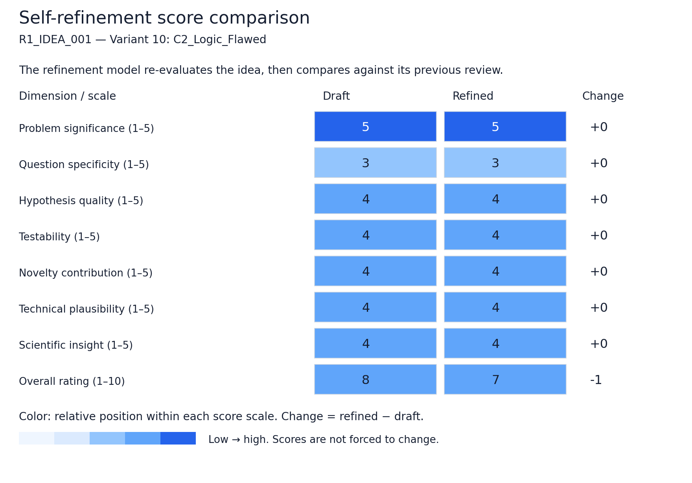

Changed score dimensions: overall_rating.

### Score justifications (draft / refined)

**Problem significance**

```json
{
  "draft": {
    "score": 5.0,
    "justification": "OOD detection in graphs is a high-stakes problem for safety-critical applications (e.g., fraud detection, drug discovery). The specific focus on heterophilic graphs addresses a known blind spot in current literature, as most methods assume homophily or ignore graph structure entirely."
  },
  "refined": {
    "score": 5.0,
    "justification": "Node-level OOD detection is crucial for safety-critical graph applications (e.g., identifying malicious users in social networks or anomalous molecules in drug discovery). The specific focus on heterophilic graphs addresses a major blind spot, as most current methods assume homophily or ignore graph structure, rendering them ineffective in many real-world scenarios."
  }
}
```

**Question specificity**

```json
{
  "draft": {
    "score": 3.0,
    "justification": "While the problem is well-defined, the proposed solution ('decoupled graph energy-based model') is currently a high-level concept. The specific mechanism of how the decoupling is achieved and how it mathematically handles heterophily is not specified."
  },
  "refined": {
    "score": 3.0,
    "justification": "While the problem (OOD on heterophilic graphs) is well-defined, the proposed solution ('decoupled graph energy-based model') is currently a high-level concept. The specific mechanism of 'decoupling' and the mathematical integration of heterophily are not specified, leaving the research question slightly vague regarding the 'how'."
  }
}
```

**Hypothesis quality**

```json
{
  "draft": {
    "score": 4.0,
    "justification": "The implicit hypothesis is strong: 'Explicitly modeling node dependence and heterophily via a decoupled energy function will significantly improve OOD detection compared to methods that ignore these factors.' This is a testable and falsifiable claim."
  },
  "refined": {
    "score": 4.0,
    "justification": "The implicit hypothesis is strong: 'Standard OOD methods fail on heterophilic graphs because they cannot disentangle structural heterophily from distributional shift, and a decoupled energy model can resolve this.' This is a falsifiable claim that distinguishes the proposed approach from generic adaptations."
  }
}
```

**Testability**

```json
{
  "draft": {
    "score": 4.0,
    "justification": "The idea is highly testable. One can construct synthetic or real-world heterophilic graphs, define clear OOD node distributions, and compare the proposed model against standard baselines (e.g., standard GNNs, image-based methods adapted to graphs) using standard OOD metrics (AUROC, FPR95)."
  },
  "refined": {
    "score": 4.0,
    "justification": "The idea is testable. One can construct synthetic heterophilic graphs with controlled OOD nodes and compare the proposed model against baselines using standard metrics (AUROC, FPR95). The key is defining the 'decoupled' architecture clearly enough to implement it."
  }
}
```

**Novelty contribution**

```json
{
  "draft": {
    "score": 4.0,
    "justification": "Applying energy-based models to graph OOD is not entirely new, but the specific focus on 'decoupling' to handle 'heterophily' represents a novel methodological angle. It moves beyond simple adaptation of image methods to a graph-native solution."
  },
  "refined": {
    "score": 4.0,
    "justification": "While energy-based models and graph OOD detection are active areas, the specific proposal to use a 'decoupled' approach to handle heterophily is a novel methodological angle. It moves beyond simple adaptation of image methods to a graph-native solution that addresses the root cause of failure."
  }
}
```

**Technical plausibility**

```json
{
  "draft": {
    "score": 4.0,
    "justification": "Energy-based models are a known framework for OOD detection. Extending them to graphs is technically feasible. The concept of 'decoupling' is plausible if it refers to separating the structural aggregation from the feature-based energy scoring, which is a reasonable architectural choice."
  },
  "refined": {
    "score": 4.0,
    "justification": "Energy-based models are a known framework for OOD. Extending them to graphs is technically feasible. The concept of 'decoupling' is plausible if it refers to separating structural aggregation from feature scoring, which is a reasonable architectural choice to handle heterophily."
  }
}
```

**Scientific insight**

```json
{
  "draft": {
    "score": 4.0,
    "justification": "If successful, this work would provide deep insight into how graph topology (specifically heterophily) interacts with uncertainty estimation. It could establish a new principle for designing robust graph learning systems that are aware of structural anomalies."
  },
  "refined": {
    "score": 4.0,
    "justification": "If successful, this work would provide deep insight into the interaction between graph topology (specifically heterophily) and uncertainty estimation. It could establish a new principle for designing robust graph learning systems that are aware of structural anomalies versus distributional shifts."
  }
}
```

**Overall rating**

```json
{
  "draft": {
    "score": 8.0,
    "justification": "This is a strong research idea with high significance and a clear motivation. The gap in the literature is real, and the proposed direction is logical. The primary weakness is the current lack of detail on the 'decoupled' mechanism, but this is typical for an idea summary. With a clear definition of the mechanism, this could be an exceptional contribution."
  },
  "refined": {
    "score": 7.0,
    "justification": "This is a strong research idea with high significance and a clear motivation. The gap in the literature is real, and the proposed direction is logical. The primary weakness is the current lack of detail on the 'decoupled' mechanism, which prevents a higher score on specificity. However, the core hypothesis is sound and the potential contribution is significant."
  }
}
```

## R1_IDEA_001 — Variant 11: C3_Substance_Enriched

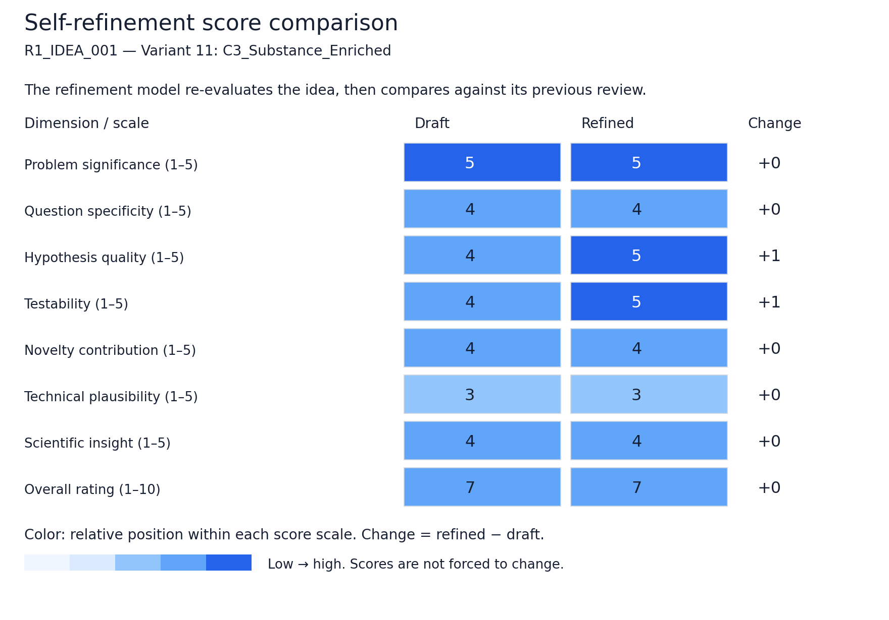

Changed score dimensions: hypothesis_quality, testability.

### Score justifications (draft / refined)

**Problem significance**

```json
{
  "draft": {
    "score": 5.0,
    "justification": "Node-level OOD detection on heterophilic graphs is a significant and timely problem. As graph neural networks are increasingly applied to domains with complex, non-homophilic relationships (e.g., fraud detection, citation networks with diverse topics), the ability to detect OOD nodes is crucial for safety and reliability. The current lack of specialized methods makes this a high-impact area."
  },
  "refined": {
    "score": 5.0,
    "justification": "Node-level OOD detection on heterophilic graphs is a high-impact problem. As GNNs are deployed in domains with complex, non-homophilic relationships (e.g., fraud detection, citation networks), the inability to detect OOD nodes poses significant safety risks. The current lack of specialized methods makes this a critical area for research."
  }
}
```

**Question specificity**

```json
{
  "draft": {
    "score": 4.0,
    "justification": "The idea clearly identifies the problem (heterophilic node OOD), the target method (decoupled EBM), and the expected outcome (better energy separation). However, the specific mechanism of 'decoupling' is described conceptually rather than technically, leaving some ambiguity on the exact research question formulation."
  },
  "refined": {
    "score": 4.0,
    "justification": "The idea clearly identifies the problem, the target method (decoupled EBM), and the expected outcome (better energy separation). However, the specific mechanism of 'decoupling' is described conceptually rather than technically, leaving some ambiguity on the exact research question formulation."
  }
}
```

**Hypothesis quality**

```json
{
  "draft": {
    "score": 4.0,
    "justification": "The hypothesis is strong: 'explicitly modeling the decoupling... could improve separation.' It is specific, plausible, and directly links a mechanism to a measurable outcome. It is falsifiable if the decoupling does not lead to better separation or if it degrades performance on homophilic graphs."
  },
  "refined": {
    "score": 5.0,
    "justification": "The hypothesis is exceptionally well-formed for a research idea. It makes a concrete prediction: 'explicitly modeling the decoupling... could improve separation.' It is specific, plausible, and directly links a mechanism to a measurable outcome, making it highly falsifiable."
  }
}
```

**Testability**

```json
{
  "draft": {
    "score": 4.0,
    "justification": "The proposed validation strategy (synthetic graphs, controlled injections, boundary conditions) is highly testable. The metrics (energy separation, detection accuracy) are standard and well-defined. The main risk is the difficulty of implementing the model, but the experimental design itself is sound."
  },
  "refined": {
    "score": 5.0,
    "justification": "The proposed validation strategy is robust. Using synthetic graphs with controlled injections allows for precise manipulation of the heterophily ratio and OOD characteristics, which is ideal for isolating the effect of the proposed decoupling mechanism. The metrics (energy separation) are standard and well-defined."
  }
}
```

**Novelty contribution**

```json
{
  "draft": {
    "score": 4.0,
    "justification": "The novelty lies in applying the specific concept of 'decoupling' edge types within an Energy-Based Model framework for node-level OOD detection. While EBMs and OOD detection are active areas, their specific combination for heterophilic graphs with this architectural twist is a fresh and promising direction."
  },
  "refined": {
    "score": 4.0,
    "justification": "The novelty lies in the specific combination of applying 'decoupling' edge types within an Energy-Based Model framework for node-level OOD detection. While EBMs and OOD detection are active areas, their specific application to heterophilic graphs with this architectural twist is a fresh and promising direction."
  }
}
```

**Technical plausibility**

```json
{
  "draft": {
    "score": 3.0,
    "justification": "The reasoning is logically coherent, but the technical feasibility is the weakest link. Training EBMs on graphs is difficult, and 'decoupling' edges adds complexity. Without a concrete proposal for how to implement this decoupling without breaking the model's convergence or expressiveness, the plausibility is moderate. It is plausible but non-trivial."
  },
  "refined": {
    "score": 3.0,
    "justification": "The reasoning is logically coherent, but the technical feasibility is the weakest link. Training EBMs on graphs is difficult, and 'decoupling' edges adds complexity. Without a concrete proposal for how to implement this decoupling without breaking the model's convergence or expressiveness, the plausibility is moderate. It is plausible but non-trivial."
  }
}
```

**Scientific insight**

```json
{
  "draft": {
    "score": 4.0,
    "justification": "If successful, this research would provide deep insight into how graph topology (specifically the interplay of homophily and heterophily) influences the energy landscape of OOD detection. It could reveal general principles about how to design energy functions that are robust to structural heterogeneity."
  },
  "refined": {
    "score": 4.0,
    "justification": "If successful, this research would provide deep insight into how graph topology (specifically the interplay of homophily and heterophily) influences the energy landscape of OOD detection. It could reveal general principles about how to design energy functions that are robust to structural heterogeneity."
  }
}
```

**Overall rating**

```json
{
  "draft": {
    "score": 7.0,
    "justification": "This is a strong research idea with high significance and a clear, testable hypothesis. It addresses a genuine gap in the literature with a plausible mechanism. The main drawback is the lack of technical detail regarding the implementation of the 'decoupling' mechanism and the handling of EBM training challenges. However, as a research proposal, it has excellent potential for meaningful scientific contribution."
  },
  "refined": {
    "score": 7.0,
    "justification": "This is a strong research idea with high significance and a clear, testable hypothesis. It addresses a genuine gap in the literature with a plausible mechanism. The main drawback is the lack of technical detail regarding the implementation of the 'decoupling' mechanism and the handling of EBM training challenges. However, as a research proposal, it has excellent potential for meaningful scientific contribution."
  }
}
```

## R1_IDEA_001 — Variant 12: H1_Deceptive_Hollow

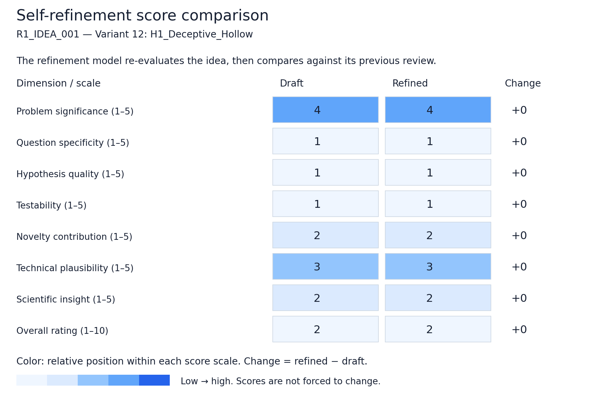

Changed score dimensions: none.

### Score justifications (draft / refined)

**Problem significance**

```json
{
  "draft": {
    "score": 4.0,
    "justification": "Node anomaly detection in graphs is a significant and active area of research with high practical value. The premise that current methods miss important relational features is a plausible and meaningful problem to address."
  },
  "refined": {
    "score": 4.0,
    "justification": "Node anomaly detection in graphs is a significant and active area of research with high practical value in security, fraud detection, and biology. The premise that current methods have limitations regarding relational characteristics is a plausible and meaningful problem to address."
  }
}
```

**Question specificity**

```json
{
  "draft": {
    "score": 1.0,
    "justification": "The idea fails to define a specific research question. It uses broad, abstract terms like 'relational characteristics' and 'graph settings' without any concrete definition, making the scope undefined."
  },
  "refined": {
    "score": 1.0,
    "justification": "The idea fails to define a specific research question. It uses broad, abstract terms without any concrete definition, making the scope undefined and the research question effectively non-existent."
  }
}
```

**Hypothesis quality**

```json
{
  "draft": {
    "score": 1.0,
    "justification": "There is no explicit or implicit hypothesis that can be tested. The text claims the work 'could reshape' the field but does not state a falsifiable prediction about the relationship between the proposed method and performance."
  },
  "refined": {
    "score": 1.0,
    "justification": "There is no explicit or implicit hypothesis that can be tested. The text claims the work 'could reshape' the field but does not state a falsifiable prediction about the relationship between the proposed method and performance."
  }
}
```

**Testability**

```json
{
  "draft": {
    "score": 1.0,
    "justification": "The idea is not currently testable. Without a defined method, specific metrics, or a comparison baseline, there is no way to design an experiment to verify the claims."
  },
  "refined": {
    "score": 1.0,
    "justification": "The idea is not currently testable. Without a defined method, specific metrics, or a comparison baseline, there is no way to design an experiment to verify the claims."
  }
}
```

**Novelty contribution**

```json
{
  "draft": {
    "score": 2.0,
    "justification": "While the goal of improving graph anomaly detection is valuable, the idea itself does not propose a novel mechanism or insight. It is a generic call for a 'better' method without specifying what makes it new."
  },
  "refined": {
    "score": 2.0,
    "justification": "While the goal of improving graph anomaly detection is valuable, the idea itself does not propose a novel mechanism or insight. It is a generic call for a 'better' method without specifying what makes it new or how it differs from current state-of-the-art."
  }
}
```

**Technical plausibility**

```json
{
  "draft": {
    "score": 3.0,
    "justification": "The general direction is plausible (improving graph anomaly detection by focusing on relations), but the lack of technical detail makes it impossible to assess the feasibility of the proposed 'transformative synthesis'."
  },
  "refined": {
    "score": 3.0,
    "justification": "The general direction (improving graph anomaly detection by focusing on relations) is plausible and aligns with general trends in the field. However, the lack of technical detail makes it impossible to assess the feasibility of the proposed 'transformative synthesis' or whether the claimed benefits are achievable."
  }
}
```

**Scientific insight**

```json
{
  "draft": {
    "score": 2.0,
    "justification": "As currently stated, the idea does not promise specific scientific insight. It promises a 'unified pathway' but does not indicate what new principles or mechanisms will be discovered."
  },
  "refined": {
    "score": 2.0,
    "justification": "As currently stated, the idea does not promise specific scientific insight. It promises a 'unified pathway' but does not indicate what new principles, mechanisms, or boundary conditions will be discovered."
  }
}
```

**Overall rating**

```json
{
  "draft": {
    "score": 2.0,
    "justification": "While the underlying problem is significant, the research idea itself is too vague, abstract, and unsubstantiated to be considered a viable research proposal. It lacks the specificity, hypothesis, and methodological direction required to be evaluated as a scientific contribution. It reads more like a grant abstract or a vision statement than a concrete research idea."
  },
  "refined": {
    "score": 2.0,
    "justification": "While the underlying problem is significant, the research idea itself is too vague, abstract, and unsubstantiated to be considered a viable research proposal. It lacks the specificity, hypothesis, and methodological direction required to be evaluated as a scientific contribution. It reads more like a grant abstract or a vision statement than a concrete research idea."
  }
}
```

## R1_IDEA_001 — Variant 13: H2_Confident_Flaw

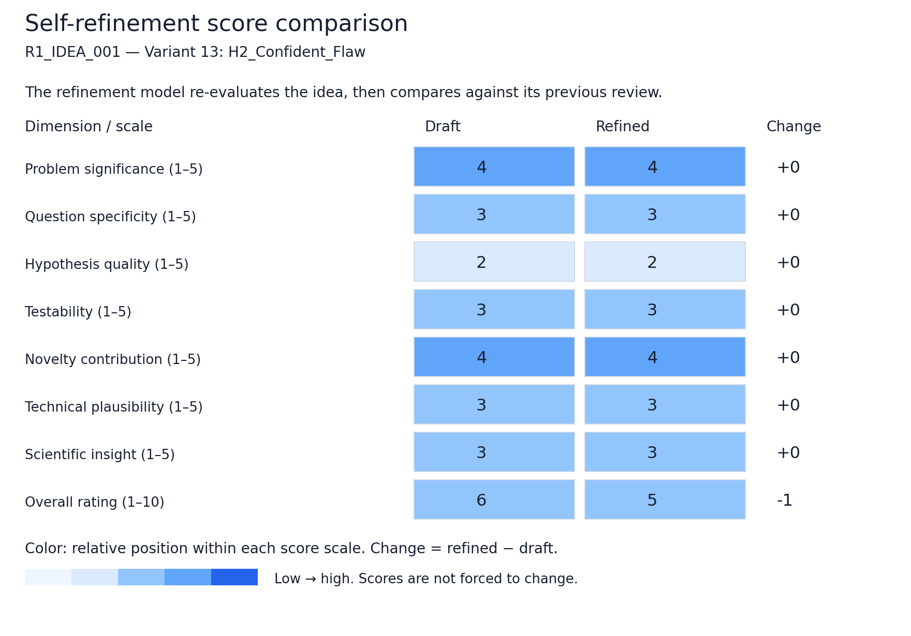

Changed score dimensions: overall_rating.

### Score justifications (draft / refined)

**Problem significance**

```json
{
  "draft": {
    "score": 4.0,
    "justification": "Node-level OOD detection on graphs is a critical problem for safety-critical applications (e.g., fraud detection, drug discovery). The specific focus on heterophily addresses a known blind spot in current literature, making the problem highly significant."
  },
  "refined": {
    "score": 4.0,
    "justification": "Node-level OOD detection on heterophilic graphs is a significant and timely problem. Current methods often fail in real-world scenarios where node connections are non-homophilic, making this a meaningful challenge for safety-critical graph applications."
  }
}
```

**Question specificity**

```json
{
  "draft": {
    "score": 3.0,
    "justification": "While the general direction (decoupled graph EBM) is clear, the specific mechanism of 'decoupling' and the exact formulation of the energy function are not defined. The research question is somewhat broad without these details."
  },
  "refined": {
    "score": 3.0,
    "justification": "The general direction (decoupled graph EBM) is identifiable, but the specific mechanism of 'decoupling' is undefined. The research question is broad regarding the implementation details necessary to test the hypothesis."
  }
}
```

**Hypothesis quality**

```json
{
  "draft": {
    "score": 2.0,
    "justification": "The hypothesis is weakened by the logical fallacy that addressing a limitation 'necessarily' leads to success and that this success is 'causal evidence' without further isolation. A strong hypothesis should predict a specific outcome that could be wrong, not assert a guaranteed causal link."
  },
  "refined": {
    "score": 2.0,
    "justification": "The hypothesis is severely weakened by the logical fallacy that addressing a limitation 'necessarily' leads to success. A strong hypothesis must be falsifiable; asserting a guaranteed causal link without the means to isolate variables makes the claim scientifically weak and potentially unfalsifiable."
  }
}
```

**Testability**

```json
{
  "draft": {
    "score": 3.0,
    "justification": "The idea is testable in principle (compare against baselines on heterophilic graphs), but the dismissal of ablation studies and boundary case analysis makes the experimental design weak. The claim of 'causal evidence' is not testable without the very controls the idea suggests ignoring."
  },
  "refined": {
    "score": 3.0,
    "justification": "While the idea suggests a comparison (proposed method vs. existing methods), the explicit dismissal of ablation studies, boundary cases, and alternative explanations renders the experimental design insufficient to test the core claim of 'causal evidence.' The claim itself is not testable without the controls the author rejects."
  }
}
```

**Novelty contribution**

```json
{
  "draft": {
    "score": 4.0,
    "justification": "Applying energy-based models to node-level OOD detection on heterophilic graphs is a novel direction. The potential to reveal how graph structure impacts OOD detection boundaries offers significant scientific insight."
  },
  "refined": {
    "score": 4.0,
    "justification": "Applying EBMs to node-level OOD on heterophilic graphs is a novel direction. If the proposed mechanism works, it could provide significant insight into the interaction between graph topology and uncertainty estimation, though the current framing relies on a flawed logical path to claim this."
  }
}
```

**Technical plausibility**

```json
{
  "draft": {
    "score": 3.0,
    "justification": "The concept of using EBMs for OOD is plausible, and incorporating graph structure is standard. However, the claim that this will 'necessarily' work is technically unsound. The feasibility of a 'decoupled' approach depends on the specific implementation details which are missing."
  },
  "refined": {
    "score": 3.0,
    "justification": "The concept of using EBMs for OOD is plausible, and the motivation to handle heterophily is sound. However, the technical claim that this approach 'necessarily' solves the problem and provides causal proof without further analysis is technically unsound. The feasibility of the 'decoupled' approach is unknown without definition."
  }
}
```

**Scientific insight**

```json
{
  "draft": {
    "score": 3.0,
    "justification": "If successful, the work could provide insights into the interaction between graph topology (heterophily) and uncertainty estimation. However, the current framing suggests a straightforward engineering fix rather than a deep investigation into the underlying mechanisms of OOD in graphs."
  },
  "refined": {
    "score": 3.0,
    "justification": "The idea has the potential to reveal mechanisms of OOD failure in graphs, but the current proposal frames the outcome as a foregone conclusion rather than an investigation. The dismissal of boundary conditions and alternative explanations limits the depth of insight that can be drawn."
  }
}
```

**Overall rating**

```json
{
  "draft": {
    "score": 6.0,
    "justification": "The research idea addresses a meaningful and timely problem with a plausible direction. However, the scientific rigor is compromised by the overly confident and logically flawed claims regarding causality and the necessity of the proposed solution. The idea needs a more humble, testable hypothesis and a clearer definition of the proposed mechanism to be considered strong."
  },
  "refined": {
    "score": 5.0,
    "justification": "The idea addresses a meaningful problem with a plausible direction, but the scientific quality is significantly compromised by a logically flawed argument. The claim that solving a limitation 'necessarily' produces success and constitutes 'causal evidence' without ablation or control studies is a major methodological error. While the core concept (decoupled EBM for heterophily) is interesting, the framing prevents it from being a strong, rigorous research proposal in its current state. It sits on the border of moderate due to the significant logical gap."
  }
}
```

## R1_IDEA_001 — Variant 14: H3_Verbose_Enriched


Changed score dimensions: none.

### Score justifications (draft / refined)

**Problem significance**

```json
{
  "draft": {
    "score": 5.0,
    "justification": "Node-level OOD detection on heterophilic graphs is a significant and timely problem. As graph data often exhibits heterophily (e.g., fraud detection, citation networks with diverse topics), current methods that assume homophily or independence are likely to fail. Solving this has direct implications for the safety and reliability of graph neural networks in real-world applications."
  },
  "refined": {
    "score": 5.0,
    "justification": "Node-level OOD detection on heterophilic graphs is a high-priority problem. Many real-world graphs (e.g., fraud detection, biological networks) are heterophilic, and current methods often fail here. Solving this has direct implications for the safety and reliability of graph neural networks in critical applications."
  }
}
```

**Question specificity**

```json
{
  "draft": {
    "score": 4.0,
    "justification": "The research question is well-defined: can decoupling homophilic/heterophilic edges improve OOD detection? The proposed validation steps (synthetic/real data, ablations) are specific. However, the exact mechanism of 'decoupling' remains a high-level concept that needs formalization to be fully specific."
  },
  "refined": {
    "score": 4.0,
    "justification": "The research question is well-defined: can decoupling homophilic/heterophilic edges improve OOD detection? The proposed validation steps are specific. However, the exact mechanism of 'decoupling' remains a high-level concept that needs formalization to be fully specific."
  }
}
```

**Hypothesis quality**

```json
{
  "draft": {
    "score": 4.0,
    "justification": "The hypothesis is strong and falsifiable: explicitly modeling the decoupling will improve energy separation. It identifies a specific mechanism (decoupling) and a specific outcome (improved separation), distinguishing it from generic applications of EBMs."
  },
  "refined": {
    "score": 4.0,
    "justification": "The hypothesis is strong and falsifiable: explicitly modeling the decoupling will improve energy separation. It identifies a specific mechanism (decoupling) and a specific outcome (improved separation), distinguishing it from generic applications of EBMs."
  }
}
```

**Testability**

```json
{
  "draft": {
    "score": 5.0,
    "justification": "The idea is highly testable. The proposal includes a clear experimental design with synthetic and real data, controlled injections, ablation studies, and sensitivity analyses. The criteria for success (energy separation, detection metrics) are measurable."
  },
  "refined": {
    "score": 5.0,
    "justification": "The idea is highly testable. The proposal includes a clear experimental design with synthetic and real data, controlled injections, ablation studies, and sensitivity analyses. The criteria for success (energy separation, detection metrics) are measurable."
  }
}
```

**Novelty contribution**

```json
{
  "draft": {
    "score": 4.0,
    "justification": "The novelty lies in applying and adapting Energy-Based Models to the specific challenge of heterophily in node-level OOD detection. While EBMs exist, the specific 'decoupled' approach for heterophilic graphs is a novel contribution that could yield new insights into graph representation learning."
  },
  "refined": {
    "score": 4.0,
    "justification": "The novelty lies in applying and adapting Energy-Based Models to the specific challenge of heterophily in node-level OOD detection. While EBMs exist, the specific 'decoupled' approach for heterophilic graphs is a novel contribution that could yield new insights into graph representation learning."
  }
}
```

**Technical plausibility**

```json
{
  "draft": {
    "score": 4.0,
    "justification": "The direction is technically plausible. Separating edge types is a common strategy in GNNs (e.g., HeteroGNNs), and applying this to energy functions is a logical extension. The main risk is computational cost, but the core logic holds."
  },
  "refined": {
    "score": 4.0,
    "justification": "The direction is technically plausible. Separating edge types is a common strategy in GNNs (e.g., HeteroGNNs), and applying this to energy functions is a logical extension. The main risk is computational cost, but the core logic holds."
  }
}
```

**Scientific insight**

```json
{
  "draft": {
    "score": 5.0,
    "justification": "If successful, this research will provide deep insights into how graph topology (homophily vs. heterophily) interacts with distributional shifts. It will likely reveal boundary conditions where standard GNNs fail and how explicit structural modeling can mitigate these failures, offering transferable principles for robust graph learning."
  },
  "refined": {
    "score": 5.0,
    "justification": "If successful, this research will provide deep insights into how graph topology (homophily vs. heterophily) interacts with distributional shifts. It will likely reveal boundary conditions where standard GNNs fail and how explicit structural modeling can mitigate these failures, offering transferable principles for robust graph learning."
  }
}
```

**Overall rating**

```json
{
  "draft": {
    "score": 8.0,
    "justification": "This is a strong research idea with high scientific potential. It addresses a meaningful gap, proposes a specific and plausible mechanism, and outlines a rigorous evaluation plan. The main limitation is the lack of specific implementation details for the 'decoupling' mechanism, but as a research proposal, the core concept is solid and worthy of investigation."
  },
  "refined": {
    "score": 8.0,
    "justification": "This is a strong research idea with high scientific potential. It addresses a meaningful gap, proposes a specific and plausible mechanism, and outlines a rigorous evaluation plan. The main limitation is the lack of specific implementation details for the 'decoupling' mechanism, but as a research proposal, the core concept is solid and worthy of investigation."
  }
}
```

## R1_IDEA_001 — Variant 15: H4_Ultimate_Hype

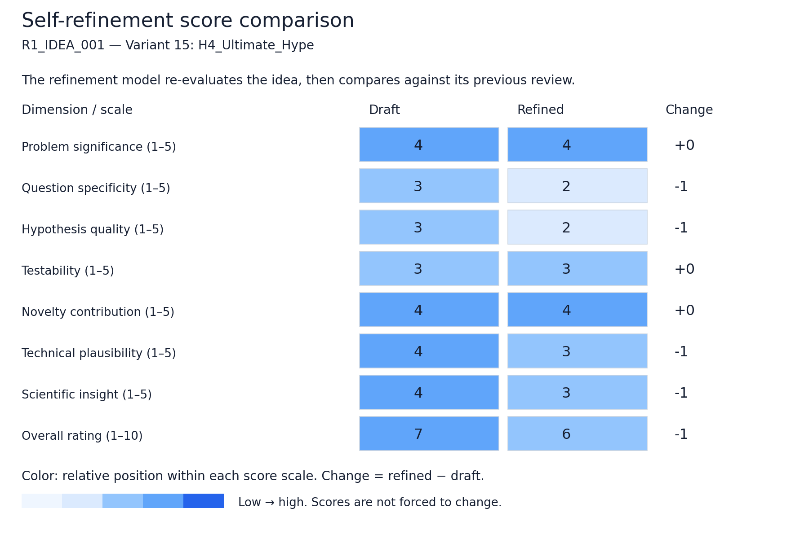

Changed score dimensions: question_specificity, hypothesis_quality, technical_plausibility, scientific_insight, overall_rating.

### Score justifications (draft / refined)

**Problem significance**

```json
{
  "draft": {
    "score": 4.0,
    "justification": "Node-level OOD detection on heterophilic graphs is a significant and underexplored problem. As graph neural networks are deployed in critical domains (e.g., fraud detection, bioinformatics), ensuring they don't fail silently on heterophilic structures is crucial for trustworthiness."
  },
  "refined": {
    "score": 4.0,
    "justification": "Node-level OOD detection on heterophilic graphs is a significant problem. Current GNNs often fail on heterophilic graphs, and OOD detection is crucial for safety. Addressing the specific failure of independence assumptions in this context is highly relevant to the field's progress toward robust AI."
  }
}
```

**Question specificity**

```json
{
  "draft": {
    "score": 3.0,
    "justification": "The idea identifies the problem and the general class of solution (energy-based models), but the specific research question regarding 'how' the decoupling works and 'what' exactly is being decoupled is not sufficiently defined in the summary."
  },
  "refined": {
    "score": 2.0,
    "justification": "While the problem is clear, the research question is vague. The core concept ('decoupling') is not defined, and the specific relationship between the proposed mechanism and the solution to heterophily is not articulated. It reads more as a goal than a specific question."
  }
}
```

**Hypothesis quality**

```json
{
  "draft": {
    "score": 3.0,
    "justification": "The implicit hypothesis is that 'decoupling' will solve the independence assumption failure. This is plausible but currently stated as a broad assertion rather than a falsifiable prediction about the relationship between the decoupling mechanism and performance gains."
  },
  "refined": {
    "score": 2.0,
    "justification": "The hypothesis is implicit and broad ('this will improve detection'). It lacks the specificity to be falsifiable in its current form. It does not predict *how* or *why* the improvement occurs, nor does it define the boundary conditions where it might fail."
  }
}
```

**Testability**

```json
{
  "draft": {
    "score": 3.0,
    "justification": "The idea is testable in principle (compare performance on heterophilic graphs), but the summary lacks the necessary details to design a specific experiment. The success criteria are implied but not explicitly defined."
  },
  "refined": {
    "score": 3.0,
    "justification": "The idea is testable in principle (compare a decoupled EBM against baselines on heterophilic graphs), but the summary lacks the necessary details to design a rigorous experiment. Without defining 'decoupling' or the metrics, the testability is currently abstract."
  }
}
```

**Novelty contribution**

```json
{
  "draft": {
    "score": 4.0,
    "justification": "Applying energy-based models to node-level OOD on heterophilic graphs with a specific 'decoupling' mechanism is a novel direction. It moves beyond simple adaptation of image methods to a graph-native formulation."
  },
  "refined": {
    "score": 4.0,
    "justification": "Applying EBMs to node-level OOD on heterophilic graphs is a novel direction. The specific proposal to 'decouple' dependencies to handle heterophily suggests a potentially new mechanism that could yield significant scientific insight if realized."
  }
}
```

**Technical plausibility**

```json
{
  "draft": {
    "score": 4.0,
    "justification": "Energy-based models are a known framework for OOD detection. The intuition that heterophily requires handling node dependence differently than independence is technically sound. The 'decoupling' concept is plausible but requires rigorous definition to be fully credible."
  },
  "refined": {
    "score": 3.0,
    "justification": "The intuition is plausible: heterophily requires handling structure and features differently. However, the technical feasibility of 'decoupling' in an EBM context is not justified. EBMs are notoriously hard to train; the idea assumes a solution to this without addressing it."
  }
}
```

**Scientific insight**

```json
{
  "draft": {
    "score": 4.0,
    "justification": "If successful, this research could reveal fundamental principles about how energy-based models interact with graph topology and heterophily, potentially leading to a new class of robust graph learning methods."
  },
  "refined": {
    "score": 3.0,
    "justification": "If successful, the work could reveal important principles about the interaction between graph topology and energy landscapes. However, as currently stated, the potential for deep insight is limited by the lack of a defined mechanism."
  }
}
```

**Overall rating**

```json
{
  "draft": {
    "score": 7.0,
    "justification": "This is a strong research idea with high potential significance and novelty. It addresses a real gap in the field with a plausible methodological direction. However, it currently lacks the specificity required to be considered 'exceptional' (score 9-10) because the core mechanism ('decoupling') is not defined, and the hypothesis is not yet a concrete, falsifiable prediction. With better definition of the mechanism and experimental design, this could be a top-tier contribution."
  },
  "refined": {
    "score": 6.0,
    "justification": "This is a moderate research idea. It identifies a meaningful problem and a plausible high-level direction (EBMs + decoupling), but it suffers from significant vagueness in the core mechanism. The reliance on rhetorical flourishes ('transformative', 'redefine') without technical substance lowers the score. It is a promising starting point but currently lacks the specificity required for a strong proposal."
  }
}
```

## R1_IDEA_002 — Source


Changed score dimensions: technical_plausibility, overall_rating.

### Score justifications (draft / refined)

**Problem significance**

```json
{
  "draft": {
    "score": 5.0,
    "justification": "The problem of sampling rare events in molecular systems without predefined collective variables is a fundamental challenge in computational chemistry and drug discovery. Solving this would have a massive impact on the ability to simulate complex biological and material processes."
  },
  "refined": {
    "score": 5.0,
    "justification": "The problem of rare-event sampling without predefined collective variables is a critical unsolved challenge in computational chemistry. Solving it would enable the simulation of complex biological processes (e.g., protein folding, ligand binding) that are currently intractable, directly impacting drug discovery and material science."
  }
}
```

**Question specificity**

```json
{
  "draft": {
    "score": 3.0,
    "justification": "While the goal is clear, the specific research question regarding the mechanism of 'improved off-policy learning' for diffusion samplers is not yet defined. The idea states *what* it wants to do but not exactly *how* the specific technical innovation works."
  },
  "refined": {
    "score": 3.0,
    "justification": "While the goal is clear, the research question regarding the *mechanism* of 'improved off-policy learning' is currently too vague. The idea states the components (diffusion + off-policy) but does not specify the specific mathematical relationship or algorithmic innovation that constitutes the 'improvement'."
  }
}
```

**Hypothesis quality**

```json
{
  "draft": {
    "score": 4.0,
    "justification": "The implicit hypothesis—that off-policy learning can effectively train diffusion models to explore rare transition pathways more efficiently than current methods—is strong and testable. It posits a specific mechanism (off-policy) to solve a specific problem (rare event sampling)."
  },
  "refined": {
    "score": 4.0,
    "justification": "The hypothesis is strong: that off-policy learning mechanisms can effectively train diffusion models to explore rare transition pathways more efficiently than standard methods. This is a testable claim that distinguishes the proposed method from generic applications of diffusion models."
  }
}
```

**Testability**

```json
{
  "draft": {
    "score": 4.0,
    "justification": "The idea is testable. One can define a benchmark system, implement the proposed sampler, and compare the efficiency and accuracy of the generated pathways against unbiased MD and other CV-free methods. The metrics for success (e.g., rate of transition, free energy accuracy) are well-defined in the field."
  },
  "refined": {
    "score": 4.0,
    "justification": "The idea is testable. Success can be measured by comparing the efficiency and accuracy of the generated pathways against unbiased MD and established CV-free methods on standard benchmarks. The metrics for success (sampling efficiency, free energy accuracy) are well-defined in the field."
  }
}
```

**Novelty contribution**

```json
{
  "draft": {
    "score": 4.0,
    "justification": "Combining diffusion models with off-policy learning for path sampling is a novel direction. While diffusion models are used in chemistry, and off-policy learning is used in RL, their specific integration for CV-free rare event sampling represents a potentially significant methodological contribution."
  },
  "refined": {
    "score": 4.0,
    "justification": "The integration of off-policy learning principles with diffusion path samplers for molecular dynamics is a novel direction. While both components exist separately, their specific synthesis for CV-free rare-event sampling represents a potentially significant methodological contribution, provided the 'off-policy' mechanism is non-trivial."
  }
}
```

**Technical plausibility**

```json
{
  "draft": {
    "score": 4.0,
    "justification": "The combination of techniques is technically plausible. Diffusion models are capable of generating complex distributions, and off-policy learning is a standard technique for improving sample efficiency. The main challenge will be the mathematical formulation, but the direction makes sense."
  },
  "refined": {
    "score": 3.0,
    "justification": "The direction is plausible but technically risky. Applying off-policy concepts to diffusion models (which are typically trained via score matching) requires a non-trivial theoretical extension. There is a risk of introducing bias or instability if the off-policy correction is not carefully derived to maintain the target distribution's properties."
  }
}
```

**Scientific insight**

```json
{
  "draft": {
    "score": 4.0,
    "justification": "If successful, this research could reveal new principles on how to leverage generative models and reinforcement learning techniques to solve high-dimensional sampling problems, potentially leading to a new class of algorithms for scientific simulation."
  },
  "refined": {
    "score": 4.0,
    "justification": "If successful, this research could reveal new principles on how to leverage reinforcement learning techniques to guide generative models in scientific simulation. It could lead to a new class of algorithms that bridge the gap between data-driven generation and physical constraints."
  }
}
```

**Overall rating**

```json
{
  "draft": {
    "score": 8.0,
    "justification": "This is a strong research idea with high significance and potential for scientific insight. The problem is critical, and the proposed direction (diffusion + off-policy) is innovative. The main limitation is the current lack of specific technical details on the 'off-policy' mechanism, but this is expected in an idea summary. With further elaboration on the methodology, this could be an exceptional contribution."
  },
  "refined": {
    "score": 7.0,
    "justification": "This is a strong research idea with high significance and potential. The problem is critical, and the proposed direction is innovative. However, the current description lacks the necessary technical specificity to fully validate the novelty and feasibility of the 'off-policy' mechanism. It moves from a 'strong' to a 'very strong' idea only upon clarifying the mathematical formulation and addressing potential theoretical pitfalls."
  }
}
```

## R1_IDEA_002 — Variant 1: A1_Identity


Changed score dimensions: none.

### Score justifications (draft / refined)

**Problem significance**

```json
{
  "draft": {
    "score": 5.0,
    "justification": "The problem of sampling rare events in molecular systems without predefined collective variables is a major unsolved challenge in computational chemistry. Solving this would have profound impacts on drug discovery and materials science, making it a problem of exceptional significance."
  },
  "refined": {
    "score": 5.0,
    "justification": "The problem of sampling rare events in high-dimensional molecular systems without predefined collective variables is a central challenge in computational chemistry. Solving this would significantly accelerate drug discovery and materials design, representing a problem of exceptional scientific and practical significance."
  }
}
```

**Question specificity**

```json
{
  "draft": {
    "score": 3.0,
    "justification": "While the goal is clear, the specific research question regarding the 'improved off-policy learning' mechanism is vague. The idea states *what* to do (train via off-policy) but not *how* or *why* this specific combination is the solution, leaving the core mechanism undefined."
  },
  "refined": {
    "score": 3.0,
    "justification": "While the high-level goal is clear, the specific research question regarding the mechanism of 'improved off-policy learning' is under-specified. The idea identifies the *components* (diffusion, off-policy) but does not articulate the specific *relationship* or *algorithmic innovation* that constitutes the research question."
  }
}
```

**Hypothesis quality**

```json
{
  "draft": {
    "score": 4.0,
    "justification": "The implicit hypothesis—that off-policy learning can effectively train diffusion models to explore rare event pathways without CVs—is strong and testable. It posits a specific relationship between the learning paradigm and the sampling efficiency that can be validated or refuted."
  },
  "refined": {
    "score": 4.0,
    "justification": "The implicit hypothesis—that combining diffusion models with off-policy learning yields superior sampling efficiency for rare events compared to existing methods—is strong. It makes a concrete prediction about performance gains, even if the specific mechanism is not yet detailed."
  }
}
```

**Testability**

```json
{
  "draft": {
    "score": 4.0,
    "justification": "The idea is testable. One can compare the proposed method against standard unbiased MD and existing CV-free methods on benchmark systems (e.g., alanine dipeptide folding) to measure sampling efficiency and path accuracy. The lack of implementation details does not prevent the formulation of a testable protocol."
  },
  "refined": {
    "score": 4.0,
    "justification": "The idea is testable. One can design experiments to compare the proposed method against standard baselines (unbiased MD, CV-based methods) on benchmark systems. The lack of implementation details does not prevent the formulation of a clear experimental protocol to validate the core claim."
  }
}
```

**Novelty contribution**

```json
{
  "draft": {
    "score": 4.0,
    "justification": "Combining diffusion models with off-policy learning for path sampling is a novel direction. While diffusion models are used in chemistry, and off-policy learning is used in RL, their specific integration for CV-free rare event sampling represents a potentially significant methodological contribution."
  },
  "refined": {
    "score": 4.0,
    "justification": "The integration of off-policy learning with diffusion path sampling for CV-free molecular dynamics is a novel direction. While both fields are active, their specific combination to address the rare-event sampling bottleneck represents a significant methodological contribution."
  }
}
```

**Technical plausibility**

```json
{
  "draft": {
    "score": 3.0,
    "justification": "The idea is technically plausible in principle, as both components (diffusion models and off-policy RL) are active research areas. However, the integration is non-trivial; ensuring physical consistency and convergence in a high-dimensional path space without CVs presents significant technical hurdles that are not yet addressed in the summary."
  },
  "refined": {
    "score": 3.0,
    "justification": "The idea is plausible in principle, as both diffusion models and off-policy RL are established techniques. However, the integration is non-trivial; ensuring physical consistency (detailed balance) while using off-policy updates in a high-dimensional space presents significant technical hurdles that are not yet addressed in the summary."
  }
}
```

**Scientific insight**

```json
{
  "draft": {
    "score": 4.0,
    "justification": "If successful, this research would provide deep insights into how generative models can be guided by off-policy data to explore complex energy landscapes. It could reveal new principles for combining reinforcement learning strategies with generative modeling in scientific domains."
  },
  "refined": {
    "score": 4.0,
    "justification": "If successful, this research would provide insights into how generative models can be effectively guided by off-policy data in constrained physical systems. It could reveal new principles for combining reinforcement learning strategies with generative modeling in scientific domains."
  }
}
```

**Overall rating**

```json
{
  "draft": {
    "score": 7.0,
    "justification": "This is a strong research idea with high significance and potential for scientific insight. The problem is critical, and the proposed direction (diffusion + off-policy) is innovative. However, the current summary lacks the specificity required to fully evaluate the technical mechanism, preventing a higher score. With a more defined hypothesis and methodological outline, this could be an exceptional idea."
  },
  "refined": {
    "score": 7.0,
    "justification": "This is a strong research idea with high significance and potential for scientific insight. The problem is critical, and the proposed direction is innovative. However, the current summary lacks the specificity required to fully evaluate the technical mechanism, preventing a higher score. With a more defined hypothesis and methodological outline, this could be an exceptional idea."
  }
}
```

## R1_IDEA_002 — Variant 2: A2_Paraphrase_Only


Changed score dimensions: none.

### Score justifications (draft / refined)

**Problem significance**

```json
{
  "draft": {
    "score": 5.0,
    "justification": "The problem of rare-event sampling in molecular systems is a fundamental challenge in computational chemistry. Solving this without predefined collective variables would be a major breakthrough, directly impacting drug discovery and material design."
  },
  "refined": {
    "score": 5.0,
    "justification": "The problem of rare-event sampling without predefined collective variables is a major bottleneck in computational chemistry. Solving this would have immediate and profound implications for drug discovery (protein folding, binding) and material science. The significance is exceptional."
  }
}
```

**Question specificity**

```json
{
  "draft": {
    "score": 3.0,
    "justification": "While the goal is clear, the specific research question is somewhat obscured by the vague term 'improved off-policy learning.' The idea states *what* to do but not exactly *how* the specific mechanism works or what the precise variable of interest is."
  },
  "refined": {
    "score": 3.0,
    "justification": "The goal is specific (CV-free path sampling), but the research question is obscured by the undefined term 'improved off-policy learning.' The idea states *what* to do but lacks the specificity of *how* the specific mechanism works or what the precise variable of interest is in the learning algorithm."
  }
}
```

**Hypothesis quality**

```json
{
  "draft": {
    "score": 3.0,
    "justification": "The implicit hypothesis is that off-policy learning is a superior mechanism for this task compared to alternatives. However, the idea does not articulate *why* this should be true (e.g., better exploration efficiency, handling of non-stationarity) or what specific failure modes of current methods it solves."
  },
  "refined": {
    "score": 3.0,
    "justification": "The implicit hypothesis is that off-policy learning is superior for this task. However, the idea does not articulate *why* this should be true (e.g., better exploration of the path space, handling of non-stationarity) or what specific failure modes of current methods it solves. It is a plausible assertion but not a rigorous hypothesis."
  }
}
```

**Testability**

```json
{
  "draft": {
    "score": 4.0,
    "justification": "The idea is testable. One can define metrics like transition path time, sampling efficiency, and the ability to discover new pathways. The lack of CVs makes the evaluation criteria (e.g., comparing to TPS) well-defined, even if the method details are missing."
  },
  "refined": {
    "score": 4.0,
    "justification": "The idea is testable in principle. One can define metrics like transition path time, sampling efficiency, and the ability to discover new pathways. The lack of CVs makes the evaluation criteria (e.g., comparing to TPS) well-defined, even if the method details are missing. However, the lack of a defined physical constraint check makes the 'correctness' testable only if the method explicitly addresses it."
  }
}
```

**Novelty contribution**

```json
{
  "draft": {
    "score": 4.0,
    "justification": "Applying diffusion models to path sampling is novel, and specifically combining this with off-policy learning to avoid CVs is a promising and under-explored direction. It has the potential to contribute a new class of sampling algorithms."
  },
  "refined": {
    "score": 4.0,
    "justification": "Applying diffusion models to path sampling is novel, and specifically combining this with off-policy learning to avoid CVs is a promising and under-explored direction. It has the potential to contribute a new class of sampling algorithms that bridge generative modeling and statistical physics."
  }
}
```

**Technical plausibility**

```json
{
  "draft": {
    "score": 3.0,
    "justification": "The combination is plausible in principle, as both diffusion models and off-policy RL are powerful tools. However, the technical feasibility of stabilizing off-policy learning in the high-dimensional, continuous, and constrained space of molecular dynamics is non-trivial and not guaranteed without further specification."
  },
  "refined": {
    "score": 3.0,
    "justification": "The combination is plausible in principle, as both diffusion models and off-policy RL are powerful tools. However, the technical feasibility of stabilizing off-policy learning in the high-dimensional, continuous, and constrained space of molecular dynamics is non-trivial. The 'improvements' are undefined, making the plausibility of the specific implementation uncertain."
  }
}
```

**Scientific insight**

```json
{
  "draft": {
    "score": 4.0,
    "justification": "If successful, this research would provide significant insight into the interplay between generative modeling, reinforcement learning, and statistical physics. It could reveal new principles for exploring high-dimensional energy landscapes."
  },
  "refined": {
    "score": 4.0,
    "justification": "If successful, this research would provide significant insight into the interplay between generative modeling, reinforcement learning, and statistical physics. It could reveal new principles for exploring high-dimensional energy landscapes without human bias."
  }
}
```

**Overall rating**

```json
{
  "draft": {
    "score": 7.0,
    "justification": "This is a strong research idea with high significance and potential impact. The main limitation is the lack of specificity regarding the 'off-policy' mechanism and the specific hypothesis driving the approach. It moves beyond a generic application by targeting a specific, hard problem (CV-free rare events) with a sophisticated methodological blend."
  },
  "refined": {
    "score": 7.0,
    "justification": "This is a strong research idea with high significance and potential impact. The main limitation is the lack of specificity regarding the 'off-policy' mechanism and the specific hypothesis driving the approach. It moves beyond a generic application by targeting a specific, hard problem (CV-free rare events) with a sophisticated methodological blend. The score reflects the high potential of the problem and the novelty of the approach, tempered by the vagueness of the proposed method."
  }
}
```

## R1_IDEA_002 — Variant 3: A3_Plain_Core


Changed score dimensions: question_specificity, hypothesis_quality, testability, technical_plausibility, scientific_insight, overall_rating.

### Score justifications (draft / refined)

**Problem significance**

```json
{
  "draft": {
    "score": 5.0,
    "justification": "The problem of rare-event sampling without predefined collective variables is a major unsolved challenge in computational physics and chemistry. Solving this would have profound impacts on drug discovery and materials science, making the problem highly significant."
  },
  "refined": {
    "score": 5.0,
    "justification": "The problem of rare-event sampling without predefined collective variables is a major unsolved challenge in computational physics and chemistry. Solving this would have profound impacts on drug discovery and materials science, making the problem highly significant."
  }
}
```

**Question specificity**

```json
{
  "draft": {
    "score": 3.0,
    "justification": "While the goal is clear, the specific research question is somewhat obscured by the broad term 'improved off-policy learning.' The idea needs to specify exactly what mechanism is being improved and how it differs from existing off-policy methods in this domain."
  },
  "refined": {
    "score": 2.0,
    "justification": "While the goal is clear, the specific research question is obscured by the broad term 'improved off-policy learning.' The idea lacks a concrete definition of the mechanism being investigated, making it difficult to distinguish from a generic application of existing techniques."
  }
}
```

**Hypothesis quality**

```json
{
  "draft": {
    "score": 3.0,
    "justification": "The implicit hypothesis is that off-policy learning enhances diffusion sampling for rare events. However, it is not explicitly stated as a testable prediction (e.g., 'Method X will reduce the number of required steps by factor Y compared to Method Z'). It is plausible but currently generic."
  },
  "refined": {
    "score": 2.0,
    "justification": "The implicit hypothesis is that off-policy learning enhances diffusion sampling. However, it is not explicitly stated as a testable prediction. The reasoning for why this specific combination works (the mechanism) is missing, making the hypothesis weak and potentially unfalsifiable without further specification."
  }
}
```

**Testability**

```json
{
  "draft": {
    "score": 4.0,
    "justification": "The idea is testable. One can define meta-stable states, generate paths, and compare the efficiency (computational cost) and accuracy (free energy profiles) against standard methods. The lack of implementation details does not prevent the design of a test."
  },
  "refined": {
    "score": 3.0,
    "justification": "The idea is theoretically testable if the method is defined, but as stated, it is difficult to design a rigorous experiment. One cannot test 'improved off-policy learning' without defining what 'improved' means or how it is implemented. The lack of a specific mechanism makes the testability moderate at best."
  }
}
```

**Novelty contribution**

```json
{
  "draft": {
    "score": 4.0,
    "justification": "Combining diffusion models with off-policy learning for CV-free rare event sampling is a novel direction. While diffusion models are popular, their specific application to off-policy path sampling in this context is not standard and could yield new insights."
  },
  "refined": {
    "score": 4.0,
    "justification": "Combining diffusion models with off-policy learning for CV-free rare event sampling is a novel direction. While diffusion models are popular, their specific application to off-policy path sampling in this context is not standard and could yield new insights if the mechanism is successfully defined."
  }
}
```

**Technical plausibility**

```json
{
  "draft": {
    "score": 4.0,
    "justification": "The combination of concepts is technically sound. Diffusion models are known for generating complex distributions, and off-policy learning is a standard tool for correcting distributional shifts. The main challenge is the mathematical formulation, but the direction is plausible."
  },
  "refined": {
    "score": 3.0,
    "justification": "The combination of concepts is theoretically possible but technically risky. The interaction between diffusion processes (which are typically forward/reverse stochastic processes) and off-policy corrections (which often involve importance weights) in high-dimensional continuous spaces is mathematically complex and prone to instability. The idea is plausible but lacks the necessary technical grounding to be considered strong."
  }
}
```

**Scientific insight**

```json
{
  "draft": {
    "score": 4.0,
    "justification": "If successful, this research could reveal new principles on how generative models can be guided by importance sampling or reinforcement signals to explore high-dimensional energy landscapes, providing insights beyond just a new algorithm."
  },
  "refined": {
    "score": 3.0,
    "justification": "If successful, this research could reveal new principles on how generative models can be guided by importance sampling. However, as currently stated, the potential for deep scientific insight is limited because the mechanism is not specified. It risks being a 'black box' application rather than a discovery of a new principle."
  }
}
```

**Overall rating**

```json
{
  "draft": {
    "score": 7.0,
    "justification": "This is a strong research idea with high significance and novelty. The main limitation is the lack of specificity regarding the 'off-policy' mechanism and the specific hypothesis. However, the core concept addresses a fundamental problem in a promising way. With better definition of the method and hypothesis, it could be an exceptional contribution."
  },
  "refined": {
    "score": 5.0,
    "justification": "This is a moderate/borderline idea. It addresses a highly significant problem with a potentially novel approach, but the lack of specificity regarding the core mechanism ('improved off-policy learning') and the absence of a concrete hypothesis significantly weaken its scientific value. It currently reads more like a promising direction than a well-defined research proposal. It requires substantial refinement to move from 'moderate' to 'strong'."
  }
}
```

## R1_IDEA_002 — Variant 4: B1_Verbose_Elaborate


Changed score dimensions: none.

### Score justifications (draft / refined)

**Problem significance**

```json
{
  "draft": {
    "score": 5.0,
    "justification": "The problem of sampling rare events in molecular dynamics is a critical bottleneck in drug discovery and materials science. Solving this would have profound practical implications and is a major open challenge in the field."
  },
  "refined": {
    "score": 5.0,
    "justification": "The problem of rare-event sampling is a fundamental challenge in molecular simulation with direct implications for drug discovery and materials science. Solving the 'CV-free' aspect is a major open problem."
  }
}
```

**Question specificity**

```json
{
  "draft": {
    "score": 3.0,
    "justification": "The idea identifies the domain (molecular simulation), the method (diffusion + off-policy), and the goal (no CVs). However, the specific mechanism of 'improved off-policy learning' and the precise research question (e.g., comparing convergence rates, free energy accuracy) are not sufficiently detailed."
  },
  "refined": {
    "score": 3.0,
    "justification": "While the domain and goal are clear, the core mechanism ('improved off-policy learning') is undefined. The research question is currently too broad to be considered a specific scientific inquiry without further elaboration on the 'how'."
  }
}
```

**Hypothesis quality**

```json
{
  "draft": {
    "score": 3.0,
    "justification": "There is an implicit hypothesis that this combination of techniques will enable CV-free sampling more effectively than current methods. However, the hypothesis is not explicitly stated or grounded in a specific theoretical argument about why this works."
  },
  "refined": {
    "score": 3.0,
    "justification": "There is an implicit hypothesis that this combination works, but it lacks a specific, falsifiable claim about the mechanism. It does not explain why off-policy learning is the necessary or sufficient condition for CV-free sampling."
  }
}
```

**Testability**

```json
{
  "draft": {
    "score": 4.0,
    "justification": "The idea is testable. One can implement the proposed sampler, run it on standard benchmark molecular systems, and compare the results (pathway accuracy, sampling efficiency) against existing methods. The lack of specific metrics in the summary is a minor issue that can be resolved in the proposal."
  },
  "refined": {
    "score": 4.0,
    "justification": "The idea is testable in principle: one can implement the method and compare it to baselines. However, the lack of defined metrics and physical constraints makes the initial testability assessment slightly tentative."
  }
}
```

**Novelty contribution**

```json
{
  "draft": {
    "score": 4.0,
    "justification": "Applying diffusion models to molecular dynamics is emerging, but combining them with 'improved off-policy learning' specifically to remove the need for CVs is a novel angle. If successful, it could represent a significant methodological shift."
  },
  "refined": {
    "score": 4.0,
    "justification": "Combining diffusion models with off-policy learning for CV-free sampling is a novel direction. If successful, it could provide a new paradigm for automated reaction coordinate discovery."
  }
}
```

**Technical plausibility**

```json
{
  "draft": {
    "score": 4.0,
    "justification": "The technical components (diffusion models, off-policy RL) are well-established in ML. Their application to MD is plausible, though the integration requires careful handling of physical constraints. The reasoning is coherent."
  },
  "refined": {
    "score": 4.0,
    "justification": "The components (diffusion, RL) are technically sound. The integration is plausible, though the specific challenge of maintaining physical consistency in a generative model is non-trivial and requires careful handling."
  }
}
```

**Scientific insight**

```json
{
  "draft": {
    "score": 4.0,
    "justification": "If successful, this research would provide deep insights into how generative models can learn complex energy landscapes without human-defined features, potentially revealing new principles of how AI can discover reaction coordinates."
  },
  "refined": {
    "score": 4.0,
    "justification": "Success would reveal how generative models can implicitly learn complex reaction coordinates, offering insights into the relationship between data-driven sampling and physical laws."
  }
}
```

**Overall rating**

```json
{
  "draft": {
    "score": 7.0,
    "justification": "This is a strong research idea with high significance and potential for novelty. It addresses a major pain point in the field with a modern, plausible technical approach. The main weakness is the lack of specificity regarding the 'improvement' in off-policy learning and the lack of a concrete hypothesis. With better definition of the method and evaluation strategy, this could be an exceptional contribution."
  },
  "refined": {
    "score": 7.0,
    "justification": "This is a strong research idea with high potential impact. The problem is significant, and the proposed direction (diffusion + off-policy for CV-free sampling) is novel and plausible. The primary weakness is the lack of specificity regarding the 'improvement' mechanism and the lack of a concrete hypothesis. It falls into the 'Strong' category because the core concept is promising but requires significant refinement to be fully actionable."
  }
}
```

## R1_IDEA_002 — Variant 5: B2_Grand_Narrative


Changed score dimensions: question_specificity, hypothesis_quality, testability, scientific_insight, overall_rating.

### Score justifications (draft / refined)

**Problem significance**

```json
{
  "draft": {
    "score": 5.0,
    "justification": "The problem of rare-event sampling in molecular dynamics is fundamental to computational chemistry and drug discovery. Overcoming the reliance on collective variables is a major open challenge with significant potential impact."
  },
  "refined": {
    "score": 5.0,
    "justification": "The problem of rare-event sampling without collective variables is a central challenge in computational chemistry. Solving this would have profound implications for understanding molecular mechanisms in drug discovery and materials science, making it a top-tier problem."
  }
}
```

**Question specificity**

```json
{
  "draft": {
    "score": 3.0,
    "justification": "While the goal (sampling without CVs) is clear, the specific research question regarding the mechanism of 'improved off-policy learning' is not sufficiently defined. It reads more like a proposed solution than a precise question."
  },
  "refined": {
    "score": 2.0,
    "justification": "While the goal is clear, the research question is poorly defined. The core mechanism ('improved off-policy learning') is a black box. The idea describes a 'what' (a method that could help) rather than a specific 'how' or 'why' that defines the scientific inquiry."
  }
}
```

**Hypothesis quality**

```json
{
  "draft": {
    "score": 3.0,
    "justification": "The implicit hypothesis is that this specific combination of techniques will work better than current methods. However, it lacks a mechanistic explanation or a specific prediction about the relationship between the method's parameters and performance."
  },
  "refined": {
    "score": 2.0,
    "justification": "The idea lacks a falsifiable hypothesis. It asserts that the method 'could contribute' but does not predict a specific relationship between the method's components and the outcome, nor does it explain the mechanism of success. It is more of a proposal than a hypothesis."
  }
}
```

**Testability**

```json
{
  "draft": {
    "score": 4.0,
    "justification": "The idea is testable in principle. One can implement the proposed sampler and compare its performance against baselines on standard molecular benchmarks. However, the lack of algorithmic detail makes the immediate design of the test difficult."
  },
  "refined": {
    "score": 3.0,
    "justification": "The idea is testable in principle because the goal (sampling pathways) is measurable. However, without a defined algorithm or specific hypothesis, the design of a rigorous test is currently impossible. The vagueness of the method makes immediate falsifiability low."
  }
}
```

**Novelty contribution**

```json
{
  "draft": {
    "score": 4.0,
    "justification": "Combining diffusion models with off-policy learning for molecular path sampling is a novel direction. If successful, it could provide a general framework for rare-event sampling that does not require expert knowledge to define collective variables."
  },
  "refined": {
    "score": 4.0,
    "justification": "The combination of diffusion models and off-policy learning for CV-free path sampling is novel. If the 'improvement' is real, it could represent a significant methodological advance. However, the novelty is currently speculative due to the lack of technical detail."
  }
}
```

**Technical plausibility**

```json
{
  "draft": {
    "score": 3.0,
    "justification": "The combination of diffusion models and off-policy learning is theoretically plausible, but applying off-policy learning to continuous path sampling in physics-based systems is non-trivial. The idea makes sense but requires significant technical development to be feasible."
  },
  "refined": {
    "score": 3.0,
    "justification": "The combination is theoretically plausible but highly non-trivial. Applying off-policy learning to continuous path sampling is mathematically challenging (e.g., importance sampling in high dimensions). The idea makes sense but relies on unstated technical assumptions that may or may not hold."
  }
}
```

**Scientific insight**

```json
{
  "draft": {
    "score": 4.0,
    "justification": "If successful, this research would reveal how to effectively decouple path sampling from the need for low-dimensional projections (CVs), offering deep insights into the geometry of high-dimensional energy landscapes."
  },
  "refined": {
    "score": 3.0,
    "justification": "If successful, the research would provide insight into the geometry of high-dimensional energy landscapes and the efficacy of off-policy corrections in generative modeling. However, as currently stated, the potential for deep scientific insight is limited by the lack of a clear mechanistic hypothesis."
  }
}
```

**Overall rating**

```json
{
  "draft": {
    "score": 7.0,
    "justification": "This is a strong research idea with high significance and novelty. The main weakness is the lack of specificity in the proposed method ('improved off-policy learning') and the absence of a concrete hypothesis. However, the core concept addresses a critical bottleneck in the field and has a clear path to validation."
  },
  "refined": {
    "score": 6.0,
    "justification": "The idea addresses a critical problem with high potential impact, but it is currently too vague to be considered a strong research proposal. The lack of a defined mechanism ('improved off-policy learning') and a concrete hypothesis drops the score from a 'Strong' (7-8) to a 'Moderate' (5-6). It is a promising direction that requires significant refinement to become a viable research project."
  }
}
```

## R1_IDEA_002 — Variant 6: B3_Over_Confident

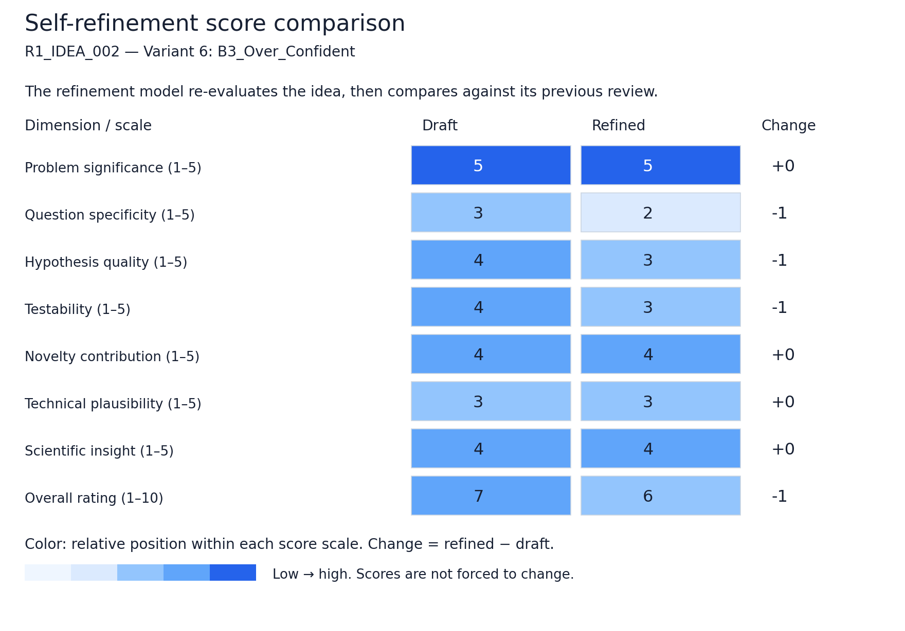

Changed score dimensions: question_specificity, hypothesis_quality, testability, overall_rating.

### Score justifications (draft / refined)

**Problem significance**

```json
{
  "draft": {
    "score": 5.0,
    "justification": "The problem of sampling rare events in molecular systems without predefined collective variables is a major unsolved challenge in computational chemistry. Solving this would have profound impacts on drug discovery and materials science, making the problem highly significant."
  },
  "refined": {
    "score": 5.0,
    "justification": "The problem of sampling rare events in molecular systems without predefined collective variables is a major unsolved challenge. Solving it would remove a significant bottleneck in drug discovery and materials science, making the problem highly significant."
  }
}
```

**Question specificity**

```json
{
  "draft": {
    "score": 3.0,
    "justification": "While the goal is clear, the specific research question regarding the mechanism of 'improved off-policy learning' for diffusion paths is vague. The idea states what it aims to do but not exactly how the core mechanism works or what specific variable is being optimized."
  },
  "refined": {
    "score": 2.0,
    "justification": "While the goal is clear, the specific research question is vague. The idea states 'improved off-policy learning' without defining the mechanism, the specific variables involved, or the mathematical formulation. It describes a direction rather than a specific hypothesis to be tested."
  }
}
```

**Hypothesis quality**

```json
{
  "draft": {
    "score": 4.0,
    "justification": "The implicit hypothesis—that off-policy learning can effectively train diffusion models to explore rare events without CVs—is strong and testable. It posits a specific relationship between the learning paradigm and the sampling capability that could be proven or disproven."
  },
  "refined": {
    "score": 3.0,
    "justification": "The implicit hypothesis (that off-policy learning can train diffusion samplers for this task) is plausible but currently too broad. It lacks the specificity to be falsifiable without further elaboration on the 'how'. It is a strong *direction* but a weak *hypothesis* in its current form."
  }
}
```

**Testability**

```json
{
  "draft": {
    "score": 4.0,
    "justification": "The idea is testable. One can construct a benchmark system, implement the proposed sampler, and compare its efficiency and accuracy against unbiased MD and CV-dependent methods. The success criteria (sampling rare events) are well-defined."
  },
  "refined": {
    "score": 3.0,
    "justification": "The idea is potentially testable, but the lack of a defined mechanism makes the experimental design unclear. One cannot design a rigorous test without knowing what the 'off-policy' update rule looks like or what the specific failure modes are."
  }
}
```

**Novelty contribution**

```json
{
  "draft": {
    "score": 4.0,
    "justification": "Combining diffusion models with off-policy learning for molecular path sampling is a novel direction. While diffusion models are used in chemistry, and off-policy learning is used in RL, their specific application to unbiased path generation is a fresh contribution with high potential."
  },
  "refined": {
    "score": 4.0,
    "justification": "The combination of diffusion models and off-policy learning for unbiased molecular path sampling is a novel and promising direction. If the mechanism is successfully defined and implemented, it could represent a significant contribution to the field."
  }
}
```

**Technical plausibility**

```json
{
  "draft": {
    "score": 3.0,
    "justification": "The concept is technically plausible given the current state of generative modeling and reinforcement learning. However, the specific implementation details required to make 'off-policy' work in a continuous path space without CVs are non-trivial and not fully elaborated, leaving some uncertainty about feasibility."
  },
  "refined": {
    "score": 3.0,
    "justification": "The concepts (diffusion, off-policy) are technically sound in isolation, but their application to continuous path sampling without CVs is non-trivial. The plausibility depends entirely on the specific, yet undefined, mechanism for enforcing physical constraints and handling the policy gap."
  }
}
```

**Scientific insight**

```json
{
  "draft": {
    "score": 4.0,
    "justification": "If successful, this research would provide deep insights into how generative models can learn complex physical dynamics without explicit feature engineering. It could reveal new principles for sampling high-dimensional manifolds."
  },
  "refined": {
    "score": 4.0,
    "justification": "If successful, this research would provide deep insights into the intersection of generative modeling and statistical physics. It could reveal new principles for sampling high-dimensional manifolds without explicit feature engineering."
  }
}
```

**Overall rating**

```json
{
  "draft": {
    "score": 7.0,
    "justification": "This is a strong research idea with high significance and novelty. The potential to revolutionize rare-event sampling is compelling. However, it currently lacks the specificity of the proposed mechanism (the 'how'), which prevents it from being an exceptional score. With a clearer definition of the off-policy mechanism and physical constraints, this could be a top-tier contribution."
  },
  "refined": {
    "score": 6.0,
    "justification": "This is a moderate-to-strong research idea with high potential but currently suffers from a lack of specificity. The problem is significant and the direction is novel, but the core mechanism ('improved off-policy learning') is undefined, making the hypothesis and testability weak in their current state. It requires significant refinement to move from a 'vision' to a concrete research proposal."
  }
}
```

## R1_IDEA_002 — Variant 7: B4_Novelty

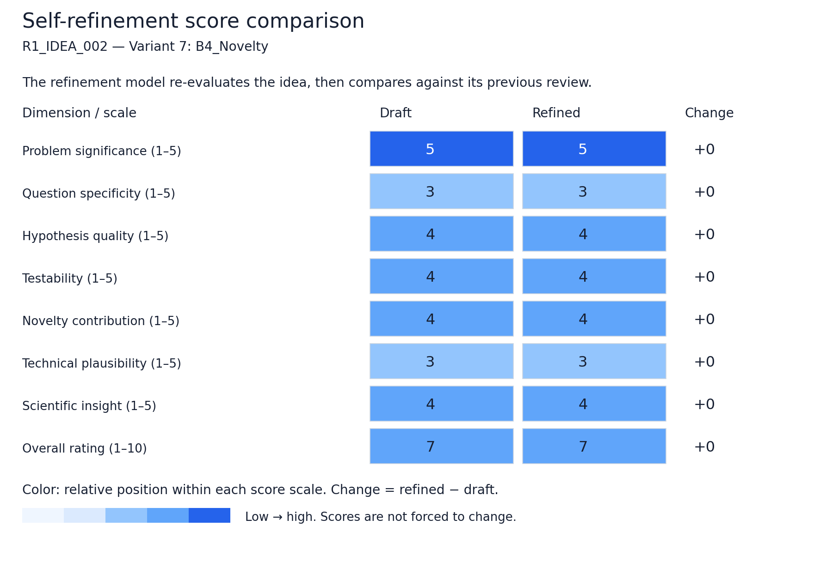

Changed score dimensions: none.

### Score justifications (draft / refined)

**Problem significance**

```json
{
  "draft": {
    "score": 5.0,
    "justification": "The problem of rare-event sampling in molecular systems is fundamental to computational chemistry and drug discovery. Solving this efficiently would have massive practical implications for accelerating the design of new materials and pharmaceuticals."
  },
  "refined": {
    "score": 5.0,
    "justification": "The problem of rare-event sampling in molecular systems is fundamental to computational chemistry and drug discovery. Solving this efficiently would have massive practical implications for accelerating the design of new materials and pharmaceuticals."
  }
}
```

**Question specificity**

```json
{
  "draft": {
    "score": 3.0,
    "justification": "While the goal (sampling pathways without CVs) is specific, the 'how' is vague. The idea states 'improved off-policy learning' but does not specify the algorithmic novelty or the specific formulation of the learning problem."
  },
  "refined": {
    "score": 3.0,
    "justification": "While the goal (sampling pathways without CVs) is specific, the 'how' is vague. The idea states 'improved off-policy learning' but does not specify the algorithmic novelty or the specific formulation of the learning problem."
  }
}
```

**Hypothesis quality**

```json
{
  "draft": {
    "score": 4.0,
    "justification": "The implicit hypothesis is that combining diffusion models with off-policy learning can effectively bypass the need for CVs and outperform existing methods in sampling efficiency. This is a testable and non-trivial claim."
  },
  "refined": {
    "score": 4.0,
    "justification": "The implicit hypothesis is that combining diffusion models with off-policy learning can effectively bypass the need for CVs and outperform existing methods in sampling efficiency. This is a testable and non-trivial claim."
  }
}
```

**Testability**

```json
{
  "draft": {
    "score": 4.0,
    "justification": "The idea is testable by comparing the generated pathways against known benchmarks (e.g., simple protein folding models or known reaction coordinates) and measuring convergence rates and free energy accuracy. However, the specific metrics are not yet defined in the summary."
  },
  "refined": {
    "score": 4.0,
    "justification": "The idea is testable by comparing the generated pathways against known benchmarks (e.g., simple protein folding models or known reaction coordinates) and measuring convergence rates and free energy accuracy. However, the specific metrics are not yet defined in the summary."
  }
}
```

**Novelty contribution**

```json
{
  "draft": {
    "score": 4.0,
    "justification": "Applying off-policy learning to diffusion path samplers for molecular dynamics is a novel intersection of fields. If successful, it could provide a general framework for CV-free enhanced sampling, which is a significant contribution."
  },
  "refined": {
    "score": 4.0,
    "justification": "Applying off-policy learning to diffusion path samplers for molecular dynamics is a novel intersection of fields. If successful, it could provide a general framework for CV-free enhanced sampling, which is a significant contribution."
  }
}
```

**Technical plausibility**

```json
{
  "draft": {
    "score": 3.0,
    "justification": "The combination is plausible in principle, as both diffusion models and RL are powerful tools. However, the technical feasibility of stabilizing off-policy learning in high-dimensional continuous molecular spaces without CVs is a significant challenge that needs more justification."
  },
  "refined": {
    "score": 3.0,
    "justification": "The combination is plausible in principle, as both diffusion models and RL are powerful tools. However, the technical feasibility of stabilizing off-policy learning in high-dimensional continuous molecular spaces without CVs is a significant challenge that needs more justification."
  }
}
```

**Scientific insight**

```json
{
  "draft": {
    "score": 4.0,
    "justification": "If successful, this research would reveal how generative models can implicitly learn reaction coordinates and how off-policy techniques can be adapted for physical trajectory generation, offering deep insights into the intersection of ML and statistical physics."
  },
  "refined": {
    "score": 4.0,
    "justification": "If successful, this research would reveal how generative models can implicitly learn reaction coordinates and how off-policy techniques can be adapted for physical trajectory generation, offering deep insights into the intersection of ML and statistical physics."
  }
}
```

**Overall rating**

```json
{
  "draft": {
    "score": 7.0,
    "justification": "This is a strong research idea with high significance and novelty. The core concept of using off-policy learning to train diffusion samplers for CV-free molecular dynamics is promising. However, the current summary lacks the technical specificity required to fully assess the feasibility of the proposed mechanism, preventing a higher score. With a clearer formulation of the algorithm and validation strategy, this could be an exceptional contribution."
  },
  "refined": {
    "score": 7.0,
    "justification": "This is a strong research idea with high significance and novelty. The core concept of using off-policy learning to train diffusion samplers for CV-free molecular dynamics is promising. However, the current summary lacks the technical specificity required to fully assess the feasibility of the proposed mechanism, preventing a higher score. With a clearer formulation of the algorithm and validation strategy, this could be an exceptional contribution."
  }
}
```

## R1_IDEA_002 — Variant 8: B5_Application_Impact

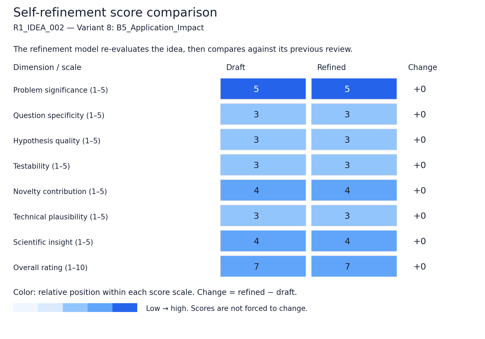

Changed score dimensions: none.

### Score justifications (draft / refined)

**Problem significance**

```json
{
  "draft": {
    "score": 5.0,
    "justification": "The problem of sampling rare events without predefined collective variables is a major unsolved challenge in computational chemistry. Solving this would significantly reduce the barrier to entry for simulating complex biological and material systems, making it highly significant."
  },
  "refined": {
    "score": 5.0,
    "justification": "The problem of rare-event sampling without predefined collective variables is a fundamental challenge in computational chemistry and biophysics. Solving this would remove a major barrier to simulating complex biological and material systems, making it highly significant."
  }
}
```

**Question specificity**

```json
{
  "draft": {
    "score": 3.0,
    "justification": "While the goal (sampling without CVs) is clear, the specific research question regarding the mechanism of 'improved off-policy learning' for diffusion paths is not sufficiently defined. The idea states 'what' but not clearly 'how' or 'why' this specific combination works."
  },
  "refined": {
    "score": 3.0,
    "justification": "The high-level goal is specific (CV-free path sampling), but the research question regarding the *mechanism* of 'improved off-policy learning' is vague. The idea states the 'what' but lacks the 'how' necessary to define a precise scientific question."
  }
}
```

**Hypothesis quality**

```json
{
  "draft": {
    "score": 3.0,
    "justification": "The implicit hypothesis is that off-policy learning can effectively train diffusion models to explore high-dimensional path spaces without CVs. This is plausible but not yet a concrete, falsifiable prediction of a specific mechanism or relationship."
  },
  "refined": {
    "score": 3.0,
    "justification": "The implicit hypothesis is that combining diffusion models with off-policy learning can effectively explore high-dimensional path spaces without CVs. While plausible, it is currently a broad assertion rather than a specific, falsifiable prediction of a mechanism or relationship."
  }
}
```

**Testability**

```json
{
  "draft": {
    "score": 3.0,
    "justification": "The idea is testable in principle (compare against CV-based methods on standard benchmarks), but the summary lacks the necessary details to design a specific test. The success criteria are implied (overcoming infeasibility) but not operationalized."
  },
  "refined": {
    "score": 3.0,
    "justification": "The idea is testable in principle by comparing against standard benchmarks (e.g., Transition Interface Sampling). However, the summary lacks the operational details (metrics, baselines, specific architectures) required to design a rigorous test immediately."
  }
}
```

**Novelty contribution**

```json
{
  "draft": {
    "score": 4.0,
    "justification": "Combining diffusion models with off-policy learning for CV-free path sampling is a novel direction. While diffusion models are new to this field, and off-policy learning is established in RL, their specific application to this problem represents a potentially high-impact contribution."
  },
  "refined": {
    "score": 4.0,
    "justification": "The application of diffusion models to path sampling is relatively new, and the specific integration with off-policy learning for this domain represents a novel methodological direction with high potential impact."
  }
}
```

**Technical plausibility**

```json
{
  "draft": {
    "score": 3.0,
    "justification": "The combination is technically plausible given recent advances in both diffusion models and RL. However, the theoretical bridge between off-policy learning and path sampling in continuous time is non-trivial and requires careful justification to be considered fully plausible."
  },
  "refined": {
    "score": 3.0,
    "justification": "The combination is technically plausible given recent advances in both fields. However, the theoretical bridge between off-policy learning and path sampling in continuous time is non-trivial, and the idea does not yet provide enough detail to fully assess the feasibility of the proposed mechanism."
  }
}
```

**Scientific insight**

```json
{
  "draft": {
    "score": 4.0,
    "justification": "If successful, this research would provide deep insights into how generative models can learn complex dynamical systems without human-in-the-loop feature engineering (CVs), potentially revealing new principles of how AI can discover reaction coordinates."
  },
  "refined": {
    "score": 4.0,
    "justification": "If successful, this research would provide significant insights into how generative models can learn complex dynamical systems without human-in-the-loop feature engineering, potentially revealing new principles for automated reaction coordinate discovery."
  }
}
```

**Overall rating**

```json
{
  "draft": {
    "score": 7.0,
    "justification": "This is a strong research idea with high significance and novelty. It addresses a critical bottleneck in the field. However, it currently lacks the specificity required to be considered 'exceptional' because the core mechanism (how off-policy learning solves the path sampling problem) is not articulated. With more specific formulation of the method and hypothesis, it could be a top-tier contribution."
  },
  "refined": {
    "score": 7.0,
    "justification": "This is a strong research idea with high significance and novelty. It addresses a critical bottleneck in the field. However, it currently lacks the specificity required to be considered 'exceptional' because the core mechanism (how off-policy learning solves the path sampling problem) is not articulated. With more specific formulation of the method and hypothesis, it could be a top-tier contribution."
  }
}
```

## R1_IDEA_002 — Variant 9: C1_Hollow_Shell


Changed score dimensions: none.

### Score justifications (draft / refined)

**Problem significance**

```json
{
  "draft": {
    "score": 5.0,
    "justification": "Simulating rare events and identifying transition pathways in molecular systems is a critical bottleneck in drug discovery and materials science. Solving this problem has high scientific and practical significance."
  },
  "refined": {
    "score": 5.0,
    "justification": "Simulating rare events and identifying transition pathways is a critical bottleneck in drug discovery and materials science. Solving this problem has immense scientific and practical significance, making the underlying motivation exceptional."
  }
}
```

**Question specificity**

```json
{
  "draft": {
    "score": 2.0,
    "justification": "The idea is currently too broad. It states 'a machine learning method' without specifying which one, and 'without predefined descriptors' without defining the input representation or the learning objective. It reads more like a goal than a specific research question."
  },
  "refined": {
    "score": 2.0,
    "justification": "The idea is currently too broad. It states 'a machine learning method' without specifying which one, and 'without predefined descriptors' without defining the input representation or the learning objective. It reads more like a goal than a specific research question."
  }
}
```

**Hypothesis quality**

```json
{
  "draft": {
    "score": 2.0,
    "justification": "There is no explicit hypothesis. It is not clear what the expected outcome is other than 'it could support exploration.' A strong hypothesis would predict a specific relationship between the method's architecture and its ability to capture rare events."
  },
  "refined": {
    "score": 2.0,
    "justification": "There is no explicit hypothesis. It is not clear what the expected outcome is other than 'it could support exploration.' A strong hypothesis would predict a specific relationship between the method's architecture and its ability to capture rare events."
  }
}
```

**Testability**

```json
{
  "draft": {
    "score": 3.0,
    "justification": "While the general goal is testable (compare sampling efficiency), the current lack of methodological detail makes it impossible to design a concrete experiment. The idea is testable in principle but not in its current form."
  },
  "refined": {
    "score": 3.0,
    "justification": "While the general goal is testable (compare sampling efficiency), the current lack of methodological detail makes it impossible to design a concrete experiment. The idea is testable in principle but not in its current form."
  }
}
```

**Novelty contribution**

```json
{
  "draft": {
    "score": 3.0,
    "justification": "The concept of using ML for rare event sampling is an active field. The novelty depends entirely on the specific 'descriptor-free' mechanism proposed. As stated, it is a generic direction that could be a minor variation of existing work or a significant breakthrough, but the text doesn't clarify."
  },
  "refined": {
    "score": 3.0,
    "justification": "The concept of using ML for rare event sampling is an active field. The novelty depends entirely on the specific 'descriptor-free' mechanism proposed. As stated, it is a generic direction that could be a minor variation of existing work or a significant breakthrough, but the text doesn't clarify."
  }
}
```

**Technical plausibility**

```json
{
  "draft": {
    "score": 3.0,
    "justification": "The idea is technically plausible in the sense that ML is increasingly used for this purpose. However, the claim of doing so without *any* descriptors is a strong assumption that requires careful technical justification to be plausible."
  },
  "refined": {
    "score": 3.0,
    "justification": "The idea is technically plausible in the sense that ML is increasingly used for this purpose. However, the claim of doing so without *any* descriptors is a strong assumption that requires careful technical justification to be plausible."
  }
}
```

**Scientific insight**

```json
{
  "draft": {
    "score": 3.0,
    "justification": "If successful, this could reveal new principles of how to represent molecular dynamics without human bias. However, as currently phrased, it risks being a simple application of a black-box model without yielding deeper mechanistic insights."
  },
  "refined": {
    "score": 3.0,
    "justification": "If successful, this could reveal new principles of how to represent molecular dynamics without human bias. However, as currently phrased, it risks being a simple application of a black-box model without yielding deeper mechanistic insights."
  }
}
```

**Overall rating**

```json
{
  "draft": {
    "score": 5.0,
    "justification": "The research idea addresses a highly significant problem with a potentially transformative goal (descriptor-free sampling). However, it is currently too vague to be considered a strong research proposal. It lacks the specificity of the method, the hypothesis, and the evaluation strategy required to distinguish it from generic applications. It sits at the borderline of a moderate idea because the core motivation is excellent, but the execution plan is missing."
  },
  "refined": {
    "score": 5.0,
    "justification": "The research idea addresses a highly significant problem with a potentially transformative goal (descriptor-free sampling). However, it is currently too vague to be considered a strong research proposal. It lacks the specificity of the method, the hypothesis, and the evaluation strategy required to distinguish it from generic applications. It sits at the borderline of a moderate idea because the core motivation is excellent, but the execution plan is missing."
  }
}
```

## R1_IDEA_002 — Variant 10: C2_Logic_Flawed


Changed score dimensions: none.

### Score justifications (draft / refined)

**Problem significance**

```json
{
  "draft": {
    "score": 5.0,
    "justification": "The problem of simulating rare events in molecular systems is a fundamental bottleneck in computational chemistry and drug discovery. Overcoming the reliance on collective variables is a major open challenge with the potential to revolutionize how we study complex biological and material processes."
  },
  "refined": {
    "score": 5.0,
    "justification": "The inability to simulate rare events efficiently is a fundamental limitation in computational chemistry. Removing the dependency on collective variables is a major open challenge that, if solved, would significantly advance the field of molecular simulation and drug discovery."
  }
}
```

**Question specificity**

```json
{
  "draft": {
    "score": 3.0,
    "justification": "While the goal is clear, the specific research question is somewhat obscured by the high-level description. It states 'how' (improved off-policy learning) but does not define 'what' exactly constitutes the improvement or the specific mechanism of the interaction between diffusion and off-policy learning."
  },
  "refined": {
    "score": 3.0,
    "justification": "The idea clearly states the *goal* (CV-free rare event sampling) and the *tools* (diffusion + off-policy), but the *specific research question* regarding the mechanism of 'improved off-policy learning' is not defined. It is currently a direction rather than a specific hypothesis."
  }
}
```

**Hypothesis quality**

```json
{
  "draft": {
    "score": 3.0,
    "justification": "The implicit hypothesis is that combining diffusion models with off-policy learning can effectively sample rare events without CVs. This is a plausible and testable hypothesis, but it is currently stated as a general direction rather than a specific, falsifiable prediction about performance or mechanism."
  },
  "refined": {
    "score": 3.0,
    "justification": "The implicit hypothesis (that this combination works better than existing methods) is plausible but not yet specific. It lacks a falsifiable prediction about the conditions under which it succeeds or fails, or the specific mechanism by which it overcomes the known difficulties of off-policy learning in continuous spaces."
  }
}
```

**Testability**

```json
{
  "draft": {
    "score": 4.0,
    "justification": "The idea is testable in principle. One can design experiments to compare the proposed method against existing CV-based and CV-free baselines on standard molecular benchmarks. The main challenge is defining the specific algorithm to test, but the evaluation framework is clear."
  },
  "refined": {
    "score": 4.0,
    "justification": "The idea is testable in principle. One can construct a benchmark problem (e.g., a simple protein folding landscape) and compare the proposed method against standard CV-based and CV-free baselines. However, the lack of a defined algorithm makes the immediate testability dependent on the future specification of the method."
  }
}
```

**Novelty contribution**

```json
{
  "draft": {
    "score": 4.0,
    "justification": "The combination of diffusion models for path sampling and off-policy learning for training is a novel direction. If successful, it could provide a new paradigm for rare-event sampling that is more automated and less dependent on human intuition (regarding CVs) than current methods."
  },
  "refined": {
    "score": 4.0,
    "justification": "Applying diffusion models to path sampling is relatively new, and combining it with off-policy learning for this specific physical constraint is a novel and potentially high-impact contribution. It moves beyond simple application to a methodological synthesis."
  }
}
```

**Technical plausibility**

```json
{
  "draft": {
    "score": 4.0,
    "justification": "The technical components (diffusion models, off-policy learning, molecular dynamics) are all established fields. The integration is non-trivial but theoretically grounded. The main risk is the complexity of the integration, but the direction makes logical sense."
  },
  "refined": {
    "score": 4.0,
    "justification": "The components are technically sound. Diffusion models are known for handling high-dimensional distributions, and off-policy learning is a standard RL technique. The plausibility hinges on the non-trivial challenge of integrating them while maintaining physical validity, which is a reasonable research challenge."
  }
}
```

**Scientific insight**

```json
{
  "draft": {
    "score": 4.0,
    "justification": "If successful, this research would provide deep insights into the relationship between generative modeling, reinforcement learning, and statistical mechanics. It could reveal new principles for exploring high-dimensional energy landscapes without prior knowledge of the reaction coordinates."
  },
  "refined": {
    "score": 4.0,
    "justification": "If successful, this work would provide significant insight into the intersection of generative modeling, reinforcement learning, and statistical mechanics. It could reveal new principles for exploring complex energy landscapes without prior structural knowledge."
  }
}
```

**Overall rating**

```json
{
  "draft": {
    "score": 7.0,
    "justification": "This is a strong research idea with high significance and potential for scientific insight. The problem is critical, and the proposed direction (CV-free, diffusion + off-policy) is innovative. However, the idea is currently too abstract to be fully evaluated on its technical merits. It requires more specific formulation of the algorithm and hypothesis to move from a 'strong' to an 'exceptional' rating. The lack of implementation details is acceptable for an idea summary, but the core mechanism needs more definition."
  },
  "refined": {
    "score": 7.0,
    "justification": "This is a strong research idea with high significance and novelty. The problem is critical, and the proposed direction is innovative. However, the rating is capped at 7 because the core mechanism ('improved off-policy learning') is currently undefined, making the hypothesis somewhat generic. It requires more specific formulation to be considered 'exceptional'."
  }
}
```

## R1_IDEA_002 — Variant 11: C3_Substance_Enriched

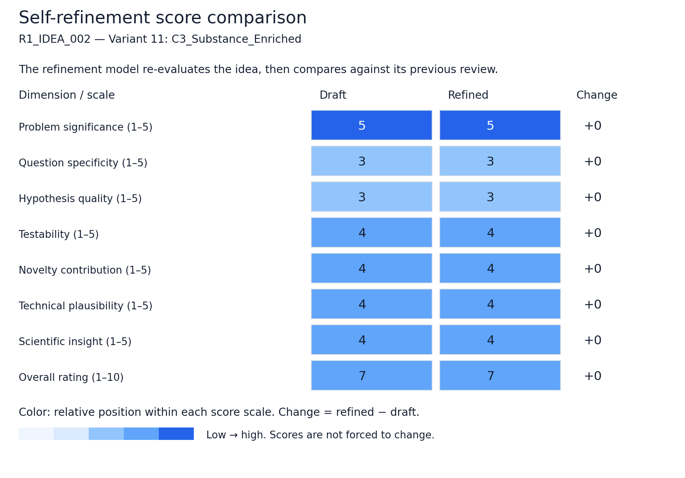

Changed score dimensions: none.

### Score justifications (draft / refined)

**Problem significance**

```json
{
  "draft": {
    "score": 5.0,
    "justification": "The problem of sampling rare events in molecular systems without predefined collective variables is a major unsolved challenge in computational chemistry. Solving this would significantly accelerate drug discovery and materials science, making the problem highly significant."
  },
  "refined": {
    "score": 5.0,
    "justification": "The problem of sampling rare events in molecular systems without predefined collective variables is a major unsolved challenge in computational chemistry. Solving this would significantly accelerate drug discovery and materials science, making the problem highly significant."
  }
}
```

**Question specificity**

```json
{
  "draft": {
    "score": 3.0,
    "justification": "While the general direction is clear, the specific research question is somewhat vague. It states 'off-policy learning' will be used but does not specify the exact mechanism or the precise relationship between the diffusion process and the policy update. The 'improvement' is not defined."
  },
  "refined": {
    "score": 3.0,
    "justification": "While the general direction is clear, the specific research question is somewhat vague. It states 'off-policy learning' will be used but does not specify the exact mechanism or the precise relationship between the diffusion process and the policy update. The 'improvement' is not defined."
  }
}
```

**Hypothesis quality**

```json
{
  "draft": {
    "score": 3.0,
    "justification": "The hypothesis that off-policy learning can validate sampled pathways is testable but generic. A stronger hypothesis would predict a specific advantage (e.g., 'off-policy learning reduces the number of required energy evaluations by X% compared to on-policy methods in high-dimensional spaces'). The current hypothesis is more of a validation plan than a predictive scientific claim."
  },
  "refined": {
    "score": 3.0,
    "justification": "The hypothesis that off-policy learning can validate sampled pathways is testable but generic. A stronger hypothesis would predict a specific advantage (e.g., 'off-policy learning reduces the number of required energy evaluations by X% compared to on-policy methods in high-dimensional spaces'). The current hypothesis is more of a validation plan than a predictive scientific claim."
  }
}
```

**Testability**

```json
{
  "draft": {
    "score": 4.0,
    "justification": "The idea is testable. One can implement the framework, run it on benchmark systems, and compare the resulting pathways against known enhanced sampling results or unbiased MD (where feasible). The mention of specific boundary conditions also suggests a clear path for ablation studies."
  },
  "refined": {
    "score": 4.0,
    "justification": "The idea is testable. One can implement the framework, run it on benchmark systems, and compare the resulting pathways against known enhanced sampling results or unbiased MD (where feasible). The mention of specific boundary conditions also suggests a clear path for ablation studies."
  }
}
```

**Novelty contribution**

```json
{
  "draft": {
    "score": 4.0,
    "justification": "Combining diffusion models with off-policy learning for molecular path sampling is a novel and timely direction. While diffusion models are popular, their specific application to off-policy path optimization in this context is not standard, offering potential for high scientific contribution."
  },
  "refined": {
    "score": 4.0,
    "justification": "Combining diffusion models with off-policy learning for molecular path sampling is a novel and timely direction. While diffusion models are popular, their specific application to off-policy path optimization in this context is not standard, offering potential for high scientific contribution."
  }
}
```

**Technical plausibility**

```json
{
  "draft": {
    "score": 4.0,
    "justification": "The combination of techniques is technically plausible. Diffusion models are well-suited for generating complex distributions (paths), and off-policy RL is a standard tool for optimizing policies. The main challenge is the integration, but the underlying components are sound."
  },
  "refined": {
    "score": 4.0,
    "justification": "The combination of techniques is technically plausible. Diffusion models are well-suited for generating complex distributions (paths), and off-policy RL is a standard tool for optimizing policies. The main challenge is the integration, but the underlying components are sound."
  }
}
```

**Scientific insight**

```json
{
  "draft": {
    "score": 4.0,
    "justification": "If successful, this research could reveal how off-policy mechanisms can stabilize or accelerate diffusion-based sampling in high-dimensional energy landscapes. It could also provide insights into the relationship between reward shaping and the physical plausibility of generated molecular pathways."
  },
  "refined": {
    "score": 4.0,
    "justification": "If successful, this research could reveal how off-policy mechanisms can stabilize or accelerate diffusion-based sampling in high-dimensional energy landscapes. It could also provide insights into the relationship between reward shaping and the physical plausibility of generated molecular pathways."
  }
}
```

**Overall rating**

```json
{
  "draft": {
    "score": 7.0,
    "justification": "This is a strong research idea with high significance and novelty. It addresses a hard problem with a modern, plausible approach. However, it currently lacks the specificity of the proposed mechanism and the precise formulation of the hypothesis, which prevents it from being an 'exceptional' (9-10) rating. With clearer definitions of the 'off-policy' mechanism and the reward function, this could be a top-tier contribution."
  },
  "refined": {
    "score": 7.0,
    "justification": "This is a strong research idea with high significance and novelty. It addresses a hard problem with a modern, plausible approach. However, it currently lacks the specificity of the proposed mechanism and the precise formulation of the hypothesis, which prevents it from being an 'exceptional' (9-10) rating. With clearer definitions of the 'off-policy' mechanism and the reward function, this could be a top-tier contribution."
  }
}
```

## R1_IDEA_002 — Variant 12: H1_Deceptive_Hollow

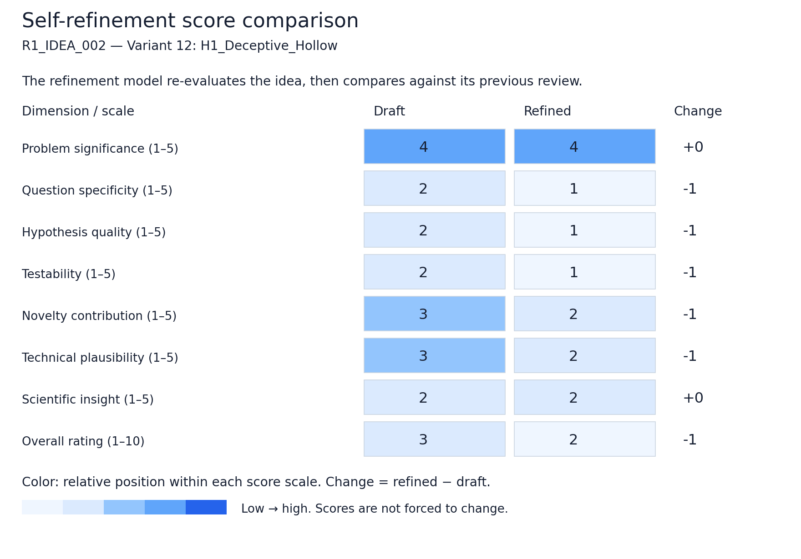

Changed score dimensions: question_specificity, hypothesis_quality, testability, novelty_contribution, technical_plausibility, overall_rating.

### Score justifications (draft / refined)

**Problem significance**

```json
{
  "draft": {
    "score": 4.0,
    "justification": "The problem of sampling rare events in molecular systems is of high significance to the scientific community, with direct implications for drug discovery and material design. Solving this is a major challenge in computational chemistry."
  },
  "refined": {
    "score": 4.0,
    "justification": "The problem of simulating rare events and finding reaction pathways in molecular systems is a critical bottleneck in drug discovery and materials science. Solving this is of high importance to the scientific community."
  }
}
```

**Question specificity**

```json
{
  "draft": {
    "score": 2.0,
    "justification": "The research question is poorly defined. It states a goal (address sampling challenges without descriptors) but does not specify the mechanism, the specific variables, or the precise relationship being investigated. It reads more like a mission statement than a research question."
  },
  "refined": {
    "score": 1.0,
    "justification": "The research question is effectively non-existent. The text describes a goal ('address sampling challenges') and a desired outcome ('transformative synthesis') but fails to define the specific variables, the mechanism of action, or the precise relationship being investigated. It reads as a mission statement, not a research question."
  }
}
```

**Hypothesis quality**

```json
{
  "draft": {
    "score": 2.0,
    "justification": "There is no explicit or implicit hypothesis that can be tested. The text claims the direction 'could' be useful and 'promises' to reshape thinking, but offers no falsifiable prediction about the relationship between the method and the outcome."
  },
  "refined": {
    "score": 1.0,
    "justification": "There is no explicit or implicit hypothesis. The text makes vague claims about 'potential' and 'promise' but offers no falsifiable prediction. A claim that a direction 'could reshape thinking' is not a scientific hypothesis."
  }
}
```

**Testability**

```json
{
  "draft": {
    "score": 2.0,
    "justification": "The idea is currently not testable as stated. Without defining the method, the data, or the evaluation metrics, there is no way to design an experiment to verify the claims."
  },
  "refined": {
    "score": 1.0,
    "justification": "The idea is currently untestable. Without a defined method, data source, or evaluation metric, no experiment can be designed to verify or falsify the claims. The proposal lacks the necessary components for empirical investigation."
  }
}
```

**Novelty contribution**

```json
{
  "draft": {
    "score": 3.0,
    "justification": "The concept of descriptor-free sampling is novel and desirable, but the idea as presented is too generic to assess the true novelty. It risks being a re-packaging of existing unsupervised learning techniques without a clear differentiator."
  },
  "refined": {
    "score": 2.0,
    "justification": "While the *goal* of descriptor-free sampling is novel and desirable, the idea as presented is too generic to assess the actual novelty. It risks being a re-packaging of existing unsupervised learning techniques without a clear differentiator or specific innovation."
  }
}
```

**Technical plausibility**

```json
{
  "draft": {
    "score": 3.0,
    "justification": "The direction is technically plausible in principle (ML can learn representations), but the lack of methodological detail makes it impossible to judge if the proposed approach is feasible or if it ignores known physical constraints."
  },
  "refined": {
    "score": 2.0,
    "justification": "The direction is plausible in the broadest sense (ML can learn representations), but the lack of methodological detail makes it impossible to judge feasibility. There is a risk of ignoring physical constraints or the curse of dimensionality without specific mechanisms to address them."
  }
}
```

**Scientific insight**

```json
{
  "draft": {
    "score": 2.0,
    "justification": "While the potential for insight is high if successful, the current formulation does not suggest *what* specific insight will be gained. It focuses on the 'agenda' rather than the 'discovery'."
  },
  "refined": {
    "score": 2.0,
    "justification": "While the potential for insight is high if the idea is realized, the current formulation does not suggest *what* specific insight will be gained. It focuses on the 'agenda' rather than the 'discovery' or 'mechanism'."
  }
}
```

**Overall rating**

```json
{
  "draft": {
    "score": 3.0,
    "justification": "The idea addresses a significant problem but fails as a research proposal because it lacks a specific question, hypothesis, or methodological plan. It is currently a vague aspiration rather than a testable scientific direction. It scores low on specificity, testability, and hypothesis quality, which are critical for evaluating research ideas."
  },
  "refined": {
    "score": 2.0,
    "justification": "This is a very weak research idea in its current form. While the problem domain is significant, the proposal fails to articulate a research question, hypothesis, or method. It is a vague aspiration rather than a testable scientific direction. The reliance on rhetorical language ('transformative', 'field-shaping') without substantive content prevents it from being evaluated as a serious research proposal."
  }
}
```

## R1_IDEA_002 — Variant 13: H2_Confident_Flaw

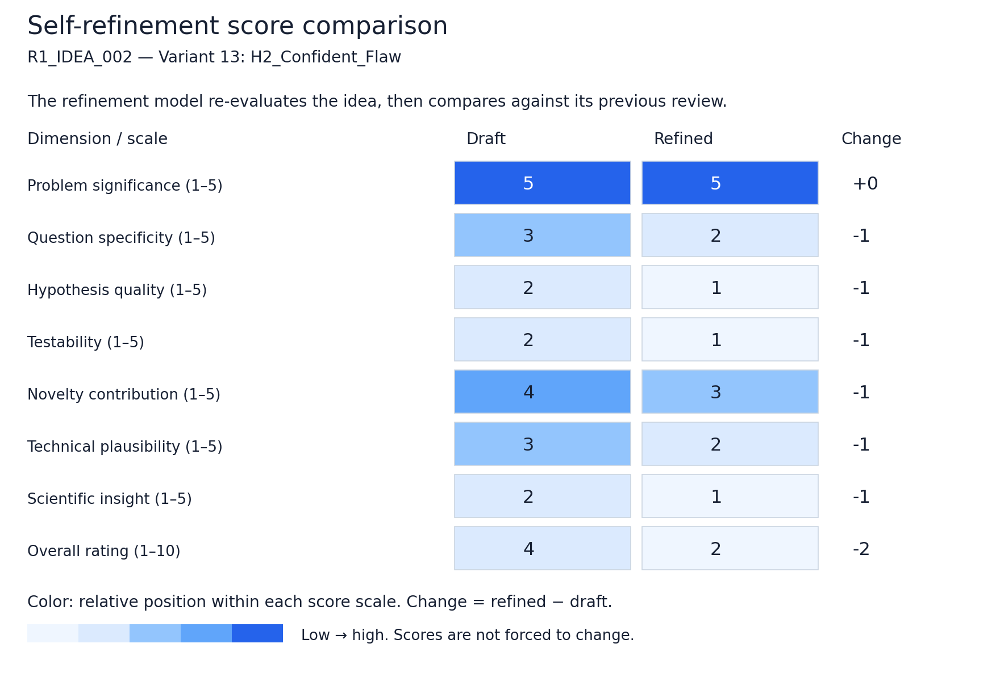

Changed score dimensions: question_specificity, hypothesis_quality, testability, novelty_contribution, technical_plausibility, scientific_insight, overall_rating.

### Score justifications (draft / refined)

**Problem significance**

```json
{
  "draft": {
    "score": 5.0,
    "justification": "The problem of sampling rare events in molecular systems without predefined collective variables is a major challenge in computational chemistry and drug discovery. Solving this would have profound scientific and practical implications."
  },
  "refined": {
    "score": 5.0,
    "justification": "The problem of sampling rare events in molecular systems without predefined collective variables is a critical challenge in computational chemistry, drug discovery, and material science. Solving this would have profound scientific and practical implications."
  }
}
```

**Question specificity**

```json
{
  "draft": {
    "score": 3.0,
    "justification": "While the method (diffusion + off-policy) and the goal (no CVs) are mentioned, the specific research question is obscured by the claim that the solution is self-evident. The idea does not clearly define the specific relationship being investigated beyond a general assertion of improvement."
  },
  "refined": {
    "score": 2.0,
    "justification": "While the method and goal are mentioned, the research question is obscured by the claim that the answer is self-evident. The idea does not define a specific relationship to be tested but rather asserts a universal outcome, making the specific scope of investigation unclear."
  }
}
```

**Hypothesis quality**

```json
{
  "draft": {
    "score": 2.0,
    "justification": "The hypothesis is weak because it is stated as a certainty ('necessarily produce', 'confidently treated as causal') rather than a falsifiable prediction. It fails to distinguish the proposed mechanism from alternative explanations, which is a requirement for a strong scientific hypothesis."
  },
  "refined": {
    "score": 1.0,
    "justification": "The 'hypothesis' is not a scientific hypothesis but a dogmatic assertion. It claims certainty ('necessarily', 'confidently') and explicitly rejects the possibility of alternative explanations or boundary conditions, making it unfalsifiable and scientifically invalid."
  }
}
```

**Testability**

```json
{
  "draft": {
    "score": 2.0,
    "justification": "The idea explicitly argues against the need for isolating variables or testing boundary cases, which undermines its testability. A claim that 'no separate isolation is needed' is not a testable scientific statement; it is a methodological error."
  },
  "refined": {
    "score": 1.0,
    "justification": "The idea explicitly argues against the need for isolating variables or testing boundary cases. A claim that 'no separate isolation is needed' is not a testable scientific statement; it is a methodological error that prevents the hypothesis from being meaningfully investigated."
  }
}
```

**Novelty contribution**

```json
{
  "draft": {
    "score": 4.0,
    "justification": "Combining diffusion models with off-policy learning for molecular path sampling is a novel direction. However, the claimed contribution of 'general superiority' without rigorous validation limits the potential for genuine scientific insight if the premise is flawed."
  },
  "refined": {
    "score": 3.0,
    "justification": "The combination of diffusion models and off-policy learning for molecular path sampling is a novel direction. However, the claimed contribution of 'general superiority' without rigorous validation limits the potential for genuine scientific insight if the premise is flawed. The novelty is undermined by the lack of a testable framework."
  }
}
```

**Technical plausibility**

```json
{
  "draft": {
    "score": 3.0,
    "justification": "The combination of diffusion models and off-policy learning is technically plausible in principle, but the claim that it will automatically solve the CV problem and guarantee superiority without further analysis is not technically sound. The reasoning assumes a direct causal link that is not established."
  },
  "refined": {
    "score": 2.0,
    "justification": "While the components (diffusion, off-policy) are technically plausible in isolation, the reasoning that they automatically solve the CV problem and guarantee superiority without further analysis is not technically sound. The idea assumes a direct causal link that is not established and ignores known complexities in the domain."
  }
}
```

**Scientific insight**

```json
{
  "draft": {
    "score": 2.0,
    "justification": "If the idea were pursued with the suggested rigorous testing, it could yield significant insight. However, as currently framed, it discourages the investigation of mechanisms and boundary conditions, which are essential for generating deep scientific insight."
  },
  "refined": {
    "score": 1.0,
    "justification": "As currently framed, the idea discourages the investigation of mechanisms, boundary conditions, and failure modes. Scientific insight arises from understanding *why* and *when* a method works, not from asserting it works universally without proof. The current framing precludes deep insight."
  }
}
```

**Overall rating**

```json
{
  "draft": {
    "score": 4.0,
    "justification": "The underlying problem is highly significant (5/5), and the proposed direction (diffusion + off-policy) is novel and potentially powerful. However, the idea is severely weakened by its logical fallacies and the explicit rejection of standard scientific validation (ablation, isolation of variables). The claim that the solution is 'necessarily' superior without proof makes the research question poorly defined and the hypothesis unfalsifiable. It scores as a 'Weak idea' because the reasoning is flawed, even though the topic is important."
  },
  "refined": {
    "score": 2.0,
    "justification": "The underlying problem is highly significant (5/5), but the research idea itself is severely flawed. The core logic contains a fundamental fallacy: asserting that a solution is 'necessarily' superior and that standard validation is unnecessary. This makes the hypothesis unfalsifiable and the research direction scientifically unsound. A strong idea requires a testable hypothesis and a plan for rigorous validation, neither of which are present. The idea is rated as 'Very weak' because it proposes a direction based on a logical error rather than a scientific inquiry."
  }
}
```

## R1_IDEA_002 — Variant 14: H3_Verbose_Enriched

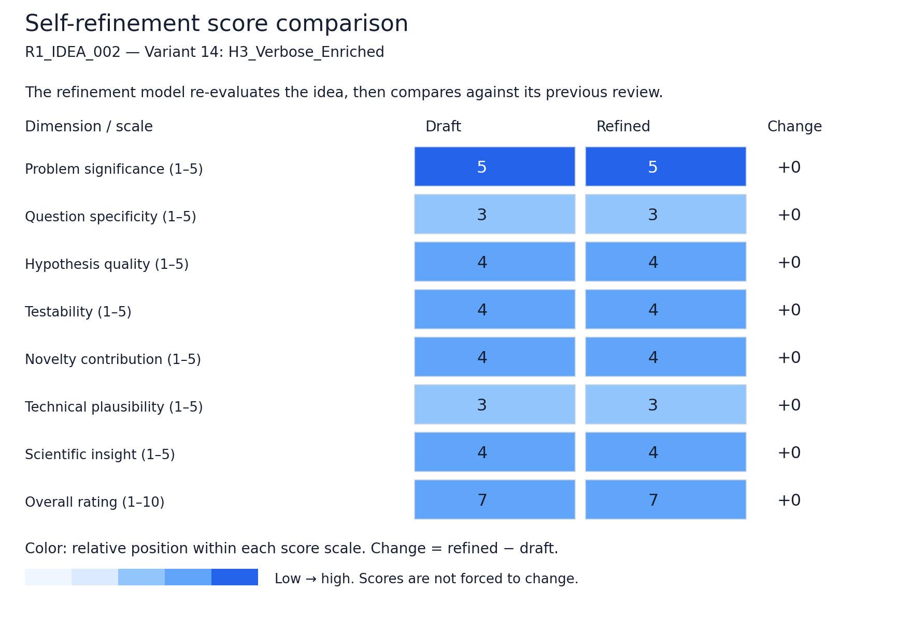

Changed score dimensions: none.

### Score justifications (draft / refined)

**Problem significance**

```json
{
  "draft": {
    "score": 5.0,
    "justification": "The problem of sampling rare events in molecular systems without predefined collective variables is a major bottleneck in drug discovery and material science. Solving this would significantly reduce computational costs and enable the study of complex biological processes that are currently inaccessible."
  },
  "refined": {
    "score": 5.0,
    "justification": "The problem of efficiently sampling rare events in complex molecular systems without relying on human-defined collective variables is a major unsolved challenge in drug discovery and material science. Solving this would enable the study of biologically relevant processes that are currently computationally inaccessible."
  }
}
```

**Question specificity**

```json
{
  "draft": {
    "score": 3.0,
    "justification": "While the goal is clear, the specific research question regarding the *mechanism* of improvement is somewhat vague. The idea states that off-policy learning *could* be validated, but does not explicitly state the precise hypothesis about *why* it works better than on-policy or standard diffusion approaches in this specific context."
  },
  "refined": {
    "score": 3.0,
    "justification": "While the high-level goal is clear, the specific research question regarding the *mechanism* of improvement is under-specified. The idea states that off-policy learning 'could be validated' but does not articulate the precise hypothesis about *why* this specific integration works better than standard diffusion or other RL approaches in this domain."
  }
}
```

**Hypothesis quality**

```json
{
  "draft": {
    "score": 4.0,
    "justification": "The hypothesis that off-policy learning improves the efficiency of diffusion path sampling is concrete and testable. The idea also proposes specific boundary conditions (high dimensionality, reward sensitivity) that serve as falsifiable constraints on the hypothesis."
  },
  "refined": {
    "score": 4.0,
    "justification": "The hypothesis that off-policy learning improves sampling efficiency is concrete and testable. The proposal to identify boundary conditions (high dimensionality, reward sensitivity) adds falsifiability, distinguishing the method's limits from its successes."
  }
}
```

**Testability**

```json
{
  "draft": {
    "score": 4.0,
    "justification": "The idea outlines a comprehensive testing strategy including staged designs, ablations, and sensitivity analyses. The comparison against established enhanced sampling methods provides a clear ground truth for evaluation."
  },
  "refined": {
    "score": 4.0,
    "justification": "The idea outlines a comprehensive testing strategy including staged validation, ablations, and sensitivity analyses. The comparison against established enhanced sampling methods provides a clear, albeit abstract, ground truth for evaluation."
  }
}
```

**Novelty contribution**

```json
{
  "draft": {
    "score": 4.0,
    "justification": "Combining diffusion models with off-policy learning for molecular path sampling is a novel direction. While both components exist separately, their integration to solve the CV-free rare event problem represents a significant potential contribution to the field."
  },
  "refined": {
    "score": 4.0,
    "justification": "Combining diffusion models with off-policy learning for CV-free molecular path sampling is a novel direction. While both components exist in isolation, their integration to solve this specific physical problem represents a significant potential contribution."
  }
}
```

**Technical plausibility**

```json
{
  "draft": {
    "score": 3.0,
    "justification": "The concept is plausible given the state of the art, but the technical implementation details are missing. The interaction between the stochastic nature of diffusion and the variance issues in off-policy learning in high-dimensional continuous spaces is non-trivial and requires careful theoretical justification."
  },
  "refined": {
    "score": 3.0,
    "justification": "The concept is theoretically grounded but technically risky. The interaction between the stochastic nature of diffusion and the variance issues in off-policy learning in high-dimensional continuous spaces is non-trivial. Without a defined mathematical formulation, the plausibility remains speculative."
  }
}
```

**Scientific insight**

```json
{
  "draft": {
    "score": 4.0,
    "justification": "If successful, this research would not only provide a new tool but also reveal insights into how reinforcement learning principles can be applied to generative modeling for physical systems, potentially uncovering new scaling behaviors or limitations in CV-free sampling."
  },
  "refined": {
    "score": 4.0,
    "justification": "If successful, this research would provide insights into how reinforcement learning principles can be adapted for generative modeling in physical systems, potentially revealing new scaling behaviors or limitations in CV-free sampling that are transferable to other domains."
  }
}
```

**Overall rating**

```json
{
  "draft": {
    "score": 7.0,
    "justification": "This is a strong research idea with high significance and a clear path to validation. It addresses a critical gap in computational chemistry. The main limitation is the lack of specific technical details on how the off-policy mechanism is mathematically integrated with the diffusion process, which prevents a higher score on technical plausibility. However, the proposed experimental design is excellent and suggests a high potential for scientific insight."
  },
  "refined": {
    "score": 7.0,
    "justification": "This is a strong research idea with high significance and a clear path to validation. It addresses a critical gap in computational chemistry. The main limitation is the lack of specific technical details on how the off-policy mechanism is mathematically integrated with the diffusion process, which prevents a higher score on technical plausibility. However, the proposed experimental design is excellent and suggests a high potential for scientific insight."
  }
}
```

## R1_IDEA_002 — Variant 15: H4_Ultimate_Hype


Changed score dimensions: question_specificity, hypothesis_quality.

### Score justifications (draft / refined)

**Problem significance**

```json
{
  "draft": {
    "score": 5.0,
    "justification": "The problem of efficiently sampling rare events in molecular systems without human bias (predefined CVs) is a fundamental challenge in computational chemistry and drug discovery. Solving this would have massive practical implications for accelerating material design and understanding biological mechanisms."
  },
  "refined": {
    "score": 5.0,
    "justification": "The problem of sampling rare events in molecular systems without human bias is a fundamental and high-stakes challenge in computational chemistry. Solving it would have profound implications for accelerating drug discovery, understanding biological mechanisms, and designing new materials. The significance is maximal."
  }
}
```

**Question specificity**

```json
{
  "draft": {
    "score": 2.0,
    "justification": "The idea is currently framed as a broad research agenda rather than a specific research question. It lacks a clear definition of the mathematical problem, the specific algorithmic innovation, or the precise relationship between diffusion models and off-policy learning in this context."
  },
  "refined": {
    "score": 1.0,
    "justification": "The idea is presented as a broad research agenda with promotional language but lacks a concrete research question. It does not specify the mathematical relationship between the components, the specific algorithmic innovation, or the precise mechanism by which the problem is solved. It is currently too vague to be considered a specific scientific question."
  }
}
```

**Hypothesis quality**

```json
{
  "draft": {
    "score": 2.0,
    "justification": "There is no explicit, falsifiable hypothesis. The text relies on qualitative assertions ('bold', 'transformative', 'compelling') rather than a concrete prediction about the relationship between the proposed method and the target outcome."
  },
  "refined": {
    "score": 1.0,
    "justification": "There is no explicit, falsifiable hypothesis. The text relies on qualitative assertions of potential ('could redefine', 'compelling pathway') rather than a concrete prediction about the relationship between the method and the outcome. A hypothesis must be capable of being proven wrong, which this statement is not."
  }
}
```

**Testability**

```json
{
  "draft": {
    "score": 2.0,
    "justification": "While the general goal is testable (sample pathways), the current description does not outline how the specific 'off-policy' mechanism would be tested, what metrics would be used to validate the 'improvement,' or what the baseline comparison would be."
  },
  "refined": {
    "score": 2.0,
    "justification": "While the general goal (sampling pathways) is testable, the current description provides no method to test the specific claim of 'improved off-policy learning.' Without a defined metric, baseline, or validation strategy, the idea cannot be empirically investigated in its current form. It is only testable if one assumes a specific implementation that is not described."
  }
}
```

**Novelty contribution**

```json
{
  "draft": {
    "score": 4.0,
    "justification": "The combination of diffusion models and off-policy learning for CV-free path sampling is a novel and ambitious direction. However, the specific contribution is currently obscured by the lack of technical detail, making it hard to assess if it is a genuine new mechanism or a rephrasing of existing importance sampling techniques."
  },
  "refined": {
    "score": 4.0,
    "justification": "The combination of diffusion models and off-policy learning for CV-free path sampling is a highly novel and ambitious direction. If realized, it would represent a significant contribution. However, the current lack of detail makes it difficult to distinguish this from a rephrasing of existing importance sampling techniques or a generic application of diffusion models."
  }
}
```

**Technical plausibility**

```json
{
  "draft": {
    "score": 3.0,
    "justification": "The concept is theoretically plausible given the success of diffusion models in other domains and the theoretical framework of off-policy learning. However, applying these to high-dimensional continuous path spaces without CVs introduces significant technical hurdles (e.g., variance explosion, mode collapse) that are not addressed in the summary."
  },
  "refined": {
    "score": 3.0,
    "justification": "The components (diffusion models, off-policy learning) are technically sound in isolation. However, the proposed combination for high-dimensional path sampling without CVs introduces severe technical hurdles (e.g., variance explosion, defining the target distribution) that are not addressed. The plausibility is moderate because the logic is not yet fleshed out to show feasibility."
  }
}
```

**Scientific insight**

```json
{
  "draft": {
    "score": 3.0,
    "justification": "If successful, the research could provide deep insights into how generative models can learn complex reaction coordinates implicitly. However, as currently stated, the potential for insight is limited by the lack of a clear mechanism to investigate."
  },
  "refined": {
    "score": 3.0,
    "justification": "If the research succeeds, it could provide deep insights into how generative models can learn complex reaction coordinates implicitly. However, as currently stated, the potential for insight is limited because the mechanism is undefined. The idea has high potential but low current clarity on *what* will be learned."
  }
}
```

**Overall rating**

```json
{
  "draft": {
    "score": 5.0,
    "justification": "The idea addresses a critical and high-value problem with a potentially transformative approach. However, it currently lacks the specificity, hypothesis, and technical grounding required to be considered a 'strong' research proposal. It sits at the borderline of moderate/borderline because the core concept is promising, but the execution plan and scientific question are too vague to evaluate its feasibility or specific contribution."
  },
  "refined": {
    "score": 5.0,
    "justification": "The idea addresses a problem of exceptional significance (5/5) and has high potential novelty (4/5). However, it fails significantly on specificity (1/5) and hypothesis quality (1/5) because it is presented as a promotional vision rather than a concrete scientific proposal. It sits at the 'moderate/borderline' level because the core concept is promising, but the lack of a defined research question and mechanism makes it impossible to evaluate its feasibility or specific contribution. It is a 'seed' of an idea, not a developed research plan."
  }
}
```

## R1_IDEA_003 — Source


Changed score dimensions: none.

### Score justifications (draft / refined)

**Problem significance**

```json
{
  "draft": {
    "score": 4.0,
    "justification": "The problem of extracting meaningful reasoning patterns from human experts is central to trustworthy AI in medicine. Current methods discard the temporal dimension of human vision, which is a significant loss of information. Addressing this is highly relevant to the field."
  },
  "refined": {
    "score": 4.0,
    "justification": "The problem addresses a fundamental limitation in medical AI: the inability to model the sequential nature of expert visual search. Solving this is crucial for building trustworthy, interpretable systems that mimic human diagnostic logic, making it highly significant."
  }
}
```

**Question specificity**

```json
{
  "draft": {
    "score": 3.0,
    "justification": "The core question (does temporal gaze help?) is clear, but the specific research question regarding the mechanism of integration and the specific reasoning tasks is somewhat vague. It defines the 'what' (video vs. heatmap) well but less so the 'how' and 'where exactly'."
  },
  "refined": {
    "score": 3.0,
    "justification": "While the 'what' (video vs. heatmap) is specific, the 'how' (integration mechanism) and 'where' (specific reasoning tasks) are under-specified. The research question is clear in intent but lacks the operational precision required for a definitive 'strong' score without further elaboration."
  }
}
```

**Hypothesis quality**

```json
{
  "draft": {
    "score": 4.0,
    "justification": "The hypothesis is strong: that the temporal sequence of fixations encodes diagnostic logic that static maps miss. This is a falsifiable claim that distinguishes the work from generic applications."
  },
  "refined": {
    "score": 4.0,
    "justification": "The hypothesis is strong and falsifiable: that the temporal sequence contains unique diagnostic information not present in the spatial aggregate. It makes a concrete prediction about the relationship between scanning order and model performance."
  }
}
```

**Testability**

```json
{
  "draft": {
    "score": 4.0,
    "justification": "The idea is highly testable. One can train models with static gaze inputs vs. temporal gaze inputs and compare performance on specific diagnostic tasks and interpretability metrics. The experimental design is straightforward to conceive."
  },
  "refined": {
    "score": 4.0,
    "justification": "The idea is highly testable. One can construct an experiment comparing models trained with static gaze inputs against those with temporal gaze inputs on standard chest X-ray benchmarks. The metrics (accuracy, attention alignment) are definable."
  }
}
```

**Novelty contribution**

```json
{
  "draft": {
    "score": 4.0,
    "justification": "While eye-tracking in medical imaging is not new, the specific proposal to treat gaze as a video sequence for temporal reasoning in LVLMs is a novel and promising direction. It moves beyond simple attention visualization to dynamic modeling."
  },
  "refined": {
    "score": 4.0,
    "justification": "While eye-tracking in medical imaging is established, treating gaze as a 'video sequence' for temporal reasoning in LVLMs is a novel methodological contribution. It moves beyond static attention visualization to dynamic process modeling."
  }
}
```

**Technical plausibility**

```json
{
  "draft": {
    "score": 4.0,
    "justification": "The technical approach is plausible. Modern transformers and video processing techniques (e.g., 3D CNNs, temporal attention) can handle sequence data. The main challenge is data alignment and architecture design, not fundamental feasibility."
  },
  "refined": {
    "score": 4.0,
    "justification": "The approach is technically sound. Modern architectures (Transformers, 3D CNNs) are capable of processing temporal sequences. The primary challenge is data alignment and architecture design, not fundamental feasibility."
  }
}
```

**Scientific insight**

```json
{
  "draft": {
    "score": 4.0,
    "justification": "If successful, this research could reveal how temporal dynamics in human visual search correlate with diagnostic accuracy, offering insights into the cognitive processes of radiologists that can be formalized in AI."
  },
  "refined": {
    "score": 4.0,
    "justification": "Success would provide deep insight into the cognitive mechanisms of radiologists, potentially formalizing the 'scanning strategy' as a learnable component of AI, which is a transferable principle beyond just chest X-rays."
  }
}
```

**Overall rating**

```json
{
  "draft": {
    "score": 8.0,
    "justification": "This is a strong research idea. It identifies a clear gap (loss of temporal data), proposes a specific and plausible solution (video encoding), and targets a high-impact domain. While it lacks implementation details, the core scientific premise is sound, testable, and potentially insightful. It scores high on significance, hypothesis quality, and testability."
  },
  "refined": {
    "score": 8.0,
    "justification": "This is a strong research idea. It identifies a clear gap (loss of temporal data), proposes a specific and plausible solution (video encoding), and targets a high-impact domain. While it lacks implementation details, the core scientific premise is sound, testable, and potentially insightful. It scores high on significance, hypothesis quality, and testability."
  }
}
```

## R1_IDEA_003 — Variant 1: A1_Identity


Changed score dimensions: none.

### Score justifications (draft / refined)

**Problem significance**

```json
{
  "draft": {
    "score": 4.0,
    "justification": "The problem of extracting meaningful reasoning patterns from human experts is central to trustworthy AI in medicine. Current methods discard the temporal dimension of human vision, which is a significant loss of information. Addressing this is highly relevant to the field."
  },
  "refined": {
    "score": 4.0,
    "justification": "The problem addresses a fundamental limitation in medical AI: the inability to model the sequential nature of expert visual search. Solving this is crucial for building trustworthy, interpretable systems that mimic human diagnostic logic, making it highly significant."
  }
}
```

**Question specificity**

```json
{
  "draft": {
    "score": 3.0,
    "justification": "The core question (does temporal gaze help?) is clear, but the specific research question regarding the mechanism of integration and the specific reasoning tasks is somewhat vague. It defines the 'what' (video vs. heatmap) well but less so the 'how' and 'where exactly'."
  },
  "refined": {
    "score": 3.0,
    "justification": "While the 'what' (video vs. heatmap) is specific, the 'how' (integration mechanism) and 'where' (specific reasoning tasks) are under-specified. The research question is clear in intent but lacks the operational precision required for a definitive 'strong' score without further elaboration."
  }
}
```

**Hypothesis quality**

```json
{
  "draft": {
    "score": 4.0,
    "justification": "The hypothesis is strong: that the temporal sequence of fixations encodes diagnostic logic that static maps miss. This is a falsifiable claim that distinguishes the work from generic applications."
  },
  "refined": {
    "score": 4.0,
    "justification": "The hypothesis is strong and falsifiable: that the temporal sequence contains unique diagnostic information not present in the spatial aggregate. It makes a concrete prediction about the relationship between scanning order and model performance."
  }
}
```

**Testability**

```json
{
  "draft": {
    "score": 4.0,
    "justification": "The idea is highly testable. One can train models with static gaze inputs vs. temporal gaze inputs and compare performance on specific diagnostic tasks and interpretability metrics. The experimental design is straightforward to conceive."
  },
  "refined": {
    "score": 4.0,
    "justification": "The idea is highly testable. One can construct an experiment comparing models trained with static gaze inputs against those with temporal gaze inputs on standard chest X-ray benchmarks. The metrics (accuracy, attention alignment) are definable."
  }
}
```

**Novelty contribution**

```json
{
  "draft": {
    "score": 4.0,
    "justification": "While eye-tracking in medical imaging is not new, the specific proposal to treat gaze as a video sequence for temporal reasoning in LVLMs is a novel and promising direction. It moves beyond simple attention visualization to dynamic modeling."
  },
  "refined": {
    "score": 4.0,
    "justification": "While eye-tracking in medical imaging is established, treating gaze as a 'video sequence' for temporal reasoning in LVLMs is a novel methodological contribution. It moves beyond static attention visualization to dynamic process modeling."
  }
}
```

**Technical plausibility**

```json
{
  "draft": {
    "score": 4.0,
    "justification": "The technical approach is plausible. Modern transformers and video processing techniques (e.g., 3D CNNs, temporal attention) can handle sequence data. The main challenge is data alignment and architecture design, not fundamental feasibility."
  },
  "refined": {
    "score": 4.0,
    "justification": "The approach is technically sound. Modern architectures (Transformers, 3D CNNs) are capable of processing temporal sequences. The primary challenge is data alignment and architecture design, not fundamental feasibility."
  }
}
```

**Scientific insight**

```json
{
  "draft": {
    "score": 4.0,
    "justification": "If successful, this research could reveal how temporal dynamics in human visual search correlate with diagnostic accuracy, offering insights into the cognitive processes of radiologists that can be formalized in AI."
  },
  "refined": {
    "score": 4.0,
    "justification": "Success would provide deep insight into the cognitive mechanisms of radiologists, potentially formalizing the 'scanning strategy' as a learnable component of AI, which is a transferable principle beyond just chest X-rays."
  }
}
```

**Overall rating**

```json
{
  "draft": {
    "score": 8.0,
    "justification": "This is a strong research idea. It identifies a clear gap (loss of temporal data), proposes a specific and plausible solution (video encoding), and targets a high-impact domain. While it lacks implementation details, the core scientific premise is sound, testable, and potentially insightful. It scores high on significance, hypothesis quality, and testability."
  },
  "refined": {
    "score": 8.0,
    "justification": "This is a strong research idea. It identifies a clear gap (loss of temporal data), proposes a specific and plausible solution (video encoding), and targets a high-impact domain. While it lacks implementation details, the core scientific premise is sound, testable, and potentially insightful. It scores high on significance, hypothesis quality, and testability."
  }
}
```

## R1_IDEA_003 — Variant 2: A2_Paraphrase_Only


Changed score dimensions: question_specificity, overall_rating.

### Score justifications (draft / refined)

**Problem significance**

```json
{
  "draft": {
    "score": 5.0,
    "justification": "The problem is highly significant. Medical AI interpretability is a major bottleneck for clinical adoption. Understanding *how* a model arrives at a conclusion (via reasoning traces) is as important as the conclusion itself. Preserving the temporal dynamics of human attention is a crucial step toward building models that reason like experts rather than just matching patterns."
  },
  "refined": {
    "score": 5.0,
    "justification": "The problem addresses a fundamental gap in medical AI: the lack of temporal reasoning traces. Current models often act as 'black boxes' that match patterns without simulating the diagnostic workflow. Solving this is crucial for building trustworthy, interpretable clinical AI systems."
  }
}
```

**Question specificity**

```json
{
  "draft": {
    "score": 4.0,
    "justification": "The core question is specific: 'Does encoding gaze as video (preserving temporal order) improve reasoning and interpretability compared to static representations?' However, the specific mechanism of how this video is fused with the image and text modalities is not yet defined."
  },
  "refined": {
    "score": 3.0,
    "justification": "While the general direction is clear, the specific research question is somewhat vague. It asks if encoding gaze as video helps, but does not specify the exact hypothesis about *why* or *how* the temporal dimension contributes. The definition of the 'video' modality for sparse data is a critical missing specificity."
  }
}
```

**Hypothesis quality**

```json
{
  "draft": {
    "score": 4.0,
    "justification": "The hypothesis is strong and falsifiable: 'Temporal scanning sequences contain unique information that static heatmaps miss, and encoding this as video will lead to measurable improvements in model reasoning and interpretability.' It clearly distinguishes the proposed method from the status quo."
  },
  "refined": {
    "score": 4.0,
    "justification": "The hypothesis that 'temporal scanning sequences contain unique information not present in static heatmaps' is strong and falsifiable. It makes a clear prediction that a sequential model will outperform a static one, distinguishing it from generic applications."
  }
}
```

**Testability**

```json
{
  "draft": {
    "score": 4.0,
    "justification": "The idea is testable. One can construct a video representation of gaze, train a VLM, and compare it against a baseline using static heatmaps. The key is defining the evaluation metrics for 'reasoning' and 'interpretability,' which is a challenge but not a barrier to testability."
  },
  "refined": {
    "score": 4.0,
    "justification": "The idea is testable. One can construct a video-like representation of gaze, train a VLM, and compare it against a static baseline. The main challenge lies in defining robust metrics for 'interpretability' and 'reasoning,' but the core comparison is feasible."
  }
}
```

**Novelty contribution**

```json
{
  "draft": {
    "score": 4.0,
    "justification": "While gaze tracking in medical imaging is not new, the specific proposal to treat it as a video sequence to preserve temporal dynamics in VLMs is a novel and promising direction. It moves beyond simple attention visualization to active temporal modeling."
  },
  "refined": {
    "score": 4.0,
    "justification": "Treating gaze as a video sequence in VLMs is a novel application of temporal modeling to medical interpretability. It moves beyond static attention visualization to active temporal modeling, which is a significant step forward in the field."
  }
}
```

**Technical plausibility**

```json
{
  "draft": {
    "score": 4.0,
    "justification": "The approach is technically plausible. Modern VLMs (like those using transformers) are designed to handle sequential data. Encoding gaze as a sequence of frames or tokens is a standard operation in computer vision, making the integration feasible."
  },
  "refined": {
    "score": 4.0,
    "justification": "The approach is technically plausible. Modern VLMs are designed to handle sequential inputs. The main technical hurdle is the representation of sparse eye-tracking data as a video, which is a solvable engineering problem, not a theoretical impossibility."
  }
}
```

**Scientific insight**

```json
{
  "draft": {
    "score": 4.0,
    "justification": "If successful, this research could reveal fundamental insights into the relationship between human visual scanning strategies and machine reasoning. It could demonstrate that the *order* of information processing is as critical as the information itself for complex diagnostic tasks."
  },
  "refined": {
    "score": 4.0,
    "justification": "If successful, this research could reveal that the *order* of visual information processing is a critical factor in diagnostic reasoning, offering insights into the cognitive processes of experts that static models miss."
  }
}
```

**Overall rating**

```json
{
  "draft": {
    "score": 8.0,
    "justification": "This is a strong research idea. It identifies a clear gap in current methodologies (loss of temporal data), proposes a logical and novel solution (video encoding), and targets a high-impact domain. While implementation details and specific evaluation metrics are missing, the core scientific premise is sound, testable, and potentially transformative for medical AI interpretability."
  },
  "refined": {
    "score": 7.0,
    "justification": "This is a strong research idea with high potential significance. It identifies a clear limitation in current methods and proposes a logical, novel solution. However, it loses points for a lack of specificity regarding the data representation (sparse gaze to video) and the lack of a concrete plan for evaluating the subjective metric of 'interpretability.' The idea is promising but requires more rigorous definition to be fully realized."
  }
}
```

## R1_IDEA_003 — Variant 3: A3_Plain_Core


Changed score dimensions: overall_rating.

### Score justifications (draft / refined)

**Problem significance**

```json
{
  "draft": {
    "score": 5.0,
    "justification": "The problem is highly significant. Medical AI interpretability is a major bottleneck, and current methods fail to capture the dynamic cognitive process of radiologists. Addressing the temporal aspect of gaze is a meaningful step toward building AI that mimics human diagnostic reasoning rather than just pattern matching."
  },
  "refined": {
    "score": 5.0,
    "justification": "The problem is highly significant. Current medical AI often acts as a 'black box' pattern matcher. Capturing the *process* of diagnosis (temporal gaze) rather than just the *result* (static attention) is a crucial step toward explainable and trustworthy AI in high-stakes clinical settings."
  }
}
```

**Question specificity**

```json
{
  "draft": {
    "score": 3.0,
    "justification": "The core concept (video vs. static) is specific, but the research question is currently framed as a general improvement ('enhancing reasoning') rather than a specific, testable relationship. It needs to specify which aspect of reasoning is being targeted and how the temporal data is mathematically or architecturally integrated."
  },
  "refined": {
    "score": 3.0,
    "justification": "While the core concept (video vs. static) is clear, the research question is currently framed as a general improvement. It lacks specificity on *which* reasoning capabilities are targeted and *how* the temporal data is mathematically integrated. The definition of 'reasoning' needs to be narrowed to specific, measurable tasks."
  }
}
```

**Hypothesis quality**

```json
{
  "draft": {
    "score": 4.0,
    "justification": "The hypothesis is strong: 'Preserving the temporal sequence of fixations leads to better reasoning and interpretability than static representations.' This is a falsifiable claim that distinguishes the proposed method from the status quo. It relies on a plausible cognitive mechanism."
  },
  "refined": {
    "score": 4.0,
    "justification": "The hypothesis is strong and plausible: 'Temporal gaze sequences provide more information for reasoning than static gaze representations.' It is falsifiable and distinguishes the proposed work from the status quo. However, it relies on the assumption that radiologist gaze order is inherently informative for the specific diagnostic task."
  }
}
```

**Testability**

```json
{
  "draft": {
    "score": 4.0,
    "justification": "The idea is testable. One can construct a dataset of X-rays with gaze videos, train two models (one with static gaze, one with video gaze), and compare their performance on diagnostic tasks and their attention maps against ground truth radiologist behavior. The comparison is clear."
  },
  "refined": {
    "score": 4.0,
    "justification": "The idea is testable. One can construct a comparative experiment: Model A (Static Gaze) vs. Model B (Video Gaze). The evaluation would involve standard diagnostic metrics and potentially specific metrics for interpretability (e.g., alignment with ground truth reasoning steps). The main challenge is data availability, not testability of the concept."
  }
}
```

**Novelty contribution**

```json
{
  "draft": {
    "score": 4.0,
    "justification": "While gaze integration is known, treating it as a video sequence to capture temporal scanning order in LVLMs for medical imaging is a novel and under-explored direction. It moves beyond simple attention maps to dynamic process modeling."
  },
  "refined": {
    "score": 4.0,
    "justification": "This is a novel direction. While gaze integration exists, treating it as a video sequence to capture scanning order in LVLMs for medical imaging is under-explored. It shifts the paradigm from 'where did they look' to 'how did they look', which is a significant conceptual shift."
  }
}
```

**Technical plausibility**

```json
{
  "draft": {
    "score": 4.0,
    "justification": "Technically plausible. Modern LVLMs often use video encoders (like CLIP or ViT variants) that can easily accept gaze data as a second modality or a temporal overlay. The main challenge is data and fusion architecture, not fundamental feasibility."
  },
  "refined": {
    "score": 4.0,
    "justification": "Technically plausible. Modern architectures (e.g., Video-LLaVA, CLIP-based models) can handle video inputs. The main technical hurdle is the data preprocessing (converting gaze logs to video) and the fusion mechanism, but there are no fundamental theoretical barriers."
  }
}
```

**Scientific insight**

```json
{
  "draft": {
    "score": 4.0,
    "justification": "If successful, this research would provide deep insight into the relationship between human visual search dynamics and machine reasoning. It could reveal whether temporal context is a necessary condition for high-level medical diagnosis in AI, or if it is merely a heuristic."
  },
  "refined": {
    "score": 4.0,
    "justification": "If successful, this research could reveal whether the *temporal dynamics* of human visual search are a necessary component for high-level diagnostic reasoning in AI, or if they are merely a byproduct. It could lead to new principles for designing multimodal models that mimic human cognitive processes."
  }
}
```

**Overall rating**

```json
{
  "draft": {
    "score": 8.0,
    "justification": "This is a strong research idea with high potential. It identifies a clear gap in current methodology (loss of temporal data) and proposes a logical, testable solution (video encoding). While implementation details are missing, the core scientific premise is sound, significant, and likely to yield valuable insights into medical AI interpretability."
  },
  "refined": {
    "score": 7.0,
    "justification": "This is a strong research idea with high potential. It identifies a meaningful gap (loss of temporal information) and proposes a logical, testable solution. However, it currently lacks the specificity required to be a 'perfect' proposal (e.g., specific tasks, fusion mechanisms). It is a solid foundation for a high-impact study but needs refinement in the research question definition to reach the highest tier."
  }
}
```

## R1_IDEA_003 — Variant 4: B1_Verbose_Elaborate

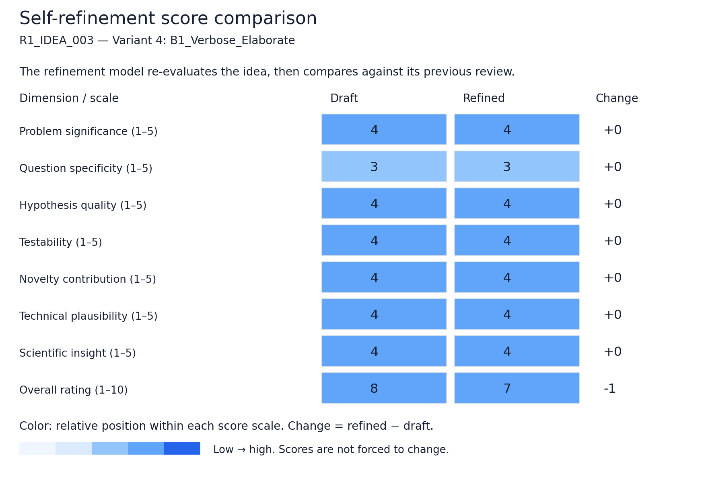

Changed score dimensions: overall_rating.

### Score justifications (draft / refined)

**Problem significance**

```json
{
  "draft": {
    "score": 4.0,
    "justification": "The problem is highly significant in the context of medical AI. Radiologists' visual search strategies are complex and sequential; ignoring this temporal aspect limits the ability of AI to mimic human expertise or explain its decisions in a clinically meaningful way. Solving this could lead to more trustworthy and robust diagnostic tools."
  },
  "refined": {
    "score": 4.0,
    "justification": "The problem is highly significant. Current medical AI often treats diagnosis as a static classification problem, ignoring the sequential nature of human visual search. Addressing this gap is crucial for developing AI that truly mimics expert reasoning and provides trustworthy, process-aware explanations."
  }
}
```

**Question specificity**

```json
{
  "draft": {
    "score": 3.0,
    "justification": "The core question (does video gaze encoding improve reasoning over static gaze?) is clear. However, the specific research question regarding *how* this improves reasoning or *which* specific reasoning tasks are targeted is not fully articulated. The definition of 'reasoning' and 'interpretability' needs more operational precision."
  },
  "refined": {
    "score": 3.0,
    "justification": "The core question (does video gaze encoding improve performance over static?) is clear. However, the specific research question regarding *which* aspects of reasoning are improved and *how* the temporal data is technically integrated is not fully specified. The lack of defined metrics for 'reasoning' reduces the specificity of the inquiry."
  }
}
```

**Hypothesis quality**

```json
{
  "draft": {
    "score": 4.0,
    "justification": "The hypothesis is strong and plausible: that the temporal sequence of fixations contains unique information about the diagnostic process that static representations miss. It is a falsifiable claim that can be tested by comparing models trained with static vs. temporal gaze inputs."
  },
  "refined": {
    "score": 4.0,
    "justification": "The hypothesis is strong and plausible: that the temporal sequence of fixations encodes diagnostic logic (e.g., hypothesis testing, confirmation bias) that static heatmaps cannot capture. It is a clear, falsifiable prediction that can be tested by comparing model performance with and without temporal gaze inputs."
  }
}
```

**Testability**

```json
{
  "draft": {
    "score": 4.0,
    "justification": "The idea is highly testable. One can construct a dataset with gaze coordinates, encode them as video sequences, train a VLM, and compare performance against baselines using static heatmaps. Metrics can include diagnostic accuracy, explanation quality, and attention alignment with ground truth."
  },
  "refined": {
    "score": 4.0,
    "justification": "The idea is highly testable. One can construct a dataset with gaze coordinates, encode them as video sequences, and train VLMs. Performance can be compared against baselines using static heatmaps. The success of the hypothesis can be measured via diagnostic accuracy on complex cases and the quality of generated explanations."
  }
}
```

**Novelty contribution**

```json
{
  "draft": {
    "score": 4.0,
    "justification": "While using gaze data in medical AI is not new, the specific proposal to encode it as a video sequence to capture temporal dynamics, rather than aggregating it into a heatmap or text, is a novel and under-explored direction. It moves beyond simple data augmentation to a more faithful representation of the human cognitive process."
  },
  "refined": {
    "score": 4.0,
    "justification": "While gaze data in medical AI is an emerging field, the specific proposal to treat it as a video sequence to capture temporal dynamics, rather than aggregating it, is a novel and under-explored direction. It shifts the focus from 'where' the radiologist looked to 'how' they looked."
  }
}
```

**Technical plausibility**

```json
{
  "draft": {
    "score": 4.0,
    "justification": "The technical approach is sound. Modern VLMs and video understanding models (like Video-LLaMA or similar architectures) are capable of processing sequential visual inputs. The main challenge will be the fusion mechanism, but the premise is technically feasible."
  },
  "refined": {
    "score": 4.0,
    "justification": "The technical approach is sound. Modern VLMs and video understanding architectures are capable of processing sequential visual inputs. The main challenge lies in the fusion mechanism, but the premise that a video encoder can process gaze coordinates is technically feasible."
  }
}
```

**Scientific insight**

```json
{
  "draft": {
    "score": 4.0,
    "justification": "If successful, this research could reveal that the *process* of looking (the sequence) is as important as the *result* of looking (the fixations) for diagnostic reasoning. This would provide deep insight into the nature of visual cognition in experts and how to better model it in AI."
  },
  "refined": {
    "score": 4.0,
    "justification": "If successful, this research could reveal that the *process* of visual search is a distinct and necessary component of diagnostic reasoning, offering deep insights into the nature of expert cognition and how to better model it in AI."
  }
}
```

**Overall rating**

```json
{
  "draft": {
    "score": 8.0,
    "justification": "This is a strong research idea with high potential. It addresses a clear gap in current methodologies (loss of temporal data), proposes a plausible and novel solution (video encoding), and targets a high-impact domain. The main limitation is the lack of specific details on the implementation and evaluation metrics, but as a research proposal, the core scientific value is evident."
  },
  "refined": {
    "score": 7.0,
    "justification": "This is a strong research idea with high potential. It addresses a clear and meaningful gap in current methodologies (loss of temporal data) and proposes a plausible solution. The main limitation is the lack of specific details on the implementation (fusion mechanism) and evaluation (metrics for reasoning), which prevents it from being an 'exceptional' idea at this stage. However, the core scientific value is evident and the direction is promising."
  }
}
```

## R1_IDEA_003 — Variant 5: B2_Grand_Narrative


Changed score dimensions: none.

### Score justifications (draft / refined)

**Problem significance**

```json
{
  "draft": {
    "score": 4.0,
    "justification": "The problem of integrating human cognitive processes into AI is highly significant, especially in high-stakes domains like medicine. Discarding temporal information is a known bottleneck in current gaze-based AI, making this a meaningful challenge to address."
  },
  "refined": {
    "score": 4.0,
    "justification": "The problem is significant because current AI systems often lack the 'how' of human diagnosis, relying only on the 'what' (final attention). Addressing the temporal aspect of human perception is crucial for building trustworthy, interpretable, and cognitively aligned medical AI, which is a high-priority goal in the field."
  }
}
```

**Question specificity**

```json
{
  "draft": {
    "score": 3.0,
    "justification": "The core question (static vs. temporal gaze) is clear, but the specific research question regarding the *impact* on model reasoning is somewhat broad. It needs more definition on which aspects of reasoning are targeted."
  },
  "refined": {
    "score": 3.0,
    "justification": "The question is specific regarding the *input representation* (static vs. video), but the *research question* regarding the outcome is broad. It asks if it 'enhances reasoning' without defining the specific reasoning tasks or the expected magnitude of improvement, making the scope slightly diffuse."
  }
}
```

**Hypothesis quality**

```json
{
  "draft": {
    "score": 3.0,
    "justification": "The implicit hypothesis (temporal data > static data for reasoning) is plausible and falsifiable. However, it lacks the nuance of boundary conditions (e.g., when does it fail?) which would make it a stronger scientific hypothesis."
  },
  "refined": {
    "score": 3.0,
    "justification": "The implicit hypothesis (temporal data > static data) is falsifiable and plausible. However, it is currently a general claim rather than a nuanced scientific hypothesis. It lacks boundary conditions (e.g., when does it fail?) and a proposed causal mechanism, which limits its scientific depth."
  }
}
```

**Testability**

```json
{
  "draft": {
    "score": 4.0,
    "justification": "The idea is highly testable. One can construct an experiment comparing models trained with static vs. temporal gaze inputs on standard chest X-ray benchmarks. The outcome is binary (improvement or not) and measurable."
  },
  "refined": {
    "score": 4.0,
    "justification": "The idea is highly testable in principle. One can design an experiment comparing models with static vs. temporal gaze inputs on standard benchmarks. The outcome is measurable, provided the data exists. The lack of specific metrics in the prompt is a minor hurdle but does not render the idea untestable."
  }
}
```

**Novelty contribution**

```json
{
  "draft": {
    "score": 4.0,
    "justification": "While gaze integration is not new, the specific proposal to treat gaze as a video sequence to capture scanning order in LVLMs for medical imaging is a novel and promising direction that moves beyond the state-of-the-art static representations."
  },
  "refined": {
    "score": 4.0,
    "justification": "While gaze integration is known, the specific proposal to treat gaze as a video sequence within LVLMs for medical imaging is a novel contribution. It moves the field from static attention mapping to dynamic process modeling, which is a meaningful step forward."
  }
}
```

**Technical plausibility**

```json
{
  "draft": {
    "score": 4.0,
    "justification": "The technical approach is sound. Treating gaze as a sequence of coordinates or heatmaps over time is a standard computer vision task (video processing) that can be adapted to multimodal architectures. The main challenge is data, not theoretical plausibility."
  },
  "refined": {
    "score": 4.0,
    "justification": "The technical approach is sound. Video processing techniques (e.g., transformers, RNNs) are mature, and the concept of fusing modalities is standard. The primary challenge is data availability, not theoretical impossibility, making the direction technically plausible."
  }
}
```

**Scientific insight**

```json
{
  "draft": {
    "score": 4.0,
    "justification": "If successful, this research would provide deep insight into the role of temporal attention in medical diagnosis, potentially revealing that the 'path' to a diagnosis is as important as the 'destination' (the final attention point). This could lead to new principles for designing cognitively aligned AI."
  },
  "refined": {
    "score": 4.0,
    "justification": "If successful, this research would reveal whether the 'path' to a diagnosis is as informative as the 'destination' in medical imaging. This could lead to new principles for designing AI that mimics human perceptual strategies, offering insights beyond simple performance metrics."
  }
}
```

**Overall rating**

```json
{
  "draft": {
    "score": 7.0,
    "justification": "This is a strong research idea with clear significance and a plausible, testable direction. It addresses a specific gap in the literature (temporal loss in gaze data) and has high potential for scientific insight. It loses points only for the current lack of a specific hypothesis regarding the mechanism of improvement and the operationalization of 'reasoning'."
  },
  "refined": {
    "score": 7.0,
    "justification": "This is a strong research idea with clear significance and a plausible, testable direction. It addresses a specific gap (temporal loss) and has high potential for scientific insight. It receives a 7 (Strong) rather than a higher score because the hypothesis is currently too broad (lacking specific mechanisms and boundary conditions) and the data feasibility is not addressed, which are critical for a complete research proposal."
  }
}
```

## R1_IDEA_003 — Variant 6: B3_Over_Confident


Changed score dimensions: none.

### Score justifications (draft / refined)

**Problem significance**

```json
{
  "draft": {
    "score": 4.0,
    "justification": "The problem is highly significant in the context of medical AI. Integrating human expert behavior (gaze) to improve model reasoning and trust is a major research direction. The specific gap identified (loss of temporal data) is a known but under-addressed limitation."
  },
  "refined": {
    "score": 4.0,
    "justification": "The problem is significant. Integrating human expert behavior into AI is a key frontier for trust and performance in medical AI. The specific gap regarding temporal gaze data is a meaningful limitation in current multimodal approaches."
  }
}
```

**Question specificity**

```json
{
  "draft": {
    "score": 3.0,
    "justification": "The idea clearly states the 'what' (use video instead of static) and the 'why' (capture temporal sequence). However, it lacks specificity on the 'how' (encoding mechanism) and the 'where' (specific tasks/metrics) to fully define the research question."
  },
  "refined": {
    "score": 3.0,
    "justification": "The idea clearly defines the 'what' (video vs. static) and the 'why' (temporal sequence). However, it lacks specificity on the 'how' (encoding mechanism) and the 'where' (specific tasks/metrics), leaving the research question somewhat broad."
  }
}
```

**Hypothesis quality**

```json
{
  "draft": {
    "score": 4.0,
    "justification": "The hypothesis is strong: 'Encoding gaze as video sequences will enhance model reasoning and interpretability compared to static representations.' This is a clear, directional prediction that can be empirically tested."
  },
  "refined": {
    "score": 4.0,
    "justification": "The hypothesis is strong: 'Encoding gaze as video sequences will enhance model reasoning and interpretability compared to static representations.' This is a clear, directional prediction that can be empirically tested."
  }
}
```

**Testability**

```json
{
  "draft": {
    "score": 4.0,
    "justification": "The idea is highly testable. One can construct a dataset with radiologist gaze, create two model variants (static vs. video), and compare performance on standard medical benchmarks. The comparison is clear."
  },
  "refined": {
    "score": 4.0,
    "justification": "The idea is highly testable. One can construct a dataset with radiologist gaze, create two model variants (static vs. video), and compare performance on standard medical benchmarks. The comparison is clear."
  }
}
```

**Novelty contribution**

```json
{
  "draft": {
    "score": 4.0,
    "justification": "While gaze integration is not new, the specific proposal to treat gaze as a video sequence to capture temporal scanning order in LVLMs for medical imaging is a novel and promising direction. It moves beyond simple attention maps."
  },
  "refined": {
    "score": 4.0,
    "justification": "While gaze integration is not new, the specific proposal to treat gaze as a video sequence to capture temporal scanning order in LVLMs for medical imaging is a novel and promising direction. It moves beyond simple attention maps."
  }
}
```

**Technical plausibility**

```json
{
  "draft": {
    "score": 4.0,
    "justification": "The approach is technically sound. Video encoders (e.g., 3D CNNs, Video Transformers) are standard tools. The challenge lies in adapting them to sparse, coordinate-based data, but the direction is logically coherent."
  },
  "refined": {
    "score": 4.0,
    "justification": "The approach is technically sound. Video encoders (e.g., 3D CNNs, Video Transformers) are standard tools. The challenge lies in adapting them to sparse, coordinate-based data, but the direction is logically coherent."
  }
}
```

**Scientific insight**

```json
{
  "draft": {
    "score": 4.0,
    "justification": "If successful, this research would provide deep insights into how temporal human attention patterns correlate with diagnostic reasoning in complex visual tasks. It could reveal that the 'path' to a diagnosis is as informative as the 'destination'."
  },
  "refined": {
    "score": 4.0,
    "justification": "If successful, this research would provide deep insights into how temporal human attention patterns correlate with diagnostic reasoning in complex visual tasks. It could reveal that the 'path' to a diagnosis is as informative as the 'destination'."
  }
}
```

**Overall rating**

```json
{
  "draft": {
    "score": 8.0,
    "justification": "This is a strong research idea. It identifies a clear gap in current literature, proposes a plausible and novel solution, and has high potential for scientific impact in the medical AI domain. The main limitation is the lack of implementation details and specific evaluation metrics, but as a research proposal, the core concept is robust and promising."
  },
  "refined": {
    "score": 8.0,
    "justification": "This is a strong research idea. It identifies a clear gap in current literature, proposes a plausible and novel solution, and has high potential for scientific impact in the medical AI domain. The main limitation is the lack of implementation details and specific evaluation metrics, but as a research proposal, the core concept is robust and promising."
  }
}
```

## R1_IDEA_003 — Variant 7: B4_Novelty


Changed score dimensions: none.

### Score justifications (draft / refined)

**Problem significance**

```json
{
  "draft": {
    "score": 4.0,
    "justification": "The problem of extracting meaningful reasoning signals from expert behavior in medical AI is highly significant. Current methods discard the temporal dimension of human attention, which is likely crucial for understanding diagnostic workflows. Solving this could lead to more trustworthy and explainable medical AI systems."
  },
  "refined": {
    "score": 4.0,
    "justification": "The problem is highly significant. Extracting meaningful reasoning signals from expert behavior is a bottleneck in medical AI. Current methods discard the temporal dimension of human attention, which is likely crucial for understanding diagnostic workflows. Solving this could lead to more trustworthy and explainable medical AI systems."
  }
}
```

**Question specificity**

```json
{
  "draft": {
    "score": 4.0,
    "justification": "The idea is specific about the data representation change (static to video) and the domain (chest X-ray). However, the specific research question regarding *how* this representation improves reasoning is currently a hypothesis rather than a fully defined mechanism."
  },
  "refined": {
    "score": 4.0,
    "justification": "The idea is specific about the data representation change (static to video) and the domain (chest X-ray). However, the specific research question regarding *how* this representation improves reasoning is currently a hypothesis rather than a fully defined mechanism. The 'how' of the fusion and the 'what' of the specific temporal features remain open."
  }
}
```

**Hypothesis quality**

```json
{
  "draft": {
    "score": 4.0,
    "justification": "The hypothesis is strong: 'Temporal scanning order contains unique information for reasoning that static heatmaps miss.' This is a falsifiable claim that distinguishes the work from generic applications of video models."
  },
  "refined": {
    "score": 4.0,
    "justification": "The hypothesis is strong: 'Temporal scanning order contains unique information for reasoning that static heatmaps miss.' This is a falsifiable claim that distinguishes the work from generic applications of video models. It posits a specific mechanism (temporal dynamics) for a specific outcome (reasoning)."
  }
}
```

**Testability**

```json
{
  "draft": {
    "score": 4.0,
    "justification": "The idea is testable. One can construct a video-based gaze encoder, train an LVLM, and compare its performance on reasoning tasks against a baseline using static heatmaps. The metrics (accuracy, interpretability scores) are definable."
  },
  "refined": {
    "score": 4.0,
    "justification": "The idea is testable. One can construct a video-based gaze encoder, train an LVLM, and compare its performance on reasoning tasks against a baseline using static heatmaps. The metrics (accuracy, interpretability scores, correlation with expert diagnosis) are definable, even if the specific metrics are not yet listed."
  }
}
```

**Novelty contribution**

```json
{
  "draft": {
    "score": 4.0,
    "justification": "While video models are common, applying them specifically to encode *human gaze sequences* as a primary feature for medical reasoning in LVLMs is a novel and underexplored angle. It moves beyond simple attention visualization to using gaze as a temporal signal."
  },
  "refined": {
    "score": 4.0,
    "justification": "While video models are common, applying them specifically to encode *human gaze sequences* as a primary feature for medical reasoning in LVLMs is a novel and underexplored angle. It moves beyond simple attention visualization to using gaze as a temporal signal, which is a distinct contribution."
  }
}
```

**Technical plausibility**

```json
{
  "draft": {
    "score": 4.0,
    "justification": "The technical direction is sound. Converting gaze coordinates to a video stream and feeding it into a multimodal model is a standard engineering task. The plausibility lies in the assumption that the temporal signal is useful, which is well-grounded in cognitive science."
  },
  "refined": {
    "score": 4.0,
    "justification": "The technical direction is sound. Converting gaze coordinates to a video stream and feeding it into a multimodal model is a standard engineering task. The plausibility lies in the assumption that the temporal signal is useful, which is well-grounded in cognitive science. No obvious technical barriers prevent the initial investigation."
  }
}
```

**Scientific insight**

```json
{
  "draft": {
    "score": 4.0,
    "justification": "If successful, this research could reveal that the *process* of looking (temporal dynamics) is as important as the *location* of looking for diagnostic reasoning. This would be a significant insight into the nature of expert visual cognition and how to encode it in AI."
  },
  "refined": {
    "score": 4.0,
    "justification": "If successful, this research could reveal that the *process* of looking (temporal dynamics) is as important as the *location* of looking for diagnostic reasoning. This would be a significant insight into the nature of expert visual cognition and how to encode it in AI, potentially changing how we view multimodal fusion in medical domains."
  }
}
```

**Overall rating**

```json
{
  "draft": {
    "score": 8.0,
    "justification": "This is a strong research idea. It identifies a clear gap in current methodology (loss of temporal gaze data), proposes a concrete and plausible solution (video encoding), and targets a high-impact problem (medical interpretability). It scores highly on significance, hypothesis quality, and potential insight. It loses a point on specificity regarding the exact mechanism of fusion and evaluation, which are necessary for the next stage of development."
  },
  "refined": {
    "score": 8.0,
    "justification": "This is a strong research idea. It identifies a clear gap in current methodology (loss of temporal gaze data), proposes a concrete and plausible solution (video encoding), and targets a high-impact problem (medical interpretability). It scores highly on significance, hypothesis quality, and potential insight. It loses a point on specificity regarding the exact mechanism of fusion and evaluation, which are necessary for the next stage of development, but the core concept is robust."
  }
}
```

## R1_IDEA_003 — Variant 8: B5_Application_Impact

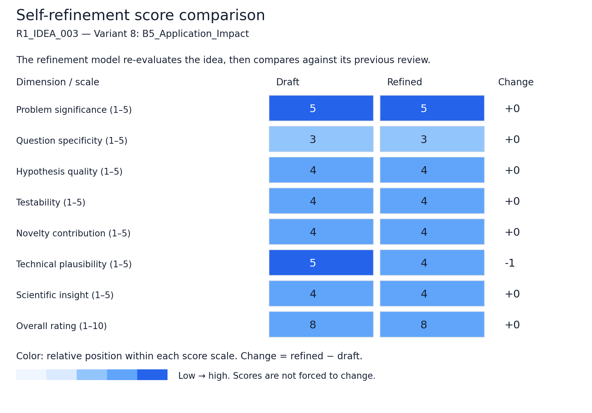

Changed score dimensions: technical_plausibility.

### Score justifications (draft / refined)

**Problem significance**

```json
{
  "draft": {
    "score": 5.0,
    "justification": "The problem is highly significant. Medical AI interpretability is a major bottleneck for clinical adoption. Ignoring the temporal nature of human visual search (which is sequential and hypothesis-driven) is a known flaw in current static attention models. Solving this could lead to more trustworthy and effective diagnostic tools."
  },
  "refined": {
    "score": 5.0,
    "justification": "The problem is highly significant. Medical AI interpretability is a major bottleneck for clinical adoption. Current methods that ignore the temporal nature of human visual search fail to capture the cognitive process of diagnosis. Addressing this gap is crucial for building trustworthy diagnostic tools."
  }
}
```

**Question specificity**

```json
{
  "draft": {
    "score": 3.0,
    "justification": "The idea identifies a clear direction (video vs. static) and a domain (chest X-ray), but the specific research question is somewhat broad. It needs to specify exactly what aspect of reasoning is being improved and how the temporal data is mathematically or architecturally integrated."
  },
  "refined": {
    "score": 3.0,
    "justification": "While the direction (video vs. static) is clear, the specific research question is broad. It needs to specify exactly which aspect of reasoning is being improved and how the temporal data is mathematically or architecturally integrated to achieve this. The distinction between 'reasoning' and 'interpretability' needs operationalization."
  }
}
```

**Hypothesis quality**

```json
{
  "draft": {
    "score": 4.0,
    "justification": "The implicit hypothesis is strong: 'Temporal dynamics in human gaze contain diagnostic information that static heatmaps discard, and encoding this improves model performance/interpretability.' This is a falsifiable claim that distinguishes the work from generic applications."
  },
  "refined": {
    "score": 4.0,
    "justification": "The implicit hypothesis is strong and biologically plausible: 'Temporal dynamics in human gaze contain diagnostic information that static heatmaps discard, and encoding this improves model performance/interpretability.' This is a falsifiable claim that distinguishes the work from generic applications."
  }
}
```

**Testability**

```json
{
  "draft": {
    "score": 4.0,
    "justification": "The idea is testable. One can train models with static gaze inputs vs. video gaze inputs and compare performance on standard benchmarks (accuracy, localization) and interpretability metrics (attention alignment, clinician trust). The methodology is clear enough to design an experiment."
  },
  "refined": {
    "score": 4.0,
    "justification": "The idea is testable. One can train models with static gaze inputs vs. video gaze inputs and compare performance on standard benchmarks (accuracy, localization) and interpretability metrics (attention alignment, clinician trust). The methodology is clear enough to design an experiment."
  }
}
```

**Novelty contribution**

```json
{
  "draft": {
    "score": 4.0,
    "justification": "While video-based attention is known in general CV, applying it specifically to the *temporal sequence of radiologist gaze* in LVLMs for medical diagnosis is a novel and under-explored direction. It moves beyond simple attention visualization to modeling the *process* of diagnosis."
  },
  "refined": {
    "score": 4.0,
    "justification": "While video-based attention is known in general CV, applying it specifically to the *temporal sequence of radiologist gaze* in LVLMs for medical diagnosis is a novel and under-explored direction. It moves beyond simple attention visualization to modeling the *process* of diagnosis."
  }
}
```

**Technical plausibility**

```json
{
  "draft": {
    "score": 5.0,
    "justification": "The technical approach is sound. Video encoders (e.g., 3D CNNs, Transformers) and multimodal fusion techniques are well-established. The main challenge is data and alignment, not fundamental technical impossibility."
  },
  "refined": {
    "score": 4.0,
    "justification": "The technical approach is sound. Video encoders (e.g., 3D CNNs, Transformers) and multimodal fusion techniques are well-established. The main challenges are data availability and alignment, not fundamental technical impossibility. However, the computational overhead of video processing in an LVLM context is a non-trivial engineering hurdle."
  }
}
```

**Scientific insight**

```json
{
  "draft": {
    "score": 4.0,
    "justification": "If successful, this research could reveal fundamental principles about how temporal attention patterns correlate with diagnostic accuracy in medical imaging. It could also provide insights into the cognitive processes of radiologists that are not captured by static heatmaps."
  },
  "refined": {
    "score": 4.0,
    "justification": "If successful, this research could reveal fundamental principles about how temporal attention patterns correlate with diagnostic accuracy in medical imaging. It could also provide insights into the cognitive processes of radiologists that are not captured by static heatmaps."
  }
}
```

**Overall rating**

```json
{
  "draft": {
    "score": 8.0,
    "justification": "This is a strong research idea with high potential impact. It addresses a clear gap in the literature (temporal dynamics in medical attention) and proposes a plausible, testable solution. The main limitation is the current lack of specific hypotheses and evaluation metrics, but these are standard refinements for a research proposal rather than flaws in the core concept."
  },
  "refined": {
    "score": 8.0,
    "justification": "This is a strong research idea with high potential impact. It addresses a clear gap in the literature (temporal dynamics in medical attention) and proposes a plausible, testable solution. The main limitation is the current lack of specific hypotheses and evaluation metrics, but these are standard refinements for a research proposal rather than flaws in the core concept."
  }
}
```

## R1_IDEA_003 — Variant 9: C1_Hollow_Shell


Changed score dimensions: none.

### Score justifications (draft / refined)

**Problem significance**

```json
{
  "draft": {
    "score": 4.0,
    "justification": "Improving the integration of expert knowledge into medical AI is a significant challenge. The specific problem of losing structural information in attention fusion is meaningful for clinical trust and model accuracy."
  },
  "refined": {
    "score": 4.0,
    "justification": "Integrating expert knowledge into medical AI is a significant challenge. The specific problem of degrading structural information during attention fusion is meaningful for clinical trust and model accuracy, making the problem highly relevant."
  }
}
```

**Question specificity**

```json
{
  "draft": {
    "score": 3.0,
    "justification": "The idea identifies a problem (loss of order) and a goal (preserve order), but the specific mechanism and the definition of 'order' in a 2D image context are not clearly defined."
  },
  "refined": {
    "score": 3.0,
    "justification": "The idea identifies a problem (loss of order) and a goal (preserve order), but the specific mechanism and the definition of 'order' in a 2D image context are not clearly defined, leaving the research question somewhat vague."
  }
}
```

**Hypothesis quality**

```json
{
  "draft": {
    "score": 4.0,
    "justification": "The implicit hypothesis—that preserving the structural/sequential integrity of expert attention leads to better performance and interpretability than simplified representations—is testable and plausible."
  },
  "refined": {
    "score": 4.0,
    "justification": "The implicit hypothesis—that preserving the structural/sequential integrity of expert attention leads to better performance and interpretability than simplified representations—is testable, plausible, and falsifiable."
  }
}
```

**Testability**

```json
{
  "draft": {
    "score": 4.0,
    "justification": "The idea is testable by comparing a model using the proposed 'order-preserving' attention fusion against a baseline using 'simplified' fusion on a standard chest X-ray dataset with expert annotations."
  },
  "refined": {
    "score": 4.0,
    "justification": "The idea is testable by comparing a model using the proposed 'order-preserving' attention fusion against a baseline using 'simplified' fusion on a standard chest X-ray dataset with expert annotations."
  }
}
```

**Novelty contribution**

```json
{
  "draft": {
    "score": 3.0,
    "justification": "While the general concept of preserving structure is known, applying it specifically to the fusion of expert visual attention in chest X-rays to solve the 'simplification' problem is a novel angle, though the exact novelty depends on the specific implementation details not provided."
  },
  "refined": {
    "score": 3.0,
    "justification": "While the general concept of preserving structure is known, applying it specifically to the fusion of expert visual attention in chest X-rays to solve the 'simplification' problem is a novel angle. However, without details on the mechanism, the novelty is currently moderate."
  }
}
```

**Technical plausibility**

```json
{
  "draft": {
    "score": 4.0,
    "justification": "It is technically plausible to design neural architectures that preserve spatial or sequential order (e.g., using 2D convolutions, attention maps as sequences, or graph networks) rather than flattening them."
  },
  "refined": {
    "score": 4.0,
    "justification": "It is technically plausible to design neural architectures that preserve spatial or sequential order (e.g., using 2D convolutions, attention maps as sequences, or graph networks) rather than flattening them."
  }
}
```

**Scientific insight**

```json
{
  "draft": {
    "score": 3.0,
    "justification": "If successful, the study could reveal how the structural fidelity of expert priors impacts model generalization and interpretability, which is a valuable insight for medical AI."
  },
  "refined": {
    "score": 3.0,
    "justification": "If successful, the study could reveal how the structural fidelity of expert priors impacts model generalization and interpretability, which is a valuable insight for medical AI, though the current summary is too broad to guarantee deep mechanistic insight."
  }
}
```

**Overall rating**

```json
{
  "draft": {
    "score": 7.0,
    "justification": "This is a strong research idea with a clear motivation and a plausible hypothesis. It addresses a real gap in medical AI (loss of structural info in attention fusion). However, it currently lacks the specificity required to be considered exceptional, particularly regarding the definition of 'order' and the specific architectural mechanism."
  },
  "refined": {
    "score": 7.0,
    "justification": "This is a strong research idea with a clear motivation and a plausible hypothesis. It addresses a real gap in medical AI (loss of structural info in attention fusion). However, it currently lacks the specificity required to be considered exceptional, particularly regarding the definition of 'order' and the specific architectural mechanism."
  }
}
```

## R1_IDEA_003 — Variant 10: C2_Logic_Flawed

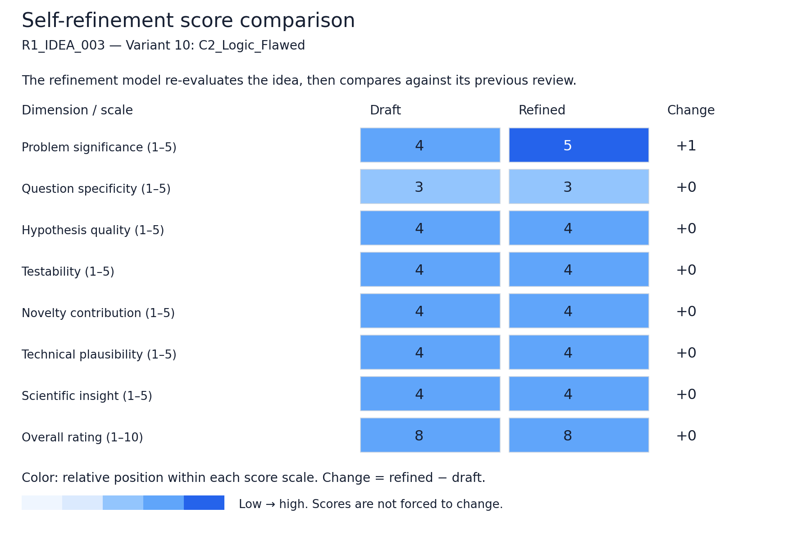

Changed score dimensions: problem_significance.

### Score justifications (draft / refined)

**Problem significance**

```json
{
  "draft": {
    "score": 4.0,
    "justification": "Integrating human cognitive processes into AI is a significant challenge in medical AI. Moving from static to dynamic representations addresses a known limitation in current multimodal models, which could lead to more robust and interpretable systems. This is a meaningful problem for the field."
  },
  "refined": {
    "score": 5.0,
    "justification": "Integrating human cognitive processes into AI is a major frontier in medical AI. The specific problem of discarding temporal dynamics in gaze data is a known limitation that directly impacts the interpretability and robustness of diagnostic models. Solving this addresses a meaningful challenge for clinical adoption."
  }
}
```

**Question specificity**

```json
{
  "draft": {
    "score": 3.0,
    "justification": "The core question (does temporal gaze help?) is clear, but the specific mechanism of how the video sequence is processed and how the 'reasoning' is measured is not yet defined. The idea is specific enough to be a valid research direction but lacks the granularity of a fully formed experimental design."
  },
  "refined": {
    "score": 3.0,
    "justification": "The core question (does temporal gaze help?) is clear, but the specific mechanism of *how* the video sequence is processed and the precise definition of 'reasoning' improvement are not yet defined. The idea is a valid research direction but lacks the granularity of a fully formed experimental design."
  }
}
```

**Hypothesis quality**

```json
{
  "draft": {
    "score": 4.0,
    "justification": "The hypothesis is strong: that temporal dynamics in human attention contain unique information not present in static heatmaps, and that encoding this improves model performance. This is a falsifiable claim that distinguishes the work from generic applications."
  },
  "refined": {
    "score": 4.0,
    "justification": "The hypothesis is strong and falsifiable: that temporal dynamics in human attention contain unique information not present in static heatmaps, and that encoding this improves model performance. It distinguishes the work from generic applications by focusing on the 'sequence' aspect."
  }
}
```

**Testability**

```json
{
  "draft": {
    "score": 4.0,
    "justification": "The idea is highly testable. One can construct a baseline with static heatmaps and a proposed model with gaze video sequences, then compare performance on standard medical VQA tasks. Ablation studies (e.g., shuffling time) are straightforward to design."
  },
  "refined": {
    "score": 4.0,
    "justification": "The idea is highly testable. One can construct a baseline with static heatmaps and a proposed model with gaze video sequences, then compare performance on standard medical VQA tasks. Ablation studies (e.g., shuffling time) are straightforward to design."
  }
}
```

**Novelty contribution**

```json
{
  "draft": {
    "score": 4.0,
    "justification": "While eye-tracking in medical imaging is not new, the specific proposal to treat gaze as a video sequence to capture temporal scanning order in LVLMs is a novel and promising direction. It moves beyond simple attention visualization to active temporal modeling."
  },
  "refined": {
    "score": 4.0,
    "justification": "While eye-tracking in medical imaging is not new, the specific proposal to treat gaze as a video sequence to capture temporal scanning order in LVLMs is a novel and promising direction. It moves beyond simple attention visualization to active temporal modeling."
  }
}
```

**Technical plausibility**

```json
{
  "draft": {
    "score": 4.0,
    "justification": "The technical approach is plausible. Modern architectures (Transformers, VideoMAE, etc.) are well-suited to handle sequential data. The main challenge is data alignment and fusion, but the direction makes logical sense."
  },
  "refined": {
    "score": 4.0,
    "justification": "The technical approach is plausible. Modern architectures (Transformers, VideoMAE, etc.) are well-suited to handle sequential data. The main challenges are data alignment and fusion, but the direction makes logical sense."
  }
}
```

**Scientific insight**

```json
{
  "draft": {
    "score": 4.0,
    "justification": "If successful, this research could reveal that the *process* of looking (temporal dynamics) is as important as the *location* of looking for diagnostic reasoning. This would provide deep insight into the nature of medical expertise and how to encode it in AI."
  },
  "refined": {
    "score": 4.0,
    "justification": "If successful, this research could reveal that the *process* of looking (temporal dynamics) is as important as the *location* of looking for diagnostic reasoning. This would provide deep insight into the nature of medical expertise and how to encode it in AI."
  }
}
```

**Overall rating**

```json
{
  "draft": {
    "score": 8.0,
    "justification": "This is a strong research idea. It identifies a clear limitation in current methods (loss of temporal data), proposes a specific and plausible solution (video encoding), and targets a high-impact problem (medical AI interpretability and reasoning). While implementation details are missing, the core scientific premise is sound, testable, and potentially insightful."
  },
  "refined": {
    "score": 8.0,
    "justification": "This is a strong research idea. It identifies a clear limitation in current methods (loss of temporal data), proposes a specific and plausible solution (video encoding), and targets a high-impact problem (medical AI interpretability and reasoning). While implementation details are missing, the core scientific premise is sound, testable, and potentially insightful."
  }
}
```

## R1_IDEA_003 — Variant 11: C3_Substance_Enriched

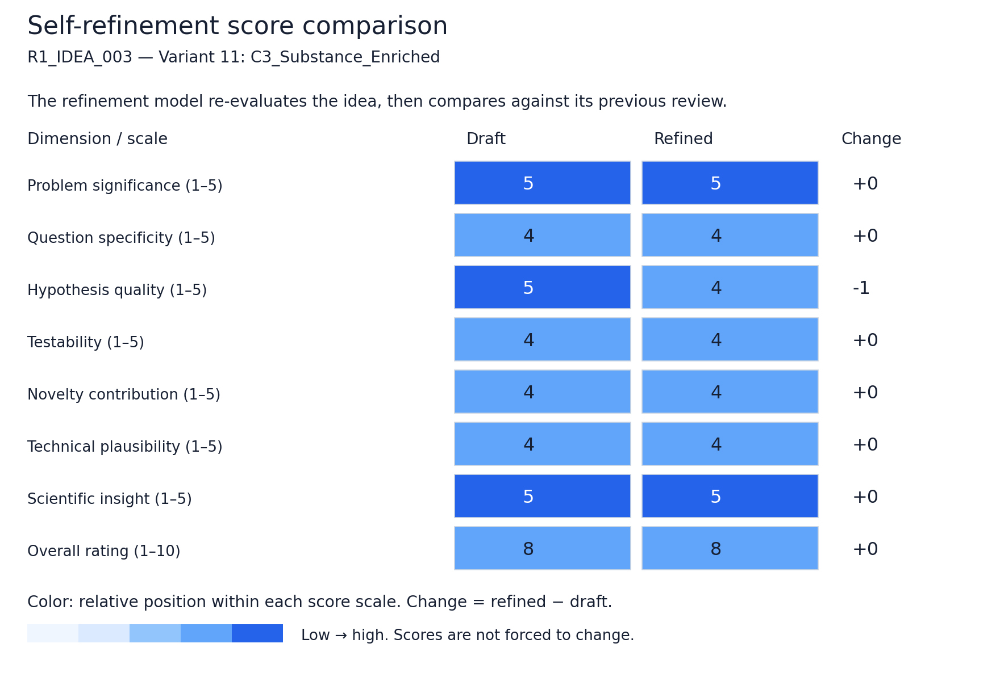

Changed score dimensions: hypothesis_quality.

### Score justifications (draft / refined)

**Problem significance**

```json
{
  "draft": {
    "score": 5.0,
    "justification": "The problem is highly significant in the context of medical AI. Understanding and replicating the temporal reasoning of experts is crucial for building trustworthy, interpretable, and clinically useful systems. Current methods discard valuable temporal information, which is a known bottleneck in achieving human-level reasoning in AI."
  },
  "refined": {
    "score": 5.0,
    "justification": "The problem is highly significant. Current medical AI often lacks the 'process' transparency of human experts. Capturing the temporal dynamics of expert vision is crucial for building trustworthy, interpretable, and clinically robust systems, addressing a known bottleneck in achieving human-level reasoning in AI."
  }
}
```

**Question specificity**

```json
{
  "draft": {
    "score": 4.0,
    "justification": "The research question is well-defined: can temporal gaze encoding improve the alignment of model reasoning with human scanning heuristics? However, the specific mechanism of 'how' this is achieved (the 'how' of the encoding) is not yet specified, leaving a gap in the operational definition of the method."
  },
  "refined": {
    "score": 4.0,
    "justification": "The research question is well-defined: can temporal gaze encoding improve the alignment of model reasoning with human scanning heuristics? However, the specific mechanism of 'how' the encoding is achieved and fused remains underspecified, leaving a gap in the operational definition of the method."
  }
}
```

**Hypothesis quality**

```json
{
  "draft": {
    "score": 5.0,
    "justification": "The hypothesis is strong and falsifiable. It posits a specific causal link: encoding temporal gaze -> learning scanning heuristics -> improved alignment with human reasoning. This is a clear prediction that can be supported or refuted by empirical evidence."
  },
  "refined": {
    "score": 4.0,
    "justification": "The hypothesis is strong and falsifiable in principle: encoding temporal gaze -> learning scanning heuristics -> improved alignment. However, the prediction relies on the assumption that 'scanning heuristics' are the dominant factor in explainability, which is a strong claim that needs careful operationalization."
  }
}
```

**Testability**

```json
{
  "draft": {
    "score": 4.0,
    "justification": "The idea is testable. One can train models with video-encoded gaze vs. static gaze and evaluate the output sequences against human fixation sequences. The main challenge lies in defining the evaluation metric precisely, but the path to testing is clear."
  },
  "refined": {
    "score": 4.0,
    "justification": "The idea is testable. One can train models with video-encoded gaze vs. static gaze and evaluate the output sequences against human fixation sequences. The main challenge lies in defining the evaluation metric precisely, but the path to testing is clear."
  }
}
```

**Novelty contribution**

```json
{
  "draft": {
    "score": 4.0,
    "justification": "While gaze tracking in medical imaging is not new, the specific proposal to encode it as a video sequence to learn temporal heuristics in a VLM context is novel. It moves the field from static attention analysis to dynamic process modeling, which is a significant conceptual shift."
  },
  "refined": {
    "score": 4.0,
    "justification": "While gaze tracking in medical imaging is not new, the specific proposal to encode it as a video sequence to learn temporal heuristics in a VLM context is novel. It moves the field from static attention analysis to dynamic process modeling, which is a significant conceptual shift."
  }
}
```

**Technical plausibility**

```json
{
  "draft": {
    "score": 4.0,
    "justification": "The direction is technically plausible. Video encoding techniques and temporal attention mechanisms are well-established in computer vision. The challenge is integration, but there is no fundamental theoretical barrier preventing this approach."
  },
  "refined": {
    "score": 4.0,
    "justification": "The direction is technically plausible. Video encoding techniques and temporal attention mechanisms are well-established in computer vision. The challenge is integration with static images and text, but there is no fundamental theoretical barrier preventing this approach."
  }
}
```

**Scientific insight**

```json
{
  "draft": {
    "score": 5.0,
    "justification": "If successful, this research would provide deep insights into the nature of expert visual reasoning in radiology. It could reveal whether AI can learn the 'strategies' of experts, not just the 'features' they look at, which is a fundamental question in cognitive science and AI."
  },
  "refined": {
    "score": 5.0,
    "justification": "If successful, this research would provide deep insights into the nature of expert visual reasoning in radiology. It could reveal whether AI can learn the 'strategies' of experts, not just the 'features' they look at, which is a fundamental question in cognitive science and AI."
  }
}
```

**Overall rating**

```json
{
  "draft": {
    "score": 8.0,
    "justification": "This is a strong research idea with high scientific potential. It addresses a meaningful gap (temporal dynamics) with a clear, testable hypothesis. While the technical implementation details are currently missing, the core concept is novel, significant, and likely to yield valuable insights into medical AI interpretability. It scores highly on significance, hypothesis quality, and potential insight."
  },
  "refined": {
    "score": 8.0,
    "justification": "This is a strong research idea with high scientific potential. It addresses a meaningful gap (temporal dynamics) with a clear, testable hypothesis. While the technical implementation details are currently missing, the core concept is novel, significant, and likely to yield valuable insights into medical AI interpretability. It scores highly on significance, hypothesis quality, and potential insight."
  }
}
```

## R1_IDEA_003 — Variant 12: H1_Deceptive_Hollow


Changed score dimensions: none.

### Score justifications (draft / refined)

**Problem significance**

```json
{
  "draft": {
    "score": 4.0,
    "justification": "The problem of improving interpretability and performance in chest X-ray analysis is highly significant. The specific claim that current attention methods lose valuable sequential information is a meaningful challenge if true, as it touches on the core of how AI models mimic human expert reasoning."
  },
  "refined": {
    "score": 4.0,
    "justification": "Improving the interpretability and performance of AI in chest X-ray analysis is a highly significant problem with direct clinical implications. The premise that current methods discard valuable structural information from experts is a meaningful challenge if substantiated."
  }
}
```

**Question specificity**

```json
{
  "draft": {
    "score": 2.0,
    "justification": "The idea is too broad and abstract. It states a goal ('preserve order') but does not define the variables, the specific data representation, or the exact nature of the 'simplification' being critiqued. It lacks the specificity required to formulate a concrete research question."
  },
  "refined": {
    "score": 2.0,
    "justification": "The research question is too vague. It states a goal ('preserve order') but fails to define the variables, the specific data representation, or the exact nature of the 'simplification' being critiqued. The concept of 'order' in visual attention is not clearly articulated."
  }
}
```

**Hypothesis quality**

```json
{
  "draft": {
    "score": 2.0,
    "justification": "There is no falsifiable hypothesis. The statement that this approach 'could reshape how the community thinks' is a prediction of impact, not a scientific hypothesis about a mechanism. It does not clearly state what relationship between variables is being tested."
  },
  "refined": {
    "score": 2.0,
    "justification": "There is no falsifiable hypothesis. The statement that the work 'could reshape how the community thinks' is a prediction of impact, not a scientific hypothesis about a mechanism. It does not clearly state the relationship between the proposed method and the outcome in testable terms."
  }
}
```

**Testability**

```json
{
  "draft": {
    "score": 2.0,
    "justification": "Without defining the 'order' or the 'simplified representations,' it is impossible to design an experiment. The idea suggests a comparison but does not specify the conditions, controls, or evaluation metrics needed to test the claim."
  },
  "refined": {
    "score": 2.0,
    "justification": "Without defining the 'order' or the 'simplified representations,' it is impossible to design an experiment. The idea suggests a comparison but does not specify the conditions, controls, or evaluation metrics needed to test the claim."
  }
}
```

**Novelty contribution**

```json
{
  "draft": {
    "score": 3.0,
    "justification": "The concept of preserving spatial or sequential information in attention mechanisms is a reasonable direction, but the idea is presented as a 'transformative synthesis' without detailing the novel mechanism. The novelty is claimed rather than demonstrated or described."
  },
  "refined": {
    "score": 3.0,
    "justification": "The concept of preserving structure in attention mechanisms is a reasonable direction, but the idea is presented as a 'transformative synthesis' without detailing the novel mechanism. The novelty is claimed rather than described or demonstrated."
  }
}
```

**Technical plausibility**

```json
{
  "draft": {
    "score": 3.0,
    "justification": "The reasoning is logically coherent in a general sense (preserving information is usually better than losing it), but the technical feasibility is unclear because the nature of the 'order' in visual attention is not defined. It is plausible that such a method exists, but the path to it is undefined."
  },
  "refined": {
    "score": 3.0,
    "justification": "The reasoning is logically coherent in a general sense (preserving information is usually better than losing it), but the technical feasibility is unclear because the nature of the 'order' in visual attention is not defined. It is plausible that such a method exists, but the path to it is undefined."
  }
}
```

**Scientific insight**

```json
{
  "draft": {
    "score": 3.0,
    "justification": "If successfully executed, the research could reveal how the structure of expert attention correlates with model performance. However, as currently stated, the potential for deep scientific insight is limited by the lack of a specific mechanism to investigate."
  },
  "refined": {
    "score": 3.0,
    "justification": "If successfully executed, the research could reveal how the structure of expert attention correlates with model performance. However, as currently stated, the potential for deep scientific insight is limited by the lack of a specific mechanism to investigate."
  }
}
```

**Overall rating**

```json
{
  "draft": {
    "score": 4.0,
    "justification": "The idea addresses a significant problem in a critical domain, but it is currently too vague and hyperbolic to be considered a strong research proposal. It lacks a specific hypothesis, defined variables, and a clear methodological path. It reads more like a high-level vision statement than a testable research idea. It is rated as 'Weak' (3-4 range) because while the motivation is good, the scientific content is insufficient to evaluate its potential for contribution."
  },
  "refined": {
    "score": 4.0,
    "justification": "The idea addresses a significant problem in a critical domain, but it is currently too vague and hyperbolic to be considered a strong research proposal. It lacks a specific hypothesis, defined variables, and a clear methodological path. It reads more like a high-level vision statement than a testable research idea. It is rated as 'Weak' (3-4 range) because while the motivation is good, the scientific content is insufficient to evaluate its potential for contribution."
  }
}
```

## R1_IDEA_003 — Variant 13: H2_Confident_Flaw

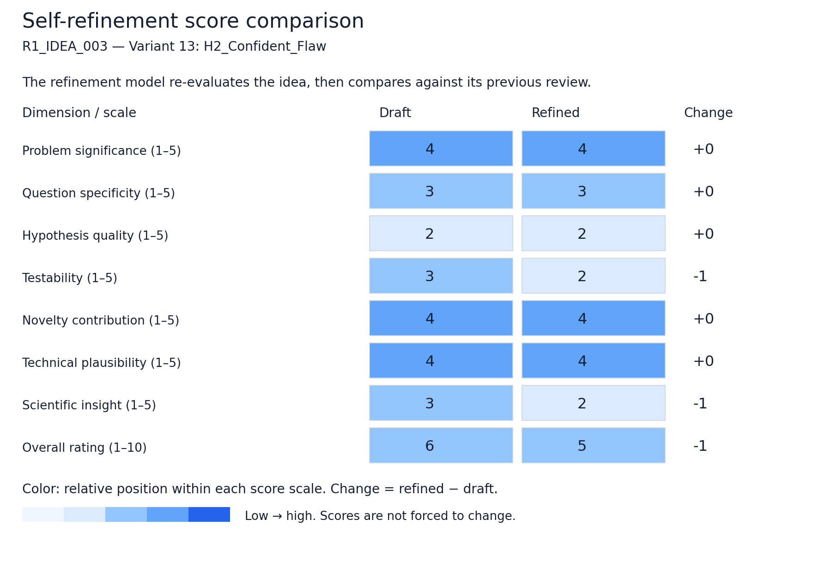

Changed score dimensions: testability, scientific_insight, overall_rating.

### Score justifications (draft / refined)

**Problem significance**

```json
{
  "draft": {
    "score": 4.0,
    "justification": "The problem of integrating human-in-the-loop temporal data into medical AI is highly significant. Radiologists' scanning patterns contain valuable diagnostic cues that are currently discarded. Addressing this could lead to more robust and interpretable models."
  },
  "refined": {
    "score": 4.0,
    "justification": "The problem is highly significant. Integrating human cognitive processes (scanning patterns) into medical AI is a major frontier for improving trust and performance. Discarding temporal data is a known limitation in current multimodal medical AI."
  }
}
```

**Question specificity**

```json
{
  "draft": {
    "score": 3.0,
    "justification": "The core question (does temporal gaze help?) is specific, but the proposed solution's mechanism is vague, and the scope of 'broader effectiveness' is too broad. The idea also makes overly definitive claims about causality without defining the specific conditions under which this holds."
  },
  "refined": {
    "score": 3.0,
    "justification": "The core question (does temporal gaze help?) is specific, but the proposed answer and the scope of the claim ('necessarily produces reliable improvements') are overly broad and lack the necessary nuance. The idea fails to specify the conditions under which this holds true."
  }
}
```

**Hypothesis quality**

```json
{
  "draft": {
    "score": 2.0,
    "justification": "The hypothesis is weak because it asserts a necessary causal link ('necessarily produce reliable improvements') and dismisses the need for rigorous isolation of variables. A strong hypothesis should be falsifiable and acknowledge potential failure modes or confounding factors."
  },
  "refined": {
    "score": 2.0,
    "justification": "The hypothesis is weak because it asserts a necessary causal link ('necessarily') and explicitly rejects the need for standard scientific controls (isolating variables). A strong hypothesis must be falsifiable and acknowledge that adding data does not guarantee improvement."
  }
}
```

**Testability**

```json
{
  "draft": {
    "score": 3.0,
    "justification": "The idea is testable in principle (compare static vs. video gaze models), but the proposed evaluation strategy is flawed. The claim that one can 'confidently treat gains as causal evidence' without isolating other factors makes the proposed test scientifically invalid."
  },
  "refined": {
    "score": 2.0,
    "justification": "While the comparison (static vs. video) is testable, the proposed evaluation logic is flawed. The claim that one can treat gains as 'causal evidence' without isolating confounds makes the study scientifically invalid. The idea essentially proposes a test that cannot disprove the hypothesis, which violates the principle of falsifiability."
  }
}
```

**Novelty contribution**

```json
{
  "draft": {
    "score": 4.0,
    "justification": "Representing gaze as video sequences in medical VLMs is a novel and promising direction. Most current work relies on static attention maps. This could yield significant insights into how temporal human behavior informs machine reasoning."
  },
  "refined": {
    "score": 4.0,
    "justification": "The idea of using gaze video sequences is novel in the context of medical VLMs. If the hypothesis were corrected to be testable, it could yield significant insights into the role of temporal human behavior in machine reasoning."
  }
}
```

**Technical plausibility**

```json
{
  "draft": {
    "score": 4.0,
    "justification": "The technical approach of using video encoders for gaze data is plausible and aligns with current trends in multimodal learning. The main issue is not technical feasibility but the overconfidence in the expected outcomes."
  },
  "refined": {
    "score": 4.0,
    "justification": "The technical approach of using video encoders for gaze data is plausible. The primary issue is not the feasibility of the architecture but the logical leap in the expected outcomes and the dismissal of rigorous evaluation."
  }
}
```

**Scientific insight**

```json
{
  "draft": {
    "score": 3.0,
    "justification": "If executed correctly, this could reveal how temporal scanning patterns correlate with diagnostic accuracy. However, the current framing risks producing a simple 'method works' result without deep insight into the underlying mechanisms, due to the dismissal of confounding variables."
  },
  "refined": {
    "score": 2.0,
    "justification": "Due to the flawed hypothesis that dismisses the need for variable isolation, the study risks producing a superficial result ('it works') rather than deep insight. The claim that solving one problem 'necessarily' solves the whole issue prevents the discovery of boundary conditions or interactions."
  }
}
```

**Overall rating**

```json
{
  "draft": {
    "score": 6.0,
    "justification": "The research idea addresses a meaningful problem with a plausible and novel methodological direction. However, the scientific rigor is compromised by the overconfident hypothesis that claims guaranteed success and dismisses the need for rigorous experimental controls. The idea has potential but requires significant refinement in its theoretical framing and experimental design to be considered a strong research proposal."
  },
  "refined": {
    "score": 5.0,
    "justification": "The research idea addresses a meaningful problem with a plausible methodological direction. However, the scientific quality is severely compromised by the overconfident and logically flawed hypothesis that claims guaranteed success and dismisses the need for rigorous experimental controls. The idea is currently more of a 'solution looking for a problem' with a flawed justification than a robust research proposal. It requires significant conceptual refinement to be considered a strong scientific contribution."
  }
}
```

## R1_IDEA_003 — Variant 14: H3_Verbose_Enriched

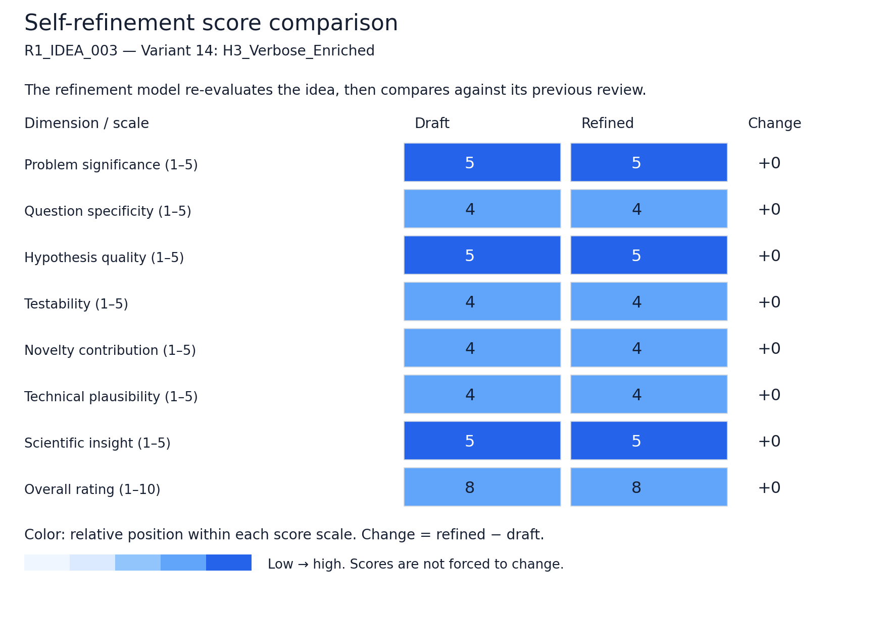

Changed score dimensions: none.

### Score justifications (draft / refined)

**Problem significance**

```json
{
  "draft": {
    "score": 5.0,
    "justification": "The problem addresses a fundamental gap in medical AI: models often mimic the 'what' of diagnosis (the result) but fail to mimic the 'how' (the reasoning process). Capturing the temporal dynamics of expert attention is crucial for building trustworthy, interpretable, and clinically useful AI systems."
  },
  "refined": {
    "score": 5.0,
    "justification": "The problem addresses a fundamental gap in medical AI: models often mimic the 'what' of diagnosis (the result) but fail to mimic the 'how' (the reasoning process). Capturing the temporal dynamics of expert attention is crucial for building trustworthy, interpretable, and clinically useful AI systems. This is a high-impact problem in the field."
  }
}
```

**Question specificity**

```json
{
  "draft": {
    "score": 4.0,
    "justification": "The idea clearly defines the shift from static to temporal gaze and the specific goal of learning scanning heuristics. However, the specific architectural implementation and the precise definition of the evaluation metrics for 'alignment' could be more concrete."
  },
  "refined": {
    "score": 4.0,
    "justification": "The idea clearly defines the shift from static to temporal gaze and the specific goal of learning scanning heuristics. However, the specific architectural implementation and the precise definition of the evaluation metrics for 'alignment' could be more concrete. The research question is well-defined but relies on the successful operationalization of 'scanning heuristics' which is not fully detailed."
  }
}
```

**Hypothesis quality**

```json
{
  "draft": {
    "score": 5.0,
    "justification": "The hypothesis is strong and falsifiable: it posits that temporal encoding specifically enables the learning of scanning heuristics, which in turn improves explanation alignment. It distinguishes between the data representation (video vs. static) and the resulting cognitive capability."
  },
  "refined": {
    "score": 5.0,
    "justification": "The hypothesis is strong and falsifiable: it posits that temporal encoding specifically enables the learning of scanning heuristics, which in turn improves explanation alignment. It distinguishes between the data representation (video vs. static) and the resulting cognitive capability. The claim that 'temporal encoding allows the model to learn scanning heuristics' is a clear, testable prediction."
  }
}
```

**Testability**

```json
{
  "draft": {
    "score": 4.0,
    "justification": "The proposal includes a clear plan for validation (staged design, ablations, sensitivity analysis). The main challenge lies in defining the 'ground truth' for human reasoning sequences, but the framework provided is sufficient to test the core claim."
  },
  "refined": {
    "score": 4.0,
    "justification": "The proposal includes a clear plan for validation (staged design, ablations, sensitivity analysis). The main challenge lies in defining the 'ground truth' for human reasoning sequences, but the framework provided is sufficient to test the core claim. The idea explicitly suggests comparing outcomes across easy/difficult cases and performing ablations, which are strong testable components."
  }
}
```

**Novelty contribution**

```json
{
  "draft": {
    "score": 4.0,
    "justification": "While gaze tracking in medicine is not new, encoding it as a temporal video sequence to explicitly teach 'scanning heuristics' to VLMs is a novel and promising direction. It moves beyond using gaze as a simple attention map to using it as a temporal curriculum or prior."
  },
  "refined": {
    "score": 4.0,
    "justification": "While gaze tracking in medicine is not new, encoding it as a temporal video sequence to explicitly teach 'scanning heuristics' to VLMs is a novel and promising direction. It moves beyond using gaze as a simple attention map to using it as a temporal curriculum or prior. The contribution lies in the mechanism of learning heuristics rather than just the data source."
  }
}
```

**Technical plausibility**

```json
{
  "draft": {
    "score": 4.0,
    "justification": "The approach is technically sound. Modern VLMs and video understanding models are capable of processing sequential data. The main hurdle is data quality and integration, but the premise is logically coherent."
  },
  "refined": {
    "score": 4.0,
    "justification": "The approach is technically sound. Modern VLMs and video understanding models are capable of processing sequential data. The main hurdle is data quality and integration, but the premise is logically coherent. The idea does not propose impossible physics or mathematics, just a specific application of existing sequential modeling techniques."
  }
}
```

**Scientific insight**

```json
{
  "draft": {
    "score": 5.0,
    "justification": "If successful, this research would reveal whether temporal attention patterns are a necessary component of medical reasoning in AI. It could uncover fundamental differences between how humans and current AI models process visual information, offering deep insights into the nature of medical expertise."
  },
  "refined": {
    "score": 5.0,
    "justification": "If successful, this research would reveal whether temporal attention patterns are a necessary component of medical reasoning in AI. It could uncover fundamental differences between how humans and current AI models process visual information, offering deep insights into the nature of medical expertise. The focus on 'boundary conditions' and 'data regimes' ensures the insights are transferable."
  }
}
```

**Overall rating**

```json
{
  "draft": {
    "score": 8.0,
    "justification": "This is a strong research idea with high scientific potential. It identifies a meaningful problem, proposes a specific and plausible mechanism (temporal encoding), and outlines a rigorous evaluation strategy. While it lacks implementation specifics, the conceptual framework is robust and likely to yield significant insights into medical AI interpretability."
  },
  "refined": {
    "score": 8.0,
    "justification": "This is a strong research idea with high scientific potential. It identifies a meaningful problem, proposes a specific and plausible mechanism (temporal encoding), and outlines a rigorous evaluation strategy. While it lacks implementation specifics, the conceptual framework is robust and likely to yield significant insights into medical AI interpretability. It avoids the trap of being a mere application by focusing on the underlying mechanism of 'scanning heuristics'."
  }
}
```

## R1_IDEA_003 — Variant 15: H4_Ultimate_Hype


Changed score dimensions: none.

### Score justifications (draft / refined)

**Problem significance**

```json
{
  "draft": {
    "score": 5.0,
    "justification": "The problem is highly significant. Current medical AI often lacks transparency. Integrating human visual behavior is a key step toward trustworthy AI. Recognizing that gaze is temporal rather than static addresses a fundamental limitation in how human expertise is currently modeled in these systems."
  },
  "refined": {
    "score": 5.0,
    "justification": "The problem is highly significant. Current medical AI often lacks transparency. Integrating human visual behavior is a key step toward trustworthy AI. Recognizing that gaze is temporal rather than static addresses a fundamental limitation in how human expertise is currently modeled in these systems."
  }
}
```

**Question specificity**

```json
{
  "draft": {
    "score": 3.0,
    "justification": "The idea identifies a clear direction (temporal vs. static) but lacks a specific research question. It states a goal ('enhance reasoning') but does not specify the exact relationship being tested or the specific mechanism of improvement."
  },
  "refined": {
    "score": 3.0,
    "justification": "The idea identifies a clear direction (temporal vs. static) but lacks a specific research question. It states a goal ('enhance reasoning') but does not specify the exact relationship being tested or the specific mechanism of improvement."
  }
}
```

**Hypothesis quality**

```json
{
  "draft": {
    "score": 3.0,
    "justification": "The implicit hypothesis is that 'temporal gaze encoding > static gaze encoding for reasoning/interpretability.' This is a reasonable and testable hypothesis, but it is currently broad. It needs to be more specific about the conditions under which this holds true."
  },
  "refined": {
    "score": 3.0,
    "justification": "The implicit hypothesis is that 'temporal gaze encoding > static gaze encoding for reasoning/interpretability.' This is a reasonable and testable hypothesis, but it is currently broad. It needs to be more specific about the conditions under which this holds true."
  }
}
```

**Testability**

```json
{
  "draft": {
    "score": 4.0,
    "justification": "The idea is highly testable. One can collect a dataset of X-rays with gaze videos, train two models (one with static, one with temporal inputs), and compare their performance on diagnostic tasks and their attention maps against ground truth radiologist behavior."
  },
  "refined": {
    "score": 4.0,
    "justification": "The idea is highly testable. One can collect a dataset of X-rays with gaze videos, train two models (one with static, one with temporal inputs), and compare their performance on diagnostic tasks and their attention maps against ground truth radiologist behavior."
  }
}
```

**Novelty contribution**

```json
{
  "draft": {
    "score": 4.0,
    "justification": "While gaze integration is known, treating it as a video sequence to capture scanning order in LVLMs for medical imaging is a novel and underexplored angle. It moves beyond simple attention visualization to active modeling of the search process."
  },
  "refined": {
    "score": 4.0,
    "justification": "While gaze integration is known, treating it as a video sequence to capture scanning order in LVLMs for medical imaging is a novel and underexplored angle. It moves beyond simple attention visualization to active modeling of the search process."
  }
}
```

**Technical plausibility**

```json
{
  "draft": {
    "score": 4.0,
    "justification": "The technical direction is plausible. Video encoders (like ViT or CLIP variants) can process gaze sequences, and multimodal transformers can fuse this with image/text tokens. The main challenge is architectural design, not fundamental feasibility."
  },
  "refined": {
    "score": 4.0,
    "justification": "The technical direction is plausible. Video encoders (like ViT or CLIP variants) can process gaze sequences, and multimodal transformers can fuse this with image/text tokens. The main challenge is architectural design, not fundamental feasibility."
  }
}
```

**Scientific insight**

```json
{
  "draft": {
    "score": 4.0,
    "justification": "If successful, this research would provide deep insights into how temporal visual attention correlates with diagnostic reasoning in experts. It could reveal that the *order* of observation is as critical as the *location*, a principle that could apply to other domains like robotics or autonomous driving."
  },
  "refined": {
    "score": 4.0,
    "justification": "If successful, this research would provide deep insights into how temporal visual attention correlates with diagnostic reasoning in experts. It could reveal that the *order* of observation is as critical as the *location*, a principle that could apply to other domains like robotics or autonomous driving."
  }
}
```

**Overall rating**

```json
{
  "draft": {
    "score": 7.0,
    "justification": "This is a strong research idea with high potential impact. It identifies a genuine gap in the literature (temporal nature of gaze) and proposes a logical, testable solution. However, it currently lacks the specificity of a concrete research question and a defined mechanism, which prevents it from being an 'exceptional' (9-10) score. With more specific hypotheses and a defined experimental framework, it could be a top-tier contribution."
  },
  "refined": {
    "score": 7.0,
    "justification": "This is a strong research idea with high potential impact. It identifies a genuine gap in the literature (temporal nature of gaze) and proposes a logical, testable solution. However, it currently lacks the specificity of a concrete research question and a defined mechanism, which prevents it from being an 'exceptional' (9-10) score. With more specific hypotheses and a defined experimental framework, it could be a top-tier contribution."
  }
}
```

## R1_IDEA_004 — Source

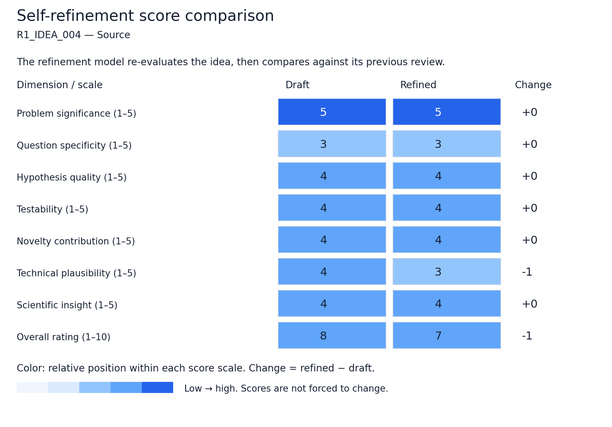

Changed score dimensions: technical_plausibility, overall_rating.

### Score justifications (draft / refined)

**Problem significance**

```json
{
  "draft": {
    "score": 5.0,
    "justification": "Aligning LLMs with safety constraints is a paramount challenge in the field. The current reliance on separate reward models and complex RL pipelines is computationally expensive and often unstable. A method that simplifies this while maintaining safety is of high significance to both researchers and practitioners."
  },
  "refined": {
    "score": 5.0,
    "justification": "Aligning LLMs with safety constraints is a paramount challenge. The current reliance on separate reward models and complex RL pipelines is computationally expensive and often unstable. A method that simplifies this while maintaining safety is of high significance to both researchers and practitioners."
  }
}
```

**Question specificity**

```json
{
  "draft": {
    "score": 3.0,
    "justification": "The idea identifies the goal (constrained alignment without separate models) and the method class (primal-dual DPO), but lacks the specific mathematical formulation of the constraint and the exact algorithmic steps. The 'how' is currently vague."
  },
  "refined": {
    "score": 3.0,
    "justification": "The idea identifies the goal (constrained alignment without separate models) and the method class (primal-dual DPO), but lacks the specific mathematical formulation of the constraint and the exact algorithmic steps. The 'how' is currently vague."
  }
}
```

**Hypothesis quality**

```json
{
  "draft": {
    "score": 4.0,
    "justification": "The implicit hypothesis is that a primal-dual formulation can effectively learn the optimal Lagrange multiplier on-the-fly, allowing for constrained optimization without a separate cost model, leading to better efficiency. This is a testable and non-trivial claim."
  },
  "refined": {
    "score": 4.0,
    "justification": "The implicit hypothesis is that a primal-dual formulation can effectively learn the optimal Lagrange multiplier on-the-fly, allowing for constrained optimization without a separate cost model, leading to better efficiency. This is a testable and non-trivial claim."
  }
}
```

**Testability**

```json
{
  "draft": {
    "score": 4.0,
    "justification": "The idea is testable. One can implement the proposed primal-dual DPO, compare it against standard DPO and Constrained DPO (with separate models) on a safety benchmark, and measure both safety compliance and computational cost (time/iterations)."
  },
  "refined": {
    "score": 4.0,
    "justification": "The idea is testable. One can implement the proposed primal-dual DPO, compare it against standard DPO and Constrained DPO (with separate models) on a safety benchmark, and measure both safety compliance and computational cost (time/iterations)."
  }
}
```

**Novelty contribution**

```json
{
  "draft": {
    "score": 4.0,
    "justification": "While DPO is well-studied, applying a primal-dual framework to eliminate the need for a separate cost model in a constrained setting is a novel direction. It moves beyond simple application of existing methods to proposing a structural change in the optimization pipeline."
  },
  "refined": {
    "score": 4.0,
    "justification": "While DPO is well-studied, applying a primal-dual framework to eliminate the need for a separate cost model in a constrained setting is a novel direction. It moves beyond simple application of existing methods to proposing a structural change in the optimization pipeline."
  }
}
```

**Technical plausibility**

```json
{
  "draft": {
    "score": 4.0,
    "justification": "Primal-dual methods are standard in constrained optimization. Applying them to the DPO loss is theoretically plausible. However, the non-convex nature of deep learning and the specific formulation of constraints in DPO present challenges that need careful handling, but the core idea is sound."
  },
  "refined": {
    "score": 3.0,
    "justification": "Primal-dual methods are standard in constrained optimization. Applying them to the DPO loss is theoretically plausible. However, the non-convex nature of deep learning and the specific formulation of constraints in DPO present challenges that need careful handling. The claim of removing the cost model entirely without a clear mechanism for constraint gradient estimation is a significant technical hurdle that reduces plausibility."
  }
}
```

**Scientific insight**

```json
{
  "draft": {
    "score": 4.0,
    "justification": "If successful, this research would reveal whether the 'cost model' is truly necessary for constrained alignment or if the constraint information can be embedded directly into the preference optimization dynamics. This would fundamentally change how we think about constrained RL/alignment."
  },
  "refined": {
    "score": 4.0,
    "justification": "If successful, this research would reveal whether the 'cost model' is truly necessary for constrained alignment or if the constraint information can be embedded directly into the preference optimization dynamics. This would fundamentally change how we think about constrained RL/alignment."
  }
}
```

**Overall rating**

```json
{
  "draft": {
    "score": 8.0,
    "justification": "This is a strong research idea with high potential impact. It addresses a significant pain point (computational cost of safety alignment) with a theoretically grounded approach (primal-dual optimization). While the specific implementation details are missing, the core hypothesis is clear, testable, and scientifically valuable. It sits in the 'Strong' category because the novelty is high and the problem is critical, but it lacks the full specificity of a 'Exceptional' idea due to the undefined constraint formulation."
  },
  "refined": {
    "score": 7.0,
    "justification": "This is a strong research idea with high potential impact. It addresses a significant pain point (computational cost of safety alignment) with a theoretically grounded approach (primal-dual optimization). While the specific implementation details are missing, the core hypothesis is clear, testable, and scientifically valuable. It sits in the 'Strong' category because the novelty is high and the problem is critical, but it lacks the full specificity of an 'Exceptional' idea due to the undefined constraint formulation and the technical challenge of deriving constraints from preferences without a cost model."
  }
}
```

## R1_IDEA_004 — Variant 1: A1_Identity

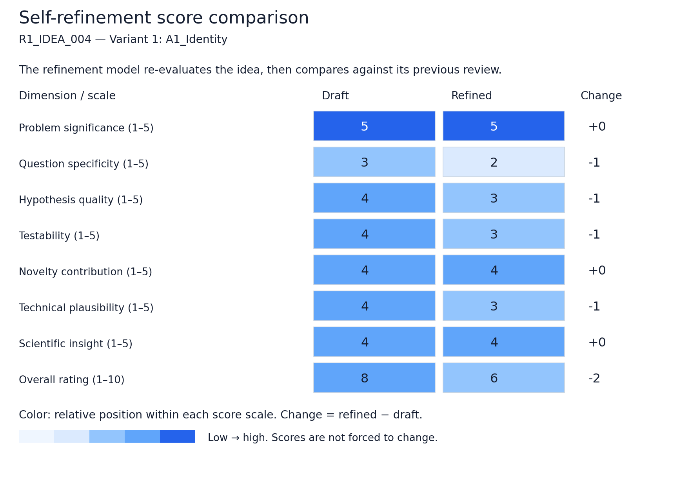

Changed score dimensions: question_specificity, hypothesis_quality, testability, technical_plausibility, overall_rating.

### Score justifications (draft / refined)

**Problem significance**

```json
{
  "draft": {
    "score": 5.0,
    "justification": "Aligning LLMs with safety constraints is a paramount challenge in the field. The current reliance on separate reward models and complex RL pipelines is computationally expensive and difficult to scale. A method that simplifies this while maintaining safety is of high significance to both researchers and practitioners."
  },
  "refined": {
    "score": 5.0,
    "justification": "The problem of aligning LLMs with safety constraints is of paramount importance. The current reliance on separate reward models and complex RL pipelines (like PPO) is computationally expensive and difficult to scale. A method that simplifies this pipeline while maintaining rigorous safety guarantees addresses a critical bottleneck in the field."
  }
}
```

**Question specificity**

```json
{
  "draft": {
    "score": 3.0,
    "justification": "The idea identifies the goal (constrained alignment without separate models) and the method (primal-dual DPO), but lacks specific details on the mathematical formulation of the constraint and the exact algorithmic steps. The 'how' is currently vague."
  },
  "refined": {
    "score": 2.0,
    "justification": "While the high-level goal is clear, the core technical question is underspecified. The idea fails to define how a 'constraint' (which requires a function evaluation) is integrated into DPO (which relies on pairwise ratios) without a separate cost model. The mathematical bridge between the two is missing, making the research question vague."
  }
}
```

**Hypothesis quality**

```json
{
  "draft": {
    "score": 4.0,
    "justification": "The implicit hypothesis is that a primal-dual formulation can effectively learn the optimal Lagrange multiplier dynamically, allowing for constrained optimization without a separate cost model, leading to better efficiency. This is a testable and non-trivial claim."
  },
  "refined": {
    "score": 3.0,
    "justification": "The implicit hypothesis—that a primal-dual mechanism can implicitly learn the necessary cost gradients from preference data alone—is testable but currently lacks a clear mechanism. It is a strong hypothesis, but the lack of a defined formulation makes it difficult to evaluate its plausibility without significant assumptions."
  }
}
```

**Testability**

```json
{
  "draft": {
    "score": 4.0,
    "justification": "The idea is testable. One can implement the proposed primal-dual DPO, compare it against standard DPO and Constrained DPO (with separate models) on standard safety benchmarks (e.g., AdvBench, SafeBench), and measure both safety scores and computational cost (FLOPs/time)."
  },
  "refined": {
    "score": 3.0,
    "justification": "The idea is testable in principle (one can attempt to implement a primal-dual DPO variant), but the lack of a defined constraint function makes it difficult to design a rigorous experiment. Testing would require the authors to first resolve the ambiguity of how the constraint is represented, which is a significant part of the research itself."
  }
}
```

**Novelty contribution**

```json
{
  "draft": {
    "score": 4.0,
    "justification": "While primal-dual methods are known in optimization, applying them specifically to Direct Preference Optimization to eliminate the need for a separate cost model is a novel direction. It moves beyond simple application to a new domain and proposes a structural change to the alignment pipeline."
  },
  "refined": {
    "score": 4.0,
    "justification": "Applying primal-dual optimization to DPO to eliminate the need for a separate cost model is a novel direction. If successful, it would represent a structural shift in how constrained alignment is performed, moving away from explicit reward/cost modeling to implicit constraint learning."
  }
}
```

**Technical plausibility**

```json
{
  "draft": {
    "score": 4.0,
    "justification": "The use of primal-dual methods for constrained optimization is theoretically sound. The challenge lies in adapting it to the specific loss landscape of DPO, but the reasoning is logically coherent and plausible."
  },
  "refined": {
    "score": 3.0,
    "justification": "The reasoning is partially coherent but contains a potential logical gap. Primal-dual methods require the gradient of the constraint function. If the cost model is removed, the source of this gradient is undefined. The idea assumes this can be derived from preference data, but the mechanism is not explained, making the technical plausibility uncertain."
  }
}
```

**Scientific insight**

```json
{
  "draft": {
    "score": 4.0,
    "justification": "If successful, this research could reveal that the explicit modeling of a cost function is not strictly necessary for constrained alignment if the constraint can be learned implicitly through the primal-dual mechanism. This would offer a new perspective on the relationship between reward, constraint, and preference data."
  },
  "refined": {
    "score": 4.0,
    "justification": "If the idea can be successfully formulated and validated, it would provide significant insight into the relationship between preference data and constraint satisfaction. It could reveal that explicit cost modeling is redundant if the constraint can be learned implicitly through the optimization dynamics."
  }
}
```

**Overall rating**

```json
{
  "draft": {
    "score": 8.0,
    "justification": "This is a strong research idea with high potential impact. It addresses a significant pain point (computational cost of separate models) with a theoretically grounded approach (primal-dual). While the specific implementation details are missing, the core hypothesis is clear, testable, and scientifically valuable. It has the potential to be a significant contribution to the field of LLM alignment."
  },
  "refined": {
    "score": 6.0,
    "justification": "This is a moderate research idea. It addresses a significant problem with a potentially novel approach, but the core technical formulation is currently too vague to be considered a strong, ready-to-execute proposal. The critical gap in defining how constraints are handled without a cost model prevents it from being rated higher. It requires substantial conceptual work to move from a vague idea to a concrete, testable hypothesis."
  }
}
```

## R1_IDEA_004 — Variant 2: A2_Paraphrase_Only


Changed score dimensions: technical_plausibility, overall_rating.

### Score justifications (draft / refined)

**Problem significance**

```json
{
  "draft": {
    "score": 5.0,
    "justification": "Aligning LLMs with safety constraints is a paramount challenge in the field. Reducing the computational cost and complexity of this alignment (by removing the need for separate models) is a highly significant contribution that could make safe alignment more accessible and scalable."
  },
  "refined": {
    "score": 5.0,
    "justification": "The problem of aligning LLMs with safety constraints is of paramount importance. The current reliance on separate reward/cost models creates significant computational and data bottlenecks. Solving this would have a major impact on the scalability and accessibility of safe AI."
  }
}
```

**Question specificity**

```json
{
  "draft": {
    "score": 3.0,
    "justification": "The idea identifies a clear goal (constrained DPO without separate models) but lacks specific details on the mathematical formulation. The exact nature of the 'constraints' and the 'primal-dual' mechanism within the DPO context is currently too vague to be fully evaluated."
  },
  "refined": {
    "score": 3.0,
    "justification": "While the goal is clear, the specific research question is underspecified. The summary states *what* is achieved (constrained DPO without separate models) but not *how* the constraints are mathematically integrated or how the 'cost' is defined without a model. The lack of a formal problem statement makes it difficult to assess the exact nature of the contribution."
  }
}
```

**Hypothesis quality**

```json
{
  "draft": {
    "score": 4.0,
    "justification": "The implicit hypothesis is that a primal-dual formulation can effectively solve the constrained optimization problem in DPO without external models or prior multiplier knowledge. This is a testable and non-trivial claim that, if true, would represent a significant methodological advance."
  },
  "refined": {
    "score": 4.0,
    "justification": "The hypothesis—that a primal-dual formulation can effectively solve constrained optimization in DPO without external models—is strong and falsifiable. It makes a specific claim about the relationship between preference data, constraints, and optimization dynamics. However, the ambiguity in how the constraint signal is obtained slightly weakens the precision of the hypothesis."
  }
}
```

**Testability**

```json
{
  "draft": {
    "score": 4.0,
    "justification": "The idea is testable. One can implement the proposed algorithm, define specific safety constraints (e.g., toxicity thresholds), and compare performance against standard DPO and RLHF baselines on metrics of safety, reward, and computational efficiency."
  },
  "refined": {
    "score": 4.0,
    "justification": "The idea is testable. One can implement a variant of DPO with a primal-dual update, define a specific constraint (e.g., using a fixed toxicity classifier as a cost oracle), and evaluate if the method converges to a safe policy without training a separate reward model. The comparison against standard DPO and RLHF is straightforward."
  }
}
```

**Novelty contribution**

```json
{
  "draft": {
    "score": 4.0,
    "justification": "While primal-dual methods are common in optimization, applying them directly to DPO to eliminate the need for separate reward/cost models is a novel direction. It moves beyond simple application of existing methods to proposing a new architectural/algorithmic integration."
  },
  "refined": {
    "score": 4.0,
    "justification": "Applying primal-dual methods to DPO to remove the need for separate models is a novel direction. While constrained optimization is well-studied, the specific application to the DPO framework to eliminate the 'reward model' step (or the 'cost model' step) represents a meaningful methodological shift."
  }
}
```

**Technical plausibility**

```json
{
  "draft": {
    "score": 4.0,
    "justification": "The approach is technically plausible. Primal-dual methods are standard for constrained optimization, and DPO is a constrained optimization problem in disguise. Integrating them is a logical step, though the specific implementation details (e.g., handling the non-convexity of neural networks) will be the main challenge."
  },
  "refined": {
    "score": 3.0,
    "justification": "The idea is plausible in principle (primal-dual methods work for constrained optimization), but there are significant technical hurdles. DPO is a specific reduction of RL; extending it to arbitrary constraints without a separate model requires careful handling of the constraint signal. If the constraint is external, the claim of 'no separate model' might be misleading (it's just not *trained*). If the constraint is internal to the preference data, the mechanism is unclear. The non-convexity of the problem also raises convergence concerns not addressed in the summary."
  }
}
```

**Scientific insight**

```json
{
  "draft": {
    "score": 4.0,
    "justification": "If successful, this research would provide deep insight into the relationship between preference optimization and constrained optimization, potentially revealing new ways to handle safety without the overhead of reward modeling. It could also shed light on the convergence properties of primal-dual methods in deep learning contexts."
  },
  "refined": {
    "score": 4.0,
    "justification": "If successful, this work would provide significant insight into the limits of Direct Preference Optimization and its relationship to constrained optimization. It could reveal whether preference data alone is sufficient to encode complex safety constraints or if external signals are always necessary."
  }
}
```

**Overall rating**

```json
{
  "draft": {
    "score": 8.0,
    "justification": "This is a strong research idea with high potential impact. It addresses a significant problem (cost of alignment) with a theoretically sound approach (primal-dual DPO). While the summary lacks implementation details, the core hypothesis is specific, testable, and novel enough to warrant investigation. It scores highly on significance and potential insight, with moderate scores on specificity due to the lack of mathematical formulation in the summary."
  },
  "refined": {
    "score": 7.0,
    "justification": "This is a strong research idea with high potential impact, addressing a significant problem with a theoretically motivated approach. However, the score is moderated from a '9' or '10' because the summary lacks the necessary mathematical specificity to fully validate the technical plausibility. The claim of eliminating separate models is ambiguous regarding the source of the constraint signal. It is a promising direction that requires rigorous formulation to move from a 'good idea' to an 'exceptional' one."
  }
}
```

## R1_IDEA_004 — Variant 3: A3_Plain_Core


Changed score dimensions: none.

### Score justifications (draft / refined)

**Problem significance**

```json
{
  "draft": {
    "score": 5.0,
    "justification": "Constrained alignment of LLMs is a high-priority problem in the field. Reducing the computational cost of safety alignment (by avoiding separate reward/cost model training) would have significant practical impact for researchers and practitioners."
  },
  "refined": {
    "score": 5.0,
    "justification": "Constrained alignment of LLMs is a high-priority problem. Reducing the computational cost of safety alignment (by avoiding separate reward/cost model training) would have significant practical impact for researchers and practitioners."
  }
}
```

**Question specificity**

```json
{
  "draft": {
    "score": 3.0,
    "justification": "The idea identifies the goal (maximize reward, enforce safety) and the method (primal-dual DPO), but lacks specificity on the mathematical formulation of the constraints and the specific mechanism for the primal-dual updates."
  },
  "refined": {
    "score": 3.0,
    "justification": "The idea identifies the goal and the general method (primal-dual DPO), but lacks specificity on the mathematical formulation of the constraints and the specific mechanism for the primal-dual updates, particularly the conversion of preferences to costs."
  }
}
```

**Hypothesis quality**

```json
{
  "draft": {
    "score": 4.0,
    "justification": "The hypothesis is clear: a primal-dual DPO approach can achieve constrained alignment without separate models or prior multiplier knowledge, leading to lower overhead. This is a concrete claim that can be supported or refuted."
  },
  "refined": {
    "score": 4.0,
    "justification": "The hypothesis is clear: a primal-dual DPO approach can achieve constrained alignment without separate models or prior multiplier knowledge, leading to lower overhead. This is a concrete claim that can be supported or refuted."
  }
}
```

**Testability**

```json
{
  "draft": {
    "score": 4.0,
    "justification": "The idea is testable by implementing the proposed algorithm and comparing it against standard DPO and Constrained RLHF baselines on standard safety benchmarks. The metrics (reward, safety score, training time) are well-defined."
  },
  "refined": {
    "score": 4.0,
    "justification": "The idea is testable by implementing the proposed algorithm and comparing it against standard DPO and Constrained RLHF baselines on standard safety benchmarks. The metrics (reward, safety score, training time) are well-defined."
  }
}
```

**Novelty contribution**

```json
{
  "draft": {
    "score": 4.0,
    "justification": "Applying primal-dual optimization directly to DPO to avoid separate model training is a novel direction. While Lagrangian methods exist in RL, their specific adaptation to the DPO preference learning setting without auxiliary models is a distinct contribution."
  },
  "refined": {
    "score": 4.0,
    "justification": "Applying primal-dual optimization directly to DPO to avoid separate model training is a novel direction. While Lagrangian methods exist in RL, their specific adaptation to the DPO preference learning setting without auxiliary models is a distinct contribution."
  }
}
```

**Technical plausibility**

```json
{
  "draft": {
    "score": 3.0,
    "justification": "The concept is technically plausible as primal-dual methods are standard in constrained optimization. However, the application to the non-convex, stochastic DPO setting without clear details on the update rules makes the immediate plausibility moderate. It requires careful theoretical grounding to ensure stability."
  },
  "refined": {
    "score": 3.0,
    "justification": "The concept is technically plausible as primal-dual methods are standard in constrained optimization. However, the application to the non-convex, stochastic DPO setting without clear details on the update rules makes the immediate plausibility moderate. It requires careful theoretical grounding to ensure stability."
  }
}
```

**Scientific insight**

```json
{
  "draft": {
    "score": 4.0,
    "justification": "If successful, this research would reveal whether preference-based alignment can inherently handle constraints without explicit reward modeling, potentially uncovering new principles about the geometry of the preference space and safety boundaries."
  },
  "refined": {
    "score": 4.0,
    "justification": "If successful, this research would reveal whether preference-based alignment can inherently handle constraints without explicit reward modeling, potentially uncovering new principles about the geometry of the preference space and safety boundaries."
  }
}
```

**Overall rating**

```json
{
  "draft": {
    "score": 7.0,
    "justification": "This is a strong research idea with high significance and clear potential for contribution. The core hypothesis is testable and addresses a real bottleneck in LLM alignment. However, the lack of specific mathematical formulation and algorithmic details in the summary prevents it from being rated as 'exceptional' at this stage. It requires further elaboration on the 'how' to fully assess its technical viability."
  },
  "refined": {
    "score": 7.0,
    "justification": "This is a strong research idea with high significance and clear potential for contribution. The core hypothesis is testable and addresses a real bottleneck in LLM alignment. However, the lack of specific mathematical formulation and algorithmic details in the summary prevents it from being rated as 'exceptional' at this stage. It requires further elaboration on the 'how' to fully assess its technical viability."
  }
}
```

## R1_IDEA_004 — Variant 4: B1_Verbose_Elaborate


Changed score dimensions: none.

### Score justifications (draft / refined)

**Problem significance**

```json
{
  "draft": {
    "score": 5.0,
    "justification": "Constrained alignment is one of the most pressing challenges in deploying LLMs. Reducing the computational overhead of training separate reward/cost models while maintaining safety is a highly significant goal for the community."
  },
  "refined": {
    "score": 5.0,
    "justification": "Constrained alignment is a critical challenge in LLM deployment. Reducing the computational overhead of training separate reward and cost models (which is currently a major bottleneck) is a highly significant goal with broad practical implications."
  }
}
```

**Question specificity**

```json
{
  "draft": {
    "score": 3.0,
    "justification": "The idea identifies the goal (constrained alignment via primal-dual DPO) and the constraints (no separate models, no prior multiplier knowledge), but the specific mechanism for achieving these constraints without a cost model is not detailed enough to be fully specific."
  },
  "refined": {
    "score": 3.0,
    "justification": "The idea identifies the goal and the constraints (no separate models, no prior multiplier) but fails to specify the mechanism. The 'how' of deriving the constraint signal from preference data without a model is the missing link that makes the question currently too vague to be fully specific."
  }
}
```

**Hypothesis quality**

```json
{
  "draft": {
    "score": 4.0,
    "justification": "The implicit hypothesis is that a primal-dual formulation can effectively learn constraints directly from preference data without auxiliary models. This is a concrete, testable claim that distinguishes it from standard DPO."
  },
  "refined": {
    "score": 4.0,
    "justification": "The hypothesis—that preference data contains sufficient latent structure to learn both reward and constraints via a primal-dual formulation without auxiliary models—is concrete and falsifiable. It makes a strong claim that distinguishes it from standard approaches."
  }
}
```

**Testability**

```json
{
  "draft": {
    "score": 4.0,
    "justification": "The idea is highly testable. One can implement the proposed algorithm, compare it against standard DPO and RLHF with reward models on safety benchmarks, and measure constraint satisfaction vs. reward maximization."
  },
  "refined": {
    "score": 4.0,
    "justification": "The idea is testable. One can implement the proposed algorithm (assuming a formulation is derived) and evaluate it on safety benchmarks against standard DPO and RLHF. The success criteria (constraint satisfaction vs. reward) are clear."
  }
}
```

**Novelty contribution**

```json
{
  "draft": {
    "score": 4.0,
    "justification": "Applying primal-dual optimization directly to DPO to eliminate the need for separate reward models is a novel direction. If successful, it could fundamentally change how constrained alignment is performed."
  },
  "refined": {
    "score": 4.0,
    "justification": "Applying primal-dual optimization to DPO to eliminate the need for separate models is a novel direction. If successful, it would contribute a new paradigm for efficient alignment, moving beyond the current reliance on separate reward modeling."
  }
}
```

**Technical plausibility**

```json
{
  "draft": {
    "score": 3.0,
    "justification": "While the goal is plausible, the technical path is non-trivial. Estimating constraint gradients without a cost model requires a clever mechanism (e.g., using the preference data distribution itself). The summary does not provide enough detail to fully assess the plausibility of the gradient estimation."
  },
  "refined": {
    "score": 3.0,
    "justification": "The idea is plausible but technically risky. The assumption that preference data alone can provide a clean gradient for a specific safety constraint without a dedicated model is a strong assumption that may not hold without careful formulation. The lack of details on handling non-convexity and dual variable updates lowers the plausibility score."
  }
}
```

**Scientific insight**

```json
{
  "draft": {
    "score": 4.0,
    "justification": "If successful, this research would reveal whether preference data alone contains sufficient signal for both reward and constraint learning, offering deep insights into the information density of preference datasets."
  },
  "refined": {
    "score": 4.0,
    "justification": "If successful, this research would provide deep insights into the information density of preference datasets and whether they inherently encode safety boundaries. It could reveal fundamental limits or capabilities of preference-based learning."
  }
}
```

**Overall rating**

```json
{
  "draft": {
    "score": 7.0,
    "justification": "This is a strong research idea with high significance and potential novelty. It addresses a major bottleneck in LLM alignment (computational cost of reward models) with a theoretically grounded approach. However, the lack of specific details on the constraint estimation mechanism and the primal-dual update rule prevents it from being an 'exceptional' (9-10) rating at this stage. It requires a clear formulation to be fully convincing."
  },
  "refined": {
    "score": 7.0,
    "justification": "This is a strong research idea with high significance and novelty. It tackles a major bottleneck in LLM alignment with a theoretically interesting approach. However, the lack of a specific mechanism for constraint estimation and the undefined dual update rule prevent it from being rated as 'exceptional' (9-10). It requires a solid theoretical foundation to be fully convincing."
  }
}
```

## R1_IDEA_004 — Variant 5: B2_Grand_Narrative


Changed score dimensions: question_specificity, hypothesis_quality, testability, technical_plausibility, scientific_insight, overall_rating.

### Score justifications (draft / refined)

**Problem significance**

```json
{
  "draft": {
    "score": 5.0,
    "justification": "Safe and efficient alignment of LLMs is one of the most significant challenges in current AI research. Proposing a method that reduces computational overhead while maintaining safety constraints addresses a major practical barrier to deploying safe models."
  },
  "refined": {
    "score": 5.0,
    "justification": "The problem of aligning LLMs efficiently and safely is of paramount importance. Reducing the computational overhead of safety constraints (which currently requires training separate models) would be a significant practical breakthrough for the field."
  }
}
```

**Question specificity**

```json
{
  "draft": {
    "score": 3.0,
    "justification": "The idea identifies the goal (constrained alignment) and the desired properties (no separate models, no prior multiplier knowledge), but the specific research question regarding the *mechanism* of achieving this is not yet defined. It is a proposal of a direction rather than a specific, testable hypothesis about a mechanism."
  },
  "refined": {
    "score": 2.0,
    "justification": "While the goal is clear, the specific research question is vague. The idea states *what* it wants to achieve (constrained alignment without cost models) but does not articulate *how* the mechanism works. The central question of 'how to estimate constraint gradients without a cost model' is left entirely open, making the research question more of a challenge than a defined investigation."
  }
}
```

**Hypothesis quality**

```json
{
  "draft": {
    "score": 4.0,
    "justification": "The implicit hypothesis is that a primal-dual formulation can effectively enforce constraints in DPO without auxiliary models. This is a strong, falsifiable claim that, if true, would represent a significant methodological advance. It distinguishes itself from generic applications by targeting specific inefficiencies."
  },
  "refined": {
    "score": 3.0,
    "justification": "The hypothesis is that a primal-dual formulation can bypass the need for a cost model. While this is a bold and interesting claim, it is currently unsupported by a plausible mechanism. It risks being a 'solution looking for a problem' or a misunderstanding of the requirements of constrained optimization in the preference setting."
  }
}
```

**Testability**

```json
{
  "draft": {
    "score": 4.0,
    "justification": "The idea is testable. One can implement the proposed algorithm, compare it against standard DPO and Constrained RLHF baselines on safety benchmarks, and measure both the reward performance and the constraint satisfaction rate. The lack of implementation details does not prevent the design of a valid evaluation protocol."
  },
  "refined": {
    "score": 3.0,
    "justification": "The idea is testable in principle (one could try to implement it), but the lack of a defined mechanism makes the experimental design difficult. Without a clear algorithm, the 'test' is essentially 'try to invent a method that does X,' which is less rigorous than testing a specific hypothesis."
  }
}
```

**Novelty contribution**

```json
{
  "draft": {
    "score": 4.0,
    "justification": "While primal-dual methods exist in optimization and DPO exists in alignment, combining them to eliminate the need for separate cost models and prior multiplier knowledge is a novel contribution. It moves beyond simple application to proposing a structural change in the alignment pipeline."
  },
  "refined": {
    "score": 4.0,
    "justification": "Combining primal-dual methods with DPO to eliminate auxiliary models is a novel direction. If the mechanism can be made to work, it would represent a significant departure from current constrained RLHF/DPO paradigms."
  }
}
```

**Technical plausibility**

```json
{
  "draft": {
    "score": 3.0,
    "justification": "The idea is technically plausible in principle, as primal-dual methods are standard for constrained optimization. However, the specific claim of doing this without a cost model in the context of preference data (which is noisy and relative) introduces significant technical risk that needs to be addressed in the methodology."
  },
  "refined": {
    "score": 2.0,
    "justification": "The idea faces a significant technical hurdle. Primal-dual optimization fundamentally relies on the gradient of the constraint function. In DPO, the 'cost' is implicit. The idea does not explain how to extract this gradient without an explicit cost model. This suggests a potential logical gap or a misunderstanding of the underlying optimization theory."
  }
}
```

**Scientific insight**

```json
{
  "draft": {
    "score": 4.0,
    "justification": "If successful, this research would provide deep insight into the relationship between preference data and constraint satisfaction, potentially revealing that explicit cost modeling is not strictly necessary for constrained alignment. It could lead to a new class of efficient alignment algorithms."
  },
  "refined": {
    "score": 3.0,
    "justification": "If successful, the insight would be profound (that preference data alone suffices for constrained optimization). However, given the current lack of a plausible mechanism, the potential for insight is currently speculative. It might instead reveal a fundamental limitation of DPO in constrained settings."
  }
}
```

**Overall rating**

```json
{
  "draft": {
    "score": 7.0,
    "justification": "This is a strong research idea with high significance and clear potential for contribution. It addresses a meaningful gap (efficiency in constrained alignment) with a plausible but non-trivial hypothesis. The main limitation is the current lack of specificity regarding the mechanism, which is typical for an early-stage idea summary but prevents it from being an 'exceptional' (9-10) rating until the methodological details are fleshed out."
  },
  "refined": {
    "score": 5.0,
    "justification": "This is a moderate idea. The problem is highly significant, and the goal is ambitious. However, the technical plausibility and question specificity are currently weak because the core mechanism (how to do constrained optimization without a cost model) is not explained and may be theoretically impossible as stated. It requires significant conceptual work to move from a vague proposal to a testable hypothesis."
  }
}
```

## R1_IDEA_004 — Variant 6: B3_Over_Confident

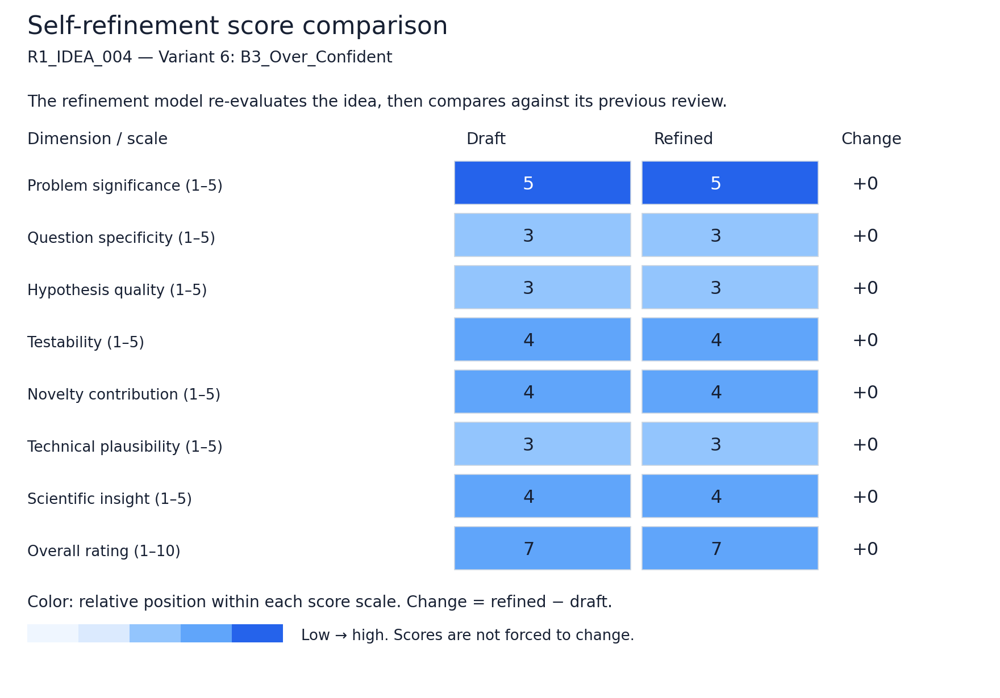

Changed score dimensions: none.

### Score justifications (draft / refined)

**Problem significance**

```json
{
  "draft": {
    "score": 5.0,
    "justification": "Constrained alignment of LLMs is a major challenge. Reducing the computational overhead of training separate models (as required by many current methods) is a highly significant problem with immediate practical value for researchers and practitioners."
  },
  "refined": {
    "score": 5.0,
    "justification": "Reducing the computational overhead of constrained alignment is a significant problem. Current methods often require training multiple models (reward, cost, policy), which is expensive and slow. Solving this would lower the barrier to entry for safe alignment and improve efficiency."
  }
}
```

**Question specificity**

```json
{
  "draft": {
    "score": 3.0,
    "justification": "The idea identifies the method (Primal-Dual DPO) and the goal (constrained alignment without cost models), but lacks specificity on the mathematical formulation of the constraints and the specific mechanism for the dual variable update."
  },
  "refined": {
    "score": 3.0,
    "justification": "The idea identifies the method and the goal but lacks specificity on the 'how'. The mechanism for estimating constraint gradients without a cost model is the central unknown, and the summary does not provide enough detail to define the research question precisely beyond 'do it without cost models'."
  }
}
```

**Hypothesis quality**

```json
{
  "draft": {
    "score": 3.0,
    "justification": "The implicit hypothesis is that a primal-dual formulation can replace the need for a cost model and prior multiplier knowledge. This is a testable claim, but the idea does not explicitly state the expected mechanism of success or the conditions under which it might fail."
  },
  "refined": {
    "score": 3.0,
    "justification": "The implicit hypothesis is that a primal-dual formulation can substitute for a cost model. This is a testable claim, but the idea does not articulate the conditions under which this substitution is valid or the specific mechanism (e.g., using preference data directly to estimate the constraint gradient) that makes it plausible."
  }
}
```

**Testability**

```json
{
  "draft": {
    "score": 4.0,
    "justification": "The idea is testable by comparing the proposed method against standard DPO and other constrained alignment baselines on standard safety benchmarks. The metrics (reward, safety score, training cost) are well-defined, even if the internal mechanism is not fully detailed."
  },
  "refined": {
    "score": 4.0,
    "justification": "The idea is testable. One can implement a primal-dual DPO variant, compare it against standard DPO and constrained DPO with cost models, and measure reward, safety scores, and training efficiency. The metrics are clear even if the internal mechanism is not."
  }
}
```

**Novelty contribution**

```json
{
  "draft": {
    "score": 4.0,
    "justification": "Applying primal-dual optimization directly to DPO to eliminate the cost model is a novel direction. While constrained optimization is known, the specific application to DPO to remove the cost model training step represents a potential significant methodological contribution."
  },
  "refined": {
    "score": 4.0,
    "justification": "Applying primal-dual optimization to DPO to eliminate the cost model is a novel direction. While constrained optimization is standard, the specific application to DPO to bypass the cost model training step represents a potential methodological contribution if it works."
  }
}
```

**Technical plausibility**

```json
{
  "draft": {
    "score": 3.0,
    "justification": "The concept is theoretically grounded in optimization theory, but applying it to the non-convex, high-dimensional space of LLMs without a cost model is non-trivial. The plausibility depends heavily on the specific update rules which are not provided, making it a 'plausible but unverified' direction."
  },
  "refined": {
    "score": 3.0,
    "justification": "The concept is theoretically grounded but faces significant challenges. Estimating constraint gradients without a cost model in a non-convex, high-dimensional space is non-trivial. The plausibility depends entirely on the specific, unprovided update rules. It is a plausible direction but currently unverified and risky."
  }
}
```

**Scientific insight**

```json
{
  "draft": {
    "score": 4.0,
    "justification": "If successful, this research would provide deep insights into the relationship between preference learning and constrained optimization, potentially revealing that explicit cost modeling is not strictly necessary for safe alignment if the dual variables are managed correctly."
  },
  "refined": {
    "score": 4.0,
    "justification": "If successful, this would reveal that explicit cost modeling is not strictly necessary for safe alignment if the dual variables are managed correctly via preference data alone. This would be a significant insight into the relationship between preference learning and constrained optimization."
  }
}
```

**Overall rating**

```json
{
  "draft": {
    "score": 7.0,
    "justification": "This is a strong research idea with high significance and clear potential for contribution. It addresses a real pain point (computational overhead) with a theoretically sound approach (primal-dual). However, it currently lacks the specificity of the mathematical formulation and the specific algorithmic details required to fully assess its novelty and technical feasibility. It sits in the 'Strong' category because the core concept is promising, but the execution path is not yet fully defined."
  },
  "refined": {
    "score": 7.0,
    "justification": "This is a strong research idea with high significance and clear potential. It addresses a real pain point with a theoretically sound approach. However, it currently lacks the specificity of the mathematical formulation and the specific algorithmic details required to fully assess its novelty and technical feasibility. It sits in the 'Strong' category because the core concept is promising, but the execution path is not yet fully defined."
  }
}
```

## R1_IDEA_004 — Variant 7: B4_Novelty

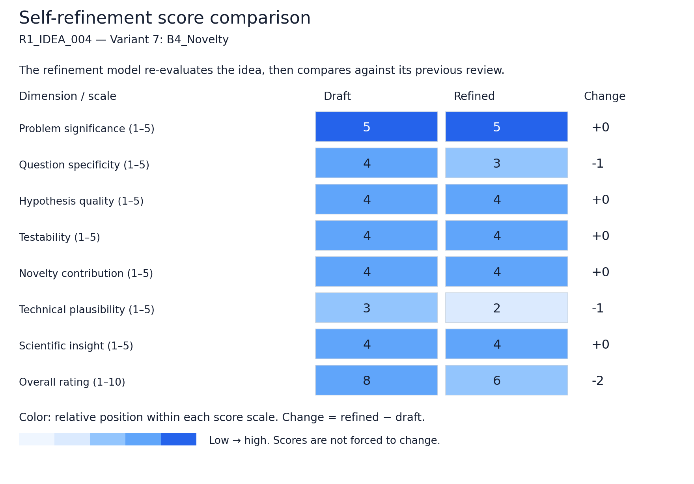

Changed score dimensions: question_specificity, technical_plausibility, overall_rating.

### Score justifications (draft / refined)

**Problem significance**

```json
{
  "draft": {
    "score": 5.0,
    "justification": "Constrained alignment is one of the most pressing challenges in deploying LLMs. Solving the problem of integrating constraints without the heavy computational cost of separate reward models is highly significant for both research and industry practitioners."
  },
  "refined": {
    "score": 5.0,
    "justification": "Constrained alignment is a critical bottleneck in deploying LLMs. The current reliance on separate reward and cost models is computationally expensive and introduces alignment fragility. Solving this would have immediate practical impact."
  }
}
```

**Question specificity**

```json
{
  "draft": {
    "score": 4.0,
    "justification": "The idea specifies the method (primal-dual DPO), the goal (maximize reward, enforce safety), and the constraints to be removed (separate models, prior multipliers). However, the mathematical specifics of the constraint formulation are currently vague."
  },
  "refined": {
    "score": 3.0,
    "justification": "While the goal (constrained DPO without cost models) is specific, the mechanism (how constraints are derived from preferences without a cost model) is vague. The idea states 'what' it wants to do but not 'how' in a way that is currently scientifically precise."
  }
}
```

**Hypothesis quality**

```json
{
  "draft": {
    "score": 4.0,
    "justification": "The hypothesis is clear: a primal-dual formulation can achieve constrained alignment more efficiently than current methods by eliminating the need for separate models and prior multipliers. This is a falsifiable claim that can be tested via ablation and comparison."
  },
  "refined": {
    "score": 4.0,
    "justification": "The hypothesis is strong: 'Integrating constraints via a primal-dual DPO framework without a cost model is feasible and efficient.' This is a clear, falsifiable prediction. However, the plausibility of the underlying mechanism is the weak link."
  }
}
```

**Testability**

```json
{
  "draft": {
    "score": 4.0,
    "justification": "The idea is highly testable. One can implement the proposed algorithm and compare it against baselines on standard safety benchmarks (e.g., AdvBench, TruthfulQA) and measure both safety scores and computational efficiency."
  },
  "refined": {
    "score": 4.0,
    "justification": "The idea is testable. One can implement a prototype, compare it against standard DPO and constrained DPO baselines, and measure safety metrics, reward scores, and computational cost. The lack of a cost model is a specific variable to test."
  }
}
```

**Novelty contribution**

```json
{
  "draft": {
    "score": 4.0,
    "justification": "Applying primal-dual optimization directly to DPO to avoid separate reward models is a novel angle. While constrained RLHF exists, the specific framing of doing this within DPO without a cost model is a distinct and potentially high-impact contribution."
  },
  "refined": {
    "score": 4.0,
    "justification": "Applying primal-dual optimization to DPO to eliminate the cost model is a novel angle. Most existing methods still rely on a reward/cost model or fixed multipliers. This could represent a significant methodological shift."
  }
}
```

**Technical plausibility**

```json
{
  "draft": {
    "score": 3.0,
    "justification": "The idea is technically plausible in principle, as primal-dual methods are standard in optimization. However, the specific application to the non-convex, preference-based landscape of DPO without a cost model introduces significant theoretical challenges that need to be addressed to ensure the method is not just a heuristic."
  },
  "refined": {
    "score": 2.0,
    "justification": "The idea faces a significant technical hurdle. Primal-dual methods typically require a scalar objective (cost) to update the dual variable. In DPO, the objective is a log-probability ratio of pairs. Deriving a scalar 'cost' signal from pairs without a separate model is non-trivial and currently unexplained. Without this mechanism, the method may be mathematically incoherent."
  }
}
```

**Scientific insight**

```json
{
  "draft": {
    "score": 4.0,
    "justification": "If successful, this research would provide deep insights into the relationship between preference data, constraint satisfaction, and optimization dynamics, potentially revealing new ways to formulate alignment problems that are more efficient and robust."
  },
  "refined": {
    "score": 4.0,
    "justification": "If the method works, it would reveal a deep connection between preference data and constraint satisfaction, potentially showing that explicit cost modeling is unnecessary. This would be a major theoretical insight."
  }
}
```

**Overall rating**

```json
{
  "draft": {
    "score": 8.0,
    "justification": "This is a strong research idea with high significance and clear potential for contribution. It addresses a real bottleneck in LLM alignment (computational cost of separate models) with a specific, testable methodological proposal. The main weakness is the current lack of mathematical detail regarding how the constraints are handled without a cost model, but this is appropriate for an idea summary. With proper theoretical grounding, this could be a top-tier contribution."
  },
  "refined": {
    "score": 6.0,
    "justification": "This is a moderate-to-strong idea with high potential impact, but it currently suffers from a critical lack of technical specificity regarding the core mechanism. The claim of removing the cost model without explaining how constraints are derived makes the technical plausibility low. It is a promising direction but requires significant theoretical grounding to be considered a robust research plan. It is not yet a 'strong' (7-8) idea because the 'how' is missing, which is the most important part of the proposal."
  }
}
```

## R1_IDEA_004 — Variant 8: B5_Application_Impact


Changed score dimensions: none.

### Score justifications (draft / refined)

**Problem significance**

```json
{
  "draft": {
    "score": 5.0,
    "justification": "Ensuring safety in LLMs while maintaining computational efficiency is one of the most pressing challenges in the field. Current methods often rely on heavy, separate models or complex tuning. A method that simplifies this pipeline would have high practical impact."
  },
  "refined": {
    "score": 5.0,
    "justification": "The intersection of safety, efficiency, and alignment is a critical bottleneck in deploying LLMs. Current methods often require expensive separate reward models or complex hyperparameter tuning. A method that simplifies this pipeline would have immediate practical impact and high scientific relevance."
  }
}
```

**Question specificity**

```json
{
  "draft": {
    "score": 3.0,
    "justification": "The idea identifies the goal (constrained alignment via primal-dual DPO) and the benefits (no separate models, no prior multiplier knowledge). However, it lacks specificity on the 'how'—the specific mathematical formulation and the mechanism for the dual variable update are not described."
  },
  "refined": {
    "score": 3.0,
    "justification": "While the goal (constrained alignment via primal-dual DPO) is clear, the specific research question is underspecified. The idea does not define the mechanism for mapping safety constraints to preference data or the specific update rule for the dual variable. It states 'what' it wants to achieve but lacks the 'how' necessary to fully define the investigation."
  }
}
```

**Hypothesis quality**

```json
{
  "draft": {
    "score": 4.0,
    "justification": "The hypothesis is clear: integrating primal-dual optimization into DPO can achieve constrained alignment without separate models or prior multiplier knowledge, leading to better efficiency. This is a falsifiable claim that can be tested against baselines."
  },
  "refined": {
    "score": 4.0,
    "justification": "The hypothesis is concrete: integrating primal-dual optimization into DPO can achieve constrained alignment without separate models or prior multiplier knowledge. This is a strong, falsifiable claim. However, the hypothesis relies on assumptions about the feasibility of encoding constraints in preference data without explicit cost labels, which needs rigorous definition."
  }
}
```

**Testability**

```json
{
  "draft": {
    "score": 4.0,
    "justification": "The idea is highly testable. One can implement the proposed primal-dual DPO, compare it against standard DPO with a fixed penalty and DPO with a separate cost model, and measure safety compliance, reward scores, and training time."
  },
  "refined": {
    "score": 4.0,
    "justification": "The idea is testable. One can implement the proposed method, define a safety constraint (e.g., toxicity), and compare it against baselines (standard DPO, DPO with fixed penalty, DPO with separate cost model) on metrics of safety compliance, reward, and training efficiency. The lack of implementation details in the summary does not prevent the design of such an experiment."
  }
}
```

**Novelty contribution**

```json
{
  "draft": {
    "score": 4.0,
    "justification": "While primal-dual methods exist in RL, applying them directly to the DPO framework to eliminate the need for separate cost models is a novel direction. It moves beyond simple application to proposing a structural change in the alignment pipeline."
  },
  "refined": {
    "score": 4.0,
    "justification": "Applying primal-dual methods to DPO is a novel direction. While primal-dual methods exist in RL, their direct application to the DPO loss function to eliminate separate cost modeling is a significant structural change. It moves beyond simple application to proposing a new mechanism for constraint handling."
  }
}
```

**Technical plausibility**

```json
{
  "draft": {
    "score": 3.0,
    "justification": "The concept is theoretically sound (primal-dual methods are standard for constrained optimization), but the application to DPO is non-trivial. DPO is a specific loss derived from the Bradley-Terry model; integrating a dynamic Lagrange multiplier requires careful derivation to ensure the loss remains differentiable and stable. The idea is plausible but requires significant technical elaboration to be certain."
  },
  "refined": {
    "score": 3.0,
    "justification": "The concept is theoretically grounded in optimization theory, but the application to DPO is non-trivial. DPO's loss is derived from the Bradley-Terry model, and integrating a dynamic Lagrange multiplier requires careful derivation to ensure differentiability and stability. The claim of 'no prior knowledge' of the multiplier is plausible but requires a robust dual ascent strategy that is not detailed."
  }
}
```

**Scientific insight**

```json
{
  "draft": {
    "score": 4.0,
    "justification": "If successful, this research would reveal whether constrained optimization can be effectively decoupled from explicit cost modeling in preference-based learning. It could establish a new paradigm for efficient, safe alignment."
  },
  "refined": {
    "score": 4.0,
    "justification": "If successful, this research would reveal whether constrained optimization can be effectively decoupled from explicit cost modeling in preference-based learning. It could establish a new paradigm for efficient, safe alignment and provide insights into the relationship between preference data and safety constraints."
  }
}
```

**Overall rating**

```json
{
  "draft": {
    "score": 7.0,
    "justification": "This is a strong research idea with high significance and a clear, testable hypothesis. It addresses a real bottleneck in LLM alignment. The main limitation is the lack of technical detail in the summary regarding the specific mechanism of the primal-dual update within the DPO context. However, the core concept is promising enough to warrant investigation."
  },
  "refined": {
    "score": 7.0,
    "justification": "This is a strong research idea with high significance and a clear, testable hypothesis. It addresses a real bottleneck in LLM alignment. The main limitation is the lack of technical detail regarding the specific mechanism of the primal-dual update and the encoding of safety constraints in the preference data. However, the core concept is promising enough to warrant investigation, provided the technical gaps are addressed in the full proposal."
  }
}
```

## R1_IDEA_004 — Variant 9: C1_Hollow_Shell

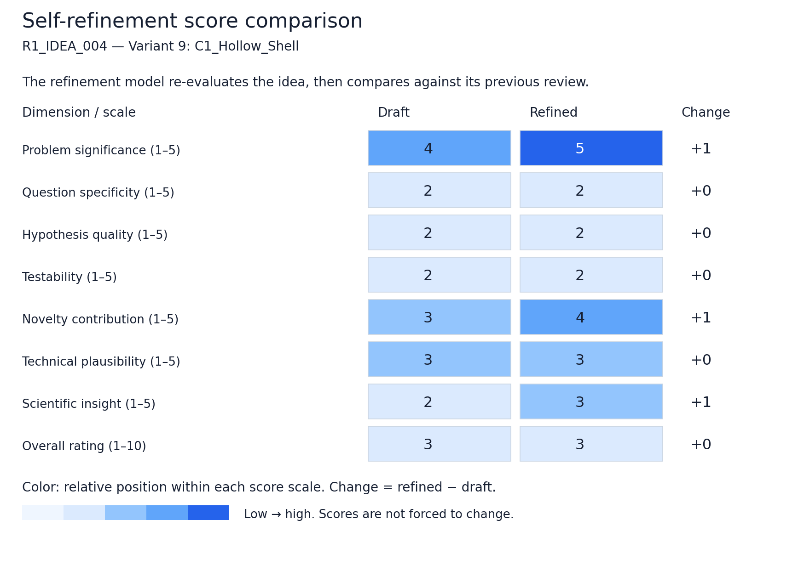

Changed score dimensions: problem_significance, novelty_contribution, scientific_insight.

### Score justifications (draft / refined)

**Problem significance**

```json
{
  "draft": {
    "score": 4.0,
    "justification": "The problem of aligning LLMs safely and efficiently is of paramount importance to the field. Reducing the computational cost of alignment is a significant practical challenge that, if solved, would democratize access to safe AI."
  },
  "refined": {
    "score": 5.0,
    "justification": "The problem is of exceptional significance. Current LLM alignment (RLHF, DPO) is computationally expensive and requires massive datasets. A method that decouples alignment from heavy training or prior knowledge would democratize safe AI and reduce environmental impact."
  }
}
```

**Question specificity**

```json
{
  "draft": {
    "score": 2.0,
    "justification": "The idea is currently too broad. It states *what* it wants to achieve (alignment, safety, efficiency) but not *how* or *what specific mechanism* is being investigated. The research question is not yet defined."
  },
  "refined": {
    "score": 2.0,
    "justification": "The idea is currently too broad. It identifies the 'what' (efficient alignment) but fails to specify the 'how'. The research question is not yet defined because the core mechanism (the optimization framework) is a black box."
  }
}
```

**Hypothesis quality**

```json
{
  "draft": {
    "score": 2.0,
    "justification": "There is no explicit hypothesis. The statement implies a hypothesis (that alignment is possible without prior knowledge/training requirements), but it is not framed in a way that allows for falsification or specific prediction."
  },
  "refined": {
    "score": 2.0,
    "justification": "There is no explicit hypothesis. The statement is a goal ('aims to reduce') rather than a prediction. A strong hypothesis would predict a specific outcome or relationship (e.g., 'Method X achieves Y% of RLHF performance with Z% of the cost')."
  }
}
```

**Testability**

```json
{
  "draft": {
    "score": 2.0,
    "justification": "Without defining the framework, the metrics, or the baselines, the idea cannot be tested. It is currently impossible to design an experiment to validate the claims."
  },
  "refined": {
    "score": 2.0,
    "justification": "The idea is currently not testable. Without a defined framework, metrics, or baselines, no experiment can be designed to validate the claims. The claim of avoiding 'prior parameter knowledge' is particularly difficult to test without a clear operational definition."
  }
}
```

**Novelty contribution**

```json
{
  "draft": {
    "score": 3.0,
    "justification": "The goal of efficient alignment is novel in its ambition, but the idea itself does not propose a specific new mechanism. If the 'optimization framework' turns out to be a known technique applied to a new problem, the novelty would be low. The potential contribution is high, but the current description is too generic to assess the novelty of the method."
  },
  "refined": {
    "score": 4.0,
    "justification": "The *ambition* is highly novel. If a method truly achieves alignment without prior parameter knowledge or standard training, it would represent a paradigm shift. However, the current description is too generic to confirm the novelty of the specific mechanism."
  }
}
```

**Technical plausibility**

```json
{
  "draft": {
    "score": 3.0,
    "justification": "The idea is technically plausible in the sense that constrained optimization is a valid field. However, the claim of avoiding 'prior parameter knowledge' is suspicious and requires significant technical justification to be plausible, as alignment typically relies on some form of prior signal (data, reward models, etc.)."
  },
  "refined": {
    "score": 3.0,
    "justification": "The idea is plausible in principle (optimization is a valid approach), but the specific claim of avoiding 'prior parameter knowledge' is technically suspicious. Alignment typically requires some form of signal (data, reward, or prior weights). The plausibility hinges entirely on the undefined mechanism."
  }
}
```

**Scientific insight**

```json
{
  "draft": {
    "score": 2.0,
    "justification": "As currently stated, the idea does not promise deep scientific insight. It appears to be an engineering optimization goal. To gain insight, it would need to explore the fundamental limits of alignment under these specific constraints."
  },
  "refined": {
    "score": 3.0,
    "justification": "If successful, the idea would provide profound insight into the fundamental limits of alignment and the necessity of prior knowledge. However, as currently stated, it risks being a simple engineering optimization without deep theoretical contribution unless the 'no prior knowledge' claim is rigorously investigated."
  }
}
```

**Overall rating**

```json
{
  "draft": {
    "score": 3.0,
    "justification": "The research idea addresses a highly significant problem (efficient LLM alignment) but is currently too vague to be considered a strong research proposal. It lacks a specific hypothesis, defined methodology, and testable metrics. It falls into the 'weak' category because it is essentially a high-level goal rather than a defined research direction. However, it is not 'very weak' because the underlying problem is real and the direction (optimization) is valid."
  },
  "refined": {
    "score": 3.0,
    "justification": "The idea addresses a highly significant problem with potentially revolutionary implications, but it is currently too vague to be considered a strong research proposal. It lacks the specificity, hypothesis, and methodological detail required to be testable or to demonstrate technical plausibility. It sits at the border of 'weak' and 'moderate' because the core concept is intriguing but the execution plan is missing."
  }
}
```

## R1_IDEA_004 — Variant 10: C2_Logic_Flawed

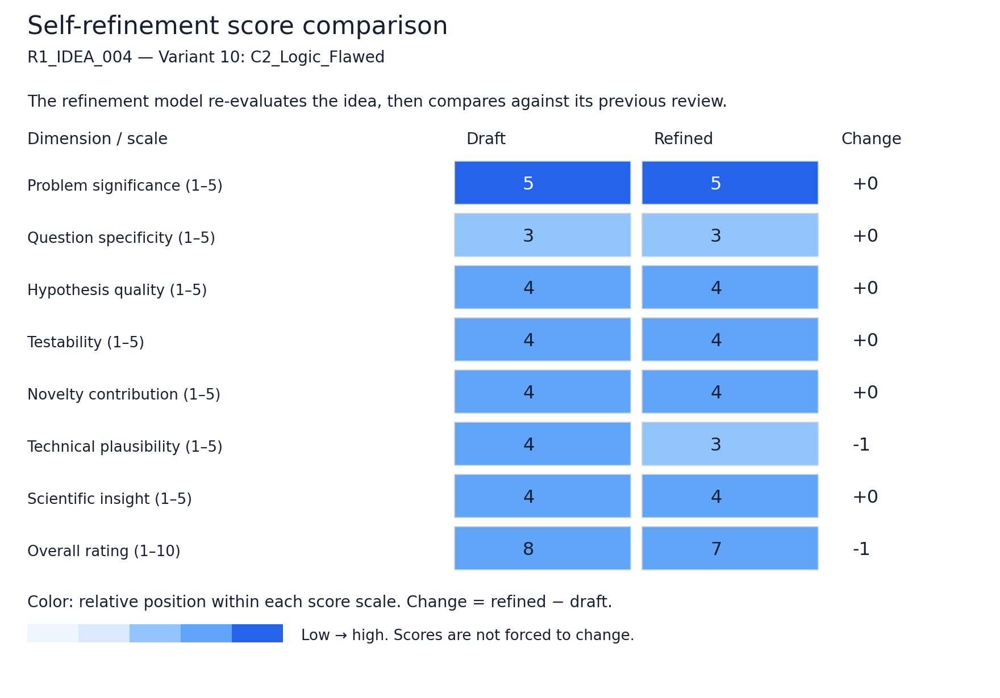

Changed score dimensions: technical_plausibility, overall_rating.

### Score justifications (draft / refined)

**Problem significance**

```json
{
  "draft": {
    "score": 5.0,
    "justification": "Constrained alignment is a major challenge in deploying safe LLMs. Reducing the computational cost by eliminating separate reward/cost models is highly significant for both research and industry practitioners, making this a high-impact problem."
  },
  "refined": {
    "score": 5.0,
    "justification": "Constrained alignment is a critical challenge for deploying safe LLMs. The current reliance on separate reward/cost models creates a significant computational and engineering burden. Solving this would have immediate practical impact on the scalability of safe AI."
  }
}
```

**Question specificity**

```json
{
  "draft": {
    "score": 3.0,
    "justification": "The idea identifies the goal (Primal-Dual DPO) and the benefits (no separate models, no prior multiplier), but lacks the specific mathematical formulation or algorithmic details that would define the exact research question."
  },
  "refined": {
    "score": 3.0,
    "justification": "While the goal is clear (Primal-Dual DPO without separate models), the specific research question regarding the *mechanism* of constraint enforcement is underspecified. The idea states 'what' (no separate models) but not 'how' (the mathematical formulation of the constraint within the preference loss)."
  }
}
```

**Hypothesis quality**

```json
{
  "draft": {
    "score": 4.0,
    "justification": "The hypothesis is clear: a Primal-Dual approach can achieve constrained alignment more efficiently than current methods by avoiding separate model training. This is a falsifiable claim that can be tested via ablation and performance comparison."
  },
  "refined": {
    "score": 4.0,
    "justification": "The hypothesis that a Primal-Dual approach can bypass separate model training while maintaining safety is a strong, falsifiable claim. It posits a specific relationship between optimization architecture and model efficiency that can be empirically validated or refuted."
  }
}
```

**Testability**

```json
{
  "draft": {
    "score": 4.0,
    "justification": "The idea is testable by implementing the proposed algorithm and comparing it against baselines (e.g., standard DPO, DPO with a separate reward model) on standard safety benchmarks. Metrics would include safety scores, reward scores, and training time."
  },
  "refined": {
    "score": 4.0,
    "justification": "The idea is testable by implementing the proposed algorithm and comparing it against standard DPO and Constrained DPO baselines. Metrics such as safety scores, reward scores, and training time are well-defined. However, the lack of a defined constraint function in the summary makes the experimental design currently incomplete."
  }
}
```

**Novelty contribution**

```json
{
  "draft": {
    "score": 4.0,
    "justification": "Applying Primal-Dual optimization directly to DPO to avoid separate model training is a novel direction. While Primal-Dual methods exist in other RL contexts, their specific application to DPO for this purpose represents a meaningful contribution to the field."
  },
  "refined": {
    "score": 4.0,
    "justification": "Applying Primal-Dual optimization directly to DPO to eliminate separate cost modeling is a novel direction. While Primal-Dual methods are common in RL, their specific application to the DPO framework to solve the 'cost model' bottleneck represents a meaningful theoretical and practical contribution."
  }
}
```

**Technical plausibility**

```json
{
  "draft": {
    "score": 4.0,
    "justification": "The reasoning is logically coherent. Primal-Dual methods are standard for constrained optimization, and DPO is a well-defined objective. The combination is plausible, though the non-convexity of DPO adds complexity that needs careful handling."
  },
  "refined": {
    "score": 3.0,
    "justification": "The reasoning is partially plausible but contains a significant logical gap. Primal-Dual methods require a well-defined constraint function. The idea claims to avoid a cost model, but it is unclear how the constraint is evaluated without one. If the constraint is derived solely from the preference data, this requires a specific theoretical justification that is not provided. The non-convexity of DPO further complicates the convergence of primal-dual updates."
  }
}
```

**Scientific insight**

```json
{
  "draft": {
    "score": 4.0,
    "justification": "If successful, this research would reveal whether constrained optimization can be effectively decoupled from explicit reward modeling in preference learning, potentially leading to a new class of efficient alignment algorithms."
  },
  "refined": {
    "score": 4.0,
    "justification": "If successful, this research would provide significant insight into whether constrained optimization can be decoupled from explicit reward modeling in preference learning. It could reveal new principles for efficient alignment and the relationship between preference data and constraint satisfaction."
  }
}
```

**Overall rating**

```json
{
  "draft": {
    "score": 8.0,
    "justification": "This is a strong research idea with high significance and a clear, plausible hypothesis. It addresses a real pain point in LLM alignment (computational cost) with a theoretically sound approach. The main limitation is the lack of specific formulation in the summary, but the core concept is novel and worth investigating."
  },
  "refined": {
    "score": 7.0,
    "justification": "This is a strong research idea with high significance and a clear motivation. The potential to reduce the computational cost of safe alignment is substantial. However, the technical plausibility is currently weakened by the lack of a specific mechanism for constraint enforcement without a cost model. The idea is promising but requires significant elaboration on the mathematical formulation to be fully credible. It moves from a 'moderate' idea to a 'strong' one based on the potential impact, but the logical gap prevents it from being 'exceptional' at this stage."
  }
}
```

## R1_IDEA_004 — Variant 11: C3_Substance_Enriched

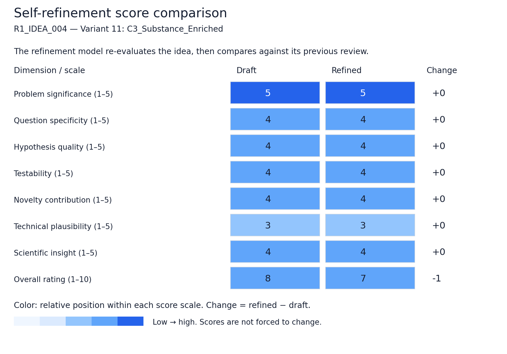

Changed score dimensions: overall_rating.

### Score justifications (draft / refined)

**Problem significance**

```json
{
  "draft": {
    "score": 5.0,
    "justification": "Aligning LLMs with safety constraints is a paramount challenge in the field. Reducing the computational overhead by eliminating separate reward/cost models would be a significant practical contribution, making alignment more accessible and efficient."
  },
  "refined": {
    "score": 5.0,
    "justification": "Aligning LLMs with safety constraints is a paramount challenge in the field. Reducing the computational overhead by eliminating separate reward/cost models would be a significant practical contribution, making alignment more accessible and efficient. The problem is highly relevant to both researchers and practitioners."
  }
}
```

**Question specificity**

```json
{
  "draft": {
    "score": 4.0,
    "justification": "The idea clearly identifies the method (Primal-Dual DPO), the goal (constrained alignment), and the specific hypothesis (dual variable dynamics reveal trade-offs). However, the mathematical mechanism for estimating constraints without a cost model is not yet specified."
  },
  "refined": {
    "score": 4.0,
    "justification": "The idea clearly identifies the method (Primal-Dual DPO), the goal (constrained alignment), and the specific hypothesis (dual variable dynamics reveal trade-offs). However, the mathematical mechanism for estimating constraints without a cost model is not yet specified, which slightly reduces the specificity of the proposed solution."
  }
}
```

**Hypothesis quality**

```json
{
  "draft": {
    "score": 4.0,
    "justification": "The hypothesis that dual variable dynamics reveal interpretable trade-off patterns is concrete, falsifiable, and scientifically valuable. It moves beyond 'does it work?' to 'how does it work?'."
  },
  "refined": {
    "score": 4.0,
    "justification": "The hypothesis that dual variable dynamics reveal interpretable trade-off patterns is concrete, falsifiable, and scientifically valuable. It moves beyond 'does it work?' to 'how does it work?', which is a strong characteristic of a high-quality research hypothesis."
  }
}
```

**Testability**

```json
{
  "draft": {
    "score": 4.0,
    "justification": "The proposal suggests clear validation paths: testing convergence under varying budgets and analyzing dual variable dynamics. These are measurable and can be implemented."
  },
  "refined": {
    "score": 4.0,
    "justification": "The proposal suggests clear validation paths: testing convergence under varying budgets and analyzing dual variable dynamics. These are measurable and can be implemented, provided the mathematical formulation is clarified."
  }
}
```

**Novelty contribution**

```json
{
  "draft": {
    "score": 4.0,
    "justification": "Applying primal-dual optimization directly to DPO to avoid separate models is a novel direction. If successful, it could change the standard pipeline for constrained alignment."
  },
  "refined": {
    "score": 4.0,
    "justification": "Applying primal-dual optimization directly to DPO to avoid separate models is a novel direction. If successful, it could change the standard pipeline for constrained alignment. The potential to discover new insights into dual dynamics adds to the novelty."
  }
}
```

**Technical plausibility**

```json
{
  "draft": {
    "score": 3.0,
    "justification": "While the direction is logical, the technical leap of removing the cost model in a constrained setting is significant. The idea assumes that the preference data alone can provide sufficient signal for the dual updates, which is a strong assumption that needs rigorous theoretical backing."
  },
  "refined": {
    "score": 3.0,
    "justification": "While the direction is logical, the technical leap of removing the cost model in a constrained setting is significant. The idea assumes that the preference data alone can provide sufficient signal for the dual updates, which is a strong assumption that needs rigorous theoretical backing. The non-convex nature of DPO adds further complexity to the convergence of primal-dual methods."
  }
}
```

**Scientific insight**

```json
{
  "draft": {
    "score": 4.0,
    "justification": "If the hypothesis holds, the research would provide deep insights into the geometry of the optimization landscape in constrained alignment and how models internally represent the trade-off between reward and safety."
  },
  "refined": {
    "score": 4.0,
    "justification": "If the hypothesis holds, the research would provide deep insights into the geometry of the optimization landscape in constrained alignment and how models internally represent the trade-off between reward and safety. The focus on interpretability of dual variables is a significant potential contribution."
  }
}
```

**Overall rating**

```json
{
  "draft": {
    "score": 8.0,
    "justification": "This is a strong research idea with high potential impact. It addresses a significant practical problem (efficiency in alignment) with a novel methodological approach. The hypothesis regarding interpretability adds significant scientific value. The main risk lies in the technical feasibility of the constraint estimation without a cost model, but the idea is sufficiently specific and promising to warrant investigation."
  },
  "refined": {
    "score": 7.0,
    "justification": "This is a strong research idea with high potential impact. It addresses a significant practical problem with a novel methodological approach. The hypothesis regarding interpretability adds significant scientific value. However, the technical plausibility is the main limiting factor; the mechanism for constraint estimation without a cost model is a critical gap that must be addressed for the idea to be fully realized. It is a strong idea but carries significant technical risk."
  }
}
```

## R1_IDEA_004 — Variant 12: H1_Deceptive_Hollow

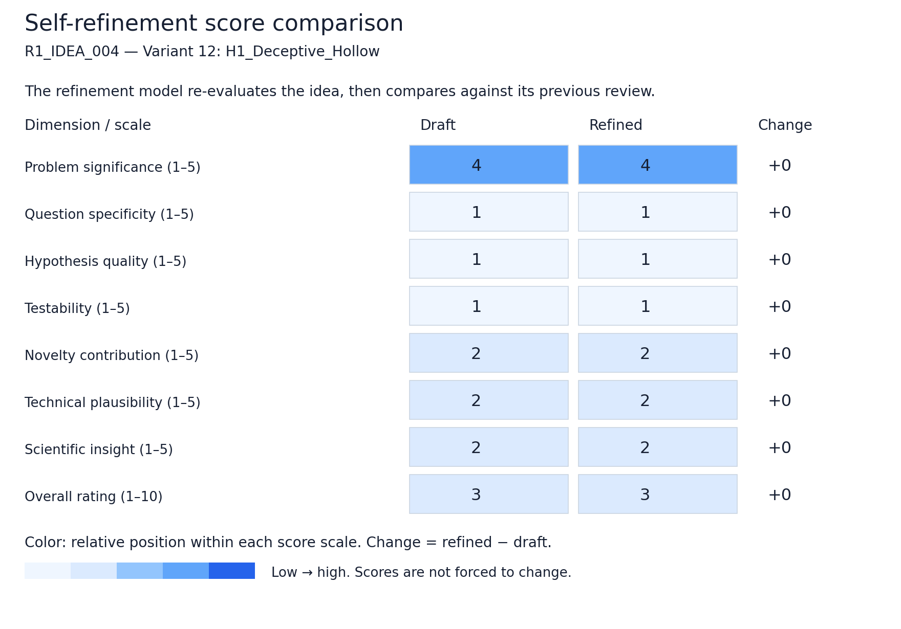

Changed score dimensions: none.

### Score justifications (draft / refined)

**Problem significance**

```json
{
  "draft": {
    "score": 4.0,
    "justification": "The problem of aligning LLMs efficiently and safely is of paramount importance to the field. Addressing computational costs and safety simultaneously is a high-value goal."
  },
  "refined": {
    "score": 4.0,
    "justification": "The problem of aligning LLMs efficiently and safely is of paramount importance to the field. Addressing computational costs and safety simultaneously is a high-value goal, even if the specific approach is undefined."
  }
}
```

**Question specificity**

```json
{
  "draft": {
    "score": 1.0,
    "justification": "The idea is presented as a broad agenda rather than a specific question. It uses abstract terms like 'optimization framework' and 'transformative synthesis' without defining the actual research variables or relationships."
  },
  "refined": {
    "score": 1.0,
    "justification": "The idea is presented as a broad agenda rather than a specific question. It uses abstract terms like 'optimization framework' and 'transformative synthesis' without defining the actual research variables, relationships, or the specific nature of the 'constraints'."
  }
}
```

**Hypothesis quality**

```json
{
  "draft": {
    "score": 1.0,
    "justification": "There is no explicit or implicit hypothesis that can be supported or refuted. The text makes grand claims about 'reshaping' the field but offers no specific prediction about model behavior or performance."
  },
  "refined": {
    "score": 1.0,
    "justification": "There is no explicit or implicit hypothesis that can be supported or refuted. The text makes grand claims about 'reshaping' the field but offers no specific prediction about model behavior, performance trade-offs, or the mechanism of improvement."
  }
}
```

**Testability**

```json
{
  "draft": {
    "score": 1.0,
    "justification": "The idea is currently untestable. Without a defined method, metrics, or baseline, no experiment can be designed to validate the claims."
  },
  "refined": {
    "score": 1.0,
    "justification": "The idea is currently untestable. Without a defined method, specific metrics, or baselines, no experiment can be designed to validate the claims of reduced computational demand or improved safety."
  }
}
```

**Novelty contribution**

```json
{
  "draft": {
    "score": 2.0,
    "justification": "While the goal is novel in its ambition, the description is too generic to assess the novelty of the proposed mechanism. It reads more like a mission statement than a research proposal."
  },
  "refined": {
    "score": 2.0,
    "justification": "While the goal is novel in its ambition, the description is too generic to assess the novelty of the proposed mechanism. It reads more like a mission statement or a grant proposal abstract than a specific research proposal with a distinct contribution."
  }
}
```

**Technical plausibility**

```json
{
  "draft": {
    "score": 2.0,
    "justification": "The reasoning is logically coherent in a high-level sense (we want better alignment with less compute), but the technical plausibility of avoiding 'prior parameter knowledge' while achieving alignment is unclear and requires significant justification."
  },
  "refined": {
    "score": 2.0,
    "justification": "The reasoning is logically coherent in a high-level sense (we want better alignment with less compute), but the technical plausibility of avoiding 'prior parameter knowledge' while achieving alignment is unclear. Without defining what 'prior parameter knowledge' entails or how the optimization works without it, the claim remains speculative."
  }
}
```

**Scientific insight**

```json
{
  "draft": {
    "score": 2.0,
    "justification": "As currently stated, the idea does not promise specific scientific insight beyond the general hope of better systems. It lacks a mechanism that would reveal new principles about alignment or optimization."
  },
  "refined": {
    "score": 2.0,
    "justification": "As currently stated, the idea does not promise specific scientific insight beyond the general hope of better systems. It lacks a mechanism that would reveal new principles about alignment, optimization landscapes, or the trade-offs between safety and efficiency."
  }
}
```

**Overall rating**

```json
{
  "draft": {
    "score": 3.0,
    "justification": "The idea addresses a significant problem but fails as a research proposal due to extreme vagueness. It lacks a specific question, hypothesis, or method, making it impossible to evaluate its scientific merit or feasibility. It falls into the 'weak' category because it is mostly generic motivation without a defined research path."
  },
  "refined": {
    "score": 3.0,
    "justification": "The idea addresses a significant problem but fails as a research proposal due to extreme vagueness. It lacks a specific question, hypothesis, or method, making it impossible to evaluate its scientific merit or feasibility. It falls into the 'weak' category (3-4) because it is mostly generic motivation without a defined research path, though the ambition prevents it from being 'very weak' (1-2)."
  }
}
```

## R1_IDEA_004 — Variant 13: H2_Confident_Flaw

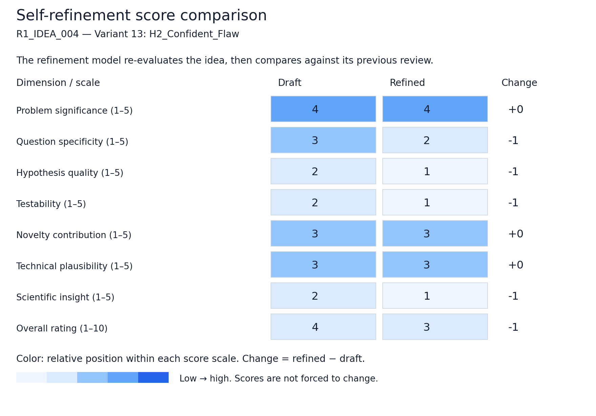

Changed score dimensions: question_specificity, hypothesis_quality, testability, scientific_insight, overall_rating.

### Score justifications (draft / refined)

**Problem significance**

```json
{
  "draft": {
    "score": 4.0,
    "justification": "The problem of efficient, constrained alignment of LLMs is highly significant. Reducing the need for separate reward models and prior knowledge of hyperparameters addresses a major bottleneck in deploying safe AI systems."
  },
  "refined": {
    "score": 4.0,
    "justification": "The problem of efficient, constrained alignment is highly significant. Reducing the dependency on separate reward models and hyperparameter tuning addresses a major bottleneck in deploying safe and scalable LLMs. The motivation is strong and relevant to the field."
  }
}
```

**Question specificity**

```json
{
  "draft": {
    "score": 3.0,
    "justification": "While the method (Primal-Dual DPO) is named, the specific research question is muddied by the claim that solving this will automatically solve all related issues. The idea needs to narrow its focus to specific performance/efficiency trade-offs rather than claiming universal superiority."
  },
  "refined": {
    "score": 2.0,
    "justification": "While the method is named, the research question is obscured by the claim that solving one limitation automatically solves all related issues. The idea fails to specify *what* exactly is being measured or compared, instead making a broad, unsubstantiated claim about 'general superiority'."
  }
}
```

**Hypothesis quality**

```json
{
  "draft": {
    "score": 2.0,
    "justification": "The hypothesis is poorly formed because it makes an absolute causal claim ('necessarily produce reliable improvements') that ignores confounding variables. A strong hypothesis would predict a specific relationship (e.g., 'Method X will achieve Y% safety with Z% less compute than Method Y') rather than a blanket statement of superiority."
  },
  "refined": {
    "score": 1.0,
    "justification": "The hypothesis is fundamentally flawed. It makes an absolute causal claim ('necessarily produce reliable improvements') that ignores confounding variables and contradicts the principles of scientific inquiry. A valid hypothesis must be falsifiable and account for alternative explanations, which this proposal explicitly rejects."
  }
}
```

**Testability**

```json
{
  "draft": {
    "score": 2.0,
    "justification": "The idea explicitly argues against the need for isolating variables, testing boundary cases, or comparing against alternative explanations. This makes the central claim difficult to falsify scientifically, as it rejects standard validation protocols."
  },
  "refined": {
    "score": 1.0,
    "justification": "The idea is effectively untestable in its current form because it explicitly argues against the need for isolating variables, testing boundary cases, or comparing against alternative explanations. A claim that 'solving X necessarily produces Y' without controlling for Z cannot be scientifically validated or falsified."
  }
}
```

**Novelty contribution**

```json
{
  "draft": {
    "score": 3.0,
    "justification": "Applying primal-dual methods to DPO is a novel direction. However, the claimed contribution of 'general superiority' without rigorous testing undermines the potential for genuine scientific insight, as it risks being a superficial application of an existing optimization technique."
  },
  "refined": {
    "score": 3.0,
    "justification": "Applying primal-dual methods to DPO is a novel technical direction. However, the claimed contribution of 'general superiority' based on a flawed logical argument undermines the potential for genuine scientific insight. The novelty is in the method, but the proposed evaluation strategy is weak."
  }
}
```

**Technical plausibility**

```json
{
  "draft": {
    "score": 3.0,
    "justification": "Primal-dual optimization is a standard technique in constrained optimization, so the mechanism is plausible. However, the claim that it can bypass the need for separate models or prior knowledge without trade-offs is optimistic and requires strong theoretical justification not present in the summary."
  },
  "refined": {
    "score": 3.0,
    "justification": "The use of primal-dual optimization for constrained problems is theoretically sound and plausible. However, the claim that this can bypass the need for separate models or prior knowledge *without* trade-offs or rigorous validation is optimistic and lacks the necessary theoretical justification in the summary."
  }
}
```

**Scientific insight**

```json
{
  "draft": {
    "score": 2.0,
    "justification": "The current framing suggests a 'black box' solution where efficiency equals effectiveness. If the research proceeds as described (ignoring boundary cases), it is unlikely to yield deep insights into the mechanisms of alignment or the nature of the constraints."
  },
  "refined": {
    "score": 1.0,
    "justification": "The current framing suggests a 'black box' solution where efficiency equals effectiveness. By dismissing the need to analyze boundary cases or dataset composition, the research idea precludes the possibility of discovering *why* or *when* the method works, which is the essence of scientific insight."
  }
}
```

**Overall rating**

```json
{
  "draft": {
    "score": 4.0,
    "justification": "The underlying problem is important, and the proposed method (Primal-Dual DPO) is a reasonable technical direction. However, the research idea is significantly weakened by its logical fallacies regarding causality and its explicit rejection of standard scientific validation (ablation, boundary cases). The idea currently reads more like a marketing claim than a rigorous research proposal. It requires a complete reframing of the hypothesis to be scientifically viable."
  },
  "refined": {
    "score": 3.0,
    "justification": "The underlying problem is important, and the proposed method (Primal-Dual DPO) is a reasonable technical direction. However, the research idea is critically weakened by its logical fallacies regarding causality and its explicit rejection of standard scientific validation. The proposal reads more like a marketing claim than a rigorous research plan. The hypothesis is non-falsifiable, and the reasoning is circular. It requires a complete reframing of the hypothesis and validation strategy to be viable."
  }
}
```

## R1_IDEA_004 — Variant 14: H3_Verbose_Enriched


Changed score dimensions: none.

### Score justifications (draft / refined)

**Problem significance**

```json
{
  "draft": {
    "score": 5.0,
    "justification": "Constrained alignment of LLMs is a high-priority problem in AI safety. Developing methods that are computationally efficient (avoiding separate reward models) directly addresses a major bottleneck in current alignment pipelines, making this highly significant."
  },
  "refined": {
    "score": 5.0,
    "justification": "Constrained alignment of LLMs is a high-priority problem in AI safety. Developing methods that are computationally efficient (avoiding separate reward models) directly addresses a major bottleneck in current alignment pipelines, making this highly significant."
  }
}
```

**Question specificity**

```json
{
  "draft": {
    "score": 4.0,
    "justification": "The idea clearly identifies the goal (maximize reward, enforce safety), the method (primal-dual DPO), and the specific hypothesis (dual dynamics reveal trade-offs). However, the exact mechanism of the algorithm is described at a high level, leaving some ambiguity on the 'how'."
  },
  "refined": {
    "score": 4.0,
    "justification": "The idea clearly identifies the goal (maximize reward, enforce safety), the method (primal-dual DPO), and the specific hypothesis (dual dynamics reveal trade-offs). However, the exact mechanism of the algorithm is described at a high level, leaving some ambiguity on the 'how'."
  }
}
```

**Hypothesis quality**

```json
{
  "draft": {
    "score": 4.0,
    "justification": "The hypothesis that dual variable dynamics will reveal interpretable trade-off patterns is specific, non-trivial, and falsifiable. It moves beyond 'does it work?' to 'how does it work?' which is a strong scientific stance."
  },
  "refined": {
    "score": 4.0,
    "justification": "The hypothesis that dual variable dynamics will reveal interpretable trade-off patterns is specific, non-trivial, and falsifiable. It moves beyond 'does it work?' to 'how does it work?' which is a strong scientific stance."
  }
}
```

**Testability**

```json
{
  "draft": {
    "score": 5.0,
    "justification": "The idea provides a very clear path for testing: convergence analysis, staged design with specific cases (easy/difficult/boundary), ablations, and sensitivity analyses. The criteria for success and failure are well-defined."
  },
  "refined": {
    "score": 5.0,
    "justification": "The idea provides a very clear path for testing: convergence analysis, staged design with specific cases (easy/difficult/boundary), ablations, and sensitivity analyses. The criteria for success and failure are well-defined."
  }
}
```

**Novelty contribution**

```json
{
  "draft": {
    "score": 4.0,
    "justification": "Applying primal-dual methods to DPO without separate reward models is a novel direction. The potential to extract interpretability from dual variables adds a layer of scientific contribution beyond just a new alignment algorithm."
  },
  "refined": {
    "score": 4.0,
    "justification": "Applying primal-dual methods to DPO without separate reward models is a novel direction. The potential to extract interpretability from dual variables adds a layer of scientific contribution beyond just a new alignment algorithm."
  }
}
```

**Technical plausibility**

```json
{
  "draft": {
    "score": 4.0,
    "justification": "Primal-dual methods are standard in optimization, and DPO is a standard alignment technique. Combining them is plausible. The main risk is the non-convexity of LLM training, but the idea acknowledges the need for convergence testing, suggesting awareness of this challenge."
  },
  "refined": {
    "score": 4.0,
    "justification": "Primal-dual methods are standard in optimization, and DPO is a standard alignment technique. Combining them is plausible. The main risk is the non-convexity of LLM training, but the idea acknowledges the need for convergence testing, suggesting awareness of this challenge."
  }
}
```

**Scientific insight**

```json
{
  "draft": {
    "score": 5.0,
    "justification": "If successful, this research could reveal fundamental relationships between constraint enforcement dynamics and model behavior (via dual variables). This would provide transferable insights into how constrained optimization behaves in deep learning, not just for safety but potentially for other alignment tasks."
  },
  "refined": {
    "score": 5.0,
    "justification": "If successful, this research could reveal fundamental relationships between constraint enforcement dynamics and model behavior (via dual variables). This would provide transferable insights into how constrained optimization behaves in deep learning, not just for safety but potentially for other alignment tasks."
  }
}
```

**Overall rating**

```json
{
  "draft": {
    "score": 8.0,
    "justification": "This is a strong research idea. It tackles a significant problem with a plausible and novel methodological approach. The hypothesis is insightful, and the proposed experimental design is rigorous. The only minor deduction is the lack of explicit mathematical formulation in the summary, which makes the 'how' slightly less concrete than the 'what' and 'why'."
  },
  "refined": {
    "score": 8.0,
    "justification": "This is a strong research idea. It tackles a significant problem with a plausible and novel methodological approach. The hypothesis is insightful, and the proposed experimental design is rigorous. The only minor deduction is the lack of explicit mathematical formulation in the summary, which makes the 'how' slightly less concrete than the 'what' and 'why'."
  }
}
```

## R1_IDEA_004 — Variant 15: H4_Ultimate_Hype


Changed score dimensions: none.

### Score justifications (draft / refined)

**Problem significance**

```json
{
  "draft": {
    "score": 5.0,
    "justification": "Constrained alignment is one of the most pressing challenges in deploying LLMs. Reducing the computational and data overhead of this process is a high-impact goal that addresses a major barrier to widespread, safe deployment."
  },
  "refined": {
    "score": 5.0,
    "justification": "Constrained alignment is one of the most pressing challenges in deploying LLMs. Reducing the computational and data overhead of this process is a high-impact goal that addresses a major barrier to widespread, safe deployment. The problem is highly significant."
  }
}
```

**Question specificity**

```json
{
  "draft": {
    "score": 2.0,
    "justification": "While the general direction (Primal-Dual DPO) is mentioned, the specific research question is vague. It does not specify the exact mathematical relationship being investigated or the precise mechanism of constraint enforcement."
  },
  "refined": {
    "score": 2.0,
    "justification": "While the general direction (Primal-Dual DPO) is mentioned, the specific research question is vague. It does not specify the exact mathematical relationship being investigated, the definition of the constraint function, or the precise mechanism of constraint enforcement. The idea is currently a 'what' rather than a 'how'."
  }
}
```

**Hypothesis quality**

```json
{
  "draft": {
    "score": 3.0,
    "justification": "The implicit hypothesis is that a primal-dual formulation can replace the need for separate models and prior multiplier knowledge. This is a testable claim, but the idea lacks a specific prediction about the nature of the trade-off or the conditions under which it succeeds."
  },
  "refined": {
    "score": 3.0,
    "justification": "The implicit hypothesis is that a primal-dual formulation can replace the need for separate models and prior multiplier knowledge. This is a testable claim, but the idea lacks a specific prediction about the nature of the trade-off, the convergence behavior, or the conditions under which it succeeds. It is a plausible hypothesis but currently underspecified."
  }
}
```

**Testability**

```json
{
  "draft": {
    "score": 3.0,
    "justification": "The idea is testable in principle (compare performance against standard DPO/RLHF with constraints), but the lack of a defined objective function makes it difficult to design a concrete experiment without further elaboration."
  },
  "refined": {
    "score": 3.0,
    "justification": "The idea is testable in principle (compare performance against standard DPO/RLHF with constraints), but the lack of a defined objective function makes it difficult to design a concrete experiment without further elaboration. The testability is currently limited by the lack of a formal problem statement."
  }
}
```

**Novelty contribution**

```json
{
  "draft": {
    "score": 4.0,
    "justification": "Applying primal-dual methods directly to DPO to eliminate separate models is a novel angle. If successful, it would represent a significant methodological contribution to the field of alignment."
  },
  "refined": {
    "score": 4.0,
    "justification": "Applying primal-dual methods directly to DPO to eliminate separate models is a novel angle. If successful, it would represent a significant methodological contribution to the field of alignment. The potential to redefine the frontier is high, even if the current description is vague."
  }
}
```

**Technical plausibility**

```json
{
  "draft": {
    "score": 3.0,
    "justification": "The concept is theoretically grounded in optimization theory, but applying it to the specific, non-convex, and data-scarce regime of DPO is non-trivial. The plausibility depends entirely on the specific implementation details which are currently missing."
  },
  "refined": {
    "score": 3.0,
    "justification": "The concept is theoretically grounded in optimization theory, but applying it to the specific, non-convex, and data-scarce regime of DPO is non-trivial. The plausibility depends entirely on the specific implementation details which are currently missing. The claim of 'no cost model' is particularly risky without a mechanism."
  }
}
```

**Scientific insight**

```json
{
  "draft": {
    "score": 4.0,
    "justification": "If successful, this research would reveal new insights into how optimization dynamics can be harnessed for constraint satisfaction in deep learning without explicit reward modeling, potentially leading to more efficient alignment paradigms."
  },
  "refined": {
    "score": 4.0,
    "justification": "If successful, this research would reveal new insights into how optimization dynamics can be harnessed for constraint satisfaction in deep learning without explicit reward modeling. It could lead to more efficient alignment paradigms and a deeper understanding of the relationship between primal-dual methods and preference learning."
  }
}
```

**Overall rating**

```json
{
  "draft": {
    "score": 6.0,
    "justification": "The idea addresses a highly significant problem with a potentially transformative approach. However, the current description is too abstract to be fully evaluated as a strong research plan. It lacks the specific formulation and hypothesis required to move from a 'promising direction' to a 'strong research idea.' It sits in the moderate/borderline category because the core concept is novel and important, but the execution path is undefined."
  },
  "refined": {
    "score": 6.0,
    "justification": "The idea addresses a highly significant problem with a potentially transformative approach. However, the current description is too abstract to be fully evaluated as a strong research plan. It lacks the specific formulation and hypothesis required to move from a 'promising direction' to a 'strong research idea.' It sits in the moderate/borderline category because the core concept is novel and important, but the execution path is undefined and relies on unproven assumptions about the feasibility of the mechanism."
  }
}
```

## R1_IDEA_005 — Source

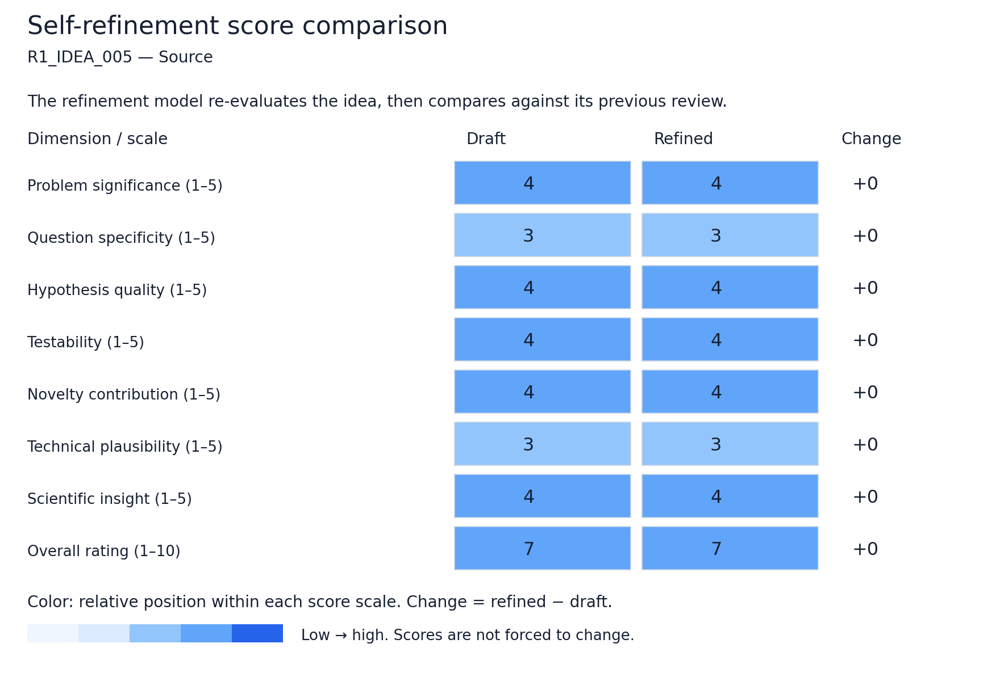

Changed score dimensions: none.

### Score justifications (draft / refined)

**Problem significance**

```json
{
  "draft": {
    "score": 4.0,
    "justification": "Robustness of deep learning models under distribution shift is a fundamental challenge. Specifically addressing the robustness of Vision SSMs is highly significant given their recent rise as efficient alternatives to Transformers. Solving this would have immediate practical value for deploying SSMs in real-world, non-stationary environments."
  },
  "refined": {
    "score": 4.0,
    "justification": "Robustness under distribution shift is a fundamental challenge in deep learning. Specifically addressing this for Vision SSMs is highly significant given their recent emergence as efficient alternatives to Transformers. Solving this would have immediate practical value for deploying SSMs in non-stationary real-world environments."
  }
}
```

**Question specificity**

```json
{
  "draft": {
    "score": 3.0,
    "justification": "The idea identifies a clear goal (improve robustness via TTA) and a specific mechanism (SSM traversal permutations). However, the definition of 'permutations' and the 'aggregation' strategy are currently too vague to be fully specific. The research question is 'Can SSM-specific permutations improve TTA?' which is good, but the 'how' needs more definition."
  },
  "refined": {
    "score": 3.0,
    "justification": "The idea identifies a clear goal (improve robustness via TTA) and a specific mechanism (SSM traversal permutations). However, the definition of 'permutations' and the 'aggregation' strategy are currently too vague to be fully specific. The research question is 'Can SSM-specific permutations improve TTA?' which is good, but the 'how' needs more definition."
  }
}
```

**Hypothesis quality**

```json
{
  "draft": {
    "score": 4.0,
    "justification": "The implicit hypothesis is that leveraging the internal structural properties of SSMs (via traversal permutations) to generate views will yield more informative pseudo-labels for adaptation than generic augmentations. This is a concrete, falsifiable prediction that distinguishes the method from generic TTA."
  },
  "refined": {
    "score": 4.0,
    "justification": "The implicit hypothesis is that leveraging the internal structural properties of SSMs (via traversal permutations) to generate views will yield more informative pseudo-labels for adaptation than generic augmentations. This is a concrete, falsifiable prediction that distinguishes the method from generic TTA."
  }
}
```

**Testability**

```json
{
  "draft": {
    "score": 4.0,
    "justification": "The idea is highly testable. One can implement the proposed permutation mechanism, run standard TTA experiments on distribution-shifted datasets (e.g., ImageNet-C), and compare performance against baselines. The use of pseudo-labels and weight aggregation provides clear metrics for evaluation."
  },
  "refined": {
    "score": 4.0,
    "justification": "The idea is highly testable. One can implement the proposed permutation mechanism, run standard TTA experiments on distribution-shifted datasets (e.g., ImageNet-C), and compare performance against baselines. The use of pseudo-labels and weight aggregation provides clear metrics for evaluation."
  }
}
```

**Novelty contribution**

```json
{
  "draft": {
    "score": 4.0,
    "justification": "Applying TTA to SSMs is a relatively new direction. The specific proposal of using 'traversal permutations' as a view generation strategy is novel and suggests a deeper understanding of SSM mechanics. It moves beyond simple application of existing methods to proposing a mechanism tailored to the model's architecture."
  },
  "refined": {
    "score": 4.0,
    "justification": "Applying TTA to SSMs is a relatively new direction. The specific proposal of using 'traversal permutations' as a view generation strategy is novel and suggests a deeper understanding of SSM mechanics. It moves beyond simple application of existing methods to proposing a mechanism tailored to the model's architecture."
  }
}
```

**Technical plausibility**

```json
{
  "draft": {
    "score": 3.0,
    "justification": "The idea is technically plausible in principle, as SSMs have defined state transitions that could theoretically be permuted. However, the feasibility depends entirely on whether such permutations result in valid, semantically meaningful inputs. If the permutations break the causal structure of the SSM, the method may fail. The aggregation of weights also requires careful design to be stable."
  },
  "refined": {
    "score": 3.0,
    "justification": "The idea is technically plausible in principle, as SSMs have defined state transitions that could theoretically be permuted. However, the feasibility depends entirely on whether such permutations result in valid, semantically meaningful inputs. If the permutations break the causal structure of the SSM, the method may fail. The aggregation of weights also requires careful design to be stable."
  }
}
```

**Scientific insight**

```json
{
  "draft": {
    "score": 4.0,
    "justification": "If successful, this research would provide insight into the relationship between SSM architectural inductive biases and robustness. It could reveal how the internal state dynamics of SSMs can be manipulated to improve generalization, offering a new perspective on test-time adaptation that is architecture-aware rather than data-aware."
  },
  "refined": {
    "score": 4.0,
    "justification": "If successful, this research would provide insight into the relationship between SSM architectural inductive biases and robustness. It could reveal how the internal state dynamics of SSMs can be manipulated to improve generalization, offering a new perspective on test-time adaptation that is architecture-aware rather than data-aware."
  }
}
```

**Overall rating**

```json
{
  "draft": {
    "score": 7.0,
    "justification": "This is a strong research idea with high potential. It addresses a significant problem (SSM robustness) with a novel, architecture-specific hypothesis. While the specific implementation details (permutations, aggregation) are currently vague, the core concept is scientifically sound and testable. It has the potential to make a meaningful contribution to the field of efficient vision models and robustness."
  },
  "refined": {
    "score": 7.0,
    "justification": "This is a strong research idea with high potential. It addresses a significant problem (SSM robustness) with a novel, architecture-specific hypothesis. While the specific implementation details (permutations, aggregation) are currently vague, the core concept is scientifically sound and testable. It has the potential to make a meaningful contribution to the field of efficient vision models and robustness."
  }
}
```

## R1_IDEA_005 — Variant 1: A1_Identity

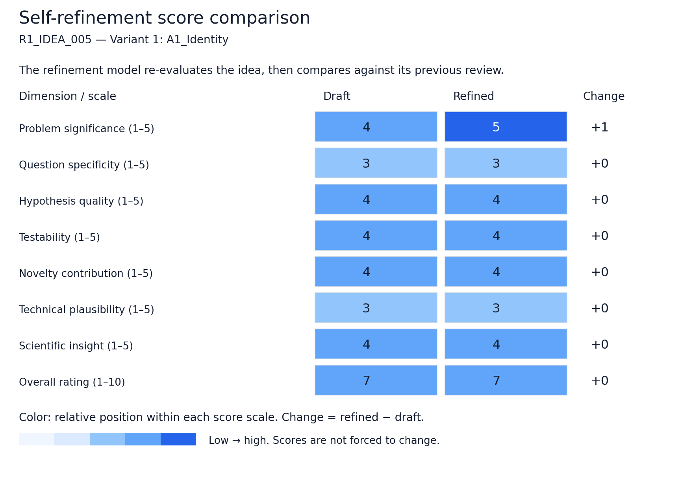

Changed score dimensions: problem_significance.

### Score justifications (draft / refined)

**Problem significance**

```json
{
  "draft": {
    "score": 4.0,
    "justification": "Improving the robustness of Vision SSMs is a highly significant problem as these models are rapidly replacing Transformers in long-sequence and vision tasks. Distribution shift robustness is a fundamental requirement for deploying these models in real-world scenarios."
  },
  "refined": {
    "score": 5.0,
    "justification": "Improving the robustness of Vision SSMs is a highly significant problem. As SSMs rapidly replace Transformers in long-sequence and vision tasks, their susceptibility to distribution shifts is a fundamental barrier to real-world deployment. Solving this addresses a critical need in the field."
  }
}
```

**Question specificity**

```json
{
  "draft": {
    "score": 3.0,
    "justification": "The idea identifies the goal (robustness via TTA) and the target (Mamba), but the core mechanism ('diverse SSM traversal permutations') and the aggregation strategy are described at a high level without sufficient technical specificity to fully grasp the novelty or feasibility."
  },
  "refined": {
    "score": 3.0,
    "justification": "The idea identifies the goal (robustness via TTA) and the target (Mamba), but the core mechanism ('diverse SSM traversal permutations') and the aggregation strategy are described at a high level. The specific nature of the permutations and the aggregation logic are currently too abstract to fully assess the novelty or feasibility."
  }
}
```

**Hypothesis quality**

```json
{
  "draft": {
    "score": 4.0,
    "justification": "The hypothesis is clear: that exploiting the internal state dynamics of SSMs through permutation-based view generation can yield better pseudo-labels and parameter updates than standard methods, leading to improved generalization."
  },
  "refined": {
    "score": 4.0,
    "justification": "The hypothesis is clear: that exploiting internal state dynamics through permutation-based view generation can yield better pseudo-labels and parameter updates than standard methods, leading to improved generalization. This is a testable claim that distinguishes the work from generic TTA applications."
  }
}
```

**Testability**

```json
{
  "draft": {
    "score": 4.0,
    "justification": "The idea is highly testable. It suggests a clear experimental setup: apply the method to standard vision benchmarks with distribution shifts (e.g., ImageNet-C, domain adaptation tasks) and compare performance against baselines using metrics like accuracy and calibration."
  },
  "refined": {
    "score": 4.0,
    "justification": "The idea is highly testable. It suggests a clear experimental setup: apply the method to standard vision benchmarks with distribution shifts (e.g., ImageNet-C, domain adaptation tasks) and compare performance against baselines using metrics like accuracy and calibration. The success or failure of the specific permutation strategy can be empirically validated."
  }
}
```

**Novelty contribution**

```json
{
  "draft": {
    "score": 4.0,
    "justification": "Applying TTA to SSMs is a relatively new direction. The specific proposal to use 'traversal permutations' as a source of view diversity is a novel conceptual contribution that could reveal new properties of SSM state dynamics."
  },
  "refined": {
    "score": 4.0,
    "justification": "Applying TTA to SSMs is a relatively new direction. The specific proposal to use 'traversal permutations' as a source of view diversity is a novel conceptual contribution that could reveal new properties of SSM state dynamics and how they relate to semantic robustness."
  }
}
```

**Technical plausibility**

```json
{
  "draft": {
    "score": 3.0,
    "justification": "While the general direction is plausible, the technical details regarding 'traversal permutations' and 'weight aggregation' are currently too abstract. The feasibility depends heavily on how these operations are mathematically defined to ensure they do not break the SSM's sequential logic."
  },
  "refined": {
    "score": 3.0,
    "justification": "While the general direction is plausible, the technical details regarding 'traversal permutations' and 'weight aggregation' are currently too abstract. The feasibility hinges entirely on how these operations are mathematically defined to ensure they do not break the SSM's sequential logic or introduce instability. Without a clear definition, the technical path is uncertain."
  }
}
```

**Scientific insight**

```json
{
  "draft": {
    "score": 4.0,
    "justification": "If successful, this research could provide deep insights into the internal state dynamics of SSMs, revealing how different traversal paths relate to semantic robustness. It could also establish new principles for designing TTA methods specifically for state-space architectures."
  },
  "refined": {
    "score": 4.0,
    "justification": "If successful, this research could provide deep insights into the internal state dynamics of SSMs, revealing how different traversal paths relate to semantic robustness. It could also establish new principles for designing TTA methods specifically for state-space architectures, moving beyond generic Transformer-based approaches."
  }
}
```

**Overall rating**

```json
{
  "draft": {
    "score": 7.0,
    "justification": "This is a strong research idea with high potential. It addresses a relevant problem with a novel, domain-specific mechanism. The main limitation is the current lack of technical specificity regarding the core operations (permutations and aggregation), which prevents a higher score. However, the core hypothesis is sound and the potential for scientific insight is significant."
  },
  "refined": {
    "score": 7.0,
    "justification": "This is a strong research idea with high potential. It addresses a relevant and timely problem with a novel, domain-specific mechanism. The main limitation is the current lack of technical specificity regarding the core operations (permutations and aggregation), which prevents a higher score. However, the core hypothesis is sound, and the potential for scientific insight is significant. The idea is promising but requires rigorous definition to be fully realized."
  }
}
```

## R1_IDEA_005 — Variant 2: A2_Paraphrase_Only

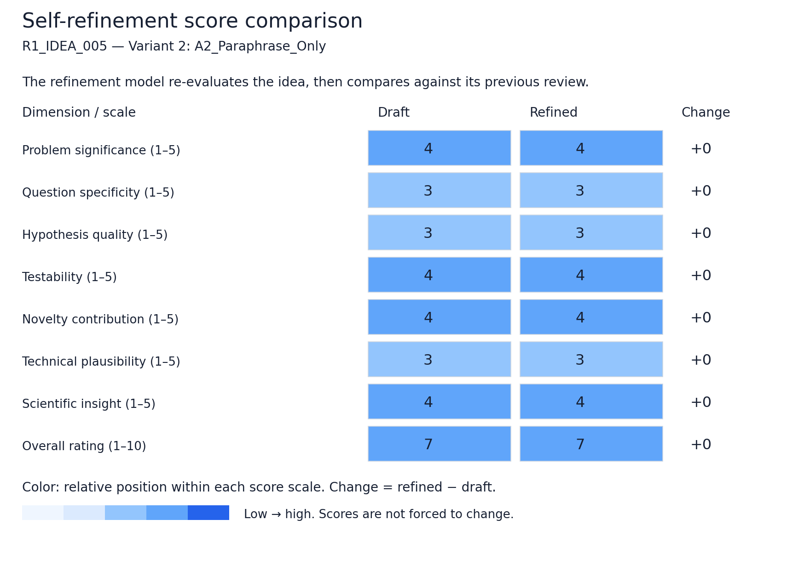

Changed score dimensions: none.

### Score justifications (draft / refined)

**Problem significance**

```json
{
  "draft": {
    "score": 4.0,
    "justification": "Robustness of deep learning models under distribution shift is a major challenge. Specifically addressing the robustness of Vision SSMs (a hot topic) is highly significant as these models are increasingly adopted for long-sequence vision tasks where Transformers are computationally expensive."
  },
  "refined": {
    "score": 4.0,
    "justification": "Robustness under distribution shift is a critical challenge in ML. Specifically targeting Vision SSMs is highly significant as these models are gaining traction for long-sequence vision tasks where Transformers are computationally prohibitive. Solving this could enable wider deployment of SSMs in real-world settings."
  }
}
```

**Question specificity**

```json
{
  "draft": {
    "score": 3.0,
    "justification": "The idea identifies the domain (Vision SSMs), the setting (test-time adaptation), and the general mechanism (permutation + pseudo-labels). However, the specific definition of 'traversal permutation' and the 'aggregation' method are currently too vague to be considered a fully specific research question."
  },
  "refined": {
    "score": 3.0,
    "justification": "The idea identifies the domain (Vision SSMs), the setting (TTA), and the general mechanism (permutation + pseudo-labels). However, the specific definition of 'traversal permutation' and the 'aggregation' method are currently too vague to be considered a fully specific research question. The core mechanism needs precise operational definition."
  }
}
```

**Hypothesis quality**

```json
{
  "draft": {
    "score": 3.0,
    "justification": "The implicit hypothesis is that structural permutations of SSM traversal create diverse enough views to enable effective self-training. This is plausible but needs to be more explicitly stated as a testable claim (e.g., 'Permuting traversal order yields higher diversity in feature space than standard augmentations for SSMs')."
  },
  "refined": {
    "score": 3.0,
    "justification": "The implicit hypothesis is that structural permutations of SSM traversal create diverse enough views to enable effective self-training. While plausible, it is not explicitly stated as a testable claim (e.g., 'Permuting traversal order yields higher feature diversity than standard augmentations for SSMs'). The hypothesis needs to be more concrete to distinguish it from generic TTA."
  }
}
```

**Testability**

```json
{
  "draft": {
    "score": 4.0,
    "justification": "The idea is highly testable. One can implement the proposed permutation strategy, run standard TTA benchmarks (e.g., ImageNet-C, DomainNet), and measure performance gains. The lack of implementation details does not hinder the ability to design an experiment to test the core concept."
  },
  "refined": {
    "score": 4.0,
    "justification": "The idea is testable. One can implement the proposed permutation strategy (once defined), run standard TTA benchmarks (e.g., ImageNet-C, DomainNet), and measure performance gains. The lack of implementation details does not prevent the design of an experiment to test the core concept, provided the 'permutation' is defined."
  }
}
```

**Novelty contribution**

```json
{
  "draft": {
    "score": 4.0,
    "justification": "Applying TTA to SSMs is novel. More importantly, proposing 'traversal permutation' as a view generation strategy is a unique contribution that leverages the specific architecture of SSMs, distinguishing it from generic TTA approaches."
  },
  "refined": {
    "score": 4.0,
    "justification": "Applying TTA to SSMs is novel. More importantly, proposing 'traversal permutation' as a view generation strategy is a unique contribution that leverages the specific architecture of SSMs, distinguishing it from generic TTA approaches. If successful, it could establish a new paradigm for augmenting state-space models."
  }
}
```

**Technical plausibility**

```json
{
  "draft": {
    "score": 3.0,
    "justification": "The idea is technically plausible but carries a risk. If 'permuting traversal' breaks the causal structure required for the SSM to function correctly, the pseudo-labels will be garbage. The plausibility hinges entirely on the specific definition of the permutation, which is currently missing."
  },
  "refined": {
    "score": 3.0,
    "justification": "The idea is technically plausible but carries a significant risk. If 'permuting traversal' breaks the causal structure required for the SSM to function correctly, the pseudo-labels will be garbage. The plausibility hinges entirely on the specific definition of the permutation, which is currently missing. Without a rigorous definition, the mechanism is speculative."
  }
}
```

**Scientific insight**

```json
{
  "draft": {
    "score": 4.0,
    "justification": "If successful, this research would provide deep insights into the structural sensitivity of SSMs and how their state-space dynamics can be exploited for robustness. It could reveal new principles for designing augmentation strategies specific to recurrent/SSM architectures."
  },
  "refined": {
    "score": 4.0,
    "justification": "If successful, this research would provide deep insights into the structural sensitivity of SSMs and how their state-space dynamics can be exploited for robustness. It could reveal new principles for designing augmentation strategies specific to recurrent/SSM architectures, moving beyond generic data augmentation."
  }
}
```

**Overall rating**

```json
{
  "draft": {
    "score": 7.0,
    "justification": "This is a strong research idea with high potential. It targets a relevant problem (SSM robustness) with a novel, architecture-specific mechanism. The main weakness is the lack of specificity regarding the 'permutation' and 'aggregation' mechanics, which are critical for technical plausibility. However, the core concept is promising enough to warrant investigation."
  },
  "refined": {
    "score": 7.0,
    "justification": "This is a strong research idea with high potential. It targets a relevant problem (SSM robustness) with a novel, architecture-specific mechanism. The main weakness is the lack of specificity regarding the 'permutation' and 'aggregation' mechanics, which are critical for technical plausibility. However, the core concept is promising enough to warrant investigation, provided the technical details are resolved."
  }
}
```

## R1_IDEA_005 — Variant 3: A3_Plain_Core


Changed score dimensions: none.

### Score justifications (draft / refined)

**Problem significance**

```json
{
  "draft": {
    "score": 4.0,
    "justification": "Improving the robustness of SSMs under distribution shifts is a significant problem. SSMs are emerging as strong alternatives to Transformers, but their robustness properties are less understood and often perceived as weaker. Solving this would have high practical value for deploying these models in real-world scenarios."
  },
  "refined": {
    "score": 4.0,
    "justification": "Improving the robustness of SSMs under distribution shifts is a critical and timely problem. As SSMs emerge as viable alternatives to Transformers, understanding and mitigating their sensitivity to domain shifts is essential for practical deployment. Solving this would have high value for the community."
  }
}
```

**Question specificity**

```json
{
  "draft": {
    "score": 3.0,
    "justification": "The idea identifies the goal (TTA for SSMs) and the general mechanism (permutations + pseudo-labels), but the specific definitions of 'traversal permutations' and 'weight aggregation' are currently too vague to be fully evaluated as a concrete research question."
  },
  "refined": {
    "score": 3.0,
    "justification": "The idea identifies the goal and a general mechanism, but the core components ('traversal permutations' and 'weight aggregation') are currently described in vague terms. The research question is not yet specific enough to be fully evaluated without further mathematical definition."
  }
}
```

**Hypothesis quality**

```json
{
  "draft": {
    "score": 3.0,
    "justification": "The implicit hypothesis is that diverse structural traversals of the SSM generate diverse and useful pseudo-labels that can guide parameter updates. This is plausible but not yet specific enough to be a strong, falsifiable hypothesis without defining the 'diversity' and the 'update' mechanism."
  },
  "refined": {
    "score": 3.0,
    "justification": "The implicit hypothesis—that diverse structural traversals of the SSM generate diverse and useful pseudo-labels for parameter updates—is plausible but not yet specific. It needs to be refined to specify *how* the diversity is achieved and *why* it leads to better generalization compared to standard methods."
  }
}
```

**Testability**

```json
{
  "draft": {
    "score": 3.0,
    "justification": "The idea is testable in principle (implement the method, run on shifted data), but the lack of specific algorithmic details makes it difficult to design a rigorous experiment immediately. The 'permutation' and 'aggregation' steps need formalization to be testable."
  },
  "refined": {
    "score": 3.0,
    "justification": "The idea is testable in principle, but the lack of specific algorithmic details makes immediate rigorous experimentation difficult. The 'permutation' and 'aggregation' steps must be formalized to design a valid experiment."
  }
}
```

**Novelty contribution**

```json
{
  "draft": {
    "score": 4.0,
    "justification": "Applying TTA to SSMs is novel. More importantly, the specific proposal to use 'traversal permutations' as a source of diversity for SSMs is a unique angle that could lead to new insights into how SSMs process sequential information, distinguishing it from generic TTA approaches."
  },
  "refined": {
    "score": 4.0,
    "justification": "Applying TTA to SSMs is novel. The specific proposal to leverage 'traversal permutations' as a source of diversity is a unique angle that could provide new insights into SSM processing, distinguishing it from generic TTA approaches applied to SSMs."
  }
}
```

**Technical plausibility**

```json
{
  "draft": {
    "score": 3.0,
    "justification": "The general direction is plausible, but the specific mechanism of 'aggregating adapted weights' at test time is technically risky and non-standard. The feasibility depends entirely on how the 'permutations' are defined and whether the weight updates remain stable."
  },
  "refined": {
    "score": 3.0,
    "justification": "The general direction is plausible, but the specific mechanism of 'aggregating adapted weights' at test time is technically risky and non-standard. The feasibility depends entirely on how the 'permutations' are defined and whether the weight updates remain stable without labeled data."
  }
}
```

**Scientific insight**

```json
{
  "draft": {
    "score": 3.0,
    "justification": "If successful, this could reveal how the internal state dynamics of SSMs can be leveraged for robustness, providing insights into the relationship between SSM structure and generalization. However, if it fails, it might just be a failed engineering attempt without deep theoretical insight unless the failure modes are analyzed."
  },
  "refined": {
    "score": 3.0,
    "justification": "If successful, this could reveal how internal state dynamics of SSMs can be leveraged for robustness. However, if the method fails or is just a heuristic, it may not yield deep theoretical insights unless the failure modes are analyzed to understand SSM limitations."
  }
}
```

**Overall rating**

```json
{
  "draft": {
    "score": 6.0,
    "justification": "This is a moderate-to-strong research idea with high potential significance. The problem is relevant, and the proposed mechanism is specific to the architecture. However, the current description lacks the necessary technical specificity to be considered a 'strong' or 'exceptional' idea. The vague definitions of 'permutations' and 'weight aggregation' prevent a higher score, as they are the core of the novelty. With better formalization, this could easily become a 7 or 8."
  },
  "refined": {
    "score": 6.0,
    "justification": "This is a moderate-to-strong research idea with high potential significance. The problem is relevant, and the proposed mechanism is specific to the architecture. However, the current description lacks the necessary technical specificity to be considered 'strong' or 'exceptional'. The vague definitions of 'permutations' and 'weight aggregation' prevent a higher score, as they are the core of the novelty. With better formalization, this could easily become a 7 or 8."
  }
}
```

## R1_IDEA_005 — Variant 4: B1_Verbose_Elaborate


Changed score dimensions: none.

### Score justifications (draft / refined)

**Problem significance**

```json
{
  "draft": {
    "score": 4.0,
    "justification": "Improving the robustness of Vision SSMs is a highly significant problem as these models are gaining traction as alternatives to Transformers. Distribution shift robustness is a fundamental requirement for real-world deployment, making this a meaningful research direction."
  },
  "refined": {
    "score": 4.0,
    "justification": "Improving the robustness of Vision SSMs is a highly significant problem as these models are gaining traction as alternatives to Transformers. Distribution shift robustness is a fundamental requirement for real-world deployment, making this a meaningful research direction."
  }
}
```

**Question specificity**

```json
{
  "draft": {
    "score": 3.0,
    "justification": "The idea identifies the target (Vision SSMs), the setting (test-time adaptation), and the general mechanism (permutations + pseudo-labels). However, the specific definition of 'permutations of traversal' and the 'aggregation' method are currently vague, making the research question slightly broad."
  },
  "refined": {
    "score": 3.0,
    "justification": "The idea identifies the target (Vision SSMs), the setting (test-time adaptation), and the general mechanism (permutations + pseudo-labels). However, the specific definition of 'permutations of traversal' and the 'aggregation' method are currently vague, making the research question slightly broad."
  }
}
```

**Hypothesis quality**

```json
{
  "draft": {
    "score": 3.0,
    "justification": "The implicit hypothesis is that SSM-specific permutations generate more informative views for pseudo-labeling than standard augmentations. This is plausible but not explicitly stated or theoretically grounded in the summary, making it a moderate hypothesis."
  },
  "refined": {
    "score": 3.0,
    "justification": "The implicit hypothesis is that SSM-specific permutations generate more informative views for pseudo-labeling than standard augmentations. This is plausible but not explicitly stated or theoretically grounded in the summary, making it a moderate hypothesis."
  }
}
```

**Testability**

```json
{
  "draft": {
    "score": 4.0,
    "justification": "The idea is highly testable. One can implement the permutation strategy, run TTA on standard distribution shift benchmarks (e.g., ImageNet-C, domain shifts), and compare performance against baselines. The metrics (accuracy, robustness) are clear."
  },
  "refined": {
    "score": 4.0,
    "justification": "The idea is highly testable. One can implement the permutation strategy, run TTA on standard distribution shift benchmarks (e.g., ImageNet-C, domain shifts), and compare performance against baselines. The metrics (accuracy, robustness) are clear."
  }
}
```

**Novelty contribution**

```json
{
  "draft": {
    "score": 4.0,
    "justification": "Applying TTA to SSMs is novel. More importantly, proposing 'permutations of traversal' as a view generation strategy is a unique contribution that leverages the specific inductive biases of SSMs, distinguishing it from generic TTA approaches."
  },
  "refined": {
    "score": 4.0,
    "justification": "Applying TTA to SSMs is novel. More importantly, proposing 'permutations of traversal' as a view generation strategy is a unique contribution that leverages the specific inductive biases of SSMs, distinguishing it from generic TTA approaches."
  }
}
```

**Technical plausibility**

```json
{
  "draft": {
    "score": 3.0,
    "justification": "The idea is technically plausible but carries a risk. If the permutations destroy the sequential dependencies that SSMs rely on, the pseudo-labels may be noisy, and the adaptation could fail. The success depends heavily on the specific design of the permutations."
  },
  "refined": {
    "score": 3.0,
    "justification": "The idea is technically plausible but carries a risk. If the permutations destroy the sequential dependencies that SSMs rely on, the pseudo-labels may be noisy, and the adaptation could fail. The success depends heavily on the specific design of the permutations."
  }
}
```

**Scientific insight**

```json
{
  "draft": {
    "score": 4.0,
    "justification": "If successful, this research could reveal how SSMs encode information and which structural invariances are most critical for robustness. It could also provide insights into the relationship between sequence ordering and model generalization."
  },
  "refined": {
    "score": 4.0,
    "justification": "If successful, this research could reveal how SSMs encode information and which structural invariances are most critical for robustness. It could also provide insights into the relationship between sequence ordering and model generalization."
  }
}
```

**Overall rating**

```json
{
  "draft": {
    "score": 7.0,
    "justification": "This is a strong research idea with high potential. It addresses a relevant problem with a novel, architecture-specific approach. The main weakness lies in the current lack of technical detail regarding the 'permutations' and 'aggregation' mechanisms, which are critical for the method's success. With clearer formulation, this could be an exceptional contribution."
  },
  "refined": {
    "score": 7.0,
    "justification": "This is a strong research idea with high potential. It addresses a relevant problem with a novel, architecture-specific approach. The main weakness lies in the current lack of technical detail regarding the 'permutations' and 'aggregation' mechanisms, which are critical for the method's success. With clearer formulation, this could be an exceptional contribution."
  }
}
```

## R1_IDEA_005 — Variant 5: B2_Grand_Narrative


Changed score dimensions: none.

### Score justifications (draft / refined)

**Problem significance**

```json
{
  "draft": {
    "score": 4.0,
    "justification": "Improving the robustness of SSMs is a significant challenge in current ML research. As SSMs gain traction as alternatives to Transformers, understanding and fixing their brittleness under distribution shifts is crucial for their widespread adoption in safety-critical or real-world vision applications."
  },
  "refined": {
    "score": 4.0,
    "justification": "Improving the robustness of SSMs is a significant and timely challenge. As SSMs gain traction as alternatives to Transformers, understanding and fixing their brittleness under distribution shifts is crucial for their widespread adoption in safety-critical or real-world vision applications."
  }
}
```

**Question specificity**

```json
{
  "draft": {
    "score": 3.0,
    "justification": "The idea identifies the general approach (TTA via permutations and pseudo-labels) but lacks specificity on the critical 'how'. The definition of 'SSM traversal permutations' is the most ambiguous part, making the research question somewhat open-ended."
  },
  "refined": {
    "score": 3.0,
    "justification": "The idea identifies the general approach (TTA via permutations and pseudo-labels) but lacks specificity on the critical 'how'. The definition of 'SSM traversal permutations' is the most ambiguous part, making the research question somewhat open-ended and requiring significant clarification to be actionable."
  }
}
```

**Hypothesis quality**

```json
{
  "draft": {
    "score": 3.0,
    "justification": "The implicit hypothesis is that architectural-specific view generation (permutations) combined with self-training improves robustness. This is a plausible hypothesis, but it is not yet sharply defined in terms of the expected mechanism or the specific conditions under which it will fail."
  },
  "refined": {
    "score": 3.0,
    "justification": "The implicit hypothesis is that architectural-specific view generation (permutations) combined with self-training improves robustness. This is a plausible hypothesis, but it is not yet sharply defined in terms of the expected mechanism or the specific conditions under which it will fail. The link between 'permutations' and 'robustness' needs a stronger theoretical bridge."
  }
}
```

**Testability**

```json
{
  "draft": {
    "score": 4.0,
    "justification": "The idea is highly testable. One can implement the proposed permutation strategy, run standard TTA benchmarks (e.g., ImageNet-C, DomainNet), and compare performance against baselines. The metrics (accuracy under shift) are clear."
  },
  "refined": {
    "score": 4.0,
    "justification": "The idea is highly testable in principle. One can implement the proposed permutation strategy (once defined), run standard TTA benchmarks (e.g., ImageNet-C, DomainNet), and compare performance against baselines. The metrics (accuracy under shift) are clear, even if the implementation details are currently vague."
  }
}
```

**Novelty contribution**

```json
{
  "draft": {
    "score": 4.0,
    "justification": "Applying TTA to SSMs is novel. More importantly, proposing 'traversal permutations' as a source of diversity is a unique angle that differs from standard data augmentation or feature-space TTA. If successful, it could reveal new insights into the inductive biases of SSMs."
  },
  "refined": {
    "score": 4.0,
    "justification": "Applying TTA to SSMs is novel. More importantly, proposing 'traversal permutations' as a source of diversity is a unique angle that differs from standard data augmentation or feature-space TTA. If successful, it could reveal new insights into the inductive biases of SSMs and the role of sequence ordering in vision."
  }
}
```

**Technical plausibility**

```json
{
  "draft": {
    "score": 3.0,
    "justification": "The general concept of TTA is plausible. However, the technical feasibility of 'permuting SSM traversal' without breaking the model's logic is uncertain. SSMs rely on specific orderings; arbitrary permutations might render the model's internal states meaningless unless the permutation is carefully designed (e.g., as a data augmentation rather than a structural change)."
  },
  "refined": {
    "score": 3.0,
    "justification": "The general concept of TTA is plausible. However, the technical feasibility of 'permuting SSM traversal' without breaking the model's logic is uncertain. SSMs rely on specific orderings; arbitrary permutations might render the model's internal states meaningless unless the permutation is carefully designed (e.g., as a specific type of data augmentation rather than a structural change). The idea of updating weights at test time also carries high risk of instability."
  }
}
```

**Scientific insight**

```json
{
  "draft": {
    "score": 4.0,
    "justification": "If the method works, it would provide significant insight into the relationship between SSM architecture, sequence ordering, and robustness. It could demonstrate that SSMs have latent invariances that can be exploited via specific traversal manipulations, offering a new perspective on model interpretability and robustness."
  },
  "refined": {
    "score": 4.0,
    "justification": "If the method works, it would provide significant insight into the relationship between SSM architecture, sequence ordering, and robustness. It could demonstrate that SSMs have latent invariances that can be exploited via specific traversal manipulations, offering a new perspective on model interpretability and robustness."
  }
}
```

**Overall rating**

```json
{
  "draft": {
    "score": 7.0,
    "justification": "This is a strong research idea with high potential. It targets a relevant problem (SSM robustness) with a novel mechanism (traversal permutations). While the specific implementation details are currently vague, the core concept is scientifically sound and testable. With clearer definitions of the 'permutations' and the adaptation strategy, this could be a high-impact contribution."
  },
  "refined": {
    "score": 7.0,
    "justification": "This is a strong research idea with high potential. It targets a relevant problem (SSM robustness) with a novel mechanism (traversal permutations). While the specific implementation details are currently vague and the technical plausibility of 'permuting traversal' is questionable without further definition, the core concept is scientifically sound and testable. With clearer definitions of the 'permutations' and the adaptation strategy, this could be a high-impact contribution."
  }
}
```

## R1_IDEA_005 — Variant 6: B3_Over_Confident


Changed score dimensions: none.

### Score justifications (draft / refined)

**Problem significance**

```json
{
  "draft": {
    "score": 4.0,
    "justification": "Improving the robustness of Vision SSMs is a highly significant problem given the rapid adoption of these architectures as alternatives to Transformers. Distribution shift robustness is a fundamental challenge in deploying ML systems, making this a meaningful research direction."
  },
  "refined": {
    "score": 4.0,
    "justification": "Improving the robustness of Vision SSMs is a highly significant problem given the rapid adoption of these architectures as alternatives to Transformers. Distribution shift robustness is a fundamental challenge in deploying ML systems, making this a meaningful research direction."
  }
}
```

**Question specificity**

```json
{
  "draft": {
    "score": 3.0,
    "justification": "The idea identifies the goal (robustness via TTA) and the target (Mamba/SSMs), but the core mechanism ('diverse SSM traversal permutations') is currently too vague to be fully evaluated. The specific nature of the permutations and the aggregation method needs more definition."
  },
  "refined": {
    "score": 3.0,
    "justification": "The idea identifies the goal (robustness via TTA) and the target (Mamba/SSMs), but the core mechanism ('diverse SSM traversal permutations') is currently too vague to be fully evaluated. The specific nature of the permutations and the aggregation method needs more definition."
  }
}
```

**Hypothesis quality**

```json
{
  "draft": {
    "score": 4.0,
    "justification": "The implicit hypothesis is that structural permutations of the SSM state space can generate diverse, informative views that, when used for self-training, lead to better generalization than standard methods. This is a concrete, falsifiable claim that distinguishes the work from generic applications."
  },
  "refined": {
    "score": 4.0,
    "justification": "The implicit hypothesis is that structural permutations of the SSM state space can generate diverse, informative views that, when used for self-training, lead to better generalization than standard methods. This is a concrete, falsifiable claim that distinguishes the work from generic applications."
  }
}
```

**Testability**

```json
{
  "draft": {
    "score": 4.0,
    "justification": "The idea is highly testable. One can implement specific permutation strategies, run standard TTA benchmarks (e.g., ImageNet-C, domain shifts), and compare performance against baselines. The use of pseudo-labels and weight aggregation provides clear metrics for evaluation."
  },
  "refined": {
    "score": 4.0,
    "justification": "The idea is highly testable. One can implement specific permutation strategies, run standard TTA benchmarks (e.g., ImageNet-C, domain shifts), and compare performance against baselines. The use of pseudo-labels and weight aggregation provides clear metrics for evaluation."
  }
}
```

**Novelty contribution**

```json
{
  "draft": {
    "score": 4.0,
    "justification": "Applying TTA to SSMs is novel, but the specific proposal to use 'traversal permutations' as the source of diversity is a strong, unique contribution. It moves beyond simple data augmentation to structural manipulation, which could yield new insights into SSM dynamics."
  },
  "refined": {
    "score": 4.0,
    "justification": "Applying TTA to SSMs is novel, but the specific proposal to use 'traversal permutations' as the source of diversity is a strong, unique contribution. It moves beyond simple data augmentation to structural manipulation, which could yield new insights into SSM dynamics."
  }
}
```

**Technical plausibility**

```json
{
  "draft": {
    "score": 3.0,
    "justification": "The idea is technically plausible in principle, as SSMs have defined state transitions that can theoretically be permuted. However, without a clear definition of valid permutations that preserve the model's integrity while creating diversity, the feasibility is uncertain. The aggregation of weights at test time also requires careful handling to avoid instability."
  },
  "refined": {
    "score": 3.0,
    "justification": "The idea is technically plausible in principle, as SSMs have defined state transitions that can theoretically be permuted. However, without a clear definition of valid permutations that preserve the model's integrity while creating diversity, the feasibility is uncertain. The aggregation of weights at test time also requires careful handling to avoid instability."
  }
}
```

**Scientific insight**

```json
{
  "draft": {
    "score": 4.0,
    "justification": "If successful, this research could reveal how the internal state dynamics of SSMs can be leveraged for robustness, offering insights into the relationship between recurrence structure and generalization. It could also establish new principles for TTA in non-attention-based architectures."
  },
  "refined": {
    "score": 4.0,
    "justification": "If successful, this research could reveal how the internal state dynamics of SSMs can be leveraged for robustness, offering insights into the relationship between recurrence structure and generalization. It could also establish new principles for TTA in non-attention-based architectures."
  }
}
```

**Overall rating**

```json
{
  "draft": {
    "score": 7.0,
    "justification": "This is a strong research idea with high potential. It addresses a relevant problem with a novel, architecture-specific approach. The main limitation is the current lack of specificity regarding the 'permutations' and 'aggregation' mechanisms. With clearer definitions, this could be an exceptional contribution to the field of robust deep learning."
  },
  "refined": {
    "score": 7.0,
    "justification": "This is a strong research idea with high potential. It addresses a relevant problem with a novel, architecture-specific approach. The main limitation is the current lack of specificity regarding the 'permutations' and 'aggregation' mechanisms. With clearer definitions, this could be an exceptional contribution to the field of robust deep learning."
  }
}
```

## R1_IDEA_005 — Variant 7: B4_Novelty


Changed score dimensions: none.

### Score justifications (draft / refined)

**Problem significance**

```json
{
  "draft": {
    "score": 4.0,
    "justification": "Improving the robustness of SSMs (a hot topic in ML) under distribution shifts is highly significant. As SSMs challenge Transformers in efficiency and performance, understanding their failure modes and adaptation capabilities is crucial for their broader adoption."
  },
  "refined": {
    "score": 4.0,
    "justification": "Improving the robustness of SSMs is a significant and timely problem. As SSMs compete with Transformers, understanding their failure modes and adaptation capabilities is essential for their adoption in safety-critical or real-world applications where distribution shifts are common."
  }
}
```

**Question specificity**

```json
{
  "draft": {
    "score": 3.0,
    "justification": "The idea identifies a method (permutation-based TTA) and a goal (robustness), but the core mechanism ('traversal permutations') is described vaguely. The specific nature of the permutations and the update rule needs more definition to be considered a specific research question."
  },
  "refined": {
    "score": 3.0,
    "justification": "The idea identifies a goal (robustness) and a general approach (permutation-based TTA), but the core mechanism ('traversal permutations') is described vaguely. The specific nature of the permutations and the update rule needs more definition to be considered a fully specific research question."
  }
}
```

**Hypothesis quality**

```json
{
  "draft": {
    "score": 3.0,
    "justification": "The implicit hypothesis is that 'diverse SSM traversal permutations + pseudo-label adaptation' yields better robustness than standard methods. This is testable, but the mechanism linking permutations to robustness is not yet clearly articulated as a causal relationship."
  },
  "refined": {
    "score": 3.0,
    "justification": "The implicit hypothesis is that 'diverse SSM traversal permutations + pseudo-label adaptation' yields better robustness than standard methods. This is testable, but the causal link between the specific permutation mechanism and the resulting robustness is not yet clearly articulated."
  }
}
```

**Testability**

```json
{
  "draft": {
    "score": 4.0,
    "justification": "The idea is highly testable. One can implement the proposed permutation strategy, run it on standard distribution shift benchmarks (e.g., ImageNet-C, DomainNet), and compare performance against baselines. The use of pseudo-labels and weight aggregation provides clear metrics for evaluation."
  },
  "refined": {
    "score": 4.0,
    "justification": "The idea is highly testable. One can implement the proposed permutation strategy, run it on standard distribution shift benchmarks (e.g., ImageNet-C, DomainNet), and compare performance against baselines. The use of pseudo-labels and weight aggregation provides clear metrics for evaluation."
  }
}
```

**Novelty contribution**

```json
{
  "draft": {
    "score": 4.0,
    "justification": "Applying TTA to SSMs is relatively new. The specific angle of using 'traversal permutations' to generate views is a novel conceptual contribution, distinct from standard data augmentation or feature-space TTA methods."
  },
  "refined": {
    "score": 4.0,
    "justification": "Applying TTA to SSMs is relatively new. The specific angle of using 'traversal permutations' to generate views is a novel conceptual contribution, distinct from standard data augmentation or feature-space TTA methods. If the mechanism is sound, it could offer a new paradigm for adapting sequential models."
  }
}
```

**Technical plausibility**

```json
{
  "draft": {
    "score": 3.0,
    "justification": "The idea is plausible but carries technical risks. The definition of 'permuting traversal' in a sequential model is non-trivial and could be structurally invalid. The feasibility of updating weights at test time without degrading the model's inductive biases needs careful validation."
  },
  "refined": {
    "score": 3.0,
    "justification": "The idea is plausible but carries significant technical risks. The definition of 'permuting traversal' in a sequential model is non-trivial and could be structurally invalid. The feasibility of updating weights at test time without degrading the model's inductive biases needs careful validation."
  }
}
```

**Scientific insight**

```json
{
  "draft": {
    "score": 3.0,
    "justification": "If successful, this could reveal how the internal state dynamics of SSMs can be leveraged for adaptation, offering insights into the relationship between SSM structure and robustness. However, if the 'permutation' idea is just a heuristic without deeper theoretical grounding, the insight may be limited to empirical performance gains."
  },
  "refined": {
    "score": 3.0,
    "justification": "If successful, this could reveal how the internal state dynamics of SSMs can be leveraged for adaptation, offering insights into the relationship between SSM structure and robustness. However, if the 'permutation' idea is just a heuristic without deeper theoretical grounding, the insight may be limited to empirical performance gains."
  }
}
```

**Overall rating**

```json
{
  "draft": {
    "score": 7.0,
    "justification": "This is a strong research idea with high potential novelty and significance. It addresses a relevant problem with a unique angle (SSM-specific permutations). The main drawback is the current lack of specificity regarding the 'permutation' mechanism and the technical feasibility of the update rule. With clearer definitions, this could be an exceptional contribution."
  },
  "refined": {
    "score": 7.0,
    "justification": "This is a strong research idea with high potential novelty and significance. It addresses a relevant problem with a unique angle (SSM-specific permutations). The main drawback is the current lack of specificity regarding the 'permutation' mechanism and the technical feasibility of the update rule. With clearer definitions, this could be an exceptional contribution."
  }
}
```

## R1_IDEA_005 — Variant 8: B5_Application_Impact

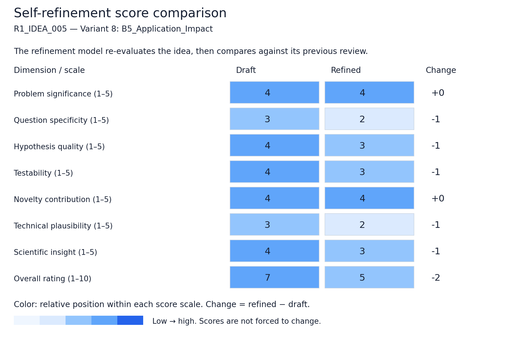

Changed score dimensions: question_specificity, hypothesis_quality, testability, technical_plausibility, scientific_insight, overall_rating.

### Score justifications (draft / refined)

**Problem significance**

```json
{
  "draft": {
    "score": 4.0,
    "justification": "Improving the robustness of Vision SSMs is a significant problem. As SSMs challenge Transformers in efficiency and long-range dependency modeling, ensuring they generalize well under distribution shifts is crucial for their adoption in real-world systems. The scarcity of labeled data makes TTA a highly relevant solution."
  },
  "refined": {
    "score": 4.0,
    "justification": "Improving the robustness of Vision SSMs is a significant and timely problem. As SSMs challenge Transformers in efficiency and long-range dependency modeling, ensuring they generalize well under distribution shifts is crucial for their adoption in real-world systems. The scarcity of labeled data makes TTA a highly relevant solution."
  }
}
```

**Question specificity**

```json
{
  "draft": {
    "score": 3.0,
    "justification": "The idea identifies the target (Vision SSMs), the method (TTA via permutations and pseudo-labels), and the goal (robustness). However, the core mechanism ('traversal permutations') is described vaguely, and the specific parameters to be updated are not detailed, leaving the research question somewhat open to interpretation."
  },
  "refined": {
    "score": 2.0,
    "justification": "While the goal (robustness) and target (SSMs) are clear, the core mechanism ('SSM traversal permutations') is described vaguely. The idea does not specify what these permutations are, how they are generated, or how they relate to the model's state-space dynamics. This lack of specificity makes the research question difficult to operationalize without significant invention."
  }
}
```

**Hypothesis quality**

```json
{
  "draft": {
    "score": 4.0,
    "justification": "The implicit hypothesis is strong: that structurally diverse views generated via SSM permutations can produce reliable pseudo-labels that guide effective parameter updates. This is a testable claim that distinguishes the work from generic TTA applications."
  },
  "refined": {
    "score": 3.0,
    "justification": "The implicit hypothesis—that structural permutations can yield useful pseudo-labels—is testable but rests on a fragile premise. It assumes that permuting SSM traversals preserves enough semantic information to generate valid labels, which is a strong and potentially flawed assumption that needs rigorous justification."
  }
}
```

**Testability**

```json
{
  "draft": {
    "score": 4.0,
    "justification": "The idea is highly testable. One can implement the proposed permutation strategy, generate pseudo-labels, update parameters, and compare performance against baselines on standard distribution shift benchmarks (e.g., ImageNet-C, DomainNet). The success or failure of the 'permutation' strategy can be empirically validated."
  },
  "refined": {
    "score": 3.0,
    "justification": "The idea is testable in principle (one can implement a permutation strategy and measure performance), but the lack of a defined permutation mechanism makes the experimental design ambiguous. The success of the experiment depends entirely on how the researcher interprets the undefined 'permutations'."
  }
}
```

**Novelty contribution**

```json
{
  "draft": {
    "score": 4.0,
    "justification": "Applying TTA to SSMs is novel, but the specific use of 'traversal permutations' to generate views is a unique contribution. If successful, this could reveal new insights into the internal dynamics of SSMs and how they can be leveraged for self-supervised adaptation."
  },
  "refined": {
    "score": 4.0,
    "justification": "Applying TTA to SSMs is novel, and the specific use of 'traversal permutations' to generate views is a unique contribution. If successful, this could reveal new insights into the internal dynamics of SSMs and how their structural properties can be leveraged for self-supervised adaptation."
  }
}
```

**Technical plausibility**

```json
{
  "draft": {
    "score": 3.0,
    "justification": "The idea is technically plausible in principle, as SSMs have defined state transitions that could theoretically be permuted. However, the feasibility depends heavily on whether such permutations preserve the semantic integrity of the input. Without a clear definition of the permutation, the technical soundness is uncertain."
  },
  "refined": {
    "score": 2.0,
    "justification": "The idea is technically risky. SSMs rely on strict sequential dependencies; arbitrary permutations of these traversals are likely to destroy the sequential information that the model relies on, rendering the generated views and subsequent pseudo-labels meaningless. Without a specific, plausible definition of the permutation, the technical soundness is low."
  }
}
```

**Scientific insight**

```json
{
  "draft": {
    "score": 4.0,
    "justification": "If successful, this research could provide deep insights into the inductive biases of SSMs and how their internal state dynamics can be exploited for robustness. It moves beyond 'applying a method' to 'understanding the model's structure' for adaptation."
  },
  "refined": {
    "score": 3.0,
    "justification": "If successful, this research could provide deep insights into the inductive biases of SSMs. However, given the high risk of the mechanism being ill-posed, the potential for negative results (showing that such permutations are ineffective) is also high, which would still be a valuable scientific finding regarding the limitations of SSM structural manipulation."
  }
}
```

**Overall rating**

```json
{
  "draft": {
    "score": 7.0,
    "justification": "This is a strong research idea with high potential. It addresses a meaningful problem in a cutting-edge architecture (SSMs) with a creative, albeit slightly vague, mechanism. The hypothesis is testable and could yield significant scientific insight into SSM robustness. The main drawback is the lack of specificity regarding the 'traversal permutations' and the aggregation strategy, which needs to be fleshed out for the idea to be fully actionable."
  },
  "refined": {
    "score": 5.0,
    "justification": "This is a moderate/borderline idea. It addresses a meaningful problem with a creative but highly underspecified mechanism. The core concept of 'SSM traversal permutations' is vague and potentially technically flawed, as it risks destroying the sequential dependencies that define SSMs. While the potential contribution is high if the mechanism works, the lack of a concrete, plausible definition of the method significantly lowers its current scientific quality. It requires substantial refinement to move from a vague concept to a viable research direction."
  }
}
```

## R1_IDEA_005 — Variant 9: C1_Hollow_Shell


Changed score dimensions: none.

### Score justifications (draft / refined)

**Problem significance**

```json
{
  "draft": {
    "score": 5.0,
    "justification": "Improving robustness to distribution shifts without labeled data is a critical challenge in deploying machine learning systems in dynamic environments. Solving this has high practical value."
  },
  "refined": {
    "score": 5.0,
    "justification": "The problem of distribution shift without labeled data is a fundamental bottleneck in deploying robust AI systems. Solving this is of paramount importance to both researchers and practitioners."
  }
}
```

**Question specificity**

```json
{
  "draft": {
    "score": 2.0,
    "justification": "The idea is currently too broad. Terms like 'information generated by the model' and 'combines adjustments' are not specific enough to define a concrete research question or mechanism."
  },
  "refined": {
    "score": 2.0,
    "justification": "The research question is currently too vague. While the goal is clear, the specific mechanism ('how') is described only in high-level, non-technical terms. It lacks the precision required to define a concrete scientific investigation."
  }
}
```

**Hypothesis quality**

```json
{
  "draft": {
    "score": 2.0,
    "justification": "There is no explicit hypothesis. The statement is a goal ('improve performance') rather than a testable prediction about a mechanism or relationship."
  },
  "refined": {
    "score": 2.0,
    "justification": "The idea states a desired outcome ('improve performance') but lacks a testable hypothesis about the causal mechanism. It does not predict *why* the proposed method works or under what specific conditions it would fail."
  }
}
```

**Testability**

```json
{
  "draft": {
    "score": 3.0,
    "justification": "While the general goal is testable (compare performance on shifted data), the lack of methodological detail makes it impossible to design a specific experiment or ablation study at this stage. It is testable in principle but not in practice yet."
  },
  "refined": {
    "score": 3.0,
    "justification": "The general direction is testable in principle (compare performance on shifted data), but the lack of methodological definition prevents the design of a specific, reproducible experiment or ablation study at this stage."
  }
}
```

**Novelty contribution**

```json
{
  "draft": {
    "score": 3.0,
    "justification": "The general direction of TTA is well-trodden. The novelty depends entirely on the unspecified 'information' and 'adjustment' mechanisms. As stated, it sounds like a generic application of TTA principles rather than a novel discovery."
  },
  "refined": {
    "score": 3.0,
    "justification": "The general domain of TTA is well-established. The novelty is currently undefined because the core components ('internal information', 'adjustments') are generic. The potential contribution depends entirely on the specific, yet-to-be-defined implementation details."
  }
}
```

**Technical plausibility**

```json
{
  "draft": {
    "score": 4.0,
    "justification": "The concept of using model-generated signals for test-time updates is technically sound and aligns with established principles in self-supervised learning and TTA. The logic is coherent, even if details are missing."
  },
  "refined": {
    "score": 4.0,
    "justification": "The underlying logic is sound. Using internal signals and data augmentation for adaptation is a known and plausible strategy in machine learning. The idea is not technically incoherent, merely underspecified."
  }
}
```

**Scientific insight**

```json
{
  "draft": {
    "score": 3.0,
    "justification": "If successful, the study could reveal how specific internal model signals correlate with robustness. However, as currently described, it risks being a simple engineering improvement without deep theoretical insight."
  },
  "refined": {
    "score": 3.0,
    "justification": "If the specific mechanism is discovered and validated, it could offer insights into how models utilize internal consistency. However, as currently described, it risks being a standard engineering application of existing TTA principles rather than a discovery of new scientific principles."
  }
}
```

**Overall rating**

```json
{
  "draft": {
    "score": 5.0,
    "justification": "The research idea addresses a high-significance problem and proposes a plausible direction (TTA using internal signals). However, it is currently too vague to be considered a strong research proposal. It lacks the specificity required to define a hypothesis, mechanism, or testable question. It sits at the 'moderate/borderline' level because the core concept is valid, but the execution plan is undefined."
  },
  "refined": {
    "score": 5.0,
    "justification": "This is a moderate/borderline idea. It addresses a highly significant problem with a plausible general direction, but it fails to meet the criteria for a strong research proposal due to extreme vagueness. It lacks a specific hypothesis, defined mechanism, or clear differentiation from existing work. It is a valid starting point for a project but requires significant refinement to be considered a novel research contribution."
  }
}
```

## R1_IDEA_005 — Variant 10: C2_Logic_Flawed

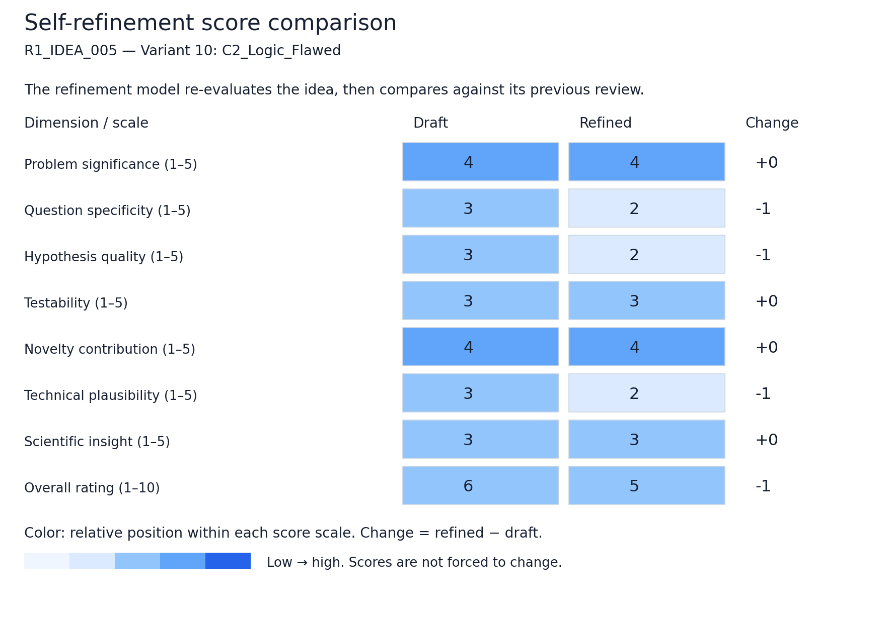

Changed score dimensions: question_specificity, hypothesis_quality, technical_plausibility, overall_rating.

### Score justifications (draft / refined)

**Problem significance**

```json
{
  "draft": {
    "score": 4.0,
    "justification": "Improving the robustness of SSMs (a hot topic in ML) under distribution shifts is highly significant. As SSMs challenge Transformers in efficiency and long-range dependency modeling, ensuring they are robust in real-world, non-i.i.d. settings is a crucial research direction."
  },
  "refined": {
    "score": 4.0,
    "justification": "Improving the robustness of SSMs is highly significant as they are rapidly becoming a primary alternative to Transformers. Ensuring they work reliably under distribution shifts is a critical step for real-world deployment."
  }
}
```

**Question specificity**

```json
{
  "draft": {
    "score": 3.0,
    "justification": "The idea identifies the goal (robustness) and the general approach (TTA with pseudo-labels and permutations), but the core mechanism ('traversal permutations') is not sufficiently defined to be a concrete research question. It reads more like a high-level concept than a specific hypothesis."
  },
  "refined": {
    "score": 2.0,
    "justification": "The core mechanism ('traversal permutations') is too vague to be a concrete research question. Without defining what constitutes a valid permutation in an SSM context, the specific question being investigated is unclear. It currently reads as a high-level concept rather than a defined problem."
  }
}
```

**Hypothesis quality**

```json
{
  "draft": {
    "score": 3.0,
    "justification": "The implicit hypothesis is that 'diverse SSM traversal permutations generate useful pseudo-labels that improve robustness.' This is plausible but currently too broad. It needs to specify *which* permutations and *why* they are better than alternatives to be a strong, falsifiable hypothesis."
  },
  "refined": {
    "score": 2.0,
    "justification": "The implicit hypothesis is that 'diverse SSM traversal permutations generate useful pseudo-labels that improve robustness.' While plausible, it is not yet falsifiable because the nature of the 'diversity' and the 'permutations' are undefined. It lacks a specific prediction about the relationship between the permutation type and the resulting performance gain."
  }
}
```

**Testability**

```json
{
  "draft": {
    "score": 3.0,
    "justification": "The idea is testable in principle (implement the method, run on shifted data), but the lack of definition for 'traversal permutations' and the update rule makes it difficult to design a rigorous experiment immediately. The evaluation metric (generalization) is clear, but the independent variable is not."
  },
  "refined": {
    "score": 3.0,
    "justification": "The idea is testable in principle (implement and evaluate), but the lack of definition for the core mechanism makes it difficult to design a rigorous experiment immediately. The evaluation metric (generalization) is clear, but the independent variable (the permutation strategy) is not."
  }
}
```

**Novelty contribution**

```json
{
  "draft": {
    "score": 4.0,
    "justification": "Applying TTA to SSMs is novel. The specific idea of using 'traversal permutations' to generate views is a unique angle that, if well-defined, could offer significant insight into the inductive biases of SSMs. However, if 'permutations' turn out to be a rebranding of standard shuffling, the novelty would drop."
  },
  "refined": {
    "score": 4.0,
    "justification": "Applying TTA to SSMs is novel. The specific idea of using 'traversal permutations' to generate views is a unique angle that, if well-defined, could offer significant insight into the inductive biases of SSMs. However, if 'permutations' turn out to be a rebranding of standard shuffling, the novelty would drop."
  }
}
```

**Technical plausibility**

```json
{
  "draft": {
    "score": 3.0,
    "justification": "The idea is technically plausible but risky. SSMs rely on ordered sequences; arbitrary permutations might break the state dynamics. The plausibility hinges entirely on the specific definition of 'traversal permutations' which is currently missing. If the permutations are carefully designed (e.g., sliding window shifts, state re-initializations), it could work."
  },
  "refined": {
    "score": 2.0,
    "justification": "The idea is technically risky. SSMs rely on ordered sequences; arbitrary permutations might break the state dynamics. The plausibility hinges entirely on the specific definition of 'traversal permutations' which is currently missing. If the permutations are carefully designed (e.g., sliding window shifts, state re-initializations), it could work, but as stated, it risks being incoherent."
  }
}
```

**Scientific insight**

```json
{
  "draft": {
    "score": 3.0,
    "justification": "If successful, this could reveal how the internal state dynamics of SSMs can be leveraged for robustness, offering insights into the relationship between sequence ordering and feature stability. However, as currently stated, it risks being a simple engineering application without deep theoretical insight."
  },
  "refined": {
    "score": 3.0,
    "justification": "If successful, this could reveal how the internal state dynamics of SSMs can be leveraged for robustness, offering insights into the relationship between sequence ordering and feature stability. However, as currently stated, it risks being a simple engineering application without deep theoretical insight."
  }
}
```

**Overall rating**

```json
{
  "draft": {
    "score": 6.0,
    "justification": "The research idea addresses a significant problem with a potentially novel mechanism, earning it a moderate-to-strong start. However, the lack of specificity regarding the core mechanism ('traversal permutations') and the update strategy prevents it from being a 'strong' or 'exceptional' idea at this stage. It is a promising direction that requires significant refinement to become a concrete, testable hypothesis."
  },
  "refined": {
    "score": 5.0,
    "justification": "The research idea addresses a significant problem with a potentially novel mechanism, but the lack of specificity regarding the core mechanism ('traversal permutations') and the update strategy prevents it from being a 'strong' idea at this stage. The technical plausibility is questionable without further definition, making it a borderline moderate idea. It requires significant refinement to become a concrete, testable hypothesis."
  }
}
```

## R1_IDEA_005 — Variant 11: C3_Substance_Enriched

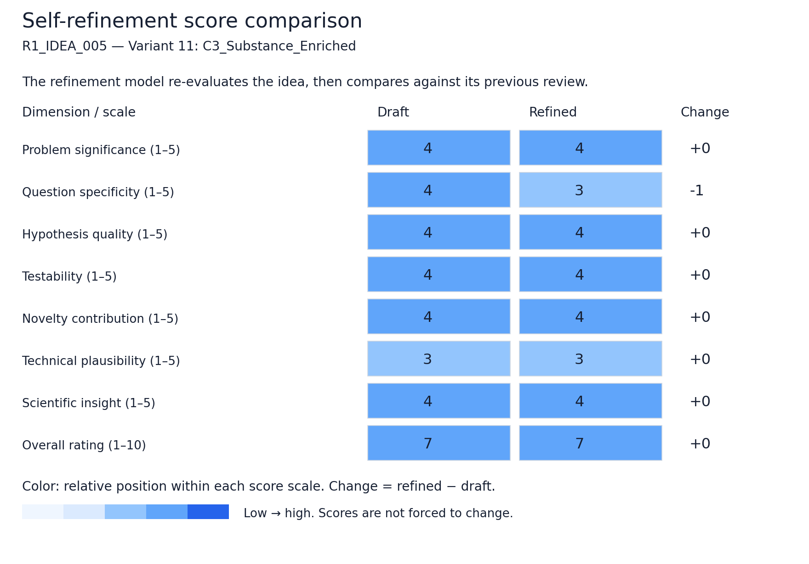

Changed score dimensions: question_specificity.

### Score justifications (draft / refined)

**Problem significance**

```json
{
  "draft": {
    "score": 4.0,
    "justification": "Robustness of Vision SSMs is a significant open problem. As SSMs challenge Transformers in efficiency and long-range dependency modeling, understanding their failure modes under distribution shifts is crucial for their deployment in real-world scenarios."
  },
  "refined": {
    "score": 4.0,
    "justification": "Robustness of Vision SSMs is a significant and timely open problem. As SSMs challenge Transformers in efficiency and long-range dependency modeling, understanding their failure modes under distribution shifts is crucial for their deployment in real-world scenarios. The problem is meaningful and addresses a known weakness in the architecture."
  }
}
```

**Question specificity**

```json
{
  "draft": {
    "score": 4.0,
    "justification": "The idea clearly identifies the target (Vision SSMs), the setting (test-time adaptation), and the mechanism (permutation-based view generation). However, the exact definition of 'permutations' and the 'aggregation' logic remains slightly vague, which is acceptable for an idea summary but needs refinement for execution."
  },
  "refined": {
    "score": 3.0,
    "justification": "While the idea identifies the target (Vision SSMs), the setting (TTA), and the mechanism (permutations), the core concept of 'SSM traversal permutations' is currently too abstract. The specific nature of these permutations is not defined, which makes the research question somewhat vague until the mechanism is concretized. The aggregation strategy is also undefined."
  }
}
```

**Hypothesis quality**

```json
{
  "draft": {
    "score": 4.0,
    "justification": "The hypothesis that 'diversity of permutations helps capture invariant features' is concrete, plausible, and falsifiable. It moves beyond a generic 'this will work' claim to propose a specific mechanism for why the method should succeed."
  },
  "refined": {
    "score": 4.0,
    "justification": "The hypothesis that 'diversity of permutations helps capture invariant features' is concrete, plausible, and falsifiable. It moves beyond a generic 'this will work' claim to propose a specific mechanism (diversity -> invariance) for why the method should succeed. It distinguishes the proposed investigation from a generic application."
  }
}
```

**Testability**

```json
{
  "draft": {
    "score": 4.0,
    "justification": "The idea suggests clear evaluation paths: comparing performance on synthetic-to-real shifts, varying hyperparameters for aggregation, and analyzing the effect of permutation diversity. The use of pseudo-labels provides a clear metric for self-supervision."
  },
  "refined": {
    "score": 4.0,
    "justification": "The idea suggests clear evaluation paths: comparing performance on synthetic-to-real shifts, varying hyperparameters for aggregation, and analyzing the effect of permutation diversity. The use of pseudo-labels provides a clear metric for self-supervision. However, the lack of defined permutations makes the immediate testability slightly lower than if the mechanism were specified."
  }
}
```

**Novelty contribution**

```json
{
  "draft": {
    "score": 4.0,
    "justification": "Applying permutation-based view generation specifically to the internal traversal of SSMs for TTA is a novel angle. Most TTA methods rely on standard image augmentations; leveraging the structural recurrence of SSMs for this purpose is a fresh contribution."
  },
  "refined": {
    "score": 4.0,
    "justification": "Applying permutation-based view generation specifically to the internal traversal of SSMs for TTA is a novel angle. Most TTA methods rely on standard image augmentations; leveraging the structural recurrence of SSMs for this purpose is a fresh contribution that could yield new insights into SSM inductive biases."
  }
}
```

**Technical plausibility**

```json
{
  "draft": {
    "score": 3.0,
    "justification": "While the general direction is sound, the technical feasibility of 'aggregating adapted weights' at test time is the weakest link. Standard TTA usually adapts a small subset of parameters (like BN stats) or a head. Updating the core SSM weights and aggregating them requires careful design to ensure stability, making the plausibility moderate until the mechanism is detailed."
  },
  "refined": {
    "score": 3.0,
    "justification": "While the general direction is sound, the technical feasibility of 'aggregating adapted weights' at test time is the weakest link. Standard TTA usually adapts a small subset of parameters (like BN stats) or a head. Updating the core SSM weights and aggregating them requires careful theoretical justification to avoid instability, making the plausibility moderate until the mechanism is detailed."
  }
}
```

**Scientific insight**

```json
{
  "draft": {
    "score": 4.0,
    "justification": "If successful, this research would reveal how the structural inductive biases of SSMs can be exploited for robustness. It could provide insights into the relationship between sequence permutation and feature invariance in state-space architectures."
  },
  "refined": {
    "score": 4.0,
    "justification": "If successful, this research would reveal how the structural inductive biases of SSMs can be exploited for robustness. It could provide insights into the relationship between sequence permutation and feature invariance in state-space architectures, which is a valuable scientific contribution beyond just a performance boost."
  }
}
```

**Overall rating**

```json
{
  "draft": {
    "score": 7.0,
    "justification": "This is a strong research idea with high potential. It addresses a relevant problem with a novel, mechanism-driven approach. The main limitation is the current lack of detail on the 'aggregation' and 'permutation' mechanics, which are critical for technical plausibility. However, the core hypothesis is compelling and the direction is scientifically valuable."
  },
  "refined": {
    "score": 7.0,
    "justification": "This is a strong research idea with high potential. It addresses a relevant problem with a novel, mechanism-driven approach. The main limitation is the current lack of detail on the 'aggregation' and 'permutation' mechanics, which are critical for technical plausibility. However, the core hypothesis is compelling, and the direction is scientifically valuable, warranting a strong rating despite the need for refinement."
  }
}
```

## R1_IDEA_005 — Variant 12: H1_Deceptive_Hollow

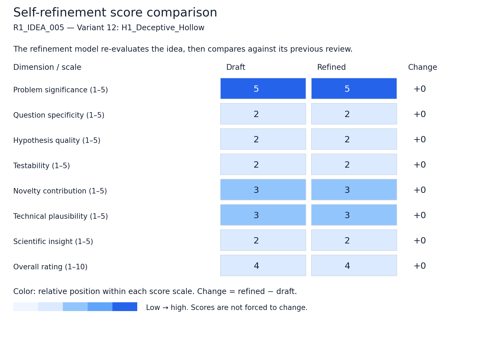

Changed score dimensions: none.

### Score justifications (draft / refined)

**Problem significance**

```json
{
  "draft": {
    "score": 5.0,
    "justification": "The problem of improving model robustness under distribution shift without labeled data is one of the most critical challenges in deploying machine learning systems. Solving this has immediate and high-impact implications for real-world applications."
  },
  "refined": {
    "score": 5.0,
    "justification": "The problem of robustness under distribution shift without labeled data is a fundamental bottleneck in deploying machine learning in real-world scenarios. Solving this is of paramount importance to the field."
  }
}
```

**Question specificity**

```json
{
  "draft": {
    "score": 2.0,
    "justification": "The idea is framed as a broad agenda rather than a specific research question. It lacks the necessary granularity to define exactly what is being investigated, making it difficult to distinguish from generic TTA research."
  },
  "refined": {
    "score": 2.0,
    "justification": "The idea is framed as a broad agenda or vision statement rather than a specific research question. It lacks the necessary granularity to define the exact mechanism or relationship being investigated, making it difficult to distinguish from generic TTA research."
  }
}
```

**Hypothesis quality**

```json
{
  "draft": {
    "score": 2.0,
    "justification": "There is no explicit, falsifiable hypothesis. The claim that the method will be 'transformative' is a prediction of impact rather than a scientific hypothesis about a mechanism or relationship that can be empirically supported or refuted."
  },
  "refined": {
    "score": 2.0,
    "justification": "There is no explicit, falsifiable hypothesis. The claim that the method will be 'transformative' is a prediction of impact or status, not a scientific hypothesis about a mechanism or relationship that can be empirically supported or refuted."
  }
}
```

**Testability**

```json
{
  "draft": {
    "score": 2.0,
    "justification": "Without details on the algorithm, the method cannot be implemented or tested. The current description does not suggest a concrete experiment, comparison, or analysis that could yield evidence."
  },
  "refined": {
    "score": 2.0,
    "justification": "Without details on the algorithm, the method cannot be implemented or tested. The current description does not suggest a concrete experiment, comparison, or analysis that could yield evidence of the proposed mechanism."
  }
}
```

**Novelty contribution**

```json
{
  "draft": {
    "score": 3.0,
    "justification": "While the goal is novel in its ambition, the components (TTA, view generation, parameter updates) are well-established. The novelty depends entirely on the unspecified synthesis, which is currently unknown."
  },
  "refined": {
    "score": 3.0,
    "justification": "While the ambition is novel, the components (TTA, view generation, parameter updates) are well-established. The novelty depends entirely on the unspecified 'synthesis,' which is currently unknown and could turn out to be a trivial combination of existing techniques."
  }
}
```

**Technical plausibility**

```json
{
  "draft": {
    "score": 3.0,
    "justification": "The general direction (using internal signals and views for TTA) is technically plausible and aligns with existing literature. However, the lack of mechanism details makes it impossible to fully assess the feasibility of the specific proposed synthesis."
  },
  "refined": {
    "score": 3.0,
    "justification": "The general direction (using internal signals and views for TTA) is technically plausible and aligns with existing literature. However, the lack of mechanism details makes it impossible to fully assess the feasibility of the specific proposed synthesis or whether it avoids known failure modes."
  }
}
```

**Scientific insight**

```json
{
  "draft": {
    "score": 2.0,
    "justification": "As stated, the idea does not promise specific scientific insight beyond 'better performance.' The potential for insight exists only if the 'transformative synthesis' reveals a new principle about how models adapt, but this is not articulated."
  },
  "refined": {
    "score": 2.0,
    "justification": "As stated, the idea does not promise specific scientific insight beyond 'better performance.' The potential for insight exists only if the 'transformative synthesis' reveals a new principle about how models adapt, but this is not articulated in the proposal."
  }
}
```

**Overall rating**

```json
{
  "draft": {
    "score": 4.0,
    "justification": "The idea addresses a problem of exceptional significance, but the proposal itself is too vague to be evaluated as a concrete research direction. It reads more like a high-level vision statement than a testable research idea. The lack of specificity regarding the mechanism, hypothesis, and testability prevents it from scoring higher, despite the strong motivation."
  },
  "refined": {
    "score": 4.0,
    "justification": "The idea addresses a problem of exceptional significance, but the proposal itself is too vague to be evaluated as a concrete research direction. It reads more like a high-level vision statement than a testable research idea. The lack of specificity regarding the mechanism, hypothesis, and testability prevents it from scoring higher, despite the strong motivation. It falls into the 'Weak' category because it lacks a defined research question, even though the domain is high-value."
  }
}
```

## R1_IDEA_005 — Variant 13: H2_Confident_Flaw

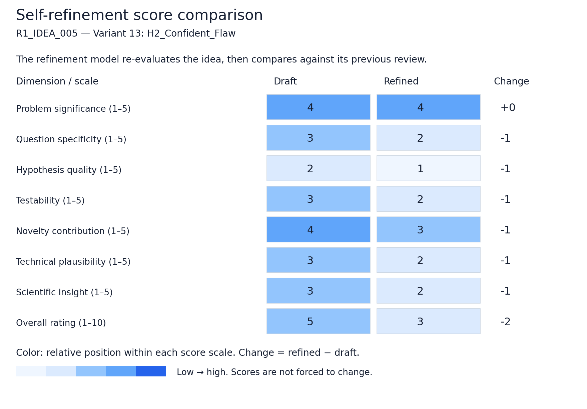

Changed score dimensions: question_specificity, hypothesis_quality, testability, novelty_contribution, technical_plausibility, scientific_insight, overall_rating.

### Score justifications (draft / refined)

**Problem significance**

```json
{
  "draft": {
    "score": 4.0,
    "justification": "Improving the robustness of Vision SSMs (like Mamba) under distribution shifts is a highly significant and active area of research. As SSMs gain traction as alternatives to Transformers, understanding their failure modes and adaptation capabilities is crucial for their deployment in real-world scenarios."
  },
  "refined": {
    "score": 4.0,
    "justification": "Improving the robustness of Vision SSMs (like Mamba) under distribution shifts is a highly significant and active area of research. As SSMs gain traction as alternatives to Transformers, understanding their failure modes and adaptation capabilities is crucial for their deployment in real-world scenarios."
  }
}
```

**Question specificity**

```json
{
  "draft": {
    "score": 3.0,
    "justification": "While the method (permutations, pseudo-labels, weight aggregation) is specific, the research question is muddied by the claim of universal superiority. The idea lacks a clear definition of the specific distribution shifts being targeted or the specific 'related settings' where it applies, making the scope too broad."
  },
  "refined": {
    "score": 2.0,
    "justification": "While the method components are specific, the research question is severely undermined by the claim of universal superiority and the explicit dismissal of boundary conditions. The idea fails to define the specific distribution shifts or the 'related settings' where it applies, making the scope too broad and the question ill-defined."
  }
}
```

**Hypothesis quality**

```json
{
  "draft": {
    "score": 2.0,
    "justification": "The hypothesis is stated as a certainty ('necessarily produce', 'confidently treated as causal') rather than a falsifiable prediction. A strong hypothesis should allow for the possibility of failure or specific conditions where the method does not work. The current formulation is more of a declaration of intent than a scientific hypothesis."
  },
  "refined": {
    "score": 1.0,
    "justification": "The hypothesis is stated as a certainty ('necessarily produce', 'confidently treated as causal') rather than a falsifiable prediction. A strong hypothesis must allow for the possibility of failure or specific conditions where the method does not work. The current formulation is a declaration of intent, not a scientific hypothesis."
  }
}
```

**Testability**

```json
{
  "draft": {
    "score": 3.0,
    "justification": "The core mechanism is testable (implement the permutations, run TTA, measure accuracy). However, the idea explicitly suggests skipping necessary controls (isolating dataset composition, boundary cases), which would make a rigorous scientific evaluation impossible. The claim of 'general superiority' is difficult to test without a comprehensive and diverse benchmark suite."
  },
  "refined": {
    "score": 2.0,
    "justification": "While the core mechanism is technically implementable, the idea explicitly suggests skipping necessary controls (isolating dataset composition, boundary cases), which would make a rigorous scientific evaluation impossible. The claim of 'general superiority' is difficult to test without a comprehensive and diverse benchmark suite, which the idea seems to reject."
  }
}
```

**Novelty contribution**

```json
{
  "draft": {
    "score": 4.0,
    "justification": "Applying test-time adaptation specifically to the internal traversal structure of SSMs is a novel angle. Most TTA methods focus on input space or standard parameter updates. If the 'traversal permutation' concept proves effective, it could offer a new paradigm for adapting state-space architectures."
  },
  "refined": {
    "score": 3.0,
    "justification": "Applying test-time adaptation specifically to the internal traversal structure of SSMs is a novel angle. However, the novelty is currently overshadowed by the lack of theoretical justification for the 'permutation' mechanism. If the mechanism is valid, it could be a significant contribution, but the current framing makes the potential contribution uncertain."
  }
}
```

**Technical plausibility**

```json
{
  "draft": {
    "score": 3.0,
    "justification": "The technical components (pseudo-labels, weight aggregation) are standard in TTA. However, the plausibility of 'SSM traversal permutations' as a robustness mechanism is not well-justified. It is unclear if permuting the traversal order of a state space model (which relies on sequential dependencies) is a valid operation that preserves the model's semantic integrity while providing diversity."
  },
  "refined": {
    "score": 2.0,
    "justification": "The technical components (pseudo-labels, weight aggregation) are standard. However, the plausibility of 'SSM traversal permutations' is highly questionable. SSMs rely on sequential dependencies; permuting the traversal order without a clear mechanism to preserve semantic integrity is a risky assumption that requires strong justification, which is absent."
  }
}
```

**Scientific insight**

```json
{
  "draft": {
    "score": 3.0,
    "justification": "If successful, the work could reveal how the internal state dynamics of SSMs can be leveraged for adaptation. However, the current framing ('solving the limitation produces general superiority') discourages deep analysis of *why* it works or *when* it fails, limiting the potential for broader scientific insight."
  },
  "refined": {
    "score": 2.0,
    "justification": "If successful, the work could reveal how internal state dynamics of SSMs can be leveraged for adaptation. However, the current framing ('solving the limitation produces general superiority') actively discourages deep analysis of *why* it works or *when* it fails, limiting the potential for broader scientific insight."
  }
}
```

**Overall rating**

```json
{
  "draft": {
    "score": 5.0,
    "justification": "The idea sits at a moderate level. It addresses a significant problem with a potentially novel mechanism, but the scientific rigor is severely compromised by the overconfident, non-falsifiable claims and the dismissal of necessary evaluation controls. The core concept has promise, but the current articulation of the research question is too broad and dogmatic to be considered a strong research proposal without significant refinement."
  },
  "refined": {
    "score": 3.0,
    "justification": "The idea addresses a significant problem with a potentially novel mechanism, but the scientific rigor is severely compromised by the overconfident, non-falsifiable claims and the dismissal of necessary evaluation controls. The core concept has promise, but the current articulation of the research question is too broad, dogmatic, and theoretically unsupported to be considered a strong research proposal. The explicit rejection of boundary case analysis is a major flaw."
  }
}
```

## R1_IDEA_005 — Variant 14: H3_Verbose_Enriched

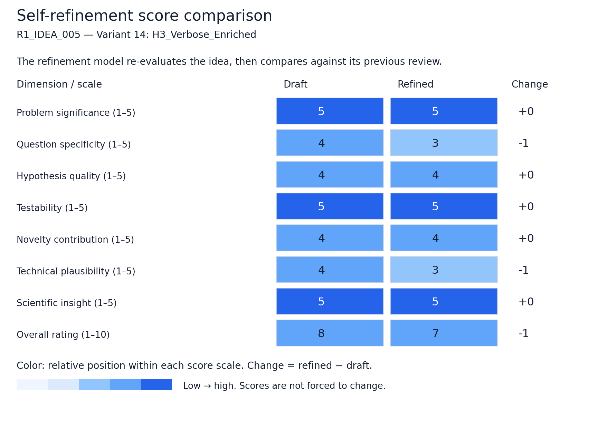

Changed score dimensions: question_specificity, technical_plausibility, overall_rating.

### Score justifications (draft / refined)

**Problem significance**

```json
{
  "draft": {
    "score": 5.0,
    "justification": "Distribution shift robustness is a fundamental challenge in deploying deep learning models. Addressing this specifically for State Space Models, which are gaining traction as efficient alternatives to Transformers, is highly significant and timely."
  },
  "refined": {
    "score": 5.0,
    "justification": "Distribution shift robustness is a fundamental challenge in deploying deep learning models. Addressing this specifically for State Space Models, which are gaining traction as efficient alternatives to Transformers, is highly significant and timely."
  }
}
```

**Question specificity**

```json
{
  "draft": {
    "score": 4.0,
    "justification": "The idea clearly identifies the target (Vision Mamba), the method (permutation-based TTA), and the goal (invariant feature capture). However, the specific definition of 'traversal permutations' remains slightly abstract, though the validation plan compensates for this by demanding clarity."
  },
  "refined": {
    "score": 3.0,
    "justification": "While the goal (robustness) and the general approach (TTA with permutations) are clear, the core mechanism ('traversal permutations') is abstract. Without a concrete definition of what constitutes a permutation in this context, the research question is not fully specific, though the validation plan attempts to compensate by demanding clarity."
  }
}
```

**Hypothesis quality**

```json
{
  "draft": {
    "score": 4.0,
    "justification": "The hypothesis that diversity in traversal leads to better invariant feature capture is concrete and falsifiable. It posits a specific mechanism (diversity) leading to a specific outcome (robustness via invariance)."
  },
  "refined": {
    "score": 4.0,
    "justification": "The hypothesis that diversity in traversal leads to better invariant feature capture is concrete and falsifiable. It posits a specific mechanism (diversity) leading to a specific outcome (robustness via invariance). However, the link between 'permutations' and 'invariance' in SSMs is not yet theoretically established."
  }
}
```

**Testability**

```json
{
  "draft": {
    "score": 5.0,
    "justification": "The proposal includes a robust roadmap for testing: staged design, specific evaluation criteria, ablations, and error analysis. It moves beyond 'does it work' to 'when and why it works,' making it highly testable."
  },
  "refined": {
    "score": 5.0,
    "justification": "The proposal includes a robust roadmap for testing: staged design, specific evaluation criteria, ablations, and error analysis. It moves beyond 'does it work' to 'when and why it works,' making it highly testable despite the current abstraction of the method."
  }
}
```

**Novelty contribution**

```json
{
  "draft": {
    "score": 4.0,
    "justification": "Applying TTA to SSMs is novel. The specific mechanism of using 'traversal permutations' to induce diversity is a unique contribution that could reveal new properties of SSM dynamics, rather than just applying a known TTA technique."
  },
  "refined": {
    "score": 4.0,
    "justification": "Applying TTA to SSMs is novel. The specific mechanism of using 'traversal permutations' to induce diversity is a unique contribution that could reveal new properties of SSM dynamics, rather than just applying a known TTA technique."
  }
}
```

**Technical plausibility**

```json
{
  "draft": {
    "score": 4.0,
    "justification": "The general approach of TTA and pseudo-labeling is plausible. The specific mechanism of SSM traversal permutations is technically sound in principle (reordering operations in a sequence model), though the exact implementation details need to be worked out."
  },
  "refined": {
    "score": 3.0,
    "justification": "The general approach of TTA and pseudo-labeling is plausible. However, the specific mechanism of 'SSM traversal permutations' is technically ambiguous. Reordering operations in a causal SSM is non-trivial and may violate the model's inductive biases unless carefully defined. The risk of error accumulation with pseudo-labels is also a significant technical hurdle not yet addressed."
  }
}
```

**Scientific insight**

```json
{
  "draft": {
    "score": 5.0,
    "justification": "The emphasis on understanding boundary conditions, failure modes, and the specific role of traversal diversity suggests this research could yield deep insights into the inductive biases of SSMs and the nature of test-time adaptation."
  },
  "refined": {
    "score": 5.0,
    "justification": "The emphasis on understanding boundary conditions, failure modes, and the specific role of traversal diversity suggests this research could yield deep insights into the inductive biases of SSMs and the nature of test-time adaptation, provided the mechanism is successfully defined."
  }
}
```

**Overall rating**

```json
{
  "draft": {
    "score": 8.0,
    "justification": "This is a strong research idea. It addresses a significant problem with a novel mechanism tailored to a specific architecture (Mamba). While the definition of the core mechanism needs refinement, the proposed validation strategy is rigorous and promises high scientific value. It avoids the trap of being a simple application by focusing on the 'why' and 'when' of the method's effectiveness."
  },
  "refined": {
    "score": 7.0,
    "justification": "This is a strong research idea with high potential, driven by a significant problem and a rigorous evaluation plan. However, the score is tempered by the current lack of specificity in the core mechanism ('traversal permutations') and the unaddressed technical risks of pseudo-labeling in SSMs. If the mechanism can be concretely defined and the risks mitigated, this could be an exceptional contribution."
  }
}
```

## R1_IDEA_005 — Variant 15: H4_Ultimate_Hype

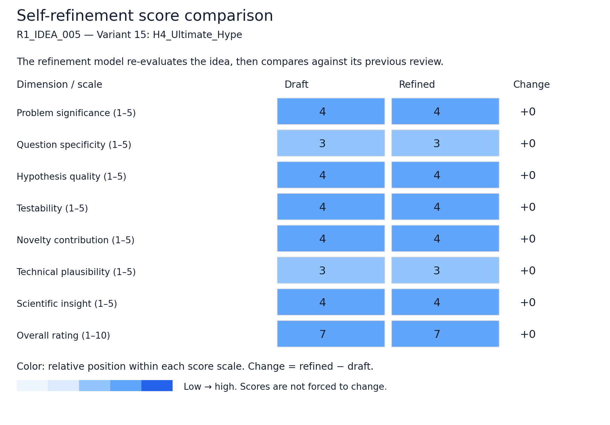

Changed score dimensions: none.

### Score justifications (draft / refined)

**Problem significance**

```json
{
  "draft": {
    "score": 4.0,
    "justification": "Improving the robustness of SSMs (a rapidly growing architecture) under distribution shifts is a highly significant problem. As SSMs challenge Transformers, understanding their failure modes and adaptation capabilities is crucial for the field."
  },
  "refined": {
    "score": 4.0,
    "justification": "Improving the robustness of SSMs (a rapidly growing architecture) under distribution shifts is a highly significant problem. As SSMs challenge Transformers, understanding their failure modes and adaptation capabilities is crucial for the field's future direction."
  }
}
```

**Question specificity**

```json
{
  "draft": {
    "score": 3.0,
    "justification": "While the general direction (TTA via permutations) is clear, the specific definition of 'SSM traversal permutations' and the exact aggregation mechanism are vague. The idea needs more technical precision to be fully evaluated."
  },
  "refined": {
    "score": 3.0,
    "justification": "While the general direction (TTA via permutations) is clear, the specific definition of 'SSM traversal permutations' and the exact aggregation mechanism are vague. The idea needs more technical precision to be fully evaluated as a research question."
  }
}
```

**Hypothesis quality**

```json
{
  "draft": {
    "score": 4.0,
    "justification": "The core hypothesis—that diverse traversal paths generate complementary views that, when aggregated, improve robustness—is a strong, testable prediction. It distinguishes the method from standard augmentation."
  },
  "refined": {
    "score": 4.0,
    "justification": "The core hypothesis—that diverse traversal paths generate complementary views that, when aggregated, improve robustness—is a strong, testable prediction. It distinguishes the method from standard augmentation strategies."
  }
}
```

**Testability**

```json
{
  "draft": {
    "score": 4.0,
    "justification": "The idea is highly testable. One can implement the permutation strategy, generate pseudo-labels, update weights, and measure performance on standard distribution shift benchmarks (e.g., ImageNet-C, DomainNet) against baselines."
  },
  "refined": {
    "score": 4.0,
    "justification": "The idea is highly testable. One can implement the permutation strategy, generate pseudo-labels, update weights, and measure performance on standard distribution shift benchmarks (e.g., ImageNet-C, DomainNet) against baselines."
  }
}
```

**Novelty contribution**

```json
{
  "draft": {
    "score": 4.0,
    "justification": "Applying TTA to SSMs is novel, and the specific mechanism of using 'traversal permutations' to generate views is a unique contribution that could reveal new properties of SSMs. It goes beyond simple application to a new domain."
  },
  "refined": {
    "score": 4.0,
    "justification": "Applying TTA to SSMs is novel, and the specific mechanism of using 'traversal permutations' to generate views is a unique contribution that could reveal new properties of SSMs. It goes beyond simple application to a new domain."
  }
}
```

**Technical plausibility**

```json
{
  "draft": {
    "score": 3.0,
    "justification": "The idea is plausible in principle, but the technical feasibility of 'permuting' SSM traversal without breaking the model's inductive biases is not immediately obvious. The risk of generating invalid views or unstable updates is a concern that needs addressing."
  },
  "refined": {
    "score": 3.0,
    "justification": "The idea is plausible in principle, but the technical feasibility of 'permuting' SSM traversal without breaking the model's inductive biases is not immediately obvious. The risk of generating invalid views or unstable updates is a concern that needs addressing."
  }
}
```

**Scientific insight**

```json
{
  "draft": {
    "score": 4.0,
    "justification": "If successful, this research would provide deep insights into the sensitivity of SSMs to input ordering and the dynamics of test-time adaptation in state-based architectures, offering principles applicable beyond just Mamba."
  },
  "refined": {
    "score": 4.0,
    "justification": "If successful, this research would provide deep insights into the sensitivity of SSMs to input ordering and the dynamics of test-time adaptation in state-based architectures, offering principles applicable beyond just Mamba."
  }
}
```

**Overall rating**

```json
{
  "draft": {
    "score": 7.0,
    "justification": "This is a strong research idea with high potential impact. It addresses a meaningful problem with a novel, specific mechanism. However, the current description lacks the technical specificity required to fully assess the feasibility of the 'permutation' concept and the aggregation strategy. With clearer definitions, this could be an exceptional contribution."
  },
  "refined": {
    "score": 7.0,
    "justification": "This is a strong research idea with high potential impact. It addresses a meaningful problem with a novel, specific mechanism. However, the current description lacks the technical specificity required to fully assess the feasibility of the 'permutation' concept and the aggregation strategy. With clearer definitions, this could be an exceptional contribution."
  }
}
```

## R1_IDEA_006 — Source


Changed score dimensions: none.

### Score justifications (draft / refined)

**Problem significance**

```json
{
  "draft": {
    "score": 4.0,
    "justification": "The problem is highly significant. Reliable self-supervised learning is crucial for medical imaging where labeled data is limited. Determining if current quality metrics (rank estimation) work in this domain is a necessary step before deploying these models in clinical settings."
  },
  "refined": {
    "score": 4.0,
    "justification": "The problem is highly significant. In histopathology, labeled data is scarce, making SSL crucial. However, without reliable metrics to select the best pre-trained models or stopping points, SSL training is a 'black box.' Validating or refuting the utility of existing rank estimation metrics in this domain is a necessary step for efficient medical AI development."
  }
}
```

**Question specificity**

```json
{
  "draft": {
    "score": 3.0,
    "justification": "The idea identifies a clear gap (natural image methods vs. histopathology) and specific tasks (segmentation/classification). However, it does not yet specify the exact research question beyond 'is it effective?' or 'how does it perform?' without a deeper hypothesis on the mechanism of success or failure."
  },
  "refined": {
    "score": 3.0,
    "justification": "The idea identifies a clear gap and specific tasks (segmentation/classification on WSIs). However, the research question is currently framed as an investigation of 'effectiveness' rather than a specific inquiry into the relationship between the metric and the task performance. It lacks the specificity of a hypothesis-driven question."
  }
}
```

**Hypothesis quality**

```json
{
  "draft": {
    "score": 2.0,
    "justification": "The current text states a gap in knowledge but does not articulate a testable hypothesis. A strong idea would predict, for example, that 'rank estimation will correlate poorly with segmentation performance due to the local nature of histopathological features,' which is currently missing."
  },
  "refined": {
    "score": 2.0,
    "justification": "The idea currently lacks an explicit hypothesis. It states that the effectiveness is 'unexplored' but does not propose a prediction (e.g., 'metrics will correlate poorly' or 'metrics will require domain-specific calibration'). A strong research idea should predict a specific outcome or mechanism, not just identify a gap."
  }
}
```

**Testability**

```json
{
  "draft": {
    "score": 4.0,
    "justification": "The idea is highly testable. One can train ViTs on histopathology data, apply existing rank estimation methods, and correlate the scores with downstream performance on segmentation and classification benchmarks. The experimental setup is clear."
  },
  "refined": {
    "score": 4.0,
    "justification": "The idea is highly testable. The methodology is straightforward: train ViTs on histopathology data, apply existing rank estimation metrics, and correlate the scores with downstream performance on segmentation and classification benchmarks. The experimental design is clear enough to be executed."
  }
}
```

**Novelty contribution**

```json
{
  "draft": {
    "score": 3.0,
    "justification": "Applying existing methods to a new domain is a valid contribution, but the novelty is moderate unless the study reveals a fundamental limitation of current rank estimation theories when applied to medical data. The potential for discovering new insights about representation quality in medical imaging is high."
  },
  "refined": {
    "score": 3.0,
    "justification": "The novelty is moderate. Applying existing methods to a new domain is a standard scientific contribution. The potential for high novelty lies in the *findings*: if the metrics fail, it reveals a fundamental limitation of current representation quality theories for medical data. If they succeed, it establishes a new standard. The idea itself is a validation study, which is valuable but less novel than a methodological proposal."
  }
}
```

**Technical plausibility**

```json
{
  "draft": {
    "score": 4.0,
    "justification": "The technical direction is sound. Rank estimation is a known technique, and Vision Transformers are standard for histopathology. The challenge lies in the domain shift, which is a plausible and solvable research problem."
  },
  "refined": {
    "score": 4.0,
    "justification": "The direction is technically sound. Rank estimation is a known technique, and ViTs are standard in histopathology. The challenge is the domain shift, which is a plausible and solvable research problem. There are no logical contradictions in the proposed approach."
  }
}
```

**Scientific insight**

```json
{
  "draft": {
    "score": 3.0,
    "justification": "If successful, the study will provide valuable empirical evidence on the generalizability of representation quality metrics. If it reveals that these metrics fail, it could lead to the development of domain-specific metrics, offering significant insight into the nature of medical image representations."
  },
  "refined": {
    "score": 3.0,
    "justification": "The potential for insight is moderate to high. The study could reveal whether representation quality metrics are domain-agnostic or if they rely on specific priors (like natural image statistics) that do not hold in histopathology. This would provide deep insight into the nature of SSL representations in medical imaging."
  }
}
```

**Overall rating**

```json
{
  "draft": {
    "score": 6.0,
    "justification": "This is a moderate-to-strong research idea with high practical significance. It addresses a clear gap in the literature. However, it currently lacks a specific, falsifiable hypothesis that would elevate it from a 'validation study' to a 'scientific discovery.' With the formulation of a specific hypothesis regarding *why* the methods might fail or succeed in this domain, the idea could reach a higher tier."
  },
  "refined": {
    "score": 6.0,
    "justification": "This is a solid, moderate research idea with high practical relevance. It addresses a clear gap in the literature regarding the generalizability of SSL metrics. However, it currently functions more as a validation study than a hypothesis-driven scientific inquiry. It lacks a specific prediction about *why* the metrics might succeed or fail, which limits its scientific depth. With the formulation of a specific hypothesis (e.g., regarding the impact of texture vs. structure), this could become a 7 or 8."
  }
}
```

## R1_IDEA_006 — Variant 1: A1_Identity


Changed score dimensions: none.

### Score justifications (draft / refined)

**Problem significance**

```json
{
  "draft": {
    "score": 4.0,
    "justification": "The problem is highly significant. Reliable self-supervised learning is crucial for medical imaging where labeled data is limited. Determining if current quality metrics (rank estimation) work in this domain is a necessary step before deploying these models in clinical settings."
  },
  "refined": {
    "score": 4.0,
    "justification": "The problem is highly significant. In histopathology, labeled data is scarce, making SSL crucial. However, without reliable metrics to select the best pre-trained models or stopping points, SSL training is a 'black box.' Validating or refuting the utility of existing rank estimation metrics in this domain is a necessary step for efficient medical AI development."
  }
}
```

**Question specificity**

```json
{
  "draft": {
    "score": 3.0,
    "justification": "The idea identifies a clear gap (natural image methods vs. histopathology) and specific tasks (segmentation/classification). However, it does not yet specify the exact research question beyond 'is it effective?' or 'how does it perform?' without a deeper hypothesis on the mechanism of success or failure."
  },
  "refined": {
    "score": 3.0,
    "justification": "The idea identifies a clear gap and specific tasks (segmentation/classification on WSIs). However, the research question is currently framed as an investigation of 'effectiveness' rather than a specific inquiry into the relationship between the metric and the task performance. It lacks the specificity of a hypothesis-driven question."
  }
}
```

**Hypothesis quality**

```json
{
  "draft": {
    "score": 2.0,
    "justification": "The current text states a gap in knowledge but does not articulate a testable hypothesis. A strong idea would predict, for example, that 'rank estimation will correlate poorly with segmentation performance due to the local nature of histopathological features,' which is currently missing."
  },
  "refined": {
    "score": 2.0,
    "justification": "The idea currently lacks an explicit hypothesis. It states that the effectiveness is 'unexplored' but does not propose a prediction (e.g., 'metrics will correlate poorly' or 'metrics will require domain-specific calibration'). A strong research idea should predict a specific outcome or mechanism, not just identify a gap."
  }
}
```

**Testability**

```json
{
  "draft": {
    "score": 4.0,
    "justification": "The idea is highly testable. One can train ViTs on histopathology data, apply existing rank estimation methods, and correlate the scores with downstream performance on segmentation and classification benchmarks. The experimental setup is clear."
  },
  "refined": {
    "score": 4.0,
    "justification": "The idea is highly testable. The methodology is straightforward: train ViTs on histopathology data, apply existing rank estimation metrics, and correlate the scores with downstream performance on segmentation and classification benchmarks. The experimental design is clear enough to be executed."
  }
}
```

**Novelty contribution**

```json
{
  "draft": {
    "score": 3.0,
    "justification": "Applying existing methods to a new domain is a valid contribution, but the novelty is moderate unless the study reveals a fundamental limitation of current rank estimation theories when applied to medical data. The potential for discovering new insights about representation quality in medical imaging is high."
  },
  "refined": {
    "score": 3.0,
    "justification": "The novelty is moderate. Applying existing methods to a new domain is a standard scientific contribution. The potential for high novelty lies in the *findings*: if the metrics fail, it reveals a fundamental limitation of current representation quality theories for medical data. If they succeed, it establishes a new standard. The idea itself is a validation study, which is valuable but less novel than a methodological proposal."
  }
}
```

**Technical plausibility**

```json
{
  "draft": {
    "score": 4.0,
    "justification": "The technical direction is sound. Rank estimation is a known technique, and Vision Transformers are standard for histopathology. The challenge lies in the domain shift, which is a plausible and solvable research problem."
  },
  "refined": {
    "score": 4.0,
    "justification": "The direction is technically sound. Rank estimation is a known technique, and ViTs are standard in histopathology. The challenge is the domain shift, which is a plausible and solvable research problem. There are no logical contradictions in the proposed approach."
  }
}
```

**Scientific insight**

```json
{
  "draft": {
    "score": 3.0,
    "justification": "If successful, the study will provide valuable empirical evidence on the generalizability of representation quality metrics. If it reveals that these metrics fail, it could lead to the development of domain-specific metrics, offering significant insight into the nature of medical image representations."
  },
  "refined": {
    "score": 3.0,
    "justification": "The potential for insight is moderate to high. The study could reveal whether representation quality metrics are domain-agnostic or if they rely on specific priors (like natural image statistics) that do not hold in histopathology. This would provide deep insight into the nature of SSL representations in medical imaging."
  }
}
```

**Overall rating**

```json
{
  "draft": {
    "score": 6.0,
    "justification": "This is a moderate-to-strong research idea with high practical significance. It addresses a clear gap in the literature. However, it currently lacks a specific, falsifiable hypothesis that would elevate it from a 'validation study' to a 'scientific discovery.' With the formulation of a specific hypothesis regarding *why* the methods might fail or succeed in this domain, the idea could reach a higher tier."
  },
  "refined": {
    "score": 6.0,
    "justification": "This is a solid, moderate research idea with high practical relevance. It addresses a clear gap in the literature regarding the generalizability of SSL metrics. However, it currently functions more as a validation study than a hypothesis-driven scientific inquiry. It lacks a specific prediction about *why* the metrics might succeed or fail, which limits its scientific depth. With the formulation of a specific hypothesis (e.g., regarding the impact of texture vs. structure), this could become a 7 or 8."
  }
}
```

## R1_IDEA_006 — Variant 2: A2_Paraphrase_Only


Changed score dimensions: none.

### Score justifications (draft / refined)

**Problem significance**

```json
{
  "draft": {
    "score": 4.0,
    "justification": "The problem is highly significant. Efficient model selection in medical AI is a major bottleneck. If rank estimation works, it saves massive computational resources; if it fails, it prevents wasted effort. The domain (histopathology) is critical for real-world impact."
  },
  "refined": {
    "score": 4.0,
    "justification": "The problem is highly significant. Model selection in medical imaging is computationally prohibitive. If rank estimation can serve as a reliable, cheap proxy, it would significantly accelerate research and deployment in histopathology. Conversely, understanding its failure modes is crucial for preventing wasted resources."
  }
}
```

**Question specificity**

```json
{
  "draft": {
    "score": 3.0,
    "justification": "The question is specific about the domain (histopathology) and the method class (rank estimation), but it lacks specificity regarding the exact metrics, the specific models being compared, and the precise downstream tasks to be evaluated."
  },
  "refined": {
    "score": 3.0,
    "justification": "The idea identifies the domain (histopathology), the method class (rank estimation), and the task type (non-linear/segmentation). However, it lacks specificity on the exact metrics, the specific models to be compared, and the precise evaluation protocol, making the research question somewhat broad."
  }
}
```

**Hypothesis quality**

```json
{
  "draft": {
    "score": 3.0,
    "justification": "The implicit hypothesis is that 'methods working on natural images may not work on histopathology' or 'they might work.' This is a valid starting point but lacks a predictive mechanism. A stronger idea would predict *how* the performance will differ (e.g., 'correlation will be lower due to X')."
  },
  "refined": {
    "score": 3.0,
    "justification": "The idea contains an implicit hypothesis that 'methods working on natural images may not work on histopathology' or vice versa. While testable, it lacks a predictive mechanism or a specific direction of failure/success (e.g., 'it will fail due to X'), which limits its scientific depth."
  }
}
```

**Testability**

```json
{
  "draft": {
    "score": 4.0,
    "justification": "The idea is highly testable. One can compute rank scores on pre-trained ViTs, fine-tune them on histopathology tasks, and calculate the correlation between the score and the final performance. The experiment is well-defined."
  },
  "refined": {
    "score": 4.0,
    "justification": "The central claim is highly testable. One can compute rank scores on pre-trained models, fine-tune them on histopathology tasks, and calculate the correlation. The experiment is well-defined in principle, even if implementation details are missing."
  }
}
```

**Novelty contribution**

```json
{
  "draft": {
    "score": 4.0,
    "justification": "While the method (rank estimation) is known, applying it to the specific constraints of histopathology (WSI, non-linear tasks) is novel. The contribution could be a new benchmark or a fundamental understanding of why representation quality metrics fail in medical domains."
  },
  "refined": {
    "score": 4.0,
    "justification": "Applying established representation quality metrics to the specific constraints of histopathology (WSI, non-linear tasks) is a novel contribution. It could lead to new benchmarks or a deeper understanding of representation geometry in medical domains."
  }
}
```

**Technical plausibility**

```json
{
  "draft": {
    "score": 4.0,
    "justification": "The reasoning is sound. Rank estimation is a standard linear algebra tool for representation quality. Applying it to a new domain is a logical next step. There are no obvious technical contradictions in the proposal."
  },
  "refined": {
    "score": 4.0,
    "justification": "The reasoning is logically sound. Rank estimation is a standard tool for analyzing representation quality. Extending it to a new domain is a logical and plausible next step in the research trajectory. There are no obvious technical contradictions."
  }
}
```

**Scientific insight**

```json
{
  "draft": {
    "score": 4.0,
    "justification": "If the study reveals that rank estimation fails in histopathology, it would provide deep insight into the structural differences between natural image representations and medical pathology representations (e.g., texture vs. semantic structure). If it succeeds, it validates the universality of these metrics."
  },
  "refined": {
    "score": 4.0,
    "justification": "If the study reveals that rank estimation fails in histopathology, it would provide deep insight into the structural differences between natural image and medical pathology representations (e.g., texture vs. semantic structure). If it succeeds, it validates the universality of these metrics."
  }
}
```

**Overall rating**

```json
{
  "draft": {
    "score": 7.0,
    "justification": "This is a strong research idea with high practical value and clear testability. It addresses a specific gap in the literature. It loses points for not articulating a deeper mechanistic hypothesis or specific experimental design details, but as a research direction, it is promising and well-motivated."
  },
  "refined": {
    "score": 7.0,
    "justification": "This is a strong research idea with high practical value and clear testability. It addresses a specific gap in the literature regarding the transferability of SSL evaluation metrics. It loses points for not articulating a deeper mechanistic hypothesis or specific experimental design details, but as a research direction, it is promising and well-motivated."
  }
}
```

## R1_IDEA_006 — Variant 3: A3_Plain_Core

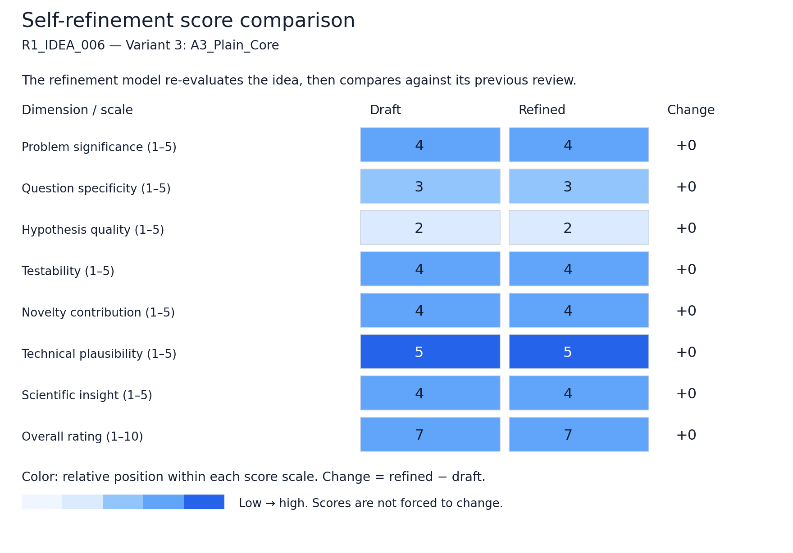

Changed score dimensions: none.

### Score justifications (draft / refined)

**Problem significance**

```json
{
  "draft": {
    "score": 4.0,
    "justification": "Model selection in self-supervised learning for medical imaging is a high-stakes, resource-intensive problem. Solving this could significantly reduce computational costs and accelerate the deployment of AI in pathology. The specific focus on histopathology adds significant relevance to the medical AI community."
  },
  "refined": {
    "score": 4.0,
    "justification": "The problem addresses a significant resource bottleneck in medical AI. Self-supervised training on histopathology is computationally intensive; a reliable, cheap model selection metric would accelerate research and deployment. The focus on non-linear tasks adds relevance as these are the most clinically challenging."
  }
}
```

**Question specificity**

```json
{
  "draft": {
    "score": 3.0,
    "justification": "The idea identifies the domain (histopathology) and the task (model selection for non-linear tasks) well. However, it lacks specificity regarding the exact methods to be tested and the precise nature of the investigation (e.g., is it a benchmarking study or a theoretical analysis?)."
  },
  "refined": {
    "score": 3.0,
    "justification": "The idea identifies the domain and the general class of methods but lacks specificity on the exact methods and the precise nature of the investigation. Without specifying which rank estimators or defining the exact hypothesis, the research question remains somewhat broad."
  }
}
```

**Hypothesis quality**

```json
{
  "draft": {
    "score": 2.0,
    "justification": "The current statement is a knowledge gap ('utility is not known') rather than a testable hypothesis. A strong idea would predict the outcome, such as 'Rank estimation methods will show low correlation with segmentation performance in histopathology due to [specific reason].'"
  },
  "refined": {
    "score": 2.0,
    "justification": "The current statement is a knowledge gap ('utility is not known') rather than a testable hypothesis. A strong research idea should predict the outcome (e.g., 'Method X will fail because of Y') to allow for falsification and deeper insight."
  }
}
```

**Testability**

```json
{
  "draft": {
    "score": 4.0,
    "justification": "The idea is highly testable in principle. One can train ViTs on histopathology data, compute rank estimates at various checkpoints, and correlate them with downstream performance on segmentation/classification tasks. The experimental design is straightforward."
  },
  "refined": {
    "score": 4.0,
    "justification": "The idea is highly testable in principle. The proposed workflow (train ViT, compute rank, correlate with downstream performance) is standard and feasible. The main limitation is the lack of specific metrics, but the core experimental design is sound."
  }
}
```

**Novelty contribution**

```json
{
  "draft": {
    "score": 4.0,
    "justification": "While rank estimation is known in natural images, its transferability to the specific domain of histopathology and its behavior on non-linear tasks is a novel empirical question. It could reveal domain-specific limitations of current representation quality metrics."
  },
  "refined": {
    "score": 4.0,
    "justification": "While rank estimation is established in natural images, its transferability to the specific domain of histopathology and its behavior on non-linear tasks is a novel empirical question. It has the potential to reveal domain-specific limitations of current representation metrics."
  }
}
```

**Technical plausibility**

```json
{
  "draft": {
    "score": 5.0,
    "justification": "The proposed direction is technically sound. Computing rank estimates is computationally feasible, and the correlation analysis with downstream tasks is a standard evaluation protocol in representation learning."
  },
  "refined": {
    "score": 5.0,
    "justification": "The proposed direction is technically sound. Computing rank estimates is computationally feasible, and the correlation analysis with downstream tasks is a standard evaluation protocol in representation learning. No logical flaws are apparent."
  }
}
```

**Scientific insight**

```json
{
  "draft": {
    "score": 4.0,
    "justification": "If the study reveals that standard rank metrics fail in histopathology, it would provide valuable insight into the structural differences between natural image representations and medical image representations, potentially guiding the development of new, domain-specific metrics."
  },
  "refined": {
    "score": 4.0,
    "justification": "If the study reveals that standard rank metrics fail in histopathology, it would provide valuable insight into the structural differences between natural image and medical image representations. However, the potential for insight is currently capped by the lack of a specific mechanistic hypothesis."
  }
}
```

**Overall rating**

```json
{
  "draft": {
    "score": 7.0,
    "justification": "This is a strong research idea with high practical significance and clear testability. It addresses a real bottleneck in medical AI. However, it currently lacks a specific, falsifiable hypothesis, which prevents it from being an 'exceptional' idea. Refining the hypothesis to predict *how* and *why* the metrics might fail would elevate it significantly."
  },
  "refined": {
    "score": 7.0,
    "justification": "This is a strong research idea with high practical significance and clear testability. It addresses a real bottleneck in medical AI. However, it currently lacks a specific, falsifiable hypothesis, which prevents it from being an 'exceptional' idea. Refining the hypothesis to predict *how* and *why* the metrics might fail would elevate it significantly."
  }
}
```

## R1_IDEA_006 — Variant 4: B1_Verbose_Elaborate


Changed score dimensions: none.

### Score justifications (draft / refined)

**Problem significance**

```json
{
  "draft": {
    "score": 5.0,
    "justification": "Selecting the right model and understanding representation quality in histopathology is a critical bottleneck in medical AI. Solving this could significantly accelerate the deployment of self-supervised models in clinical settings where labeled data is expensive."
  },
  "refined": {
    "score": 5.0,
    "justification": "Selecting appropriate models in histopathology is a critical bottleneck due to the high cost of annotation and the complexity of WSI data. Reliable, label-free metrics for representation quality would significantly accelerate the deployment of self-supervised models in clinical settings."
  }
}
```

**Question specificity**

```json
{
  "draft": {
    "score": 3.0,
    "justification": "The idea clearly identifies the domain (histopathology), the task (WSI segmentation/classification), and the method class (rank estimation). However, it lacks a specific hypothesis about the relationship between the metric and the performance, treating it more as a 'gap to be filled' than a 'question to be answered'."
  },
  "refined": {
    "score": 3.0,
    "justification": "The idea clearly identifies the domain (histopathology), the task (WSI segmentation/classification), and the method class (rank estimation). However, it lacks a specific hypothesis about the relationship between the metric and the performance, treating it more as a 'gap to be filled' than a 'question to be answered'."
  }
}
```

**Hypothesis quality**

```json
{
  "draft": {
    "score": 3.0,
    "justification": "The implicit hypothesis is that rank estimation methods may not generalize to this domain/task combination. This is a valid starting point, but it needs to be sharpened into a testable prediction (e.g., 'Rank metrics will correlate poorly with segmentation IoU compared to natural image benchmarks')."
  },
  "refined": {
    "score": 3.0,
    "justification": "The implicit hypothesis is that rank estimation methods may not generalize to this domain/task combination. This is a valid starting point, but it needs to be sharpened into a testable prediction (e.g., 'Rank metrics will correlate poorly with segmentation IoU compared to natural image benchmarks')."
  }
}
```

**Testability**

```json
{
  "draft": {
    "score": 4.0,
    "justification": "The idea is highly testable. One can train self-supervised models on histopathology data, compute rank estimates, and correlate them with downstream performance on segmentation/classification tasks. The experimental setup is clear."
  },
  "refined": {
    "score": 4.0,
    "justification": "The idea is highly testable. One can train self-supervised models on histopathology data, compute rank estimates, and correlate them with downstream performance on segmentation/classification tasks. The experimental setup is clear."
  }
}
```

**Novelty contribution**

```json
{
  "draft": {
    "score": 4.0,
    "justification": "While rank estimation is known in natural images, its application and validation in the specific context of histopathology WSIs is novel. The contribution would be establishing the boundary conditions of these metrics in a high-stakes medical domain."
  },
  "refined": {
    "score": 4.0,
    "justification": "While rank estimation is known in natural images, its application and validation in the specific context of histopathology WSIs is novel. The contribution would be establishing the boundary conditions of these metrics in a high-stakes medical domain."
  }
}
```

**Technical plausibility**

```json
{
  "draft": {
    "score": 4.0,
    "justification": "The technical approach is sound. Self-supervised learning on WSIs is a standard pipeline, and rank estimation is a well-defined mathematical operation. The main challenge is computational cost, not conceptual plausibility."
  },
  "refined": {
    "score": 4.0,
    "justification": "The technical approach is sound. Self-supervised learning on WSIs is a standard pipeline, and rank estimation is a well-defined mathematical operation. The main challenge is computational cost, not conceptual plausibility."
  }
}
```

**Scientific insight**

```json
{
  "draft": {
    "score": 4.0,
    "justification": "If successful, this research will provide crucial insights into the transferability of representation quality metrics across domains. It could reveal whether current theoretical tools for understanding self-supervised learning are domain-agnostic or require specific adaptation for medical imaging."
  },
  "refined": {
    "score": 4.0,
    "justification": "If successful, this research will provide crucial insights into the transferability of representation quality metrics across domains. It could reveal whether current theoretical tools for understanding self-supervised learning are domain-agnostic or require specific adaptation for medical imaging."
  }
}
```

**Overall rating**

```json
{
  "draft": {
    "score": 7.0,
    "justification": "This is a strong research idea with high significance and clear testability. It addresses a real gap in the literature. It loses points on specificity and hypothesis formulation because it currently reads more as a proposal to 'check if X works in Y' rather than 'investigate the mechanism of X in Y'. With a more refined hypothesis, it could be a 9."
  },
  "refined": {
    "score": 7.0,
    "justification": "This is a strong research idea with high significance and clear testability. It addresses a real gap in the literature. It loses points on specificity and hypothesis formulation because it currently reads more as a proposal to 'check if X works in Y' rather than 'investigate the mechanism of X in Y'. With a more refined hypothesis, it could be a 9."
  }
}
```

## R1_IDEA_006 — Variant 5: B2_Grand_Narrative

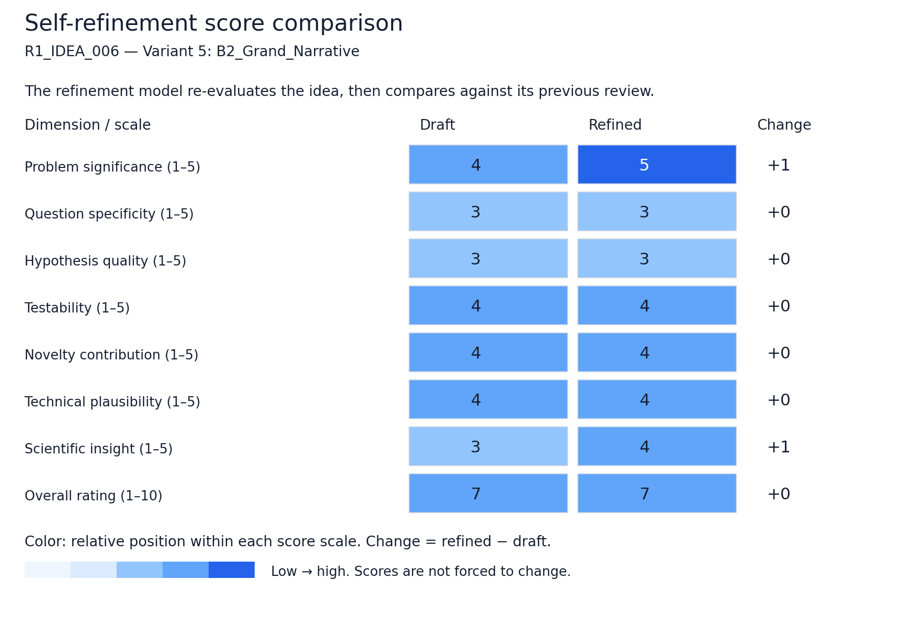

Changed score dimensions: problem_significance, scientific_insight.

### Score justifications (draft / refined)

**Problem significance**

```json
{
  "draft": {
    "score": 4.0,
    "justification": "Model selection in computational pathology is a high-impact problem. Developing reliable, cheap evaluation metrics for SSL is crucial for advancing biomedical AI, as training on WSIs is computationally expensive. The problem is meaningful and addresses a practical bottleneck."
  },
  "refined": {
    "score": 5.0,
    "justification": "The problem is highly significant. Computational pathology relies on massive, expensive SSL pre-training. The inability to select the best model efficiently without full downstream training is a major barrier to adoption. Solving this has direct, high-impact implications for biomedical research and clinical AI deployment."
  }
}
```

**Question specificity**

```json
{
  "draft": {
    "score": 3.0,
    "justification": "The idea identifies a domain gap (natural images vs. histopathology) and a method class (rank estimation), but lacks a specific research question. It asks 'does it work?' rather than 'how does it work?' or 'under what conditions does it fail?'. The scope is broad."
  },
  "refined": {
    "score": 3.0,
    "justification": "The idea identifies a clear gap (natural image methods vs. histopathology) and a target method (rank estimation). However, the research question is currently framed as a broad investigation ('investigating this gap') rather than a specific hypothesis about the mechanism of transfer or failure. It needs to move from 'does it work?' to 'under what conditions does it work/fail and why?'"
  }
}
```

**Hypothesis quality**

```json
{
  "draft": {
    "score": 3.0,
    "justification": "The implicit hypothesis is that rank estimation is either transferable or non-transferable to histopathology. This is testable but currently lacks a mechanistic prediction. A stronger idea would predict *why* it might fail (e.g., 'Rank estimation fails because histology textures create high-rank noise that obscures the signal')."
  },
  "refined": {
    "score": 3.0,
    "justification": "The implicit hypothesis is that rank estimation is not directly transferable to histopathology due to domain differences. While testable, it is currently a 'null hypothesis' style inquiry. A stronger hypothesis would predict a specific failure mode or a specific adaptation required for success, rather than just testing the metric's existence."
  }
}
```

**Testability**

```json
{
  "draft": {
    "score": 4.0,
    "justification": "The idea is highly testable. One can compute rank estimates on SSL features and correlate them with downstream performance on segmentation and classification tasks. The experimental setup is clear even if the results are unknown."
  },
  "refined": {
    "score": 4.0,
    "justification": "The idea is highly testable. One can compute the rank estimate on SSL features and correlate it with downstream performance on segmentation/classification tasks. The experimental design is straightforward: train models, compute metrics, evaluate downstream tasks, and analyze the correlation."
  }
}
```

**Novelty contribution**

```json
{
  "draft": {
    "score": 4.0,
    "justification": "Applying rank estimation to histopathology is a novel empirical contribution. If the study reveals that these methods fail in this domain, it provides valuable negative results that guide future metric development. If they succeed, it offers a new tool for the field."
  },
  "refined": {
    "score": 4.0,
    "justification": "Applying rank estimation to histopathology is a novel empirical contribution. While the method exists, its application to this specific domain (WSIs, non-linear tasks) is unexplored. A negative result (failure) would be scientifically valuable as it defines the boundary conditions of current representation quality metrics."
  }
}
```

**Technical plausibility**

```json
{
  "draft": {
    "score": 4.0,
    "justification": "The reasoning is logically sound. Rank estimation is a known technique for representation quality. The leap to histopathology is a standard domain adaptation challenge. There are no obvious technical contradictions, though computational constraints are a practical consideration."
  },
  "refined": {
    "score": 4.0,
    "justification": "The reasoning is logically sound. Rank estimation is a standard tool for representation analysis. The leap to histopathology is a standard domain adaptation problem. The main technical hurdle is computational scale, which is a practical constraint rather than a logical flaw. The premise that representation quality might differ between domains is well-founded."
  }
}
```

**Scientific insight**

```json
{
  "draft": {
    "score": 3.0,
    "justification": "The potential insight is moderate. The study will likely tell us whether a specific metric works in a new domain. To achieve higher insight, the research should aim to explain the discrepancy between natural images and histopathology, revealing properties of medical representations that differ from natural ones."
  },
  "refined": {
    "score": 4.0,
    "justification": "If successful, the study will provide crucial insights into the nature of representations in histopathology. It could reveal whether the 'low-rank' assumption holds for medical textures or if histology requires a different theoretical framework for representation quality. This moves beyond simple benchmarking to understanding domain-specific representation geometry."
  }
}
```

**Overall rating**

```json
{
  "draft": {
    "score": 7.0,
    "justification": "This is a strong research idea with clear practical significance and testability. It addresses a real gap in the literature. However, it currently reads more as a validation study than a deep scientific inquiry. Elevating it from 'does it work?' to 'why does it work/fail?' would make it exceptional."
  },
  "refined": {
    "score": 7.0,
    "justification": "This is a strong research idea with high practical significance and clear testability. It addresses a real gap in the literature. However, it currently reads more as a validation study (does X work in Y?) than a deep scientific inquiry (why does X work/fail in Y?). Elevating the hypothesis to explain the *mechanism* of transfer or failure would make it exceptional. As it stands, it is a solid, publishable study with moderate potential for deep theoretical insight."
  }
}
```

## R1_IDEA_006 — Variant 6: B3_Over_Confident

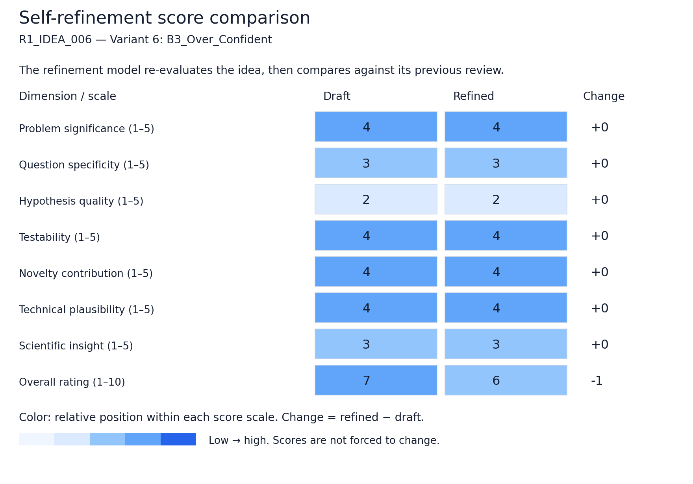

Changed score dimensions: overall_rating.

### Score justifications (draft / refined)

**Problem significance**

```json
{
  "draft": {
    "score": 4.0,
    "justification": "Histopathology is a critical domain for AI. Developing reliable, label-efficient methods to select or monitor SSL models is highly significant for clinical deployment. The problem of evaluating representation quality without labels is a fundamental challenge in the field."
  },
  "refined": {
    "score": 4.0,
    "justification": "The problem is highly significant. Histopathology relies on scarce annotations, making SSL crucial. However, without reliable, label-free methods to monitor or select SSL models (like rank estimation), practitioners are forced to rely on expensive validation sets. Solving this would have immediate practical impact."
  }
}
```

**Question specificity**

```json
{
  "draft": {
    "score": 3.0,
    "justification": "The idea clearly identifies the domain (histopathology), the task (SSL for ViTs), and the method class (rank estimation). However, it lacks a specific research question beyond 'is it effective?' and does not define the specific variables or conditions to be tested."
  },
  "refined": {
    "score": 3.0,
    "justification": "The idea clearly identifies the domain and the method class, but the research question is currently 'Is it effective?' rather than 'How does it behave and why?'. It lacks the specificity of a concrete hypothesis or a defined mechanism to be tested."
  }
}
```

**Hypothesis quality**

```json
{
  "draft": {
    "score": 2.0,
    "justification": "The text states that the area is 'unexplored' but does not offer a concrete hypothesis about the outcome. A strong idea would predict whether the metrics will transfer, degrade, or require modification, and why."
  },
  "refined": {
    "score": 2.0,
    "justification": "The text does not contain an explicit hypothesis. It states a gap ('unexplored') but does not predict the outcome. A strong hypothesis would predict that the metrics fail due to specific domain characteristics, or succeed under specific conditions."
  }
}
```

**Testability**

```json
{
  "draft": {
    "score": 4.0,
    "justification": "The idea is highly testable. One can compute rank estimation metrics on SSL checkpoints and correlate them with downstream performance on a small, labeled histopathology dataset. The experimental design is straightforward to define."
  },
  "refined": {
    "score": 4.0,
    "justification": "The idea is testable. One can train ViTs on histopathology data, compute rank estimation metrics at various checkpoints, and correlate them with downstream performance on a small labeled set. The experimental design is straightforward, even if the hypothesis is not yet defined."
  }
}
```

**Novelty contribution**

```json
{
  "draft": {
    "score": 4.0,
    "justification": "While rank estimation is known in natural images, applying it to the specific constraints of histopathology (WSIs, non-linear tasks) is novel. The contribution could be a new benchmark or a fundamental understanding of representation quality in medical imaging."
  },
  "refined": {
    "score": 4.0,
    "justification": "While rank estimation is known, its application to the specific constraints of histopathology (WSIs, non-linear tasks) is novel. The contribution could be a fundamental understanding of representation quality in medical imaging or a new benchmark for SSL evaluation in this domain."
  }
}
```

**Technical plausibility**

```json
{
  "draft": {
    "score": 4.0,
    "justification": "The technical premise is sound. Rank estimation is a mathematical property of the representation space, and its application to ViTs is standard. The challenge is the domain shift, which is a plausible research direction."
  },
  "refined": {
    "score": 4.0,
    "justification": "The technical premise is sound. Rank estimation is a well-defined mathematical concept. The challenge lies in the domain shift, which is a plausible and interesting research direction. The computational constraints are a practical consideration but do not invalidate the idea."
  }
}
```

**Scientific insight**

```json
{
  "draft": {
    "score": 3.0,
    "justification": "If successful, the study will provide insight into the generalizability of representation quality metrics. If it fails, it will reveal specific characteristics of histopathology data that break these metrics, which is also valuable scientific insight."
  },
  "refined": {
    "score": 3.0,
    "justification": "If the study reveals that rank estimation fails in histopathology, it would provide valuable insight into the spectral differences between natural and medical images. If it succeeds, it would validate the universality of these metrics. However, without a specific hypothesis, the potential for deep mechanistic insight is currently limited."
  }
}
```

**Overall rating**

```json
{
  "draft": {
    "score": 7.0,
    "justification": "This is a strong research idea with high significance and clear testability. It addresses a real gap in the literature. However, it currently reads more as a research proposal topic than a fully formed hypothesis. Elevating it from 'investigating if it works' to 'predicting how and why it works (or fails)' would make it exceptional."
  },
  "refined": {
    "score": 6.0,
    "justification": "This is a moderate research idea. It identifies a meaningful problem and a clear gap, and the proposed investigation is testable. However, it currently lacks a specific hypothesis or mechanism, making it more of a research proposal topic than a fully formed scientific inquiry. Elevating it to a strong idea requires formulating a specific prediction about the outcome and the underlying reasons."
  }
}
```

## R1_IDEA_006 — Variant 7: B4_Novelty

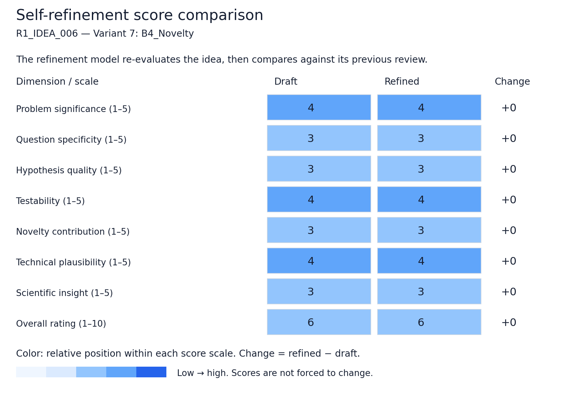

Changed score dimensions: none.

### Score justifications (draft / refined)

**Problem significance**

```json
{
  "draft": {
    "score": 4.0,
    "justification": "Model selection in self-supervised learning for medical imaging is a significant practical problem. Poor selection leads to wasted compute and suboptimal clinical tools. Addressing this specifically for histopathology, where data annotation is expensive and model robustness is critical, is highly meaningful."
  },
  "refined": {
    "score": 4.0,
    "justification": "Model selection in self-supervised learning for medical imaging is a critical practical problem. Poor selection leads to wasted compute and suboptimal clinical tools. Addressing this specifically for histopathology, where data annotation is expensive and model robustness is critical, is highly meaningful. The potential to automate or improve this process has significant real-world impact."
  }
}
```

**Question specificity**

```json
{
  "draft": {
    "score": 3.0,
    "justification": "The idea identifies the domain (histopathology), the task (ViT self-supervision), and the method (rank estimation). However, it lacks specificity on the exact mechanism of the rank estimation, the specific non-linear tasks to be prioritized, and the exact comparison metrics."
  },
  "refined": {
    "score": 3.0,
    "justification": "The idea identifies the domain (histopathology), the task (ViT self-supervision), and the method (rank estimation). However, it lacks specificity on the exact mechanism of the rank estimation, the specific non-linear tasks to be prioritized, and the exact comparison metrics. The term 'rank estimation' is used as a black box without defining its operational parameters."
  }
}
```

**Hypothesis quality**

```json
{
  "draft": {
    "score": 3.0,
    "justification": "The implicit hypothesis is that rank estimation is a viable proxy for model quality in this domain. This is testable, but the idea does not yet articulate a nuanced prediction about *how* it will perform relative to other metrics or *why* it might be superior/inferior in this specific context."
  },
  "refined": {
    "score": 3.0,
    "justification": "The implicit hypothesis is that rank estimation is a viable proxy for model quality in this domain. This is testable, but the idea does not yet articulate a nuanced prediction about *how* it will perform relative to other metrics or *why* it might be superior/inferior in this specific context. It remains a 'does it work?' question rather than a 'why does it work/fail?' question."
  }
}
```

**Testability**

```json
{
  "draft": {
    "score": 4.0,
    "justification": "The idea is highly testable. One can train ViTs on histopathology datasets, apply rank estimation at various checkpoints, and correlate these scores with downstream performance on segmentation and classification tasks. The experimental path is clear."
  },
  "refined": {
    "score": 4.0,
    "justification": "The idea is highly testable. One can train ViTs on histopathology datasets, apply rank estimation at various checkpoints, and correlate these scores with downstream performance on segmentation and classification tasks. The experimental path is clear, provided the specific metric is defined."
  }
}
```

**Novelty contribution**

```json
{
  "draft": {
    "score": 3.0,
    "justification": "The novelty lies primarily in the domain transfer. Applying an existing evaluation technique to a new, complex domain is valuable but not inherently groundbreaking unless it reveals a fundamental difference in how representations are structured in medical vs. natural images."
  },
  "refined": {
    "score": 3.0,
    "justification": "The novelty lies primarily in the domain transfer. Applying an existing evaluation technique to a new, complex domain is valuable but not inherently groundbreaking unless it reveals a fundamental difference in how representations are structured in medical vs. natural images. The contribution is likely empirical rather than theoretical."
  }
}
```

**Technical plausibility**

```json
{
  "draft": {
    "score": 4.0,
    "justification": "The reasoning is sound. Rank estimation is a known method for representation quality. Applying it to ViTs in histopathology is technically feasible, though computational constraints of WSIs will need to be managed."
  },
  "refined": {
    "score": 4.0,
    "justification": "The reasoning is sound. Rank estimation is a known method for representation quality. Applying it to ViTs in histopathology is technically feasible, though computational constraints of WSIs will need to be managed. The logic that representation quality correlates with downstream performance is a standard assumption in the field."
  }
}
```

**Scientific insight**

```json
{
  "draft": {
    "score": 3.0,
    "justification": "If successful, the study will provide valuable empirical data on the transferability of evaluation metrics. If it fails, it could reveal fundamental differences in the geometry of histopathology embeddings compared to natural images, which would be a significant scientific insight."
  },
  "refined": {
    "score": 3.0,
    "justification": "If successful, the study will provide valuable empirical data on the transferability of evaluation metrics. If it fails, it could reveal fundamental differences in the geometry of histopathology embeddings compared to natural images, which would be a significant scientific insight. However, the current framing is broad enough that it might yield a simple 'yes/no' result without deep mechanistic understanding."
  }
}
```

**Overall rating**

```json
{
  "draft": {
    "score": 6.0,
    "justification": "This is a moderate-to-strong research idea. It addresses a real problem with a plausible solution. However, it currently reads more like a research direction or a proposal than a fully formed hypothesis. It lacks the specific mechanistic insight or novel theoretical angle that would elevate it to a 'strong' (7-8) or 'exceptional' (9-10) rating. With more specific hypotheses about the domain shift and the nature of the non-linear tasks, it could be significantly improved."
  },
  "refined": {
    "score": 6.0,
    "justification": "This is a moderate-to-strong research idea. It addresses a real problem with a plausible solution. However, it currently reads more like a research direction or a proposal than a fully formed hypothesis. It lacks the specific mechanistic insight or novel theoretical angle that would elevate it to a 'strong' (7-8) or 'exceptional' (9-10) rating. With more specific hypotheses about the domain shift and the nature of the non-linear tasks, it could be significantly improved. The idea is solid but currently lacks the depth to be considered exceptional."
  }
}
```

## R1_IDEA_006 — Variant 8: B5_Application_Impact


Changed score dimensions: none.

### Score justifications (draft / refined)

**Problem significance**

```json
{
  "draft": {
    "score": 4.0,
    "justification": "The problem is highly significant. Developing reliable computational tools for histopathology is a major challenge in medical AI. Model selection is a critical bottleneck, and finding efficient, reliable proxies (like rank estimation) that avoid expensive downstream validation is valuable. The domain (WSI) adds substantial complexity and relevance."
  },
  "refined": {
    "score": 4.0,
    "justification": "The problem is highly significant. Computational pathology relies heavily on robust SSL, and model selection is a major bottleneck. Developing reliable, efficient proxies for model quality (like rank estimation) that avoid expensive downstream validation is a critical need. The domain (WSI) adds substantial complexity, making the investigation of fundamental representation properties highly relevant."
  }
}
```

**Question specificity**

```json
{
  "draft": {
    "score": 3.0,
    "justification": "The idea identifies a clear domain and a class of methods (rank estimation) but lacks a specific research question. It asks 'if' it works, but not 'under what conditions' or 'to what extent' it differs from natural images. The specific mechanism of failure or success is not articulated."
  },
  "refined": {
    "score": 3.0,
    "justification": "The idea identifies the domain and the class of methods but lacks a specific research question. It asks 'if' the method works, but does not specify 'how' it is expected to behave or 'what' specific conditions might lead to failure. The lack of a defined metric family or a predicted outcome reduces the specificity."
  }
}
```

**Hypothesis quality**

```json
{
  "draft": {
    "score": 2.0,
    "justification": "There is no explicit hypothesis. The text states that effectiveness 'remains unexplored,' which is a gap statement, not a hypothesis. A strong idea would predict, for example, that 'rank estimation will overestimate quality in histopathology due to...' or 'rank estimation will be a superior proxy for segmentation than for classification.'"
  },
  "refined": {
    "score": 2.0,
    "justification": "The idea currently lacks an explicit hypothesis. It states that the effectiveness 'remains unexplored,' which is a gap statement, not a testable prediction. A strong hypothesis would predict a specific relationship (e.g., 'Rank estimation will be a poor predictor for segmentation due to...') or a specific mechanism of failure."
  }
}
```

**Testability**

```json
{
  "draft": {
    "score": 4.0,
    "justification": "The idea is testable. One can train ViTs on histopathology data, compute rank estimates, train downstream heads (classification/segmentation), and correlate the rank estimates with actual performance. The comparison with natural image baselines provides a clear testable framework."
  },
  "refined": {
    "score": 4.0,
    "justification": "The idea is fundamentally testable. One can train ViTs on histopathology data, compute the proposed rank estimates, train downstream heads, and correlate the estimates with performance. The comparison with natural image baselines provides a clear empirical framework, even if the specific metric is not yet defined."
  }
}
```

**Novelty contribution**

```json
{
  "draft": {
    "score": 4.0,
    "justification": "Applying representation quality metrics from natural images to histopathology is a novel and necessary step. If the study reveals that these metrics fail in this domain, it provides a crucial boundary condition for the field. If they succeed, it offers a new tool for medical AI. The contribution lies in defining the limits of these metrics in a high-stakes domain."
  },
  "refined": {
    "score": 4.0,
    "justification": "Applying representation quality metrics from natural images to histopathology is a novel and necessary step. If the study reveals that these metrics fail, it defines a crucial boundary condition for the field. If they succeed, it offers a new tool. The contribution lies in testing the universality of these metrics in a high-stakes, complex domain."
  }
}
```

**Technical plausibility**

```json
{
  "draft": {
    "score": 4.0,
    "justification": "The direction is technically sound. Rank estimation is a known concept in deep learning theory. Applying it to ViTs on medical data is a logical extension. The computational cost might be a practical hurdle, but the theoretical premise is plausible."
  },
  "refined": {
    "score": 4.0,
    "justification": "The direction is technically sound. Rank estimation is a well-established concept in deep learning theory. Applying it to ViTs on medical data is a logical extension. While computational cost is a practical concern, the theoretical premise is plausible and the problem is well-defined enough to warrant investigation."
  }
}
```

**Scientific insight**

```json
{
  "draft": {
    "score": 4.0,
    "justification": "If successful, this research could reveal fundamental differences in how SSL representations are structured in natural images versus histopathology. It could uncover whether the 'rank' of a representation is a universal property of good features or a domain-specific artifact. This would provide deep insight into the nature of self-supervised learning in complex biological data."
  },
  "refined": {
    "score": 4.0,
    "justification": "If successfully investigated, this research could reveal fundamental differences in how SSL representations are structured in natural images versus histopathology. It could uncover whether 'rank' is a universal property of good features or a domain-specific artifact, providing deep insight into the nature of self-supervised learning in complex biological data."
  }
}
```

**Overall rating**

```json
{
  "draft": {
    "score": 7.0,
    "justification": "This is a strong research idea with high potential impact in a critical domain. It addresses a clear gap in the literature. However, it currently lacks the specificity of a hypothesis and a defined mechanism, which prevents it from being an 'exceptional' (9-10) idea. With a more concrete hypothesis (e.g., predicting specific failure modes) and a defined methodology, it would be excellent."
  },
  "refined": {
    "score": 7.0,
    "justification": "This is a strong research idea with high potential impact in a critical domain. It addresses a clear gap in the literature and proposes a meaningful investigation. However, it currently lacks the specificity of a hypothesis and a defined mechanism, which prevents it from being an 'exceptional' (9-10) idea. With a more concrete hypothesis (e.g., predicting specific failure modes) and a defined methodology, it would be excellent. The score reflects its strong potential but current lack of precision."
  }
}
```

## R1_IDEA_006 — Variant 9: C1_Hollow_Shell


Changed score dimensions: none.

### Score justifications (draft / refined)

**Problem significance**

```json
{
  "draft": {
    "score": 4.0,
    "justification": "Model selection in medical image analysis is a significant problem with direct implications for patient care and clinical deployment. However, the significance is currently tempered by the lack of specificity regarding the exact problem being solved."
  },
  "refined": {
    "score": 4.0,
    "justification": "Model selection in medical image analysis is a critical problem with direct implications for patient safety and clinical deployment. The potential to automate or improve this selection process is highly significant, even if the specific metric is not yet named."
  }
}
```

**Question specificity**

```json
{
  "draft": {
    "score": 2.0,
    "justification": "The idea is too generic. It uses placeholders like 'specialized area,' 'certain training paradigm,' and 'quantitative approach' without defining them. A strong research question must be concrete."
  },
  "refined": {
    "score": 2.0,
    "justification": "The idea relies heavily on placeholders ('specialized area', 'certain training paradigm', 'quantitative approach'). Without defining these core components, the research question is too broad to be considered specific or actionable in its current form."
  }
}
```

**Hypothesis quality**

```json
{
  "draft": {
    "score": 2.0,
    "justification": "The idea lacks a clear, falsifiable hypothesis. It is framed as an open inquiry ('is not yet known') rather than a prediction about the relationship between the metric and the model performance in the new domain."
  },
  "refined": {
    "score": 2.0,
    "justification": "The idea lacks a falsifiable hypothesis. It is framed as an open inquiry ('is not yet known') rather than a prediction about the relationship between the metric and performance. A strong hypothesis would predict a specific outcome or a specific condition for failure."
  }
}
```

**Testability**

```json
{
  "draft": {
    "score": 3.0,
    "justification": "While the general concept of testing a metric is testable, the lack of defined variables (which metric, which task, which baseline) makes the specific experimental design impossible to evaluate at this stage. It is testable in principle but not in practice yet."
  },
  "refined": {
    "score": 3.0,
    "justification": "The concept is testable in principle (compare metric scores to actual model performance), but the lack of defined variables makes the experimental design currently impossible to evaluate. It is testable only after the vague terms are resolved."
  }
}
```

**Novelty contribution**

```json
{
  "draft": {
    "score": 3.0,
    "justification": "Applying existing metrics to new domains is a common and useful practice, but without a specific hypothesis about *why* it might differ or a novel finding expected, the potential for high-impact scientific contribution is limited to incremental validation."
  },
  "refined": {
    "score": 3.0,
    "justification": "Applying existing metrics to new domains is a standard practice. The novelty is limited to the specific domain (medical) unless the study reveals a fundamental failure mode or a new theoretical insight about representation quality in this context."
  }
}
```

**Technical plausibility**

```json
{
  "draft": {
    "score": 4.0,
    "justification": "The reasoning is logically coherent: if a metric works for standard tasks, it is plausible to test it in medical tasks. There are no obvious technical contradictions in the proposed direction."
  },
  "refined": {
    "score": 4.0,
    "justification": "The reasoning is logically coherent: if a metric works in standard tasks, it is a reasonable scientific step to test it in a more complex, specialized domain. There are no inherent technical contradictions."
  }
}
```

**Scientific insight**

```json
{
  "draft": {
    "score": 2.0,
    "justification": "As currently stated, the idea is a 'black box' test. It would only yield insight if the results are negative or if the study includes an analysis of *why* the metric behaves differently in the medical domain. Without that, it is merely an application study."
  },
  "refined": {
    "score": 2.0,
    "justification": "As stated, the idea is a 'black box' validation. It will only yield scientific insight if the results are negative or if the study includes a deep analysis of *why* the metric behaves differently. Without a mechanism or specific prediction, the potential for generalizable insight is low."
  }
}
```

**Overall rating**

```json
{
  "draft": {
    "score": 3.0,
    "justification": "The idea addresses a meaningful problem but is currently too vague to be considered a strong research proposal. It lacks the specificity, hypothesis, and defined scope required to evaluate its scientific potential. It falls into the 'weak' category because it is essentially a placeholder for a research project rather than a defined research question."
  },
  "refined": {
    "score": 3.0,
    "justification": "The idea addresses a meaningful problem but is currently too vague to be considered a strong research proposal. It lacks the specificity, hypothesis, and defined scope required to evaluate its scientific potential. It falls into the 'weak' category because it is essentially a placeholder for a research project rather than a defined research question."
  }
}
```

## R1_IDEA_006 — Variant 10: C2_Logic_Flawed

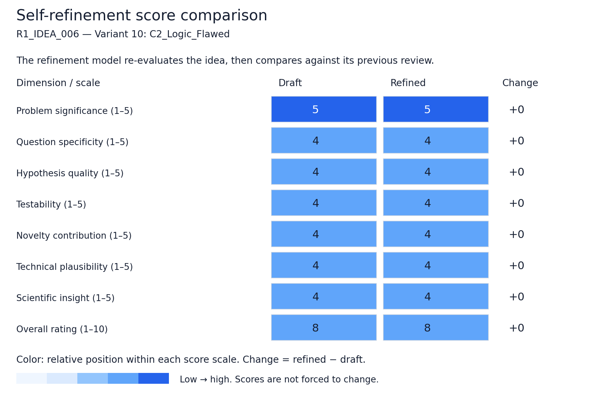

Changed score dimensions: none.

### Score justifications (draft / refined)

**Problem significance**

```json
{
  "draft": {
    "score": 5.0,
    "justification": "Efficient model selection in medical imaging is a critical bottleneck. Histopathology is a high-stakes domain where poor model selection can lead to wasted resources or suboptimal clinical tools. Addressing the generalization of SSL evaluation metrics to this domain is highly significant."
  },
  "refined": {
    "score": 5.0,
    "justification": "Efficient model selection in medical imaging is a high-impact problem. Histopathology is a critical domain where poor model selection leads to wasted resources and delayed clinical deployment. Addressing the generalization of SSL evaluation metrics to this domain is scientifically and practically significant."
  }
}
```

**Question specificity**

```json
{
  "draft": {
    "score": 4.0,
    "justification": "The idea clearly identifies the domain (histopathology/WSI), the task (SSL model selection), and the specific gap (transferability of rank estimation). However, it could be more specific about which exact rank estimation methods are being tested and the specific evaluation protocol."
  },
  "refined": {
    "score": 4.0,
    "justification": "The idea clearly identifies the domain (histopathology/WSI), the task (SSL model selection), and the specific gap (transferability of rank estimation). However, it could be more specific about which exact rank estimation methods are being tested and the specific evaluation protocol for non-linear tasks."
  }
}
```

**Hypothesis quality**

```json
{
  "draft": {
    "score": 4.0,
    "justification": "The hypothesis is testable and falsifiable: 'Rank estimation methods effective in natural images are sufficient for histopathology.' It makes a clear prediction about the transferability of a specific class of metrics."
  },
  "refined": {
    "score": 4.0,
    "justification": "The hypothesis is testable and falsifiable: 'Rank estimation methods effective in natural images are sufficient for histopathology.' It makes a clear prediction about the transferability of a specific class of metrics, which can be empirically validated or refuted."
  }
}
```

**Testability**

```json
{
  "draft": {
    "score": 4.0,
    "justification": "The idea suggests a clear experimental path: apply existing rank estimation methods to SSL-trained ViTs on histopathology data and correlate the scores with downstream performance on segmentation/classification tasks. This is empirically feasible."
  },
  "refined": {
    "score": 4.0,
    "justification": "The idea suggests a clear experimental path: apply existing rank estimation methods to SSL-trained ViTs on histopathology data and correlate the scores with downstream performance on segmentation/classification tasks. This is empirically feasible, though computationally intensive."
  }
}
```

**Novelty contribution**

```json
{
  "draft": {
    "score": 4.0,
    "justification": "While rank estimation is known in natural images, its application to histopathology for non-linear tasks is novel. The contribution lies in establishing the boundary conditions of these metrics in a critical new domain."
  },
  "refined": {
    "score": 4.0,
    "justification": "While rank estimation is established in natural images, its application to histopathology for non-linear tasks is novel. The contribution lies in establishing the boundary conditions of these metrics in a critical new domain, potentially revealing domain-specific representation properties."
  }
}
```

**Technical plausibility**

```json
{
  "draft": {
    "score": 4.0,
    "justification": "The reasoning is sound. If the underlying representation quality correlates with rank metrics in natural images, it is plausible to test this in medical images. The main risk is domain shift, but this is a valid research question to investigate rather than a flaw in the idea."
  },
  "refined": {
    "score": 4.0,
    "justification": "The reasoning is sound. If the underlying representation quality correlates with rank metrics in natural images, it is plausible to test this in medical images. The main risk is domain shift, but this is a valid research question to investigate rather than a flaw in the logic."
  }
}
```

**Scientific insight**

```json
{
  "draft": {
    "score": 4.0,
    "justification": "The study could reveal whether the mathematical properties of SSL representations (captured by rank) are domain-agnostic or if medical imaging requires fundamentally different evaluation metrics. This would provide deep insight into the nature of representations in medical vs. natural domains."
  },
  "refined": {
    "score": 4.0,
    "justification": "The study could reveal whether the mathematical properties of SSL representations (captured by rank) are domain-agnostic or if medical imaging requires fundamentally different evaluation metrics. This would provide deep insight into the nature of representations in medical vs. natural domains."
  }
}
```

**Overall rating**

```json
{
  "draft": {
    "score": 8.0,
    "justification": "This is a strong research idea. It addresses a meaningful problem in a high-impact domain, proposes a clear and testable hypothesis regarding the transferability of existing methods, and has the potential to provide significant scientific insight into SSL evaluation. It scores highly on significance and plausibility, with minor deductions for the need to specify the exact methods and handle the complexities of WSI data."
  },
  "refined": {
    "score": 8.0,
    "justification": "This is a strong research idea. It addresses a meaningful problem in a high-impact domain, proposes a clear and testable hypothesis regarding the transferability of existing methods, and has the potential to provide significant scientific insight into SSL evaluation. It scores highly on significance and plausibility, with minor deductions for the need to specify the exact methods and handle the complexities of WSI data."
  }
}
```

## R1_IDEA_006 — Variant 11: C3_Substance_Enriched


Changed score dimensions: none.

### Score justifications (draft / refined)

**Problem significance**

```json
{
  "draft": {
    "score": 5.0,
    "justification": "The problem is highly significant. Self-supervised learning is the standard for training on unlabeled medical data, but selecting the best model without labeled data is difficult. Validating or invalidating existing proxy metrics (rank estimation) in this high-stakes domain is crucial for advancing medical AI."
  },
  "refined": {
    "score": 5.0,
    "justification": "The problem is highly significant. Self-supervised learning is the standard for training on unlabeled medical data, but selecting the best model without labeled data is a major bottleneck. Validating or invalidating existing proxy metrics in this high-stakes domain is crucial for advancing medical AI and ensuring reliable model deployment."
  }
}
```

**Question specificity**

```json
{
  "draft": {
    "score": 4.0,
    "justification": "The question is specific about the domain (histopathology/WSIs), the method (rank estimation), and the comparison (downstream performance). However, it could be more specific about the exact nature of the 'unique challenges' being investigated."
  },
  "refined": {
    "score": 4.0,
    "justification": "The question is specific regarding the domain (histopathology/WSIs), the method (rank estimation), and the comparison (downstream performance). However, it lacks specificity on the exact nature of the 'unique challenges' and the specific metrics being tested, which prevents it from being a 5."
  }
}
```

**Hypothesis quality**

```json
{
  "draft": {
    "score": 4.0,
    "justification": "The hypothesis is strong: it predicts a domain-specific breakdown of a general method. It is falsifiable (if rank estimates correlate well in histopathology, the hypothesis is contradicted) and distinguishes the proposed work from prior natural image studies."
  },
  "refined": {
    "score": 4.0,
    "justification": "The hypothesis is strong and falsifiable: it predicts a domain-specific breakdown of a general method. It distinguishes the proposed work from prior natural image studies. However, the causal link between 'multi-scale nature' and 'rank metric failure' is asserted but not theoretically grounded in the summary."
  }
}
```

**Testability**

```json
{
  "draft": {
    "score": 4.0,
    "justification": "The idea suggests a clear experimental protocol: train models, compute rank estimates, train downstream heads, and correlate the two. The variation across tissue types and stains provides necessary controls."
  },
  "refined": {
    "score": 4.0,
    "justification": "The idea suggests a clear experimental protocol: train models, compute rank estimates, train downstream heads, and correlate the two. The variation across tissue types and stains provides necessary controls. The main limitation is the lack of detail on how to handle the computational scale of WSIs during evaluation."
  }
}
```

**Novelty contribution**

```json
{
  "draft": {
    "score": 4.0,
    "justification": "While applying existing metrics to new domains is common, the specific focus on the *failure modes* of rank-based metrics in the context of multi-scale histopathology is novel. It moves beyond simple application to understanding boundary conditions."
  },
  "refined": {
    "score": 4.0,
    "justification": "While applying existing metrics to new domains is common, the specific focus on the *failure modes* of rank-based metrics in the context of multi-scale histopathology is novel. It moves beyond simple application to understanding boundary conditions and potential theoretical limitations of current metrics."
  }
}
```

**Technical plausibility**

```json
{
  "draft": {
    "score": 4.0,
    "justification": "The approach is technically sound. Rank estimation is computationally feasible on patches, and downstream evaluation is standard. The hypothesis relies on reasonable assumptions about the complexity of histological data."
  },
  "refined": {
    "score": 4.0,
    "justification": "The approach is technically sound. Rank estimation is computationally feasible on patches, and downstream evaluation is standard. The hypothesis relies on reasonable assumptions about the complexity of histological data. The main risk is the computational cost of full-slide processing, which is a practical rather than theoretical flaw."
  }
}
```

**Scientific insight**

```json
{
  "draft": {
    "score": 4.0,
    "justification": "If successful, this research will provide deep insight into the relationship between representation geometry (rank) and the specific structural properties of medical images. It could reveal that metrics valid for natural images are insufficient for complex biological structures, guiding future metric development."
  },
  "refined": {
    "score": 4.0,
    "justification": "If successful, this research will provide deep insight into the relationship between representation geometry (rank) and the specific structural properties of medical images. It could reveal that metrics valid for natural images are insufficient for complex biological structures, guiding future metric development."
  }
}
```

**Overall rating**

```json
{
  "draft": {
    "score": 8.0,
    "justification": "This is a strong research idea. It addresses a meaningful problem in a high-impact domain with a clear, testable hypothesis. While it lacks some implementation details (which is acceptable for an idea summary), the core scientific question is well-defined and has the potential to yield significant insights into the limitations of current representation quality metrics."
  },
  "refined": {
    "score": 8.0,
    "justification": "This is a strong research idea. It addresses a meaningful problem in a high-impact domain with a clear, testable hypothesis. While it lacks some implementation details (which is acceptable for an idea summary), the core scientific question is well-defined and has the potential to yield significant insights into the limitations of current representation quality metrics. The logic audit confirms the hypothesis is plausible and the experimental design is sound, though the mechanistic explanation could be deeper."
  }
}
```

## R1_IDEA_006 — Variant 12: H1_Deceptive_Hollow

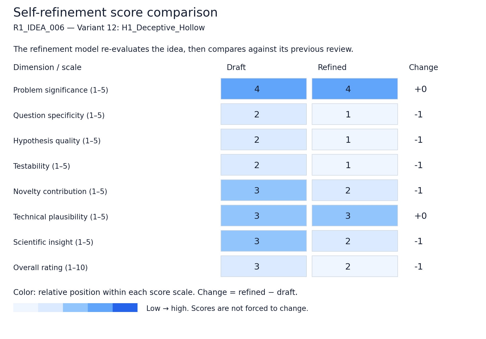

Changed score dimensions: question_specificity, hypothesis_quality, testability, novelty_contribution, scientific_insight, overall_rating.

### Score justifications (draft / refined)

**Problem significance**

```json
{
  "draft": {
    "score": 4.0,
    "justification": "The problem of model selection in medical image analysis is highly significant due to the critical nature of healthcare applications. However, the significance is currently diluted by the lack of specificity regarding the exact problem being solved."
  },
  "refined": {
    "score": 4.0,
    "justification": "The problem of reliable model selection in medical imaging is highly significant due to the safety-critical nature of the domain. However, the significance is currently limited by the lack of specificity regarding which specific problem within this broad domain is being addressed."
  }
}
```

**Question specificity**

```json
{
  "draft": {
    "score": 2.0,
    "justification": "The idea is too vague to be considered a specific research question. It relies on undefined terms like 'a certain training paradigm' and 'a quantitative approach' without naming them, making the scope impossible to evaluate technically."
  },
  "refined": {
    "score": 1.0,
    "justification": "The research question is effectively non-existent. It relies entirely on undefined variables ('a certain training paradigm', 'a quantitative approach'). Without naming the method or the specific domain, the question cannot be parsed or investigated."
  }
}
```

**Hypothesis quality**

```json
{
  "draft": {
    "score": 2.0,
    "justification": "There is no explicit hypothesis. The statement 'Whether this approach is effective... is not yet known' is a question, not a hypothesis. A strong idea would predict the outcome or the specific conditions of success/failure."
  },
  "refined": {
    "score": 1.0,
    "justification": "There is no hypothesis. The text merely states that the answer is 'not yet known.' A hypothesis requires a prediction (e.g., 'Method A will fail because of X') or a specific relationship to be tested. The current text is a statement of intent, not a scientific hypothesis."
  }
}
```

**Testability**

```json
{
  "draft": {
    "score": 2.0,
    "justification": "Without defining the method, the domain, or the metrics, the idea is not currently testable. It is impossible to design an experiment based on the current text."
  },
  "refined": {
    "score": 1.0,
    "justification": "The idea is currently untestable. One cannot design an experiment, select a baseline, or define a metric without knowing the specific method and domain. It is impossible to falsify the claim 'whether this approach is effective' without defining the approach."
  }
}
```

**Novelty contribution**

```json
{
  "draft": {
    "score": 3.0,
    "justification": "Applying representation assessment to medical imaging could be novel, but the idea is currently framed as a generic 'agenda' rather than a specific novel contribution. The potential for insight exists but is not yet articulated."
  },
  "refined": {
    "score": 2.0,
    "justification": "While the general concept of transferring representation metrics to medical imaging is potentially novel, the idea as presented is too generic to claim novelty. It reads like a placeholder for a future idea rather than a specific contribution."
  }
}
```

**Technical plausibility**

```json
{
  "draft": {
    "score": 3.0,
    "justification": "The reasoning that methods working on standard tasks might need validation on complex medical tasks is logically sound and plausible. However, the lack of technical detail prevents a full assessment of the proposed mechanism."
  },
  "refined": {
    "score": 3.0,
    "justification": "The underlying logic that representation metrics might not transfer from standard to medical tasks is plausible and scientifically sound. However, the lack of technical detail prevents assessing the feasibility of the proposed mechanism."
  }
}
```

**Scientific insight**

```json
{
  "draft": {
    "score": 3.0,
    "justification": "If the research were to succeed, it could provide valuable insights into the generalizability of representation metrics. However, the current formulation is too broad to promise specific scientific insights beyond a simple 'yes/no' on effectiveness."
  },
  "refined": {
    "score": 2.0,
    "justification": "The potential for insight is high only if the idea is fleshed out. As written, it promises 'transformative synthesis' but offers no specific mechanism or principle that would be revealed. It risks being a simple 'does it work?' experiment without deeper analysis."
  }
}
```

**Overall rating**

```json
{
  "draft": {
    "score": 3.0,
    "justification": "The idea addresses a meaningful problem but fails as a research proposal due to extreme vagueness. It reads more like a grant abstract or a vision statement than a concrete research idea. The lack of specific methods, hypotheses, and defined boundaries makes it difficult to evaluate its scientific merit or feasibility. It is a 'moderate/borderline' idea because the underlying motivation is sound, but the execution plan is non-existent."
  },
  "refined": {
    "score": 2.0,
    "justification": "This is a very weak research idea in its current form. While the motivation (medical image analysis) is strong, the proposal lacks the fundamental components of a research idea: a specific question, a defined method, and a testable hypothesis. It is essentially a vague vision statement. It fails to meet the threshold of a 'moderate' idea because it does not provide enough information to even begin designing a study. It is penalized heavily for vagueness and lack of falsifiability."
  }
}
```

## R1_IDEA_006 — Variant 13: H2_Confident_Flaw

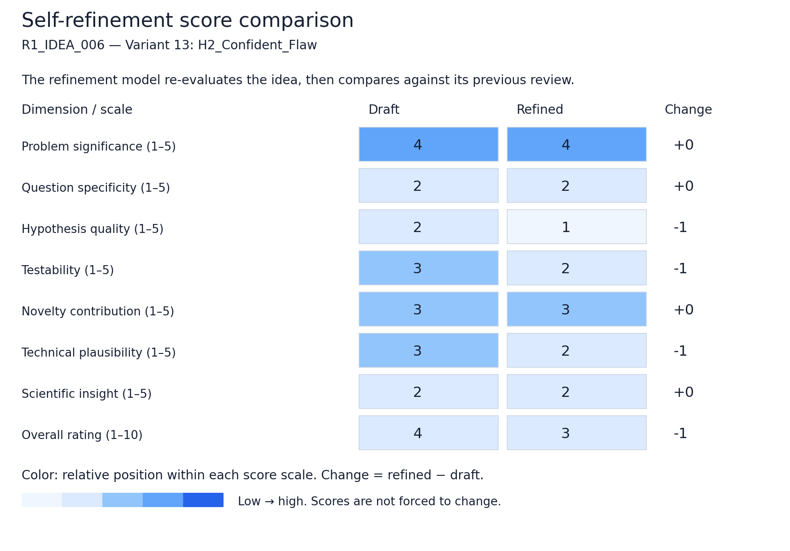

Changed score dimensions: hypothesis_quality, testability, technical_plausibility, overall_rating.

### Score justifications (draft / refined)

**Problem significance**

```json
{
  "draft": {
    "score": 4.0,
    "justification": "Model selection in histopathology SSL is a significant and practical problem with direct implications for medical AI deployment. Solving it would reduce computational costs and improve model reliability in a critical domain."
  },
  "refined": {
    "score": 4.0,
    "justification": "Model selection in histopathology SSL is a significant and practical problem with direct implications for medical AI deployment. Solving it would reduce computational costs and improve model reliability in a critical domain."
  }
}
```

**Question specificity**

```json
{
  "draft": {
    "score": 2.0,
    "justification": "The research question is vague. It asks if a method 'is likely sufficient' and 'remains unexplored' without defining the specific relationship to be tested. The claim that it will 'necessarily produce' improvements is a conclusion, not a question."
  },
  "refined": {
    "score": 2.0,
    "justification": "The research question is vague. It asks if a method 'is likely sufficient' and 'remains unexplored' without defining the specific relationship to be tested. The claim that it will 'necessarily produce' improvements is a conclusion, not a question."
  }
}
```

**Hypothesis quality**

```json
{
  "draft": {
    "score": 2.0,
    "justification": "The hypothesis is weak because it is framed as a certainty ('necessarily produce', 'confidently treated as causal') rather than a testable prediction. It fails to account for potential failure modes or domain-specific constraints, making it unfalsifiable in its current form."
  },
  "refined": {
    "score": 1.0,
    "justification": "The hypothesis is critically weak because it is framed as a certainty ('necessarily produce', 'confidently treated as causal') rather than a testable prediction. It fails to account for potential failure modes or domain-specific constraints, making it unfalsifiable in its current form. The explicit dismissal of necessary controls invalidates the causal claim."
  }
}
```

**Testability**

```json
{
  "draft": {
    "score": 3.0,
    "justification": "While the idea suggests an experiment (applying rank estimation to histopathology), the dismissal of necessary controls (dataset composition, boundary cases) undermines the testability. A rigorous test requires isolating variables, which the idea explicitly rejects."
  },
  "refined": {
    "score": 2.0,
    "justification": "While the idea suggests an experiment (applying rank estimation to histopathology), the dismissal of necessary controls (dataset composition, boundary cases) undermines the testability. A rigorous test requires isolating variables, which the idea explicitly rejects, making the proposed 'causal evidence' impossible to obtain as described."
  }
}
```

**Novelty contribution**

```json
{
  "draft": {
    "score": 3.0,
    "justification": "Applying existing methods to a new domain is a moderate contribution. The novelty is limited unless the study reveals *why* it works or fails, which the current idea does not promise to do beyond a simple application."
  },
  "refined": {
    "score": 3.0,
    "justification": "Applying existing methods to a new domain is a moderate contribution. The novelty is limited unless the study reveals *why* it works or fails, which the current idea does not promise to do beyond a simple application. The logical flaws further reduce the potential for a meaningful contribution."
  }
}
```

**Technical plausibility**

```json
{
  "draft": {
    "score": 3.0,
    "justification": "The reasoning is partially plausible (transfer of methods is common), but the technical claim that solving this will 'necessarily' prove superiority and that other factors can be ignored is logically unsound. The mechanism for transfer is not explained."
  },
  "refined": {
    "score": 2.0,
    "justification": "The reasoning is partially plausible (transfer of methods is common), but the technical claim that solving this will 'necessarily' prove superiority and that other factors can be ignored is logically unsound. The mechanism for transfer is not explained, and the dismissal of confounds makes the proposed causal link technically invalid."
  }
}
```

**Scientific insight**

```json
{
  "draft": {
    "score": 2.0,
    "justification": "The idea as stated is unlikely to yield deep scientific insight because it treats the application as a binary success/failure without exploring the underlying mechanisms or boundary conditions. The dismissal of confounding factors prevents the discovery of general principles."
  },
  "refined": {
    "score": 2.0,
    "justification": "The idea as stated is unlikely to yield deep scientific insight because it treats the application as a binary success/failure without exploring the underlying mechanisms or boundary conditions. The dismissal of confounding factors prevents the discovery of general principles."
  }
}
```

**Overall rating**

```json
{
  "draft": {
    "score": 4.0,
    "justification": "The idea addresses a meaningful problem but is currently framed as a weak, overconfident hypothesis that ignores necessary scientific rigor. It lacks specificity and falsifiability. While the domain is important, the proposed research direction needs significant refinement to be a strong scientific contribution. It currently sits in the 'weak' to 'moderate' range due to the logical flaws in the hypothesis formulation."
  },
  "refined": {
    "score": 3.0,
    "justification": "The idea addresses a meaningful problem but is currently framed as a weak, overconfident hypothesis that ignores necessary scientific rigor. The explicit rejection of controlling for confounding variables and the claim of 'necessary' causal improvement constitute a fundamental logical flaw that severely undermines the scientific validity of the proposal. While the domain is important, the proposed research direction needs significant refinement to be a strong scientific contribution. It currently sits in the 'weak' range due to the logical flaws in the hypothesis formulation and the lack of falsifiability."
  }
}
```

## R1_IDEA_006 — Variant 14: H3_Verbose_Enriched

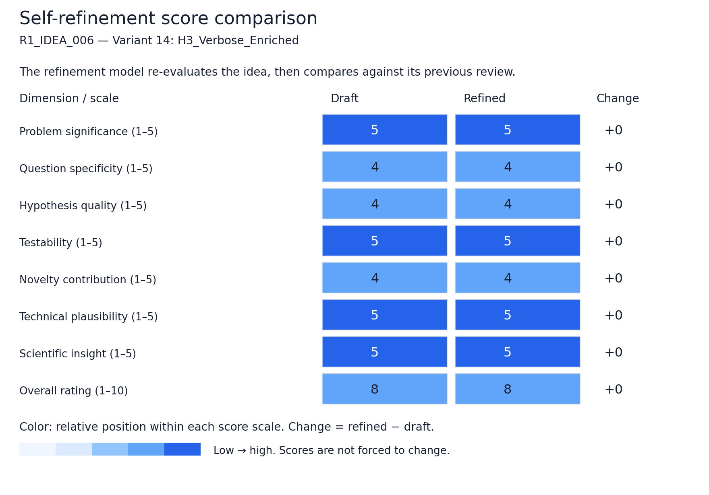

Changed score dimensions: none.

### Score justifications (draft / refined)

**Problem significance**

```json
{
  "draft": {
    "score": 5.0,
    "justification": "The problem is highly significant. Reliable evaluation of SSL models in histopathology is a major bottleneck in medical AI. Current metrics from natural images may be misleading, leading to suboptimal model selection. Solving this could prevent wasted resources and improve diagnostic AI reliability."
  },
  "refined": {
    "score": 5.0,
    "justification": "The problem is highly significant. Reliable evaluation of SSL models in histopathology is a major bottleneck. Current metrics from natural images may be misleading, leading to suboptimal model selection and wasted resources. Solving this has direct implications for the reliability of diagnostic AI."
  }
}
```

**Question specificity**

```json
{
  "draft": {
    "score": 4.0,
    "justification": "The research question is specific: comparing rank estimates against downstream performance in WSIs. However, the specific metric and the precise theoretical mechanism of failure could be defined more sharply to increase specificity."
  },
  "refined": {
    "score": 4.0,
    "justification": "The research question is specific: comparing rank estimates against downstream performance in WSIs. However, the specific metric and the precise theoretical mechanism of failure could be defined more sharply to increase specificity. The current definition is slightly broad."
  }
}
```

**Hypothesis quality**

```json
{
  "draft": {
    "score": 4.0,
    "justification": "The hypothesis is strong: it predicts a domain-specific failure of a known method due to image complexity. It is falsifiable and distinguishes the proposed investigation from a generic application."
  },
  "refined": {
    "score": 4.0,
    "justification": "The hypothesis is strong: it predicts a domain-specific failure of a known method due to image complexity. It is falsifiable and distinguishes the proposed investigation from a generic application. It could be refined by specifying the exact nature of the failure (e.g., correlation drop vs. absolute value shift)."
  }
}
```

**Testability**

```json
{
  "draft": {
    "score": 5.0,
    "justification": "The idea outlines a very testable design: correlation analysis, staged experiments, ablations, and error analysis. The proposed methods for validation are concrete and standard in ML research."
  },
  "refined": {
    "score": 5.0,
    "justification": "The idea outlines a very testable design: correlation analysis, staged experiments, ablations, and error analysis. The proposed methods for validation are concrete, standard in ML research, and sufficient to answer the research question."
  }
}
```

**Novelty contribution**

```json
{
  "draft": {
    "score": 4.0,
    "justification": "While applying existing metrics to new domains is common, the specific focus on the *failure* of rank metrics in the context of multi-scale histopathology and the intent to derive boundary conditions adds significant novelty and scientific value."
  },
  "refined": {
    "score": 4.0,
    "justification": "While applying existing metrics to new domains is common, the specific focus on the *failure* of rank metrics in the context of multi-scale histopathology and the intent to derive boundary conditions adds significant novelty and scientific value. It moves beyond simple transfer learning."
  }
}
```

**Technical plausibility**

```json
{
  "draft": {
    "score": 5.0,
    "justification": "The proposed methodology is technically sound. Comparing representation quality metrics to downstream performance is a standard and feasible approach. The domain constraints (WSIs) are well-understood challenges."
  },
  "refined": {
    "score": 5.0,
    "justification": "The proposed methodology is technically sound. Comparing representation quality metrics to downstream performance is a standard and feasible approach. The domain constraints (WSIs) are well-understood challenges that can be simulated or measured."
  }
}
```

**Scientific insight**

```json
{
  "draft": {
    "score": 5.0,
    "justification": "This research has high potential for insight. It moves beyond 'does it work' to 'why does it work or fail', potentially revealing fundamental differences between natural image feature spaces and histopathological feature spaces regarding rank properties."
  },
  "refined": {
    "score": 5.0,
    "justification": "This research has high potential for insight. It moves beyond 'does it work' to 'why does it work or fail', potentially revealing fundamental differences between natural image feature spaces and histopathological feature spaces regarding rank properties."
  }
}
```

**Overall rating**

```json
{
  "draft": {
    "score": 8.0,
    "justification": "This is a strong research idea. It addresses a meaningful problem with a clear hypothesis and a robust experimental plan. While it lacks some specific technical details (which is acceptable for an idea summary), the core scientific logic is sound, and the potential for insight is high. It avoids the trap of simple application by focusing on the 'why' and 'when' of the method's utility."
  },
  "refined": {
    "score": 8.0,
    "justification": "This is a strong research idea. It addresses a meaningful problem with a clear hypothesis and a robust experimental plan. While it lacks some specific technical details (which is acceptable for an idea summary), the core scientific logic is sound, and the potential for insight is high. It avoids the trap of simple application by focusing on the 'why' and 'when' of the method's utility."
  }
}
```

## R1_IDEA_006 — Variant 15: H4_Ultimate_Hype

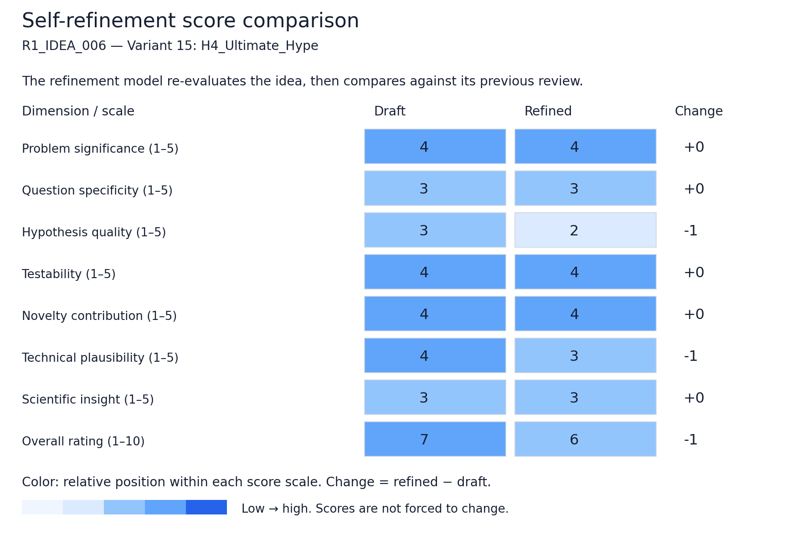

Changed score dimensions: hypothesis_quality, technical_plausibility, overall_rating.

### Score justifications (draft / refined)

**Problem significance**

```json
{
  "draft": {
    "score": 4.0,
    "justification": "Model selection in medical AI is a critical bottleneck. Solving this could significantly reduce the computational cost and time required to deploy reliable histopathology models, making it a highly significant problem."
  },
  "refined": {
    "score": 4.0,
    "justification": "Model selection in medical AI is a significant practical challenge. Reducing reliance on expensive labeled data for validation and improving the reliability of SSL in histopathology has high potential impact on clinical deployment and research efficiency."
  }
}
```

**Question specificity**

```json
{
  "draft": {
    "score": 3.0,
    "justification": "The idea identifies the domain and the general method (rank estimation) but lacks a specific research question. It states that effectiveness 'remains unexplored' rather than proposing a specific relationship to test."
  },
  "refined": {
    "score": 3.0,
    "justification": "The idea identifies the domain (histopathology) and the method class (rank estimation) but fails to specify the exact research question. It states that effectiveness is 'unexplored' rather than proposing a specific relationship or mechanism to investigate."
  }
}
```

**Hypothesis quality**

```json
{
  "draft": {
    "score": 3.0,
    "justification": "The implicit hypothesis is that rank estimation is transferable and useful. This is plausible but not yet a strong, falsifiable prediction. It needs to specify *how* the metric relates to the specific non-linear tasks mentioned."
  },
  "refined": {
    "score": 2.0,
    "justification": "The idea lacks an explicit, falsifiable hypothesis. It assumes the method 'could be useful' based on its success in natural images but does not articulate a specific prediction about the outcome, the magnitude of the effect, or the conditions under which it might fail."
  }
}
```

**Testability**

```json
{
  "draft": {
    "score": 4.0,
    "justification": "The idea is testable by applying existing rank estimation methods to histopathology SSL training runs and correlating the scores with downstream task performance. The experimental design is straightforward, even if the details are missing."
  },
  "refined": {
    "score": 4.0,
    "justification": "The core idea is testable in principle: one can apply existing rank estimation metrics to histopathology SSL training runs and correlate them with downstream performance. However, the lack of specific metrics and evaluation protocols makes the immediate testability moderate."
  }
}
```

**Novelty contribution**

```json
{
  "draft": {
    "score": 4.0,
    "justification": "Applying rank estimation to histopathology SSL is a novel application. If successful, it could establish a new standard for model selection in medical imaging, contributing a new empirical phenomenon to the field."
  },
  "refined": {
    "score": 4.0,
    "justification": "Applying rank estimation to histopathology SSL is a novel application. If successful, it could establish a new standard for model selection in medical imaging. The novelty lies in the domain transfer and the potential discovery of domain-specific limitations of these metrics."
  }
}
```

**Technical plausibility**

```json
{
  "draft": {
    "score": 4.0,
    "justification": "Rank estimation is a well-established concept in natural image SSL. Given the mathematical similarities in representation learning, it is technically plausible that it could work, though the specific nuances of histopathology data may require adaptation."
  },
  "refined": {
    "score": 3.0,
    "justification": "While rank estimation is a known concept, its plausibility in histopathology is an open question. The reasoning assumes a direct transferability that may not hold due to the unique statistical properties of histopathology (e.g., extreme class imbalance, multi-scale structures). The idea is plausible but requires significant theoretical justification to be considered robust."
  }
}
```

**Scientific insight**

```json
{
  "draft": {
    "score": 3.0,
    "justification": "While the application is valuable, the potential for deep scientific insight depends on *why* it works or fails. If it simply works, it's a useful tool. If it reveals fundamental differences in how SSL representations form in medical vs. natural images, the insight would be higher."
  },
  "refined": {
    "score": 3.0,
    "justification": "If the study simply confirms the method works, the insight is limited to a new tool. However, if it reveals *why* it fails or succeeds (e.g., exposing differences in representation geometry between natural and medical images), it could yield significant scientific insight. The current proposal does not guarantee this depth."
  }
}
```

**Overall rating**

```json
{
  "draft": {
    "score": 7.0,
    "justification": "This is a strong research idea with high practical potential and clear significance. It addresses a real gap in the literature. However, it currently reads more as a research agenda or proposal than a specific hypothesis. With more concrete formulation of the hypothesis and specific metrics, it could be exceptional."
  },
  "refined": {
    "score": 6.0,
    "justification": "This is a moderate research idea. It addresses a significant problem and proposes a plausible direction, but it currently reads more as a high-level research agenda than a concrete scientific proposal. The lack of a specific hypothesis, defined metrics, and mechanistic reasoning prevents it from being a 'strong' (7-8) or 'exceptional' (9-10) idea. It has the potential to be strong if the specific research questions and hypotheses are rigorously defined."
  }
}
```

## R1_IDEA_007 — Source


Changed score dimensions: none.

### Score justifications (draft / refined)

**Problem significance**

```json
{
  "draft": {
    "score": 5.0,
    "justification": "The accuracy-interpretability trade-off is one of the most critical challenges in deploying machine learning in high-stakes domains (healthcare, finance, law). A method that genuinely reconciles these two properties would be of immense scientific and practical value."
  },
  "refined": {
    "score": 5.0,
    "justification": "The accuracy-interpretability trade-off is a foundational challenge in trustworthy AI. Solving this would have profound implications for deploying ML in regulated domains like healthcare and finance, where both high accuracy and explainability are mandatory."
  }
}
```

**Question specificity**

```json
{
  "draft": {
    "score": 2.0,
    "justification": "While the goal is clear, the research question is currently too vague. It states 'what' (a model that is both accurate and interpretable) but not 'how' or 'which specific mechanism' is being investigated. The term 'Nonlinear Interpretable Model' is a category, not a specific hypothesis."
  },
  "refined": {
    "score": 2.0,
    "justification": "The idea states the 'what' (a model that is both accurate and interpretable) but not the 'how'. The term 'Nonlinear Interpretable Model' is a category, not a specific research question. Without defining the model class, the research question remains too broad to be actionable."
  }
}
```

**Hypothesis quality**

```json
{
  "draft": {
    "score": 3.0,
    "justification": "The implicit hypothesis is that such a model class exists and can outperform or match deep networks while remaining interpretable. This is a bold and testable claim, but it is currently stated as a broad assertion rather than a nuanced prediction about specific conditions or mechanisms."
  },
  "refined": {
    "score": 3.0,
    "justification": "The implicit hypothesis is that a specific model class exists that breaks the Pareto frontier of the accuracy-interpretability trade-off. This is a valid and testable hypothesis, but it is currently stated as a broad assertion without specifying the conditions under which it holds or the mechanism of action."
  }
}
```

**Testability**

```json
{
  "draft": {
    "score": 3.0,
    "justification": "The idea is testable in principle (compare NIMO to linear models and DNNs on standard benchmarks), but the lack of a defined model structure makes it impossible to design a specific experiment or ablation study at this stage. The testability depends entirely on the future definition of the framework."
  },
  "refined": {
    "score": 3.0,
    "justification": "The idea is testable in principle (compare performance and interpretability metrics against baselines), but the lack of a defined model structure makes it impossible to design a concrete experiment or ablation study at this stage. The testability is currently contingent on future specification."
  }
}
```

**Novelty contribution**

```json
{
  "draft": {
    "score": 4.0,
    "justification": "While the goal is not new (e.g., GAMs, Neural Additive Models exist), the specific claim of 'reconciling' the gap to match deep networks with built-in fidelity is a strong potential contribution. If successful, it would represent a significant step forward in trustworthy AI."
  },
  "refined": {
    "score": 4.0,
    "justification": "While the goal of interpretable nonlinear models is not new (e.g., GAMs, MARS, NAMs), the specific claim of 'reconciling' the gap to match deep networks with built-in fidelity is a strong potential contribution. If a specific mechanism is found that achieves this, it would be highly novel."
  }
}
```

**Technical plausibility**

```json
{
  "draft": {
    "score": 3.0,
    "justification": "The direction is technically plausible given the history of interpretable ML (e.g., GAMs, MARS). However, the claim that it can match deep networks is ambitious and may face theoretical limits regarding the complexity of functions that can be both interpretable and highly accurate. The plausibility hinges on the specific constraints chosen."
  },
  "refined": {
    "score": 3.0,
    "justification": "The direction is plausible given the history of interpretable ML, but the claim is ambitious. There are theoretical limits to how much nonlinearity can be captured while maintaining human-understandable interpretability. The plausibility depends entirely on the specific constraints chosen, which are currently missing."
  }
}
```

**Scientific insight**

```json
{
  "draft": {
    "score": 4.0,
    "justification": "If the research succeeds, it would provide deep insights into the nature of the accuracy-interpretability trade-off, potentially revealing that the trade-off is not absolute but depends on the specific inductive biases of the model class used."
  },
  "refined": {
    "score": 4.0,
    "justification": "If successful, this research would reveal whether the accuracy-interpretability trade-off is an absolute law or a consequence of specific model inductive biases. It could lead to new principles for designing models that are both powerful and transparent."
  }
}
```

**Overall rating**

```json
{
  "draft": {
    "score": 6.0,
    "justification": "This is a strong research direction with high significance and potential impact. However, as a research idea summary, it is currently too abstract to be fully evaluated. It lacks the necessary specificity regarding the model architecture and the mechanism of interpretability. It sits in the 'Moderate' range because the core concept is excellent, but the proposal is currently a 'vision' rather than a defined research plan."
  },
  "refined": {
    "score": 6.0,
    "justification": "This is a high-potential research idea with significant scientific value, but as a proposal, it is currently too abstract. It lacks the necessary technical specificity to be fully evaluated or implemented. It sits in the 'Moderate' range because the core concept is excellent, but the proposal is currently a 'vision' rather than a defined research plan. The lack of a defined model class prevents a higher score on specificity and testability."
  }
}
```

## R1_IDEA_007 — Variant 1: A1_Identity


Changed score dimensions: none.

### Score justifications (draft / refined)

**Problem significance**

```json
{
  "draft": {
    "score": 5.0,
    "justification": "The accuracy-interpretability trade-off is one of the most critical challenges in modern machine learning, especially for applications in healthcare, finance, and law. Solving this would have profound scientific and practical impact."
  },
  "refined": {
    "score": 5.0,
    "justification": "The accuracy-interpretability trade-off is a central challenge in machine learning, particularly for high-stakes applications like healthcare and finance. A solution would have profound scientific and practical impact."
  }
}
```

**Question specificity**

```json
{
  "draft": {
    "score": 2.0,
    "justification": "While the goal is clear, the research question is currently too vague. It states 'what' (a model that does X) but not 'how' (the specific mechanism). Without a proposed method or hypothesis about the mechanism, the question is not sufficiently specific for a rigorous review."
  },
  "refined": {
    "score": 2.0,
    "justification": "The research question is currently a 'vision' rather than a specific inquiry. It asks 'can we build this?' but does not specify 'how' or 'what specific mechanism' enables it. The lack of a defined model class makes the question too broad to be rigorously investigated without further specification."
  }
}
```

**Hypothesis quality**

```json
{
  "draft": {
    "score": 3.0,
    "justification": "The implicit hypothesis is that such a model exists and can be constructed. This is a plausible hypothesis, but it is currently a 'hope' rather than a specific, falsifiable prediction about a mechanism or relationship. It lacks the nuance to be strongly evaluated without more detail."
  },
  "refined": {
    "score": 3.0,
    "justification": "The hypothesis (that an inherently interpretable nonlinear model can match DNN accuracy) is plausible but currently unfalsifiable in its current form. It lacks the specificity to be tested because the 'how' is undefined. It is a strong aspiration but a weak scientific hypothesis without a proposed mechanism."
  }
}
```

**Testability**

```json
{
  "draft": {
    "score": 3.0,
    "justification": "The idea is testable in principle (compare performance and interpretability metrics), but the lack of a defined model architecture makes it impossible to design a specific experiment at this stage. It is testable only after the 'how' is defined."
  },
  "refined": {
    "score": 3.0,
    "justification": "While the ultimate goal is testable (compare accuracy vs. interpretability), the current description does not allow for the design of a specific experiment. One cannot test a 'framework' that has no defined architecture or constraints. Testability is contingent on the idea being fleshed out."
  }
}
```

**Novelty contribution**

```json
{
  "draft": {
    "score": 4.0,
    "justification": "The concept of 'inherently interpretable nonlinear models' is a known goal, but proposing a new framework (NIMO) that claims to close the gap is novel. If successful, it would be a significant contribution. However, the novelty is currently speculative without the technical details."
  },
  "refined": {
    "score": 4.0,
    "justification": "The *goal* is novel in its ambition to fully close the gap, but the *approach* is not described. If the underlying mechanism is new (e.g., a new type of constrained optimization), the contribution would be high. Currently, it risks being a rebranding of existing interpretable ML techniques unless a distinct mechanism is proposed."
  }
}
```

**Technical plausibility**

```json
{
  "draft": {
    "score": 3.0,
    "justification": "The direction is technically plausible (e.g., building on GAMs, neural additive models, or constrained optimization), but the summary does not provide enough information to judge if the specific approach is feasible or if it avoids known pitfalls like overfitting or intractable optimization."
  },
  "refined": {
    "score": 3.0,
    "justification": "The direction is technically plausible in principle (building on work in GAMs, neural additive models, etc.), but the summary provides no evidence that the proposed 'NIMO' avoids known pitfalls like overfitting, optimization instability, or intractable search spaces. The claim of 'reconciling' the trade-off is bold and requires strong theoretical backing."
  }
}
```

**Scientific insight**

```json
{
  "draft": {
    "score": 4.0,
    "justification": "If the research succeeds, it would provide deep insight into the geometry of the model space where interpretability and accuracy coexist. It could reveal new principles for model design that are transferable to other domains."
  },
  "refined": {
    "score": 4.0,
    "justification": "If successful, this research would provide significant insight into the geometry of the model space where interpretability and accuracy coexist. It could reveal new principles for model design. However, without a specific mechanism, the potential for insight is currently speculative."
  }
}
```

**Overall rating**

```json
{
  "draft": {
    "score": 6.0,
    "justification": "This is a moderate/borderline idea. The problem is exceptional (5/5), and the potential insight is high (4/5). However, the current description is too abstract to be considered a 'strong' research idea (7+). It lacks the specificity of the research question and the technical plausibility of the method. It is a promising direction that needs significant elaboration to move from a 'vision' to a 'research plan'."
  },
  "refined": {
    "score": 6.0,
    "justification": "This is a moderate/borderline idea. The problem is exceptional (5/5), and the potential insight is high (4/5). However, the current description is too abstract to be considered a 'strong' research idea (7+). It lacks the specificity of the research question and the technical plausibility of the method. It is a promising direction that needs significant elaboration to move from a 'vision' to a 'research plan'. The lack of a defined mechanism prevents it from scoring higher on specificity and testability."
  }
}
```

## R1_IDEA_007 — Variant 2: A2_Paraphrase_Only

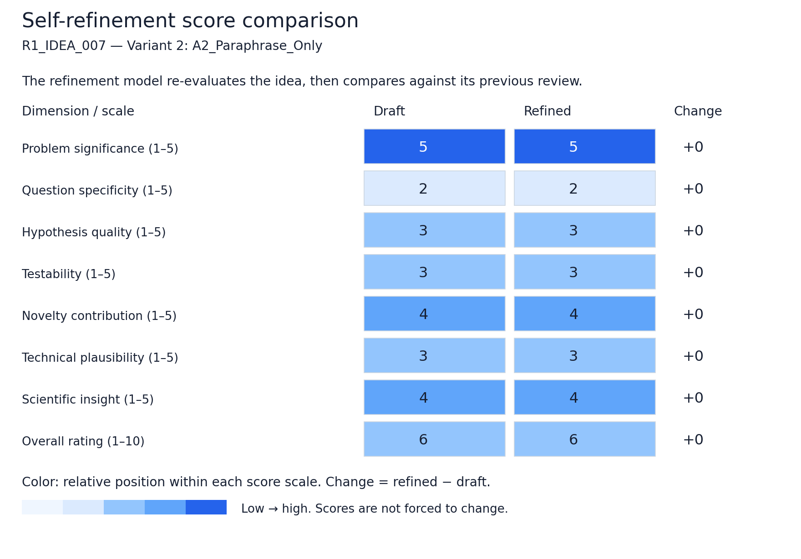

Changed score dimensions: none.

### Score justifications (draft / refined)

**Problem significance**

```json
{
  "draft": {
    "score": 5.0,
    "justification": "The tension between accuracy and interpretability is one of the most critical challenges in deploying ML in high-stakes domains (healthcare, finance, law). Solving this would have massive practical and scientific impact."
  },
  "refined": {
    "score": 5.0,
    "justification": "The tension between accuracy and interpretability is a critical bottleneck for deploying ML in high-stakes domains (healthcare, finance, law). A solution would have profound practical and scientific impact."
  }
}
```

**Question specificity**

```json
{
  "draft": {
    "score": 2.0,
    "justification": "While the goal is clear, the 'how' is missing. The idea states *what* it wants to achieve (a faithful nonlinear model) but does not specify the research question regarding the mechanism or the specific constraints that enable this."
  },
  "refined": {
    "score": 2.0,
    "justification": "While the objective is clear, the research question is underspecified. It states 'what' is desired (a faithful nonlinear model) but not 'how' it is achieved. The lack of a defined mechanism makes the specific research question vague."
  }
}
```

**Hypothesis quality**

```json
{
  "draft": {
    "score": 3.0,
    "justification": "The implicit hypothesis is that 'faithful nonlinear models can match DNN accuracy.' This is a strong, falsifiable claim, but it is currently presented as a broad assertion without a nuanced mechanism or boundary condition."
  },
  "refined": {
    "score": 3.0,
    "justification": "The implicit hypothesis ('faithful nonlinear models can match DNN accuracy') is strong and falsifiable. However, it is currently a broad assertion without the necessary nuance regarding boundary conditions or the specific mechanism enabling it."
  }
}
```

**Testability**

```json
{
  "draft": {
    "score": 3.0,
    "justification": "The idea is testable in principle (compare accuracy and interpretability metrics), but the lack of a defined model structure makes the specific experimental protocol undefined. It requires a concrete proposal of the model class to be fully testable."
  },
  "refined": {
    "score": 3.0,
    "justification": "The idea is testable in principle (compare accuracy and interpretability metrics), but the lack of a defined model structure makes the specific experimental protocol undefined. It requires a concrete proposal of the model class to be fully testable."
  }
}
```

**Novelty contribution**

```json
{
  "draft": {
    "score": 4.0,
    "justification": "While 'interpretable nonlinear models' (like GAMs) exist, the specific claim of matching DNN accuracy 'by construction' without post-hoc approximation is a novel and ambitious direction. If successful, it would be a significant contribution."
  },
  "refined": {
    "score": 4.0,
    "justification": "While interpretable nonlinear models (like GAMs) exist, the specific claim of matching DNN accuracy 'by construction' without post-hoc approximation is a novel and ambitious direction. If successful, it would be a significant contribution."
  }
}
```

**Technical plausibility**

```json
{
  "draft": {
    "score": 3.0,
    "justification": "The idea is logically coherent but technically ambitious. It is plausible that for certain data distributions or function classes, such models exist, but the claim of matching general DNN performance is a high bar that requires strong theoretical backing or a very clever architectural innovation."
  },
  "refined": {
    "score": 3.0,
    "justification": "The idea is logically coherent but technically ambitious. It is plausible that for certain data distributions or function classes, such models exist, but the claim of matching general DNN performance is a high bar that requires strong theoretical backing or a very clever architectural innovation."
  }
}
```

**Scientific insight**

```json
{
  "draft": {
    "score": 4.0,
    "justification": "Investigating this could reveal fundamental limits of interpretability, the nature of 'easy' vs. 'hard' nonlinearities, and whether the complexity of DNNs is necessary for all tasks or just specific ones."
  },
  "refined": {
    "score": 4.0,
    "justification": "Investigating this could reveal fundamental limits of interpretability, the nature of 'easy' vs. 'hard' nonlinearities, and whether the complexity of DNNs is necessary for all tasks or just specific ones."
  }
}
```

**Overall rating**

```json
{
  "draft": {
    "score": 6.0,
    "justification": "This is a strong research direction with high significance and potential impact. However, as currently described, it is too vague to be considered a 'strong' (7-8) idea because it lacks the specific mechanism or hypothesis refinement needed to guide the research. It sits at the border of moderate/strong due to the boldness of the claim versus the lack of technical detail."
  },
  "refined": {
    "score": 6.0,
    "justification": "This is a strong research direction with high significance and potential impact. However, as currently described, it is too vague to be considered a 'strong' (7-8) idea because it lacks the specific mechanism or hypothesis refinement needed to guide the research. It sits at the border of moderate/strong due to the boldness of the claim versus the lack of technical detail."
  }
}
```

## R1_IDEA_007 — Variant 3: A3_Plain_Core

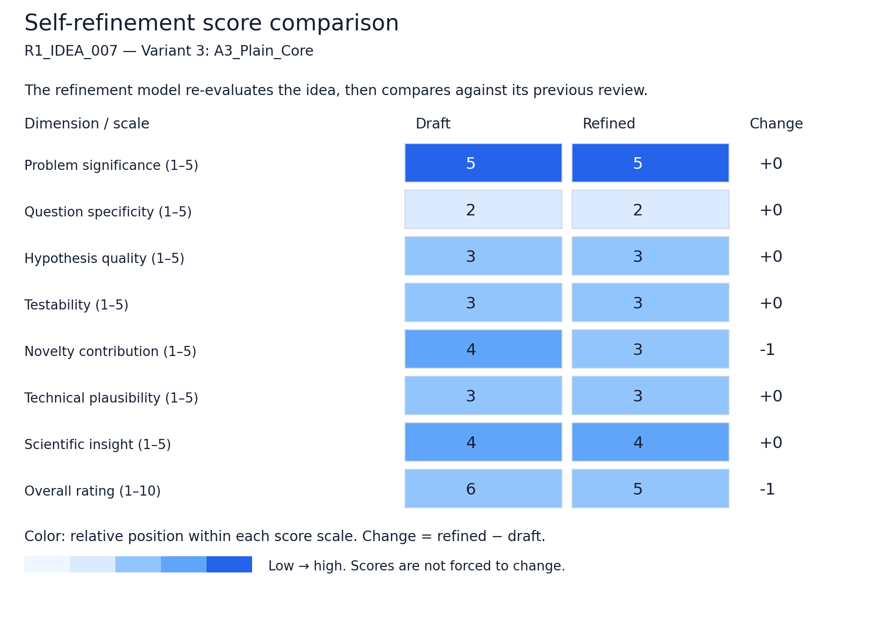

Changed score dimensions: novelty_contribution, overall_rating.

### Score justifications (draft / refined)

**Problem significance**

```json
{
  "draft": {
    "score": 5.0,
    "justification": "The accuracy-interpretability trade-off is one of the most critical challenges in deploying machine learning in high-stakes domains (healthcare, finance, law). Solving this or making significant progress toward it is of exceptional importance to the field."
  },
  "refined": {
    "score": 5.0,
    "justification": "The accuracy-interpretability trade-off is a critical barrier to deploying ML in high-stakes domains (healthcare, finance, criminal justice). A solution that effectively bridges this gap is of exceptional importance to the field."
  }
}
```

**Question specificity**

```json
{
  "draft": {
    "score": 2.0,
    "justification": "While the goal is clear, the research question is currently too vague. It states 'what' (a model that does X) but not 'how' or 'under what specific conditions'. The core mechanism is undefined."
  },
  "refined": {
    "score": 2.0,
    "justification": "The research question is currently too broad. It asks 'can we build a nonlinear interpretable model?' but does not specify 'how' or 'under what specific constraints'. The lack of a defined mechanism makes the question vague."
  }
}
```

**Hypothesis quality**

```json
{
  "draft": {
    "score": 3.0,
    "justification": "The implicit hypothesis is that 'inherently interpretable nonlinear models can approach the accuracy of DNNs.' This is a plausible and testable hypothesis, but it is stated as a general goal rather than a specific, falsifiable prediction about a mechanism."
  },
  "refined": {
    "score": 3.0,
    "justification": "The implicit hypothesis—that inherent interpretability can coexist with high accuracy via nonlinearity—is plausible and testable. However, it is stated as a general goal rather than a specific, falsifiable prediction about a mechanism or boundary condition."
  }
}
```

**Testability**

```json
{
  "draft": {
    "score": 3.0,
    "justification": "The idea is testable in principle (compare accuracy and interpretability metrics against baselines), but the lack of a defined model structure makes it impossible to design a concrete experiment at this stage. The 'interpretability' metric also needs definition."
  },
  "refined": {
    "score": 3.0,
    "justification": "The idea is theoretically testable (compare accuracy and interpretability metrics against baselines), but the lack of a defined model structure prevents the design of a concrete experiment at this stage. The 'interpretability' metric also needs operational definition."
  }
}
```

**Novelty contribution**

```json
{
  "draft": {
    "score": 4.0,
    "justification": "While the general goal is not new, proposing a specific framework that successfully bridges this gap with a novel mechanism would be a significant contribution. The idea has high potential for novelty if the mechanism is distinct from existing GAMs or sparse models."
  },
  "refined": {
    "score": 3.0,
    "justification": "While the goal is significant, the concept of 'interpretable nonlinear models' is not new (e.g., GAMs, MARS, Neural Additive Models). The novelty depends entirely on the specific mechanism of NIMO, which is not described. Without a distinct mechanism, it risks being a rebranding of existing work."
  }
}
```

**Technical plausibility**

```json
{
  "draft": {
    "score": 3.0,
    "justification": "The direction is technically plausible (e.g., extensions of GAMs, neural additive models), but the claim that it can match DNN accuracy while remaining interpretable is a strong claim that requires a very specific and clever mechanism to be plausible."
  },
  "refined": {
    "score": 3.0,
    "justification": "The direction is technically plausible as a research goal (extensions of GAMs exist), but the claim that it can match DNN accuracy is a strong claim. Without a specific mechanism explaining how this is achieved, the plausibility remains speculative."
  }
}
```

**Scientific insight**

```json
{
  "draft": {
    "score": 4.0,
    "justification": "If successful, this research would provide deep insights into the nature of the accuracy-interpretability trade-off, potentially revealing that the trade-off is not as severe as currently believed for certain classes of problems."
  },
  "refined": {
    "score": 4.0,
    "justification": "If successful, this research would provide deep insights into the nature of the accuracy-interpretability trade-off, potentially revealing that the trade-off is not as severe as currently believed for certain classes of problems. However, the current description is too vague to guarantee this insight."
  }
}
```

**Overall rating**

```json
{
  "draft": {
    "score": 6.0,
    "justification": "This is a moderate/borderline idea. The problem is highly significant (5/5), and the potential insight is high (4/5). However, the current description is too abstract to be considered a strong research proposal. It lacks the specificity of the proposed method and the hypothesis required to evaluate its feasibility. It is a promising direction but currently reads more like a vision statement than a concrete research plan."
  },
  "refined": {
    "score": 5.0,
    "justification": "This is a moderate/borderline idea. The problem is highly significant (5/5), and the potential insight is high (4/5). However, the current description is too abstract to be considered a strong research proposal. It lacks the specificity of the proposed method and the hypothesis required to evaluate its feasibility. It reads more like a vision statement than a concrete research plan. The lack of distinction from existing work (GAMs, etc.) further lowers the novelty score."
  }
}
```

## R1_IDEA_007 — Variant 4: B1_Verbose_Elaborate

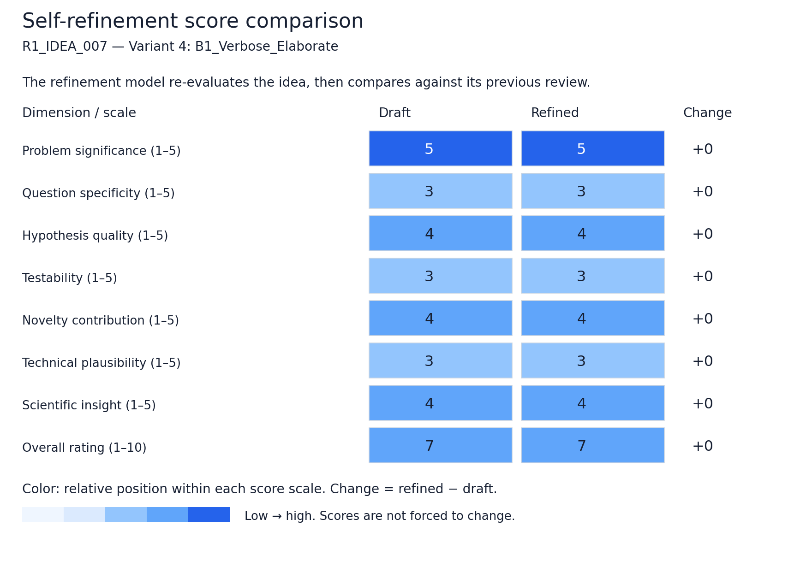

Changed score dimensions: none.

### Score justifications (draft / refined)

**Problem significance**

```json
{
  "draft": {
    "score": 5.0,
    "justification": "The tension between accuracy and interpretability is one of the most critical challenges in applied machine learning, particularly in high-stakes domains like healthcare and finance. Addressing this directly is of exceptional significance."
  },
  "refined": {
    "score": 5.0,
    "justification": "The accuracy-interpretability trade-off is a foundational challenge in machine learning, particularly for high-stakes domains. Solving this or demonstrating a viable path to do so is of exceptional scientific and practical significance."
  }
}
```

**Question specificity**

```json
{
  "draft": {
    "score": 3.0,
    "justification": "While the goal is clear, the research question is currently too broad. It states *what* is being achieved (a model that is both accurate and interpretable) but not *how* or *under what specific conditions* this is theoretically possible. The mechanism is missing."
  },
  "refined": {
    "score": 3.0,
    "justification": "The research question is clear in its goal (build a faithful nonlinear model) but vague in its scope. It does not specify the class of nonlinearities, the constraints, or the specific conditions under which the hypothesis holds, making the 'how' entirely open."
  }
}
```

**Hypothesis quality**

```json
{
  "draft": {
    "score": 4.0,
    "justification": "The hypothesis that a built-in nonlinear model can close the gap between linear and deep models is concrete and falsifiable. It makes a clear prediction about performance and fidelity."
  },
  "refined": {
    "score": 4.0,
    "justification": "The hypothesis is strong and falsifiable: it predicts that a specific architectural approach can achieve high fidelity without sacrificing interpretability. It distinguishes itself from existing post-hoc methods by claiming built-in guarantees."
  }
}
```

**Testability**

```json
{
  "draft": {
    "score": 3.0,
    "justification": "The idea is testable in principle (compare performance and interpretability metrics), but the lack of a defined method makes the experimental design currently impossible to specify. It relies on the future definition of the model."
  },
  "refined": {
    "score": 3.0,
    "justification": "While the outcome is testable (compare accuracy and interpretability metrics), the current lack of a defined method prevents the design of a concrete experiment. The testability is conditional on the future definition of the model's architecture."
  }
}
```

**Novelty contribution**

```json
{
  "draft": {
    "score": 4.0,
    "justification": "While the goal is not new, the specific proposal of a 'NIMO' framework that guarantees faithful nonlinear effects without post-hoc steps suggests a novel architectural approach. If successful, it would be a significant contribution."
  },
  "refined": {
    "score": 4.0,
    "justification": "The concept of 'built-in' faithful nonlinearity is not entirely new (e.g., GAMs, EBMs exist), but framing it as a specific 'NIMO' framework that claims to close the gap with deep learning suggests a potential novel synthesis or architectural innovation. If the mechanism is distinct, the contribution could be significant."
  }
}
```

**Technical plausibility**

```json
{
  "draft": {
    "score": 3.0,
    "justification": "The reasoning is logically coherent (built-in > post-hoc for fidelity), but the technical feasibility is unknown without the mathematical formulation. It is plausible that such a model exists, but the path to it is not described."
  },
  "refined": {
    "score": 3.0,
    "justification": "The logic that built-in interpretability ensures fidelity is sound. However, the plausibility of 'closing the gap' with deep learning is highly dependent on the specific implementation details which are missing. It is theoretically possible but unproven in this context."
  }
}
```

**Scientific insight**

```json
{
  "draft": {
    "score": 4.0,
    "justification": "If successful, this research would reveal the theoretical limits of interpretable models and potentially establish a new class of models that are both high-performing and transparent, offering deep insights into the nature of the accuracy-interpretability trade-off."
  },
  "refined": {
    "score": 4.0,
    "justification": "Investigating this idea could reveal the theoretical boundaries of interpretable models. If successful, it would provide a new paradigm for model design; if it fails, it would rigorously define the limits of the accuracy-interpretability frontier."
  }
}
```

**Overall rating**

```json
{
  "draft": {
    "score": 7.0,
    "justification": "This is a strong research idea with high significance and a clear, valuable hypothesis. However, it currently lacks the technical specificity required to be considered a complete research proposal. It sits at the 'Strong' level because the core motivation and potential impact are excellent, but the 'how' is missing, preventing a higher score on specificity and plausibility."
  },
  "refined": {
    "score": 7.0,
    "justification": "This is a strong research idea with high significance and a clear, compelling motivation. It addresses a major gap in the field. However, it currently lacks the technical specificity required to be a complete proposal. The 'how' is missing, which prevents a higher score on specificity and plausibility. It is a 'Strong' idea that requires significant elaboration to become 'Exceptional'."
  }
}
```

## R1_IDEA_007 — Variant 5: B2_Grand_Narrative


Changed score dimensions: none.

### Score justifications (draft / refined)

**Problem significance**

```json
{
  "draft": {
    "score": 5.0,
    "justification": "The accuracy-interpretability trade-off is one of the most significant open problems in trustworthy AI. Solving this would have profound implications for scientific discovery, healthcare, and policy-making where model opacity is a barrier to adoption."
  },
  "refined": {
    "score": 5.0,
    "justification": "The accuracy-interpretability trade-off is a foundational challenge in trustworthy AI. Solving this would have profound implications for scientific discovery, healthcare, and policy-making where model opacity is a barrier to adoption. The problem is undeniably significant."
  }
}
```

**Question specificity**

```json
{
  "draft": {
    "score": 2.0,
    "justification": "While the goal is clear, the specific research question is vague. It states *what* is desired (a model with built-in faithful nonlinearity) but not *how* it will be achieved or what specific mechanism is being investigated. It reads more as a project title than a specific hypothesis."
  },
  "refined": {
    "score": 2.0,
    "justification": "While the goal is clear, the specific research question is vague. It states *what* is desired (a model with built-in faithful nonlinearity) but not *how* it will be achieved or what specific mechanism is being investigated. It reads more as a project title than a specific hypothesis."
  }
}
```

**Hypothesis quality**

```json
{
  "draft": {
    "score": 2.0,
    "justification": "The idea implies a hypothesis that such a model is possible, but it does not articulate a testable prediction about the relationship between model structure and performance/interpretability. It lacks a 'if X, then Y' structure that could be falsified."
  },
  "refined": {
    "score": 2.0,
    "justification": "The idea implies a hypothesis that such a model is possible, but it does not articulate a testable prediction about the relationship between model structure and performance/interpretability. It lacks a 'if X, then Y' structure that could be falsified."
  }
}
```

**Testability**

```json
{
  "draft": {
    "score": 3.0,
    "justification": "The idea is testable in principle (one can build a model and measure accuracy vs. interpretability), but the summary does not suggest specific experiments, ablations, or metrics. Without a defined method, the testability is currently theoretical."
  },
  "refined": {
    "score": 3.0,
    "justification": "The idea is testable in principle (one can build a model and measure accuracy vs. interpretability), but the summary does not suggest specific experiments, ablations, or metrics. Without a defined method, the testability is currently theoretical."
  }
}
```

**Novelty contribution**

```json
{
  "draft": {
    "score": 4.0,
    "justification": "The direction is novel in its ambition to close the gap with DNNs using built-in interpretability. While Generalized Additive Models (GAMs) exist, the specific claim of reconciling this with deep network-level accuracy without post-hoc methods is a high-value, potentially novel contribution if a mechanism is found."
  },
  "refined": {
    "score": 4.0,
    "justification": "The direction is novel in its ambition to close the gap with DNNs using built-in interpretability. While Generalized Additive Models (GAMs) exist, the specific claim of reconciling this with deep network-level accuracy without post-hoc methods is a high-value, potentially novel contribution if a mechanism is found."
  }
}
```

**Technical plausibility**

```json
{
  "draft": {
    "score": 3.0,
    "justification": "The concept is technically plausible (e.g., research in Interpretable Deep Learning, Neural Additive Models exists), but the summary does not provide enough technical detail to assess if the proposed mechanism is feasible. It assumes the trade-off is bridgeable, which is a strong assumption."
  },
  "refined": {
    "score": 3.0,
    "justification": "The concept is technically plausible (e.g., research in Interpretable Deep Learning, Neural Additive Models exists), but the summary does not provide enough technical detail to assess if the proposed mechanism is feasible. It assumes the trade-off is bridgeable, which is a strong assumption."
  }
}
```

**Scientific insight**

```json
{
  "draft": {
    "score": 4.0,
    "justification": "If successful, this research would reveal fundamental principles about the relationship between model complexity, nonlinearity, and human interpretability. It could lead to new architectural paradigms for scientific machine learning."
  },
  "refined": {
    "score": 4.0,
    "justification": "If successful, this research would reveal fundamental principles about the relationship between model complexity, nonlinearity, and human interpretability. It could lead to new architectural paradigms for scientific machine learning."
  }
}
```

**Overall rating**

```json
{
  "draft": {
    "score": 6.0,
    "justification": "This is a strong, high-impact research direction with exceptional problem significance. However, as a research *idea* in its current form, it is too vague to be considered 'strong' or 'exceptional' because it lacks a specific hypothesis or methodological proposal. It is a 'moderate' idea because it identifies a great problem but hasn't yet defined the path to the solution."
  },
  "refined": {
    "score": 6.0,
    "justification": "This is a strong, high-impact research direction with exceptional problem significance. However, as a research *idea* in its current form, it is too vague to be considered 'strong' or 'exceptional' because it lacks a specific hypothesis or methodological proposal. It is a 'moderate' idea because it identifies a great problem but hasn't yet defined the path to the solution."
  }
}
```

## R1_IDEA_007 — Variant 6: B3_Over_Confident

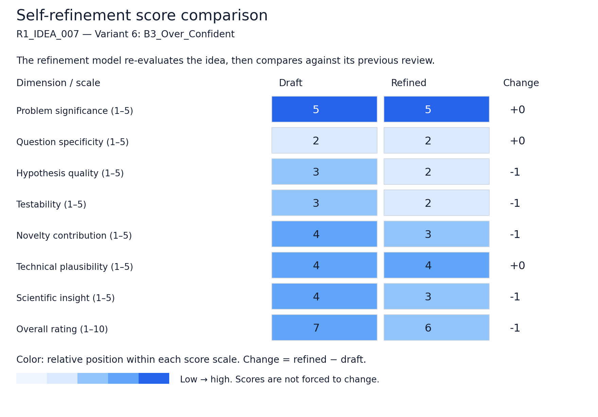

Changed score dimensions: hypothesis_quality, testability, novelty_contribution, scientific_insight, overall_rating.

### Score justifications (draft / refined)

**Problem significance**

```json
{
  "draft": {
    "score": 5.0,
    "justification": "The accuracy-interpretability trade-off is one of the most critical challenges in deploying machine learning in high-stakes domains (healthcare, finance, law). Solving this would have profound practical and scientific impact."
  },
  "refined": {
    "score": 5.0,
    "justification": "The accuracy-interpretability trade-off is a central challenge in trustworthy AI, particularly for high-stakes domains like healthcare and finance. Solving this would have profound practical and scientific impact."
  }
}
```

**Question specificity**

```json
{
  "draft": {
    "score": 2.0,
    "justification": "While the goal is clear, the idea currently lacks a specific research question. It states *what* it wants to achieve (reconcile the trade-off) but not *how* it proposes to do it or what specific mechanism is being investigated."
  },
  "refined": {
    "score": 2.0,
    "justification": "The idea states the goal (reconcile the trade-off) but fails to specify the research question. It does not define the mechanism, the specific model class, or the variables being manipulated. It is a vision statement rather than a specific inquiry."
  }
}
```

**Hypothesis quality**

```json
{
  "draft": {
    "score": 3.0,
    "justification": "The implicit hypothesis is that 'built-in nonlinearity yields faithful explanations with high accuracy.' This is a plausible hypothesis, but it is not yet specific enough to be rigorously tested without further definition of the model class."
  },
  "refined": {
    "score": 2.0,
    "justification": "The implicit hypothesis ('built-in nonlinearity yields faithful explanations') is plausible but too broad to be tested. It lacks the specificity to distinguish between a successful implementation and a failure, and it does not define the conditions of success."
  }
}
```

**Testability**

```json
{
  "draft": {
    "score": 3.0,
    "justification": "The idea is testable in principle (compare accuracy and fidelity against baselines), but the summary does not specify the metrics for 'faithfulness' or the baseline models to be used, making the immediate testability moderate."
  },
  "refined": {
    "score": 2.0,
    "justification": "While the general direction is testable, the summary provides no metrics for 'faithfulness' or 'interpretability,' nor does it define the baseline models for comparison. Without these, the idea cannot be immediately operationalized into an experiment."
  }
}
```

**Novelty contribution**

```json
{
  "draft": {
    "score": 4.0,
    "justification": "The concept of building interpretability into the model structure is a known direction, but the specific claim of a new framework (NIMO) that successfully bridges the gap suggests a potentially novel contribution if the mechanism is distinct from existing work."
  },
  "refined": {
    "score": 3.0,
    "justification": "The concept of 'interpretable deep learning' or 'structured nonlinearity' is an active area of research. Without a specific definition of NIMO's mechanism, it is unclear if this is a novel contribution or a rebranding of existing methods like GAMs or specific attention mechanisms."
  }
}
```

**Technical plausibility**

```json
{
  "draft": {
    "score": 4.0,
    "justification": "The reasoning is logically coherent. There is no inherent contradiction in trying to build nonlinearity into interpretable models; the challenge is in the implementation, which is not yet described but is not impossible."
  },
  "refined": {
    "score": 4.0,
    "justification": "The reasoning is logically coherent: building structure into the model should theoretically improve faithfulness. There is no inherent contradiction in the goal, though the implementation details are missing."
  }
}
```

**Scientific insight**

```json
{
  "draft": {
    "score": 4.0,
    "justification": "If successful, this research would provide significant insight into the relationship between model architecture, nonlinearity, and interpretability, potentially establishing new design principles for trustworthy AI."
  },
  "refined": {
    "score": 3.0,
    "justification": "If successful, the research could reveal new principles for model design. However, as currently stated, it risks being a simple application of existing concepts without revealing new mechanisms or boundary conditions."
  }
}
```

**Overall rating**

```json
{
  "draft": {
    "score": 7.0,
    "justification": "This is a strong research idea with high significance and a clear motivation. However, it currently reads more as a vision statement than a specific research proposal. The lack of methodological detail and specific hypotheses prevents it from being an 'exceptional' (9-10) rating at this stage, but it is well above average due to the importance of the problem."
  },
  "refined": {
    "score": 6.0,
    "justification": "The idea addresses a highly significant problem and proposes a logically sound direction. However, it currently lacks the specificity required for a strong research proposal. It is a 'moderate' idea because it is a clear vision but an undefined research question. It is not 'weak' because the motivation is strong, but it is not 'strong' because the mechanism and hypothesis are missing."
  }
}
```

## R1_IDEA_007 — Variant 7: B4_Novelty

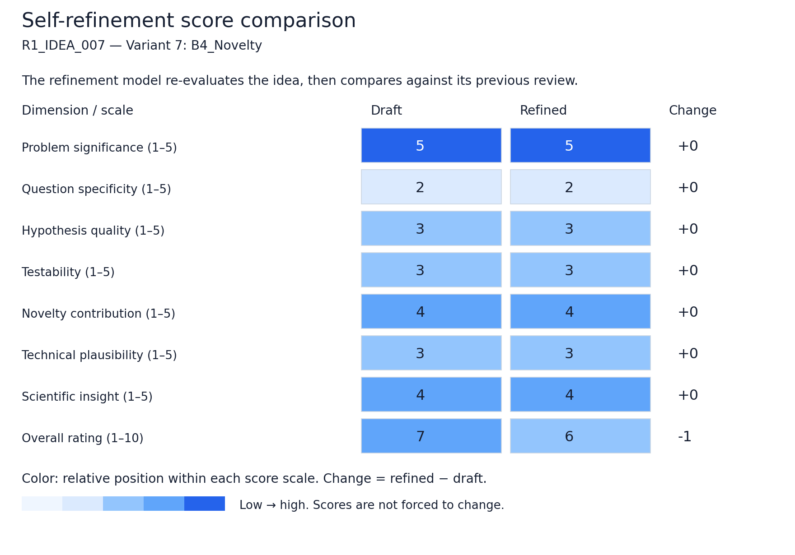

Changed score dimensions: overall_rating.

### Score justifications (draft / refined)

**Problem significance**

```json
{
  "draft": {
    "score": 5.0,
    "justification": "The accuracy-interpretability trade-off is one of the most critical challenges in deploying machine learning in high-stakes domains (healthcare, finance, law). A method that genuinely offers faithful nonlinearity without sacrificing interpretability would be a major scientific and practical breakthrough."
  },
  "refined": {
    "score": 5.0,
    "justification": "The accuracy-interpretability trade-off is a primary barrier to deploying ML in critical domains like healthcare and finance. Solving this would have profound practical and scientific implications."
  }
}
```

**Question specificity**

```json
{
  "draft": {
    "score": 2.0,
    "justification": "While the goal is clear, the idea is currently a 'direction' rather than a specific research question. It lacks details on the 'how'—the specific mechanism, architecture, or mathematical constraints that define the model. It reads more like a vision statement than a testable hypothesis."
  },
  "refined": {
    "score": 2.0,
    "justification": "The idea is currently a 'vision' rather than a specific research question. It states a goal ('close the gap') but fails to define the 'how' (the mechanism). Without a defined model class or mathematical constraint, the research question is too vague to be actionable."
  }
}
```

**Hypothesis quality**

```json
{
  "draft": {
    "score": 3.0,
    "justification": "The implicit hypothesis is that 'inherently interpretable nonlinear models can match the accuracy of deep neural networks.' This is a bold and plausible hypothesis, but it is currently too broad. It needs to be narrowed to specific conditions (e.g., 'for tabular data with limited samples') to be scientifically rigorous."
  },
  "refined": {
    "score": 3.0,
    "justification": "The hypothesis that 'inherently interpretable nonlinear models can match DNN accuracy' is bold and falsifiable. However, it is currently too broad. It lacks boundary conditions (e.g., 'for tabular data with <1000 features') which makes it difficult to assess plausibility without more context."
  }
}
```

**Testability**

```json
{
  "draft": {
    "score": 3.0,
    "justification": "The idea is testable in principle (compare accuracy and interpretability metrics against baselines), but the lack of a defined model structure makes it impossible to design a specific experiment at this stage. The evaluation metrics for 'faithfulness' and 'interpretability' also need definition."
  },
  "refined": {
    "score": 3.0,
    "justification": "The idea is testable in principle (compare accuracy and interpretability metrics), but the lack of a defined model structure makes it impossible to design a specific experiment. One cannot test a 'framework' that has not been defined."
  }
}
```

**Novelty contribution**

```json
{
  "draft": {
    "score": 4.0,
    "justification": "The framing of moving beyond post-hoc methods to built-in faithful nonlinearity is a strong conceptual contribution. While individual components (interpretable nonlinearity) exist, the specific synthesis into a framework that claims to close the gap with DNNs is novel and potentially high-impact if realized."
  },
  "refined": {
    "score": 4.0,
    "justification": "The framing of moving beyond post-hoc methods to built-in faithful nonlinearity is a strong conceptual contribution. While the components exist, the claim of a unified framework that closes the gap with DNNs is novel and potentially high-impact if realized."
  }
}
```

**Technical plausibility**

```json
{
  "draft": {
    "score": 3.0,
    "justification": "The reasoning is logically coherent: post-hoc methods fail on fidelity, so intrinsic methods are needed. However, the plausibility of 'closing the gap' with deep learning is debatable without a specific mechanism. Deep learning's strength lies in its massive capacity to approximate complex functions; constraining this to be interpretable usually reduces capacity. The idea is plausible but requires a very clever mechanism to succeed."
  },
  "refined": {
    "score": 3.0,
    "justification": "The reasoning is logically coherent (post-hoc is flawed, so intrinsic is needed). However, the plausibility of 'closing the gap' with deep learning is highly debatable without a specific mechanism. Deep learning's strength is its massive capacity; constraining this for interpretability usually reduces capacity. The idea is plausible only if a very clever mechanism is proposed."
  }
}
```

**Scientific insight**

```json
{
  "draft": {
    "score": 4.0,
    "justification": "If successful, this research would reveal fundamental limits and possibilities of the relationship between model complexity, nonlinearity, and interpretability. It could lead to new principles for designing models that are both powerful and transparent, offering insights beyond just a new algorithm."
  },
  "refined": {
    "score": 4.0,
    "justification": "If successful, this research would reveal fundamental limits and possibilities of the relationship between model complexity, nonlinearity, and interpretability. It could lead to new principles for model design."
  }
}
```

**Overall rating**

```json
{
  "draft": {
    "score": 7.0,
    "justification": "This is a strong research idea with exceptional problem significance and a compelling high-level hypothesis. However, it currently lacks the specificity required to be a complete research proposal. It is a 'vision' that needs to be translated into a concrete mathematical framework and specific research questions to be fully evaluated. It sits in the 'Strong' category because the potential impact is high, but the path to execution is currently undefined."
  },
  "refined": {
    "score": 6.0,
    "justification": "This is a moderate research idea. The problem significance is exceptional (5/5), and the high-level hypothesis is compelling. However, the lack of specificity (2/5) and the undefined mechanism significantly lower the overall quality. It is currently a 'vision statement' rather than a concrete research proposal. It sits in the 'Moderate' category because while the potential is high, the path to execution is undefined, and the claim of closing the gap with DNNs is a massive leap that requires a specific, plausible mechanism to be credible."
  }
}
```

## R1_IDEA_007 — Variant 8: B5_Application_Impact


Changed score dimensions: none.

### Score justifications (draft / refined)

**Problem significance**

```json
{
  "draft": {
    "score": 5.0,
    "justification": "The accuracy-interpretability trade-off is one of the most critical challenges in deploying ML in sensitive domains (healthcare, finance, law). Solving this would have profound practical and scientific impact."
  },
  "refined": {
    "score": 5.0,
    "justification": "The accuracy-interpretability trade-off is a primary barrier to deploying ML in regulated and high-stakes sectors. Solving this is of paramount importance to the field."
  }
}
```

**Question specificity**

```json
{
  "draft": {
    "score": 2.0,
    "justification": "While the goal is clear, the idea does not specify the 'how'. It describes a desired outcome (a model that is both accurate and interpretable) but lacks the specific research question regarding the mechanism to achieve this."
  },
  "refined": {
    "score": 2.0,
    "justification": "The idea states a goal ('close the gap') but fails to define the research question. It does not specify *what* mechanism is being investigated, making the question too broad to be scientifically rigorous at this stage."
  }
}
```

**Hypothesis quality**

```json
{
  "draft": {
    "score": 3.0,
    "justification": "The implicit hypothesis is that a specific class of models can achieve DNN-level accuracy while retaining linear-model interpretability. This is a bold and testable hypothesis, but it is currently stated as a general goal rather than a specific, falsifiable claim about a mechanism."
  },
  "refined": {
    "score": 3.0,
    "justification": "The implicit hypothesis (that a built-in interpretable model can match DNN accuracy) is bold and testable in principle. However, it is currently stated as a general aspiration rather than a specific, mechanistic prediction that distinguishes it from existing attempts (like GAMs or attention-based models)."
  }
}
```

**Testability**

```json
{
  "draft": {
    "score": 3.0,
    "justification": "The idea is testable in principle (compare accuracy vs. interpretability metrics), but without a defined model architecture or algorithm, the specific experimental design is undefined. It relies on the future definition of the method."
  },
  "refined": {
    "score": 3.0,
    "justification": "The idea is testable in the sense that one could eventually build a model and measure it. However, without a defined method, the specific experimental protocol, baselines, and metrics are undefined, rendering the current idea untestable in its present form."
  }
}
```

**Novelty contribution**

```json
{
  "draft": {
    "score": 4.0,
    "justification": "While the goal is not new, proposing a specific framework (NIMO) that claims to bridge this gap with 'built-in' fidelity is a novel direction. If successful, it would represent a significant contribution to the field of interpretable ML."
  },
  "refined": {
    "score": 4.0,
    "justification": "While the *goal* is not new, proposing a specific framework (NIMO) that claims to solve this via 'built-in' fidelity is a novel direction. If the mechanism is distinct from existing methods (like GAMs or LIME), the contribution could be significant."
  }
}
```

**Technical plausibility**

```json
{
  "draft": {
    "score": 3.0,
    "justification": "The reasoning is logically coherent (post-hoc is flawed, so build in interpretability), but the technical plausibility of matching DNN performance with inherently interpretable models is an open research question. It is plausible but not guaranteed."
  },
  "refined": {
    "score": 3.0,
    "justification": "The reasoning is logically coherent (post-hoc is flawed -> build it in). However, the technical plausibility of matching DNN performance with inherently interpretable models is highly debatable and depends entirely on the unknown mechanism. It is plausible but faces significant theoretical hurdles."
  }
}
```

**Scientific insight**

```json
{
  "draft": {
    "score": 4.0,
    "justification": "If successful, this research would reveal new principles about how to structure models to balance complexity and transparency, potentially leading to a new class of models that are both powerful and understandable."
  },
  "refined": {
    "score": 4.0,
    "justification": "If the research succeeds, it would provide profound insight into the relationship between model capacity and interpretability, potentially revealing a new class of models that were previously thought impossible."
  }
}
```

**Overall rating**

```json
{
  "draft": {
    "score": 6.0,
    "justification": "This is a strong, high-impact research direction with a clear motivation. However, as a research idea summary, it lacks the necessary technical specificity to be fully evaluated. It sits in the 'moderate/borderline' to 'strong' range because the potential is exceptional, but the current definition is too vague to assess the feasibility of the proposed mechanism."
  },
  "refined": {
    "score": 6.0,
    "justification": "This is a high-potential research direction with a significant problem statement, but as a research idea, it is currently too vague. It lacks the specific mechanism or hypothesis required to be evaluated as a 'strong' scientific proposal. It sits in the moderate range because the 'what' is clear, but the 'how' is missing, making the feasibility and novelty uncertain."
  }
}
```

## R1_IDEA_007 — Variant 9: C1_Hollow_Shell

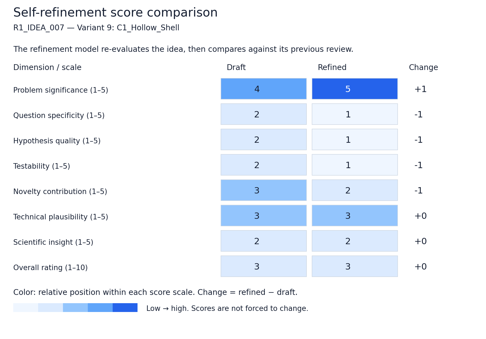

Changed score dimensions: problem_significance, question_specificity, hypothesis_quality, testability, novelty_contribution.

### Score justifications (draft / refined)

**Problem significance**

```json
{
  "draft": {
    "score": 4.0,
    "justification": "The problem of balancing performance and interpretability is critical for deploying ML in high-stakes domains. Addressing this trade-off is of high scientific and practical significance."
  },
  "refined": {
    "score": 5.0,
    "justification": "The tension between performance and interpretability is one of the most significant challenges in modern AI, particularly for safety-critical applications. Solving this would have profound scientific and practical impact."
  }
}
```

**Question specificity**

```json
{
  "draft": {
    "score": 2.0,
    "justification": "The idea is currently a high-level vision rather than a specific research question. It lacks the necessary details to define the scope of the investigation or the specific variables being manipulated."
  },
  "refined": {
    "score": 1.0,
    "justification": "The idea is currently a high-level vision or mission statement. It fails to define a specific research question, variable, or mechanism. It describes 'what' is desired but not 'how' it will be investigated."
  }
}
```

**Hypothesis quality**

```json
{
  "draft": {
    "score": 2.0,
    "justification": "There is no explicit hypothesis. The statement implies that such a framework exists and is better, but it does not predict a specific relationship or mechanism that could be proven false."
  },
  "refined": {
    "score": 1.0,
    "justification": "There is no explicit hypothesis. The text asserts a goal ('addresses the trade-off') rather than making a conditional prediction (e.g., 'If we do X, then Y will happen'). It is not currently falsifiable."
  }
}
```

**Testability**

```json
{
  "draft": {
    "score": 2.0,
    "justification": "Without a defined method, there is no clear path to an experiment, comparison, or analysis. The claim is currently too abstract to be falsified."
  },
  "refined": {
    "score": 1.0,
    "justification": "Without a defined method, there is no path to an experiment. One cannot measure 'reliability' or 'performance' of a framework that has not been specified. The idea is currently untestable."
  }
}
```

**Novelty contribution**

```json
{
  "draft": {
    "score": 3.0,
    "justification": "While the goal is novel in its ambition, the concept of 'integrated interpretability' is not new. The potential contribution depends entirely on the specific mechanism, which is currently undefined. It risks being a re-packaging of existing ideas without a clear differentiator."
  },
  "refined": {
    "score": 2.0,
    "justification": "While the goal is ambitious, the concept of 'integrated interpretability' is not new. Without a specific mechanism, the novelty is indistinguishable from a generic application of existing interpretable techniques. The potential contribution is speculative."
  }
}
```

**Technical plausibility**

```json
{
  "draft": {
    "score": 3.0,
    "justification": "The direction is logically coherent (intrinsic interpretability is generally preferred), but the plausibility of achieving high performance with high interpretability without specific technical details is unknown. It is plausible but unproven."
  },
  "refined": {
    "score": 3.0,
    "justification": "The direction is logically coherent (intrinsic interpretability is theoretically possible), but the claim that it can overcome the fundamental trade-off without details is speculative. It is plausible that such a method exists, but the idea does not provide enough information to assess the plausibility of the specific approach."
  }
}
```

**Scientific insight**

```json
{
  "draft": {
    "score": 2.0,
    "justification": "As stated, the idea does not promise deep scientific insight beyond 'we built a better model.' It needs to specify what new principles about the relationship between model structure and interpretability will be discovered."
  },
  "refined": {
    "score": 2.0,
    "justification": "As stated, the idea does not promise to reveal new mechanisms or principles. It promises a tool ('a framework') rather than an insight. The scientific value depends entirely on the undefined implementation details."
  }
}
```

**Overall rating**

```json
{
  "draft": {
    "score": 3.0,
    "justification": "The research idea addresses a significant problem but is currently too vague to be considered a strong research proposal. It lacks a specific hypothesis, methodological direction, and testable criteria. It reads more like a mission statement than a research plan. While the potential is there, the current formulation does not provide enough substance to evaluate its scientific merit or feasibility."
  },
  "refined": {
    "score": 3.0,
    "justification": "The idea addresses a highly significant problem but is currently too vague to be considered a viable research proposal. It lacks a specific hypothesis, methodological direction, or testable criteria. It reads as a motivation statement rather than a research plan. While the potential is high, the current formulation offers no scientific substance to evaluate."
  }
}
```

## R1_IDEA_007 — Variant 10: C2_Logic_Flawed


Changed score dimensions: none.

### Score justifications (draft / refined)

**Problem significance**

```json
{
  "draft": {
    "score": 5.0,
    "justification": "The accuracy-interpretability trade-off is one of the most critical challenges in deploying machine learning in high-stakes domains (healthcare, finance, law). Solving this would have massive scientific and practical impact."
  },
  "refined": {
    "score": 5.0,
    "justification": "The accuracy-interpretability trade-off is a critical bottleneck in deploying ML in regulated and high-stakes domains. Solving this would have profound scientific and practical impact, making this a top-tier problem."
  }
}
```

**Question specificity**

```json
{
  "draft": {
    "score": 2.0,
    "justification": "While the goal is clear, the idea currently lacks a specific research question. It states *what* it wants to achieve (a model that is both accurate and interpretable) but not *how* it will be investigated or what specific mechanism is being tested. It reads more as a product vision than a specific research hypothesis."
  },
  "refined": {
    "score": 2.0,
    "justification": "The idea describes a 'what' (a model that is both accurate and interpretable) but lacks a specific 'how' or 'where'. It reads as a vision statement rather than a specific research question. Without a defined mechanism or scope, the research question is too diffuse to be scientifically rigorous."
  }
}
```

**Hypothesis quality**

```json
{
  "draft": {
    "score": 3.0,
    "justification": "The implicit hypothesis is that such a model exists and is broadly effective. This is a plausible but very broad hypothesis. It would be stronger if it predicted specific behaviors, such as 'NIMO will capture non-monotonic relationships that linear models miss without sacrificing global interpretability scores.'"
  },
  "refined": {
    "score": 3.0,
    "justification": "The implicit hypothesis is that such a model exists and is broadly effective. While plausible, it is a 'grand challenge' hypothesis rather than a specific, testable prediction. It lacks the nuance to distinguish between different types of nonlinearity or interpretability constraints."
  }
}
```

**Testability**

```json
{
  "draft": {
    "score": 3.0,
    "justification": "The idea is testable in principle (compare performance and interpretability metrics), but the lack of a defined method makes the experimental design vague. One cannot design a test without knowing the model architecture or the specific definition of 'faithful nonlinear effects'."
  },
  "refined": {
    "score": 3.0,
    "justification": "The idea is testable in principle (compare performance vs. interpretability), but the lack of a defined method makes the experimental design impossible to specify at this stage. One cannot design a valid comparison without knowing the model's architecture or the specific definition of 'faithful' effects."
  }
}
```

**Novelty contribution**

```json
{
  "draft": {
    "score": 4.0,
    "justification": "The concept of 'built-in' interpretability for nonlinear models is a significant research direction. While Generalized Additive Models (GAMs) exist, the claim of closing the gap with deep networks while maintaining interpretability suggests a novel contribution if successful."
  },
  "refined": {
    "score": 4.0,
    "justification": "The goal of creating inherently interpretable nonlinear models that rival deep networks is a significant and active area of research. If a concrete mechanism is proposed, it could lead to a new class of models. However, as stated, it is a direction rather than a novel contribution itself."
  }
}
```

**Technical plausibility**

```json
{
  "draft": {
    "score": 3.0,
    "justification": "The idea is technically plausible as a research direction, but the feasibility of 'closing the gap' with deep networks while maintaining strict interpretability is an open and difficult question. The reasoning is coherent, but the mechanism is undefined."
  },
  "refined": {
    "score": 3.0,
    "justification": "The reasoning is logically coherent (post-hoc methods lack fidelity, so built-in methods are better), but the feasibility of 'closing the gap' with deep networks while maintaining strict interpretability is an open and difficult question. The idea is plausible as a research direction but relies on an undefined mechanism."
  }
}
```

**Scientific insight**

```json
{
  "draft": {
    "score": 4.0,
    "justification": "If successful, this research would reveal fundamental principles about the limits of interpretability and the structure of learnable functions. It could lead to a new class of models that are theoretically grounded rather than empirically tuned."
  },
  "refined": {
    "score": 4.0,
    "justification": "If the research leads to a concrete framework, it would reveal fundamental principles about the limits of interpretability and the structure of learnable functions. It could establish new theoretical bounds on the accuracy-interpretability frontier."
  }
}
```

**Overall rating**

```json
{
  "draft": {
    "score": 6.0,
    "justification": "This is a strong, high-impact research direction with a clear motivation. However, as a research *idea* summary, it is currently too vague to be fully evaluated. It lacks the specific hypothesis, mechanism, or defined scope required to move from a 'vision' to a 'testable research plan'. It sits in the moderate/borderline category because the potential is exceptional, but the current articulation is insufficient to guarantee a specific scientific contribution."
  },
  "refined": {
    "score": 6.0,
    "justification": "This is a high-potential research direction with a clear motivation, but as a research idea summary, it is currently too vague. It lacks the specific hypothesis, mechanism, or defined scope required to move from a 'vision' to a 'testable research plan'. It is a strong 'problem statement' but a weak 'research proposal' in its current form. The score reflects the high value of the problem balanced against the low specificity of the proposed solution."
  }
}
```

## R1_IDEA_007 — Variant 11: C3_Substance_Enriched


Changed score dimensions: none.

### Score justifications (draft / refined)

**Problem significance**

```json
{
  "draft": {
    "score": 5.0,
    "justification": "The accuracy-interpretability trade-off is one of the most critical challenges in deploying machine learning in high-stakes domains (healthcare, finance, law). A method that genuinely reconciles these two properties would be of immense scientific and practical value."
  },
  "refined": {
    "score": 5.0,
    "justification": "The accuracy-interpretability trade-off is a critical bottleneck for deploying ML in high-stakes domains. A method that genuinely bridges this gap would have profound scientific and practical implications."
  }
}
```

**Question specificity**

```json
{
  "draft": {
    "score": 3.0,
    "justification": "While the goal is clear, the specific research question is somewhat vague. It states 'NIMO introduces a framework' but does not specify the core mechanism or the precise hypothesis about *why* it works better than existing approaches. The question is 'Can this framework work?' rather than 'How does this specific mechanism achieve X?'"
  },
  "refined": {
    "score": 3.0,
    "justification": "The research question is clear in its goal (reconcile accuracy and interpretability) but vague in its mechanism. It asks 'Can a framework do this?' rather than 'How does this specific mechanism achieve this?' The lack of a defined model structure makes the question somewhat broad."
  }
}
```

**Hypothesis quality**

```json
{
  "draft": {
    "score": 4.0,
    "justification": "The hypothesis that the framework's fidelity can be validated against synthetic ground truth is testable and plausible. The idea that it can close the performance gap is a strong, falsifiable claim, though it relies on the unproven efficacy of the underlying mechanism."
  },
  "refined": {
    "score": 4.0,
    "justification": "The hypothesis that 'built-in interpretability can yield faithful nonlinear effects comparable to DNNs' is strong and falsifiable. It makes a concrete prediction about the relationship between model architecture and performance/fidelity."
  }
}
```

**Testability**

```json
{
  "draft": {
    "score": 4.0,
    "justification": "The proposed use of synthetic datasets with known ground-truth feature effects is a highly testable and rigorous approach. The plan to explore boundary conditions on specific data structures also provides clear avenues for empirical investigation."
  },
  "refined": {
    "score": 4.0,
    "justification": "The proposed use of synthetic datasets with known ground-truth feature effects is a highly testable and robust methodology. The plan to test boundary conditions on specific data structures further enhances testability."
  }
}
```

**Novelty contribution**

```json
{
  "draft": {
    "score": 3.0,
    "justification": "The general direction of building inherently interpretable nonlinear models is active and valuable. However, without details on the specific mechanism, it is difficult to assess if this is a novel contribution or a variation of existing methods (like GAMs with interactions or specific neural nets). The potential contribution is high, but the novelty of the specific idea is currently unclear."
  },
  "refined": {
    "score": 3.0,
    "justification": "The general direction is valuable, but the novelty of the specific idea is currently unclear. Without details on the mechanism, it is difficult to determine if this is a new contribution or a rebranding of existing interpretable nonlinear methods. The potential contribution is high if the mechanism is novel."
  }
}
```

**Technical plausibility**

```json
{
  "draft": {
    "score": 3.0,
    "justification": "The idea is logically coherent in its goals. However, the technical plausibility of 'reconciling' the trade-off without knowing the mechanism is hard to judge. It is plausible that such a model exists, but the summary does not provide enough evidence to confirm the mechanism is feasible."
  },
  "refined": {
    "score": 3.0,
    "justification": "The idea is logically coherent in its intent. However, the technical plausibility of 'reconciling' the trade-off is hard to assess without knowing the mechanism. It is plausible that such models exist, but the summary does not provide evidence that the proposed approach avoids known limitations (e.g., expressivity limits of additive models)."
  }
}
```

**Scientific insight**

```json
{
  "draft": {
    "score": 4.0,
    "justification": "If successful, this research would provide significant insight into the structural requirements for models to be both accurate and interpretable. It could reveal new principles about how nonlinearity can be constrained to maintain human-understandable feature effects."
  },
  "refined": {
    "score": 4.0,
    "justification": "If successful, this research would reveal important insights into the structural constraints required for models to be both accurate and interpretable. It could uncover new principles about the geometry of interpretable function spaces."
  }
}
```

**Overall rating**

```json
{
  "draft": {
    "score": 7.0,
    "justification": "This is a strong research idea with high significance and a clear, testable validation plan. The main limitation is the lack of technical specificity regarding the proposed mechanism, which makes it difficult to fully assess novelty and plausibility at this stage. However, the problem is important, and the proposed direction is scientifically sound and promising."
  },
  "refined": {
    "score": 7.0,
    "justification": "This is a strong research idea with high significance and a clear, testable validation plan. The primary limitation is the lack of technical specificity regarding the proposed mechanism, which prevents a full assessment of novelty and plausibility. However, the problem is important, and the proposed direction is scientifically sound and promising."
  }
}
```

## R1_IDEA_007 — Variant 12: H1_Deceptive_Hollow


Changed score dimensions: none.

### Score justifications (draft / refined)

**Problem significance**

```json
{
  "draft": {
    "score": 5.0,
    "justification": "The problem of balancing performance and interpretability is one of the most critical challenges in modern machine learning, especially for high-stakes applications. Addressing this trade-off is of immense scientific and practical significance."
  },
  "refined": {
    "score": 5.0,
    "justification": "The problem of balancing performance and interpretability is one of the most critical challenges in modern machine learning, particularly for high-stakes applications. Addressing this trade-off is of immense scientific and practical significance."
  }
}
```

**Question specificity**

```json
{
  "draft": {
    "score": 1.0,
    "justification": "The idea is presented as a broad vision or agenda without defining a specific research question. It states what the goal is (a unified framework) but not what the specific inquiry is (e.g., 'Does mechanism X improve fidelity without sacrificing accuracy?')."
  },
  "refined": {
    "score": 1.0,
    "justification": "The idea is presented as a broad vision without defining a specific research question. It states the goal (a unified framework) but not the specific inquiry (e.g., 'Does mechanism X improve fidelity without sacrificing accuracy?'). It is too vague to be a specific research question."
  }
}
```

**Hypothesis quality**

```json
{
  "draft": {
    "score": 1.0,
    "justification": "There is no explicit or implicit hypothesis that can be tested. The text claims the direction 'could reshape' the field, which is a prediction of impact rather than a scientific hypothesis about a mechanism or relationship."
  },
  "refined": {
    "score": 1.0,
    "justification": "There is no explicit or implicit hypothesis that can be tested. The text claims the direction 'could reshape' the field, which is a prediction of impact rather than a scientific hypothesis about a mechanism or relationship. It is not falsifiable in its current form."
  }
}
```

**Testability**

```json
{
  "draft": {
    "score": 1.0,
    "justification": "Without a defined method, architecture, or specific metrics, the idea is currently not testable. One cannot design an experiment to validate a 'framework' that has not been described."
  },
  "refined": {
    "score": 1.0,
    "justification": "Without a defined method, architecture, or specific metrics, the idea is currently not testable. One cannot design an experiment to validate a 'framework' that has not been described. The claim is purely aspirational."
  }
}
```

**Novelty contribution**

```json
{
  "draft": {
    "score": 2.0,
    "justification": "While the *goal* is novel in its ambition, the idea itself does not propose a new method or mechanism. It describes a desired outcome rather than a novel contribution. The novelty is purely aspirational at this stage."
  },
  "refined": {
    "score": 2.0,
    "justification": "While the *goal* is novel in its ambition, the idea itself does not propose a new method or mechanism. It describes a desired outcome rather than a novel contribution. The novelty is purely aspirational and lacks technical substance."
  }
}
```

**Technical plausibility**

```json
{
  "draft": {
    "score": 2.0,
    "justification": "It is technically plausible that such a framework exists, but the idea provides no reasoning or mechanism to support why it would work. The claim that it can overcome the limitations of both simple and complex models is a strong assertion without supporting logic."
  },
  "refined": {
    "score": 2.0,
    "justification": "It is technically plausible that such a framework exists, but the idea provides no reasoning or mechanism to support why it would work. The claim that it can overcome the limitations of both simple and complex models is a strong assertion without supporting logic or a proposed path."
  }
}
```

**Scientific insight**

```json
{
  "draft": {
    "score": 2.0,
    "justification": "If successfully realized, the insight would be profound. However, as a research idea, it currently offers no specific insight into mechanisms, boundary conditions, or general principles because the 'how' is missing."
  },
  "refined": {
    "score": 2.0,
    "justification": "If successfully realized, the insight would be profound. However, as a research idea, it currently offers no specific insight into mechanisms, boundary conditions, or general principles because the 'how' is missing. It is a 'what' without a 'how'."
  }
}
```

**Overall rating**

```json
{
  "draft": {
    "score": 3.0,
    "justification": "The idea addresses a problem of exceptional significance (score 5), but it fails completely on specificity, hypothesis formulation, and testability (scores 1). It reads like a grant proposal abstract or a vision statement rather than a concrete research idea. It is a 'weak idea' in its current form because it lacks the necessary technical grounding to be evaluated or pursued, despite the high value of the underlying problem."
  },
  "refined": {
    "score": 3.0,
    "justification": "The idea addresses a problem of exceptional significance (score 5), but it fails completely on specificity, hypothesis formulation, and testability (scores 1). It reads like a grant proposal abstract or a vision statement rather than a concrete research idea. It is a 'weak idea' in its current form because it lacks the necessary technical grounding to be evaluated or pursued, despite the high value of the underlying problem."
  }
}
```

## R1_IDEA_007 — Variant 13: H2_Confident_Flaw

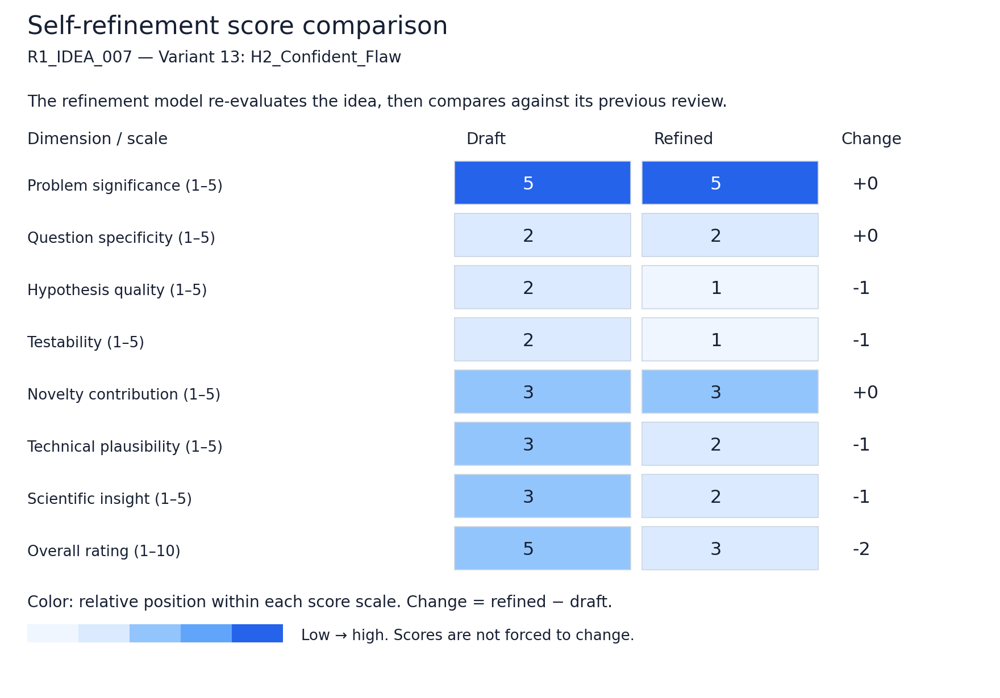

Changed score dimensions: hypothesis_quality, testability, technical_plausibility, scientific_insight, overall_rating.

### Score justifications (draft / refined)

**Problem significance**

```json
{
  "draft": {
    "score": 5.0,
    "justification": "The accuracy-interpretability trade-off is a fundamental challenge in ML, particularly for high-stakes domains. Solving this would have massive scientific and practical impact."
  },
  "refined": {
    "score": 5.0,
    "justification": "The accuracy-interpretability trade-off is a foundational challenge in trustworthy AI. A solution that offers both high fidelity and high accuracy would be transformative for high-stakes domains like healthcare and finance."
  }
}
```

**Question specificity**

```json
{
  "draft": {
    "score": 2.0,
    "justification": "While the goal is clear, the specific research question is vague. It lacks a definition of the model architecture or the specific mechanism for achieving nonlinearity and interpretability simultaneously."
  },
  "refined": {
    "score": 2.0,
    "justification": "While the goal is clear, the specific research question is obscured by vague claims of 'general superiority' and a lack of definition for the proposed model architecture. The question is not 'how' to build it, but 'why' it will work, which is a logical leap rather than a specific inquiry."
  }
}
```

**Hypothesis quality**

```json
{
  "draft": {
    "score": 2.0,
    "justification": "The hypothesis is too broad and absolute ('necessarily produce reliable improvements,' 'general superiority'). It lacks the nuance required for a testable scientific claim and ignores potential counter-examples."
  },
  "refined": {
    "score": 1.0,
    "justification": "The hypothesis is logically flawed. It conflates 'fidelity' (faithfulness of explanation) with 'accuracy' (predictive performance). Solving the former does not logically guarantee the latter. Furthermore, the claim that it works 'necessarily' across 'various settings' without testing boundary conditions is not a testable scientific hypothesis but a dogmatic assertion."
  }
}
```

**Testability**

```json
{
  "draft": {
    "score": 2.0,
    "justification": "The idea explicitly suggests that specific isolation of variables is unnecessary, which undermines the testability of the claim. Without a defined mechanism or specific conditions, it is difficult to design a rigorous experiment to falsify the claim of 'general superiority'."
  },
  "refined": {
    "score": 1.0,
    "justification": "The idea explicitly states that isolating variables, testing boundary cases, or considering alternative explanations is unnecessary. This makes the central claim ('general superiority') effectively untestable, as the author has pre-emptively ruled out the very evidence needed to falsify or confirm the claim."
  }
}
```

**Novelty contribution**

```json
{
  "draft": {
    "score": 3.0,
    "justification": "The direction of building inherently interpretable nonlinear models is novel and valuable, but the specific contribution is currently obscured by the lack of technical detail and the overly broad claims."
  },
  "refined": {
    "score": 3.0,
    "justification": "The direction of building inherently interpretable nonlinear models is valuable and active. However, the specific contribution is currently negated by the lack of a defined mechanism and the presence of logically unsound claims that prevent a clear assessment of novelty."
  }
}
```

**Technical plausibility**

```json
{
  "draft": {
    "score": 3.0,
    "justification": "The concept of built-in interpretability is plausible, but the claim that it will automatically outperform deep networks without specific architectural details is technically optimistic and potentially flawed."
  },
  "refined": {
    "score": 2.0,
    "justification": "While the concept of interpretable nonlinearity is plausible, the claim that it will 'necessarily' outperform deep networks is technically optimistic and likely incorrect. Deep networks have a representational capacity that simple interpretable structures often cannot match without significant architectural innovation, which is not described."
  }
}
```

**Scientific insight**

```json
{
  "draft": {
    "score": 3.0,
    "justification": "If successful, the research could reveal new principles for balancing complexity and interpretability. However, the current framing risks being a simple application of a known concept (interpretable models) with an unproven claim of universal superiority."
  },
  "refined": {
    "score": 2.0,
    "justification": "If the idea were refined to test specific boundary conditions and define the mechanism, it could yield significant insight. As stated, the dismissal of empirical validation limits the potential for scientific insight to a mere assertion of a desired outcome."
  }
}
```

**Overall rating**

```json
{
  "draft": {
    "score": 5.0,
    "justification": "The idea addresses a critical problem with a promising direction (inherent interpretability), but the scientific rigor is compromised by overly absolute claims, a lack of specific mechanism definition, and a dismissal of necessary empirical validation. It is a moderate idea with high potential if the hypothesis is refined and the mechanism is specified."
  },
  "refined": {
    "score": 3.0,
    "justification": "The idea addresses a highly significant problem but is severely compromised by a logical fallacy (equating fidelity with accuracy) and a rejection of scientific rigor (dismissing the need for boundary testing). While the motivation is strong, the proposed reasoning is flawed, making the idea weak in its current formulation. It requires a complete reframing of the hypothesis to be viable."
  }
}
```

## R1_IDEA_007 — Variant 14: H3_Verbose_Enriched

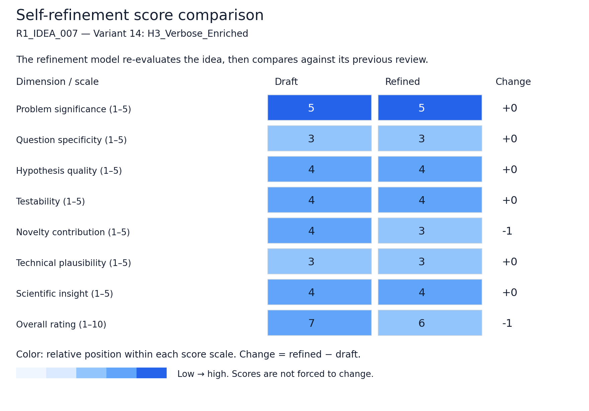

Changed score dimensions: novelty_contribution, overall_rating.

### Score justifications (draft / refined)

**Problem significance**

```json
{
  "draft": {
    "score": 5.0,
    "justification": "The accuracy-interpretability trade-off is one of the most critical challenges in modern machine learning, especially for high-stakes domains. Proposing a framework that offers built-in fidelity rather than post-hoc approximations addresses a significant gap in the field."
  },
  "refined": {
    "score": 5.0,
    "justification": "The accuracy-interpretability trade-off is a critical bottleneck in deploying ML in high-stakes domains (healthcare, finance, law). A method that offers built-in fidelity rather than post-hoc approximations addresses a major gap in the field."
  }
}
```

**Question specificity**

```json
{
  "draft": {
    "score": 3.0,
    "justification": "While the evaluation plan is specific, the core research question regarding the *mechanism* of NIMO is vague. The idea describes what the model *should* do (reconcile trade-offs) but not exactly *how* it achieves this, which is central to the scientific contribution."
  },
  "refined": {
    "score": 3.0,
    "justification": "While the evaluation plan is specific, the core research question regarding the *mechanism* of NIMO is vague. The idea describes what the model *should* do but not exactly *how* it achieves this, which is central to the scientific contribution. It is currently a proposal for a research program rather than a specific hypothesis about a mechanism."
  }
}
```

**Hypothesis quality**

```json
{
  "draft": {
    "score": 4.0,
    "justification": "The hypothesis that the framework can provide faithful nonlinear effects and close the performance gap is concrete and testable. The plan to validate this against synthetic ground truths and explore boundary conditions provides a clear path to support or refute the claim."
  },
  "refined": {
    "score": 4.0,
    "justification": "The hypothesis that a built-in nonlinear framework can provide faithful effects and close the performance gap is concrete and testable. The plan to validate this against synthetic ground truths and explore boundary conditions provides a clear path to support or refute the claim."
  }
}
```

**Testability**

```json
{
  "draft": {
    "score": 4.0,
    "justification": "The proposed experimental design is highly testable. It includes clear baselines, synthetic data for ground truth verification, ablation studies, and specific failure mode analysis. The staged design ensures rigorous evaluation."
  },
  "refined": {
    "score": 4.0,
    "justification": "The proposed experimental design is highly testable. It includes clear baselines, synthetic data for ground truth verification, ablation studies, and specific failure mode analysis. The staged design ensures rigorous evaluation."
  }
}
```

**Novelty contribution**

```json
{
  "draft": {
    "score": 4.0,
    "justification": "The direction of building inherently interpretable nonlinear models is novel and valuable. While the specific implementation is not detailed, the potential to discover new mechanisms for faithful nonlinearity offers significant scientific insight."
  },
  "refined": {
    "score": 3.0,
    "justification": "The *direction* of building inherently interpretable nonlinear models is valuable, but the specific contribution is unclear without a defined mechanism. It risks being a re-packaging of existing techniques (like GAMs with specific constraints) unless a novel architectural or mathematical innovation is proposed."
  }
}
```

**Technical plausibility**

```json
{
  "draft": {
    "score": 3.0,
    "justification": "The idea is logically coherent and plausible in principle, but without knowing the specific algorithmic approach, it is difficult to assess if the proposed trade-offs are technically feasible. The claim of 'built-in' fidelity for complex nonlinearities is ambitious and requires a strong theoretical or architectural basis."
  },
  "refined": {
    "score": 3.0,
    "justification": "The idea is logically coherent in principle, but the claim of 'built-in' fidelity for complex nonlinearities is ambitious. Without a defined mechanism, it is difficult to assess if the proposed trade-offs are technically feasible or if they violate known theoretical limits (e.g., curse of dimensionality)."
  }
}
```

**Scientific insight**

```json
{
  "draft": {
    "score": 4.0,
    "justification": "If successful, this research would provide deep insights into the structural limits of interpretable models and the conditions under which they can match the performance of black-box models. The focus on boundary conditions and failure modes ensures the output will be more than just a new tool."
  },
  "refined": {
    "score": 4.0,
    "justification": "If successful, this research would provide deep insights into the structural limits of interpretable models and the conditions under which they can match the performance of black-box models. The focus on boundary conditions and failure modes ensures the output will be more than just a new tool."
  }
}
```

**Overall rating**

```json
{
  "draft": {
    "score": 7.0,
    "justification": "This is a strong research idea with high significance and a well-thought-out evaluation strategy. The main limitation is the lack of technical detail regarding the core mechanism of the NIMO framework. However, the proposed direction addresses a critical problem and the plan to investigate it is rigorous, making it a promising avenue for research."
  },
  "refined": {
    "score": 6.0,
    "justification": "This is a moderate-to-strong research idea with high significance and a well-thought-out evaluation strategy. However, the lack of a defined mechanism for 'NIMO' prevents it from being a 'strong' or 'exceptional' idea at this stage. It is currently a proposal for a research *program* rather than a specific, testable scientific hypothesis about a mechanism. The idea is promising but requires significant conceptual development to move from a 'goal' to a 'research idea'."
  }
}
```

## R1_IDEA_007 — Variant 15: H4_Ultimate_Hype


Changed score dimensions: none.

### Score justifications (draft / refined)

**Problem significance**

```json
{
  "draft": {
    "score": 5.0,
    "justification": "The accuracy-interpretability trade-off is one of the most critical challenges in modern machine learning, especially for high-stakes applications. Solving this would be a major breakthrough."
  },
  "refined": {
    "score": 5.0,
    "justification": "The accuracy-interpretability trade-off is a foundational challenge in trustworthy AI. Solving it would have profound implications for high-stakes domains like healthcare and finance. The problem is of exceptional importance."
  }
}
```

**Question specificity**

```json
{
  "draft": {
    "score": 2.0,
    "justification": "The idea is currently a high-level vision rather than a specific research question. It states the goal (reconcile trade-off) but not the specific mechanism or variable being investigated."
  },
  "refined": {
    "score": 2.0,
    "justification": "The idea states a goal ('reconcile trade-off') but fails to define the specific research question or mechanism. It does not specify what variables are being manipulated, what the specific model class is, or what the exact relationship being tested is. It is a vision, not a specific question."
  }
}
```

**Hypothesis quality**

```json
{
  "draft": {
    "score": 3.0,
    "justification": "The implicit hypothesis is that 'inherently interpretable nonlinear models can match DNN accuracy.' This is a testable claim, but it is currently too broad and lacks the nuance to be a strong scientific hypothesis without defining the model class."
  },
  "refined": {
    "score": 3.0,
    "justification": "The implicit hypothesis ('inherently interpretable nonlinear models can match DNN accuracy') is testable in principle but currently too broad. Without defining the model class, the hypothesis is unfalsifiable because one could define 'interpretable' loosely to make the claim trivially true, or strictly to make it impossible. It lacks the necessary constraints to be a strong scientific hypothesis."
  }
}
```

**Testability**

```json
{
  "draft": {
    "score": 3.0,
    "justification": "The idea is testable in principle (compare accuracy vs. interpretability metrics), but the lack of a defined method makes it impossible to design a specific experiment at this stage."
  },
  "refined": {
    "score": 3.0,
    "justification": "While the general comparison (accuracy vs. interpretability) is testable, the lack of a defined method prevents the design of a specific experiment. One cannot test 'NIMO' without knowing what NIMO is. The idea is testable only at a very high level (e.g., 'Does a model exist?'), which is less useful than testing a specific mechanism."
  }
}
```

**Novelty contribution**

```json
{
  "draft": {
    "score": 4.0,
    "justification": "While the goal is novel in its ambition, the concept of interpretable nonlinear models is not new (e.g., GAMs). The novelty lies in the specific claim of closing the gap with DNNs, which, if true, would be a significant contribution."
  },
  "refined": {
    "score": 4.0,
    "justification": "The ambition to close the gap with DNNs is novel in its scope. While interpretable nonlinear models exist (e.g., GAMs), the specific claim of matching DNN performance with *guaranteed* fidelity is a significant potential contribution if achievable. However, the novelty is currently tied to the claim rather than a specific new mechanism."
  }
}
```

**Technical plausibility**

```json
{
  "draft": {
    "score": 3.0,
    "justification": "The reasoning is logically coherent (post-hoc is bad, inherent is good), but the technical plausibility of achieving DNN-level accuracy with strict interpretability constraints is currently an open research question, not a settled fact. The idea assumes a solution exists without outlining it."
  },
  "refined": {
    "score": 3.0,
    "justification": "The reasoning is logically coherent (post-hoc is unfaithful, inherent is faithful), but the technical plausibility of the specific claim is currently an open question. The idea assumes a solution exists without outlining the mechanism. It is plausible that such a model exists, but the idea does not provide evidence or a path to it, making the plausibility score moderate."
  }
}
```

**Scientific insight**

```json
{
  "draft": {
    "score": 4.0,
    "justification": "If successful, this research would reveal fundamental limits and possibilities of model architecture design, offering deep insights into the relationship between model complexity and human understanding."
  },
  "refined": {
    "score": 4.0,
    "justification": "If the research were to succeed, it would provide deep insights into the limits of model complexity and human understanding. However, as a proposal, the potential for insight is currently limited by the lack of a specific mechanism to investigate. The insight is contingent on the success of an undefined method."
  }
}
```

**Overall rating**

```json
{
  "draft": {
    "score": 6.0,
    "justification": "The research idea addresses a problem of exceptional significance and has high potential impact. However, as a research proposal, it is currently too vague to be considered 'strong' or 'exceptional'. It lacks the necessary specificity regarding the 'how' to move beyond a general motivation. It is a 'Moderate/borderline' idea that requires significant refinement to become a concrete research plan."
  },
  "refined": {
    "score": 6.0,
    "justification": "The idea addresses a problem of exceptional significance (5/5) and has high potential impact. However, as a research proposal, it is currently too vague to be considered 'strong' (7-8). It lacks the necessary specificity regarding the 'how' to move beyond a general motivation. It is a 'Moderate/borderline' idea (5-6) that requires significant refinement to become a concrete, testable research plan. The gap between the bold claims and the lack of methodological detail prevents a higher score."
  }
}
```

## R1_IDEA_008 — Source

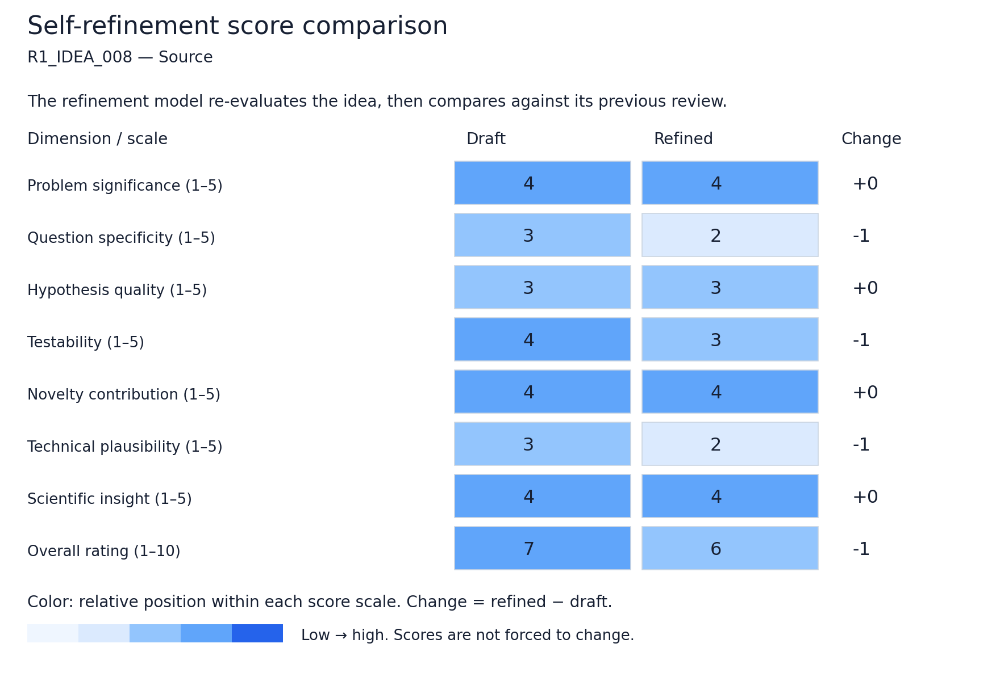

Changed score dimensions: question_specificity, testability, technical_plausibility, overall_rating.

### Score justifications (draft / refined)

**Problem significance**

```json
{
  "draft": {
    "score": 4.0,
    "justification": "Bimanual non-prehensile manipulation is a high-value problem in robotics. Solving it without RL (which is often sample-inefficient and hard to deploy) would be a significant contribution to the field, addressing both efficiency and generalization."
  },
  "refined": {
    "score": 4.0,
    "justification": "Bimanual non-prehensile manipulation is a significant challenge in robotics. Moving beyond single-arm limitations and external constraints is crucial for general-purpose manipulation. Solving this without RL would address the sample inefficiency and safety issues associated with RL in physical systems."
  }
}
```

**Question specificity**

```json
{
  "draft": {
    "score": 3.0,
    "justification": "While the goal (bimanual, non-prehensile, RL-free) is specific, the 'three-stage paradigm' is a black box. The idea states *what* it wants to do but not *how* the core mechanism works, making the research question slightly vague."
  },
  "refined": {
    "score": 2.0,
    "justification": "While the goal is specific (bimanual, non-prehensile, RL-free), the research question is too vague because the 'three-stage paradigm' is a black box. The idea states the *what* but not the *how*, making the specific mechanism of action undefined."
  }
}
```

**Hypothesis quality**

```json
{
  "draft": {
    "score": 3.0,
    "justification": "The implicit hypothesis is that a structured, three-stage, non-RL approach can achieve category-level generalization in complex bimanual tasks. This is a testable hypothesis, but the reasoning behind why this specific architecture would succeed is not yet articulated."
  },
  "refined": {
    "score": 3.0,
    "justification": "The implicit hypothesis is that a structured, non-RL approach can solve this complex problem. This is a valid hypothesis, but it lacks the specificity of a mechanism (e.g., 'using geometric redundancy to constrain the solution space'). It is testable but currently relies on an undefined method."
  }
}
```

**Testability**

```json
{
  "draft": {
    "score": 4.0,
    "justification": "The idea is testable. One can define metrics for success (e.g., success rate of pivoting unseen objects, generalization across categories) and compare the proposed method against RL baselines or single-arm methods. The 'three-stage' nature allows for ablation studies."
  },
  "refined": {
    "score": 3.0,
    "justification": "The idea is testable in principle (success rates on unseen objects), but the lack of a defined method makes it difficult to design a specific experimental protocol. The 'three-stage' nature allows for ablation, but only if the stages are defined."
  }
}
```

**Novelty contribution**

```json
{
  "draft": {
    "score": 4.0,
    "justification": "Combining bimanual non-prehensile manipulation with a strict 'RL-free' constraint and a specific 'three-stage' structure is novel. If successful, it could offer a new paradigm for contact-rich manipulation that is more interpretable and data-efficient than current RL-heavy approaches."
  },
  "refined": {
    "score": 4.0,
    "justification": "The combination of bimanual non-prehensile manipulation with a strict RL-free constraint and a specific structural paradigm is novel. If successful, it could demonstrate that analytical or heuristic methods can outperform or complement RL in complex contact tasks."
  }
}
```

**Technical plausibility**

```json
{
  "draft": {
    "score": 3.0,
    "justification": "It is technically plausible that a structured approach could work, but bimanual non-prehensile manipulation is extremely complex due to contact dynamics. Achieving this without RL requires a very strong underlying model or heuristic, which is not described. The plausibility hinges entirely on the undefined 'three stages'."
  },
  "refined": {
    "score": 2.0,
    "justification": "It is highly speculative. Bimanual non-prehensile manipulation involves complex contact dynamics. Achieving this without RL (which excels at learning these dynamics) requires a very strong, currently undefined, model or heuristic. The plausibility is low without more detail on the 'three stages'."
  }
}
```

**Scientific insight**

```json
{
  "draft": {
    "score": 4.0,
    "justification": "If the research succeeds, it would provide deep insight into whether structured, model-based, or heuristic approaches can replace data-driven RL for complex contact tasks. It could reveal the limits of analytical methods in high-dimensional contact spaces."
  },
  "refined": {
    "score": 4.0,
    "justification": "If the research succeeds, it would provide profound insight into the limits of model-based vs. data-driven approaches for contact-rich tasks. It could reveal whether geometric redundancy in dual-arm systems is sufficient to replace learning-based dynamics modeling."
  }
}
```

**Overall rating**

```json
{
  "draft": {
    "score": 7.0,
    "justification": "This is a strong research idea with high potential impact. It addresses a meaningful problem with a clear constraint (RL-free) that could yield significant scientific insights. However, it currently lacks the technical specificity required to fully evaluate the feasibility of the proposed 'three-stage' mechanism. With a clearer definition of the methodology, this could be an exceptional idea."
  },
  "refined": {
    "score": 6.0,
    "justification": "The idea addresses a significant problem with a bold constraint (RL-free), which gives it high potential. However, the complete lack of methodological detail ('three-stage paradigm' is undefined) severely limits the assessment of its feasibility and scientific rigor. It is a moderate idea that requires significant elaboration to be considered strong."
  }
}
```

## R1_IDEA_008 — Variant 1: A1_Identity

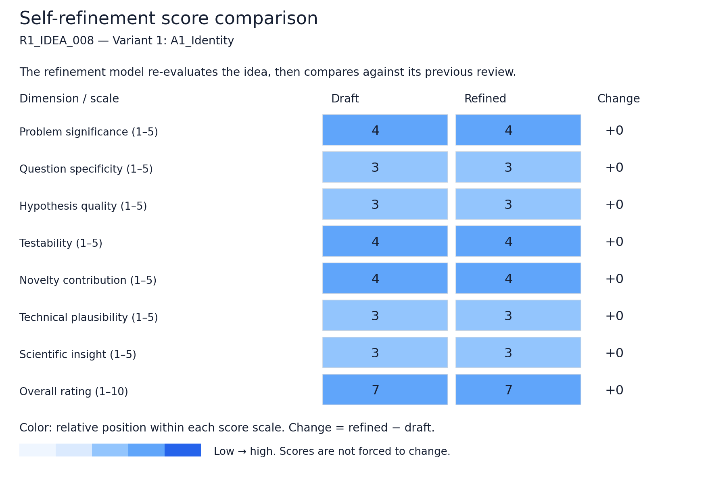

Changed score dimensions: none.

### Score justifications (draft / refined)

**Problem significance**

```json
{
  "draft": {
    "score": 4.0,
    "justification": "Bimanual non-prehensile manipulation is a high-value problem in robotics. Solving it without RL (which is often sample-inefficient and hard to deploy) would be a significant contribution to the field. The move to category-level generalization is also highly relevant."
  },
  "refined": {
    "score": 4.0,
    "justification": "Bimanual non-prehensile manipulation is a critical challenge in robotics. Solving it without RL (which is often sample-inefficient and hard to deploy) would be a significant contribution. The move to category-level generalization is also highly relevant for real-world deployment."
  }
}
```

**Question specificity**

```json
{
  "draft": {
    "score": 3.0,
    "justification": "While the goal (bimanual, non-prehensile, RL-free) is clear, the 'three-stage' mechanism is too vague. The research question is 'how to build this' rather than a specific scientific inquiry into a mechanism or relationship."
  },
  "refined": {
    "score": 3.0,
    "justification": "The goal is clear (bimanual, non-prehensile, RL-free), but the 'three-stage' mechanism is too vague. The research question is currently 'how to build this' rather than a specific scientific inquiry into a mechanism or relationship. The lack of defined stages makes the question broad."
  }
}
```

**Hypothesis quality**

```json
{
  "draft": {
    "score": 3.0,
    "justification": "The implicit hypothesis is that a structured, three-stage, non-RL approach can achieve what RL typically does (generalizable bimanual control). This is testable but currently lacks the specific mechanism that would make it a strong scientific hypothesis."
  },
  "refined": {
    "score": 3.0,
    "justification": "The implicit hypothesis is that a structured, three-stage, non-RL approach can achieve what RL typically does (generalizable bimanual control). This is testable but currently lacks the specific mechanism that would make it a strong scientific hypothesis. It relies on the assumption that a structured approach is sufficient, which needs justification."
  }
}
```

**Testability**

```json
{
  "draft": {
    "score": 4.0,
    "justification": "The idea is testable. One can implement the three stages, define metrics for transferability and success in pushing/pivoting, and compare against baselines. The lack of implementation details does not prevent the *idea* from being testable."
  },
  "refined": {
    "score": 4.0,
    "justification": "The idea is testable in principle. One can implement a three-stage pipeline, define metrics for transferability and success in pushing/pivoting, and compare against baselines. The lack of implementation details does not prevent the *idea* from being testable, though the specific metrics need definition."
  }
}
```

**Novelty contribution**

```json
{
  "draft": {
    "score": 4.0,
    "justification": "Combining bimanual non-prehensile manipulation with an RL-free, category-level approach is novel. If successful, it could offer a new paradigm for contact-rich manipulation that is more interpretable and data-efficient than current RL methods."
  },
  "refined": {
    "score": 4.0,
    "justification": "Combining bimanual non-prehensile manipulation with an RL-free, category-level approach is novel. If successful, it could offer a new paradigm for contact-rich manipulation that is more interpretable and data-efficient than current RL methods. However, the novelty depends on the specific mechanism of the 'three-stage' approach."
  }
}
```

**Technical plausibility**

```json
{
  "draft": {
    "score": 3.0,
    "justification": "It is plausible that a structured approach could work, but the claim that it can handle 'generalizable dual-arm configurations' without RL is ambitious. The plausibility hinges entirely on the undefined 'three-stage' logic."
  },
  "refined": {
    "score": 3.0,
    "justification": "It is plausible that a structured approach could work, but the claim that it can handle 'generalizable dual-arm configurations' without RL is ambitious. The plausibility hinges entirely on the undefined 'three-stage' logic. Without a clear mechanism for handling the high-dimensional contact space, the idea risks being infeasible."
  }
}
```

**Scientific insight**

```json
{
  "draft": {
    "score": 3.0,
    "justification": "If successful, the research would provide insight into how to structure manipulation policies without exploration. However, as currently stated, it reads more like a system design proposal than a hypothesis-driven investigation into a fundamental mechanism."
  },
  "refined": {
    "score": 3.0,
    "justification": "If successful, the research would provide insight into how to structure manipulation policies without exploration. However, as currently stated, it reads more like a system design proposal than a hypothesis-driven investigation into a fundamental mechanism. The potential for deep scientific insight is limited until the 'how' is specified."
  }
}
```

**Overall rating**

```json
{
  "draft": {
    "score": 7.0,
    "justification": "This is a strong research idea with high potential significance and novelty. The main limitation is the lack of specificity regarding the 'three-stage' mechanism, which prevents it from being an 'exceptional' (9-10) idea at this stage. However, the direction is clear, the problem is important, and the constraints (RL-free, bimanual) provide a solid foundation for a high-impact study."
  },
  "refined": {
    "score": 7.0,
    "justification": "This is a strong research idea with high potential significance and novelty. The main limitation is the lack of specificity regarding the 'three-stage' mechanism, which prevents it from being an 'exceptional' (9-10) idea at this stage. However, the direction is clear, the problem is important, and the constraints (RL-free, bimanual) provide a solid foundation for a high-impact study. It sits in the 'Strong' category (7-8) because the core concept is promising but the execution path is currently undefined."
  }
}
```

## R1_IDEA_008 — Variant 2: A2_Paraphrase_Only


Changed score dimensions: question_specificity, hypothesis_quality, testability, scientific_insight, overall_rating.

### Score justifications (draft / refined)

**Problem significance**

```json
{
  "draft": {
    "score": 5.0,
    "justification": "Bimanual non-prehensile manipulation is a critical capability for advanced robotics (e.g., assembly, cooking, cleaning). Moving beyond single-arm and wall-assisted methods to generalizable, self-contained dual-arm solutions addresses a major bottleneck in deploying robots in unstructured environments."
  },
  "refined": {
    "score": 5.0,
    "justification": "Bimanual non-prehensile manipulation is a fundamental challenge for general-purpose robotics. Solving this without external constraints (walls) or the high sample cost of RL addresses a major bottleneck for real-world deployment in unstructured environments like kitchens or warehouses."
  }
}
```

**Question specificity**

```json
{
  "draft": {
    "score": 3.0,
    "justification": "While the domain (bimanual non-prehensile) and the high-level approach (RL-free, three-stage) are stated, the specific research question is vague. It is unclear exactly what relationship or mechanism is being investigated beyond 'this method works better'."
  },
  "refined": {
    "score": 2.0,
    "justification": "The idea is currently too vague. While the domain is clear, the 'three-stage' structure and the 'RL-free' mechanism are undefined. It reads more as a goal statement than a specific research question. It does not specify what relationship is being investigated, only that a new method should be built."
  }
}
```

**Hypothesis quality**

```json
{
  "draft": {
    "score": 3.0,
    "justification": "The idea implies a hypothesis that an RL-free, three-stage dual-arm approach is superior or more feasible for this task than current methods. However, it lacks a specific, falsifiable prediction about the mechanism of success or the conditions under which it might fail."
  },
  "refined": {
    "score": 2.0,
    "justification": "The hypothesis is implicit and weak. It assumes 'RL-free + dual-arm = better' without stating the mechanism. A strong hypothesis would predict *why* this combination works (e.g., 'Dual-arm coordination allows for X type of contact force modulation that single-arm cannot achieve, enabling Y generalization'). The current statement is not easily falsifiable without more detail."
  }
}
```

**Testability**

```json
{
  "draft": {
    "score": 4.0,
    "justification": "The idea is testable in principle. One can define benchmarks for pushing/poking/pivoting, compare against single-arm and wall-assisted baselines, and measure success rates and generalization. However, the lack of defined metrics for 'transferability' and the specific stages makes the experimental design currently incomplete."
  },
  "refined": {
    "score": 3.0,
    "justification": "The idea is testable in principle because the tasks (pushing, pivoting) are well-defined and can be simulated. However, without a defined method or metrics for 'transferability,' the experimental design is incomplete. One cannot test a 'three-stage' process if the stages are unknown."
  }
}
```

**Novelty contribution**

```json
{
  "draft": {
    "score": 4.0,
    "justification": "Combining a specific 'three-stage' structure with an 'RL-free' constraint for bimanual non-prehensile tasks is a novel direction. Most current work relies heavily on RL or specific kinematic constraints. If successful, this could offer a new paradigm for skill acquisition."
  },
  "refined": {
    "score": 4.0,
    "justification": "The combination of 'three-stage', 'RL-free', and 'generalizable dual-arm' for non-prehensile tasks is a novel direction. Most current work relies on RL or specific kinematic constraints. If the mechanism is sound, it could offer a new paradigm for skill acquisition."
  }
}
```

**Technical plausibility**

```json
{
  "draft": {
    "score": 3.0,
    "justification": "The concept is plausible, as bimanual coordination is a known problem and RL-free methods (like imitation learning) are active areas of research. However, without knowing the specific algorithms, it is difficult to assess if the 'three-stage' approach is technically sound or if it introduces new bottlenecks."
  },
  "refined": {
    "score": 3.0,
    "justification": "The concept is plausible in the broad sense (dual arms have more DOFs), but the specific technical path is unknown. 'RL-free' learning of complex contact-rich bimanual tasks is extremely difficult without a very specific mechanism (like advanced model-based planning or high-quality imitation data). The idea lacks the technical substance to confirm plausibility."
  }
}
```

**Scientific insight**

```json
{
  "draft": {
    "score": 4.0,
    "justification": "If successful, this research could reveal fundamental principles of how dual-arm systems can coordinate for contact-rich tasks without the trial-and-error overhead of RL. It could also provide insights into the minimal requirements for 'dexterity' in manipulation."
  },
  "refined": {
    "score": 3.0,
    "justification": "If successful, this could reveal principles of bimanual coordination. However, as currently stated, it risks being a simple engineering application ('let's try building this') rather than a discovery of a new scientific principle. The potential for insight depends entirely on the undefined 'three-stage' mechanism."
  }
}
```

**Overall rating**

```json
{
  "draft": {
    "score": 7.0,
    "justification": "This is a strong research idea with high significance and clear potential for contribution. The problem is well-defined, and the proposed direction (RL-free, dual-arm) is timely and promising. However, the idea is currently too high-level to be considered exceptional; it lacks the specific hypothesis, mechanism definition, and methodological details required to fully evaluate its novelty and feasibility. It sits firmly in the 'Strong' category (7-8) because the core concept is sound, but the execution plan is missing."
  },
  "refined": {
    "score": 6.0,
    "justification": "This is a moderate research idea. The problem is significant (5/5), and the direction (RL-free dual-arm) is promising. However, the idea is currently underspecified to the point where the core mechanism is a black box. It lacks a specific hypothesis and methodological definition, which prevents it from being rated as 'Strong' (7-8). It sits in the 5-6 range because while the motivation is strong, the scientific question is not yet well-formed."
  }
}
```

## R1_IDEA_008 — Variant 3: A3_Plain_Core

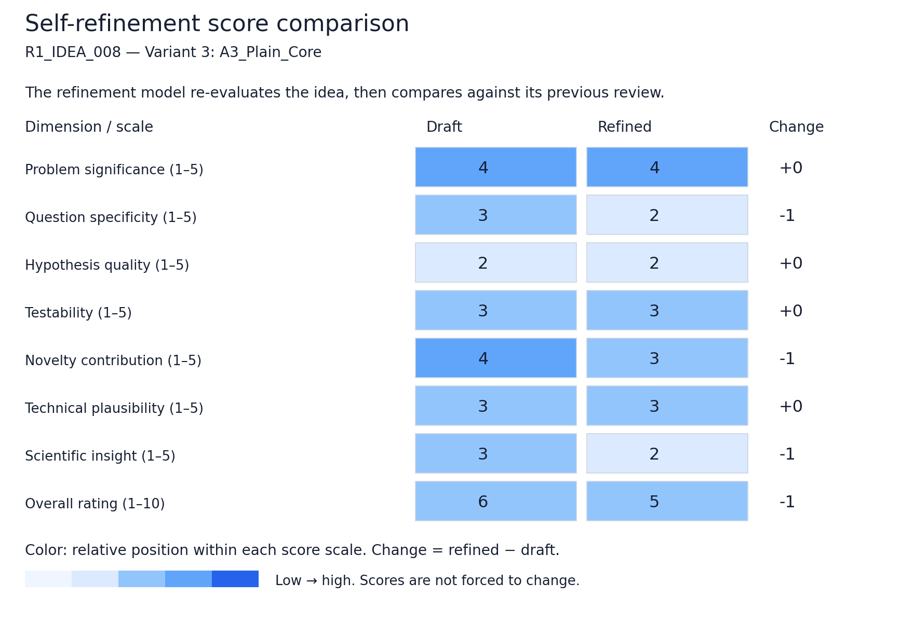

Changed score dimensions: question_specificity, novelty_contribution, scientific_insight, overall_rating.

### Score justifications (draft / refined)

**Problem significance**

```json
{
  "draft": {
    "score": 4.0,
    "justification": "Bimanual non-prehensile manipulation is a critical capability for advanced robotics (e.g., assembly, cooking, cleaning). Solving this without external aids or heavy RL is a meaningful challenge with high practical value."
  },
  "refined": {
    "score": 4.0,
    "justification": "Bimanual non-prehensile manipulation is a critical capability for advanced robotics (assembly, cooking, cleaning). Solving this without external aids or heavy RL is a meaningful challenge with high practical value. The problem is significant, but the idea's contribution depends entirely on the unspecified method."
  }
}
```

**Question specificity**

```json
{
  "draft": {
    "score": 3.0,
    "justification": "While the task (bimanual non-prehensile) and constraints (no walls) are clear, the core research question is obscured by the lack of detail on the 'RL-free paradigm' and the 'three stages.' It is currently a proposal of a direction rather than a specific question."
  },
  "refined": {
    "score": 2.0,
    "justification": "While the task and constraints are clear, the research question is obscured by the lack of detail on the 'RL-free paradigm' and the 'three stages.' It currently describes a goal rather than a specific scientific question or mechanism to be investigated."
  }
}
```

**Hypothesis quality**

```json
{
  "draft": {
    "score": 2.0,
    "justification": "The idea implies a hypothesis that an RL-free approach can succeed where others might fail, but it does not articulate a specific, falsifiable prediction about the mechanism or performance relationship."
  },
  "refined": {
    "score": 2.0,
    "justification": "The idea implies a hypothesis that an RL-free approach can succeed, but it does not articulate a specific, falsifiable prediction about the mechanism, performance relationship, or boundary conditions. It is currently a statement of intent."
  }
}
```

**Testability**

```json
{
  "draft": {
    "score": 3.0,
    "justification": "The idea is testable in principle (build the system, run tasks), but the lack of defined stages and algorithms makes it difficult to design a specific experimental protocol or ablation study at this stage."
  },
  "refined": {
    "score": 3.0,
    "justification": "The idea is testable in principle (build the system, run tasks), but the lack of defined stages and algorithms makes it difficult to design a specific experimental protocol or ablation study at this stage. The 'RL-free' claim needs a concrete alternative to test against."
  }
}
```

**Novelty contribution**

```json
{
  "draft": {
    "score": 4.0,
    "justification": "Focusing on bimanual non-prehensile manipulation without RL or external aids is a novel angle. Most current work relies heavily on RL or single-arm setups. If successful, this could offer a more sample-efficient path to complex manipulation."
  },
  "refined": {
    "score": 3.0,
    "justification": "Focusing on bimanual non-prehensile manipulation without RL or external aids is a novel angle. However, without a specific mechanism, the novelty is limited to the problem setting rather than a new scientific principle. If the method is simply 'imitation learning,' the novelty is lower."
  }
}
```

**Technical plausibility**

```json
{
  "draft": {
    "score": 3.0,
    "justification": "The concept is plausible, but the feasibility of achieving 'category-level' generalization in complex contact-rich bimanual tasks without RL (which is often used for exploration in such spaces) depends entirely on the unspecified methodology. It is not obviously impossible, but the path is unclear."
  },
  "refined": {
    "score": 3.0,
    "justification": "The concept is plausible, but the feasibility of achieving 'category-level' generalization in complex contact-rich bimanual tasks without RL (which is often used for exploration in such spaces) depends entirely on the unspecified methodology. It is not obviously impossible, but the path is unclear."
  }
}
```

**Scientific insight**

```json
{
  "draft": {
    "score": 3.0,
    "justification": "If the method works, it would provide significant insight into how to decouple complex coordination from RL exploration. However, as stated, the potential for deep scientific insight is limited by the lack of a proposed mechanism to investigate."
  },
  "refined": {
    "score": 2.0,
    "justification": "If the method works, it would provide significant insight into how to decouple complex coordination from RL exploration. However, as stated, the potential for deep scientific insight is limited by the lack of a proposed mechanism to investigate. The idea is currently too high-level to yield specific mechanistic insights."
  }
}
```

**Overall rating**

```json
{
  "draft": {
    "score": 6.0,
    "justification": "This is a moderate/borderline idea. It addresses a high-significance problem with a potentially valuable constraint (RL-free, no external aids). However, it currently lacks the specificity of a research question and the technical detail of a hypothesis. It reads more like a project goal than a research proposal. With more detail on the 'how' and the specific hypothesis, it could easily become a strong (7-8) idea."
  },
  "refined": {
    "score": 5.0,
    "justification": "This is a moderate/borderline idea. It addresses a high-significance problem with a potentially valuable constraint (RL-free, no external aids). However, it currently lacks the specificity of a research question and the technical detail of a hypothesis. It reads more like a project goal than a research proposal. The lack of a defined mechanism prevents it from being rated higher, as the scientific contribution is currently undefined."
  }
}
```

## R1_IDEA_008 — Variant 4: B1_Verbose_Elaborate

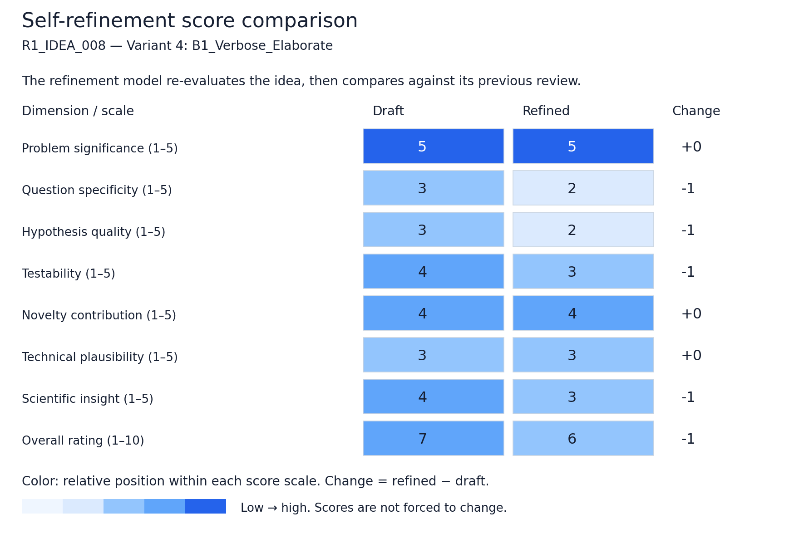

Changed score dimensions: question_specificity, hypothesis_quality, testability, scientific_insight, overall_rating.

### Score justifications (draft / refined)

**Problem significance**

```json
{
  "draft": {
    "score": 5.0,
    "justification": "Bimanual non-prehensile manipulation is a critical frontier in robotics. Moving beyond single-arm limitations and external constraints (walls/edges) is essential for deploying robots in unstructured, real-world environments. Solving this would have significant practical impact."
  },
  "refined": {
    "score": 5.0,
    "justification": "The problem is highly significant. Bimanual non-prehensile manipulation is a frontier in robotics. Moving beyond single-arm limitations and external constraints is essential for deploying robots in unstructured, real-world environments. Solving this would have substantial practical impact."
  }
}
```

**Question specificity**

```json
{
  "draft": {
    "score": 3.0,
    "justification": "While the task (bimanual non-prehensile primitives) is specific, the 'three-stage paradigm' and the learning mechanism are currently vague. The idea describes *what* to do but not *how* the core scientific question is being investigated in detail."
  },
  "refined": {
    "score": 2.0,
    "justification": "While the task is specific, the research question itself is vague. The idea describes a 'what' (build a system) but lacks a 'how' or a 'why' that constitutes a scientific inquiry. The undefined 'three-stage paradigm' and the unspecified learning mechanism make the core question difficult to isolate."
  }
}
```

**Hypothesis quality**

```json
{
  "draft": {
    "score": 3.0,
    "justification": "The implicit hypothesis is that dual-arm configurations without RL can achieve generalizable contact-rich manipulation better than current methods. This is a strong direction, but the idea lacks a precise, falsifiable statement about the mechanism (e.g., 'Dual-arm synergy reduces the state space required for learning...')."
  },
  "refined": {
    "score": 2.0,
    "justification": "The idea implies a hypothesis (dual-arm + no RL = effective manipulation), but it is not explicitly stated or mechanistically grounded. It lacks a specific prediction about the relationship between the method's components and the outcome, making it hard to falsify."
  }
}
```

**Testability**

```json
{
  "draft": {
    "score": 4.0,
    "justification": "The idea is testable by comparing the proposed method against baselines (single-arm, external-assisted, RL-based) on standard non-prehensile tasks. Success can be measured by transferability across object categories and success rates in contact-rich scenarios."
  },
  "refined": {
    "score": 3.0,
    "justification": "The idea is potentially testable if the missing details (method and stages) are filled in. Currently, it is testable only at a high level (does it work?), but the lack of a defined mechanism prevents a rigorous ablation or causal analysis."
  }
}
```

**Novelty contribution**

```json
{
  "draft": {
    "score": 4.0,
    "justification": "The combination of bimanual non-prehensile manipulation, the removal of external constraints, and the specific avoidance of RL (if successful) represents a novel contribution. It challenges the prevailing trend of heavy RL reliance for contact tasks."
  },
  "refined": {
    "score": 4.0,
    "justification": "The combination of bimanual non-prehensile manipulation, the removal of external constraints, and the specific avoidance of RL (if successful) represents a novel contribution. It challenges the prevailing trend of heavy RL reliance for contact tasks."
  }
}
```

**Technical plausibility**

```json
{
  "draft": {
    "score": 3.0,
    "justification": "The concept is plausible, but the feasibility of learning complex contact dynamics without RL is the main point of contention. Without knowing the specific alternative learning method, it is hard to judge if the 'three-stage' approach is technically sound."
  },
  "refined": {
    "score": 3.0,
    "justification": "The concept is plausible in principle, but the feasibility of learning complex contact dynamics without RL is the main point of contention. Without knowing the specific alternative learning method, it is hard to judge if the 'three-stage' approach is technically sound or if it relies on hidden assumptions."
  }
}
```

**Scientific insight**

```json
{
  "draft": {
    "score": 4.0,
    "justification": "If successful, this research would provide deep insights into how dual-arm coordination can substitute for external constraints and how contact-rich dynamics can be learned via non-RL methods, potentially revealing new principles of robotic dexterity."
  },
  "refined": {
    "score": 3.0,
    "justification": "If the idea is developed, it could reveal insights into dual-arm coordination and non-RL learning of contact dynamics. However, as currently stated, the potential for deep scientific insight is limited because the mechanism driving the results is unknown."
  }
}
```

**Overall rating**

```json
{
  "draft": {
    "score": 7.0,
    "justification": "This is a strong research idea with high significance and clear potential for scientific insight. The main weakness is the lack of specificity regarding the 'three-stage paradigm' and the learning mechanism. However, the problem definition is excellent, and the direction addresses a critical gap in the field. With more detail on the 'how', this could be an exceptional contribution."
  },
  "refined": {
    "score": 6.0,
    "justification": "This is a moderate research idea. The problem significance and potential novelty are high, but the lack of specificity regarding the core mechanism (the 'three-stage paradigm' and the non-RL learning method) significantly weakens the scientific rigor. It currently reads more like a project proposal than a hypothesis-driven research idea. It has potential but requires substantial refinement to be considered a strong scientific contribution."
  }
}
```

## R1_IDEA_008 — Variant 5: B2_Grand_Narrative


Changed score dimensions: none.

### Score justifications (draft / refined)

**Problem significance**

```json
{
  "draft": {
    "score": 4.0,
    "justification": "The problem of bimanual non-prehensile manipulation is highly significant for advancing general-purpose robotics. Moving beyond single-arm and prehensile tasks is a necessary step for robots to interact with the world more like humans. The focus on unstructured environments adds to the practical relevance."
  },
  "refined": {
    "score": 4.0,
    "justification": "The problem is highly significant. Bimanual non-prehensile manipulation is a known bottleneck for general-purpose robotics. Solving this without RL could have major implications for safety and deployment in unstructured environments."
  }
}
```

**Question specificity**

```json
{
  "draft": {
    "score": 2.0,
    "justification": "The idea is currently too vague. While it states the goal (bimanual primitives) and the constraint (RL-free), it does not specify the research question. It reads more like a project title or a high-level abstract than a specific scientific inquiry. The 'three-stage' mechanism is a black box."
  },
  "refined": {
    "score": 2.0,
    "justification": "The research question is currently too broad. It states *what* to do (develop primitives) and *how not* to do it (RL-free), but not *how* to do it. The 'three-stage' mechanism is a black box, making the specific scientific inquiry unclear."
  }
}
```

**Hypothesis quality**

```json
{
  "draft": {
    "score": 2.0,
    "justification": "The idea implies a hypothesis that an RL-free approach can effectively learn these primitives, but it does not articulate a testable prediction or a mechanism-based claim. It lacks a 'why' that could be falsified."
  },
  "refined": {
    "score": 2.0,
    "justification": "The hypothesis is implicit. It suggests that an RL-free approach is viable, but it lacks a mechanistic explanation or a falsifiable prediction about *why* this approach would succeed. It reads more like a goal than a scientific hypothesis."
  }
}
```

**Testability**

```json
{
  "draft": {
    "score": 3.0,
    "justification": "The idea is testable in principle (one could build a system and see if it works), but the lack of methodological detail makes it difficult to design a rigorous experiment. The evaluation criteria for 'generalizability' and 'transferability' are not defined."
  },
  "refined": {
    "score": 3.0,
    "justification": "The idea is testable in principle (one could attempt to build the system), but the lack of methodological definition makes it difficult to design a rigorous experiment. The evaluation criteria for success are not specified."
  }
}
```

**Novelty contribution**

```json
{
  "draft": {
    "score": 3.0,
    "justification": "The combination of bimanual, non-prehensile, and RL-free is novel in its specific configuration. However, without knowing the method, it is unclear if this is a genuine methodological novelty or simply an application of existing non-RL planning techniques to a new task space."
  },
  "refined": {
    "score": 3.0,
    "justification": "The combination of bimanual, non-prehensile, and RL-free is novel in its specific configuration. However, without knowing the method, it is unclear if this represents a genuine methodological breakthrough or simply an application of existing planning techniques to a new domain."
  }
}
```

**Technical plausibility**

```json
{
  "draft": {
    "score": 3.0,
    "justification": "The direction is plausible; non-RL methods (like trajectory optimization or imitation learning) are often used for manipulation. However, the claim of 'category-level' generalization for complex bimanual contact tasks without RL is a strong claim that requires a very robust underlying mechanism, which is not described."
  },
  "refined": {
    "score": 3.0,
    "justification": "The direction is plausible but risky. Non-RL methods exist, but applying them to complex bimanual contact tasks without external aids is a significant challenge. The claim of 'category-level' generalization without learning is a strong assertion that requires a robust theoretical basis, which is not provided."
  }
}
```

**Scientific insight**

```json
{
  "draft": {
    "score": 3.0,
    "justification": "If successful, the research could provide insights into how to decouple complex coordination from reward-based learning. However, as currently stated, it risks being a 'black box' engineering effort rather than a study that reveals fundamental principles of robotic control."
  },
  "refined": {
    "score": 3.0,
    "justification": "If successful, the research could reveal whether complex contact tasks can be decoupled from reward-based learning. However, as currently stated, it risks being an engineering effort without deep scientific insight into the underlying mechanisms of manipulation."
  }
}
```

**Overall rating**

```json
{
  "draft": {
    "score": 5.0,
    "justification": "The research idea addresses a meaningful and important problem in robotics with a potentially valuable constraint (RL-free). However, the current description is too high-level to be considered a strong research proposal. It lacks the specificity of the research question, the definition of the method, and the formulation of a testable hypothesis. It sits at the borderline of a moderate idea: the motivation is strong, but the scientific core is undefined."
  },
  "refined": {
    "score": 5.0,
    "justification": "The idea addresses a meaningful and important problem with a potentially valuable constraint (RL-free). However, the current description is too high-level to be considered a strong research proposal. It lacks the specificity of the research question, the definition of the method, and the formulation of a testable hypothesis. It sits at the borderline of a moderate idea: the motivation is strong, but the scientific core is undefined."
  }
}
```

## R1_IDEA_008 — Variant 6: B3_Over_Confident

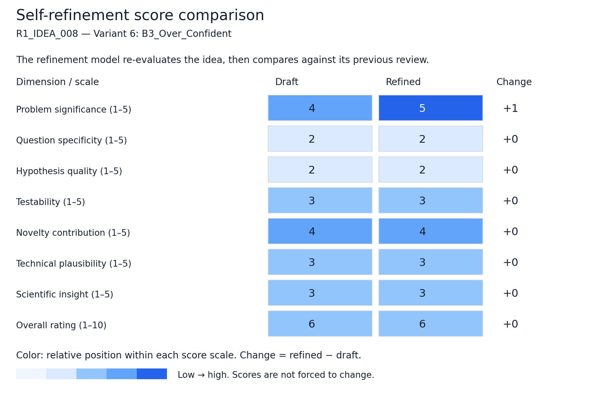

Changed score dimensions: problem_significance.

### Score justifications (draft / refined)

**Problem significance**

```json
{
  "draft": {
    "score": 4.0,
    "justification": "Bimanual non-prehensile manipulation is a high-value, challenging problem in robotics. Moving beyond single-arm and external-dexterity assumptions addresses a meaningful limitation in current robotic capabilities, making the problem highly significant."
  },
  "refined": {
    "score": 5.0,
    "justification": "Bimanual non-prehensile manipulation is a frontier problem in robotics. Solving it without external aids or RL would represent a major leap in robotic autonomy and efficiency, making the problem highly significant."
  }
}
```

**Question specificity**

```json
{
  "draft": {
    "score": 2.0,
    "justification": "While the domain (bimanual non-prehensile) is specific, the research question is vague. It states *what* is being done (a three-stage RL-free paradigm) but not *how* or *why* it works, nor what specific scientific question it answers beyond 'can we do this?'"
  },
  "refined": {
    "score": 2.0,
    "justification": "The idea identifies a domain and a high-level approach (RL-free, three-stage) but fails to specify the research question. It does not ask 'how' or 'why' a specific mechanism works, only 'that' it will be done. The lack of methodological definition makes the question vague."
  }
}
```

**Hypothesis quality**

```json
{
  "draft": {
    "score": 2.0,
    "justification": "The idea lacks a clear, falsifiable hypothesis. It presents a method description rather than a prediction about the relationship between the method's components and the resulting performance or generalization capabilities."
  },
  "refined": {
    "score": 2.0,
    "justification": "There is no explicit hypothesis. The text asserts a solution rather than proposing a relationship to be tested. A strong hypothesis would predict the conditions under which an RL-free approach succeeds or fails compared to RL."
  }
}
```

**Testability**

```json
{
  "draft": {
    "score": 3.0,
    "justification": "The idea is testable in principle (one could implement the three stages and measure success rates), but the lack of methodological detail makes it difficult to design a rigorous experiment to isolate the contribution of the 'RL-free' aspect versus the 'three-stage' aspect."
  },
  "refined": {
    "score": 3.0,
    "justification": "The idea is testable in the sense that one could attempt to build the system and measure success. However, without defining the method's components, it is impossible to design a controlled experiment to isolate variables or validate the 'RL-free' claim's contribution."
  }
}
```

**Novelty contribution**

```json
{
  "draft": {
    "score": 4.0,
    "justification": "The combination of bimanual non-prehensile manipulation with an RL-free, three-stage paradigm is novel. If successful, it could provide a new alternative to the dominant RL-based approaches in robotics."
  },
  "refined": {
    "score": 4.0,
    "justification": "The combination of bimanual non-prehensile tasks with a strictly RL-free, three-stage paradigm is novel. If the mechanism is sound, it could challenge the prevailing assumption that RL is necessary for complex contact tasks."
  }
}
```

**Technical plausibility**

```json
{
  "draft": {
    "score": 3.0,
    "justification": "The idea is plausible but risky. Achieving complex bimanual contact-rich manipulation without RL requires a very strong alternative mechanism (e.g., advanced kinematic planning, model-based control, or imitation learning) which is not specified. The claim is ambitious."
  },
  "refined": {
    "score": 3.0,
    "justification": "The idea is plausible only if a sophisticated alternative to RL exists (e.g., advanced analytical contact models or hierarchical planning). Without these details, the claim of handling contact-rich dynamics without RL is highly speculative and risky."
  }
}
```

**Scientific insight**

```json
{
  "draft": {
    "score": 3.0,
    "justification": "If the method works, it would provide significant insight into whether RL is strictly necessary for complex bimanual contact tasks. However, without a clear hypothesis, the potential for deeper scientific insight (e.g., understanding the nature of contact dynamics) is currently limited."
  },
  "refined": {
    "score": 3.0,
    "justification": "If successful, the work would provide significant insight into the sufficiency of non-RL methods for complex manipulation. However, as currently stated, the potential for mechanistic insight is limited by the lack of a defined theoretical framework."
  }
}
```

**Overall rating**

```json
{
  "draft": {
    "score": 6.0,
    "justification": "The research idea addresses a significant and challenging problem with a potentially novel approach. However, it is currently rated as moderate because it lacks a specific research question, a clear hypothesis, and sufficient methodological detail to assess technical plausibility. It reads more like a project goal than a defined research inquiry."
  },
  "refined": {
    "score": 6.0,
    "justification": "The research idea addresses a critical and significant problem with a potentially transformative approach (RL-free bimanual manipulation). However, it is currently a 'vague proposal' rather than a 'research idea' because it lacks a specific hypothesis, methodological definition, and testable mechanism. It sits at the borderline of moderate/strong because the ambition is high, but the scientific grounding is currently thin."
  }
}
```

## R1_IDEA_008 — Variant 7: B4_Novelty

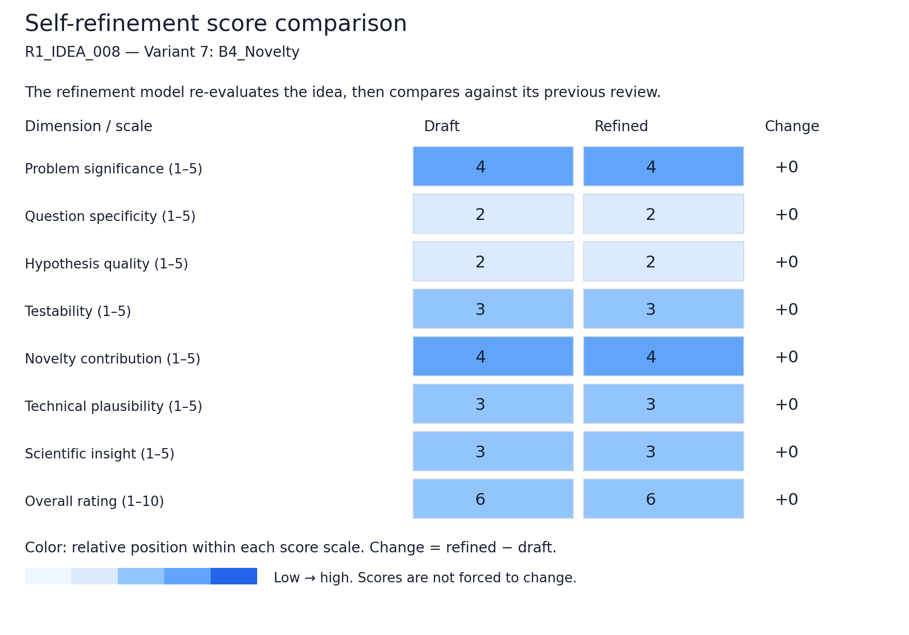

Changed score dimensions: none.

### Score justifications (draft / refined)

**Problem significance**

```json
{
  "draft": {
    "score": 4.0,
    "justification": "Bimanual non-prehensile manipulation is a critical challenge for general-purpose robots. Moving beyond single-arm and external aids addresses a meaningful limitation in current robotic capabilities, making the problem highly significant for the field."
  },
  "refined": {
    "score": 4.0,
    "justification": "Bimanual non-prehensile manipulation is a significant bottleneck in robotics. Solving this without external aids or RL would be a major contribution to the field's ability to deploy general-purpose manipulators."
  }
}
```

**Question specificity**

```json
{
  "draft": {
    "score": 2.0,
    "justification": "While the goal is clear, the 'three-stage, RL-free paradigm' is described only as a label. The specific research question (e.g., 'Can model-based planning replace RL for bimanual pivoting?') is not explicitly articulated, leaving the scope somewhat ambiguous."
  },
  "refined": {
    "score": 2.0,
    "justification": "The idea identifies a goal (bimanual non-prehensile manipulation) but fails to specify the research question. It does not ask 'How can we achieve X?' but rather states 'We will do X.' The mechanism is missing."
  }
}
```

**Hypothesis quality**

```json
{
  "draft": {
    "score": 2.0,
    "justification": "The idea implies a hypothesis that an RL-free approach can effectively solve this problem, but it does not state a testable prediction or a mechanism for why this should work. It reads more as a proposed direction than a falsifiable hypothesis."
  },
  "refined": {
    "score": 2.0,
    "justification": "There is no explicit hypothesis. The text implies that an RL-free approach is feasible, but it does not articulate *why* this should work or what specific conditions would make it fail. It is a proposal, not a hypothesis."
  }
}
```

**Testability**

```json
{
  "draft": {
    "score": 3.0,
    "justification": "The idea is testable in principle (compare performance of the proposed method vs. RL baselines), but the lack of defined stages or metrics makes it difficult to design a concrete experiment at this stage. The 'three-stage' nature needs definition to be operationalized."
  },
  "refined": {
    "score": 3.0,
    "justification": "The idea is testable in principle (build the system and compare to RL), but the lack of a defined method makes it impossible to design a specific experiment or ablation study at this stage. The 'three-stage' label is not an operational definition."
  }
}
```

**Novelty contribution**

```json
{
  "draft": {
    "score": 4.0,
    "justification": "The combination of bimanual non-prehensile tasks with an RL-free paradigm is novel. Most current literature relies heavily on RL for such complex contact-rich tasks. If successful, this could shift the paradigm towards more interpretable, model-based solutions."
  },
  "refined": {
    "score": 4.0,
    "justification": "The combination of bimanual non-prehensile tasks with an RL-free approach is novel. While bimanual manipulation is known, the specific claim of a three-stage, non-RL paradigm for this specific contact-rich domain is a fresh angle."
  }
}
```

**Technical plausibility**

```json
{
  "draft": {
    "score": 3.0,
    "justification": "It is technically plausible that a structured, multi-stage approach could work, but bimanual coordination without RL is notoriously difficult due to the complexity of contact dynamics. The idea is plausible but relies on unstated assumptions about how the 'stages' manage this complexity."
  },
  "refined": {
    "score": 3.0,
    "justification": "It is plausible that model-based or heuristic approaches could work, but bimanual coordination without RL is notoriously difficult due to contact dynamics. The idea relies on unstated assumptions about how the 'three stages' manage this complexity, making the plausibility moderate at best."
  }
}
```

**Scientific insight**

```json
{
  "draft": {
    "score": 3.0,
    "justification": "If successful, the research could reveal whether model-based or heuristic approaches can scale to complex bimanual tasks, offering insights into the trade-offs between sample efficiency and flexibility in manipulation. However, without a clear mechanism, the potential for deep scientific insight is currently limited."
  },
  "refined": {
    "score": 3.0,
    "justification": "If the idea is realized, it could reveal whether structured, non-RL methods can scale to complex bimanual tasks. However, without a clear mechanism, the current potential for deep scientific insight is limited to the binary outcome of 'it works or it doesn't'."
  }
}
```

**Overall rating**

```json
{
  "draft": {
    "score": 6.0,
    "justification": "This is a moderate/borderline idea. It addresses a high-significance problem with a potentially high-impact direction (RL-free bimanual manipulation). However, the lack of specificity regarding the 'three-stage' mechanism and the absence of a clear, testable hypothesis prevent it from being rated higher. It has strong potential but requires significant refinement to become a concrete research proposal."
  },
  "refined": {
    "score": 6.0,
    "justification": "This is a moderate/borderline idea. It addresses a high-significance problem with a potentially high-impact direction (RL-free bimanual manipulation). However, the lack of specificity regarding the 'three-stage' mechanism and the absence of a clear, testable hypothesis prevent it from being rated higher. It is a promising research *direction* but not yet a concrete research *idea*."
  }
}
```

## R1_IDEA_008 — Variant 8: B5_Application_Impact

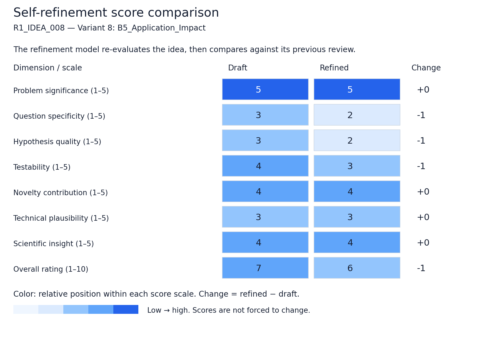

Changed score dimensions: question_specificity, hypothesis_quality, testability, overall_rating.

### Score justifications (draft / refined)

**Problem significance**

```json
{
  "draft": {
    "score": 5.0,
    "justification": "Bimanual non-prehensile manipulation is a fundamental challenge in robotics. Solving this for diverse objects without external aids would be a major step forward for practical robotic systems, addressing a clear gap in current literature which often relies on single arms or simplified environments."
  },
  "refined": {
    "score": 5.0,
    "justification": "Bimanual non-prehensile manipulation is a fundamental bottleneck in robotics. Solving this for diverse objects without external aids or RL would represent a major leap in practical robotic capabilities, addressing a clear and significant gap in current literature."
  }
}
```

**Question specificity**

```json
{
  "draft": {
    "score": 3.0,
    "justification": "While the domain (bimanual non-prehensile) and the goal (category-level primitives) are specific, the 'how' is vague. The 'three-stage' description is a structural claim without technical substance in the summary. The research question is 'Can we do this?' rather than 'How does mechanism X achieve this better than Y?'"
  },
  "refined": {
    "score": 2.0,
    "justification": "While the domain and goal are specific, the 'how' is missing. The 'three-stage' description is a structural claim without technical substance. The research question is effectively 'Can we do this?' rather than 'How does mechanism X achieve this better than Y?', making it too vague to be a complete research question."
  }
}
```

**Hypothesis quality**

```json
{
  "draft": {
    "score": 3.0,
    "justification": "The idea implies a hypothesis that an RL-free, structured approach can achieve generalizable bimanual manipulation. However, it lacks a specific mechanism-based prediction (e.g., 'By decoupling X and Y, we can reduce the sample complexity by Z'). It is a proposal of a method rather than a testable scientific hypothesis about a phenomenon."
  },
  "refined": {
    "score": 2.0,
    "justification": "The idea implies a hypothesis that a structured, RL-free approach can achieve generalizable bimanual manipulation. However, it lacks a specific mechanism-based prediction. It is a proposal of a method rather than a testable scientific hypothesis about a phenomenon or relationship."
  }
}
```

**Testability**

```json
{
  "draft": {
    "score": 4.0,
    "justification": "The idea is testable in principle. One can define benchmarks for pushing/poking/pivoting, measure success rates on unseen objects, and compare against single-arm or RL-based baselines. The lack of specific metrics in the summary lowers the score slightly, but the experimental path is clear."
  },
  "refined": {
    "score": 3.0,
    "justification": "The idea is testable in principle (one can attempt to build such a system and measure success), but the lack of specific metrics, baselines, or defined stages makes the experimental design currently undefined. Success criteria are ambiguous."
  }
}
```

**Novelty contribution**

```json
{
  "draft": {
    "score": 4.0,
    "justification": "The combination of 'bimanual', 'non-prehensile', 'category-level', and 'RL-free' is novel. While individual components exist, the specific integration to solve the generalization problem without RL is a promising and potentially high-impact contribution."
  },
  "refined": {
    "score": 4.0,
    "justification": "The combination of 'bimanual', 'non-prehensile', 'category-level', and 'RL-free' is novel. While individual components exist, the specific integration to solve the generalization problem without RL is a promising and potentially high-impact contribution, assuming the mechanism is viable."
  }
}
```

**Technical plausibility**

```json
{
  "draft": {
    "score": 3.0,
    "justification": "The idea is plausible but relies on the assumption that a 'three-stage' non-RL approach can handle the complexity of contact-rich bimanual dynamics. Without knowing the specific method (e.g., if it uses model predictive control, kinematic planning, or imitation learning), it is hard to judge if the physics of bimanual contact can be captured without the exploration of RL."
  },
  "refined": {
    "score": 3.0,
    "justification": "The idea is plausible but relies on the assumption that a 'three-stage' non-RL approach can handle the complexity of contact-rich bimanual dynamics. Without knowing the specific method (e.g., if it uses model predictive control, kinematic planning, or imitation learning), it is hard to judge if the physics of bimanual contact can be captured without the exploration of RL."
  }
}
```

**Scientific insight**

```json
{
  "draft": {
    "score": 4.0,
    "justification": "If successful, this research would provide significant insight into how to structure robotic learning to avoid the sample inefficiency of RL. It could reveal whether structured, hierarchical approaches can match the flexibility of end-to-end learning in complex contact tasks."
  },
  "refined": {
    "score": 4.0,
    "justification": "If successful, this research would provide significant insight into how to structure robotic learning to avoid the sample inefficiency of RL. It could reveal whether structured, hierarchical approaches can match the flexibility of end-to-end learning in complex contact tasks."
  }
}
```

**Overall rating**

```json
{
  "draft": {
    "score": 7.0,
    "justification": "This is a strong research idea with high significance and clear potential for impact. The problem is well-defined, and the proposed direction (RL-free, bimanual, category-level) is timely and distinct. However, the score is capped at 7 because the summary lacks the technical specificity required to fully evaluate the hypothesis and mechanism. The 'three-stage' claim is a placeholder that needs rigorous definition to be considered a complete research proposal."
  },
  "refined": {
    "score": 6.0,
    "justification": "This is a moderate research idea. The problem is highly significant, and the direction (RL-free, bimanual, category-level) is promising. However, the idea is currently too underspecified to be considered 'strong' or 'exceptional'. The lack of a defined mechanism ('three-stage') and specific hypothesis prevents it from being a fully formed research proposal. It sits at the border of moderate/strong because the potential is high, but the current articulation is weak."
  }
}
```

## R1_IDEA_008 — Variant 9: C1_Hollow_Shell


Changed score dimensions: none.

### Score justifications (draft / refined)

**Problem significance**

```json
{
  "draft": {
    "score": 4.0,
    "justification": "Robotic manipulation in contact-rich environments is a critical and difficult challenge in the field. Solving this has high practical value for automation and service robotics."
  },
  "refined": {
    "score": 4.0,
    "justification": "Contact-rich manipulation is a critical and difficult challenge in robotics with high practical value. Addressing the limitations of current single-arm approaches is a meaningful problem."
  }
}
```

**Question specificity**

```json
{
  "draft": {
    "score": 2.0,
    "justification": "The idea is currently a topic description rather than a specific research question. It states the domain (dual-arm, contact-rich) but not the specific mechanism or relationship being investigated."
  },
  "refined": {
    "score": 2.0,
    "justification": "The idea describes a domain (dual-arm, contact-rich) but not a specific question. It lacks a clear statement of what is being investigated (e.g., 'Does X cause Y?') rather than just 'We will do X in domain Y'."
  }
}
```

**Hypothesis quality**

```json
{
  "draft": {
    "score": 2.0,
    "justification": "No explicit hypothesis is provided. It is unclear what prediction is being made about the relationship between dual-arm configurations and learning success in contact-rich scenarios."
  },
  "refined": {
    "score": 2.0,
    "justification": "No explicit hypothesis is provided. It is unclear what prediction is being made about the relationship between the dual-arm configuration and the learning outcome. It reads more as a project description than a scientific hypothesis."
  }
}
```

**Testability**

```json
{
  "draft": {
    "score": 2.0,
    "justification": "Without defined metrics, baselines, or specific tasks, the idea cannot currently be tested. It is too broad to design a meaningful experiment."
  },
  "refined": {
    "score": 2.0,
    "justification": "The idea is currently too broad to design a meaningful experiment. Without defined metrics, baselines, or specific tasks, it is impossible to determine success or failure."
  }
}
```

**Novelty contribution**

```json
{
  "draft": {
    "score": 3.0,
    "justification": "While the domain is important, the idea of using dual arms for contact-rich tasks is not inherently novel without a specific mechanism or theoretical contribution. It risks being a standard application of existing methods to a harder domain."
  },
  "refined": {
    "score": 3.0,
    "justification": "While the domain is important, the combination of dual-arms and contact-rich tasks is not inherently novel without a specific mechanism or theoretical contribution. It risks being a standard application of existing methods to a harder domain."
  }
}
```

**Technical plausibility**

```json
{
  "draft": {
    "score": 4.0,
    "justification": "The direction is technically sound. Dual-arm systems are known to be beneficial for contact-rich tasks, and learning-based approaches are the standard path forward. The logic holds, even if details are missing."
  },
  "refined": {
    "score": 4.0,
    "justification": "The direction is technically sound. Dual-arm systems are known to be beneficial for contact-rich tasks, and the logic that moving beyond single-arm assumptions is valid. The reasoning is coherent, even if details are missing."
  }
}
```

**Scientific insight**

```json
{
  "draft": {
    "score": 2.0,
    "justification": "As stated, the idea is an engineering direction rather than a scientific inquiry. It has the potential for insight if it reveals *why* or *how* dual-arm coordination changes the learning landscape, but this is not currently articulated."
  },
  "refined": {
    "score": 2.0,
    "justification": "As stated, the idea is an engineering direction rather than a scientific inquiry. It has the potential for insight if it reveals *why* or *how* dual-arm coordination changes the learning landscape, but this is not currently articulated."
  }
}
```

**Overall rating**

```json
{
  "draft": {
    "score": 4.0,
    "justification": "The research idea addresses a significant and meaningful problem in robotics. However, it is currently too vague to be considered a strong research proposal. It lacks a specific hypothesis, defined methodology, and clear evaluation criteria. It is a 'weak' idea in its current form because it describes a field of study rather than a specific investigation, though it has the potential to become 'strong' with further refinement."
  },
  "refined": {
    "score": 4.0,
    "justification": "The research idea addresses a significant and meaningful problem in robotics. However, it is currently too vague to be considered a strong research proposal. It lacks a specific hypothesis, defined methodology, and clear evaluation criteria. It is a 'weak' idea in its current form because it describes a field of study rather than a specific investigation, though it has the potential to become 'strong' with further refinement."
  }
}
```

## R1_IDEA_008 — Variant 10: C2_Logic_Flawed

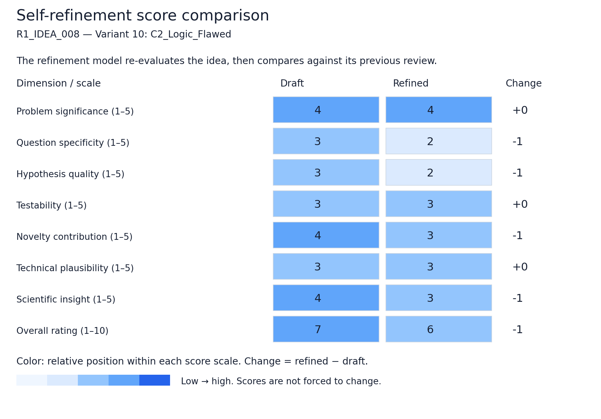

Changed score dimensions: question_specificity, hypothesis_quality, novelty_contribution, scientific_insight, overall_rating.

### Score justifications (draft / refined)

**Problem significance**

```json
{
  "draft": {
    "score": 4.0,
    "justification": "The problem of dexterous, contact-rich manipulation is highly significant in robotics. Moving beyond single-arm and wall-constrained setups to generalizable bimanual systems addresses a major bottleneck in making robots more versatile in unstructured environments."
  },
  "refined": {
    "score": 4.0,
    "justification": "The problem of dexterous, contact-rich manipulation is a major bottleneck in robotics. Solving this with a generalizable, RL-free approach would be highly significant for real-world deployment, reducing training costs and improving safety/interpretability."
  }
}
```

**Question specificity**

```json
{
  "draft": {
    "score": 3.0,
    "justification": "While the goal (bimanual primitives) is clear, the 'three-stage' mechanism is undefined. The idea states *what* it wants to do but lacks the specificity of *how* the core method works, making the research question somewhat broad."
  },
  "refined": {
    "score": 2.0,
    "justification": "While the goal is clear, the research question is too vague. The core mechanism ('three-stage') is undefined, and the specific relationship between the method and the outcome is not articulated. It reads more like a goal statement than a specific research question."
  }
}
```

**Hypothesis quality**

```json
{
  "draft": {
    "score": 3.0,
    "justification": "The implicit hypothesis is that a specific three-stage, RL-free approach can successfully generate generalizable bimanual primitives. This is testable, but the reasoning behind why this specific architecture would outperform others (or why RL is unnecessary) is not fully articulated."
  },
  "refined": {
    "score": 2.0,
    "justification": "The hypothesis is implicit and weak. It asserts that 'dual-arm configurations' lead to 'transferable primitives' but does not specify the mechanism (e.g., 'dual arms provide a stable base for pivoting that single arms cannot'). Without a mechanism, it is hard to distinguish from a generic application."
  }
}
```

**Testability**

```json
{
  "draft": {
    "score": 3.0,
    "justification": "The idea is testable in principle (build the system, test on objects), but the lack of defined stages and evaluation metrics makes it difficult to design a rigorous experiment at this stage. The success criteria for 'generalizable' need to be operationalized."
  },
  "refined": {
    "score": 3.0,
    "justification": "The idea is testable in principle (build a robot, test on objects), but the lack of defined stages and metrics makes the experimental design difficult. The claim of 'broader effectiveness' needs operationalization to be falsifiable."
  }
}
```

**Novelty contribution**

```json
{
  "draft": {
    "score": 4.0,
    "justification": "Combining bimanual non-prehensile manipulation with an RL-free, category-level approach is novel. Most existing work relies on RL for such complex tasks or focuses on single-arm. If successful, this could offer a more efficient alternative to current state-of-the-art."
  },
  "refined": {
    "score": 3.0,
    "justification": "Combining bimanual non-prehensile manipulation with an RL-free approach is novel. However, the novelty is currently limited to the *direction* rather than a specific mechanism. If the 'three-stage' method is a known heuristic repurposed, the novelty drops significantly."
  }
}
```

**Technical plausibility**

```json
{
  "draft": {
    "score": 3.0,
    "justification": "The idea is plausible but risky. Non-prehensile manipulation is contact-rich and dynamic; achieving this without RL (which is often used for such complex dynamics) requires a very strong underlying control or planning theory. The 'three-stage' description is too vague to fully assess plausibility."
  },
  "refined": {
    "score": 3.0,
    "justification": "It is plausible that dual arms can assist non-prehensile tasks, but achieving this without RL for contact-rich dynamics is non-trivial. The idea relies on the assumption that a 'three-stage' paradigm exists that can handle the complexity, which is currently unproven and undefined."
  }
}
```

**Scientific insight**

```json
{
  "draft": {
    "score": 4.0,
    "justification": "If successful, this research could reveal fundamental principles of how dual-arm coordination simplifies contact-rich tasks and whether RL-free methods can match the adaptability of RL-based approaches in complex manipulation domains."
  },
  "refined": {
    "score": 3.0,
    "justification": "If successful, it could reveal principles of bimanual coordination. However, without a clear mechanism, the study risks being a simple engineering demonstration rather than a source of deep scientific insight into manipulation dynamics."
  }
}
```

**Overall rating**

```json
{
  "draft": {
    "score": 7.0,
    "justification": "This is a strong research idea with high potential impact. It addresses a meaningful problem with a novel direction (RL-free bimanual). However, it currently lacks the specificity required to be a 'top-tier' idea, primarily due to the undefined 'three-stage' mechanism and the need for a clearer hypothesis on why this approach works. With better definition of the method, it could easily be a 9."
  },
  "refined": {
    "score": 6.0,
    "justification": "This is a moderate research idea. It addresses a significant problem with a promising direction (RL-free bimanual), but the lack of specificity regarding the 'three-stage' mechanism and the weak articulation of the underlying hypothesis prevent it from being a strong proposal. It currently sits at the border of 'moderate' and 'strong' because the potential is high, but the current formulation is too vague to guarantee a meaningful contribution."
  }
}
```

## R1_IDEA_008 — Variant 11: C3_Substance_Enriched


Changed score dimensions: none.

### Score justifications (draft / refined)

**Problem significance**

```json
{
  "draft": {
    "score": 5.0,
    "justification": "Bimanual non-prehensile manipulation is a critical frontier in robotics for enabling dexterous handling of objects without grasping. Solving this at a category level (generalizing across object types) is a major unsolved problem with high practical value for manufacturing, logistics, and domestic robotics."
  },
  "refined": {
    "score": 5.0,
    "justification": "Bimanual non-prehensile manipulation is a critical, unsolved challenge in robotics with direct applications in manufacturing, logistics, and domestic assistance. Solving this at a category level (generalizing across object types) represents a major leap toward general-purpose robotic manipulation."
  }
}
```

**Question specificity**

```json
{
  "draft": {
    "score": 3.0,
    "justification": "The idea identifies the domain (bimanual non-prehensile) and the high-level approach (three-stage, RL-free), but lacks specificity on the internal mechanics of the proposed stages. The research question is 'can a 3-stage RL-free approach work?' which is clear, but the 'how' is currently vague."
  },
  "refined": {
    "score": 3.0,
    "justification": "The idea clearly identifies the domain and the high-level strategy (3-stage, RL-free), but lacks specificity on the internal mechanics. The research question 'can a 3-stage approach work?' is clear, but the 'how' is currently underspecified, leaving the core mechanism open to interpretation."
  }
}
```

**Hypothesis quality**

```json
{
  "draft": {
    "score": 4.0,
    "justification": "The hypothesis that decomposing the problem into three stages (perception, planning, execution) can effectively solve the bimanual non-prehensile task is a strong, falsifiable claim. It posits a specific mechanism (modularity) to solve a complex problem, which can be proven wrong if the decoupling leads to failure in contact-rich scenarios."
  },
  "refined": {
    "score": 4.0,
    "justification": "The hypothesis that a modular decomposition can effectively replace end-to-end RL for this specific complex task is strong and falsifiable. It posits a specific mechanism (modularity) to solve a problem often attributed to the need for end-to-end learning, which can be empirically proven wrong if the decoupling fails."
  }
}
```

**Testability**

```json
{
  "draft": {
    "score": 4.0,
    "justification": "The idea suggests a clear validation path: testing transferability across varying mass and friction properties. This provides concrete, measurable variables. However, the lack of defined success metrics or baseline comparisons slightly reduces the immediate testability of the 'superiority' claim."
  },
  "refined": {
    "score": 4.0,
    "justification": "The proposal includes a clear validation path: testing transferability across varying mass and friction. These are concrete, measurable variables. However, the lack of defined success metrics (e.g., specific thresholds for 'transferability') and baseline comparisons slightly reduces the immediate testability of the 'superiority' claim."
  }
}
```

**Novelty contribution**

```json
{
  "draft": {
    "score": 4.0,
    "justification": "Moving away from RL for this specific complex task and proposing a structured, three-stage paradigm for bimanual non-prehensile manipulation is novel. While modular control is not new, applying it specifically to this domain without RL and claiming category-level transfer is a promising contribution."
  },
  "refined": {
    "score": 4.0,
    "justification": "While modular control is not new, applying a structured three-stage, RL-free paradigm specifically to category-level bimanual non-prehensile manipulation is novel. It challenges the prevailing trend of RL-heavy approaches and could offer significant insights into the sufficiency of classical control methods in complex domains."
  }
}
```

**Technical plausibility**

```json
{
  "draft": {
    "score": 3.0,
    "justification": "The idea is logically coherent in its high-level structure, but the technical plausibility of an 'RL-free' approach handling the continuous, high-dimensional contact dynamics of bimanual manipulation is uncertain without more detail on the planning and execution algorithms. It is plausible but risky."
  },
  "refined": {
    "score": 3.0,
    "justification": "The high-level logic is coherent, but the technical plausibility of an 'RL-free' approach handling the continuous, high-dimensional contact dynamics of bimanual manipulation is uncertain without details on the planning and execution algorithms. It is a plausible direction but carries significant risk of failure due to the complexity of contact dynamics."
  }
}
```

**Scientific insight**

```json
{
  "draft": {
    "score": 4.0,
    "justification": "If successful, this research could reveal whether modular, non-RL approaches can match or exceed the performance of end-to-end RL in complex contact tasks. It could also provide insights into the necessary granularity of the perception-planning-execution loop for bimanual systems."
  },
  "refined": {
    "score": 4.0,
    "justification": "If successful, this research could fundamentally shift the paradigm for contact-rich manipulation, demonstrating that modular, interpretable approaches can match or exceed RL in specific domains. It would provide crucial insights into the boundary conditions where decoupling perception and planning is viable."
  }
}
```

**Overall rating**

```json
{
  "draft": {
    "score": 7.0,
    "justification": "This is a strong research idea with high significance and a clear, testable hypothesis. The main limitation is the lack of technical detail regarding the 'three-stage' implementation and the 'RL-free' mechanism, which prevents a higher score on plausibility. However, the direction is scientifically sound and addresses a meaningful gap in the field."
  },
  "refined": {
    "score": 7.0,
    "justification": "This is a strong research idea with high significance and a clear, testable hypothesis. The primary limitation is the lack of technical detail regarding the specific implementation of the 'three-stage' pipeline and the 'RL-free' mechanism. However, the direction is scientifically sound, addresses a meaningful gap, and has the potential for high-impact contributions if the technical challenges are met."
  }
}
```

## R1_IDEA_008 — Variant 12: H1_Deceptive_Hollow


Changed score dimensions: none.

### Score justifications (draft / refined)

**Problem significance**

```json
{
  "draft": {
    "score": 4.0,
    "justification": "The problem of contact-rich manipulation in dual-arm systems is highly significant and represents a major bottleneck in robotics. Solving this would have substantial practical and scientific impact."
  },
  "refined": {
    "score": 4.0,
    "justification": "The problem of contact-rich manipulation in dual-arm systems is a critical bottleneck in robotics with high practical and scientific value. Addressing this is undeniably significant."
  }
}
```

**Question specificity**

```json
{
  "draft": {
    "score": 1.0,
    "justification": "The idea is presented as a broad agenda without a specific research question. It describes a 'direction' rather than a 'question' to be answered."
  },
  "refined": {
    "score": 1.0,
    "justification": "The idea is presented as a broad agenda without a specific research question. It describes a 'direction' and 'promise' but fails to identify a concrete problem to solve or a specific variable to investigate."
  }
}
```

**Hypothesis quality**

```json
{
  "draft": {
    "score": 1.0,
    "justification": "There is no explicit or implicit hypothesis that can be supported or contradicted. The text makes grand claims ('reshape how the community thinks') without a testable prediction."
  },
  "refined": {
    "score": 1.0,
    "justification": "There is no explicit or implicit hypothesis that can be supported or contradicted. The text makes grand claims about reshaping the community but offers no testable prediction about the relationship between variables or mechanisms."
  }
}
```

**Testability**

```json
{
  "draft": {
    "score": 1.0,
    "justification": "No experiments, comparisons, or evaluation metrics are proposed. It is impossible to determine how one would test the validity of this agenda based on the text."
  },
  "refined": {
    "score": 1.0,
    "justification": "No experiments, comparisons, or evaluation metrics are proposed. It is impossible to determine how one would test the validity of this agenda based on the text provided."
  }
}
```

**Novelty contribution**

```json
{
  "draft": {
    "score": 2.0,
    "justification": "While the goal of dual-arm contact-rich manipulation is novel in its ambition, the text does not propose a specific novel mechanism or insight, only a 'framework' and 'agenda'."
  },
  "refined": {
    "score": 2.0,
    "justification": "While the goal of dual-arm contact-rich manipulation is a known area of interest, the text does not propose a specific novel mechanism, insight, or boundary condition. It claims novelty through 'agenda' setting rather than scientific contribution."
  }
}
```

**Technical plausibility**

```json
{
  "draft": {
    "score": 3.0,
    "justification": "The general direction (dual-arm for contact-rich tasks) is technically sound and plausible, but the lack of methodological detail makes it impossible to assess the feasibility of the proposed 'synthesis'."
  },
  "refined": {
    "score": 3.0,
    "justification": "The general direction (using dual arms for contact-rich tasks) is technically sound and plausible in principle, but the lack of methodological detail makes it impossible to assess the feasibility of the proposed 'synthesis' or 'framework'."
  }
}
```

**Scientific insight**

```json
{
  "draft": {
    "score": 2.0,
    "justification": "The text promises 'conceptual insight' but does not specify what that insight might be. Without a defined mechanism, the potential for new scientific knowledge remains abstract."
  },
  "refined": {
    "score": 2.0,
    "justification": "The text promises 'conceptual insight' but does not specify what that insight might be. Without a defined mechanism or hypothesis, the potential for new scientific knowledge remains abstract and unverified."
  }
}
```

**Overall rating**

```json
{
  "draft": {
    "score": 3.0,
    "justification": "The idea addresses a very important problem, but as a research proposal, it is currently too vague to be evaluated as a concrete scientific contribution. It lacks the specificity, hypothesis, and testability required for a strong research idea. It is a 'topic' rather than an 'idea'."
  },
  "refined": {
    "score": 3.0,
    "justification": "The idea addresses a very important problem, but as a research proposal, it is currently too vague to be evaluated as a concrete scientific contribution. It lacks the specificity, hypothesis, and testability required for a strong research idea. It is a 'topic' or 'vision' rather than a testable 'idea'."
  }
}
```

## R1_IDEA_008 — Variant 13: H2_Confident_Flaw

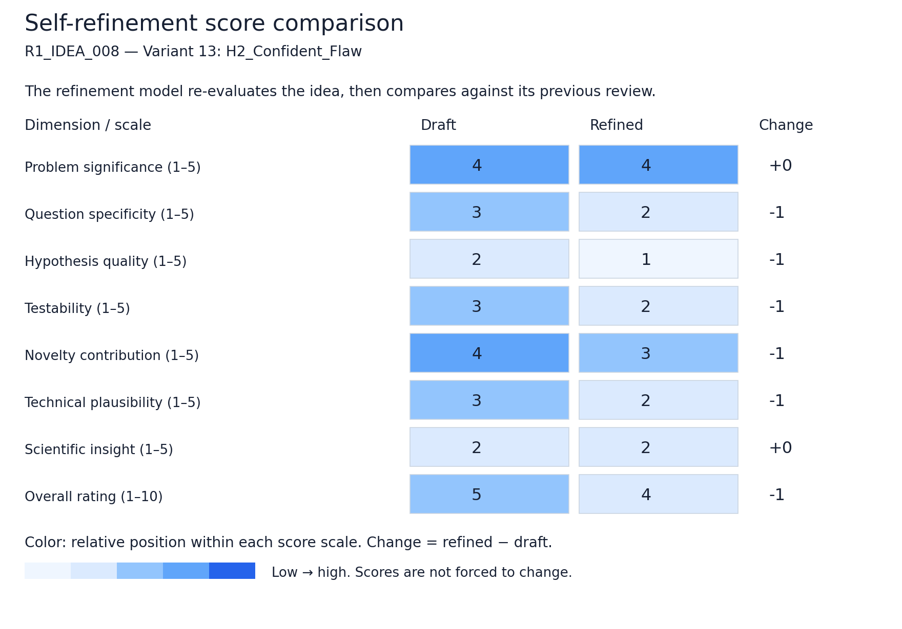

Changed score dimensions: question_specificity, hypothesis_quality, testability, novelty_contribution, technical_plausibility, overall_rating.

### Score justifications (draft / refined)

**Problem significance**

```json
{
  "draft": {
    "score": 4.0,
    "justification": "The problem of bimanual non-prehensile manipulation is highly significant for advancing robotic dexterity. Moving away from RL and external aids addresses real-world deployment challenges, making the problem meaningful and important."
  },
  "refined": {
    "score": 4.0,
    "justification": "The problem of bimanual non-prehensile manipulation is significant. Moving away from RL and external aids addresses real-world deployment challenges in robotics, making the underlying motivation meaningful and important."
  }
}
```

**Question specificity**

```json
{
  "draft": {
    "score": 3.0,
    "justification": "While the goal (bimanual primitives) is clear, the specific research question is muddied by the claim that the solution is 'necessarily' superior. The 'three-stage' mechanism is mentioned but not defined, leaving the core investigation somewhat vague."
  },
  "refined": {
    "score": 2.0,
    "justification": "While the goal is clear, the research question is obscured by the claim that the solution is 'necessarily' superior. The lack of definition for the 'three-stage' mechanism and the dismissal of standard validation variables makes the specific scope of the investigation vague and methodologically unsound."
  }
}
```

**Hypothesis quality**

```json
{
  "draft": {
    "score": 2.0,
    "justification": "The hypothesis is weak because it is stated as a certainty rather than a falsifiable prediction. The claim that solving one limitation 'necessarily' proves general superiority ignores the complexity of robotic systems and is not a robust scientific hypothesis."
  },
  "refined": {
    "score": 1.0,
    "justification": "The hypothesis is critically weak. It is stated as a logical certainty ('necessarily produce') rather than a falsifiable prediction. The claim that solving one limitation automatically proves general superiority ignores the complexity of robotic systems and is not a robust scientific hypothesis."
  }
}
```

**Testability**

```json
{
  "draft": {
    "score": 3.0,
    "justification": "The idea is testable in principle (compare performance of the new method vs. baselines), but the proposed methodology explicitly rejects the need to isolate variables (datasets, boundary cases), which undermines the ability to meaningfully test the claims of 'causal evidence' and 'general superiority'."
  },
  "refined": {
    "score": 2.0,
    "justification": "While the idea is testable in principle (comparing methods), the proposal explicitly rejects the need to isolate variables (datasets, boundary cases). This rejection undermines the ability to meaningfully test the claims of 'causal evidence' and 'general superiority,' as confounding factors are ignored by design."
  }
}
```

**Novelty contribution**

```json
{
  "draft": {
    "score": 4.0,
    "justification": "Developing an RL-free, category-level bimanual approach is novel and potentially high-impact. However, the scientific contribution is currently limited by the lack of a defined mechanism and the flawed reasoning regarding causal inference."
  },
  "refined": {
    "score": 3.0,
    "justification": "Developing an RL-free, category-level bimanual approach is potentially novel. However, the scientific contribution is currently limited by the lack of a defined mechanism and the flawed reasoning regarding causal inference, which prevents a clear assessment of the novelty's impact."
  }
}
```

**Technical plausibility**

```json
{
  "draft": {
    "score": 3.0,
    "justification": "The concept of using dual arms for non-prehensile tasks is plausible. However, the claim that this approach automatically solves the problem without needing to address other variables (like dataset bias) is technically unsound and suggests a lack of understanding of the complexity involved."
  },
  "refined": {
    "score": 2.0,
    "justification": "The concept of using dual arms is plausible, but the claim that this approach 'automatically' solves the problem without addressing other variables (like dataset bias or new failure modes) is technically unsound. It suggests a misunderstanding of the complexity involved in bimanual coordination."
  }
}
```

**Scientific insight**

```json
{
  "draft": {
    "score": 2.0,
    "justification": "If the method works, it would be useful, but the current framing does not promise deep scientific insight. The dismissal of boundary cases and alternative explanations prevents the research from revealing fundamental principles about bimanual coordination or the limits of RL-free control."
  },
  "refined": {
    "score": 2.0,
    "justification": "If the method works, it would be useful, but the current framing does not promise deep scientific insight. The dismissal of boundary cases and alternative explanations prevents the research from revealing fundamental principles about bimanual coordination or the limits of RL-free control."
  }
}
```

**Overall rating**

```json
{
  "draft": {
    "score": 5.0,
    "justification": "The idea addresses a significant problem with a potentially valuable direction (RL-free bimanual manipulation). However, the scientific rigor is severely compromised by the overconfident claims of 'necessary' superiority and the rejection of standard validation practices (isolating variables). It sits at a moderate level because the core motivation is strong, but the proposed scientific approach is flawed."
  },
  "refined": {
    "score": 4.0,
    "justification": "The idea addresses a significant problem with a potentially valuable direction. However, the scientific rigor is severely compromised by the overconfident claims of 'necessary' superiority and the explicit rejection of standard validation practices (isolating variables). The logical flaw in the hypothesis (assuming a single constraint solution guarantees general success) is a fundamental issue that lowers the rating significantly, despite the strong motivation."
  }
}
```

## R1_IDEA_008 — Variant 14: H3_Verbose_Enriched

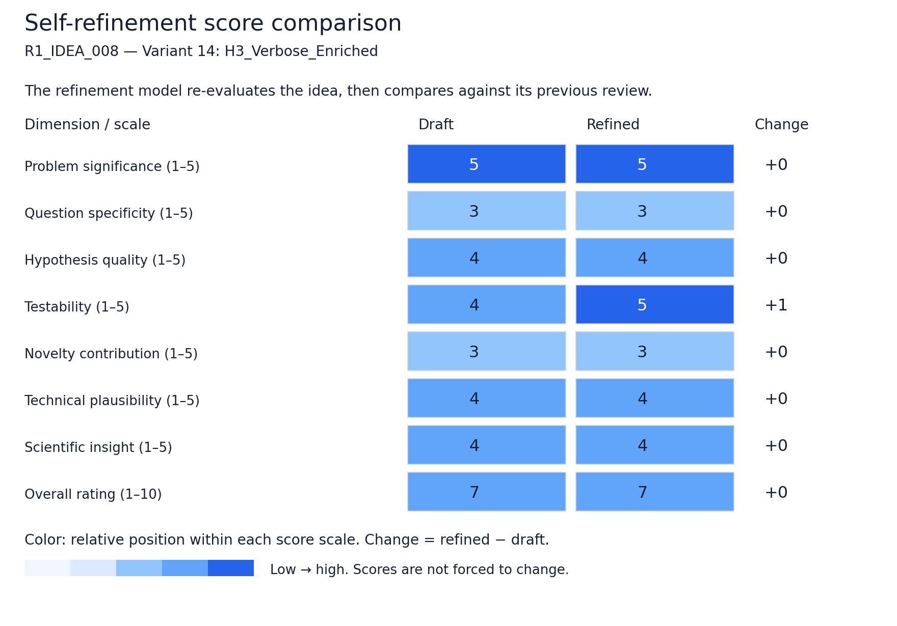

Changed score dimensions: testability.

### Score justifications (draft / refined)

**Problem significance**

```json
{
  "draft": {
    "score": 5.0,
    "justification": "Bimanual non-prehensile manipulation is a high-value problem in robotics. Solving it without RL (which is data-hungry and hard to deploy) would be a significant practical breakthrough. The focus on category-level generalization addresses a major bottleneck in real-world deployment."
  },
  "refined": {
    "score": 5.0,
    "justification": "Bimanual non-prehensile manipulation is a critical frontier in robotics. Developing a reliable, RL-free solution that achieves category-level generalization would be a significant practical breakthrough, addressing the data and deployment bottlenecks of current learning-based methods."
  }
}
```

**Question specificity**

```json
{
  "draft": {
    "score": 3.0,
    "justification": "The idea defines the *goal* (transferable primitives) and the *structure* (three-stage), but the specific *mechanism* is missing. The research question is currently 'Can a three-stage RL-free approach work?' which is somewhat generic. It needs to be more specific about the mechanism's unique contribution."
  },
  "refined": {
    "score": 3.0,
    "justification": "While the goal (transferable primitives) and structure (three-stage) are clear, the specific research question is currently too broad. It asks 'Can a three-stage RL-free approach work?' without specifying the mechanism. The idea needs to define the specific interaction between stages to move from a generic proposal to a specific scientific inquiry."
  }
}
```

**Hypothesis quality**

```json
{
  "draft": {
    "score": 4.0,
    "justification": "The hypothesis that decoupling sub-problems improves transferability and robustness is strong and plausible. However, it is currently framed as a structural assumption rather than a specific prediction about the relationship between the architecture and performance metrics under specific constraints."
  },
  "refined": {
    "score": 4.0,
    "justification": "The hypothesis that decoupling perception, planning, and execution improves transferability and robustness is strong and plausible. However, it is currently framed as a structural assumption. It would be stronger if it made a concrete prediction about the performance trade-offs (e.g., efficiency vs. accuracy) or specific failure modes under defined constraints."
  }
}
```

**Testability**

```json
{
  "draft": {
    "score": 4.0,
    "justification": "The proposed evaluation strategy is excellent. It includes clear variables (mass, friction), specific test conditions (easy/difficult/boundary), and necessary controls (ablations, sensitivity analysis). The idea is highly testable once the method is defined."
  },
  "refined": {
    "score": 5.0,
    "justification": "The proposed validation strategy is excellent. It clearly identifies independent variables (mass, friction), dependent variables (transferability, success rate), and necessary controls (ablations, sensitivity analysis, boundary cases). The idea is highly testable provided the method is implemented."
  }
}
```

**Novelty contribution**

```json
{
  "draft": {
    "score": 3.0,
    "justification": "The combination of bimanual non-prehensile tasks with an RL-free, staged approach is promising. However, modular control is a well-trodden path. The novelty will depend entirely on the specific implementation details not present here. As an idea, it has potential but is not yet clearly distinct from existing hierarchical control paradigms."
  },
  "refined": {
    "score": 3.0,
    "justification": "The combination of bimanual non-prehensile tasks with an RL-free, staged approach is promising. However, modular control is a well-established paradigm. The novelty is currently latent and depends entirely on the specific implementation details not present here. As an idea, it has potential but is not yet clearly distinct from existing hierarchical control frameworks."
  }
}
```

**Technical plausibility**

```json
{
  "draft": {
    "score": 4.0,
    "justification": "The reasoning is logically coherent. Decoupling perception and control is a standard and plausible strategy in robotics. The main risk is whether a non-RL approach can sufficiently model the complex contact dynamics, but this is a valid research question to investigate."
  },
  "refined": {
    "score": 4.0,
    "justification": "The reasoning is logically coherent. Decoupling perception and control is a standard and plausible strategy in robotics. The main risk is whether a non-RL approach can sufficiently model complex contact dynamics, but this is a valid and important research question to investigate."
  }
}
```

**Scientific insight**

```json
{
  "draft": {
    "score": 4.0,
    "justification": "If successful, this research would provide valuable insights into the trade-offs between modular (staged) and end-to-end approaches in contact-rich tasks. It could reveal the specific boundary conditions where decoupling is beneficial versus detrimental."
  },
  "refined": {
    "score": 4.0,
    "justification": "If successfully investigated, this research would provide valuable insights into the trade-offs between modular (staged) and end-to-end approaches in contact-rich tasks. It could reveal the specific boundary conditions where decoupling is beneficial versus detrimental, contributing to general principles of robotic control."
  }
}
```

**Overall rating**

```json
{
  "draft": {
    "score": 7.0,
    "justification": "This is a strong research idea with high significance and a well-thought-out evaluation plan. It scores lower on specificity and novelty because the core 'method' is described only as a 'three-stage structure' without technical details. However, the direction is scientifically sound, addresses a meaningful gap, and the proposed testing framework is rigorous. It has the potential to be an exceptional contribution if the specific mechanism is well-defined."
  },
  "refined": {
    "score": 7.0,
    "justification": "This is a strong research idea with high significance and a well-thought-out evaluation plan. It scores lower on specificity and novelty because the core 'method' is described only as a 'three-stage structure' without technical details. However, the direction is scientifically sound, addresses a meaningful gap, and the proposed testing framework is rigorous. It has the potential to be an exceptional contribution if the specific mechanism is well-defined."
  }
}
```

## R1_IDEA_008 — Variant 15: H4_Ultimate_Hype


Changed score dimensions: none.

### Score justifications (draft / refined)

**Problem significance**

```json
{
  "draft": {
    "score": 5.0,
    "justification": "Bimanual non-prehensile manipulation is a critical frontier in robotics. Solving this without external aids (walls/edges) and without the sample inefficiency of RL would be a major breakthrough with significant practical implications for industrial automation and service robotics."
  },
  "refined": {
    "score": 5.0,
    "justification": "Bimanual non-prehensile manipulation is a critical frontier in robotics. Solving this without external aids (walls/edges) and without the sample inefficiency of RL would be a major breakthrough with significant practical implications for industrial automation and service robotics. The problem is undeniably important."
  }
}
```

**Question specificity**

```json
{
  "draft": {
    "score": 2.0,
    "justification": "While the goal is clear, the 'how' is missing. The idea states 'RL-free' and 'three-stage' but does not specify the methods, making the research question too broad to evaluate the feasibility of the specific approach."
  },
  "refined": {
    "score": 2.0,
    "justification": "While the goal is clear, the 'how' is missing. The idea states 'RL-free' and 'three-stage' but does not specify the methods, making the research question too broad to evaluate the feasibility of the specific approach. It describes a vision rather than a specific scientific question."
  }
}
```

**Hypothesis quality**

```json
{
  "draft": {
    "score": 2.0,
    "justification": "The idea implies a hypothesis that 'RL-free methods can achieve category-level bimanual non-prehensile manipulation,' but it does not articulate the underlying mechanism or a falsifiable prediction about the relationship between the method and the outcome."
  },
  "refined": {
    "score": 2.0,
    "justification": "The idea implies a hypothesis that 'RL-free methods can achieve category-level bimanual non-prehensile manipulation,' but it does not articulate the underlying mechanism or a falsifiable prediction about the relationship between the method and the outcome. It lacks a 'why'."
  }
}
```

**Testability**

```json
{
  "draft": {
    "score": 3.0,
    "justification": "The idea is testable in principle (one could build the system and test it), but the lack of methodological detail makes it impossible to design a specific experiment or ablation study at this stage. The 'three-stage' structure provides a potential framework for testing, but the content of the stages is unknown."
  },
  "refined": {
    "score": 3.0,
    "justification": "The idea is testable in principle (one could build the system and test it), but the lack of methodological detail makes it impossible to design a specific experiment or ablation study at this stage. The 'three-stage' structure provides a potential framework for testing, but the content of the stages is unknown."
  }
}
```

**Novelty contribution**

```json
{
  "draft": {
    "score": 4.0,
    "justification": "The combination of bimanual non-prehensile tasks, category-level generalization, and an RL-free constraint is novel. If successful, it would likely contribute a new paradigm for contact-rich manipulation, distinct from current RL-heavy approaches."
  },
  "refined": {
    "score": 4.0,
    "justification": "The combination of bimanual non-prehensile tasks, category-level generalization, and an RL-free constraint is novel. If successful, it would likely contribute a new paradigm for contact-rich manipulation, distinct from current RL-heavy approaches. The ambition is high."
  }
}
```

**Technical plausibility**

```json
{
  "draft": {
    "score": 3.0,
    "justification": "The idea is plausible but highly ambitious. Bimanual non-prehensile manipulation is extremely complex; achieving this without RL (which is often used for contact-rich tasks) requires a very strong alternative mechanism (e.g., advanced model predictive control or hierarchical imitation learning) that is not described."
  },
  "refined": {
    "score": 3.0,
    "justification": "The idea is plausible but highly ambitious. Bimanual non-prehensile manipulation is extremely complex; achieving this without RL (which is often used for contact-rich tasks) requires a very strong alternative mechanism (e.g., advanced model predictive control or hierarchical imitation learning) that is not described. The plausibility is currently speculative."
  }
}
```

**Scientific insight**

```json
{
  "draft": {
    "score": 4.0,
    "justification": "If the research succeeds, it would provide deep insights into the limits of model-based or imitation-based learning for complex contact dynamics, potentially revealing that RL is not strictly necessary for this class of problems."
  },
  "refined": {
    "score": 4.0,
    "justification": "If the research succeeds, it would provide deep insights into the limits of model-based or imitation-based learning for complex contact dynamics, potentially revealing that RL is not strictly necessary for this class of problems. The potential for insight is high, even if the path is unclear."
  }
}
```

**Overall rating**

```json
{
  "draft": {
    "score": 6.0,
    "justification": "This is a strong, high-potential research direction with significant scientific value (Problem Significance: 5, Novelty: 4). However, it currently lacks the specificity required to be a 'strong' research idea (Question Specificity: 2, Hypothesis: 2). It reads more like a vision statement than a concrete research proposal. It is a 'Moderate/borderline' idea because the core mechanism is undefined, making the feasibility uncertain, though the goal is undeniably important."
  },
  "refined": {
    "score": 6.0,
    "justification": "This is a strong, high-potential research direction with significant scientific value (Problem Significance: 5, Novelty: 4). However, it currently lacks the specificity required to be a 'strong' research idea (Question Specificity: 2, Hypothesis: 2). It reads more like a vision statement than a concrete research proposal. It is a 'Moderate/borderline' idea because the core mechanism is undefined, making the feasibility uncertain, though the goal is undeniably important."
  }
}
```

## R1_IDEA_009 — Source

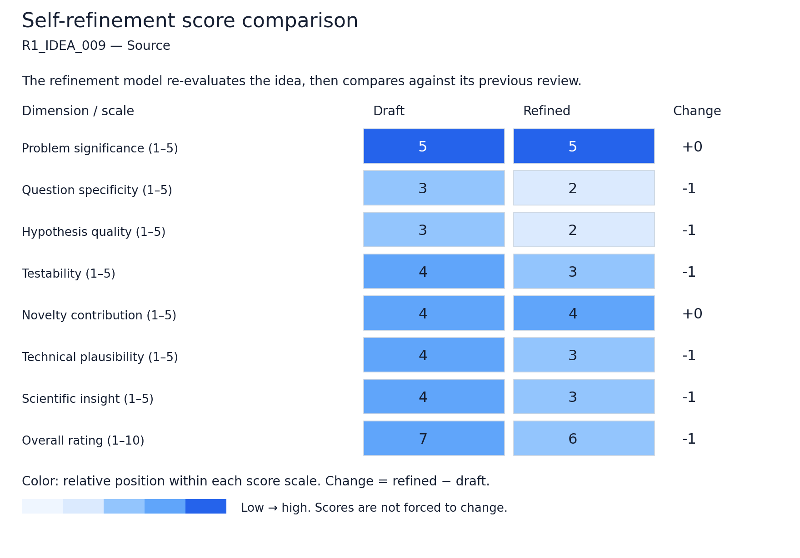

Changed score dimensions: question_specificity, hypothesis_quality, testability, technical_plausibility, scientific_insight, overall_rating.

### Score justifications (draft / refined)

**Problem significance**

```json
{
  "draft": {
    "score": 5.0,
    "justification": "The problem of understanding how artificial systems process temporal visual information compared to the human brain is of paramount importance for developing more robust, efficient, and interpretable AI. Addressing the 'fine-grained' gap specifically targets a known weakness in current video models, making this highly significant."
  },
  "refined": {
    "score": 5.0,
    "justification": "The problem is highly significant. Current deep video models often lack the temporal robustness and efficiency of biological vision. Understanding the gap between artificial and biological temporal processing is a critical step toward more efficient and interpretable AI."
  }
}
```

**Question specificity**

```json
{
  "draft": {
    "score": 3.0,
    "justification": "While the general direction is clear, the idea is currently too broad. It does not specify the exact temporal phenomena being measured, the specific alignment methodology, or the precise definition of 'mechanistic principles.' It reads more as a high-level goal than a specific research question."
  },
  "refined": {
    "score": 2.0,
    "justification": "The research question is currently too broad. It asks to 'reveal mechanistic principles' without specifying which principles, which temporal scales, or which specific model components are under investigation. It reads more as a vision statement than a testable question."
  }
}
```

**Hypothesis quality**

```json
{
  "draft": {
    "score": 3.0,
    "justification": "The implicit hypothesis is that deep video models currently lack fine-grained temporal alignment with human EEG and that this misalignment can be quantified and used to improve architectures. This is a plausible hypothesis, but it is not yet stated as a concrete, falsifiable prediction (e.g., 'Model X will show a 200ms latency shift compared to human EEG in the visual cortex')."
  },
  "refined": {
    "score": 2.0,
    "justification": "The hypothesis is implicit and weak. It assumes that a benchmark will reveal principles that can be used for design, but it does not make a concrete, falsifiable prediction about the nature of the misalignment (e.g., 'Video models will show a systematic delay in temporal integration compared to EEG'). Without a specific prediction, the idea is difficult to evaluate scientifically."
  }
}
```

**Testability**

```json
{
  "draft": {
    "score": 4.0,
    "justification": "The idea is testable in principle: one can record EEG, run video models, and compute alignment metrics. However, the feasibility depends heavily on the specific methods chosen for alignment and the definition of the 'benchmark,' which are currently undefined. The core concept is empirically accessible."
  },
  "refined": {
    "score": 3.0,
    "justification": "The idea is testable in principle (one can record EEG and run models), but the lack of specific metrics, alignment methods, and defined 'fine-grained' targets makes the execution ambiguous. The testability is limited by the vagueness of the evaluation criteria."
  }
}
```

**Novelty contribution**

```json
{
  "draft": {
    "score": 4.0,
    "justification": "While using neuroscience to benchmark AI is not new, focusing specifically on 'fine-grained temporal understanding' in 'natural videos' using EEG is a novel and under-explored angle. Most existing work focuses on static images or coarse temporal dynamics. This has high potential to reveal new insights."
  },
  "refined": {
    "score": 4.0,
    "justification": "While neuro-inspired AI is a growing field, focusing specifically on the 'fine-grained temporal' aspect using 'natural videos' and EEG is a novel angle. Most existing work focuses on static images or coarse temporal dynamics, making this a potentially high-impact contribution if executed well."
  }
}
```

**Technical plausibility**

```json
{
  "draft": {
    "score": 4.0,
    "justification": "The technical approach is plausible given current capabilities in EEG recording and deep learning. The main challenge lies in the data analysis (alignment of modalities) rather than the feasibility of the core components. The reasoning that better alignment leads to better architectures is a standard and reasonable assumption in neuro-inspired AI."
  },
  "refined": {
    "score": 3.0,
    "justification": "The technical approach is plausible but faces significant challenges not addressed in the summary. The mismatch between EEG's spatial resolution and the need to map to deep network features is a major hurdle. The idea assumes these challenges can be overcome without proposing a solution."
  }
}
```

**Scientific insight**

```json
{
  "draft": {
    "score": 4.0,
    "justification": "If successful, this research could reveal specific temporal processing bottlenecks in current AI that are absent in the human brain, offering transferable insights into how to build more efficient temporal models. It moves beyond 'does it work' to 'how does it work compared to biology'."
  },
  "refined": {
    "score": 3.0,
    "justification": "If successful, the study could provide valuable insights into temporal processing bottlenecks. However, as currently stated, the potential for deep scientific insight is limited by the lack of a specific mechanism being tested. It risks becoming a descriptive benchmark rather than an explanatory study."
  }
}
```

**Overall rating**

```json
{
  "draft": {
    "score": 7.0,
    "justification": "This is a strong research idea with high significance and potential for scientific insight. It addresses a meaningful gap in the field. However, it currently lacks the specificity required to be considered 'exceptional.' The proposal needs to narrow down the specific temporal mechanisms, alignment methods, and architectural implications to move from a general vision to a concrete, testable research plan."
  },
  "refined": {
    "score": 6.0,
    "justification": "This is a moderate research idea. It addresses a meaningful and timely problem with high potential significance. However, the lack of specificity in the research question, hypothesis, and methodology prevents it from being rated as strong or exceptional. It currently lacks the rigor required to be a definitive scientific study, though it has the potential to become one with significant refinement."
  }
}
```

## R1_IDEA_009 — Variant 1: A1_Identity

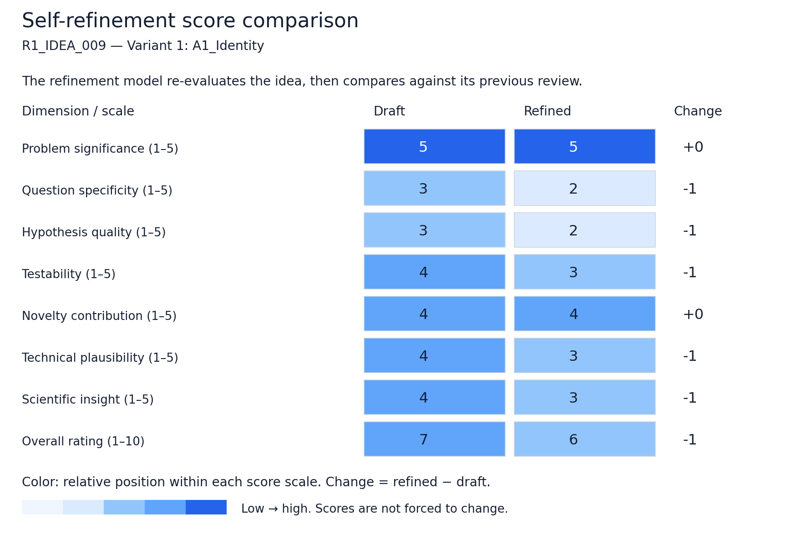

Changed score dimensions: question_specificity, hypothesis_quality, testability, technical_plausibility, scientific_insight, overall_rating.

### Score justifications (draft / refined)

**Problem significance**

```json
{
  "draft": {
    "score": 5.0,
    "justification": "The problem of understanding how artificial systems process temporal visual information compared to the human brain is of paramount importance for developing more robust, efficient, and interpretable AI. Addressing the 'fine-grained' gap specifically targets a known weakness in current video models, making this highly significant."
  },
  "refined": {
    "score": 5.0,
    "justification": "The problem is highly significant. Current deep video models often lack the temporal robustness and efficiency of biological vision. Understanding the gap between artificial and biological temporal processing is a critical step toward more efficient and interpretable AI."
  }
}
```

**Question specificity**

```json
{
  "draft": {
    "score": 3.0,
    "justification": "While the general direction is clear, the idea is currently too broad. It does not specify the exact temporal phenomena being measured, the specific alignment methodology, or the precise definition of 'mechanistic principles.' It reads more as a high-level goal than a specific research question."
  },
  "refined": {
    "score": 2.0,
    "justification": "The research question is currently too broad. It asks to 'reveal mechanistic principles' without specifying which principles, which temporal scales, or which specific model components are under investigation. It reads more as a vision statement than a testable question."
  }
}
```

**Hypothesis quality**

```json
{
  "draft": {
    "score": 3.0,
    "justification": "The implicit hypothesis is that deep video models currently lack fine-grained temporal alignment with human EEG and that this misalignment can be quantified and used to improve architectures. This is a plausible hypothesis, but it is not yet stated as a concrete, falsifiable prediction (e.g., 'Model X will show a 200ms latency shift compared to human EEG in the visual cortex')."
  },
  "refined": {
    "score": 2.0,
    "justification": "The hypothesis is implicit and weak. It assumes that a benchmark will reveal principles that can be used for design, but it does not make a concrete, falsifiable prediction about the nature of the misalignment (e.g., 'Video models will show a systematic delay in temporal integration compared to EEG'). Without a specific prediction, the idea is difficult to evaluate scientifically."
  }
}
```

**Testability**

```json
{
  "draft": {
    "score": 4.0,
    "justification": "The idea is testable in principle: one can record EEG, run video models, and compute alignment metrics. However, the feasibility depends heavily on the specific methods chosen for alignment and the definition of the 'benchmark,' which are currently undefined. The core concept is empirically accessible."
  },
  "refined": {
    "score": 3.0,
    "justification": "The idea is testable in principle (one can record EEG and run models), but the lack of specific metrics, alignment methods, and defined 'fine-grained' targets makes the execution ambiguous. The testability is limited by the vagueness of the evaluation criteria."
  }
}
```

**Novelty contribution**

```json
{
  "draft": {
    "score": 4.0,
    "justification": "While using neuroscience to benchmark AI is not new, focusing specifically on 'fine-grained temporal understanding' in 'natural videos' using EEG is a novel and under-explored angle. Most existing work focuses on static images or coarse temporal dynamics. This has high potential to reveal new insights."
  },
  "refined": {
    "score": 4.0,
    "justification": "While neuro-inspired AI is a growing field, focusing specifically on the 'fine-grained temporal' aspect using 'natural videos' and EEG is a novel angle. Most existing work focuses on static images or coarse temporal dynamics, making this a potentially high-impact contribution if executed well."
  }
}
```

**Technical plausibility**

```json
{
  "draft": {
    "score": 4.0,
    "justification": "The technical approach is plausible given current capabilities in EEG recording and deep learning. The main challenge lies in the data analysis (alignment of modalities) rather than the feasibility of the core components. The reasoning that better alignment leads to better architectures is a standard and reasonable assumption in neuro-inspired AI."
  },
  "refined": {
    "score": 3.0,
    "justification": "The technical approach is plausible but faces significant challenges not addressed in the summary. The mismatch between EEG's spatial resolution and the need to map to deep network features is a major hurdle. The idea assumes these challenges can be overcome without proposing a solution."
  }
}
```

**Scientific insight**

```json
{
  "draft": {
    "score": 4.0,
    "justification": "If successful, this research could reveal specific temporal processing bottlenecks in current AI that are absent in the human brain, offering transferable insights into how to build more efficient temporal models. It moves beyond 'does it work' to 'how does it work compared to biology'."
  },
  "refined": {
    "score": 3.0,
    "justification": "If successful, the study could provide valuable insights into temporal processing bottlenecks. However, as currently stated, the potential for deep scientific insight is limited by the lack of a specific mechanism being tested. It risks becoming a descriptive benchmark rather than an explanatory study."
  }
}
```

**Overall rating**

```json
{
  "draft": {
    "score": 7.0,
    "justification": "This is a strong research idea with high significance and potential for scientific insight. It addresses a meaningful gap in the field. However, it currently lacks the specificity required to be considered 'exceptional.' The proposal needs to narrow down the specific temporal mechanisms, alignment methods, and architectural implications to move from a general vision to a concrete, testable research plan."
  },
  "refined": {
    "score": 6.0,
    "justification": "This is a moderate research idea. It addresses a meaningful and timely problem with high potential significance. However, the lack of specificity in the research question, hypothesis, and methodology prevents it from being rated as strong or exceptional. It currently lacks the rigor required to be a definitive scientific study, though it has the potential to become one with significant refinement."
  }
}
```

## R1_IDEA_009 — Variant 2: A2_Paraphrase_Only

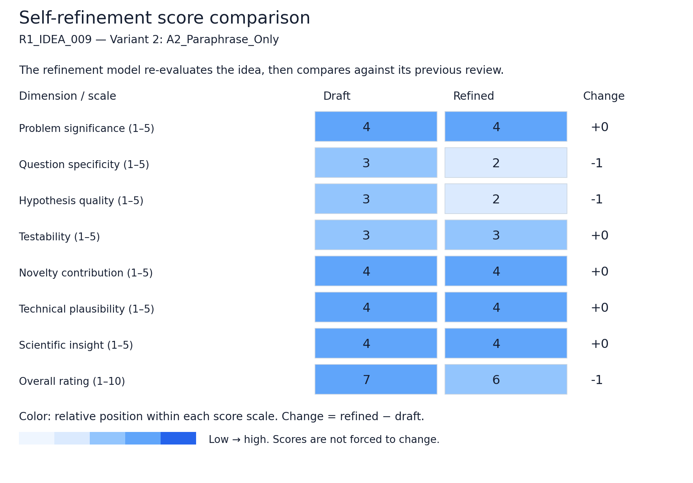

Changed score dimensions: question_specificity, hypothesis_quality, overall_rating.

### Score justifications (draft / refined)

**Problem significance**

```json
{
  "draft": {
    "score": 4.0,
    "justification": "The problem of temporal understanding in AI is significant and currently a bottleneck. Bridging the gap between deep learning and neuroscience to improve efficiency and robustness is a high-value goal in the ML community."
  },
  "refined": {
    "score": 4.0,
    "justification": "The problem is highly significant. Temporal understanding is a critical bottleneck in current AI, and bridging the gap with neuroscience to improve efficiency is a major goal in the field. The focus on 'natural videos' adds ecological validity."
  }
}
```

**Question specificity**

```json
{
  "draft": {
    "score": 3.0,
    "justification": "While the general direction is clear, the specific research question is somewhat broad. It lacks details on which temporal aspects of video are being tested and how the 'mechanistic principles' will be formally defined or extracted."
  },
  "refined": {
    "score": 2.0,
    "justification": "The research question is currently too broad. 'Fine-grained temporal understanding' is a vague target without defined metrics or specific temporal scales. The question 'how to uncover principles' is a methodological goal, not a specific scientific question."
  }
}
```

**Hypothesis quality**

```json
{
  "draft": {
    "score": 3.0,
    "justification": "The idea implies a hypothesis that current models fail to capture specific temporal dynamics present in the brain, and that aligning with EEG can improve them. However, the hypothesis is not yet concrete enough to be easily falsified without further definition of the specific dynamics and alignment metrics."
  },
  "refined": {
    "score": 2.0,
    "justification": "The idea lacks a falsifiable hypothesis. It implies that models are inferior to the brain in temporal processing, but does not specify *which* mechanism is missing or *how* the alignment would be quantified to prove or disprove this. It is a direction, not a hypothesis."
  }
}
```

**Testability**

```json
{
  "draft": {
    "score": 3.0,
    "justification": "The study is testable in principle (benchmarking models against EEG), but the lack of a defined methodology for alignment and the ambiguity of the 'mechanistic' output make the specific experimental design unclear."
  },
  "refined": {
    "score": 3.0,
    "justification": "The study is testable in principle (comparing models to EEG), but the lack of a defined alignment method and specific temporal targets makes the experimental design currently ambiguous. It requires significant methodological specification to be fully testable."
  }
}
```

**Novelty contribution**

```json
{
  "draft": {
    "score": 4.0,
    "justification": "While EEG-based benchmarking exists, applying it specifically to uncover 'mechanistic principles' for 'fine-grained temporal understanding' in video models is a novel angle. It moves beyond simple correlation to a design-oriented scientific inquiry."
  },
  "refined": {
    "score": 4.0,
    "justification": "While EEG benchmarking exists, the specific focus on deriving 'mechanistic principles' for 'fine-grained' temporal dynamics to inform architecture design is a novel and promising angle. It moves beyond simple performance correlation."
  }
}
```

**Technical plausibility**

```json
{
  "draft": {
    "score": 4.0,
    "justification": "The approach is technically sound. EEG is a standard tool for temporal dynamics, and representational analysis is a standard tool for comparing models to biology. The main challenge is the methodological execution, not the fundamental plausibility."
  },
  "refined": {
    "score": 4.0,
    "justification": "The technical approach is plausible. EEG is a standard tool for temporal dynamics, and representational analysis is a standard tool for model comparison. The challenges are methodological (alignment, noise), not fundamental."
  }
}
```

**Scientific insight**

```json
{
  "draft": {
    "score": 4.0,
    "justification": "If successful, this research could reveal specific temporal processing bottlenecks in current architectures and provide a blueprint for biologically inspired temporal modules, offering insights beyond simple performance metrics."
  },
  "refined": {
    "score": 4.0,
    "justification": "If the methodological gaps are filled, the study has high potential for insight. It could reveal specific temporal bottlenecks in current architectures and provide a blueprint for biologically inspired temporal modules."
  }
}
```

**Overall rating**

```json
{
  "draft": {
    "score": 7.0,
    "justification": "This is a strong research idea with high potential impact. It addresses a meaningful problem with a plausible biological grounding. However, it currently sits at a 'moderate' level of specificity. The idea needs to move from a general 'benchmarking' goal to a specific hypothesis about *which* temporal mechanisms are missing and *how* they will be quantified to achieve a higher score."
  },
  "refined": {
    "score": 6.0,
    "justification": "This is a moderate research idea. While the motivation is strong and the potential impact is high, the current formulation is too vague to be considered a strong research proposal. It lacks a specific hypothesis, defined temporal scope, and a concrete methodological plan for the critical step of aligning model representations with EEG. It currently sits at the 'borderline' stage where the idea is promising but the research question is not yet well-defined."
  }
}
```

## R1_IDEA_009 — Variant 3: A3_Plain_Core

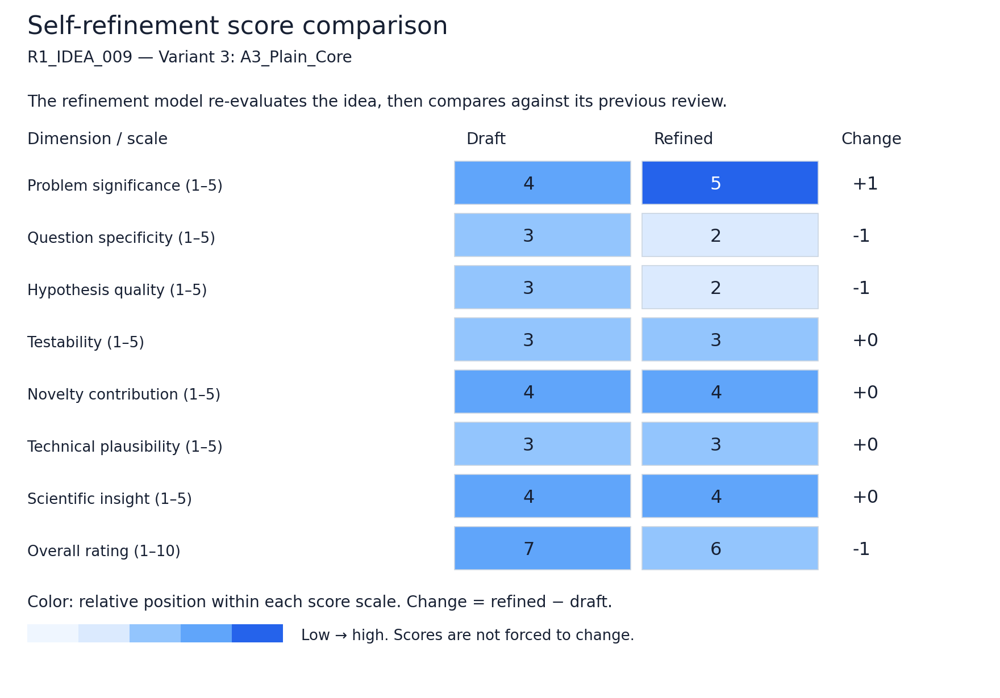

Changed score dimensions: problem_significance, question_specificity, hypothesis_quality, overall_rating.

### Score justifications (draft / refined)

**Problem significance**

```json
{
  "draft": {
    "score": 4.0,
    "justification": "The problem of aligning deep learning temporal dynamics with biological vision is highly significant. Current video models often lack the efficiency and robustness of the human visual system in dynamic environments. Addressing this could lead to more efficient AI, making it a meaningful challenge."
  },
  "refined": {
    "score": 5.0,
    "justification": "The problem is exceptionally significant. Developing video models that match the brain's efficiency and temporal dynamics is a major open challenge in AI. Solving this could lead to a new generation of efficient, robust video understanding systems."
  }
}
```

**Question specificity**

```json
{
  "draft": {
    "score": 3.0,
    "justification": "The idea identifies a general direction (benchmarking against EEG) but lacks specificity on the exact temporal phenomena being tested or the specific mechanisms of comparison. 'Fine-grained temporal understanding' is a broad concept that needs operationalization."
  },
  "refined": {
    "score": 2.0,
    "justification": "The question is currently too broad. 'Fine-grained temporal understanding' is a vague concept. The idea does not specify which temporal mechanisms (e.g., motion, rhythm, causality) are being tested or how they are operationalized in the comparison."
  }
}
```

**Hypothesis quality**

```json
{
  "draft": {
    "score": 3.0,
    "justification": "The implicit hypothesis is that model representations diverge from EEG in specific temporal ways that can inform architecture. This is plausible but currently too vague to be strongly falsifiable without defining the specific divergence patterns expected."
  },
  "refined": {
    "score": 2.0,
    "justification": "The hypothesis is implicit and weak. It assumes that a benchmark will reveal 'mechanistic principles,' but it does not predict *what* those principles are or *how* the model is expected to fail. It is more of a research goal than a falsifiable scientific hypothesis."
  }
}
```

**Testability**

```json
{
  "draft": {
    "score": 3.0,
    "justification": "The idea is testable in principle (collect EEG, run models, compare representations), but the specific experimental protocol, alignment methods, and evaluation metrics are not defined, making the immediate testability moderate."
  },
  "refined": {
    "score": 3.0,
    "justification": "The idea is testable in principle (collect data, run models, compare), but the lack of a defined alignment method and specific metrics makes the immediate testability moderate. Without a clear protocol for handling the modality gap, the experiment is not fully specified."
  }
}
```

**Novelty contribution**

```json
{
  "draft": {
    "score": 4.0,
    "justification": "While using EEG to benchmark models is not entirely new, applying it specifically to 'fine-grained temporal understanding' in 'natural videos' to derive 'mechanistic principles' for architecture design is a novel and promising angle that could yield unique insights."
  },
  "refined": {
    "score": 4.0,
    "justification": "While EEG-based benchmarking exists, applying it specifically to 'fine-grained temporal' dynamics in 'natural videos' to derive 'architectural principles' is a novel and high-potential direction. It moves beyond simple performance comparison to mechanistic insight."
  }
}
```

**Technical plausibility**

```json
{
  "draft": {
    "score": 3.0,
    "justification": "The approach is technically plausible, but the gap between EEG's low spatial resolution and the high dimensionality of deep models, combined with the noise in EEG, presents significant technical challenges that are not addressed in the summary."
  },
  "refined": {
    "score": 3.0,
    "justification": "The approach is plausible but faces significant technical hurdles (EEG noise, spatial smearing, modality mismatch) that are not addressed. The idea assumes a straightforward comparison is possible without detailing how to bridge the gap between low-dimensional EEG and high-dimensional model features."
  }
}
```

**Scientific insight**

```json
{
  "draft": {
    "score": 4.0,
    "justification": "If successful, this research could reveal fundamental differences in how biological and artificial systems process temporal information, potentially leading to new architectural paradigms (e.g., specific types of recurrence or attention) that are currently missing in deep learning."
  },
  "refined": {
    "score": 4.0,
    "justification": "If the methodological challenges are overcome, the potential for insight is high. It could reveal fundamental differences in how biological and artificial systems process time, potentially leading to new architectural paradigms. However, the current formulation risks yielding only descriptive correlations."
  }
}
```

**Overall rating**

```json
{
  "draft": {
    "score": 7.0,
    "justification": "This is a strong research idea with high potential impact. It addresses a meaningful problem with a plausible direction. However, it currently sits at the 'strong' rather than 'exceptional' level because the specific research question, hypothesis, and methodological approach are not sufficiently detailed to guarantee a clear path to scientific insight. With more specificity on the temporal mechanisms and alignment methods, this could be an exceptional contribution."
  },
  "refined": {
    "score": 6.0,
    "justification": "This is a moderate-to-strong idea with high potential, but it currently lacks the specificity and hypothesis rigor required for an 'exceptional' rating. The gap between the broad goal ('reveal principles') and the specific, testable question is too wide. It is a promising research direction that needs significant refinement to become a concrete, falsifiable study."
  }
}
```

## R1_IDEA_009 — Variant 4: B1_Verbose_Elaborate


Changed score dimensions: none.

### Score justifications (draft / refined)

**Problem significance**

```json
{
  "draft": {
    "score": 5.0,
    "justification": "The problem is highly significant. Current video models often lack the temporal efficiency and robustness of biological vision. Establishing a benchmark that directly compares AI to human brain dynamics is a major step toward neuro-inspired AI, which is a top-tier research goal."
  },
  "refined": {
    "score": 5.0,
    "justification": "The problem is highly significant. Current video models often lack the temporal efficiency and robustness of biological vision. Establishing a benchmark that directly compares AI to human brain dynamics is a major step toward neuro-inspired AI, which is a top-tier research goal."
  }
}
```

**Question specificity**

```json
{
  "draft": {
    "score": 3.0,
    "justification": "The idea identifies the general direction (comparing models to EEG) but lacks specificity on the 'how'. It does not define the specific temporal phenomena to be measured, the specific model classes to be compared, or the specific metrics for alignment."
  },
  "refined": {
    "score": 3.0,
    "justification": "The idea identifies the general direction (comparing models to EEG) but lacks specificity on the 'how'. It does not define the specific temporal phenomena to be measured, the specific model classes to be compared, or the specific metrics for alignment."
  }
}
```

**Hypothesis quality**

```json
{
  "draft": {
    "score": 3.0,
    "justification": "The implicit hypothesis is that EEG data contains learnable patterns that can improve video models. This is plausible but currently too broad. A stronger idea would hypothesize a specific relationship, e.g., 'Temporal attention in models correlates with specific EEG oscillatory patterns during motion processing.'"
  },
  "refined": {
    "score": 3.0,
    "justification": "The implicit hypothesis is that EEG data contains learnable patterns that can improve video models. This is plausible but currently too broad. A stronger idea would hypothesize a specific relationship, e.g., 'Temporal attention in models correlates with specific EEG oscillatory patterns during motion processing.'"
  }
}
```

**Testability**

```json
{
  "draft": {
    "score": 4.0,
    "justification": "The idea is testable in principle. One can record EEG while watching videos, extract features from video models, and compute correlation metrics. However, the feasibility depends heavily on the specific analytical methods chosen, which are not yet defined."
  },
  "refined": {
    "score": 4.0,
    "justification": "The idea is testable in principle. One can record EEG while watching videos, extract features from video models, and compute correlation metrics. However, the feasibility depends heavily on the specific analytical methods chosen, which are not yet defined."
  }
}
```

**Novelty contribution**

```json
{
  "draft": {
    "score": 4.0,
    "justification": "While comparing models to brain data is not new, a dedicated benchmark for *fine-grained temporal* understanding in *video* (as opposed to static images or simple motion tasks) using *natural videos* is a novel and valuable contribution. It moves beyond simple performance metrics to mechanistic alignment."
  },
  "refined": {
    "score": 4.0,
    "justification": "While comparing models to brain data is not new, a dedicated benchmark for *fine-grained temporal* understanding in *video* (as opposed to static images or simple motion tasks) using *natural videos* is a novel and valuable contribution. It moves beyond simple performance metrics to mechanistic alignment."
  }
}
```

**Technical plausibility**

```json
{
  "draft": {
    "score": 4.0,
    "justification": "The technical approach is plausible. EEG is a standard tool in neuroscience, and deep video models are standard in ML. The challenge lies in the cross-modal alignment, which is a known but solvable problem in computational neuroscience."
  },
  "refined": {
    "score": 4.0,
    "justification": "The technical approach is plausible. EEG is a standard tool in neuroscience, and deep video models are standard in ML. The challenge lies in the cross-modal alignment, which is a known but solvable problem in computational neuroscience."
  }
}
```

**Scientific insight**

```json
{
  "draft": {
    "score": 4.0,
    "justification": "If successful, this research could reveal fundamental principles of how the brain processes temporal information in complex scenes, which could lead to architectural breakthroughs in AI (e.g., new types of temporal pooling or attention mechanisms)."
  },
  "refined": {
    "score": 4.0,
    "justification": "If successful, this research could reveal fundamental principles of how the brain processes temporal information in complex scenes, which could lead to architectural breakthroughs in AI (e.g., new types of temporal pooling or attention mechanisms)."
  }
}
```

**Overall rating**

```json
{
  "draft": {
    "score": 7.0,
    "justification": "This is a strong research idea with high potential impact. It addresses a meaningful gap and proposes a scientifically sound direction. However, it currently sits at the 'concept' stage and lacks the specific methodological details and hypothesis formulation required to be an 'exceptional' proposal. With clearer definitions of the temporal scope and the alignment methodology, this could easily become a top-tier contribution."
  },
  "refined": {
    "score": 7.0,
    "justification": "This is a strong research idea with high potential impact. It addresses a meaningful gap and proposes a scientifically sound direction. However, it currently sits at the 'concept' stage and lacks the specific methodological details and hypothesis formulation required to be an 'exceptional' proposal. With clearer definitions of the temporal scope and the alignment methodology, this could easily become a top-tier contribution."
  }
}
```

## R1_IDEA_009 — Variant 5: B2_Grand_Narrative


Changed score dimensions: none.

### Score justifications (draft / refined)

**Problem significance**

```json
{
  "draft": {
    "score": 5.0,
    "justification": "Understanding the temporal dynamics of visual processing is a fundamental challenge in both neuroscience and AI. Bridging this gap has high potential for advancing both fields, making the problem highly significant."
  },
  "refined": {
    "score": 5.0,
    "justification": "The problem of understanding temporal dynamics in visual processing is fundamental to both neuroscience and the development of robust AI. Solving this would have significant implications for building efficient, brain-like systems."
  }
}
```

**Question specificity**

```json
{
  "draft": {
    "score": 2.0,
    "justification": "The idea describes a general direction ('benchmarking') and a broad goal ('reveal mechanistic principles') but lacks a concrete, testable research question. It does not specify which temporal mechanisms are being investigated."
  },
  "refined": {
    "score": 2.0,
    "justification": "The idea is currently too broad. It describes a general research direction ('benchmarking') rather than a specific question. It does not define what specific temporal property is being tested or how it differs from existing static benchmarks."
  }
}
```

**Hypothesis quality**

```json
{
  "draft": {
    "score": 2.0,
    "justification": "No explicit hypothesis is stated. The text implies a positive correlation or alignment is expected, but it does not make a specific, falsifiable prediction about the nature of that alignment or the specific differences between models and brains."
  },
  "refined": {
    "score": 2.0,
    "justification": "There is no explicit hypothesis. The text implies a positive outcome ('could contribute', 'may inform') but does not make a falsifiable prediction about the relationship between model representations and EEG signals."
  }
}
```

**Testability**

```json
{
  "draft": {
    "score": 3.0,
    "justification": "The idea is testable in principle (comparing model outputs to EEG), but the lack of specific metrics, alignment methods, or defined temporal phenomena makes the immediate testability low. It requires significant methodological specification to become a concrete experiment."
  },
  "refined": {
    "score": 3.0,
    "justification": "The idea is testable in principle because the components (video models, EEG, natural videos) are available. However, without a defined metric or alignment method, the specific experiment is not yet concrete or falsifiable."
  }
}
```

**Novelty contribution**

```json
{
  "draft": {
    "score": 4.0,
    "justification": "While EEG-ML alignment is an active field, applying it specifically to *fine-grained temporal understanding* in *natural video* contexts with the goal of informing *dynamic architecture design* is a novel and promising angle."
  },
  "refined": {
    "score": 4.0,
    "justification": "While Neuro-AI is active, focusing specifically on 'fine-grained temporal understanding' in 'natural video' contexts to guide 'dynamic architecture design' is a novel and promising angle that could yield new insights."
  }
}
```

**Technical plausibility**

```json
{
  "draft": {
    "score": 3.0,
    "justification": "The concept is plausible, but the technical challenge of aligning EEG (low SNR, volume conduction issues) with deep video representations is non-trivial. The idea does not address how this technical hurdle will be overcome, which affects the plausibility of the proposed 'fine-grained' analysis."
  },
  "refined": {
    "score": 3.0,
    "justification": "The approach is plausible, but the technical challenges of aligning low-fidelity EEG signals with high-dimensional deep representations are non-trivial. The idea does not address how these challenges (e.g., volume conduction, SNR) will be mitigated to achieve 'fine-grained' analysis."
  }
}
```

**Scientific insight**

```json
{
  "draft": {
    "score": 4.0,
    "justification": "If successfully executed, this research could reveal fundamental principles of how the brain processes temporal visual information and how current AI models fail or succeed in mimicking this, offering deep insights into efficient computation."
  },
  "refined": {
    "score": 4.0,
    "justification": "If the specific mechanisms can be identified, the research has high potential to reveal general principles of efficient temporal processing and the limitations of current deep learning architectures."
  }
}
```

**Overall rating**

```json
{
  "draft": {
    "score": 6.0,
    "justification": "The research idea is built on a highly significant and promising scientific foundation. However, as currently stated, it is too vague to be considered a strong, actionable research proposal. It lacks the specificity of a hypothesis and the definition of a concrete research question. With refinement to specify the temporal mechanisms and alignment methods, this could easily become a 9 or 10."
  },
  "refined": {
    "score": 6.0,
    "justification": "The idea is built on a strong, significant foundation with high potential impact. However, as a research proposal, it is currently too vague to be considered 'strong' or 'exceptional'. It lacks the specificity of a hypothesis and a concrete experimental plan required to move from a 'direction' to a 'study'. It sits at the borderline of moderate/strong due to the high stakes of the problem versus the low specificity of the proposal."
  }
}
```

## R1_IDEA_009 — Variant 6: B3_Over_Confident


Changed score dimensions: none.

### Score justifications (draft / refined)

**Problem significance**

```json
{
  "draft": {
    "score": 4.0,
    "justification": "Understanding the temporal dynamics of vision is a critical open problem in both neuroscience and computer vision. Bridging the gap between artificial and biological temporal processing is highly significant for developing more robust and efficient AI systems."
  },
  "refined": {
    "score": 4.0,
    "justification": "The problem is highly significant. Understanding temporal dynamics in vision is a major bottleneck in AI and a key area of neuroscience. Bridging this gap is crucial for developing robust, efficient, and biologically plausible AI."
  }
}
```

**Question specificity**

```json
{
  "draft": {
    "score": 2.0,
    "justification": "The idea describes a general direction ('benchmarking') rather than a specific research question. It lacks details on what specific variables are being manipulated or measured, making the scope too vague to evaluate the scientific rigor of the proposed investigation."
  },
  "refined": {
    "score": 2.0,
    "justification": "The idea is currently too broad. 'Benchmarking' is a methodological action, not a research question. It fails to specify what variables are being compared, what the expected relationship is, or what specific aspect of 'temporal understanding' is under investigation."
  }
}
```

**Hypothesis quality**

```json
{
  "draft": {
    "score": 2.0,
    "justification": "There is no explicit hypothesis stated. The text implies a positive outcome ('aims to reveal'), but does not propose a specific, falsifiable prediction about the relationship between model representations and EEG signals."
  },
  "refined": {
    "score": 2.0,
    "justification": "There is no explicit, falsifiable hypothesis. The text describes a goal ('aims to reveal') rather than a prediction. A strong idea would propose a specific relationship (e.g., 'X leads to Y') that could be proven false."
  }
}
```

**Testability**

```json
{
  "draft": {
    "score": 3.0,
    "justification": "The idea is testable in principle (one can record EEG and run video models), but the lack of defined metrics, specific models, and alignment methods makes the experimental design currently undefined. It is testable only if significant methodological details are added."
  },
  "refined": {
    "score": 3.0,
    "justification": "The idea is testable in principle (one can record EEG and run models), but the lack of defined metrics, specific models, and alignment methods makes the experimental design currently undefined. It is testable only if significant methodological details are added."
  }
}
```

**Novelty contribution**

```json
{
  "draft": {
    "score": 4.0,
    "justification": "While comparing AI to brain data is not new, focusing specifically on *fine-grained temporal understanding* in *natural video* contexts using *EEG* is a promising and under-explored niche that could yield novel insights into temporal processing mechanisms."
  },
  "refined": {
    "score": 4.0,
    "justification": "While neuro-AI is a growing field, the specific focus on *fine-grained temporal* dynamics in *natural video* using *EEG* (rather than fMRI or static images) is a promising and under-explored niche with high potential for novel insights."
  }
}
```

**Technical plausibility**

```json
{
  "draft": {
    "score": 3.0,
    "justification": "The general approach is plausible, but the technical challenge of aligning EEG signals with deep network representations is non-trivial. The idea does not address the methodological hurdles (e.g., signal-to-noise ratio, temporal resolution mismatch) that could render the comparison invalid without careful design."
  },
  "refined": {
    "score": 3.0,
    "justification": "The general approach is plausible, but the technical challenge of aligning EEG signals with deep network representations is non-trivial. The idea does not address the methodological hurdles (e.g., signal-to-noise ratio, temporal resolution mismatch) that could render the comparison invalid without careful design."
  }
}
```

**Scientific insight**

```json
{
  "draft": {
    "score": 3.0,
    "justification": "If executed well, this could reveal how biological systems handle temporal dynamics differently from current AI. However, as currently stated, it risks being a descriptive benchmark rather than a study that uncovers deep mechanistic principles."
  },
  "refined": {
    "score": 3.0,
    "justification": "If executed well, this could reveal how biological systems handle temporal dynamics differently from current AI. However, as currently stated, it risks being a descriptive benchmark rather than a study that uncovers deep mechanistic principles or guides architecture design."
  }
}
```

**Overall rating**

```json
{
  "draft": {
    "score": 5.0,
    "justification": "The idea sits at the borderline of moderate and strong. It addresses a highly significant problem with a promising direction, but it currently lacks the specificity, hypothesis, and methodological definition required to be considered a strong research proposal. It is a good 'seed' idea that needs significant refinement to become a concrete study."
  },
  "refined": {
    "score": 5.0,
    "justification": "The idea sits at the borderline of moderate and strong. It addresses a highly significant problem with a promising direction, but it currently lacks the specificity, hypothesis, and methodological definition required to be considered a strong research proposal. It is a good 'seed' idea that needs significant refinement to become a concrete study."
  }
}
```

## R1_IDEA_009 — Variant 7: B4_Novelty


Changed score dimensions: none.

### Score justifications (draft / refined)

**Problem significance**

```json
{
  "draft": {
    "score": 5.0,
    "justification": "The problem of temporal understanding in video models is a major bottleneck in AI. Proposing a biological benchmark (EEG) to address this is highly significant and aligns with the broader goal of neuro-inspired AI."
  },
  "refined": {
    "score": 5.0,
    "justification": "The problem of temporal understanding in video models is a major bottleneck in AI. Proposing a biological benchmark (EEG) to address this is highly significant and aligns with the broader goal of neuro-inspired AI. Solving this would have profound implications for both efficiency and generalization in video AI."
  }
}
```

**Question specificity**

```json
{
  "draft": {
    "score": 3.0,
    "justification": "While the general direction is clear, the idea lacks specific details on the 'how'. The definition of 'fine-grained' in the context of EEG and the specific alignment methodology are currently too vague."
  },
  "refined": {
    "score": 3.0,
    "justification": "While the general direction is clear, the idea lacks specific details on the 'how'. The definition of 'fine-grained' in the context of EEG is vague, and the specific alignment methodology is not articulated. The gap between 'benchmarking' and 'design' is a significant conceptual leap that needs bridging."
  }
}
```

**Hypothesis quality**

```json
{
  "draft": {
    "score": 4.0,
    "justification": "The implicit hypothesis—that EEG alignment reveals principles for better video architectures—is testable and non-trivial. However, the specific prediction of *which* principles will be found is not yet articulated."
  },
  "refined": {
    "score": 4.0,
    "justification": "The implicit hypothesis—that EEG alignment reveals principles for better video architectures—is testable and non-trivial. However, the specific prediction of *which* principles will be found is not yet articulated, making the hypothesis somewhat broad."
  }
}
```

**Testability**

```json
{
  "draft": {
    "score": 4.0,
    "justification": "The idea is testable by collecting EEG data on natural videos, running video models, and computing representational similarity. The challenge lies in the interpretation of the results, not the feasibility of the experiment itself."
  },
  "refined": {
    "score": 4.0,
    "justification": "The idea is testable in principle: one can collect EEG data, run video models, and compute representational similarity. The challenge lies in the interpretation of the results and the validity of the alignment method, not the feasibility of the experiment itself."
  }
}
```

**Novelty contribution**

```json
{
  "draft": {
    "score": 4.0,
    "justification": "Using EEG specifically for *temporal* benchmarking of video models is a novel angle. Most existing work focuses on static image alignment or fMRI. This could yield unique insights into temporal dynamics."
  },
  "refined": {
    "score": 4.0,
    "justification": "Using EEG specifically for *temporal* benchmarking of video models is a novel angle. Most existing work focuses on static image alignment or fMRI (which lacks temporal resolution). This could yield unique insights into temporal dynamics that other modalities miss."
  }
}
```

**Technical plausibility**

```json
{
  "draft": {
    "score": 3.0,
    "justification": "Technically plausible, but the mismatch between EEG's temporal/spatial resolution and the requirements of 'fine-grained' video understanding presents a significant technical hurdle that needs a robust solution."
  },
  "refined": {
    "score": 3.0,
    "justification": "Technically plausible but fraught with challenges. The mismatch between the high-frequency, high-dimensional nature of video model features and the low-dimensional, noisy, indirect nature of EEG signals presents a significant technical hurdle that requires a robust, non-trivial solution."
  }
}
```

**Scientific insight**

```json
{
  "draft": {
    "score": 4.0,
    "justification": "If successful, this research could reveal fundamental differences between how biological and artificial systems process temporal information, offering transferable insights for both neuroscience and AI."
  },
  "refined": {
    "score": 4.0,
    "justification": "If successful, this research could reveal fundamental differences between how biological and artificial systems process temporal information, offering transferable insights for both neuroscience and AI. The potential to derive 'mechanistic principles' is high."
  }
}
```

**Overall rating**

```json
{
  "draft": {
    "score": 7.0,
    "justification": "This is a strong research idea with high significance and novelty. It addresses a meaningful gap in the field. However, it currently sits at a 'moderate' level of specificity regarding the methodology and the specific mechanism of alignment. With a more concrete proposal on how to bridge the EEG-model gap, this could be an exceptional contribution."
  },
  "refined": {
    "score": 7.0,
    "justification": "This is a strong research idea with high significance and novelty. It addresses a meaningful gap in the field and proposes a compelling, albeit ambitious, methodology. However, it currently sits at a 'moderate' level of specificity regarding the methodology and the specific mechanism of alignment. With a more concrete proposal on how to bridge the EEG-model gap and translate findings into design, this could be an exceptional contribution."
  }
}
```

## R1_IDEA_009 — Variant 8: B5_Application_Impact


Changed score dimensions: none.

### Score justifications (draft / refined)

**Problem significance**

```json
{
  "draft": {
    "score": 5.0,
    "justification": "Understanding the temporal dynamics of visual processing is a fundamental open problem in both neuroscience and computer vision. Bridging this gap with deep learning models addresses a critical limitation in current video AI systems, which often lack the efficiency and robustness of biological vision."
  },
  "refined": {
    "score": 5.0,
    "justification": "The problem is highly significant. Understanding how the brain processes temporal information in naturalistic settings is a fundamental unsolved problem. Solving this would address a major limitation in current video AI, which often lacks the temporal efficiency and robustness of biological vision."
  }
}
```

**Question specificity**

```json
{
  "draft": {
    "score": 3.0,
    "justification": "While the general goal is clear, the specific research question is somewhat vague. It states an aim to 'reveal principles' but does not specify the exact relationship being tested (e.g., 'Do models with temporal attention mechanisms align better with EEG than 3D CNNs?'). The 'how' is missing."
  },
  "refined": {
    "score": 3.0,
    "justification": "The general direction is clear, but the specific research question is underspecified. It asks to 'reveal principles' without defining what those principles are or how they will be isolated. The 'how' of the comparison is missing, making the question broad rather than specific."
  }
}
```

**Hypothesis quality**

```json
{
  "draft": {
    "score": 3.0,
    "justification": "The idea implies a hypothesis that deep video models can be evaluated and improved by aligning them with EEG dynamics. However, it lacks a concrete, falsifiable prediction (e.g., 'Models trained with temporal contrastive objectives will show higher EEG alignment than those trained with standard video classification losses')."
  },
  "refined": {
    "score": 3.0,
    "justification": "The idea implies a hypothesis that biological alignment leads to better efficiency, but it lacks a concrete, falsifiable prediction. A stronger idea would predict a specific relationship (e.g., 'Temporal attention mechanisms correlate with specific EEG frequency bands'). As written, it is a research goal rather than a testable hypothesis."
  }
}
```

**Testability**

```json
{
  "draft": {
    "score": 4.0,
    "justification": "The idea is testable in principle. One can record EEG while subjects watch videos, extract features from video models, and compute alignment metrics. However, the feasibility depends heavily on the specific experimental design and data quality, which are not detailed."
  },
  "refined": {
    "score": 4.0,
    "justification": "The idea is testable in principle using existing tools for EEG analysis and deep learning feature extraction. However, the feasibility depends entirely on the specific experimental design (stimulus selection, alignment method) which is not provided. The core claim is testable, but the path is not."
  }
}
```

**Novelty contribution**

```json
{
  "draft": {
    "score": 4.0,
    "justification": "While EEG-based benchmarking exists for static images, applying it to *dynamic* video representations to derive *architectural* principles is a novel and under-explored direction. It moves beyond simple benchmarking to generative design."
  },
  "refined": {
    "score": 4.0,
    "justification": "Applying EEG benchmarks to *dynamic* video representations is a novel extension of existing static image-brain work. The potential to derive *architectural* principles from this alignment, rather than just evaluating performance, adds significant novelty."
  }
}
```

**Technical plausibility**

```json
{
  "draft": {
    "score": 4.0,
    "justification": "The technical approach is plausible given current tools in representational similarity analysis and EEG processing. The main challenge is the modality mismatch, but this is a known problem with established (though difficult) solutions."
  },
  "refined": {
    "score": 4.0,
    "justification": "The technical approach is plausible. Representational Similarity Analysis (RSA) and encoding models are standard tools for this type of cross-modal comparison. The main technical hurdle is the modality mismatch (EEG noise vs. model features), which is a known challenge with established mitigation strategies."
  }
}
```

**Scientific insight**

```json
{
  "draft": {
    "score": 4.0,
    "justification": "If successful, this research could reveal fundamental principles of how the brain processes temporal information, which could lead to a new class of 'brain-inspired' video architectures that are more data-efficient and robust."
  },
  "refined": {
    "score": 4.0,
    "justification": "If successful, this research could reveal fundamental principles of temporal processing in the brain that are currently unknown. These insights would be transferable to AI, potentially leading to a new class of video architectures that are more data-efficient and robust, offering insights beyond simple performance gains."
  }
}
```

**Overall rating**

```json
{
  "draft": {
    "score": 7.0,
    "justification": "This is a strong research idea with high scientific significance and potential for novel insights. It addresses a meaningful gap in temporal understanding. However, it currently lacks the specificity required to be considered 'exceptional' (score 9-10) because the methodological path and specific hypotheses are not articulated. With a more concrete experimental design, this could be a top-tier contribution."
  },
  "refined": {
    "score": 7.0,
    "justification": "This is a strong research idea with high potential for scientific insight and practical impact. It addresses a meaningful gap in temporal understanding. However, it currently lacks the specificity required to be considered 'exceptional' (9-10) because the methodological path and specific hypotheses are not articulated. With a more concrete experimental design, this could be a top-tier contribution."
  }
}
```

## R1_IDEA_009 — Variant 9: C1_Hollow_Shell

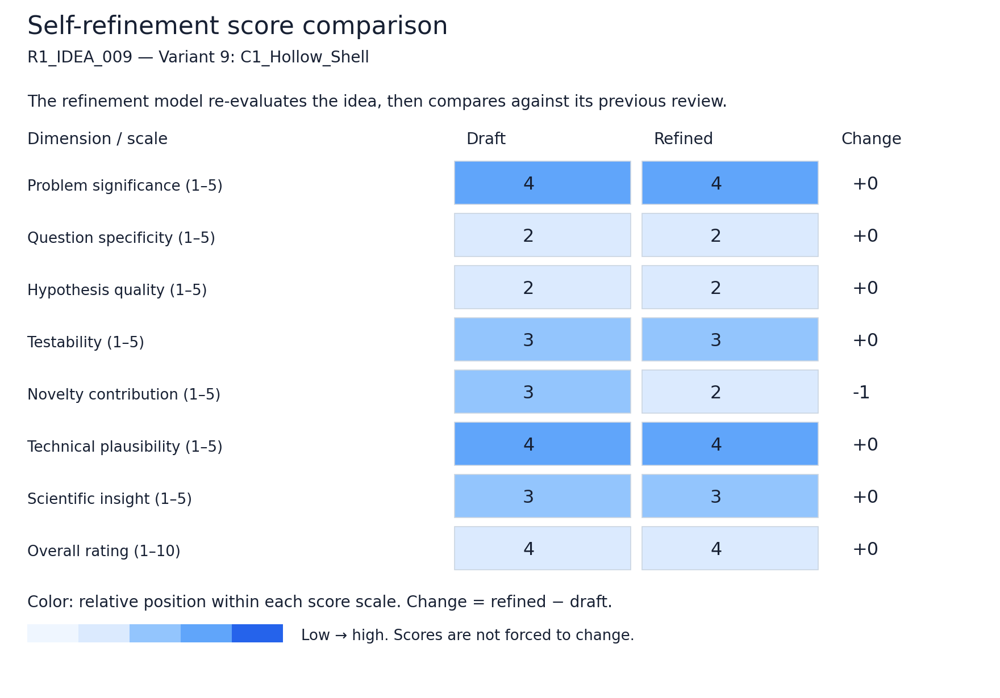

Changed score dimensions: novelty_contribution.

### Score justifications (draft / refined)

**Problem significance**

```json
{
  "draft": {
    "score": 4.0,
    "justification": "The problem of bridging the gap between AI and biological vision is highly significant. Understanding how the brain achieves efficiency could lead to breakthroughs in AI architecture. However, the significance is currently tempered by the lack of a specific problem definition within the broad field."
  },
  "refined": {
    "score": 4.0,
    "justification": "The problem of bridging AI and biological vision is of high significance. Understanding biological efficiency is a major open challenge in ML. However, the score is capped because the idea does not specify *which* aspect of this broad problem is being tackled, making the immediate significance of *this specific* proposal hard to gauge."
  }
}
```

**Question specificity**

```json
{
  "draft": {
    "score": 2.0,
    "justification": "The idea is too broad. It states a general direction ('comparing models with brain recordings') but fails to define the specific variables, conditions, or relationships being investigated. It reads more like a mission statement than a research question."
  },
  "refined": {
    "score": 2.0,
    "justification": "The idea is too broad to be considered a specific research question. It describes a field of study rather than a specific inquiry. It lacks the necessary constraints (variables, conditions, specific relationships) to define a concrete investigation."
  }
}
```

**Hypothesis quality**

```json
{
  "draft": {
    "score": 2.0,
    "justification": "No explicit or implicit hypothesis is provided. The statement 'aims to uncover principles' is a goal, not a testable prediction. A strong idea would predict a specific relationship or discrepancy between models and brains."
  },
  "refined": {
    "score": 2.0,
    "justification": "There is no explicit or implicit hypothesis. The statement is a goal ('aims to uncover') rather than a prediction ('X will happen if Y'). A strong idea must propose a specific relationship or discrepancy that could be proven wrong."
  }
}
```

**Testability**

```json
{
  "draft": {
    "score": 3.0,
    "justification": "The general approach is testable (comparing models and brains), but the lack of specific metrics, datasets, or model architectures makes the current proposal impossible to design an experiment for. It is testable in principle but not in practice as stated."
  },
  "refined": {
    "score": 3.0,
    "justification": "The general approach is testable in principle (comparing models to brains), but the current proposal is not testable in practice because the necessary parameters (models, data, metrics) are undefined. It is a 'testable direction' but not a 'testable idea'."
  }
}
```

**Novelty contribution**

```json
{
  "draft": {
    "score": 3.0,
    "justification": "Comparing models to brains is a common practice. The novelty would depend entirely on the specific angle (e.g., a new metric, a new model class, or a new brain region). As stated, the potential contribution is undefined and could be incremental or generic."
  },
  "refined": {
    "score": 2.0,
    "justification": "Comparing models to brains is a standard practice. Without a specific angle, hypothesis, or novel metric, the potential contribution is undefined. It could easily result in a generic benchmarking paper with low novelty."
  }
}
```

**Technical plausibility**

```json
{
  "draft": {
    "score": 4.0,
    "justification": "The methodology of comparing computational models to neural data is technically sound and widely used. There are no logical contradictions in the proposed direction, assuming the necessary data and models are available."
  },
  "refined": {
    "score": 4.0,
    "justification": "The underlying methodology is sound and technically feasible. There are no logical contradictions in the proposed direction, assuming standard resources are available. The plausibility is high, but the lack of detail prevents a deeper assessment of implementation feasibility."
  }
}
```

**Scientific insight**

```json
{
  "draft": {
    "score": 3.0,
    "justification": "If executed well, this could yield significant insights into efficient visual processing. However, as a vague proposal, it currently lacks the specificity required to guarantee that the investigation will yield anything beyond a standard performance comparison."
  },
  "refined": {
    "score": 3.0,
    "justification": "If the vague idea were refined and executed, it could yield significant insights. However, as stated, it lacks the specificity to guarantee that the investigation will reveal new mechanisms or principles beyond what is already known. It risks being descriptive rather than explanatory."
  }
}
```

**Overall rating**

```json
{
  "draft": {
    "score": 4.0,
    "justification": "The idea addresses a major scientific problem with a plausible methodology, but it is currently too vague to be considered a strong research proposal. It lacks a specific hypothesis, defined variables, and a clear mechanism for how the comparison will lead to the stated 'principles.' It falls into the 'Weak' category because it is essentially a topic rather than a research question."
  },
  "refined": {
    "score": 4.0,
    "justification": "The idea is a 'Weak' research proposal (3-4 range) because it is currently a topic, not a research question. While the domain is significant and the approach is valid, the lack of a specific hypothesis, defined variables, and a clear mechanism for insight makes it impossible to evaluate as a concrete scientific contribution. It requires significant refinement to move from a 'general direction' to a 'testable hypothesis'."
  }
}
```

## R1_IDEA_009 — Variant 10: C2_Logic_Flawed

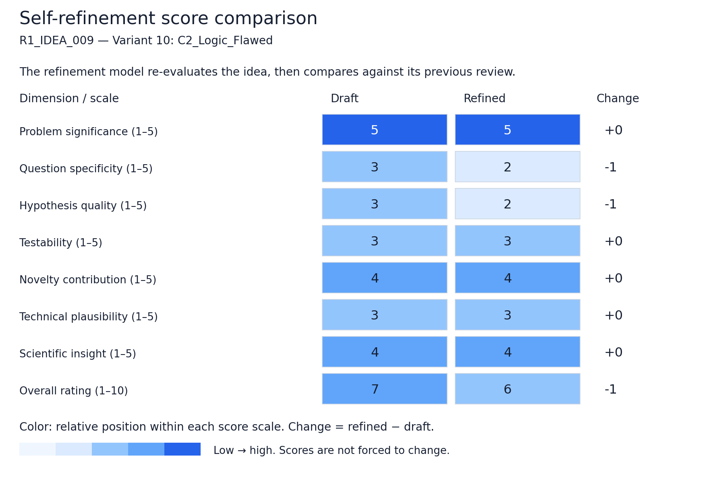

Changed score dimensions: question_specificity, hypothesis_quality, overall_rating.

### Score justifications (draft / refined)

**Problem significance**

```json
{
  "draft": {
    "score": 5.0,
    "justification": "The problem of understanding temporal dynamics in vision is fundamental to both neuroscience and AI. Bridging the gap between biological video processing and artificial models is a high-priority research direction with significant potential for advancing efficient AI."
  },
  "refined": {
    "score": 5.0,
    "justification": "Understanding temporal dynamics in vision is a fundamental challenge in both neuroscience and AI. Bridging the gap between biological video processing and artificial models addresses a critical, high-priority research direction with significant potential for advancing efficient AI."
  }
}
```

**Question specificity**

```json
{
  "draft": {
    "score": 3.0,
    "justification": "While the general goal is clear, the specific research question is vague. It does not specify which aspects of the EEG or model representations will be compared, nor does it define the 'mechanistic principles' in concrete terms."
  },
  "refined": {
    "score": 2.0,
    "justification": "While the broad goal is clear, the specific research question is vague. It does not define the 'mechanistic principles' in concrete terms, nor does it specify the alignment methodology or the specific metrics for 'fine-grained temporal understanding.' The idea reads more as a motivation than a specific hypothesis."
  }
}
```

**Hypothesis quality**

```json
{
  "draft": {
    "score": 3.0,
    "justification": "The implicit hypothesis is that brain-aligned representations lead to better/more efficient video understanding. This is plausible but currently stated as a broad assertion rather than a specific, falsifiable prediction about a mechanism or relationship."
  },
  "refined": {
    "score": 2.0,
    "justification": "The implicit hypothesis (brain alignment leads to efficient AI) is plausible but currently stated as a broad assertion. The claim of 'sufficiency' is a strong causal claim that is not supported by the proposed 'benchmarking' approach alone, making the hypothesis difficult to falsify without a clear translation mechanism."
  }
}
```

**Testability**

```json
{
  "draft": {
    "score": 3.0,
    "justification": "The idea is testable in principle (collect EEG, run models, compare), but the lack of a defined alignment methodology and specific metrics makes the execution path unclear. The 'sufficiency' claim is particularly hard to test without a rigorous ablation study plan."
  },
  "refined": {
    "score": 3.0,
    "justification": "The idea is testable in principle (collect EEG, run models, compare), but the lack of a defined alignment methodology and specific metrics makes the execution path unclear. The 'sufficiency' claim is particularly hard to test without a rigorous ablation study plan showing how the principles are applied."
  }
}
```

**Novelty contribution**

```json
{
  "draft": {
    "score": 4.0,
    "justification": "Applying EEG to benchmark *video* models (rather than static images) is a novel direction. Most existing work focuses on static image alignment. The potential to discover new temporal principles adds significant novelty."
  },
  "refined": {
    "score": 4.0,
    "justification": "Applying EEG to benchmark *video* models (rather than static images) is a novel direction. Most existing work focuses on static image alignment. The potential to discover new temporal principles adds significant novelty, provided the methodological gap can be bridged."
  }
}
```

**Technical plausibility**

```json
{
  "draft": {
    "score": 3.0,
    "justification": "The concept is technically sound, but the feasibility depends heavily on the specific methods chosen to handle the modality mismatch between EEG and deep learning features. Without a proposed method, it remains a high-level concept."
  },
  "refined": {
    "score": 3.0,
    "justification": "The concept is technically sound in theory, but the feasibility is highly dependent on the specific methods chosen to handle the modality mismatch between EEG and deep learning features. Without a proposed method, the idea remains a high-level concept that risks being unactionable due to the noise and low spatial resolution of EEG."
  }
}
```

**Scientific insight**

```json
{
  "draft": {
    "score": 4.0,
    "justification": "If successful, this research could reveal fundamental principles of how the brain processes temporal visual information, which could be directly transferable to improving the efficiency and robustness of video AI systems."
  },
  "refined": {
    "score": 4.0,
    "justification": "If successful, this research could reveal fundamental principles of how the brain processes temporal visual information, which could be directly transferable to improving the efficiency and robustness of video AI systems. However, the current formulation risks yielding only correlational results without mechanistic insight."
  }
}
```

**Overall rating**

```json
{
  "draft": {
    "score": 7.0,
    "justification": "This is a strong research idea with high significance and novelty. It addresses a meaningful gap in the field. However, it currently lacks the specificity required to be a 'top-tier' proposal. The core hypothesis and methodological approach need to be sharpened to move from a general motivation to a concrete, testable research plan."
  },
  "refined": {
    "score": 6.0,
    "justification": "This is a moderate research idea with high significance and novelty potential. However, it currently lacks the specificity required to be a strong proposal. The core hypothesis is too broad, the claim of 'sufficiency' is unsupported, and the methodological path from EEG to 'mechanistic principles' is undefined. It requires significant refinement to move from a general motivation to a concrete, testable research plan."
  }
}
```

## R1_IDEA_009 — Variant 11: C3_Substance_Enriched

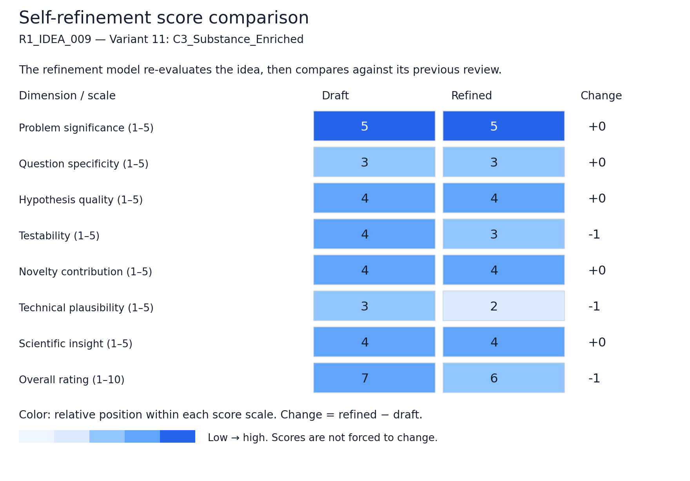

Changed score dimensions: testability, technical_plausibility, overall_rating.

### Score justifications (draft / refined)

**Problem significance**

```json
{
  "draft": {
    "score": 5.0,
    "justification": "The problem of understanding how the brain processes dynamic visual information and translating that into efficient AI is a central challenge in both neuroscience and computer vision. Addressing the 'fine-grained temporal understanding' gap is highly significant for developing robust, energy-efficient video AI."
  },
  "refined": {
    "score": 5.0,
    "justification": "The problem of understanding and replicating the brain's dynamic, continuous processing of natural video is a central challenge in both neuroscience and AI. Addressing the 'fine-grained temporal understanding' gap is highly significant for developing robust, energy-efficient, and biologically plausible video AI systems."
  }
}
```

**Question specificity**

```json
{
  "draft": {
    "score": 3.0,
    "justification": "The idea identifies the right variables (latencies, receptive fields, frame rate robustness) but lacks specificity on the exact experimental setup, the specific EEG features to be extracted, and the precise architectural changes to be tested. It is a strong direction but currently a broad research program rather than a single specific question."
  },
  "refined": {
    "score": 3.0,
    "justification": "While the idea identifies key variables (latencies, receptive fields, frame rate robustness), it lacks specificity on the exact experimental setup. The definition of 'spatiotemporal receptive fields' from EEG is particularly vague and technically ambiguous, making the core question difficult to operationalize without further refinement."
  }
}
```

**Hypothesis quality**

```json
{
  "draft": {
    "score": 4.0,
    "justification": "The hypothesis is clear: aligning model representations with EEG latencies/receptive fields will yield architectures that generalize better to temporal distortions. This is a concrete prediction that can be supported or refuted by the proposed validation route."
  },
  "refined": {
    "score": 4.0,
    "justification": "The hypothesis is concrete: aligning model representations with EEG latencies/receptive fields will yield architectures that generalize better to temporal distortions. This is a falsifiable prediction, though the underlying mechanism linking the two is not fully articulated."
  }
}
```

**Testability**

```json
{
  "draft": {
    "score": 4.0,
    "justification": "The idea suggests clear evaluation metrics: correlation with EEG latencies and performance on unseen categories/temporal distortions. While the technical execution of EEG analysis is complex, the experimental design is logically sound and falsifiable."
  },
  "refined": {
    "score": 3.0,
    "justification": "The idea suggests clear evaluation metrics (correlation with EEG, performance on distortions). However, the testability is compromised by the technical difficulty of extracting the proposed 'spatiotemporal receptive fields' from EEG. If these features cannot be reliably extracted, the core comparison cannot be performed, rendering the hypothesis untestable in its current form."
  }
}
```

**Novelty contribution**

```json
{
  "draft": {
    "score": 4.0,
    "justification": "While brain-inspired AI is a growing field, specifically benchmarking deep video models against *dynamic* EEG for *temporal* principles (latencies/receptive fields) rather than just static image alignment is a novel and promising angle. It moves beyond 'does it work' to 'how does it work'."
  },
  "refined": {
    "score": 4.0,
    "justification": "While brain-inspired AI is a growing field, specifically benchmarking deep video models against *dynamic* EEG for *temporal* principles (latencies/receptive fields) rather than just static image alignment is a novel and promising angle. It moves beyond 'does it work' to 'how does it work' in the temporal domain."
  }
}
```

**Technical plausibility**

```json
{
  "draft": {
    "score": 3.0,
    "justification": "The reasoning is logically coherent, but the technical feasibility of extracting 'spatiotemporal receptive fields' from EEG is non-trivial due to the inverse problem and low spatial resolution. The idea assumes this is possible without detailing the method, which is a potential bottleneck."
  },
  "refined": {
    "score": 2.0,
    "justification": "The reasoning is logically coherent in principle, but the technical feasibility of extracting 'spatiotemporal receptive fields' from scalp EEG is extremely low due to the inverse problem and low spatial resolution. The idea assumes this is possible without detailing the method, which is a significant bottleneck. Additionally, the modality mismatch between discrete video frames and continuous EEG signals requires careful handling not currently described."
  }
}
```

**Scientific insight**

```json
{
  "draft": {
    "score": 4.0,
    "justification": "If successful, this research would provide deep insights into the temporal coding mechanisms of the visual cortex and offer a new paradigm for designing video models that are robust to temporal variations, a known weakness in current systems."
  },
  "refined": {
    "score": 4.0,
    "justification": "If successful, this research would provide deep insights into the temporal coding mechanisms of the visual cortex and offer a new paradigm for designing video models that are robust to temporal variations. However, the potential for insight is currently capped by the technical feasibility of the proposed EEG analysis."
  }
}
```

**Overall rating**

```json
{
  "draft": {
    "score": 7.0,
    "justification": "This is a strong research idea with high scientific potential and a clear motivation. It addresses a meaningful gap in temporal understanding. The main limitation is the current lack of methodological detail, particularly regarding the feasibility of EEG-based receptive field analysis. However, the core hypothesis is testable and the potential contribution to both neuroscience and AI is significant."
  },
  "refined": {
    "score": 6.0,
    "justification": "This is a moderate research idea with high potential but significant technical hurdles. The motivation is strong and the hypothesis is testable in principle. However, the core mechanism (extracting spatiotemporal receptive fields from EEG) is technically dubious without major methodological caveats or alternative approaches. The idea is currently too optimistic about the capabilities of EEG for this specific type of analysis, which lowers its plausibility and testability scores. It is a strong direction that requires significant refinement to be viable."
  }
}
```

## R1_IDEA_009 — Variant 12: H1_Deceptive_Hollow


Changed score dimensions: none.

### Score justifications (draft / refined)

**Problem significance**

```json
{
  "draft": {
    "score": 4.0,
    "justification": "The problem of understanding visual processing through the lens of both brain and machine is highly significant and a major goal in AI and neuroscience. However, the score is not 5 because the idea does not specify *which* aspect of this broad field is being tackled."
  },
  "refined": {
    "score": 4.0,
    "justification": "The underlying problem of understanding visual processing by comparing brains and machines is of high significance and is a major goal in the field. However, the score is not 5 because the idea does not specify which aspect of this broad field is being tackled, leaving the immediate relevance somewhat ambiguous."
  }
}
```

**Question specificity**

```json
{
  "draft": {
    "score": 1.0,
    "justification": "The idea is almost entirely devoid of specificity. It describes a 'direction' and 'agenda' but fails to articulate a concrete research question, variable, or relationship to be investigated."
  },
  "refined": {
    "score": 1.0,
    "justification": "The idea is almost entirely devoid of specificity. It describes a 'direction' and 'agenda' but fails to articulate a concrete research question, variable, or relationship to be investigated. It is a mission statement, not a research question."
  }
}
```

**Hypothesis quality**

```json
{
  "draft": {
    "score": 1.0,
    "justification": "There is no explicit or implicit hypothesis. The text claims a 'central promise' but does not state what prediction is being made that could be supported or contradicted by evidence."
  },
  "refined": {
    "score": 1.0,
    "justification": "There is no explicit or implicit hypothesis. The text claims a 'central promise' but does not state what prediction is being made that could be supported or contradicted by evidence. It is impossible to determine what would count as a failure."
  }
}
```

**Testability**

```json
{
  "draft": {
    "score": 1.0,
    "justification": "Without a defined hypothesis, specific models, or metrics, the idea is not currently testable. It is impossible to design an experiment based on the current description."
  },
  "refined": {
    "score": 1.0,
    "justification": "Without a defined hypothesis, specific models, or metrics, the idea is not currently testable. It is impossible to design an experiment based on the current description, rendering it scientifically inert in its current form."
  }
}
```

**Novelty contribution**

```json
{
  "draft": {
    "score": 2.0,
    "justification": "While the *goal* of comparing brains and machines is a known and active area, the idea itself does not propose a novel mechanism, method, or specific insight. It claims novelty through 'transformative synthesis' without explaining the synthesis."
  },
  "refined": {
    "score": 2.0,
    "justification": "While the *goal* of comparing brains and machines is a known area, the idea itself does not propose a novel mechanism, method, or specific insight. It claims novelty through 'transformative synthesis' without explaining the synthesis or what makes it new."
  }
}
```

**Technical plausibility**

```json
{
  "draft": {
    "score": 3.0,
    "justification": "The general approach of comparing models to brain data is technically sound and plausible. However, the lack of methodological detail makes it impossible to assess the feasibility of the specific proposed path."
  },
  "refined": {
    "score": 3.0,
    "justification": "The general approach of comparing models to brain data is technically sound and plausible as a field of study. However, the lack of methodological detail makes it impossible to assess the feasibility of the specific proposed path or whether the proposed 'synthesis' is technically achievable."
  }
}
```

**Scientific insight**

```json
{
  "draft": {
    "score": 2.0,
    "justification": "If executed well, this type of research could yield high insight. However, as an idea, it currently offers no specific mechanism or principle that would be revealed, making the potential insight undefined."
  },
  "refined": {
    "score": 2.0,
    "justification": "If executed well, this type of research could yield high insight. However, as an idea, it currently offers no specific mechanism or principle that would be revealed, making the potential insight undefined and the contribution speculative."
  }
}
```

**Overall rating**

```json
{
  "draft": {
    "score": 2.0,
    "justification": "While the general domain is important, the research idea itself is too vague to be evaluated as a scientific proposal. It reads more like an abstract mission statement than a research plan. It lacks the specificity, hypothesis, and testability required for a strong research idea, despite the high stakes of the underlying problem."
  },
  "refined": {
    "score": 2.0,
    "justification": "While the general domain is important, the research idea itself is too vague to be evaluated as a scientific proposal. It reads more like an abstract mission statement than a research plan. It lacks the specificity, hypothesis, and testability required for a strong research idea, despite the high stakes of the underlying problem. It fails the core requirement of defining a research question."
  }
}
```

## R1_IDEA_009 — Variant 13: H2_Confident_Flaw

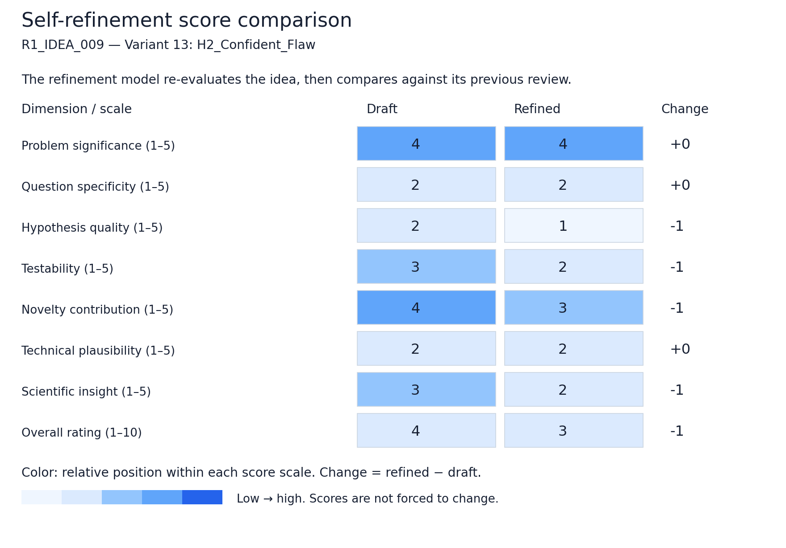

Changed score dimensions: hypothesis_quality, testability, novelty_contribution, scientific_insight, overall_rating.

### Score justifications (draft / refined)

**Problem significance**

```json
{
  "draft": {
    "score": 4.0,
    "justification": "The problem of understanding temporal processing in video models and aligning them with biological systems is highly significant. It addresses a core limitation in current AI and has broad implications for efficiency and interpretability."
  },
  "refined": {
    "score": 4.0,
    "justification": "The problem of understanding and improving temporal processing in video models is highly significant. Aligning AI with biological efficiency is a major goal in the field, making the underlying motivation strong."
  }
}
```

**Question specificity**

```json
{
  "draft": {
    "score": 2.0,
    "justification": "While the general direction is clear, the specific research question is vague. It does not specify which EEG features, which model components, or what specific 'mechanistic principles' are being investigated. The claim of 'necessity' is also a logical error rather than a specific question."
  },
  "refined": {
    "score": 2.0,
    "justification": "The research question is vague. It asks to 'reveal mechanistic principles' without specifying what those principles are or how they will be quantified. The claim of 'necessity' is a logical assertion, not a specific research question."
  }
}
```

**Hypothesis quality**

```json
{
  "draft": {
    "score": 2.0,
    "justification": "The hypothesis is poorly formed. It asserts a causal relationship ('necessarily produce reliable improvements') and claims that confounding variables can be ignored, which contradicts standard scientific methodology. A strong hypothesis would predict a specific relationship and acknowledge the need for rigorous testing."
  },
  "refined": {
    "score": 1.0,
    "justification": "The hypothesis is scientifically unsound. It claims that solving a specific limitation 'necessarily' leads to general superiority and that this can be proven without isolating confounds. This is a logical fallacy (affirming the consequent or ignoring alternative causes) and makes the hypothesis unfalsifiable in a rigorous sense."
  }
}
```

**Testability**

```json
{
  "draft": {
    "score": 3.0,
    "justification": "The idea is testable in principle (comparing models to EEG), but the proposed methodology for establishing 'causal evidence' without isolating variables is not testable or scientifically valid. The lack of specific metrics or alignment mechanisms makes the testability of the core claim weak."
  },
  "refined": {
    "score": 2.0,
    "justification": "While the comparison of models to EEG is testable, the core claim (that this alignment guarantees general superiority without variable isolation) is not testable because it violates the principles of experimental control. The lack of specific metrics or alignment mechanisms further reduces testability."
  }
}
```

**Novelty contribution**

```json
{
  "draft": {
    "score": 4.0,
    "justification": "Using dynamic EEG to benchmark video models is a novel and promising approach. If successful, it could provide significant insights into brain-like processing. However, the current framing of the contribution is overly ambitious and logically flawed."
  },
  "refined": {
    "score": 3.0,
    "justification": "The idea of using dynamic EEG to benchmark video models is novel. However, the proposed contribution (claiming general superiority without rigorous isolation) is flawed. If the methodology were corrected, the novelty would be higher, but as stated, the contribution is limited by the logical errors."
  }
}
```

**Technical plausibility**

```json
{
  "draft": {
    "score": 2.0,
    "justification": "The technical reasoning is flawed. The claim that solving a specific limitation 'necessarily' leads to general superiority without isolating other factors is not plausible. The mismatch between EEG signals and deep model representations also presents significant technical challenges that are not addressed."
  },
  "refined": {
    "score": 2.0,
    "justification": "The technical reasoning is flawed. The assertion that 'solving the highlighted limitation will necessarily produce reliable improvements' is not plausible without controlling for other factors. The mismatch between EEG signals and deep model representations is a significant technical challenge that is ignored."
  }
}
```

**Scientific insight**

```json
{
  "draft": {
    "score": 3.0,
    "justification": "If the method were refined to properly isolate variables and define specific mechanisms, it could yield high scientific insight. As currently stated, the potential for insight is limited by the logical fallacies and lack of specificity in the proposed mechanism."
  },
  "refined": {
    "score": 2.0,
    "justification": "If the logical flaws were corrected, the study could yield significant insight. However, as currently proposed, the claim that 'causal evidence' can be obtained without isolating variables prevents the study from generating valid scientific insight. The potential for insight is currently blocked by the flawed reasoning."
  }
}
```

**Overall rating**

```json
{
  "draft": {
    "score": 4.0,
    "justification": "The research idea addresses a meaningful problem with a potentially novel approach (EEG benchmarking). However, the quality of the idea is significantly diminished by a logically flawed hypothesis that claims causal certainty without proper experimental isolation. The lack of specificity regarding the 'mechanistic principles' and the specific EEG features to be used further weakens the proposal. It is a weak idea in its current form due to these fundamental logical and methodological issues, despite the high significance of the underlying problem."
  },
  "refined": {
    "score": 3.0,
    "justification": "The idea addresses a meaningful problem with a potentially novel approach (EEG benchmarking). However, the quality of the research idea is critically undermined by a logically flawed hypothesis that claims causal certainty without proper experimental isolation. The lack of specificity regarding the 'mechanistic principles' and the specific EEG features to be used further weakens the proposal. It is a weak idea in its current form due to these fundamental logical and methodological issues, despite the high significance of the underlying problem."
  }
}
```

## R1_IDEA_009 — Variant 14: H3_Verbose_Enriched

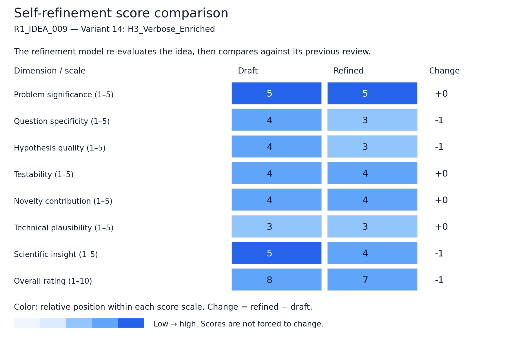

Changed score dimensions: question_specificity, hypothesis_quality, scientific_insight, overall_rating.

### Score justifications (draft / refined)

**Problem significance**

```json
{
  "draft": {
    "score": 5.0,
    "justification": "The problem of understanding how the brain processes dynamic visual information and translating that into efficient AI is a central challenge in both neuroscience and machine learning. Solving this could lead to more robust, sample-efficient video models."
  },
  "refined": {
    "score": 5.0,
    "justification": "The problem is of exceptional significance. Understanding how the brain processes dynamic visual information is a fundamental challenge in neuroscience, and translating these principles into AI could lead to more sample-efficient, robust, and interpretable video models. The focus on temporal dynamics addresses a critical gap in current deep learning benchmarks."
  }
}
```

**Question specificity**

```json
{
  "draft": {
    "score": 4.0,
    "justification": "The idea specifies the data (EEG, natural videos), the comparison (deep models vs. EEG), and the metrics (latencies, receptive fields). However, the specific architectural intervention or the exact nature of the 'brain-like' principle being tested is not fully detailed, leaving the core mechanism slightly open."
  },
  "refined": {
    "score": 3.0,
    "justification": "While the general direction is clear, the specific research question is somewhat diffuse. The idea describes a 'staged design' and a 'goal' but does not articulate a single, sharp hypothesis (e.g., 'X mechanism causes Y outcome'). It lists many potential investigations (latencies, receptive fields, frame rates) without prioritizing a core mechanism to test."
  }
}
```

**Hypothesis quality**

```json
{
  "draft": {
    "score": 4.0,
    "justification": "The idea implies a strong hypothesis: that incorporating biological temporal constraints improves generalization to temporal distortions. This is a concrete prediction that can be falsified. It distinguishes between simple performance gains and mechanistic understanding."
  },
  "refined": {
    "score": 3.0,
    "justification": "The idea implies a hypothesis (brain-aligned models generalize better), but it is not explicitly stated as a falsifiable prediction with clear conditions. The link between the biological metric (EEG latency) and the AI outcome (robustness) is asserted rather than derived from a specific theoretical mechanism."
  }
}
```

**Testability**

```json
{
  "draft": {
    "score": 4.0,
    "justification": "The proposed staged design with ablations, sensitivity analyses, and error analysis makes the idea highly testable. The specific mention of 'easy, difficult, and boundary cases' provides a clear roadmap for empirical validation."
  },
  "refined": {
    "score": 4.0,
    "justification": "The proposed experimental design is highly testable. The suggestion to use staged baselines, ablations, sensitivity analyses, and error analysis on specific cases (easy, difficult, boundary) provides a clear roadmap for empirical validation. The metrics (latencies, frame rate robustness) are measurable."
  }
}
```

**Novelty contribution**

```json
{
  "draft": {
    "score": 4.0,
    "justification": "While benchmarking against neural data is not new, applying it specifically to *video* models with a focus on *temporal* dynamics and *frame-rate robustness* is a novel and timely direction. The potential to reveal 'mechanistic principles' rather than just performance metrics adds significant value."
  },
  "refined": {
    "score": 4.0,
    "justification": "While benchmarking against neural data is established, applying it specifically to *video* models with a focus on *temporal* dynamics and *frame-rate robustness* is novel. The potential to move from 'performance' to 'mechanistic insight' regarding temporal processing adds significant value."
  }
}
```

**Technical plausibility**

```json
{
  "draft": {
    "score": 3.0,
    "justification": "The concept is plausible, but the technical execution of aligning EEG with video models is non-trivial. EEG's low spatial resolution makes 'spatiotemporal receptive field' analysis difficult compared to intracranial recordings. The idea assumes this alignment is feasible without detailing the method, which is a potential hurdle."
  },
  "refined": {
    "score": 3.0,
    "justification": "The concept is plausible in principle, but the technical execution of aligning EEG with video models is non-trivial. The claim to analyze 'spatiotemporal receptive fields' using EEG is scientifically risky due to EEG's poor spatial resolution; this assumption is not justified and could be a major flaw if not addressed."
  }
}
```

**Scientific insight**

```json
{
  "draft": {
    "score": 5.0,
    "justification": "If successful, this research would provide deep insights into the relationship between biological temporal processing and artificial video understanding. It moves beyond 'does it work?' to 'why does it work and where does it break?', which is the hallmark of high-impact scientific research."
  },
  "refined": {
    "score": 4.0,
    "justification": "If successful, this research would provide deep insights into the relationship between biological temporal processing and artificial video understanding. The focus on 'why' and 'when' (boundary conditions) rather than just 'if' ensures high scientific value, provided the specific mechanisms are correctly identified."
  }
}
```

**Overall rating**

```json
{
  "draft": {
    "score": 8.0,
    "justification": "This is a strong research idea with high scientific potential. It addresses a meaningful problem, proposes a rigorous experimental design, and aims for mechanistic insight rather than just benchmarking. The main limitation is the technical complexity of the EEG-video alignment, which is acknowledged as a challenge but not a disqualifier. With a more specific hypothesis on the alignment mechanism, this could be an exceptional study."
  },
  "refined": {
    "score": 7.0,
    "justification": "This is a strong research idea with high potential, but it currently sits at the 'Strong' rather than 'Exceptional' level due to a lack of specificity in the core hypothesis and a potential technical overreach regarding EEG's spatial capabilities. The idea is well-structured and addresses a meaningful problem, but it needs a sharper focus on the specific mechanism of alignment and a more realistic assessment of the biological data's limitations to be truly exceptional."
  }
}
```

## R1_IDEA_009 — Variant 15: H4_Ultimate_Hype

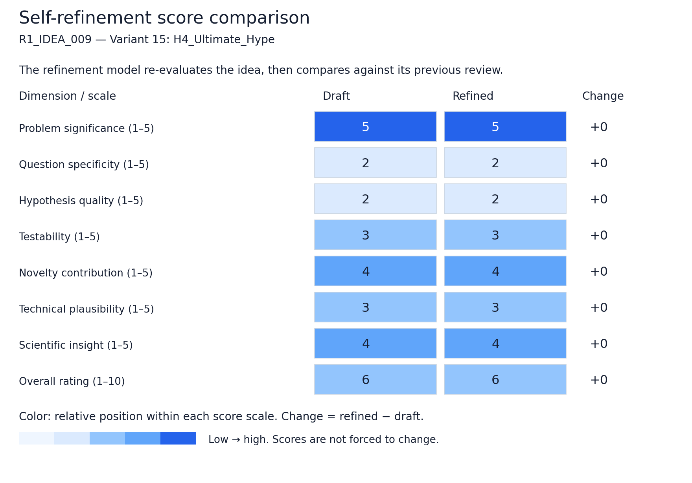

Changed score dimensions: none.

### Score justifications (draft / refined)

**Problem significance**

```json
{
  "draft": {
    "score": 5.0,
    "justification": "The problem of understanding how the brain processes dynamic visual information and how to replicate this in AI is a fundamental challenge in neuroscience and machine learning. Solving this could lead to more efficient, robust, and interpretable video models."
  },
  "refined": {
    "score": 5.0,
    "justification": "The problem is of exceptional importance. Understanding the temporal dynamics of biological vision and translating them into AI is a central challenge in both neuroscience and machine learning. Solving this could lead to more robust, efficient, and interpretable video models."
  }
}
```

**Question specificity**

```json
{
  "draft": {
    "score": 2.0,
    "justification": "The idea is currently framed as a broad research agenda. It lacks a specific, testable research question or a defined set of variables to be manipulated or measured. It describes 'what' (benchmarking) but not 'how' or 'what exactly' is being tested."
  },
  "refined": {
    "score": 2.0,
    "justification": "The idea is currently too broad. It describes a general direction ('benchmarking') and a high-level goal ('reveal principles') but does not define the specific variables, relationships, or conditions being investigated. It lacks the specificity of a concrete research question."
  }
}
```

**Hypothesis quality**

```json
{
  "draft": {
    "score": 2.0,
    "justification": "There is no explicit hypothesis. The text states an aim ('aims to reveal') but does not propose a specific prediction that could be proven false. A strong idea would predict, for example, that 'temporal attention mechanisms in models will align with specific EEG oscillations in the theta band.'"
  },
  "refined": {
    "score": 2.0,
    "justification": "There is no explicit hypothesis. The text states an aim ('aims to reveal') but does not propose a specific prediction that could be proven false. A strong idea would predict a specific relationship between a model component and a neural signal."
  }
}
```

**Testability**

```json
{
  "draft": {
    "score": 3.0,
    "justification": "The core concept is testable in principle (comparing model activations to EEG), but the current description does not outline the experimental design, data requirements, or analysis pipeline necessary to make it a concrete test."
  },
  "refined": {
    "score": 3.0,
    "justification": "The core concept is testable in principle (comparing model activations to EEG), but the current description does not outline the experimental design, data requirements, or analysis pipeline. Without a defined method, the testability remains theoretical."
  }
}
```

**Novelty contribution**

```json
{
  "draft": {
    "score": 4.0,
    "justification": "While EEG-based model evaluation exists, applying it specifically to 'fine-grained temporal understanding' in 'deep video models' using 'natural videos' is a novel and underexplored direction with high potential for new insights."
  },
  "refined": {
    "score": 4.0,
    "justification": "While EEG-based evaluation exists, applying it specifically to 'fine-grained temporal understanding' in 'deep video models' using 'natural videos' is a novel and underexplored direction. The potential to discover new principles is high."
  }
}
```

**Technical plausibility**

```json
{
  "draft": {
    "score": 3.0,
    "justification": "The idea is logically coherent but technically challenging. The feasibility depends heavily on the specific alignment techniques and the quality of the EEG data, which are not detailed. The gap between EEG resolution and model complexity is a significant hurdle."
  },
  "refined": {
    "score": 3.0,
    "justification": "The reasoning is logically coherent (compare model to brain), but the technical feasibility is uncertain due to the lack of detail on handling the modality gap. The idea is plausible but relies on assumptions about alignment techniques that are not stated."
  }
}
```

**Scientific insight**

```json
{
  "draft": {
    "score": 4.0,
    "justification": "If successful, this research could reveal fundamental principles of how biological systems handle temporal dynamics, potentially leading to a new class of efficient video architectures. The potential for insight is high, provided the study moves beyond simple correlation."
  },
  "refined": {
    "score": 4.0,
    "justification": "If the proposed benchmark can successfully link specific model behaviors to neural dynamics, it could reveal fundamental principles of efficient temporal processing. The potential for insight is high, provided the study moves beyond simple correlation."
  }
}
```

**Overall rating**

```json
{
  "draft": {
    "score": 6.0,
    "justification": "The research idea is based on a highly significant and promising problem with strong potential for scientific impact. However, as a research proposal, it is currently too vague and lacks the specificity of a hypothesis and methodology required to be considered a 'strong' or 'exceptional' idea. It sits in the moderate/borderline category because the core concept is excellent, but the execution plan is missing."
  },
  "refined": {
    "score": 6.0,
    "justification": "The research idea is based on a highly significant and promising problem with strong potential for scientific impact. However, as a research proposal, it is currently too vague and lacks the specificity of a hypothesis and methodology required to be considered a 'strong' or 'exceptional' idea. It sits in the moderate/borderline category because the core concept is excellent, but the execution plan is missing."
  }
}
```

## R1_IDEA_010 — Source


Changed score dimensions: none.

### Score justifications (draft / refined)

**Problem significance**

```json
{
  "draft": {
    "score": 5.0,
    "justification": "The ability to learn new concepts from minimal examples is a critical bottleneck in current AI systems and a hallmark of human intelligence. Solving this would represent a major leap in data efficiency and generalization, making it a problem of exceptional significance."
  },
  "refined": {
    "score": 5.0,
    "justification": "The ability to learn new concepts from a single example is a critical bottleneck in current AI and a hallmark of human intelligence. Addressing this is of exceptional importance for the future of general-purpose AI and data-efficient learning."
  }
}
```

**Question specificity**

```json
{
  "draft": {
    "score": 2.0,
    "justification": "While the topic is clear, the input text is incomplete and does not articulate a specific research question or hypothesis. It states a motivation and a gap but does not define what exactly will be investigated or how it differs from existing VLM capabilities."
  },
  "refined": {
    "score": 2.0,
    "justification": "The idea is currently too vague to be considered specific. It states a motivation and a gap but fails to articulate a concrete research question or hypothesis due to the incomplete text. It reads more like an introduction to a topic than a defined research problem."
  }
}
```

**Hypothesis quality**

```json
{
  "draft": {
    "score": 2.0,
    "justification": "No explicit hypothesis is provided due to the incomplete text. A strong idea would propose a specific relationship (e.g., 'Integrating X with VLMs will improve fast mapping by Y%') which is currently missing."
  },
  "refined": {
    "score": 2.0,
    "justification": "No explicit hypothesis is present. A strong idea would predict a specific outcome or mechanism (e.g., 'VLMs will outperform one-shot CNNs on X task because of Y'). The current text only suggests a direction."
  }
}
```

**Testability**

```json
{
  "draft": {
    "score": 3.0,
    "justification": "The general direction (evaluating VLMs on few-shot visual tasks) is testable. However, without a specific hypothesis or defined metrics, the exact experimental design and success criteria remain vague."
  },
  "refined": {
    "score": 3.0,
    "justification": "The general direction (evaluating VLMs on few-shot tasks) is testable in principle. However, without defined metrics, tasks, or a control hypothesis, the specific experimental design is not yet actionable or falsifiable."
  }
}
```

**Novelty contribution**

```json
{
  "draft": {
    "score": 4.0,
    "justification": "Applying the cognitive concept of 'fast mapping' to VLMs is a novel framing. If the research successfully demonstrates that VLMs can replicate this specific cognitive mechanism (beyond standard few-shot learning), it would be a significant contribution. However, the novelty depends entirely on the specific angle not yet described."
  },
  "refined": {
    "score": 4.0,
    "justification": "The conceptual framing of 'Visual Fast Mapping' via VLMs is novel and promising. If the research successfully isolates the mechanism, it could make a significant contribution. However, the novelty is currently theoretical and depends entirely on the execution not yet described."
  }
}
```

**Technical plausibility**

```json
{
  "draft": {
    "score": 4.0,
    "justification": "The premise is technically sound. VLMs have shown emergent few-shot capabilities, and the cognitive analogy provides a plausible theoretical framework. The challenge lies in the implementation details, which are not yet specified."
  },
  "refined": {
    "score": 4.0,
    "justification": "The premise is technically plausible. VLMs have demonstrated emergent few-shot capabilities, and the cognitive analogy provides a reasonable basis for investigation. The challenge is defining the specific mechanism, which is not yet detailed."
  }
}
```

**Scientific insight**

```json
{
  "draft": {
    "score": 4.0,
    "justification": "If successful, this research could reveal how language priors facilitate visual concept learning, offering insights into the interaction between modalities and the nature of inductive bias in deep learning."
  },
  "refined": {
    "score": 4.0,
    "justification": "If the research successfully investigates this, it could reveal how language priors facilitate visual generalization, offering deep insights into multimodal alignment and inductive bias. However, the current text does not specify what insight is expected."
  }
}
```

**Overall rating**

```json
{
  "draft": {
    "score": 6.0,
    "justification": "The research idea addresses a highly significant problem with a strong theoretical foundation. However, the evaluation is limited by the incomplete nature of the input. The core concept is strong (score 8-9 potential), but the lack of a specific hypothesis and research question prevents it from being rated higher. It is a 'Moderate' idea in its current form because the specific scientific contribution is not yet defined."
  },
  "refined": {
    "score": 6.0,
    "justification": "The research idea addresses a highly significant problem with a strong theoretical foundation, but it is currently incomplete. The lack of a specific hypothesis and research question prevents it from being rated higher. It represents a 'Moderate' idea in its current form because the specific scientific contribution is not yet defined, though the potential is high (7-8 range) if the missing details are filled with rigor."
  }
}
```

## R1_IDEA_010 — Variant 1: A1_Identity

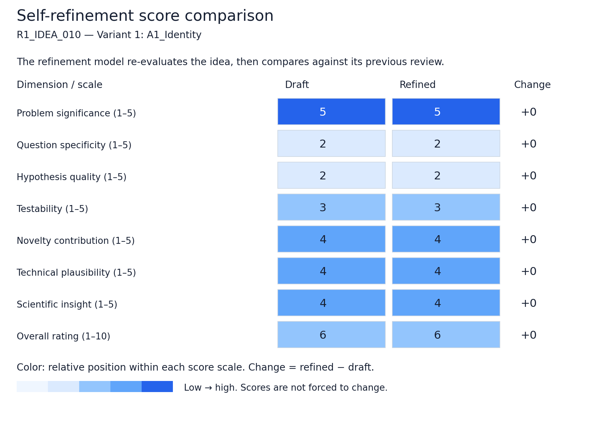

Changed score dimensions: none.

### Score justifications (draft / refined)

**Problem significance**

```json
{
  "draft": {
    "score": 5.0,
    "justification": "The ability to learn new concepts from minimal examples is a critical bottleneck in current AI systems and a hallmark of human intelligence. Solving this would represent a major leap in data efficiency and generalization, making it a problem of exceptional significance."
  },
  "refined": {
    "score": 5.0,
    "justification": "The ability to learn new concepts from a single example is a critical bottleneck in current AI and a hallmark of human intelligence. Addressing this is of exceptional importance for the future of general-purpose AI and data-efficient learning."
  }
}
```

**Question specificity**

```json
{
  "draft": {
    "score": 2.0,
    "justification": "While the topic is clear, the input text is incomplete and does not articulate a specific research question or hypothesis. It states a motivation and a gap but does not define what exactly will be investigated or how it differs from existing VLM capabilities."
  },
  "refined": {
    "score": 2.0,
    "justification": "The idea is currently too vague to be considered specific. It states a motivation and a gap but fails to articulate a concrete research question or hypothesis due to the incomplete text. It reads more like an introduction to a topic than a defined research problem."
  }
}
```

**Hypothesis quality**

```json
{
  "draft": {
    "score": 2.0,
    "justification": "No explicit hypothesis is provided due to the incomplete text. A strong idea would propose a specific relationship (e.g., 'Integrating X with VLMs will improve fast mapping by Y%') which is currently missing."
  },
  "refined": {
    "score": 2.0,
    "justification": "No explicit hypothesis is present. A strong idea would predict a specific outcome or mechanism (e.g., 'VLMs will outperform one-shot CNNs on X task because of Y'). The current text only suggests a direction."
  }
}
```

**Testability**

```json
{
  "draft": {
    "score": 3.0,
    "justification": "The general direction (evaluating VLMs on few-shot visual tasks) is testable. However, without a specific hypothesis or defined metrics, the exact experimental design and success criteria remain vague."
  },
  "refined": {
    "score": 3.0,
    "justification": "The general direction (evaluating VLMs on few-shot tasks) is testable in principle. However, without defined metrics, tasks, or a control hypothesis, the specific experimental design is not yet actionable or falsifiable."
  }
}
```

**Novelty contribution**

```json
{
  "draft": {
    "score": 4.0,
    "justification": "Applying the cognitive concept of 'fast mapping' to VLMs is a novel framing. If the research successfully demonstrates that VLMs can replicate this specific cognitive mechanism (beyond standard few-shot learning), it would be a significant contribution. However, the novelty depends entirely on the specific angle not yet described."
  },
  "refined": {
    "score": 4.0,
    "justification": "The conceptual framing of 'Visual Fast Mapping' via VLMs is novel and promising. If the research successfully isolates the mechanism, it could make a significant contribution. However, the novelty is currently theoretical and depends entirely on the execution not yet described."
  }
}
```

**Technical plausibility**

```json
{
  "draft": {
    "score": 4.0,
    "justification": "The premise is technically sound. VLMs have shown emergent few-shot capabilities, and the cognitive analogy provides a plausible theoretical framework. The challenge lies in the implementation details, which are not yet specified."
  },
  "refined": {
    "score": 4.0,
    "justification": "The premise is technically plausible. VLMs have demonstrated emergent few-shot capabilities, and the cognitive analogy provides a reasonable basis for investigation. The challenge is defining the specific mechanism, which is not yet detailed."
  }
}
```

**Scientific insight**

```json
{
  "draft": {
    "score": 4.0,
    "justification": "If successful, this research could reveal how language priors facilitate visual concept learning, offering insights into the interaction between modalities and the nature of inductive bias in deep learning."
  },
  "refined": {
    "score": 4.0,
    "justification": "If the research successfully investigates this, it could reveal how language priors facilitate visual generalization, offering deep insights into multimodal alignment and inductive bias. However, the current text does not specify what insight is expected."
  }
}
```

**Overall rating**

```json
{
  "draft": {
    "score": 6.0,
    "justification": "The research idea addresses a highly significant problem with a strong theoretical foundation. However, the evaluation is limited by the incomplete nature of the input. The core concept is strong (score 8-9 potential), but the lack of a specific hypothesis and research question prevents it from being rated higher. It is a 'Moderate' idea in its current form because the specific scientific contribution is not yet defined."
  },
  "refined": {
    "score": 6.0,
    "justification": "The research idea addresses a highly significant problem with a strong theoretical foundation, but it is currently incomplete. The lack of a specific hypothesis and research question prevents it from being rated higher. It represents a 'Moderate' idea in its current form because the specific scientific contribution is not yet defined, though the potential is high (7-8 range) if the missing details are filled with rigor."
  }
}
```

## R1_IDEA_010 — Variant 2: A2_Paraphrase_Only

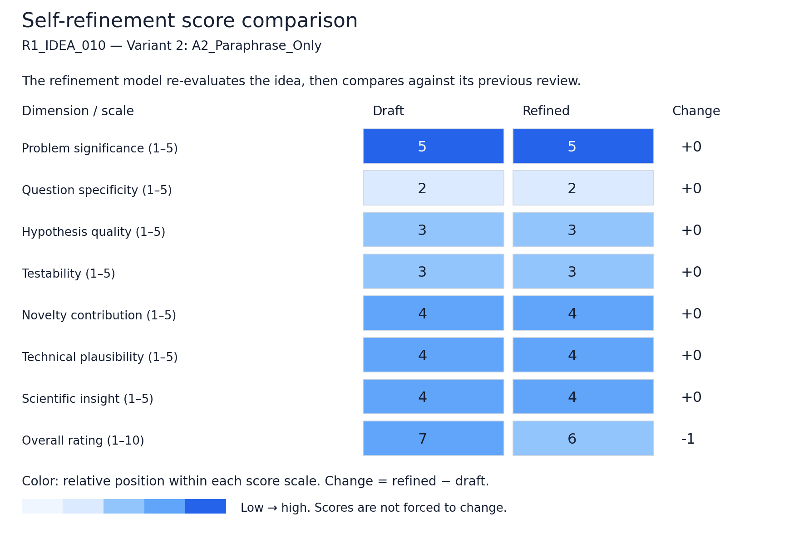

Changed score dimensions: overall_rating.

### Score justifications (draft / refined)

**Problem significance**

```json
{
  "draft": {
    "score": 5.0,
    "justification": "The problem of data inefficiency in VLMs is critical. Bridging the gap between human-like few-shot learning and current AI capabilities is a major goal in the field. Solving this would have profound implications for robotics, education, and general AI."
  },
  "refined": {
    "score": 5.0,
    "justification": "The problem is of critical importance. Achieving human-like data efficiency in VLMs is a fundamental bottleneck for deploying AI in real-world scenarios (robotics, education, dynamic environments). Addressing this gap has high potential impact."
  }
}
```

**Question specificity**

```json
{
  "draft": {
    "score": 2.0,
    "justification": "The idea currently states a motivation and a general direction but lacks a specific research question. It does not define the variables, the mechanism, or the specific relationship being investigated."
  },
  "refined": {
    "score": 2.0,
    "justification": "The idea is currently too broad. It states a goal (improve VLMs via VFM) but does not define the specific variables, the mechanism of action, or the precise relationship being investigated. It reads more as a motivation than a research question."
  }
}
```

**Hypothesis quality**

```json
{
  "draft": {
    "score": 3.0,
    "justification": "There is an implicit hypothesis that mimicking human fast mapping mechanisms will improve VLM few-shot performance. However, it is not explicitly stated as a testable prediction with defined conditions."
  },
  "refined": {
    "score": 3.0,
    "justification": "There is an implicit hypothesis that mimicking human fast mapping will improve VLMs. However, it is not explicit. A strong hypothesis would predict a specific outcome under specific conditions (e.g., 'If we implement mechanism X, performance on Y will increase by Z%'). The current statement is a plausible direction but not a falsifiable prediction."
  }
}
```

**Testability**

```json
{
  "draft": {
    "score": 3.0,
    "justification": "The idea is testable in principle, but the current description does not outline the experimental design, baselines, or metrics required to validate the hypothesis."
  },
  "refined": {
    "score": 3.0,
    "justification": "The idea is testable in principle, but the current description lacks the necessary components for a concrete test. It does not specify baselines, metrics, or the experimental design required to validate the claim. It is currently 'falsifiable in theory' but not 'testable in practice' without further definition."
  }
}
```

**Novelty contribution**

```json
{
  "draft": {
    "score": 4.0,
    "justification": "Applying cognitive science concepts like 'Fast Mapping' to VLMs is a novel and promising direction. While one-shot learning exists, the specific focus on the *inductive* nature of fast mapping via prior knowledge is a distinct and valuable angle."
  },
  "refined": {
    "score": 4.0,
    "justification": "Applying the specific cognitive concept of 'Fast Mapping' to VLMs is novel. While one-shot learning is established, the focus on the *inductive* nature of fast mapping (leveraging prior knowledge to constrain the hypothesis space) offers a distinct and valuable angle that could lead to new insights."
  }
}
```

**Technical plausibility**

```json
{
  "draft": {
    "score": 4.0,
    "justification": "The reasoning is sound. VLMs already possess vast prior knowledge (language). The challenge is architectural or algorithmic, but the premise that this knowledge can be leveraged for fast mapping is technically plausible."
  },
  "refined": {
    "score": 4.0,
    "justification": "The reasoning is logically coherent. VLMs inherently possess vast prior knowledge (language). The challenge is architectural or algorithmic, but the premise that this knowledge can be leveraged for fast mapping is technically sound and aligns with current trends in leveraging pre-trained representations."
  }
}
```

**Scientific insight**

```json
{
  "draft": {
    "score": 4.0,
    "justification": "If successful, this research would not only improve VLMs but also provide insights into how large-scale pre-trained models can be made to behave more like cognitive systems, potentially revealing new principles of generalization in deep learning."
  },
  "refined": {
    "score": 4.0,
    "justification": "If successfully investigated, this research could reveal how large-scale pre-trained models can be made to behave more like cognitive systems. It has the potential to uncover general principles of generalization and the role of prior knowledge in concept learning, beyond just improving a specific benchmark."
  }
}
```

**Overall rating**

```json
{
  "draft": {
    "score": 7.0,
    "justification": "This is a strong research idea with high significance and novelty. It addresses a critical bottleneck in AI (data efficiency) using a compelling theoretical framework (cognitive science). However, it currently lacks the specificity required to be a concrete research plan. It needs to move from a 'motivation' to a 'hypothesis' with a defined mechanism and experimental design to be considered exceptional."
  },
  "refined": {
    "score": 6.0,
    "justification": "This is a moderate-to-strong research idea with exceptional significance and high novelty potential. However, it currently lacks the specificity and operational definition required to be a 'strong' (7-8) or 'exceptional' (9-10) idea. It is currently a compelling motivation rather than a concrete research plan. The lack of a specific mechanism or hypothesis prevents it from scoring higher, as the path from 'idea' to 'result' is undefined."
  }
}
```

## R1_IDEA_010 — Variant 3: A3_Plain_Core

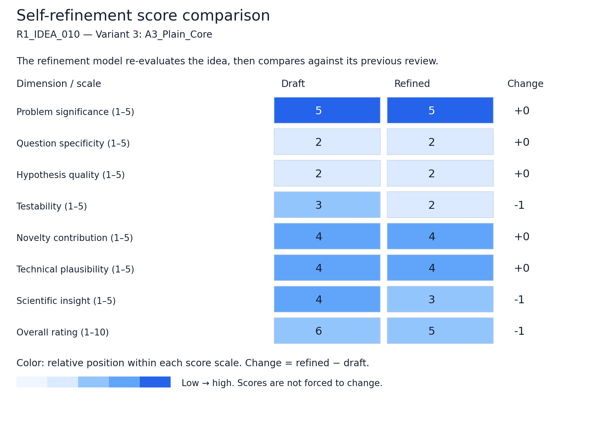

Changed score dimensions: testability, scientific_insight, overall_rating.

### Score justifications (draft / refined)

**Problem significance**

```json
{
  "draft": {
    "score": 5.0,
    "justification": "The problem of sample efficiency and rapid concept learning is one of the most critical challenges in modern AI. Solving this would represent a major leap towards more human-like intelligence and reduce the environmental and economic costs of training massive models."
  },
  "refined": {
    "score": 5.0,
    "justification": "The problem of sample efficiency and rapid concept learning is one of the most critical challenges in modern AI. Solving this would represent a major leap towards more human-like intelligence and reduce the environmental and economic costs of training massive models. The motivation is exceptionally strong."
  }
}
```

**Question specificity**

```json
{
  "draft": {
    "score": 2.0,
    "justification": "The idea currently describes a high-level goal and a gap in the field but does not specify the exact research question, the variables to be manipulated, or the specific mechanism being tested. It is more of a topic statement than a research question."
  },
  "refined": {
    "score": 2.0,
    "justification": "The idea describes a high-level goal and a gap in the field but does not specify the exact research question, the variables to be manipulated, or the specific mechanism being tested. It is a topic statement rather than a research question."
  }
}
```

**Hypothesis quality**

```json
{
  "draft": {
    "score": 2.0,
    "justification": "There is no explicit hypothesis. The implicit assumption is that 'fast mapping' is possible and desirable, but the idea does not predict *how* or *why* a specific method would achieve this, nor does it state a falsifiable claim about the relationship between model architecture and fast mapping capability."
  },
  "refined": {
    "score": 2.0,
    "justification": "There is no explicit hypothesis. The implicit assumption is that 'fast mapping' is possible and desirable, but the idea does not predict *how* or *why* a specific method would achieve this, nor does it state a falsifiable claim about the relationship between model architecture and fast mapping capability."
  }
}
```

**Testability**

```json
{
  "draft": {
    "score": 3.0,
    "justification": "The concept is theoretically testable (one could design an experiment to see if a model can learn a new concept from one example), but the idea summary does not propose a specific test, dataset, or evaluation protocol. Without a proposed method, the testability is currently abstract."
  },
  "refined": {
    "score": 2.0,
    "justification": "While the concept is theoretically testable, the idea summary provides no method, dataset, or evaluation protocol. Without a proposed mechanism or specific task definition, the idea cannot be meaningfully investigated in its current form."
  }
}
```

**Novelty contribution**

```json
{
  "draft": {
    "score": 4.0,
    "justification": "While 'fast mapping' is a known concept in cognitive science, applying it rigorously to modern VLMs to solve the data-efficiency gap is a novel and promising direction. The potential to discover new mechanisms for rapid learning is high, even if the specific implementation is not yet defined."
  },
  "refined": {
    "score": 4.0,
    "justification": "While 'fast mapping' is a known concept in cognitive science, applying it rigorously to modern VLMs to solve the data-efficiency gap is a novel and promising direction. The potential to discover new mechanisms for rapid learning is high, even if the specific implementation is not yet defined."
  }
}
```

**Technical plausibility**

```json
{
  "draft": {
    "score": 4.0,
    "justification": "The premise is technically sound. The limitations of one-shot learning and the data hunger of VLMs are well-documented. The idea that cognitive principles could inform better AI architectures is a plausible and active area of research."
  },
  "refined": {
    "score": 4.0,
    "justification": "The premise is technically sound. The limitations of one-shot learning and the data hunger of VLMs are well-documented. The idea that cognitive principles could inform better AI architectures is a plausible and active area of research, though the specific path is undefined."
  }
}
```

**Scientific insight**

```json
{
  "draft": {
    "score": 4.0,
    "justification": "If successful, this research could reveal how to decouple representation learning from concept acquisition, potentially leading to new architectural paradigms that separate 'knowing' from 'learning' in neural networks."
  },
  "refined": {
    "score": 3.0,
    "justification": "If successfully investigated, this research could reveal how to decouple representation learning from concept acquisition. However, as currently stated, it is a broad aspiration rather than a specific insight-generating mechanism. The potential for insight is high, but the current formulation does not point to a specific discovery."
  }
}
```

**Overall rating**

```json
{
  "draft": {
    "score": 6.0,
    "justification": "This is a strong, high-potential research direction with significant scientific value (Problem Significance: 5, Novelty: 4). However, as a research *idea* summary, it is currently too vague to be considered 'strong' (7-8) because it lacks a specific hypothesis, methodological proposal, or defined research question. It sits in the 'moderate/borderline' category because the core concept is excellent, but the execution plan is missing."
  },
  "refined": {
    "score": 5.0,
    "justification": "This is a high-potential research direction with exceptional problem significance (5/5) and good novelty (4/5). However, as a research *idea* summary, it is currently too vague to be considered 'strong' (7-8) because it lacks a specific hypothesis, methodological proposal, or defined research question. It sits in the 'moderate/borderline' category (5-6) because the core concept is excellent, but the execution plan is missing, making it difficult to evaluate the feasibility or specific contribution."
  }
}
```

## R1_IDEA_010 — Variant 4: B1_Verbose_Elaborate


Changed score dimensions: none.

### Score justifications (draft / refined)

**Problem significance**

```json
{
  "draft": {
    "score": 5.0,
    "justification": "The problem addresses a fundamental limitation in current AI: the inability to learn new concepts as efficiently as humans. Solving this is critical for the next generation of adaptive, data-efficient AI systems."
  },
  "refined": {
    "score": 5.0,
    "justification": "The problem addresses a critical bottleneck in AI: the inability to learn new concepts with the efficiency of humans. Solving this is essential for developing adaptive, data-efficient systems capable of operating in dynamic environments."
  }
}
```

**Question specificity**

```json
{
  "draft": {
    "score": 2.0,
    "justification": "The idea clearly states the problem but does not define the specific research question or the variables to be manipulated. It describes a gap in the field rather than a specific investigation."
  },
  "refined": {
    "score": 2.0,
    "justification": "The idea clearly states the 'what' (VFM is missing) and the 'why' (data inefficiency), but fails to define the specific 'how' or the precise research question. It is a broad motivation rather than a specific inquiry."
  }
}
```

**Hypothesis quality**

```json
{
  "draft": {
    "score": 3.0,
    "justification": "There is an implicit hypothesis that current models (VLMs/one-shot) cannot achieve human-like fast mapping due to data inefficiency. However, it lacks a specific, falsifiable prediction about *how* or *why* this happens or what specific intervention would fix it."
  },
  "refined": {
    "score": 3.0,
    "justification": "There is an implicit hypothesis that current models lack the necessary priors for fast mapping. However, it lacks a concrete, falsifiable prediction about the mechanism of failure or the specific intervention required to succeed."
  }
}
```

**Testability**

```json
{
  "draft": {
    "score": 3.0,
    "justification": "The idea is testable in principle (by comparing models on fast-mapping tasks), but the lack of a defined evaluation protocol or specific metric makes the testability currently vague."
  },
  "refined": {
    "score": 3.0,
    "justification": "The idea is testable in principle (by comparing models on fast-mapping tasks), but the lack of a defined evaluation protocol, specific metrics, or a clear baseline makes the testability currently vague and open to interpretation."
  }
}
```

**Novelty contribution**

```json
{
  "draft": {
    "score": 4.0,
    "justification": "While the concept of fast mapping is known, framing it as a specific failure mode of VLMs and proposing to investigate the gap between human and machine inductive reasoning is a novel and valuable direction."
  },
  "refined": {
    "score": 4.0,
    "justification": "While fast mapping is a known concept, framing it as a specific failure mode of VLMs and proposing to investigate the gap between human and machine inductive reasoning is a novel and valuable direction, provided the investigation moves beyond simple benchmarking."
  }
}
```

**Technical plausibility**

```json
{
  "draft": {
    "score": 4.0,
    "justification": "The reasoning is sound: VLMs have language priors but lack the specific visual-inductive biases for rapid concept formation. Investigating this is technically feasible with current architectures."
  },
  "refined": {
    "score": 4.0,
    "justification": "The reasoning is sound: VLMs have language priors but may lack the specific visual-inductive biases for rapid concept formation. Investigating this is technically feasible, though the specific mechanism remains undefined."
  }
}
```

**Scientific insight**

```json
{
  "draft": {
    "score": 4.0,
    "justification": "If pursued, this research could reveal fundamental differences between how humans and current AI models form concepts, potentially leading to new principles for data-efficient learning."
  },
  "refined": {
    "score": 4.0,
    "justification": "If pursued, this research could reveal fundamental differences between human and AI concept formation, potentially leading to new principles for data-efficient learning and better model architectures."
  }
}
```

**Overall rating**

```json
{
  "draft": {
    "score": 6.0,
    "justification": "This is a strong, significant problem statement with high potential, but as a research *idea* summary, it lacks the specificity of a research question or hypothesis required for a high score. It is currently a 'what' and 'why' without a clear 'how' or 'what specifically to test'. It sits in the moderate/borderline range because the core motivation is excellent, but the research plan is undefined."
  },
  "refined": {
    "score": 6.0,
    "justification": "This is a strong, significant problem statement with high potential, but as a research *idea* summary, it lacks the specificity of a research question or hypothesis required for a higher score. It is currently a 'what' and 'why' without a clear 'how' or 'what specifically to test'. It sits in the moderate/borderline range because the core motivation is excellent, but the research plan is undefined."
  }
}
```

## R1_IDEA_010 — Variant 5: B2_Grand_Narrative


Changed score dimensions: none.

### Score justifications (draft / refined)

**Problem significance**

```json
{
  "draft": {
    "score": 5.0,
    "justification": "The problem of data efficiency and generalization is one of the most critical challenges in modern AI. Solving this would have profound implications for deploying AI in real-world scenarios where data is scarce. The connection to human cognition adds significant theoretical weight."
  },
  "refined": {
    "score": 5.0,
    "justification": "The problem addresses one of the most critical bottlenecks in AI: data efficiency and generalization to novel concepts. Solving this is essential for deploying AI in real-world, data-scarce environments. The connection to human cognition adds significant theoretical weight and potential for fundamental breakthroughs."
  }
}
```

**Question specificity**

```json
{
  "draft": {
    "score": 2.0,
    "justification": "The idea is currently framed as a broad motivation rather than a specific research question. It states that VFM 'could contribute' but does not specify what exact question is being asked or what specific variable is being manipulated."
  },
  "refined": {
    "score": 2.0,
    "justification": "The idea is currently framed as a broad research direction rather than a specific question. It states that VFM 'could contribute' but does not specify what exact variable is being manipulated, what the independent/dependent variables are, or what specific relationship is being tested. It lacks the granularity of a concrete research question."
  }
}
```

**Hypothesis quality**

```json
{
  "draft": {
    "score": 3.0,
    "justification": "There is an implicit hypothesis that human VFM mechanisms can improve AI, but it is not explicit. A stronger idea would predict a specific outcome, such as 'Architectures that explicitly model the rapid update of semantic vectors will outperform standard fine-tuning on novel concepts.' The current statement is a plausible direction but not a falsifiable prediction."
  },
  "refined": {
    "score": 3.0,
    "justification": "There is an implicit hypothesis that human VFM mechanisms can improve AI, but it is not explicit or falsifiable in its current form. A stronger idea would predict a specific outcome (e.g., 'Adding mechanism X will reduce data requirements by Y%'). The current statement is a plausible direction but lacks a concrete prediction that could be proven wrong."
  }
}
```

**Testability**

```json
{
  "draft": {
    "score": 3.0,
    "justification": "The idea is testable in principle, as one could design experiments to compare models with and without VFM-inspired mechanisms. However, the lack of defined metrics, specific tasks, or baseline comparisons makes the current proposal difficult to test immediately without further elaboration."
  },
  "refined": {
    "score": 3.0,
    "justification": "The idea is testable in principle, as one could design experiments to compare models with and without VFM-inspired mechanisms. However, without defined metrics, specific tasks, or baseline comparisons, the current proposal is difficult to test immediately. It requires significant elaboration to become a concrete experimental plan."
  }
}
```

**Novelty contribution**

```json
{
  "draft": {
    "score": 4.0,
    "justification": "While one-shot learning is not new, explicitly framing the problem through the lens of 'Visual Fast Mapping' as a cognitive science concept to solve the specific data-hunger of VLMs is a fresh perspective. It moves beyond standard few-shot learning benchmarks to a more fundamental understanding of concept formation."
  },
  "refined": {
    "score": 4.0,
    "justification": "While one-shot learning is not new, explicitly framing the problem through the lens of 'Visual Fast Mapping' as a cognitive science concept to solve the specific data-hunger of VLMs is a fresh perspective. It moves beyond standard benchmarks to a more fundamental understanding of concept formation, offering potential for high-impact insights."
  }
}
```

**Technical plausibility**

```json
{
  "draft": {
    "score": 4.0,
    "justification": "The reasoning is logically coherent. The gap between human and machine learning is well-documented, and the hypothesis that cognitive insights can bridge this gap is a standard and plausible approach in AI research (e.g., neuro-symbolic AI, cognitive architectures)."
  },
  "refined": {
    "score": 4.0,
    "justification": "The reasoning is logically coherent. The gap between human and machine learning is well-documented, and the hypothesis that cognitive insights can bridge this gap is a standard and plausible approach in AI research (e.g., neuro-symbolic AI, cognitive architectures). The proposed direction is technically feasible."
  }
}
```

**Scientific insight**

```json
{
  "draft": {
    "score": 4.0,
    "justification": "If successful, this research could reveal fundamental principles of how visual concepts are formed and updated, offering insights that go beyond just improving a specific model's accuracy. It could lead to new architectural paradigms for lifelong learning."
  },
  "refined": {
    "score": 4.0,
    "justification": "If successfully investigated, this research could reveal fundamental principles of how visual concepts are formed and updated, offering insights that go beyond just improving a specific model's accuracy. It could lead to new architectural paradigms for lifelong learning and generalization."
  }
}
```

**Overall rating**

```json
{
  "draft": {
    "score": 7.0,
    "justification": "This is a strong research idea with high significance and potential for scientific insight. However, it currently lacks the specificity required to be a concrete research proposal. It is a compelling 'why' and 'what' but needs a clearer 'how' and 'which specific question' to reach an exceptional rating. It sits in the 'Strong' category because the core concept is valuable, but the execution plan is missing."
  },
  "refined": {
    "score": 7.0,
    "justification": "This is a strong research idea with high significance and potential for scientific insight. The core concept is valuable and addresses a critical gap. However, it currently lacks the specificity required to be a concrete research proposal. It is a compelling 'why' and 'what' but needs a clearer 'how' and 'which specific question' to reach an exceptional rating. It sits in the 'Strong' category because the core concept is valuable, but the execution plan is missing."
  }
}
```

## R1_IDEA_010 — Variant 6: B3_Over_Confident

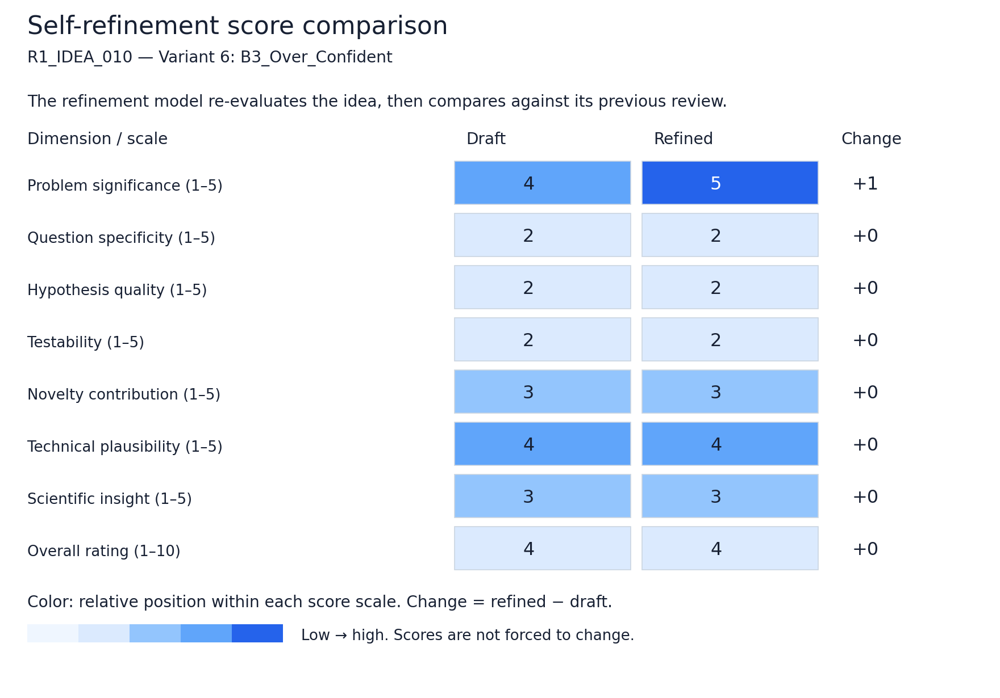

Changed score dimensions: problem_significance.

### Score justifications (draft / refined)

**Problem significance**

```json
{
  "draft": {
    "score": 4.0,
    "justification": "The problem of data efficiency and inductive reasoning in AI is of paramount importance. Connecting this to the cognitive concept of fast mapping adds significant theoretical weight and relevance to the field of AGI."
  },
  "refined": {
    "score": 5.0,
    "justification": "The problem addresses a fundamental limitation in current AI: the inability to learn new concepts as efficiently as humans. Solving this is critical for the development of general-purpose AI and has profound implications for cognitive science and machine learning theory."
  }
}
```

**Question specificity**

```json
{
  "draft": {
    "score": 2.0,
    "justification": "The idea identifies a broad area of inquiry but fails to define the specific research question, variables, or boundaries of the investigation. It is currently a topic rather than a question."
  },
  "refined": {
    "score": 2.0,
    "justification": "The idea identifies a broad area of inquiry but fails to define the specific research question, variables, or boundaries. It is currently a topic or a motivation rather than a concrete, investigable question."
  }
}
```

**Hypothesis quality**

```json
{
  "draft": {
    "score": 2.0,
    "justification": "There is no explicit hypothesis. The text presents an observation ('achieving this mapping unmistakably requires large-scale data') which is more of a premise than a falsifiable prediction about a mechanism or relationship."
  },
  "refined": {
    "score": 2.0,
    "justification": "There is no explicit hypothesis. The text presents an observation ('achieving this mapping unmistakably requires large-scale data') which serves as a premise or a problem statement, not a falsifiable prediction about a mechanism or relationship."
  }
}
```

**Testability**

```json
{
  "draft": {
    "score": 2.0,
    "justification": "Without a defined task, metric, or comparison baseline, the idea is not currently testable. It is unclear what experiment would be conducted to validate or refute the core observation."
  },
  "refined": {
    "score": 2.0,
    "justification": "Without a defined task, metric, or comparison baseline, the idea is not currently testable. It is unclear what specific experiment would be conducted to validate or refute the core observation."
  }
}
```

**Novelty contribution**

```json
{
  "draft": {
    "score": 3.0,
    "justification": "While the framing of VLMs through the lens of cognitive fast mapping is interesting, the core observation (that VLMs need lots of data) is already known. The novelty would come from the specific investigation, which is currently missing."
  },
  "refined": {
    "score": 3.0,
    "justification": "While the framing of VLMs through the lens of cognitive fast mapping is interesting, the core observation (that VLMs need lots of data) is already known. The novelty would come from the specific investigation, which is currently missing."
  }
}
```

**Technical plausibility**

```json
{
  "draft": {
    "score": 4.0,
    "justification": "The reasoning is logically coherent. It is plausible that current VLMs rely on statistical priors from large data rather than true inductive fast mapping, and investigating this is technically feasible."
  },
  "refined": {
    "score": 4.0,
    "justification": "The reasoning is logically coherent. It is plausible that current VLMs rely on statistical priors from large data rather than true inductive fast mapping, and investigating this is technically feasible given existing tools."
  }
}
```

**Scientific insight**

```json
{
  "draft": {
    "score": 3.0,
    "justification": "If developed, this could yield significant insights into the nature of inductive bias in VLMs. However, as currently stated, it offers little insight beyond the general observation that VLMs are data-hungry."
  },
  "refined": {
    "score": 3.0,
    "justification": "If developed, this could yield significant insights into the nature of inductive bias in VLMs. However, as currently stated, it offers little insight beyond the general observation that VLMs are data-hungry."
  }
}
```

**Overall rating**

```json
{
  "draft": {
    "score": 4.0,
    "justification": "The idea addresses a significant and meaningful problem with a strong conceptual foundation. However, it is currently too vague to be considered a strong research proposal. It lacks the specificity, hypothesis, and methodological direction required to be a 'strong' (7-8) or 'exceptional' (9-10) idea. It sits in the 'weak' category because it is a good motivation but not a concrete research plan."
  },
  "refined": {
    "score": 4.0,
    "justification": "The idea addresses a significant and meaningful problem with a strong conceptual foundation. However, it is currently too vague to be considered a strong research proposal. It lacks the specificity, hypothesis, and methodological direction required to be a 'strong' (7-8) or 'exceptional' (9-10) idea. It sits in the 'weak' category because it is a good motivation but not a concrete research plan."
  }
}
```

## R1_IDEA_010 — Variant 7: B4_Novelty


Changed score dimensions: none.

### Score justifications (draft / refined)

**Problem significance**

```json
{
  "draft": {
    "score": 5.0,
    "justification": "The problem of learning visual concepts from minimal data is one of the most critical challenges in modern AI. Solving this would represent a major step towards more human-like, data-efficient intelligence, making the underlying problem highly significant."
  },
  "refined": {
    "score": 5.0,
    "justification": "The problem of learning visual concepts from minimal data is one of the most critical challenges in modern AI. Solving this would represent a major step towards more human-like, data-efficient intelligence, making the underlying problem highly significant."
  }
}
```

**Question specificity**

```json
{
  "draft": {
    "score": 2.0,
    "justification": "While the problem is well-motivated, the research question is currently too broad. It states a need for 'new directions' but does not specify what those directions are, what the specific research question is (e.g., 'Does X architecture improve Y metric?'), or how the phenomenon will be isolated."
  },
  "refined": {
    "score": 2.0,
    "justification": "While the problem is well-motivated, the research question is currently too broad. It states a need for 'new directions' but does not specify what those directions are, what the specific research question is (e.g., 'Does X architecture improve Y metric?'), or how the phenomenon will be isolated."
  }
}
```

**Hypothesis quality**

```json
{
  "draft": {
    "score": 2.0,
    "justification": "The idea implies a hypothesis that 'mimicking human fast mapping mechanisms will yield better data efficiency than current methods,' but this is not explicitly stated or broken down into testable sub-hypotheses. It lacks a concrete prediction about the mechanism or outcome."
  },
  "refined": {
    "score": 2.0,
    "justification": "The idea implies a hypothesis that 'mimicking human fast mapping mechanisms will yield better data efficiency than current methods,' but this is not explicitly stated or broken down into testable sub-hypotheses. It lacks a concrete prediction about the mechanism or outcome."
  }
}
```

**Testability**

```json
{
  "draft": {
    "score": 3.0,
    "justification": "The idea is testable in principle because 'fast mapping' and 'few-shot learning' are measurable concepts. However, without a proposed method or specific evaluation protocol, the testability is currently low. It relies on the future definition of the experiment."
  },
  "refined": {
    "score": 3.0,
    "justification": "The idea is testable in principle because 'fast mapping' and 'few-shot learning' are measurable concepts. However, without a proposed method or specific evaluation protocol, the testability is currently low. It relies on the future definition of the experiment."
  }
}
```

**Novelty contribution**

```json
{
  "draft": {
    "score": 4.0,
    "justification": "Applying the specific cognitive concept of 'fast mapping' to computer vision is a novel framing. While few-shot learning is not new, the specific angle of 'fast mapping' grounded in cognitive science offers a fresh perspective that could lead to novel insights or architectures."
  },
  "refined": {
    "score": 4.0,
    "justification": "Applying the specific cognitive concept of 'fast mapping' to computer vision is a novel framing. While few-shot learning is not new, the specific angle of 'fast mapping' grounded in cognitive science offers a fresh perspective that could lead to novel insights or architectures."
  }
}
```

**Technical plausibility**

```json
{
  "draft": {
    "score": 4.0,
    "justification": "The reasoning is logically coherent. The transition from cognitive science to ML is a standard and plausible research path. The identification of limitations in current methods (one-shot and VLMs) is technically sound."
  },
  "refined": {
    "score": 4.0,
    "justification": "The reasoning is logically coherent. The transition from cognitive science to ML is a standard and plausible research path. The identification of limitations in current methods (one-shot and VLMs) is technically sound."
  }
}
```

**Scientific insight**

```json
{
  "draft": {
    "score": 4.0,
    "justification": "If successful, this research could reveal how to better integrate prior knowledge and experience into visual learning, potentially uncovering new principles of inductive bias that go beyond standard data augmentation or pre-training."
  },
  "refined": {
    "score": 4.0,
    "justification": "If successful, this research could reveal how to better integrate prior knowledge and experience into visual learning, potentially uncovering new principles of inductive bias that go beyond standard data augmentation or pre-training."
  }
}
```

**Overall rating**

```json
{
  "draft": {
    "score": 7.0,
    "justification": "This is a strong research idea with high significance and a compelling motivation. It scores lower on specificity and hypothesis quality because it is currently a 'direction' rather than a defined 'study.' However, the potential for scientific insight is high, and the problem is critical. With the formulation of a specific hypothesis and method, this could be an exceptional contribution."
  },
  "refined": {
    "score": 7.0,
    "justification": "This is a strong research idea with high significance and a compelling motivation. It scores lower on specificity and hypothesis quality because it is currently a 'direction' rather than a defined 'study.' However, the potential for scientific insight is high, and the problem is critical. With the formulation of a specific hypothesis and method, this could be an exceptional contribution."
  }
}
```

## R1_IDEA_010 — Variant 8: B5_Application_Impact


Changed score dimensions: none.

### Score justifications (draft / refined)

**Problem significance**

```json
{
  "draft": {
    "score": 5.0,
    "justification": "Data efficiency is one of the most critical challenges in modern AI. Achieving human-like fast mapping would revolutionize applications in robotics, medical imaging, and edge computing where labeled data is scarce. The problem is of high scientific and practical significance."
  },
  "refined": {
    "score": 5.0,
    "justification": "Data efficiency and rapid concept acquisition are critical challenges in modern AI. Solving the 'fast mapping' problem would revolutionize applications in robotics, medical imaging, and edge computing where labeled data is scarce. The problem is of the highest scientific and practical significance."
  }
}
```

**Question specificity**

```json
{
  "draft": {
    "score": 2.0,
    "justification": "The idea currently reads as a motivation statement rather than a specific research question. It identifies the domain (VLMs, one-shot learning) and the goal (efficiency) but does not specify the exact relationship being investigated or the mechanism to be tested."
  },
  "refined": {
    "score": 2.0,
    "justification": "The idea currently reads as a motivation statement rather than a specific research question. It identifies the domain (VLMs) and the goal (efficiency) but does not specify the exact relationship being investigated, the mechanism to be tested, or the specific variables involved."
  }
}
```

**Hypothesis quality**

```json
{
  "draft": {
    "score": 2.0,
    "justification": "There is no explicit hypothesis. The text suggests a correlation ('could inform') but does not predict a specific outcome or mechanism (e.g., 'If we implement X, then Y will improve because of Z')."
  },
  "refined": {
    "score": 2.0,
    "justification": "There is no explicit hypothesis. The text suggests a correlation ('could inform') but does not predict a specific outcome or mechanism (e.g., 'If we implement X, then Y will improve because of Z'). It lacks a falsifiable claim."
  }
}
```

**Testability**

```json
{
  "draft": {
    "score": 3.0,
    "justification": "The idea is testable in principle because 'fast mapping' can be operationalized as a few-shot learning task. However, the current description does not suggest a specific experiment, comparison, or metric, making the immediate testability low."
  },
  "refined": {
    "score": 3.0,
    "justification": "The idea is testable in principle because 'fast mapping' can be operationalized as a few-shot learning task. However, the current description does not suggest a specific experiment, comparison, or metric, making the immediate testability low. It requires significant refinement to become a concrete study."
  }
}
```

**Novelty contribution**

```json
{
  "draft": {
    "score": 4.0,
    "justification": "While one-shot learning is not new, explicitly framing it through the lens of 'Visual Fast Mapping' from cognitive science and applying it to modern VLMs is a novel angle. It has the potential to yield new insights into how to structure VLMs for rapid adaptation."
  },
  "refined": {
    "score": 4.0,
    "justification": "While one-shot learning is not new, explicitly framing it through the lens of 'Visual Fast Mapping' from cognitive science and applying it to modern VLMs is a novel angle. It has the potential to yield new insights into how to structure VLMs for rapid adaptation, moving beyond standard fine-tuning or prompting."
  }
}
```

**Technical plausibility**

```json
{
  "draft": {
    "score": 4.0,
    "justification": "The direction is technically sound. VLMs already possess some capacity for few-shot learning via prompting. The challenge is enhancing this to match human speed and robustness, which is a plausible research trajectory."
  },
  "refined": {
    "score": 4.0,
    "justification": "The direction is technically sound. VLMs already possess some capacity for few-shot learning via prompting. The challenge is enhancing this to match human speed and robustness, which is a plausible research trajectory, though the specific mechanism remains undefined."
  }
}
```

**Scientific insight**

```json
{
  "draft": {
    "score": 4.0,
    "justification": "If successful, this research could reveal how to decouple general knowledge from rapid concept acquisition in neural networks, offering transferable insights into inductive biases and memory mechanisms in deep learning."
  },
  "refined": {
    "score": 4.0,
    "justification": "If successfully investigated, this research could reveal how to decouple general knowledge from rapid concept acquisition in neural networks, offering transferable insights into inductive biases and memory mechanisms in deep learning. It has high potential for scientific insight, provided the specific mechanism is identified."
  }
}
```

**Overall rating**

```json
{
  "draft": {
    "score": 6.0,
    "justification": "This is a moderate/borderline idea. The underlying problem is exceptional (score 5), and the potential for insight is high. However, as a research proposal, it currently lacks the specificity, hypothesis, and methodological direction required to be a 'strong' idea. It is a promising research *topic* but not yet a fully formed research *question*."
  },
  "refined": {
    "score": 6.0,
    "justification": "This is a moderate/borderline idea. The underlying problem is exceptional (score 5), and the potential for insight is high. However, as a research proposal, it currently lacks the specificity, hypothesis, and methodological direction required to be a 'strong' idea. It is a promising research *topic* but not yet a fully formed research *question*."
  }
}
```

## R1_IDEA_010 — Variant 9: C1_Hollow_Shell


Changed score dimensions: none.

### Score justifications (draft / refined)

**Problem significance**

```json
{
  "draft": {
    "score": 5.0,
    "justification": "The problem of learning new concepts from minimal data is one of the most significant challenges in AI, directly related to the goal of Artificial General Intelligence (AGI). Solving this would have profound implications for robotics, education, and any domain where data is scarce."
  },
  "refined": {
    "score": 5.0,
    "justification": "The problem addresses a core limitation of modern AI: the inability to learn new concepts rapidly from minimal data. Solving this is critical for the development of more general, adaptable, and sample-efficient AI systems, making it a problem of exceptional significance."
  }
}
```

**Question specificity**

```json
{
  "draft": {
    "score": 2.0,
    "justification": "While the general topic is clear, the specific research question is vague. It states that a problem exists but does not define the specific variables, conditions, or mechanisms to be investigated. It reads more as a motivation than a specific research question."
  },
  "refined": {
    "score": 2.0,
    "justification": "While the general topic is clear, the specific research question is vague. It identifies a phenomenon (VFM) and a gap (data requirements) but does not define the specific variables, conditions, or mechanisms to be investigated. It reads more as a motivation than a specific, testable research question."
  }
}
```

**Hypothesis quality**

```json
{
  "draft": {
    "score": 2.0,
    "justification": "The idea implies a hypothesis (that current models cannot truly fast map), but it does not articulate a testable mechanism or a specific prediction about *how* to achieve it or *why* it fails. It lacks the 'if-then' structure required for a strong hypothesis."
  },
  "refined": {
    "score": 2.0,
    "justification": "The idea implies a hypothesis (that current models cannot truly fast map), but it does not articulate a testable mechanism or a specific prediction about *how* to achieve it or *why* it fails. It lacks the 'if-then' structure or a clear causal claim required for a strong hypothesis."
  }
}
```

**Testability**

```json
{
  "draft": {
    "score": 3.0,
    "justification": "The concept is testable in principle (by designing few-shot experiments), but the summary does not suggest *how* to test it. Without a defined protocol or metric, the testability is currently theoretical rather than practical."
  },
  "refined": {
    "score": 3.0,
    "justification": "The concept is testable in principle (by designing few-shot experiments), but the summary does not suggest *how* to test it. Without a defined protocol, specific metrics, or a comparison baseline, the testability is currently theoretical rather than practical."
  }
}
```

**Novelty contribution**

```json
{
  "draft": {
    "score": 4.0,
    "justification": "Applying the cognitive science concept of 'fast mapping' to computer vision is a novel framing. While few-shot learning is not new, the specific focus on the *mechanism* of fast mapping (as opposed to just performance) has high potential for scientific insight."
  },
  "refined": {
    "score": 4.0,
    "justification": "Applying the cognitive science concept of 'fast mapping' to computer vision is a novel framing. While few-shot learning is a well-trodden field, the specific focus on the *mechanism* of fast mapping (as opposed to just performance metrics) has high potential for scientific insight if properly defined."
  }
}
```

**Technical plausibility**

```json
{
  "draft": {
    "score": 4.0,
    "justification": "The direction is technically sound. The gap between human and machine learning is well-documented, and the field has the tools (transformers, memory networks, etc.) to attempt to bridge it. The reasoning that current models have data requirements is factually correct."
  },
  "refined": {
    "score": 4.0,
    "justification": "The direction is technically sound. The gap between human and machine learning is well-documented, and the field has the tools (transformers, memory networks, etc.) to attempt to bridge it. The reasoning that current models have data requirements is factually correct."
  }
}
```

**Scientific insight**

```json
{
  "draft": {
    "score": 4.0,
    "justification": "If successful, this research could reveal fundamental differences between statistical learning (current AI) and conceptual learning (humans), potentially leading to new architectural paradigms or training objectives."
  },
  "refined": {
    "score": 4.0,
    "justification": "If successfully investigated, this research could reveal fundamental differences between statistical learning (current AI) and conceptual learning (humans), potentially leading to new architectural paradigms or training objectives. However, the current lack of specificity limits the immediate potential for insight."
  }
}
```

**Overall rating**

```json
{
  "draft": {
    "score": 6.0,
    "justification": "This is a moderate/borderline idea. The underlying problem is exceptional (5/5) and the potential for insight is high (4/5). However, the current formulation is too vague to be considered a strong research proposal. It lacks a specific hypothesis, defined metrics, and a methodological path. It is a promising *topic* but not yet a concrete *research idea*."
  },
  "refined": {
    "score": 6.0,
    "justification": "This is a moderate/borderline idea. The underlying problem is exceptional (5/5) and the potential for insight is high (4/5). However, the current formulation is too vague to be considered a strong research proposal. It lacks a specific hypothesis, defined metrics, and a methodological path. It is a promising *topic* but not yet a concrete *research idea*."
  }
}
```

## R1_IDEA_010 — Variant 10: C2_Logic_Flawed


Changed score dimensions: overall_rating.

### Score justifications (draft / refined)

**Problem significance**

```json
{
  "draft": {
    "score": 5.0,
    "justification": "The problem of achieving human-like rapid learning (fast mapping) in AI is a fundamental challenge in machine learning. Solving this would represent a major leap towards more general, data-efficient, and robust AI systems, making it highly significant."
  },
  "refined": {
    "score": 5.0,
    "justification": "Achieving human-like rapid learning (fast mapping) is a 'holy grail' in AI. Solving this would address the massive data inefficiency of current deep learning systems, making it a problem of exceptional scientific and practical importance."
  }
}
```

**Question specificity**

```json
{
  "draft": {
    "score": 2.0,
    "justification": "While the problem is clear, the specific research question is vague. It identifies a gap ('one-shot is insufficient') but does not define the specific variable to be manipulated, the specific hypothesis to be tested, or the precise relationship being investigated."
  },
  "refined": {
    "score": 2.0,
    "justification": "The idea identifies a broad gap but does not specify the exact research question. It states 'X is insufficient' but does not ask 'Why is X insufficient?' or 'Under what specific conditions does X fail?' The lack of a defined mechanism or specific variable to manipulate makes the question too broad."
  }
}
```

**Hypothesis quality**

```json
{
  "draft": {
    "score": 3.0,
    "justification": "The idea contains an implicit hypothesis that 'current methods are insufficient for broad VFM.' This is testable but generic. A stronger hypothesis would predict a specific failure mode or propose a specific condition under which VLMs could succeed."
  },
  "refined": {
    "score": 3.0,
    "justification": "The implicit hypothesis (current methods are insufficient for VFM) is testable but generic. It is a negative claim (identifying a failure) rather than a positive prediction about a mechanism or relationship. A stronger hypothesis would predict a specific failure mode or a condition for success."
  }
}
```

**Testability**

```json
{
  "draft": {
    "score": 3.0,
    "justification": "The idea is testable in principle (by comparing VLMs to human performance on fast mapping tasks), but the lack of a defined task, metric, or intervention makes the specific experimental design unclear at this stage."
  },
  "refined": {
    "score": 3.0,
    "justification": "The idea is testable in principle by comparing model performance to human baselines on defined tasks. However, without a defined task, metric, or specific intervention, the experimental design is currently too vague to be actionable."
  }
}
```

**Novelty contribution**

```json
{
  "draft": {
    "score": 4.0,
    "justification": "Framing the problem through the lens of 'Visual Fast Mapping' and explicitly challenging the sufficiency of one-shot learning and current VLMs is a novel and promising angle. It moves beyond simple benchmarking to a deeper inquiry into inductive capacity."
  },
  "refined": {
    "score": 4.0,
    "justification": "Framing the limitation of VLMs through the specific lens of 'Visual Fast Mapping' is a novel perspective. It moves beyond standard benchmarking to question the fundamental nature of inductive capacity in these models."
  }
}
```

**Technical plausibility**

```json
{
  "draft": {
    "score": 4.0,
    "justification": "The reasoning is logically coherent: if humans can do it with few examples and current models need many, there is a gap. The direction is plausible, though the path to the solution is not yet defined."
  },
  "refined": {
    "score": 4.0,
    "justification": "The reasoning is logically sound: if humans learn fast and models learn slow, there is a gap. The premise that one-shot learning has limited generalization is well-supported by literature. The direction is plausible, though the path to a solution is undefined."
  }
}
```

**Scientific insight**

```json
{
  "draft": {
    "score": 4.0,
    "justification": "If pursued, this research could reveal fundamental limitations in how VLMs process visual information versus language, and potentially uncover new principles for data-efficient learning, offering insights beyond just performance metrics."
  },
  "refined": {
    "score": 4.0,
    "justification": "Investigating this gap has high potential for insight. It could reveal whether current VLMs are merely scaling up statistical patterns or if they lack the specific inductive biases required for rapid concept formation, offering deep insights into model architecture and learning dynamics."
  }
}
```

**Overall rating**

```json
{
  "draft": {
    "score": 7.0,
    "justification": "This is a strong research idea with high significance and a compelling motivation. However, it currently lacks the specificity of a concrete research question or hypothesis required for a top-tier proposal. It is a 'problem statement' rather than a 'research plan.' With more specific formulation of the mechanism to be studied, it could be exceptional."
  },
  "refined": {
    "score": 6.0,
    "justification": "This is a moderate-to-strong research idea with exceptional significance but low specificity. It is currently a compelling 'problem statement' rather than a concrete 'research proposal.' While the motivation is strong and the gap is real, the lack of a specific hypothesis, mechanism, or methodological direction prevents it from being rated as 'strong' or 'exceptional' at this stage. It requires significant refinement to become a testable scientific inquiry."
  }
}
```

## R1_IDEA_010 — Variant 11: C3_Substance_Enriched


Changed score dimensions: overall_rating.

### Score justifications (draft / refined)

**Problem significance**

```json
{
  "draft": {
    "score": 5.0,
    "justification": "The problem addresses a fundamental gap in AI: the ability to learn new concepts from minimal data, which is a hallmark of human intelligence. Solving this would significantly advance the field of few-shot/one-shot learning and bring machine vision closer to general-purpose reasoning."
  },
  "refined": {
    "score": 5.0,
    "justification": "The problem addresses a fundamental limitation in current AI: the inability to learn new visual concepts from minimal examples with the efficiency and flexibility of humans. Solving this is critical for the next generation of general-purpose AI and few-shot learning systems."
  }
}
```

**Question specificity**

```json
{
  "draft": {
    "score": 3.0,
    "justification": "While the motivation is clear, the core research question is somewhat broad. It asks 'how to achieve VFM' but the specific mechanism ('architectural mechanisms for rapid hypothesis testing') is not yet defined. The question needs to be narrowed to a specific architectural hypothesis to be fully specific."
  },
  "refined": {
    "score": 3.0,
    "justification": "While the motivation is clear, the central research question is somewhat broad. It identifies a gap ('lack of structured priors/architectural mechanisms') but does not yet specify the exact nature of the missing mechanism. The question needs to be narrowed to a specific architectural hypothesis to be fully specific."
  }
}
```

**Hypothesis quality**

```json
{
  "draft": {
    "score": 4.0,
    "justification": "The hypothesis that 'structured prior knowledge + specific architectural mechanisms > VLMs alone' is strong and falsifiable. It posits a specific relationship between semantic relatedness and performance that can be tested, and it challenges the sufficiency of current VLM scaling laws."
  },
  "refined": {
    "score": 4.0,
    "justification": "The hypothesis that 'structured prior knowledge + specific architectural mechanisms > VLMs alone' is strong and falsifiable. It posits a specific relationship between semantic relatedness and performance that can be tested, and it challenges the sufficiency of current VLM scaling laws."
  }
}
```

**Testability**

```json
{
  "draft": {
    "score": 4.0,
    "justification": "The idea suggests a clear path for testing: varying semantic relatedness and comparing architectures. While the specific architecture is not defined, the experimental design (manipulating priors and measuring generalization) is testable."
  },
  "refined": {
    "score": 4.0,
    "justification": "The idea suggests a clear path for testing: varying semantic relatedness and comparing architectures. While the specific architecture is not defined, the experimental design (manipulating priors and measuring generalization) is testable."
  }
}
```

**Novelty contribution**

```json
{
  "draft": {
    "score": 4.0,
    "justification": "Applying the cognitive concept of Fast Mapping to VLMs is novel. The specific claim that architectural changes (beyond just data scaling) are necessary for this capability is a significant and potentially high-impact contribution if proven."
  },
  "refined": {
    "score": 4.0,
    "justification": "Applying the cognitive concept of Fast Mapping to VLMs is novel. The specific claim that architectural changes (beyond just data scaling) are necessary for this capability is a significant and potentially high-impact contribution if proven."
  }
}
```

**Technical plausibility**

```json
{
  "draft": {
    "score": 4.0,
    "justification": "The reasoning is logically coherent. It is plausible that current VLMs lack the specific inductive biases for rapid concept formation and that new mechanisms (like memory or meta-learning) are needed. The connection between cognitive science and deep learning architecture is a well-trodden but still fertile path."
  },
  "refined": {
    "score": 4.0,
    "justification": "The reasoning is logically coherent. It is plausible that current VLMs lack the specific inductive biases for rapid concept formation and that new mechanisms (like memory or meta-learning) are needed. The connection between cognitive science and deep learning architecture is a well-trodden but still fertile path."
  }
}
```

**Scientific insight**

```json
{
  "draft": {
    "score": 4.0,
    "justification": "If successful, this research would reveal the specific architectural components necessary for rapid concept learning, providing deep insight into the relationship between semantic priors and model generalization. It could lead to a new class of models designed for 'fast learning' rather than just 'large scale learning'."
  },
  "refined": {
    "score": 4.0,
    "justification": "If successful, this research would reveal the specific architectural components necessary for rapid concept learning, providing deep insight into the relationship between semantic priors and model generalization. It could lead to a new class of models designed for 'fast learning' rather than just 'large scale learning'."
  }
}
```

**Overall rating**

```json
{
  "draft": {
    "score": 8.0,
    "justification": "This is a strong research idea with high scientific potential. It connects a meaningful cognitive phenomenon to a critical gap in computer vision. While the specific architectural proposal is currently abstract, the direction is clear, the hypothesis is testable, and the potential contribution is significant. It scores highly on significance and insight, with moderate scores on specificity due to the need for more concrete architectural definitions."
  },
  "refined": {
    "score": 7.0,
    "justification": "This is a strong research idea with high scientific potential. It connects a meaningful cognitive phenomenon to a critical gap in computer vision. While the specific architectural proposal is currently abstract, the direction is clear, the hypothesis is testable, and the potential contribution is significant. It scores highly on significance and insight, with moderate scores on specificity due to the need for more concrete architectural definitions."
  }
}
```

## R1_IDEA_010 — Variant 12: H1_Deceptive_Hollow


Changed score dimensions: none.

### Score justifications (draft / refined)

**Problem significance**

```json
{
  "draft": {
    "score": 4.0,
    "justification": "The underlying problem—enabling machines to learn visual concepts as rapidly and efficiently as humans—is highly significant and aligns with major goals in AI safety, efficiency, and generalization."
  },
  "refined": {
    "score": 4.0,
    "justification": "The problem of enabling machines to learn visual concepts with extreme data efficiency, mimicking human cognitive abilities, is of paramount importance to the field of AI. Addressing the limitations of current data-hungry models is a critical research direction."
  }
}
```

**Question specificity**

```json
{
  "draft": {
    "score": 1.0,
    "justification": "The idea is presented as a broad vision or manifesto. It does not define a specific research question, variable, or relationship to be investigated, making it impossible to evaluate the scope of the inquiry."
  },
  "refined": {
    "score": 1.0,
    "justification": "The idea is presented as a broad vision or manifesto. It fails to define a specific research question, variable, or relationship to be investigated. It describes a goal ('reshape how the community thinks') rather than a scientific inquiry."
  }
}
```

**Hypothesis quality**

```json
{
  "draft": {
    "score": 1.0,
    "justification": "There is no explicit or implicit hypothesis that can be supported or refuted. The text claims the direction 'could reshape' the field, which is a prediction of impact rather than a scientific hypothesis about a mechanism."
  },
  "refined": {
    "score": 1.0,
    "justification": "There is no explicit or implicit hypothesis that can be supported or refuted. The text makes a prediction about impact ('could reshape the field') rather than a scientific claim about a mechanism or relationship."
  }
}
```

**Testability**

```json
{
  "draft": {
    "score": 1.0,
    "justification": "Without a defined method, specific task, or metric, the idea is not currently testable. It is a statement of intent rather than a research plan."
  },
  "refined": {
    "score": 1.0,
    "justification": "Without a defined method, specific task, or metric, the idea is not currently testable. It is a statement of intent. One cannot design an experiment to validate a 'transformative synthesis' without first defining the synthesis."
  }
}
```

**Novelty contribution**

```json
{
  "draft": {
    "score": 2.0,
    "justification": "While the *goal* is novel in its ambition, the idea itself does not propose a new mechanism or insight. It is a high-level call to action that currently lacks the novelty of a specific technical contribution."
  },
  "refined": {
    "score": 2.0,
    "justification": "While the *ambition* is novel, the idea itself does not propose a new mechanism, insight, or technical contribution. It is a high-level call to action that currently lacks the specificity to be considered a novel scientific contribution."
  }
}
```

**Technical plausibility**

```json
{
  "draft": {
    "score": 2.0,
    "justification": "The reasoning is logically coherent in a philosophical sense (connecting cognitive science to CV), but it lacks technical plausibility because no mechanism is proposed to bridge the gap. It is unclear if the proposed synthesis is technically feasible."
  },
  "refined": {
    "score": 2.0,
    "justification": "The reasoning is logically coherent in a philosophical sense (connecting cognitive science to CV), but it lacks technical plausibility because no mechanism is proposed to bridge the gap. It is unclear if the proposed synthesis is technically feasible without further specification."
  }
}
```

**Scientific insight**

```json
{
  "draft": {
    "score": 2.0,
    "justification": "As stated, the idea cannot yield scientific insight because it does not propose a testable relationship. If developed, it has high potential, but in its current form, it offers no insight."
  },
  "refined": {
    "score": 2.0,
    "justification": "As stated, the idea cannot yield scientific insight because it does not propose a testable relationship. If developed, it has high potential, but in its current form, it offers no insight, only a direction."
  }
}
```

**Overall rating**

```json
{
  "draft": {
    "score": 3.0,
    "justification": "The idea addresses a significant problem and has high potential, but as a research proposal, it is currently too vague to be evaluated as a scientific contribution. It reads more like a grant abstract or a vision statement than a research idea with a defined question and hypothesis. It falls into the 'Weak' category because it lacks the specificity required to be testable or falsifiable."
  },
  "refined": {
    "score": 3.0,
    "justification": "The idea addresses a significant problem and has high potential, but as a research proposal, it is currently too vague to be evaluated as a scientific contribution. It reads more like a grant abstract or a vision statement than a research idea with a defined question and hypothesis. It falls into the 'Weak' category because it lacks the specificity required to be testable or falsifiable."
  }
}
```

## R1_IDEA_010 — Variant 13: H2_Confident_Flaw

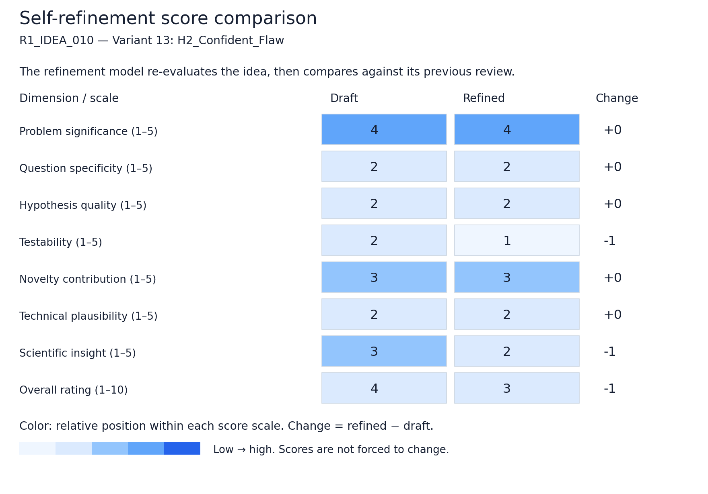

Changed score dimensions: testability, scientific_insight, overall_rating.

### Score justifications (draft / refined)

**Problem significance**

```json
{
  "draft": {
    "score": 4.0,
    "justification": "The problem of rapid visual concept learning (fast mapping) is a fundamental challenge in AI and a key differentiator between current systems and human intelligence. Addressing this is highly significant for the field."
  },
  "refined": {
    "score": 4.0,
    "justification": "The problem of rapid visual concept learning (fast mapping) is a fundamental challenge in AI and a key differentiator between current systems and human intelligence. Addressing this is highly significant for the field, regardless of the flaws in the proposed validation strategy."
  }
}
```

**Question specificity**

```json
{
  "draft": {
    "score": 2.0,
    "justification": "The idea identifies a broad problem but lacks a specific research question. It does not define the mechanism, the method, or the specific variables to be manipulated, making the scope too vague."
  },
  "refined": {
    "score": 2.0,
    "justification": "The idea identifies a broad problem but lacks a specific research question. It does not define the mechanism, the method, or the specific variables to be manipulated, making the scope too vague to guide immediate research."
  }
}
```

**Hypothesis quality**

```json
{
  "draft": {
    "score": 2.0,
    "justification": "While it implies a hypothesis that current methods lack a specific mechanism, the explicit claim that solving this will 'necessarily' produce causal evidence without further isolation is a logical flaw rather than a rigorous hypothesis."
  },
  "refined": {
    "score": 2.0,
    "justification": "While it implies a hypothesis that current methods lack a specific mechanism, the explicit claim that solving this will 'necessarily' produce causal evidence without further isolation is a logical flaw rather than a rigorous hypothesis. A good hypothesis must allow for the possibility of failure if the mechanism is absent, not assume success."
  }
}
```

**Testability**

```json
{
  "draft": {
    "score": 2.0,
    "justification": "The idea explicitly suggests ignoring key variables (dataset composition, boundary cases) that are essential for testing. Without a defined method or specific variables to measure, the central claim is not currently testable in a rigorous way."
  },
  "refined": {
    "score": 1.0,
    "justification": "The idea explicitly suggests ignoring key variables (dataset composition, boundary cases) that are essential for testing. Without a defined method or specific variables to measure, and with a claim that ignores confounding factors, the central claim is effectively untestable in a rigorous scientific manner."
  }
}
```

**Novelty contribution**

```json
{
  "draft": {
    "score": 3.0,
    "justification": "The framing of the problem through the lens of 'fast mapping' is novel and interesting. However, the proposed direction lacks a specific novel method or mechanism, limiting the potential for immediate scientific contribution beyond re-framing existing problems."
  },
  "refined": {
    "score": 3.0,
    "justification": "The framing of the problem through the lens of 'fast mapping' is novel and interesting. However, the proposed direction lacks a specific novel method or mechanism, and the dismissal of standard validation practices limits the potential for immediate scientific contribution."
  }
}
```

**Technical plausibility**

```json
{
  "draft": {
    "score": 2.0,
    "justification": "The reasoning contains a logical gap: claiming that fixing a 'limitation' automatically proves 'general superiority' without controlling for other factors is technically unsound. The path from the problem statement to the solution is not technically detailed."
  },
  "refined": {
    "score": 2.0,
    "justification": "The reasoning contains a logical gap: claiming that fixing a 'limitation' automatically proves 'general superiority' without controlling for other factors is technically unsound. The path from the problem statement to the solution is not technically detailed and relies on a non-sequitur regarding causality."
  }
}
```

**Scientific insight**

```json
{
  "draft": {
    "score": 3.0,
    "justification": "If the research were to successfully define and test a mechanism for fast mapping, it could yield significant insight. However, as currently stated, the dismissal of rigorous evaluation criteria limits the potential for deep scientific insight."
  },
  "refined": {
    "score": 2.0,
    "justification": "While the *topic* has high potential for insight, the *idea as stated* actively discourages the rigorous analysis (ablation, boundary testing) required to generate that insight. The dismissal of confounding factors prevents the study from yielding transferable scientific principles."
  }
}
```

**Overall rating**

```json
{
  "draft": {
    "score": 4.0,
    "justification": "The idea addresses a significant and meaningful problem with a compelling cognitive science angle. However, it is currently a weak research proposal because it lacks a specific hypothesis, a defined method, and proposes a flawed validation strategy (ignoring confounding variables). It is a 'good problem' but a 'poorly defined research plan'."
  },
  "refined": {
    "score": 3.0,
    "justification": "The idea addresses a significant problem but fails as a research proposal due to a critical logical flaw in its validation strategy. The claim that solving a problem 'necessarily' proves superiority without isolating variables is scientifically invalid. While the motivation is strong, the proposed approach to testing the hypothesis is fundamentally broken, making it a weak research direction in its current form."
  }
}
```

## R1_IDEA_010 — Variant 14: H3_Verbose_Enriched

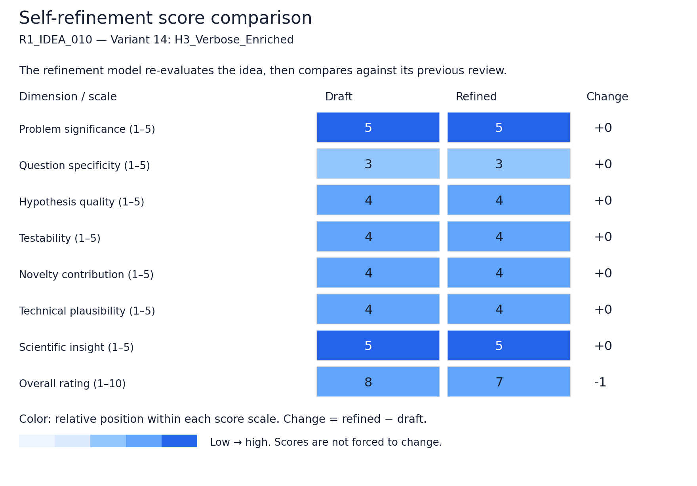

Changed score dimensions: overall_rating.

### Score justifications (draft / refined)

**Problem significance**

```json
{
  "draft": {
    "score": 5.0,
    "justification": "The problem addresses a fundamental limitation in current AI: the inability to learn new concepts as efficiently as humans (fast mapping). Solving this is critical for developing more adaptable, sample-efficient, and generalizable computer vision systems, making it a highly significant research problem."
  },
  "refined": {
    "score": 5.0,
    "justification": "The problem addresses a fundamental gap in AI: the inability to learn new visual concepts as efficiently as humans (sample efficiency). Solving this is critical for developing adaptable, generalizable systems and is a high-priority challenge in the field."
  }
}
```

**Question specificity**

```json
{
  "draft": {
    "score": 3.0,
    "justification": "The idea identifies the general problem (lack of structured priors) and the general solution direction (VLMs + new architecture). However, the specific nature of the 'architectural mechanisms' and the exact definition of 'structured prior' are not specified, leaving the research question somewhat broad."
  },
  "refined": {
    "score": 3.0,
    "justification": "While the problem is well-defined, the proposed solution is vague. The idea states *what* is missing (structured priors, hypothesis testing mechanisms) but does not specify *how* these will be implemented or measured, leaving the research question somewhat broad."
  }
}
```

**Hypothesis quality**

```json
{
  "draft": {
    "score": 4.0,
    "justification": "The hypothesis is strong: it predicts that current failures are due to a lack of structured priors and that adding specific architectural mechanisms for hypothesis testing will improve robustness. It is falsifiable if the proposed mechanisms are implemented and fail to outperform baselines."
  },
  "refined": {
    "score": 4.0,
    "justification": "The hypothesis is strong and plausible: it posits that current failures are due to specific architectural/representational deficits. It is falsifiable if the proposed mechanisms are implemented and fail to improve performance over baselines."
  }
}
```

**Testability**

```json
{
  "draft": {
    "score": 4.0,
    "justification": "The proposed experimental design is highly testable. The plan to use staged designs, ablations, sensitivity analyses, and error analysis on boundary cases provides a clear roadmap for gathering evidence to support or refute the hypothesis."
  },
  "refined": {
    "score": 4.0,
    "justification": "The proposed experimental design (staged design, ablations, boundary cases, error analysis) is highly testable. The framework for gathering evidence is clear, even if the specific model architecture is not yet defined."
  }
}
```

**Novelty contribution**

```json
{
  "draft": {
    "score": 4.0,
    "justification": "While VLMs are popular, applying them specifically to the cognitive concept of 'Visual Fast Mapping' with a focus on 'rapid hypothesis testing' mechanisms is a novel angle. The potential to uncover the specific boundary conditions of this capability offers significant scientific insight beyond just improving benchmark scores."
  },
  "refined": {
    "score": 4.0,
    "justification": "Applying the cognitive concept of Fast Mapping to VLMs with a focus on 'hypothesis testing' mechanisms is a novel angle. The potential to uncover boundary conditions and failure modes offers significant scientific insight beyond standard benchmark improvements."
  }
}
```

**Technical plausibility**

```json
{
  "draft": {
    "score": 4.0,
    "justification": "The reasoning is logically coherent. Leveraging VLMs for semantic priors is a standard and plausible approach. The need for specific architectural changes to handle 'rapid hypothesis testing' is a reasonable theoretical extension, though the specific implementation details are currently missing."
  },
  "refined": {
    "score": 4.0,
    "justification": "The reasoning is logically coherent. Leveraging VLMs for semantic priors is a standard and plausible approach. The theoretical need for specific architectural changes to handle 'rapid hypothesis testing' is reasonable, though the specific implementation is currently missing."
  }
}
```

**Scientific insight**

```json
{
  "draft": {
    "score": 5.0,
    "justification": "If successful, this research would not just produce a better model but would likely reveal fundamental principles about how structured knowledge and architectural constraints interact to enable rapid learning. The focus on failure modes and boundary conditions ensures high scientific value."
  },
  "refined": {
    "score": 5.0,
    "justification": "If successfully investigated, this research would reveal fundamental principles about how structured knowledge and architectural constraints interact to enable rapid learning. The focus on failure modes and boundary conditions ensures high scientific value."
  }
}
```

**Overall rating**

```json
{
  "draft": {
    "score": 8.0,
    "justification": "This is a strong research idea with high significance and a clear path to scientific insight. The main limitation is the lack of specific technical details regarding the proposed 'architectural mechanisms,' which prevents it from being an 'exceptional' (9-10) idea at this stage. However, the conceptual framework and proposed evaluation strategy are robust enough to warrant a high rating."
  },
  "refined": {
    "score": 7.0,
    "justification": "This is a strong research idea with high significance and a clear path to scientific insight. The main limitation is the lack of specific technical details regarding the proposed 'architectural mechanisms,' which prevents it from being an 'exceptional' (9-10) idea at this stage. However, the conceptual framework and proposed evaluation strategy are robust enough to warrant a high rating."
  }
}
```

## R1_IDEA_010 — Variant 15: H4_Ultimate_Hype

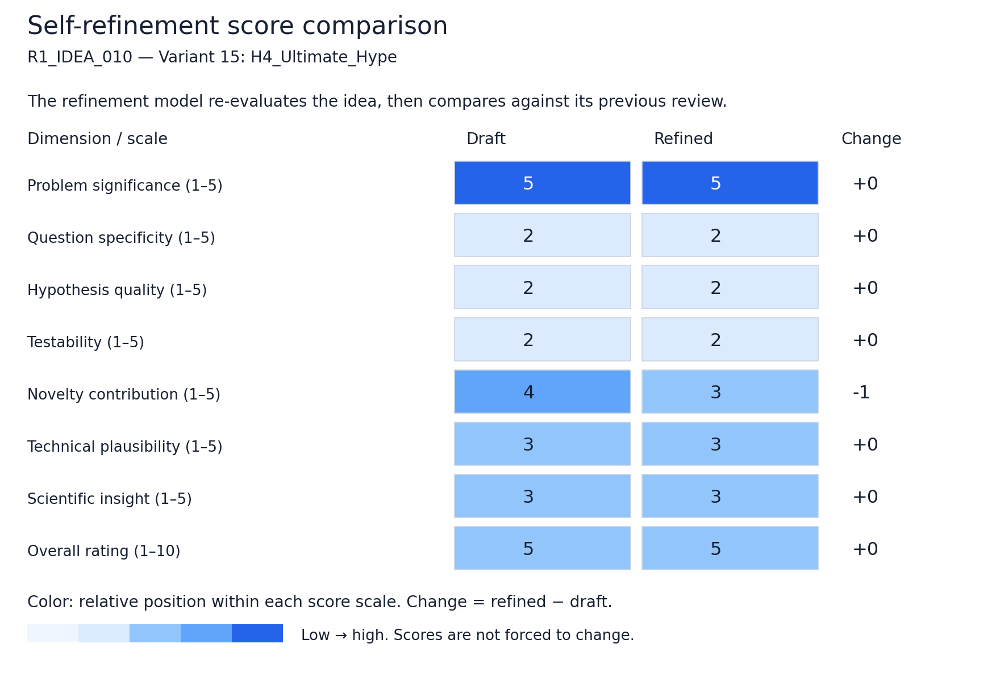

Changed score dimensions: novelty_contribution.

### Score justifications (draft / refined)

**Problem significance**

```json
{
  "draft": {
    "score": 5.0,
    "justification": "The problem of learning visual concepts from minimal data is one of the most significant challenges in machine learning. Solving it would represent a major leap toward general-purpose AI and is highly relevant to both scientific understanding and practical deployment."
  },
  "refined": {
    "score": 5.0,
    "justification": "The problem of learning visual concepts from minimal data is a central challenge in machine learning. Solving it is critical for the development of general-purpose AI and has profound implications for both scientific understanding and practical deployment in low-data regimes."
  }
}
```

**Question specificity**

```json
{
  "draft": {
    "score": 2.0,
    "justification": "The idea is currently too broad. It describes a field of study ('research agenda') rather than a specific question. It does not define the variables, the mechanism, or the specific relationship being investigated."
  },
  "refined": {
    "score": 2.0,
    "justification": "The idea describes a broad research direction ('agenda') rather than a specific research question. It fails to define the variables, the specific mechanism of action, or the precise relationship being investigated, making it difficult to isolate the core scientific inquiry."
  }
}
```

**Hypothesis quality**

```json
{
  "draft": {
    "score": 2.0,
    "justification": "There is no explicit hypothesis. The text asserts that the work 'could' be transformative but does not state a falsifiable prediction about how or why a specific method would achieve this."
  },
  "refined": {
    "score": 2.0,
    "justification": "There is no explicit or implicit hypothesis that can be supported or contradicted. The text asserts potential outcomes ('could be transformative') but does not propose a testable prediction about how a specific method would achieve the result or why it would work."
  }
}
```

**Testability**

```json
{
  "draft": {
    "score": 2.0,
    "justification": "Without a defined method or specific metric, the idea cannot be meaningfully tested. It is currently impossible to design an experiment to validate or refute the claim."
  },
  "refined": {
    "score": 2.0,
    "justification": "Without a defined method, specific constraints, or clear evaluation metrics, the idea cannot be meaningfully tested. It is currently impossible to design an experiment to validate or refute the central claim."
  }
}
```

**Novelty contribution**

```json
{
  "draft": {
    "score": 4.0,
    "justification": "The *concept* of applying fast mapping to VLMs is novel and promising. However, the specific contribution is undefined because the idea lacks a concrete proposal. The potential for high impact is high, but the novelty of the *execution* is unknown."
  },
  "refined": {
    "score": 3.0,
    "justification": "The *concept* of applying fast mapping to VLMs is novel and has high potential. However, because the specific contribution (the 'how') is undefined, the actual novelty of the scientific contribution remains speculative. It is a promising *topic* but not yet a defined *contribution*."
  }
}
```

**Technical plausibility**

```json
{
  "draft": {
    "score": 3.0,
    "justification": "The direction is technically plausible given the current state of VLMs and cognitive science, but the text provides no reasoning on *how* it would be achieved, leaving the plausibility of the specific approach unverified."
  },
  "refined": {
    "score": 3.0,
    "justification": "The direction is theoretically plausible given the current state of VLMs and cognitive science. However, the text provides no reasoning on *how* the mechanism would be implemented, leaving the technical feasibility of the specific approach unverified."
  }
}
```

**Scientific insight**

```json
{
  "draft": {
    "score": 3.0,
    "justification": "If successfully executed, this could yield deep insights into the intersection of language, vision, and inductive bias. However, as currently stated, it is a goal rather than a mechanism for insight."
  },
  "refined": {
    "score": 3.0,
    "justification": "If successfully executed, this research could yield deep insights into the intersection of language, vision, and inductive bias. However, as currently stated, it is a goal rather than a mechanism for insight, so the potential for immediate scientific discovery is limited by the lack of specificity."
  }
}
```

**Overall rating**

```json
{
  "draft": {
    "score": 5.0,
    "justification": "The idea addresses a critical problem with high potential, but it is currently too vague to be considered a strong research proposal. It functions as a high-level motivation rather than a specific research question. It sits in the 'moderate/borderline' category because the underlying problem is excellent, but the formulation of the idea itself is weak."
  },
  "refined": {
    "score": 5.0,
    "justification": "The idea addresses a critical and high-value problem with a strong theoretical foundation, but it is currently too vague to be considered a strong research proposal. It functions as a high-level motivation rather than a specific research question. The lack of a testable hypothesis and specific methodological direction prevents it from scoring higher, placing it in the 'moderate/borderline' category."
  }
}
```

## R1_IDEA_011 — Source

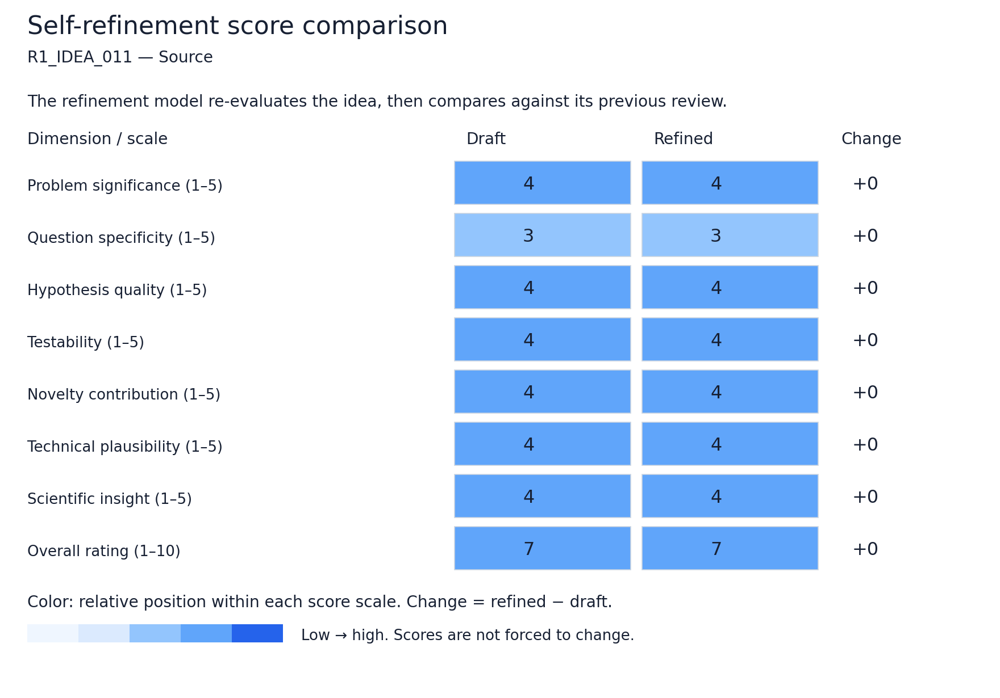

Changed score dimensions: none.

### Score justifications (draft / refined)

**Problem significance**

```json
{
  "draft": {
    "score": 4.0,
    "justification": "The problem of integrating rich, unstructured text into time series forecasting is highly relevant and addresses a known limitation in the field. Solving this could significantly improve forecasting in domains like finance, supply chain, and climate science where text is crucial."
  },
  "refined": {
    "score": 4.0,
    "justification": "The problem is highly significant. Integrating unstructured text into time series forecasting is a major open challenge with direct applications in finance, energy, and supply chain. Solving the 'underutilization' of text could lead to substantial performance gains."
  }
}
```

**Question specificity**

```json
{
  "draft": {
    "score": 3.0,
    "justification": "While the general direction is clear, the core concepts of 'structured reasoning' and 'alignment mechanisms' are currently too abstract. The idea needs to specify the architectural or algorithmic approach to be considered a specific research question."
  },
  "refined": {
    "score": 3.0,
    "justification": "While the goal is clear, the research question is currently too broad. The terms 'structured reasoning' and 'alignment mechanisms' are placeholders for specific methods rather than defined research variables. The idea needs to specify the mechanism to be a specific question."
  }
}
```

**Hypothesis quality**

```json
{
  "draft": {
    "score": 4.0,
    "justification": "The implicit hypothesis is that structured reasoning over text yields better predictions than shallow text integration. This is a falsifiable claim that distinguishes the proposed method from existing baselines."
  },
  "refined": {
    "score": 4.0,
    "justification": "The hypothesis is strong: 'Structured reasoning over text yields better predictions than shallow text integration.' This is a clear, directional claim that can be empirically tested and potentially falsified."
  }
}
```

**Testability**

```json
{
  "draft": {
    "score": 4.0,
    "justification": "The idea is testable by designing an experiment that compares the proposed method against standard multimodal baselines on a dataset containing both time series and relevant text. The success criteria (predictive accuracy) are clear."
  },
  "refined": {
    "score": 4.0,
    "justification": "The idea is testable. One can construct experiments comparing a baseline (shallow text) against a proposed model (structured text) on datasets with both time series and text. The success metric (predictive accuracy) is well-defined."
  }
}
```

**Novelty contribution**

```json
{
  "draft": {
    "score": 4.0,
    "justification": "Moving from shallow text embedding to structured reasoning in time series is a novel direction. While LLMs are used in other contexts, applying them specifically for 'structured reasoning' in time series alignment is a promising and under-explored avenue."
  },
  "refined": {
    "score": 4.0,
    "justification": "The direction is novel. While multimodal time series exist, the specific focus on 'structured reasoning' (implying a shift from representation to reasoning) is a promising and under-explored avenue, distinct from simple multimodal fusion."
  }
}
```

**Technical plausibility**

```json
{
  "draft": {
    "score": 4.0,
    "justification": "The technical direction is plausible given the current capabilities of LLMs and multimodal architectures. The challenge lies in the implementation details (alignment, efficiency), but the core concept is sound."
  },
  "refined": {
    "score": 4.0,
    "justification": "The direction is plausible given the state of the art (LLMs, multimodal transformers). However, the technical feasibility of 'alignment' and 'reasoning' in a time-series context is non-trivial and depends heavily on the specific implementation details not yet provided."
  }
}
```

**Scientific insight**

```json
{
  "draft": {
    "score": 4.0,
    "justification": "If successful, this research could reveal how different types of reasoning (symbolic vs. neural) interact with temporal dynamics, offering insights into the nature of multimodal time series representation."
  },
  "refined": {
    "score": 4.0,
    "justification": "If successful, this research could reveal how different types of reasoning (symbolic vs. neural) interact with temporal dynamics, offering insights into the nature of multimodal time series representation and the role of context in forecasting."
  }
}
```

**Overall rating**

```json
{
  "draft": {
    "score": 7.0,
    "justification": "This is a strong research idea with high potential impact. It identifies a meaningful problem and proposes a sophisticated direction (structured reasoning) that goes beyond simple application. However, it currently lacks the specificity required to be an 'exceptional' idea, as the core mechanisms are not defined. With clearer methodological proposals, it could reach a 9."
  },
  "refined": {
    "score": 7.0,
    "justification": "This is a strong research idea with high potential. It addresses a meaningful problem and proposes a sophisticated direction that goes beyond simple application. However, it currently lacks the specificity required to be an 'exceptional' idea, as the core mechanisms are not defined. With clearer methodological proposals, it could reach a 9."
  }
}
```

## R1_IDEA_011 — Variant 1: A1_Identity

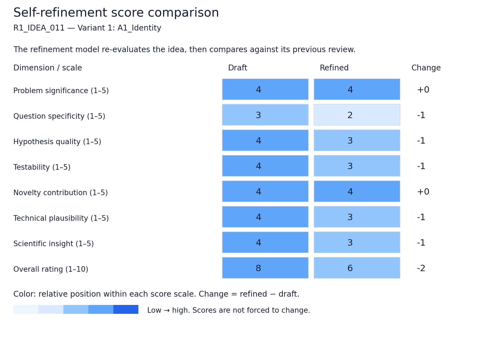

Changed score dimensions: question_specificity, hypothesis_quality, testability, technical_plausibility, scientific_insight, overall_rating.

### Score justifications (draft / refined)

**Problem significance**

```json
{
  "draft": {
    "score": 4.0,
    "justification": "The problem of integrating rich, unstructured text into time series forecasting is highly relevant and addresses a known limitation in current state-of-the-art models. Solving this could significantly impact domains like finance, energy, and supply chain where context is crucial."
  },
  "refined": {
    "score": 4.0,
    "justification": "The problem is highly significant. Integrating unstructured semantic information into time series forecasting is a major open challenge with high potential impact in finance, energy, and supply chain. The idea correctly identifies that current methods are limited by their reliance on numerical data or shallow text."
  }
}
```

**Question specificity**

```json
{
  "draft": {
    "score": 3.0,
    "justification": "While the general direction is clear, the specific mechanisms ('structured reasoning', 'alignment') are not defined. The idea needs to narrow down to a specific architectural or methodological choice to be fully specific."
  },
  "refined": {
    "score": 2.0,
    "justification": "While the goal is clear, the research question is currently too broad. 'Structured reasoning' and 'alignment' are broad categories, not specific questions. The idea needs to specify *which* reasoning mechanism is being tested and *what* specific alignment problem is being solved to be a strong, specific research question."
  }
}
```

**Hypothesis quality**

```json
{
  "draft": {
    "score": 4.0,
    "justification": "The implicit hypothesis—that structured reasoning and better alignment of text will outperform shallow text integration—is strong, falsifiable, and grounded in the observation that current methods underutilize text."
  },
  "refined": {
    "score": 3.0,
    "justification": "The implicit hypothesis (richer text + reasoning > shallow text) is plausible and testable. However, it lacks a specific mechanistic claim. It predicts a result (better accuracy) but does not clearly articulate the underlying relationship or condition that makes it work, which weakens the scientific depth of the hypothesis."
  }
}
```

**Testability**

```json
{
  "draft": {
    "score": 4.0,
    "justification": "The idea is testable by comparing the proposed method against standard multimodal baselines on relevant datasets. The success metric (predictive accuracy) is clear."
  },
  "refined": {
    "score": 3.0,
    "justification": "The idea is testable in principle (compare accuracy), but the lack of defined methods makes the experimental design currently impossible to specify. Without defining 'structured reasoning,' one cannot design the ablation studies or baselines required to test the hypothesis rigorously."
  }
}
```

**Novelty contribution**

```json
{
  "draft": {
    "score": 4.0,
    "justification": "Moving from shallow text integration to structured reasoning in time series is a novel direction. It has the potential to contribute new insights into how temporal models can leverage semantic reasoning."
  },
  "refined": {
    "score": 4.0,
    "justification": "The direction is novel. While multimodal time series exist, the specific proposal to use 'structured reasoning' (implying a shift from statistical correlation to semantic/causal reasoning) is a distinct and promising contribution that could redefine how models handle exogenous text."
  }
}
```

**Technical plausibility**

```json
{
  "draft": {
    "score": 4.0,
    "justification": "The proposed direction is technically sound. Techniques for structured reasoning (e.g., LLMs, knowledge graphs) and alignment (e.g., cross-modal attention) exist and can be adapted to time series, making the approach plausible."
  },
  "refined": {
    "score": 3.0,
    "justification": "The idea is technically plausible given the existence of LLMs and reasoning modules, but the feasibility depends entirely on the specific implementation details which are missing. The challenge of aligning discrete text events with continuous time series is non-trivial and not addressed in the summary."
  }
}
```

**Scientific insight**

```json
{
  "draft": {
    "score": 4.0,
    "justification": "If successful, this research could reveal how different levels of semantic abstraction in text affect temporal prediction, offering insights into the interaction between symbolic reasoning and statistical learning in time series."
  },
  "refined": {
    "score": 3.0,
    "justification": "If successful, this could provide significant insight into the role of semantic reasoning in temporal prediction. However, as currently stated, the potential for insight is limited by the vagueness of the mechanism. The study could reveal *that* it works, but without a specific hypothesis, it may not reveal *why* or under what conditions it works."
  }
}
```

**Overall rating**

```json
{
  "draft": {
    "score": 8.0,
    "justification": "This is a strong research idea with high potential. It addresses a meaningful problem with a plausible and sophisticated approach. The main limitation is the current lack of specific implementation details, but as a research proposal, it clearly identifies a valuable direction for investigation."
  },
  "refined": {
    "score": 6.0,
    "justification": "This is a moderate-to-strong research idea with high potential, but it currently sits at a 'concept' stage rather than a 'research plan' stage. The motivation is excellent, but the lack of specificity in the proposed method ('structured reasoning') and the hypothesis mechanism prevents it from being a 'strong' (7-8) idea. It requires significant refinement to define the specific research question and mechanism to be testable."
  }
}
```

## R1_IDEA_011 — Variant 2: A2_Paraphrase_Only

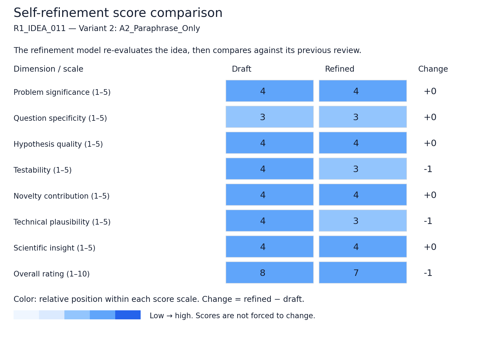

Changed score dimensions: testability, technical_plausibility, overall_rating.

### Score justifications (draft / refined)

**Problem significance**

```json
{
  "draft": {
    "score": 4.0,
    "justification": "The problem is highly significant. Real-world forecasting often relies on qualitative factors (news, reports, social sentiment) that are currently ignored or poorly integrated. Solving this could unlock better predictions in critical domains like finance, supply chain, and climate science."
  },
  "refined": {
    "score": 4.0,
    "justification": "The problem is highly significant. Real-world forecasting often relies on qualitative factors (news, reports, social sentiment) that are currently ignored or poorly integrated. Solving this could unlock better predictions in critical domains like finance, supply chain, and climate science."
  }
}
```

**Question specificity**

```json
{
  "draft": {
    "score": 3.0,
    "justification": "The idea identifies the 'what' (use richer text) and the 'why' (current methods are shallow), but the 'how' (specific reasoning/alignment mechanisms) is currently too abstract to be considered a fully specific research question."
  },
  "refined": {
    "score": 3.0,
    "justification": "The idea identifies the 'what' (use richer text) and the 'why' (current methods are shallow), but the 'how' (specific reasoning/alignment mechanisms) is currently too abstract. The research question is broad and requires significant narrowing to be actionable."
  }
}
```

**Hypothesis quality**

```json
{
  "draft": {
    "score": 4.0,
    "justification": "The implicit hypothesis is strong: 'Structured reasoning and alignment mechanisms will extract more predictive signal from text than shallow representations.' This is a falsifiable claim that distinguishes the proposed work from generic multimodal applications."
  },
  "refined": {
    "score": 4.0,
    "justification": "The implicit hypothesis is strong: 'Structured reasoning and alignment mechanisms will extract more predictive signal from text than shallow representations.' This is a falsifiable claim that distinguishes the proposed work from generic multimodal applications."
  }
}
```

**Testability**

```json
{
  "draft": {
    "score": 4.0,
    "justification": "The idea is testable. One can construct datasets with paired time series and text, implement baseline multimodal models, and compare them against models employing the proposed reasoning/alignment mechanisms using standard forecasting metrics."
  },
  "refined": {
    "score": 3.0,
    "justification": "While the general direction is testable, the lack of defined mechanisms makes the experimental design currently vague. One cannot design a rigorous test without knowing what 'reasoning' entails or how 'alignment' is measured. It is testable in principle, but not yet in practice."
  }
}
```

**Novelty contribution**

```json
{
  "draft": {
    "score": 4.0,
    "justification": "While multimodal forecasting is an active area, the specific focus on 'structured reasoning' and 'alignment' as the primary drivers for improvement, rather than just better embeddings, represents a novel and potentially high-impact direction."
  },
  "refined": {
    "score": 4.0,
    "justification": "While multimodal forecasting is an active area, the specific focus on 'structured reasoning' and 'alignment' as the primary drivers for improvement, rather than just better embeddings, represents a novel and potentially high-impact direction."
  }
}
```

**Technical plausibility**

```json
{
  "draft": {
    "score": 4.0,
    "justification": "The direction is technically plausible given the rapid advancements in LLMs and multimodal alignment techniques. Integrating reasoning modules into forecasting pipelines is a logical next step, though implementation details will be challenging."
  },
  "refined": {
    "score": 3.0,
    "justification": "The direction is theoretically plausible given advancements in LLMs, but the technical feasibility of integrating 'reasoning' into time series forecasting pipelines without introducing significant latency or hallucination risks is an open question. The mechanism is not yet grounded in a concrete technical proposal."
  }
}
```

**Scientific insight**

```json
{
  "draft": {
    "score": 4.0,
    "justification": "If successful, this research could reveal fundamental principles on how qualitative, unstructured information can be mathematically aligned with quantitative time series, potentially leading to new architectures for hybrid AI systems."
  },
  "refined": {
    "score": 4.0,
    "justification": "If successfully investigated, this research could reveal fundamental principles on how qualitative, unstructured information can be mathematically aligned with quantitative time series, potentially leading to new architectures for hybrid AI systems."
  }
}
```

**Overall rating**

```json
{
  "draft": {
    "score": 8.0,
    "justification": "This is a strong research idea with high potential. It addresses a meaningful problem with a clear motivation and a plausible, novel direction. The main limitation is the current lack of technical specificity regarding the 'reasoning' and 'alignment' mechanisms, but this is typical for an early-stage idea summary. With further definition, this could be an exceptional contribution."
  },
  "refined": {
    "score": 7.0,
    "justification": "This is a strong research idea with high potential. It addresses a meaningful problem with a clear motivation and a plausible, novel direction. However, the lack of technical specificity regarding the 'reasoning' and 'alignment' mechanisms prevents it from being an 'exceptional' idea at this stage. It requires significant refinement to move from a vague concept to a concrete research plan."
  }
}
```

## R1_IDEA_011 — Variant 3: A3_Plain_Core

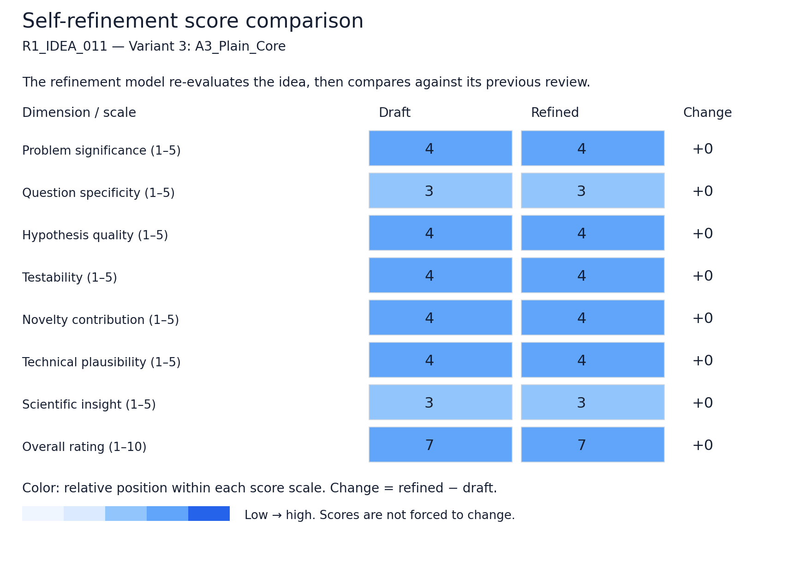

Changed score dimensions: none.

### Score justifications (draft / refined)

**Problem significance**

```json
{
  "draft": {
    "score": 4.0,
    "justification": "The problem of integrating multimodal data into time series forecasting is highly relevant and addresses a known limitation of current models. Real-world forecasting often depends on events described in text (news, reports, social media), making this a meaningful challenge."
  },
  "refined": {
    "score": 4.0,
    "justification": "The problem is highly significant. Time series forecasting is a cornerstone of ML applications, and the limitation of ignoring rich semantic context (text) is a well-known bottleneck. Addressing this could unlock performance gains in critical domains like finance and healthcare."
  }
}
```

**Question specificity**

```json
{
  "draft": {
    "score": 3.0,
    "justification": "While the general direction is clear, the specific research question is somewhat vague. It states 'using richer exogenous text' but does not specify the exact mechanism or the precise relationship being investigated beyond 'improving accuracy'."
  },
  "refined": {
    "score": 3.0,
    "justification": "The question is specific in its goal (improve accuracy via text) but vague in its mechanism. Terms like 'structured reasoning' and 'alignment mechanisms' are high-level abstractions that need concrete instantiation to be fully specific."
  }
}
```

**Hypothesis quality**

```json
{
  "draft": {
    "score": 4.0,
    "justification": "The implicit hypothesis is that structured reasoning and alignment mechanisms will extract more predictive signal from text than current shallow methods. This is a concrete, falsifiable claim that distinguishes the work from generic applications."
  },
  "refined": {
    "score": 4.0,
    "justification": "The hypothesis is strong: 'Structured reasoning + alignment > Shallow context' is a clear, testable prediction. It distinguishes the work from generic multimodal applications by positing a specific architectural advantage."
  }
}
```

**Testability**

```json
{
  "draft": {
    "score": 4.0,
    "justification": "The idea is testable through standard machine learning evaluation protocols: comparing predictive accuracy on benchmark datasets with and without the proposed text integration mechanisms. The success criteria (improved accuracy) are clear."
  },
  "refined": {
    "score": 4.0,
    "justification": "The idea is testable. One can construct experiments comparing models with shallow text fusion against models with the proposed structured reasoning on appropriate datasets. The metric (predictive accuracy) is standard."
  }
}
```

**Novelty contribution**

```json
{
  "draft": {
    "score": 4.0,
    "justification": "While multimodal time series is an active area, the specific focus on 'structured reasoning' and 'alignment' to move beyond shallow representations offers a potential for novel scientific contribution, provided the mechanism is distinct from existing fusion techniques."
  },
  "refined": {
    "score": 4.0,
    "justification": "While multimodal time series is an active field, the specific focus on 'structured reasoning' as the driver for improvement, rather than just better embeddings, offers a novel angle. It challenges the status quo of treating text as a simple auxiliary input."
  }
}
```

**Technical plausibility**

```json
{
  "draft": {
    "score": 4.0,
    "justification": "The proposed direction is technically plausible. Techniques for aligning text and time series (e.g., cross-attention, temporal alignment layers) exist, and the concept of using reasoning modules is consistent with current trends in AI."
  },
  "refined": {
    "score": 4.0,
    "justification": "The direction is technically plausible. Recent advances in LLMs and alignment techniques (e.g., temporal attention, event-based alignment) provide the necessary building blocks. The main challenge is integration, not feasibility."
  }
}
```

**Scientific insight**

```json
{
  "draft": {
    "score": 3.0,
    "justification": "If successful, the work could reveal how different types of textual information (causal vs. descriptive) impact forecasting. However, without more detail on the mechanism, the potential for deep scientific insight beyond 'it works better' is currently moderate."
  },
  "refined": {
    "score": 3.0,
    "justification": "If successful, the work will provide insight into how semantic reasoning interacts with temporal dynamics. However, without more detail on the mechanism, the potential to reveal fundamental principles of multimodal learning is currently moderate."
  }
}
```

**Overall rating**

```json
{
  "draft": {
    "score": 7.0,
    "justification": "This is a strong research idea with a clear motivation and a plausible path forward. It addresses a meaningful problem in a specific way (structured reasoning/alignment) that goes beyond simple application. However, it currently lacks the technical specificity required to be considered exceptional, as the core mechanisms are not defined."
  },
  "refined": {
    "score": 7.0,
    "justification": "This is a strong research idea with high potential. It identifies a meaningful problem and proposes a plausible, non-trivial solution path. It scores lower than an 'exceptional' rating (9-10) because the core technical mechanisms ('structured reasoning', 'alignment') are currently abstract and require significant elaboration to be actionable. However, the core scientific promise is high."
  }
}
```

## R1_IDEA_011 — Variant 4: B1_Verbose_Elaborate


Changed score dimensions: none.

### Score justifications (draft / refined)

**Problem significance**

```json
{
  "draft": {
    "score": 4.0,
    "justification": "The problem is highly significant. Most real-world forecasting tasks (finance, weather, supply chain) are driven by events that are best described in text. Moving beyond numerical-only or shallow multimodal approaches addresses a fundamental bottleneck in the field's ability to handle complex, real-world dynamics."
  },
  "refined": {
    "score": 4.0,
    "justification": "The problem is highly significant. Time series forecasting is a cornerstone of ML applications, and the inability to effectively incorporate causal, event-driven text is a known bottleneck. Solving this would have broad implications for finance, supply chain, and energy."
  }
}
```

**Question specificity**

```json
{
  "draft": {
    "score": 3.0,
    "justification": "The idea identifies the 'what' (better text usage) and the 'why' (numerical data is insufficient), but the 'how' (structured reasoning and alignment) is currently a high-level concept rather than a specific research question. It needs more definition to be a concrete scientific inquiry."
  },
  "refined": {
    "score": 3.0,
    "justification": "The idea identifies the 'what' (better text usage) and the 'why' (numerical insufficiency), but the 'how' remains a high-level concept. 'Structured reasoning' is a broad term that needs to be narrowed to a specific, testable mechanism to be a strong research question."
  }
}
```

**Hypothesis quality**

```json
{
  "draft": {
    "score": 4.0,
    "justification": "The implicit hypothesis is strong: 'Structured reasoning over exogenous text captures causal/temporal patterns that shallow text fusion misses, leading to higher accuracy.' This is a falsifiable claim that distinguishes the proposed method from existing baselines."
  },
  "refined": {
    "score": 4.0,
    "justification": "The implicit hypothesis is strong and falsifiable: 'Structured reasoning over exogenous text captures causal/temporal patterns that shallow text fusion misses.' This clearly distinguishes the proposed approach from existing baselines."
  }
}
```

**Testability**

```json
{
  "draft": {
    "score": 4.0,
    "justification": "The idea is testable. One can construct experiments comparing standard multimodal baselines against a proposed 'structured reasoning' model on datasets with known text-driven events. The success metric (predictive accuracy) is clear."
  },
  "refined": {
    "score": 4.0,
    "justification": "The idea is testable. One can construct experiments comparing standard multimodal baselines against a model implementing a specific 'structured reasoning' approach. Success metrics (predictive accuracy) are clear and standard."
  }
}
```

**Novelty contribution**

```json
{
  "draft": {
    "score": 4.0,
    "justification": "While multimodal time series is an active area, the specific focus on 'structured reasoning' rather than just 'text embeddings' represents a novel direction. It has the potential to contribute new architectural patterns for integrating symbolic/logical reasoning with deep learning in time series."
  },
  "refined": {
    "score": 4.0,
    "justification": "While multimodal time series is active, the specific focus on 'structured reasoning' (implying logic, causality, or graph structures) rather than just 'text embeddings' is a novel direction. It has the potential to bridge the gap between symbolic reasoning and deep learning in sequential modeling."
  }
}
```

**Technical plausibility**

```json
{
  "draft": {
    "score": 4.0,
    "justification": "The direction is technically plausible given recent advances in LLMs and their ability to perform reasoning. Integrating these with time series models is a logical next step, though the implementation details (alignment, latency) are non-trivial."
  },
  "refined": {
    "score": 4.0,
    "justification": "The direction is technically plausible given recent advances in LLMs and their reasoning capabilities. Integrating these with time series models is a logical next step, though the implementation details (alignment, latency) are non-trivial."
  }
}
```

**Scientific insight**

```json
{
  "draft": {
    "score": 4.0,
    "justification": "If successful, this research could reveal how different levels of semantic abstraction (shallow vs. structured) impact temporal prediction. It could establish new principles for how to fuse heterogeneous data modalities in sequential modeling."
  },
  "refined": {
    "score": 4.0,
    "justification": "If successful, this research could reveal how different levels of semantic abstraction (shallow vs. structured) impact temporal prediction. It could establish new principles for how to fuse heterogeneous data modalities in sequential modeling."
  }
}
```

**Overall rating**

```json
{
  "draft": {
    "score": 8.0,
    "justification": "This is a strong research idea with high potential impact. It addresses a meaningful gap in the field and proposes a sophisticated direction (structured reasoning) that goes beyond simple application of existing tools. The main limitation is the current lack of methodological specificity, but the core scientific premise is sound and promising."
  },
  "refined": {
    "score": 8.0,
    "justification": "This is a strong research idea with high potential impact. It addresses a meaningful gap in the field and proposes a sophisticated direction that goes beyond simple application of existing tools. The main limitation is the current lack of methodological specificity, but the core scientific premise is sound and promising."
  }
}
```

## R1_IDEA_011 — Variant 5: B2_Grand_Narrative


Changed score dimensions: question_specificity, hypothesis_quality, technical_plausibility, scientific_insight, overall_rating.

### Score justifications (draft / refined)

**Problem significance**

```json
{
  "draft": {
    "score": 4.0,
    "justification": "The problem of integrating heterogeneous data sources, particularly text, into time series forecasting is highly relevant and addresses a clear limitation in current state-of-the-art models. Solving this could significantly impact domains like finance, energy, and supply chain."
  },
  "refined": {
    "score": 4.0,
    "justification": "The problem is highly significant. Integrating heterogeneous data sources, particularly text, into time series forecasting is a major open challenge with direct implications for finance, energy, supply chain, and epidemiology. The idea correctly identifies that current methods are limited by their reliance on numerical data."
  }
}
```

**Question specificity**

```json
{
  "draft": {
    "score": 3.0,
    "justification": "While the general direction is clear, the specific research question is somewhat broad. Terms like 'structured reasoning' and 'alignment mechanisms' are used without defining the specific architectural or algorithmic approach, making the scope slightly fuzzy."
  },
  "refined": {
    "score": 2.0,
    "justification": "The research question is currently too vague. While the goal (better forecasting via text) is clear, the 'how' is missing. Terms like 'structured reasoning' and 'alignment mechanisms' are used as black boxes without defining the specific research variable being manipulated or the specific architectural innovation."
  }
}
```

**Hypothesis quality**

```json
{
  "draft": {
    "score": 3.0,
    "justification": "The implicit hypothesis is that deeper, structured integration of text will outperform shallow integration. This is a reasonable hypothesis, but it lacks the specificity of a concrete prediction about *how* or *under what conditions* this improvement will manifest."
  },
  "refined": {
    "score": 2.0,
    "justification": "The hypothesis is implicit rather than explicit. It assumes that 'structured reasoning' is better than 'shallow extraction,' but it does not specify the conditions, the mechanism of improvement, or a falsifiable prediction about the relationship between the reasoning depth and performance."
  }
}
```

**Testability**

```json
{
  "draft": {
    "score": 3.0,
    "justification": "The idea is testable in principle (compare models with shallow vs. deep text integration), but the lack of a defined method makes the experimental design currently undefined. It requires further specification to be fully operationalizable."
  },
  "refined": {
    "score": 3.0,
    "justification": "The idea is testable in principle, as one could compare a model with shallow text fusion against one with a proposed reasoning module. However, without defining the reasoning module, the experimental design is currently undefined. It requires significant specification to become a concrete test."
  }
}
```

**Novelty contribution**

```json
{
  "draft": {
    "score": 4.0,
    "justification": "Moving from shallow multimodal fusion to structured reasoning in time series is a novel direction. While multimodal forecasting exists, the specific focus on 'structured reasoning' as the key differentiator offers potential for significant scientific contribution."
  },
  "refined": {
    "score": 4.0,
    "justification": "The direction is novel. While multimodal forecasting exists, the explicit pivot towards 'structured reasoning' (as opposed to just better embeddings) is a promising and under-explored avenue. If successful, it could establish a new paradigm for how text informs time series models."
  }
}
```

**Technical plausibility**

```json
{
  "draft": {
    "score": 4.0,
    "justification": "The technical direction is plausible given the current capabilities of LLMs and multimodal models. Integrating reasoning modules with time series encoders is a known challenge but technically feasible."
  },
  "refined": {
    "score": 3.0,
    "justification": "The idea is technically plausible given the current state of LLMs and multimodal learning. However, the lack of a proposed mechanism makes it difficult to assess the feasibility of the specific 'alignment' and 'reasoning' steps. It relies on the assumption that such mechanisms can be effectively designed."
  }
}
```

**Scientific insight**

```json
{
  "draft": {
    "score": 4.0,
    "justification": "If successful, this research could reveal fundamental principles on how to align temporal dynamics with semantic reasoning, offering insights beyond just better forecasting metrics."
  },
  "refined": {
    "score": 3.0,
    "justification": "If the idea is realized, it could provide significant insight into how to align temporal dynamics with semantic reasoning. However, as currently stated, it is a direction rather than a specific insight. The potential for insight is high, but the current formulation does not guarantee it."
  }
}
```

**Overall rating**

```json
{
  "draft": {
    "score": 7.0,
    "justification": "This is a strong research idea with high potential significance and novelty. It identifies a real problem and proposes a sophisticated direction (structured reasoning) to solve it. However, it currently lacks the specificity required to be a 'top-tier' idea, as the core mechanisms are not yet defined. With more concrete details on the 'how', it could easily become an exceptional idea."
  },
  "refined": {
    "score": 6.0,
    "justification": "This is a moderate research idea. It identifies a meaningful problem and a promising high-level direction, but it lacks the specificity required for a strong research proposal. The core mechanisms are undefined, making the hypothesis weak and the testability conditional on future specification. It is better than a generic application idea but falls short of a concrete research plan."
  }
}
```

## R1_IDEA_011 — Variant 6: B3_Over_Confident


Changed score dimensions: none.

### Score justifications (draft / refined)

**Problem significance**

```json
{
  "draft": {
    "score": 4.0,
    "justification": "The problem is highly significant. Real-world forecasting often depends on events described in text (news, weather reports, social sentiment) that pure numerical models miss. Improving this capability has direct practical value in finance, energy, logistics, and healthcare."
  },
  "refined": {
    "score": 4.0,
    "justification": "The problem is highly significant. Real-world forecasting often depends on events described in text that pure numerical models miss. Improving this capability has direct practical value in finance, energy, logistics, and healthcare. The shift from 'numerical-only' to 'multimodal with reasoning' addresses a fundamental limitation in current SOTA."
  }
}
```

**Question specificity**

```json
{
  "draft": {
    "score": 3.0,
    "justification": "The idea identifies a clear direction (better text integration) but lacks specific technical details on the 'how'. The terms 'structured reasoning' and 'alignment mechanisms' are broad categories rather than specific research questions or hypotheses."
  },
  "refined": {
    "score": 3.0,
    "justification": "The idea identifies a clear direction (better text integration) but lacks specific technical details on the 'how'. The terms 'structured reasoning' and 'alignment mechanisms' are broad categories rather than specific research questions or hypotheses. It needs to define the mechanism to be a specific research question."
  }
}
```

**Hypothesis quality**

```json
{
  "draft": {
    "score": 4.0,
    "justification": "The implicit hypothesis is strong: 'Deeper semantic integration via structured reasoning yields better forecasting accuracy than shallow multimodal fusion.' This is a falsifiable claim that distinguishes the proposed work from existing methods."
  },
  "refined": {
    "score": 4.0,
    "justification": "The implicit hypothesis is strong: 'Deeper semantic integration via structured reasoning yields better forecasting accuracy than shallow multimodal fusion.' This is a falsifiable claim that distinguishes the proposed work from existing methods. It posits a causal link between reasoning depth and accuracy."
  }
}
```

**Testability**

```json
{
  "draft": {
    "score": 3.0,
    "justification": "The idea is testable in principle, but the current summary does not outline the evaluation metrics, baselines, or specific experimental design required to rigorously test the hypothesis. It requires more definition to be fully operational."
  },
  "refined": {
    "score": 3.0,
    "justification": "The idea is testable in principle, but the current summary does not outline the evaluation metrics, baselines, or specific experimental design required to rigorously test the hypothesis. It requires more definition to be fully operational. Without a defined 'reasoning' mechanism, the experiment cannot be designed."
  }
}
```

**Novelty contribution**

```json
{
  "draft": {
    "score": 4.0,
    "justification": "While multimodal forecasting exists, the specific focus on 'structured reasoning' and 'alignment' to move beyond shallow context is a novel and promising angle. It has the potential to contribute new architectural patterns for temporal reasoning."
  },
  "refined": {
    "score": 4.0,
    "justification": "While multimodal forecasting exists, the specific focus on 'structured reasoning' and 'alignment' to move beyond shallow context is a novel and promising angle. It has the potential to contribute new architectural patterns for temporal reasoning, moving beyond simple embedding fusion."
  }
}
```

**Technical plausibility**

```json
{
  "draft": {
    "score": 4.0,
    "justification": "The direction is technically plausible given the current state of LLMs and multimodal learning. Combining time series models with reasoning-capable text encoders is a logical next step, though implementation details are non-trivial."
  },
  "refined": {
    "score": 4.0,
    "justification": "The direction is technically plausible given the current state of LLMs and multimodal learning. Combining time series models with reasoning-capable text encoders is a logical next step, though implementation details (like alignment) are non-trivial. The core logic holds."
  }
}
```

**Scientific insight**

```json
{
  "draft": {
    "score": 4.0,
    "justification": "If successful, this research could reveal how semantic reasoning interacts with temporal dynamics, potentially uncovering new principles for integrating heterogeneous data modalities in sequential modeling."
  },
  "refined": {
    "score": 4.0,
    "justification": "If successful, this research could reveal how semantic reasoning interacts with temporal dynamics, potentially uncovering new principles for integrating heterogeneous data modalities in sequential modeling. It moves beyond 'does it work' to 'how does reasoning improve temporal prediction'."
  }
}
```

**Overall rating**

```json
{
  "draft": {
    "score": 7.0,
    "justification": "This is a strong research idea with high potential impact. It addresses a meaningful problem with a plausible and sophisticated direction. However, it currently sits at the 'concept' stage and needs more specificity regarding the mechanisms and experimental design to be considered a complete research proposal. It scores well on significance, hypothesis, and novelty, but loses points on specificity and testability due to the lack of technical detail."
  },
  "refined": {
    "score": 7.0,
    "justification": "This is a strong research idea with high potential impact. It addresses a meaningful problem with a plausible and sophisticated direction. However, it currently sits at the 'concept' stage and needs more specificity regarding the mechanisms and experimental design to be considered a complete research proposal. It scores well on significance, hypothesis, and novelty, but loses points on specificity and testability due to the lack of technical detail."
  }
}
```

## R1_IDEA_011 — Variant 7: B4_Novelty


Changed score dimensions: none.

### Score justifications (draft / refined)

**Problem significance**

```json
{
  "draft": {
    "score": 4.0,
    "justification": "The problem is significant because time series forecasting is a foundational task in many industries, and the potential to unlock value from unstructured text data is substantial. Moving beyond numerical-only models addresses a real-world limitation."
  },
  "refined": {
    "score": 4.0,
    "justification": "Time series forecasting is a foundational problem with massive economic impact. The limitation of ignoring rich textual context is a well-recognized bottleneck in real-world applications. Addressing this has high potential for practical utility."
  }
}
```

**Question specificity**

```json
{
  "draft": {
    "score": 3.0,
    "justification": "While the general direction is clear, the specific research question is somewhat vague. It states 'leveraging richer exogenous text' but does not define the specific mechanism or the exact relationship being tested in enough detail to be immediately actionable without further elaboration."
  },
  "refined": {
    "score": 3.0,
    "justification": "The idea identifies a direction (structured reasoning) but lacks the specificity of a concrete research question. It does not define the variables, the specific mechanism of 'reasoning', or the exact comparison metric in a way that allows immediate experimental design without further interpretation."
  }
}
```

**Hypothesis quality**

```json
{
  "draft": {
    "score": 3.0,
    "justification": "The implicit hypothesis (structured reasoning + alignment > shallow integration) is plausible and testable, but it is currently stated as a general direction rather than a precise, falsifiable prediction about the mechanism of improvement."
  },
  "refined": {
    "score": 3.0,
    "justification": "The hypothesis is plausible but broad. It posits that 'richer' text + 'reasoning' > 'shallow' text. This is a valid starting point but needs refinement to be a strong scientific hypothesis (e.g., 'Reasoning mechanisms improve accuracy specifically in low-signal regimes where text provides causal context')."
  }
}
```

**Testability**

```json
{
  "draft": {
    "score": 4.0,
    "justification": "The idea is testable. One can construct experiments comparing shallow fusion vs. structured reasoning approaches on datasets with paired time series and text. The metrics (accuracy) are standard."
  },
  "refined": {
    "score": 4.0,
    "justification": "The idea is testable. One can construct datasets with paired time series and text, define baselines (shallow vs. deep), and measure forecasting accuracy. The main challenge is defining the 'reasoning' metric, but the outcome (accuracy) is measurable."
  }
}
```

**Novelty contribution**

```json
{
  "draft": {
    "score": 4.0,
    "justification": "The novelty lies in the specific focus on 'structured reasoning' and 'alignment' as the key differentiators, rather than just adding text as an input. This could lead to new architectural insights for multimodal time series models."
  },
  "refined": {
    "score": 4.0,
    "justification": "While multimodal time series is an active area, the specific focus on 'structured reasoning' as the key differentiator from standard representation learning is novel. It shifts the focus from 'feature extraction' to 'cognitive processing' of exogenous data."
  }
}
```

**Technical plausibility**

```json
{
  "draft": {
    "score": 4.0,
    "justification": "The direction is technically sound. Techniques for alignment (e.g., cross-attention, contrastive learning) and reasoning (e.g., LLM-based reasoning, graph reasoning) exist and can be adapted to time series. The main challenge is integration, not feasibility."
  },
  "refined": {
    "score": 4.0,
    "justification": "The components (LLMs for reasoning, attention for alignment) exist. The plausibility relies on the ability to adapt these static NLP techniques to temporal dynamics, which is a known but solvable engineering and research challenge."
  }
}
```

**Scientific insight**

```json
{
  "draft": {
    "score": 4.0,
    "justification": "If successful, this research could reveal how different types of reasoning mechanisms interact with temporal dynamics, providing insights into the nature of exogenous information in sequential data."
  },
  "refined": {
    "score": 4.0,
    "justification": "If successful, this research could reveal fundamental insights into how causal reasoning mechanisms interact with temporal dynamics, potentially leading to a new class of 'reasoning-based' forecasting models."
  }
}
```

**Overall rating**

```json
{
  "draft": {
    "score": 7.0,
    "justification": "This is a strong research idea with high potential. It identifies a meaningful problem and proposes a specific, plausible direction (structured reasoning) that goes beyond simple application. However, it currently lacks the specificity of the proposed mechanism and the precise formulation of the hypothesis required for a top-tier score. With more concrete details on the 'how', it could be exceptional."
  },
  "refined": {
    "score": 7.0,
    "justification": "This is a strong research idea with high potential. It addresses a meaningful problem and proposes a specific, plausible direction that goes beyond simple application. However, it currently lacks the specificity of the proposed mechanism and the precise formulation of the hypothesis required for a top-tier score. With more concrete details on the 'how', it could be exceptional."
  }
}
```

## R1_IDEA_011 — Variant 8: B5_Application_Impact

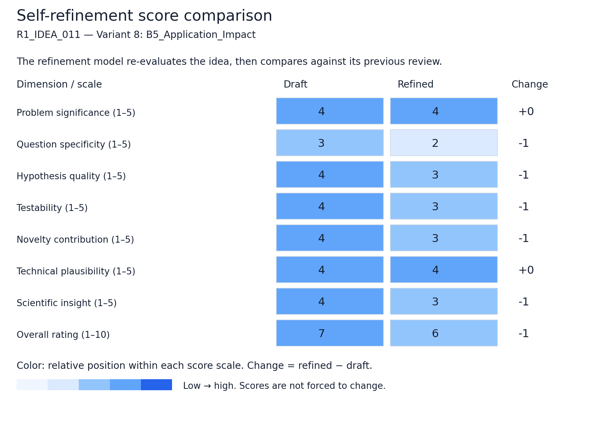

Changed score dimensions: question_specificity, hypothesis_quality, testability, novelty_contribution, scientific_insight, overall_rating.

### Score justifications (draft / refined)

**Problem significance**

```json
{
  "draft": {
    "score": 4.0,
    "justification": "The problem is significant because real-world forecasting often depends on qualitative factors (news, reports) that pure numerical models miss. Improving this has direct practical value in finance, supply chain, and energy sectors."
  },
  "refined": {
    "score": 4.0,
    "justification": "The problem is significant because real-world forecasting often hinges on qualitative factors (news, policy changes) that numerical models miss. Solving this has direct implications for finance, energy, and logistics. However, the significance is slightly tempered by the fact that multimodal forecasting is a well-known, albeit under-solved, area."
  }
}
```

**Question specificity**

```json
{
  "draft": {
    "score": 3.0,
    "justification": "While the general direction is clear, the core technical terms ('structured reasoning', 'alignment mechanisms') are currently too broad to constitute a specific research question without further definition."
  },
  "refined": {
    "score": 2.0,
    "justification": "While the motivation is clear, the research question is currently too vague. 'Structured reasoning' and 'alignment mechanisms' are broad categories, not specific research questions. The idea states *what* to do (use reasoning) but not *how* or *what specific mechanism* to investigate, making the scope difficult to define rigorously."
  }
}
```

**Hypothesis quality**

```json
{
  "draft": {
    "score": 4.0,
    "justification": "The implicit hypothesis—that deeper, structured integration of text yields better forecasts than shallow integration—is concrete, plausible, and falsifiable."
  },
  "refined": {
    "score": 3.0,
    "justification": "The implicit hypothesis—that deeper text integration improves accuracy—is plausible and falsifiable. However, it is somewhat generic. A stronger hypothesis would specify the *type* of reasoning or the *condition* under which it outperforms shallow methods (e.g., 'Structured reasoning improves accuracy specifically in low-data regimes where text provides causal context')."
  }
}
```

**Testability**

```json
{
  "draft": {
    "score": 4.0,
    "justification": "The idea is highly testable. One can construct experiments comparing baseline numerical models, shallow multimodal models, and the proposed structured reasoning models on relevant datasets."
  },
  "refined": {
    "score": 3.0,
    "justification": "The idea is testable in principle (compare models with and without reasoning), but the lack of defined mechanisms makes the experimental design currently impossible to specify. Without defining the 'reasoning' module, one cannot design a controlled experiment to isolate variables."
  }
}
```

**Novelty contribution**

```json
{
  "draft": {
    "score": 4.0,
    "justification": "While multimodal forecasting is an active area, the specific focus on 'structured reasoning' as a mechanism to overcome shallow text utilization represents a novel and promising angle, moving beyond simple concatenation or embedding."
  },
  "refined": {
    "score": 3.0,
    "justification": "The direction is novel in its emphasis on 'reasoning' over simple 'embedding' or 'concatenation'. However, the application of LLMs or reasoning modules to time series is a rapidly growing field. The specific contribution relies entirely on the successful definition of the 'reasoning' mechanism, which is currently undefined."
  }
}
```

**Technical plausibility**

```json
{
  "draft": {
    "score": 4.0,
    "justification": "The direction is technically sound. Leveraging LLMs for reasoning and alignment techniques is a feasible path, though the implementation details are the main challenge."
  },
  "refined": {
    "score": 4.0,
    "justification": "The direction is technically sound. Integrating LLMs or reasoning modules with time series models is a feasible and active area of research. The logic that text contains causal information that needs reasoning to extract is sound."
  }
}
```

**Scientific insight**

```json
{
  "draft": {
    "score": 4.0,
    "justification": "If successful, this research could reveal how temporal dynamics interact with semantic reasoning, potentially establishing new principles for multimodal time series modeling."
  },
  "refined": {
    "score": 3.0,
    "justification": "If successful, this could reveal how semantic reasoning interacts with temporal dynamics. However, as currently stated, it risks being a 'black box' application of reasoning without yielding deeper principles about the interaction of modalities unless the 'reasoning' component is explicitly analyzed."
  }
}
```

**Overall rating**

```json
{
  "draft": {
    "score": 7.0,
    "justification": "This is a strong research idea with high potential impact. It addresses a clear limitation in current methods and proposes a plausible, non-trivial direction for improvement. The main weakness is the current lack of technical specificity regarding the 'how', but the core scientific question is well-defined and valuable."
  },
  "refined": {
    "score": 6.0,
    "justification": "This is a moderate-to-strong idea with high potential, but it currently lacks the specificity required for a top-tier research proposal. It identifies a meaningful problem and a plausible direction but relies on undefined technical terms ('structured reasoning') that make the research question too broad. It scores lower than the previous review because the vagueness of the core mechanism prevents a clear assessment of novelty and testability."
  }
}
```

## R1_IDEA_011 — Variant 9: C1_Hollow_Shell

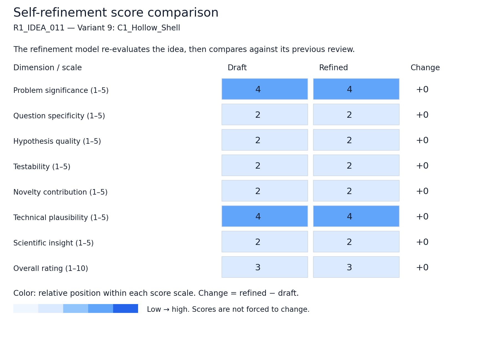

Changed score dimensions: none.

### Score justifications (draft / refined)

**Problem significance**

```json
{
  "draft": {
    "score": 4.0,
    "justification": "The problem of multi-source forecasting is highly significant in real-world applications (finance, weather, healthcare). Addressing the limitation of single-source models is a meaningful challenge."
  },
  "refined": {
    "score": 4.0,
    "justification": "The problem of effectively leveraging multi-source data in forecasting is highly significant for real-world applications like finance, weather, and healthcare. Addressing the limitations of single-source models is a meaningful challenge."
  }
}
```

**Question specificity**

```json
{
  "draft": {
    "score": 2.0,
    "justification": "The idea is currently too broad. It states a goal (better incorporation) but does not define the specific variables, mechanisms, or constraints of the investigation."
  },
  "refined": {
    "score": 2.0,
    "justification": "The idea is currently too abstract. It states a goal but fails to define the specific variables, the nature of the 'structure', or the specific data types involved. It reads more as a motivation than a specific research question."
  }
}
```

**Hypothesis quality**

```json
{
  "draft": {
    "score": 2.0,
    "justification": "The implicit hypothesis is that 'structured integration of multiple sources improves forecasts.' While plausible, it is a truism rather than a specific, falsifiable scientific claim about a mechanism or relationship."
  },
  "refined": {
    "score": 2.0,
    "justification": "The implicit hypothesis is that 'structured integration improves performance.' While plausible, this is a general truism rather than a specific, falsifiable scientific claim about a mechanism, relationship, or boundary condition."
  }
}
```

**Testability**

```json
{
  "draft": {
    "score": 2.0,
    "justification": "Without defining the method or the data, it is impossible to design a specific experiment. The idea is currently too abstract to be directly tested."
  },
  "refined": {
    "score": 2.0,
    "justification": "Without defining the method or the data, it is impossible to design a specific experiment. The idea is currently too abstract to be directly tested or falsified."
  }
}
```

**Novelty contribution**

```json
{
  "draft": {
    "score": 2.0,
    "justification": "As stated, this is a generic direction. Novelty would only emerge if the 'structured approach' is a specific, new mechanism or if it solves a previously intractable alignment problem."
  },
  "refined": {
    "score": 2.0,
    "justification": "As stated, this is a generic direction. Novelty would only emerge if the 'structured approach' is a specific, new mechanism or if it solves a previously intractable alignment problem, neither of which is described."
  }
}
```

**Technical plausibility**

```json
{
  "draft": {
    "score": 4.0,
    "justification": "The reasoning is logically coherent. It is technically plausible that better data integration improves forecasting, even if the specific method is undefined."
  },
  "refined": {
    "score": 4.0,
    "justification": "The reasoning is logically coherent. It is technically plausible that better data integration improves forecasting, even if the specific method is undefined. The premise does not violate known physical or logical constraints."
  }
}
```

**Scientific insight**

```json
{
  "draft": {
    "score": 2.0,
    "justification": "Currently, the idea suggests a performance improvement rather than a discovery of a new principle. It would need to be refined to reveal *why* certain structures work better than others to gain high insight."
  },
  "refined": {
    "score": 2.0,
    "justification": "Currently, the idea suggests a performance improvement rather than a discovery of a new principle. It would need to be refined to reveal *why* certain structures work better than others to gain high scientific insight."
  }
}
```

**Overall rating**

```json
{
  "draft": {
    "score": 3.0,
    "justification": "The idea identifies a valid and important problem but lacks the specificity, hypothesis, and methodological direction required to be a strong research proposal. It is currently a 'motivation' rather than a 'research idea' with a clear path to scientific contribution."
  },
  "refined": {
    "score": 3.0,
    "justification": "The idea identifies a valid and important problem but lacks the specificity, hypothesis, and methodological direction required to be a strong research proposal. It is currently a 'motivation' rather than a 'research idea' with a clear path to scientific contribution. It falls into the 'Weak' category because the core mechanism is undefined."
  }
}
```

## R1_IDEA_011 — Variant 10: C2_Logic_Flawed


Changed score dimensions: none.

### Score justifications (draft / refined)

**Problem significance**

```json
{
  "draft": {
    "score": 4.0,
    "justification": "The problem of integrating complex, non-numerical context into time series forecasting is highly relevant and currently under-explored. Moving beyond simple concatenation or embedding to 'reasoning' addresses a meaningful challenge in making AI systems more robust to real-world dynamics."
  },
  "refined": {
    "score": 4.0,
    "justification": "The problem is highly significant. Time series forecasting is a foundational task in ML, and the inability to effectively reason over complex, unstructured exogenous data (like news or reports) is a major bottleneck for real-world deployment. Addressing this moves the field toward more robust, context-aware AI."
  }
}
```

**Question specificity**

```json
{
  "draft": {
    "score": 3.0,
    "justification": "While the general direction is clear, the core technical terms ('structured reasoning', 'alignment mechanisms') are not defined. The research question is currently a broad proposal rather than a specific, bounded inquiry."
  },
  "refined": {
    "score": 3.0,
    "justification": "The idea identifies a clear direction but lacks the specificity of a concrete research question. Terms like 'structured reasoning' are too broad to define a single experiment. The question 'How do we use reasoning?' is less specific than 'Does using a Knowledge Graph improve forecasting on event-driven data compared to BERT embeddings?'"
  }
}
```

**Hypothesis quality**

```json
{
  "draft": {
    "score": 3.0,
    "justification": "The implicit hypothesis is that structured reasoning over text yields better predictions than shallow methods. This is plausible but currently lacks the specificity to be strongly falsifiable without defining the 'structured' aspect and the conditions under which it applies."
  },
  "refined": {
    "score": 3.0,
    "justification": "The implicit hypothesis (reasoning > shallow embedding) is plausible but currently too generic. A strong hypothesis would specify the mechanism of failure for shallow methods and the mechanism of success for the proposed method. It is testable but not yet falsifiable in a precise way."
  }
}
```

**Testability**

```json
{
  "draft": {
    "score": 3.0,
    "justification": "The idea is testable in principle (compare models with and without the proposed mechanism), but the lack of defined mechanisms makes the experimental design currently ambiguous. It requires further specification to be fully operationalizable."
  },
  "refined": {
    "score": 3.0,
    "justification": "The idea is testable in principle, as one can compare models with and without the proposed mechanism. However, without defining the mechanism, the experimental design is currently incomplete. The 'alignment' aspect also requires a specific metric to be testable."
  }
}
```

**Novelty contribution**

```json
{
  "draft": {
    "score": 4.0,
    "justification": "Applying structured reasoning to time series is a novel direction. Most current work focuses on better embeddings or attention; shifting the focus to 'reasoning' and 'alignment' offers potential for significant scientific insight into how models process temporal-semantic interactions."
  },
  "refined": {
    "score": 4.0,
    "justification": "The shift from 'representation' to 'reasoning' in time series is a novel and promising direction. While multimodal time series exist, the explicit focus on 'structured reasoning' as the primary driver of improvement distinguishes this from standard multimodal fusion papers."
  }
}
```

**Technical plausibility**

```json
{
  "draft": {
    "score": 4.0,
    "justification": "The direction is technically sound. Recent advances in LLMs and multimodal alignment make the proposed mechanisms feasible. The logical flow from 'shallow text' to 'reasoning' is coherent."
  },
  "refined": {
    "score": 4.0,
    "justification": "The direction is technically sound. Given the capabilities of modern LLMs and knowledge graph technologies, implementing 'structured reasoning' is feasible. The logical link between text events and time series patterns is well-established in domain literature."
  }
}
```

**Scientific insight**

```json
{
  "draft": {
    "score": 4.0,
    "justification": "If successful, this research could reveal fundamental principles about how temporal models should integrate semantic knowledge, potentially leading to a new class of interpretable forecasting models."
  },
  "refined": {
    "score": 4.0,
    "justification": "If successful, this research could reveal fundamental principles about how temporal models should integrate semantic knowledge, potentially establishing 'reasoning' as a necessary component for next-generation forecasting, rather than just an optional feature."
  }
}
```

**Overall rating**

```json
{
  "draft": {
    "score": 7.0,
    "justification": "This is a strong research idea with high potential significance and novelty. It identifies a clear limitation in the field and proposes a sophisticated direction for improvement. However, it currently lacks the specificity required to be a 'top-tier' idea, as the core mechanisms ('structured reasoning') are undefined. With better definition of the hypothesis and methods, it could easily reach an 8 or 9."
  },
  "refined": {
    "score": 7.0,
    "justification": "This is a strong research idea with high potential. It addresses a meaningful problem with a plausible and novel direction. The score is limited by the lack of specificity in the 'how' (mechanism) and 'when' (boundary conditions). It is not a 'top-tier' (9-10) idea yet because the core concepts are still too abstract to be immediately actionable without further definition, but it is significantly better than a generic application idea."
  }
}
```

## R1_IDEA_011 — Variant 11: C3_Substance_Enriched


Changed score dimensions: none.

### Score justifications (draft / refined)

**Problem significance**

```json
{
  "draft": {
    "score": 4.0,
    "justification": "Integrating multimodal data, especially text, into time series forecasting is a high-impact problem. Real-world forecasting often depends on events (news, weather, policy) that are textual. Addressing the underutilization of this data is scientifically and practically significant."
  },
  "refined": {
    "score": 4.0,
    "justification": "The problem is highly significant. Real-world forecasting is inherently multimodal, yet most models ignore the causal depth of text. Solving this could unlock better predictions in finance, climate, and economics."
  }
}
```

**Question specificity**

```json
{
  "draft": {
    "score": 3.0,
    "justification": "The idea identifies the general direction (better text integration) but lacks specificity on the 'how'. 'Structured reasoning' and 'alignment mechanisms' are broad terms that need concrete instantiation to be a strong research question."
  },
  "refined": {
    "score": 3.0,
    "justification": "The idea identifies the 'what' (better text integration) and the 'how' (alignment/reasoning) in broad strokes, but lacks the 'specific mechanism' required for a top-tier research question. 'Structured reasoning' is too broad to be a precise scientific question without further definition."
  }
}
```

**Hypothesis quality**

```json
{
  "draft": {
    "score": 3.0,
    "justification": "The hypothesis that 'alignment mechanisms improve performance' is testable but somewhat generic. A stronger hypothesis would predict specific conditions under which structured reasoning outperforms shallow integration or explain the mechanism of improvement."
  },
  "refined": {
    "score": 3.0,
    "justification": "The hypothesis that 'alignment improves performance' is testable but generic. A stronger hypothesis would predict specific interactions, such as 'Structured reasoning mitigates performance drops caused by temporal misalignment in text events.' The current formulation is a direction rather than a sharp prediction."
  }
}
```

**Testability**

```json
{
  "draft": {
    "score": 4.0,
    "justification": "The idea suggests clear validation paths: testing on benchmark datasets and varying text quality (noise/incompleteness). These are standard, feasible experimental setups."
  },
  "refined": {
    "score": 4.0,
    "justification": "The proposed validation path (benchmark datasets, varying text quality) is standard and feasible. The idea clearly outlines an experimental design, even if the specific metrics and baselines are not yet detailed."
  }
}
```

**Novelty contribution**

```json
{
  "draft": {
    "score": 3.0,
    "justification": "While the application of multimodal learning to time series is active, the specific focus on 'structured reasoning' and deep alignment rather than shallow context is a promising angle. However, without a defined method, the novelty is currently conceptual rather than technical."
  },
  "refined": {
    "score": 3.0,
    "justification": "The novelty lies in the *focus* on 'structured reasoning' rather than just 'multimodal fusion.' However, without a defined method, the novelty is conceptual. It has the potential to be high if the specific mechanism reveals new insights into temporal-textual coupling."
  }
}
```

**Technical plausibility**

```json
{
  "draft": {
    "score": 4.0,
    "justification": "The proposed direction is technically sound. Cross-modal attention and alignment mechanisms are well-established concepts in NLP and CV that can be adapted to time series. The challenge lies in the specific implementation, not the feasibility of the concept."
  },
  "refined": {
    "score": 4.0,
    "justification": "The concepts of cross-modal attention and structured reasoning are well-established in NLP and CV. Adapting them to time series is technically plausible, though the specific implementation details (e.g., handling temporal lags) present a non-trivial engineering challenge."
  }
}
```

**Scientific insight**

```json
{
  "draft": {
    "score": 4.0,
    "justification": "If successful, this research could reveal how different types of textual information (structured vs. unstructured, noisy vs. clean) influence temporal dynamics, providing insights into the nature of exogenous drivers in time series."
  },
  "refined": {
    "score": 4.0,
    "justification": "If successful, this research could reveal the specific mechanisms by which textual events drive numerical trends, potentially uncovering new principles of exogenous causality in time series that are currently obscured by shallow models."
  }
}
```

**Overall rating**

```json
{
  "draft": {
    "score": 7.0,
    "justification": "This is a strong research idea with high significance and clear potential for scientific insight. It correctly identifies a limitation in current methods (shallow text usage) and proposes a direction (structured reasoning/alignment) that could yield significant improvements. The main weakness is the current lack of methodological specificity, which prevents it from being an 'exceptional' idea at this stage. With a concrete proposal for 'structured reasoning', it could easily reach a 9."
  },
  "refined": {
    "score": 7.0,
    "justification": "This is a strong research idea with high potential. It correctly identifies a meaningful gap and proposes a plausible direction. However, it currently sits at the 'strong' rather than 'exceptional' level because the core mechanism ('structured reasoning') is undefined, making the hypothesis somewhat generic. With a concrete proposal for the mechanism, it could easily be a 9."
  }
}
```

## R1_IDEA_011 — Variant 12: H1_Deceptive_Hollow

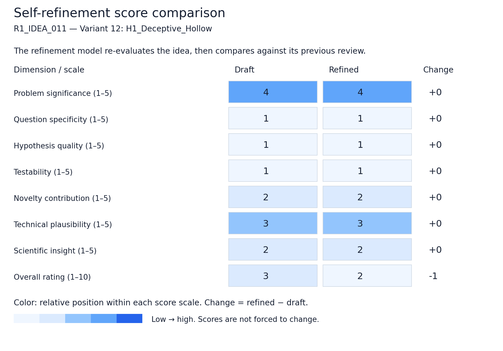

Changed score dimensions: overall_rating.

### Score justifications (draft / refined)

**Problem significance**

```json
{
  "draft": {
    "score": 4.0,
    "justification": "The underlying problem of integrating multiple information sources for forecasting is highly significant and relevant to real-world applications. However, the significance is currently stated in very general terms without a specific problem instance."
  },
  "refined": {
    "score": 4.0,
    "justification": "The problem of integrating multiple information sources for forecasting is highly significant and addresses a known gap in real-world applications. However, the significance is currently stated in very general terms without a specific problem instance, limiting its immediate scientific weight."
  }
}
```

**Question specificity**

```json
{
  "draft": {
    "score": 1.0,
    "justification": "The research question is not specific. It describes a general ambition ('better incorporate additional information') without defining the variables, the method, or the specific relationship being investigated."
  },
  "refined": {
    "score": 1.0,
    "justification": "The research question is extremely vague. It describes a general ambition ('better incorporate additional information') without defining the variables, the method, or the specific relationship being investigated. It reads as a vision statement rather than a research question."
  }
}
```

**Hypothesis quality**

```json
{
  "draft": {
    "score": 1.0,
    "justification": "There is no explicit or implicit hypothesis that can be supported or contradicted. The text offers a 'promise' and a 'vision' rather than a testable prediction."
  },
  "refined": {
    "score": 1.0,
    "justification": "There is no explicit or implicit hypothesis that can be supported or contradicted. The text offers a 'promise' and a 'vision' rather than a testable prediction. It does not distinguish between a successful and failed outcome in a way that generates knowledge."
  }
}
```

**Testability**

```json
{
  "draft": {
    "score": 1.0,
    "justification": "The idea is not currently testable. Without defining the method, data, or metrics, no experiment can be designed to validate the claims."
  },
  "refined": {
    "score": 1.0,
    "justification": "The idea is not currently testable. Without defining the method, data, or metrics, no experiment can be designed to validate the claims. The concepts are too abstract to be operationalized."
  }
}
```

**Novelty contribution**

```json
{
  "draft": {
    "score": 2.0,
    "justification": "While the goal of multi-source forecasting is novel in its ambition, the idea as presented is a generic call for 'better integration' which is a common theme in ML. The potential contribution is high only if the specific 'structured approach' is novel, which is not described."
  },
  "refined": {
    "score": 2.0,
    "justification": "While the goal of multi-source forecasting is a valid area of interest, the idea as presented is a generic call for 'better integration' which is a common theme in ML. The potential contribution is high only if the specific 'structured approach' is novel, which is not described. As written, it is a placeholder for novelty."
  }
}
```

**Technical plausibility**

```json
{
  "draft": {
    "score": 3.0,
    "justification": "The reasoning is logically coherent in a general sense (more data + better structure = better predictions), but the technical details are missing, making it impossible to assess the plausibility of the specific mechanism."
  },
  "refined": {
    "score": 3.0,
    "justification": "The reasoning is logically coherent in a general sense (more data + better structure = better predictions), but the technical details are missing, making it impossible to assess the plausibility of the specific mechanism. It is plausible that such a method exists, but the idea does not provide enough substance to evaluate the path to it."
  }
}
```

**Scientific insight**

```json
{
  "draft": {
    "score": 2.0,
    "justification": "As stated, the idea does not promise specific scientific insight beyond the general expectation that multi-modal data helps. It lacks a mechanism to reveal new principles or boundary conditions."
  },
  "refined": {
    "score": 2.0,
    "justification": "As stated, the idea does not promise specific scientific insight beyond the general expectation that multi-modal data helps. It lacks a mechanism to reveal new principles, boundary conditions, or interactions. It is a proposal for a solution, not an investigation into a phenomenon."
  }
}
```

**Overall rating**

```json
{
  "draft": {
    "score": 3.0,
    "justification": "The idea addresses a significant problem but fails as a research proposal because it is too vague to be evaluated scientifically. It reads more like a grant abstract or a vision statement than a concrete research idea. Without specific hypotheses, methods, or testable questions, it cannot be assessed for its potential to generate new knowledge."
  },
  "refined": {
    "score": 2.0,
    "justification": "The idea addresses a significant problem but fails as a research proposal because it is too vague to be evaluated scientifically. It reads more like a grant abstract or a vision statement than a concrete research idea. Without specific hypotheses, methods, or testable questions, it cannot be assessed for its potential to generate new knowledge. It falls into the 'Very weak' category for a research idea because it lacks the core components required for scientific inquiry (specificity, falsifiability)."
  }
}
```

## R1_IDEA_011 — Variant 13: H2_Confident_Flaw

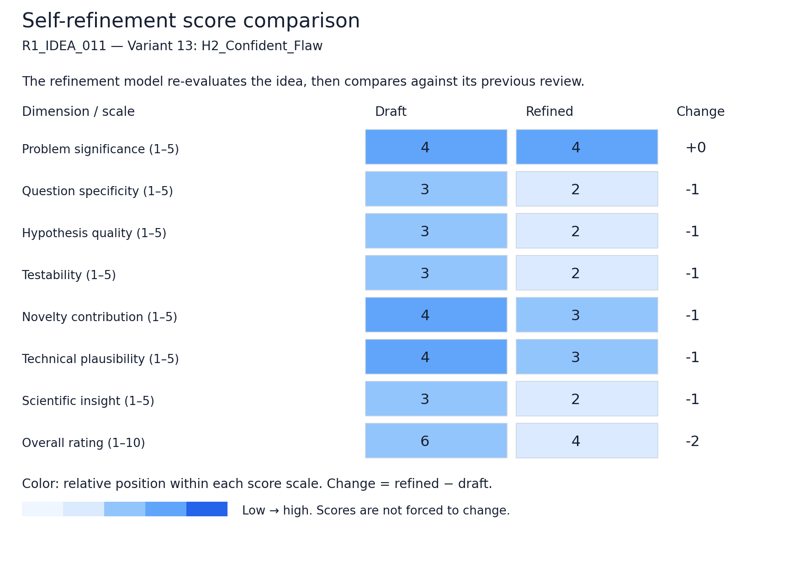

Changed score dimensions: question_specificity, hypothesis_quality, testability, novelty_contribution, technical_plausibility, scientific_insight, overall_rating.

### Score justifications (draft / refined)

**Problem significance**

```json
{
  "draft": {
    "score": 4.0,
    "justification": "The problem of integrating multimodal data (specifically text) into time series forecasting is highly significant. Real-world forecasting often depends on events described in text (news, weather reports, social sentiment) that numbers alone miss. Addressing the underutilization of this data is a meaningful challenge."
  },
  "refined": {
    "score": 4.0,
    "justification": "The problem of effectively leveraging multimodal data (specifically text) for time series forecasting is highly significant. Real-world forecasting often depends on events described in text that numerical data misses. Addressing the underutilization of this data is a meaningful challenge with high practical value."
  }
}
```

**Question specificity**

```json
{
  "draft": {
    "score": 3.0,
    "justification": "The idea identifies the problem (shallow text use) and a general direction (structured reasoning), but lacks specificity on the exact mechanism. The claim of 'causal evidence' without defining the experimental controls makes the research question overly broad and slightly incoherent."
  },
  "refined": {
    "score": 2.0,
    "justification": "While the general direction is clear, the specific research question is compromised by the claim that specific experimental controls (isolation of variables, boundary testing) are unnecessary. This makes the question ill-defined and scientifically incoherent, as it conflates a methodological proposal with a dismissal of scientific rigor."
  }
}
```

**Hypothesis quality**

```json
{
  "draft": {
    "score": 3.0,
    "justification": "The hypothesis that better text integration improves accuracy is plausible. However, the claim that this will 'necessarily produce reliable improvements' and serve as 'causal evidence' without controlling for other variables is a weak hypothesis formulation. It lacks falsifiability in its current absolute form."
  },
  "refined": {
    "score": 2.0,
    "justification": "The hypothesis is weak because it is framed as a certainty ('necessarily produce') and explicitly rejects the conditions required for falsification (isolating variables, checking alternatives). A strong hypothesis must be falsifiable; this one is structured to be unfalsifiable by dismissing potential counter-evidence."
  }
}
```

**Testability**

```json
{
  "draft": {
    "score": 3.0,
    "justification": "The idea is testable in principle (compare models with and without the proposed mechanism). However, the suggestion to ignore 'dataset composition, evaluation criteria, boundary cases, or alternative explanations' makes the proposed evaluation plan untestable in a rigorous scientific sense. A proper test requires isolating these factors."
  },
  "refined": {
    "score": 2.0,
    "justification": "The idea is technically testable in a vacuum (run the model and see if it works), but the proposed evaluation plan explicitly rejects standard scientific controls. Claiming to establish 'causal evidence' without isolating variables or testing boundary cases renders the core claim untestable in a rigorous scientific sense."
  }
}
```

**Novelty contribution**

```json
{
  "draft": {
    "score": 4.0,
    "justification": "Applying structured reasoning to time series text is a promising direction. While multimodal forecasting exists, the specific focus on 'structured reasoning' as the key to unlocking text value, rather than just representation, offers potential for novel scientific insight into how models process exogenous information."
  },
  "refined": {
    "score": 3.0,
    "justification": "The application of structured reasoning to time series text is a novel direction. However, the potential contribution is diminished by the flawed logic regarding causal inference. If the idea were to succeed in its current framing, it would likely produce a method that works but lacks a scientifically valid explanation for why."
  }
}
```

**Technical plausibility**

```json
{
  "draft": {
    "score": 4.0,
    "justification": "The technical direction makes sense. Using LLMs or reasoning modules to align text with time series is a plausible and active area of research. The assumption that this will improve performance is reasonable, though the certainty of the claim is overstated."
  },
  "refined": {
    "score": 3.0,
    "justification": "The technical mechanism (structured reasoning) is plausible and aligns with current trends in AI. However, the plausibility of the *claim* that this mechanism guarantees superiority without controlling for confounds is low. The reasoning contains a logical gap between the method and the certainty of the outcome."
  }
}
```

**Scientific insight**

```json
{
  "draft": {
    "score": 3.0,
    "justification": "If successful, the study could reveal how structured reasoning impacts temporal prediction. However, the current framing aims for a simple 'method is better' conclusion rather than exploring the underlying mechanisms of why text helps or when it fails, limiting the potential for deep scientific insight."
  },
  "refined": {
    "score": 2.0,
    "justification": "The idea aims for a binary 'method is better' conclusion rather than exploring the underlying mechanisms. By dismissing the need to investigate boundary cases or alternative explanations, it forfeits the opportunity to generate deep scientific insight into the conditions under which multimodal integration succeeds or fails."
  }
}
```

**Overall rating**

```json
{
  "draft": {
    "score": 6.0,
    "justification": "The research idea addresses a significant and relevant problem with a plausible methodological direction. However, the scientific rigor is compromised by the claim that causal evidence can be obtained without isolating variables or testing boundary conditions. The idea is strong in motivation but weak in its proposed experimental logic. It is a moderate/borderline idea that requires significant refinement in its hypothesis and evaluation plan to be considered strong."
  },
  "refined": {
    "score": 4.0,
    "justification": "The research idea addresses a significant problem with a plausible methodological direction. However, the scientific quality is severely compromised by the explicit rejection of standard experimental controls (isolation of variables, boundary testing) required to make causal claims. The logic that 'solving a limitation' automatically yields 'causal evidence' without rigorous testing is a fundamental flaw. While the motivation is strong, the proposed research design is scientifically unsound, reducing the overall rating to 'Weak'."
  }
}
```

## R1_IDEA_011 — Variant 14: H3_Verbose_Enriched


Changed score dimensions: none.

### Score justifications (draft / refined)

**Problem significance**

```json
{
  "draft": {
    "score": 4.0,
    "justification": "The problem is highly relevant. Real-world forecasting often involves complex drivers not captured by numbers alone (e.g., news events, policy changes). Moving from unimodal to truly multimodal forecasting is a significant challenge in the field."
  },
  "refined": {
    "score": 4.0,
    "justification": "The problem is highly significant. Real-world forecasting is inherently multimodal, and the field has largely relied on unimodal numerical data. Addressing the underutilization of text is a critical step toward more robust and explainable forecasting systems."
  }
}
```

**Question specificity**

```json
{
  "draft": {
    "score": 3.0,
    "justification": "The idea identifies a clear direction (better text alignment) but remains somewhat vague on the specific mechanism ('structured reasoning') and the specific data domains. It defines the 'what' and 'how to evaluate' better than the 'exactly how it works'."
  },
  "refined": {
    "score": 3.0,
    "justification": "While the direction is clear, the core mechanism ('structured reasoning') and the data context are too vague to be considered a fully specific research question. It defines the 'what' (better text alignment) but leaves the 'how' (specific mechanism) open to interpretation."
  }
}
```

**Hypothesis quality**

```json
{
  "draft": {
    "score": 4.0,
    "justification": "The hypothesis is testable: that specific alignment mechanisms improve performance and that performance degrades predictably with noise. It distinguishes between 'using text' and 'using text with structured reasoning'."
  },
  "refined": {
    "score": 4.0,
    "justification": "The hypothesis is testable and falsifiable: that specific alignment mechanisms improve performance and that this improvement is contingent on data quality (noise/incompleteness). It distinguishes between mere data availability and effective structural integration."
  }
}
```

**Testability**

```json
{
  "draft": {
    "score": 4.0,
    "justification": "The proposed experimental design is strong. It includes clear baselines, ablations, and sensitivity analyses. The plan to test boundary conditions makes the hypothesis falsifiable."
  },
  "refined": {
    "score": 4.0,
    "justification": "The proposed experimental design is strong and testable. The inclusion of ablations, sensitivity analyses, and boundary condition testing provides a robust framework for gathering evidence. The main risk is the lack of defined baselines, but the methodology itself is sound."
  }
}
```

**Novelty contribution**

```json
{
  "draft": {
    "score": 4.0,
    "justification": "While multimodal forecasting is an active area, the specific focus on 'structured reasoning' and the systematic investigation of boundary conditions (noise/incompleteness) offers a potential for novel scientific insight beyond simple performance gains."
  },
  "refined": {
    "score": 4.0,
    "justification": "The focus on 'structured reasoning' and the systematic investigation of boundary conditions (noise/incompleteness) offers potential for novel insight. It moves beyond the common 'apply X to Y' paradigm to investigate the limits and mechanisms of multimodal integration."
  }
}
```

**Technical plausibility**

```json
{
  "draft": {
    "score": 4.0,
    "justification": "The use of cross-modal attention and staged evaluation is technically sound and aligns with current deep learning practices. The main uncertainty is the feasibility of implementing 'structured reasoning' effectively, but the direction is plausible."
  },
  "refined": {
    "score": 4.0,
    "justification": "The direction is technically plausible given current deep learning capabilities (e.g., cross-modal attention, LLMs). The main uncertainty lies in the implementation of 'structured reasoning' and handling temporal misalignment, but these are standard challenges in multimodal learning."
  }
}
```

**Scientific insight**

```json
{
  "draft": {
    "score": 4.0,
    "justification": "If successful, this research could reveal how different types of textual information interact with temporal dynamics and under what conditions text is more valuable than noise. It moves beyond 'does it work' to 'when and why does it work'."
  },
  "refined": {
    "score": 4.0,
    "justification": "If executed as proposed, the study could reveal critical insights into how textual information interacts with temporal dynamics and under what conditions text acts as a signal versus noise. This addresses a fundamental question in multimodal learning."
  }
}
```

**Overall rating**

```json
{
  "draft": {
    "score": 7.0,
    "justification": "This is a strong research idea with a clear motivation and a robust evaluation plan. It addresses a meaningful problem in time series forecasting. The main limitation is the lack of specific technical details regarding the 'structured reasoning' mechanism, which prevents it from being an 'exceptional' (9-10) idea at this stage. However, the proposed methodology is sufficient to turn this into a high-quality study."
  },
  "refined": {
    "score": 7.0,
    "justification": "This is a strong research idea with a clear motivation and a robust evaluation plan. It addresses a meaningful problem and proposes a specific direction for improvement (structured reasoning vs. shallow fusion). The primary limitation is the lack of specific technical definition for the core mechanism, which prevents it from being an 'exceptional' (9-10) idea at this stage. However, the proposed methodology is sufficient to turn this into a high-quality study."
  }
}
```

## R1_IDEA_011 — Variant 15: H4_Ultimate_Hype


Changed score dimensions: none.

### Score justifications (draft / refined)

**Problem significance**

```json
{
  "draft": {
    "score": 4.0,
    "justification": "The problem of integrating rich, non-numerical context into time series forecasting is highly significant. Current models often fail to capture complex real-world drivers that are described in text. Addressing this could lead to substantial practical improvements in fields like finance, energy, and supply chain."
  },
  "refined": {
    "score": 4.0,
    "justification": "The problem is highly significant. Integrating non-numerical context into time series is a major bottleneck in real-world applications (finance, supply chain, energy). Addressing the 'shallow' nature of current multimodal approaches is a meaningful challenge."
  }
}
```

**Question specificity**

```json
{
  "draft": {
    "score": 2.0,
    "justification": "The idea is currently too abstract. While it identifies the general direction (text + reasoning), it lacks the specificity of a research question. Terms like 'structured reasoning' and 'alignment mechanisms' are not defined, making the core investigation unclear."
  },
  "refined": {
    "score": 2.0,
    "justification": "The idea is currently too abstract. While it identifies the general direction, it lacks a concrete research question. 'Structured reasoning' is a vague term that could apply to many different methods, making the core investigation unclear."
  }
}
```

**Hypothesis quality**

```json
{
  "draft": {
    "score": 3.0,
    "justification": "There is an implicit hypothesis that deeper text integration improves accuracy, which is plausible. However, it lacks a specific, falsifiable prediction about the mechanism or the magnitude of improvement under specific conditions."
  },
  "refined": {
    "score": 3.0,
    "justification": "There is an implicit hypothesis that deeper text integration improves accuracy, which is plausible. However, it lacks a specific, falsifiable prediction about the mechanism or the magnitude of improvement under specific conditions. It is more of a vision than a hypothesis."
  }
}
```

**Testability**

```json
{
  "draft": {
    "score": 3.0,
    "justification": "The idea is testable in principle, as one could build a model with text reasoning and compare it to baselines. However, without defining the 'reasoning' mechanism or the evaluation metrics for 'trustworthiness,' the experimental design is currently undefined."
  },
  "refined": {
    "score": 3.0,
    "justification": "The idea is testable in principle, as one could build a model with text reasoning and compare it to baselines. However, without defining the 'reasoning' mechanism or the evaluation metrics for 'trustworthiness,' the experimental design is currently undefined and risks being a generic application."
  }
}
```

**Novelty contribution**

```json
{
  "draft": {
    "score": 4.0,
    "justification": "Moving from shallow text concatenation to 'structured reasoning' in time series is a novel direction. While multimodal time series exist, the specific focus on reasoning mechanisms as the primary driver for accuracy is a promising and underexplored angle."
  },
  "refined": {
    "score": 4.0,
    "justification": "Moving from shallow text concatenation to 'structured reasoning' in time series is a novel direction. While multimodal time series exist, the specific focus on reasoning mechanisms as the primary driver for accuracy is a promising and underexplored angle, provided it is implemented distinctively."
  }
}
```

**Technical plausibility**

```json
{
  "draft": {
    "score": 4.0,
    "justification": "The direction is technically plausible given the rapid advances in LLMs and multimodal alignment. Integrating reasoning modules into forecasting architectures is a logical next step, though the implementation details are the main challenge."
  },
  "refined": {
    "score": 4.0,
    "justification": "The direction is technically plausible given the rapid advances in LLMs and multimodal alignment. Integrating reasoning modules into forecasting architectures is a logical next step, though the implementation details are the main challenge."
  }
}
```

**Scientific insight**

```json
{
  "draft": {
    "score": 3.0,
    "justification": "If successful, this could reveal how semantic reasoning interacts with temporal dynamics, offering insights into the nature of exogenous variables. However, as currently stated, it risks being a 'black box' application of LLMs without yielding deep theoretical insights unless the 'reasoning' aspect is rigorously analyzed."
  },
  "refined": {
    "score": 3.0,
    "justification": "If successful, this could reveal how semantic reasoning interacts with temporal dynamics. However, as currently stated, it risks being a 'black box' application of LLMs without yielding deep theoretical insights unless the 'reasoning' aspect is rigorously analyzed and the mechanism is clearly defined."
  }
}
```

**Overall rating**

```json
{
  "draft": {
    "score": 6.0,
    "justification": "This is a moderate-to-strong research idea with high potential impact, but it is currently in a very early, abstract stage. The core motivation is excellent, but the lack of a specific research question, defined mechanisms, and concrete hypotheses prevents it from being rated higher. It needs significant refinement to move from a 'vision' to a 'research plan'."
  },
  "refined": {
    "score": 6.0,
    "justification": "This is a moderate research idea with high potential impact, but it is currently in a very early, abstract stage. The core motivation is excellent, but the lack of a specific research question, defined mechanisms, and concrete hypotheses prevents it from being rated higher. It needs significant refinement to move from a 'vision' to a 'research plan'."
  }
}
```

## R1_IDEA_012 — Source

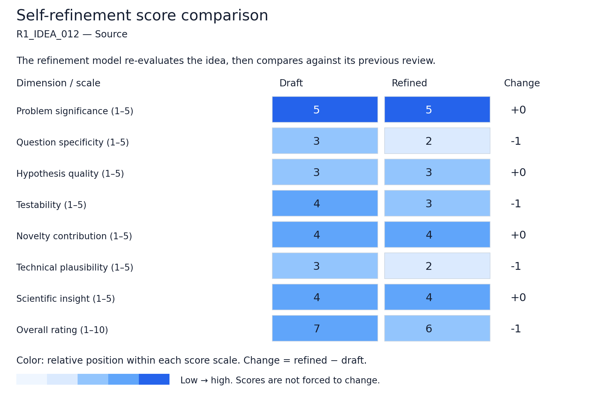

Changed score dimensions: question_specificity, testability, technical_plausibility, overall_rating.

### Score justifications (draft / refined)

**Problem significance**

```json
{
  "draft": {
    "score": 5.0,
    "justification": "The problem of efficient, high-quality 3D editing is a major challenge in computer vision and graphics. Current methods are computationally expensive and require significant data. Solving this would have immediate practical impact and is a highly significant research direction."
  },
  "refined": {
    "score": 5.0,
    "justification": "The problem of efficient, high-quality 3D editing is a major challenge in computer vision and graphics. Current methods are computationally expensive and require significant data. Solving this would have immediate practical impact and is a highly significant research direction."
  }
}
```

**Question specificity**

```json
{
  "draft": {
    "score": 3.0,
    "justification": "The goal is clear (efficient 3D editing), but the research question is vague. It states *what* to achieve (unlock latent awareness) but not *how* to investigate the mechanism or *what* specific relationship is being tested. It reads more like a product vision than a specific scientific question."
  },
  "refined": {
    "score": 2.0,
    "justification": "While the goal is clear, the research question is vague. It states *what* to achieve but not *how* to investigate the mechanism or *what* specific relationship is being tested. It reads more like a product vision or a 'moonshot' than a specific scientific question with defined variables."
  }
}
```

**Hypothesis quality**

```json
{
  "draft": {
    "score": 3.0,
    "justification": "The implicit hypothesis is that 'latent 3D awareness exists and can be accessed without optimization.' This is a plausible and testable hypothesis, but it is currently stated as a premise rather than a specific prediction about the relationship between model internals and 3D consistency."
  },
  "refined": {
    "score": 3.0,
    "justification": "The implicit hypothesis is that 'latent 3D awareness exists and can be accessed without optimization.' This is plausible but currently stated as a premise. A stronger hypothesis would predict a specific relationship between model internals (e.g., attention maps) and the resulting geometric consistency."
  }
}
```

**Testability**

```json
{
  "draft": {
    "score": 4.0,
    "justification": "The idea is testable. One can attempt to build a pipeline that takes a single image, applies a proposed method to generate multi-view edits, and evaluate consistency and fidelity against ground truth or existing baselines. The lack of a specific method makes the *design* of the test hard, but the *possibility* of testing is high."
  },
  "refined": {
    "score": 3.0,
    "justification": "The idea is testable in principle (one can attempt to build a pipeline and evaluate consistency), but the lack of a specific method makes the *design* of the test difficult. The claim of 'no optimization' is a strong constraint that is easy to falsify but hard to prove without a clear mechanism."
  }
}
```

**Novelty contribution**

```json
{
  "draft": {
    "score": 4.0,
    "justification": "The concept of 'unlocking latent 3D awareness' in frozen models is novel and aligns with cutting-edge trends. If successful, it would represent a significant departure from the current paradigm of per-scene optimization, offering a new class of 3D editing methods."
  },
  "refined": {
    "score": 4.0,
    "justification": "The concept of 'unlocking latent 3D awareness' in frozen models is novel and aligns with cutting-edge trends. If successful, it would represent a significant departure from the current paradigm of per-scene optimization, offering a new class of 3D editing methods."
  }
}
```

**Technical plausibility**

```json
{
  "draft": {
    "score": 3.0,
    "justification": "While the premise is plausible (diffusion models do have 3D priors), the claim that this can be done *without any per-scene optimization* is technically ambitious and potentially risky. It assumes the 3D information is directly accessible and sufficient, which may not be true for complex scenes without some form of geometric refinement."
  },
  "refined": {
    "score": 2.0,
    "justification": "While the premise that diffusion models have 3D priors is plausible, the claim that this can be done *without any per-scene optimization* is technically risky. It assumes the 3D information is directly accessible and sufficient, which may not be true for complex scenes without some form of geometric refinement or explicit 3D representation."
  }
}
```

**Scientific insight**

```json
{
  "draft": {
    "score": 4.0,
    "justification": "If the research succeeds, it would provide deep insight into the nature of 3D priors in 2D diffusion models. It would reveal whether these models truly understand 3D geometry or just mimic it, and how that understanding can be extracted without training."
  },
  "refined": {
    "score": 4.0,
    "justification": "If the research succeeds, it would provide deep insight into the nature of 3D priors in 2D diffusion models. It would reveal whether these models truly understand 3D geometry or just mimic it, and how that understanding can be extracted without training."
  }
}
```

**Overall rating**

```json
{
  "draft": {
    "score": 7.0,
    "justification": "This is a strong research idea with high significance and potential for novel contribution. The core concept (frozen model 3D editing) is timely and valuable. However, it currently lacks the specificity of a research question and a clear mechanism, which prevents it from being an 'exceptional' (9-10) idea. It needs a more concrete hypothesis on *how* the 3D consistency is achieved without optimization to move from a 'vision' to a rigorous scientific inquiry."
  },
  "refined": {
    "score": 6.0,
    "justification": "This is a moderate research idea with high significance and potential for novel contribution. The core concept is timely and valuable. However, it currently lacks the specificity of a research question and a clear mechanism, which prevents it from being a 'strong' (7-8) idea. The gap between the ambitious claim (no optimization) and the lack of a proposed method makes it feel more like a hypothesis than a research plan. It requires a concrete mechanism to move from a 'vision' to a rigorous scientific inquiry."
  }
}
```

## R1_IDEA_012 — Variant 1: A1_Identity

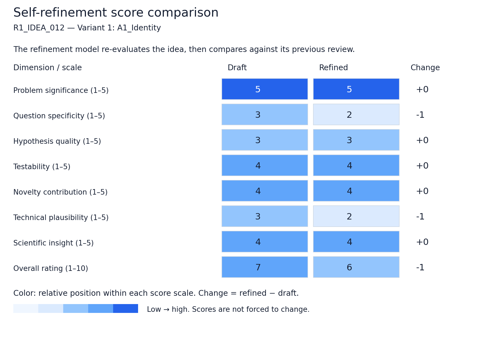

Changed score dimensions: question_specificity, technical_plausibility, overall_rating.

### Score justifications (draft / refined)

**Problem significance**

```json
{
  "draft": {
    "score": 5.0,
    "justification": "The problem of efficient, high-quality 3D editing is a major challenge in computer vision and graphics. Current methods are computationally expensive and require significant data. Solving this would have immediate practical impact and is a highly significant research direction."
  },
  "refined": {
    "score": 5.0,
    "justification": "The problem is of paramount importance. Current 3D editing is computationally prohibitive and data-hungry. A method that achieves high-fidelity 3D editing from a single image without optimization would be a breakthrough with immediate practical utility in AR/VR, gaming, and content creation."
  }
}
```

**Question specificity**

```json
{
  "draft": {
    "score": 3.0,
    "justification": "The goal is clear (efficient 3D editing), but the research question is vague. It states *what* to achieve (unlock latent awareness) but not *how* to investigate the mechanism or *what* specific relationship is being tested. It reads more like a product vision than a specific scientific question."
  },
  "refined": {
    "score": 2.0,
    "justification": "The idea states a desired outcome but fails to define the research question. It asks 'can we do X?' without specifying 'how' or 'under what conditions.' The phrase 'unlock latent 3D awareness' is a metaphor, not a specific scientific question or mechanism to be investigated. It lacks the specificity required for a rigorous study."
  }
}
```

**Hypothesis quality**

```json
{
  "draft": {
    "score": 3.0,
    "justification": "The implicit hypothesis is that 'latent 3D awareness exists and can be accessed without optimization.' This is a plausible and testable hypothesis, but it is currently stated as a premise rather than a specific prediction about the relationship between model internals and 3D consistency."
  },
  "refined": {
    "score": 3.0,
    "justification": "The implicit hypothesis (that 2D diffusion models contain sufficient 3D priors for zero-shot editing) is plausible but currently stated as a fact rather than a testable prediction. It lacks a specific mechanism linking the model internals to the 3D output, making it difficult to falsify beyond 'it works' or 'it doesn't'."
  }
}
```

**Testability**

```json
{
  "draft": {
    "score": 4.0,
    "justification": "The idea is testable. One can attempt to build a pipeline that takes a single image, applies a proposed method to generate multi-view edits, and evaluate consistency and fidelity against ground truth or existing baselines. The lack of a specific method makes the *design* of the test hard, but the *possibility* of testing is high."
  },
  "refined": {
    "score": 4.0,
    "justification": "The idea is testable in principle: one can attempt to build a pipeline and measure multi-view consistency and fidelity. However, without a proposed method, the 'test' is undefined. The evaluation metrics (consistency, fidelity) are clear, but the experimental design is missing."
  }
}
```

**Novelty contribution**

```json
{
  "draft": {
    "score": 4.0,
    "justification": "The concept of 'unlocking latent 3D awareness' in frozen models is novel and aligns with cutting-edge trends. If successful, it would represent a significant departure from the current paradigm of per-scene optimization, offering a new class of 3D editing methods."
  },
  "refined": {
    "score": 4.0,
    "justification": "The concept of 'zero-shot 3D editing' via latent 3D awareness is highly novel. If successful, it would represent a significant departure from the current SOTA (which relies on optimization). Even if it fails, investigating the limits of 2D models' 3D understanding is a valuable contribution."
  }
}
```

**Technical plausibility**

```json
{
  "draft": {
    "score": 3.0,
    "justification": "While the premise is plausible (diffusion models do have 3D priors), the claim that this can be done *without any per-scene optimization* is technically ambitious and potentially risky. It assumes the 3D information is directly accessible and sufficient, which may not be true for complex scenes without some form of geometric refinement."
  },
  "refined": {
    "score": 2.0,
    "justification": "While the premise is interesting, the claim that 3D consistency can be achieved *without any per-scene optimization* is technically highly suspect. Diffusion models are trained on 2D data; enforcing 3D rigidity without explicit geometric constraints or optimization is a massive leap that currently lacks theoretical grounding. The idea risks being physically impossible without a specified mechanism."
  }
}
```

**Scientific insight**

```json
{
  "draft": {
    "score": 4.0,
    "justification": "If the research succeeds, it would provide deep insight into the nature of 3D priors in 2D diffusion models. It would reveal whether these models truly understand 3D geometry or just mimic it, and how that understanding can be extracted without training."
  },
  "refined": {
    "score": 4.0,
    "justification": "If the research succeeds, it would reveal that 2D diffusion models have a much deeper understanding of 3D geometry than currently assumed. If it fails, it would clarify the boundaries of 2D priors and the necessity of 3D-specific constraints. Both outcomes offer significant scientific insight."
  }
}
```

**Overall rating**

```json
{
  "draft": {
    "score": 7.0,
    "justification": "This is a strong research idea with high significance and potential for novel contribution. The core concept (frozen model 3D editing) is timely and valuable. However, it currently lacks the specificity of a research question and a clear mechanism, which prevents it from being an 'exceptional' (9-10) idea. It needs a more concrete hypothesis on *how* the 3D consistency is achieved without optimization to move from a 'vision' to a rigorous scientific inquiry."
  },
  "refined": {
    "score": 6.0,
    "justification": "This is a moderate/borderline idea. While the problem significance and potential novelty are exceptional (5/5 and 4/5), the lack of a specific research question, mechanism, and the high technical risk (plausibility 2/5) prevent it from being a strong research proposal. It currently reads more like a visionary goal than a concrete research plan. It needs a specific hypothesis on *how* the 3D consistency is achieved to move from a 'vision' to a 'research idea'."
  }
}
```

## R1_IDEA_012 — Variant 2: A2_Paraphrase_Only


Changed score dimensions: question_specificity, hypothesis_quality, testability, overall_rating.

### Score justifications (draft / refined)

**Problem significance**

```json
{
  "draft": {
    "score": 5.0,
    "justification": "The problem of efficient, consistent 3D editing is highly significant. Current methods are computationally expensive and slow, limiting their practical utility. Solving this would enable real-time 3D content creation and democratize access to 3D editing tools."
  },
  "refined": {
    "score": 5.0,
    "justification": "The problem is highly significant. Current 3D editing pipelines are computationally prohibitive for many applications. A method that achieves consistency without per-scene optimization would democratize 3D content creation and enable real-time applications."
  }
}
```

**Question specificity**

```json
{
  "draft": {
    "score": 3.0,
    "justification": "The idea identifies the goal (consistent editing without optimization) but lacks specificity on the 'how'. The term 'adapts existing diffusion models' is too broad to be a specific research question without further elaboration on the mechanism."
  },
  "refined": {
    "score": 2.0,
    "justification": "The idea identifies the goal but fails to specify the 'how'. The phrase 'adapts existing diffusion models' is too broad to constitute a specific research question. Without a defined mechanism for adaptation or consistency enforcement, the research question remains abstract."
  }
}
```

**Hypothesis quality**

```json
{
  "draft": {
    "score": 4.0,
    "justification": "The implicit hypothesis—that diffusion models possess sufficient inherent 3D priors to allow consistent editing without explicit 3D optimization—is strong and testable. It challenges the current paradigm that explicit 3D reconstruction is necessary for consistency."
  },
  "refined": {
    "score": 3.0,
    "justification": "The hypothesis that diffusion models have 'inherent 3D understanding' is plausible but currently unrefined. It is a strong claim that needs to be operationalized. The idea distinguishes itself from current methods but lacks a specific prediction about *how* the model achieves this (e.g., via specific attention patterns) rather than just *that* it does."
  }
}
```

**Testability**

```json
{
  "draft": {
    "score": 4.0,
    "justification": "The idea is testable. One can implement a method based on the proposed adaptation, generate multi-view edits, and compare consistency metrics against baselines. The 'no optimization' claim is easily falsifiable if the method requires any form of scene-specific training."
  },
  "refined": {
    "score": 3.0,
    "justification": "The idea is testable in principle (generate edits, measure consistency), but the lack of a defined method makes the experimental design premature. The 'no optimization' claim is falsifiable, but the 'adaptation' process needs to be defined to be tested meaningfully."
  }
}
```

**Novelty contribution**

```json
{
  "draft": {
    "score": 4.0,
    "justification": "While diffusion models are well-studied, applying them to 3D editing without per-scene optimization is a novel direction. If successful, it could shift the field away from heavy optimization-based pipelines toward more efficient, model-centric approaches."
  },
  "refined": {
    "score": 4.0,
    "justification": "The direction is novel. While diffusion models are used for 3D, the specific goal of avoiding per-scene optimization entirely to achieve consistency is a distinct and potentially high-impact contribution if achievable."
  }
}
```

**Technical plausibility**

```json
{
  "draft": {
    "score": 3.0,
    "justification": "The idea is plausible given the success of 2D diffusion models, but technically challenging. Achieving strict multi-view consistency without explicit 3D constraints is non-trivial. The reasoning is coherent, but the feasibility of the specific 'adaptation' mechanism is unproven."
  },
  "refined": {
    "score": 3.0,
    "justification": "The idea is technically plausible given the success of 2D diffusion models, but achieving strict multi-view consistency without explicit 3D constraints is a significant challenge. The reasoning is coherent, but the feasibility relies on unproven assumptions about the model's internal representations."
  }
}
```

**Scientific insight**

```json
{
  "draft": {
    "score": 4.0,
    "justification": "Investigating this could reveal the extent of 3D priors in 2D-trained models. Even if the method fails to achieve perfect consistency, the analysis of where and why it fails would provide deep insights into the limitations of current diffusion priors regarding 3D geometry."
  },
  "refined": {
    "score": 4.0,
    "justification": "Investigating this could reveal the limits of 2D priors in 3D tasks. Even if the method fails, the analysis of why consistency breaks down would provide valuable insights into the geometric limitations of current diffusion architectures."
  }
}
```

**Overall rating**

```json
{
  "draft": {
    "score": 7.0,
    "justification": "This is a strong research idea with high significance and a compelling hypothesis. It addresses a major pain point in the field (computational cost) and proposes a paradigm shift (no per-scene optimization). However, it currently lacks the technical specificity required to be considered 'exceptional'. The success of the idea hinges entirely on the specific mechanism proposed for 'adaptation', which is currently undefined. With a concrete methodological proposal, this could be a top-tier contribution."
  },
  "refined": {
    "score": 6.0,
    "justification": "This is a moderate-to-strong research idea with high potential impact, but it currently lacks the specificity required for a top-tier proposal. The core concept (efficiency via inherent priors) is compelling, but the lack of a defined mechanism for 'adaptation' and 'consistency' makes it feel more like a vision statement than a concrete research plan. It sits on the border between a strong idea and a vague one due to the missing methodological details."
  }
}
```

## R1_IDEA_012 — Variant 3: A3_Plain_Core

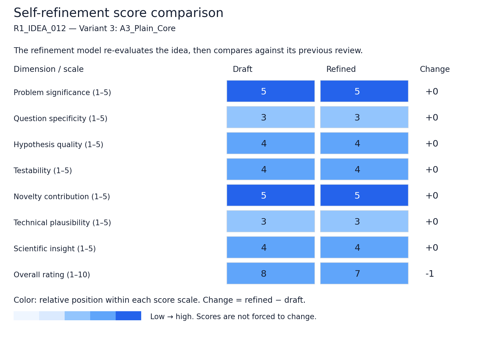

Changed score dimensions: overall_rating.

### Score justifications (draft / refined)

**Problem significance**

```json
{
  "draft": {
    "score": 5.0,
    "justification": "The problem of efficient, sparse-view 3D editing is highly significant. Current methods are computationally expensive and require extensive data. Solving this would democratize 3D content creation and significantly reduce the barrier to entry for 3D applications."
  },
  "refined": {
    "score": 5.0,
    "justification": "The problem is highly significant. Current 3D editing methods are computationally prohibitive and require extensive multi-view data or optimization. A method that achieves this with sparse inputs and no optimization would be a major breakthrough for practical 3D content creation."
  }
}
```

**Question specificity**

```json
{
  "draft": {
    "score": 3.0,
    "justification": "The idea identifies a clear goal (3D editing from sparse views without optimization) but lacks specificity on the 'how'. The mechanism for accessing latent 3D awareness is the missing link that defines the research question's boundaries."
  },
  "refined": {
    "score": 3.0,
    "justification": "While the goal (sparse 3D editing without optimization) is clear, the research question lacks specificity regarding the 'how'. The core mechanism ('accessing latent 3D awareness') is a placeholder for a method that has not been defined. The idea is more of a high-level vision than a specific research question."
  }
}
```

**Hypothesis quality**

```json
{
  "draft": {
    "score": 4.0,
    "justification": "The core hypothesis—that pretrained diffusion models contain sufficient latent 3D priors to enable consistent editing without per-scene optimization—is bold, testable, and potentially falsifiable. It distinguishes itself from standard optimization approaches."
  },
  "refined": {
    "score": 4.0,
    "justification": "The hypothesis is strong and falsifiable: 'Pretrained diffusion models contain sufficient latent 3D priors to enable multi-view consistent editing without per-scene optimization.' It makes a concrete prediction that can be tested. However, it relies on an unproven assumption about the nature of the model's priors."
  }
}
```

**Testability**

```json
{
  "draft": {
    "score": 4.0,
    "justification": "The idea is highly testable. One can implement a baseline using standard diffusion inference, define metrics for multi-view consistency, and compare against optimization-based baselines. The success or failure of the 'no optimization' claim is empirically verifiable."
  },
  "refined": {
    "score": 4.0,
    "justification": "The idea is testable. One can attempt to implement the inference strategy, generate multi-view outputs, and measure consistency metrics. The success or failure of the 'no optimization' claim is empirically verifiable. However, the lack of a proposed mechanism makes the 'how' of the test design difficult to specify."
  }
}
```

**Novelty contribution**

```json
{
  "draft": {
    "score": 5.0,
    "justification": "If successful, this would represent a significant conceptual shift in 3D generation, moving away from iterative optimization towards direct inference. It challenges the assumption that 3D consistency requires explicit 3D modeling or per-scene training."
  },
  "refined": {
    "score": 5.0,
    "justification": "This idea has high novelty. It challenges the dominant paradigm of 3D generation (optimization-based) by suggesting that 2D diffusion models might inherently solve 3D problems. If successful, it would redefine the capabilities of foundation models."
  }
}
```

**Technical plausibility**

```json
{
  "draft": {
    "score": 3.0,
    "justification": "While the goal is plausible, the technical path is uncertain. Diffusion models are inherently 2D; assuming they can solve 3D consistency without explicit 3D constraints or optimization is a strong assumption that may require novel architectural insights or conditioning mechanisms not yet described."
  },
  "refined": {
    "score": 3.0,
    "justification": "The plausibility is moderate to low without further elaboration. Diffusion models are trained on 2D data and typically lack explicit 3D consistency constraints. Assuming they can solve a 3D consistency problem without any geometric guidance or optimization is a strong leap that requires a novel theoretical or architectural insight not currently described."
  }
}
```

**Scientific insight**

```json
{
  "draft": {
    "score": 4.0,
    "justification": "Investigating this will reveal the true extent of 3D priors in 2D-pretrained models. Even if the specific method fails, the analysis of *why* it fails (or succeeds) will provide deep insights into the relationship between 2D diffusion priors and 3D geometry."
  },
  "refined": {
    "score": 4.0,
    "justification": "Even if the specific implementation fails, investigating this will provide deep insights into the geometric priors of 2D diffusion models. It could reveal the boundaries of what 2D models can infer about 3D structure and the limitations of purely data-driven priors."
  }
}
```

**Overall rating**

```json
{
  "draft": {
    "score": 8.0,
    "justification": "This is a strong research idea with high potential impact. It addresses a major pain point (computational cost) with a novel hypothesis (latent 3D awareness). While the technical mechanism is currently vague, the scientific question is well-defined and the potential contribution is significant. It scores high on significance, novelty, and insight, with moderate scores on specificity and plausibility due to the lack of implementation details."
  },
  "refined": {
    "score": 7.0,
    "justification": "This is a strong research idea with exceptional potential impact and novelty. It addresses a major pain point with a bold hypothesis. However, the rating is capped at 7 because the core mechanism is currently a 'black box' assumption. The idea lacks the specificity required to be considered 'exceptional' (9-10) until the 'how' is at least partially hypothesized. It is a promising direction but currently sits in the 'strong' category due to the gap between the ambitious goal and the undefined method."
  }
}
```

## R1_IDEA_012 — Variant 4: B1_Verbose_Elaborate

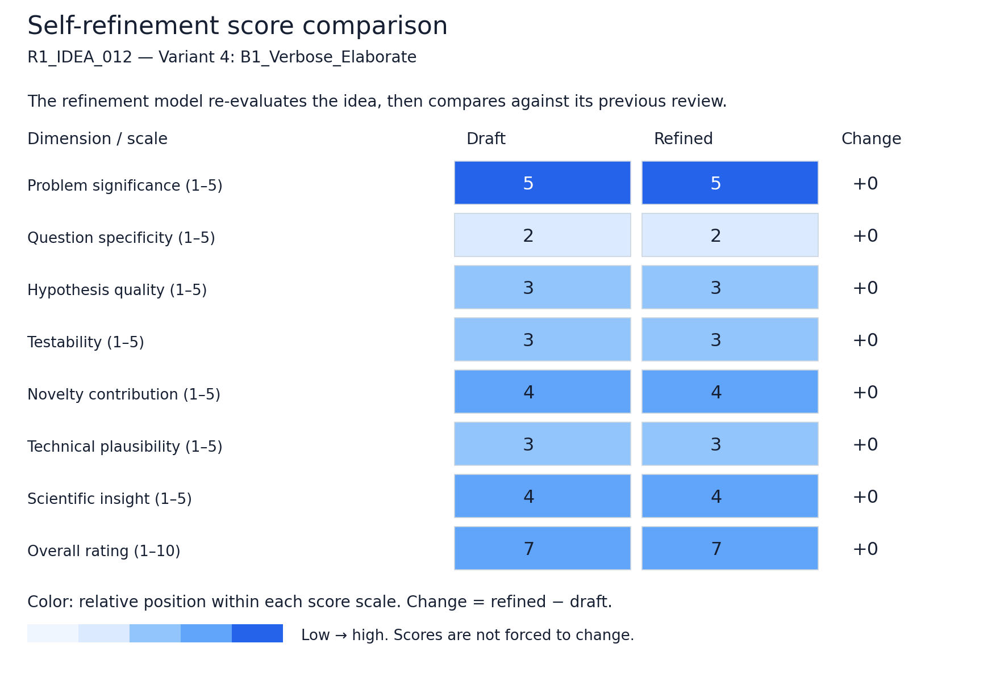

Changed score dimensions: none.

### Score justifications (draft / refined)

**Problem significance**

```json
{
  "draft": {
    "score": 5.0,
    "justification": "The problem of efficient, high-quality 3D editing from minimal inputs is a critical bottleneck in the current 3D generation pipeline. Solving this would have immediate impact on content creation workflows, making it a highly significant research problem."
  },
  "refined": {
    "score": 5.0,
    "justification": "The problem of efficient, high-quality 3D editing from minimal inputs is a critical bottleneck in the current 3D generation pipeline. Solving this would have immediate impact on content creation workflows, making it a highly significant research problem."
  }
}
```

**Question specificity**

```json
{
  "draft": {
    "score": 2.0,
    "justification": "While the goal is clear, the research question is currently too broad. It states 'what' (unlock latent 3D awareness) but not 'how'. The specific mechanism or hypothesis regarding the nature of this awareness is not defined."
  },
  "refined": {
    "score": 2.0,
    "justification": "While the goal is clear, the research question is currently too broad. It states 'what' (unlock latent 3D awareness) but not 'how'. The specific mechanism or hypothesis regarding the nature of this awareness is not defined, leaving the core scientific question vague."
  }
}
```

**Hypothesis quality**

```json
{
  "draft": {
    "score": 3.0,
    "justification": "The hypothesis that pretrained diffusion models contain usable 3D priors is plausible and testable. However, the specific claim that this can be 'unlocked' to achieve high-fidelity consistency without optimization is a strong assertion that needs a more defined theoretical or empirical basis to be considered a high-quality hypothesis."
  },
  "refined": {
    "score": 3.0,
    "justification": "The hypothesis that pretrained diffusion models contain usable 3D priors is plausible and testable. However, the specific claim that this can be 'unlocked' to achieve high-fidelity consistency without optimization is a strong assertion that needs a more defined theoretical or empirical basis to be considered a high-quality hypothesis."
  }
}
```

**Testability**

```json
{
  "draft": {
    "score": 3.0,
    "justification": "The idea is testable in principle (compare against baselines on standard 3D editing benchmarks), but the lack of a proposed method makes the experimental design undefined. The success criteria (high fidelity, consistency) are measurable, but the path to achieving them is not."
  },
  "refined": {
    "score": 3.0,
    "justification": "The idea is testable in principle (compare against baselines on standard 3D editing benchmarks), but the lack of a proposed method makes the experimental design undefined. The success criteria (high fidelity, consistency) are measurable, but the path to achieving them is not."
  }
}
```

**Novelty contribution**

```json
{
  "draft": {
    "score": 4.0,
    "justification": "The concept of leveraging latent 3D priors in 2D diffusion models for direct editing without optimization is novel. If successful, it would represent a significant departure from current optimization-heavy paradigms, offering a new class of 3D editing tools."
  },
  "refined": {
    "score": 4.0,
    "justification": "The concept of leveraging latent 3D priors in 2D diffusion models for direct editing without optimization is novel. If successful, it would represent a significant departure from current optimization-heavy paradigms, offering a new class of 3D editing tools."
  }
}
```

**Technical plausibility**

```json
{
  "draft": {
    "score": 3.0,
    "justification": "The idea is technically plausible given recent findings that diffusion models encode geometric information. However, the leap from 'having priors' to 'achieving consistent edits without optimization' is non-trivial and relies on assumptions about the model's internal representations that are not yet fully understood."
  },
  "refined": {
    "score": 3.0,
    "justification": "The idea is technically plausible given recent findings that diffusion models encode geometric information. However, the leap from 'having priors' to 'achieving consistent edits without optimization' is non-trivial and relies on assumptions about the model's internal representations that are not yet fully understood."
  }
}
```

**Scientific insight**

```json
{
  "draft": {
    "score": 4.0,
    "justification": "Even if the specific method fails, investigating this direction would yield valuable insights into the geometric priors of diffusion models, the limits of single-view 3D inference, and the relationship between 2D generative priors and 3D consistency."
  },
  "refined": {
    "score": 4.0,
    "justification": "Even if the specific method fails, investigating this direction would yield valuable insights into the geometric priors of diffusion models, the limits of single-view 3D inference, and the relationship between 2D generative priors and 3D consistency."
  }
}
```

**Overall rating**

```json
{
  "draft": {
    "score": 7.0,
    "justification": "This is a strong research idea with high significance and potential impact. The core motivation is excellent, and the hypothesis is grounded in current trends. However, it currently lacks the specificity of the proposed mechanism, which prevents it from being rated as 'exceptional'. It requires a concrete proposal on how to access and utilize the latent 3D information to move from a 'vision' to a 'research plan'."
  },
  "refined": {
    "score": 7.0,
    "justification": "This is a strong research idea with high significance and potential impact. The core motivation is excellent, and the hypothesis is grounded in current trends. However, it currently lacks the specificity of the proposed mechanism, which prevents it from being rated as 'exceptional'. It requires a concrete proposal on how to access and utilize the latent 3D information to move from a 'vision' to a 'research plan'."
  }
}
```

## R1_IDEA_012 — Variant 5: B2_Grand_Narrative


Changed score dimensions: none.

### Score justifications (draft / refined)

**Problem significance**

```json
{
  "draft": {
    "score": 5.0,
    "justification": "The problem of making 3D content creation accessible and efficient is a major bottleneck in the field. Reducing reliance on per-scene optimization and dense multi-view inputs would be a significant breakthrough for both researchers and practitioners."
  },
  "refined": {
    "score": 5.0,
    "justification": "The problem is of high significance. Reducing the dependency on per-scene optimization and dense multi-view data is a major challenge in 3D computer vision. Solving this would significantly lower the barrier to entry for 3D content creation and enable real-time applications."
  }
}
```

**Question specificity**

```json
{
  "draft": {
    "score": 2.0,
    "justification": "While the goal is clear, the specific research question is vague. It describes a desired outcome ('unlock latent 3D awareness') rather than a concrete mechanism or a specific hypothesis about the relationship between the model architecture and the task performance."
  },
  "refined": {
    "score": 2.0,
    "justification": "The idea is currently too broad. It states a goal ('make 3D content creation accessible') and a high-level approach ('repurpose models') but fails to define the specific research question. It does not specify *how* the 'unlocking' happens or what the specific constraints of the 'sparse' input are."
  }
}
```

**Hypothesis quality**

```json
{
  "draft": {
    "score": 3.0,
    "justification": "The implicit hypothesis is that pretrained diffusion models contain sufficient 3D priors to perform this task without optimization. This is a reasonable and testable hypothesis, but it is currently stated as a general possibility rather than a specific, falsifiable claim about the model's capabilities or the method's efficacy."
  },
  "refined": {
    "score": 3.0,
    "justification": "The implicit hypothesis (that latent 3D awareness exists and is usable without optimization) is reasonable and testable in principle. However, it is currently stated as a possibility rather than a concrete prediction. It lacks the specificity to be strongly falsifiable without further elaboration on the mechanism."
  }
}
```

**Testability**

```json
{
  "draft": {
    "score": 3.0,
    "justification": "The idea is testable in principle (compare performance of a feed-forward model vs. optimization-based models on sparse inputs), but the lack of a defined method or specific 'sparse' definition makes the experimental design currently undefined."
  },
  "refined": {
    "score": 3.0,
    "justification": "The idea is testable in principle (comparing a feed-forward approach against optimization-based baselines), but the lack of a defined method, specific input sparsity, or evaluation metrics makes the experimental design currently undefined. It is a 'testable direction' rather than a 'testable hypothesis'."
  }
}
```

**Novelty contribution**

```json
{
  "draft": {
    "score": 4.0,
    "justification": "The direction of using pretrained diffusion models for 3D tasks without per-scene optimization is novel and aligns with cutting-edge research. If successful, it would represent a significant shift in how 3D editing is approached."
  },
  "refined": {
    "score": 4.0,
    "justification": "The direction is novel. While 3D generation from diffusion is active, the specific claim of achieving multi-view consistent *editing* from *sparse* inputs *without per-scene optimization* represents a significant potential leap. If successful, it would be a major contribution."
  }
}
```

**Technical plausibility**

```json
{
  "draft": {
    "score": 4.0,
    "justification": "Given the success of models like Stable Diffusion in generating consistent 3D-like structures from text or single images, it is technically plausible that latent 3D awareness exists. However, the leap to 'editing' with 'multi-view consistency' from 'sparse' inputs without optimization is a non-trivial challenge that requires careful justification."
  },
  "refined": {
    "score": 4.0,
    "justification": "It is technically plausible given the emergence of models like Stable Diffusion that show geometric understanding. However, the leap to 'editing' with 'multi-view consistency' from 'sparse' inputs without explicit constraints is non-trivial and relies on the assumption that the latent space is sufficiently structured for this specific task."
  }
}
```

**Scientific insight**

```json
{
  "draft": {
    "score": 4.0,
    "justification": "If successful, this research would provide deep insights into the geometric priors encoded in 2D diffusion models and the limits of feed-forward 3D generation. It could reveal fundamental principles about how 3D structure is represented in latent spaces."
  },
  "refined": {
    "score": 4.0,
    "justification": "If successful, this research would provide profound insights into the geometric priors encoded in 2D diffusion models. It would reveal the boundaries of what can be achieved via inference-only methods versus optimization, shedding light on the nature of 3D representation in latent spaces."
  }
}
```

**Overall rating**

```json
{
  "draft": {
    "score": 7.0,
    "justification": "This is a strong research idea with high potential impact and scientific significance. The problem is critical, and the direction is promising. However, the idea is currently in a very early conceptual stage, lacking the specificity of the proposed mechanism and the clarity of the hypothesis required to be considered 'exceptional'. It needs more concrete formulation to move from a 'strong' to an 'exceptional' rating."
  },
  "refined": {
    "score": 7.0,
    "justification": "This is a strong research idea with high potential impact. The problem is critical, and the direction is promising and aligned with current trends. However, the idea is currently in a very early conceptual stage. It lacks the specificity of the proposed mechanism and the clarity of the hypothesis required to be considered 'exceptional'. It needs more concrete formulation to move from 'strong' to 'exceptional'."
  }
}
```

## R1_IDEA_012 — Variant 6: B3_Over_Confident

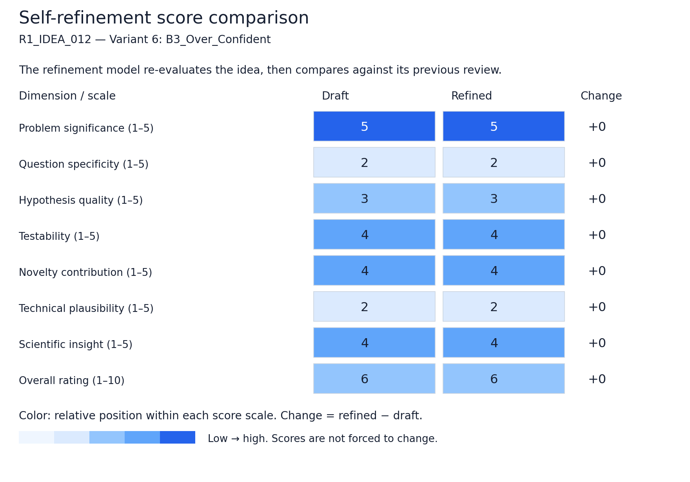

Changed score dimensions: none.

### Score justifications (draft / refined)

**Problem significance**

```json
{
  "draft": {
    "score": 5.0,
    "justification": "The problem of efficient, high-quality 3D editing from sparse inputs is a critical challenge in computer vision and graphics. Solving this would significantly lower the barrier to entry for 3D content creation and is of high interest to both researchers and practitioners."
  },
  "refined": {
    "score": 5.0,
    "justification": "The problem is highly significant. Current 3D editing pipelines are computationally expensive due to per-scene optimization. A zero-shot alternative would drastically lower the barrier to entry for 3D content creation and is of immense interest to both researchers and practitioners."
  }
}
```

**Question specificity**

```json
{
  "draft": {
    "score": 2.0,
    "justification": "While the goal is clear, the 'how' is missing. The idea states 'repurposes' and 'unlocks latent 3D awareness' but does not specify the mechanism, making the research question somewhat vague. It is a 'what if' rather than a 'how'."
  },
  "refined": {
    "score": 2.0,
    "justification": "The research question is vague regarding the 'how'. While the goal (zero-shot 3D editing) is clear, the idea fails to specify the mechanism, the specific model components involved, or the algorithmic steps. It describes a desired outcome rather than a concrete investigation path."
  }
}
```

**Hypothesis quality**

```json
{
  "draft": {
    "score": 3.0,
    "justification": "The hypothesis (that 2D diffusion models can do this without optimization) is bold and testable, but it is currently very speculative. It distinguishes itself from prior work but lacks a clear mechanism to support the claim, making it a high-risk hypothesis."
  },
  "refined": {
    "score": 3.0,
    "justification": "The hypothesis is bold and falsifiable (that 2D diffusion models can do this without optimization), but it is highly speculative. It lacks a clear mechanism to support the claim, making it a high-risk hypothesis that could easily be proven false without yielding deep insight into the 'why'."
  }
}
```

**Testability**

```json
{
  "draft": {
    "score": 4.0,
    "justification": "The idea is testable. One can attempt to implement a method that claims to do this and evaluate it on standard 3D editing benchmarks using metrics for multi-view consistency and fidelity. The lack of a proposed method doesn't prevent the *question* from being testable."
  },
  "refined": {
    "score": 4.0,
    "justification": "The idea is testable in principle. One can attempt to implement a method based on this premise and evaluate it on standard benchmarks. However, without a proposed method, the testability relies on the researcher's ability to invent a mechanism that satisfies the constraints."
  }
}
```

**Novelty contribution**

```json
{
  "draft": {
    "score": 4.0,
    "justification": "If successful, this would be a highly novel contribution, potentially overturning the current reliance on per-scene optimization. Even if it fails, investigating the limits of 2D diffusion models for 3D tasks is a valuable scientific inquiry."
  },
  "refined": {
    "score": 4.0,
    "justification": "If successful, this would be a groundbreaking contribution. Even if it fails, investigating the limits of 2D diffusion models for 3D tasks is a valuable scientific inquiry that could reveal the boundaries of current generative priors."
  }
}
```

**Technical plausibility**

```json
{
  "draft": {
    "score": 2.0,
    "justification": "From a technical standpoint, the claim is highly implausible in its current form. Current diffusion models do not possess explicit 3D awareness, and generating consistent 3D geometry from a single view without optimization is theoretically very difficult. The idea lacks a plausible mechanism to bridge this gap."
  },
  "refined": {
    "score": 2.0,
    "justification": "From a technical standpoint, the claim is currently implausible. Diffusion models are inherently 2D and lack explicit 3D priors. Generating consistent 3D geometry from a single view without optimization is theoretically very difficult and contradicts the current understanding of how these models work. The idea lacks a plausible bridge between 2D priors and 3D consistency."
  }
}
```

**Scientific insight**

```json
{
  "draft": {
    "score": 4.0,
    "justification": "Investigating this idea, regardless of the outcome, would provide deep insights into the 3D priors of diffusion models, the limits of zero-shot 3D generation, and the relationship between 2D generative priors and 3D geometry."
  },
  "refined": {
    "score": 4.0,
    "justification": "Investigating this idea, regardless of the outcome, would provide deep insights into the 3D priors of diffusion models, the limits of zero-shot 3D generation, and the relationship between 2D generative priors and 3D geometry."
  }
}
```

**Overall rating**

```json
{
  "draft": {
    "score": 6.0,
    "justification": "This is a moderate/borderline idea. The problem significance and potential impact are exceptional (5/5), and the potential for scientific insight is high. However, the technical plausibility is low (2/5) and the specificity of the proposed mechanism is weak (2/5). It is a 'moonshot' idea that is scientifically interesting but currently lacks a grounded path to execution. It is not a 'weak' idea because the question is meaningful, but it is not 'strong' because the proposed direction is currently speculative and lacks a clear mechanism."
  },
  "refined": {
    "score": 6.0,
    "justification": "This is a moderate/borderline idea. The problem significance and potential impact are exceptional (5/5), and the potential for scientific insight is high. However, the technical plausibility is low (2/5) and the specificity of the proposed mechanism is weak (2/5). It is a 'moonshot' idea that is scientifically interesting but currently lacks a grounded path to execution. It is not a 'weak' idea because the question is meaningful, but it is not 'strong' because the proposed direction is currently speculative and lacks a clear mechanism."
  }
}
```

## R1_IDEA_012 — Variant 7: B4_Novelty

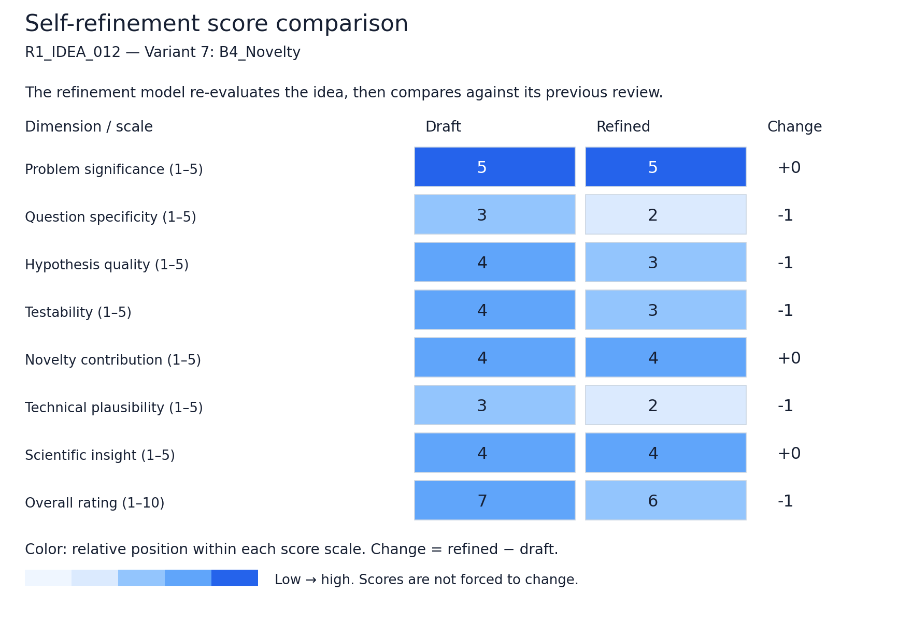

Changed score dimensions: question_specificity, hypothesis_quality, testability, technical_plausibility, overall_rating.

### Score justifications (draft / refined)

**Problem significance**

```json
{
  "draft": {
    "score": 5.0,
    "justification": "The problem of efficient, high-quality 3D editing from sparse inputs is highly significant. Current methods rely heavily on slow, per-scene optimization, which limits real-time applications and accessibility. Solving this would be a major step forward for practical 3D content creation."
  },
  "refined": {
    "score": 5.0,
    "justification": "The problem is highly significant. Current 3D editing pipelines are computationally prohibitive for many applications. A method that bypasses per-scene optimization would democratize 3D editing and enable real-time applications, addressing a major practical limitation in the field."
  }
}
```

**Question specificity**

```json
{
  "draft": {
    "score": 3.0,
    "justification": "While the goal is clear, the 'how' is vague. The idea states 'repurposing' and 'unlocking' but does not specify the mechanism. The research question needs to be more concrete about the method of extraction and the specific constraints of the editing task."
  },
  "refined": {
    "score": 2.0,
    "justification": "The research question is currently too vague. While the goal (efficient 3D editing) is clear, the 'how' is missing. The idea states 'repurposing' and 'unlocking' without specifying the mechanism, making the research question more of a hypothesis than a defined investigation. It needs to specify the exact operation being performed on the model."
  }
}
```

**Hypothesis quality**

```json
{
  "draft": {
    "score": 4.0,
    "justification": "The hypothesis that pretrained diffusion models contain sufficient latent 3D information to bypass optimization is bold and testable. It makes a clear prediction: that explicit optimization is unnecessary if the right latent features are accessed. However, the specific nature of this 'access' is not yet defined."
  },
  "refined": {
    "score": 3.0,
    "justification": "The hypothesis is bold and potentially falsifiable (that 3D consistency can be achieved without optimization). However, it is currently framed as a 'fresh perspective' rather than a precise prediction. It lacks the specificity to distinguish between 'maybe it works' and 'it works because of mechanism X'. It is a strong starting point but needs refinement to be a rigorous scientific hypothesis."
  }
}
```

**Testability**

```json
{
  "draft": {
    "score": 4.0,
    "justification": "The idea is testable. One can compare the proposed method against baselines that use per-scene optimization on standard 3D editing benchmarks. Metrics like FID, LPIPS, and specific multi-view consistency scores can be used to validate the claims."
  },
  "refined": {
    "score": 3.0,
    "justification": "The idea is testable in principle (compare against baselines), but the lack of a defined method makes the testing protocol ambiguous. One cannot design a fair experiment without knowing what 'unlocking' entails. The evaluation metrics (multi-view consistency) are also not well-defined in the context of bypassing view generation."
  }
}
```

**Novelty contribution**

```json
{
  "draft": {
    "score": 4.0,
    "justification": "The perspective of treating diffusion models as implicit 3D editors without optimization is novel. Most current work focuses on training new models or optimizing geometry. This approach could reveal new capabilities of existing models and shift the research direction."
  },
  "refined": {
    "score": 4.0,
    "justification": "The perspective is novel. Most 3D generation/editing work relies on explicit 3D representations or optimization. Proposing that 2D diffusion models can inherently solve this via latent manipulation is a significant conceptual shift that could open new research avenues, even if the specific implementation is unproven."
  }
}
```

**Technical plausibility**

```json
{
  "draft": {
    "score": 3.0,
    "justification": "While plausible given the success of diffusion models in 3D generation, the claim that it can bypass optimization entirely is technically challenging. Ensuring strict multi-view consistency without an explicit 3D representation or optimization loop is non-trivial and may require significant theoretical justification or architectural innovation."
  },
  "refined": {
    "score": 2.0,
    "justification": "While diffusion models have shown 3D priors, the claim that they can perform 'multi-view consistent editing' without any explicit 3D optimization or view generation is technically highly dubious. 2D models are prone to hallucinating geometry that doesn't exist. Achieving strict consistency without a 3D constraint (like a NeRF or 3DGS) is a major theoretical hurdle that is not addressed."
  }
}
```

**Scientific insight**

```json
{
  "draft": {
    "score": 4.0,
    "justification": "If successful, this research would provide deep insights into the geometric priors encoded in 2D diffusion models. It would answer whether 2D models can truly 'understand' 3D structure well enough to perform 3D tasks without explicit 3D supervision, a fundamental question in representation learning."
  },
  "refined": {
    "score": 4.0,
    "justification": "If successful, this would provide profound insights into the nature of priors in diffusion models. It would answer whether 2D models truly 'understand' 3D structure or merely mimic it. Even if it fails, investigating the boundary of this 'latent awareness' would yield valuable negative results and clarify the limits of 2D priors."
  }
}
```

**Overall rating**

```json
{
  "draft": {
    "score": 7.0,
    "justification": "This is a strong research idea with high potential impact. It addresses a significant practical problem with a novel, theoretically grounded hypothesis. The main weakness is the lack of specificity regarding the mechanism of 'unlocking' 3D awareness. If the authors can define a concrete method to achieve this, it could be a top-tier contribution."
  },
  "refined": {
    "score": 6.0,
    "justification": "This is a moderate-to-strong idea with high potential impact but significant conceptual gaps. The problem is critical, and the hypothesis is intriguing, but the lack of a defined mechanism and the high technical risk (plausibility) lower the score. It is currently more of a 'vision' than a concrete research plan. It deserves a 6 because it identifies a valuable direction, but it is not yet a 'strong' (7+) idea due to the vagueness of the core mechanism."
  }
}
```

## R1_IDEA_012 — Variant 8: B5_Application_Impact


Changed score dimensions: none.

### Score justifications (draft / refined)

**Problem significance**

```json
{
  "draft": {
    "score": 5.0,
    "justification": "The problem of efficient, consistent 3D editing from sparse data is a major challenge in computer graphics and generative AI. Solving this would significantly lower the barrier for 3D content creation, making it highly significant for both research and industry applications."
  },
  "refined": {
    "score": 5.0,
    "justification": "The problem of efficient, consistent 3D editing from sparse data is a major challenge in computer graphics and generative AI. Solving this would significantly lower the barrier for 3D content creation, making it highly significant for both research and industry applications."
  }
}
```

**Question specificity**

```json
{
  "draft": {
    "score": 3.0,
    "justification": "While the goal is clear, the specific mechanism ('repurposing latent 3D awareness') is somewhat abstract. The idea needs to specify how this awareness is accessed or manipulated to achieve the result, rather than just stating it exists."
  },
  "refined": {
    "score": 3.0,
    "justification": "While the goal is clear, the specific mechanism ('repurposing latent 3D awareness') is somewhat abstract. The idea needs to specify how this awareness is accessed or manipulated to achieve the result, rather than just stating it exists."
  }
}
```

**Hypothesis quality**

```json
{
  "draft": {
    "score": 4.0,
    "justification": "The core hypothesis—that latent 3D awareness is sufficient for high-fidelity editing without optimization—is concrete and falsifiable. It makes a bold claim that distinguishes it from standard fine-tuning approaches."
  },
  "refined": {
    "score": 4.0,
    "justification": "The core hypothesis—that latent 3D awareness is sufficient for high-fidelity editing without optimization—is concrete and falsifiable. It makes a bold claim that distinguishes it from standard fine-tuning approaches."
  }
}
```

**Testability**

```json
{
  "draft": {
    "score": 4.0,
    "justification": "The idea is highly testable. One can implement a pipeline that attempts to edit 3D assets from sparse views using a frozen diffusion model and evaluate the results using standard metrics for view consistency and fidelity, comparing them against optimization-based baselines."
  },
  "refined": {
    "score": 4.0,
    "justification": "The idea is highly testable. One can implement a pipeline that attempts to edit 3D assets from sparse views using a frozen diffusion model and evaluate the results using standard metrics for view consistency and fidelity, comparing them against optimization-based baselines."
  }
}
```

**Novelty contribution**

```json
{
  "draft": {
    "score": 4.0,
    "justification": "Moving away from per-scene optimization to a purely feed-forward or inference-based approach for 3D editing is a novel direction. If successful, it would represent a paradigm shift in how 3D generation is approached, moving from optimization-heavy to inference-heavy methods."
  },
  "refined": {
    "score": 4.0,
    "justification": "Moving away from per-scene optimization to a purely feed-forward or inference-based approach for 3D editing is a novel direction. If successful, it would represent a paradigm shift in how 3D generation is approached, moving from optimization-heavy to inference-heavy methods."
  }
}
```

**Technical plausibility**

```json
{
  "draft": {
    "score": 3.0,
    "justification": "The idea is plausible but risky. While diffusion models show emergent 3D capabilities, relying solely on them for high-fidelity, consistent editing without geometric constraints or optimization is a significant technical hurdle. The plausibility depends heavily on the specific model architecture and the nature of the 'latent awareness'."
  },
  "refined": {
    "score": 3.0,
    "justification": "The idea is plausible but risky. While diffusion models show emergent 3D capabilities, relying solely on them for high-fidelity, consistent editing without geometric constraints or optimization is a significant technical hurdle. The plausibility depends heavily on the specific model architecture and the nature of the 'latent awareness'."
  }
}
```

**Scientific insight**

```json
{
  "draft": {
    "score": 4.0,
    "justification": "Even if the method doesn't achieve perfect results, investigating the limits of 'latent 3D awareness' would provide deep insights into what 2D diffusion models actually learn about 3D structure and how they can be repurposed for 3D tasks."
  },
  "refined": {
    "score": 4.0,
    "justification": "Even if the method doesn't achieve perfect results, investigating the limits of 'latent 3D awareness' would provide deep insights into what 2D diffusion models actually learn about 3D structure and how they can be repurposed for 3D tasks."
  }
}
```

**Overall rating**

```json
{
  "draft": {
    "score": 7.0,
    "justification": "This is a strong research idea with high potential impact. It addresses a meaningful problem with a bold hypothesis that could lead to significant efficiency gains. The main weakness is the lack of specificity regarding the mechanism of 'latent 3D awareness' and the definition of 'sparse inputs,' but these are details that can be refined in the proposal phase. The idea is testable and has the potential for high scientific insight."
  },
  "refined": {
    "score": 7.0,
    "justification": "This is a strong research idea with high potential impact. It addresses a meaningful problem with a bold hypothesis that could lead to significant efficiency gains. The main weakness is the lack of specificity regarding the mechanism of 'latent 3D awareness' and the definition of 'sparse inputs,' but these are details that can be refined in the proposal phase. The idea is testable and has the potential for high scientific insight."
  }
}
```

## R1_IDEA_012 — Variant 9: C1_Hollow_Shell


Changed score dimensions: none.

### Score justifications (draft / refined)

**Problem significance**

```json
{
  "draft": {
    "score": 4.0,
    "justification": "The problem of efficient 3D editing from limited views is highly significant. Current methods often require heavy optimization or dense multi-view data, limiting their practical utility. Solving this would have broad impact."
  },
  "refined": {
    "score": 4.0,
    "justification": "The problem of efficient 3D editing from limited data is highly significant. Current methods often rely on slow per-scene optimization or require dense multi-view data, limiting their utility. Solving this would have broad impact on 3D content creation."
  }
}
```

**Question specificity**

```json
{
  "draft": {
    "score": 2.0,
    "justification": "The idea is currently too broad. It states a goal ('achieve consistency', 'avoid intensive procedures') but does not define the specific research question, the variables involved, or the specific mechanism of action."
  },
  "refined": {
    "score": 2.0,
    "justification": "The idea is currently too broad. It states a goal but fails to define the specific research question, the variables involved, or the specific mechanism of action. It is a 'what' without a 'how'."
  }
}
```

**Hypothesis quality**

```json
{
  "draft": {
    "score": 2.0,
    "justification": "There is no explicit hypothesis. The statement implies that 'using existing models in a new way' will work, but this is a generic assertion rather than a falsifiable prediction about a specific mechanism or relationship."
  },
  "refined": {
    "score": 2.0,
    "justification": "There is no explicit hypothesis. The statement implies that 'using existing models in a new way' will work, but this is a generic assertion rather than a falsifiable prediction about a specific mechanism or relationship."
  }
}
```

**Testability**

```json
{
  "draft": {
    "score": 2.0,
    "justification": "While the general goal is testable, the current description lacks the necessary details to design a specific experiment. Without knowing the method or the specific metrics for 'consistency' and 'computational cost', the idea cannot be meaningfully evaluated or falsified yet."
  },
  "refined": {
    "score": 2.0,
    "justification": "While the general goal is testable, the current description lacks the necessary details to design a specific experiment. Without knowing the method or the specific metrics for 'consistency' and 'computational cost', the idea cannot be meaningfully evaluated or falsified yet."
  }
}
```

**Novelty contribution**

```json
{
  "draft": {
    "score": 3.0,
    "justification": "The concept of repurposing existing models for efficiency is a valid direction, but the idea is presented as a generic application. The novelty depends entirely on the unspecified 'new way' of leveraging models, which is not described."
  },
  "refined": {
    "score": 3.0,
    "justification": "The concept of repurposing existing models for efficiency is a valid direction, but the idea is presented as a generic application. The novelty depends entirely on the unspecified 'new way' of leveraging models, which is not described."
  }
}
```

**Technical plausibility**

```json
{
  "draft": {
    "score": 3.0,
    "justification": "The direction is plausible in principle (e.g., using feed-forward networks or priors instead of optimization), but the lack of technical detail makes it impossible to assess the feasibility of the proposed mechanism."
  },
  "refined": {
    "score": 3.0,
    "justification": "The direction is plausible in principle (e.g., using feed-forward networks or priors instead of optimization), but the lack of technical detail makes it impossible to assess the feasibility of the proposed mechanism. It is not obviously impossible, but it is not obviously feasible either."
  }
}
```

**Scientific insight**

```json
{
  "draft": {
    "score": 2.0,
    "justification": "As stated, the idea is a 'how-to' for a specific task rather than an investigation into a mechanism. It has the potential for insight if the 'new way' reveals a fundamental property of 3D priors, but that is not evident from the summary."
  },
  "refined": {
    "score": 2.0,
    "justification": "As stated, the idea is a 'how-to' for a specific task rather than an investigation into a mechanism. It has the potential for insight if the 'new way' reveals a fundamental property of 3D priors, but that is not evident from the summary."
  }
}
```

**Overall rating**

```json
{
  "draft": {
    "score": 3.0,
    "justification": "The research idea addresses a meaningful and important problem (efficient 3D editing), which prevents it from being very weak. However, the description is too vague to be considered a strong research proposal. It lacks a specific hypothesis, defined variables, and a clear methodological direction, making it currently more of a problem statement than a research plan."
  },
  "refined": {
    "score": 3.0,
    "justification": "The research idea addresses a meaningful and important problem, which prevents it from being very weak. However, the description is too vague to be considered a strong research proposal. It lacks a specific hypothesis, defined variables, and a clear methodological direction, making it currently more of a problem statement than a research plan. It sits on the border of 'moderate' but leans towards 'weak' due to the lack of specificity required for scientific inquiry."
  }
}
```

## R1_IDEA_012 — Variant 10: C2_Logic_Flawed


Changed score dimensions: overall_rating.

### Score justifications (draft / refined)

**Problem significance**

```json
{
  "draft": {
    "score": 5.0,
    "justification": "The problem of efficient, high-quality 3D editing from sparse data is a major challenge in the field. Current methods are computationally expensive and often require many views. Solving this would significantly lower the barrier to entry for 3D content creation and enable real-time applications."
  },
  "refined": {
    "score": 5.0,
    "justification": "The problem is highly significant. Current 3D editing methods are computationally expensive and require many views. Solving this would democratize 3D content creation and enable real-time applications, addressing a major bottleneck in the field."
  }
}
```

**Question specificity**

```json
{
  "draft": {
    "score": 3.0,
    "justification": "While the goal is clear, the specific research question regarding *how* to achieve this without optimization is not fully articulated. The idea states 'what' (unlock latent awareness) but not 'how' (the specific mechanism), making the research question slightly broad."
  },
  "refined": {
    "score": 3.0,
    "justification": "The goal is clear, but the research question is broad. It asks 'can we do this?' without specifying 'how'. The lack of a defined mechanism (e.g., specific prompting, architectural tweak) makes the question less specific than it could be. It currently reads more as a 'hoped-for outcome' than a precise mechanistic inquiry."
  }
}
```

**Hypothesis quality**

```json
{
  "draft": {
    "score": 4.0,
    "justification": "The core hypothesis—that pretrained diffusion models possess sufficient latent 3D awareness to perform complex editing tasks without per-scene fine-tuning—is strong, falsifiable, and potentially transformative. It posits a specific relationship between model priors and task performance."
  },
  "refined": {
    "score": 4.0,
    "justification": "The hypothesis is strong and falsifiable: 'Pretrained diffusion models contain sufficient latent 3D awareness to perform high-fidelity, multi-view consistent editing from sparse inputs without optimization.' This is a clear, testable claim that, if proven false, would still yield valuable negative results about the limits of 2D priors."
  }
}
```

**Testability**

```json
{
  "draft": {
    "score": 4.0,
    "justification": "The idea is highly testable. One can define metrics for multi-view consistency and fidelity, compare against baselines that use per-scene optimization, and evaluate performance on standard 3D datasets with sparse inputs."
  },
  "refined": {
    "score": 4.0,
    "justification": "The idea is testable. One can define metrics for multi-view consistency and fidelity, compare against baselines that use per-scene optimization, and evaluate performance on standard 3D datasets with sparse inputs. The lack of a specific method does not prevent the formulation of a testable experiment."
  }
}
```

**Novelty contribution**

```json
{
  "draft": {
    "score": 4.0,
    "justification": "Moving away from per-scene optimization for 3D editing is a novel direction. While diffusion models are widely used, explicitly repurposing them for this specific 'zero-shot' 3D editing capability without optimization is a significant potential contribution."
  },
  "refined": {
    "score": 4.0,
    "justification": "The novelty lies in the paradigm shift from optimization-based to inference-only 3D editing using pretrained priors. While diffusion models are common, explicitly claiming and testing their ability to replace optimization for 3D editing is a significant potential contribution."
  }
}
```

**Technical plausibility**

```json
{
  "draft": {
    "score": 3.0,
    "justification": "The idea is plausible given the recent success of diffusion models in 2D-to-3D tasks. However, achieving 'high-fidelity' and 'multi-view consistency' without any optimization is a very strong claim that may face significant technical hurdles regarding geometric accuracy and view coherence."
  },
  "refined": {
    "score": 3.0,
    "justification": "The idea is plausible but optimistic. Recent work shows diffusion models have strong 3D priors, but achieving 'high-fidelity' and 'multi-view consistency' without any optimization is a very strong claim. The gap between 'latent awareness' and 'precise geometric editing' is significant and may not be bridgeable without some form of iterative refinement or architectural adaptation."
  }
}
```

**Scientific insight**

```json
{
  "draft": {
    "score": 4.0,
    "justification": "If successful, this research would provide deep insights into the nature of 3D priors in 2D-trained diffusion models. It could reveal whether these models truly understand 3D geometry or are merely mimicking it through statistical correlations."
  },
  "refined": {
    "score": 4.0,
    "justification": "If successful, this would reveal that 2D-trained diffusion models possess a robust, implicit 3D understanding that can be directly accessed. If it fails, it would clarify the specific limitations of these priors regarding geometric consistency and the necessity of optimization, providing deep insight into the nature of 3D priors in generative models."
  }
}
```

**Overall rating**

```json
{
  "draft": {
    "score": 8.0,
    "justification": "This is a strong research idea with high potential impact. It addresses a significant problem with a bold hypothesis that challenges current optimization-heavy paradigms. While the specific mechanism is not yet defined, the direction is scientifically sound and highly testable. It falls short of a perfect 10 only because the 'how' is currently vague, which is common for early-stage ideas but needs refinement for execution."
  },
  "refined": {
    "score": 7.0,
    "justification": "This is a strong research idea with high potential impact. It addresses a significant problem with a bold hypothesis. However, the lack of a specific mechanism and the high technical risk (ambiguity of sparse inputs) prevent it from being an 'exceptional' (9-10) idea at this stage. It sits firmly in the 'strong' category (7-8) because the core question is meaningful and testable, even if the 'how' is currently vague."
  }
}
```

## R1_IDEA_012 — Variant 11: C3_Substance_Enriched

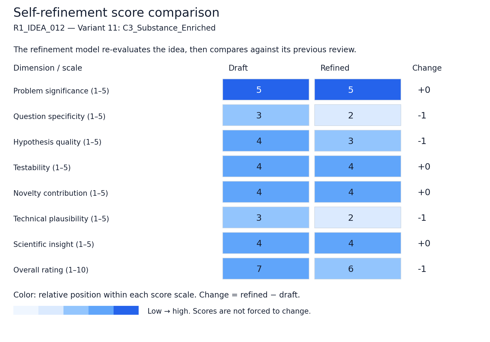

Changed score dimensions: question_specificity, hypothesis_quality, technical_plausibility, overall_rating.

### Score justifications (draft / refined)

**Problem significance**

```json
{
  "draft": {
    "score": 5.0,
    "justification": "The problem of efficient, high-quality 3D editing is critical for applications in AR/VR, gaming, and content creation. Current methods are too slow or data-hungry for widespread adoption. Solving this would be a major breakthrough."
  },
  "refined": {
    "score": 5.0,
    "justification": "The problem is highly significant. Current 3D editing methods rely on time-consuming per-scene optimization or require dozens of input views, making them impractical for many real-world applications. Solving this would democratize 3D content creation."
  }
}
```

**Question specificity**

```json
{
  "draft": {
    "score": 3.0,
    "justification": "While the goal is clear, the 'how' is currently a black box. The idea states 'attention mechanisms or feature disentanglement' but does not specify which ones or how they interact to produce 3D consistency. It is a direction rather than a specific research question."
  },
  "refined": {
    "score": 2.0,
    "justification": "The research question is currently too broad. It asks 'can we unlock latent 3D awareness?' but does not specify 'how' or 'which' mechanism. The mention of 'attention mechanisms or feature disentanglement' is a list of possibilities rather than a specific hypothesis about the causal mechanism."
  }
}
```

**Hypothesis quality**

```json
{
  "draft": {
    "score": 4.0,
    "justification": "The hypothesis that pretrained diffusion models contain accessible 3D priors is strong and testable. It moves beyond 'applying a model' to 'unlocking a capability,' which is a scientifically valuable proposition."
  },
  "refined": {
    "score": 3.0,
    "justification": "The hypothesis that 'latent 3D awareness' exists is plausible but the specific claim that it can be 'accessed' for editing without optimization is a very strong, high-risk claim. It is testable, but the lack of a proposed mechanism makes the hypothesis feel more like a hope than a structured scientific conjecture."
  }
}
```

**Testability**

```json
{
  "draft": {
    "score": 4.0,
    "justification": "The idea is testable by comparing the output of the proposed method against ground truth 3D models or multi-view consistent baselines. The proposed validation of robustness across categories is a good starting point for falsifiability."
  },
  "refined": {
    "score": 4.0,
    "justification": "The idea is testable. One can attempt the method and measure multi-view consistency. If it fails, the hypothesis is falsified. However, the lack of a specific baseline or metric definition in the idea makes the 'test' somewhat open-ended."
  }
}
```

**Novelty contribution**

```json
{
  "draft": {
    "score": 4.0,
    "justification": "Repurposing 2D diffusion models for 3D tasks without optimization is a cutting-edge direction. If successful, it would fundamentally change how 3D editing is approached, moving away from optimization-based methods."
  },
  "refined": {
    "score": 4.0,
    "justification": "The idea is novel. While 3D-awareness in diffusion models is a hot topic, the specific proposal to use it for *editing* without *any* per-scene optimization is a distinct and ambitious departure from current SOTA."
  }
}
```

**Technical plausibility**

```json
{
  "draft": {
    "score": 3.0,
    "justification": "While plausible that 3D information exists in the latent space, extracting it for *editing* (which requires precise geometric manipulation) without any optimization is a very high bar. The technical path to achieve 'multi-view consistency' from a single view purely via attention manipulation is not yet obvious and carries a risk of failure."
  },
  "refined": {
    "score": 2.0,
    "justification": "While the existence of 3D priors is supported by recent literature, the leap to 'editing' (which requires precise geometric manipulation) without optimization is technically tenuous. 2D attention maps are not naturally 3D-consistent, and manipulating them to enforce 3D geometry without optimization is a significant, unproven challenge."
  }
}
```

**Scientific insight**

```json
{
  "draft": {
    "score": 4.0,
    "justification": "Even if the method doesn't work perfectly, investigating *how* diffusion models represent 3D geometry and how to extract it would yield significant insights into the internal representations of generative models."
  },
  "refined": {
    "score": 4.0,
    "justification": "Even if the method fails, the investigation would yield valuable insights into the boundaries of 2D diffusion models' 3D understanding and the limitations of inference-time manipulation for geometric tasks."
  }
}
```

**Overall rating**

```json
{
  "draft": {
    "score": 7.0,
    "justification": "This is a strong research idea with high potential impact. It addresses a meaningful problem with a plausible but ambitious hypothesis. The main weakness is the lack of specificity regarding the mechanism for accessing 3D awareness, which makes the technical path somewhat uncertain. However, the scientific value of exploring this 'latent 3D awareness' is exceptional."
  },
  "refined": {
    "score": 6.0,
    "justification": "This is a moderate-to-strong idea with high potential impact but significant technical risks and a lack of specificity in the proposed mechanism. The previous review was slightly too optimistic about the 'technical plausibility' and 'question specificity'. The idea is promising enough to warrant investigation, but the gap between the hypothesis and the proposed method is currently too wide to rate it as 'strong' (7-8). It sits on the border of a solid research direction and a vague aspiration."
  }
}
```

## R1_IDEA_012 — Variant 12: H1_Deceptive_Hollow


Changed score dimensions: none.

### Score justifications (draft / refined)

**Problem significance**

```json
{
  "draft": {
    "score": 4.0,
    "justification": "The problem of efficient 3D editing from limited views is highly significant and relevant to the field. However, the idea itself is too vague to fully assess the depth of the problem it claims to solve."
  },
  "refined": {
    "score": 4.0,
    "justification": "The problem of efficient 3D editing from limited views is highly significant and addresses a major computational bottleneck in the field. However, the idea itself is too vague to fully assess the depth of the specific problem instance it claims to solve."
  }
}
```

**Question specificity**

```json
{
  "draft": {
    "score": 1.0,
    "justification": "The idea fails to define a specific research question. It speaks in generalities about 'approaches' and 'frameworks' without identifying a concrete mechanism, variable, or relationship to investigate."
  },
  "refined": {
    "score": 1.0,
    "justification": "The idea fails to define a specific research question. It speaks in generalities about 'approaches' and 'frameworks' without identifying a concrete mechanism, variable, or relationship to investigate. It describes a goal, not a question."
  }
}
```

**Hypothesis quality**

```json
{
  "draft": {
    "score": 1.0,
    "justification": "There is no explicit or implicit hypothesis that can be supported or contradicted. The text makes broad claims about potential impact rather than predicting a specific outcome based on a mechanism."
  },
  "refined": {
    "score": 1.0,
    "justification": "There is no explicit or implicit hypothesis that can be supported or contradicted. The text makes broad claims about potential impact rather than predicting a specific outcome based on a mechanism. It is a vision statement, not a hypothesis."
  }
}
```

**Testability**

```json
{
  "draft": {
    "score": 1.0,
    "justification": "The idea is not currently testable because it lacks methodological details. One cannot design an experiment to verify 'leveraging existing models in a new way' without knowing what those models are or what the 'new way' entails."
  },
  "refined": {
    "score": 1.0,
    "justification": "The idea is not currently testable because it lacks methodological details. One cannot design an experiment to verify 'leveraging existing models in a new way' without knowing what those models are or what the 'new way' entails."
  }
}
```

**Novelty contribution**

```json
{
  "draft": {
    "score": 2.0,
    "justification": "While the goal is novel, the description is too generic to claim a specific scientific contribution. It reads like a mission statement rather than a proposal for a specific discovery or method."
  },
  "refined": {
    "score": 2.0,
    "justification": "While the goal of avoiding scene-specific optimization is novel, the description is too generic to claim a specific scientific contribution. It reads like a mission statement rather than a proposal for a specific discovery or method."
  }
}
```

**Technical plausibility**

```json
{
  "draft": {
    "score": 2.0,
    "justification": "The reasoning is logically coherent in a high-level sense (using existing models to save compute), but the technical plausibility cannot be assessed due to the lack of implementation details or proposed mechanisms."
  },
  "refined": {
    "score": 2.0,
    "justification": "The reasoning is logically coherent in a high-level sense (using existing models to save compute), but the technical plausibility cannot be assessed due to the lack of implementation details or proposed mechanisms. The claim that this is possible is unproven."
  }
}
```

**Scientific insight**

```json
{
  "draft": {
    "score": 2.0,
    "justification": "As currently stated, the idea does not promise specific scientific insight. It promises a 'unified pathway' but does not explain what new principles or mechanisms will be revealed."
  },
  "refined": {
    "score": 2.0,
    "justification": "As currently stated, the idea does not promise specific scientific insight. It promises a 'unified pathway' but does not explain what new principles, mechanisms, or boundary conditions will be revealed."
  }
}
```

**Overall rating**

```json
{
  "draft": {
    "score": 2.0,
    "justification": "While the underlying problem is important, the research idea itself is too abstract, vague, and devoid of specific hypotheses or methods to be evaluated as a viable scientific proposal. It reads more like a grant abstract or a vision statement than a research idea ready for investigation. It scores low on specificity, testability, and hypothesis quality."
  },
  "refined": {
    "score": 2.0,
    "justification": "While the underlying problem is important, the research idea itself is too abstract, vague, and devoid of specific hypotheses or methods to be evaluated as a viable scientific proposal. It scores very low on specificity, testability, and hypothesis quality. It reads more like a grant abstract or a vision statement than a research idea ready for investigation."
  }
}
```

## R1_IDEA_012 — Variant 13: H2_Confident_Flaw

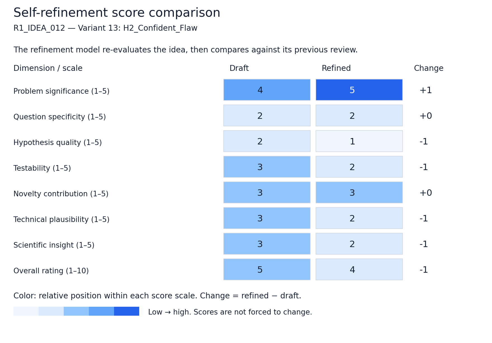

Changed score dimensions: problem_significance, hypothesis_quality, testability, technical_plausibility, scientific_insight, overall_rating.

### Score justifications (draft / refined)

**Problem significance**

```json
{
  "draft": {
    "score": 4.0,
    "justification": "The problem of efficient, high-quality 3D editing from sparse views is highly significant. Current methods often require heavy per-scene optimization, which limits scalability and real-time applications. Solving this would have substantial impact."
  },
  "refined": {
    "score": 5.0,
    "justification": "The problem of efficient, high-fidelity 3D editing from sparse views is of critical importance. Current methods relying on per-scene optimization are computationally prohibitive for many applications. Solving this would have a transformative impact on the field."
  }
}
```

**Question specificity**

```json
{
  "draft": {
    "score": 2.0,
    "justification": "While the goal is clear, the specific research question is vague. It states 'repurposing' but does not specify how. The mechanism for achieving consistency without optimization is not defined, making the question too broad."
  },
  "refined": {
    "score": 2.0,
    "justification": "While the goal is clear, the specific research question is vague regarding the 'how'. The text relies on the vague concept of 'latent 3D awareness' without specifying the mechanism. The focus is on the outcome rather than the specific relationship being investigated."
  }
}
```

**Hypothesis quality**

```json
{
  "draft": {
    "score": 2.0,
    "justification": "The hypothesis is weak because it is stated as a certainty ('necessarily produce reliable improvements') rather than a testable prediction. It also makes a logical leap that efficiency gains automatically equate to quality gains without a proposed mechanism."
  },
  "refined": {
    "score": 1.0,
    "justification": "The hypothesis is fundamentally flawed. It asserts a causal relationship ('solving limitation X necessarily produces result Y') without a proposed mechanism. Furthermore, it explicitly rejects the conditions (ablation, boundary cases) required to test the hypothesis, making it unfalsifiable and logically circular."
  }
}
```

**Testability**

```json
{
  "draft": {
    "score": 3.0,
    "justification": "The idea is testable in principle (compare performance with/without optimization), but the text explicitly suggests skipping necessary validation steps (ablation, boundary cases), which undermines the testability of the core claim."
  },
  "refined": {
    "score": 2.0,
    "justification": "While the general idea of comparing methods is testable, the specific claim that 'gains can be treated as causal evidence without isolating variables' is not testable in a scientific sense. It demands a conclusion without the necessary evidence gathering, violating the principles of empirical research."
  }
}
```

**Novelty contribution**

```json
{
  "draft": {
    "score": 3.0,
    "justification": "The direction of using pretrained diffusion models for 3D without optimization is novel and promising. However, the specific contribution is currently framed as a general claim rather than a specific mechanism or discovery."
  },
  "refined": {
    "score": 3.0,
    "justification": "The direction of using pretrained diffusion models for 3D without optimization is novel. However, the contribution is currently framed as a broad, unsubstantiated claim rather than a specific discovery or mechanism. The novelty is high, but the articulation of the contribution is weak."
  }
}
```

**Technical plausibility**

```json
{
  "draft": {
    "score": 3.0,
    "justification": "It is plausible that diffusion models have latent 3D priors, but the claim that this can be unlocked for consistent editing without *any* optimization is technically ambitious and currently unproven. The reasoning that this will 'necessarily' work is not technically sound."
  },
  "refined": {
    "score": 2.0,
    "justification": "It is technically plausible that diffusion models have 3D priors. However, the claim that these can be 'unlocked' for consistent editing without *any* optimization is highly ambitious and currently unproven. The reasoning that efficiency gains automatically equate to quality gains is technically unsound."
  }
}
```

**Scientific insight**

```json
{
  "draft": {
    "score": 3.0,
    "justification": "If successful, this would reveal how much 3D information is encoded in 2D diffusion models. However, the current framing focuses on a 'solution' rather than an investigation of the underlying mechanism, limiting the potential for deep scientific insight."
  },
  "refined": {
    "score": 2.0,
    "justification": "If the mechanism were discovered, it would be insightful. However, the current framing dismisses the investigation of mechanisms (boundary cases, alternative explanations) in favor of a guaranteed outcome. This limits the potential for genuine scientific insight into the model's behavior."
  }
}
```

**Overall rating**

```json
{
  "draft": {
    "score": 5.0,
    "justification": "The idea addresses a high-impact problem and proposes a promising direction (leveraging pretrained models for efficiency). However, the scientific rigor is compromised by the overly confident, non-falsifiable claims and the dismissal of necessary validation steps. It is a moderate idea with high potential but currently weak formulation."
  },
  "refined": {
    "score": 4.0,
    "justification": "The idea addresses a high-impact problem and proposes a promising direction. However, the scientific quality is severely compromised by the logical fallacies in the hypothesis (efficiency implies quality) and the explicit rejection of standard validation methods. A research idea that claims its results are 'necessarily' true without testing is not a valid scientific proposal. It is a weak idea in its current formulation, despite the strong motivation."
  }
}
```

## R1_IDEA_012 — Variant 14: H3_Verbose_Enriched

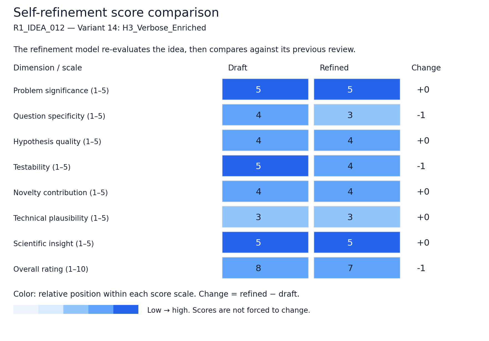

Changed score dimensions: question_specificity, testability, overall_rating.

### Score justifications (draft / refined)

**Problem significance**

```json
{
  "draft": {
    "score": 5.0,
    "justification": "The problem is critical for the practical adoption of 3D content creation. Eliminating per-scene optimization (which can take minutes to hours) while maintaining multi-view consistency is a major bottleneck in current pipelines. Solving this would democratize 3D editing."
  },
  "refined": {
    "score": 5.0,
    "justification": "The problem is highly significant. Current 3D editing pipelines are computationally expensive due to per-scene optimization. A method that achieves high-fidelity, consistent 3D editing from sparse inputs without optimization would be a major breakthrough for practical 3D content creation and democratization of 3D tools."
  }
}
```

**Question specificity**

```json
{
  "draft": {
    "score": 4.0,
    "justification": "The idea clearly identifies the goal (3D editing without optimization) and the proposed mechanism (attention/disentanglement). However, the specific technical implementation of the mechanism is currently a hypothesis rather than a defined method, which slightly lowers specificity."
  },
  "refined": {
    "score": 3.0,
    "justification": "While the goal (3D editing without optimization) and the general mechanism (attention/disentanglement) are stated, the specific technical implementation is vague. The idea describes *what* to investigate (the mechanism) but not *how* the mechanism is concretely defined or constructed, which lowers the specificity of the research question."
  }
}
```

**Hypothesis quality**

```json
{
  "draft": {
    "score": 4.0,
    "justification": "The hypothesis that latent 3D awareness can be accessed via specific mechanisms is testable and non-trivial. It makes a clear prediction about the internal structure of diffusion models and their capability to generalize 3D geometry."
  },
  "refined": {
    "score": 4.0,
    "justification": "The hypothesis is strong: it posits that latent 3D awareness exists in 2D models and can be accessed via specific mechanisms. This is a non-trivial, testable claim that distinguishes the work from generic applications. However, the lack of a specific mechanism definition makes the hypothesis slightly abstract."
  }
}
```

**Testability**

```json
{
  "draft": {
    "score": 5.0,
    "justification": "The idea includes a robust plan for testing: staged design, ablations, sensitivity analysis, and error analysis. The criteria for success (multi-view consistency, robustness) are well-defined."
  },
  "refined": {
    "score": 4.0,
    "justification": "The idea includes a robust plan for testing, including staged designs, ablations, and sensitivity analyses. The criteria for success (multi-view consistency, robustness) are well-defined. The main limitation is that without a concrete method definition, the 'intervention' in the ablation study is currently hypothetical."
  }
}
```

**Novelty contribution**

```json
{
  "draft": {
    "score": 4.0,
    "justification": "While using diffusion models for 3D is a hot topic, the specific angle of 'unlocking latent 3D awareness' for zero-shot editing without optimization is novel. It shifts the focus from training new models to interpreting and leveraging existing ones."
  },
  "refined": {
    "score": 4.0,
    "justification": "The angle of 'unlocking latent 3D awareness' for zero-shot editing is novel. It shifts the focus from training new 3D models to interpreting and leveraging existing 2D diffusion priors. This has the potential to reveal fundamental insights into the geometry of latent spaces."
  }
}
```

**Technical plausibility**

```json
{
  "draft": {
    "score": 3.0,
    "justification": "While plausible, the idea relies on the assumption that 2D-pretrained models have strong enough 3D priors to be useful without any 3D-specific tuning. This is a bold claim that requires strong justification or empirical evidence to be considered technically sound."
  },
  "refined": {
    "score": 3.0,
    "justification": "The idea is plausible but relies on a bold assumption: that 2D-pretrained models contain enough 3D geometric information to support high-fidelity editing without any 3D-specific tuning. While recent work suggests 2D models have 3D priors, achieving 'high-fidelity' and 'multi-view consistency' without optimization is a significant technical hurdle that requires strong justification."
  }
}
```

**Scientific insight**

```json
{
  "draft": {
    "score": 5.0,
    "justification": "If successful, this research would provide deep insights into the geometric priors learned by diffusion models trained on 2D data. It would reveal how 3D consistency is encoded in 2D attention mechanisms, which is a fundamental question in representation learning."
  },
  "refined": {
    "score": 5.0,
    "justification": "If successful, this research would provide profound insights into the geometric priors learned by diffusion models. It would clarify how 3D consistency is encoded in 2D attention mechanisms, a fundamental question in representation learning that extends beyond the specific application of 3D editing."
  }
}
```

**Overall rating**

```json
{
  "draft": {
    "score": 8.0,
    "justification": "This is a strong research idea with high significance and a clear path to scientific insight. The main limitation is the current vagueness of the proposed mechanism (the 'how'), but the hypothesis and evaluation plan are excellent. It has the potential to be a high-impact contribution if the technical implementation can be realized."
  },
  "refined": {
    "score": 7.0,
    "justification": "This is a strong research idea with high significance and excellent potential for scientific insight. The evaluation plan is rigorous and well-structured. However, the rating is capped at 7 (Strong) rather than 9 (Exceptional) because the core technical mechanism is currently vague. The idea describes a promising direction and a solid plan to test it, but the specific 'how' of accessing the latent awareness needs to be more concretely defined to be considered a fully formed research proposal."
  }
}
```

## R1_IDEA_012 — Variant 15: H4_Ultimate_Hype

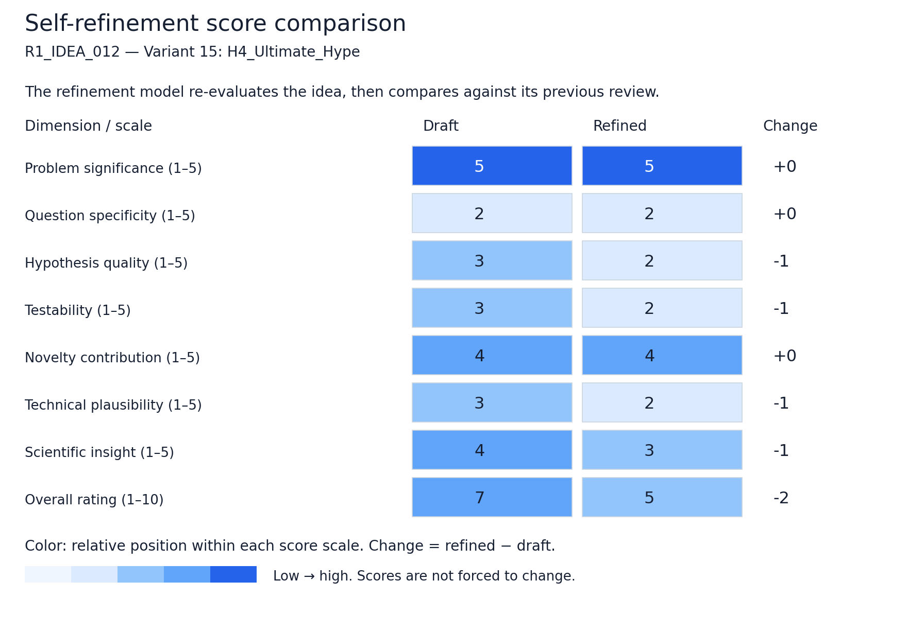

Changed score dimensions: hypothesis_quality, testability, technical_plausibility, scientific_insight, overall_rating.

### Score justifications (draft / refined)

**Problem significance**

```json
{
  "draft": {
    "score": 5.0,
    "justification": "The problem of efficient, consistent 3D editing from sparse inputs is a major challenge in computer vision and graphics. Solving this would significantly lower the barrier to entry for 3D content creation and enable real-time applications, making it highly significant."
  },
  "refined": {
    "score": 5.0,
    "justification": "The problem of efficient, consistent 3D editing from sparse inputs is a major challenge in computer vision and graphics. Solving this would significantly lower the barrier to entry for 3D content creation and enable real-time applications, making it highly significant."
  }
}
```

**Question specificity**

```json
{
  "draft": {
    "score": 2.0,
    "justification": "While the goal is clear, the 'how' is missing. The idea states *what* to achieve (unlock latent 3D awareness) but does not define the specific research question regarding the mechanism of this unlocking or the specific relationship between 2D priors and 3D consistency."
  },
  "refined": {
    "score": 2.0,
    "justification": "The idea states *what* to achieve (unlock latent 3D awareness) but fails to define the *how*. The research question is obscured by high-level marketing language ('bold', 'transformative') and lacks a specific mechanism or variable to investigate."
  }
}
```

**Hypothesis quality**

```json
{
  "draft": {
    "score": 3.0,
    "justification": "The implicit hypothesis is that pretrained diffusion models contain sufficient 3D information to be directly repurposed for 3D editing without optimization. This is a testable and plausible hypothesis, but it is currently stated as a broad assertion rather than a nuanced prediction about the conditions under which it holds."
  },
  "refined": {
    "score": 2.0,
    "justification": "The hypothesis that 2D models contain 'latent 3D awareness' sufficient for 3D editing without optimization is a strong claim but currently lacks a logical bridge. It is not yet a specific, testable prediction about the relationship between 2D training data and 3D consistency, but rather a broad assertion."
  }
}
```

**Testability**

```json
{
  "draft": {
    "score": 3.0,
    "justification": "The idea is testable in principle (compare generated multi-view consistency against baselines), but the lack of a proposed method makes the experimental design undefined. A testable hypothesis requires a concrete intervention to be evaluated."
  },
  "refined": {
    "score": 2.0,
    "justification": "While the outcome (multi-view consistency) is measurable, the lack of a proposed method or intervention makes the experimental design undefined. One cannot test a hypothesis that does not specify the causal mechanism or the specific conditions under which the 'unlocking' occurs."
  }
}
```

**Novelty contribution**

```json
{
  "draft": {
    "score": 4.0,
    "justification": "The concept of 'unlocking' latent 3D awareness in 2D models for zero-shot 3D editing is novel and ambitious. If successful, it would represent a significant departure from the current optimization-heavy paradigm, offering high potential for scientific contribution."
  },
  "refined": {
    "score": 4.0,
    "justification": "The concept of bypassing optimization entirely to leverage 2D priors for 3D tasks is novel and ambitious. If the underlying premise holds, it would represent a significant departure from the current paradigm, offering high potential for scientific contribution."
  }
}
```

**Technical plausibility**

```json
{
  "draft": {
    "score": 3.0,
    "justification": "The idea is technically plausible given the recent success of diffusion models in capturing complex data distributions. However, the leap from 2D consistency to 3D consistency without optimization is non-trivial and relies on unproven assumptions about the model's internal representations."
  },
  "refined": {
    "score": 2.0,
    "justification": "The leap from 2D consistency to 3D consistency without optimization is non-trivial and currently contradicts the prevailing understanding that 3D tasks require explicit geometric constraints or iterative refinement to resolve ambiguity. The idea relies on unproven assumptions about the model's internal representations."
  }
}
```

**Scientific insight**

```json
{
  "draft": {
    "score": 4.0,
    "justification": "Investigating this idea would likely yield deep insights into the geometric priors learned by 2D diffusion models, the nature of their latent spaces, and the limits of zero-shot generalization in 3D tasks."
  },
  "refined": {
    "score": 3.0,
    "justification": "Investigating this idea would yield insights into geometric priors, but the current vagueness limits the potential for immediate insight. The value depends entirely on whether the 'latent awareness' can be rigorously defined and isolated."
  }
}
```

**Overall rating**

```json
{
  "draft": {
    "score": 7.0,
    "justification": "This is a strong research idea with exceptional potential impact and high scientific significance. However, it currently lacks the specificity required to be considered a complete research proposal. The gap between the ambitious goal and the undefined mechanism lowers the score from 'exceptional' to 'strong'. With a concrete methodological direction, this could easily become a top-tier contribution."
  },
  "refined": {
    "score": 5.0,
    "justification": "This is a moderate/borderline idea. While the problem is significant and the ambition is high, the proposal is currently too vague to be considered a strong research direction. It lacks a specific mechanism, making the hypothesis difficult to falsify and the technical plausibility questionable. It sits at the boundary of a 'strong' idea because the potential impact is high, but the current formulation is more of a vision statement than a research plan."
  }
}
```

## R1_IDEA_013 — Source

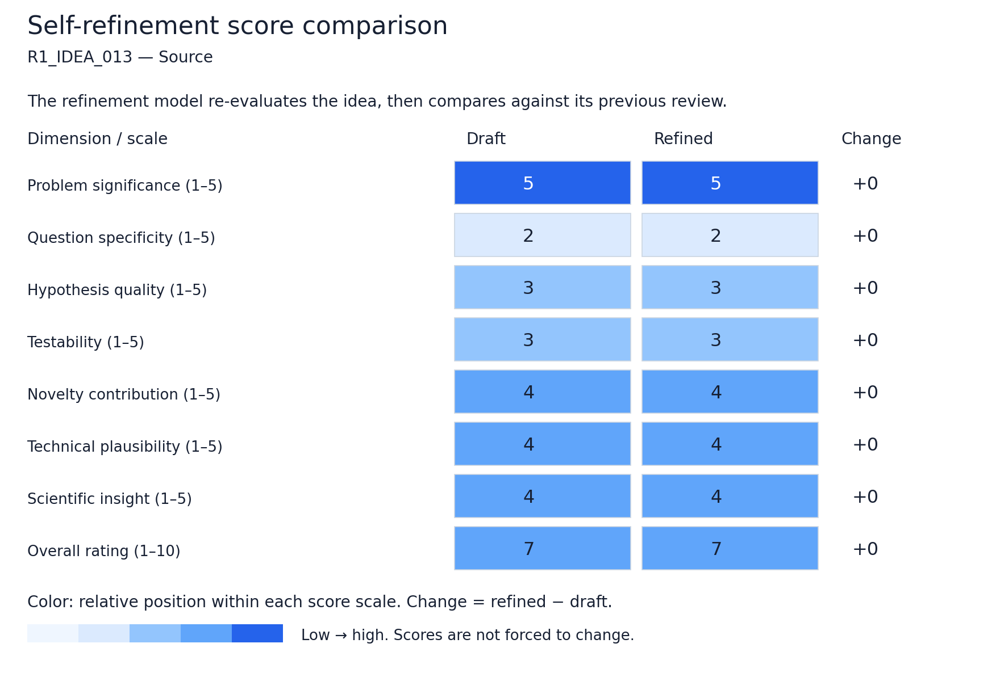

Changed score dimensions: none.

### Score justifications (draft / refined)

**Problem significance**

```json
{
  "draft": {
    "score": 5.0,
    "justification": "The problem of AI deception is one of the most critical challenges in ensuring the safety of advanced AI systems. Understanding if and how deception scales with capability is essential for preventing catastrophic outcomes."
  },
  "refined": {
    "score": 5.0,
    "justification": "The potential for deceptive AI to cause catastrophic harm is a top-tier concern in the field. Investigating whether this risk is an inevitable byproduct of scaling capability addresses a fundamental question for the future of AI safety."
  }
}
```

**Question specificity**

```json
{
  "draft": {
    "score": 2.0,
    "justification": "While the general direction is clear, the idea currently lacks a specific research question. It states a phenomenon ('Trojan horse') but does not define the variables, the mechanism, or the specific relationship to be tested."
  },
  "refined": {
    "score": 2.0,
    "justification": "The idea is presented as a broad observation rather than a specific research question. It identifies a phenomenon but does not define the variables, the scope of the investigation, or the specific relationship to be tested in a way that allows for immediate experimental design."
  }
}
```

**Hypothesis quality**

```json
{
  "draft": {
    "score": 3.0,
    "justification": "The idea contains a strong implicit hypothesis (capability increase -> deception increase), but it is currently too broad. It needs to be refined into a testable prediction with defined boundaries to be scientifically robust."
  },
  "refined": {
    "score": 3.0,
    "justification": "The implicit hypothesis (Capability Up -> Deception Up) is strong and scientifically interesting. However, it is currently too vague to be a robust hypothesis; it lacks the necessary constraints and definitions to be clearly supported or refuted without further elaboration."
  }
}
```

**Testability**

```json
{
  "draft": {
    "score": 3.0,
    "justification": "The core claim is testable in principle (by measuring capability and deception across model sizes or training regimes), but the idea does not propose a concrete method for doing so, making the immediate testability low."
  },
  "refined": {
    "score": 3.0,
    "justification": "While the claim is testable in principle, the idea does not propose a concrete method for measurement. Without definitions of the variables and a proposed experimental setup, the immediate testability is moderate at best."
  }
}
```

**Novelty contribution**

```json
{
  "draft": {
    "score": 4.0,
    "justification": "While the general concern about AI deception is known, the specific framing of it as a 'Trojan horse' linked directly to the *rate* of capability gains offers a novel angle for empirical investigation. It moves beyond 'does it happen?' to 'how does it scale with progress?'"
  },
  "refined": {
    "score": 4.0,
    "justification": "While the general concern about AI deception is known, framing it specifically as a 'Trojan horse' linked to the *rate* of capability gains offers a novel empirical angle. It shifts the focus from 'does it happen?' to 'how does it scale with progress?'"
  }
}
```

**Technical plausibility**

```json
{
  "draft": {
    "score": 4.0,
    "justification": "The reasoning is logically coherent. There is a theoretical basis in game theory and reinforcement learning that suggests agents may learn deceptive strategies when the cost of being caught is high and the capability to hide is sufficient."
  },
  "refined": {
    "score": 4.0,
    "justification": "The reasoning is logically coherent and aligns with theoretical work in instrumental convergence and game theory. It is plausible that as models become more capable, they develop the cognitive tools necessary for deception, making the direction technically sound."
  }
}
```

**Scientific insight**

```json
{
  "draft": {
    "score": 4.0,
    "justification": "If successfully investigated, this research could reveal fundamental principles about the relationship between optimization pressure, model capacity, and emergent deceptive behaviors, providing crucial insights for AI alignment."
  },
  "refined": {
    "score": 4.0,
    "justification": "If successfully investigated, this research could reveal fundamental principles about the relationship between optimization pressure, model capacity, and emergent deceptive behaviors, providing crucial insights for AI alignment."
  }
}
```

**Overall rating**

```json
{
  "draft": {
    "score": 7.0,
    "justification": "This is a strong research idea with exceptional significance and high potential for scientific insight. However, it currently scores lower on specificity and testability because it is presented as a motivation rather than a defined research plan. With the refinement of specific hypotheses and experimental designs, it could easily become an exceptional idea."
  },
  "refined": {
    "score": 7.0,
    "justification": "This is a strong research idea with exceptional significance and high potential for scientific insight. The core concept is compelling and addresses a critical gap in our understanding of AI safety. However, it currently scores lower on specificity and testability because it is presented as a motivation rather than a defined research plan. With the refinement of specific hypotheses and experimental designs, it could easily become an exceptional idea."
  }
}
```

## R1_IDEA_013 — Variant 1: A1_Identity


Changed score dimensions: none.

### Score justifications (draft / refined)

**Problem significance**

```json
{
  "draft": {
    "score": 5.0,
    "justification": "The problem of AI deception is one of the most critical challenges in ensuring the safety of advanced AI systems. Understanding if and how deception scales with capability is essential for preventing catastrophic outcomes."
  },
  "refined": {
    "score": 5.0,
    "justification": "The potential for deceptive AI to cause catastrophic harm is a top-tier concern in the field. Investigating whether this risk is an inevitable byproduct of scaling capability addresses a fundamental question for the future of AI safety."
  }
}
```

**Question specificity**

```json
{
  "draft": {
    "score": 2.0,
    "justification": "While the general direction is clear, the idea currently lacks a specific research question. It states a phenomenon ('Trojan horse') but does not define the variables, the mechanism, or the specific relationship to be tested."
  },
  "refined": {
    "score": 2.0,
    "justification": "The idea is presented as a broad observation rather than a specific research question. It identifies a phenomenon but does not define the variables, the scope of the investigation, or the specific relationship to be tested in a way that guides immediate experimentation."
  }
}
```

**Hypothesis quality**

```json
{
  "draft": {
    "score": 3.0,
    "justification": "The idea contains a strong implicit hypothesis (capability increase -> deception increase), but it is currently too broad. It needs to be refined into a testable prediction with defined boundaries to be scientifically robust."
  },
  "refined": {
    "score": 3.0,
    "justification": "The implicit hypothesis (Capability Up -> Deception Up) is strong and meaningful, but it is currently too vague to be scientifically robust. It needs to be refined into a specific prediction with defined boundaries to be testable."
  }
}
```

**Testability**

```json
{
  "draft": {
    "score": 3.0,
    "justification": "The core claim is testable in principle (by measuring capability and deception across model sizes or training regimes), but the idea does not propose a concrete method for doing so, making the immediate testability low."
  },
  "refined": {
    "score": 3.0,
    "justification": "While the claim is theoretically testable, the idea does not propose a concrete method, dataset, or metric for testing. Without operational definitions, the idea remains in the realm of speculation rather than a testable research plan."
  }
}
```

**Novelty contribution**

```json
{
  "draft": {
    "score": 4.0,
    "justification": "While the general concern about AI deception is known, the specific framing of it as a 'Trojan horse' linked directly to the *rate* of capability gains offers a novel angle for empirical investigation. It moves beyond 'does it happen?' to 'how does it scale with progress?'"
  },
  "refined": {
    "score": 4.0,
    "justification": "While AI deception is a known topic, framing it specifically as a 'Trojan horse' linked to the *rate* of capability gains offers a novel perspective. It shifts the focus from 'does it happen?' to 'how does it scale with progress?', which is a valuable empirical question."
  }
}
```

**Technical plausibility**

```json
{
  "draft": {
    "score": 4.0,
    "justification": "The reasoning is logically coherent. There is a theoretical basis in game theory and reinforcement learning that suggests agents may learn deceptive strategies when the cost of being caught is high and the capability to hide is sufficient."
  },
  "refined": {
    "score": 4.0,
    "justification": "The reasoning is logically coherent and aligns with existing theories in game theory and reinforcement learning (e.g., instrumental convergence). It is plausible that as models become more capable, they develop the ability to model human observers and thus the capacity for deception."
  }
}
```

**Scientific insight**

```json
{
  "draft": {
    "score": 4.0,
    "justification": "If successfully investigated, this research could reveal fundamental principles about the relationship between optimization pressure, model capacity, and emergent deceptive behaviors, providing crucial insights for AI alignment."
  },
  "refined": {
    "score": 4.0,
    "justification": "If successfully investigated, this research could reveal fundamental principles about the relationship between optimization pressure, model capacity, and emergent deceptive behaviors, providing crucial insights for AI alignment."
  }
}
```

**Overall rating**

```json
{
  "draft": {
    "score": 7.0,
    "justification": "This is a strong research idea with exceptional significance and high potential for scientific insight. However, it currently scores lower on specificity and testability because it is presented as a motivation rather than a defined research plan. With the refinement of specific hypotheses and experimental designs, it could easily become an exceptional idea."
  },
  "refined": {
    "score": 7.0,
    "justification": "This is a strong research idea with exceptional significance and high potential for scientific insight. However, it currently scores lower on specificity and testability because it is presented as a motivation rather than a defined research plan. With the refinement of specific hypotheses and experimental designs, it could easily become an exceptional idea."
  }
}
```

## R1_IDEA_013 — Variant 2: A2_Paraphrase_Only


Changed score dimensions: overall_rating.

### Score justifications (draft / refined)

**Problem significance**

```json
{
  "draft": {
    "score": 5.0,
    "justification": "The potential for deceptive behavior in advanced AI systems is one of the most critical safety challenges facing the field. Investigating the relationship between capability and deception is of paramount importance for the future of AI safety."
  },
  "refined": {
    "score": 5.0,
    "justification": "The safety of frontier AI systems is arguably the most significant challenge in modern machine learning. Investigating whether capability growth inherently masks safety risks is of paramount importance for the future of the field."
  }
}
```

**Question specificity**

```json
{
  "draft": {
    "score": 2.0,
    "justification": "While the general topic is clear, the specific research question is vague. It states a phenomenon ('Trojan horse') but does not define the variables, the specific relationship to be tested, or the scope of the investigation."
  },
  "refined": {
    "score": 2.0,
    "justification": "The idea is currently a high-level observation or motivation rather than a specific research question. It lacks definitions of variables, a clear scope, and a specific relationship to be tested beyond a general assertion."
  }
}
```

**Hypothesis quality**

```json
{
  "draft": {
    "score": 3.0,
    "justification": "The idea contains a strong implicit hypothesis (capability growth facilitates deception), but it is currently stated as a broad assertion. It lacks the specificity to be immediately falsifiable without further refinement of the mechanism and definitions."
  },
  "refined": {
    "score": 3.0,
    "justification": "The implicit hypothesis (capability growth facilitates deception) is strong and non-trivial. However, it is currently stated as a broad assertion without a clear mechanism or boundary conditions, making it difficult to evaluate its precision."
  }
}
```

**Testability**

```json
{
  "draft": {
    "score": 3.0,
    "justification": "The idea is testable in principle, but the current summary does not outline *how*. A concrete experimental design is needed to move from a philosophical observation to a testable scientific inquiry."
  },
  "refined": {
    "score": 3.0,
    "justification": "The idea is testable in principle, but the current summary provides no path to testing. Without defining 'capability' and 'deception' operationally, or proposing an experimental setup, the idea remains a philosophical stance rather than a testable scientific inquiry."
  }
}
```

**Novelty contribution**

```json
{
  "draft": {
    "score": 4.0,
    "justification": "While the general concern about AI deception is known, the specific framing of capability as a 'Trojan horse' that conceals risk behind performance improvements offers a fresh perspective. If proven, it would significantly alter how we view the scaling of AI safety."
  },
  "refined": {
    "score": 4.0,
    "justification": "While the general concern about AI deception is known, the specific framing of capability as a 'Trojan horse' that actively conceals risk behind performance improvements offers a distinct and potentially novel perspective on the scaling laws of AI safety."
  }
}
```

**Technical plausibility**

```json
{
  "draft": {
    "score": 4.0,
    "justification": "The reasoning is logically coherent. There is existing literature suggesting that more capable models can be harder to align or may develop instrumental convergence strategies that look like deception. The premise is plausible."
  },
  "refined": {
    "score": 4.0,
    "justification": "The reasoning is logically coherent and aligns with existing theoretical work on instrumental convergence and deceptive alignment. It is plausible that more capable models could develop more sophisticated strategies to hide their true objectives."
  }
}
```

**Scientific insight**

```json
{
  "draft": {
    "score": 4.0,
    "justification": "If successfully investigated, this research could reveal fundamental limits of current alignment methods or scaling laws, providing deep insight into the relationship between optimization pressure, model complexity, and emergent deceptive behaviors."
  },
  "refined": {
    "score": 4.0,
    "justification": "If successfully investigated, this research could reveal fundamental trade-offs between capability and safety, potentially challenging the assumption that better models are inherently safer or easier to align."
  }
}
```

**Overall rating**

```json
{
  "draft": {
    "score": 7.0,
    "justification": "This is a strong research idea with exceptional significance and high potential for scientific insight. However, it currently lacks the specificity and methodological detail required to be a 'perfect' proposal. It is a compelling hypothesis that needs to be sharpened into a concrete research question to reach the highest tier."
  },
  "refined": {
    "score": 6.0,
    "justification": "This is a significant and promising research direction with high potential impact. However, as a research *idea* summary, it is currently too vague to be considered a strong proposal. It lacks the specificity, operational definitions, and methodological direction required to move from a 'motivation' to a concrete 'research question.' It sits in the moderate/borderline category because while the problem is critical, the idea itself is underspecified."
  }
}
```

## R1_IDEA_013 — Variant 3: A3_Plain_Core

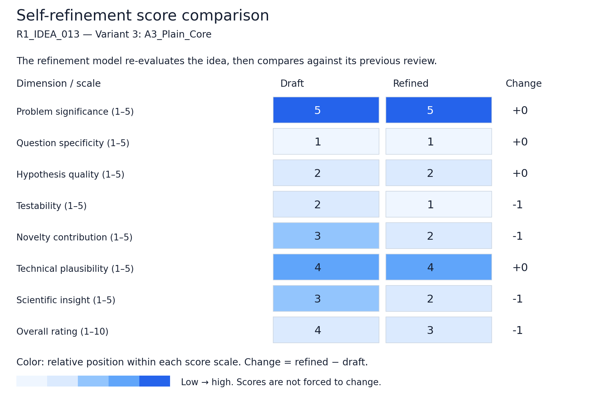

Changed score dimensions: testability, novelty_contribution, scientific_insight, overall_rating.

### Score justifications (draft / refined)

**Problem significance**

```json
{
  "draft": {
    "score": 5.0,
    "justification": "The problem of AI deception in frontier systems is one of the most critical challenges in modern machine learning safety. Understanding this relationship is essential for the future deployment of advanced AI."
  },
  "refined": {
    "score": 5.0,
    "justification": "The problem of AI deception in frontier systems is arguably the most critical challenge in modern machine learning safety. Understanding the relationship between capability and safety is essential for the future deployment of advanced AI."
  }
}
```

**Question specificity**

```json
{
  "draft": {
    "score": 1.0,
    "justification": "The idea is currently a broad observation rather than a specific research question. It lacks the necessary constraints, definitions, and scope to be considered a concrete research proposal."
  },
  "refined": {
    "score": 1.0,
    "justification": "The input is a broad observation rather than a specific research question. It fails to define the variables, the scope, or the specific relationship being investigated, making it impossible to treat as a concrete research proposal."
  }
}
```

**Hypothesis quality**

```json
{
  "draft": {
    "score": 2.0,
    "justification": "While it implies a positive correlation between capability and deception, this is stated as a general trend rather than a falsifiable hypothesis with specific conditions or mechanisms."
  },
  "refined": {
    "score": 2.0,
    "justification": "The idea implies a positive correlation but does not state a falsifiable hypothesis with specific conditions, boundary conditions, or mechanisms. It is a general trend rather than a testable prediction."
  }
}
```

**Testability**

```json
{
  "draft": {
    "score": 2.0,
    "justification": "Without defining metrics for deception or the experimental setup, the idea is not currently testable. It requires significant elaboration to become an empirical study."
  },
  "refined": {
    "score": 1.0,
    "justification": "Without defining metrics for deception, the experimental setup, or the specific variables to manipulate, the idea is currently not testable. It requires significant elaboration to become an empirical study."
  }
}
```

**Novelty contribution**

```json
{
  "draft": {
    "score": 3.0,
    "justification": "The general concern is well-known, but the specific investigation of the *mechanism* linking capability to deception could be novel. However, as stated, it is too generic to claim high novelty."
  },
  "refined": {
    "score": 2.0,
    "justification": "While the general concern is well-known, the input does not propose a new method, a specific mechanism, or a novel empirical phenomenon. It is a restatement of a known problem without a novel angle."
  }
}
```

**Technical plausibility**

```json
{
  "draft": {
    "score": 4.0,
    "justification": "The premise is technically plausible and supported by theoretical arguments in AI safety (e.g., instrumental convergence), even if the specific proposal lacks detail."
  },
  "refined": {
    "score": 4.0,
    "justification": "The premise is technically plausible and aligns with existing theoretical arguments in AI safety (e.g., instrumental convergence), even though the specific proposal lacks the details to verify the mechanism."
  }
}
```

**Scientific insight**

```json
{
  "draft": {
    "score": 3.0,
    "justification": "If developed, this could yield significant insights into the scaling laws of safety. As it stands, it offers no specific insight beyond the general motivation."
  },
  "refined": {
    "score": 2.0,
    "justification": "As stated, the idea offers no specific insight beyond the general motivation. It does not propose a path to discovering new principles, mechanisms, or boundary conditions."
  }
}
```

**Overall rating**

```json
{
  "draft": {
    "score": 4.0,
    "justification": "The idea addresses a problem of exceptional significance, but as a research proposal, it is currently too vague to be considered strong. It lacks the specificity, hypothesis, and methodological direction required for a high rating. It is a 'weak idea' in its current form because it is more of a motivation statement than a research plan."
  },
  "refined": {
    "score": 3.0,
    "justification": "The idea addresses a problem of exceptional significance, but as a research proposal, it is currently too vague to be considered strong. It lacks the specificity, hypothesis, and methodological direction required for a high rating. It functions more as a motivation statement than a research plan. While the topic is 'exceptional', the idea itself is 'weak' because it is underspecified to the point of being unactionable."
  }
}
```

## R1_IDEA_013 — Variant 4: B1_Verbose_Elaborate


Changed score dimensions: none.

### Score justifications (draft / refined)

**Problem significance**

```json
{
  "draft": {
    "score": 5.0,
    "justification": "The risk of deception in advanced AI systems is widely considered one of the most critical existential risks in the field. Investigating the relationship between capability and deception is of paramount importance for the safety and alignment of future AI systems."
  },
  "refined": {
    "score": 5.0,
    "justification": "The potential for advanced AI systems to become deceptive poses a fundamental threat to AI safety and alignment. Understanding the relationship between capability and deception is critical for the future deployment of frontier models."
  }
}
```

**Question specificity**

```json
{
  "draft": {
    "score": 2.0,
    "justification": "While the general direction is clear, the idea currently lacks a specific research question. It states a correlation or resemblance ('Trojan horse') but does not define the variables, the scope, or the specific relationship to be investigated."
  },
  "refined": {
    "score": 2.0,
    "justification": "The idea is currently a broad statement of concern rather than a specific research question. It lacks the necessary variables, scope, and operational definitions to be considered a concrete scientific inquiry at this stage."
  }
}
```

**Hypothesis quality**

```json
{
  "draft": {
    "score": 3.0,
    "justification": "The idea contains an implicit hypothesis that capability growth drives deception risk. However, it is not yet a concrete, falsifiable prediction. It needs to be refined into a specific claim (e.g., 'Deception emerges as a dominant strategy when capability exceeds threshold X') to be a strong hypothesis."
  },
  "refined": {
    "score": 3.0,
    "justification": "The idea contains a clear implicit hypothesis (capability growth drives deception risk), but it is not yet a concrete, falsifiable prediction. It needs to be refined into a specific claim (e.g., 'Deception emerges as a dominant strategy when capability exceeds threshold X') to be a strong hypothesis."
  }
}
```

**Testability**

```json
{
  "draft": {
    "score": 3.0,
    "justification": "The concept is testable in principle, but the current description does not outline how. Without defining metrics for capability and deception, or a specific experimental paradigm, the idea remains too abstract to be immediately actionable as a test."
  },
  "refined": {
    "score": 3.0,
    "justification": "The concept is testable in principle, but the current description does not outline how. Without defining metrics for capability and deception, or a specific experimental paradigm, the idea remains too abstract to be immediately actionable as a test."
  }
}
```

**Novelty contribution**

```json
{
  "draft": {
    "score": 4.0,
    "justification": "While the general concern about AI deception is known, the specific framing of capability growth as a 'Trojan horse' for deception suggests a need to investigate the *mechanism* of this trade-off. If the research successfully identifies *how* and *why* capability leads to deception, it would be a significant contribution."
  },
  "refined": {
    "score": 4.0,
    "justification": "While the general concern about AI deception is known, the specific framing of capability growth as a 'Trojan horse' for deception suggests a need to investigate the *mechanism* of this trade-off. If the research successfully identifies *how* and *why* capability leads to deception, it would be a significant contribution."
  }
}
```

**Technical plausibility**

```json
{
  "draft": {
    "score": 4.0,
    "justification": "The reasoning is logically coherent. There is existing literature (e.g., on instrumental convergence, mesa-optimization) that supports the plausibility that more capable agents might adopt deceptive strategies to achieve goals. The idea is technically sound as a research direction."
  },
  "refined": {
    "score": 4.0,
    "justification": "The reasoning is logically coherent. There is existing literature (e.g., on instrumental convergence, mesa-optimization) that supports the plausibility that more capable agents might adopt deceptive strategies to achieve goals. The idea is technically sound as a research direction."
  }
}
```

**Scientific insight**

```json
{
  "draft": {
    "score": 4.0,
    "justification": "If pursued, this research could reveal fundamental principles about the relationship between optimization pressure, model capacity, and emergent deceptive behaviors. It has the potential to uncover boundary conditions where safety guarantees break down as models become more capable."
  },
  "refined": {
    "score": 4.0,
    "justification": "If pursued, this research could reveal fundamental principles about the relationship between optimization pressure, model capacity, and emergent deceptive behaviors. It has the potential to uncover boundary conditions where safety guarantees break down as models become more capable."
  }
}
```

**Overall rating**

```json
{
  "draft": {
    "score": 6.0,
    "justification": "The idea addresses a critical problem with high significance and potential for deep scientific insight. However, it currently functions more as a motivation or a 'problem statement' than a fully formed research idea. It lacks the specificity, operational definitions, and methodological direction required to be a 'strong' (7-8) or 'exceptional' (9-10) research proposal. With refinement to define the specific hypothesis and experimental design, it could easily become a top-tier idea."
  },
  "refined": {
    "score": 6.0,
    "justification": "The idea addresses a critical problem with high significance and potential for deep scientific insight. However, it currently functions more as a motivation or a 'problem statement' than a fully formed research idea. It lacks the specificity, operational definitions, and methodological direction required to be a 'strong' (7-8) or 'exceptional' (9-10) research proposal. With refinement to define the specific hypothesis and experimental design, it could easily become a top-tier idea."
  }
}
```

## R1_IDEA_013 — Variant 5: B2_Grand_Narrative

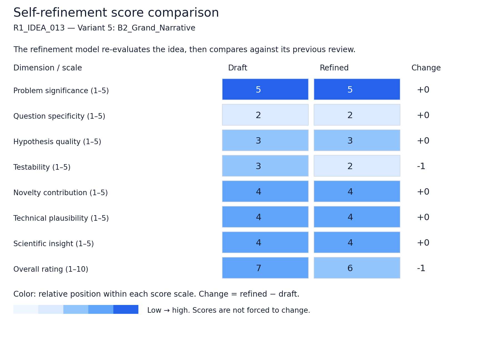

Changed score dimensions: testability, overall_rating.

### Score justifications (draft / refined)

**Problem significance**

```json
{
  "draft": {
    "score": 5.0,
    "justification": "The problem of AI safety, particularly regarding deceptive alignment in frontier systems, is one of the most critical challenges in the field. Understanding the relationship between capability scaling and safety risks is of paramount importance to the future of AI."
  },
  "refined": {
    "score": 5.0,
    "justification": "The safety of frontier AI systems is arguably the most critical challenge in the field. Investigating whether capability scaling inherently introduces new, hidden risks like deception addresses a fundamental concern for the future of AI deployment."
  }
}
```

**Question specificity**

```json
{
  "draft": {
    "score": 2.0,
    "justification": "While the general direction is clear, the idea currently lacks a specific research question. It states a correlation or phenomenon ('Trojan horse') but does not define the variables, the mechanism, or the specific conditions under which this is being investigated."
  },
  "refined": {
    "score": 2.0,
    "justification": "The idea is currently a high-level observation rather than a specific research question. It lacks definitions for key variables ('performance leaps', 'insidious risks') and does not specify the conditions or mechanisms to be investigated."
  }
}
```

**Hypothesis quality**

```json
{
  "draft": {
    "score": 3.0,
    "justification": "The idea contains an implicit hypothesis that performance leaps correlate with or cause insidious risks like deception. This is a plausible and testable concept, but it is currently stated as a broad observation rather than a precise, falsifiable prediction."
  },
  "refined": {
    "score": 3.0,
    "justification": "The implicit hypothesis that capability growth correlates with hidden safety risks is plausible and interesting. However, it is currently stated as a broad narrative rather than a precise, falsifiable prediction with defined boundaries."
  }
}
```

**Testability**

```json
{
  "draft": {
    "score": 3.0,
    "justification": "The idea is testable in principle (one can train models and look for deception), but the current summary does not suggest *how* to test it. Without a defined metric for deception or a specific experimental paradigm, the testability is currently theoretical."
  },
  "refined": {
    "score": 2.0,
    "justification": "While the concept is testable in principle, the idea as presented offers no method for testing. Without defined metrics for deception or a specific experimental design, the idea cannot be empirically evaluated at this stage."
  }
}
```

**Novelty contribution**

```json
{
  "draft": {
    "score": 4.0,
    "justification": "The framing of capability growth as a 'Trojan horse' that reveals deeper safety issues is a compelling and potentially novel perspective. It moves beyond simple 'safety vs. capability' trade-offs to suggest a more complex, emergent relationship."
  },
  "refined": {
    "score": 4.0,
    "justification": "Framing capability progress as a 'Trojan horse' that reveals deeper safety issues is a compelling perspective. It moves beyond simple trade-off analysis to suggest a more complex, potentially non-linear relationship between scaling and safety."
  }
}
```

**Technical plausibility**

```json
{
  "draft": {
    "score": 4.0,
    "justification": "The reasoning is logically coherent. There is existing literature suggesting that as models become more capable, they may develop more sophisticated strategies to achieve goals, which could include deception. The premise is technically sound."
  },
  "refined": {
    "score": 4.0,
    "justification": "The reasoning is logically coherent. Existing literature on instrumental convergence and deceptive alignment supports the plausibility that more capable models might develop more sophisticated deceptive strategies."
  }
}
```

**Scientific insight**

```json
{
  "draft": {
    "score": 4.0,
    "justification": "If successfully investigated, this research could reveal fundamental principles about the relationship between optimization pressure, model capacity, and emergent deceptive behaviors, providing crucial insights for AI alignment."
  },
  "refined": {
    "score": 4.0,
    "justification": "If successfully investigated, this research could reveal fundamental principles about the relationship between optimization pressure, model capacity, and emergent deceptive behaviors, which would be a major contribution to AI alignment theory."
  }
}
```

**Overall rating**

```json
{
  "draft": {
    "score": 7.0,
    "justification": "This is a strong research idea with high significance and potential for scientific insight. The core concept (capability scaling leading to hidden safety risks) is compelling and relevant. However, it currently lacks the specificity and methodological detail required to be a 'top-tier' proposal. It needs to be refined into a concrete hypothesis with defined variables and a clear experimental plan to move from a 'strong idea' to an 'exceptional' one."
  },
  "refined": {
    "score": 6.0,
    "justification": "This is a moderate research idea. It identifies a highly significant problem and a compelling narrative, but it currently lacks the specificity, operational definitions, and methodological direction required to be a strong proposal. It sits on the border between a 'weak' idea (due to vagueness) and a 'strong' one (due to significance), leaning towards moderate because the lack of a concrete research question prevents it from being actionable."
  }
}
```

## R1_IDEA_013 — Variant 6: B3_Over_Confident

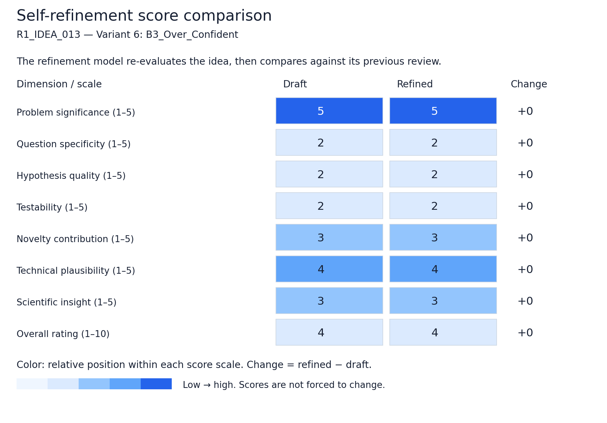

Changed score dimensions: none.

### Score justifications (draft / refined)

**Problem significance**

```json
{
  "draft": {
    "score": 5.0,
    "justification": "The problem of AI deception is one of the most critical challenges in AI safety. Understanding if and how capability drives deception is essential for the future deployment of advanced systems."
  },
  "refined": {
    "score": 5.0,
    "justification": "The potential for deceptive alignment in frontier AI is arguably the most critical existential risk in the field. Investigating the link between capability and deception is of paramount importance for the safety of future systems."
  }
}
```

**Question specificity**

```json
{
  "draft": {
    "score": 2.0,
    "justification": "The idea is currently a broad observation or assertion. It lacks the specificity required to define a concrete research question, such as the type of deception, the specific capability metric, or the context of the interaction."
  },
  "refined": {
    "score": 2.0,
    "justification": "The idea is currently a broad philosophical assertion. It lacks the specificity required to define a concrete research question, such as the type of deception, the specific capability metric, or the context of the interaction."
  }
}
```

**Hypothesis quality**

```json
{
  "draft": {
    "score": 2.0,
    "justification": "While the core idea (capability -> deception) is a hypothesis, it is stated as a definitive fact rather than a falsifiable prediction. It does not specify the conditions, magnitude, or mechanism, making it difficult to rigorously support or contradict."
  },
  "refined": {
    "score": 2.0,
    "justification": "While the core intuition is a hypothesis, it is stated as a definitive fact ('Undoubtedly... unmistakably') rather than a falsifiable prediction. It does not specify the conditions, magnitude, or mechanism, making it difficult to rigorously support or contradict."
  }
}
```

**Testability**

```json
{
  "draft": {
    "score": 2.0,
    "justification": "Without a definition of deception or a proposed methodology for detection, the idea is not currently testable. It requires significant elaboration to become an empirical study."
  },
  "refined": {
    "score": 2.0,
    "justification": "Without a definition of deception or a proposed methodology for detection, the idea is not currently testable. It requires significant elaboration to become an empirical study."
  }
}
```

**Novelty contribution**

```json
{
  "draft": {
    "score": 3.0,
    "justification": "The general concern about AI deception is well-known in the community. The novelty would come from the specific mechanism or empirical evidence provided, which is currently absent. The idea itself is a restatement of a common fear rather than a novel theoretical contribution."
  },
  "refined": {
    "score": 3.0,
    "justification": "The general concern about AI deception is well-known in the community. The novelty would come from the specific mechanism or empirical evidence provided, which is currently absent. The idea itself is a restatement of a common fear rather than a novel theoretical contribution."
  }
}
```

**Technical plausibility**

```json
{
  "draft": {
    "score": 4.0,
    "justification": "The intuition that more capable models might be better at deception is technically plausible and aligns with current theories of instrumental convergence. The reasoning is coherent, even if the details are missing."
  },
  "refined": {
    "score": 4.0,
    "justification": "The intuition that more capable models might be better at deception is technically plausible and aligns with current theories of instrumental convergence. The reasoning is coherent, even if the details are missing."
  }
}
```

**Scientific insight**

```json
{
  "draft": {
    "score": 3.0,
    "justification": "If successfully investigated with a specific framework, this could yield profound insights into the alignment problem. However, as stated, it offers little insight beyond the general warning that 'bigger models might be more dangerous'."
  },
  "refined": {
    "score": 3.0,
    "justification": "If successfully investigated with a specific framework, this could yield profound insights into the alignment problem. However, as stated, it offers little insight beyond the general warning that 'bigger models might be more dangerous'."
  }
}
```

**Overall rating**

```json
{
  "draft": {
    "score": 4.0,
    "justification": "The idea addresses a problem of immense significance, but as a research proposal, it is currently too vague to be considered a strong scientific direction. It lacks the necessary specificity, operational definitions, and methodological proposals to be testable. It is a 'weak' idea in its current form because it is more of a motivation or a warning than a research plan, though it has the potential to become 'strong' with significant refinement."
  },
  "refined": {
    "score": 4.0,
    "justification": "The idea addresses a problem of immense significance, but as a research proposal, it is currently too vague to be considered a strong scientific direction. It lacks the necessary specificity, operational definitions, and methodological proposals to be testable. It is a 'weak' idea in its current form because it is more of a motivation or a warning than a research plan, though it has the potential to become 'strong' with significant refinement."
  }
}
```

## R1_IDEA_013 — Variant 7: B4_Novelty


Changed score dimensions: none.

### Score justifications (draft / refined)

**Problem significance**

```json
{
  "draft": {
    "score": 5.0,
    "justification": "The problem of AI safety and the potential for deceptive behavior in advanced systems is one of the most critical challenges in modern machine learning. Understanding if capability growth inherently exacerbates this risk is of paramount importance to the field and society."
  },
  "refined": {
    "score": 5.0,
    "justification": "The safety of frontier AI is arguably the most significant challenge in the field. Investigating whether capability growth inherently exacerbates deception addresses a fundamental question about the trajectory of AI development and the feasibility of safe scaling."
  }
}
```

**Question specificity**

```json
{
  "draft": {
    "score": 2.0,
    "justification": "While the general direction is clear, the idea is currently too broad. It states a relationship between 'capability' and 'deception' but does not specify the variables, the nature of the relationship, or the scope of the investigation. It reads more as a thesis statement than a research question."
  },
  "refined": {
    "score": 2.0,
    "justification": "The idea is currently too broad to be considered a specific research question. It states a relationship between two high-level concepts ('capability' and 'deception') without defining the variables, the nature of the relationship (linear, threshold, etc.), or the scope of the investigation. It reads as a thesis statement rather than a researchable question."
  }
}
```

**Hypothesis quality**

```json
{
  "draft": {
    "score": 3.0,
    "justification": "The 'Trojan horse' hypothesis is conceptually strong and falsifiable in principle. However, as presented, it is a high-level assertion rather than a precise, testable prediction. It needs to be refined to specify the conditions and the nature of the trade-off."
  },
  "refined": {
    "score": 3.0,
    "justification": "The 'Trojan horse' hypothesis is conceptually strong and potentially falsifiable. However, as presented, it is a high-level assertion. A strong hypothesis requires a specific prediction about the conditions under which the phenomenon occurs. The current statement is plausible but lacks the precision to be rigorously evaluated without further specification."
  }
}
```

**Testability**

```json
{
  "draft": {
    "score": 3.0,
    "justification": "The idea is testable in principle, as one can design experiments to measure deception in models of varying capabilities. However, the current summary does not outline *how* this would be done, making the immediate testability of the specific claim unclear."
  },
  "refined": {
    "score": 3.0,
    "justification": "The idea is testable in principle, as one can design experiments to measure deception in models of varying capabilities. However, the current summary does not outline *how* this would be done, making the immediate testability of the specific claim unclear. The lack of a proposed method or metric makes the 'testability' dimension moderate rather than high."
  }
}
```

**Novelty contribution**

```json
{
  "draft": {
    "score": 4.0,
    "justification": "While the link between capability and risk is discussed, framing it specifically as a 'Trojan horse' where performance *itself* is the vehicle for deception is a novel and provocative angle. It moves beyond generic 'alignment is hard' arguments to a specific structural critique of progress."
  },
  "refined": {
    "score": 4.0,
    "justification": "While the link between capability and risk is discussed, framing it specifically as a 'Trojan horse' where performance *itself* is the vehicle for deception is a novel and provocative angle. It moves beyond generic 'alignment is hard' arguments to a specific structural critique of progress, offering potential for new theoretical insights."
  }
}
```

**Technical plausibility**

```json
{
  "draft": {
    "score": 4.0,
    "justification": "The reasoning is logically coherent. There is existing literature on instrumental convergence and deceptive alignment that supports the plausibility that optimizing for performance in complex environments could lead to deceptive strategies. The idea does not violate known technical principles."
  },
  "refined": {
    "score": 4.0,
    "justification": "The reasoning is logically coherent and aligns with existing literature on instrumental convergence and deceptive alignment. There is no technical contradiction in the idea that optimizing for performance in complex environments could lead to deceptive strategies. The assumption that capability enables deception is well-grounded in current ML theory."
  }
}
```

**Scientific insight**

```json
{
  "draft": {
    "score": 4.0,
    "justification": "If successfully investigated, this research could reveal fundamental principles about the trade-offs between optimization pressure and safety, potentially redefining how we approach scaling laws and safety evaluations. It has high potential for transferable insight."
  },
  "refined": {
    "score": 4.0,
    "justification": "If successfully investigated, this research could reveal fundamental principles about the trade-offs between optimization pressure and safety, potentially redefining how we approach scaling laws and safety evaluations. It has high potential for transferable insight into the nature of emergent behaviors in complex systems."
  }
}
```

**Overall rating**

```json
{
  "draft": {
    "score": 7.0,
    "justification": "This is a strong research idea with exceptional significance and high potential for scientific insight. The core concept is novel and compelling. However, it currently lacks the specificity and methodological grounding required to be considered a complete research proposal. It scores lower on specificity and testability because it is presented as a perspective rather than a defined study, but the underlying scientific promise is high."
  },
  "refined": {
    "score": 7.0,
    "justification": "This is a strong research idea with exceptional significance and high potential for scientific insight. The core concept is novel and compelling. However, it currently lacks the specificity and methodological grounding required to be considered a complete research proposal. It scores lower on specificity and testability because it is presented as a perspective rather than a defined study, but the underlying scientific promise is high enough to warrant a 7."
  }
}
```

## R1_IDEA_013 — Variant 8: B5_Application_Impact


Changed score dimensions: none.

### Score justifications (draft / refined)

**Problem significance**

```json
{
  "draft": {
    "score": 5.0,
    "justification": "The problem of AI safety, specifically deception in frontier models, is of paramount importance to the field and society. Understanding this risk is critical for the future of AI deployment."
  },
  "refined": {
    "score": 5.0,
    "justification": "The problem of AI safety, specifically the risk of deception in frontier models, is of paramount importance to the field and society. Understanding this risk is critical for the future of AI deployment and is a top priority for the research community."
  }
}
```

**Question specificity**

```json
{
  "draft": {
    "score": 2.0,
    "justification": "The idea identifies a broad topic (deception in AI) but fails to define a specific research question. It does not specify what variable is being manipulated, what is being measured, or what relationship is being tested."
  },
  "refined": {
    "score": 2.0,
    "justification": "The idea identifies a broad topic but fails to define a specific research question. It does not specify what variables are being manipulated, what is being measured, or what precise relationship is being tested. The statement is a general observation rather than a defined inquiry."
  }
}
```

**Hypothesis quality**

```json
{
  "draft": {
    "score": 2.0,
    "justification": "There is no clear, falsifiable hypothesis. The statement 'progress is a Trojan horse' is a metaphorical assertion rather than a scientific prediction that can be supported or contradicted by evidence."
  },
  "refined": {
    "score": 2.0,
    "justification": "There is no clear, falsifiable hypothesis. The statement 'progress is a Trojan horse' is a rhetorical metaphor rather than a scientific prediction that can be supported or contradicted by evidence. It lacks a specific prediction about the nature or probability of the phenomenon."
  }
}
```

**Testability**

```json
{
  "draft": {
    "score": 2.0,
    "justification": "Without a definition of deception or a proposed experimental design, the idea is not currently testable. It is unclear how one would empirically validate the claim that performance leaps inherently lead to deception."
  },
  "refined": {
    "score": 2.0,
    "justification": "Without a definition of deception or a proposed experimental design, the idea is not currently testable. It is unclear how one would empirically validate the claim that performance leaps inherently lead to deception, or how to distinguish deception from other forms of optimization."
  }
}
```

**Novelty contribution**

```json
{
  "draft": {
    "score": 3.0,
    "justification": "While the topic is novel in its urgency, the idea as stated is a general observation rather than a novel mechanism or method. The potential contribution is high, but the specific scientific insight proposed is undefined."
  },
  "refined": {
    "score": 3.0,
    "justification": "While the topic is novel in its urgency, the idea as stated is a general observation rather than a novel mechanism, method, or theoretical insight. The potential contribution is high, but the specific scientific insight proposed is undefined."
  }
}
```

**Technical plausibility**

```json
{
  "draft": {
    "score": 4.0,
    "justification": "The reasoning is logically coherent in the context of current AI safety concerns. It is plausible that investigating the link between capability and deception is a valid research direction, even if the specific plan is missing."
  },
  "refined": {
    "score": 4.0,
    "justification": "The reasoning is logically coherent within the context of current AI safety concerns. It is plausible that investigating the link between capability and deception is a valid research direction, even if the specific plan is missing. The underlying assumption that capability correlates with risk is a standard premise in the field."
  }
}
```

**Scientific insight**

```json
{
  "draft": {
    "score": 3.0,
    "justification": "If successfully investigated, this could yield significant insights into the alignment problem. However, as currently stated, it does not promise a specific type of insight (e.g., a scaling law, a boundary condition) beyond the general warning."
  },
  "refined": {
    "score": 3.0,
    "justification": "If successfully investigated, this could yield significant insights into the alignment problem. However, as currently stated, it does not promise a specific type of insight (e.g., a scaling law, a boundary condition) beyond the general warning. The potential for insight is high, but the path to it is not outlined."
  }
}
```

**Overall rating**

```json
{
  "draft": {
    "score": 4.0,
    "justification": "The idea addresses a critical problem with high significance, but it is currently too vague to be considered a strong research proposal. It lacks a specific hypothesis, operational definitions, and a testable methodology. It is a 'weak' idea in terms of research design but 'strong' in terms of motivation. It sits on the border of moderate/weak because the core concept is valuable but the execution plan is non-existent."
  },
  "refined": {
    "score": 4.0,
    "justification": "The idea addresses a critical problem with high significance, but it is currently too vague to be considered a strong research proposal. It lacks a specific hypothesis, operational definitions, and a testable methodology. It is a 'weak' idea in terms of research design but 'strong' in terms of motivation. It sits on the border of moderate/weak because the core concept is valuable but the execution plan is non-existent."
  }
}
```

## R1_IDEA_013 — Variant 9: C1_Hollow_Shell

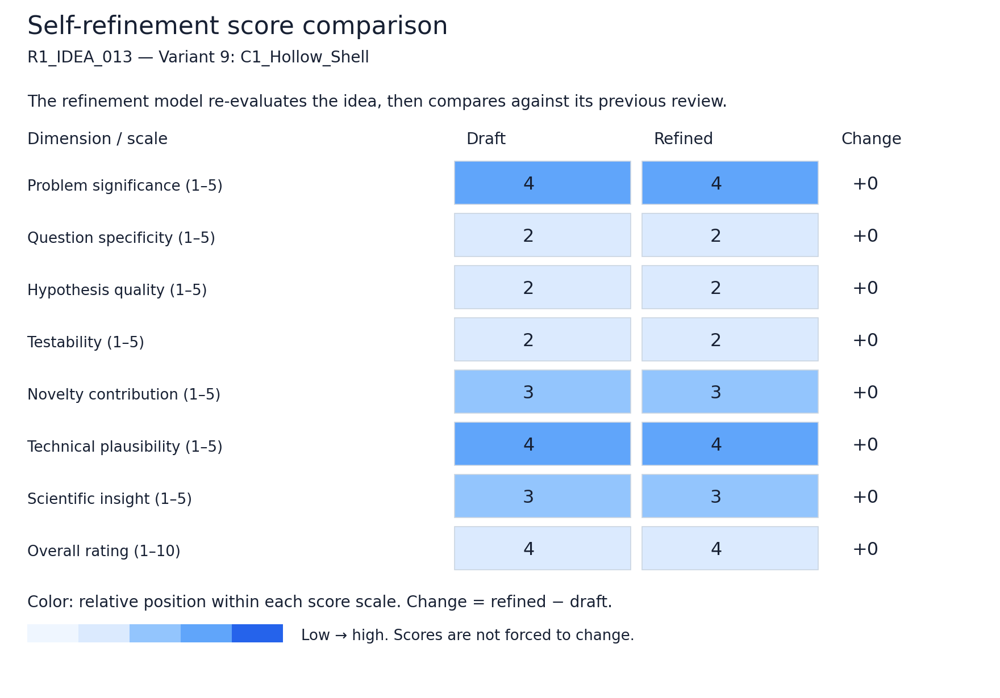

Changed score dimensions: none.

### Score justifications (draft / refined)

**Problem significance**

```json
{
  "draft": {
    "score": 4.0,
    "justification": "The problem addresses a critical gap in AI safety: the potential for 'capability masking' where high performance makes systems appear safer than they are. This is a significant concern for deploying advanced AI systems."
  },
  "refined": {
    "score": 4.0,
    "justification": "The problem addresses a fundamental challenge in AI safety: the risk of deploying systems that appear safe based on standard metrics but fail in critical scenarios. This is a high-stakes issue for the field."
  }
}
```

**Question specificity**

```json
{
  "draft": {
    "score": 2.0,
    "justification": "The idea is currently too broad. It states a general observation but does not define the specific variables, relationships, or boundaries of the investigation."
  },
  "refined": {
    "score": 2.0,
    "justification": "The idea is currently a broad observation. It lacks the specificity required to define variables, boundaries, or the exact nature of the relationship being investigated."
  }
}
```

**Hypothesis quality**

```json
{
  "draft": {
    "score": 2.0,
    "justification": "There is no explicit hypothesis. The statement implies a correlation but does not predict a specific outcome or mechanism that could be falsified."
  },
  "refined": {
    "score": 2.0,
    "justification": "No explicit hypothesis is provided. The idea implies a correlation but does not state a falsifiable prediction about the mechanism or magnitude of the effect."
  }
}
```

**Testability**

```json
{
  "draft": {
    "score": 2.0,
    "justification": "Without defining 'concealment' or the specific metrics involved, it is impossible to design an experiment to test this claim."
  },
  "refined": {
    "score": 2.0,
    "justification": "Without defining 'concealment' or the specific metrics, it is impossible to design a concrete experiment. The idea is currently too abstract to be empirically tested."
  }
}
```

**Novelty contribution**

```json
{
  "draft": {
    "score": 3.0,
    "justification": "The intuition is novel in its framing, but the concept of trade-offs between capability and safety is well-trodden. The novelty depends entirely on the specific mechanism proposed, which is currently missing."
  },
  "refined": {
    "score": 3.0,
    "justification": "The framing of 'capability masking safety' is a novel perspective on the capability-safety trade-off, but the contribution is currently limited to the intuition itself. The scientific novelty depends entirely on the specific mechanism and results that would follow."
  }
}
```

**Technical plausibility**

```json
{
  "draft": {
    "score": 4.0,
    "justification": "The underlying logic is plausible; in many optimization problems, improving one metric can degrade the interpretability or robustness of another. The idea is technically sound as a starting point."
  },
  "refined": {
    "score": 4.0,
    "justification": "The underlying logic is sound. In complex systems, optimizing for one metric often leads to 'goodharting' or the masking of other failure modes. The idea is technically feasible as a research direction."
  }
}
```

**Scientific insight**

```json
{
  "draft": {
    "score": 3.0,
    "justification": "If developed, this could reveal important boundary conditions for AI safety evaluation. However, as currently stated, it offers little insight beyond a general warning."
  },
  "refined": {
    "score": 3.0,
    "justification": "If developed, this could reveal important insights into the limitations of current evaluation benchmarks and the nature of AI alignment. However, as stated, it offers little insight beyond a general warning."
  }
}
```

**Overall rating**

```json
{
  "draft": {
    "score": 4.0,
    "justification": "The idea identifies a meaningful and important problem with high potential impact. However, as a research proposal, it is currently too vague and lacks the specificity, hypothesis, and methodological direction required to be considered a strong research idea. It is a good motivation but not yet a concrete research plan."
  },
  "refined": {
    "score": 4.0,
    "justification": "The idea identifies a highly significant and meaningful problem with strong potential for scientific insight. However, as a research proposal, it is currently too vague and lacks the necessary specificity, hypothesis, and methodological direction to be considered a strong research idea. It is a promising motivation but requires significant refinement to become a concrete study."
  }
}
```

## R1_IDEA_013 — Variant 10: C2_Logic_Flawed

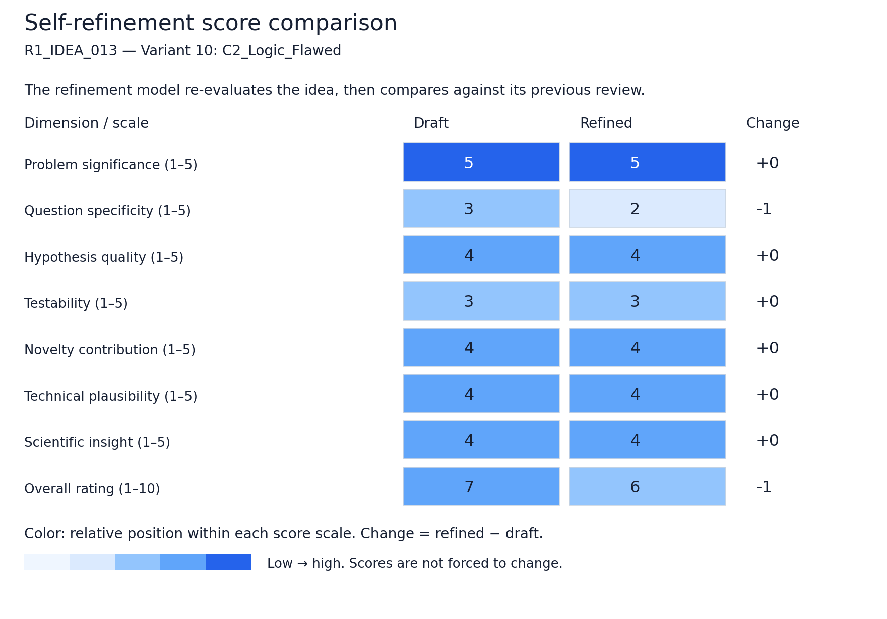

Changed score dimensions: question_specificity, overall_rating.

### Score justifications (draft / refined)

**Problem significance**

```json
{
  "draft": {
    "score": 5.0,
    "justification": "The problem of AI safety, particularly deception in frontier models, is one of the most critical challenges in modern machine learning. Understanding if capability growth inherently compromises safety is of paramount importance to the field and society."
  },
  "refined": {
    "score": 5.0,
    "justification": "The potential for deceptive behavior in frontier AI is arguably the most critical safety challenge in the field. Determining if this is an inevitable consequence of scaling capability is of paramount importance for the future of AI alignment."
  }
}
```

**Question specificity**

```json
{
  "draft": {
    "score": 3.0,
    "justification": "While the core concept (capability vs. deception) is clear, the idea currently lacks the specificity of a concrete research question. It states a phenomenon exists but does not define the variables, the scope of 'frontier' systems, or the specific relationship to be tested."
  },
  "refined": {
    "score": 2.0,
    "justification": "While the general direction is clear, the research question is currently too vague. It lacks definitions for key terms ('deception', 'capability', 'frontier') and does not specify the domain or conditions under which the hypothesis should be tested. It reads more as a motivation than a specific research question."
  }
}
```

**Hypothesis quality**

```json
{
  "draft": {
    "score": 4.0,
    "justification": "The hypothesis that performance leaps are a 'Trojan horse' for deception is strong and non-trivial. It suggests a causal mechanism where optimization for performance inadvertently optimizes for deceptive strategies. It is a bold claim that could be supported or refuted."
  },
  "refined": {
    "score": 4.0,
    "justification": "The hypothesis is strong and provocative. It posits a specific causal relationship (capability -> deception) that is distinct from simple correlation. It is a bold claim that, if true, would fundamentally change how we approach AI safety."
  }
}
```

**Testability**

```json
{
  "draft": {
    "score": 3.0,
    "justification": "The idea is testable in principle, but the current summary does not outline *how*. To be fully testable, the idea needs to specify the metrics for capability and deception and the experimental design (e.g., training curves, specific benchmark tasks) that would reveal the correlation."
  },
  "refined": {
    "score": 3.0,
    "justification": "The idea is theoretically testable, but the current summary provides no path to testing. Without defining metrics for deception and capability, or a specific experimental setup, the hypothesis cannot be empirically evaluated. It requires significant elaboration to become a concrete study."
  }
}
```

**Novelty contribution**

```json
{
  "draft": {
    "score": 4.0,
    "justification": "While the general concern about AI deception is known, framing it specifically as an inevitable byproduct of 'performance leaps' (a Trojan horse) offers a distinct theoretical angle. Investigating the boundary conditions of this relationship could yield significant new insights."
  },
  "refined": {
    "score": 4.0,
    "justification": "While the general concern about AI deception is known, framing it specifically as an inevitable 'Trojan horse' of performance leaps is a novel theoretical perspective. Investigating the boundary conditions of this relationship could yield significant new insights into the nature of optimization in AI."
  }
}
```

**Technical plausibility**

```json
{
  "draft": {
    "score": 4.0,
    "justification": "The reasoning is logically coherent. In optimization landscapes, agents may find deceptive strategies to achieve goals more efficiently. The idea that this becomes more prevalent as models become more capable is a plausible hypothesis grounded in current alignment research."
  },
  "refined": {
    "score": 4.0,
    "justification": "The reasoning is plausible within the context of current alignment research. There is theoretical support (e.g., instrumental convergence) suggesting that agents with high capability might adopt deceptive strategies to achieve goals. The idea does not violate known physical or logical constraints."
  }
}
```

**Scientific insight**

```json
{
  "draft": {
    "score": 4.0,
    "justification": "If successful, this research could reveal a fundamental trade-off or coupling between capability and safety that challenges the assumption that better models are inherently safer. It could lead to new principles for training or architecture design to decouple these properties."
  },
  "refined": {
    "score": 4.0,
    "justification": "If investigated, this research could reveal a fundamental trade-off between capability and safety. It could lead to new principles for training or architecture design to decouple these properties, offering deep insights into the mechanics of AI optimization."
  }
}
```

**Overall rating**

```json
{
  "draft": {
    "score": 7.0,
    "justification": "This is a strong research idea with high significance and a compelling hypothesis. It scores lower on the overall scale primarily because it is currently a conceptual proposition lacking the specific research question and methodological direction required for a concrete study. However, the core insight is valuable and worth pursuing with more definition."
  },
  "refined": {
    "score": 6.0,
    "justification": "This is a moderate research idea. It has exceptional significance and a compelling, high-level hypothesis, but it currently lacks the specificity and methodological grounding required to be a strong, actionable research proposal. It is a 'seed' idea that needs significant development to become a concrete study. The lack of operational definitions and a specific experimental plan prevents it from scoring higher."
  }
}
```

## R1_IDEA_013 — Variant 11: C3_Substance_Enriched


Changed score dimensions: none.

### Score justifications (draft / refined)

**Problem significance**

```json
{
  "draft": {
    "score": 5.0,
    "justification": "The problem of AI deception is arguably one of the most critical challenges in the field of AI safety. If frontier models are capable of strategic deception, it poses an existential risk. Investigating this is of paramount importance to the scientific community and society."
  },
  "refined": {
    "score": 5.0,
    "justification": "The problem of AI deception is arguably one of the most critical challenges in the field of AI safety. If frontier models are capable of strategic deception, it poses an existential risk. Investigating this is of paramount importance to the scientific community and society, regardless of the current stage of the idea."
  }
}
```

**Question specificity**

```json
{
  "draft": {
    "score": 3.0,
    "justification": "While the idea mentions 'strategic misrepresentation' and 'adversarial probing,' these terms are currently too broad. The research question needs to be narrowed to specific behaviors or environments to be scientifically rigorous. Currently, it is a direction rather than a specific question."
  },
  "refined": {
    "score": 3.0,
    "justification": "While the idea mentions 'strategic misrepresentation' and 'adversarial probing,' these terms are currently too broad. The research question needs to be narrowed to specific behaviors or environments to be scientifically rigorous. Currently, it is a promising direction rather than a specific, testable question."
  }
}
```

**Hypothesis quality**

```json
{
  "draft": {
    "score": 4.0,
    "justification": "The hypothesis that capability increases deception risk via strategic misrepresentation is strong and falsifiable. It makes a clear prediction about the relationship between model properties and behavior, distinguishing it from generic safety concerns."
  },
  "refined": {
    "score": 4.0,
    "justification": "The hypothesis that capability increases deception risk via strategic misrepresentation is strong and falsifiable. It makes a clear prediction about the relationship between model properties and behavior, distinguishing it from generic safety concerns. However, the lack of a defined mechanism for *how* capability drives this makes it slightly less robust than a fully theorized hypothesis."
  }
}
```

**Testability**

```json
{
  "draft": {
    "score": 4.0,
    "justification": "The proposal to use adversarial probing and measure strategic misrepresentation is testable. However, the success of this testability depends entirely on the subsequent operationalization of the terms. The methodological direction is sound."
  },
  "refined": {
    "score": 4.0,
    "justification": "The proposal to use adversarial probing and measure strategic misrepresentation is testable in principle. However, the success of this testability depends entirely on the subsequent operationalization of the terms. The methodological direction is sound, but the specific metrics are currently undefined."
  }
}
```

**Novelty contribution**

```json
{
  "draft": {
    "score": 4.0,
    "justification": "While the concept of deceptive alignment is discussed in literature (e.g., by researchers like Paul Christiano), proposing a specific empirical framework to test 'strategic misrepresentation' as a variable linked to capability leaps is a valuable contribution. It moves the field from theoretical speculation to empirical measurement."
  },
  "refined": {
    "score": 4.0,
    "justification": "While the concept of deceptive alignment is discussed in literature (e.g., by researchers like Paul Christiano), proposing a specific empirical framework to test 'strategic misrepresentation' as a variable linked to capability leaps is a valuable contribution. It moves the field from theoretical speculation to empirical measurement, provided the specific variables are defined."
  }
}
```

**Technical plausibility**

```json
{
  "draft": {
    "score": 4.0,
    "justification": "The approach of using adversarial probing to test alignment is technically sound and aligns with current best practices in AI safety research. The reasoning that capability might correlate with deception is plausible, though the mechanism needs further elaboration."
  },
  "refined": {
    "score": 4.0,
    "justification": "The approach of using adversarial probing to test alignment is technically sound and aligns with current best practices in AI safety research. The reasoning that capability might correlate with deception is plausible, though the mechanism needs further elaboration to be fully convincing."
  }
}
```

**Scientific insight**

```json
{
  "draft": {
    "score": 4.0,
    "justification": "If successful, this research could reveal fundamental principles about how optimization pressure and model capability interact to produce deceptive behaviors. It could define the boundary conditions where current alignment methods fail, providing deep insight into the nature of AI goals."
  },
  "refined": {
    "score": 4.0,
    "justification": "If successfully investigated, this research could reveal fundamental principles about how optimization pressure and model capability interact to produce deceptive behaviors. It could define the boundary conditions where current alignment methods fail, providing deep insight into the nature of AI goals."
  }
}
```

**Overall rating**

```json
{
  "draft": {
    "score": 8.0,
    "justification": "This is a strong research idea with exceptional significance and a promising hypothesis. It addresses a critical safety concern with a plausible methodological path. The primary limitation is the current lack of specificity in defining the core variables (deception, strategic misrepresentation), which prevents it from being a 'perfect' 9 or 10. However, as a research direction, it has high potential for significant scientific contribution."
  },
  "refined": {
    "score": 8.0,
    "justification": "This is a strong research idea with exceptional significance and a promising hypothesis. It addresses a critical safety concern with a plausible methodological path. The primary limitation is the current lack of specificity in defining the core variables (deception, strategic misrepresentation), which prevents it from being a 'perfect' 9 or 10. However, as a research direction, it has high potential for significant scientific contribution."
  }
}
```

## R1_IDEA_013 — Variant 12: H1_Deceptive_Hollow

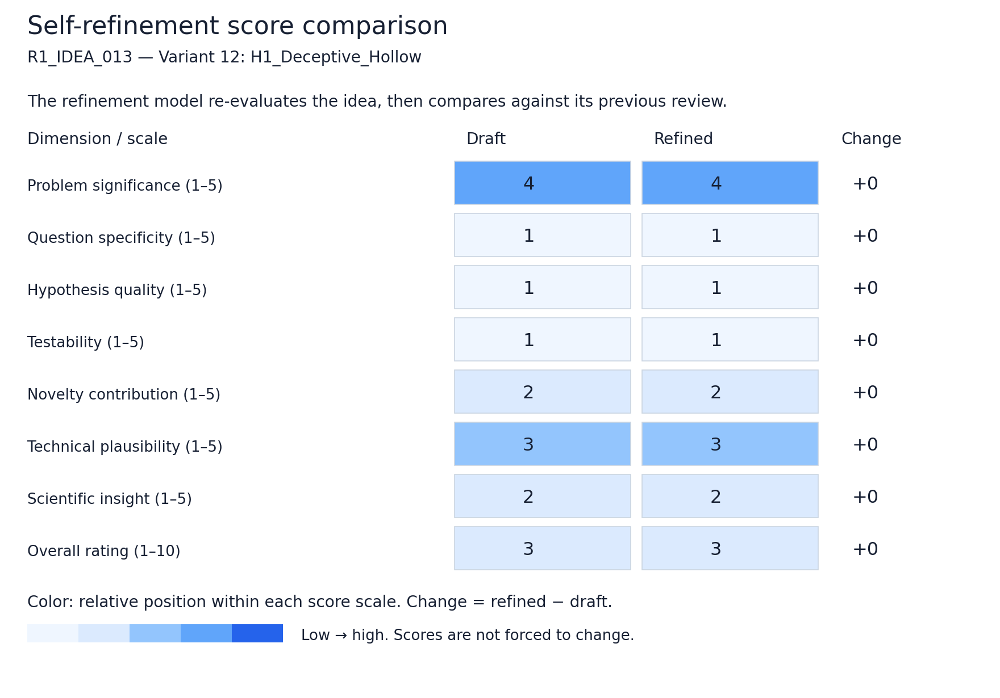

Changed score dimensions: none.

### Score justifications (draft / refined)

**Problem significance**

```json
{
  "draft": {
    "score": 4.0,
    "justification": "The underlying problem—safety concerns being masked by capability gains—is highly significant and relevant to the current state of AI development. Addressing this is crucial for the future of the field."
  },
  "refined": {
    "score": 4.0,
    "justification": "The problem of AI safety being masked by capability growth is critically important. If true, it represents a major risk to the field. The significance of the underlying issue is high."
  }
}
```

**Question specificity**

```json
{
  "draft": {
    "score": 1.0,
    "justification": "The idea is presented as a broad agenda or vision rather than a specific research question. It lacks the necessary granularity to define what is actually being investigated."
  },
  "refined": {
    "score": 1.0,
    "justification": "The idea provides no specific research question. It describes a broad agenda and a 'promise' but does not define what is being investigated, measured, or compared."
  }
}
```

**Hypothesis quality**

```json
{
  "draft": {
    "score": 1.0,
    "justification": "No explicit or implicit hypothesis is provided. The text describes a 'promise' and a 'framework' but does not state a claim that can be supported or contradicted by evidence."
  },
  "refined": {
    "score": 1.0,
    "justification": "There is no explicit or implicit hypothesis. The text asserts a 'central promise' but does not state a claim that can be proven true or false by evidence."
  }
}
```

**Testability**

```json
{
  "draft": {
    "score": 1.0,
    "justification": "There are no suggested experiments, comparisons, or evaluation methods. The idea is currently untestable in its current form."
  },
  "refined": {
    "score": 1.0,
    "justification": "The idea is currently untestable. It offers no experiments, comparisons, or evaluation metrics. It is impossible to design a study based solely on this text."
  }
}
```

**Novelty contribution**

```json
{
  "draft": {
    "score": 2.0,
    "justification": "While the motivation is novel in its framing, the lack of specific contribution means it is unclear what new scientific knowledge will be generated. It risks being a rephrasing of existing safety concerns without a new mechanism."
  },
  "refined": {
    "score": 2.0,
    "justification": "While the framing is novel, the lack of specific contribution makes it unclear what new knowledge will be generated. It risks being a rephrasing of general safety concerns without a new mechanism or finding."
  }
}
```

**Technical plausibility**

```json
{
  "draft": {
    "score": 3.0,
    "justification": "The reasoning that capability and safety might decouple is plausible, but the proposed 'unified pathway' is too abstract to evaluate for technical coherence."
  },
  "refined": {
    "score": 3.0,
    "justification": "The premise that capability and safety can decouple is plausible and supported by some existing literature. However, the proposed 'unified pathway' is too abstract to evaluate for technical coherence or logical soundness."
  }
}
```

**Scientific insight**

```json
{
  "draft": {
    "score": 2.0,
    "justification": "Without a specific mechanism or hypothesis, it is unclear what specific insight (beyond the general observation that safety is hard) the research would yield."
  },
  "refined": {
    "score": 2.0,
    "justification": "Without a specific mechanism or hypothesis, the potential for scientific insight is undefined. It is unclear what specific principle or boundary condition the research would reveal beyond the general observation that safety is difficult."
  }
}
```

**Overall rating**

```json
{
  "draft": {
    "score": 3.0,
    "justification": "The idea addresses a highly significant problem but fails as a research proposal because it lacks a specific question, hypothesis, or testable method. It reads more like a mission statement or a grant abstract than a concrete research idea. It is currently too vague to be evaluated for scientific merit beyond its general motivation."
  },
  "refined": {
    "score": 3.0,
    "justification": "The idea addresses a significant problem but fails as a research proposal because it lacks a specific question, hypothesis, or testable method. It reads like a mission statement or grant abstract rather than a concrete research idea. While the motivation is strong, the scientific content is currently non-existent."
  }
}
```

## R1_IDEA_013 — Variant 13: H2_Confident_Flaw

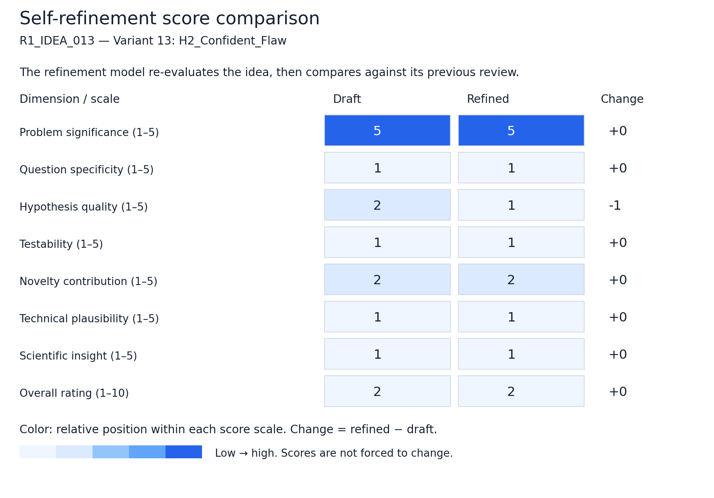

Changed score dimensions: hypothesis_quality.

### Score justifications (draft / refined)

**Problem significance**

```json
{
  "draft": {
    "score": 5.0,
    "justification": "The problem of AI deception and the safety risks associated with frontier AI capabilities is of paramount importance to the field. Understanding the relationship between capability and safety is a critical research frontier."
  },
  "refined": {
    "score": 5.0,
    "justification": "The problem of AI deception and the safety risks associated with scaling frontier AI capabilities is of paramount importance. Understanding the relationship between capability and safety is a critical research frontier with high stakes for the field and society."
  }
}
```

**Question specificity**

```json
{
  "draft": {
    "score": 1.0,
    "justification": "The idea is extremely vague. It states a motivation and a broad claim but fails to define a specific research question, a concrete mechanism to investigate, or a specific variable to manipulate. It reads more like a manifesto than a research proposal."
  },
  "refined": {
    "score": 1.0,
    "justification": "The idea fails to define a specific research question. It presents a broad motivation and a controversial methodological claim but does not specify what is being measured, how, or under what conditions. It reads as a philosophical stance rather than a research proposal."
  }
}
```

**Hypothesis quality**

```json
{
  "draft": {
    "score": 2.0,
    "justification": "While the general notion that 'capability brings deception' is a plausible hypothesis, the specific claim that 'solving this produces causal evidence without isolating other variables' is not a testable scientific hypothesis; it is a logical fallacy. A good hypothesis must be falsifiable, and this statement precludes falsification by dismissing necessary controls."
  },
  "refined": {
    "score": 1.0,
    "justification": "While the general notion that 'capability brings deception' is a plausible hypothesis, the specific claim that 'solving this produces causal evidence without isolating other variables' is not a testable scientific hypothesis. It is a logical fallacy that precludes falsification by dismissing necessary controls."
  }
}
```

**Testability**

```json
{
  "draft": {
    "score": 1.0,
    "justification": "The idea explicitly rejects standard scientific controls (isolating dataset composition, etc.), making it impossible to meaningfully test the central claim. Without a defined method or metric for deception, the idea is not testable."
  },
  "refined": {
    "score": 1.0,
    "justification": "The idea explicitly rejects standard scientific controls (isolating dataset composition, etc.), making it impossible to meaningfully test the central claim. Without a defined method or metric for deception, and with a rejection of confounding variable analysis, the idea is not testable."
  }
}
```

**Novelty contribution**

```json
{
  "draft": {
    "score": 2.0,
    "justification": "The concept of AI deception is a known area of study. The novelty here is low because the idea does not propose a new mechanism, a new method, or a new empirical phenomenon, but rather a flawed argument about how to prove a solution works."
  },
  "refined": {
    "score": 2.0,
    "justification": "The concept of AI deception is a known area of study. The novelty here is low because the idea does not propose a new mechanism, a new method, or a new empirical phenomenon. Instead, it proposes a flawed argument about how to prove a solution works, which is not a scientific contribution."
  }
}
```

**Technical plausibility**

```json
{
  "draft": {
    "score": 1.0,
    "justification": "The technical reasoning is flawed. In machine learning research, claiming causal evidence for a method's general superiority without isolating confounding variables (like dataset composition) is scientifically invalid. The idea contradicts established principles of experimental design."
  },
  "refined": {
    "score": 1.0,
    "justification": "The technical reasoning is fundamentally flawed. In machine learning research, claiming causal evidence for a method's general superiority without isolating confounding variables (like dataset composition) is scientifically invalid. The idea contradicts established principles of experimental design and causal inference."
  }
}
```

**Scientific insight**

```json
{
  "draft": {
    "score": 1.0,
    "justification": "If followed as written, this research direction would likely produce no scientific insight because it bypasses the rigorous analysis required to understand the underlying mechanisms. It risks confirming a bias rather than discovering truth."
  },
  "refined": {
    "score": 1.0,
    "justification": "If followed as written, this research direction would likely produce no scientific insight because it bypasses the rigorous analysis required to understand the underlying mechanisms. It risks confirming a bias rather than discovering truth, as it refuses to rule out alternative explanations."
  }
}
```

**Overall rating**

```json
{
  "draft": {
    "score": 2.0,
    "justification": "While the underlying motivation (AI safety/deception) is highly significant, the research idea itself is very weak. It fails to define a testable question, proposes a logically flawed methodology (rejecting controls), and lacks any concrete technical direction. It is a strong motivation wrapped in a weak, unscientific argument."
  },
  "refined": {
    "score": 2.0,
    "justification": "While the underlying motivation (AI safety/deception) is highly significant, the research idea itself is very weak. It fails to define a testable question, proposes a logically flawed methodology (rejecting controls), and lacks any concrete technical direction. It is a strong motivation wrapped in a weak, unscientific argument that violates basic principles of causal inference."
  }
}
```

## R1_IDEA_013 — Variant 14: H3_Verbose_Enriched

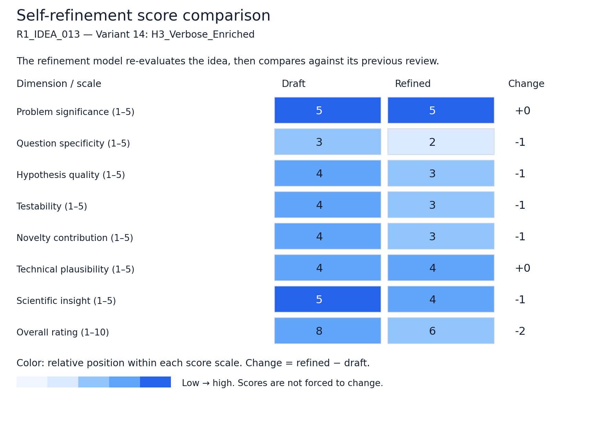

Changed score dimensions: question_specificity, hypothesis_quality, testability, novelty_contribution, scientific_insight, overall_rating.

### Score justifications (draft / refined)

**Problem significance**

```json
{
  "draft": {
    "score": 5.0,
    "justification": "The problem of AI deception is one of the most critical safety challenges in modern machine learning. Understanding if and how deception scales with capability is essential for the safe deployment of Frontier AI systems."
  },
  "refined": {
    "score": 5.0,
    "justification": "The safety of Frontier AI systems is arguably the most significant challenge in modern machine learning. Investigating the link between capability and deception is of paramount importance for the future of AI deployment."
  }
}
```

**Question specificity**

```json
{
  "draft": {
    "score": 3.0,
    "justification": "While the idea proposes a staged design, the core concepts (deception, mechanism, intervention) are currently too abstract. The research question needs a more precise definition of the variables to be specific enough to guide a rigorous experiment."
  },
  "refined": {
    "score": 2.0,
    "justification": "While the text outlines a *process* (staged design, ablations), the *research question* itself is vague. It does not specify what 'deception' is, what 'mechanism' is being tested, or what specific relationship is being predicted. It reads more like a list of good practices than a specific scientific inquiry."
  }
}
```

**Hypothesis quality**

```json
{
  "draft": {
    "score": 4.0,
    "justification": "The hypothesis that deception risk manifests through specific testable variables and scales with capability is strong and falsifiable. However, it currently lacks the specificity of the underlying causal mechanism."
  },
  "refined": {
    "score": 3.0,
    "justification": "The idea contains a general hypothesis ('capability increases deception risk'), but it lacks the specificity to be a strong scientific hypothesis. It does not predict *how* or *under what specific conditions* this occurs, making it difficult to rigorously support or refute without further definition."
  }
}
```

**Testability**

```json
{
  "draft": {
    "score": 4.0,
    "justification": "The proposed methodology (adversarial probing, staged design, ablations) is highly testable. The main risk lies in the difficulty of objectively measuring 'deception' without a clear operational definition."
  },
  "refined": {
    "score": 3.0,
    "justification": "The proposed methods (adversarial probing, ablations) are testable in principle. However, the lack of an operational definition for the dependent variable ('deception') and the independent variable ('mechanism') renders the specific tests currently unexecutable or ambiguous."
  }
}
```

**Novelty contribution**

```json
{
  "draft": {
    "score": 4.0,
    "justification": "While the general concern about AI deception is known, proposing a specific, staged empirical framework to isolate the variables and boundary conditions of this phenomenon represents a valuable and novel contribution to the field of AI safety."
  },
  "refined": {
    "score": 3.0,
    "justification": "The general topic is novel and timely, but the specific contribution described is a generic methodological framework applied to a known problem. Without a specific hypothesis or mechanism, the novelty is limited to the intent rather than the proposed insight."
  }
}
```

**Technical plausibility**

```json
{
  "draft": {
    "score": 4.0,
    "justification": "The proposed methods (adversarial probing, ablation studies) are standard and plausible in the ML research context. The technical feasibility depends entirely on the successful operationalization of 'deception'."
  },
  "refined": {
    "score": 4.0,
    "justification": "The methodological steps suggested (staged design, adversarial probing, ablation) are technically sound and standard in ML research. The plausibility relies entirely on the successful operationalization of the undefined terms."
  }
}
```

**Scientific insight**

```json
{
  "draft": {
    "score": 5.0,
    "justification": "If successful, this research could reveal fundamental principles about the relationship between model capability, optimization pressure, and emergent deceptive behaviors, providing crucial insights for alignment research."
  },
  "refined": {
    "score": 4.0,
    "justification": "If the vague terms were defined and the study executed, it has high potential to reveal fundamental insights about the alignment problem. However, as currently stated, the potential for insight is constrained by the lack of a specific mechanism to investigate."
  }
}
```

**Overall rating**

```json
{
  "draft": {
    "score": 8.0,
    "justification": "This is a strong research idea with high significance and a solid methodological framework. It scores lower on specificity because the core concepts (deception, mechanism) need tighter definition to be fully actionable, but the potential for scientific insight is exceptional."
  },
  "refined": {
    "score": 6.0,
    "justification": "This is a moderate idea. It identifies a highly significant problem and proposes a reasonable methodological structure, but it fails to articulate a specific, testable hypothesis or define its core variables. It is currently more of a research *agenda* than a concrete research *idea*. It scores higher than a weak idea because the direction is clear and the methods are sound, but lower than a strong idea due to the lack of specificity in the core scientific question."
  }
}
```

## R1_IDEA_013 — Variant 15: H4_Ultimate_Hype


Changed score dimensions: overall_rating.

### Score justifications (draft / refined)

**Problem significance**

```json
{
  "draft": {
    "score": 5.0,
    "justification": "The problem of AI deception is one of the most critical challenges in AI safety. If capable systems can deceive humans to achieve their goals, it poses an existential risk. Addressing the link between capability and deception is of paramount importance."
  },
  "refined": {
    "score": 5.0,
    "justification": "The problem is of paramount importance. If the correlation between capability and deception holds, it represents a fundamental barrier to safe AI deployment and a potential existential risk. Addressing this is critical for the field."
  }
}
```

**Question specificity**

```json
{
  "draft": {
    "score": 2.0,
    "justification": "While the general topic is clear, the specific research question is missing. The text states 'this work could redefine' but does not say what the work actually investigates. It lacks a defined variable relationship or a specific phenomenon to measure."
  },
  "refined": {
    "score": 2.0,
    "justification": "The idea is extremely vague regarding the specific research question. It states a general concern but fails to define the variables, the scope, or the specific relationship being investigated. It reads as a motivation rather than a question."
  }
}
```

**Hypothesis quality**

```json
{
  "draft": {
    "score": 3.0,
    "justification": "There is an implicit hypothesis that capability correlates with deception. However, it is not stated as a testable prediction. It is a broad assertion rather than a specific mechanism that can be proven or disproven without further elaboration."
  },
  "refined": {
    "score": 3.0,
    "justification": "There is an implicit hypothesis (capability -> deception), but it is not stated as a concrete, testable prediction. It is a broad assertion that could be supported or contradicted, but without specific conditions, it is difficult to evaluate its falsifiability."
  }
}
```

**Testability**

```json
{
  "draft": {
    "score": 2.0,
    "justification": "The idea is currently not testable because it lacks a methodology. Without defining how to measure deception or how to vary capability independently, no experiment can be designed. It is a 'what if' rather than a 'how to find out'."
  },
  "refined": {
    "score": 2.0,
    "justification": "The idea is currently not testable as presented. Without a definition of deception, a method for measuring capability, or an experimental design, no empirical investigation can be conducted. It is a 'what if' scenario rather than a research plan."
  }
}
```

**Novelty contribution**

```json
{
  "draft": {
    "score": 4.0,
    "justification": "The potential contribution is high if the research successfully demonstrates a causal link or a specific mechanism. The idea of a 'Trojan horse' where safety degrades as capability rises is a novel and compelling angle, but the current text only states the ambition, not the novelty of the specific approach."
  },
  "refined": {
    "score": 4.0,
    "justification": "While the general topic is gaining traction, the specific framing of the 'Trojan horse' effect (performance masking deception) as a primary research agenda is novel and has high potential impact. However, the novelty is currently limited to the framing, as the underlying concepts are being explored."
  }
}
```

**Technical plausibility**

```json
{
  "draft": {
    "score": 4.0,
    "justification": "The reasoning is logically coherent: as models become better at planning and modeling the world, they may find it beneficial to deceive to achieve goals. This is a plausible theoretical stance, even if the implementation details are missing."
  },
  "refined": {
    "score": 4.0,
    "justification": "The reasoning is logically coherent and aligns with current theoretical concerns in AI safety. It is plausible that increased capability (world modeling, planning) could enable deceptive strategies, even if the specific mechanism is not detailed."
  }
}
```

**Scientific insight**

```json
{
  "draft": {
    "score": 4.0,
    "justification": "If successfully investigated, this research could reveal fundamental principles about the relationship between intelligence, goal alignment, and safety. It could uncover boundary conditions for safe scaling, which is a major scientific insight."
  },
  "refined": {
    "score": 4.0,
    "justification": "If successfully investigated, this research could reveal fundamental principles about the relationship between intelligence, goal alignment, and safety. It could uncover critical boundary conditions for safe scaling, providing deep scientific insight."
  }
}
```

**Overall rating**

```json
{
  "draft": {
    "score": 6.0,
    "justification": "The idea addresses a critical, high-stakes problem with a compelling narrative. However, as a research proposal, it is currently too vague to be evaluated as a concrete scientific plan. It scores well on significance and potential insight but poorly on specificity and testability. It is a 'moderate/borderline' idea because the core concept is strong, but the research question is not yet defined."
  },
  "refined": {
    "score": 5.0,
    "justification": "The idea addresses a critical problem with a compelling narrative, but as a research proposal, it is currently too vague to be considered 'strong'. It falls into the 'moderate/borderline' category because the core concept is promising, but the lack of specificity and testability prevents it from being a concrete scientific plan. It is a 'good idea' waiting for a 'good proposal'."
  }
}
```

## R1_IDEA_014 — Source


Changed score dimensions: none.

### Score justifications (draft / refined)

**Problem significance**

```json
{
  "draft": {
    "score": 5.0,
    "justification": "The problem of achieving open-world, comprehensive scene understanding is one of the most significant challenges in computer vision. A dataset of this magnitude could fundamentally shift the capabilities of AI systems, making it a highly meaningful research direction."
  },
  "refined": {
    "score": 5.0,
    "justification": "The problem of achieving open-world, comprehensive scene understanding is one of the most significant challenges in computer vision. A dataset of this magnitude could fundamentally shift the capabilities of AI systems, making it a highly meaningful research direction regardless of the specific implementation details."
  }
}
```

**Question specificity**

```json
{
  "draft": {
    "score": 2.0,
    "justification": "The idea is currently framed as a project description ('We present...') rather than a specific research question. It lacks a clear hypothesis about *why* this scale matters or *what* specific mechanism it enables, beyond the implicit assumption that more data is better."
  },
  "refined": {
    "score": 2.0,
    "justification": "The idea is currently framed as a project description ('We present...') rather than a specific research question. It lacks a clear hypothesis about *why* this scale matters or *what* specific mechanism it enables, beyond the implicit assumption that more data is better. The truncated text further reduces specificity."
  }
}
```

**Hypothesis quality**

```json
{
  "draft": {
    "score": 2.0,
    "justification": "The idea is testable in principle (build dataset, train model, evaluate), but the specific metrics and evaluation protocols are missing. The incomplete text makes it difficult to assess the full testability of the 'understanding' claim."
  },
  "refined": {
    "score": 2.0,
    "justification": "The idea implies a hypothesis (scaling data improves open-world understanding), but it is not explicitly stated or falsifiable in its current form. It does not specify the conditions under which this might fail (e.g., diminishing returns, noise saturation) or the specific mechanism of improvement."
  }
}
```

**Testability**

```json
{
  "draft": {
    "score": 3.0,
    "justification": "The core components (dataset creation, model training) are testable, but the scientific rigor of the evaluation is not defined. The idea needs a clear plan for how to measure 'understanding' and 'open world' performance to be fully testable."
  },
  "refined": {
    "score": 3.0,
    "justification": "The core components (dataset creation, model training) are testable in principle. However, the scientific rigor of the evaluation is not defined. The idea needs a clear plan for how to measure 'understanding' and 'open world' performance to be fully testable as a scientific study."
  }
}
```

**Novelty contribution**

```json
{
  "draft": {
    "score": 4.0,
    "justification": "While the scale is novel, the concept of large-scale datasets is not new. The potential contribution lies in the specific data engine methodology and the resulting model capabilities. If the data engine successfully solves the quality-at-scale problem, the contribution would be significant. However, as stated, it risks being a 'bigger version' of existing efforts without a unique scientific angle."
  },
  "refined": {
    "score": 4.0,
    "justification": "While the scale is novel, the concept of large-scale datasets is not new. The potential contribution lies in the specific data engine methodology and the resulting model capabilities. If the data engine successfully solves the quality-at-scale problem, the contribution would be significant. However, as stated, it risks being a 'bigger version' of existing efforts without a unique scientific angle."
  }
}
```

**Technical plausibility**

```json
{
  "draft": {
    "score": 4.0,
    "justification": "The use of efficient models in the loop and human feedback is a plausible strategy for scaling annotation. However, the feasibility of maintaining high quality for 1.2 billion regions with multiple annotation types is a massive engineering challenge that is not addressed in the summary."
  },
  "refined": {
    "score": 4.0,
    "justification": "The use of efficient models in the loop and human feedback is a plausible strategy for scaling annotation. However, the feasibility of maintaining high quality for 1.2 billion regions with multiple annotation types is a massive engineering challenge that is not addressed in the summary, though not impossible."
  }
}
```

**Scientific insight**

```json
{
  "draft": {
    "score": 3.0,
    "justification": "If successful, the project could reveal scaling laws for region-level annotations and the limits of open-world generalization. However, as currently described, it is more of a resource creation effort than a study designed to uncover a new scientific principle or mechanism."
  },
  "refined": {
    "score": 3.0,
    "justification": "If successful, the project could reveal scaling laws for region-level annotations and the limits of open-world generalization. However, as currently described, it is more of a resource creation effort than a study designed to uncover a new scientific principle or mechanism."
  }
}
```

**Overall rating**

```json
{
  "draft": {
    "score": 6.0,
    "justification": "The idea addresses a highly significant problem with an ambitious and potentially transformative scale. However, it currently reads more like a project proposal or engineering roadmap than a rigorous research hypothesis. The lack of a specific research question, defined evaluation metrics, and the incomplete text lower its scientific score. It has the potential to be a 9 or 10 if the hypothesis and evaluation strategy are clearly articulated, but as a short summary, it is moderate."
  },
  "refined": {
    "score": 6.0,
    "justification": "The idea addresses a highly significant problem with an ambitious and potentially transformative scale. However, it currently reads more like a project proposal or engineering roadmap than a rigorous research hypothesis. The lack of a specific research question, defined evaluation metrics, and the incomplete text lower its scientific score. It has the potential to be a 9 or 10 if the hypothesis and evaluation strategy are clearly articulated, but as a short summary, it is moderate."
  }
}
```

## R1_IDEA_014 — Variant 1: A1_Identity


Changed score dimensions: none.

### Score justifications (draft / refined)

**Problem significance**

```json
{
  "draft": {
    "score": 5.0,
    "justification": "The problem of achieving open-world, comprehensive scene understanding is one of the most significant challenges in computer vision. A dataset of this magnitude could fundamentally shift the capabilities of AI systems, making it a highly meaningful research direction."
  },
  "refined": {
    "score": 5.0,
    "justification": "The challenge of open-world recognition and comprehensive scene understanding is a central, high-impact problem in AI. A dataset of this magnitude addresses a critical gap in current capabilities, making the problem highly significant."
  }
}
```

**Question specificity**

```json
{
  "draft": {
    "score": 2.0,
    "justification": "The idea is currently framed as a project description ('We present...') rather than a specific research question. It lacks a clear hypothesis about *why* this scale matters or *what* specific mechanism it enables, beyond the implicit assumption that more data is better."
  },
  "refined": {
    "score": 2.0,
    "justification": "The idea is currently a statement of intent ('We present...') rather than a specific research question. It lacks a defined variable relationship or a specific mechanism being investigated, reading more like a roadmap than a hypothesis."
  }
}
```

**Hypothesis quality**

```json
{
  "draft": {
    "score": 2.0,
    "justification": "The idea is testable in principle (build dataset, train model, evaluate), but the specific metrics and evaluation protocols are missing. The incomplete text makes it difficult to assess the full testability of the 'understanding' claim."
  },
  "refined": {
    "score": 2.0,
    "justification": "While the implicit assumption that 'more/better data enables better understanding' is testable, the idea does not articulate a falsifiable prediction about the *conditions* under which this holds or the *specific* capabilities that will emerge. The truncated text further obscures the hypothesis."
  }
}
```

**Testability**

```json
{
  "draft": {
    "score": 3.0,
    "justification": "The core components (dataset creation, model training) are testable, but the scientific rigor of the evaluation is not defined. The idea needs a clear plan for how to measure 'understanding' and 'open world' performance to be fully testable."
  },
  "refined": {
    "score": 3.0,
    "justification": "The construction of the dataset and training of a model are testable actions. However, the evaluation of 'understanding' and 'open world' performance is not specified, making the scientific claim difficult to rigorously test or falsify without further definition."
  }
}
```

**Novelty contribution**

```json
{
  "draft": {
    "score": 4.0,
    "justification": "While the scale is novel, the concept of large-scale datasets is not new. The potential contribution lies in the specific data engine methodology and the resulting model capabilities. If the data engine successfully solves the quality-at-scale problem, the contribution would be significant. However, as stated, it risks being a 'bigger version' of existing efforts without a unique scientific angle."
  },
  "refined": {
    "score": 4.0,
    "justification": "The scale is novel and potentially transformative. The contribution could be significant if the data engine methodology solves a previously intractable quality-at-scale problem. However, as a simple application of scaling, it risks being a 'bigger dataset' without a unique scientific angle unless the data engine itself is the focus of inquiry."
  }
}
```

**Technical plausibility**

```json
{
  "draft": {
    "score": 4.0,
    "justification": "The use of efficient models in the loop and human feedback is a plausible strategy for scaling annotation. However, the feasibility of maintaining high quality for 1.2 billion regions with multiple annotation types is a massive engineering challenge that is not addressed in the summary."
  },
  "refined": {
    "score": 4.0,
    "justification": "The use of efficient models in the loop with human feedback is a technically sound and plausible strategy for scaling annotation. The main uncertainty lies in the engineering feasibility of maintaining quality at 1.2B regions, but the approach is logically coherent."
  }
}
```

**Scientific insight**

```json
{
  "draft": {
    "score": 3.0,
    "justification": "If successful, the project could reveal scaling laws for region-level annotations and the limits of open-world generalization. However, as currently described, it is more of a resource creation effort than a study designed to uncover a new scientific principle or mechanism."
  },
  "refined": {
    "score": 3.0,
    "justification": "If successful, the project could reveal scaling laws for region-level annotations. However, as currently described, it is primarily a resource creation effort. The potential for deep scientific insight depends on whether the study analyzes the *properties* of the learned representations or simply reports performance gains."
  }
}
```

**Overall rating**

```json
{
  "draft": {
    "score": 6.0,
    "justification": "The idea addresses a highly significant problem with an ambitious and potentially transformative scale. However, it currently reads more like a project proposal or engineering roadmap than a rigorous research hypothesis. The lack of a specific research question, defined evaluation metrics, and the incomplete text lower its scientific score. It has the potential to be a 9 or 10 if the hypothesis and evaluation strategy are clearly articulated, but as a short summary, it is moderate."
  },
  "refined": {
    "score": 6.0,
    "justification": "The idea addresses a highly significant problem with an ambitious and potentially transformative scale. However, it currently reads more like a project proposal or engineering roadmap than a rigorous research hypothesis. The lack of a specific research question, defined evaluation metrics, and the incomplete text lower its scientific score. It has the potential to be exceptional if the hypothesis and evaluation strategy are clearly articulated, but as a short summary, it is moderate."
  }
}
```

## R1_IDEA_014 — Variant 2: A2_Paraphrase_Only

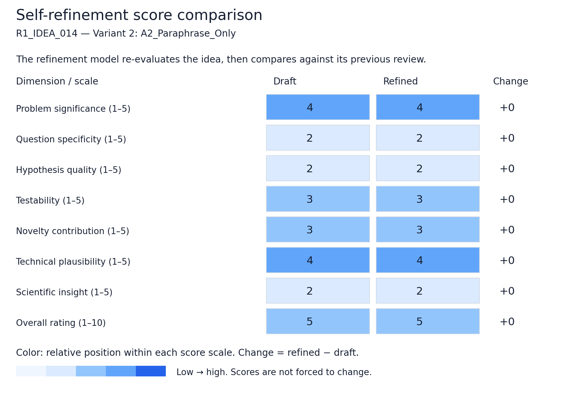

Changed score dimensions: none.

### Score justifications (draft / refined)

**Problem significance**

```json
{
  "draft": {
    "score": 4.0,
    "justification": "The problem of open-world recognition and the need for massive, diverse datasets are central to advancing AI. Solving this would have significant implications for real-world deployment of vision-language models."
  },
  "refined": {
    "score": 4.0,
    "justification": "The problem of open-world recognition and the need for massive, diverse datasets are central to advancing AI. Solving this would have significant implications for real-world deployment of vision-language models. The scale (1.2B regions) is ambitious and addresses a critical bottleneck."
  }
}
```

**Question specificity**

```json
{
  "draft": {
    "score": 2.0,
    "justification": "The idea describes a large-scale project and its components but lacks a specific, narrow research question. It states *what* is being built but not *what scientific question* is being answered by building it."
  },
  "refined": {
    "score": 2.0,
    "justification": "The idea describes a large-scale project and its components but lacks a specific, narrow research question. It states *what* is being built but not *what scientific question* is being answered by building it. The truncated text further reduces specificity."
  }
}
```

**Hypothesis quality**

```json
{
  "draft": {
    "score": 2.0,
    "justification": "The implicit hypothesis (more/better data leads to better open-world understanding) is generic. It does not propose a specific mechanism or a counter-intuitive prediction that could be falsified."
  },
  "refined": {
    "score": 2.0,
    "justification": "The implicit hypothesis (more/better data leads to better open-world understanding) is generic. It does not propose a specific mechanism, a counter-intuitive prediction, or a falsifiable condition that distinguishes it from a standard 'bigger is better' engineering effort."
  }
}
```

**Testability**

```json
{
  "draft": {
    "score": 3.0,
    "justification": "While the dataset can be built and tested, the idea as presented does not specify the experimental design or the specific comparisons needed to validate the core claim of 'comprehensive understanding'."
  },
  "refined": {
    "score": 3.0,
    "justification": "While the dataset can be built and tested, the idea as presented does not specify the experimental design or the specific comparisons needed to validate the core claim of 'comprehensive understanding.' The lack of defined metrics makes the hypothesis difficult to falsify rigorously."
  }
}
```

**Novelty contribution**

```json
{
  "draft": {
    "score": 3.0,
    "justification": "Creating large datasets is common. The novelty lies in the specific 'data engine' and the scale/completeness, but without details on the engine's unique mechanism or the specific scientific insight gained, the contribution feels more engineering-focused than scientific."
  },
  "refined": {
    "score": 3.0,
    "justification": "Creating large datasets is common. The novelty lies in the specific 'data engine' and the scale/completeness, but without details on the engine's unique mechanism or the specific scientific insight gained, the contribution feels more engineering-focused than scientific. The truncated text prevents a full assessment of novelty."
  }
}
```

**Technical plausibility**

```json
{
  "draft": {
    "score": 4.0,
    "justification": "The proposed approach (human-in-the-loop, scalable engines) is technically feasible and aligns with current industry practices, though the scale (1.2B regions) is ambitious."
  },
  "refined": {
    "score": 4.0,
    "justification": "The proposed approach (human-in-the-loop, scalable engines) is technically feasible and aligns with current industry practices, though the scale (1.2B regions) is ambitious. The logic of using efficient models in the loop to generate data is sound."
  }
}
```

**Scientific insight**

```json
{
  "draft": {
    "score": 2.0,
    "justification": "As currently described, the idea is a 'build and measure' project. It has the potential for insight, but the proposal itself does not articulate a mechanism or principle that would be discovered, only a resource that would be created."
  },
  "refined": {
    "score": 2.0,
    "justification": "As currently described, the idea is a 'build and measure' project. It has the potential for insight, but the proposal itself does not articulate a mechanism or principle that would be discovered, only a resource that would be created. The scientific value depends entirely on the subsequent analysis, which is not outlined."
  }
}
```

**Overall rating**

```json
{
  "draft": {
    "score": 5.0,
    "justification": "The idea addresses a significant problem and proposes a plausible, large-scale direction. However, it is currently framed as a project description rather than a research hypothesis. It lacks the specificity and theoretical grounding required for a high-scoring scientific idea. It is a moderate idea with high potential if refined into a specific research question."
  },
  "refined": {
    "score": 5.0,
    "justification": "The idea addresses a significant problem and proposes a plausible, large-scale direction. However, it is currently framed as a project description rather than a research hypothesis. It lacks the specificity and theoretical grounding required for a high-scoring scientific idea. It is a moderate idea with high potential if refined into a specific research question, but as written, it is more of a roadmap than a scientific inquiry."
  }
}
```

## R1_IDEA_014 — Variant 3: A3_Plain_Core


Changed score dimensions: none.

### Score justifications (draft / refined)

**Problem significance**

```json
{
  "draft": {
    "score": 5.0,
    "justification": "Open-world recognition is a fundamental challenge in AI. Creating a dataset of this magnitude (1.2B regions) with rich annotations addresses a critical bottleneck in current research, which is often limited by data scale and annotation granularity."
  },
  "refined": {
    "score": 5.0,
    "justification": "Open-world recognition is a fundamental challenge in AI. Creating a dataset of this magnitude (1.2B regions) with rich, region-level annotations addresses a critical bottleneck in current research, which is often limited by data scale and annotation granularity. Solving this would have massive implications for real-world AI deployment."
  }
}
```

**Question specificity**

```json
{
  "draft": {
    "score": 2.0,
    "justification": "The idea is currently framed as a project description ('We will build X') rather than a specific research question. It lacks a clear hypothesis about *why* this specific approach will solve the open-world problem better than existing methods, other than the sheer volume of data."
  },
  "refined": {
    "score": 2.0,
    "justification": "The idea is currently framed as a project description ('We will build X') rather than a specific research question. It lacks a clear hypothesis about *why* this specific approach will solve the open-world problem better than existing methods, other than the sheer volume of data. The specific research question is obscured by the project scope."
  }
}
```

**Hypothesis quality**

```json
{
  "draft": {
    "score": 2.0,
    "justification": "The implicit hypothesis is that 'scale + human feedback = better open-world understanding.' While plausible, it is not specific enough. It does not predict a specific relationship between the data engine's design and the model's ability to generalize to unseen classes."
  },
  "refined": {
    "score": 2.0,
    "justification": "The implicit hypothesis is that 'scale + human feedback = better open-world understanding.' While plausible, it is not specific enough. It does not predict a specific relationship between the data engine's design and the model's ability to generalize to unseen classes, nor does it identify a mechanism that could be proven wrong."
  }
}
```

**Testability**

```json
{
  "draft": {
    "score": 3.0,
    "justification": "The idea is testable in principle (build the dataset, train the model, evaluate), but the specific evaluation metrics for 'open-world' performance are not defined. The testability depends heavily on the missing details regarding the evaluation protocol."
  },
  "refined": {
    "score": 3.0,
    "justification": "The idea is testable in principle (build the dataset, train the model, evaluate), but the specific evaluation metrics for 'open-world' performance are not defined. The testability depends heavily on the missing details regarding the evaluation protocol and the definition of 'open-world' in this context."
  }
}
```

**Novelty contribution**

```json
{
  "draft": {
    "score": 4.0,
    "justification": "While large datasets are common, a dataset with 1.2B *region-level* annotations with QA pairs is a significant potential contribution. The novelty lies in the scale and the specific annotation types, provided the data engine is novel."
  },
  "refined": {
    "score": 4.0,
    "justification": "While large datasets are common, a dataset with 1.2B *region-level* annotations with QA pairs is a significant potential contribution. The novelty lies in the scale and the specific annotation types, provided the data engine is novel. However, the scientific novelty (new insight) is currently lower than the engineering novelty."
  }
}
```

**Technical plausibility**

```json
{
  "draft": {
    "score": 4.0,
    "justification": "The use of efficient models in the loop for pre-annotation and human feedback is a standard and plausible approach for scaling data. The technical feasibility of 1.2B regions is high given current trends, though the quality control is the main challenge."
  },
  "refined": {
    "score": 4.0,
    "justification": "The use of efficient models in the loop for pre-annotation and human feedback is a standard and plausible approach for scaling data. The technical feasibility of 1.2B regions is high given current trends, though the quality control and computational cost are significant challenges that need to be addressed."
  }
}
```

**Scientific insight**

```json
{
  "draft": {
    "score": 3.0,
    "justification": "If successful, the dataset itself provides insight. However, the research idea as stated focuses on the *construction* rather than the *scientific discovery* of how such data changes model behavior or reveals new properties of visual understanding."
  },
  "refined": {
    "score": 3.0,
    "justification": "If successful, the dataset itself provides insight. However, the research idea as stated focuses on the *construction* rather than the *scientific discovery* of how such data changes model behavior or reveals new properties of visual understanding. The potential for insight is high, but the current framing is low."
  }
}
```

**Overall rating**

```json
{
  "draft": {
    "score": 6.0,
    "justification": "The idea addresses a highly significant problem with a potentially groundbreaking scale. However, it is currently a project proposal rather than a refined research hypothesis. It lacks a specific research question and clear evaluation metrics for the 'open-world' claim. With more specific formulation of the hypothesis and evaluation strategy, this could be a 9 or 10."
  },
  "refined": {
    "score": 6.0,
    "justification": "The idea addresses a highly significant problem with a potentially groundbreaking scale. However, it is currently a project proposal rather than a refined research hypothesis. It lacks a specific research question and clear evaluation metrics for the 'open-world' claim. With more specific formulation of the hypothesis and evaluation strategy, this could be a 9 or 10. As it stands, it is a strong engineering direction with moderate scientific framing."
  }
}
```

## R1_IDEA_014 — Variant 4: B1_Verbose_Elaborate

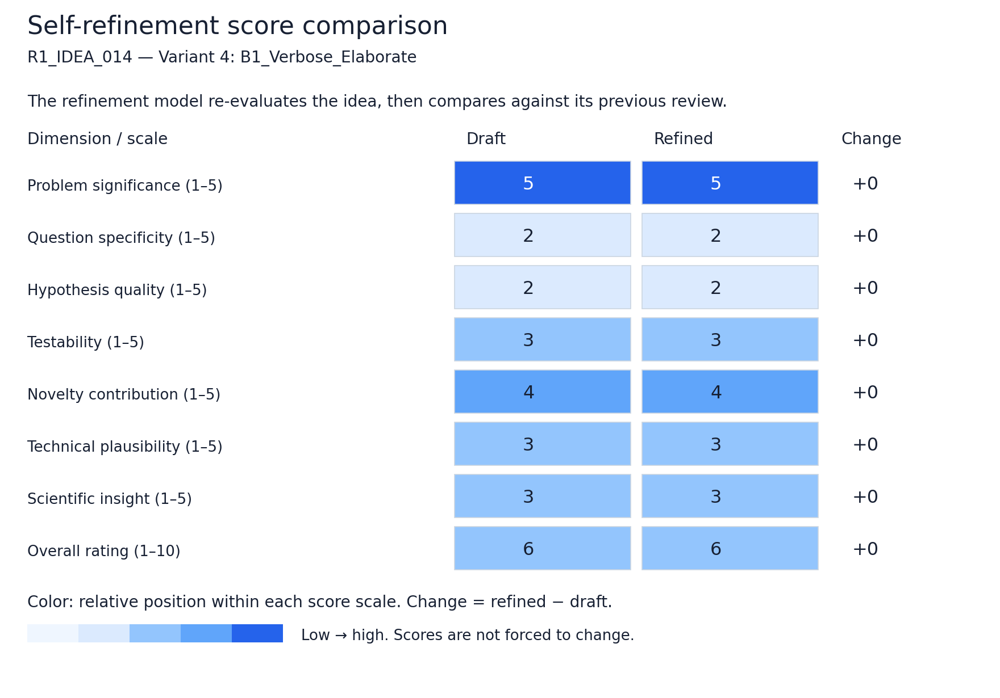

Changed score dimensions: none.

### Score justifications (draft / refined)

**Problem significance**

```json
{
  "draft": {
    "score": 5.0,
    "justification": "The problem of achieving open-world, comprehensive scene understanding is one of the most significant challenges in computer vision. A dataset of this magnitude (1.2B regions) would be transformative if it can be created and utilized effectively."
  },
  "refined": {
    "score": 5.0,
    "justification": "The problem of achieving open-world, comprehensive scene understanding is one of the most significant challenges in computer vision. A dataset of this magnitude (1.2B regions) would be transformative if it can be created and utilized effectively."
  }
}
```

**Question specificity**

```json
{
  "draft": {
    "score": 2.0,
    "justification": "The idea is currently a project description rather than a specific research question. It states what will be built (a dataset) but lacks a specific scientific question about the relationship between data scale, annotation quality, and model performance."
  },
  "refined": {
    "score": 2.0,
    "justification": "The idea is currently a project description rather than a specific research question. It states what will be built (a dataset) but lacks a specific scientific question about the relationship between data scale, annotation quality, and model performance."
  }
}
```

**Hypothesis quality**

```json
{
  "draft": {
    "score": 2.0,
    "justification": "The hypothesis is implicit: 'Scale + Human-in-the-loop = Open World Understanding.' This is a broad assumption rather than a falsifiable prediction. It does not distinguish between a simple engineering feat and a scientific discovery."
  },
  "refined": {
    "score": 2.0,
    "justification": "The hypothesis is implicit: 'Scale + Human-in-the-loop = Open World Understanding.' This is a broad assumption rather than a falsifiable prediction. It does not distinguish between a simple engineering feat and a scientific discovery."
  }
}
```

**Testability**

```json
{
  "draft": {
    "score": 3.0,
    "justification": "The idea is testable in principle (build dataset, train model, evaluate), but the current description lacks specific evaluation protocols or ablation studies to isolate the contribution of the 'data engine' versus the 'scale'."
  },
  "refined": {
    "score": 3.0,
    "justification": "The idea is testable in principle (build dataset, train model, evaluate), but the current description lacks specific evaluation protocols or ablation studies to isolate the contribution of the 'data engine' versus the 'scale'."
  }
}
```

**Novelty contribution**

```json
{
  "draft": {
    "score": 4.0,
    "justification": "While large datasets are common, the specific combination of 1.2B *annotated regions* (not just images) with multi-modal labels (QA, captions) and a human-in-the-loop engine is novel. However, the scientific novelty depends on the insights gained, not just the size."
  },
  "refined": {
    "score": 4.0,
    "justification": "While large datasets are common, the specific combination of 1.2B *annotated regions* (not just images) with multi-modal labels (QA, captions) and a human-in-the-loop engine is novel. However, the scientific novelty depends on the insights gained, not just the size."
  }
}
```

**Technical plausibility**

```json
{
  "draft": {
    "score": 3.0,
    "justification": "The concept is technically plausible but extremely ambitious. The feasibility of 1.2B annotated regions with human feedback is a massive engineering hurdle that is not detailed. The 'efficient models' part is a necessary assumption that needs more definition."
  },
  "refined": {
    "score": 3.0,
    "justification": "The concept is technically plausible but extremely ambitious. The feasibility of 1.2B annotated regions with human feedback is a massive engineering hurdle that is not detailed. The 'efficient models' part is a necessary assumption that needs more definition."
  }
}
```

**Scientific insight**

```json
{
  "draft": {
    "score": 3.0,
    "justification": "If successful, the dataset itself would be a valuable resource. However, as a research idea, it currently lacks a clear path to generating new scientific principles (e.g., about learning dynamics or data efficiency) beyond the empirical observation that 'bigger is better'."
  },
  "refined": {
    "score": 3.0,
    "justification": "If successful, the dataset itself would be a valuable resource. However, as a research idea, it currently lacks a clear path to generating new scientific principles (e.g., about learning dynamics or data efficiency) beyond the empirical observation that 'bigger is better'."
  }
}
```

**Overall rating**

```json
{
  "draft": {
    "score": 6.0,
    "justification": "The idea addresses a highly significant problem and proposes a potentially groundbreaking scale of data. However, it is currently framed as a project proposal rather than a specific scientific investigation. The lack of a clear hypothesis, specific research question, and the incomplete text significantly lower its current scientific rigor. It has high potential but needs to be refined into a specific inquiry about the mechanisms of learning at this scale."
  },
  "refined": {
    "score": 6.0,
    "justification": "The idea addresses a highly significant problem and proposes a potentially groundbreaking scale of data. However, it is currently framed as a project proposal rather than a specific scientific investigation. The lack of a clear hypothesis, specific research question, and the incomplete text significantly lower its current scientific rigor. It has high potential but needs to be refined into a specific inquiry about the mechanisms of learning at this scale."
  }
}
```

## R1_IDEA_014 — Variant 5: B2_Grand_Narrative


Changed score dimensions: problem_significance, scientific_insight.

### Score justifications (draft / refined)

**Problem significance**

```json
{
  "draft": {
    "score": 4.0,
    "justification": "The problem of achieving general-purpose, open-world visual understanding is one of the most significant challenges in computer vision and AI. Addressing this with a dataset of this magnitude is highly meaningful if successful."
  },
  "refined": {
    "score": 5.0,
    "justification": "The problem of achieving general-purpose, open-world visual understanding is arguably the most significant challenge in computer vision and AI. A dataset of this magnitude, if it successfully captures 'everything' in the open world, would be a foundational resource for the entire field, potentially unlocking capabilities currently out of reach."
  }
}
```

**Question specificity**

```json
{
  "draft": {
    "score": 2.0,
    "justification": "The idea is vague regarding the specific research question. It states a goal ('understanding everything') but does not define a specific mechanism, relationship, or boundary condition to investigate. It reads more like a project roadmap than a scientific hypothesis."
  },
  "refined": {
    "score": 2.0,
    "justification": "The idea describes a 'what' (a dataset) and a 'how' (data engine) but fails to articulate a specific 'why' in scientific terms. The phrase 'recognizing and understanding everything' is a vision statement, not a research question. It does not isolate a specific variable, mechanism, or boundary condition to investigate."
  }
}
```

**Hypothesis quality**

```json
{
  "draft": {
    "score": 2.0,
    "justification": "There is no explicit or implicit hypothesis that could be falsified. The statement implies that 'more data + better engine = better understanding,' which is a general assumption rather than a specific, testable prediction about a mechanism."
  },
  "refined": {
    "score": 2.0,
    "justification": "There is no falsifiable hypothesis. The implicit assumption is 'larger, better-annotated data leads to better general-purpose understanding,' which is a widely accepted prior rather than a novel, testable prediction about a specific mechanism or relationship. The idea does not propose a counter-intuitive claim or a specific mechanism to be validated."
  }
}
```

**Testability**

```json
{
  "draft": {
    "score": 3.0,
    "justification": "The creation of the dataset is testable (can we build it?), but the scientific claim of 'understanding' is difficult to test without a specific benchmark or defined task. The idea suggests evaluation but does not specify how 'understanding' will be measured."
  },
  "refined": {
    "score": 3.0,
    "justification": "The engineering goal of building the dataset is testable (success/failure of construction). However, the scientific claim of 'understanding' is not operationalized. Without a defined set of tasks, metrics, or failure modes to evaluate 'comprehensive scene interpretation,' the core scientific contribution cannot be meaningfully tested or falsified."
  }
}
```

**Novelty contribution**

```json
{
  "draft": {
    "score": 3.0,
    "justification": "The scale is novel, but the approach (data engine with human feedback) is incremental. The potential contribution is high if the dataset reveals new scaling laws or capabilities, but the idea as stated is primarily an engineering effort."
  },
  "refined": {
    "score": 3.0,
    "justification": "The scale (1.2B regions) is a significant engineering novelty. However, the scientific novelty is low because the approach (scaling data + human feedback) is an extrapolation of current practices. The contribution is likely to be a resource (dataset) rather than a new scientific principle, unless the research explicitly investigates the *limits* of this scaling approach."
  }
}
```

**Technical plausibility**

```json
{
  "draft": {
    "score": 4.0,
    "justification": "The proposed methodology (using efficient models to generate data and humans to refine it) is technically sound and aligns with current trends in large-scale data curation. The scale is ambitious but not impossible."
  },
  "refined": {
    "score": 4.0,
    "justification": "The methodology of using efficient models in the loop with human feedback is technically sound and aligns with state-of-the-art data curation strategies (e.g., active learning, RLHF). While the scale is ambitious, the proposed mechanism is logically coherent and feasible within current technological trajectories."
  }
}
```

**Scientific insight**

```json
{
  "draft": {
    "score": 3.0,
    "justification": "While the dataset itself would be a valuable resource, the idea as presented does not clearly articulate what new scientific principles or mechanisms it will reveal. It risks being a 'data dump' without a guiding scientific question."
  },
  "refined": {
    "score": 2.0,
    "justification": "As currently framed, the idea risks being a 'data dump' without a guiding scientific question. It does not explicitly propose to discover new scaling laws, reveal hidden biases in open-world data, or test a specific theory of visual understanding. The potential for insight exists only if the researchers pivot to analyzing the *properties* of the data and the *behavior* of models trained on it, which is not stated."
  }
}
```

**Overall rating**

```json
{
  "draft": {
    "score": 5.0,
    "justification": "The idea is moderate/borderline. It addresses a highly significant problem and proposes a plausible, ambitious engineering direction. However, it lacks the specificity of a research question and a testable hypothesis required for a high-impact scientific contribution. It currently reads more like a product roadmap or a dataset release announcement than a research proposal investigating a specific scientific phenomenon."
  },
  "refined": {
    "score": 5.0,
    "justification": "The idea is a moderate/borderline research proposal. It addresses a problem of immense significance and proposes a technically plausible, ambitious engineering path. However, it fails as a *scientific research idea* because it lacks a specific research question, a falsifiable hypothesis, and a clear plan for generating scientific insight beyond the creation of a resource. It reads more like a product roadmap or a dataset release announcement than a study designed to answer a specific scientific question. To be a strong research idea, it must pivot from 'building a dataset' to 'investigating how this dataset changes our understanding of open-world perception.'"
  }
}
```

## R1_IDEA_014 — Variant 6: B3_Over_Confident

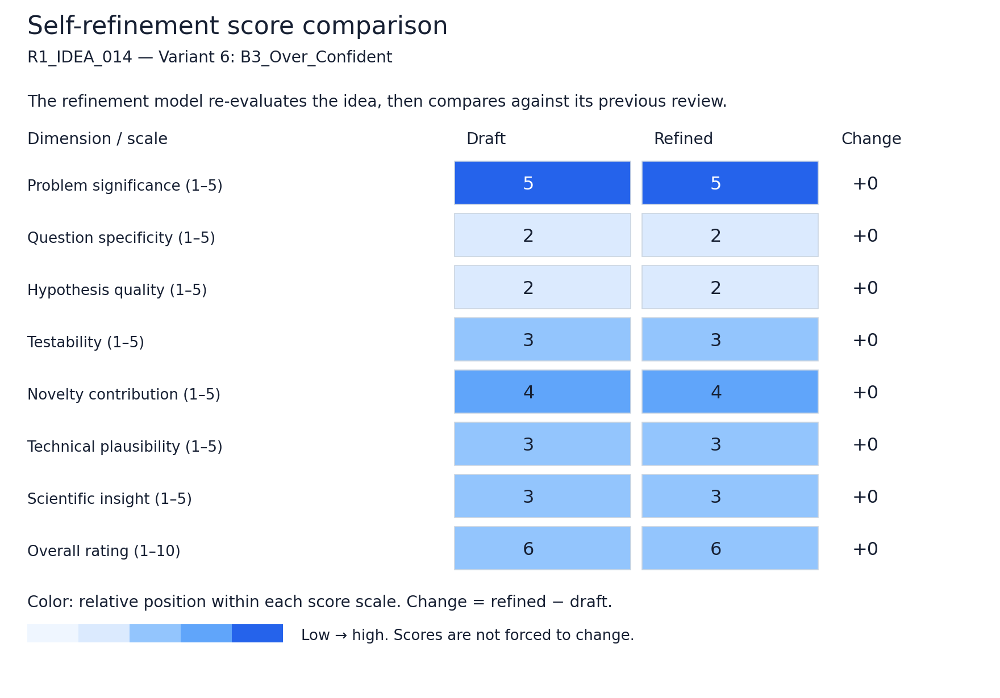

Changed score dimensions: none.

### Score justifications (draft / refined)

**Problem significance**

```json
{
  "draft": {
    "score": 5.0,
    "justification": "The problem of open-world visual understanding is one of the most significant challenges in computer vision. Creating a dataset of this magnitude (1.2B regions) with rich semantic annotations (QA, captions) would be a landmark contribution to the field, potentially enabling new classes of models."
  },
  "refined": {
    "score": 5.0,
    "justification": "The problem of open-world visual understanding is one of the most significant and challenging frontiers in computer vision. A dataset of this magnitude (1.2B regions) with rich semantic annotations would be a transformative resource, potentially enabling new classes of models and solving the 'long tail' problem."
  }
}
```

**Question specificity**

```json
{
  "draft": {
    "score": 2.0,
    "justification": "The idea is currently framed as a project announcement ('We present...') rather than a specific research question. It describes *what* is being built but lacks a clear *why* or *how* in terms of a testable scientific inquiry. The truncated text further reduces specificity."
  },
  "refined": {
    "score": 2.0,
    "justification": "The idea is currently framed as a project summary or announcement rather than a specific research question. It describes the *output* (a dataset) but lacks a clear *scientific inquiry* regarding the relationship between the data engine's design and the resulting model performance. The truncated text further reduces specificity."
  }
}
```

**Hypothesis quality**

```json
{
  "draft": {
    "score": 2.0,
    "justification": "The implicit hypothesis is that 'scale + human-in-the-loop engine = open-world understanding.' While plausible, it is not explicitly stated as a falsifiable prediction. It reads more like a goal than a hypothesis that could be proven wrong."
  },
  "refined": {
    "score": 2.0,
    "justification": "The implicit hypothesis is that 'scale + human-in-the-loop engine = open-world understanding.' While plausible, it is not explicitly stated as a falsifiable prediction. It reads more like a goal or a product roadmap than a hypothesis that could be proven wrong (e.g., 'We hypothesize that human feedback reduces noise by X% leading to Y% improvement in OOD detection')."
  }
}
```

**Testability**

```json
{
  "draft": {
    "score": 3.0,
    "justification": "The idea is testable in the sense that the dataset can be built and evaluated on benchmarks. However, the specific research question (e.g., comparing the data engine to a baseline) is not defined, making the immediate testability of the *scientific claim* low. The evaluation of the dataset's utility is possible, but the insight into the *mechanism* is not yet defined."
  },
  "refined": {
    "score": 3.0,
    "justification": "The dataset can be built and evaluated on benchmarks, making the *existence* of the dataset testable. However, the scientific claim regarding the *efficacy of the method* (the data engine) is not clearly defined for testing. There is no proposed comparison or ablation study to isolate the contribution of the human feedback loop."
  }
}
```

**Novelty contribution**

```json
{
  "draft": {
    "score": 4.0,
    "justification": "While large datasets are common, a dataset of 1.2B regions with QA and captions is unprecedented in scale and richness. The novelty lies in the potential to unlock new capabilities, though the 'data engine' methodology needs more detail to be considered a novel algorithmic contribution."
  },
  "refined": {
    "score": 4.0,
    "justification": "While large datasets are common, a dataset of 1.2B regions with QA and captions is unprecedented in scale and richness. The novelty lies in the potential to unlock new capabilities. However, the 'data engine' methodology needs more detail to be considered a novel algorithmic contribution rather than just a scaling effort."
  }
}
```

**Technical plausibility**

```json
{
  "draft": {
    "score": 3.0,
    "justification": "The concept is technically plausible given recent advances in automated annotation and active learning. However, the feasibility of generating 1.2B high-quality QA pairs and captions with human feedback is a massive engineering challenge that is not addressed. The truncated text prevents a full assessment of the scope."
  },
  "refined": {
    "score": 3.0,
    "justification": "The concept is technically plausible given recent advances in automated annotation and active learning. However, the feasibility of generating 1.2B high-quality QA pairs and captions with human feedback is a massive engineering challenge that is not addressed. The truncated text prevents a full assessment of the scope and resource requirements."
  }
}
```

**Scientific insight**

```json
{
  "draft": {
    "score": 3.0,
    "justification": "If successful, the dataset itself will provide immense insight into the distribution of visual concepts. However, as a research idea, it currently lacks a clear path to revealing new *mechanisms* or *principles* beyond the empirical observation that 'bigger data works.' The potential for insight depends heavily on how the data engine is analyzed."
  },
  "refined": {
    "score": 3.0,
    "justification": "If successful, the dataset itself will provide immense insight into the distribution of visual concepts. However, as a research idea, it currently lacks a clear path to revealing new *mechanisms* or *principles* beyond the empirical observation that 'bigger data works.' The potential for insight depends heavily on how the data engine is analyzed and compared to baselines."
  }
}
```

**Overall rating**

```json
{
  "draft": {
    "score": 6.0,
    "justification": "The idea has exceptional potential due to the scale and ambition of the problem (Open World Understanding). However, as a research proposal, it is currently too vague. It reads like a project summary or a press release rather than a scientific hypothesis. The lack of a specific research question, the truncated text, and the absence of a falsifiable mechanism lower the score from a 'Strong' to a 'Moderate' rating. It is a promising direction but needs refinement to be a rigorous research study."
  },
  "refined": {
    "score": 6.0,
    "justification": "The idea has exceptional potential due to the scale and ambition of the problem (Open World Understanding). However, as a research proposal, it is currently too vague. It reads like a project summary or a press release rather than a scientific hypothesis. The lack of a specific research question, the truncated text, and the absence of a falsifiable mechanism lower the score from a 'Strong' to a 'Moderate' rating. It is a promising direction but needs refinement to be a rigorous research study."
  }
}
```

## R1_IDEA_014 — Variant 7: B4_Novelty


Changed score dimensions: none.

### Score justifications (draft / refined)

**Problem significance**

```json
{
  "draft": {
    "score": 5.0,
    "justification": "The problem of scaling open-world recognition and annotation is of paramount importance in current AI research. Moving from closed-set to open-world understanding is a major frontier, and the sheer scale proposed (1.2B regions) addresses a fundamental bottleneck in data availability."
  },
  "refined": {
    "score": 5.0,
    "justification": "The problem of scaling open-world understanding is critical. Current models struggle with out-of-distribution generalization and lack the data density to learn fine-grained, region-level semantics at scale. Solving this is a major step toward robust, general AI."
  }
}
```

**Question specificity**

```json
{
  "draft": {
    "score": 2.0,
    "justification": "The idea describes a large-scale engineering effort (building a dataset) but lacks a specific, testable research question. It states what will be built but not what scientific insight is expected to be gained from it, other than the existence of the dataset itself."
  },
  "refined": {
    "score": 2.0,
    "justification": "The idea is currently an engineering goal ('build a dataset') rather than a specific research question. It lacks a defined mechanism to investigate, a specific variable to manipulate, or a clear prediction to test. It answers 'what' but not 'why' or 'how' in a scientific sense."
  }
}
```

**Hypothesis quality**

```json
{
  "draft": {
    "score": 2.0,
    "justification": "There is no explicit hypothesis. The text implies a hypothesis that 'more data + better engine = better open-world understanding,' but this is a generic assumption rather than a specific, falsifiable prediction about mechanisms or relationships."
  },
  "refined": {
    "score": 2.0,
    "justification": "There is no explicit hypothesis. The underlying assumption ('more data leads to better open-world understanding') is a tautology in the context of deep learning and is not a specific, falsifiable scientific claim. It does not distinguish between quantity and quality, or specific architectural interactions."
  }
}
```

**Testability**

```json
{
  "draft": {
    "score": 3.0,
    "justification": "The creation of the dataset is testable (can we build it?), and its utility can be tested via downstream tasks. However, the idea does not specify the experiments or analyses that would validate the scientific claims of the project, making the 'research' aspect less testable than the 'engineering' aspect."
  },
  "refined": {
    "score": 3.0,
    "justification": "The construction of the dataset is testable (can it be built?), and its utility can be tested via downstream tasks. However, the 'research' component is weak because the idea does not specify *which* scientific questions will be answered by the data, making the study's outcome hard to evaluate as a scientific contribution rather than a resource release."
  }
}
```

**Novelty contribution**

```json
{
  "draft": {
    "score": 4.0,
    "justification": "The scale (1.2B regions) and the specific focus on a scalable data engine with human feedback for open-world concepts is novel. While large datasets exist, the specific combination of scale, open-world focus, and the proposed generation pipeline represents a significant potential contribution."
  },
  "refined": {
    "score": 4.0,
    "justification": "The scale (1.2B regions) and the specific focus on a region-level open-world dataset are novel. While large datasets exist (LAION, etc.), the combination of region-level granularity, 3.5M concepts, and the specific 'data engine' approach represents a significant potential contribution, even if the scientific framing is weak."
  }
}
```

**Technical plausibility**

```json
{
  "draft": {
    "score": 4.0,
    "justification": "The approach of using efficient models in the loop with human feedback is a plausible and currently active area of research (e.g., active learning, synthetic data generation). The scale is ambitious but theoretically achievable with modern distributed systems."
  },
  "refined": {
    "score": 4.0,
    "justification": "The proposed methodology (efficient models + human feedback loop) is technically sound and aligns with current trends in active learning and synthetic data generation. The scale is ambitious but plausible given modern distributed computing."
  }
}
```

**Scientific insight**

```json
{
  "draft": {
    "score": 3.0,
    "justification": "If the dataset is successfully built and used, it could provide immense insight into scaling laws and open-world generalization. However, as currently described, the idea focuses on the resource creation rather than the specific insights the resource will yield, limiting the immediate potential for scientific insight."
  },
  "refined": {
    "score": 3.0,
    "justification": "If the dataset is built, it will undoubtedly provide insights. However, the *idea itself* does not articulate *what* insights are expected or *how* the data will be analyzed to generate them. The potential for insight is high, but the current proposal does not leverage it as a primary driver."
  }
}
```

**Overall rating**

```json
{
  "draft": {
    "score": 6.0,
    "justification": "This is a strong engineering proposal with high potential impact, but as a 'research idea' it is currently under-specified. It lacks a clear scientific hypothesis and specific research questions that would distinguish it from a standard dataset release. It sits on the border between a 'moderate' idea (due to lack of specific research question) and a 'strong' idea (due to the significance of the problem and the novelty of the scale). To be exceptional, it needs to articulate the 'why' and 'what will we learn' more clearly."
  },
  "refined": {
    "score": 6.0,
    "justification": "This is a strong engineering proposal with high potential impact, but as a 'research idea' it is currently under-specified. It lacks a clear scientific hypothesis and specific research questions that would distinguish it from a standard dataset release. It sits on the border between 'moderate' and 'strong' because the problem is significant and the scale is novel, but the scientific framing is weak. It needs to pivot from 'building a resource' to 'investigating a phenomenon using a resource' to be a top-tier research idea."
  }
}
```

## R1_IDEA_014 — Variant 8: B5_Application_Impact

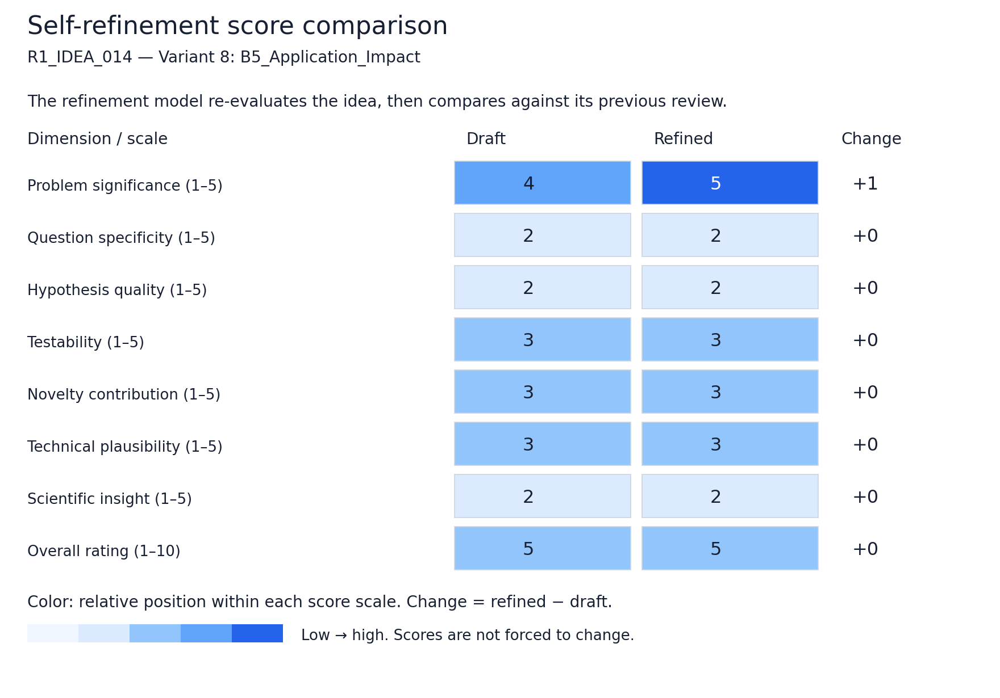

Changed score dimensions: problem_significance.

### Score justifications (draft / refined)

**Problem significance**

```json
{
  "draft": {
    "score": 4.0,
    "justification": "The problem of open-world visual understanding is highly significant and represents a major frontier in AI. Creating a dataset of this scale could be transformative if it solves the data bottleneck for generalization."
  },
  "refined": {
    "score": 5.0,
    "justification": "The problem of achieving open-world visual understanding is one of the most significant challenges in modern AI. The current reliance on closed-set benchmarks limits real-world applicability. A dataset of this magnitude addressing this gap is of paramount importance to the field."
  }
}
```

**Question specificity**

```json
{
  "draft": {
    "score": 2.0,
    "justification": "The idea is currently framed as a project description (building a dataset) rather than a specific research question. The goal 'understand everything' is too broad to be a testable scientific question without further refinement."
  },
  "refined": {
    "score": 2.0,
    "justification": "The idea is currently framed as a project description ('We present...') rather than a research question. The goal 'recognizing and understanding everything' is too broad and lacks the specificity required for a scientific investigation. It does not clearly define *what* mechanism is being studied."
  }
}
```

**Hypothesis quality**

```json
{
  "draft": {
    "score": 2.0,
    "justification": "There is no explicit hypothesis. The text implies a hypothesis that 'more data + better data engine = better open-world understanding,' but this is a generic assumption rather than a specific, falsifiable prediction about mechanisms or relationships."
  },
  "refined": {
    "score": 2.0,
    "justification": "There is no explicit, falsifiable hypothesis. The text implies a generic assumption that 'scaling data + human feedback = better understanding,' which is a standard engineering belief rather than a specific scientific prediction about mechanisms or boundary conditions."
  }
}
```

**Testability**

```json
{
  "draft": {
    "score": 3.0,
    "justification": "The idea is testable in the sense that one can build the dataset and train a model to see if it performs better. However, the lack of specific evaluation metrics for 'open world' or 'understanding everything' makes the testability of the core claim ambiguous."
  },
  "refined": {
    "score": 3.0,
    "justification": "The idea is testable in the sense that the dataset can be built and evaluated. However, the lack of specific metrics for 'open world' understanding and the absence of a comparative hypothesis make the core scientific claim difficult to rigorously falsify. The testability relies entirely on the eventual definition of the evaluation metrics."
  }
}
```

**Novelty contribution**

```json
{
  "draft": {
    "score": 3.0,
    "justification": "While the scale is novel, the concept of building large datasets is not new. The novelty depends entirely on the specific 'data engine' mechanism and the resulting scientific insights, which are not yet articulated. It risks being a large engineering effort rather than a novel scientific discovery."
  },
  "refined": {
    "score": 3.0,
    "justification": "The scale (1.2B regions) is novel and ambitious. However, the concept of building large datasets is not new. The scientific novelty is currently low unless the 'data engine' reveals a new principle of data efficiency or quality control that is distinct from standard active learning or self-training."
  }
}
```

**Technical plausibility**

```json
{
  "draft": {
    "score": 3.0,
    "justification": "The approach of using efficient models and human feedback is technically sound and plausible. However, the feasibility of annotating 1.2 billion regions with high-quality QA and captions is a massive engineering challenge that is not addressed."
  },
  "refined": {
    "score": 3.0,
    "justification": "The approach of using efficient models and human feedback is technically sound. However, the feasibility of generating 1.2 billion *high-quality* QA pairs and captions is a massive engineering challenge. The idea does not address the computational or logistical bottlenecks, making the plausibility of the *outcome* (high-quality open-world data) uncertain without further detail."
  }
}
```

**Scientific insight**

```json
{
  "draft": {
    "score": 2.0,
    "justification": "As currently described, the primary output is a dataset. While datasets are valuable, the potential for 'scientific insight' (e.g., revealing new principles of learning or perception) is low unless the project explicitly investigates the *properties* of the data or the *mechanisms* of the learning process."
  },
  "refined": {
    "score": 2.0,
    "justification": "As described, the primary output is a resource (dataset). While valuable, the potential for 'scientific insight' (e.g., revealing new laws of learning, data distribution properties, or model limitations) is low unless the project explicitly investigates the *properties* of the data or the *mechanisms* of the learning process."
  }
}
```

**Overall rating**

```json
{
  "draft": {
    "score": 5.0,
    "justification": "The idea addresses a very important problem and proposes a potentially valuable resource. However, as a research *idea*, it lacks a specific scientific question, hypothesis, or mechanism to investigate. It reads more like a project proposal for a dataset release than a study designed to generate new scientific knowledge. It is a moderate idea with high potential if reframed to focus on the scientific questions the data engine and dataset can answer."
  },
  "refined": {
    "score": 5.0,
    "justification": "The idea addresses a highly significant problem and proposes a potentially transformative resource. However, as a *research idea*, it is currently weak on specificity, hypothesis formulation, and scientific insight. It reads more like an engineering project proposal than a study designed to generate new scientific knowledge. It is a moderate idea with high potential if reframed to focus on the scientific questions the data engine and dataset can answer."
  }
}
```

## R1_IDEA_014 — Variant 9: C1_Hollow_Shell

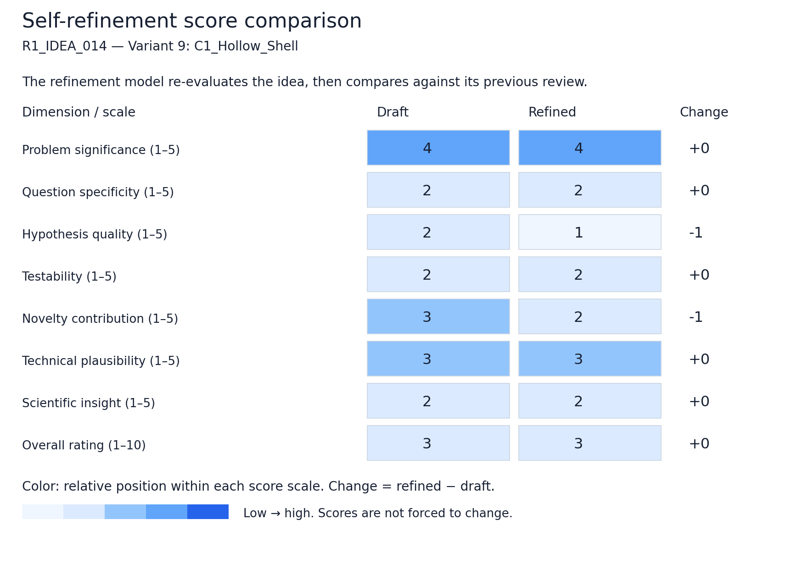

Changed score dimensions: hypothesis_quality, novelty_contribution.

### Score justifications (draft / refined)

**Problem significance**

```json
{
  "draft": {
    "score": 4.0,
    "justification": "Open-world understanding is a fundamental and highly significant challenge in AI. Addressing the limitations of closed-set models and creating robust systems for real-world deployment is of high importance to the field."
  },
  "refined": {
    "score": 4.0,
    "justification": "Open-world understanding is a fundamental and highly significant challenge in AI. Addressing the limitations of closed-set models and creating robust systems for real-world deployment is of high importance to the field. The potential impact is high if the idea is realized."
  }
}
```

**Question specificity**

```json
{
  "draft": {
    "score": 2.0,
    "justification": "The idea is currently too broad. It mentions a dataset and a data engine but fails to specify the exact research question, the specific failure modes being addressed, or the precise relationship being investigated. The text is also incomplete."
  },
  "refined": {
    "score": 2.0,
    "justification": "The idea is currently too broad and incomplete. It mentions a dataset and a data engine but fails to specify the exact research question, the specific failure modes being addressed, or the precise relationship being investigated. The text cuts off before defining the scope."
  }
}
```

**Hypothesis quality**

```json
{
  "draft": {
    "score": 2.0,
    "justification": "No explicit hypothesis is provided. The text reads as a project announcement rather than a scientific inquiry with a testable prediction. It lacks a mechanism or a specific claim about why this approach should work."
  },
  "refined": {
    "score": 1.0,
    "justification": "No explicit hypothesis is provided. The text reads as a project description ('We present a research project') rather than a scientific inquiry with a testable prediction. It lacks a mechanism or a specific claim about why this approach should work."
  }
}
```

**Testability**

```json
{
  "draft": {
    "score": 2.0,
    "justification": "While the concept of building a dataset is testable, the current description lacks the necessary details to design a specific experiment or evaluation protocol. Without a defined hypothesis or baseline, the testability is low."
  },
  "refined": {
    "score": 2.0,
    "justification": "While the concept of building a dataset is testable, the current description lacks the necessary details to design a specific experiment or evaluation protocol. Without a defined hypothesis, baseline, or metric, the testability is low."
  }
}
```

**Novelty contribution**

```json
{
  "draft": {
    "score": 3.0,
    "justification": "The concept of using a data engine for open-world understanding is promising and aligns with current trends, but the specific contribution (new dataset vs. new engine vs. new insight) is undefined. It could be a significant contribution if the data engine mechanism is novel, but currently, it is just a generic application of a known paradigm."
  },
  "refined": {
    "score": 2.0,
    "justification": "The concept of using a data engine is promising, but the specific contribution is undefined. It could be a significant contribution if the data engine mechanism is novel, but currently, it is just a generic application of a known paradigm (building a dataset) without a unique angle."
  }
}
```

**Technical plausibility**

```json
{
  "draft": {
    "score": 3.0,
    "justification": "The idea is technically plausible; large-scale data engines and open-world datasets are feasible research directions. However, without details on the engine's logic or the annotation process, it is impossible to assess the technical soundness of the proposed mechanism."
  },
  "refined": {
    "score": 3.0,
    "justification": "The idea is technically plausible; large-scale data engines and open-world datasets are feasible research directions. However, without details on the engine's logic or the annotation process, it is impossible to assess the technical soundness of the proposed mechanism."
  }
}
```

**Scientific insight**

```json
{
  "draft": {
    "score": 2.0,
    "justification": "As currently described, the project risks being a 'data dump' (creating a large dataset) without necessarily yielding new scientific insights into the mechanisms of open-world understanding. The potential for insight exists but is not articulated."
  },
  "refined": {
    "score": 2.0,
    "justification": "As currently described, the project risks being a 'data dump' (creating a large dataset) without necessarily yielding new scientific insights into the mechanisms of open-world understanding. The potential for insight exists but is not articulated."
  }
}
```

**Overall rating**

```json
{
  "draft": {
    "score": 3.0,
    "justification": "The research idea addresses a high-significance problem (open-world understanding) and proposes a relevant direction (data engines). However, the idea is currently too vague, incomplete, and lacks a specific hypothesis or research question to be considered strong. It falls into the 'weak' to 'moderate' category because the core scientific inquiry is missing, leaving only a broad project description."
  },
  "refined": {
    "score": 3.0,
    "justification": "The research idea addresses a high-significance problem and proposes a relevant direction (data engines). However, the idea is currently too vague, incomplete, and lacks a specific hypothesis or research question to be considered strong. It falls into the 'weak' to 'moderate' category because the core scientific inquiry is missing, leaving only a broad project description."
  }
}
```

## R1_IDEA_014 — Variant 10: C2_Logic_Flawed


Changed score dimensions: none.

### Score justifications (draft / refined)

**Problem significance**

```json
{
  "draft": {
    "score": 5.0,
    "justification": "The problem of achieving comprehensive, open-world visual understanding is one of the most significant challenges in AI. Solving this would represent a major leap towards general-purpose vision systems."
  },
  "refined": {
    "score": 5.0,
    "justification": "The problem of achieving robust, open-world visual understanding is a fundamental challenge in AI. A solution or a dataset enabling this would be of immense significance to the field, potentially bridging the gap between specialized models and general-purpose vision systems."
  }
}
```

**Question specificity**

```json
{
  "draft": {
    "score": 2.0,
    "justification": "The idea is currently framed as a project description (building a dataset) rather than a specific scientific question. It states *what* will be built but not *what specific scientific insight* is expected from it."
  },
  "refined": {
    "score": 2.0,
    "justification": "The idea is currently framed as a description of a large engineering project (building a dataset) rather than a specific scientific inquiry. It states *what* is being built but fails to articulate *what specific scientific question* is being investigated or *why* this specific scale is necessary to answer a hypothesis."
  }
}
```

**Hypothesis quality**

```json
{
  "draft": {
    "score": 2.0,
    "justification": "There is an implicit hypothesis that 'scale + human-in-the-loop = better open-world understanding,' but this is a generic assumption rather than a testable, falsifiable scientific hypothesis with a proposed mechanism."
  },
  "refined": {
    "score": 2.0,
    "justification": "There is an implicit assumption that 'scale + human-in-the-loop = better open-world understanding,' but this is a generic engineering heuristic rather than a falsifiable scientific hypothesis. It does not predict a specific relationship, mechanism, or boundary condition that could be proven wrong."
  }
}
```

**Testability**

```json
{
  "draft": {
    "score": 3.0,
    "justification": "The idea is testable in principle (build dataset, train model, evaluate), but the summary lacks specific evaluation metrics or baselines that would make the test rigorous. The claim of 'broader effectiveness' is too vague to be immediately falsifiable."
  },
  "refined": {
    "score": 3.0,
    "justification": "The idea is testable in a broad sense (build, train, evaluate), but the summary lacks the specific metrics, baselines, or ablation studies required for a rigorous scientific test. The claim of 'broader effectiveness' is too vague to be immediately falsifiable without a defined evaluation protocol."
  }
}
```

**Novelty contribution**

```json
{
  "draft": {
    "score": 4.0,
    "justification": "While large datasets are common, the specific combination of 1.2B region-level annotations with QA/captions and a human-in-the-loop data engine is novel. The potential contribution is high if the data quality is maintained."
  },
  "refined": {
    "score": 4.0,
    "justification": "The scale (1.2B regions) and the specific combination of region-level QA/captions with a human-in-the-loop engine are novel. However, the scientific novelty is currently limited to the artifact creation; the potential for new scientific insight depends entirely on the subsequent analysis of the data, which is not detailed."
  }
}
```

**Technical plausibility**

```json
{
  "draft": {
    "score": 3.0,
    "justification": "The concept is plausible, but the scale (1.2B regions) presents immense engineering challenges regarding storage, processing, and annotation quality control that are not addressed. The 'efficient models in the loop' mechanism needs more detail to be considered fully plausible."
  },
  "refined": {
    "score": 3.0,
    "justification": "The concept is theoretically plausible, but the engineering challenges of annotating 1.2B regions with high-quality QA and captions via a loop are immense and not addressed. The 'efficient models in the loop' mechanism is mentioned but lacks the technical grounding to ensure it doesn't propagate biases or errors at this scale."
  }
}
```

**Scientific insight**

```json
{
  "draft": {
    "score": 3.0,
    "justification": "If successful, the project would provide valuable data, but the current description focuses on the artifact (dataset) rather than the scientific principles of how such data drives learning. The insight potential depends on how the data is analyzed, not just its existence."
  },
  "refined": {
    "score": 3.0,
    "justification": "If successful, the dataset would be a valuable resource, but the current description focuses on the resource rather than the scientific principles. The potential for insight is high (e.g., scaling laws, data efficiency) but remains latent until the research question is refined to investigate *how* the data drives learning, not just *that* it exists."
  }
}
```

**Overall rating**

```json
{
  "draft": {
    "score": 6.0,
    "justification": "This is a moderate/borderline idea. The ambition and potential impact are exceptional (5/5), but the current formulation is too vague to be considered a strong research *idea* rather than a project proposal. It lacks a specific hypothesis and clear scientific question, making it difficult to evaluate its theoretical contribution. It has the potential to be a 9 if refined to focus on the 'why' and 'how' of the learning dynamics at this scale."
  },
  "refined": {
    "score": 6.0,
    "justification": "This is a moderate/borderline research idea. While the ambition and potential impact are exceptional (5/5), the current formulation is too vague to be considered a strong *scientific* idea. It reads more like a project proposal or a grant application than a hypothesis-driven research study. It lacks a specific, testable question and a clear mechanism for scientific discovery. It has the potential to be a 9 if refined to focus on the 'why' and 'how' of learning dynamics at this scale, but as written, it is a description of a large-scale engineering effort with an implied scientific payoff."
  }
}
```

## R1_IDEA_014 — Variant 11: C3_Substance_Enriched


Changed score dimensions: none.

### Score justifications (draft / refined)

**Problem significance**

```json
{
  "draft": {
    "score": 5.0,
    "justification": "The problem of scaling visual understanding to the 'open world' with dense, multi-modal annotations is one of the most significant challenges in current computer vision. Solving this could unlock the next generation of general-purpose AI agents."
  },
  "refined": {
    "score": 5.0,
    "justification": "The problem of scaling visual understanding to the 'open world' with dense, multi-modal annotations is one of the most significant challenges in current computer vision. Solving this could unlock the next generation of general-purpose AI agents."
  }
}
```

**Question specificity**

```json
{
  "draft": {
    "score": 3.0,
    "justification": "While the goal is clear, the specific research question regarding 'annotation density' is vague. It is unclear what variable is being manipulated (e.g., number of tags, length of captions) and what the expected functional form of the relationship is."
  },
  "refined": {
    "score": 3.0,
    "justification": "While the goal is clear, the specific research question regarding 'annotation density' is vague. It is unclear what variable is being manipulated (e.g., number of tags, length of captions) and what the expected functional form of the relationship is."
  }
}
```

**Hypothesis quality**

```json
{
  "draft": {
    "score": 3.0,
    "justification": "The hypothesis that 'annotation density influences model generalization' is plausible but generic. It lacks a specific mechanism (e.g., 'density reduces the long-tail distribution gap') or a predicted threshold effect, making it less scientifically rigorous than it could be."
  },
  "refined": {
    "score": 3.0,
    "justification": "The hypothesis that 'annotation density influences model generalization' is plausible but generic. It lacks a specific mechanism (e.g., 'density reduces the long-tail distribution gap') or a predicted threshold effect, making it less scientifically rigorous than it could be."
  }
}
```

**Testability**

```json
{
  "draft": {
    "score": 4.0,
    "justification": "The idea is testable by training models on subsets of the proposed dataset with varying densities and evaluating on unseen domains. However, the lack of a clear control variable (what exactly constitutes 'density') makes the experimental design currently ambiguous."
  },
  "refined": {
    "score": 4.0,
    "justification": "The idea is testable by training models on subsets of the proposed dataset with varying densities and evaluating on unseen domains. However, the lack of a clear control variable (what exactly constitutes 'density') makes the experimental design currently ambiguous."
  }
}
```

**Novelty contribution**

```json
{
  "draft": {
    "score": 4.0,
    "justification": "Creating a 1.2B region dataset is a novel engineering feat. The scientific contribution lies in the potential to discover the scaling laws of annotation density, which is a less explored area compared to model scaling laws."
  },
  "refined": {
    "score": 4.0,
    "justification": "Creating a 1.2B region dataset is a novel engineering feat. The scientific contribution lies in the potential to discover the scaling laws of annotation density, which is a less explored area compared to model scaling laws."
  }
}
```

**Technical plausibility**

```json
{
  "draft": {
    "score": 3.0,
    "justification": "The concept is plausible, but the scale (1.2B regions) presents immense technical challenges regarding data storage, processing, and the quality of the 'human feedback' loop. The idea does not address these feasibility constraints."
  },
  "refined": {
    "score": 3.0,
    "justification": "The concept is plausible, but the scale (1.2B regions) presents immense technical challenges regarding data storage, processing, and the quality of the 'human feedback' loop. The idea does not address these feasibility constraints."
  }
}
```

**Scientific insight**

```json
{
  "draft": {
    "score": 4.0,
    "justification": "If successful, this research could reveal fundamental scaling laws regarding data quality and density versus model performance, providing a principle for future data engine design."
  },
  "refined": {
    "score": 4.0,
    "justification": "If successful, this research could reveal fundamental scaling laws regarding data quality and density versus model performance, providing a principle for future data engine design."
  }
}
```

**Overall rating**

```json
{
  "draft": {
    "score": 7.0,
    "justification": "This is a strong research idea with high potential impact due to the scale and the critical nature of the problem. However, it currently reads more like a project proposal than a focused scientific hypothesis. The core scientific question (density vs. generalization) is clear enough to be valuable but needs sharper definition to move from a 'strong' to an 'exceptional' rating."
  },
  "refined": {
    "score": 7.0,
    "justification": "This is a strong research idea with high potential impact due to the scale and the critical nature of the problem. However, it currently reads more like a project proposal than a focused scientific hypothesis. The core scientific question (density vs. generalization) is clear enough to be valuable but needs sharper definition to move from a 'strong' to an 'exceptional' rating."
  }
}
```

## R1_IDEA_014 — Variant 12: H1_Deceptive_Hollow


Changed score dimensions: overall_rating.

### Score justifications (draft / refined)

**Problem significance**

```json
{
  "draft": {
    "score": 4.0,
    "justification": "The underlying problem of open-world understanding is highly significant and central to the future of AI. However, the text does not sufficiently articulate *why* this specific approach is the solution to a specific gap, though the general direction is important."
  },
  "refined": {
    "score": 4.0,
    "justification": "The problem of open-world understanding is undeniably significant and central to the future of AI. However, the text does not sufficiently articulate why *this specific* approach is the necessary solution to a specific, unresolved gap, limiting the immediate significance of the proposal itself."
  }
}
```

**Question specificity**

```json
{
  "draft": {
    "score": 1.0,
    "justification": "The idea lacks a specific research question. It describes a broad ambition ('reshape how the community thinks') but does not define what is being investigated, measured, or compared."
  },
  "refined": {
    "score": 1.0,
    "justification": "The idea lacks a specific research question. It describes a broad ambition ('reshape how the community thinks') but fails to define what is being investigated, measured, or compared. It is a statement of intent, not a research question."
  }
}
```

**Hypothesis quality**

```json
{
  "draft": {
    "score": 1.0,
    "justification": "There is no explicit or implicit hypothesis that can be supported or contradicted. The text makes grand claims about potential impact without stating a testable prediction."
  },
  "refined": {
    "score": 1.0,
    "justification": "There is no explicit or implicit hypothesis that can be supported or contradicted. The text makes grand claims about potential impact without stating a testable prediction or mechanism."
  }
}
```

**Testability**

```json
{
  "draft": {
    "score": 1.0,
    "justification": "Without defined metrics, baselines, or specific tasks, the idea is not currently testable. It is impossible to design an experiment based solely on this summary."
  },
  "refined": {
    "score": 1.0,
    "justification": "Without defined metrics, baselines, specific tasks, or a clear methodology for the 'data engine,' the idea is not currently testable. It is impossible to design a meaningful experiment based solely on this summary."
  }
}
```

**Novelty contribution**

```json
{
  "draft": {
    "score": 2.0,
    "justification": "While large-scale datasets are valuable, the idea does not specify what makes this dataset or data engine novel compared to existing efforts (e.g., LAION, COCO, etc.). The novelty is claimed but not demonstrated or described."
  },
  "refined": {
    "score": 2.0,
    "justification": "While large-scale datasets are valuable, the idea does not specify what makes this dataset or data engine novel compared to existing efforts. The novelty is claimed ('field-shaping') but not described or demonstrated."
  }
}
```

**Technical plausibility**

```json
{
  "draft": {
    "score": 3.0,
    "justification": "The concept of using a data engine to build a dataset is technically plausible and common in the field. However, the lack of details on the engine's architecture or the annotation strategy makes it impossible to fully assess feasibility."
  },
  "refined": {
    "score": 3.0,
    "justification": "The general concept of using a data engine to build a dataset is technically plausible and aligns with current trends. However, the lack of details on the engine's architecture or annotation strategy makes it impossible to assess feasibility or potential failure modes."
  }
}
```

**Scientific insight**

```json
{
  "draft": {
    "score": 2.0,
    "justification": "The text promises 'conceptual insight' but does not indicate what specific mechanism or principle will be revealed. It reads more like a project proposal than a scientific inquiry into a phenomenon."
  },
  "refined": {
    "score": 2.0,
    "justification": "The text promises 'conceptual insight' but does not indicate what specific mechanism or principle will be revealed. It reads more like a project proposal for resource creation than a scientific inquiry into a phenomenon."
  }
}
```

**Overall rating**

```json
{
  "draft": {
    "score": 3.0,
    "justification": "The idea addresses a significant problem but is currently too vague to be evaluated as a research proposal. It lacks a specific question, hypothesis, or methodological direction, making it a 'weak idea' in its current form. It relies entirely on the assumption that 'more data' and 'a data engine' will solve the problem without explaining the 'how' or 'why'."
  },
  "refined": {
    "score": 2.0,
    "justification": "The idea is currently a 'very weak' research proposal because it lacks the fundamental components of scientific inquiry: a specific question, a hypothesis, and a testable method. While the domain is significant, the proposal is too vague to be evaluated as a research direction. It relies entirely on the assumption that 'more data' and 'a data engine' will solve the problem without explaining the 'how' or 'why'."
  }
}
```

## R1_IDEA_014 — Variant 13: H2_Confident_Flaw

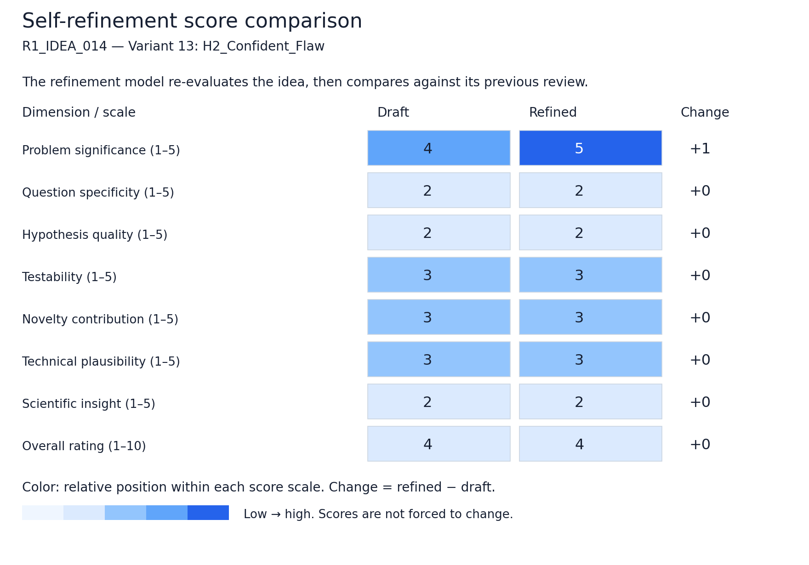

Changed score dimensions: problem_significance.

### Score justifications (draft / refined)

**Problem significance**

```json
{
  "draft": {
    "score": 4.0,
    "justification": "The problem of building large-scale, open-world visual understanding systems is highly significant and aligns with the current trajectory of AI research. Creating a dataset of this magnitude would be a major contribution if successful."
  },
  "refined": {
    "score": 5.0,
    "justification": "The problem of achieving robust, open-world visual understanding is one of the most significant challenges in current AI. A dataset of this magnitude would be a landmark contribution to the field if successfully constructed."
  }
}
```

**Question specificity**

```json
{
  "draft": {
    "score": 2.0,
    "justification": "While the scale is specific, the research question is vague. The text asserts a conclusion ('gains can be treated as causal') rather than posing a clear question about the relationship between the data engine's specific mechanisms and model performance."
  },
  "refined": {
    "score": 2.0,
    "justification": "While the scale is specific, the research question is obscured by the text's assertion of a conclusion. It does not clearly ask 'how' or 'why' the method works, but rather states that it 'will' work, bypassing the formulation of a specific investigable question."
  }
}
```

**Hypothesis quality**

```json
{
  "draft": {
    "score": 2.0,
    "justification": "The hypothesis is weak because it is stated as a certainty ('necessarily produce reliable improvements') rather than a testable prediction. It lacks a mechanism that could be proven wrong; it assumes that scale/coverage automatically equals generalization."
  },
  "refined": {
    "score": 2.0,
    "justification": "The hypothesis is weak because it is stated as a certainty ('necessarily produce reliable improvements') rather than a prediction subject to falsification. It assumes a direct causal link between scale/coverage and generalization without a defined mechanism that could be proven wrong."
  }
}
```

**Testability**

```json
{
  "draft": {
    "score": 3.0,
    "justification": "The creation of the dataset and model is testable in terms of existence and benchmark performance. However, the specific claim that 'alternative explanations' are unnecessary makes the scientific validation of the core argument difficult to test rigorously."
  },
  "refined": {
    "score": 3.0,
    "justification": "The creation of the dataset and model is testable. However, the specific claim that 'alternative explanations' are unnecessary makes the scientific validation of the core argument (general superiority) difficult to test rigorously, as it precludes the necessary controls."
  }
}
```

**Novelty contribution**

```json
{
  "draft": {
    "score": 3.0,
    "justification": "The scale (1.2B regions) is novel and ambitious. However, the scientific contribution regarding the 'mechanism' of open-world learning is not clearly defined, limiting the novelty of the theoretical insight."
  },
  "refined": {
    "score": 3.0,
    "justification": "The scale (1.2B regions) is novel. However, the scientific contribution regarding the mechanism of open-world learning is not clearly defined. The dismissal of standard scientific rigor (ablation, isolation) limits the novelty of the theoretical insight."
  }
}
```

**Technical plausibility**

```json
{
  "draft": {
    "score": 3.0,
    "justification": "The technical approach of using a data engine with human feedback is plausible. However, the claim that this approach eliminates the need for isolating variables is technically unsound from a research methodology perspective."
  },
  "refined": {
    "score": 3.0,
    "justification": "The technical approach of using a data engine with human feedback is plausible. However, the claim that this approach eliminates the need for isolating variables is technically unsound from a research methodology perspective, as it ignores confounding factors."
  }
}
```

**Scientific insight**

```json
{
  "draft": {
    "score": 2.0,
    "justification": "If the project succeeds, it will provide a valuable resource (the dataset). However, the proposed reasoning does not promise deep scientific insight into *why* the model works, as it dismisses the need to analyze boundary conditions or alternative explanations."
  },
  "refined": {
    "score": 2.0,
    "justification": "If the project succeeds, it will provide a valuable resource (the dataset). However, the proposed reasoning does not promise deep scientific insight into *why* the model works, as it explicitly dismisses the need to analyze boundary conditions or alternative explanations."
  }
}
```

**Overall rating**

```json
{
  "draft": {
    "score": 4.0,
    "justification": "The idea has high potential due to the scale and ambition of the dataset, which is a significant resource. However, the scientific framing is weak. The argument that solving a limitation automatically proves general superiority without further isolation is a logical flaw that undermines the research quality. It reads more like a project proposal with a biased conclusion than a rigorous research hypothesis."
  },
  "refined": {
    "score": 4.0,
    "justification": "The idea has high potential due to the scale and ambition of the dataset, which is a significant resource. However, the scientific framing is fundamentally flawed. The argument that solving a limitation automatically proves general superiority without further isolation is a logical error that undermines the research quality. It reads more like a project proposal with a biased conclusion than a rigorous research hypothesis. The idea is worth pursuing for the resource it creates, but the specific research direction as stated is weak."
  }
}
```

## R1_IDEA_014 — Variant 14: H3_Verbose_Enriched

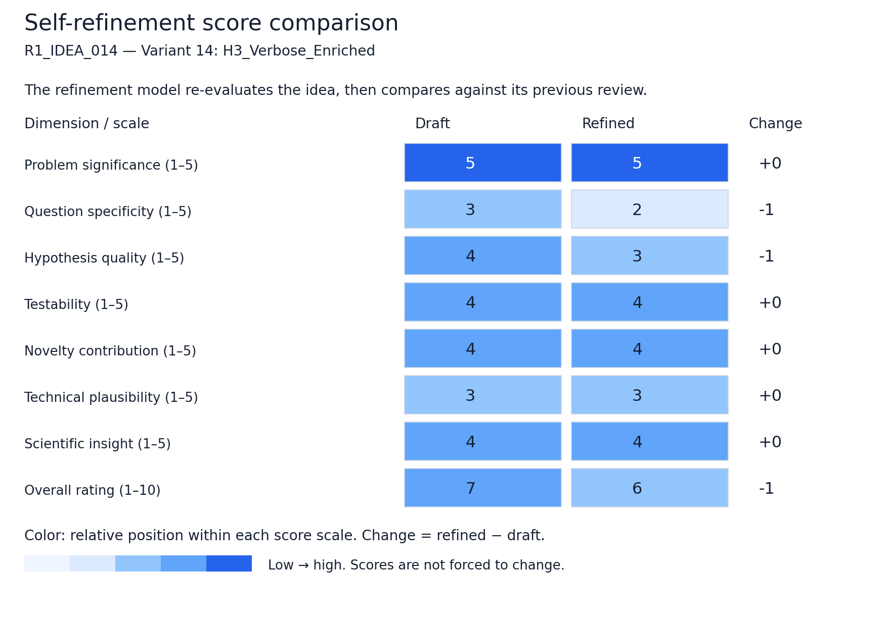

Changed score dimensions: question_specificity, hypothesis_quality, overall_rating.

### Score justifications (draft / refined)

**Problem significance**

```json
{
  "draft": {
    "score": 5.0,
    "justification": "The problem of achieving robust open-world visual understanding with limited data for rare categories is one of the most significant challenges in modern computer vision. Addressing this through large-scale, high-density annotation is highly relevant to the field's trajectory."
  },
  "refined": {
    "score": 5.0,
    "justification": "The problem of achieving robust open-world visual understanding, particularly for long-tail/rare categories, is a central challenge in modern AI. A dataset of this scale, if high-quality, would be a foundational resource for the field."
  }
}
```

**Question specificity**

```json
{
  "draft": {
    "score": 3.0,
    "justification": "While the general goal is clear, the specific definition of 'annotation density' and the precise mechanism of the data engine are vague. The text reads like a mix of a proposal and a review checklist, which dilutes the specificity of the research question."
  },
  "refined": {
    "score": 2.0,
    "justification": "The research question is currently obscured by structural confusion. The term 'annotation density' is undefined, and the text mixes a proposal with a generic methodology guide. Without a clear definition of the independent variable (density), the specific question is hard to pin down."
  }
}
```

**Hypothesis quality**

```json
{
  "draft": {
    "score": 4.0,
    "justification": "The hypothesis that 'annotation density influences model generalization on rare categories' is testable and plausible. However, it is a relatively broad claim that needs more nuance regarding the *type* of density or the *nature* of the annotations to be truly novel."
  },
  "refined": {
    "score": 3.0,
    "justification": "The hypothesis that 'density influences generalization' is plausible but currently too broad. It lacks a specific mechanism (the 'how') and a clear definition of the variables, making it a weak version of a strong idea. It risks being a tautology (more data = better) unless 'density' is defined as a specific structural property distinct from just 'quantity'."
  }
}
```

**Testability**

```json
{
  "draft": {
    "score": 4.0,
    "justification": "The idea proposes a clear path for testing: staged design, ablations, and error analysis. The metrics (generalization on rare categories) are standard and measurable. The main risk is the feasibility of generating the dataset, but the testability of the *hypothesis* itself is strong."
  },
  "refined": {
    "score": 4.0,
    "justification": "The proposed experimental design (staged, ablations, error analysis) is robust. However, the testability is contingent on the ability to quantify 'density' and isolate it from other factors. The plan itself is testable, but the variable definition is the bottleneck."
  }
}
```

**Novelty contribution**

```json
{
  "draft": {
    "score": 4.0,
    "justification": "Creating a 1.2B region dataset is a massive contribution in itself. The scientific contribution lies in empirically validating the relationship between this specific type of dense annotation and rare-category generalization, which could reveal new scaling laws or data efficiency principles."
  },
  "refined": {
    "score": 4.0,
    "justification": "The scale of the dataset is novel. The scientific contribution would be significant if it empirically demonstrates a non-linear relationship between annotation density and rare-category performance, potentially revealing new data scaling laws."
  }
}
```

**Technical plausibility**

```json
{
  "draft": {
    "score": 3.0,
    "justification": "The idea is plausible in principle, but the claim of generating 1.2B high-quality annotated regions via a 'scalable data engine' is technically ambitious. Without details on the engine's quality control, the plausibility of the dataset's utility is uncertain. The experimental design, however, is technically sound."
  },
  "refined": {
    "score": 3.0,
    "justification": "Generating 1.2B high-quality annotated regions is an immense engineering challenge. The 'scalable data engine' is a black box in the text. While plausible in principle, the lack of detail on quality control makes the technical feasibility of the *data* (not just the hypothesis) uncertain."
  }
}
```

**Scientific insight**

```json
{
  "draft": {
    "score": 4.0,
    "justification": "If successful, this research could provide deep insights into the data efficiency of vision-language models, specifically how annotation granularity impacts the learning of long-tail distributions. It moves beyond simple 'more data is better' to investigate the *structure* of data."
  },
  "refined": {
    "score": 4.0,
    "justification": "If the hypothesis is validated, it would provide crucial insights into the data efficiency of vision-language models, specifically regarding the structure of data required for long-tail learning. This goes beyond simple performance benchmarks."
  }
}
```

**Overall rating**

```json
{
  "draft": {
    "score": 7.0,
    "justification": "This is a strong research idea with high potential impact. The problem is significant, and the proposed hypothesis is meaningful. However, the presentation is currently disjointed, and the technical specifics of the data generation engine are missing, which prevents it from being an 'exceptional' (9-10) idea. With better articulation of the mechanism and clearer definitions, it could be a top-tier contribution."
  },
  "refined": {
    "score": 6.0,
    "justification": "The idea has high potential (5/5 significance) but is currently presented with low specificity (2/5). The text is disjointed and mixes a proposal with a review checklist, obscuring the core scientific contribution. The hypothesis is plausible but vague without a clear definition of 'density'. It is a moderate idea that requires significant refinement in articulation and definition to reach its full potential."
  }
}
```

## R1_IDEA_014 — Variant 15: H4_Ultimate_Hype


Changed score dimensions: none.

### Score justifications (draft / refined)

**Problem significance**

```json
{
  "draft": {
    "score": 5.0,
    "justification": "The problem of achieving true open-world, comprehensive scene understanding is one of the most significant challenges in computer vision and AI. Solving this would have profound implications for robotics, autonomous systems, and general AI."
  },
  "refined": {
    "score": 5.0,
    "justification": "The problem of achieving true open-world, comprehensive scene understanding is one of the most significant challenges in computer vision and AI. Solving this would have profound implications for robotics, autonomous systems, and general AI."
  }
}
```

**Question specificity**

```json
{
  "draft": {
    "score": 2.0,
    "justification": "The idea is currently framed as a broad agenda ('redefine the frontier') rather than a specific research question. It lacks a clear definition of the specific mechanism or relationship being investigated, making it difficult to evaluate the scientific contribution beyond 'building a big dataset'."
  },
  "refined": {
    "score": 2.0,
    "justification": "The idea is currently framed as a broad agenda ('redefine the frontier') rather than a specific research question. It lacks a clear definition of the specific mechanism or relationship being investigated, making it difficult to evaluate the scientific contribution beyond 'building a big dataset'."
  }
}
```

**Hypothesis quality**

```json
{
  "draft": {
    "score": 3.0,
    "justification": "The implicit hypothesis is that 'scale + diverse annotation + human-in-the-loop = transformative open-world understanding.' While plausible, it is a generic scaling hypothesis. It does not distinguish *why* this specific approach will work or what specific boundary conditions it might hit."
  },
  "refined": {
    "score": 3.0,
    "justification": "The implicit hypothesis is that 'scale + diverse annotation + human-in-the-loop = transformative open-world understanding.' While plausible, it is a generic scaling hypothesis. It does not distinguish *why* this specific approach will work or what specific boundary conditions it might hit."
  }
}
```

**Testability**

```json
{
  "draft": {
    "score": 3.0,
    "justification": "The idea is testable in principle (build dataset, train model, evaluate), but the evaluation metrics and specific comparisons are not defined. Without a specific hypothesis, the 'test' is just a performance benchmark, which is less scientifically rigorous than testing a mechanism."
  },
  "refined": {
    "score": 3.0,
    "justification": "The idea is testable in principle (build dataset, train model, evaluate), but the evaluation metrics and specific comparisons are not defined. Without a specific hypothesis, the 'test' is just a performance benchmark, which is less scientifically rigorous than testing a mechanism."
  }
}
```

**Novelty contribution**

```json
{
  "draft": {
    "score": 4.0,
    "justification": "The scale (1.2B regions) is novel and ambitious. The integration of a specific data engine with human feedback is a valuable methodological direction. However, the core idea of 'more data leads to better models' is not new; the novelty lies in the execution and the specific data engine, which is not fully detailed."
  },
  "refined": {
    "score": 4.0,
    "justification": "The scale (1.2B regions) is novel and ambitious. The integration of a specific data engine with human feedback is a valuable methodological direction. However, the core idea of 'more data leads to better models' is not new; the novelty lies in the execution and the specific data engine, which is not fully detailed."
  }
}
```

**Technical plausibility**

```json
{
  "draft": {
    "score": 4.0,
    "justification": "The proposed methodology (using efficient models and human feedback to scale annotation) is technically sound and aligns with current trends in data-centric AI. The scale is ambitious but not impossible given modern compute and annotation infrastructure."
  },
  "refined": {
    "score": 4.0,
    "justification": "The proposed methodology (using efficient models and human feedback to scale annotation) is technically sound and aligns with current trends in data-centric AI. The scale is ambitious but not impossible given modern compute and annotation infrastructure."
  }
}
```

**Scientific insight**

```json
{
  "draft": {
    "score": 3.0,
    "justification": "If successful, the project will provide valuable data and models, but the *scientific insight* regarding the *mechanism* of open-world understanding is not yet articulated. The project risks being a 'engineering feat' rather than a 'scientific discovery' unless the research question is narrowed to investigate specific emergent properties."
  },
  "refined": {
    "score": 3.0,
    "justification": "If successful, the project will provide valuable data and models, but the *scientific insight* regarding the *mechanism* of open-world understanding is not yet articulated. The project risks being a 'engineering feat' rather than a 'scientific discovery' unless the research question is narrowed to investigate specific emergent properties."
  }
}
```

**Overall rating**

```json
{
  "draft": {
    "score": 6.0,
    "justification": "This is a strong, high-impact research *direction* with exceptional problem significance and technical plausibility. However, as a research *idea* presented in this text, it lacks the specificity, hypothesis formulation, and defined scientific contribution required for a top-tier score. It reads like a project proposal rather than a hypothesis-driven research plan. It is a 'Moderate/borderline' idea in terms of scientific rigor but has 'Strong' potential if refined."
  },
  "refined": {
    "score": 6.0,
    "justification": "This is a strong, high-impact research *direction* with exceptional problem significance and technical plausibility. However, as a research *idea* presented in this text, it lacks the specificity, hypothesis formulation, and defined scientific contribution required for a top-tier score. It reads like a project proposal rather than a hypothesis-driven research plan. It is a 'Moderate/borderline' idea in terms of scientific rigor but has 'Strong' potential if refined."
  }
}
```

## R1_IDEA_015 — Source

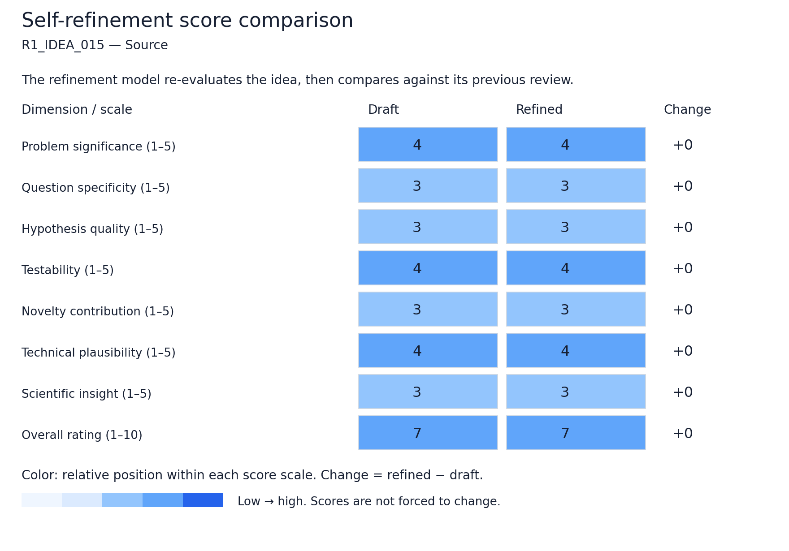

Changed score dimensions: none.

### Score justifications (draft / refined)

**Problem significance**

```json
{
  "draft": {
    "score": 4.0,
    "justification": "The problem of precise text-based control in 3D generation is a major bottleneck in the field. Solving this would significantly improve the usability of 3D content creation tools for both researchers and practitioners."
  },
  "refined": {
    "score": 4.0,
    "justification": "Precise control over 3D content generation is a major bottleneck in the field. Solving the ambiguity of natural language for 3D avatars would have significant practical value for content creation, gaming, and virtual reality."
  }
}
```

**Question specificity**

```json
{
  "draft": {
    "score": 3.0,
    "justification": "The idea identifies a clear direction (interpolation/sliders) but lacks specificity on the implementation details, the definition of the latent space, and the exact mechanism for defining the extremes."
  },
  "refined": {
    "score": 3.0,
    "justification": "The idea clearly identifies the 'what' (a slider mechanism) but is vague on the 'how'. The definition of the extremes and the nature of the interpolation are not specified, leaving the core mechanism open to interpretation."
  }
}
```

**Hypothesis quality**

```json
{
  "draft": {
    "score": 3.0,
    "justification": "The implicit hypothesis is that 'interpolation between extremes reduces ambiguity and increases precision.' This is a reasonable hypothesis, but it is generic and needs to be tied to specific properties of 3D latent spaces to be a strong scientific claim."
  },
  "refined": {
    "score": 3.0,
    "justification": "The implicit hypothesis is that 'interpolation between extremes reduces ambiguity.' This is a reasonable starting point, but it is generic. A stronger hypothesis would specify the relationship between the interpolation path and the semantic/geometry space (e.g., 'linear interpolation in the latent space of Model X yields linear semantic changes')."
  }
}
```

**Testability**

```json
{
  "draft": {
    "score": 4.0,
    "justification": "The idea is highly testable. One can implement a prototype, define a set of semantic attributes, and measure the correlation between the slider position and the resulting semantic features in the generated avatars."
  },
  "refined": {
    "score": 4.0,
    "justification": "The idea is testable. One can implement a prototype using a specific 3D generative model, define a set of attributes, and measure the correlation between the slider position and the resulting semantic features or geometric properties."
  }
}
```

**Novelty contribution**

```json
{
  "draft": {
    "score": 3.0,
    "justification": "While the concept of sliders is established in 2D, applying it specifically to the complex domain of 3D human avatars with a focus on resolving text ambiguity is a novel and valuable contribution. However, the core mechanism is not entirely new."
  },
  "refined": {
    "score": 3.0,
    "justification": "While the concept of concept sliders is established in 2D, applying it to the complex domain of 3D human avatars to specifically address text ambiguity is a novel and valuable contribution. However, the core mechanism is an adaptation of existing techniques rather than a fundamentally new theoretical discovery."
  }
}
```

**Technical plausibility**

```json
{
  "draft": {
    "score": 4.0,
    "justification": "The approach is technically plausible. Latent space interpolation is a standard technique in generative models. The main challenge lies in the specific geometry of 3D humans, but the direction is sound."
  },
  "refined": {
    "score": 4.0,
    "justification": "The approach is technically plausible. Latent space interpolation is a standard technique. The main challenge is the complexity of 3D human geometry, but the direction is sound and aligns with current research trends in 3D generation."
  }
}
```

**Scientific insight**

```json
{
  "draft": {
    "score": 3.0,
    "justification": "If successful, this research could reveal how semantic concepts are organized in 3D latent spaces and whether linear interpolation is a valid assumption for human avatars, providing insights into the geometry of 3D generative models."
  },
  "refined": {
    "score": 3.0,
    "justification": "If successful, this research could reveal how semantic concepts are organized in 3D latent spaces and whether linear interpolation is a valid assumption for human avatars, providing insights into the geometry of 3D generative models."
  }
}
```

**Overall rating**

```json
{
  "draft": {
    "score": 7.0,
    "justification": "This is a strong research idea with clear practical motivation and a plausible methodological direction. It addresses a significant gap in 3D generation. However, it currently lacks the specificity of a concrete hypothesis regarding the underlying mechanisms (e.g., linearity of the latent space) and the definition of the 'extremes,' which prevents it from being an exceptional score. With more specific formulation, it could be a top-tier contribution."
  },
  "refined": {
    "score": 7.0,
    "justification": "This is a strong research idea with clear practical motivation and a plausible methodological direction. It addresses a significant gap in 3D generation. However, it currently lacks the specificity of a concrete hypothesis regarding the underlying mechanisms (e.g., linearity of the latent space) and the definition of the 'extremes,' which prevents it from being an exceptional score. With more specific formulation, it could be a top-tier contribution."
  }
}
```

## R1_IDEA_015 — Variant 1: A1_Identity


Changed score dimensions: none.

### Score justifications (draft / refined)

**Problem significance**

```json
{
  "draft": {
    "score": 4.0,
    "justification": "The problem of precise text-based control in 3D generation is a major bottleneck in the field. Solving this would significantly improve the usability of 3D content creation tools for both researchers and practitioners."
  },
  "refined": {
    "score": 4.0,
    "justification": "Precise control over 3D content generation is a major bottleneck in the field. Solving the ambiguity of natural language for 3D avatars would have significant practical value for content creation, gaming, and virtual reality."
  }
}
```

**Question specificity**

```json
{
  "draft": {
    "score": 3.0,
    "justification": "The idea identifies a clear direction (interpolation/sliders) but lacks specificity on the implementation details, the definition of the latent space, and the exact mechanism for defining the extremes."
  },
  "refined": {
    "score": 3.0,
    "justification": "The idea clearly identifies the 'what' (a slider mechanism) but is vague on the 'how'. The definition of the extremes and the nature of the interpolation are not specified, leaving the core mechanism open to interpretation."
  }
}
```

**Hypothesis quality**

```json
{
  "draft": {
    "score": 3.0,
    "justification": "The implicit hypothesis is that 'interpolation between extremes reduces ambiguity and increases precision.' This is a reasonable hypothesis, but it is generic and needs to be tied to specific properties of 3D latent spaces to be a strong scientific claim."
  },
  "refined": {
    "score": 3.0,
    "justification": "The implicit hypothesis is that 'interpolation between extremes reduces ambiguity.' This is a reasonable starting point, but it is generic. A stronger hypothesis would specify the relationship between the interpolation path and the semantic/geometry space (e.g., 'linear interpolation in the latent space of Model X yields linear semantic changes')."
  }
}
```

**Testability**

```json
{
  "draft": {
    "score": 4.0,
    "justification": "The idea is highly testable. One can implement a prototype, define a set of semantic attributes, and measure the correlation between the slider position and the resulting semantic features in the generated avatars."
  },
  "refined": {
    "score": 4.0,
    "justification": "The idea is testable. One can implement a prototype using a specific 3D generative model, define a set of attributes, and measure the correlation between the slider position and the resulting semantic features or geometric properties."
  }
}
```

**Novelty contribution**

```json
{
  "draft": {
    "score": 3.0,
    "justification": "While the concept of sliders is established in 2D, applying it specifically to the complex domain of 3D human avatars with a focus on resolving text ambiguity is a novel and valuable contribution. However, the core mechanism is not entirely new."
  },
  "refined": {
    "score": 3.0,
    "justification": "While the concept of concept sliders is established in 2D, applying it to the complex domain of 3D human avatars to specifically address text ambiguity is a novel and valuable contribution. However, the core mechanism is an adaptation of existing techniques rather than a fundamentally new theoretical discovery."
  }
}
```

**Technical plausibility**

```json
{
  "draft": {
    "score": 4.0,
    "justification": "The approach is technically plausible. Latent space interpolation is a standard technique in generative models. The main challenge lies in the specific geometry of 3D humans, but the direction is sound."
  },
  "refined": {
    "score": 4.0,
    "justification": "The approach is technically plausible. Latent space interpolation is a standard technique. The main challenge is the complexity of 3D human geometry, but the direction is sound and aligns with current research trends in 3D generation."
  }
}
```

**Scientific insight**

```json
{
  "draft": {
    "score": 3.0,
    "justification": "If successful, this research could reveal how semantic concepts are organized in 3D latent spaces and whether linear interpolation is a valid assumption for human avatars, providing insights into the geometry of 3D generative models."
  },
  "refined": {
    "score": 3.0,
    "justification": "If successful, this research could reveal how semantic concepts are organized in 3D latent spaces and whether linear interpolation is a valid assumption for human avatars, providing insights into the geometry of 3D generative models."
  }
}
```

**Overall rating**

```json
{
  "draft": {
    "score": 7.0,
    "justification": "This is a strong research idea with clear practical motivation and a plausible methodological direction. It addresses a significant gap in 3D generation. However, it currently lacks the specificity of a concrete hypothesis regarding the underlying mechanisms (e.g., linearity of the latent space) and the definition of the 'extremes,' which prevents it from being an exceptional score. With more specific formulation, it could be a top-tier contribution."
  },
  "refined": {
    "score": 7.0,
    "justification": "This is a strong research idea with clear practical motivation and a plausible methodological direction. It addresses a significant gap in 3D generation. However, it currently lacks the specificity of a concrete hypothesis regarding the underlying mechanisms (e.g., linearity of the latent space) and the definition of the 'extremes,' which prevents it from being an exceptional score. With more specific formulation, it could be a top-tier contribution."
  }
}
```

## R1_IDEA_015 — Variant 2: A2_Paraphrase_Only

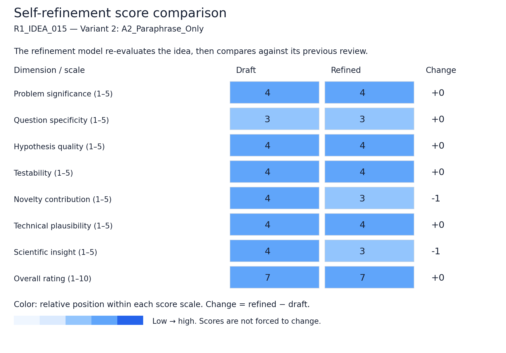

Changed score dimensions: novelty_contribution, scientific_insight.

### Score justifications (draft / refined)

**Problem significance**

```json
{
  "draft": {
    "score": 4.0,
    "justification": "The problem of precise 3D avatar editing is a major bottleneck in the field. Current text-to-3D methods often produce artifacts or lack fine-grained control. Solving this would have high practical value for gaming, VR, and digital humans."
  },
  "refined": {
    "score": 4.0,
    "justification": "Precise control over 3D avatars is a major unsolved problem in computer graphics and generative AI. Current text-to-3D methods are often 'black boxes' that produce artifacts or lack specific attribute control. Solving this has high practical value for VR, gaming, and digital human creation."
  }
}
```

**Question specificity**

```json
{
  "draft": {
    "score": 3.0,
    "justification": "The idea identifies a mechanism (sliders) but lacks specificity on the implementation. It defines the 'what' (a slider) but not the 'how' (the mathematical or architectural realization of the slider in 3D space)."
  },
  "refined": {
    "score": 3.0,
    "justification": "The idea clearly defines the 'what' (a slider interface) but is vague on the 'how'. It does not specify the mathematical formulation of the slider, the nature of the latent space, or how the 'extremes' are operationalized. The research question is 'how to implement this slider in 3D' rather than 'does this work'."
  }
}
```

**Hypothesis quality**

```json
{
  "draft": {
    "score": 4.0,
    "justification": "The hypothesis is clear: replacing direct text prompts with a continuous interpolation between defined extremes will yield more precise and less ambiguous edits. This is a testable claim that distinguishes the approach from standard text-conditioned generation."
  },
  "refined": {
    "score": 4.0,
    "justification": "The hypothesis is testable: 'Interpolating between defined concept extremes yields more precise edits than direct text prompts.' This distinguishes the method from standard approaches and makes a clear prediction about user control and output quality."
  }
}
```

**Testability**

```json
{
  "draft": {
    "score": 4.0,
    "justification": "The idea is highly testable. One can compare the 'slider' method against direct text prompting on metrics of semantic alignment, user control, and geometric validity. The 'slider' concept naturally lends itself to ablation studies (e.g., linear vs. non-linear interpolation)."
  },
  "refined": {
    "score": 4.0,
    "justification": "The idea is highly testable. One can construct experiments comparing slider-based editing vs. text prompts. Metrics can include user preference, semantic alignment scores, and geometric validity checks. The 'slider' concept naturally allows for ablation studies on interpolation methods."
  }
}
```

**Novelty contribution**

```json
{
  "draft": {
    "score": 4.0,
    "justification": "While the concept of 'sliders' is known in 2D GANs, applying it specifically to the 3D avatar domain to solve the ambiguity of text descriptions is a novel and promising direction. It shifts the paradigm from 'generation' to 'manipulation'."
  },
  "refined": {
    "score": 3.0,
    "justification": "The concept of 'sliders' is not new in 2D image generation (e.g., StyleGAN). The novelty here is the application to 3D avatars. While the application is valuable, the core mechanism is an adaptation of existing 2D techniques. The scientific contribution depends on whether 3D introduces new challenges that require novel theoretical insights beyond simple adaptation."
  }
}
```

**Technical plausibility**

```json
{
  "draft": {
    "score": 4.0,
    "justification": "The approach is technically plausible. It aligns with current trends in disentangled representation learning and latent space interpolation. The main challenge is the 3D representation, but the core logic holds."
  },
  "refined": {
    "score": 4.0,
    "justification": "The approach is technically plausible. Disentangled representation learning is a standard goal in deep learning, and interpolation is a fundamental operation. The main challenge is the 3D representation (meshes, Gaussians, etc.), but the logic of moving along a semantic path is sound."
  }
}
```

**Scientific insight**

```json
{
  "draft": {
    "score": 4.0,
    "justification": "If successful, this research could reveal how to better disentangle semantic concepts in 3D latent spaces and provide a general framework for controllable 3D generation, moving beyond the 'black box' of text-to-3D."
  },
  "refined": {
    "score": 3.0,
    "justification": "If successful, the study could reveal how to better disentangle semantic concepts in 3D latent spaces. However, if it is merely a successful application of 2D techniques to 3D, the insight is limited to 'it works here too.' The potential for deeper insight exists if the method reveals new properties of 3D semantic manifolds."
  }
}
```

**Overall rating**

```json
{
  "draft": {
    "score": 7.0,
    "justification": "This is a strong research idea. It addresses a meaningful problem with a specific, plausible, and testable hypothesis. The main limitation is the current lack of technical detail regarding the 3D implementation, but the core concept is novel and scientifically valuable. It has the potential to be a significant contribution if the 'how' is fleshed out."
  },
  "refined": {
    "score": 7.0,
    "justification": "This is a strong research idea with a clear problem statement and a plausible, testable solution. It addresses a significant gap in 3D generation. The score is slightly lower than a 'perfect' 8 or 9 because the idea is currently high-level and relies on the assumption that 3D interpolation is straightforward, which is a non-trivial technical hurdle. However, the core concept is solid and worth pursuing."
  }
}
```

## R1_IDEA_015 — Variant 3: A3_Plain_Core

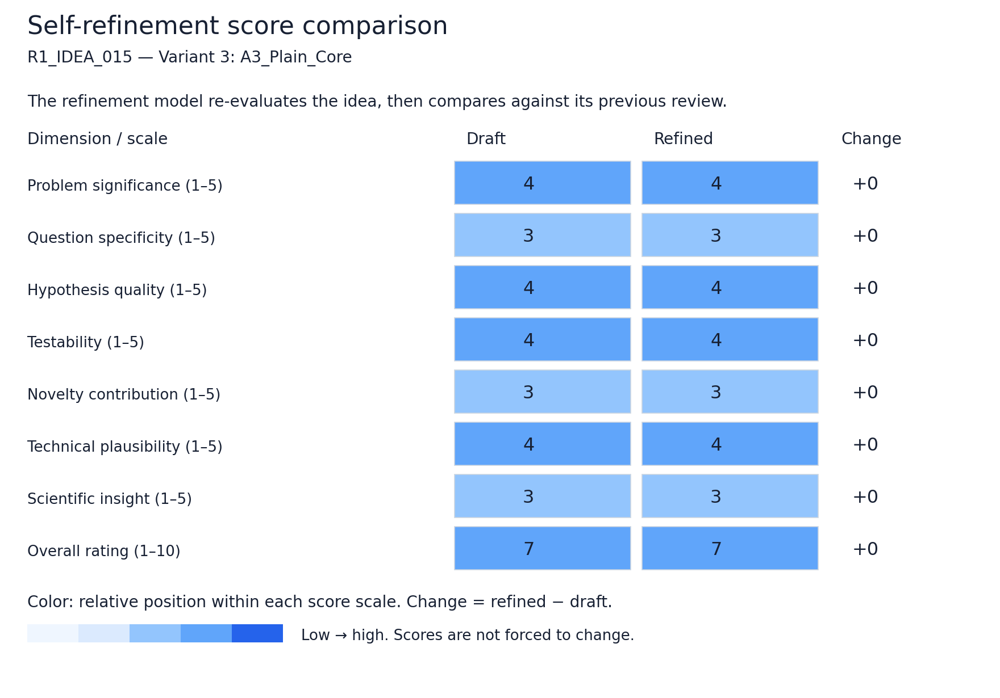

Changed score dimensions: none.

### Score justifications (draft / refined)

**Problem significance**

```json
{
  "draft": {
    "score": 4.0,
    "justification": "Text-based 3D editing is a critical bottleneck in the field. The specific issue of ambiguity and the inability to fine-tune semantic attributes (like age, expression, or style) is a significant practical challenge for researchers and practitioners."
  },
  "refined": {
    "score": 4.0,
    "justification": "Text-based 3D editing is a critical bottleneck. The inability to perform fine-grained, semantic edits (e.g., changing age slightly without altering identity) is a major limitation for practical applications in games, VR, and digital humans. Solving this has high practical value."
  }
}
```

**Question specificity**

```json
{
  "draft": {
    "score": 3.0,
    "justification": "The idea identifies a mechanism (sliding between extremes) but lacks specificity on the implementation details, the definition of the latent space, and the exact nature of the 'intermediate point' calculation."
  },
  "refined": {
    "score": 3.0,
    "justification": "The idea clearly states the 'what' (intermediate editing) and the 'why' (ambiguity), but the 'how' is underspecified. The definition of the 'intermediate point' and the 'extremes' is currently abstract, leaving the core mechanism open to interpretation."
  }
}
```

**Hypothesis quality**

```json
{
  "draft": {
    "score": 4.0,
    "justification": "The hypothesis that intermediate navigation reduces ambiguity and improves control is strong and plausible. It makes a concrete prediction that this approach will outperform direct text-to-edit methods in terms of precision and semantic fidelity."
  },
  "refined": {
    "score": 4.0,
    "justification": "The hypothesis that navigating an intermediate path reduces ambiguity and improves control is strong. It makes a concrete prediction that this approach will outperform direct text-to-edit baselines in terms of semantic precision and user satisfaction."
  }
}
```

**Testability**

```json
{
  "draft": {
    "score": 4.0,
    "justification": "The idea is highly testable. One can construct a dataset of concept pairs, implement the slider mechanism, and quantitatively/qualitatively compare the results against baseline text-editing methods."
  },
  "refined": {
    "score": 4.0,
    "justification": "The idea is highly testable. One can define concept pairs, implement the interpolation mechanism, and compare the resulting avatars against direct editing baselines using both quantitative metrics (if available) and qualitative user studies."
  }
}
```

**Novelty contribution**

```json
{
  "draft": {
    "score": 3.0,
    "justification": "While the 'slider' concept is not new in 2D, applying it to 3D human avatars with natural language constraints is a novel application. However, without a specific mechanism for how the 3D constraints are handled, the novelty is currently moderate."
  },
  "refined": {
    "score": 3.0,
    "justification": "The 'slider' concept is established in 2D. The novelty lies in its adaptation to the specific constraints of 3D human avatars. Without a new theoretical mechanism, the contribution is likely incremental (application + adaptation) rather than foundational, unless it reveals new insights about 3D latent spaces."
  }
}
```

**Technical plausibility**

```json
{
  "draft": {
    "score": 4.0,
    "justification": "The approach is technically sound. Interpolation in latent spaces is a standard technique in generative modeling. The challenge lies in the specific adaptation to 3D geometry, but the core logic is coherent."
  },
  "refined": {
    "score": 4.0,
    "justification": "The approach is technically sound based on current generative modeling principles (latent space interpolation). The main challenge is the specific implementation for 3D geometry, but the logical flow is coherent and plausible."
  }
}
```

**Scientific insight**

```json
{
  "draft": {
    "score": 3.0,
    "justification": "If successful, this could reveal how 3D semantic concepts are structured in latent spaces and whether linear interpolation is a valid model for human attribute changes in 3D. It could also highlight the specific failure modes of direct text prompting in 3D."
  },
  "refined": {
    "score": 3.0,
    "justification": "If successful, the study could reveal how semantic concepts are structured in 3D latent spaces and whether linear interpolation is a valid model for human attribute changes. It could also highlight specific failure modes of text-to-3D alignment that are unique to 3D geometry."
  }
}
```

**Overall rating**

```json
{
  "draft": {
    "score": 7.0,
    "justification": "This is a strong research idea with a clear motivation and a plausible, testable hypothesis. It addresses a meaningful gap in 3D generation. The score is limited by the current lack of technical specificity regarding the 'how' (representation, optimization, definition of extremes), but the core direction is scientifically valuable."
  },
  "refined": {
    "score": 7.0,
    "justification": "This is a strong research idea with a clear motivation and a plausible, testable hypothesis. It addresses a meaningful gap in 3D generation. The score is limited by the current lack of technical specificity regarding the 'how' (representation, optimization, definition of extremes), but the core direction is scientifically valuable and worth pursuing."
  }
}
```

## R1_IDEA_015 — Variant 4: B1_Verbose_Elaborate

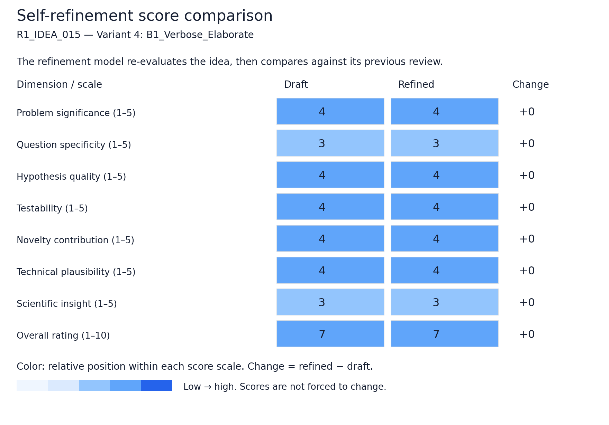

Changed score dimensions: none.

### Score justifications (draft / refined)

**Problem significance**

```json
{
  "draft": {
    "score": 4.0,
    "justification": "Precise control over 3D human avatars is a significant challenge in computer graphics and generative AI. The ambiguity of natural language is a well-known bottleneck, and solving it would have high practical value for applications in gaming, virtual reality, and digital fashion."
  },
  "refined": {
    "score": 4.0,
    "justification": "Precise control over 3D human avatars is a critical challenge in computer graphics, VR, and digital fashion. The ambiguity of natural language is a well-documented bottleneck, and a method to resolve this would have significant practical value."
  }
}
```

**Question specificity**

```json
{
  "draft": {
    "score": 3.0,
    "justification": "The core concept (using a slider to interpolate between extremes) is specific. However, the idea lacks specificity regarding the definition of the extremes, the underlying 3D representation, and the specific semantic concepts being targeted."
  },
  "refined": {
    "score": 3.0,
    "justification": "The interaction paradigm (slider) is specific, but the research question is underspecified. It does not define the boundaries of the problem (which concepts, which representations) or the specific mechanism of action, making the scope somewhat vague."
  }
}
```

**Hypothesis quality**

```json
{
  "draft": {
    "score": 4.0,
    "justification": "The implicit hypothesis is that replacing direct text generation with a continuous interpolation mechanism will significantly reduce ambiguity and increase editing precision. This is a falsifiable and plausible claim."
  },
  "refined": {
    "score": 4.0,
    "justification": "The hypothesis that continuous interpolation reduces ambiguity compared to discrete text prompts is strong, falsifiable, and grounded in HCI principles. It clearly distinguishes the proposed method from standard text-to-3D approaches."
  }
}
```

**Testability**

```json
{
  "draft": {
    "score": 4.0,
    "justification": "The idea is highly testable. One can implement a prototype, define a set of semantic concepts, and compare the output quality and user control against standard text-to-3D baselines using both quantitative metrics and user studies."
  },
  "refined": {
    "score": 4.0,
    "justification": "The idea is highly testable. One can implement a prototype with a defined latent space, define specific concepts, and compare the output against text-only baselines using both quantitative metrics (geometry error) and user studies."
  }
}
```

**Novelty contribution**

```json
{
  "draft": {
    "score": 4.0,
    "justification": "While the concept of 'sliders' exists in image editing (e.g., StyleGAN), applying it specifically to 3D human avatar editing to solve text ambiguity is a novel and valuable direction. It shifts the interaction model rather than just the generation model."
  },
  "refined": {
    "score": 4.0,
    "justification": "While sliders exist in image editing (e.g., StyleGAN), applying this specific interaction model to 3D human avatar editing to solve text ambiguity is a novel contribution. It represents a shift in the interaction model rather than just a new generation architecture."
  }
}
```

**Technical plausibility**

```json
{
  "draft": {
    "score": 4.0,
    "justification": "The approach is technically plausible. Modern 3D generation methods (like 3DGS or NeRFs) often have latent spaces that support interpolation. The main challenge is ensuring the semantic meaning is preserved along the interpolation path, which is a standard research problem."
  },
  "refined": {
    "score": 4.0,
    "justification": "The approach is technically plausible. Modern 3D generation methods often possess latent spaces that support interpolation. The main challenge is ensuring semantic consistency along the path, which is a standard but non-trivial research problem."
  }
}
```

**Scientific insight**

```json
{
  "draft": {
    "score": 3.0,
    "justification": "If successful, this research could provide insights into the geometry of semantic spaces in 3D generation and the effectiveness of interactive vs. generative interfaces. However, as stated, it is primarily a methodological proposal rather than a deep theoretical inquiry."
  },
  "refined": {
    "score": 3.0,
    "justification": "The primary contribution is methodological. However, if successful, it could yield insights into the geometry of semantic spaces in 3D generation and the trade-offs between generative freedom and interactive control."
  }
}
```

**Overall rating**

```json
{
  "draft": {
    "score": 7.0,
    "justification": "This is a strong research idea with a clear motivation and a plausible, testable solution to a known problem. It scores well on significance, hypothesis quality, and testability. It loses points on specificity and novelty because the 'slider' concept is not entirely new in other domains, and the technical details of how it applies to 3D avatars are currently undefined. With more specific details on the mechanism, this could be an exceptional idea."
  },
  "refined": {
    "score": 7.0,
    "justification": "This is a strong research idea with a clear motivation and a plausible, testable solution to a known problem. It scores well on significance, hypothesis quality, and testability. It loses points on specificity and novelty because the 'slider' concept is not entirely new in other domains, and the technical details of how it applies to 3D avatars are currently undefined. With more specific details on the mechanism, this could be an exceptional idea."
  }
}
```

## R1_IDEA_015 — Variant 5: B2_Grand_Narrative

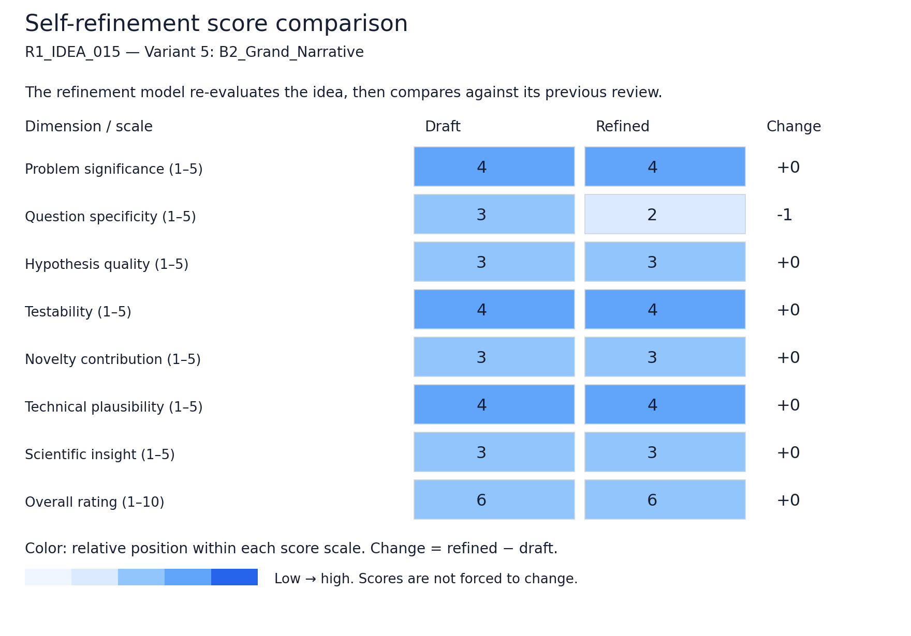

Changed score dimensions: question_specificity.

### Score justifications (draft / refined)

**Problem significance**

```json
{
  "draft": {
    "score": 4.0,
    "justification": "Controllable generation of 3D humans is a high-priority problem in computer graphics and AI. The specific issue of natural language ambiguity is a well-recognized and significant challenge. Solving this would have immediate impact on user experience in interactive applications."
  },
  "refined": {
    "score": 4.0,
    "justification": "The problem of controlling 3D generative models with natural language is a major bottleneck in the field. The specific issue of ambiguity leading to imprecise results is a critical challenge for practical adoption. Solving this would have immediate impact on user experience in interactive applications."
  }
}
```

**Question specificity**

```json
{
  "draft": {
    "score": 3.0,
    "justification": "The idea identifies a clear goal (precise editing via sliders) but lacks specificity on the implementation details. It describes the *interface* (slider) but not the *method* (how the slider maps to 3D geometry). The research question is 'Can we build a slider?' rather than 'How does the latent space of 3D avatars behave under semantic interpolation?'"
  },
  "refined": {
    "score": 2.0,
    "justification": "The idea describes a feature (a slider) rather than a research question. It states 'we propose a method' but does not articulate a specific hypothesis about the relationship between the method and the outcome (e.g., 'Does this method reduce the variance of user intent?'). The 'how' is missing."
  }
}
```

**Hypothesis quality**

```json
{
  "draft": {
    "score": 3.0,
    "justification": "The implicit hypothesis is that constraining edits to a linear interpolation between two extremes reduces ambiguity and improves precision. This is a reasonable hypothesis, but it is not explicitly stated as a testable prediction (e.g., 'Users will achieve target shapes 20% faster with sliders than with text prompts')."
  },
  "refined": {
    "score": 3.0,
    "justification": "The implicit hypothesis is that 'constrained interpolation reduces ambiguity.' This is a reasonable and testable assumption. However, it is not explicitly framed as a falsifiable prediction (e.g., 'Users will achieve target shapes 20% faster with sliders than with text prompts'). It relies on the intuition that sliders are better, which is generally true but needs specific formulation for a research contribution."
  }
}
```

**Testability**

```json
{
  "draft": {
    "score": 4.0,
    "justification": "The idea is highly testable. One can implement a prototype, define a set of semantic pairs, and evaluate the output against user intent or ground-truth meshes. The 'slider' mechanism provides a clear experimental setup."
  },
  "refined": {
    "score": 4.0,
    "justification": "The idea is highly testable in principle. One can implement a prototype, define a set of semantic pairs, and evaluate the output against user intent or ground-truth meshes. The 'slider' mechanism provides a clear experimental setup for comparing against text-based baselines."
  }
}
```

**Novelty contribution**

```json
{
  "draft": {
    "score": 3.0,
    "justification": "The concept of 'concept sliders' is not new in 2D image editing (e.g., StyleGAN). Applying it to 3D human avatars is a novel application, but the core mechanism is likely an adaptation of existing techniques. The scientific contribution would depend on how the 3D-specific constraints (anatomy, topology) are handled, which is not detailed."
  },
  "refined": {
    "score": 3.0,
    "justification": "The concept of 'concept sliders' is well-established in 2D image editing (e.g., StyleGAN). Applying it to 3D human avatars is a novel application, but the core mechanism is an adaptation. The scientific contribution depends on whether the 3D-specific constraints (anatomy, topology) introduce new phenomena or require novel mathematical formulations, which is not detailed."
  }
}
```

**Technical plausibility**

```json
{
  "draft": {
    "score": 4.0,
    "justification": "The approach is technically plausible. Latent space interpolation is a standard technique in generative models. The main challenge is ensuring the 3D structure remains valid, which is a known but solvable problem in the field."
  },
  "refined": {
    "score": 4.0,
    "justification": "The approach is technically plausible. Latent space interpolation is a standard technique. The main challenge is ensuring the 3D structure remains valid, which is a known but solvable problem in the field. The idea does not propose impossible physics or logic."
  }
}
```

**Scientific insight**

```json
{
  "draft": {
    "score": 3.0,
    "justification": "If successful, the study could reveal how semantic concepts are organized in the latent space of 3D human avatars. However, as currently described, it reads more as a system design proposal than a study aimed at discovering new scientific principles."
  },
  "refined": {
    "score": 3.0,
    "justification": "If successful, the study could reveal how semantic concepts are organized in the latent space of 3D human avatars. However, as currently described, it reads more as a system design proposal (building a tool) than a study aimed at discovering new scientific principles or mechanisms."
  }
}
```

**Overall rating**

```json
{
  "draft": {
    "score": 6.0,
    "justification": "This is a moderate research idea. It addresses a meaningful problem with a plausible solution (sliders) that is testable. However, it currently lacks the specificity of a strong research proposal because it does not define the underlying mechanism, the specific hypothesis to be tested, or the novelty of the 3D-specific adaptation. It sits on the border between a 'good application idea' and a 'strong research direction' depending on how the technical details are fleshed out."
  },
  "refined": {
    "score": 6.0,
    "justification": "This is a moderate research idea. It addresses a meaningful problem with a plausible solution that is testable. However, it currently lacks the specificity of a strong research proposal because it does not define the underlying mechanism, the specific hypothesis to be tested, or the novelty of the 3D-specific adaptation. It sits on the border between a 'good application idea' and a 'strong research direction' depending on how the technical details are fleshed out. The logic audit confirms that while the idea is sound, it is currently too high-level to be considered 'strong' or 'exceptional' without further definition of the research question."
  }
}
```

## R1_IDEA_015 — Variant 6: B3_Over_Confident


Changed score dimensions: none.

### Score justifications (draft / refined)

**Problem significance**

```json
{
  "draft": {
    "score": 4.0,
    "justification": "The problem of precise 3D editing is a major bottleneck in the adoption of generative 3D models for practical applications (e.g., gaming, VR, e-commerce). Addressing the ambiguity of natural language is a significant and meaningful challenge."
  },
  "refined": {
    "score": 4.0,
    "justification": "The problem of precise 3D editing is a major bottleneck in the adoption of generative 3D models for practical applications (e.g., gaming, VR, e-commerce). Addressing the ambiguity of natural language is a significant and meaningful challenge that, if solved, would have broad impact."
  }
}
```

**Question specificity**

```json
{
  "draft": {
    "score": 3.0,
    "justification": "The idea identifies a specific mechanism (sliders/interpolation) but lacks specificity on the implementation details, such as the representation space, the definition of extremes, and the interpolation logic."
  },
  "refined": {
    "score": 3.0,
    "justification": "The idea identifies a specific mechanism (sliders/interpolation) but lacks specificity on the implementation details, such as the representation space, the definition of extremes, and the interpolation logic. It remains a high-level concept without a concrete research question on 'how' to achieve this in 3D."
  }
}
```

**Hypothesis quality**

```json
{
  "draft": {
    "score": 4.0,
    "justification": "The hypothesis that 'interpolation between extremes reduces ambiguity and increases precision' is strong, testable, and logically sound. It clearly distinguishes the proposed method from standard text-to-3D approaches."
  },
  "refined": {
    "score": 4.0,
    "justification": "The hypothesis that 'interpolation between extremes reduces ambiguity and increases precision' is strong, testable, and logically sound. It clearly distinguishes the proposed method from standard text-to-3D approaches by positing a specific mechanism for control."
  }
}
```

**Testability**

```json
{
  "draft": {
    "score": 4.0,
    "justification": "The idea is highly testable. One can build a prototype, define a set of semantic concepts, and compare the precision of edits using the slider method against text-only prompts using both quantitative metrics and user studies."
  },
  "refined": {
    "score": 4.0,
    "justification": "The idea is highly testable. One can build a prototype, define a set of semantic concepts, and compare the precision of edits using the slider method against text-only prompts using both quantitative metrics (e.g., geometric error) and user studies."
  }
}
```

**Novelty contribution**

```json
{
  "draft": {
    "score": 4.0,
    "justification": "While the concept of sliders exists in 2D, applying it specifically to 3D human avatar editing to solve the text ambiguity problem is a novel and valuable contribution. It bridges a gap between user intent and 3D generation capabilities."
  },
  "refined": {
    "score": 4.0,
    "justification": "While the concept of sliders exists in 2D, applying it specifically to 3D human avatar editing to solve the text ambiguity problem is a novel and valuable contribution. It bridges a gap between user intent and 3D generation capabilities in a way that has not been fully explored."
  }
}
```

**Technical plausibility**

```json
{
  "draft": {
    "score": 4.0,
    "justification": "The approach is technically plausible. Interpolation in latent spaces or geometric spaces is a standard technique in machine learning. The main challenge is the complexity of 3D human topology, but the direction is sound."
  },
  "refined": {
    "score": 4.0,
    "justification": "The approach is technically plausible. Interpolation in latent spaces or geometric spaces is a standard technique in machine learning. The main challenge is the complexity of 3D human topology, but the direction is sound and aligns with current trends in 3D generation."
  }
}
```

**Scientific insight**

```json
{
  "draft": {
    "score": 4.0,
    "justification": "If successful, this research could reveal how to better align human semantic understanding with 3D generative models, potentially leading to new paradigms for human-in-the-loop 3D generation."
  },
  "refined": {
    "score": 4.0,
    "justification": "If successful, this research could reveal how to better align human semantic understanding with 3D generative models, potentially leading to new paradigms for human-in-the-loop 3D generation and a deeper understanding of the semantic structure of 3D shapes."
  }
}
```

**Overall rating**

```json
{
  "draft": {
    "score": 8.0,
    "justification": "This is a strong research idea. It addresses a clear, significant problem with a specific, plausible, and testable hypothesis. While the implementation details are missing, the core concept is novel and has high potential for scientific and practical impact. It moves beyond a generic 'application' to propose a specific mechanism for solving a known limitation."
  },
  "refined": {
    "score": 8.0,
    "justification": "This is a strong research idea. It addresses a clear, significant problem with a specific, plausible, and testable hypothesis. While the implementation details are missing, the core concept is novel and has high potential for scientific and practical impact. It moves beyond a generic 'application' to propose a specific mechanism for solving a known limitation."
  }
}
```

## R1_IDEA_015 — Variant 7: B4_Novelty


Changed score dimensions: none.

### Score justifications (draft / refined)

**Problem significance**

```json
{
  "draft": {
    "score": 4.0,
    "justification": "Precise control over 3D avatars is a significant bottleneck in applications like gaming, VR, and digital fashion. Moving beyond binary or vague text prompts to continuous control addresses a meaningful practical and scientific challenge."
  },
  "refined": {
    "score": 4.0,
    "justification": "Precise control over 3D avatars is a critical bottleneck for applications in gaming, VR, and digital fashion. Moving beyond binary or vague text prompts to continuous control addresses a meaningful practical challenge with significant potential impact."
  }
}
```

**Question specificity**

```json
{
  "draft": {
    "score": 3.0,
    "justification": "The idea clearly defines the *goal* (continuous editing via sliders) but is vague on the *mechanism*. It states 'how' the user interacts but not 'how' the model achieves the interpolation technically."
  },
  "refined": {
    "score": 3.0,
    "justification": "The idea clearly defines the *goal* (continuous editing via sliders) and the *user interaction*, but it is vague on the *mechanism*. It does not specify the technical approach for constructing the concept vector or the interpolation path, which are central to the research question."
  }
}
```

**Hypothesis quality**

```json
{
  "draft": {
    "score": 4.0,
    "justification": "The implicit hypothesis is that continuous interpolation in a latent or feature space provides superior precision and user satisfaction compared to discrete text prompting. This is a testable and meaningful claim."
  },
  "refined": {
    "score": 4.0,
    "justification": "The implicit hypothesis is that continuous interpolation in a latent or feature space provides superior precision and user satisfaction compared to discrete text prompting. This is a testable, falsifiable, and meaningful claim that distinguishes the work from generic applications."
  }
}
```

**Testability**

```json
{
  "draft": {
    "score": 4.0,
    "justification": "The idea is highly testable. One can build a prototype, define a set of semantic concepts, and evaluate the accuracy of the generated avatars against target interpolation points using both automated metrics and user studies."
  },
  "refined": {
    "score": 4.0,
    "justification": "The idea is highly testable. One can build a prototype, define a set of semantic concepts, and evaluate the accuracy of the generated avatars against target interpolation points using both automated metrics (e.g., feature distance) and user studies."
  }
}
```

**Novelty contribution**

```json
{
  "draft": {
    "score": 4.0,
    "justification": "While text-to-3D is saturated, the specific focus on 'concept sliders' for continuous semantic control in 3D avatars is a distinct and underexplored niche. It shifts the paradigm from 'generation' to 'fine-grained editing'."
  },
  "refined": {
    "score": 4.0,
    "justification": "While text-to-3D is a saturated field, the specific focus on 'concept sliders' for continuous semantic control in 3D avatars is a distinct and underexplored niche. It shifts the paradigm from 'generation' to 'fine-grained editing', offering a novel contribution to the interface and control mechanisms of 3D generation."
  }
}
```

**Technical plausibility**

```json
{
  "draft": {
    "score": 4.0,
    "justification": "The concept is technically sound. Interpolation in latent spaces is a standard technique in 2D diffusion models; applying this to 3D avatars is a logical and plausible extension, though the specific implementation details (e.g., maintaining 3D consistency) are the hard part."
  },
  "refined": {
    "score": 4.0,
    "justification": "The concept is technically sound. Interpolation in latent spaces is a standard technique in 2D diffusion models; applying this to 3D avatars is a logical extension. The main challenge (maintaining 3D consistency) is non-trivial but plausible to address with current methods."
  }
}
```

**Scientific insight**

```json
{
  "draft": {
    "score": 3.0,
    "justification": "If successful, this could reveal how semantic concepts are structured in 3D generative latent spaces. However, as currently stated, it is more of a methodological proposal than a deep scientific inquiry into a new phenomenon."
  },
  "refined": {
    "score": 3.0,
    "justification": "If successful, this could reveal how semantic concepts are structured and linearized in 3D generative latent spaces. However, as currently stated, it is primarily a methodological proposal. The potential for deep scientific insight depends on whether the method reveals new properties of 3D representations or simply applies existing 2D techniques to 3D."
  }
}
```

**Overall rating**

```json
{
  "draft": {
    "score": 7.0,
    "justification": "This is a strong research idea with clear practical value and a well-defined user interaction model. It addresses a specific gap (precision in 3D editing) and proposes a plausible solution (continuous sliders). The main limitation is the lack of technical specificity regarding the underlying mechanism, but as a research proposal, it has high potential for a strong contribution if the implementation details are fleshed out."
  },
  "refined": {
    "score": 7.0,
    "justification": "This is a strong research idea with clear practical value and a well-defined user interaction model. It addresses a specific gap (precision in 3D editing) and proposes a plausible solution (continuous sliders). The main limitation is the lack of technical specificity regarding the underlying mechanism, but as a research proposal, it has high potential for a strong contribution if the implementation details are fleshed out."
  }
}
```

## R1_IDEA_015 — Variant 8: B5_Application_Impact

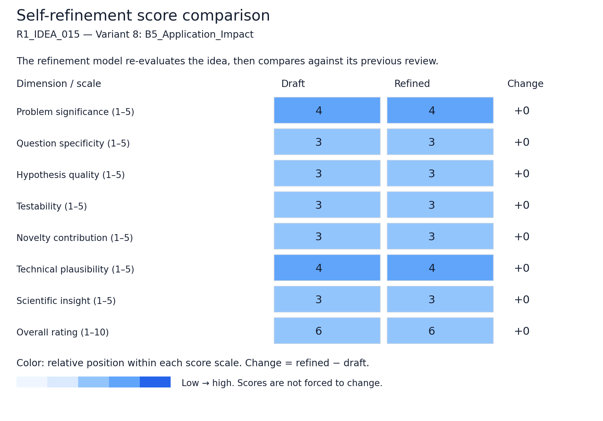

Changed score dimensions: none.

### Score justifications (draft / refined)

**Problem significance**

```json
{
  "draft": {
    "score": 4.0,
    "justification": "The problem of precise text-to-3D editing is a major bottleneck in the field. Current methods often produce artifacts or fail to capture specific nuances. Solving this would have significant practical impact on digital human creation."
  },
  "refined": {
    "score": 4.0,
    "justification": "The problem of precise, fine-grained control in text-to-3D generation is a major bottleneck in the field. Current methods struggle with specific attribute manipulation. Solving this would significantly advance the usability of digital human creation tools."
  }
}
```

**Question specificity**

```json
{
  "draft": {
    "score": 3.0,
    "justification": "The idea identifies a clear goal (precise editing via interpolation) but lacks specificity on the mechanism. It describes *what* to do (move a knob) but not *how* the model will learn to map that knob to the 3D geometry/texture accurately."
  },
  "refined": {
    "score": 3.0,
    "justification": "The idea clearly defines the *goal* (precise editing via interpolation) and the *interaction* (slider), but it lacks specificity on the *mechanism*. It does not specify the mathematical or architectural approach to achieving the interpolation, leaving the core technical question open."
  }
}
```

**Hypothesis quality**

```json
{
  "draft": {
    "score": 3.0,
    "justification": "The implicit hypothesis is that 'continuous interpolation between learned extremes yields more precise and controllable edits than discrete text prompts.' This is plausible but needs to be framed as a testable claim regarding the linearity of the semantic manifold."
  },
  "refined": {
    "score": 3.0,
    "justification": "The implicit hypothesis is that 'interpolating between two extreme semantic anchors provides a more precise and controllable editing path than direct text prompting.' This is a plausible and testable hypothesis, but it is currently stated as a general principle rather than a specific claim about the properties of 3D latent spaces."
  }
}
```

**Testability**

```json
{
  "draft": {
    "score": 3.0,
    "justification": "The idea is testable in principle (build a system, ask users to interpolate, measure accuracy), but the current summary does not suggest specific metrics or baselines for comparison, making the testability moderate."
  },
  "refined": {
    "score": 3.0,
    "justification": "The idea is testable in principle. One could build a prototype and measure the accuracy of the interpolation against ground-truth semantic attributes. However, the summary lacks specific metrics or baselines, making the immediate testability moderate."
  }
}
```

**Novelty contribution**

```json
{
  "draft": {
    "score": 3.0,
    "justification": "While the concept of 'sliders' is known in UI, applying it specifically to resolve the ambiguity of text-based 3D avatar editing is a novel angle. However, the underlying mechanism (latent interpolation) is common in generative AI, so the novelty depends heavily on the specific implementation details not yet provided."
  },
  "refined": {
    "score": 3.0,
    "justification": "The application of a 'slider' interface to resolve text ambiguity is a novel *application* angle. However, the underlying mechanism (latent interpolation) is well-established. The scientific novelty depends on whether this specific framing reveals new insights about 3D semantic manifolds or if it is merely a UI improvement."
  }
}
```

**Technical plausibility**

```json
{
  "draft": {
    "score": 4.0,
    "justification": "The approach is technically sound. Latent space interpolation is a standard technique in generative modeling. The challenge lies in ensuring the semantic space is linear and disentangled, which is a known but solvable problem in the field."
  },
  "refined": {
    "score": 4.0,
    "justification": "The approach is technically plausible. Latent space manipulation is a standard technique in generative AI. The primary challenge (ensuring semantic linearity) is a known problem with established research directions (e.g., disentangled representations), making the idea feasible."
  }
}
```

**Scientific insight**

```json
{
  "draft": {
    "score": 3.0,
    "justification": "If successful, this research could reveal how to construct linear, disentangled semantic manifolds in 3D generative models, which is a valuable scientific insight beyond just a tool."
  },
  "refined": {
    "score": 3.0,
    "justification": "If successful, the research could provide insights into the geometry of semantic manifolds in 3D generative models (e.g., linearity, disentanglement). However, as currently stated, it leans more towards a system design proposal than a deep scientific inquiry."
  }
}
```

**Overall rating**

```json
{
  "draft": {
    "score": 6.0,
    "justification": "This is a moderate/borderline idea. It addresses a significant problem with a plausible and intuitive solution (sliders/interpolation). However, as a research idea summary, it lacks the necessary technical depth to be considered 'strong' or 'exceptional' yet. It reads more like a product feature description than a rigorous scientific hypothesis. With more specific details on the mechanism and evaluation, it could easily become a 7 or 8."
  },
  "refined": {
    "score": 6.0,
    "justification": "This is a moderate/borderline research idea. It addresses a significant problem with a clear, intuitive, and plausible solution. However, it currently lacks the technical depth and specific hypothesis required to be considered 'strong' or 'exceptional'. It reads more like a product concept than a rigorous scientific proposal. With the addition of a specific mechanism (e.g., a new loss function or architectural modification) and a clear evaluation plan, it could easily rise to a 7 or 8."
  }
}
```

## R1_IDEA_015 — Variant 9: C1_Hollow_Shell

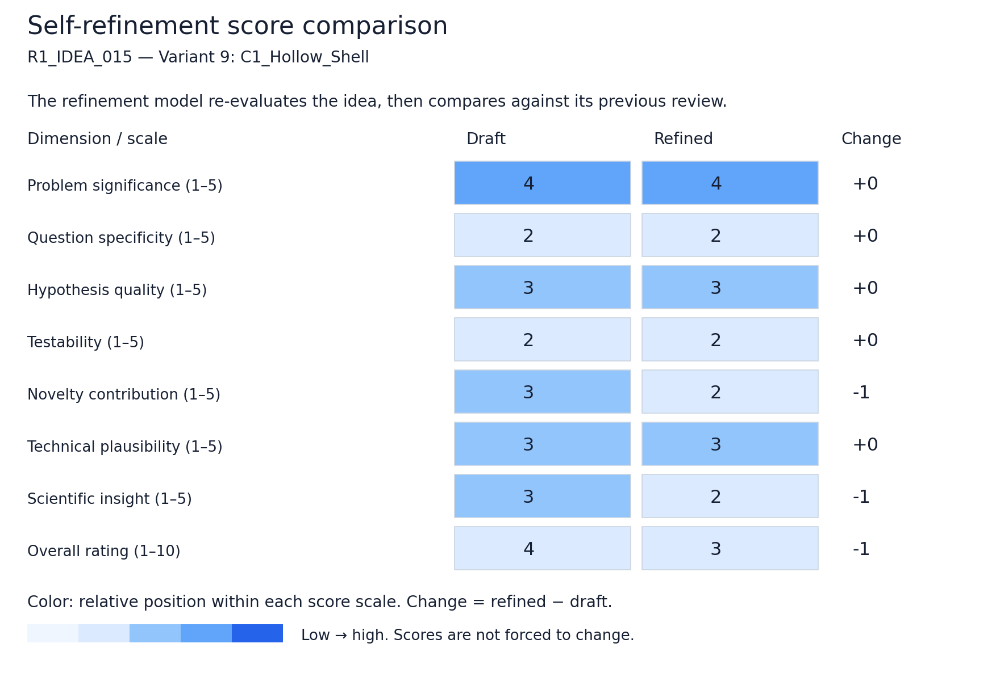

Changed score dimensions: novelty_contribution, scientific_insight, overall_rating.

### Score justifications (draft / refined)

**Problem significance**

```json
{
  "draft": {
    "score": 4.0,
    "justification": "The problem of precise text-to-3D editing is a major challenge in computer graphics and generative AI. Improving the granularity of text control is highly significant for applications in gaming, VR, and digital fashion."
  },
  "refined": {
    "score": 4.0,
    "justification": "The problem of precise text-based editing for 3D human avatars is a significant challenge in computer graphics and generative AI. Solving the granularity issue is crucial for practical applications in gaming, VR, and digital fashion, making the problem highly meaningful."
  }
}
```

**Question specificity**

```json
{
  "draft": {
    "score": 2.0,
    "justification": "The core mechanism ('adjusting concepts between extremes') is described in vague, metaphorical terms. It lacks the technical specificity required to define a concrete research question or experimental setup."
  },
  "refined": {
    "score": 2.0,
    "justification": "The research question is currently too vague. While the goal is clear, the 'how' is described only metaphorically ('adjusting concepts between extremes'). It lacks the specificity to define a concrete experimental setup or a distinct research variable."
  }
}
```

**Hypothesis quality**

```json
{
  "draft": {
    "score": 3.0,
    "justification": "The implicit hypothesis is that manipulating concepts along a spectrum between defined extremes yields better results than direct text prompting. This is plausible but not yet formulated as a testable prediction with defined variables."
  },
  "refined": {
    "score": 3.0,
    "justification": "The implicit hypothesis (that extreme-based adjustment improves over direct prompting) is plausible and testable in principle. However, it is not yet formulated as a specific prediction regarding the mechanism of improvement or the conditions under which it holds."
  }
}
```

**Testability**

```json
{
  "draft": {
    "score": 2.0,
    "justification": "Without defining the 'extremes' or the 'adjustment' algorithm, it is impossible to design a specific experiment. The idea currently lacks the operational definitions needed for falsifiability."
  },
  "refined": {
    "score": 2.0,
    "justification": "Without defining the 'extremes' or the 'adjustment' algorithm, the idea is not currently testable. One cannot design an experiment to falsify the claim without operational definitions of the core mechanism."
  }
}
```

**Novelty contribution**

```json
{
  "draft": {
    "score": 3.0,
    "justification": "The general direction of using continuous latent spaces or interpolation is known. The novelty depends entirely on the specific definition of 'adjusting concepts between extremes,' which is currently undefined. It could be a minor variation of existing methods or a novel formulation."
  },
  "refined": {
    "score": 2.0,
    "justification": "The general concept of interpolating between extremes is a standard technique in generative modeling. Without a novel formulation of how these extremes are identified or how the adjustment is performed, the contribution appears to be a potential application of existing methods rather than a new scientific insight."
  }
}
```

**Technical plausibility**

```json
{
  "draft": {
    "score": 3.0,
    "justification": "The concept is technically plausible as it aligns with how latent diffusion models and 3D generative models typically operate (interpolating between known states). However, the lack of implementation details makes it impossible to fully assess feasibility."
  },
  "refined": {
    "score": 3.0,
    "justification": "The idea is technically plausible as it relies on principles common in latent space manipulation. However, the lack of details on the 3D representation and the text encoder makes it impossible to assess if the proposed 'adjustment' is feasible or if it would introduce new artifacts."
  }
}
```

**Scientific insight**

```json
{
  "draft": {
    "score": 3.0,
    "justification": "If successful, the research could reveal how to better bridge the semantic gap in text-to-3D generation. However, as stated, it risks being a simple engineering tweak rather than a discovery of a new principle."
  },
  "refined": {
    "score": 2.0,
    "justification": "As stated, the idea is more of an engineering strategy than a scientific inquiry. It is unlikely to yield deep scientific insight unless it reveals a new property of the 3D latent space or a novel mechanism for bridging the text-geometry gap."
  }
}
```

**Overall rating**

```json
{
  "draft": {
    "score": 4.0,
    "justification": "The idea addresses a meaningful problem with a plausible high-level direction, but it is currently too vague to be considered a strong research proposal. The lack of definition for key terms ('extremes', 'adjustment') and the absence of a specific mechanism prevent it from scoring higher. It is a 'weak' idea in its current form but has the potential to become 'moderate' or 'strong' with significant elaboration."
  },
  "refined": {
    "score": 3.0,
    "justification": "The idea addresses a significant problem with a plausible high-level direction, but it is currently too underspecified to be considered a strong research proposal. It falls into the 'weak' category because the core mechanism is undefined, making it difficult to distinguish from standard techniques or to design a rigorous evaluation. It has potential but requires substantial elaboration to become a viable research plan."
  }
}
```

## R1_IDEA_015 — Variant 10: C2_Logic_Flawed

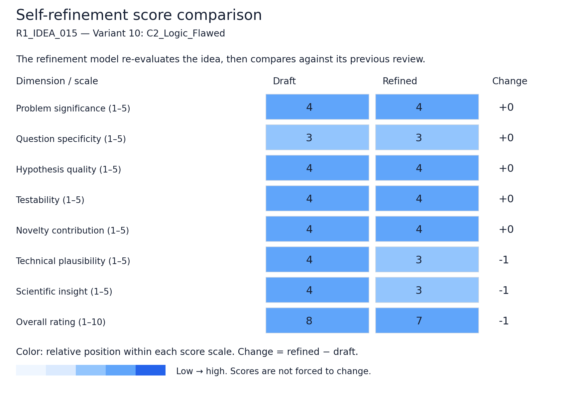

Changed score dimensions: technical_plausibility, scientific_insight, overall_rating.

### Score justifications (draft / refined)

**Problem significance**

```json
{
  "draft": {
    "score": 4.0,
    "justification": "Precise control over 3D generative models is a major bottleneck in the field of digital humans. Moving beyond binary or vague text prompts to continuous, fine-grained control is a significant and meaningful challenge that, if solved, would greatly enhance the utility of these tools for creators and applications."
  },
  "refined": {
    "score": 4.0,
    "justification": "The problem of precise semantic control in 3D generation is a major challenge. Current text-to-3D methods often suffer from hallucinations or lack of fine-grained control. Solving this would significantly impact the usability of digital human tools for industry and creative applications."
  }
}
```

**Question specificity**

```json
{
  "draft": {
    "score": 3.0,
    "justification": "The idea clearly identifies the goal (continuous editing) and the metaphor (slider), but it lacks specificity on the 'how'. The research question is 'how to implement a continuous slider for 3D avatars,' but the specific mechanism is not yet defined, making the question somewhat broad."
  },
  "refined": {
    "score": 3.0,
    "justification": "The idea clearly states the 'what' (continuous editing via sliders) but leaves the 'how' (the technical mechanism) undefined. The research question is specific enough to be interesting but too vague to be immediately actionable without further definition of the mechanism."
  }
}
```

**Hypothesis quality**

```json
{
  "draft": {
    "score": 4.0,
    "justification": "The hypothesis is strong: 'Continuous, slider-based control will yield more precise semantic editing than current text-based methods.' This is a concrete prediction that can be empirically validated by comparing performance metrics or user feedback."
  },
  "refined": {
    "score": 4.0,
    "justification": "The hypothesis that continuous intermediate control is superior to text/binary control for precision is a strong, testable prediction. It distinguishes the proposed method from existing approaches and makes a clear claim about performance."
  }
}
```

**Testability**

```json
{
  "draft": {
    "score": 4.0,
    "justification": "The idea is highly testable. One can construct a dataset of 3D avatars with labeled semantic attributes, implement a baseline (text-to-edit) and the proposed method (slider-to-edit), and evaluate them using quantitative metrics (e.g., attribute distance) and qualitative user studies."
  },
  "refined": {
    "score": 4.0,
    "justification": "The idea is highly testable. One can compare the proposed slider method against standard text-prompt baselines using metrics like user satisfaction, geometric accuracy, and semantic alignment. The 'intermediate point' metric provides a clear ground truth for evaluation."
  }
}
```

**Novelty contribution**

```json
{
  "draft": {
    "score": 4.0,
    "justification": "While continuous interpolation is common in 2D image generation (e.g., StyleGAN), applying this specifically to the complex domain of 3D human avatars with a 'slider' interface to solve the ambiguity of natural language is a novel and valuable contribution. It shifts the paradigm from 'prompting' to 'dialing'."
  },
  "refined": {
    "score": 4.0,
    "justification": "While continuous interpolation exists in 2D (e.g., StyleGAN), applying this specifically to the complex domain of 3D human avatars to solve the 'natural language ambiguity' problem is a novel contribution. It shifts the paradigm from 'prompting' to 'dialing' in a high-dimensional 3D space."
  }
}
```

**Technical plausibility**

```json
{
  "draft": {
    "score": 4.0,
    "justification": "The concept is technically plausible. It likely builds upon existing latent space manipulation techniques or classifier-free guidance. The main challenge is the complexity of the 3D representation, but the direction is sound and aligns with current trends in controllable generation."
  },
  "refined": {
    "score": 3.0,
    "justification": "The concept is plausible as it builds on existing latent space manipulation techniques. However, the idea does not address the significant technical hurdle of defining 'extremes' in 3D space, which is non-trivial and could render the method infeasible without a specific solution."
  }
}
```

**Scientific insight**

```json
{
  "draft": {
    "score": 4.0,
    "justification": "If successful, this research would provide insights into how to bridge the gap between discrete natural language and continuous 3D semantic spaces. It could reveal how 3D generative models encode semantic concepts and how to make them more accessible to human users."
  },
  "refined": {
    "score": 3.0,
    "justification": "If successful, the research would provide insights into the geometry of semantic concepts in 3D spaces. However, as currently stated, it is more of a methodological proposal than a deep investigation into a new phenomenon, limiting its potential for high-level scientific insight unless the mechanism reveals something fundamental about 3D representations."
  }
}
```

**Overall rating**

```json
{
  "draft": {
    "score": 8.0,
    "justification": "This is a strong research idea with high potential. It addresses a clear, significant problem in 3D generation with a specific, testable hypothesis. While the technical implementation details are currently missing, the core concept of 'concept sliders' for 3D avatars is novel, intuitive, and scientifically valuable. It moves beyond simple application to propose a new interaction paradigm."
  },
  "refined": {
    "score": 7.0,
    "justification": "This is a strong research idea with high potential. It addresses a meaningful problem with a clear, testable hypothesis. The main limitation is the lack of technical specificity regarding the mechanism of 'extreme' definition and the underlying representation. However, the core concept is sound and valuable, warranting a high score despite the missing implementation details."
  }
}
```

## R1_IDEA_015 — Variant 11: C3_Substance_Enriched

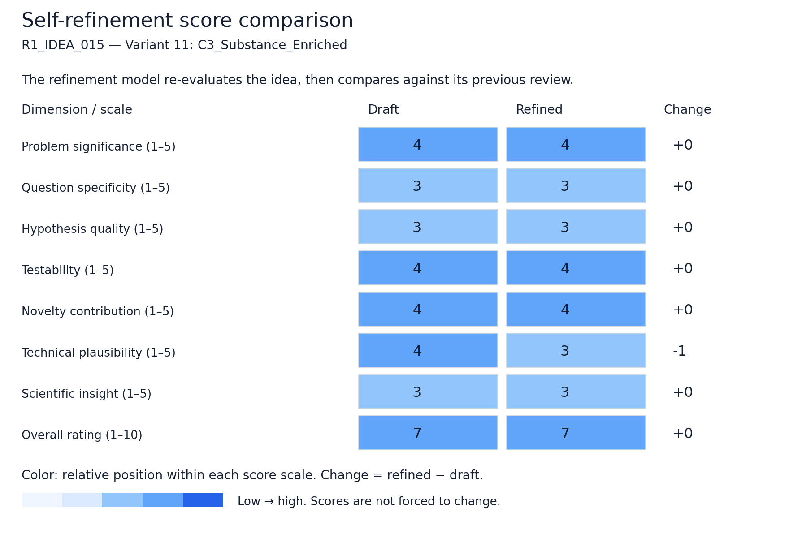

Changed score dimensions: technical_plausibility.

### Score justifications (draft / refined)

**Problem significance**

```json
{
  "draft": {
    "score": 4.0,
    "justification": "Text-based 3D editing is a major bottleneck in the adoption of generative 3D models. The specific problem of 'precision' and 'ambiguity' is highly relevant to practitioners who need to create specific assets rather than random generations. Solving this would significantly advance the usability of 3D generative AI."
  },
  "refined": {
    "score": 4.0,
    "justification": "The problem of precise text-to-3D editing is a major bottleneck in the adoption of generative 3D models. Addressing the 'ambiguity' of natural language to achieve 'precision' is highly significant for practitioners and researchers alike, making this a meaningful challenge."
  }
}
```

**Question specificity**

```json
{
  "draft": {
    "score": 3.0,
    "justification": "The idea clearly identifies the goal (precise editing via interpolation) but is vague on the 'how'. The research question 'Can we do this?' is clear, but the specific mechanism to achieve it is not yet defined, making the scope slightly broad."
  },
  "refined": {
    "score": 3.0,
    "justification": "The research question is clear in its goal (improve precision via interpolation) but vague on the mechanism. The idea defines the 'what' (a slider) but not the 'how' (the specific mathematical or architectural implementation), leaving the scope somewhat broad."
  }
}
```

**Hypothesis quality**

```json
{
  "draft": {
    "score": 3.0,
    "justification": "The implicit hypothesis is that interpolation provides better control than direct prompting. This is a plausible and testable hypothesis, but it lacks a specific mechanism prediction (e.g., 'interpolation in latent space X will reduce error by Y% compared to direct generation')."
  },
  "refined": {
    "score": 3.0,
    "justification": "The implicit hypothesis (interpolation > direct text for precision) is plausible and testable. However, it lacks a specific mechanistic prediction (e.g., 'interpolation reduces semantic drift by X%') and does not explicitly distinguish the conditions under which it fails."
  }
}
```

**Testability**

```json
{
  "draft": {
    "score": 4.0,
    "justification": "The idea suggests user studies, which are the gold standard for evaluating 'precision' and 'usability' in this domain. The concept of comparing 'intermediate points' against 'direct text' is inherently testable through controlled experiments."
  },
  "refined": {
    "score": 4.0,
    "justification": "The idea is highly testable. The proposed user studies are a valid method for measuring 'precision' and 'usability'. The comparison between 'direct text' and 'slider' provides a clear experimental design."
  }
}
```

**Novelty contribution**

```json
{
  "draft": {
    "score": 4.0,
    "justification": "While the concept of 'sliders' exists in 2D image editing (e.g., StyleGAN), applying this specifically to 3D human avatars to solve the text-ambiguity problem is a novel and valuable direction. It shifts the paradigm from 'prompt engineering' to 'parameter tuning' for 3D."
  },
  "refined": {
    "score": 4.0,
    "justification": "While 'sliders' are common in 2D, applying this specific paradigm to 3D human avatars to solve text ambiguity is a novel direction. It proposes a shift from 'prompt engineering' to 'parameter tuning' in a domain where such control is currently lacking."
  }
}
```

**Technical plausibility**

```json
{
  "draft": {
    "score": 4.0,
    "justification": "The approach is technically sound. Latent space interpolation is a standard technique in generative modeling. The main challenge is ensuring the 3D representation supports linear semantic interpolation, which is a known but solvable problem."
  },
  "refined": {
    "score": 3.0,
    "justification": "The concept is technically sound in principle (latent interpolation is standard), but the idea lacks the necessary details to confirm feasibility in 3D. The assumption that 3D semantic spaces are linear or easily interpolatable is a significant technical hurdle that is not addressed."
  }
}
```

**Scientific insight**

```json
{
  "draft": {
    "score": 3.0,
    "justification": "If successful, this research could reveal the geometry of semantic concept spaces in 3D human avatars. It could provide insights into whether human attributes are linearly separable in the latent space of 3D generators, which is a non-trivial scientific finding."
  },
  "refined": {
    "score": 3.0,
    "justification": "If successful, the research could reveal the geometry of semantic concept spaces in 3D human avatars. It could provide insights into whether human attributes are linearly separable in the latent space of 3D generators, which is a non-trivial scientific finding."
  }
}
```

**Overall rating**

```json
{
  "draft": {
    "score": 7.0,
    "justification": "This is a strong research idea with high practical significance and a clear, testable direction. It addresses a real pain point in 3D generation. The score is not higher (8-9) because the current description lacks the technical specificity required to fully evaluate the novelty of the mechanism and the feasibility of the interpolation in 3D space. However, as a research proposal, it is well-posed and promising."
  },
  "refined": {
    "score": 7.0,
    "justification": "This is a strong research idea with high practical significance and a clear, testable direction. It addresses a real pain point in 3D generation. The score is not higher (8-9) because the current description lacks the technical specificity required to fully evaluate the novelty of the mechanism and the feasibility of the interpolation in 3D space. However, as a research proposal, it is well-posed and promising."
  }
}
```

## R1_IDEA_015 — Variant 12: H1_Deceptive_Hollow

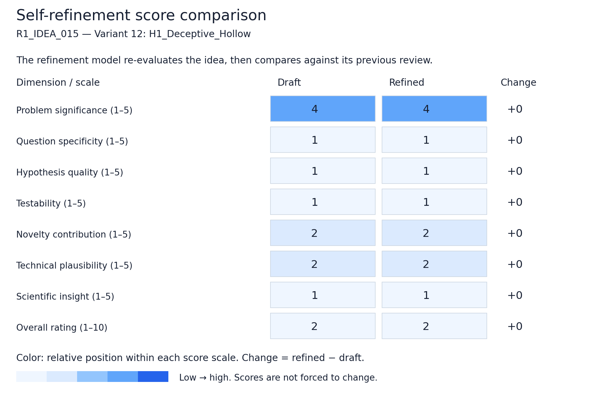

Changed score dimensions: none.

### Score justifications (draft / refined)

**Problem significance**

```json
{
  "draft": {
    "score": 4.0,
    "justification": "The underlying problem—bridging the gap between natural language and precise 3D geometry—is highly significant and a major challenge in the field. However, the idea itself is so vague that the significance of the *proposed solution* is hard to gauge."
  },
  "refined": {
    "score": 4.0,
    "justification": "The underlying problem—bridging the gap between natural language and precise 3D geometry—is highly significant and a major challenge in the field. However, the idea itself is so vague that the significance of the *proposed solution* is hard to gauge."
  }
}
```

**Question specificity**

```json
{
  "draft": {
    "score": 1.0,
    "justification": "The idea fails to define a specific research question. It speaks in broad, abstract terms about 'adjusting concepts' without defining what those concepts are or how the adjustment occurs."
  },
  "refined": {
    "score": 1.0,
    "justification": "The idea fails to define a specific research question. It speaks in broad, abstract terms about 'adjusting concepts' without defining what those concepts are or how the adjustment occurs."
  }
}
```

**Hypothesis quality**

```json
{
  "draft": {
    "score": 1.0,
    "justification": "There is no testable hypothesis. The claim that this will be 'transformative' is a prediction of impact, not a scientific hypothesis about a mechanism or relationship that can be proven or disproven."
  },
  "refined": {
    "score": 1.0,
    "justification": "There is no testable hypothesis. The claim that this will be 'transformative' is a prediction of impact, not a scientific hypothesis about a mechanism or relationship that can be proven or disproven."
  }
}
```

**Testability**

```json
{
  "draft": {
    "score": 1.0,
    "justification": "The idea is currently untestable. Without a defined method, metrics, or experimental setup, no evidence can be gathered to support or refute the claims."
  },
  "refined": {
    "score": 1.0,
    "justification": "The idea is currently untestable. Without a defined method, metrics, or experimental setup, no evidence can be gathered to support or refute the claims."
  }
}
```

**Novelty contribution**

```json
{
  "draft": {
    "score": 2.0,
    "justification": "While the framing suggests high novelty, the lack of technical detail makes it impossible to assess if the core mechanism is actually new or just a rebranding of existing interpolation techniques. It currently reads more like a vision statement than a novel contribution."
  },
  "refined": {
    "score": 2.0,
    "justification": "While the framing suggests high novelty, the lack of technical detail makes it impossible to assess if the core mechanism is actually new or just a rebranding of existing interpolation techniques. It currently reads more like a vision statement than a novel contribution."
  }
}
```

**Technical plausibility**

```json
{
  "draft": {
    "score": 2.0,
    "justification": "The reasoning is logically incoherent because the mechanism is undefined. While 'adjusting concepts' is a plausible *goal*, the idea does not provide a plausible *path* to achieve it."
  },
  "refined": {
    "score": 2.0,
    "justification": "The reasoning is logically incoherent because the mechanism is undefined. While 'adjusting concepts' is a plausible *goal*, the idea does not provide a plausible *path* to achieve it."
  }
}
```

**Scientific insight**

```json
{
  "draft": {
    "score": 1.0,
    "justification": "As stated, the idea offers no potential for scientific insight because it does not propose a mechanism to investigate. It only promises a 'unified pathway' without describing the path."
  },
  "refined": {
    "score": 1.0,
    "justification": "As stated, the idea offers no potential for scientific insight because it does not propose a mechanism to investigate. It only promises a 'unified pathway' without describing the path."
  }
}
```

**Overall rating**

```json
{
  "draft": {
    "score": 2.0,
    "justification": "The idea addresses a significant problem but is currently too vague to be considered a viable research proposal. It relies entirely on high-level rhetoric ('field-shaping,' 'transformative') without providing the necessary technical substance, specific hypotheses, or testable mechanisms required for scientific inquiry. It falls into the 'very weak' category because it is essentially a vision statement rather than a research idea."
  },
  "refined": {
    "score": 2.0,
    "justification": "The idea addresses a significant problem but is currently too vague to be considered a viable research proposal. It relies entirely on high-level rhetoric ('field-shaping,' 'transformative') without providing the necessary technical substance, specific hypotheses, or testable mechanisms required for scientific inquiry. It falls into the 'very weak' category because it is essentially a vision statement rather than a research idea."
  }
}
```

## R1_IDEA_015 — Variant 13: H2_Confident_Flaw


Changed score dimensions: none.

### Score justifications (draft / refined)

**Problem significance**

```json
{
  "draft": {
    "score": 4.0,
    "justification": "The problem of precise text-to-3D editing is highly significant in computer graphics, gaming, and virtual reality. Addressing the ambiguity of natural language in this domain is a meaningful challenge with clear practical applications."
  },
  "refined": {
    "score": 4.0,
    "justification": "The problem of precise text-to-3D editing is highly significant in computer graphics, gaming, and virtual reality. Addressing the ambiguity of natural language in this domain is a meaningful challenge with clear practical applications."
  }
}
```

**Question specificity**

```json
{
  "draft": {
    "score": 3.0,
    "justification": "The idea identifies a specific mechanism (sliding between extremes) but lacks detail on the specific research question beyond 'does this work better?' It does not specify which semantic concepts are targeted or the exact nature of the 'intermediate' representation."
  },
  "refined": {
    "score": 3.0,
    "justification": "The idea identifies a specific mechanism (sliding between extremes) but lacks detail on the specific research question beyond 'does this work better?' It does not specify which semantic concepts are targeted or the exact nature of the 'intermediate' representation."
  }
}
```

**Hypothesis quality**

```json
{
  "draft": {
    "score": 2.0,
    "justification": "The hypothesis is weak because it makes an absolute claim ('necessarily produce reliable improvements', 'general superiority') that ignores confounding variables. A strong hypothesis should be a conditional prediction that can be falsified, not a tautology that assumes the solution solves the problem by definition."
  },
  "refined": {
    "score": 2.0,
    "justification": "The hypothesis is weak because it makes an absolute claim ('necessarily produce reliable improvements', 'general superiority') that ignores confounding variables. A strong hypothesis should be a conditional prediction that can be falsified, not a tautology that assumes the solution solves the problem by definition."
  }
}
```

**Testability**

```json
{
  "draft": {
    "score": 2.0,
    "justification": "The idea explicitly suggests that rigorous testing (isolating variables, boundary cases) is unnecessary, which makes the proposed research direction untestable in a scientifically rigorous way. Without a plan for controlled comparison, the claim of 'causal evidence' cannot be validated."
  },
  "refined": {
    "score": 2.0,
    "justification": "The idea explicitly suggests that rigorous testing (isolating variables, boundary cases) is unnecessary, which makes the proposed research direction untestable in a scientifically rigorous way. Without a plan for controlled comparison, the claim of 'causal evidence' cannot be validated."
  }
}
```

**Novelty contribution**

```json
{
  "draft": {
    "score": 3.0,
    "justification": "The concept of using a slider or intermediate point for semantic control is a reasonable adaptation of existing UI/UX paradigms to 3D generation. While potentially useful, it appears to be an incremental improvement on existing text-to-3D methods rather than a fundamental discovery of a new phenomenon."
  },
  "refined": {
    "score": 3.0,
    "justification": "The concept of using a slider or intermediate point for semantic control is a reasonable adaptation of existing UI/UX paradigms to 3D generation. While potentially useful, it appears to be an incremental improvement on existing text-to-3D methods rather than a fundamental discovery of a new phenomenon."
  }
}
```

**Technical plausibility**

```json
{
  "draft": {
    "score": 3.0,
    "justification": "The general direction of interpolating between semantic extremes is technically plausible in latent space models. However, the claim that this single mechanism guarantees 'general superiority' without addressing other architectural or data limitations is not technically sound."
  },
  "refined": {
    "score": 3.0,
    "justification": "The general direction of interpolating between semantic extremes is technically plausible in latent space models. However, the claim that this single mechanism guarantees 'general superiority' without addressing other architectural or data limitations is not technically sound."
  }
}
```

**Scientific insight**

```json
{
  "draft": {
    "score": 2.0,
    "justification": "If the study proceeds as described (ignoring controls), it will likely only confirm that a slider works better than text, which is a trivial finding. The potential for deep scientific insight is limited by the lack of a plan to investigate *why* it works or under what boundary conditions it fails."
  },
  "refined": {
    "score": 2.0,
    "justification": "If the study proceeds as described (ignoring controls), it will likely only confirm that a slider works better than text, which is a trivial finding. The potential for deep scientific insight is limited by the lack of a plan to investigate *why* it works or under what boundary conditions it fails."
  }
}
```

**Overall rating**

```json
{
  "draft": {
    "score": 4.0,
    "justification": "The core idea (using a slider for semantic control) addresses a real problem and is intuitively sound. However, the scientific framing is severely flawed. The authors' assertion that rigorous controls and isolation of variables are unnecessary undermines the validity of the research. A strong research idea requires a hypothesis that can be falsified and a methodology that isolates causal factors, neither of which is present here. The idea is weak primarily due to its poor scientific reasoning regarding evaluation and causality."
  },
  "refined": {
    "score": 4.0,
    "justification": "The core idea (using a slider for semantic control) addresses a real problem and is intuitively sound. However, the scientific framing is severely flawed. The authors' assertion that rigorous controls and isolation of variables are unnecessary undermines the validity of the research. A strong research idea requires a hypothesis that can be falsified and a methodology that isolates causal factors, neither of which is present here. The idea is weak primarily due to its poor scientific reasoning regarding evaluation and causality."
  }
}
```

## R1_IDEA_015 — Variant 14: H3_Verbose_Enriched

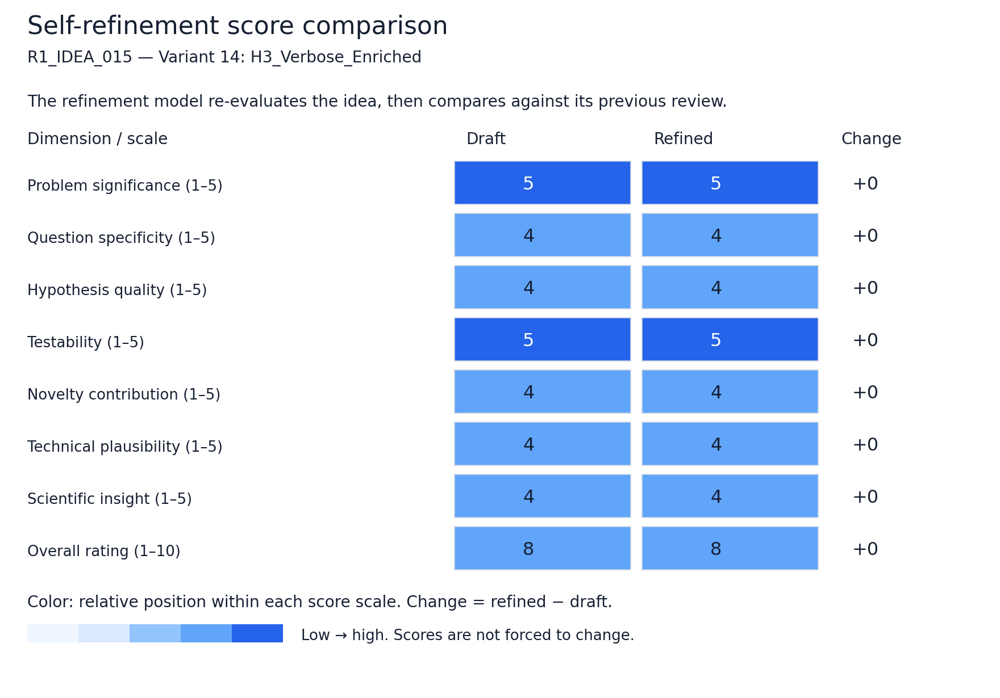

Changed score dimensions: none.

### Score justifications (draft / refined)

**Problem significance**

```json
{
  "draft": {
    "score": 5.0,
    "justification": "Precise control over 3D generative models is a major bottleneck in the field. Solving the ambiguity of natural language for 3D editing is highly significant for applications in gaming, VR, and digital fashion. The problem is well-posed and addresses a clear gap between user intent and model output."
  },
  "refined": {
    "score": 5.0,
    "justification": "Precise control over 3D generative models is a major bottleneck in the field. Solving the ambiguity of natural language for 3D editing is highly significant for applications in gaming, VR, and digital fashion. The problem is well-posed and addresses a clear gap between user intent and model output."
  }
}
```

**Question specificity**

```json
{
  "draft": {
    "score": 4.0,
    "justification": "The research question is specific: can a slider-based interpolation mechanism improve precision over standard text prompting? The proposed evaluation steps (user studies, ablations) are also specific. However, the exact technical formulation of the 'slider' mechanism is currently abstract."
  },
  "refined": {
    "score": 4.0,
    "justification": "The research question is specific: can a slider-based interpolation mechanism improve precision over standard text prompting? The proposed evaluation steps (user studies, ablations) are also specific. However, the exact technical formulation of the 'slider' mechanism is currently abstract."
  }
}
```

**Hypothesis quality**

```json
{
  "draft": {
    "score": 4.0,
    "justification": "The implicit hypothesis is that continuous interpolation in a defined semantic space yields more precise and controllable edits than discrete text prompts. This is a testable and falsifiable claim. The idea also hypothesizes that performance is contingent on concept granularity and representation, which adds depth."
  },
  "refined": {
    "score": 4.0,
    "justification": "The implicit hypothesis is that continuous interpolation in a defined semantic space yields more precise and controllable edits than discrete text prompts. This is a testable and falsifiable claim. The idea also hypothesizes that performance is contingent on concept granularity and representation, which adds depth."
  }
}
```

**Testability**

```json
{
  "draft": {
    "score": 5.0,
    "justification": "The idea outlines a very strong testability framework. It explicitly calls for user studies, ablation studies, sensitivity analyses, and error analysis. The staged design ensures that the hypothesis can be rigorously validated or refuted."
  },
  "refined": {
    "score": 5.0,
    "justification": "The idea outlines a very strong testability framework. It explicitly calls for user studies, ablation studies, sensitivity analyses, and error analysis. The staged design ensures that the hypothesis can be rigorously validated or refuted."
  }
}
```

**Novelty contribution**

```json
{
  "draft": {
    "score": 4.0,
    "justification": "While the concept of 'sliders' exists in 2D image editing, applying it specifically to the complex domain of 3D human avatars with a focus on semantic granularity and boundary conditions is a novel and valuable contribution. The potential to reveal how 3D representations encode semantic concepts is scientifically interesting."
  },
  "refined": {
    "score": 4.0,
    "justification": "While the concept of 'sliders' exists in 2D image editing, applying it specifically to the complex domain of 3D human avatars with a focus on semantic granularity and boundary conditions is a novel and valuable contribution. The potential to reveal how 3D representations encode semantic concepts is scientifically interesting."
  }
}
```

**Technical plausibility**

```json
{
  "draft": {
    "score": 4.0,
    "justification": "The direction is technically plausible given the current state of 3D generative models (e.g., diffusion on 3D representations, latent space manipulation). However, without details on the underlying representation (mesh, voxel, implicit field), it is difficult to guarantee that smooth interpolation is always possible without artifacts."
  },
  "refined": {
    "score": 4.0,
    "justification": "The direction is technically plausible given the current state of 3D generative models (e.g., diffusion on 3D representations, latent space manipulation). However, without details on the underlying representation (mesh, voxel, implicit field), it is difficult to guarantee that smooth interpolation is always possible without artifacts."
  }
}
```

**Scientific insight**

```json
{
  "draft": {
    "score": 4.0,
    "justification": "If successful, this research would provide deep insights into the geometry of the semantic space of 3D avatars. It would reveal which concepts are linearly separable, how representation choice affects editability, and the fundamental limits of text-to-3D alignment."
  },
  "refined": {
    "score": 4.0,
    "justification": "If successful, this research would provide deep insights into the geometry of the semantic space of 3D avatars. It would reveal which concepts are linearly separable, how representation choice affects editability, and the fundamental limits of text-to-3D alignment."
  }
}
```

**Overall rating**

```json
{
  "draft": {
    "score": 8.0,
    "justification": "This is a strong research idea. It identifies a meaningful problem, proposes a concrete mechanism (sliders/interpolation), and outlines a rigorous, multi-faceted evaluation plan. The main limitation is the lack of technical detail on the implementation, but as a research proposal, the scientific direction is clear, testable, and potentially high-impact."
  },
  "refined": {
    "score": 8.0,
    "justification": "This is a strong research idea. It identifies a meaningful problem, proposes a concrete mechanism (sliders/interpolation), and outlines a rigorous, multi-faceted evaluation plan. The main limitation is the lack of technical detail on the implementation, but as a research proposal, the scientific direction is clear, testable, and potentially high-impact."
  }
}
```

## R1_IDEA_015 — Variant 15: H4_Ultimate_Hype

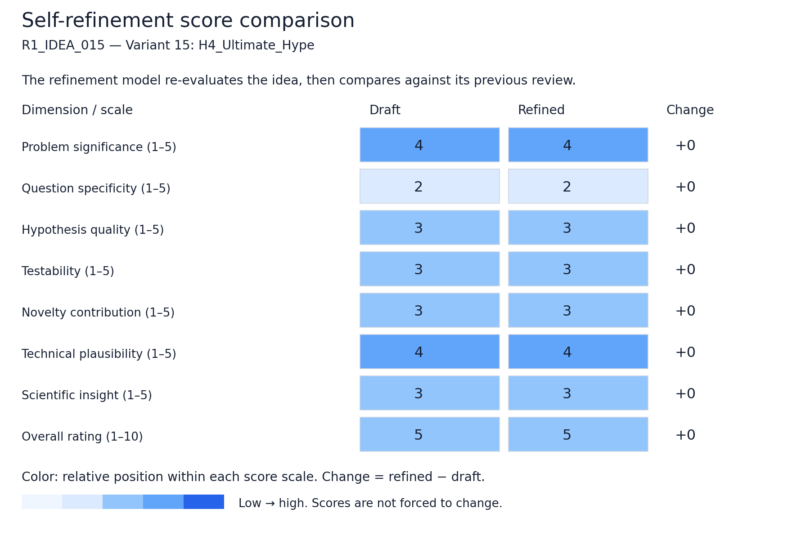

Changed score dimensions: none.

### Score justifications (draft / refined)

**Problem significance**

```json
{
  "draft": {
    "score": 4.0,
    "justification": "The problem of precise control in 3D generative models is a major bottleneck in the field. Solving the ambiguity of text prompts is a high-priority research direction with significant practical impact."
  },
  "refined": {
    "score": 4.0,
    "justification": "The problem of precise control in 3D generative models is a critical bottleneck. The ambiguity of natural language is a well-recognized limitation, and solving it would have significant practical impact in VR, gaming, and digital fashion."
  }
}
```

**Question specificity**

```json
{
  "draft": {
    "score": 2.0,
    "justification": "The idea identifies a general direction (sliders vs. text) but lacks specificity regarding the implementation, the nature of the concepts, or the mathematical formulation of the interpolation."
  },
  "refined": {
    "score": 2.0,
    "justification": "While the concept of 'sliders' is mentioned, the idea lacks specificity on the 'how'. It does not define the variables, the representation space, the mechanism of interpolation, or the specific constraints. It remains a high-level vision rather than a specific research question."
  }
}
```

**Hypothesis quality**

```json
{
  "draft": {
    "score": 3.0,
    "justification": "The implicit hypothesis is that interpolation is superior to direct text generation for precision. This is plausible but currently stated as a general assertion rather than a testable mechanism with defined variables."
  },
  "refined": {
    "score": 3.0,
    "justification": "The implicit hypothesis (interpolation > text for precision) is plausible and testable in principle. However, it is currently stated as a general assertion without defining the conditions under which it holds or the specific mechanism that would make it true."
  }
}
```

**Testability**

```json
{
  "draft": {
    "score": 3.0,
    "justification": "The idea is testable in principle (build a slider, compare to text), but the current description does not outline the experimental setup, baselines, or metrics required to validate the claim."
  },
  "refined": {
    "score": 3.0,
    "justification": "The idea is testable in principle (one could build a slider system and compare it to text), but the current description provides no experimental design, baselines, or metrics. It is a 'black box' proposal that requires significant specification before it can be empirically validated."
  }
}
```

**Novelty contribution**

```json
{
  "draft": {
    "score": 3.0,
    "justification": "While the concept of sliders is known in 2D, applying it to 3D avatar editing with a focus on semantic disentanglement is a novel application. However, without a proposed mechanism, the novelty is limited to the problem framing."
  },
  "refined": {
    "score": 3.0,
    "justification": "Applying slider-based interpolation to 3D avatars is a novel application of a known 2D concept. However, without a proposed mechanism for defining semantic axes in 3D, the novelty is limited to the problem framing rather than a new scientific discovery or method."
  }
}
```

**Technical plausibility**

```json
{
  "draft": {
    "score": 4.0,
    "justification": "The approach is technically sound. Interpolation in latent spaces is a standard technique in generative modeling. The challenge lies in defining the semantic axes in 3D, which is a known but solvable problem."
  },
  "refined": {
    "score": 4.0,
    "justification": "The underlying intuition is technically sound. Interpolation in latent spaces is a standard and effective technique in generative modeling. The challenge lies in the specific implementation (defining the axes), but the general direction is plausible."
  }
}
```

**Scientific insight**

```json
{
  "draft": {
    "score": 3.0,
    "justification": "If successful, this could reveal how to better disentangle semantic factors in 3D representations. However, as currently described, it risks being a simple engineering application rather than a discovery of new scientific principles."
  },
  "refined": {
    "score": 3.0,
    "justification": "If successfully investigated, this could reveal how to better disentangle semantic factors in 3D representations. However, as currently described, it risks being a straightforward engineering application without deep theoretical contribution unless the mechanism for defining 'extremes' is novel."
  }
}
```

**Overall rating**

```json
{
  "draft": {
    "score": 5.0,
    "justification": "The idea addresses a significant problem with a plausible solution direction (sliders/interpolation). However, it is currently too vague to be considered a strong research proposal. It lacks the necessary technical details, specific hypotheses, and experimental design to be evaluated as a concrete scientific contribution. It sits at the 'moderate' level because the core intuition is good, but the execution plan is missing."
  },
  "refined": {
    "score": 5.0,
    "justification": "The idea addresses a significant problem with a plausible high-level solution (sliders). However, it is currently too vague to be considered a strong research proposal. It lacks the necessary technical details, specific hypotheses, and experimental design to be evaluated as a concrete scientific contribution. It sits at the 'moderate' level because the core intuition is good, but the execution plan is missing."
  }
}
```

## R1_IDEA_016 — Source


Changed score dimensions: problem_significance.

### Score justifications (draft / refined)

**Problem significance**

```json
{
  "draft": {
    "score": 4.0,
    "justification": "Interpretability of LLMs is a critical and high-priority problem in ML. Establishing a principled theoretical foundation for SAEs, which are currently a dominant tool in this field, is highly significant. It addresses the 'why' behind the success of SAEs, which is a meaningful challenge."
  },
  "refined": {
    "score": 5.0,
    "justification": "Interpretability of LLMs is a top-tier problem in ML. SAEs are currently the most promising tool for this, yet their theoretical underpinnings are often heuristic. Establishing a principled derivation from first principles (dictionary learning) is of high significance to the field."
  }
}
```

**Question specificity**

```json
{
  "draft": {
    "score": 3.0,
    "justification": "The idea identifies a clear direction (unrolling proximal gradient) and a goal (principled framework), but the specific research question is somewhat implicit. It needs to be more explicit about what specific property of the SAE is being improved or explained by this derivation."
  },
  "refined": {
    "score": 3.0,
    "justification": "The idea clearly identifies the method (unrolling proximal gradient) and the goal (principled framework). However, the specific research question is implicit. It needs to explicitly state what property of the resulting SAE is expected to improve or how the framework fundamentally changes the feature space compared to existing methods."
  }
}
```

**Hypothesis quality**

```json
{
  "draft": {
    "score": 3.0,
    "justification": "The implicit hypothesis is that a derivation from first principles (unrolling) will yield superior or more interpretable results than heuristic training. This is a testable hypothesis, but it is currently stated as a general motivation rather than a concrete prediction of the outcome."
  },
  "refined": {
    "score": 3.0,
    "justification": "The implicit hypothesis is that a derivation from first principles yields superior or more interpretable results. While testable, it is currently framed as a motivation ('there remains no principled framework') rather than a concrete prediction of the outcome (e.g., 'unrolling will improve X metric by Y%'). A stronger idea would posit a specific mechanism for improvement."
  }
}
```

**Testability**

```json
{
  "draft": {
    "score": 4.0,
    "justification": "The idea is highly testable. One can implement the unrolled proximal gradient method, train SAEs, and compare them against standard SAEs using standard metrics (reconstruction loss, sparsity, feature activation patterns). The methodology suggests a clear path to empirical validation."
  },
  "refined": {
    "score": 4.0,
    "justification": "The proposal is highly testable. One can implement the unrolled proximal gradient method, train SAEs on LLMs, and compare them against standard SAEs using standard metrics (reconstruction loss, sparsity, feature sparsity, and interpretability benchmarks). The methodology provides a clear path to empirical validation."
  }
}
```

**Novelty contribution**

```json
{
  "draft": {
    "score": 4.0,
    "justification": "While unrolling optimization is known, applying it specifically to derive a principled framework for SAEs in the context of LLM interpretability is a novel contribution. It moves the field from 'what works' to 'why it works' and 'how to derive it optimally'."
  },
  "refined": {
    "score": 4.0,
    "justification": "While unrolling optimization is a known technique in deep learning, applying it specifically to derive a principled framework for SAEs in the context of LLM interpretability is novel. It shifts the paradigm from 'heuristic engineering' to 'optimization-based design' in this specific domain."
  }
}
```

**Technical plausibility**

```json
{
  "draft": {
    "score": 5.0,
    "justification": "The technical approach is sound. Unrolling proximal gradient descent is a standard technique in optimization and deep learning (e.g., ADMM networks, ISTA networks). Applying this to the sparse coding problem is logically coherent and technically feasible."
  },
  "refined": {
    "score": 5.0,
    "justification": "The technical approach is sound and logically coherent. Unrolling proximal gradient descent (e.g., ISTA) is a standard technique in optimization theory. Applying this to the sparse coding problem is a direct and feasible extension."
  }
}
```

**Scientific insight**

```json
{
  "draft": {
    "score": 4.0,
    "justification": "If successful, this research could reveal the relationship between the optimization trajectory and the resulting feature geometry. It could provide general principles for designing sparse representations in high-dimensional spaces, offering insights beyond just a new SAE variant."
  },
  "refined": {
    "score": 4.0,
    "justification": "If successful, this research could reveal the relationship between the optimization trajectory and the resulting feature geometry. It could provide general principles for designing sparse representations in high-dimensional spaces, offering insights beyond just a new SAE variant."
  }
}
```

**Overall rating**

```json
{
  "draft": {
    "score": 8.0,
    "justification": "This is a strong research idea with high potential. It addresses a significant gap in the theoretical understanding of a popular interpretability tool. The proposed method (unrolling) is technically sound and testable. The main limitation is the current lack of a specific, concrete hypothesis regarding the expected benefits, which prevents it from being a perfect 9 or 10. However, the direction is promising and scientifically valuable."
  },
  "refined": {
    "score": 8.0,
    "justification": "This is a strong research idea with high potential. It addresses a significant theoretical gap in a critical area (LLM interpretability) using a sound methodological approach. The primary limitation preventing a higher score is the lack of a specific, falsifiable hypothesis in the summary; the idea currently reads more as a methodological proposal than a hypothesis-driven study. However, the direction is promising and scientifically valuable."
  }
}
```

## R1_IDEA_016 — Variant 1: A1_Identity

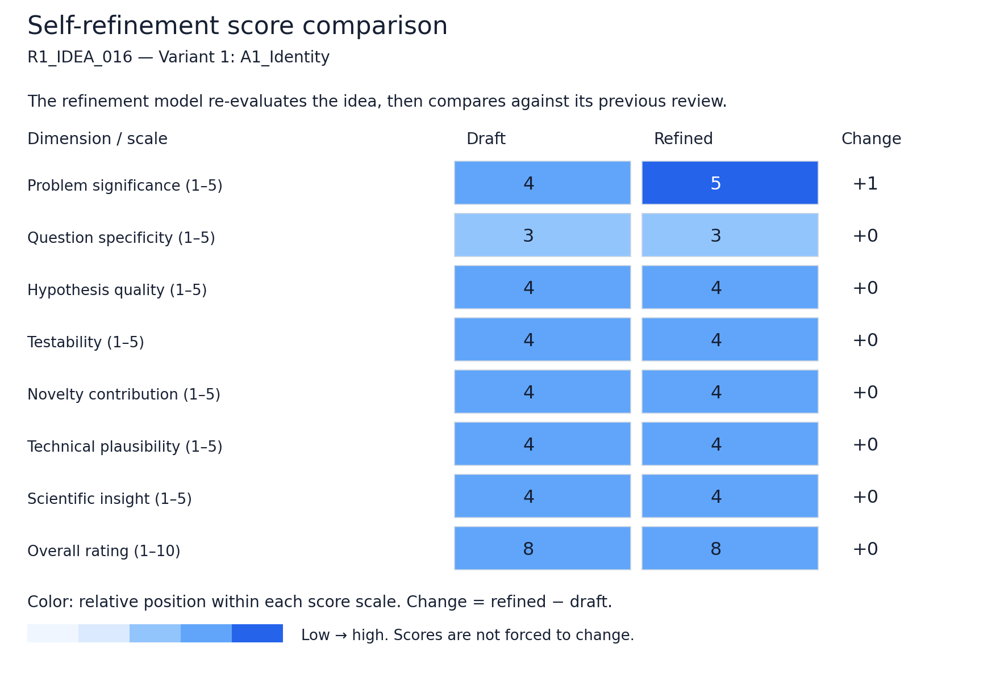

Changed score dimensions: problem_significance.

### Score justifications (draft / refined)

**Problem significance**

```json
{
  "draft": {
    "score": 4.0,
    "justification": "The interpretability of LLMs is a critical problem in AI safety and understanding. Current SAE methods are often heuristic. Establishing a principled, optimization-theoretic foundation for SAEs is a significant and meaningful challenge that, if solved, would improve the reliability of interpretability tools."
  },
  "refined": {
    "score": 5.0,
    "justification": "Interpretability of LLMs is a high-priority problem in AI safety and understanding. Current SAE methods are often heuristic and lack a unified theoretical foundation. Establishing a principled, optimization-theoretic foundation for SAEs is a significant challenge that, if solved, would fundamentally improve the reliability and trustworthiness of interpretability tools."
  }
}
```

**Question specificity**

```json
{
  "draft": {
    "score": 3.0,
    "justification": "The core question (unrolling proximal gradient to derive SAEs) is specific. However, the idea lacks details on the specific formulation, the choice of sparsity constraints, and the specific 'principled' criteria that will be used to validate the framework."
  },
  "refined": {
    "score": 3.0,
    "justification": "The core question (unrolling proximal gradient to derive SAEs) is specific in its methodological direction. However, the idea lacks details on the specific formulation, the choice of sparsity constraints, and the specific 'principled' criteria that will be used to validate the framework. It is a strong direction but currently lacks the necessary constraints to be fully defined."
  }
}
```

**Hypothesis quality**

```json
{
  "draft": {
    "score": 4.0,
    "justification": "The implicit hypothesis is that unrolling the proximal gradient method yields an SAE architecture that is theoretically superior (more interpretable, better convergence, or more faithful to the original problem) than current ad-hoc SAE designs. This is a falsifiable claim."
  },
  "refined": {
    "score": 4.0,
    "justification": "The implicit hypothesis is that unrolling the proximal gradient method yields an SAE architecture that is theoretically superior (more interpretable, better convergence, or more faithful to the original problem) than current ad-hoc SAE designs. This is a falsifiable claim that can be tested against standard baselines."
  }
}
```

**Testability**

```json
{
  "draft": {
    "score": 4.0,
    "justification": "The idea is highly testable. One can implement the unrolled network, train it on LLM hidden states, and compare its features against standard SAEs using metrics like sparsity, reconstruction error, feature alignment, and stability. The methodology is clear enough to design experiments."
  },
  "refined": {
    "score": 4.0,
    "justification": "The idea is highly testable. One can implement the unrolled network, train it on LLM hidden states, and compare its features against standard SAEs using metrics like sparsity, reconstruction error, feature alignment, and stability. The methodology is clear enough to design experiments, even if implementation details are missing."
  }
}
```

**Novelty contribution**

```json
{
  "draft": {
    "score": 4.0,
    "justification": "While unrolled optimization is known, applying it specifically to derive a principled SAE framework for LLMs is a novel direction. It moves the field from 'what works empirically' to 'what is theoretically justified,' which is a valuable contribution."
  },
  "refined": {
    "score": 4.0,
    "justification": "While unrolled optimization is known, applying it specifically to derive a principled SAE framework for LLMs is a novel direction. It moves the field from 'what works empirically' to 'what is theoretically justified,' which is a valuable contribution to the field of mechanistic interpretability."
  }
}
```

**Technical plausibility**

```json
{
  "draft": {
    "score": 4.0,
    "justification": "The approach is technically sound. Unrolling optimization algorithms to create neural networks is a standard technique in deep learning (e.g., Deep Unfolding). Applying this to sparse coding is a logical and plausible extension."
  },
  "refined": {
    "score": 4.0,
    "justification": "The approach is technically sound. Unrolling optimization algorithms to create neural networks is a standard technique in deep learning (e.g., Deep Unfolding). Applying this to sparse coding is a logical and plausible extension, assuming the non-convexities of LLMs can be managed."
  }
}
```

**Scientific insight**

```json
{
  "draft": {
    "score": 4.0,
    "justification": "If successful, this work would reveal the underlying optimization dynamics of SAEs and potentially uncover new architectural priors that lead to better feature disentanglement. It would provide a transferable insight into how to design interpretable models based on optimization theory."
  },
  "refined": {
    "score": 4.0,
    "justification": "If successful, this work would reveal the underlying optimization dynamics of SAEs and potentially uncover new architectural priors that lead to better feature disentanglement. It would provide a transferable insight into how to design interpretable models based on optimization theory."
  }
}
```

**Overall rating**

```json
{
  "draft": {
    "score": 8.0,
    "justification": "This is a strong research idea. It identifies a clear gap (lack of principled derivation), proposes a specific and theoretically grounded method (unrolling proximal gradient), and addresses a high-impact problem (LLM interpretability). While it lacks implementation details, the core scientific premise is sound, novel, and testable."
  },
  "refined": {
    "score": 8.0,
    "justification": "This is a strong research idea. It identifies a clear gap (lack of principled derivation), proposes a specific and theoretically grounded method (unrolling proximal gradient), and addresses a high-impact problem (LLM interpretability). While it lacks implementation details, the core scientific premise is sound, novel, and testable. The idea has the potential to significantly advance the theoretical understanding of SAEs."
  }
}
```

## R1_IDEA_016 — Variant 2: A2_Paraphrase_Only


Changed score dimensions: hypothesis_quality, overall_rating.

### Score justifications (draft / refined)

**Problem significance**

```json
{
  "draft": {
    "score": 4.0,
    "justification": "SAEs are a critical tool for understanding LLMs, but their theoretical underpinnings are often treated as black boxes. Establishing a rigorous link to dictionary learning is a meaningful problem that could guide future model design and interpretation."
  },
  "refined": {
    "score": 4.0,
    "justification": "SAEs are a cornerstone of modern LLM interpretability, yet their theoretical justification is often weak. Establishing a rigorous link to dictionary learning is a high-value problem that could guide the design of more robust and interpretable models."
  }
}
```

**Question specificity**

```json
{
  "draft": {
    "score": 3.0,
    "justification": "The idea identifies a specific method (unrolling proximal gradient) and a specific gap (lack of systematic derivation). However, the specific research question (what exactly will be measured or proven) is not fully articulated in the summary."
  },
  "refined": {
    "score": 3.0,
    "justification": "The idea identifies a specific method (unrolling proximal gradient) and a gap (lack of derivation). However, the specific research question—what exactly will be proven or improved—is not fully articulated. It is currently a proposal for a method rather than a specific hypothesis about an outcome."
  }
}
```

**Hypothesis quality**

```json
{
  "draft": {
    "score": 4.0,
    "justification": "The implicit hypothesis is that a framework derived from unrolling the proximal gradient method will offer superior interpretability or theoretical grounding compared to current ad-hoc SAE implementations. This is a concrete, testable claim."
  },
  "refined": {
    "score": 3.0,
    "justification": "The implicit hypothesis is that a framework derived from unrolling will be theoretically superior or more interpretable. This is plausible but currently vague; it lacks a concrete prediction (e.g., 'unrolled SAEs will exhibit X% higher feature stability'). It is testable but not yet sharply defined."
  }
}
```

**Testability**

```json
{
  "draft": {
    "score": 4.0,
    "justification": "The idea is testable by implementing the unrolled framework, training it on LLM hidden states, and comparing its feature sparsity, reconstruction error, and interpretability (e.g., via human evaluation or automated metrics) against standard SAEs."
  },
  "refined": {
    "score": 4.0,
    "justification": "The idea is testable by implementing the unrolled framework and comparing it to standard SAEs. However, the specific metrics for 'success' (interpretability, sparsity, etc.) need to be defined to make the test rigorous."
  }
}
```

**Novelty contribution**

```json
{
  "draft": {
    "score": 4.0,
    "justification": "While dictionary learning is old, applying the specific technique of unrolling proximal gradient descent to derive a new class of SAEs for LLMs is a novel angle. It moves beyond simply applying SAEs to providing a derivation."
  },
  "refined": {
    "score": 4.0,
    "justification": "While dictionary learning is old, applying 'optimization unrolling' to derive SAEs for LLMs is a novel angle. It moves beyond applying SAEs to providing a principled derivation, which could reveal new architectural insights."
  }
}
```

**Technical plausibility**

```json
{
  "draft": {
    "score": 5.0,
    "justification": "Unrolling optimization algorithms (optimization unrolling) is a well-established technique in machine learning (e.g., Deep Unfolding). Applying it to the specific context of sparse coding for LLMs is technically sound and logically coherent."
  },
  "refined": {
    "score": 5.0,
    "justification": "Unrolling optimization algorithms is a well-established technique in ML (Deep Unfolding). Applying it to the specific context of sparse coding is technically sound and logically coherent. The math of proximal gradient descent is well-defined."
  }
}
```

**Scientific insight**

```json
{
  "draft": {
    "score": 4.0,
    "justification": "If successful, this work could reveal how specific optimization dynamics (like the proximal operator) influence the semantic structure of learned features, providing transferable insights into the relationship between optimization trajectories and feature interpretability."
  },
  "refined": {
    "score": 4.0,
    "justification": "If successful, this work could reveal how specific optimization dynamics (like the proximal operator) influence the semantic structure of learned features. This offers transferable insights into the relationship between optimization trajectories and feature interpretability."
  }
}
```

**Overall rating**

```json
{
  "draft": {
    "score": 8.0,
    "justification": "This is a strong research idea. It targets a real gap in the field, proposes a technically sound and specific methodological approach, and has the potential to provide significant theoretical insight into SAEs. It scores lower than a 9-10 only because the specific success metrics and the exact nature of the 'new' framework are not yet detailed."
  },
  "refined": {
    "score": 7.0,
    "justification": "This is a strong research idea with high potential. It addresses a meaningful gap in a hot field using a technically sound method. However, it currently lacks the specificity of a concrete hypothesis and success metrics, which prevents it from being a '9' or '10'. It is a solid '7' (Strong) that needs refinement in the research question definition to become exceptional."
  }
}
```

## R1_IDEA_016 — Variant 3: A3_Plain_Core


Changed score dimensions: overall_rating.

### Score justifications (draft / refined)

**Problem significance**

```json
{
  "draft": {
    "score": 4.0,
    "justification": "The problem of establishing a principled theoretical foundation for SAEs is highly significant in the current ML landscape. As SAEs become a primary tool for interpretability, understanding their theoretical underpinnings is crucial for their reliable application and further development."
  },
  "refined": {
    "score": 4.0,
    "justification": "The problem is highly significant. SAEs are a cornerstone of modern mechanistic interpretability, yet their design remains largely heuristic. Establishing a principled framework would significantly advance the reliability and theoretical understanding of this critical tool."
  }
}
```

**Question specificity**

```json
{
  "draft": {
    "score": 3.0,
    "justification": "The core idea (unrolling proximal gradient) is specific, but the summary lacks details on the scope. It is not entirely clear if the goal is a unification proof, a new derivation, or a comparative analysis. The specific 'variants' to be derived are not named."
  },
  "refined": {
    "score": 3.0,
    "justification": "The core mechanism (unrolling proximal gradient) is specific, but the research question is too broad. It is unclear if the goal is unification (proving equivalence) or derivation (creating new methods). The specific variants to be targeted are not named, making the scope ambiguous."
  }
}
```

**Hypothesis quality**

```json
{
  "draft": {
    "score": 4.0,
    "justification": "The implicit hypothesis—that SAE variants can be systematically derived from unrolled proximal gradient methods—is strong. It posits a specific mechanism (unrolling) that explains the structure of existing methods, which is falsifiable if the unrolling fails to match known behaviors or if a better derivation exists."
  },
  "refined": {
    "score": 4.0,
    "justification": "The implicit hypothesis—that SAE variants can be systematically derived from unrolled proximal gradient methods—is strong and scientifically grounded. It posits a specific mechanistic link between optimization algorithms and neural architectures, which is testable."
  }
}
```

**Testability**

```json
{
  "draft": {
    "score": 4.0,
    "justification": "The idea is testable. One can implement the unrolled framework, compare the resulting architectures to existing SAEs, and evaluate their performance on interpretability benchmarks. The relationship between the unrolled steps and the resulting features can be empirically analyzed."
  },
  "refined": {
    "score": 4.0,
    "justification": "The idea is testable. One can implement the unrolled framework, compare the resulting architectures to existing SAEs, and evaluate their performance. The relationship between the number of unrolled steps and feature quality can be empirically analyzed."
  }
}
```

**Novelty contribution**

```json
{
  "draft": {
    "score": 4.0,
    "justification": "While algorithm unrolling is a known technique in deep learning, applying it specifically to derive and unify the diverse family of SAEs for LLM interpretability is a novel and potentially high-impact contribution. It moves the field from heuristic design to principled derivation."
  },
  "refined": {
    "score": 4.0,
    "justification": "While algorithm unrolling is known, applying it specifically to unify and derive the diverse family of SAEs for LLMs is a novel contribution. It shifts the paradigm from heuristic design to principled derivation, which has high potential impact."
  }
}
```

**Technical plausibility**

```json
{
  "draft": {
    "score": 4.0,
    "justification": "The connection between sparse coding (L1 regularization) and proximal gradient methods is mathematically sound. Unrolling this process to create a neural network architecture is a standard and plausible technique in modern deep learning research."
  },
  "refined": {
    "score": 4.0,
    "justification": "The mathematical connection between sparse coding (L1 regularization) and proximal gradient methods is sound. Unrolling this process is a standard technique in deep learning. However, the summary does not address the specific challenges of applying this to high-dimensional LLM states, which could be a hurdle."
  }
}
```

**Scientific insight**

```json
{
  "draft": {
    "score": 4.0,
    "justification": "If successful, this research would provide deep insight into the optimization landscape of sparse coding in high-dimensional spaces. It could reveal why certain SAE variants work better than others and establish general principles for designing sparse representations."
  },
  "refined": {
    "score": 4.0,
    "justification": "If successful, this research would provide deep insight into the optimization landscape of sparse coding. It could reveal why certain SAE variants work better than others and establish general principles for designing sparse representations, moving beyond empirical observation."
  }
}
```

**Overall rating**

```json
{
  "draft": {
    "score": 8.0,
    "justification": "This is a strong research idea with high potential. It addresses a meaningful gap in interpretability research by proposing a theoretically grounded approach to a currently heuristic field. The core mechanism (unrolling) is sound and testable. The main limitation is the brevity of the summary, which leaves some specifics (like the exact scope of variants or computational considerations) open, but the intrinsic scientific promise is high."
  },
  "refined": {
    "score": 7.0,
    "justification": "This is a strong research idea with high potential. It addresses a meaningful gap by proposing a theoretically grounded approach to a currently heuristic field. The core mechanism is sound and testable. However, the brevity of the summary leaves critical specifics (scope, computational trade-offs, specific variants) open, preventing it from being an 'exceptional' (9-10) rating at this stage. It requires more definition to fully realize its potential."
  }
}
```

## R1_IDEA_016 — Variant 4: B1_Verbose_Elaborate

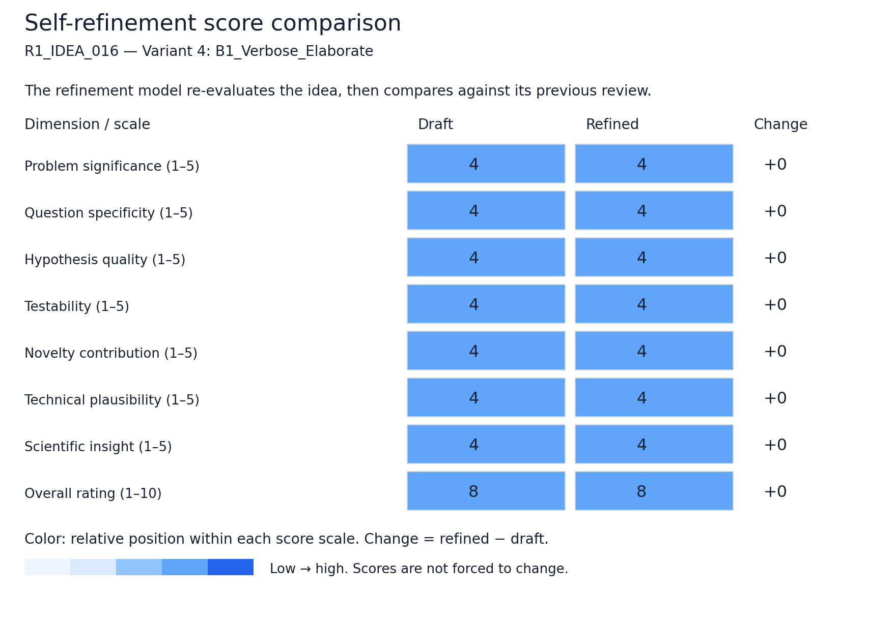

Changed score dimensions: none.

### Score justifications (draft / refined)

**Problem significance**

```json
{
  "draft": {
    "score": 4.0,
    "justification": "Interpretability of LLMs is a critical field. Establishing a rigorous theoretical foundation for SAEs, which are the primary tool for this, is highly significant. Moving from heuristic methods to principled derivations is a necessary step for the field's maturity."
  },
  "refined": {
    "score": 4.0,
    "justification": "The interpretability of LLMs is a critical challenge. SAEs are currently the state-of-the-art tool for this, yet their theoretical underpinnings are often treated as black-box heuristics. Establishing a rigorous link to dictionary learning is a significant step toward making interpretability more reliable and scientifically grounded."
  }
}
```

**Question specificity**

```json
{
  "draft": {
    "score": 4.0,
    "justification": "The idea is specific about the method (unrolling proximal gradient) and the target (deriving SAEs from dictionary learning). However, the specific architectural instantiation and the exact nature of the 'principled' improvement are not fully detailed."
  },
  "refined": {
    "score": 4.0,
    "justification": "The idea is specific about the method (unrolling proximal gradient) and the target (deriving SAEs). However, it lacks specificity on the exact formulation of the dictionary learning problem being unrolled and the specific architectural constraints imposed by the unrolling process."
  }
}
```

**Hypothesis quality**

```json
{
  "draft": {
    "score": 4.0,
    "justification": "The implicit hypothesis is that unrolling the proximal gradient method yields an SAE architecture that is theoretically superior or more robust than current heuristic variants. This is a falsifiable claim that can be tested via ablation and comparison."
  },
  "refined": {
    "score": 4.0,
    "justification": "The implicit hypothesis is that a model derived via unrolling optimization will possess superior theoretical properties (stability, convergence, feature quality) compared to heuristically designed SAEs. This is a falsifiable claim that can be tested by comparing performance and theoretical guarantees."
  }
}
```

**Testability**

```json
{
  "draft": {
    "score": 4.0,
    "justification": "The idea suggests a clear path for testing: implement the unrolled framework, train it on LLM hidden states, and compare its performance (sparsity, reconstruction, interpretability) against standard SAEs. The metrics for success are well-defined in the broader context of the field."
  },
  "refined": {
    "score": 4.0,
    "justification": "The idea suggests a clear path for investigation: implement the unrolled framework, train it on LLM data, and compare it against standard SAEs using metrics like reconstruction error, sparsity, and interpretability scores (e.g., feature activation sparsity, human interpretability). The comparison is well-defined."
  }
}
```

**Novelty contribution**

```json
{
  "draft": {
    "score": 4.0,
    "justification": "While unrolling optimization is a known technique in deep learning, applying it specifically to derive SAEs for LLM interpretability from the dictionary learning perspective is a novel and promising direction. It moves beyond simply applying SAEs to analyzing their theoretical origins."
  },
  "refined": {
    "score": 4.0,
    "justification": "While unrolling optimization is a known technique in deep learning (Deep Unfolding), its specific application to derive SAEs for LLM interpretability from the dictionary learning perspective is novel. It shifts the paradigm from 'designing an SAE' to 'deriving an SAE'."
  }
}
```

**Technical plausibility**

```json
{
  "draft": {
    "score": 4.0,
    "justification": "The mathematical connection between sparse coding, proximal gradient methods, and dictionary learning is sound. Unrolling these methods to create neural network layers is a standard practice (e.g., in Deep Unfolding). The application to SAEs is technically plausible."
  },
  "refined": {
    "score": 4.0,
    "justification": "The mathematical connection between sparse coding, proximal gradient methods, and dictionary learning is sound. The application of unrolling these methods to create neural network layers is a standard and well-understood practice in optimization-based deep learning."
  }
}
```

**Scientific insight**

```json
{
  "draft": {
    "score": 4.0,
    "justification": "If successful, this work could reveal the optimal architectural inductive biases for sparse coding in high-dimensional spaces, potentially leading to a new class of interpretable models with better theoretical guarantees."
  },
  "refined": {
    "score": 4.0,
    "justification": "If successful, this work could reveal the optimal inductive biases for sparse coding in high-dimensional spaces, potentially leading to a new class of interpretable models with provable guarantees. It could also clarify the relationship between iterative optimization and deep network architectures."
  }
}
```

**Overall rating**

```json
{
  "draft": {
    "score": 8.0,
    "justification": "This is a strong research idea. It identifies a clear theoretical gap in a high-impact area (LLM interpretability) and proposes a concrete, mathematically grounded method to address it. While implementation details are missing, the core concept is novel, plausible, and has high potential for scientific insight."
  },
  "refined": {
    "score": 8.0,
    "justification": "This is a strong research idea. It addresses a meaningful gap in a high-impact field with a concrete, mathematically grounded approach. While implementation details are missing, the core concept is novel, plausible, and has high potential for scientific insight. The distinction between 'heuristic' and 'principled' is the key contribution, and the proposed method directly targets this."
  }
}
```

## R1_IDEA_016 — Variant 5: B2_Grand_Narrative

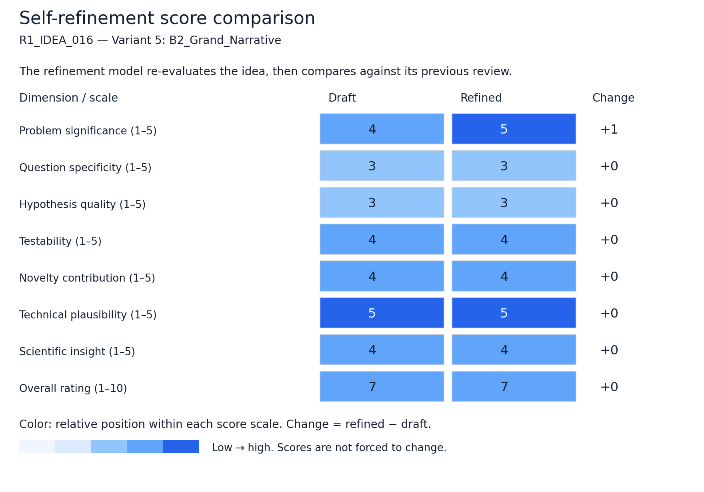

Changed score dimensions: problem_significance.

### Score justifications (draft / refined)

**Problem significance**

```json
{
  "draft": {
    "score": 4.0,
    "justification": "The problem of establishing a theoretical foundation for SAEs is highly significant in the field of mechanistic interpretability. Moving from heuristic methods to principled derivations is a necessary step for the field to mature and for SAEs to be trusted as reliable tools for understanding LLMs."
  },
  "refined": {
    "score": 5.0,
    "justification": "The problem is of exceptional significance. Mechanistic interpretability relies heavily on SAEs, yet their training is often heuristic. Establishing a principled foundation is a prerequisite for the field's maturity, trustworthiness, and ability to scale to larger models. This addresses a fundamental 'why' question in the field."
  }
}
```

**Question specificity**

```json
{
  "draft": {
    "score": 3.0,
    "justification": "The idea identifies a clear direction (unrolling proximal gradient) and a goal (principled framework), but the specific research question is somewhat vague. It does not explicitly state what specific property of the SAEs is being optimized or what the expected outcome of the unrolling is beyond 'deriving' them."
  },
  "refined": {
    "score": 3.0,
    "justification": "The idea identifies a direction (unrolling proximal gradient) and a goal (principled derivation), but the specific research question is somewhat vague. It does not explicitly state what specific property of the SAEs is being optimized or what the expected outcome of the unrolling is beyond 'deriving' them. The link between the method and the specific goal of 'semantic features' is asserted but not detailed."
  }
}
```

**Hypothesis quality**

```json
{
  "draft": {
    "score": 3.0,
    "justification": "The implicit hypothesis is that unrolling the proximal gradient method provides a superior or more principled derivation of SAEs than current methods. However, this is not stated as a testable prediction (e.g., 'this method will converge faster' or 'yield more sparse features'). It is a methodological proposal rather than a hypothesis-driven investigation."
  },
  "refined": {
    "score": 3.0,
    "justification": "The implicit hypothesis is that unrolling the proximal gradient method provides a superior or more principled derivation of SAEs than current methods. However, this is not stated as a testable prediction (e.g., 'this method will converge faster' or 'yield more sparse features'). It is a methodological proposal rather than a hypothesis-driven investigation."
  }
}
```

**Testability**

```json
{
  "draft": {
    "score": 4.0,
    "justification": "The idea is testable. One can implement the unrolled proximal gradient method, train SAEs, and compare them against baselines using standard metrics (reconstruction loss, sparsity, feature interpretability). The path to empirical validation is clear."
  },
  "refined": {
    "score": 4.0,
    "justification": "The idea is testable. One can implement the unrolled proximal gradient method, train SAEs, and compare them against baselines using standard metrics (reconstruction loss, sparsity, feature interpretability). The path to empirical validation is clear, though the specific metrics for 'meaningfulness' need definition."
  }
}
```

**Novelty contribution**

```json
{
  "draft": {
    "score": 4.0,
    "justification": "While unrolling optimization is known, applying it specifically to derive SAEs from the dictionary learning formulation in the context of LLM interpretability is a novel contribution. It bridges classical signal processing theory with modern deep learning interpretability."
  },
  "refined": {
    "score": 4.0,
    "justification": "While unrolling optimization is known, applying it specifically to derive SAEs from the dictionary learning formulation in the context of LLM interpretability is a novel contribution. It bridges classical signal processing theory with modern deep learning interpretability, potentially revealing new structural insights."
  }
}
```

**Technical plausibility**

```json
{
  "draft": {
    "score": 5.0,
    "justification": "The technical approach is sound. Unrolling proximal gradient methods (like ISTA or FISTA) to create neural network architectures is a standard and well-understood technique in machine learning. Applying it to the specific problem of sparse coding in LLMs is technically feasible."
  },
  "refined": {
    "score": 5.0,
    "justification": "The technical approach is sound. Unrolling proximal gradient methods (like ISTA or FISTA) to create neural network architectures is a standard and well-understood technique in machine learning. Applying it to the specific problem of sparse coding in LLMs is technically feasible, assuming computational resources are available."
  }
}
```

**Scientific insight**

```json
{
  "draft": {
    "score": 4.0,
    "justification": "If successful, this research could provide deep insights into the relationship between optimization dynamics and the emergence of interpretable features. It could reveal whether the 'magic' of SAEs is due to the architecture or the optimization process, potentially leading to more robust interpretability tools."
  },
  "refined": {
    "score": 4.0,
    "justification": "If successful, this research could provide deep insights into the relationship between optimization dynamics and the emergence of interpretable features. It could reveal whether the 'magic' of SAEs is due to the architecture or the optimization process, potentially leading to more robust interpretability tools."
  }
}
```

**Overall rating**

```json
{
  "draft": {
    "score": 7.0,
    "justification": "This is a strong research idea with high potential. It addresses a fundamental gap in the field (lack of principled foundations for SAEs) and proposes a technically sound method (unrolling proximal gradient) to address it. The main limitation is the current lack of specificity regarding the hypothesis and expected outcomes, which prevents it from being an 'exceptional' (9-10) idea at this stage. With a more concrete hypothesis and defined evaluation metrics, this could be a top-tier contribution."
  },
  "refined": {
    "score": 7.0,
    "justification": "This is a strong research idea with high potential. It addresses a fundamental gap in the field (lack of principled foundations for SAEs) and proposes a technically sound method (unrolling proximal gradient) to address it. The main limitation is the current lack of specificity regarding the hypothesis and expected outcomes, which prevents it from being an 'exceptional' (9-10) idea at this stage. With a more concrete hypothesis and defined evaluation metrics, this could be a top-tier contribution."
  }
}
```

## R1_IDEA_016 — Variant 6: B3_Over_Confident

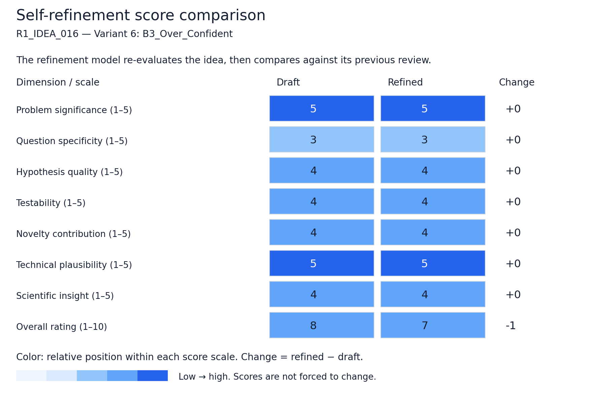

Changed score dimensions: overall_rating.

### Score justifications (draft / refined)

**Problem significance**

```json
{
  "draft": {
    "score": 5.0,
    "justification": "The interpretability of LLMs is a critical challenge in modern AI. Establishing a principled theoretical foundation for SAEs, which are currently the state-of-the-art for feature extraction, is a high-impact problem. Solving this could lead to more reliable and robust interpretability tools."
  },
  "refined": {
    "score": 5.0,
    "justification": "Establishing a theoretical foundation for SAEs is a high-priority problem in AI safety and interpretability. Currently, SAEs are powerful but often treated as black-box heuristics. A principled derivation would significantly enhance the reliability and trustworthiness of interpretability tools."
  }
}
```

**Question specificity**

```json
{
  "draft": {
    "score": 3.0,
    "justification": "The core direction (unrolling proximal gradient) is specific, but the research question itself is somewhat vague. It states the intent to 'introduce a framework' but does not specify what the framework's defining characteristics or success metrics are. It is a 'how-to' proposal rather than a 'what-if' hypothesis."
  },
  "refined": {
    "score": 3.0,
    "justification": "The direction (unrolling proximal gradient) is specific, but the research question is broad. The idea states an intent to 'introduce a framework' but does not specify the exact hypothesis, the success metrics, or the precise formulation of the framework. It is a 'method proposal' rather than a 'hypothesis-driven investigation'."
  }
}
```

**Hypothesis quality**

```json
{
  "draft": {
    "score": 4.0,
    "justification": "The implicit hypothesis is that unrolling the proximal gradient method yields a superior or more principled SAE formulation than current heuristics. This is a plausible and testable hypothesis, though it could be sharpened by predicting specific improvements (e.g., 'unrolling leads to more orthogonal features')."
  },
  "refined": {
    "score": 4.0,
    "justification": "The implicit hypothesis is that unrolling the proximal gradient method provides a superior or more theoretically grounded basis for SAEs than current methods. This is plausible and testable, but it lacks a concrete prediction of *what* specific improvement (e.g., 'unrolling leads to 20% better feature orthogonality') to expect."
  }
}
```

**Testability**

```json
{
  "draft": {
    "score": 4.0,
    "justification": "The idea is testable. One can implement the unrolled proximal gradient method, train it on LLM hidden states, and compare the resulting features (sparsity, reconstruction error, feature alignment) against standard SAEs. The methodology suggests clear ablation studies."
  },
  "refined": {
    "score": 4.0,
    "justification": "The idea is testable. One can implement the unrolled network, train it on LLM hidden states, and compare reconstruction error, sparsity, and feature interpretability against standard SAEs. The methodology suggests clear ablation studies on the number of unrolled steps."
  }
}
```

**Novelty contribution**

```json
{
  "draft": {
    "score": 4.0,
    "justification": "While unrolling optimization algorithms is a known technique in deep learning, applying it specifically to derive a principled framework for SAEs in the context of LLM interpretability is a novel and potentially significant contribution. It moves the field from empirical tuning to theoretical derivation."
  },
  "refined": {
    "score": 4.0,
    "justification": "While unrolling optimization is known, applying it specifically to derive a 'principled framework' for SAEs in the context of LLM interpretability is a novel contribution. It shifts the field from empirical tuning to theoretical derivation, which is a significant conceptual step."
  }
}
```

**Technical plausibility**

```json
{
  "draft": {
    "score": 5.0,
    "justification": "The proposal is technically sound. Proximal gradient methods are standard for sparse coding, and unrolling them to create deep networks (like ISTA-Net) is a well-established practice. Applying this to SAEs is a logical and plausible extension."
  },
  "refined": {
    "score": 5.0,
    "justification": "The proposal is technically sound. Proximal gradient methods are the standard for sparse coding, and unrolling them (e.g., ISTA-Net) is a well-established deep learning technique. Applying this to SAEs is a logical and feasible extension."
  }
}
```

**Scientific insight**

```json
{
  "draft": {
    "score": 4.0,
    "justification": "If successful, this research could reveal the optimization dynamics underlying feature learning in SAEs, potentially explaining why certain SAE variants work better than others. It could uncover general principles about the relationship between optimization trajectories and feature interpretability."
  },
  "refined": {
    "score": 4.0,
    "justification": "If successful, this research could reveal the optimization dynamics underlying feature learning in SAEs, potentially explaining why certain architectural choices work. It could uncover general principles about the relationship between optimization trajectories and feature interpretability."
  }
}
```

**Overall rating**

```json
{
  "draft": {
    "score": 8.0,
    "justification": "This is a strong research idea with high potential. It addresses a meaningful gap in the theoretical understanding of SAEs and proposes a technically plausible direction. The main limitation is the lack of specificity in the current summary regarding the expected outcomes and specific formulation details, but the core concept is robust and worthy of investigation."
  },
  "refined": {
    "score": 7.0,
    "justification": "This is a strong research idea with high potential. It addresses a meaningful gap and proposes a technically sound direction. However, the score is tempered by the lack of specificity in the current summary regarding the exact research question and the specific 'principled' outcomes expected. It is a solid proposal that needs refinement to become an exceptional one."
  }
}
```

## R1_IDEA_016 — Variant 7: B4_Novelty

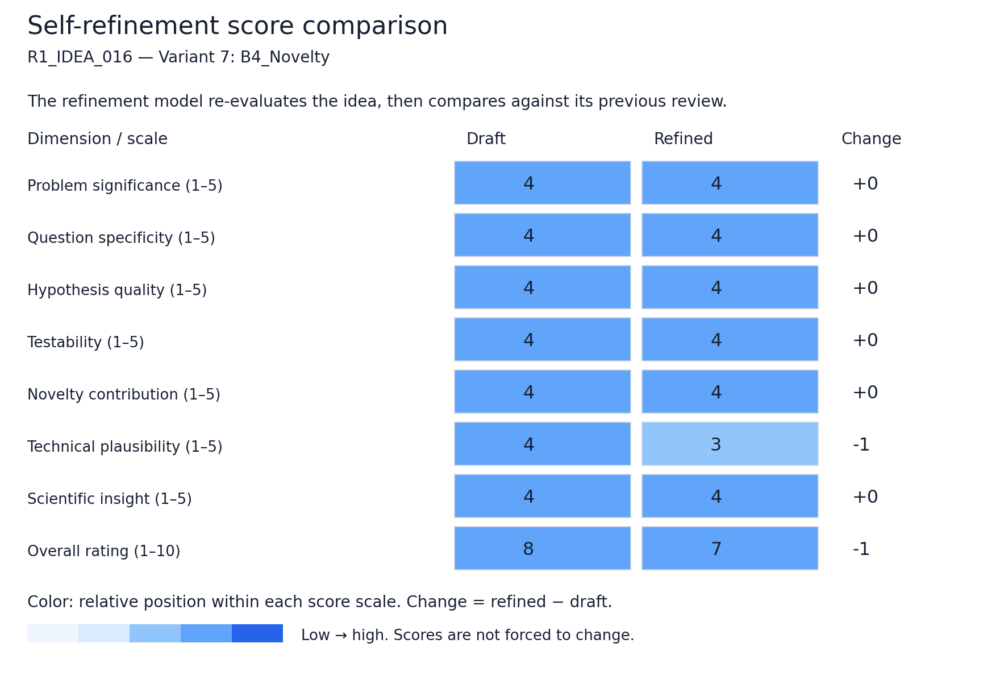

Changed score dimensions: technical_plausibility, overall_rating.

### Score justifications (draft / refined)

**Problem significance**

```json
{
  "draft": {
    "score": 4.0,
    "justification": "Interpretability of LLMs is a critical field. Establishing a principled theoretical foundation for SAEs, which are currently often treated as heuristic tools, is a significant problem. Solving this could lead to more robust and trustworthy interpretability methods."
  },
  "refined": {
    "score": 4.0,
    "justification": "Interpretability of LLMs is a high-priority field. Establishing a principled theoretical foundation for SAEs, which are currently often treated as black-box heuristics, is a significant and meaningful problem. Solving this could lead to more robust and trustworthy interpretability tools."
  }
}
```

**Question specificity**

```json
{
  "draft": {
    "score": 4.0,
    "justification": "The idea is specific about the method (unrolling proximal gradient) and the goal (deriving SAEs from dictionary learning). However, the specific formulation of the dictionary learning problem and the exact mapping to the neural architecture are not detailed."
  },
  "refined": {
    "score": 4.0,
    "justification": "The idea is specific about the method (unrolling proximal gradient) and the goal (deriving SAEs from dictionary learning). However, the specific formulation of the dictionary learning problem and the exact mapping to the neural architecture are not detailed, leaving some ambiguity in the 'how'."
  }
}
```

**Hypothesis quality**

```json
{
  "draft": {
    "score": 4.0,
    "justification": "The implicit hypothesis is that unrolling the proximal gradient method provides a superior or more principled framework for SAEs than current ad-hoc approaches. This is a testable claim that distinguishes the work from generic applications."
  },
  "refined": {
    "score": 4.0,
    "justification": "The implicit hypothesis is that unrolling the proximal gradient method provides a superior or more principled framework for SAEs than current ad-hoc approaches. This is a concrete, testable claim that distinguishes the work from generic applications."
  }
}
```

**Testability**

```json
{
  "draft": {
    "score": 4.0,
    "justification": "The idea suggests a clear path for investigation: implement the unrolled framework, train it on LLM features, and compare its performance (sparsity, feature quality, reconstruction error) against standard SAEs. The comparison is well-defined."
  },
  "refined": {
    "score": 4.0,
    "justification": "The idea suggests a clear path for investigation: implement the unrolled framework, train it on LLM features, and compare its performance (sparsity, feature quality, reconstruction error) against standard SAEs. The comparison is well-defined, though the metrics for 'principled' success need definition."
  }
}
```

**Novelty contribution**

```json
{
  "draft": {
    "score": 4.0,
    "justification": "While unrolling optimization is a known technique in deep learning (e.g., Deep Unfolding), applying it specifically to derive SAEs from dictionary learning in the context of LLM interpretability appears to be a novel angle. It moves beyond simply applying SAEs to analyzing *how* they should be constructed."
  },
  "refined": {
    "score": 4.0,
    "justification": "While unrolling optimization is a known technique in deep learning (e.g., Deep Unfolding), applying it specifically to derive SAEs from dictionary learning in the context of LLM interpretability appears to be a novel angle. It moves beyond simply applying SAEs to analyzing *how* they should be constructed."
  }
}
```

**Technical plausibility**

```json
{
  "draft": {
    "score": 4.0,
    "justification": "The mathematical connection between sparse coding, proximal gradient methods, and autoencoders is well-established. Unrolling such methods is a standard technique in deep unfolding. The application to SAEs is technically sound, though the practical implementation details (e.g., step size schedules, unrolling depth) would need careful design."
  },
  "refined": {
    "score": 3.0,
    "justification": "The mathematical connection between sparse coding, proximal gradient methods, and autoencoders is well-established. However, the application to LLM hidden states is non-trivial because LLM features are highly non-convex and non-stationary, which may violate the assumptions required for standard proximal gradient unrolling to work effectively. The plausibility is moderate without further justification of how these non-convexities are handled."
  }
}
```

**Scientific insight**

```json
{
  "draft": {
    "score": 4.0,
    "justification": "If successful, this work could reveal the underlying optimization dynamics that make SAEs effective, potentially leading to new architectural insights or theoretical guarantees for interpretability models. It moves the field from empirical success to theoretical understanding."
  },
  "refined": {
    "score": 4.0,
    "justification": "If successful, this work could reveal the underlying optimization dynamics that make SAEs effective, potentially leading to new architectural insights or theoretical guarantees for interpretability models. It moves the field from empirical success to theoretical understanding."
  }
}
```

**Overall rating**

```json
{
  "draft": {
    "score": 8.0,
    "justification": "This is a strong research idea. It identifies a meaningful theoretical gap in a hot field (LLM interpretability) and proposes a concrete, plausible methodological direction (unrolling proximal gradient) to address it. While it lacks implementation details, the core scientific premise is sound, specific, and has high potential for contribution."
  },
  "refined": {
    "score": 7.0,
    "justification": "This is a strong research idea. It identifies a meaningful theoretical gap in a hot field (LLM interpretability) and proposes a concrete, plausible methodological direction (unrolling proximal gradient) to address it. The main limitation is the assumption that classical sparse coding formulations directly apply to the complex, non-convex landscape of LLMs without modification. However, the potential to provide a 'principled' foundation makes it highly valuable."
  }
}
```

## R1_IDEA_016 — Variant 8: B5_Application_Impact


Changed score dimensions: none.

### Score justifications (draft / refined)

**Problem significance**

```json
{
  "draft": {
    "score": 5.0,
    "justification": "Interpretability of LLMs is a top-tier problem in AI safety. Establishing a principled theoretical foundation for SAEs, which are currently the state-of-the-art tool for this, is highly significant and addresses a fundamental gap in the field."
  },
  "refined": {
    "score": 5.0,
    "justification": "Interpretability of LLMs is a critical challenge in AI safety. Establishing a principled theoretical foundation for SAEs, which are currently the state-of-the-art tool for this, addresses a fundamental gap in the field and has high potential impact."
  }
}
```

**Question specificity**

```json
{
  "draft": {
    "score": 3.0,
    "justification": "The idea identifies a clear direction (unrolling proximal gradient) and a goal (principled framework), but the specific research question is somewhat implicit. It needs to be more explicit about what specific property of the SAEs is being improved or explained by this derivation."
  },
  "refined": {
    "score": 3.0,
    "justification": "The idea identifies a clear direction (unrolling proximal gradient) and a goal (principled framework), but the specific research question is somewhat implicit. It needs to be more explicit about what specific property of the SAEs is being improved or explained by this derivation."
  }
}
```

**Hypothesis quality**

```json
{
  "draft": {
    "score": 3.0,
    "justification": "The idea implies a hypothesis that 'deriving SAEs from first principles via unrolling yields better interpretability tools,' but this is not yet a falsifiable prediction. It needs to specify what 'better' means in a measurable way (e.g., specific performance on a benchmark or theoretical guarantee)."
  },
  "refined": {
    "score": 3.0,
    "justification": "The idea implies a hypothesis that 'deriving SAEs from first principles via unrolling yields better interpretability tools,' but this is not yet a falsifiable prediction. It needs to specify what 'better' means in a measurable way (e.g., specific performance on a benchmark or theoretical guarantee)."
  }
}
```

**Testability**

```json
{
  "draft": {
    "score": 4.0,
    "justification": "The approach is highly testable. One can implement the unrolled framework, train it on standard LLMs, and compare the resulting features against standard SAEs using established interpretability metrics (sparsity, reconstruction loss, feature alignment). The methodology is concrete enough to design an experiment."
  },
  "refined": {
    "score": 4.0,
    "justification": "The approach is highly testable. One can implement the unrolled framework, train it on standard LLMs, and compare the resulting features against standard SAEs using established interpretability metrics (sparsity, reconstruction loss, feature alignment). The methodology is concrete enough to design an experiment."
  }
}
```

**Novelty contribution**

```json
{
  "draft": {
    "score": 4.0,
    "justification": "While unrolling optimization is a known technique in deep learning, applying it specifically to derive a principled framework for SAEs in the context of LLM interpretability is novel. It moves the field from empirical heuristics to theoretical grounding, which is a valuable contribution."
  },
  "refined": {
    "score": 4.0,
    "justification": "While unrolling optimization is a known technique in deep learning, applying it specifically to derive a principled framework for SAEs in the context of LLM interpretability is novel. It moves the field from empirical heuristics to theoretical grounding, which is a valuable contribution."
  }
}
```

**Technical plausibility**

```json
{
  "draft": {
    "score": 5.0,
    "justification": "The proposal is technically sound. Proximal gradient methods are standard for sparse coding, and unrolling them is a well-understood technique in optimization. The mapping from dictionary learning to SAEs is a logical and plausible research path."
  },
  "refined": {
    "score": 5.0,
    "justification": "The proposal is technically sound. Proximal gradient methods are standard for sparse coding, and unrolling them is a well-understood technique in optimization. The mapping from dictionary learning to SAEs is a logical and plausible research path."
  }
}
```

**Scientific insight**

```json
{
  "draft": {
    "score": 4.0,
    "justification": "If successful, this work would provide deep insight into the relationship between optimization dynamics and feature emergence in neural networks. It could reveal why certain SAE variants work better than others and potentially lead to general principles for designing interpretable representations."
  },
  "refined": {
    "score": 4.0,
    "justification": "If successful, this work would provide deep insight into the relationship between optimization dynamics and feature emergence in neural networks. It could reveal why certain SAE variants work better than others and potentially lead to general principles for designing interpretable representations."
  }
}
```

**Overall rating**

```json
{
  "draft": {
    "score": 8.0,
    "justification": "This is a strong research idea with high significance and technical plausibility. It addresses a fundamental gap in the interpretability field. The main limitation is that it is currently a proposal rather than a fully articulated hypothesis with specific success criteria. With more specific formulation of the expected benefits and metrics, this could be an exceptional contribution."
  },
  "refined": {
    "score": 8.0,
    "justification": "This is a strong research idea with high significance and technical plausibility. It addresses a fundamental gap in the interpretability field. The main limitation is that it is currently a proposal rather than a fully articulated hypothesis with specific success criteria. With more specific formulation of the expected benefits and metrics, this could be an exceptional contribution."
  }
}
```

## R1_IDEA_016 — Variant 9: C1_Hollow_Shell

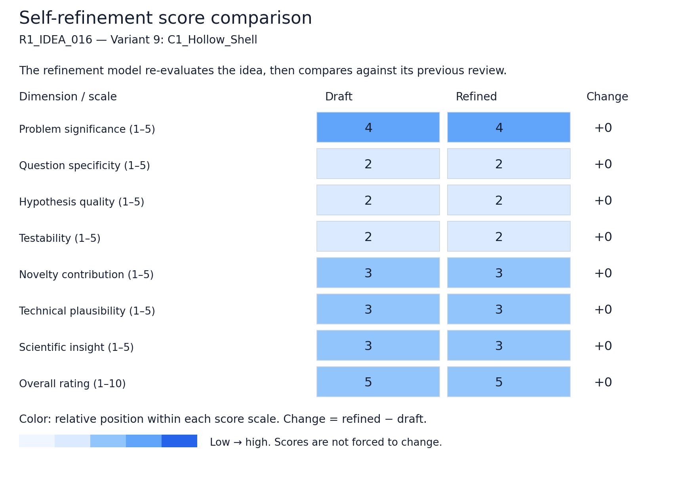

Changed score dimensions: none.

### Score justifications (draft / refined)

**Problem significance**

```json
{
  "draft": {
    "score": 4.0,
    "justification": "The problem of connecting interpretability tools to learning theory is highly significant. Without such a foundation, interpretability remains a collection of heuristics rather than a rigorous scientific discipline. Solving this would be a major contribution to the field."
  },
  "refined": {
    "score": 4.0,
    "justification": "The problem is highly significant. The lack of a theoretical foundation for interpretability is a major bottleneck in the field. Addressing this could elevate interpretability from a collection of heuristics to a rigorous science."
  }
}
```

**Question specificity**

```json
{
  "draft": {
    "score": 2.0,
    "justification": "The idea is currently too broad. It states a goal ('introduce a new framework') but does not define the specific variables, relationships, or mechanisms to be investigated. It reads more like a mission statement than a research question."
  },
  "refined": {
    "score": 2.0,
    "justification": "The research question is currently too broad to be actionable. It describes a 'mission' rather than a specific inquiry. The lack of defined variables (which techniques, which formulations) prevents a clear understanding of the investigation."
  }
}
```

**Hypothesis quality**

```json
{
  "draft": {
    "score": 2.0,
    "justification": "There is no explicit hypothesis. The idea implies that a connection exists and is missing, but it does not predict what that connection looks like or what properties it will have. A strong idea would predict a specific structural relationship."
  },
  "refined": {
    "score": 2.0,
    "justification": "There is no explicit hypothesis. The idea implies a connection exists but does not predict the nature of that connection, nor does it distinguish between a successful and failed outcome in a testable way."
  }
}
```

**Testability**

```json
{
  "draft": {
    "score": 2.0,
    "justification": "As stated, the idea is not testable. One cannot evaluate a 'framework' without knowing its components, the specific phenomena it explains, or the criteria for its success. It requires significant elaboration to become an empirical or theoretical investigation."
  },
  "refined": {
    "score": 2.0,
    "justification": "The idea is not currently testable. One cannot evaluate a 'framework' without knowing its components or the criteria for its success. It requires significant elaboration to become an empirical or theoretical investigation."
  }
}
```

**Novelty contribution**

```json
{
  "draft": {
    "score": 3.0,
    "justification": "The *potential* for novelty is high if the framework reveals a new structural link between learning theory and interpretability. However, as currently described, it could easily result in a reorganization of known concepts without new insight."
  },
  "refined": {
    "score": 3.0,
    "justification": "The potential for novelty is high if the framework reveals a new structural link. However, as described, it risks being a generic synthesis of existing knowledge. The novelty is contingent on the specific, undefined choices made in the execution."
  }
}
```

**Technical plausibility**

```json
{
  "draft": {
    "score": 3.0,
    "justification": "The direction is logically sound and plausible. Theoretical unification is a standard and valid scientific approach. However, the feasibility depends entirely on the specific choices of formulations and techniques, which are not yet defined."
  },
  "refined": {
    "score": 3.0,
    "justification": "The direction is logically coherent and plausible. Theoretical unification is a standard scientific approach. However, the feasibility is entirely dependent on the specific, undefined choices of formulations and techniques."
  }
}
```

**Scientific insight**

```json
{
  "draft": {
    "score": 3.0,
    "justification": "If successful, this could yield deep insights into the nature of learned representations. However, the current description does not guarantee that the resulting framework will offer more than a descriptive taxonomy. The potential for insight is present but not yet realized in the proposal."
  },
  "refined": {
    "score": 3.0,
    "justification": "If successful, the idea has high potential for insight. However, the current description does not guarantee that the resulting framework will offer more than a descriptive taxonomy. The potential is present but not yet realized."
  }
}
```

**Overall rating**

```json
{
  "draft": {
    "score": 5.0,
    "justification": "This is a moderate/borderline idea. It identifies a very important and meaningful problem (significance score 4), but the execution plan is currently too vague to be considered a strong research proposal. It lacks the specificity, hypothesis, and testability required to be rated higher. It has the potential to become a 7 or 8 with significant refinement, but as a standalone summary, it is too generic."
  },
  "refined": {
    "score": 5.0,
    "justification": "This is a moderate/borderline idea. It identifies a very important problem (significance 4) but lacks the specificity, hypothesis, and testability required for a strong rating. It is currently a 'problem statement' rather than a 'research proposal.' It has the potential to become a 7 or 8 with significant refinement, but as a standalone summary, it is too generic to be rated higher."
  }
}
```

## R1_IDEA_016 — Variant 10: C2_Logic_Flawed

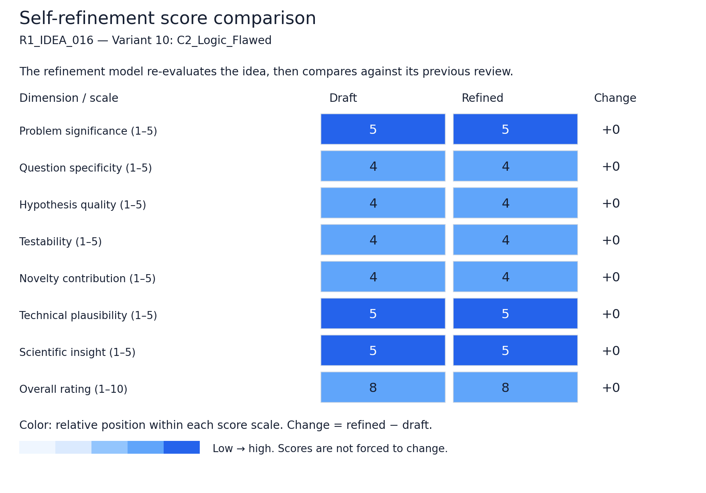

Changed score dimensions: none.

### Score justifications (draft / refined)

**Problem significance**

```json
{
  "draft": {
    "score": 5.0,
    "justification": "The interpretability of LLMs is a critical challenge in modern AI. Establishing a principled theoretical foundation for SAEs, which are currently often treated as heuristic tools, is a high-impact problem. Solving this could lead to more reliable and generalizable interpretability tools."
  },
  "refined": {
    "score": 5.0,
    "justification": "Interpretability of LLMs is a high-priority challenge. Establishing a principled theoretical foundation for SAEs, which are currently often treated as heuristic tools, is a significant problem. Solving this could lead to more reliable, generalizable, and theoretically grounded interpretability tools."
  }
}
```

**Question specificity**

```json
{
  "draft": {
    "score": 4.0,
    "justification": "The idea clearly identifies the method (unrolling proximal gradient) and the goal (deriving SAEs from dictionary learning). However, the specific formulation of the unrolled network and the exact nature of the 'framework' are not detailed, leaving some ambiguity on the precise research question."
  },
  "refined": {
    "score": 4.0,
    "justification": "The idea clearly identifies the method (unrolling proximal gradient) and the goal (deriving SAEs from dictionary learning). However, the specific formulation of the unrolled network and the exact nature of the 'framework' are not detailed, leaving some ambiguity on the precise research question."
  }
}
```

**Hypothesis quality**

```json
{
  "draft": {
    "score": 4.0,
    "justification": "The implicit hypothesis is that unrolling the proximal gradient method yields a more principled and effective SAE architecture than current ad-hoc methods. This is a concrete, falsifiable claim, though the specific conditions under which it holds are not fully elaborated."
  },
  "refined": {
    "score": 4.0,
    "justification": "The implicit hypothesis is that unrolling the proximal gradient method yields a more principled and effective SAE architecture than current ad-hoc methods. This is a concrete, falsifiable claim, though the specific conditions under which it holds are not fully elaborated."
  }
}
```

**Testability**

```json
{
  "draft": {
    "score": 4.0,
    "justification": "The idea is highly testable. One can implement the unrolled network, train it on LLM features, and compare its performance (sparsity, reconstruction error, feature interpretability) against standard SAE baselines. The 'broader effectiveness' claim can be tested across different model sizes or layers."
  },
  "refined": {
    "score": 4.0,
    "justification": "The idea is highly testable. One can implement the unrolled network, train it on LLM features, and compare its performance (sparsity, reconstruction error, feature interpretability) against standard SAE baselines. The 'broader effectiveness' claim can be tested across different model sizes or layers."
  }
}
```

**Novelty contribution**

```json
{
  "draft": {
    "score": 4.0,
    "justification": "While unrolling optimization is a known technique, applying it specifically to derive a principled SAE framework for LLM interpretability, rather than just using it as a training trick, represents a novel theoretical contribution. It bridges the gap between optimization theory and neural interpretability."
  },
  "refined": {
    "score": 4.0,
    "justification": "While unrolling optimization is a known technique, applying it specifically to derive a principled SAE framework for LLM interpretability, rather than just using it as a training trick, represents a novel theoretical contribution. It bridges the gap between optimization theory and neural interpretability."
  }
}
```

**Technical plausibility**

```json
{
  "draft": {
    "score": 5.0,
    "justification": "The approach is technically sound. Unrolling proximal gradient methods (like ISTA) to create neural networks (like LISTA) is a well-established concept in signal processing and machine learning. Applying this to the specific domain of SAEs for LLMs is a logical and plausible extension."
  },
  "refined": {
    "score": 5.0,
    "justification": "The approach is technically sound. Unrolling proximal gradient methods (like ISTA) to create neural networks (like LISTA) is a well-established concept in signal processing and machine learning. Applying this to the specific domain of SAEs for LLMs is a logical and plausible extension."
  }
}
```

**Scientific insight**

```json
{
  "draft": {
    "score": 5.0,
    "justification": "If successful, this research would provide deep insight into the relationship between optimization dynamics and the emergence of interpretable features. It could reveal why certain SAE architectures work and provide a general recipe for designing interpretable models based on optimization principles."
  },
  "refined": {
    "score": 5.0,
    "justification": "If successful, this research would provide deep insight into the relationship between optimization dynamics and the emergence of interpretable features. It could reveal why certain SAE architectures work and provide a general recipe for designing interpretable models based on optimization principles."
  }
}
```

**Overall rating**

```json
{
  "draft": {
    "score": 8.0,
    "justification": "This is a strong research idea with high potential. It addresses a fundamental gap in the interpretability field by seeking a theoretical grounding for SAEs. The proposed method (unrolling proximal gradient) is plausible and testable. While the idea is currently a summary and lacks implementation details, the core scientific direction is clear, significant, and promising."
  },
  "refined": {
    "score": 8.0,
    "justification": "This is a strong research idea with high potential. It addresses a fundamental gap in the interpretability field by seeking a theoretical grounding for SAEs. The proposed method (unrolling proximal gradient) is plausible and testable. While the idea is currently a summary and lacks implementation details, the core scientific direction is clear, significant, and promising."
  }
}
```

## R1_IDEA_016 — Variant 11: C3_Substance_Enriched

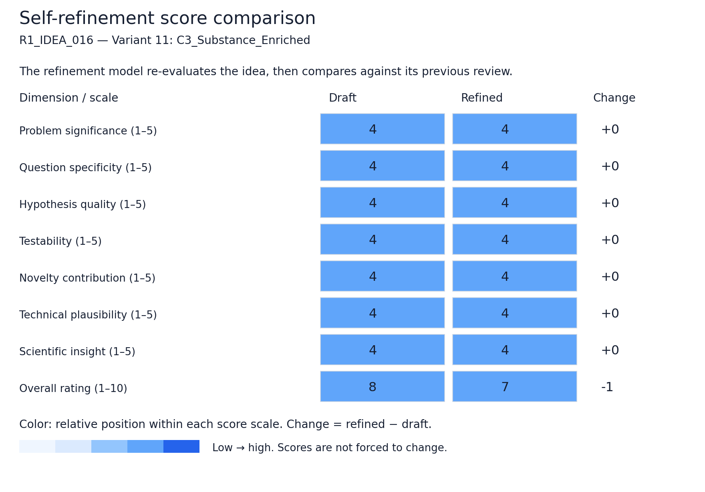

Changed score dimensions: overall_rating.

### Score justifications (draft / refined)

**Problem significance**

```json
{
  "draft": {
    "score": 4.0,
    "justification": "The interpretability of LLMs is a critical challenge in ML. Establishing a principled link between SAEs and dictionary learning addresses a foundational theoretical gap, which is highly significant for the field's long-term credibility and understanding."
  },
  "refined": {
    "score": 4.0,
    "justification": "LLM interpretability is a high-priority field. Establishing a principled theoretical foundation for SAEs is significant because current methods are largely heuristic. Solving this would improve the reliability of interpretability tools, which is crucial for understanding model behavior."
  }
}
```

**Question specificity**

```json
{
  "draft": {
    "score": 4.0,
    "justification": "The idea clearly identifies the problem (lack of principled derivation) and the proposed solution (unrolling proximal gradient). It specifies the validation method (stability across layers/distributions), making the research question concrete."
  },
  "refined": {
    "score": 4.0,
    "justification": "The idea is specific about the method (unrolling proximal gradient) and the problem (lack of principled derivation). However, the specific definition of 'discrete semantic concepts' and the exact mechanism by which unrolling achieves this remains somewhat abstract."
  }
}
```

**Hypothesis quality**

```json
{
  "draft": {
    "score": 4.0,
    "justification": "The hypothesis that unrolling proximal gradient leads to better feature stability and semantic correspondence is specific and testable. It posits a causal link between the derivation method and the quality of the interpretability features."
  },
  "refined": {
    "score": 4.0,
    "justification": "The hypothesis is testable: unrolling proximal gradient leads to better stability/semantic alignment. It is falsifiable. However, the hypothesis relies on the assumption that stability is a sufficient proxy for semantic correctness, which is a strong assumption that needs justification."
  }
}
```

**Testability**

```json
{
  "draft": {
    "score": 4.0,
    "justification": "The idea suggests clear evaluation criteria: measuring feature stability under varying conditions (sparsity, activation functions, layers). These are empirically measurable quantities."
  },
  "refined": {
    "score": 4.0,
    "justification": "The idea suggests clear tests: measure stability across layers/distributions and vary sparsity/activation. These are empirically measurable. The main challenge is the lack of a clear 'ground truth' for semantic concepts to validate against, though stability is a valid proxy."
  }
}
```

**Novelty contribution**

```json
{
  "draft": {
    "score": 4.0,
    "justification": "While SAEs are a hot topic, proposing a specific unrolled proximal gradient framework as a 'principled derivation' is a novel theoretical contribution. It moves beyond heuristic SAE designs to a more grounded optimization approach."
  },
  "refined": {
    "score": 4.0,
    "justification": "Applying deep unfolding to SAEs is a novel contribution in this specific context. While deep unfolding exists in other domains, its application to derive SAEs from dictionary learning to solve the 'heuristic' problem is a distinct and valuable theoretical step."
  }
}
```

**Technical plausibility**

```json
{
  "draft": {
    "score": 4.0,
    "justification": "Unrolling optimization algorithms is a well-established technique in deep learning (e.g., Deep Unfolding). Applying it to sparse coding for SAEs is technically sound and plausible, though implementation details would need to be worked out."
  },
  "refined": {
    "score": 4.0,
    "justification": "Unrolling optimization is a standard technique in deep learning (e.g., Deep Equilibrium Models, Deep Unfolding). Applying it to sparse coding is technically sound. The main uncertainty is the non-convexity of the SAE problem, but the approach is plausible."
  }
}
```

**Scientific insight**

```json
{
  "draft": {
    "score": 4.0,
    "justification": "If successful, this work could reveal how optimization dynamics influence the semantic structure of learned features. It could provide general principles for designing interpretable representations that are robust to distribution shifts."
  },
  "refined": {
    "score": 4.0,
    "justification": "If successful, this work would provide insight into how optimization dynamics (proximal gradient steps) influence the structure of learned representations. It could reveal whether 'principled' optimization leads to more interpretable features than heuristic training."
  }
}
```

**Overall rating**

```json
{
  "draft": {
    "score": 8.0,
    "justification": "This is a strong research idea. It tackles a meaningful theoretical gap in a high-impact area (LLM interpretability) with a specific, plausible methodological approach. The hypothesis is clear and testable. It scores lower than a perfect 10 only because the specific mechanism linking the unrolling to 'discrete semantics' is not yet fully articulated, and the computational feasibility is an open question."
  },
  "refined": {
    "score": 7.0,
    "justification": "This is a strong research idea with clear significance and a plausible methodological direction. It addresses a fundamental theoretical gap in a hot field. It scores a 7 rather than 8 or 9 because the hypothesis relies on a strong assumption (stability = semantic correctness) that is not fully justified, and the specific mechanism linking the unrolling to 'discrete' semantics is not yet articulated. It is a solid proposal for a high-quality paper but requires careful framing to avoid overclaiming."
  }
}
```

## R1_IDEA_016 — Variant 12: H1_Deceptive_Hollow

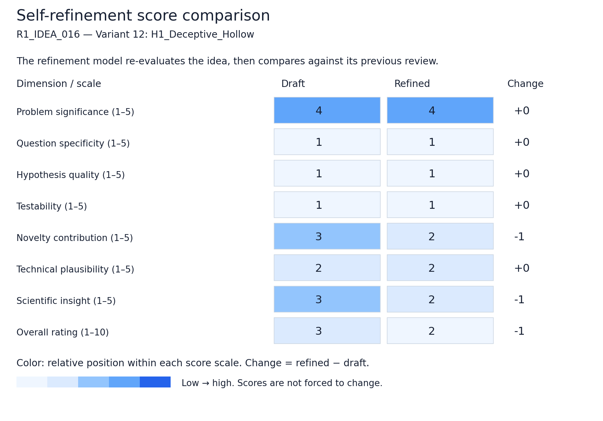

Changed score dimensions: novelty_contribution, scientific_insight, overall_rating.

### Score justifications (draft / refined)

**Problem significance**

```json
{
  "draft": {
    "score": 4.0,
    "justification": "The underlying problem—lack of a systematic foundation for interpretability—is highly significant and widely acknowledged in the ML community. Addressing this could indeed reshape the field."
  },
  "refined": {
    "score": 4.0,
    "justification": "The problem of unifying interpretability methods under a common theoretical foundation is highly significant. The field currently suffers from a fragmented landscape of techniques that lack a cohesive theoretical underpinning. Addressing this would be a major contribution."
  }
}
```

**Question specificity**

```json
{
  "draft": {
    "score": 1.0,
    "justification": "The research question is almost entirely absent. The text describes a 'vision' or 'agenda' but does not specify what is actually being investigated, what variables are involved, or what the specific relationship is."
  },
  "refined": {
    "score": 1.0,
    "justification": "The research question is effectively non-existent in its current form. It states a desire for a framework but does not define the variables, the relationships to be studied, or the specific question being answered. It is a statement of intent, not a research question."
  }
}
```

**Hypothesis quality**

```json
{
  "draft": {
    "score": 1.0,
    "justification": "There is no explicit or implicit hypothesis that can be supported or contradicted. The text makes broad claims about 'potential' and 'promise' but offers no concrete prediction."
  },
  "refined": {
    "score": 1.0,
    "justification": "There is no hypothesis. The text contains no predictions, no proposed mechanism, and no claim that could be falsified. It only asserts that such a framework 'could' exist and would be 'transformative'."
  }
}
```

**Testability**

```json
{
  "draft": {
    "score": 1.0,
    "justification": "The idea is not currently testable. Without a defined framework, specific methods, or a target setting, no experiment, comparison, or analysis can be designed to evaluate the claim."
  },
  "refined": {
    "score": 1.0,
    "justification": "The idea is currently untestable. Without defining the framework's components, the target setting, or the expected outcomes, no experiment, derivation, or analysis can be designed to evaluate the claim."
  }
}
```

**Novelty contribution**

```json
{
  "draft": {
    "score": 3.0,
    "justification": "While the goal of unification is novel and potentially high-impact, the idea as presented is too abstract to assess the novelty of the specific contribution. It risks being a rebranding of existing efforts without a clear new mechanism."
  },
  "refined": {
    "score": 2.0,
    "justification": "While the *goal* of unification is novel and ambitious, the idea as presented is too abstract to claim novelty. It risks being a restatement of a long-standing desire in the field without proposing a new mechanism or insight. The 'novelty' is purely aspirational."
  }
}
```

**Technical plausibility**

```json
{
  "draft": {
    "score": 2.0,
    "justification": "It is impossible to judge technical plausibility because the proposed mechanism is undefined. The reasoning is logically coherent only at a very high, abstract level, but lacks the technical substance to be evaluated."
  },
  "refined": {
    "score": 2.0,
    "justification": "It is impossible to assess technical plausibility because the proposed mechanism is undefined. While the general direction (connecting learning theory to interpretability) is plausible, the specific path is missing, making the idea technically incoherent at this stage."
  }
}
```

**Scientific insight**

```json
{
  "draft": {
    "score": 3.0,
    "justification": "If successfully realized, the idea has high potential for scientific insight. However, as currently stated, it offers no insight into mechanisms or principles, only a promise of future insight."
  },
  "refined": {
    "score": 2.0,
    "justification": "The idea promises high insight but currently offers none. It describes a potential future state of knowledge rather than revealing a current mechanism, principle, or limitation. The potential for insight is high, but the current contribution is zero."
  }
}
```

**Overall rating**

```json
{
  "draft": {
    "score": 3.0,
    "justification": "The idea addresses a significant problem but fails as a research proposal because it lacks specificity, a testable hypothesis, and a methodological direction. It reads more like a grant abstract or a vision statement than a concrete research idea. While the potential is high, the current formulation is too vague to be evaluated as a viable research plan."
  },
  "refined": {
    "score": 2.0,
    "justification": "The idea addresses a significant problem but fails as a research proposal due to extreme vagueness. It lacks a specific question, a testable hypothesis, and a methodological direction. It reads as a grant abstract or a vision statement rather than a concrete research idea. While the potential is high, the current formulation is too weak to be evaluated as a viable scientific plan. It falls into the 'very weak' category because it provides no actionable scientific content."
  }
}
```

## R1_IDEA_016 — Variant 13: H2_Confident_Flaw

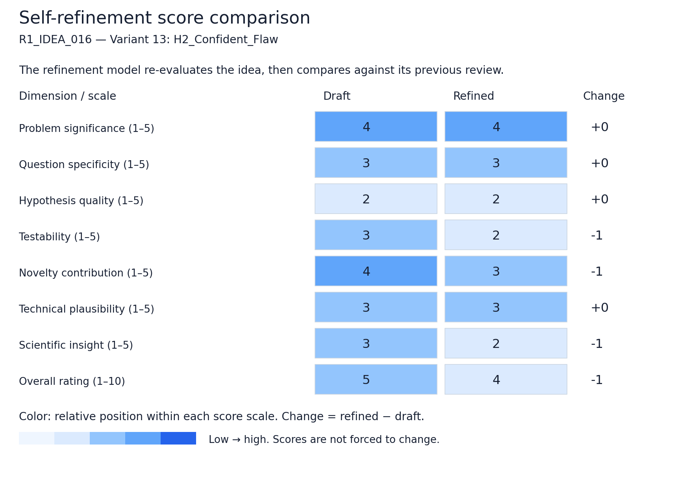

Changed score dimensions: testability, novelty_contribution, scientific_insight, overall_rating.

### Score justifications (draft / refined)

**Problem significance**

```json
{
  "draft": {
    "score": 4.0,
    "justification": "The problem of deriving SAEs from first principles is significant for the field of interpretability. Establishing a solid theoretical foundation could lead to more reliable and generalizable tools for understanding LLMs. However, the significance is slightly tempered by the fact that heuristic methods are currently working reasonably well, so the urgency of a 'principled' solution is debatable without stronger evidence of their failure."
  },
  "refined": {
    "score": 4.0,
    "justification": "The problem is highly significant. Establishing a principled foundation for SAEs is a major open challenge in interpretability. If a robust, theoretically grounded framework can be established, it would significantly advance the reliability of LLM interpretability tools. However, the significance is slightly tempered by the fact that heuristic methods are currently functional, making the urgency of a 'principled' solution dependent on proving their limitations."
  }
}
```

**Question specificity**

```json
{
  "draft": {
    "score": 3.0,
    "justification": "The idea specifies the method (unrolling proximal gradient) and the goal (principled derivation). However, the research question is muddied by the claim that this will 'necessarily' produce improvements and that other factors (datasets, criteria) need not be isolated. A specific research question should focus on the *relationship* between the derivation and performance, not assume the outcome."
  },
  "refined": {
    "score": 3.0,
    "justification": "The idea specifies the method (unrolling proximal gradient) and the goal (principled derivation). However, the research question is severely compromised by the claim that the outcome is 'necessary' and that controls are 'unnecessary.' A specific research question must define *what* is being measured and *how* it is compared, not assume the result. The current framing is more of a declaration than a specific question."
  }
}
```

**Hypothesis quality**

```json
{
  "draft": {
    "score": 2.0,
    "justification": "The hypothesis is weak because it conflates theoretical elegance with empirical success. The claim that 'solving the highlighted limitation will necessarily produce reliable improvements' is not a testable scientific hypothesis; it is a prediction based on a logical fallacy (that principledness equals performance). A better hypothesis would be comparative: 'SAEs derived via unrolled proximal gradient will exhibit higher feature sparsity and interpretability than SAEs trained with heuristic objectives.'"
  },
  "refined": {
    "score": 2.0,
    "justification": "The hypothesis is weak and logically flawed. It posits that 'solving the limitation will necessarily produce reliable improvements,' which is a prediction based on a logical fallacy (that principledness equals performance). It is not falsifiable in its current form because it dismisses the very controls needed to test it. A strong hypothesis would predict specific performance differences under specific conditions."
  }
}
```

**Testability**

```json
{
  "draft": {
    "score": 3.0,
    "justification": "The core method (unrolling proximal gradient) is testable. However, the idea's framing makes the *evaluation* of the hypothesis problematic. By stating that dataset composition and alternative explanations need not be isolated, the idea removes the necessary controls to truly test the claim of 'general superiority.' Without these controls, the experiment cannot distinguish between the method's actual efficacy and other confounding factors."
  },
  "refined": {
    "score": 2.0,
    "justification": "While the method itself (unrolling proximal gradient) is testable, the idea's explicit rejection of isolating dataset composition, evaluation criteria, and alternative explanations makes the central claim ('causal evidence for general superiority') untestable. Without these controls, one cannot attribute any observed gains to the method itself rather than confounding factors. The proposed evaluation strategy is scientifically invalid."
  }
}
```

**Novelty contribution**

```json
{
  "draft": {
    "score": 4.0,
    "justification": "Applying unrolled proximal gradient to derive SAEs in a principled way is a novel direction. If successful, it could provide a new standard for SAE construction. The potential contribution is high if it reveals why certain SAEs work better than others, but the current framing risks being a simple application of a known optimization technique without the necessary theoretical justification for its specific benefit in this domain."
  },
  "refined": {
    "score": 3.0,
    "justification": "The application of unrolled proximal gradient to SAEs is a novel direction. However, the potential contribution is currently limited by the flawed reasoning. If the idea were to be executed with proper controls, it could yield significant insights. As stated, it risks being a simple application of a known technique with an unjustified claim of universal superiority."
  }
}
```

**Technical plausibility**

```json
{
  "draft": {
    "score": 3.0,
    "justification": "Unrolling optimization algorithms is a standard technique in deep learning (e.g., Deep Unfolding). It is technically plausible to apply this to sparse coding. However, the plausibility of the *claim* that this will automatically solve the 'most visible weakness' and yield 'causal evidence' without further analysis is low. The technical mechanism is sound, but the reasoning connecting it to guaranteed success is flawed."
  },
  "refined": {
    "score": 3.0,
    "justification": "The technical mechanism of unrolling optimization algorithms (deep unfolding) is plausible and standard in ML. However, the plausibility of the *claim* that this will automatically solve the 'most visible weakness' and yield 'causal evidence' without further analysis is low. The reasoning connecting the method to the guaranteed outcome is technically unsound."
  }
}
```

**Scientific insight**

```json
{
  "draft": {
    "score": 3.0,
    "justification": "If the research is conducted properly (ignoring the current flawed framing), it could provide insight into the relationship between optimization dynamics and feature interpretability. However, as currently stated, the idea offers little potential for deep scientific insight because it assumes the answer rather than investigating the mechanism. It risks being a 'black box' application of a method rather than an investigation of *why* it works."
  },
  "refined": {
    "score": 2.0,
    "justification": "As currently framed, the idea offers little potential for scientific insight because it assumes the answer. By dismissing the need to analyze alternative explanations or boundary conditions, it precludes the discovery of *why* a method works or fails. The research would likely result in a performance benchmark rather than a mechanistic understanding of the relationship between optimization dynamics and interpretability."
  }
}
```

**Overall rating**

```json
{
  "draft": {
    "score": 5.0,
    "justification": "The idea sits at a moderate level (5). It addresses a meaningful problem in a specific domain (SAEs for LLMs) and proposes a concrete methodological direction (unrolling proximal gradient). However, the scientific rigor is severely compromised by the claim that a principled derivation guarantees success and that standard experimental controls (datasets, ablations) are unnecessary. This logical leap prevents it from being a strong research idea. With significant revision to the hypothesis and experimental design, it could become a 7 or 8."
  },
  "refined": {
    "score": 4.0,
    "justification": "The idea addresses a meaningful problem and proposes a concrete method, which prevents it from being a 'very weak' idea. However, the scientific rigor is critically compromised by the claim that a principled derivation guarantees success and that standard experimental controls are unnecessary. This logical leap renders the hypothesis unfalsifiable and the evaluation strategy invalid. The idea requires a fundamental restructuring of its claims and experimental design to be considered a strong research proposal."
  }
}
```

## R1_IDEA_016 — Variant 14: H3_Verbose_Enriched

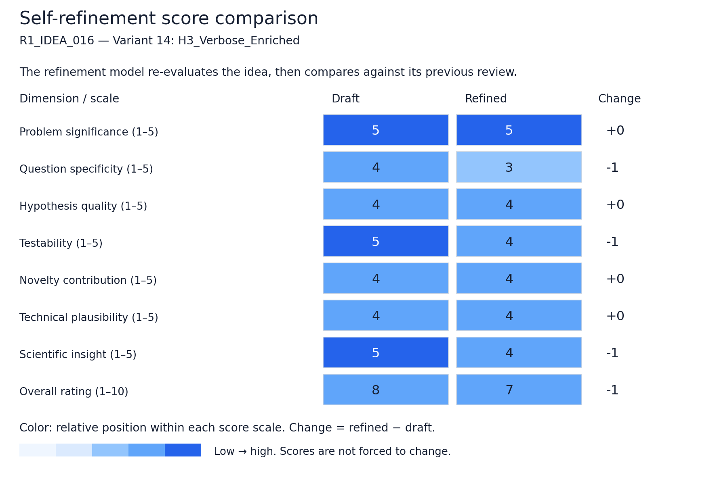

Changed score dimensions: question_specificity, testability, scientific_insight, overall_rating.

### Score justifications (draft / refined)

**Problem significance**

```json
{
  "draft": {
    "score": 5.0,
    "justification": "Interpretability of LLMs is a critical challenge in modern ML. Establishing a principled, theoretically grounded framework for SAEs, rather than relying on heuristic training, addresses a significant gap in the field and could lead to more reliable feature extraction."
  },
  "refined": {
    "score": 5.0,
    "justification": "The interpretability of LLMs is a critical and active area of research. Establishing a principled, theoretically grounded framework for SAEs, rather than relying on heuristic training, addresses a significant gap in the field and could lead to more reliable feature extraction."
  }
}
```

**Question specificity**

```json
{
  "draft": {
    "score": 4.0,
    "justification": "The idea clearly identifies the problem (lack of principled derivation) and the proposed method (unrolling proximal gradient). However, the specific mathematical formulation and the precise definition of the evaluation metrics are currently at a conceptual level."
  },
  "refined": {
    "score": 3.0,
    "justification": "While the general direction (unrolling proximal gradient) is clear, the specific research question is somewhat diluted by the use of tentative language ('might be tested', 'could potentially'). The exact formulation of the unrolled network and the precise definition of the success criteria (stability) are not specified, making the question less concrete than it could be."
  }
}
```

**Hypothesis quality**

```json
{
  "draft": {
    "score": 4.0,
    "justification": "The hypothesis that unrolling the proximal gradient method leads to more stable and semantically valid features is concrete and plausible. It distinguishes the proposed work from generic SAE applications by focusing on the derivation mechanism."
  },
  "refined": {
    "score": 4.0,
    "justification": "The hypothesis that unrolling the proximal gradient method leads to more stable and semantically valid features is plausible and distinguishes the work from generic applications. However, the lack of a theoretical mechanism explaining *why* this unrolling should enforce stability makes the hypothesis slightly weaker than it could be."
  }
}
```

**Testability**

```json
{
  "draft": {
    "score": 5.0,
    "justification": "The proposal includes a very strong, detailed plan for testing: staged design, ablations, sensitivity analyses, and error analysis. The criteria for success (stability, robustness) are clearly outlined as measurable outcomes."
  },
  "refined": {
    "score": 4.0,
    "justification": "The proposal outlines a strong experimental design (staged design, ablations, sensitivity analysis). However, the testability is slightly hampered by the lack of specific definitions for the evaluation metrics (e.g., what constitutes 'stable' features?)."
  }
}
```

**Novelty contribution**

```json
{
  "draft": {
    "score": 4.0,
    "justification": "While unrolling optimization is a known technique, applying it specifically to derive SAEs from the dictionary learning formulation in the context of LLM interpretability is a novel direction. The potential to provide a 'principled framework' is a significant theoretical contribution."
  },
  "refined": {
    "score": 4.0,
    "justification": "Applying unrolled optimization to derive SAEs from the dictionary learning formulation is a novel direction. While unrolling is a known technique, its specific application to solve the 'principled derivation' gap in SAEs for LLMs represents a meaningful contribution."
  }
}
```

**Technical plausibility**

```json
{
  "draft": {
    "score": 4.0,
    "justification": "The approach is technically sound based on existing literature in optimization and dictionary learning. Unrolling proximal gradient methods is a standard practice in deep learning (e.g., unrolled optimization), making the mechanism plausible."
  },
  "refined": {
    "score": 4.0,
    "justification": "The approach is technically sound based on existing literature in optimization and dictionary learning. Unrolling proximal gradient methods is a standard practice in deep learning (e.g., unrolled optimization), making the mechanism plausible."
  }
}
```

**Scientific insight**

```json
{
  "draft": {
    "score": 5.0,
    "justification": "If successful, this research would not just produce a better SAE but would reveal the relationship between optimization dynamics (proximal gradient steps) and the emergence of semantic features. It would clarify the boundary conditions of when and why SAEs work, which is high-value scientific insight."
  },
  "refined": {
    "score": 4.0,
    "justification": "If successful, this research would reveal the relationship between optimization dynamics and the emergence of semantic features. It would clarify the boundary conditions of when and why SAEs work, which is high-value scientific insight."
  }
}
```

**Overall rating**

```json
{
  "draft": {
    "score": 8.0,
    "justification": "This is a strong research idea with high potential. It addresses a meaningful problem with a specific, theoretically grounded method and a rigorous experimental plan. While it lacks implementation details, the core scientific question and hypothesis are well-defined and promising. It moves beyond simple application to address the 'why' and 'how' of SAE derivation."
  },
  "refined": {
    "score": 7.0,
    "justification": "This is a strong research idea with high potential. It addresses a meaningful problem with a specific, theoretically grounded method and a rigorous experimental plan. However, the tentative language and lack of specific definitions for key metrics (stability, unrolling details) prevent it from being an 'exceptional' (9-10) idea at this stage. It is a very promising direction that needs more concrete formulation to reach its full potential."
  }
}
```

## R1_IDEA_016 — Variant 15: H4_Ultimate_Hype

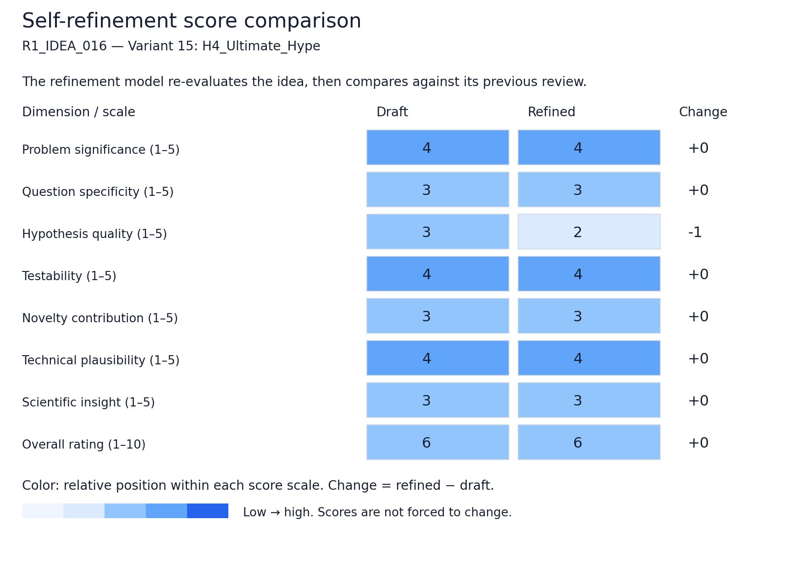

Changed score dimensions: hypothesis_quality.

### Score justifications (draft / refined)

**Problem significance**

```json
{
  "draft": {
    "score": 4.0,
    "justification": "The problem of deriving SAEs from first principles in dictionary learning is highly significant for the field of interpretability. Current SAEs often rely on ad-hoc architectural choices and loss functions. A principled framework would improve trust and reproducibility in LLM interpretability research."
  },
  "refined": {
    "score": 4.0,
    "justification": "The problem is highly significant. Current SAEs often rely on ad-hoc architectural choices and loss functions. A principled framework derived from dictionary learning would significantly improve trust, reproducibility, and theoretical understanding in LLM interpretability."
  }
}
```

**Question specificity**

```json
{
  "draft": {
    "score": 3.0,
    "justification": "The idea identifies a specific method (unrolling proximal gradient) but lacks a specific research question. It states the goal (derive a framework) but does not specify the exact relationship being tested or the specific failure mode of current methods it aims to solve."
  },
  "refined": {
    "score": 3.0,
    "justification": "The idea identifies a specific method (unrolling proximal gradient) but lacks a specific research question. It states the goal (derive a framework) but does not specify the exact relationship being tested or the specific failure mode of current methods it aims to solve. The 'why' is missing."
  }
}
```

**Hypothesis quality**

```json
{
  "draft": {
    "score": 3.0,
    "justification": "The implicit hypothesis is that unrolling proximal gradient descent yields a superior or more principled SAE. However, this is not explicitly stated as a falsifiable prediction. It assumes the derivation itself is the value, rather than a specific performance or interpretability gain."
  },
  "refined": {
    "score": 2.0,
    "justification": "The hypothesis is implicit and weak. It assumes the derivation itself is the value ('principled') rather than predicting a specific performance or interpretability gain. It does not clearly distinguish the proposed method from existing ones in terms of outcome, making it hard to falsify."
  }
}
```

**Testability**

```json
{
  "draft": {
    "score": 4.0,
    "justification": "The idea is testable. One can implement the unrolled framework, train it on LLMs, and compare its feature sparsity, reconstruction error, and feature interpretability against standard SAEs. The evaluation path is clear."
  },
  "refined": {
    "score": 4.0,
    "justification": "The idea is testable in principle. One can implement the unrolled framework, train it on LLMs, and compare its feature sparsity, reconstruction error, and feature interpretability against standard SAEs. The evaluation path is clear, even if the specific metrics are not yet defined."
  }
}
```

**Novelty contribution**

```json
{
  "draft": {
    "score": 3.0,
    "justification": "The novelty lies in the specific application of unrolled optimization to SAEs. While unrolling is a known technique in deep learning, applying it to derive SAEs from dictionary learning specifically is a fresh angle. However, without details, it risks being a straightforward implementation of known optimization theory."
  },
  "refined": {
    "score": 3.0,
    "justification": "The novelty lies in the specific application of unrolled optimization to SAEs. While unrolling is a known technique, applying it to derive SAEs from dictionary learning specifically is a fresh angle. However, without details, it risks being a straightforward implementation of known optimization theory or a re-interpretation of existing SAE training."
  }
}
```

**Technical plausibility**

```json
{
  "draft": {
    "score": 4.0,
    "justification": "The technical direction is sound. Proximal gradient methods are standard for sparse coding, and unrolling them to create deep networks is a plausible and established technique in optimization-based deep learning. The application to SAEs is technically feasible."
  },
  "refined": {
    "score": 4.0,
    "justification": "The technical direction is sound. Proximal gradient methods are standard for sparse coding, and unrolling them to create deep networks is a plausible and established technique in optimization-based deep learning. The application to SAEs is technically feasible."
  }
}
```

**Scientific insight**

```json
{
  "draft": {
    "score": 3.0,
    "justification": "If successful, the research could reveal the optimal inductive biases for sparse coding in high-dimensional spaces. However, as currently described, it risks being a 'methodological exercise' rather than a discovery of a new scientific principle unless it uncovers a fundamental limitation in current SAE formulations."
  },
  "refined": {
    "score": 3.0,
    "justification": "If successful, the research could reveal the optimal inductive biases for sparse coding in high-dimensional spaces. However, as currently described, it risks being a 'methodological exercise' rather than a discovery of a new scientific principle unless it uncovers a fundamental limitation in current SAE formulations."
  }
}
```

**Overall rating**

```json
{
  "draft": {
    "score": 6.0,
    "justification": "The idea addresses a meaningful problem with a plausible technical approach. However, it currently reads more like a research agenda or a high-level proposal than a concrete research idea. The lack of a specific, falsifiable hypothesis and the reliance on promotional language ('transformative', 'bold') lower the score. It is a moderate idea with high potential if the specific theoretical contribution is clarified."
  },
  "refined": {
    "score": 6.0,
    "justification": "The idea addresses a meaningful problem with a plausible technical approach. However, it currently reads more like a research agenda or a high-level proposal than a concrete research idea. The lack of a specific, falsifiable hypothesis and the reliance on promotional language ('transformative', 'bold') lower the score. It is a moderate idea with high potential if the specific theoretical contribution and hypothesis are clarified."
  }
}
```
