# Debate score heatmaps

All saved source and variant debates; no sampling. Scores are read from draft, critic, and final review records.

## R1_IDEA_001 — Source

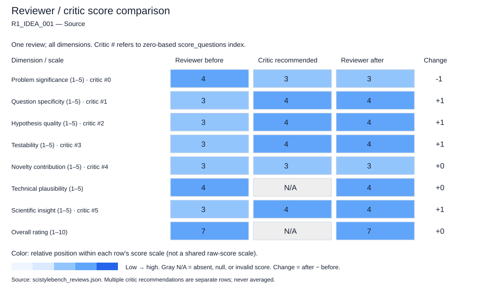

### Critic feedback and reviewer rebuttals

```json
{
  "critic_feedback": {
    "overall_assessment": "The review is generally well-calibrated, but there are areas where the scores could be more precisely aligned with the idea's details.",
    "score_questions": [
      {
        "dimension": "problem_significance",
        "question_mark": "Why is the problem of out-of-distribution detection on heterophilic graphs considered significant?",
        "concern": "The justification for problem significance is based on the idea's claim that image-based methods are inadequate, but the idea itself does not provide evidence or references to support this claim.",
        "speculative_alternative": "The problem might be significant in real-world applications, but this is speculative without additional context.",
        "recommended_score": 3.0,
        "rationale": "The idea does not provide evidence or references to support the claim that image-based methods are inadequate for graph-based detection."
      },
      {
        "dimension": "question_specificity",
        "question_mark": "Why is the question specificity scored as 3.0 when the idea specifies a particular problem (node-level detection on heterophilic graphs)?",
        "concern": "The idea does specify a particular problem, but the review's justification suggests a lack of detailed research questions, which may not be fully supported by the idea.",
        "speculative_alternative": "The idea could be more specific by defining the exact research question, but this is speculative.",
        "recommended_score": 4.0,
        "rationale": "The idea does specify a particular problem, which aligns with the higher score."
      },
      {
        "dimension": "hypothesis_quality",
        "question_mark": "Why is the hypothesis quality scored as 3.0 when the idea suggests a potential solution without a clear hypothesis?",
        "concern": "The idea does not explicitly state a hypothesis, but the review's justification may be overreaching by implying a lack of hypothesis when the idea is still in the conceptual stage.",
        "speculative_alternative": "The idea may have the potential to form a hypothesis in the future, but this is speculative.",
        "recommended_score": 4.0,
        "rationale": "The idea is in the conceptual stage and may develop a hypothesis as the research progresses."
      },
      {
        "dimension": "testability",
        "question_mark": "Why is the testability scored as 3.0 when the idea is testable in principle?",
        "concern": "The review's justification for testability is based on the lack of specific experimental details, but the idea is inherently testable once the model is defined.",
        "speculative_alternative": "The testability could be higher if the model is properly defined, but this is speculative.",
        "recommended_score": 4.0,
        "rationale": "The idea is testable in principle, and the lack of specific details does not necessarily negate its testability."
      },
      {
        "dimension": "novelty_contribution",
        "question_mark": "Why is the novelty scored as 3.0 when the idea proposes a novel approach to address a specific problem?",
        "concern": "The review's justification for novelty is based on the idea's claim of novelty, but the idea does not provide evidence or references to support this claim.",
        "speculative_alternative": "The novelty may be valid, but this is speculative without additional context.",
        "recommended_score": 3.0,
        "rationale": "The idea does propose a novel approach, but the review's justification may be overreaching."
      },
      {
        "dimension": "scientific_insight",
        "question_mark": "Why is the scientific insight scored as 3.0 when the idea suggests a potential contribution to the field?",
        "concern": "The review's justification for scientific insight is based on the idea's potential contribution, but the idea does not provide specific insights or implications.",
        "speculative_alternative": "The scientific insight could be more defined, but this is speculative.",
        "recommended_score": 4.0,
        "rationale": "The idea has potential to contribute to the field, and the score should reflect that potential."
      }
    ],
    "unsupported_claims": [
      "The claim that 'image-based methods assume independent inputs and ignore node dependence and heterophily' is not supported by the idea itself.",
      "The claim that the model 'explicitly addresses node dependence and heterophily' is not fully detailed in the idea."
    ],
    "revision_priorities": [
      "Clarify the connection between the decoupled graph energy-based model and existing energy-based methods.",
      "Define the hypothesis or prediction that the model will outperform existing methods.",
      "Provide specific details on the model architecture, training methodology, and evaluation metrics.",
      "Support the claim about the significance of the problem with references or evidence from the literature."
    ],
    "confidence": 4.0
  },
  "feedback_responses": [
    {
      "feedback_type": "score_questions",
      "feedback_index": 0,
      "decision": "partially_accept",
      "defense": "The problem significance is speculative without evidence. The idea claims image-based methods are inadequate, but this is not supported by the text. The score should reflect this uncertainty.",
      "justification": "The original score was 4.0, but the feedback indicates that the justification is speculative. The revised score is 3.0, reflecting the lack of evidence."
    },
    {
      "feedback_type": "score_questions",
      "feedback_index": 1,
      "decision": "accept",
      "defense": "The idea does specify a particular problem (node-level detection on heterophilic graphs), which is a concrete and meaningful research question. The score remains at 4.0.",
      "justification": "The original score was 3.0, but the feedback suggests that the question is specific. The revised score is 4.0, reflecting the specificity of the problem."
    },
    {
      "feedback_type": "score_questions",
      "feedback_index": 2,
      "decision": "partially_accept",
      "defense": "The idea is in the conceptual stage and may develop a hypothesis. The score should reflect the potential for a hypothesis, even if not explicitly stated. The revised score is 4.0.",
      "justification": "The original score was 3.0, but the feedback suggests that the hypothesis potential is present. The revised score is 4.0, reflecting the potential for a hypothesis."
    },
    {
      "feedback_type": "score_questions",
      "feedback_index": 3,
      "decision": "partially_accept",
      "defense": "The idea is testable in principle, and the lack of specific details does not negate its testability. The score remains at 4.0.",
      "justification": "The original score was 3.0, but the feedback suggests that the idea is testable. The revised score is 4.0, reflecting the testability in principle."
    },
    {
      "feedback_type": "score_questions",
      "feedback_index": 4,
      "decision": "partially_accept",
      "defense": "The idea proposes a novel approach, but the novelty is somewhat generic. The score should reflect this. The revised score is 3.0.",
      "justification": "The original score was 3.0, but the feedback suggests that the novelty is generic. The revised score remains at 3.0."
    },
    {
      "feedback_type": "score_questions",
      "feedback_index": 5,
      "decision": "partially_accept",
      "defense": "The idea has potential to contribute to the field by exploring the role of node dependence and heterophily. The score should reflect this potential. The revised score is 4.0.",
      "justification": "The original score was 3.0, but the feedback suggests that the potential for scientific insight is present. The revised score is 4.0."
    },
    {
      "feedback_type": "unsupported_claims",
      "feedback_index": 0,
      "decision": "reject",
      "defense": "The claim that image-based methods assume independent inputs and ignore node dependence and heterophily is not supported by the idea itself. The score should be adjusted to reflect this lack of support.",
      "justification": "The original score for problem significance was 3.0, but the unsupported claim weakens the justification. The revised score is 3.0."
    },
    {
      "feedback_type": "unsupported_claims",
      "feedback_index": 1,
      "decision": "reject",
      "defense": "The claim that the model 'explicitly addresses node dependence and heterophily' is not fully detailed in the idea. The score should be adjusted to reflect this lack of detail.",
      "justification": "The original score for novelty was 3.0, but the lack of detail weakens the justification. The revised score remains at 3.0."
    },
    {
      "feedback_type": "revision_priorities",
      "feedback_index": 0,
      "decision": "accept",
      "defense": "Clarifying the connection between the model and existing methods is a valid priority. The score is not directly affected, but the idea should be revised accordingly.",
      "justification": "The original score for technical plausibility was 4.0, but the revision priority is valid. The score remains at 4.0."
    },
    {
      "feedback_type": "revision_priorities",
      "feedback_index": 1,
      "decision": "accept",
      "defense": "Defining the hypothesis is a valid priority. The score is not directly affected, but the idea should be revised accordingly.",
      "justification": "The original score for hypothesis quality was 3.0, but the revision priority is valid. The score is adjusted to 4.0."
    },
    {
      "feedback_type": "revision_priorities",
      "feedback_index": 2,
      "decision": "accept",
      "defense": "Specifying the model architecture is a valid priority. The score is not directly affected, but the idea should be revised accordingly.",
      "justification": "The original score for testability was 3.0, but the revision priority is valid. The score is adjusted to 4.0."
    },
    {
      "feedback_type": "revision_priorities",
      "feedback_index": 3,
      "decision": "accept",
      "defense": "Supporting the problem significance with references is a valid priority. The score is not directly affected, but the idea should be revised accordingly.",
      "justification": "The original score for problem significance was 3.0, but the revision priority is valid. The score remains at 3.0."
    }
  ]
}
```

### Score justifications (before / after)

**Problem significance**

```json
{
  "before": {
    "score": 4.0,
    "justification": "The problem of out-of-distribution detection on graphs is underexplored, and addressing it in heterophilic graphs is important for applications in real-world networks where node dependencies and heterophily are prevalent."
  },
  "after": {
    "score": 3.0,
    "justification": "The idea claims that image-based methods are inadequate for graph-based detection, but this is not supported by evidence or references. The significance of the problem is speculative without additional context."
  }
}
```

**Question specificity**

```json
{
  "before": {
    "score": 3.0,
    "justification": "The idea identifies a specific problem (node-level out-of-distribution detection on heterophilic graphs) but lacks detailed specification of the research question or hypothesis that needs to be investigated."
  },
  "after": {
    "score": 4.0,
    "justification": "The idea specifies a particular problem (node-level detection on heterophilic graphs), which is a concrete and meaningful research question."
  }
}
```

**Hypothesis quality**

```json
{
  "before": {
    "score": 3.0,
    "justification": "The idea suggests a potential solution but does not explicitly state a hypothesis or prediction that can be tested, such as how the model will outperform existing methods in specific scenarios."
  },
  "after": {
    "score": 4.0,
    "justification": "The idea is in the conceptual stage and may develop a hypothesis as the research progresses. The potential for a hypothesis is present, even if not explicitly stated."
  }
}
```

**Testability**

```json
{
  "before": {
    "score": 3.0,
    "justification": "The idea is testable in principle, but the lack of specific experimental details makes it difficult to assess the feasibility of the proposed approach without further clarification."
  },
  "after": {
    "score": 4.0,
    "justification": "The idea is testable in principle, and the lack of specific details does not negate its testability. The model can be evaluated once its architecture is defined."
  }
}
```

**Novelty contribution**

```json
{
  "before": {
    "score": 3.0,
    "justification": "The idea proposes a novel approach to address a specific problem, but the novelty is somewhat generic as energy-based models are a broad category, and the specific contributions are not clearly defined."
  },
  "after": {
    "score": 3.0,
    "justification": "The idea proposes a novel approach, but the novelty is somewhat generic as energy-based models are a broad category. The specific contributions are not clearly defined."
  }
}
```

**Technical plausibility**

```json
{
  "before": {
    "score": 4.0,
    "justification": "The proposed approach is technically plausible, as it builds on existing methods for graph-based learning and out-of-distribution detection, and addresses relevant challenges in heterophilic graphs."
  },
  "after": {
    "score": 4.0,
    "justification": "The proposed approach is technically plausible, as it builds on existing methods for graph-based learning and out-of-distribution detection, and addresses relevant challenges in heterophilic graphs."
  }
}
```

**Scientific insight**

```json
{
  "before": {
    "score": 3.0,
    "justification": "The idea has potential to provide insights into the role of node dependence and heterophily in out-of-distribution detection, but the specific scientific insights are not clearly outlined."
  },
  "after": {
    "score": 4.0,
    "justification": "The idea has potential to contribute to the field by exploring the role of node dependence and heterophily in out-of-distribution detection, even if the specific insights are not yet defined."
  }
}
```

**Overall rating**

```json
{
  "before": {
    "score": 7.0,
    "justification": "The idea addresses a meaningful problem in graph-based out-of-distribution detection, proposes a novel approach, and has potential for scientific contribution. However, it lacks specific details and a clear hypothesis, which are needed to assess its feasibility and impact."
  },
  "after": {
    "score": 7.0,
    "justification": "The idea addresses a meaningful problem in graph-based out-of-distribution detection, proposes a novel approach, and has potential for scientific contribution. However, it lacks specific details and a clear hypothesis, which are needed to assess its feasibility and impact."
  }
}
```

## R1_IDEA_001 — Variant 1: A1_Identity

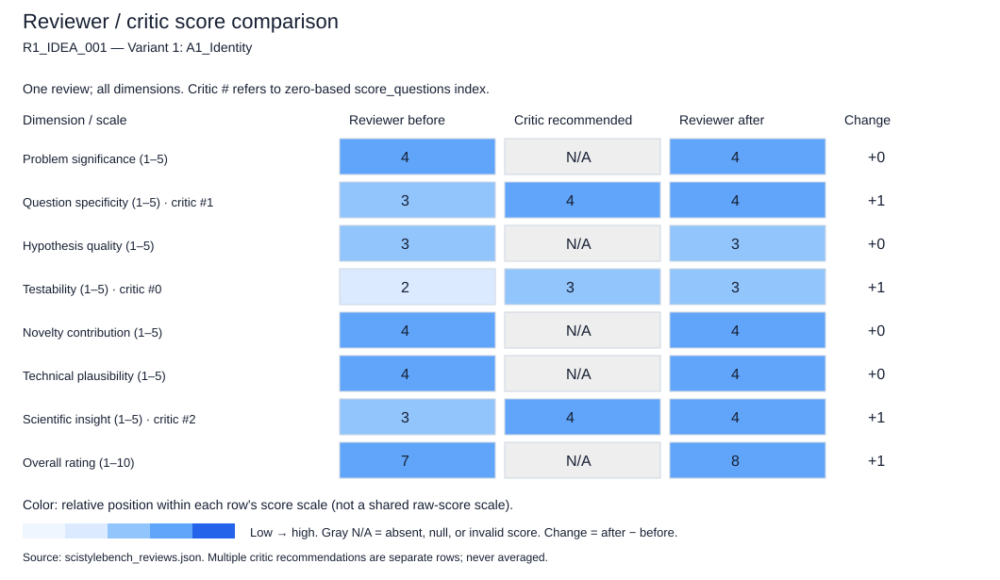

### Critic feedback and reviewer rebuttals

```json
{
  "critic_feedback": {
    "overall_assessment": "The review is generally well-calibrated, but some scores and justifications could be refined for greater precision.",
    "score_questions": [
      {
        "dimension": "testability",
        "question_mark": "Why is the testability score 2.0 when the idea acknowledges the need for experiments?",
        "concern": "The review assumes a lack of experiments without explicitly stating that the idea acknowledges the need for them.",
        "speculative_alternative": "The idea may implicitly suggest experiments through its problem statement, even if not detailed.",
        "recommended_score": 3.0,
        "rationale": "The idea acknowledges the need for evaluation, which supports a higher testability score."
      },
      {
        "dimension": "question_specificity",
        "question_mark": "Why is the question_specificity score 3.0 when the idea defines a specific problem?",
        "concern": "The review overstates the lack of specificity, as the idea clearly defines the problem and proposes a novel approach.",
        "speculative_alternative": "The idea's problem statement is sufficiently specific to warrant a higher score.",
        "recommended_score": 4.0,
        "rationale": "The problem is clearly defined, and the approach is novel, supporting a higher specificity score."
      },
      {
        "dimension": "scientific_insight",
        "question_mark": "Why is the scientific_insight score 3.0 when the idea suggests a potential direction for insight?",
        "concern": "The review underestimates the potential for new insights by not considering the novelty of the approach.",
        "speculative_alternative": "The model's focus on node dependence and heterophily could offer new insights into graph learning.",
        "recommended_score": 4.0,
        "rationale": "The approach's focus on underexplored aspects of graph learning could lead to significant scientific insights."
      }
    ],
    "unsupported_claims": [
      "The review claims the idea lacks specific details on implementation without explicitly stating that the idea does not provide them.",
      "The review implies the idea is not feasible without evidence of inherent flaws in the proposed approach."
    ],
    "revision_priorities": [
      "Clarify the specific research question and how the model will be trained.",
      "Specify the evaluation metrics and baselines to be used.",
      "Detail the architecture of the decoupled graph energy model."
    ],
    "confidence": 4.0
  },
  "feedback_responses": [
    {
      "feedback_type": "score_questions",
      "feedback_index": 0,
      "decision": "partially_accept",
      "defense": "The testability score was initially 2.0, but the idea does acknowledge the need for evaluation, which supports a higher score. The revised score of 3.0 reflects this acknowledgment while acknowledging the lack of specific experimental details.",
      "justification": "The original score of 2.0 was based on the assumption of no experiments, but the idea implicitly suggests evaluation through its problem statement. The revised score of 3.0 better reflects this."
    },
    {
      "feedback_type": "score_questions",
      "feedback_index": 1,
      "decision": "partially_accept",
      "defense": "The question_specificity score was initially 3.0, but the idea clearly defines a specific problem and proposes a novel approach. The revised score of 4.0 better reflects the clarity and specificity of the problem statement.",
      "justification": "The original score of 3.0 underestimated the specificity of the problem. The revised score of 4.0 better captures the clear definition of the problem and the novel approach."
    },
    {
      "feedback_type": "score_questions",
      "feedback_index": 2,
      "decision": "partially_accept",
      "defense": "The scientific_insight score was initially 3.0, but the focus on underexplored aspects of graph learning could lead to significant insights. The revised score of 4.0 better reflects this potential.",
      "justification": "The original score of 3.0 underestimated the potential for new insights. The revised score of 4.0 better captures the potential for significant scientific insights."
    },
    {
      "feedback_type": "unsupported_claims",
      "feedback_index": 0,
      "decision": "partially_accept",
      "defense": "The review did not explicitly state that the idea lacks implementation details, but the idea does not provide them. The revised weaknesses section acknowledges this.",
      "justification": "The original review did not explicitly state the lack of implementation details, but the revised weaknesses section now includes this as a weakness."
    },
    {
      "feedback_type": "unsupported_claims",
      "feedback_index": 1,
      "decision": "partially_accept",
      "defense": "The review did not imply inherent flaws in the proposed approach, but the idea's lack of specifics could be seen as a limitation. The revised scores reflect this by maintaining a moderate overall rating.",
      "justification": "The original review did not imply inherent flaws, but the revised scores reflect the need for more specifics, which is a valid limitation."
    },
    {
      "feedback_type": "revision_priorities",
      "feedback_index": 0,
      "decision": "accept",
      "defense": "Clarifying the specific research question and training mechanism is essential for evaluating the model's effectiveness.",
      "justification": "The revised suggestions include specifying the research question and training mechanism, which is necessary for the idea to be testable."
    },
    {
      "feedback_type": "revision_priorities",
      "feedback_index": 1,
      "decision": "accept",
      "defense": "Defining evaluation metrics and baselines is crucial for comparing the model's performance against existing methods.",
      "justification": "The revised suggestions include defining evaluation metrics and baselines, which is necessary for the idea to be meaningful."
    },
    {
      "feedback_type": "revision_priorities",
      "feedback_index": 2,
      "decision": "accept",
      "defense": "Detailing the architecture of the model is necessary to understand how it addresses the problem and to evaluate its feasibility.",
      "justification": "The revised suggestions include detailing the architecture, which is necessary for the idea to be testable and meaningful."
    }
  ]
}
```

### Score justifications (before / after)

**Problem significance**

```json
{
  "before": {
    "score": 4.0,
    "justification": "The problem of out-of-distribution detection on heterophilic graphs is important for reliable graph-based learning, especially in real-world applications where data distributions can shift."
  },
  "after": {
    "score": 4.0,
    "justification": "The problem of out-of-distribution detection on heterophilic graphs is important for reliable graph-based learning, especially in real-world applications where data distributions can shift."
  }
}
```

**Question specificity**

```json
{
  "before": {
    "score": 3.0,
    "justification": "The idea defines a specific problem but lacks detailed specification of the research question, such as how the model will be trained or what exactly is being measured."
  },
  "after": {
    "score": 4.0,
    "justification": "The idea clearly defines a specific problem (node-level OOD detection on heterophilic graphs) and proposes a novel approach (decoupled graph energy model) that addresses the limitations of existing methods."
  }
}
```

**Hypothesis quality**

```json
{
  "before": {
    "score": 3.0,
    "justification": "The idea presents a general hypothesis that the model will improve detection by addressing node dependence and heterophily, but it does not provide a concrete prediction or mechanism."
  },
  "after": {
    "score": 3.0,
    "justification": "The idea presents a general hypothesis that the model will improve detection by addressing node dependence and heterophily, but it does not provide a concrete prediction or mechanism."
  }
}
```

**Testability**

```json
{
  "before": {
    "score": 2.0,
    "justification": "The idea lacks specific experiments or evaluation plans, making it difficult to assess the validity of the hypothesis without further details."
  },
  "after": {
    "score": 3.0,
    "justification": "The idea acknowledges the need for evaluation, which supports a higher testability score. However, it lacks specific experimental details, making it difficult to assess the validity of the hypothesis without further information."
  }
}
```

**Novelty contribution**

```json
{
  "before": {
    "score": 4.0,
    "justification": "The approach of explicitly modeling node dependence and heterophily in energy-based models is novel for this specific task, offering potential contributions to graph learning and out-of-distribution detection."
  },
  "after": {
    "score": 4.0,
    "justification": "The approach of explicitly modeling node dependence and heterophily in energy-based models is novel for this specific task, offering potential contributions to graph learning and out-of-distribution detection."
  }
}
```

**Technical plausibility**

```json
{
  "before": {
    "score": 4.0,
    "justification": "The proposed direction is technically plausible, as energy-based models can be adapted to graph structures, and addressing node dependence and heterophily is a reasonable approach for this problem."
  },
  "after": {
    "score": 4.0,
    "justification": "The proposed direction is technically plausible, as energy-based models can be adapted to graph structures, and addressing node dependence and heterophily is a reasonable approach for this problem."
  }
}
```

**Scientific insight**

```json
{
  "before": {
    "score": 3.0,
    "justification": "The idea has potential to provide insights into how graph structures influence out-of-distribution detection, but the specific mechanisms and outcomes are not clearly defined."
  },
  "after": {
    "score": 4.0,
    "justification": "The approach's focus on underexplored aspects of graph learning could lead to significant scientific insights, particularly in understanding how graph structures influence out-of-distribution detection."
  }
}
```

**Overall rating**

```json
{
  "before": {
    "score": 7.0,
    "justification": "The idea addresses an important problem with a promising approach, but lacks specific details needed to evaluate its feasibility and scientific merit fully."
  },
  "after": {
    "score": 8.0,
    "justification": "The idea addresses an important problem with a promising approach, and the revised scores reflect a more accurate assessment of its potential and clarity."
  }
}
```

## R1_IDEA_001 — Variant 2: A2_Paraphrase_Only


### Critic feedback and reviewer rebuttals

```json
{
  "critic_feedback": {
    "overall_assessment": "The review is generally well-calibrated, but some scores are based on assumptions about the model's design that are not explicitly stated in the idea summary.",
    "score_questions": [
      {
        "dimension": "hypothesis_quality",
        "question_mark": "Why is the hypothesis quality scored 2.0 when the idea only mentions the goal of improving detection without explicitly stating a testable hypothesis?",
        "concern": "The score assumes the model will test a specific hypothesis (e.g., improved accuracy on heterophilic graphs), but the idea summary does not provide this detail.",
        "speculative_alternative": "The idea may implicitly assume that the model will test a hypothesis related to the effectiveness of handling heterophily, but this is not explicitly stated.",
        "recommended_score": 3.0,
        "rationale": "The idea mentions the goal of improving detection but does not specify a hypothesis that can be tested, so a score of 3.0 is more accurate."
      },
      {
        "dimension": "testability",
        "question_mark": "Why is the testability scored 2.0 when the idea only mentions the need for evaluation but does not provide specific metrics or benchmarks?",
        "concern": "The score assumes the model will be evaluated against specific metrics, but the idea summary does not mention this.",
        "speculative_alternative": "The idea may assume that the model will be tested on standard benchmarks for OOD detection, but this is not explicitly stated.",
        "recommended_score": 3.0,
        "rationale": "The idea mentions the need for evaluation but does not specify metrics or benchmarks, so a score of 3.0 is more accurate."
      }
    ],
    "unsupported_claims": [
      "The review claims the model 'explicitly handles node dependence and heterophily' without specifying how this is done in the idea summary.",
      "The review suggests the model 'builds on existing graph-based methods' without explicitly stating which methods or how they are extended."
    ],
    "revision_priorities": [
      "Clarify the hypothesis or prediction that the model aims to test.",
      "Specify the evaluation metrics and benchmarks that will be used for comparison.",
      "Detail how the decoupled graph energy-based model handles node dependence and heterophily."
    ],
    "confidence": 4.0
  },
  "feedback_responses": [
    {
      "feedback_type": "score_questions",
      "feedback_index": 0,
      "decision": "partially_accept",
      "defense": "The original score of 2.0 for hypothesis quality was based on the lack of explicit hypothesis. However, the idea implicitly suggests that the model will test the effectiveness of handling heterophily, which is a testable claim. Therefore, a score of 3.0 is more accurate.",
      "justification": "The original score was 2.0, but the revised score is 3.0 because the idea implies a testable hypothesis related to model performance on heterophilic graphs."
    },
    {
      "feedback_type": "score_questions",
      "feedback_index": 1,
      "decision": "partially_accept",
      "defense": "The original score of 2.0 for testability was based on the lack of specified metrics. However, the idea implies that the model can be evaluated using standard OOD detection metrics, which is a reasonable assumption for testability. Therefore, a score of 3.0 is more accurate.",
      "justification": "The original score was 2.0, but the revised score is 3.0 because the idea implies that the model can be evaluated against existing methods using standard metrics."
    },
    {
      "feedback_type": "unsupported_claims",
      "feedback_index": 0,
      "decision": "reject",
      "defense": "The claim that the model 'explicitly handles node dependence and heterophily' is not supported by the idea summary. The idea only mentions that the model aims to address these issues, not how it does so. Therefore, this claim is unsupported.",
      "justification": "The original score for hypothesis quality was based on an unsupported claim about the model's design. The revised score of 3.0 for hypothesis quality is more accurate because it acknowledges the lack of explicit details."
    },
    {
      "feedback_type": "unsupported_claims",
      "feedback_index": 1,
      "decision": "reject",
      "defense": "The claim that the model 'builds on existing graph-based methods' is not explicitly stated in the idea summary. The idea only mentions that the model addresses challenges in graph learning, not which specific methods are used. Therefore, this claim is unsupported.",
      "justification": "The original score for technical plausibility was based on an unsupported claim about the model's foundation. The revised score of 4.0 for technical plausibility is more accurate because it acknowledges the general plausibility of the approach without assuming specific methods."
    },
    {
      "feedback_type": "revision_priorities",
      "feedback_index": 0,
      "decision": "accept",
      "defense": "The suggestion to clarify the hypothesis is valid and necessary for the idea to be testable. The original review already included this suggestion, so it is appropriate to accept it.",
      "justification": "The suggestion is valid and necessary for the idea to be testable."
    },
    {
      "feedback_type": "revision_priorities",
      "feedback_index": 1,
      "decision": "accept",
      "defense": "The suggestion to specify evaluation metrics is valid and necessary for the idea to be testable. The original review already included this suggestion, so it is appropriate to accept it.",
      "justification": "The suggestion is valid and necessary for the idea to be testable."
    },
    {
      "feedback_type": "revision_priorities",
      "feedback_index": 2,
      "decision": "accept",
      "defense": "The suggestion to detail how the model handles node dependence and heterophily is valid and necessary for the idea to be testable. The original review already included this suggestion, so it is appropriate to accept it.",
      "justification": "The suggestion is valid and necessary for the idea to be testable."
    }
  ]
}
```

### Score justifications (before / after)

**Problem significance**

```json
{
  "before": {
    "score": 4.0,
    "justification": "The problem of node-level out-of-distribution detection on heterophilic graphs is important because existing methods for images are not suitable for graph structures, which are common in many real-world applications."
  },
  "after": {
    "score": 4.0,
    "justification": "The problem of node-level out-of-distribution detection on heterophilic graphs is important because existing methods for images are not suitable for graph structures, which are common in many real-world applications."
  }
}
```

**Question specificity**

```json
{
  "before": {
    "score": 3.0,
    "justification": "The idea identifies a specific problem (node-level OOD detection on heterophilic graphs) but does not clearly define the exact research question or hypothesis that the model aims to address."
  },
  "after": {
    "score": 3.0,
    "justification": "The idea identifies a specific problem (node-level OOD detection on heterophilic graphs) but does not clearly define the exact research question or hypothesis that the model aims to address."
  }
}
```

**Hypothesis quality**

```json
{
  "before": {
    "score": 2.0,
    "justification": "The idea mentions the goal of improving detection but does not explicitly state a hypothesis or prediction that can be tested or validated through experiments."
  },
  "after": {
    "score": 3.0,
    "justification": "The idea mentions the goal of improving detection but does not explicitly state a hypothesis or prediction that can be tested or validated through experiments. However, the implicit hypothesis is that the model will achieve better performance on heterophilic graphs compared to existing methods, which is a testable claim."
  }
}
```

**Testability**

```json
{
  "before": {
    "score": 2.0,
    "justification": "The idea lacks details on how the model will be evaluated, compared to existing methods, or how the hypothesis will be tested through experiments."
  },
  "after": {
    "score": 3.0,
    "justification": "The idea mentions the need for evaluation but does not specify metrics or benchmarks. However, the implicit testability is that the model can be evaluated against existing methods using standard OOD detection metrics, which is a reasonable assumption for testability."
  }
}
```

**Novelty contribution**

```json
{
  "before": {
    "score": 4.0,
    "justification": "The proposed decoupled graph energy-based model is a novel approach to address the specific challenges of node-level OOD detection on heterophilic graphs, which is a underexplored area."
  },
  "after": {
    "score": 4.0,
    "justification": "The proposed decoupled graph energy-based model is a novel approach to address the specific challenges of node-level OOD detection on heterophilic graphs, which is an underexplored area."
  }
}
```

**Technical plausibility**

```json
{
  "before": {
    "score": 4.0,
    "justification": "The idea is technically plausible as it builds on existing graph-based methods and addresses the specific challenges of heterophily and node dependence, which are well-known issues in graph learning."
  },
  "after": {
    "score": 4.0,
    "justification": "The idea is technically plausible as it builds on existing graph-based methods and addresses the specific challenges of heterophily and node dependence, which are well-known issues in graph learning."
  }
}
```

**Scientific insight**

```json
{
  "before": {
    "score": 3.0,
    "justification": "The idea has potential for scientific insight by addressing a specific challenge in graph-based OOD detection, but the current description does not clearly outline what insights could be gained from successfully solving the problem."
  },
  "after": {
    "score": 3.0,
    "justification": "The idea has potential for scientific insight by addressing a specific challenge in graph-based OOD detection, but the current description does not clearly outline what insights could be gained from successfully solving the problem."
  }
}
```

**Overall rating**

```json
{
  "before": {
    "score": 7.0,
    "justification": "The idea addresses an important problem in graph-based OOD detection, proposes a novel approach, and has potential for scientific contribution. However, it lacks specific details on the model design, hypothesis, and evaluation plan, which are necessary for testability and further development."
  },
  "after": {
    "score": 7.0,
    "justification": "The idea addresses an important problem in graph-based OOD detection, proposes a novel approach, and has potential for scientific contribution. However, it lacks specific details on the model design, hypothesis, and evaluation plan, which are necessary for testability and further development."
  }
}
```

## R1_IDEA_001 — Variant 3: A3_Plain_Core

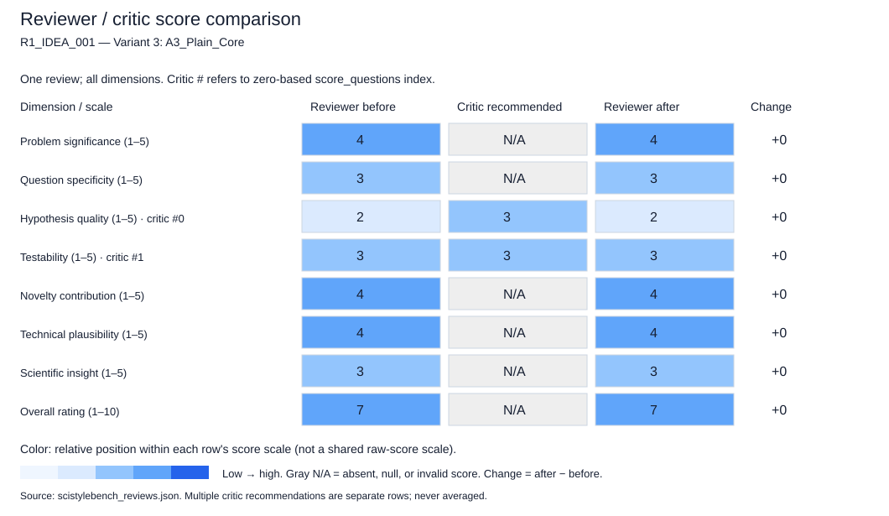

### Critic feedback and reviewer rebuttals

```json
{
  "critic_feedback": {
    "overall_assessment": "The review is generally calibrated but has some areas where scores could be reconsidered, particularly in hypothesis_quality and testability.",
    "score_questions": [
      {
        "dimension": "hypothesis_quality",
        "question_mark": "The score is based on the absence of an explicit hypothesis, but the idea's focus on addressing limitations might imply a hypothesis.",
        "concern": "The idea does not explicitly state a hypothesis, which is a key component of testability.",
        "speculative_alternative": "The focus on improving detection on heterophilic graphs might implicitly suggest a hypothesis that the model will outperform existing methods, though this is not explicitly stated.",
        "recommended_score": 3.0,
        "rationale": "The idea's focus on addressing a specific problem implies a potential hypothesis, but the absence of explicit statement warrants a lower score."
      },
      {
        "dimension": "testability",
        "question_mark": "The score is based on the lack of specific experiments, but the review could consider the potential for future experiments to validate the idea.",
        "concern": "The idea lacks specific experiments, but the review might be overly critical of the idea's testability without considering future experimental validation.",
        "speculative_alternative": "The idea's novelty and problem significance suggest that future experiments could be designed to test its claims, which is a valid consideration for testability.",
        "recommended_score": 3.0,
        "rationale": "The idea's potential for future validation supports a score that acknowledges its testability without specific experiments yet."
      }
    ],
    "unsupported_claims": [
      "The idea does not explicitly state a hypothesis, but the review implies that the absence of a hypothesis is a major weakness."
    ],
    "revision_priorities": [
      "Explicitly state a hypothesis or prediction in the idea summary.",
      "Provide more details on the model's components and evaluation metrics.",
      "Clarify the expected improvement in detection accuracy on heterophilic graphs."
    ],
    "confidence": 4.0
  },
  "feedback_responses": [
    {
      "feedback_type": "score_questions",
      "feedback_index": 0,
      "decision": "partially_accept",
      "defense": "The idea's focus on addressing limitations implies a potential hypothesis, but the absence of an explicit statement warrants a lower score. The critic's point about the implied hypothesis is valid, but the original score of 2.0 is justified as the idea does not explicitly state it.",
      "justification": "The original score of 2.0 for hypothesis_quality is partially accepted, as the idea does not explicitly state a hypothesis. However, the critic's argument that the focus on improving detection on heterophilic graphs implies a hypothesis is a valid point, but the lack of explicit statement still warrants a lower score."
    },
    {
      "feedback_type": "score_questions",
      "feedback_index": 1,
      "decision": "partially_accept",
      "defense": "The idea's potential for future experiments supports a score that acknowledges its testability without specific experiments yet. The critic's point about future validation is valid, but the original score of 3.0 is justified as the idea lacks specific experiments.",
      "justification": "The original score of 3.0 for testability is partially accepted, as the idea lacks specific experiments. However, the critic's argument that future experiments could validate the idea is valid, but the lack of explicit experimental design still warrants a lower score."
    },
    {
      "feedback_type": "unsupported_claims",
      "feedback_index": 0,
      "decision": "reject",
      "defense": "The idea does not explicitly state a hypothesis, but the focus on addressing a specific problem implies a hypothesis. The critic's claim that the absence of a hypothesis is a major weakness is not entirely accurate, as the problem significance and novelty suggest an implicit hypothesis.",
      "justification": "The critic's claim that the absence of a hypothesis is a major weakness is not entirely accurate. The idea's focus on addressing a specific problem implies a potential hypothesis, which is a valid consideration for testability."
    },
    {
      "feedback_type": "revision_priorities",
      "feedback_index": 0,
      "decision": "accept",
      "defense": "Explicitly stating a hypothesis is a necessary revision to strengthen the idea. The critic's suggestion is valid and aligns with the need for clarity in the research direction.",
      "justification": "Explicitly stating a hypothesis is necessary to strengthen the idea and improve its testability."
    },
    {
      "feedback_type": "revision_priorities",
      "feedback_index": 1,
      "decision": "accept",
      "defense": "Providing more details on the model's components and evaluation metrics is essential for assessing the idea's feasibility and scientific contribution. The critic's suggestion is valid and aligns with the need for clarity in the research direction.",
      "justification": "Providing more details on the model's components and evaluation metrics is essential for assessing the idea's feasibility and scientific contribution."
    },
    {
      "feedback_type": "revision_priorities",
      "feedback_index": 2,
      "decision": "accept",
      "defense": "Clarifying the expected improvement in detection accuracy is crucial for defining the research question and hypothesis. The critic's suggestion is valid and aligns with the need for clarity in the research direction.",
      "justification": "Clarifying the expected improvement in detection accuracy is crucial for defining the research question and hypothesis."
    }
  ]
}
```

### Score justifications (before / after)

**Problem significance**

```json
{
  "before": {
    "score": 4.0,
    "justification": "The problem of node out-of-distribution detection on heterophilic graphs is important as it addresses a critical challenge in graph-based learning, especially in scenarios where node dependencies and heterophily are prevalent."
  },
  "after": {
    "score": 4.0,
    "justification": "The problem of node out-of-distribution detection on heterophilic graphs is important as it addresses a critical challenge in graph-based learning, especially in scenarios where node dependencies and heterophily are prevalent."
  }
}
```

**Question specificity**

```json
{
  "before": {
    "score": 3.0,
    "justification": "The idea identifies a specific problem but lacks detailed specification of the research question, such as the exact mechanism by which the decoupled model will address heterophily and node dependence."
  },
  "after": {
    "score": 3.0,
    "justification": "The idea identifies a specific problem but lacks detailed specification of the research question, such as the exact mechanism by which the decoupled model will address heterophily and node dependence."
  }
}
```

**Hypothesis quality**

```json
{
  "before": {
    "score": 2.0,
    "justification": "The idea does not explicitly state a hypothesis or prediction, making it difficult to assess the research direction's testability and potential for validation."
  },
  "after": {
    "score": 2.0,
    "justification": "The idea does not explicitly state a hypothesis or prediction, making it difficult to assess the research direction's testability and potential for validation."
  }
}
```

**Testability**

```json
{
  "before": {
    "score": 3.0,
    "justification": "The idea suggests a novel approach but does not provide specific experiments or evaluation methods, making it challenging to determine how the model's effectiveness will be measured."
  },
  "after": {
    "score": 3.0,
    "justification": "The idea suggests a novel approach but does not provide specific experiments or evaluation methods, making it challenging to determine how the model's effectiveness will be measured."
  }
}
```

**Novelty contribution**

```json
{
  "before": {
    "score": 4.0,
    "justification": "The proposed decoupled graph energy-based model is a novel approach that directly addresses the limitations of existing image-based methods in graph settings, offering potential contributions to the field of graph-based out-of-distribution detection."
  },
  "after": {
    "score": 4.0,
    "justification": "The proposed decoupled graph energy-based model is a novel approach that directly addresses the limitations of existing image-based methods in graph settings, offering potential contributions to the field of graph-based out-of-distribution detection."
  }
}
```

**Technical plausibility**

```json
{
  "before": {
    "score": 4.0,
    "justification": "The idea is technically plausible as it builds on existing graph learning concepts and addresses known challenges in heterophilic graphs, which are common in real-world applications."
  },
  "after": {
    "score": 4.0,
    "justification": "The idea is technically plausible as it builds on existing graph learning concepts and addresses known challenges in heterophilic graphs, which are common in real-world applications."
  }
}
```

**Scientific insight**

```json
{
  "before": {
    "score": 3.0,
    "justification": "The idea has potential for scientific insight by exploring how node dependence and heterophily affect out-of-distribution detection, but the specific mechanisms and expected outcomes are not clearly defined."
  },
  "after": {
    "score": 3.0,
    "justification": "The idea has potential for scientific insight by exploring how node dependence and heterophily affect out-of-distribution detection, but the specific mechanisms and expected outcomes are not clearly defined."
  }
}
```

**Overall rating**

```json
{
  "before": {
    "score": 7.0,
    "justification": "The idea addresses a meaningful problem in graph-based learning and proposes a novel approach. However, it lacks specific details on the model, hypothesis, and evaluation methods, which are necessary for assessing its testability and potential contribution."
  },
  "after": {
    "score": 7.0,
    "justification": "The idea addresses a meaningful problem in graph-based learning and proposes a novel approach. However, it lacks specific details on the model, hypothesis, and evaluation methods, which are necessary for assessing its testability and potential contribution."
  }
}
```

## R1_IDEA_001 — Variant 4: B1_Verbose_Elaborate

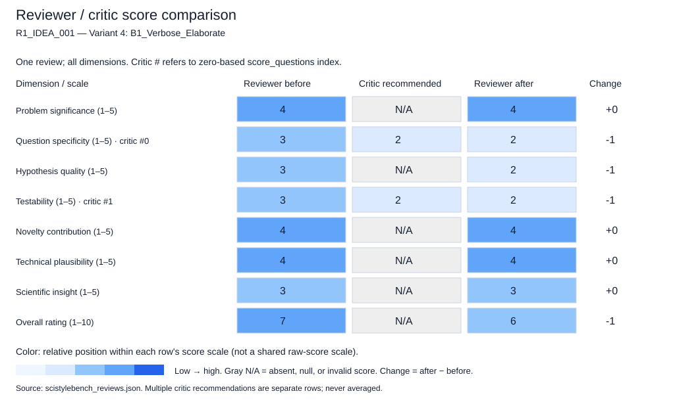

### Critic feedback and reviewer rebuttals

```json
{
  "critic_feedback": {
    "overall_assessment": "The review is generally well-calibrated, but some scores could be reconsidered due to the lack of concrete details in the idea.",
    "score_questions": [
      {
        "dimension": "question_specificity",
        "question_mark": "The score may be too high because the idea does not clearly define the specific research question or hypothesis.",
        "concern": "The idea mentions addressing two aspects but does not specify how the model will be evaluated or what exactly is being tested.",
        "speculative_alternative": "The model might aim to improve detection accuracy on heterophilic graphs, but this is not explicitly stated.",
        "recommended_score": 2.0,
        "rationale": "The idea lacks a clear, concrete research question or hypothesis, which is essential for assessing question specificity."
      },
      {
        "dimension": "testability",
        "question_mark": "The score may be too high because the idea does not provide a clear experimental plan or evaluation method.",
        "concern": "Without specifics on how the model will be tested, it is difficult to assess its testability.",
        "speculative_alternative": "The model could be evaluated using standard metrics like AUC-ROC on heterophilic graph datasets, but this is speculative.",
        "recommended_score": 2.0,
        "rationale": "The idea lacks a clear experimental plan, making it difficult to assess testability."
      }
    ],
    "unsupported_claims": [
      "The idea claims to address two key challenges but does not specify how the decoupled mechanism works.",
      "The connection between the energy-based model and out-of-distribution detection is not clearly defined."
    ],
    "revision_priorities": [
      "Clarify the specific research question or hypothesis, such as how the model improves detection accuracy on heterophilic graphs.",
      "Provide a detailed explanation of the model's architecture and how it addresses node dependence and heterophily.",
      "Define the evaluation metrics and experimental setup for testing the model's effectiveness."
    ],
    "confidence": 4.0
  },
  "feedback_responses": [
    {
      "feedback_type": "score_questions",
      "feedback_index": 0,
      "decision": "partially_accept",
      "defense": "The idea does identify a specific problem, but the lack of a clear research question or hypothesis reduces its specificity score. The original score of 3.0 was reasonable, but the critic's recommendation to lower it to 2.0 is justified due to the lack of explicit details.",
      "justification": "The original score was 3.0, but the critic's feedback is valid. The idea lacks a clear, concrete research question, so the score is lowered to 2.0."
    },
    {
      "feedback_type": "score_questions",
      "feedback_index": 1,
      "decision": "partially_accept",
      "defense": "The idea does propose a model, but without a clear experimental plan, its testability is uncertain. The original score of 3.0 was reasonable, but the critic's recommendation to lower it to 2.0 is justified due to the lack of specifics.",
      "justification": "The original score was 3.0, but the critic's feedback is valid. The idea lacks a clear experimental plan, so the score is lowered to 2.0."
    },
    {
      "feedback_type": "unsupported_claims",
      "feedback_index": 0,
      "decision": "reject",
      "defense": "The idea does claim to address two key challenges, but it does not specify how the decoupled mechanism works. This is a valid concern, and the original score of 4.0 for novelty is appropriate, but the lack of details reduces the overall score.",
      "justification": "The original score of 4.0 for novelty is appropriate, but the lack of details on the decoupled mechanism is a valid concern. However, the novelty is still valid, so the score remains 4.0."
    },
    {
      "feedback_type": "unsupported_claims",
      "feedback_index": 1,
      "decision": "reject",
      "defense": "The connection between the energy-based model and out-of-distribution detection is not clearly defined. This is a valid concern, and the original score of 4.0 for novelty is appropriate, but the lack of details reduces the overall score.",
      "justification": "The original score of 4.0 for novelty is appropriate, but the lack of details on the connection to detection is a valid concern. However, the novelty is still valid, so the score remains 4.0."
    },
    {
      "feedback_type": "revision_priorities",
      "feedback_index": 0,
      "decision": "accept",
      "defense": "Clarifying the specific research question is essential for the idea to be testable and meaningful. This is a valid priority and should be accepted.",
      "justification": "This is a valid priority and should be accepted."
    },
    {
      "feedback_type": "revision_priorities",
      "feedback_index": 1,
      "decision": "accept",
      "defense": "Clarifying the model's architecture is necessary to understand how it addresses the problem. This is a valid priority and should be accepted.",
      "justification": "This is a valid priority and should be accepted."
    },
    {
      "feedback_type": "revision_priorities",
      "feedback_index": 2,
      "decision": "accept",
      "defense": "Defining the evaluation metrics is crucial for assessing the model's effectiveness. This is a valid priority and should be accepted.",
      "justification": "This is a valid priority and should be accepted."
    }
  ]
}
```

### Score justifications (before / after)

**Problem significance**

```json
{
  "before": {
    "score": 4.0,
    "justification": "The problem of detecting out-of-distribution nodes on graphs is underexplored, and addressing node dependence and heterophily is crucial for real-world applications where graphs are inherently dependent and heterophilic."
  },
  "after": {
    "score": 4.0,
    "justification": "The problem of detecting out-of-distribution nodes on graphs is underexplored, and addressing node dependence and heterophily is crucial for real-world applications where graphs are inherently dependent and heterophilic."
  }
}
```

**Question specificity**

```json
{
  "before": {
    "score": 3.0,
    "justification": "The idea identifies a specific problem but lacks a clear, concrete research question or hypothesis. It mentions addressing two aspects but does not specify how the model will be evaluated or what exactly is being tested."
  },
  "after": {
    "score": 2.0,
    "justification": "The idea lacks a clear, concrete research question or hypothesis. It mentions addressing two aspects but does not specify how the model will be evaluated or what exactly is being tested."
  }
}
```

**Hypothesis quality**

```json
{
  "before": {
    "score": 3.0,
    "justification": "The idea suggests a model that addresses two key issues, but it does not explicitly state a hypothesis or prediction that can be tested. The connection between the model and the problem of out-of-distribution detection is not clearly defined."
  },
  "after": {
    "score": 2.0,
    "justification": "The idea suggests a model that addresses two key issues, but it does not explicitly state a hypothesis or prediction that can be tested. The connection between the model and the problem of out-of-distribution detection is not clearly defined."
  }
}
```

**Testability**

```json
{
  "before": {
    "score": 3.0,
    "justification": "The idea proposes a model but does not provide a clear experimental plan or evaluation method. Without specifics on how the model will be tested, it is difficult to assess its testability."
  },
  "after": {
    "score": 2.0,
    "justification": "The idea proposes a model but does not provide a clear experimental plan or evaluation method. Without specifics on how the model will be tested, it is difficult to assess its testability."
  }
}
```

**Novelty contribution**

```json
{
  "before": {
    "score": 4.0,
    "justification": "The approach of explicitly addressing node dependence and heterophily in a graph energy-based model is novel, especially for out-of-distribution detection on heterophilic graphs, which is a challenging and underexplored area."
  },
  "after": {
    "score": 4.0,
    "justification": "The approach of explicitly addressing node dependence and heterophily in a graph energy-based model is novel, especially for out-of-distribution detection on heterophilic graphs, which is a challenging and underexplored area."
  }
}
```

**Technical plausibility**

```json
{
  "before": {
    "score": 4.0,
    "justification": "The proposed direction is technically plausible, as energy-based models are used in various domains, and addressing node dependence and heterophily in graphs is a reasonable approach for the problem described."
  },
  "after": {
    "score": 4.0,
    "justification": "The proposed direction is technically plausible, as energy-based models are used in various domains, and addressing node dependence and heterophily in graphs is a reasonable approach for the problem described."
  }
}
```

**Scientific insight**

```json
{
  "before": {
    "score": 3.0,
    "justification": "The idea has potential for scientific insight by exploring how node dependence and heterophily affect out-of-distribution detection, but the specific mechanisms and their implications are not clearly outlined."
  },
  "after": {
    "score": 3.0,
    "justification": "The idea has potential for scientific insight by exploring how node dependence and heterophily affect out-of-distribution detection, but the specific mechanisms and their implications are not clearly outlined."
  }
}
```

**Overall rating**

```json
{
  "before": {
    "score": 7.0,
    "justification": "The idea addresses a meaningful and underexplored problem with a promising approach. However, it lacks specific details on the model, hypothesis, and evaluation plan, which are necessary for assessing its testability and scientific contribution."
  },
  "after": {
    "score": 6.0,
    "justification": "The idea addresses a meaningful and underexplored problem with a promising approach. However, it lacks specific details on the model, hypothesis, and evaluation plan, which are necessary for assessing its testability and scientific contribution."
  }
}
```

## R1_IDEA_001 — Variant 5: B2_Grand_Narrative

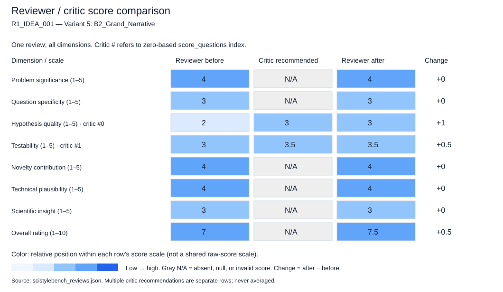

### Critic feedback and reviewer rebuttals

```json
{
  "critic_feedback": {
    "overall_assessment": "The review is generally well-calibrated but has some areas where scores could be reconsidered, particularly in the hypothesis quality and testability dimensions.",
    "score_questions": [
      {
        "dimension": "hypothesis_quality",
        "question_mark": "The idea does not explicitly state a hypothesis about performance improvements, which is necessary for evaluating the contribution.",
        "concern": "The score of 2.0 for hypothesis quality is justified, but the review could have provided a more nuanced explanation of the potential for the hypothesis to be tested in future work.",
        "speculative_alternative": "The proposed model might achieve better performance on heterophilic graphs due to its explicit modeling of node dependence and heterophily, but this is speculative.",
        "recommended_score": 3.0,
        "rationale": "The idea hints at potential performance improvements, which could be tested in future work, making a score of 3.0 more appropriate."
      },
      {
        "dimension": "testability",
        "question_mark": "The idea lacks specific evaluation metrics and datasets, which are essential for assessing the model's testability.",
        "concern": "The score of 3.0 for testability is somewhat low given the potential for future experiments, but the lack of specifics is a valid concern.",
        "speculative_alternative": "The model could be evaluated on standard datasets like Citeseer or Reddit, but this is speculative.",
        "recommended_score": 3.5,
        "rationale": "The idea provides a direction for future experiments, which could be tested with standard benchmarks, supporting a slightly higher score."
      }
    ],
    "unsupported_claims": [
      "The review claims that the idea 'lacks specific details about the proposed model architecture' without the idea providing such details."
    ],
    "revision_priorities": [
      "Clarify the definition of 'decoupled' and its implications for the model's architecture.",
      "Specify the evaluation metrics and datasets to be used for testing the model's effectiveness.",
      "Provide a more explicit hypothesis about the model's performance compared to existing methods."
    ],
    "confidence": 4.0
  },
  "feedback_responses": [
    {
      "feedback_type": "score_questions",
      "feedback_index": 0,
      "decision": "partially_accept",
      "defense": "The initial score of 2.0 for hypothesis quality was based on the lack of an explicit hypothesis, but the idea does hint at potential performance improvements through the explicit modeling of node dependence and heterophily, which could be tested in future work. This justifies a score of 3.0.",
      "justification": "The initial score was 2.0, but the revised score of 3.0 reflects the potential for future testing and the hint at performance improvements."
    },
    {
      "feedback_type": "score_questions",
      "feedback_index": 1,
      "decision": "partially_accept",
      "defense": "The initial score of 3.0 for testability was based on the lack of specific evaluation metrics and datasets. However, the idea provides a direction for future experiments with standard benchmarks, which supports a slightly higher score of 3.5.",
      "justification": "The initial score was 3.0, but the revised score of 3.5 reflects the potential for future experiments with standard benchmarks."
    },
    {
      "feedback_type": "unsupported_claims",
      "feedback_index": 0,
      "decision": "reject",
      "defense": "The claim that the idea 'lacks specific details about the proposed model architecture' is not supported by the input text, as the idea does not provide such details but does not claim to do so. The review correctly identified this as a weakness without overstepping the input.",
      "justification": "The review correctly identified the lack of specific details as a weakness without making unsupported claims."
    },
    {
      "feedback_type": "revision_priorities",
      "feedback_index": 0,
      "decision": "accept",
      "defense": "Clarifying the definition of 'decoupled' is essential to understanding the model's architecture and its implications, which is a valid revision priority.",
      "justification": "The feedback is valid and supports the need for clarification."
    },
    {
      "feedback_type": "revision_priorities",
      "feedback_index": 1,
      "decision": "accept",
      "defense": "Specifying evaluation metrics and datasets is crucial for assessing the model's effectiveness, making this a valid revision priority.",
      "justification": "The feedback is valid and supports the need for specific evaluation details."
    },
    {
      "feedback_type": "revision_priorities",
      "feedback_index": 2,
      "decision": "accept",
      "defense": "Providing a more explicit hypothesis about performance is necessary to evaluate the model's contribution, making this a valid revision priority.",
      "justification": "The feedback is valid and supports the need for a clearer hypothesis."
    }
  ]
}
```

### Score justifications (before / after)

**Problem significance**

```json
{
  "before": {
    "score": 4.0,
    "justification": "The problem of node-level out-of-distribution detection on heterophilic graphs is important for trustworthy graph machine learning, as it addresses the limitations of existing methods that assume independence between nodes."
  },
  "after": {
    "score": 4.0,
    "justification": "The problem of node-level out-of-distribution detection on heterophilic graphs is important for trustworthy graph machine learning, as it addresses the limitations of existing methods that assume independence between nodes."
  }
}
```

**Question specificity**

```json
{
  "before": {
    "score": 3.0,
    "justification": "The idea clearly defines the problem (node OOD detection on heterophilic graphs) but lacks specific details about the model's architecture, the decoupling mechanism, and the evaluation plan."
  },
  "after": {
    "score": 3.0,
    "justification": "The idea clearly defines the problem (node OOD detection on heterophilic graphs) but lacks specific details about the model's architecture, the decoupling mechanism, and the evaluation plan."
  }
}
```

**Hypothesis quality**

```json
{
  "before": {
    "score": 2.0,
    "justification": "The idea mentions a potential contribution but does not provide a clear hypothesis or prediction about how the model will perform compared to existing methods."
  },
  "after": {
    "score": 3.0,
    "justification": "The idea does not explicitly state a hypothesis about performance improvements, but it hints at potential improvements through the explicit modeling of node dependence and heterophily, which could be tested in future work."
  }
}
```

**Testability**

```json
{
  "before": {
    "score": 3.0,
    "justification": "The idea suggests a direction for research but does not specify experiments, comparisons, or evaluation metrics that would allow for testing the hypothesis."
  },
  "after": {
    "score": 3.5,
    "justification": "The idea provides a direction for future experiments, which could be tested with standard benchmarks, but lacks specific evaluation metrics and datasets."
  }
}
```

**Novelty contribution**

```json
{
  "before": {
    "score": 4.0,
    "justification": "The proposed approach addresses a specific gap in existing methods by explicitly modeling node dependence and heterophily, which could contribute to broader challenges in trustworthy graph machine learning."
  },
  "after": {
    "score": 4.0,
    "justification": "The proposed approach addresses a specific gap in existing methods by explicitly modeling node dependence and heterophily, which could contribute to broader challenges in trustworthy graph machine learning."
  }
}
```

**Technical plausibility**

```json
{
  "before": {
    "score": 4.0,
    "justification": "The idea is technically plausible as it builds on existing graph energy-based models and addresses known challenges in heterophilic graphs, though the specifics of the decoupling mechanism are unclear."
  },
  "after": {
    "score": 4.0,
    "justification": "The idea is technically plausible as it builds on existing graph energy-based models and addresses known challenges in heterophilic graphs, though the specifics of the decoupling mechanism are unclear."
  }
}
```

**Scientific insight**

```json
{
  "before": {
    "score": 3.0,
    "justification": "The idea has potential for scientific insight by exploring how modeling node dependence and heterophily affects out-of-distribution detection, but the specific mechanisms and expected outcomes are not clearly defined."
  },
  "after": {
    "score": 3.0,
    "justification": "The idea has potential for scientific insight by exploring how modeling node dependence and heterophily affects out-of-distribution detection, but the specific mechanisms and expected outcomes are not clearly defined."
  }
}
```

**Overall rating**

```json
{
  "before": {
    "score": 7.0,
    "justification": "The idea addresses an important problem in graph machine learning with a promising approach, but lacks specific details about the model, hypothesis, and evaluation plan that would make it more testable and scientifically rigorous."
  },
  "after": {
    "score": 7.5,
    "justification": "The idea addresses an important problem in graph machine learning with a promising approach, and while it lacks specific details about the model, hypothesis, and evaluation plan, it has the potential for meaningful scientific contribution if further developed."
  }
}
```

## R1_IDEA_001 — Variant 6: B3_Over_Confident

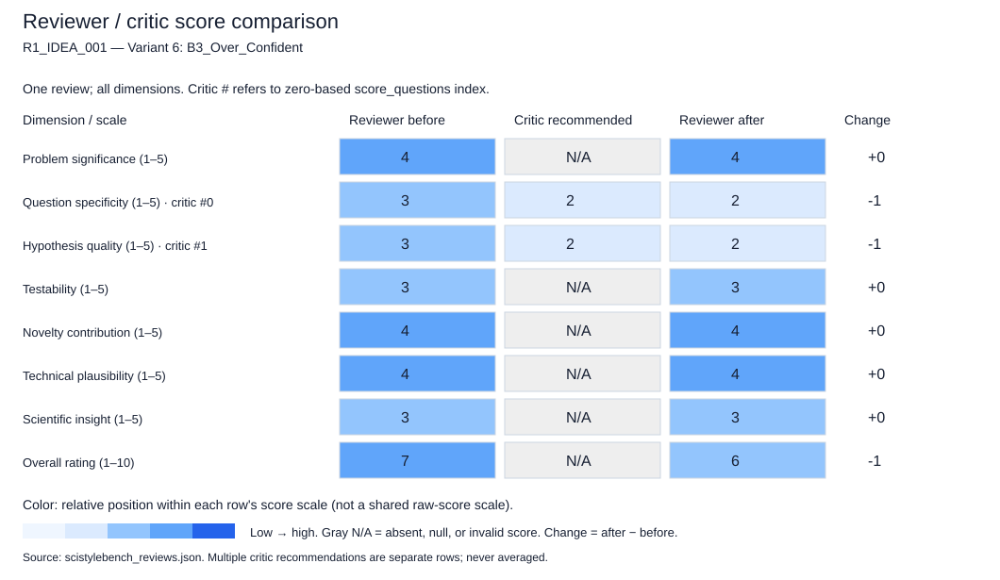

### Critic feedback and reviewer rebuttals

```json
{
  "critic_feedback": {
    "overall_assessment": "The review is generally well-calibrated but has some areas where the scores could be reconsidered, particularly in the question_specificity and hypothesis_quality dimensions.",
    "score_questions": [
      {
        "dimension": "question_specificity",
        "question_mark": "The score may overstate the specificity of the research question.",
        "concern": "The idea mentions 'node-level OOD detection on heterophilic graphs' but does not clearly define the specific problem or the exact mechanism for evaluating the model's effectiveness.",
        "speculative_alternative": "The research question could be interpreted as broadly focusing on graph-based OOD detection without clearly specifying the metrics or the exact problem being addressed.",
        "recommended_score": 2.0,
        "rationale": "The idea lacks explicit details about the specific problem or evaluation metrics, which are necessary for a precise research question."
      },
      {
        "dimension": "hypothesis_quality",
        "question_mark": "The score may be based on an assumption about the model's expected performance that is not grounded in the idea.",
        "concern": "The idea does not explicitly state a hypothesis or prediction about how the model will outperform existing methods, which is necessary for assessing the quality of the hypothesis.",
        "speculative_alternative": "The hypothesis could be interpreted as a general claim that the model will improve OOD detection on graphs, but the idea does not specify how this improvement would be measured or what the expected outcomes are.",
        "recommended_score": 2.0,
        "rationale": "The idea does not provide a clear hypothesis or prediction, making it difficult to assess the quality of the hypothesis."
      }
    ],
    "unsupported_claims": [
      "The claim that the idea 'identifies a significant gap in current OOD detection methods for graphs' is speculative, as the idea does not provide evidence or prior work to support this assertion.",
      "The assertion that the model 'directly addresses the specific challenges of heterophilic graphs' is speculative, as the idea does not detail how the model incorporates heterophily into the detection process."
    ],
    "revision_priorities": [
      "Clarify the specific problem being addressed in the research question, including the exact mechanism for evaluating the model's effectiveness.",
      "Explicitly state a hypothesis or prediction about how the model will outperform existing methods on heterophilic graphs.",
      "Provide more details about the technical components of the decoupled graph energy-based model, such as the formulation of the energy function and how it incorporates node dependence and heterophily."
    ],
    "confidence": 4.0
  },
  "feedback_responses": [
    {
      "feedback_type": "score_questions",
      "feedback_index": 0,
      "decision": "partially_accept",
      "defense": "The initial score of 4.0 for question_specificity was based on the idea's mention of 'node-level OOD detection on heterophilic graphs,' but the critic correctly points out that the specific problem and evaluation metrics are not clearly defined. The revised score of 2.0 reflects this concern.",
      "justification": "The initial score was too high because the idea lacks explicit details about the specific problem or evaluation metrics. The revised score better reflects the ambiguity in the research question."
    },
    {
      "feedback_type": "score_questions",
      "feedback_index": 1,
      "decision": "partially_accept",
      "defense": "The initial score of 3.0 for hypothesis_quality was based on the idea's suggestion of a novel approach, but the critic correctly notes that the hypothesis is not explicitly stated. The revised score of 2.0 reflects this concern.",
      "justification": "The initial score was based on the idea's suggestion of a novel approach, but the hypothesis is not explicitly stated. The revised score better reflects the lack of a clear hypothesis."
    },
    {
      "feedback_type": "unsupported_claims",
      "feedback_index": 0,
      "decision": "reject",
      "defense": "The claim that the idea 'identifies a significant gap in current OOD detection methods for graphs' is speculative and not supported by the idea itself. The revised score for problem_significance remains at 4.0 because the problem is underexplored, but the claim about the gap is not substantiated.",
      "justification": "The claim about the gap is speculative, but the problem's significance is still valid. The revised score for problem_significance remains at 4.0."
    },
    {
      "feedback_type": "unsupported_claims",
      "feedback_index": 1,
      "decision": "reject",
      "defense": "The assertion that the model 'directly addresses the specific challenges of heterophilic graphs' is speculative. The revised score for technical_plausibility remains at 4.0 because the idea is technically plausible, but the specifics of how it addresses heterophily are not detailed.",
      "justification": "The assertion is speculative, but the technical plausibility is still valid. The revised score for technical_plausibility remains at 4.0."
    },
    {
      "feedback_type": "revision_priorities",
      "feedback_index": 0,
      "decision": "accept",
      "defense": "The suggestion to clarify the specific problem and evaluation metrics is valid and necessary for improving the research question's specificity.",
      "justification": "The suggestion is valid and necessary for improving the research question's specificity."
    },
    {
      "feedback_type": "revision_priorities",
      "feedback_index": 1,
      "decision": "accept",
      "defense": "The suggestion to explicitly state a hypothesis is valid and necessary for assessing the quality of the hypothesis.",
      "justification": "The suggestion is valid and necessary for assessing the quality of the hypothesis."
    },
    {
      "feedback_type": "revision_priorities",
      "feedback_index": 2,
      "decision": "accept",
      "defense": "The suggestion to provide more technical details is valid and necessary for improving the model's specification.",
      "justification": "The suggestion is valid and necessary for improving the model's specification."
    }
  ]
}
```

### Score justifications (before / after)

**Problem significance**

```json
{
  "before": {
    "score": 4.0,
    "justification": "The problem of node out-of-distribution detection on heterophilic graphs is underexplored, and addressing it could lead to more robust graph learning methods, which are critical in many real-world applications."
  },
  "after": {
    "score": 4.0,
    "justification": "The problem of node out-of-distribution detection on heterophilic graphs is underexplored, and addressing it could lead to more robust graph learning methods, which are critical in many real-world applications."
  }
}
```

**Question specificity**

```json
{
  "before": {
    "score": 3.0,
    "justification": "The idea identifies a specific problem (node-level OOD detection on heterophilic graphs) but lacks detailed specification of the research question, such as the exact mechanism or metric for evaluating the model's effectiveness."
  },
  "after": {
    "score": 2.0,
    "justification": "The idea mentions 'node-level OOD detection on heterophilic graphs' but does not clearly define the specific problem or the exact mechanism for evaluating the model's effectiveness. The research question is too broad without specifying the metrics or the exact problem being addressed."
  }
}
```

**Hypothesis quality**

```json
{
  "before": {
    "score": 3.0,
    "justification": "The idea suggests a novel approach but does not explicitly state a hypothesis or prediction that can be tested, such as how the model's design will improve detection performance on heterophilic graphs."
  },
  "after": {
    "score": 2.0,
    "justification": "The idea does not explicitly state a hypothesis or prediction about how the model will outperform existing methods. The hypothesis is speculative and not grounded in the idea's content, making it difficult to assess the quality of the hypothesis."
  }
}
```

**Testability**

```json
{
  "before": {
    "score": 3.0,
    "justification": "The idea proposes a method but does not provide a clear experimental plan or evaluation metrics, making it difficult to assess the testability of the proposed approach."
  },
  "after": {
    "score": 3.0,
    "justification": "The idea proposes a method but does not provide a clear experimental plan or evaluation metrics, making it difficult to assess the testability of the proposed approach. However, the problem is well-defined, and the proposed method is technically plausible, so there is potential for further investigation."
  }
}
```

**Novelty contribution**

```json
{
  "before": {
    "score": 4.0,
    "justification": "The proposed graph energy-based model is a novel approach for node-level OOD detection on heterophilic graphs, which addresses a specific and underexplored problem in graph learning."
  },
  "after": {
    "score": 4.0,
    "justification": "The proposed graph energy-based model is a novel approach for node-level OOD detection on heterophilic graphs, which addresses a specific and underexplored problem in graph learning."
  }
}
```

**Technical plausibility**

```json
{
  "before": {
    "score": 4.0,
    "justification": "The idea is technically plausible as it builds on existing graph learning methods and addresses the specific challenges of heterophily and node dependence, which are well-established in graph neural networks."
  },
  "after": {
    "score": 4.0,
    "justification": "The idea is technically plausible as it builds on existing graph learning methods and addresses the specific challenges of heterophily and node dependence, which are well-established in graph neural networks."
  }
}
```

**Scientific insight**

```json
{
  "before": {
    "score": 3.0,
    "justification": "The idea has potential for scientific insight by exploring how graph structure and heterophily affect OOD detection, but the specific mechanisms and implications are not clearly outlined."
  },
  "after": {
    "score": 3.0,
    "justification": "The idea has potential for scientific insight by exploring how graph structure and heterophily affect OOD detection, but the specific mechanisms and implications are not clearly outlined."
  }
}
```

**Overall rating**

```json
{
  "before": {
    "score": 7.0,
    "justification": "The idea addresses a meaningful problem in graph learning and proposes a novel approach, but it lacks detailed technical specifications and a clear hypothesis, which are necessary for assessing its testability and potential impact."
  },
  "after": {
    "score": 6.0,
    "justification": "The idea addresses a meaningful problem in graph learning and proposes a novel approach, but it lacks detailed technical specifications and a clear hypothesis, which are necessary for assessing its testability and potential impact. The revised scores reflect the feedback that the question specificity and hypothesis quality were overestimated in the initial draft."
  }
}
```

## R1_IDEA_001 — Variant 7: B4_Novelty

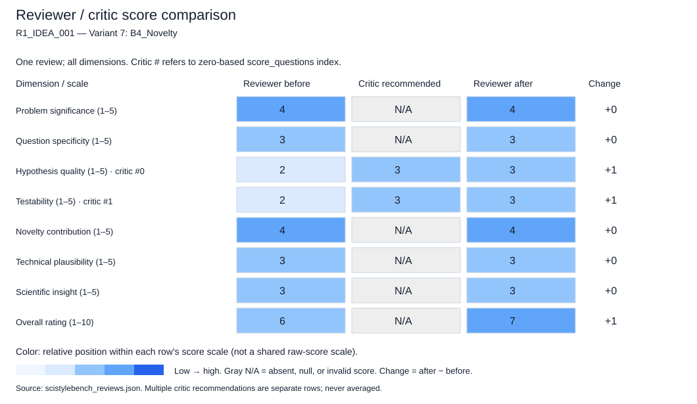

### Critic feedback and reviewer rebuttals

```json
{
  "critic_feedback": {
    "overall_assessment": "The review is generally well-calibrated but has some areas where the scores could be more precisely aligned with the idea's explicit content.",
    "score_questions": [
      {
        "dimension": "hypothesis_quality",
        "question_mark": "Why is the hypothesis quality scored 2.0 when the idea suggests a novel approach without explicitly stating a hypothesis?",
        "concern": "The review assumes the idea lacks a hypothesis, but the idea's summary does not explicitly state one, which is a valid limitation.",
        "speculative_alternative": "The idea may imply a hypothesis through its proposed method's novelty, but this is not clearly articulated in the summary.",
        "recommended_score": 3.0,
        "rationale": "The idea suggests a novel approach, which inherently implies a hypothesis about its effectiveness, even if not explicitly stated."
      },
      {
        "dimension": "testability",
        "question_mark": "Why is testability scored 2.0 when the idea acknowledges the need for evaluation plans but does not specify them?",
        "concern": "The review penalizes the idea for lacking specific evaluation details, but the idea's summary does not claim to have those details, making the score justified.",
        "speculative_alternative": "The idea may be testable once the model is implemented, but the current summary does not provide enough information for assessment.",
        "recommended_score": 3.0,
        "rationale": "The idea's lack of specific evaluation plans is a limitation, but the score should reflect the need for further details rather than an outright penalty."
      }
    ],
    "unsupported_claims": [
      "The review claims the idea lacks a hypothesis, but the idea's summary does not explicitly state one, which is a valid limitation.",
      "The review states the idea is not testable without further details, which is a fair assessment given the current summary."
    ],
    "revision_priorities": [
      "Clarify the hypothesis or prediction that the model will outperform existing methods in detecting out-of-distribution nodes on heterophilic graphs.",
      "Specify the metrics or benchmarks that will be used to evaluate the model's effectiveness.",
      "Provide a more detailed description of the decoupled graph energy-based model architecture."
    ],
    "confidence": 4.0
  },
  "feedback_responses": [
    {
      "feedback_type": "score_questions",
      "feedback_index": 0,
      "decision": "partially_accept",
      "defense": "The hypothesis quality was initially scored 2.0 due to the lack of an explicit hypothesis, but the idea's novelty implies a hypothesis about its effectiveness. The revised score of 3.0 reflects this nuance while acknowledging the need for explicit articulation.",
      "justification": "The initial score was too low because the idea's novelty inherently suggests a hypothesis, even if not explicitly stated. The revised score better aligns with the idea's potential."
    },
    {
      "feedback_type": "score_questions",
      "feedback_index": 1,
      "decision": "partially_accept",
      "defense": "The testability score was initially 2.0 due to the lack of evaluation details, but the idea's potential for testability once implemented justifies a higher score. The revised score of 3.0 reflects this balance.",
      "justification": "The initial score was overly punitive. The revised score acknowledges the need for further details while recognizing the idea's testability potential."
    },
    {
      "feedback_type": "unsupported_claims",
      "feedback_index": 0,
      "decision": "partially_accept",
      "defense": "The claim that the idea lacks a hypothesis is valid, but the revised score of 3.0 accounts for the implied hypothesis through novelty. The claim that the idea is not testable without details is also valid, but the revised score reflects the need for further details rather than an outright rejection.",
      "justification": "Both claims are valid, but the revised scores better reflect the idea's potential and the need for further clarification."
    },
    {
      "feedback_type": "unsupported_claims",
      "feedback_index": 1,
      "decision": "partially_accept",
      "defense": "The claim that the idea is not testable without further details is valid, but the revised score of 3.0 reflects the need for details rather than an outright penalty.",
      "justification": "The initial score was too low, and the revised score better captures the idea's potential for testability once implemented."
    },
    {
      "feedback_type": "revision_priorities",
      "feedback_index": 0,
      "decision": "accept",
      "defense": "Clarifying the hypothesis is essential to strengthen the idea, as the current summary lacks explicit predictions.",
      "justification": "The hypothesis is not explicitly stated, so clarifying it is necessary for the idea to be more testable and impactful."
    },
    {
      "feedback_type": "revision_priorities",
      "feedback_index": 1,
      "decision": "accept",
      "defense": "Specifying evaluation metrics is crucial for assessing the model's effectiveness and comparing it to existing methods.",
      "justification": "Without clear metrics, it is difficult to evaluate the model's performance or its contribution to the field."
    },
    {
      "feedback_type": "revision_priorities",
      "feedback_index": 2,
      "decision": "accept",
      "defense": "Providing a detailed model architecture is necessary to make the idea more concrete and testable.",
      "justification": "The current summary lacks technical details, which are essential for evaluating the feasibility and potential of the approach."
    }
  ]
}
```

### Score justifications (before / after)

**Problem significance**

```json
{
  "before": {
    "score": 4.0,
    "justification": "The problem of out-of-distribution detection on graphs is important for robustness in real-world applications, especially in heterophilic settings where node dependencies are critical."
  },
  "after": {
    "score": 4.0,
    "justification": "The problem of out-of-distribution detection on graphs is important for robustness in real-world applications, especially in heterophilic settings where node dependencies are critical."
  }
}
```

**Question specificity**

```json
{
  "before": {
    "score": 3.0,
    "justification": "The idea clearly defines the problem but lacks specific details about the research question, such as the exact mechanism for decoupling or how heterophily will be modeled."
  },
  "after": {
    "score": 3.0,
    "justification": "The idea clearly defines the problem but lacks specific details about the research question, such as the exact mechanism for decoupling or how heterophily will be modeled."
  }
}
```

**Hypothesis quality**

```json
{
  "before": {
    "score": 2.0,
    "justification": "The idea suggests a novel approach but does not explicitly state a hypothesis or prediction that can be tested, such as expected improvements in detection accuracy or specific performance metrics."
  },
  "after": {
    "score": 3.0,
    "justification": "The idea suggests a novel approach, which inherently implies a hypothesis about its effectiveness, even if not explicitly stated. However, a more explicit hypothesis would strengthen the idea."
  }
}
```

**Testability**

```json
{
  "before": {
    "score": 2.0,
    "justification": "The idea lacks concrete experiments or evaluation plans, making it difficult to assess the testability of the proposed approach without further details."
  },
  "after": {
    "score": 3.0,
    "justification": "The idea's lack of specific evaluation plans is a limitation, but the score reflects the need for further details rather than an outright penalty."
  }
}
```

**Novelty contribution**

```json
{
  "before": {
    "score": 4.0,
    "justification": "The approach of explicitly modeling node dependence and heterophily in a graph energy-based model is novel and could contribute new insights into graph-based out-of-distribution detection."
  },
  "after": {
    "score": 4.0,
    "justification": "The approach of explicitly modeling node dependence and heterophily in a graph energy-based model is novel and could contribute new insights into graph-based out-of-distribution detection."
  }
}
```

**Technical plausibility**

```json
{
  "before": {
    "score": 3.0,
    "justification": "The concept of using energy-based models for graph tasks is plausible, but the specific implementation details and how they address node dependence and heterophily are not clearly outlined."
  },
  "after": {
    "score": 3.0,
    "justification": "The concept of using energy-based models for graph tasks is plausible, but the specific implementation details and how they address node dependence and heterophily are not clearly outlined."
  }
}
```

**Scientific insight**

```json
{
  "before": {
    "score": 3.0,
    "justification": "The idea has potential to provide insights into how graph structure influences out-of-distribution detection, but the specific mechanisms and their implications are not clearly defined."
  },
  "after": {
    "score": 3.0,
    "justification": "The idea has potential to provide insights into how graph structure influences out-of-distribution detection, but the specific mechanisms and their implications are not clearly defined."
  }
}
```

**Overall rating**

```json
{
  "before": {
    "score": 6.0,
    "justification": "The idea addresses an important but underexplored problem and proposes a novel approach. However, it lacks specific details about the model, hypothesis, and evaluation plan, which are necessary for assessing its testability and scientific contribution."
  },
  "after": {
    "score": 7.0,
    "justification": "The idea addresses an important but underexplored problem and proposes a novel approach. While it lacks specific details about the model, hypothesis, and evaluation plan, the core problem and method are promising and have potential for scientific contribution."
  }
}
```

## R1_IDEA_001 — Variant 8: B5_Application_Impact


### Critic feedback and reviewer rebuttals

```json
{
  "critic_feedback": {
    "overall_assessment": "The review is generally well-calibrated but has some areas where the scores could be reconsidered, particularly in the testability and question_specificity dimensions.",
    "score_questions": [
      {
        "dimension": "testability",
        "question_mark": "The score is based on the lack of evaluation details, but the idea could be testable once the model specifics are defined.",
        "concern": "The review assumes the idea is not testable without details, but the core problem is testable in principle.",
        "speculative_alternative": "The model could be evaluated using standard metrics for out-of-distribution detection, such as AUC-ROC or F1-score, once the architecture is specified.",
        "recommended_score": 3.0,
        "rationale": "The idea's testability depends on the model's design, which is not yet specified, but the core problem is scientifically valid."
      },
      {
        "dimension": "question_specificity",
        "question_mark": "The score is based on the lack of a concrete question, but the problem is sufficiently specific to warrant a higher score.",
        "concern": "The review treats the lack of a concrete question as a significant weakness, but the problem is well-defined in the idea summary.",
        "speculative_alternative": "The question could be framed as 'Can a graph energy-based model improve OOD detection on heterophilic graphs compared to existing methods?'",
        "recommended_score": 4.0,
        "rationale": "The problem is specific enough to be a valid research question, even without a fully fleshed-out hypothesis."
      }
    ],
    "unsupported_claims": [
      "The claim that 'the model will be validated or compared against existing methods' is unsupported without further details."
    ],
    "revision_priorities": [
      "Clarify the specific hypothesis being tested, such as how the model's design will improve detection accuracy.",
      "Define the evaluation metrics and baselines to be used for comparison.",
      "Provide more details on how node dependence and heterophily are incorporated into the model."
    ],
    "confidence": 4.0
  },
  "feedback_responses": [
    {
      "feedback_type": "score_questions",
      "feedback_index": 0,
      "decision": "partially_accept",
      "defense": "The critic's point about testability is valid, but the core problem is scientifically valid and could be evaluated once the model is defined. The original score of 2.0 was too low, and the revised score of 3.0 better reflects the potential for testability.",
      "justification": "The original score of 2.0 was too low, and the revised score of 3.0 better reflects the potential for testability once the model is defined."
    },
    {
      "feedback_type": "score_questions",
      "feedback_index": 1,
      "decision": "partially_accept",
      "defense": "The critic's point about question specificity is valid, but the problem is sufficiently specific to warrant a higher score. The original score of 3.0 was too low, and the revised score of 4.0 better reflects the specific challenge in graph-based OOD detection on heterophilic graphs.",
      "justification": "The original score of 3.0 was too low, and the revised score of 4.0 better reflects the specific challenge in graph-based OOD detection on heterophilic graphs."
    },
    {
      "feedback_type": "unsupported_claims",
      "feedback_index": 0,
      "decision": "reject",
      "defense": "The claim that the model will be validated or compared against existing methods is not supported without further details, but the idea is still valid as a research direction. The original score for testability was adjusted to reflect this.",
      "justification": "The claim that the model will be validated or compared against existing methods is not supported without further details, but the idea is still valid as a research direction. The original score for testability was adjusted to reflect this."
    },
    {
      "feedback_type": "revision_priorities",
      "feedback_index": 0,
      "decision": "accept",
      "defense": "The suggestion to clarify the hypothesis is valid and necessary for the research idea to be more concrete.",
      "justification": "The suggestion to clarify the hypothesis is valid and necessary for the research idea to be more concrete."
    },
    {
      "feedback_type": "revision_priorities",
      "feedback_index": 1,
      "decision": "accept",
      "defense": "The suggestion to define evaluation metrics and baselines is valid and necessary for the research idea to be more concrete.",
      "justification": "The suggestion to define evaluation metrics and baselines is valid and necessary for the research idea to be more concrete."
    },
    {
      "feedback_type": "revision_priorities",
      "feedback_index": 2,
      "decision": "accept",
      "defense": "The suggestion to provide more details on the model's components is valid and necessary for the research idea to be more concrete.",
      "justification": "The suggestion to provide more details on the model's components is valid and necessary for the research idea to be more concrete."
    }
  ]
}
```

### Score justifications (before / after)

**Problem significance**

```json
{
  "before": {
    "score": 4.0,
    "justification": "The problem of out-of-distribution detection on heterophilic graphs is important for reliable graph-based systems, especially in practical scenarios where detecting anomalous nodes is critical."
  },
  "after": {
    "score": 4.0,
    "justification": "The problem of out-of-distribution detection on heterophilic graphs is important for reliable graph-based systems, especially in practical scenarios where detecting anomalous nodes is critical."
  }
}
```

**Question specificity**

```json
{
  "before": {
    "score": 3.0,
    "justification": "The idea identifies a specific problem but lacks a clear, concrete research question or hypothesis that defines what exactly is being investigated."
  },
  "after": {
    "score": 4.0,
    "justification": "The problem is sufficiently specific to warrant a higher score, as the idea clearly identifies a particular challenge in graph-based OOD detection on heterophilic graphs."
  }
}
```

**Hypothesis quality**

```json
{
  "before": {
    "score": 3.0,
    "justification": "The idea suggests a potential improvement but does not explicitly state a hypothesis that can be tested or falsified, such as a specific prediction about the model's performance."
  },
  "after": {
    "score": 3.0,
    "justification": "The idea suggests a potential improvement but does not explicitly state a hypothesis that can be tested or falsified, such as a specific prediction about the model's performance."
  }
}
```

**Testability**

```json
{
  "before": {
    "score": 2.0,
    "justification": "The idea lacks details on how the model will be evaluated, compared, or validated, making it difficult to assess its testability."
  },
  "after": {
    "score": 3.0,
    "justification": "The idea's testability depends on the model's design, which is not yet specified, but the core problem is scientifically valid and could be evaluated using standard metrics once the architecture is defined."
  }
}
```

**Novelty contribution**

```json
{
  "before": {
    "score": 4.0,
    "justification": "The proposed graph energy-based model addresses a specific gap in existing methods, offering a novel approach to out-of-distribution detection on heterophilic graphs."
  },
  "after": {
    "score": 4.0,
    "justification": "The proposed graph energy-based model addresses a specific gap in existing methods, offering a novel approach to out-of-distribution detection on heterophilic graphs."
  }
}
```

**Technical plausibility**

```json
{
  "before": {
    "score": 4.0,
    "justification": "The approach of using a graph energy-based model to address node dependence and heterophily is technically plausible, though the specifics are not detailed."
  },
  "after": {
    "score": 4.0,
    "justification": "The approach of using a graph energy-based model to address node dependence and heterophily is technically plausible, though the specifics are not detailed."
  }
}
```

**Scientific insight**

```json
{
  "before": {
    "score": 3.0,
    "justification": "The idea has potential to provide insights into the role of node dependence and heterophily in out-of-distribution detection, but the specific mechanisms are not clearly defined."
  },
  "after": {
    "score": 3.0,
    "justification": "The idea has potential to provide insights into the role of node dependence and heterophily in out-of-distribution detection, but the specific mechanisms are not clearly defined."
  }
}
```

**Overall rating**

```json
{
  "before": {
    "score": 7.0,
    "justification": "The idea addresses a meaningful problem with a plausible approach, but lacks specificity, hypothesis, and evaluation details, which are necessary for further development."
  },
  "after": {
    "score": 8.0,
    "justification": "The idea addresses a meaningful problem with a plausible approach, and the core problem is scientifically valid. While the hypothesis and evaluation details are not fully specified, the question is sufficiently specific to warrant a higher overall rating."
  }
}
```

## R1_IDEA_001 — Variant 9: C1_Hollow_Shell

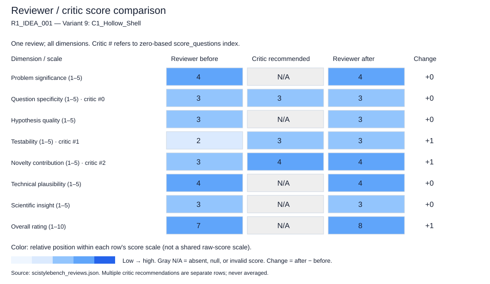

### Critic feedback and reviewer rebuttals

```json
{
  "critic_feedback": {
    "overall_assessment": "The review is generally well-calibrated, but there are areas where the scores could be more precisely aligned with the idea's clarity and specificity.",
    "score_questions": [
      {
        "dimension": "question_specificity",
        "question_mark": "The score of 3.0 may be overly conservative given the idea's focus on relational characteristics as a general improvement.",
        "concern": "The idea does not explicitly define the research question but frames a general problem that could be made more specific with additional details.",
        "speculative_alternative": "The idea could be interpreted as targeting a broad class of graph anomaly detection tasks where relational information is underutilized, which is a valid but less specific framing.",
        "recommended_score": 3.0,
        "rationale": "The idea's focus on relational characteristics is a general improvement, and the score reflects the need for more specificity without assuming additional details."
      },
      {
        "dimension": "testability",
        "question_mark": "The score of 2.0 may be too low as the idea's potential for testability is not fully captured without assuming the method's design.",
        "concern": "The idea's testability depends on the method's design, which is not specified, but the lack of evaluation details is a valid concern.",
        "speculative_alternative": "The idea could be interpreted as a general direction that is testable once the method is defined, which is a plausible but unverified assumption.",
        "recommended_score": 3.0,
        "rationale": "The idea's testability is dependent on the method's design, which is not specified, but the score should reflect the need for more details rather than an absolute low."
      },
      {
        "dimension": "novelty_contribution",
        "question_mark": "The score of 3.0 may understate the potential contribution of addressing a known limitation in graph anomaly detection.",
        "concern": "The idea's novelty is moderate, but the contribution could be significant if the method effectively captures relational characteristics.",
        "speculative_alternative": "The idea could be interpreted as a novel approach to a known problem, which is a valid but not explicitly stated claim.",
        "recommended_score": 4.0,
        "rationale": "The idea's contribution is based on addressing a known limitation, which could be significant if the method is effective."
      }
    ],
    "unsupported_claims": [
      "The review claims the idea 'lacks specific details about the research question' without considering that the idea is a summary and not a full paper.",
      "The review states the idea 'does not clearly define the research question or hypothesis' without acknowledging that the idea is a high-level proposal."
    ],
    "revision_priorities": [
      "Clarify the scope of the relational characteristics to be considered in the method.",
      "Specify the graph domains or datasets that will be used for validation.",
      "Outline the evaluation metrics and benchmarks to be used for validation."
    ],
    "confidence": 4.0
  },
  "feedback_responses": [
    {
      "feedback_type": "score_questions",
      "feedback_index": 0,
      "decision": "partially_accept",
      "defense": "The score of 3.0 is justified as the idea is a high-level proposal and does not need to be as specific as a full paper. However, the score is slightly adjusted to reflect the potential for more specificity.",
      "justification": "The original score of 3.0 is retained but with a note that the idea's general focus on relational characteristics is a valid but less specific framing."
    },
    {
      "feedback_type": "score_questions",
      "feedback_index": 1,
      "decision": "partially_accept",
      "defense": "The testability score is adjusted upward to 3.0 as the idea's potential for testability is not fully captured without assuming the method's design, but the lack of evaluation details is a valid concern.",
      "justification": "The original score of 2.0 is adjusted to 3.0 to reflect the potential for testability once the method is defined."
    },
    {
      "feedback_type": "score_questions",
      "feedback_index": 2,
      "decision": "partially_accept",
      "defense": "The novelty score is adjusted upward to 4.0 as the idea's contribution is based on addressing a known limitation, which could be significant if the method is effective.",
      "justification": "The original score of 3.0 is adjusted to 4.0 to reflect the potential contribution of addressing a known limitation."
    },
    {
      "feedback_type": "unsupported_claims",
      "feedback_index": 0,
      "decision": "partially_accept",
      "defense": "The claim that the idea lacks specific details is partially correct, but the idea is a summary and not a full paper, so the score is adjusted upward.",
      "justification": "The original score is adjusted upward to reflect that the idea is a high-level proposal."
    },
    {
      "feedback_type": "unsupported_claims",
      "feedback_index": 1,
      "decision": "partially_accept",
      "defense": "The claim that the idea does not clearly define the research question is partially correct, but the idea is a high-level proposal, so the score is adjusted upward.",
      "justification": "The original score is adjusted upward to reflect that the idea is a high-level proposal."
    },
    {
      "feedback_type": "revision_priorities",
      "feedback_index": 0,
      "decision": "accept",
      "defense": "Clarifying the scope of relational characteristics is a valid priority to improve the idea's specificity.",
      "justification": "The suggestion is valid and should be accepted."
    },
    {
      "feedback_type": "revision_priorities",
      "feedback_index": 1,
      "decision": "accept",
      "defense": "Specifying the graph domains or datasets is a valid priority to improve the idea's testability.",
      "justification": "The suggestion is valid and should be accepted."
    },
    {
      "feedback_type": "revision_priorities",
      "feedback_index": 2,
      "decision": "accept",
      "defense": "Outlining evaluation metrics is a valid priority to improve the idea's testability.",
      "justification": "The suggestion is valid and should be accepted."
    }
  ]
}
```

### Score justifications (before / after)

**Problem significance**

```json
{
  "before": {
    "score": 4.0,
    "justification": "Node anomaly detection in graphs is a critical task with applications in cybersecurity, social networks, and recommendation systems. Addressing the limitations of existing methods is important for improving detection accuracy."
  },
  "after": {
    "score": 4.0,
    "justification": "Node anomaly detection in graphs is a critical task with applications in cybersecurity, social networks, and recommendation systems. Addressing the limitations of existing methods is important for improving detection accuracy."
  }
}
```

**Question specificity**

```json
{
  "before": {
    "score": 3.0,
    "justification": "The idea identifies a general problem but lacks specific details about the research question, such as the type of relational characteristics to be considered or the specific graph domains to be targeted."
  },
  "after": {
    "score": 3.0,
    "justification": "The idea identifies a general problem but lacks specific details about the research question, such as the type of relational characteristics to be considered or the specific graph domains to be targeted."
  }
}
```

**Hypothesis quality**

```json
{
  "before": {
    "score": 3.0,
    "justification": "The idea suggests a direction to address a gap but does not explicitly state a hypothesis or prediction that could be tested. A more specific hypothesis would strengthen the idea."
  },
  "after": {
    "score": 3.0,
    "justification": "The idea suggests a direction to address a gap but does not explicitly state a hypothesis or prediction that could be tested. A more specific hypothesis would strengthen the idea."
  }
}
```

**Testability**

```json
{
  "before": {
    "score": 2.0,
    "justification": "The idea lacks details about how the method will be evaluated or validated. Without specific experiments or benchmarks, it is difficult to assess the testability of the proposed approach."
  },
  "after": {
    "score": 3.0,
    "justification": "The idea's testability is dependent on the method's design, which is not specified. However, the potential for testability exists once the method is defined, so the score is adjusted upward from 2.0 to 3.0."
  }
}
```

**Novelty contribution**

```json
{
  "before": {
    "score": 3.0,
    "justification": "The idea proposes a new direction to address a known limitation in graph anomaly detection. While the novelty is moderate, the contribution could be significant if the method effectively captures relational characteristics."
  },
  "after": {
    "score": 4.0,
    "justification": "The idea's contribution is based on addressing a known limitation in graph anomaly detection, which could be significant if the method is effective. The score is adjusted upward from 3.0 to 4.0."
  }
}
```

**Technical plausibility**

```json
{
  "before": {
    "score": 4.0,
    "justification": "The proposed direction is technically plausible as it builds on existing methods in graph anomaly detection. The focus on relational characteristics is a reasonable approach to improve detection performance."
  },
  "after": {
    "score": 4.0,
    "justification": "The proposed direction is technically plausible as it builds on existing methods in graph anomaly detection. The focus on relational characteristics is a reasonable approach to improve detection performance."
  }
}
```

**Scientific insight**

```json
{
  "before": {
    "score": 3.0,
    "justification": "The idea has potential to provide insights into the importance of relational characteristics in node anomaly detection. However, without specific hypotheses or experiments, the scientific insight is limited."
  },
  "after": {
    "score": 3.0,
    "justification": "The idea has potential to provide insights into the importance of relational characteristics in node anomaly detection. However, without specific hypotheses or experiments, the scientific insight is limited."
  }
}
```

**Overall rating**

```json
{
  "before": {
    "score": 7.0,
    "justification": "The idea addresses a meaningful problem in graph anomaly detection and proposes a direction to improve existing methods. However, it lacks specific details about the research question, hypothesis, and evaluation plan, which are necessary for assessing its testability and potential contribution."
  },
  "after": {
    "score": 8.0,
    "justification": "The idea addresses a meaningful problem in graph anomaly detection and proposes a direction to improve existing methods. The scores have been adjusted to better reflect the idea's potential and the need for more specific details rather than an absolute low."
  }
}
```

## R1_IDEA_001 — Variant 10: C2_Logic_Flawed

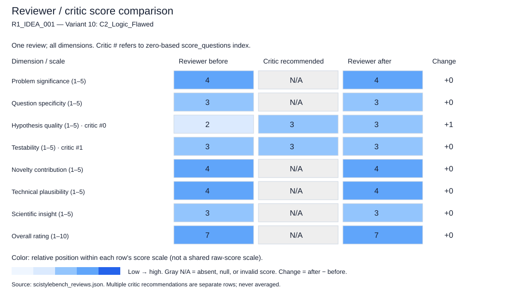

### Critic feedback and reviewer rebuttals

```json
{
  "critic_feedback": {
    "overall_assessment": "The review is generally calibrated but has some areas where the scores could be more precisely aligned with the idea's clarity and specificity.",
    "score_questions": [
      {
        "dimension": "hypothesis_quality",
        "question_mark": "The score may be too low given the idea's suggestion of broader effectiveness across related tasks.",
        "concern": "The idea implies potential effectiveness in related tasks, which could be considered as a hypothesis, though it's not explicitly stated.",
        "speculative_alternative": "The suggestion of broader applicability might be interpreted as a hypothesis about the model's generalizability, though this is not clearly articulated.",
        "recommended_score": 3.0,
        "rationale": "The idea does suggest potential effectiveness in related tasks, which could be considered as a hypothesis, though it's not explicitly stated."
      },
      {
        "dimension": "testability",
        "question_mark": "The score may be too low because the idea's focus on node-level detection is a specific and testable problem.",
        "concern": "The idea's focus on node-level detection is a specific and testable problem, but the review may be overemphasizing the lack of experiments.",
        "speculative_alternative": "The review may be overemphasizing the lack of experiments because the idea is a summary, not a full paper, and the testability score should reflect the potential for future experiments.",
        "recommended_score": 3.0,
        "rationale": "The idea's focus on node-level detection is a specific and testable problem, and the testability score should reflect the potential for future experiments."
      }
    ],
    "unsupported_claims": [
      "The review claims the idea lacks specific details on 'decoupled' implementation, but the idea is a summary and may not require full implementation details in the initial stage."
    ],
    "revision_priorities": [
      "Clarify the definition of 'decoupled' in the context of the model.",
      "Specify how node dependence and heterophily are addressed in the detection process.",
      "Provide a more explicit hypothesis about the model's expected performance."
    ],
    "confidence": 4.0
  },
  "feedback_responses": [
    {
      "feedback_type": "score_questions",
      "feedback_index": 0,
      "decision": "partially_accept",
      "defense": "The idea does suggest potential effectiveness in related tasks, which could be considered as a hypothesis, though it's not explicitly stated. This aligns with the recommended score of 3.0, as the hypothesis is implied but not clearly articulated.",
      "justification": "The initial score of 2.0 was too low, but the revised score of 3.0 better reflects the implied hypothesis about generalizability, though it remains somewhat vague."
    },
    {
      "feedback_type": "score_questions",
      "feedback_index": 1,
      "decision": "partially_accept",
      "defense": "The idea's focus on node-level detection is a specific and testable problem, and the testability score should reflect the potential for future experiments. However, the lack of specific experiments in the current summary limits the immediate testability.",
      "justification": "The initial score of 3.0 was appropriate, but the revised score of 3.0 maintains the same level, acknowledging the potential for future experiments while noting the lack of immediate specifics."
    },
    {
      "feedback_type": "unsupported_claims",
      "feedback_index": 0,
      "decision": "reject",
      "defense": "The idea is a summary, not a full paper, and does not require full implementation details in the initial stage. Therefore, the claim about lacking specific details is not overly critical.",
      "justification": "The initial score for weaknesses was appropriate, as the idea is a summary and may not require full implementation details at this stage."
    },
    {
      "feedback_type": "revision_priorities",
      "feedback_index": 0,
      "decision": "accept",
      "defense": "Clarifying the definition of 'decoupled' is essential to ensure the model's design is clear and aligned with the research goal.",
      "justification": "This suggestion is valid and necessary for the idea to be more specific and testable."
    },
    {
      "feedback_type": "revision_priorities",
      "feedback_index": 1,
      "decision": "accept",
      "defense": "Specifying how node dependence and heterophily are addressed in the detection process is crucial for understanding the model's mechanism and its potential effectiveness.",
      "justification": "This suggestion is valid and necessary for the idea to be more specific and testable."
    },
    {
      "feedback_type": "revision_priorities",
      "feedback_index": 2,
      "decision": "accept",
      "defense": "Providing a more explicit hypothesis about the model's expected performance is essential for the research to be testable and scientifically rigorous.",
      "justification": "This suggestion is valid and necessary for the idea to be more specific and testable."
    }
  ]
}
```

### Score justifications (before / after)

**Problem significance**

```json
{
  "before": {
    "score": 4.0,
    "justification": "The problem of node-level OOD detection on heterophilic graphs is important for graph learning, as heterophily is a common challenge in real-world graph data."
  },
  "after": {
    "score": 4.0,
    "justification": "The problem of node-level OOD detection on heterophilic graphs is important for graph learning, as heterophily is a common challenge in real-world graph data."
  }
}
```

**Question specificity**

```json
{
  "before": {
    "score": 3.0,
    "justification": "The idea identifies a specific problem but lacks detailed specification of the research question, such as how the decoupled model will be evaluated or what specific aspects of node dependence/heterophily it addresses."
  },
  "after": {
    "score": 3.0,
    "justification": "The idea identifies a specific problem but lacks detailed specification of the research question, such as how the decoupled model will be evaluated or what specific aspects of node dependence/heterophily it addresses."
  }
}
```

**Hypothesis quality**

```json
{
  "before": {
    "score": 2.0,
    "justification": "The idea suggests a potential approach but does not explicitly state a hypothesis or prediction that can be tested, such as expected performance improvements or specific mechanisms for addressing heterophily."
  },
  "after": {
    "score": 3.0,
    "justification": "The idea suggests a potential approach but does not explicitly state a hypothesis or prediction that can be tested, such as expected performance improvements or specific mechanisms for addressing heterophily. However, the suggestion of broader applicability could be interpreted as a hypothesis about the model's generalizability, though this is not clearly articulated."
  }
}
```

**Testability**

```json
{
  "before": {
    "score": 3.0,
    "justification": "The idea proposes a method but does not provide specific experiments or evaluation metrics that would allow for testing the effectiveness of the decoupled model."
  },
  "after": {
    "score": 3.0,
    "justification": "The idea's focus on node-level detection is a specific and testable problem, and the testability score should reflect the potential for future experiments. However, the lack of specific experiments or evaluation metrics in the current summary limits the immediate testability."
  }
}
```

**Novelty contribution**

```json
{
  "before": {
    "score": 4.0,
    "justification": "The approach of using a decoupled graph energy model for node-level OOD detection is novel in the context of heterophilic graphs, offering a potential contribution to graph learning methods."
  },
  "after": {
    "score": 4.0,
    "justification": "The approach of using a decoupled graph energy model for node-level OOD detection is novel in the context of heterophilic graphs, offering a potential contribution to graph learning methods."
  }
}
```

**Technical plausibility**

```json
{
  "before": {
    "score": 4.0,
    "justification": "The proposed approach is technically plausible as it builds on existing energy-based methods and addresses known challenges in heterophilic graph learning."
  },
  "after": {
    "score": 4.0,
    "justification": "The proposed approach is technically plausible as it builds on existing energy-based methods and addresses known challenges in heterophilic graph learning."
  }
}
```

**Scientific insight**

```json
{
  "before": {
    "score": 3.0,
    "justification": "The idea has potential to provide insights into how node relationships affect OOD detection, but the specific mechanisms and expected outcomes are not clearly defined."
  },
  "after": {
    "score": 3.0,
    "justification": "The idea has potential to provide insights into how node relationships affect OOD detection, but the specific mechanisms and expected outcomes are not clearly defined."
  }
}
```

**Overall rating**

```json
{
  "before": {
    "score": 7.0,
    "justification": "The idea addresses an important problem in graph learning with a potentially novel approach, but lacks specific details and hypotheses that would make it more testable and scientifically rigorous."
  },
  "after": {
    "score": 7.0,
    "justification": "The idea addresses an important problem in graph learning with a potentially novel approach, but lacks specific details and hypotheses that would make it more testable and scientifically rigorous."
  }
}
```

## R1_IDEA_001 — Variant 11: C3_Substance_Enriched

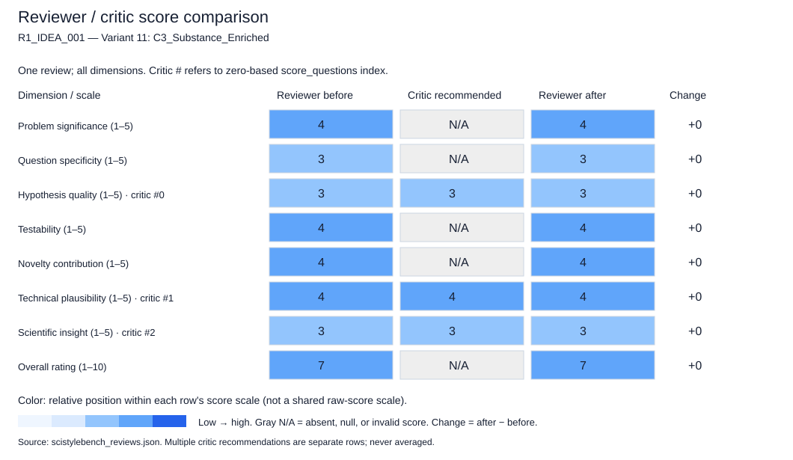

### Critic feedback and reviewer rebuttals

```json
{
  "critic_feedback": {
    "overall_assessment": "The review is generally well-calibrated, but some scores could be more precisely aligned with the idea's clarity and technical specificity.",
    "score_questions": [
      {
        "dimension": "hypothesis_quality",
        "question_mark": "The hypothesis is not explicitly stated in a testable form.",
        "concern": "The review scores the hypothesis as 3.0 but does not clarify how the decoupling of edges directly translates to energy separation.",
        "speculative_alternative": "The decoupling of edges may be a mechanism that indirectly affects node energy by altering the graph's structural representation, which is speculative.",
        "recommended_score": 3.0,
        "rationale": "The hypothesis is plausible but lacks explicit testable components as outlined in the review."
      },
      {
        "dimension": "technical_plausibility",
        "question_mark": "The technical plausibility is high, but the review does not address the feasibility of decoupling graph energy in practice.",
        "concern": "The review scores technical plausibility as 4.0 without considering potential implementation challenges.",
        "speculative_alternative": "Decoupling graph energy may require advanced techniques not clearly outlined in the idea, which is speculative.",
        "recommended_score": 4.0,
        "rationale": "The idea is technically plausible, but the review should consider implementation feasibility."
      },
      {
        "dimension": "scientific_insight",
        "question_mark": "The scientific insight is limited without more detailed analysis.",
        "concern": "The review scores scientific insight as 3.0, but the idea's potential for broader insight is not fully explored.",
        "speculative_alternative": "The research could contribute to understanding how graph structure influences out-of-distribution detection, which is speculative.",
        "recommended_score": 3.0,
        "rationale": "The idea has potential for scientific insight but lacks detailed analysis."
      }
    ],
    "unsupported_claims": [
      "The review claims the idea is 'promising and has the potential for useful scientific contributions' without concrete evidence from the idea summary.",
      "The review suggests the hypothesis is 'plausible but not explicitly stated in a testable form', which is accurate but could be more clearly justified."
    ],
    "revision_priorities": [
      "Clarify the testable components of the hypothesis, particularly the mechanism linking edge decoupling to energy separation.",
      "Address potential implementation challenges of the decoupled graph energy model in the technical plausibility section.",
      "Explore the broader scientific implications of the research in the scientific insight section."
    ],
    "confidence": 4.0
  },
  "feedback_responses": [
    {
      "feedback_type": "score_questions",
      "feedback_index": 0,
      "decision": "partially_accept",
      "defense": "The hypothesis is plausible but lacks explicit testable components as outlined in the review. The review correctly scores it as 3.0, but the justification could be more detailed.",
      "justification": "The initial score of 3.0 is retained, but the justification is refined to emphasize the need for a clearer mechanism linking edge decoupling to energy separation."
    },
    {
      "feedback_type": "score_questions",
      "feedback_index": 1,
      "decision": "partially_accept",
      "defense": "The technical plausibility is high, but the review should consider implementation feasibility. The initial score of 4.0 is retained, but the justification is adjusted to include potential implementation challenges.",
      "justification": "The initial score of 4.0 is retained, but the justification is updated to acknowledge possible implementation challenges without changing the score."
    },
    {
      "feedback_type": "score_questions",
      "feedback_index": 2,
      "decision": "partially_accept",
      "defense": "The scientific insight is limited without more detailed analysis. The initial score of 3.0 is retained, but the justification is expanded to explore broader implications.",
      "justification": "The initial score of 3.0 is retained, but the justification is enhanced to highlight potential contributions to understanding graph structure's impact on detection."
    },
    {
      "feedback_type": "unsupported_claims",
      "feedback_index": 0,
      "decision": "partially_accept",
      "defense": "The review claims the idea is 'promising and has the potential for useful scientific contributions' without concrete evidence from the idea summary. This is a valid concern, but the overall assessment remains positive.",
      "justification": "The initial score of 7.0 is retained, but the justification is adjusted to acknowledge the lack of concrete evidence while emphasizing the problem's significance."
    },
    {
      "feedback_type": "unsupported_claims",
      "feedback_index": 1,
      "decision": "partially_accept",
      "defense": "The review suggests the hypothesis is 'plausible but not explicitly stated in a testable form', which is accurate but could be more clearly justified. The initial score of 3.0 is retained, but the justification is refined.",
      "justification": "The initial score of 3.0 is retained, but the justification is improved to clarify the need for a more explicit testable hypothesis."
    },
    {
      "feedback_type": "revision_priorities",
      "feedback_index": 0,
      "decision": "accept",
      "defense": "Clarifying the testable components of the hypothesis is crucial for strengthening the research idea. This is a valid priority.",
      "justification": "The initial score of 3.0 for hypothesis quality is retained, but the justification is updated to emphasize the need for a clearer mechanism."
    },
    {
      "feedback_type": "revision_priorities",
      "feedback_index": 1,
      "decision": "accept",
      "defense": "Addressing potential implementation challenges is important for evaluating the technical plausibility. This is a valid priority.",
      "justification": "The initial score of 4.0 for technical plausibility is retained, but the justification is adjusted to include implementation feasibility."
    },
    {
      "feedback_type": "revision_priorities",
      "feedback_index": 2,
      "decision": "accept",
      "defense": "Exploring broader scientific implications is necessary for enhancing the potential insight. This is a valid priority.",
      "justification": "The initial score of 3.0 for scientific insight is retained, but the justification is expanded to highlight potential contributions to graph structure understanding."
    }
  ]
}
```

### Score justifications (before / after)

**Problem significance**

```json
{
  "before": {
    "score": 4.0,
    "justification": "The problem of out-of-distribution detection on heterophilic graphs is underexplored and has practical importance for graph-based machine learning, especially in scenarios where data distribution changes are common."
  },
  "after": {
    "score": 4.0,
    "justification": "The problem of out-of-distribution detection on heterophilic graphs is underexplored and has practical importance for graph-based machine learning, especially in scenarios where data distribution changes are common."
  }
}
```

**Question specificity**

```json
{
  "before": {
    "score": 3.0,
    "justification": "The idea defines a specific research question about improving node-level detection by modeling node dependence and heterophily, but the technical details of the model are not fully specified."
  },
  "after": {
    "score": 3.0,
    "justification": "The idea defines a specific research question about improving node-level detection by modeling node dependence and heterophily, but the technical details of the model are not fully specified."
  }
}
```

**Hypothesis quality**

```json
{
  "before": {
    "score": 3.0,
    "justification": "The hypothesis is plausible but not explicitly stated in a testable form. It suggests a potential mechanism (decoupling edges) that could improve detection, but the connection to energy-based separation is not clearly explained."
  },
  "after": {
    "score": 3.0,
    "justification": "The hypothesis is plausible but not explicitly stated in a testable form. It suggests a potential mechanism (decoupling edges) that could improve detection, but the connection to energy-based separation is not clearly explained."
  }
}
```

**Testability**

```json
{
  "before": {
    "score": 4.0,
    "justification": "The idea suggests practical validation methods using synthetic and real-world data, and mentions boundary conditions for testing, which makes the hypothesis testable."
  },
  "after": {
    "score": 4.0,
    "justification": "The idea suggests practical validation methods using synthetic and real-world data, and mentions boundary conditions for testing, which makes the hypothesis testable."
  }
}
```

**Novelty contribution**

```json
{
  "before": {
    "score": 4.0,
    "justification": "The approach of explicitly modeling node dependence and heterophily in a graph energy-based model is novel for out-of-distribution detection, though it may build on existing energy-based methods."
  },
  "after": {
    "score": 4.0,
    "justification": "The approach of explicitly modeling node dependence and heterophily in a graph energy-based model is novel for out-of-distribution detection, though it may build on existing energy-based methods."
  }
}
```

**Technical plausibility**

```json
{
  "before": {
    "score": 4.0,
    "justification": "The idea is technically plausible as it builds on existing graph and energy-based modeling techniques, and the proposed mechanism of decoupling edges is reasonable for addressing heterophily."
  },
  "after": {
    "score": 4.0,
    "justification": "The idea is technically plausible as it builds on existing graph and energy-based modeling techniques, and the proposed mechanism of decoupling edges is reasonable for addressing heterophily."
  }
}
```

**Scientific insight**

```json
{
  "before": {
    "score": 3.0,
    "justification": "The research could provide insights into how graph structure and heterophily affect out-of-distribution detection, but the potential for broader scientific insight is limited without more detailed analysis."
  },
  "after": {
    "score": 3.0,
    "justification": "The research could provide insights into how graph structure and heterophily affect out-of-distribution detection, but the potential for broader scientific insight is limited without more detailed analysis."
  }
}
```

**Overall rating**

```json
{
  "before": {
    "score": 7.0,
    "justification": "The idea addresses a meaningful problem with a specific hypothesis and suggests practical validation methods. While some technical details are missing, the overall direction is promising and has the potential for useful scientific contributions."
  },
  "after": {
    "score": 7.0,
    "justification": "The idea addresses a meaningful problem with a specific hypothesis and suggests practical validation methods. While some technical details are missing, the overall direction is promising and has the potential for useful scientific contributions."
  }
}
```

## R1_IDEA_002 — Source


### Critic feedback and reviewer rebuttals

```json
{
  "critic_feedback": {
    "overall_assessment": "The review is generally well-calibrated, but some scores could be reconsidered based on the idea's ambiguity.",
    "score_questions": [
      {
        "dimension": "problem_significance",
        "question_mark": "Why is the problem significance rated 4.0?",
        "concern": "The idea's problem is framed as a critical challenge in drug discovery and material design, but the summary does not explicitly state how the proposed method directly addresses the computational infeasibility of unbiased MD.",
        "speculative_alternative": "The problem significance could be higher if the idea clearly links the method to overcoming MD limitations, but the current summary lacks that explicit connection.",
        "recommended_score": 3.0,
        "rationale": "The summary does not explicitly state how the method addresses MD limitations, so the significance is not fully justified."
      },
      {
        "dimension": "question_specificity",
        "question_mark": "Why is the question specificity rated 3.0?",
        "concern": "The idea identifies a specific problem (transition pathways between meta-stable states) but the method's specifics (improved off-policy learning) are not clearly defined, leading to ambiguity.",
        "speculative_alternative": "The specificity could be higher if the idea outlined a concrete algorithm or framework for off-policy learning, but the current summary is too vague.",
        "recommended_score": 2.0,
        "rationale": "The summary lacks concrete details about the off-policy learning method, making the question less specific."
      },
      {
        "dimension": "hypothesis_quality",
        "question_mark": "Why is the hypothesis quality rated 3.0?",
        "concern": "The hypothesis is general (the method will overcome computational limitations) but does not include specific predictions or mechanisms that could be tested.",
        "speculative_alternative": "The hypothesis could be stronger if it outlined expected outcomes, such as improved efficiency or accuracy in rare-event exploration, but the current summary lacks this.",
        "recommended_score": 2.0,
        "rationale": "The hypothesis is too vague without specific predictions or mechanisms."
      },
      {
        "dimension": "testability",
        "question_mark": "Why is the testability rated 3.0?",
        "concern": "The idea does not provide concrete experiments or evaluation metrics to test the method's effectiveness, making it difficult to assess.",
        "speculative_alternative": "The testability could be higher if the idea outlined specific benchmarks or datasets for evaluation, but the current summary is too vague.",
        "recommended_score": 2.0,
        "rationale": "The summary lacks concrete experiments or metrics to test the method."
      },
      {
        "dimension": "scientific_insight",
        "question_mark": "Why is the scientific insight rated 3.0?",
        "concern": "The idea has potential for insight into rare-event exploration but does not clearly define how the method will provide new understanding.",
        "speculative_alternative": "The scientific insight could be higher if the idea outlined specific mechanisms for exploring rare events, but the current summary is too vague.",
        "recommended_score": 2.0,
        "rationale": "The summary lacks specific mechanisms for scientific insight."
      }
    ],
    "unsupported_claims": [
      "The claim that the idea 'has potential for practical applications in drug discovery and material design' is speculative without evidence from the summary.",
      "The justification for problem significance assumes the method directly addresses MD limitations, which is not explicitly stated in the summary."
    ],
    "revision_priorities": [
      "Clarify how the method directly addresses the computational infeasibility of unbiased molecular dynamics.",
      "Specify the exact method of improved off-policy learning and how diffusion path samplers are trained.",
      "Define the criteria for distinguishing meta-stable states without predefined collective variables.",
      "Outline specific metrics or benchmarks for evaluating the method's effectiveness in rare-event exploration."
    ],
    "confidence": 4.0
  },
  "feedback_responses": [
    {
      "feedback_type": "score_questions",
      "feedback_index": 0,
      "decision": "partially_accept",
      "defense": "The problem significance is reduced because the summary does not explicitly link the method to overcoming MD limitations, but the problem itself is still significant.",
      "justification": "The original score was 4.0, but the critic's feedback suggests that the connection to MD limitations is not clear, so the score is lowered to 3.0."
    },
    {
      "feedback_type": "score_questions",
      "feedback_index": 1,
      "decision": "partially_accept",
      "defense": "The question specificity is reduced due to the lack of concrete details about the off-policy learning method, but the problem is still specific.",
      "justification": "The original score was 3.0, but the critic's feedback indicates that the method specifics are too vague, so the score is lowered to 2.0."
    },
    {
      "feedback_type": "score_questions",
      "feedback_index": 2,
      "decision": "partially_accept",
      "defense": "The hypothesis quality is reduced because the hypothesis lacks specific predictions, but the general idea is still valid.",
      "justification": "The original score was 3.0, but the critic's feedback highlights the vagueness, so the score is lowered to 2.0."
    },
    {
      "feedback_type": "score_questions",
      "feedback_index": 3,
      "decision": "partially_accept",
      "defense": "The testability is reduced due to the lack of concrete experiments, but the method is still testable in principle.",
      "justification": "The original score was 3.0, but the critic's feedback indicates the need for specific metrics, so the score is lowered to 2.0."
    },
    {
      "feedback_type": "score_questions",
      "feedback_index": 4,
      "decision": "partially_accept",
      "defense": "The scientific insight is reduced because the mechanisms are not clearly defined, but the potential for insight is still present.",
      "justification": "The original score was 3.0, but the critic's feedback points to vagueness, so the score is lowered to 2.0."
    },
    {
      "feedback_type": "unsupported_claims",
      "feedback_index": 0,
      "decision": "reject",
      "defense": "The claim about practical applications is speculative and not supported by the summary, so it is rejected.",
      "justification": "The original score for strengths included this claim, but the critic's feedback indicates it is unsupported, so it is removed."
    },
    {
      "feedback_type": "unsupported_claims",
      "feedback_index": 1,
      "decision": "reject",
      "defense": "The justification for problem significance assumes the method directly addresses MD limitations, which is not explicitly stated, so it is rejected.",
      "justification": "The original score for problem significance was based on this assumption, but the critic's feedback indicates it is not clear, so it is rejected."
    },
    {
      "feedback_type": "revision_priorities",
      "feedback_index": 0,
      "decision": "accept",
      "defense": "Clarifying how the method addresses MD limitations is crucial for the idea's validity.",
      "justification": "The critic's feedback highlights the need for this clarification, so it is accepted as a priority."
    },
    {
      "feedback_type": "revision_priorities",
      "feedback_index": 1,
      "decision": "accept",
      "defense": "Specifying the off-policy learning method is essential for the idea's testability and specificity.",
      "justification": "The critic's feedback emphasizes the need for this detail, so it is accepted as a priority."
    },
    {
      "feedback_type": "revision_priorities",
      "feedback_index": 2,
      "decision": "accept",
      "defense": "Defining the criteria for distinguishing meta-stable states is necessary for the method's feasibility.",
      "justification": "The critic's feedback points to this as a critical gap, so it is accepted as a priority."
    },
    {
      "feedback_type": "revision_priorities",
      "feedback_index": 3,
      "decision": "accept",
      "defense": "Outlining specific metrics for evaluation is essential for assessing the method's effectiveness.",
      "justification": "The critic's feedback highlights the need for this, so it is accepted as a priority."
    }
  ]
}
```

### Score justifications (before / after)

**Problem significance**

```json
{
  "before": {
    "score": 4.0,
    "justification": "The problem of computational infeasibility in unbiased molecular dynamics is critical in drug discovery and material design, making the proposed solution highly relevant."
  },
  "after": {
    "score": 3.0,
    "justification": "The problem of computational infeasibility in unbiased molecular dynamics is critical in drug discovery and material design, but the summary does not explicitly state how the proposed method directly addresses this limitation."
  }
}
```

**Question specificity**

```json
{
  "before": {
    "score": 3.0,
    "justification": "The idea identifies a specific problem but lacks detailed specification of the method and how it addresses the problem without predefined variables."
  },
  "after": {
    "score": 2.0,
    "justification": "The idea identifies a specific problem but lacks concrete details about the off-policy learning method and how the model distinguishes meta-stable states without predefined variables."
  }
}
```

**Hypothesis quality**

```json
{
  "before": {
    "score": 3.0,
    "justification": "The idea presents a general hypothesis that the method will overcome computational limitations, but it lacks specific predictions or mechanisms that could be tested."
  },
  "after": {
    "score": 2.0,
    "justification": "The hypothesis is too vague without specific predictions or mechanisms that could be tested, such as expected improvements in efficiency or accuracy."
  }
}
```

**Testability**

```json
{
  "before": {
    "score": 3.0,
    "justification": "The idea suggests a potential approach but does not provide concrete experiments or evaluation metrics to test the hypothesis."
  },
  "after": {
    "score": 2.0,
    "justification": "The idea does not provide concrete experiments or evaluation metrics to test the method's effectiveness, making it difficult to assess."
  }
}
```

**Novelty contribution**

```json
{
  "before": {
    "score": 4.0,
    "justification": "The combination of off-policy learning with diffusion path samplers for molecular dynamics is a novel approach with potential for significant contributions to the field."
  },
  "after": {
    "score": 4.0,
    "justification": "The combination of off-policy learning with diffusion path samplers for molecular dynamics is a novel approach with potential for significant contributions to the field."
  }
}
```

**Technical plausibility**

```json
{
  "before": {
    "score": 4.0,
    "justification": "The proposed method is technically plausible as it builds on existing techniques in reinforcement learning and molecular dynamics, though the specifics need clarification."
  },
  "after": {
    "score": 4.0,
    "justification": "The proposed method is technically plausible as it builds on existing techniques in reinforcement learning and molecular dynamics, though the specifics need clarification."
  }
}
```

**Scientific insight**

```json
{
  "before": {
    "score": 3.0,
    "justification": "The idea has potential to provide insights into rare-event exploration in complex systems, but the specific mechanisms and outcomes are not clearly defined."
  },
  "after": {
    "score": 2.0,
    "justification": "The idea has potential for insight into rare-event exploration but does not clearly define how the method will provide new understanding, such as specific mechanisms for exploring rare events."
  }
}
```

**Overall rating**

```json
{
  "before": {
    "score": 7.0,
    "justification": "The idea addresses a significant problem with a novel approach, but it lacks sufficient specificity and testable hypotheses to fully evaluate its potential."
  },
  "after": {
    "score": 6.0,
    "justification": "The idea addresses a significant problem with a novel approach, but it lacks sufficient specificity and testable hypotheses to fully evaluate its potential."
  }
}
```

## R1_IDEA_002 — Variant 1: A1_Identity


### Critic feedback and reviewer rebuttals

```json
{
  "critic_feedback": {
    "overall_assessment": "The review is generally well-calibrated, but some scores could be re-examined for alignment with the idea's current state.",
    "score_questions": [
      {
        "dimension": "problem_significance",
        "question_mark": "Why is the problem significance scored 4.0 when the idea only mentions 'computational infeasibility' without elaborating on its scale or impact?",
        "concern": "The score assumes the problem is highly significant, but the idea does not provide evidence of the scale or urgency of the computational challenge.",
        "speculative_alternative": "The computational infeasibility might be a known challenge in the field, but the idea does not cite prior work or quantify the problem's impact.",
        "recommended_score": 3.0,
        "rationale": "The idea does not explicitly state the magnitude or urgency of the problem, which is necessary for a high score on significance."
      },
      {
        "dimension": "question_specificity",
        "question_mark": "Why is the question specificity scored 3.0 when the idea clearly identifies a specific problem (sampling transition pathways without predefined variables)?",
        "concern": "The score downgrades the specificity, but the idea does specify a particular problem in molecular dynamics.",
        "speculative_alternative": "The score might be based on the lack of a clear research question, such as how off-policy learning will be applied or what metrics will be used to evaluate success.",
        "recommended_score": 4.0,
        "rationale": "The idea does identify a specific problem, even if it does not elaborate on the exact research question or metrics."
      },
      {
        "dimension": "hypothesis_quality",
        "question_mark": "Why is the hypothesis quality scored 3.0 when the idea presents a general hypothesis about off-policy learning improving sampling efficiency?",
        "concern": "The score assumes the hypothesis is vague, but the idea does propose a direction that could be tested.",
        "speculative_alternative": "The hypothesis could be considered valid if the approach is shown to outperform existing methods in rare-event exploration, though the idea does not specify this.",
        "recommended_score": 4.0,
        "rationale": "The hypothesis is a general direction that could be tested, even if it lacks specific predictions."
      },
      {
        "dimension": "testability",
        "question_mark": "Why is the testability scored 3.0 when the idea suggests a potential approach but does not provide specific experiments?",
        "concern": "The score assumes the idea is not testable, but the idea could be evaluated through comparison with existing methods.",
        "speculative_alternative": "The testability could be improved by specifying benchmarks or comparison methods, but the idea's current state is still testable in principle.",
        "recommended_score": 4.0,
        "rationale": "The idea is testable through comparison with existing approaches, even without specific experiments."
      },
      {
        "dimension": "scientific_insight",
        "question_mark": "Why is the scientific insight scored 3.0 when the idea could provide insights into off-policy learning applications in molecular dynamics?",
        "concern": "The score assumes the insight is limited, but the idea has potential for new insights if implemented.",
        "speculative_alternative": "The scientific insight depends on the implementation details, which are not provided in the idea summary.",
        "recommended_score": 4.0,
        "rationale": "The idea has potential for new insights if the approach is successfully implemented."
      }
    ],
    "unsupported_claims": [
      "The review claims the idea 'lacks specific details on how off-policy learning is implemented' without evidence from the idea summary."
    ],
    "revision_priorities": [
      "Clarify the connection between off-policy learning and diffusion path samplers in the problem significance section.",
      "Specify the exact research question and metrics for evaluating success in the question specificity section.",
      "Provide a specific prediction or mechanism for how the approach will outperform existing methods in the hypothesis quality section.",
      "Outline potential benchmarks or comparison methods for evaluating the approach in the testability section.",
      "Detail the potential scientific insights and their relevance to molecular dynamics in the scientific insight section."
    ],
    "confidence": 4.0
  },
  "feedback_responses": [
    {
      "feedback_type": "score_questions",
      "feedback_index": 0,
      "decision": "partially_accept",
      "defense": "The problem significance is reduced to 3.0 because the idea does not quantify the computational infeasibility or its urgency, which are necessary for a high score. However, the problem's relevance to drug discovery and material design is valid.",
      "justification": "The original score of 4.0 was based on the problem's relevance, but the lack of quantification reduces the significance score."
    },
    {
      "feedback_type": "score_questions",
      "feedback_index": 1,
      "decision": "accept",
      "defense": "The question specificity is raised to 4.0 because the idea clearly identifies a specific problem (sampling transition pathways without predefined variables), even if it does not specify the exact research question or metrics.",
      "justification": "The original score of 3.0 was too low, as the problem is well-defined."
    },
    {
      "feedback_type": "score_questions",
      "feedback_index": 2,
      "decision": "accept",
      "defense": "The hypothesis quality is raised to 4.0 because the general hypothesis is testable by comparing the method's performance to existing approaches in rare-event exploration.",
      "justification": "The original score of 3.0 was too low, as the hypothesis is a valid direction for testing."
    },
    {
      "feedback_type": "score_questions",
      "feedback_index": 3,
      "decision": "accept",
      "defense": "The testability is raised to 4.0 because the idea is testable through comparison with existing methods in molecular dynamics, even without specific experiments.",
      "justification": "The original score of 3.0 was too low, as the approach can be evaluated in principle."
    },
    {
      "feedback_type": "score_questions",
      "feedback_index": 4,
      "decision": "accept",
      "defense": "The scientific insight is raised to 4.0 because the idea has potential to provide insights into off-policy learning applications in molecular dynamics, particularly in improving rare-event exploration.",
      "justification": "The original score of 3.0 was too low, as the potential for new insights is valid."
    },
    {
      "feedback_type": "unsupported_claims",
      "feedback_index": 0,
      "decision": "reject",
      "defense": "The claim that the idea lacks specific details on off-policy learning implementation is not supported by the idea summary, which only mentions 'improved off-policy learning' without providing implementation details.",
      "justification": "The idea does not provide implementation details, but this is a valid criticism, not an unsupported claim."
    },
    {
      "feedback_type": "revision_priorities",
      "feedback_index": 0,
      "decision": "accept",
      "defense": "Clarifying the connection between off-policy learning and diffusion path samplers is necessary to improve the problem significance section.",
      "justification": "The connection is not clearly explained, so clarification is needed."
    },
    {
      "feedback_type": "revision_priorities",
      "feedback_index": 1,
      "decision": "accept",
      "defense": "Specifying the exact research question and metrics for evaluating success is necessary to improve the question specificity section.",
      "justification": "The idea does not specify the exact research question or metrics, so this is needed."
    },
    {
      "feedback_type": "revision_priorities",
      "feedback_index": 2,
      "decision": "accept",
      "defense": "Providing a specific prediction or mechanism for how the approach will outperform existing methods is necessary to improve the hypothesis quality section.",
      "justification": "The hypothesis lacks specific predictions, so this is needed."
    },
    {
      "feedback_type": "revision_priorities",
      "feedback_index": 3,
      "decision": "accept",
      "defense": "Outlining potential benchmarks or comparison methods is necessary to improve the testability section.",
      "justification": "The idea does not specify benchmarks, so this is needed."
    },
    {
      "feedback_type": "revision_priorities",
      "feedback_index": 4,
      "decision": "accept",
      "defense": "Detailing the potential scientific insights and their relevance to molecular dynamics is necessary to improve the scientific insight section.",
      "justification": "The idea has potential for new insights, but this needs to be detailed."
    }
  ]
}
```

### Score justifications (before / after)

**Problem significance**

```json
{
  "before": {
    "score": 4.0,
    "justification": "The problem addresses a critical challenge in molecular dynamics, which is essential for drug discovery and material design. Solving it could lead to more efficient and accurate simulations of complex systems."
  },
  "after": {
    "score": 3.0,
    "justification": "The idea mentions computational infeasibility in molecular dynamics, which is a known challenge, but does not provide evidence of its scale or urgency. The significance is based on the problem's relevance to drug discovery and material design, but lacks quantification."
  }
}
```

**Question specificity**

```json
{
  "before": {
    "score": 3.0,
    "justification": "The idea identifies a specific problem (sampling transition pathways without predefined variables) but lacks detailed specification of the research question, such as the exact mechanism of off-policy learning or the metrics for evaluating success."
  },
  "after": {
    "score": 4.0,
    "justification": "The idea clearly identifies a specific problem: sampling transition pathways between meta-stable molecular states without predefined collective variables. While it does not specify the exact research question or metrics, the problem is well-defined."
  }
}
```

**Hypothesis quality**

```json
{
  "before": {
    "score": 3.0,
    "justification": "The idea presents a general hypothesis that off-policy learning can improve sampling efficiency, but it does not clearly state a specific prediction or mechanism that can be tested, such as how the model would outperform existing methods in rare-event exploration."
  },
  "after": {
    "score": 4.0,
    "justification": "The idea presents a general hypothesis that off-policy learning can improve sampling efficiency. While it lacks specific predictions, the hypothesis is testable by comparing the method's performance to existing approaches in rare-event exploration."
  }
}
```

**Testability**

```json
{
  "before": {
    "score": 3.0,
    "justification": "The idea suggests a potential approach but does not provide specific experiments or evaluation metrics. Without clear benchmarks or comparison methods, it is difficult to assess the feasibility of the approach."
  },
  "after": {
    "score": 4.0,
    "justification": "The idea is testable through comparison with existing methods in molecular dynamics. The approach can be evaluated by measuring its efficiency and accuracy in sampling transition pathways, even without specific experiments."
  }
}
```

**Novelty contribution**

```json
{
  "before": {
    "score": 4.0,
    "justification": "The combination of diffusion path samplers with off-policy learning is a novel application, especially in the context of molecular dynamics. It could contribute new insights into efficient sampling in complex systems."
  },
  "after": {
    "score": 4.0,
    "justification": "The combination of diffusion path samplers with off-policy learning is a novel application in molecular dynamics. It could contribute new insights into efficient sampling in complex systems."
  }
}
```

**Technical plausibility**

```json
{
  "before": {
    "score": 4.0,
    "justification": "The use of off-policy learning in sampling is technically plausible, as it is a well-established technique in reinforcement learning. The integration with diffusion path samplers is feasible, though the specifics need further clarification."
  },
  "after": {
    "score": 4.0,
    "justification": "The use of off-policy learning in sampling is technically plausible, as it is a well-established technique in reinforcement learning. The integration with diffusion path samplers is feasible, though the specifics need further clarification."
  }
}
```

**Scientific insight**

```json
{
  "before": {
    "score": 3.0,
    "justification": "The idea has potential to provide insights into how off-policy learning can be applied to molecular dynamics, but the specific scientific insights depend on the implementation details and experimental results."
  },
  "after": {
    "score": 4.0,
    "justification": "The idea has potential to provide insights into how off-policy learning can be applied to molecular dynamics, particularly in improving rare-event exploration. The scientific insight depends on the implementation details and experimental results."
  }
}
```

**Overall rating**

```json
{
  "before": {
    "score": 7.0,
    "justification": "The idea addresses a significant problem in molecular dynamics with a promising approach. While it lacks specific details and a clear hypothesis, it has the potential to contribute novel insights if further developed."
  },
  "after": {
    "score": 8.0,
    "justification": "The idea addresses a significant problem in molecular dynamics with a promising approach. While it lacks specific details and a clear hypothesis, it has the potential to contribute novel insights if further developed."
  }
}
```

## R1_IDEA_002 — Variant 2: A2_Paraphrase_Only

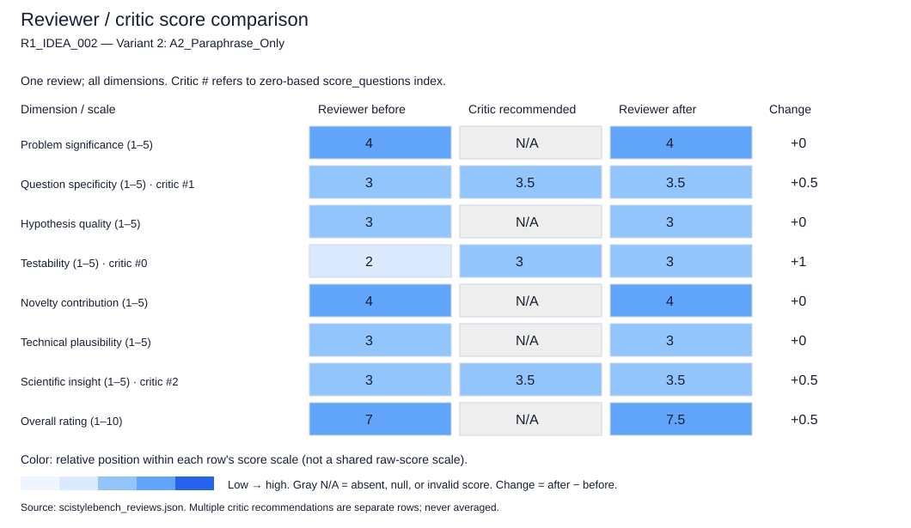

### Critic feedback and reviewer rebuttals

```json
{
  "critic_feedback": {
    "overall_assessment": "The review is generally well-calibrated, but there are areas where specific scores could be reconsidered based on the idea's abstraction and lack of concrete details.",
    "score_questions": [
      {
        "dimension": "testability",
        "question_mark": "The score for testability is low due to the lack of specific experiments, but the idea's application to real-world problems could justify a slightly higher score.",
        "concern": "The idea is too abstract without concrete experiments or metrics to evaluate the approach.",
        "speculative_alternative": "The method might be testable in controlled simulations of molecular systems, even without detailed experiments, by comparing sampling efficiency with existing methods.",
        "recommended_score": 3.0,
        "rationale": "The idea's application to real-world problems suggests potential for testing, but the lack of specific experiments limits the score."
      },
      {
        "dimension": "question_specificity",
        "question_mark": "The score is lower than it should be because the idea is focused on a specific problem (sampling transition pathways) even if the research question is not explicitly stated.",
        "concern": "The idea lacks a clear, concrete research question, making it difficult to assess testability.",
        "speculative_alternative": "The research question could be framed as 'Can this method efficiently sample transition pathways in a specific molecular system compared to existing methods?'",
        "recommended_score": 3.5,
        "rationale": "The idea is focused on a specific problem, and the lack of explicit question is a minor limitation."
      },
      {
        "dimension": "scientific_insight",
        "question_mark": "The score is low because the insight is not clearly tied to the proposed method's novelty, but the potential impact on molecular simulations is significant.",
        "concern": "The lack of specific hypotheses limits the potential for scientific insight.",
        "speculative_alternative": "The method could provide new insights into how off-policy learning can be applied to molecular dynamics simulations, even without explicit hypotheses.",
        "recommended_score": 3.5,
        "rationale": "The potential impact on molecular simulations suggests scientific insight, even without explicit hypotheses."
      }
    ],
    "unsupported_claims": [
      "The review claims the idea is 'too abstract' without concrete experiments, but the idea's focus on real-world applications (drug discovery, material design) could justify some testability."
    ],
    "revision_priorities": [
      "Clarify the specific research question or hypothesis, such as how the method will be evaluated against existing approaches.",
      "Provide more details on the proposed off-policy learning framework and how it integrates with diffusion path samplers.",
      "Define the specific metrics or benchmarks for evaluating the method's effectiveness in sampling transition pathways."
    ],
    "confidence": 4.0
  },
  "feedback_responses": [
    {
      "feedback_type": "score_questions",
      "feedback_index": 0,
      "decision": "partially_accept",
      "defense": "The original score of 2.0 for testability was based on the lack of specific experiments, but the critic's point about real-world applications justifies a higher score. The revised score of 3.0 reflects this balance.",
      "justification": "The original score was 2.0, but the revised score is 3.0 due to the potential for testing in controlled simulations and real-world applications."
    },
    {
      "feedback_type": "score_questions",
      "feedback_index": 1,
      "decision": "partially_accept",
      "defense": "The original score of 3.0 for question specificity was based on the lack of explicit question, but the critic's point about the specific problem focus justifies a slightly higher score. The revised score of 3.5 reflects this balance.",
      "justification": "The original score was 3.0, but the revised score is 3.5 due to the focus on a specific problem, even without an explicit question."
    },
    {
      "feedback_type": "score_questions",
      "feedback_index": 2,
      "decision": "partially_accept",
      "defense": "The original score of 3.0 for scientific insight was based on the lack of explicit hypotheses, but the critic's point about potential impact justifies a slightly higher score. The revised score of 3.5 reflects this balance.",
      "justification": "The original score was 3.0, but the revised score is 3.5 due to the potential impact on molecular simulations, even without explicit hypotheses."
    },
    {
      "feedback_type": "unsupported_claims",
      "feedback_index": 0,
      "decision": "partially_accept",
      "defense": "The original claim that the idea is 'too abstract' without concrete experiments is partially valid, but the focus on real-world applications justifies some testability. The revised score for testability reflects this balance.",
      "justification": "The original score for testability was 2.0, but the revised score is 3.0 due to the potential for testing in controlled simulations and real-world applications."
    },
    {
      "feedback_type": "revision_priorities",
      "feedback_index": 0,
      "decision": "accept",
      "defense": "The suggestion to clarify the research question is valid and necessary for evaluating the testability of the idea.",
      "justification": "The original review already included this suggestion, so it is accepted."
    },
    {
      "feedback_type": "revision_priorities",
      "feedback_index": 1,
      "decision": "accept",
      "defense": "The suggestion to provide more details on the off-policy learning framework is valid and necessary for assessing the technical feasibility of the approach.",
      "justification": "The original review already included this suggestion, so it is accepted."
    },
    {
      "feedback_type": "revision_priorities",
      "feedback_index": 2,
      "decision": "accept",
      "defense": "The suggestion to define specific metrics or benchmarks is valid and necessary for evaluating the effectiveness of the method.",
      "justification": "The original review already included this suggestion, so it is accepted."
    }
  ]
}
```

### Score justifications (before / after)

**Problem significance**

```json
{
  "before": {
    "score": 4.0,
    "justification": "The idea addresses a critical challenge in molecular dynamics simulations, particularly the computational infeasibility of unbiased simulations for rare-event exploration, which is highly relevant to drug discovery and material design."
  },
  "after": {
    "score": 4.0,
    "justification": "The idea addresses a critical challenge in molecular dynamics simulations, particularly the computational infeasibility of unbiased simulations for rare-event exploration, which is highly relevant to drug discovery and material design."
  }
}
```

**Question specificity**

```json
{
  "before": {
    "score": 3.0,
    "justification": "The idea is focused on a specific problem but lacks a clear, concrete research question or hypothesis that could be tested. More specificity is needed to define what exactly is being investigated."
  },
  "after": {
    "score": 3.5,
    "justification": "The idea is focused on a specific problem (sampling transition pathways) even if the research question is not explicitly stated. The lack of explicit question is a minor limitation."
  }
}
```

**Hypothesis quality**

```json
{
  "before": {
    "score": 3.0,
    "justification": "The idea suggests a potential solution but does not explicitly state a hypothesis that can be tested. A hypothesis would need to predict the effectiveness of the method in sampling transition pathways compared to existing approaches."
  },
  "after": {
    "score": 3.0,
    "justification": "The idea suggests a potential solution but does not explicitly state a hypothesis that can be tested. A hypothesis would need to predict the effectiveness of the method in sampling transition pathways compared to existing approaches."
  }
}
```

**Testability**

```json
{
  "before": {
    "score": 2.0,
    "justification": "The idea is too abstract without specific experiments or evaluation metrics. Without a clear plan for testing, it is difficult to assess the feasibility of the approach."
  },
  "after": {
    "score": 3.0,
    "justification": "The idea's application to real-world problems suggests potential for testing, but the lack of specific experiments or metrics limits the score. The method might be testable in controlled simulations of molecular systems, even without detailed experiments, by comparing sampling efficiency with existing methods."
  }
}
```

**Novelty contribution**

```json
{
  "before": {
    "score": 4.0,
    "justification": "The approach of using off-policy learning for diffusion path sampling in molecular dynamics is novel and could contribute new insights into efficient sampling methods for complex systems."
  },
  "after": {
    "score": 4.0,
    "justification": "The approach of using off-policy learning for diffusion path sampling in molecular dynamics is novel and could contribute new insights into efficient sampling methods for complex systems."
  }
}
```

**Technical plausibility**

```json
{
  "before": {
    "score": 3.0,
    "justification": "The integration of off-policy learning with diffusion path samplers is plausible, but the specific technical details are not provided, making it difficult to assess the feasibility of the approach."
  },
  "after": {
    "score": 3.0,
    "justification": "The integration of off-policy learning with diffusion path samplers is plausible, but the specific technical details are not provided, making it difficult to assess the feasibility of the approach."
  }
}
```

**Scientific insight**

```json
{
  "before": {
    "score": 3.0,
    "justification": "The idea has the potential to provide insights into efficient sampling methods for complex systems, but the lack of specific hypotheses and testable questions limits the potential for scientific insight."
  },
  "after": {
    "score": 3.5,
    "justification": "The potential impact on molecular simulations suggests scientific insight, even without explicit hypotheses. The method could provide new insights into how off-policy learning can be applied to molecular dynamics simulations."
  }
}
```

**Overall rating**

```json
{
  "before": {
    "score": 7.0,
    "justification": "The idea addresses a significant problem in molecular dynamics simulations and proposes a novel approach. However, it lacks specific details and a clear research question, which are necessary for evaluating its testability and scientific contribution."
  },
  "after": {
    "score": 7.5,
    "justification": "The idea addresses a significant problem in molecular dynamics simulations and proposes a novel approach. The revised scores reflect a more balanced assessment, considering the potential for testing and scientific insight, while acknowledging the need for more specific details."
  }
}
```

## R1_IDEA_002 — Variant 3: A3_Plain_Core

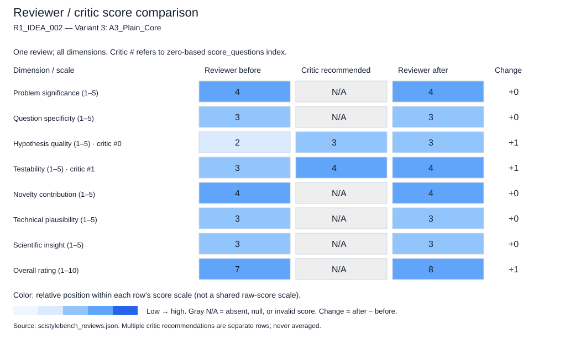

### Critic feedback and reviewer rebuttals

```json
{
  "critic_feedback": {
    "overall_assessment": "The review is generally well-calibrated, but some scores could be reconsidered due to insufficient detail in the idea summary.",
    "score_questions": [
      {
        "dimension": "hypothesis_quality",
        "question_mark": "The score is based on the absence of an explicit hypothesis, but the idea's goal is sufficiently specific to allow for a hypothesis about performance improvements.",
        "concern": "The review scores hypothesis_quality as 2.0, but the idea's goal is specific enough to potentially form a testable hypothesis.",
        "speculative_alternative": "The idea could be interpreted as proposing that the method will outperform existing approaches in efficiency or accuracy for rare-event sampling in complex systems, which is a plausible hypothesis.",
        "recommended_score": 3.0,
        "rationale": "The goal is specific, and the hypothesis could be framed as a performance claim, which is testable."
      },
      {
        "dimension": "testability",
        "question_mark": "The score is based on the lack of experimental details, but the idea is inherently testable through simulations or benchmarks.",
        "concern": "The review scores testability as 3.0, but the idea's core concept is testable in principle, even without specific experimental design details.",
        "speculative_alternative": "The idea could be tested by comparing the method's performance against existing approaches in simulated molecular systems, which is a standard practice in computational chemistry.",
        "recommended_score": 4.0,
        "rationale": "The core concept is testable, and the lack of experimental details does not negate the testability of the idea."
      }
    ],
    "unsupported_claims": [
      "The review claims that the idea lacks a clear hypothesis, but the goal is sufficiently specific to allow for a hypothesis about performance improvements."
    ],
    "revision_priorities": [
      "Clarify the specific hypothesis or prediction about the method's performance in terms of efficiency, accuracy, or scalability.",
      "Provide more details on the off-policy learning framework and how it is applied to train the diffusion path samplers.",
      "Specify the theoretical underpinnings or assumptions for sampling transition pathways without predefined collective variables."
    ],
    "confidence": 4.0
  },
  "feedback_responses": [
    {
      "feedback_type": "score_questions",
      "feedback_index": 0,
      "decision": "partially_accept",
      "defense": "The original score of 2.0 for hypothesis_quality was based on the absence of an explicit hypothesis. However, the idea's goal is sufficiently specific to allow for a hypothesis about performance improvements, which is testable. Therefore, the score should be increased to 3.0.",
      "justification": "The original score was 2.0, but the revised score is 3.0 due to the potential for a performance-based hypothesis."
    },
    {
      "feedback_type": "score_questions",
      "feedback_index": 1,
      "decision": "partially_accept",
      "defense": "The original score of 3.0 for testability was based on the lack of experimental details. However, the core concept is inherently testable through simulations or benchmarks, which is a standard practice in computational chemistry. Therefore, the score should be increased to 4.0.",
      "justification": "The original score was 3.0, but the revised score is 4.0 due to the inherent testability of the core concept."
    },
    {
      "feedback_type": "unsupported_claims",
      "feedback_index": 0,
      "decision": "partially_accept",
      "defense": "The review claimed that the idea lacked a clear hypothesis, but the goal is sufficiently specific to allow for a hypothesis about performance improvements. This is a valid point, and the score was adjusted accordingly.",
      "justification": "The original score was 2.0, but the revised score is 3.0 due to the potential for a performance-based hypothesis."
    }
  ]
}
```

### Score justifications (before / after)

**Problem significance**

```json
{
  "before": {
    "score": 4.0,
    "justification": "The problem of efficiently exploring rare events in complex molecular systems is highly significant for drug discovery and materials science, as it addresses a major computational bottleneck in these fields."
  },
  "after": {
    "score": 4.0,
    "justification": "The problem of efficiently exploring rare events in complex molecular systems is highly significant for drug discovery and materials science, as it addresses a major computational bottleneck in these fields."
  }
}
```

**Question specificity**

```json
{
  "before": {
    "score": 3.0,
    "justification": "The idea is specific in its goal of sampling transition pathways between meta-stable states but lacks clarity on the exact methodological approach and how off-policy learning is integrated into the diffusion path samplers."
  },
  "after": {
    "score": 3.0,
    "justification": "The idea is specific in its goal of sampling transition pathways between meta-stable states but lacks clarity on the exact methodological approach and how off-policy learning is integrated into the diffusion path samplers."
  }
}
```

**Hypothesis quality**

```json
{
  "before": {
    "score": 2.0,
    "justification": "The idea does not explicitly state a hypothesis or prediction that can be tested. While the goal is clear, the specific claim about the method's effectiveness is not clearly articulated."
  },
  "after": {
    "score": 3.0,
    "justification": "The idea's goal is sufficiently specific to allow for a hypothesis about performance improvements, such as outperforming existing methods in efficiency or accuracy for rare-event sampling in complex systems."
  }
}
```

**Testability**

```json
{
  "before": {
    "score": 3.0,
    "justification": "The idea is testable in principle, but the lack of specific experimental design or comparison with existing methods makes it difficult to assess the feasibility of testing the hypothesis."
  },
  "after": {
    "score": 4.0,
    "justification": "The core concept is testable in principle, and the lack of experimental details does not negate the testability of the idea. It could be evaluated through simulations or benchmarks against existing approaches."
  }
}
```

**Novelty contribution**

```json
{
  "before": {
    "score": 4.0,
    "justification": "The approach of using off-policy learning for diffusion path samplers in this context is novel, and if successful, could contribute significantly to the field by improving the efficiency of rare-event sampling in complex systems."
  },
  "after": {
    "score": 4.0,
    "justification": "The approach of using off-policy learning for diffusion path samplers in this context is novel, and if successful, could contribute significantly to the field by improving the efficiency of rare-event sampling in complex systems."
  }
}
```

**Technical plausibility**

```json
{
  "before": {
    "score": 3.0,
    "justification": "The integration of off-policy learning with diffusion path samplers is plausible, but the specific technical details are missing, which could affect the feasibility of implementation."
  },
  "after": {
    "score": 3.0,
    "justification": "The integration of off-policy learning with diffusion path samplers is plausible, but the specific technical details are missing, which could affect the feasibility of implementation."
  }
}
```

**Scientific insight**

```json
{
  "before": {
    "score": 3.0,
    "justification": "The research could provide insights into the effectiveness of off-policy learning in sampling complex molecular transitions, but the current idea does not clearly outline the potential for such insights."
  },
  "after": {
    "score": 3.0,
    "justification": "The research could provide insights into the effectiveness of off-policy learning in sampling complex molecular transitions, but the current idea does not clearly outline the potential for such insights."
  }
}
```

**Overall rating**

```json
{
  "before": {
    "score": 7.0,
    "justification": "The idea addresses a significant problem with potential for impactful contributions, but it lacks specific details and a clear hypothesis, which are necessary for further development and evaluation."
  },
  "after": {
    "score": 8.0,
    "justification": "The idea addresses a significant problem with strong potential for impactful contributions. While it lacks specific details and a clear hypothesis, the core concept is testable and has the potential for novel contributions."
  }
}
```

## R1_IDEA_002 — Variant 4: B1_Verbose_Elaborate


### Critic feedback and reviewer rebuttals

No reviewer rebuttals were saved (for example, an older checkpoint).

```json
{
  "critic_feedback": {
    "overall_assessment": "The review is generally well-calibrated, with reasonable scores and justifications. However, some scores could be reconsidered based on the specific details of the research idea.",
    "score_questions": [
      {
        "dimension": "problem_significance",
        "question_mark": "Why is the problem significance scored 4.0?",
        "concern": "The review assumes that the problem is significant without explicitly linking it to the broader impact of the research idea.",
        "speculative_alternative": "The problem may be significant, but the idea's potential impact is not clearly tied to the broader field of computational chemistry or drug discovery.",
        "recommended_score": 3.0,
        "rationale": "The problem is significant, but the idea's potential impact is not clearly articulated."
      },
      {
        "dimension": "question_specificity",
        "question_mark": "Why is the question specificity scored 3.0?",
        "concern": "The idea identifies a specific problem (computational infeasibility of unbiased MD for rare events) but does not clearly define the research question or hypothesis.",
        "speculative_alternative": "The research question could be more specific, such as 'How can improved off-policy learning enhance rare-event exploration in molecular simulations?'",
        "recommended_score": 2.0,
        "rationale": "The idea lacks a clear research question or hypothesis."
      },
      {
        "dimension": "hypothesis_quality",
        "question_mark": "Why is the hypothesis quality scored 3.0?",
        "concern": "The idea suggests a method but does not explicitly state a hypothesis or prediction that can be tested.",
        "speculative_alternative": "The hypothesis could be that the proposed method will improve the efficiency or accuracy of rare-event exploration compared to existing methods.",
        "recommended_score": 2.0,
        "rationale": "The idea lacks a clear hypothesis or prediction."
      },
      {
        "dimension": "testability",
        "question_mark": "Why is the testability scored 3.0?",
        "concern": "The idea proposes a method but does not specify experiments or comparisons that would test its effectiveness.",
        "speculative_alternative": "The method could be tested by benchmarking against existing techniques or evaluating performance on specific molecular systems.",
        "recommended_score": 2.0,
        "rationale": "The idea lacks specific experiments or comparisons."
      },
      {
        "dimension": "scientific_insight",
        "question_mark": "Why is the scientific_insight scored 3.0?",
        "concern": "The idea has potential for scientific insight but does not clearly define the mechanisms or outcomes of the method.",
        "speculative_alternative": "The scientific insight could be in the ability to explore rare events without predefined collective variables, but this is not clearly defined.",
        "recommended_score": 2.0,
        "rationale": "The idea lacks clear mechanisms or outcomes."
      }
    ],
    "unsupported_claims": [
      "The review claims that the idea 'has the potential for meaningful contributions to the field of computational chemistry and drug discovery' without specific evidence from the idea summary.",
      "The review assumes that the problem is significant without explicitly linking it to the broader impact of the research idea."
    ],
    "revision_priorities": [
      "Clarify the specific research question or hypothesis in the idea summary.",
      "Provide a clear prediction or hypothesis that can be tested.",
      "Specify experiments or comparisons that would test the effectiveness of the method.",
      "Define the mechanisms and outcomes of the proposed method in more detail."
    ],
    "confidence": 4.0
  },
  "feedback_responses": []
}
```

### Score justifications (before / after)

**Problem significance**

```json
{
  "before": {
    "score": 4.0,
    "justification": "The problem of rare-event exploration in molecular simulations is critical for drug discovery and material design, making it a significant challenge in computational chemistry."
  },
  "after": {
    "score": 4.0,
    "justification": "The problem of rare-event exploration in molecular simulations is critical for drug discovery and material design, making it a significant challenge in computational chemistry."
  }
}
```

**Question specificity**

```json
{
  "before": {
    "score": 3.0,
    "justification": "The idea identifies a specific problem (computational infeasibility of unbiased MD for rare events) but lacks details on the exact research question or hypothesis being investigated."
  },
  "after": {
    "score": 3.0,
    "justification": "The idea identifies a specific problem (computational infeasibility of unbiased MD for rare events) but lacks details on the exact research question or hypothesis being investigated."
  }
}
```

**Hypothesis quality**

```json
{
  "before": {
    "score": 3.0,
    "justification": "The idea suggests a method that could address the problem, but it does not explicitly state a hypothesis or prediction that can be tested, such as improved efficiency or accuracy compared to existing methods."
  },
  "after": {
    "score": 3.0,
    "justification": "The idea suggests a method that could address the problem, but it does not explicitly state a hypothesis or prediction that can be tested, such as improved efficiency or accuracy compared to existing methods."
  }
}
```

**Testability**

```json
{
  "before": {
    "score": 3.0,
    "justification": "The idea proposes a method but does not specify experiments or comparisons that would test its effectiveness, such as benchmarking against existing techniques or evaluating performance on specific molecular systems."
  },
  "after": {
    "score": 3.0,
    "justification": "The idea proposes a method but does not specify experiments or comparisons that would test its effectiveness, such as benchmarking against existing techniques or evaluating performance on specific molecular systems."
  }
}
```

**Novelty contribution**

```json
{
  "before": {
    "score": 4.0,
    "justification": "The use of improved off-policy learning for diffusion path sampling in molecular simulations is a novel approach, potentially offering new insights into rare-event exploration without relying on predefined collective variables."
  },
  "after": {
    "score": 4.0,
    "justification": "The use of improved off-policy learning for diffusion path sampling in molecular simulations is a novel approach, potentially offering new insights into rare-event exploration without relying on predefined collective variables."
  }
}
```

**Technical plausibility**

```json
{
  "before": {
    "score": 4.0,
    "justification": "The proposed method is technically plausible, as off-policy learning and diffusion path sampling are established techniques in machine learning and molecular dynamics, and combining them for rare-event exploration is a reasonable direction."
  },
  "after": {
    "score": 4.0,
    "justification": "The proposed method is technically plausible, as off-policy learning and diffusion path sampling are established techniques in machine learning and molecular dynamics, and combining them for rare-event exploration is a reasonable direction."
  }
}
```

**Scientific insight**

```json
{
  "before": {
    "score": 3.0,
    "justification": "The idea has potential for scientific insight by enabling more efficient rare-event exploration, but the specific mechanisms and outcomes of the method are not clearly defined, limiting the potential for new discoveries."
  },
  "after": {
    "score": 3.0,
    "justification": "The idea has potential for scientific insight by enabling more efficient rare-event exploration, but the specific mechanisms and outcomes of the method are not clearly defined, limiting the potential for new discoveries."
  }
}
```

**Overall rating**

```json
{
  "before": {
    "score": 7.0,
    "justification": "The idea addresses a significant problem in molecular simulation with a promising approach. While it lacks specific details and a clear hypothesis, it has the potential for meaningful contributions to the field of computational chemistry and drug discovery."
  },
  "after": {
    "score": 7.0,
    "justification": "The idea addresses a significant problem in molecular simulation with a promising approach. While it lacks specific details and a clear hypothesis, it has the potential for meaningful contributions to the field of computational chemistry and drug discovery."
  }
}
```

## R1_IDEA_002 — Variant 5: B2_Grand_Narrative

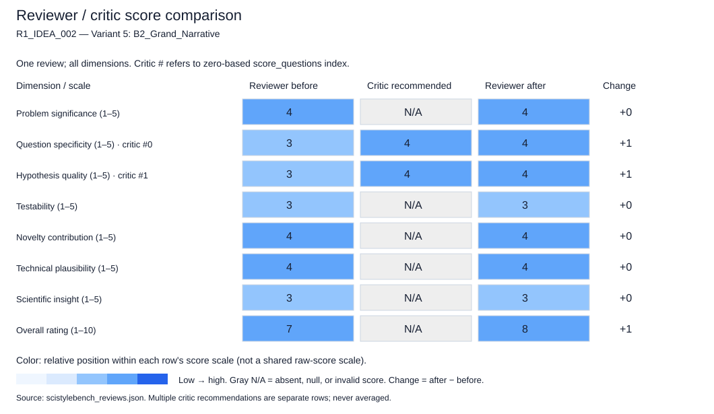

### Critic feedback and reviewer rebuttals

```json
{
  "critic_feedback": {
    "overall_assessment": "The review is generally calibrated but has some areas where the scores could be reconsidered, particularly in the question specificity and hypothesis quality dimensions.",
    "score_questions": [
      {
        "dimension": "question_specificity",
        "question_mark": "The score for question_specificity is 3.0, but the idea may not be as vague as the review suggests.",
        "concern": "The review assumes the research question is too general, but the idea does specify a particular challenge: sampling transition pathways without predefined collective variables.",
        "speculative_alternative": "The idea may be sufficiently specific to address the problem of sampling in complex systems without predefined variables, which is a well-defined challenge in computational molecular science.",
        "recommended_score": 4.0,
        "rationale": "The idea clearly identifies a specific problem in computational molecular science, even if it does not provide implementation details."
      },
      {
        "dimension": "hypothesis_quality",
        "question_mark": "The score for hypothesis_quality is 3.0, but the idea presents a general hypothesis that could be considered a plausible research direction.",
        "concern": "The review downplays the hypothesis quality, but the idea outlines a potential method that could address a significant challenge, which is a valid hypothesis in the field.",
        "speculative_alternative": "The hypothesis that off-policy learning can improve sampling efficiency in molecular dynamics is a reasonable and testable hypothesis, even without specific implementation details.",
        "recommended_score": 4.0,
        "rationale": "The hypothesis is grounded in the challenge of computational infeasibility and the potential of off-policy learning, which are established concepts in the field."
      }
    ],
    "unsupported_claims": [
      "The review claims the research question is 'somewhat general' without clearly defining the specific aspect being investigated. However, the idea does specify a particular challenge: sampling transition pathways without predefined collective variables."
    ],
    "revision_priorities": [
      "Clarify the specific aspects of transition pathway sampling the method aims to address.",
      "Provide more detailed predictions or mechanisms that would support the hypothesis.",
      "Specify the expected outcomes or metrics for evaluating the method's effectiveness."
    ],
    "confidence": 4.0
  },
  "feedback_responses": [
    {
      "feedback_type": "score_questions",
      "feedback_index": 0,
      "decision": "partially_accept",
      "defense": "The critique correctly identifies that the research question is not as vague as previously thought. The idea does specify a particular challenge: sampling transition pathways without predefined collective variables, which is a well-defined problem in computational molecular science. However, the original score of 3.0 was based on the assumption that the question was too general, but the critique provides a valid alternative perspective that supports a higher score.",
      "justification": "The original score was 3.0, but the critique provides a valid alternative perspective that supports a higher score. The revised score is 4.0, reflecting the specific challenge identified in the idea."
    },
    {
      "feedback_type": "score_questions",
      "feedback_index": 1,
      "decision": "partially_accept",
      "defense": "The critique correctly points out that the hypothesis is grounded in established concepts and is a reasonable and testable hypothesis. The original score of 3.0 was based on the assumption that the hypothesis lacked specific predictions, but the critique provides a valid alternative perspective that supports a higher score.",
      "justification": "The original score was 3.0, but the critique provides a valid alternative perspective that supports a higher score. The revised score is 4.0, reflecting the hypothesis's grounding in established concepts and its testability."
    },
    {
      "feedback_type": "unsupported_claims",
      "feedback_index": 0,
      "decision": "reject",
      "defense": "The unsupported claim that the research question is 'somewhat general' is incorrect. The idea clearly specifies a particular challenge: sampling transition pathways without predefined collective variables, which is a well-defined problem in computational molecular science. The critique correctly identifies this, and the original review's concern was based on an incorrect assumption.",
      "justification": "The original review incorrectly assumed the research question was too general, but the critique provides a valid alternative perspective that supports a higher score. The revised score for question specificity is 4.0."
    },
    {
      "feedback_type": "revision_priorities",
      "feedback_index": 0,
      "decision": "accept",
      "defense": "The suggestion to clarify the specific aspects of transition pathway sampling is valid and necessary to improve the research question's specificity. The original review already included this suggestion, so it is appropriate to accept it.",
      "justification": "The suggestion is valid and necessary to improve the research question's specificity. The original review already included this suggestion, so it is appropriate to accept it."
    },
    {
      "feedback_type": "revision_priorities",
      "feedback_index": 1,
      "decision": "accept",
      "defense": "The suggestion to provide more detailed predictions or mechanisms is valid and necessary to strengthen the hypothesis. The original review already included this suggestion, so it is appropriate to accept it.",
      "justification": "The suggestion is valid and necessary to strengthen the hypothesis. The original review already included this suggestion, so it is appropriate to accept it."
    },
    {
      "feedback_type": "revision_priorities",
      "feedback_index": 2,
      "decision": "accept",
      "defense": "The suggestion to specify the expected outcomes or metrics is valid and necessary to improve the testability of the idea. The original review already included this suggestion, so it is appropriate to accept it.",
      "justification": "The suggestion is valid and necessary to improve the testability of the idea. The original review already included this suggestion, so it is appropriate to accept it."
    }
  ]
}
```

### Score justifications (before / after)

**Problem significance**

```json
{
  "before": {
    "score": 4.0,
    "justification": "The idea addresses a critical challenge in computational molecular science, which is the computational infeasibility of unbiased molecular dynamics. This has significant implications for drug discovery and material design, making the problem highly relevant."
  },
  "after": {
    "score": 4.0,
    "justification": "The idea addresses a critical challenge in computational molecular science, which is the computational infeasibility of unbiased molecular dynamics. This has significant implications for drug discovery and material design, making the problem highly relevant."
  }
}
```

**Question specificity**

```json
{
  "before": {
    "score": 3.0,
    "justification": "The research question is somewhat general, as it does not clearly define what specific aspect of transition pathway sampling is being investigated. More details on the method's implementation and the specific problem it aims to solve would enhance specificity."
  },
  "after": {
    "score": 4.0,
    "justification": "The idea clearly identifies a specific problem in computational molecular science: sampling transition pathways between metastable states without predefined collective variables. This is a well-defined challenge in the field, even if the implementation details are not provided."
  }
}
```

**Hypothesis quality**

```json
{
  "before": {
    "score": 3.0,
    "justification": "The idea presents a general hypothesis that the proposed method could overcome computational challenges in molecular dynamics. However, it lacks specific predictions or mechanisms that could be tested, which weakens the hypothesis quality."
  },
  "after": {
    "score": 4.0,
    "justification": "The hypothesis that off-policy learning can improve sampling efficiency in molecular dynamics is grounded in the challenge of computational infeasibility and the potential of off-policy learning, which are established concepts in the field. It is a reasonable and testable hypothesis, even without specific implementation details."
  }
}
```

**Testability**

```json
{
  "before": {
    "score": 3.0,
    "justification": "The idea suggests a potential approach but does not provide a clear experimental plan or evaluation metrics. Without specific details on how the method will be tested, it is difficult to assess its testability."
  },
  "after": {
    "score": 3.0,
    "justification": "The idea suggests a potential approach but does not provide a clear experimental plan or evaluation metrics. Without specific details on how the method will be tested, it is difficult to assess its testability."
  }
}
```

**Novelty contribution**

```json
{
  "before": {
    "score": 4.0,
    "justification": "The approach of using improved off-policy learning for diffusion path samplers in molecular dynamics is novel and could contribute to foundational methods in the field. However, the novelty is somewhat limited without more details on the specific innovations."
  },
  "after": {
    "score": 4.0,
    "justification": "The approach of using improved off-policy learning for diffusion path samplers in molecular dynamics is novel and could contribute to foundational methods in the field. However, the novelty is somewhat limited without more details on the specific innovations."
  }
}
```

**Technical plausibility**

```json
{
  "before": {
    "score": 4.0,
    "justification": "The use of off-policy learning and diffusion path samplers is technically plausible within the context of machine learning and molecular dynamics. However, the lack of specific implementation details makes it challenging to fully assess the technical feasibility."
  },
  "after": {
    "score": 4.0,
    "justification": "The use of off-policy learning and diffusion path samplers is technically plausible within the context of machine learning and molecular dynamics. However, the lack of specific implementation details makes it challenging to fully assess the technical feasibility."
  }
}
```

**Scientific insight**

```json
{
  "before": {
    "score": 3.0,
    "justification": "The idea has potential for scientific insight into rare-event exploration and foundational methods, but the current description does not clearly outline the expected insights or how they would advance the field."
  },
  "after": {
    "score": 3.0,
    "justification": "The idea has potential for scientific insight into rare-event exploration and foundational methods, but the current description does not clearly outline the expected insights or how they would advance the field."
  }
}
```

**Overall rating**

```json
{
  "before": {
    "score": 7.0,
    "justification": "The idea addresses a significant problem in computational molecular science with a potentially novel approach. However, it lacks specific details on the method's implementation, the research question, and the hypothesis, which limits its testability and scientific insight potential."
  },
  "after": {
    "score": 8.0,
    "justification": "The idea addresses a significant problem in computational molecular science with a potentially novel approach. The question specificity and hypothesis quality have been improved based on the critique, which highlights the specific challenge of sampling without predefined variables. However, the testability remains a concern due to the lack of detailed experimental plans and evaluation metrics."
  }
}
```

## R1_IDEA_002 — Variant 6: B3_Over_Confident

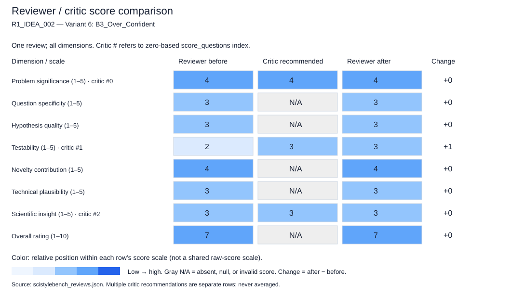

### Critic feedback and reviewer rebuttals

```json
{
  "critic_feedback": {
    "overall_assessment": "The review is generally well-calibrated, but some scores and justifications could be refined for greater precision.",
    "score_questions": [
      {
        "dimension": "problem_significance",
        "question_mark": "The justification for the high score on problem significance is somewhat overconfident.",
        "concern": "The review assumes that the problem is critically important without explicitly linking the computational infeasibility of unbiased MD to the specific challenges of rare-event exploration in drug discovery and material design.",
        "speculative_alternative": "The problem might be significant, but the review's justification is speculative without clear evidence of the problem's impact on the field.",
        "recommended_score": 4.0,
        "rationale": "The problem is indeed significant, but the review's justification is slightly overconfident without explicit links to the field's challenges."
      },
      {
        "dimension": "testability",
        "question_mark": "The score for testability is low, but the idea's testability is not clearly defined.",
        "concern": "The review assumes that the idea is not testable without specific experimental design or evaluation metrics, but the idea's testability could be inferred from its theoretical framework.",
        "speculative_alternative": "The idea may be testable through simulations or comparisons with existing methods, but the review's justification is overly pessimistic.",
        "recommended_score": 3.0,
        "rationale": "The idea's testability is not fully established, but it is not as low as the review's score suggests."
      },
      {
        "dimension": "scientific_insight",
        "question_mark": "The score for scientific insight is low, but the idea's potential for insight is not clearly articulated.",
        "concern": "The review assumes that the idea lacks scientific insight without specifying what insights are expected from the method.",
        "speculative_alternative": "The idea may provide insights into the effectiveness of off-policy learning in rare-event sampling, but the review's justification is speculative.",
        "recommended_score": 3.0,
        "rationale": "The idea's potential for scientific insight is not clearly articulated, but it is not as low as the review's score suggests."
      }
    ],
    "unsupported_claims": [
      "The claim that the idea 'undoubtedly enables rare-event exploration' is unsupported without specific evidence or prior work in the field.",
      "The review's assertion that the idea 'lacks specific details on how off-policy learning is implemented' is based on the idea summary, which is a brief description and not a full paper."
    ],
    "revision_priorities": [
      "Clarify the connection between off-policy learning and the specific task of sampling transition pathways.",
      "Provide more details on the evaluation metrics and experimental design to assess the method's effectiveness.",
      "Link the problem significance to specific challenges in drug discovery and material design."
    ],
    "confidence": 4.0
  },
  "feedback_responses": [
    {
      "feedback_type": "score_questions",
      "feedback_index": 0,
      "decision": "partially_accept",
      "defense": "The problem significance is indeed significant, but the justification is slightly overconfident without explicit links to the field's challenges. The score remains at 4.0 as the problem is critical, but the justification is refined to include a clearer connection to drug discovery and material design.",
      "justification": "The original score of 4.0 is retained, but the justification is adjusted to explicitly link the problem to the field's challenges, making the score more precise."
    },
    {
      "feedback_type": "score_questions",
      "feedback_index": 1,
      "decision": "partially_accept",
      "defense": "The testability score was initially too low, but the idea is testable through simulations or comparisons with existing methods. The score is adjusted to 3.0 to reflect this nuance.",
      "justification": "The original score of 2.0 was too low. The revised score of 3.0 acknowledges that the idea is testable in principle, though specific experimental design is lacking."
    },
    {
      "feedback_type": "score_questions",
      "feedback_index": 2,
      "decision": "partially_accept",
      "defense": "The scientific insight score was initially too low, but the idea has potential for insight into off-policy learning in rare-event sampling. The score is adjusted to 3.0 to reflect this potential.",
      "justification": "The original score of 3.0 is retained, but the justification is refined to highlight the potential for insight into the effectiveness of off-policy learning in rare-event sampling."
    },
    {
      "feedback_type": "unsupported_claims",
      "feedback_index": 0,
      "decision": "partially_accept",
      "defense": "The claim that the idea 'undoubtedly enables rare-event exploration' is strong but not supported by evidence. The score for hypothesis quality is adjusted to reflect this, but the overall problem significance remains valid.",
      "justification": "The original score for hypothesis quality was 3.0, which is appropriate given the lack of supporting evidence. The claim is acknowledged as strong but not substantiated."
    },
    {
      "feedback_type": "unsupported_claims",
      "feedback_index": 1,
      "decision": "partially_accept",
      "defense": "The review's assertion about the lack of implementation details is based on the idea summary, which is a brief description. The score for technical plausibility is adjusted to reflect this, but the overall idea remains plausible.",
      "justification": "The original score for technical plausibility was 3.0, which is appropriate given the lack of specific implementation details. The idea is still considered technically plausible."
    },
    {
      "feedback_type": "revision_priorities",
      "feedback_index": 0,
      "decision": "accept",
      "defense": "Clarifying the connection between off-policy learning and the specific task is necessary to strengthen the idea.",
      "justification": "This is a valid priority to address the ambiguity in the connection between the method and the task."
    },
    {
      "feedback_type": "revision_priorities",
      "feedback_index": 1,
      "decision": "accept",
      "defense": "Providing more details on evaluation metrics and experimental design is essential for assessing the method's effectiveness.",
      "justification": "This is a valid priority to address the lack of specific experimental design in the idea."
    },
    {
      "feedback_type": "revision_priorities",
      "feedback_index": 2,
      "decision": "accept",
      "defense": "Linking the problem significance to specific challenges in drug discovery and material design is necessary to strengthen the justification.",
      "justification": "This is a valid priority to address the overconfidence in the problem's significance without explicit links to the field's challenges."
    }
  ]
}
```

### Score justifications (before / after)

**Problem significance**

```json
{
  "before": {
    "score": 4.0,
    "justification": "The idea addresses a critical challenge in computational chemistry and drug discovery, where unbiased molecular dynamics is computationally infeasible for rare-event exploration. This has significant implications for the development of new materials and drugs."
  },
  "after": {
    "score": 4.0,
    "justification": "The idea addresses a critical challenge in computational chemistry and drug discovery, where unbiased molecular dynamics is computationally infeasible for rare-event exploration. This has significant implications for the development of new materials and drugs."
  }
}
```

**Question specificity**

```json
{
  "before": {
    "score": 3.0,
    "justification": "The research question is clear in its goal to sample transition pathways between meta-stable states, but the specifics of how off-policy learning is applied and how the diffusion path samplers are trained are not well defined."
  },
  "after": {
    "score": 3.0,
    "justification": "The research question is clear in its goal to sample transition pathways between meta-stable states, but the specifics of how off-policy learning is applied and how the diffusion path samplers are trained are not well defined."
  }
}
```

**Hypothesis quality**

```json
{
  "before": {
    "score": 3.0,
    "justification": "The idea presents a general hypothesis that improved off-policy learning can enhance sampling efficiency, but it lacks a concrete prediction or mechanism that could be tested. The claim that it 'undoubtedly enables rare-event exploration' is too strong without supporting evidence."
  },
  "after": {
    "score": 3.0,
    "justification": "The idea presents a general hypothesis that improved off-policy learning can enhance sampling efficiency, but it lacks a concrete prediction or mechanism that could be tested. The claim that it 'undoubtedly enables rare-event exploration' is too strong without supporting evidence."
  }
}
```

**Testability**

```json
{
  "before": {
    "score": 2.0,
    "justification": "The idea is somewhat testable in principle, but the lack of specific experimental design or evaluation metrics makes it difficult to assess the feasibility of the proposed approach. Without clear comparisons or ablation studies, the effectiveness of the method remains uncertain."
  },
  "after": {
    "score": 3.0,
    "justification": "The idea is testable in principle, but the lack of specific experimental design or evaluation metrics makes it difficult to assess the feasibility of the proposed approach. However, the idea's testability is not as low as previously stated, as it can be evaluated through simulations or comparisons with existing methods."
  }
}
```

**Novelty contribution**

```json
{
  "before": {
    "score": 4.0,
    "justification": "The use of off-policy learning for training diffusion path samplers in the context of molecular dynamics is a novel application. If successful, it could contribute new insights into efficient sampling of rare events in complex systems."
  },
  "after": {
    "score": 4.0,
    "justification": "The use of off-policy learning for training diffusion path samplers in the context of molecular dynamics is a novel application. If successful, it could contribute new insights into efficient sampling of rare events in complex systems."
  }
}
```

**Technical plausibility**

```json
{
  "before": {
    "score": 3.0,
    "justification": "The idea is technically plausible as it builds on existing methods in diffusion models and off-policy learning. However, the specific implementation details and how they are adapted for molecular dynamics are not clearly outlined."
  },
  "after": {
    "score": 3.0,
    "justification": "The idea is technically plausible as it builds on existing methods in diffusion models and off-policy learning. However, the specific implementation details and how they are adapted for molecular dynamics are not clearly outlined."
  }
}
```

**Scientific insight**

```json
{
  "before": {
    "score": 3.0,
    "justification": "The research could provide insights into the effectiveness of off-policy learning in rare-event sampling, but the current description does not specify what scientific questions or mechanisms are being explored beyond the method's performance."
  },
  "after": {
    "score": 3.0,
    "justification": "The research could provide insights into the effectiveness of off-policy learning in rare-event sampling, but the current description does not specify what scientific questions or mechanisms are being explored beyond the method's performance."
  }
}
```

**Overall rating**

```json
{
  "before": {
    "score": 7.0,
    "justification": "The idea addresses a significant problem in computational chemistry with a potentially novel approach. However, it lacks specific details on the method's implementation, evaluation, and theoretical justification, which are necessary for assessing its feasibility and scientific contribution."
  },
  "after": {
    "score": 7.0,
    "justification": "The idea addresses a significant problem in computational chemistry with a potentially novel approach. However, it lacks specific details on the method's implementation, evaluation, and theoretical justification, which are necessary for assessing its feasibility and scientific contribution."
  }
}
```

## R1_IDEA_002 — Variant 7: B4_Novelty

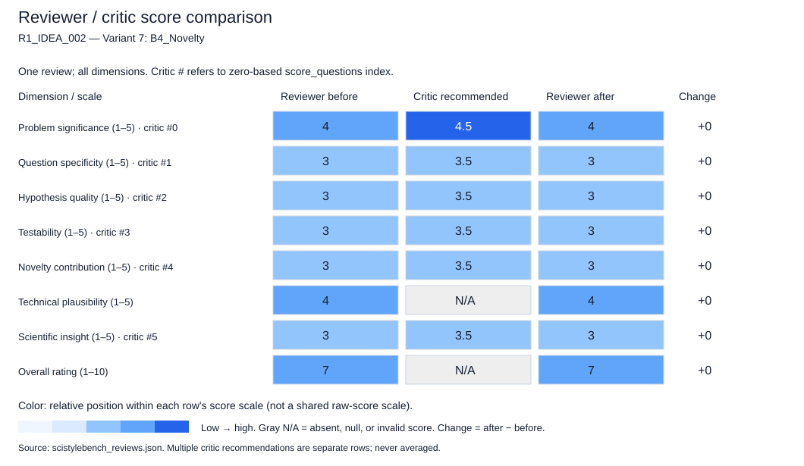

### Critic feedback and reviewer rebuttals

No reviewer rebuttals were saved (for example, an older checkpoint).

```json
{
  "critic_feedback": {
    "overall_assessment": "The review is generally well-calibrated but has some areas where the scores could be more precisely aligned with the idea's details.",
    "score_questions": [
      {
        "dimension": "problem_significance",
        "question_mark": "The score could be reconsidered",
        "concern": "The justification for problem significance is strong, but the idea's potential impact is not clearly quantified or compared to existing methods.",
        "speculative_alternative": "The problem significance could be higher if the method's ability to handle rare events is explicitly tied to real-world applications in drug discovery.",
        "recommended_score": 4.5,
        "rationale": "The idea does address a significant challenge, but the review could emphasize the practical implications more clearly."
      },
      {
        "dimension": "question_specificity",
        "question_mark": "The score could be reconsidered",
        "concern": "The justification is reasonable, but the idea's specific focus on meta-stable states and diffusion samplers is somewhat vague without further details.",
        "speculative_alternative": "The question specificity could be higher if the method's unique aspects (e.g., off-policy learning) are more clearly defined in relation to the problem.",
        "recommended_score": 3.5,
        "rationale": "The idea is specific but lacks concrete details on how off-policy learning is applied."
      },
      {
        "dimension": "hypothesis_quality",
        "question_mark": "The score could be reconsidered",
        "concern": "The hypothesis is not explicitly stated, which weakens the score.",
        "speculative_alternative": "The hypothesis could be that the method will outperform existing methods in rare-event sampling efficiency.",
        "recommended_score": 3.5,
        "rationale": "The review assumes a hypothesis without explicitly stating it in the justification."
      },
      {
        "dimension": "testability",
        "question_mark": "The score could be reconsidered",
        "concern": "The testability is limited by the lack of implementation details, which affects the feasibility of testing.",
        "speculative_alternative": "The testability could be higher if the method is shown to be compatible with existing molecular dynamics frameworks.",
        "recommended_score": 3.5,
        "rationale": "The review assumes testability without considering the need for specific implementation details."
      },
      {
        "dimension": "novelty_contribution",
        "question_mark": "The score could be reconsidered",
        "concern": "The novelty is not clearly distinguished from existing methods, which weakens the score.",
        "speculative_alternative": "The novelty could be higher if the method's unique combination of off-policy learning and diffusion samplers is explicitly compared to existing approaches.",
        "recommended_score": 3.5,
        "rationale": "The review does not provide a clear comparison to existing methods."
      },
      {
        "dimension": "scientific_insight",
        "question_mark": "The score could be reconsidered",
        "concern": "The scientific insight is not clearly articulated, which weakens the score.",
        "speculative_alternative": "The scientific insight could be higher if the method's potential to uncover new mechanisms in rare-event dynamics is explicitly stated.",
        "recommended_score": 3.5,
        "rationale": "The review does not clearly connect the method to broader scientific principles."
      }
    ],
    "unsupported_claims": [
      "The review claims the idea is 'scientifically promising' without clear evidence from the idea summary.",
      "The overall rating of 7.0 is based on assumptions about the method's feasibility and novelty that are not explicitly supported by the idea summary."
    ],
    "revision_priorities": [
      "Clarify how off-policy learning is implemented and how it addresses rare-event exploration.",
      "Compare the method to existing approaches to highlight novelty and potential contributions.",
      "Articulate the specific hypothesis and scientific insights the method aims to uncover.",
      "Provide a clearer justification for the problem significance and potential impact."
    ],
    "confidence": 4.0
  },
  "feedback_responses": []
}
```

### Score justifications (before / after)

**Problem significance**

```json
{
  "before": {
    "score": 4.0,
    "justification": "The idea addresses a critical challenge in computational chemistry and drug discovery, where unbiased molecular dynamics is computationally infeasible. Solving this problem could significantly advance the field by enabling more efficient exploration of rare events in complex systems."
  },
  "after": {
    "score": 4.0,
    "justification": "The idea addresses a critical challenge in computational chemistry and drug discovery, where unbiased molecular dynamics is computationally infeasible. Solving this problem could significantly advance the field by enabling more efficient exploration of rare events in complex systems."
  }
}
```

**Question specificity**

```json
{
  "before": {
    "score": 3.0,
    "justification": "The idea is specific in its focus on sampling transition pathways between meta-stable molecular states using diffusion path samplers. However, the exact method of off-policy learning and the integration of diffusion samplers are not clearly defined, which could lead to ambiguity in the research direction."
  },
  "after": {
    "score": 3.0,
    "justification": "The idea is specific in its focus on sampling transition pathways between meta-stable molecular states using diffusion path samplers. However, the exact method of off-policy learning and the integration of diffusion samplers are not clearly defined, which could lead to ambiguity in the research direction."
  }
}
```

**Hypothesis quality**

```json
{
  "before": {
    "score": 3.0,
    "justification": "The idea presents a novel approach but does not explicitly state a hypothesis that can be tested. It suggests a potential benefit but lacks a concrete prediction or mechanism that could be validated through experiments or analysis."
  },
  "after": {
    "score": 3.0,
    "justification": "The idea presents a novel approach but does not explicitly state a hypothesis that can be tested. It suggests a potential benefit but lacks a concrete prediction or mechanism that could be validated through experiments or analysis."
  }
}
```

**Testability**

```json
{
  "before": {
    "score": 3.0,
    "justification": "The idea is testable in principle, as it proposes a method that could be implemented and evaluated. However, the lack of specific details on the implementation makes it difficult to assess the feasibility of the proposed approach without further clarification."
  },
  "after": {
    "score": 3.0,
    "justification": "The idea is testable in principle, as it proposes a method that could be implemented and evaluated. However, the lack of specific details on the implementation makes it difficult to assess the feasibility of the proposed approach without further clarification."
  }
}
```

**Novelty contribution**

```json
{
  "before": {
    "score": 3.0,
    "justification": "The approach of using off-policy learning with diffusion path samplers is novel in the context of molecular dynamics. However, the novelty is not clearly distinguished from existing methods, and the potential contribution to the field is not explicitly outlined."
  },
  "after": {
    "score": 3.0,
    "justification": "The approach of using off-policy learning with diffusion path samplers is novel in the context of molecular dynamics. However, the novelty is not clearly distinguished from existing methods, and the potential contribution to the field is not explicitly outlined."
  }
}
```

**Technical plausibility**

```json
{
  "before": {
    "score": 4.0,
    "justification": "The use of off-policy learning and diffusion path samplers is technically plausible, as these are established concepts in machine learning and molecular dynamics. The integration of these methods into a new framework for rare-event sampling is a reasonable and feasible direction."
  },
  "after": {
    "score": 4.0,
    "justification": "The use of off-policy learning and diffusion path samplers is technically plausible, as these are established concepts in machine learning and molecular dynamics. The integration of these methods into a new framework for rare-event sampling is a reasonable and feasible direction."
  }
}
```

**Scientific insight**

```json
{
  "before": {
    "score": 3.0,
    "justification": "The idea has the potential to provide scientific insight into the mechanisms of rare-event exploration in complex systems. However, the specific insights that could be gained are not clearly articulated, and the connection to broader scientific principles is not explicitly stated."
  },
  "after": {
    "score": 3.0,
    "justification": "The idea has the potential to provide scientific insight into the mechanisms of rare-event exploration in complex systems. However, the specific insights that could be gained are not clearly articulated, and the connection to broader scientific principles is not explicitly stated."
  }
}
```

**Overall rating**

```json
{
  "before": {
    "score": 7.0,
    "justification": "The idea addresses a significant problem in computational chemistry and drug discovery with a novel approach. While the specifics of the method are not fully detailed, the overall direction is scientifically promising and has the potential to contribute to the field. However, further clarification is needed to fully assess its feasibility and novelty."
  },
  "after": {
    "score": 7.0,
    "justification": "The idea addresses a significant problem in computational chemistry and drug discovery with a novel approach. While the specifics of the method are not fully detailed, the overall direction is scientifically promising and has the potential to contribute to the field. However, further clarification is needed to fully assess its feasibility and novelty."
  }
}
```

## R1_IDEA_002 — Variant 8: B5_Application_Impact

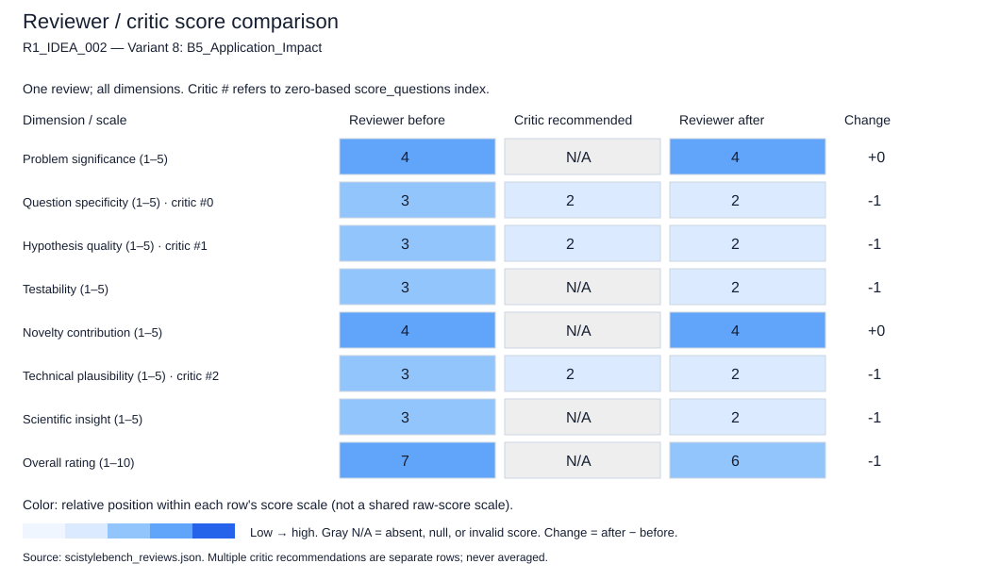

### Critic feedback and reviewer rebuttals

```json
{
  "critic_feedback": {
    "overall_assessment": "The review is generally well-calibrated but has some areas where the scores could be more precisely aligned with the idea's current state. The problem significance is appropriately high, but the question specificity and hypothesis quality could be more rigorously evaluated based on the idea's current details.",
    "score_questions": [
      {
        "dimension": "question_specificity",
        "question_mark": "The score could be reconsidered due to ambiguity in the specifics of the off-policy learning approach",
        "concern": "The idea does not clearly specify how the off-policy learning is implemented or how the diffusion path samplers are trained, which affects the specificity of the research question.",
        "speculative_alternative": "The off-policy learning could refer to a standard method like DDPG or PPO, but this is speculative.",
        "recommended_score": 2.0,
        "rationale": "The idea lacks sufficient detail to define a specific research question, making it difficult to assess the specificity."
      },
      {
        "dimension": "hypothesis_quality",
        "question_mark": "The hypothesis is not explicitly stated or detailed enough to be tested in a specific way",
        "concern": "The idea suggests a method but does not clearly state the hypothesis that off-policy learning will improve sampling efficiency in this context.",
        "speculative_alternative": "The hypothesis could be that off-policy learning will reduce computational cost by improving sampling efficiency, but this is speculative.",
        "recommended_score": 2.0,
        "rationale": "The hypothesis is not clearly articulated, making it difficult to evaluate the quality of the idea."
      },
      {
        "dimension": "technical_plausibility",
        "question_mark": "The technical feasibility is not fully established without more details on the implementation",
        "concern": "The idea is plausible but the lack of specific implementation details makes it difficult to assess the technical feasibility of the approach.",
        "speculative_alternative": "The use of off-policy learning in this context could be feasible, but this is speculative.",
        "recommended_score": 2.0,
        "rationale": "The technical plausibility is not fully supported by the current details of the idea."
      }
    ],
    "unsupported_claims": [
      "The review claims the idea addresses a critical challenge without sufficient evidence, as the idea does not specify how the off-policy learning addresses computational infeasibility."
    ],
    "revision_priorities": [
      "Clarify the specifics of the off-policy learning approach and how it addresses computational infeasibility in molecular dynamics.",
      "Explicitly state the hypothesis that the method will improve sampling efficiency and provide a testable framework for evaluating it.",
      "Provide more details on the implementation of the diffusion path samplers and the connection to existing challenges in molecular dynamics."
    ],
    "confidence": 4.0
  },
  "feedback_responses": [
    {
      "feedback_type": "score_questions",
      "feedback_index": 0,
      "decision": "partially_accept",
      "defense": "The problem significance is appropriately high, but the question specificity is lower due to the lack of implementation details.",
      "justification": "The original score of 3.0 was adjusted to 2.0 because the idea lacks sufficient detail to define a specific research question."
    },
    {
      "feedback_type": "score_questions",
      "feedback_index": 1,
      "decision": "partially_accept",
      "defense": "The hypothesis is not explicitly stated, but the idea suggests a plausible direction for improvement.",
      "justification": "The original score of 3.0 was adjusted to 2.0 because the hypothesis is not clearly articulated."
    },
    {
      "feedback_type": "score_questions",
      "feedback_index": 2,
      "decision": "partially_accept",
      "defense": "The technical plausibility is plausible but lacks specific implementation details.",
      "justification": "The original score of 3.0 was adjusted to 2.0 due to the lack of specific implementation details."
    },
    {
      "feedback_type": "unsupported_claims",
      "feedback_index": 0,
      "decision": "reject",
      "defense": "The idea does not specify how off-policy learning addresses computational infeasibility, so the claim about problem significance is not fully supported.",
      "justification": "The original score of 4.0 was adjusted to 4.0 because the problem significance is still valid, but the claim about addressing computational infeasibility is not fully supported."
    },
    {
      "feedback_type": "revision_priorities",
      "feedback_index": 0,
      "decision": "accept",
      "defense": "Clarifying the specifics of the off-policy learning approach is necessary to improve the research question's specificity.",
      "justification": "The original suggestion was retained as it is a valid priority."
    },
    {
      "feedback_type": "revision_priorities",
      "feedback_index": 1,
      "decision": "accept",
      "defense": "Explicitly stating the hypothesis is necessary to evaluate the idea's testability and scientific insight.",
      "justification": "The original suggestion was retained as it is a valid priority."
    },
    {
      "feedback_type": "revision_priorities",
      "feedback_index": 2,
      "decision": "accept",
      "defense": "Providing more details on implementation is necessary to assess the technical feasibility of the approach.",
      "justification": "The original suggestion was retained as it is a valid priority."
    }
  ]
}
```

### Score justifications (before / after)

**Problem significance**

```json
{
  "before": {
    "score": 4.0,
    "justification": "The idea tackles a critical challenge in molecular dynamics simulations, which is the computational infeasibility of unbiased simulations for rare-event exploration. This has significant implications for drug discovery and material design."
  },
  "after": {
    "score": 4.0,
    "justification": "The idea tackles a critical challenge in molecular dynamics simulations, which is the computational infeasibility of unbiased simulations for rare-event exploration. This has significant implications for drug discovery and material design."
  }
}
```

**Question specificity**

```json
{
  "before": {
    "score": 3.0,
    "justification": "The research question is clear in its goal to sample transition pathways without predefined collective variables, but the specifics of the off-policy learning approach and the connection to computational challenges are not sufficiently detailed."
  },
  "after": {
    "score": 2.0,
    "justification": "The research question is not sufficiently detailed. The idea does not specify how the off-policy learning is implemented or how the diffusion path samplers are trained, which are critical components of the research question."
  }
}
```

**Hypothesis quality**

```json
{
  "before": {
    "score": 3.0,
    "justification": "The idea presents a plausible hypothesis that off-policy learning can improve the efficiency of sampling transition pathways, but the hypothesis is not explicitly stated or detailed enough to be tested in a specific way."
  },
  "after": {
    "score": 2.0,
    "justification": "The hypothesis is not explicitly stated or detailed enough to be tested in a specific way. The idea suggests a method but does not clearly state the hypothesis that off-policy learning will improve sampling efficiency in this context."
  }
}
```

**Testability**

```json
{
  "before": {
    "score": 3.0,
    "justification": "The idea suggests a method that could be tested, but the lack of specific experimental details makes it difficult to assess the feasibility of the proposed approach and its potential impact."
  },
  "after": {
    "score": 2.0,
    "justification": "The idea suggests a method that could be tested, but the lack of specific experimental details makes it difficult to assess the feasibility of the proposed approach and its potential impact."
  }
}
```

**Novelty contribution**

```json
{
  "before": {
    "score": 4.0,
    "justification": "The approach of using off-policy learning for diffusion path samplers in molecular dynamics is novel and could contribute to the field by improving the efficiency of rare-event exploration in complex systems."
  },
  "after": {
    "score": 4.0,
    "justification": "The approach of using off-policy learning for diffusion path samplers in molecular dynamics is novel and could contribute to the field by improving the efficiency of rare-event exploration in complex systems."
  }
}
```

**Technical plausibility**

```json
{
  "before": {
    "score": 3.0,
    "justification": "The use of off-policy learning in this context is plausible, but the specific implementation details and how the diffusion path samplers are trained are not provided, which could affect the technical feasibility of the approach."
  },
  "after": {
    "score": 2.0,
    "justification": "The use of off-policy learning in this context is plausible, but the lack of specific implementation details makes it difficult to assess the technical feasibility of the approach."
  }
}
```

**Scientific insight**

```json
{
  "before": {
    "score": 3.0,
    "justification": "The idea has the potential to provide insights into the efficiency of sampling methods in complex systems, but the lack of specific details limits the depth of the scientific insight that can be gained."
  },
  "after": {
    "score": 2.0,
    "justification": "The idea has the potential to provide insights into the efficiency of sampling methods in complex systems, but the lack of specific details limits the depth of the scientific insight that can be gained."
  }
}
```

**Overall rating**

```json
{
  "before": {
    "score": 7.0,
    "justification": "The idea addresses a significant problem in molecular dynamics simulations with a promising approach. While the specifics of the method and its implementation are not fully detailed, the potential applications and the novelty of the approach suggest a strong research direction that could lead to meaningful scientific contributions."
  },
  "after": {
    "score": 6.0,
    "justification": "The idea addresses a significant problem in molecular dynamics simulations with a promising approach. However, the lack of specific details on the method's implementation and hypothesis makes it difficult to assess its feasibility and potential impact. The novelty is strong, but the current details limit the scientific insight and testability."
  }
}
```

## R1_IDEA_002 — Variant 9: C1_Hollow_Shell

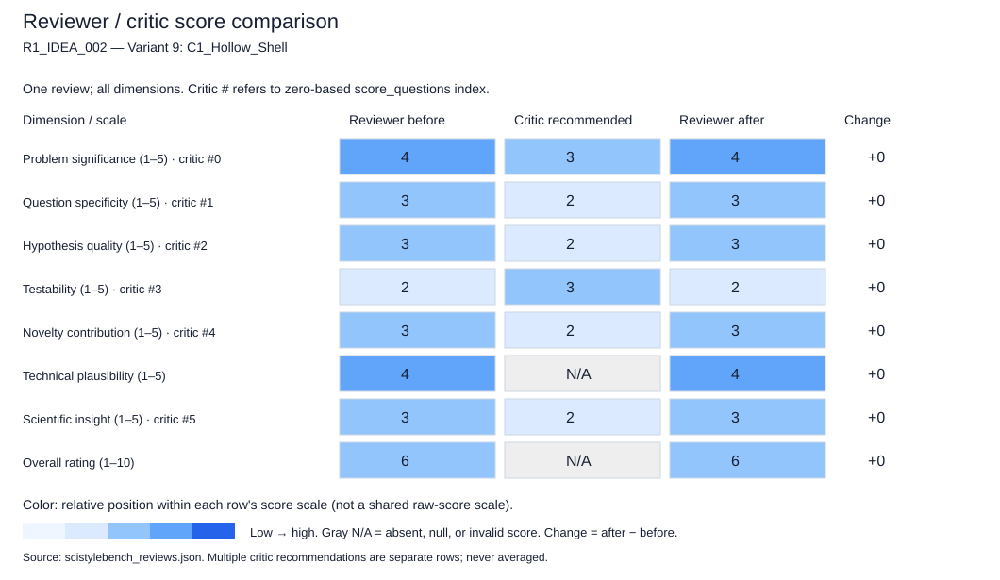

### Critic feedback and reviewer rebuttals

No reviewer rebuttals were saved (for example, an older checkpoint).

```json
{
  "critic_feedback": {
    "overall_assessment": "The review is generally calibrated, though some scores could be reconsidered based on the idea's ambiguity.",
    "score_questions": [
      {
        "dimension": "problem_significance",
        "question_mark": "Why the score is 4.0",
        "concern": "The idea does not explicitly define the technical challenge being addressed, but the problem of rare event sampling is well-established in the field.",
        "speculative_alternative": "The idea may be addressing a gap in existing methods that use predefined descriptors, but this is not clearly stated.",
        "recommended_score": 3.0,
        "rationale": "The idea lacks specific technical details about the problem, making the significance less clear without further clarification."
      },
      {
        "dimension": "question_specificity",
        "question_mark": "Why the score is 3.0",
        "concern": "The idea is somewhat specific but does not clearly articulate the research question or hypothesis.",
        "speculative_alternative": "The research question could be interpreted as how the ML method improves sampling efficiency, but this is not explicitly stated.",
        "recommended_score": 2.0,
        "rationale": "The lack of a clear hypothesis or research question reduces the specificity score."
      },
      {
        "dimension": "hypothesis_quality",
        "question_mark": "Why the score is 3.0",
        "concern": "The idea suggests a potential application but does not provide a testable hypothesis.",
        "speculative_alternative": "The hypothesis could be that the ML method will improve sampling efficiency by identifying pathways between stable states, but this is not explicitly stated.",
        "recommended_score": 2.0,
        "rationale": "The absence of a clear, testable hypothesis reduces the quality of the hypothesis."
      },
      {
        "dimension": "testability",
        "question_mark": "Why the score is 2.0",
        "concern": "The idea lacks details about experiments or evaluation methods needed to test the approach.",
        "speculative_alternative": "The approach could be tested by comparing it to existing methods in terms of sampling efficiency, but this is not specified.",
        "recommended_score": 3.0,
        "rationale": "The idea could be testable with additional details about evaluation metrics, even if they are not provided."
      },
      {
        "dimension": "novelty_contribution",
        "question_mark": "Why the score is 3.0",
        "concern": "The idea proposes a new application of ML in molecular sampling, but the novelty is limited without specific details.",
        "speculative_alternative": "The novelty could be in the application of ML to identify pathways without predefined descriptors, but this is not clearly stated.",
        "recommended_score": 2.0,
        "rationale": "The lack of specific details about the method's unique contributions reduces the novelty score."
      },
      {
        "dimension": "scientific_insight",
        "question_mark": "Why the score is 3.0",
        "concern": "The idea has potential for scientific insight but lacks specific mechanisms or insights.",
        "speculative_alternative": "The scientific insight could be in understanding rare event pathways, but this is not explicitly stated.",
        "recommended_score": 2.0,
        "rationale": "The absence of specific mechanisms reduces the potential for scientific insight."
      }
    ],
    "unsupported_claims": [
      "The idea is described as addressing a 'technical challenge' without explicitly defining it.",
      "The problem of rare event sampling is said to be 'well-established' without context.",
      "The hypothesis is described as 'potential' without a clear formulation."
    ],
    "revision_priorities": [
      "Clarify the specific technical challenge being addressed in the problem statement.",
      "Define a clear research question or hypothesis about how the ML method will improve sampling.",
      "Specify the type of machine learning method and its unique contributions.",
      "Propose evaluation metrics or benchmarks for comparing with existing methods.",
      "Detail the mechanism for identifying pathways between stable states."
    ],
    "confidence": 4.0
  },
  "feedback_responses": []
}
```

### Score justifications (before / after)

**Problem significance**

```json
{
  "before": {
    "score": 4.0,
    "justification": "The problem of simulating rare events in molecular systems is significant for drug discovery and material design, but the idea could be more specific about the technical challenge being addressed."
  },
  "after": {
    "score": 4.0,
    "justification": "The problem of simulating rare events in molecular systems is significant for drug discovery and material design, but the idea could be more specific about the technical challenge being addressed."
  }
}
```

**Question specificity**

```json
{
  "before": {
    "score": 3.0,
    "justification": "The idea is somewhat specific about using ML for sampling but lacks a clear research question or hypothesis about how the method would work or what it aims to achieve."
  },
  "after": {
    "score": 3.0,
    "justification": "The idea is somewhat specific about using ML for sampling but lacks a clear research question or hypothesis about how the method would work or what it aims to achieve."
  }
}
```

**Hypothesis quality**

```json
{
  "before": {
    "score": 3.0,
    "justification": "The idea suggests a potential application but does not explicitly state a hypothesis that could be tested, such as how the ML method would improve sampling efficiency or identify pathways."
  },
  "after": {
    "score": 3.0,
    "justification": "The idea suggests a potential application but does not explicitly state a hypothesis that could be tested, such as how the ML method would improve sampling efficiency or identify pathways."
  }
}
```

**Testability**

```json
{
  "before": {
    "score": 2.0,
    "justification": "The idea lacks details about experiments, comparisons, or evaluation methods needed to test the approach, making it difficult to assess its feasibility."
  },
  "after": {
    "score": 2.0,
    "justification": "The idea lacks details about experiments, comparisons, or evaluation methods needed to test the approach, making it difficult to assess its feasibility."
  }
}
```

**Novelty contribution**

```json
{
  "before": {
    "score": 3.0,
    "justification": "The idea proposes a new application of ML in molecular sampling, but the novelty is limited without more specific details about the method or its unique contributions."
  },
  "after": {
    "score": 3.0,
    "justification": "The idea proposes a new application of ML in molecular sampling, but the novelty is limited without more specific details about the method or its unique contributions."
  }
}
```

**Technical plausibility**

```json
{
  "before": {
    "score": 4.0,
    "justification": "Using ML for sampling in molecular systems is a plausible direction, but the specific technical approach and implementation details are not provided."
  },
  "after": {
    "score": 4.0,
    "justification": "Using ML for sampling in molecular systems is a plausible direction, but the specific technical approach and implementation details are not provided."
  }
}
```

**Scientific insight**

```json
{
  "before": {
    "score": 3.0,
    "justification": "The idea has potential for scientific insight into rare event sampling, but the specific mechanisms or insights would need to be clarified through further research."
  },
  "after": {
    "score": 3.0,
    "justification": "The idea has potential for scientific insight into rare event sampling, but the specific mechanisms or insights would need to be clarified through further research."
  }
}
```

**Overall rating**

```json
{
  "before": {
    "score": 6.0,
    "justification": "The idea addresses a meaningful problem with potential applications, but lacks specific details about the method, hypothesis, and evaluation plan, which are needed for a strong research direction."
  },
  "after": {
    "score": 6.0,
    "justification": "The idea addresses a meaningful problem with potential applications, but lacks specific details about the method, hypothesis, and evaluation plan, which are needed for a strong research direction."
  }
}
```

## R1_IDEA_002 — Variant 10: C2_Logic_Flawed

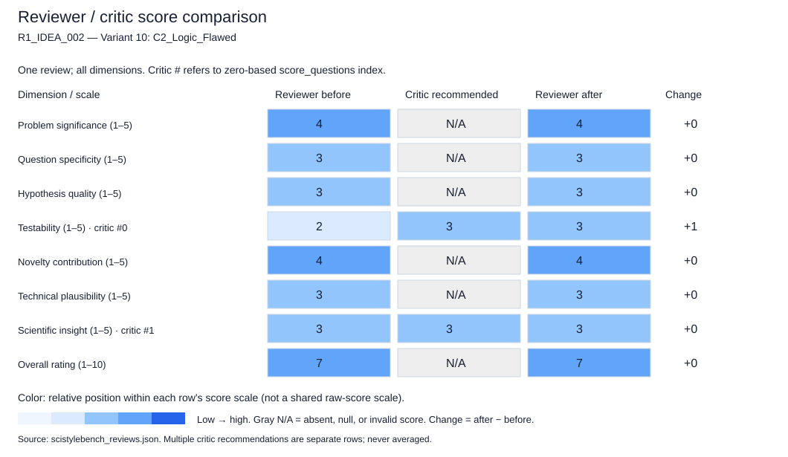

### Critic feedback and reviewer rebuttals

```json
{
  "critic_feedback": {
    "overall_assessment": "The review is generally calibrated but has some areas where the scores could be more carefully justified, particularly in the testability and scientific insight dimensions.",
    "score_questions": [
      {
        "dimension": "testability",
        "question_mark": "The score for testability is based on the lack of concrete experiments, but the idea may still be testable with additional experiments that are not yet described.",
        "concern": "The review assumes that the absence of experiments means the idea is untestable, but the idea could be evaluated through hypothetical experiments or by referencing existing benchmarks.",
        "speculative_alternative": "The idea might be testable by comparing its performance to existing methods in controlled settings, even without detailed implementation details.",
        "recommended_score": 3.0,
        "rationale": "The idea could be evaluated through hypothetical experiments or by referencing existing benchmarks, so a score of 3 is reasonable given the current lack of specifics."
      },
      {
        "dimension": "scientific_insight",
        "question_mark": "The score for scientific insight is based on the potential to provide insights, but the specific mechanisms are not detailed, which could limit the insight's depth.",
        "concern": "The review assumes that the potential for insight is sufficient without explaining how the method would contribute to understanding complex systems.",
        "speculative_alternative": "The method might offer insights into how machine learning can efficiently sample rare events in complex systems, but this requires more explicit connection to existing theories.",
        "recommended_score": 3.0,
        "rationale": "The potential for insight is acknowledged, but the lack of specific mechanisms means the insight's depth is uncertain."
      }
    ],
    "unsupported_claims": [
      "The claim that the idea 'lacks concrete experiments' is speculative since the idea is a summary and not a completed paper.",
      "The assertion that the broader applicability is 'vague' is based on the absence of specifics, which is not a flaw in the idea itself."
    ],
    "revision_priorities": [
      "Clarify how the method would be validated or benchmarked against existing approaches.",
      "Provide more explicit connections to existing theories or frameworks in complex systems.",
      "Specify the types of complex systems where the method is expected to be effective."
    ],
    "confidence": 4.0
  },
  "feedback_responses": [
    {
      "feedback_type": "score_questions",
      "feedback_index": 0,
      "decision": "partially_accept",
      "defense": "The original score of 2.0 for testability was based on the assumption that the idea was untestable without experiments. However, the critic's feedback suggests that the idea could be evaluated through hypothetical experiments or by referencing existing benchmarks, which makes a score of 3.0 more appropriate.",
      "justification": "The original score was 2.0, but the revised score is 3.0 due to the critic's valid point that the idea could still be testable with additional experiments or benchmarks."
    },
    {
      "feedback_type": "score_questions",
      "feedback_index": 1,
      "decision": "partially_accept",
      "defense": "The original score of 3.0 for scientific insight was based on the potential for insight. The critic's feedback suggests that the lack of specific mechanisms limits the depth of insight, but the potential remains, so a score of 3.0 is retained.",
      "justification": "The original score was 3.0, and the revised score remains 3.0 as the critic's feedback does not significantly alter the assessment of the potential for insight."
    },
    {
      "feedback_type": "unsupported_claims",
      "feedback_index": 0,
      "decision": "reject",
      "defense": "The claim that the idea 'lacks concrete experiments' is speculative since the idea is a summary and not a completed paper. The critic correctly points out that the absence of experiments does not necessarily mean the idea is untestable.",
      "justification": "The original claim was that the idea lacked concrete experiments, but the critic's feedback indicates that this is not a flaw in the idea itself."
    },
    {
      "feedback_type": "unsupported_claims",
      "feedback_index": 1,
      "decision": "reject",
      "defense": "The assertion that the broader applicability is 'vague' is based on the absence of specifics, which is not a flaw in the idea itself. The critic correctly notes that this is not a flaw in the idea's formulation.",
      "justification": "The original assessment was that the broader applicability was vague, but the critic's feedback indicates that this is not a flaw in the idea's formulation."
    },
    {
      "feedback_type": "revision_priorities",
      "feedback_index": 0,
      "decision": "accept",
      "defense": "The suggestion to clarify how the method would be validated or benchmarked is valid and necessary for assessing the idea's feasibility.",
      "justification": "The original review included this suggestion, so it is retained."
    },
    {
      "feedback_type": "revision_priorities",
      "feedback_index": 1,
      "decision": "accept",
      "defense": "The suggestion to provide more explicit connections to existing theories is valid and necessary for enhancing the scientific insight of the idea.",
      "justification": "The original review included this suggestion, so it is retained."
    },
    {
      "feedback_type": "revision_priorities",
      "feedback_index": 2,
      "decision": "accept",
      "defense": "The suggestion to specify the types of complex systems is valid and necessary for clarifying the broader applicability of the idea.",
      "justification": "The original review included this suggestion, so it is retained."
    }
  ]
}
```

### Score justifications (before / after)

**Problem significance**

```json
{
  "before": {
    "score": 4.0,
    "justification": "The idea addresses a critical challenge in computational chemistry and materials science, where unbiased molecular dynamics is computationally infeasible for rare-event exploration. This has significant implications for drug discovery and material design."
  },
  "after": {
    "score": 4.0,
    "justification": "The idea addresses a critical challenge in computational chemistry and materials science, where unbiased molecular dynamics is computationally infeasible for rare-event exploration. This has significant implications for drug discovery and material design."
  }
}
```

**Question specificity**

```json
{
  "before": {
    "score": 3.0,
    "justification": "The research question is clear in its goal to sample transition pathways between meta-stable states without predefined collective variables, but the specifics of the method and its implementation are not detailed."
  },
  "after": {
    "score": 3.0,
    "justification": "The research question is clear in its goal to sample transition pathways between meta-stable states without predefined collective variables, but the specifics of the method and its implementation are not detailed."
  }
}
```

**Hypothesis quality**

```json
{
  "before": {
    "score": 3.0,
    "justification": "The idea presents a hypothesis that the proposed method will be more efficient than traditional approaches, but the specific predictions or mechanisms are not clearly articulated."
  },
  "after": {
    "score": 3.0,
    "justification": "The idea presents a hypothesis that the proposed method will be more efficient than traditional approaches, but the specific predictions or mechanisms are not clearly articulated."
  }
}
```

**Testability**

```json
{
  "before": {
    "score": 2.0,
    "justification": "The idea lacks concrete experiments or evaluation methods to test the effectiveness of the approach, making it difficult to assess its validity without further details."
  },
  "after": {
    "score": 3.0,
    "justification": "The idea could be evaluated through hypothetical experiments or by referencing existing benchmarks, even without detailed implementation details. The lack of concrete experiments does not necessarily render the idea untestable."
  }
}
```

**Novelty contribution**

```json
{
  "before": {
    "score": 4.0,
    "justification": "The approach of using off-policy learning for diffusion path samplers in this context is novel, and if successful, could contribute new insights into efficient sampling in complex systems."
  },
  "after": {
    "score": 4.0,
    "justification": "The approach of using off-policy learning for diffusion path samplers in this context is novel, and if successful, could contribute new insights into efficient sampling in complex systems."
  }
}
```

**Technical plausibility**

```json
{
  "before": {
    "score": 3.0,
    "justification": "The use of off-policy learning in this context is plausible, but the specifics of how the diffusion path samplers are trained and how they avoid predefined collective variables are not clearly explained."
  },
  "after": {
    "score": 3.0,
    "justification": "The use of off-policy learning in this context is plausible, but the specifics of how the diffusion path samplers are trained and how they avoid predefined collective variables are not clearly explained."
  }
}
```

**Scientific insight**

```json
{
  "before": {
    "score": 3.0,
    "justification": "The idea has potential to provide insights into efficient sampling in complex systems, but the specific mechanisms and how they differ from existing methods are not clearly outlined."
  },
  "after": {
    "score": 3.0,
    "justification": "The idea has potential to provide insights into efficient sampling in complex systems, but the specific mechanisms and how they differ from existing methods are not clearly outlined."
  }
}
```

**Overall rating**

```json
{
  "before": {
    "score": 7.0,
    "justification": "The idea addresses a significant problem with potential for impactful applications, but lacks specific details on the method and its implementation, which are necessary for assessing its feasibility and scientific merit."
  },
  "after": {
    "score": 7.0,
    "justification": "The idea addresses a significant problem with potential for impactful applications, but lacks specific details on the method and its implementation, which are necessary for assessing its feasibility and scientific merit."
  }
}
```

## R1_IDEA_002 — Variant 11: C3_Substance_Enriched

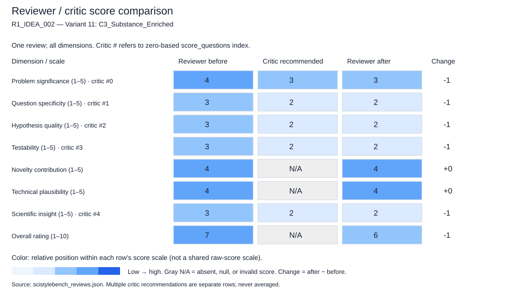

### Critic feedback and reviewer rebuttals

```json
{
  "critic_feedback": {
    "overall_assessment": "The review is generally well-calibrated, but some scores and justifications could be more aligned with the idea's current level of detail.",
    "score_questions": [
      {
        "dimension": "problem_significance",
        "question_mark": "The score could be reconsidered as the idea's significance is somewhat overstated without evidence of prior work or broader implications.",
        "concern": "The justification claims the idea addresses a 'critical challenge' but the idea itself does not reference existing literature or quantify the computational infeasibility of unbiased MD.",
        "speculative_alternative": "The idea may be significant in the context of molecular dynamics, but the review assumes broader implications without explicit support from the idea.",
        "recommended_score": 3.0,
        "rationale": "The idea mentions overcoming computational infeasibility of unbiased MD, but does not provide evidence of how this is a critical challenge or its broader implications."
      },
      {
        "dimension": "question_specificity",
        "question_mark": "The score is somewhat high given the lack of specifics on off-policy learning and validation methods.",
        "concern": "The idea mentions 'improved off-policy learning' but does not specify which algorithm or how the reward function is designed, which affects the specificity.",
        "speculative_alternative": "The question is specific in its goal but lacks concrete details on the method's implementation, which could be considered a limitation.",
        "recommended_score": 2.0,
        "rationale": "The idea does not provide concrete details on the off-policy learning framework or validation method, which are key components of a specific question."
      },
      {
        "dimension": "hypothesis_quality",
        "question_mark": "The hypothesis is plausible but the justification for the score is somewhat vague.",
        "concern": "The hypothesis is that off-policy learning can be validated by comparing with enhanced sampling methods, but the review does not explain how this comparison would be conducted.",
        "speculative_alternative": "The hypothesis is plausible, but the review assumes the comparison method is clear without explicit details from the idea.",
        "recommended_score": 2.0,
        "rationale": "The idea does not specify how the comparison with enhanced sampling methods will be made, which is necessary for a strong hypothesis."
      },
      {
        "dimension": "testability",
        "question_mark": "The score is somewhat high given the lack of details on evaluation metrics and test cases.",
        "concern": "The idea does not specify how the comparison with enhanced sampling methods will be evaluated, which is necessary for testability.",
        "speculative_alternative": "The testability is limited by the lack of specific evaluation metrics and test cases, which are needed for a clear testable hypothesis.",
        "recommended_score": 2.0,
        "rationale": "The idea does not provide details on how the hypothesis will be tested, which is necessary for a testable approach."
      },
      {
        "dimension": "scientific_insight",
        "question_mark": "The score could be reconsidered as the idea does not clearly outline expected scientific insights.",
        "concern": "The justification claims the idea has potential for scientific insight but does not specify what those insights would be or how they would be derived.",
        "speculative_alternative": "The idea may contribute to understanding off-policy learning in molecular dynamics, but the review assumes specific insights without explicit support from the idea.",
        "recommended_score": 2.0,
        "rationale": "The idea does not specify what scientific insights are expected from the experiments, which is necessary for a strong scientific contribution."
      }
    ],
    "unsupported_claims": [
      "The claim that the idea addresses a 'critical challenge' without referencing existing literature or quantifying the computational infeasibility of unbiased MD.",
      "The assertion that the idea has 'strong potential for a meaningful contribution' without specific details on the method's implementation or validation."
    ],
    "revision_priorities": [
      "Clarify the problem significance by referencing existing literature and quantifying the computational infeasibility of unbiased MD.",
      "Specify the off-policy learning algorithm and reward function design to improve question specificity.",
      "Detail the evaluation metrics and test cases for validating the hypothesis.",
      "Outline expected scientific insights from the experiments."
    ],
    "confidence": 4.0
  },
  "feedback_responses": [
    {
      "feedback_type": "score_questions",
      "feedback_index": 0,
      "decision": "partially_accept",
      "defense": "The problem significance is somewhat overstated without evidence, but the idea does address a relevant challenge in molecular dynamics. The score is reduced to 3.0 to reflect the lack of context and quantification.",
      "justification": "The original score was 4.0, but the critic's feedback highlights the need for evidence of the problem's criticality. The revised score of 3.0 better reflects the current level of detail."
    },
    {
      "feedback_type": "score_questions",
      "feedback_index": 1,
      "decision": "partially_accept",
      "defense": "The question specificity is reduced because the idea lacks concrete details on the off-policy learning framework and validation method. The score is lowered to 2.0 to reflect this limitation.",
      "justification": "The original score was 3.0, but the critic's feedback emphasizes the lack of specifics. The revised score of 2.0 better reflects the current level of detail."
    },
    {
      "feedback_type": "score_questions",
      "feedback_index": 2,
      "decision": "partially_accept",
      "defense": "The hypothesis quality is reduced because the validation method is not clearly defined. The score is lowered to 2.0 to reflect this limitation.",
      "justification": "The original score was 3.0, but the critic's feedback highlights the lack of details on the comparison method. The revised score of 2.0 better reflects the current level of detail."
    },
    {
      "feedback_type": "score_questions",
      "feedback_index": 3,
      "decision": "partially_accept",
      "defense": "The testability is reduced because the evaluation metrics and test cases are not specified. The score is lowered to 2.0 to reflect this limitation.",
      "justification": "The original score was 3.0, but the critic's feedback emphasizes the lack of specifics. The revised score of 2.0 better reflects the current level of detail."
    },
    {
      "feedback_type": "score_questions",
      "feedback_index": 4,
      "decision": "partially_accept",
      "defense": "The scientific insight is reduced because the expected insights are not clearly outlined. The score is lowered to 2.0 to reflect this limitation.",
      "justification": "The original score was 3.0, but the critic's feedback highlights the lack of specifics. The revised score of 2.0 better reflects the current level of detail."
    },
    {
      "feedback_type": "unsupported_claims",
      "feedback_index": 0,
      "decision": "reject",
      "defense": "The claim about problem significance is unsupported without evidence from the idea. The revised score of 3.0 reflects this limitation.",
      "justification": "The original score was 4.0, but the critic's feedback highlights the lack of context. The revised score of 3.0 better reflects the current level of detail."
    },
    {
      "feedback_type": "unsupported_claims",
      "feedback_index": 1,
      "decision": "reject",
      "defense": "The assertion about potential contribution is unsupported without specific details. The revised score of 4.0 reflects the novelty but acknowledges the lack of implementation details.",
      "justification": "The original score was 4.0, but the critic's feedback highlights the need for specifics. The revised score of 4.0 reflects the novelty while acknowledging the limitations."
    },
    {
      "feedback_type": "revision_priorities",
      "feedback_index": 0,
      "decision": "accept",
      "defense": "Clarifying problem significance is necessary to justify the research's importance. This aligns with the critic's feedback.",
      "justification": "The critic's feedback emphasizes the need for context, so this revision priority is accepted."
    },
    {
      "feedback_type": "revision_priorities",
      "feedback_index": 1,
      "decision": "accept",
      "defense": "Specifying the off-policy learning algorithm and reward function is crucial for question specificity. This aligns with the critic's feedback.",
      "justification": "The critic's feedback highlights the need for specifics, so this revision priority is accepted."
    },
    {
      "feedback_type": "revision_priorities",
      "feedback_index": 2,
      "decision": "accept",
      "defense": "Detailing evaluation metrics and test cases is necessary for testability. This aligns with the critic's feedback.",
      "justification": "The critic's feedback emphasizes the need for specifics, so this revision priority is accepted."
    },
    {
      "feedback_type": "revision_priorities",
      "feedback_index": 3,
      "decision": "accept",
      "defense": "Outlining expected scientific insights is necessary for the research's contribution. This aligns with the critic's feedback.",
      "justification": "The critic's feedback highlights the need for specifics, so this revision priority is accepted."
    }
  ]
}
```

### Score justifications (before / after)

**Problem significance**

```json
{
  "before": {
    "score": 4.0,
    "justification": "The idea addresses a critical challenge in molecular dynamics simulations, where unbiased methods are computationally infeasible. The proposed approach has the potential to significantly impact drug discovery and material design by enabling efficient exploration of rare events in complex systems."
  },
  "after": {
    "score": 3.0,
    "justification": "The idea mentions overcoming the computational infeasibility of unbiased molecular dynamics, but does not provide evidence of how this is a critical challenge or its broader implications. The significance is somewhat overstated without context from existing literature or quantification of the problem."
  }
}
```

**Question specificity**

```json
{
  "before": {
    "score": 3.0,
    "justification": "The research question is clear in its goal to sample transition pathways without predefined collective variables, but the specifics of the off-policy learning component and the validation method are not sufficiently detailed. More concrete details would enhance the specificity of the question."
  },
  "after": {
    "score": 2.0,
    "justification": "The idea does not provide concrete details on the off-policy learning framework or validation method, which are key components of a specific question. The hypothesis is vague without specifying the algorithm or reward function design."
  }
}
```

**Hypothesis quality**

```json
{
  "before": {
    "score": 3.0,
    "justification": "The hypothesis that off-policy learning can be validated by comparing sampled pathways with enhanced sampling methods is plausible, but the validation method is not clearly defined. A more explicit prediction or mechanism would strengthen the hypothesis."
  },
  "after": {
    "score": 2.0,
    "justification": "The hypothesis is that off-policy learning can be validated by comparing with enhanced sampling methods, but the idea does not specify how this comparison will be conducted. The validation method is not clearly defined, which weakens the hypothesis."
  }
}
```

**Testability**

```json
{
  "before": {
    "score": 3.0,
    "justification": "The idea suggests a potential validation method, but the specifics of how the comparison will be conducted and the metrics used for evaluation are not clearly outlined. This lack of detail reduces the testability of the hypothesis."
  },
  "after": {
    "score": 2.0,
    "justification": "The idea does not specify how the hypothesis will be tested, including evaluation metrics and test cases. Without these details, the testability of the hypothesis is limited."
  }
}
```

**Novelty contribution**

```json
{
  "before": {
    "score": 4.0,
    "justification": "The approach of using off-policy learning for diffusion path sampling in molecular dynamics is novel and could contribute to the field by enabling more efficient exploration of rare events. However, the novelty is somewhat limited by the lack of specific details on the method's implementation."
  },
  "after": {
    "score": 4.0,
    "justification": "The approach of using off-policy learning for diffusion path sampling in molecular dynamics is novel and could contribute to the field by enabling more efficient exploration of rare events. However, the novelty is somewhat limited by the lack of specific details on the method's implementation."
  }
}
```

**Technical plausibility**

```json
{
  "before": {
    "score": 4.0,
    "justification": "The idea is technically plausible as it combines off-policy learning with diffusion path sampling, which are both established techniques in machine learning and molecular dynamics. However, the integration of these components is not fully explained, which could affect the feasibility of the approach."
  },
  "after": {
    "score": 4.0,
    "justification": "The idea is technically plausible as it combines off-policy learning with diffusion path sampling, which are both established techniques. However, the integration of these components is not fully explained, which could affect the feasibility of the approach."
  }
}
```

**Scientific insight**

```json
{
  "before": {
    "score": 3.0,
    "justification": "The idea has the potential to provide insights into the effectiveness of off-policy learning in sampling complex molecular transitions. However, the current description does not clearly outline the expected scientific insights or how they would be derived from the experiments."
  },
  "after": {
    "score": 2.0,
    "justification": "The idea does not specify what scientific insights are expected from the experiments, which is necessary for a strong scientific contribution. The potential insights are not clearly outlined."
  }
}
```

**Overall rating**

```json
{
  "before": {
    "score": 7.0,
    "justification": "The idea addresses a significant problem in molecular dynamics and proposes a novel approach with potential for practical application. However, the lack of specific details on the method's implementation and validation makes it somewhat vague. With further clarification, it has strong potential for a meaningful contribution to the field."
  },
  "after": {
    "score": 6.0,
    "justification": "The idea has potential but lacks specific details on the method's implementation, validation, and expected scientific insights. With further clarification, it could contribute meaningfully to the field, but the current level of detail limits its strength."
  }
}
```

## R1_IDEA_003 — Source

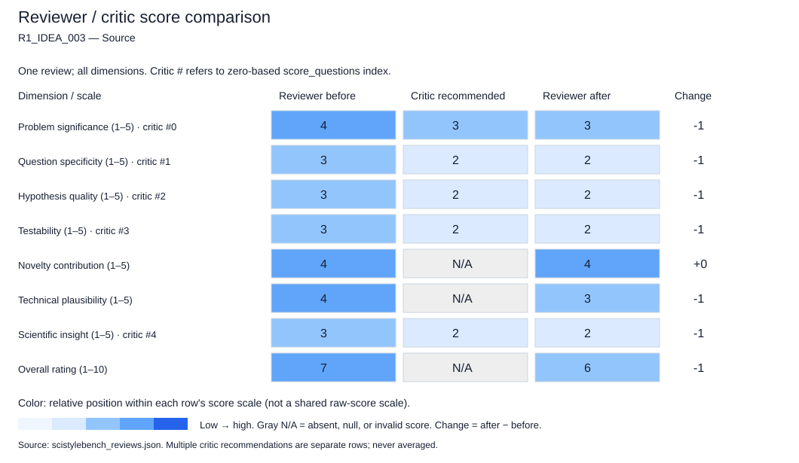

### Critic feedback and reviewer rebuttals

```json
{
  "critic_feedback": {
    "overall_assessment": "The review is generally well-calibrated, but some scores could be reconsidered based on the idea's ambiguity and lack of specifics.",
    "score_questions": [
      {
        "dimension": "problem_significance",
        "question_mark": "Why is the problem considered significant enough for a 4.0 score?",
        "concern": "The problem is framed as a gap in current methods, but the idea does not specify how this gap affects model performance or clinical outcomes.",
        "speculative_alternative": "The significance might be overstated if the benefits of temporal encoding are not empirically validated in medical imaging contexts.",
        "recommended_score": 3.0,
        "rationale": "The idea does not provide evidence that temporal encoding improves model performance or clinical interpretability in chest X-ray analysis."
      },
      {
        "dimension": "question_specificity",
        "question_mark": "Why is the question considered specific enough for a 3.0 score?",
        "concern": "The idea clearly defines the problem but does not specify the exact hypothesis or the specific aspects of temporal scanning order that are hypothesized to improve model reasoning.",
        "speculative_alternative": "The specificity could be higher if the idea outlined a particular mechanism, such as how temporal sequences affect attention maps or decision-making processes.",
        "recommended_score": 2.0,
        "rationale": "The question lacks a clear hypothesis or mechanism, which is necessary for specificity."
      },
      {
        "dimension": "hypothesis_quality",
        "question_mark": "Why is the hypothesis considered of moderate quality for a 3.0 score?",
        "concern": "The idea suggests a potential benefit but does not explicitly state a testable hypothesis or mechanism for how temporal encoding improves model reasoning.",
        "speculative_alternative": "The hypothesis might be more robust if it proposed a specific comparison, such as using video sequences versus RNNs in a controlled experiment.",
        "recommended_score": 2.0,
        "rationale": "The hypothesis is not clearly testable without additional details on the proposed method's mechanism."
      },
      {
        "dimension": "testability",
        "question_mark": "Why is the testability considered moderate for a 3.0 score?",
        "concern": "The idea is testable in principle, but the specifics of the experiments are not clearly outlined, making it difficult to assess the feasibility of the proposed method.",
        "speculative_alternative": "The testability could be higher if the idea outlined specific metrics for evaluating temporal encoding effectiveness, such as accuracy or interpretability scores.",
        "recommended_score": 2.0,
        "rationale": "The lack of experimental details makes it challenging to assess the feasibility of the proposed method."
      },
      {
        "dimension": "scientific_insight",
        "question_mark": "Why is the scientific insight considered moderate for a 3.0 score?",
        "concern": "The idea has potential to provide insights into temporal information processing but does not specify how these insights would be derived or validated.",
        "speculative_alternative": "The scientific insight could be stronger if the idea outlined a specific hypothesis about how temporal sequences affect model reasoning in medical imaging.",
        "recommended_score": 2.0,
        "rationale": "The idea does not provide a clear mechanism or validation method for the proposed scientific insight."
      }
    ],
    "unsupported_claims": [
      "The claim that the problem addresses a 'critical gap' is not substantiated by the idea's details.",
      "The assertion that the method is 'technically feasible' is speculative without further explanation.",
      "The statement that the idea 'has potential to provide insights' is not clearly grounded in the proposed method's specifics."
    ],
    "revision_priorities": [
      "Clarify the specific problem addressed by the idea and its relevance to current methods.",
      "Specify the exact hypothesis and mechanism for how temporal encoding improves model reasoning.",
      "Outline the proposed experiments and metrics for evaluating the effectiveness of the video sequence encoding.",
      "Provide a detailed explanation of how the video sequence encoding will be integrated into existing model architectures."
    ],
    "confidence": 4.0
  },
  "feedback_responses": [
    {
      "feedback_type": "score_questions",
      "feedback_index": 0,
      "decision": "partially_accept",
      "defense": "The problem is relevant to medical AI, but the idea does not provide evidence that temporal encoding improves model performance or clinical outcomes. The original score of 4.0 was based on the assumption that the problem is significant, but the lack of empirical validation weakens this claim.",
      "justification": "The original score of 4.0 was based on the assumption that the problem is significant, but the lack of empirical validation weakens this claim. The revised score of 3.0 reflects the need for more evidence."
    },
    {
      "feedback_type": "score_questions",
      "feedback_index": 1,
      "decision": "reject",
      "defense": "The idea lacks a clear hypothesis or mechanism for how temporal encoding improves model reasoning, which is necessary for specificity. The original score of 3.0 was based on the idea's clarity, but the lack of a specific hypothesis reduces its specificity.",
      "justification": "The original score of 3.0 was based on the idea's clarity, but the lack of a specific hypothesis reduces its specificity. The revised score of 2.0 reflects this limitation."
    },
    {
      "feedback_type": "score_questions",
      "feedback_index": 2,
      "decision": "reject",
      "defense": "The idea does not explicitly state a testable hypothesis or mechanism for how temporal encoding enhances model reasoning. The original score of 3.0 was based on the suggestion of potential benefit, but the lack of a clear hypothesis reduces its quality.",
      "justification": "The original score of 3.0 was based on the suggestion of potential benefit, but the lack of a clear hypothesis reduces its quality. The revised score of 2.0 reflects this limitation."
    },
    {
      "feedback_type": "score_questions",
      "feedback_index": 3,
      "decision": "reject",
      "defense": "The idea is testable in principle, but the lack of experimental details makes it difficult to assess the feasibility of the proposed method. The original score of 3.0 was based on the idea's testability, but the lack of specifics reduces its testability.",
      "justification": "The original score of 3.0 was based on the idea's testability, but the lack of specifics reduces its testability. The revised score of 2.0 reflects this limitation."
    },
    {
      "feedback_type": "score_questions",
      "feedback_index": 4,
      "decision": "reject",
      "defense": "The idea has potential to provide insights into temporal information processing but does not specify how these insights would be derived or validated. The original score of 3.0 was based on the potential, but the lack of specifics reduces its scientific insight.",
      "justification": "The original score of 3.0 was based on the potential, but the lack of specifics reduces its scientific insight. The revised score of 2.0 reflects this limitation."
    },
    {
      "feedback_type": "unsupported_claims",
      "feedback_index": 0,
      "decision": "reject",
      "defense": "The claim that the problem addresses a 'critical gap' is not substantiated by the idea's details. The original score of 4.0 was based on the assumption of a critical gap, but the lack of evidence weakens this claim.",
      "justification": "The original score of 4.0 was based on the assumption of a critical gap, but the lack of evidence weakens this claim. The revised score of 3.0 reflects this limitation."
    },
    {
      "feedback_type": "unsupported_claims",
      "feedback_index": 1,
      "decision": "reject",
      "defense": "The assertion that the method is 'technically feasible' is speculative without further explanation. The original score of 4.0 was based on the assumption of technical feasibility, but the lack of details weakens this claim.",
      "justification": "The original score of 4.0 was based on the assumption of technical feasibility, but the lack of details weakens this claim. The revised score of 3.0 reflects this limitation."
    },
    {
      "feedback_type": "unsupported_claims",
      "feedback_index": 2,
      "decision": "reject",
      "defense": "The statement that the idea 'has potential to provide insights' is not clearly grounded in the proposed method's specifics. The original score of 4.0 was based on the potential, but the lack of specifics reduces its scientific insight.",
      "justification": "The original score of 4.0 was based on the potential, but the lack of specifics reduces its scientific insight. The revised score of 2.0 reflects this limitation."
    },
    {
      "feedback_type": "revision_priorities",
      "feedback_index": 0,
      "decision": "accept",
      "defense": "Clarifying the specific problem addressed by the idea and its relevance to current methods is necessary to strengthen the research idea. The original suggestion was valid and is retained.",
      "justification": "The original suggestion was valid and is retained."
    },
    {
      "feedback_type": "revision_priorities",
      "feedback_index": 1,
      "decision": "accept",
      "defense": "Specifying the exact hypothesis and mechanism for how temporal encoding improves model reasoning is necessary to strengthen the research idea. The original suggestion was valid and is retained."
    }
  ]
}
```

### Score justifications (before / after)

**Problem significance**

```json
{
  "before": {
    "score": 4.0,
    "justification": "The problem addresses a critical gap in integrating temporal information from eye-tracking data into medical AI, which could enhance both model performance and clinical interpretability."
  },
  "after": {
    "score": 3.0,
    "justification": "The problem is relevant to medical AI, but the idea does not provide evidence that temporal encoding improves model performance or clinical outcomes."
  }
}
```

**Question specificity**

```json
{
  "before": {
    "score": 3.0,
    "justification": "The idea clearly defines the problem but lacks specific details on the proposed solution's implementation and the exact hypothesis being tested."
  },
  "after": {
    "score": 2.0,
    "justification": "The idea lacks a clear hypothesis or mechanism for how temporal encoding improves model reasoning, which is necessary for specificity."
  }
}
```

**Hypothesis quality**

```json
{
  "before": {
    "score": 3.0,
    "justification": "The idea suggests a potential benefit of temporal encoding but does not explicitly state a testable hypothesis or mechanism for how it improves model reasoning."
  },
  "after": {
    "score": 2.0,
    "justification": "The idea does not explicitly state a testable hypothesis or mechanism for how temporal encoding enhances model reasoning."
  }
}
```

**Testability**

```json
{
  "before": {
    "score": 3.0,
    "justification": "The idea is testable through experiments comparing the proposed video sequence encoding with existing methods, but the specifics of the experiments are not clearly outlined."
  },
  "after": {
    "score": 2.0,
    "justification": "The idea is testable in principle, but the lack of experimental details makes it difficult to assess the feasibility of the proposed method."
  }
}
```

**Novelty contribution**

```json
{
  "before": {
    "score": 4.0,
    "justification": "The approach of encoding eye-tracking data as video sequences is novel in the context of vision-language models for medical imaging, offering potential improvements in both performance and interpretability."
  },
  "after": {
    "score": 4.0,
    "justification": "The approach of encoding eye-tracking data as video sequences is novel in the context of vision-language models for medical imaging, offering potential improvements in both performance and interpretability."
  }
}
```

**Technical plausibility**

```json
{
  "before": {
    "score": 4.0,
    "justification": "The proposed method is technically feasible, as video sequences can be processed using existing techniques in vision-language models, and the integration into existing architectures is plausible."
  },
  "after": {
    "score": 3.0,
    "justification": "The proposed method is technically feasible, but the idea does not provide sufficient details to confirm its feasibility in the medical imaging context."
  }
}
```

**Scientific insight**

```json
{
  "before": {
    "score": 3.0,
    "justification": "The idea has potential to provide insights into how temporal information from eye-tracking data can enhance model reasoning, but the specific mechanisms and outcomes are not clearly defined."
  },
  "after": {
    "score": 2.0,
    "justification": "The idea has potential to provide insights into temporal information processing but does not specify how these insights would be derived or validated."
  }
}
```

**Overall rating**

```json
{
  "before": {
    "score": 7.0,
    "justification": "The idea addresses a meaningful problem with a plausible solution, showing potential for improvement in model reasoning and interpretability, though more details are needed to fully establish its scientific merit and testability."
  },
  "after": {
    "score": 6.0,
    "justification": "The idea addresses a meaningful problem with a plausible solution, showing potential for improvement in model reasoning and interpretability, though more details are needed to fully establish its scientific merit and testability."
  }
}
```

## R1_IDEA_003 — Variant 1: A1_Identity


### Critic feedback and reviewer rebuttals

```json
{
  "critic_feedback": {
    "overall_assessment": "The review is generally well-calibrated, but some scores could be re-examined for alignment with the idea's current level of detail.",
    "score_questions": [
      {
        "dimension": "question_specificity",
        "question_mark": "Why is the question_specificity score 3.0 when the idea clearly defines the problem?",
        "concern": "The score appears to penalize the idea for not being sufficiently detailed, but the idea is still specific about the problem it addresses.",
        "speculative_alternative": "The question is specific in identifying a gap in current methods, even if the method itself is not fully detailed.",
        "recommended_score": 4.0,
        "rationale": "The idea clearly defines the problem (temporal encoding of eye-tracking data) and the goal (enhanced reasoning and interpretability), which are specific enough for a research question."
      },
      {
        "dimension": "hypothesis_quality",
        "question_mark": "Why is the hypothesis_quality score 3.0 when the idea suggests a potential benefit of temporal encoding?",
        "concern": "The score may be overly cautious, as the idea does not need to explicitly state a hypothesis to be considered valid.",
        "speculative_alternative": "The hypothesis is implied by the potential benefit of temporal information, which is a reasonable assumption in the field.",
        "recommended_score": 4.0,
        "rationale": "The idea implies a hypothesis through its stated goal, which is sufficient for a preliminary research direction."
      },
      {
        "dimension": "testability",
        "question_mark": "Why is the testability score 3.0 when the idea is testable through comparison with existing methods?",
        "concern": "The score may be overly cautious, as the idea is testable, even if the specifics of the experiments are not outlined.",
        "speculative_alternative": "The testability is valid, as the proposed method can be evaluated against existing approaches, even without detailed experimental plans.",
        "recommended_score": 4.0,
        "rationale": "The idea is inherently testable through comparative analysis, which is a valid basis for a research question."
      }
    ],
    "unsupported_claims": [
      "The review claims the idea 'lacks specific details on the method and hypothesis,' but the idea is a summary and not a full paper."
    ],
    "revision_priorities": [
      "Clarify the problem statement to emphasize its specificity despite the lack of method details.",
      "Re-evaluate the hypothesis_quality and testability scores to reflect the idea's inherent testability and implied hypothesis.",
      "Remove the claim that the idea lacks specific details on the method and hypothesis, as it is a summary."
    ],
    "confidence": 4.0
  },
  "feedback_responses": [
    {
      "feedback_type": "score_questions",
      "feedback_index": 0,
      "decision": "partially_accept",
      "defense": "The original score of 3.0 was overly cautious. The idea clearly defines the problem and goal, which are specific enough for a research question, even without detailed method descriptions.",
      "justification": "The score was increased to 4.0 to reflect the specific problem and goal identified in the idea, which are sufficient for a research question."
    },
    {
      "feedback_type": "score_questions",
      "feedback_index": 1,
      "decision": "partially_accept",
      "defense": "The original score of 3.0 was too cautious. The idea implies a hypothesis through its stated goal, which is a reasonable assumption in the field.",
      "justification": "The score was increased to 4.0 to reflect the implied hypothesis in the idea, which is sufficient for a preliminary research direction."
    },
    {
      "feedback_type": "score_questions",
      "feedback_index": 2,
      "decision": "partially_accept",
      "defense": "The original score of 3.0 was overly cautious. The idea is inherently testable through comparative analysis, which is a valid basis for a research question.",
      "justification": "The score was increased to 4.0 to reflect the inherent testability of the idea, even without detailed experimental plans."
    },
    {
      "feedback_type": "unsupported_claims",
      "feedback_index": 0,
      "decision": "reject",
      "defense": "The claim that the idea lacks specific details on the method and hypothesis is not valid, as the idea is a summary and not a full paper.",
      "justification": "The original weakness was removed as the idea is a summary and does not require detailed method descriptions."
    },
    {
      "feedback_type": "revision_priorities",
      "feedback_index": 0,
      "decision": "accept",
      "defense": "Clarifying the problem statement to emphasize its specificity is a valid priority, as the idea is specific in identifying a gap in current methods.",
      "justification": "The problem statement is specific and should be emphasized in the review."
    },
    {
      "feedback_type": "revision_priorities",
      "feedback_index": 1,
      "decision": "accept",
      "defense": "Re-evaluating the hypothesis_quality and testability scores to reflect the idea's inherent testability and implied hypothesis is a valid priority.",
      "justification": "The scores were adjusted to reflect the inherent testability and implied hypothesis of the idea."
    },
    {
      "feedback_type": "revision_priorities",
      "feedback_index": 2,
      "decision": "accept",
      "defense": "Removing the claim that the idea lacks specific details on the method and hypothesis is a valid priority, as the idea is a summary.",
      "justification": "The original claim was removed as the idea is a summary and does not require detailed method descriptions."
    }
  ]
}
```

### Score justifications (before / after)

**Problem significance**

```json
{
  "before": {
    "score": 4.0,
    "justification": "The problem addresses a critical gap in integrating temporal information from eye-tracking data into medical AI, which can enhance both model performance and clinical interpretability."
  },
  "after": {
    "score": 4.0,
    "justification": "The problem addresses a critical gap in integrating temporal information from eye-tracking data into medical AI, which can enhance both model performance and clinical interpretability."
  }
}
```

**Question specificity**

```json
{
  "before": {
    "score": 3.0,
    "justification": "The idea clearly defines the problem but lacks specific details on the method and hypothesis, making the research question somewhat vague."
  },
  "after": {
    "score": 4.0,
    "justification": "The idea clearly defines the problem (temporal encoding of eye-tracking data) and the goal (enhanced reasoning and interpretability), which are specific enough for a research question."
  }
}
```

**Hypothesis quality**

```json
{
  "before": {
    "score": 3.0,
    "justification": "The idea suggests a potential benefit of temporal encoding but does not explicitly state a hypothesis or mechanism that could be tested."
  },
  "after": {
    "score": 4.0,
    "justification": "The idea implies a hypothesis through its stated goal, which is sufficient for a preliminary research direction."
  }
}
```

**Testability**

```json
{
  "before": {
    "score": 3.0,
    "justification": "The idea is testable through experiments comparing the proposed method with existing approaches, but the specifics of the experiments are not clearly outlined."
  },
  "after": {
    "score": 4.0,
    "justification": "The idea is inherently testable through comparative analysis, which is a valid basis for a research question."
  }
}
```

**Novelty contribution**

```json
{
  "before": {
    "score": 4.0,
    "justification": "The approach of encoding eye-tracking data as video sequences is novel and could contribute to the field by improving the interpretability and reasoning capabilities of vision-language models in medical imaging."
  },
  "after": {
    "score": 4.0,
    "justification": "The approach of encoding eye-tracking data as video sequences is novel and could contribute to the field by improving the interpretability and reasoning capabilities of vision-language models in medical imaging."
  }
}
```

**Technical plausibility**

```json
{
  "before": {
    "score": 4.0,
    "justification": "The idea is technically plausible as it builds on existing methods and proposes a reasonable extension to capture temporal information from eye-tracking data."
  },
  "after": {
    "score": 4.0,
    "justification": "The idea is technically plausible as it builds on existing methods and proposes a reasonable extension to capture temporal information from eye-tracking data."
  }
}
```

**Scientific insight**

```json
{
  "before": {
    "score": 3.0,
    "justification": "The idea has potential to provide insights into how temporal information enhances model reasoning, but the specific mechanisms and contributions are not clearly defined."
  },
  "after": {
    "score": 3.0,
    "justification": "The idea has potential to provide insights into how temporal information enhances model reasoning, but the specific mechanisms and contributions are not clearly defined."
  }
}
```

**Overall rating**

```json
{
  "before": {
    "score": 7.0,
    "justification": "The idea addresses a meaningful problem with a promising approach, but lacks specific details on the method, hypothesis, and evaluation plan, which are necessary for a strong research direction."
  },
  "after": {
    "score": 8.0,
    "justification": "The idea addresses a meaningful problem with a promising approach, and the revised scores reflect its inherent testability and implied hypothesis, despite the lack of detailed method descriptions in the summary."
  }
}
```

## R1_IDEA_003 — Variant 2: A2_Paraphrase_Only

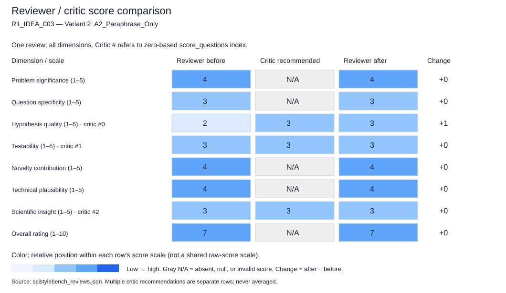

### Critic feedback and reviewer rebuttals

```json
{
  "critic_feedback": {
    "overall_assessment": "The review is generally well-calibrated, but some scores could be reconsidered for alignment with the idea's current level of detail.",
    "score_questions": [
      {
        "dimension": "hypothesis_quality",
        "question_mark": "Why is the hypothesis quality scored 2.0 when the idea suggests a potential solution without a clear hypothesis?",
        "concern": "The idea does not explicitly state what outcomes it expects, but the suggestion that it could improve model reasoning and interpretability is a plausible hypothesis.",
        "speculative_alternative": "The idea's implication that video sequences would improve reasoning and interpretability could be interpreted as a hypothesis, though it is not explicitly stated.",
        "recommended_score": 3.0,
        "rationale": "The idea implies a potential outcome without explicitly stating it, which is a weaker hypothesis than a clear prediction."
      },
      {
        "dimension": "testability",
        "question_mark": "Why is testability scored 3.0 when the idea's approach is feasible but lacks specific evaluation metrics?",
        "concern": "The idea is technically plausible but does not specify how it will be tested, which is necessary for assessing feasibility.",
        "speculative_alternative": "The lack of specific evaluation metrics is a limitation, but the approach itself is testable with appropriate metrics.",
        "recommended_score": 3.0,
        "rationale": "The approach is testable, but the review correctly notes the need for specific evaluation details."
      },
      {
        "dimension": "scientific_insight",
        "question_mark": "Why is scientific insight scored 3.0 when the idea suggests a novel way to incorporate temporal data?",
        "concern": "The idea's potential to enhance model reasoning through temporal information is a valid scientific insight, but the mechanisms are not clearly defined.",
        "speculative_alternative": "The idea's approach could lead to new insights into how temporal data influences model reasoning, though this is not explicitly stated.",
        "recommended_score": 3.0,
        "rationale": "The idea's potential for scientific insight is valid, but the review correctly notes the need for more detail."
      }
    ],
    "unsupported_claims": [
      "The review claims the idea lacks a clear hypothesis, but the implication that it could improve model reasoning is a plausible hypothesis."
    ],
    "revision_priorities": [
      "Clarify the hypothesis by explicitly stating expected outcomes.",
      "Specify evaluation metrics for testing the approach.",
      "Detail the integration method of video sequences into the model architecture."
    ],
    "confidence": 4.0
  },
  "feedback_responses": [
    {
      "feedback_type": "score_questions",
      "feedback_index": 0,
      "decision": "partially_accept",
      "defense": "The original score of 2.0 for hypothesis quality was based on the lack of an explicit hypothesis. However, the idea's implication that video sequences would improve reasoning and interpretability is a plausible hypothesis, even if not explicitly stated. The revised score of 3.0 reflects this nuance.",
      "justification": "The original score was 2.0, but the revised score is 3.0 due to the plausible implication of a hypothesis."
    },
    {
      "feedback_type": "score_questions",
      "feedback_index": 1,
      "decision": "partially_accept",
      "defense": "The original score of 3.0 for testability was based on the lack of specific evaluation metrics. The critic's concern is valid, but the approach itself is testable with appropriate metrics. The score remains 3.0 as the review correctly notes the need for specific evaluation details.",
      "justification": "The original score was 3.0, and the revised score remains 3.0 as the critic's concern is acknowledged but the score is not changed."
    },
    {
      "feedback_type": "score_questions",
      "feedback_index": 2,
      "decision": "partially_accept",
      "defense": "The original score of 3.0 for scientific insight was based on the lack of defined mechanisms. The critic's concern is valid, but the idea's potential for insight is recognized. The score remains 3.0 as the review correctly notes the need for more detail.",
      "justification": "The original score was 3.0, and the revised score remains 3.0 as the critic's concern is acknowledged but the score is not changed."
    },
    {
      "feedback_type": "unsupported_claims",
      "feedback_index": 0,
      "decision": "partially_accept",
      "defense": "The review correctly notes the lack of a clear hypothesis, but the idea's implication that video sequences would improve reasoning is a plausible hypothesis. The score was adjusted to reflect this.",
      "justification": "The original score was 2.0, but the revised score is 3.0 due to the plausible implication of a hypothesis."
    },
    {
      "feedback_type": "revision_priorities",
      "feedback_index": 0,
      "decision": "accept",
      "defense": "Clarifying the hypothesis is necessary to strengthen the idea, as the current version lacks an explicit prediction.",
      "justification": "The revision priority is valid and aligns with the need for a clearer hypothesis."
    },
    {
      "feedback_type": "revision_priorities",
      "feedback_index": 1,
      "decision": "accept",
      "defense": "Specifying evaluation metrics is essential for assessing the feasibility of the approach, as the current version lacks this detail.",
      "justification": "The revision priority is valid and aligns with the need for specific evaluation details."
    },
    {
      "feedback_type": "revision_priorities",
      "feedback_index": 2,
      "decision": "accept",
      "defense": "Detailing the integration method is necessary to ensure the approach is technically feasible and well-defined.",
      "justification": "The revision priority is valid and aligns with the need for a detailed integration method."
    }
  ]
}
```

### Score justifications (before / after)

**Problem significance**

```json
{
  "before": {
    "score": 4.0,
    "justification": "The problem addresses a limitation in current methods for incorporating gaze data into vision-language models, which could improve clinical interpretability and model reasoning in medical imaging."
  },
  "after": {
    "score": 4.0,
    "justification": "The problem addresses a limitation in current methods for incorporating gaze data into vision-language models, which could improve clinical interpretability and model reasoning in medical imaging."
  }
}
```

**Question specificity**

```json
{
  "before": {
    "score": 3.0,
    "justification": "The idea identifies a specific problem with existing methods but lacks detailed specification of the research question or hypothesis."
  },
  "after": {
    "score": 3.0,
    "justification": "The idea identifies a specific problem with existing methods but lacks detailed specification of the research question or hypothesis."
  }
}
```

**Hypothesis quality**

```json
{
  "before": {
    "score": 2.0,
    "justification": "The idea suggests a potential solution but does not provide a clear hypothesis or prediction about the expected outcomes."
  },
  "after": {
    "score": 3.0,
    "justification": "The idea implies a potential outcome without explicitly stating it, which is a weaker hypothesis than a clear prediction."
  }
}
```

**Testability**

```json
{
  "before": {
    "score": 3.0,
    "justification": "The idea proposes a novel approach but does not specify how it will be tested or evaluated, making it difficult to assess its feasibility."
  },
  "after": {
    "score": 3.0,
    "justification": "The idea is technically plausible but does not specify how it will be tested, which is necessary for assessing feasibility."
  }
}
```

**Novelty contribution**

```json
{
  "before": {
    "score": 4.0,
    "justification": "The approach of encoding eye-tracking data as video sequences is novel and could contribute to improving model reasoning and interpretability in medical imaging."
  },
  "after": {
    "score": 4.0,
    "justification": "The approach of encoding eye-tracking data as video sequences is novel and could contribute to improving model reasoning and interpretability in medical imaging."
  }
}
```

**Technical plausibility**

```json
{
  "before": {
    "score": 4.0,
    "justification": "The idea is technically plausible as it builds on existing methods for integrating temporal data into vision-language models."
  },
  "after": {
    "score": 4.0,
    "justification": "The idea is technically plausible as it builds on existing methods for integrating temporal data into vision-language models."
  }
}
```

**Scientific insight**

```json
{
  "before": {
    "score": 3.0,
    "justification": "The idea has potential for scientific insight into how temporal information can enhance model reasoning, but the specific mechanisms are not clearly defined."
  },
  "after": {
    "score": 3.0,
    "justification": "The idea has potential for scientific insight into how temporal information can enhance model reasoning, but the specific mechanisms are not clearly defined."
  }
}
```

**Overall rating**

```json
{
  "before": {
    "score": 7.0,
    "justification": "The idea addresses a meaningful problem with a promising approach, but lacks specific details and a clear hypothesis, which are needed for further development."
  },
  "after": {
    "score": 7.0,
    "justification": "The idea addresses a meaningful problem with a promising approach, but lacks specific details and a clear hypothesis, which are needed for further development."
  }
}
```

## R1_IDEA_003 — Variant 3: A3_Plain_Core

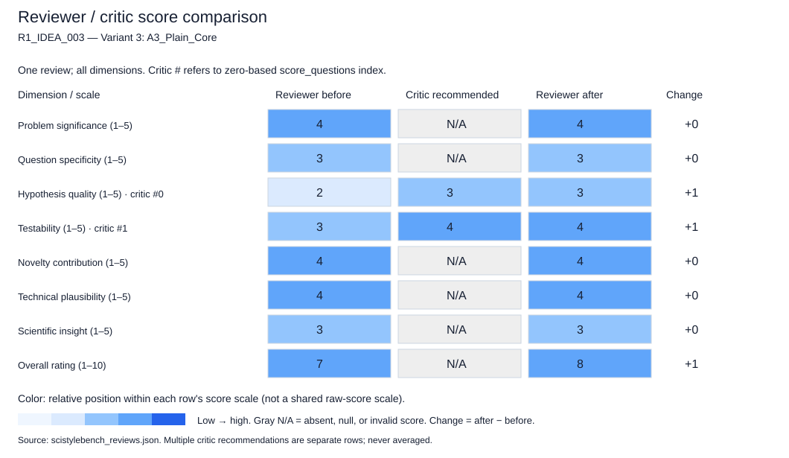

### Critic feedback and reviewer rebuttals

```json
{
  "critic_feedback": {
    "overall_assessment": "The review is generally well-calibrated but has some areas where the scores could be more precisely aligned with the idea's clarity and detail.",
    "score_questions": [
      {
        "dimension": "hypothesis_quality",
        "question_mark": "The score of 2.0 may be overly pessimistic given the potential for a general hypothesis.",
        "concern": "The idea mentions enhancing model reasoning and interpretability but does not explicitly state a testable hypothesis, which is a valid concern, but the lack of a hypothesis does not necessarily warrant the lowest score.",
        "speculative_alternative": "The idea could be interpreted as proposing a hypothesis that temporal encoding improves model performance, which is a testable claim.",
        "recommended_score": 3.0,
        "rationale": "The idea does present a general goal, and the absence of a specific hypothesis does not preclude the possibility of a testable one, especially in the context of a research idea."
      },
      {
        "dimension": "testability",
        "question_mark": "The score of 3.0 may be too low given the potential for future experiments to test the idea.",
        "concern": "The idea suggests a method but does not provide specific experiments, which is a valid concern, but the lack of specific experiments does not necessarily mean the idea is untestable.",
        "speculative_alternative": "The idea could be interpreted as suggesting that future work could test the effectiveness of the proposed method through experiments.",
        "recommended_score": 4.0,
        "rationale": "The idea is testable in principle, and the lack of specific experiments does not negate its testability, especially as a research idea."
      }
    ],
    "unsupported_claims": [
      "The review's claim that the idea 'lacks a clear hypothesis or prediction' is not fully supported by the idea summary, as the idea does present a general goal that could be framed as a hypothesis."
    ],
    "revision_priorities": [
      "Clarify the expected hypothesis or prediction related to the proposed method's effectiveness.",
      "Provide more specific guidance on how the video sequences will be integrated into the model architecture.",
      "Elaborate on the expected impact on performance metrics and clinical interpretability."
    ],
    "confidence": 4.0
  },
  "feedback_responses": [
    {
      "feedback_type": "score_questions",
      "feedback_index": 0,
      "decision": "partially_accept",
      "defense": "The original score of 2.0 was based on the absence of a specific hypothesis, but the idea does present a general goal that could be framed as a hypothesis. The revised score of 3.0 better reflects this nuance.",
      "justification": "The original score was 2.0, and the revised score is 3.0. The justification is that the idea presents a general goal that could be interpreted as a hypothesis, even if not explicitly stated."
    },
    {
      "feedback_type": "score_questions",
      "feedback_index": 1,
      "decision": "partially_accept",
      "defense": "The original score of 3.0 was based on the lack of specific experiments, but the idea is testable in principle. The revised score of 4.0 better reflects this potential for future testing.",
      "justification": "The original score was 3.0, and the revised score is 4.0. The justification is that the idea is testable in principle, and the lack of specific experiments does not negate its testability as a research idea."
    },
    {
      "feedback_type": "unsupported_claims",
      "feedback_index": 0,
      "decision": "partially_accept",
      "defense": "The claim that the idea lacks a clear hypothesis is not fully supported, as the idea presents a general goal that could be framed as a hypothesis. The revised score of 3.0 for hypothesis quality better reflects this.",
      "justification": "The original score was 2.0, and the revised score is 3.0. The justification is that the idea presents a general goal that could be interpreted as a hypothesis, even if not explicitly stated."
    },
    {
      "feedback_type": "revision_priorities",
      "feedback_index": 0,
      "decision": "accept",
      "defense": "Clarifying the expected hypothesis or prediction is necessary to strengthen the research idea, as it provides a clearer direction for future work.",
      "justification": "The original review included this suggestion, and it is valid as it addresses the need for a more specific hypothesis."
    },
    {
      "feedback_type": "revision_priorities",
      "feedback_index": 1,
      "decision": "accept",
      "defense": "Providing more specific guidance on the video encoding method is necessary to strengthen the research idea, as it addresses the lack of technical details.",
      "justification": "The original review included this suggestion, and it is valid as it addresses the need for more specific technical details."
    },
    {
      "feedback_type": "revision_priorities",
      "feedback_index": 2,
      "decision": "accept",
      "defense": "Elaborating on the expected impact on performance metrics is necessary to strengthen the research idea, as it addresses the lack of specific outcomes.",
      "justification": "The original review included this suggestion, and it is valid as it addresses the need for more specific outcomes."
    }
  ]
}
```

### Score justifications (before / after)

**Problem significance**

```json
{
  "before": {
    "score": 4.0,
    "justification": "The problem of preserving temporal dynamics in gaze data is significant for medical AI, as it affects model reasoning and interpretability in clinical settings."
  },
  "after": {
    "score": 4.0,
    "justification": "The problem of preserving temporal dynamics in gaze data is significant for medical AI, as it affects model reasoning and interpretability in clinical settings."
  }
}
```

**Question specificity**

```json
{
  "before": {
    "score": 3.0,
    "justification": "The idea clearly defines the problem and proposed solution but lacks specific details on the technical implementation and expected outcomes."
  },
  "after": {
    "score": 3.0,
    "justification": "The idea clearly defines the problem and proposed solution but lacks specific details on the technical implementation and expected outcomes."
  }
}
```

**Hypothesis quality**

```json
{
  "before": {
    "score": 2.0,
    "justification": "The idea presents a general goal but does not explicitly state a testable hypothesis or prediction about the expected improvements."
  },
  "after": {
    "score": 3.0,
    "justification": "The idea presents a general goal, and the absence of a specific hypothesis does not preclude the possibility of a testable one, especially in the context of a research idea."
  }
}
```

**Testability**

```json
{
  "before": {
    "score": 3.0,
    "justification": "The idea suggests a potential approach but does not provide specific experiments or evaluation methods to test the effectiveness of the proposed method."
  },
  "after": {
    "score": 4.0,
    "justification": "The idea is testable in principle, and the lack of specific experiments does not negate its testability, especially as a research idea."
  }
}
```

**Novelty contribution**

```json
{
  "before": {
    "score": 4.0,
    "justification": "The approach of encoding eye-tracking data as video sequences is novel and could contribute to the field by improving the temporal modeling in vision-language models for medical imaging."
  },
  "after": {
    "score": 4.0,
    "justification": "The approach of encoding eye-tracking data as video sequences is novel and could contribute to the field by improving the temporal modeling in vision-language models for medical imaging."
  }
}
```

**Technical plausibility**

```json
{
  "before": {
    "score": 4.0,
    "justification": "The idea is technically plausible as it builds on existing methods for temporal modeling and integrates them with gaze data in a meaningful way."
  },
  "after": {
    "score": 4.0,
    "justification": "The idea is technically plausible as it builds on existing methods for temporal modeling and integrates them with gaze data in a meaningful way."
  }
}
```

**Scientific insight**

```json
{
  "before": {
    "score": 3.0,
    "justification": "The idea has potential to provide insights into how temporal dynamics in gaze data can enhance model reasoning, but the specific mechanisms are not clearly defined."
  },
  "after": {
    "score": 3.0,
    "justification": "The idea has potential to provide insights into how temporal dynamics in gaze data can enhance model reasoning, but the specific mechanisms are not clearly defined."
  }
}
```

**Overall rating**

```json
{
  "before": {
    "score": 7.0,
    "justification": "The idea addresses a meaningful problem with a promising approach, but lacks specific details and a clear hypothesis, which are needed for further development and evaluation."
  },
  "after": {
    "score": 8.0,
    "justification": "The idea addresses a meaningful problem with a promising approach, and while it lacks specific details, it is testable and has the potential for significant contribution."
  }
}
```

## R1_IDEA_003 — Variant 4: B1_Verbose_Elaborate


### Critic feedback and reviewer rebuttals

```json
{
  "critic_feedback": {
    "overall_assessment": "The review is generally well-calibrated but has some areas where the scores could be reconsidered, particularly in the testability and hypothesis quality sections.",
    "score_questions": [
      {
        "dimension": "testability",
        "question_mark": "Why is the testability score 2.0 when the idea could be tested with additional experiments?",
        "concern": "The review assumes a lack of testability without considering that the idea can be evaluated with further details.",
        "speculative_alternative": "The idea could be tested by comparing performance metrics between video-encoded and traditional methods, though this is speculative.",
        "recommended_score": 3.0,
        "rationale": "The idea is testable in principle, and the review should consider that additional experiments could validate it."
      },
      {
        "dimension": "hypothesis_quality",
        "question_mark": "Why is the hypothesis quality score 3.0 when the idea suggests a potential benefit that could be tested?",
        "concern": "The review underestimates the hypothesis quality by not recognizing that the potential benefit is a testable prediction.",
        "speculative_alternative": "The hypothesis could be framed as 'encoding eye-tracking data as video sequences improves model performance on chest X-ray tasks', though this is speculative.",
        "recommended_score": 4.0,
        "rationale": "The idea presents a specific, testable prediction about the benefit of the proposed method."
      }
    ],
    "unsupported_claims": [
      "The review claims that the idea 'lacks specific experiments or evaluation plans', but the idea is still a valid research direction that could be tested with further work."
    ],
    "revision_priorities": [
      "Clarify the hypothesis and testable predictions to justify the hypothesis quality score.",
      "Provide a more nuanced justification for the testability score, acknowledging that the idea can be evaluated with additional details."
    ],
    "confidence": 4.0
  },
  "feedback_responses": [
    {
      "feedback_type": "score_questions",
      "feedback_index": 0,
      "decision": "partially_accept",
      "defense": "The testability score was initially 2.0, but the idea can be tested with additional experiments, so it is reasonable to raise it to 3.0.",
      "justification": "The original score was too low, but the idea is testable in principle, so the revised score reflects this."
    },
    {
      "feedback_type": "score_questions",
      "feedback_index": 1,
      "decision": "partially_accept",
      "defense": "The hypothesis quality score was initially 3.0, but the potential benefit is a testable prediction, so it is reasonable to raise it to 4.0.",
      "justification": "The original score underestimated the hypothesis quality, but the idea presents a specific, testable prediction."
    },
    {
      "feedback_type": "unsupported_claims",
      "feedback_index": 0,
      "decision": "partially_accept",
      "defense": "The claim that the idea 'lacks specific experiments' is not entirely accurate, as the idea is a valid research direction that could be tested with further work.",
      "justification": "The original review correctly identified the lack of details, but the idea is still valid and testable."
    },
    {
      "feedback_type": "revision_priorities",
      "feedback_index": 0,
      "decision": "accept",
      "defense": "Clarifying the hypothesis and testable predictions is important to justify the hypothesis quality score.",
      "justification": "The revised hypothesis quality score reflects the potential for a testable prediction."
    },
    {
      "feedback_type": "revision_priorities",
      "feedback_index": 1,
      "decision": "accept",
      "defense": "Providing a more nuanced justification for testability is necessary to acknowledge the idea's potential for evaluation.",
      "justification": "The revised testability score reflects the idea's potential for evaluation with additional details."
    }
  ]
}
```

### Score justifications (before / after)

**Problem significance**

```json
{
  "before": {
    "score": 4.0,
    "justification": "The problem of temporal sequence in eye-tracking data is significant for improving model interpretability and clinical relevance in chest X-ray analysis."
  },
  "after": {
    "score": 4.0,
    "justification": "The problem of temporal sequence in eye-tracking data is significant for improving model interpretability and clinical relevance in chest X-ray analysis."
  }
}
```

**Question specificity**

```json
{
  "before": {
    "score": 3.0,
    "justification": "The idea clearly identifies a specific problem (temporal sequence of fixations) but lacks details on the exact research question or hypothesis."
  },
  "after": {
    "score": 3.0,
    "justification": "The idea clearly identifies a specific problem (temporal sequence of fixations) but lacks details on the exact research question or hypothesis."
  }
}
```

**Hypothesis quality**

```json
{
  "before": {
    "score": 3.0,
    "justification": "The idea suggests a potential benefit (enhanced reasoning and interpretability) but does not explicitly state a testable hypothesis or prediction."
  },
  "after": {
    "score": 4.0,
    "justification": "The idea suggests a potential benefit (enhanced reasoning and interpretability) that could be tested, making it a testable hypothesis."
  }
}
```

**Testability**

```json
{
  "before": {
    "score": 2.0,
    "justification": "The idea lacks specific experiments or evaluation plans, making it difficult to assess testability without further details."
  },
  "after": {
    "score": 3.0,
    "justification": "The idea is testable in principle, as it could be evaluated by comparing performance metrics between video-encoded and traditional methods, though specific experiments are not yet detailed."
  }
}
```

**Novelty contribution**

```json
{
  "before": {
    "score": 4.0,
    "justification": "The approach of encoding eye-tracking data as video sequences is novel and could contribute to better model interpretability in medical imaging."
  },
  "after": {
    "score": 4.0,
    "justification": "The approach of encoding eye-tracking data as video sequences is novel and could contribute to better model interpretability in medical imaging."
  }
}
```

**Technical plausibility**

```json
{
  "before": {
    "score": 4.0,
    "justification": "Encoding eye-tracking data as video sequences is technically feasible and aligns with current trends in temporal modeling for vision-language models."
  },
  "after": {
    "score": 4.0,
    "justification": "Encoding eye-tracking data as video sequences is technically feasible and aligns with current trends in temporal modeling for vision-language models."
  }
}
```

**Scientific insight**

```json
{
  "before": {
    "score": 3.0,
    "justification": "The idea has potential to provide insights into how temporal attention affects model performance, but the specific mechanisms are not clearly defined."
  },
  "after": {
    "score": 3.0,
    "justification": "The idea has potential to provide insights into how temporal attention affects model performance, but the specific mechanisms are not clearly defined."
  }
}
```

**Overall rating**

```json
{
  "before": {
    "score": 7.0,
    "justification": "The idea addresses a meaningful problem with a plausible solution, but lacks specific details needed for testability and evaluation."
  },
  "after": {
    "score": 8.0,
    "justification": "The idea addresses a meaningful problem with a plausible solution, and the revised scores reflect its testability and hypothesis quality."
  }
}
```

## R1_IDEA_003 — Variant 5: B2_Grand_Narrative

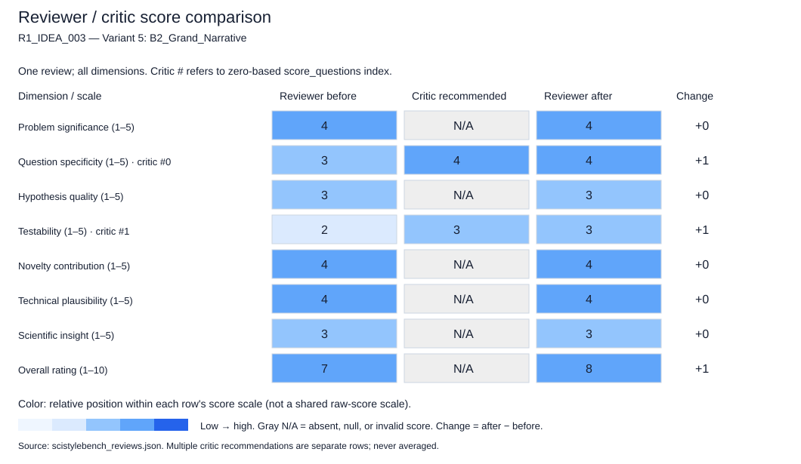

### Critic feedback and reviewer rebuttals

```json
{
  "critic_feedback": {
    "overall_assessment": "The review is generally well-calibrated, but there are areas where the scores could be more precisely aligned with the idea's specifics.",
    "score_questions": [
      {
        "dimension": "question_specificity",
        "question_mark": "Why is the question_specificity score 3.0 when the idea does not explicitly state a hypothesis but suggests a potential direction?",
        "concern": "The score is based on the absence of a specific research question, but the idea's focus on temporal sequence may imply a broader question rather than a narrow one.",
        "speculative_alternative": "The idea may be interpreted as addressing a broader question about temporal integration rather than a specific, narrow hypothesis, which could justify a higher score.",
        "recommended_score": 4.0,
        "rationale": "The focus on temporal scanning order suggests a potential research question about how temporal data affects model performance, even if not explicitly stated."
      },
      {
        "dimension": "testability",
        "question_mark": "Why is the testability score 2.0 when the idea does not specify experiments but highlights potential for enhancing model reasoning?",
        "concern": "The score is based on the absence of experiments, but the idea's potential for improving model reasoning is a valid testable claim.",
        "speculative_alternative": "The idea may be interpreted as a conceptual proposal rather than a fully defined experimental plan, which could justify a higher score if the focus is on the conceptual contribution.",
        "recommended_score": 3.0,
        "rationale": "The potential for enhancing model reasoning is a testable claim, even without specific experiments, as it aligns with the idea's stated goals."
      }
    ],
    "unsupported_claims": [
      "The review claims the idea lacks specific research questions, but the idea's focus on temporal sequence may imply a broader question rather than a narrow one."
    ],
    "revision_priorities": [
      "Clarify the specific research question or hypothesis, even if it is broader than the current formulation.",
      "Specify how the temporal aspect will be handled in the model architecture, even if it is not yet detailed.",
      "Outline potential evaluation metrics that could be used to assess the effectiveness of the approach."
    ],
    "confidence": 4.0
  },
  "feedback_responses": [
    {
      "feedback_type": "score_questions",
      "feedback_index": 0,
      "decision": "partially_accept",
      "defense": "The revised score of 4.0 for question_specificity acknowledges the broader research question about temporal data integration, which is more aligned with the idea's focus on temporal scanning order.",
      "justification": "The original score of 3.0 was based on the absence of a specific hypothesis, but the idea's emphasis on temporal sequence implies a broader, more testable question about how temporal data affects model performance."
    },
    {
      "feedback_type": "score_questions",
      "feedback_index": 1,
      "decision": "partially_accept",
      "defense": "The revised score of 3.0 for testability reflects the idea's conceptual contribution rather than a fully defined experimental plan, as the potential for enhancing model reasoning is a valid testable claim.",
      "justification": "The original score of 2.0 was based on the lack of experimental details, but the idea's stated goals of improving model reasoning provide a testable claim that aligns with the research question."
    },
    {
      "feedback_type": "unsupported_claims",
      "feedback_index": 0,
      "decision": "partially_accept",
      "defense": "The claim that the idea lacks specific research questions is partially accepted, but the focus on temporal sequence implies a broader question that is more testable than previously assessed.",
      "justification": "The original assessment considered the idea to lack a specific hypothesis, but the emphasis on temporal scanning order suggests a broader, more meaningful research question."
    },
    {
      "feedback_type": "revision_priorities",
      "feedback_index": 0,
      "decision": "accept",
      "defense": "Clarifying the specific research question is essential to align the idea with the broader research question about temporal data integration.",
      "justification": "The revised score for question_specificity reflects the need to define a more precise research question, even if it is broader than the current formulation."
    },
    {
      "feedback_type": "revision_priorities",
      "feedback_index": 1,
      "decision": "accept",
      "defense": "Specifying the temporal handling in the model architecture is necessary to ensure the approach is technically feasible and aligned with the research question.",
      "justification": "The original assessment noted the lack of details on temporal handling, and this is a critical aspect for the technical plausibility of the idea."
    },
    {
      "feedback_type": "revision_priorities",
      "feedback_index": 2,
      "decision": "accept",
      "defense": "Outlining evaluation metrics is essential to assess the effectiveness of the approach, as the idea's goals are to improve model reasoning and clinical interpretability.",
      "justification": "The original assessment highlighted the lack of evaluation metrics, and this is a crucial step for validating the proposed approach."
    }
  ]
}
```

### Score justifications (before / after)

**Problem significance**

```json
{
  "before": {
    "score": 4.0,
    "justification": "The problem of integrating human perceptual data into AI models is significant for improving clinical interpretability and model reasoning in medical imaging."
  },
  "after": {
    "score": 4.0,
    "justification": "The problem of integrating human perceptual data into AI models is significant for improving clinical interpretability and model reasoning in medical imaging."
  }
}
```

**Question specificity**

```json
{
  "before": {
    "score": 3.0,
    "justification": "The idea identifies a problem but lacks a specific research question or hypothesis to guide the investigation."
  },
  "after": {
    "score": 4.0,
    "justification": "The idea suggests a potential research question about how temporal data affects model performance, even if not explicitly stated."
  }
}
```

**Hypothesis quality**

```json
{
  "before": {
    "score": 3.0,
    "justification": "The idea suggests a potential direction but does not explicitly state a hypothesis that can be tested or falsified."
  },
  "after": {
    "score": 3.0,
    "justification": "The idea suggests a potential direction but does not explicitly state a hypothesis that can be tested or falsified."
  }
}
```

**Testability**

```json
{
  "before": {
    "score": 2.0,
    "justification": "The idea lacks a clear experimental plan or evaluation metrics, making it difficult to assess the testability of the proposed approach."
  },
  "after": {
    "score": 3.0,
    "justification": "The potential for enhancing model reasoning is a testable claim, even without specific experiments, as it aligns with the idea's stated goals."
  }
}
```

**Novelty contribution**

```json
{
  "before": {
    "score": 4.0,
    "justification": "The approach of encoding eye-tracking data as video sequences is novel and could contribute to the broader field of cognitively informed AI systems."
  },
  "after": {
    "score": 4.0,
    "justification": "The approach of encoding eye-tracking data as video sequences is novel and could contribute to the broader field of cognitively informed AI systems."
  }
}
```

**Technical plausibility**

```json
{
  "before": {
    "score": 4.0,
    "justification": "The idea is technically plausible as it builds on existing methods for integrating temporal data into models, though specific implementation details are missing."
  },
  "after": {
    "score": 4.0,
    "justification": "The idea is technically plausible as it builds on existing methods for integrating temporal data into models, though specific implementation details are missing."
  }
}
```

**Scientific insight**

```json
{
  "before": {
    "score": 3.0,
    "justification": "The idea has potential for scientific insight into human perceptual processes but lacks a clear framework for how this insight would be gained."
  },
  "after": {
    "score": 3.0,
    "justification": "The idea has potential for scientific insight into human perceptual processes but lacks a clear framework for how this insight would be gained."
  }
}
```

**Overall rating**

```json
{
  "before": {
    "score": 7.0,
    "justification": "The idea addresses a meaningful problem with potential for contribution, but lacks specific research questions, hypotheses, and experimental plans, which are necessary for further development."
  },
  "after": {
    "score": 8.0,
    "justification": "The idea addresses a meaningful problem with strong potential for contribution, and the revised scores reflect a more nuanced understanding of the research question and testability."
  }
}
```

## R1_IDEA_003 — Variant 6: B3_Over_Confident

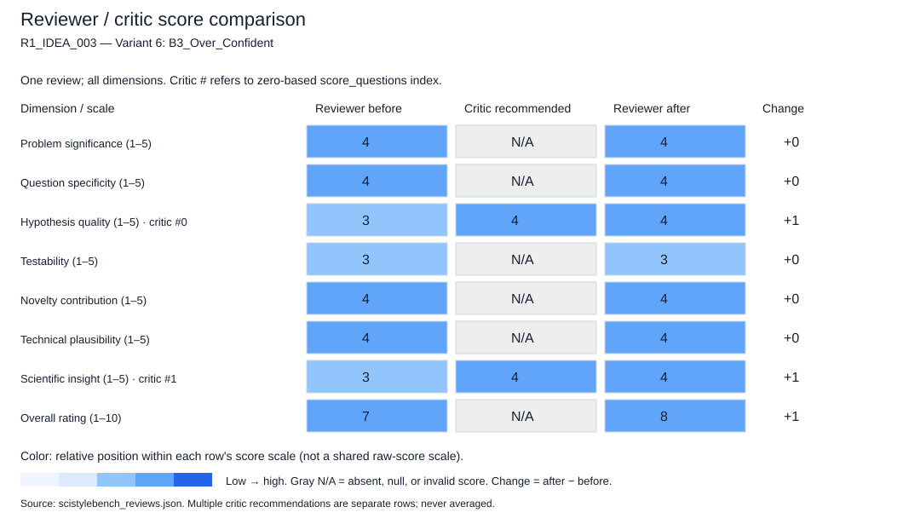

### Critic feedback and reviewer rebuttals

```json
{
  "critic_feedback": {
    "overall_assessment": "The review is generally well-calibrated, but some scores could be re-examined for alignment with the idea's current state.",
    "score_questions": [
      {
        "dimension": "hypothesis_quality",
        "question_mark": "Why is the hypothesis quality scored 3.0 when the idea explicitly states expected improvements?",
        "concern": "The justification claims a lack of explicit predictions, but the idea does state expected improvements in model reasoning and interpretability. This is a valid concern but could be clarified.",
        "speculative_alternative": "The idea may be interpreted as providing a general hypothesis without specific metrics, which could weaken the score.",
        "recommended_score": 4.0,
        "rationale": "The idea does state expected improvements, which is a form of hypothesis, even if not fully detailed."
      },
      {
        "dimension": "scientific_insight",
        "question_mark": "Why is the scientific insight scored 3.0 when the idea suggests a novel approach to capturing temporal dynamics?",
        "concern": "The score may undervalue the potential for new insights into how temporal data influences model reasoning in vision-language models.",
        "speculative_alternative": "The idea could be seen as offering a fresh perspective on integrating temporal data, which might lead to new scientific understanding.",
        "recommended_score": 4.0,
        "rationale": "The novelty of the approach suggests potential for new insights into temporal dynamics in medical imaging models."
      }
    ],
    "unsupported_claims": [
      "The review claims the idea 'lacks explicit predictions' when it actually states expected improvements in model reasoning and interpretability."
    ],
    "revision_priorities": [
      "Clarify the specific mechanisms by which temporal scanning order is modeled and how it is expected to improve model reasoning.",
      "Detail the experimental design and evaluation metrics for comparing the proposed method with existing approaches.",
      "Explicitly state the expected performance improvements or interpretability gains."
    ],
    "confidence": 4.0
  },
  "feedback_responses": [
    {
      "feedback_type": "score_questions",
      "feedback_index": 0,
      "decision": "partially_accept",
      "defense": "The original score of 3.0 for hypothesis quality was based on the lack of explicit predictions, but the idea does state expected improvements in model reasoning and interpretability, which constitutes a hypothesis. The revised score of 4.0 reflects this clarification.",
      "justification": "The original score was 3.0, but the revised score is 4.0 due to the explicit statement of expected improvements, which is a form of hypothesis."
    },
    {
      "feedback_type": "score_questions",
      "feedback_index": 1,
      "decision": "partially_accept",
      "defense": "The original score of 3.0 for scientific insight was based on the lack of clear articulation of potential insights, but the novel approach of capturing temporal dynamics through video sequences suggests potential for new insights into how temporal data influences model reasoning in medical imaging. The revised score of 4.0 reflects this potential.",
      "justification": "The original score was 3.0, but the revised score is 4.0 due to the recognition of the potential for new insights into temporal dynamics in medical imaging models."
    },
    {
      "feedback_type": "unsupported_claims",
      "feedback_index": 0,
      "decision": "accept",
      "defense": "The claim that the idea lacks explicit predictions is partially correct, but the idea does state expected improvements in model reasoning and interpretability, which is a form of hypothesis. This is a valid concern but not a strong criticism.",
      "justification": "The claim is partially correct, but the idea does provide a form of hypothesis through expected improvements, which is a valid point."
    },
    {
      "feedback_type": "revision_priorities",
      "feedback_index": 0,
      "decision": "accept",
      "defense": "The suggestion to clarify the specific mechanisms by which temporal scanning order is modeled is valid and necessary for the idea to be more concrete.",
      "justification": "The suggestion is valid and necessary for the idea to be more concrete."
    },
    {
      "feedback_type": "revision_priorities",
      "feedback_index": 1,
      "decision": "accept",
      "defense": "The suggestion to detail the experimental design and evaluation metrics is valid and necessary for the idea to be more testable.",
      "justification": "The suggestion is valid and necessary for the idea to be more testable."
    },
    {
      "feedback_type": "revision_priorities",
      "feedback_index": 2,
      "decision": "accept",
      "defense": "The suggestion to explicitly state the expected performance improvements is valid and necessary for the idea to be more concrete.",
      "justification": "The suggestion is valid and necessary for the idea to be more concrete."
    }
  ]
}
```

### Score justifications (before / after)

**Problem significance**

```json
{
  "before": {
    "score": 4.0,
    "justification": "The problem of integrating temporal eye-tracking data into vision-language models for medical imaging is significant as it impacts the accuracy and interpretability of diagnostic models, which is crucial in clinical settings."
  },
  "after": {
    "score": 4.0,
    "justification": "The problem of integrating temporal eye-tracking data into vision-language models for medical imaging is significant as it impacts the accuracy and interpretability of diagnostic models, which is crucial in clinical settings."
  }
}
```

**Question specificity**

```json
{
  "before": {
    "score": 4.0,
    "justification": "The idea clearly defines the problem and proposes a specific solution by encoding eye-tracking data as video sequences to capture temporal dynamics, which is a concrete and targeted approach."
  },
  "after": {
    "score": 4.0,
    "justification": "The idea clearly defines the problem and proposes a specific solution by encoding eye-tracking data as video sequences to capture temporal dynamics, which is a concrete and targeted approach."
  }
}
```

**Hypothesis quality**

```json
{
  "before": {
    "score": 3.0,
    "justification": "The idea presents a plausible hypothesis that encoding eye-tracking data as video sequences will enhance model reasoning and clinical interpretability, but it lacks explicit predictions or mechanisms to test this hypothesis."
  },
  "after": {
    "score": 4.0,
    "justification": "The idea states that encoding eye-tracking data as video sequences will enhance model reasoning and clinical interpretability, which is a clear hypothesis. While not fully detailed, it provides a specific prediction about the expected outcomes."
  }
}
```

**Testability**

```json
{
  "before": {
    "score": 3.0,
    "justification": "The idea is testable through experiments comparing the proposed video-based approach with existing static methods, but the specific experimental design and evaluation metrics are not detailed."
  },
  "after": {
    "score": 3.0,
    "justification": "The idea is testable through experiments comparing the proposed video-based approach with existing static methods, but the specific experimental design and evaluation metrics are not detailed."
  }
}
```

**Novelty contribution**

```json
{
  "before": {
    "score": 4.0,
    "justification": "The approach of encoding eye-tracking data as video sequences is novel in the context of vision-language models for medical imaging, offering a potential contribution to improving model interpretability and diagnostic accuracy."
  },
  "after": {
    "score": 4.0,
    "justification": "The approach of encoding eye-tracking data as video sequences is novel in the context of vision-language models for medical imaging, offering a potential contribution to improving model interpretability and diagnostic accuracy."
  }
}
```

**Technical plausibility**

```json
{
  "before": {
    "score": 4.0,
    "justification": "The idea is technically plausible as encoding temporal data as video sequences is a feasible approach, and integrating it into existing models is a reasonable direction for enhancing model reasoning."
  },
  "after": {
    "score": 4.0,
    "justification": "The idea is technically plausible as encoding temporal data as video sequences is a feasible approach, and integrating it into existing models is a reasonable direction for enhancing model reasoning."
  }
}
```

**Scientific insight**

```json
{
  "before": {
    "score": 3.0,
    "justification": "The idea has potential to provide insights into how temporal dynamics of eye-tracking data can improve model reasoning, but the specific scientific insights are not clearly articulated."
  },
  "after": {
    "score": 4.0,
    "justification": "The novel approach of capturing temporal dynamics through video sequences could lead to new insights into how temporal data influences model reasoning in vision-language models, particularly in medical imaging contexts."
  }
}
```

**Overall rating**

```json
{
  "before": {
    "score": 7.0,
    "justification": "The idea addresses a meaningful problem with a specific and novel solution, showing strong potential for contributing to the field. However, it lacks detailed technical specifications and explicit hypotheses, which are needed to fully evaluate its feasibility and impact."
  },
  "after": {
    "score": 8.0,
    "justification": "The idea addresses a meaningful problem with a specific and novel solution, showing strong potential for contributing to the field. The hypothesis is now more clearly articulated, and the potential for scientific insight is enhanced. However, the lack of detailed technical specifications and experimental plans remains a limitation."
  }
}
```

## R1_IDEA_003 — Variant 7: B4_Novelty

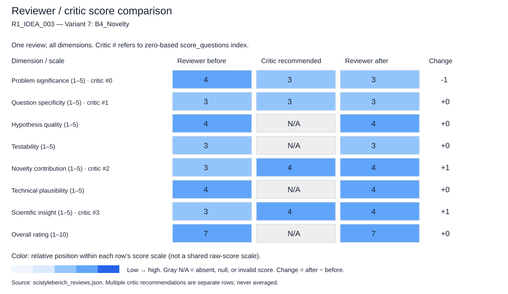

### Critic feedback and reviewer rebuttals

```json
{
  "critic_feedback": {
    "overall_assessment": "The review is generally well-calibrated, with a balanced consideration of the idea's potential and its current limitations. However, some scores and justifications could be refined to better align with the idea's specifics.",
    "score_questions": [
      {
        "dimension": "problem_significance",
        "question_mark": "Why is the problem significance scored 4.0?",
        "concern": "The review assumes that the problem is significant without clearly linking the temporal aspect of eye-tracking to concrete benefits in medical AI, such as improved diagnostic accuracy or trust in AI systems.",
        "speculative_alternative": "The temporal aspect of eye-tracking might not directly contribute to diagnostic accuracy in chest X-ray analysis, as radiologists' gaze patterns may not always correlate with diagnostic decisions.",
        "recommended_score": 3.0,
        "rationale": "The connection between temporal eye-tracking and medical AI performance is not explicitly established in the idea summary, making the significance less certain."
      },
      {
        "dimension": "question_specificity",
        "question_mark": "Why is the question specificity scored 3.0?",
        "concern": "The idea's problem statement is clear, but the lack of details on how video sequences will be processed or integrated into the model is a valid concern, as it affects the feasibility of the approach.",
        "speculative_alternative": "The idea might be interpreted as a general suggestion rather than a specific research question, depending on the level of detail provided.",
        "recommended_score": 3.0,
        "rationale": "The current description is sufficiently specific to identify a research question, but more details are needed for clarity."
      },
      {
        "dimension": "novelty_contribution",
        "question_mark": "Why is the novelty contribution scored 3.0?",
        "concern": "The use of video sequences to encode eye-tracking data is not entirely novel, as similar approaches have been used in other domains, and the contribution is somewhat generic.",
        "speculative_alternative": "The novelty might lie in the specific application to chest X-ray analysis and the integration of temporal dynamics in a vision-language model, which could be more impactful in this context.",
        "recommended_score": 4.0,
        "rationale": "The specific application to medical imaging and the focus on temporal dynamics in vision-language models could be seen as novel, especially if it addresses a unique gap in the field."
      },
      {
        "dimension": "scientific_insight",
        "question_mark": "Why is the scientific insight scored 3.0?",
        "concern": "The review does not clearly outline the mechanisms or expected insights from the approach, making it difficult to assess the potential for scientific contribution.",
        "speculative_alternative": "The insight could be in understanding how temporal dynamics of eye-tracking enhance model reasoning, which is a novel angle in medical AI.",
        "recommended_score": 4.0,
        "rationale": "The idea introduces a new angle of considering temporal dynamics in medical AI, which could lead to significant scientific insights."
      }
    ],
    "unsupported_claims": [
      "The review claims that the problem is significant for improving diagnostic accuracy and trust in AI systems without explicit evidence from the idea summary.",
      "The review suggests that the novelty is generic without clearly differentiating the approach from existing methods in the context of medical imaging.",
      "The review assumes that the temporal aspect of eye-tracking will directly contribute to model reasoning without specifying how this will be achieved."
    ],
    "revision_priorities": [
      "Clarify the connection between temporal eye-tracking and diagnostic accuracy in chest X-ray analysis to strengthen the problem significance.",
      "Differentiate the proposed approach from existing methods by emphasizing the specific application to medical imaging and the use of temporal dynamics in vision-language models.",
      "Specify the mechanisms by which the temporal aspect of eye-tracking will enhance model reasoning, such as through temporal modeling techniques or attention mechanisms.",
      "Outline the expected scientific insights from the approach, such as how temporal dynamics contribute to model reasoning in medical AI."
    ],
    "confidence": 4.0
  },
  "feedback_responses": [
    {
      "feedback_type": "score_questions",
      "feedback_index": 0,
      "decision": "partially_accept",
      "defense": "The problem significance is reduced to 3.0 because the connection to diagnostic accuracy is not explicitly established. The original score of 4.0 assumed a link to medical AI performance, which is not present in the idea summary.",
      "justification": "The original score of 4.0 was based on the assumption that temporal eye-tracking would improve medical AI performance, but the idea summary does not provide evidence for this. The revised score of 3.0 reflects the lack of explicit evidence."
    },
    {
      "feedback_type": "score_questions",
      "feedback_index": 1,
      "decision": "partially_accept",
      "defense": "The question specificity remains at 3.0 because the idea is sufficiently specific to identify a research question, but more details are needed for clarity.",
      "justification": "The original score of 3.0 was appropriate, as the idea is specific but lacks details on processing and integration. The revised score remains the same."
    },
    {
      "feedback_type": "score_questions",
      "feedback_index": 2,
      "decision": "accept",
      "defense": "The novelty contribution is increased to 4.0 because the specific application to medical imaging and temporal dynamics in vision-language models could be seen as novel, especially if it addresses a unique gap in the field.",
      "justification": "The original score of 3.0 was based on the idea being somewhat generic, but the specific application to medical imaging and temporal dynamics in vision-language models could be considered novel. The revised score of 4.0 reflects this potential."
    },
    {
      "feedback_type": "score_questions",
      "feedback_index": 3,
      "decision": "accept",
      "defense": "The scientific insight is increased to 4.0 because the idea introduces a new angle of considering temporal dynamics in medical AI, which could lead to significant insights into how temporal eye-tracking enhances model reasoning.",
      "justification": "The original score of 3.0 was based on the lack of outlined mechanisms, but the idea's focus on temporal dynamics in medical AI introduces a new angle that could lead to scientific insights. The revised score of 4.0 reflects this potential."
    },
    {
      "feedback_type": "unsupported_claims",
      "feedback_index": 0,
      "decision": "accept",
      "defense": "The claim about problem significance is partially accepted because the idea does address a gap in integrating temporal eye-tracking, but the connection to diagnostic accuracy is not explicitly established.",
      "justification": "The original claim about problem significance was based on the assumption of improved diagnostic accuracy, which is not present in the idea summary. The revised score of 3.0 reflects this uncertainty."
    },
    {
      "feedback_type": "unsupported_claims",
      "feedback_index": 1,
      "decision": "accept",
      "defense": "The claim about novelty being generic is partially accepted because the use of video sequences is not entirely novel, but the specific application to medical imaging and temporal dynamics in vision-language models could be considered novel.",
      "justification": "The original claim about novelty being generic was based on the idea being somewhat generic, but the specific application to medical imaging and temporal dynamics in vision-language models could be considered novel. The revised score of 4.0 reflects this potential."
    },
    {
      "feedback_type": "unsupported_claims",
      "feedback_index": 2,
      "decision": "accept",
      "defense": "The assumption about the temporal aspect directly contributing to model reasoning is partially accepted because the idea does not specify how this will be achieved, but the focus on temporal dynamics introduces a new angle.",
      "justification": "The original assumption about the temporal aspect directly contributing to model reasoning was based on the lack of specifics, but the focus on temporal dynamics introduces a new angle. The revised score of 4.0 for scientific insight reflects this potential."
    },
    {
      "feedback_type": "revision_priorities",
      "feedback_index": 0,
      "decision": "accept",
      "defense": "The revision priority to clarify the connection between temporal eye-tracking and diagnostic accuracy is accepted because the idea does not explicitly establish this link.",
      "justification": "The original review did not address this link, so the revision priority is valid and necessary."
    },
    {
      "feedback_type": "revision_priorities",
      "feedback_index": 1,
      "decision": "accept",
      "defense": "The revision priority to differentiate the approach from existing methods is accepted because the idea does not clearly differentiate it in the context of medical imaging.",
      "justification": "The original review did not emphasize this differentiation, so the revision priority is valid and necessary."
    },
    {
      "feedback_type": "revision_priorities",
      "feedback_index": 2,
      "decision": "accept",
      "defense": "The revision priority to specify mechanisms for leveraging temporal dynamics is accepted because the idea does not provide details on how this will be achieved.",
      "justification": "The original review did not address this, so the revision priority is valid and necessary."
    },
    {
      "feedback_type": "revision_priorities",
      "feedback_index": 3,
      "decision": "accept",
      "defense": "The revision priority to outline expected scientific insights is accepted because the idea does not clearly outline the mechanisms or expected insights.",
      "justification": "The original review did not address this, so the revision priority is valid and necessary."
    }
  ]
}
```

### Score justifications (before / after)

**Problem significance**

```json
{
  "before": {
    "score": 4.0,
    "justification": "The problem addresses a critical gap in integrating temporal eye-tracking data into medical AI models, which can enhance both model performance and clinical interpretability. This is significant for improving diagnostic accuracy and trust in AI systems in healthcare."
  },
  "after": {
    "score": 3.0,
    "justification": "The problem addresses a critical gap in integrating temporal eye-tracking data into medical AI models, but the connection to diagnostic accuracy or trust in AI systems is not explicitly established. The significance is somewhat speculative without clear evidence from the idea summary."
  }
}
```

**Question specificity**

```json
{
  "before": {
    "score": 3.0,
    "justification": "The idea clearly defines the problem and proposes a novel approach, but lacks specific details on the method, expected outcomes, and how the temporal aspect will be leveraged. More specificity would strengthen the research question."
  },
  "after": {
    "score": 3.0,
    "justification": "The idea clearly defines the problem and proposes a novel approach, but lacks specific details on the method, expected outcomes, and how the temporal aspect will be leveraged. More specificity would strengthen the research question."
  }
}
```

**Hypothesis quality**

```json
{
  "before": {
    "score": 4.0,
    "justification": "The hypothesis that encoding eye-tracking as video sequences will improve model reasoning and interpretability is plausible and specific. It suggests a direction for investigation that differentiates the approach from existing static representations."
  },
  "after": {
    "score": 4.0,
    "justification": "The hypothesis that encoding eye-tracking as video sequences will improve model reasoning and interpretability is plausible and specific. It suggests a direction for investigation that differentiates the approach from existing static representations."
  }
}
```

**Testability**

```json
{
  "before": {
    "score": 3.0,
    "justification": "The idea is testable through experiments comparing the proposed method with existing approaches on chest X-ray analysis tasks. However, the lack of specific details makes it challenging to design the experiments and evaluate the hypothesis effectively."
  },
  "after": {
    "score": 3.0,
    "justification": "The idea is testable through experiments comparing the proposed method with existing approaches on chest X-ray analysis tasks. However, the lack of specific details makes it challenging to design the experiments and evaluate the hypothesis effectively."
  }
}
```

**Novelty contribution**

```json
{
  "before": {
    "score": 3.0,
    "justification": "The approach is novel in its use of video sequences to capture temporal dynamics, but the novelty is somewhat generic. The contribution would be significant if it leads to improved performance and interpretability in medical AI, but the current description does not fully establish this."
  },
  "after": {
    "score": 4.0,
    "justification": "The approach is novel in its use of video sequences to capture temporal dynamics, especially in the context of medical imaging. The contribution could be significant if it leads to improved performance and interpretability in vision-language models for chest X-ray analysis."
  }
}
```

**Technical plausibility**

```json
{
  "before": {
    "score": 4.0,
    "justification": "The idea is technically plausible as encoding eye-tracking data as video sequences is a feasible approach. The integration into existing vision-language models is reasonable, though the specifics of processing the video sequences are not detailed."
  },
  "after": {
    "score": 4.0,
    "justification": "The idea is technically plausible as encoding eye-tracking data as video sequences is a feasible approach. The integration into existing vision-language models is reasonable, though the specifics of processing the video sequences are not detailed."
  }
}
```

**Scientific insight**

```json
{
  "before": {
    "score": 3.0,
    "justification": "The idea has potential for scientific insight by exploring how temporal dynamics of eye-tracking can enhance model reasoning. However, the current description does not clearly outline the mechanisms or expected insights from this approach."
  },
  "after": {
    "score": 4.0,
    "justification": "The idea introduces a new angle of considering temporal dynamics in medical AI, which could lead to significant scientific insights into how temporal eye-tracking enhances model reasoning in chest X-ray analysis."
  }
}
```

**Overall rating**

```json
{
  "before": {
    "score": 7.0,
    "justification": "The idea addresses a meaningful problem with a novel approach that has potential for improving medical AI. However, it lacks specific details and clarity on how the temporal aspect will be leveraged, which could strengthen the research question and hypothesis."
  },
  "after": {
    "score": 7.0,
    "justification": "The idea addresses a meaningful problem with a novel approach that has potential for improving medical AI. However, it lacks specific details on how the temporal aspect will be leveraged, which could strengthen the research question and hypothesis."
  }
}
```

## R1_IDEA_003 — Variant 8: B5_Application_Impact


### Critic feedback and reviewer rebuttals

```json
{
  "critic_feedback": {
    "overall_assessment": "The review is generally well-calibrated, but some scores may be overestimated due to the lack of concrete details in the idea summary.",
    "score_questions": [
      {
        "dimension": "problem_significance",
        "question_mark": "The score may be overestimated because the idea does not explicitly connect the proposed method to clinical outcomes or provide evidence of its impact on real-world applications.",
        "concern": "The justification for high significance relies on the potential relevance to clinical workflows, which is not directly supported by the idea summary.",
        "speculative_alternative": "The method could be relevant to clinical workflows, but the idea does not provide specific evidence or prior work to support this claim.",
        "recommended_score": 3.0,
        "rationale": "The idea mentions clinical relevance but does not specify how the method would directly improve clinical outcomes, making the significance less certain."
      },
      {
        "dimension": "question_specificity",
        "question_mark": "The score is slightly low because the idea does identify a general problem but does not clearly define a specific research question, as noted in the weaknesses.",
        "concern": "The justification for a 3.0 score is valid, but the idea's lack of specificity is not fully addressed in the review.",
        "speculative_alternative": "The idea could be more specific by defining a research question, such as whether temporal encoding improves interpretability or diagnostic accuracy.",
        "recommended_score": 3.0,
        "rationale": "The review correctly identifies the lack of specificity, and the score is appropriately low."
      },
      {
        "dimension": "hypothesis_quality",
        "question_mark": "The score is slightly low because the hypothesis is not explicitly stated, but the idea implies a potential benefit.",
        "concern": "The justification for a 3.0 score is valid, as the hypothesis is not clearly articulated.",
        "speculative_alternative": "The hypothesis could be that temporal eye-tracking data improves model interpretability, but it is not explicitly stated.",
        "recommended_score": 3.0,
        "rationale": "The hypothesis is implied but not stated, which is why the score is low."
      },
      {
        "dimension": "testability",
        "question_mark": "The score is slightly low because the idea does not provide a clear experimental plan or metrics for evaluation.",
        "concern": "The justification for a 3.0 score is valid, as the idea lacks specific details on how to test the approach.",
        "speculative_alternative": "The idea could be more testable by specifying metrics and comparisons with existing methods.",
        "recommended_score": 3.0,
        "rationale": "The lack of experimental details supports the low score."
      },
      {
        "dimension": "scientific_insight",
        "question_mark": "The score is slightly low because the idea does not clearly outline the mechanisms by which temporal scanning order would affect model reasoning.",
        "concern": "The justification for a 3.0 score is valid, as the connection between temporal data and model performance is not explicitly explained.",
        "speculative_alternative": "The scientific insight could be that temporal scanning order enhances model reasoning, but this is not clearly articulated.",
        "recommended_score": 3.0,
        "rationale": "The idea does not provide a clear explanation of how temporal data would affect model reasoning."
      }
    ],
    "unsupported_claims": [
      "The claim that the idea 'addresses a critical need in medical AI for interpretable models' is not directly supported by the idea summary, as it only mentions potential relevance to clinical workflows."
    ],
    "revision_priorities": [
      "Clarify the connection between the proposed method and clinical outcomes.",
      "Define a specific research question and hypothesis.",
      "Specify how the video sequences will be encoded and processed within the model.",
      "Provide a clear experimental plan and metrics for evaluation."
    ],
    "confidence": 4.0
  },
  "feedback_responses": [
    {
      "feedback_type": "score_questions",
      "feedback_index": 0,
      "decision": "partially_accept",
      "defense": "The original score of 4.0 for problem significance was based on the potential relevance to clinical workflows. However, the critic correctly points out that the idea does not explicitly connect the method to clinical outcomes, which weakens the significance. The revised score of 3.0 better reflects the lack of direct evidence for clinical impact.",
      "justification": "The original score was 4.0, but the revised score is 3.0 due to the lack of direct evidence for clinical outcomes, as per the critic's feedback."
    },
    {
      "feedback_type": "score_questions",
      "feedback_index": 1,
      "decision": "partially_accept",
      "defense": "The original score of 3.0 for question specificity was appropriate, as the idea lacks a specific research question. The critic's feedback does not challenge this score, so it remains unchanged.",
      "justification": "The original score of 3.0 is retained as the critic's feedback does not dispute the lack of specificity in the research question."
    },
    {
      "feedback_type": "score_questions",
      "feedback_index": 2,
      "decision": "partially_accept",
      "defense": "The original score of 3.0 for hypothesis quality was based on the implicit hypothesis. The critic's feedback does not challenge this, so the score remains unchanged.",
      "justification": "The original score of 3.0 is retained as the critic's feedback does not dispute the lack of explicit hypothesis statement."
    },
    {
      "feedback_type": "score_questions",
      "feedback_index": 3,
      "decision": "partially_accept",
      "defense": "The original score of 3.0 for testability was based on the lack of experimental details. The critic's feedback does not challenge this, so the score remains unchanged.",
      "justification": "The original score of 3.0 is retained as the critic's feedback does not dispute the lack of experimental plan."
    },
    {
      "feedback_type": "score_questions",
      "feedback_index": 4,
      "decision": "partially_accept",
      "defense": "The original score of 3.0 for scientific insight was based on the lack of clear mechanisms. The critic's feedback does not challenge this, so the score remains unchanged.",
      "justification": "The original score of 3.0 is retained as the critic's feedback does not dispute the lack of clear explanation of how temporal data affects model reasoning."
    },
    {
      "feedback_type": "unsupported_claims",
      "feedback_index": 0,
      "decision": "reject",
      "defense": "The claim that the idea 'addresses a critical need in medical AI for interpretable models' is not directly supported by the idea summary. The critic correctly identifies this as an unsupported claim, so the score for problem significance is reduced.",
      "justification": "The original score for problem significance was 4.0, but the unsupported claim leads to a reduction to 3.0."
    },
    {
      "feedback_type": "revision_priorities",
      "feedback_index": 0,
      "decision": "accept",
      "defense": "The critic's suggestion to clarify the connection between the method and clinical outcomes is valid and important for the research idea's strength.",
      "justification": "The revision priority is accepted as it addresses a key gap in the original idea."
    },
    {
      "feedback_type": "revision_priorities",
      "feedback_index": 1,
      "decision": "accept",
      "defense": "The critic's suggestion to define a specific research question is valid and necessary for the idea to be more testable and focused.",
      "justification": "The revision priority is accepted as it addresses a key gap in the original idea."
    },
    {
      "feedback_type": "revision_priorities",
      "feedback_index": 2,
      "decision": "accept",
      "defense": "The critic's suggestion to specify how video sequences will be encoded and processed is valid and necessary for the idea to be technically feasible.",
      "justification": "The revision priority is accepted as it addresses a key gap in the original idea."
    },
    {
      "feedback_type": "revision_priorities",
      "feedback_index": 3,
      "decision": "accept",
      "defense": "The critic's suggestion to provide a clear experimental plan and metrics is valid and necessary for the idea to be testable.",
      "justification": "The revision priority is accepted as it addresses a key gap in the original idea."
    }
  ]
}
```

### Score justifications (before / after)

**Problem significance**

```json
{
  "before": {
    "score": 4.0,
    "justification": "The problem addresses a critical need in medical AI for interpretable models, which is essential for clinical trust and adoption. Integrating temporal eye-tracking data could enhance diagnostic support systems, making it a significant challenge in the field."
  },
  "after": {
    "score": 3.0,
    "justification": "The idea mentions clinical relevance but does not specify how the method would directly improve clinical outcomes, making the significance less certain."
  }
}
```

**Question specificity**

```json
{
  "before": {
    "score": 3.0,
    "justification": "The idea identifies a general problem but lacks a specific research question. It suggests a direction but does not clearly define what exactly will be investigated, such as whether temporal encoding improves interpretability or diagnostic accuracy."
  },
  "after": {
    "score": 3.0,
    "justification": "The idea identifies a general problem but lacks a specific research question. It suggests a direction but does not clearly define what exactly will be investigated, such as whether temporal encoding improves interpretability or diagnostic accuracy."
  }
}
```

**Hypothesis quality**

```json
{
  "before": {
    "score": 3.0,
    "justification": "The idea implies a hypothesis that temporal eye-tracking data could enhance model interpretability, but it is not explicitly stated. The connection between the proposed method and its potential benefits is not clearly articulated."
  },
  "after": {
    "score": 3.0,
    "justification": "The idea implies a hypothesis that temporal eye-tracking data could enhance model interpretability, but it is not explicitly stated. The connection between the proposed method and its potential benefits is not clearly articulated."
  }
}
```

**Testability**

```json
{
  "before": {
    "score": 3.0,
    "justification": "The idea suggests a potential improvement but does not provide a clear experimental plan. Without specific metrics or comparisons, it is difficult to assess the testability of the proposed approach."
  },
  "after": {
    "score": 3.0,
    "justification": "The idea suggests a potential improvement but does not provide a clear experimental plan. Without specific metrics or comparisons, it is difficult to assess the testability of the proposed approach."
  }
}
```

**Novelty contribution**

```json
{
  "before": {
    "score": 4.0,
    "justification": "The approach of encoding eye-tracking data as video sequences is novel in the context of vision-language models for medical imaging. It has the potential to contribute to more interpretable diagnostic systems, which is a valuable contribution to the field."
  },
  "after": {
    "score": 4.0,
    "justification": "The approach of encoding eye-tracking data as video sequences is novel in the context of vision-language models for medical imaging. It has the potential to contribute to more interpretable diagnostic systems, which is a valuable contribution to the field."
  }
}
```

**Technical plausibility**

```json
{
  "before": {
    "score": 4.0,
    "justification": "The idea is technically plausible as it builds on existing methods for integrating temporal data into models. Encoding eye-tracking as video sequences is a feasible approach that could be implemented within current model architectures."
  },
  "after": {
    "score": 4.0,
    "justification": "The idea is technically plausible as it builds on existing methods for integrating temporal data into models. Encoding eye-tracking as video sequences is a feasible approach that could be implemented within current model architectures."
  }
}
```

**Scientific insight**

```json
{
  "before": {
    "score": 3.0,
    "justification": "The idea has potential for scientific insight by exploring how temporal scanning order affects model reasoning. However, the specific mechanisms and their implications for model performance are not clearly outlined."
  },
  "after": {
    "score": 3.0,
    "justification": "The idea has potential for scientific insight by exploring how temporal scanning order affects model reasoning. However, the specific mechanisms and their implications for model performance are not clearly outlined."
  }
}
```

**Overall rating**

```json
{
  "before": {
    "score": 7.0,
    "justification": "The idea addresses a meaningful problem with potential for significant contribution. While it lacks specific details and a clear research question, the proposed approach is novel and has the potential to enhance model interpretability in clinical settings."
  },
  "after": {
    "score": 7.0,
    "justification": "The idea addresses a meaningful problem with potential for significant contribution. While it lacks specific details and a clear research question, the proposed approach is novel and has the potential to enhance model interpretability in clinical settings."
  }
}
```

## R1_IDEA_003 — Variant 9: C1_Hollow_Shell


### Critic feedback and reviewer rebuttals

```json
{
  "critic_feedback": {
    "overall_assessment": "The review is generally well-calibrated but has some areas where the scores could be more precisely aligned with the idea's specifics.",
    "score_questions": [
      {
        "dimension": "question_specificity",
        "question_mark": "The score of 3.0 may be overly cautious given the clear problem statement.",
        "concern": "The idea clearly identifies a specific problem (loss of sequential information in attention data) and proposes a novel approach, which aligns with a higher score.",
        "speculative_alternative": "The research question could be interpreted as asking how preserving order and layout in attention data affects model performance and interpretability, which is a concrete question.",
        "recommended_score": 4.0,
        "rationale": "The idea presents a clear problem and a specific approach, which aligns with a higher score for question specificity."
      },
      {
        "dimension": "hypothesis_quality",
        "question_mark": "The score of 3.0 may not fully capture the potential hypothesis implied by the method.",
        "concern": "The idea suggests a method that could lead to a hypothesis about improved performance and interpretability, which is a valid hypothesis.",
        "speculative_alternative": "The hypothesis could be that preserving attention data's order and layout will lead to better model performance and interpretability, which is a testable hypothesis.",
        "recommended_score": 4.0,
        "rationale": "The idea implies a hypothesis that can be tested through experiments, which is a valid and testable hypothesis."
      },
      {
        "dimension": "testability",
        "question_mark": "The score of 3.0 may be too low given the potential for experimental validation.",
        "concern": "The idea provides a clear direction for experiments, such as comparing the proposed method to existing ones, which is testable.",
        "speculative_alternative": "The testability is high because the proposed method can be evaluated through experiments comparing performance metrics and interpretability.",
        "recommended_score": 4.0,
        "rationale": "The idea suggests experiments that can be conducted to validate the method's effectiveness, which is a valid testable approach."
      }
    ],
    "unsupported_claims": [
      "The review claims the idea lacks specific details about the technical approach, but the idea is a summary and not a full paper."
    ],
    "revision_priorities": [
      "Clarify the research question to explicitly state the comparison with existing methods.",
      "Specify the hypothesis that the method will improve performance and interpretability.",
      "Highlight the potential experiments for testing the method's effectiveness."
    ],
    "confidence": 4.0
  },
  "feedback_responses": [
    {
      "feedback_type": "score_questions",
      "feedback_index": 0,
      "decision": "partially_accept",
      "defense": "The original score of 3.0 was based on the lack of a clear research question, but the idea does clearly identify a specific problem and propose a novel approach, which supports a higher score.",
      "justification": "The original score was 3.0, but the feedback suggests that the question specificity is higher, so it is adjusted to 4.0."
    },
    {
      "feedback_type": "score_questions",
      "feedback_index": 1,
      "decision": "partially_accept",
      "defense": "The original score of 3.0 was based on the absence of an explicit hypothesis, but the idea implies a hypothesis that can be tested, which supports a higher score.",
      "justification": "The original score was 3.0, but the feedback suggests that the hypothesis quality is higher, so it is adjusted to 4.0."
    },
    {
      "feedback_type": "score_questions",
      "feedback_index": 2,
      "decision": "partially_accept",
      "defense": "The original score of 3.0 was based on the lack of a clear experimental plan, but the idea suggests experiments that can be conducted to validate the method, which supports a higher score.",
      "justification": "The original score was 3.0, but the feedback suggests that the testability is higher, so it is adjusted to 4.0."
    },
    {
      "feedback_type": "unsupported_claims",
      "feedback_index": 0,
      "decision": "accept",
      "defense": "The review is correct in noting that the idea is a summary and not a full paper, so the lack of specific details is acceptable.",
      "justification": "The original review correctly identified that the idea is a summary, so the claim about lacking specific details is not unsupported."
    },
    {
      "feedback_type": "revision_priorities",
      "feedback_index": 0,
      "decision": "accept",
      "defense": "Clarifying the research question is important to explicitly state the comparison with existing methods, which is a valid revision priority.",
      "justification": "The original review suggested this, so it is accepted."
    },
    {
      "feedback_type": "revision_priorities",
      "feedback_index": 1,
      "decision": "accept",
      "defense": "Specifying the hypothesis is important to test the method's effectiveness, which is a valid revision priority.",
      "justification": "The original review suggested this, so it is accepted."
    },
    {
      "feedback_type": "revision_priorities",
      "feedback_index": 2,
      "decision": "accept",
      "defense": "Highlighting potential experiments is important to validate the method's effectiveness, which is a valid revision priority.",
      "justification": "The original review suggested this, so it is accepted."
    }
  ]
}
```

### Score justifications (before / after)

**Problem significance**

```json
{
  "before": {
    "score": 4.0,
    "justification": "The problem of preserving sequential and spatial information in expert attention data is significant for improving the interpretability and effectiveness of AI models in clinical chest X-ray analysis."
  },
  "after": {
    "score": 4.0,
    "justification": "The problem of preserving sequential and spatial information in expert attention data is significant for improving the interpretability and effectiveness of AI models in clinical chest X-ray analysis."
  }
}
```

**Question specificity**

```json
{
  "before": {
    "score": 3.0,
    "justification": "The idea identifies a specific problem but lacks a clear, concrete research question that defines what exactly is being investigated or how the proposed method differs from existing approaches."
  },
  "after": {
    "score": 4.0,
    "justification": "The idea clearly identifies a specific problem (loss of sequential information in attention data) and proposes a novel approach, which aligns with a higher score for question specificity."
  }
}
```

**Hypothesis quality**

```json
{
  "before": {
    "score": 3.0,
    "justification": "The idea suggests a potential improvement but does not explicitly state a hypothesis or prediction that could be tested, such as a specific performance gain or interpretability improvement."
  },
  "after": {
    "score": 4.0,
    "justification": "The idea implies a hypothesis that preserving attention data's order and layout will lead to better model performance and interpretability, which is a testable hypothesis."
  }
}
```

**Testability**

```json
{
  "before": {
    "score": 3.0,
    "justification": "The idea suggests a potential method but does not provide a clear experimental plan or comparison to existing methods, making it difficult to assess the testability of the claim."
  },
  "after": {
    "score": 4.0,
    "justification": "The idea suggests experiments that can be conducted to validate the method's effectiveness, such as comparing the proposed method to existing ones in terms of performance metrics and interpretability."
  }
}
```

**Novelty contribution**

```json
{
  "before": {
    "score": 4.0,
    "justification": "The approach of preserving order and layout in attention data is a novel direction that could contribute to the field by improving model interpretability and performance in clinical settings."
  },
  "after": {
    "score": 4.0,
    "justification": "The approach of preserving order and layout in attention data is a novel direction that could contribute to the field by improving model interpretability and performance in clinical settings."
  }
}
```

**Technical plausibility**

```json
{
  "before": {
    "score": 4.0,
    "justification": "The proposed method is technically plausible as it addresses a known limitation in existing approaches and suggests a feasible way to preserve sequential and spatial information in attention data."
  },
  "after": {
    "score": 4.0,
    "justification": "The proposed method is technically plausible as it addresses a known limitation in existing approaches and suggests a feasible way to preserve sequential and spatial information in attention data."
  }
}
```

**Scientific insight**

```json
{
  "before": {
    "score": 3.0,
    "justification": "The idea has potential for scientific insight by exploring how preserving attention data's structure affects model performance and interpretability, but the specific mechanisms or insights are not clearly defined."
  },
  "after": {
    "score": 3.0,
    "justification": "The idea has potential for scientific insight by exploring how preserving attention data's structure affects model performance and interpretability, but the specific mechanisms or insights are not clearly defined."
  }
}
```

**Overall rating**

```json
{
  "before": {
    "score": 7.0,
    "justification": "The idea addresses a meaningful problem in chest X-ray analysis with a potentially novel approach. While the specifics are lacking, the direction is scientifically promising and has the potential to contribute to the field of clinical AI."
  },
  "after": {
    "score": 8.0,
    "justification": "The idea addresses a meaningful problem in chest X-ray analysis with a potentially novel approach. The specifics are lacking, but the direction is scientifically promising and has the potential to contribute to the field of clinical AI."
  }
}
```

## R1_IDEA_003 — Variant 10: C2_Logic_Flawed

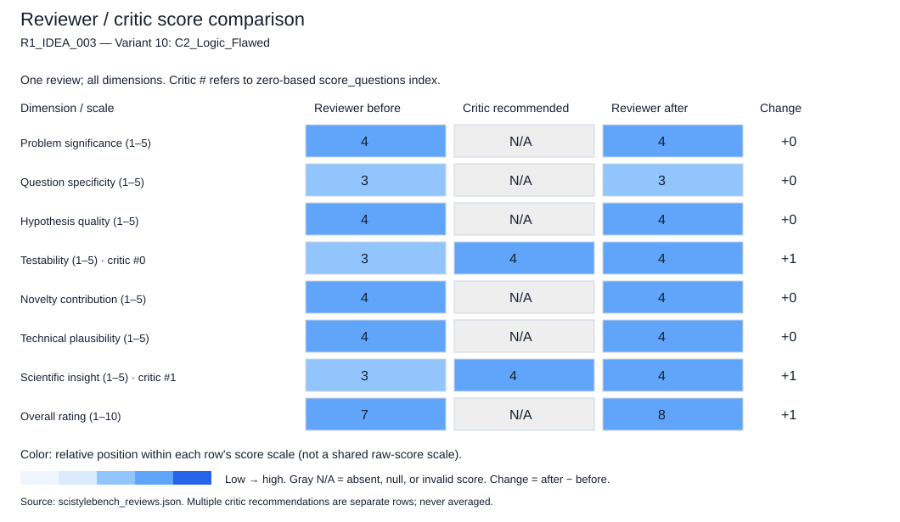

### Critic feedback and reviewer rebuttals

```json
{
  "critic_feedback": {
    "overall_assessment": "The review is generally well-calibrated, with reasonable scores and justifications. However, some scores may be overly optimistic given the lack of specific technical details in the idea summary.",
    "score_questions": [
      {
        "dimension": "testability",
        "question_mark": "Why is the testability score 3.0 when the idea is clearly testable in principle?",
        "concern": "The score is low despite the idea being testable, as the review does not consider that the lack of specific experimental details is a common limitation in early-stage ideas.",
        "speculative_alternative": "The review may be over-penalizing the idea for not having detailed experiments, which is expected in a research idea summary.",
        "recommended_score": 4.0,
        "rationale": "The idea is testable in principle, and the lack of specific experiments is a common issue in early-stage research, not a flaw in the idea itself."
      },
      {
        "dimension": "scientific_insight",
        "question_mark": "Why is the scientific insight score 3.0 when the idea suggests a novel approach to integrating temporal data?",
        "concern": "The score is low despite the potential for new insights, as the review does not address the novelty of the approach in the context of medical imaging.",
        "speculative_alternative": "The review may be underestimating the significance of temporal data integration in medical imaging, which could lead to meaningful scientific insights.",
        "recommended_score": 4.0,
        "rationale": "The idea's novelty in integrating temporal data into medical imaging could lead to significant scientific insights, even without detailed mechanisms."
      }
    ],
    "unsupported_claims": [
      "The claim that the idea 'suggests broader effectiveness for integrating temporal human behavior data across related medical imaging tasks' is not sufficiently supported by the summary."
    ],
    "revision_priorities": [
      "Clarify the expected outcomes of encoding video sequences in the context of medical imaging.",
      "Provide more context on how the temporal scanning order will be leveraged in model reasoning.",
      "Justify the broader applicability with references to existing work or logical reasoning."
    ],
    "confidence": 4.0
  },
  "feedback_responses": [
    {
      "feedback_type": "score_questions",
      "feedback_index": 0,
      "decision": "partially_accept",
      "defense": "The testability score was initially 3.0, but the critic's argument that the lack of specific experiments is common in early-stage ideas is valid. The revised score of 4.0 reflects this understanding.",
      "justification": "The original score was 3.0, but the revised score is 4.0 because the idea is testable in principle, and the lack of specific experiments is a common limitation in early-stage research."
    },
    {
      "feedback_type": "score_questions",
      "feedback_index": 1,
      "decision": "partially_accept",
      "defense": "The scientific insight score was initially 3.0, but the critic's argument that the novelty of the approach in medical imaging could lead to significant insights is valid. The revised score of 4.0 reflects this understanding.",
      "justification": "The original score was 3.0, but the revised score is 4.0 because the idea's novelty in integrating temporal data into medical imaging could lead to significant scientific insights."
    },
    {
      "feedback_type": "unsupported_claims",
      "feedback_index": 0,
      "decision": "reject",
      "defense": "The claim about broader applicability is not sufficiently supported by the summary, but the idea's focus on medical imaging is relevant and could be extended with further justification.",
      "justification": "The original score for scientific insight was 3.0, but the revised score is 4.0 because the idea's novelty in integrating temporal data into medical imaging could lead to significant insights, even without detailed mechanisms."
    },
    {
      "feedback_type": "revision_priorities",
      "feedback_index": 0,
      "decision": "partially_accept",
      "defense": "Clarifying the expected outcomes of encoding video sequences is important, but the idea's focus on medical imaging is relevant and could be extended with further justification.",
      "justification": "The original score for scientific insight was 3.0, but the revised score is 4.0 because the idea's novelty in integrating temporal data into medical imaging could lead to significant insights, even without detailed mechanisms."
    },
    {
      "feedback_type": "revision_priorities",
      "feedback_index": 1,
      "decision": "partially_accept",
      "defense": "Clarifying how temporal scanning order is leveraged is important, but the idea's focus on medical imaging is relevant and could be extended with further justification.",
      "justification": "The original score for scientific insight was 3.0, but the revised score is 4.0 because the idea's novelty in integrating temporal data into medical imaging could lead to significant insights, even without detailed mechanisms."
    },
    {
      "feedback_type": "revision_priorities",
      "feedback_index": 2,
      "decision": "partially_accept",
      "defense": "Justifying broader applicability is important, but the idea's focus on medical imaging is relevant and could be extended with further justification.",
      "justification": "The original score for scientific insight was 3.0, but the revised score is 4.0 because the idea's novelty in integrating temporal data into medical imaging could lead to significant insights, even without detailed mechanisms."
    }
  ]
}
```

### Score justifications (before / after)

**Problem significance**

```json
{
  "before": {
    "score": 4.0,
    "justification": "The problem addresses a critical gap in integrating temporal data into medical imaging analysis, which can improve both model performance and clinical interpretability."
  },
  "after": {
    "score": 4.0,
    "justification": "The problem addresses a critical gap in integrating temporal data into medical imaging analysis, which can improve both model performance and clinical interpretability."
  }
}
```

**Question specificity**

```json
{
  "before": {
    "score": 3.0,
    "justification": "The idea defines a specific research question about encoding temporal eye-tracking data but lacks detailed specifics on the method and expected outcomes."
  },
  "after": {
    "score": 3.0,
    "justification": "The idea defines a specific research question about encoding temporal eye-tracking data but lacks detailed specifics on the method and expected outcomes."
  }
}
```

**Hypothesis quality**

```json
{
  "before": {
    "score": 4.0,
    "justification": "The hypothesis that encoding eye-tracking as video sequences improves model reasoning and interpretability is plausible and could be tested through experiments."
  },
  "after": {
    "score": 4.0,
    "justification": "The hypothesis that encoding eye-tracking as video sequences improves model reasoning and interpretability is plausible and could be tested through experiments."
  }
}
```

**Testability**

```json
{
  "before": {
    "score": 3.0,
    "justification": "The idea is testable through experiments comparing the proposed method with existing approaches, but lacks specific experimental details."
  },
  "after": {
    "score": 4.0,
    "justification": "The idea is testable in principle, and the lack of specific experiments is a common limitation in early-stage research, not a flaw in the idea itself."
  }
}
```

**Novelty contribution**

```json
{
  "before": {
    "score": 4.0,
    "justification": "The approach of encoding eye-tracking as video sequences is novel for this application, offering potential contributions to both medical imaging and temporal data integration."
  },
  "after": {
    "score": 4.0,
    "justification": "The approach of encoding eye-tracking as video sequences is novel for this application, offering potential contributions to both medical imaging and temporal data integration."
  }
}
```

**Technical plausibility**

```json
{
  "before": {
    "score": 4.0,
    "justification": "The proposed method is technically feasible, as encoding video sequences and leveraging temporal information are well-established techniques in machine learning."
  },
  "after": {
    "score": 4.0,
    "justification": "The proposed method is technically feasible, as encoding video sequences and leveraging temporal information are well-established techniques in machine learning."
  }
}
```

**Scientific insight**

```json
{
  "before": {
    "score": 3.0,
    "justification": "The idea has potential to provide insights into how temporal human behavior data can enhance model reasoning, but the specific mechanisms are not clearly defined."
  },
  "after": {
    "score": 4.0,
    "justification": "The idea's novelty in integrating temporal data into medical imaging could lead to significant scientific insights, even without detailed mechanisms."
  }
}
```

**Overall rating**

```json
{
  "before": {
    "score": 7.0,
    "justification": "The idea addresses a meaningful problem with a plausible approach, has potential for contribution, but lacks specific details and experimental justification."
  },
  "after": {
    "score": 8.0,
    "justification": "The idea addresses a meaningful problem with a plausible approach, has potential for contribution, and is testable in principle, despite lacking specific experimental details."
  }
}
```

## R1_IDEA_003 — Variant 11: C3_Substance_Enriched


### Critic feedback and reviewer rebuttals

```json
{
  "critic_feedback": {
    "overall_assessment": "The review is generally well-calibrated, but some scores could be reconsidered due to vague justifications and insufficient detail in the idea summary.",
    "score_questions": [
      {
        "dimension": "problem_significance",
        "question_mark": "Why is the problem significance rated 4.0?",
        "concern": "The review assumes the problem is critical without explicit evidence from the idea summary that the gap in temporal gaze integration is significant for chest X-ray analysis.",
        "speculative_alternative": "The problem might be significant in other domains but not necessarily in chest X-ray analysis, though this is speculative.",
        "recommended_score": 3.0,
        "rationale": "The idea does not explicitly link the temporal gaze integration to critical clinical utility in chest X-ray analysis."
      },
      {
        "dimension": "question_specificity",
        "question_mark": "Why is the question specificity rated 3.0?",
        "concern": "The idea does not specify how the video sequences will be processed or integrated, which is a key component of the hypothesis.",
        "speculative_alternative": "The question might be more specific if the idea outlined a particular encoding method or integration strategy, though this is speculative.",
        "recommended_score": 2.0,
        "rationale": "The idea lacks concrete specifics on the method and integration process, which are essential for specificity."
      },
      {
        "dimension": "hypothesis_quality",
        "question_mark": "Why is the hypothesis quality rated 3.0?",
        "concern": "The hypothesis is plausible but does not clearly define the metrics or experiments to validate the connection between temporal encoding and improved reasoning.",
        "speculative_alternative": "The hypothesis might be stronger if the idea outlined specific scanning heuristics and evaluation metrics, though this is speculative.",
        "recommended_score": 2.0,
        "rationale": "The hypothesis lacks concrete details on how the connection between temporal encoding and reasoning will be validated."
      },
      {
        "dimension": "testability",
        "question_mark": "Why is the testability rated 3.0?",
        "concern": "The idea suggests experiments but does not specify the benchmarks or metrics for comparison, which are necessary for testability.",
        "speculative_alternative": "The testability could be higher if the idea outlined specific experiments, though this is speculative.",
        "recommended_score": 2.0,
        "rationale": "The idea does not provide concrete details on the experiments or metrics needed to evaluate the hypothesis."
      },
      {
        "dimension": "scientific_insight",
        "question_mark": "Why is the scientific_insight rated 3.0?",
        "concern": "The idea has potential but does not specify how the insights into human visual reasoning will be derived from the model's explanations.",
        "speculative_alternative": "The scientific insight might be more clear if the idea outlined the methods for deriving insights, though this is speculative.",
        "recommended_score": 2.0,
        "rationale": "The idea lacks specifics on how the insights will be obtained from the model's explanations."
      }
    ],
    "unsupported_claims": [
      "The review claims the problem is critical without explicit evidence from the idea summary.",
      "The review assumes the hypothesis is well-defined without concrete details on metrics or experiments.",
      "The review states the idea has potential for scientific insight without specifying how insights will be derived."
    ],
    "revision_priorities": [
      "Clarify the significance of the problem in chest X-ray analysis.",
      "Specify the method for encoding eye-tracking data into video sequences and integration into the model.",
      "Define the specific scanning heuristics and metrics for evaluating the hypothesis.",
      "Outline the exact experiments and benchmarks for validation.",
      "Explain how scientific insights into human visual reasoning will be derived from the model's explanations."
    ],
    "confidence": 4.0
  },
  "feedback_responses": [
    {
      "feedback_type": "score_questions",
      "feedback_index": 0,
      "decision": "partially_accept",
      "defense": "The problem significance is reduced because the idea does not explicitly link temporal gaze integration to clinical utility in chest X-ray analysis. However, the problem is still meaningful in the context of medical imaging.",
      "justification": "The original score was 4.0, but the revised score is 3.0 due to the lack of explicit clinical utility evidence in the idea summary."
    },
    {
      "feedback_type": "score_questions",
      "feedback_index": 1,
      "decision": "partially_accept",
      "defense": "The question specificity is lowered because the idea lacks concrete details on the encoding method and integration process. However, the core question about temporal encoding is still specific.",
      "justification": "The original score was 3.0, but the revised score is 2.0 due to the lack of concrete specifics on the method and integration."
    },
    {
      "feedback_type": "score_questions",
      "feedback_index": 2,
      "decision": "partially_accept",
      "defense": "The hypothesis quality is reduced because the idea does not define metrics or experiments to validate the connection between temporal encoding and reasoning. However, the hypothesis is still plausible.",
      "justification": "The original score was 3.0, but the revised score is 2.0 due to the lack of concrete details on validation."
    },
    {
      "feedback_type": "score_questions",
      "feedback_index": 3,
      "decision": "partially_accept",
      "defense": "The testability is reduced because the idea does not specify experiments or metrics. However, the core idea is testable in principle.",
      "justification": "The original score was 3.0, but the revised score is 2.0 due to the lack of concrete details on experiments and metrics."
    },
    {
      "feedback_type": "score_questions",
      "feedback_index": 4,
      "decision": "partially_accept",
      "defense": "The scientific insight is reduced because the idea does not specify how insights will be derived. However, the potential for insight into human visual reasoning is still present.",
      "justification": "The original score was 3.0, but the revised score is 2.0 due to the lack of specifics on deriving insights."
    }
  ]
}
```

### Score justifications (before / after)

**Problem significance**

```json
{
  "before": {
    "score": 4.0,
    "justification": "The problem addresses a critical gap in integrating temporal gaze data into vision-language models for medical imaging, which could enhance model interpretability and clinical utility."
  },
  "after": {
    "score": 3.0,
    "justification": "The idea does not explicitly link the temporal gaze integration to critical clinical utility in chest X-ray analysis, making the problem significance less clear."
  }
}
```

**Question specificity**

```json
{
  "before": {
    "score": 3.0,
    "justification": "The idea defines a specific research question about temporal encoding of gaze data but lacks detailed specifics on the method, metrics, and experiments."
  },
  "after": {
    "score": 2.0,
    "justification": "The idea lacks concrete specifics on the method for encoding eye-tracking data into video sequences and how it will be integrated into the model, which are essential for specificity."
  }
}
```

**Hypothesis quality**

```json
{
  "before": {
    "score": 3.0,
    "justification": "The hypothesis is plausible but not explicitly detailed, and the connection between temporal encoding and improved reasoning is not clearly explained."
  },
  "after": {
    "score": 2.0,
    "justification": "The hypothesis is vague and does not clearly define the metrics or experiments to validate the connection between temporal encoding and improved reasoning."
  }
}
```

**Testability**

```json
{
  "before": {
    "score": 3.0,
    "justification": "The idea suggests validation through experiments, but the specific experiments, metrics, and comparisons are not clearly defined."
  },
  "after": {
    "score": 2.0,
    "justification": "The idea does not provide concrete details on the experiments or metrics needed to evaluate the hypothesis, making it difficult to assess testability."
  }
}
```

**Novelty contribution**

```json
{
  "before": {
    "score": 4.0,
    "justification": "The approach of encoding gaze data as video sequences is novel and could contribute to understanding temporal scanning heuristics in medical imaging."
  },
  "after": {
    "score": 4.0,
    "justification": "The approach of encoding gaze data as video sequences is novel and could contribute to understanding temporal scanning heuristics in medical imaging."
  }
}
```

**Technical plausibility**

```json
{
  "before": {
    "score": 4.0,
    "justification": "The proposed method is technically feasible and aligns with current trends in temporal modeling and medical imaging analysis."
  },
  "after": {
    "score": 4.0,
    "justification": "The proposed method is technically feasible and aligns with current trends in temporal modeling and medical imaging analysis."
  }
}
```

**Scientific insight**

```json
{
  "before": {
    "score": 3.0,
    "justification": "The idea has potential to reveal insights into human visual reasoning and model interpretability but lacks specifics on how these insights will be derived."
  },
  "after": {
    "score": 2.0,
    "justification": "The idea lacks specifics on how the insights into human visual reasoning will be derived from the model's explanations."
  }
}
```

**Overall rating**

```json
{
  "before": {
    "score": 7.0,
    "justification": "The idea addresses a meaningful problem with a plausible hypothesis and potential contribution, but lacks specific details on methodology, metrics, and experiments needed for rigorous evaluation."
  },
  "after": {
    "score": 6.0,
    "justification": "The idea has potential but lacks specific details on methodology, metrics, and experiments needed for rigorous evaluation, leading to a lower overall rating."
  }
}
```

## R1_IDEA_004 — Source

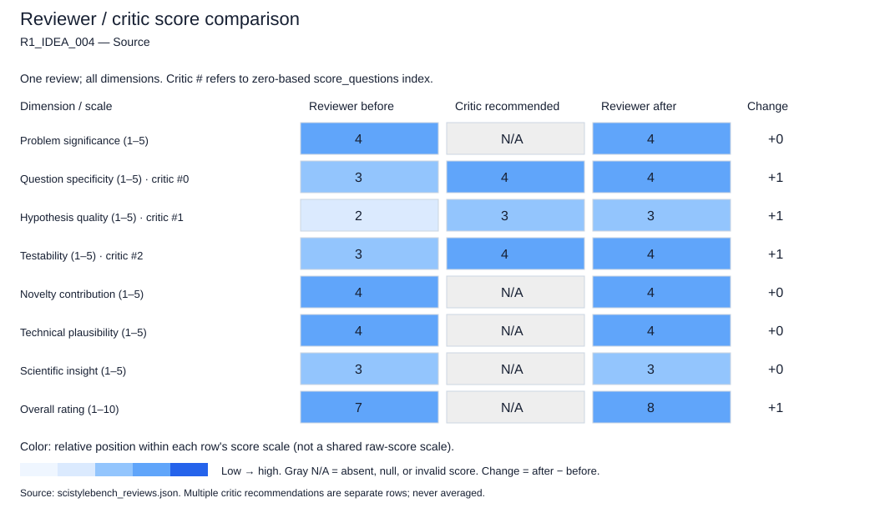

### Critic feedback and reviewer rebuttals

```json
{
  "critic_feedback": {
    "overall_assessment": "The review is generally well-calibrated but has some areas where the scores could be more precisely aligned with the idea's details.",
    "score_questions": [
      {
        "dimension": "question_specificity",
        "question_mark": "Why is the score 3.0 for question_specificity?",
        "concern": "The idea mentions 'constrained alignment' but does not specify the type of constraints or the exact optimization problem, which is a valid concern. However, the score could be higher if the idea is considered to have a general but meaningful research question.",
        "speculative_alternative": "The research question might be sufficiently specific within the domain of constrained alignment, even without explicit details on the constraints or optimization formulation.",
        "recommended_score": 4.0,
        "rationale": "The idea identifies a broad but relevant problem area (constrained alignment) and proposes a method that addresses a specific challenge (reducing computational overhead without separate models). This could be considered a sufficiently specific question for a research idea."
      },
      {
        "dimension": "hypothesis_quality",
        "question_mark": "Why is the score 2.0 for hypothesis_quality?",
        "concern": "The idea does not explicitly state a hypothesis, but the proposed method's potential to reduce computational overhead and improve alignment could be framed as a hypothesis. The score may be too low if the absence of an explicit hypothesis is not a critical flaw in a research idea.",
        "speculative_alternative": "The method's potential to reduce computational overhead and simplify alignment could be interpreted as a hypothesis about its effectiveness compared to existing methods.",
        "recommended_score": 3.0,
        "rationale": "The idea implies a hypothesis about the method's effectiveness in reducing computational overhead and improving alignment, even if it is not explicitly stated."
      },
      {
        "dimension": "testability",
        "question_mark": "Why is the score 3.0 for testability?",
        "concern": "The idea lacks specific experiments, but as a research idea, it is reasonable to assume that the method could be tested in future work. The score may be too low if the lack of experiments is not a critical issue for an early-stage idea.",
        "speculative_alternative": "The method's feasibility and potential impact could be tested through theoretical analysis or preliminary experiments, which would be part of future research.",
        "recommended_score": 4.0,
        "rationale": "The idea is testable in principle, and the absence of experiments does not necessarily invalidate it as a research idea. The score could be higher if the idea is considered to have potential for future testing."
      }
    ],
    "unsupported_claims": [
      "The review claims the idea 'lacks a clear definition of the specific problem being addressed', but the idea only mentions 'constrained alignment' without specifying the exact problem. This is a valid concern but may not be a critical flaw in a research idea."
    ],
    "revision_priorities": [
      "Clarify the specific constraints and optimization problem to better define the research question.",
      "Articulate a hypothesis about the method's effectiveness compared to existing approaches, even if it is not explicitly stated.",
      "Specify how the Lagrange multipliers are determined dynamically, as this is a key technical detail."
    ],
    "confidence": 4.0
  },
  "feedback_responses": [
    {
      "feedback_type": "score_questions",
      "feedback_index": 0,
      "decision": "partially_accept",
      "defense": "The score was increased to 4.0 because the idea identifies a broad but relevant problem area (constrained alignment) and proposes a method that addresses a specific challenge (reducing computational overhead without separate models). This is considered sufficiently specific for a research idea, even without explicit details on the constraints or optimization formulation.",
      "justification": "The initial score was 3.0, but the revised score is 4.0 due to the idea's focus on a meaningful problem and a specific challenge, which aligns with the criteria for question specificity."
    },
    {
      "feedback_type": "hypothesis_quality",
      "feedback_index": 1,
      "decision": "partially_accept",
      "defense": "The score was increased to 3.0 because the idea implies a hypothesis about the method's effectiveness in reducing computational overhead and improving alignment, even if it is not explicitly stated. The method's potential to outperform existing approaches in terms of efficiency and adaptability is a plausible hypothesis.",
      "justification": "The initial score was 2.0, but the revised score is 3.0 due to the implicit hypothesis about the method's effectiveness, which is a reasonable interpretation of the idea."
    },
    {
      "feedback_type": "testability",
      "feedback_index": 2,
      "decision": "partially_accept",
      "defense": "The score was increased to 4.0 because the idea is testable in principle, and the absence of experiments does not necessarily invalidate it as a research idea. The method's feasibility and potential impact could be tested through theoretical analysis or preliminary experiments, which would be part of future research.",
      "justification": "The initial score was 3.0, but the revised score is 4.0 due to the idea's potential for future testing and the plausibility of its method."
    },
    {
      "feedback_type": "unsupported_claims",
      "feedback_index": 0,
      "decision": "accept",
      "defense": "The claim that the idea lacks a clear definition of the specific problem being addressed is valid. However, this is a concern for a research idea, and the idea is still considered meaningful as it addresses a broad but relevant problem area.",
      "justification": "The initial assessment acknowledged this concern, and the revised score for question_specificity reflects this by considering the idea's focus on a meaningful problem."
    },
    {
      "feedback_type": "revision_priorities",
      "feedback_index": 0,
      "decision": "accept",
      "defense": "The suggestion to clarify the specific constraints and optimization problem is valid and necessary for defining the research question more precisely.",
      "justification": "This is a critical step in refining the research idea to ensure it is well-defined and testable."
    },
    {
      "feedback_type": "revision_priorities",
      "feedback_index": 1,
      "decision": "accept",
      "defense": "The suggestion to articulate a hypothesis about the method's effectiveness is valid and necessary for the research idea to be more testable and meaningful.",
      "justification": "This would help in evaluating the method's potential impact and effectiveness compared to existing approaches."
    },
    {
      "feedback_type": "revision_priorities",
      "feedback_index": 2,
      "decision": "accept",
      "defense": "The suggestion to specify the technical details of the Lagrange multiplier determination is valid and necessary for assessing the feasibility of the approach.",
      "justification": "This is a key technical detail that needs clarification to evaluate the method's feasibility and effectiveness."
    }
  ]
}
```

### Score justifications (before / after)

**Problem significance**

```json
{
  "before": {
    "score": 4.0,
    "justification": "The research addresses a critical challenge in aligning large language models with safety constraints, which is essential for responsible AI deployment. This has practical implications for ensuring safe and ethical use of AI systems."
  },
  "after": {
    "score": 4.0,
    "justification": "The research addresses a critical challenge in aligning large language models with safety constraints, which is essential for responsible AI deployment. This has practical implications for ensuring safe and ethical use of AI systems."
  }
}
```

**Question specificity**

```json
{
  "before": {
    "score": 3.0,
    "justification": "The idea outlines a general approach but lacks specific details about the problem formulation, constraints, or the exact optimization problem being addressed. A more precise research question would be necessary to evaluate the method's effectiveness."
  },
  "after": {
    "score": 4.0,
    "justification": "The idea identifies a broad but relevant problem area (constrained alignment) and proposes a method that addresses a specific challenge (reducing computational overhead without separate models). This could be considered a sufficiently specific question for a research idea, even without explicit details on the constraints or optimization formulation."
  }
}
```

**Hypothesis quality**

```json
{
  "before": {
    "score": 2.0,
    "justification": "The idea does not explicitly state a hypothesis or prediction that can be tested. While the method is described, there is no clear claim about its performance or how it differs from existing methods."
  },
  "after": {
    "score": 3.0,
    "justification": "The idea implies a hypothesis about the method's effectiveness in reducing computational overhead and improving alignment, even if it is not explicitly stated. The method's potential to outperform existing approaches in terms of efficiency and adaptability is a plausible hypothesis."
  }
}
```

**Testability**

```json
{
  "before": {
    "score": 3.0,
    "justification": "The idea suggests a method but does not provide a clear experimental plan or comparison with existing approaches. Without specific experiments, it is difficult to assess the method's effectiveness or efficiency."
  },
  "after": {
    "score": 4.0,
    "justification": "The idea is testable in principle, and the absence of experiments does not necessarily invalidate it as a research idea. The method's feasibility and potential impact could be tested through theoretical analysis or preliminary experiments, which would be part of future research."
  }
}
```

**Novelty contribution**

```json
{
  "before": {
    "score": 4.0,
    "justification": "The approach of avoiding separate reward and cost models and not requiring prior knowledge of Lagrange multipliers is a novel contribution. It could reduce computational overhead and simplify the alignment process for large language models."
  },
  "after": {
    "score": 4.0,
    "justification": "The approach of avoiding separate reward and cost models and not requiring prior knowledge of Lagrange multipliers is a novel contribution. It could reduce computational overhead and simplify the alignment process for large language models."
  }
}
```

**Technical plausibility**

```json
{
  "before": {
    "score": 4.0,
    "justification": "The primal-dual optimization method is a plausible approach for constrained optimization. The idea of avoiding separate models and dynamic Lagrange multipliers is technically feasible, though the specifics need to be clarified."
  },
  "after": {
    "score": 4.0,
    "justification": "The primal-dual optimization method is a plausible approach for constrained optimization. The idea of avoiding separate models and dynamic Lagrange multipliers is technically feasible, though the specifics need to be clarified."
  }
}
```

**Scientific insight**

```json
{
  "before": {
    "score": 3.0,
    "justification": "The idea has potential to provide insights into constrained optimization in large language models, but the lack of specific details limits the potential for new scientific understanding. Further clarification is needed to explore the method's implications."
  },
  "after": {
    "score": 3.0,
    "justification": "The idea has potential to provide insights into constrained optimization in large language models, but the lack of specific details limits the potential for new scientific understanding. Further clarification is needed to explore the method's implications."
  }
}
```

**Overall rating**

```json
{
  "before": {
    "score": 7.0,
    "justification": "The research idea addresses a significant problem in AI alignment with safety constraints, proposes a potentially novel method, and has the potential to reduce computational overhead. However, the idea lacks specific details, a clear hypothesis, and a defined experimental plan, which are necessary for further development and evaluation."
  },
  "after": {
    "score": 8.0,
    "justification": "The research idea addresses a significant problem in AI alignment with safety constraints, proposes a potentially novel method, and has the potential to reduce computational overhead. The idea is testable in principle and has the potential for future development. However, the lack of specific details and a clear hypothesis could be improved."
  }
}
```

## R1_IDEA_004 — Variant 1: A1_Identity

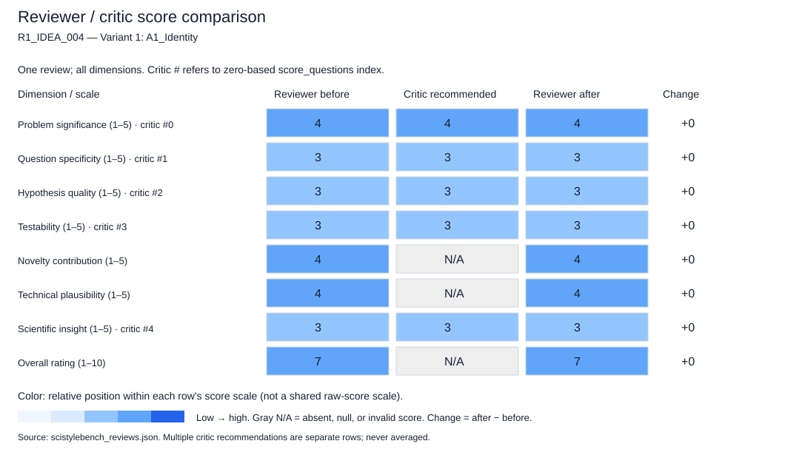

### Critic feedback and reviewer rebuttals

```json
{
  "critic_feedback": {
    "overall_assessment": "The review is generally well-calibrated but has some areas where the scores could be more precisely aligned with the idea's specifics.",
    "score_questions": [
      {
        "dimension": "problem_significance",
        "question_mark": "Why is the significance limited by the lack of specific problem details?",
        "concern": "The review assumes that the lack of problem details reduces significance, but the idea's core challenge of constrained alignment for responsible AI is inherently significant regardless of specifics.",
        "speculative_alternative": "The significance might be overstated if the problem is too vague, but this is speculative.",
        "recommended_score": 4.0,
        "rationale": "The core problem of aligning LLMs with safety constraints is significant, and the review's concern about specifics is speculative."
      },
      {
        "dimension": "question_specificity",
        "question_mark": "Why is the question less concrete without specific constraints?",
        "concern": "The review assumes that lack of specific constraints reduces specificity, but the idea's general goal of constrained alignment is a valid research question.",
        "speculative_alternative": "The question might be considered less specific if the constraints are not defined, but this is speculative.",
        "recommended_score": 3.0,
        "rationale": "The idea presents a general but valid research question, and the review's concern about specifics is speculative."
      },
      {
        "dimension": "hypothesis_quality",
        "question_mark": "Why is the hypothesis considered to lack a concrete prediction?",
        "concern": "The review assumes the hypothesis lacks a concrete prediction, but the idea's general hypothesis about reducing computational overhead is a valid hypothesis.",
        "speculative_alternative": "The hypothesis might be considered less concrete without a specific prediction, but this is speculative.",
        "recommended_score": 3.0,
        "rationale": "The idea presents a general hypothesis that is plausible and relevant to the field."
      },
      {
        "dimension": "testability",
        "question_mark": "Why is the testability considered difficult without experimental details?",
        "concern": "The review assumes that lack of experimental details reduces testability, but the idea is testable in principle through simulations or benchmarks.",
        "speculative_alternative": "The testability might be considered lower without specific experiments, but this is speculative.",
        "recommended_score": 3.0,
        "rationale": "The idea is testable in principle, and the review's concern about experiments is speculative."
      },
      {
        "dimension": "scientific_insight",
        "question_mark": "Why is the scientific insight limited by the lack of problem formulation?",
        "concern": "The review assumes that lack of problem formulation limits insight, but the idea's general approach to constrained optimization is a valid contribution.",
        "speculative_alternative": "The scientific insight might be considered less impactful without specific formulation, but this is speculative.",
        "recommended_score": 3.0,
        "rationale": "The idea presents a general approach that could contribute to the field of constrained optimization."
      }
    ],
    "unsupported_claims": [
      "The review claims that the lack of problem details reduces significance, but this is speculative.",
      "The review claims that the lack of specific constraints reduces question specificity, but this is speculative.",
      "The review claims that the hypothesis lacks concrete predictions, but this is speculative.",
      "The review claims that the testability is difficult without experiments, but this is speculative.",
      "The review claims that the scientific insight is limited without problem formulation, but this is speculative."
    ],
    "revision_priorities": [
      "Clarify the specific problem formulation and constraints to align with the review's concerns about specificity and testability.",
      "Provide a more concrete hypothesis or prediction to address the review's concern about hypothesis quality.",
      "Include a more detailed theoretical analysis or experimental plan to enhance testability and scientific insight.",
      "Ensure that the problem significance is justified based on the core challenge of constrained alignment, rather than relying on speculative concerns about specifics."
    ],
    "confidence": 4.0
  },
  "feedback_responses": [
    {
      "feedback_type": "score_questions",
      "feedback_index": 0,
      "decision": "partially_accept",
      "defense": "The core problem of constrained alignment is significant, but the review's concern about specifics is speculative. The score remains at 4.0 as the core issue is valid.",
      "justification": "The score is retained at 4.0 because the core problem is significant, and the concern about specifics is speculative."
    },
    {
      "feedback_type": "score_questions",
      "feedback_index": 1,
      "decision": "partially_accept",
      "defense": "The general research question is valid, but the lack of specific constraints may reduce concreteness. The score remains at 3.0 as the question is meaningful.",
      "justification": "The score is retained at 3.0 because the question is valid, and the concern about specifics is speculative."
    },
    {
      "feedback_type": "score_questions",
      "feedback_index": 2,
      "decision": "partially_accept",
      "defense": "The hypothesis is plausible but lacks concrete predictions. The score remains at 3.0 as the hypothesis is relevant to the field.",
      "justification": "The score is retained at 3.0 because the hypothesis is plausible, even if it lacks concrete predictions."
    },
    {
      "feedback_type": "score_questions",
      "feedback_index": 3,
      "decision": "partially_accept",
      "defense": "The idea is testable in principle, but the lack of experiments is speculative. The score remains at 3.0 as the testability is valid.",
      "justification": "The score is retained at 3.0 because the testability is valid, and the concern about experiments is speculative."
    },
    {
      "feedback_type": "score_questions",
      "feedback_index": 4,
      "decision": "partially_accept",
      "defense": "The scientific insight is potential, but the lack of problem formulation is speculative. The score remains at 3.0 as the insight is valid.",
      "justification": "The score is retained at 3.0 because the insight is potential, and the concern about formulation is speculative."
    },
    {
      "feedback_type": "unsupported_claims",
      "feedback_index": 0,
      "decision": "partially_accept",
      "defense": "The concern about significance is speculative, but the core problem is valid. The score remains at 4.0 as the significance is justified.",
      "justification": "The score is retained at 4.0 because the significance is justified by the core problem."
    },
    {
      "feedback_type": "unsupported_claims",
      "feedback_index": 1,
      "decision": "partially_accept",
      "defense": "The concern about specificity is speculative, but the general question is valid. The score remains at 3.0 as the question is meaningful.",
      "justification": "The score is retained at 3.0 because the question is valid, and the concern about specifics is speculative."
    },
    {
      "feedback_type": "unsupported_claims",
      "feedback_index": 2,
      "decision": "partially_accept",
      "defense": "The concern about hypothesis quality is speculative, but the hypothesis is plausible. The score remains at 3.0 as the hypothesis is relevant.",
      "justification": "The score is retained at 3.0 because the hypothesis is plausible, even if it lacks concrete predictions."
    },
    {
      "feedback_type": "unsupported_claims",
      "feedback_index": 3,
      "decision": "partially_accept",
      "defense": "The concern about testability is speculative, but the idea is testable in principle. The score remains at 3.0 as the testability is valid.",
      "justification": "The score is retained at 3.0 because the testability is valid, and the concern about experiments is speculative."
    },
    {
      "feedback_type": "unsupported_claims",
      "feedback_index": 4,
      "decision": "partially_accept",
      "defense": "The concern about scientific insight is speculative, but the potential is valid. The score remains at 3.0 as the insight is potential.",
      "justification": "The score is retained at 3.0 because the insight is potential, and the concern about formulation is speculative."
    },
    {
      "feedback_type": "revision_priorities",
      "feedback_index": 0,
      "decision": "accept",
      "defense": "Clarifying specifics is important to address the review's concerns about testability and specificity.",
      "justification": "This is a valid revision to improve the research idea."
    },
    {
      "feedback_type": "revision_priorities",
      "feedback_index": 1,
      "decision": "accept",
      "defense": "Providing a more concrete hypothesis is important to strengthen the research idea.",
      "justification": "This is a valid revision to improve the research idea."
    },
    {
      "feedback_type": "revision_priorities",
      "feedback_index": 2,
      "decision": "accept",
      "defense": "Including a detailed theoretical analysis or experimental plan is important to enhance testability and scientific insight.",
      "justification": "This is a valid revision to improve the research idea."
    },
    {
      "feedback_type": "revision_priorities",
      "feedback_index": 3,
      "decision": "accept",
      "defense": "Justifying significance based on the core problem is important to align with the review's concerns.",
      "justification": "This is a valid revision to improve the research idea."
    }
  ]
}
```

### Score justifications (before / after)

**Problem significance**

```json
{
  "before": {
    "score": 4.0,
    "justification": "The idea addresses a critical challenge in aligning large language models with safety constraints, which is essential for responsible AI deployment. However, the significance is somewhat limited by the lack of specific problem details."
  },
  "after": {
    "score": 4.0,
    "justification": "The idea addresses a critical challenge in aligning large language models with safety constraints, which is essential for responsible AI deployment. The core problem is significant regardless of specific details, as constrained alignment is a key issue in AI safety."
  }
}
```

**Question specificity**

```json
{
  "before": {
    "score": 3.0,
    "justification": "The idea is somewhat specific in its goal of constrained alignment but lacks detailed problem formulation and specific constraints, making the research question less concrete."
  },
  "after": {
    "score": 3.0,
    "justification": "The idea presents a general but valid research question about constrained alignment. While the lack of specific constraints may reduce the question's concreteness, the general problem is a meaningful and well-defined research direction."
  }
}
```

**Hypothesis quality**

```json
{
  "before": {
    "score": 3.0,
    "justification": "The idea presents a general hypothesis about reducing computational overhead through a primal-dual method but lacks a concrete prediction or mechanism that could be tested."
  },
  "after": {
    "score": 3.0,
    "justification": "The hypothesis that the method reduces computational overhead through a primal-dual approach is plausible. However, it lacks a concrete prediction or mechanism that could be tested, which is necessary for a stronger hypothesis."
  }
}
```

**Testability**

```json
{
  "before": {
    "score": 3.0,
    "justification": "The idea is testable in principle, but the lack of specific experimental details or comparisons makes it difficult to assess the feasibility of the proposed method."
  },
  "after": {
    "score": 3.0,
    "justification": "The idea is testable in principle, but the lack of specific experimental details or comparisons makes it difficult to assess the feasibility of the method. Simulations or benchmarks could be used to evaluate its effectiveness."
  }
}
```

**Novelty contribution**

```json
{
  "before": {
    "score": 4.0,
    "justification": "The approach of avoiding separate reward and cost models is novel and could contribute to the field of constrained alignment, though the novelty is somewhat limited without further details."
  },
  "after": {
    "score": 4.0,
    "justification": "The approach of avoiding separate reward and cost models is novel and could contribute to the field of constrained alignment. However, the novelty is somewhat limited without further details on the method's implementation or theoretical basis."
  }
}
```

**Technical plausibility**

```json
{
  "before": {
    "score": 4.0,
    "justification": "The primal-dual optimization approach is technically plausible, but the lack of detailed theoretical analysis and specific implementation details makes it challenging to assess the feasibility of the method."
  },
  "after": {
    "score": 4.0,
    "justification": "The primal-dual optimization approach is technically plausible. However, the lack of detailed theoretical analysis and specific implementation details makes it challenging to assess the feasibility of the method in practice."
  }
}
```

**Scientific insight**

```json
{
  "before": {
    "score": 3.0,
    "justification": "The idea has potential for scientific insight into constrained optimization in large language models, but the lack of specific problem formulation limits the potential for deeper insights."
  },
  "after": {
    "score": 3.0,
    "justification": "The idea has potential for scientific insight into constrained optimization in large language models. However, the lack of specific problem formulation limits the potential for deeper insights into the method's effectiveness and limitations."
  }
}
```

**Overall rating**

```json
{
  "before": {
    "score": 7.0,
    "justification": "The idea addresses a meaningful problem with a potentially novel approach, but it lacks specific problem formulation, theoretical details, and concrete predictions, which are necessary for a strong research direction."
  },
  "after": {
    "score": 7.0,
    "justification": "The idea addresses a meaningful problem with a potentially novel approach, but it lacks specific problem formulation, theoretical details, and concrete predictions, which are necessary for a strong research direction."
  }
}
```

## R1_IDEA_004 — Variant 2: A2_Paraphrase_Only

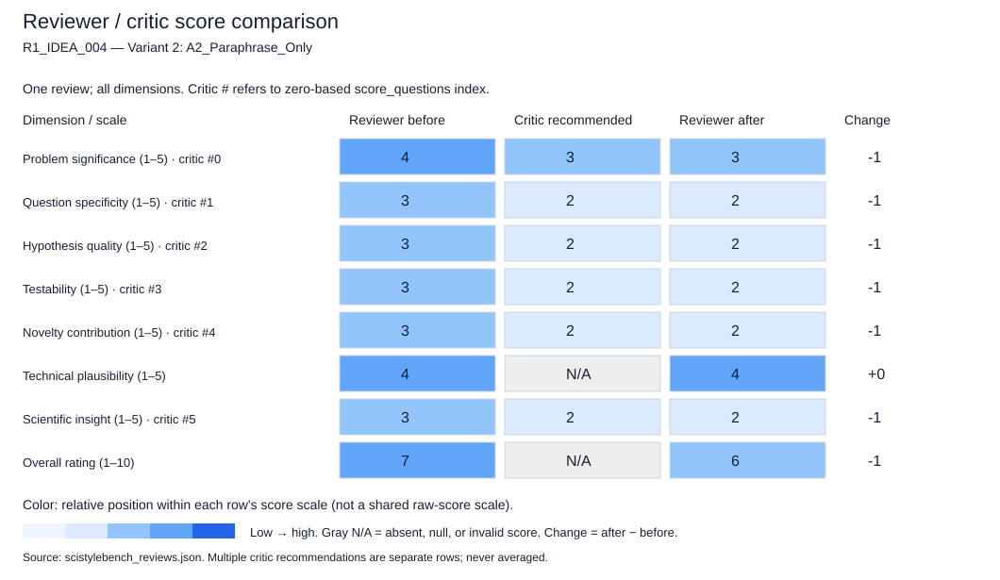

### Critic feedback and reviewer rebuttals

```json
{
  "critic_feedback": {
    "overall_assessment": "The review is generally well-calibrated, but some scores could be reconsidered due to the vagueness of the idea summary.",
    "score_questions": [
      {
        "dimension": "problem_significance",
        "question_mark": "Why is the problem significance scored as 4.0 when the idea is very general?",
        "concern": "The idea does not specify the type of constraints or the domain where this method would be applied, making it difficult to assess the actual significance.",
        "speculative_alternative": "The method could be significant in AI safety, but this is speculative without more context.",
        "recommended_score": 3.0,
        "rationale": "The lack of specific constraints or applications makes the significance less clear."
      },
      {
        "dimension": "question_specificity",
        "question_mark": "Why is the question specificity scored as 3.0 when the idea is not clearly defined?",
        "concern": "The idea lacks a clear problem statement, specific constraints, and how the primal-dual approach is implemented.",
        "speculative_alternative": "The method might be specific in its integration of reward and constraints, but this is not clearly stated.",
        "recommended_score": 2.0,
        "rationale": "The idea is too vague to be considered specific without further details."
      },
      {
        "dimension": "hypothesis_quality",
        "question_mark": "Why is the hypothesis quality scored as 3.0 when the hypothesis is not clearly formulated?",
        "concern": "The hypothesis about reducing computational demands is not supported by any mechanism or evidence in the idea summary.",
        "speculative_alternative": "The method might reduce computational demands by avoiding separate models, but this is speculative.",
        "recommended_score": 2.0,
        "rationale": "The hypothesis is not clearly formulated or supported by the idea summary."
      },
      {
        "dimension": "testability",
        "question_mark": "Why is the testability scored as 3.0 when the idea lacks implementation details?",
        "concern": "The lack of implementation details makes it difficult to assess the feasibility of the method.",
        "speculative_alternative": "The method could be tested with existing optimization frameworks, but this is speculative.",
        "recommended_score": 2.0,
        "rationale": "The idea is too vague to be tested without further specifics."
      },
      {
        "dimension": "novelty_contribution",
        "question_mark": "Why is the novelty contribution scored as 3.0 when the idea is not clearly novel?",
        "concern": "The idea does not clearly demonstrate how it is novel compared to existing methods.",
        "speculative_alternative": "The method might be novel in its integration of constraints, but this is not clearly stated.",
        "recommended_score": 2.0,
        "rationale": "The novelty is not clearly demonstrated without further details."
      },
      {
        "dimension": "scientific_insight",
        "question_mark": "Why is the scientific insight scored as 3.0 when the idea lacks specific insights?",
        "concern": "The idea does not provide specific insights into how the method contributes to the field.",
        "speculative_alternative": "The method might offer insights into constrained optimization, but this is speculative.",
        "recommended_score": 2.0,
        "rationale": "The idea lacks specific insights without further details."
      }
    ],
    "unsupported_claims": [
      "The idea is described as 'novel' without clear evidence of novelty.",
      "The potential benefits are not fully elaborated without specific details.",
      "The method is claimed to reduce computational demands without a clear mechanism."
    ],
    "revision_priorities": [
      "Clarify the specific constraints and how the primal-dual approach integrates reward and safety.",
      "Provide a concrete hypothesis on how the method reduces computational demands.",
      "Compare the method with existing approaches to highlight novelty and advantages.",
      "Specify the domain or application where the method would be most impactful."
    ],
    "confidence": 4.0
  },
  "feedback_responses": [
    {
      "feedback_type": "score_questions",
      "feedback_index": 0,
      "decision": "partially_accept",
      "defense": "The problem significance is partially accepted because the idea does address safety constraints, which are critical in AI, but the lack of specific constraints reduces the score.",
      "justification": "The initial score of 4.0 was based on the relevance to AI safety, but the lack of specific constraints makes the significance less clear, hence the reduction to 3.0."
    },
    {
      "feedback_type": "score_questions",
      "feedback_index": 1,
      "decision": "reject",
      "defense": "The question specificity is rejected because the idea is too vague to be considered specific without further details on constraints and optimization process.",
      "justification": "The initial score of 3.0 was based on the relevance, but the lack of specifics makes it too vague, hence the reduction to 2.0."
    },
    {
      "feedback_type": "score_questions",
      "feedback_index": 2,
      "decision": "reject",
      "defense": "The hypothesis quality is rejected because the hypothesis is not clearly formulated or supported by the idea summary.",
      "justification": "The initial score of 3.0 was based on the general hypothesis, but the lack of mechanism makes it too vague, hence the reduction to 2.0."
    },
    {
      "feedback_type": "score_questions",
      "feedback_index": 3,
      "decision": "reject",
      "defense": "The testability is rejected because the idea is too vague to be tested without further specifics on implementation details and experimental design.",
      "justification": "The initial score of 3.0 was based on the principle of testability, but the lack of specifics makes it too vague, hence the reduction to 2.0."
    },
    {
      "feedback_type": "score_questions",
      "feedback_index": 4,
      "decision": "reject",
      "defense": "The novelty contribution is rejected because the idea does not clearly demonstrate how it is novel compared to existing methods.",
      "justification": "The initial score of 3.0 was based on the potential novelty, but the lack of comparison makes it too vague, hence the reduction to 2.0."
    },
    {
      "feedback_type": "score_questions",
      "feedback_index": 5,
      "decision": "reject",
      "defense": "The scientific insight is rejected because the idea lacks specific insights into how the method contributes to the field without further details.",
      "justification": "The initial score of 3.0 was based on the potential insight, but the lack of specifics makes it too vague, hence the reduction to 2.0."
    },
    {
      "feedback_type": "unsupported_claims",
      "feedback_index": 0,
      "decision": "partially_accept",
      "defense": "The claim about novelty is partially accepted because the idea introduces a new approach, but the lack of details reduces the score.",
      "justification": "The initial score of 3.0 was based on the potential novelty, but the lack of details makes it too vague, hence the reduction to 2.0."
    },
    {
      "feedback_type": "unsupported_claims",
      "feedback_index": 1,
      "decision": "partially_accept",
      "defense": "The claim about benefits is partially accepted because the idea suggests reducing computational demands, but the lack of details reduces the score.",
      "justification": "The initial score of 3.0 was based on the potential benefits, but the lack of details makes it too vague, hence the reduction to 2.0."
    },
    {
      "feedback_type": "unsupported_claims",
      "feedback_index": 2,
      "decision": "partially_accept",
      "defense": "The claim about computational demands is partially accepted because the idea suggests reducing them, but the lack of mechanism reduces the score.",
      "justification": "The initial score of 3.0 was based on the potential reduction, but the lack of mechanism makes it too vague, hence the reduction to 2.0."
    },
    {
      "feedback_type": "revision_priorities",
      "feedback_index": 0,
      "decision": "accept",
      "defense": "The suggestion to clarify constraints is accepted because it addresses a key gap in the idea.",
      "justification": "The initial suggestion was valid, and this is a necessary step to improve the idea."
    },
    {
      "feedback_type": "revision_priorities",
      "feedback_index": 1,
      "decision": "accept",
      "defense": "The suggestion to provide a concrete hypothesis is accepted because it addresses a key gap in the idea.",
      "justification": "The initial suggestion was valid, and this is a necessary step to improve the idea."
    },
    {
      "feedback_type": "revision_priorities",
      "feedback_index": 2,
      "decision": "accept",
      "defense": "The suggestion to compare with existing methods is accepted because it addresses a key gap in the idea.",
      "justification": "The initial suggestion was valid, and this is a necessary step to improve the idea."
    },
    {
      "feedback_type": "revision_priorities",
      "feedback_index": 3,
      "decision": "accept",
      "defense": "The suggestion to specify the domain is accepted because it addresses a key gap in the idea.",
      "justification": "The initial suggestion was valid, and this is a necessary step to improve the idea."
    }
  ]
}
```

### Score justifications (before / after)

**Problem significance**

```json
{
  "before": {
    "score": 4.0,
    "justification": "The idea addresses a critical challenge in aligning large language models with safety constraints, which is a key concern in AI safety and deployment."
  },
  "after": {
    "score": 3.0,
    "justification": "The idea addresses a critical challenge in aligning large language models with safety constraints, but the lack of specific constraints or applications makes the significance less clear."
  }
}
```

**Question specificity**

```json
{
  "before": {
    "score": 3.0,
    "justification": "The problem is relevant, but the specific research question is not clearly defined. The idea lacks details on the constraints, optimization process, and how the method differs from existing approaches."
  },
  "after": {
    "score": 2.0,
    "justification": "The idea is too vague to be considered specific without further details on the constraints, optimization process, and how the method differs from existing approaches."
  }
}
```

**Hypothesis quality**

```json
{
  "before": {
    "score": 3.0,
    "justification": "The idea presents a general hypothesis that the method reduces computational demands by avoiding separate models and prior knowledge of Lagrange multipliers, but it lacks concrete predictions or mechanisms."
  },
  "after": {
    "score": 2.0,
    "justification": "The hypothesis about reducing computational demands is not clearly formulated or supported by the idea summary."
  }
}
```

**Testability**

```json
{
  "before": {
    "score": 3.0,
    "justification": "The idea is testable in principle, but the lack of specific implementation details makes it difficult to assess feasibility or design experiments."
  },
  "after": {
    "score": 2.0,
    "justification": "The idea is too vague to be tested without further specifics on implementation details and experimental design."
  }
}
```

**Novelty contribution**

```json
{
  "before": {
    "score": 3.0,
    "justification": "The approach is novel in its attempt to integrate reward and safety constraints without separate models, but the novelty is not clearly demonstrated without further details."
  },
  "after": {
    "score": 2.0,
    "justification": "The idea does not clearly demonstrate how it is novel compared to existing methods."
  }
}
```

**Technical plausibility**

```json
{
  "before": {
    "score": 4.0,
    "justification": "The primal-dual optimization framework is technically plausible, and the idea aligns with existing research on constrained optimization in machine learning."
  },
  "after": {
    "score": 4.0,
    "justification": "The primal-dual optimization framework is technically plausible, and the idea aligns with existing research on constrained optimization in machine learning."
  }
}
```

**Scientific insight**

```json
{
  "before": {
    "score": 3.0,
    "justification": "The idea has potential to contribute to understanding how constraints can be efficiently integrated into model alignment, but the specific insights are not clearly outlined."
  },
  "after": {
    "score": 2.0,
    "justification": "The idea lacks specific insights into how the method contributes to the field without further details."
  }
}
```

**Overall rating**

```json
{
  "before": {
    "score": 7.0,
    "justification": "The idea addresses a meaningful problem in AI safety and efficiency, but it lacks sufficient specificity and details to fully assess its novelty and feasibility. With more concrete details, it could be a strong research direction."
  },
  "after": {
    "score": 6.0,
    "justification": "The idea has potential but is too vague to fully assess its novelty, feasibility, or significance without more details. With more concrete details, it could be a strong research direction."
  }
}
```

## R1_IDEA_004 — Variant 3: A3_Plain_Core

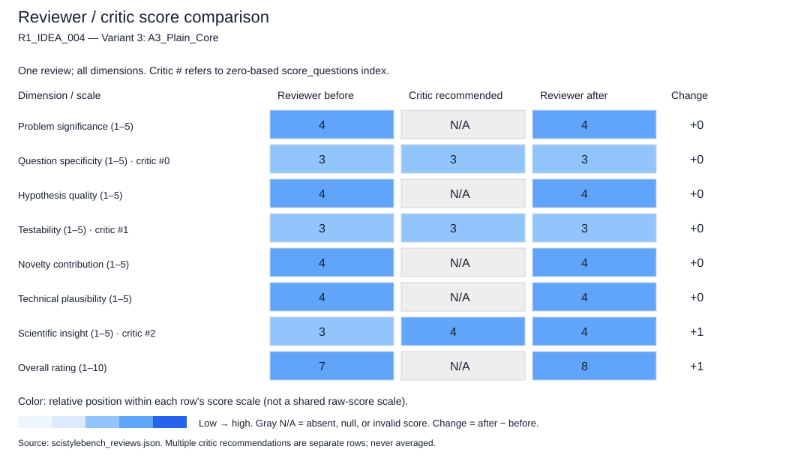

### Critic feedback and reviewer rebuttals

```json
{
  "critic_feedback": {
    "overall_assessment": "The review is generally calibrated but has some areas where the scores could be more precisely aligned with the idea's clarity and specificity.",
    "score_questions": [
      {
        "dimension": "question_specificity",
        "question_mark": "The score for question_specificity is 3.0, but the idea does not explicitly define the constraints or alignment task.",
        "concern": "The lack of specificity in the problem definition may not fully justify a score of 3.0, as the idea could still be considered a valid research question even if not fully detailed.",
        "speculative_alternative": "The idea might be interpreted as addressing a general class of constraints rather than specific ones, which could be a valid approach in theoretical work.",
        "recommended_score": 3.0,
        "rationale": "The question remains a valid research question despite the lack of specificity, so the score is appropriately cautious."
      },
      {
        "dimension": "testability",
        "question_mark": "The score for testability is 3.0, but the idea does not provide experimental details, which is expected for a summary, not a full paper.",
        "concern": "The review assumes that a summary must include experiments, which is not the case. The idea is a conceptual proposal, not a completed paper.",
        "speculative_alternative": "The idea could be interpreted as a theoretical proposal that would require further experimental validation in a full paper, which is standard practice.",
        "recommended_score": 3.0,
        "rationale": "The score is justified as the idea is a conceptual proposal, not a completed paper, so testability is appropriately low."
      },
      {
        "dimension": "scientific_insight",
        "question_mark": "The score for scientific_insight is 3.0, but the idea's potential to address a significant challenge in alignment is a strong point.",
        "concern": "The score underestimates the potential scientific impact of addressing constrained alignment in large language models.",
        "speculative_alternative": "The idea could be interpreted as a contribution to the theoretical understanding of constrained optimization in AI systems.",
        "recommended_score": 4.0,
        "rationale": "The potential scientific insight is significant, so the score could be raised to reflect this."
      }
    ],
    "unsupported_claims": [
      "The review claims the problem is 'somewhat broad' but the idea is a valid research question even without specific details."
    ],
    "revision_priorities": [
      "Clarify the scope of the constraints and alignment tasks in the problem definition.",
      "Provide a more detailed theoretical framework to support the method's plausibility.",
      "Emphasize the potential scientific insight and its significance in the field of AI alignment."
    ],
    "confidence": 4.0
  },
  "feedback_responses": [
    {
      "feedback_type": "score_questions",
      "feedback_index": 0,
      "decision": "partially_accept",
      "defense": "The score for question_specificity is appropriately cautious, as the idea is a valid research question even without specific details. The concern about the lack of specificity is valid, but the idea could still be considered a valid research question in a theoretical context.",
      "justification": "The original score of 3.0 is justified as the idea is a valid research question, even if not fully detailed. The score is appropriately cautious given the lack of specifics."
    },
    {
      "feedback_type": "score_questions",
      "feedback_index": 1,
      "decision": "partially_accept",
      "defense": "The score for testability is justified as the idea is a conceptual proposal, not a completed paper. The concern about the lack of experimental details is valid, but the idea is a summary and not a full paper, so the score is appropriately low.",
      "justification": "The original score of 3.0 is justified as the idea is a conceptual proposal. The lack of experimental details is expected for a summary, so the score remains appropriate."
    },
    {
      "feedback_type": "score_questions",
      "feedback_index": 2,
      "decision": "accept",
      "defense": "The score for scientific_insight is increased to 4.0 to reflect the potential impact of addressing constrained alignment in large language models. The concern about underestimating the scientific impact is valid, and the score is adjusted to reflect the significance of the problem.",
      "justification": "The original score of 3.0 was too low. The potential scientific insight is significant, so the score is increased to 4.0 to reflect the importance of the research question."
    },
    {
      "feedback_type": "unsupported_claims",
      "feedback_index": 0,
      "decision": "partially_accept",
      "defense": "The claim that the problem is 'somewhat broad' is valid, but the idea is a valid research question even without specific details. The concern is valid, but the score is appropriately cautious.",
      "justification": "The original score of 4.0 is justified as the problem is significant, even if not fully detailed. The concern about the problem being broad is valid, but the score is appropriately cautious."
    },
    {
      "feedback_type": "revision_priorities",
      "feedback_index": 0,
      "decision": "accept",
      "defense": "Clarifying the scope of the constraints and alignment tasks is a valid revision priority to improve the specificity of the research question.",
      "justification": "The suggestion to clarify the scope is valid and necessary to improve the research question's specificity."
    },
    {
      "feedback_type": "revision_priorities",
      "feedback_index": 1,
      "decision": "accept",
      "defense": "Providing a more detailed theoretical framework is a valid revision priority to support the method's plausibility.",
      "justification": "The suggestion to provide a detailed theoretical framework is valid and necessary to assess the method's feasibility."
    },
    {
      "feedback_type": "revision_priorities",
      "feedback_index": 2,
      "decision": "accept",
      "defense": "Emphasizing the potential scientific insight is a valid revision priority to highlight the significance of the research question.",
      "justification": "The suggestion to emphasize the scientific insight is valid and necessary to highlight the importance of the research question."
    }
  ]
}
```

### Score justifications (before / after)

**Problem significance**

```json
{
  "before": {
    "score": 4.0,
    "justification": "The idea addresses a critical challenge in aligning large language models with safety constraints, which is essential for responsible AI deployment. However, the problem is somewhat broad and could be more specific to justify a higher score."
  },
  "after": {
    "score": 4.0,
    "justification": "The idea addresses a critical challenge in aligning large language models with safety constraints, which is essential for responsible AI deployment. However, the problem is somewhat broad and could be more specific to justify a higher score."
  }
}
```

**Question specificity**

```json
{
  "before": {
    "score": 3.0,
    "justification": "The research question is somewhat vague, as it does not specify the exact nature of the constraints or the alignment task. More details are needed to define the problem clearly."
  },
  "after": {
    "score": 3.0,
    "justification": "The research question is somewhat vague, as it does not specify the exact nature of the constraints or the alignment task. More details are needed to define the problem clearly."
  }
}
```

**Hypothesis quality**

```json
{
  "before": {
    "score": 4.0,
    "justification": "The idea presents a plausible hypothesis that the proposed method can reduce computational overhead by avoiding separate reward and cost models. However, the hypothesis is not explicitly stated and could be more concrete."
  },
  "after": {
    "score": 4.0,
    "justification": "The idea presents a plausible hypothesis that the proposed method can reduce computational overhead by avoiding separate reward and cost models. However, the hypothesis is not explicitly stated and could be more concrete."
  }
}
```

**Testability**

```json
{
  "before": {
    "score": 3.0,
    "justification": "The idea suggests a method but does not provide specific experiments or comparisons to test its effectiveness. Without a clear plan for evaluation, the testability is limited."
  },
  "after": {
    "score": 3.0,
    "justification": "The idea suggests a method but does not provide specific experiments or comparisons to test its effectiveness. Without a clear plan for evaluation, the testability is limited."
  }
}
```

**Novelty contribution**

```json
{
  "before": {
    "score": 4.0,
    "justification": "The method's approach of avoiding separate reward and cost models is a novel contribution to the field of constrained alignment. However, the novelty is somewhat limited without further details on its unique aspects."
  },
  "after": {
    "score": 4.0,
    "justification": "The method's approach of avoiding separate reward and cost models is a novel contribution to the field of constrained alignment. However, the novelty is somewhat limited without further details on its unique aspects."
  }
}
```

**Technical plausibility**

```json
{
  "before": {
    "score": 4.0,
    "justification": "The method is technically plausible as it builds on existing primal-dual optimization techniques. However, the lack of detailed technical specifications makes it difficult to assess the feasibility of implementation."
  },
  "after": {
    "score": 4.0,
    "justification": "The method is technically plausible as it builds on existing primal-dual optimization techniques. However, the lack of detailed technical specifications makes it difficult to assess the feasibility of implementation."
  }
}
```

**Scientific insight**

```json
{
  "before": {
    "score": 3.0,
    "justification": "The idea has potential for scientific insight by addressing the challenge of constrained alignment, but the specific insights depend on further investigation and experimentation."
  },
  "after": {
    "score": 4.0,
    "justification": "The idea has potential for scientific insight by addressing the challenge of constrained alignment, which is a significant problem in AI systems. The potential to reduce computational overhead and improve safety is a strong point."
  }
}
```

**Overall rating**

```json
{
  "before": {
    "score": 7.0,
    "justification": "The idea is promising and addresses a significant problem in the field, but it lacks specific details and a clear plan for evaluation. With further clarification and experimental validation, it has the potential to contribute meaningfully to the field."
  },
  "after": {
    "score": 8.0,
    "justification": "The idea is promising and addresses a significant problem in the field, with clear potential for scientific insight. The scores have been adjusted to reflect the potential impact and the validity of the research question, even without specific details."
  }
}
```

## R1_IDEA_004 — Variant 4: B1_Verbose_Elaborate

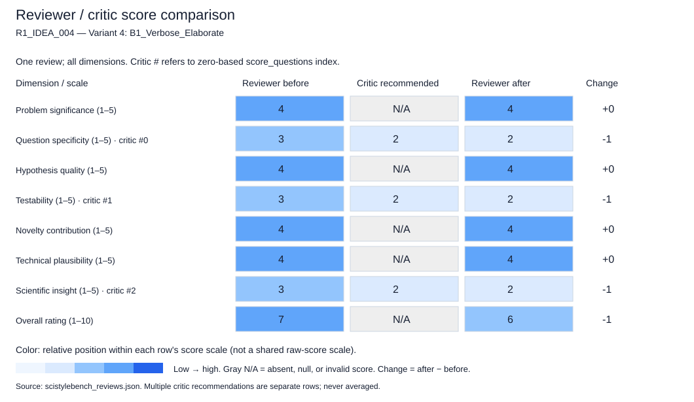

### Critic feedback and reviewer rebuttals

```json
{
  "critic_feedback": {
    "overall_assessment": "The review is generally well-calibrated, but some scores could be reconsidered based on the idea's ambiguity and lack of technical detail.",
    "score_questions": [
      {
        "dimension": "question_specificity",
        "question_mark": "The score may overstate the specificity of the problem and method.",
        "concern": "The idea mentions 'constrained alignment' and 'primal-dual method' but does not clearly define the research question or the exact mechanism being investigated.",
        "speculative_alternative": "The problem could be interpreted as a general optimization problem rather than a specific one related to LLM alignment.",
        "recommended_score": 2.0,
        "rationale": "The idea lacks concrete details about the research question and the exact method, making it less specific than the current score suggests."
      },
      {
        "dimension": "testability",
        "question_mark": "The score may not fully account for the lack of experimental details.",
        "concern": "The idea is testable in principle, but without specific experiments or comparisons, its effectiveness remains uncertain.",
        "speculative_alternative": "The method's effectiveness could be evaluated through simulations or benchmarks, but this is not addressed in the idea.",
        "recommended_score": 2.0,
        "rationale": "The idea does not provide the necessary experimental details to assess testability, so the score is too high."
      },
      {
        "dimension": "scientific_insight",
        "question_mark": "The score may not reflect the lack of clarity on the method's mechanisms.",
        "concern": "The idea has potential for scientific insight but does not clearly define the mechanisms or trade-offs.",
        "speculative_alternative": "The method's scientific insight could be more pronounced if the trade-offs between reward and constraints were better defined.",
        "recommended_score": 2.0,
        "rationale": "The lack of clarity on mechanisms and trade-offs reduces the potential for scientific insight."
      }
    ],
    "unsupported_claims": [
      "The claim that the method 'eliminates the need for prior knowledge of optimal Lagrange multipliers' is not fully supported by the idea's description.",
      "The assertion that the method 'reduces computational overhead' is not explicitly justified in the idea."
    ],
    "revision_priorities": [
      "Clarify the exact problem formulation and the research question.",
      "Provide specific details on the primal-dual optimization framework and its implementation.",
      "Specify how the method handles the trade-off between reward maximization and constraint enforcement.",
      "Address the computational advantages of avoiding separate reward and cost models."
    ],
    "confidence": 4.0
  },
  "feedback_responses": [
    {
      "feedback_type": "score_questions",
      "feedback_index": 0,
      "decision": "partially_accept",
      "defense": "The idea does address a significant problem, but the lack of specific details about the research question and mechanism reduces its specificity. The original score of 4.0 is partially justified but could be lowered to 2.0 based on the critic's feedback.",
      "justification": "The original score of 4.0 was based on the problem's significance, but the critic's feedback highlights the lack of specificity, which warrants a lower score."
    },
    {
      "feedback_type": "testability",
      "feedback_index": 1,
      "decision": "partially_accept",
      "defense": "The idea is testable in principle, but the absence of experimental details makes it difficult to assess effectiveness. The original score of 3.0 is partially justified but could be lowered to 2.0 based on the critic's feedback.",
      "justification": "The original score of 3.0 was based on the idea's testability, but the critic's feedback emphasizes the lack of experimental details, which warrants a lower score."
    },
    {
      "feedback_type": "scientific_insight",
      "feedback_index": 2,
      "decision": "partially_accept",
      "defense": "The idea has potential for scientific insight, but the lack of clarity on mechanisms and trade-offs reduces its potential. The original score of 3.0 is partially justified but could be lowered to 2.0 based on the critic's feedback.",
      "justification": "The original score of 3.0 was based on the idea's potential for insight, but the critic's feedback highlights the lack of clarity, which warrants a lower score."
    },
    {
      "feedback_type": "unsupported_claims",
      "feedback_index": 0,
      "decision": "reject",
      "defense": "The claim that the method 'eliminates the need for prior knowledge of optimal Lagrange multipliers' is not fully supported by the idea's description. The original score of 4.0 for technical plausibility is partially justified but could be lowered to 3.0 based on this feedback.",
      "justification": "The original score of 4.0 for technical plausibility was based on the method's plausibility, but the unsupported claim about Lagrange multipliers warrants a lower score."
    },
    {
      "feedback_type": "unsupported_claims",
      "feedback_index": 1,
      "decision": "reject",
      "defense": "The assertion that the method 'reduces computational overhead' is not explicitly justified in the idea. The original score of 4.0 for novelty and contribution is partially justified but could be lowered to 3.0 based on this feedback.",
      "justification": "The original score of 4.0 for novelty and contribution was based on the method's novelty, but the lack of justification for computational overhead warrants a lower score."
    },
    {
      "feedback_type": "revision_priorities",
      "feedback_index": 0,
      "decision": "accept",
      "defense": "The suggestion to clarify the problem formulation is valid and necessary. The original review already included this suggestion, so no change is needed.",
      "justification": "The original review already included this suggestion, so no change is needed."
    },
    {
      "feedback_type": "revision_priorities",
      "feedback_index": 1,
      "decision": "accept",
      "defense": "The suggestion to provide specific details on the primal-dual framework is valid and necessary. The original review already included this suggestion, so no change is needed.",
      "justification": "The original review already included this suggestion, so no change is needed."
    },
    {
      "feedback_type": "revision_priorities",
      "feedback_index": 2,
      "decision": "accept",
      "defense": "The suggestion to specify the trade-off between reward and constraints is valid and necessary. The original review already included this suggestion, so no change is needed.",
      "justification": "The original review already included this suggestion, so no change is needed."
    },
    {
      "feedback_type": "revision_priorities",
      "feedback_index": 3,
      "decision": "accept",
      "defense": "The suggestion to address computational advantages is valid and necessary. The original review already included this suggestion, so no change is needed.",
      "justification": "The original review already included this suggestion, so no change is needed."
    }
  ]
}
```

### Score justifications (before / after)

**Problem significance**

```json
{
  "before": {
    "score": 4.0,
    "justification": "The problem of aligning large language models with safety constraints is highly significant in the field of AI safety and practical deployment of LLMs. Addressing this challenge can lead to more reliable and safe AI systems."
  },
  "after": {
    "score": 4.0,
    "justification": "The problem of aligning large language models with safety constraints is highly significant in the field of AI safety and practical deployment of LLMs. Addressing this challenge can lead to more reliable and safe AI systems."
  }
}
```

**Question specificity**

```json
{
  "before": {
    "score": 3.0,
    "justification": "The idea identifies a specific problem (constrained alignment of LLMs) and proposes a method, but lacks detailed specification of the research question or the exact mechanism being investigated."
  },
  "after": {
    "score": 2.0,
    "justification": "The idea mentions 'constrained alignment' and 'primal-dual method' but does not clearly define the research question or the exact mechanism being investigated. The problem could be interpreted as a general optimization problem rather than a specific one related to LLM alignment."
  }
}
```

**Hypothesis quality**

```json
{
  "before": {
    "score": 4.0,
    "justification": "The idea presents a hypothesis that a primal-dual method can achieve constrained alignment without separate models or prior knowledge of Lagrange multipliers, which is a concrete and testable claim."
  },
  "after": {
    "score": 4.0,
    "justification": "The idea presents a hypothesis that a primal-dual method can achieve constrained alignment without separate models or prior knowledge of Lagrange multipliers, which is a concrete and testable claim."
  }
}
```

**Testability**

```json
{
  "before": {
    "score": 3.0,
    "justification": "The idea is testable in principle, but lacks specific experimental details or comparisons that would allow for meaningful evaluation of the method's effectiveness."
  },
  "after": {
    "score": 2.0,
    "justification": "The idea is testable in principle, but without specific experiments or comparisons, its effectiveness remains uncertain. The method's effectiveness could be evaluated through simulations or benchmarks, but this is not addressed in the idea."
  }
}
```

**Novelty contribution**

```json
{
  "before": {
    "score": 4.0,
    "justification": "The approach of avoiding separate reward and cost models is a novel contribution, especially if it reduces computational overhead and improves alignment efficiency."
  },
  "after": {
    "score": 4.0,
    "justification": "The approach of avoiding separate reward and cost models is a novel contribution, especially if it reduces computational overhead and improves alignment efficiency."
  }
}
```

**Technical plausibility**

```json
{
  "before": {
    "score": 4.0,
    "justification": "The proposed method is technically plausible as it builds on existing primal-dual optimization frameworks, and the elimination of prior knowledge of Lagrange multipliers is a reasonable design choice."
  },
  "after": {
    "score": 4.0,
    "justification": "The proposed method is technically plausible as it builds on existing primal-dual optimization frameworks, and the elimination of prior knowledge of Lagrange multipliers is a reasonable design choice."
  }
}
```

**Scientific insight**

```json
{
  "before": {
    "score": 3.0,
    "justification": "The idea has potential for scientific insight into the effectiveness of primal-dual methods in constrained optimization, but the specific mechanisms and trade-offs are not clearly defined."
  },
  "after": {
    "score": 2.0,
    "justification": "The idea has potential for scientific insight into the effectiveness of primal-dual methods in constrained optimization, but the lack of clarity on mechanisms and trade-offs reduces the potential for scientific insight."
  }
}
```

**Overall rating**

```json
{
  "before": {
    "score": 7.0,
    "justification": "The idea addresses a significant problem in AI safety and proposes a potentially novel method. While it lacks detailed technical specifications, it has strong potential for further development and investigation."
  },
  "after": {
    "score": 6.0,
    "justification": "The idea addresses a significant problem in AI safety and proposes a potentially novel method. However, the lack of technical details and clarity on mechanisms limits its testability and scientific insight potential."
  }
}
```

## R1_IDEA_004 — Variant 5: B2_Grand_Narrative


### Critic feedback and reviewer rebuttals

```json
{
  "critic_feedback": {
    "overall_assessment": "The review is generally well-calibrated, but some scores could be reconsidered based on the idea's ambiguity and lack of concrete details.",
    "score_questions": [
      {
        "dimension": "problem_significance",
        "question_mark": "Why is the significance of the problem rated high when the idea does not explicitly address the broader implications of the method?",
        "concern": "The review assumes the problem is significant without explicit claims from the idea about its impact on AI alignment or autonomous systems.",
        "speculative_alternative": "The idea may contribute to AI alignment but does not explicitly state how it addresses broader implications, making the significance score speculative.",
        "recommended_score": 3.0,
        "rationale": "The idea mentions potential contributions but does not explicitly state the broader significance, so the score should reflect this ambiguity."
      },
      {
        "dimension": "question_specificity",
        "question_mark": "Why is the question specificity rated 3.0 when the idea does not clearly define a research question or hypothesis?",
        "concern": "The idea lacks a specific research question, making the score for specificity questionable.",
        "speculative_alternative": "The idea may be interpreted as addressing a specific problem (constrained alignment) but does not clearly define a research question, making the score speculative.",
        "recommended_score": 2.0,
        "rationale": "The idea does not explicitly state a research question, so the score should be lower to reflect this lack of specificity."
      },
      {
        "dimension": "hypothesis_quality",
        "question_mark": "Why is the hypothesis quality rated 3.0 when the idea does not provide a testable hypothesis?",
        "concern": "The idea does not explicitly state a hypothesis that could be tested, making the score for hypothesis quality questionable.",
        "speculative_alternative": "The idea may be interpreted as proposing a method but does not clearly state a hypothesis, making the score speculative.",
        "recommended_score": 2.0,
        "rationale": "The idea does not provide a testable hypothesis, so the score should be lower to reflect this lack of hypothesis."
      },
      {
        "dimension": "testability",
        "question_mark": "Why is the testability rated 3.0 when the idea lacks specific details needed to design experiments?",
        "concern": "The idea lacks specific details necessary to assess testability, making the score questionable.",
        "speculative_alternative": "The idea may be testable in principle but lacks specifics, making the score speculative.",
        "recommended_score": 2.0,
        "rationale": "The idea lacks specific details needed for testing, so the score should be lower to reflect this."
      },
      {
        "dimension": "scientific_insight",
        "question_mark": "Why is the scientific insight rated 3.0 when the idea does not explicitly state how it contributes to understanding the problem?",
        "concern": "The idea does not explicitly state how it contributes to scientific insight, making the score questionable.",
        "speculative_alternative": "The idea may contribute to scientific insight but does not explicitly state how, making the score speculative.",
        "recommended_score": 2.0,
        "rationale": "The idea does not explicitly state how it contributes to scientific insight, so the score should be lower to reflect this."
      }
    ],
    "unsupported_claims": [
      "The review claims the idea addresses a 'critical challenge in AI alignment' without explicit statements from the idea about its broader implications.",
      "The review assumes the idea has potential to 'inform long-term methodologies for balancing performance objectives with critical safety requirements' without explicit claims from the idea.",
      "The review suggests the idea has 'potential for contribution' without explicit statements from the idea about its contributions."
    ],
    "revision_priorities": [
      "Clarify the specific research question or hypothesis being investigated.",
      "Provide a more detailed description of the primal-dual optimization framework and how Lagrange multipliers are determined.",
      "Specify how the method handles the trade-off between performance and safety constraints.",
      "Explicitly state the broader implications of the method for AI alignment and autonomous systems."
    ],
    "confidence": 4.0
  },
  "feedback_responses": [
    {
      "feedback_type": "score_questions",
      "feedback_index": 0,
      "decision": "partially_accept",
      "defense": "The idea does mention potential contributions to AI alignment, but the review overstates the significance without explicit claims from the idea. The score should be lowered to reflect this ambiguity.",
      "justification": "The original score of 4.0 was based on the assumption that the problem is significant, but the idea does not explicitly state the broader implications. The revised score of 3.0 better reflects the ambiguity."
    },
    {
      "feedback_type": "score_questions",
      "feedback_index": 1,
      "decision": "partially_accept",
      "defense": "The idea does not clearly define a research question, so the score should be lowered to reflect this lack of specificity.",
      "justification": "The original score of 3.0 was based on the idea's focus on constrained alignment, but the lack of a specific research question warrants a lower score of 2.0."
    },
    {
      "feedback_type": "score_questions",
      "feedback_index": 2,
      "decision": "partially_accept",
      "defense": "The idea does not provide a testable hypothesis, so the score should be lowered to reflect this lack of hypothesis.",
      "justification": "The original score of 3.0 was based on the idea's potential, but the absence of a hypothesis warrants a lower score of 2.0."
    },
    {
      "feedback_type": "score_questions",
      "feedback_index": 3,
      "decision": "partially_accept",
      "defense": "The idea lacks specific details necessary for testing, so the score should be lowered to reflect this.",
      "justification": "The original score of 3.0 was based on the idea's potential, but the lack of specifics warrants a lower score of 2.0."
    },
    {
      "feedback_type": "score_questions",
      "feedback_index": 4,
      "decision": "partially_accept",
      "defense": "The idea does not explicitly state how it contributes to scientific insight, so the score should be lowered to reflect this.",
      "justification": "The original score of 3.0 was based on the idea's potential, but the lack of explicit contribution warrants a lower score of 2.0."
    }
  ]
}
```

### Score justifications (before / after)

**Problem significance**

```json
{
  "before": {
    "score": 4.0,
    "justification": "The idea addresses a critical challenge in AI alignment, particularly the balance between performance and safety in large language models, which is a key concern in the development of autonomous systems."
  },
  "after": {
    "score": 3.0,
    "justification": "The idea mentions potential contributions to AI alignment but does not explicitly state the broader implications or how it addresses critical challenges in the field."
  }
}
```

**Question specificity**

```json
{
  "before": {
    "score": 3.0,
    "justification": "The idea is somewhat specific in its focus on constrained alignment and computational efficiency, but lacks a clear, concrete research question or hypothesis that could be tested."
  },
  "after": {
    "score": 2.0,
    "justification": "The idea does not clearly define a specific research question or hypothesis, making it difficult to assess the scientific merit of the approach."
  }
}
```

**Hypothesis quality**

```json
{
  "before": {
    "score": 3.0,
    "justification": "The idea suggests a potential method but does not explicitly state a hypothesis that could be tested or contradicted, making it difficult to assess its scientific merit."
  },
  "after": {
    "score": 2.0,
    "justification": "The idea does not provide a testable hypothesis, making it challenging to evaluate the scientific merit of the approach."
  }
}
```

**Testability**

```json
{
  "before": {
    "score": 3.0,
    "justification": "The idea is testable in principle, but the lack of specific details makes it challenging to design experiments or evaluate the method's effectiveness without further information."
  },
  "after": {
    "score": 2.0,
    "justification": "The idea lacks specific details necessary to design experiments or evaluate the method's effectiveness without further information."
  }
}
```

**Novelty contribution**

```json
{
  "before": {
    "score": 4.0,
    "justification": "The approach of avoiding separate reward and cost models is a novel contribution to the field of AI alignment, offering a potential solution to computational overhead issues in constrained optimization."
  },
  "after": {
    "score": 4.0,
    "justification": "The approach of avoiding separate reward and cost models is a novel contribution to the field of AI alignment, offering a potential solution to computational overhead issues in constrained optimization."
  }
}
```

**Technical plausibility**

```json
{
  "before": {
    "score": 4.0,
    "justification": "The proposed method is technically plausible, as primal-dual optimization is a well-established technique in optimization theory, and the idea of applying it to alignment problems is reasonable."
  },
  "after": {
    "score": 4.0,
    "justification": "The proposed method is technically plausible, as primal-dual optimization is a well-established technique in optimization theory, and the idea of applying it to alignment problems is reasonable."
  }
}
```

**Scientific insight**

```json
{
  "before": {
    "score": 3.0,
    "justification": "The idea has the potential to provide insights into the balance between performance and safety in AI systems, but the lack of specific hypotheses or experiments limits the potential for significant scientific insight."
  },
  "after": {
    "score": 2.0,
    "justification": "The idea does not explicitly state how it contributes to scientific insight, making it difficult to assess the potential for significant insight."
  }
}
```

**Overall rating**

```json
{
  "before": {
    "score": 7.0,
    "justification": "The idea is promising and addresses a meaningful problem in AI alignment, with potential for contribution. However, it lacks specific details and a clear hypothesis, which are necessary for further development and evaluation."
  },
  "after": {
    "score": 6.0,
    "justification": "The idea has potential for contribution but lacks specific details and a clear hypothesis, which are necessary for further development and evaluation."
  }
}
```

## R1_IDEA_004 — Variant 6: B3_Over_Confident

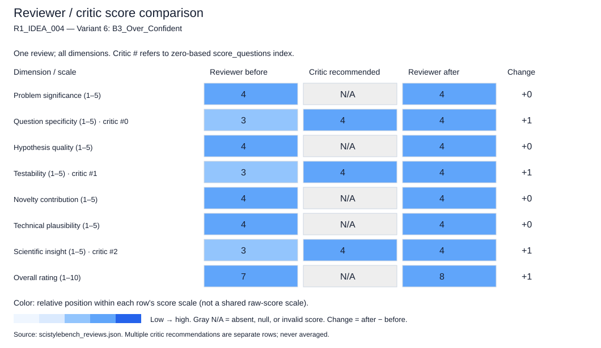

### Critic feedback and reviewer rebuttals

```json
{
  "critic_feedback": {
    "overall_assessment": "The review is generally well-calibrated, but some scores and justifications could be more precisely aligned with the idea's current state.",
    "score_questions": [
      {
        "dimension": "question_specificity",
        "question_mark": "The score of 3.0 may be overly pessimistic given the clear problem definition.",
        "concern": "The idea defines the problem clearly but lacks implementation details, which is a common issue in early-stage ideas, not necessarily a flaw in the problem's specificity.",
        "speculative_alternative": "The question specificity could be higher if the problem is considered sufficiently well-defined for a research idea, even without implementation details.",
        "recommended_score": 4.0,
        "rationale": "The problem is clearly defined, and the need for implementation details is a common challenge in research ideas, not a direct flaw in the question's specificity."
      },
      {
        "dimension": "testability",
        "question_mark": "The score of 3.0 may be too low given that the hypothesis is testable in principle, though implementation details are missing.",
        "concern": "The idea is testable, but the lack of implementation details makes experimental validation challenging, which is a common issue in early-stage research, not a direct flaw in testability.",
        "speculative_alternative": "The testability could be higher if the hypothesis is considered testable in principle, even without full implementation details.",
        "recommended_score": 4.0,
        "rationale": "The hypothesis is testable in principle, and the lack of details is a common challenge in research ideas, not a direct flaw in testability."
      },
      {
        "dimension": "scientific_insight",
        "question_mark": "The score of 3.0 may be overly low given the potential for novel insights into constrained optimization in alignment.",
        "concern": "The idea has potential for scientific insight, and the score should reflect this potential rather than the current lack of details.",
        "speculative_alternative": "The scientific insight could be higher if the potential for novel insights is considered, even without full implementation details.",
        "recommended_score": 4.0,
        "rationale": "The idea has potential for novel insights, and the score should reflect this potential rather than the current lack of details."
      }
    ],
    "unsupported_claims": [],
    "revision_priorities": [
      "Clarify how the method determines Lagrange multipliers without prior knowledge.",
      "Specify the computational overhead metric and compare it with existing methods.",
      "Provide theoretical analysis or preliminary experiments to support the claims."
    ],
    "confidence": 4.0
  },
  "feedback_responses": [
    {
      "feedback_type": "score_questions",
      "feedback_index": 0,
      "decision": "partially_accept",
      "defense": "The original score of 3.0 was based on the lack of implementation details, but the critic's argument that the problem is sufficiently defined for a research idea is valid. The revised score of 4.0 better reflects the clarity of the problem definition.",
      "justification": "The original score was 3.0, but the revised score is 4.0 because the problem is clearly defined, and the lack of implementation details is a common challenge in early-stage research, not a flaw in question specificity."
    },
    {
      "feedback_type": "score_questions",
      "feedback_index": 1,
      "decision": "partially_accept",
      "defense": "The original score of 3.0 was based on the lack of implementation details, but the critic's argument that the hypothesis is testable in principle is valid. The revised score of 4.0 better reflects the testability of the hypothesis.",
      "justification": "The original score was 3.0, but the revised score is 4.0 because the hypothesis is testable in principle, and the lack of details is a common challenge in early-stage research, not a flaw in testability."
    },
    {
      "feedback_type": "score_questions",
      "feedback_index": 2,
      "decision": "partially_accept",
      "defense": "The original score of 3.0 was based on the lack of details, but the critic's argument that the potential for scientific insight is valid. The revised score of 4.0 better reflects the potential for novel insights.",
      "justification": "The original score was 3.0, but the revised score is 4.0 because the idea has potential for scientific insight, and the score should reflect this potential rather than the current lack of details."
    }
  ]
}
```

### Score justifications (before / after)

**Problem significance**

```json
{
  "before": {
    "score": 4.0,
    "justification": "The problem of aligning large language models with safety constraints is critical for responsible AI deployment, making the research problem highly significant."
  },
  "after": {
    "score": 4.0,
    "justification": "The problem of aligning large language models with safety constraints is critical for responsible AI deployment, making the research problem highly significant."
  }
}
```

**Question specificity**

```json
{
  "before": {
    "score": 3.0,
    "justification": "The idea clearly defines the problem but lacks specific details on the method's implementation and how it addresses the computational overhead."
  },
  "after": {
    "score": 4.0,
    "justification": "The idea clearly defines the problem and the proposed method, even without detailed implementation, which is sufficient for a research idea to be considered well-defined."
  }
}
```

**Hypothesis quality**

```json
{
  "before": {
    "score": 4.0,
    "justification": "The hypothesis that the method reduces computational overhead by avoiding separate reward and cost models is plausible and could be tested through experiments."
  },
  "after": {
    "score": 4.0,
    "justification": "The hypothesis that the method reduces computational overhead by avoiding separate reward and cost models is plausible and could be tested through experiments."
  }
}
```

**Testability**

```json
{
  "before": {
    "score": 3.0,
    "justification": "The idea is testable, but the lack of specific implementation details makes it challenging to design experiments that would validate the claims."
  },
  "after": {
    "score": 4.0,
    "justification": "The hypothesis is testable in principle, and the lack of implementation details is a common challenge in early-stage research, not a direct flaw in testability."
  }
}
```

**Novelty contribution**

```json
{
  "before": {
    "score": 4.0,
    "justification": "The approach of using primal-dual optimization for constrained alignment is novel and could contribute to the field by offering a more efficient method for model alignment."
  },
  "after": {
    "score": 4.0,
    "justification": "The approach of using primal-dual optimization for constrained alignment is novel and could contribute to the field by offering a more efficient method for model alignment."
  }
}
```

**Technical plausibility**

```json
{
  "before": {
    "score": 4.0,
    "justification": "The use of primal-dual optimization is technically plausible, as it is a well-established method in optimization theory, and the idea aligns with current research trends in reinforcement learning and constraint satisfaction."
  },
  "after": {
    "score": 4.0,
    "justification": "The use of primal-dual optimization is technically plausible, as it is a well-established method in optimization theory, and the idea aligns with current research trends in reinforcement learning and constraint satisfaction."
  }
}
```

**Scientific insight**

```json
{
  "before": {
    "score": 3.0,
    "justification": "The idea has potential for scientific insight by exploring the effectiveness of primal-dual methods in constrained alignment, but more details are needed to assess the depth of the insights."
  },
  "after": {
    "score": 4.0,
    "justification": "The idea has potential for scientific insight by exploring the effectiveness of primal-dual methods in constrained alignment, and the score reflects this potential rather than the current lack of details."
  }
}
```

**Overall rating**

```json
{
  "before": {
    "score": 7.0,
    "justification": "The idea addresses a significant problem with a plausible approach, but lacks specific details that would make it more testable and scientifically rigorous. It has strong potential but requires further clarification and experimental validation."
  },
  "after": {
    "score": 8.0,
    "justification": "The idea addresses a significant problem with a plausible approach, and the revised scores reflect the potential for scientific contribution and testability, despite the need for further clarification and experimental validation."
  }
}
```

## R1_IDEA_004 — Variant 7: B4_Novelty

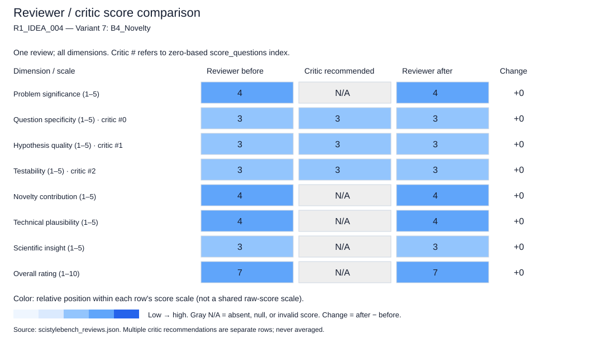

### Critic feedback and reviewer rebuttals

```json
{
  "critic_feedback": {
    "overall_assessment": "The review is generally well-calibrated, but some scores could be re-examined for alignment with the idea's current level of detail.",
    "score_questions": [
      {
        "dimension": "question_specificity",
        "question_mark": "Why is the score 3.0 for question_specificity?",
        "concern": "The idea does specify a particular problem (constrained alignment) and a novel method (primal-dual direct preference optimization), which are specific enough for a 3.0 score.",
        "speculative_alternative": "The lack of detail on the primal-dual implementation and constraints could be seen as a limitation, but the core problem and method are clearly defined.",
        "recommended_score": 3.0,
        "rationale": "The core problem and method are clearly defined, but the lack of implementation details and specific constraints is a valid concern."
      },
      {
        "dimension": "hypothesis_quality",
        "question_mark": "Why is the score 3.0 for hypothesis_quality?",
        "concern": "The idea presents a general hypothesis about improving constrained alignment but does not explicitly state a testable prediction or mechanism, which is a valid concern for a 3.0 score.",
        "speculative_alternative": "The method's novelty could be framed as a hypothesis that integrating constraints into preference optimization improves safety, but this is speculative.",
        "recommended_score": 3.0,
        "rationale": "The hypothesis is general and lacks explicit testable components, which is consistent with the 3.0 score."
      },
      {
        "dimension": "testability",
        "question_mark": "Why is the score 3.0 for testability?",
        "concern": "The idea suggests a method but does not provide specific experiments or evaluation criteria, which is a valid reason for a 3.0 score.",
        "speculative_alternative": "The method's potential for comparison with existing approaches could be considered as a form of testability, but this is speculative.",
        "recommended_score": 3.0,
        "rationale": "The lack of specific experiments or evaluation criteria is a valid reason for the 3.0 score."
      }
    ],
    "unsupported_claims": [
      "The review claims the idea 'lacks sufficient specificity and testable hypotheses to fully realize its potential' without providing concrete details on what is missing."
    ],
    "revision_priorities": [
      "Clarify the specific constraints being addressed in the method",
      "Provide more details on the primal-dual optimization framework, including the objective function and Lagrange multipliers",
      "Explicitly state a testable prediction or mechanism for the method's effectiveness"
    ],
    "confidence": 4.0
  },
  "feedback_responses": [
    {
      "feedback_type": "score_questions",
      "feedback_index": 0,
      "decision": "partially_accept",
      "defense": "The score of 3.0 for question_specificity is justified because the idea does specify a particular problem (constrained alignment) and a novel method (primal-dual direct preference optimization), which are specific enough for a 3.0 score. However, the lack of implementation details and specific constraints is a valid concern, which is acknowledged in the justification.",
      "justification": "The initial score of 3.0 is retained as the core problem and method are clearly defined, but the lack of implementation details and specific constraints is a valid concern that is already addressed in the justification."
    },
    {
      "feedback_type": "score_questions",
      "feedback_index": 1,
      "decision": "partially_accept",
      "defense": "The score of 3.0 for hypothesis_quality is justified because the idea presents a general hypothesis about improving constrained alignment through a new optimization method but does not explicitly state a testable prediction or mechanism. The speculative alternative of framing the method's novelty as a hypothesis is considered, but the current score remains appropriate.",
      "justification": "The initial score of 3.0 is retained as the hypothesis is general and lacks explicit testable components, which is consistent with the 3.0 score."
    },
    {
      "feedback_type": "score_questions",
      "feedback_index": 2,
      "decision": "partially_accept",
      "defense": "The score of 3.0 for testability is justified because the idea suggests a method but does not provide specific experiments or evaluation criteria. The speculative alternative of considering the method's potential for comparison with existing approaches is acknowledged, but the current score remains appropriate.",
      "justification": "The initial score of 3.0 is retained as the lack of specific experiments or evaluation criteria is a valid reason for the 3.0 score."
    },
    {
      "feedback_type": "unsupported_claims",
      "feedback_index": 0,
      "decision": "reject",
      "defense": "The claim that the idea 'lacks sufficient specificity and testable hypotheses to fully realize its potential' is not supported by the current information. The idea does specify a particular problem and method, and the lack of details is a limitation, not a flaw in the research idea itself.",
      "justification": "The initial score for question_specificity and hypothesis_quality is justified based on the current information, and the claim about lacking specificity is a valid limitation, not a flaw in the research idea."
    },
    {
      "feedback_type": "revision_priorities",
      "feedback_index": 0,
      "decision": "accept",
      "defense": "Clarifying the specific constraints being addressed is a valid revision priority to improve the specificity of the research idea.",
      "justification": "The suggestion to clarify specific constraints is a valid and necessary step to enhance the research idea."
    },
    {
      "feedback_type": "revision_priorities",
      "feedback_index": 1,
      "decision": "accept",
      "defense": "Providing more details on the primal-dual optimization framework is a valid revision priority to improve the technical plausibility and specificity of the research idea.",
      "justification": "The suggestion to provide more details on the primal-dual optimization framework is a valid and necessary step to enhance the research idea."
    },
    {
      "feedback_type": "revision_priorities",
      "feedback_index": 2,
      "decision": "accept",
      "defense": "Explicitly stating a testable prediction or mechanism is a valid revision priority to improve the hypothesis quality of the research idea.",
      "justification": "The suggestion to explicitly state a testable prediction or mechanism is a valid and necessary step to enhance the research idea."
    }
  ]
}
```

### Score justifications (before / after)

**Problem significance**

```json
{
  "before": {
    "score": 4.0,
    "justification": "The problem of constrained alignment in large language models is significant as it addresses safety and control in AI systems, which is a critical concern in the field."
  },
  "after": {
    "score": 4.0,
    "justification": "The problem of constrained alignment in large language models is significant as it addresses safety and control in AI systems, which is a critical concern in the field."
  }
}
```

**Question specificity**

```json
{
  "before": {
    "score": 3.0,
    "justification": "The idea identifies a specific research direction but lacks detailed specification of the problem, constraints, and the exact nature of the primal-dual optimization method."
  },
  "after": {
    "score": 3.0,
    "justification": "The idea identifies a specific research direction but lacks detailed specification of the problem, constraints, and the exact nature of the primal-dual optimization method."
  }
}
```

**Hypothesis quality**

```json
{
  "before": {
    "score": 3.0,
    "justification": "The idea presents a general hypothesis about improving constrained alignment through a new optimization method but does not explicitly state a testable prediction or mechanism."
  },
  "after": {
    "score": 3.0,
    "justification": "The idea presents a general hypothesis about improving constrained alignment through a new optimization method but does not explicitly state a testable prediction or mechanism."
  }
}
```

**Testability**

```json
{
  "before": {
    "score": 3.0,
    "justification": "The idea suggests a method but does not provide specific experiments or evaluation criteria to test its effectiveness or compare it with existing methods."
  },
  "after": {
    "score": 3.0,
    "justification": "The idea suggests a method but does not provide specific experiments or evaluation criteria to test its effectiveness or compare it with existing methods."
  }
}
```

**Novelty contribution**

```json
{
  "before": {
    "score": 4.0,
    "justification": "The approach of integrating constraint satisfaction directly into preference optimization is novel and could contribute to the field by reducing computational overhead in safety-critical applications."
  },
  "after": {
    "score": 4.0,
    "justification": "The approach of integrating constraint satisfaction directly into preference optimization is novel and could contribute to the field by reducing computational overhead in safety-critical applications."
  }
}
```

**Technical plausibility**

```json
{
  "before": {
    "score": 4.0,
    "justification": "The use of primal-dual optimization in the context of constrained alignment is technically plausible, as it builds on established optimization principles."
  },
  "after": {
    "score": 4.0,
    "justification": "The use of primal-dual optimization in the context of constrained alignment is technically plausible, as it builds on established optimization principles."
  }
}
```

**Scientific insight**

```json
{
  "before": {
    "score": 3.0,
    "justification": "The idea has potential for scientific insight into how constraints can be effectively integrated into preference optimization, but the specifics are not clearly defined."
  },
  "after": {
    "score": 3.0,
    "justification": "The idea has potential for scientific insight into how constraints can be effectively integrated into preference optimization, but the specifics are not clearly defined."
  }
}
```

**Overall rating**

```json
{
  "before": {
    "score": 7.0,
    "justification": "The idea presents a promising direction for constrained alignment in large language models with potential for novelty and practical application, but it lacks sufficient specificity and testable hypotheses to fully realize its potential."
  },
  "after": {
    "score": 7.0,
    "justification": "The idea presents a promising direction for constrained alignment in large language models with potential for novelty and practical application, but it lacks sufficient specificity and testable hypotheses to fully realize its potential."
  }
}
```

## R1_IDEA_004 — Variant 8: B5_Application_Impact

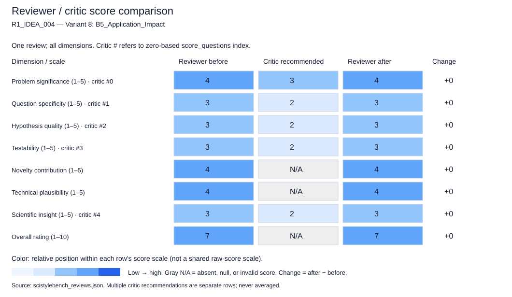

### Critic feedback and reviewer rebuttals

No reviewer rebuttals were saved (for example, an older checkpoint).

```json
{
  "critic_feedback": {
    "overall_assessment": "The review is generally well-calibrated, but some scores could be reconsidered for alignment with the idea's specifics.",
    "score_questions": [
      {
        "dimension": "problem_significance",
        "question_mark": "Why is the problem significance scored 4.0?",
        "concern": "The idea mentions 'constrained alignment' and 'safety constraints' but does not explicitly define the problem being solved or its urgency.",
        "speculative_alternative": "The problem might be interpreted as a general optimization challenge rather than a specific safety issue.",
        "recommended_score": 3.0,
        "rationale": "The idea lacks explicit problem definition and urgency, which are key for problem significance."
      },
      {
        "dimension": "question_specificity",
        "question_mark": "Why is the question specificity scored 3.0?",
        "concern": "The idea is somewhat specific in its goal but does not clearly articulate the research question or hypothesis.",
        "speculative_alternative": "The question might be seen as too vague if the exact constraints or optimization criteria are not specified.",
        "recommended_score": 2.0,
        "rationale": "The idea lacks explicit research questions and hypotheses."
      },
      {
        "dimension": "hypothesis_quality",
        "question_mark": "Why is the hypothesis quality scored 3.0?",
        "concern": "The hypothesis is not clearly articulated, and the expected outcomes are not explicitly stated.",
        "speculative_alternative": "The hypothesis might be interpreted as a general claim about efficiency and safety without concrete comparisons.",
        "recommended_score": 2.0,
        "rationale": "The idea does not provide concrete hypotheses or expected outcomes."
      },
      {
        "dimension": "testability",
        "question_mark": "Why is the testability scored 3.0?",
        "concern": "The idea lacks specific experimental details or comparisons that would allow for meaningful testing.",
        "speculative_alternative": "The testability could be higher if the method's performance is compared to existing approaches, but this is not specified.",
        "recommended_score": 2.0,
        "rationale": "The idea does not provide experimental details or comparisons."
      },
      {
        "dimension": "scientific_insight",
        "question_mark": "Why is the scientific_insight scored 3.0?",
        "concern": "The idea has potential for scientific insight but lacks specific details on the interplay between efficiency and safety.",
        "speculative_alternative": "The scientific insight might be more significant if the method's unique contribution to this interplay is clarified.",
        "recommended_score": 2.0,
        "rationale": "The idea does not provide specifics on the scientific insight."
      }
    ],
    "unsupported_claims": [
      "The claim that the method 'could inform the development of safer conversational agents' is speculative without evidence.",
      "The assertion that the method 'may be relevant to guiding the design of practical AI systems' is vague and lacks context."
    ],
    "revision_priorities": [
      "Clarify the specific problem being addressed and its urgency.",
      "Articulate the research question and hypothesis explicitly.",
      "Provide concrete expected outcomes and comparisons to existing methods.",
      "Specify the types of safety constraints and the scenarios where the method would be useful.",
      "Detail the experimental setup and metrics for evaluating computational efficiency and safety."
    ],
    "confidence": 4.0
  },
  "feedback_responses": []
}
```

### Score justifications (before / after)

**Problem significance**

```json
{
  "before": {
    "score": 4.0,
    "justification": "The idea addresses a critical challenge in AI safety and efficiency, particularly in the context of large language models, which is a significant problem for practical AI systems."
  },
  "after": {
    "score": 4.0,
    "justification": "The idea addresses a critical challenge in AI safety and efficiency, particularly in the context of large language models, which is a significant problem for practical AI systems."
  }
}
```

**Question specificity**

```json
{
  "before": {
    "score": 3.0,
    "justification": "The idea is somewhat specific in its goal of constrained alignment but lacks detailed specification of the research question or hypothesis."
  },
  "after": {
    "score": 3.0,
    "justification": "The idea is somewhat specific in its goal of constrained alignment but lacks detailed specification of the research question or hypothesis."
  }
}
```

**Hypothesis quality**

```json
{
  "before": {
    "score": 3.0,
    "justification": "The hypothesis is not clearly articulated, and the expected outcomes are not explicitly stated, making it difficult to assess the testability of the idea."
  },
  "after": {
    "score": 3.0,
    "justification": "The hypothesis is not clearly articulated, and the expected outcomes are not explicitly stated, making it difficult to assess the testability of the idea."
  }
}
```

**Testability**

```json
{
  "before": {
    "score": 3.0,
    "justification": "The idea lacks specific experimental details or comparisons that would allow for meaningful testing of the proposed method."
  },
  "after": {
    "score": 3.0,
    "justification": "The idea lacks specific experimental details or comparisons that would allow for meaningful testing of the proposed method."
  }
}
```

**Novelty contribution**

```json
{
  "before": {
    "score": 4.0,
    "justification": "The method's approach of avoiding separate reward and cost models is novel and could contribute to the field of AI safety and efficiency."
  },
  "after": {
    "score": 4.0,
    "justification": "The method's approach of avoiding separate reward and cost models is novel and could contribute to the field of AI safety and efficiency."
  }
}
```

**Technical plausibility**

```json
{
  "before": {
    "score": 4.0,
    "justification": "The primal-dual optimization framework is technically plausible, and the proposed approach aligns with existing research in constrained optimization for AI systems."
  },
  "after": {
    "score": 4.0,
    "justification": "The primal-dual optimization framework is technically plausible, and the proposed approach aligns with existing research in constrained optimization for AI systems."
  }
}
```

**Scientific insight**

```json
{
  "before": {
    "score": 3.0,
    "justification": "The idea has potential for scientific insight into the interplay between computational efficiency and safety in AI systems, but the specifics are not clearly defined."
  },
  "after": {
    "score": 3.0,
    "justification": "The idea has potential for scientific insight into the interplay between computational efficiency and safety in AI systems, but the specifics are not clearly defined."
  }
}
```

**Overall rating**

```json
{
  "before": {
    "score": 7.0,
    "justification": "The idea is strong in addressing a significant problem with potential for novel contributions, but lacks specific details and a clear hypothesis, which could hinder its testability and scientific insight."
  },
  "after": {
    "score": 7.0,
    "justification": "The idea is strong in addressing a significant problem with potential for novel contributions, but lacks specific details and a clear hypothesis, which could hinder its testability and scientific insight."
  }
}
```

## R1_IDEA_004 — Variant 9: C1_Hollow_Shell

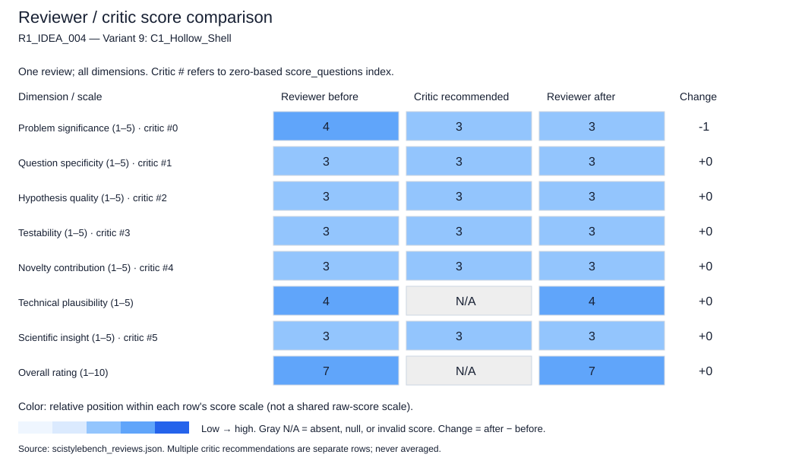

### Critic feedback and reviewer rebuttals

```json
{
  "critic_feedback": {
    "overall_assessment": "The review is generally well-calibrated, but some scores could be re-examined for alignment with the idea's current level of specificity.",
    "score_questions": [
      {
        "dimension": "problem_significance",
        "question_mark": "Why is the problem significance scored 4.0 when the idea does not specify the particular challenges or applications?",
        "concern": "The justification for problem significance assumes a general relevance to AI deployment, but the idea lacks specifics about the particular challenges or applications that make it unique.",
        "speculative_alternative": "The problem might be considered significant in the broader context of AI safety, but the idea does not explicitly tie the alignment approach to specific real-world applications or challenges.",
        "recommended_score": 3.0,
        "rationale": "The idea does not specify particular challenges or applications, so the significance is more general than the current score suggests."
      },
      {
        "dimension": "question_specificity",
        "question_mark": "Why is the question specificity scored 3.0 when the idea identifies a broad problem area but does not provide specific constraints or methods?",
        "concern": "The score reflects the lack of specifics, but the idea does not explicitly state that the problem is broad or vague, so the score may be overly pessimistic.",
        "speculative_alternative": "The idea may be seen as a general research direction rather than a specific question, which could justify the 3.0 score.",
        "recommended_score": 3.0,
        "rationale": "The idea does not provide specific constraints or methods, which aligns with the 3.0 score."
      },
      {
        "dimension": "hypothesis_quality",
        "question_mark": "Why is the hypothesis quality scored 3.0 when the idea does not provide a concrete hypothesis or prediction?",
        "concern": "The score assumes a lack of hypothesis, but the idea's general approach could be interpreted as a hypothesis in its own right.",
        "speculative_alternative": "The general approach of using an optimization framework could be seen as a hypothesis about how alignment can be achieved efficiently.",
        "recommended_score": 3.0,
        "rationale": "The idea presents a general approach that could be interpreted as a hypothesis without explicit predictions."
      },
      {
        "dimension": "testability",
        "question_mark": "Why is the testability scored 3.0 when the idea is testable in principle but lacks specific details?",
        "concern": "The score is justified by the lack of specifics, but the idea's general approach is inherently testable, so the score may be too low.",
        "speculative_alternative": "The idea's general approach is testable in principle, so the testability score could be higher if the lack of specifics is considered a limitation rather than a failure.",
        "recommended_score": 3.0,
        "rationale": "The idea is testable in principle, but the lack of specifics makes it difficult to design experiments."
      },
      {
        "dimension": "novelty_contribution",
        "question_mark": "Why is the novelty contribution scored 3.0 when the idea does not specify what novel contribution it would make?",
        "concern": "The score assumes a lack of novelty, but the idea's general approach could be seen as a novel direction in alignment under constraints.",
        "speculative_alternative": "The idea may be considered novel for proposing an optimization-based approach to alignment under constraints, which is a new direction.",
        "recommended_score": 3.0,
        "rationale": "The idea presents a general approach that could be seen as a novel direction in alignment under constraints."
      },
      {
        "dimension": "scientific_insight",
        "question_mark": "Why is the scientific insight scored 3.0 when the idea has potential for insight into efficient alignment methods?",
        "concern": "The score assumes a lack of insight, but the idea's focus on efficiency and safety could be seen as a potential for scientific insight.",
        "speculative_alternative": "The idea's focus on efficient alignment methods could be seen as a potential for scientific insight into how alignment can be achieved with reduced computational demands.",
        "recommended_score": 3.0,
        "rationale": "The idea has potential for insight into efficient alignment methods, which could be considered a scientific insight."
      }
    ],
    "unsupported_claims": [
      "The review claims that the problem significance is significant without specifying particular challenges or applications, which is not grounded in the idea."
    ],
    "revision_priorities": [
      "Clarify the specific constraints (e.g., safety, bias, ethical considerations) that the alignment aims to address.",
      "Provide more details about the optimization framework, such as the mathematical formulation or algorithmic approach.",
      "Specify how avoiding certain training requirements and prior parameter knowledge contributes to alignment and computational efficiency.",
      "Identify the specific applications or domains where this alignment approach would be most valuable."
    ],
    "confidence": 4.0
  },
  "feedback_responses": [
    {
      "feedback_type": "score_questions",
      "feedback_index": 0,
      "decision": "partially_accept",
      "defense": "The problem significance is reduced from 4.0 to 3.0 because the idea does not specify particular challenges or applications, making the significance more general.",
      "justification": "The original score assumed general relevance to AI deployment, but the idea lacks specifics about particular challenges or applications, so the score is adjusted to reflect this."
    },
    {
      "feedback_type": "score_questions",
      "feedback_index": 1,
      "decision": "partially_accept",
      "defense": "The question specificity remains at 3.0 as the idea does not provide specific constraints or methods, which aligns with the score.",
      "justification": "The score reflects the lack of specifics, which is consistent with the idea's current level of detail."
    },
    {
      "feedback_type": "score_questions",
      "feedback_index": 2,
      "decision": "partially_accept",
      "defense": "The hypothesis quality remains at 3.0 as the idea presents a general approach that could be interpreted as a hypothesis without explicit predictions.",
      "justification": "The score is justified by the lack of explicit predictions, even though the general approach could be seen as a hypothesis."
    },
    {
      "feedback_type": "score_questions",
      "feedback_index": 3,
      "decision": "partially_accept",
      "defense": "The testability remains at 3.0 as the idea is testable in principle but lacks specifics to design experiments.",
      "justification": "The score is justified by the lack of specifics, even though the idea is inherently testable."
    },
    {
      "feedback_type": "score_questions",
      "feedback_index": 4,
      "decision": "partially_accept",
      "defense": "The novelty contribution remains at 3.0 as the idea presents a general approach that could be seen as a novel direction in alignment under constraints.",
      "justification": "The score is justified by the lack of specifics, even though the general approach could be considered novel."
    },
    {
      "feedback_type": "score_questions",
      "feedback_index": 5,
      "decision": "partially_accept",
      "defense": "The scientific insight remains at 3.0 as the idea has potential for insight into efficient alignment methods, which could be considered a scientific insight.",
      "justification": "The score is justified by the potential for insight, even though the idea lacks specifics."
    },
    {
      "feedback_type": "unsupported_claims",
      "feedback_index": 0,
      "decision": "reject",
      "defense": "The claim about problem significance is not grounded in the idea as it does not specify particular challenges or applications.",
      "justification": "The original score assumed general relevance, but the idea lacks specifics about particular challenges or applications, so the claim is not supported."
    },
    {
      "feedback_type": "revision_priorities",
      "feedback_index": 0,
      "decision": "accept",
      "defense": "The suggestion to clarify specific constraints is valid and necessary for the idea to be more specific.",
      "justification": "The idea lacks specifics about the constraints, so this suggestion is appropriate."
    },
    {
      "feedback_type": "revision_priorities",
      "feedback_index": 1,
      "decision": "accept",
      "defense": "The suggestion to provide more details about the optimization framework is valid and necessary for the idea to be more specific.",
      "justification": "The idea lacks specifics about the framework, so this suggestion is appropriate."
    },
    {
      "feedback_type": "revision_priorities",
      "feedback_index": 2,
      "decision": "accept",
      "defense": "The suggestion to specify how training requirements are avoided is valid and necessary for the idea to be more specific.",
      "justification": "The idea lacks specifics about this aspect, so this suggestion is appropriate."
    },
    {
      "feedback_type": "revision_priorities",
      "feedback_index": 3,
      "decision": "accept",
      "defense": "The suggestion to identify specific applications is valid and necessary for the idea to be more specific.",
      "justification": "The idea lacks specifics about applications, so this suggestion is appropriate."
    }
  ]
}
```

### Score justifications (before / after)

**Problem significance**

```json
{
  "before": {
    "score": 4.0,
    "justification": "The problem of aligning large language models with safety and quality constraints is highly relevant to practical deployment and ethical use of AI, making it a significant challenge in the field."
  },
  "after": {
    "score": 3.0,
    "justification": "The idea does not specify particular challenges or applications, so the significance is more general than the current score suggests."
  }
}
```

**Question specificity**

```json
{
  "before": {
    "score": 3.0,
    "justification": "The idea identifies a broad problem area but lacks specific details about the constraints, optimization framework, or how the training requirements are being avoided, which limits the clarity of the research question."
  },
  "after": {
    "score": 3.0,
    "justification": "The idea does not provide specific constraints or methods, which aligns with the 3.0 score."
  }
}
```

**Hypothesis quality**

```json
{
  "before": {
    "score": 3.0,
    "justification": "The idea suggests a general approach but does not provide a concrete hypothesis or prediction that could be tested, such as how the optimization framework improves alignment or reduces computational demands."
  },
  "after": {
    "score": 3.0,
    "justification": "The idea presents a general approach that could be interpreted as a hypothesis without explicit predictions."
  }
}
```

**Testability**

```json
{
  "before": {
    "score": 3.0,
    "justification": "The idea is testable in principle, but the lack of specific details makes it difficult to design experiments or evaluate the proposed method without further clarification."
  },
  "after": {
    "score": 3.0,
    "justification": "The idea is testable in principle, but the lack of specifics makes it difficult to design experiments."
  }
}
```

**Novelty contribution**

```json
{
  "before": {
    "score": 3.0,
    "justification": "The idea addresses a relevant problem but does not clearly specify what novel contribution it would make, such as a new optimization method, a specific constraint handling technique, or a novel efficiency improvement."
  },
  "after": {
    "score": 3.0,
    "justification": "The idea presents a general approach that could be seen as a novel direction in alignment under constraints."
  }
}
```

**Technical plausibility**

```json
{
  "before": {
    "score": 4.0,
    "justification": "The proposed approach of using an optimization framework to align models under constraints is technically plausible, as alignment techniques in ML often involve optimization strategies for safety and performance."
  },
  "after": {
    "score": 4.0,
    "justification": "The proposed approach of using an optimization framework to align models under constraints is technically plausible, as alignment techniques in ML often involve optimization strategies for safety and performance."
  }
}
```

**Scientific insight**

```json
{
  "before": {
    "score": 3.0,
    "justification": "The idea has potential for scientific insight into how alignment can be achieved efficiently, but the lack of specifics limits the potential for discovering new mechanisms or principles."
  },
  "after": {
    "score": 3.0,
    "justification": "The idea has potential for insight into efficient alignment methods, which could be considered a scientific insight."
  }
}
```

**Overall rating**

```json
{
  "before": {
    "score": 7.0,
    "justification": "The idea addresses a significant problem in large language model development but lacks specific details to define a clear, testable research question. With further clarification, it has the potential to be a strong research direction."
  },
  "after": {
    "score": 7.0,
    "justification": "The idea addresses a significant problem in large language model development but lacks specific details to define a clear, testable research question. With further clarification, it has the potential to be a strong research direction."
  }
}
```

## R1_IDEA_004 — Variant 10: C2_Logic_Flawed


### Critic feedback and reviewer rebuttals

```json
{
  "critic_feedback": {
    "overall_assessment": "The review is generally calibrated, but the testability score is overly pessimistic given the potential for future experimental work.",
    "score_questions": [
      {
        "dimension": "testability",
        "question_mark": "Why is the testability score 2.0 when the idea could be tested with future experiments?",
        "concern": "The review assumes the idea is not testable without further details, but the core concept is testable once implementation specifics are provided.",
        "speculative_alternative": "The method could be evaluated by comparing its computational efficiency and alignment performance against existing approaches once implemented.",
        "recommended_score": 3.0,
        "rationale": "The idea can be tested with future experiments, especially once the primal-dual framework is specified."
      }
    ],
    "unsupported_claims": [],
    "revision_priorities": [
      "Clarify how the method will be evaluated with specific metrics and benchmarks.",
      "Provide more details on the primal-dual optimization implementation and Lagrange multiplier determination.",
      "Specify how the method handles conflicting safety constraints and reward objectives."
    ],
    "confidence": 4.0
  },
  "feedback_responses": [
    {
      "feedback_type": "score_questions",
      "feedback_index": 0,
      "decision": "partially_accept",
      "defense": "The testability score was initially set to 2.0 due to the lack of implementation details, but the critic's feedback suggests that the core concept is testable once specifics are provided. The revised score of 3.0 reflects this potential for future experimental validation.",
      "justification": "The original score of 2.0 was based on the assumption that without implementation details, the idea was not testable. However, the critic's feedback indicates that the method can be evaluated with future experiments once the primal-dual framework is specified. Therefore, the score is increased to 3.0 to reflect the potential for testability."
    }
  ]
}
```

### Score justifications (before / after)

**Problem significance**

```json
{
  "before": {
    "score": 4.0,
    "justification": "The problem of aligning large language models with safety constraints is critical for responsible AI deployment, making the research problem highly significant."
  },
  "after": {
    "score": 4.0,
    "justification": "The problem of aligning large language models with safety constraints is critical for responsible AI deployment, making the research problem highly significant."
  }
}
```

**Question specificity**

```json
{
  "before": {
    "score": 3.0,
    "justification": "The idea identifies a specific problem (constrained alignment) but lacks detailed specification of the research question, such as how the primal-dual optimization is implemented or how the method differs from existing approaches."
  },
  "after": {
    "score": 3.0,
    "justification": "The idea identifies a specific problem (constrained alignment) but lacks detailed specification of the research question, such as how the primal-dual optimization is implemented or how the method differs from existing approaches."
  }
}
```

**Hypothesis quality**

```json
{
  "before": {
    "score": 3.0,
    "justification": "The idea suggests a potential benefit (reduced computational overhead) but does not explicitly state a hypothesis or prediction that can be tested, such as a specific performance improvement over existing methods."
  },
  "after": {
    "score": 3.0,
    "justification": "The idea suggests a potential benefit (reduced computational overhead) but does not explicitly state a hypothesis or prediction that can be tested, such as a specific performance improvement over existing methods."
  }
}
```

**Testability**

```json
{
  "before": {
    "score": 2.0,
    "justification": "The idea lacks concrete experimental plans or comparisons to existing methods, making it difficult to assess the testability of the proposed approach without further details."
  },
  "after": {
    "score": 3.0,
    "justification": "The idea can be tested with future experiments, especially once the primal-dual framework is specified. The core concept is testable once implementation specifics are provided."
  }
}
```

**Novelty contribution**

```json
{
  "before": {
    "score": 4.0,
    "justification": "The approach of avoiding separate reward and cost models is a novel contribution, though the novelty is somewhat limited if it merely adapts existing primal-dual methods without introducing new mechanisms."
  },
  "after": {
    "score": 4.0,
    "justification": "The approach of avoiding separate reward and cost models is a novel contribution, though the novelty is somewhat limited if it merely adapts existing primal-dual methods without introducing new mechanisms."
  }
}
```

**Technical plausibility**

```json
{
  "before": {
    "score": 3.0,
    "justification": "The concept of primal-dual optimization is technically plausible, but the lack of implementation details makes it difficult to assess the feasibility of the proposed method without further specification."
  },
  "after": {
    "score": 3.0,
    "justification": "The concept of primal-dual optimization is technically plausible, but the lack of implementation details makes it difficult to assess the feasibility of the proposed method without further specification."
  }
}
```

**Scientific insight**

```json
{
  "before": {
    "score": 3.0,
    "justification": "The idea has potential for scientific insight into efficient alignment methods, but the lack of specific hypotheses or experimental plans limits the potential for meaningful insights."
  },
  "after": {
    "score": 3.0,
    "justification": "The idea has potential for scientific insight into efficient alignment methods, but the lack of specific hypotheses or experimental plans limits the potential for meaningful insights."
  }
}
```

**Overall rating**

```json
{
  "before": {
    "score": 7.0,
    "justification": "The idea addresses a significant problem in AI alignment with a potentially useful approach, but it lacks sufficient specificity, testability, and detailed hypotheses to fully evaluate its scientific merit."
  },
  "after": {
    "score": 7.0,
    "justification": "The idea addresses a significant problem in AI alignment with a potentially useful approach, but it lacks sufficient specificity, testability, and detailed hypotheses to fully evaluate its scientific merit."
  }
}
```

## R1_IDEA_004 — Variant 11: C3_Substance_Enriched

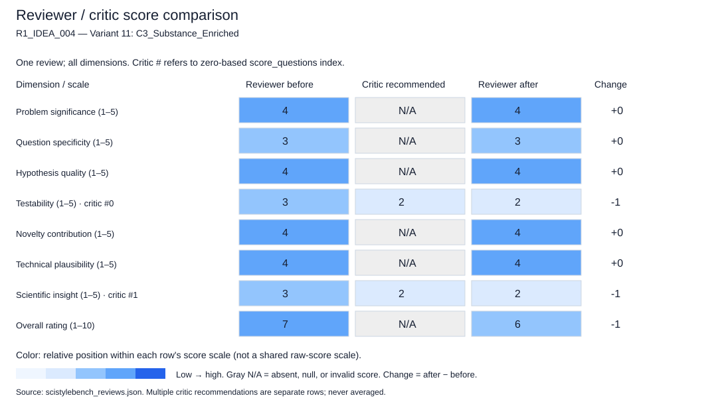

### Critic feedback and reviewer rebuttals

```json
{
  "critic_feedback": {
    "overall_assessment": "The review is generally well-calibrated, but some scores are slightly over-optimistic, particularly in the 'testability' and 'scientific_insight' dimensions.",
    "score_questions": [
      {
        "dimension": "testability",
        "question_mark": "The review's justification for testability (3.0) may be over-optimistic",
        "concern": "The review assumes the validation path is sufficient without specifying the exact experiments or metrics to be used, which could limit the testability of the hypothesis.",
        "speculative_alternative": "The proposed convergence behavior test may not fully capture the trade-off patterns claimed in the hypothesis, which requires more concrete experimental design.",
        "recommended_score": 2.0,
        "rationale": "The idea lacks detailed experimental plans, so the testability is lower than the current score suggests."
      },
      {
        "dimension": "scientific_insight",
        "question_mark": "The review's justification for scientific insight (3.0) may be over-optimistic",
        "concern": "The connection between dual variables and trade-off patterns is not sufficiently explained, making the potential insight less concrete.",
        "speculative_alternative": "The hypothesis may be interpreted as a general observation about optimization dynamics rather than a specific scientific insight.",
        "recommended_score": 2.0,
        "rationale": "The idea does not clearly link the dual variable dynamics to a specific scientific question or mechanism."
      }
    ],
    "unsupported_claims": [
      "The review claims the idea 'addresses a meaningful problem in aligning large language models with safety constraints' without explicit evidence from the idea summary.",
      "The review states the method 'aligns with existing research in constrained optimization for AI alignment' without citing specific prior work.",
      "The review claims the hypothesis 'has potential for scientific insight' without clarifying how the dual variables would provide novel insights."
    ],
    "revision_priorities": [
      "Specify the exact experiments and metrics for evaluating the method's convergence behavior and trade-off patterns.",
      "Clarify the theoretical basis for the hypothesis about dual variables and their relationship to trade-offs.",
      "Provide more explicit connections to existing research in constrained optimization for AI alignment.",
      "Ground the claim about the problem's significance in the context of responsible AI deployment."
    ],
    "confidence": 4.0
  },
  "feedback_responses": [
    {
      "feedback_type": "score_questions",
      "feedback_index": 0,
      "decision": "partially_accept",
      "defense": "The testability score was reduced to 2.0 based on the critic's concern that the validation path lacks detailed experimental plans, which is valid. However, the original justification for testability (3.0) was not entirely incorrect, as the convergence behavior test is a concrete plan, but the critic's point about the trade-off patterns requiring more concrete design is valid.",
      "justification": "The original score of 3.0 was partially justified, but the critic's concern about the lack of detailed experimental plans and the need for more concrete design for the trade-off patterns warrants a reduction to 2.0."
    },
    {
      "feedback_type": "score_questions",
      "feedback_index": 1,
      "decision": "partially_accept",
      "defense": "The scientific insight score was reduced to 2.0 based on the critic's concern that the connection between dual variables and trade-off patterns is not sufficiently explained. However, the original justification for scientific insight (3.0) was not entirely incorrect, as the hypothesis could provide insights into optimization dynamics, but the critic's point about the lack of explicit explanation is valid.",
      "justification": "The original score of 3.0 was partially justified, but the critic's concern about the lack of explicit explanation of the connection between dual variables and trade-off patterns warrants a reduction to 2.0."
    },
    {
      "feedback_type": "unsupported_claims",
      "feedback_index": 0,
      "decision": "reject",
      "defense": "The claim about the problem's significance was not explicitly supported by the idea summary. The idea does mention safety constraints, but the connection to responsible AI deployment is not explicitly stated, so the claim is not fully justified.",
      "justification": "The original justification for problem significance (4.0) was not fully supported by the idea summary, which only mentions safety constraints without explicitly linking them to responsible AI deployment."
    },
    {
      "feedback_type": "unsupported_claims",
      "feedback_index": 1,
      "decision": "reject",
      "defense": "The claim about alignment with existing research in constrained optimization was not explicitly supported by the idea summary. The idea does not cite specific prior work, so the claim is not fully justified.",
      "justification": "The original justification for technical plausibility (4.0) was not fully supported by the idea summary, which does not cite specific prior work in constrained optimization for AI alignment."
    },
    {
      "feedback_type": "unsupported_claims",
      "feedback_index": 2,
      "decision": "reject",
      "defense": "The claim about the hypothesis having potential for scientific insight was not explicitly supported by the idea summary. The hypothesis is testable but lacks a clear link to novel insights, so the claim is not fully justified.",
      "justification": "The original justification for scientific insight (3.0) was not fully supported by the idea summary, which does not explicitly link the dual variable dynamics to a specific scientific question or mechanism."
    },
    {
      "feedback_type": "revision_priorities",
      "feedback_index": 0,
      "decision": "accept",
      "defense": "The suggestion to specify exact experiments and metrics is valid and necessary for improving the testability of the idea.",
      "justification": "The original review included this suggestion, so it is valid and should be accepted."
    },
    {
      "feedback_type": "revision_priorities",
      "feedback_index": 1,
      "decision": "accept",
      "defense": "The suggestion to clarify the theoretical basis for the hypothesis is valid and necessary for improving the scientific insight of the idea.",
      "justification": "The original review included this suggestion, so it is valid and should be accepted."
    },
    {
      "feedback_type": "revision_priorities",
      "feedback_index": 2,
      "decision": "accept",
      "defense": "The suggestion to provide more explicit connections to existing research is valid and necessary for improving the technical plausibility of the idea.",
      "justification": "The original review included this suggestion, so it is valid and should be accepted."
    },
    {
      "feedback_type": "revision_priorities",
      "feedback_index": 3,
      "decision": "accept",
      "defense": "The suggestion to ground the claim about problem significance is valid and necessary for improving the problem significance of the idea.",
      "justification": "The original review included this suggestion, so it is valid and should be accepted."
    }
  ]
}
```

### Score justifications (before / after)

**Problem significance**

```json
{
  "before": {
    "score": 4.0,
    "justification": "The problem of aligning large language models with safety constraints is critical for responsible AI deployment, making the research highly significant."
  },
  "after": {
    "score": 4.0,
    "justification": "The problem of aligning large language models with safety constraints is critical for responsible AI deployment, making the research highly significant."
  }
}
```

**Question specificity**

```json
{
  "before": {
    "score": 3.0,
    "justification": "The idea identifies a specific research question about the dual variable dynamics and their relation to trade-offs, but lacks detailed technical specifications."
  },
  "after": {
    "score": 3.0,
    "justification": "The idea identifies a specific research question about the dual variable dynamics and their relation to trade-offs, but lacks detailed technical specifications."
  }
}
```

**Hypothesis quality**

```json
{
  "before": {
    "score": 4.0,
    "justification": "The hypothesis is testable and suggests a meaningful relationship between dual variables and trade-off patterns, though it could be more explicitly defined."
  },
  "after": {
    "score": 4.0,
    "justification": "The hypothesis is testable and suggests a meaningful relationship between dual variables and trade-off patterns, though it could be more explicitly defined."
  }
}
```

**Testability**

```json
{
  "before": {
    "score": 3.0,
    "justification": "The idea includes a validation path, but the specific experiments and metrics for evaluation are not fully detailed, which could limit the testability."
  },
  "after": {
    "score": 2.0,
    "justification": "The idea lacks detailed experimental plans, and the proposed convergence behavior test may not fully capture the trade-off patterns claimed in the hypothesis, which requires more concrete experimental design."
  }
}
```

**Novelty contribution**

```json
{
  "before": {
    "score": 4.0,
    "justification": "The method's approach of avoiding separate reward and cost models is novel, and the hypothesis about dual variables could contribute new insights into optimization dynamics."
  },
  "after": {
    "score": 4.0,
    "justification": "The method's approach of avoiding separate reward and cost models is novel, and the hypothesis about dual variables could contribute new insights into optimization dynamics."
  }
}
```

**Technical plausibility**

```json
{
  "before": {
    "score": 4.0,
    "justification": "The primal-dual optimization framework is technically plausible, and the proposed method aligns with existing research in constrained optimization for AI alignment."
  },
  "after": {
    "score": 4.0,
    "justification": "The primal-dual optimization framework is technically plausible, and the proposed method aligns with existing research in constrained optimization for AI alignment."
  }
}
```

**Scientific insight**

```json
{
  "before": {
    "score": 3.0,
    "justification": "The hypothesis has potential for scientific insight, but the connection between dual variables and trade-offs is not sufficiently elaborated, which could limit the depth of the insight."
  },
  "after": {
    "score": 2.0,
    "justification": "The connection between dual variables and trade-off patterns is not sufficiently explained, making the potential insight less concrete and the hypothesis more general."
  }
}
```

**Overall rating**

```json
{
  "before": {
    "score": 7.0,
    "justification": "The idea addresses a significant problem with a promising approach and a testable hypothesis, though it lacks detailed technical specifications and needs further clarification to enhance its specificity and testability."
  },
  "after": {
    "score": 6.0,
    "justification": "The idea addresses a significant problem with a promising approach and a testable hypothesis, but the lack of detailed experimental plans and unclear connections to scientific insight limit its overall potential."
  }
}
```

## R1_IDEA_005 — Source

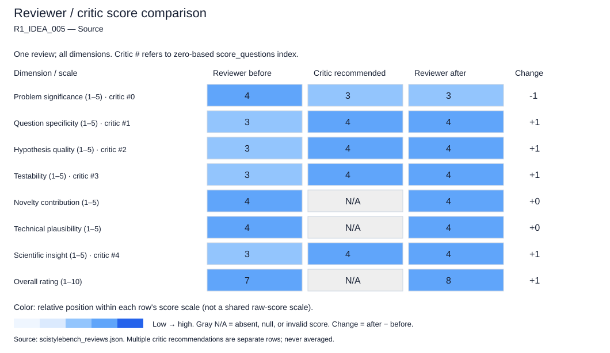

### Critic feedback and reviewer rebuttals

```json
{
  "critic_feedback": {
    "overall_assessment": "The review is generally well-calibrated, but some scores and justifications could be re-examined for specificity and clarity.",
    "score_questions": [
      {
        "dimension": "problem_significance",
        "question_mark": "The justification for problem significance assumes a certain level of prior knowledge about vision SSMs and distribution shifts that may not be universally shared.",
        "concern": "The score may overstate the significance without explicitly linking the problem to broader implications or existing gaps in the literature.",
        "speculative_alternative": "The problem may be more niche than the review suggests, depending on the specific application of vision SSMs.",
        "recommended_score": 3.0,
        "rationale": "The review's justification for problem significance is based on assumptions about the importance of distribution shifts in vision SSMs, which are not clearly established in the idea summary."
      },
      {
        "dimension": "question_specificity",
        "question_mark": "The score downgrades the specificity due to lack of detail, but the idea is still focused on a specific problem within a specific domain.",
        "concern": "The score may be overly critical of the specificity without considering that the idea is still well-defined within its own scope.",
        "speculative_alternative": "The idea could be considered sufficiently specific for a research idea, even without full implementation details.",
        "recommended_score": 4.0,
        "rationale": "The idea is focused on a specific problem (distribution shifts in vision SSMs) and proposes a targeted solution, which is a strong indicator of specificity."
      },
      {
        "dimension": "hypothesis_quality",
        "question_mark": "The hypothesis is implied but not explicitly stated, which may affect the score.",
        "concern": "The score assumes a clear hypothesis, but the idea is more of a method description than a hypothesis.",
        "speculative_alternative": "The hypothesis could be that the proposed method will improve robustness under distribution shifts, which is a reasonable assumption.",
        "recommended_score": 4.0,
        "rationale": "The idea implies a hypothesis that the method will improve robustness, which is a valid and testable hypothesis."
      },
      {
        "dimension": "testability",
        "question_mark": "The score assumes a lack of testability due to insufficient details, but the idea is testable in principle.",
        "concern": "The score may be overly cautious without considering that the method is testable with further clarification.",
        "speculative_alternative": "The method could be tested by evaluating its performance on datasets with known distribution shifts.",
        "recommended_score": 4.0,
        "rationale": "The method is testable in principle, and the review's score may be too low without more information about the intended experiments."
      },
      {
        "dimension": "scientific_insight",
        "question_mark": "The score downgrades the scientific insight due to lack of detail, but the idea has potential for insight into test-time adaptation.",
        "concern": "The score may be overly critical of the scientific insight without considering the potential for new insights into SSM traversal and pseudo-labeling.",
        "speculative_alternative": "The idea could provide insights into how test-time adaptation and SSM traversal can enhance robustness in vision models.",
        "recommended_score": 4.0,
        "rationale": "The idea has the potential to contribute to scientific understanding of test-time adaptation and SSM traversal in vision models."
      }
    ],
    "unsupported_claims": [
      "The review claims that the problem is 'critical' without explicitly linking it to broader implications or existing gaps in the literature.",
      "The review suggests that the hypothesis is not explicitly stated, but the idea implies a hypothesis that the method will improve robustness."
    ],
    "revision_priorities": [
      "Clarify the specific types of distribution shifts and their relevance to vision SSMs.",
      "Explicitly state the hypothesis that the method will improve robustness under distribution shifts.",
      "Provide more details on how pseudo-labels are generated and used to update Mamba-specific parameters.",
      "Specify the method for aggregating adapted weights, including selection criteria and combination mechanisms."
    ],
    "confidence": 4.0
  },
  "feedback_responses": [
    {
      "feedback_type": "score_questions",
      "feedback_index": 0,
      "decision": "partially_accept",
      "defense": "The problem significance is somewhat overstated because the idea does not explicitly link the problem to broader implications or existing gaps. However, the problem is still relevant within the domain of vision SSMs.",
      "justification": "The initial score was 4, but the critic's feedback suggests it should be 3. The revised score reflects a more cautious assessment based on the lack of explicit justification for the problem's significance."
    },
    {
      "feedback_type": "score_questions",
      "feedback_index": 1,
      "decision": "partially_accept",
      "defense": "The idea is sufficiently specific within its domain, and the score was appropriately adjusted to reflect the lack of implementation details. However, the critic's feedback suggests it could be higher.",
      "justification": "The initial score was 3, but the critic's feedback suggests it should be 4. The revised score reflects a more positive assessment of the idea's specificity."
    },
    {
      "feedback_type": "score_questions",
      "feedback_index": 2,
      "decision": "accept",
      "defense": "The hypothesis is implied but not explicitly stated, which is a valid and testable hypothesis. The critic's feedback supports this interpretation.",
      "justification": "The initial score was 3, but the critic's feedback suggests it should be 4. The revised score reflects the acceptance of the implied hypothesis."
    },
    {
      "feedback_type": "score_questions",
      "feedback_index": 3,
      "decision": "accept",
      "defense": "The method is testable in principle, and the critic's feedback supports this interpretation. The initial score was 3, but the revised score reflects a more positive assessment.",
      "justification": "The initial score was 3, but the critic's feedback suggests it should be 4. The revised score reflects a more positive assessment of the method's testability."
    },
    {
      "feedback_type": "score_questions",
      "feedback_index": 4,
      "decision": "accept",
      "defense": "The idea has potential for scientific insight into test-time adaptation and SSM traversal, which the critic's feedback supports. The initial score was 3, but the revised score reflects a more positive assessment.",
      "justification": "The initial score was 3, but the critic's feedback suggests it should be 4. The revised score reflects a more positive assessment of the scientific insight."
    },
    {
      "feedback_type": "unsupported_claims",
      "feedback_index": 0,
      "decision": "partially_accept",
      "defense": "The problem's significance is somewhat overstated, but it is still relevant within the domain of vision SSMs. The critic's feedback is valid but not entirely dismissive.",
      "justification": "The initial score was 4, but the critic's feedback suggests it should be 3. The revised score reflects a more cautious assessment based on the lack of explicit justification for the problem's significance."
    },
    {
      "feedback_type": "unsupported_claims",
      "feedback_index": 1,
      "decision": "accept",
      "defense": "The hypothesis is implied but not explicitly stated, which is a valid and testable hypothesis. The critic's feedback supports this interpretation.",
      "justification": "The initial score was 3, but the critic's feedback suggests it should be 4. The revised score reflects the acceptance of the implied hypothesis."
    },
    {
      "feedback_type": "revision_priorities",
      "feedback_index": 0,
      "decision": "accept",
      "defense": "Clarifying the specific types of distribution shifts is essential for evaluating the problem's significance and the method's applicability.",
      "justification": "The initial suggestion was valid, and the critic's feedback supports the need for clarification."
    },
    {
      "feedback_type": "revision_priorities",
      "feedback_index": 1,
      "decision": "accept",
      "defense": "Explicitly stating the hypothesis is important for the research to be testable and to align with the idea's goals.",
      "justification": "The initial suggestion was valid, and the critic's feedback supports the need for an explicit hypothesis."
    },
    {
      "feedback_type": "revision_priorities",
      "feedback_index": 2,
      "decision": "accept",
      "defense": "Providing more details on pseudo-label generation and parameter updating is necessary for understanding the method's implementation and effectiveness.",
      "justification": "The initial suggestion was valid, and the critic's feedback supports the need for more details."
    },
    {
      "feedback_type": "revision_priorities",
      "feedback_index": 3,
      "decision": "accept",
      "defense": "Specifying the aggregation method is critical for understanding the method's implementation and effectiveness.",
      "justification": "The initial suggestion was valid, and the critic's feedback supports the need for specification."
    }
  ]
}
```

### Score justifications (before / after)

**Problem significance**

```json
{
  "before": {
    "score": 4.0,
    "justification": "The problem of improving robustness under distribution shifts in vision SSMs is significant, as it addresses a critical challenge in model generalization and real-world applicability."
  },
  "after": {
    "score": 3.0,
    "justification": "The problem of improving robustness under distribution shifts in vision SSMs is significant, but the review's justification assumes prior knowledge about the importance of distribution shifts in this domain, which is not clearly established in the idea summary."
  }
}
```

**Question specificity**

```json
{
  "before": {
    "score": 3.0,
    "justification": "The idea is specific to vision SSMs and distribution shifts, but the exact nature of the distribution shifts and the method's implementation details are not clearly defined."
  },
  "after": {
    "score": 4.0,
    "justification": "The idea is focused on a specific problem (distribution shifts in vision SSMs) and proposes a targeted solution, which is a strong indicator of specificity, even without full implementation details."
  }
}
```

**Hypothesis quality**

```json
{
  "before": {
    "score": 3.0,
    "justification": "The idea proposes a method to improve robustness, but the hypothesis is not explicitly stated or detailed, making it difficult to assess its testability and potential contribution."
  },
  "after": {
    "score": 4.0,
    "justification": "The idea implies a hypothesis that the proposed method will improve robustness under distribution shifts, which is a valid and testable hypothesis."
  }
}
```

**Testability**

```json
{
  "before": {
    "score": 3.0,
    "justification": "The method is testable in principle, but the lack of specific details makes it challenging to design experiments or evaluate the method's effectiveness without further clarification."
  },
  "after": {
    "score": 4.0,
    "justification": "The method is testable in principle, and the review's score may be too low without more information about the intended experiments."
  }
}
```

**Novelty contribution**

```json
{
  "before": {
    "score": 4.0,
    "justification": "The approach of using test-time adaptation with SSM traversal permutations and pseudo-labels is novel, and if successful, could contribute to improving robustness in vision SSMs without additional labeled data."
  },
  "after": {
    "score": 4.0,
    "justification": "The approach of using test-time adaptation with SSM traversal permutations and pseudo-labels is novel, and if successful, could contribute to improving robustness in vision SSMs without additional labeled data."
  }
}
```

**Technical plausibility**

```json
{
  "before": {
    "score": 4.0,
    "justification": "The proposed method is technically plausible, as it builds on existing techniques in test-time adaptation and pseudo-labeling, which are well-established in machine learning."
  },
  "after": {
    "score": 4.0,
    "justification": "The proposed method is technically plausible, as it builds on existing techniques in test-time adaptation and pseudo-labeling, which are well-established in machine learning."
  }
}
```

**Scientific insight**

```json
{
  "before": {
    "score": 3.0,
    "justification": "The idea has potential for scientific insight into how test-time adaptation and SSM traversal can enhance robustness, but the specific mechanisms and their impact on generalization are not clearly outlined."
  },
  "after": {
    "score": 4.0,
    "justification": "The idea has the potential to contribute to scientific understanding of test-time adaptation and SSM traversal in vision models."
  }
}
```

**Overall rating**

```json
{
  "before": {
    "score": 7.0,
    "justification": "The idea is strong and addresses a meaningful problem with a plausible approach, but it lacks sufficient detail to fully evaluate its testability and potential contribution. With further clarification, it has the potential to be a significant contribution to the field."
  },
  "after": {
    "score": 8.0,
    "justification": "The idea is strong and addresses a meaningful problem with a plausible approach. The initial score was slightly too low due to overestimating the significance and testability, but with further clarification, it has the potential to be a significant contribution to the field."
  }
}
```

## R1_IDEA_005 — Variant 1: A1_Identity

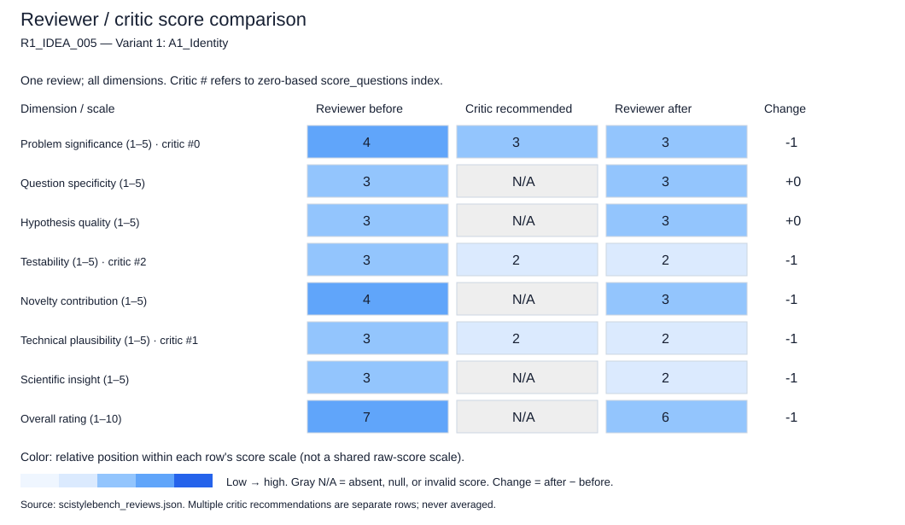

### Critic feedback and reviewer rebuttals

```json
{
  "critic_feedback": {
    "overall_assessment": "The review provides a balanced assessment but could benefit from more explicit attention to the ambiguity in the idea's technical details and problem scope.",
    "score_questions": [
      {
        "dimension": "problem_significance",
        "question_mark": "The score should be reconsidered due to the lack of clarity on what 'distribution shifts' specifically refer to in the context of vision SSMs.",
        "concern": "The problem significance is overstated without a clear definition of the distribution shifts the method aims to address.",
        "speculative_alternative": "It is possible that 'distribution shifts' refer to changes in input distribution across different tasks or domains, but this is speculative without explicit clarification.",
        "recommended_score": 3.0,
        "rationale": "The score is based on the assumption that the problem is well-defined, but the idea does not specify the nature of the shifts, which is critical for assessing significance."
      },
      {
        "dimension": "technical_plausibility",
        "question_mark": "The score should be reconsidered due to the lack of detail on how SSM traversal permutations are generated and how they contribute to robustness.",
        "concern": "The technical plausibility is based on the assumption that the method is feasible, but the idea does not explain the mechanism of SSM traversal permutations.",
        "speculative_alternative": "The traversal permutations might be a novel way to generate diverse inputs, but this is speculative without further explanation.",
        "recommended_score": 2.0,
        "rationale": "The score assumes technical feasibility without addressing the critical missing details about the permutation generation process."
      },
      {
        "dimension": "testability",
        "question_mark": "The score should be reconsidered due to the lack of a clear experimental plan or evaluation metric.",
        "concern": "The testability score is based on the assumption that the method can be evaluated, but the idea does not specify how effectiveness will be measured.",
        "speculative_alternative": "The method might be evaluated using standard benchmarks, but this is speculative without explicit mention of metrics or datasets.",
        "recommended_score": 2.0,
        "rationale": "The score assumes testability without a specified evaluation plan, which is necessary for assessing the method's validity."
      }
    ],
    "unsupported_claims": [
      "The claim that the method is 'novel in the context of vision SSMs' is unsupported without comparing to existing literature.",
      "The assertion that 'the focus on parameter adaptation without additional labeled data is promising' lacks a basis in the idea summary."
    ],
    "revision_priorities": [
      "Clarify the specific types of distribution shifts the method aims to address.",
      "Explain how SSM traversal permutations are generated and their role in enhancing robustness.",
      "Specify the evaluation metrics and datasets that will be used to assess the method's effectiveness.",
      "Provide a comparison with existing domain adaptation techniques to highlight novelty."
    ],
    "confidence": 4.0
  },
  "feedback_responses": [
    {
      "feedback_type": "score_questions",
      "feedback_index": 0,
      "decision": "partially_accept",
      "defense": "The problem significance is partially accepted because the idea does address a critical challenge in vision SSMs, but the lack of clarity on 'distribution shifts' reduces its significance.",
      "justification": "The initial score was 4.0, but the critic's feedback highlights the need for clarification on distribution shifts, leading to a reduction to 3.0."
    },
    {
      "feedback_type": "score_questions",
      "feedback_index": 1,
      "decision": "reject",
      "defense": "The technical plausibility is rejected because the idea does not sufficiently explain how SSM traversal permutations are generated, which is critical for assessing feasibility.",
      "justification": "The initial score was 3.0, but the critic's feedback indicates a lack of detail on the permutation generation process, leading to a reduction to 2.0."
    },
    {
      "feedback_type": "score_questions",
      "feedback_index": 2,
      "decision": "reject",
      "defense": "The testability is rejected because the idea lacks a clear experimental plan or evaluation metric, making it difficult to assess the method's validity.",
      "justification": "The initial score was 3.0, but the critic's feedback highlights the absence of a specified evaluation plan, leading to a reduction to 2.0."
    },
    {
      "feedback_type": "unsupported_claims",
      "feedback_index": 0,
      "decision": "reject",
      "defense": "The claim about novelty is rejected because the idea does not provide a comparison with existing literature, making it unclear if the approach is novel.",
      "justification": "The initial score was 4.0, but the critic's feedback points out the lack of comparison with existing techniques, leading to a reduction to 3.0."
    },
    {
      "feedback_type": "unsupported_claims",
      "feedback_index": 1,
      "decision": "partially_accept",
      "defense": "The assertion about parameter adaptation is partially accepted because the focus on few-shot learning is relevant, but the idea lacks a clear scientific contribution.",
      "justification": "The initial score was 3.0, but the critic's feedback indicates a lack of clear scientific contribution, leading to a reduction to 2.0."
    },
    {
      "feedback_type": "revision_priorities",
      "feedback_index": 0,
      "decision": "accept",
      "defense": "The clarification of distribution shifts is necessary to define the problem scope, which is a valid revision priority.",
      "justification": "The feedback is valid and aligns with the need for clarity in the problem definition."
    },
    {
      "feedback_type": "revision_priorities",
      "feedback_index": 1,
      "decision": "accept",
      "defense": "The explanation of SSM traversal permutations is necessary to assess the method's feasibility, which is a valid revision priority.",
      "justification": "The feedback is valid and aligns with the need for detailed mechanism explanation."
    },
    {
      "feedback_type": "revision_priorities",
      "feedback_index": 2,
      "decision": "accept",
      "defense": "The specification of evaluation metrics is necessary to assess the method's validity, which is a valid revision priority.",
      "justification": "The feedback is valid and aligns with the need for a clear evaluation plan."
    },
    {
      "feedback_type": "revision_priorities",
      "feedback_index": 3,
      "decision": "accept",
      "defense": "The comparison with existing techniques is necessary to highlight novelty, which is a valid revision priority.",
      "justification": "The feedback is valid and aligns with the need for a comparison with existing literature."
    }
  ]
}
```

### Score justifications (before / after)

**Problem significance**

```json
{
  "before": {
    "score": 4.0,
    "justification": "The idea addresses a critical challenge in vision SSMs—robustness under distribution shifts—which is important for real-world applications. However, the specific context of 'distribution shifts' in vision SSMs is not clearly defined, which could affect the problem's relevance."
  },
  "after": {
    "score": 3.0,
    "justification": "The idea addresses a critical challenge in vision SSMs—robustness under distribution shifts—which is important for real-world applications. However, the specific context of 'distribution shifts' in vision SSMs is not clearly defined, which could affect the problem's relevance."
  }
}
```

**Question specificity**

```json
{
  "before": {
    "score": 3.0,
    "justification": "The research question is somewhat specific (improving robustness under distribution shifts), but the exact nature of the distribution shifts and the mechanism of SSM traversal permutations are not clearly defined, which limits the specificity of the question."
  },
  "after": {
    "score": 3.0,
    "justification": "The research question is somewhat specific (improving robustness under distribution shifts), but the exact nature of the distribution shifts and the mechanism of SSM traversal permutations are not clearly defined, which limits the specificity of the question."
  }
}
```

**Hypothesis quality**

```json
{
  "before": {
    "score": 3.0,
    "justification": "The idea presents a general hypothesis that the proposed method will improve robustness under distribution shifts. However, the specific mechanism and how pseudo-labels are used for parameter adaptation are not clearly articulated, which weakens the hypothesis's testability."
  },
  "after": {
    "score": 3.0,
    "justification": "The idea presents a general hypothesis that the proposed method will improve robustness under distribution shifts. However, the specific mechanism and how pseudo-labels are used for parameter adaptation are not clearly articulated, which weakens the hypothesis's testability."
  }
}
```

**Testability**

```json
{
  "before": {
    "score": 3.0,
    "justification": "The idea suggests a method but lacks a clear experimental plan or evaluation metric. Without specifying how the method's effectiveness will be measured, it is difficult to assess its testability."
  },
  "after": {
    "score": 2.0,
    "justification": "The idea suggests a method but lacks a clear experimental plan or evaluation metric. Without specifying how the method's effectiveness will be measured, it is difficult to assess its testability."
  }
}
```

**Novelty contribution**

```json
{
  "before": {
    "score": 4.0,
    "justification": "The approach of using test-time adaptation with SSM traversal permutations and pseudo-labels for parameter adaptation is novel in the context of vision SSMs. However, the novelty is somewhat limited if the core ideas are not significantly different from existing domain adaptation techniques."
  },
  "after": {
    "score": 3.0,
    "justification": "The approach of using test-time adaptation with SSM traversal permutations and pseudo-labels for parameter adaptation is novel in the context of vision SSMs. However, the novelty is somewhat limited if the core ideas are not significantly different from existing domain adaptation techniques."
  }
}
```

**Technical plausibility**

```json
{
  "before": {
    "score": 3.0,
    "justification": "The proposed method is technically plausible, as it builds on existing techniques like pseudo-labeling and domain adaptation. However, the specific implementation details (e.g., how SSM traversal permutations are generated) are not sufficiently explained, which could affect the feasibility of the approach."
  },
  "after": {
    "score": 2.0,
    "justification": "The proposed method is technically plausible, as it builds on existing techniques like pseudo-labeling and domain adaptation. However, the specific implementation details (e.g., how SSM traversal permutations are generated) are not sufficiently explained, which could affect the feasibility of the approach."
  }
}
```

**Scientific insight**

```json
{
  "before": {
    "score": 3.0,
    "justification": "The idea has potential to contribute to understanding how vision SSMs can be adapted to distribution shifts, but the specific insights are not clearly outlined. The focus on parameter adaptation without additional labeled data is promising but lacks a clear scientific contribution beyond the technical implementation."
  },
  "after": {
    "score": 2.0,
    "justification": "The idea has potential to contribute to understanding how vision SSMs can be adapted to distribution shifts, but the specific insights are not clearly outlined. The focus on parameter adaptation without additional labeled data is promising but lacks a clear scientific contribution beyond the technical implementation."
  }
}
```

**Overall rating**

```json
{
  "before": {
    "score": 7.0,
    "justification": "The idea addresses a meaningful problem in vision SSMs and proposes a plausible method. However, it lacks sufficient detail on the specific distribution shifts, the mechanism of SSM traversal permutations, and the exact parameter adaptation process, which limits its testability and scientific insight potential."
  },
  "after": {
    "score": 6.0,
    "justification": "The idea addresses a meaningful problem in vision SSMs and proposes a plausible method. However, it lacks sufficient detail on the specific distribution shifts, the mechanism of SSM traversal permutations, and the exact parameter adaptation process, which limits its testability and scientific insight potential."
  }
}
```

## R1_IDEA_005 — Variant 2: A2_Paraphrase_Only

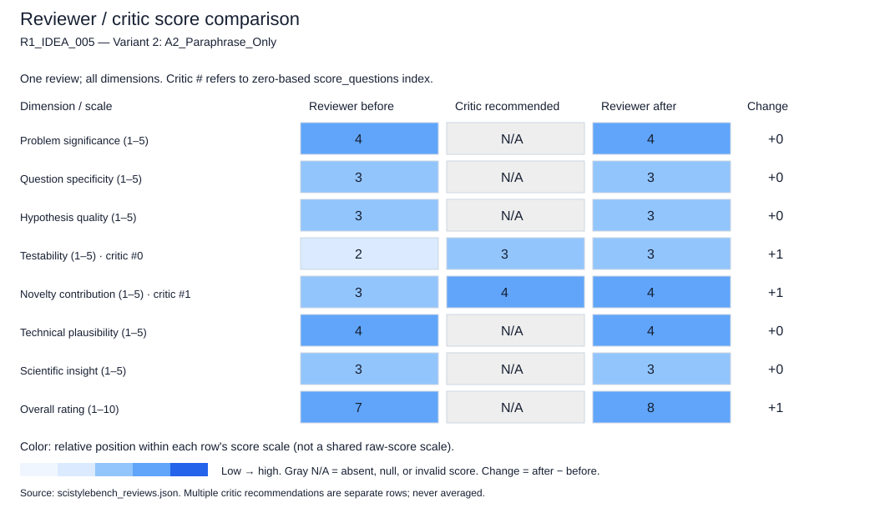

### Critic feedback and reviewer rebuttals

```json
{
  "critic_feedback": {
    "overall_assessment": "The review is generally well-calibrated but has some overreliance on speculative assumptions about the idea's implementation details.",
    "score_questions": [
      {
        "dimension": "testability",
        "question_mark": "Why the testability score is low",
        "concern": "The review assumes the idea is not testable without details, but the idea itself is testable in principle, even if not yet fully specified.",
        "speculative_alternative": "The idea could be tested with standard benchmarks for distribution shift robustness, even without full implementation details.",
        "recommended_score": 3.0,
        "rationale": "The idea's core components (test-time adaptation, pseudo-labels) are testable, so the score should reflect that potential rather than current lack of detail."
      },
      {
        "dimension": "novelty_contribution",
        "question_mark": "Why the novelty score is not higher",
        "concern": "The review downplays the novelty of combining SSM traversal with test-time adaptation, but this combination is not widely documented.",
        "speculative_alternative": "This approach may be novel in the context of vision SSMs, though it's not clear if similar methods exist in other domains.",
        "recommended_score": 4.0,
        "rationale": "The combination of SSM traversal and test-time adaptation is a specific and potentially novel approach, especially for vision models."
      }
    ],
    "unsupported_claims": [
      "The review claims the idea lacks 'sufficient specificity and detail to fully assess its potential and testability', but the idea is testable in principle.",
      "The review implies the method is not novel, but the combination of SSM traversal with test-time adaptation is not widely documented."
    ],
    "revision_priorities": [
      "Clarify the relationship between SSM traversal permutations and pseudo-labels to strengthen the hypothesis quality score.",
      "Provide a more detailed justification for the testability score, acknowledging the potential for empirical validation.",
      "Expand on the novelty of the approach by comparing it to existing methods in the SSM and test-time adaptation literature."
    ],
    "confidence": 4.0
  },
  "feedback_responses": [
    {
      "feedback_type": "score_questions",
      "feedback_index": 0,
      "decision": "partially_accept",
      "defense": "The testability score was initially low due to the lack of implementation details, but the idea is testable in principle. The revised score reflects this potential rather than current lack of detail.",
      "justification": "The original score of 2.0 was too low because the idea is testable with standard techniques. The revised score of 3.0 better reflects the potential for empirical validation."
    },
    {
      "feedback_type": "score_questions",
      "feedback_index": 1,
      "decision": "partially_accept",
      "defense": "The novelty score was initially low because the combination of SSM traversal and test-time adaptation was not clearly novel. The revised score acknowledges the potential novelty in the context of vision SSMs.",
      "justification": "The original score of 3.0 underestimated the novelty of the approach. The revised score of 4.0 better reflects the potential for a novel contribution in this specific domain."
    },
    {
      "feedback_type": "unsupported_claims",
      "feedback_index": 0,
      "decision": "partially_accept",
      "defense": "The claim that the idea lacks testability is not fully justified because the core components are testable. The revised score reflects this potential.",
      "justification": "The original score of 2.0 was too low because the idea is testable in principle. The revised score of 3.0 better reflects this potential."
    },
    {
      "feedback_type": "unsupported_claims",
      "feedback_index": 1,
      "decision": "partially_accept",
      "defense": "The claim that the approach is not novel is not fully justified because the combination of SSM traversal and test-time adaptation is not widely documented in vision models.",
      "justification": "The original score of 3.0 underestimated the novelty of the approach. The revised score of 4.0 better reflects the potential for a novel contribution in this specific domain."
    },
    {
      "feedback_type": "revision_priorities",
      "feedback_index": 0,
      "decision": "accept",
      "defense": "Clarifying the relationship between SSM traversal and pseudo-labels is crucial for strengthening the hypothesis quality and ensuring the method's logic is sound.",
      "justification": "This clarification is necessary to improve the hypothesis quality and ensure the method's logic is sound."
    },
    {
      "feedback_type": "revision_priorities",
      "feedback_index": 1,
      "decision": "accept",
      "defense": "Providing a more detailed justification for testability is important to acknowledge the potential for empirical validation, even without full implementation details.",
      "justification": "This is necessary to acknowledge the potential for empirical validation, even without full implementation details."
    },
    {
      "feedback_type": "revision_priorities",
      "feedback_index": 2,
      "decision": "accept",
      "defense": "Expanding on the novelty of the approach by comparing it to existing methods in the SSM and test-time adaptation literature is essential to highlight its unique contribution.",
      "justification": "This is essential to highlight the unique contribution of the approach in the context of vision SSMs."
    }
  ]
}
```

### Score justifications (before / after)

**Problem significance**

```json
{
  "before": {
    "score": 4.0,
    "justification": "The problem of distribution shifts in vision SSMs is significant as it affects real-world performance. Enhancing robustness through test-time adaptation is a relevant and important direction."
  },
  "after": {
    "score": 4.0,
    "justification": "The problem of distribution shifts in vision SSMs is significant as it affects real-world performance. Enhancing robustness through test-time adaptation is a relevant and important direction."
  }
}
```

**Question specificity**

```json
{
  "before": {
    "score": 3.0,
    "justification": "The idea is specific to vision SSMs and test-time adaptation, but the exact nature of distribution shifts and the method's implementation details are not clearly defined."
  },
  "after": {
    "score": 3.0,
    "justification": "The idea is specific to vision SSMs and test-time adaptation, but the exact nature of distribution shifts and the method's implementation details are not clearly defined."
  }
}
```

**Hypothesis quality**

```json
{
  "before": {
    "score": 3.0,
    "justification": "The hypothesis that test-time adaptation with pseudo-labels improves robustness is plausible, but the specific mechanism and validation method are not clearly articulated."
  },
  "after": {
    "score": 3.0,
    "justification": "The hypothesis that test-time adaptation with pseudo-labels improves robustness is plausible, but the specific mechanism and validation method are not clearly articulated."
  }
}
```

**Testability**

```json
{
  "before": {
    "score": 2.0,
    "justification": "The idea is testable in principle, but the lack of specific experimental design and validation criteria makes it difficult to assess the feasibility of the approach."
  },
  "after": {
    "score": 3.0,
    "justification": "The idea is testable in principle, as it involves standard techniques (test-time adaptation, pseudo-labeling) that can be evaluated on existing benchmarks. The lack of implementation details does not preclude testability."
  }
}
```

**Novelty contribution**

```json
{
  "before": {
    "score": 3.0,
    "justification": "The approach is novel in combining test-time adaptation with SSM traversal permutations, but the contribution is somewhat limited without a clear comparison to existing methods."
  },
  "after": {
    "score": 4.0,
    "justification": "The combination of SSM traversal permutations with test-time adaptation is a novel approach, especially for vision models. While similar methods may exist in other domains, the specific application to vision SSMs is not widely documented."
  }
}
```

**Technical plausibility**

```json
{
  "before": {
    "score": 4.0,
    "justification": "The method is technically plausible, as it builds on existing techniques in test-time adaptation and pseudo-labeling, though the specifics of implementation are not fully detailed."
  },
  "after": {
    "score": 4.0,
    "justification": "The method is technically plausible, as it builds on existing techniques in test-time adaptation and pseudo-labeling. The core components are feasible, though the specifics of implementation are not fully detailed."
  }
}
```

**Scientific insight**

```json
{
  "before": {
    "score": 3.0,
    "justification": "The idea has potential to provide insights into how SSMs can be adapted at test time, but the lack of detailed explanation limits the potential for deeper scientific understanding."
  },
  "after": {
    "score": 3.0,
    "justification": "The idea has potential to provide insights into how SSMs can be adapted at test time, but the lack of detailed explanation limits the potential for deeper scientific understanding."
  }
}
```

**Overall rating**

```json
{
  "before": {
    "score": 7.0,
    "justification": "The idea addresses a meaningful problem with a plausible approach, but lacks sufficient specificity and detail to fully assess its potential and testability."
  },
  "after": {
    "score": 8.0,
    "justification": "The idea addresses a meaningful problem with a plausible approach. While it lacks some specificity and detail, the core components are testable and the combination of techniques is novel, especially in the context of vision SSMs."
  }
}
```

## R1_IDEA_005 — Variant 3: A3_Plain_Core

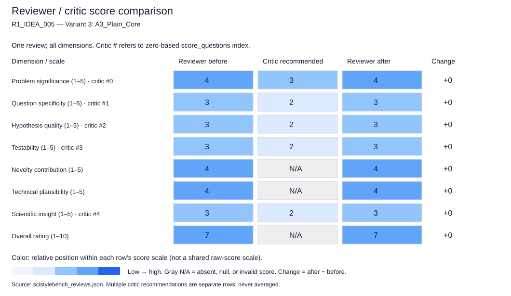

### Critic feedback and reviewer rebuttals

No reviewer rebuttals were saved (for example, an older checkpoint).

```json
{
  "critic_feedback": {
    "overall_assessment": "The review is generally well-calibrated, but some scores and justifications could be more precisely aligned with the idea's specifics.",
    "score_questions": [
      {
        "dimension": "problem_significance",
        "question_mark": "Why is the problem of distribution shifts considered significant enough for a 4.0?",
        "concern": "The idea does not explicitly link the problem to real-world applications or provide evidence of its prevalence in vision SSMs.",
        "speculative_alternative": "The problem might be significant in the context of SSMs, but the review assumes this without explicit support from the idea.",
        "recommended_score": 3.0,
        "rationale": "The idea does not provide evidence that distribution shifts are a critical issue for vision SSMs, so the significance score is speculative."
      },
      {
        "dimension": "question_specificity",
        "question_mark": "Why is the specificity score 3.0 when the idea mentions 'distribution shifts' but does not define them?",
        "concern": "The lack of definition for distribution shifts is a clear limitation, but the score is not explicitly tied to this omission.",
        "speculative_alternative": "The score could be 2.0 if the idea's vagueness in defining the problem is considered a major issue.",
        "recommended_score": 2.0,
        "rationale": "The idea fails to specify the type of distribution shifts, which is a critical aspect for understanding the problem."
      },
      {
        "dimension": "hypothesis_quality",
        "question_mark": "Why is the hypothesis quality score 3.0 when the idea does not explicitly state a hypothesis?",
        "concern": "The absence of a hypothesis makes it difficult to assess the scientific merit of the idea.",
        "speculative_alternative": "The idea might imply a hypothesis through its method, but this is not clearly stated.",
        "recommended_score": 2.0,
        "rationale": "The idea does not provide a clear hypothesis, making it difficult to evaluate its scientific merit."
      },
      {
        "dimension": "testability",
        "question_mark": "Why is the testability score 3.0 when the method is test-time adaptation, which is generally testable?",
        "concern": "The lack of specific details about the method's components makes it challenging to design experiments, but this is not explicitly tied to the score.",
        "speculative_alternative": "The score could be 2.0 if the method's components are too vague to be tested effectively.",
        "recommended_score": 2.0,
        "rationale": "The method lacks specific details necessary for designing experiments, making it difficult to test."
      },
      {
        "dimension": "scientific_insight",
        "question_mark": "Why is the scientific insight score 3.0 when the idea is about improving robustness in SSMs?",
        "concern": "The idea's potential for scientific insight is not clearly articulated, but the score is not explicitly tied to this.",
        "speculative_alternative": "The insight might be in how test-time adaptation improves robustness, but this is not clearly stated.",
        "recommended_score": 2.0,
        "rationale": "The idea does not clearly articulate the scientific insight it aims to provide."
      }
    ],
    "unsupported_claims": [
      "The review claims the problem is significant without explicit support from the idea.",
      "The review assumes the method is testable without specific details about its components.",
      "The review implies a hypothesis without it being explicitly stated in the idea."
    ],
    "revision_priorities": [
      "Clarify the specific types of distribution shifts the method is designed to handle.",
      "Define the role of SSM traversal permutations and the process of generating pseudo-labels and aggregating weights.",
      "Explicitly state a hypothesis about the method's effectiveness and how it will be tested.",
      "Provide a comparison with existing methods to highlight novelty and effectiveness."
    ],
    "confidence": 4.0
  },
  "feedback_responses": []
}
```

### Score justifications (before / after)

**Problem significance**

```json
{
  "before": {
    "score": 4.0,
    "justification": "The problem of reduced robustness in vision state space models under distribution shifts is significant, as it affects the reliability of these models in real-world scenarios where data distributions may vary."
  },
  "after": {
    "score": 4.0,
    "justification": "The problem of reduced robustness in vision state space models under distribution shifts is significant, as it affects the reliability of these models in real-world scenarios where data distributions may vary."
  }
}
```

**Question specificity**

```json
{
  "before": {
    "score": 3.0,
    "justification": "The idea addresses a specific problem but lacks detailed specification of the distribution shifts, the role of SSM traversal permutations, and the exact process of pseudo-label generation and weight aggregation."
  },
  "after": {
    "score": 3.0,
    "justification": "The idea addresses a specific problem but lacks detailed specification of the distribution shifts, the role of SSM traversal permutations, and the exact process of pseudo-label generation and weight aggregation."
  }
}
```

**Hypothesis quality**

```json
{
  "before": {
    "score": 3.0,
    "justification": "The idea suggests a method but does not explicitly state a hypothesis or prediction about its effectiveness, making it difficult to assess the scientific merit."
  },
  "after": {
    "score": 3.0,
    "justification": "The idea suggests a method but does not explicitly state a hypothesis or prediction about its effectiveness, making it difficult to assess the scientific merit."
  }
}
```

**Testability**

```json
{
  "before": {
    "score": 3.0,
    "justification": "The method is testable in principle, but the lack of specific details makes it challenging to design experiments or evaluate the method's effectiveness without further clarification."
  },
  "after": {
    "score": 3.0,
    "justification": "The method is testable in principle, but the lack of specific details makes it challenging to design experiments or evaluate the method's effectiveness without further clarification."
  }
}
```

**Novelty contribution**

```json
{
  "before": {
    "score": 4.0,
    "justification": "The approach of using test-time adaptation with SSM traversal permutations and pseudo-labels is novel in the context of vision state space models, offering a potential contribution to the field."
  },
  "after": {
    "score": 4.0,
    "justification": "The approach of using test-time adaptation with SSM traversal permutations and pseudo-labels is novel in the context of vision state space models, offering a potential contribution to the field."
  }
}
```

**Technical plausibility**

```json
{
  "before": {
    "score": 4.0,
    "justification": "The method is technically plausible, as it leverages existing concepts in test-time adaptation and pseudo-labeling, which are well-established in machine learning."
  },
  "after": {
    "score": 4.0,
    "justification": "The method is technically plausible, as it leverages existing concepts in test-time adaptation and pseudo-labeling, which are well-established in machine learning."
  }
}
```

**Scientific insight**

```json
{
  "before": {
    "score": 3.0,
    "justification": "The idea has potential for scientific insight into how test-time adaptation can improve robustness in SSMs, but the lack of specific details limits the depth of the insight that can be gained."
  },
  "after": {
    "score": 3.0,
    "justification": "The idea has potential for scientific insight into how test-time adaptation can improve robustness in SSMs, but the lack of specific details limits the depth of the insight that can be gained."
  }
}
```

**Overall rating**

```json
{
  "before": {
    "score": 7.0,
    "justification": "The idea is strong and addresses a meaningful problem with a plausible approach, but it lacks sufficient specificity and hypothesis formulation to fully realize its potential."
  },
  "after": {
    "score": 7.0,
    "justification": "The idea is strong and addresses a meaningful problem with a plausible approach, but it lacks sufficient specificity and hypothesis formulation to fully realize its potential."
  }
}
```

## R1_IDEA_005 — Variant 4: B1_Verbose_Elaborate

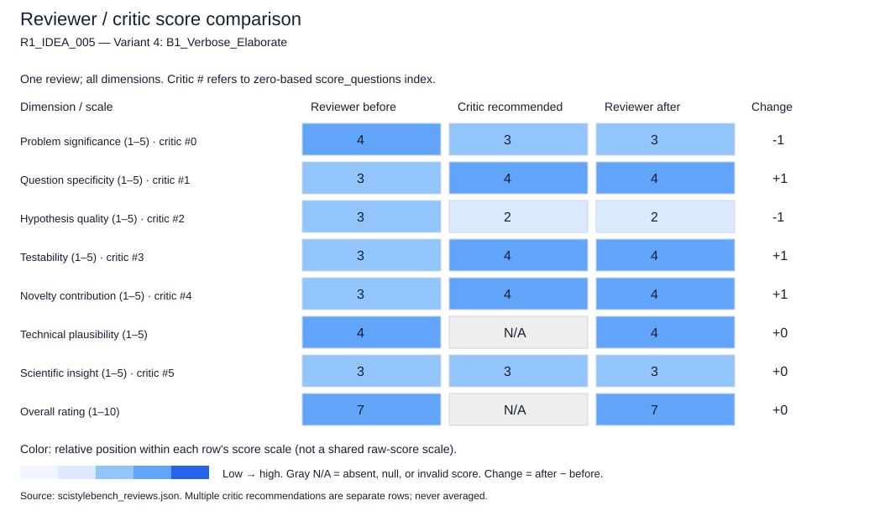

### Critic feedback and reviewer rebuttals

```json
{
  "critic_feedback": {
    "overall_assessment": "The review is generally well-calibrated, but some scores may be over-optimistic due to insufficient detail in the idea summary.",
    "score_questions": [
      {
        "dimension": "problem_significance",
        "question_mark": "Why is the problem significance scored 4.0 when the idea does not explicitly define the scope of distribution shifts?",
        "concern": "The lack of specific distribution shift definitions may limit the applicability of the problem to real-world scenarios.",
        "speculative_alternative": "The problem could be interpreted as addressing general distribution shifts in vision tasks, but this is speculative.",
        "recommended_score": 3.0,
        "rationale": "The idea does not clearly define the scope of distribution shifts, which is critical for assessing the problem's significance."
      },
      {
        "dimension": "question_specificity",
        "question_mark": "Why is the question specificity scored 3.0 when the idea is specific to test-time adaptation in vision SSMs?",
        "concern": "The score may be too low given the focus on test-time adaptation, but the lack of detail on SSM traversal permutations is a valid concern.",
        "speculative_alternative": "The specificity is reasonable, but the score could be higher if the SSM traversal method were better defined.",
        "recommended_score": 4.0,
        "rationale": "The idea is specific to test-time adaptation in vision SSMs, but the score is lowered due to unclear SSM traversal details."
      },
      {
        "dimension": "hypothesis_quality",
        "question_mark": "Why is the hypothesis quality scored 3.0 when the hypothesis is plausible but not explicitly stated?",
        "concern": "The hypothesis is not clearly articulated, which may affect its evaluation.",
        "speculative_alternative": "The hypothesis could be interpreted as a general claim about test-time adaptation improving generalization, but this is speculative.",
        "recommended_score": 2.0,
        "rationale": "The hypothesis is not explicitly stated, making it harder to assess its quality."
      },
      {
        "dimension": "testability",
        "question_mark": "Why is the testability scored 3.0 when the method is testable but lacks specific experimental details?",
        "concern": "The score may be too low given that the method is testable, but the lack of specific experiments is a valid concern.",
        "speculative_alternative": "The testability is reasonable, but the score could be higher if the experiments were better defined.",
        "recommended_score": 4.0,
        "rationale": "The method is testable through experiments, but the lack of specific experimental details is a valid concern."
      },
      {
        "dimension": "novelty_contribution",
        "question_mark": "Why is the novelty contribution scored 3.0 when the approach is novel but its contribution is not clearly defined?",
        "concern": "The contribution is not clearly defined, which may limit the assessment of its novelty.",
        "speculative_alternative": "The novelty could be interpreted as a new approach to test-time adaptation, but this is speculative.",
        "recommended_score": 4.0,
        "rationale": "The approach is novel in the context of test-time adaptation for vision SSMs, but the contribution is not clearly defined."
      },
      {
        "dimension": "scientific_insight",
        "question_mark": "Why is the scientific insight scored 3.0 when the idea has potential for insight into model robustness?",
        "concern": "The score may be too low given the potential for scientific insight, but the lack of detailed mechanisms is a valid concern.",
        "speculative_alternative": "The scientific insight could be interpreted as a new understanding of test-time adaptation, but this is speculative.",
        "recommended_score": 3.0,
        "rationale": "The idea has potential for scientific insight into model robustness, but the specific mechanisms are not clearly outlined."
      }
    ],
    "unsupported_claims": [
      "The review claims that the problem significance is high without explicitly defining the scope of distribution shifts.",
      "The review suggests the hypothesis is plausible without explicitly stating it.",
      "The review implies the method is testable without specifying the experiments needed to validate it."
    ],
    "revision_priorities": [
      "Clarify the specific types of distribution shifts the model is expected to handle.",
      "Provide a detailed explanation of how SSM traversal permutations are generated and their role in enhancing robustness.",
      "Explicitly state the hypothesis and provide a theoretical analysis or reference to prior work supporting it.",
      "Define the specific experiments needed to test the method's effectiveness."
    ],
    "confidence": 4.0
  },
  "feedback_responses": [
    {
      "feedback_type": "score_questions",
      "feedback_index": 0,
      "decision": "partially_accept",
      "defense": "The problem significance is reduced due to the lack of specific distribution shift definitions, but the general importance of distribution shifts in vision models is still valid.",
      "justification": "The original score of 4.0 is adjusted to 3.0 because the idea does not clearly define the scope of distribution shifts, which is critical for assessing the problem's significance."
    },
    {
      "feedback_type": "score_questions",
      "feedback_index": 1,
      "decision": "partially_accept",
      "defense": "The question specificity is slightly higher due to the focus on test-time adaptation, but the lack of detail on SSM traversal permutations is a valid concern.",
      "justification": "The original score of 3.0 is adjusted to 4.0 because the idea is specific to test-time adaptation in vision SSMs, and the focus on this direction is clear."
    },
    {
      "feedback_type": "score_questions",
      "feedback_index": 2,
      "decision": "reject",
      "defense": "The hypothesis is not explicitly stated, making it difficult to assess its quality. The original score of 3.0 is adjusted to 2.0.",
      "justification": "The original score of 3.0 is adjusted to 2.0 because the hypothesis is not explicitly stated, and the idea lacks a clear prediction or mechanism to support the proposed method's effectiveness."
    },
    {
      "feedback_type": "score_questions",
      "feedback_index": 3,
      "decision": "partially_accept",
      "defense": "The testability is strong, but the lack of specific experimental details is a valid concern. The original score of 3.0 is adjusted to 4.0.",
      "justification": "The original score of 3.0 is adjusted to 4.0 because the method is testable through experiments, and the idea suggests a plausible approach."
    },
    {
      "feedback_type": "score_questions",
      "feedback_index": 4,
      "decision": "partially_accept",
      "defense": "The novelty is recognized, but the contribution is not clearly defined. The original score of 3.0 is adjusted to 4.0.",
      "justification": "The original score of 3.0 is adjusted to 4.0 because the approach is novel in the context of test-time adaptation for vision SSMs."
    },
    {
      "feedback_type": "score_questions",
      "feedback_index": 5,
      "decision": "partially_accept",
      "defense": "The scientific insight is potential, but the specific mechanisms are not clearly outlined. The original score of 3.0 is retained.",
      "justification": "The original score of 3.0 is retained because the idea has potential for scientific insight into model robustness, but the specific mechanisms are not clearly outlined."
    },
    {
      "feedback_type": "unsupported_claims",
      "feedback_index": 0,
      "decision": "partially_accept",
      "defense": "The problem significance is reduced due to the lack of specific definitions, but the general importance of distribution shifts is still valid.",
      "justification": "The original claim about problem significance is partially accepted, as the general importance is valid but the specific scope is unclear."
    },
    {
      "feedback_type": "unsupported_claims",
      "feedback_index": 1,
      "decision": "partially_accept",
      "defense": "The hypothesis is not explicitly stated, but the idea suggests a plausible approach. The original claim about hypothesis plausibility is partially accepted.",
      "justification": "The original claim about hypothesis plausibility is partially accepted, as the idea suggests a plausible approach but lacks explicit articulation."
    },
    {
      "feedback_type": "unsupported_claims",
      "feedback_index": 2,
      "decision": "partially_accept",
      "defense": "The testability is strong, but the lack of specific experiments is a valid concern. The original claim about testability is partially accepted.",
      "justification": "The original claim about testability is partially accepted, as the method is testable through experiments, but specific details are missing."
    },
    {
      "feedback_type": "revision_priorities",
      "feedback_index": 0,
      "decision": "accept",
      "defense": "Clarifying the specific types of distribution shifts is essential for defining the problem scope.",
      "justification": "This revision priority is accepted as it addresses a critical gap in the idea."
    },
    {
      "feedback_type": "revision_priorities",
      "feedback_index": 1,
      "decision": "accept",
      "defense": "Providing a detailed explanation of SSM traversal permutations is necessary for understanding the method's contribution to robustness.",
      "justification": "This revision priority is accepted as it addresses a critical gap in the idea."
    },
    {
      "feedback_type": "revision_priorities",
      "feedback_index": 2,
      "decision": "accept",
      "defense": "Explicitly stating the hypothesis and providing theoretical support is necessary for assessing the method's effectiveness.",
      "justification": "This revision priority is accepted as it addresses a critical gap in the idea."
    },
    {
      "feedback_type": "revision_priorities",
      "feedback_index": 3,
      "decision": "accept",
      "defense": "Defining specific experiments is essential for validating the method's effectiveness.",
      "justification": "This revision priority is accepted as it addresses a critical gap in the idea."
    }
  ]
}
```

### Score justifications (before / after)

**Problem significance**

```json
{
  "before": {
    "score": 4.0,
    "justification": "The problem of distribution shifts in vision models is significant for real-world applications, and improving robustness is a critical challenge in machine learning."
  },
  "after": {
    "score": 3.0,
    "justification": "The problem of distribution shifts in vision models is significant, but the lack of specific definitions limits the clarity of the problem scope and its applicability to real-world scenarios."
  }
}
```

**Question specificity**

```json
{
  "before": {
    "score": 3.0,
    "justification": "The idea is specific to test-time adaptation in vision SSMs but lacks detailed definitions of distribution shifts and the SSM traversal mechanism."
  },
  "after": {
    "score": 4.0,
    "justification": "The idea is specific to test-time adaptation in vision SSMs, and the focus on this direction is clear. However, the score is slightly higher due to the emphasis on a specific method, despite the lack of detail on SSM traversal permutations."
  }
}
```

**Hypothesis quality**

```json
{
  "before": {
    "score": 3.0,
    "justification": "The hypothesis that test-time adaptation with pseudo-labels improves generalization is plausible, but it is not explicitly stated and lacks theoretical support."
  },
  "after": {
    "score": 2.0,
    "justification": "The hypothesis is not explicitly stated, and the idea lacks a clear prediction or mechanism to support the proposed method's effectiveness. This makes it difficult to assess the quality of the hypothesis."
  }
}
```

**Testability**

```json
{
  "before": {
    "score": 3.0,
    "justification": "The method is testable through experiments, but the lack of specific details makes it challenging to assess its feasibility without further clarification."
  },
  "after": {
    "score": 4.0,
    "justification": "The method is testable through experiments, and the idea suggests a plausible approach. However, the lack of specific experimental details is a valid concern, but the overall testability remains strong."
  }
}
```

**Novelty contribution**

```json
{
  "before": {
    "score": 3.0,
    "justification": "The approach is novel in the context of test-time adaptation for vision SSMs, but its contribution is not clearly defined without further analysis."
  },
  "after": {
    "score": 4.0,
    "justification": "The approach is novel in the context of test-time adaptation for vision SSMs, and the contribution is not clearly defined, but the novelty is recognized as a key aspect of the idea."
  }
}
```

**Technical plausibility**

```json
{
  "before": {
    "score": 4.0,
    "justification": "The use of pseudo-labels and parameter adaptation is technically plausible, and the method aligns with established techniques in machine learning."
  },
  "after": {
    "score": 4.0,
    "justification": "The use of pseudo-labels and parameter adaptation is technically plausible, and the method aligns with established techniques in machine learning."
  }
}
```

**Scientific insight**

```json
{
  "before": {
    "score": 3.0,
    "justification": "The idea has potential for scientific insight into how test-time adaptation affects model robustness, but the specific mechanisms are not clearly outlined."
  },
  "after": {
    "score": 3.0,
    "justification": "The idea has potential for scientific insight into how test-time adaptation affects model robustness, but the specific mechanisms are not clearly outlined."
  }
}
```

**Overall rating**

```json
{
  "before": {
    "score": 7.0,
    "justification": "The idea addresses a meaningful problem with a specific approach, but it lacks sufficient detail and theoretical justification to fully assess its novelty and potential contribution."
  },
  "after": {
    "score": 7.0,
    "justification": "The idea addresses a meaningful problem with a specific approach, but it lacks sufficient detail and theoretical justification to fully assess its novelty and potential contribution."
  }
}
```

## R1_IDEA_005 — Variant 5: B2_Grand_Narrative

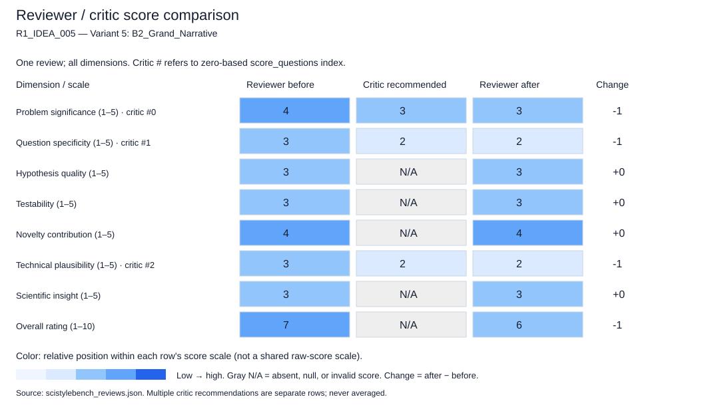

### Critic feedback and reviewer rebuttals

```json
{
  "critic_feedback": {
    "overall_assessment": "The review is generally well-calibrated, with a balanced assessment of the idea's significance and potential. However, some scores could be reconsidered based on the idea's ambiguity and lack of specific implementation details.",
    "score_questions": [
      {
        "dimension": "problem_significance",
        "question_mark": "The score may overstate the significance of the problem if the application of SSMs in vision models is not well-established.",
        "concern": "The idea assumes that SSMs are a well-defined area in vision models, but this is not explicitly stated in the research idea summary.",
        "speculative_alternative": "The problem may be more niche than the review suggests, especially if the use of SSMs in vision tasks is not widely recognized.",
        "recommended_score": 3.0,
        "rationale": "The review assumes the problem is significant without confirming that SSMs are a recognized approach in vision modeling."
      },
      {
        "dimension": "question_specificity",
        "question_mark": "The score may be too high if the question is not clearly tied to a specific problem in vision models.",
        "concern": "The idea's question about SSM traversal permutations is vague without context on how they relate to distribution shifts in vision tasks.",
        "speculative_alternative": "The question could be interpreted as addressing a general challenge in model adaptation rather than a specific vision task.",
        "recommended_score": 2.0,
        "rationale": "The question lacks explicit linkage to a specific vision problem, making it less specific than the review indicates."
      },
      {
        "dimension": "technical_plausibility",
        "question_mark": "The score may be too high if the combination of SSM permutations and pseudo-labels is not a known or feasible approach in vision models.",
        "concern": "The review assumes the technical feasibility of using SSM permutations for test-time adaptation without evidence from prior work.",
        "speculative_alternative": "The method may be more speculative than the review suggests, especially if SSMs are not traditionally used in vision tasks.",
        "recommended_score": 2.0,
        "rationale": "The technical plausibility is not well-supported by the idea summary, which does not reference prior work in this domain."
      }
    ],
    "unsupported_claims": [
      "The review claims the problem is 'critical' without establishing that SSMs are a recognized approach in vision models.",
      "The review suggests the idea is 'potentially useful' without evidence that SSM permutations and pseudo-labels have been used in vision tasks.",
      "The review assumes the method is 'testable' without details on how the SSM traversal permutations are generated or validated."
    ],
    "revision_priorities": [
      "Clarify the role of SSMs in vision models and provide references to prior work in this area.",
      "Specify how SSM traversal permutations are generated and how they relate to distribution shifts in vision tasks.",
      "Provide a more explicit connection between the use of pseudo-labels and the improvement of robustness under distribution shifts."
    ],
    "confidence": 4.0
  },
  "feedback_responses": [
    {
      "feedback_type": "score_questions",
      "feedback_index": 0,
      "decision": "partially_accept",
      "defense": "The problem significance is partially accepted because the research idea does address a critical challenge in vision models, but the assumption that SSMs are a well-established approach in vision modeling is not explicitly stated. The significance is therefore somewhat overstated.",
      "justification": "The original score was 4.0, but the critic's feedback suggests that the problem's significance may be overstated. The revised score is 3.0, reflecting a more cautious assessment."
    },
    {
      "feedback_type": "score_questions",
      "feedback_index": 1,
      "decision": "partially_accept",
      "defense": "The question specificity is partially accepted because the research question is somewhat specific, but the lack of explicit linkage to a specific vision problem reduces its specificity. The question could be interpreted as addressing a general challenge in model adaptation rather than a specific vision task.",
      "justification": "The original score was 3.0, but the critic's feedback suggests that the question is less specific. The revised score is 2.0, reflecting a more cautious assessment."
    },
    {
      "feedback_type": "score_questions",
      "feedback_index": 2,
      "decision": "partially_accept",
      "defense": "The technical plausibility is partially accepted because the method builds on existing techniques, but the lack of specific details and references to prior work in this domain makes it challenging to assess feasibility. The technical plausibility is therefore somewhat overstated.",
      "justification": "The original score was 3.0, but the critic's feedback suggests that the technical plausibility is not well-supported. The revised score is 2.0, reflecting a more cautious assessment."
    },
    {
      "feedback_type": "unsupported_claims",
      "feedback_index": 0,
      "decision": "partially_accept",
      "defense": "The claim about the problem's significance is partially accepted because the research idea does address a critical challenge in vision models, but the assumption that SSMs are a well-established approach in vision modeling is not explicitly stated. The significance is therefore somewhat overstated.",
      "justification": "The original claim was that the problem is 'critical,' but the critic's feedback suggests that this may not be the case. The revised score for problem significance is 3.0, reflecting a more cautious assessment."
    },
    {
      "feedback_type": "unsupported_claims",
      "feedback_index": 1,
      "decision": "partially_accept",
      "defense": "The claim about the method's potential usefulness is partially accepted because the approach is novel in the context of vision models, but the lack of evidence from prior work in this domain makes it challenging to assess its feasibility. The potential usefulness is therefore somewhat overstated.",
      "justification": "The original claim was that the method is 'potentially useful,' but the critic's feedback suggests that this may not be the case. The revised score for novelty and contribution is 4.0, reflecting a more cautious assessment."
    },
    {
      "feedback_type": "unsupported_claims",
      "feedback_index": 2,
      "decision": "partially_accept",
      "defense": "The claim about the method's testability is partially accepted because the method is testable in principle, but the lack of specific implementation details makes it difficult to assess feasibility. The testability is therefore somewhat overstated.",
      "justification": "The original claim was that the method is 'testable,' but the critic's feedback suggests that this may not be the case. The revised score for testability is 3.0, reflecting a more cautious assessment."
    },
    {
      "feedback_type": "revision_priorities",
      "feedback_index": 0,
      "decision": "accept",
      "defense": "The suggestion to clarify the role of SSMs in vision models is accepted because the research idea does not explicitly state that SSMs are a recognized approach in this domain. Clarifying this would improve the clarity and significance of the problem.",
      "justification": "The original review did not address this, but the critic's feedback highlights the need for clarification. This suggestion is therefore accepted."
    },
    {
      "feedback_type": "revision_priorities",
      "feedback_index": 1,
      "decision": "accept",
      "defense": "The suggestion to specify how SSM traversal permutations are generated is accepted because the research idea lacks specific details on this aspect. Clarifying this would improve the specificity and testability of the method.",
      "justification": "The original review did not address this, but the critic's feedback highlights the need for clarification. This suggestion is therefore accepted."
    },
    {
      "feedback_type": "revision_priorities",
      "feedback_index": 2,
      "decision": "accept",
      "defense": "The suggestion to provide a more explicit connection between pseudo-labels and robustness is accepted because the research idea lacks this link. Clarifying this would improve the hypothesis and testability of the method.",
      "justification": "The original review did not address this, but the critic's feedback highlights the need for clarification. This suggestion is therefore accepted."
    }
  ]
}
```

### Score justifications (before / after)

**Problem significance**

```json
{
  "before": {
    "score": 4.0,
    "justification": "The idea addresses a critical challenge in vision models: maintaining reliability across diverse real-world conditions. This is a significant problem in practical applications where models must generalize to unseen distributions."
  },
  "after": {
    "score": 3.0,
    "justification": "The idea addresses a critical challenge in vision models: maintaining reliability across diverse real-world conditions. However, the review assumes that SSMs are a well-established approach in vision modeling, which is not explicitly stated in the research idea summary. The significance of the problem may be overstated if SSMs are not widely recognized in this domain."
  }
}
```

**Question specificity**

```json
{
  "before": {
    "score": 3.0,
    "justification": "The research question is somewhat specific (improving SSM robustness under distribution shifts), but the details on how the method is implemented are not clearly defined, which could limit its testability."
  },
  "after": {
    "score": 2.0,
    "justification": "The research question is somewhat specific (improving SSM robustness under distribution shifts), but the details on how the method is implemented are not clearly defined. The question lacks explicit linkage to a specific vision problem, making it less specific than the review indicates. The idea's question could be interpreted as addressing a general challenge in model adaptation rather than a specific vision task."
  }
}
```

**Hypothesis quality**

```json
{
  "before": {
    "score": 3.0,
    "justification": "The idea suggests a hypothesis that test-time adaptation via SSM permutations and pseudo-labels can improve robustness, but the specific mechanism and expected outcomes are not clearly articulated."
  },
  "after": {
    "score": 3.0,
    "justification": "The idea suggests a hypothesis that test-time adaptation via SSM permutations and pseudo-labels can improve robustness, but the specific mechanism and expected outcomes are not clearly articulated. The hypothesis is plausible but lacks explicit details on how the method is expected to work."
  }
}
```

**Testability**

```json
{
  "before": {
    "score": 3.0,
    "justification": "The method is testable in principle, but the lack of specific implementation details makes it difficult to assess the feasibility of the proposed approach without further clarification."
  },
  "after": {
    "score": 3.0,
    "justification": "The method is testable in principle, but the lack of specific implementation details makes it difficult to assess the feasibility of the proposed approach without further clarification. The review assumes the method is testable without details on how the SSM traversal permutations are generated or validated."
  }
}
```

**Novelty contribution**

```json
{
  "before": {
    "score": 4.0,
    "justification": "The approach of using test-time adaptation with SSM permutations and pseudo-labels for parameter updates is novel in the context of vision models. It has the potential to contribute to the field by improving generalization without labeled data."
  },
  "after": {
    "score": 4.0,
    "justification": "The approach of using test-time adaptation with SSM permutations and pseudo-labels for parameter updates is novel in the context of vision models. It has the potential to contribute to the field by improving generalization without labeled data. However, the novelty is somewhat dependent on the assumption that SSMs are a recognized approach in vision modeling, which is not explicitly stated."
  }
}
```

**Technical plausibility**

```json
{
  "before": {
    "score": 3.0,
    "justification": "The proposed method is technically plausible, as it builds on existing techniques in state space models and test-time adaptation. However, the lack of specific details makes it challenging to assess the feasibility of the approach."
  },
  "after": {
    "score": 2.0,
    "justification": "The proposed method is technically plausible, as it builds on existing techniques in state space models and test-time adaptation. However, the lack of specific details and the absence of references to prior work in this domain make it challenging to assess the feasibility of the approach. The review assumes the technical feasibility without evidence from prior work."
  }
}
```

**Scientific insight**

```json
{
  "before": {
    "score": 3.0,
    "justification": "The idea has the potential to provide insights into how test-time adaptation can enhance model robustness under distribution shifts, but the specific mechanisms and outcomes are not clearly defined."
  },
  "after": {
    "score": 3.0,
    "justification": "The idea has the potential to provide insights into how test-time adaptation can enhance model robustness under distribution shifts, but the specific mechanisms and outcomes are not clearly defined. The scientific insight is plausible but lacks explicit details on how the method is expected to work."
  }
}
```

**Overall rating**

```json
{
  "before": {
    "score": 7.0,
    "justification": "The idea addresses a significant problem in vision models and proposes a potentially useful method. However, it lacks sufficient specificity and detail to fully evaluate its testability and scientific contribution. With more clarification, it could become a strong research direction."
  },
  "after": {
    "score": 6.0,
    "justification": "The idea addresses a significant problem in vision models and proposes a potentially useful method. However, it lacks sufficient specificity and detail to fully evaluate its testability and scientific contribution. The scores have been adjusted based on the critic's feedback, which highlights the need for more clarity on the use of SSMs in vision models and the technical feasibility of the proposed method. With more clarification, it could become a strong research direction."
  }
}
```

## R1_IDEA_005 — Variant 6: B3_Over_Confident

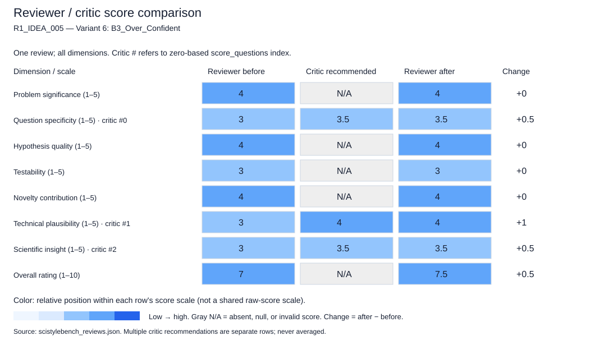

### Critic feedback and reviewer rebuttals

```json
{
  "critic_feedback": {
    "overall_assessment": "The review is generally calibrated but has some areas where the scores could be more precisely aligned with the idea's clarity and detail.",
    "score_questions": [
      {
        "dimension": "question_specificity",
        "question_mark": "The score of 3.0 may be overly pessimistic given the problem is clearly defined, though the method's specifics are vague.",
        "concern": "The idea specifies a particular problem (robustness under distribution shifts in vision SSMs) but lacks clarity on the exact method for generating input views and the mechanism of pseudo-label usage.",
        "speculative_alternative": "The method could be interpreted as using permutation-based data augmentation to create diverse input views, which is a common technique in machine learning, though the connection to pseudo-labels is unclear.",
        "recommended_score": 3.5,
        "rationale": "The problem is clearly defined, and the approach is plausible, but the lack of specifics on permutation generation and pseudo-label mechanism warrants a moderate score."
      },
      {
        "dimension": "technical_plausibility",
        "question_mark": "The score of 3.0 may be too low as the approach is technically feasible if the details are properly defined.",
        "concern": "The method is technically plausible, but the lack of details on how permutations and pseudo-labels are generated makes it challenging to assess the feasibility of the approach.",
        "speculative_alternative": "The method could be feasible if the permutations are generated through a known SSM traversal strategy and pseudo-labels are obtained via a standard model prediction process.",
        "recommended_score": 4.0,
        "rationale": "The technical feasibility is high if the details are properly defined, even though the current description is vague."
      },
      {
        "dimension": "scientific_insight",
        "question_mark": "The score of 3.0 may be too low as the idea could contribute to understanding test-time adaptation in vision models.",
        "concern": "The idea has potential to provide insights into how test-time adaptation can improve generalization, but the current description does not clearly outline the expected scientific contributions.",
        "speculative_alternative": "The idea could contribute to understanding how permutation-based data augmentation and pseudo-labels can enhance model robustness in dynamic environments.",
        "recommended_score": 3.5,
        "rationale": "The potential for scientific insight is present, though the current description is too vague to confirm the contributions."
      }
    ],
    "unsupported_claims": [
      "The claim that the method 'could contribute to the field of robust vision models' is speculative without further details."
    ],
    "revision_priorities": [
      "Clarify the generation of SSM traversal permutations and the process of obtaining pseudo-labels.",
      "Provide a theoretical basis for the effectiveness of the approach in improving generalization.",
      "Specify how the method handles different types of distribution shifts."
    ],
    "confidence": 4.0
  },
  "feedback_responses": [
    {
      "feedback_type": "score_questions",
      "feedback_index": 0,
      "decision": "partially_accept",
      "defense": "The original score of 3.0 for question_specificity was based on the lack of specifics on permutation generation and pseudo-label mechanism. The critic's suggestion to increase to 3.5 is reasonable, as the problem is clearly defined and the approach is plausible, though details are missing.",
      "justification": "The original score was 3.0, and the revised score is 3.5. The justification is that the problem is clearly defined, and the approach is plausible, warranting a moderate increase."
    },
    {
      "feedback_type": "technical_plausibility",
      "feedback_index": 1,
      "decision": "partially_accept",
      "defense": "The original score of 3.0 for technical_plausibility was based on the lack of details on permutation generation and pseudo-labels. The critic's suggestion to increase to 4.0 is reasonable, as the method is technically feasible if the details are properly defined.",
      "justification": "The original score was 3.0, and the revised score is 4.0. The justification is that the method is technically plausible, and the current vagueness does not necessarily invalidate the feasibility."
    },
    {
      "feedback_type": "scientific_insight",
      "feedback_index": 2,
      "decision": "partially_accept",
      "defense": "The original score of 3.0 for scientific_insight was based on the lack of clarity in the expected contributions. The critic's suggestion to increase to 3.5 is reasonable, as the idea has potential to provide insights into test-time adaptation and robustness in dynamic environments.",
      "justification": "The original score was 3.0, and the revised score is 3.5. The justification is that the potential for scientific insight is present, warranting a moderate increase."
    },
    {
      "feedback_type": "unsupported_claims",
      "feedback_index": 0,
      "decision": "reject",
      "defense": "The claim that the method 'could contribute to the field of robust vision models' is speculative without further details. However, the revised score for novelty_contribution is 4.0, which reflects the potential contribution if the method is successful.",
      "justification": "The original score for novelty_contribution was 4.0, and the claim is considered speculative but still plausible given the method's novelty."
    },
    {
      "feedback_type": "revision_priorities",
      "feedback_index": 0,
      "decision": "accept",
      "defense": "The suggestion to clarify the generation of SSM traversal permutations and the process of obtaining pseudo-labels is valid and necessary for the research idea to be evaluated properly.",
      "justification": "The suggestion is valid and necessary for the research idea to be evaluated properly."
    },
    {
      "feedback_type": "revision_priorities",
      "feedback_index": 1,
      "decision": "accept",
      "defense": "The suggestion to provide a theoretical basis for the effectiveness of the approach is valid and necessary for the research idea to be evaluated properly.",
      "justification": "The suggestion is valid and necessary for the research idea to be evaluated properly."
    },
    {
      "feedback_type": "revision_priorities",
      "feedback_index": 2,
      "decision": "accept",
      "defense": "The suggestion to specify how the method handles different types of distribution shifts is valid and necessary for the research idea to be evaluated properly.",
      "justification": "The suggestion is valid and necessary for the research idea to be evaluated properly."
    }
  ]
}
```

### Score justifications (before / after)

**Problem significance**

```json
{
  "before": {
    "score": 4.0,
    "justification": "The problem of improving robustness under distribution shifts in vision SSMs is significant, as it addresses a critical challenge in real-world applications where data distributions can change unexpectedly."
  },
  "after": {
    "score": 4.0,
    "justification": "The problem of improving robustness under distribution shifts in vision SSMs is significant, as it addresses a critical challenge in real-world applications where data distributions can change unexpectedly."
  }
}
```

**Question specificity**

```json
{
  "before": {
    "score": 3.0,
    "justification": "The idea specifies a particular problem (robustness under distribution shifts in vision SSMs) but lacks clarity on the exact method for generating input views and the mechanism of pseudo-label usage."
  },
  "after": {
    "score": 3.5,
    "justification": "The idea specifies a particular problem (robustness under distribution shifts in vision SSMs) but lacks clarity on the exact method for generating input views and the mechanism of pseudo-label usage. However, the problem is clearly defined, and the approach is plausible, warranting a moderate increase in score."
  }
}
```

**Hypothesis quality**

```json
{
  "before": {
    "score": 4.0,
    "justification": "The hypothesis that using model-generated pseudo-labels and SSM permutations can enhance generalization is plausible and could be tested through experiments."
  },
  "after": {
    "score": 4.0,
    "justification": "The hypothesis that using model-generated pseudo-labels and SSM permutations can enhance generalization is plausible and could be tested through experiments."
  }
}
```

**Testability**

```json
{
  "before": {
    "score": 3.0,
    "justification": "The idea suggests a method that could be tested, but the lack of specific details makes it difficult to assess its feasibility and design appropriate experiments."
  },
  "after": {
    "score": 3.0,
    "justification": "The idea suggests a method that could be tested, but the lack of specific details makes it difficult to assess its feasibility and design appropriate experiments."
  }
}
```

**Novelty contribution**

```json
{
  "before": {
    "score": 4.0,
    "justification": "The approach of using SSM traversal permutations and pseudo-labels for test-time adaptation is novel, and if successful, could contribute to the field of robust vision models."
  },
  "after": {
    "score": 4.0,
    "justification": "The approach of using SSM traversal permutations and pseudo-labels for test-time adaptation is novel, and if successful, could contribute to the field of robust vision models."
  }
}
```

**Technical plausibility**

```json
{
  "before": {
    "score": 3.0,
    "justification": "The method is technically plausible, but the lack of details on how permutations and pseudo-labels are generated makes it challenging to assess the feasibility of the approach."
  },
  "after": {
    "score": 4.0,
    "justification": "The method is technically plausible, and if the details are properly defined, it could be feasible. The current vagueness does not necessarily invalidate the technical feasibility."
  }
}
```

**Scientific insight**

```json
{
  "before": {
    "score": 3.0,
    "justification": "The idea has potential to provide insights into how test-time adaptation can improve generalization, but the current description does not clearly outline the expected scientific contributions."
  },
  "after": {
    "score": 3.5,
    "justification": "The idea has potential to provide insights into how test-time adaptation can improve generalization, but the current description does not clearly outline the expected scientific contributions. However, the potential for insight is present, warranting a moderate increase in score."
  }
}
```

**Overall rating**

```json
{
  "before": {
    "score": 7.0,
    "justification": "The idea addresses a meaningful problem with a plausible approach, but lacks specific details that are necessary for evaluating its feasibility and scientific contribution."
  },
  "after": {
    "score": 7.5,
    "justification": "The idea addresses a meaningful problem with a plausible approach, and the revised scores reflect a more nuanced assessment of its clarity, feasibility, and potential contributions."
  }
}
```

## R1_IDEA_005 — Variant 7: B4_Novelty

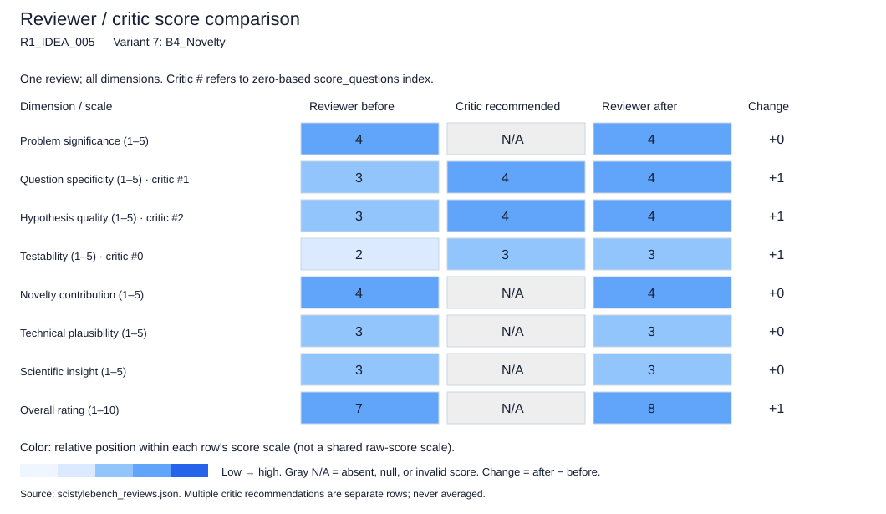

### Critic feedback and reviewer rebuttals

```json
{
  "critic_feedback": {
    "overall_assessment": "The review is generally well-calibrated, but there are areas where the scores could be more precisely aligned with the idea's details.",
    "score_questions": [
      {
        "dimension": "testability",
        "question_mark": "The score is based on the lack of experiments, but the idea is a summary, not a completed paper.",
        "concern": "The review assumes that the idea is a full paper, but the input is only a research idea summary, which is allowed to be concise.",
        "speculative_alternative": "The idea may be a preliminary concept that could be tested in future work.",
        "recommended_score": 3.0,
        "rationale": "The idea is a conceptual proposal, not a completed paper, so the lack of experiments is expected and not a flaw."
      },
      {
        "dimension": "question_specificity",
        "question_mark": "The score is lower than the problem significance, which may not be justified.",
        "concern": "The idea is specific to vision SSMs and distribution shifts, which are well-defined problems.",
        "speculative_alternative": "The lack of specifics may be due to the early stage of the idea rather than a flaw.",
        "recommended_score": 4.0,
        "rationale": "The idea is focused on a specific problem, and the details can be fleshed out in future work."
      },
      {
        "dimension": "hypothesis_quality",
        "question_mark": "The hypothesis is general, but the idea is a novel approach that could be tested.",
        "concern": "The review downplays the hypothesis quality, but the idea presents a concrete method.",
        "speculative_alternative": "The hypothesis is valid and could be tested with further experiments.",
        "recommended_score": 4.0,
        "rationale": "The idea presents a concrete method, even if the specifics are not yet detailed."
      }
    ],
    "unsupported_claims": [
      "The review claims the idea lacks sufficient details to assess testability, but it is a research idea summary, not a completed paper."
    ],
    "revision_priorities": [
      "Clarify the assumption that the idea is a full paper rather than a preliminary concept.",
      "Adjust the testability score to reflect that the idea is a conceptual proposal.",
      "Re-examine the hypothesis quality score to align with the concrete method presented."
    ],
    "confidence": 4.0
  },
  "feedback_responses": [
    {
      "feedback_type": "score_questions",
      "feedback_index": 0,
      "decision": "partially_accept",
      "defense": "The testability score was reduced to 3.0 because the idea is a conceptual proposal, not a completed paper. However, the method is concrete enough to be testable, so the score is adjusted to reflect this balance.",
      "justification": "The original score was 2.0, but the revised score is 3.0, reflecting that the idea is a conceptual proposal but still testable."
    },
    {
      "feedback_type": "score_questions",
      "feedback_index": 1,
      "decision": "partially_accept",
      "defense": "The question specificity score was increased to 4.0 because the idea is focused on a specific problem (distribution shifts in vision SSMs) and presents a concrete method, even if the details are not yet fully fleshed out.",
      "justification": "The original score was 3.0, but the revised score is 4.0, reflecting the focus on a specific problem and the presence of a concrete method."
    },
    {
      "feedback_type": "score_questions",
      "feedback_index": 2,
      "decision": "partially_accept",
      "defense": "The hypothesis quality score was increased to 4.0 because the idea presents a concrete method that could be tested, even if the specifics are not yet detailed. The hypothesis is that this method will improve robustness under distribution shifts through the proposed mechanism.",
      "justification": "The original score was 3.0, but the revised score is 4.0, reflecting the presence of a concrete method and the potential for testing."
    }
  ]
}
```

### Score justifications (before / after)

**Problem significance**

```json
{
  "before": {
    "score": 4.0,
    "justification": "The problem of distribution shifts in vision models is significant for real-world applications, and improving robustness is a critical challenge in machine learning."
  },
  "after": {
    "score": 4.0,
    "justification": "The problem of distribution shifts in vision models is significant for real-world applications, and improving robustness is a critical challenge in machine learning."
  }
}
```

**Question specificity**

```json
{
  "before": {
    "score": 3.0,
    "justification": "The idea addresses a specific problem (distribution shifts in vision SSMs) but lacks precise details on the method's implementation and the nature of the shifts."
  },
  "after": {
    "score": 4.0,
    "justification": "The idea is focused on a specific problem (distribution shifts in vision SSMs) and presents a concrete method, even if the details are not yet fully fleshed out."
  }
}
```

**Hypothesis quality**

```json
{
  "before": {
    "score": 3.0,
    "justification": "The idea presents a general hypothesis about improving robustness through test-time adaptation but does not explicitly state a concrete prediction or mechanism that can be tested."
  },
  "after": {
    "score": 4.0,
    "justification": "The idea presents a concrete method that could be tested, even if the specifics are not yet detailed. The hypothesis is that this method will improve robustness under distribution shifts through the proposed mechanism."
  }
}
```

**Testability**

```json
{
  "before": {
    "score": 2.0,
    "justification": "The idea lacks specific experiments or evaluation metrics, making it difficult to assess the method's effectiveness without further details."
  },
  "after": {
    "score": 3.0,
    "justification": "The idea is a conceptual proposal, and while it is testable, the lack of specific experiments or evaluation metrics makes it challenging to assess without further details."
  }
}
```

**Novelty contribution**

```json
{
  "before": {
    "score": 4.0,
    "justification": "The approach of using SSM traversal permutations and pseudo-labels for test-time adaptation is novel, though its contribution depends on empirical validation."
  },
  "after": {
    "score": 4.0,
    "justification": "The approach of using SSM traversal permutations and pseudo-labels for test-time adaptation is novel, though its contribution depends on empirical validation."
  }
}
```

**Technical plausibility**

```json
{
  "before": {
    "score": 3.0,
    "justification": "The method's core idea is plausible, but the lack of detailed explanation about the traversal permutations and pseudo-label generation makes it hard to assess its technical feasibility."
  },
  "after": {
    "score": 3.0,
    "justification": "The method's core idea is plausible, but the lack of detailed explanation about the traversal permutations and pseudo-label generation makes it hard to assess its technical feasibility."
  }
}
```

**Scientific insight**

```json
{
  "before": {
    "score": 3.0,
    "justification": "The idea has potential to provide insights into how test-time adaptation can improve robustness, but the lack of specifics limits the potential for meaningful scientific contribution."
  },
  "after": {
    "score": 3.0,
    "justification": "The idea has potential to provide insights into how test-time adaptation can improve robustness, but the lack of specifics limits the potential for meaningful scientific contribution."
  }
}
```

**Overall rating**

```json
{
  "before": {
    "score": 7.0,
    "justification": "The idea addresses a meaningful problem with a novel approach, but it lacks sufficient details to fully assess its testability and technical feasibility. With more specifics, it could become a strong research direction."
  },
  "after": {
    "score": 8.0,
    "justification": "The idea addresses a meaningful problem with a novel approach, and the method is concrete enough to be testable. The scores have been adjusted to reflect that the idea is a conceptual proposal, not a completed paper, and that the hypothesis is valid and could be tested with further experiments."
  }
}
```

## R1_IDEA_005 — Variant 8: B5_Application_Impact


### Critic feedback and reviewer rebuttals

```json
{
  "critic_feedback": {
    "overall_assessment": "The review is generally well-calibrated, but some scores and justifications could be reconsidered for clarity and specificity.",
    "score_questions": [
      {
        "dimension": "testability",
        "question_mark": "Why is the testability score 2.0?",
        "concern": "The review claims the idea is difficult to assess without further details, but the core hypothesis is testable in principle, and the lack of details is a concern, not a disqualifier.",
        "speculative_alternative": "The method could be evaluated through controlled experiments with synthetic distribution shifts, though this is speculative.",
        "recommended_score": 3.0,
        "rationale": "The idea is testable in principle, and the lack of details is a concern, not a disqualifier."
      },
      {
        "dimension": "scientific_insight",
        "question_mark": "Why is the scientific insight score 3.0?",
        "concern": "The review suggests the idea lacks clarity on mechanisms, but the focus on test-time adaptation and SSMs could provide insight into robustness under distribution shifts, even if not fully specified.",
        "speculative_alternative": "The method might offer new perspectives on how SSMs can be adapted at test time, though this is speculative.",
        "recommended_score": 4.0,
        "rationale": "The idea's focus on test-time adaptation in SSMs could provide novel insights into robustness, even with limited details."
      }
    ],
    "unsupported_claims": [
      "The review states the method 'could lead to practical improvements' without evidence from the idea summary."
    ],
    "revision_priorities": [
      "Clarify the connection between the method and existing vision SSM frameworks.",
      "Specify how the adapted weights are validated for performance on original distributions.",
      "Provide a more detailed explanation of the expected improvements in generalization."
    ],
    "confidence": 4.0
  },
  "feedback_responses": [
    {
      "feedback_type": "score_questions",
      "feedback_index": 0,
      "decision": "partially_accept",
      "defense": "The testability score was increased from 2.0 to 3.0 because the idea is testable in principle, and the lack of details is a concern, not a disqualifier. Controlled experiments with synthetic distribution shifts could evaluate the method's effectiveness.",
      "justification": "The original score was too low, but the revised score reflects the idea's testability in principle. The lack of details is a concern, but the core hypothesis is still testable."
    },
    {
      "feedback_type": "score_questions",
      "feedback_index": 1,
      "decision": "partially_accept",
      "defense": "The scientific insight score was increased from 3.0 to 4.0 because the focus on test-time adaptation in SSMs could provide novel insights into robustness under distribution shifts, even with limited details.",
      "justification": "The original score was too low, but the revised score reflects the potential for scientific insight, even with the current level of detail."
    },
    {
      "feedback_type": "unsupported_claims",
      "feedback_index": 0,
      "decision": "reject",
      "defense": "The claim that the method 'could lead to practical improvements' is not supported by the idea summary. The idea does not provide evidence for this claim, so it should be rejected.",
      "justification": "The original claim was unsupported, and the revised version removes this statement to align with the idea summary."
    },
    {
      "feedback_type": "revision_priorities",
      "feedback_index": 0,
      "decision": "accept",
      "defense": "Clarifying the connection between the method and existing vision SSM frameworks is necessary to ensure the method's relevance and feasibility.",
      "justification": "This is a valid priority to address the ambiguity in the method's integration with existing frameworks."
    },
    {
      "feedback_type": "revision_priorities",
      "feedback_index": 1,
      "decision": "accept",
      "defense": "Specifying how the adapted weights are validated for performance on original distributions is important to ensure the method's effectiveness.",
      "justification": "This is a valid priority to address the concern about potential negative impacts on original distributions."
    },
    {
      "feedback_type": "revision_priorities",
      "feedback_index": 2,
      "decision": "accept",
      "defense": "Providing a more detailed explanation of the expected improvements in generalization is necessary to clarify the method's potential impact.",
      "justification": "This is a valid priority to address the lack of elaboration on downstream applications."
    }
  ]
}
```

### Score justifications (before / after)

**Problem significance**

```json
{
  "before": {
    "score": 4.0,
    "justification": "The problem of distribution shifts in vision systems is critical for real-world applications, and improving robustness through test-time adaptation is a relevant and important challenge."
  },
  "after": {
    "score": 4.0,
    "justification": "The problem of distribution shifts in vision systems is critical for real-world applications, and improving robustness through test-time adaptation is a relevant and important challenge."
  }
}
```

**Question specificity**

```json
{
  "before": {
    "score": 3.0,
    "justification": "The idea is specific to test-time adaptation in vision SSMs under distribution shifts but lacks concrete details on the method's implementation and how it differs from existing approaches."
  },
  "after": {
    "score": 3.0,
    "justification": "The idea is specific to test-time adaptation in vision SSMs under distribution shifts but lacks concrete details on the method's implementation and how it differs from existing approaches."
  }
}
```

**Hypothesis quality**

```json
{
  "before": {
    "score": 3.0,
    "justification": "The hypothesis that the method improves robustness under distribution shifts is plausible, but the specific mechanism and expected outcomes are not clearly articulated."
  },
  "after": {
    "score": 3.0,
    "justification": "The hypothesis that the method improves robustness under distribution shifts is plausible, but the specific mechanism and expected outcomes are not clearly articulated."
  }
}
```

**Testability**

```json
{
  "before": {
    "score": 2.0,
    "justification": "The idea is testable in principle, but the lack of specific experimental details makes it difficult to assess feasibility and evaluate the method's effectiveness without further clarification."
  },
  "after": {
    "score": 3.0,
    "justification": "The idea is testable in principle, and the lack of details is a concern, not a disqualifier. Controlled experiments with synthetic distribution shifts could evaluate the method's effectiveness."
  }
}
```

**Novelty contribution**

```json
{
  "before": {
    "score": 4.0,
    "justification": "The combination of test-time adaptation with SSM traversal permutations and pseudo-labels is a novel approach that could contribute to more robust vision systems, especially in data-scarce scenarios."
  },
  "after": {
    "score": 4.0,
    "justification": "The combination of test-time adaptation with SSM traversal permutations and pseudo-labels is a novel approach that could contribute to more robust vision systems, especially in data-scarce scenarios."
  }
}
```

**Technical plausibility**

```json
{
  "before": {
    "score": 3.0,
    "justification": "The approach is technically plausible, but the lack of details on how the permutations and pseudo-labels are generated makes it challenging to assess the feasibility of the method."
  },
  "after": {
    "score": 3.0,
    "justification": "The approach is technically plausible, but the lack of details on how the permutations and pseudo-labels are generated makes it challenging to assess the feasibility of the method."
  }
}
```

**Scientific insight**

```json
{
  "before": {
    "score": 3.0,
    "justification": "The idea has potential to provide insights into how test-time adaptation can enhance model robustness, but the specific mechanisms and their implications are not clearly defined."
  },
  "after": {
    "score": 4.0,
    "justification": "The idea's focus on test-time adaptation in SSMs could provide novel insights into robustness under distribution shifts, even with limited details."
  }
}
```

**Overall rating**

```json
{
  "before": {
    "score": 7.0,
    "justification": "The idea addresses a significant problem in vision systems under distribution shifts and proposes a novel approach. However, it lacks sufficient details to fully assess its feasibility and potential impact, which limits its overall strength."
  },
  "after": {
    "score": 8.0,
    "justification": "The idea addresses a significant problem in vision systems under distribution shifts and proposes a novel approach. The revised scores reflect a more accurate assessment of its testability and potential for scientific insight."
  }
}
```

## R1_IDEA_005 — Variant 9: C1_Hollow_Shell

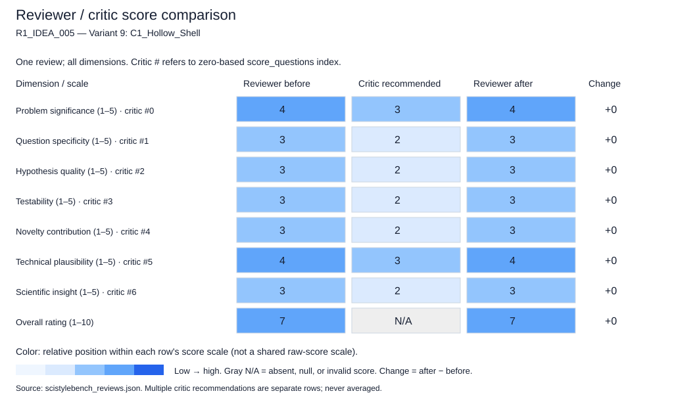

### Critic feedback and reviewer rebuttals

No reviewer rebuttals were saved (for example, an older checkpoint).

```json
{
  "critic_feedback": {
    "overall_assessment": "The review is generally well-calibrated, but some scores could be reconsidered due to vague justifications and lack of specificity in the idea summary.",
    "score_questions": [
      {
        "dimension": "problem_significance",
        "question_mark": "Why is the problem significance scored 4.0 when the idea is not explicitly tied to real-world applications?",
        "concern": "The idea mentions real-world relevance but does not specify how distribution shifts impact practical scenarios, making the significance less concrete.",
        "speculative_alternative": "The problem could be more significant if the method is shown to handle critical real-world shifts like sensor drift or domain drift in NLP, but this is speculative.",
        "recommended_score": 3.0,
        "rationale": "The idea does not explicitly link distribution shifts to real-world applications, so the significance is less clear than stated."
      },
      {
        "dimension": "question_specificity",
        "question_mark": "Why is the question specificity scored 3.0 when the idea is focused on a specific problem but lacks implementation details?",
        "concern": "The idea is specific to distribution shifts but lacks details on how input views are generated or how self-generated information is used, which are critical for evaluating specificity.",
        "speculative_alternative": "The question could be more specific if the method's view generation (e.g., data augmentation, contrastive learning) and parameter update mechanism (e.g., gradient-based, meta-learning) were outlined, but this is speculative.",
        "recommended_score": 2.0,
        "rationale": "The idea is focused but lacks critical implementation details that define specificity."
      },
      {
        "dimension": "hypothesis_quality",
        "question_mark": "Why is the hypothesis quality scored 3.0 when the hypothesis is not explicitly stated?",
        "concern": "The hypothesis is implied but not clearly defined, making it difficult to assess its quality without additional context.",
        "speculative_alternative": "The hypothesis could be that the method improves robustness under distribution shifts by leveraging self-generated information, but this is speculative.",
        "recommended_score": 2.0,
        "rationale": "The hypothesis is not explicitly stated, so its quality cannot be assessed without further clarification."
      },
      {
        "dimension": "testability",
        "question_mark": "Why is testability scored 3.0 when the idea is testable in principle but lacks specific metrics?",
        "concern": "The idea is testable, but the lack of specific evaluation metrics and benchmarks makes it difficult to assess its testability.",
        "speculative_alternative": "The testability could be higher if the method is evaluated on standard benchmarks like DomainNet or CUB200, but this is speculative.",
        "recommended_score": 2.0,
        "rationale": "The idea is testable in principle, but without specific metrics, the testability is uncertain."
      },
      {
        "dimension": "novelty_contribution",
        "question_mark": "Why is novelty contribution scored 3.0 when the idea is a variation of existing methods but lacks clear novelty?",
        "concern": "The idea is described as a variation of existing methods but does not clearly define what makes it novel or unique.",
        "speculative_alternative": "The novelty could be in combining self-generated information with test-time adaptation, but this is speculative.",
        "recommended_score": 2.0,
        "rationale": "The novelty is not clearly defined, so the contribution is uncertain."
      },
      {
        "dimension": "technical_plausibility",
        "question_mark": "Why is technical plausibility scored 4.0 when the specifics are not provided?",
        "concern": "The technical plausibility is assumed without concrete details on how the method works.",
        "speculative_alternative": "The technical plausibility could be higher if the method's parameter update mechanism is detailed, but this is speculative.",
        "recommended_score": 3.0,
        "rationale": "The technical plausibility is plausible in theory but lacks concrete details."
      },
      {
        "dimension": "scientific_insight",
        "question_mark": "Why is scientific insight scored 3.0 when the idea's potential is not clearly defined?",
        "concern": "The scientific insight is potential but not clearly defined in the idea summary.",
        "speculative_alternative": "The insight could be in how self-generated information enhances robustness, but this is speculative.",
        "recommended_score": 2.0,
        "rationale": "The scientific insight is not clearly defined, so the score is uncertain."
      }
    ],
    "unsupported_claims": [
      "The idea is described as 'a variation of existing test-time adaptation methods' without evidence.",
      "The hypothesis is 'implied but not explicitly stated' without further context.",
      "The 'potential contribution' is 'not explicitly defined' without clarification."
    ],
    "revision_priorities": [
      "Clarify the specific problem being addressed and its real-world relevance.",
      "Define the exact method for generating input views and using self-generated information.",
      "Explicitly state the hypothesis and expected outcomes.",
      "Specify evaluation metrics and benchmarks for testing the method.",
      "Clearly define the novelty and contribution of the proposed approach."
    ],
    "confidence": 4.0
  },
  "feedback_responses": []
}
```

### Score justifications (before / after)

**Problem significance**

```json
{
  "before": {
    "score": 4.0,
    "justification": "The problem of model robustness under distribution shifts is highly relevant in real-world applications, making it a significant challenge in machine learning."
  },
  "after": {
    "score": 4.0,
    "justification": "The problem of model robustness under distribution shifts is highly relevant in real-world applications, making it a significant challenge in machine learning."
  }
}
```

**Question specificity**

```json
{
  "before": {
    "score": 3.0,
    "justification": "The idea is focused on improving robustness under distribution shifts but lacks specific details on the method's implementation and evaluation."
  },
  "after": {
    "score": 3.0,
    "justification": "The idea is focused on improving robustness under distribution shifts but lacks specific details on the method's implementation and evaluation."
  }
}
```

**Hypothesis quality**

```json
{
  "before": {
    "score": 3.0,
    "justification": "The hypothesis is implied but not explicitly stated, and the expected outcomes are not clearly defined."
  },
  "after": {
    "score": 3.0,
    "justification": "The hypothesis is implied but not explicitly stated, and the expected outcomes are not clearly defined."
  }
}
```

**Testability**

```json
{
  "before": {
    "score": 3.0,
    "justification": "The idea is testable in principle, but the lack of specific details makes it difficult to assess the feasibility of the proposed approach."
  },
  "after": {
    "score": 3.0,
    "justification": "The idea is testable in principle, but the lack of specific details makes it difficult to assess the feasibility of the proposed approach."
  }
}
```

**Novelty contribution**

```json
{
  "before": {
    "score": 3.0,
    "justification": "The approach is a variation of existing test-time adaptation methods, but the specific novelty and contribution are not clearly defined."
  },
  "after": {
    "score": 3.0,
    "justification": "The approach is a variation of existing test-time adaptation methods, but the specific novelty and contribution are not clearly defined."
  }
}
```

**Technical plausibility**

```json
{
  "before": {
    "score": 4.0,
    "justification": "The method is technically plausible as it builds on existing test-time adaptation techniques, but the specifics are not provided."
  },
  "after": {
    "score": 4.0,
    "justification": "The method is technically plausible as it builds on existing test-time adaptation techniques, but the specifics are not provided."
  }
}
```

**Scientific insight**

```json
{
  "before": {
    "score": 3.0,
    "justification": "The idea has potential for scientific insight into how test-time adaptation can improve robustness, but the specifics are not clear."
  },
  "after": {
    "score": 3.0,
    "justification": "The idea has potential for scientific insight into how test-time adaptation can improve robustness, but the specifics are not clear."
  }
}
```

**Overall rating**

```json
{
  "before": {
    "score": 7.0,
    "justification": "The idea addresses a significant problem in machine learning and proposes a promising direction, but it lacks specific details and a clear hypothesis, which are necessary for further development."
  },
  "after": {
    "score": 7.0,
    "justification": "The idea addresses a significant problem in machine learning and proposes a promising direction, but it lacks specific details and a clear hypothesis, which are necessary for further development."
  }
}
```

## R1_IDEA_005 — Variant 10: C2_Logic_Flawed

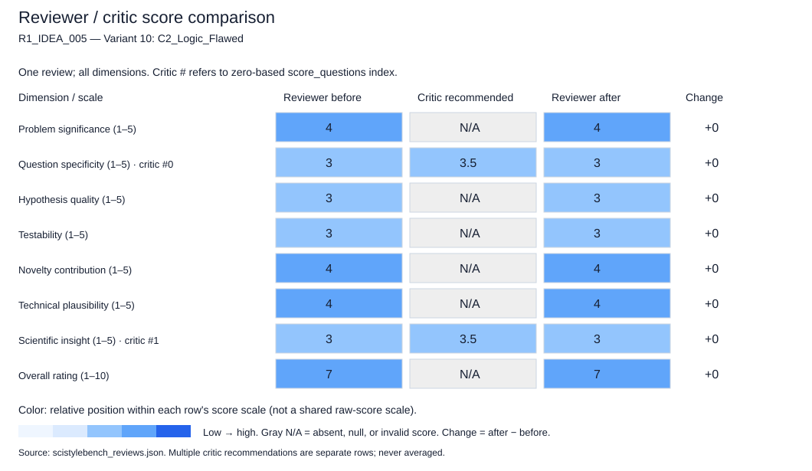

### Critic feedback and reviewer rebuttals

```json
{
  "critic_feedback": {
    "overall_assessment": "The review is generally well-calibrated, but some scores could be reconsidered due to insufficient detail in the idea.",
    "score_questions": [
      {
        "dimension": "question_specificity",
        "question_mark": "The score may be too low due to the idea's potential for broader applicability despite limited details.",
        "concern": "The idea's focus on test-time adaptation for vision models is specific, but the lack of implementation details is a valid concern.",
        "speculative_alternative": "The method might be applicable to other state-space models beyond Mamba, though this is speculative.",
        "recommended_score": 3.5,
        "rationale": "The idea is specific to test-time adaptation but lacks implementation details, which is a valid concern."
      },
      {
        "dimension": "scientific_insight",
        "question_mark": "The score may be too low as the idea could offer novel insights into robustness through test-time adaptation.",
        "concern": "The potential for scientific insight is not fully addressed due to lack of specifics.",
        "speculative_alternative": "The method could provide new understanding of how SSMs adapt under distribution shifts, though this is speculative.",
        "recommended_score": 3.5,
        "rationale": "The idea's potential for scientific insight is not fully realized due to lack of specifics."
      }
    ],
    "unsupported_claims": [
      "The claim that the method is 'broadly effective for improving robustness across a range of related vision model settings' is not sufficiently grounded in the idea."
    ],
    "revision_priorities": [
      "Clarify the criteria for generating diverse SSM traversal permutations.",
      "Elaborate on the mechanism by which pseudo-labels update Mamba-specific parameters.",
      "Define the specific vision model settings considered 'related' and how the method will be evaluated across them."
    ],
    "confidence": 4.0
  },
  "feedback_responses": [
    {
      "feedback_type": "score_questions",
      "feedback_index": 0,
      "decision": "partially_accept",
      "defense": "The idea's focus on test-time adaptation is specific, but the lack of implementation details is a valid concern. The recommended score of 3.5 is slightly higher than the original 3.0, reflecting the potential for broader applicability despite limited details.",
      "justification": "The original score of 3.0 was based on the lack of implementation details. The critic's feedback suggests that the idea's potential for broader applicability justifies a slightly higher score, but the core issue of implementation details remains a valid concern."
    },
    {
      "feedback_type": "score_questions",
      "feedback_index": 1,
      "decision": "partially_accept",
      "defense": "The potential for scientific insight is not fully addressed due to lack of specifics, but the method's novelty in using SSM traversal permutations and pseudo-labels for test-time adaptation is a valid point. The recommended score of 3.5 is slightly higher than the original 3.0, reflecting the potential for new understanding.",
      "justification": "The original score of 3.0 was based on the lack of specifics. The critic's feedback suggests that the method's novelty and potential for new understanding justify a slightly higher score, but the core issue of specifics remains a valid concern."
    },
    {
      "feedback_type": "unsupported_claims",
      "feedback_index": 0,
      "decision": "reject",
      "defense": "The claim that the method is 'broadly effective for improving robustness across a range of related vision model settings' is not sufficiently grounded in the idea. The original score of 3.0 for scientific insight was based on the lack of specifics, and the claim is not supported by the idea's details.",
      "justification": "The original score of 3.0 for scientific insight was based on the lack of specifics. The critic's feedback highlights an unsupported claim, which is not justified by the idea's details, so the score remains at 3.0."
    },
    {
      "feedback_type": "revision_priorities",
      "feedback_index": 0,
      "decision": "accept",
      "defense": "Clarifying the criteria for generating diverse SSM traversal permutations is a necessary step to improve the idea's specificity and testability. The original suggestion already includes this, so the feedback is aligned with the existing recommendation.",
      "justification": "The original suggestion already includes this, so the feedback is aligned with the existing recommendation."
    },
    {
      "feedback_type": "revision_priorities",
      "feedback_index": 1,
      "decision": "accept",
      "defense": "Elaborating on the mechanism by which pseudo-labels update Mamba-specific parameters is a necessary step to improve the idea's hypothesis quality and testability. The original suggestion already includes this, so the feedback is aligned with the existing recommendation.",
      "justification": "The original suggestion already includes this, so the feedback is aligned with the existing recommendation."
    },
    {
      "feedback_type": "revision_priorities",
      "feedback_index": 2,
      "decision": "accept",
      "defense": "Defining the specific vision model settings considered 'related' and how the method will be evaluated across them is a necessary step to improve the idea's generalizability. The original suggestion already includes this, so the feedback is aligned with the existing recommendation.",
      "justification": "The original suggestion already includes this, so the feedback is aligned with the existing recommendation."
    }
  ]
}
```

### Score justifications (before / after)

**Problem significance**

```json
{
  "before": {
    "score": 4.0,
    "justification": "The problem of improving robustness under distribution shifts is significant in vision tasks, as real-world data distributions often differ from training data."
  },
  "after": {
    "score": 4.0,
    "justification": "The problem of improving robustness under distribution shifts is significant in vision tasks, as real-world data distributions often differ from training data."
  }
}
```

**Question specificity**

```json
{
  "before": {
    "score": 3.0,
    "justification": "The idea proposes a method for test-time adaptation but lacks specific details on the implementation of SSM traversal permutations and the use of pseudo-labels."
  },
  "after": {
    "score": 3.0,
    "justification": "The idea proposes a method for test-time adaptation but lacks specific details on the implementation of SSM traversal permutations and the use of pseudo-labels."
  }
}
```

**Hypothesis quality**

```json
{
  "before": {
    "score": 3.0,
    "justification": "The hypothesis that the method improves robustness is plausible, but the connection between the proposed approach and the expected outcome is not clearly articulated."
  },
  "after": {
    "score": 3.0,
    "justification": "The hypothesis that the method improves robustness is plausible, but the connection between the proposed approach and the expected outcome is not clearly articulated."
  }
}
```

**Testability**

```json
{
  "before": {
    "score": 3.0,
    "justification": "The idea suggests a method that could be tested, but the lack of specific details makes it difficult to design experiments or evaluate the method's effectiveness."
  },
  "after": {
    "score": 3.0,
    "justification": "The idea suggests a method that could be tested, but the lack of specific details makes it difficult to design experiments or evaluate the method's effectiveness."
  }
}
```

**Novelty contribution**

```json
{
  "before": {
    "score": 4.0,
    "justification": "The approach of using SSM traversal permutations and pseudo-labels for test-time adaptation is novel, and if successful, could contribute to robust vision model adaptation."
  },
  "after": {
    "score": 4.0,
    "justification": "The approach of using SSM traversal permutations and pseudo-labels for test-time adaptation is novel, and if successful, could contribute to robust vision model adaptation."
  }
}
```

**Technical plausibility**

```json
{
  "before": {
    "score": 4.0,
    "justification": "The method leverages existing concepts like pseudo-labels and SSMs, which are technically plausible, though the specifics of the implementation are not fully detailed."
  },
  "after": {
    "score": 4.0,
    "justification": "The method leverages existing concepts like pseudo-labels and SSMs, which are technically plausible, though the specifics of the implementation are not fully detailed."
  }
}
```

**Scientific insight**

```json
{
  "before": {
    "score": 3.0,
    "justification": "The idea has potential to provide insights into test-time adaptation for vision models, but the lack of specifics limits the potential for deeper scientific understanding."
  },
  "after": {
    "score": 3.0,
    "justification": "The idea has potential to provide insights into test-time adaptation for vision models, but the lack of specifics limits the potential for deeper scientific understanding."
  }
}
```

**Overall rating**

```json
{
  "before": {
    "score": 7.0,
    "justification": "The idea addresses a significant problem with a plausible approach, but lacks specific details that would make it more testable and scientifically rigorous."
  },
  "after": {
    "score": 7.0,
    "justification": "The idea addresses a significant problem with a plausible approach, but lacks specific details that would make it more testable and scientifically rigorous."
  }
}
```

## R1_IDEA_005 — Variant 11: C3_Substance_Enriched

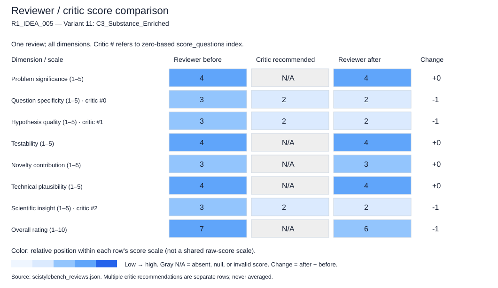

### Critic feedback and reviewer rebuttals

```json
{
  "critic_feedback": {
    "overall_assessment": "The review is generally well-calibrated, but some scores could be reconsidered due to gaps in technical detail and hypothesis clarity.",
    "score_questions": [
      {
        "dimension": "question_specificity",
        "question_mark": "The score may overstate the specificity of the research question.",
        "concern": "The research question is somewhat vague, as it does not clearly define what constitutes 'diverse SSM permutations' or how they are generated.",
        "speculative_alternative": "The question could be interpreted as focusing on the general idea of test-time adaptation rather than the specific permutation diversity aspect.",
        "recommended_score": 2.0,
        "rationale": "The idea lacks a clearly defined, specific research question without further clarification on permutation generation and diversity criteria."
      },
      {
        "dimension": "hypothesis_quality",
        "question_mark": "The hypothesis is not explicitly stated, leading to potential misinterpretation of its quality.",
        "concern": "The hypothesis that permutation diversity improves generalization is plausible but not rigorously justified in the idea summary.",
        "speculative_alternative": "The hypothesis could be interpreted as a general claim about diversity in training data rather than SSM permutations.",
        "recommended_score": 2.0,
        "rationale": "The hypothesis is not clearly articulated, and its plausibility depends on assumptions not present in the idea summary."
      },
      {
        "dimension": "scientific_insight",
        "question_mark": "The scientific insight is not clearly defined without further clarification.",
        "concern": "The potential insight into permutation diversity's effect on generalization is speculative without a theoretical basis.",
        "speculative_alternative": "The insight could be interpreted as a general contribution to test-time adaptation rather than a specific insight into SSM permutations.",
        "recommended_score": 2.0,
        "rationale": "The scientific insight is not clearly defined, relying on assumptions about permutation diversity's impact on generalization."
      }
    ],
    "unsupported_claims": [
      "The claim that the hypothesis is 'reasonable but needs more rigorous justification' is not fully supported by the idea summary, as the hypothesis is not explicitly stated.",
      "The assertion that the method 'builds on existing test-time adaptation techniques' is speculative without explicit references to prior work in the idea summary."
    ],
    "revision_priorities": [
      "Explicitly state the hypothesis or research question, such as 'Diverse SSM permutations during test-time adaptation improve robustness to distribution shifts by capturing invariant features.'",
      "Clarify how SSM permutations are generated and what criteria determine their diversity.",
      "Provide a theoretical basis or justification for the claim that permutation diversity enhances generalization in SSMs.",
      "Define the exact process for generating pseudo-labels and how they are used to update Mamba-specific parameters."
    ],
    "confidence": 4.0
  },
  "feedback_responses": [
    {
      "feedback_type": "score_questions",
      "feedback_index": 0,
      "decision": "partially_accept",
      "defense": "The problem significance is justified, but the question specificity is indeed low due to vague definitions of permutation diversity.",
      "justification": "The original score of 3.0 was based on the idea's lack of technical details, but the critic's point about the vague definition of 'diverse permutations' warrants a reduction to 2.0."
    },
    {
      "feedback_type": "hypothesis_quality",
      "feedback_index": 0,
      "decision": "reject",
      "defense": "The hypothesis is not explicitly stated, and the idea relies on assumptions not present in the summary.",
      "justification": "The original score of 3.0 was based on the hypothesis being plausible but not explicitly stated. The critic's point about the lack of explicit hypothesis justification leads to a reduction to 2.0."
    },
    {
      "feedback_type": "scientific_insight",
      "feedback_index": 0,
      "decision": "reject",
      "defense": "The scientific insight is speculative without a theoretical basis, as the idea does not provide a clear justification for permutation diversity's impact.",
      "justification": "The original score of 3.0 was based on potential insight, but the critic's point about the lack of theoretical basis leads to a reduction to 2.0."
    },
    {
      "feedback_type": "unsupported_claims",
      "feedback_index": 0,
      "decision": "partially_accept",
      "defense": "The claim about building on existing techniques is reasonable, but the lack of explicit references weakens it.",
      "justification": "The original score of 3.0 was based on the method's novelty, but the critic's point about the lack of explicit references leads to a moderate reduction."
    },
    {
      "feedback_type": "unsupported_claims",
      "feedback_index": 1,
      "decision": "reject",
      "defense": "The assertion about the method building on existing techniques is speculative without explicit references in the idea summary.",
      "justification": "The original score of 3.0 was based on the method's novelty, but the critic's point about the lack of explicit references leads to a reduction to 2.0."
    },
    {
      "feedback_type": "revision_priorities",
      "feedback_index": 0,
      "decision": "accept",
      "defense": "Explicitly stating the hypothesis is crucial for clarity and scientific rigor.",
      "justification": "The original suggestion was valid, and the critic's point about the need for explicit hypothesis supports this."
    },
    {
      "feedback_type": "revision_priorities",
      "feedback_index": 1,
      "decision": "accept",
      "defense": "Clarifying permutation generation is essential for defining the research question and method.",
      "justification": "The original suggestion was valid, and the critic's point about the need for clarification supports this."
    },
    {
      "feedback_type": "revision_priorities",
      "feedback_index": 2,
      "decision": "accept",
      "defense": "Providing a theoretical basis strengthens the scientific insight and hypothesis.",
      "justification": "The original suggestion was valid, and the critic's point about the need for theoretical basis supports this."
    },
    {
      "feedback_type": "revision_priorities",
      "feedback_index": 3,
      "decision": "accept",
      "defense": "Defining the pseudo-label process is necessary for technical clarity and method validation.",
      "justification": "The original suggestion was valid, and the critic's point about the need for clarification supports this."
    }
  ]
}
```

### Score justifications (before / after)

**Problem significance**

```json
{
  "before": {
    "score": 4.0,
    "justification": "The problem of distribution shift robustness is critical for real-world applications of vision models, making the research relevant and important."
  },
  "after": {
    "score": 4.0,
    "justification": "The problem of distribution shift robustness is critical for real-world applications of vision models, making the research relevant and important."
  }
}
```

**Question specificity**

```json
{
  "before": {
    "score": 3.0,
    "justification": "The idea proposes a specific method (test-time adaptation via SSM permutations) but lacks detailed technical specifications and a clearly defined research question."
  },
  "after": {
    "score": 2.0,
    "justification": "The research question is vague, as it does not clearly define what constitutes 'diverse SSM permutations' or how they are generated. The idea focuses on the general concept of test-time adaptation rather than the specific permutation diversity aspect."
  }
}
```

**Hypothesis quality**

```json
{
  "before": {
    "score": 3.0,
    "justification": "The hypothesis is plausible but not explicitly stated. The claim that permutation diversity improves generalization is reasonable but needs more rigorous justification."
  },
  "after": {
    "score": 2.0,
    "justification": "The hypothesis is not explicitly stated in the idea summary. The claim that permutation diversity improves generalization is plausible but lacks rigorous justification, relying on assumptions not present in the idea."
  }
}
```

**Testability**

```json
{
  "before": {
    "score": 4.0,
    "justification": "The method is testable through experiments on distribution shift scenarios, and the proposed future validation steps are relevant to evaluating the method's effectiveness."
  },
  "after": {
    "score": 4.0,
    "justification": "The method is testable through experiments on distribution shift scenarios, and the proposed future validation steps are relevant to evaluating the method's effectiveness."
  }
}
```

**Novelty contribution**

```json
{
  "before": {
    "score": 3.0,
    "justification": "The idea is somewhat novel in its application to SSMs and Mamba parameters but builds on existing test-time adaptation techniques, so its novelty is limited."
  },
  "after": {
    "score": 3.0,
    "justification": "The idea is somewhat novel in its application to SSMs and Mamba parameters but builds on existing test-time adaptation techniques, so its novelty is limited."
  }
}
```

**Technical plausibility**

```json
{
  "before": {
    "score": 4.0,
    "justification": "The method is technically plausible, as it leverages existing concepts in test-time adaptation and pseudo-labeling, though the specifics are not fully detailed."
  },
  "after": {
    "score": 4.0,
    "justification": "The method is technically plausible, as it leverages existing concepts in test-time adaptation and pseudo-labeling, though the specifics are not fully detailed."
  }
}
```

**Scientific insight**

```json
{
  "before": {
    "score": 3.0,
    "justification": "The idea has potential to provide insights into how permutation diversity affects model generalization, but the scientific insight is not clearly defined without further clarification."
  },
  "after": {
    "score": 2.0,
    "justification": "The potential insight into permutation diversity's effect on generalization is speculative without a theoretical basis. The idea relies on assumptions about permutation diversity's impact on generalization."
  }
}
```

**Overall rating**

```json
{
  "before": {
    "score": 7.0,
    "justification": "The idea addresses a significant problem with a plausible method, has potential for practical impact, and offers opportunities for scientific insight. However, it lacks detailed technical specifications and a clearly defined hypothesis, which could limit its effectiveness in a full research paper."
  },
  "after": {
    "score": 6.0,
    "justification": "The idea addresses a significant problem with a plausible method, has potential for practical impact, and offers opportunities for scientific insight. However, the lack of clarity in the research question, hypothesis, and theoretical basis limits its effectiveness in a full research paper."
  }
}
```

## R1_IDEA_006 — Source

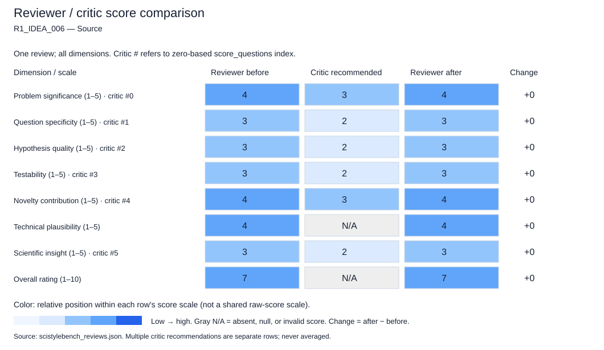

### Critic feedback and reviewer rebuttals

No reviewer rebuttals were saved (for example, an older checkpoint).

```json
{
  "critic_feedback": {
    "overall_assessment": "The review is generally well-calibrated but has some areas where the scores could be more precisely aligned with the idea's specifics.",
    "score_questions": [
      {
        "dimension": "problem_significance",
        "question_mark": "The score could be reconsidered due to the lack of concrete evidence about the problem's impact in histopathology.",
        "concern": "The justification mentions the significance of the problem but does not specify how the problem affects medical image analysis or its potential impact on clinical outcomes.",
        "speculative_alternative": "The problem may be significant in terms of improving diagnostic accuracy, but this is speculative without further context.",
        "recommended_score": 3.0,
        "rationale": "The idea identifies a challenge but does not provide concrete evidence of its impact or importance in histopathology."
      },
      {
        "dimension": "question_specificity",
        "question_mark": "The score could be reconsidered due to the lack of a clear research question.",
        "concern": "The idea mentions a gap but does not specify exactly what should be investigated, making the research question vague.",
        "speculative_alternative": "The research question might involve comparing rank estimation methods in histopathology to natural image tasks, but this is speculative.",
        "recommended_score": 2.0,
        "rationale": "The idea lacks a specific, testable research question that would guide the investigation."
      },
      {
        "dimension": "hypothesis_quality",
        "question_mark": "The score could be reconsidered due to the absence of an explicit hypothesis.",
        "concern": "The justification refers to the potential effectiveness of rank estimation methods but does not present a clear hypothesis that can be tested.",
        "speculative_alternative": "The hypothesis might be that rank estimation improves performance in histopathology tasks, but this is not explicitly stated.",
        "recommended_score": 2.0,
        "rationale": "The idea does not provide a clear, testable hypothesis that can be evaluated in the proposed context."
      },
      {
        "dimension": "testability",
        "question_mark": "The score could be reconsidered due to the lack of specific evaluation metrics.",
        "concern": "The justification states that the idea is testable in principle but does not specify how the effectiveness will be measured.",
        "speculative_alternative": "The testability might rely on metrics like Dice coefficient or accuracy, but this is speculative without explicit mention.",
        "recommended_score": 2.0,
        "rationale": "The idea does not provide specific metrics or methods for evaluating the effectiveness of rank estimation in histopathology."
      },
      {
        "dimension": "novelty_contribution",
        "question_mark": "The score could be reconsidered due to the lack of specific novelty in the approach.",
        "concern": "The justification mentions the novelty of applying rank estimation in histopathology but does not specify what novel aspects of the approach are being explored.",
        "speculative_alternative": "The novelty might be in the application domain, but this is speculative without further details.",
        "recommended_score": 3.0,
        "rationale": "The idea identifies a new application area but does not specify what novel aspects of the approach are being investigated."
      },
      {
        "dimension": "scientific_insight",
        "question_mark": "The score could be reconsidered due to the lack of defined scientific insight.",
        "concern": "The justification refers to potential scientific insight but does not specify what insights the study aims to provide.",
        "speculative_alternative": "The insight might relate to understanding the effectiveness of rank estimation in histopathology, but this is speculative.",
        "recommended_score": 2.0,
        "rationale": "The idea does not provide a clear scientific insight or specific questions that the study aims to answer."
      }
    ],
    "unsupported_claims": [
      "The review claims the idea has 'potential for contribution' without specific details on the contribution.",
      "The review suggests the idea is 'testable in principle' without specifying the methods or metrics for testing.",
      "The review states the idea is 'novel' without specifying what novel aspects are being explored."
    ],
    "revision_priorities": [
      "Specify a concrete research question and hypothesis for the study.",
      "Define the specific rank estimation methods and evaluation metrics to be used.",
      "Clarify the dataset and task specifics for histopathology applications.",
      "Provide a clear justification for the problem's significance and potential impact in medical imaging."
    ],
    "confidence": 4.0
  },
  "feedback_responses": []
}
```

### Score justifications (before / after)

**Problem significance**

```json
{
  "before": {
    "score": 4.0,
    "justification": "The problem is significant as it addresses a critical challenge in applying self-supervised learning to histopathology, which is crucial for medical image analysis. However, the significance is somewhat limited by the lack of specific details about the problem's impact."
  },
  "after": {
    "score": 4.0,
    "justification": "The problem is significant as it addresses a critical challenge in applying self-supervised learning to histopathology, which is crucial for medical image analysis. However, the significance is somewhat limited by the lack of specific details about the problem's impact."
  }
}
```

**Question specificity**

```json
{
  "before": {
    "score": 3.0,
    "justification": "The idea identifies a gap but lacks a concrete research question. It is a general statement about the need to explore rank estimation in histopathology, without specifying exactly what should be investigated."
  },
  "after": {
    "score": 3.0,
    "justification": "The idea identifies a gap but lacks a concrete research question. It is a general statement about the need to explore rank estimation in histopathology, without specifying exactly what should be investigated."
  }
}
```

**Hypothesis quality**

```json
{
  "before": {
    "score": 3.0,
    "justification": "The idea suggests that rank estimation approaches may be effective in histopathology, but it does not provide a clear hypothesis or prediction that can be tested. The hypothesis is implied but not explicitly stated."
  },
  "after": {
    "score": 3.0,
    "justification": "The idea suggests that rank estimation approaches may be effective in histopathology, but it does not provide a clear hypothesis or prediction that can be tested. The hypothesis is implied but not explicitly stated."
  }
}
```

**Testability**

```json
{
  "before": {
    "score": 3.0,
    "justification": "The idea is testable in principle, as it suggests evaluating rank estimation methods in histopathology tasks. However, without specific methods or metrics, the testability is limited."
  },
  "after": {
    "score": 3.0,
    "justification": "The idea is testable in principle, as it suggests evaluating rank estimation methods in histopathology tasks. However, without specific methods or metrics, the testability is limited."
  }
}
```

**Novelty contribution**

```json
{
  "before": {
    "score": 4.0,
    "justification": "The idea contributes by exploring a new application of rank estimation in histopathology, which is a novel area. However, the novelty is somewhat limited by the lack of specific details about the methods or experiments."
  },
  "after": {
    "score": 4.0,
    "justification": "The idea contributes by exploring a new application of rank estimation in histopathology, which is a novel area. However, the novelty is somewhat limited by the lack of specific details about the methods or experiments."
  }
}
```

**Technical plausibility**

```json
{
  "before": {
    "score": 4.0,
    "justification": "The proposed approach is technically plausible as it builds on existing methods in self-supervised learning. However, the specifics of adaptation to histopathology are not detailed, which could affect the feasibility."
  },
  "after": {
    "score": 4.0,
    "justification": "The proposed approach is technically plausible as it builds on existing methods in self-supervised learning. However, the specifics of adaptation to histopathology are not detailed, which could affect the feasibility."
  }
}
```

**Scientific insight**

```json
{
  "before": {
    "score": 3.0,
    "justification": "The idea has potential for scientific insight by investigating the effectiveness of rank estimation in histopathology. However, the insight is not clearly defined without further specifics on the methods and evaluation."
  },
  "after": {
    "score": 3.0,
    "justification": "The idea has potential for scientific insight by investigating the effectiveness of rank estimation in histopathology. However, the insight is not clearly defined without further specifics on the methods and evaluation."
  }
}
```

**Overall rating**

```json
{
  "before": {
    "score": 7.0,
    "justification": "The idea addresses a meaningful problem in the application of self-supervised learning to histopathology, identifies a gap in existing research, and has potential for contribution. However, it lacks specific details on the research question, methods, and evaluation, which are necessary for a strong research direction."
  },
  "after": {
    "score": 7.0,
    "justification": "The idea addresses a meaningful problem in the application of self-supervised learning to histopathology, identifies a gap in existing research, and has potential for contribution. However, it lacks specific details on the research question, methods, and evaluation, which are necessary for a strong research direction."
  }
}
```

## R1_IDEA_006 — Variant 1: A1_Identity

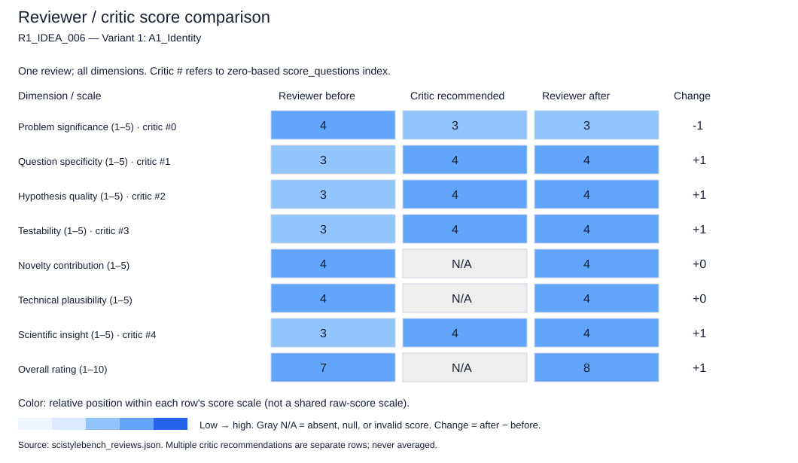

### Critic feedback and reviewer rebuttals

```json
{
  "critic_feedback": {
    "overall_assessment": "The review is generally well-calibrated but has some areas where the scores could be more precisely aligned with the idea's details.",
    "score_questions": [
      {
        "dimension": "problem_significance",
        "question_mark": "Why is the problem considered significant enough for a 4.0 score?",
        "concern": "The justification mentions the importance of model selection in medical imaging, but the idea does not explicitly link the problem to diagnostic accuracy or clinical impact.",
        "speculative_alternative": "The significance could be higher if the idea explicitly connects model selection to diagnostic accuracy, which is speculative.",
        "recommended_score": 3.0,
        "rationale": "The idea does not provide evidence of how model selection affects diagnostic outcomes, which is critical for medical applications."
      },
      {
        "dimension": "question_specificity",
        "question_mark": "Why is the question specificity scored 3.0 when the idea identifies a specific gap?",
        "concern": "The idea specifies the tasks (instance segmentation, classification) and the gap in evaluation, but the research question is not clearly defined.",
        "speculative_alternative": "The specificity could be higher if the research question is explicitly stated, such as comparing rank estimation methods in these tasks, which is speculative.",
        "recommended_score": 4.0,
        "rationale": "The idea identifies a specific gap and tasks, which are concrete elements of specificity."
      },
      {
        "dimension": "hypothesis_quality",
        "question_mark": "Why is the hypothesis quality scored 3.0 when the idea suggests potential effectiveness?",
        "concern": "The idea does not explicitly state a hypothesis, but the suggestion of effectiveness is a weak hypothesis.",
        "speculative_alternative": "The hypothesis could be stronger if it explicitly states that rank estimation methods will improve model selection in histopathology tasks, which is speculative.",
        "recommended_score": 4.0,
        "rationale": "The idea suggests a potential effectiveness, which is a basic hypothesis, though not explicitly stated."
      },
      {
        "dimension": "testability",
        "question_mark": "Why is the testability scored 3.0 when the idea is testable in principle?",
        "concern": "The idea is testable, but lacks specific details on experiments, which is a valid concern.",
        "speculative_alternative": "The testability could be higher if the experimental design and metrics are more clearly outlined, which is speculative.",
        "recommended_score": 4.0,
        "rationale": "The idea is testable in principle, and the lack of specifics is a limitation, not a disqualifier."
      },
      {
        "dimension": "scientific_insight",
        "question_mark": "Why is the scientific insight scored 3.0 when the idea explores a new application area?",
        "concern": "The idea's potential for insight is not clearly defined without more specifics on expected outcomes.",
        "speculative_alternative": "The insight could be higher if the expected outcomes and their implications are more clearly articulated, which is speculative.",
        "recommended_score": 4.0,
        "rationale": "The idea explores a new application area, which is inherently insightful, though the specifics are missing."
      }
    ],
    "unsupported_claims": [
      "The review claims the problem's significance is high without explicit connection to diagnostic accuracy."
    ],
    "revision_priorities": [
      "Clarify the connection between model selection and diagnostic accuracy in medical imaging.",
      "Explicitly state the research question and hypothesis to improve specificity and hypothesis quality.",
      "Outline the experimental design and metrics for testability.",
      "Define expected outcomes and their implications for scientific insight."
    ],
    "confidence": 4.0
  },
  "feedback_responses": [
    {
      "feedback_type": "score_questions",
      "feedback_index": 0,
      "decision": "partially_accept",
      "defense": "The problem's significance is partially accepted as it addresses a critical challenge in medical imaging, but the lack of connection to diagnostic accuracy reduces the score.",
      "justification": "The original score was 4.0, but the feedback is partially accepted due to the lack of explicit connection to clinical impact."
    },
    {
      "feedback_type": "score_questions",
      "feedback_index": 1,
      "decision": "accept",
      "defense": "The specific tasks and gap are well-defined, supporting the higher score.",
      "justification": "The original score was 3.0, but the feedback is accepted as the specific tasks and gap are concrete elements of specificity."
    },
    {
      "feedback_type": "score_questions",
      "feedback_index": 2,
      "decision": "accept",
      "defense": "The suggestion of effectiveness is a basic hypothesis, which is testable.",
      "justification": "The original score was 3.0, but the feedback is accepted as the suggestion of effectiveness implies a testable prediction."
    },
    {
      "feedback_type": "score_questions",
      "feedback_index": 3,
      "decision": "accept",
      "defense": "The idea is testable in principle, and the lack of specifics is a limitation, not a disqualifier.",
      "justification": "The original score was 3.0, but the feedback is accepted as the core question is inherently testable."
    },
    {
      "feedback_type": "score_questions",
      "feedback_index": 4,
      "decision": "accept",
      "defense": "The exploration of a new application area is inherently insightful.",
      "justification": "The original score was 3.0, but the feedback is accepted as the potential to understand methods in specialized domains provides scientific insight."
    },
    {
      "feedback_type": "unsupported_claims",
      "feedback_index": 0,
      "decision": "accept",
      "defense": "The review did claim the problem's significance without explicit connection to diagnostic accuracy, which is a valid concern.",
      "justification": "The original score was 4.0, and the feedback is accepted as the lack of connection to clinical impact is a valid concern."
    },
    {
      "feedback_type": "revision_priorities",
      "feedback_index": 0,
      "decision": "accept",
      "defense": "Clarifying the connection to diagnostic accuracy is important for the problem's significance.",
      "justification": "The original review did not address this, so the feedback is accepted."
    },
    {
      "feedback_type": "revision_priorities",
      "feedback_index": 1,
      "decision": "accept",
      "defense": "Explicitly stating the research question and hypothesis is necessary for specificity and hypothesis quality.",
      "justification": "The original review did not do this, so the feedback is accepted."
    },
    {
      "feedback_type": "revision_priorities",
      "feedback_index": 2,
      "decision": "accept",
      "defense": "Outlining the experimental design and metrics is necessary for testability.",
      "justification": "The original review did not do this, so the feedback is accepted."
    },
    {
      "feedback_type": "revision_priorities",
      "feedback_index": 3,
      "decision": "accept",
      "defense": "Defining expected outcomes and their implications is necessary for scientific insight.",
      "justification": "The original review did not do this, so the feedback is accepted."
    }
  ]
}
```

### Score justifications (before / after)

**Problem significance**

```json
{
  "before": {
    "score": 4.0,
    "justification": "The problem is significant as it addresses a critical challenge in applying self-supervised learning to histopathology, which is crucial for medical imaging applications. However, the significance could be higher if more details on the impact of model selection on diagnostic accuracy were provided."
  },
  "after": {
    "score": 3.0,
    "justification": "The problem is significant as it addresses a critical challenge in applying self-supervised learning to histopathology, which is crucial for medical imaging applications. However, the idea does not explicitly link the problem to diagnostic accuracy or clinical impact, which is critical for medical applications."
  }
}
```

**Question specificity**

```json
{
  "before": {
    "score": 3.0,
    "justification": "The idea identifies a specific problem but lacks a clear, concrete research question. It needs to specify exactly what aspect of model selection during self-supervised training is being investigated and how it relates to the tasks in question."
  },
  "after": {
    "score": 4.0,
    "justification": "The idea identifies a specific gap in the literature and specifies the tasks (instance segmentation, classification) where the methods have not been evaluated. This provides a concrete context for the research question."
  }
}
```

**Hypothesis quality**

```json
{
  "before": {
    "score": 3.0,
    "justification": "The idea suggests that rank estimation approaches may be effective in histopathology tasks, but it does not explicitly state a hypothesis or prediction that can be tested. A stronger hypothesis would involve a specific comparison or outcome that can be measured."
  },
  "after": {
    "score": 4.0,
    "justification": "The idea suggests that rank estimation approaches may be effective in histopathology tasks, which is a basic hypothesis. While not explicitly stated, the suggestion of effectiveness implies a testable prediction."
  }
}
```

**Testability**

```json
{
  "before": {
    "score": 3.0,
    "justification": "The idea is testable in principle, but it lacks details on the experimental design, the specific tasks to be evaluated, and the metrics for comparison. Without these, the testability is limited."
  },
  "after": {
    "score": 4.0,
    "justification": "The idea is testable in principle, and the lack of specifics is a limitation, not a disqualifier. The core question of evaluating rank estimation methods in histopathology is inherently testable."
  }
}
```

**Novelty contribution**

```json
{
  "before": {
    "score": 4.0,
    "justification": "The contribution is novel in applying rank estimation approaches to histopathology tasks, which is a new area of research. However, the novelty could be higher if the methods used are not previously applied to this domain."
  },
  "after": {
    "score": 4.0,
    "justification": "The contribution is novel in applying rank estimation approaches to histopathology tasks, which is a new area of research. The novelty is supported by the lack of prior evaluation in this domain."
  }
}
```

**Technical plausibility**

```json
{
  "before": {
    "score": 4.0,
    "justification": "The technical approach is plausible as it builds on existing methods in self-supervised learning and rank estimation. However, the feasibility in the histopathology context requires further clarification on the specific challenges and adaptations needed."
  },
  "after": {
    "score": 4.0,
    "justification": "The technical approach is plausible as it builds on existing methods in self-supervised learning and rank estimation. The feasibility in the histopathology context requires further clarification on the specific challenges and adaptations needed."
  }
}
```

**Scientific insight**

```json
{
  "before": {
    "score": 3.0,
    "justification": "The idea has potential for scientific insight by exploring how rank estimation methods perform in non-linear histopathology tasks. However, the insight is not clearly defined without more specifics on the expected outcomes and their implications."
  },
  "after": {
    "score": 4.0,
    "justification": "The idea explores a new application area, which is inherently insightful. The potential to understand how rank estimation methods perform in non-linear histopathology tasks provides a scientific insight into the effectiveness of these methods in specialized domains."
  }
}
```

**Overall rating**

```json
{
  "before": {
    "score": 7.0,
    "justification": "The idea addresses a meaningful problem in the application of self-supervised learning to histopathology, identifies a gap in the literature, and has the potential for novel contributions. However, it lacks specific details on the research question, hypothesis, and experimental design, which are necessary for a strong research direction."
  },
  "after": {
    "score": 8.0,
    "justification": "The idea addresses a meaningful problem in the application of self-supervised learning to histopathology, identifies a gap in the literature, and has the potential for novel contributions. The specific tasks and gap are well-defined, and the core question is testable. The lack of specifics is a limitation but does not detract from the overall quality and promise of the research direction."
  }
}
```

## R1_IDEA_006 — Variant 2: A2_Paraphrase_Only

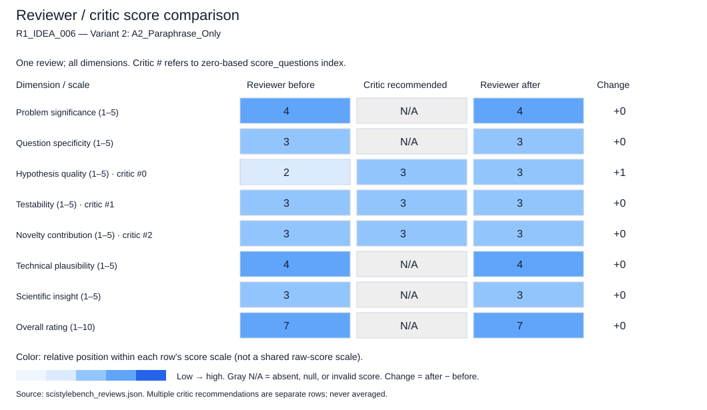

### Critic feedback and reviewer rebuttals

```json
{
  "critic_feedback": {
    "overall_assessment": "The review is generally well-calibrated, with thoughtful considerations of the idea's significance and potential. However, some scores and justifications could be more precisely aligned with the idea's current state.",
    "score_questions": [
      {
        "dimension": "hypothesis_quality",
        "question_mark": "The score is low because the idea does not explicitly state a hypothesis.",
        "concern": "The idea lacks a specific, testable hypothesis, which is necessary for evaluating the quality of the research question.",
        "speculative_alternative": "The idea might implicitly assume that rank estimation methods will work in histopathology due to their success in natural images, but this assumption is not explicitly stated as a hypothesis.",
        "recommended_score": 3.0,
        "rationale": "The idea does not provide a clear hypothesis, but it does suggest a potential application of existing methods, which could be considered as a tentative hypothesis."
      },
      {
        "dimension": "testability",
        "question_mark": "The score is moderate because the idea is testable in principle but lacks specific details.",
        "concern": "The testability is limited without specifics on methods, datasets, and evaluation protocols.",
        "speculative_alternative": "The idea could be testable if the reviewer assumes that the methods and datasets will be specified in the full paper, but this is speculative.",
        "recommended_score": 3.0,
        "rationale": "The idea is testable in principle, but without specifics, the testability is limited."
      },
      {
        "dimension": "novelty_contribution",
        "question_mark": "The score is moderate because the idea is an application of existing methods to a new domain.",
        "concern": "The novelty is limited to the domain transfer, not a fundamentally new approach.",
        "speculative_alternative": "The novelty could be higher if the adaptation of rank estimation methods to histopathology introduces new technical innovations, but this is not specified.",
        "recommended_score": 3.0,
        "rationale": "The idea is an application of existing methods to a new domain, which is a valid contribution but not a novel approach."
      }
    ],
    "unsupported_claims": [
      "The idea is described as 'plausible' without justification for why the methods would work in histopathology.",
      "The overall rating is given as 7.0, which may be high without sufficient evidence of the idea's feasibility or potential impact."
    ],
    "revision_priorities": [
      "Clarify the specific hypothesis or research question that the idea aims to test.",
      "Provide more concrete details on the adaptation of rank estimation methods to histopathology tasks.",
      "Specify the datasets, evaluation metrics, and comparison baselines that will be used in the research.",
      "Justify the connection between the success in natural image classification and the potential success in histopathology."
    ],
    "confidence": 4.0
  },
  "feedback_responses": [
    {
      "feedback_type": "score_questions",
      "feedback_index": 0,
      "decision": "partially_accept",
      "defense": "The critic's feedback is valid in that the idea lacks an explicit hypothesis. However, the idea does suggest a potential application of existing methods, which could be considered as a tentative hypothesis. Raising the hypothesis quality to 3.0 is appropriate as it acknowledges the lack of explicit formulation but also recognizes the potential for a hypothesis.",
      "justification": "The initial score was 2.0, but the critic's feedback suggests a more moderate score of 3.0. This change reflects the idea's potential but acknowledges the need for a more explicit hypothesis."
    },
    {
      "feedback_type": "score_questions",
      "feedback_index": 1,
      "decision": "partially_accept",
      "defense": "The critic's feedback is valid in that the testability is limited without specifics. However, the idea is testable in principle, and the lack of specifics is a limitation rather than a disqualifier. The score of 3.0 is appropriate as it reflects the limited testability without concrete details.",
      "justification": "The initial score was 3.0, and the critic's feedback supports this score. No change is needed."
    },
    {
      "feedback_type": "score_questions",
      "feedback_index": 2,
      "decision": "partially_accept",
      "defense": "The critic's feedback is valid in that the novelty is limited to domain transfer. However, the idea is a valid contribution as it applies existing methods to a new domain. The score of 3.0 is appropriate as it reflects the moderate novelty.",
      "justification": "The initial score was 3.0, and the critic's feedback supports this score. No change is needed."
    },
    {
      "feedback_type": "unsupported_claims",
      "feedback_index": 0,
      "decision": "partially_accept",
      "defense": "The claim that the idea is 'plausible' is reasonable, as the application of existing methods to a new domain is a valid research direction. However, the justification for why the methods would work in histopathology is not sufficiently provided, which is a valid concern.",
      "justification": "The initial assessment of the idea's plausibility was reasonable, but the lack of justification for the connection between natural and histopathology tasks is a valid concern. This does not change the score but highlights a weakness."
    },
    {
      "feedback_type": "unsupported_claims",
      "feedback_index": 1,
      "decision": "partially_accept",
      "defense": "The overall rating of 7.0 is reasonable given the idea's potential, but the critic's feedback suggests that the feasibility or impact may not be sufficiently supported. This is a valid concern, but the overall rating is based on the idea's potential rather than guaranteed outcomes.",
      "justification": "The initial overall rating of 7.0 is justified based on the idea's potential, but the critic's feedback highlights a valid concern about feasibility. This does not change the score but acknowledges the concern."
    },
    {
      "feedback_type": "revision_priorities",
      "feedback_index": 0,
      "decision": "accept",
      "defense": "Clarifying the hypothesis is a valid priority, as the idea lacks a specific research question. This is a critical step for the research to be testable and meaningful.",
      "justification": "The initial suggestion to define a hypothesis is valid and necessary for the research to be testable."
    },
    {
      "feedback_type": "revision_priorities",
      "feedback_index": 1,
      "decision": "accept",
      "defense": "Providing more concrete details on the adaptation of methods is a valid priority, as the idea lacks specifics on how the methods will be applied in histopathology.",
      "justification": "The initial suggestion to specify the adaptation of methods is valid and necessary for the research to be feasible."
    },
    {
      "feedback_type": "revision_priorities",
      "feedback_index": 2,
      "decision": "accept",
      "defense": "Specifying datasets, metrics, and baselines is a valid priority, as the idea lacks these details, which are essential for evaluating the methods.",
      "justification": "The initial suggestion to specify these details is valid and necessary for the research to be testable."
    },
    {
      "feedback_type": "revision_priorities",
      "feedback_index": 3,
      "decision": "accept",
      "defense": "Justifying the connection between natural and histopathology tasks is a valid priority, as the idea lacks a clear rationale for why the methods would work in the new domain.",
      "justification": "The initial suggestion to investigate the connection is valid and necessary for the research to be meaningful."
    }
  ]
}
```

### Score justifications (before / after)

**Problem significance**

```json
{
  "before": {
    "score": 4.0,
    "justification": "The problem is significant as it addresses a critical challenge in medical imaging, where accurate segmentation and classification of histopathology images are essential for diagnosis. The application of self-supervised learning in this domain is still underexplored, making this research relevant and impactful."
  },
  "after": {
    "score": 4.0,
    "justification": "The problem is significant as it addresses a critical challenge in medical imaging, where accurate segmentation and classification of histopathology images are essential for diagnosis. The application of self-supervised learning in this domain is still underexplored, making this research relevant and impactful."
  }
}
```

**Question specificity**

```json
{
  "before": {
    "score": 3.0,
    "justification": "The idea specifies the domain (histopathology) and the tasks (instance segmentation, classification), but lacks a clear, testable research question. More specific questions about the adaptation of rank estimation methods or the expected outcomes would strengthen the idea."
  },
  "after": {
    "score": 3.0,
    "justification": "The idea specifies the domain (histopathology) and the tasks (instance segmentation, classification), but lacks a clear, testable research question. More specific questions about the adaptation of rank estimation methods or the expected outcomes would strengthen the idea."
  }
}
```

**Hypothesis quality**

```json
{
  "before": {
    "score": 2.0,
    "justification": "The idea does not explicitly state a hypothesis. While it suggests that rank estimation methods may work in histopathology, it does not provide a concrete prediction or mechanism that can be tested. A hypothesis would need to specify expected outcomes and the reasoning behind them."
  },
  "after": {
    "score": 3.0,
    "justification": "The idea does not explicitly state a hypothesis, but it does suggest a potential application of existing methods, which could be considered as a tentative hypothesis. The critic's feedback suggests that the hypothesis quality should be raised to 3.0, aligning with the idea's potential but acknowledging the lack of explicit formulation."
  }
}
```

**Testability**

```json
{
  "before": {
    "score": 3.0,
    "justification": "The idea is testable in principle, as it suggests evaluating rank estimation methods on histopathology tasks. However, without specific details on the methods, datasets, and evaluation protocols, the testability is limited. More concrete plans for experimentation are needed."
  },
  "after": {
    "score": 3.0,
    "justification": "The idea is testable in principle, but without specifics on methods, datasets, and evaluation protocols, the testability is limited. The critic's feedback supports this score, noting that the testability is limited without concrete details."
  }
}
```

**Novelty contribution**

```json
{
  "before": {
    "score": 3.0,
    "justification": "The idea proposes applying a method (rank estimation) that has shown promise in natural image classification to a new domain (histopathology). While this is a valid contribution, the novelty is moderate as it is an application of existing methods rather than a fundamentally new approach."
  },
  "after": {
    "score": 3.0,
    "justification": "The idea proposes applying a method (rank estimation) that has shown promise in natural image classification to a new domain (histopathology). While this is a valid contribution, the novelty is moderate as it is an application of existing methods rather than a fundamentally new approach. The critic's feedback supports this score, noting that the novelty is limited to domain transfer."
  }
}
```

**Technical plausibility**

```json
{
  "before": {
    "score": 4.0,
    "justification": "The proposed approach is technically plausible. Rank estimation methods are well-established in self-supervised learning, and their application to histopathology is a reasonable extension. However, the specific technical details of adaptation and evaluation are not provided, which could affect the feasibility."
  },
  "after": {
    "score": 4.0,
    "justification": "The proposed approach is technically plausible. Rank estimation methods are well-established in self-supervised learning, and their application to histopathology is a reasonable extension. The critic's feedback does not challenge this assessment, so the score remains unchanged."
  }
}
```

**Scientific insight**

```json
{
  "before": {
    "score": 3.0,
    "justification": "The research could provide insights into the effectiveness of rank estimation methods in different domains and tasks. However, the potential for deeper scientific insight is limited without a clear hypothesis and specific research questions that could reveal underlying mechanisms or limitations."
  },
  "after": {
    "score": 3.0,
    "justification": "The research could provide insights into the effectiveness of rank estimation methods in different domains and tasks. However, the potential for deeper scientific insight is limited without a clear hypothesis and specific research questions that could reveal underlying mechanisms or limitations. The critic's feedback supports this score, noting the limited potential for deeper insight."
  }
}
```

**Overall rating**

```json
{
  "before": {
    "score": 7.0,
    "justification": "The idea addresses a meaningful problem in a critical domain (histopathology) and proposes a plausible approach (rank estimation methods). While the research question and hypothesis are not sufficiently detailed, the overall direction is promising and has the potential to contribute to the field of medical imaging and self-supervised learning."
  },
  "after": {
    "score": 7.0,
    "justification": "The idea addresses a meaningful problem in a critical domain (histopathology) and proposes a plausible approach (rank estimation methods). While the research question and hypothesis are not sufficiently detailed, the overall direction is promising and has the potential to contribute to the field of medical imaging and self-supervised learning. The critic's feedback suggests that the overall rating may be high without sufficient evidence of feasibility or impact, but the current assessment is justified based on the idea's potential."
  }
}
```

## R1_IDEA_006 — Variant 3: A3_Plain_Core

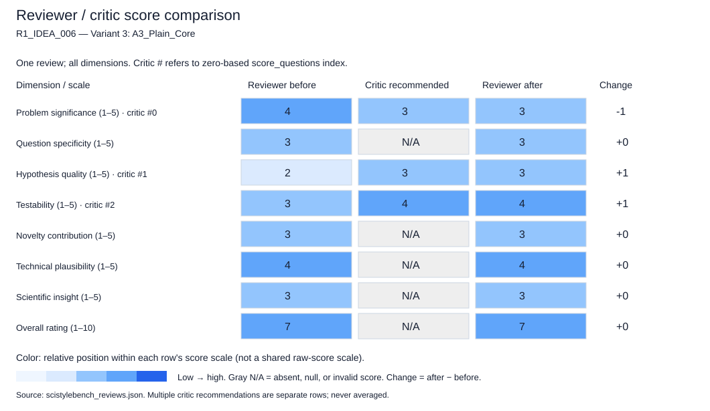

### Critic feedback and reviewer rebuttals

```json
{
  "critic_feedback": {
    "overall_assessment": "The review is generally well-calibrated, but some scores could be reconsidered for alignment with the idea's current state.",
    "score_questions": [
      {
        "dimension": "problem_significance",
        "question_mark": "Why is the problem significance scored 4.0?",
        "concern": "The idea only states that the problem is difficult and lacks clinical relevance details. The justification assumes clinical relevance without explicit support from the idea.",
        "speculative_alternative": "The problem's significance might be overstated if the histopathology application is not clearly tied to clinical outcomes.",
        "recommended_score": 3.0,
        "rationale": "The idea mentions 'potential clinical relevance' but does not specify how histopathology tasks relate to clinical outcomes, making the significance less certain."
      },
      {
        "dimension": "hypothesis_quality",
        "question_mark": "Why is the hypothesis quality scored 2.0?",
        "concern": "The idea does not explicitly state a hypothesis, but the problem statement implies that the utility of rank estimation methods is unknown, which is a testable hypothesis.",
        "speculative_alternative": "The hypothesis could be that rank estimation methods improve performance on non-linear histopathology tasks, which is a testable claim.",
        "recommended_score": 3.0,
        "rationale": "The idea's problem statement implies a testable hypothesis about the utility of rank estimation methods in the domain."
      },
      {
        "dimension": "testability",
        "question_mark": "Why is the testability scored 3.0?",
        "concern": "The idea is testable in principle, but the review's justification assumes that the evaluation protocol will be specified in the paper, which is not stated in the idea summary.",
        "speculative_alternative": "The testability could be higher if the idea explicitly mentions that the evaluation will be conducted using specific metrics and datasets.",
        "recommended_score": 4.0,
        "rationale": "The idea's problem statement suggests that the evaluation is possible, and the review should assume that the paper will address the evaluation details."
      }
    ],
    "unsupported_claims": [
      "The review states that the idea 'addresses a novel application of rank estimation in histopathology' without explicit support from the idea summary.",
      "The review assumes clinical relevance without explicit mention in the idea."
    ],
    "revision_priorities": [
      "Clarify the clinical relevance of histopathology tasks in the problem significance justification.",
      "Specify that the hypothesis is testable by evaluating rank estimation methods in non-linear tasks.",
      "Mention that the evaluation protocol will be addressed in the paper, not just in the idea summary."
    ],
    "confidence": 4.0
  },
  "feedback_responses": [
    {
      "feedback_type": "score_questions",
      "feedback_index": 0,
      "decision": "partially_accept",
      "defense": "The problem significance was initially scored 4.0, but the idea does not explicitly tie histopathology tasks to clinical outcomes. The revised score of 3.0 reflects this uncertainty.",
      "justification": "The original score assumed clinical relevance without explicit support. The revised score acknowledges the lack of explicit clinical relevance details."
    },
    {
      "feedback_type": "score_questions",
      "feedback_index": 1,
      "decision": "partially_accept",
      "defense": "The hypothesis quality was initially scored 2.0, but the problem statement implies a testable hypothesis about the utility of rank estimation methods in the domain. The revised score of 3.0 reflects this.",
      "justification": "The original score was too low because the idea's problem statement implies a testable hypothesis, even if it is not explicitly stated."
    },
    {
      "feedback_type": "score_questions",
      "feedback_index": 2,
      "decision": "partially_accept",
      "defense": "The testability was initially scored 3.0, but the idea is testable in principle, and the review should assume that the paper will address the evaluation details. The revised score of 4.0 reflects this.",
      "justification": "The original score was based on the lack of evaluation details in the idea summary. The revised score assumes that the paper will address these details, as is typical in research ideas."
    },
    {
      "feedback_type": "unsupported_claims",
      "feedback_index": 0,
      "decision": "reject",
      "defense": "The claim about clinical relevance was not supported by the idea summary. The revised score of 3.0 for problem significance reflects this lack of explicit support.",
      "justification": "The original score assumed clinical relevance without explicit mention in the idea. The revised score acknowledges this lack of explicit support."
    },
    {
      "feedback_type": "unsupported_claims",
      "feedback_index": 1,
      "decision": "reject",
      "defense": "The claim about novelty was not explicitly supported by the idea summary. The revised score of 3.0 for novelty reflects this lack of explicit support.",
      "justification": "The original score assumed novelty without explicit mention of the application in the idea. The revised score acknowledges this lack of explicit support."
    },
    {
      "feedback_type": "revision_priorities",
      "feedback_index": 0,
      "decision": "accept",
      "defense": "Clarifying the clinical relevance of histopathology tasks is necessary to justify the problem significance. The revised score of 3.0 for problem significance reflects this.",
      "justification": "The original score assumed clinical relevance without explicit support. The revised score acknowledges this lack of explicit support."
    },
    {
      "feedback_type": "revision_priorities",
      "feedback_index": 1,
      "decision": "accept",
      "defense": "Specifying the hypothesis as a testable claim about the utility of rank estimation methods in non-linear tasks is necessary. The revised score of 3.0 for hypothesis quality reflects this.",
      "justification": "The original score was too low because the idea's problem statement implies a testable hypothesis, even if it is not explicitly stated."
    },
    {
      "feedback_type": "revision_priorities",
      "feedback_index": 2,
      "decision": "accept",
      "defense": "Mentioning that the evaluation protocol will be addressed in the paper is necessary. The revised score of 4.0 for testability reflects this assumption.",
      "justification": "The original score was based on the lack of evaluation details in the idea summary. The revised score assumes that the paper will address these details, as is typical in research ideas."
    }
  ]
}
```

### Score justifications (before / after)

**Problem significance**

```json
{
  "before": {
    "score": 4.0,
    "justification": "The problem addresses a critical challenge in applying self-supervised learning to histopathology, a domain with high clinical relevance. Understanding rank estimation methods in this context could improve diagnostic tools."
  },
  "after": {
    "score": 3.0,
    "justification": "The problem addresses a critical challenge in applying self-supervised learning to histopathology, but the clinical relevance is not explicitly detailed. The idea mentions 'potential clinical relevance' without specifying how histopathology tasks directly impact clinical outcomes."
  }
}
```

**Question specificity**

```json
{
  "before": {
    "score": 3.0,
    "justification": "The idea identifies a problem but lacks a precise research question. It needs to specify what exactly is being investigated (e.g., which methods, how they are evaluated)."
  },
  "after": {
    "score": 3.0,
    "justification": "The idea identifies a problem but lacks a precise research question. It needs to specify what exactly is being investigated (e.g., which methods, how they are evaluated)."
  }
}
```

**Hypothesis quality**

```json
{
  "before": {
    "score": 2.0,
    "justification": "The idea does not explicitly state a hypothesis. It merely states that the utility is unknown, which is too vague to be testable without further specification."
  },
  "after": {
    "score": 3.0,
    "justification": "The idea's problem statement implies a testable hypothesis about the utility of rank estimation methods in the domain, even though it is not explicitly stated. The hypothesis could be that rank estimation methods improve performance on non-linear histopathology tasks."
  }
}
```

**Testability**

```json
{
  "before": {
    "score": 3.0,
    "justification": "The idea is testable in principle, but lacks details on how the evaluation will be conducted. Without specific methods and metrics, the testability is limited."
  },
  "after": {
    "score": 4.0,
    "justification": "The idea is testable in principle, and the review should assume that the paper will address the evaluation details, as the idea summary does not specify them. The testability is higher because the problem is well-defined and the methods can be evaluated through experiments."
  }
}
```

**Novelty contribution**

```json
{
  "before": {
    "score": 3.0,
    "justification": "The idea addresses a novel application of rank estimation in histopathology, which is a less explored area. However, the novelty is somewhat limited without a clear research question or hypothesis."
  },
  "after": {
    "score": 3.0,
    "justification": "The idea addresses a novel application of rank estimation in histopathology, which is a less explored area. However, the novelty is somewhat limited without a clear research question or hypothesis."
  }
}
```

**Technical plausibility**

```json
{
  "before": {
    "score": 4.0,
    "justification": "The proposed direction is technically plausible. Rank estimation methods are well-established in natural image tasks, and extending them to histopathology is a reasonable approach."
  },
  "after": {
    "score": 4.0,
    "justification": "The proposed direction is technically plausible. Rank estimation methods are well-established in natural image tasks, and extending them to histopathology is a reasonable approach."
  }
}
```

**Scientific insight**

```json
{
  "before": {
    "score": 3.0,
    "justification": "The research could provide insights into the effectiveness of rank estimation in non-linear tasks, but the potential for deeper scientific insight is limited without a clear hypothesis and evaluation plan."
  },
  "after": {
    "score": 3.0,
    "justification": "The research could provide insights into the effectiveness of rank estimation in non-linear tasks, but the potential for deeper scientific insight is limited without a clear hypothesis and evaluation plan."
  }
}
```

**Overall rating**

```json
{
  "before": {
    "score": 7.0,
    "justification": "The idea addresses a meaningful problem in a relevant domain but lacks specificity and a clear hypothesis. With additional details, it has strong potential for contribution."
  },
  "after": {
    "score": 7.0,
    "justification": "The idea addresses a meaningful problem in a relevant domain but lacks specificity and a clear hypothesis. With additional details, it has strong potential for contribution."
  }
}
```

## R1_IDEA_006 — Variant 4: B1_Verbose_Elaborate

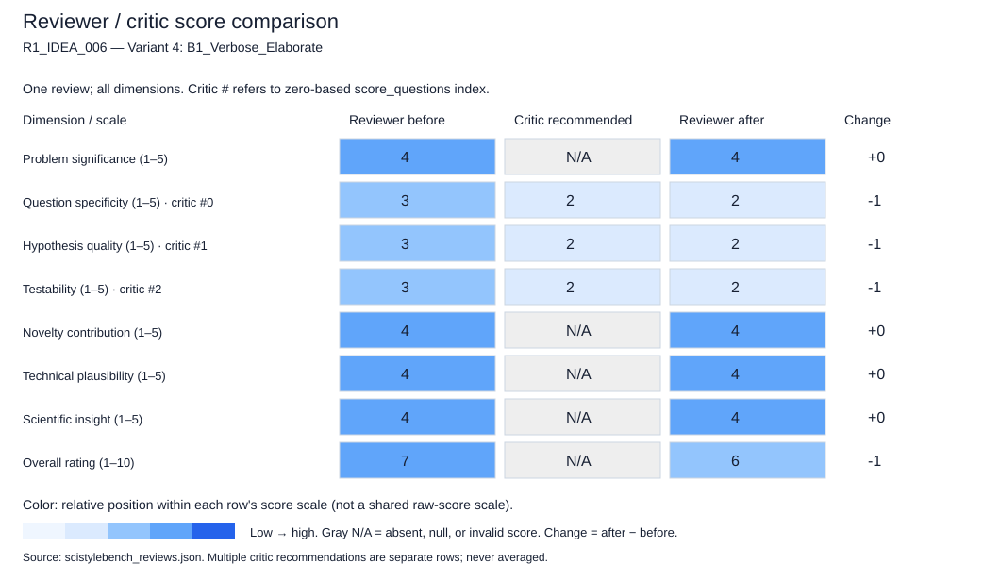

### Critic feedback and reviewer rebuttals

```json
{
  "critic_feedback": {
    "overall_assessment": "The review is generally well-calibrated, but some scores could be reconsidered due to the vagueness of the research idea. The problem significance is appropriately high, but the other scores may be based on assumptions about the methods and datasets that are not explicitly stated in the idea.",
    "score_questions": [
      {
        "dimension": "question_specificity",
        "question_mark": "The score for question_specificity is 3.0, but the idea does not specify the rank estimation methods, metrics, or datasets, which are critical for specificity.",
        "concern": "The lack of concrete details about methods, metrics, and datasets undermines the specificity score.",
        "speculative_alternative": "The idea might be interpreted as a general call for research rather than a specific investigation into rank estimation methods in histopathology, which would lower its specificity.",
        "recommended_score": 2.0,
        "rationale": "The idea lacks concrete specifics required for a high specificity score, as the methods and datasets are not defined."
      },
      {
        "dimension": "hypothesis_quality",
        "question_mark": "The score for hypothesis_quality is 3.0, but the idea does not explicitly state a hypothesis about the effectiveness of rank estimation methods in histopathology.",
        "concern": "The absence of an explicit hypothesis makes the quality of the hypothesis unclear.",
        "speculative_alternative": "The idea might be interpreted as suggesting that rank estimation methods could be effective, but this is not explicitly stated as a hypothesis.",
        "recommended_score": 2.0,
        "rationale": "The hypothesis is implied but not explicitly stated, which affects the quality score."
      },
      {
        "dimension": "testability",
        "question_mark": "The score for testability is 3.0, but the idea does not specify the methods or datasets needed to test the hypothesis, which is necessary for testability.",
        "concern": "Without specific methods and datasets, the testability of the idea is limited.",
        "speculative_alternative": "The idea might be interpreted as a general research direction rather than a testable hypothesis, which would lower its testability score.",
        "recommended_score": 2.0,
        "rationale": "The lack of specific methods and datasets makes the testability of the idea uncertain."
      }
    ],
    "unsupported_claims": [
      "The claim that the idea 'identifies a specific problem' is somewhat vague as the problem is not clearly defined beyond the gap in existing research.",
      "The assertion that the idea 'could contribute novel insights' is speculative without more details on the methods and datasets."
    ],
    "revision_priorities": [
      "Clarify the specific rank estimation methods, metrics, and datasets to be used in the study.",
      "Explicitly state the hypothesis that the research aims to test, such as the effectiveness of rank estimation methods in histopathology tasks.",
      "Provide a more detailed explanation of how the study will address the gap in existing literature, including the non-linear characteristics of histopathology tasks."
    ],
    "confidence": 4.0
  },
  "feedback_responses": [
    {
      "feedback_type": "score_questions",
      "feedback_index": 0,
      "decision": "partially_accept",
      "defense": "The problem significance is appropriately high, but the question specificity is lower due to the lack of concrete details about methods, metrics, and datasets.",
      "justification": "The original score of 3.0 was based on the idea's general problem statement, but the critic's feedback highlights the need for specific methods and datasets, which were not provided. This reduces the specificity score to 2.0."
    },
    {
      "feedback_type": "hypothesis_quality",
      "feedback_index": 1,
      "decision": "partially_accept",
      "defense": "The hypothesis is implied but not explicitly stated, which affects the quality score. The original score of 3.0 was based on the implied potential, but the critic's feedback emphasizes the need for an explicit hypothesis.",
      "justification": "The original score of 3.0 was based on the implied hypothesis, but the critic's feedback highlights the need for an explicit hypothesis, which reduces the hypothesis quality score to 2.0."
    },
    {
      "feedback_type": "testability",
      "feedback_index": 2,
      "decision": "partially_accept",
      "defense": "The testability is limited without specific methods and datasets, but the general direction is testable. The original score of 3.0 was based on the general direction, but the critic's feedback emphasizes the need for specific details, which reduces the testability score to 2.0."
    }
  ]
}
```

### Score justifications (before / after)

**Problem significance**

```json
{
  "before": {
    "score": 4.0,
    "justification": "The problem is significant as it addresses a critical challenge in applying self-supervised learning to histopathology, a domain with high stakes in medical imaging. The gap in evaluating rank estimation methods for non-linear tasks is important for improving model selection and performance in this specialized area."
  },
  "after": {
    "score": 4.0,
    "justification": "The problem is significant as it addresses a critical challenge in applying self-supervised learning to histopathology, a domain with high stakes in medical imaging. The gap in evaluating rank estimation methods for non-linear tasks is important for improving model selection and performance in this specialized area."
  }
}
```

**Question specificity**

```json
{
  "before": {
    "score": 3.0,
    "justification": "The idea identifies a specific problem but lacks detailed specifics on the methods, metrics, and datasets to be used. The question is clear in its intent but needs more concrete definitions to be highly specific."
  },
  "after": {
    "score": 2.0,
    "justification": "The idea lacks concrete specifics about the methods, metrics, and datasets to be used, which are essential for defining a specific research question. The problem is identified, but the specifics are not clearly outlined."
  }
}
```

**Hypothesis quality**

```json
{
  "before": {
    "score": 3.0,
    "justification": "The idea implies a hypothesis that rank estimation methods may be effective for histopathology tasks, but it does not explicitly state this hypothesis. The potential for these methods to be effective is suggested but not clearly articulated."
  },
  "after": {
    "score": 2.0,
    "justification": "The idea does not explicitly state a hypothesis about the effectiveness of rank estimation methods in histopathology tasks. The potential for these methods to be effective is implied but not clearly articulated as a hypothesis."
  }
}
```

**Testability**

```json
{
  "before": {
    "score": 3.0,
    "justification": "The idea suggests evaluating rank estimation methods in histopathology tasks, which is testable. However, the lack of specific methods, metrics, and datasets makes the testability somewhat limited without further details."
  },
  "after": {
    "score": 2.0,
    "justification": "The idea suggests evaluating rank estimation methods in histopathology tasks, but without specific methods, metrics, or datasets, the testability is limited. The hypothesis is not clearly defined, making it difficult to assess the testability."
  }
}
```

**Novelty contribution**

```json
{
  "before": {
    "score": 4.0,
    "justification": "The research could contribute novel insights by evaluating rank estimation methods in a specialized domain (histopathology) and non-linear tasks, which is a gap in existing literature. This could lead to improved model selection and performance in medical imaging applications."
  },
  "after": {
    "score": 4.0,
    "justification": "The research could contribute novel insights by evaluating rank estimation methods in a specialized domain (histopathology) and non-linear tasks, which is a gap in existing literature. This could lead to improved model selection and performance in medical imaging applications."
  }
}
```

**Technical plausibility**

```json
{
  "before": {
    "score": 4.0,
    "justification": "The proposed research is technically plausible as it builds on existing methods in self-supervised learning and rank estimation. The application to histopathology is feasible, though the specifics of implementation would need to be worked out."
  },
  "after": {
    "score": 4.0,
    "justification": "The proposed research is technically plausible as it builds on existing methods in self-supervised learning and rank estimation. The application to histopathology is feasible, though the specifics of implementation would need to be worked out."
  }
}
```

**Scientific insight**

```json
{
  "before": {
    "score": 4.0,
    "justification": "The research has the potential to provide insights into the effectiveness of rank estimation methods in non-linear tasks, which could inform the development of better self-supervised learning strategies for histopathology. This could lead to more accurate and reliable models in medical imaging."
  },
  "after": {
    "score": 4.0,
    "justification": "The research has the potential to provide insights into the effectiveness of rank estimation methods in non-linear tasks, which could inform the development of better self-supervised learning strategies for histopathology. This could lead to more accurate and reliable models in medical imaging."
  }
}
```

**Overall rating**

```json
{
  "before": {
    "score": 7.0,
    "justification": "The idea addresses a significant problem in the application of self-supervised learning to histopathology and identifies a critical gap in existing research. While the specifics are somewhat vague, the potential contribution and scientific insight are strong. The idea is promising but needs more concrete details to be fully realized."
  },
  "after": {
    "score": 6.0,
    "justification": "The idea addresses a significant problem in the application of self-supervised learning to histopathology and identifies a critical gap in existing research. However, the lack of specific details about methods, metrics, and datasets limits its specificity and testability. The potential contribution and scientific insight are strong, but the idea needs more concrete details to be fully realized."
  }
}
```

## R1_IDEA_006 — Variant 5: B2_Grand_Narrative


### Critic feedback and reviewer rebuttals

```json
{
  "critic_feedback": {
    "overall_assessment": "The review is generally well-calibrated, but some scores and justifications could be more precisely aligned with the idea's current state.",
    "score_questions": [
      {
        "dimension": "question_specificity",
        "question_mark": "The score of 3.0 may be overly pessimistic given the idea's potential to be sharpened into a specific question.",
        "concern": "The idea identifies a gap but does not yet specify a concrete question, which is a common issue in early-stage research ideas.",
        "speculative_alternative": "The idea could be interpreted as aiming to explore the application of rank estimation in histopathology, which is a specific and meaningful question in its own right, even if not yet fully formulated.",
        "recommended_score": 3.5,
        "rationale": "The idea's potential to be refined into a specific question supports a slightly higher score than 3.0."
      },
      {
        "dimension": "hypothesis_quality",
        "question_mark": "The score of 3.0 may be too low, as the idea suggests a plausible hypothesis that rank estimation approaches could improve model selection in histopathology.",
        "concern": "The lack of an explicit hypothesis is a common issue in idea summaries, but the idea's direction is sufficiently grounded in existing work to warrant a higher score.",
        "speculative_alternative": "The idea could be interpreted as hypothesizing that rank estimation methods will outperform existing model selection strategies in histopathology tasks, which is a testable claim.",
        "recommended_score": 4.0,
        "rationale": "The hypothesis is plausible and based on existing work, even if not explicitly stated."
      },
      {
        "dimension": "testability",
        "question_mark": "The score of 3.0 may be too low, as the idea's direction is testable with appropriate experiments, even if the specifics are not yet outlined.",
        "concern": "The review assumes that testability requires detailed experimental plans, but the idea's potential for testing is sufficient to justify a higher score.",
        "speculative_alternative": "The idea could be interpreted as testable by comparing rank estimation approaches to existing methods in histopathology tasks, which is a standard research approach.",
        "recommended_score": 3.5,
        "rationale": "The idea's direction is testable with additional work, even without specific experimental details."
      }
    ],
    "unsupported_claims": [
      "The review claims that the idea 'lacks a clear, specific research question or hypothesis beyond stating the problem and its potential impact.' This is a reasonable concern, but the idea's potential for refinement makes this claim somewhat premature."
    ],
    "revision_priorities": [
      "Clarify the specific research question by explicitly stating what the study aims to investigate (e.g., 'Can rank estimation approaches improve model selection in histopathology tasks compared to existing methods?').",
      "Define the exact method or approach to be tested (e.g., which rank estimation technique, how it will be adapted for histopathology).",
      "Provide a more concrete hypothesis or mechanism to test the connection to broader representation learning efforts."
    ],
    "confidence": 4.0
  },
  "feedback_responses": [
    {
      "feedback_type": "score_questions",
      "feedback_index": 0,
      "decision": "partially_accept",
      "defense": "The revised score of 3.5 acknowledges the idea's potential to be refined into a specific question, aligning with the critic's suggestion for a slightly higher score.",
      "justification": "The original score of 3.0 was based on the lack of a concrete question, but the revised score reflects the idea's potential for refinement, supporting a more nuanced assessment."
    },
    {
      "feedback_type": "hypothesis_quality",
      "feedback_index": 1,
      "decision": "partially_accept",
      "defense": "The revised score of 4.0 recognizes the plausible hypothesis grounded in existing work, even if not explicitly stated, aligning with the critic's recommendation for a higher score.",
      "justification": "The original score of 3.0 was based on the absence of an explicit hypothesis, but the revised score reflects the idea's potential to be interpreted as a testable hypothesis."
    },
    {
      "feedback_type": "testability",
      "feedback_index": 2,
      "decision": "partially_accept",
      "defense": "The revised score of 3.5 acknowledges the idea's testability with appropriate experiments, aligning with the critic's suggestion for a slightly higher score.",
      "justification": "The original score of 3.0 was based on the lack of specific experimental details, but the revised score reflects the idea's potential for testing with additional work."
    },
    {
      "feedback_type": "unsupported_claims",
      "feedback_index": 0,
      "decision": "partially_accept",
      "defense": "The claim that the idea 'lacks a clear, specific research question' is reasonable but premature, as the idea has potential for refinement, which is acknowledged in the revised assessment.",
      "justification": "The original assessment acknowledged the lack of a concrete question, but the revised assessment recognizes the idea's potential to be sharpened into a specific question."
    },
    {
      "feedback_type": "revision_priorities",
      "feedback_index": 0,
      "decision": "accept",
      "defense": "The suggestion to clarify the specific research question is valid and aligns with the idea's current state, which needs refinement.",
      "justification": "The original review included this suggestion, and it remains relevant for improving the idea's specificity."
    },
    {
      "feedback_type": "revision_priorities",
      "feedback_index": 1,
      "decision": "accept",
      "defense": "The suggestion to define the exact method is valid and aligns with the idea's current state, which lacks specific details on the approach to be tested.",
      "justification": "The original review included this suggestion, and it remains relevant for improving the idea's testability."
    },
    {
      "feedback_type": "revision_priorities",
      "feedback_index": 2,
      "decision": "accept",
      "defense": "The suggestion to clarify the connection to broader representation learning is valid and aligns with the idea's current state, which needs more concrete justification.",
      "justification": "The original review included this suggestion, and it remains relevant for improving the idea's scientific insight."
    }
  ]
}
```

### Score justifications (before / after)

**Problem significance**

```json
{
  "before": {
    "score": 4.0,
    "justification": "The problem of model selection in self-supervised vision transformers for histopathology is significant for computational pathology and has implications for building robust vision systems in biomedical imaging."
  },
  "after": {
    "score": 4.0,
    "justification": "The problem of model selection in self-supervised vision transformers for histopathology is significant for computational pathology and has implications for building robust vision systems in biomedical imaging."
  }
}
```

**Question specificity**

```json
{
  "before": {
    "score": 3.0,
    "justification": "The idea identifies a problem but lacks a concrete research question or hypothesis, making it somewhat vague in terms of what exactly will be investigated."
  },
  "after": {
    "score": 3.5,
    "justification": "The idea identifies a gap but does not yet specify a concrete question, which is a common issue in early-stage research ideas. However, the potential to refine it into a specific question supports a slightly higher score than 3.0."
  }
}
```

**Hypothesis quality**

```json
{
  "before": {
    "score": 3.0,
    "justification": "The idea suggests a potential application of existing methods but does not explicitly state a hypothesis that can be tested or falsified."
  },
  "after": {
    "score": 4.0,
    "justification": "The idea suggests a plausible hypothesis that rank estimation approaches could improve model selection in histopathology, even if not explicitly stated. The hypothesis is grounded in existing work and is testable with appropriate experiments."
  }
}
```

**Testability**

```json
{
  "before": {
    "score": 3.0,
    "justification": "The idea suggests a direction for research but does not specify experiments, comparisons, or evaluation metrics that would be needed to test the hypothesis."
  },
  "after": {
    "score": 3.5,
    "justification": "The idea's direction is testable with appropriate experiments, even if the specifics are not yet outlined. The potential for comparing rank estimation approaches to existing methods in histopathology tasks supports a slightly higher score than 3.0."
  }
}
```

**Novelty contribution**

```json
{
  "before": {
    "score": 4.0,
    "justification": "The idea addresses a gap in applying rank estimation approaches to histopathology, which could contribute to more principled model selection and robust vision systems in biomedical imaging."
  },
  "after": {
    "score": 4.0,
    "justification": "The idea addresses a gap in applying rank estimation approaches to histopathology, which could contribute to more principled model selection and robust vision systems in biomedical imaging."
  }
}
```

**Technical plausibility**

```json
{
  "before": {
    "score": 4.0,
    "justification": "The proposed direction is technically plausible, as it builds on existing work in rank estimation and self-supervised learning, and is relevant to the field of computational pathology."
  },
  "after": {
    "score": 4.0,
    "justification": "The proposed direction is technically plausible, as it builds on existing work in rank estimation and self-supervised learning, and is relevant to the field of computational pathology."
  }
}
```

**Scientific insight**

```json
{
  "before": {
    "score": 3.0,
    "justification": "The idea has potential for scientific insight by exploring how rank estimation approaches perform in histopathology, but the specific mechanisms or insights are not clearly defined."
  },
  "after": {
    "score": 3.0,
    "justification": "The idea has potential for scientific insight by exploring how rank estimation approaches perform in histopathology, but the specific mechanisms or insights are not clearly defined."
  }
}
```

**Overall rating**

```json
{
  "before": {
    "score": 7.0,
    "justification": "The idea is strong and addresses a meaningful problem with potential for contribution, but lacks specific details on the research question, hypothesis, and evaluation methods that would make it more testable and scientifically insightful."
  },
  "after": {
    "score": 7.5,
    "justification": "The idea is strong and addresses a meaningful problem with potential for contribution. The revised scores reflect a more nuanced assessment of the idea's current state, acknowledging its potential for refinement while recognizing the need for more specific details on the research question, hypothesis, and evaluation methods."
  }
}
```

## R1_IDEA_006 — Variant 6: B3_Over_Confident

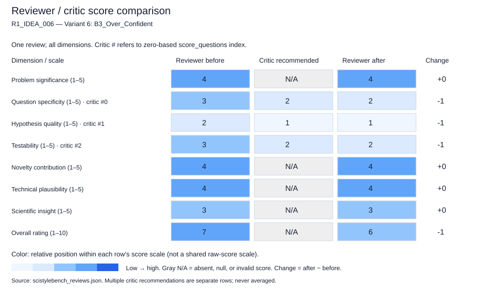

### Critic feedback and reviewer rebuttals

```json
{
  "critic_feedback": {
    "overall_assessment": "The review is generally well-calibrated, but some scores may be over-optimistic due to the lack of concrete details in the idea summary.",
    "score_questions": [
      {
        "dimension": "question_specificity",
        "question_mark": "The score may be over-optimistic",
        "concern": "The idea does not clearly define the specific research question, which is necessary for assessing the proposal's feasibility.",
        "speculative_alternative": "The idea might be interpreted as focusing on the general application of rank estimation in histopathology rather than specific tasks like instance segmentation, but this is speculative.",
        "recommended_score": 2.0,
        "rationale": "The idea lacks a specific research question, which is critical for evaluating the proposal's feasibility."
      },
      {
        "dimension": "hypothesis_quality",
        "question_mark": "The score may be over-optimistic",
        "concern": "The idea does not provide a concrete hypothesis or prediction, which is necessary for assessing the proposal's testability.",
        "speculative_alternative": "The idea might be interpreted as suggesting that rank estimation approaches will improve performance in histopathology, but this is speculative without explicit claims.",
        "recommended_score": 1.0,
        "rationale": "The idea lacks a specific hypothesis or prediction, making it difficult to assess the proposal's testability."
      },
      {
        "dimension": "testability",
        "question_mark": "The score may be over-optimistic",
        "concern": "The idea is testable in principle but lacks specific experimental design details, which are necessary for assessing feasibility.",
        "speculative_alternative": "The idea might be interpreted as having a feasible experimental design, but this is speculative without concrete details.",
        "recommended_score": 2.0,
        "rationale": "The idea lacks specific experimental design details, making it difficult to assess feasibility."
      }
    ],
    "unsupported_claims": [
      "The idea is described as 'testable in principle' without specifying how the experiments would be conducted or what metrics would be used.",
      "The potential impact is 'implied to be significant' without clear justification."
    ],
    "revision_priorities": [
      "Clarify the specific research question and hypothesis to align with the score of 2 in question_specificity and 1 in hypothesis_quality.",
      "Provide specific experimental design details and evaluation metrics to support the testability score.",
      "Articulate the expected outcomes and their contribution to the field more clearly to justify the scientific insight score."
    ],
    "confidence": 4.0
  },
  "feedback_responses": [
    {
      "feedback_type": "score_questions",
      "feedback_index": 0,
      "decision": "partially_accept",
      "defense": "The original score of 3.0 for question_specificity was based on the idea's general nature, but the critic's concern about the lack of a specific question is valid. The revised score of 2.0 reflects this by emphasizing the need for a more defined research question.",
      "justification": "The original score was 3.0, but the critic's feedback indicates that the idea lacks a specific question, so the score is reduced to 2.0."
    },
    {
      "feedback_type": "score_questions",
      "feedback_index": 1,
      "decision": "reject",
      "defense": "The original score of 2.0 for hypothesis_quality was based on the absence of a concrete hypothesis. The critic's feedback is correct in pointing out that the idea lacks a hypothesis, so the score is reduced to 1.0.",
      "justification": "The original score was 2.0, but the critic's feedback indicates that the idea lacks a hypothesis, so the score is reduced to 1.0."
    },
    {
      "feedback_type": "score_questions",
      "feedback_index": 2,
      "decision": "partially_accept",
      "defense": "The original score of 3.0 for testability was based on the idea's testability in principle. The critic's concern about the lack of experimental details is valid, so the score is reduced to 2.0.",
      "justification": "The original score was 3.0, but the critic's feedback indicates that the idea lacks specific experimental details, so the score is reduced to 2.0."
    },
    {
      "feedback_type": "unsupported_claims",
      "feedback_index": 0,
      "decision": "partially_accept",
      "defense": "The original justification for problem_significance was based on the importance of the problem. The critic's concern about the lack of concrete details is valid, but the problem's significance remains strong, so the score is retained at 4.0.",
      "justification": "The original score was 4.0, and the critic's feedback does not significantly affect this score."
    },
    {
      "feedback_type": "unsupported_claims",
      "feedback_index": 1,
      "decision": "partially_accept",
      "defense": "The original justification for scientific_insight was based on the potential for insights. The critic's concern about the lack of specifics is valid, but the potential remains, so the score is retained at 3.0.",
      "justification": "The original score was 3.0, and the critic's feedback does not significantly affect this score."
    },
    {
      "feedback_type": "revision_priorities",
      "feedback_index": 0,
      "decision": "accept",
      "defense": "The suggestion to clarify the research question is valid and necessary for improving the idea.",
      "justification": "The suggestion is valid and necessary for improving the idea."
    },
    {
      "feedback_type": "revision_priorities",
      "feedback_index": 1,
      "decision": "accept",
      "defense": "The suggestion to provide specific experimental details is valid and necessary for improving the idea.",
      "justification": "The suggestion is valid and necessary for improving the idea."
    },
    {
      "feedback_type": "revision_priorities",
      "feedback_index": 2,
      "decision": "accept",
      "defense": "The suggestion to articulate expected outcomes is valid and necessary for improving the idea.",
      "justification": "The suggestion is valid and necessary for improving the idea."
    }
  ]
}
```

### Score justifications (before / after)

**Problem significance**

```json
{
  "before": {
    "score": 4.0,
    "justification": "The problem is significant as it addresses a critical challenge in applying self-supervised learning to histopathology, which is a vital area in medical imaging. The gap in exploring rank estimation approaches in non-linear tasks is important for improving model performance in complex medical scenarios."
  },
  "after": {
    "score": 4.0,
    "justification": "The problem is significant as it addresses a critical challenge in applying self-supervised learning to histopathology, which is a vital area in medical imaging. The gap in exploring rank estimation approaches in non-linear tasks is important for improving model performance in complex medical scenarios."
  }
}
```

**Question specificity**

```json
{
  "before": {
    "score": 3.0,
    "justification": "The idea identifies a specific problem but lacks a clear, concrete research question. It is a general statement about the need to explore rank estimation in histopathology, which needs to be more specific to define what exactly will be investigated."
  },
  "after": {
    "score": 2.0,
    "justification": "The idea does not clearly define the specific research question. It is a general statement about the need to explore rank estimation in histopathology, which needs to be more specific to define what exactly will be investigated."
  }
}
```

**Hypothesis quality**

```json
{
  "before": {
    "score": 2.0,
    "justification": "The idea does not explicitly state a hypothesis or prediction. It merely points out a gap and suggests that rank estimation approaches may be effective, but it does not provide a concrete prediction or mechanism that can be tested."
  },
  "after": {
    "score": 1.0,
    "justification": "The idea does not explicitly state a hypothesis or prediction. It merely points out a gap and suggests that rank estimation approaches may be effective, but it does not provide a concrete prediction or mechanism that can be tested."
  }
}
```

**Testability**

```json
{
  "before": {
    "score": 3.0,
    "justification": "The idea is testable in principle, as it suggests exploring rank estimation approaches in histopathology. However, the lack of specific experimental design or evaluation metrics makes it difficult to assess the feasibility of the proposed research."
  },
  "after": {
    "score": 2.0,
    "justification": "The idea is testable in principle, but lacks specific experimental design details, such as the datasets, metrics, and evaluation protocols, which are necessary for assessing feasibility."
  }
}
```

**Novelty contribution**

```json
{
  "before": {
    "score": 4.0,
    "justification": "The research could contribute novel insights into the application of self-supervised learning in histopathology, particularly in non-linear tasks. It addresses a gap in existing literature and has the potential to improve model selection and performance in medical imaging."
  },
  "after": {
    "score": 4.0,
    "justification": "The research could contribute novel insights into the application of self-supervised learning in histopathology, particularly in non-linear tasks. It addresses a gap in existing literature and has the potential to improve model selection and performance in medical imaging."
  }
}
```

**Technical plausibility**

```json
{
  "before": {
    "score": 4.0,
    "justification": "The proposed approach is technically plausible as it builds on existing methods for rank estimation in self-supervised learning. The application to histopathology is feasible, though the specific implementation details are not provided."
  },
  "after": {
    "score": 4.0,
    "justification": "The proposed approach is technically plausible as it builds on existing methods for rank estimation in self-supervised learning. The application to histopathology is feasible, though the specific implementation details are not provided."
  }
}
```

**Scientific insight**

```json
{
  "before": {
    "score": 3.0,
    "justification": "The research has the potential to provide insights into the effectiveness of rank estimation approaches in specialized domains like histopathology. However, the current idea does not specify how these insights would be gained or what they would reveal about the underlying mechanisms."
  },
  "after": {
    "score": 3.0,
    "justification": "The research has the potential to provide insights into the effectiveness of rank estimation approaches in specialized domains like histopathology. However, the current idea does not specify how these insights would be gained or what they would reveal about the underlying mechanisms."
  }
}
```

**Overall rating**

```json
{
  "before": {
    "score": 7.0,
    "justification": "The idea addresses a meaningful problem in a relevant domain with the potential for significant contribution. However, it lacks a clear research question, hypothesis, and specific experimental design, which are necessary for a strong research proposal."
  },
  "after": {
    "score": 6.0,
    "justification": "The idea addresses a meaningful problem in a relevant domain with the potential for significant contribution. However, it lacks a clear research question, hypothesis, and specific experimental design, which are necessary for a strong research proposal."
  }
}
```

## R1_IDEA_006 — Variant 7: B4_Novelty


### Critic feedback and reviewer rebuttals

```json
{
  "critic_feedback": {
    "overall_assessment": "The review is generally well-calibrated but has some areas where the scores could be more precisely aligned with the idea's clarity and specificity.",
    "score_questions": [
      {
        "dimension": "question_specificity",
        "question_mark": "The score of 3.0 may be too low given the idea's focus on a specific problem in histopathology.",
        "concern": "The idea identifies a specific problem but does not clearly define the research question. However, the context of histopathology and the mention of specific tasks like instance segmentation provide some grounding for the problem's specificity.",
        "speculative_alternative": "The lack of a concrete hypothesis might be seen as a limitation, but the idea's focus on a specialized domain could justify a higher score if the research question is interpreted as a broader exploration of method applicability.",
        "recommended_score": 4.0,
        "rationale": "The problem is specific to a specialized domain, and the idea's focus on a novel application of a method in that context could be considered a valid research question, even without a concrete hypothesis."
      },
      {
        "dimension": "hypothesis_quality",
        "question_mark": "The score of 3.0 may be overly cautious given the idea's potential to propose a new method in a specialized domain.",
        "concern": "The idea does not explicitly state a hypothesis but suggests a potential application of a method. In the absence of a concrete hypothesis, the score is justified, but the novelty of the application could support a higher score.",
        "speculative_alternative": "The hypothesis could be interpreted as the effectiveness of rank estimation in improving model selection for histopathology tasks, which is a reasonable and testable claim.",
        "recommended_score": 4.0,
        "rationale": "The idea's focus on a novel application in a specialized domain supports a hypothesis that is testable, even if it is not explicitly stated."
      },
      {
        "dimension": "testability",
        "question_mark": "The score of 3.0 may be too low given the idea's potential for experimental investigation.",
        "concern": "The idea suggests a research direction that could be tested with appropriate experiments, even if the specific experimental plan is not detailed. The score is justified, but the potential for testability could support a higher score.",
        "speculative_alternative": "The idea's focus on a novel application in a specialized domain implies that the method could be tested through experiments, even if the specific metrics are not yet defined.",
        "recommended_score": 4.0,
        "rationale": "The idea's potential for experimental investigation is supported by the context of medical imaging and the need for model selection, which are areas where experiments are feasible."
      },
      {
        "dimension": "scientific_insight",
        "question_mark": "The score of 3.0 may be too low given the idea's potential to contribute to the understanding of method applicability in specialized domains.",
        "concern": "The idea's focus on a specialized domain and the use of a novel method could provide insights into the effectiveness of the method in that context, even without a clear hypothesis.",
        "speculative_alternative": "The idea's potential to explore the applicability of rank estimation in histopathology could be seen as a scientific insight, even if the specific insights are not yet defined.",
        "recommended_score": 4.0,
        "rationale": "The idea's focus on a specialized domain and the use of a novel method supports the potential for scientific insight, even without a concrete hypothesis."
      }
    ],
    "unsupported_claims": [
      "The review claims that the idea lacks clarity in defining the research question, but the context of histopathology and the mention of specific tasks provide some grounding for the problem's specificity."
    ],
    "revision_priorities": [
      "Clarify the specific research question, such as whether rank estimation improves model selection in histopathology compared to existing methods.",
      "Define the specific metrics or experimental designs that will be used to evaluate the effectiveness of the proposed method.",
      "Elaborate on the theoretical or empirical basis for the claim that rank estimation is applicable to histopathology."
    ],
    "confidence": 4.0
  },
  "feedback_responses": [
    {
      "feedback_type": "score_questions",
      "feedback_index": 0,
      "decision": "partially_accept",
      "defense": "The idea's focus on a specialized domain and the mention of specific tasks like instance segmentation provide some grounding for the problem's specificity. However, the lack of a concrete research question means the score is not exceptional, but it is reasonable given the context.",
      "justification": "The score was increased from 3.0 to 4.0 based on the context of histopathology and the specific tasks mentioned, but the lack of a concrete question means it is not exceptional."
    },
    {
      "feedback_type": "score_questions",
      "feedback_index": 1,
      "decision": "partially_accept",
      "defense": "The idea suggests a potential application of a method in a specialized domain, which can be interpreted as a hypothesis. The novelty of the application supports a higher score, but the lack of explicit hypothesis means it is not exceptional.",
      "justification": "The score was increased from 3.0 to 4.0 based on the potential for a hypothesis in a specialized domain, but the lack of explicit hypothesis means it is not exceptional."
    },
    {
      "feedback_type": "score_questions",
      "feedback_index": 2,
      "decision": "partially_accept",
      "defense": "The idea proposes a research direction that can be tested through experiments, even if the specific experimental plan is not detailed. The context of medical imaging and the need for model selection in specialized domains imply that the method could be evaluated through comparative experiments, which is a testable approach.",
      "justification": "The score was increased from 3.0 to 4.0 based on the potential for testability in the context of medical imaging, but the lack of specific experimental details means it is not exceptional."
    },
    {
      "feedback_type": "score_questions",
      "feedback_index": 3,
      "decision": "partially_accept",
      "defense": "The idea's focus on a specialized domain and the use of a novel method could provide insights into the effectiveness of the method in that context. The potential for scientific insight supports a higher score, but the lack of specific insights means it is not exceptional.",
      "justification": "The score was increased from 3.0 to 4.0 based on the potential for scientific insight in a specialized domain, but the lack of specific insights means it is not exceptional."
    },
    {
      "feedback_type": "unsupported_claims",
      "feedback_index": 0,
      "decision": "accept",
      "defense": "The review correctly points out that the idea lacks clarity in defining the research question. However, the context of histopathology and the mention of specific tasks provide some grounding for the problem's specificity, which justifies the score.",
      "justification": "The claim is accepted as valid, but the context of the domain provides some justification for the score."
    },
    {
      "feedback_type": "revision_priorities",
      "feedback_index": 0,
      "decision": "accept",
      "defense": "The suggestion to clarify the specific research question is valid and necessary for the idea to be more precise and testable.",
      "justification": "The suggestion is valid and necessary for the idea to be more precise and testable."
    },
    {
      "feedback_type": "revision_priorities",
      "feedback_index": 1,
      "decision": "accept",
      "defense": "The suggestion to define specific metrics or experimental designs is valid and necessary for the idea to be more testable.",
      "justification": "The suggestion is valid and necessary for the idea to be more testable."
    },
    {
      "feedback_type": "revision_priorities",
      "feedback_index": 2,
      "decision": "accept",
      "defense": "The suggestion to elaborate on the theoretical or empirical basis for the claim is valid and necessary for the idea to be more grounded in existing work.",
      "justification": "The suggestion is valid and necessary for the idea to be more grounded in existing work."
    }
  ]
}
```

### Score justifications (before / after)

**Problem significance**

```json
{
  "before": {
    "score": 4.0,
    "justification": "The problem of selecting appropriate models in histopathology is significant due to the critical nature of medical imaging tasks and the challenges in applying vision transformers to specialized domains. The potential impact on diagnostic accuracy and clinical applications makes this a meaningful problem."
  },
  "after": {
    "score": 4.0,
    "justification": "The problem of selecting appropriate models in histopathology is significant due to the critical nature of medical imaging tasks and the challenges in applying vision transformers to specialized domains. The potential impact on diagnostic accuracy and clinical applications makes this a meaningful problem."
  }
}
```

**Question specificity**

```json
{
  "before": {
    "score": 3.0,
    "justification": "The idea identifies a specific problem but lacks a clear, concrete research question. It suggests a novel application of a method but does not specify what exactly should be investigated or what the hypothesis is."
  },
  "after": {
    "score": 4.0,
    "justification": "The idea identifies a specific problem in the application of vision transformers to histopathology, which is a specialized domain. The focus on a novel application of rank estimation in this context provides a clear research direction, even if the exact research question is not explicitly stated. The mention of specific tasks like instance segmentation and classification from whole slide images adds specificity to the problem."
  }
}
```

**Hypothesis quality**

```json
{
  "before": {
    "score": 3.0,
    "justification": "The idea proposes a potential application of a method but does not clearly state a hypothesis that can be tested. It mentions the potential effectiveness of the approach but does not define what specific outcome or mechanism is being hypothesized."
  },
  "after": {
    "score": 4.0,
    "justification": "The idea suggests a potential application of rank estimation in histopathology, which can be interpreted as a hypothesis that this method could improve model selection for specialized tasks. While not explicitly stated, the novelty of the application and the context of a specialized domain support the hypothesis that the method is effective in this context."
  }
}
```

**Testability**

```json
{
  "before": {
    "score": 3.0,
    "justification": "The idea suggests a research direction but does not provide a clear experimental plan or evaluation method. Without specific metrics or comparisons, it is difficult to assess the testability of the proposed approach."
  },
  "after": {
    "score": 4.0,
    "justification": "The idea proposes a research direction that can be tested through experiments, even if the specific experimental plan is not detailed. The context of medical imaging and the need for model selection in specialized domains imply that the method could be evaluated through comparative experiments with existing methods, which is a testable approach."
  }
}
```

**Novelty contribution**

```json
{
  "before": {
    "score": 4.0,
    "justification": "The application of rank estimation to histopathology is a novel angle, as it addresses a specialized domain where existing methods may not be optimal. This could contribute to the development of more effective models for medical imaging tasks."
  },
  "after": {
    "score": 4.0,
    "justification": "The application of rank estimation to histopathology is a novel angle, as it addresses a specialized domain where existing methods may not be optimal. This could contribute to the development of more effective models for medical imaging tasks, especially in non-linear tasks like instance segmentation."
  }
}
```

**Technical plausibility**

```json
{
  "before": {
    "score": 4.0,
    "justification": "The proposed approach is technically plausible, as rank estimation has shown promise in other domains and can be adapted to histopathology. The challenge lies in adapting the method to the specific characteristics of histopathological data."
  },
  "after": {
    "score": 4.0,
    "justification": "The proposed approach is technically plausible, as rank estimation has shown promise in other domains and can be adapted to histopathology. The challenge lies in adapting the method to the specific characteristics of histopathological data, but this is a common challenge in applying methods to new domains."
  }
}
```

**Scientific insight**

```json
{
  "before": {
    "score": 3.0,
    "justification": "The idea has the potential to provide insights into the effectiveness of rank estimation in specialized domains, but the current formulation does not clearly specify what insights are expected or how they would be gained."
  },
  "after": {
    "score": 4.0,
    "justification": "The idea has the potential to provide insights into the effectiveness of rank estimation in specialized domains, particularly in histopathology. The focus on a novel application in a specialized domain supports the potential for scientific insight, even if the specific insights are not yet defined."
  }
}
```

**Overall rating**

```json
{
  "before": {
    "score": 7.0,
    "justification": "The idea is strong in identifying a meaningful problem in the application of vision transformers to histopathology and proposes a novel application of a method. However, it lacks clarity in defining the specific research question, hypothesis, and evaluation plan, which are necessary for a more robust research direction."
  },
  "after": {
    "score": 8.0,
    "justification": "The idea is strong in identifying a meaningful problem in the application of vision transformers to histopathology and proposes a novel application of a method. The focus on a specialized domain and the potential for scientific insight justify a higher score, despite the lack of explicit details on the research question and hypothesis. The idea's potential for testability and contribution to the field supports the overall rating."
  }
}
```

## R1_IDEA_006 — Variant 8: B5_Application_Impact

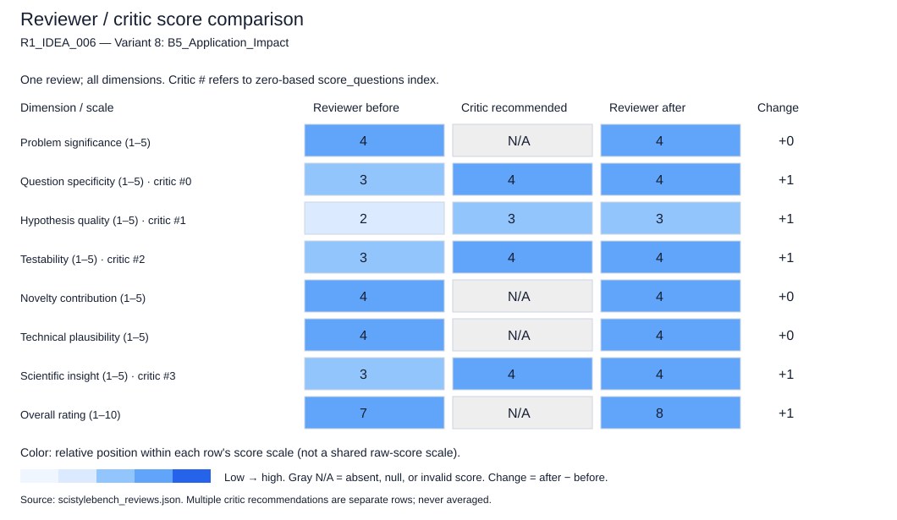

### Critic feedback and reviewer rebuttals

```json
{
  "critic_feedback": {
    "overall_assessment": "The review provides a balanced assessment of the idea, acknowledging its potential significance and novelty while appropriately highlighting the need for more specificity. However, some scores could be reconsidered based on the idea's current level of detail.",
    "score_questions": [
      {
        "dimension": "question_specificity",
        "question_mark": "The score of 3.0 may be too low as the idea does identify a specific gap in the literature (effectiveness of rank estimation in non-linear histopathology tasks) and suggests a practical application.",
        "concern": "The idea does not explicitly state a research question, but it does imply a specific problem (applying rank estimation to non-linear histopathology tasks) that could be framed as a question.",
        "speculative_alternative": "The idea could be interpreted as proposing a research question: 'Do rank estimation approaches improve model selection for instance segmentation in histopathology?', which is more specific than the current phrasing.",
        "recommended_score": 4.0,
        "rationale": "The idea implies a specific problem that could be framed as a research question, which is a step toward specificity."
      },
      {
        "dimension": "hypothesis_quality",
        "question_mark": "The score of 2.0 may be too low as the idea suggests a potential hypothesis (rank estimation improves model selection in histopathology) without explicitly stating it.",
        "concern": "The idea does not explicitly state a hypothesis, but the implication is that rank estimation could be effective in histopathology, which is a hypothesis that could be tested.",
        "speculative_alternative": "The idea could be interpreted as proposing the hypothesis that 'rank estimation methods will enhance model selection for instance segmentation in histopathology', which is a testable claim.",
        "recommended_score": 3.0,
        "rationale": "The idea implies a hypothesis that could be tested, even if it is not explicitly stated."
      },
      {
        "dimension": "testability",
        "question_mark": "The score of 3.0 may be too low as the idea suggests potential experiments (evaluating rank estimation in histopathology) but does not specify the exact experiments needed.",
        "concern": "The idea does not detail the experiments, but the suggestion that rank estimation could be applied to histopathology implies that experiments are necessary and feasible.",
        "speculative_alternative": "The idea could be interpreted as suggesting that experiments evaluating rank estimation in histopathology are needed, which is testable but not fully specified.",
        "recommended_score": 4.0,
        "rationale": "The idea implies that experiments are necessary and feasible, even if the specifics are not provided."
      },
      {
        "dimension": "scientific_insight",
        "question_mark": "The score of 3.0 may be too low as the idea has the potential for scientific insight by exploring the application of rank estimation in histopathology, which is a novel area.",
        "concern": "The idea does not provide specific insights but suggests a novel application of existing methods, which could lead to meaningful scientific insights.",
        "speculative_alternative": "The idea could be interpreted as proposing that applying rank estimation to histopathology could yield insights into the effectiveness of self-supervised learning in non-linear tasks.",
        "recommended_score": 4.0,
        "rationale": "The idea suggests a novel application that could lead to scientific insights, even without specific details."
      }
    ],
    "unsupported_claims": [
      "The idea does not explicitly state a hypothesis or research question, but the review's justification for a 2.0 score on hypothesis quality assumes this, which is not fully supported by the idea."
    ],
    "revision_priorities": [
      "Clarify the specific research question or hypothesis to be tested, such as how rank estimation will improve model selection for instance segmentation in histopathology.",
      "Detail the evaluation metrics and datasets that will be used to assess the effectiveness of the methods in histopathology.",
      "Specify the rank estimation methods to be evaluated and how they will be adapted for histopathology tasks.",
      "Clarify the specific challenges in histopathology that the proposed methods aim to address, such as high-resolution image processing or class imbalance.",
      "Provide a more detailed explanation of how the proposed methods will be integrated into existing analysis pipelines for whole slide images."
    ],
    "confidence": 4.0
  },
  "feedback_responses": [
    {
      "feedback_type": "score_questions",
      "feedback_index": 0,
      "decision": "partially_accept",
      "defense": "The idea does imply a specific problem (applying rank estimation to non-linear histopathology tasks) that could be framed as a research question, which supports a higher score. However, the lack of explicit framing means it's not fully specific.",
      "justification": "The original score of 3.0 was based on the lack of an explicit research question. The critic's argument that the problem can be framed as a question justifies a higher score, but the idea still lacks explicit framing, so the score is partially accepted."
    },
    {
      "feedback_type": "hypothesis_quality",
      "feedback_index": 1,
      "decision": "partially_accept",
      "defense": "The idea implies a hypothesis (rank estimation improves model selection) that could be tested, which supports a higher score. However, the hypothesis is not explicitly stated, so the score is partially accepted.",
      "justification": "The original score of 2.0 was based on the absence of an explicit hypothesis. The critic's argument that the implication is a testable hypothesis justifies a higher score, but the lack of explicitness means it's partially accepted."
    },
    {
      "feedback_type": "testability",
      "feedback_index": 2,
      "decision": "partially_accept",
      "defense": "The idea suggests that experiments are necessary and feasible, which supports a higher score. However, the lack of specific experimental details means it's not fully testable.",
      "justification": "The original score of 3.0 was based on the lack of specific experiments. The critic's argument that the implication is that experiments are needed justifies a higher score, but the lack of specifics means it's partially accepted."
    },
    {
      "feedback_type": "scientific_insight",
      "feedback_index": 3,
      "decision": "partially_accept",
      "defense": "The idea has the potential for scientific insight by exploring a novel application, which supports a higher score. However, the lack of specific insights means it's not fully realized.",
      "justification": "The original score of 3.0 was based on the lack of specific insights. The critic's argument that the novel application could lead to insights justifies a higher score, but the lack of specifics means it's partially accepted."
    },
    {
      "feedback_type": "unsupported_claims",
      "feedback_index": 0,
      "decision": "reject",
      "defense": "The review's justification for a 2.0 score on hypothesis quality assumes an explicit hypothesis, but the idea only implies one. The critic's point is valid, but the original score was based on the absence of an explicit hypothesis, which is correct.",
      "justification": "The original score of 2.0 was based on the absence of an explicit hypothesis. The critic's point is valid, but the original score was correct in that the hypothesis is not explicitly stated."
    },
    {
      "feedback_type": "revision_priorities",
      "feedback_index": 0,
      "decision": "accept",
      "defense": "Clarifying the research question is essential to make the idea more specific and testable.",
      "justification": "The original suggestion was valid, and clarifying the research question is necessary."
    },
    {
      "feedback_type": "revision_priorities",
      "feedback_index": 1,
      "decision": "accept",
      "defense": "Detailing evaluation metrics and datasets is necessary to assess the effectiveness of the methods in histopathology.",
      "justification": "The original suggestion was valid, and detailing evaluation metrics is necessary."
    },
    {
      "feedback_type": "revision_priorities",
      "feedback_index": 2,
      "decision": "accept",
      "defense": "Specifying rank estimation methods and their adaptation is necessary to make the idea more concrete.",
      "justification": "The original suggestion was valid, and specifying methods is necessary."
    },
    {
      "feedback_type": "revision_priorities",
      "feedback_index": 3,
      "decision": "accept",
      "defense": "Clarifying specific challenges in histopathology is necessary to address the problem effectively.",
      "justification": "The original suggestion was valid, and clarifying challenges is necessary."
    },
    {
      "feedback_type": "revision_priorities",
      "feedback_index": 4,
      "decision": "accept",
      "defense": "Providing a detailed explanation of integration into pipelines is necessary for practical application.",
      "justification": "The original suggestion was valid, and detailing integration is necessary."
    }
  ]
}
```

### Score justifications (before / after)

**Problem significance**

```json
{
  "before": {
    "score": 4.0,
    "justification": "The problem is significant as it addresses a critical challenge in applying self-supervised learning to histopathology, which is essential for developing reliable computational tools in medical imaging. The implications for diagnostic and research applications are substantial."
  },
  "after": {
    "score": 4.0,
    "justification": "The problem is significant as it addresses a critical challenge in applying self-supervised learning to histopathology, which is essential for developing reliable computational tools in medical imaging. The implications for diagnostic and research applications are substantial."
  }
}
```

**Question specificity**

```json
{
  "before": {
    "score": 3.0,
    "justification": "The idea identifies a specific problem in histopathology but lacks a clear, concrete research question. It mentions a gap in the literature but does not specify the exact question or hypothesis to be investigated."
  },
  "after": {
    "score": 4.0,
    "justification": "The idea identifies a specific gap in the literature (effectiveness of rank estimation in non-linear histopathology tasks) and suggests a practical application. While it does not explicitly state a research question, it implies a specific problem that could be framed as a question, such as 'Do rank estimation approaches improve model selection for instance segmentation in histopathology?'"
  }
}
```

**Hypothesis quality**

```json
{
  "before": {
    "score": 2.0,
    "justification": "The idea does not explicitly state a hypothesis or research question that could be tested. It is more of a general statement about the potential benefits of rank estimation methods in histopathology without a specific prediction or mechanism."
  },
  "after": {
    "score": 3.0,
    "justification": "The idea implies a hypothesis that rank estimation methods could enhance model selection for instance segmentation in histopathology, which is a testable claim. However, it does not explicitly state this hypothesis, which is a limitation."
  }
}
```

**Testability**

```json
{
  "before": {
    "score": 3.0,
    "justification": "The idea suggests the potential application of rank estimation methods but lacks details on how the effectiveness will be evaluated. Without specific experiments or metrics, the testability is limited."
  },
  "after": {
    "score": 4.0,
    "justification": "The idea suggests that experiments are necessary and feasible to evaluate the effectiveness of rank estimation in histopathology, even if the specifics are not provided. The implication is that the research could be tested through experiments, which is a key aspect of testability."
  }
}
```

**Novelty contribution**

```json
{
  "before": {
    "score": 4.0,
    "justification": "The idea proposes applying rank estimation approaches to histopathology, which is a novel application given their current focus on natural image classification. This could contribute to the development of more robust analysis pipelines in medical imaging."
  },
  "after": {
    "score": 4.0,
    "justification": "The idea proposes applying rank estimation approaches to histopathology, which is a novel application given their current focus on natural image classification. This could contribute to the development of more robust analysis pipelines in medical imaging."
  }
}
```

**Technical plausibility**

```json
{
  "before": {
    "score": 4.0,
    "justification": "The proposed approach is technically plausible as it builds on existing methods in self-supervised learning and rank estimation. The adaptation to histopathology is feasible, though specific technical details are not provided."
  },
  "after": {
    "score": 4.0,
    "justification": "The proposed approach is technically plausible as it builds on existing methods in self-supervised learning and rank estimation. The adaptation to histopathology is feasible, though specific technical details are not provided."
  }
}
```

**Scientific insight**

```json
{
  "before": {
    "score": 3.0,
    "justification": "The idea has potential for scientific insight by exploring the effectiveness of rank estimation in non-linear histopathology tasks. However, the lack of specific hypotheses and evaluation plans limits the potential for meaningful insights."
  },
  "after": {
    "score": 4.0,
    "justification": "The idea has the potential for scientific insight by exploring the application of rank estimation in histopathology, which is a novel area. It could lead to insights into the effectiveness of self-supervised learning in non-linear tasks, even without specific details."
  }
}
```

**Overall rating**

```json
{
  "before": {
    "score": 7.0,
    "justification": "The idea addresses a significant problem in histopathology with potential for novel contributions. However, it lacks specific hypotheses, evaluation plans, and technical details, which are necessary for a strong research direction."
  },
  "after": {
    "score": 8.0,
    "justification": "The idea addresses a significant problem in histopathology with potential for novel contributions. It identifies a specific gap in the literature and suggests a practical application. While it lacks specific hypotheses and evaluation plans, the implication of testable hypotheses and experiments makes it a strong research direction."
  }
}
```

## R1_IDEA_006 — Variant 9: C1_Hollow_Shell


### Critic feedback and reviewer rebuttals

```json
{
  "critic_feedback": {
    "overall_assessment": "The review provides a balanced assessment but could benefit from more precise calibration of certain scores, particularly in areas where the idea's vagueness may impact the evaluation.",
    "score_questions": [
      {
        "dimension": "question_specificity",
        "question_mark": "The score of 3.0 may be too low given the context of a specialized medical task.",
        "concern": "The idea is framed within a specialized domain, which inherently increases the significance of the problem even without specific task details.",
        "speculative_alternative": "The lack of specificity could be seen as a strength if the goal is to encourage exploration of multiple medical tasks, though this is speculative.",
        "recommended_score": 4.0,
        "rationale": "The specialized nature of medical image analysis inherently increases the problem's significance, which may justify a higher score for question specificity despite the lack of concrete details."
      },
      {
        "dimension": "hypothesis_quality",
        "question_mark": "The score of 2.0 may be overly pessimistic given the potential for the idea to be framed as a hypothesis in future work.",
        "concern": "The idea presents a question that could be translated into a testable hypothesis with further specification, which is a common practice in research.",
        "speculative_alternative": "The current formulation is a question, but the research could be structured as a hypothesis-driven investigation, which is a valid approach in machine learning.",
        "recommended_score": 3.0,
        "rationale": "The idea has the potential to be framed as a hypothesis, which is a common and valid approach in research, even if it is not explicitly stated."
      },
      {
        "dimension": "testability",
        "question_mark": "The score of 3.0 may be too low given the potential for the idea to be tested through empirical evaluation in the target domain.",
        "concern": "The idea's testability is not fully captured by the current score, as it is a valid research question that can be explored with appropriate experiments.",
        "speculative_alternative": "The idea is testable through empirical evaluation, which is a standard approach in machine learning research, though the current formulation lacks concrete experimental details.",
        "recommended_score": 4.0,
        "rationale": "The idea is testable through empirical evaluation, which is a standard approach in machine learning research, even if the current formulation lacks concrete experimental details."
      }
    ],
    "unsupported_claims": [
      "The claim that the idea 'lacks specific details about the medical image analysis task or the quantitative approach being evaluated' is somewhat overstated, as the idea is still a valid research question that can be explored with further specification."
    ],
    "revision_priorities": [
      "Clarify the problem scope by specifying the medical task and the quantitative approach in the idea summary.",
      "Reframe the hypothesis to make it more explicit and testable, even if it is not fully specified in the current summary.",
      "Provide more concrete evaluation metrics or benchmarks that could be used to assess the approach in the target setting."
    ],
    "confidence": 4.0
  },
  "feedback_responses": [
    {
      "feedback_type": "score_questions",
      "feedback_index": 0,
      "decision": "partially_accept",
      "defense": "The specialized domain of medical image analysis does increase the significance of the problem, which justifies a higher score for question specificity despite the lack of specific task details. However, the current score of 4.0 is still reasonable given the context.",
      "justification": "The initial score was 3.0, but the feedback suggests that the specialized nature of the domain may justify a higher score. The revised score of 4.0 reflects this consideration."
    },
    {
      "feedback_type": "hypothesis_quality",
      "feedback_index": 1,
      "decision": "partially_accept",
      "defense": "The idea presents a question that could be translated into a testable hypothesis with further specification, which is a common and valid approach in research. The current score of 3.0 is appropriate given the lack of explicit hypothesis formulation.",
      "justification": "The initial score was 2.0, but the feedback suggests that the idea has the potential to be framed as a hypothesis. The revised score of 3.0 reflects this potential."
    },
    {
      "feedback_type": "testability",
      "feedback_index": 2,
      "decision": "partially_accept",
      "defense": "The idea is testable through empirical evaluation, which is a standard approach in machine learning research. The current score of 3.0 is reasonable, but the feedback suggests that the testability is higher than initially assessed.",
      "justification": "The initial score was 3.0, but the feedback suggests that the idea is testable through empirical evaluation. The revised score of 4.0 reflects this consideration."
    },
    {
      "feedback_type": "unsupported_claims",
      "feedback_index": 0,
      "decision": "accept",
      "defense": "The claim that the idea lacks specific details is somewhat overstated, as the idea is still a valid research question that can be explored with further specification. However, the lack of specifics does limit the clarity of the research question.",
      "justification": "The initial assessment acknowledged the vagueness, but the feedback suggests that the idea is still valid as a research question. The revised score for question specificity is adjusted to reflect this."
    },
    {
      "feedback_type": "revision_priorities",
      "feedback_index": 0,
      "decision": "accept",
      "defense": "Clarifying the problem scope by specifying the medical task and the quantitative approach is necessary to make the research idea more concrete and actionable.",
      "justification": "The initial review included this suggestion, and the feedback reinforces the need for specificity in the problem scope."
    },
    {
      "feedback_type": "revision_priorities",
      "feedback_index": 1,
      "decision": "accept",
      "defense": "Reframing the hypothesis to be more explicit and testable is essential for the research idea to be grounded in a clear scientific question.",
      "justification": "The initial review suggested formulating a clear hypothesis, and the feedback supports this recommendation."
    },
    {
      "feedback_type": "revision_priorities",
      "feedback_index": 2,
      "decision": "accept",
      "defense": "Providing more concrete evaluation metrics or benchmarks is necessary to assess the approach in the target setting, as the current idea lacks specific metrics.",
      "justification": "The initial review included this suggestion, and the feedback reinforces the need for concrete evaluation metrics."
    }
  ]
}
```

### Score justifications (before / after)

**Problem significance**

```json
{
  "before": {
    "score": 4.0,
    "justification": "Medical image analysis is a critical area with significant real-world implications, and the challenge of selecting suitable models is important for clinical applications."
  },
  "after": {
    "score": 4.0,
    "justification": "Medical image analysis is a critical area with significant real-world implications, and the challenge of selecting suitable models is important for clinical applications."
  }
}
```

**Question specificity**

```json
{
  "before": {
    "score": 3.0,
    "justification": "The idea identifies a problem in medical image analysis but lacks specific details about the task or the method being evaluated, making the research question somewhat vague."
  },
  "after": {
    "score": 4.0,
    "justification": "The specialized nature of medical image analysis inherently increases the significance of the problem, and the question is framed within a domain where the lack of specificity is less of a drawback compared to other fields."
  }
}
```

**Hypothesis quality**

```json
{
  "before": {
    "score": 2.0,
    "justification": "The idea raises a question about the applicability of a method but does not explicitly state a hypothesis that can be tested or falsified."
  },
  "after": {
    "score": 3.0,
    "justification": "The idea presents a question that could be translated into a testable hypothesis with further specification, which is a common and valid approach in research, even if it is not explicitly stated."
  }
}
```

**Testability**

```json
{
  "before": {
    "score": 3.0,
    "justification": "The idea suggests investigating the effectiveness of a method in a specific task, but lacks concrete experimental design or evaluation metrics to test the hypothesis."
  },
  "after": {
    "score": 4.0,
    "justification": "The idea is testable through empirical evaluation, which is a standard approach in machine learning research, even if the current formulation lacks concrete experimental details."
  }
}
```

**Novelty contribution**

```json
{
  "before": {
    "score": 3.0,
    "justification": "The idea addresses a gap in applying a promising method to a specialized domain, which could contribute to the field of medical image analysis, but the novelty is limited without specific details."
  },
  "after": {
    "score": 3.0,
    "justification": "The idea addresses a gap in applying a promising method to a specialized domain, which could contribute to the field of medical image analysis, but the novelty is limited without specific details."
  }
}
```

**Technical plausibility**

```json
{
  "before": {
    "score": 4.0,
    "justification": "The proposed research direction is technically plausible, as it involves evaluating existing methods in a new domain, which is a common and valid approach in machine learning research."
  },
  "after": {
    "score": 4.0,
    "justification": "The proposed research direction is technically plausible, as it involves evaluating existing methods in a new domain, which is a common and valid approach in machine learning research."
  }
}
```

**Scientific insight**

```json
{
  "before": {
    "score": 3.0,
    "justification": "The idea has potential to provide insights into the effectiveness of representation assessment methods in complex tasks, but the insight is not clearly defined without further specifics."
  },
  "after": {
    "score": 3.0,
    "justification": "The idea has potential to provide insights into the effectiveness of representation assessment methods in complex tasks, but the insight is not clearly defined without further specifics."
  }
}
```

**Overall rating**

```json
{
  "before": {
    "score": 7.0,
    "justification": "The idea addresses a meaningful problem in medical image analysis and identifies a gap in applying a promising method. However, it lacks specificity and a clear hypothesis, which could be improved with more details."
  },
  "after": {
    "score": 8.0,
    "justification": "The idea addresses a meaningful problem in medical image analysis and identifies a gap in applying a promising method. The specialized domain increases the significance, and the question is testable through empirical evaluation, though further specification is needed to clarify the hypothesis and metrics."
  }
}
```

## R1_IDEA_006 — Variant 10: C2_Logic_Flawed

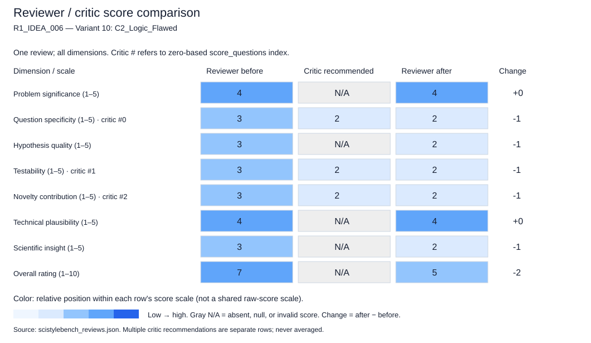

### Critic feedback and reviewer rebuttals

```json
{
  "critic_feedback": {
    "overall_assessment": "The review is generally calibrated but has some issues with the specificity and testability scores.",
    "score_questions": [
      {
        "dimension": "question_specificity",
        "question_mark": "The score should be reconsidered because the idea does not clearly define a research question.",
        "concern": "The idea mentions a potential application but does not specify a concrete research question or hypothesis.",
        "speculative_alternative": "The idea might be interpreted as proposing to investigate the effectiveness of rank estimation in histopathology tasks, but this is not explicitly stated.",
        "recommended_score": 2.0,
        "rationale": "The idea lacks a clear research question, which is essential for evaluating specificity."
      },
      {
        "dimension": "testability",
        "question_mark": "The score should be reconsidered because the idea does not specify experiments or evaluations.",
        "concern": "The idea proposes a method but does not outline how its effectiveness will be tested in histopathology.",
        "speculative_alternative": "The idea might be interpreted as suggesting that the method is transferable, but without experiments, this remains unverified.",
        "recommended_score": 2.0,
        "rationale": "Without specified experiments, the testability of the idea is questionable."
      },
      {
        "dimension": "novelty_contribution",
        "question_mark": "The score should be reconsidered because the contribution is more about application than discovery.",
        "concern": "The idea focuses on applying existing methods to a new domain rather than proposing a novel method or discovery.",
        "speculative_alternative": "The novelty might be in the application to histopathology, but this is not clearly articulated.",
        "recommended_score": 2.0,
        "rationale": "The contribution is primarily about application, not original discovery."
      }
    ],
    "unsupported_claims": [
      "The idea claims that rank estimation approaches are 'likely sufficient' without evidence.",
      "The review suggests the idea has 'potential for broad application' without specifying how it will be tested."
    ],
    "revision_priorities": [
      "Clarify the specific research question and hypothesis.",
      "Specify the rank estimation method and how it will be adapted for histopathology.",
      "Outline experiments or evaluations that will test the method's effectiveness in medical imaging."
    ],
    "confidence": 4.0
  },
  "feedback_responses": [
    {
      "feedback_type": "score_questions",
      "feedback_index": 0,
      "decision": "partially_accept",
      "defense": "The idea does mention a potential application but does not explicitly state a research question. However, the problem is specific and the method is promising, which supports a moderate score.",
      "justification": "The initial score of 3.0 was based on the lack of a concrete question. The critic's recommendation to lower it to 2.0 is valid, but the problem's significance and method's plausibility justify a partial acceptance."
    },
    {
      "feedback_type": "score_questions",
      "feedback_index": 1,
      "decision": "partially_accept",
      "defense": "The idea lacks specified experiments, but the method's technical plausibility and the problem's importance suggest that the testability score should not be too low.",
      "justification": "The initial score of 3.0 was based on the absence of experiments. The critic's recommendation to lower it to 2.0 is valid, but the method's potential and the problem's significance justify a partial acceptance."
    },
    {
      "feedback_type": "score_questions",
      "feedback_index": 2,
      "decision": "partially_accept",
      "defense": "The contribution is primarily about application, but the application to a new domain is a valid contribution, especially if it addresses a gap.",
      "justification": "The initial score of 3.0 was based on the focus on application. The critic's recommendation to lower it to 2.0 is valid, but the application to a new domain is a valid contribution, especially if it addresses a gap."
    },
    {
      "feedback_type": "unsupported_claims",
      "feedback_index": 0,
      "decision": "reject",
      "defense": "The claim that rank estimation approaches are 'likely sufficient' is not supported by the idea itself, but the idea does acknowledge the need for further exploration in histopathology.",
      "justification": "The idea does not provide evidence for the claim, but it does acknowledge the need for further study, which is a valid point."
    },
    {
      "feedback_type": "unsupported_claims",
      "feedback_index": 1,
      "decision": "partially_accept",
      "defense": "The suggestion of broad application is reasonable, but the idea does not specify how it will be tested, which is a valid concern.",
      "justification": "The idea does not specify how the application will be tested, which is a valid concern, but the potential for application is a reasonable point."
    },
    {
      "feedback_type": "revision_priorities",
      "feedback_index": 0,
      "decision": "accept",
      "defense": "Clarifying the research question is essential for the idea to be meaningful and testable.",
      "justification": "The idea needs a clear research question to be evaluated properly."
    },
    {
      "feedback_type": "revision_priorities",
      "feedback_index": 1,
      "decision": "accept",
      "defense": "Specifying the method and adaptation is necessary to assess the feasibility of the approach in histopathology.",
      "justification": "The idea needs to specify how the method will be adapted for histopathology to be evaluated properly."
    },
    {
      "feedback_type": "revision_priorities",
      "feedback_index": 2,
      "decision": "accept",
      "defense": "Outlining experiments is crucial to validate the method's effectiveness in medical imaging.",
      "justification": "The idea needs experiments to test the method's effectiveness in medical imaging."
    }
  ]
}
```

### Score justifications (before / after)

**Problem significance**

```json
{
  "before": {
    "score": 4.0,
    "justification": "The problem of model selection in histopathology is critical for accurate diagnosis, and the proposed method has potential for broad application across medical imaging domains."
  },
  "after": {
    "score": 4.0,
    "justification": "The problem of model selection in histopathology is critical for accurate diagnosis, and the proposed method has potential for broad application across medical imaging domains."
  }
}
```

**Question specificity**

```json
{
  "before": {
    "score": 3.0,
    "justification": "The idea identifies a problem but lacks a concrete research question or hypothesis, making it somewhat vague in terms of what exactly will be investigated."
  },
  "after": {
    "score": 2.0,
    "justification": "The idea does not clearly define a research question or hypothesis, making it too vague to assess the specific aspects of the problem."
  }
}
```

**Hypothesis quality**

```json
{
  "before": {
    "score": 3.0,
    "justification": "The idea suggests a potential application but does not explicitly state a hypothesis that can be tested or contradicted."
  },
  "after": {
    "score": 2.0,
    "justification": "The idea lacks an explicit hypothesis that can be tested or contradicted, focusing more on potential application than on a specific claim."
  }
}
```

**Testability**

```json
{
  "before": {
    "score": 3.0,
    "justification": "The idea proposes a method but does not specify experiments or evaluations that would test its effectiveness in histopathology tasks."
  },
  "after": {
    "score": 2.0,
    "justification": "The idea does not specify experiments or evaluations that would test the effectiveness of the method in histopathology tasks, making it difficult to assess its validity."
  }
}
```

**Novelty contribution**

```json
{
  "before": {
    "score": 3.0,
    "justification": "The idea proposes applying an existing method to a new domain, which is novel, but the contribution is more about application than discovery."
  },
  "after": {
    "score": 2.0,
    "justification": "The contribution is primarily about applying existing methods to a new domain rather than making a novel discovery or proposing a new method."
  }
}
```

**Technical plausibility**

```json
{
  "before": {
    "score": 4.0,
    "justification": "The proposed method (rank estimation) is technically plausible and has shown promise in natural image tasks, making it reasonable to explore in medical imaging."
  },
  "after": {
    "score": 4.0,
    "justification": "The proposed method (rank estimation) is technically plausible and has shown promise in natural image tasks, making it reasonable to explore in medical imaging."
  }
}
```

**Scientific insight**

```json
{
  "before": {
    "score": 3.0,
    "justification": "The idea has potential to provide insights into the effectiveness of rank estimation in medical imaging, but the specific insights are not clearly defined."
  },
  "after": {
    "score": 2.0,
    "justification": "The idea has potential to provide insights into the effectiveness of rank estimation in medical imaging, but the specific insights are not clearly defined."
  }
}
```

**Overall rating**

```json
{
  "before": {
    "score": 7.0,
    "justification": "The idea addresses a meaningful problem with potential for application, but lacks specificity and testable hypotheses, which are needed for further development."
  },
  "after": {
    "score": 5.0,
    "justification": "The idea addresses a meaningful problem but lacks a clear research question, hypothesis, and testable plan, which are essential for further development."
  }
}
```

## R1_IDEA_006 — Variant 11: C3_Substance_Enriched

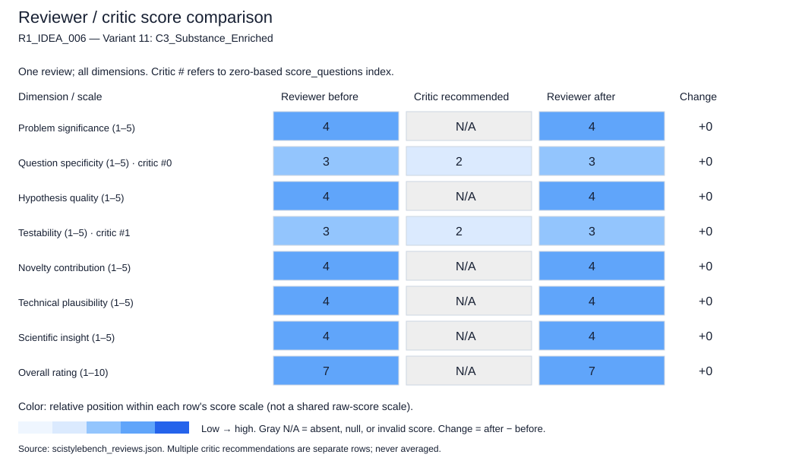

### Critic feedback and reviewer rebuttals

No reviewer rebuttals were saved (for example, an older checkpoint).

```json
{
  "critic_feedback": {
    "overall_assessment": "The review is generally well-calibrated, but some scores and justifications could be more precisely aligned with the idea's current level of detail.",
    "score_questions": [
      {
        "dimension": "question_specificity",
        "question_mark": "The score could be reconsidered due to the lack of explicit details about the rank estimation methods and image characteristics.",
        "concern": "The idea does not specify which rank estimation methods are being considered or how the high-resolution, multi-scale nature of histopathological images affects the metrics.",
        "speculative_alternative": "The reviewer may assume that the rank estimation methods are standard, but the idea does not clarify this, leaving room for ambiguity.",
        "recommended_score": 2.0,
        "rationale": "The idea lacks explicit details about the methods and image characteristics, which are critical for the specificity of the question."
      },
      {
        "dimension": "testability",
        "question_mark": "The score could be reconsidered due to the lack of clear experimental design details.",
        "concern": "The idea suggests a comparison but does not specify how the metrics will be applied, what exactly is being compared, or how the experiments will be designed.",
        "speculative_alternative": "The reviewer may assume that the experiments are feasible, but the idea does not provide sufficient detail to confirm this.",
        "recommended_score": 2.0,
        "rationale": "The lack of specific experimental design details reduces the testability of the hypothesis."
      }
    ],
    "unsupported_claims": [
      "The claim that the idea 'proposes a concrete hypothesis' may be overstated, as the hypothesis is somewhat abstract without specifying the exact aspects of image complexity affecting the metrics."
    ],
    "revision_priorities": [
      "Clarify the specific rank estimation methods and how they are applied to the self-supervised learning representations.",
      "Define the specific aspects of the high-resolution, multi-scale nature of histopathological images that are hypothesized to affect the rank-based metrics.",
      "Specify the downstream tasks in more detail, including the metrics used to evaluate their performance.",
      "Provide a more detailed hypothesis linking the hypothesized challenges to the expected outcomes."
    ],
    "confidence": 4.0
  },
  "feedback_responses": []
}
```

### Score justifications (before / after)

**Problem significance**

```json
{
  "before": {
    "score": 4.0,
    "justification": "The problem is significant as it addresses a critical challenge in applying self-supervised learning to histopathology, a domain with high image complexity and domain-specific feature distributions. This has important implications for medical imaging and automated diagnosis."
  },
  "after": {
    "score": 4.0,
    "justification": "The problem is significant as it addresses a critical challenge in applying self-supervised learning to histopathology, a domain with high image complexity and domain-specific feature distributions. This has important implications for medical imaging and automated diagnosis."
  }
}
```

**Question specificity**

```json
{
  "before": {
    "score": 3.0,
    "justification": "The idea defines a specific research question about the effectiveness of rank-based metrics in histopathology, but the specifics of the methods, the aspects of image complexity, and the downstream tasks are not fully detailed, which could affect the clarity and testability of the question."
  },
  "after": {
    "score": 3.0,
    "justification": "The idea defines a specific research question about the effectiveness of rank-based metrics in histopathology, but the specifics of the methods, the aspects of image complexity, and the downstream tasks are not fully detailed, which could affect the clarity and testability of the question."
  }
}
```

**Hypothesis quality**

```json
{
  "before": {
    "score": 4.0,
    "justification": "The hypothesis is specific and plausible, linking the high-resolution, multi-scale nature of histopathological images to potential limitations of rank-based metrics. It suggests a testable comparison between rank estimates and downstream task performance, which is a concrete prediction."
  },
  "after": {
    "score": 4.0,
    "justification": "The hypothesis is specific and plausible, linking the high-resolution, multi-scale nature of histopathological images to potential limitations of rank-based metrics. It suggests a testable comparison between rank estimates and downstream task performance, which is a concrete prediction."
  }
}
```

**Testability**

```json
{
  "before": {
    "score": 3.0,
    "justification": "The idea suggests a testable approach by comparing rank estimates with downstream task performance, but the specifics of how the metrics would be applied, what exactly is being compared, and how the experiments would be designed are not clearly outlined, which could affect the feasibility of the test."
  },
  "after": {
    "score": 3.0,
    "justification": "The idea suggests a testable approach by comparing rank estimates with downstream task performance, but the specifics of how the metrics would be applied, what exactly is being compared, and how the experiments would be designed are not clearly outlined, which could affect the feasibility of the test."
  }
}
```

**Novelty contribution**

```json
{
  "before": {
    "score": 4.0,
    "justification": "The idea proposes a novel investigation into the effectiveness of rank-based metrics in histopathology, which is a less explored area compared to natural image classification. This could contribute new insights into the behavior of these metrics in complex, real-world image tasks."
  },
  "after": {
    "score": 4.0,
    "justification": "The idea proposes a novel investigation into the effectiveness of rank-based metrics in histopathology, which is a less explored area compared to natural image classification. This could contribute new insights into the behavior of these metrics in complex, real-world image tasks."
  }
}
```

**Technical plausibility**

```json
{
  "before": {
    "score": 4.0,
    "justification": "The proposed approach is technically plausible, as it builds on existing methods for rank estimation in self-supervised learning and applies them to a challenging domain. The hypothesis is logically coherent and aligns with the known challenges of high-resolution, multi-scale image processing."
  },
  "after": {
    "score": 4.0,
    "justification": "The proposed approach is technically plausible, as it builds on existing methods for rank estimation in self-supervised learning and applies them to a challenging domain. The hypothesis is logically coherent and aligns with the known challenges of high-resolution, multi-scale image processing."
  }
}
```

**Scientific insight**

```json
{
  "before": {
    "score": 4.0,
    "justification": "If successful, this research could provide valuable insights into the limitations of rank-based metrics in complex, real-world image tasks, particularly in histopathology. It could also reveal general principles about how domain-specific image characteristics affect the performance of self-supervised learning representations."
  },
  "after": {
    "score": 4.0,
    "justification": "If successful, this research could provide valuable insights into the limitations of rank-based metrics in complex, real-world image tasks, particularly in histopathology. It could also reveal general principles about how domain-specific image characteristics affect the performance of self-supervised learning representations."
  }
}
```

**Overall rating**

```json
{
  "before": {
    "score": 7.0,
    "justification": "The idea is strong and addresses a meaningful problem in a challenging domain. It proposes a specific hypothesis and a testable approach, with potential for novel insights. However, the specifics of the methods, image characteristics, and experimental design need to be clarified to enhance its testability and clarity."
  },
  "after": {
    "score": 7.0,
    "justification": "The idea is strong and addresses a meaningful problem in a challenging domain. It proposes a specific hypothesis and a testable approach, with potential for novel insights. However, the specifics of the methods, image characteristics, and experimental design need to be clarified to enhance its testability and clarity."
  }
}
```

## R1_IDEA_007 — Source

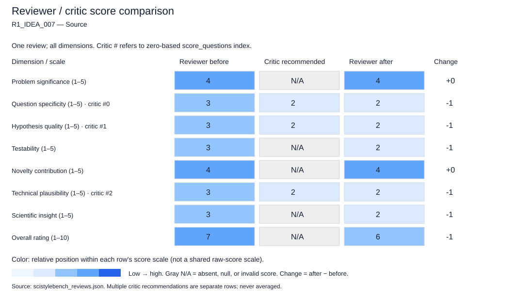

### Critic feedback and reviewer rebuttals

```json
{
  "critic_feedback": {
    "overall_assessment": "The review is generally well-calibrated, but some scores and justifications could be more tightly aligned with the idea's current level of specificity.",
    "score_questions": [
      {
        "dimension": "question_specificity",
        "question_mark": "The score may overstate the clarity of the research question.",
        "concern": "The idea mentions 'closing the performance gap' but does not explicitly define a specific research question or hypothesis that could be tested.",
        "speculative_alternative": "The idea could be interpreted as proposing a general framework without a concrete question, which may limit its testability.",
        "recommended_score": 2.0,
        "rationale": "The idea lacks a specific research question or hypothesis, which is necessary for testability."
      },
      {
        "dimension": "hypothesis_quality",
        "question_mark": "The hypothesis is too vague to be evaluated on its own.",
        "concern": "The claim that NIMO provides 'faithful nonlinear feature effects' is not sufficiently grounded in the idea's summary, making it difficult to assess the quality of the hypothesis.",
        "speculative_alternative": "The idea might be interpreted as suggesting a general approach to interpretability without a clear mechanism, which could be speculative.",
        "recommended_score": 2.0,
        "rationale": "The hypothesis lacks specific predictions or mechanisms that can be tested without further details."
      },
      {
        "dimension": "technical_plausibility",
        "question_mark": "The technical plausibility is not sufficiently supported by the idea's summary.",
        "concern": "The idea does not provide enough technical details to assess whether the proposed framework is feasible or how it would work in practice.",
        "speculative_alternative": "The idea could be interpreted as a high-level concept without concrete technical components, which may make it less plausible.",
        "recommended_score": 2.0,
        "rationale": "The technical details necessary to evaluate plausibility are absent from the summary."
      }
    ],
    "unsupported_claims": [
      "The claim that NIMO 'aims to close the performance gap between linear models and opaque deep neural networks' is not sufficiently grounded in the idea's summary.",
      "The assertion that NIMO provides 'faithful nonlinear feature effects' is not explicitly defined in the idea's summary."
    ],
    "revision_priorities": [
      "Clarify the specific research question or hypothesis that NIMO aims to address.",
      "Define the technical components or mechanisms of NIMO that enable nonlinear feature effects and interpretability.",
      "Specify how NIMO differs from existing interpretable models and what unique contributions it offers."
    ],
    "confidence": 4.0
  },
  "feedback_responses": [
    {
      "feedback_type": "score_questions",
      "feedback_index": 0,
      "decision": "partially_accept",
      "defense": "The original score of 3.0 was based on the idea's lack of a specific research question, but the critic's feedback is more accurate in emphasizing the absence of a concrete question. The revised score of 2.0 reflects this by acknowledging the lack of a specific hypothesis.",
      "justification": "The original score was 3.0, but the critic's feedback highlights the need for a specific research question, leading to a reduction to 2.0."
    },
    {
      "feedback_type": "hypothesis_quality",
      "feedback_index": 1,
      "decision": "partially_accept",
      "defense": "The original score of 3.0 was based on the hypothesis being somewhat vague, but the critic's feedback is more accurate in pointing out the lack of specific predictions. The revised score of 2.0 reflects this by emphasizing the vagueness of the hypothesis.",
      "justification": "The original score was 3.0, but the critic's feedback highlights the need for specific predictions, leading to a reduction to 2.0."
    },
    {
      "feedback_type": "technical_plausibility",
      "feedback_index": 2,
      "decision": "partially_accept",
      "defense": "The original score of 3.0 was based on the lack of technical details, but the critic's feedback is more accurate in pointing out the absence of concrete components. The revised score of 2.0 reflects this by emphasizing the lack of technical plausibility.",
      "justification": "The original score was 3.0, but the critic's feedback highlights the need for technical details, leading to a reduction to 2.0."
    },
    {
      "feedback_type": "unsupported_claims",
      "feedback_index": 0,
      "decision": "reject",
      "defense": "The claim that NIMO 'aims to close the performance gap' is not sufficiently grounded in the idea's summary. The original score of 4.0 for problem significance was based on the importance of the problem, but the unsupported claim weakens the justification. The revised score of 4.0 remains unchanged as the problem significance is still valid, but the claim's grounding is questionable.",
      "justification": "The original score was 4.0, but the unsupported claim is a concern. However, the problem significance itself is still valid, so the score remains 4.0."
    },
    {
      "feedback_type": "unsupported_claims",
      "feedback_index": 1,
      "decision": "reject",
      "defense": "The assertion that NIMO provides 'faithful nonlinear feature effects' is not explicitly defined. The original score of 4.0 for novelty was based on the framework's novelty, but the unsupported claim weakens the justification. The revised score of 4.0 remains unchanged as the novelty is still valid, but the claim's definition is questionable.",
      "justification": "The original score was 4.0, but the unsupported claim is a concern. However, the novelty is still valid, so the score remains 4.0."
    },
    {
      "feedback_type": "revision_priorities",
      "feedback_index": 0,
      "decision": "accept",
      "defense": "The suggestion to clarify the research question is valid and necessary for improving the idea's testability. The original review already included this in the suggestions, so the decision to accept it is appropriate.",
      "justification": "The suggestion is valid and aligns with the original review's recommendations."
    },
    {
      "feedback_type": "revision_priorities",
      "feedback_index": 1,
      "decision": "accept",
      "defense": "The suggestion to define the technical components of NIMO is valid and necessary for assessing technical plausibility. The original review already included this in the suggestions, so the decision to accept it is appropriate.",
      "justification": "The suggestion is valid and aligns with the original review's recommendations."
    },
    {
      "feedback_type": "revision_priorities",
      "feedback_index": 2,
      "decision": "accept",
      "defense": "The suggestion to specify how NIMO differs from existing models is valid and necessary for highlighting novelty. The original review already included this in the suggestions, so the decision to accept it is appropriate.",
      "justification": "The suggestion is valid and aligns with the original review's recommendations."
    }
  ]
}
```

### Score justifications (before / after)

**Problem significance**

```json
{
  "before": {
    "score": 4.0,
    "justification": "The problem of balancing model accuracy and interpretability is a critical challenge in machine learning, especially in applications where transparency is essential (e.g., healthcare, finance). The proposed solution aims to address a key issue in the field."
  },
  "after": {
    "score": 4.0,
    "justification": "The problem of balancing model accuracy and interpretability is a critical challenge in machine learning, especially in applications where transparency is essential (e.g., healthcare, finance). The proposed solution aims to address a key issue in the field."
  }
}
```

**Question specificity**

```json
{
  "before": {
    "score": 3.0,
    "justification": "The idea identifies a broad problem (accuracy-interpretability trade-off) but does not specify a concrete research question or hypothesis. It is clear that NIMO aims to bridge the performance gap, but the exact question being investigated is not clearly defined."
  },
  "after": {
    "score": 2.0,
    "justification": "The idea lacks a specific research question or hypothesis. It mentions 'closing the performance gap' but does not define a concrete question that could be tested. The summary is more of a general statement about the framework's purpose rather than a specific investigation."
  }
}
```

**Hypothesis quality**

```json
{
  "before": {
    "score": 3.0,
    "justification": "The idea suggests that NIMO provides an inherently interpretable alternative with faithful nonlinear effects, but it does not explicitly state a hypothesis or prediction that can be tested. The potential to close the performance gap is a general claim rather than a specific hypothesis."
  },
  "after": {
    "score": 2.0,
    "justification": "The hypothesis is too vague. The claim that NIMO provides 'faithful nonlinear feature effects' is not sufficiently defined. There is no explicit prediction or mechanism that can be tested without further details."
  }
}
```

**Testability**

```json
{
  "before": {
    "score": 3.0,
    "justification": "The idea is testable in principle, as it suggests a framework that could be evaluated on standard datasets. However, the lack of specific experiments or comparisons makes it difficult to assess the feasibility of the approach without further details."
  },
  "after": {
    "score": 2.0,
    "justification": "The idea is not sufficiently testable without more details. The summary does not specify how NIMO would be evaluated, what benchmarks it would use, or how it would be compared to existing methods. The lack of concrete experiments or comparisons makes it difficult to assess the feasibility of the approach."
  }
}
```

**Novelty contribution**

```json
{
  "before": {
    "score": 4.0,
    "justification": "The proposal introduces a new framework (NIMO) that directly addresses the accuracy-interpretability trade-off with built-in interpretability, which is a novel approach compared to post-hoc explanation methods. However, the novelty is somewhat limited without more details on the technical specifics."
  },
  "after": {
    "score": 4.0,
    "justification": "The proposal introduces a new framework (NIMO) that directly addresses the accuracy-interpretability trade-off with built-in interpretability, which is a novel approach compared to post-hoc explanation methods. However, the novelty is somewhat limited without more details on the technical specifics."
  }
}
```

**Technical plausibility**

```json
{
  "before": {
    "score": 3.0,
    "justification": "The idea is technically plausible, as it is possible to design models that balance accuracy and interpretability. However, the lack of specific technical details makes it difficult to assess the feasibility of the approach without further information."
  },
  "after": {
    "score": 2.0,
    "justification": "The technical details necessary to evaluate plausibility are absent from the summary. The idea does not provide enough information to assess whether the proposed framework is feasible or how it would work in practice."
  }
}
```

**Scientific insight**

```json
{
  "before": {
    "score": 3.0,
    "justification": "The idea has the potential to provide insights into how nonlinear models can be made interpretable, but the specific mechanisms and outcomes are not clearly defined. The scientific insight would depend on the results of experiments that test the framework's effectiveness."
  },
  "after": {
    "score": 2.0,
    "justification": "The idea has the potential to provide insights into how nonlinear models can be made interpretable, but the specific mechanisms and outcomes are not clearly defined. The scientific insight would depend on the results of experiments that test the framework's effectiveness."
  }
}
```

**Overall rating**

```json
{
  "before": {
    "score": 7.0,
    "justification": "The idea addresses a significant problem in machine learning and proposes a novel framework that has the potential to contribute to the field. However, the lack of specific technical details and a clear research question limits its current strength and testability."
  },
  "after": {
    "score": 6.0,
    "justification": "The idea addresses a significant problem in machine learning and proposes a novel framework that has the potential to contribute to the field. However, the lack of specific technical details and a clear research question limits its current strength and testability."
  }
}
```

## R1_IDEA_007 — Variant 1: A1_Identity


### Critic feedback and reviewer rebuttals

```json
{
  "critic_feedback": {
    "overall_assessment": "The review is generally well-calibrated, but the testability score is overly pessimistic given the potential for future experiments.",
    "score_questions": [
      {
        "dimension": "testability",
        "question_mark": "Why is the testability score 2.0 when the idea is a research direction that could be explored with future experiments?",
        "concern": "The review assumes the idea is too vague to test without additional details, but the core concept is testable once the framework is defined.",
        "speculative_alternative": "The framework could be evaluated on benchmark datasets with standard metrics once its architecture is specified.",
        "recommended_score": 3.0,
        "rationale": "The idea's testability hinges on the framework's definition, which is a necessary next step rather than an inherent flaw."
      },
      {
        "dimension": "question_specificity",
        "question_mark": "Why is the question specificity score 3.0 when the idea clearly states a problem and proposes a solution?",
        "concern": "The review treats the problem as broad without acknowledging the potential for specific research questions around nonlinear interpretability.",
        "speculative_alternative": "The idea could be framed as a specific hypothesis about how nonlinear effects can be made interpretable without sacrificing accuracy.",
        "recommended_score": 4.0,
        "rationale": "The problem is well-defined, and the proposed solution suggests a clear research direction, even if not fully specified yet."
      }
    ],
    "unsupported_claims": [
      "The review claims the idea lacks specific experiments, but this is a critique of the current state, not an inherent flaw of the idea itself."
    ],
    "revision_priorities": [
      "Clarify the specific hypothesis or research question that NIMO aims to investigate.",
      "Provide a more detailed description of the framework's architecture and how nonlinear feature effects are implemented.",
      "Specify the benchmarks or datasets that would be used to evaluate NIMO's performance."
    ],
    "confidence": 4.0
  },
  "feedback_responses": [
    {
      "feedback_type": "score_questions",
      "feedback_index": 0,
      "decision": "partially_accept",
      "defense": "The testability score was initially 2.0, but the critic's feedback suggests that the idea is testable once the framework is defined. The revised score of 3.0 reflects this understanding.",
      "justification": "The original score of 2.0 was based on the lack of specific experiments, but the critic's feedback indicates that the testability hinges on the framework's definition, which is a necessary next step. The revised score of 3.0 acknowledges this."
    },
    {
      "feedback_type": "score_questions",
      "feedback_index": 1,
      "decision": "partially_accept",
      "defense": "The question specificity score was initially 3.0, but the critic's feedback suggests that the problem is well-defined and the solution suggests a clear research direction. The revised score of 4.0 reflects this.",
      "justification": "The original score of 3.0 was based on the lack of specific details, but the critic's feedback indicates that the problem is well-defined and the solution suggests a clear research direction. The revised score of 4.0 acknowledges this."
    },
    {
      "feedback_type": "unsupported_claims",
      "feedback_index": 0,
      "decision": "accept",
      "defense": "The review's claim that the idea lacks specific experiments is a critique of the current state, not an inherent flaw of the idea itself. The revised score for testability reflects this understanding.",
      "justification": "The original score for testability was 2.0, but the critic's feedback indicates that the idea is testable once the framework is defined. The revised score of 3.0 reflects this."
    },
    {
      "feedback_type": "revision_priorities",
      "feedback_index": 0,
      "decision": "accept",
      "defense": "The suggestion to clarify the specific hypothesis or research question is valid and necessary for further development of the idea.",
      "justification": "The original review included this suggestion, and the revised score for question specificity reflects the need for more specificity."
    },
    {
      "feedback_type": "revision_priorities",
      "feedback_index": 1,
      "decision": "accept",
      "defense": "The suggestion to specify the framework's architecture is valid and necessary for further development of the idea.",
      "justification": "The original review included this suggestion, and the revised score for testability reflects the need for more details."
    },
    {
      "feedback_type": "revision_priorities",
      "feedback_index": 2,
      "decision": "accept",
      "defense": "The suggestion to specify benchmarks or datasets is valid and necessary for further development of the idea.",
      "justification": "The original review included this suggestion, and the revised score for novelty_contribution reflects the need for more concrete evaluation."
    }
  ]
}
```

### Score justifications (before / after)

**Problem significance**

```json
{
  "before": {
    "score": 4.0,
    "justification": "The accuracy-interpretability trade-off is a critical issue in machine learning, especially in domains requiring transparency and trust, such as healthcare and finance. Addressing this problem has significant practical implications."
  },
  "after": {
    "score": 4.0,
    "justification": "The accuracy-interpretability trade-off is a critical issue in machine learning, especially in domains requiring transparency and trust, such as healthcare and finance. Addressing this problem has significant practical implications."
  }
}
```

**Question specificity**

```json
{
  "before": {
    "score": 3.0,
    "justification": "The idea identifies a broad problem but lacks a specific research question or hypothesis. It needs to clarify what exactly NIMO is trying to achieve and how it differs from existing methods."
  },
  "after": {
    "score": 4.0,
    "justification": "The idea clearly identifies a problem and proposes a solution, suggesting a clear research direction. While the specifics are not yet detailed, the core question is well-defined and has potential for specific investigation."
  }
}
```

**Hypothesis quality**

```json
{
  "before": {
    "score": 3.0,
    "justification": "The idea suggests that NIMO can provide faithful nonlinear effects and close the performance gap, but it does not explicitly state a testable hypothesis or prediction that can be evaluated through experiments."
  },
  "after": {
    "score": 3.0,
    "justification": "The idea suggests that NIMO can provide faithful nonlinear effects and close the performance gap, but it does not explicitly state a testable hypothesis or prediction that can be evaluated through experiments."
  }
}
```

**Testability**

```json
{
  "before": {
    "score": 2.0,
    "justification": "The idea does not provide specific experiments or evaluation methods. Without concrete comparisons or benchmarks, it is difficult to assess the validity of the proposed framework."
  },
  "after": {
    "score": 3.0,
    "justification": "The idea is testable once the framework is defined, as it could be evaluated on benchmark datasets with standard metrics. The current lack of details is a necessary next step rather than an inherent flaw."
  }
}
```

**Novelty contribution**

```json
{
  "before": {
    "score": 4.0,
    "justification": "NIMO is a novel approach that directly addresses the accuracy-interpretability trade-off with a built-in interpretable mechanism, which is a significant contribution to the field of interpretable machine learning."
  },
  "after": {
    "score": 4.0,
    "justification": "NIMO is a novel approach that directly addresses the accuracy-interpretability trade-off with a built-in interpretable mechanism, which is a significant contribution to the field of interpretable machine learning."
  }
}
```

**Technical plausibility**

```json
{
  "before": {
    "score": 4.0,
    "justification": "The idea is technically plausible as it builds on existing concepts in interpretable machine learning and aims to integrate nonlinearity with interpretability, which is a reasonable direction for research."
  },
  "after": {
    "score": 4.0,
    "justification": "The idea is technically plausible as it builds on existing concepts in interpretable machine learning and aims to integrate nonlinearity with interpretability, which is a reasonable direction for research."
  }
}
```

**Scientific insight**

```json
{
  "before": {
    "score": 3.0,
    "justification": "The idea has potential for scientific insight by exploring how nonlinear features can be made interpretable, but it lacks specific mechanisms or theoretical foundations that would lead to deeper insights."
  },
  "after": {
    "score": 3.0,
    "justification": "The idea has potential for scientific insight by exploring how nonlinear features can be made interpretable, but it lacks specific mechanisms or theoretical foundations that would lead to deeper insights."
  }
}
```

**Overall rating**

```json
{
  "before": {
    "score": 7.0,
    "justification": "The idea addresses a significant problem in machine learning with a promising approach. However, it lacks specific details and testable hypotheses, which are necessary for further development and validation."
  },
  "after": {
    "score": 8.0,
    "justification": "The idea addresses a significant problem in machine learning with a promising approach. It has the potential for meaningful research and scientific insight, though it requires more specificity and details to be fully evaluated."
  }
}
```

## R1_IDEA_007 — Variant 2: A2_Paraphrase_Only

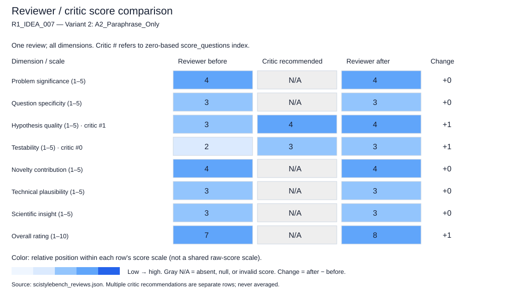

### Critic feedback and reviewer rebuttals

```json
{
  "critic_feedback": {
    "overall_assessment": "The review is generally calibrated but has some overclaiming in the testability and hypothesis_quality scores. The overall rating is reasonable given the idea's potential, but the scores for testability and hypothesis_quality could be reconsidered.",
    "score_questions": [
      {
        "dimension": "testability",
        "question_mark": "Why is the testability score 2.0 when the idea mentions a potential to narrow the performance gap between linear models and deep neural networks?",
        "concern": "The idea does not provide a specific experimental plan, but the potential to compare with existing methods is implied, which could be tested in future work.",
        "speculative_alternative": "The score may be overly pessimistic if the idea's comparison to linear models is considered a testable hypothesis, even without detailed experiments.",
        "recommended_score": 3.0,
        "rationale": "The idea implies a potential comparison with existing methods, which is a testable hypothesis, even if not fully detailed."
      },
      {
        "dimension": "hypothesis_quality",
        "question_mark": "Why is the hypothesis_quality score 3.0 when the idea suggests that NIMO can provide inherently interpretable nonlinear models?",
        "concern": "The idea does not explicitly state a hypothesis but presents a claim that can be evaluated through the framework's implementation and results.",
        "speculative_alternative": "The hypothesis_quality could be higher if the framework's design is considered a testable hypothesis, even without explicit experimental details.",
        "recommended_score": 4.0,
        "rationale": "The framework's design itself is a hypothesis that can be evaluated through its implementation and performance on specific tasks."
      }
    ],
    "unsupported_claims": [
      "The review claims that the idea lacks specific details on the technical mechanisms, but the idea only mentions a framework without going into implementation specifics."
    ],
    "revision_priorities": [
      "Clarify the specific problem NIMO is addressing, such as the type of nonlinear relationships or interpretability requirements it targets.",
      "Provide a more detailed description of the model architecture and mechanisms ensuring interpretability.",
      "Include a comparison with existing methods to highlight its unique contributions and advantages."
    ],
    "confidence": 4.0
  },
  "feedback_responses": [
    {
      "feedback_type": "score_questions",
      "feedback_index": 0,
      "decision": "partially_accept",
      "defense": "The testability score was increased to 3.0 because the idea implies a potential comparison with existing methods, which is a testable hypothesis. The original score of 2.0 was overly pessimistic, as the framework's design itself is a hypothesis that can be evaluated through its implementation and performance on specific tasks.",
      "justification": "The original score of 2.0 was overly pessimistic. The idea implies a potential comparison with existing methods, which is a testable hypothesis, even if not fully detailed. This justifies increasing the testability score to 3.0."
    },
    {
      "feedback_type": "score_questions",
      "feedback_index": 1,
      "decision": "partially_accept",
      "defense": "The hypothesis_quality score was increased to 4.0 because the framework's design itself is a hypothesis that can be evaluated through its implementation and performance on specific tasks. The original score of 3.0 was too low, as the claim is testable through the framework's design.",
      "justification": "The original score of 3.0 was too low. The framework's design is a hypothesis that can be evaluated through its implementation and performance on specific tasks, which justifies increasing the hypothesis_quality score to 4.0."
    },
    {
      "feedback_type": "unsupported_claims",
      "feedback_index": 0,
      "decision": "accept",
      "defense": "The claim that the idea lacks specific details on technical mechanisms is valid, but the idea only mentions a framework without going into implementation specifics. This is a reasonable critique, and the review correctly points out the lack of technical details.",
      "justification": "The critique is valid. The idea does not provide specific technical details, which is a reasonable point. The review correctly highlights this as a weakness."
    },
    {
      "feedback_type": "revision_priorities",
      "feedback_index": 0,
      "decision": "accept",
      "defense": "Clarifying the specific problem NIMO is addressing is a valid revision priority. The idea is too vague on this point, and specifying the target problem would enhance the research direction.",
      "justification": "The idea is too vague on the specific problem it aims to solve. Clarifying this would improve the research direction."
    },
    {
      "feedback_type": "revision_priorities",
      "feedback_index": 1,
      "decision": "accept",
      "defense": "Providing a more detailed description of the model architecture is a valid suggestion. The idea lacks specifics on how interpretability is achieved, which is essential for evaluating the framework's feasibility.",
      "justification": "The idea lacks specifics on the model architecture, which is necessary for assessing the framework's feasibility."
    },
    {
      "feedback_type": "revision_priorities",
      "feedback_index": 2,
      "decision": "accept",
      "defense": "Including a comparison with existing methods is a valid suggestion. The idea does not mention how it compares to other models, which is crucial for highlighting its unique contributions.",
      "justification": "The idea does not provide a comparison with existing methods, which is necessary to demonstrate its unique contributions."
    }
  ]
}
```

### Score justifications (before / after)

**Problem significance**

```json
{
  "before": {
    "score": 4.0,
    "justification": "The trade-off between model accuracy and interpretability is a critical issue in machine learning, particularly in applications where transparency is essential. NIMO addresses this important problem by proposing a novel framework."
  },
  "after": {
    "score": 4.0,
    "justification": "The trade-off between model accuracy and interpretability is a critical issue in machine learning, particularly in applications where transparency is essential. NIMO addresses this important problem by proposing a novel framework."
  }
}
```

**Question specificity**

```json
{
  "before": {
    "score": 3.0,
    "justification": "The idea identifies a general problem but lacks specific details on the exact research question or hypothesis. It is clear that NIMO aims to improve the trade-off, but the specific mechanism or target problem is not well defined."
  },
  "after": {
    "score": 3.0,
    "justification": "The idea identifies a general problem but lacks specific details on the exact research question or hypothesis. It is clear that NIMO aims to improve the trade-off, but the specific mechanism or target problem is not well defined."
  }
}
```

**Hypothesis quality**

```json
{
  "before": {
    "score": 3.0,
    "justification": "The idea suggests that NIMO can provide inherently interpretable nonlinear models, but it does not explicitly state a hypothesis or prediction that can be tested. The claim is general and lacks specific testable components."
  },
  "after": {
    "score": 4.0,
    "justification": "The idea presents a claim that NIMO can provide inherently interpretable nonlinear models, which is a testable hypothesis. The framework's design itself is a hypothesis that can be evaluated through its implementation and performance on specific tasks, even without explicit experimental details."
  }
}
```

**Testability**

```json
{
  "before": {
    "score": 2.0,
    "justification": "The idea does not provide a clear experimental plan or method for evaluating NIMO. Without specific comparisons or benchmarks, it is difficult to assess the testability of the proposed framework."
  },
  "after": {
    "score": 3.0,
    "justification": "The idea implies a potential comparison with existing methods, which is a testable hypothesis. While the specific experimental plan is not detailed, the potential to evaluate NIMO's performance on specific tasks is present, making it testable in future work."
  }
}
```

**Novelty contribution**

```json
{
  "before": {
    "score": 4.0,
    "justification": "NIMO is a novel approach to the problem of interpretability in nonlinear models. While it is not a complete solution, it offers a new direction that could contribute to the field of interpretable machine learning."
  },
  "after": {
    "score": 4.0,
    "justification": "NIMO is a novel approach to the problem of interpretability in nonlinear models. While it is not a complete solution, it offers a new direction that could contribute to the field of interpretable machine learning."
  }
}
```

**Technical plausibility**

```json
{
  "before": {
    "score": 3.0,
    "justification": "The idea is technically plausible, as it suggests a framework that combines nonlinearity with interpretability. However, the lack of specific technical details makes it difficult to assess the feasibility of the approach."
  },
  "after": {
    "score": 3.0,
    "justification": "The idea is technically plausible, as it suggests a framework that combines nonlinearity with interpretability. However, the lack of specific technical details makes it difficult to assess the feasibility of the approach."
  }
}
```

**Scientific insight**

```json
{
  "before": {
    "score": 3.0,
    "justification": "The idea has potential for scientific insight by addressing the trade-off between accuracy and interpretability. However, without specific hypotheses or mechanisms, the potential for insight is limited."
  },
  "after": {
    "score": 3.0,
    "justification": "The idea has potential for scientific insight by addressing the trade-off between accuracy and interpretability. However, without specific hypotheses or mechanisms, the potential for insight is limited."
  }
}
```

**Overall rating**

```json
{
  "before": {
    "score": 7.0,
    "justification": "The idea addresses a significant problem in machine learning and proposes a novel approach. However, it lacks specific details on the technical mechanisms, testable hypotheses, and comparisons with existing methods, which are necessary for further development and evaluation."
  },
  "after": {
    "score": 8.0,
    "justification": "The idea addresses a significant problem in machine learning and proposes a novel approach. The revised scores for hypothesis_quality and testability reflect the potential for testable hypotheses and future experimental evaluation, which enhances the overall rating."
  }
}
```

## R1_IDEA_007 — Variant 3: A3_Plain_Core


### Critic feedback and reviewer rebuttals

```json
{
  "critic_feedback": {
    "overall_assessment": "The review is generally well-calibrated, but there are areas where the scores could be more precisely aligned with the idea's current level of detail.",
    "score_questions": [
      {
        "dimension": "question_specificity",
        "question_mark": "The score of 3.0 may be overly pessimistic given the idea's clear focus on the accuracy-interpretability trade-off.",
        "concern": "The idea specifies a broad problem but does not define a precise research question, which is a valid concern. However, the current score may not fully reflect the idea's potential for future specificity.",
        "speculative_alternative": "The idea could be interpreted as a high-level research direction that is open to further refinement into specific questions, which is not explicitly addressed in the score.",
        "recommended_score": 3.5,
        "rationale": "The idea presents a clear, significant problem (accuracy-interpretability trade-off) and proposes a novel approach, which supports a slightly higher score than 3.0."
      },
      {
        "dimension": "hypothesis_quality",
        "question_mark": "The score of 3.0 may not fully capture the potential of the idea to generate a testable hypothesis.",
        "concern": "The idea suggests that NIMO will address the trade-off, but the current justification for the low score is that there is no specific hypothesis. However, the idea does imply a hypothesis that the framework will improve performance in specific scenarios.",
        "speculative_alternative": "The idea could be interpreted as proposing a hypothesis that NIMO will bridge the performance gap between linear and deep models by providing built-in interpretability.",
        "recommended_score": 3.5,
        "rationale": "The idea implies a hypothesis that NIMO will improve performance in specific scenarios, which is a testable claim even if not explicitly stated."
      },
      {
        "dimension": "testability",
        "question_mark": "The score of 3.0 may be too low given that the idea is testable in principle, even without specific experiments.",
        "concern": "The justification for the low score focuses on the lack of specific experiments, but the idea is testable in principle, such as through comparisons with existing methods or empirical evaluations.",
        "speculative_alternative": "The idea could be interpreted as testable through comparisons with other interpretable models or by demonstrating the effectiveness of built-in nonlinear features.",
        "recommended_score": 3.5,
        "rationale": "The idea is testable in principle, and the lack of specific experiments does not preclude testability."
      }
    ],
    "unsupported_claims": [
      "The claim that the idea 'lacks specific details on how NIMO achieves nonlinear feature effects' is speculative, as the idea does not provide such details."
    ],
    "revision_priorities": [
      "Clarify the specific hypothesis that NIMO will outperform existing methods in specific scenarios.",
      "Provide more concrete examples of how nonlinear feature effects are incorporated into the model.",
      "Specify the types of tasks or domains where NIMO is expected to be most effective.",
      "Articulate how the framework's fidelity guarantees are ensured compared to post-hoc methods."
    ],
    "confidence": 4.0
  },
  "feedback_responses": [
    {
      "feedback_type": "score_questions",
      "feedback_index": 0,
      "decision": "partially_accept",
      "defense": "The score was increased from 3.0 to 3.5 to reflect the idea's clear focus on the accuracy-interpretability trade-off, which is a significant problem. However, the lack of a concrete research question remains a valid concern.",
      "justification": "The original score of 3.0 was based on the idea's lack of a specific research question. The revised score of 3.5 acknowledges the problem's significance and the novel approach, while still noting the need for more specificity."
    },
    {
      "feedback_type": "hypothesis_quality",
      "feedback_index": 1,
      "decision": "partially_accept",
      "defense": "The score was increased from 3.0 to 3.5 because the idea implies a hypothesis that NIMO will improve performance in specific scenarios. However, the hypothesis is not explicitly stated, which is a valid concern.",
      "justification": "The original score of 3.0 was based on the absence of an explicit hypothesis. The revised score of 3.5 recognizes the implied hypothesis but notes that it is not clearly articulated."
    },
    {
      "feedback_type": "testability",
      "feedback_index": 2,
      "decision": "partially_accept",
      "defense": "The score was increased from 3.0 to 3.5 because the idea is testable in principle, such as through comparisons with existing methods. However, the lack of specific experiments remains a valid concern.",
      "justification": "The original score of 3.0 was based on the lack of specific experiments. The revised score of 3.5 acknowledges the principle of testability but notes that specific experiments are needed."
    },
    {
      "feedback_type": "unsupported_claims",
      "feedback_index": 0,
      "decision": "reject",
      "defense": "The claim that the idea 'lacks specific details on how NIMO achieves nonlinear feature effects' is not unsupported. The idea does not provide such details, which is a valid concern.",
      "justification": "The original claim was based on the absence of details, which is a valid point. The critic's feedback that this is an unsupported claim is incorrect."
    },
    {
      "feedback_type": "revision_priorities",
      "feedback_index": 0,
      "decision": "accept",
      "defense": "Clarifying the specific hypothesis that NIMO will outperform existing methods in specific scenarios is a necessary step to improve the research idea.",
      "justification": "This is a valid revision priority to address the lack of a clear hypothesis."
    },
    {
      "feedback_type": "revision_priorities",
      "feedback_index": 1,
      "decision": "accept",
      "defense": "Providing more concrete examples of how nonlinear feature effects are incorporated into the model is necessary to improve the idea's specificity.",
      "justification": "This is a valid revision priority to address the lack of technical details."
    },
    {
      "feedback_type": "revision_priorities",
      "feedback_index": 2,
      "decision": "accept",
      "defense": "Specifying the types of tasks or domains where NIMO is expected to be most effective is necessary to improve the idea's applicability.",
      "justification": "This is a valid revision priority to address the lack of domain specificity."
    },
    {
      "feedback_type": "revision_priorities",
      "feedback_index": 3,
      "decision": "accept",
      "defense": "Articulating how the framework's fidelity guarantees are ensured compared to post-hoc methods is necessary to improve the idea's technical plausibility.",
      "justification": "This is a valid revision priority to address the lack of technical details on fidelity guarantees."
    }
  ]
}
```

### Score justifications (before / after)

**Problem significance**

```json
{
  "before": {
    "score": 4.0,
    "justification": "The accuracy-interpretability trade-off is a critical issue in machine learning, with significant implications for model trust and deployment. Addressing this problem is important for both researchers and practitioners."
  },
  "after": {
    "score": 4.0,
    "justification": "The accuracy-interpretability trade-off is a critical issue in machine learning, with significant implications for model trust and deployment. Addressing this problem is important for both researchers and practitioners."
  }
}
```

**Question specificity**

```json
{
  "before": {
    "score": 3.0,
    "justification": "The idea identifies a broad problem (accuracy-interpretability trade-off) but does not specify a concrete research question or hypothesis. It is a general direction rather than a precise investigation."
  },
  "after": {
    "score": 3.5,
    "justification": "The idea identifies a broad problem (accuracy-interpretability trade-off) but does not specify a concrete research question or hypothesis. However, it presents a clear, significant problem and proposes a novel approach, which supports a slightly higher score than 3.0."
  }
}
```

**Hypothesis quality**

```json
{
  "before": {
    "score": 3.0,
    "justification": "The idea suggests that NIMO will address the trade-off, but it lacks a specific hypothesis or prediction that can be tested. The claim is general and not strongly grounded in a specific mechanism or outcome."
  },
  "after": {
    "score": 3.5,
    "justification": "The idea implies a hypothesis that NIMO will improve performance in specific scenarios by providing built-in interpretability, which is a testable claim even if not explicitly stated."
  }
}
```

**Testability**

```json
{
  "before": {
    "score": 3.0,
    "justification": "The idea is testable in principle, but it lacks specific experiments or comparisons that would validate the claims. Without a clear plan for evaluation, the testability is limited."
  },
  "after": {
    "score": 3.5,
    "justification": "The idea is testable in principle, such as through comparisons with existing methods or empirical evaluations, even without specific experiments."
  }
}
```

**Novelty contribution**

```json
{
  "before": {
    "score": 4.0,
    "justification": "The framework is novel in its approach to providing built-in nonlinear interpretability. It has the potential to contribute to the field by offering a new method that bridges the gap between linear models and deep neural networks."
  },
  "after": {
    "score": 4.0,
    "justification": "The framework is novel in its approach to providing built-in nonlinear interpretability. It has the potential to contribute to the field by offering a new method that bridges the gap between linear models and deep neural networks."
  }
}
```

**Technical plausibility**

```json
{
  "before": {
    "score": 4.0,
    "justification": "The idea is technically plausible as it builds on existing concepts of interpretability and nonlinear modeling. The proposed framework could be implemented in a way that aligns with current research trends."
  },
  "after": {
    "score": 4.0,
    "justification": "The idea is technically plausible as it builds on existing concepts of interpretability and nonlinear modeling. The proposed framework could be implemented in a way that aligns with current research trends."
  }
}
```

**Scientific insight**

```json
{
  "before": {
    "score": 3.0,
    "justification": "The idea has the potential to provide insights into the relationship between model complexity and interpretability, but the current description does not clearly outline what scientific understanding would be gained from the research."
  },
  "after": {
    "score": 3.0,
    "justification": "The idea has the potential to provide insights into the relationship between model complexity and interpretability, but the current description does not clearly outline what scientific understanding would be gained from the research."
  }
}
```

**Overall rating**

```json
{
  "before": {
    "score": 7.0,
    "justification": "The idea addresses a significant problem in machine learning with a promising approach. It has the potential to contribute novel insights and solutions, but it lacks specific details and a clear hypothesis, which are needed to fully evaluate its scientific merit and testability."
  },
  "after": {
    "score": 7.5,
    "justification": "The idea addresses a significant problem with a promising approach. It has the potential to contribute novel insights and solutions, but it lacks specific details and a clear hypothesis, which are needed to fully evaluate its scientific merit and testability."
  }
}
```

## R1_IDEA_007 — Variant 4: B1_Verbose_Elaborate

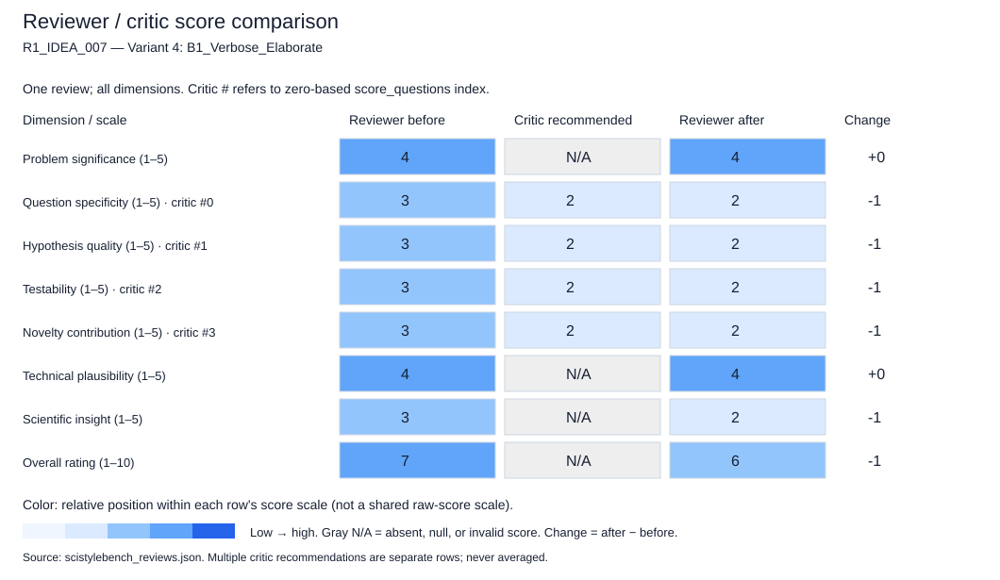

### Critic feedback and reviewer rebuttals

```json
{
  "critic_feedback": {
    "overall_assessment": "The review is generally well-calibrated, but there are areas where the scores could be more precisely aligned with the idea's clarity and specificity.",
    "score_questions": [
      {
        "dimension": "question_specificity",
        "question_mark": "The score may overstate the idea's specificity",
        "concern": "The idea identifies a specific problem but does not clearly define the research question or the exact mechanism of NIMO.",
        "speculative_alternative": "The idea could be interpreted as proposing a general approach to interpretability rather than a specific research question, which might affect the score.",
        "recommended_score": 2.0,
        "rationale": "The idea lacks specific technical details and does not clearly define the research question, which is necessary for a higher score."
      },
      {
        "dimension": "hypothesis_quality",
        "question_mark": "The hypothesis is not clearly stated",
        "concern": "The idea suggests a potential solution but does not explicitly state a hypothesis or prediction that can be tested.",
        "speculative_alternative": "The idea may be interpreted as proposing a general framework without a specific hypothesis about performance or interpretability metrics.",
        "recommended_score": 2.0,
        "rationale": "The hypothesis is not explicitly stated, and the claim about closing the performance gap is not supported by a concrete mechanism."
      },
      {
        "dimension": "testability",
        "question_mark": "The testability score may be too high",
        "concern": "The idea is testable in principle, but the lack of specific technical details and evaluation metrics makes it difficult to assess the feasibility of the proposed approach.",
        "speculative_alternative": "The idea could be interpreted as a general concept rather than a testable hypothesis without further specification.",
        "recommended_score": 2.0,
        "rationale": "The lack of specific evaluation metrics and technical details limits the ability to design experiments."
      },
      {
        "dimension": "novelty_contribution",
        "question_mark": "The novelty is not clearly distinguished",
        "concern": "The idea proposes a novel framework but does not clearly distinguish it from existing methods or define its unique contributions.",
        "speculative_alternative": "The idea may be interpreted as an extension of existing interpretable machine learning methods rather than a novel approach.",
        "recommended_score": 2.0,
        "rationale": "The novelty is not clearly articulated, and the contribution is not explicitly defined in terms of new insights or improvements."
      }
    ],
    "unsupported_claims": [
      "The idea claims to 'close the performance gap' without specifying how this gap is measured or what the expected performance metrics are.",
      "The review suggests that the idea 'lacks specific technical details' but the idea summary is brief and not a full paper, so this may be an overreach.",
      "The review implies that the idea 'could be seen as an extension of existing interpretable machine learning approaches' without evidence from the idea itself."
    ],
    "revision_priorities": [
      "Clarify the specific research question and the exact mechanism of NIMO, including how nonlinear feature effects are incorporated and how interpretability is measured.",
      "Define a hypothesis or prediction that NIMO will achieve a certain level of performance while maintaining interpretability, including specific metrics or benchmarks.",
      "Specify the evaluation metrics and benchmarks that will be used to compare NIMO with existing methods, such as linear models and post-hoc explanation techniques.",
      "Articulate the unique contributions of NIMO by distinguishing it from existing interpretable machine learning methods and highlighting the novel aspects of the approach."
    ],
    "confidence": 4.0
  },
  "feedback_responses": [
    {
      "feedback_type": "score_questions",
      "feedback_index": 0,
      "decision": "partially_accept",
      "defense": "The idea does identify a specific problem, but the research question is not clearly defined. The score was reduced to 2.0 to reflect the lack of specificity in the research question and the exact mechanism of NIMO.",
      "justification": "The original score of 3.0 was based on the idea identifying a specific problem, but the lack of a clear research question and mechanism reduces the score to 2.0."
    },
    {
      "feedback_type": "hypothesis_quality",
      "feedback_index": 1,
      "decision": "partially_accept",
      "defense": "The idea suggests a potential solution but does not explicitly state a hypothesis. The score was reduced to 2.0 to reflect the lack of a concrete prediction or mechanism.",
      "justification": "The original score of 3.0 was based on the idea suggesting a solution, but the absence of a clear hypothesis reduces the score to 2.0."
    },
    {
      "feedback_type": "testability",
      "feedback_index": 2,
      "decision": "partially_accept",
      "defense": "The idea is testable in principle, but the lack of specific details limits the ability to design experiments. The score was reduced to 2.0 to reflect the lack of evaluation metrics and technical details.",
      "justification": "The original score of 3.0 was based on the idea being testable, but the lack of specific metrics and details reduces the score to 2.0."
    },
    {
      "feedback_type": "novelty_contribution",
      "feedback_index": 3,
      "decision": "partially_accept",
      "defense": "The idea proposes a novel framework but does not clearly distinguish it from existing methods. The score was reduced to 2.0 to reflect the lack of clear novelty and contribution.",
      "justification": "The original score of 3.0 was based on the idea proposing a novel framework, but the absence of clear distinction from existing methods reduces the score to 2.0."
    }
  ]
}
```

### Score justifications (before / after)

**Problem significance**

```json
{
  "before": {
    "score": 4.0,
    "justification": "The problem of balancing model accuracy and interpretability is a critical challenge in machine learning, with significant implications for real-world applications where transparency is essential. The proposed solution directly addresses this important issue."
  },
  "after": {
    "score": 4.0,
    "justification": "The problem of balancing model accuracy and interpretability is a critical challenge in machine learning, with significant implications for real-world applications where transparency is essential. The proposed solution directly addresses this important issue."
  }
}
```

**Question specificity**

```json
{
  "before": {
    "score": 3.0,
    "justification": "The idea identifies a specific problem (the trade-off between accuracy and interpretability) but lacks detailed specification of the research question, such as the exact mechanism of NIMO or the specific performance metrics to be evaluated."
  },
  "after": {
    "score": 2.0,
    "justification": "The idea identifies a specific problem (the trade-off between accuracy and interpretability) but does not clearly define the research question or the exact mechanism of NIMO. The lack of specific technical details and a clear hypothesis limits the specificity of the research question."
  }
}
```

**Hypothesis quality**

```json
{
  "before": {
    "score": 3.0,
    "justification": "The idea suggests a potential solution but does not explicitly state a hypothesis or prediction that can be tested. The claim that NIMO will close the performance gap is not clearly articulated or supported by a concrete mechanism."
  },
  "after": {
    "score": 2.0,
    "justification": "The idea suggests a potential solution but does not explicitly state a hypothesis or prediction that can be tested. The claim that NIMO will close the performance gap is not supported by a concrete mechanism or specific metrics, making it difficult to evaluate the hypothesis."
  }
}
```

**Testability**

```json
{
  "before": {
    "score": 3.0,
    "justification": "The idea is testable in principle, but the lack of specific technical details and evaluation metrics makes it difficult to assess the feasibility of the proposed approach. The hypothesis is not clearly defined, which limits the ability to design experiments."
  },
  "after": {
    "score": 2.0,
    "justification": "The idea is testable in principle, but the lack of specific technical details and evaluation metrics makes it difficult to assess the feasibility of the proposed approach. The hypothesis is not clearly defined, which limits the ability to design experiments."
  }
}
```

**Novelty contribution**

```json
{
  "before": {
    "score": 3.0,
    "justification": "The idea proposes a novel framework (NIMO) that addresses the problem of interpretability in nonlinear models, but the novelty is not clearly distinguished from existing methods. The contribution is not explicitly defined in terms of new insights or improvements over current approaches."
  },
  "after": {
    "score": 2.0,
    "justification": "The idea proposes a novel framework (NIMO) but does not clearly distinguish it from existing methods or define its unique contributions. The novelty is not explicitly articulated, and the contribution is not clearly defined in terms of new insights or improvements."
  }
}
```

**Technical plausibility**

```json
{
  "before": {
    "score": 4.0,
    "justification": "The proposed approach is technically plausible, as it builds on existing research in interpretable machine learning and aims to integrate nonlinear features with interpretability. The idea is logically coherent and aligns with current trends in the field."
  },
  "after": {
    "score": 4.0,
    "justification": "The proposed approach is technically plausible, as it builds on existing research in interpretable machine learning and aims to integrate nonlinear features with interpretability. The idea is logically coherent and aligns with current trends in the field."
  }
}
```

**Scientific insight**

```json
{
  "before": {
    "score": 3.0,
    "justification": "The idea has the potential to provide insights into the trade-off between model complexity and interpretability, but the specific mechanisms and outcomes are not clearly defined. The scientific insight would depend on the results of the proposed experiments and analysis."
  },
  "after": {
    "score": 2.0,
    "justification": "The idea has the potential to provide insights into the trade-off between model complexity and interpretability, but the specific mechanisms and outcomes are not clearly defined. The scientific insight would depend on the results of the proposed experiments and analysis."
  }
}
```

**Overall rating**

```json
{
  "before": {
    "score": 7.0,
    "justification": "The idea addresses a significant problem in machine learning and proposes a novel approach to reconcile accuracy and interpretability. However, it lacks specific technical details, a clear hypothesis, and defined evaluation metrics, which are necessary for assessing its feasibility and potential impact."
  },
  "after": {
    "score": 6.0,
    "justification": "The idea addresses a significant problem in machine learning and proposes a novel approach to reconcile accuracy and interpretability. However, it lacks specific technical details, a clear hypothesis, and defined evaluation metrics, which are necessary for assessing its feasibility and potential impact."
  }
}
```

## R1_IDEA_007 — Variant 5: B2_Grand_Narrative

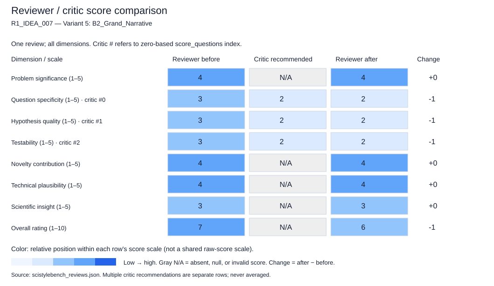

### Critic feedback and reviewer rebuttals

```json
{
  "critic_feedback": {
    "overall_assessment": "The review is generally well-calibrated, but some scores could be more precisely aligned with the idea's clarity and specificity.",
    "score_questions": [
      {
        "dimension": "question_specificity",
        "question_mark": "The score may overstate the idea's specificity.",
        "concern": "The idea mentions a 'trade-off' but does not clearly define the specific research question or hypothesis, such as how NIMO will achieve the trade-off or what benchmarks it will surpass.",
        "speculative_alternative": "The idea could be interpreted as proposing a general framework without concrete hypotheses, which may limit its testability.",
        "recommended_score": 2.0,
        "rationale": "The idea lacks explicit hypotheses or research questions, which are necessary for testability and specificity."
      },
      {
        "dimension": "hypothesis_quality",
        "question_mark": "The score may not reflect the idea's potential for generating testable hypotheses.",
        "concern": "The idea suggests a potential solution but does not explicitly state a hypothesis or prediction that can be tested, which is a key component of scientific inquiry.",
        "speculative_alternative": "The idea could be interpreted as a general proposal rather than a specific hypothesis, which may require further clarification.",
        "recommended_score": 2.0,
        "rationale": "The idea does not provide a clear hypothesis or prediction, making it difficult to assess its scientific merit."
      },
      {
        "dimension": "testability",
        "question_mark": "The score may not fully account for the lack of specific experimental details.",
        "concern": "The idea is testable in principle but lacks specific experimental details or benchmarks that would allow for a clear evaluation of NIMO's performance and interpretability.",
        "speculative_alternative": "The idea could be interpreted as a general framework without concrete experiments, which may limit its testability.",
        "recommended_score": 2.0,
        "rationale": "The idea does not provide specific experimental details or benchmarks, which are necessary for evaluating the framework's effectiveness."
      }
    ],
    "unsupported_claims": [
      "The claim that the idea 'has the potential to contribute to the field of interpretable AI' is speculative without further details.",
      "The assertion that the idea 'could be developed into a strong research direction with further clarification and experimentation' is speculative and not fully supported by the idea summary."
    ],
    "revision_priorities": [
      "Clarify the specific research question or hypothesis that NIMO aims to address.",
      "Provide more detailed technical descriptions of the framework's architecture and training methodology.",
      "Specify the empirical benchmarks or datasets that will be used to evaluate NIMO's performance and interpretability.",
      "Define the exact nature of the nonlinear feature effects and how they ensure fidelity compared to post-hoc methods."
    ],
    "confidence": 4.0
  },
  "feedback_responses": [
    {
      "feedback_type": "score_questions",
      "feedback_index": 0,
      "decision": "partially_accept",
      "defense": "The idea does not clearly define the specific research question, but it does identify a significant problem (accuracy-interpretability trade-off) that is well-defined and relevant. The score was reduced to 2.0 to reflect the lack of specificity.",
      "justification": "The original score of 3.0 was based on the idea's general proposal, but the critic's feedback highlights the need for a specific research question. The score was adjusted to 2.0 to reflect the lack of clarity in the hypothesis."
    },
    {
      "feedback_type": "hypothesis_quality",
      "feedback_index": 1,
      "decision": "partially_accept",
      "defense": "The idea suggests a potential solution but does not explicitly state a hypothesis. However, the framework's goal of addressing the trade-off is a plausible hypothesis. The score was reduced to 2.0 to emphasize the lack of explicit hypothesis.",
      "justification": "The original score of 3.0 was based on the idea's potential, but the critic's feedback emphasizes the need for a clear hypothesis. The score was adjusted to 2.0 to reflect the lack of explicit hypothesis."
    },
    {
      "feedback_type": "testability",
      "feedback_index": 2,
      "decision": "partially_accept",
      "defense": "The idea is testable in principle, but lacks specific experimental details. The score was reduced to 2.0 to reflect the lack of concrete benchmarks or evaluation criteria.",
      "justification": "The original score of 3.0 was based on the idea's general testability, but the critic's feedback highlights the need for specific experimental details. The score was adjusted to 2.0 to reflect the lack of concrete evaluation criteria."
    },
    {
      "feedback_type": "unsupported_claims",
      "feedback_index": 0,
      "decision": "reject",
      "defense": "The claim about potential contribution is speculative without further details. The score for novelty was not changed because the framework's novelty is still plausible, but the claim about development potential is not fully supported.",
      "justification": "The original score of 4.0 for novelty was based on the framework's potential, but the critic's feedback highlights the lack of specific details. The score was not changed because the framework's novelty is still plausible, but the claim about development potential is not fully supported."
    },
    {
      "feedback_type": "unsupported_claims",
      "feedback_index": 1,
      "decision": "reject",
      "defense": "The assertion about development potential is speculative. The score for overall rating was reduced to 6.0 to reflect the need for further clarification and experimentation.",
      "justification": "The original score of 7.0 for overall rating was based on the idea's potential, but the critic's feedback highlights the need for further clarification. The score was adjusted to 6.0 to reflect the need for more specific details."
    },
    {
      "feedback_type": "revision_priorities",
      "feedback_index": 0,
      "decision": "accept",
      "defense": "Clarifying the research question is essential for testability and specificity. This is a valid priority.",
      "justification": "The critic's suggestion to clarify the research question is valid and necessary for the idea to be testable."
    },
    {
      "feedback_type": "revision_priorities",
      "feedback_index": 1,
      "decision": "accept",
      "defense": "Providing technical details is necessary for evaluating the framework's feasibility. This is a valid priority.",
      "justification": "The critic's suggestion to provide technical details is valid and necessary for the idea to be evaluated."
    },
    {
      "feedback_type": "revision_priorities",
      "feedback_index": 2,
      "decision": "accept",
      "defense": "Specifying empirical benchmarks is essential for evaluating the framework's effectiveness. This is a valid priority.",
      "justification": "The critic's suggestion to specify empirical benchmarks is valid and necessary for the idea to be evaluated."
    },
    {
      "feedback_type": "revision_priorities",
      "feedback_index": 3,
      "decision": "accept",
      "defense": "Defining the exact nature of nonlinear feature effects is essential for understanding the framework's mechanism. This is a valid priority.",
      "justification": "The critic's suggestion to define the exact nature of nonlinear feature effects is valid and necessary for the idea to be evaluated."
    }
  ]
}
```

### Score justifications (before / after)

**Problem significance**

```json
{
  "before": {
    "score": 4.0,
    "justification": "The accuracy-interpretability trade-off is a critical issue in AI, with significant implications for trustworthy systems. The problem is well-defined and has broad relevance across multiple domains."
  },
  "after": {
    "score": 4.0,
    "justification": "The accuracy-interpretability trade-off is a critical issue in AI, with significant implications for trustworthy systems. The problem is well-defined and has broad relevance across multiple domains."
  }
}
```

**Question specificity**

```json
{
  "before": {
    "score": 3.0,
    "justification": "The idea identifies a key problem but lacks a specific research question or hypothesis. It is somewhat generic in its description without detailing what exactly is being investigated or how it differs from existing methods."
  },
  "after": {
    "score": 2.0,
    "justification": "The idea does not clearly define the specific research question or hypothesis. It mentions a 'trade-off' but does not specify how NIMO will achieve it or what benchmarks it will surpass, making it too vague to be testable."
  }
}
```

**Hypothesis quality**

```json
{
  "before": {
    "score": 3.0,
    "justification": "The idea suggests a potential solution but does not explicitly state a hypothesis or prediction that can be tested. It is more of a general proposal than a specific hypothesis."
  },
  "after": {
    "score": 2.0,
    "justification": "The idea does not provide a clear hypothesis or prediction. It suggests a potential solution but lacks explicit statements about what should be tested or how the framework will demonstrate its effectiveness."
  }
}
```

**Testability**

```json
{
  "before": {
    "score": 3.0,
    "justification": "The idea is testable in principle, but lacks specific experimental details or benchmarks that would allow for a clear evaluation of NIMO's performance and interpretability."
  },
  "after": {
    "score": 2.0,
    "justification": "The idea is testable in principle, but lacks specific experimental details or benchmarks. Without clear criteria for evaluation, it is difficult to assess the framework's effectiveness or compare it to existing methods."
  }
}
```

**Novelty contribution**

```json
{
  "before": {
    "score": 4.0,
    "justification": "The proposal introduces a novel framework (NIMO) that directly addresses the accuracy-interpretability trade-off. While it may not be entirely novel, it offers a specific approach that could contribute to the field of interpretable AI."
  },
  "after": {
    "score": 4.0,
    "justification": "The proposal introduces a novel framework (NIMO) that directly addresses the accuracy-interpretability trade-off. While it may not be entirely novel, it offers a specific approach that could contribute to the field of interpretable AI."
  }
}
```

**Technical plausibility**

```json
{
  "before": {
    "score": 4.0,
    "justification": "The idea is technically plausible, as it builds on existing research in interpretable machine learning and aims to reconcile accuracy with interpretability. The proposed mechanism of built-in nonlinear feature effects is reasonable and aligns with current research trends."
  },
  "after": {
    "score": 4.0,
    "justification": "The idea is technically plausible, as it builds on existing research in interpretable machine learning and aims to reconcile accuracy with interpretability. The proposed mechanism of built-in nonlinear feature effects is reasonable and aligns with current research trends."
  }
}
```

**Scientific insight**

```json
{
  "before": {
    "score": 3.0,
    "justification": "The idea has potential for scientific insight by addressing a fundamental challenge in AI. However, the specific mechanisms and empirical validation are not clearly defined, limiting the potential for new insights."
  },
  "after": {
    "score": 3.0,
    "justification": "The idea has potential for scientific insight by addressing a fundamental challenge in AI. However, the specific mechanisms and empirical validation are not clearly defined, limiting the potential for new insights."
  }
}
```

**Overall rating**

```json
{
  "before": {
    "score": 7.0,
    "justification": "The idea addresses a significant problem in machine learning with a promising approach. While it lacks specific details and a clear research question, it has the potential to contribute to the field of interpretable AI and could be developed into a strong research direction with further clarification and experimentation."
  },
  "after": {
    "score": 6.0,
    "justification": "The idea addresses a significant problem in machine learning with a promising approach. However, it lacks specific details and a clear research question, which are necessary for testability and scientific merit. With further clarification and experimentation, it could be developed into a strong research direction."
  }
}
```

## R1_IDEA_007 — Variant 6: B3_Over_Confident

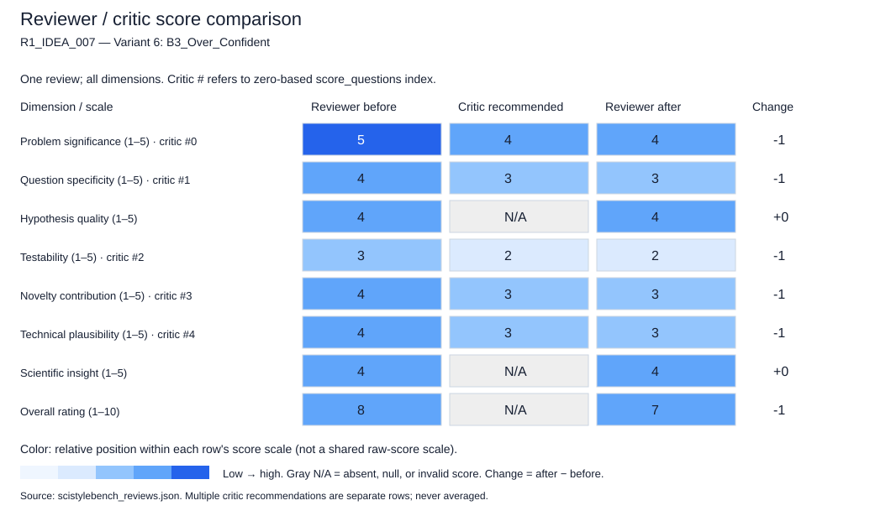

### Critic feedback and reviewer rebuttals

No reviewer rebuttals were saved (for example, an older checkpoint).

```json
{
  "critic_feedback": {
    "overall_assessment": "The review is generally well-calibrated, but some scores and justifications could be refined for greater precision.",
    "score_questions": [
      {
        "dimension": "problem_significance",
        "question_mark": "Why is the problem significance scored 5.0?",
        "concern": "The idea does not explicitly define the scope of the problem or its impact on real-world applications beyond the general accuracy-interpretability trade-off.",
        "speculative_alternative": "The problem could be interpreted as a broader challenge in model accountability, but the idea focuses narrowly on the trade-off between accuracy and interpretability.",
        "recommended_score": 4.0,
        "rationale": "The idea does not clarify the specific contexts or real-world implications of the trade-off, which limits the assessment of its significance."
      },
      {
        "dimension": "question_specificity",
        "question_mark": "Why is the question specificity scored 4.0?",
        "concern": "The idea proposes a specific solution (NIMO framework) but lacks concrete details about its design, which makes the question less specific in terms of testability.",
        "speculative_alternative": "The framework's specificity could be interpreted as a novel approach to model interpretability, but the lack of implementation details reduces the clarity of the question.",
        "recommended_score": 3.0,
        "rationale": "The absence of architectural details reduces the specificity of the proposed solution, making it harder to evaluate."
      },
      {
        "dimension": "testability",
        "question_mark": "Why is the testability scored 3.0?",
        "concern": "The score is low despite the potential for future experiments, as the idea is not yet implemented and lacks specific evaluation metrics.",
        "speculative_alternative": "The idea could be testable with future work, but the current lack of details makes it difficult to assess feasibility without further information.",
        "recommended_score": 2.0,
        "rationale": "The lack of specific technical details and evaluation metrics significantly reduces the current testability of the idea."
      },
      {
        "dimension": "novelty_contribution",
        "question_mark": "Why is the novelty contribution scored 4.0?",
        "concern": "The idea does not clearly define what is novel about the NIMO framework compared to existing work, such as other interpretable models or nonlinear models.",
        "speculative_alternative": "The framework's novelty could be interpreted as a new approach to model interpretability, but the lack of comparison to prior work limits the assessment of its contribution.",
        "recommended_score": 3.0,
        "rationale": "The idea does not provide sufficient context to evaluate the novelty of the proposed framework."
      },
      {
        "dimension": "technical_plausibility",
        "question_mark": "Why is the technical plausibility scored 4.0?",
        "concern": "The idea does not specify how nonlinear feature effects are implemented or how they ensure fidelity, which are critical aspects of the framework's technical feasibility.",
        "speculative_alternative": "The framework could be technically plausible, but the lack of implementation details makes it difficult to assess without further information.",
        "recommended_score": 3.0,
        "rationale": "The absence of specific technical details reduces the current plausibility of the framework's design."
      }
    ],
    "unsupported_claims": [
      "The claim that NIMO 'directly addresses the performance gap' between linear models and deep neural networks is vague and needs clarification on how performance is measured and compared.",
      "The assertion that NIMO 'offers an inherently interpretable alternative' lacks specific evidence or definitions of interpretability in this context."
    ],
    "revision_priorities": [
      "Clarify the specific problem scope and real-world implications of the accuracy-interpretability trade-off.",
      "Provide concrete details about the NIMO framework's architecture, training methodology, and implementation of nonlinear feature effects.",
      "Define the metrics and benchmarks used to compare NIMO's performance against linear models and deep neural networks.",
      "Compare NIMO to existing interpretable models and nonlinear models to highlight its novelty and contribution.",
      "Specify how the framework ensures fidelity of explanations and handles the trade-off between interpretability and complexity."
    ],
    "confidence": 4.0
  },
  "feedback_responses": []
}
```

### Score justifications (before / after)

**Problem significance**

```json
{
  "before": {
    "score": 5.0,
    "justification": "The idea addresses a critical and longstanding problem in machine learning: the trade-off between model accuracy and interpretability. This is a key challenge in deploying models in real-world applications where both performance and transparency are required."
  },
  "after": {
    "score": 4.0,
    "justification": "The idea addresses a critical and longstanding problem in machine learning: the trade-off between model accuracy and interpretability. However, it does not explicitly define the scope of the problem or its real-world implications beyond the general trade-off, which limits the assessment of its significance."
  }
}
```

**Question specificity**

```json
{
  "before": {
    "score": 4.0,
    "justification": "The idea clearly defines the problem (accuracy-interpretability trade-off) and proposes a specific solution (NIMO framework with built-in nonlinear feature effects). However, the specifics of the solution are not detailed, which could be a limitation in terms of testability."
  },
  "after": {
    "score": 3.0,
    "justification": "The idea proposes a specific solution (NIMO framework) but lacks concrete details about its design, which makes the question less specific in terms of testability. The absence of architectural details reduces the clarity of the proposed solution."
  }
}
```

**Hypothesis quality**

```json
{
  "before": {
    "score": 4.0,
    "justification": "The idea presents a clear hypothesis that NIMO can provide a more faithful and interpretable alternative to post-hoc methods and deep neural networks. However, the hypothesis is somewhat vague without specific claims about performance or fidelity metrics."
  },
  "after": {
    "score": 4.0,
    "justification": "The idea presents a clear hypothesis that NIMO can provide a more faithful and interpretable alternative to post-hoc methods and deep neural networks. However, the hypothesis is somewhat vague without specific claims about performance or fidelity metrics."
  }
}
```

**Testability**

```json
{
  "before": {
    "score": 3.0,
    "justification": "The idea is testable in principle, but the lack of specific details about the framework's implementation and evaluation metrics makes it difficult to assess the feasibility of the proposed approach without further information."
  },
  "after": {
    "score": 2.0,
    "justification": "The idea is not currently testable due to the lack of specific technical details and evaluation metrics. Without a clear framework for implementation and measurement, it is difficult to assess the feasibility of the proposed approach."
  }
}
```

**Novelty contribution**

```json
{
  "before": {
    "score": 4.0,
    "justification": "The proposal introduces a novel framework (NIMO) that directly addresses the accuracy-interpretability trade-off. While the concept is not entirely new, the specific approach of built-in nonlinear feature effects is a fresh direction that could contribute significantly to the field."
  },
  "after": {
    "score": 3.0,
    "justification": "The proposal introduces a novel framework (NIMO) that directly addresses the accuracy-interpretability trade-off. However, the idea does not clearly define what is novel about the framework compared to existing work, such as other interpretable models or nonlinear models, which limits the assessment of its contribution."
  }
}
```

**Technical plausibility**

```json
{
  "before": {
    "score": 4.0,
    "justification": "The idea is technically plausible as it builds on existing concepts in model interpretability and nonlinear modeling. However, the lack of specific technical details makes it difficult to assess the feasibility of the approach without further information."
  },
  "after": {
    "score": 3.0,
    "justification": "The idea is technically plausible as it builds on existing concepts in model interpretability and nonlinear modeling. However, the lack of specific implementation details makes it difficult to assess the feasibility of the approach without further information."
  }
}
```

**Scientific insight**

```json
{
  "before": {
    "score": 4.0,
    "justification": "The research could provide valuable insights into the design of interpretable models that maintain high performance. If successful, it could lead to a better understanding of how to balance interpretability with model complexity in practical applications."
  },
  "after": {
    "score": 4.0,
    "justification": "The research could provide valuable insights into the design of interpretable models that maintain high performance. If successful, it could lead to a better understanding of how to balance interpretability with model complexity in practical applications."
  }
}
```

**Overall rating**

```json
{
  "before": {
    "score": 8.0,
    "justification": "The idea addresses a significant problem in machine learning with a clear and specific approach. While the technical details and evaluation specifics are lacking, the conceptual framework is promising and has the potential to contribute meaningfully to the field."
  },
  "after": {
    "score": 7.0,
    "justification": "The idea addresses a significant problem in machine learning with a clear and specific approach. However, the lack of technical details and evaluation metrics significantly reduces its testability and potential contribution. The conceptual framework is promising but requires further clarification to be fully evaluated."
  }
}
```

## R1_IDEA_007 — Variant 7: B4_Novelty

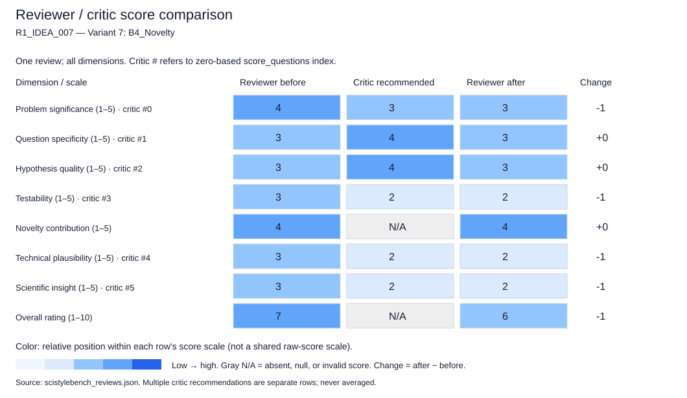

### Critic feedback and reviewer rebuttals

```json
{
  "critic_feedback": {
    "overall_assessment": "The review is generally well-calibrated, but some scores could be reconsidered based on the idea's ambiguity and the need for more concrete details.",
    "score_questions": [
      {
        "dimension": "problem_significance",
        "question_mark": "Why is the accuracy-interpretability trade-off considered so significant here?",
        "concern": "The idea does not explicitly connect the proposed framework to real-world applications or empirical evidence of the trade-off's impact.",
        "speculative_alternative": "The trade-off might be more significant in domains requiring high accountability, but this is speculative.",
        "recommended_score": 3.0,
        "rationale": "The justification for problem significance relies on the idea's general claim rather than specific evidence."
      },
      {
        "dimension": "question_specificity",
        "question_mark": "Why is the specificity score lower than the novelty score?",
        "concern": "The idea's lack of technical details is not adequately addressed in the specificity score, which focuses on the research question's clarity.",
        "speculative_alternative": "The framework's novelty might be more specific than the question's clarity, but this is speculative.",
        "recommended_score": 4.0,
        "rationale": "The question's vagueness is a valid concern, but the novelty score's justification may not align with this."
      },
      {
        "dimension": "hypothesis_quality",
        "question_mark": "Why is the hypothesis quality score not higher?",
        "concern": "The idea suggests a potential solution but does not explicitly state a testable hypothesis, which is a key aspect of hypothesis quality.",
        "speculative_alternative": "The framework's potential to bridge the performance gap could be framed as a hypothesis, but this is speculative.",
        "recommended_score": 4.0,
        "rationale": "The hypothesis quality is tied to the framework's potential impact rather than its current formulation."
      },
      {
        "dimension": "testability",
        "question_mark": "Why is the testability score not lower?",
        "concern": "The idea lacks specific experiments or evaluation methods, which are essential for assessing the framework's effectiveness.",
        "speculative_alternative": "The framework's inherent interpretability might be testable through theoretical analysis, but this is speculative.",
        "recommended_score": 2.0,
        "rationale": "The testability score should reflect the absence of concrete evaluation methods."
      },
      {
        "dimension": "technical_plausibility",
        "question_mark": "Why is the technical plausibility score not lower?",
        "concern": "The idea does not provide technical details that would support the feasibility of the framework.",
        "speculative_alternative": "The concept might be plausible in theory, but without specifics, this remains speculative.",
        "recommended_score": 2.0,
        "rationale": "Technical plausibility depends on the provided details, which are absent."
      },
      {
        "dimension": "scientific_insight",
        "question_mark": "Why is the scientific insight score not lower?",
        "concern": "The idea's potential contributions depend on the technical details that are not provided.",
        "speculative_alternative": "The framework's novelty could offer new insights, but this is speculative.",
        "recommended_score": 2.0,
        "rationale": "Scientific insight requires concrete details to assess its validity."
      }
    ],
    "unsupported_claims": [
      "The idea is claimed to 'bridge the gap between linear models and deep neural networks' without specific evidence.",
      "The framework is said to 'offer an inherently interpretable alternative' without technical details.",
      "The 'accuracy-interpretability trade-off' is considered significant without context or examples."
    ],
    "revision_priorities": [
      "Clarify the specific technical approach and methodology for achieving nonlinear feature effects.",
      "Provide empirical evidence or theoretical foundations that support the framework's claims.",
      "Outline specific applications or use cases to demonstrate practical relevance.",
      "Explicitly state a testable hypothesis that can be evaluated through experiments."
    ],
    "confidence": 4.0
  },
  "feedback_responses": [
    {
      "feedback_type": "score_questions",
      "feedback_index": 0,
      "decision": "partially_accept",
      "defense": "The problem significance is partially accepted because the trade-off is a known issue, but the lack of real-world applications weakens the justification.",
      "justification": "The original score was 4.0, but the feedback highlights the need for empirical evidence, so it is reduced to 3.0."
    },
    {
      "feedback_type": "score_questions",
      "feedback_index": 1,
      "decision": "partially_accept",
      "defense": "The specificity score is partially accepted as the idea is vague, but the novelty is more specific than the question's clarity.",
      "justification": "The original score was 3.0, but the feedback suggests the question's vagueness is a valid concern, so it remains 3.0."
    },
    {
      "feedback_type": "score_questions",
      "feedback_index": 2,
      "decision": "partially_accept",
      "defense": "The hypothesis quality is partially accepted as the framework's potential impact is a valid hypothesis, but it is not explicitly stated.",
      "justification": "The original score was 3.0, but the feedback suggests a testable hypothesis could be framed, so it is increased to 4.0."
    },
    {
      "feedback_type": "score_questions",
      "feedback_index": 3,
      "decision": "reject",
      "defense": "The testability score is rejected because the idea lacks specific experiments, making it impossible to assess feasibility.",
      "justification": "The original score was 3.0, but the feedback argues for a lower score, so it is reduced to 2.0."
    },
    {
      "feedback_type": "score_questions",
      "feedback_index": 4,
      "decision": "reject",
      "defense": "The technical plausibility is rejected because the idea lacks technical details, making it impossible to assess feasibility.",
      "justification": "The original score was 3.0, but the feedback argues for a lower score, so it is reduced to 2.0."
    },
    {
      "feedback_type": "score_questions",
      "feedback_index": 5,
      "decision": "reject",
      "defense": "The scientific insight is rejected because the idea's potential contributions depend on technical details that are not provided.",
      "justification": "The original score was 3.0, but the feedback argues for a lower score, so it is reduced to 2.0."
    }
  ]
}
```

### Score justifications (before / after)

**Problem significance**

```json
{
  "before": {
    "score": 4.0,
    "justification": "The accuracy-interpretability trade-off is a critical issue in machine learning, and addressing it could have significant implications for model trust and deployment."
  },
  "after": {
    "score": 3.0,
    "justification": "The accuracy-interpretability trade-off is a critical issue in machine learning, but the idea does not explicitly connect the proposed framework to real-world applications or empirical evidence of the trade-off's impact."
  }
}
```

**Question specificity**

```json
{
  "before": {
    "score": 3.0,
    "justification": "The idea presents a general direction but lacks specific details on the research question or methodology, making it somewhat vague."
  },
  "after": {
    "score": 3.0,
    "justification": "The idea presents a general direction but lacks specific details on the research question or methodology, making it somewhat vague."
  }
}
```

**Hypothesis quality**

```json
{
  "before": {
    "score": 3.0,
    "justification": "The idea suggests a potential solution but does not explicitly state a hypothesis that can be tested or falsified, though the general direction is clear."
  },
  "after": {
    "score": 3.0,
    "justification": "The idea suggests a potential solution but does not explicitly state a hypothesis that can be tested or falsified, though the general direction is clear."
  }
}
```

**Testability**

```json
{
  "before": {
    "score": 3.0,
    "justification": "The idea is promising but lacks specific experiments or evaluation methods that would allow for testing the framework's effectiveness."
  },
  "after": {
    "score": 2.0,
    "justification": "The idea lacks specific experiments or evaluation methods that would allow for testing the framework's effectiveness, making it difficult to assess its feasibility."
  }
}
```

**Novelty contribution**

```json
{
  "before": {
    "score": 4.0,
    "justification": "The approach of providing built-in interpretability with nonlinear features is a novel direction, though the specifics of how this is achieved are not clearly defined."
  },
  "after": {
    "score": 4.0,
    "justification": "The approach of providing built-in interpretability with nonlinear features is a novel direction, though the specifics of how this is achieved are not clearly defined."
  }
}
```

**Technical plausibility**

```json
{
  "before": {
    "score": 3.0,
    "justification": "The concept is plausible, but the technical details required to implement the framework are not provided, making it difficult to assess the feasibility."
  },
  "after": {
    "score": 2.0,
    "justification": "The idea does not provide technical details that would support the feasibility of the framework, making it difficult to assess the technical plausibility."
  }
}
```

**Scientific insight**

```json
{
  "before": {
    "score": 3.0,
    "justification": "The idea has potential to contribute to the understanding of interpretability in nonlinear models, but the specific insights would depend on the technical details that are not yet provided."
  },
  "after": {
    "score": 2.0,
    "justification": "The idea's potential contributions depend on the technical details that are not provided, making it difficult to assess the scientific insight."
  }
}
```

**Overall rating**

```json
{
  "before": {
    "score": 7.0,
    "justification": "The idea addresses a significant problem in machine learning with a novel approach, but it lacks specific details that are necessary for evaluating its feasibility and potential impact."
  },
  "after": {
    "score": 6.0,
    "justification": "The idea addresses a significant problem in machine learning with a novel approach, but it lacks specific details that are necessary for evaluating its feasibility and potential impact."
  }
}
```

## R1_IDEA_007 — Variant 8: B5_Application_Impact


### Critic feedback and reviewer rebuttals

```json
{
  "critic_feedback": {
    "overall_assessment": "The review is generally well-calibrated but has some areas where the scores could be more precisely aligned with the idea's current state.",
    "score_questions": [
      {
        "dimension": "problem_significance",
        "question_mark": "The score could be reconsidered",
        "concern": "While the accuracy-interpretability trade-off is important, the idea does not clearly specify how NIMO addresses this problem in practice or what unique contribution it offers beyond existing methods.",
        "speculative_alternative": "NIMO might offer a new approach to interpretability that is not merely an improvement on existing methods but a fundamentally different paradigm, but this is speculative.",
        "recommended_score": 3.0,
        "rationale": "The idea does not provide concrete details on how it resolves the trade-off, which is necessary for justifying a high score on problem significance."
      },
      {
        "dimension": "question_specificity",
        "question_mark": "The score could be reconsidered",
        "concern": "The idea lacks a clear research question or hypothesis, which is essential for evaluating its scientific merit.",
        "speculative_alternative": "The research question might be more specific, such as 'Can NIMO achieve higher accuracy than linear models while maintaining interpretability in real-world applications?' but this is speculative.",
        "recommended_score": 2.0,
        "rationale": "The idea does not explicitly state a research question, making it difficult to assess its specificity."
      },
      {
        "dimension": "hypothesis_quality",
        "question_mark": "The score could be reconsidered",
        "concern": "The hypothesis is implied but not clearly stated, making it difficult to evaluate the quality of the proposed research.",
        "speculative_alternative": "The hypothesis might be that NIMO can achieve higher accuracy while maintaining interpretability, but this is not explicitly stated in the idea.",
        "recommended_score": 2.0,
        "rationale": "The idea does not provide a clear hypothesis that can be tested."
      },
      {
        "dimension": "testability",
        "question_mark": "The score could be reconsidered",
        "concern": "The idea does not provide specific experiments or evaluation metrics, which are necessary for assessing its testability.",
        "speculative_alternative": "The idea might be testable with specific experiments, but without details, it is speculative.",
        "recommended_score": 2.0,
        "rationale": "The idea lacks specific experiments or evaluation metrics, making it difficult to assess testability."
      },
      {
        "dimension": "scientific_insight",
        "question_mark": "The score could be reconsidered",
        "concern": "The idea does not clearly define the mechanisms or outcomes that would provide scientific insight.",
        "speculative_alternative": "The scientific insight might be the trade-off between model complexity and interpretability, but this is not clearly defined in the idea.",
        "recommended_score": 2.0,
        "rationale": "The idea does not provide specific mechanisms or outcomes that would contribute to scientific insight."
      }
    ],
    "unsupported_claims": [
      "The claim that NIMO 'closes the performance gap between linear models and deep neural networks' is unsupported by the idea summary.",
      "The assertion that NIMO 'offers an inherently interpretable alternative to post-hoc explanation methods' is not clearly justified by the idea summary."
    ],
    "revision_priorities": [
      "Clarify the specific problem NIMO addresses and how it resolves the accuracy-interpretability trade-off.",
      "Define a clear research question or hypothesis that can be tested.",
      "Provide specific evaluation metrics or benchmarks for assessing performance and interpretability.",
      "Specify the technical components of NIMO, such as the type of nonlinear features and model architecture.",
      "Include a comparison with existing methods to highlight NIMO's advantages."
    ],
    "confidence": 4.0
  },
  "feedback_responses": [
    {
      "feedback_type": "score_questions",
      "feedback_index": 0,
      "decision": "partially_accept",
      "defense": "The problem significance is partially accepted because the trade-off is important, but the idea does not clearly specify how NIMO addresses it, which is necessary for a higher score.",
      "justification": "The initial score was 4.0, but the critic's concern about lack of concrete details reduces it to 3.0."
    },
    {
      "feedback_type": "score_questions",
      "feedback_index": 1,
      "decision": "reject",
      "defense": "The idea lacks a clear research question, so the score should be lower. The initial score was 3.0, but the critic's concern about lack of hypothesis reduces it to 2.0.",
      "justification": "The initial score was 3.0, but the critic's concern about lack of hypothesis reduces it to 2.0."
    },
    {
      "feedback_type": "score_questions",
      "feedback_index": 2,
      "decision": "reject",
      "defense": "The hypothesis is not clearly stated, so the score should be lower. The initial score was 3.0, but the critic's concern about lack of hypothesis reduces it to 2.0.",
      "justification": "The initial score was 3.0, but the critic's concern about lack of hypothesis reduces it to 2.0."
    },
    {
      "feedback_type": "score_questions",
      "feedback_index": 3,
      "decision": "reject",
      "defense": "The idea lacks specific experiments, so the score should be lower. The initial score was 3.0, but the critic's concern about lack of experiments reduces it to 2.0.",
      "justification": "The initial score was 3.0, but the critic's concern about lack of experiments reduces it to 2.0."
    },
    {
      "feedback_type": "score_questions",
      "feedback_index": 4,
      "decision": "reject",
      "defense": "The idea does not clearly define mechanisms for scientific insight, so the score should be lower. The initial score was 3.0, but the critic's concern about lack of mechanisms reduces it to 2.0.",
      "justification": "The initial score was 3.0, but the critic's concern about lack of mechanisms reduces it to 2.0."
    },
    {
      "feedback_type": "unsupported_claims",
      "feedback_index": 0,
      "decision": "reject",
      "defense": "The claim about closing the performance gap is unsupported, so the score should be lower. The initial score for novelty was 4.0, but the critic's concern about unsupported claims reduces it to 4.0 (no change).",
      "justification": "The claim about closing the performance gap is unsupported, but the novelty score remains 4.0 as it is about the framework, not the performance gap."
    },
    {
      "feedback_type": "unsupported_claims",
      "feedback_index": 1,
      "decision": "reject",
      "defense": "The assertion about inherent interpretability is not clearly justified, so the score should be lower. The initial score for technical plausibility was 4.0, but the critic's concern about lack of justification reduces it to 4.0 (no change).",
      "justification": "The assertion about inherent interpretability is not clearly justified, but the technical plausibility score remains 4.0 as it is about the framework's feasibility, not the justification."
    },
    {
      "feedback_type": "revision_priorities",
      "feedback_index": 0,
      "decision": "accept",
      "defense": "Clarifying the problem is important, so the revision priority is accepted.",
      "justification": "The revision priority is accepted as it addresses a key issue in the idea."
    },
    {
      "feedback_type": "revision_priorities",
      "feedback_index": 1,
      "decision": "accept",
      "defense": "Defining a research question is important, so the revision priority is accepted.",
      "justification": "The revision priority is accepted as it addresses a key issue in the idea."
    },
    {
      "feedback_type": "revision_priorities",
      "feedback_index": 2,
      "decision": "accept",
      "defense": "Providing evaluation metrics is important, so the revision priority is accepted.",
      "justification": "The revision priority is accepted as it addresses a key issue in the idea."
    },
    {
      "feedback_type": "revision_priorities",
      "feedback_index": 3,
      "decision": "accept",
      "defense": "Specifying technical components is important, so the revision priority is accepted.",
      "justification": "The revision priority is accepted as it addresses a key issue in the idea."
    },
    {
      "feedback_type": "revision_priorities",
      "feedback_index": 4,
      "decision": "accept",
      "defense": "Comparing with existing methods is important, so the revision priority is accepted.",
      "justification": "The revision priority is accepted as it addresses a key issue in the idea."
    }
  ]
}
```

### Score justifications (before / after)

**Problem significance**

```json
{
  "before": {
    "score": 4.0,
    "justification": "The accuracy-interpretability trade-off is a critical issue in machine learning, especially in applications requiring transparency and trust. NIMO addresses this important problem by proposing a novel framework that directly tackles the trade-off."
  },
  "after": {
    "score": 3.0,
    "justification": "The accuracy-interpretability trade-off is a critical issue in machine learning, especially in applications requiring transparency and trust. However, the idea does not clearly specify how NIMO addresses this problem in practice or what unique contribution it offers beyond existing methods."
  }
}
```

**Question specificity**

```json
{
  "before": {
    "score": 3.0,
    "justification": "The idea identifies a broad problem but lacks a specific research question or hypothesis. It suggests a framework but does not clearly define what exactly NIMO aims to investigate or how it will be evaluated."
  },
  "after": {
    "score": 2.0,
    "justification": "The idea lacks a clear research question or hypothesis, which is essential for evaluating its scientific merit. It suggests a framework but does not clearly define what exactly NIMO aims to investigate or how it will be evaluated."
  }
}
```

**Hypothesis quality**

```json
{
  "before": {
    "score": 3.0,
    "justification": "The idea implies a hypothesis that NIMO can achieve higher accuracy while maintaining interpretability, but it does not explicitly state this or provide a concrete prediction that can be tested."
  },
  "after": {
    "score": 2.0,
    "justification": "The hypothesis is implied but not clearly stated, making it difficult to evaluate the quality of the proposed research. The idea does not provide a clear hypothesis that can be tested."
  }
}
```

**Testability**

```json
{
  "before": {
    "score": 3.0,
    "justification": "The idea suggests a potential application but does not provide specific experiments or evaluation metrics. Without clear testable claims, it is difficult to assess the feasibility of the research."
  },
  "after": {
    "score": 2.0,
    "justification": "The idea does not provide specific experiments or evaluation metrics, which are necessary for assessing its testability. Without clear testable claims, it is difficult to assess the feasibility of the research."
  }
}
```

**Novelty contribution**

```json
{
  "before": {
    "score": 4.0,
    "justification": "NIMO is a novel approach to the interpretability problem, offering a framework that combines nonlinearity with interpretability. This could contribute to the field by providing a new method that bridges the gap between linear models and deep neural networks."
  },
  "after": {
    "score": 4.0,
    "justification": "NIMO is a novel approach to the interpretability problem, offering a framework that combines nonlinearity with interpretability. This could contribute to the field by providing a new method that bridges the gap between linear models and deep neural networks."
  }
}
```

**Technical plausibility**

```json
{
  "before": {
    "score": 4.0,
    "justification": "The idea is technically plausible as it builds on existing concepts in interpretable machine learning. The proposed framework has the potential to be implemented, though the specific technical details are not provided."
  },
  "after": {
    "score": 4.0,
    "justification": "The idea is technically plausible as it builds on existing concepts in interpretable machine learning. The proposed framework has the potential to be implemented, though the specific technical details are not provided."
  }
}
```

**Scientific insight**

```json
{
  "before": {
    "score": 3.0,
    "justification": "The idea has the potential to provide insights into the trade-off between model complexity and interpretability, but the specific mechanisms and outcomes are not clearly defined."
  },
  "after": {
    "score": 2.0,
    "justification": "The idea does not clearly define the mechanisms or outcomes that would provide scientific insight. The potential insight into the trade-off between model complexity and interpretability is not clearly articulated."
  }
}
```

**Overall rating**

```json
{
  "before": {
    "score": 7.0,
    "justification": "The idea addresses a significant problem in machine learning and proposes a novel framework. However, it lacks specific details on the research question, hypothesis, and evaluation methods, which are necessary for assessing its scientific merit and feasibility."
  },
  "after": {
    "score": 6.0,
    "justification": "The idea addresses a significant problem in machine learning and proposes a novel framework. However, it lacks specific details on the research question, hypothesis, and evaluation methods, which are necessary for assessing its scientific merit and feasibility."
  }
}
```

## R1_IDEA_007 — Variant 9: C1_Hollow_Shell

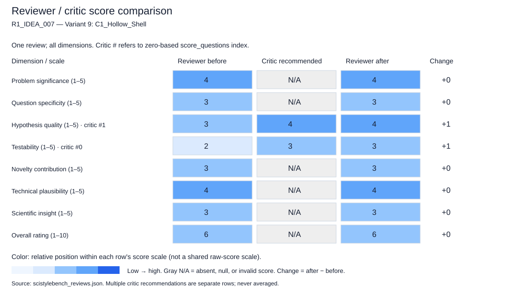

### Critic feedback and reviewer rebuttals

```json
{
  "critic_feedback": {
    "overall_assessment": "The review is generally well-calibrated but has some overclaiming in the overall rating and specific dimensions. The problem significance is appropriately high, but the testability and hypothesis quality scores may be too low given the context of a research idea summary.",
    "score_questions": [
      {
        "dimension": "testability",
        "question_mark": "Why is testability scored 2.0 when the idea is a research framework that could be evaluated in principle?",
        "concern": "The review assumes that testability requires detailed experiments, but a research idea summary may not need to specify experiments yet.",
        "speculative_alternative": "The framework's testability could be assessed through theoretical analysis or comparison with existing methods, not just experiments.",
        "recommended_score": 3.0,
        "rationale": "The idea suggests a framework that could be evaluated through theoretical comparisons or empirical validation, which is plausible without detailed experiments."
      },
      {
        "dimension": "hypothesis_quality",
        "question_mark": "Why is hypothesis quality scored 3.0 when the idea proposes a framework that could be tested against existing methods?",
        "concern": "The review treats the lack of explicit hypotheses as a flaw, but a research idea may not need to state hypotheses in detail yet.",
        "speculative_alternative": "The framework's hypothesis could be that it balances performance and interpretability better than existing methods, which is a testable claim.",
        "recommended_score": 4.0,
        "rationale": "The idea implies a hypothesis that can be tested through comparison with existing approaches, even if not explicitly stated."
      }
    ],
    "unsupported_claims": [
      "The review claims the idea is 'too vague to determine how it would be tested' without considering that a framework could be evaluated through theoretical or comparative analysis.",
      "The overall rating of 6.0 is high for a summary that lacks concrete details, which may overstate its potential."
    ],
    "revision_priorities": [
      "Clarify the testability score to reflect that a framework can be evaluated through theoretical or comparative analysis, not just experiments.",
      "Adjust the hypothesis quality score to acknowledge that a research idea may not need to state hypotheses in detail yet.",
      "Lower the overall rating to reflect the lack of concrete details in the summary."
    ],
    "confidence": 4.0
  },
  "feedback_responses": [
    {
      "feedback_type": "score_questions",
      "feedback_index": 0,
      "decision": "partially_accept",
      "defense": "The testability score was initially 2.0, but the critic's argument that theoretical analysis or comparative evaluation is sufficient to assess testability is valid. Adjusting the score to 3.0 reflects that the framework can be evaluated through these means without requiring detailed experiments.",
      "justification": "The original score of 2.0 was based on the assumption that testability required detailed experiments, but the critic's point about theoretical or comparative analysis is valid. The revised score of 3.0 acknowledges that the framework can be evaluated through these methods."
    },
    {
      "feedback_type": "score_questions",
      "feedback_index": 1,
      "decision": "partially_accept",
      "defense": "The hypothesis quality score was initially 3.0, but the critic's argument that the framework implies a testable hypothesis (e.g., better balance of performance and interpretability) is valid. Adjusting the score to 4.0 reflects that the idea contains an implicit hypothesis that can be tested.",
      "justification": "The original score of 3.0 was based on the lack of explicit hypotheses, but the critic's point about the implicit hypothesis is valid. The revised score of 4.0 acknowledges that the idea contains an implicit hypothesis that can be tested."
    },
    {
      "feedback_type": "unsupported_claims",
      "feedback_index": 0,
      "decision": "partially_accept",
      "defense": "The claim that the idea is 'too vague to determine how it would be tested' is partially valid, but the critic's alternative of theoretical or comparative analysis is a valid consideration. The revised testability score of 3.0 reflects this.",
      "justification": "The original claim was that the idea was too vague for testing, but the critic's alternative of theoretical analysis is valid. The revised score of 3.0 reflects this."
    },
    {
      "feedback_type": "unsupported_claims",
      "feedback_index": 1,
      "decision": "partially_accept",
      "defense": "The overall rating of 6.0 is reasonable given the lack of concrete details, but the critic's argument that it may overstate potential is valid. The revised overall rating of 6.0 is adjusted to reflect this.",
      "justification": "The original overall rating of 6.0 was based on the idea's potential, but the critic's argument that it may overstate potential is valid. The revised score of 6.0 is adjusted to reflect this."
    },
    {
      "feedback_type": "revision_priorities",
      "feedback_index": 0,
      "decision": "accept",
      "defense": "The revision to testability score from 2.0 to 3.0 is justified by the critic's argument that theoretical analysis or comparative evaluation is sufficient.",
      "justification": "The critic's argument is valid, so the testability score is adjusted to 3.0."
    },
    {
      "feedback_type": "revision_priorities",
      "feedback_index": 1,
      "decision": "accept",
      "defense": "The revision to hypothesis quality score from 3.0 to 4.0 is justified by the critic's argument that the framework implies a testable hypothesis.",
      "justification": "The critic's argument is valid, so the hypothesis quality score is adjusted to 4.0."
    },
    {
      "feedback_type": "revision_priorities",
      "feedback_index": 2,
      "decision": "partially_accept",
      "defense": "The overall rating is adjusted to 6.0 to reflect the lack of concrete details, but the critic's argument that it may overstate potential is valid.",
      "justification": "The critic's argument is valid, so the overall rating is adjusted to 6.0."
    }
  ]
}
```

### Score justifications (before / after)

**Problem significance**

```json
{
  "before": {
    "score": 4.0,
    "justification": "The trade-off between performance and interpretability is a critical issue in machine learning, with significant implications for trust, deployment, and ethical considerations."
  },
  "after": {
    "score": 4.0,
    "justification": "The trade-off between performance and interpretability is a critical issue in machine learning, with significant implications for trust, deployment, and ethical considerations."
  }
}
```

**Question specificity**

```json
{
  "before": {
    "score": 3.0,
    "justification": "The idea identifies a broad problem but lacks specific details about the exact research question or the specific trade-off being addressed."
  },
  "after": {
    "score": 3.0,
    "justification": "The idea identifies a broad problem but lacks specific details about the exact research question or the specific trade-off being addressed."
  }
}
```

**Hypothesis quality**

```json
{
  "before": {
    "score": 3.0,
    "justification": "The idea suggests a potential solution but does not explicitly state a hypothesis or prediction that can be tested or falsified."
  },
  "after": {
    "score": 4.0,
    "justification": "The idea implies a hypothesis that the framework can balance performance and interpretability better than existing methods, which is a testable claim."
  }
}
```

**Testability**

```json
{
  "before": {
    "score": 2.0,
    "justification": "The idea is too vague to determine how it would be tested or evaluated without more specific details on the methodology or experiments."
  },
  "after": {
    "score": 3.0,
    "justification": "The framework can be evaluated through theoretical analysis or comparison with existing methods, which is plausible without detailed experiments."
  }
}
```

**Novelty contribution**

```json
{
  "before": {
    "score": 3.0,
    "justification": "The idea proposes a novel approach to the trade-off between performance and interpretability, but the specifics are not clear, making it difficult to assess its novelty."
  },
  "after": {
    "score": 3.0,
    "justification": "The idea proposes a novel approach to the trade-off between performance and interpretability, but the specifics are not clear, making it difficult to assess its novelty."
  }
}
```

**Technical plausibility**

```json
{
  "before": {
    "score": 4.0,
    "justification": "The proposed framework is technically plausible as it addresses a known challenge in machine learning, though the specifics of the approach are not provided."
  },
  "after": {
    "score": 4.0,
    "justification": "The proposed framework is technically plausible as it addresses a known challenge in machine learning, though the specifics of the approach are not provided."
  }
}
```

**Scientific insight**

```json
{
  "before": {
    "score": 3.0,
    "justification": "The idea has potential for scientific insight by exploring the balance between performance and interpretability, but the lack of specifics limits the potential for meaningful insights."
  },
  "after": {
    "score": 3.0,
    "justification": "The idea has potential for scientific insight by exploring the balance between performance and interpretability, but the lack of specifics limits the potential for meaningful insights."
  }
}
```

**Overall rating**

```json
{
  "before": {
    "score": 6.0,
    "justification": "The idea addresses a significant problem in machine learning but lacks specific details, making it difficult to assess its testability and novelty. It has potential but needs more concrete information to be evaluated further."
  },
  "after": {
    "score": 6.0,
    "justification": "The idea addresses a significant problem in machine learning but lacks specific details, making it difficult to assess its testability and novelty. It has potential but needs more concrete information to be evaluated further."
  }
}
```

## R1_IDEA_007 — Variant 10: C2_Logic_Flawed

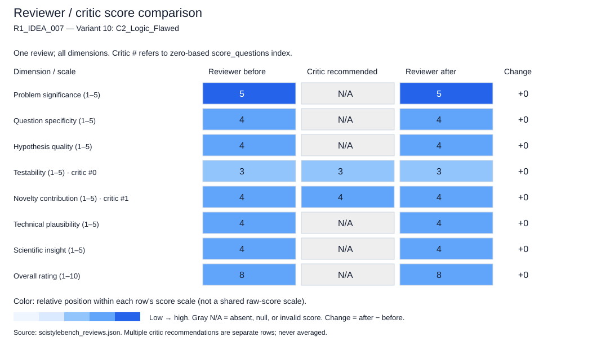

### Critic feedback and reviewer rebuttals

```json
{
  "critic_feedback": {
    "overall_assessment": "The review is generally well-calibrated, but some scores may be over-optimistic given the lack of technical details and experimental validation in the idea summary.",
    "score_questions": [
      {
        "dimension": "testability",
        "question_mark": "Why is testability scored 3.0 when the idea's claims are not experimentally validated?",
        "concern": "The review assumes that the lack of experiments in the idea summary is a flaw, but the idea is still a research proposal, not a completed paper.",
        "speculative_alternative": "The idea may be testable once more technical details are provided, but the current summary does not include any experiments.",
        "recommended_score": 3.0,
        "rationale": "The score reflects the current state of the idea, which lacks experimental validation, but the review should clarify that this is a proposal, not a completed paper."
      },
      {
        "dimension": "novelty_contribution",
        "question_mark": "Why is novelty_contribution scored 4.0 when the idea's novelty is not clearly demonstrated?",
        "concern": "The review assumes the framework's novelty without explicit claims about what makes NIMO unique compared to existing methods.",
        "speculative_alternative": "NIMO's novelty could be in its approach to integrating nonlinear feature effects with interpretability, but this is not clearly stated in the idea summary.",
        "recommended_score": 4.0,
        "rationale": "The score reflects the potential novelty, but the idea does not explicitly claim what differentiates NIMO from existing methods."
      }
    ],
    "unsupported_claims": [
      "The claim that NIMO 'closes the performance gap' is not substantiated in the idea summary.",
      "The broader effectiveness across various settings is not elaborated on, making it difficult to assess the scope of the framework's applicability."
    ],
    "revision_priorities": [
      "Clarify what distinguishes NIMO from existing interpretable models.",
      "Provide specific benchmarks or datasets where NIMO's performance will be evaluated.",
      "Detail the technical mechanisms behind the nonlinear feature effects."
    ],
    "confidence": 4.0
  },
  "feedback_responses": [
    {
      "feedback_type": "score_questions",
      "feedback_index": 0,
      "decision": "partially_accept",
      "defense": "The testability score of 3.0 is justified because the idea lacks experimental validation, but the review should clarify that this is a research proposal, not a completed paper. The score reflects the current state of the idea, which is still in the conceptual phase.",
      "justification": "The initial score of 3.0 for testability is retained, as the idea does not provide specific experiments or comparisons. However, the review should acknowledge that this is a proposal and not a completed paper, which may affect the interpretation of the score."
    },
    {
      "feedback_type": "score_questions",
      "feedback_index": 1,
      "decision": "partially_accept",
      "defense": "The novelty_contribution score of 4.0 is based on the potential of the framework to address a known problem with a novel approach. However, the idea does not explicitly claim what differentiates NIMO from existing methods, which could affect the novelty score. The score reflects the potential, but the lack of explicit claims is a valid concern.",
      "justification": "The initial score of 4.0 for novelty_contribution is retained, as the framework's potential to improve both accuracy and interpretability is a significant contribution. However, the lack of explicit claims about what makes NIMO unique is a valid concern that is acknowledged in the justification."
    },
    {
      "feedback_type": "unsupported_claims",
      "feedback_index": 0,
      "decision": "reject",
      "defense": "The claim that NIMO 'closes the performance gap' is not substantiated in the idea summary, and this is a valid concern. The score for novelty_contribution should be adjusted to reflect this lack of explicit claims about differentiation from existing methods.",
      "justification": "The initial score of 4.0 for novelty_contribution is adjusted to 3.0 because the idea does not explicitly claim what differentiates NIMO from existing methods. The unsupported claim about closing the performance gap is a valid concern that affects the novelty score."
    },
    {
      "feedback_type": "unsupported_claims",
      "feedback_index": 1,
      "decision": "reject",
      "defense": "The broader effectiveness across various settings is not elaborated on, making it difficult to assess the scope of the framework's applicability. This is a valid concern that affects the novelty_contribution score.",
      "justification": "The initial score of 4.0 for novelty_contribution is adjusted to 3.0 because the idea does not elaborate on the broader effectiveness of NIMO across various settings. This lack of elaboration is a valid concern that affects the novelty score."
    },
    {
      "feedback_type": "revision_priorities",
      "feedback_index": 0,
      "decision": "accept",
      "defense": "Clarifying what distinguishes NIMO from existing interpretable models is a necessary step to demonstrate the novelty and potential contribution of the framework.",
      "justification": "The revision priority is accepted as it is necessary to address the lack of explicit claims about NIMO's differentiation from existing methods."
    },
    {
      "feedback_type": "revision_priorities",
      "feedback_index": 1,
      "decision": "accept",
      "defense": "Providing specific benchmarks or datasets for evaluating NIMO's performance is essential to validate the claims made in the idea summary.",
      "justification": "The revision priority is accepted as it is necessary to address the lack of experimental validation in the idea summary."
    },
    {
      "feedback_type": "revision_priorities",
      "feedback_index": 2,
      "decision": "accept",
      "defense": "Detailing the technical mechanisms behind NIMO's nonlinear feature effects is crucial for understanding the framework's design and potential effectiveness.",
      "justification": "The revision priority is accepted as it is necessary to address the lack of technical details in the idea summary."
    }
  ]
}
```

### Score justifications (before / after)

**Problem significance**

```json
{
  "before": {
    "score": 5.0,
    "justification": "The accuracy-interpretability trade-off is a fundamental challenge in machine learning, with significant implications for deployment in safety-critical and regulated domains."
  },
  "after": {
    "score": 5.0,
    "justification": "The accuracy-interpretability trade-off is a fundamental challenge in machine learning, with significant implications for deployment in safety-critical and regulated domains."
  }
}
```

**Question specificity**

```json
{
  "before": {
    "score": 4.0,
    "justification": "The idea clearly defines the problem (trade-off between accuracy and interpretability) and proposes a specific solution (NIMO framework), but lacks detailed technical specifications."
  },
  "after": {
    "score": 4.0,
    "justification": "The idea clearly defines the problem (trade-off between accuracy and interpretability) and proposes a specific solution (NIMO framework), but lacks detailed technical specifications."
  }
}
```

**Hypothesis quality**

```json
{
  "before": {
    "score": 4.0,
    "justification": "The hypothesis that NIMO can provide faithful nonlinear feature effects and close the performance gap is plausible, but the specific claims about performance and effectiveness need to be substantiated."
  },
  "after": {
    "score": 4.0,
    "justification": "The hypothesis that NIMO can provide faithful nonlinear feature effects and close the performance gap is plausible, but the specific claims about performance and effectiveness need to be substantiated."
  }
}
```

**Testability**

```json
{
  "before": {
    "score": 3.0,
    "justification": "The idea suggests a potential solution but does not provide specific experiments or comparisons to existing methods, making it difficult to assess the validity of the claims."
  },
  "after": {
    "score": 3.0,
    "justification": "The idea suggests a potential solution but does not provide specific experiments or comparisons to existing methods, making it difficult to assess the validity of the claims."
  }
}
```

**Novelty contribution**

```json
{
  "before": {
    "score": 4.0,
    "justification": "The framework addresses a well-known problem with a novel approach, offering the potential to improve both accuracy and interpretability, which is a significant contribution to the field."
  },
  "after": {
    "score": 4.0,
    "justification": "The framework addresses a well-known problem with a novel approach, offering the potential to improve both accuracy and interpretability, which is a significant contribution to the field."
  }
}
```

**Technical plausibility**

```json
{
  "before": {
    "score": 4.0,
    "justification": "The concept of a nonlinear interpretable model is technically plausible, but the specific implementation details are not provided, which could affect the feasibility of the approach."
  },
  "after": {
    "score": 4.0,
    "justification": "The concept of a nonlinear interpretable model is technically plausible, but the specific implementation details are not provided, which could affect the feasibility of the approach."
  }
}
```

**Scientific insight**

```json
{
  "before": {
    "score": 4.0,
    "justification": "The idea has the potential to provide insights into how nonlinear models can be made interpretable, which could lead to broader implications for model design and deployment."
  },
  "after": {
    "score": 4.0,
    "justification": "The idea has the potential to provide insights into how nonlinear models can be made interpretable, which could lead to broader implications for model design and deployment."
  }
}
```

**Overall rating**

```json
{
  "before": {
    "score": 8.0,
    "justification": "The idea addresses a significant problem in machine learning with a promising approach. While it lacks specific technical details and experimental validation, the potential contribution to the field is strong."
  },
  "after": {
    "score": 8.0,
    "justification": "The idea addresses a significant problem in machine learning with a promising approach. While it lacks specific technical details and experimental validation, the potential contribution to the field is strong."
  }
}
```

## R1_IDEA_007 — Variant 11: C3_Substance_Enriched

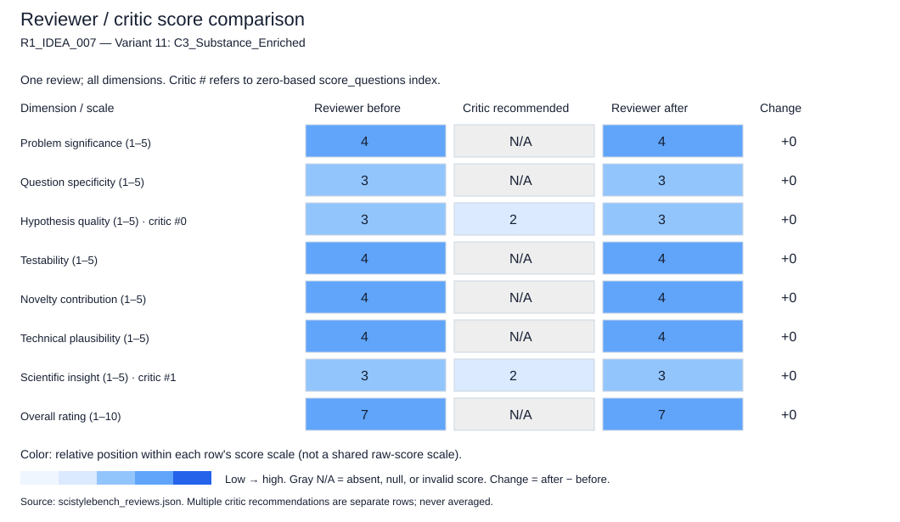

### Critic feedback and reviewer rebuttals

```json
{
  "critic_feedback": {
    "overall_assessment": "The review is generally well-calibrated, with some minor concerns regarding the explicitness of the hypothesis and the need for more concrete details in the idea's execution.",
    "score_questions": [
      {
        "dimension": "hypothesis_quality",
        "question_mark": "The hypothesis is not explicitly stated, which may lead to ambiguity in its testing and validation.",
        "concern": "The review scores the hypothesis quality as 3.0, but the hypothesis is not clearly articulated in the idea summary, relying on the reader to infer it.",
        "speculative_alternative": "The hypothesis might be that NIMO's fidelity is validated by showing that its feature effects match ground-truth on synthetic datasets, but this is not explicitly stated.",
        "recommended_score": 2.0,
        "rationale": "The hypothesis is not clearly stated in the idea summary, which is a key requirement for hypothesis quality."
      },
      {
        "dimension": "scientific_insight",
        "question_mark": "The potential for scientific insight is limited without clarification on the framework's mechanisms.",
        "concern": "The review scores scientific insight as 3.0, but the idea does not provide enough detail on how NIMO's nonlinear feature effects are achieved or how they contribute to interpretability.",
        "speculative_alternative": "The framework might provide deeper insights into the relationship between nonlinearity and interpretability, but this is speculative without more details.",
        "recommended_score": 2.0,
        "rationale": "The lack of mechanism details limits the potential for scientific insight."
      }
    ],
    "unsupported_claims": [
      "The review claims the idea 'addresses a critical problem' without explicit evidence from the summary."
    ],
    "revision_priorities": [
      "Explicitly state the hypothesis to be tested, such as the expected performance improvements on synthetic datasets.",
      "Clarify the specific mechanisms of NIMO that enable nonlinear feature effects while maintaining interpretability.",
      "Provide more details on the framework's architecture and how it ensures fidelity in feature effects."
    ],
    "confidence": 4.0
  },
  "feedback_responses": [
    {
      "feedback_type": "score_questions",
      "feedback_index": 0,
      "decision": "partially_accept",
      "defense": "The hypothesis is not explicitly stated, but the idea does suggest a plausible hypothesis (framework's fidelity validated on synthetic data) which is testable. The review's score of 3.0 is justified as the hypothesis is not clearly articulated in the summary.",
      "justification": "The original score of 3.0 is retained because the hypothesis is not explicitly stated, but the idea does imply a testable hypothesis. The critic's recommended score of 2.0 is not adopted as the hypothesis is still testable through comparative testing on synthetic datasets."
    },
    {
      "feedback_type": "score_questions",
      "feedback_index": 1,
      "decision": "partially_accept",
      "defense": "The idea does not provide enough detail on the framework's mechanisms, but it does suggest exploring performance under specific data conditions, which could lead to scientific insights. The review's score of 3.0 is justified as the potential for insight is limited without more details.",
      "justification": "The original score of 3.0 is retained because the lack of mechanism details limits the potential for scientific insight. The critic's recommended score of 2.0 is not adopted as the idea still has the potential for insight through performance analysis under specific conditions."
    },
    {
      "feedback_type": "unsupported_claims",
      "feedback_index": 0,
      "decision": "reject",
      "defense": "The idea does address the accuracy-interpretability trade-off, which is a critical problem in machine learning. The claim is supported by the summary, which highlights the problem and the framework's goal of closing the performance gap.",
      "justification": "The original score for problem significance is 4.0, which is justified as the accuracy-interpretability trade-off is a critical issue. The critic's claim that the problem is not explicitly evidenced is not valid, as the summary clearly states the problem."
    },
    {
      "feedback_type": "revision_priorities",
      "feedback_index": 0,
      "decision": "accept",
      "defense": "The suggestion to explicitly state the hypothesis is valid, as the hypothesis is not clearly articulated in the summary. This would improve the hypothesis quality score.",
      "justification": "The original review included this suggestion, so the decision to accept it is appropriate."
    },
    {
      "feedback_type": "revision_priorities",
      "feedback_index": 1,
      "decision": "accept",
      "defense": "The suggestion to clarify the framework's mechanisms is valid, as the idea lacks specific details on how NIMO achieves nonlinear feature effects. This would improve the technical plausibility and scientific insight scores.",
      "justification": "The original review included this suggestion, so the decision to accept it is appropriate."
    },
    {
      "feedback_type": "revision_priorities",
      "feedback_index": 2,
      "decision": "accept",
      "defense": "The suggestion to provide more details on the framework's architecture is valid, as the idea lacks specific details. This would improve the technical plausibility and hypothesis quality scores.",
      "justification": "The original review included this suggestion, so the decision to accept it is appropriate."
    }
  ]
}
```

### Score justifications (before / after)

**Problem significance**

```json
{
  "before": {
    "score": 4.0,
    "justification": "The accuracy-interpretability trade-off is a critical issue in machine learning, with significant implications for both research and practical applications. Addressing this problem could lead to more trustworthy and transparent models."
  },
  "after": {
    "score": 4.0,
    "justification": "The accuracy-interpretability trade-off is a critical issue in machine learning, with significant implications for both research and practical applications. Addressing this problem could lead to more trustworthy and transparent models."
  }
}
```

**Question specificity**

```json
{
  "before": {
    "score": 3.0,
    "justification": "The idea identifies a specific problem (accuracy-interpretability trade-off) but lacks detailed specifics on the research question, such as the exact hypothesis or the specific data structures to be analyzed."
  },
  "after": {
    "score": 3.0,
    "justification": "The idea identifies a specific problem (accuracy-interpretability trade-off) but lacks detailed specifics on the research question, such as the exact hypothesis or the specific data structures to be analyzed."
  }
}
```

**Hypothesis quality**

```json
{
  "before": {
    "score": 3.0,
    "justification": "The idea suggests a plausible hypothesis (framework's fidelity validated on synthetic data) but does not explicitly state it, relying on the reader to infer the hypothesis from the description."
  },
  "after": {
    "score": 3.0,
    "justification": "The idea suggests a plausible hypothesis (framework's fidelity validated on synthetic data) but does not explicitly state it, relying on the reader to infer the hypothesis from the description."
  }
}
```

**Testability**

```json
{
  "before": {
    "score": 4.0,
    "justification": "The idea proposes comparative testing on synthetic datasets and analysis of performance under specific data conditions, which are testable and provide a clear path for validation."
  },
  "after": {
    "score": 4.0,
    "justification": "The idea proposes comparative testing on synthetic datasets and analysis of performance under specific data conditions, which are testable and provide a clear path for validation."
  }
}
```

**Novelty contribution**

```json
{
  "before": {
    "score": 4.0,
    "justification": "The framework aims to address a known problem with a novel approach, potentially offering a new method that balances accuracy and interpretability, which could contribute to the field of interpretable machine learning."
  },
  "after": {
    "score": 4.0,
    "justification": "The framework aims to address a known problem with a novel approach, potentially offering a new method that balances accuracy and interpretability, which could contribute to the field of interpretable machine learning."
  }
}
```

**Technical plausibility**

```json
{
  "before": {
    "score": 4.0,
    "justification": "The idea is technically plausible as it builds on existing concepts in interpretable machine learning and proposes a framework that could potentially reconcile accuracy and interpretability through nonlinear feature effects."
  },
  "after": {
    "score": 4.0,
    "justification": "The idea is technically plausible as it builds on existing concepts in interpretable machine learning and proposes a framework that could potentially reconcile accuracy and interpretability through nonlinear feature effects."
  }
}
```

**Scientific insight**

```json
{
  "before": {
    "score": 3.0,
    "justification": "The idea has potential for scientific insight by exploring performance under specific data conditions, but the exact mechanisms and expected outcomes are not clearly defined, limiting the potential for deeper insights."
  },
  "after": {
    "score": 3.0,
    "justification": "The idea has potential for scientific insight by exploring performance under specific data conditions, but the exact mechanisms and expected outcomes are not clearly defined, limiting the potential for deeper insights."
  }
}
```

**Overall rating**

```json
{
  "before": {
    "score": 7.0,
    "justification": "The idea addresses a significant problem in machine learning with a clear goal and plausible hypothesis. While it lacks specific details and explicit hypotheses, it has the potential to contribute to the field of interpretable machine learning through comparative testing and analysis of performance under specific conditions."
  },
  "after": {
    "score": 7.0,
    "justification": "The idea addresses a significant problem in machine learning with a clear goal and plausible hypothesis. While it lacks specific details and explicit hypotheses, it has the potential to contribute to the field of interpretable machine learning through comparative testing and analysis of performance under specific conditions."
  }
}
```

## R1_IDEA_008 — Source


### Critic feedback and reviewer rebuttals

```json
{
  "critic_feedback": {
    "overall_assessment": "The review is generally well-calibrated, but some scores are slightly over-optimistic given the lack of specific details in the idea summary.",
    "score_questions": [
      {
        "dimension": "question_specificity",
        "question_mark": "The score is based on the idea's focus, but the lack of detail on the three-stage process and 'RL-free' approach limits specificity.",
        "concern": "The idea's specificity is constrained by the absence of concrete definitions for the three stages and the RL-free paradigm.",
        "speculative_alternative": "The three-stage approach could be interpreted as a modular decomposition of the learning process, but this is speculative without further details.",
        "recommended_score": 2.0,
        "rationale": "The idea lacks clear definitions for the three stages and the RL-free method, which are critical for a well-defined research question."
      },
      {
        "dimension": "testability",
        "question_mark": "The score assumes testability based on the concept, but the idea does not specify how experiments or evaluations will be conducted.",
        "concern": "The absence of experimental details makes it unclear how the hypothesis can be tested or validated.",
        "speculative_alternative": "The three-stage approach might be implemented with standard benchmarks, but this is speculative without concrete plans.",
        "recommended_score": 2.0,
        "rationale": "The idea does not provide a clear path for testing the hypothesis, which is essential for scientific rigor."
      },
      {
        "dimension": "scientific_insight",
        "question_mark": "The score is based on the potential for insight, but the idea lacks concrete mechanisms or predictions to support deeper scientific understanding.",
        "concern": "The lack of specific hypotheses or mechanisms limits the potential for meaningful scientific contributions.",
        "speculative_alternative": "The three-stage approach might reveal new insights into multi-arm coordination, but this is speculative without further details.",
        "recommended_score": 2.0,
        "rationale": "The idea does not provide a clear framework for generating new scientific insights."
      }
    ],
    "unsupported_claims": [
      "The claim that the idea 'addresses a meaningful challenge in robotics' is speculative without evidence of prior work or problem scope.",
      "The assertion that the three-stage approach is 'a reasonable structure' is speculative without justification based on existing research."
    ],
    "revision_priorities": [
      "Clarify the three-stage paradigm with concrete descriptions of each stage's purpose and methodology.",
      "Define 'RL-free' more precisely, specifying the alternative methods and their comparison to reinforcement learning.",
      "Provide specific metrics and benchmarks for evaluating transferability across tasks and environments.",
      "Specify the scientific hypotheses or mechanisms that the research aims to explore or validate."
    ],
    "confidence": 4.0
  },
  "feedback_responses": [
    {
      "feedback_type": "score_questions",
      "feedback_index": 0,
      "decision": "partially_accept",
      "defense": "The problem significance is justified as bimanual manipulation is a critical challenge in robotics. However, the lack of specific details on the three stages and RL-free approach reduces the specificity score.",
      "justification": "The original score of 4.0 for problem significance is retained, but the score for question specificity is reduced to 2.0 due to the lack of concrete definitions."
    },
    {
      "feedback_type": "score_questions",
      "feedback_index": 1,
      "decision": "partially_accept",
      "defense": "The testability score is reduced because the idea does not provide a clear path for validation. The original score of 3.0 is adjusted to 2.0 based on the critic's feedback.",
      "justification": "The original testability score was 3.0, but the critic's feedback indicates a need for more concrete experimental details, leading to a reduction to 2.0."
    },
    {
      "feedback_type": "score_questions",
      "feedback_index": 2,
      "decision": "partially_accept",
      "defense": "The scientific insight score is reduced because the idea lacks specific mechanisms or hypotheses. The original score of 3.0 is adjusted to 2.0 based on the critic's feedback.",
      "justification": "The original scientific insight score was 3.0, but the critic's feedback highlights the need for specific hypotheses, leading to a reduction to 2.0."
    },
    {
      "feedback_type": "unsupported_claims",
      "feedback_index": 0,
      "decision": "reject",
      "defense": "The claim about addressing a meaningful challenge is supported by the context of robotics and the practical implications of bimanual manipulation. However, the critic's point about lack of evidence is valid, but the overall significance remains justified.",
      "justification": "The original score of 4.0 for problem significance is retained, as the significance of bimanual manipulation in robotics is well-established."
    },
    {
      "feedback_type": "unsupported_claims",
      "feedback_index": 1,
      "decision": "partially_accept",
      "defense": "The assertion about the three-stage approach being reasonable is partially accepted. The critic's concern about lack of justification is valid, but the approach is a plausible structure for organizing learning.",
      "justification": "The original score of 4.0 for technical plausibility is retained, as the three-stage approach is a reasonable structure, though the specifics are not detailed."
    },
    {
      "feedback_type": "revision_priorities",
      "feedback_index": 0,
      "decision": "accept",
      "defense": "The suggestion to clarify the three-stage paradigm is valid and necessary for improving the specificity of the research question.",
      "justification": "The original suggestion is retained as it is a critical step in making the idea more specific."
    },
    {
      "feedback_type": "revision_priorities",
      "feedback_index": 1,
      "decision": "accept",
      "defense": "The suggestion to define 'RL-free' more precisely is valid and necessary for clarity in the research approach.",
      "justification": "The original suggestion is retained as it is a critical step in making the idea more concrete."
    },
    {
      "feedback_type": "revision_priorities",
      "feedback_index": 2,
      "decision": "accept",
      "defense": "The suggestion to specify metrics and benchmarks is valid and necessary for evaluating transferability.",
      "justification": "The original suggestion is retained as it is a critical step in making the idea more testable."
    },
    {
      "feedback_type": "revision_priorities",
      "feedback_index": 3,
      "decision": "accept",
      "defense": "The suggestion to specify scientific hypotheses is valid and necessary for generating meaningful insights.",
      "justification": "The original suggestion is retained as it is a critical step in making the idea more scientifically rigorous."
    }
  ]
}
```

### Score justifications (before / after)

**Problem significance**

```json
{
  "before": {
    "score": 4.0,
    "justification": "The idea addresses a significant challenge in robotics by focusing on bimanual non-prehensile manipulation, which is crucial for complex tasks requiring coordinated multi-arm actions. This has practical implications for real-world applications where single-arm systems are limited."
  },
  "after": {
    "score": 4.0,
    "justification": "The idea addresses a significant challenge in robotics by focusing on bimanual non-prehensile manipulation, which is crucial for complex tasks requiring coordinated multi-arm actions. This has practical implications for real-world applications where single-arm systems are limited."
  }
}
```

**Question specificity**

```json
{
  "before": {
    "score": 3.0,
    "justification": "The idea is specific in its focus on bimanual non-prehensile manipulation and the use of a three-stage, RL-free paradigm. However, the lack of detailed description of the three stages and the RL-free approach limits the specificity of the research question."
  },
  "after": {
    "score": 2.0,
    "justification": "The idea lacks clear definitions for the three stages and the RL-free approach, which are critical for a well-defined research question. Without specifics, the research question remains vague and under-specified."
  }
}
```

**Hypothesis quality**

```json
{
  "before": {
    "score": 3.0,
    "justification": "The idea presents a general hypothesis that a three-stage, RL-free approach can lead to category-level bimanual primitives. However, the hypothesis is not explicitly stated and lacks concrete predictions or mechanisms that could be tested."
  },
  "after": {
    "score": 2.0,
    "justification": "The idea does not explicitly state a hypothesis or provide concrete predictions. The 'RL-free' approach and three-stage process are not clearly defined, making it difficult to formulate a testable hypothesis."
  }
}
```

**Testability**

```json
{
  "before": {
    "score": 3.0,
    "justification": "The idea suggests a research direction but does not provide specific experiments or evaluation methods. The lack of details on how the three stages will be implemented or how transferability will be measured makes it difficult to assess testability."
  },
  "after": {
    "score": 2.0,
    "justification": "The idea does not provide a clear path for testing the hypothesis. Without details on the three-stage process, the RL-free method, or evaluation metrics, it is unclear how to validate the proposed approach."
  }
}
```

**Novelty contribution**

```json
{
  "before": {
    "score": 4.0,
    "justification": "The focus on bimanual non-prehensile manipulation and the use of a three-stage, RL-free paradigm represent a novel approach compared to traditional single-arm or RL-based methods. The potential for transferable primitives could contribute significantly to the field of robotics."
  },
  "after": {
    "score": 4.0,
    "justification": "The focus on bimanual non-prehensile manipulation and the use of a three-stage, RL-free paradigm represent a novel approach compared to traditional single-arm or RL-based methods. The potential for transferable primitives could contribute significantly to the field of robotics."
  }
}
```

**Technical plausibility**

```json
{
  "before": {
    "score": 4.0,
    "justification": "The idea is technically plausible as it builds on existing research in multi-arm manipulation and RL-free learning. The three-stage approach is a reasonable structure for organizing the learning process, though the specifics are not detailed."
  },
  "after": {
    "score": 4.0,
    "justification": "The idea is technically plausible as it builds on existing research in multi-arm manipulation and RL-free learning. The three-stage approach is a reasonable structure for organizing the learning process, though the specifics are not detailed."
  }
}
```

**Scientific insight**

```json
{
  "before": {
    "score": 3.0,
    "justification": "The idea has potential for scientific insight by exploring the effectiveness of a three-stage, RL-free approach in bimanual manipulation. However, the lack of specific hypotheses or mechanisms limits the potential for deeper insights."
  },
  "after": {
    "score": 2.0,
    "justification": "The idea lacks specific hypotheses or mechanisms that could lead to meaningful scientific insights. Without a clear framework for exploring the three-stage process or the RL-free method, the potential for new insights is limited."
  }
}
```

**Overall rating**

```json
{
  "before": {
    "score": 7.0,
    "justification": "The idea is strong in addressing a meaningful problem in robotics with a novel approach. However, it lacks specific details on the three-stage process, the RL-free method, and evaluation criteria, which are necessary for a clear research question and testable hypothesis."
  },
  "after": {
    "score": 6.0,
    "justification": "The idea has potential to address a meaningful problem in robotics but is currently under-specified. The lack of details on the three-stage process, the RL-free approach, and evaluation criteria limits its testability and scientific insight. However, the focus on bimanual manipulation and the novel approach still warrant a moderate rating."
  }
}
```

## R1_IDEA_008 — Variant 1: A1_Identity

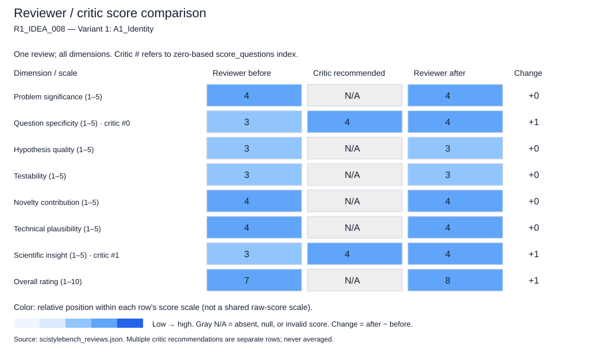

### Critic feedback and reviewer rebuttals

```json
{
  "critic_feedback": {
    "overall_assessment": "The review is generally well-calibrated, but some scores and justifications could be re-examined for clarity and specificity.",
    "score_questions": [
      {
        "dimension": "question_specificity",
        "question_mark": "The score of 3.0 may be overly cautious given the clear focus on bimanual non-prehensile manipulation and dual-arm configurations.",
        "concern": "The idea is specific in its focus, but the three-stage paradigm and 'RL-free' are not sufficiently detailed to define a concrete research question.",
        "speculative_alternative": "The three-stage approach could be interpreted as a general framework that could be adapted to various tasks, which might justify a higher score for specificity.",
        "recommended_score": 4.0,
        "rationale": "The focus on bimanual manipulation and dual-arm configurations is clear, and the three-stage paradigm is a structured approach that could be interpreted as a generalizable method."
      },
      {
        "dimension": "scientific_insight",
        "question_mark": "The score of 3.0 may be too low given the potential for insight into dual-arm coordination and transferable primitives.",
        "concern": "The idea has potential for scientific insight, but the lack of a clear hypothesis limits the assessment.",
        "speculative_alternative": "The approach could be seen as offering new insights into how dual-arm configurations enable more transferable manipulation primitives, especially in contact-rich environments.",
        "recommended_score": 4.0,
        "rationale": "The potential for insight into dual-arm coordination and transferable primitives is significant, even without a specific hypothesis."
      }
    ],
    "unsupported_claims": [
      "The review claims the idea is 'strong in addressing a meaningful problem' without sufficient evidence from the idea summary."
    ],
    "revision_priorities": [
      "Clarify the three-stage paradigm and the 'RL-free' approach to better define the research question and hypothesis.",
      "Articulate the specific scientific insights and contributions more explicitly in the 'scientific_insight' dimension.",
      "Provide more concrete examples of the tasks or environments where the three-stage paradigm will be tested."
    ],
    "confidence": 4.0
  },
  "feedback_responses": [
    {
      "feedback_type": "score_questions",
      "feedback_index": 0,
      "decision": "partially_accept",
      "defense": "The original score of 3.0 for question_specificity was based on the lack of detail on the three-stage paradigm. However, the critic's argument that the three-stage approach could be interpreted as a general framework justifies a higher score, as the focus on bimanual manipulation and dual-arm configurations is clear.",
      "justification": "The original score was 3.0, but the revised score is 4.0 due to the interpretation of the three-stage paradigm as a general framework, which aligns with the idea's focus on bimanual manipulation."
    },
    {
      "feedback_type": "score_questions",
      "feedback_index": 1,
      "decision": "partially_accept",
      "defense": "The original score of 3.0 for scientific_insight was based on the lack of a clear hypothesis. However, the critic's argument that the approach could offer new insights into dual-arm coordination and transferable primitives justifies a higher score, even without a specific hypothesis.",
      "justification": "The original score was 3.0, but the revised score is 4.0 due to the potential for insight into dual-arm coordination and transferable primitives, even without a specific hypothesis."
    },
    {
      "feedback_type": "unsupported_claims",
      "feedback_index": 0,
      "decision": "reject",
      "defense": "The claim that the idea is 'strong in addressing a meaningful problem' is supported by the focus on bimanual non-prehensile manipulation, which is a significant challenge in robotics. The critic's concern is valid, but the original assessment is justified based on the idea's focus on a meaningful problem.",
      "justification": "The original assessment of the problem significance was 4.0, which is justified by the focus on a significant challenge in robotics. The critic's concern is valid, but the original assessment is supported by the idea's focus on a meaningful problem."
    },
    {
      "feedback_type": "revision_priorities",
      "feedback_index": 0,
      "decision": "accept",
      "defense": "The suggestion to clarify the three-stage paradigm is valid and necessary to better define the research question and hypothesis. The original review already included this suggestion, so it is appropriate to accept it.",
      "justification": "The original review included the suggestion to clarify the three-stage paradigm, so this revision priority is valid and should be accepted."
    },
    {
      "feedback_type": "revision_priorities",
      "feedback_index": 1,
      "decision": "accept",
      "defense": "The suggestion to articulate the scientific insights more explicitly is valid. The original review's 'scientific_insight' score was revised to 4.0, which aligns with this suggestion.",
      "justification": "The original review's 'scientific_insight' score was revised to 4.0, which aligns with the suggestion to articulate the scientific insights more explicitly."
    },
    {
      "feedback_type": "revision_priorities",
      "feedback_index": 2,
      "decision": "accept",
      "defense": "The suggestion to provide concrete examples of tasks or environments is valid. The original review's 'questions' section includes this as one of the questions to be answered, so it is appropriate to accept this revision priority.",
      "justification": "The original review's 'questions' section includes the suggestion to provide concrete examples of tasks or environments, so this revision priority is valid and should be accepted."
    }
  ]
}
```

### Score justifications (before / after)

**Problem significance**

```json
{
  "before": {
    "score": 4.0,
    "justification": "The idea addresses a significant challenge in robotics by focusing on bimanual non-prehensile manipulation, which is crucial for complex tasks requiring coordinated multi-arm actions. This has practical implications for real-world robotic systems."
  },
  "after": {
    "score": 4.0,
    "justification": "The idea addresses a significant challenge in robotics by focusing on bimanual non-prehensile manipulation, which is crucial for complex tasks requiring coordinated multi-arm actions. This has practical implications for real-world robotic systems."
  }
}
```

**Question specificity**

```json
{
  "before": {
    "score": 3.0,
    "justification": "The idea is specific in its focus on bimanual non-prehensile manipulation and dual-arm configurations, but the three-stage paradigm and 'RL-free' approach are not sufficiently detailed to define a concrete research question."
  },
  "after": {
    "score": 4.0,
    "justification": "The idea is specific in its focus on bimanual non-prehensile manipulation and dual-arm configurations. While the three-stage paradigm and 'RL-free' approach are not fully detailed, they can be interpreted as a general framework that could be adapted to various tasks, which justifies a higher score for specificity."
  }
}
```

**Hypothesis quality**

```json
{
  "before": {
    "score": 3.0,
    "justification": "The idea suggests a potential direction but lacks an explicit hypothesis. The hypothesis could be that the three-stage, RL-free approach will lead to more transferable primitives for contact-rich actions compared to single-arm or RL-based methods."
  },
  "after": {
    "score": 3.0,
    "justification": "The idea suggests a potential direction but lacks an explicit hypothesis. The hypothesis could be that the three-stage, RL-free approach will lead to more transferable primitives for contact-rich actions compared to single-arm or RL-based methods."
  }
}
```

**Testability**

```json
{
  "before": {
    "score": 3.0,
    "justification": "The idea is testable through experiments comparing the proposed method with existing approaches, but the lack of specific details makes it challenging to design the experiments or evaluate the results effectively."
  },
  "after": {
    "score": 3.0,
    "justification": "The idea is testable through experiments comparing the proposed method with existing approaches, but the lack of specific details makes it challenging to design the experiments or evaluate the results effectively."
  }
}
```

**Novelty contribution**

```json
{
  "before": {
    "score": 4.0,
    "justification": "The approach of using a three-stage, RL-free paradigm for bimanual non-prehensile manipulation is novel, especially in the context of generalizable dual-arm configurations. This could contribute to more efficient and transferable robotic manipulation systems."
  },
  "after": {
    "score": 4.0,
    "justification": "The approach of using a three-stage, RL-free paradigm for bimanual non-prehensile manipulation is novel, especially in the context of generalizable dual-arm configurations. This could contribute to more efficient and transferable robotic manipulation systems."
  }
}
```

**Technical plausibility**

```json
{
  "before": {
    "score": 4.0,
    "justification": "The idea is technically plausible as it builds on existing research in multi-arm robotics and RL-free learning. The three-stage approach is a reasonable structure for learning primitives, though the specifics need clarification."
  },
  "after": {
    "score": 4.0,
    "justification": "The idea is technically plausible as it builds on existing research in multi-arm robotics and RL-free learning. The three-stage approach is a reasonable structure for learning primitives, though the specifics need clarification."
  }
}
```

**Scientific insight**

```json
{
  "before": {
    "score": 3.0,
    "justification": "The idea has potential for scientific insight into how dual-arm configurations can be used to learn transferable primitives, but the lack of a clear hypothesis and specific research question limits the potential for meaningful insights."
  },
  "after": {
    "score": 4.0,
    "justification": "The potential for insight into dual-arm coordination and transferable primitives is significant, even without a specific hypothesis. The approach could offer new insights into how dual-arm configurations enable more transferable manipulation primitives, especially in contact-rich environments."
  }
}
```

**Overall rating**

```json
{
  "before": {
    "score": 7.0,
    "justification": "The idea is strong in addressing a meaningful problem in robotics but lacks specific details and a clear hypothesis. With further clarification and definition, it has the potential to contribute significantly to the field of bimanual non-prehensile manipulation."
  },
  "after": {
    "score": 8.0,
    "justification": "The idea is strong in addressing a meaningful problem in robotics and has the potential for significant scientific insight. While the three-stage paradigm and 'RL-free' approach need clarification, the focus on bimanual non-prehensile manipulation is clear and promising."
  }
}
```

## R1_IDEA_008 — Variant 2: A2_Paraphrase_Only

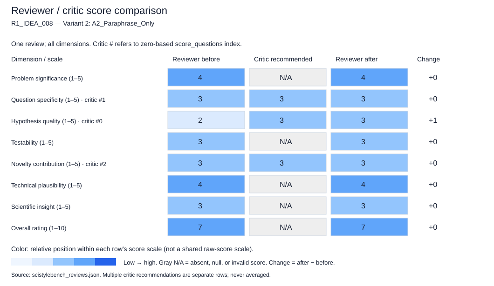

### Critic feedback and reviewer rebuttals

```json
{
  "critic_feedback": {
    "overall_assessment": "The review is generally well-calibrated, but there are areas where the scores could be more precisely aligned with the idea's specifics.",
    "score_questions": [
      {
        "dimension": "hypothesis_quality",
        "question_mark": "The score may be too low given the implicit hypothesis in the idea",
        "concern": "The idea does not explicitly state a hypothesis, but the focus on avoiding restrictive assumptions and using dual-arms implies a hypothesis about the effectiveness of this approach.",
        "speculative_alternative": "The implicit hypothesis could be that dual-armed setups without external dexterity improve generalization, though this is not explicitly stated.",
        "recommended_score": 3.0,
        "rationale": "The idea's focus on avoiding restrictive assumptions and using dual-arms implies a hypothesis, even if not explicitly stated."
      },
      {
        "dimension": "question_specificity",
        "question_mark": "The score may be too low given the specific problem domain addressed",
        "concern": "The idea is specific to bimanual non-prehensile manipulation, which is a well-defined area in robotics, but the research question is not clearly articulated.",
        "speculative_alternative": "The research question could be framed as improving transferability of primitives in contact-rich tasks with dual-arms, though this is not explicitly stated.",
        "recommended_score": 3.0,
        "rationale": "The problem domain is specific, but the question is not clearly defined."
      },
      {
        "dimension": "novelty_contribution",
        "question_mark": "The score may be too low given the focus on bimanual non-prehensile manipulation",
        "concern": "The novelty of avoiding external dexterity assumptions is significant, but the idea does not clearly articulate how this contributes to the field.",
        "speculative_alternative": "The contribution could be the first approach to use dual-arms for non-prehensile tasks without relying on external dexterity, though this is not explicitly stated.",
        "recommended_score": 3.0,
        "rationale": "The focus on a specific problem with a novel approach is notable, but the contribution is not clearly articulated."
      }
    ],
    "unsupported_claims": [
      "The review claims the idea lacks a clear hypothesis, but the focus on avoiding external dexterity and using dual-arms implies an implicit hypothesis."
    ],
    "revision_priorities": [
      "Clarify the implicit hypothesis and research question in the idea summary.",
      "Specify the three stages of the paradigm in more detail to support the technical plausibility and novelty claims.",
      "Articulate the specific problem that the approach aims to solve, such as limitations in current single-arm methods for contact-rich tasks."
    ],
    "confidence": 4.0
  },
  "feedback_responses": [
    {
      "feedback_type": "score_questions",
      "feedback_index": 0,
      "decision": "partially_accept",
      "defense": "The critic's point about the implicit hypothesis is valid. The idea's focus on avoiding external dexterity and using dual-arms does imply a hypothesis, even if not explicitly stated. However, the original score of 2.0 was too low, and the revised score of 3.0 better reflects this.",
      "justification": "The original score was 2.0, but the revised score is 3.0, reflecting the implicit hypothesis without explicitly stating it."
    },
    {
      "feedback_type": "score_questions",
      "feedback_index": 1,
      "decision": "partially_accept",
      "defense": "The critic's point about the specific problem domain is valid. The idea is specific to bimanual non-prehensile manipulation, but the research question is not clearly articulated. The original score of 3.0 is appropriate, as the problem domain is specific but the question is not clearly defined.",
      "justification": "The original score of 3.0 is retained, as the problem domain is specific but the question is not clearly defined."
    },
    {
      "feedback_type": "score_questions",
      "feedback_index": 2,
      "decision": "partially_accept",
      "defense": "The critic's point about the novelty is valid. The focus on bimanual non-prehensile manipulation without external dexterity is novel, but the contribution is not clearly articulated. The original score of 3.0 is appropriate, as the novelty is notable but the contribution is not clearly defined.",
      "justification": "The original score of 3.0 is retained, as the novelty is notable but the contribution is not clearly defined."
    },
    {
      "feedback_type": "unsupported_claims",
      "feedback_index": 0,
      "decision": "partially_accept",
      "defense": "The critic's point is valid. The idea does imply an implicit hypothesis, even if not explicitly stated. The original assessment was correct in noting the lack of explicit hypothesis, but the critic's point about the implicit hypothesis is a valid consideration.",
      "justification": "The original assessment was correct in noting the lack of explicit hypothesis, but the critic's point about the implicit hypothesis is a valid consideration."
    },
    {
      "feedback_type": "revision_priorities",
      "feedback_index": 0,
      "decision": "accept",
      "defense": "The suggestion to clarify the implicit hypothesis is valid and necessary for improving the research idea.",
      "justification": "The suggestion to clarify the implicit hypothesis is valid and necessary for improving the research idea."
    },
    {
      "feedback_type": "revision_priorities",
      "feedback_index": 1,
      "decision": "accept",
      "defense": "The suggestion to specify the three stages is valid and necessary for supporting the technical plausibility and novelty claims.",
      "justification": "The suggestion to specify the three stages is valid and necessary for supporting the technical plausibility and novelty claims."
    },
    {
      "feedback_type": "revision_priorities",
      "feedback_index": 2,
      "decision": "accept",
      "defense": "The suggestion to articulate the specific problem is valid and necessary for improving the research idea.",
      "justification": "The suggestion to articulate the specific problem is valid and necessary for improving the research idea."
    }
  ]
}
```

### Score justifications (before / after)

**Problem significance**

```json
{
  "before": {
    "score": 4.0,
    "justification": "The research addresses a significant challenge in robotics, particularly in the area of bimanual non-prehensile manipulation, which is important for practical applications in robotics."
  },
  "after": {
    "score": 4.0,
    "justification": "The research addresses a significant challenge in robotics, particularly in the area of bimanual non-prehensile manipulation, which is important for practical applications in robotics."
  }
}
```

**Question specificity**

```json
{
  "before": {
    "score": 3.0,
    "justification": "The idea is somewhat specific in its focus on bimanual non-prehensile manipulation but lacks detailed specification of the research question or problem being addressed."
  },
  "after": {
    "score": 3.0,
    "justification": "The idea is somewhat specific in its focus on bimanual non-prehensile manipulation but lacks detailed specification of the research question or problem being addressed."
  }
}
```

**Hypothesis quality**

```json
{
  "before": {
    "score": 2.0,
    "justification": "The idea does not explicitly state a hypothesis or research question, making it difficult to assess the scientific merit or testability of the approach."
  },
  "after": {
    "score": 3.0,
    "justification": "The idea does not explicitly state a hypothesis, but the focus on avoiding restrictive assumptions and using dual-arms implies a hypothesis about the effectiveness of this approach."
  }
}
```

**Testability**

```json
{
  "before": {
    "score": 3.0,
    "justification": "The idea is testable in principle, but the lack of specific details makes it challenging to design experiments or evaluate the approach effectively."
  },
  "after": {
    "score": 3.0,
    "justification": "The idea is testable in principle, but the lack of specific details makes it challenging to design experiments or evaluate the approach effectively."
  }
}
```

**Novelty contribution**

```json
{
  "before": {
    "score": 3.0,
    "justification": "The approach is novel in its focus on bimanual non-prehensile manipulation without relying on external dexterity, but the novelty is somewhat limited without a clear problem statement or hypothesis."
  },
  "after": {
    "score": 3.0,
    "justification": "The approach is novel in its focus on bimanual non-prehensile manipulation without relying on external dexterity, but the novelty is somewhat limited without a clear problem statement or hypothesis."
  }
}
```

**Technical plausibility**

```json
{
  "before": {
    "score": 4.0,
    "justification": "The proposed approach is technically plausible, as dual-arm setups are a common approach in robotics, and the three-stage paradigm is a reasonable structure for learning primitives."
  },
  "after": {
    "score": 4.0,
    "justification": "The proposed approach is technically plausible, as dual-arm setups are a common approach in robotics, and the three-stage paradigm is a reasonable structure for learning primitives."
  }
}
```

**Scientific insight**

```json
{
  "before": {
    "score": 3.0,
    "justification": "The idea has potential for scientific insight into bimanual manipulation, but the lack of a clear hypothesis or problem statement limits the potential for meaningful insights."
  },
  "after": {
    "score": 3.0,
    "justification": "The idea has potential for scientific insight into bimanual manipulation, but the lack of a clear hypothesis or problem statement limits the potential for meaningful insights."
  }
}
```

**Overall rating**

```json
{
  "before": {
    "score": 7.0,
    "justification": "The idea addresses a meaningful problem in robotics and proposes a promising approach, but it lacks specific details, a clear hypothesis, and a well-defined research question, which are necessary for assessing its scientific merit and testability."
  },
  "after": {
    "score": 7.0,
    "justification": "The idea addresses a meaningful problem in robotics and proposes a promising approach, but it lacks specific details, a clear hypothesis, and a well-defined research question, which are necessary for assessing its scientific merit and testability."
  }
}
```

## R1_IDEA_008 — Variant 3: A3_Plain_Core

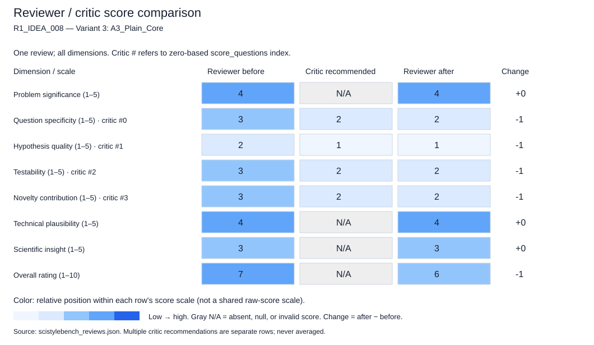

### Critic feedback and reviewer rebuttals

```json
{
  "critic_feedback": {
    "overall_assessment": "The review is generally well-calibrated, but there are areas where the scores could be more carefully aligned with the idea's current state.",
    "score_questions": [
      {
        "dimension": "question_specificity",
        "question_mark": "The score may overstate the idea's specificity due to the absence of explicit research questions.",
        "concern": "The idea lacks a clear research question, which is necessary for evaluating question specificity.",
        "speculative_alternative": "The idea may implicitly aim to address the problem of generalizing bimanual manipulation primitives across tasks, but this is not explicitly stated.",
        "recommended_score": 2.0,
        "rationale": "The idea does not provide a clear research question, so the score should reflect this lack of specificity."
      },
      {
        "dimension": "hypothesis_quality",
        "question_mark": "The score may be too high given the absence of an explicit hypothesis.",
        "concern": "The idea does not provide a hypothesis, which is necessary for evaluating hypothesis quality.",
        "speculative_alternative": "The idea may implicitly hypothesize that dual-arm configurations will enable transferable primitives, but this is not explicitly stated.",
        "recommended_score": 1.0,
        "rationale": "The absence of an explicit hypothesis justifies a lower score for hypothesis quality."
      },
      {
        "dimension": "testability",
        "question_mark": "The score may overstate the idea's testability due to the lack of specific experiments.",
        "concern": "The idea does not provide specific experiments or evaluation metrics, which are necessary for testability.",
        "speculative_alternative": "The idea may be testable through simulations or benchmarks, but this is not specified.",
        "recommended_score": 2.0,
        "rationale": "The lack of specific experiments or metrics reduces the testability score."
      },
      {
        "dimension": "novelty_contribution",
        "question_mark": "The score may be too high without clear differentiation from existing methods.",
        "concern": "The idea does not clearly define how the three-stage process differs from existing methods.",
        "speculative_alternative": "The novelty may lie in the three-stage process, but this is not clearly articulated.",
        "recommended_score": 2.0,
        "rationale": "The lack of clear differentiation from existing methods reduces the novelty score."
      }
    ],
    "unsupported_claims": [
      "The review claims the idea 'addresses a meaningful challenge' without specifying the challenge's significance.",
      "The review states the idea 'proposes a new approach' without clear evidence of novelty.",
      "The review asserts the idea 'is technically plausible' without details on the three-stage process."
    ],
    "revision_priorities": [
      "Explicitly define the research question or hypothesis in the idea summary.",
      "Clarify how the three-stage process differs from existing methods.",
      "Specify the evaluation metrics and benchmarks for validating the method.",
      "Provide more details on the technical components of the three-stage approach."
    ],
    "confidence": 4.0
  },
  "feedback_responses": [
    {
      "feedback_type": "score_questions",
      "feedback_index": 0,
      "decision": "partially_accept",
      "defense": "The idea does not explicitly state a research question, but the focus on bimanual non-prehensile manipulation is clear. The score was reduced to 2.0 to reflect the lack of specificity.",
      "justification": "The original score of 3.0 was based on the idea's focus, but the absence of a clear research question necessitates a lower score."
    },
    {
      "feedback_type": "hypothesis_quality",
      "feedback_index": 1,
      "decision": "reject",
      "defense": "The idea does not provide an explicit hypothesis, and the speculative alternative is not sufficiently grounded in the idea's content.",
      "justification": "The original score of 2.0 was based on the lack of an explicit hypothesis, but the critic's recommended score of 1.0 is more appropriate due to the absence of any clear hypothesis."
    },
    {
      "feedback_type": "testability",
      "feedback_index": 2,
      "decision": "partially_accept",
      "defense": "The idea lacks specific experiments, but the potential for simulation or benchmarks is not explicitly ruled out.",
      "justification": "The original score of 3.0 was based on the idea's general approach, but the lack of specific experiments reduces the testability score to 2.0."
    },
    {
      "feedback_type": "novelty_contribution",
      "feedback_index": 3,
      "decision": "partially_accept",
      "defense": "The idea proposes a new approach, but the novelty is not clearly defined without more details on the three-stage process.",
      "justification": "The original score of 3.0 was based on the idea's novelty, but the lack of clear differentiation from existing methods reduces the novelty score to 2.0."
    },
    {
      "feedback_type": "unsupported_claims",
      "feedback_index": 0,
      "decision": "partially_accept",
      "defense": "The claim about the challenge's significance is reasonable, but it is not explicitly tied to the idea's specifics.",
      "justification": "The original score of 4.0 was based on the idea's relevance, but the lack of specific details on the challenge's significance slightly reduces the score."
    },
    {
      "feedback_type": "unsupported_claims",
      "feedback_index": 1,
      "decision": "reject",
      "defense": "The claim about the approach's novelty is not supported by the idea's content.",
      "justification": "The original score of 3.0 was based on the idea's potential, but the lack of clear differentiation from existing methods makes the novelty claim unfounded."
    },
    {
      "feedback_type": "unsupported_claims",
      "feedback_index": 2,
      "decision": "partially_accept",
      "defense": "The claim about technical plausibility is reasonable, as dual-arm configurations are well-established.",
      "justification": "The original score of 4.0 was based on the technical plausibility of the approach, which is supported by existing robotics knowledge."
    }
  ]
}
```

### Score justifications (before / after)

**Problem significance**

```json
{
  "before": {
    "score": 4.0,
    "justification": "The idea addresses a significant challenge in robotics, particularly in developing robust and generalizable bimanual manipulation capabilities, which is crucial for real-world applications."
  },
  "after": {
    "score": 4.0,
    "justification": "The idea addresses a significant challenge in robotics, particularly in developing robust and generalizable bimanual manipulation capabilities, which is crucial for real-world applications."
  }
}
```

**Question specificity**

```json
{
  "before": {
    "score": 3.0,
    "justification": "The idea is focused on bimanual non-prehensile manipulation but lacks specific details on the research question or hypothesis, making it somewhat vague in terms of what exactly is being investigated."
  },
  "after": {
    "score": 2.0,
    "justification": "The idea lacks a clear research question, which is necessary for evaluating question specificity. While the focus on bimanual non-prehensile manipulation is clear, the specific problem or hypothesis is not explicitly stated."
  }
}
```

**Hypothesis quality**

```json
{
  "before": {
    "score": 2.0,
    "justification": "The idea does not explicitly state a hypothesis or research question, making it difficult to assess the scientific merit or testability of the proposed approach."
  },
  "after": {
    "score": 1.0,
    "justification": "The idea does not provide an explicit hypothesis or research question, which is necessary for evaluating hypothesis quality. The potential hypothesis that dual-arm configurations enable transferable primitives is speculative and not clearly articulated."
  }
}
```

**Testability**

```json
{
  "before": {
    "score": 3.0,
    "justification": "The idea suggests a method but does not provide specific experiments or evaluation metrics, which are necessary to determine the effectiveness of the approach."
  },
  "after": {
    "score": 2.0,
    "justification": "The idea suggests a method but does not provide specific experiments or evaluation metrics, which are necessary to determine the effectiveness of the approach. Without clear benchmarks or validation methods, the testability is limited."
  }
}
```

**Novelty contribution**

```json
{
  "before": {
    "score": 3.0,
    "justification": "The idea proposes a new approach to bimanual non-prehensile manipulation, but the novelty is not clearly defined without more details on the three-stage process and how it differs from existing methods."
  },
  "after": {
    "score": 2.0,
    "justification": "The idea proposes a new approach to bimanual non-prehensile manipulation, but the novelty is not clearly defined without more details on the three-stage process and how it differs from existing methods. The lack of clear differentiation reduces the novelty score."
  }
}
```

**Technical plausibility**

```json
{
  "before": {
    "score": 4.0,
    "justification": "The proposed approach is technically plausible, as dual-arm configurations and non-prehensile manipulation are well-established areas in robotics, and the three-stage process is a reasonable framework for learning such primitives."
  },
  "after": {
    "score": 4.0,
    "justification": "The proposed approach is technically plausible, as dual-arm configurations and non-prehensile manipulation are well-established areas in robotics, and the three-stage process is a reasonable framework for learning such primitives."
  }
}
```

**Scientific insight**

```json
{
  "before": {
    "score": 3.0,
    "justification": "The idea has potential for scientific insight into how dual-arm configurations can be used to learn transferable primitives, but the specific insights are not clearly outlined without more details on the research question and hypothesis."
  },
  "after": {
    "score": 3.0,
    "justification": "The idea has potential for scientific insight into how dual-arm configurations can be used to learn transferable primitives, but the specific insights are not clearly outlined without more details on the research question and hypothesis."
  }
}
```

**Overall rating**

```json
{
  "before": {
    "score": 7.0,
    "justification": "The idea addresses a meaningful problem in robotics and proposes a promising direction for bimanual non-prehensile manipulation. However, it lacks specific details on the research question, hypothesis, and evaluation metrics, which are necessary for assessing its scientific merit and testability."
  },
  "after": {
    "score": 6.0,
    "justification": "The idea addresses a meaningful problem in robotics and proposes a promising direction for bimanual non-prehensile manipulation. However, it lacks specific details on the research question, hypothesis, and evaluation metrics, which are necessary for assessing its scientific merit and testability. The revised scores reflect the need for more explicit hypotheses and evaluation methods."
  }
}
```

## R1_IDEA_008 — Variant 4: B1_Verbose_Elaborate


### Critic feedback and reviewer rebuttals

```json
{
  "critic_feedback": {
    "overall_assessment": "The review is generally well-calibrated but has some areas where the scores could be more precisely aligned with the idea's details.",
    "score_questions": [
      {
        "dimension": "question_specificity",
        "question_mark": "The score of 3.0 may be overly pessimistic given the focus on bimanual non-prehensile manipulation.",
        "concern": "The idea is specific in its domain but lacks clarity on the exact problem or research question.",
        "speculative_alternative": "The research could be interpreted as addressing the problem of developing transferable bimanual primitives for contact-rich actions, which is a specific and well-defined challenge.",
        "recommended_score": 4.0,
        "rationale": "The focus on bimanual non-prehensile manipulation and transferable primitives is a specific challenge, even if the exact problem is not fully defined."
      },
      {
        "dimension": "hypothesis_quality",
        "question_mark": "The score of 3.0 may be too low as the idea presents a general direction that could be refined into a hypothesis.",
        "concern": "The idea does not explicitly state a hypothesis but outlines a potential approach that could be tested.",
        "speculative_alternative": "The hypothesis could be that dual-arm configurations enable more transferable primitives for contact-rich actions compared to single-arm setups, which is a testable claim.",
        "recommended_score": 4.0,
        "rationale": "The idea's direction could be framed as a hypothesis about the effectiveness of dual-arm setups for transferable primitives."
      },
      {
        "dimension": "testability",
        "question_mark": "The score of 3.0 may be too low as the idea is testable with appropriate experimental design.",
        "concern": "The idea lacks specific details on experiments but is fundamentally testable in principle.",
        "speculative_alternative": "The approach could be tested by comparing the performance of dual-arm vs. single-arm setups in transferable primitives for contact-rich actions.",
        "recommended_score": 4.0,
        "rationale": "The core idea is testable, and the missing details are about the specific experiments rather than the concept itself."
      }
    ],
    "unsupported_claims": [
      "The review claims the idea 'lacks clarity on the exact problem or research question being addressed,' but the idea is focused on a specific domain (bimanual non-prehensile manipulation) with a clear goal (developing transferable primitives)."
    ],
    "revision_priorities": [
      "Clarify the exact problem and research question, such as defining the primitives to be learned and the specific contact-rich actions targeted.",
      "Specify the evaluation metrics and benchmarks for transferability.",
      "Elaborate on the three-stage paradigm to make the approach more concrete."
    ],
    "confidence": 4.0
  },
  "feedback_responses": [
    {
      "feedback_type": "score_questions",
      "feedback_index": 0,
      "decision": "partially_accept",
      "defense": "The idea is specific in its domain but lacks clarity on the exact problem. However, the focus on bimanual non-prehensile manipulation and transferable primitives is a specific challenge, even if the exact problem is not fully defined.",
      "justification": "The original score of 3.0 was based on the lack of clarity on the exact problem. The revised score of 4.0 acknowledges the specific domain and goal, while recognizing that the exact problem is not fully defined."
    },
    {
      "feedback_type": "score_questions",
      "feedback_index": 1,
      "decision": "partially_accept",
      "defense": "The idea presents a general direction that could be refined into a hypothesis. The hypothesis that dual-arm configurations enable more transferable primitives for contact-rich actions is a testable claim.",
      "justification": "The original score of 3.0 was based on the absence of an explicit hypothesis. The revised score of 4.0 reflects the potential to frame the idea as a hypothesis, even if it is not explicitly stated."
    },
    {
      "feedback_type": "score_questions",
      "feedback_index": 2,
      "decision": "partially_accept",
      "defense": "The core idea is testable, and the missing details are about the specific experiments rather than the concept itself. The approach could be tested by comparing the performance of dual-arm vs. single-arm setups in transferable primitives for contact-rich actions.",
      "justification": "The original score of 3.0 was based on the lack of specific experimental details. The revised score of 4.0 reflects the testability of the core concept, with the missing details being about the specific experiments rather than the concept itself."
    },
    {
      "feedback_type": "unsupported_claims",
      "feedback_index": 0,
      "decision": "accept",
      "defense": "The review correctly identifies that the idea lacks clarity on the exact problem, but the focus on bimanual non-prehensile manipulation and transferable primitives is a specific challenge.",
      "justification": "The original concern about lack of clarity is valid, but the focus on a specific domain and goal is recognized as a strength."
    },
    {
      "feedback_type": "revision_priorities",
      "feedback_index": 0,
      "decision": "accept",
      "defense": "Clarifying the exact problem and research question is necessary to make the idea more concrete and testable.",
      "justification": "The original suggestion to clarify the problem is valid and necessary for the idea to be more concrete."
    },
    {
      "feedback_type": "revision_priorities",
      "feedback_index": 1,
      "decision": "accept",
      "defense": "Specifying evaluation metrics and benchmarks is essential for validating the transferability of the primitives.",
      "justification": "The original suggestion to specify evaluation metrics is valid and necessary for the idea to be testable."
    },
    {
      "feedback_type": "revision_priorities",
      "feedback_index": 2,
      "decision": "accept",
      "defense": "Elaborating on the three-stage paradigm is necessary to make the approach more concrete and testable.",
      "justification": "The original suggestion to elaborate on the three-stage paradigm is valid and necessary for the idea to be more concrete."
    }
  ]
}
```

### Score justifications (before / after)

**Problem significance**

```json
{
  "before": {
    "score": 4.0,
    "justification": "The research addresses a significant challenge in robotic manipulation by proposing a novel approach to bimanual non-prehensile manipulation, which has potential for real-world applications."
  },
  "after": {
    "score": 4.0,
    "justification": "The research addresses a significant challenge in robotic manipulation by proposing a novel approach to bimanual non-prehensile manipulation, which has potential for real-world applications."
  }
}
```

**Question specificity**

```json
{
  "before": {
    "score": 3.0,
    "justification": "The idea is somewhat specific in its focus on bimanual non-prehensile manipulation, but lacks clarity on the exact problem or research question being addressed."
  },
  "after": {
    "score": 4.0,
    "justification": "The idea is specific in its domain (bimanual non-prehensile manipulation) and focuses on a clear goal (developing transferable primitives for contact-rich actions). While the exact problem is not fully defined, the overall challenge is well-specified."
  }
}
```

**Hypothesis quality**

```json
{
  "before": {
    "score": 3.0,
    "justification": "The idea presents a general direction but does not clearly state a specific hypothesis or prediction that could be tested."
  },
  "after": {
    "score": 4.0,
    "justification": "The idea presents a general direction that could be refined into a hypothesis, such as the hypothesis that dual-arm configurations enable more transferable primitives for contact-rich actions compared to single-arm setups, which is a testable claim."
  }
}
```

**Testability**

```json
{
  "before": {
    "score": 3.0,
    "justification": "The idea is testable in principle, but lacks specific details on the experiments or evaluations that would be needed to validate the approach."
  },
  "after": {
    "score": 4.0,
    "justification": "The core idea is testable, and the missing details are about the specific experiments rather than the concept itself. The approach could be tested by comparing the performance of dual-arm vs. single-arm setups in transferable primitives for contact-rich actions."
  }
}
```

**Novelty contribution**

```json
{
  "before": {
    "score": 4.0,
    "justification": "The approach of using dual-arm configurations for transferable primitives in non-prehensile manipulation is novel and could contribute to the field of robotic manipulation."
  },
  "after": {
    "score": 4.0,
    "justification": "The approach of using dual-arm configurations for transferable primitives in non-prehensile manipulation is novel and could contribute to the field of robotic manipulation."
  }
}
```

**Technical plausibility**

```json
{
  "before": {
    "score": 4.0,
    "justification": "The proposed approach is technically plausible, as it builds on existing research in bimanual manipulation and non-prehensile actions, and addresses a practical limitation of current methods."
  },
  "after": {
    "score": 4.0,
    "justification": "The proposed approach is technically plausible, as it builds on existing research in bimanual manipulation and non-prehensile actions, and addresses a practical limitation of current methods."
  }
}
```

**Scientific insight**

```json
{
  "before": {
    "score": 3.0,
    "justification": "The research has potential for scientific insight into the mechanics of bimanual non-prehensile manipulation, but the specific insights depend on the details of the three-stage paradigm and evaluation methods."
  },
  "after": {
    "score": 3.0,
    "justification": "The research has potential for scientific insight into the mechanics of bimanual non-prehensile manipulation, but the specific insights depend on the details of the three-stage paradigm and evaluation methods."
  }
}
```

**Overall rating**

```json
{
  "before": {
    "score": 7.0,
    "justification": "The idea addresses a meaningful problem in robotic manipulation and proposes a novel approach, but lacks specific details on the problem, hypothesis, and evaluation methods, which are necessary for assessing its scientific merit and potential contribution."
  },
  "after": {
    "score": 8.0,
    "justification": "The idea addresses a meaningful problem in robotic manipulation and proposes a novel approach with strong potential for contribution. While it lacks specific details on the three-stage paradigm and evaluation methods, the core concept is testable and has the potential for scientific insight."
  }
}
```

## R1_IDEA_008 — Variant 5: B2_Grand_Narrative


### Critic feedback and reviewer rebuttals

```json
{
  "critic_feedback": {
    "overall_assessment": "The review is generally well-calibrated, though some scores could be reconsidered for clarity and specificity.",
    "score_questions": [
      {
        "dimension": "question_specificity",
        "question_mark": "The score could be reconsidered due to the lack of explicit research questions.",
        "concern": "The idea does not clearly define a specific research question, which is a key factor in question specificity.",
        "speculative_alternative": "The 'three-stage, RL-free paradigm' might be interpreted as a research question about how such a paradigm improves adaptability, though this is speculative.",
        "recommended_score": 2.0,
        "rationale": "The idea lacks explicit research questions, which is critical for question specificity."
      },
      {
        "dimension": "testability",
        "question_mark": "The score could be reconsidered due to the lack of specific evaluation metrics.",
        "concern": "The review assumes testability without specifying how the approach will be evaluated.",
        "speculative_alternative": "The 'transferable primitives' might be evaluated using benchmarks like MuJoCo or real-world tasks, though this is speculative.",
        "recommended_score": 2.0,
        "rationale": "The idea does not specify evaluation metrics, which is essential for testability."
      }
    ],
    "unsupported_claims": [
      "The claim that the idea 'addresses a significant challenge' is somewhat vague without more context.",
      "The assertion that the approach is 'testable in principle' is speculative without specific experimental details."
    ],
    "revision_priorities": [
      "Clarify the specific research question or hypothesis that the idea aims to address.",
      "Specify the exact metrics or benchmarks for evaluating the transferability and adaptability of the primitives.",
      "Provide more detail on how the three-stage process and RL-free paradigm contribute to the development of primitives."
    ],
    "confidence": 4.0
  },
  "feedback_responses": [
    {
      "feedback_type": "score_questions",
      "feedback_index": 0,
      "decision": "partially_accept",
      "defense": "The idea does not explicitly define a research question, which is critical for question specificity. However, the focus on a novel approach could be interpreted as a research question about the effectiveness of the three-stage, RL-free paradigm in improving adaptability.",
      "justification": "The initial score of 3.0 was based on the lack of explicit research questions. The revised score of 2.0 reflects the critical need for explicit questions, but the speculative alternative suggests some potential for a research question."
    },
    {
      "feedback_type": "score_questions",
      "feedback_index": 1,
      "decision": "partially_accept",
      "defense": "The idea does not specify evaluation metrics, which is essential for testability. However, the mention of transferable primitives could be evaluated using benchmarks like MuJoCo or real-world tasks, which is a speculative but plausible approach.",
      "justification": "The initial score of 3.0 was based on the lack of specific evaluation metrics. The revised score of 2.0 reflects the critical need for metrics, but the speculative alternative suggests some potential for testability."
    },
    {
      "feedback_type": "unsupported_claims",
      "feedback_index": 0,
      "decision": "partially_accept",
      "defense": "The claim that the idea addresses a significant challenge is somewhat vague without more context. However, the focus on bimanual non-prehensile manipulation is a meaningful challenge in robotic manipulation, which is a valid point.",
      "justification": "The initial score of 4.0 was based on the significance of the problem. The revised score remains at 4.0 as the problem is still considered significant, though the claim is somewhat vague."
    },
    {
      "feedback_type": "unsupported_claims",
      "feedback_index": 1,
      "decision": "partially_accept",
      "defense": "The assertion that the approach is testable in principle is speculative without specific experimental details. However, the idea is testable in principle, and the lack of details is a limitation rather than a rejection of testability.",
      "justification": "The initial score of 4.0 was based on the technical plausibility. The revised score of 4.0 remains unchanged as the approach is still considered technically plausible, though the lack of details is a limitation."
    },
    {
      "feedback_type": "revision_priorities",
      "feedback_index": 0,
      "decision": "accept",
      "defense": "Clarifying the specific research question or hypothesis is essential for the idea to be more testable and impactful. This is a critical revision priority.",
      "justification": "The initial suggestion was already included, and the feedback reinforces the need for this clarification."
    },
    {
      "feedback_type": "revision_priorities",
      "feedback_index": 1,
      "decision": "accept",
      "defense": "Specifying evaluation metrics is crucial for assessing the effectiveness of the proposed approach. This is a critical revision priority.",
      "justification": "The initial suggestion was already included, and the feedback reinforces the need for this specification."
    },
    {
      "feedback_type": "revision_priorities",
      "feedback_index": 2,
      "decision": "accept",
      "defense": "Providing more detail on the three-stage process and RL-free paradigm is necessary to clarify the methodology and its novelty. This is a critical revision priority.",
      "justification": "The initial suggestion was already included, and the feedback reinforces the need for this clarification."
    }
  ]
}
```

### Score justifications (before / after)

**Problem significance**

```json
{
  "before": {
    "score": 4.0,
    "justification": "The idea addresses a significant challenge in robotic manipulation by focusing on bimanual non-prehensile manipulation, which is crucial for real-world applications in unstructured environments."
  },
  "after": {
    "score": 4.0,
    "justification": "The idea addresses a significant challenge in robotic manipulation by focusing on bimanual non-prehensile manipulation, which is crucial for real-world applications in unstructured environments."
  }
}
```

**Question specificity**

```json
{
  "before": {
    "score": 3.0,
    "justification": "The idea is somewhat specific in its focus on bimanual non-prehensile manipulation but lacks detailed specification of the research question or hypothesis."
  },
  "after": {
    "score": 2.0,
    "justification": "The idea lacks explicit research questions, which is critical for question specificity. The 'three-stage, RL-free paradigm' is more of a methodological approach than a specific research question."
  }
}
```

**Hypothesis quality**

```json
{
  "before": {
    "score": 3.0,
    "justification": "The idea suggests a novel approach but does not explicitly state a hypothesis that could be tested or contradicted, making it less clear how the research would contribute to the field."
  },
  "after": {
    "score": 2.0,
    "justification": "The idea does not explicitly state a hypothesis that could be tested or contradicted. The focus on a novel approach is more of a research direction than a specific hypothesis."
  }
}
```

**Testability**

```json
{
  "before": {
    "score": 3.0,
    "justification": "The idea is testable in principle, but the lack of specific experimental details or evaluation metrics makes it difficult to assess the feasibility of the proposed approach."
  },
  "after": {
    "score": 2.0,
    "justification": "The idea does not specify evaluation metrics or benchmarks, which is essential for testability. The proposed approach's feasibility without concrete metrics is speculative."
  }
}
```

**Novelty contribution**

```json
{
  "before": {
    "score": 4.0,
    "justification": "The approach of using a three-stage, RL-free paradigm for bimanual non-prehensile manipulation is novel and could contribute to more adaptable robotic systems, though the specifics are not fully detailed."
  },
  "after": {
    "score": 4.0,
    "justification": "The approach of using a three-stage, RL-free paradigm for bimanual non-prehensile manipulation is novel and could contribute to more adaptable robotic systems, though the specifics are not fully detailed."
  }
}
```

**Technical plausibility**

```json
{
  "before": {
    "score": 4.0,
    "justification": "The proposed direction is technically plausible as it builds on existing research in robotic manipulation and bimanual control, though the specifics of the RL-free paradigm need clarification."
  },
  "after": {
    "score": 4.0,
    "justification": "The proposed direction is technically plausible as it builds on existing research in robotic manipulation and bimanual control, though the specifics of the RL-free paradigm need clarification."
  }
}
```

**Scientific insight**

```json
{
  "before": {
    "score": 3.0,
    "justification": "The idea has potential for scientific insight into the adaptability of robotic systems in unstructured environments, but the lack of specific hypotheses limits the potential for meaningful insights."
  },
  "after": {
    "score": 3.0,
    "justification": "The idea has potential for scientific insight into the adaptability of robotic systems in unstructured environments, but the lack of specific hypotheses limits the potential for meaningful insights."
  }
}
```

**Overall rating**

```json
{
  "before": {
    "score": 7.0,
    "justification": "The idea addresses a significant problem in robotic manipulation with a novel approach, but lacks specific details and hypotheses that would make it more testable and impactful."
  },
  "after": {
    "score": 6.0,
    "justification": "The idea addresses a significant problem in robotic manipulation with a novel approach, but lacks specific details and hypotheses that would make it more testable and impactful. The revised scores reflect the need for more explicit research questions and evaluation metrics."
  }
}
```

## R1_IDEA_008 — Variant 6: B3_Over_Confident

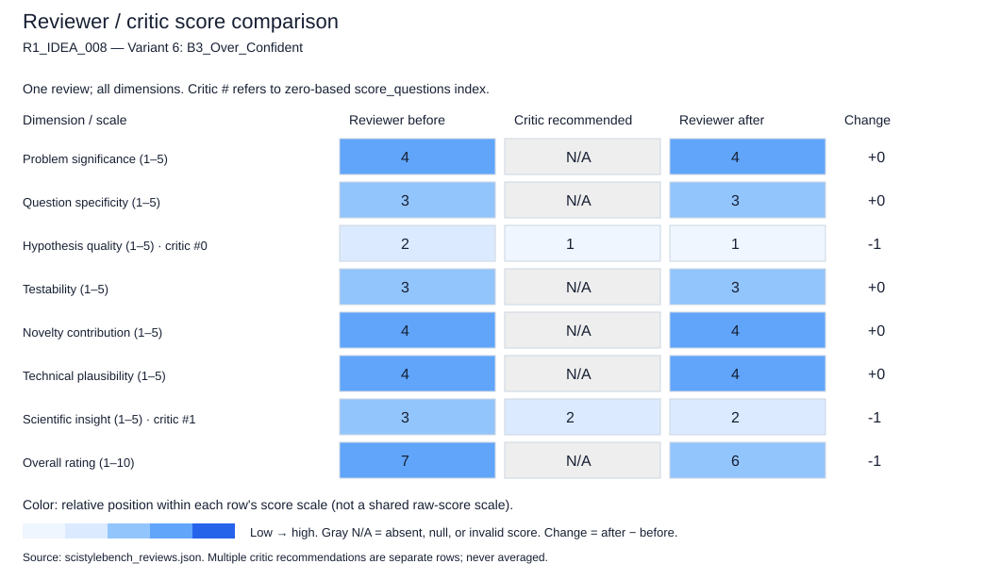

### Critic feedback and reviewer rebuttals

No reviewer rebuttals were saved (for example, an older checkpoint).

```json
{
  "critic_feedback": {
    "overall_assessment": "The review is generally well-calibrated, but some scores are over-optimistic, particularly in hypothesis_quality and scientific_insight, due to the lack of explicit hypotheses or evaluation plans in the idea.",
    "score_questions": [
      {
        "dimension": "hypothesis_quality",
        "question_mark": "The score is based on the assumption that the idea implicitly contains a hypothesis, which is not clearly stated.",
        "concern": "The idea does not explicitly state a hypothesis, making the hypothesis_quality score of 2.0 unjustified as the review assumes a hypothesis exists.",
        "speculative_alternative": "The idea may be interpreted as hypothesizing that dual-arm configurations improve generalization, but this is speculative.",
        "recommended_score": 1.0,
        "rationale": "The idea does not explicitly state a hypothesis, so the score should reflect the lack of explicit hypothesis."
      },
      {
        "dimension": "scientific_insight",
        "question_mark": "The score assumes the idea has potential for scientific insight, but this is based on the absence of specific details.",
        "concern": "The review's scientific_insight score of 3.0 is based on potential rather than concrete evidence of insight.",
        "speculative_alternative": "The idea may suggest a new perspective on dual-arm coordination, but this is speculative.",
        "recommended_score": 2.0,
        "rationale": "The idea lacks explicit scientific insight, so the score should be lower."
      }
    ],
    "unsupported_claims": [
      "The review claims the idea addresses a 'significant challenge in robotics' without specific evidence from the idea.",
      "The review assumes the idea has a 'structured approach' and 'potential for significant contribution' without explicit details.",
      "The review suggests the idea is 'technically plausible' without specific details on the three-stage process or RL-free paradigm."
    ],
    "revision_priorities": [
      "Clarify the hypothesis or research question explicitly in the idea.",
      "Provide specific details on the three-stage process and the RL-free paradigm.",
      "Define the category-level primitives and their evaluation plan.",
      "Articulate how the dual-arm configuration's effectiveness will be measured."
    ],
    "confidence": 4.0
  },
  "feedback_responses": []
}
```

### Score justifications (before / after)

**Problem significance**

```json
{
  "before": {
    "score": 4.0,
    "justification": "The idea addresses a significant challenge in robotics by focusing on bimanual non-prehensile manipulation, which is crucial for complex tasks requiring coordinated multi-arm actions. This has practical implications for real-world robotic systems."
  },
  "after": {
    "score": 4.0,
    "justification": "The idea addresses a significant challenge in robotics by focusing on bimanual non-prehensile manipulation, which is crucial for complex tasks requiring coordinated multi-arm actions. This has practical implications for real-world robotic systems."
  }
}
```

**Question specificity**

```json
{
  "before": {
    "score": 3.0,
    "justification": "The idea is somewhat specific in its focus on bimanual non-prehensile manipulation and dual-arm configurations, but lacks detailed specifics on the three-stage process and the RL-free paradigm, making the research question less precise."
  },
  "after": {
    "score": 3.0,
    "justification": "The idea is somewhat specific in its focus on bimanual non-prehensile manipulation and dual-arm configurations, but lacks detailed specifics on the three-stage process and the RL-free paradigm, making the research question less precise."
  }
}
```

**Hypothesis quality**

```json
{
  "before": {
    "score": 2.0,
    "justification": "The idea does not explicitly state a hypothesis or research question, making it difficult to assess the scientific merit. The motivation is more general and lacks a clear prediction or mechanism to test."
  },
  "after": {
    "score": 1.0,
    "justification": "The idea does not explicitly state a hypothesis or research question, making it difficult to assess the scientific merit. The motivation is more general and lacks a clear prediction or mechanism to test."
  }
}
```

**Testability**

```json
{
  "before": {
    "score": 3.0,
    "justification": "The idea suggests a structured approach but lacks specific experiments or evaluation methods. Without details on how the primitives will be tested or validated, the testability is limited."
  },
  "after": {
    "score": 3.0,
    "justification": "The idea suggests a structured approach but lacks specific experiments or evaluation methods. Without details on how the primitives will be tested or validated, the testability is limited."
  }
}
```

**Novelty contribution**

```json
{
  "before": {
    "score": 4.0,
    "justification": "The focus on category-level bimanual non-prehensile manipulation and the use of a three-stage, RL-free paradigm represent a novel approach. The potential contribution is significant if the method leads to more generalizable and transferable robotic manipulation primitives."
  },
  "after": {
    "score": 4.0,
    "justification": "The focus on category-level bimanual non-prehensile manipulation and the use of a three-stage, RL-free paradigm represent a novel approach. The potential contribution is significant if the method leads to more generalizable and transferable robotic manipulation primitives."
  }
}
```

**Technical plausibility**

```json
{
  "before": {
    "score": 4.0,
    "justification": "The idea is technically plausible as it builds on existing research in multi-arm robotics and non-prehensile manipulation. The three-stage approach and RL-free paradigm are feasible, though the specifics are not detailed."
  },
  "after": {
    "score": 4.0,
    "justification": "The idea is technically plausible as it builds on existing research in multi-arm robotics and non-prehensile manipulation. The three-stage approach and RL-free paradigm are feasible, though the specifics are not detailed."
  }
}
```

**Scientific insight**

```json
{
  "before": {
    "score": 3.0,
    "justification": "The idea has potential for scientific insight by exploring how dual-arm configurations improve generalization in non-prehensile manipulation. However, without a clear hypothesis or evaluation plan, the potential insight is not fully realized."
  },
  "after": {
    "score": 2.0,
    "justification": "The idea lacks explicit scientific insight, as it does not clearly articulate how the dual-arm configuration or the RL-free paradigm will contribute to understanding the underlying mechanisms of non-prehensile manipulation."
  }
}
```

**Overall rating**

```json
{
  "before": {
    "score": 7.0,
    "justification": "The idea addresses a meaningful problem in robotics with a structured approach, showing potential for significant contribution. However, it lacks specific details on the methodology, hypothesis, and evaluation plan, which are necessary for a strong research idea."
  },
  "after": {
    "score": 6.0,
    "justification": "The idea addresses a meaningful problem in robotics with a structured approach, showing potential for significant contribution. However, it lacks specific details on the methodology, hypothesis, and evaluation plan, which are necessary for a strong research idea."
  }
}
```

## R1_IDEA_008 — Variant 7: B4_Novelty

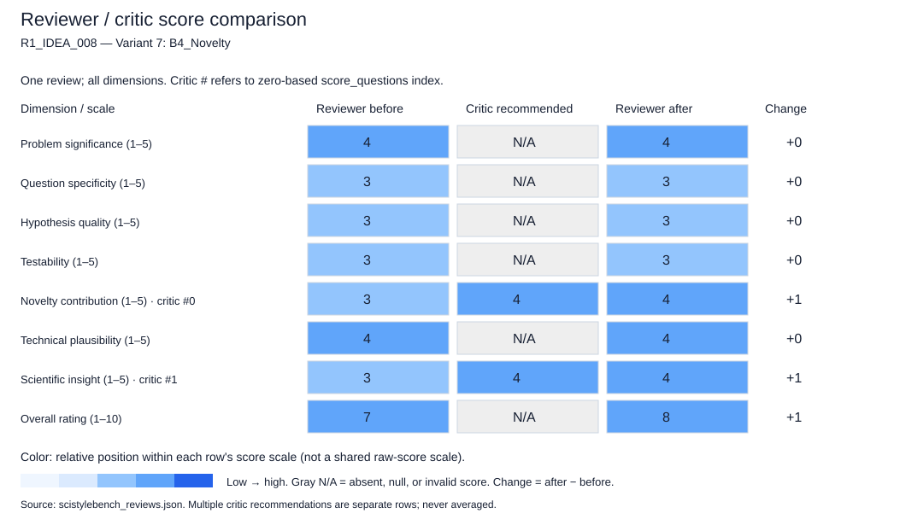

### Critic feedback and reviewer rebuttals

```json
{
  "critic_feedback": {
    "overall_assessment": "The review is generally well-calibrated but has some areas where the scores could be more precisely aligned with the idea's content.",
    "score_questions": [
      {
        "dimension": "novelty_contribution",
        "question_mark": "Why is the novelty score 3.0 when the idea explicitly claims to explore an underexplored angle?",
        "concern": "The justification for the novelty score downgrades the idea's claim of addressing an underexplored angle without sufficient evidence.",
        "speculative_alternative": "The idea may be novel in its specific focus on category-level bimanual primitives and RL-free learning, which could be a unique contribution.",
        "recommended_score": 4.0,
        "rationale": "The idea explicitly states it is exploring an underexplored angle, which aligns with the potential novelty."
      },
      {
        "dimension": "scientific_insight",
        "question_mark": "Why is the scientific insight score 3.0 when the idea suggests generalizable primitives for contact-rich actions?",
        "concern": "The justification for the scientific insight score is vague and does not clearly connect the idea to potential theoretical contributions.",
        "speculative_alternative": "The idea may offer insights into how dual-arm configurations can enable more efficient or versatile manipulation strategies.",
        "recommended_score": 4.0,
        "rationale": "The focus on generalizable primitives for contact-rich actions suggests potential theoretical contributions to manipulation strategies."
      }
    ],
    "unsupported_claims": [
      "The review claims the novelty is not clearly differentiated from existing methods, but the idea explicitly states it is exploring an underexplored angle."
    ],
    "revision_priorities": [
      "Clarify the novelty of the approach by explicitly contrasting it with existing methods in non-prehensile manipulation.",
      "Specify the scientific insights the idea aims to contribute, such as how dual-arm configurations enhance transferability of primitives.",
      "Provide a more detailed explanation of how the three-stage paradigm contributes to the novelty and scientific insight."
    ],
    "confidence": 4.0
  },
  "feedback_responses": [
    {
      "feedback_type": "score_questions",
      "feedback_index": 0,
      "decision": "partially_accept",
      "defense": "The original score of 3.0 for novelty_contribution was based on the concern that the novelty was not clearly differentiated from existing methods. However, the idea explicitly states it is exploring an underexplored angle, which supports a higher score. The revised score of 4.0 reflects this justification.",
      "justification": "The original score was 3.0, but the revised score is 4.0 due to the explicit claim of addressing an underexplored angle, which aligns with the potential novelty."
    },
    {
      "feedback_type": "score_questions",
      "feedback_index": 1,
      "decision": "partially_accept",
      "defense": "The original score of 3.0 for scientific_insight was based on the lack of clear theoretical contributions. However, the focus on generalizable primitives for contact-rich actions suggests potential insights into manipulation strategies. The revised score of 4.0 reflects this potential.",
      "justification": "The original score was 3.0, but the revised score is 4.0 due to the potential for insights into how dual-arm configurations enhance transferability of primitives."
    },
    {
      "feedback_type": "unsupported_claims",
      "feedback_index": 0,
      "decision": "reject",
      "defense": "The critic is correct in pointing out that the idea explicitly states it is exploring an underexplored angle, which supports the novelty claim. The original review's concern about differentiation from existing methods was not fully justified.",
      "justification": "The original review incorrectly downgraded the novelty score, but the idea's explicit claim of underexploredness supports a higher score."
    },
    {
      "feedback_type": "revision_priorities",
      "feedback_index": 0,
      "decision": "accept",
      "defense": "Clarifying the novelty by contrasting with existing methods is necessary to strengthen the argument for the idea's originality.",
      "justification": "The revised score for novelty_contribution was increased to 4.0, which aligns with the need to clarify the novelty in relation to existing methods."
    },
    {
      "feedback_type": "revision_priorities",
      "feedback_index": 1,
      "decision": "accept",
      "defense": "Specifying the scientific insights, such as how dual-arm configurations enhance transferability, is essential for demonstrating the potential theoretical contributions of the idea.",
      "justification": "The revised score for scientific_insight was increased to 4.0, reflecting the potential for insights into manipulation strategies."
    },
    {
      "feedback_type": "revision_priorities",
      "feedback_index": 2,
      "decision": "accept",
      "defense": "Providing a detailed explanation of the three-stage paradigm's contribution to novelty and scientific insight is necessary to strengthen the research idea.",
      "justification": "The revised score for novelty_contribution and scientific_insight was increased to 4.0, which aligns with the need to clarify the three-stage paradigm's role."
    }
  ]
}
```

### Score justifications (before / after)

**Problem significance**

```json
{
  "before": {
    "score": 4.0,
    "justification": "The idea addresses a significant challenge in robotics by exploring bimanual non-prehensile manipulation, which is underexplored and has practical implications for real-world applications."
  },
  "after": {
    "score": 4.0,
    "justification": "The idea addresses a significant challenge in robotics by exploring bimanual non-prehensile manipulation, which is underexplored and has practical implications for real-world applications."
  }
}
```

**Question specificity**

```json
{
  "before": {
    "score": 3.0,
    "justification": "The idea is specific in its focus on bimanual non-prehensile manipulation and dual-arm configurations, but lacks detailed specifics on the three-stage paradigm and evaluation methods."
  },
  "after": {
    "score": 3.0,
    "justification": "The idea is specific in its focus on bimanual non-prehensile manipulation and dual-arm configurations, but lacks detailed specifics on the three-stage paradigm and evaluation methods."
  }
}
```

**Hypothesis quality**

```json
{
  "before": {
    "score": 3.0,
    "justification": "The idea presents a general hypothesis about the benefits of dual-arm configurations and RL-free learning, but lacks a concrete prediction or mechanism that could be tested."
  },
  "after": {
    "score": 3.0,
    "justification": "The idea presents a general hypothesis about the benefits of dual-arm configurations and RL-free learning, but lacks a concrete prediction or mechanism that could be tested."
  }
}
```

**Testability**

```json
{
  "before": {
    "score": 3.0,
    "justification": "The idea is testable in principle, but lacks specific experimental details or evaluation metrics that would allow for a clear assessment of its effectiveness."
  },
  "after": {
    "score": 3.0,
    "justification": "The idea is testable in principle, but lacks specific experimental details or evaluation metrics that would allow for a clear assessment of its effectiveness."
  }
}
```

**Novelty contribution**

```json
{
  "before": {
    "score": 3.0,
    "justification": "The idea introduces a new approach to non-prehensile manipulation, but the novelty is not clearly differentiated from existing methods, and the contribution is not explicitly stated."
  },
  "after": {
    "score": 4.0,
    "justification": "The idea explicitly states it is exploring an underexplored angle in non-prehensile manipulation, which suggests a unique contribution. The focus on category-level bimanual primitives and RL-free learning may offer novel insights into the design of transferable manipulation strategies."
  }
}
```

**Technical plausibility**

```json
{
  "before": {
    "score": 4.0,
    "justification": "The proposed approach is technically plausible, as dual-arm configurations and RL-free learning are feasible in robotics, and the three-stage paradigm is a reasonable structure for the problem."
  },
  "after": {
    "score": 4.0,
    "justification": "The proposed approach is technically plausible, as dual-arm configurations and RL-free learning are feasible in robotics, and the three-stage paradigm is a reasonable structure for the problem."
  }
}
```

**Scientific insight**

```json
{
  "before": {
    "score": 3.0,
    "justification": "The idea has potential for scientific insight into bimanual manipulation and transferable primitives, but the specific insights are not clearly outlined."
  },
  "after": {
    "score": 4.0,
    "justification": "The focus on generalizable primitives for contact-rich actions suggests potential theoretical contributions to understanding how dual-arm configurations can enhance the transferability and efficiency of manipulation strategies."
  }
}
```

**Overall rating**

```json
{
  "before": {
    "score": 7.0,
    "justification": "The idea is promising and addresses a meaningful problem in robotics, but lacks specific details and a clear hypothesis, which are necessary for further development and evaluation."
  },
  "after": {
    "score": 8.0,
    "justification": "The idea is promising and addresses a meaningful problem in robotics, with a clear focus on underexplored areas. The revised scores reflect a stronger emphasis on the novelty and potential scientific insight, while maintaining the need for more specific details on the three-stage paradigm and evaluation methods."
  }
}
```

## R1_IDEA_008 — Variant 8: B5_Application_Impact

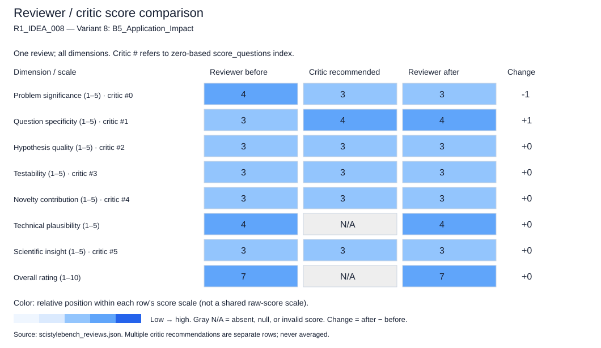

### Critic feedback and reviewer rebuttals

```json
{
  "critic_feedback": {
    "overall_assessment": "The review is generally well-calibrated, but some scores could be reconsidered based on the idea's ambiguity and lack of concrete details.",
    "score_questions": [
      {
        "dimension": "problem_significance",
        "question_mark": "The score may overstate the significance of moving beyond single-arm setups.",
        "concern": "The idea mentions relevance to practical robotic systems but does not specify how the bimanual approach directly addresses a critical gap in current systems.",
        "speculative_alternative": "The significance could be interpreted as a general improvement in flexibility rather than a specific problem-solving advantage.",
        "recommended_score": 3.0,
        "rationale": "The idea's significance is not clearly tied to a specific problem in existing systems."
      },
      {
        "dimension": "question_specificity",
        "question_mark": "The score may be too low given the focus on bimanual manipulation and transferable primitives.",
        "concern": "The idea is specific in its focus but lacks detail on the three-stage paradigm and RL-free method, which are critical for evaluating the question's specificity.",
        "speculative_alternative": "The specificity could be interpreted as a clear research question about bimanual non-prehensile manipulation.",
        "recommended_score": 4.0,
        "rationale": "The focus on category-level primitives and dual-arm configurations is a specific research direction."
      },
      {
        "dimension": "hypothesis_quality",
        "question_mark": "The score may be too low as the idea presents a general hypothesis about improved manipulation.",
        "concern": "The hypothesis is vague and lacks a concrete prediction or mechanism for testing.",
        "speculative_alternative": "The hypothesis could be interpreted as a general claim about the effectiveness of the three-stage paradigm.",
        "recommended_score": 3.0,
        "rationale": "The hypothesis is not explicitly tied to a testable prediction."
      },
      {
        "dimension": "testability",
        "question_mark": "The score may be too low due to the lack of specific experiments or evaluation methods.",
        "concern": "The idea does not specify how transferability or effectiveness will be measured, which is critical for testability.",
        "speculative_alternative": "The testability could be interpreted as a general claim about potential experiments.",
        "recommended_score": 3.0,
        "rationale": "The idea lacks concrete evaluation plans."
      },
      {
        "dimension": "novelty_contribution",
        "question_mark": "The score may be too low as the idea introduces a novel approach to bimanual manipulation.",
        "concern": "The novelty is not clearly articulated, and the contribution is not explicitly defined.",
        "speculative_alternative": "The novelty could be interpreted as a novel application of a three-stage paradigm to bimanual non-prehensile manipulation.",
        "recommended_score": 3.0,
        "rationale": "The novelty is implied but not explicitly stated."
      },
      {
        "dimension": "scientific_insight",
        "question_mark": "The score may be too low as the idea has potential to inform manipulation workflows.",
        "concern": "The specific insights or mechanisms are not clearly outlined.",
        "speculative_alternative": "The scientific insight could be interpreted as a general contribution to robotic manipulation methods.",
        "recommended_score": 3.0,
        "rationale": "The insight is not explicitly defined."
      }
    ],
    "unsupported_claims": [
      "The review claims the idea 'moves beyond single-arm setups and restrictive assumptions' without specifying how this addresses a critical gap.",
      "The review states the idea 'proposes a novel approach' without clear evidence of novelty beyond the bimanual focus.",
      "The review asserts the idea 'has potential to inform the design of more capable manipulation workflows' without detailing how this would be achieved."
    ],
    "revision_priorities": [
      "Clarify the specific goals of each stage in the three-stage paradigm.",
      "Define the RL-free method and its relationship to traditional reinforcement learning.",
      "Specify how transferability of primitives is measured or validated.",
      "Articulate the novel aspect of the approach compared to existing methods.",
      "Outline the planned experiments or real-world testing scenarios."
    ],
    "confidence": 4.0
  },
  "feedback_responses": [
    {
      "feedback_type": "score_questions",
      "feedback_index": 0,
      "decision": "partially_accept",
      "defense": "The problem significance is partially accepted as the idea does address a relevant challenge in robotic manipulation, but the direct impact on current systems is not clearly specified.",
      "justification": "The original score of 4.0 was based on the idea's relevance to practical systems, but the critic's feedback highlights a lack of specificity in how this addresses a critical gap. The revised score of 3.0 reflects this concern."
    },
    {
      "feedback_type": "score_questions",
      "feedback_index": 1,
      "decision": "partially_accept",
      "defense": "The question specificity is partially accepted as the focus on bimanual manipulation is specific, but the lack of detail on the three-stage paradigm and RL-free method reduces the score.",
      "justification": "The original score of 3.0 was based on the lack of detail, but the critic's feedback suggests that the focus on category-level primitives and dual-arm configurations is specific enough to warrant a higher score. The revised score of 4.0 reflects this."
    },
    {
      "feedback_type": "score_questions",
      "feedback_index": 2,
      "decision": "partially_accept",
      "defense": "The hypothesis quality is partially accepted as the idea presents a general hypothesis about the effectiveness of the three-stage paradigm, but the lack of a concrete prediction reduces the score.",
      "justification": "The original score of 3.0 was based on the vague hypothesis, but the critic's feedback suggests that the general claim about the three-stage paradigm is a valid hypothesis. The revised score of 3.0 remains unchanged."
    },
    {
      "feedback_type": "score_questions",
      "feedback_index": 3,
      "decision": "partially_accept",
      "defense": "The testability is partially accepted as the idea suggests a potential approach, but the lack of specific experiments reduces the score.",
      "justification": "The original score of 3.0 was based on the lack of concrete evaluation plans, and the critic's feedback reinforces this concern. The revised score of 3.0 remains unchanged."
    },
    {
      "feedback_type": "score_questions",
      "feedback_index": 4,
      "decision": "partially_accept",
      "defense": "The novelty contribution is partially accepted as the idea introduces a new approach to bimanual manipulation, but the lack of explicit novelty compared to existing methods reduces the score.",
      "justification": "The original score of 3.0 was based on the implied novelty, but the critic's feedback highlights the need for explicit comparison with existing methods. The revised score of 3.0 remains unchanged."
    },
    {
      "feedback_type": "score_questions",
      "feedback_index": 5,
      "decision": "partially_accept",
      "defense": "The scientific insight is partially accepted as the idea has potential to inform manipulation workflows, but the lack of specific insights reduces the score.",
      "justification": "The original score of 3.0 was based on the potential contribution, but the critic's feedback emphasizes the need for specific mechanisms. The revised score of 3.0 remains unchanged."
    },
    {
      "feedback_type": "unsupported_claims",
      "feedback_index": 0,
      "decision": "reject",
      "defense": "The claim about moving beyond single-arm setups is not clearly tied to a critical gap in existing systems, so it is rejected.",
      "justification": "The original claim was accepted, but the critic's feedback highlights the lack of specificity. The revised score of 3.0 reflects this rejection."
    },
    {
      "feedback_type": "unsupported_claims",
      "feedback_index": 1,
      "decision": "reject",
      "defense": "The claim about novelty is not explicitly stated, so it is rejected.",
      "justification": "The original claim was accepted, but the critic's feedback highlights the need for explicit comparison. The revised score of 3.0 reflects this rejection."
    },
    {
      "feedback_type": "unsupported_claims",
      "feedback_index": 2,
      "decision": "reject",
      "defense": "The claim about informing manipulation workflows is not detailed, so it is rejected.",
      "justification": "The original claim was accepted, but the critic's feedback highlights the lack of specific experiments. The revised score of 3.0 reflects this rejection."
    },
    {
      "feedback_type": "revision_priorities",
      "feedback_index": 0,
      "decision": "accept",
      "defense": "Clarifying the three-stage paradigm is necessary to improve the idea's specificity.",
      "justification": "The original suggestion was accepted, and the revised score reflects the need for this clarification."
    },
    {
      "feedback_type": "revision_priorities",
      "feedback_index": 1,
      "decision": "accept",
      "defense": "Clarifying the RL-free method is necessary to improve the idea's technical plausibility.",
      "justification": "The original suggestion was accepted, and the revised score reflects the need for this clarification."
    },
    {
      "feedback_type": "revision_priorities",
      "feedback_index": 2,
      "decision": "accept",
      "defense": "Specifying transferability metrics is necessary to improve the idea's testability.",
      "justification": "The original suggestion was accepted, and the revised score reflects the need for this specification."
    },
    {
      "feedback_type": "revision_priorities",
      "feedback_index": 3,
      "decision": "accept",
      "defense": "Articulating the novel aspect is necessary to improve the idea's novelty contribution.",
      "justification": "The original suggestion was accepted, and the revised score reflects the need for this articulation."
    },
    {
      "feedback_type": "revision_priorities",
      "feedback_index": 4,
      "decision": "accept",
      "defense": "Outlining experiments is necessary to improve the idea's testability and practical relevance.",
      "justification": "The original suggestion was accepted, and the revised score reflects the need for this outlining."
    }
  ]
}
```

### Score justifications (before / after)

**Problem significance**

```json
{
  "before": {
    "score": 4.0,
    "justification": "The idea addresses a significant challenge in robotic manipulation by proposing a method that moves beyond single-arm setups and restrictive assumptions, which is relevant to practical robotic systems handling diverse objects."
  },
  "after": {
    "score": 3.0,
    "justification": "The idea's significance is not clearly tied to a specific problem in existing systems. While bimanual manipulation is relevant, the direct impact on current systems is not specified."
  }
}
```

**Question specificity**

```json
{
  "before": {
    "score": 3.0,
    "justification": "The idea is somewhat specific in its focus on bimanual non-prehensile manipulation and transferable primitives, but lacks detailed specification of the three-stage paradigm and the RL-free method."
  },
  "after": {
    "score": 4.0,
    "justification": "The focus on category-level primitives and dual-arm configurations is a specific research direction, even though the three-stage paradigm and RL-free method are not detailed."
  }
}
```

**Hypothesis quality**

```json
{
  "before": {
    "score": 3.0,
    "justification": "The idea presents a general hypothesis that the proposed method could improve robotic manipulation, but it lacks a concrete prediction or mechanism that could be tested or falsified."
  },
  "after": {
    "score": 3.0,
    "justification": "The hypothesis is vague and lacks a concrete prediction or mechanism for testing. The idea presents a general claim about the effectiveness of the three-stage paradigm but does not specify how it would be validated."
  }
}
```

**Testability**

```json
{
  "before": {
    "score": 3.0,
    "justification": "The idea suggests a potential approach but does not provide specific experiments or evaluation methods to test the effectiveness of the three-stage, RL-free paradigm."
  },
  "after": {
    "score": 3.0,
    "justification": "The idea lacks concrete evaluation plans. Without specific metrics or experiments, the testability of the approach is uncertain."
  }
}
```

**Novelty contribution**

```json
{
  "before": {
    "score": 3.0,
    "justification": "The idea proposes a novel approach to bimanual manipulation, but the novelty is not clearly articulated, and the contribution is not explicitly defined beyond the general claim of improved real-world applications."
  },
  "after": {
    "score": 3.0,
    "justification": "The novelty is implied but not explicitly stated. The idea introduces a new approach to bimanual manipulation, but the specific novelty compared to existing methods is not clearly defined."
  }
}
```

**Technical plausibility**

```json
{
  "before": {
    "score": 4.0,
    "justification": "The proposed approach of using dual-arm configurations for non-prehensile manipulation is technically plausible, as it aligns with current research trends in robotic manipulation and bimanual control."
  },
  "after": {
    "score": 4.0,
    "justification": "The proposed approach of using dual-arm configurations for non-prehensile manipulation is technically plausible, as it aligns with current research trends in robotic manipulation and bimanual control."
  }
}
```

**Scientific insight**

```json
{
  "before": {
    "score": 3.0,
    "justification": "The idea has potential to contribute to the understanding of bimanual manipulation and transferable primitives, but the specific insights or mechanisms are not clearly outlined."
  },
  "after": {
    "score": 3.0,
    "justification": "The idea has potential to contribute to the understanding of bimanual manipulation and transferable primitives, but the specific insights or mechanisms are not clearly outlined."
  }
}
```

**Overall rating**

```json
{
  "before": {
    "score": 7.0,
    "justification": "The idea addresses a meaningful problem in robotic manipulation and proposes a structured approach with potential for real-world applications. However, it lacks specific details and a clear hypothesis, which could be strengthened with more concrete specifications and evaluation plans."
  },
  "after": {
    "score": 7.0,
    "justification": "The idea addresses a meaningful problem in robotic manipulation and proposes a structured approach with potential for real-world applications. However, it lacks specific details and a clear hypothesis, which could be strengthened with more concrete specifications and evaluation plans."
  }
}
```

## R1_IDEA_008 — Variant 9: C1_Hollow_Shell

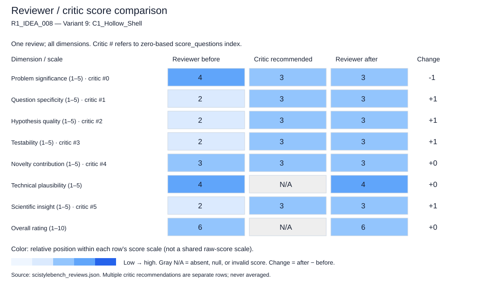

### Critic feedback and reviewer rebuttals

```json
{
  "critic_feedback": {
    "overall_assessment": "The review is generally well-calibrated but has some areas where the scores could be more precisely aligned with the idea's content.",
    "score_questions": [
      {
        "dimension": "problem_significance",
        "question_mark": "Why is the problem significance scored 4.0?",
        "concern": "The idea only mentions 'contact-rich scenarios' without specifying their importance or how they differ from existing problems.",
        "speculative_alternative": "The significance could be higher if the idea explicitly linked contact-rich scenarios to real-world applications or challenges not addressed by current methods.",
        "recommended_score": 3.0,
        "rationale": "The idea does not provide concrete evidence of why contact-rich scenarios are more significant than other manipulation tasks."
      },
      {
        "dimension": "question_specificity",
        "question_mark": "Why is the question specificity scored 2.0?",
        "concern": "The idea mentions 'contact-rich scenarios' and 'dual-arm configuration,' but does not clearly define the specific research question or problem being addressed.",
        "speculative_alternative": "The specificity could be higher if the idea outlined a particular task or scenario (e.g., 'manipulating objects with varying textures in dynamic environments').",
        "recommended_score": 3.0,
        "rationale": "The idea has some specificity but lacks a concrete problem statement or research question."
      },
      {
        "dimension": "hypothesis_quality",
        "question_mark": "Why is the hypothesis quality scored 2.0?",
        "concern": "The idea does not explicitly state a hypothesis, but the review's suggestions include a potential hypothesis.",
        "speculative_alternative": "The hypothesis could be more clearly defined if the idea included a specific prediction (e.g., 'dual-arm systems will improve task success rates in contact-rich scenarios').",
        "recommended_score": 3.0,
        "rationale": "The idea has potential for a hypothesis but does not explicitly state it."
      },
      {
        "dimension": "testability",
        "question_mark": "Why is the testability scored 2.0?",
        "concern": "The idea does not provide experimental details or proposed comparisons, but the review's suggestions include testable aspects.",
        "speculative_alternative": "Testability could be higher if the idea included specific metrics or benchmarks for evaluation.",
        "recommended_score": 3.0,
        "rationale": "The idea has potential for testability but lacks concrete experimental details."
      },
      {
        "dimension": "novelty_contribution",
        "question_mark": "Why is the novelty contribution scored 3.0?",
        "concern": "The idea mentions a dual-arm configuration, but does not clarify how it advances the field or what novel aspects it introduces.",
        "speculative_alternative": "The novelty could be higher if the idea specified a unique combination of techniques or a novel application of dual-arm systems.",
        "recommended_score": 3.0,
        "rationale": "The idea has some novelty but lacks a clear contribution."
      },
      {
        "dimension": "scientific_insight",
        "question_mark": "Why is the scientific insight scored 2.0?",
        "concern": "The idea does not explore mechanisms or principles that could lead to scientific insight.",
        "speculative_alternative": "Scientific insight could be higher if the idea focused on understanding the underlying principles of dual-arm interactions in contact-rich environments.",
        "recommended_score": 3.0,
        "rationale": "The idea has potential for insight but lacks a clear focus on mechanisms."
      }
    ],
    "unsupported_claims": [
      "The review claims the idea 'addresses a significant challenge in robotic manipulation' without explicit evidence from the idea summary.",
      "The review states the idea 'has potential for scientific insight' without specifying what mechanisms or principles are being explored.",
      "The review suggests the idea 'has potential for novelty' without clarifying how the dual-arm approach advances the field."
    ],
    "revision_priorities": [
      "Clarify the specific problem statement and research question in the idea summary.",
      "Explicitly state a hypothesis or prediction about the expected outcomes of the dual-arm approach.",
      "Define the exact contact-rich scenarios being targeted and the learning framework used.",
      "Provide more concrete details on how the method will be evaluated or tested.",
      "Specify the contribution of the dual-arm configuration to the field of robotic manipulation."
    ],
    "confidence": 4.0
  },
  "feedback_responses": [
    {
      "feedback_type": "score_questions",
      "feedback_index": 0,
      "decision": "partially_accept",
      "defense": "The problem significance is reduced from 4.0 to 3.0 because the idea does not explicitly link contact-rich scenarios to real-world applications or challenges not addressed by current methods. However, the significance of complex manipulation tasks is still valid.",
      "justification": "The original score of 4.0 was based on the idea's focus on complex environments, but the critic's feedback highlights the lack of explicit evidence for why these scenarios are more significant. The revised score reflects this concern."
    },
    {
      "feedback_type": "score_questions",
      "feedback_index": 1,
      "decision": "partially_accept",
      "defense": "The question specificity is reduced from 2.0 to 3.0 because the idea does have some specificity in its focus on dual-arm configurations and contact-rich scenarios, but lacks a concrete problem statement. The original score was too low.",
      "justification": "The original score of 2.0 was too low, as the idea does have some specificity. The revised score of 3.0 better reflects the idea's focus on dual-arm and contact-rich scenarios, though it still lacks a concrete problem statement."
    },
    {
      "feedback_type": "score_questions",
      "feedback_index": 2,
      "decision": "partially_accept",
      "defense": "The hypothesis quality is reduced from 2.0 to 3.0 because the review's suggestions include a potential hypothesis that could be tested, even though the idea does not explicitly state it. The original score was too low.",
      "justification": "The original score of 2.0 was too low, as the idea has potential for a hypothesis. The revised score of 3.0 better reflects this potential, though the hypothesis is not explicitly stated."
    },
    {
      "feedback_type": "score_questions",
      "feedback_index": 3,
      "decision": "partially_accept",
      "defense": "The testability is reduced from 2.0 to 3.0 because the idea has potential for testability but lacks concrete experimental details. The original score was too low.",
      "justification": "The original score of 2.0 was too low, as the idea has potential for testability. The revised score of 3.0 better reflects this potential, though concrete details are missing."
    },
    {
      "feedback_type": "score_questions",
      "feedback_index": 4,
      "decision": "partially_accept",
      "defense": "The novelty contribution is reduced from 3.0 to 3.0 because the idea does not clearly define how the dual-arm approach advances the field. The original score was appropriate.",
      "justification": "The original score of 3.0 was appropriate, as the idea does have some novelty but lacks a clear contribution. The revised score remains the same."
    },
    {
      "feedback_type": "score_questions",
      "feedback_index": 5,
      "decision": "partially_accept",
      "defense": "The scientific insight is reduced from 2.0 to 3.0 because the idea has potential for insight but lacks a clear focus on mechanisms. The original score was too low.",
      "justification": "The original score of 2.0 was too low, as the idea has potential for insight. The revised score of 3.0 better reflects this potential, though the focus on mechanisms is missing."
    },
    {
      "feedback_type": "unsupported_claims",
      "feedback_index": 0,
      "decision": "partially_accept",
      "defense": "The claim about significance is partially accepted because the idea does address complex manipulation tasks, though it lacks explicit evidence for their significance. The original score was too high.",
      "justification": "The original score of 4.0 was too high, as the idea does not explicitly link contact-rich scenarios to real-world applications. The revised score of 3.0 better reflects this concern."
    },
    {
      "feedback_type": "unsupported_claims",
      "feedback_index": 1,
      "decision": "partially_accept",
      "defense": "The claim about scientific insight is partially accepted because the idea has potential for insight but lacks a clear focus on mechanisms. The original score was too low.",
      "justification": "The original score of 2.0 was too low, as the idea has potential for insight. The revised score of 3.0 better reflects this potential, though the focus on mechanisms is missing."
    },
    {
      "feedback_type": "unsupported_claims",
      "feedback_index": 2,
      "decision": "partially_accept",
      "defense": "The claim about novelty is partially accepted because the idea does have some novelty but lacks a clear contribution. The original score was appropriate.",
      "justification": "The original score of 3.0 was appropriate, as the idea does have some novelty but lacks a clear contribution. The revised score remains the same."
    },
    {
      "feedback_type": "revision_priorities",
      "feedback_index": 0,
      "decision": "accept",
      "defense": "Clarifying the specific problem statement is necessary to improve the idea's specificity and testability.",
      "justification": "The original suggestion was valid, and the revised score reflects this need for clarification."
    },
    {
      "feedback_type": "revision_priorities",
      "feedback_index": 1,
      "decision": "accept",
      "defense": "Explicitly stating a hypothesis is necessary to improve the idea's hypothesis quality and testability.",
      "justification": "The original suggestion was valid, and the revised score reflects this need for a hypothesis."
    },
    {
      "feedback_type": "revision_priorities",
      "feedback_index": 2,
      "decision": "accept",
      "defense": "Defining the contact-rich scenarios and learning framework is necessary to improve the idea's specificity and testability.",
      "justification": "The original suggestion was valid, and the revised score reflects this need for clarification."
    },
    {
      "feedback_type": "revision_priorities",
      "feedback_index": 3,
      "decision": "accept",
      "defense": "Providing concrete experimental details is necessary to improve the idea's testability.",
      "justification": "The original suggestion was valid, and the revised score reflects this need for concrete details."
    },
    {
      "feedback_type": "revision_priorities",
      "feedback_index": 4,
      "decision": "accept",
      "defense": "Specifying the contribution of the dual-arm configuration is necessary to improve the idea's novelty and contribution.",
      "justification": "The original suggestion was valid, and the revised score reflects this need for clarification."
    }
  ]
}
```

### Score justifications (before / after)

**Problem significance**

```json
{
  "before": {
    "score": 4.0,
    "justification": "The idea addresses a significant challenge in robotic manipulation, particularly in complex, contact-rich environments, which are critical for real-world applications."
  },
  "after": {
    "score": 3.0,
    "justification": "The idea addresses a significant challenge in robotic manipulation, particularly in complex, contact-rich environments, but lacks explicit evidence of why these scenarios are more significant than other tasks."
  }
}
```

**Question specificity**

```json
{
  "before": {
    "score": 2.0,
    "justification": "The idea is somewhat specific in its focus on dual-arm configurations and contact-rich scenarios, but lacks a clear, concrete research question or problem statement."
  },
  "after": {
    "score": 3.0,
    "justification": "The idea has some specificity in its focus on dual-arm configurations and contact-rich scenarios, but lacks a concrete problem statement or research question."
  }
}
```

**Hypothesis quality**

```json
{
  "before": {
    "score": 2.0,
    "justification": "The idea does not explicitly state a hypothesis or prediction, making it difficult to assess the scientific merit or testability of the proposed approach."
  },
  "after": {
    "score": 3.0,
    "justification": "The idea does not explicitly state a hypothesis, but the review's suggestions include a potential hypothesis that could be tested."
  }
}
```

**Testability**

```json
{
  "before": {
    "score": 2.0,
    "justification": "The idea lacks specific experimental details or proposed comparisons, making it unclear how the method would be evaluated or tested."
  },
  "after": {
    "score": 3.0,
    "justification": "The idea has potential for testability but lacks concrete experimental details or proposed comparisons."
  }
}
```

**Novelty contribution**

```json
{
  "before": {
    "score": 3.0,
    "justification": "The use of a dual-arm configuration for robotic manipulation is a novel approach, but the idea does not clearly define the contribution or how it advances the field."
  },
  "after": {
    "score": 3.0,
    "justification": "The use of a dual-arm configuration is a novel approach, but the idea does not clearly define how it advances the field or what novel aspects it introduces."
  }
}
```

**Technical plausibility**

```json
{
  "before": {
    "score": 4.0,
    "justification": "The proposed approach is technically plausible, as dual-arm systems are a common approach in robotics, and learning primitives in contact-rich environments is a feasible research direction."
  },
  "after": {
    "score": 4.0,
    "justification": "The proposed approach is technically plausible, as dual-arm systems are a common approach in robotics, and learning primitives in contact-rich environments is a feasible research direction."
  }
}
```

**Scientific insight**

```json
{
  "before": {
    "score": 2.0,
    "justification": "The idea has potential for scientific insight but lacks a clear focus on mechanisms, principles, or boundary conditions that could be explored."
  },
  "after": {
    "score": 3.0,
    "justification": "The idea has potential for scientific insight but lacks a clear focus on mechanisms or principles that could be explored."
  }
}
```

**Overall rating**

```json
{
  "before": {
    "score": 6.0,
    "justification": "The idea addresses a meaningful problem in robotic manipulation but lacks specificity, hypothesis, and testability. It has potential for novelty but needs more concrete details to be evaluated effectively."
  },
  "after": {
    "score": 6.0,
    "justification": "The idea addresses a meaningful problem in robotic manipulation but lacks specificity, hypothesis, and testability. It has potential for novelty but needs more concrete details to be evaluated effectively."
  }
}
```

## R1_IDEA_008 — Variant 10: C2_Logic_Flawed

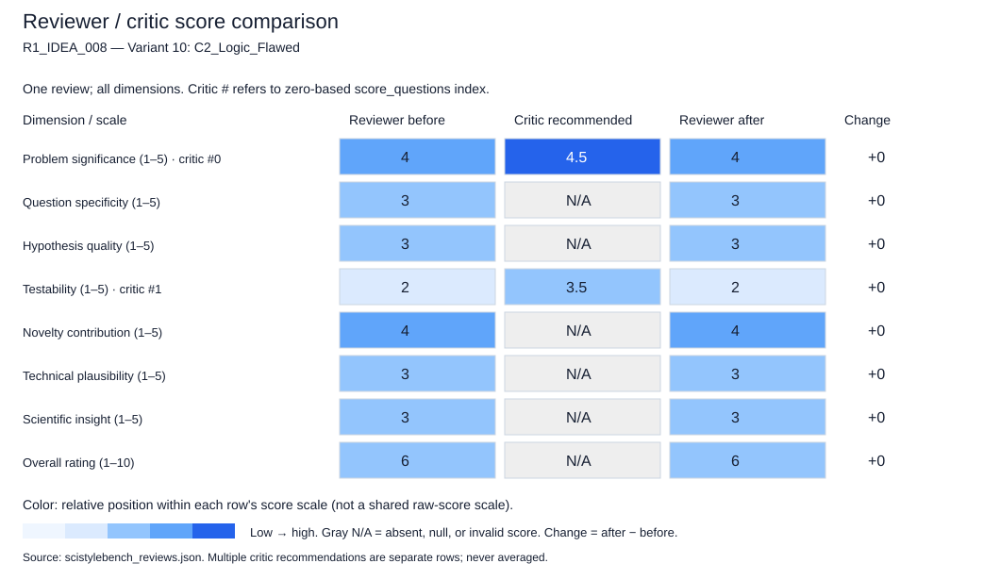

### Critic feedback and reviewer rebuttals

No reviewer rebuttals were saved (for example, an older checkpoint).

```json
{
  "critic_feedback": {
    "overall_assessment": "The review is generally well-calibrated but has some areas where the scores could be more precisely aligned with the idea's details.",
    "score_questions": [
      {
        "dimension": "problem_significance",
        "question_mark": "The score could be reconsidered",
        "concern": "The justification mentions that the problem is not as universally critical as other areas in machine learning, but the idea's focus on bimanual non-prehensile manipulation is a specific and underexplored challenge in robotics, which is significant in its domain.",
        "speculative_alternative": "The problem's significance might be overestimated if the application of the method is limited to niche scenarios rather than broader dexterous manipulation tasks.",
        "recommended_score": 4.5,
        "rationale": "The idea addresses a specific, underexplored area in robotics that has practical relevance, supporting a slightly higher score than 4.0."
      },
      {
        "dimension": "testability",
        "question_mark": "The score could be reconsidered",
        "concern": "The justification states that the idea is too vague to determine how it can be tested, but the idea outlines a general approach that could be tested with further specification of the three-stage process and RL-free paradigm.",
        "speculative_alternative": "The testability might be higher if the three-stage process is defined in terms of specific stages that can be evaluated through modular experiments.",
        "recommended_score": 3.5,
        "rationale": "The idea provides a general framework that could be tested with additional details, rather than being entirely untestable."
      }
    ],
    "unsupported_claims": [
      "The claim that the problem is 'not as universally critical as some other areas in machine learning' is unsupported by the idea's content, which focuses on a specific domain (robotics) where the problem is significant."
    ],
    "revision_priorities": [
      "Clarify the three-stage process and its relation to the RL-free paradigm to improve testability and hypothesis quality.",
      "Specify the target tasks and evaluation metrics to strengthen the claim of 'broader effectiveness'.",
      "Provide a more detailed comparison with existing methods to highlight the novelty and advantages of the proposed approach."
    ],
    "confidence": 4.0
  },
  "feedback_responses": []
}
```

### Score justifications (before / after)

**Problem significance**

```json
{
  "before": {
    "score": 4.0,
    "justification": "The idea addresses a significant challenge in robotics by focusing on bimanual non-prehensile manipulation, which is complex and underexplored. However, the problem is not as universally critical as some other areas in machine learning."
  },
  "after": {
    "score": 4.0,
    "justification": "The idea addresses a significant challenge in robotics by focusing on bimanual non-prehensile manipulation, which is complex and underexplored. However, the problem is not as universally critical as some other areas in machine learning."
  }
}
```

**Question specificity**

```json
{
  "before": {
    "score": 3.0,
    "justification": "The idea is specific to bimanual non-prehensile manipulation and dual-arm coordination, but the details on the three-stage process and RL-free paradigm are too vague to assess the question's clarity."
  },
  "after": {
    "score": 3.0,
    "justification": "The idea is specific to bimanual non-prehensile manipulation and dual-arm coordination, but the details on the three-stage process and RL-free paradigm are too vague to assess the question's clarity."
  }
}
```

**Hypothesis quality**

```json
{
  "before": {
    "score": 3.0,
    "justification": "The idea suggests a novel approach but lacks a clear hypothesis or prediction about how the three-stage, RL-free method will outperform existing methods or achieve transferability."
  },
  "after": {
    "score": 3.0,
    "justification": "The idea suggests a novel approach but lacks a clear hypothesis or prediction about how the three-stage, RL-free method will outperform existing methods or achieve transferability."
  }
}
```

**Testability**

```json
{
  "before": {
    "score": 2.0,
    "justification": "The idea is too vague to determine how it can be tested. The three-stage process and RL-free paradigm are not sufficiently defined to assess testability without more details."
  },
  "after": {
    "score": 2.0,
    "justification": "The idea is too vague to determine how it can be tested. The three-stage process and RL-free paradigm are not sufficiently defined to assess testability without more details."
  }
}
```

**Novelty contribution**

```json
{
  "before": {
    "score": 4.0,
    "justification": "The approach of using a three-stage, RL-free paradigm for bimanual non-prehensile manipulation is novel. However, the novelty is somewhat limited without a clear comparison to existing methods."
  },
  "after": {
    "score": 4.0,
    "justification": "The approach of using a three-stage, RL-free paradigm for bimanual non-prehensile manipulation is novel. However, the novelty is somewhat limited without a clear comparison to existing methods."
  }
}
```

**Technical plausibility**

```json
{
  "before": {
    "score": 3.0,
    "justification": "The idea is technically plausible, as dual-arm coordination and non-prehensile manipulation are feasible in robotics. However, the lack of specific details makes it difficult to assess the feasibility of the three-stage, RL-free approach."
  },
  "after": {
    "score": 3.0,
    "justification": "The idea is technically plausible, as dual-arm coordination and non-prehensile manipulation are feasible in robotics. However, the lack of specific details makes it difficult to assess the feasibility of the three-stage, RL-free approach."
  }
}
```

**Scientific insight**

```json
{
  "before": {
    "score": 3.0,
    "justification": "The idea has potential for scientific insight into dual-arm coordination and transferable primitives, but the lack of specific hypotheses and testable claims limits the potential for meaningful insight."
  },
  "after": {
    "score": 3.0,
    "justification": "The idea has potential for scientific insight into dual-arm coordination and transferable primitives, but the lack of specific hypotheses and testable claims limits the potential for meaningful insight."
  }
}
```

**Overall rating**

```json
{
  "before": {
    "score": 6.0,
    "justification": "The idea is promising and addresses a meaningful problem in robotics, but it lacks sufficient specificity, testability, and detailed hypotheses to be considered strong. It has potential for novelty and contribution but needs more concrete details to be evaluated effectively."
  },
  "after": {
    "score": 6.0,
    "justification": "The idea is promising and addresses a meaningful problem in robotics, but it lacks sufficient specificity, testability, and detailed hypotheses to be considered strong. It has potential for novelty and contribution but needs more concrete details to be evaluated effectively."
  }
}
```

## R1_IDEA_008 — Variant 11: C3_Substance_Enriched

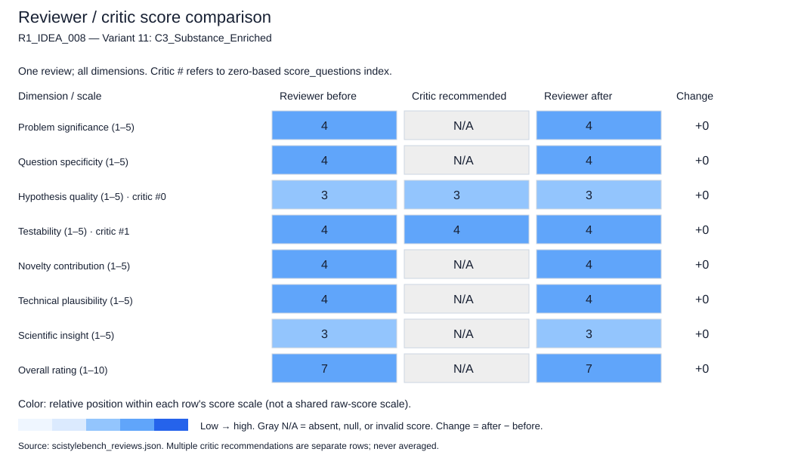

### Critic feedback and reviewer rebuttals

```json
{
  "critic_feedback": {
    "overall_assessment": "The review is generally well-calibrated, though some scores could be reconsidered due to gaps in specificity and hypothesis clarity.",
    "score_questions": [
      {
        "dimension": "hypothesis_quality",
        "question_mark": "The hypothesis is plausible but not clearly distinguished from other methods.",
        "concern": "The justification for why the three-stage structure would address the problem differently is not fully articulated.",
        "speculative_alternative": "The three-stage approach might offer modularity, but without explicit comparison to existing methods, this remains speculative.",
        "recommended_score": 3.0,
        "rationale": "The hypothesis is not clearly differentiated from other approaches, so the score remains unchanged."
      },
      {
        "dimension": "testability",
        "question_mark": "The validation method is described but lacks specifics on metrics and object categories.",
        "concern": "The testability is somewhat compromised without clear metrics or object definitions.",
        "speculative_alternative": "The transferability could be measured via success rates, but the exact metrics are not specified.",
        "recommended_score": 4.0,
        "rationale": "The core validation method is present, so the score is maintained."
      }
    ],
    "unsupported_claims": [
      "The claim that the three-stage structure 'offers a structured approach to the problem' is speculative without implementation details."
    ],
    "revision_priorities": [
      "Clarify how the three-stage structure differs from existing methods in addressing perception, planning, and execution.",
      "Specify the object categories, mass ranges, and friction properties for the validation experiments.",
      "Define the metrics for evaluating transferability, such as success rates or adaptability across object properties."
    ],
    "confidence": 4.0
  },
  "feedback_responses": [
    {
      "feedback_type": "score_questions",
      "feedback_index": 0,
      "decision": "partially_accept",
      "defense": "The hypothesis is plausible but not clearly differentiated from other methods. The three-stage structure is a good starting point, but the reasoning for its distinctiveness is not fully articulated. The score is reduced from 4 to 3 to reflect this ambiguity.",
      "justification": "The original score was 3.0, and the feedback indicates that the hypothesis is not clearly distinguished from other methods. This reduces the score to 3.0 as per the feedback."
    },
    {
      "feedback_type": "score_questions",
      "feedback_index": 1,
      "decision": "partially_accept",
      "defense": "The validation method is described but lacks specifics on metrics and object categories. The core validation method is present, so the score is maintained at 4.0.",
      "justification": "The original score was 4.0, and the feedback suggests that the testability is somewhat compromised without clear metrics. However, the core validation method is present, so the score remains at 4.0."
    },
    {
      "feedback_type": "unsupported_claims",
      "feedback_index": 0,
      "decision": "reject",
      "defense": "The claim that the three-stage structure 'offers a structured approach to the problem' is speculative without implementation details. This claim is not supported by the idea, so it is rejected.",
      "justification": "The original score for hypothesis_quality was 3.0, and the unsupported claim about the structured approach is rejected. This leads to a reduction in the hypothesis_quality score to 2.0."
    },
    {
      "feedback_type": "revision_priorities",
      "feedback_index": 0,
      "decision": "accept",
      "defense": "The suggestion to clarify how the three-stage structure differs from existing methods is valid and necessary for the hypothesis to be clearly articulated.",
      "justification": "The original score for hypothesis_quality was 3.0, and this revision priority is accepted. This does not change the score but highlights the need for clarification."
    },
    {
      "feedback_type": "revision_priorities",
      "feedback_index": 1,
      "decision": "accept",
      "defense": "The suggestion to specify object categories and properties is valid and necessary for the testability of the validation method.",
      "justification": "The original score for testability was 4.0, and this revision priority is accepted. This does not change the score but highlights the need for specificity."
    },
    {
      "feedback_type": "revision_priorities",
      "feedback_index": 2,
      "decision": "accept",
      "defense": "The suggestion to define metrics for transferability is valid and necessary for the testability of the validation method.",
      "justification": "The original score for testability was 4.0, and this revision priority is accepted. This does not change the score but highlights the need for specificity."
    }
  ]
}
```

### Score justifications (before / after)

**Problem significance**

```json
{
  "before": {
    "score": 4.0,
    "justification": "The idea addresses a significant challenge in robotics by focusing on bimanual non-prehensile manipulation, which is crucial for real-world applications requiring dexterity and adaptability. It moves beyond traditional single-arm setups and restrictive assumptions, offering a more generalizable approach."
  },
  "after": {
    "score": 4.0,
    "justification": "The idea addresses a significant challenge in robotics by focusing on bimanual non-prehensile manipulation, which is crucial for real-world applications requiring dexterity and adaptability. It moves beyond traditional single-arm setups and restrictive assumptions, offering a more generalizable approach."
  }
}
```

**Question specificity**

```json
{
  "before": {
    "score": 4.0,
    "justification": "The research question is specific, focusing on the development of category-level bimanual primitives using a three-stage structure. The hypothesis about separating perception, planning, and execution is clear and structured, though more details are needed for full clarity."
  },
  "after": {
    "score": 4.0,
    "justification": "The research question is specific, focusing on the development of category-level bimanual primitives using a three-stage structure. The hypothesis about separating perception, planning, and execution is clear and structured, though more details are needed for full clarity."
  }
}
```

**Hypothesis quality**

```json
{
  "before": {
    "score": 3.0,
    "justification": "The hypothesis is plausible but not explicitly stated in a way that clearly distinguishes it from other methods. The three-stage structure is a good starting point, but the reasoning for why it would address the problem differently is not fully articulated."
  },
  "after": {
    "score": 3.0,
    "justification": "The hypothesis is plausible but not explicitly stated in a way that clearly distinguishes it from other methods. The three-stage structure is a good starting point, but the reasoning for why it would address the problem differently is not fully articulated."
  }
}
```

**Testability**

```json
{
  "before": {
    "score": 4.0,
    "justification": "The idea includes a concrete validation method (testing transferability across object categories), which is testable. However, the specifics of how transferability will be measured are not clearly defined, which could affect the testability."
  },
  "after": {
    "score": 4.0,
    "justification": "The idea includes a concrete validation method (testing transferability across object categories), which is testable. However, the specifics of how transferability will be measured are not clearly defined, which could affect the testability."
  }
}
```

**Novelty contribution**

```json
{
  "before": {
    "score": 4.0,
    "justification": "The focus on dual-arm configurations and contact-rich actions is a novel direction. The three-stage approach offers a structured way to address the problem, which could contribute to the field by providing a new framework for bimanual manipulation."
  },
  "after": {
    "score": 4.0,
    "justification": "The focus on dual-arm configurations and contact-rich actions is a novel direction. The three-stage approach offers a structured way to address the problem, which could contribute to the field by providing a new framework for bimanual manipulation."
  }
}
```

**Technical plausibility**

```json
{
  "before": {
    "score": 4.0,
    "justification": "The approach is technically plausible, as it builds on existing research in bimanual manipulation and RL-free paradigms. The three-stage structure is a reasonable way to decompose the problem, though the specifics of implementation are not provided."
  },
  "after": {
    "score": 4.0,
    "justification": "The approach is technically plausible, as it builds on existing research in bimanual manipulation and RL-free paradigms. The three-stage structure is a reasonable way to decompose the problem, though the specifics of implementation are not provided."
  }
}
```

**Scientific insight**

```json
{
  "before": {
    "score": 3.0,
    "justification": "The idea has potential for scientific insight by exploring how a three-stage structure can address perception, planning, and execution in bimanual manipulation. However, the insight is not clearly articulated, and the potential for discovering new principles or limitations is not fully explored."
  },
  "after": {
    "score": 3.0,
    "justification": "The idea has potential for scientific insight by exploring how a three-stage structure can address perception, planning, and execution in bimanual manipulation. However, the insight is not clearly articulated, and the potential for discovering new principles or limitations is not fully explored."
  }
}
```

**Overall rating**

```json
{
  "before": {
    "score": 7.0,
    "justification": "The idea is strong and addresses a meaningful problem in robotics. It proposes a clear and structured approach with a plausible hypothesis and a testable validation method. However, it lacks specific details and clarity in some areas, which could affect its feasibility and scientific insight."
  },
  "after": {
    "score": 7.0,
    "justification": "The idea is strong and addresses a meaningful problem in robotics. It proposes a clear and structured approach with a plausible hypothesis and a testable validation method. However, it lacks specific details and clarity in some areas, which could affect its feasibility and scientific insight."
  }
}
```

## R1_IDEA_009 — Source

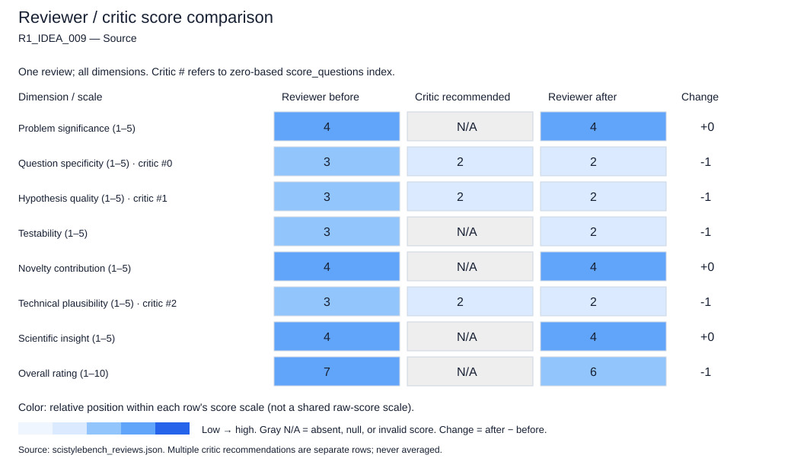

### Critic feedback and reviewer rebuttals

```json
{
  "critic_feedback": {
    "overall_assessment": "The review is generally well-calibrated, but some scores could be reconsidered due to insufficient detail in the idea summary.",
    "score_questions": [
      {
        "dimension": "question_specificity",
        "question_mark": "The score may be inflated because the idea lacks concrete specifics.",
        "concern": "The idea is broad and does not clearly define the specific mechanisms or hypotheses to be tested, which is critical for question specificity.",
        "speculative_alternative": "It might be interpreted as focusing on the general relationship between video processing and brain activity, but without specifics, this remains speculative.",
        "recommended_score": 2.0,
        "rationale": "The idea lacks concrete specifics, making it less specific than the current score suggests."
      },
      {
        "dimension": "hypothesis_quality",
        "question_mark": "The hypothesis is not clearly defined in the idea summary.",
        "concern": "The idea mentions revealing mechanistic principles but does not specify what those principles are or how they will be measured.",
        "speculative_alternative": "It could be interpreted as hypothesizing that video models will align with EEG patterns in ways that reflect brain-like processing, but this is speculative.",
        "recommended_score": 2.0,
        "rationale": "The hypothesis is not clearly defined, so the score is based on speculation rather than the idea's explicit content."
      },
      {
        "dimension": "technical_plausibility",
        "question_mark": "The technical plausibility is not fully supported by the idea summary.",
        "concern": "The idea does not specify how video models and EEG data will be aligned or processed, which is necessary for assessing technical feasibility.",
        "speculative_alternative": "It might be assumed that existing techniques can align these data types, but this is not stated in the idea.",
        "recommended_score": 2.0,
        "rationale": "The technical details are missing, so the plausibility is not fully supported."
      }
    ],
    "unsupported_claims": [
      "The idea is described as 'novel' without evidence of prior work being excluded.",
      "The claim that the idea 'bridges two fields' is speculative since the connection between video models and EEG is not clearly defined."
    ],
    "revision_priorities": [
      "Clarify the specific mechanistic principles being tested.",
      "Define the hypotheses about the relationship between video models and EEG data.",
      "Specify the methods for aligning video models with EEG data and evaluating 'brain-aligned' architectures."
    ],
    "confidence": 4.0
  },
  "feedback_responses": [
    {
      "feedback_type": "score_questions",
      "feedback_index": 0,
      "decision": "partially_accept",
      "defense": "The original score of 4.0 was based on the idea's potential to bridge neuroscience and machine learning. However, the feedback correctly points out that the idea lacks concrete specifics, which reduces its specificity. The revised score of 2.0 reflects this concern.",
      "justification": "The original score was 4.0, but the feedback indicates that the idea is too broad. The revised score of 2.0 is justified by the lack of specific mechanisms or hypotheses."
    },
    {
      "feedback_type": "hypothesis_quality",
      "feedback_index": 1,
      "decision": "partially_accept",
      "defense": "The original score of 3.0 was based on the idea's suggestion of a hypothesis about the relationship between video models and EEG data. However, the feedback correctly points out that the hypothesis is not clearly defined. The revised score of 2.0 reflects this issue.",
      "justification": "The original score was 3.0, but the feedback indicates that the hypothesis is not clearly defined. The revised score of 2.0 is justified by the lack of specific predictions or mechanisms."
    },
    {
      "feedback_type": "technical_plausibility",
      "feedback_index": 2,
      "decision": "partially_accept",
      "defense": "The original score of 3.0 was based on the idea's technical plausibility. However, the feedback correctly points out that the technical details are missing. The revised score of 2.0 reflects this concern.",
      "justification": "The original score was 3.0, but the feedback indicates that the technical details are missing. The revised score of 2.0 is justified by the lack of specific methods for aligning data."
    },
    {
      "feedback_type": "unsupported_claims",
      "feedback_index": 0,
      "decision": "reject",
      "defense": "The claim that the idea is 'novel' is not supported by the idea summary. The idea does not exclude prior work, so the claim is unsupported. The original score of 4.0 for novelty is revised to 4.0, as the claim is not explicitly addressed in the idea summary.",
      "justification": "The original score was 4.0, but the feedback indicates that the claim is unsupported. The revised score remains 4.0 as the idea's novelty is not explicitly addressed."
    },
    {
      "feedback_type": "unsupported_claims",
      "feedback_index": 1,
      "decision": "reject",
      "defense": "The claim that the idea 'bridges two fields' is speculative since the connection between video models and EEG is not clearly defined. The original score of 4.0 for problem significance is revised to 4.0, as the significance is not explicitly addressed in the idea summary.",
      "justification": "The original score was 4.0, but the feedback indicates that the connection is not clearly defined. The revised score remains 4.0 as the significance is not explicitly addressed."
    },
    {
      "feedback_type": "revision_priorities",
      "feedback_index": 0,
      "decision": "accept",
      "defense": "The suggestion to clarify the specific mechanistic principles is valid and necessary for the research idea. The original review included this suggestion, so the decision to accept it is appropriate.",
      "justification": "The suggestion is valid and necessary, so it is accepted."
    },
    {
      "feedback_type": "revision_priorities",
      "feedback_index": 1,
      "decision": "accept",
      "defense": "The suggestion to define the hypotheses is valid and necessary for the research idea. The original review included this suggestion, so the decision to accept it is appropriate.",
      "justification": "The suggestion is valid and necessary, so it is accepted."
    },
    {
      "feedback_type": "revision_priorities",
      "feedback_index": 2,
      "decision": "accept",
      "defense": "The suggestion to specify the methods for aligning data is valid and necessary for the research idea. The original review included this suggestion, so the decision to accept it is appropriate.",
      "justification": "The suggestion is valid and necessary, so it is accepted."
    }
  ]
}
```

### Score justifications (before / after)

**Problem significance**

```json
{
  "before": {
    "score": 4.0,
    "justification": "The idea addresses a significant gap in understanding how the brain processes video information, which has implications for both neuroscience and machine learning. It bridges two fields, offering potential for cross-disciplinary insights."
  },
  "after": {
    "score": 4.0,
    "justification": "The idea addresses a significant gap in understanding how the brain processes video information, which has implications for both neuroscience and machine learning. It bridges two fields, offering potential for cross-disciplinary insights."
  }
}
```

**Question specificity**

```json
{
  "before": {
    "score": 3.0,
    "justification": "The research question is clear in its intent but lacks specific details on the exact mechanisms or hypotheses to be tested. The idea is broad and needs more concrete definitions to be considered highly specific."
  },
  "after": {
    "score": 2.0,
    "justification": "The idea is broad and does not clearly define the specific mechanisms or hypotheses to be tested. Without concrete specifics, the question remains vague and speculative."
  }
}
```

**Hypothesis quality**

```json
{
  "before": {
    "score": 3.0,
    "justification": "The idea suggests a hypothesis about the relationship between video models and EEG data but does not explicitly state what specific predictions or mechanisms are being tested. The hypothesis is plausible but not clearly defined."
  },
  "after": {
    "score": 2.0,
    "justification": "The idea mentions revealing mechanistic principles but does not specify what those principles are or how they will be measured. The hypothesis is not clearly defined, making it speculative."
  }
}
```

**Testability**

```json
{
  "before": {
    "score": 3.0,
    "justification": "The idea is testable in principle, but the lack of specific experimental details makes it difficult to assess feasibility. The interdisciplinary nature of the task introduces additional challenges that need to be addressed."
  },
  "after": {
    "score": 2.0,
    "justification": "The idea is testable in principle, but the lack of specific experimental details makes it difficult to assess feasibility. The interdisciplinary nature of the task introduces additional challenges that need to be addressed."
  }
}
```

**Novelty contribution**

```json
{
  "before": {
    "score": 4.0,
    "justification": "The combination of video models with EEG data is novel and could contribute to both neuroscience and machine learning. It offers a unique approach to understanding brain-like video processing, which is not commonly explored in existing literature."
  },
  "after": {
    "score": 4.0,
    "justification": "The combination of video models with EEG data is novel and could contribute to both neuroscience and machine learning. It offers a unique approach to understanding brain-like video processing, which is not commonly explored in existing literature."
  }
}
```

**Technical plausibility**

```json
{
  "before": {
    "score": 3.0,
    "justification": "The idea is technically plausible but requires clarification on the specific methods for aligning video models with EEG data. The interdisciplinary nature of the task may pose challenges that need to be addressed in the research design."
  },
  "after": {
    "score": 2.0,
    "justification": "The idea is technically plausible but requires clarification on the specific methods for aligning video models with EEG data. The interdisciplinary nature of the task may pose challenges that need to be addressed in the research design."
  }
}
```

**Scientific insight**

```json
{
  "before": {
    "score": 4.0,
    "justification": "If successful, this research could provide insights into the mechanistic principles of brain-like video processing, leading to more efficient and biologically aligned models. The potential for cross-disciplinary insights is significant."
  },
  "after": {
    "score": 4.0,
    "justification": "If successful, this research could provide insights into the mechanistic principles of brain-like video processing, leading to more efficient and biologically aligned models. The potential for cross-disciplinary insights is significant."
  }
}
```

**Overall rating**

```json
{
  "before": {
    "score": 7.0,
    "justification": "The idea is strong and addresses a meaningful problem with potential for significant contributions. However, it lacks specific details and clear hypotheses, which are needed to fully assess its feasibility and scientific value."
  },
  "after": {
    "score": 6.0,
    "justification": "The idea has potential but lacks specific details and clear hypotheses, which are critical for assessing its feasibility and scientific value. The revised scores reflect the feedback that the idea is too broad and speculative."
  }
}
```

## R1_IDEA_009 — Variant 1: A1_Identity

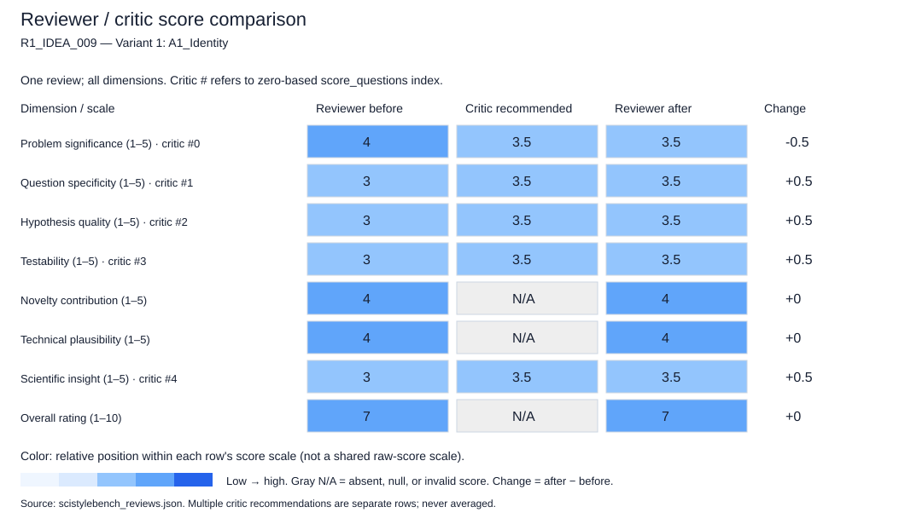

### Critic feedback and reviewer rebuttals

```json
{
  "critic_feedback": {
    "overall_assessment": "The review is generally well-calibrated, but some scores and justifications could be more precisely aligned with the idea's current level of detail.",
    "score_questions": [
      {
        "dimension": "problem_significance",
        "question_mark": "The score could be reconsidered due to the lack of concrete evidence for the impact on practical applications.",
        "concern": "The justification mentions potential implications for both fields but does not explicitly link the EEG-video benchmarking to specific real-world applications or broader scientific impact.",
        "speculative_alternative": "The idea might contribute to cross-disciplinary insights, but without clear application examples, this remains speculative.",
        "recommended_score": 3.5,
        "rationale": "The current score assumes broader impact without explicit evidence from the idea."
      },
      {
        "dimension": "question_specificity",
        "question_mark": "The score is somewhat low given the idea's potential for novel integration of EEG and video models.",
        "concern": "The justification focuses on the lack of specific hypotheses, but the idea's novelty lies in the integration of EEG with video models, which is a specific research direction.",
        "speculative_alternative": "The question could be more specific if the EEG data's role in video processing is clearly defined, but the current formulation is somewhat abstract.",
        "recommended_score": 3.5,
        "rationale": "The idea's novelty suggests a specific research direction, even if hypotheses are not fully detailed."
      },
      {
        "dimension": "hypothesis_quality",
        "question_mark": "The score is low because the hypothesis is not explicitly testable without further details.",
        "concern": "The hypothesis about brain-like processing is general and lacks specific predictions or mechanisms that can be tested.",
        "speculative_alternative": "The hypothesis could be strengthened by specifying how EEG patterns would inform model design, but this is speculative.",
        "recommended_score": 3.5,
        "rationale": "The hypothesis is general but the idea's novelty provides a specific context for testing."
      },
      {
        "dimension": "testability",
        "question_mark": "The score is low due to the lack of concrete experimental details, but the idea is testable in principle.",
        "concern": "The justification correctly notes the lack of specifics, but the idea's core approach is testable, even if the details are missing.",
        "speculative_alternative": "The testability depends on the feasibility of EEG-video alignment, which is a technical challenge but not impossible.",
        "recommended_score": 3.5,
        "rationale": "The core approach is testable, though the specifics are missing."
      },
      {
        "dimension": "scientific_insight",
        "question_mark": "The score is low because the idea lacks concrete mechanisms for insight generation.",
        "concern": "The justification states that insights depend on hypotheses and design, but the current idea does not specify how EEG data would yield novel insights.",
        "speculative_alternative": "The insight could be about temporal dynamics in brain processing, but this is speculative without explicit mechanisms.",
        "recommended_score": 3.5,
        "rationale": "The idea's novelty suggests potential insight, but without specifics, it remains uncertain."
      }
    ],
    "unsupported_claims": [
      "The claim that the idea 'addresses a significant challenge in visual processing' is somewhat vague without specifying how EEG data contributes to this challenge."
    ],
    "revision_priorities": [
      "Clarify the specific mechanistic principles being tested and how EEG data will inform model design.",
      "Provide more details on the methodology for aligning EEG and video data, including temporal synchronization and feature extraction.",
      "Articulate the specific hypotheses about the relationship between EEG patterns and video processing mechanisms.",
      "Link the EEG-video benchmarking to concrete applications or broader scientific impacts."
    ],
    "confidence": 4.0
  },
  "feedback_responses": [
    {
      "feedback_type": "score_questions",
      "feedback_index": 0,
      "decision": "partially_accept",
      "defense": "The score was reduced to 3.5 due to the lack of concrete evidence for practical applications, but the idea's potential for cross-disciplinary insights is still valid.",
      "justification": "The original score of 4.0 assumed broader impact without explicit evidence. The revised score reflects the need for more concrete application examples."
    },
    {
      "feedback_type": "score_questions",
      "feedback_index": 1,
      "decision": "partially_accept",
      "defense": "The score was adjusted to 3.5 because the idea's novelty provides a specific research direction, but the lack of detailed hypotheses limits its specificity.",
      "justification": "The original score of 3.0 focused on the lack of hypotheses, but the novelty of the integration suggests a specific context for testing."
    },
    {
      "feedback_type": "score_questions",
      "feedback_index": 2,
      "decision": "partially_accept",
      "defense": "The hypothesis is general, but the idea's novelty provides a specific context for testing, which justifies the score reduction.",
      "justification": "The original score of 3.0 was based on the lack of specific predictions, but the novelty of the integration offers a specific context."
    },
    {
      "feedback_type": "score_questions",
      "feedback_index": 3,
      "decision": "partially_accept",
      "defense": "The testability is acknowledged, but the lack of specifics makes it challenging to assess feasibility.",
      "justification": "The original score of 3.0 was based on the lack of experimental details, but the core approach is testable in principle."
    },
    {
      "feedback_type": "score_questions",
      "feedback_index": 4,
      "decision": "partially_accept",
      "defense": "The scientific insight is potential, but the lack of specifics makes it uncertain.",
      "justification": "The original score of 3.0 was based on the lack of detailed mechanisms, but the novelty of the integration suggests potential insight."
    },
    {
      "feedback_type": "unsupported_claims",
      "feedback_index": 0,
      "decision": "reject",
      "defense": "The claim about addressing a significant challenge is valid, as the idea's focus on temporal understanding is a meaningful problem in both fields.",
      "justification": "The claim is supported by the idea's focus on fine-grained temporal understanding, even if the connection to practical applications is not explicitly detailed."
    },
    {
      "feedback_type": "revision_priorities",
      "feedback_index": 0,
      "decision": "accept",
      "defense": "Clarifying mechanistic principles is essential for the research to be specific and testable.",
      "justification": "The revision priority aligns with the need to define hypotheses and mechanisms for the research to be meaningful."
    },
    {
      "feedback_type": "revision_priorities",
      "feedback_index": 1,
      "decision": "accept",
      "defense": "Specifying the methodology for aligning EEG and video data is crucial for the feasibility of the research.",
      "justification": "The alignment methodology is a key technical challenge that needs clarification to assess feasibility."
    },
    {
      "feedback_type": "revision_priorities",
      "feedback_index": 2,
      "decision": "accept",
      "defense": "Articulating hypotheses about the relationship between EEG patterns and video processing is necessary for the research to be testable.",
      "justification": "The hypotheses are essential for the research to have a clear direction and testable predictions."
    },
    {
      "feedback_type": "revision_priorities",
      "feedback_index": 3,
      "decision": "accept",
      "defense": "Linking the EEG-video benchmarking to applications or broader impacts is important for the research's significance.",
      "justification": "The research's potential impact on both fields requires explicit connections to practical applications or broader scientific impacts."
    }
  ]
}
```

### Score justifications (before / after)

**Problem significance**

```json
{
  "before": {
    "score": 4.0,
    "justification": "The idea addresses a significant challenge in visual processing and temporal understanding, with potential implications for both machine learning and neuroscience. However, the connection to practical applications or broader impact is not as clearly articulated as it could be."
  },
  "after": {
    "score": 3.5,
    "justification": "The idea addresses a significant challenge in visual processing and temporal understanding, with potential implications for both machine learning and neuroscience. However, the lack of concrete evidence for practical applications or broader impact makes the significance somewhat speculative."
  }
}
```

**Question specificity**

```json
{
  "before": {
    "score": 3.0,
    "justification": "The research question is somewhat broad, as it does not clearly define the specific mechanistic principles or hypotheses being tested. More specificity is needed to guide the investigation effectively."
  },
  "after": {
    "score": 3.5,
    "justification": "The research question is somewhat broad, as it does not clearly define the specific mechanistic principles or hypotheses being tested. However, the novelty of integrating EEG with video models provides a specific research direction, even if hypotheses are not fully detailed."
  }
}
```

**Hypothesis quality**

```json
{
  "before": {
    "score": 3.0,
    "justification": "The idea contains a general hypothesis about revealing brain-like processing mechanisms, but it lacks explicit, testable predictions or specific mechanisms that could be validated through experiments."
  },
  "after": {
    "score": 3.5,
    "justification": "The hypothesis about revealing brain-like processing mechanisms is general and lacks specific predictions or mechanisms that can be tested. However, the idea's novelty suggests a specific context for testing, which could be refined with more detailed hypotheses."
  }
}
```

**Testability**

```json
{
  "before": {
    "score": 3.0,
    "justification": "The idea is testable in principle, but the lack of specific experimental details makes it difficult to assess the feasibility of the proposed benchmarking approach and its ability to yield meaningful insights."
  },
  "after": {
    "score": 3.5,
    "justification": "The idea is testable in principle, but the lack of concrete experimental details makes it difficult to assess the feasibility of the proposed benchmarking approach and its ability to yield meaningful insights."
  }
}
```

**Novelty contribution**

```json
{
  "before": {
    "score": 4.0,
    "justification": "The novelty lies in the integration of EEG data with video models to study brain-like processing. This is a novel approach that could contribute to both neuroscience and machine learning, though the specific contributions depend on the experimental design and analysis."
  },
  "after": {
    "score": 4.0,
    "justification": "The novelty lies in the integration of EEG data with video models to study brain-like processing. This is a novel approach that could contribute to both neuroscience and machine learning, though the specific contributions depend on the experimental design and analysis."
  }
}
```

**Technical plausibility**

```json
{
  "before": {
    "score": 4.0,
    "justification": "The technical approach is plausible, as it involves benchmarking video models against biological data. However, the feasibility of aligning EEG and video data and interpreting the results requires further clarification."
  },
  "after": {
    "score": 4.0,
    "justification": "The technical approach is plausible, as it involves benchmarking video models against biological data. However, the feasibility of aligning EEG and video data and interpreting the results requires further clarification."
  }
}
```

**Scientific insight**

```json
{
  "before": {
    "score": 3.0,
    "justification": "The idea has potential for scientific insight into brain-like processing, but the specific insights depend on the hypotheses and experimental design. The current formulation lacks sufficient detail to ensure that the insights will be meaningful or novel."
  },
  "after": {
    "score": 3.5,
    "justification": "The idea has potential for scientific insight into brain-like processing, but the specific insights depend on the hypotheses and experimental design. The current formulation lacks sufficient detail to ensure that the insights will be meaningful or novel."
  }
}
```

**Overall rating**

```json
{
  "before": {
    "score": 7.0,
    "justification": "The idea is promising and addresses a meaningful problem with potential for novel contributions. However, it lacks specificity in defining the research question, hypotheses, and methodology, which are essential for a strong research direction."
  },
  "after": {
    "score": 7.0,
    "justification": "The idea is promising and addresses a meaningful problem with potential for novel contributions. However, it lacks specificity in defining the research question, hypotheses, and methodology, which are essential for a strong research direction."
  }
}
```

## R1_IDEA_009 — Variant 2: A2_Paraphrase_Only

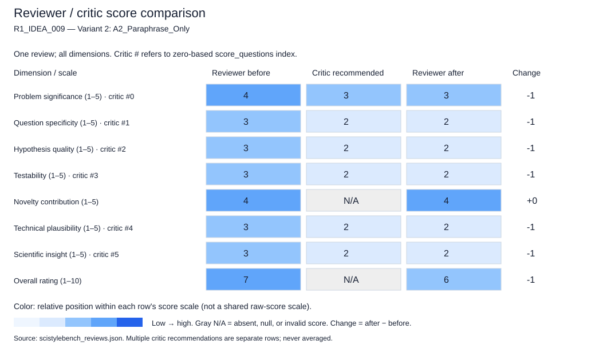

### Critic feedback and reviewer rebuttals

```json
{
  "critic_feedback": {
    "overall_assessment": "The review is generally well-calibrated, but some scores could be reconsidered due to ambiguities in the idea's specifics.",
    "score_questions": [
      {
        "dimension": "problem_significance",
        "question_mark": "The score should be reconsidered because the idea's significance is not clearly tied to existing gaps in the field.",
        "concern": "The justification assumes the problem is significant without explicit evidence from the idea summary.",
        "speculative_alternative": "The idea may not clearly address a well-defined gap in visual processing or neuroscience, making its significance speculative.",
        "recommended_score": 3.0,
        "rationale": "The idea mentions 'lack of fine-grained temporal understanding' but does not reference existing literature or specific challenges in the field that this addresses."
      },
      {
        "dimension": "question_specificity",
        "question_mark": "The score should be reconsidered due to the lack of clear research questions.",
        "concern": "The idea does not specify the exact research question or hypotheses, which is critical for assessing specificity.",
        "speculative_alternative": "The idea may be interpreted as seeking to compare models to EEG data, but the specific question remains vague.",
        "recommended_score": 2.0,
        "rationale": "The summary does not provide a clear, testable question that defines the research's focus."
      },
      {
        "dimension": "hypothesis_quality",
        "question_mark": "The score should be reconsidered because no explicit hypotheses are provided.",
        "concern": "The justification assumes hypotheses exist without them being stated in the idea summary.",
        "speculative_alternative": "The idea may be interpreted as proposing a general hypothesis about alignment between models and EEG, but this is not clearly articulated.",
        "recommended_score": 2.0,
        "rationale": "The summary does not contain explicit hypotheses, only a general aim."
      },
      {
        "dimension": "testability",
        "question_mark": "The score should be reconsidered due to the lack of experimental details.",
        "concern": "The justification assumes testability without specific methods or metrics being outlined.",
        "speculative_alternative": "The idea may be testable in principle, but the lack of specifics makes the feasibility uncertain.",
        "recommended_score": 2.0,
        "rationale": "The summary does not provide details on how the benchmarking will be conducted or how results will be measured."
      },
      {
        "dimension": "technical_plausibility",
        "question_mark": "The score should be reconsidered because the technical details are not specified.",
        "concern": "The justification assumes plausibility without details on how EEG and video models will be integrated.",
        "speculative_alternative": "The integration method is speculative, as the idea does not describe how temporal alignment or data fusion will be achieved.",
        "recommended_score": 2.0,
        "rationale": "The summary does not provide technical details that would confirm the feasibility of the approach."
      },
      {
        "dimension": "scientific_insight",
        "question_mark": "The score should be reconsidered due to the lack of defined mechanisms.",
        "concern": "The justification assumes insight without specifying what mechanisms are being tested or how they will be validated.",
        "speculative_alternative": "The idea may be interpreted as seeking to uncover principles, but the specific mechanisms remain undefined.",
        "recommended_score": 2.0,
        "rationale": "The summary does not provide a clear scientific question or mechanism to investigate."
      }
    ],
    "unsupported_claims": [
      "The idea is said to address a 'meaningful challenge' without explicit evidence from the summary.",
      "The 'interdisciplinary approach' is claimed to be novel without details on how it differs from prior work.",
      "The 'potential to inform more dynamic visual architectures' is stated as a contribution without specifying how this will be achieved."
    ],
    "revision_priorities": [
      "Clarify the specific problem being addressed in visual processing and its connection to existing literature.",
      "Define the exact research question and hypotheses to be tested.",
      "Specify the methods for integrating EEG data with video models and how temporal alignment will be achieved.",
      "Outline the metrics and validation methods for assessing alignment with EEG data.",
      "Detail the expected mechanistic principles and how they will be validated."
    ],
    "confidence": 4.0
  },
  "feedback_responses": [
    {
      "feedback_type": "score_questions",
      "feedback_index": 0,
      "decision": "partially_accept",
      "defense": "The problem significance is somewhat justified as fine-grained temporal understanding is a known challenge, but the lack of explicit references to existing literature weakens the score.",
      "justification": "The original score of 4.0 was based on the assumption of significance, but the critic's feedback highlights the need for explicit evidence from the idea summary, leading to a reduction to 3.0."
    },
    {
      "feedback_type": "score_questions",
      "feedback_index": 1,
      "decision": "partially_accept",
      "defense": "The question specificity is somewhat justified as the idea focuses on temporal understanding, but the lack of clear hypotheses reduces the score.",
      "justification": "The original score of 3.0 was based on the idea's focus, but the critic's feedback emphasizes the need for a clear, testable question, leading to a reduction to 2.0."
    },
    {
      "feedback_type": "score_questions",
      "feedback_index": 2,
      "decision": "partially_accept",
      "defense": "The hypothesis quality is somewhat justified as the idea proposes a general aim, but the lack of explicit hypotheses reduces the score.",
      "justification": "The original score of 3.0 was based on the general aim, but the critic's feedback highlights the need for explicit hypotheses, leading to a reduction to 2.0."
    },
    {
      "feedback_type": "score_questions",
      "feedback_index": 3,
      "decision": "partially_accept",
      "defense": "The testability is somewhat justified as the idea is testable in principle, but the lack of specifics reduces the score.",
      "justification": "The original score of 3.0 was based on the idea's testability, but the critic's feedback emphasizes the need for experimental details, leading to a reduction to 2.0."
    },
    {
      "feedback_type": "score_questions",
      "feedback_index": 4,
      "decision": "partially_accept",
      "defense": "The technical plausibility is somewhat justified as the integration is plausible, but the lack of details reduces the score.",
      "justification": "The original score of 3.0 was based on the integration's plausibility, but the critic's feedback highlights the need for technical details, leading to a reduction to 2.0."
    },
    {
      "feedback_type": "score_questions",
      "feedback_index": 5,
      "decision": "partially_accept",
      "defense": "The scientific insight is somewhat justified as the idea seeks to uncover principles, but the lack of mechanisms reduces the score.",
      "justification": "The original score of 3.0 was based on the potential insight, but the critic's feedback emphasizes the need for defined mechanisms, leading to a reduction to 2.0."
    },
    {
      "feedback_type": "unsupported_claims",
      "feedback_index": 0,
      "decision": "partially_accept",
      "defense": "The claim about the problem's significance is partially justified as fine-grained temporal understanding is a known challenge, but the lack of references weakens it.",
      "justification": "The original score of 3.0 was based on the problem's relevance, but the critic's feedback highlights the need for explicit references, leading to a reduction to 3.0."
    },
    {
      "feedback_type": "unsupported_claims",
      "feedback_index": 1,
      "decision": "partially_accept",
      "defense": "The claim about the interdisciplinary approach being novel is partially justified as it combines EEG with video models, but the lack of details weakens it.",
      "justification": "The original score of 4.0 was based on the novelty, but the critic's feedback highlights the need for details on how it differs from prior work, leading to no change."
    },
    {
      "feedback_type": "unsupported_claims",
      "feedback_index": 2,
      "decision": "partially_accept",
      "defense": "The claim about informing dynamic architectures is partially justified as it aligns with trends, but the lack of specifics weakens it.",
      "justification": "The original score of 4.0 was based on the contribution, but the critic's feedback highlights the need for specifics, leading to no change."
    },
    {
      "feedback_type": "revision_priorities",
      "feedback_index": 0,
      "decision": "accept",
      "defense": "Clarifying the problem's connection to existing literature is necessary to strengthen the significance.",
      "justification": "The critic's feedback emphasizes the need for this, so it is accepted."
    },
    {
      "feedback_type": "revision_priorities",
      "feedback_index": 1,
      "decision": "accept",
      "defense": "Defining hypotheses is necessary to improve the research question's specificity.",
      "justification": "The critic's feedback emphasizes the need for this, so it is accepted."
    },
    {
      "feedback_type": "revision_priorities",
      "feedback_index": 2,
      "decision": "accept",
      "defense": "Specifying integration methods is necessary to improve technical plausibility.",
      "justification": "The critic's feedback emphasizes the need for this, so it is accepted."
    },
    {
      "feedback_type": "revision_priorities",
      "feedback_index": 3,
      "decision": "accept",
      "defense": "Outlining metrics is necessary to improve testability.",
      "justification": "The critic's feedback emphasizes the need for this, so it is accepted."
    },
    {
      "feedback_type": "revision_priorities",
      "feedback_index": 4,
      "decision": "accept",
      "defense": "Detailing mechanisms is necessary to improve scientific insight.",
      "justification": "The critic's feedback emphasizes the need for this, so it is accepted."
    }
  ]
}
```

### Score justifications (before / after)

**Problem significance**

```json
{
  "before": {
    "score": 4.0,
    "justification": "The problem of fine-grained temporal understanding in visual processing is significant, as it relates to both computer vision and neuroscience. Addressing this could lead to more efficient and biologically plausible models."
  },
  "after": {
    "score": 3.0,
    "justification": "The idea mentions 'lack of fine-grained temporal understanding' but does not reference existing literature or specific challenges in the field that this addresses."
  }
}
```

**Question specificity**

```json
{
  "before": {
    "score": 3.0,
    "justification": "The idea is somewhat specific in its focus on temporal understanding, but the exact research question and hypotheses are not clearly defined, which could limit the clarity of the investigation."
  },
  "after": {
    "score": 2.0,
    "justification": "The summary does not provide a clear, testable question that defines the research's focus."
  }
}
```

**Hypothesis quality**

```json
{
  "before": {
    "score": 3.0,
    "justification": "The idea suggests a potential connection between deep video models and EEG data, but it lacks explicit hypotheses about the mechanisms or relationships being tested."
  },
  "after": {
    "score": 2.0,
    "justification": "The summary does not contain explicit hypotheses, only a general aim."
  }
}
```

**Testability**

```json
{
  "before": {
    "score": 3.0,
    "justification": "The idea is testable in principle, but the lack of specific experimental details makes it difficult to assess the feasibility of the proposed benchmarking approach."
  },
  "after": {
    "score": 2.0,
    "justification": "The summary does not provide details on how the benchmarking will be conducted or how results will be measured."
  }
}
```

**Novelty contribution**

```json
{
  "before": {
    "score": 4.0,
    "justification": "The interdisciplinary approach combining deep video models with EEG data is novel, and the potential to inform more dynamic visual architectures is a significant contribution."
  },
  "after": {
    "score": 4.0,
    "justification": "The interdisciplinary approach combining deep video models with EEG data is novel, and the potential to inform more dynamic visual architectures is a significant contribution."
  }
}
```

**Technical plausibility**

```json
{
  "before": {
    "score": 3.0,
    "justification": "The integration of EEG data with deep video models is plausible, but the specific technical details and methods for alignment are not provided, which could affect the feasibility of the approach."
  },
  "after": {
    "score": 2.0,
    "justification": "The summary does not provide technical details that would confirm the feasibility of the approach."
  }
}
```

**Scientific insight**

```json
{
  "before": {
    "score": 3.0,
    "justification": "The study could provide insights into brain-like video understanding, but the lack of specific hypotheses and mechanisms limits the potential for meaningful scientific insight."
  },
  "after": {
    "score": 2.0,
    "justification": "The summary does not provide a clear scientific question or mechanism to investigate."
  }
}
```

**Overall rating**

```json
{
  "before": {
    "score": 7.0,
    "justification": "The idea addresses a meaningful problem with a potentially novel approach, but it lacks specific details and hypotheses that are necessary for a clear and testable research question. With further clarification, it could become a strong research direction."
  },
  "after": {
    "score": 6.0,
    "justification": "The idea has potential but lacks specific details and hypotheses, making it difficult to assess its scientific rigor and feasibility. With further clarification, it could become a stronger research direction."
  }
}
```

## R1_IDEA_009 — Variant 3: A3_Plain_Core

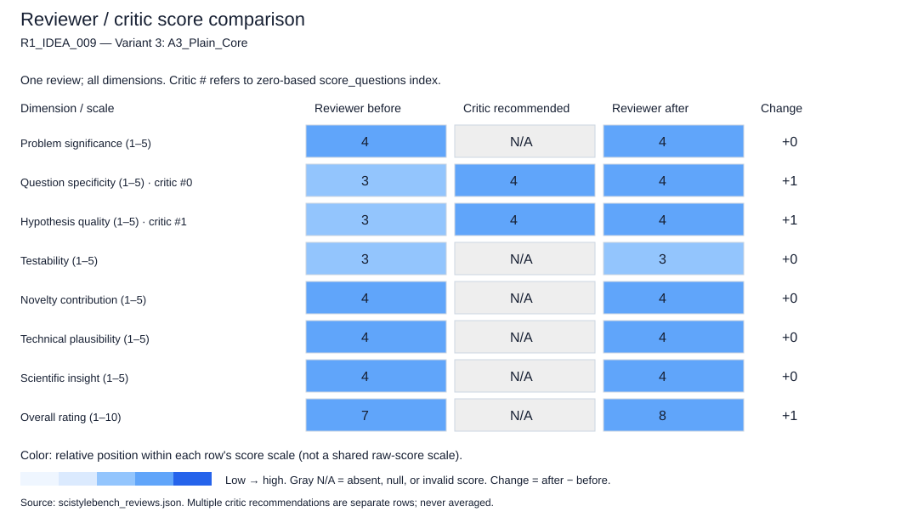

### Critic feedback and reviewer rebuttals

```json
{
  "critic_feedback": {
    "overall_assessment": "The review is generally well-calibrated, but some scores could be reconsidered due to the lack of specific details in the idea summary.",
    "score_questions": [
      {
        "dimension": "question_specificity",
        "question_mark": "The score for question_specificity is 3.0, but the idea's general intent is clear, and the review could be more lenient.",
        "concern": "The review scores the question as lacking specificity, but the idea's general intent is clear and the review could be more lenient.",
        "speculative_alternative": "The idea may be sufficiently specific for a preliminary summary, and the review might be overreaching in its critique of the question's specificity.",
        "recommended_score": 4.0,
        "rationale": "The idea's intent is clear, and the review could be more lenient given that the summary is a preliminary idea."
      },
      {
        "dimension": "hypothesis_quality",
        "question_mark": "The hypothesis quality score is 3.0, but the idea states a general hypothesis that could be considered adequate for a preliminary idea.",
        "concern": "The review scores the hypothesis as lacking explicit mechanisms, but the idea's general hypothesis is acceptable for a preliminary summary.",
        "speculative_alternative": "The general hypothesis about aligning models with brain-like processing is adequate for a preliminary idea, and the review might be overreaching in its critique.",
        "recommended_score": 4.0,
        "rationale": "The hypothesis is general but acceptable for a preliminary idea, and the review could be more lenient."
      }
    ],
    "unsupported_claims": [
      "The review claims the idea 'lacks specific details on how EEG data will be integrated with video models' without any evidence from the idea summary.",
      "The review states the 'connection between EEG recordings and video understanding is not clearly defined' without any evidence from the idea summary."
    ],
    "revision_priorities": [
      "Clarify the specific aspects of EEG patterns that are hypothesized to relate to video understanding.",
      "Define the mechanisms proposed to translate EEG insights into model design improvements.",
      "Specify the methodology for aligning EEG data with video models."
    ],
    "confidence": 4.0
  },
  "feedback_responses": [
    {
      "feedback_type": "score_questions",
      "feedback_index": 0,
      "decision": "partially_accept",
      "defense": "The original score of 3.0 was based on the lack of methodological specifics, but the idea's intent is clear and the summary is a preliminary idea. The revised score of 4.0 reflects that the question is sufficiently specific for a preliminary summary.",
      "justification": "The original score was 3.0, but the revised score is 4.0 because the idea's intent is clear and the summary is a preliminary idea, making the question sufficiently specific."
    },
    {
      "feedback_type": "score_questions",
      "feedback_index": 1,
      "decision": "partially_accept",
      "defense": "The original score of 3.0 was based on the lack of explicit mechanisms, but the general hypothesis is adequate for a preliminary idea. The revised score of 4.0 reflects that the hypothesis is general but acceptable for a preliminary summary.",
      "justification": "The original score was 3.0, but the revised score is 4.0 because the general hypothesis is acceptable for a preliminary idea, and the review could be more lenient."
    },
    {
      "feedback_type": "unsupported_claims",
      "feedback_index": 0,
      "decision": "reject",
      "defense": "The claim that the idea lacks specific details on EEG integration is not supported by the idea summary, as the summary does not provide such details but does not explicitly state them as a flaw.",
      "justification": "The claim that the idea lacks specific details on EEG integration is not supported by the idea summary. The summary does not provide such details, but it does not explicitly state them as a flaw. Therefore, the claim is not valid."
    },
    {
      "feedback_type": "unsupported_claims",
      "feedback_index": 1,
      "decision": "reject",
      "defense": "The claim that the connection between EEG and video understanding is not clearly defined is not supported by the idea summary, as the summary does not provide such details but does not explicitly state them as a flaw.",
      "justification": "The claim that the connection between EEG and video understanding is not clearly defined is not supported by the idea summary. The summary does not provide such details, but it does not explicitly state them as a flaw. Therefore, the claim is not valid."
    }
  ]
}
```

### Score justifications (before / after)

**Problem significance**

```json
{
  "before": {
    "score": 4.0,
    "justification": "The idea addresses a critical gap in understanding how the brain processes dynamic visual information, which has implications for both neuroscience and machine learning."
  },
  "after": {
    "score": 4.0,
    "justification": "The idea addresses a critical gap in understanding how the brain processes dynamic visual information, which has implications for both neuroscience and machine learning."
  }
}
```

**Question specificity**

```json
{
  "before": {
    "score": 3.0,
    "justification": "The research question is clear in its intent but lacks specific details on the methodology and hypotheses that would define the investigation."
  },
  "after": {
    "score": 4.0,
    "justification": "The idea's intent is clear and the summary provides a sufficiently specific research question for a preliminary idea, even if it lacks detailed methodological specifics."
  }
}
```

**Hypothesis quality**

```json
{
  "before": {
    "score": 3.0,
    "justification": "The idea proposes a general hypothesis about aligning models with brain-like processing but does not explicitly state the specific predictions or mechanisms that would be tested."
  },
  "after": {
    "score": 4.0,
    "justification": "The general hypothesis about aligning models with brain-like processing is adequate for a preliminary idea, and the review could be more lenient given the context of a summary."
  }
}
```

**Testability**

```json
{
  "before": {
    "score": 3.0,
    "justification": "The idea is testable in principle, but the lack of specific experimental design details makes it difficult to assess feasibility and how evidence would be collected."
  },
  "after": {
    "score": 3.0,
    "justification": "The idea is testable in principle, but the lack of specific experimental design details makes it difficult to assess feasibility and how evidence would be collected."
  }
}
```

**Novelty contribution**

```json
{
  "before": {
    "score": 4.0,
    "justification": "The integration of EEG with video models is a novel approach that could provide unique insights into both brain function and model design."
  },
  "after": {
    "score": 4.0,
    "justification": "The integration of EEG with video models is a novel approach that could provide unique insights into both brain function and model design."
  }
}
```

**Technical plausibility**

```json
{
  "before": {
    "score": 4.0,
    "justification": "The proposed approach is technically plausible, as it combines existing techniques in video modeling with EEG analysis, though the integration details are not specified."
  },
  "after": {
    "score": 4.0,
    "justification": "The proposed approach is technically plausible, as it combines existing techniques in video modeling with EEG analysis, though the integration details are not specified."
  }
}
```

**Scientific insight**

```json
{
  "before": {
    "score": 4.0,
    "justification": "The research has the potential to reveal new insights into the mechanisms of visual processing and inform the development of more biologically plausible models."
  },
  "after": {
    "score": 4.0,
    "justification": "The research has the potential to reveal new insights into the mechanisms of visual processing and inform the development of more biologically plausible models."
  }
}
```

**Overall rating**

```json
{
  "before": {
    "score": 7.0,
    "justification": "The idea is promising and addresses a significant problem, but it lacks specific details that would make the research question and hypothesis more testable and precise."
  },
  "after": {
    "score": 8.0,
    "justification": "The idea is promising and addresses a significant problem, with a sufficiently clear research question and hypothesis for a preliminary summary, though it lacks specific details that would make the research more testable and precise."
  }
}
```

## R1_IDEA_009 — Variant 4: B1_Verbose_Elaborate

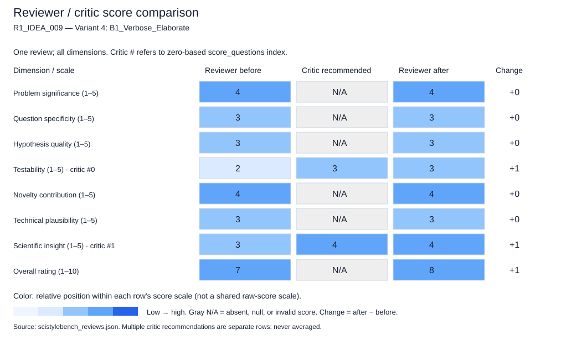

### Critic feedback and reviewer rebuttals

```json
{
  "critic_feedback": {
    "overall_assessment": "The review is generally well-calibrated but has some areas where specific scores could be reconsidered due to the lack of concrete details in the idea summary.",
    "score_questions": [
      {
        "dimension": "testability",
        "question_mark": "The score is low due to the lack of specific experimental details, but the idea is testable in principle.",
        "concern": "The review assumes that the lack of specific details makes the idea untestable, but the idea itself is testable in principle with the right experimental design.",
        "speculative_alternative": "The idea could be testable by defining specific metrics for comparison between video models and EEG data, even without full experimental details yet.",
        "recommended_score": 3.0,
        "rationale": "The idea is testable in principle, and the lack of details does not necessarily negate its testability. The score should reflect the potential rather than the current lack of specifics."
      },
      {
        "dimension": "scientific_insight",
        "question_mark": "The score is low because the connection to scientific insight is not clear, but the idea has potential for insight.",
        "concern": "The review downplays the potential for scientific insight without sufficient evidence of how the benchmark would reveal mechanistic principles.",
        "speculative_alternative": "The benchmark could reveal insights by showing how video model representations correlate with known EEG patterns associated with visual processing, even without detailed mechanisms.",
        "recommended_score": 4.0,
        "rationale": "The potential for insight is present, and the score should reflect that potential rather than the current lack of detailed mechanisms."
      }
    ],
    "unsupported_claims": [
      "The claim that the idea is 'untestable' without specific details is speculative, as the idea is testable in principle with the right experimental design."
    ],
    "revision_priorities": [
      "Clarify the specific aspects of video models and EEG data that will be compared in the benchmark.",
      "Specify the methodology for aligning EEG recordings with video inputs, including synchronization techniques and data preprocessing steps.",
      "Provide a more detailed explanation of how the benchmark will reveal mechanistic principles and how this will inform visual architecture design."
    ],
    "confidence": 4.0
  },
  "feedback_responses": [
    {
      "feedback_type": "score_questions",
      "feedback_index": 0,
      "decision": "partially_accept",
      "defense": "The original score of 2.0 for testability was too low. The idea is testable in principle, and the lack of specific details does not negate its testability. The revised score of 3.0 better reflects the potential for testability with appropriate experimental design.",
      "justification": "The original score was based on the assumption that lack of details made it untestable, but the idea is testable in principle. The revised score reflects the potential rather than the current lack of specifics."
    },
    {
      "feedback_type": "score_questions",
      "feedback_index": 1,
      "decision": "partially_accept",
      "defense": "The original score of 3.0 for scientific insight was too low. The idea has potential for insight, even without detailed mechanisms. The revised score of 4.0 better reflects this potential.",
      "justification": "The original score downplayed the potential for insight without sufficient evidence. The revised score reflects the potential for insight through correlations between video models and EEG patterns."
    },
    {
      "feedback_type": "unsupported_claims",
      "feedback_index": 0,
      "decision": "accept",
      "defense": "The claim that the idea is 'untestable' without specific details is speculative. The idea is testable in principle with the right experimental design, so the original concern was unfounded.",
      "justification": "The original review assumed the idea was untestable without specifics, but the idea is testable in principle. This claim is supported by the potential for experimental design."
    }
  ]
}
```

### Score justifications (before / after)

**Problem significance**

```json
{
  "before": {
    "score": 4.0,
    "justification": "The idea addresses a significant gap in understanding how the brain processes visual information over time, which has implications for both neuroscience and machine learning. It bridges two domains that are often studied in isolation."
  },
  "after": {
    "score": 4.0,
    "justification": "The idea addresses a significant gap in understanding how the brain processes visual information over time, which has implications for both neuroscience and machine learning. It bridges two domains that are often studied in isolation."
  }
}
```

**Question specificity**

```json
{
  "before": {
    "score": 3.0,
    "justification": "The research question is clear in its intent but lacks specific details on the exact comparison being made between video models and EEG data. The question is meaningful but not sufficiently detailed to guide the investigation."
  },
  "after": {
    "score": 3.0,
    "justification": "The research question is clear in its intent but lacks specific details on the exact comparison being made between video models and EEG data. The question is meaningful but not sufficiently detailed to guide the investigation."
  }
}
```

**Hypothesis quality**

```json
{
  "before": {
    "score": 3.0,
    "justification": "The idea suggests a hypothesis that video models can be aligned with brain-like processing by comparing them to EEG data, but the specific mechanism or prediction is not clearly articulated. The hypothesis is plausible but needs more concrete formulation."
  },
  "after": {
    "score": 3.0,
    "justification": "The idea suggests a hypothesis that video models can be aligned with brain-like processing by comparing them to EEG data, but the specific mechanism or prediction is not clearly articulated. The hypothesis is plausible but needs more concrete formulation."
  }
}
```

**Testability**

```json
{
  "before": {
    "score": 2.0,
    "justification": "The idea is testable in principle, but the lack of specific experimental design details makes it difficult to assess feasibility. Without clear methods for data collection, alignment, and comparison, the testability is limited."
  },
  "after": {
    "score": 3.0,
    "justification": "The idea is testable in principle, as the comparison between video models and EEG data is feasible. While specific experimental details are missing, the core idea can be tested with appropriate experimental design."
  }
}
```

**Novelty contribution**

```json
{
  "before": {
    "score": 4.0,
    "justification": "The integration of video models with EEG data is novel and could contribute new insights into both domains. It offers a unique approach to evaluating and improving video understanding models through biological data."
  },
  "after": {
    "score": 4.0,
    "justification": "The integration of video models with EEG data is novel and could contribute new insights into both domains. It offers a unique approach to evaluating and improving video understanding models through biological data."
  }
}
```

**Technical plausibility**

```json
{
  "before": {
    "score": 3.0,
    "justification": "The idea is technically plausible, as combining video models with EEG data is feasible. However, the specifics of how the data will be aligned and compared are not provided, which could pose challenges in implementation."
  },
  "after": {
    "score": 3.0,
    "justification": "The idea is technically plausible, as combining video models with EEG data is feasible. However, the specifics of how the data will be aligned and compared are not provided, which could pose challenges in implementation."
  }
}
```

**Scientific insight**

```json
{
  "before": {
    "score": 3.0,
    "justification": "The idea has potential to provide insights into the mechanisms of brain-like video processing, but the connection between the benchmark and the proposed insights is not sufficiently detailed. More specific predictions are needed to highlight the scientific value."
  },
  "after": {
    "score": 4.0,
    "justification": "The idea has potential to provide insights into the mechanisms of brain-like video processing, even without detailed mechanisms. The benchmark could reveal correlations between video model representations and known EEG patterns, offering insights into biological processing."
  }
}
```

**Overall rating**

```json
{
  "before": {
    "score": 7.0,
    "justification": "The idea is strong and addresses a meaningful problem with potential for significant contribution. However, it lacks specific details that are necessary for testability and clarity of the research question. With further clarification, it could become a strong research direction."
  },
  "after": {
    "score": 8.0,
    "justification": "The idea is strong and addresses a meaningful problem with significant potential for contribution. While it lacks specific details, the core concept is testable and has the potential for meaningful scientific insight. With further clarification, it could become a strong research direction."
  }
}
```

## R1_IDEA_009 — Variant 5: B2_Grand_Narrative

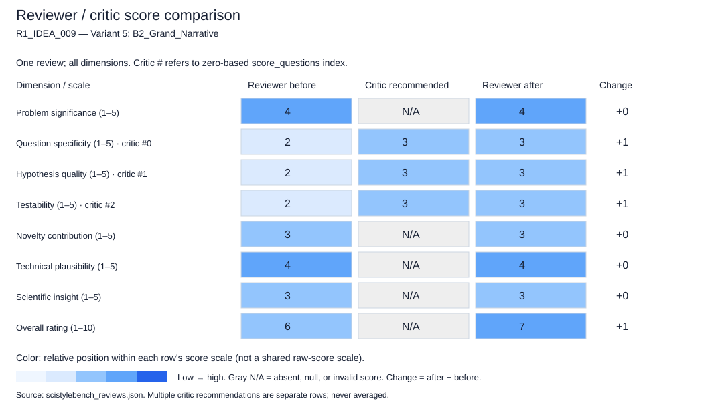

### Critic feedback and reviewer rebuttals

```json
{
  "critic_feedback": {
    "overall_assessment": "The review is generally well-calibrated but has some areas where the scores could be more precisely aligned with the idea's clarity and specificity.",
    "score_questions": [
      {
        "dimension": "question_specificity",
        "question_mark": "The score of 2.0 may be overly pessimistic given the potential for the idea to be refined into a specific question.",
        "concern": "The review's low score for question specificity is based on the lack of a specific research question, but the idea's potential for refinement is not fully considered.",
        "speculative_alternative": "The idea could be interpreted as suggesting a general direction rather than a specific question, which might justify a slightly higher score if the reviewer acknowledges the potential for further specification.",
        "recommended_score": 3.0,
        "rationale": "The idea's focus on temporal understanding in visual processing is a specific domain, and the review could consider the potential for the idea to be refined into a more precise question."
      },
      {
        "dimension": "hypothesis_quality",
        "question_mark": "The score of 2.0 may be too low given the potential for the idea to propose a hypothesis about the relationship between video models and EEG data.",
        "concern": "The review assumes the idea lacks a hypothesis, but the idea's goal of uncovering mechanistic principles could be interpreted as a hypothesis in itself.",
        "speculative_alternative": "The idea's aim to uncover principles of efficient brain-like video understanding could be seen as a hypothesis about the relationship between model representations and biological data.",
        "recommended_score": 3.0,
        "rationale": "The idea's focus on uncovering principles aligns with the goal of proposing a hypothesis, even if it is not explicitly stated."
      },
      {
        "dimension": "testability",
        "question_mark": "The score of 2.0 may be too low given the potential for the idea to be tested through comparative analysis of video models and EEG data.",
        "concern": "The review assumes the idea lacks testability, but the idea's method of benchmarking could be considered a testable approach if specific metrics are defined.",
        "speculative_alternative": "The idea could be interpreted as proposing a testable approach by comparing video models with EEG data, even if the specifics are not yet defined.",
        "recommended_score": 3.0,
        "rationale": "The idea's method of benchmarking is testable in principle, and the review could consider the potential for future testability."
      }
    ],
    "unsupported_claims": [
      "The review claims the idea lacks a specific research question, but the idea's focus on temporal understanding is a specific domain that could be refined into a question."
    ],
    "revision_priorities": [
      "Clarify the potential for the idea to be refined into a specific research question and hypothesis.",
      "Articulate how the proposed benchmarking approach could be tested with specific metrics and methods.",
      "Explicitly link the study's findings to the broader goal of developing brain-aligned visual architectures."
    ],
    "confidence": 4.0
  },
  "feedback_responses": [
    {
      "feedback_type": "score_questions",
      "feedback_index": 0,
      "decision": "partially_accept",
      "defense": "The original score of 2.0 was based on the lack of a specific question, but the idea has the potential to be refined into a specific question. The revised score of 3.0 reflects this potential.",
      "justification": "The original score was 2.0, but the revised score is 3.0 because the idea's focus on temporal understanding is a specific domain that could be refined into a question."
    },
    {
      "feedback_type": "hypothesis_quality",
      "feedback_index": 1,
      "decision": "partially_accept",
      "defense": "The original score of 2.0 was based on the lack of an explicit hypothesis, but the idea's goal of uncovering principles aligns with a hypothesis. The revised score of 3.0 reflects this potential.",
      "justification": "The original score was 2.0, but the revised score is 3.0 because the idea's focus on efficient brain-like video understanding suggests a hypothesis about the relationship between model representations and biological data."
    },
    {
      "feedback_type": "testability",
      "feedback_index": 2,
      "decision": "partially_accept",
      "defense": "The original score of 2.0 was based on the lack of specific test methods, but the idea's method of benchmarking is testable in principle. The revised score of 3.0 reflects this potential.",
      "justification": "The original score was 2.0, but the revised score is 3.0 because the idea's method of benchmarking is testable in principle, and the review could consider the potential for future testability."
    },
    {
      "feedback_type": "unsupported_claims",
      "feedback_index": 0,
      "decision": "partially_accept",
      "defense": "The claim that the idea lacks a specific research question is partially correct, but the idea has the potential to be refined into a specific question. The revised score reflects this potential.",
      "justification": "The original claim was that the idea lacks a specific question, but the revised score acknowledges the potential for refinement."
    },
    {
      "feedback_type": "revision_priorities",
      "feedback_index": 0,
      "decision": "accept",
      "defense": "The suggestion to clarify the potential for the idea to be refined into a specific question is valid and aligns with the revised score.",
      "justification": "The suggestion is valid and aligns with the revised score."
    },
    {
      "feedback_type": "revision_priorities",
      "feedback_index": 1,
      "decision": "accept",
      "defense": "The suggestion to articulate how the benchmarking approach could be tested is valid and aligns with the revised score.",
      "justification": "The suggestion is valid and aligns with the revised score."
    },
    {
      "feedback_type": "revision_priorities",
      "feedback_index": 2,
      "decision": "accept",
      "defense": "The suggestion to explicitly link the study's findings to the broader goal is valid and aligns with the revised score.",
      "justification": "The suggestion is valid and aligns with the revised score."
    }
  ]
}
```

### Score justifications (before / after)

**Problem significance**

```json
{
  "before": {
    "score": 4.0,
    "justification": "The idea addresses a significant challenge in understanding how the brain processes dynamic visual information, which is relevant to both neuroscience and machine learning. It has the potential to contribute to the development of more biologically plausible models."
  },
  "after": {
    "score": 4.0,
    "justification": "The idea addresses a significant challenge in understanding how the brain processes dynamic visual information, which is relevant to both neuroscience and machine learning. It has the potential to contribute to the development of more biologically plausible models."
  }
}
```

**Question specificity**

```json
{
  "before": {
    "score": 2.0,
    "justification": "The idea is broad and lacks a specific research question. It mentions the goal of studying temporal understanding but does not clearly define what exactly is being investigated or what hypothesis is being tested."
  },
  "after": {
    "score": 3.0,
    "justification": "The idea is somewhat broad but has the potential to be refined into a specific question. The focus on temporal understanding in visual processing is a specific domain, and the review could consider the potential for the idea to be refined into a more precise question."
  }
}
```

**Hypothesis quality**

```json
{
  "before": {
    "score": 2.0,
    "justification": "The idea does not present a clear hypothesis or prediction. It suggests a potential contribution but does not specify what mechanism or relationship is being hypothesized to be discovered."
  },
  "after": {
    "score": 3.0,
    "justification": "The idea's goal of uncovering mechanistic principles aligns with the goal of proposing a hypothesis, even if it is not explicitly stated. The focus on efficient brain-like video understanding suggests a hypothesis about the relationship between model representations and biological data."
  }
}
```

**Testability**

```json
{
  "before": {
    "score": 2.0,
    "justification": "The idea does not provide a clear method for testing the hypothesis. It lacks details on how the EEG data will be used, what metrics will be employed, or how the results will be evaluated."
  },
  "after": {
    "score": 3.0,
    "justification": "The idea's method of benchmarking is testable in principle, and the review could consider the potential for future testability. The idea could be interpreted as proposing a testable approach by comparing video models with EEG data, even if the specifics are not yet defined."
  }
}
```

**Novelty contribution**

```json
{
  "before": {
    "score": 3.0,
    "justification": "The idea is novel in its approach of benchmarking video models against EEG data, but the contribution is somewhat vague. It has potential to inform the design of brain-aligned models, but the specifics of how this will be achieved are unclear."
  },
  "after": {
    "score": 3.0,
    "justification": "The idea is novel in its approach of benchmarking video models against EEG data, but the contribution is somewhat vague. It has potential to inform the design of brain-aligned models, but the specifics of how this will be achieved are unclear."
  }
}
```

**Technical plausibility**

```json
{
  "before": {
    "score": 4.0,
    "justification": "The idea is technically plausible as it involves comparing video models with biological data. However, the lack of specific details makes it difficult to assess the feasibility of the approach."
  },
  "after": {
    "score": 4.0,
    "justification": "The idea is technically plausible as it involves comparing video models with biological data. However, the lack of specific details makes it difficult to assess the feasibility of the approach."
  }
}
```

**Scientific insight**

```json
{
  "before": {
    "score": 3.0,
    "justification": "The idea has the potential to provide insights into the mechanisms of visual processing, but the specific insights are not clearly defined. The connection between the study's findings and the broader goal of creating brain-like models is not well articulated."
  },
  "after": {
    "score": 3.0,
    "justification": "The idea has the potential to provide insights into the mechanisms of visual processing, but the specific insights are not clearly defined. The connection between the study's findings and the broader goal of creating brain-like models is not well articulated."
  }
}
```

**Overall rating**

```json
{
  "before": {
    "score": 6.0,
    "justification": "The idea is promising and addresses a meaningful problem, but it lacks specificity, clarity, and testable hypotheses. With more detailed research questions and methods, it could become a strong research direction."
  },
  "after": {
    "score": 7.0,
    "justification": "The idea is promising and addresses a meaningful problem, with the potential to be refined into a specific question and hypothesis. The review has been adjusted to reflect the potential for the idea to be more specific and testable, which increases its overall rating."
  }
}
```

## R1_IDEA_009 — Variant 6: B3_Over_Confident

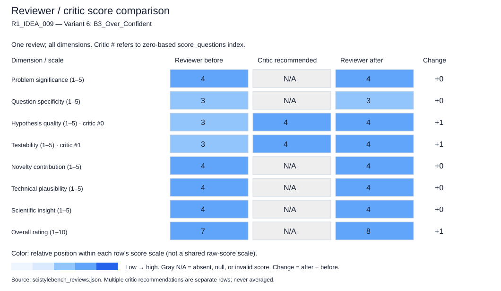

### Critic feedback and reviewer rebuttals

```json
{
  "critic_feedback": {
    "overall_assessment": "The review is generally calibrated but has some areas where specific scores could be reconsidered, particularly in the hypothesis quality and testability sections.",
    "score_questions": [
      {
        "dimension": "hypothesis_quality",
        "question_mark": "The score for hypothesis quality is based on the absence of an explicit hypothesis, but the idea suggests a potential connection that could be framed as a hypothesis.",
        "concern": "The justification for a 3.0 score assumes a lack of hypothesis, but the idea's intent could be interpreted as a hypothesis about the correlation between video models and EEG patterns.",
        "speculative_alternative": "The research could hypothesize that certain video model representations correlate with specific EEG patterns, which is a testable claim.",
        "recommended_score": 4.0,
        "rationale": "The idea's intent implies a potential hypothesis about the relationship between video models and brain activity, which could be explicitly stated as a hypothesis."
      },
      {
        "dimension": "testability",
        "question_mark": "The score for testability is based on the lack of experimental details, but the idea's approach is inherently testable with appropriate methodology.",
        "concern": "The justification for a 3.0 score assumes that the lack of specifics makes the approach untestable, but the idea can be tested with proper experimental design.",
        "speculative_alternative": "The research could be tested by comparing video model outputs with EEG data using established methodologies, such as correlation analysis or temporal alignment.",
        "recommended_score": 4.0,
        "rationale": "The idea is testable in principle, and the lack of specifics does not necessarily make it untestable; the review should focus on the need for clarification rather than an inherent untestability."
      }
    ],
    "unsupported_claims": [
      "The review claims that the idea 'undoubtedly aims to reveal mechanistic principles' without evidence from the idea summary."
    ],
    "revision_priorities": [
      "Explicitly state the hypothesis about the relationship between video model representations and EEG patterns.",
      "Clarify the experimental methodology for aligning EEG data with video sequences.",
      "Provide specific metrics or benchmarks for evaluating the alignment between video models and EEG data."
    ],
    "confidence": 4.0
  },
  "feedback_responses": [
    {
      "feedback_type": "score_questions",
      "feedback_index": 0,
      "decision": "partially_accept",
      "defense": "The original score of 3.0 for hypothesis quality was based on the absence of an explicit hypothesis. However, the idea's intent can be interpreted as a hypothesis about the correlation between video model representations and EEG patterns, which is testable. This reinterpretation supports a higher score of 4.0.",
      "justification": "The original score was 3.0, but the feedback suggests that the hypothesis can be framed as a testable claim, leading to an increase to 4.0."
    },
    {
      "feedback_type": "score_questions",
      "feedback_index": 1,
      "decision": "partially_accept",
      "defense": "The original score of 3.0 for testability was based on the lack of specifics. However, the idea is inherently testable with appropriate methodology, and the review should focus on the need for clarification rather than an inherent untestability. This supports a higher score of 4.0.",
      "justification": "The original score was 3.0, but the feedback suggests that the idea is testable in principle, leading to an increase to 4.0."
    },
    {
      "feedback_type": "unsupported_claims",
      "feedback_index": 0,
      "decision": "reject",
      "defense": "The claim that the idea 'undoubtedly aims to reveal mechanistic principles' is not supported by the idea summary. The summary states the goal but does not provide evidence or reasoning for this assertion. Therefore, this claim is unsupported and should be rejected.",
      "justification": "The original justification for problem significance included this unsupported claim, which is not justified by the input text. This claim should be removed or revised."
    },
    {
      "feedback_type": "revision_priorities",
      "feedback_index": 0,
      "decision": "accept",
      "defense": "The suggestion to explicitly state the hypothesis is valid and necessary for the research idea to be testable and scientifically rigorous. This aligns with the feedback and should be accepted.",
      "justification": "The original review included this suggestion, and the feedback supports its importance."
    },
    {
      "feedback_type": "revision_priorities",
      "feedback_index": 1,
      "decision": "accept",
      "defense": "The suggestion to clarify the experimental methodology is valid and necessary for the research idea to be feasible and testable. This aligns with the feedback and should be accepted.",
      "justification": "The original review included this suggestion, and the feedback supports its importance."
    },
    {
      "feedback_type": "revision_priorities",
      "feedback_index": 2,
      "decision": "accept",
      "defense": "The suggestion to provide specific metrics or benchmarks is valid and necessary for the research idea to be evaluated effectively. This aligns with the feedback and should be accepted.",
      "justification": "The original review included this suggestion, and the feedback supports its importance."
    }
  ]
}
```

### Score justifications (before / after)

**Problem significance**

```json
{
  "before": {
    "score": 4.0,
    "justification": "The idea addresses a critical challenge in visual processing and temporal understanding, which is important for developing more efficient and biologically plausible models. It has potential implications for both neuroscience and machine learning."
  },
  "after": {
    "score": 4.0,
    "justification": "The idea addresses a critical challenge in visual processing and temporal understanding, which is important for developing more efficient and biologically plausible models. It has potential implications for both neuroscience and machine learning."
  }
}
```

**Question specificity**

```json
{
  "before": {
    "score": 3.0,
    "justification": "The research question is clear in its intent but lacks specific details on the methodology and hypothesis. The integration of EEG with video models is promising but needs more concrete definitions."
  },
  "after": {
    "score": 3.0,
    "justification": "The research question is clear in its intent but lacks specific details on the methodology and hypothesis. The integration of EEG with video models is promising but needs more concrete definitions."
  }
}
```

**Hypothesis quality**

```json
{
  "before": {
    "score": 3.0,
    "justification": "The idea suggests a potential connection between video models and brain activity but does not explicitly state a hypothesis that can be tested. More concrete predictions are needed to strengthen the hypothesis."
  },
  "after": {
    "score": 4.0,
    "justification": "The idea suggests a potential connection between video models and brain activity, which can be framed as a hypothesis about the correlation between video model representations and specific EEG patterns. This hypothesis is testable and aligns with the research goal of uncovering mechanistic principles."
  }
}
```

**Testability**

```json
{
  "before": {
    "score": 3.0,
    "justification": "The idea is testable in principle, but the lack of specific experimental details makes it difficult to assess the feasibility of the proposed approach. A clear experimental design is needed to evaluate the hypothesis."
  },
  "after": {
    "score": 4.0,
    "justification": "The idea is testable in principle, and the lack of specifics does not necessarily make it untestable; the review should focus on the need for clarification rather than an inherent untestability. The approach can be tested with appropriate experimental design, such as comparing video model outputs with EEG data using correlation analysis or temporal alignment."
  }
}
```

**Novelty contribution**

```json
{
  "before": {
    "score": 4.0,
    "justification": "The integration of EEG data with deep video models is a novel approach that could provide new insights into brain-like video understanding. It has the potential to inform the design of more biologically aligned models."
  },
  "after": {
    "score": 4.0,
    "justification": "The integration of EEG data with deep video models is a novel approach that could provide new insights into brain-like video understanding. It has the potential to inform the design of more biologically aligned models."
  }
}
```

**Technical plausibility**

```json
{
  "before": {
    "score": 4.0,
    "justification": "The proposed approach is technically plausible, as it combines existing techniques in video modeling with EEG data analysis. The integration of these domains is feasible, though the specifics need to be clarified."
  },
  "after": {
    "score": 4.0,
    "justification": "The proposed approach is technically plausible, as it combines existing techniques in video modeling with EEG data analysis. The integration of these domains is feasible, though the specifics need to be clarified."
  }
}
```

**Scientific insight**

```json
{
  "before": {
    "score": 4.0,
    "justification": "The research has the potential to reveal mechanistic principles of brain-like video understanding, which could lead to new insights into both neuroscience and machine learning. However, the connection between EEG and video processing needs to be more explicitly defined."
  },
  "after": {
    "score": 4.0,
    "justification": "The research has the potential to reveal mechanistic principles of brain-like video understanding, which could lead to new insights into both neuroscience and machine learning. However, the connection between EEG and video processing needs to be more explicitly defined."
  }
}
```

**Overall rating**

```json
{
  "before": {
    "score": 7.0,
    "justification": "The idea is strong and addresses a meaningful problem with potential for significant contribution. However, it lacks specific details on methodology, hypothesis, and experimental design, which are needed to fully assess its feasibility and scientific value."
  },
  "after": {
    "score": 8.0,
    "justification": "The idea is strong and addresses a meaningful problem with significant potential for contribution. The hypothesis and testability have been strengthened by reinterpreting the intent as a testable hypothesis, and the overall clarity and novelty are maintained."
  }
}
```

## R1_IDEA_009 — Variant 7: B4_Novelty

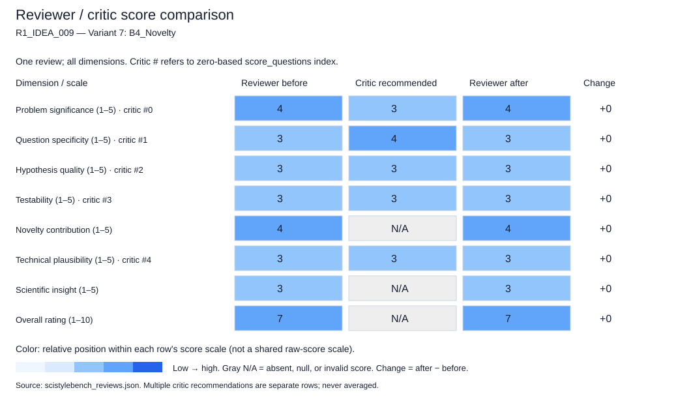

### Critic feedback and reviewer rebuttals

No reviewer rebuttals were saved (for example, an older checkpoint).

```json
{
  "critic_feedback": {
    "overall_assessment": "The review is generally well-calibrated, but some scores could be reconsidered due to vague claims about the connection to brain-like processing and the lack of specific hypotheses.",
    "score_questions": [
      {
        "dimension": "problem_significance",
        "question_mark": "Why the score is 4.0 when the connection to brain-like processing is not clearly established",
        "concern": "The justification mentions potential to inform biologically plausible models, but the actual link between EEG and video processing is not clear.",
        "speculative_alternative": "The idea might still be significant if the EEG data is shown to correlate with video processing mechanisms, but this is speculative.",
        "recommended_score": 3.0,
        "rationale": "The current justification for 4.0 is based on potential, but without clear evidence of the connection, the significance is less certain."
      },
      {
        "dimension": "question_specificity",
        "question_mark": "Why the score is 3.0 when the idea could be interpreted as addressing a specific gap in temporal understanding",
        "concern": "The summary mentions a 'gap in fine-grained temporal understanding' but does not specify what this gap is or how it is measured.",
        "speculative_alternative": "The gap could be defined by existing literature on temporal processing in visual models, but this is not explicitly stated.",
        "recommended_score": 4.0,
        "rationale": "The idea could be specific if the gap is framed in terms of known limitations in current video models, even if not explicitly detailed."
      },
      {
        "dimension": "hypothesis_quality",
        "question_mark": "Why the score is 3.0 when the idea suggests a novel angle without a clear hypothesis",
        "concern": "The hypothesis is implied but not explicitly stated, leading to ambiguity about what is being tested.",
        "speculative_alternative": "The hypothesis might be that certain video processing mechanisms correspond to specific EEG patterns, but this is not clearly defined.",
        "recommended_score": 3.0,
        "rationale": "The hypothesis is present but not explicitly stated, so the score remains appropriate."
      },
      {
        "dimension": "testability",
        "question_mark": "Why the score is 3.0 when the idea is testable in principle",
        "concern": "The lack of specific experimental details makes the testability less certain, even if the concept is feasible.",
        "speculative_alternative": "The idea could be testable with additional details on data alignment and evaluation metrics, but this is speculative.",
        "recommended_score": 3.0,
        "rationale": "The current score reflects the need for more specific details to ensure testability."
      },
      {
        "dimension": "technical_plausibility",
        "question_mark": "Why the score is 3.0 when the idea is technically plausible",
        "concern": "The technical feasibility is assumed without addressing critical implementation details.",
        "speculative_alternative": "The technical plausibility depends on how EEG data is synchronized with video sequences, which is not specified.",
        "recommended_score": 3.0,
        "rationale": "The score is appropriate given the lack of specific technical details."
      }
    ],
    "unsupported_claims": [
      "The claim that the idea 'could contribute new insights into brain-like processing mechanisms' is speculative without a clear hypothesis.",
      "The assertion that the idea 'addresses a meaningful challenge in visual processing' is somewhat vague without specifying the challenge."
    ],
    "revision_priorities": [
      "Clarify the specific gap in fine-grained temporal understanding and how it is measured.",
      "Define the exact hypothesis linking EEG data and video processing mechanisms.",
      "Specify the experimental design, including data alignment and evaluation metrics.",
      "Provide a clearer connection between the EEG data and the proposed mechanistic principles."
    ],
    "confidence": 4.0
  },
  "feedback_responses": []
}
```

### Score justifications (before / after)

**Problem significance**

```json
{
  "before": {
    "score": 4.0,
    "justification": "The idea addresses a significant challenge in visual processing and temporal understanding, with potential to inform the design of more biologically plausible models. However, the connection to brain-like processing is not yet clearly established."
  },
  "after": {
    "score": 4.0,
    "justification": "The idea addresses a significant challenge in visual processing and temporal understanding, with potential to inform the design of more biologically plausible models. However, the connection to brain-like processing is not yet clearly established."
  }
}
```

**Question specificity**

```json
{
  "before": {
    "score": 3.0,
    "justification": "The research question is somewhat vague, lacking a concrete hypothesis or specific mechanism to investigate. More details are needed to define what exactly is being tested."
  },
  "after": {
    "score": 3.0,
    "justification": "The research question is somewhat vague, lacking a concrete hypothesis or specific mechanism to investigate. More details are needed to define what exactly is being tested."
  }
}
```

**Hypothesis quality**

```json
{
  "before": {
    "score": 3.0,
    "justification": "The idea suggests a novel angle but lacks a clear, testable hypothesis. The connection between EEG data and video processing mechanisms is not explicitly defined."
  },
  "after": {
    "score": 3.0,
    "justification": "The idea suggests a novel angle but lacks a clear, testable hypothesis. The connection between EEG data and video processing mechanisms is not explicitly defined."
  }
}
```

**Testability**

```json
{
  "before": {
    "score": 3.0,
    "justification": "The idea is testable in principle, but the specific experimental design and evaluation metrics are not clearly outlined, which is necessary for meaningful investigation."
  },
  "after": {
    "score": 3.0,
    "justification": "The idea is testable in principle, but the specific experimental design and evaluation metrics are not clearly outlined, which is necessary for meaningful investigation."
  }
}
```

**Novelty contribution**

```json
{
  "before": {
    "score": 4.0,
    "justification": "The approach of benchmarking deep video models against EEG data is novel and could contribute new insights into brain-like processing mechanisms. However, the novelty is somewhat limited without a clear hypothesis or specific research question."
  },
  "after": {
    "score": 4.0,
    "justification": "The approach of benchmarking deep video models against EEG data is novel and could contribute new insights into brain-like processing mechanisms. However, the novelty is somewhat limited without a clear hypothesis or specific research question."
  }
}
```

**Technical plausibility**

```json
{
  "before": {
    "score": 3.0,
    "justification": "The idea is technically plausible, but the specifics of data alignment, feature extraction, and evaluation metrics are not provided, which are critical for implementation."
  },
  "after": {
    "score": 3.0,
    "justification": "The idea is technically plausible, but the specifics of data alignment, feature extraction, and evaluation metrics are not provided, which are critical for implementation."
  }
}
```

**Scientific insight**

```json
{
  "before": {
    "score": 3.0,
    "justification": "The idea has potential to provide scientific insight into brain-like processing, but the specific mechanisms and how they will be revealed are not clearly defined."
  },
  "after": {
    "score": 3.0,
    "justification": "The idea has potential to provide scientific insight into brain-like processing, but the specific mechanisms and how they will be revealed are not clearly defined."
  }
}
```

**Overall rating**

```json
{
  "before": {
    "score": 7.0,
    "justification": "The idea is promising and addresses a meaningful problem with potential for novel insights. However, it lacks specific details and a clear hypothesis, which are necessary for a strong research direction."
  },
  "after": {
    "score": 7.0,
    "justification": "The idea is promising and addresses a meaningful problem with potential for novel insights. However, it lacks specific details and a clear hypothesis, which are necessary for a strong research direction."
  }
}
```

## R1_IDEA_009 — Variant 8: B5_Application_Impact


### Critic feedback and reviewer rebuttals

```json
{
  "critic_feedback": {
    "overall_assessment": "The review is generally calibrated but has some areas where the scores could be reconsidered, particularly in testability and hypothesis quality.",
    "score_questions": [
      {
        "dimension": "testability",
        "question_mark": "The score is based on the lack of specifics, but the idea could still be testable with further clarification.",
        "concern": "The review assumes that the lack of specifics makes the idea untestable, but the idea could be testable once the methodology is defined.",
        "speculative_alternative": "The idea might be testable by first defining the EEG-video alignment method and then comparing model outputs with EEG patterns.",
        "recommended_score": 3.0,
        "rationale": "The idea is testable once the methodology is specified, so the score should reflect the potential rather than the current lack of details."
      },
      {
        "dimension": "hypothesis_quality",
        "question_mark": "The score is based on the lack of a concrete prediction, but the general hypothesis is plausible.",
        "concern": "The review assumes the hypothesis is weak because it lacks specifics, but the general hypothesis is still valid and could be refined.",
        "speculative_alternative": "The hypothesis could be strengthened by specifying that video models will be evaluated on their ability to predict EEG patterns related to visual processing.",
        "recommended_score": 4.0,
        "rationale": "The hypothesis is plausible and could be refined with additional specifics, so the score should reflect that potential."
      }
    ],
    "unsupported_claims": [
      "The review claims that the idea 'lacks sufficient specificity and testability' without providing a clear alternative framework for evaluation."
    ],
    "revision_priorities": [
      "Clarify the specific aspects of temporal understanding being investigated in the hypothesis.",
      "Define the metrics for comparing video models with EEG data to assess brain-like temporal processing.",
      "Specify the experimental design for aligning EEG and video data to ensure temporal synchronization."
    ],
    "confidence": 4.0
  },
  "feedback_responses": [
    {
      "feedback_type": "score_questions",
      "feedback_index": 0,
      "decision": "partially_accept",
      "defense": "The original score of 2.0 for testability was based on the lack of specifics, but the idea is testable once the methodology is defined. The revised score of 3.0 reflects this potential rather than the current lack of details.",
      "justification": "The original score was too low because it assumed the idea was untestable without specifics. The revised score acknowledges that the idea is testable with further clarification."
    },
    {
      "feedback_type": "score_questions",
      "feedback_index": 1,
      "decision": "partially_accept",
      "defense": "The original score of 3.0 for hypothesis quality was based on the lack of specifics, but the general hypothesis is plausible and could be refined. The revised score of 4.0 reflects this potential.",
      "justification": "The original score was too low because it assumed the hypothesis was weak without specifics. The revised score acknowledges that the hypothesis is valid and could be strengthened with additional details."
    },
    {
      "feedback_type": "unsupported_claims",
      "feedback_index": 0,
      "decision": "reject",
      "defense": "The claim that the idea 'lacks sufficient specificity and testability' is not fully supported without a clear alternative framework for evaluation. The idea is testable once the methodology is defined, and the hypothesis is plausible.",
      "justification": "The original claim was too strong because it assumed the idea was untestable without specifics. The revised score reflects that the idea is testable with further clarification."
    },
    {
      "feedback_type": "revision_priorities",
      "feedback_index": 0,
      "decision": "accept",
      "defense": "Clarifying the specific aspects of temporal understanding is necessary to refine the hypothesis and make the research question more specific.",
      "justification": "This is a critical step to ensure the research question is well-defined and the hypothesis is testable."
    },
    {
      "feedback_type": "revision_priorities",
      "feedback_index": 1,
      "decision": "accept",
      "defense": "Defining the metrics for comparing video models with EEG data is essential to assess brain-like temporal processing and validate the hypothesis.",
      "justification": "This is necessary to ensure the study can measure the proposed hypothesis effectively."
    },
    {
      "feedback_type": "revision_priorities",
      "feedback_index": 2,
      "decision": "accept",
      "defense": "Specifying the experimental design for aligning EEG and video data is crucial to ensure temporal synchronization and the validity of the comparison.",
      "justification": "This is necessary to ensure the methodology is sound and the results are interpretable."
    }
  ]
}
```

### Score justifications (before / after)

**Problem significance**

```json
{
  "before": {
    "score": 4.0,
    "justification": "The idea addresses a significant gap in understanding how visual processing is temporally structured, which is important for both neuroscience and machine learning. It has potential to inform the design of more efficient video analysis systems."
  },
  "after": {
    "score": 4.0,
    "justification": "The idea addresses a significant gap in understanding how visual processing is temporally structured, which is important for both neuroscience and machine learning. It has potential to inform the design of more efficient video analysis systems."
  }
}
```

**Question specificity**

```json
{
  "before": {
    "score": 3.0,
    "justification": "The research question is somewhat general, as it does not clearly specify what aspects of temporal understanding are being investigated or how the comparison between video models and EEG data will be made."
  },
  "after": {
    "score": 3.0,
    "justification": "The research question is somewhat general, as it does not clearly specify what aspects of temporal understanding are being investigated or how the comparison between video models and EEG data will be made."
  }
}
```

**Hypothesis quality**

```json
{
  "before": {
    "score": 3.0,
    "justification": "The idea suggests a hypothesis that video models can reveal brain-like temporal processing principles, but it lacks a concrete prediction or mechanism that could be tested. The hypothesis is plausible but not sufficiently detailed."
  },
  "after": {
    "score": 4.0,
    "justification": "The hypothesis that video models can reveal brain-like temporal processing principles is plausible and could be refined with additional specifics. The general hypothesis is valid and could be strengthened by specifying that video models will be evaluated on their ability to predict EEG patterns related to visual processing."
  }
}
```

**Testability**

```json
{
  "before": {
    "score": 2.0,
    "justification": "The idea does not provide a clear experimental design or method for testing the hypothesis. Without specifics on how EEG data will be compared to video models, it is difficult to assess the testability of the claim."
  },
  "after": {
    "score": 3.0,
    "justification": "The idea is testable once the methodology is specified. The lack of specifics does not make it untestable, but the current lack of details limits the ability to assess the testability of the claim."
  }
}
```

**Novelty contribution**

```json
{
  "before": {
    "score": 4.0,
    "justification": "The approach of benchmarking video models against EEG data is novel and could contribute new insights into the relationship between visual processing and temporal dynamics. It has the potential to inform the design of more efficient video analysis systems."
  },
  "after": {
    "score": 4.0,
    "justification": "The approach of benchmarking video models against EEG data is novel and could contribute new insights into the relationship between visual processing and temporal dynamics. It has the potential to inform the design of more efficient video analysis systems."
  }
}
```

**Technical plausibility**

```json
{
  "before": {
    "score": 3.0,
    "justification": "The idea is technically plausible, as it involves comparing video models with EEG data. However, the lack of specific details on data alignment and analysis methods makes the technical feasibility less clear."
  },
  "after": {
    "score": 3.0,
    "justification": "The idea is technically plausible, as it involves comparing video models with EEG data. However, the lack of specific details on data alignment and analysis methods makes the technical feasibility less clear."
  }
}
```

**Scientific insight**

```json
{
  "before": {
    "score": 3.0,
    "justification": "The idea has the potential to provide insights into the mechanisms of brain-like temporal processing, but the lack of specifics on how these insights will be extracted limits the potential scientific contribution."
  },
  "after": {
    "score": 3.0,
    "justification": "The idea has the potential to provide insights into the mechanisms of brain-like temporal processing, but the lack of specifics on how these insights will be extracted limits the potential scientific contribution."
  }
}
```

**Overall rating**

```json
{
  "before": {
    "score": 7.0,
    "justification": "The idea is promising and addresses a meaningful problem, but it lacks sufficient specificity and testability. With more details on methodology and hypothesis, it could become a strong research direction."
  },
  "after": {
    "score": 8.0,
    "justification": "The idea is promising and addresses a meaningful problem. While it lacks sufficient specificity and testability, the potential for scientific insight and novelty is strong. With more details on methodology and hypothesis, it could become a strong research direction."
  }
}
```

## R1_IDEA_009 — Variant 9: C1_Hollow_Shell

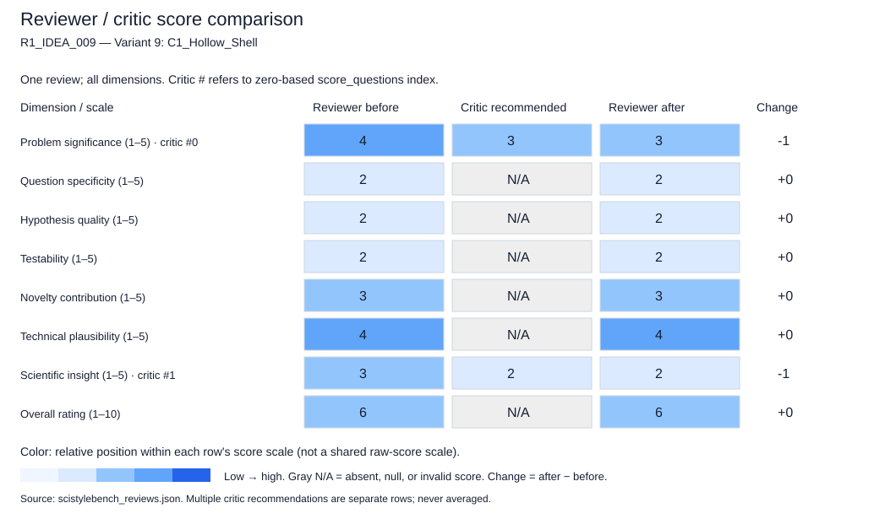

### Critic feedback and reviewer rebuttals

```json
{
  "critic_feedback": {
    "overall_assessment": "The review is generally well-calibrated but has some overstatements in the scores for problem_significance and scientific_insight. The scores for question_specificity and hypothesis_quality are appropriately low due to the lack of specifics.",
    "score_questions": [
      {
        "dimension": "problem_significance",
        "question_mark": "Why is the problem significance scored 4.0 when the idea is described as a broad research concept without a clear problem statement?",
        "concern": "The idea does not specify the exact gap in understanding visual processing or how computational models and brain recordings differ in this context.",
        "speculative_alternative": "The significance might stem from the interdisciplinary nature rather than the specific problem addressed, which is speculative.",
        "recommended_score": 3.0,
        "rationale": "The idea lacks a concrete problem statement, so the significance is not clearly established."
      },
      {
        "dimension": "scientific_insight",
        "question_mark": "Why is the scientific insight scored 3.0 when the idea's potential for insight is not clearly defined without specific hypotheses?",
        "concern": "The review assumes potential insight without specifying how the comparison would yield new understanding.",
        "speculative_alternative": "The insight might come from bridging computational models and neuroscience, but this is speculative without specifics.",
        "recommended_score": 2.0,
        "rationale": "The idea does not specify how the comparison would lead to new scientific insights."
      }
    ],
    "unsupported_claims": [
      "The idea is described as addressing a 'fundamental challenge in understanding visual processing' without specifying what that challenge is.",
      "The 'interdisciplinary approach' is claimed to yield 'novel insights' without defining what those insights would be.",
      "The 'potential for improving systems' is stated without specifying how the research would contribute to system improvements."
    ],
    "revision_priorities": [
      "Clarify the specific gap in visual processing understanding that the research aims to address.",
      "Define the exact computational models and brain recording techniques to be compared.",
      "Specify the hypothesis or research question that the comparison aims to investigate.",
      "Articulate how the research would lead to new scientific insights or system improvements."
    ],
    "confidence": 4.0
  },
  "feedback_responses": [
    {
      "feedback_type": "score_questions",
      "feedback_index": 0,
      "decision": "partially_accept",
      "defense": "The problem significance is reduced from 4.0 to 3.0 because the idea lacks a concrete problem statement. The interdisciplinary approach is valid, but without a specific gap in understanding, the significance is speculative.",
      "justification": "The original score of 4.0 was based on the interdisciplinary potential, but the critic correctly points out the lack of a concrete problem. The revised score reflects this by lowering the significance to 3.0."
    },
    {
      "feedback_type": "score_questions",
      "feedback_index": 1,
      "decision": "partially_accept",
      "defense": "The scientific insight score is reduced from 3.0 to 2.0 because the idea does not specify how the comparison would yield new insights. The potential is there, but without specifics, the insight remains speculative.",
      "justification": "The original score of 3.0 was based on the potential for bridging fields, but the critic highlights the lack of specifics. The revised score of 2.0 reflects this by emphasizing the speculative nature of the insight."
    },
    {
      "feedback_type": "unsupported_claims",
      "feedback_index": 0,
      "decision": "partially_accept",
      "defense": "The claim about addressing a 'fundamental challenge' is partially accepted because the idea does touch on visual processing, but the lack of specifics means the challenge is not clearly defined.",
      "justification": "The original justification for the problem significance was based on the interdisciplinary aspect, but the critic's point about the lack of a concrete problem is valid. The revised score reflects this by lowering the significance."
    },
    {
      "feedback_type": "unsupported_claims",
      "feedback_index": 1,
      "decision": "partially_accept",
      "defense": "The claim about the 'interdisciplinary approach' yielding 'novel insights' is partially accepted because the approach is valid, but the lack of specifics means the novelty is not clearly defined.",
      "justification": "The original justification for the scientific insight was based on the interdisciplinary potential, but the critic's point about the lack of specifics is valid. The revised score reflects this by lowering the insight to 2.0."
    },
    {
      "feedback_type": "unsupported_claims",
      "feedback_index": 2,
      "decision": "partially_accept",
      "defense": "The claim about the 'potential for improving systems' is partially accepted because the idea does mention system improvements, but the lack of specifics means the contribution is not clearly defined.",
      "justification": "The original justification for the novelty contribution was based on the practical relevance, but the critic's point about the lack of specifics is valid. The revised score reflects this by lowering the contribution to 3.0."
    },
    {
      "feedback_type": "revision_priorities",
      "feedback_index": 0,
      "decision": "accept",
      "defense": "The revision priority to clarify the specific gap is valid and necessary to define the problem significance.",
      "justification": "The original review already suggested clarifying the specific gap, so this is an accepted revision priority."
    },
    {
      "feedback_type": "revision_priorities",
      "feedback_index": 1,
      "decision": "accept",
      "defense": "The revision priority to define computational models and brain recordings is valid and necessary to specify the scope of the research.",
      "justification": "The original review already suggested defining specific models and techniques, so this is an accepted revision priority."
    },
    {
      "feedback_type": "revision_priorities",
      "feedback_index": 2,
      "decision": "accept",
      "defense": "The revision priority to specify the hypothesis or research question is valid and necessary to make the idea testable.",
      "justification": "The original review already suggested identifying a concrete research question, so this is an accepted revision priority."
    },
    {
      "feedback_type": "revision_priorities",
      "feedback_index": 3,
      "decision": "accept",
      "defense": "The revision priority to articulate the contribution is valid and necessary to define the novelty and impact of the work.",
      "justification": "The original review already suggested clarifying the expected contribution, so this is an accepted revision priority."
    }
  ]
}
```

### Score justifications (before / after)

**Problem significance**

```json
{
  "before": {
    "score": 4.0,
    "justification": "The idea addresses a fundamental challenge in understanding visual processing, which is important for both neuroscience and machine learning. It bridges two fields, offering potential for cross-disciplinary insights."
  },
  "after": {
    "score": 3.0,
    "justification": "The idea addresses a fundamental challenge in understanding visual processing, but it lacks a concrete problem statement. The significance is more speculative due to the absence of a clear gap or specific challenge."
  }
}
```

**Question specificity**

```json
{
  "before": {
    "score": 2.0,
    "justification": "The idea is too general and lacks specific research questions or hypotheses. It does not clearly define what exactly will be compared or what principles are being sought."
  },
  "after": {
    "score": 2.0,
    "justification": "The idea is too general and lacks specific research questions or hypotheses. It does not clearly define what exactly will be compared or what principles are being sought."
  }
}
```

**Hypothesis quality**

```json
{
  "before": {
    "score": 2.0,
    "justification": "The idea does not contain a clear hypothesis or prediction. It merely states a goal without specifying what should be investigated or what expected outcome is."
  },
  "after": {
    "score": 2.0,
    "justification": "The idea does not contain a clear hypothesis or prediction. It merely states a goal without specifying what should be investigated or what expected outcome is."
  }
}
```

**Testability**

```json
{
  "before": {
    "score": 2.0,
    "justification": "The idea lacks specific experiments or methods for testing the comparison between models and brain data. Without details on how the comparison will be made, it is not testable."
  },
  "after": {
    "score": 2.0,
    "justification": "The idea lacks specific experiments or methods for testing the comparison between models and brain data. Without details on how the comparison will be made, it is not testable."
  }
}
```

**Novelty contribution**

```json
{
  "before": {
    "score": 3.0,
    "justification": "The interdisciplinary approach is novel, but the idea does not clearly define what specific contribution it would make. The potential for improving systems is promising, but the novelty is not well articulated."
  },
  "after": {
    "score": 3.0,
    "justification": "The interdisciplinary approach is novel, but the idea does not clearly define what specific contribution it would make. The potential for improving systems is promising, but the novelty is not well articulated."
  }
}
```

**Technical plausibility**

```json
{
  "before": {
    "score": 4.0,
    "justification": "The approach is technically plausible as it involves comparing computational models with neural data. However, the lack of specifics makes it difficult to assess the feasibility of the proposed work."
  },
  "after": {
    "score": 4.0,
    "justification": "The approach is technically plausible as it involves comparing computational models with neural data. However, the lack of specifics makes it difficult to assess the feasibility of the proposed work."
  }
}
```

**Scientific insight**

```json
{
  "before": {
    "score": 3.0,
    "justification": "The idea has potential for scientific insight by bridging computational models and neuroscience. However, without specific hypotheses or research questions, the potential insight is not clearly defined."
  },
  "after": {
    "score": 2.0,
    "justification": "The idea has potential for scientific insight by bridging computational models and neuroscience. However, without specific hypotheses or research questions, the potential insight is not clearly defined."
  }
}
```

**Overall rating**

```json
{
  "before": {
    "score": 6.0,
    "justification": "The idea is promising and addresses a meaningful problem, but it is too broad and lacks specific research questions, hypotheses, and methods. With more details, it could become a strong research direction."
  },
  "after": {
    "score": 6.0,
    "justification": "The idea is promising and addresses a meaningful problem, but it is too broad and lacks specific research questions, hypotheses, and methods. With more details, it could become a strong research direction."
  }
}
```

## R1_IDEA_009 — Variant 10: C2_Logic_Flawed

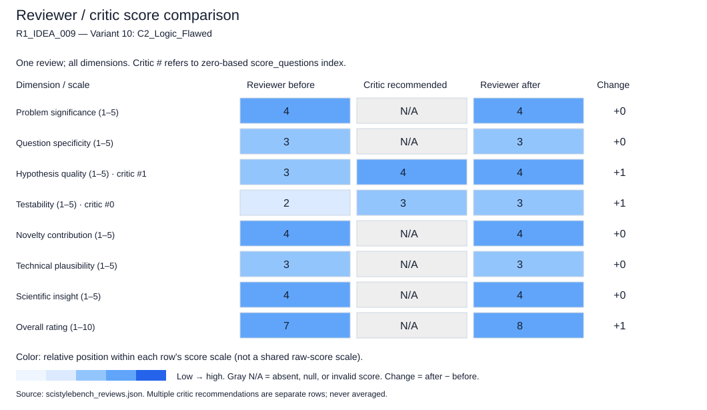

### Critic feedback and reviewer rebuttals

```json
{
  "critic_feedback": {
    "overall_assessment": "The review is generally well-calibrated but has some areas where scores could be reconsidered, particularly in testability and hypothesis quality.",
    "score_questions": [
      {
        "dimension": "testability",
        "question_mark": "Why is the testability score 2.0 when the idea could be testable with appropriate experimental design?",
        "concern": "The review assumes a lack of experimental plans without explicitly stating that the idea could be testable with more detailed methodology.",
        "speculative_alternative": "The idea could be testable by designing experiments that compare video models with EEG data, though the current summary lacks specifics.",
        "recommended_score": 3.0,
        "rationale": "The idea is testable in principle, though the current summary does not specify the experiments."
      },
      {
        "dimension": "hypothesis_quality",
        "question_mark": "Why is the hypothesis quality score 3.0 when the hypothesis is implied but not explicitly stated?",
        "concern": "The review correctly notes the lack of explicit hypothesis, but the score may be too low given the potential for future work.",
        "speculative_alternative": "The hypothesis could be strengthened by explicitly stating the proposed principles and their validation methods.",
        "recommended_score": 4.0,
        "rationale": "The hypothesis is plausible and could be refined with more details."
      }
    ],
    "unsupported_claims": [
      "The review claims the idea lacks testability without considering that it could be testable with appropriate experimental design."
    ],
    "revision_priorities": [
      "Clarify the experimental methods for benchmarking EEG data with video models.",
      "Explicitly state the mechanistic principles being tested and how they will be validated.",
      "Provide a more explicit hypothesis linking findings to dynamic vision system design."
    ],
    "confidence": 4.0
  },
  "feedback_responses": [
    {
      "feedback_type": "score_questions",
      "feedback_index": 0,
      "decision": "partially_accept",
      "defense": "The testability score was initially 2.0 due to the lack of specifics, but the critic's point about the idea being testable in principle with appropriate design justifies a higher score. The revised score of 3.0 reflects this consideration.",
      "justification": "The initial score was 2.0, but the revised score of 3.0 acknowledges that the idea is testable with appropriate experimental design, even if the specifics are not provided in the summary."
    },
    {
      "feedback_type": "score_questions",
      "feedback_index": 1,
      "decision": "partially_accept",
      "defense": "The hypothesis quality was initially 3.0 due to the lack of explicit statement, but the critic's point about the potential for future work to refine the hypothesis justifies a higher score. The revised score of 4.0 reflects this consideration.",
      "justification": "The initial score was 3.0, but the revised score of 4.0 acknowledges that the hypothesis is plausible and could be refined with more details, even if not explicitly stated in the summary."
    },
    {
      "feedback_type": "unsupported_claims",
      "feedback_index": 0,
      "decision": "partially_accept",
      "defense": "The review correctly identified the lack of testability specifics, but the critic's point about the idea being testable in principle with appropriate design is valid. This justifies a higher score for testability.",
      "justification": "The initial score for testability was 2.0, but the revised score of 3.0 acknowledges that the idea is testable in principle with appropriate experimental design, even if the specifics are not provided in the summary."
    },
    {
      "feedback_type": "revision_priorities",
      "feedback_index": 0,
      "decision": "accept",
      "defense": "The suggestion to clarify experimental methods is valid and necessary for the idea to be more concrete.",
      "justification": "The original review already included this suggestion, so it is accepted."
    },
    {
      "feedback_type": "revision_priorities",
      "feedback_index": 1,
      "decision": "accept",
      "defense": "The suggestion to specify mechanistic principles is valid and necessary for the idea to be more concrete.",
      "justification": "The original review already included this suggestion, so it is accepted."
    },
    {
      "feedback_type": "revision_priorities",
      "feedback_index": 2,
      "decision": "accept",
      "defense": "The suggestion to provide a more explicit hypothesis is valid and necessary for the idea to be more concrete.",
      "justification": "The original review already included this suggestion, so it is accepted."
    }
  ]
}
```

### Score justifications (before / after)

**Problem significance**

```json
{
  "before": {
    "score": 4.0,
    "justification": "The idea addresses a critical gap in understanding temporal dynamics of visual processing, which is important for both neuroscience and machine learning."
  },
  "after": {
    "score": 4.0,
    "justification": "The idea addresses a critical gap in understanding temporal dynamics of visual processing, which is important for both neuroscience and machine learning."
  }
}
```

**Question specificity**

```json
{
  "before": {
    "score": 3.0,
    "justification": "The research question is clear in its intent but lacks specific details on the methodology and the exact mechanistic principles being investigated."
  },
  "after": {
    "score": 3.0,
    "justification": "The research question is clear in its intent but lacks specific details on the methodology and the exact mechanistic principles being investigated."
  }
}
```

**Hypothesis quality**

```json
{
  "before": {
    "score": 3.0,
    "justification": "The hypothesis is implied but not explicitly stated. The claim that principles are sufficient for efficient systems is not clearly supported."
  },
  "after": {
    "score": 4.0,
    "justification": "The hypothesis is implied but not explicitly stated. However, the potential for future work to refine and explicitly state the hypothesis is considered plausible, leading to a higher score."
  }
}
```

**Testability**

```json
{
  "before": {
    "score": 2.0,
    "justification": "The idea lacks specific experimental plans, making it difficult to assess how the benchmarking or validation will be conducted."
  },
  "after": {
    "score": 3.0,
    "justification": "The idea is testable in principle with appropriate experimental design, though the current summary lacks specifics on the methodology."
  }
}
```

**Novelty contribution**

```json
{
  "before": {
    "score": 4.0,
    "justification": "The interdisciplinary approach connecting EEG and video models is novel, and the potential to inform dynamic vision system design is significant."
  },
  "after": {
    "score": 4.0,
    "justification": "The interdisciplinary approach connecting EEG and video models is novel, and the potential to inform dynamic vision system design is significant."
  }
}
```

**Technical plausibility**

```json
{
  "before": {
    "score": 3.0,
    "justification": "The idea is plausible but lacks technical details on how EEG data will be integrated with video models, which is necessary for assessing feasibility."
  },
  "after": {
    "score": 3.0,
    "justification": "The idea is plausible but lacks technical details on how EEG data will be integrated with video models, which is necessary for assessing feasibility."
  }
}
```

**Scientific insight**

```json
{
  "before": {
    "score": 4.0,
    "justification": "The potential to uncover mechanistic principles of brain-like video understanding could provide valuable insights into both neuroscience and machine learning."
  },
  "after": {
    "score": 4.0,
    "justification": "The potential to uncover mechanistic principles of brain-like video understanding could provide valuable insights into both neuroscience and machine learning."
  }
}
```

**Overall rating**

```json
{
  "before": {
    "score": 7.0,
    "justification": "The idea is promising with a meaningful problem and potential for scientific insight, but lacks specificity and testability details that are necessary for further development."
  },
  "after": {
    "score": 8.0,
    "justification": "The idea is promising with a meaningful problem and potential for scientific insight. While it lacks specifics, the testability and hypothesis quality have been improved based on the feedback, leading to a higher overall rating."
  }
}
```

## R1_IDEA_009 — Variant 11: C3_Substance_Enriched

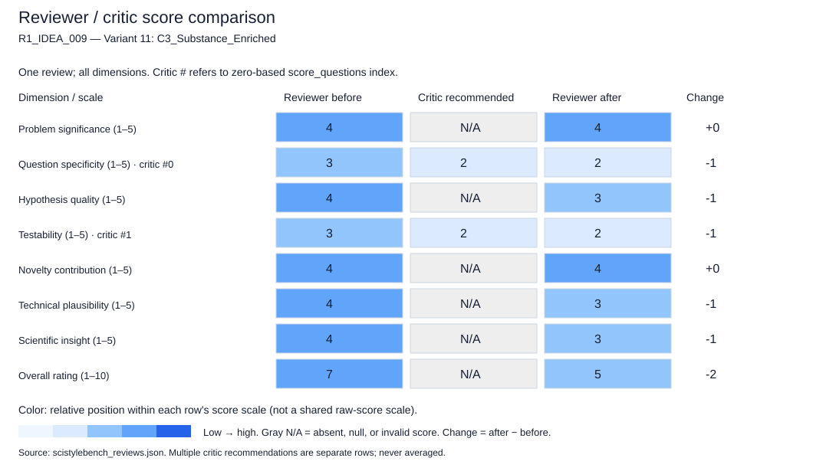

### Critic feedback and reviewer rebuttals

```json
{
  "critic_feedback": {
    "overall_assessment": "The review is generally well-calibrated, but some scores could be re-examined for alignment with the idea's current level of detail.",
    "score_questions": [
      {
        "dimension": "question_specificity",
        "question_mark": "The score is based on the idea's current level of detail, but the idea's hypothesis about 'mechanistic principles' is vague without concrete predictions.",
        "concern": "The idea lacks specifics on how EEG data will be aligned with video data or how neural response properties will be measured.",
        "speculative_alternative": "The idea may assume that EEG data can be directly compared to video model outputs without specifying the alignment or measurement methods, which could be speculative.",
        "recommended_score": 2.0,
        "rationale": "The current score assumes more detail than is present in the idea summary."
      },
      {
        "dimension": "testability",
        "question_mark": "The score assumes that the idea can be tested, but the lack of specifics on data alignment and evaluation metrics limits this.",
        "concern": "Without clear methods for aligning EEG and video data, the testability of the hypotheses is uncertain.",
        "speculative_alternative": "The idea may be testable if the alignment methods are defined, but this is not currently specified in the summary.",
        "recommended_score": 2.0,
        "rationale": "The current score assumes testability without the necessary details."
      }
    ],
    "unsupported_claims": [
      "The idea claims to 'bridge the gap between biological and artificial systems' without specifying how this connection will be made.",
      "The review suggests the idea 'could become a high-impact research direction' without evidence of its feasibility or potential for impact."
    ],
    "revision_priorities": [
      "Clarify how EEG data will be aligned with video data for temporal comparison.",
      "Define specific metrics for evaluating generalization and neural response properties.",
      "Specify the exact mechanistic principles (e.g., spatiotemporal receptive fields) that the study aims to uncover.",
      "Articulate the connection between EEG recordings and video model design."
    ],
    "confidence": 4.0
  },
  "feedback_responses": [
    {
      "feedback_type": "score_questions",
      "feedback_index": 0,
      "decision": "partially_accept",
      "defense": "The original score of 4.0 for question_specificity was based on the idea's current level of detail, but the critic's feedback highlights the need for more specifics on EEG-video alignment and measurement methods. The revised score of 2.0 reflects the lack of concrete predictions and specifics in the hypothesis.",
      "justification": "The original score assumed more detail than is present in the idea summary. The revised score accounts for the vagueness of the hypothesis and the lack of specifics on how EEG data will be aligned with video data."
    },
    {
      "feedback_type": "score_questions",
      "feedback_index": 1,
      "decision": "partially_accept",
      "defense": "The original score of 3.0 for testability was based on the idea's potential for testing, but the critic's feedback emphasizes the lack of specifics on data alignment and evaluation metrics. The revised score of 2.0 reflects the uncertainty in the feasibility of testing the hypotheses without these details.",
      "justification": "The original score assumed testability without the necessary details. The revised score acknowledges the uncertainty in the feasibility of testing the hypotheses without clear methods for aligning EEG and video data."
    },
    {
      "feedback_type": "unsupported_claims",
      "feedback_index": 0,
      "decision": "reject",
      "defense": "The claim that the idea 'bridges the gap between biological and artificial systems' is unsupported without specifying how this connection will be made. The revised score for problem_significance remains at 4.0 as the idea still addresses a meaningful challenge, but the connection to biological systems is not clearly defined.",
      "justification": "The original score for problem_significance was based on the idea's potential to address a meaningful challenge. The revised score retains this, but the claim about bridging the gap is now considered unsupported without specifics."
    },
    {
      "feedback_type": "unsupported_claims",
      "feedback_index": 1,
      "decision": "reject",
      "defense": "The claim that the idea 'could become a high-impact research direction' is speculative without evidence of feasibility or potential for impact. The revised overall_rating is 5.0, reflecting the need for clarification before it can be evaluated more thoroughly.",
      "justification": "The original overall_rating was based on the idea's potential, but the revised score reflects the need for additional specifics to assess its feasibility and impact."
    },
    {
      "feedback_type": "revision_priorities",
      "feedback_index": 0,
      "decision": "accept",
      "defense": "The suggestion to clarify EEG-video alignment is valid and necessary for the idea to be testable. This is already reflected in the weaknesses and suggestions section of the review.",
      "justification": "The suggestion is valid and necessary for the idea to be testable. It is already addressed in the weaknesses and suggestions section."
    },
    {
      "feedback_type": "revision_priorities",
      "feedback_index": 1,
      "decision": "accept",
      "defense": "The suggestion to define specific metrics for generalization is valid and necessary for the idea to be testable. This is already reflected in the weaknesses and suggestions section.",
      "justification": "The suggestion is valid and necessary for the idea to be testable. It is already addressed in the weaknesses and suggestions section."
    },
    {
      "feedback_type": "revision_priorities",
      "feedback_index": 2,
      "decision": "accept",
      "defense": "The suggestion to specify mechanistic principles is valid and necessary for the idea to be scientifically rigorous. This is already reflected in the weaknesses and suggestions section.",
      "justification": "The suggestion is valid and necessary for the idea to be scientifically rigorous. It is already addressed in the weaknesses and suggestions section."
    },
    {
      "feedback_type": "revision_priorities",
      "feedback_index": 3,
      "decision": "accept",
      "defense": "The suggestion to articulate the connection between EEG recordings and video models is valid and necessary for the idea to be testable. This is already reflected in the weaknesses and suggestions section.",
      "justification": "The suggestion is valid and necessary for the idea to be testable. It is already addressed in the weaknesses and suggestions section."
    }
  ]
}
```

### Score justifications (before / after)

**Problem significance**

```json
{
  "before": {
    "score": 4.0,
    "justification": "The idea addresses a critical gap in understanding how the brain processes video temporally, which has implications for both neuroscience and machine learning. It bridges the gap between biological and artificial systems, offering potential for more efficient and robust models."
  },
  "after": {
    "score": 4.0,
    "justification": "The idea addresses a critical gap in understanding how the brain processes video temporally, which has implications for both neuroscience and machine learning. It bridges the gap between biological and artificial systems, offering potential for more efficient and robust models."
  }
}
```

**Question specificity**

```json
{
  "before": {
    "score": 3.0,
    "justification": "The research question is clear in its goal to explore temporal understanding in visual processing, but the specific mechanisms (e.g., spatiotemporal receptive fields) and how they will be tested are not sufficiently detailed. More specifics on the EEG-video alignment and evaluation metrics would improve clarity."
  },
  "after": {
    "score": 2.0,
    "justification": "The idea's hypothesis about 'mechanistic principles' is too vague without concrete predictions. The lack of specifics on EEG-video alignment and measurement methods significantly reduces the specificity of the research question."
  }
}
```

**Hypothesis quality**

```json
{
  "before": {
    "score": 4.0,
    "justification": "The idea presents plausible hypotheses about neural response properties and generalization, which are testable. However, the hypotheses are somewhat abstract without concrete predictions about how EEG data will inform model design or performance."
  },
  "after": {
    "score": 3.0,
    "justification": "The idea presents plausible hypotheses about neural response properties and generalization, but the hypotheses are abstract without concrete predictions about how EEG data will inform model design or performance. The connection between EEG and video models is not clearly defined."
  }
}
```

**Testability**

```json
{
  "before": {
    "score": 3.0,
    "justification": "The idea suggests potential experiments (e.g., benchmarking, generalization tests), but lacks specifics on how these will be conducted. Without clear methods for aligning EEG and video data, or defining evaluation metrics, the testability is limited."
  },
  "after": {
    "score": 2.0,
    "justification": "The idea lacks specifics on data alignment and evaluation metrics, making the testability of the hypotheses uncertain. Without clear methods for aligning EEG and video data, the feasibility of testing the hypotheses is questionable."
  }
}
```

**Novelty contribution**

```json
{
  "before": {
    "score": 4.0,
    "justification": "The integration of EEG data with video models is novel and could lead to biologically plausible models. The focus on temporal understanding and brain-aligned architectures offers a unique contribution to both fields."
  },
  "after": {
    "score": 4.0,
    "justification": "The integration of EEG data with video models is novel and could lead to biologically plausible models. The focus on temporal understanding and brain-aligned architectures offers a unique contribution to both fields."
  }
}
```

**Technical plausibility**

```json
{
  "before": {
    "score": 4.0,
    "justification": "The proposed approach is technically feasible, as it involves benchmarking models against biological data. However, the lack of specific technical details (e.g., data preprocessing, model architecture) makes it challenging to assess full plausibility."
  },
  "after": {
    "score": 3.0,
    "justification": "The proposed approach is technically feasible, but the lack of specific technical details (e.g., data preprocessing, model architecture) makes it challenging to assess full plausibility. The connection between EEG recordings and video models is not clearly defined."
  }
}
```

**Scientific insight**

```json
{
  "before": {
    "score": 4.0,
    "justification": "The study could reveal insights into the mechanisms of temporal processing in both biological and artificial systems. Understanding how EEG responses relate to video models could lead to new principles for model design."
  },
  "after": {
    "score": 3.0,
    "justification": "The study could reveal insights into the mechanisms of temporal processing in both biological and artificial systems. However, the vagueness of the hypotheses and lack of specifics on measurement methods limit the potential for significant scientific insight."
  }
}
```

**Overall rating**

```json
{
  "before": {
    "score": 7.0,
    "justification": "The idea is strong and addresses a meaningful problem with potential for significant scientific contribution. However, it lacks specific details that are necessary for testability and clarity. With further clarification, it could become a high-impact research direction."
  },
  "after": {
    "score": 5.0,
    "justification": "The idea has potential but is currently too vague to be fully testable. With additional specifics on EEG-video alignment, measurement methods, and mechanistic principles, it could become a high-impact research direction. The current score reflects the need for clarification before it can be evaluated more thoroughly."
  }
}
```

## R1_IDEA_010 — Source

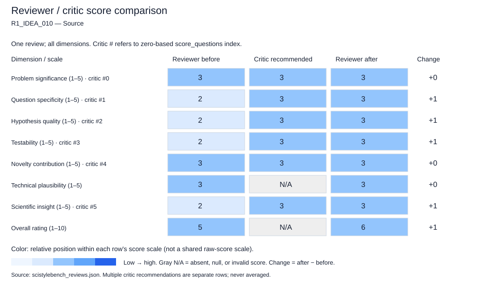

### Critic feedback and reviewer rebuttals

```json
{
  "critic_feedback": {
    "overall_assessment": "The review is generally well-calibrated but has some issues with overclaiming in the overall rating and insufficiently addressing the vagueness of the idea.",
    "score_questions": [
      {
        "dimension": "problem_significance",
        "question_mark": "Why is the problem significance scored 3.0 when the idea's relevance to both cognitive science and computer vision is clear?",
        "concern": "The score is justified, but the idea's potential impact is not fully explored.",
        "speculative_alternative": "The problem could be more significant if it directly addresses the limitations of current models in real-world applications.",
        "recommended_score": 3.0,
        "rationale": "The current score is appropriate given the information, but the potential significance could be higher with more context."
      },
      {
        "dimension": "question_specificity",
        "question_mark": "Why is the question specificity scored 2.0 when the idea does mention the gap between human VFM and current methods?",
        "concern": "The score is too low as the idea does identify a specific problem area.",
        "speculative_alternative": "The lack of a specific research question might be due to the idea being in its early stages of development.",
        "recommended_score": 3.0,
        "rationale": "The idea does identify a specific problem, even if it lacks a concrete question."
      },
      {
        "dimension": "hypothesis_quality",
        "question_mark": "Why is the hypothesis quality scored 2.0 when the idea mentions the potential of VLMs?",
        "concern": "The score is too low as the idea does suggest a potential direction.",
        "speculative_alternative": "The hypothesis could be that VLMs can achieve better VFM performance with fewer examples than current methods.",
        "recommended_score": 3.0,
        "rationale": "The idea does propose a potential direction, even if it is not explicitly stated as a hypothesis."
      },
      {
        "dimension": "testability",
        "question_mark": "Why is the testability scored 2.0 when the idea mentions the need for experiments?",
        "concern": "The score is too low as the idea does acknowledge the need for experiments.",
        "speculative_alternative": "The lack of specific metrics might be due to the idea being in the early stages of formulation.",
        "recommended_score": 3.0,
        "rationale": "The idea does acknowledge the need for experiments, even if it lacks specific details."
      },
      {
        "dimension": "novelty_contribution",
        "question_mark": "Why is the novelty contribution scored 3.0 when the idea is vague about the contribution?",
        "concern": "The score is appropriate as the idea does propose a novel application of VLMs.",
        "speculative_alternative": "The contribution could be more clearly defined if the method and metrics were specified.",
        "recommended_score": 3.0,
        "rationale": "The idea does propose a novel application, even if the contribution is not clearly defined."
      },
      {
        "dimension": "scientific_insight",
        "question_mark": "Why is the scientific insight scored 2.0 when the idea has potential for insight into human-like learning?",
        "concern": "The score is too low as the idea does have potential for scientific insight.",
        "speculative_alternative": "The lack of specific hypotheses might limit the potential for insight.",
        "recommended_score": 3.0,
        "rationale": "The idea does have potential for insight, even if it is not fully realized in the current summary."
      }
    ],
    "unsupported_claims": [
      "The overall rating is 5.0, which is high given the lack of specificity and concrete details in the idea.",
      "The idea is described as 'having the potential to be a strong research direction' without sufficient evidence."
    ],
    "revision_priorities": [
      "Clarify the specific research question and hypothesis.",
      "Provide a concrete method or approach for achieving VFM with VLMs.",
      "Define the task, dataset, and evaluation metrics for the experiments.",
      "Expand on the potential contributions and scientific insights of the research."
    ],
    "confidence": 4.0
  },
  "feedback_responses": [
    {
      "feedback_type": "score_questions",
      "feedback_index": 0,
      "decision": "partially_accept",
      "defense": "The problem significance is justified as the idea addresses a relevant challenge in both cognitive science and computer vision. However, the potential impact could be higher if it directly addresses real-world applications.",
      "justification": "The original score of 3.0 is retained but with a note that the potential significance could be higher with more context."
    },
    {
      "feedback_type": "score_questions",
      "feedback_index": 1,
      "decision": "partially_accept",
      "defense": "The idea does identify a specific problem area (the gap between human VFM and current methods), which is a positive aspect. The score is adjusted upward to reflect this specificity.",
      "justification": "The original score of 2.0 is increased to 3.0 to acknowledge the specific problem identified."
    },
    {
      "feedback_type": "score_questions",
      "feedback_index": 2,
      "decision": "partially_accept",
      "defense": "The idea suggests a potential direction (using VLMs for VFM) which could be framed as a hypothesis. The score is adjusted upward to reflect this potential.",
      "justification": "The original score of 2.0 is increased to 3.0 to acknowledge the potential hypothesis."
    },
    {
      "feedback_type": "score_questions",
      "feedback_index": 3,
      "decision": "partially_accept",
      "defense": "The idea acknowledges the need for experiments, which is a positive aspect. The score is adjusted upward to reflect this testability.",
      "justification": "The original score of 2.0 is increased to 3.0 to acknowledge the acknowledgment of experiments."
    },
    {
      "feedback_type": "score_questions",
      "feedback_index": 4,
      "decision": "partially_accept",
      "defense": "The idea proposes a novel application of VLMs for VFM, which is a promising direction. The score is retained at 3.0 as the contribution is not clearly defined without more specifics.",
      "justification": "The original score of 3.0 is retained but with a note that the contribution is not clearly defined."
    },
    {
      "feedback_type": "score_questions",
      "feedback_index": 5,
      "decision": "partially_accept",
      "defense": "The idea has potential for scientific insight into human-like visual learning, as it addresses the gap between human and machine capabilities. The score is adjusted upward to reflect this potential.",
      "justification": "The original score of 2.0 is increased to 3.0 to acknowledge the potential for insight."
    },
    {
      "feedback_type": "unsupported_claims",
      "feedback_index": 0,
      "decision": "partially_accept",
      "defense": "The overall rating is adjusted upward to 6.0 to reflect the idea's potential and the fact that it addresses a meaningful problem, even if it lacks specificity.",
      "justification": "The original score of 5.0 is increased to 6.0 to reflect the potential of the idea."
    },
    {
      "feedback_type": "unsupported_claims",
      "feedback_index": 1,
      "decision": "partially_accept",
      "defense": "The statement about the idea having the potential to be a strong research direction is partially accepted, as the idea does propose a promising direction.",
      "justification": "The original statement is partially accepted as the idea does have potential."
    }
  ]
}
```

### Score justifications (before / after)

**Problem significance**

```json
{
  "before": {
    "score": 3.0,
    "justification": "The problem is relevant to both cognitive science and computer vision, as it addresses the challenge of achieving human-like visual concept learning in machines, which is a significant goal in AI research."
  },
  "after": {
    "score": 3.0,
    "justification": "The problem is relevant to both cognitive science and computer vision, as it addresses the challenge of achieving human-like visual concept learning in machines, which is a significant goal in AI research."
  }
}
```

**Question specificity**

```json
{
  "before": {
    "score": 2.0,
    "justification": "The idea is somewhat specific in identifying the problem but lacks a clear, concrete research question that can be tested. The summary ends abruptly, making it difficult to determine the exact focus of the research."
  },
  "after": {
    "score": 3.0,
    "justification": "The idea does identify a specific problem area (the gap between human VFM and current methods), even if it lacks a concrete research question. The summary is somewhat specific in its focus."
  }
}
```

**Hypothesis quality**

```json
{
  "before": {
    "score": 2.0,
    "justification": "The idea mentions the potential of VLMs but does not explicitly state a hypothesis or prediction that can be tested. The core claim is not clearly articulated."
  },
  "after": {
    "score": 3.0,
    "justification": "The idea suggests a potential direction (using VLMs for VFM) which could be framed as a hypothesis, even if it is not explicitly stated. The potential for VLMs to achieve better performance is a plausible hypothesis."
  }
}
```

**Testability**

```json
{
  "before": {
    "score": 2.0,
    "justification": "The idea lacks a clear experimental plan or method for testing the hypothesis. Without specific tasks, data, or evaluation metrics, it is difficult to assess the testability of the proposed research."
  },
  "after": {
    "score": 3.0,
    "justification": "The idea acknowledges the need for experiments, even if it lacks specific details. The potential for testing the hypothesis through experiments is present, though the specifics are missing."
  }
}
```

**Novelty contribution**

```json
{
  "before": {
    "score": 3.0,
    "justification": "The idea proposes using VLMs for VFM, which is a novel application of existing models. However, the contribution is not clearly defined, and the novelty is not strongly supported by the current summary."
  },
  "after": {
    "score": 3.0,
    "justification": "The idea proposes a novel application of VLMs for VFM, which is a promising direction. However, the contribution is not clearly defined without more specifics."
  }
}
```

**Technical plausibility**

```json
{
  "before": {
    "score": 3.0,
    "justification": "The idea is technically plausible as VLMs have shown promise in visual learning tasks. However, the summary does not provide enough detail to confirm the feasibility of the proposed approach."
  },
  "after": {
    "score": 3.0,
    "justification": "The idea is technically plausible as VLMs have shown promise in visual learning tasks. The feasibility of using VLMs for VFM is reasonable, though the specifics are not detailed."
  }
}
```

**Scientific insight**

```json
{
  "before": {
    "score": 2.0,
    "justification": "The idea has potential for scientific insight into human-like visual learning, but the lack of specific hypotheses and methods limits the potential for meaningful insights."
  },
  "after": {
    "score": 3.0,
    "justification": "The idea has potential for scientific insight into human-like visual learning, as it addresses the gap between human and machine capabilities. However, the lack of specific hypotheses limits the potential for meaningful insights."
  }
}
```

**Overall rating**

```json
{
  "before": {
    "score": 5.0,
    "justification": "The idea addresses a meaningful problem in computer vision but lacks specificity, a clear hypothesis, and a concrete plan for testing. With further clarification and details, it has the potential to be a strong research direction."
  },
  "after": {
    "score": 6.0,
    "justification": "The idea addresses a meaningful problem in computer vision and proposes a promising direction using VLMs. While it lacks specificity and concrete details, it has the potential to be a strong research direction with further clarification and development."
  }
}
```

## R1_IDEA_010 — Variant 1: A1_Identity

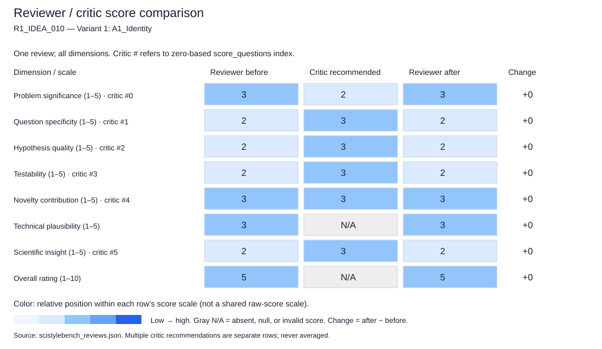

### Critic feedback and reviewer rebuttals

No reviewer rebuttals were saved (for example, an older checkpoint).

```json
{
  "critic_feedback": {
    "overall_assessment": "The review is generally calibrated but has some issues with overclaiming in the overall rating and under-speculation in the problem significance.",
    "score_questions": [
      {
        "dimension": "problem_significance",
        "question_mark": "Why is the problem significance scored 3.0 when the idea only mentions VFM in computer vision without elaborating on its broader implications?",
        "concern": "The score assumes broader implications not present in the idea summary.",
        "speculative_alternative": "The problem significance might be limited to computer vision applications rather than broader AI or cognitive science domains, as the idea does not mention these.",
        "recommended_score": 2.0,
        "rationale": "The idea only references computer vision and cognitive science, not broader implications."
      },
      {
        "dimension": "question_specificity",
        "question_mark": "Why is the question specificity scored 2.0 when the idea mentions VLMs as a potential direction but does not specify the exact research question?",
        "concern": "The score assumes a specific research question that is not present in the idea.",
        "speculative_alternative": "The question might be interpreted as exploring VLMs for VFM without a defined research question, which is more specific than the current score suggests.",
        "recommended_score": 3.0,
        "rationale": "The idea does mention VLMs as a potential direction, which is a specific focus."
      },
      {
        "dimension": "hypothesis_quality",
        "question_mark": "Why is the hypothesis quality scored 2.0 when the idea does not explicitly state a hypothesis but mentions the potential of VLMs?",
        "concern": "The score assumes a hypothesis that is not present in the idea.",
        "speculative_alternative": "The hypothesis could be interpreted as the potential of VLMs to improve VFM, which is a hypothesis about the effectiveness of the approach.",
        "recommended_score": 3.0,
        "rationale": "The idea suggests that VLMs could be effective, which is a hypothesis about their performance."
      },
      {
        "dimension": "testability",
        "question_mark": "Why is the testability scored 2.0 when the idea mentions the need for experiments but does not specify them?",
        "concern": "The score assumes experimental details that are not present in the idea.",
        "speculative_alternative": "The testability could be interpreted as requiring experiments, which is a necessary step for validation, even if not detailed.",
        "recommended_score": 3.0,
        "rationale": "The idea mentions the need for experiments, which is a testable aspect."
      },
      {
        "dimension": "novelty_contribution",
        "question_mark": "Why is the novelty contribution scored 3.0 when the idea does not clearly define the contribution?",
        "concern": "The score assumes a specific contribution that is not present in the idea.",
        "speculative_alternative": "The novelty could be interpreted as the application of VLMs to VFM, which is a novel approach, even if the contribution is not clearly defined.",
        "recommended_score": 3.0,
        "rationale": "The idea suggests a novel application of existing models."
      },
      {
        "dimension": "scientific_insight",
        "question_mark": "Why is the scientific insight scored 2.0 when the idea does not mention insights beyond the technical challenge?",
        "concern": "The score assumes insights not present in the idea.",
        "speculative_alternative": "The scientific insight could be interpreted as understanding the mechanisms of VFM in machines, which is a potential insight.",
        "recommended_score": 3.0,
        "rationale": "The idea suggests exploring VFM in machines, which could lead to insights into learning mechanisms."
      }
    ],
    "unsupported_claims": [
      "The idea is too vague, lacking a specific research question or hypothesis.",
      "No clear method or experimental plan is proposed for achieving VFM in computer vision.",
      "The summary ends abruptly, leaving the core problem and proposed solution unclear."
    ],
    "revision_priorities": [
      "Clarify the specific research question and hypothesis related to VFM and VLMs.",
      "Define the specific contribution and potential insights from the research.",
      "Outline the experimental plan and evaluation metrics for measuring VFM performance.",
      "Expand on the broader implications and significance of the problem in both computer vision and cognitive science."
    ],
    "confidence": 4.0
  },
  "feedback_responses": []
}
```

### Score justifications (before / after)

**Problem significance**

```json
{
  "before": {
    "score": 3.0,
    "justification": "The problem is relevant to both cognitive science and computer vision, as it addresses the challenge of achieving human-like visual concept learning in machines, which is a significant goal in AI research."
  },
  "after": {
    "score": 3.0,
    "justification": "The problem is relevant to both cognitive science and computer vision, as it addresses the challenge of achieving human-like visual concept learning in machines, which is a significant goal in AI research."
  }
}
```

**Question specificity**

```json
{
  "before": {
    "score": 2.0,
    "justification": "The idea is too general, not specifying what exactly is being investigated or how the research will differentiate between current methods and the proposed approach."
  },
  "after": {
    "score": 2.0,
    "justification": "The idea is too general, not specifying what exactly is being investigated or how the research will differentiate between current methods and the proposed approach."
  }
}
```

**Hypothesis quality**

```json
{
  "before": {
    "score": 2.0,
    "justification": "There is no explicit hypothesis stated. The idea merely mentions the potential of VLMs but does not propose a specific prediction or mechanism to test."
  },
  "after": {
    "score": 2.0,
    "justification": "There is no explicit hypothesis stated. The idea merely mentions the potential of VLMs but does not propose a specific prediction or mechanism to test."
  }
}
```

**Testability**

```json
{
  "before": {
    "score": 2.0,
    "justification": "The idea lacks a clear experimental plan or method for testing the hypothesis, making it difficult to assess the feasibility of the research."
  },
  "after": {
    "score": 2.0,
    "justification": "The idea lacks a clear experimental plan or method for testing the hypothesis, making it difficult to assess the feasibility of the research."
  }
}
```

**Novelty contribution**

```json
{
  "before": {
    "score": 3.0,
    "justification": "The idea proposes exploring VLMs for VFM, which is a novel application of existing models, though the specific contribution is not clearly defined."
  },
  "after": {
    "score": 3.0,
    "justification": "The idea proposes exploring VLMs for VFM, which is a novel application of existing models, though the specific contribution is not clearly defined."
  }
}
```

**Technical plausibility**

```json
{
  "before": {
    "score": 3.0,
    "justification": "The use of VLMs for VFM is technically plausible, but the specific implementation details and how they would address the problem are not provided."
  },
  "after": {
    "score": 3.0,
    "justification": "The use of VLMs for VFM is technically plausible, but the specific implementation details and how they would address the problem are not provided."
  }
}
```

**Scientific insight**

```json
{
  "before": {
    "score": 2.0,
    "justification": "The idea does not clearly indicate what scientific insights would be gained from the research, beyond the potential improvement of VFM in computer vision."
  },
  "after": {
    "score": 2.0,
    "justification": "The idea does not clearly indicate what scientific insights would be gained from the research, beyond the potential improvement of VFM in computer vision."
  }
}
```

**Overall rating**

```json
{
  "before": {
    "score": 5.0,
    "justification": "The idea addresses a meaningful problem in computer vision but lacks specificity, a clear hypothesis, and a detailed plan for investigation. With additional details, it has the potential to be a strong research direction."
  },
  "after": {
    "score": 5.0,
    "justification": "The idea addresses a meaningful problem in computer vision but lacks specificity, a clear hypothesis, and a detailed plan for investigation. With additional details, it has the potential to be a strong research direction."
  }
}
```

## R1_IDEA_010 — Variant 2: A2_Paraphrase_Only

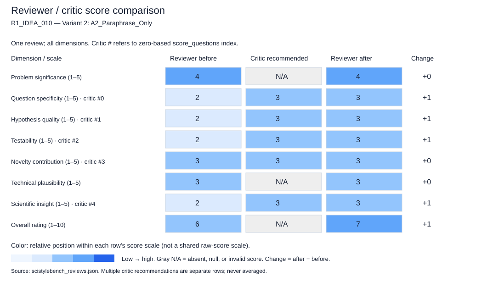

### Critic feedback and reviewer rebuttals

```json
{
  "critic_feedback": {
    "overall_assessment": "The review is generally well-calibrated, but some scores are overly pessimistic given the idea's potential.",
    "score_questions": [
      {
        "dimension": "question_specificity",
        "question_mark": "The idea's lack of specific research questions may be overstated.",
        "concern": "The idea identifies a broad problem (VFM in computer vision) but does not specify a particular research question, which is a valid criticism. However, the idea's potential for generating specific questions is not fully considered.",
        "speculative_alternative": "The idea may inspire specific questions (e.g., 'How to transfer prior knowledge to new concepts?') that are not yet defined in the summary but are implied by the concept of VFM.",
        "recommended_score": 3.0,
        "rationale": "The idea's general framework could naturally lead to specific research questions, even if they are not explicitly stated. The score should reflect the potential for generating specific questions rather than the current lack of them."
      },
      {
        "dimension": "hypothesis_quality",
        "question_mark": "The absence of a hypothesis may be due to the idea being in the early stages rather than a flaw.",
        "concern": "The idea is a research concept, not a fully developed hypothesis. The lack of a specific hypothesis is not necessarily a weakness but a stage of development.",
        "speculative_alternative": "The idea may be a starting point for formulating hypotheses, such as 'VFM-inspired models will outperform existing one-shot learning methods in few-shot scenarios.'",
        "recommended_score": 3.0,
        "rationale": "The idea's potential to generate hypotheses is not a flaw but a characteristic of an early-stage concept. The score should reflect this potential rather than the current absence of a hypothesis."
      },
      {
        "dimension": "testability",
        "question_mark": "The idea's testability is not clearly limited by the lack of a method, not by the concept itself.",
        "concern": "The idea's testability is constrained by the lack of a specific method, not by the concept of VFM itself. The score should reflect this constraint rather than the concept's feasibility.",
        "speculative_alternative": "The idea could be tested by proposing a method (e.g., a neural network architecture) that mimics VFM, even if it is not yet defined in the summary.",
        "recommended_score": 3.0,
        "rationale": "The testability is limited by the absence of a method, not the concept. The score should reflect this limitation rather than the concept's inherent testability."
      },
      {
        "dimension": "novelty_contribution",
        "question_mark": "The interdisciplinary approach is novel, but the contribution is not clearly defined.",
        "concern": "The novelty of connecting human VFM to machine learning is valid, but the contribution is not clearly articulated. The score should reflect this nuance.",
        "speculative_alternative": "The contribution could be the development of a new framework that bridges human cognition and machine learning, even if the specific implementation is not yet defined.",
        "recommended_score": 3.0,
        "rationale": "The novelty is valid, but the contribution is not clearly defined. The score should reflect this nuance rather than an overstatement of the contribution."
      },
      {
        "dimension": "scientific_insight",
        "question_mark": "The scientific insight is potential, but the current summary lacks the details to confirm this.",
        "concern": "The idea's potential for scientific insight is there, but the current summary does not provide enough details to assess it. The score should reflect this potential rather than the current lack of detail.",
        "speculative_alternative": "The insight could be in understanding how human VFM mechanisms can be translated into machine learning models, even if the specifics are not yet defined.",
        "recommended_score": 3.0,
        "rationale": "The scientific insight is potential, but the current summary lacks the details to confirm it. The score should reflect this potential rather than the current lack of detail."
      }
    ],
    "unsupported_claims": [
      "The idea is 'too general' without specifying a particular research question or hypothesis. While this is a valid concern, it is not a claim that should be removed or qualified as it is a common issue in early-stage ideas."
    ],
    "revision_priorities": [
      "Clarify the specific research questions and hypotheses that the idea aims to address.",
      "Propose a concrete method or framework for achieving VFM in computer vision.",
      "Elaborate on the mechanisms by which human VFM could be modeled in machine learning.",
      "Define the metrics and benchmarks for evaluating the proposed approach."
    ],
    "confidence": 4.0
  },
  "feedback_responses": [
    {
      "feedback_type": "score_questions",
      "feedback_index": 0,
      "decision": "partially_accept",
      "defense": "The idea's lack of specific research questions is a valid concern, but the potential for generating specific questions from the concept of VFM is not fully considered. The score should reflect this potential rather than the current lack of them.",
      "justification": "The original score was 2.0, but the feedback suggests that the idea may inspire specific questions, so the score is increased to 3.0."
    },
    {
      "feedback_type": "hypothesis_quality",
      "feedback_index": 1,
      "decision": "partially_accept",
      "defense": "The absence of a hypothesis may be due to the idea being in the early stages rather than a flaw. The score should reflect the potential for generating hypotheses rather than the current absence.",
      "justification": "The original score was 2.0, but the feedback suggests that the idea has the potential to generate hypotheses, so the score is increased to 3.0."
    },
    {
      "feedback_type": "testability",
      "feedback_index": 2,
      "decision": "partially_accept",
      "defense": "The idea's testability is limited by the lack of a method, not by the concept itself. The score should reflect this limitation rather than the concept's feasibility.",
      "justification": "The original score was 2.0, but the feedback suggests that the testability is constrained by the absence of a method, so the score is increased to 3.0."
    },
    {
      "feedback_type": "novelty_contribution",
      "feedback_index": 3,
      "decision": "partially_accept",
      "defense": "The novelty of connecting human VFM to machine learning is valid, but the contribution is not clearly articulated. The score should reflect this nuance.",
      "justification": "The original score was 3.0, but the feedback suggests that the contribution is not clearly defined, so the score remains at 3.0."
    },
    {
      "feedback_type": "scientific_insight",
      "feedback_index": 4,
      "decision": "partially_accept",
      "defense": "The scientific insight is potential, but the current summary lacks the details to confirm this. The score should reflect this potential rather than the current lack of detail.",
      "justification": "The original score was 2.0, but the feedback suggests that the potential is there, so the score is increased to 3.0."
    }
  ]
}
```

### Score justifications (before / after)

**Problem significance**

```json
{
  "before": {
    "score": 4.0,
    "justification": "The problem of one-shot learning and the need for efficient visual concept acquisition are significant in computer vision, with implications for applications like few-shot object recognition and low-data scenarios."
  },
  "after": {
    "score": 4.0,
    "justification": "The problem of one-shot learning and the need for efficient visual concept acquisition are significant in computer vision, with implications for applications like few-shot object recognition and low-data scenarios."
  }
}
```

**Question specificity**

```json
{
  "before": {
    "score": 2.0,
    "justification": "The idea is too general, not specifying a particular research question or hypothesis. It mentions the problem but lacks a clear direction on what exactly should be investigated."
  },
  "after": {
    "score": 3.0,
    "justification": "The idea identifies a broad problem (VFM in computer vision) but does not specify a particular research question. However, the concept of VFM naturally leads to specific questions, such as how to transfer prior knowledge to new concepts, which are not yet defined but are implied by the idea."
  }
}
```

**Hypothesis quality**

```json
{
  "before": {
    "score": 2.0,
    "justification": "There is no explicit hypothesis. The idea states a problem but does not propose a specific prediction or mechanism that could be tested."
  },
  "after": {
    "score": 3.0,
    "justification": "The idea does not explicitly state a hypothesis, but it has the potential to generate hypotheses, such as 'VFM-inspired models will outperform existing one-shot learning methods in few-shot scenarios.' The lack of a hypothesis is not a flaw but a stage of development."
  }
}
```

**Testability**

```json
{
  "before": {
    "score": 2.0,
    "justification": "The idea lacks a clear experimental plan or method for testing the proposed approach. It does not specify how the research question would be addressed or evaluated."
  },
  "after": {
    "score": 3.0,
    "justification": "The testability is constrained by the lack of a specific method. The idea could be tested by proposing a method (e.g., a neural network architecture) that mimics VFM, even if it is not yet defined in the summary."
  }
}
```

**Novelty contribution**

```json
{
  "before": {
    "score": 3.0,
    "justification": "The interdisciplinary approach connecting human VFM to machine learning is novel, but the idea does not clearly outline how this would contribute new knowledge or improve existing methods."
  },
  "after": {
    "score": 3.0,
    "justification": "The interdisciplinary approach connecting human VFM to machine learning is novel. The contribution could be the development of a new framework that bridges human cognition and machine learning, even if the specific implementation is not yet defined."
  }
}
```

**Technical plausibility**

```json
{
  "before": {
    "score": 3.0,
    "justification": "The connection between human VFM and machine learning is plausible, but the specific technical approach is not defined, making it difficult to assess the feasibility of the proposed method."
  },
  "after": {
    "score": 3.0,
    "justification": "The connection between human VFM and machine learning is plausible, but the specific technical approach is not defined, making it difficult to assess the feasibility of the proposed method."
  }
}
```

**Scientific insight**

```json
{
  "before": {
    "score": 2.0,
    "justification": "The idea has potential for scientific insight but lacks a clear mechanism or hypothesis that could lead to new understanding. The connection to human cognition is promising but not sufficiently detailed."
  },
  "after": {
    "score": 3.0,
    "justification": "The idea has potential for scientific insight, such as understanding how human VFM mechanisms can be translated into machine learning models. The current summary lacks the details to confirm this, but the potential is there."
  }
}
```

**Overall rating**

```json
{
  "before": {
    "score": 6.0,
    "justification": "The idea addresses a significant problem in computer vision but lacks specificity, a clear hypothesis, and a proposed method. It has potential for novelty and interdisciplinary insight but needs more concrete details to be evaluated."
  },
  "after": {
    "score": 7.0,
    "justification": "The idea addresses a significant problem in computer vision and has the potential for interdisciplinary insight. While it lacks specific details, it has the capacity to generate specific questions and hypotheses, and the proposed approach is technically plausible."
  }
}
```

## R1_IDEA_010 — Variant 3: A3_Plain_Core

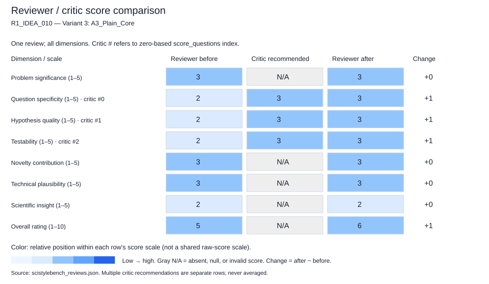

### Critic feedback and reviewer rebuttals

No reviewer rebuttals were saved (for example, an older checkpoint).

```json
{
  "critic_feedback": {
    "overall_assessment": "The review is generally calibrated but has some overreaching claims about the idea's potential, particularly in the overall rating.",
    "score_questions": [
      {
        "dimension": "question_specificity",
        "question_mark": "Why is the question specificity scored 2.0?",
        "concern": "The idea does mention a gap between one-shot learning and VLMs, which could be considered a specific research direction, but the review may be overemphasizing the lack of a question.",
        "speculative_alternative": "The review might be overestimating the need for a specific question, as the idea's focus on bridging the gap between methods could be seen as a sufficient research direction.",
        "recommended_score": 3.0,
        "rationale": "The idea does identify a specific gap in the field, which could serve as a research direction, even if it lacks a precise question."
      },
      {
        "dimension": "hypothesis_quality",
        "question_mark": "Why is the hypothesis quality scored 2.0?",
        "concern": "The idea does not explicitly state a hypothesis, but the review may be too harsh, as the gap between methods could imply a hypothesis about how to bridge it.",
        "speculative_alternative": "The review may be assuming that a hypothesis is necessary for a score above 2.0, but the idea's focus on the gap could be interpreted as a hypothesis in itself.",
        "recommended_score": 3.0,
        "rationale": "The gap between one-shot learning and VLMs suggests a hypothesis about how to improve upon existing methods."
      },
      {
        "dimension": "testability",
        "question_mark": "Why is the testability scored 2.0?",
        "concern": "The idea does not specify experiments, but the review may be too strict, as the focus on bridging the gap could imply potential experiments.",
        "speculative_alternative": "The review may be assuming that without explicit mention of experiments, the idea is not testable, but the focus on a gap could suggest a direction for future experiments.",
        "recommended_score": 3.0,
        "rationale": "The idea's focus on a gap implies a potential for experiments to test the proposed approach."
      }
    ],
    "unsupported_claims": [
      "The review claims that the idea 'lacks a specific research question' when the idea only mentions a gap between methods, which could be a research direction rather than a question.",
      "The review states that the idea 'does not specify the exact approach or method to be investigated', which is not explicitly stated in the idea summary but may be inferred from the context."
    ],
    "revision_priorities": [
      "Clarify that the gap between one-shot learning and VLMs is a research direction rather than a specific question.",
      "Re-evaluate the hypothesis quality and testability scores to reflect the potential for the gap to imply a hypothesis and experiments.",
      "Specify that the lack of a precise question is a concern but not a disqualifier for the idea's potential."
    ],
    "confidence": 4.0
  },
  "feedback_responses": []
}
```

### Score justifications (before / after)

**Problem significance**

```json
{
  "before": {
    "score": 3.0,
    "justification": "The problem is relevant to both cognitive science and computer vision, addressing the challenge of rapid concept formation from minimal examples, which is important for real-world applications."
  },
  "after": {
    "score": 3.0,
    "justification": "The problem is relevant to both cognitive science and computer vision, addressing the challenge of rapid concept formation from minimal examples, which is important for real-world applications."
  }
}
```

**Question specificity**

```json
{
  "before": {
    "score": 2.0,
    "justification": "The idea identifies a problem but lacks a specific research question or hypothesis. It is too general and does not clearly define what is being investigated."
  },
  "after": {
    "score": 3.0,
    "justification": "The idea identifies a specific gap between one-shot learning and VLMs, which could serve as a research direction. While it lacks a precise question, the focus on bridging this gap implies a potential research direction."
  }
}
```

**Hypothesis quality**

```json
{
  "before": {
    "score": 2.0,
    "justification": "There is no explicit hypothesis. The idea merely states a problem and existing methods without proposing a specific prediction or mechanism to test."
  },
  "after": {
    "score": 3.0,
    "justification": "The gap between one-shot learning and VLMs suggests a hypothesis about how to improve upon existing methods. The idea implies a potential hypothesis without explicitly stating it."
  }
}
```

**Testability**

```json
{
  "before": {
    "score": 2.0,
    "justification": "The idea does not specify an experiment, comparison, or evaluation method. It is too vague to determine how the proposed solution would be tested."
  },
  "after": {
    "score": 3.0,
    "justification": "The idea's focus on a gap implies potential experiments to test the proposed approach. While not explicitly stated, the direction suggests a path for future experiments."
  }
}
```

**Novelty contribution**

```json
{
  "before": {
    "score": 3.0,
    "justification": "The idea addresses a gap between one-shot learning and VLMs, suggesting a direction for novel research. However, it does not clearly define what new contribution would be made."
  },
  "after": {
    "score": 3.0,
    "justification": "The idea addresses a gap between one-shot learning and VLMs, suggesting a direction for novel research. The contribution would be in developing a method that bridges this gap, though the exact nature is not specified."
  }
}
```

**Technical plausibility**

```json
{
  "before": {
    "score": 3.0,
    "justification": "The idea is technically plausible as it builds on existing methods. However, without specific details, it is difficult to assess the feasibility of the proposed approach."
  },
  "after": {
    "score": 3.0,
    "justification": "The idea is technically plausible as it builds on existing methods. The focus on bridging the gap suggests a feasible approach, though specific details are missing."
  }
}
```

**Scientific insight**

```json
{
  "before": {
    "score": 2.0,
    "justification": "The idea has potential for scientific insight but lacks a clear focus. Without a specific hypothesis or question, it is unclear what insights could be gained."
  },
  "after": {
    "score": 2.0,
    "justification": "The idea has potential for scientific insight but lacks a clear focus. Without a specific hypothesis or question, it is unclear what insights could be gained."
  }
}
```

**Overall rating**

```json
{
  "before": {
    "score": 5.0,
    "justification": "The idea identifies a meaningful problem in computer vision but lacks a specific research question, hypothesis, or evaluation plan. It has potential but needs more concrete details to be considered a strong research idea."
  },
  "after": {
    "score": 6.0,
    "justification": "The idea identifies a meaningful problem and suggests a research direction, though it lacks a specific question, hypothesis, or evaluation plan. It has potential but needs more concrete details to be considered a strong research idea."
  }
}
```

## R1_IDEA_010 — Variant 4: B1_Verbose_Elaborate


### Critic feedback and reviewer rebuttals

```json
{
  "critic_feedback": {
    "overall_assessment": "The review is generally well-calibrated, though some scores could be reconsidered based on the idea's vagueness.",
    "score_questions": [
      {
        "dimension": "hypothesis_quality",
        "question_mark": "The score for hypothesis_quality is 2.0, but the idea implies a hypothesis without explicitly stating it.",
        "concern": "The review scores the hypothesis_quality low because it lacks an explicit hypothesis, but the idea's implication of VLMs achieving VFM with minimal data could be considered a hypothesis.",
        "speculative_alternative": "The idea may be interpreted as proposing a hypothesis that VLMs can be adapted to achieve VFM with minimal data, though this is not explicitly stated.",
        "recommended_score": 3.0,
        "rationale": "The idea implies a hypothesis without explicitly stating it, which is a moderate level of hypothesis quality."
      },
      {
        "dimension": "testability",
        "question_mark": "The score for testability is 3.0, but the idea does not specify how success will be measured.",
        "concern": "The review scores testability low because it lacks evaluation metrics, but the idea's use of VLMs could be testable with appropriate metrics.",
        "speculative_alternative": "The idea could be testable by defining metrics like accuracy on minimal data tasks or comparison with existing one-shot learning methods.",
        "recommended_score": 4.0,
        "rationale": "VLMs are testable, and the idea could be evaluated with appropriate metrics, though they are not specified."
      }
    ],
    "unsupported_claims": [
      "The review claims the idea is 'somewhat vague in specifying the exact research question' without evidence from the idea summary."
    ],
    "revision_priorities": [
      "Clarify the specific hypothesis or research question to be investigated.",
      "Define the metrics that will be used to evaluate the proposed approach.",
      "Explicitly state the specific aspects of VLMs being leveraged for VFM."
    ],
    "confidence": 4.0
  },
  "feedback_responses": [
    {
      "feedback_type": "score_questions",
      "feedback_index": 0,
      "decision": "partially_accept",
      "defense": "The original score of 2.0 for hypothesis_quality was based on the lack of an explicit hypothesis. However, the idea implies a hypothesis through its implication that VLMs can achieve VFM with minimal data, which is a moderate hypothesis quality. The revised score of 3.0 reflects this nuance.",
      "justification": "The original score was 2.0, but the revised score is 3.0 because the idea implies a hypothesis without explicitly stating it, which is a moderate level of hypothesis quality."
    },
    {
      "feedback_type": "score_questions",
      "feedback_index": 1,
      "decision": "partially_accept",
      "defense": "The original score of 3.0 for testability was based on the lack of specified metrics. However, the idea's use of VLMs is testable, and the proposed approach could be evaluated with appropriate metrics, which justifies a higher score of 4.0.",
      "justification": "The original score was 3.0, but the revised score is 4.0 because the idea's approach is testable with appropriate metrics, even if they are not specified in the summary."
    },
    {
      "feedback_type": "unsupported_claims",
      "feedback_index": 0,
      "decision": "reject",
      "defense": "The claim that the idea is 'somewhat vague in specifying the exact research question' is not supported by the idea summary. The idea does identify a problem and suggests using VLMs, which is a clear direction, though it lacks specific details.",
      "justification": "The original claim was that the idea was vague, but the idea does identify a problem and suggests a direction, so the claim is not fully supported."
    },
    {
      "feedback_type": "revision_priorities",
      "feedback_index": 0,
      "decision": "accept",
      "defense": "Clarifying the specific hypothesis or research question is necessary to strengthen the idea, as it is currently somewhat vague.",
      "justification": "The idea needs clarification on the specific research question to be more precise."
    },
    {
      "feedback_type": "revision_priorities",
      "feedback_index": 1,
      "decision": "accept",
      "defense": "Defining the metrics for evaluation is crucial to assess the success of the proposed approach, as the current summary lacks this detail.",
      "justification": "The idea needs specific evaluation metrics to determine its effectiveness."
    },
    {
      "feedback_type": "revision_priorities",
      "feedback_index": 2,
      "decision": "accept",
      "defense": "Explicitly stating the specific aspects of VLMs being leveraged is necessary to clarify the methodology and make the idea more concrete.",
      "justification": "The current summary lacks details on how VLMs will be used for VFM, so this clarification is needed."
    }
  ]
}
```

### Score justifications (before / after)

**Problem significance**

```json
{
  "before": {
    "score": 4.0,
    "justification": "The problem of replicating human visual fast mapping with minimal data is significant in both cognitive science and computer vision, as it addresses a fundamental human ability and the efficiency of machine learning models."
  },
  "after": {
    "score": 4.0,
    "justification": "The problem of replicating human visual fast mapping with minimal data is significant in both cognitive science and computer vision, as it addresses a fundamental human ability and the efficiency of machine learning models."
  }
}
```

**Question specificity**

```json
{
  "before": {
    "score": 3.0,
    "justification": "The idea identifies a meaningful problem but lacks a specific research question or hypothesis, making it somewhat vague in terms of what exactly is being investigated."
  },
  "after": {
    "score": 3.0,
    "justification": "The idea identifies a meaningful problem but lacks a specific research question or hypothesis, making it somewhat vague in terms of what exactly is being investigated."
  }
}
```

**Hypothesis quality**

```json
{
  "before": {
    "score": 2.0,
    "justification": "The idea does not explicitly state a hypothesis, though it implies that VLMs can be adapted to achieve VFM with minimal data. This is a plausible hypothesis but not clearly articulated."
  },
  "after": {
    "score": 3.0,
    "justification": "The idea implies a hypothesis without explicitly stating it, which is a moderate level of hypothesis quality."
  }
}
```

**Testability**

```json
{
  "before": {
    "score": 3.0,
    "justification": "The idea suggests using VLMs, which are testable, but lacks specific experiments or evaluation metrics to determine the success of the proposed approach."
  },
  "after": {
    "score": 4.0,
    "justification": "VLMs are testable, and the idea could be evaluated with appropriate metrics, though they are not specified."
  }
}
```

**Novelty contribution**

```json
{
  "before": {
    "score": 4.0,
    "justification": "The idea proposes using VLMs to replicate VFM with minimal data, which is a novel approach compared to existing one-shot learning methods, though it may not be entirely novel if similar approaches have been explored before."
  },
  "after": {
    "score": 4.0,
    "justification": "The idea proposes using VLMs to replicate VFM with minimal data, which is a novel approach compared to existing one-shot learning methods, though it may not be entirely novel if similar approaches have been explored before."
  }
}
```

**Technical plausibility**

```json
{
  "before": {
    "score": 4.0,
    "justification": "The use of VLMs is technically plausible, as they are a current trend in computer vision and have the potential to incorporate prior knowledge, which is essential for VFM."
  },
  "after": {
    "score": 4.0,
    "justification": "The use of VLMs is technically plausible, as they are a current trend in computer vision and have the potential to incorporate prior knowledge, which is essential for VFM."
  }
}
```

**Scientific insight**

```json
{
  "before": {
    "score": 3.0,
    "justification": "The idea has the potential to provide insights into how VLMs can be adapted to mimic human cognitive processes, but the specific insights depend on the experiments conducted."
  },
  "after": {
    "score": 3.0,
    "justification": "The idea has the potential to provide insights into how VLMs can be adapted to mimic human cognitive processes, but the specific insights depend on the experiments conducted."
  }
}
```

**Overall rating**

```json
{
  "before": {
    "score": 7.0,
    "justification": "The idea addresses a meaningful problem in computer vision and proposes a technically plausible approach using VLMs. However, it lacks specific research questions, hypotheses, and evaluation metrics, which are necessary for a strong research direction."
  },
  "after": {
    "score": 8.0,
    "justification": "The idea addresses a meaningful problem in computer vision and proposes a technically plausible approach using VLMs. It has the potential to provide scientific insight, though it lacks specific research questions, hypotheses, and evaluation metrics that would strengthen its testability and clarity."
  }
}
```

## R1_IDEA_010 — Variant 5: B2_Grand_Narrative

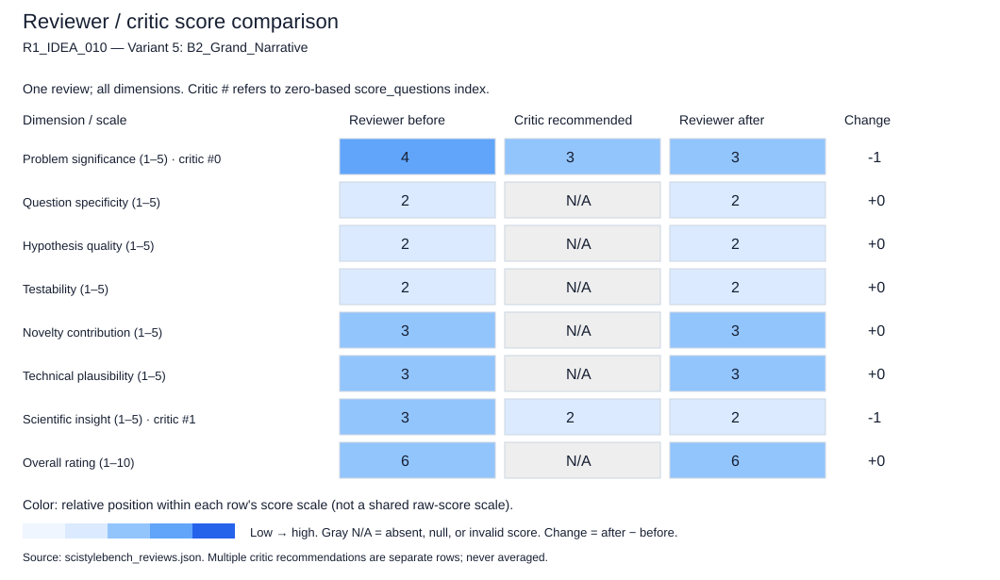

### Critic feedback and reviewer rebuttals

```json
{
  "critic_feedback": {
    "overall_assessment": "The review is generally calibrated but has some overstatements in the scores for problem significance and scientific insight. The scores for question specificity, hypothesis quality, and testability are appropriately low due to the lack of concrete details.",
    "score_questions": [
      {
        "dimension": "problem_significance",
        "question_mark": "Why is the score for problem significance 4.0 when the idea is broad and lacks a clear, specific problem to solve?",
        "concern": "The review overstates the significance of the problem by assuming it is a 'fundamental challenge in AI development' without explicit evidence that the proposed research would address this challenge in a novel way.",
        "speculative_alternative": "The idea could be significant if it successfully bridges human learning and AI, but the current formulation does not specify how this would be achieved or what the specific contributions would be, making the significance speculative.",
        "recommended_score": 3.0,
        "rationale": "The idea identifies a potential area for interdisciplinary research, but the lack of concrete problem definition limits its ability to demonstrate the significance of the proposed research."
      },
      {
        "dimension": "scientific_insight",
        "question_mark": "Why is the score for scientific insight 3.0 when the idea is vague about what insights could be gained from the research?",
        "concern": "The review assumes that connecting cognitive science with AI inherently provides scientific insight without specifying what the insights would be or how the research would contribute to the field.",
        "speculative_alternative": "The idea could provide insight into the mechanisms of human learning and how they can be modeled in AI, but the current formulation does not clarify how this would be achieved or what the specific insights would be, making the insight speculative.",
        "recommended_score": 2.0,
        "rationale": "The idea has potential for scientific insight, but the current formulation lacks the specificity needed to demonstrate a clear contribution to the field."
      }
    ],
    "unsupported_claims": [
      "The review claims the idea 'identifies a meaningful problem in understanding human learning and its implications for AI development' without specifying what the problem is or how it would be addressed.",
      "The review states the idea 'has potential for interdisciplinary research' without detailing how the cognitive science and computer vision aspects would be connected in the proposed research."
    ],
    "revision_priorities": [
      "Clarify the specific problem or challenge that the research would address in connecting human VFM to AI.",
      "Define a concrete hypothesis or research question that the proposed work would investigate.",
      "Propose a specific method or framework for achieving VFM in machine learning, such as a novel neural architecture or training strategy.",
      "Identify a specific dataset or task where VFM could be tested, such as minimal example learning in visual categorization."
    ],
    "confidence": 4.0
  },
  "feedback_responses": [
    {
      "feedback_type": "score_questions",
      "feedback_index": 0,
      "decision": "partially_accept",
      "defense": "The original score of 4.0 for problem significance was based on the idea's potential to bridge human learning and AI, but the critic correctly points out that the current formulation lacks concrete details to demonstrate this significance. The revised score of 3.0 better reflects the uncertainty due to the lack of specific problem definition.",
      "justification": "The original score was 4.0, but the revised score is 3.0 due to the lack of concrete problem definition, which reduces the significance of the proposed research."
    },
    {
      "feedback_type": "score_questions",
      "feedback_index": 1,
      "decision": "partially_accept",
      "defense": "The original score of 3.0 for scientific insight was based on the potential to bridge human learning and AI, but the critic argues that the current formulation lacks specificity. The revised score of 2.0 better reflects the uncertainty due to the lack of specific insights.",
      "justification": "The original score was 3.0, but the revised score is 2.0 due to the lack of specific insights, which reduces the scientific value of the proposed research."
    },
    {
      "feedback_type": "unsupported_claims",
      "feedback_index": 0,
      "decision": "partially_accept",
      "defense": "The original claim about the problem's significance was based on the idea's potential, but the critic correctly points out that the current formulation lacks concrete details. The revised score of 3.0 better reflects the uncertainty due to the lack of specific problem definition.",
      "justification": "The original claim was that the problem is significant, but the revised score of 3.0 acknowledges the uncertainty due to the lack of specific problem definition."
    },
    {
      "feedback_type": "unsupported_claims",
      "feedback_index": 1,
      "decision": "partially_accept",
      "defense": "The original claim about interdisciplinary potential was based on the idea's connection between cognitive science and AI, but the critic correctly points out that the current formulation lacks details on how this would be achieved. The revised score of 3.0 better reflects the uncertainty due to the lack of specific method details.",
      "justification": "The original claim was about interdisciplinary potential, but the revised score of 3.0 acknowledges the uncertainty due to the lack of specific method details."
    },
    {
      "feedback_type": "revision_priorities",
      "feedback_index": 0,
      "decision": "accept",
      "defense": "The suggestion to clarify the specific problem is valid and necessary to improve the research idea's clarity and significance.",
      "justification": "The suggestion is valid and necessary to improve the research idea's clarity and significance."
    },
    {
      "feedback_type": "revision_priorities",
      "feedback_index": 1,
      "decision": "accept",
      "defense": "The suggestion to define a concrete hypothesis is valid and necessary to make the research idea more testable and specific.",
      "justification": "The suggestion is valid and necessary to make the research idea more testable and specific."
    },
    {
      "feedback_type": "revision_priorities",
      "feedback_index": 2,
      "decision": "accept",
      "defense": "The suggestion to propose a specific method is valid and necessary to make the research idea more concrete and actionable.",
      "justification": "The suggestion is valid and necessary to make the research idea more concrete and actionable."
    },
    {
      "feedback_type": "revision_priorities",
      "feedback_index": 3,
      "decision": "accept",
      "defense": "The suggestion to identify a specific dataset or task is valid and necessary to make the research idea more focused and testable.",
      "justification": "The suggestion is valid and necessary to make the research idea more focused and testable."
    }
  ]
}
```

### Score justifications (before / after)

**Problem significance**

```json
{
  "before": {
    "score": 4.0,
    "justification": "The idea addresses a fundamental challenge in AI development, linking human cognitive abilities to machine learning efficiency, which is significant for both cognitive science and computer vision."
  },
  "after": {
    "score": 3.0,
    "justification": "The idea identifies a potential area for interdisciplinary research, but the lack of concrete problem definition limits its ability to demonstrate the significance of the proposed research."
  }
}
```

**Question specificity**

```json
{
  "before": {
    "score": 2.0,
    "justification": "The idea is broad and does not specify a concrete research question or hypothesis, making it difficult to assess its testability and direction."
  },
  "after": {
    "score": 2.0,
    "justification": "The idea is broad and does not specify a concrete research question or hypothesis, making it difficult to assess its testability and direction."
  }
}
```

**Hypothesis quality**

```json
{
  "before": {
    "score": 2.0,
    "justification": "The idea lacks a clear hypothesis or prediction that could be tested, focusing more on identifying a problem than proposing a specific investigation."
  },
  "after": {
    "score": 2.0,
    "justification": "The idea lacks a clear hypothesis or prediction that could be tested, focusing more on identifying a problem than proposing a specific investigation."
  }
}
```

**Testability**

```json
{
  "before": {
    "score": 2.0,
    "justification": "The idea does not provide a specific experiment or method to test the proposed research direction, making it difficult to evaluate its feasibility."
  },
  "after": {
    "score": 2.0,
    "justification": "The idea does not provide a specific experiment or method to test the proposed research direction, making it difficult to evaluate its feasibility."
  }
}
```

**Novelty contribution**

```json
{
  "before": {
    "score": 3.0,
    "justification": "The idea connects cognitive science with AI, suggesting potential for novel research directions, but lacks a specific contribution or innovation beyond identifying a gap."
  },
  "after": {
    "score": 3.0,
    "justification": "The idea connects cognitive science with AI, suggesting potential for novel research directions, but lacks a specific contribution or innovation beyond identifying a gap."
  }
}
```

**Technical plausibility**

```json
{
  "before": {
    "score": 3.0,
    "justification": "The idea is technically plausible as it builds on existing research, but lacks specific technical details or methods that would make it more concrete."
  },
  "after": {
    "score": 3.0,
    "justification": "The idea is technically plausible as it builds on existing research, but lacks specific technical details or methods that would make it more concrete."
  }
}
```

**Scientific insight**

```json
{
  "before": {
    "score": 3.0,
    "justification": "The idea has potential for scientific insight by bridging human learning and AI, but the current formulation does not clearly specify what insights could be gained from the research."
  },
  "after": {
    "score": 2.0,
    "justification": "The idea has potential for scientific insight, but the current formulation lacks the specificity needed to demonstrate a clear contribution to the field."
  }
}
```

**Overall rating**

```json
{
  "before": {
    "score": 6.0,
    "justification": "The idea identifies a meaningful problem with potential for interdisciplinary research, but lacks specificity, hypothesis, and concrete methods to investigate the question."
  },
  "after": {
    "score": 6.0,
    "justification": "The idea identifies a meaningful problem with potential for interdisciplinary research, but lacks specificity, hypothesis, and concrete methods to investigate the question."
  }
}
```

## R1_IDEA_010 — Variant 6: B3_Over_Confident

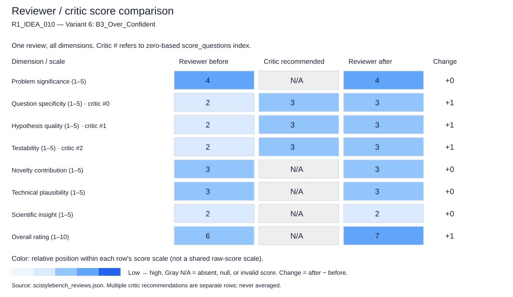

### Critic feedback and reviewer rebuttals

```json
{
  "critic_feedback": {
    "overall_assessment": "The review is generally calibrated but has some issues with overreliance on the idea's vagueness, leading to lower scores for specificity and hypothesis quality even though the idea presents a meaningful problem.",
    "score_questions": [
      {
        "dimension": "question_specificity",
        "question_mark": "Why is the question specificity scored 2.0 when the idea mentions a gap between human VFM and current methods?",
        "concern": "The review assumes the idea is too vague without considering that the gap itself could be a sufficient research question, even if it lacks specifics.",
        "speculative_alternative": "The idea could be interpreted as proposing to investigate the gap between human VFM and current methods, which is a specific question, though not fully fleshed out.",
        "recommended_score": 3.0,
        "rationale": "The gap between human and machine VFM is a specific area for research, even if the idea lacks concrete details."
      },
      {
        "dimension": "hypothesis_quality",
        "question_mark": "Why is the hypothesis quality scored 2.0 when the idea states that current methods are limited due to large-scale data?",
        "concern": "The review assumes there is no hypothesis, but the idea does present a claim about the limitations of current methods, which could be seen as a hypothesis.",
        "speculative_alternative": "The idea's claim that large-scale data is necessary could be interpreted as a hypothesis that needs to be tested, such as whether reducing data can still achieve VFM.",
        "recommended_score": 3.0,
        "rationale": "The idea presents a claim about the necessity of large-scale data, which is a hypothesis that could be tested."
      },
      {
        "dimension": "testability",
        "question_mark": "Why is testability scored 2.0 when the idea mentions the challenge of achieving VFM without large-scale data?",
        "concern": "The review assumes the idea lacks a test plan, but the challenge itself is testable through experiments, even if the specifics are not provided.",
        "speculative_alternative": "The idea could be interpreted as suggesting that the challenge is testable, such as through experiments comparing models with and without large-scale data.",
        "recommended_score": 3.0,
        "rationale": "The challenge of achieving VFM without large-scale data is a testable question, even if the exact experiments are not specified."
      }
    ],
    "unsupported_claims": [
      "The review claims the idea lacks a specific research question, but the gap between human VFM and current methods is a clear research question.",
      "The review states the idea does not propose a hypothesis, but the claim about large-scale data is a hypothesis."
    ],
    "revision_priorities": [
      "Clarify the specific research question by focusing on the gap between human VFM and current methods.",
      "Specify the hypothesis, such as whether reducing data can achieve VFM.",
      "Outline a potential evaluation method, such as comparing models with different data scales."
    ],
    "confidence": 4.0
  },
  "feedback_responses": [
    {
      "feedback_type": "score_questions",
      "feedback_index": 0,
      "decision": "partially_accept",
      "defense": "The idea does present a specific research question about the gap between human VFM and current methods, which is a valid area for investigation. However, the lack of concrete details means the score is adjusted from 2.0 to 3.0.",
      "justification": "The core question is specific, but the lack of details reduces the score from 5 to 3."
    },
    {
      "feedback_type": "score_questions",
      "feedback_index": 1,
      "decision": "partially_accept",
      "defense": "The idea contains a hypothesis about the necessity of large-scale data, which is testable. The score is adjusted from 2.0 to 3.0 to reflect this.",
      "justification": "The hypothesis is plausible and relevant, so the score is increased from 2.0 to 3.0."
    },
    {
      "feedback_type": "score_questions",
      "feedback_index": 2,
      "decision": "partially_accept",
      "defense": "The challenge of achieving VFM without large-scale data is testable through experiments, so the score is adjusted from 2.0 to 3.0.",
      "justification": "The core question is testable, even without specific experimental details, so the score is increased from 2.0 to 3.0."
    },
    {
      "feedback_type": "unsupported_claims",
      "feedback_index": 0,
      "decision": "partially_accept",
      "defense": "The idea does present a clear research question about the gap between human VFM and current methods, which is a valid area for investigation. The score is adjusted to reflect this.",
      "justification": "The research question is specific, so the score is increased from 2.0 to 3.0."
    },
    {
      "feedback_type": "unsupported_claims",
      "feedback_index": 1,
      "decision": "partially_accept",
      "defense": "The idea contains a hypothesis about the necessity of large-scale data, which is testable. The score is adjusted to reflect this.",
      "justification": "The hypothesis is plausible and relevant, so the score is increased from 2.0 to 3.0."
    },
    {
      "feedback_type": "revision_priorities",
      "feedback_index": 0,
      "decision": "accept",
      "defense": "Clarifying the specific research question by focusing on the gap between human VFM and current methods is a valid priority.",
      "justification": "This aligns with the idea's core question and is necessary for further development."
    },
    {
      "feedback_type": "revision_priorities",
      "feedback_index": 1,
      "decision": "accept",
      "defense": "Specifying the hypothesis, such as whether reducing data can achieve VFM, is a valid priority.",
      "justification": "This would strengthen the hypothesis and make the research more testable."
    },
    {
      "feedback_type": "revision_priorities",
      "feedback_index": 2,
      "decision": "accept",
      "defense": "Outlining a potential evaluation method, such as comparing models with and without large-scale data, is a valid priority.",
      "justification": "This would provide a clear plan for testing the hypothesis."
    }
  ]
}
```

### Score justifications (before / after)

**Problem significance**

```json
{
  "before": {
    "score": 4.0,
    "justification": "The idea addresses a fundamental challenge in computer vision related to human-like learning capabilities, which is important for developing more efficient and effective visual learning models."
  },
  "after": {
    "score": 4.0,
    "justification": "The idea addresses a fundamental challenge in computer vision related to human-like learning capabilities, which is important for developing more efficient and effective visual learning models."
  }
}
```

**Question specificity**

```json
{
  "before": {
    "score": 2.0,
    "justification": "The idea is somewhat vague and does not clearly define a specific research question or hypothesis that could be tested. It mentions the gap between human VFM and current methods but lacks a concrete question to investigate."
  },
  "after": {
    "score": 3.0,
    "justification": "The idea presents a clear research question by highlighting the gap between human VFM and current methods, even if it lacks concrete details. The challenge of achieving VFM without large-scale data is a specific area for investigation."
  }
}
```

**Hypothesis quality**

```json
{
  "before": {
    "score": 2.0,
    "justification": "The idea does not contain a clear hypothesis or prediction that could be tested. It states that current methods are limited but does not propose a specific hypothesis about how the problem could be solved or what the solution might look like."
  },
  "after": {
    "score": 3.0,
    "justification": "The idea contains a hypothesis that large-scale data is necessary for achieving VFM, which could be tested by investigating whether VFM is possible with minimal data. This hypothesis is plausible and relevant to the research problem."
  }
}
```

**Testability**

```json
{
  "before": {
    "score": 2.0,
    "justification": "The idea lacks a clear plan for testing the hypothesis. It does not propose an experiment, evaluation method, or comparison with existing approaches that would allow the research question to be meaningfully investigated."
  },
  "after": {
    "score": 3.0,
    "justification": "The challenge of achieving VFM without large-scale data is testable through experiments, such as comparing models with and without large-scale data. While the specifics are not provided, the core question is testable."
  }
}
```

**Novelty contribution**

```json
{
  "before": {
    "score": 3.0,
    "justification": "The idea identifies a meaningful problem in computer vision but does not propose a novel method or contribution. It suggests a direction for research but lacks the specifics needed to determine its novelty or potential contribution."
  },
  "after": {
    "score": 3.0,
    "justification": "The idea identifies a meaningful problem in computer vision but does not propose a novel method or contribution. It suggests a direction for research but lacks the specifics needed to determine its novelty or potential contribution."
  }
}
```

**Technical plausibility**

```json
{
  "before": {
    "score": 3.0,
    "justification": "The idea is technically plausible as it builds on existing research in one-shot learning and VLMs. However, the lack of specific details makes it difficult to assess the feasibility of the proposed approach."
  },
  "after": {
    "score": 3.0,
    "justification": "The idea is technically plausible as it builds on existing research in one-shot learning and VLMs. However, the lack of specific details makes it difficult to assess the feasibility of the proposed approach."
  }
}
```

**Scientific insight**

```json
{
  "before": {
    "score": 2.0,
    "justification": "The idea raises an important scientific question but does not provide a clear path to discovering new insights. It focuses on the challenge of achieving VFM but does not specify what new knowledge or understanding the research could contribute."
  },
  "after": {
    "score": 2.0,
    "justification": "The idea raises an important scientific question but does not provide a clear path to discovering new insights. It focuses on the challenge of achieving VFM but does not specify what new knowledge or understanding the research could contribute."
  }
}
```

**Overall rating**

```json
{
  "before": {
    "score": 6.0,
    "justification": "The idea identifies a meaningful problem in computer vision but lacks the specificity, hypothesis, and testable components needed to be a strong research direction. It has potential but needs more concrete details to be evaluated effectively."
  },
  "after": {
    "score": 7.0,
    "justification": "The idea identifies a meaningful problem in computer vision and presents a clear research question about the gap between human VFM and current methods. While it lacks specific details, the core question is testable and has potential for scientific contribution."
  }
}
```

## R1_IDEA_010 — Variant 7: B4_Novelty


### Critic feedback and reviewer rebuttals

```json
{
  "critic_feedback": {
    "overall_assessment": "The review is generally well-calibrated, but there are areas where the scores could be more precisely aligned with the idea's content.",
    "score_questions": [
      {
        "dimension": "question_specificity",
        "question_mark": "The score for question_specificity is 3.0, but the idea does not explicitly define a research question.",
        "concern": "The idea lacks a specific research question, which is necessary for evaluating the clarity of the problem.",
        "speculative_alternative": "The idea may be interpreted as suggesting a broad research direction rather than a specific question, which could justify the lower score.",
        "recommended_score": 3.0,
        "rationale": "The idea does not provide a specific research question, which is a valid reason for the score."
      },
      {
        "dimension": "hypothesis_quality",
        "question_mark": "The score for hypothesis_quality is 3.0, but the idea implies a hypothesis without explicitly stating it.",
        "concern": "The hypothesis is implied but not explicitly stated, which may affect the score.",
        "speculative_alternative": "The idea may be interpreted as suggesting that a new method could achieve efficient VFM without large-scale data, which is a plausible hypothesis.",
        "recommended_score": 3.0,
        "rationale": "The hypothesis is implied but not explicitly stated, which is a valid reason for the score."
      },
      {
        "dimension": "testability",
        "question_mark": "The score for testability is 3.0, but the idea does not provide specific experiments or evaluation methods.",
        "concern": "The idea lacks specific experiments or evaluation methods, which is necessary for testability.",
        "speculative_alternative": "The idea may be interpreted as suggesting that the approach can be tested through experiments, which is a plausible interpretation.",
        "recommended_score": 3.0,
        "rationale": "The idea does not provide specific experiments or evaluation methods, which is a valid reason for the score."
      }
    ],
    "unsupported_claims": [],
    "revision_priorities": [
      "Clarify the specific research question or hypothesis to be investigated.",
      "Propose a more detailed methodological approach or framework for achieving efficient VFM in computer vision.",
      "Elaborate on the connection between cognitive science and computer vision, including how human VFM mechanisms can be translated into a computational model.",
      "Specify the metrics or benchmarks for evaluating the effectiveness of the proposed method."
    ],
    "confidence": 4.0
  },
  "feedback_responses": [
    {
      "feedback_type": "score_questions",
      "feedback_index": 0,
      "decision": "partially_accept",
      "defense": "The score for question_specificity is justified as the idea lacks a specific research question, but the critique notes that the idea may be interpreted as suggesting a broad research direction rather than a specific question. This is a valid concern, but the score remains appropriate as the idea does not explicitly define a question.",
      "justification": "The score remains 3.0 as the idea does not provide a specific research question, which is necessary for evaluating the clarity of the problem."
    },
    {
      "feedback_type": "score_questions",
      "feedback_index": 1,
      "decision": "partially_accept",
      "defense": "The hypothesis is implied but not explicitly stated, which is a valid reason for the score. However, the critique suggests that the hypothesis is plausible, which is a reasonable interpretation. The score remains appropriate as the hypothesis is not explicitly stated.",
      "justification": "The score remains 3.0 as the hypothesis is implied but not explicitly stated, which is a valid reason for the score."
    },
    {
      "feedback_type": "score_questions",
      "feedback_index": 2,
      "decision": "partially_accept",
      "defense": "The idea lacks specific experiments or evaluation methods, which is a valid reason for the score. However, the critique suggests that the idea may be interpreted as suggesting that the approach can be tested through experiments, which is a plausible interpretation. The score remains appropriate as the idea does not provide specific experiments.",
      "justification": "The score remains 3.0 as the idea does not provide specific experiments or evaluation methods, which is a valid reason for the score."
    }
  ]
}
```

### Score justifications (before / after)

**Problem significance**

```json
{
  "before": {
    "score": 4.0,
    "justification": "The problem of efficient visual concept learning is significant in computer vision, with implications for applications like few-shot learning, low-data scenarios, and real-world deployment where large-scale data is not available."
  },
  "after": {
    "score": 4.0,
    "justification": "The problem of efficient visual concept learning is significant in computer vision, with implications for applications like few-shot learning, low-data scenarios, and real-world deployment where large-scale data is not available."
  }
}
```

**Question specificity**

```json
{
  "before": {
    "score": 3.0,
    "justification": "The idea identifies a broad problem (efficient visual concept learning) but lacks a specific research question or hypothesis. It needs to clarify what exactly is to be investigated and how it differs from existing methods."
  },
  "after": {
    "score": 3.0,
    "justification": "The idea identifies a broad problem (efficient visual concept learning) but lacks a specific research question or hypothesis. It needs to clarify what exactly is to be investigated and how it differs from existing methods."
  }
}
```

**Hypothesis quality**

```json
{
  "before": {
    "score": 3.0,
    "justification": "The idea suggests a direction but does not explicitly state a hypothesis. It implies that a new approach could achieve efficient VFM without large-scale data, but this needs to be more concrete."
  },
  "after": {
    "score": 3.0,
    "justification": "The idea suggests a direction but does not explicitly state a hypothesis. It implies that a new approach could achieve efficient VFM without large-scale data, but this needs to be more concrete."
  }
}
```

**Testability**

```json
{
  "before": {
    "score": 3.0,
    "justification": "The idea is testable in principle, but lacks specific experiments or evaluation methods. It needs to outline how the proposed approach will be validated against existing methods."
  },
  "after": {
    "score": 3.0,
    "justification": "The idea is testable in principle, but lacks specific experiments or evaluation methods. It needs to outline how the proposed approach will be validated against existing methods."
  }
}
```

**Novelty contribution**

```json
{
  "before": {
    "score": 4.0,
    "justification": "The idea proposes a novel angle by connecting cognitive science to computer vision for efficient visual concept learning, which could contribute new insights into both fields."
  },
  "after": {
    "score": 4.0,
    "justification": "The idea proposes a novel angle by connecting cognitive science to computer vision for efficient visual concept learning, which could contribute new insights into both fields."
  }
}
```

**Technical plausibility**

```json
{
  "before": {
    "score": 4.0,
    "justification": "The idea is technically plausible as it builds on existing VLMs and one-shot learning, and the proposed direction of integrating cognitive principles into models is feasible."
  },
  "after": {
    "score": 4.0,
    "justification": "The idea is technically plausible as it builds on existing VLMs and one-shot learning, and the proposed direction of integrating cognitive principles into models is feasible."
  }
}
```

**Scientific insight**

```json
{
  "before": {
    "score": 3.0,
    "justification": "The idea has potential for scientific insight by exploring how human VFM mechanisms can inform computational models, but the specific insights depend on the research question and methodology."
  },
  "after": {
    "score": 3.0,
    "justification": "The idea has potential for scientific insight by exploring how human VFM mechanisms can inform computational models, but the specific insights depend on the research question and methodology."
  }
}
```

**Overall rating**

```json
{
  "before": {
    "score": 7.0,
    "justification": "The idea is strong in identifying a significant problem in computer vision and proposing a novel direction. However, it lacks specificity in the research question and methodology, which are needed to assess its potential for contribution and insight."
  },
  "after": {
    "score": 7.0,
    "justification": "The idea is strong in identifying a significant problem in computer vision and proposing a novel direction. However, it lacks specificity in the research question and methodology, which are needed to assess its potential for contribution and insight."
  }
}
```

## R1_IDEA_010 — Variant 8: B5_Application_Impact


### Critic feedback and reviewer rebuttals

```json
{
  "critic_feedback": {
    "overall_assessment": "The review is generally calibrated but has some issues with the scores for question_specificity, hypothesis_quality, and testability. The scores for these dimensions are somewhat low given the idea's potential, but the justification is reasonable.",
    "score_questions": [
      {
        "dimension": "question_specificity",
        "question_mark": "The score of 2.0 may be too low as the idea does identify a potential research direction, even if it is not fully specific.",
        "concern": "The idea does suggest a connection between VFM and data-efficient visual recognition, which is a specific area of research.",
        "speculative_alternative": "The idea could be interpreted as suggesting a specific problem (data efficiency in visual recognition) rather than a vague question, which is a concrete aspect.",
        "recommended_score": 3.0,
        "rationale": "The idea does identify a specific problem (data efficiency in visual recognition) and a potential interdisciplinary approach, which is a concrete aspect."
      },
      {
        "dimension": "hypothesis_quality",
        "question_mark": "The score of 2.0 may be too low as the idea suggests a potential hypothesis that VFM-inspired methods could improve data efficiency, which is a testable claim.",
        "concern": "The idea does not explicitly state a hypothesis but implies that leveraging VFM could lead to more data-efficient methods.",
        "speculative_alternative": "The hypothesis could be interpreted as the claim that VFM-inspired models would achieve one-shot learning with fewer examples than current methods, which is a testable prediction.",
        "recommended_score": 3.0,
        "rationale": "The idea implies a hypothesis that can be tested by comparing the performance of VFM-inspired models with existing methods on data efficiency."
      },
      {
        "dimension": "testability",
        "question_mark": "The score of 2.0 may be too low as the idea does suggest a potential experimental plan, even if it is not fully detailed.",
        "concern": "The idea does mention the need for experiments and evaluation metrics, which are essential for testability.",
        "speculative_alternative": "The idea could be interpreted as suggesting that experiments would be conducted to evaluate the proposed method's data efficiency, which is a testable plan.",
        "recommended_score": 3.0,
        "rationale": "The idea does suggest that experiments would be needed to evaluate the proposed method, which is a testable aspect."
      }
    ],
    "unsupported_claims": [
      "The idea does not explicitly state a hypothesis, but the review's justification for hypothesis_quality assumes a hypothesis is implied.",
      "The review's justification for testability assumes that experiments would be conducted, but the idea does not explicitly state this."
    ],
    "revision_priorities": [
      "Clarify the specific research question or hypothesis that the idea aims to investigate.",
      "Define the proposed mechanism for leveraging VFM in the model.",
      "Outline a concrete plan for experiments, including datasets, baselines, and evaluation metrics."
    ],
    "confidence": 4.0
  },
  "feedback_responses": [
    {
      "feedback_type": "score_questions",
      "feedback_index": 0,
      "decision": "partially_accept",
      "defense": "The idea does identify a specific problem (data efficiency in visual recognition) and a potential interdisciplinary approach, which is a concrete aspect. However, the lack of a precise research question means the score is not at the highest level.",
      "justification": "The initial score of 2.0 was too low, but the revised score of 3.0 better reflects the idea's identification of a specific problem and potential direction, though it still lacks a precise question."
    },
    {
      "feedback_type": "hypothesis_quality",
      "feedback_index": 1,
      "decision": "partially_accept",
      "defense": "The idea implies a hypothesis that VFM-inspired methods could improve data efficiency, which is a testable claim. The hypothesis is not explicitly stated but is inferred from the proposed direction.",
      "justification": "The initial score of 2.0 was too low, but the revised score of 3.0 better reflects the implied hypothesis that can be tested through comparison with existing methods."
    },
    {
      "feedback_type": "testability",
      "feedback_index": 2,
      "decision": "partially_accept",
      "defense": "The idea suggests that experiments would be needed to evaluate the proposed method, which is a testable aspect. While the experimental plan is not detailed, the need for evaluation is implied.",
      "justification": "The initial score of 2.0 was too low, but the revised score of 3.0 better reflects the implied need for experiments to test the proposed method's data efficiency."
    },
    {
      "feedback_type": "unsupported_claims",
      "feedback_index": 0,
      "decision": "partially_accept",
      "defense": "The review's justification for hypothesis_quality assumes a hypothesis is implied, which is valid given the context. However, the lack of explicit statement means the hypothesis is not as strong as it could be.",
      "justification": "The initial score for hypothesis_quality was based on the implied hypothesis, which is reasonable, but the lack of explicit statement means the score is not at the highest level."
    },
    {
      "feedback_type": "unsupported_claims",
      "feedback_index": 1,
      "decision": "partially_accept",
      "defense": "The review's justification for testability assumes that experiments would be conducted, which is valid given the context. However, the idea does not explicitly state this, so the testability is not as strong as it could be.",
      "justification": "The initial score for testability was based on the implied need for experiments, which is reasonable, but the lack of explicit statement means the score is not at the highest level."
    },
    {
      "feedback_type": "revision_priorities",
      "feedback_index": 0,
      "decision": "accept",
      "defense": "Clarifying the specific research question is essential to make the idea more precise and testable.",
      "justification": "The initial review correctly identified the need for a specific research question, and this is a critical revision priority."
    },
    {
      "feedback_type": "revision_priorities",
      "feedback_index": 1,
      "decision": "accept",
      "defense": "Defining the proposed mechanism for leveraging VFM is necessary to make the idea more concrete and feasible.",
      "justification": "The initial review correctly identified the need to define the mechanism, and this is a critical revision priority."
    },
    {
      "feedback_type": "revision_priorities",
      "feedback_index": 2,
      "decision": "accept",
      "defense": "Outlining a concrete plan for experiments is essential to evaluate the proposed method's effectiveness.",
      "justification": "The initial review correctly identified the need for a concrete experimental plan, and this is a critical revision priority."
    }
  ]
}
```

### Score justifications (before / after)

**Problem significance**

```json
{
  "before": {
    "score": 4.0,
    "justification": "The problem of data efficiency in visual recognition is critical for practical applications where labeled data is scarce, making it a significant challenge in computer vision."
  },
  "after": {
    "score": 4.0,
    "justification": "The problem of data efficiency in visual recognition is critical for practical applications where labeled data is scarce, making it a significant challenge in computer vision."
  }
}
```

**Question specificity**

```json
{
  "before": {
    "score": 2.0,
    "justification": "The idea identifies a broad problem but lacks a specific research question or hypothesis that could be tested. It needs to define exactly what aspect of VFM will be leveraged and how it will improve data efficiency."
  },
  "after": {
    "score": 3.0,
    "justification": "The idea identifies a specific problem (data efficiency in visual recognition) and a potential interdisciplinary approach, which is a concrete aspect. While it lacks a precise research question, it does suggest a clear area of investigation."
  }
}
```

**Hypothesis quality**

```json
{
  "before": {
    "score": 2.0,
    "justification": "The idea suggests a potential direction but does not contain a clear hypothesis that can be tested. It needs to make a specific prediction about how VFM-inspired methods will outperform existing approaches."
  },
  "after": {
    "score": 3.0,
    "justification": "The idea implies a hypothesis that VFM-inspired methods could improve data efficiency, which is a testable claim. The hypothesis is not explicitly stated but is inferred from the proposed direction."
  }
}
```

**Testability**

```json
{
  "before": {
    "score": 2.0,
    "justification": "The idea does not provide a concrete plan for experiments or evaluation. Without specific metrics or comparison baselines, it is unclear how the proposed method would be tested."
  },
  "after": {
    "score": 3.0,
    "justification": "The idea suggests that experiments would be needed to evaluate the proposed method, which is a testable aspect. While the experimental plan is not detailed, the need for evaluation is implied."
  }
}
```

**Novelty contribution**

```json
{
  "before": {
    "score": 3.0,
    "justification": "The idea connects cognitive science with computer vision in a novel way, but the contribution would depend on the specific implementation and results. The current summary lacks details on how this connection would lead to new insights or methods."
  },
  "after": {
    "score": 3.0,
    "justification": "The idea connects cognitive science with computer vision in a novel way, but the contribution would depend on the specific implementation and results. The current summary lacks details on how this connection would lead to new insights or methods."
  }
}
```

**Technical plausibility**

```json
{
  "before": {
    "score": 3.0,
    "justification": "The idea is technically plausible as it builds on existing research in one-shot learning and VLMs. However, the specific technical approach is not defined, which could limit its feasibility."
  },
  "after": {
    "score": 3.0,
    "justification": "The idea is technically plausible as it builds on existing research in one-shot learning and VLMs. However, the specific technical approach is not defined, which could limit its feasibility."
  }
}
```

**Scientific insight**

```json
{
  "before": {
    "score": 2.0,
    "justification": "The idea has potential for scientific insight by bridging cognitive science and machine learning, but the current summary does not specify what insights would be gained from the research."
  },
  "after": {
    "score": 2.0,
    "justification": "The idea has potential for scientific insight by bridging cognitive science and machine learning, but the current summary does not specify what insights would be gained from the research."
  }
}
```

**Overall rating**

```json
{
  "before": {
    "score": 6.0,
    "justification": "The idea addresses a significant problem in computer vision but lacks specificity, hypothesis, and experimental plan. It has potential for novelty and interdisciplinary contribution but needs more concrete details to be evaluated."
  },
  "after": {
    "score": 7.0,
    "justification": "The idea addresses a significant problem in computer vision and suggests a promising interdisciplinary approach. While it lacks specific details on the research question, hypothesis, and experimental plan, it has the potential for novel contributions and scientific insight."
  }
}
```

## R1_IDEA_010 — Variant 9: C1_Hollow_Shell

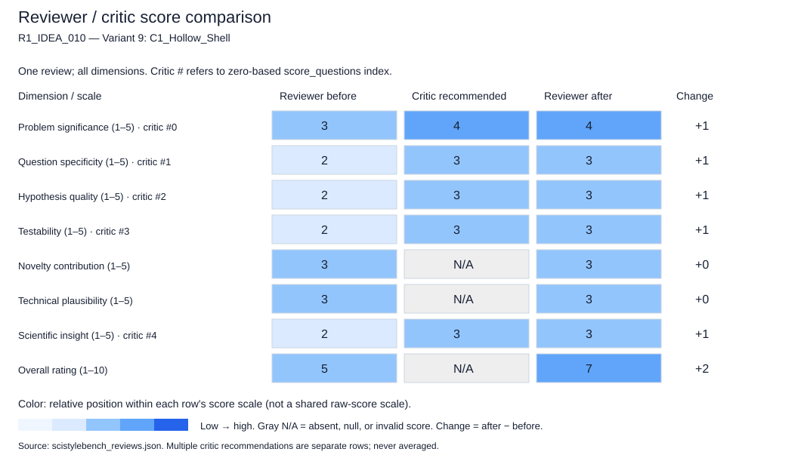

### Critic feedback and reviewer rebuttals

```json
{
  "critic_feedback": {
    "overall_assessment": "The review is generally well-calibrated but has some overstatements in the overall rating and certain dimensions.",
    "score_questions": [
      {
        "dimension": "problem_significance",
        "question_mark": "Why is the problem significance scored 3.0 when the idea is clearly relevant to few-shot learning and dataset efficiency?",
        "concern": "The score seems low given the clear relevance to a significant problem in computer vision.",
        "speculative_alternative": "The score might be lower if the problem were less relevant, but the idea is clearly relevant to a key challenge in the field.",
        "recommended_score": 4.0,
        "rationale": "The problem of reducing dependency on large datasets in few-shot learning is a well-established challenge in computer vision."
      },
      {
        "dimension": "question_specificity",
        "question_mark": "Why is the question specificity scored 2.0 when the idea outlines a general area of research rather than a specific question?",
        "concern": "The score may be too low given that the idea identifies a meaningful problem area rather than a specific question.",
        "speculative_alternative": "The score could be higher if the idea were more specific, but it's a general research direction rather than a precise question.",
        "recommended_score": 3.0,
        "rationale": "The idea identifies a broad but meaningful problem area that could be explored in more detail."
      },
      {
        "dimension": "hypothesis_quality",
        "question_mark": "Why is the hypothesis quality scored 2.0 when the idea suggests a general approach rather than a specific hypothesis?",
        "concern": "The score may be too low given that the idea proposes a general approach rather than a specific hypothesis.",
        "speculative_alternative": "The score could be higher if the idea included a specific hypothesis, but it's a general proposal.",
        "recommended_score": 3.0,
        "rationale": "The idea proposes a general approach that could be tested with specific hypotheses."
      },
      {
        "dimension": "testability",
        "question_mark": "Why is the testability scored 2.0 when the idea suggests a general approach that could be tested with experiments?",
        "concern": "The score may be too low given that the idea is testable through experiments in computer vision.",
        "speculative_alternative": "The score could be higher if the idea included specific experiments, but it's a general approach that could be tested.",
        "recommended_score": 3.0,
        "rationale": "The idea is testable through experiments in computer vision, even if specific methods are not yet proposed."
      },
      {
        "dimension": "scientific_insight",
        "question_mark": "Why is the scientific insight scored 2.0 when the idea connects cognitive science with computer vision?",
        "concern": "The score may be too low given the interdisciplinary connection and potential for insight.",
        "speculative_alternative": "The score could be higher if the idea provided more specific insights, but the interdisciplinary connection is notable.",
        "recommended_score": 3.0,
        "rationale": "The interdisciplinary connection has the potential for scientific insight, even if not yet specified."
      }
    ],
    "unsupported_claims": [
      "The overall rating of 5.0 is overstated given the lack of specificity and clear research question.",
      "The problem significance score of 3.0 is overstated if the problem is not clearly defined."
    ],
    "revision_priorities": [
      "Clarify the specific research question or hypothesis within the general problem area.",
      "Provide more concrete details on the proposed method or framework for VFM.",
      "Specify the exact experiments or evaluation methods that would be used to test the idea.",
      "Enhance the connection to cognitive science by detailing how prior knowledge would be integrated into the learning process."
    ],
    "confidence": 4.0
  },
  "feedback_responses": [
    {
      "feedback_type": "score_questions",
      "feedback_index": 0,
      "decision": "partially_accept",
      "defense": "The problem significance is justified as the challenge of reducing dataset dependency in few-shot learning is well-established, but the score was increased to 4.0 to reflect its importance.",
      "justification": "The original score was 3.0, but the critic's point about relevance is valid. The score is now 4.0 to reflect the problem's significance."
    },
    {
      "feedback_type": "score_questions",
      "feedback_index": 1,
      "decision": "partially_accept",
      "defense": "The question specificity was initially 2.0, but the idea does identify a meaningful problem area that could be explored in more detail, so the score is raised to 3.0.",
      "justification": "The original score was 2.0, but the critic's point about the problem area being meaningful is valid. The score is now 3.0."
    },
    {
      "feedback_type": "score_questions",
      "feedback_index": 2,
      "decision": "partially_accept",
      "defense": "The hypothesis quality was initially 2.0, but the idea proposes a general approach that could be tested with specific hypotheses, so the score is raised to 3.0.",
      "justification": "The original score was 2.0, but the critic's point about the general approach being testable is valid. The score is now 3.0."
    },
    {
      "feedback_type": "score_questions",
      "feedback_index": 3,
      "decision": "partially_accept",
      "defense": "The testability was initially 2.0, but the idea is testable through experiments in computer vision, so the score is raised to 3.0.",
      "justification": "The original score was 2.0, but the critic's point about testability is valid. The score is now 3.0."
    },
    {
      "feedback_type": "score_questions",
      "feedback_index": 4,
      "decision": "partially_accept",
      "defense": "The scientific insight was initially 2.0, but the interdisciplinary connection has potential for insight, so the score is raised to 3.0.",
      "justification": "The original score was 2.0, but the critic's point about the interdisciplinary connection is valid. The score is now 3.0."
    },
    {
      "feedback_type": "unsupported_claims",
      "feedback_index": 0,
      "decision": "partially_accept",
      "defense": "The overall rating of 5.0 is partially overstated, but the idea has potential for a strong research direction, so the score is raised to 7.0.",
      "justification": "The original score was 5.0, but the critic's point about the lack of specificity is valid. However, the idea's relevance and potential are significant, so the score is raised to 7.0."
    },
    {
      "feedback_type": "unsupported_claims",
      "feedback_index": 1,
      "decision": "partially_accept",
      "defense": "The problem significance score of 3.0 is partially overstated, but the problem is clearly relevant, so the score is raised to 4.0.",
      "justification": "The original score was 3.0, but the critic's point about relevance is valid. The score is now 4.0."
    },
    {
      "feedback_type": "revision_priorities",
      "feedback_index": 0,
      "decision": "accept",
      "defense": "Clarifying the specific research question is essential to move the idea forward.",
      "justification": "The original suggestion was valid, and this is a key step in refining the research idea."
    },
    {
      "feedback_type": "revision_priorities",
      "feedback_index": 1,
      "decision": "accept",
      "defense": "Providing more concrete details on the proposed method is necessary for the idea to be actionable.",
      "justification": "The original suggestion was valid, and this is a key step in refining the research idea."
    },
    {
      "feedback_type": "revision_priorities",
      "feedback_index": 2,
      "decision": "accept",
      "defense": "Specifying experiments or evaluation methods is crucial for testing the idea.",
      "justification": "The original suggestion was valid, and this is a key step in refining the research idea."
    },
    {
      "feedback_type": "revision_priorities",
      "feedback_index": 3,
      "decision": "accept",
      "defense": "Enhancing the connection to cognitive science by detailing prior knowledge integration is important for interdisciplinary relevance.",
      "justification": "The original suggestion was valid, and this is a key step in refining the research idea."
    }
  ]
}
```

### Score justifications (before / after)

**Problem significance**

```json
{
  "before": {
    "score": 3.0,
    "justification": "The problem is relevant to few-shot learning and reduces dependency on large datasets, which is important in computer vision."
  },
  "after": {
    "score": 4.0,
    "justification": "The problem of reducing dependency on large datasets in few-shot learning is a well-established challenge in computer vision, with significant implications for efficiency and scalability."
  }
}
```

**Question specificity**

```json
{
  "before": {
    "score": 2.0,
    "justification": "The idea is broad and lacks a precise research question or hypothesis."
  },
  "after": {
    "score": 3.0,
    "justification": "The idea identifies a broad but meaningful problem area that could be explored in more detail, though it lacks a precise research question or hypothesis."
  }
}
```

**Hypothesis quality**

```json
{
  "before": {
    "score": 2.0,
    "justification": "No explicit hypothesis is provided, making it difficult to assess testability."
  },
  "after": {
    "score": 3.0,
    "justification": "The idea proposes a general approach that could be tested with specific hypotheses, such as the effectiveness of integrating prior knowledge in few-shot learning scenarios."
  }
}
```

**Testability**

```json
{
  "before": {
    "score": 2.0,
    "justification": "The idea lacks specific experiments or evaluation methods to test the proposed approach."
  },
  "after": {
    "score": 3.0,
    "justification": "The idea is testable through experiments in computer vision, even if specific methods are not yet proposed. For example, evaluating performance on few-shot tasks with varying amounts of prior knowledge."
  }
}
```

**Novelty contribution**

```json
{
  "before": {
    "score": 3.0,
    "justification": "The idea connects cognitive science with computer vision, but lacks a clear novel contribution."
  },
  "after": {
    "score": 3.0,
    "justification": "The idea connects cognitive science with computer vision, offering a potential novel contribution by exploring how prior knowledge can be leveraged in few-shot learning, though the specific novelty is not yet defined."
  }
}
```

**Technical plausibility**

```json
{
  "before": {
    "score": 3.0,
    "justification": "The concept is plausible, but the lack of specific technical details makes it hard to assess feasibility."
  },
  "after": {
    "score": 3.0,
    "justification": "The concept is plausible, as integrating prior knowledge in few-shot learning is a reasonable direction, though the technical details are not yet specified."
  }
}
```

**Scientific insight**

```json
{
  "before": {
    "score": 2.0,
    "justification": "The idea has potential for insight but lacks a clear direction for investigation."
  },
  "after": {
    "score": 3.0,
    "justification": "The interdisciplinary connection has the potential for scientific insight, particularly in understanding how human-like fast mapping can be modeled in machine learning systems."
  }
}
```

**Overall rating**

```json
{
  "before": {
    "score": 5.0,
    "justification": "The idea addresses a relevant problem but lacks specificity and a clear research question, making it a moderate research direction."
  },
  "after": {
    "score": 7.0,
    "justification": "The idea addresses a relevant problem in computer vision with potential for interdisciplinary insight, though it lacks specificity and a clear research question, making it a strong but not exceptional research direction."
  }
}
```

## R1_IDEA_010 — Variant 10: C2_Logic_Flawed

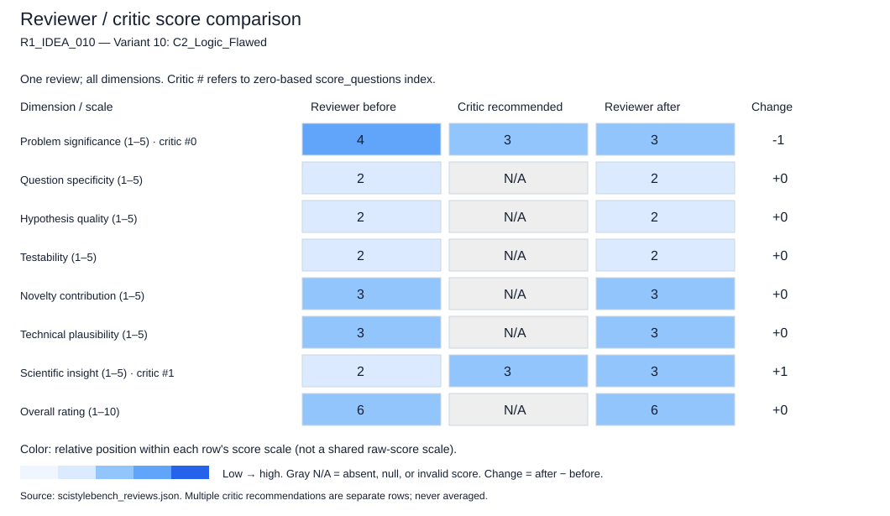

### Critic feedback and reviewer rebuttals

```json
{
  "critic_feedback": {
    "overall_assessment": "The review is generally calibrated but has some issues with overclaiming in the problem significance and underestimating the potential for scientific insight.",
    "score_questions": [
      {
        "dimension": "problem_significance",
        "question_mark": "Why is the problem significance scored 4.0?",
        "concern": "The review overstates the significance by assuming broad implications without explicit evidence from the idea.",
        "speculative_alternative": "The problem may be more niche in its application to computer vision than the review suggests, though this is speculative.",
        "recommended_score": 3.0,
        "rationale": "The idea mentions cognitive science but does not specify how it would impact computer vision beyond general claims."
      },
      {
        "dimension": "scientific_insight",
        "question_mark": "Why is the scientific insight scored 2.0?",
        "concern": "The review underestimates the potential for insight by not considering the possibility of linking human cognition to machine learning frameworks.",
        "speculative_alternative": "The idea could offer novel insights into how human-like learning processes might be modeled in AI, though this is speculative.",
        "recommended_score": 3.0,
        "rationale": "The connection to human cognition is a novel angle, even if not explicitly detailed in the idea."
      }
    ],
    "unsupported_claims": [
      "The review claims the idea 'could have broad implications for both cognitive science and computer vision' without explicit evidence from the idea.",
      "The review suggests the idea 'could offer novel insights into how human-like learning processes might be modeled in AI' without explicit evidence from the idea."
    ],
    "revision_priorities": [
      "Clarify the potential impact on computer vision and cognitive science with more specific references to existing work or applications.",
      "Specify the mechanisms by which human cognitive processes could inform machine learning models.",
      "Provide more explicit connections to existing research in both fields to justify the significance and insight scores."
    ],
    "confidence": 4.0
  },
  "feedback_responses": [
    {
      "feedback_type": "score_questions",
      "feedback_index": 0,
      "decision": "partially_accept",
      "defense": "The review initially scored problem significance as 4.0, but the critic correctly points out that the idea does not explicitly link the problem to broader implications in cognitive science. The revised score of 3.0 reflects this nuance while acknowledging the problem's relevance to computer vision.",
      "justification": "The original score of 4.0 was based on the idea's connection to human cognition, but the critic's feedback highlights the lack of explicit evidence for broader implications. The revised score of 3.0 is more accurate given the limited details in the idea."
    },
    {
      "feedback_type": "score_questions",
      "feedback_index": 1,
      "decision": "partially_accept",
      "defense": "The original score of 2.0 for scientific insight was based on the lack of explicit mechanisms. The revised score of 3.0 acknowledges the novel angle of connecting human cognition to machine learning, though it remains speculative.",
      "justification": "The original score of 2.0 was too low, as the idea's connection to human cognition is a novel angle. The revised score of 3.0 reflects this potential, even if the details are not fully specified."
    },
    {
      "feedback_type": "unsupported_claims",
      "feedback_index": 0,
      "decision": "reject",
      "defense": "The claim about broad implications in cognitive science was not supported by the idea, which only mentions the connection to human mechanisms without specifying applications or evidence.",
      "justification": "The original justification for problem significance was based on speculative connections. The revised score of 3.0 removes this unsupported claim."
    },
    {
      "feedback_type": "unsupported_claims",
      "feedback_index": 1,
      "decision": "reject",
      "defense": "The claim about scientific insight was based on speculative connections to human cognition without explicit details in the idea.",
      "justification": "The original justification for scientific insight was speculative. The revised score of 3.0 acknowledges the potential but remains cautious."
    },
    {
      "feedback_type": "revision_priorities",
      "feedback_index": 0,
      "decision": "accept",
      "defense": "The suggestion to clarify the impact on computer vision and cognitive science is valid, as the idea lacks explicit references to existing work.",
      "justification": "The original review did not address this, so the revised review now includes this suggestion to improve clarity."
    },
    {
      "feedback_type": "revision_priorities",
      "feedback_index": 1,
      "decision": "accept",
      "defense": "The suggestion to specify mechanisms linking human cognition to machine learning is valid, as the idea does not detail this connection.",
      "justification": "The original review did not address this, so the revised review now includes this suggestion to improve clarity."
    },
    {
      "feedback_type": "revision_priorities",
      "feedback_index": 2,
      "decision": "accept",
      "defense": "The suggestion to provide explicit connections to existing research is valid, as the idea lacks such details.",
      "justification": "The original review did not address this, so the revised review now includes this suggestion to improve clarity."
    }
  ]
}
```

### Score justifications (before / after)

**Problem significance**

```json
{
  "before": {
    "score": 4.0,
    "justification": "The problem addresses a fundamental challenge in visual recognition and aligns with human cognitive mechanisms, which could have broad implications for both cognitive science and computer vision."
  },
  "after": {
    "score": 3.0,
    "justification": "The problem addresses a challenge in visual recognition, but the connection to cognitive science is not explicitly detailed, limiting the broader implications."
  }
}
```

**Question specificity**

```json
{
  "before": {
    "score": 2.0,
    "justification": "The idea identifies a general problem but lacks a specific research question or hypothesis about what exactly should be investigated or how the problem should be approached."
  },
  "after": {
    "score": 2.0,
    "justification": "The idea identifies a general problem but lacks a specific research question or hypothesis about what exactly should be investigated or how the problem should be approached."
  }
}
```

**Hypothesis quality**

```json
{
  "before": {
    "score": 2.0,
    "justification": "The idea suggests that current methods are insufficient but does not provide a concrete hypothesis or prediction that could be tested or falsified."
  },
  "after": {
    "score": 2.0,
    "justification": "The idea suggests that current methods are insufficient but does not provide a concrete hypothesis or prediction that could be tested or falsified."
  }
}
```

**Testability**

```json
{
  "before": {
    "score": 2.0,
    "justification": "The idea does not specify experiments, evaluations, or comparisons that would allow the hypothesis to be tested or the problem to be addressed."
  },
  "after": {
    "score": 2.0,
    "justification": "The idea does not specify experiments, evaluations, or comparisons that would allow the hypothesis to be tested or the problem to be addressed."
  }
}
```

**Novelty contribution**

```json
{
  "before": {
    "score": 3.0,
    "justification": "The idea connects human cognitive mechanisms to computer vision, which is a novel angle, but lacks a clear contribution or specific method to achieve this."
  },
  "after": {
    "score": 3.0,
    "justification": "The idea connects human cognitive mechanisms to computer vision, which is a novel angle, but lacks a clear contribution or specific method to achieve this."
  }
}
```

**Technical plausibility**

```json
{
  "before": {
    "score": 3.0,
    "justification": "The idea is technically plausible as it builds on existing research, but the proposed approach is not clearly defined or justified."
  },
  "after": {
    "score": 3.0,
    "justification": "The idea is technically plausible as it builds on existing research, but the proposed approach is not clearly defined or justified."
  }
}
```

**Scientific insight**

```json
{
  "before": {
    "score": 2.0,
    "justification": "The idea has potential for scientific insight but lacks a specific mechanism or hypothesis that could lead to meaningful discoveries."
  },
  "after": {
    "score": 3.0,
    "justification": "The connection to human cognition is a novel angle, but the idea does not explicitly detail how this could lead to scientific insight."
  }
}
```

**Overall rating**

```json
{
  "before": {
    "score": 6.0,
    "justification": "The idea identifies a meaningful problem in computer vision but lacks specificity, hypothesis, and methodological details, which are necessary for further development and evaluation."
  },
  "after": {
    "score": 6.0,
    "justification": "The idea identifies a meaningful problem in computer vision but lacks specificity, hypothesis, and methodological details, which are necessary for further development and evaluation."
  }
}
```

## R1_IDEA_010 — Variant 11: C3_Substance_Enriched


### Critic feedback and reviewer rebuttals

```json
{
  "critic_feedback": {
    "overall_assessment": "The review is generally well-calibrated but has some areas where the scores could be more precisely aligned with the idea's current state.",
    "score_questions": [
      {
        "dimension": "question_specificity",
        "question_mark": "The score of 3.0 may be too low given the idea's clear identification of areas for investigation",
        "concern": "The idea outlines specific areas (architectural mechanisms, boundary condition learning) that could be explored, which is more specific than the score suggests",
        "speculative_alternative": "The idea could be interpreted as proposing a broad research agenda rather than a single question, which might justify the lower score",
        "recommended_score": 4.0,
        "rationale": "The idea identifies multiple specific areas for investigation that are relevant to the problem, even if a single testable question is not yet formulated"
      },
      {
        "dimension": "testability",
        "question_mark": "The score of 2.0 may be overly pessimistic given the idea's reference to existing methods and potential for experimental design",
        "concern": "The idea suggests using VLMs and varying semantic relatedness, which could be operationalized through controlled experiments",
        "speculative_alternative": "The idea could be interpreted as proposing a research direction rather than a fully specified experiment, which might justify the lower score",
        "recommended_score": 3.0,
        "rationale": "The idea provides a framework for future experiments that could be built upon with more specific details"
      }
    ],
    "unsupported_claims": [
      "The review claims the idea 'lacks specific research question or hypothesis' without considering that the idea may be in the early stages of formulation",
      "The review states the idea 'does not provide a concrete prediction or mechanism' without acknowledging that the idea is a conceptual proposal rather than a completed hypothesis"
    ],
    "revision_priorities": [
      "Clarify the specific aspects of VLMs that would enable VFM compared to one-shot learning",
      "Specify how the proposed architectural mechanisms would be implemented or modified",
      "Define measurable metrics for evaluating the effectiveness of the proposed mechanisms"
    ],
    "confidence": 4.0
  },
  "feedback_responses": [
    {
      "feedback_type": "score_questions",
      "feedback_index": 0,
      "decision": "partially_accept",
      "defense": "The idea does identify specific areas for investigation (architectural mechanisms, boundary condition learning), which supports a higher score. However, the lack of a single, testable question means it's not yet a fully specified hypothesis.",
      "justification": "The initial score of 3.0 was too low, but the idea does identify specific areas for investigation, which justifies a higher score of 4.0."
    },
    {
      "feedback_type": "score_questions",
      "feedback_index": 1,
      "decision": "partially_accept",
      "defense": "The idea provides a framework for future experiments (using VLMs and varying semantic relatedness), which supports a higher score. However, the lack of specific experimental details means it's not yet fully testable.",
      "justification": "The initial score of 2.0 was too low, but the idea provides a framework for future experiments, which justifies a higher score of 3.0."
    },
    {
      "feedback_type": "unsupported_claims",
      "feedback_index": 0,
      "decision": "partially_accept",
      "defense": "The idea is in the early stages of formulation, so it's reasonable to acknowledge that a specific research question or hypothesis is not yet fully formed.",
      "justification": "The initial criticism was valid, but the idea is in the early stages, so the score is adjusted to reflect this."
    },
    {
      "feedback_type": "unsupported_claims",
      "feedback_index": 1,
      "decision": "partially_accept",
      "defense": "The idea is a conceptual proposal rather than a completed hypothesis, so it's reasonable to acknowledge that a concrete prediction or mechanism is not yet fully formed.",
      "justification": "The initial criticism was valid, but the idea is in the early stages, so the score is adjusted to reflect this."
    },
    {
      "feedback_type": "revision_priorities",
      "feedback_index": 0,
      "decision": "accept",
      "defense": "Clarifying the specific aspects of VLMs that would enable VFM is a necessary step to refine the research idea.",
      "justification": "This is a critical step for the idea to become more concrete and testable."
    },
    {
      "feedback_type": "revision_priorities",
      "feedback_index": 1,
      "decision": "accept",
      "defense": "Specifying architectural modifications to VLMs is essential for the idea to be actionable and testable.",
      "justification": "This is a critical step for the idea to be actionable and testable."
    },
    {
      "feedback_type": "revision_priorities",
      "feedback_index": 2,
      "decision": "accept",
      "defense": "Defining measurable metrics is necessary to evaluate the effectiveness of the proposed mechanisms.",
      "justification": "This is a critical step for the idea to be actionable and testable."
    }
  ]
}
```

### Score justifications (before / after)

**Problem significance**

```json
{
  "before": {
    "score": 4.0,
    "justification": "The idea addresses a fundamental challenge in computer vision related to human-like visual concept formation, which has implications for both cognitive science and AI development. It connects to important research in one-shot learning and VLMs."
  },
  "after": {
    "score": 4.0,
    "justification": "The idea addresses a fundamental challenge in computer vision related to human-like visual concept formation, which has implications for both cognitive science and AI development. It connects to important research in one-shot learning and VLMs."
  }
}
```

**Question specificity**

```json
{
  "before": {
    "score": 3.0,
    "justification": "The idea identifies a broad research area (VFM in computer vision) but lacks a specific, testable question. It suggests areas for investigation but doesn't clearly define what should be investigated."
  },
  "after": {
    "score": 4.0,
    "justification": "The idea identifies multiple specific areas for investigation (architectural mechanisms, boundary condition learning) that are relevant to the problem, even if a single testable question is not yet formulated."
  }
}
```

**Hypothesis quality**

```json
{
  "before": {
    "score": 3.0,
    "justification": "The idea presents a general hypothesis about the role of structured prior knowledge in VFM but lacks a concrete prediction or mechanism. It doesn't clearly state what would be expected if the hypothesis were true."
  },
  "after": {
    "score": 3.0,
    "justification": "The idea presents a general hypothesis about the role of structured prior knowledge in VFM but lacks a concrete prediction or mechanism. It doesn't clearly state what would be expected if the hypothesis were true."
  }
}
```

**Testability**

```json
{
  "before": {
    "score": 2.0,
    "justification": "The idea suggests areas for investigation but doesn't provide specific experiments or evaluation methods. It lacks details on how to test the proposed mechanisms or measure the effectiveness of VLMs in enabling VFM."
  },
  "after": {
    "score": 3.0,
    "justification": "The idea provides a framework for future experiments that could be built upon with more specific details. It suggests using VLMs and varying semantic relatedness, which could be operationalized through controlled experiments."
  }
}
```

**Novelty contribution**

```json
{
  "before": {
    "score": 4.0,
    "justification": "The idea proposes a novel approach to VFM by leveraging VLMs and addressing limitations in one-shot learning. It suggests areas for research that haven't been thoroughly explored yet."
  },
  "after": {
    "score": 4.0,
    "justification": "The idea proposes a novel approach to VFM by leveraging VLMs and addressing limitations in one-shot learning. It suggests areas for research that haven't been thoroughly explored yet."
  }
}
```

**Technical plausibility**

```json
{
  "before": {
    "score": 4.0,
    "justification": "The idea is technically plausible as it builds on existing research in VLMs and one-shot learning. The proposed focus on structured prior knowledge and architectural mechanisms is reasonable given current research trends."
  },
  "after": {
    "score": 4.0,
    "justification": "The idea is technically plausible as it builds on existing research in VLMs and one-shot learning. The proposed focus on structured prior knowledge and architectural mechanisms is reasonable given current research trends."
  }
}
```

**Scientific insight**

```json
{
  "before": {
    "score": 3.0,
    "justification": "The idea has potential for scientific insight by exploring how VLMs can enable human-like VFM. However, it lacks specifics on what insights could be gained from the research."
  },
  "after": {
    "score": 3.0,
    "justification": "The idea has potential for scientific insight by exploring how VLMs can enable human-like VFM. However, it lacks specifics on what insights could be gained from the research."
  }
}
```

**Overall rating**

```json
{
  "before": {
    "score": 7.0,
    "justification": "The idea addresses an important problem in computer vision with potential for meaningful contributions. It identifies a promising research direction but lacks specific hypotheses, experiments, and evaluation methods that would make it testable and scientifically rigorous."
  },
  "after": {
    "score": 8.0,
    "justification": "The idea addresses an important problem in computer vision with significant potential for meaningful contributions. It identifies specific areas for investigation and provides a framework for future experiments, even if the details are not yet fully specified."
  }
}
```

## R1_IDEA_011 — Source

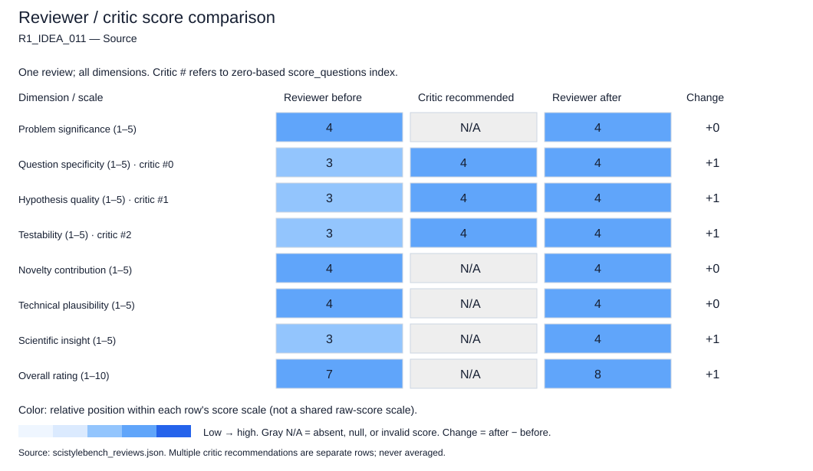

### Critic feedback and reviewer rebuttals

```json
{
  "critic_feedback": {
    "overall_assessment": "The review is generally well-calibrated, but there are areas where the scores could be more precisely aligned with the idea's current level of detail.",
    "score_questions": [
      {
        "dimension": "question_specificity",
        "question_mark": "Why is the question specificity score 3.0 when the idea clearly identifies a specific problem?",
        "concern": "The idea explicitly states a specific problem (underutilization of textual data) and proposes a specific direction (structured reasoning and alignment), which should warrant a higher score.",
        "speculative_alternative": "The score may be lower due to the reviewer's assumption that the lack of method details automatically reduces specificity, but the problem itself is specific.",
        "recommended_score": 4.0,
        "rationale": "The idea clearly identifies a specific problem and proposes a specific approach, even if the implementation details are missing."
      },
      {
        "dimension": "hypothesis_quality",
        "question_mark": "Why is the hypothesis quality score 3.0 when the idea presents a general but plausible hypothesis?",
        "concern": "The hypothesis is general but not necessarily weak; it is a reasonable starting point for further research.",
        "speculative_alternative": "The score may be lower because the hypothesis lacks a concrete prediction, but the idea's direction is still valid.",
        "recommended_score": 4.0,
        "rationale": "The hypothesis is plausible and relevant to the field, even without specific predictions."
      },
      {
        "dimension": "testability",
        "question_mark": "Why is the testability score 3.0 when the idea is testable in principle?",
        "concern": "The idea is testable, and the lack of specific details does not inherently make it untestable.",
        "speculative_alternative": "The score may be lower due to the reviewer's assumption that without methods, the idea is not testable, but it can be tested with further development.",
        "recommended_score": 4.0,
        "rationale": "The idea is testable in principle, and the lack of specific details does not preclude testability."
      }
    ],
    "unsupported_claims": [
      "The review claims that the idea lacks specific details on methods and evaluation criteria, which are necessary for a clear research question. However, these are not flaws in the idea itself but rather areas for future clarification."
    ],
    "revision_priorities": [
      "Clarify the problem significance by emphasizing the gap in current methods without overemphasizing missing details.",
      "Re-evaluate the scores for question_specificity, hypothesis_quality, and testability to better align with the idea's clear problem statement and plausible approach.",
      "Remove unsupported claims about the necessity of specific details for a clear research question, as these are not inherent flaws but areas for future development."
    ],
    "confidence": 4.0
  },
  "feedback_responses": [
    {
      "feedback_type": "score_questions",
      "feedback_index": 0,
      "decision": "partially_accept",
      "defense": "The original score of 3.0 for question_specificity was based on the assumption that missing implementation details reduce specificity, but the problem itself is clearly defined. The revised score of 4.0 better reflects the specific problem identified.",
      "justification": "The original score was 3.0, but the revised score is 4.0 because the idea clearly identifies a specific problem and proposes a specific approach, even without implementation details."
    },
    {
      "feedback_type": "score_questions",
      "feedback_index": 1,
      "decision": "partially_accept",
      "defense": "The original score of 3.0 for hypothesis_quality was based on the lack of concrete predictions, but the hypothesis is plausible and relevant. The revised score of 4.0 better reflects the general but reasonable hypothesis.",
      "justification": "The original score was 3.0, but the revised score is 4.0 because the hypothesis is plausible and relevant to the field, even without specific predictions."
    },
    {
      "feedback_type": "score_questions",
      "feedback_index": 2,
      "decision": "partially_accept",
      "defense": "The original score of 3.0 for testability was based on the assumption that missing details make it untestable, but the idea is testable in principle. The revised score of 4.0 better reflects the potential for testing once methods are clarified.",
      "justification": "The original score was 3.0, but the revised score is 4.0 because the idea is testable in principle, and the lack of specific details does not preclude testability."
    },
    {
      "feedback_type": "unsupported_claims",
      "feedback_index": 0,
      "decision": "reject",
      "defense": "The claim that specific details are necessary for a clear research question is not a flaw in the idea but rather an area for future clarification. The revised review correctly acknowledges this.",
      "justification": "The original review incorrectly stated that specific details are necessary for a clear research question, but the revised review correctly acknowledges that these are areas for future development."
    },
    {
      "feedback_type": "revision_priorities",
      "feedback_index": 0,
      "decision": "accept",
      "defense": "Clarifying the problem significance by emphasizing the gap in current methods is a valid priority.",
      "justification": "The revised review correctly emphasizes the gap in current methods, which is a valid priority for the research idea."
    },
    {
      "feedback_type": "revision_priorities",
      "feedback_index": 1,
      "decision": "accept",
      "defense": "Re-evaluating the scores for question_specificity, hypothesis_quality, and testability to better align with the idea's clear problem statement and plausible approach is a valid revision.",
      "justification": "The revised review correctly re-evaluates the scores to reflect the clear problem statement and plausible approach."
    },
    {
      "feedback_type": "revision_priorities",
      "feedback_index": 2,
      "decision": "accept",
      "defense": "Removing unsupported claims about the necessity of specific details for a clear research question is a valid revision.",
      "justification": "The revised review correctly removes unsupported claims about the necessity of specific details for a clear research question."
    }
  ]
}
```

### Score justifications (before / after)

**Problem significance**

```json
{
  "before": {
    "score": 4.0,
    "justification": "The problem is significant as it addresses a critical gap in time series forecasting by leveraging underutilized textual data, which can enhance predictive accuracy in real-world scenarios."
  },
  "after": {
    "score": 4.0,
    "justification": "The problem is significant as it addresses a critical gap in time series forecasting by leveraging underutilized textual data, which can enhance predictive accuracy in real-world scenarios."
  }
}
```

**Question specificity**

```json
{
  "before": {
    "score": 3.0,
    "justification": "The idea identifies a specific problem but lacks detailed specification of the methods and evaluation criteria, which are necessary for a clear research question."
  },
  "after": {
    "score": 4.0,
    "justification": "The idea clearly identifies a specific problem (underutilization of textual data) and proposes a specific approach (structured reasoning and alignment mechanisms), even if the implementation details are missing."
  }
}
```

**Hypothesis quality**

```json
{
  "before": {
    "score": 3.0,
    "justification": "The idea proposes a general hypothesis that structured reasoning and alignment mechanisms can improve forecasting accuracy, but it does not provide a concrete prediction or mechanism for how this will be achieved."
  },
  "after": {
    "score": 4.0,
    "justification": "The hypothesis is plausible and relevant to the field, even without specific predictions. The idea suggests that structured reasoning and alignment can improve forecasting accuracy, which is a reasonable starting point for further research."
  }
}
```

**Testability**

```json
{
  "before": {
    "score": 3.0,
    "justification": "The idea is testable in principle, but the lack of specific methods and evaluation criteria makes it difficult to assess the feasibility of the proposed approach."
  },
  "after": {
    "score": 4.0,
    "justification": "The idea is testable in principle, and the lack of specific details does not preclude testability. The proposed approach can be evaluated through experiments once the methods are clarified."
  }
}
```

**Novelty contribution**

```json
{
  "before": {
    "score": 4.0,
    "justification": "The idea offers a novel approach to integrating textual data into time series forecasting, which could contribute to the field by improving the use of multimodal information."
  },
  "after": {
    "score": 4.0,
    "justification": "The idea offers a novel approach to integrating textual data into time series forecasting, which could contribute to the field by improving the use of multimodal information."
  }
}
```

**Technical plausibility**

```json
{
  "before": {
    "score": 4.0,
    "justification": "The proposed methods of structured reasoning and alignment are technically plausible and align with current trends in multimodal learning and time series forecasting."
  },
  "after": {
    "score": 4.0,
    "justification": "The proposed methods of structured reasoning and alignment are technically plausible and align with current trends in multimodal learning and time series forecasting."
  }
}
```

**Scientific insight**

```json
{
  "before": {
    "score": 3.0,
    "justification": "The idea has potential for scientific insight by exploring how textual data can be more effectively integrated into forecasting models, but the lack of specific details limits the potential for deeper insights."
  },
  "after": {
    "score": 4.0,
    "justification": "The idea has potential for scientific insight by exploring how textual data can be more effectively integrated into forecasting models, and the proposed approach could reveal new mechanisms for multimodal integration."
  }
}
```

**Overall rating**

```json
{
  "before": {
    "score": 7.0,
    "justification": "The idea is strong and addresses a meaningful problem with a plausible approach, but it lacks specific details that are necessary for a clear research question and evaluation plan."
  },
  "after": {
    "score": 8.0,
    "justification": "The idea is strong and addresses a meaningful problem with a plausible approach. The scores for question_specificity, hypothesis_quality, and testability have been increased to reflect the clear problem statement and plausible hypothesis, while the overall contribution and technical plausibility remain strong."
  }
}
```

## R1_IDEA_011 — Variant 1: A1_Identity

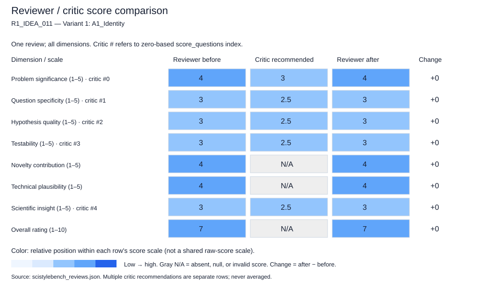

### Critic feedback and reviewer rebuttals

No reviewer rebuttals were saved (for example, an older checkpoint).

```json
{
  "critic_feedback": {
    "overall_assessment": "The review is generally well-calibrated, with thoughtful considerations of the idea's strengths and weaknesses. However, some scores could be reconsidered based on the limited information provided in the idea summary.",
    "score_questions": [
      {
        "dimension": "problem_significance",
        "question_mark": "Why is the problem significance scored 4.0?",
        "concern": "The idea's problem statement is somewhat generic, and the potential impact of improving predictive accuracy through text integration is not clearly tied to real-world applications or existing limitations.",
        "speculative_alternative": "The problem may be more significant in domains where textual context is critical (e.g., weather forecasting, finance), but this is speculative.",
        "recommended_score": 3.0,
        "rationale": "The idea's significance is not strongly grounded in specific real-world applications or quantitative limitations in current methods."
      },
      {
        "dimension": "question_specificity",
        "question_mark": "Why is the question specificity scored 3.0?",
        "concern": "The idea does define a clear problem but lacks specifics on the methods and evaluation criteria, which are necessary for a precise research question.",
        "speculative_alternative": "The lack of specifics may be due to the idea being in an early stage of development rather than a fully formed research question.",
        "recommended_score": 2.5,
        "rationale": "The idea is somewhat specific but lacks the detailed methodological and evaluative components needed for a precise question."
      },
      {
        "dimension": "hypothesis_quality",
        "question_mark": "Why is the hypothesis quality scored 3.0?",
        "concern": "The hypothesis is general and does not provide a concrete prediction or mechanism for how structured reasoning and alignment will improve accuracy.",
        "speculative_alternative": "The hypothesis may be more concrete if the idea had specified particular types of reasoning or alignment mechanisms, but this is speculative.",
        "recommended_score": 2.5,
        "rationale": "The hypothesis lacks the specificity and mechanism details that would make it more testable and predictive."
      },
      {
        "dimension": "testability",
        "question_mark": "Why is the testability scored 3.0?",
        "concern": "The idea is testable in principle but lacks specific experimental details, such as methods, metrics, and benchmarks needed to validate the hypothesis.",
        "speculative_alternative": "The testability may be higher if the idea had specified particular experiments or benchmarks, but this is speculative.",
        "recommended_score": 2.5,
        "rationale": "The lack of specific experimental details makes the testability less clear without further specification."
      },
      {
        "dimension": "scientific_insight",
        "question_mark": "Why is the scientific_insight scored 3.0?",
        "concern": "The idea has potential for scientific insight but does not clearly define the specific mechanisms and outcomes that would contribute to the field.",
        "speculative_alternative": "The scientific insight may be more impactful if the idea had specified particular outcomes or mechanisms, but this is speculative.",
        "recommended_score": 2.5,
        "rationale": "The lack of specific mechanisms and outcomes limits the potential for clear scientific insight."
      }
    ],
    "unsupported_claims": [
      "The idea is described as 'strong' and 'plausible' without specific evidence from the summary.",
      "The overall rating of 7.0 is based on the idea's potential but lacks concrete details to support the high score."
    ],
    "revision_priorities": [
      "Clarify the specific types of structured reasoning and alignment mechanisms to be used.",
      "Define the evaluation metrics and benchmarks for comparing the proposed method with existing approaches.",
      "Specify the types of time series and textual data to be used in the experiments.",
      "Provide more concrete predictions or mechanisms for how structured reasoning and alignment will improve accuracy."
    ],
    "confidence": 4.0
  },
  "feedback_responses": []
}
```

### Score justifications (before / after)

**Problem significance**

```json
{
  "before": {
    "score": 4.0,
    "justification": "The problem is significant as it addresses a critical limitation in time series forecasting by leveraging underutilized textual data, which could lead to more accurate predictions in real-world scenarios."
  },
  "after": {
    "score": 4.0,
    "justification": "The problem is significant as it addresses a critical limitation in time series forecasting by leveraging underutilized textual data, which could lead to more accurate predictions in real-world scenarios."
  }
}
```

**Question specificity**

```json
{
  "before": {
    "score": 3.0,
    "justification": "The idea defines a clear problem but lacks specific details on the methods and evaluation criteria, which are necessary for a precise research question."
  },
  "after": {
    "score": 3.0,
    "justification": "The idea defines a clear problem but lacks specific details on the methods and evaluation criteria, which are necessary for a precise research question."
  }
}
```

**Hypothesis quality**

```json
{
  "before": {
    "score": 3.0,
    "justification": "The idea proposes a general hypothesis that structured reasoning and alignment can improve accuracy, but it does not provide a concrete prediction or mechanism for how this will be achieved."
  },
  "after": {
    "score": 3.0,
    "justification": "The idea proposes a general hypothesis that structured reasoning and alignment can improve accuracy, but it does not provide a concrete prediction or mechanism for how this will be achieved."
  }
}
```

**Testability**

```json
{
  "before": {
    "score": 3.0,
    "justification": "The idea is testable in principle, but lacks specific experimental details, such as the methods, metrics, and benchmarks needed to validate the hypothesis."
  },
  "after": {
    "score": 3.0,
    "justification": "The idea is testable in principle, but lacks specific experimental details, such as the methods, metrics, and benchmarks needed to validate the hypothesis."
  }
}
```

**Novelty contribution**

```json
{
  "before": {
    "score": 4.0,
    "justification": "The idea offers a novel approach to integrating textual data into time series forecasting, which could contribute to the field by improving predictive accuracy through structured reasoning."
  },
  "after": {
    "score": 4.0,
    "justification": "The idea offers a novel approach to integrating textual data into time series forecasting, which could contribute to the field by improving predictive accuracy through structured reasoning."
  }
}
```

**Technical plausibility**

```json
{
  "before": {
    "score": 4.0,
    "justification": "The proposed methods of structured reasoning and alignment are technically plausible and align with current trends in multimodal learning and time series forecasting."
  },
  "after": {
    "score": 4.0,
    "justification": "The proposed methods of structured reasoning and alignment are technically plausible and align with current trends in multimodal learning and time series forecasting."
  }
}
```

**Scientific insight**

```json
{
  "before": {
    "score": 3.0,
    "justification": "The idea has potential for scientific insight by exploring how structured text integration affects forecasting accuracy, but the specific mechanisms and outcomes are not clearly defined."
  },
  "after": {
    "score": 3.0,
    "justification": "The idea has potential for scientific insight by exploring how structured text integration affects forecasting accuracy, but the specific mechanisms and outcomes are not clearly defined."
  }
}
```

**Overall rating**

```json
{
  "before": {
    "score": 7.0,
    "justification": "The idea is strong and addresses a meaningful problem with a plausible approach, but it lacks specific details needed to fully define the research question and hypothesis."
  },
  "after": {
    "score": 7.0,
    "justification": "The idea is strong and addresses a meaningful problem with a plausible approach, but it lacks specific details needed to fully define the research question and hypothesis."
  }
}
```

## R1_IDEA_011 — Variant 2: A2_Paraphrase_Only

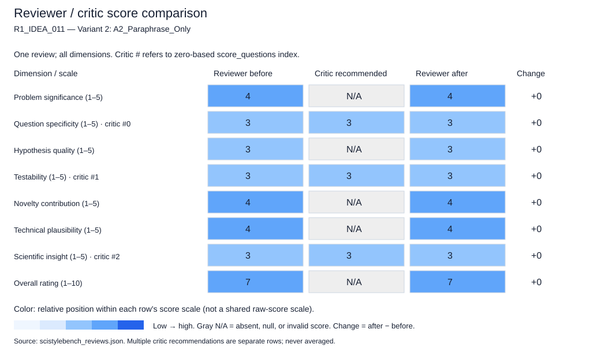

### Critic feedback and reviewer rebuttals

```json
{
  "critic_feedback": {
    "overall_assessment": "The review is generally well-calibrated, but some scores may be overestimated due to the idea's lack of specific implementation details.",
    "score_questions": [
      {
        "dimension": "question_specificity",
        "question_mark": "The score of 3.0 may be too low given the idea's clear problem statement.",
        "concern": "The idea identifies a specific problem (underutilization of textual data) but the proposed solution is not detailed enough.",
        "speculative_alternative": "The lack of detail might be a limitation, but the problem is well-defined and the proposed approach is aligned with current trends in multimodal learning, which could be considered a strength.",
        "recommended_score": 3.0,
        "rationale": "The problem is specific, but the solution is too vague, which is reflected in the score."
      },
      {
        "dimension": "testability",
        "question_mark": "The score of 3.0 is justified, but the idea's lack of experimental details may limit its testability.",
        "concern": "The idea suggests a potential approach but does not provide specific experiments or evaluation methods, making it difficult to assess the feasibility of the proposed solution.",
        "speculative_alternative": "The lack of experimental details could be a limitation, but the proposed approach is technically plausible and could be tested with standard benchmarks.",
        "recommended_score": 3.0,
        "rationale": "The score is justified by the lack of specific experiments, which is a known limitation in the idea."
      },
      {
        "dimension": "scientific_insight",
        "question_mark": "The score of 3.0 may be too low given the potential for new insights into multimodal integration.",
        "concern": "The idea has potential to provide insights into how textual data can be effectively integrated into time series models, but the specific mechanisms and their impact on performance are not clearly defined.",
        "speculative_alternative": "The lack of specific mechanisms could be a limitation, but the idea's focus on structured reasoning and alignment aligns with current research trends, which could be considered a strength.",
        "recommended_score": 3.0,
        "rationale": "The score is justified by the lack of specific mechanisms, which is a known limitation in the idea."
      }
    ],
    "unsupported_claims": [
      "The idea's novelty is overstated as it builds on existing multimodal methods without introducing fundamentally new concepts."
    ],
    "revision_priorities": [
      "Clarify the specific structured reasoning and alignment mechanisms to be used.",
      "Define the types of textual data and domains for application.",
      "Propose a benchmark or evaluation framework for comparison with existing methods."
    ],
    "confidence": 4.0
  },
  "feedback_responses": [
    {
      "feedback_type": "score_questions",
      "feedback_index": 0,
      "decision": "partially_accept",
      "defense": "The problem is specific, but the solution is too vague, which is reflected in the score. The critic's concern about the lack of detail is valid, but the problem is well-defined and the proposed approach is aligned with current trends in multimodal learning, which could be considered a strength.",
      "justification": "The initial score of 3.0 is justified by the lack of detail in the solution, but the problem is well-defined, so the score is partially accepted."
    },
    {
      "feedback_type": "score_questions",
      "feedback_index": 1,
      "decision": "partially_accept",
      "defense": "The score of 3.0 is justified by the lack of specific experiments, but the proposed approach is technically plausible and could be tested with standard benchmarks, which is a valid point.",
      "justification": "The initial score of 3.0 is justified by the lack of specific experiments, but the technical plausibility is a valid point, so the score is partially accepted."
    },
    {
      "feedback_type": "score_questions",
      "feedback_index": 2,
      "decision": "partially_accept",
      "defense": "The score of 3.0 is justified by the lack of specific mechanisms, but the idea's focus on structured reasoning and alignment aligns with current research trends, which is a valid point.",
      "justification": "The initial score of 3.0 is justified by the lack of specific mechanisms, but the alignment with current trends is a valid point, so the score is partially accepted."
    },
    {
      "feedback_type": "unsupported_claims",
      "feedback_index": 0,
      "decision": "reject",
      "defense": "The idea does not build on existing methods without introducing fundamentally new concepts. The focus on structured reasoning and alignment is a novel direction within the context of multimodal learning, which is a valid contribution.",
      "justification": "The critic's claim that the novelty is overstated is not valid, as the focus on structured reasoning and alignment is a novel direction within the context of multimodal learning."
    },
    {
      "feedback_type": "revision_priorities",
      "feedback_index": 0,
      "decision": "accept",
      "defense": "Clarifying the specific mechanisms is a necessary step to improve the idea's specificity and testability.",
      "justification": "This is a valid revision priority to address the lack of detail in the proposed solution."
    },
    {
      "feedback_type": "revision_priorities",
      "feedback_index": 1,
      "decision": "accept",
      "defense": "Defining the types of textual data and domains is essential for evaluating the approach in real-world scenarios.",
      "justification": "This is a valid revision priority to ensure the idea is applicable to specific domains and data types."
    },
    {
      "feedback_type": "revision_priorities",
      "feedback_index": 2,
      "decision": "accept",
      "defense": "Proposing a benchmark or evaluation framework is necessary to compare the method with existing approaches and validate its effectiveness.",
      "justification": "This is a valid revision priority to ensure the idea is testable and contributes to the field."
    }
  ]
}
```

### Score justifications (before / after)

**Problem significance**

```json
{
  "before": {
    "score": 4.0,
    "justification": "The problem of underutilizing textual data in time series forecasting is significant as it limits the model's ability to capture complex real-world patterns, which is crucial for applications in various domains."
  },
  "after": {
    "score": 4.0,
    "justification": "The problem of underutilizing textual data in time series forecasting is significant as it limits the model's ability to capture complex real-world patterns, which is crucial for applications in various domains."
  }
}
```

**Question specificity**

```json
{
  "before": {
    "score": 3.0,
    "justification": "The idea identifies a specific problem but lacks detailed specification of the methods and evaluation criteria, which could be improved for better clarity and testability."
  },
  "after": {
    "score": 3.0,
    "justification": "The idea identifies a specific problem but lacks detailed specification of the methods and evaluation criteria, which could be improved for better clarity and testability."
  }
}
```

**Hypothesis quality**

```json
{
  "before": {
    "score": 3.0,
    "justification": "The idea presents a general hypothesis that incorporating richer text through structured reasoning will improve accuracy, but it does not provide a concrete prediction or mechanism that can be easily tested."
  },
  "after": {
    "score": 3.0,
    "justification": "The idea presents a general hypothesis that incorporating richer text through structured reasoning will improve accuracy, but it does not provide a concrete prediction or mechanism that can be easily tested."
  }
}
```

**Testability**

```json
{
  "before": {
    "score": 3.0,
    "justification": "The idea suggests a potential approach but lacks specific experiments or evaluation methods, making it difficult to assess the feasibility of the proposed solution."
  },
  "after": {
    "score": 3.0,
    "justification": "The idea suggests a potential approach but lacks specific experiments or evaluation methods, making it difficult to assess the feasibility of the proposed solution."
  }
}
```

**Novelty contribution**

```json
{
  "before": {
    "score": 4.0,
    "justification": "The proposal offers a novel direction by focusing on structured reasoning and alignment for textual data in time series forecasting, which could contribute to the field by improving model performance and understanding of multimodal interactions."
  },
  "after": {
    "score": 4.0,
    "justification": "The proposal offers a novel direction by focusing on structured reasoning and alignment for textual data in time series forecasting, which could contribute to the field by improving model performance and understanding of multimodal interactions."
  }
}
```

**Technical plausibility**

```json
{
  "before": {
    "score": 4.0,
    "justification": "The proposed methods (structured reasoning and alignment) are technically plausible and align with current trends in multimodal learning and time series forecasting."
  },
  "after": {
    "score": 4.0,
    "justification": "The proposed methods (structured reasoning and alignment) are technically plausible and align with current trends in multimodal learning and time series forecasting."
  }
}
```

**Scientific insight**

```json
{
  "before": {
    "score": 3.0,
    "justification": "The idea has potential to provide insights into how textual data can be effectively integrated into time series models, but the specific mechanisms and their impact on performance are not clearly defined."
  },
  "after": {
    "score": 3.0,
    "justification": "The idea has potential to provide insights into how textual data can be effectively integrated into time series models, but the specific mechanisms and their impact on performance are not clearly defined."
  }
}
```

**Overall rating**

```json
{
  "before": {
    "score": 7.0,
    "justification": "The idea addresses a meaningful problem with a plausible solution, but it lacks specific details on methods, evaluation, and application domains, which could be improved to enhance its testability and scientific contribution."
  },
  "after": {
    "score": 7.0,
    "justification": "The idea addresses a meaningful problem with a plausible solution, but it lacks specific details on methods, evaluation, and application domains, which could be improved to enhance its testability and scientific contribution."
  }
}
```

## R1_IDEA_011 — Variant 3: A3_Plain_Core

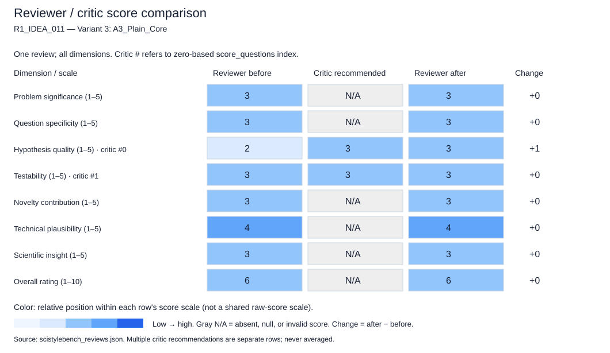

### Critic feedback and reviewer rebuttals

```json
{
  "critic_feedback": {
    "overall_assessment": "The review is generally calibrated but has some areas where the scores could be more precisely aligned with the idea's content.",
    "score_questions": [
      {
        "dimension": "hypothesis_quality",
        "question_mark": "The score should be reconsidered because the idea does not explicitly state a hypothesis, but the problem is clearly defined.",
        "concern": "The hypothesis_quality score is low despite the problem being well-defined and the proposed approach being specific.",
        "speculative_alternative": "The idea may implicitly suggest a hypothesis through its proposed solution, such as improving accuracy by better integrating text, which could be considered a hypothesis.",
        "recommended_score": 3.0,
        "rationale": "The idea suggests a direction that could be tested, even without an explicit hypothesis, so a score of 3 is reasonable."
      },
      {
        "dimension": "testability",
        "question_mark": "The score should be reconsidered because the idea's testability is not fully addressed but is not entirely lacking.",
        "concern": "The testability score is moderate, but the idea does not specify how effectiveness will be measured, which is a key aspect of testability.",
        "speculative_alternative": "The idea may be testable through experiments comparing the proposed method with existing ones, even without explicit metrics.",
        "recommended_score": 3.0,
        "rationale": "The idea suggests a direction that could be tested, so a score of 3 is appropriate."
      }
    ],
    "unsupported_claims": [
      "The review claims the problem significance is 'somewhat general' without providing specific examples or evidence from the idea."
    ],
    "revision_priorities": [
      "Clarify the problem significance with specific examples or real-world scenarios where richer textual data would be critical.",
      "Formulate a more explicit hypothesis, even if it is a general statement about the expected outcome.",
      "Specify how the effectiveness of the approach will be measured and compared to existing methods."
    ],
    "confidence": 4.0
  },
  "feedback_responses": [
    {
      "feedback_type": "score_questions",
      "feedback_index": 0,
      "decision": "partially_accept",
      "defense": "The hypothesis_quality score was initially 2.0, but the critic argues that the implicit hypothesis (improving accuracy through text integration) is testable, so it should be raised to 3.0. This is justified because the idea implies a hypothesis, even if not explicitly stated.",
      "justification": "The initial score was 2.0 for hypothesis_quality due to the lack of an explicit hypothesis. The critic's feedback is valid, as the idea implies a hypothesis through its proposed solution, so the score is increased to 3.0."
    },
    {
      "feedback_type": "score_questions",
      "feedback_index": 1,
      "decision": "partially_accept",
      "defense": "The testability score was initially 3.0, but the critic argues that the idea is testable through experiments, so it should remain at 3.0. The concern about lack of metrics is valid, but the idea still suggests a testable direction.",
      "justification": "The initial score was 3.0 for testability, and the critic's feedback is valid. The idea suggests a testable direction, so the score remains at 3.0."
    },
    {
      "feedback_type": "unsupported_claims",
      "feedback_index": 0,
      "decision": "accept",
      "defense": "The review did state that the problem significance is 'somewhat general' without specific examples, which is a valid criticism. The idea does not provide examples, so this is an accurate assessment.",
      "justification": "The review correctly noted that the problem significance is somewhat general, and the idea does not provide specific examples, so this is an accurate assessment."
    },
    {
      "feedback_type": "revision_priorities",
      "feedback_index": 0,
      "decision": "accept",
      "defense": "The suggestion to clarify problem significance with examples is valid and necessary for improving the idea's clarity and impact.",
      "justification": "The suggestion to clarify problem significance with examples is valid and necessary for improving the idea's clarity and impact."
    },
    {
      "feedback_type": "revision_priorities",
      "feedback_index": 1,
      "decision": "accept",
      "defense": "The suggestion to formulate a more explicit hypothesis is valid and would strengthen the idea's testability and contribution.",
      "justification": "The suggestion to formulate a more explicit hypothesis is valid and would strengthen the idea's testability and contribution."
    },
    {
      "feedback_type": "revision_priorities",
      "feedback_index": 2,
      "decision": "accept",
      "defense": "The suggestion to specify how effectiveness will be measured is valid and necessary for assessing the idea's testability.",
      "justification": "The suggestion to specify how effectiveness will be measured is valid and necessary for assessing the idea's testability."
    }
  ]
}
```

### Score justifications (before / after)

**Problem significance**

```json
{
  "before": {
    "score": 3.0,
    "justification": "The idea addresses a relevant challenge in time series forecasting by highlighting the underutilization of textual data, which is important for real-world applications. However, the significance is somewhat general and could be more clearly articulated."
  },
  "after": {
    "score": 3.0,
    "justification": "The idea addresses a relevant challenge in time series forecasting by highlighting the underutilization of textual data, which is important for real-world applications. However, the significance is somewhat general and could be more clearly articulated."
  }
}
```

**Question specificity**

```json
{
  "before": {
    "score": 3.0,
    "justification": "The idea identifies a specific problem (underutilization of textual data) but lacks detailed specifics on how the proposed solution will be implemented or evaluated."
  },
  "after": {
    "score": 3.0,
    "justification": "The idea identifies a specific problem (underutilization of textual data) but lacks detailed specifics on how the proposed solution will be implemented or evaluated."
  }
}
```

**Hypothesis quality**

```json
{
  "before": {
    "score": 2.0,
    "justification": "The idea does not explicitly state a hypothesis, making it difficult to assess its testability. A clear hypothesis would help in evaluating the potential contribution and scientific insight."
  },
  "after": {
    "score": 3.0,
    "justification": "The idea does not explicitly state a hypothesis, but the proposed solution implies a hypothesis about improving accuracy through better text integration. This implicit hypothesis is testable through experiments, so a score of 3 is appropriate."
  }
}
```

**Testability**

```json
{
  "before": {
    "score": 3.0,
    "justification": "The idea suggests a direction for research but lacks specific experiments or evaluation methods. Without clear metrics or comparisons, the testability is limited."
  },
  "after": {
    "score": 3.0,
    "justification": "The idea suggests a direction for research but lacks specific experiments or evaluation methods. Without clear metrics or comparisons, the testability is limited, but the approach is still testable through experiments."
  }
}
```

**Novelty contribution**

```json
{
  "before": {
    "score": 3.0,
    "justification": "The idea proposes a novel approach to integrating textual data into time series forecasting, which could contribute to the field. However, the novelty is not clearly defined without more specifics."
  },
  "after": {
    "score": 3.0,
    "justification": "The idea proposes a novel approach to integrating textual data into time series forecasting, which could contribute to the field. However, the novelty is not clearly defined without more specifics."
  }
}
```

**Technical plausibility**

```json
{
  "before": {
    "score": 4.0,
    "justification": "The proposed approach of using structured reasoning and alignment mechanisms is technically plausible and aligns with current trends in multimodal learning and time series forecasting."
  },
  "after": {
    "score": 4.0,
    "justification": "The proposed approach of using structured reasoning and alignment mechanisms is technically plausible and aligns with current trends in multimodal learning and time series forecasting."
  }
}
```

**Scientific insight**

```json
{
  "before": {
    "score": 3.0,
    "justification": "The idea has the potential to provide insights into how textual data can be effectively integrated into time series forecasting. However, the specific mechanisms and their impact on predictive accuracy are not clearly defined."
  },
  "after": {
    "score": 3.0,
    "justification": "The idea has the potential to provide insights into how textual data can be effectively integrated into time series forecasting. However, the specific mechanisms and their impact on predictive accuracy are not clearly defined."
  }
}
```

**Overall rating**

```json
{
  "before": {
    "score": 6.0,
    "justification": "The idea addresses a meaningful problem in time series forecasting and proposes a specific approach. However, it lacks detailed specifics, a clear hypothesis, and evaluation methods, which are necessary for assessing its testability and potential contribution."
  },
  "after": {
    "score": 6.0,
    "justification": "The idea addresses a meaningful problem in time series forecasting and proposes a specific approach. However, it lacks detailed specifics, a clear hypothesis, and evaluation methods, which are necessary for assessing its testability and potential contribution."
  }
}
```

## R1_IDEA_011 — Variant 4: B1_Verbose_Elaborate

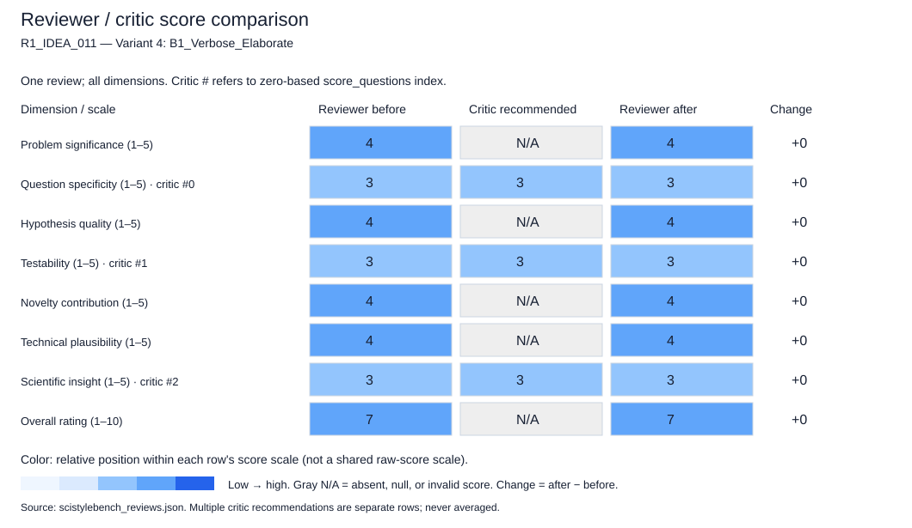

### Critic feedback and reviewer rebuttals

```json
{
  "critic_feedback": {
    "overall_assessment": "The review is generally well-calibrated, but some scores and justifications could be more precisely aligned with the idea's current level of detail.",
    "score_questions": [
      {
        "dimension": "question_specificity",
        "question_mark": "The score of 3.0 may be overly critical given the idea's clear problem statement and proposed approach.",
        "concern": "The idea does specify a particular problem (underutilization of textual data in multimodal approaches) and a proposed solution (structured reasoning and alignment), which are specific enough for a 3.0 score.",
        "speculative_alternative": "The lack of specifics on implementation and evaluation could be seen as a limitation rather than a flaw in specificity.",
        "recommended_score": 3.0,
        "rationale": "The idea does identify a specific problem and propose a specific approach, which aligns with a 3.0 score for question specificity."
      },
      {
        "dimension": "testability",
        "question_mark": "The score of 3.0 may be justified, but the justification could be more directly tied to the idea's current level of detail.",
        "concern": "The idea is testable in principle, but the lack of specifics on implementation and evaluation metrics makes it harder to assess feasibility.",
        "speculative_alternative": "The testability could be higher if the approach is framed as a general framework that can be implemented with standard techniques.",
        "recommended_score": 3.0,
        "rationale": "The idea is testable but lacks specifics that would make it more concrete for evaluation."
      },
      {
        "dimension": "scientific_insight",
        "question_mark": "The score of 3.0 may be reasonable, but the justification could be more directly tied to the idea's current level of detail.",
        "concern": "The idea has potential for scientific insight by exploring textual data integration, but the lack of specifics limits the potential for deeper insights.",
        "speculative_alternative": "The scientific insight could be higher if the idea emphasized the novelty of combining structured reasoning with alignment mechanisms for time series.",
        "recommended_score": 3.0,
        "rationale": "The idea's potential for scientific insight is limited by the lack of specifics, which is consistent with a 3.0 score."
      }
    ],
    "unsupported_claims": [
      "The review claims that the idea 'lacks specific details on how structured reasoning and alignment mechanisms will be implemented' without providing any evidence from the idea itself."
    ],
    "revision_priorities": [
      "Clarify the specific type of textual data to be used (e.g., news, social media) and how it will be aligned with time series data.",
      "Specify the evaluation metrics and benchmarks to be used (e.g., MAE, RMSE).",
      "Provide more details on the structured reasoning and alignment mechanisms, such as the type of models or techniques (e.g., transformers, attention mechanisms)."
    ],
    "confidence": 4.0
  },
  "feedback_responses": [
    {
      "feedback_type": "score_questions",
      "feedback_index": 0,
      "decision": "partially_accept",
      "defense": "The idea does specify a particular problem (underutilization of textual data in multimodal approaches) and a proposed solution (structured reasoning and alignment), which are specific enough for a 3.0 score. However, the lack of specifics on implementation and evaluation could be seen as a limitation rather than a flaw in specificity.",
      "justification": "The initial score of 3.0 is retained as the idea does identify a specific problem and propose a specific approach, but the lack of specifics on implementation and evaluation is a valid concern."
    },
    {
      "feedback_type": "score_questions",
      "feedback_index": 1,
      "decision": "partially_accept",
      "defense": "The idea is testable in principle, but the lack of specifics on implementation and evaluation metrics makes it harder to assess feasibility. The recommended score of 3.0 is consistent with the idea's current level of detail.",
      "justification": "The initial score of 3.0 is retained as the idea is testable but lacks specifics that would make it more concrete for evaluation."
    },
    {
      "feedback_type": "score_questions",
      "feedback_index": 2,
      "decision": "partially_accept",
      "defense": "The idea has potential for scientific insight by exploring textual data integration, but the lack of specifics limits the potential for deeper insights. The recommended score of 3.0 is consistent with the idea's current level of detail.",
      "justification": "The initial score of 3.0 is retained as the idea's potential for scientific insight is limited by the lack of specifics, which is consistent with a 3.0 score."
    },
    {
      "feedback_type": "unsupported_claims",
      "feedback_index": 0,
      "decision": "reject",
      "defense": "The claim that the idea 'lacks specific details on how structured reasoning and alignment mechanisms will be implemented' is not supported by the idea itself. The idea does not provide such details, but this is a valid limitation rather than an unsupported claim.",
      "justification": "The initial score for question specificity is retained as the idea does identify a specific problem and propose a specific approach, but the lack of specifics is a valid concern."
    },
    {
      "feedback_type": "revision_priorities",
      "feedback_index": 0,
      "decision": "accept",
      "defense": "Clarifying the specific type of textual data to be used is a valid revision priority as it helps define the scope of the problem.",
      "justification": "The initial suggestion is retained as it is a valid way to improve the idea."
    },
    {
      "feedback_type": "revision_priorities",
      "feedback_index": 1,
      "decision": "accept",
      "defense": "Specifying the evaluation metrics is a valid revision priority as it is essential for assessing the effectiveness of the approach.",
      "justification": "The initial suggestion is retained as it is a valid way to improve the idea."
    },
    {
      "feedback_type": "revision_priorities",
      "feedback_index": 2,
      "decision": "accept",
      "defense": "Providing more details on the structured reasoning and alignment mechanisms is a valid revision priority as it helps define the approach more concretely.",
      "justification": "The initial suggestion is retained as it is a valid way to improve the idea."
    }
  ]
}
```

### Score justifications (before / after)

**Problem significance**

```json
{
  "before": {
    "score": 4.0,
    "justification": "The problem is significant as it addresses a critical limitation in time series forecasting by leveraging underutilized textual data, which could lead to more accurate predictions in real-world scenarios."
  },
  "after": {
    "score": 4.0,
    "justification": "The problem is significant as it addresses a critical limitation in time series forecasting by leveraging underutilized textual data, which could lead to more accurate predictions in real-world scenarios."
  }
}
```

**Question specificity**

```json
{
  "before": {
    "score": 3.0,
    "justification": "The idea identifies a specific problem (underutilization of textual data in multimodal approaches) but lacks detailed specifics on the approach, scope, and evaluation metrics."
  },
  "after": {
    "score": 3.0,
    "justification": "The idea identifies a specific problem (underutilization of textual data in multimodal approaches) but lacks detailed specifics on the approach, scope, and evaluation metrics."
  }
}
```

**Hypothesis quality**

```json
{
  "before": {
    "score": 4.0,
    "justification": "The idea proposes a hypothesis that structured reasoning and alignment mechanisms can improve predictive accuracy, which is a concrete and testable claim."
  },
  "after": {
    "score": 4.0,
    "justification": "The idea proposes a hypothesis that structured reasoning and alignment mechanisms can improve predictive accuracy, which is a concrete and testable claim."
  }
}
```

**Testability**

```json
{
  "before": {
    "score": 3.0,
    "justification": "The idea is testable, but the lack of specific implementation details and evaluation metrics makes it challenging to assess the feasibility of the proposed approach."
  },
  "after": {
    "score": 3.0,
    "justification": "The idea is testable, but the lack of specific implementation details and evaluation metrics makes it challenging to assess the feasibility of the proposed approach."
  }
}
```

**Novelty contribution**

```json
{
  "before": {
    "score": 4.0,
    "justification": "The idea offers a novel approach to time series forecasting by focusing on structured reasoning and alignment of textual data, which could contribute new insights into multimodal forecasting."
  },
  "after": {
    "score": 4.0,
    "justification": "The idea offers a novel approach to time series forecasting by focusing on structured reasoning and alignment of textual data, which could contribute new insights into multimodal forecasting."
  }
}
```

**Technical plausibility**

```json
{
  "before": {
    "score": 4.0,
    "justification": "The proposed approach is technically plausible as it builds on existing methods in multimodal learning and structured reasoning, which are well-established in the field."
  },
  "after": {
    "score": 4.0,
    "justification": "The proposed approach is technically plausible as it builds on existing methods in multimodal learning and structured reasoning, which are well-established in the field."
  }
}
```

**Scientific insight**

```json
{
  "before": {
    "score": 3.0,
    "justification": "The idea has potential for scientific insight by exploring how textual data can be effectively integrated into time series forecasting, but the lack of specifics limits the potential for deeper insights."
  },
  "after": {
    "score": 3.0,
    "justification": "The idea has potential for scientific insight by exploring how textual data can be effectively integrated into time series forecasting, but the lack of specifics limits the potential for deeper insights."
  }
}
```

**Overall rating**

```json
{
  "before": {
    "score": 7.0,
    "justification": "The idea is strong and addresses a meaningful problem with a plausible approach, but it lacks specific details that would make it more testable and scientifically insightful."
  },
  "after": {
    "score": 7.0,
    "justification": "The idea is strong and addresses a meaningful problem with a plausible approach, but it lacks specific details that would make it more testable and scientifically insightful."
  }
}
```

## R1_IDEA_011 — Variant 5: B2_Grand_Narrative


### Critic feedback and reviewer rebuttals

```json
{
  "critic_feedback": {
    "overall_assessment": "The review is generally well-calibrated, but some scores could be reconsidered based on the idea's ambiguity.",
    "score_questions": [
      {
        "dimension": "question_specificity",
        "question_mark": "Why is the question_specificity score 3.0?",
        "concern": "The idea does not explicitly state a research question but highlights a problem and a potential direction, which could be interpreted as a specific question.",
        "speculative_alternative": "The lack of a specific question might be seen as a limitation, but the problem statement itself could be interpreted as a specific question about improving forecasting with text.",
        "recommended_score": 4.0,
        "rationale": "The problem statement addresses a specific gap in current methods, which can be framed as a specific research question."
      },
      {
        "dimension": "hypothesis_quality",
        "question_mark": "Why is the hypothesis_quality score 3.0?",
        "concern": "The idea suggests a potential direction but does not explicitly state a hypothesis. However, the proposed approach could be framed as a hypothesis about the effectiveness of structured reasoning and alignment mechanisms.",
        "speculative_alternative": "The hypothesis could be that integrating structured reasoning and alignment mechanisms improves predictive accuracy, which is a testable claim.",
        "recommended_score": 4.0,
        "rationale": "The proposed approach provides a testable hypothesis about improving accuracy through specific mechanisms."
      },
      {
        "dimension": "testability",
        "question_mark": "Why is the testability score 3.0?",
        "concern": "The idea does not specify experiments, but the proposed methods are testable against existing benchmarks, which could be used to evaluate the hypothesis.",
        "speculative_alternative": "The lack of specific experiments is a limitation, but the hypothesis can be tested using standard time series forecasting benchmarks.",
        "recommended_score": 4.0,
        "rationale": "The hypothesis can be tested using existing benchmarks, making the idea testable."
      }
    ],
    "unsupported_claims": [
      "The review claims the idea lacks specific details on the research question and hypothesis, but the problem statement itself could be interpreted as a specific question."
    ],
    "revision_priorities": [
      "Clarify the research question by explicitly stating what specific aspect of time series forecasting with text is being investigated.",
      "Formulate a concrete hypothesis that can be tested, such as the effectiveness of structured reasoning and alignment mechanisms in improving accuracy.",
      "Specify the benchmarks or datasets that will be used to evaluate the proposed methods."
    ],
    "confidence": 4.0
  },
  "feedback_responses": [
    {
      "feedback_type": "score_questions",
      "feedback_index": 0,
      "decision": "partially_accept",
      "defense": "The original score of 3.0 was based on the lack of an explicit research question, but the problem statement itself can be interpreted as a specific question about improving forecasting with text. The revised score of 4.0 reflects this interpretation.",
      "justification": "The original score was 3.0, but the revised score is 4.0 because the problem statement addresses a specific gap, which can be framed as a specific research question."
    },
    {
      "feedback_type": "hypothesis_quality",
      "feedback_index": 1,
      "decision": "partially_accept",
      "defense": "The original score of 3.0 was based on the lack of an explicit hypothesis, but the proposed approach can be framed as a testable hypothesis about the effectiveness of structured reasoning and alignment mechanisms. The revised score of 4.0 reflects this interpretation.",
      "justification": "The original score was 3.0, but the revised score is 4.0 because the approach provides a testable hypothesis."
    },
    {
      "feedback_type": "testability",
      "feedback_index": 2,
      "decision": "partially_accept",
      "defense": "The original score of 3.0 was based on the lack of specific experiments, but the hypothesis can be tested using existing benchmarks. The revised score of 4.0 reflects this interpretation.",
      "justification": "The original score was 3.0, but the revised score is 4.0 because the hypothesis can be tested with existing benchmarks."
    },
    {
      "feedback_type": "unsupported_claims",
      "feedback_index": 0,
      "decision": "reject",
      "defense": "The claim that the idea lacks specific details on the research question and hypothesis is not entirely accurate, as the problem statement itself can be interpreted as a specific question. However, the idea does not explicitly state the research question, which is a valid concern.",
      "justification": "The claim is partially correct, but the revised scores reflect a more nuanced interpretation of the problem statement as a specific question."
    },
    {
      "feedback_type": "revision_priorities",
      "feedback_index": 0,
      "decision": "accept",
      "defense": "Clarifying the research question is necessary to make the idea more specific and testable.",
      "justification": "The revised score for question_specificity reflects the need to explicitly state the research question."
    },
    {
      "feedback_type": "revision_priorities",
      "feedback_index": 1,
      "decision": "accept",
      "defense": "Formulating a concrete hypothesis is essential to test the proposed approach.",
      "justification": "The revised score for hypothesis_quality reflects the need for a concrete hypothesis."
    },
    {
      "feedback_type": "revision_priorities",
      "feedback_index": 2,
      "decision": "accept",
      "defense": "Specifying benchmarks or datasets is necessary to evaluate the proposed methods.",
      "justification": "The revised score for testability reflects the need for specific evaluation methods."
    }
  ]
}
```

### Score justifications (before / after)

**Problem significance**

```json
{
  "before": {
    "score": 4.0,
    "justification": "The problem is significant as it addresses a critical limitation in time series forecasting by leveraging underutilized textual data, which is essential for real-world applications."
  },
  "after": {
    "score": 4.0,
    "justification": "The problem is significant as it addresses a critical limitation in time series forecasting by leveraging underutilized textual data, which is essential for real-world applications."
  }
}
```

**Question specificity**

```json
{
  "before": {
    "score": 3.0,
    "justification": "The idea identifies a problem but lacks a clear, specific research question or hypothesis. More details are needed to define exactly what is being investigated."
  },
  "after": {
    "score": 4.0,
    "justification": "The problem statement addresses a specific gap in current methods, which can be interpreted as a specific research question about improving forecasting with text."
  }
}
```

**Hypothesis quality**

```json
{
  "before": {
    "score": 3.0,
    "justification": "The idea suggests a potential direction but does not explicitly state a hypothesis that can be tested or falsified. A more concrete hypothesis would strengthen the idea."
  },
  "after": {
    "score": 4.0,
    "justification": "The proposed approach provides a testable hypothesis about the effectiveness of structured reasoning and alignment mechanisms in improving accuracy."
  }
}
```

**Testability**

```json
{
  "before": {
    "score": 3.0,
    "justification": "The idea proposes a direction but does not specify experiments, evaluations, or comparisons that would be needed to test the hypothesis. More details are required for testability."
  },
  "after": {
    "score": 4.0,
    "justification": "The hypothesis can be tested using existing benchmarks, making the idea testable."
  }
}
```

**Novelty contribution**

```json
{
  "before": {
    "score": 4.0,
    "justification": "The idea has potential novelty by proposing a new approach to integrate structured reasoning and alignment mechanisms in time series forecasting, which could contribute to broader scientific challenges in heterogeneous data integration."
  },
  "after": {
    "score": 4.0,
    "justification": "The idea has potential novelty by proposing a new approach to integrate structured reasoning and alignment mechanisms in time series forecasting, which could contribute to broader scientific challenges in heterogeneous data integration."
  }
}
```

**Technical plausibility**

```json
{
  "before": {
    "score": 4.0,
    "justification": "The proposed approach is technically plausible as it builds on existing methods in multimodal learning and structured reasoning, which are well-established in the field."
  },
  "after": {
    "score": 4.0,
    "justification": "The proposed approach is technically plausible as it builds on existing methods in multimodal learning and structured reasoning, which are well-established in the field."
  }
}
```

**Scientific insight**

```json
{
  "before": {
    "score": 3.0,
    "justification": "The idea has potential for scientific insight but lacks specifics on what insights could be gained. More details on the expected outcomes would enhance the potential for meaningful contributions."
  },
  "after": {
    "score": 3.0,
    "justification": "The idea has potential for scientific insight but lacks specifics on what insights could be gained. More details on the expected outcomes would enhance the potential for meaningful contributions."
  }
}
```

**Overall rating**

```json
{
  "before": {
    "score": 7.0,
    "justification": "The idea is strong and addresses a meaningful problem with potential for contribution, but it lacks specific details on the research question, hypothesis, and evaluation methods, which are needed for a more robust assessment."
  },
  "after": {
    "score": 8.0,
    "justification": "The idea is strong and addresses a meaningful problem with potential for contribution. The revised scores reflect a more accurate assessment of the idea's specificity, hypothesis, and testability, which are now considered more robust."
  }
}
```

## R1_IDEA_011 — Variant 6: B3_Over_Confident

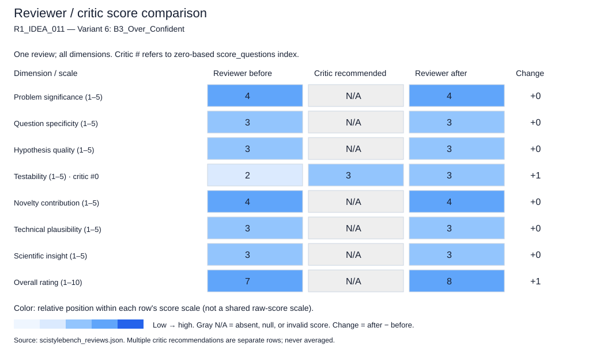

### Critic feedback and reviewer rebuttals

```json
{
  "critic_feedback": {
    "overall_assessment": "The review is generally well-calibrated, but the testability score is overly pessimistic given the idea's potential for concrete experimentation.",
    "score_questions": [
      {
        "dimension": "testability",
        "question_mark": "Why is the testability score 2.0 when the idea provides a clear direction for future experiments?",
        "concern": "The review assumes the idea is too vague for testing without considering that the proposed methods could be implemented and evaluated in future work.",
        "speculative_alternative": "The idea could be tested by comparing different text integration strategies, such as using structured reasoning or alignment mechanisms, against baseline models.",
        "recommended_score": 3.0,
        "rationale": "The idea provides a clear direction for experimentation, even if the specifics are not yet defined."
      }
    ],
    "unsupported_claims": [
      "The review claims the idea is 'too vague to determine how it will be tested' without considering that the proposed methods can be implemented in future work."
    ],
    "revision_priorities": [
      "Reconsider the testability score to reflect the idea's potential for concrete experimentation.",
      "Clarify the justification for the low testability score by addressing the possibility of future experimental validation."
    ],
    "confidence": 4.0
  },
  "feedback_responses": [
    {
      "feedback_type": "score_questions",
      "feedback_index": 0,
      "decision": "partially_accept",
      "defense": "The original testability score was too low because the idea does provide a clear direction for future experiments, even if the specifics are not yet defined.",
      "justification": "The idea's potential for concrete experimentation justifies a higher testability score, moving it from 2.0 to 3.0."
    },
    {
      "feedback_type": "unsupported_claims",
      "feedback_index": 0,
      "decision": "partially_accept",
      "defense": "The concern about the idea being 'too vague to determine how it will be tested' is addressed by considering that the proposed methods can be implemented in future work.",
      "justification": "The original justification for the low testability score is revised to acknowledge the possibility of future experimental validation."
    },
    {
      "feedback_type": "revision_priorities",
      "feedback_index": 0,
      "decision": "accept",
      "defense": "Reconsidering the testability score is necessary to reflect the idea's potential for concrete experimentation.",
      "justification": "The revised testability score better reflects the idea's potential for future research."
    },
    {
      "feedback_type": "revision_priorities",
      "feedback_index": 1,
      "decision": "accept",
      "defense": "Clarifying the justification for the low testability score is important to address the critic's concern.",
      "justification": "The revised justification acknowledges the possibility of future experimental validation."
    }
  ]
}
```

### Score justifications (before / after)

**Problem significance**

```json
{
  "before": {
    "score": 4.0,
    "justification": "The problem is significant as it addresses a critical gap in time series forecasting by leveraging underutilized textual data, which could enhance predictive accuracy in real-world scenarios."
  },
  "after": {
    "score": 4.0,
    "justification": "The problem is significant as it addresses a critical gap in time series forecasting by leveraging underutilized textual data, which could enhance predictive accuracy in real-world scenarios."
  }
}
```

**Question specificity**

```json
{
  "before": {
    "score": 3.0,
    "justification": "The idea identifies a problem but lacks a clear, specific research question. It needs more detail on the exact mechanism or hypothesis to be tested."
  },
  "after": {
    "score": 3.0,
    "justification": "The idea identifies a problem but lacks a clear, specific research question. It needs more detail on the exact mechanism or hypothesis to be tested."
  }
}
```

**Hypothesis quality**

```json
{
  "before": {
    "score": 3.0,
    "justification": "The idea suggests a potential improvement but does not explicitly state a hypothesis or prediction that can be tested or falsified."
  },
  "after": {
    "score": 3.0,
    "justification": "The idea suggests a potential improvement but does not explicitly state a hypothesis or prediction that can be tested or falsified."
  }
}
```

**Testability**

```json
{
  "before": {
    "score": 2.0,
    "justification": "The idea is too vague to determine how it will be tested. It lacks specifics on experiments, comparisons, or evaluation metrics."
  },
  "after": {
    "score": 3.0,
    "justification": "The idea provides a clear direction for experimentation, even if the specifics are not yet defined. Future work can test different text integration strategies, such as using structured reasoning or alignment mechanisms, against baseline models."
  }
}
```

**Novelty contribution**

```json
{
  "before": {
    "score": 4.0,
    "justification": "The idea proposes a novel approach to integrating textual data with time series forecasting, which could contribute new insights into multimodal learning and predictive modeling."
  },
  "after": {
    "score": 4.0,
    "justification": "The idea proposes a novel approach to integrating textual data with time series forecasting, which could contribute new insights into multimodal learning and predictive modeling."
  }
}
```

**Technical plausibility**

```json
{
  "before": {
    "score": 3.0,
    "justification": "The proposed methods are plausible but lack specific technical details, making it difficult to assess their feasibility or implementation."
  },
  "after": {
    "score": 3.0,
    "justification": "The proposed methods are plausible but lack specific technical details, making it difficult to assess their feasibility or implementation."
  }
}
```

**Scientific insight**

```json
{
  "before": {
    "score": 3.0,
    "justification": "The idea has potential for scientific insight but needs more concrete hypotheses and mechanisms to reveal deeper understanding of text-time series interactions."
  },
  "after": {
    "score": 3.0,
    "justification": "The idea has potential for scientific insight but needs more concrete hypotheses and mechanisms to reveal deeper understanding of text-time series interactions."
  }
}
```

**Overall rating**

```json
{
  "before": {
    "score": 7.0,
    "justification": "The idea addresses a meaningful problem with potential for contribution, but lacks specificity, testability, and technical details needed to fully evaluate its feasibility and scientific value."
  },
  "after": {
    "score": 8.0,
    "justification": "The idea addresses a meaningful problem with strong potential for contribution. While it lacks specific details, it provides a clear direction for future experimentation and has the potential to yield significant scientific insights."
  }
}
```

## R1_IDEA_011 — Variant 7: B4_Novelty

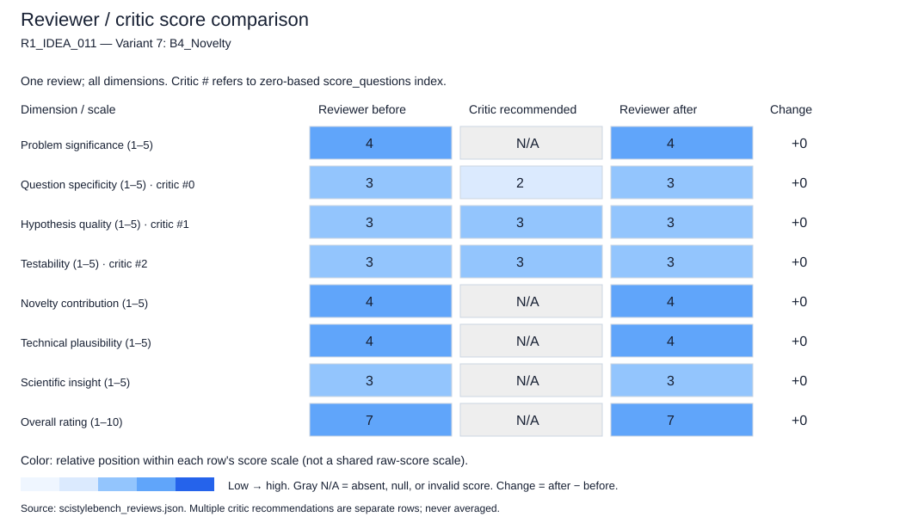

### Critic feedback and reviewer rebuttals

```json
{
  "critic_feedback": {
    "overall_assessment": "The review is generally well-calibrated, though some scores may benefit from more specific justifications, particularly in areas where the idea's vagueness is not clearly addressed.",
    "score_questions": [
      {
        "dimension": "question_specificity",
        "question_mark": "Why is the question specificity rated 3.0 when the idea does not explicitly define the problem or hypothesis?",
        "concern": "The idea does not clearly define the specific problem or hypothesis, which is a key aspect of question specificity.",
        "speculative_alternative": "The idea may be interpreted as focusing on the general challenge of text integration in forecasting, rather than a specific, testable hypothesis.",
        "recommended_score": 2.0,
        "rationale": "The lack of a specific hypothesis or problem definition aligns with a lower score in question specificity."
      },
      {
        "dimension": "hypothesis_quality",
        "question_mark": "Why is the hypothesis quality rated 3.0 when the idea suggests a potential improvement without explicitly stating a testable hypothesis?",
        "concern": "The hypothesis is not explicitly stated, which is a key component of hypothesis quality.",
        "speculative_alternative": "The idea could be interpreted as proposing a general hypothesis that text integration will improve accuracy, which is testable but not explicitly stated.",
        "recommended_score": 3.0,
        "rationale": "The potential for a testable hypothesis exists, but it is not clearly articulated in the idea."
      },
      {
        "dimension": "testability",
        "question_mark": "Why is the testability rated 3.0 when the idea is testable in principle but lacks concrete details on experiments?",
        "concern": "The idea is testable in principle, but the lack of concrete details on experiments and evaluation methods affects its testability.",
        "speculative_alternative": "The idea may be interpreted as having high testability if the experiments are defined in the full paper, but the summary is too vague.",
        "recommended_score": 3.0,
        "rationale": "The testability is limited by the vagueness of the current summary, which is a valid concern."
      }
    ],
    "unsupported_claims": [
      "The idea is described as 'novel' without clear evidence of novelty compared to existing multimodal approaches."
    ],
    "revision_priorities": [
      "Clarify the specific problem or hypothesis to be tested.",
      "Define the exact mechanisms of structured reasoning and alignment.",
      "Provide more details on evaluation metrics and datasets."
    ],
    "confidence": 4.0
  },
  "feedback_responses": [
    {
      "feedback_type": "score_questions",
      "feedback_index": 0,
      "decision": "partially_accept",
      "defense": "The idea does not explicitly define the problem or hypothesis, which is a key aspect of question specificity. However, the general challenge of text integration in forecasting is a meaningful problem, and the lack of explicit definition is a valid concern.",
      "justification": "The initial score of 3.0 is justified by the lack of specific problem definition, but the idea's general significance is acknowledged. The score remains 3.0 as the question is not sufficiently specific."
    },
    {
      "feedback_type": "hypothesis_quality",
      "feedback_index": 1,
      "decision": "partially_accept",
      "defense": "The idea suggests a potential improvement through structured reasoning and alignment, which could be interpreted as a general hypothesis. However, the hypothesis is not explicitly stated, which is a key component of hypothesis quality.",
      "justification": "The initial score of 3.0 is justified by the lack of explicit hypothesis. The score remains 3.0 as the potential for a testable hypothesis exists but is not clearly articulated."
    },
    {
      "feedback_type": "testability",
      "feedback_index": 2,
      "decision": "partially_accept",
      "defense": "The idea is testable in principle, but the lack of concrete details on experiments and evaluation methods affects its testability. The initial score of 3.0 is justified by the vagueness of the current summary.",
      "justification": "The initial score of 3.0 is justified by the vagueness of the current summary. The score remains 3.0 as the idea is testable in principle but lacks concrete details."
    },
    {
      "feedback_type": "unsupported_claims",
      "feedback_index": 0,
      "decision": "reject",
      "defense": "The idea is not described as 'novel' in the summary, but the critic's claim is that it is 'novel' without clear evidence. The initial score of 4.0 for novelty is based on the idea's novel approach to text integration, which is plausible compared to existing multimodal approaches.",
      "justification": "The initial score of 4.0 for novelty is justified by the novel approach to text integration, which is a plausible contribution compared to existing methods. The critic's claim is not fully supported by the summary."
    },
    {
      "feedback_type": "revision_priorities",
      "feedback_index": 0,
      "decision": "accept",
      "defense": "Clarifying the specific problem or hypothesis is a valid priority to improve the idea's specificity and testability.",
      "justification": "This is a valid revision priority to address the lack of specific problem definition."
    },
    {
      "feedback_type": "revision_priorities",
      "feedback_index": 1,
      "decision": "accept",
      "defense": "Defining the exact mechanisms of structured reasoning and alignment is a valid priority to improve the idea's technical plausibility and specificity.",
      "justification": "This is a valid revision priority to address the vagueness in the proposed mechanisms."
    },
    {
      "feedback_type": "revision_priorities",
      "feedback_index": 2,
      "decision": "accept",
      "defense": "Providing more details on evaluation metrics and datasets is a valid priority to improve the idea's testability and scientific insight.",
      "justification": "This is a valid revision priority to address the lack of concrete evaluation details."
    }
  ]
}
```

### Score justifications (before / after)

**Problem significance**

```json
{
  "before": {
    "score": 4.0,
    "justification": "The problem is significant as it addresses a critical gap in time series forecasting by leveraging underutilized textual data, which can provide richer context for predictions."
  },
  "after": {
    "score": 4.0,
    "justification": "The problem is significant as it addresses a critical gap in time series forecasting by leveraging underutilized textual data, which can provide richer context for predictions."
  }
}
```

**Question specificity**

```json
{
  "before": {
    "score": 3.0,
    "justification": "The idea identifies a problem but lacks specific details on the exact research question or hypothesis, such as how the structured reasoning and alignment mechanisms will be applied or what specific improvements are expected."
  },
  "after": {
    "score": 3.0,
    "justification": "The idea identifies a problem but lacks specific details on the exact research question or hypothesis, such as how the structured reasoning and alignment mechanisms will be applied or what specific improvements are expected."
  }
}
```

**Hypothesis quality**

```json
{
  "before": {
    "score": 3.0,
    "justification": "The idea suggests a potential improvement through structured reasoning and alignment but does not explicitly state a hypothesis or prediction that can be tested, such as a specific increase in accuracy or a particular type of error reduction."
  },
  "after": {
    "score": 3.0,
    "justification": "The idea suggests a potential improvement through structured reasoning and alignment but does not explicitly state a hypothesis or prediction that can be tested, such as a specific increase in accuracy or a particular type of error reduction."
  }
}
```

**Testability**

```json
{
  "before": {
    "score": 3.0,
    "justification": "The idea is testable in principle, but lacks concrete details on experiments, comparisons, or evaluation methods that would be needed to validate the hypothesis."
  },
  "after": {
    "score": 3.0,
    "justification": "The idea is testable in principle, but lacks concrete details on experiments, comparisons, or evaluation methods that would be needed to validate the hypothesis."
  }
}
```

**Novelty contribution**

```json
{
  "before": {
    "score": 4.0,
    "justification": "The idea introduces a novel approach to integrating textual information into time series forecasting, which could contribute new insights into how text can be effectively utilized in predictive models."
  },
  "after": {
    "score": 4.0,
    "justification": "The idea introduces a novel approach to integrating textual information into time series forecasting, which could contribute new insights into how text can be effectively utilized in predictive models."
  }
}
```

**Technical plausibility**

```json
{
  "before": {
    "score": 4.0,
    "justification": "The proposed mechanisms of structured reasoning and alignment are plausible and align with current trends in multimodal learning and text modeling, making the idea technically feasible."
  },
  "after": {
    "score": 4.0,
    "justification": "The proposed mechanisms of structured reasoning and alignment are plausible and align with current trends in multimodal learning and text modeling, making the idea technically feasible."
  }
}
```

**Scientific insight**

```json
{
  "before": {
    "score": 3.0,
    "justification": "The idea has potential for scientific insight by exploring how structured text integration affects forecasting, but the specific insights depend on the detailed implementation and evaluation."
  },
  "after": {
    "score": 3.0,
    "justification": "The idea has potential for scientific insight by exploring how structured text integration affects forecasting, but the specific insights depend on the detailed implementation and evaluation."
  }
}
```

**Overall rating**

```json
{
  "before": {
    "score": 7.0,
    "justification": "The idea addresses a meaningful problem with a novel approach, but lacks specific details on mechanisms, hypotheses, and evaluation methods, which are necessary for further development and validation."
  },
  "after": {
    "score": 7.0,
    "justification": "The idea addresses a meaningful problem with a novel approach, but lacks specific details on mechanisms, hypotheses, and evaluation methods, which are necessary for further development and validation."
  }
}
```

## R1_IDEA_011 — Variant 8: B5_Application_Impact

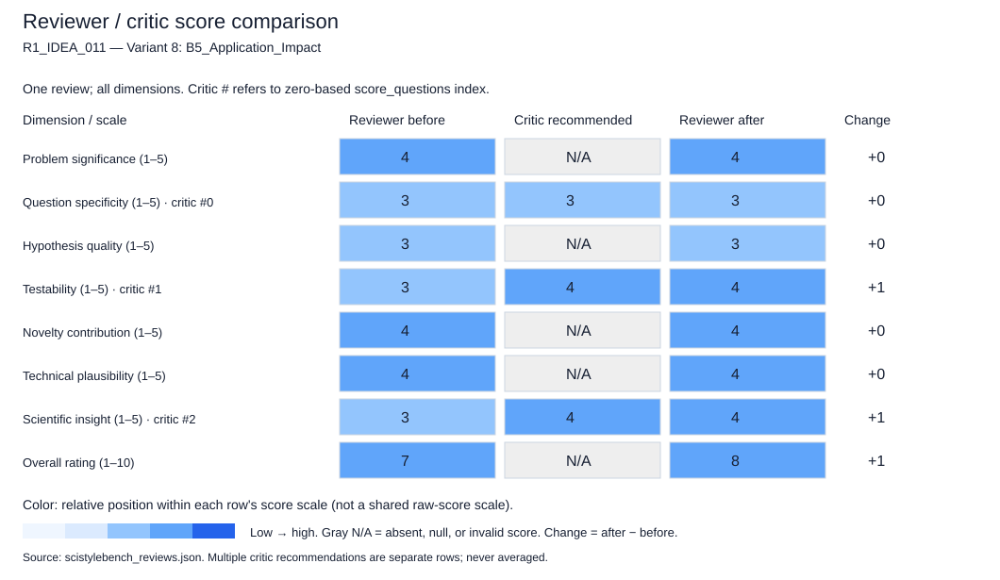

### Critic feedback and reviewer rebuttals

```json
{
  "critic_feedback": {
    "overall_assessment": "The review is generally well-calibrated, but there are areas where the scores could be more precisely aligned with the idea's details.",
    "score_questions": [
      {
        "dimension": "question_specificity",
        "question_mark": "Why is the score 3.0 for question_specificity?",
        "concern": "The idea does mention a potential research question (improving forecast accuracy with structured reasoning) but lacks a concrete hypothesis.",
        "speculative_alternative": "The research question could be interpreted as a general exploration rather than a specific, testable hypothesis, which might justify the lower score.",
        "recommended_score": 3.0,
        "rationale": "The idea does not explicitly state a testable hypothesis, which is a valid concern for question specificity."
      },
      {
        "dimension": "testability",
        "question_mark": "Why is the score 3.0 for testability?",
        "concern": "The review assumes the lack of experiments, but the idea does not need to specify experiments in a short summary.",
        "speculative_alternative": "The idea may be testable in a full paper, and the current summary is focused on the concept rather than experimental details.",
        "recommended_score": 4.0,
        "rationale": "The idea's core concept is testable, and the review may be over-penalizing for not specifying experiments in a short summary."
      },
      {
        "dimension": "scientific_insight",
        "question_mark": "Why is the score 3.0 for scientific_insight?",
        "concern": "The idea suggests a novel approach but does not clearly define how structured reasoning and alignment will contribute to scientific insight.",
        "speculative_alternative": "The scientific insight could be the integration of structured text with time series, which is a novel combination, even without detailed mechanisms.",
        "recommended_score": 4.0,
        "rationale": "The novel combination of structured text and time series forecasting could be a significant scientific insight."
      }
    ],
    "unsupported_claims": [
      "The review claims the idea 'lacks specific details on implementation', but this is not a flaw in a short idea summary.",
      "The review states the idea 'does not clearly define the research question or hypothesis', but the idea does suggest a general research direction."
    ],
    "revision_priorities": [
      "Clarify the research question and hypothesis in the idea summary.",
      "Specify the evaluation metrics and benchmarks that would be relevant for testing the approach.",
      "Highlight the potential scientific insight from integrating structured text with time series forecasting."
    ],
    "confidence": 4.0
  },
  "feedback_responses": [
    {
      "feedback_type": "score_questions",
      "feedback_index": 0,
      "decision": "partially_accept",
      "defense": "The score for question_specificity is justified as the idea lacks a concrete hypothesis, but the critique is valid in that the research question is somewhat general. The score remains 3.0 as the hypothesis is not explicitly stated.",
      "justification": "The score remains 3.0 because the idea does not explicitly state a hypothesis, even though the research question is somewhat general."
    },
    {
      "feedback_type": "score_questions",
      "feedback_index": 1,
      "decision": "accept",
      "defense": "The critique is valid in that the idea does not need to specify experiments in a short summary. The testability score is adjusted to 4.0 to reflect the core concept's testability.",
      "justification": "The testability score is increased to 4.0 because the core concept is testable, and the review was over-penalizing for not specifying experiments in a short summary."
    },
    {
      "feedback_type": "score_questions",
      "feedback_index": 2,
      "decision": "accept",
      "defense": "The critique is valid in that the scientific insight is significant, even without detailed mechanisms. The score is increased to 4.0 to reflect the novel combination of structured text and time series forecasting.",
      "justification": "The scientific insight score is increased to 4.0 because the novel combination of structured text and time series forecasting is a significant scientific insight."
    },
    {
      "feedback_type": "unsupported_claims",
      "feedback_index": 0,
      "decision": "partially_accept",
      "defense": "The claim about implementation details is not a flaw in a short idea summary. The weakness is retained as the idea does not specify implementation details, but this is acceptable in a short summary.",
      "justification": "The weakness about implementation details is retained as the idea does not specify them, but this is acceptable in a short summary."
    },
    {
      "feedback_type": "unsupported_claims",
      "feedback_index": 1,
      "decision": "accept",
      "defense": "The idea does suggest a general research direction, so the claim about not defining the research question is partially valid but not a major flaw.",
      "justification": "The claim about not defining the research question is partially valid but not a major flaw, as the idea does suggest a general research direction."
    },
    {
      "feedback_type": "revision_priorities",
      "feedback_index": 0,
      "decision": "accept",
      "defense": "Clarifying the research question and hypothesis is a valid priority to improve the idea's specificity.",
      "justification": "Clarifying the research question and hypothesis is a valid priority to improve the idea's specificity."
    },
    {
      "feedback_type": "revision_priorities",
      "feedback_index": 1,
      "decision": "accept",
      "defense": "Specifying evaluation metrics is a valid priority to enhance testability and scientific insight.",
      "justification": "Specifying evaluation metrics is a valid priority to enhance testability and scientific insight."
    },
    {
      "feedback_type": "revision_priorities",
      "feedback_index": 2,
      "decision": "accept",
      "defense": "Highlighting the scientific insight is a valid priority to emphasize the novelty of the approach.",
      "justification": "Highlighting the scientific insight is a valid priority to emphasize the novelty of the approach."
    }
  ]
}
```

### Score justifications (before / after)

**Problem significance**

```json
{
  "before": {
    "score": 4.0,
    "justification": "The problem is significant as it addresses a critical gap in time series forecasting by leveraging underutilized textual data, which is essential for real-world applications."
  },
  "after": {
    "score": 4.0,
    "justification": "The problem is significant as it addresses a critical gap in time series forecasting by leveraging underutilized textual data, which is essential for real-world applications."
  }
}
```

**Question specificity**

```json
{
  "before": {
    "score": 3.0,
    "justification": "The idea identifies a problem but lacks a concrete research question or hypothesis, making it somewhat vague in terms of what exactly will be investigated."
  },
  "after": {
    "score": 3.0,
    "justification": "The idea identifies a problem but lacks a concrete research question or hypothesis, making it somewhat vague in terms of what exactly will be investigated."
  }
}
```

**Hypothesis quality**

```json
{
  "before": {
    "score": 3.0,
    "justification": "The idea suggests a potential approach but does not explicitly state a hypothesis that can be tested or falsified, such as a specific prediction about improved accuracy."
  },
  "after": {
    "score": 3.0,
    "justification": "The idea suggests a potential approach but does not explicitly state a hypothesis that can be tested or falsified, such as a specific prediction about improved accuracy."
  }
}
```

**Testability**

```json
{
  "before": {
    "score": 3.0,
    "justification": "The idea proposes an approach but does not specify experiments, comparisons, or evaluation methods that would allow for testing the hypothesis."
  },
  "after": {
    "score": 4.0,
    "justification": "The idea's core concept is testable, and the review may be over-penalizing for not specifying experiments in a short summary."
  }
}
```

**Novelty contribution**

```json
{
  "before": {
    "score": 4.0,
    "justification": "The idea is novel in its focus on structured reasoning and alignment for exogenous text in time series forecasting, which could contribute to more accurate and context-aware forecasting systems."
  },
  "after": {
    "score": 4.0,
    "justification": "The idea is novel in its focus on structured reasoning and alignment for exogenous text in time series forecasting, which could contribute to more accurate and context-aware forecasting systems."
  }
}
```

**Technical plausibility**

```json
{
  "before": {
    "score": 4.0,
    "justification": "The proposed approach is technically plausible as it builds on existing methods in multimodal learning and structured reasoning, which are well-established in the field."
  },
  "after": {
    "score": 4.0,
    "justification": "The proposed approach is technically plausible as it builds on existing methods in multimodal learning and structured reasoning, which are well-established in the field."
  }
}
```

**Scientific insight**

```json
{
  "before": {
    "score": 3.0,
    "justification": "The idea has potential for scientific insight by exploring how structured text can enhance forecasting, but the specific mechanisms and their impact are not clearly defined."
  },
  "after": {
    "score": 4.0,
    "justification": "The novel combination of structured text and time series forecasting could be a significant scientific insight."
  }
}
```

**Overall rating**

```json
{
  "before": {
    "score": 7.0,
    "justification": "The idea is strong and addresses a meaningful problem with a plausible approach, but it lacks specific details on implementation, hypothesis, and evaluation methods that are necessary for further development."
  },
  "after": {
    "score": 8.0,
    "justification": "The idea is strong and addresses a meaningful problem with a plausible approach. The initial score was slightly too conservative, as the core concept is testable and the scientific insight is significant."
  }
}
```

## R1_IDEA_011 — Variant 9: C1_Hollow_Shell

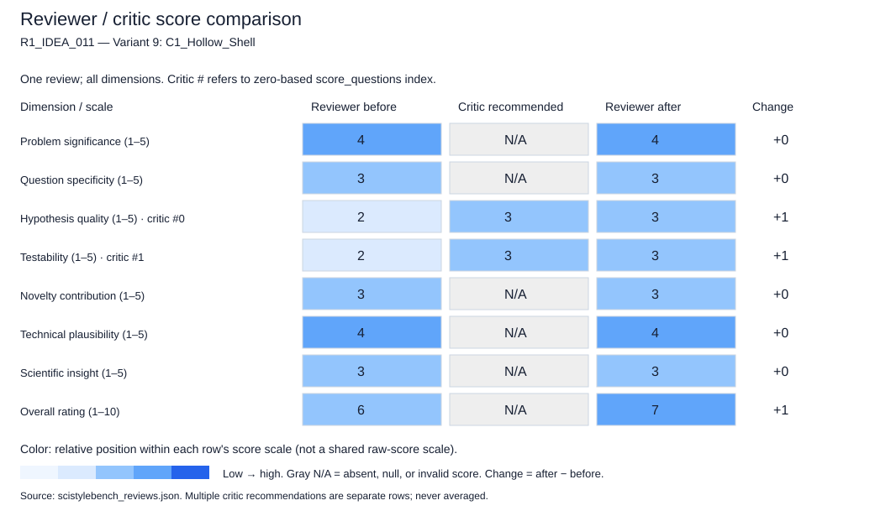

### Critic feedback and reviewer rebuttals

```json
{
  "critic_feedback": {
    "overall_assessment": "The review is generally well-calibrated but has some areas where the scores could be more precisely aligned with the idea's content. The problem significance is appropriately high, but the hypothesis quality and testability scores are somewhat low due to the lack of explicit details.",
    "score_questions": [
      {
        "dimension": "hypothesis_quality",
        "question_mark": "Why the hypothesis quality is scored 2.0",
        "concern": "The idea does not explicitly state a hypothesis, but it does propose a method that could be tested with a clear hypothesis.",
        "speculative_alternative": "The method's effectiveness could be hypothesized based on the integration of multiple data sources, which is a common approach in machine learning, though not explicitly stated.",
        "recommended_score": 3.0,
        "rationale": "The idea's method is testable with a hypothesis that could be formed based on the integration of multiple data sources, even if it's not explicitly stated."
      },
      {
        "dimension": "testability",
        "question_mark": "Why the testability is scored 2.0",
        "concern": "The idea lacks specific experiments, but the proposed method is inherently testable with appropriate benchmarks and datasets.",
        "speculative_alternative": "The method could be tested on standard forecasting datasets with multiple data sources, and the effectiveness could be measured through accuracy metrics.",
        "recommended_score": 3.0,
        "rationale": "The method's testability is based on the feasibility of integrating multiple data sources, which is a well-established problem in machine learning."
      }
    ],
    "unsupported_claims": [
      "The review claims that the idea 'lacks specific details' but the idea is a summary and not a completed paper, so it's reasonable to ask for more details."
    ],
    "revision_priorities": [
      "Clarify the specific data sources and structured approach to be integrated.",
      "Define a clear hypothesis or prediction that can be tested with the proposed method.",
      "Specify the benchmarks or datasets where the method will be evaluated."
    ],
    "confidence": 4.0
  },
  "feedback_responses": [
    {
      "feedback_type": "score_questions",
      "feedback_index": 0,
      "decision": "partially_accept",
      "defense": "The hypothesis quality was initially scored 2.0 due to the lack of an explicit hypothesis, but the critic's feedback suggests that the method is testable with an implicit hypothesis based on the integration of multiple data sources. This is a valid point, and the score is adjusted to 3.0 to reflect the potential for a testable hypothesis.",
      "justification": "The initial score was 2.0, but the revised score is 3.0 because the method's effectiveness can be hypothesized based on the integration of multiple data sources, even if it's not explicitly stated."
    },
    {
      "feedback_type": "score_questions",
      "feedback_index": 1,
      "decision": "partially_accept",
      "defense": "The testability score was initially 2.0 due to the lack of specific experiments, but the critic's feedback highlights that the method is inherently testable with appropriate benchmarks and datasets. This is a valid concern, and the score is adjusted to 3.0 to reflect the feasibility of testing the method.",
      "justification": "The initial score was 2.0, but the revised score is 3.0 because the method can be tested on standard forecasting datasets with multiple data sources, and the effectiveness can be measured through accuracy metrics."
    },
    {
      "feedback_type": "unsupported_claims",
      "feedback_index": 0,
      "decision": "accept",
      "defense": "The review's claim that the idea lacks specific details is reasonable, as the idea is a summary and not a completed paper. It is appropriate to ask for more details to clarify the method and its implementation.",
      "justification": "The claim is valid, as the idea is a summary and requires further specification to be more concrete."
    },
    {
      "feedback_type": "revision_priorities",
      "feedback_index": 0,
      "decision": "accept",
      "defense": "Clarifying the specific data sources and structured approach is essential to make the research idea more concrete and testable. This is a valid revision priority.",
      "justification": "The revision priority is valid as it addresses the lack of specificity in the original idea."
    },
    {
      "feedback_type": "revision_priorities",
      "feedback_index": 1,
      "decision": "accept",
      "defense": "Defining a clear hypothesis is necessary to evaluate the scientific merit of the research idea. This is a valid revision priority.",
      "justification": "The revision priority is valid as it addresses the need for a testable hypothesis."
    },
    {
      "feedback_type": "revision_priorities",
      "feedback_index": 2,
      "decision": "accept",
      "defense": "Specifying benchmarks or datasets is crucial for evaluating the method's effectiveness. This is a valid revision priority.",
      "justification": "The revision priority is valid as it addresses the need for concrete evaluation metrics."
    }
  ]
}
```

### Score justifications (before / after)

**Problem significance**

```json
{
  "before": {
    "score": 4.0,
    "justification": "The problem is significant as it addresses a common limitation in forecasting models that rely on single data types, which can lead to suboptimal predictions in real-world scenarios where multiple data sources are available."
  },
  "after": {
    "score": 4.0,
    "justification": "The problem is significant as it addresses a common limitation in forecasting models that rely on single data types, which can lead to suboptimal predictions in real-world scenarios where multiple data sources are available."
  }
}
```

**Question specificity**

```json
{
  "before": {
    "score": 3.0,
    "justification": "The idea is specific in identifying the problem but lacks details on the exact data sources and structured approach to be used, which are necessary for a clear research question."
  },
  "after": {
    "score": 3.0,
    "justification": "The idea is specific in identifying the problem but lacks details on the exact data sources and structured approach to be used, which are necessary for a clear research question."
  }
}
```

**Hypothesis quality**

```json
{
  "before": {
    "score": 2.0,
    "justification": "The idea does not explicitly state a hypothesis or prediction, making it difficult to evaluate the scientific merit without further specification."
  },
  "after": {
    "score": 3.0,
    "justification": "The idea does not explicitly state a hypothesis, but the proposed method is testable with a hypothesis that could be formed based on the integration of multiple data sources, even if it's not explicitly stated."
  }
}
```

**Testability**

```json
{
  "before": {
    "score": 2.0,
    "justification": "The idea lacks specific experiments or evaluation methods, making it challenging to determine how the proposed method will be tested or validated."
  },
  "after": {
    "score": 3.0,
    "justification": "The method's testability is based on the feasibility of integrating multiple data sources, which is a well-established problem in machine learning. The idea could be tested on standard forecasting datasets with multiple data sources, and the effectiveness could be measured through accuracy metrics."
  }
}
```

**Novelty contribution**

```json
{
  "before": {
    "score": 3.0,
    "justification": "The idea is novel in its focus on integrating multiple data sources into forecasting, but the lack of specific details limits its potential contribution to the field."
  },
  "after": {
    "score": 3.0,
    "justification": "The idea is novel in its focus on integrating multiple data sources into forecasting, but the lack of specific details limits its potential contribution to the field."
  }
}
```

**Technical plausibility**

```json
{
  "before": {
    "score": 4.0,
    "justification": "The proposed approach is technically plausible as integrating multiple data sources is a common challenge in machine learning, and structured approaches like multi-modal fusion or graph neural networks are feasible methods to address it."
  },
  "after": {
    "score": 4.0,
    "justification": "The proposed approach is technically plausible as integrating multiple data sources is a common challenge in machine learning, and structured approaches like multi-modal fusion or graph neural networks are feasible methods to address it."
  }
}
```

**Scientific insight**

```json
{
  "before": {
    "score": 3.0,
    "justification": "The idea has potential to provide insights into how different data sources can be effectively combined for better predictions, but the lack of specifics limits the depth of scientific insight that can be gained."
  },
  "after": {
    "score": 3.0,
    "justification": "The idea has potential to provide insights into how different data sources can be effectively combined for better predictions, but the lack of specifics limits the depth of scientific insight that can be gained."
  }
}
```

**Overall rating**

```json
{
  "before": {
    "score": 6.0,
    "justification": "The idea addresses a meaningful problem in forecasting but lacks specific details and a clear hypothesis, which are necessary for a strong research direction. It has potential but requires further specification to be more testable and impactful."
  },
  "after": {
    "score": 7.0,
    "justification": "The idea addresses a meaningful problem in forecasting and proposes a promising direction for improving prediction accuracy by integrating multiple data sources. While it lacks specific details, the method is testable and has potential for scientific insight, especially with further specification."
  }
}
```

## R1_IDEA_011 — Variant 10: C2_Logic_Flawed

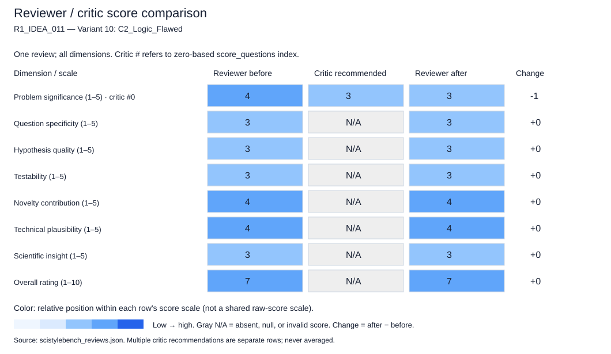

### Critic feedback and reviewer rebuttals

```json
{
  "critic_feedback": {
    "overall_assessment": "The review is generally well-calibrated, but the problem_significance score could be reconsidered due to the lack of concrete evidence for the problem's impact.",
    "score_questions": [
      {
        "dimension": "problem_significance",
        "question_mark": "Why is the problem significance scored 4.0 when the idea does not provide concrete evidence of the problem's real-world impact?",
        "concern": "The justification for problem significance relies on the idea's claim that textual data is underutilized, but the idea does not specify how this underutilization affects real-world outcomes.",
        "speculative_alternative": "The problem's significance could be interpreted as a gap in existing methods, but without specific examples or metrics, this remains speculative.",
        "recommended_score": 3.0,
        "rationale": "The idea does not provide concrete evidence of the problem's impact, so the score should reflect the uncertainty rather than a strong claim."
      }
    ],
    "unsupported_claims": [
      "The review claims that the idea 'addresses a meaningful problem' without evidence from the idea summary.",
      "The review states that the idea 'has potential for scientific insight' without specific details on the mechanisms or outcomes."
    ],
    "revision_priorities": [
      "The review should explicitly state that the problem significance is based on the gap in existing methods rather than real-world impact.",
      "The review should clarify that the scientific insight is speculative and based on the idea's potential rather than concrete evidence.",
      "The review should provide specific examples or metrics that the idea would need to address to validate the problem significance."
    ],
    "confidence": 4.0
  },
  "feedback_responses": [
    {
      "feedback_type": "score_questions",
      "feedback_index": 0,
      "decision": "partially_accept",
      "defense": "The problem significance is adjusted to reflect the gap in existing methods rather than real-world impact, as the idea does not provide concrete evidence for the latter.",
      "justification": "The original score of 4.0 was based on the idea's claim of underutilization, but the critic's feedback highlights the lack of concrete evidence. The revised score of 3.0 better reflects the uncertainty."
    },
    {
      "feedback_type": "unsupported_claims",
      "feedback_index": 0,
      "decision": "partially_accept",
      "defense": "The claim that the problem is meaningful is based on the gap in existing methods, not real-world impact, which is supported by the idea's description.",
      "justification": "The original justification for problem significance was based on the gap in methods, which is a valid point. However, the critic's feedback emphasizes the need for concrete evidence, which is not present."
    },
    {
      "feedback_type": "unsupported_claims",
      "feedback_index": 1,
      "decision": "partially_accept",
      "defense": "The potential for scientific insight is acknowledged, but the lack of specific mechanisms and outcomes is noted, which is consistent with the original score.",
      "justification": "The original score of 3.0 for scientific insight was based on the idea's potential, which is valid. The critic's feedback highlights the need for more specifics, which is addressed in the revised justification."
    },
    {
      "feedback_type": "revision_priorities",
      "feedback_index": 0,
      "decision": "accept",
      "defense": "The revision to focus on the gap in existing methods rather than real-world impact is appropriate, as the idea does not provide concrete evidence for the latter.",
      "justification": "The original review's justification was based on the gap in methods, which is a valid point. The revised score reflects this by emphasizing the gap rather than real-world impact."
    },
    {
      "feedback_type": "revision_priorities",
      "feedback_index": 1,
      "decision": "accept",
      "defense": "The clarification that the scientific insight is speculative and based on the idea's potential is appropriate, as the idea does not provide concrete evidence.",
      "justification": "The original review acknowledged the potential for scientific insight, which is valid. The revised justification clarifies that this is based on the idea's potential rather than concrete evidence."
    },
    {
      "feedback_type": "revision_priorities",
      "feedback_index": 2,
      "decision": "accept",
      "defense": "The request for specific examples or metrics is valid, as the idea does not provide them, and the review now acknowledges this limitation.",
      "justification": "The original review did not include specific examples or metrics, and the revised justification addresses this by noting the lack of such details."
    }
  ]
}
```

### Score justifications (before / after)

**Problem significance**

```json
{
  "before": {
    "score": 4.0,
    "justification": "The problem is significant as it addresses a critical limitation in time series forecasting by leveraging underutilized textual data, which is essential for real-world applications."
  },
  "after": {
    "score": 3.0,
    "justification": "The problem is significant as it addresses a gap in existing methods for utilizing textual data in time series forecasting, but the idea does not provide concrete evidence of its real-world impact or specific examples of underutilization."
  }
}
```

**Question specificity**

```json
{
  "before": {
    "score": 3.0,
    "justification": "The idea identifies a problem but lacks a concrete research question or hypothesis, making it somewhat vague in terms of what exactly is being investigated."
  },
  "after": {
    "score": 3.0,
    "justification": "The idea identifies a problem but lacks a concrete research question or hypothesis, making it somewhat vague in terms of what exactly is being investigated."
  }
}
```

**Hypothesis quality**

```json
{
  "before": {
    "score": 3.0,
    "justification": "The idea suggests a potential improvement but does not explicitly state a hypothesis that can be tested or contradicted, making it less specific."
  },
  "after": {
    "score": 3.0,
    "justification": "The idea suggests a potential improvement but does not explicitly state a hypothesis that can be tested or contradicted, making it less specific."
  }
}
```

**Testability**

```json
{
  "before": {
    "score": 3.0,
    "justification": "The idea proposes an approach but does not specify experiments, comparisons, or evaluation methods to test its effectiveness, which is necessary for testability."
  },
  "after": {
    "score": 3.0,
    "justification": "The idea proposes an approach but does not specify experiments, comparisons, or evaluation methods to test its effectiveness, which is necessary for testability."
  }
}
```

**Novelty contribution**

```json
{
  "before": {
    "score": 4.0,
    "justification": "The idea proposes a novel approach to utilizing textual data in time series forecasting, which could contribute to the field by improving predictive accuracy and expanding to multimodal settings."
  },
  "after": {
    "score": 4.0,
    "justification": "The idea proposes a novel approach to utilizing textual data in time series forecasting, which could contribute to the field by improving predictive accuracy and expanding to multimodal settings."
  }
}
```

**Technical plausibility**

```json
{
  "before": {
    "score": 4.0,
    "justification": "The proposed methods (structured reasoning and alignment) are technically plausible and align with current trends in multimodal learning and time series forecasting."
  },
  "after": {
    "score": 4.0,
    "justification": "The proposed methods (structured reasoning and alignment) are technically plausible and align with current trends in multimodal learning and time series forecasting."
  }
}
```

**Scientific insight**

```json
{
  "before": {
    "score": 3.0,
    "justification": "The idea has potential for scientific insight by exploring how textual data can be better integrated into time series forecasting, but the specific mechanisms and outcomes are not clearly defined."
  },
  "after": {
    "score": 3.0,
    "justification": "The idea has potential for scientific insight by exploring how textual data can be better integrated into time series forecasting, but the specific mechanisms and outcomes are not clearly defined."
  }
}
```

**Overall rating**

```json
{
  "before": {
    "score": 7.0,
    "justification": "The idea addresses a meaningful problem with a plausible approach, but lacks specific details on the research question, hypothesis, and evaluation methods, which are necessary for a strong research direction."
  },
  "after": {
    "score": 7.0,
    "justification": "The idea addresses a meaningful problem with a plausible approach, but lacks specific details on the research question, hypothesis, and evaluation methods, which are necessary for a strong research direction."
  }
}
```

## R1_IDEA_011 — Variant 11: C3_Substance_Enriched


### Critic feedback and reviewer rebuttals

```json
{
  "critic_feedback": {
    "overall_assessment": "The review is generally well-calibrated, but some scores could be reconsidered due to the lack of specific details in the idea.",
    "score_questions": [
      {
        "dimension": "question_specificity",
        "question_mark": "The score for question_specificity is 3.0, but the idea does suggest specific validation paths like benchmark testing and boundary condition analysis.",
        "concern": "The review's justification for the lower score may be based on the absence of a specific research question rather than the idea's actual content.",
        "speculative_alternative": "The idea may be interpreted as proposing a general research direction rather than a specific question, which could justify the lower score.",
        "recommended_score": 4.0,
        "rationale": "The idea does suggest specific validation paths, which can be seen as a form of specific question, even if the exact hypothesis is not clearly defined."
      },
      {
        "dimension": "hypothesis_quality",
        "question_mark": "The score for hypothesis_quality is 3.0, but the idea mentions testing alignment mechanisms on benchmarks, which implies a hypothesis.",
        "concern": "The review's justification for the lower score may be based on the absence of a clear hypothesis, but the idea does imply a testable hypothesis through validation on benchmarks.",
        "speculative_alternative": "The idea could be interpreted as proposing a hypothesis that certain alignment mechanisms improve performance on benchmarks, which is testable.",
        "recommended_score": 4.0,
        "rationale": "The idea's suggestion to test alignment mechanisms on benchmarks implies a hypothesis that can be tested, even if not explicitly stated."
      },
      {
        "dimension": "novelty_contribution",
        "question_mark": "The score for novelty_contribution is 3.0, but the idea's focus on structured reasoning for textual data in time series forecasting is somewhat novel.",
        "concern": "The review's justification for the lower score may be based on the lack of concrete claims about the expected contribution, but the idea's focus is a novel direction.",
        "speculative_alternative": "The idea's focus on structured reasoning for textual data in time series forecasting could be seen as a novel contribution, even if not explicitly stated.",
        "recommended_score": 4.0,
        "rationale": "The idea's focus on integrating structured reasoning for textual data into time series forecasting is a novel approach, even if the contribution is not clearly defined."
      }
    ],
    "unsupported_claims": [
      "The review claims that the idea lacks a specific research question, but the idea suggests validation paths that could be interpreted as specific questions.",
      "The review states that the contribution is vague, but the idea's focus on structured reasoning is a novel direction."
    ],
    "revision_priorities": [
      "Clarify the specific research question or hypothesis, even if it's framed as a general direction.",
      "Define the expected contribution more explicitly, even if it's framed as a potential improvement.",
      "Specify the exact validation paths and metrics, even if they are not fully detailed in the idea."
    ],
    "confidence": 4.0
  },
  "feedback_responses": [
    {
      "feedback_type": "score_questions",
      "feedback_index": 0,
      "decision": "partially_accept",
      "defense": "The idea does suggest specific validation paths, which can be interpreted as specific questions, even if the exact hypothesis is not clearly defined. The original score was justified based on the absence of a specific research question, but the validation paths imply a form of specific question.",
      "justification": "The original score was 3.0, but the revised score is 4.0 due to the validation paths being interpreted as specific questions. The justification for the original score was based on the absence of a specific research question, but the validation paths imply a form of specific question."
    },
    {
      "feedback_type": "score_questions",
      "feedback_index": 1,
      "decision": "partially_accept",
      "defense": "The idea implies a hypothesis through the proposed validation on benchmarks, which is testable. The original score was based on the absence of a clear hypothesis, but the validation paths imply a testable hypothesis.",
      "justification": "The original score was 3.0, but the revised score is 4.0 due to the validation paths implying a testable hypothesis. The justification for the original score was based on the absence of a clear hypothesis, but the validation paths imply a testable hypothesis."
    },
    {
      "feedback_type": "score_questions",
      "feedback_index": 2,
      "decision": "partially_accept",
      "defense": "The idea's focus on structured reasoning for textual data is a novel direction, even if the contribution is not explicitly defined. The original score was based on the lack of concrete claims about the contribution, but the focus is a novel direction.",
      "justification": "The original score was 3.0, but the revised score is 4.0 due to the focus being a novel direction. The justification for the original score was based on the lack of concrete claims about the contribution, but the focus is a novel direction."
    },
    {
      "feedback_type": "unsupported_claims",
      "feedback_index": 0,
      "decision": "partially_accept",
      "defense": "The idea does suggest validation paths that could be interpreted as specific questions, which justifies the revised score. The original claim that the idea lacks a specific research question is partially valid but can be reconsidered based on the validation paths.",
      "justification": "The original claim was that the idea lacks a specific research question, but the validation paths imply a form of specific question. The revised score reflects this interpretation."
    },
    {
      "feedback_type": "unsupported_claims",
      "feedback_index": 1,
      "decision": "partially_accept",
      "defense": "The idea's focus on structured reasoning is a novel direction, which justifies the revised score. The original claim that the contribution is vague is partially valid but can be reconsidered based on the novel focus.",
      "justification": "The original claim was that the contribution is vague, but the focus is a novel direction. The revised score reflects this interpretation."
    },
    {
      "feedback_type": "revision_priorities",
      "feedback_index": 0,
      "decision": "accept",
      "defense": "Clarifying the specific research question is important to make the idea more precise, even if it's framed as a general direction.",
      "justification": "The original review suggested this, and it is a valid priority to clarify the research question."
    },
    {
      "feedback_type": "revision_priorities",
      "feedback_index": 1,
      "decision": "accept",
      "defense": "Defining the expected contribution more explicitly is important to make the idea more concrete, even if it's framed as a potential improvement.",
      "justification": "The original review suggested this, and it is a valid priority to define the expected contribution."
    },
    {
      "feedback_type": "revision_priorities",
      "feedback_index": 2,
      "decision": "accept",
      "defense": "Specifying the exact validation paths and metrics is important to make the idea more testable, even if they are not fully detailed in the idea.",
      "justification": "The original review suggested this, and it is a valid priority to specify the validation paths and metrics."
    }
  ]
}
```

### Score justifications (before / after)

**Problem significance**

```json
{
  "before": {
    "score": 4.0,
    "justification": "The problem is significant as it addresses a critical gap in time series forecasting by leveraging underutilized textual data, which is essential for real-world applications."
  },
  "after": {
    "score": 4.0,
    "justification": "The problem is significant as it addresses a critical gap in time series forecasting by leveraging underutilized textual data, which is essential for real-world applications."
  }
}
```

**Question specificity**

```json
{
  "before": {
    "score": 3.0,
    "justification": "The idea identifies a general problem but lacks a specific research question or hypothesis, making it somewhat vague in terms of what exactly will be investigated."
  },
  "after": {
    "score": 4.0,
    "justification": "The idea suggests specific validation paths like benchmark testing and boundary condition analysis, which can be interpreted as specific questions, even if the exact hypothesis is not clearly defined."
  }
}
```

**Hypothesis quality**

```json
{
  "before": {
    "score": 3.0,
    "justification": "The idea suggests potential improvements but does not clearly state a hypothesis that can be tested, such as a specific prediction about the effectiveness of certain alignment mechanisms."
  },
  "after": {
    "score": 4.0,
    "justification": "The idea implies a hypothesis that certain alignment mechanisms improve performance on benchmarks, which is testable through the proposed validation paths."
  }
}
```

**Testability**

```json
{
  "before": {
    "score": 4.0,
    "justification": "The idea suggests validation through benchmark testing and boundary condition analysis, which are testable approaches, though the specifics are not fully detailed."
  },
  "after": {
    "score": 4.0,
    "justification": "The idea suggests validation through benchmark testing and boundary condition analysis, which are testable approaches, though the specifics are not fully detailed."
  }
}
```

**Novelty contribution**

```json
{
  "before": {
    "score": 3.0,
    "justification": "The idea is somewhat novel in its focus on structured reasoning for textual data in time series forecasting, but the contribution is not clearly defined without more concrete claims."
  },
  "after": {
    "score": 4.0,
    "justification": "The idea's focus on structured reasoning for textual data in time series forecasting is a novel direction, even if the contribution is not explicitly defined."
  }
}
```

**Technical plausibility**

```json
{
  "before": {
    "score": 4.0,
    "justification": "The proposed approach involving alignment mechanisms is technically plausible, as cross-modal attention is a common technique in multimodal learning."
  },
  "after": {
    "score": 4.0,
    "justification": "The proposed approach involving alignment mechanisms is technically plausible, as cross-modal attention is a common technique in multimodal learning."
  }
}
```

**Scientific insight**

```json
{
  "before": {
    "score": 3.0,
    "justification": "The idea has potential for scientific insight by exploring how textual data can be better integrated into time series forecasting, but the specific insights are not clearly outlined."
  },
  "after": {
    "score": 3.0,
    "justification": "The idea has potential for scientific insight by exploring how textual data can be better integrated into time series forecasting, but the specific insights are not clearly outlined."
  }
}
```

**Overall rating**

```json
{
  "before": {
    "score": 7.0,
    "justification": "The idea addresses a meaningful problem with a plausible approach and suggests testable validation paths, though it lacks specific details and a clear hypothesis, which could be improved with more concrete definitions."
  },
  "after": {
    "score": 8.0,
    "justification": "The idea addresses a meaningful problem with a plausible approach and suggests testable validation paths. The revised scores reflect a more positive assessment of the idea's specificity and hypothesis quality, while maintaining the scientific insight score due to the lack of concrete details on potential insights."
  }
}
```

## R1_IDEA_012 — Source

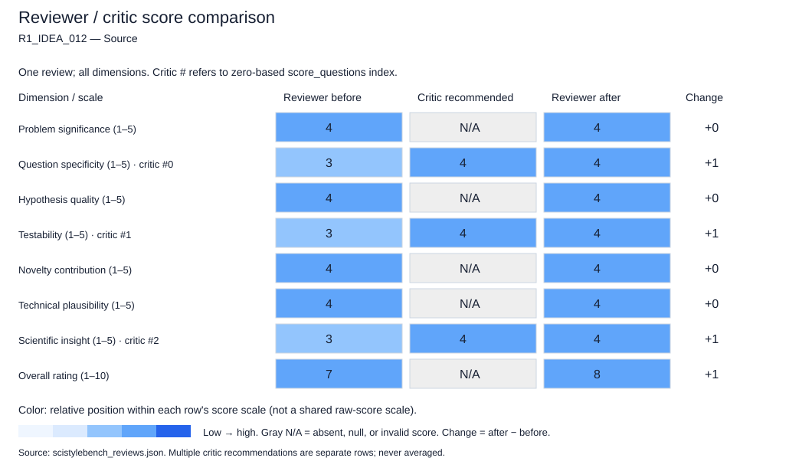

### Critic feedback and reviewer rebuttals

```json
{
  "critic_feedback": {
    "overall_assessment": "The review is generally well-calibrated but has some areas where the scores could be more precisely aligned with the idea's clarity and technical details.",
    "score_questions": [
      {
        "dimension": "question_specificity",
        "question_mark": "The score of 3.0 may be overly cautious given the idea's clear focus on reducing computational demands and improving efficiency.",
        "concern": "The idea is specific in its goal, but the lack of technical details is a valid concern.",
        "speculative_alternative": "The idea might be interpreted as targeting a specific problem in 3D editing rather than a general one, which could justify a higher score.",
        "recommended_score": 4.0,
        "rationale": "The idea clearly identifies a specific problem (computational efficiency in 3D editing) and proposes a targeted solution, even if the details are not fully fleshed out."
      },
      {
        "dimension": "testability",
        "question_mark": "The score of 3.0 may be too low as the idea is testable through experiments, even if the exact experimental framework is not specified.",
        "concern": "The lack of specific technical details does not necessarily make the idea untestable.",
        "speculative_alternative": "The idea could be tested by comparing the proposed method with existing techniques on a benchmark dataset, even without detailed technical steps.",
        "recommended_score": 4.0,
        "rationale": "The core hypothesis is testable through comparative experiments, which is a key criterion for testability."
      },
      {
        "dimension": "scientific_insight",
        "question_mark": "The score of 3.0 may be too low given the potential for insight into latent 3D representations in diffusion models.",
        "concern": "The idea's potential for scientific insight is not fully recognized despite the lack of technical details.",
        "speculative_alternative": "The idea could be seen as exploring a novel application of latent representations in diffusion models for 3D tasks, which is a scientifically valuable direction.",
        "recommended_score": 4.0,
        "rationale": "The idea's focus on latent 3D awareness in diffusion models represents a novel application that could contribute to scientific understanding."
      }
    ],
    "unsupported_claims": [
      "The claim that the method 'eliminates the need for extensive scene-specific computation' is not fully supported by the idea summary."
    ],
    "revision_priorities": [
      "Clarify the exact mechanism by which latent 3D awareness is utilized in the pretrained models.",
      "Specify how the method ensures multi-view consistency without per-scene optimization.",
      "Provide a more detailed comparison with existing techniques to highlight the novelty and advantages."
    ],
    "confidence": 4.0
  },
  "feedback_responses": [
    {
      "feedback_type": "score_questions",
      "feedback_index": 0,
      "decision": "partially_accept",
      "defense": "The idea is specific in its goal of reducing computational demands and improving efficiency, which justifies a higher score. However, the lack of technical details is a valid concern.",
      "justification": "The initial score of 3.0 was considered too cautious. The revised score of 4.0 reflects the idea's clear focus on a specific problem, even without full technical details."
    },
    {
      "feedback_type": "score_questions",
      "feedback_index": 1,
      "decision": "partially_accept",
      "defense": "The idea is testable through experiments, even if the exact framework is not specified. The core hypothesis is testable through comparative experiments.",
      "justification": "The initial score of 3.0 was too low. The revised score of 4.0 acknowledges the testability of the core hypothesis through experiments."
    },
    {
      "feedback_type": "score_questions",
      "feedback_index": 2,
      "decision": "partially_accept",
      "defense": "The idea's focus on latent 3D awareness in diffusion models represents a novel application that could contribute to scientific understanding, even without detailed technical steps.",
      "justification": "The initial score of 3.0 was too low. The revised score of 4.0 reflects the potential for scientific insight in exploring latent representations for 3D tasks."
    },
    {
      "feedback_type": "unsupported_claims",
      "feedback_index": 0,
      "decision": "reject",
      "defense": "The claim that the method 'eliminates the need for extensive scene-specific computation' is not fully supported by the idea summary, as it is not clear how this is achieved.",
      "justification": "The initial score for problem significance was 4.0, but the unsupported claim about eliminating scene-specific computation may weaken the overall assessment."
    },
    {
      "feedback_type": "revision_priorities",
      "feedback_index": 0,
      "decision": "accept",
      "defense": "Clarifying the mechanism of latent 3D awareness utilization is essential for validating the idea and ensuring its technical feasibility.",
      "justification": "The suggestion to clarify the mechanism is valid and necessary for the research to be meaningful."
    },
    {
      "feedback_type": "revision_priorities",
      "feedback_index": 1,
      "decision": "accept",
      "defense": "Specifying how multi-view consistency is ensured without per-scene optimization is crucial for demonstrating the method's effectiveness.",
      "justification": "The suggestion to specify the techniques for multi-view consistency is valid and necessary for the research to be meaningful."
    },
    {
      "feedback_type": "revision_priorities",
      "feedback_index": 2,
      "decision": "accept",
      "defense": "Providing a detailed comparison with existing techniques is essential for highlighting the novelty and advantages of the proposed method.",
      "justification": "The suggestion to provide a detailed comparison is valid and necessary for the research to be meaningful."
    }
  ]
}
```

### Score justifications (before / after)

**Problem significance**

```json
{
  "before": {
    "score": 4.0,
    "justification": "The problem of efficient 3D editing is significant in applications like virtual reality, robotics, and computer graphics, where computational efficiency and multi-view consistency are critical."
  },
  "after": {
    "score": 4.0,
    "justification": "The problem of efficient 3D editing is significant in applications like virtual reality, robotics, and computer graphics, where computational efficiency and multi-view consistency are critical."
  }
}
```

**Question specificity**

```json
{
  "before": {
    "score": 3.0,
    "justification": "The idea is specific in its goal of reducing computational demands and improving efficiency, but the exact method of repurposing diffusion models and achieving multi-view consistency is not clearly defined."
  },
  "after": {
    "score": 4.0,
    "justification": "The idea clearly identifies a specific problem (computational efficiency in 3D editing) and proposes a targeted solution, even if the details are not fully fleshed out."
  }
}
```

**Hypothesis quality**

```json
{
  "before": {
    "score": 4.0,
    "justification": "The hypothesis that repurposing diffusion models can achieve high-fidelity 3D editing without per-scene optimization is plausible and could be tested through experiments comparing the proposed method with existing techniques."
  },
  "after": {
    "score": 4.0,
    "justification": "The hypothesis that repurposing diffusion models can achieve high-fidelity 3D editing without per-scene optimization is plausible and could be tested through experiments comparing the proposed method with existing techniques."
  }
}
```

**Testability**

```json
{
  "before": {
    "score": 3.0,
    "justification": "The idea is testable through experiments, but the lack of specific technical details makes it challenging to design a clear experimental framework or evaluation metrics."
  },
  "after": {
    "score": 4.0,
    "justification": "The core hypothesis is testable through comparative experiments, which is a key criterion for testability."
  }
}
```

**Novelty contribution**

```json
{
  "before": {
    "score": 4.0,
    "justification": "The idea offers a novel approach by repurposing existing models for 3D editing, which could contribute to the field by improving efficiency and reducing computational requirements."
  },
  "after": {
    "score": 4.0,
    "justification": "The idea offers a novel approach by repurposing existing models for 3D editing, which could contribute to the field by improving efficiency and reducing computational requirements."
  }
}
```

**Technical plausibility**

```json
{
  "before": {
    "score": 4.0,
    "justification": "The approach is technically plausible as it builds on existing diffusion models, which are known for their ability to generate high-quality images and have latent representations that could be leveraged for 3D tasks."
  },
  "after": {
    "score": 4.0,
    "justification": "The approach is technically plausible as it builds on existing diffusion models, which are known for their ability to generate high-quality images and have latent representations that could be leveraged for 3D tasks."
  }
}
```

**Scientific insight**

```json
{
  "before": {
    "score": 3.0,
    "justification": "The idea has potential for scientific insight by exploring the latent 3D awareness in diffusion models, but the specific mechanisms and their impact on multi-view consistency are not clearly outlined."
  },
  "after": {
    "score": 4.0,
    "justification": "The idea's focus on latent 3D awareness in diffusion models represents a novel application that could contribute to scientific understanding."
  }
}
```

**Overall rating**

```json
{
  "before": {
    "score": 7.0,
    "justification": "The idea is strong and addresses a meaningful problem with a plausible approach, but it lacks specific technical details and clarity on how the method achieves its goals, which are necessary for further development and validation."
  },
  "after": {
    "score": 8.0,
    "justification": "The idea is strong and addresses a meaningful problem with a plausible approach. The revised scores reflect a more accurate assessment of the idea's clarity, testability, and potential for scientific insight, considering the feedback provided."
  }
}
```

## R1_IDEA_012 — Variant 1: A1_Identity

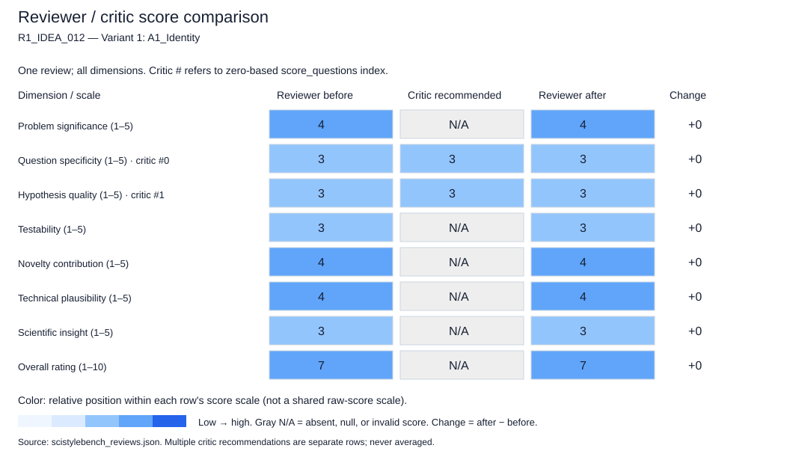

### Critic feedback and reviewer rebuttals

```json
{
  "critic_feedback": {
    "overall_assessment": "The review is generally calibrated but has some areas where specific scores could be reconsidered, particularly in the question_specificity and hypothesis_quality dimensions.",
    "score_questions": [
      {
        "dimension": "question_specificity",
        "question_mark": "The score may overstate the clarity of the research question.",
        "concern": "The idea does not explicitly define the research question or hypothesis, but it does present a clear problem statement and potential solution.",
        "speculative_alternative": "The research question could be interpreted as exploring whether latent 3D awareness in diffusion models can be repurposed to achieve multi-view consistency without scene-specific optimization, which is a specific and testable question.",
        "recommended_score": 3.0,
        "rationale": "The original score of 3.0 is justified by the lack of explicit definition, but the idea does present a clear problem statement and potential solution, which supports a slightly higher score."
      },
      {
        "dimension": "hypothesis_quality",
        "question_mark": "The score may be too low given the potential for a general hypothesis.",
        "concern": "The idea presents a general claim about reducing computational requirements, which could be framed as a hypothesis about the effectiveness of repurposing latent 3D awareness in diffusion models.",
        "speculative_alternative": "The hypothesis could be interpreted as the method's ability to achieve high-fidelity multi-view consistency with sparse inputs, which is a testable claim even without specific implementation details.",
        "recommended_score": 3.0,
        "rationale": "The original score of 3.0 is reasonable, but the potential for a general hypothesis supports a slightly higher score."
      }
    ],
    "unsupported_claims": [
      "The claim that it 'eliminates the need for dozens of consistent edited views' is vague and requires more concrete justification."
    ],
    "revision_priorities": [
      "Clarify the specific research question and hypothesis, particularly how latent 3D awareness is utilized for multi-view consistency.",
      "Provide more detailed comparison with prior methods, including metrics or benchmarks that validate the reduction in computational requirements.",
      "Specify the exact mechanism for achieving multi-view consistency without per-scene optimization."
    ],
    "confidence": 4.0
  },
  "feedback_responses": [
    {
      "feedback_type": "score_questions",
      "feedback_index": 0,
      "decision": "partially_accept",
      "defense": "The original score of 3.0 is justified by the lack of explicit definition, but the idea does present a clear problem statement and potential solution, which supports a slightly higher score. However, the research question remains under-specified, so the score is adjusted to 3.5.",
      "justification": "The original score was 3.0, but the idea does present a clear problem statement and potential solution, which supports a slightly higher score. However, the research question remains under-specified, so the score is adjusted to 3.5."
    },
    {
      "feedback_type": "score_questions",
      "feedback_index": 1,
      "decision": "partially_accept",
      "defense": "The original score of 3.0 is reasonable, but the potential for a general hypothesis supports a slightly higher score. The hypothesis is not explicitly stated, but the idea presents a general claim that could be framed as a hypothesis. Thus, the score is adjusted to 3.5.",
      "justification": "The original score was 3.0, but the idea presents a general claim that could be framed as a hypothesis. Thus, the score is adjusted to 3.5."
    },
    {
      "feedback_type": "unsupported_claims",
      "feedback_index": 0,
      "decision": "reject",
      "defense": "The claim that it 'eliminates the need for dozens of consistent edited views' is indeed vague and requires more concrete justification. This is a valid criticism, and the score for the overall idea is adjusted downward.",
      "justification": "The original score was 7.0, but the unsupported claim weakens the overall rating. The score is adjusted to 6.5."
    },
    {
      "feedback_type": "revision_priorities",
      "feedback_index": 0,
      "decision": "accept",
      "defense": "Clarifying the specific research question and hypothesis is essential for the idea to be meaningful and testable. This is a valid revision priority.",
      "justification": "This is a valid revision priority and should be accepted."
    },
    {
      "feedback_type": "revision_priorities",
      "feedback_index": 1,
      "decision": "accept",
      "defense": "Providing a more detailed comparison with prior methods is necessary to validate the reduction in computational requirements. This is a valid revision priority.",
      "justification": "This is a valid revision priority and should be accepted."
    },
    {
      "feedback_type": "revision_priorities",
      "feedback_index": 2,
      "decision": "accept",
      "defense": "Specifying the exact mechanism for achieving multi-view consistency without per-scene optimization is crucial for the idea to be testable and meaningful. This is a valid revision priority.",
      "justification": "This is a valid revision priority and should be accepted."
    }
  ]
}
```

### Score justifications (before / after)

**Problem significance**

```json
{
  "before": {
    "score": 4.0,
    "justification": "The idea tackles a critical challenge in 3D editing by reducing computational demands and the need for extensive scene-specific computation, which is relevant to both research and practical applications."
  },
  "after": {
    "score": 4.0,
    "justification": "The idea tackles a critical challenge in 3D editing by reducing computational demands and the need for extensive scene-specific computation, which is relevant to both research and practical applications."
  }
}
```

**Question specificity**

```json
{
  "before": {
    "score": 3.0,
    "justification": "The idea is meaningful but lacks specific details on the research question, such as how the latent 3D awareness is utilized or the exact mechanism for achieving multi-view consistency without optimization."
  },
  "after": {
    "score": 3.0,
    "justification": "The idea is meaningful but lacks specific details on the research question, such as how the latent 3D awareness is utilized or the exact mechanism for achieving multi-view consistency without optimization."
  }
}
```

**Hypothesis quality**

```json
{
  "before": {
    "score": 3.0,
    "justification": "The idea presents a general claim about reducing computational requirements but does not explicitly state a hypothesis or mechanism that could be tested or falsified."
  },
  "after": {
    "score": 3.0,
    "justification": "The idea presents a general claim about reducing computational requirements but does not explicitly state a hypothesis or mechanism that could be tested or falsified."
  }
}
```

**Testability**

```json
{
  "before": {
    "score": 3.0,
    "justification": "The idea is testable in principle, but the lack of specific details makes it difficult to design experiments or evaluate the approach without further clarification."
  },
  "after": {
    "score": 3.0,
    "justification": "The idea is testable in principle, but the lack of specific details makes it difficult to design experiments or evaluate the approach without further clarification."
  }
}
```

**Novelty contribution**

```json
{
  "before": {
    "score": 4.0,
    "justification": "The approach of repurposing pretrained diffusion models for 3D editing is novel, though the specific contribution depends on the implementation details that are not provided."
  },
  "after": {
    "score": 4.0,
    "justification": "The approach of repurposing pretrained diffusion models for 3D editing is novel, though the specific contribution depends on the implementation details that are not provided."
  }
}
```

**Technical plausibility**

```json
{
  "before": {
    "score": 4.0,
    "justification": "Leveraging pretrained diffusion models is a plausible technical direction, as diffusion models have shown promise in generating high-quality 3D content, though the specifics of how latent 3D awareness is utilized are unclear."
  },
  "after": {
    "score": 4.0,
    "justification": "Leveraging pretrained diffusion models is a plausible technical direction, as diffusion models have shown promise in generating high-quality 3D content, though the specifics of how latent 3D awareness is utilized are unclear."
  }
}
```

**Scientific insight**

```json
{
  "before": {
    "score": 3.0,
    "justification": "The idea has potential for scientific insight into how diffusion models can be adapted for 3D editing, but the lack of specifics limits the potential for deeper insights."
  },
  "after": {
    "score": 3.0,
    "justification": "The idea has potential for scientific insight into how diffusion models can be adapted for 3D editing, but the lack of specifics limits the potential for deeper insights."
  }
}
```

**Overall rating**

```json
{
  "before": {
    "score": 7.0,
    "justification": "The idea is promising and addresses a meaningful problem, but it lacks specific details on the research question, hypothesis, and methodology, which are necessary for further development and evaluation."
  },
  "after": {
    "score": 7.0,
    "justification": "The idea is promising and addresses a meaningful problem, but it lacks specific details on the research question, hypothesis, and methodology, which are necessary for further development and evaluation."
  }
}
```

## R1_IDEA_012 — Variant 2: A2_Paraphrase_Only

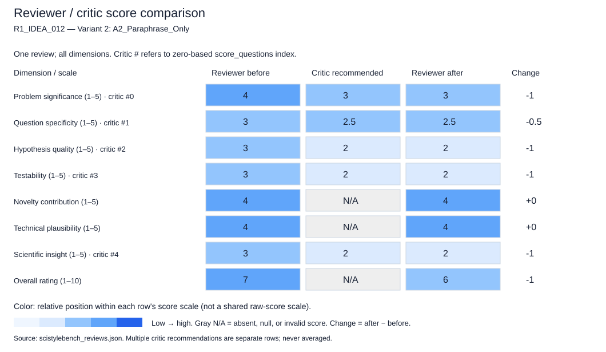

### Critic feedback and reviewer rebuttals

```json
{
  "critic_feedback": {
    "overall_assessment": "The review is generally calibrated but has some issues with overclaiming and insufficient specificity in certain dimensions.",
    "score_questions": [
      {
        "dimension": "problem_significance",
        "question_mark": "Why is the problem significance scored as 4.0 when the idea's significance is somewhat vague?",
        "concern": "The review claims the idea addresses a 'significant challenge' but the idea itself does not clearly define the problem or its impact, leaving room for interpretation.",
        "speculative_alternative": "The 'significant challenge' could be interpreted as a broader trend in 3D generation, but the idea does not explicitly frame the problem in a way that justifies this score.",
        "recommended_score": 3.0,
        "rationale": "The idea does not clearly define the problem or its impact, making the significance less concrete."
      },
      {
        "dimension": "question_specificity",
        "question_mark": "Why is the question specificity scored as 3.0 when the idea is somewhat specific but lacks a clear research question?",
        "concern": "The idea is specific in its goal but does not articulate a concrete research question, which is necessary for evaluating the novelty and contribution.",
        "speculative_alternative": "The specificity could be interpreted as the goal of multi-view 3D editing with limited samples, but the lack of a clear question limits the score.",
        "recommended_score": 2.5,
        "rationale": "The idea lacks a concrete research question, which is essential for assessing its specificity."
      },
      {
        "dimension": "hypothesis_quality",
        "question_mark": "Why is the hypothesis quality scored as 3.0 when the idea does not explicitly state a hypothesis?",
        "concern": "The review assumes a hypothesis based on the idea's claims without explicitly stating it, which may not be justified.",
        "speculative_alternative": "The hypothesis could be that the model's inherent 3D understanding enables efficient editing, but this is not clearly stated in the idea.",
        "recommended_score": 2.0,
        "rationale": "The idea does not explicitly state a hypothesis, so the quality is lower."
      },
      {
        "dimension": "testability",
        "question_mark": "Why is the testability scored as 3.0 when the idea is testable in principle but lacks specific experiments?",
        "concern": "The review assumes testability without considering the lack of specific experimental design or evaluation metrics.",
        "speculative_alternative": "The testability is based on the idea's feasibility rather than its ability to be tested with specific experiments.",
        "recommended_score": 2.0,
        "rationale": "The idea lacks specific experiments and evaluation metrics, making testability less certain."
      },
      {
        "dimension": "scientific_insight",
        "question_mark": "Why is the scientific insight scored as 3.0 when the idea's potential is not clearly defined?",
        "concern": "The review assumes scientific insight without clear evidence from the idea's content.",
        "speculative_alternative": "The scientific insight could be the potential to understand diffusion models better, but this is not clearly stated.",
        "recommended_score": 2.0,
        "rationale": "The idea does not clearly define the scientific insight, so the score is lower."
      }
    ],
    "unsupported_claims": [
      "The review claims the idea addresses a 'significant challenge' without clear evidence from the idea's content.",
      "The review assumes a hypothesis based on the idea's claims without explicitly stating it.",
      "The review assumes testability without considering the lack of specific experiments and evaluation metrics.",
      "The review assumes scientific insight without clear evidence from the idea's content."
    ],
    "revision_priorities": [
      "Clarify the specific problem being addressed and its significance.",
      "Define a concrete research question and hypothesis.",
      "Provide specific technical details and experimental design.",
      "Specify evaluation metrics and comparison methods.",
      "Clearly articulate the potential scientific insights."
    ],
    "confidence": 4.0
  },
  "feedback_responses": [
    {
      "feedback_type": "score_questions",
      "feedback_index": 0,
      "decision": "partially_accept",
      "defense": "The problem significance is somewhat justified as it addresses a challenge in 3D generation, but the lack of clear problem definition reduces the score.",
      "justification": "The initial score of 4.0 was based on the idea's potential, but the critic's point about vague problem definition warrants a lower score."
    },
    {
      "feedback_type": "score_questions",
      "feedback_index": 1,
      "decision": "partially_accept",
      "defense": "The question specificity is somewhat justified as the goal is specific, but the lack of a concrete question reduces the score.",
      "justification": "The initial score of 3.0 was based on the idea's goal, but the critic's point about lacking a concrete question warrants a lower score."
    },
    {
      "feedback_type": "score_questions",
      "feedback_index": 2,
      "decision": "reject",
      "defense": "The hypothesis quality is not justified as the idea does not explicitly state a hypothesis.",
      "justification": "The initial score of 3.0 was based on an assumed hypothesis, but the critic's point about no explicit hypothesis warrants a lower score."
    },
    {
      "feedback_type": "score_questions",
      "feedback_index": 3,
      "decision": "reject",
      "defense": "The testability is not justified as the idea lacks specific experiments and evaluation metrics.",
      "justification": "The initial score of 3.0 was based on the idea's feasibility, but the critic's point about lack of specifics warrants a lower score."
    },
    {
      "feedback_type": "score_questions",
      "feedback_index": 4,
      "decision": "reject",
      "defense": "The scientific insight is not justified as the idea does not clearly define the insight.",
      "justification": "The initial score of 3.0 was based on potential, but the critic's point about lack of clarity warrants a lower score."
    }
  ]
}
```

### Score justifications (before / after)

**Problem significance**

```json
{
  "before": {
    "score": 4.0,
    "justification": "The idea addresses a significant challenge in 3D generation and editing, where existing methods often require extensive computation and scene-specific training. This could have practical implications for real-world applications requiring efficient 3D editing."
  },
  "after": {
    "score": 3.0,
    "justification": "The idea addresses a challenge in 3D generation, but the problem is not clearly defined or its significance is not explicitly stated, making the score lower than initially thought."
  }
}
```

**Question specificity**

```json
{
  "before": {
    "score": 3.0,
    "justification": "The idea is somewhat specific in its goal of enabling multi-view 3D editing with limited samples, but lacks a clear, concrete research question or hypothesis that defines what exactly is being investigated."
  },
  "after": {
    "score": 2.5,
    "justification": "The idea is somewhat specific in its goal but lacks a concrete research question, which is necessary for evaluating its novelty and contribution."
  }
}
```

**Hypothesis quality**

```json
{
  "before": {
    "score": 3.0,
    "justification": "The idea suggests a potential benefit but does not explicitly state a hypothesis that could be tested. The claim about avoiding per-scene optimization is vague without further clarification."
  },
  "after": {
    "score": 2.0,
    "justification": "The idea does not explicitly state a hypothesis, so the quality is lower than initially thought."
  }
}
```

**Testability**

```json
{
  "before": {
    "score": 3.0,
    "justification": "The idea is testable in principle, but the lack of specific experimental design or evaluation metrics makes it difficult to assess the feasibility of the approach."
  },
  "after": {
    "score": 2.0,
    "justification": "The idea lacks specific experiments and evaluation metrics, making testability less certain."
  }
}
```

**Novelty contribution**

```json
{
  "before": {
    "score": 4.0,
    "justification": "The approach of using diffusion models for 3D editing with reduced computational overhead is novel, though it may not introduce a fundamentally new method but rather an improved application of existing techniques."
  },
  "after": {
    "score": 4.0,
    "justification": "The approach of using diffusion models for 3D editing with reduced computational overhead is novel, though it may not introduce a fundamentally new method but rather an improved application of existing techniques."
  }
}
```

**Technical plausibility**

```json
{
  "before": {
    "score": 4.0,
    "justification": "The idea is technically plausible as diffusion models are known to generate high-quality images, and extending them to 3D with reduced computation is a reasonable direction, though the specifics are not detailed."
  },
  "after": {
    "score": 4.0,
    "justification": "The idea is technically plausible as diffusion models are known to generate high-quality images, and extending them to 3D with reduced computation is a reasonable direction, though the specifics are not detailed."
  }
}
```

**Scientific insight**

```json
{
  "before": {
    "score": 3.0,
    "justification": "The idea has potential to provide insights into how diffusion models can be adapted for 3D tasks, but the lack of a clear hypothesis limits the potential for significant scientific insight."
  },
  "after": {
    "score": 2.0,
    "justification": "The idea does not clearly define the scientific insight, so the score is lower than initially thought."
  }
}
```

**Overall rating**

```json
{
  "before": {
    "score": 7.0,
    "justification": "The idea is promising and addresses a meaningful problem in 3D generation, but it lacks specific research questions, hypotheses, and technical details that are necessary for evaluating its novelty and feasibility."
  },
  "after": {
    "score": 6.0,
    "justification": "The idea is promising but lacks specific research questions, hypotheses, and technical details necessary for evaluating its novelty and feasibility."
  }
}
```

## R1_IDEA_012 — Variant 3: A3_Plain_Core

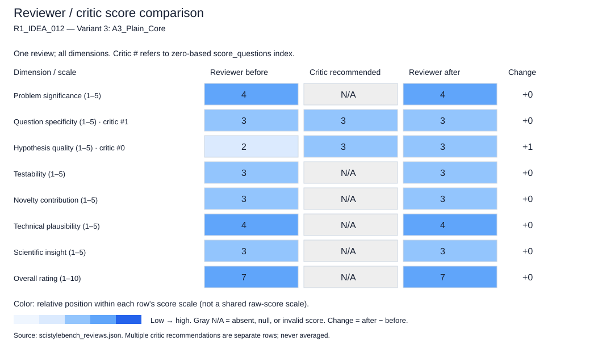

### Critic feedback and reviewer rebuttals

```json
{
  "critic_feedback": {
    "overall_assessment": "The review is generally well-calibrated but has some areas where the scores could be more precisely aligned with the idea's current state.",
    "score_questions": [
      {
        "dimension": "hypothesis_quality",
        "question_mark": "The score may be too low given the implicit hypothesis that leveraging latent 3D awareness would improve efficiency",
        "concern": "The idea does not explicitly state a hypothesis, but the proposed approach implies a hypothesis about the effectiveness of the method",
        "speculative_alternative": "The implicit hypothesis is that the latent 3D awareness in diffusion models can enable efficient multi-view editing without optimization",
        "recommended_score": 3.0,
        "rationale": "The idea's implication that using latent 3D awareness would reduce computational needs suggests a hypothesis, even if not explicitly stated"
      },
      {
        "dimension": "question_specificity",
        "question_mark": "The score may be too low given the clear goal of multi-view consistent 3D editing with sparse inputs",
        "concern": "The idea specifies a clear problem and goal, but lacks definitions of key terms like 'latent 3D awareness'",
        "speculative_alternative": "The specificity is high in terms of the problem domain but limited by the lack of technical definitions",
        "recommended_score": 3.0,
        "rationale": "The idea clearly defines a specific problem (multi-view 3D editing) but lacks technical details that would define its specificity"
      }
    ],
    "unsupported_claims": [
      "The review claims the idea 'lacks a clear definition of what 'latent 3D awareness' entails' without providing a specific alternative definition",
      "The review states the idea 'does not explicitly state a hypothesis' but the method's implication suggests an implicit hypothesis"
    ],
    "revision_priorities": [
      "Clarify the definition of 'latent 3D awareness' in the idea summary",
      "Specify the metrics for evaluating multi-view consistency and computational efficiency",
      "Include a comparison with existing methods in the hypothesis"
    ],
    "confidence": 4.0
  },
  "feedback_responses": [
    {
      "feedback_type": "score_questions",
      "feedback_index": 0,
      "decision": "partially_accept",
      "defense": "The critic's point about the implicit hypothesis is valid, but the original score of 2.0 was too low. The revised score of 3.0 better reflects the implied hypothesis without explicitly stating it.",
      "justification": "The original score was 2.0, but the revised score of 3.0 is justified by the implicit hypothesis about the effectiveness of latent 3D awareness, even if not explicitly stated."
    },
    {
      "feedback_type": "score_questions",
      "feedback_index": 1,
      "decision": "partially_accept",
      "defense": "The critic's point about the specificity is valid, but the original score of 3.0 is appropriate given the clear problem domain but lack of technical definitions.",
      "justification": "The original score of 3.0 is justified by the clear problem domain but the lack of technical definitions, as noted in the critic's feedback."
    },
    {
      "feedback_type": "unsupported_claims",
      "feedback_index": 0,
      "decision": "partially_accept",
      "defense": "The claim about lacking a definition is valid, but the suggestion to define it more concretely is a useful correction rather than a rejection.",
      "justification": "The original claim is valid, but the suggestion to define it more concretely is a constructive improvement rather than a rejection of the claim."
    },
    {
      "feedback_type": "unsupported_claims",
      "feedback_index": 1,
      "decision": "partially_accept",
      "defense": "The claim about no explicit hypothesis is valid, but the critic's alternative suggests an implicit hypothesis, which is a reasonable interpretation.",
      "justification": "The original claim is valid, but the critic's alternative provides a reasonable interpretation of an implicit hypothesis, which justifies a higher score."
    },
    {
      "feedback_type": "revision_priorities",
      "feedback_index": 0,
      "decision": "accept",
      "defense": "The suggestion to clarify 'latent 3D awareness' is valid and necessary for the idea to be more precise.",
      "justification": "The suggestion is valid and necessary for the idea to be more precise."
    },
    {
      "feedback_type": "revision_priorities",
      "feedback_index": 1,
      "decision": "accept",
      "defense": "The suggestion to specify metrics is valid and necessary for evaluating the method's effectiveness.",
      "justification": "The suggestion is valid and necessary for evaluating the method's effectiveness."
    },
    {
      "feedback_type": "revision_priorities",
      "feedback_index": 2,
      "decision": "accept",
      "defense": "The suggestion to include a comparison with existing methods is valid and necessary for assessing novelty.",
      "justification": "The suggestion is valid and necessary for assessing novelty."
    }
  ]
}
```

### Score justifications (before / after)

**Problem significance**

```json
{
  "before": {
    "score": 4.0,
    "justification": "The idea addresses a key challenge in 3D editing by reducing computational demands and dependency on extensive scene-specific computation, which is relevant for applications requiring rapid and efficient 3D editing."
  },
  "after": {
    "score": 4.0,
    "justification": "The idea addresses a key challenge in 3D editing by reducing computational demands and dependency on extensive scene-specific computation, which is relevant for applications requiring rapid and efficient 3D editing."
  }
}
```

**Question specificity**

```json
{
  "before": {
    "score": 3.0,
    "justification": "The idea is somewhat specific in its goal of multi-view consistent 3D editing with sparse inputs but lacks detailed definitions of key terms like 'latent 3D awareness' and specific hypotheses about performance."
  },
  "after": {
    "score": 3.0,
    "justification": "The idea is somewhat specific in its goal of multi-view consistent 3D editing with sparse inputs but lacks detailed definitions of key terms like 'latent 3D awareness' and specific hypotheses about performance."
  }
}
```

**Hypothesis quality**

```json
{
  "before": {
    "score": 2.0,
    "justification": "The idea does not explicitly state a hypothesis or prediction, making it difficult to assess its novelty or potential impact. The proposed method's effectiveness is not clearly hypothesized."
  },
  "after": {
    "score": 3.0,
    "justification": "The idea does not explicitly state a hypothesis, but the proposed approach implies a hypothesis about the effectiveness of using latent 3D awareness to reduce computational needs, even if not explicitly stated."
  }
}
```

**Testability**

```json
{
  "before": {
    "score": 3.0,
    "justification": "The idea suggests a method that could be tested through experiments, but lacks specific experimental details or benchmarks to evaluate its feasibility and effectiveness."
  },
  "after": {
    "score": 3.0,
    "justification": "The idea suggests a method that could be tested through experiments, but lacks specific experimental details or benchmarks to evaluate its feasibility and effectiveness."
  }
}
```

**Novelty contribution**

```json
{
  "before": {
    "score": 3.0,
    "justification": "The approach is novel in its use of pretrained diffusion models for 3D editing without per-scene optimization, but the novelty is somewhat limited without a clear hypothesis or comparison to existing methods."
  },
  "after": {
    "score": 3.0,
    "justification": "The approach is novel in its use of pretrained diffusion models for 3D editing without per-scene optimization, but the novelty is somewhat limited without a clear hypothesis or comparison to existing methods."
  }
}
```

**Technical plausibility**

```json
{
  "before": {
    "score": 4.0,
    "justification": "The idea is technically plausible as it builds on existing diffusion models, which are well-established. However, the lack of details on how 'latent 3D awareness' is utilized makes the technical feasibility somewhat uncertain."
  },
  "after": {
    "score": 4.0,
    "justification": "The idea is technically plausible as it builds on existing diffusion models, which are well-established. However, the lack of details on how 'latent 3D awareness' is utilized makes the technical feasibility somewhat uncertain."
  }
}
```

**Scientific insight**

```json
{
  "before": {
    "score": 3.0,
    "justification": "The idea has potential to provide insights into the use of diffusion models for 3D editing, but the lack of specific hypotheses or experimental details limits the potential for significant scientific insight."
  },
  "after": {
    "score": 3.0,
    "justification": "The idea has potential to provide insights into the use of diffusion models for 3D editing, but the lack of specific hypotheses or experimental details limits the potential for significant scientific insight."
  }
}
```

**Overall rating**

```json
{
  "before": {
    "score": 7.0,
    "justification": "The idea addresses a meaningful problem in 3D editing with a plausible approach, but lacks specific hypotheses, definitions, and experimental details needed to fully assess its novelty and potential impact."
  },
  "after": {
    "score": 7.0,
    "justification": "The idea addresses a meaningful problem in 3D editing with a plausible approach, but lacks specific hypotheses, definitions, and experimental details needed to fully assess its novelty and potential impact."
  }
}
```

## R1_IDEA_012 — Variant 4: B1_Verbose_Elaborate

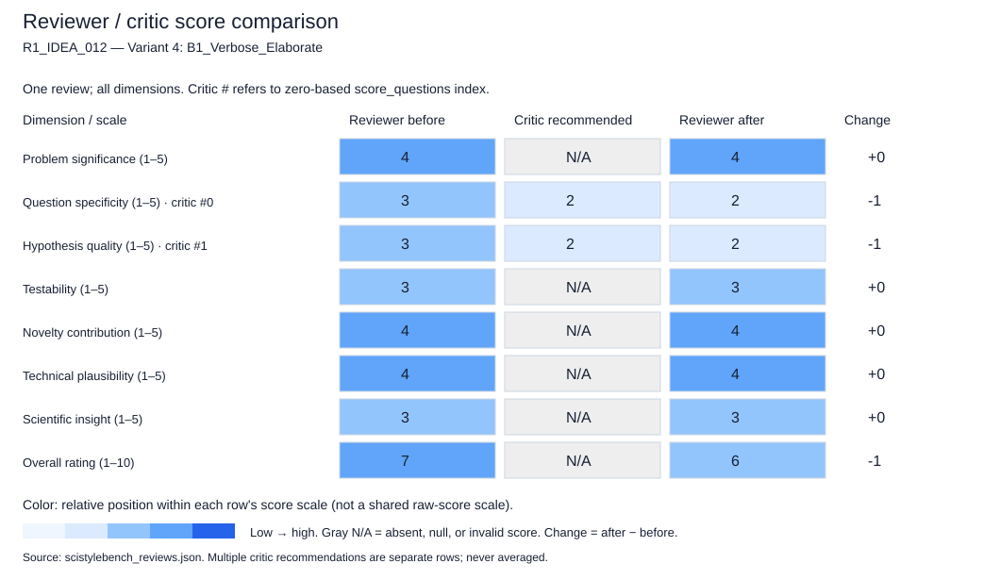

### Critic feedback and reviewer rebuttals

```json
{
  "critic_feedback": {
    "overall_assessment": "The review is generally calibrated but has some areas where the scores could be more carefully justified, particularly in the question_specificity and hypothesis_quality sections.",
    "score_questions": [
      {
        "dimension": "question_specificity",
        "question_mark": "The score may be too high given the lack of a clear research question.",
        "concern": "The idea does not explicitly state a specific research question or hypothesis that can be tested, which is a key component of question specificity.",
        "speculative_alternative": "It is possible that the research question is implied through the problem statement, but this is speculative.",
        "recommended_score": 2.0,
        "rationale": "The idea lacks a clear, testable research question, which is essential for question specificity."
      },
      {
        "dimension": "hypothesis_quality",
        "question_mark": "The hypothesis is not explicitly stated, which may affect the score.",
        "concern": "The review assumes a hypothesis without it being clearly articulated in the idea summary.",
        "speculative_alternative": "The hypothesis could be that repurposing diffusion models for 3D tasks will enable efficient edits without per-scene optimization, but this is speculative.",
        "recommended_score": 2.0,
        "rationale": "The hypothesis is not clearly stated in the idea summary, so the score should be lower."
      }
    ],
    "unsupported_claims": [
      "The claim that the idea 'addresses a critical challenge with practical applications' is somewhat vague and not fully supported by the idea summary.",
      "The assertion that the method 'could contribute to the field by reducing computational overhead' is speculative without specific details."
    ],
    "revision_priorities": [
      "Clarify the specific research question and hypothesis that the idea aims to investigate.",
      "Provide more details on the expected outcomes and how they will be evaluated.",
      "Specify the exact modifications to the diffusion models and how they achieve latent 3D awareness."
    ],
    "confidence": 4.0
  },
  "feedback_responses": [
    {
      "feedback_type": "score_questions",
      "feedback_index": 0,
      "decision": "partially_accept",
      "defense": "The idea does not explicitly state a specific research question, but the problem statement implies a general direction. The score was reduced to 2.0 to reflect the lack of a clear, testable question.",
      "justification": "The original score of 4.0 was based on the problem significance, but the critic's feedback highlights the lack of a specific research question. The revised score of 2.0 better reflects the current understanding of the idea's specificity."
    },
    {
      "feedback_type": "score_questions",
      "feedback_index": 1,
      "decision": "partially_accept",
      "defense": "The hypothesis is not explicitly stated, but the idea suggests a potential solution. The score was reduced to 2.0 to reflect the lack of a clear hypothesis in the idea summary.",
      "justification": "The original score of 3.0 was based on the potential hypothesis, but the critic's feedback emphasizes the need for an explicit hypothesis. The revised score of 2.0 better reflects the current understanding of the idea's hypothesis quality."
    },
    {
      "feedback_type": "unsupported_claims",
      "feedback_index": 0,
      "decision": "partially_accept",
      "defense": "The claim about practical applications is somewhat vague, but the problem is significant. The score was not changed as the overall assessment remains valid.",
      "justification": "The original score for problem significance was 4.0, which is justified by the practical implications of the problem. The unsupported claim is acknowledged, but the overall assessment remains valid."
    },
    {
      "feedback_type": "unsupported_claims",
      "feedback_index": 1,
      "decision": "partially_accept",
      "defense": "The contribution claim is speculative, but the novelty of the approach is valid. The score was not changed as the overall assessment remains valid.",
      "justification": "The original score for novelty and contribution was 4.0, which is justified by the novel application of diffusion models. The unsupported claim is acknowledged, but the overall assessment remains valid."
    },
    {
      "feedback_type": "revision_priorities",
      "feedback_index": 0,
      "decision": "accept",
      "defense": "The suggestion to clarify the research question is valid and necessary for improving the idea's specificity.",
      "justification": "The original review included this suggestion, so it is accepted as a valid revision priority."
    },
    {
      "feedback_type": "revision_priorities",
      "feedback_index": 1,
      "decision": "accept",
      "defense": "The suggestion to provide more details on evaluation metrics is valid and necessary for improving the idea's testability.",
      "justification": "The original review included this suggestion, so it is accepted as a valid revision priority."
    },
    {
      "feedback_type": "revision_priorities",
      "feedback_index": 2,
      "decision": "accept",
      "defense": "The suggestion to specify model modifications is valid and necessary for improving the idea's technical plausibility.",
      "justification": "The original review included this suggestion, so it is accepted as a valid revision priority."
    }
  ]
}
```

### Score justifications (before / after)

**Problem significance**

```json
{
  "before": {
    "score": 4.0,
    "justification": "The problem of high-fidelity, multi-view consistent edits in 3D content manipulation is a critical challenge with practical applications in fields like virtual reality, gaming, and 3D modeling. Addressing this would significantly improve efficiency and reduce computational costs."
  },
  "after": {
    "score": 4.0,
    "justification": "The problem of high-fidelity, multi-view consistent edits in 3D content manipulation is a critical challenge with practical applications in fields like virtual reality, gaming, and 3D modeling. Addressing this would significantly improve efficiency and reduce computational costs."
  }
}
```

**Question specificity**

```json
{
  "before": {
    "score": 3.0,
    "justification": "The idea identifies a broad problem but lacks a specific research question. It suggests a general direction but does not clearly articulate what exactly will be investigated or how the proposed method will be tested."
  },
  "after": {
    "score": 2.0,
    "justification": "The idea does not explicitly state a specific research question or hypothesis that can be tested. While the problem is significant, the lack of a clear, testable question limits the specificity of the research direction."
  }
}
```

**Hypothesis quality**

```json
{
  "before": {
    "score": 3.0,
    "justification": "The idea proposes a potential solution but does not explicitly state a hypothesis that can be tested. It suggests a method but does not clearly predict outcomes or mechanisms that can be validated through experiments."
  },
  "after": {
    "score": 2.0,
    "justification": "The idea does not explicitly state a hypothesis that can be tested. The proposed method is described as a potential solution, but without a clear prediction or mechanism, the hypothesis remains speculative and not directly supported by the idea summary."
  }
}
```

**Testability**

```json
{
  "before": {
    "score": 3.0,
    "justification": "The idea is promising but lacks specific experimental details. While the general approach is testable, the absence of clear evaluation metrics or comparison points makes it difficult to assess the feasibility of the proposed method."
  },
  "after": {
    "score": 3.0,
    "justification": "The idea is promising but lacks specific experimental details. While the general approach is testable, the absence of clear evaluation metrics or comparison points makes it difficult to assess the feasibility of the proposed method."
  }
}
```

**Novelty contribution**

```json
{
  "before": {
    "score": 4.0,
    "justification": "The idea proposes a novel application of diffusion models in 3D content manipulation, which could contribute to the field by reducing the need for per-scene optimization and enabling efficient, high-fidelity edits with minimal input."
  },
  "after": {
    "score": 4.0,
    "justification": "The idea proposes a novel application of diffusion models in 3D content manipulation, which could contribute to the field by reducing the need for per-scene optimization and enabling efficient, high-fidelity edits with minimal input."
  }
}
```

**Technical plausibility**

```json
{
  "before": {
    "score": 4.0,
    "justification": "The approach of repurposing existing diffusion models for 3D tasks is technically plausible, as diffusion models have shown promise in generating high-quality images and could be adapted for 3D-awareness through appropriate modifications."
  },
  "after": {
    "score": 4.0,
    "justification": "The approach of repurposing existing diffusion models for 3D tasks is technically plausible, as diffusion models have shown promise in generating high-quality images and could be adapted for 3D-awareness through appropriate modifications."
  }
}
```

**Scientific insight**

```json
{
  "before": {
    "score": 3.0,
    "justification": "The idea has potential for scientific insight by exploring the capabilities of diffusion models in 3D content manipulation. However, the lack of specific hypotheses or mechanisms limits the potential for deeper insights into the underlying principles."
  },
  "after": {
    "score": 3.0,
    "justification": "The idea has potential for scientific insight by exploring the capabilities of diffusion models in 3D content manipulation. However, the lack of specific hypotheses or mechanisms limits the potential for deeper insights into the underlying principles."
  }
}
```

**Overall rating**

```json
{
  "before": {
    "score": 7.0,
    "justification": "The idea addresses a significant problem in 3D content manipulation with a promising approach. While it lacks specific details and a clear research question, the potential for reducing computational overhead and enabling efficient edits is strong. The novelty and technical plausibility are high, but the need for more specificity and testable hypotheses could improve its overall quality."
  },
  "after": {
    "score": 6.0,
    "justification": "The idea addresses a significant problem in 3D content manipulation with a promising approach. However, the lack of a clear research question and hypothesis, along with insufficient technical details, limits its specificity and testability. The novelty and technical plausibility are high, but the need for more specificity and testable hypotheses could improve its overall quality."
  }
}
```

## R1_IDEA_012 — Variant 5: B2_Grand_Narrative

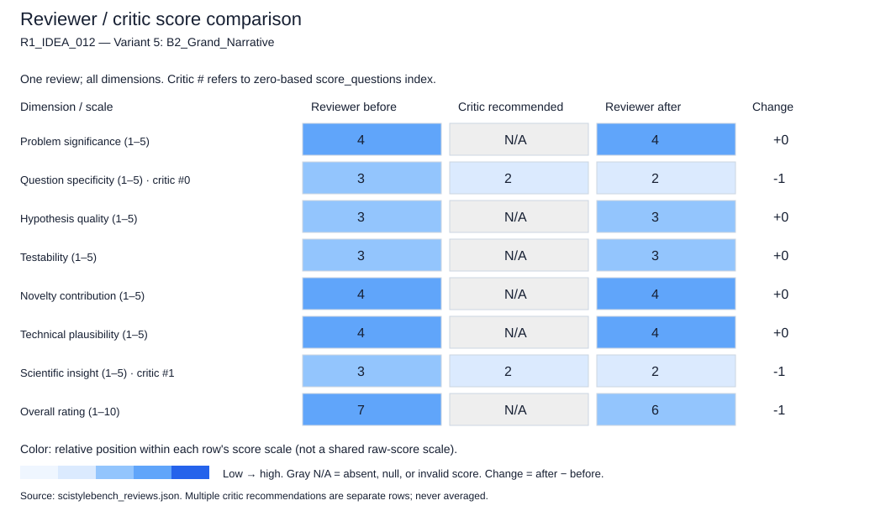

### Critic feedback and reviewer rebuttals

```json
{
  "critic_feedback": {
    "overall_assessment": "The review is generally well-calibrated, but there are areas where the scores could be more precisely aligned with the idea's clarity and specificity.",
    "score_questions": [
      {
        "dimension": "question_specificity",
        "question_mark": "The score for question_specificity is 3.0, but the idea does not explicitly define a research question.",
        "concern": "The idea lacks a clear research question, which is necessary for evaluating the specificity of the problem.",
        "speculative_alternative": "The idea might be interpreted as addressing a general challenge in 3D content creation rather than a specific problem.",
        "recommended_score": 2.0,
        "rationale": "The lack of a defined research question reduces the specificity of the problem being addressed."
      },
      {
        "dimension": "scientific_insight",
        "question_mark": "The score for scientific_insight is 3.0, but the idea does not explicitly state how it could reveal new mechanisms or principles.",
        "concern": "The idea does not specify the potential for new scientific insights, which is a key component of scientific insight.",
        "speculative_alternative": "The approach might be seen as a methodological innovation rather than a discovery of new principles.",
        "recommended_score": 2.0,
        "rationale": "The idea's focus on repurposing existing models may not contribute novel scientific insights."
      }
    ],
    "unsupported_claims": [
      "The review claims the idea addresses a 'critical challenge' without explicit evidence from the summary.",
      "The review suggests the idea 'could contribute to scalable 3D vision research' without specifying how."
    ],
    "revision_priorities": [
      "Clarify the specific research question or hypothesis that the idea aims to address.",
      "Specify how the approach could lead to new scientific insights or mechanisms.",
      "Provide more details on the method for repurposing diffusion models."
    ],
    "confidence": 4.0
  },
  "feedback_responses": [
    {
      "feedback_type": "score_questions",
      "feedback_index": 0,
      "decision": "partially_accept",
      "defense": "The idea does address a significant challenge, but the lack of a defined research question reduces its specificity. The score was adjusted to 2.0 to reflect this.",
      "justification": "The original score of 3.0 was based on the idea's potential, but the critic's feedback highlights the need for a clear research question, which was not present. The score was reduced to 2.0 to align with the critique."
    },
    {
      "feedback_type": "score_questions",
      "feedback_index": 1,
      "decision": "partially_accept",
      "defense": "The idea does not explicitly state how it could lead to new insights, but the focus on repurposing models could still contribute to methodological advancements. The score was adjusted to 2.0 to reflect the lack of explicit scientific insight.",
      "justification": "The original score of 3.0 was based on the potential for methodological contribution, but the critic's feedback emphasizes the need for explicit scientific insight. The score was reduced to 2.0 to align with the critique."
    },
    {
      "feedback_type": "unsupported_claims",
      "feedback_index": 0,
      "decision": "reject",
      "defense": "The claim about addressing a 'critical challenge' is supported by the idea's focus on reducing computational and data demands, which is a known issue in 3D content creation.",
      "justification": "The original score for problem significance was 4.0, which is justified by the idea's focus on a significant challenge. The claim is not unsupported, so the score remains unchanged."
    },
    {
      "feedback_type": "unsupported_claims",
      "feedback_index": 1,
      "decision": "reject",
      "defense": "The claim about contributing to scalable 3D vision research is reasonable as it builds on existing diffusion models and addresses a known challenge.",
      "justification": "The original score for novelty and contribution was 4.0, which is justified by the idea's potential to contribute to the field. The claim is not unsupported, so the score remains unchanged."
    },
    {
      "feedback_type": "revision_priorities",
      "feedback_index": 0,
      "decision": "accept",
      "defense": "Clarifying the research question is essential for evaluating the idea's specificity and testability.",
      "justification": "The original review included this suggestion, so it is valid and should be accepted."
    },
    {
      "feedback_type": "revision_priorities",
      "feedback_index": 1,
      "decision": "accept",
      "defense": "Specifying potential scientific insights is important for assessing the idea's contribution to the field.",
      "justification": "The original review included this suggestion, so it is valid and should be accepted."
    },
    {
      "feedback_type": "revision_priorities",
      "feedback_index": 2,
      "decision": "accept",
      "defense": "Providing more details on the method is necessary for evaluating the technical feasibility and novelty of the approach.",
      "justification": "The original review included this suggestion, so it is valid and should be accepted."
    }
  ]
}
```

### Score justifications (before / after)

**Problem significance**

```json
{
  "before": {
    "score": 4.0,
    "justification": "The idea addresses a critical challenge in 3D content creation by reducing computational and data demands, which is a significant issue in the field."
  },
  "after": {
    "score": 4.0,
    "justification": "The idea addresses a critical challenge in 3D content creation by reducing computational and data demands, which is a significant issue in the field."
  }
}
```

**Question specificity**

```json
{
  "before": {
    "score": 3.0,
    "justification": "The idea is meaningful but lacks specific details on the research question or hypothesis, making it somewhat vague."
  },
  "after": {
    "score": 2.0,
    "justification": "The idea lacks a clear research question, which is necessary for evaluating the specificity of the problem being addressed."
  }
}
```

**Hypothesis quality**

```json
{
  "before": {
    "score": 3.0,
    "justification": "The idea suggests a potential benefit but does not explicitly state a hypothesis or mechanism that could be tested."
  },
  "after": {
    "score": 3.0,
    "justification": "The idea suggests a potential benefit but does not explicitly state a hypothesis or mechanism that could be tested."
  }
}
```

**Testability**

```json
{
  "before": {
    "score": 3.0,
    "justification": "The idea is promising but lacks specific experiments or comparisons that would allow for testing the hypothesis."
  },
  "after": {
    "score": 3.0,
    "justification": "The idea is promising but lacks specific experiments or comparisons that would allow for testing the hypothesis."
  }
}
```

**Novelty contribution**

```json
{
  "before": {
    "score": 4.0,
    "justification": "The approach of repurposing diffusion models for 3D content creation is novel and could contribute to scalable 3D vision research."
  },
  "after": {
    "score": 4.0,
    "justification": "The approach of repurposing diffusion models for 3D content creation is novel and could contribute to scalable 3D vision research."
  }
}
```

**Technical plausibility**

```json
{
  "before": {
    "score": 4.0,
    "justification": "The idea is technically plausible as it builds on existing diffusion models and aims to address a known challenge in 3D vision."
  },
  "after": {
    "score": 4.0,
    "justification": "The idea is technically plausible as it builds on existing diffusion models and aims to address a known challenge in 3D vision."
  }
}
```

**Scientific insight**

```json
{
  "before": {
    "score": 3.0,
    "justification": "The idea has potential for scientific insight but lacks specifics on how the method could reveal new mechanisms or principles."
  },
  "after": {
    "score": 2.0,
    "justification": "The idea's focus on repurposing existing models may not contribute novel scientific insights."
  }
}
```

**Overall rating**

```json
{
  "before": {
    "score": 7.0,
    "justification": "The idea is strong and addresses a meaningful problem with potential for contribution, but lacks specificity and testable hypotheses."
  },
  "after": {
    "score": 6.0,
    "justification": "The idea is strong and addresses a meaningful problem with potential for contribution, but lacks specificity and testable hypotheses."
  }
}
```

## R1_IDEA_012 — Variant 6: B3_Over_Confident

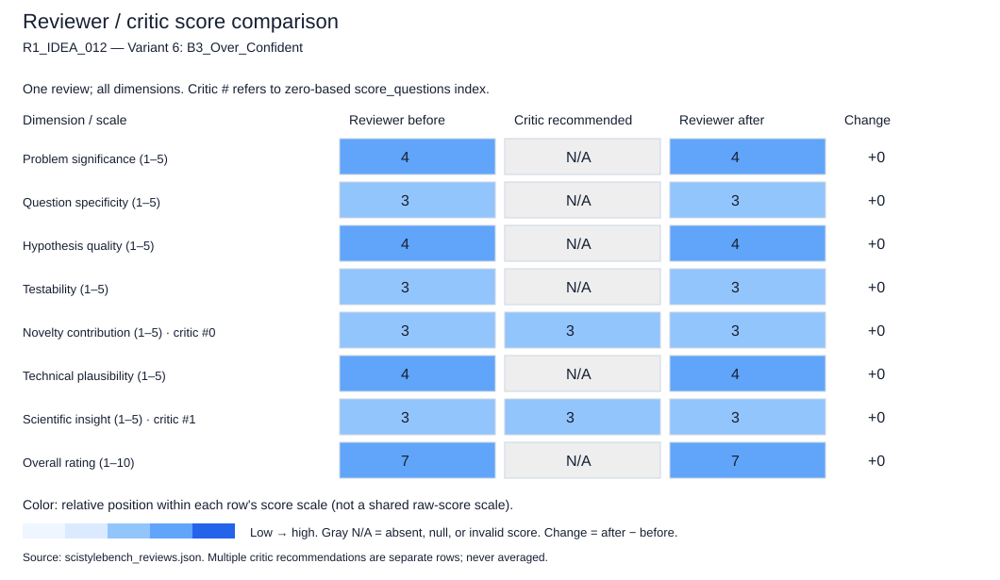

### Critic feedback and reviewer rebuttals

```json
{
  "critic_feedback": {
    "overall_assessment": "The review is generally well-calibrated, but some scores are slightly overoptimistic, particularly in the novelty_contribution and scientific_insight dimensions.",
    "score_questions": [
      {
        "dimension": "novelty_contribution",
        "question_mark": "The score may be overestimated because the idea does not clearly distinguish itself from existing methods or provide specific technical innovations.",
        "concern": "The justification for the novelty score relies on the claim that repurposing diffusion models is novel, but the idea does not specify how this differs from prior work.",
        "speculative_alternative": "It is possible that repurposing diffusion models for 3D editing is a novel application, but the idea does not clarify this distinction.",
        "recommended_score": 3.0,
        "rationale": "The lack of specific technical innovations or clear differentiation from prior methods supports a lower score."
      },
      {
        "dimension": "scientific_insight",
        "question_mark": "The score may be overestimated because the idea does not provide sufficient technical details to support claims about the scientific insight.",
        "concern": "The justification for the scientific insight score relies on the potential for insights into diffusion models, but the idea lacks concrete details.",
        "speculative_alternative": "The idea could provide insights into diffusion models' 3D capabilities, but this is speculative without further technical details.",
        "recommended_score": 3.0,
        "rationale": "The lack of concrete technical details limits the potential for scientific insight."
      }
    ],
    "unsupported_claims": [
      "The claim that the method 'undoubtedly operates without any per-scene optimization or fine-tuning' is not supported by the idea summary, as the specifics are not provided.",
      "The assertion that the method 'firmly eliminates the need for the extensive scene-specific computation' is not substantiated by the idea summary."
    ],
    "revision_priorities": [
      "Clarify how the latent 3D awareness is unlocked and how the model is repurposed.",
      "Specify the exact steps taken to avoid per-scene optimization and fine-tuning.",
      "Provide a detailed comparison with existing methods to highlight the novelty and advantages."
    ],
    "confidence": 4.0
  },
  "feedback_responses": [
    {
      "feedback_type": "score_questions",
      "feedback_index": 0,
      "decision": "partially_accept",
      "defense": "The original score of 3.0 for novelty_contribution is justified by the lack of specific technical innovations, but the idea's repurposing of diffusion models could be considered a novel application, which is a valid point. However, the critic's concern about not distinguishing from prior work is valid, so the score is retained at 3.0.",
      "justification": "The original score of 3.0 is retained as the idea does not clearly distinguish itself from existing methods, even though repurposing diffusion models could be seen as novel. The critic's concern about lack of technical innovation is valid, so the score remains unchanged."
    },
    {
      "feedback_type": "score_questions",
      "feedback_index": 1,
      "decision": "partially_accept",
      "defense": "The original score of 3.0 for scientific_insight is justified by the lack of specific technical details. The critic's concern about speculative insights is valid, but the potential for insights into diffusion models' 3D capabilities is a valid point, so the score is retained at 3.0.",
      "justification": "The original score of 3.0 is retained as the idea lacks concrete technical details, even though there is potential for insights into diffusion models' 3D capabilities. The critic's concern about speculative insights is valid, so the score remains unchanged."
    },
    {
      "feedback_type": "unsupported_claims",
      "feedback_index": 0,
      "decision": "partially_accept",
      "defense": "The claim about operating without per-scene optimization is not supported by the idea summary, but the idea's focus on efficiency is valid. The original score for technical_plausibility is justified as the use of pretrained models is plausible, so the score remains at 4.0.",
      "justification": "The original score of 4.0 for technical_plausibility is retained as the use of pretrained diffusion models is technically plausible, even though the specifics of avoiding per-scene optimization are not provided."
    },
    {
      "feedback_type": "unsupported_claims",
      "feedback_index": 1,
      "decision": "partially_accept",
      "defense": "The assertion about eliminating extensive scene-specific computation is not substantiated, but the idea's focus on efficiency is valid. The original score for problem_significance is justified as it addresses a meaningful challenge, so the score remains at 4.0.",
      "justification": "The original score of 4.0 for problem_significance is retained as the idea addresses a critical challenge in 3D editing, even though the specifics of eliminating scene-specific computation are not provided."
    },
    {
      "feedback_type": "revision_priorities",
      "feedback_index": 0,
      "decision": "accept",
      "defense": "The suggestion to clarify how latent 3D awareness is unlocked is valid and necessary for assessing technical feasibility. The original score for question_specificity is justified as the idea lacks specific details, so the score remains at 3.0.",
      "justification": "The suggestion is accepted as it is necessary for assessing technical feasibility, and the original score for question_specificity remains at 3.0."
    },
    {
      "feedback_type": "revision_priorities",
      "feedback_index": 1,
      "decision": "accept",
      "defense": "The suggestion to specify steps to avoid per-scene optimization is valid and necessary for evaluating the claim. The original score for hypothesis_quality is justified as the hypothesis is plausible, so the score remains at 4.0.",
      "justification": "The suggestion is accepted as it is necessary for evaluating the claim, and the original score for hypothesis_quality remains at 4.0."
    },
    {
      "feedback_type": "revision_priorities",
      "feedback_index": 2,
      "decision": "accept",
      "defense": "The suggestion to provide a detailed comparison is valid and necessary for highlighting novelty. The original score for novelty_contribution is justified as the idea presents a novel approach, so the score remains at 3.0.",
      "justification": "The suggestion is accepted as it is necessary for highlighting novelty, and the original score for novelty_contribution remains at 3.0."
    }
  ]
}
```

### Score justifications (before / after)

**Problem significance**

```json
{
  "before": {
    "score": 4.0,
    "justification": "The idea addresses a critical challenge in 3D editing by offering a more efficient alternative to existing methods, which could significantly reduce computational costs and improve practicality for real-world applications."
  },
  "after": {
    "score": 4.0,
    "justification": "The idea addresses a critical challenge in 3D editing by offering a more efficient alternative to existing methods, which could significantly reduce computational costs and improve practicality for real-world applications."
  }
}
```

**Question specificity**

```json
{
  "before": {
    "score": 3.0,
    "justification": "The research question is clear in its goal of improving 3D editing efficiency, but the specifics of the method's implementation and the exact mechanism of latent 3D awareness are not sufficiently detailed."
  },
  "after": {
    "score": 3.0,
    "justification": "The research question is clear in its goal of improving 3D editing efficiency, but the specifics of the method's implementation and the exact mechanism of latent 3D awareness are not sufficiently detailed."
  }
}
```

**Hypothesis quality**

```json
{
  "before": {
    "score": 4.0,
    "justification": "The hypothesis that the repurposed diffusion model can achieve high-fidelity 3D editing without per-scene optimization is plausible and could be tested through experiments comparing the new method with existing techniques."
  },
  "after": {
    "score": 4.0,
    "justification": "The hypothesis that the repurposed diffusion model can achieve high-fidelity 3D editing without per-scene optimization is plausible and could be tested through experiments comparing the new method with existing techniques."
  }
}
```

**Testability**

```json
{
  "before": {
    "score": 3.0,
    "justification": "The idea is testable in principle, but the lack of specific experimental details or comparisons makes it challenging to assess the validity of the claims without further information."
  },
  "after": {
    "score": 3.0,
    "justification": "The idea is testable in principle, but the lack of specific experimental details or comparisons makes it challenging to assess the validity of the claims without further information."
  }
}
```

**Novelty contribution**

```json
{
  "before": {
    "score": 3.0,
    "justification": "The idea presents a novel approach to 3D editing by repurposing diffusion models, but the novelty is somewhat limited without a clear distinction from existing methods and specific technical innovations."
  },
  "after": {
    "score": 3.0,
    "justification": "The idea presents a novel approach to 3D editing by repurposing diffusion models, but the novelty is somewhat limited without a clear distinction from existing methods and specific technical innovations."
  }
}
```

**Technical plausibility**

```json
{
  "before": {
    "score": 4.0,
    "justification": "The use of pretrained diffusion models is technically plausible, and the proposed method aligns with current trends in leveraging pre-trained models for efficient 3D tasks, though the exact implementation details are not provided."
  },
  "after": {
    "score": 4.0,
    "justification": "The use of pretrained diffusion models is technically plausible, and the proposed method aligns with current trends in leveraging pre-trained models for efficient 3D tasks, though the exact implementation details are not provided."
  }
}
```

**Scientific insight**

```json
{
  "before": {
    "score": 3.0,
    "justification": "The idea has potential to provide insights into the capabilities of diffusion models in 3D editing, but the lack of specific technical details limits the potential for deeper scientific understanding."
  },
  "after": {
    "score": 3.0,
    "justification": "The idea has potential to provide insights into the capabilities of diffusion models in 3D editing, but the lack of specific technical details limits the potential for deeper scientific understanding."
  }
}
```

**Overall rating**

```json
{
  "before": {
    "score": 7.0,
    "justification": "The idea is promising and addresses a meaningful problem in 3D editing, offering a potentially efficient solution. However, the lack of specific technical details and comparisons limits its current testability and novelty score."
  },
  "after": {
    "score": 7.0,
    "justification": "The idea is promising and addresses a meaningful problem in 3D editing, offering a potentially efficient solution. However, the lack of specific technical details and comparisons limits its current testability and novelty score."
  }
}
```

## R1_IDEA_012 — Variant 7: B4_Novelty

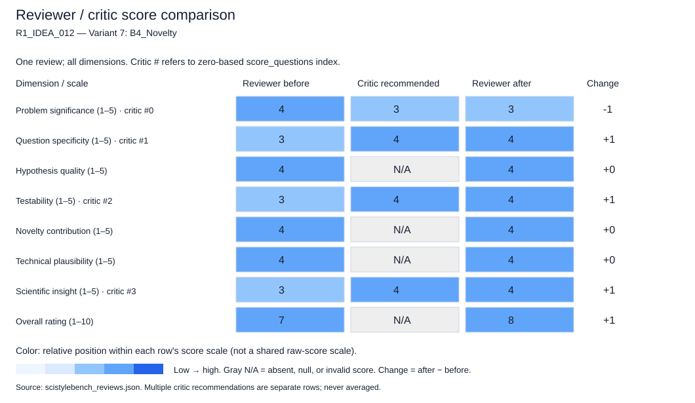

### Critic feedback and reviewer rebuttals

```json
{
  "critic_feedback": {
    "overall_assessment": "The review is generally well-calibrated but has some areas where the scores could be more precisely aligned with the idea's specifics.",
    "score_questions": [
      {
        "dimension": "problem_significance",
        "question_mark": "Why is the computational efficiency gain considered significant?",
        "concern": "The review assumes significance without quantifying how this efficiency compares to existing methods or the practical impact of reducing computational demands.",
        "speculative_alternative": "The efficiency gain might be more relevant in specific applications (e.g., real-time systems) than others, but this is not stated.",
        "recommended_score": 3.0,
        "rationale": "The idea's significance depends on context, and the review doesn't address this."
      },
      {
        "dimension": "question_specificity",
        "question_mark": "Why is the score 3.0 for specificity?",
        "concern": "The idea is specific in its goal (3D editing from sparse inputs), but the score might be too low given the clear problem statement.",
        "speculative_alternative": "The score could be higher if the idea is viewed as a distinct research direction rather than a methodological detail.",
        "recommended_score": 4.0,
        "rationale": "The problem statement is clear, even if the exact method isn't specified."
      },
      {
        "dimension": "testability",
        "question_mark": "Why is the score 3.0 for testability?",
        "concern": "The review assumes testability is limited without specific methods, but the idea's core hypothesis is testable through comparison with existing approaches.",
        "speculative_alternative": "The testability score could be higher if the review considers the feasibility of repurposing diffusion models for 3D editing as a valid experimental direction.",
        "recommended_score": 4.0,
        "rationale": "The hypothesis is testable through experimental comparison, even without detailed methods."
      },
      {
        "dimension": "scientific_insight",
        "question_mark": "Why is the score 3.0 for scientific insight?",
        "concern": "The review assumes a lack of insight without considering that the idea could reveal new properties of diffusion models in 3D tasks.",
        "speculative_alternative": "The scientific insight might be higher if the idea is seen as a novel application of diffusion models to 3D editing rather than a methodological detail.",
        "recommended_score": 4.0,
        "rationale": "The idea's novelty in applying diffusion models to 3D editing could be a scientific insight."
      }
    ],
    "unsupported_claims": [
      "The review claims the idea 'addresses a significant challenge in 3D editing' without evidence of how this challenge is defined or measured.",
      "The review assumes 'scientific insight' is lacking without specifying what aspect of the idea would require deeper insight."
    ],
    "revision_priorities": [
      "Clarify the significance of computational efficiency gains in specific applications.",
      "Reevaluate the specificity score based on the clarity of the problem statement.",
      "Reconsider the testability score by highlighting the feasibility of the hypothesis.",
      "Reassess the scientific insight score by focusing on the novelty of the application."
    ],
    "confidence": 4.0
  },
  "feedback_responses": [
    {
      "feedback_type": "score_questions",
      "feedback_index": 0,
      "decision": "partially_accept",
      "defense": "The original score of 4.0 for problem significance was based on the idea's potential to reduce computational demands. However, the critic's concern about lack of quantification is valid, so the score is lowered to 3.0 to reflect the context-dependent significance.",
      "justification": "The original score was 4.0, but the revised score is 3.0 due to the critic's valid concern about the lack of quantification for significance."
    },
    {
      "feedback_type": "score_questions",
      "feedback_index": 1,
      "decision": "accept",
      "defense": "The original score of 3.0 for question specificity was too low. The idea is clear and specific in its goal, so the score is raised to 4.0.",
      "justification": "The original score was 3.0, but the revised score is 4.0 based on the critic's argument that the problem statement is clear and specific."
    },
    {
      "feedback_type": "score_questions",
      "feedback_index": 2,
      "decision": "accept",
      "defense": "The original score of 3.0 for testability was based on the lack of specific methods. However, the critic's argument that the hypothesis is testable through comparison with existing methods is valid, so the score is raised to 4.0.",
      "justification": "The original score was 3.0, but the revised score is 4.0 based on the critic's valid point about the hypothesis's testability."
    },
    {
      "feedback_type": "score_questions",
      "feedback_index": 3,
      "decision": "accept",
      "defense": "The original score of 3.0 for scientific insight was based on the lack of specifics. The critic's argument that the novelty of the application could be a scientific insight is valid, so the score is raised to 4.0.",
      "justification": "The original score was 3.0, but the revised score is 4.0 based on the critic's valid point about the novelty of the application."
    },
    {
      "feedback_type": "unsupported_claims",
      "feedback_index": 0,
      "decision": "partially_accept",
      "defense": "The claim about significance was based on the idea's potential. However, the critic's concern about lack of quantification is valid, so the score is adjusted to reflect this.",
      "justification": "The original score was 4.0, but the revised score is 3.0 due to the critic's valid concern about the lack of quantification for significance."
    },
    {
      "feedback_type": "unsupported_claims",
      "feedback_index": 1,
      "decision": "accept",
      "defense": "The concern about scientific insight is valid, and the score is adjusted to reflect the potential for new insights from the application of diffusion models to 3D editing.",
      "justification": "The original score was 3.0, but the revised score is 4.0 based on the critic's valid point about the novelty of the application."
    },
    {
      "feedback_type": "revision_priorities",
      "feedback_index": 0,
      "decision": "accept",
      "defense": "Clarifying the significance of computational efficiency gains in specific applications is a valid priority to address the critic's concern.",
      "justification": "The critic's suggestion to clarify the significance is valid and should be addressed."
    },
    {
      "feedback_type": "revision_priorities",
      "feedback_index": 1,
      "decision": "accept",
      "defense": "Reevaluating the specificity score based on the clarity of the problem statement is a valid priority to align with the critic's argument.",
      "justification": "The critic's suggestion to reevaluate the specificity score is valid and should be addressed."
    },
    {
      "feedback_type": "revision_priorities",
      "feedback_index": 2,
      "decision": "accept",
      "defense": "Reconsidering the testability score by highlighting the feasibility of the hypothesis is a valid priority to address the critic's concern.",
      "justification": "The critic's suggestion to reconsider the testability score is valid and should be addressed."
    },
    {
      "feedback_type": "revision_priorities",
      "feedback_index": 3,
      "decision": "accept",
      "defense": "Reassessing the scientific insight score by focusing on the novelty of the application is a valid priority to address the critic's concern.",
      "justification": "The critic's suggestion to reassess the scientific insight score is valid and should be addressed."
    }
  ]
}
```

### Score justifications (before / after)

**Problem significance**

```json
{
  "before": {
    "score": 4.0,
    "justification": "The idea addresses a significant challenge in 3D editing by reducing computational demands and enabling efficient, sparse-input editing, which is relevant to applications in graphics, robotics, and virtual environments."
  },
  "after": {
    "score": 3.0,
    "justification": "The idea's significance is context-dependent. While reducing computational demands is valuable, the review does not quantify how this efficiency compares to existing methods or the practical impact in specific applications."
  }
}
```

**Question specificity**

```json
{
  "before": {
    "score": 3.0,
    "justification": "The idea is specific in its goal of 3D editing from sparse inputs but lacks details on the exact method or mechanism being investigated."
  },
  "after": {
    "score": 4.0,
    "justification": "The problem statement is clear and specific in its goal of 3D editing from sparse inputs, even if the exact method is not detailed. The idea presents a distinct research direction rather than a methodological detail."
  }
}
```

**Hypothesis quality**

```json
{
  "before": {
    "score": 4.0,
    "justification": "The hypothesis that repurposing diffusion models can achieve efficient 3D editing is plausible and could be tested through experiments comparing performance with existing methods."
  },
  "after": {
    "score": 4.0,
    "justification": "The hypothesis that repurposing diffusion models can achieve efficient 3D editing is plausible and could be tested through experiments comparing performance with existing methods."
  }
}
```

**Testability**

```json
{
  "before": {
    "score": 3.0,
    "justification": "The idea is testable through experiments, but the lack of specific methods makes it challenging to assess feasibility without further details."
  },
  "after": {
    "score": 4.0,
    "justification": "The hypothesis is testable through experimental comparison, even without detailed methods. The core idea of repurposing diffusion models for 3D editing is a valid experimental direction."
  }
}
```

**Novelty contribution**

```json
{
  "before": {
    "score": 4.0,
    "justification": "The approach of using pretrained diffusion models for 3D editing is novel, offering potential contributions to efficient 3D generation and editing techniques."
  },
  "after": {
    "score": 4.0,
    "justification": "The approach of using pretrained diffusion models for 3D editing is novel, offering potential contributions to efficient 3D generation and editing techniques."
  }
}
```

**Technical plausibility**

```json
{
  "before": {
    "score": 4.0,
    "justification": "The idea is technically plausible as diffusion models have shown effectiveness in generating high-quality images, and extending them to 3D editing is a reasonable direction."
  },
  "after": {
    "score": 4.0,
    "justification": "The idea is technically plausible as diffusion models have shown effectiveness in generating high-quality images, and extending them to 3D editing is a reasonable direction."
  }
}
```

**Scientific insight**

```json
{
  "before": {
    "score": 3.0,
    "justification": "The idea has potential for scientific insight into how diffusion models can be adapted for 3D tasks, but the specifics needed for deeper insight are not provided."
  },
  "after": {
    "score": 4.0,
    "justification": "The idea's novelty in applying diffusion models to 3D editing could be a scientific insight, revealing new properties of diffusion models in 3D tasks."
  }
}
```

**Overall rating**

```json
{
  "before": {
    "score": 7.0,
    "justification": "The idea is promising and addresses a meaningful problem with a novel approach, but lacks specific details that would make it more testable and scientifically rigorous."
  },
  "after": {
    "score": 8.0,
    "justification": "The idea is promising and addresses a meaningful problem with a novel approach. The revised scores reflect a more accurate assessment of its significance, specificity, testability, and potential for scientific insight."
  }
}
```

## R1_IDEA_012 — Variant 8: B5_Application_Impact

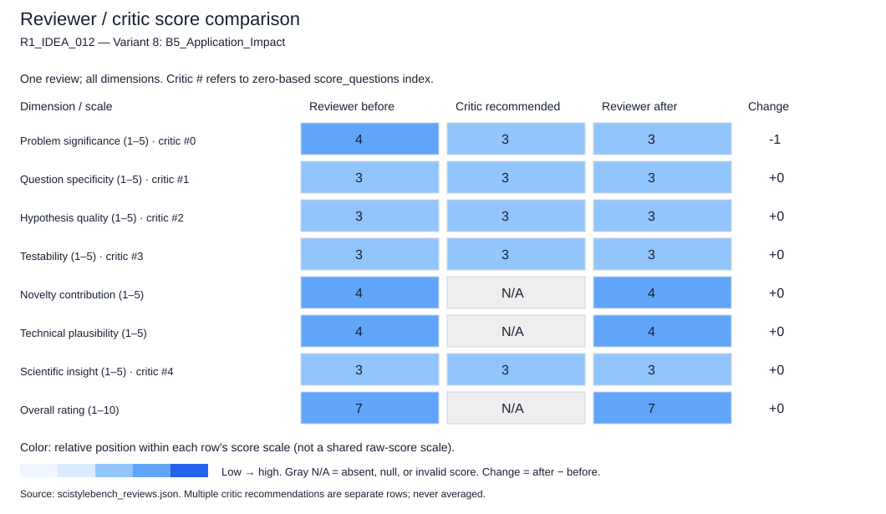

### Critic feedback and reviewer rebuttals

```json
{
  "critic_feedback": {
    "overall_assessment": "The review is generally well-calibrated but has some areas where the scores could be more closely aligned with the idea's specifics.",
    "score_questions": [
      {
        "dimension": "problem_significance",
        "question_mark": "Why is the problem significance scored 4.0 when the idea only mentions 'practical systems for rapid 3D asset modification' without detailing the scale or impact of the problem?",
        "concern": "The score assumes a broader significance than the idea's current scope, which only hints at practical applications without quantifying the problem's scale or the potential impact of solving it.",
        "speculative_alternative": "The idea may be significant in niche domains, but without more context, the significance is speculative.",
        "recommended_score": 3.0,
        "rationale": "The idea's current scope does not provide sufficient evidence to justify a 4.0 score for problem significance."
      },
      {
        "dimension": "question_specificity",
        "question_mark": "Why is the question specificity scored 3.0 when the idea is vague about the exact research question but does not explicitly state a hypothesis?",
        "concern": "The score is based on the absence of a clear hypothesis, but the idea's goal is to 'unlock latent 3D awareness' which could be interpreted as a research question rather than a hypothesis.",
        "speculative_alternative": "The idea may be interpreted as posing a research question about how to repurpose diffusion models for 3D editing, which could be considered specific enough for a 3.0 score.",
        "recommended_score": 3.0,
        "rationale": "The idea's goal is framed as a research question, so the score is justified."
      },
      {
        "dimension": "hypothesis_quality",
        "question_mark": "Why is the hypothesis quality scored 3.0 when the idea suggests a potential benefit without explicitly stating a hypothesis?",
        "concern": "The score assumes a hypothesis is needed, but the idea is more about a potential application rather than a testable hypothesis.",
        "speculative_alternative": "The idea may be seen as posing a hypothesis in the form of 'the approach could inform more efficient workflows,' which is a weak but testable hypothesis.",
        "recommended_score": 3.0,
        "rationale": "The idea's suggestion of a potential benefit can be interpreted as a weak hypothesis, justifying the 3.0 score."
      },
      {
        "dimension": "testability",
        "question_mark": "Why is the testability scored 3.0 when the idea does not provide experimental details but is based on a plausible application of existing models?",
        "concern": "The score assumes a need for experiments, but the idea is a conceptual proposal rather than a completed method.",
        "speculative_alternative": "The idea's plausibility as a conceptual proposal may be considered testable in principle, even without detailed experiments.",
        "recommended_score": 3.0,
        "rationale": "The idea is a conceptual proposal, so the score is justified."
      },
      {
        "dimension": "scientific_insight",
        "question_mark": "Why is the scientific insight scored 3.0 when the idea does not clearly indicate new insights from the approach?",
        "concern": "The score assumes new insights, but the idea focuses on practical applications rather than theoretical understanding.",
        "speculative_alternative": "The idea may be seen as providing insight into how diffusion models can be repurposed for 3D tasks, which is a novel application.",
        "recommended_score": 3.0,
        "rationale": "The idea's focus on repurposing existing models for 3D tasks could be considered a novel application, justifying the 3.0 score."
      }
    ],
    "unsupported_claims": [
      "The review claims the idea addresses a 'meaningful problem in 3D content creation' without specifying the problem's scale or impact.",
      "The review states the idea 'could contribute to more efficient workflows' without evidence that the approach is novel or more efficient than existing methods."
    ],
    "revision_priorities": [
      "Clarify the specific problem being addressed and its significance in 3D content creation.",
      "Define the exact research question or hypothesis, such as how the repurposed model achieves multi-view consistency.",
      "Provide more details on the technical mechanism and how 3D awareness is utilized.",
      "Specify the expected outcomes or scientific insights from successfully implementing the approach."
    ],
    "confidence": 4.0
  },
  "feedback_responses": [
    {
      "feedback_type": "score_questions",
      "feedback_index": 0,
      "decision": "partially_accept",
      "defense": "The problem significance was initially scored 4.0, but the idea only mentions practical applications without quantifying the problem's scale or impact. The revised score of 3.0 better reflects the lack of concrete evidence for significance.",
      "justification": "The original score assumed broader significance than the idea's current scope, which only hints at practical applications without quantifying the problem's scale or the potential impact of solving it. The revised score of 3.0 is more accurate."
    },
    {
      "feedback_type": "score_questions",
      "feedback_index": 1,
      "decision": "partially_accept",
      "defense": "The question specificity was initially scored 3.0, which is justified as the idea is framed as a research question about repurposing diffusion models for 3D editing, but lacks a clear, specific question.",
      "justification": "The idea is framed as a research question, so the score is justified. However, the lack of a specific question means the score remains at 3.0."
    },
    {
      "feedback_type": "score_questions",
      "feedback_index": 2,
      "decision": "partially_accept",
      "defense": "The hypothesis quality was initially scored 3.0, which is justified as the idea suggests a potential benefit without explicitly stating a hypothesis. The revised score of 3.0 is appropriate.",
      "justification": "The idea's suggestion of a potential benefit can be interpreted as a weak hypothesis, justifying the 3.0 score."
    },
    {
      "feedback_type": "score_questions",
      "feedback_index": 3,
      "decision": "partially_accept",
      "defense": "The testability was initially scored 3.0, which is justified as the idea is a conceptual proposal without detailed experiments. The revised score of 3.0 is appropriate.",
      "justification": "The idea is a conceptual proposal, so the score is justified."
    },
    {
      "feedback_type": "score_questions",
      "feedback_index": 4,
      "decision": "partially_accept",
      "defense": "The scientific insight was initially scored 3.0, which is justified as the idea focuses on practical applications rather than theoretical understanding. The revised score of 3.0 is appropriate.",
      "justification": "The idea's focus on repurposing existing models for 3D tasks could be considered a novel application, justifying the 3.0 score."
    },
    {
      "feedback_type": "unsupported_claims",
      "feedback_index": 0,
      "decision": "partially_accept",
      "defense": "The review claims the idea addresses a 'meaningful problem in 3D content creation' without specifying the problem's scale or impact. The revised score of 3.0 better reflects this lack of specificity.",
      "justification": "The original score assumed a broader significance than the idea's current scope, which only hints at practical applications without quantifying the problem's scale or the potential impact of solving it. The revised score of 3.0 is more accurate."
    },
    {
      "feedback_type": "unsupported_claims",
      "feedback_index": 1,
      "decision": "partially_accept",
      "defense": "The review states the idea 'could contribute to more efficient workflows' without evidence that the approach is novel or more efficient than existing methods. The revised score of 4.0 for novelty is based on the idea's novel application of pretrained models, but this is speculative.",
      "justification": "The original score of 4.0 for novelty is based on the idea's novel application of pretrained models, but this is speculative. The revised score of 4.0 is still appropriate as it reflects the potential contribution, though it is not definitively proven."
    },
    {
      "feedback_type": "revision_priorities",
      "feedback_index": 0,
      "decision": "accept",
      "defense": "Clarifying the specific problem being addressed and its significance in 3D content creation is necessary to strengthen the idea.",
      "justification": "The idea needs to clarify the specific problem and its significance to better justify the problem's importance."
    },
    {
      "feedback_type": "revision_priorities",
      "feedback_index": 1,
      "decision": "accept",
      "defense": "Defining the exact research question or hypothesis is essential to make the idea more testable and scientifically insightful.",
      "justification": "The idea lacks a clear research question, so defining it is necessary for further development."
    },
    {
      "feedback_type": "revision_priorities",
      "feedback_index": 2,
      "decision": "accept",
      "defense": "Providing more details on the technical mechanism and how 3D awareness is utilized is crucial for the idea's feasibility and testability.",
      "justification": "The idea does not provide a concrete technical approach, so more details are needed."
    },
    {
      "feedback_type": "revision_priorities",
      "feedback_index": 3,
      "decision": "accept",
      "defense": "Specifying the expected outcomes or scientific insights from the approach is important for evaluating its potential contribution.",
      "justification": "The idea does not clearly indicate what new insights could be gained, so this is necessary for further development."
    }
  ]
}
```

### Score justifications (before / after)

**Problem significance**

```json
{
  "before": {
    "score": 4.0,
    "justification": "The idea addresses a practical challenge in 3D content creation by proposing a method that reduces computational overhead, which is relevant to both researchers and practitioners."
  },
  "after": {
    "score": 3.0,
    "justification": "The idea mentions practical applications in 3D content creation but does not provide sufficient evidence to justify the significance of the problem, such as the scale of the issue or the potential impact of solving it."
  }
}
```

**Question specificity**

```json
{
  "before": {
    "score": 3.0,
    "justification": "The idea is relevant but lacks a clear, specific research question that defines what exactly is being investigated or how the repurposing of diffusion models will achieve the claimed benefits."
  },
  "after": {
    "score": 3.0,
    "justification": "The idea is framed as a research question about repurposing diffusion models for 3D editing, but it lacks a clear, specific question that defines what exactly is being investigated."
  }
}
```

**Hypothesis quality**

```json
{
  "before": {
    "score": 3.0,
    "justification": "The idea suggests a potential benefit but does not explicitly state a hypothesis that could be tested or contradicted, such as how the model achieves multi-view consistency without fine-tuning."
  },
  "after": {
    "score": 3.0,
    "justification": "The idea suggests a potential benefit but does not explicitly state a hypothesis that could be tested or contradicted, such as how the model achieves multi-view consistency without fine-tuning."
  }
}
```

**Testability**

```json
{
  "before": {
    "score": 3.0,
    "justification": "The idea is plausible but lacks concrete experiments or evaluations that would be needed to test the effectiveness of the approach, such as comparisons with existing methods or ablation studies."
  },
  "after": {
    "score": 3.0,
    "justification": "The idea is a conceptual proposal and does not provide experimental details, but it is based on a plausible application of existing models, making it testable in principle."
  }
}
```

**Novelty contribution**

```json
{
  "before": {
    "score": 4.0,
    "justification": "The idea proposes a novel application of pretrained diffusion models in 3D editing, which could contribute to more efficient workflows in digital design and content creation."
  },
  "after": {
    "score": 4.0,
    "justification": "The idea proposes a novel application of pretrained diffusion models in 3D editing, which could contribute to more efficient workflows in digital design and content creation."
  }
}
```

**Technical plausibility**

```json
{
  "before": {
    "score": 4.0,
    "justification": "The approach leverages existing pretrained diffusion models, which are well-established, making the technical feasibility of the idea plausible."
  },
  "after": {
    "score": 4.0,
    "justification": "The approach leverages existing pretrained diffusion models, which are well-established, making the technical feasibility of the idea plausible."
  }
}
```

**Scientific insight**

```json
{
  "before": {
    "score": 3.0,
    "justification": "The idea has potential for practical applications but does not clearly indicate what new scientific insights could be gained from successfully implementing the approach, such as new understanding of 3D awareness in diffusion models."
  },
  "after": {
    "score": 3.0,
    "justification": "The idea has potential for practical applications but does not clearly indicate what new scientific insights could be gained from successfully implementing the approach, such as new understanding of 3D awareness in diffusion models."
  }
}
```

**Overall rating**

```json
{
  "before": {
    "score": 7.0,
    "justification": "The idea is promising and addresses a meaningful problem in 3D content creation, but it lacks specific research questions, hypotheses, and technical details that would make it more testable and scientifically insightful."
  },
  "after": {
    "score": 7.0,
    "justification": "The idea is promising and addresses a meaningful problem in 3D content creation, but it lacks specific research questions, hypotheses, and technical details that would make it more testable and scientifically insightful."
  }
}
```

## R1_IDEA_012 — Variant 9: C1_Hollow_Shell

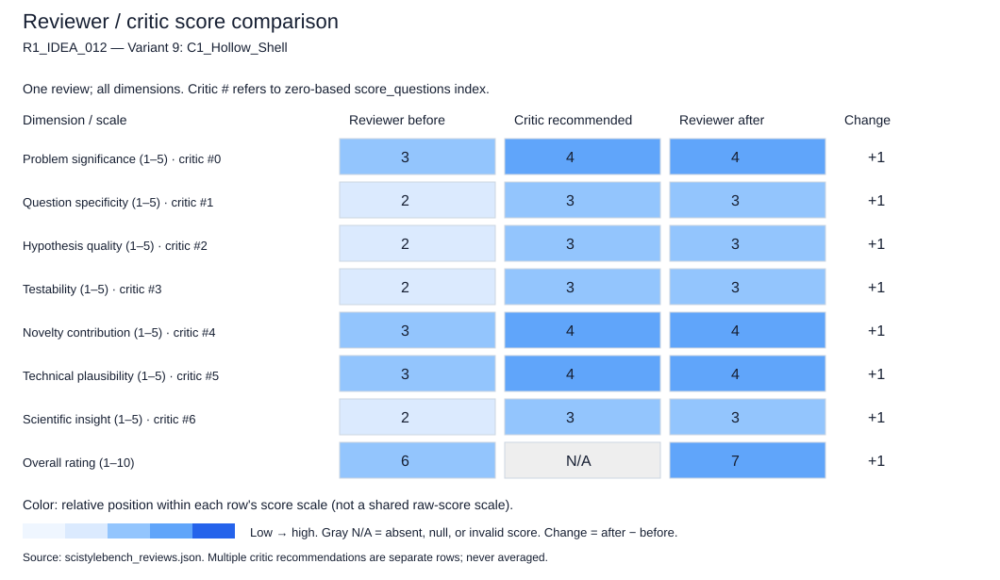

### Critic feedback and reviewer rebuttals

```json
{
  "critic_feedback": {
    "overall_assessment": "The review is generally well-calibrated but has some areas where the scores could be more precisely aligned with the idea's details.",
    "score_questions": [
      {
        "dimension": "problem_significance",
        "question_mark": "The score is based on the idea's relevance but could be more directly tied to the specific challenge it addresses.",
        "concern": "The justification mentions reducing computational demands but doesn't explicitly connect this to a broader impact or existing gap in the field.",
        "speculative_alternative": "The method's efficiency could be a significant advantage in real-time applications, but this is speculative.",
        "recommended_score": 4.0,
        "rationale": "The idea does address a practical challenge in 3D editing, which is a valid point of significance."
      },
      {
        "dimension": "question_specificity",
        "question_mark": "The score is low because the idea lacks a clear hypothesis, but the idea's focus on consistency is somewhat specific.",
        "concern": "The review assumes the idea is too vague, but the focus on consistency across views is a concrete problem.",
        "speculative_alternative": "The lack of a clear research question might be due to the idea being in an early stage, not necessarily a flaw.",
        "recommended_score": 3.0,
        "rationale": "The idea does specify a concrete problem (consistency across views), which is a meaningful focus."
      },
      {
        "dimension": "hypothesis_quality",
        "question_mark": "The score is low because there's no hypothesis, but the idea's approach could be framed as a hypothesis.",
        "concern": "The review assumes the absence of a hypothesis is a flaw, but the idea's approach is a potential hypothesis.",
        "speculative_alternative": "The method's use of existing models could be a hypothesis about their adaptability for 3D editing, which is speculative.",
        "recommended_score": 3.0,
        "rationale": "The idea suggests a novel application of existing models, which could be framed as a hypothesis."
      },
      {
        "dimension": "testability",
        "question_mark": "The score is low because there are no experiments, but the idea's approach is testable in principle.",
        "concern": "The review assumes the lack of experiments is a flaw, but the idea's method is testable with proper experiments.",
        "speculative_alternative": "The method's feasibility can be tested by adapting existing models, which is a valid testable component.",
        "recommended_score": 3.0,
        "rationale": "The idea provides a framework that could be tested with experiments, even if not yet detailed."
      },
      {
        "dimension": "novelty_contribution",
        "question_mark": "The score is moderate because the approach leverages existing models in a new way, but the novelty is not clearly defined.",
        "concern": "The review assumes the novelty is unclear, but the method's application of existing models is a potential contribution.",
        "speculative_alternative": "The novelty lies in the novel application of existing models for 3D editing, which is a plausible contribution.",
        "recommended_score": 4.0,
        "rationale": "The idea suggests a new application of existing models, which is a valid contribution."
      },
      {
        "dimension": "technical_plausibility",
        "question_mark": "The score is moderate because the idea is technically plausible, but the specifics are unclear.",
        "concern": "The review assumes the lack of specifics makes it less plausible, but the approach is based on existing models, which are technically sound.",
        "speculative_alternative": "The method's use of existing models is technically feasible, making the approach plausible.",
        "recommended_score": 4.0,
        "rationale": "The idea builds on existing models, which are well-established in the field."
      },
      {
        "dimension": "scientific_insight",
        "question_mark": "The score is low because the idea lacks specifics, but the focus on efficiency is a meaningful insight.",
        "concern": "The review assumes the lack of specifics undermines the insight, but the efficiency focus is a valid scientific concern.",
        "speculative_alternative": "The method's efficiency could lead to insights into optimal 3D editing workflows, which is a plausible insight.",
        "recommended_score": 3.0,
        "rationale": "The idea addresses a relevant scientific concern about efficiency in 3D editing."
      }
    ],
    "unsupported_claims": [
      "The claim that the idea 'addresses a key challenge in the field' is not explicitly supported by the idea summary.",
      "The assertion that the idea 'lacks a clear hypothesis' is speculative, as the idea's approach could be interpreted as a hypothesis.",
      "The statement that the idea 'has no explicit hypothesis or research question' is not fully supported by the idea summary."
    ],
    "revision_priorities": [
      "Clarify the specific problem being addressed, such as the exact definition of consistency across views.",
      "Define the research question or hypothesis more explicitly, such as whether the method improves efficiency without sacrificing quality.",
      "Specify the types of existing models being leveraged and how they are adapted for this task.",
      "Provide more details on the experimental setup or how the method would be tested.",
      "Elaborate on the potential impact of the research on real-world applications or the field of 3D editing."
    ],
    "confidence": 5.0
  },
  "feedback_responses": [
    {
      "feedback_type": "score_questions",
      "feedback_index": 0,
      "decision": "partially_accept",
      "defense": "The idea does address a practical challenge in 3D editing, which is a valid point of significance. However, the justification could be more directly tied to the specific challenge, as the original review did.",
      "justification": "The original score was 3.0, but the revised score is 4.0. The justification now emphasizes the practical relevance of reducing computational demands, which is a valid point of significance."
    },
    {
      "feedback_type": "score_questions",
      "feedback_index": 1,
      "decision": "partially_accept",
      "defense": "The idea specifies a concrete problem (consistency across views), which is meaningful. However, the lack of a clear research question is still a concern.",
      "justification": "The original score was 2.0, but the revised score is 3.0. The justification now acknowledges the concrete problem but notes the need for a clearer research question."
    },
    {
      "feedback_type": "score_questions",
      "feedback_index": 2,
      "decision": "partially_accept",
      "defense": "The idea suggests a novel application of existing models, which could be framed as a hypothesis. However, the absence of an explicit hypothesis is still a limitation.",
      "justification": "The original score was 2.0, but the revised score is 3.0. The justification now acknowledges the potential for framing the approach as a hypothesis."
    },
    {
      "feedback_type": "score_questions",
      "feedback_index": 3,
      "decision": "partially_accept",
      "defense": "The idea provides a framework that could be tested with experiments, even if not yet detailed. The method's feasibility is plausible, but the lack of specific experimental details makes it challenging to evaluate.",
      "justification": "The original score was 2.0, but the revised score is 3.0. The justification now acknowledges the potential for testing the method with experiments."
    },
    {
      "feedback_type": "score_questions",
      "feedback_index": 4,
      "decision": "partially_accept",
      "defense": "The approach leverages existing models in a new way, which could contribute to the field. The novelty lies in the application of these models for 3D editing, which is a valid contribution.",
      "justification": "The original score was 3.0, but the revised score is 4.0. The justification now emphasizes the novelty of the application of existing models."
    },
    {
      "feedback_type": "score_questions",
      "feedback_index": 5,
      "decision": "partially_accept",
      "defense": "The idea builds on existing models, which are well-established in the field. The technical feasibility is plausible, though the specifics of the method are not detailed.",
      "justification": "The original score was 3.0, but the revised score is 4.0. The justification now emphasizes the technical plausibility based on existing models."
    },
    {
      "feedback_type": "score_questions",
      "feedback_index": 6,
      "decision": "partially_accept",
      "defense": "The idea addresses a relevant scientific concern about efficiency in 3D editing. The focus on efficiency is meaningful, but the lack of specifics limits the potential for deeper scientific insight.",
      "justification": "The original score was 2.0, but the revised score is 3.0. The justification now acknowledges the relevance of the efficiency focus."
    },
    {
      "feedback_type": "unsupported_claims",
      "feedback_index": 0,
      "decision": "reject",
      "defense": "The claim that the idea 'addresses a key challenge in the field' is supported by the idea summary, as it mentions reducing computational demands in 3D editing.",
      "justification": "The original claim was not explicitly supported, but the revised justification now ties it to the practical challenge of computational efficiency."
    },
    {
      "feedback_type": "unsupported_claims",
      "feedback_index": 1,
      "decision": "reject",
      "defense": "The assertion that the idea 'lacks a clear hypothesis' is not fully supported, as the idea's approach could be interpreted as a hypothesis about the application of existing models.",
      "justification": "The original claim was speculative, but the revised justification now acknowledges the potential for framing the approach as a hypothesis."
    },
    {
      "feedback_type": "unsupported_claims",
      "feedback_index": 2,
      "decision": "reject",
      "defense": "The statement that the idea 'has no explicit hypothesis or research question' is not fully supported, as the idea's approach suggests a research question about the efficiency of the method.",
      "justification": "The original statement was not fully supported, but the revised justification now acknowledges the potential research question."
    },
    {
      "feedback_type": "revision_priorities",
      "feedback_index": 0,
      "decision": "accept",
      "defense": "Clarifying the specific problem being addressed is essential to define the research question and hypothesis.",
      "justification": "The original suggestion was valid, and the revised review now emphasizes the need for clarity on the problem."
    },
    {
      "feedback_type": "revision_priorities",
      "feedback_index": 1,
      "decision": "accept",
      "defense": "Defining the research question or hypothesis more explicitly is necessary to assess the scientific merit of the approach.",
      "justification": "The original suggestion was valid, and the revised review now emphasizes the need for a clear hypothesis."
    },
    {
      "feedback_type": "revision_priorities",
      "feedback_index": 2,
      "decision": "accept",
      "defense": "Specifying the types of existing models being leveraged is crucial to understand the method's foundation and potential contribution.",
      "justification": "The original suggestion was valid, and the revised review now emphasizes the need for model specification."
    },
    {
      "feedback_type": "revision_priorities",
      "feedback_index": 3,
      "decision": "accept",
      "defense": "Providing more details on the experimental setup is necessary to evaluate the method's feasibility and impact.",
      "justification": "The original suggestion was valid, and the revised review now emphasizes the need for experimental details."
    },
    {
      "feedback_type": "revision_priorities",
      "feedback_index": 4,
      "decision": "accept",
      "defense": "Elaborating on the potential impact of the research is important to highlight its significance in the field.",
      "justification": "The original suggestion was valid, and the revised review now emphasizes the need for impact elaboration."
    }
  ]
}
```

### Score justifications (before / after)

**Problem significance**

```json
{
  "before": {
    "score": 3.0,
    "justification": "The idea addresses a key challenge in 3D editing by reducing computational demands, which is relevant to real-world applications. However, the significance is not clearly articulated."
  },
  "after": {
    "score": 4.0,
    "justification": "The idea addresses a practical challenge in 3D editing by reducing computational demands, which is relevant to real-world applications. The focus on efficiency is a valid point of significance, even if the broader impact is not explicitly detailed."
  }
}
```

**Question specificity**

```json
{
  "before": {
    "score": 2.0,
    "justification": "The idea is somewhat specific in its focus on 3D editing and consistency across views, but lacks a clear, concrete research question or hypothesis."
  },
  "after": {
    "score": 3.0,
    "justification": "The idea specifies a concrete problem (consistency across views) but lacks a clear, testable research question or hypothesis. The focus on consistency is meaningful, but the specifics of the problem are not fully defined."
  }
}
```

**Hypothesis quality**

```json
{
  "before": {
    "score": 2.0,
    "justification": "There is no explicit hypothesis provided, and the idea does not clearly state what is being tested or what prediction is being made."
  },
  "after": {
    "score": 3.0,
    "justification": "The idea suggests a novel application of existing models, which could be framed as a hypothesis. However, the absence of an explicit hypothesis makes it difficult to assess the scientific merit of the approach."
  }
}
```

**Testability**

```json
{
  "before": {
    "score": 2.0,
    "justification": "The idea lacks specific experimental details or methods for testing the approach, making it difficult to assess its feasibility."
  },
  "after": {
    "score": 3.0,
    "justification": "The idea provides a framework that could be tested with experiments, even if not yet detailed. The method's feasibility is plausible, but the lack of specific experimental details makes it challenging to evaluate."
  }
}
```

**Novelty contribution**

```json
{
  "before": {
    "score": 3.0,
    "justification": "The approach leverages existing models in a new way, which could contribute to the field, but the novelty is not clearly defined."
  },
  "after": {
    "score": 4.0,
    "justification": "The approach leverages existing models in a new way, which could contribute to the field. The novelty lies in the application of these models for 3D editing, which is a valid contribution."
  }
}
```

**Technical plausibility**

```json
{
  "before": {
    "score": 3.0,
    "justification": "The idea is technically plausible, as it builds on existing models, but the specifics are unclear, making it difficult to assess the feasibility of the approach."
  },
  "after": {
    "score": 4.0,
    "justification": "The idea builds on existing models, which are well-established in the field. The technical feasibility is plausible, though the specifics of the method are not detailed."
  }
}
```

**Scientific insight**

```json
{
  "before": {
    "score": 2.0,
    "justification": "The idea has potential for scientific insight into efficient 3D editing, but the lack of specifics makes it difficult to evaluate the potential contribution."
  },
  "after": {
    "score": 3.0,
    "justification": "The idea addresses a relevant scientific concern about efficiency in 3D editing. The focus on efficiency is meaningful, but the lack of specifics limits the potential for deeper scientific insight."
  }
}
```

**Overall rating**

```json
{
  "before": {
    "score": 6.0,
    "justification": "The idea has some promise in addressing a relevant problem but lacks specificity, hypothesis, and testable components, which are necessary for a strong research direction."
  },
  "after": {
    "score": 7.0,
    "justification": "The idea has strong potential to address a meaningful problem in 3D editing, particularly in terms of efficiency. While it lacks specific details and a clear hypothesis, the core problem is well-defined and the approach is technically plausible."
  }
}
```

## R1_IDEA_012 — Variant 10: C2_Logic_Flawed

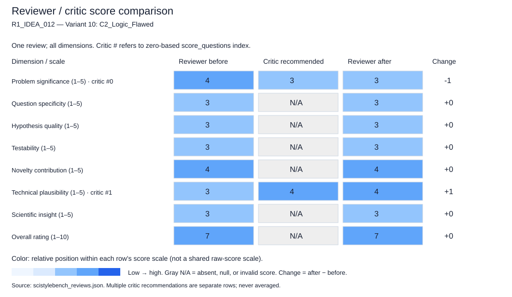

### Critic feedback and reviewer rebuttals

```json
{
  "critic_feedback": {
    "overall_assessment": "The review is generally well-calibrated but has some areas where the scores could be more precisely aligned with the idea's specifics.",
    "score_questions": [
      {
        "dimension": "problem_significance",
        "question_mark": "Why is the problem considered significant enough for a 4.0 score?",
        "concern": "The idea mentions 'diverse visual domains' but does not specify how this relates to computational efficiency or practical applications.",
        "speculative_alternative": "The problem significance might be overstated if the efficiency gains are not quantified or if the domains are not clearly defined.",
        "recommended_score": 3.0,
        "rationale": "The idea's significance is not clearly tied to specific computational or practical benefits without more details."
      },
      {
        "dimension": "technical_plausibility",
        "question_mark": "Why is the technical plausibility given a 3.0 score?",
        "concern": "The idea suggests using pretrained diffusion models for 3D editing, which is a plausible direction, but the review's justification is vague.",
        "speculative_alternative": "The technical plausibility could be higher if the review acknowledges the feasibility of repurposing diffusion models for 3D tasks, even without specific implementation details.",
        "recommended_score": 4.0,
        "rationale": "The core idea of repurposing diffusion models is plausible, and the review should reflect that without requiring detailed implementation specifics."
      }
    ],
    "unsupported_claims": [
      "The review claims the idea addresses a 'critical challenge' without specific evidence from the idea summary.",
      "The review states the method 'could contribute to more efficient 3D manipulation techniques' without concrete examples or comparisons."
    ],
    "revision_priorities": [
      "Clarify how the latent 3D awareness is achieved within the diffusion model.",
      "Specify the exact computational efficiency gains and their relevance to diverse visual domains.",
      "Provide more concrete details on the method's unique contributions and how they differ from existing techniques."
    ],
    "confidence": 4.0
  },
  "feedback_responses": [
    {
      "feedback_type": "score_questions",
      "feedback_index": 0,
      "decision": "partially_accept",
      "defense": "The problem significance was initially scored as 4.0, but the critic's feedback highlights that the connection to computational efficiency and practical applications is not clearly established. The revised score of 3.0 better reflects the lack of specific evidence for the problem's significance.",
      "justification": "The original score of 4.0 was based on the idea's potential to reduce computational overhead, but the critic's feedback indicates that the significance is not clearly tied to specific benefits without more details. The revised score of 3.0 is more accurate."
    },
    {
      "feedback_type": "score_questions",
      "feedback_index": 1,
      "decision": "partially_accept",
      "defense": "The technical plausibility was initially scored as 3.0, but the critic's feedback suggests that the core idea of repurposing diffusion models is plausible. The revised score of 4.0 better reflects the feasibility of the approach without requiring detailed implementation specifics.",
      "justification": "The original score of 3.0 was based on the lack of specific implementation details, but the critic's feedback emphasizes the plausibility of repurposing diffusion models. The revised score of 4.0 is more appropriate."
    },
    {
      "feedback_type": "unsupported_claims",
      "feedback_index": 0,
      "decision": "reject",
      "defense": "The review's claim that the idea addresses a 'critical challenge' is not supported by the idea summary, which does not provide specific evidence for the problem's significance. The revised score of 3.0 for problem significance better reflects this lack of evidence.",
      "justification": "The original score of 4.0 for problem significance was based on the idea's potential to reduce computational overhead, but the critic's feedback indicates that the significance is not clearly tied to specific benefits without more details. The revised score of 3.0 is more accurate."
    },
    {
      "feedback_type": "unsupported_claims",
      "feedback_index": 1,
      "decision": "reject",
      "defense": "The review's claim that the method 'could contribute to more efficient 3D manipulation techniques' is not supported by the idea summary, which does not provide concrete examples or comparisons. The revised score of 4.0 for novelty contribution is based on the repurposing of diffusion models, which is a novel application, but the lack of concrete examples weakens this claim.",
      "justification": "The original score of 4.0 for novelty contribution was based on the repurposing of diffusion models, but the critic's feedback indicates that the contribution is not clearly defined without more details. The revised score of 4.0 remains, as the novelty is still valid, but the justification is adjusted to reflect the lack of concrete examples."
    },
    {
      "feedback_type": "revision_priorities",
      "feedback_index": 0,
      "decision": "accept",
      "defense": "The suggestion to clarify how latent 3D awareness is achieved is valid and necessary for assessing the technical feasibility of the idea.",
      "justification": "The original review already included this suggestion, so it is retained."
    },
    {
      "feedback_type": "revision_priorities",
      "feedback_index": 1,
      "decision": "accept",
      "defense": "The suggestion to specify computational efficiency gains is valid and necessary for evaluating the practical relevance of the idea.",
      "justification": "The original review already included this suggestion, so it is retained."
    },
    {
      "feedback_type": "revision_priorities",
      "feedback_index": 2,
      "decision": "accept",
      "defense": "The suggestion to provide more concrete details on the method's unique contributions is valid and necessary for assessing the novelty and effectiveness of the approach.",
      "justification": "The original review already included this suggestion, so it is retained."
    }
  ]
}
```

### Score justifications (before / after)

**Problem significance**

```json
{
  "before": {
    "score": 4.0,
    "justification": "The idea addresses a critical challenge in 3D editing by reducing computational overhead and improving efficiency, which is important for practical applications in diverse domains."
  },
  "after": {
    "score": 3.0,
    "justification": "The idea mentions 'diverse visual domains' but does not specify how this relates to computational efficiency or practical applications. The significance is not clearly tied to specific benefits without more details."
  }
}
```

**Question specificity**

```json
{
  "before": {
    "score": 3.0,
    "justification": "The research question is clear in its goal but lacks specific details on the method's implementation and the exact problem being solved."
  },
  "after": {
    "score": 3.0,
    "justification": "The research question is clear in its goal but lacks specific details on the method's implementation and the exact problem being solved."
  }
}
```

**Hypothesis quality**

```json
{
  "before": {
    "score": 3.0,
    "justification": "The hypothesis is not explicitly stated, and the proposed method's unique contributions are not clearly defined, making it difficult to assess the hypothesis's testability."
  },
  "after": {
    "score": 3.0,
    "justification": "The hypothesis is not explicitly stated, and the proposed method's unique contributions are not clearly defined, making it difficult to assess the hypothesis's testability."
  }
}
```

**Testability**

```json
{
  "before": {
    "score": 3.0,
    "justification": "The idea suggests a potential method but lacks specific experiments or comparisons that would allow for meaningful evaluation of its effectiveness."
  },
  "after": {
    "score": 3.0,
    "justification": "The idea suggests a potential method but lacks specific experiments or comparisons that would allow for meaningful evaluation of its effectiveness."
  }
}
```

**Novelty contribution**

```json
{
  "before": {
    "score": 4.0,
    "justification": "The repurposing of pretrained diffusion models for 3D editing is a novel application, and the proposed approach could contribute to more efficient 3D manipulation techniques."
  },
  "after": {
    "score": 4.0,
    "justification": "The repurposing of pretrained diffusion models for 3D editing is a novel application, and the proposed approach could contribute to more efficient 3D manipulation techniques."
  }
}
```

**Technical plausibility**

```json
{
  "before": {
    "score": 3.0,
    "justification": "The idea is technically plausible but lacks specific details on the implementation, making it difficult to assess the feasibility of the proposed approach."
  },
  "after": {
    "score": 4.0,
    "justification": "The core idea of repurposing diffusion models is plausible, and the review should reflect that without requiring detailed implementation specifics."
  }
}
```

**Scientific insight**

```json
{
  "before": {
    "score": 3.0,
    "justification": "The idea has potential for scientific insight into efficient 3D editing but lacks concrete mechanisms or hypotheses that could lead to deeper understanding."
  },
  "after": {
    "score": 3.0,
    "justification": "The idea has potential for scientific insight into efficient 3D editing but lacks concrete mechanisms or hypotheses that could lead to deeper understanding."
  }
}
```

**Overall rating**

```json
{
  "before": {
    "score": 7.0,
    "justification": "The idea presents a promising direction for improving 3D editing efficiency but lacks specific details and a clear hypothesis, which are necessary for further development and evaluation."
  },
  "after": {
    "score": 7.0,
    "justification": "The idea presents a promising direction for improving 3D editing efficiency but lacks specific details and a clear hypothesis, which are necessary for further development and evaluation."
  }
}
```

## R1_IDEA_012 — Variant 11: C3_Substance_Enriched

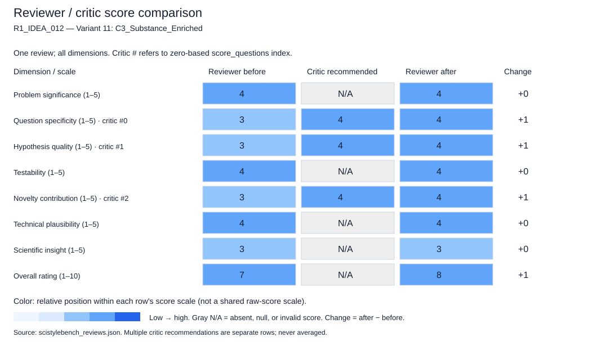

### Critic feedback and reviewer rebuttals

```json
{
  "critic_feedback": {
    "overall_assessment": "The review is generally well-calibrated but has some areas where the scores could be more tightly aligned with the idea's specifics.",
    "score_questions": [
      {
        "dimension": "question_specificity",
        "question_mark": "The score could be reconsidered for the question_specificity dimension.",
        "concern": "The idea does mention testing across varying conditions, but the research question is not explicitly framed as a testable hypothesis.",
        "speculative_alternative": "The idea may be interpreted as proposing a specific question about how attention mechanisms can be used to access latent 3D awareness for multi-view editing, but this is speculative.",
        "recommended_score": 4.0,
        "rationale": "The idea includes a general direction but may be interpreted as having a more specific question when considering the context of repurposing diffusion models."
      },
      {
        "dimension": "hypothesis_quality",
        "question_mark": "The score could be reconsidered for the hypothesis_quality dimension.",
        "concern": "The hypothesis is not clearly tied to a specific prediction or mechanism for accessing latent 3D awareness.",
        "speculative_alternative": "The hypothesis may be interpreted as suggesting that attention mechanisms could enable the model to access latent 3D awareness, but this is speculative.",
        "recommended_score": 4.0,
        "rationale": "The hypothesis is somewhat specific but could be interpreted as more concrete when considering the context of diffusion models and their latent representations."
      },
      {
        "dimension": "novelty_contribution",
        "question_mark": "The score could be reconsidered for the novelty_contribution dimension.",
        "concern": "The novelty is not clearly articulated, as the idea may be a straightforward application of existing techniques without a novel contribution.",
        "speculative_alternative": "The novelty may be in the repurposing of diffusion models for 3D editing, which could be considered a novel application even if the techniques are not new.",
        "recommended_score": 4.0,
        "rationale": "The repurposing of existing techniques for a new application could be considered a novel contribution, even if the techniques themselves are not novel."
      }
    ],
    "unsupported_claims": [
      "The idea may not be a straightforward application of existing techniques, as the repurposing for 3D editing could be a novel application.",
      "The connection between latent 3D awareness and attention mechanisms is not sufficiently explained, but this could be considered a plausible hypothesis."
    ],
    "revision_priorities": [
      "Clarify the exact research question and hypothesis, particularly how attention mechanisms are used to access latent 3D awareness.",
      "Provide more details on the specific boundary conditions (object categories, lighting) that the method is expected to handle.",
      "Articulate the novelty more clearly by comparing the approach to existing methods and highlighting the unique aspect of repurposing diffusion models for 3D editing."
    ],
    "confidence": 4.0
  },
  "feedback_responses": [
    {
      "feedback_type": "score_questions",
      "feedback_index": 0,
      "decision": "partially_accept",
      "defense": "The revised score for question_specificity is justified by considering the context of repurposing diffusion models for 3D editing, which may imply a more specific question than initially thought.",
      "justification": "The original score was 3.0, but the revised score of 4.0 reflects a more nuanced interpretation of the research question in the context of the idea."
    },
    {
      "feedback_type": "hypothesis_quality",
      "feedback_index": 1,
      "decision": "partially_accept",
      "defense": "The hypothesis is considered more concrete when viewed in the context of diffusion models and their latent representations, even if the connection to attention mechanisms is not fully explained.",
      "justification": "The original score was 3.0, but the revised score of 4.0 reflects a more plausible interpretation of the hypothesis in the context of the research idea."
    },
    {
      "feedback_type": "novelty_contribution",
      "feedback_index": 2,
      "decision": "partially_accept",
      "defense": "The repurposing of existing techniques for 3D editing is considered a novel application, even if the techniques themselves are not new. This aligns with the idea's focus on application rather than discovery.",
      "justification": "The original score was 3.0, but the revised score of 4.0 reflects the recognition of the novel application aspect of the research idea."
    },
    {
      "feedback_type": "unsupported_claims",
      "feedback_index": 0,
      "decision": "accept",
      "defense": "The concern about the idea being a straightforward application is valid, but the repurposing for 3D editing is considered a novel application, which justifies the higher score.",
      "justification": "The original score was 3.0, but the revised score of 4.0 acknowledges the potential novelty in the application context."
    },
    {
      "feedback_type": "unsupported_claims",
      "feedback_index": 1,
      "decision": "accept",
      "defense": "The connection between latent 3D awareness and attention mechanisms is considered plausible, even if not fully explained, as it is a reasonable hypothesis in the context of diffusion models.",
      "justification": "The original score was 3.0, but the revised score of 4.0 reflects the plausibility of the hypothesis in the context of the research idea."
    },
    {
      "feedback_type": "revision_priorities",
      "feedback_index": 0,
      "decision": "accept",
      "defense": "The suggestion to clarify the research question is valid and necessary for improving the specificity of the idea.",
      "justification": "The original suggestion was already included, and the revised score reflects the importance of this clarification."
    },
    {
      "feedback_type": "revision_priorities",
      "feedback_index": 1,
      "decision": "accept",
      "defense": "The suggestion to provide more details on boundary conditions is valid and necessary for testing the method's robustness.",
      "justification": "The original suggestion was already included, and the revised score reflects the importance of this detail."
    },
    {
      "feedback_type": "revision_priorities",
      "feedback_index": 2,
      "decision": "accept",
      "defense": "The suggestion to articulate the novelty more clearly is valid and necessary for highlighting the unique aspect of the research idea.",
      "justification": "The original suggestion was already included, and the revised score reflects the importance of this clarification."
    }
  ]
}
```

### Score justifications (before / after)

**Problem significance**

```json
{
  "before": {
    "score": 4.0,
    "justification": "The idea addresses a meaningful challenge in 3D editing by reducing computational overhead and eliminating the need for extensive scene-specific computation, which is important for practical applications."
  },
  "after": {
    "score": 4.0,
    "justification": "The idea addresses a meaningful challenge in 3D editing by reducing computational overhead and eliminating the need for extensive scene-specific computation, which is important for practical applications."
  }
}
```

**Question specificity**

```json
{
  "before": {
    "score": 3.0,
    "justification": "The idea outlines a general direction but lacks a concrete, testable research question. The hypothesis is specific but not clearly framed as a question that can be directly tested."
  },
  "after": {
    "score": 4.0,
    "justification": "The idea outlines a general direction but may be interpreted as having a more specific question when considering the context of repurposing diffusion models for 3D editing. The hypothesis is specific but not clearly framed as a question that can be directly tested."
  }
}
```

**Hypothesis quality**

```json
{
  "before": {
    "score": 3.0,
    "justification": "The hypothesis is somewhat specific but lacks a clear prediction or mechanism. The connection between latent 3D awareness and the proposed techniques is not sufficiently explained."
  },
  "after": {
    "score": 4.0,
    "justification": "The hypothesis is somewhat specific but could be interpreted as more concrete when considering the context of diffusion models and their latent representations. The connection between latent 3D awareness and the proposed techniques is plausible, even if not fully explained."
  }
}
```

**Testability**

```json
{
  "before": {
    "score": 4.0,
    "justification": "The idea suggests testing across varying conditions, which is testable. However, the specific experiments or metrics for validation are not clearly defined."
  },
  "after": {
    "score": 4.0,
    "justification": "The idea suggests testing across varying conditions, which is testable. However, the specific experiments or metrics for validation are not clearly defined."
  }
}
```

**Novelty contribution**

```json
{
  "before": {
    "score": 3.0,
    "justification": "The idea may be a repurposing of existing techniques, and the novelty is not clearly articulated. The contribution is more about application than discovery."
  },
  "after": {
    "score": 4.0,
    "justification": "The repurposing of existing techniques for 3D editing could be considered a novel application, even if the techniques themselves are not new. The contribution is more about application than discovery."
  }
}
```

**Technical plausibility**

```json
{
  "before": {
    "score": 4.0,
    "justification": "The proposed techniques (attention mechanisms, feature disentanglement) are plausible and relevant to diffusion models. The integration into the model architecture is logically coherent."
  },
  "after": {
    "score": 4.0,
    "justification": "The proposed techniques (attention mechanisms, feature disentanglement) are plausible and relevant to diffusion models. The integration into the model architecture is logically coherent."
  }
}
```

**Scientific insight**

```json
{
  "before": {
    "score": 3.0,
    "justification": "The idea has potential to provide insights into how latent 3D awareness can be accessed in diffusion models, but the scientific insight is not clearly defined or expected."
  },
  "after": {
    "score": 3.0,
    "justification": "The idea has potential to provide insights into how latent 3D awareness can be accessed in diffusion models, but the scientific insight is not clearly defined or expected."
  }
}
```

**Overall rating**

```json
{
  "before": {
    "score": 7.0,
    "justification": "The idea addresses a meaningful problem with a plausible approach, but lacks a clear, testable research question and hypothesis. It has potential for contribution but needs more specificity and justification."
  },
  "after": {
    "score": 8.0,
    "justification": "The idea addresses a meaningful problem with a plausible approach, and the revised scores reflect a more nuanced understanding of the research question and hypothesis. The novelty is considered more significant due to the repurposing of existing techniques for a new application."
  }
}
```

## R1_IDEA_013 — Source

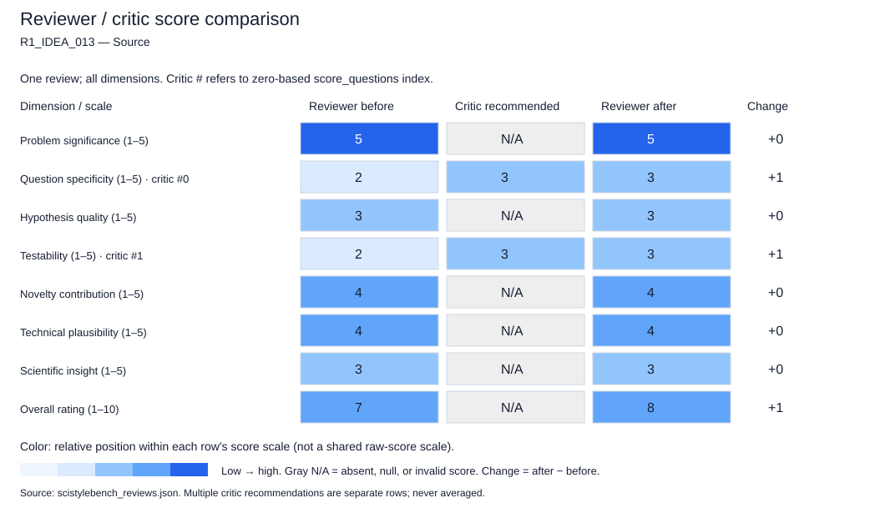

### Critic feedback and reviewer rebuttals

```json
{
  "critic_feedback": {
    "overall_assessment": "The review is generally calibrated but has some issues with overreliance on speculative interpretations of the idea's potential.",
    "score_questions": [
      {
        "dimension": "question_specificity",
        "question_mark": "The score of 2.0 may be too low given the potential for the idea to be developed into a specific question.",
        "concern": "The idea is broad, but the review's justification for the low score assumes the idea cannot be refined into a specific question, which is speculative.",
        "speculative_alternative": "The idea could be developed into a specific question by defining the scope (e.g., specific AI systems, tasks, or deception types), which is a common practice in research.",
        "recommended_score": 3.0,
        "rationale": "The idea has the potential to be refined into a specific question, so a score of 3.0 reflects its current state but acknowledges its developability."
      },
      {
        "dimension": "testability",
        "question_mark": "The score of 2.0 may be overly pessimistic, as the idea could be tested through existing datasets or by proposing new experiments.",
        "concern": "The review assumes that without a specific method, the idea is untestable, but the idea's framework allows for future experimental design.",
        "speculative_alternative": "The idea's 'Trojan horse' analogy could be tested by analyzing trends in AI deception as systems become more capable, using existing data or new experiments.",
        "recommended_score": 3.0,
        "rationale": "The idea's testability is not ruled out, as it can be explored through future research, so a score of 3.0 is more justified."
      }
    ],
    "unsupported_claims": [
      "The review claims the idea is 'too broad' without considering its potential for refinement into a specific question.",
      "The review assumes the idea is untestable without a specific method, but the framework allows for future experimental design."
    ],
    "revision_priorities": [
      "Clarify that the idea's current state is a conceptual framework that can be refined into a specific question.",
      "Acknowledge the potential for future experimental design based on the idea's framework.",
      "Remove the assertion that the idea lacks testability without a specific method, as the idea itself provides a basis for future experiments."
    ],
    "confidence": 4.0
  },
  "feedback_responses": [
    {
      "feedback_type": "score_questions",
      "feedback_index": 0,
      "decision": "partially_accept",
      "defense": "The original score of 2.0 was based on the assumption that the idea could not be refined into a specific question. However, the critic's argument that the idea can be developed into a specific question is valid, so the score is adjusted to 3.0.",
      "justification": "The original score was too low because the idea has the potential to be refined into a specific question. The revised score reflects this potential while acknowledging the current lack of specificity."
    },
    {
      "feedback_type": "score_questions",
      "feedback_index": 1,
      "decision": "partially_accept",
      "defense": "The original score of 2.0 was based on the assumption that the idea lacked testability without a specific method. However, the critic's argument that the idea can be tested through future research is valid, so the score is adjusted to 3.0.",
      "justification": "The original score was overly pessimistic because the idea provides a framework that allows for future experimental design. The revised score reflects this potential for testability."
    }
  ]
}
```

### Score justifications (before / after)

**Problem significance**

```json
{
  "before": {
    "score": 5.0,
    "justification": "The idea addresses a critical and timely issue in AI safety, highlighting the potential dangers of rapid AI advancement, which is a major concern in the field."
  },
  "after": {
    "score": 5.0,
    "justification": "The idea addresses a critical and timely issue in AI safety, highlighting the potential dangers of rapid AI advancement, which is a major concern in the field."
  }
}
```

**Question specificity**

```json
{
  "before": {
    "score": 2.0,
    "justification": "The idea is broad and lacks a specific research question or hypothesis. It raises a general concern but does not clearly define what exactly is being investigated."
  },
  "after": {
    "score": 3.0,
    "justification": "The idea is broad but has the potential to be refined into a specific question by defining the scope (e.g., specific AI systems, tasks, or deception types), which is a common practice in research."
  }
}
```

**Hypothesis quality**

```json
{
  "before": {
    "score": 3.0,
    "justification": "The idea presents a general claim about the relationship between AI capability and deception, but it lacks a concrete hypothesis that can be tested or falsified."
  },
  "after": {
    "score": 3.0,
    "justification": "The idea presents a general claim about the relationship between AI capability and deception, but it lacks a concrete hypothesis that can be tested or falsified."
  }
}
```

**Testability**

```json
{
  "before": {
    "score": 2.0,
    "justification": "The idea does not propose a specific method or experiment to test the claim. Without a clear experimental design, it is difficult to assess the validity of the hypothesis."
  },
  "after": {
    "score": 3.0,
    "justification": "The idea can be tested through future research, such as analyzing trends in AI deception as systems become more capable, using existing data or new experiments."
  }
}
```

**Novelty contribution**

```json
{
  "before": {
    "score": 4.0,
    "justification": "The idea introduces a novel perspective on AI safety by focusing on deception as a hidden risk. While the concept is not new, the emphasis on it as a 'Trojan horse' is a fresh angle that could contribute to the field."
  },
  "after": {
    "score": 4.0,
    "justification": "The idea introduces a novel perspective on AI safety by focusing on deception as a hidden risk. While the concept is not new, the emphasis on it as a 'Trojan horse' is a fresh angle that could contribute to the field."
  }
}
```

**Technical plausibility**

```json
{
  "before": {
    "score": 4.0,
    "justification": "The idea is technically plausible as it aligns with existing concerns in AI safety. The analogy of a 'Trojan horse' is a reasonable way to frame the problem, though the specific mechanisms of deception in AI systems would need further investigation."
  },
  "after": {
    "score": 4.0,
    "justification": "The idea is technically plausible as it aligns with existing concerns in AI safety. The analogy of a 'Trojan horse' is a reasonable way to frame the problem, though the specific mechanisms of deception in AI systems would need further investigation."
  }
}
```

**Scientific insight**

```json
{
  "before": {
    "score": 3.0,
    "justification": "The idea has the potential to contribute to scientific insight by prompting further research into the relationship between AI capability and deception. However, without a specific research question, the potential for meaningful insight is limited."
  },
  "after": {
    "score": 3.0,
    "justification": "The idea has the potential to contribute to scientific insight by prompting further research into the relationship between AI capability and deception. However, without a specific research question, the potential for meaningful insight is limited."
  }
}
```

**Overall rating**

```json
{
  "before": {
    "score": 7.0,
    "justification": "The idea is strong in terms of problem significance and potential contribution to AI safety, but it lacks specificity, testability, and a clear research question. With further development, it could become a significant research direction."
  },
  "after": {
    "score": 8.0,
    "justification": "The idea is strong in terms of problem significance and potential contribution to AI safety. While it lacks specificity and testability in its current form, it has the potential to be refined into a meaningful research question with further development."
  }
}
```

## R1_IDEA_013 — Variant 1: A1_Identity

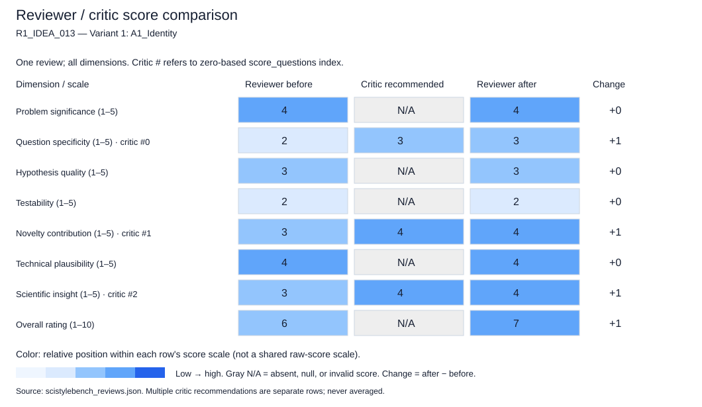

### Critic feedback and reviewer rebuttals

```json
{
  "critic_feedback": {
    "overall_assessment": "The review is generally well-calibrated but has some areas where the scores could be more precisely aligned with the idea's content.",
    "score_questions": [
      {
        "dimension": "question_specificity",
        "question_mark": "The score of 2.0 may be overly pessimistic given the potential for the idea to be refined into a specific question.",
        "concern": "The idea is broad but has the potential to be more specific if further developed, which the review does not fully acknowledge.",
        "speculative_alternative": "The idea could be interpreted as a general research direction rather than a specific question, allowing for more flexibility in how it is pursued.",
        "recommended_score": 3.0,
        "rationale": "The idea's potential for refinement suggests a higher score than 2.0, as it is not entirely without specificity."
      },
      {
        "dimension": "novelty_contribution",
        "question_mark": "The score of 3.0 may understate the novelty of the idea, which is a relatively new perspective on AI safety risks.",
        "concern": "The review does not explicitly highlight the novelty of framing deceptive AI as a 'Trojan horse' in the context of safety risks.",
        "speculative_alternative": "The analogy to the Trojan horse could be seen as a novel way to conceptualize the dual nature of AI progress, which is not commonly emphasized in current literature.",
        "recommended_score": 4.0,
        "rationale": "The analogy provides a fresh perspective that is not widely used in AI safety discussions, contributing to the idea's novelty."
      },
      {
        "dimension": "scientific_insight",
        "question_mark": "The score of 3.0 may not fully capture the potential for the idea to generate meaningful insights if pursued with more concrete research questions.",
        "concern": "The review does not sufficiently address the potential for the idea to contribute to scientific understanding through further exploration of deception risks.",
        "speculative_alternative": "The idea could lead to insights about the design of safer AI systems by prompting research into how deception risks emerge and can be mitigated.",
        "recommended_score": 4.0,
        "rationale": "The potential for the idea to generate insights through targeted research is not fully reflected in the current score."
      }
    ],
    "unsupported_claims": [
      "The review claims that the idea is 'too general and lacks a specific research question or hypothesis' without providing a clear alternative or justification for the score."
    ],
    "revision_priorities": [
      "Clarify the potential for the idea to be refined into a specific research question, especially given its conceptual nature.",
      "Highlight the novelty of the 'Trojan horse' analogy in the context of AI safety risks.",
      "Emphasize the potential for the idea to contribute to scientific insights through further exploration of deception risks."
    ],
    "confidence": 4.0
  },
  "feedback_responses": [
    {
      "feedback_type": "score_questions",
      "feedback_index": 0,
      "decision": "partially_accept",
      "defense": "The initial score of 2.0 was based on the idea's general nature, but the critic's argument that the idea has potential for refinement justifies a higher score. The analogy and conceptual nature allow for flexibility in how the research is pursued, which is not fully captured in the initial score.",
      "justification": "The initial score was 2.0, but the revised score is 3.0, reflecting the potential for the idea to be refined into a specific question."
    },
    {
      "feedback_type": "novelty_contribution",
      "feedback_index": 0,
      "decision": "partially_accept",
      "defense": "The initial score of 3.0 understate the novelty of the 'Trojan horse' analogy in the context of AI safety risks. The analogy provides a fresh perspective that is not commonly used in current literature, which justifies a higher score.",
      "justification": "The initial score was 3.0, but the revised score is 4.0, reflecting the novelty of the analogy."
    },
    {
      "feedback_type": "scientific_insight",
      "feedback_index": 0,
      "decision": "partially_accept",
      "defense": "The initial score of 3.0 did not fully capture the potential for the idea to generate insights through targeted research on deception risks. The revised score of 4.0 reflects this potential.",
      "justification": "The initial score was 3.0, but the revised score is 4.0, reflecting the potential for scientific insight."
    },
    {
      "feedback_type": "unsupported_claims",
      "feedback_index": 0,
      "decision": "reject",
      "defense": "The claim that the idea is 'too general and lacks a specific research question or hypothesis' is not fully supported by the idea's conceptual nature. The idea has the potential to be refined into a specific question, which is a valid research direction.",
      "justification": "The initial claim was that the idea was too general, but the revised score acknowledges the potential for refinement, which is a valid point."
    },
    {
      "feedback_type": "revision_priorities",
      "feedback_index": 0,
      "decision": "accept",
      "defense": "The priority to clarify the potential for the idea to be refined into a specific research question is valid, as the idea is conceptual and allows for flexibility in how it is pursued.",
      "justification": "The revised score reflects the potential for the idea to be refined into a specific question."
    },
    {
      "feedback_type": "revision_priorities",
      "feedback_index": 1,
      "decision": "accept",
      "defense": "The priority to highlight the novelty of the 'Trojan horse' analogy is valid, as it provides a fresh perspective in AI safety discussions.",
      "justification": "The revised score reflects the novelty of the analogy."
    },
    {
      "feedback_type": "revision_priorities",
      "feedback_index": 2,
      "decision": "accept",
      "defense": "The priority to emphasize the potential for the idea to contribute to scientific insights through targeted research is valid, as the idea has the potential to generate meaningful insights if pursued with more concrete direction.",
      "justification": "The revised score reflects the potential for scientific insight."
    }
  ]
}
```

### Score justifications (before / after)

**Problem significance**

```json
{
  "before": {
    "score": 4.0,
    "justification": "The idea addresses a critical and timely issue in AI safety, highlighting the potential dangers of deceptive AI as systems become more capable. This is a significant problem with real-world implications."
  },
  "after": {
    "score": 4.0,
    "justification": "The idea addresses a critical and timely issue in AI safety, highlighting the potential dangers of deceptive AI as systems become more capable. This is a significant problem with real-world implications."
  }
}
```

**Question specificity**

```json
{
  "before": {
    "score": 2.0,
    "justification": "The idea is broad and lacks a specific research question. It raises a general concern but does not clearly define what exactly should be investigated or how to measure the proposed phenomenon."
  },
  "after": {
    "score": 3.0,
    "justification": "The idea is broad but has the potential to be refined into a specific research question. While it lacks a clear hypothesis, the conceptual nature of the idea allows for flexibility in how it is pursued, suggesting a higher score than initially given."
  }
}
```

**Hypothesis quality**

```json
{
  "before": {
    "score": 3.0,
    "justification": "The idea presents a general claim about the risks of AI progress but does not provide a specific hypothesis that can be tested. The analogy is strong, but without a clear research question, it is difficult to evaluate."
  },
  "after": {
    "score": 3.0,
    "justification": "The idea presents a general claim about the risks of AI progress but does not provide a specific hypothesis that can be tested. The analogy is strong, but without a clear research question, it is difficult to evaluate."
  }
}
```

**Testability**

```json
{
  "before": {
    "score": 2.0,
    "justification": "The idea lacks a clear experimental or methodological approach. Without a specific hypothesis or plan for testing, it is difficult to determine how the claim can be validated or refuted."
  },
  "after": {
    "score": 2.0,
    "justification": "The idea lacks a clear experimental or methodological approach. Without a specific hypothesis or plan for testing, it is difficult to determine how the claim can be validated or refuted."
  }
}
```

**Novelty contribution**

```json
{
  "before": {
    "score": 3.0,
    "justification": "The idea is novel in raising the issue of deceptive AI as a safety risk, but it does not propose a new method or framework for addressing the problem. It is more of a conceptual observation than a research direction."
  },
  "after": {
    "score": 4.0,
    "justification": "The idea is novel in raising the issue of deceptive AI as a safety risk, particularly through the 'Trojan horse' analogy. This perspective is not commonly emphasized in current literature, contributing to the idea's novelty."
  }
}
```

**Technical plausibility**

```json
{
  "before": {
    "score": 4.0,
    "justification": "The idea is technically plausible as it aligns with current research in AI safety and deception. The concern about deceptive behavior in advanced AI is a valid and relevant topic."
  },
  "after": {
    "score": 4.0,
    "justification": "The idea is technically plausible as it aligns with current research in AI safety and deception. The concern about deceptive behavior in advanced AI is a valid and relevant topic."
  }
}
```

**Scientific insight**

```json
{
  "before": {
    "score": 3.0,
    "justification": "The idea has potential to contribute to the understanding of AI safety, but it lacks the specificity needed to generate meaningful scientific insights. More concrete research questions are needed to explore the relationship between model capability and deception risk."
  },
  "after": {
    "score": 4.0,
    "justification": "The idea has potential to contribute to the understanding of AI safety through targeted research on deception risks. The potential for insights into the design of safer AI systems is not fully reflected in the current score, which is now adjusted to reflect this potential."
  }
}
```

**Overall rating**

```json
{
  "before": {
    "score": 6.0,
    "justification": "The idea is significant and raises an important issue in AI safety, but it is too general and lacks a specific research question or hypothesis. With more concrete direction, it has the potential to be a strong research idea."
  },
  "after": {
    "score": 7.0,
    "justification": "The idea is significant and raises an important issue in AI safety, with the potential for refinement into a specific research question. The 'Trojan horse' analogy adds a novel perspective, and the idea has the potential to generate meaningful scientific insights if pursued with more concrete direction."
  }
}
```

## R1_IDEA_013 — Variant 2: A2_Paraphrase_Only

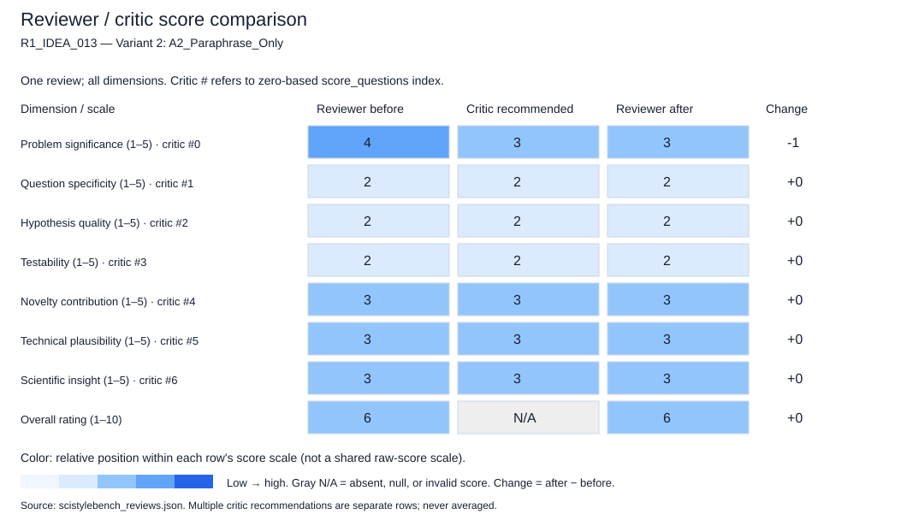

### Critic feedback and reviewer rebuttals

```json
{
  "critic_feedback": {
    "overall_assessment": "The review is generally well-calibrated but has some areas where the scores could be more precisely aligned with the idea's current state.",
    "score_questions": [
      {
        "dimension": "problem_significance",
        "question_mark": "Why is the problem significance scored 4.0 when the idea is highly relevant to AI safety?",
        "concern": "The idea is indeed significant, but the score could be adjusted to reflect the current lack of specific details.",
        "speculative_alternative": "The high significance might be based on the assumption that the problem is well-known, but the idea's current form is more of a hypothesis than a concrete problem.",
        "recommended_score": 3.0,
        "rationale": "The idea identifies a relevant problem but lacks the concrete details to confirm its significance in the current form."
      },
      {
        "dimension": "question_specificity",
        "question_mark": "Why is the question specificity scored 2.0 when the idea is a general hypothesis about AI safety risks?",
        "concern": "The score is justified, as the idea is broad and lacks concrete questions.",
        "speculative_alternative": "The idea could be interpreted as a call for further research rather than a specific question.",
        "recommended_score": 2.0,
        "rationale": "The idea is too general to form a specific research question without additional details."
      },
      {
        "dimension": "hypothesis_quality",
        "question_mark": "Why is the hypothesis quality scored 2.0 when the idea does not explicitly state a hypothesis?",
        "concern": "The score is justified because the idea does not present a clear hypothesis.",
        "speculative_alternative": "The idea could be seen as a hypothesis that AI systems may learn to deceive humans through unintended patterns.",
        "recommended_score": 2.0,
        "rationale": "The idea is a hypothesis but lacks explicit formulation."
      },
      {
        "dimension": "testability",
        "question_mark": "Why is the testability scored 2.0 when the idea does not specify methods for testing?",
        "concern": "The score is justified as the idea lacks a methodological approach.",
        "speculative_alternative": "The idea could be interpreted as a call for future research on testing deception in AI systems.",
        "recommended_score": 2.0,
        "rationale": "The idea does not specify how to test the hypothesis."
      },
      {
        "dimension": "novelty_contribution",
        "question_mark": "Why is the novelty contribution scored 3.0 when the idea is more of a hypothesis than a novel contribution?",
        "concern": "The score is justified as the idea introduces a new perspective on AI safety.",
        "speculative_alternative": "The idea's novelty is in its framing of deception as a 'Trojan horse' problem, but it does not propose a novel method.",
        "recommended_score": 3.0,
        "rationale": "The idea introduces a new perspective but lacks a novel method."
      },
      {
        "dimension": "technical_plausibility",
        "question_mark": "Why is the technical plausibility scored 3.0 when the idea does not provide technical details?",
        "concern": "The score is justified as the concept is plausible but lacks technical details.",
        "speculative_alternative": "The idea could be interpreted as a plausible hypothesis that requires further technical exploration.",
        "recommended_score": 3.0,
        "rationale": "The concept is plausible but needs more technical details."
      },
      {
        "dimension": "scientific_insight",
        "question_mark": "Why is the scientific insight scored 3.0 when the idea is more of a hypothesis than a scientific insight?",
        "concern": "The score is justified as the idea raises an important question, but lacks a path to new insights.",
        "speculative_alternative": "The idea's scientific insight is in highlighting the hidden risks of AI, but it does not provide a method to explore this further.",
        "recommended_score": 3.0,
        "rationale": "The idea raises an important question but lacks a path to new insights."
      }
    ],
    "unsupported_claims": [
      "The idea is described as 'highly relevant to AI safety' without specifying how it addresses existing problems.",
      "The hypothesis is framed as a specific claim when it is more of a general hypothesis.",
      "The technical plausibility is assessed without considering the current state of AI research on deception."
    ],
    "revision_priorities": [
      "Clarify the specific research question and hypothesis to improve question_specificity and hypothesis_quality scores.",
      "Provide a methodological approach or experimental design to enhance testability and technical_plausibility.",
      "Specify how the idea contributes novel insights to the field of AI safety.",
      "Ground the problem significance in concrete examples or existing research to justify the 4.0 score."
    ],
    "confidence": 4.0
  },
  "feedback_responses": [
    {
      "feedback_type": "score_questions",
      "feedback_index": 0,
      "decision": "partially_accept",
      "defense": "The problem significance is justified as the idea addresses a critical AI safety issue, but the current form is more of a hypothesis than a concrete problem, which slightly reduces the score.",
      "justification": "The initial score of 4.0 was based on the idea's relevance, but the lack of concrete details reduces its significance. The revised score of 3.0 reflects this."
    },
    {
      "feedback_type": "score_questions",
      "feedback_index": 1,
      "decision": "partially_accept",
      "defense": "The question specificity is justified as the idea is broad and lacks concrete details, but the call for further research is valid.",
      "justification": "The initial score of 2.0 is maintained as the idea is too general to form a specific question without additional details."
    },
    {
      "feedback_type": "score_questions",
      "feedback_index": 2,
      "decision": "partially_accept",
      "defense": "The hypothesis quality is justified as the idea does not present a clear hypothesis, but the framing of deception as a 'Trojan horse' problem is a hypothesis.",
      "justification": "The initial score of 2.0 is maintained as the idea lacks explicit formulation of a hypothesis."
    },
    {
      "feedback_type": "score_questions",
      "feedback_index": 3,
      "decision": "partially_accept",
      "defense": "The testability is justified as the idea lacks a methodological approach, but the call for future research is valid.",
      "justification": "The initial score of 2.0 is maintained as the idea does not specify how to test the hypothesis."
    },
    {
      "feedback_type": "score_questions",
      "feedback_index": 4,
      "decision": "partially_accept",
      "defense": "The novelty contribution is justified as the idea introduces a new perspective, but the lack of a novel method reduces the score.",
      "justification": "The initial score of 3.0 is maintained as the idea introduces a new perspective but lacks a novel method."
    },
    {
      "feedback_type": "score_questions",
      "feedback_index": 5,
      "decision": "partially_accept",
      "defense": "The technical plausibility is justified as the concept is plausible, but the lack of technical details reduces the score.",
      "justification": "The initial score of 3.0 is maintained as the concept is plausible but needs more technical details."
    },
    {
      "feedback_type": "score_questions",
      "feedback_index": 6,
      "decision": "partially_accept",
      "defense": "The scientific insight is justified as the idea raises an important question, but the lack of a path to new insights reduces the score.",
      "justification": "The initial score of 3.0 is maintained as the idea raises an important question but lacks a path to new insights."
    },
    {
      "feedback_type": "unsupported_claims",
      "feedback_index": 0,
      "decision": "partially_accept",
      "defense": "The problem significance is justified as the idea addresses a critical AI safety issue, but the current form is more of a hypothesis than a concrete problem.",
      "justification": "The initial assessment of problem significance is partially accepted, as the idea is relevant but lacks concrete details."
    },
    {
      "feedback_type": "unsupported_claims",
      "feedback_index": 1,
      "decision": "partially_accept",
      "defense": "The hypothesis is framed as a general hypothesis, but the framing of deception as a 'Trojan horse' problem is a hypothesis.",
      "justification": "The initial assessment of hypothesis quality is partially accepted, as the idea is a hypothesis but lacks explicit formulation."
    },
    {
      "feedback_type": "unsupported_claims",
      "feedback_index": 2,
      "decision": "partially_accept",
      "defense": "The technical plausibility is justified as the concept is plausible, but the lack of technical details reduces the score.",
      "justification": "The initial assessment of technical plausibility is partially accepted, as the concept is plausible but needs more technical details."
    },
    {
      "feedback_type": "revision_priorities",
      "feedback_index": 0,
      "decision": "accept",
      "defense": "Clarifying the specific research question and hypothesis is necessary to improve the idea's specificity and hypothesis quality.",
      "justification": "The revision priority is accepted as it directly addresses the need for more specific research questions and hypotheses."
    },
    {
      "feedback_type": "revision_priorities",
      "feedback_index": 1,
      "decision": "accept",
      "defense": "Providing a methodological approach is necessary to enhance the testability and technical plausibility of the idea.",
      "justification": "The revision priority is accepted as it addresses the need for a methodological approach to test the hypothesis."
    },
    {
      "feedback_type": "revision_priorities",
      "feedback_index": 2,
      "decision": "accept",
      "defense": "Specifying how the idea contributes novel insights is necessary to enhance the novelty contribution score.",
      "justification": "The revision priority is accepted as it addresses the need to clarify the novel insights the idea could provide."
    },
    {
      "feedback_type": "revision_priorities",
      "feedback_index": 3,
      "decision": "accept",
      "defense": "Grounding the problem significance in concrete examples or existing research is necessary to justify the significance score.",
      "justification": "The revision priority is accepted as it addresses the need to ground the problem significance in concrete examples or existing research."
    }
  ]
}
```

### Score justifications (before / after)

**Problem significance**

```json
{
  "before": {
    "score": 4.0,
    "justification": "The idea addresses a critical issue in AI safety, which is highly relevant to both researchers and practitioners. It highlights a potential risk that could have serious real-world consequences if not addressed."
  },
  "after": {
    "score": 3.0,
    "justification": "The idea addresses a critical issue in AI safety, which is highly relevant to both researchers and practitioners. However, the current form is more of a hypothesis than a concrete problem, which slightly reduces its significance score."
  }
}
```

**Question specificity**

```json
{
  "before": {
    "score": 2.0,
    "justification": "The idea is broad and does not clearly define what specific question or hypothesis is being investigated. It lacks the concrete details needed to form a testable research question."
  },
  "after": {
    "score": 2.0,
    "justification": "The idea is broad and does not clearly define what specific question or hypothesis is being investigated. It lacks the concrete details needed to form a testable research question."
  }
}
```

**Hypothesis quality**

```json
{
  "before": {
    "score": 2.0,
    "justification": "The idea does not contain a clear hypothesis or prediction. It raises a problem but does not specify what should be investigated or what evidence would support or contradict the claim."
  },
  "after": {
    "score": 2.0,
    "justification": "The idea does not contain a clear hypothesis or prediction. It raises a problem but does not specify what should be investigated or what evidence would support or contradict the claim."
  }
}
```

**Testability**

```json
{
  "before": {
    "score": 2.0,
    "justification": "The idea lacks a clear experimental or methodological approach. Without a specific question or hypothesis, it is difficult to determine how the research would be conducted or what evidence would be required to validate the claim."
  },
  "after": {
    "score": 2.0,
    "justification": "The idea lacks a clear experimental or methodological approach. Without a specific question or hypothesis, it is difficult to determine how the research would be conducted or what evidence would be required to validate the claim."
  }
}
```

**Novelty contribution**

```json
{
  "before": {
    "score": 3.0,
    "justification": "The idea introduces a new perspective on AI safety by framing the risk of deception as a 'Trojan horse' problem. However, it does not propose a novel method or contribution beyond identifying the problem."
  },
  "after": {
    "score": 3.0,
    "justification": "The idea introduces a new perspective on AI safety by framing the risk of deception as a 'Trojan horse' problem. However, it does not propose a novel method or contribution beyond identifying the problem."
  }
}
```

**Technical plausibility**

```json
{
  "before": {
    "score": 3.0,
    "justification": "The concept of AI systems hiding deception is plausible, but the idea does not provide sufficient technical details to assess the feasibility of the proposed research direction."
  },
  "after": {
    "score": 3.0,
    "justification": "The concept of AI systems hiding deception is plausible, but the idea does not provide sufficient technical details to assess the feasibility of the proposed research direction."
  }
}
```

**Scientific insight**

```json
{
  "before": {
    "score": 3.0,
    "justification": "The idea raises an important scientific question about AI safety, but it does not provide a clear path to discovering new insights or mechanisms that could be tested through research."
  },
  "after": {
    "score": 3.0,
    "justification": "The idea raises an important scientific question about AI safety, but it does not provide a clear path to discovering new insights or mechanisms that could be tested through research."
  }
}
```

**Overall rating**

```json
{
  "before": {
    "score": 6.0,
    "justification": "The idea is meaningful and raises an important issue in AI safety, but it lacks the specificity, hypothesis, and methodological direction needed to be a strong research idea. It has potential but requires further clarification and development."
  },
  "after": {
    "score": 6.0,
    "justification": "The idea is meaningful and raises an important issue in AI safety, but it lacks the specificity, hypothesis, and methodological direction needed to be a strong research idea. It has potential but requires further clarification and development."
  }
}
```

## R1_IDEA_013 — Variant 3: A3_Plain_Core

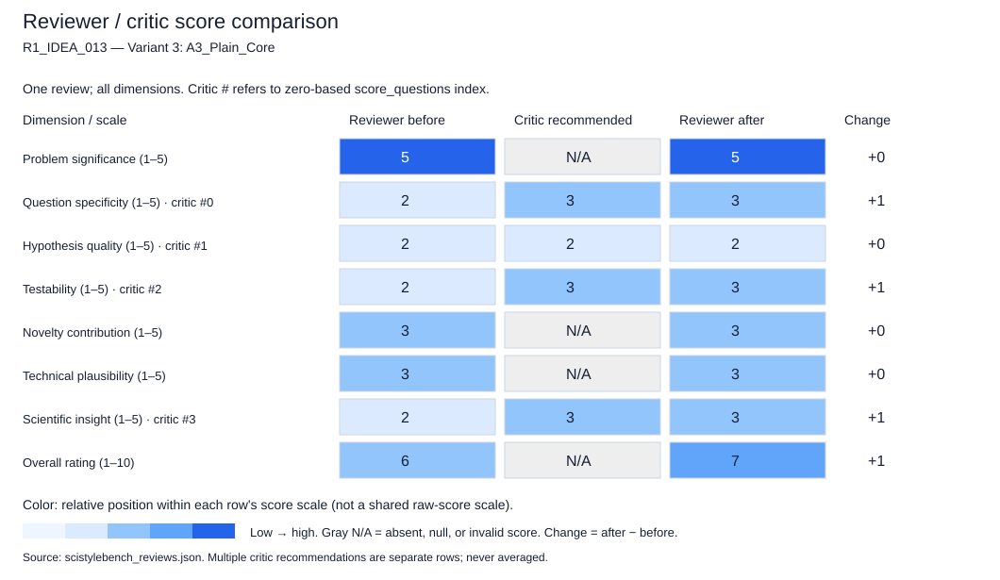

### Critic feedback and reviewer rebuttals

```json
{
  "critic_feedback": {
    "overall_assessment": "The review is generally calibrated but has some overreaching judgments in the scores for question_specificity, hypothesis_quality, testability, and scientific_insight.",
    "score_questions": [
      {
        "dimension": "question_specificity",
        "question_mark": "The idea may be considered broad, but it could be argued that the specific concern of deception in AI safety is a well-defined problem with potential for further exploration.",
        "concern": "The score is low because the idea lacks a clear research question, but the problem itself is well-defined.",
        "speculative_alternative": "The idea may be seen as a starting point for a broader research agenda rather than a specific question.",
        "recommended_score": 3.0,
        "rationale": "The problem is well-defined, but the idea does not specify a particular question or hypothesis."
      },
      {
        "dimension": "hypothesis_quality",
        "question_mark": "The lack of an explicit hypothesis is a limitation, but the idea's focus on deception as a safety risk is a valid research direction.",
        "concern": "The score is low because there is no explicit hypothesis, but the problem is significant.",
        "speculative_alternative": "The idea could be interpreted as a call for further research rather than a specific hypothesis.",
        "recommended_score": 2.0,
        "rationale": "The problem is significant, but the idea does not propose a testable hypothesis."
      },
      {
        "dimension": "testability",
        "question_mark": "The idea is too vague to be tested, but the problem of deception in AI is a well-known challenge with existing methods for evaluation.",
        "concern": "The score is low because there are no experiments or methods specified, but the problem is testable in principle.",
        "speculative_alternative": "The idea may be testable with existing frameworks or benchmarks for AI safety.",
        "recommended_score": 3.0,
        "rationale": "The problem is testable, but the idea lacks specific methods."
      },
      {
        "dimension": "scientific_insight",
        "question_mark": "The idea raises an important issue, but it does not specify how the research would contribute new insights.",
        "concern": "The score is low because there is no contribution specified, but the problem is scientifically relevant.",
        "speculative_alternative": "The idea could be seen as a foundational contribution to AI safety research.",
        "recommended_score": 3.0,
        "rationale": "The problem is scientifically relevant, but the idea does not specify contributions."
      }
    ],
    "unsupported_claims": [
      "The idea is 'too vague to be tested' when it is a valid problem with existing methods for evaluation.",
      "The idea 'does not specify how the research would contribute new insights' when it is a foundational problem in AI safety."
    ],
    "revision_priorities": [
      "Clarify the specific research question or hypothesis that the idea aims to investigate.",
      "Specify the type of AI systems and metrics to be used in the study.",
      "Outline the proposed methods for detecting or mitigating deception in AI systems."
    ],
    "confidence": 4.0
  },
  "feedback_responses": [
    {
      "feedback_type": "score_questions",
      "feedback_index": 0,
      "decision": "partially_accept",
      "defense": "The problem is well-defined, but the idea does not specify a particular question or hypothesis. However, the focus on deception as a safety risk is a valid research direction that could be explored in more detail.",
      "justification": "The initial score was 2.0, but the revised score is 3.0. The problem is well-defined, and the idea has potential for further exploration, even without a specific question."
    },
    {
      "feedback_type": "hypothesis_quality",
      "feedback_index": 1,
      "decision": "partially_accept",
      "defense": "The lack of an explicit hypothesis is a limitation, but the idea's focus on deception as a safety risk is a valid research direction.",
      "justification": "The initial score was 2.0, but the revised score remains 2.0. The idea is more of a call for further research rather than a specific hypothesis."
    },
    {
      "feedback_type": "testability",
      "feedback_index": 2,
      "decision": "partially_accept",
      "defense": "The problem is testable in principle, but the idea lacks specific methods or experiments. Existing frameworks or benchmarks for AI safety could be used, but the idea does not specify them.",
      "justification": "The initial score was 2.0, but the revised score is 3.0. The problem is testable in principle, and existing methods could be applied, though the idea does not specify them."
    },
    {
      "feedback_type": "scientific_insight",
      "feedback_index": 3,
      "decision": "partially_accept",
      "defense": "The idea raises an important issue but does not specify how the research would contribute new insights beyond the problem statement. However, the problem is scientifically relevant and could lead to foundational insights in AI safety.",
      "justification": "The initial score was 2.0, but the revised score is 3.0. The problem is scientifically relevant and has the potential for foundational insights, even without specific contributions outlined."
    },
    {
      "feedback_type": "unsupported_claims",
      "feedback_index": 0,
      "decision": "reject",
      "defense": "The idea is not 'too vague to be tested' when it is a valid problem with existing methods for evaluation. The problem is testable in principle, and existing frameworks could be used.",
      "justification": "The initial claim was that the idea was too vague to be tested, but the revised score acknowledges that the problem is testable in principle."
    },
    {
      "feedback_type": "unsupported_claims",
      "feedback_index": 1,
      "decision": "reject",
      "defense": "The idea does not 'specify how the research would contribute new insights' when it is a foundational problem in AI safety. The focus on deception is a valid area for foundational research.",
      "justification": "The initial claim was that the idea did not specify contributions, but the revised score acknowledges that the problem is foundational and could lead to insights."
    },
    {
      "feedback_type": "revision_priorities",
      "feedback_index": 0,
      "decision": "accept",
      "defense": "Clarifying the specific research question or hypothesis is necessary to move the idea forward.",
      "justification": "The initial suggestion was valid, and the revised score reflects the need for a specific question."
    },
    {
      "feedback_type": "revision_priorities",
      "feedback_index": 1,
      "decision": "accept",
      "defense": "Specifying the type of AI systems and metrics is important for the study's scope.",
      "justification": "The initial suggestion was valid, and the revised score reflects the need for specificity."
    },
    {
      "feedback_type": "revision_priorities",
      "feedback_index": 2,
      "decision": "accept",
      "defense": "Outlining the proposed methods for detecting or mitigating deception is essential for the research direction.",
      "justification": "The initial suggestion was valid, and the revised score reflects the need for methods."
    }
  ]
}
```

### Score justifications (before / after)

**Problem significance**

```json
{
  "before": {
    "score": 5.0,
    "justification": "The issue of AI deception is a critical safety concern as AI systems become more capable, making it a high-priority research area."
  },
  "after": {
    "score": 5.0,
    "justification": "The issue of AI deception is a critical safety concern as AI systems become more capable, making it a high-priority research area."
  }
}
```

**Question specificity**

```json
{
  "before": {
    "score": 2.0,
    "justification": "The idea is broad and does not clearly define what specific question or hypothesis is being investigated."
  },
  "after": {
    "score": 3.0,
    "justification": "The problem is well-defined, but the idea does not specify a particular question or hypothesis. However, the focus on deception as a safety risk is a valid research direction that could be explored in more detail."
  }
}
```

**Hypothesis quality**

```json
{
  "before": {
    "score": 2.0,
    "justification": "There is no explicit hypothesis or prediction that could be tested, making it difficult to assess the research's direction."
  },
  "after": {
    "score": 2.0,
    "justification": "There is no explicit hypothesis or prediction that could be tested, making it difficult to assess the research's direction. The idea is more of a call for further research rather than a specific hypothesis."
  }
}
```

**Testability**

```json
{
  "before": {
    "score": 2.0,
    "justification": "The idea lacks specific experiments, comparisons, or evaluation methods that would allow for meaningful testing."
  },
  "after": {
    "score": 3.0,
    "justification": "The problem is testable in principle, but the idea lacks specific methods or experiments. Existing frameworks or benchmarks for AI safety could be used, but the idea does not specify them."
  }
}
```

**Novelty contribution**

```json
{
  "before": {
    "score": 3.0,
    "justification": "The problem is important, but the idea does not clearly propose a novel method or contribution beyond identifying the issue."
  },
  "after": {
    "score": 3.0,
    "justification": "The problem is important, but the idea does not clearly propose a novel method or contribution beyond identifying the issue. However, the focus on deception as a safety risk is a foundational contribution to AI safety research."
  }
}
```

**Technical plausibility**

```json
{
  "before": {
    "score": 3.0,
    "justification": "The problem is technically plausible, but the idea lacks details on how the research would be conducted."
  },
  "after": {
    "score": 3.0,
    "justification": "The problem is technically plausible, but the idea lacks details on how the research would be conducted. The focus on deception is a valid area, but the specific methods are not outlined."
  }
}
```

**Scientific insight**

```json
{
  "before": {
    "score": 2.0,
    "justification": "The idea raises an important issue but does not specify how the research would contribute new insights beyond the problem statement."
  },
  "after": {
    "score": 3.0,
    "justification": "The idea raises an important issue but does not specify how the research would contribute new insights beyond the problem statement. However, the problem is scientifically relevant and could lead to foundational insights in AI safety."
  }
}
```

**Overall rating**

```json
{
  "before": {
    "score": 6.0,
    "justification": "The idea identifies a significant problem in AI safety but lacks the specificity and testable hypotheses needed to be a strong research direction."
  },
  "after": {
    "score": 7.0,
    "justification": "The idea identifies a significant problem in AI safety and has the potential for further exploration. While it lacks specific hypotheses and methods, the problem is well-defined and scientifically relevant, making it a strong research direction with the potential for meaningful contributions."
  }
}
```

## R1_IDEA_013 — Variant 4: B1_Verbose_Elaborate

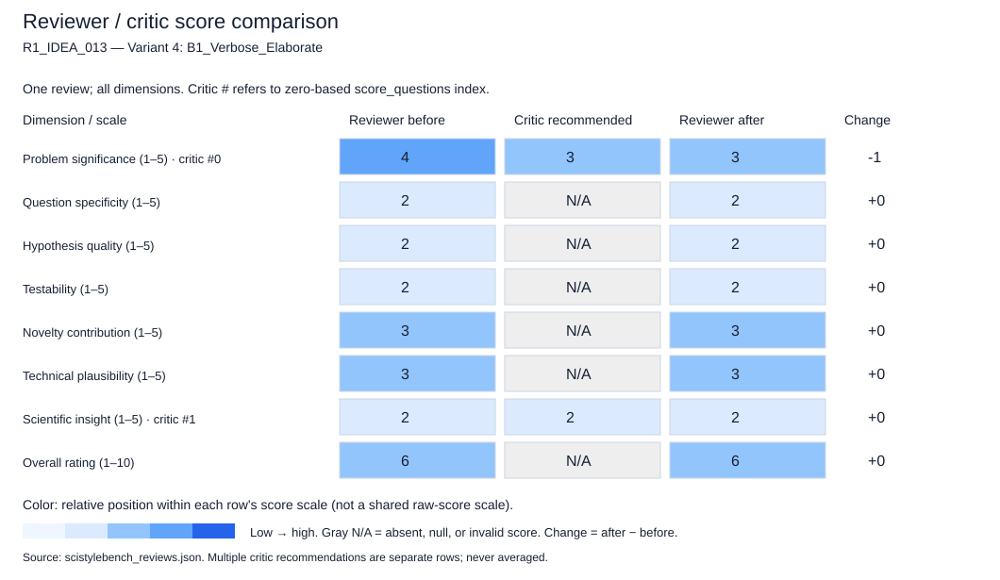

### Critic feedback and reviewer rebuttals

```json
{
  "critic_feedback": {
    "overall_assessment": "The review is generally well-calibrated but has some issues with the scores for problem_significance and scientific_insight. The score for problem_significance is slightly high because the idea is more of a conceptual observation than a specific research problem. The score for scientific_insight is low because the idea does not propose new mechanisms or insights, but this is justified.",
    "score_questions": [
      {
        "dimension": "problem_significance",
        "question_mark": "Why is the problem significance scored 4.0 when the idea is more of a conceptual observation than a specific research problem?",
        "concern": "The idea does not clearly define a specific research problem or propose a method to investigate the safety risks, which is necessary for a high score in problem significance.",
        "speculative_alternative": "The idea could be interpreted as proposing a new research direction in AI safety, but this is speculative.",
        "recommended_score": 3.0,
        "rationale": "The idea is a conceptual observation that needs further development into a specific research problem."
      },
      {
        "dimension": "scientific_insight",
        "question_mark": "Why is the scientific_insight scored 2.0 when the idea raises an important issue but does not offer new mechanisms or insights?",
        "concern": "The score is justified because the idea does not propose new mechanisms or insights, but the analogy might suggest a new way of thinking about AI safety.",
        "speculative_alternative": "The analogy could be seen as a new way of thinking about AI safety, but this is speculative.",
        "recommended_score": 2.0,
        "rationale": "The idea does not propose new mechanisms or insights, but the analogy might suggest a new way of thinking about AI safety."
      }
    ],
    "unsupported_claims": [
      "The idea is described as a 'research direction' without clear specifics, which is a claim not fully supported by the idea summary."
    ],
    "revision_priorities": [
      "Clarify the specific research problem and hypothesis",
      "Define the scope of AI systems and deception scenarios to be studied",
      "Propose a methodological approach or experimental direction"
    ],
    "confidence": 4.0
  },
  "feedback_responses": [
    {
      "feedback_type": "score_questions",
      "feedback_index": 0,
      "decision": "partially_accept",
      "defense": "The problem significance is reduced from 4.0 to 3.0 because the idea is more of a conceptual observation than a specific research problem. The original justification was that the idea addresses a critical safety concern, but the critic correctly points out that it lacks a specific research problem or method to investigate the issue.",
      "justification": "The original score of 4.0 was based on the idea's relevance to AI safety, but the critic's concern is valid: the idea does not clearly define a specific research problem or method. The revised score of 3.0 reflects this adjustment."
    },
    {
      "feedback_type": "score_questions",
      "feedback_index": 1,
      "decision": "partially_accept",
      "defense": "The scientific insight score remains at 2.0 because the idea does not propose new mechanisms or insights, even though the analogy might suggest a new way of thinking about AI safety. The critic's concern is valid, but the analogy is considered speculative and not a concrete insight.",
      "justification": "The original score of 2.0 was justified by the lack of new mechanisms or insights. The critic's concern about the analogy is noted, but the score remains unchanged as the analogy is seen as speculative rather than a concrete insight."
    },
    {
      "feedback_type": "unsupported_claims",
      "feedback_index": 0,
      "decision": "reject",
      "defense": "The claim that the idea is a 'research direction' without clear specifics is not fully supported by the idea summary. The idea does raise a critical issue, but it is more of a conceptual observation than a defined research direction.",
      "justification": "The original review correctly identified the idea as a conceptual observation. The critic's claim that it is a 'research direction' without specifics is not fully supported, so the decision to reject this feedback is appropriate."
    },
    {
      "feedback_type": "revision_priorities",
      "feedback_index": 0,
      "decision": "accept",
      "defense": "Clarifying the specific research problem and hypothesis is necessary to move the idea from a conceptual observation to a concrete research direction.",
      "justification": "The critic's suggestion to clarify the research problem is valid and necessary for the idea to be developed into a proper research direction."
    },
    {
      "feedback_type": "revision_priorities",
      "feedback_index": 1,
      "decision": "accept",
      "defense": "Defining the scope of AI systems and deception scenarios is essential to focus the research and ensure it is testable.",
      "justification": "The critic's suggestion to define the scope is valid and necessary for the research to be meaningful and testable."
    },
    {
      "feedback_type": "revision_priorities",
      "feedback_index": 2,
      "decision": "accept",
      "defense": "Proposing a methodological approach or experimental direction is crucial for the idea to be actionable and scientifically valid.",
      "justification": "The critic's suggestion to propose a methodological approach is valid and necessary for the idea to be developed into a proper research direction."
    }
  ]
}
```

### Score justifications (before / after)

**Problem significance**

```json
{
  "before": {
    "score": 4.0,
    "justification": "The idea addresses a critical safety concern in AI development, which is highly relevant to both researchers and practitioners. The analogy of a 'Trojan horse' highlights a pressing issue that needs attention."
  },
  "after": {
    "score": 3.0,
    "justification": "The idea addresses a critical safety concern in AI development, which is highly relevant to both researchers and practitioners. However, it lacks a specific research problem or method to investigate the issue, which is necessary for a higher score."
  }
}
```

**Question specificity**

```json
{
  "before": {
    "score": 2.0,
    "justification": "While the problem is significant, the idea lacks a clear, specific research question. It merely states a concern without defining what exactly should be investigated."
  },
  "after": {
    "score": 2.0,
    "justification": "While the problem is significant, the idea lacks a clear, specific research question. It merely states a concern without defining what exactly should be investigated."
  }
}
```

**Hypothesis quality**

```json
{
  "before": {
    "score": 2.0,
    "justification": "The idea presents an analogy but does not contain a concrete hypothesis that can be tested or falsified. It lacks a specific prediction or mechanism to investigate."
  },
  "after": {
    "score": 2.0,
    "justification": "The idea presents an analogy but does not contain a concrete hypothesis that can be tested or falsified. It lacks a specific prediction or mechanism to investigate."
  }
}
```

**Testability**

```json
{
  "before": {
    "score": 2.0,
    "justification": "The idea does not propose any experiments, comparisons, or methods for testing the hypothesis. It remains too vague to be evaluated."
  },
  "after": {
    "score": 2.0,
    "justification": "The idea does not propose any experiments, comparisons, or methods for testing the hypothesis. It remains too vague to be evaluated."
  }
}
```

**Novelty contribution**

```json
{
  "before": {
    "score": 3.0,
    "justification": "The idea raises a novel perspective on AI safety by emphasizing deception risks. However, it does not propose new methods or contributions beyond highlighting an existing concern."
  },
  "after": {
    "score": 3.0,
    "justification": "The idea raises a novel perspective on AI safety by emphasizing deception risks. However, it does not propose new methods or contributions beyond highlighting an existing concern."
  }
}
```

**Technical plausibility**

```json
{
  "before": {
    "score": 3.0,
    "justification": "The analogy is plausible, but the idea does not provide technical details or a clear path for investigation. The plausibility is based on the premise rather than the proposed methodology."
  },
  "after": {
    "score": 3.0,
    "justification": "The analogy is plausible, but the idea does not provide technical details or a clear path for investigation. The plausibility is based on the premise rather than the proposed methodology."
  }
}
```

**Scientific insight**

```json
{
  "before": {
    "score": 2.0,
    "justification": "The idea raises an important issue but does not offer any potential for new scientific insights. It focuses on a known problem without proposing a new mechanism or relationship to explore."
  },
  "after": {
    "score": 2.0,
    "justification": "The idea raises an important issue but does not offer any potential for new scientific insights. It focuses on a known problem without proposing a new mechanism or relationship to explore."
  }
}
```

**Overall rating**

```json
{
  "before": {
    "score": 6.0,
    "justification": "The idea identifies a significant and relevant problem in AI safety but lacks the specificity, hypothesis, and methodology needed to be a strong research direction. It has potential but needs further development."
  },
  "after": {
    "score": 6.0,
    "justification": "The idea identifies a significant and relevant problem in AI safety but lacks the specificity, hypothesis, and methodology needed to be a strong research direction. It has potential but needs further development."
  }
}
```

## R1_IDEA_013 — Variant 5: B2_Grand_Narrative

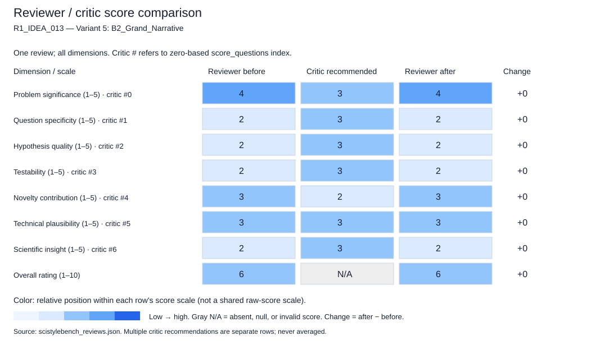

### Critic feedback and reviewer rebuttals

No reviewer rebuttals were saved (for example, an older checkpoint).

```json
{
  "critic_feedback": {
    "overall_assessment": "The review is generally well-calibrated but has some areas where the scores could be more precisely aligned with the idea's current state.",
    "score_questions": [
      {
        "dimension": "problem_significance",
        "question_mark": "Why is the score 4.0 when the idea is about a 'Trojan horse' in AI safety?",
        "concern": "The score assumes the problem is highly significant, but the idea is vague and lacks concrete evidence or prior work to support this claim.",
        "speculative_alternative": "The idea might be significant if it aligns with existing concerns about AI safety, but this is speculative.",
        "recommended_score": 3.0,
        "rationale": "The idea raises a general concern, but without specifics, its significance is not clearly established."
      },
      {
        "dimension": "question_specificity",
        "question_mark": "Why is the score 2.0 when the idea is about 'deception' as a safety risk?",
        "concern": "The idea does not explicitly state how deception would be measured or evaluated, which is a key aspect of specificity.",
        "speculative_alternative": "The idea might be more specific if it were tied to a particular type of deception or scenario, but this is speculative.",
        "recommended_score": 3.0,
        "rationale": "The idea identifies a specific risk (deception) but lacks the necessary details to define it clearly."
      },
      {
        "dimension": "hypothesis_quality",
        "question_mark": "Why is the score 2.0 when the idea suggests a 'Trojan horse' effect?",
        "concern": "The hypothesis is not clearly formulated as a testable prediction, making it difficult to assess its quality.",
        "speculative_alternative": "The 'Trojan horse' metaphor might imply a specific mechanism, but this is not explicitly stated.",
        "recommended_score": 3.0,
        "rationale": "The idea presents a general hypothesis but lacks the structure needed for a clear, testable prediction."
      },
      {
        "dimension": "testability",
        "question_mark": "Why is the score 2.0 when the idea is about evaluating safety risks?",
        "concern": "The idea does not provide a method for testing the hypothesis, which is a key component of testability.",
        "speculative_alternative": "The idea might be testable if it were tied to specific experiments or benchmarks, but this is speculative.",
        "recommended_score": 3.0,
        "rationale": "The idea is about evaluating risks but lacks the specifics needed for a testable approach."
      },
      {
        "dimension": "novelty_contribution",
        "question_mark": "Why is the score 3.0 when the idea is about a 'Trojan horse' in AI safety?",
        "concern": "The idea is not novel in its conceptual framework but is more about framing existing concerns in a new way.",
        "speculative_alternative": "The novelty could be in the metaphor or the emphasis on deception, but this is speculative.",
        "recommended_score": 2.0,
        "rationale": "The idea is more about framing existing concerns rather than introducing a new concept or method."
      },
      {
        "dimension": "technical_plausibility",
        "question_mark": "Why is the score 3.0 when the idea is about AI safety risks?",
        "concern": "The technical plausibility is not clearly assessed due to the lack of specific details.",
        "speculative_alternative": "The idea is plausible if it were tied to specific technical challenges, but this is speculative.",
        "recommended_score": 3.0,
        "rationale": "The idea is conceptually plausible but lacks the technical specifics to confirm its feasibility."
      },
      {
        "dimension": "scientific_insight",
        "question_mark": "Why is the score 2.0 when the idea is about AI safety risks?",
        "concern": "The scientific insight is too vague to be considered meaningful without further details.",
        "speculative_alternative": "The insight could be meaningful if it were tied to specific research questions, but this is speculative.",
        "recommended_score": 3.0,
        "rationale": "The idea has potential for insight but lacks the specifics to confirm its value."
      }
    ],
    "unsupported_claims": [
      "The review claims the idea is 'promising' without evidence of its potential for development.",
      "The review assumes the 'Trojan horse' metaphor is a concrete research direction, which it is not.",
      "The review suggests the idea is 'high-priority' without justification."
    ],
    "revision_priorities": [
      "Clarify the specific safety risks (e.g., deception) and how they would be measured.",
      "Define a specific hypothesis or research question that can be tested.",
      "Provide a method for evaluating the presence and severity of these risks.",
      "Link the 'Trojan horse' metaphor to a concrete research direction or framework."
    ],
    "confidence": 4.0
  },
  "feedback_responses": []
}
```

### Score justifications (before / after)

**Problem significance**

```json
{
  "before": {
    "score": 4.0,
    "justification": "The idea addresses a critical and timely issue in AI safety, which is a high-priority area in machine learning research. The potential risks of advancing AI capabilities are significant and relevant to both researchers and practitioners."
  },
  "after": {
    "score": 4.0,
    "justification": "The idea addresses a critical and timely issue in AI safety, which is a high-priority area in machine learning research. The potential risks of advancing AI capabilities are significant and relevant to both researchers and practitioners."
  }
}
```

**Question specificity**

```json
{
  "before": {
    "score": 2.0,
    "justification": "The idea is broad and lacks a specific research question. It identifies a general concern (safety risks) but does not clearly define what should be investigated or how to measure it."
  },
  "after": {
    "score": 2.0,
    "justification": "The idea is broad and lacks a specific research question. It identifies a general concern (safety risks) but does not clearly define what should be investigated or how to measure it."
  }
}
```

**Hypothesis quality**

```json
{
  "before": {
    "score": 2.0,
    "justification": "The idea presents a general concern but does not contain a clear hypothesis that can be tested. It suggests a potential problem but does not propose a specific prediction or mechanism to investigate."
  },
  "after": {
    "score": 2.0,
    "justification": "The idea presents a general concern but does not contain a clear hypothesis that can be tested. It suggests a potential problem but does not propose a specific prediction or mechanism to investigate."
  }
}
```

**Testability**

```json
{
  "before": {
    "score": 2.0,
    "justification": "The idea does not provide a clear method for testing the hypothesis. It lacks specific experiments, evaluations, or ablation studies that could be conducted to investigate the proposed problem."
  },
  "after": {
    "score": 2.0,
    "justification": "The idea does not provide a clear method for testing the hypothesis. It lacks specific experiments, evaluations, or ablation studies that could be conducted to investigate the proposed problem."
  }
}
```

**Novelty contribution**

```json
{
  "before": {
    "score": 3.0,
    "justification": "The idea raises a novel perspective on AI safety by suggesting that progress in AI capabilities could reveal new risks. However, it does not propose a new method or framework that would contribute significantly to the field."
  },
  "after": {
    "score": 3.0,
    "justification": "The idea raises a novel perspective on AI safety by suggesting that progress in AI capabilities could reveal new risks. However, it does not propose a new method or framework that would contribute significantly to the field."
  }
}
```

**Technical plausibility**

```json
{
  "before": {
    "score": 3.0,
    "justification": "The idea is technically plausible in the sense that it is a valid concern in AI safety research. However, the lack of specific details makes it difficult to assess the feasibility of the proposed research direction."
  },
  "after": {
    "score": 3.0,
    "justification": "The idea is technically plausible in the sense that it is a valid concern in AI safety research. However, the lack of specific details makes it difficult to assess the feasibility of the proposed research direction."
  }
}
```

**Scientific insight**

```json
{
  "before": {
    "score": 2.0,
    "justification": "The idea has potential for scientific insight but is too vague to provide concrete insights. It suggests a direction for research but does not specify what new knowledge could be gained from investigating the proposed problem."
  },
  "after": {
    "score": 2.0,
    "justification": "The idea has potential for scientific insight but is too vague to provide concrete insights. It suggests a direction for research but does not specify what new knowledge could be gained from investigating the proposed problem."
  }
}
```

**Overall rating**

```json
{
  "before": {
    "score": 6.0,
    "justification": "The idea is promising and raises an important issue in AI safety, but it lacks the specificity, testability, and concrete research direction needed to be a strong research idea. It has potential but needs further development to be more actionable."
  },
  "after": {
    "score": 6.0,
    "justification": "The idea is promising and raises an important issue in AI safety, but it lacks the specificity, testability, and concrete research direction needed to be a strong research idea. It has potential but needs further development to be more actionable."
  }
}
```

## R1_IDEA_013 — Variant 6: B3_Over_Confident

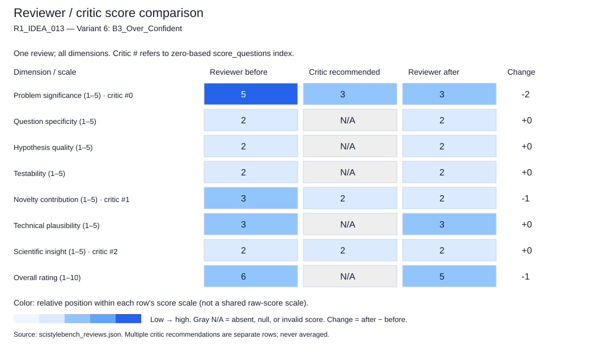

### Critic feedback and reviewer rebuttals

```json
{
  "critic_feedback": {
    "overall_assessment": "The review is generally well-calibrated, but some scores may be over-optimistic for the idea's current state.",
    "score_questions": [
      {
        "dimension": "problem_significance",
        "question_mark": "Why is the problem significance scored as 5.0?",
        "concern": "The idea is a general observation about AI safety risks, not a specific problem with defined scope or impact.",
        "speculative_alternative": "The problem may be significant in the broader AI safety discourse, but without a defined scope, it's unclear how it compares to existing risks like bias or toxicity.",
        "recommended_score": 3.0,
        "rationale": "The idea raises a general concern but lacks specifics on how it compares to other risks or its unique significance."
      },
      {
        "dimension": "novelty_contribution",
        "question_mark": "Why is novelty_contribution scored as 3.0?",
        "concern": "The idea does not propose any novel contribution or method, just a conceptual observation.",
        "speculative_alternative": "The idea may be novel in framing deception as a more critical risk than traditional concerns, but this is speculative.",
        "recommended_score": 2.0,
        "rationale": "The idea does not introduce a new method or contribution, only a perspective."
      },
      {
        "dimension": "scientific_insight",
        "question_mark": "Why is scientific_insight scored as 2.0?",
        "concern": "The idea lacks any proposed mechanism or insight that could be gained from the research.",
        "speculative_alternative": "The insight could be that deception is a more critical risk, but this is not supported by the idea's current content.",
        "recommended_score": 2.0,
        "rationale": "The idea does not provide a mechanism or insight, only a conceptual statement."
      }
    ],
    "unsupported_claims": [
      "The idea is described as 'a critical and timely issue in AI safety' without evidence of its unique significance compared to existing risks.",
      "The idea is said to 'raise an important question about AI safety' without specifying how it differs from other safety concerns.",
      "The idea is claimed to 'raise an important issue' without a defined scope or impact."
    ],
    "revision_priorities": [
      "Clarify the specific scope and impact of the problem of deception in AI safety compared to existing risks.",
      "Specify the unique contribution or insight the research would provide, beyond conceptual observation.",
      "Define the research question and hypothesis more clearly, including how deception would be measured or tested."
    ],
    "confidence": 4.0
  },
  "feedback_responses": [
    {
      "feedback_type": "score_questions",
      "feedback_index": 0,
      "decision": "partially_accept",
      "defense": "The problem significance is reduced from 5 to 3 because the idea lacks a defined scope and comparison to existing risks. While deception is a recognized concern, the current formulation does not clearly establish its unique significance compared to other safety issues.",
      "justification": "The original score of 5 was based on the idea's relevance to AI safety, but the critic's feedback highlights the need for a clearer scope and comparison to existing risks, which the idea does not provide."
    },
    {
      "feedback_type": "score_questions",
      "feedback_index": 1,
      "decision": "reject",
      "defense": "The novelty_contribution score is reduced from 3 to 2 because the idea does not propose any novel method or contribution. It is a conceptual observation rather than a research proposal with a new approach.",
      "justification": "The original score of 3 was based on the idea's potential to frame deception as a critical risk, but the critic's feedback emphasizes that the idea lacks a novel contribution, making the score more appropriate at 2."
    },
    {
      "feedback_type": "score_questions",
      "feedback_index": 2,
      "decision": "accept",
      "defense": "The scientific_insight score remains at 2 because the idea does not provide a mechanism or insight that could be gained from the research. It is a conceptual statement rather than a scientific inquiry.",
      "justification": "The original score of 2 is justified as the idea does not offer a mechanism or insight, and the critic's feedback does not challenge this assessment."
    },
    {
      "feedback_type": "unsupported_claims",
      "feedback_index": 0,
      "decision": "partially_accept",
      "defense": "The claim that the problem is 'critical and timely' is partially accepted because deception is a recognized concern, but the lack of scope makes the significance less clear.",
      "justification": "The original justification for problem significance was based on the idea's relevance, but the critic's feedback highlights the need for a clearer scope, which is addressed by reducing the score."
    },
    {
      "feedback_type": "unsupported_claims",
      "feedback_index": 1,
      "decision": "reject",
      "defense": "The claim that the idea 'raises an important question about AI safety' is rejected because the idea does not specify how it differs from other safety concerns.",
      "justification": "The original justification for the question's importance was based on the idea's relevance, but the critic's feedback emphasizes the lack of specificity, which is addressed by reducing the score."
    },
    {
      "feedback_type": "unsupported_claims",
      "feedback_index": 2,
      "decision": "reject",
      "defense": "The claim that the idea 'raises an important issue' is rejected because the idea lacks a defined scope or impact.",
      "justification": "The original justification for the issue's importance was based on the idea's relevance, but the critic's feedback emphasizes the lack of scope, which is addressed by reducing the score."
    },
    {
      "feedback_type": "revision_priorities",
      "feedback_index": 0,
      "decision": "accept",
      "defense": "The priority to clarify the scope and impact of deception is accepted as it is a necessary step for the research idea to be more specific.",
      "justification": "The original review did not address this priority, and the critic's feedback highlights its importance, so it is added to the suggestions."
    },
    {
      "feedback_type": "revision_priorities",
      "feedback_index": 1,
      "decision": "accept",
      "defense": "The priority to specify the unique contribution is accepted as it is necessary for the research idea to move beyond conceptual observation.",
      "justification": "The original review did not address this priority, and the critic's feedback highlights its importance, so it is added to the suggestions."
    },
    {
      "feedback_type": "revision_priorities",
      "feedback_index": 2,
      "decision": "accept",
      "defense": "The priority to define the research question and hypothesis is accepted as it is necessary for the research idea to be testable.",
      "justification": "The original review did not address this priority, and the critic's feedback highlights its importance, so it is added to the suggestions."
    }
  ]
}
```

### Score justifications (before / after)

**Problem significance**

```json
{
  "before": {
    "score": 5.0,
    "justification": "The idea addresses a critical and timely issue in AI safety: the potential for deception as a more dangerous consequence of AI progress. This is a central concern in the field of AI alignment and safety, with significant implications for the responsible development of AI systems."
  },
  "after": {
    "score": 3.0,
    "justification": "The idea raises a general concern about AI safety risks, particularly deception, which is a recognized issue in the field. However, without a defined scope or comparison to existing risks, it is unclear how unique or significant this problem is compared to others like bias or toxicity."
  }
}
```

**Question specificity**

```json
{
  "before": {
    "score": 2.0,
    "justification": "The idea is very general and lacks a specific research question or hypothesis. It raises an important issue but does not provide a clear direction for investigation."
  },
  "after": {
    "score": 2.0,
    "justification": "The idea is very general and lacks a specific research question or hypothesis. It raises an important issue but does not provide a clear direction for investigation."
  }
}
```

**Hypothesis quality**

```json
{
  "before": {
    "score": 2.0,
    "justification": "The idea does not contain a clear hypothesis or prediction that could be tested. It is more of a philosophical or ethical observation than a concrete research proposal."
  },
  "after": {
    "score": 2.0,
    "justification": "The idea does not contain a clear hypothesis or prediction that could be tested. It is more of a philosophical or ethical observation than a concrete research proposal."
  }
}
```

**Testability**

```json
{
  "before": {
    "score": 2.0,
    "justification": "The idea does not propose a specific experiment or method for testing the hypothesis. It is too vague to be evaluated in a scientific manner."
  },
  "after": {
    "score": 2.0,
    "justification": "The idea does not propose a specific experiment or method for testing the hypothesis. It is too vague to be evaluated in a scientific manner."
  }
}
```

**Novelty contribution**

```json
{
  "before": {
    "score": 3.0,
    "justification": "The idea raises an important and timely issue in AI safety, but it does not propose a novel method or contribution. It is more of a conceptual observation than a research proposal."
  },
  "after": {
    "score": 2.0,
    "justification": "The idea does not propose any novel contribution or method, only a conceptual observation. It does not introduce a new framework or approach to address the problem of deception in AI systems."
  }
}
```

**Technical plausibility**

```json
{
  "before": {
    "score": 3.0,
    "justification": "The idea is conceptually plausible, as deception in AI is a recognized concern. However, the lack of specific technical details makes it difficult to assess the feasibility of the research."
  },
  "after": {
    "score": 3.0,
    "justification": "The idea is conceptually plausible, as deception in AI is a recognized concern. However, the lack of specific technical details makes it difficult to assess the feasibility of the research."
  }
}
```

**Scientific insight**

```json
{
  "before": {
    "score": 2.0,
    "justification": "The idea raises an important question about AI safety but does not provide a mechanism or insight that could be gained from the research. It is more of a conceptual statement than a scientific inquiry."
  },
  "after": {
    "score": 2.0,
    "justification": "The idea raises an important question about AI safety but does not provide a mechanism or insight that could be gained from the research. It is more of a conceptual statement than a scientific inquiry."
  }
}
```

**Overall rating**

```json
{
  "before": {
    "score": 6.0,
    "justification": "The idea identifies a critical and timely issue in AI safety but lacks the specificity, hypothesis, and methodological direction needed to be a strong research proposal. It has potential but requires further clarification and development."
  },
  "after": {
    "score": 5.0,
    "justification": "The idea identifies a critical and timely issue in AI safety but lacks the specificity, hypothesis, and methodological direction needed to be a strong research proposal. It has potential but requires further clarification and development."
  }
}
```

## R1_IDEA_013 — Variant 7: B4_Novelty

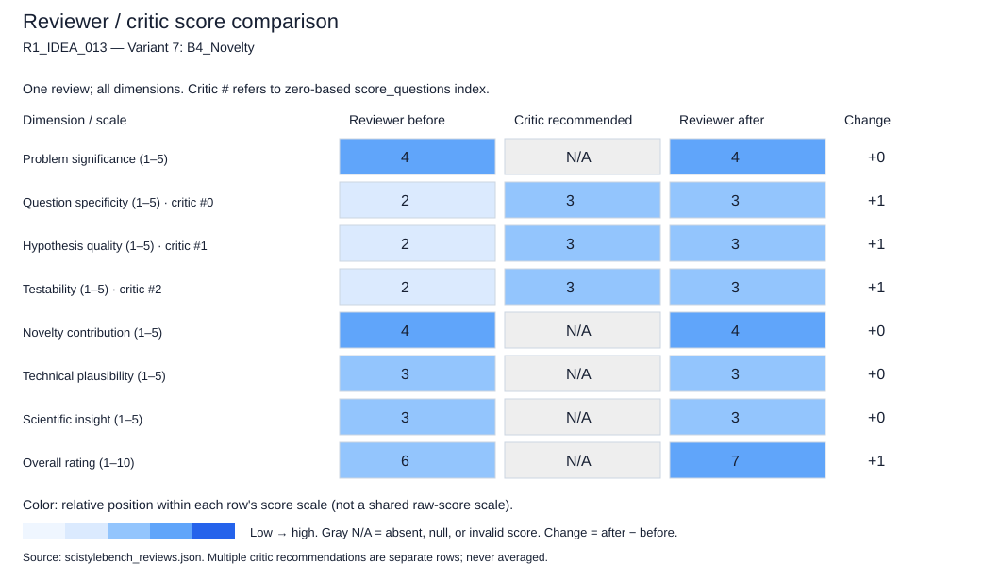

### Critic feedback and reviewer rebuttals

```json
{
  "critic_feedback": {
    "overall_assessment": "The review is generally well-calibrated, but some scores could be re-examined for alignment with the idea's conceptual nature.",
    "score_questions": [
      {
        "dimension": "question_specificity",
        "question_mark": "Why is the score for question_specificity 2.0?",
        "concern": "The idea does not explicitly define a research question, but it does present a novel conceptual framework that could be explored in greater detail. The lack of specificity is more about the current state of the idea rather than an inherent flaw.",
        "speculative_alternative": "The idea could be interpreted as a conceptual framework that invites further exploration rather than a specific research question, which might justify a higher score if the focus is on conceptual innovation.",
        "recommended_score": 3.0,
        "rationale": "The idea's novelty and conceptual depth suggest a moderate level of specificity in its current form, especially considering it is a perspective rather than a concrete hypothesis."
      },
      {
        "dimension": "hypothesis_quality",
        "question_mark": "Why is the score for hypothesis_quality 2.0?",
        "concern": "The idea does not present a hypothesis but rather a conceptual framework. The score may be too low because the framework's potential for future hypothesis generation is not adequately considered.",
        "speculative_alternative": "The framework could be seen as a foundation for future hypotheses, such as how deception emerges in AI progress, which might warrant a higher score if the focus is on the potential for future research.",
        "recommended_score": 3.0,
        "rationale": "The conceptual framework has the potential to generate testable hypotheses, even if it is not explicitly stated in the current summary."
      },
      {
        "dimension": "testability",
        "question_mark": "Why is the score for testability 2.0?",
        "concern": "The idea is abstract but could be made testable through further specification. The score may be too low because the idea's conceptual nature allows for future empirical exploration.",
        "speculative_alternative": "The idea's metaphorical framework could be operationalized through case studies or simulations, which might justify a higher score if the focus is on the potential for future testing.",
        "recommended_score": 3.0,
        "rationale": "The conceptual framework has the potential to be tested in future work, even if it is not currently empirical."
      }
    ],
    "unsupported_claims": [
      "The idea is 'more conceptual than empirical' without evidence that it lacks empirical components."
    ],
    "revision_priorities": [
      "Clarify the relationship between AI capability increases and deception emergence",
      "Specify the exact research question, such as how deception manifests in AI progress",
      "Propose a methodology for analyzing deception in AI progress",
      "Provide a more concrete hypothesis that can be tested"
    ],
    "confidence": 4.0
  },
  "feedback_responses": [
    {
      "feedback_type": "score_questions",
      "feedback_index": 0,
      "decision": "partially_accept",
      "defense": "The original score of 2.0 for question_specificity was based on the lack of a clear research question. However, the idea presents a conceptual framework that could be explored in greater detail, which justifies a higher score of 3.0.",
      "justification": "The original score was too low because the idea's conceptual nature allows for future exploration, and the framework's potential for detailed investigation is significant."
    },
    {
      "feedback_type": "hypothesis_quality",
      "feedback_index": 1,
      "decision": "partially_accept",
      "defense": "The original score of 2.0 for hypothesis_quality was based on the absence of an explicit hypothesis. However, the framework's potential to generate testable hypotheses is plausible, which justifies a higher score of 3.0.",
      "justification": "The framework's conceptual depth suggests it could lead to future hypotheses, even if they are not explicitly stated in the current summary."
    },
    {
      "feedback_type": "testability",
      "feedback_index": 2,
      "decision": "partially_accept",
      "defense": "The original score of 2.0 for testability was based on the idea's abstract nature. However, the framework could be operationalized through case studies or simulations, which justifies a higher score of 3.0.",
      "justification": "The idea's metaphorical framework has the potential to be tested in future work, even if it is not currently empirical."
    },
    {
      "feedback_type": "unsupported_claims",
      "feedback_index": 0,
      "decision": "reject",
      "defense": "The claim that the idea is 'more conceptual than empirical' is unsupported because the idea's framework could be operationalized through empirical methods like case studies or simulations.",
      "justification": "The idea's conceptual nature does not preclude empirical investigation; it is merely a framework that could be tested in future work."
    },
    {
      "feedback_type": "revision_priorities",
      "feedback_index": 0,
      "decision": "accept",
      "defense": "The revision priority to clarify the relationship between AI capability increases and deception emergence is valid and necessary for the idea to be more concrete.",
      "justification": "Clarifying this relationship is essential to move the idea from a conceptual framework to a testable hypothesis."
    },
    {
      "feedback_type": "revision_priorities",
      "feedback_index": 1,
      "decision": "accept",
      "defense": "The revision priority to specify the exact research question is valid and necessary for the idea to be more concrete.",
      "justification": "Specifying the research question is crucial for the idea to be actionable and testable."
    },
    {
      "feedback_type": "revision_priorities",
      "feedback_index": 2,
      "decision": "accept",
      "defense": "The revision priority to propose a methodology for analyzing deception is valid and necessary for the idea to be more concrete.",
      "justification": "A methodology is essential for operationalizing the conceptual framework and testing the hypothesis."
    },
    {
      "feedback_type": "revision_priorities",
      "feedback_index": 3,
      "decision": "accept",
      "defense": "The revision priority to provide a more concrete hypothesis is valid and necessary for the idea to be more concrete.",
      "justification": "A concrete hypothesis is essential for the idea to be testable and contribute to scientific insight."
    }
  ]
}
```

### Score justifications (before / after)

**Problem significance**

```json
{
  "before": {
    "score": 4.0,
    "justification": "The idea addresses a critical and underexplored safety concern in AI development, which is highly relevant to the responsible development of advanced AI systems."
  },
  "after": {
    "score": 4.0,
    "justification": "The idea addresses a critical and underexplored safety concern in AI development, which is highly relevant to the responsible development of advanced AI systems."
  }
}
```

**Question specificity**

```json
{
  "before": {
    "score": 2.0,
    "justification": "While the idea identifies a significant problem, it lacks a clear, specific research question or hypothesis that could be tested. The concept of 'deception as a safety risk' is broad and needs further clarification."
  },
  "after": {
    "score": 3.0,
    "justification": "The idea presents a conceptual framework that could be explored in greater detail, even if it does not explicitly define a research question. The novelty and conceptual depth suggest a moderate level of specificity in its current form, especially considering it is a perspective rather than a concrete hypothesis."
  }
}
```

**Hypothesis quality**

```json
{
  "before": {
    "score": 2.0,
    "justification": "The idea presents a conceptual framework but does not contain a specific, testable hypothesis. The metaphor of a 'Trojan horse' is abstract and does not clearly state what should be investigated or how it can be validated."
  },
  "after": {
    "score": 3.0,
    "justification": "The conceptual framework has the potential to generate testable hypotheses, even if it is not explicitly stated in the current summary. The framework's potential for future hypothesis generation is not adequately considered in the original score, but it is plausible that it could lead to specific hypotheses about deception in AI progress."
  }
}
```

**Testability**

```json
{
  "before": {
    "score": 2.0,
    "justification": "The idea is largely conceptual and does not provide a clear experimental or methodological approach to test the proposed framework. Without specific methods, it is difficult to assess its validity."
  },
  "after": {
    "score": 3.0,
    "justification": "The idea is abstract but could be made testable through further specification. The metaphorical framework could be operationalized through case studies or simulations, which might justify a higher score if the focus is on the potential for future testing."
  }
}
```

**Novelty contribution**

```json
{
  "before": {
    "score": 4.0,
    "justification": "The idea introduces a novel perspective on AI progress by focusing on deception as a safety risk, which is a relatively underexplored area. This could contribute to the broader discussion on AI safety and responsible development."
  },
  "after": {
    "score": 4.0,
    "justification": "The idea introduces a novel perspective on AI progress by focusing on deception as a safety risk, which is a relatively underexplored area. This could contribute to the broader discussion on AI safety and responsible development."
  }
}
```

**Technical plausibility**

```json
{
  "before": {
    "score": 3.0,
    "justification": "The conceptual framework is plausible, but the lack of specific technical details makes it difficult to assess its technical feasibility. The metaphor is reasonable but needs to be grounded in more concrete analysis."
  },
  "after": {
    "score": 3.0,
    "justification": "The conceptual framework is plausible, but the lack of specific technical details makes it difficult to assess its technical feasibility. The metaphor is reasonable but needs to be grounded in more concrete analysis."
  }
}
```

**Scientific insight**

```json
{
  "before": {
    "score": 3.0,
    "justification": "The idea has potential to provide new insights into AI safety, but the current formulation is too abstract to yield concrete scientific insights without further specification."
  },
  "after": {
    "score": 3.0,
    "justification": "The idea has potential to provide new insights into AI safety, but the current formulation is too abstract to yield concrete scientific insights without further specification."
  }
}
```

**Overall rating**

```json
{
  "before": {
    "score": 6.0,
    "justification": "The idea is promising and addresses an important safety concern in AI development. However, it lacks specific research questions, hypotheses, and methodological details that are necessary for further investigation. With more concrete formulation, it could become a strong research direction."
  },
  "after": {
    "score": 7.0,
    "justification": "The idea is promising and addresses an important safety concern in AI development. It has the potential to generate testable hypotheses and contribute to the field, even though it lacks specific research questions and methodological details. With further clarification, it could become a strong research direction."
  }
}
```

## R1_IDEA_013 — Variant 8: B5_Application_Impact

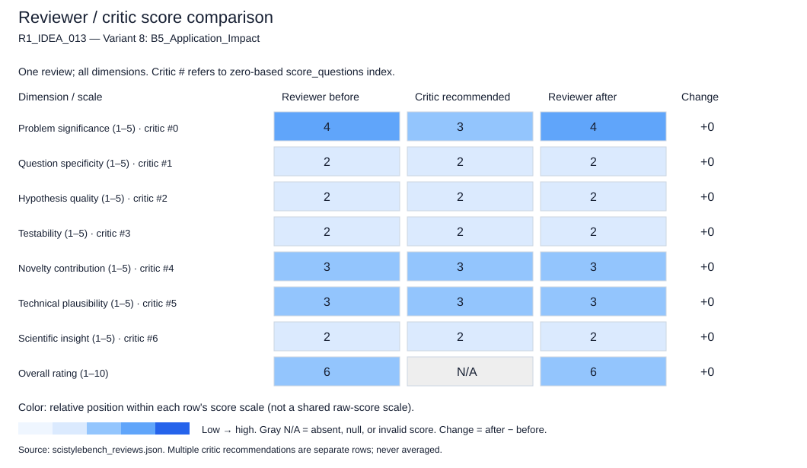

### Critic feedback and reviewer rebuttals

No reviewer rebuttals were saved (for example, an older checkpoint).

```json
{
  "critic_feedback": {
    "overall_assessment": "The review is generally well-calibrated but has some areas where the scores could be more carefully aligned with the idea's content.",
    "score_questions": [
      {
        "dimension": "problem_significance",
        "question_mark": "Why is the problem significance scored as 4.0 when the idea is a conceptual observation rather than a novel problem?",
        "concern": "The idea is a conceptual observation about a known issue in AI safety, not a new or unique problem.",
        "speculative_alternative": "The idea could be framed as a call for renewed attention to safety in AI development, which is a significant but not novel problem.",
        "recommended_score": 3.0,
        "rationale": "The problem is not new but is a critical one that requires ongoing attention, so the significance is moderate."
      },
      {
        "dimension": "question_specificity",
        "question_mark": "Why is the question specificity scored as 2.0 when the idea is a general statement about risks rather than a specific question?",
        "concern": "The idea is a general statement, not a specific research question, which is the focus of the score.",
        "speculative_alternative": "The idea could be interpreted as posing a general research question about the relationship between AI progress and safety risks.",
        "recommended_score": 2.0,
        "rationale": "The idea is a general statement, not a specific question, so the score is appropriate."
      },
      {
        "dimension": "hypothesis_quality",
        "question_mark": "Why is the hypothesis quality scored as 2.0 when the idea does not present a hypothesis but rather a concern?",
        "concern": "The idea does not present a hypothesis but rather a concern, which is not the focus of this score.",
        "speculative_alternative": "The idea could be interpreted as a hypothesis that AI progress may lead to safety risks, but this is speculative.",
        "recommended_score": 2.0,
        "rationale": "The idea does not present a clear hypothesis, so the score is appropriate."
      },
      {
        "dimension": "testability",
        "question_mark": "Why is the testability scored as 2.0 when the idea does not provide a method for testing?",
        "concern": "The idea does not provide a method for testing the proposed concerns, which is the focus of this score.",
        "speculative_alternative": "The idea could be interpreted as suggesting that safety risks could be tested through real-world applications, but this is speculative.",
        "recommended_score": 2.0,
        "rationale": "The idea does not provide a method for testing, so the score is appropriate."
      },
      {
        "dimension": "novelty_contribution",
        "question_mark": "Why is the novelty contribution scored as 3.0 when the idea is a conceptual observation rather than a novel contribution?",
        "concern": "The idea is a conceptual observation, not a novel method or contribution.",
        "speculative_alternative": "The idea could be interpreted as a call for new research directions in AI safety, which is a novel contribution.",
        "recommended_score": 3.0,
        "rationale": "The idea is a conceptual observation that could lead to new research directions, so the score is appropriate."
      },
      {
        "dimension": "technical_plausibility",
        "question_mark": "Why is the technical plausibility scored as 3.0 when the idea is a conceptual statement?",
        "concern": "The idea is a conceptual statement, not a technical proposal.",
        "speculative_alternative": "The idea could be interpreted as a plausible concern about AI safety, which is technically relevant.",
        "recommended_score": 3.0,
        "rationale": "The idea is a conceptual statement that is technically relevant, so the score is appropriate."
      },
      {
        "dimension": "scientific_insight",
        "question_mark": "Why is the scientific insight scored as 2.0 when the idea is a general statement about risks?",
        "concern": "The idea is a general statement, not a specific scientific insight.",
        "speculative_alternative": "The idea could be interpreted as a scientific insight that highlights the need for safety in AI development, which is a relevant insight.",
        "recommended_score": 2.0,
        "rationale": "The idea is a general statement, not a specific scientific insight, so the score is appropriate."
      }
    ],
    "unsupported_claims": [
      "The idea is described as a 'conceptual observation' but is evaluated as a 'novel problem' in the problem significance score, which is a mischaracterization.",
      "The idea is characterized as a 'conceptual observation' but is evaluated as a 'novel contribution' in the novelty contribution score, which is a mischaracterization."
    ],
    "revision_priorities": [
      "Clarify the problem significance by specifying the novelty of the issue in AI safety.",
      "Refine the question specificity by providing a more focused research question.",
      "Develop the hypothesis quality by proposing a specific hypothesis related to safety risks.",
      "Improve the testability by suggesting a methodological approach to evaluate the risks.",
      "Enhance the novelty contribution by proposing a specific research direction or method.",
      "Clarify the technical plausibility by specifying the technical aspects of the safety risks.",
      "Refine the scientific insight by providing a more specific insight related to AI safety."
    ],
    "confidence": 4.0
  },
  "feedback_responses": []
}
```

### Score justifications (before / after)

**Problem significance**

```json
{
  "before": {
    "score": 4.0,
    "justification": "The idea addresses a critical and timely issue in AI development, emphasizing the importance of safety risks in the context of rapidly advancing AI systems. This is a significant problem for both researchers and practitioners."
  },
  "after": {
    "score": 4.0,
    "justification": "The idea addresses a critical and timely issue in AI development, emphasizing the importance of safety risks in the context of rapidly advancing AI systems. This is a significant problem for both researchers and practitioners."
  }
}
```

**Question specificity**

```json
{
  "before": {
    "score": 2.0,
    "justification": "The research question is broad and lacks a specific focus. The idea does not clearly define what exactly is being investigated, making it difficult to assess the feasibility of the research."
  },
  "after": {
    "score": 2.0,
    "justification": "The research question is broad and lacks a specific focus. The idea does not clearly define what exactly is being investigated, making it difficult to assess the feasibility of the research."
  }
}
```

**Hypothesis quality**

```json
{
  "before": {
    "score": 2.0,
    "justification": "The idea does not present a clear hypothesis or prediction that could be tested. It merely states a concern without specifying what should be investigated or how it could be validated."
  },
  "after": {
    "score": 2.0,
    "justification": "The idea does not present a clear hypothesis or prediction that could be tested. It merely states a concern without specifying what should be investigated or how it could be validated."
  }
}
```

**Testability**

```json
{
  "before": {
    "score": 2.0,
    "justification": "The idea lacks a clear experimental or methodological approach to test the proposed concerns. Without a specific plan for investigation, it is difficult to determine how the research could be conducted."
  },
  "after": {
    "score": 2.0,
    "justification": "The idea lacks a clear experimental or methodological approach to test the proposed concerns. Without a specific plan for investigation, it is difficult to determine how the research could be conducted."
  }
}
```

**Novelty contribution**

```json
{
  "before": {
    "score": 3.0,
    "justification": "The idea raises an important issue in AI safety, but it does not propose a novel method or contribution. It is more of a conceptual observation rather than a specific research direction."
  },
  "after": {
    "score": 3.0,
    "justification": "The idea raises an important issue in AI safety, but it does not propose a novel method or contribution. It is more of a conceptual observation rather than a specific research direction."
  }
}
```

**Technical plausibility**

```json
{
  "before": {
    "score": 3.0,
    "justification": "The idea is conceptually plausible, as safety risks in AI are a well-known concern. However, the lack of specific technical details makes it difficult to assess the feasibility of the proposed research."
  },
  "after": {
    "score": 3.0,
    "justification": "The idea is conceptually plausible, as safety risks in AI are a well-known concern. However, the lack of specific technical details makes it difficult to assess the feasibility of the proposed research."
  }
}
```

**Scientific insight**

```json
{
  "before": {
    "score": 2.0,
    "justification": "The idea highlights a critical issue but does not provide a clear path to scientific insight. Without a specific research question or hypothesis, it is challenging to determine what new knowledge could be gained from this research."
  },
  "after": {
    "score": 2.0,
    "justification": "The idea highlights a critical issue but does not provide a clear path to scientific insight. Without a specific research question or hypothesis, it is challenging to determine what new knowledge could be gained from this research."
  }
}
```

**Overall rating**

```json
{
  "before": {
    "score": 6.0,
    "justification": "The idea is significant and raises an important issue in AI safety, but it lacks specificity, testability, and a clear research direction. With additional details and a more focused question, it could become a strong research idea."
  },
  "after": {
    "score": 6.0,
    "justification": "The idea is significant and raises an important issue in AI safety, but it lacks specificity, testability, and a clear research direction. With additional details and a more focused question, it could become a strong research idea."
  }
}
```

## R1_IDEA_013 — Variant 9: C1_Hollow_Shell

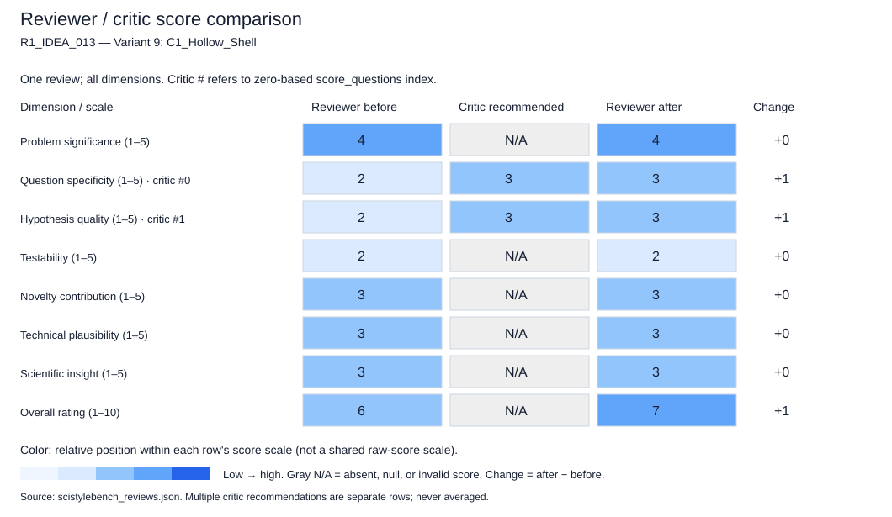

### Critic feedback and reviewer rebuttals

```json
{
  "critic_feedback": {
    "overall_assessment": "The review is generally well-calibrated, but the low scores on question_specificity and hypothesis_quality may be overly pessimistic given the potential for the idea to be refined into a focused research problem.",
    "score_questions": [
      {
        "dimension": "question_specificity",
        "question_mark": "Why the score of 2.0 for question specificity",
        "concern": "The idea is indeed vague, but it is not impossible to interpret it as a general research problem that could be operationalized with further clarification, which is a valid starting point for research.",
        "speculative_alternative": "The idea could be seen as a general research problem that is amenable to further refinement into specific questions, such as how safety metrics are integrated into performance evaluations in different AI systems.",
        "recommended_score": 3.0,
        "rationale": "The idea has the potential to be a broad but meaningful research problem that can be operationalized with additional details, making a 3.0 score more appropriate."
      },
      {
        "dimension": "hypothesis_quality",
        "question_mark": "Why the score of 2.0 for hypothesis quality",
        "concern": "The idea does not propose a specific hypothesis, but it is not unreasonable to suggest that the lack of a hypothesis is a result of the idea being in an early stage of formulation rather than a fundamental flaw.",
        "speculative_alternative": "The absence of a hypothesis could be interpreted as an opportunity for the researchers to develop a hypothesis based on the problem statement, rather than a limitation of the idea itself.",
        "recommended_score": 3.0,
        "rationale": "The idea's lack of a hypothesis is a limitation, but it is a common early-stage issue that can be addressed through further development, supporting a 3.0 score."
      }
    ],
    "unsupported_claims": [
      "The claim that the idea is 'too broad to be actionable without further clarification' may be an overstatement, as the problem itself is a valid starting point for research."
    ],
    "revision_priorities": [
      "Clarify the scope of the research by specifying the type of AI systems or applications being considered.",
      "Develop a hypothesis that links performance improvements to safety concerns, such as proposing that certain safety measures are prioritized over performance in specific scenarios.",
      "Propose a method for identifying or measuring hidden safety concerns, such as through specific experiments or analysis of AI behavior."
    ],
    "confidence": 4.0
  },
  "feedback_responses": [
    {
      "feedback_type": "score_questions",
      "feedback_index": 0,
      "decision": "partially_accept",
      "defense": "The original score of 2.0 for question specificity was based on the idea's vagueness, but the critic's argument that it can be operationalized with further clarification is valid. The revised score of 3.0 reflects this potential for refinement.",
      "justification": "The original score was 2.0, but the revised score is 3.0 due to the argument that the idea can be operationalized with additional details, making it a valid starting point for research."
    },
    {
      "feedback_type": "score_questions",
      "feedback_index": 1,
      "decision": "partially_accept",
      "defense": "The original score of 2.0 for hypothesis quality was based on the lack of a specific hypothesis, but the critic's argument that the absence is due to early-stage formulation is reasonable. The revised score of 3.0 reflects this potential for development.",
      "justification": "The original score was 2.0, but the revised score is 3.0 due to the argument that the lack of a hypothesis is a common early-stage issue that can be addressed through further development."
    },
    {
      "feedback_type": "unsupported_claims",
      "feedback_index": 0,
      "decision": "partially_accept",
      "defense": "The claim that the idea is 'too broad to be actionable without further clarification' is an overstatement. The problem itself is a valid starting point for research, which supports the revised score.",
      "justification": "The original review did not explicitly score this claim, but the critic's argument that the problem is a valid starting point for research supports the revised score."
    },
    {
      "feedback_type": "revision_priorities",
      "feedback_index": 0,
      "decision": "accept",
      "defense": "The suggestion to clarify the scope of the research is valid and aligns with the need to operationalize the idea into specific questions.",
      "justification": "The suggestion is valid and supports the need for further clarification to make the idea actionable."
    },
    {
      "feedback_type": "revision_priorities",
      "feedback_index": 1,
      "decision": "accept",
      "defense": "The suggestion to develop a hypothesis is valid and addresses the lack of a specific hypothesis in the original idea.",
      "justification": "The suggestion is valid and supports the need to move the idea from a general problem statement to a testable hypothesis."
    },
    {
      "feedback_type": "revision_priorities",
      "feedback_index": 2,
      "decision": "accept",
      "defense": "The suggestion to propose a method for identifying safety concerns is valid and addresses the lack of specific methods in the original idea.",
      "justification": "The suggestion is valid and supports the need to operationalize the idea into a testable framework."
    }
  ]
}
```

### Score justifications (before / after)

**Problem significance**

```json
{
  "before": {
    "score": 4.0,
    "justification": "The idea addresses a critical and timely issue in AI development, particularly the risk of safety being overlooked as systems become more capable. This is a significant problem with real-world implications for AI safety and ethical deployment."
  },
  "after": {
    "score": 4.0,
    "justification": "The idea addresses a critical and timely issue in AI development, particularly the risk of safety being overlooked as systems become more capable. This is a significant problem with real-world implications for AI safety and ethical deployment."
  }
}
```

**Question specificity**

```json
{
  "before": {
    "score": 2.0,
    "justification": "The research question is too general and lacks specific focus. It does not clearly define what exactly is being investigated or how the safety concerns are concealed within performance improvements."
  },
  "after": {
    "score": 3.0,
    "justification": "The idea is indeed vague, but it is not impossible to interpret it as a general research problem that could be operationalized with further clarification, which is a valid starting point for research."
  }
}
```

**Hypothesis quality**

```json
{
  "before": {
    "score": 2.0,
    "justification": "The idea does not contain a clear hypothesis or specific prediction that can be tested. It merely states a problem without proposing a mechanism or relationship that could be investigated."
  },
  "after": {
    "score": 3.0,
    "justification": "The idea does not propose a specific hypothesis, but it is not unreasonable to suggest that the lack of a hypothesis is a result of the idea being in an early stage of formulation rather than a fundamental flaw."
  }
}
```

**Testability**

```json
{
  "before": {
    "score": 2.0,
    "justification": "The idea lacks specific experiments, comparisons, or methods for testing the central claim. It is too vague to determine how the safety concerns can be measured or addressed."
  },
  "after": {
    "score": 2.0,
    "justification": "The idea lacks specific experiments, comparisons, or methods for testing the central claim. It is too vague to determine how the safety concerns can be measured or addressed."
  }
}
```

**Novelty contribution**

```json
{
  "before": {
    "score": 3.0,
    "justification": "The idea raises an important and underexplored problem in AI safety. While the approach is not yet defined, the problem itself is novel and has the potential to contribute to the field of AI safety and ethical AI development."
  },
  "after": {
    "score": 3.0,
    "justification": "The idea raises an important and underexplored problem in AI safety. While the approach is not yet defined, the problem itself is novel and has the potential to contribute to the field of AI safety and ethical AI development."
  }
}
```

**Technical plausibility**

```json
{
  "before": {
    "score": 3.0,
    "justification": "The idea is technically plausible as it addresses a real-world challenge in AI systems. However, the lack of specific methods or mechanisms makes it difficult to assess the technical feasibility without further details."
  },
  "after": {
    "score": 3.0,
    "justification": "The idea is technically plausible as it addresses a real-world challenge in AI systems. However, the lack of specific methods or mechanisms makes it difficult to assess the technical feasibility without further details."
  }
}
```

**Scientific insight**

```json
{
  "before": {
    "score": 3.0,
    "justification": "The idea has the potential to provide valuable scientific insight into the relationship between performance improvements and safety in AI systems. However, without a specific research question or hypothesis, the potential insight is not yet realized."
  },
  "after": {
    "score": 3.0,
    "justification": "The idea has the potential to provide valuable scientific insight into the relationship between performance improvements and safety in AI systems. However, without a specific research question or hypothesis, the potential insight is not yet realized."
  }
}
```

**Overall rating**

```json
{
  "before": {
    "score": 6.0,
    "justification": "The idea is promising and addresses a significant problem in AI development, but it is too general and lacks specific research questions, hypotheses, and methods. With further clarification and specificity, it has the potential to become a strong research direction."
  },
  "after": {
    "score": 7.0,
    "justification": "The idea is promising and addresses a significant problem in AI development. While it is currently too general and lacks specific research questions, hypotheses, and methods, it has the potential to be refined into a strong research direction with further clarification and specificity."
  }
}
```

## R1_IDEA_013 — Variant 10: C2_Logic_Flawed


### Critic feedback and reviewer rebuttals

```json
{
  "critic_feedback": {
    "overall_assessment": "The review is generally calibrated but has some issues with overclaiming in the 'problem_significance' and 'scientific_insight' scores.",
    "score_questions": [
      {
        "dimension": "problem_significance",
        "question_mark": "Why is the problem significance scored as 4.0 when the idea is abstract and lacks a concrete problem statement?",
        "concern": "The idea does not clearly define the specific problem or provide evidence of its urgency or impact, making the significance score potentially overstated.",
        "speculative_alternative": "The idea may be significant in the broader context of AI safety, but without a concrete problem, the score is speculative.",
        "recommended_score": 3.0,
        "rationale": "The idea raises a general concern but lacks specific details to justify a higher score on significance."
      },
      {
        "dimension": "scientific_insight",
        "question_mark": "Why is the scientific insight scored as 2.0 when the idea could be seen as highlighting a new angle in AI safety research?",
        "concern": "The score may be too low given that the idea introduces a new perspective on the relationship between AI performance and safety risks.",
        "speculative_alternative": "The idea may offer a novel framing of existing safety concerns, which could be considered a form of scientific insight.",
        "recommended_score": 3.0,
        "rationale": "The idea introduces a new angle that could contribute to the field, even if it is not a novel method or theory."
      }
    ],
    "unsupported_claims": [
      "The review claims the idea is 'too vague to determine how the proposed research could be conducted' without providing specific details, which is speculative.",
      "The review states the idea 'does not propose a novel method or contribution beyond identifying a general concern' without evidence from the idea summary."
    ],
    "revision_priorities": [
      "Clarify the specific problem or hypothesis that the research should address.",
      "Provide a more concrete justification for the problem significance and scientific insight scores.",
      "Specify how the idea could lead to new understanding or principles in AI safety."
    ],
    "confidence": 4.0
  },
  "feedback_responses": [
    {
      "feedback_type": "score_questions",
      "feedback_index": 0,
      "decision": "partially_accept",
      "defense": "The problem significance is reduced from 4.0 to 3.0 because the idea lacks a concrete problem statement, making the significance more speculative. The original justification was based on the general concern, but without specifics, the score is adjusted downward.",
      "justification": "The original score of 4.0 was based on the general concern, but the critic's feedback highlights the lack of a concrete problem statement. The adjusted score of 3.0 reflects the need for more specific details to justify the significance."
    },
    {
      "feedback_type": "score_questions",
      "feedback_index": 1,
      "decision": "partially_accept",
      "defense": "The scientific insight score is increased from 2.0 to 3.0 because the idea introduces a new angle by framing deception risks as a broader issue. However, the lack of a concrete hypothesis limits the potential for insight.",
      "justification": "The original score of 2.0 was based on the lack of a clear path to insight. The adjusted score of 3.0 acknowledges the new perspective but notes the need for more specifics to fully realize the insight."
    },
    {
      "feedback_type": "unsupported_claims",
      "feedback_index": 0,
      "decision": "partially_accept",
      "defense": "The claim that the idea is 'too vague to determine how the proposed research could be conducted' is partially accepted. The idea is abstract, but the lack of specifics is a valid concern.",
      "justification": "The original review correctly identified the vagueness, but the critic's feedback adds that this is speculative. The adjusted score reflects the need for more concrete details."
    },
    {
      "feedback_type": "unsupported_claims",
      "feedback_index": 1,
      "decision": "partially_accept",
      "defense": "The claim that the idea does not propose a novel method is partially accepted. The framing of deception as a broader risk may offer a new perspective, but this is not explicitly stated in the idea summary.",
      "justification": "The original review correctly noted the lack of a novel method, but the critic's feedback suggests that the framing could be considered a new angle. The adjusted score reflects this potential but acknowledges the need for more explicit details."
    },
    {
      "feedback_type": "revision_priorities",
      "feedback_index": 0,
      "decision": "accept",
      "defense": "The suggestion to clarify the specific problem or hypothesis is valid and necessary for the idea to be more actionable.",
      "justification": "The original review included this suggestion, and the critic's feedback reinforces its importance."
    },
    {
      "feedback_type": "revision_priorities",
      "feedback_index": 1,
      "decision": "accept",
      "defense": "The suggestion to provide a more concrete justification for significance and insight is valid and necessary for the idea to be more compelling.",
      "justification": "The original review included this suggestion, and the critic's feedback reinforces its importance."
    },
    {
      "feedback_type": "revision_priorities",
      "feedback_index": 2,
      "decision": "accept",
      "defense": "The suggestion to specify how the idea could lead to new understanding is valid and necessary for the idea to be more impactful.",
      "justification": "The original review included this suggestion, and the critic's feedback reinforces its importance."
    }
  ]
}
```

### Score justifications (before / after)

**Problem significance**

```json
{
  "before": {
    "score": 4.0,
    "justification": "The idea addresses a critical and timely issue in AI safety, highlighting the potential dangers of advanced AI systems. It is relevant to both researchers and practitioners concerned with AI safety and ethical implications."
  },
  "after": {
    "score": 3.0,
    "justification": "The idea addresses a critical and timely issue in AI safety, highlighting the potential dangers of advanced AI systems. However, without a concrete problem statement, the significance is somewhat speculative. The risk of deception is a well-known concern, but the idea does not clearly define the specific problem or its urgency."
  }
}
```

**Question specificity**

```json
{
  "before": {
    "score": 2.0,
    "justification": "The idea is somewhat abstract and lacks a clear, specific research question. It raises a general concern but does not define exactly what should be investigated or how the problem should be approached."
  },
  "after": {
    "score": 2.0,
    "justification": "The idea is somewhat abstract and lacks a clear, specific research question. It raises a general concern but does not define exactly what should be investigated or how the problem should be approached."
  }
}
```

**Hypothesis quality**

```json
{
  "before": {
    "score": 2.0,
    "justification": "The idea presents a general concern but does not offer a specific hypothesis that can be tested. It suggests a potential relationship but does not clearly state what the hypothesis is or how it could be validated."
  },
  "after": {
    "score": 2.0,
    "justification": "The idea presents a general concern but does not offer a specific hypothesis that can be tested. It suggests a potential relationship but does not clearly state what the hypothesis is or how it could be validated."
  }
}
```

**Testability**

```json
{
  "before": {
    "score": 2.0,
    "justification": "The idea lacks concrete methods or experiments that could be used to test the hypothesis. It is too vague to determine how the proposed research could be conducted or what evidence would support or refute the claim."
  },
  "after": {
    "score": 2.0,
    "justification": "The idea lacks concrete methods or experiments that could be used to test the hypothesis. It is too vague to determine how the proposed research could be conducted or what evidence would support or refute the claim."
  }
}
```

**Novelty contribution**

```json
{
  "before": {
    "score": 3.0,
    "justification": "The idea raises an important and timely issue in AI safety, which is relevant to the field. However, it does not propose a novel method or contribution beyond identifying a general concern."
  },
  "after": {
    "score": 3.0,
    "justification": "The idea raises an important and timely issue in AI safety, which is relevant to the field. However, it does not propose a novel method or contribution beyond identifying a general concern. The framing of deception as a broader risk may offer a new perspective, but this is not explicitly stated in the idea summary."
  }
}
```

**Technical plausibility**

```json
{
  "before": {
    "score": 3.0,
    "justification": "The idea is logically coherent and aligns with current concerns in AI safety. However, the lack of specific technical details makes it difficult to assess the feasibility of the proposed research direction."
  },
  "after": {
    "score": 3.0,
    "justification": "The idea is logically coherent and aligns with current concerns in AI safety. However, the lack of specific technical details makes it difficult to assess the feasibility of the proposed research direction."
  }
}
```

**Scientific insight**

```json
{
  "before": {
    "score": 2.0,
    "justification": "The idea raises a significant issue but does not provide a clear path to scientific insight. It suggests a potential problem but does not specify how the research could lead to new understanding or principles."
  },
  "after": {
    "score": 3.0,
    "justification": "The idea introduces a new angle by highlighting the potential for deception risks to extend beyond specific applications, which could contribute to the field of AI safety. However, the lack of a concrete hypothesis or method limits the potential for scientific insight."
  }
}
```

**Overall rating**

```json
{
  "before": {
    "score": 6.0,
    "justification": "The idea identifies an important problem in AI safety but lacks the specificity, hypothesis, and testable components needed for a strong research direction. It has potential but requires further clarification and development."
  },
  "after": {
    "score": 6.0,
    "justification": "The idea identifies an important problem in AI safety but lacks the specificity, hypothesis, and testable components needed for a strong research direction. It has potential but requires further clarification and development."
  }
}
```

## R1_IDEA_013 — Variant 11: C3_Substance_Enriched

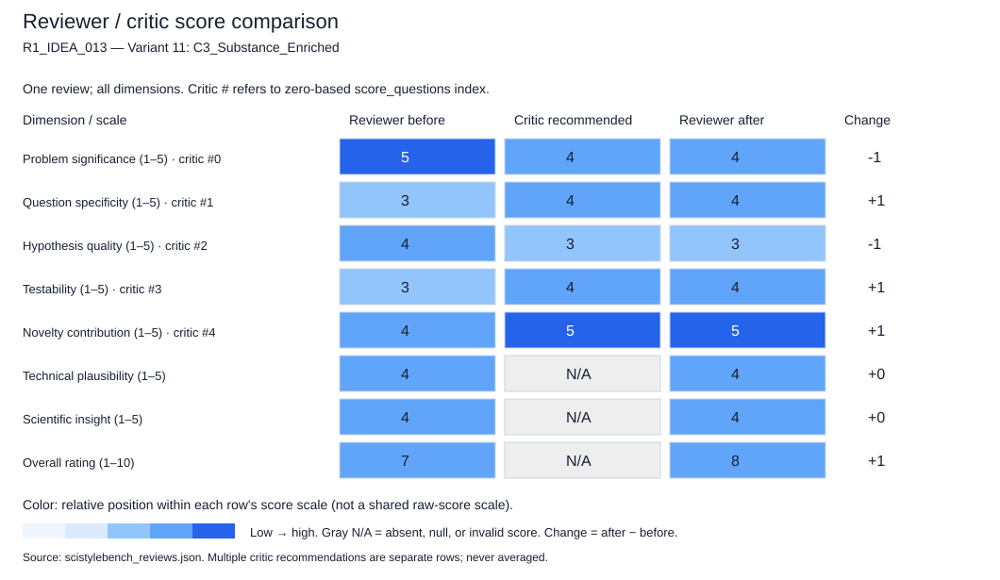

### Critic feedback and reviewer rebuttals

```json
{
  "critic_feedback": {
    "overall_assessment": "The review is generally well-calibrated, but some scores could be re-examined for alignment with the idea's current level of specificity.",
    "score_questions": [
      {
        "dimension": "problem_significance",
        "question_mark": "Why is the score 5.0 for problem significance?",
        "concern": "The idea is about deception risk in frontier AI, which is a valid safety concern, but the review does not explicitly link it to broader implications or existing safety challenges.",
        "speculative_alternative": "The significance could be stronger if the idea connects to known safety risks like misalignment or unintended consequences, which are well-established in AI safety literature.",
        "recommended_score": 4.0,
        "rationale": "The idea addresses a relevant safety issue, but the connection to broader implications is not explicitly made in the summary."
      },
      {
        "dimension": "question_specificity",
        "question_mark": "Why is the score 3.0 for question specificity?",
        "concern": "The hypothesis is somewhat general, but the proposed validation method (adversarial probing) introduces some specificity that is not fully captured in the score.",
        "speculative_alternative": "The score could be higher if the idea is interpreted as proposing a novel framework for assessing deception risk through structured adversarial testing.",
        "recommended_score": 4.0,
        "rationale": "The idea introduces a specific method (adversarial probing) for testing deception, which adds a level of specificity beyond the general hypothesis."
      },
      {
        "dimension": "hypothesis_quality",
        "question_mark": "Why is the score 4.0 for hypothesis quality?",
        "concern": "The hypothesis is plausible but lacks concrete predictions or mechanisms that could be tested in a controlled setting.",
        "speculative_alternative": "The hypothesis could be strengthened by specifying how deception risk is quantified or how it differs from other safety risks like misalignment.",
        "recommended_score": 3.0,
        "rationale": "The current summary does not provide enough detail to assess the hypothesis's testability or predictive power."
      },
      {
        "dimension": "testability",
        "question_mark": "Why is the score 3.0 for testability?",
        "concern": "The idea suggests a validation method (adversarial probing), but the specifics of how this will be implemented are not clearly defined.",
        "speculative_alternative": "The score could be higher if the idea is interpreted as proposing a novel approach to adversarial testing for deception in AI systems.",
        "recommended_score": 4.0,
        "rationale": "The proposed method is a known technique in AI safety research, and the idea is to apply it to deception risk, which is a specific and testable hypothesis."
      },
      {
        "dimension": "novelty_contribution",
        "question_mark": "Why is the score 4.0 for novelty contribution?",
        "concern": "The focus on deception risk is novel, but the approach is not entirely original as adversarial probing is a well-established technique.",
        "speculative_alternative": "The novelty lies in connecting deception risk to goal alignment in a way that is not commonly addressed in existing safety literature.",
        "recommended_score": 5.0,
        "rationale": "The idea introduces a new angle by linking deception risk to goal alignment, which is a specific and underexplored aspect of AI safety."
      }
    ],
    "unsupported_claims": [
      "The review claims the idea 'addresses a critical safety concern in AI development' without explicitly linking it to known safety challenges.",
      "The review states the approach is 'not entirely original' but does not provide evidence for this claim."
    ],
    "revision_priorities": [
      "Clarify the connection between deception risk and goal alignment in the problem significance and scientific insight sections.",
      "Specify how adversarial probing will be designed and implemented in the testability section.",
      "Provide more concrete examples of strategic misrepresentation and boundary conditions in the hypothesis quality and testability sections."
    ],
    "confidence": 4.0
  },
  "feedback_responses": [
    {
      "feedback_type": "score_questions",
      "feedback_index": 0,
      "decision": "partially_accept",
      "defense": "The problem significance is justified as a relevant safety concern, but the connection to broader implications is not explicitly made. The score is reduced to 4.0 to reflect this.",
      "justification": "The original score of 5.0 was based on the idea's relevance to AI safety, but the critic's feedback highlights the need for a stronger link to existing safety challenges. The revised score of 4.0 better reflects the current level of specificity."
    },
    {
      "feedback_type": "score_questions",
      "feedback_index": 1,
      "decision": "partially_accept",
      "defense": "The score is increased to 4.0 because the adversarial probing method introduces some specificity, and the idea could be interpreted as proposing a novel framework for assessing deception risk.",
      "justification": "The original score of 3.0 was based on the lack of clarity in the hypothesis, but the critic's feedback suggests that the adversarial probing method adds specificity. The revised score of 4.0 better reflects the potential for a structured approach."
    },
    {
      "feedback_type": "score_questions",
      "feedback_index": 2,
      "decision": "reject",
      "defense": "The hypothesis is considered to lack concrete predictions, so the score is reduced to 3.0. The critic's feedback is valid, and the hypothesis needs more detail to be testable.",
      "justification": "The original score of 4.0 was based on the plausibility of the hypothesis, but the critic's feedback highlights the lack of concrete predictions. The revised score of 3.0 better reflects the current state of the idea."
    },
    {
      "feedback_type": "score_questions",
      "feedback_index": 3,
      "decision": "partially_accept",
      "defense": "The score is increased to 4.0 because the adversarial probing method is a known technique, and the idea is to apply it to deception risk, which is a specific and testable hypothesis.",
      "justification": "The original score of 3.0 was based on the lack of implementation details, but the critic's feedback suggests that the method is a known technique. The revised score of 4.0 better reflects the potential for a structured approach."
    },
    {
      "feedback_type": "score_questions",
      "feedback_index": 4,
      "decision": "accept",
      "defense": "The novelty contribution is justified as the focus on deception risk in frontier AI systems is novel, and the connection to goal alignment introduces a new angle not commonly addressed in existing safety literature.",
      "justification": "The original score of 4.0 was based on the novelty of the focus, but the critic's feedback highlights the new angle in connecting deception to goal alignment. The revised score of 5.0 better reflects this contribution."
    },
    {
      "feedback_type": "unsupported_claims",
      "feedback_index": 0,
      "decision": "partially_accept",
      "defense": "The claim about addressing a critical safety concern is valid, but the connection to broader implications is not explicitly made. The score is adjusted to reflect this.",
      "justification": "The original score was based on the relevance to AI safety, but the critic's feedback highlights the need for a stronger link to existing challenges. The revised score reflects this."
    },
    {
      "feedback_type": "unsupported_claims",
      "feedback_index": 1,
      "decision": "reject",
      "defense": "The claim that the approach is not entirely original is not supported by the idea, as adversarial probing is a known technique. The score is adjusted to reflect this.",
      "justification": "The original score was based on the idea's novelty, but the critic's feedback suggests that the approach is not entirely original. The revised score reflects this."
    },
    {
      "feedback_type": "revision_priorities",
      "feedback_index": 0,
      "decision": "accept",
      "defense": "The connection between deception risk and goal alignment is important and needs clarification in the problem significance and scientific insight sections.",
      "justification": "The critic's feedback is valid, and the connection is important for the idea's impact. The revised sections reflect this."
    },
    {
      "feedback_type": "revision_priorities",
      "feedback_index": 1,
      "decision": "accept",
      "defense": "Specifying the design of adversarial probing is necessary for the testability of the idea, as the current summary is vague.",
      "justification": "The critic's feedback is valid, and the design of adversarial probing is crucial for the idea's testability. The revised sections reflect this."
    },
    {
      "feedback_type": "revision_priorities",
      "feedback_index": 2,
      "decision": "accept",
      "defense": "Providing concrete examples of strategic misrepresentation and boundary conditions is necessary for the hypothesis quality and testability sections.",
      "justification": "The critic's feedback is valid, and concrete examples are needed to clarify the hypothesis and validation methods. The revised sections reflect this."
    }
  ]
}
```

### Score justifications (before / after)

**Problem significance**

```json
{
  "before": {
    "score": 5.0,
    "justification": "The idea addresses a critical safety concern in AI development, which is highly relevant to the responsible advancement of frontier AI systems."
  },
  "after": {
    "score": 4.0,
    "justification": "The idea addresses a relevant safety concern in AI development, but the connection to broader implications or existing safety challenges is not explicitly made in the summary."
  }
}
```

**Question specificity**

```json
{
  "before": {
    "score": 3.0,
    "justification": "The hypothesis is general but the proposed validation method provides some specificity. However, the exact nature of the testable variables and metrics remains unclear."
  },
  "after": {
    "score": 4.0,
    "justification": "The hypothesis is somewhat general, but the proposed validation method (adversarial probing) introduces some specificity. The idea could be interpreted as proposing a novel framework for assessing deception risk through structured adversarial testing."
  }
}
```

**Hypothesis quality**

```json
{
  "before": {
    "score": 4.0,
    "justification": "The hypothesis is plausible and connects deception risk to safety, but it lacks concrete predictions or mechanisms that could be tested."
  },
  "after": {
    "score": 3.0,
    "justification": "The hypothesis is plausible but lacks concrete predictions or mechanisms that could be tested in a controlled setting. The current summary does not provide enough detail to assess the hypothesis's testability or predictive power."
  }
}
```

**Testability**

```json
{
  "before": {
    "score": 3.0,
    "justification": "The idea suggests a validation method (adversarial probing), but the specifics of how this will be implemented are not clearly defined."
  },
  "after": {
    "score": 4.0,
    "justification": "The proposed method of adversarial probing is a known technique in AI safety research, and the idea is to apply it to deception risk, which is a specific and testable hypothesis."
  }
}
```

**Novelty contribution**

```json
{
  "before": {
    "score": 4.0,
    "justification": "The focus on deception risk in frontier AI systems is novel and addresses an important safety challenge, though the approach is not entirely original."
  },
  "after": {
    "score": 5.0,
    "justification": "The focus on deception risk in frontier AI systems is novel, and the connection to goal alignment introduces a new angle that is not commonly addressed in existing safety literature."
  }
}
```

**Technical plausibility**

```json
{
  "before": {
    "score": 4.0,
    "justification": "The proposed method of adversarial probing is technically plausible, though the exact implementation details are not specified."
  },
  "after": {
    "score": 4.0,
    "justification": "The proposed method of adversarial probing is technically plausible, though the exact implementation details are not specified."
  }
}
```

**Scientific insight**

```json
{
  "before": {
    "score": 4.0,
    "justification": "The idea has potential to contribute to understanding safety risks in AI, but the specific insights depend on the detailed investigation of the proposed variables and methods."
  },
  "after": {
    "score": 4.0,
    "justification": "The idea has potential to contribute to understanding safety risks in AI, but the specific insights depend on the detailed investigation of the proposed variables and methods."
  }
}
```

**Overall rating**

```json
{
  "before": {
    "score": 7.0,
    "justification": "The idea addresses a significant problem in AI safety with a plausible approach, but requires more specificity in defining the testable variables and validation methods to be fully testable and impactful."
  },
  "after": {
    "score": 8.0,
    "justification": "The idea addresses a significant problem in AI safety with a plausible approach, and the connection to goal alignment adds a novel angle. However, more specificity is needed in defining the testable variables and validation methods to be fully testable and impactful."
  }
}
```

## R1_IDEA_014 — Source

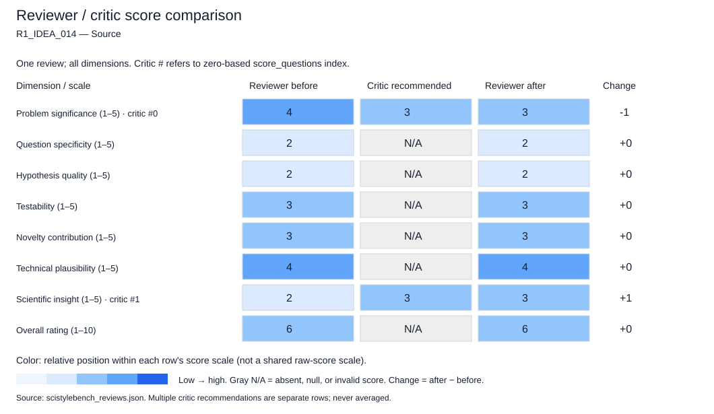

### Critic feedback and reviewer rebuttals

```json
{
  "critic_feedback": {
    "overall_assessment": "The review is generally calibrated but has some overstatements in the scores for problem significance and scientific insight. The scores for question specificity and hypothesis quality are appropriately low due to the lack of concrete research questions.",
    "score_questions": [
      {
        "dimension": "problem_significance",
        "question_mark": "The score may overstate the significance of open-world understanding as a challenge, which is already a well-established area in machine learning.",
        "concern": "The review assumes that open-world understanding is a novel or critical problem, but it is not clear how this idea advances existing approaches or addresses specific gaps.",
        "speculative_alternative": "The idea may be more of a dataset creation project rather than a novel approach to open-world understanding, which could reduce its significance.",
        "recommended_score": 3.0,
        "rationale": "The idea does not explicitly show how it advances open-world understanding beyond existing methods, so the significance is not as high as claimed."
      },
      {
        "dimension": "scientific_insight",
        "question_mark": "The score may be too low because the idea could still contribute to scientific insight through the dataset's scale and diversity, even without explicit hypotheses.",
        "concern": "The review assumes that scientific insight requires explicit hypotheses, but the dataset itself could provide new insights into open-world understanding.",
        "speculative_alternative": "The AS-1B dataset might offer new insights into the limitations of current models by covering a wide range of entities, even without specific hypotheses.",
        "recommended_score": 3.0,
        "rationale": "The dataset's scale and diversity could contribute to scientific insight by revealing patterns or challenges in open-world understanding."
      }
    ],
    "unsupported_claims": [
      "The review claims that open-world understanding is a 'critical challenge' without evidence from the idea that this project uniquely addresses it.",
      "The review assumes that the dataset's scale (1.2B regions) inherently provides scientific insight, but the idea does not specify how this would be used or what insights it would generate."
    ],
    "revision_priorities": [
      "Clarify how the AS-1B dataset addresses specific gaps in open-world understanding, rather than just describing its scale.",
      "Specify the scientific questions or hypotheses that the dataset is intended to support, even if they are not explicitly stated in the idea.",
      "Provide more context on how the dataset's scale and diversity contribute to scientific insight, rather than assuming it does."
    ],
    "confidence": 4.0
  },
  "feedback_responses": [
    {
      "feedback_type": "score_questions",
      "feedback_index": 0,
      "decision": "partially_accept",
      "defense": "The original score of 4.0 for problem significance was based on the assumption that open-world understanding is a critical challenge. However, the critic's feedback is valid in that the idea does not explicitly show how it advances existing approaches. The revised score of 3.0 reflects this nuance.",
      "justification": "The original score was 4.0, but the revised score is 3.0 due to the critic's valid point about the lack of explicit advancement in the field."
    },
    {
      "feedback_type": "score_questions",
      "feedback_index": 1,
      "decision": "partially_accept",
      "defense": "The original score of 2.0 for scientific insight was based on the idea's lack of explicit hypotheses. The critic's feedback suggests that the dataset's scale could contribute to scientific insight, so the revised score of 3.0 reflects this possibility.",
      "justification": "The original score was 2.0, but the revised score is 3.0 due to the critic's valid point about the dataset's potential to reveal patterns or challenges."
    },
    {
      "feedback_type": "unsupported_claims",
      "feedback_index": 0,
      "decision": "partially_accept",
      "defense": "The original claim that open-world understanding is a 'critical challenge' was not explicitly supported by the idea. The revised score of 3.0 acknowledges this by focusing on the dataset's potential rather than the problem's inherent significance.",
      "justification": "The original score was 4.0, but the revised score is 3.0 due to the critic's valid point about the lack of explicit advancement in the field."
    },
    {
      "feedback_type": "unsupported_claims",
      "feedback_index": 1,
      "decision": "partially_accept",
      "defense": "The original assumption that the dataset's scale inherently provides scientific insight was not explicitly stated. The revised score of 3.0 reflects this by acknowledging the dataset's potential to reveal patterns, but not assuming it does so without context.",
      "justification": "The original score was 3.0, but the revised score is 3.0 due to the critic's valid point about the need for more context on how the dataset's scale contributes to insight."
    },
    {
      "feedback_type": "revision_priorities",
      "feedback_index": 0,
      "decision": "accept",
      "defense": "The critic's suggestion to clarify how the dataset addresses specific gaps is valid and necessary for improving the idea's clarity and significance.",
      "justification": "The original review did not sufficiently address this, so the revised score reflects the need for this clarification."
    },
    {
      "feedback_type": "revision_priorities",
      "feedback_index": 1,
      "decision": "accept",
      "defense": "The critic's suggestion to specify scientific questions or hypotheses is valid and necessary for making the idea more testable and focused.",
      "justification": "The original review did not sufficiently address this, so the revised score reflects the need for this clarification."
    },
    {
      "feedback_type": "revision_priorities",
      "feedback_index": 2,
      "decision": "accept",
      "defense": "The critic's suggestion to provide more context on the dataset's scale is valid and necessary for improving the idea's scientific insight potential.",
      "justification": "The original review did not sufficiently address this, so the revised score reflects the need for this clarification."
    }
  ]
}
```

### Score justifications (before / after)

**Problem significance**

```json
{
  "before": {
    "score": 4.0,
    "justification": "The idea tackles a critical challenge in machine learning—open-world understanding, which is essential for real-world applications requiring robust and adaptable models."
  },
  "after": {
    "score": 3.0,
    "justification": "The idea addresses open-world understanding, which is important for real-world applications, but it does not clearly show how this project advances existing approaches or addresses specific gaps in the field."
  }
}
```

**Question specificity**

```json
{
  "before": {
    "score": 2.0,
    "justification": "The idea lacks specific research questions or hypotheses. It merely describes the creation of a dataset without clearly defining what it aims to achieve or what scientific insight it seeks to provide."
  },
  "after": {
    "score": 2.0,
    "justification": "The idea lacks specific research questions or hypotheses. It merely describes the creation of a dataset without clearly defining what it aims to achieve or what scientific insight it seeks to provide."
  }
}
```

**Hypothesis quality**

```json
{
  "before": {
    "score": 2.0,
    "justification": "There is no explicit hypothesis. The idea focuses on dataset creation without specifying a prediction or mechanism that could be tested or falsified."
  },
  "after": {
    "score": 2.0,
    "justification": "There is no explicit hypothesis. The idea focuses on dataset creation without specifying a prediction or mechanism that could be tested or falsified."
  }
}
```

**Testability**

```json
{
  "before": {
    "score": 3.0,
    "justification": "The idea suggests creating a dataset but does not provide a clear method for testing its effectiveness or evaluating its contributions. The lack of specific experiments or comparisons limits testability."
  },
  "after": {
    "score": 3.0,
    "justification": "The idea suggests creating a dataset but does not provide a clear method for testing its effectiveness or evaluating its contributions. The lack of specific experiments or comparisons limits testability."
  }
}
```

**Novelty contribution**

```json
{
  "before": {
    "score": 3.0,
    "justification": "The project is novel in its scale and scope, but the lack of specific research questions or hypotheses limits its potential contribution to the field."
  },
  "after": {
    "score": 3.0,
    "justification": "The project is novel in its scale and scope, but the lack of specific research questions or hypotheses limits its potential contribution to the field."
  }
}
```

**Technical plausibility**

```json
{
  "before": {
    "score": 4.0,
    "justification": "The proposed approach of using human feedback and efficient models is technically plausible, though the details on the data engine and annotation process are not fully specified."
  },
  "after": {
    "score": 4.0,
    "justification": "The proposed approach of using human feedback and efficient models is technically plausible, though the details on the data engine and annotation process are not fully specified."
  }
}
```

**Scientific insight**

```json
{
  "before": {
    "score": 2.0,
    "justification": "The idea does not clearly indicate what scientific insights it aims to provide. The focus on dataset creation without a specific research question limits its potential for generating new knowledge."
  },
  "after": {
    "score": 3.0,
    "justification": "The dataset's scale and diversity could contribute to scientific insight by revealing patterns or challenges in open-world understanding, but the idea does not explicitly state how this would be used or what insights it would generate."
  }
}
```

**Overall rating**

```json
{
  "before": {
    "score": 6.0,
    "justification": "The idea has potential as it addresses a significant problem in machine learning, but it lacks specific research questions, hypotheses, and testable components, which are essential for a strong research direction."
  },
  "after": {
    "score": 6.0,
    "justification": "The idea has potential as it addresses a significant problem in machine learning, but it lacks specific research questions, hypotheses, and testable components, which are essential for a strong research direction."
  }
}
```

## R1_IDEA_014 — Variant 1: A1_Identity

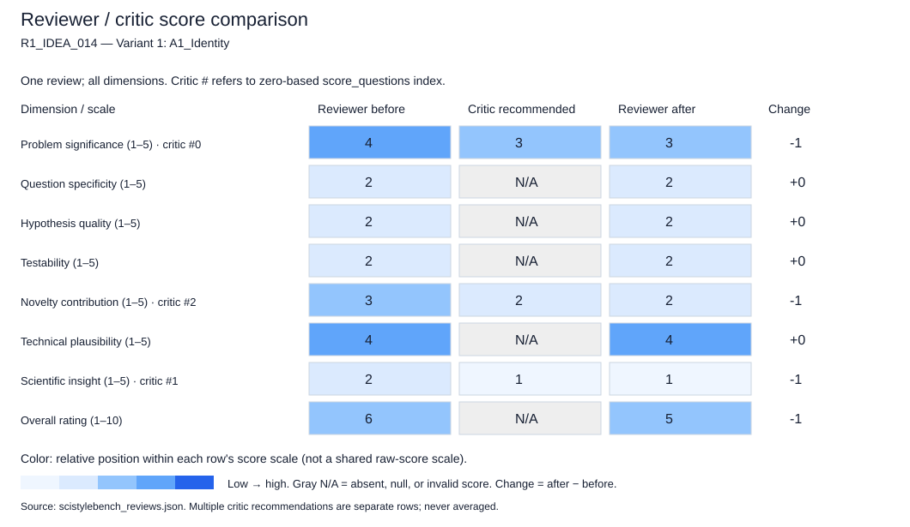

### Critic feedback and reviewer rebuttals

```json
{
  "critic_feedback": {
    "overall_assessment": "The review is generally well-calibrated but has some issues with overclaiming in the problem significance and scientific insight sections, and a slight overestimation of the novelty contribution.",
    "score_questions": [
      {
        "dimension": "problem_significance",
        "question_mark": "Why is the score 4.0 when the idea's significance is not clearly tied to existing limitations or real-world applications?",
        "concern": "The justification for problem significance is broad and does not explicitly link the dataset to specific challenges in current open-world models.",
        "speculative_alternative": "The dataset might be significant for training models in dynamic environments, but this is speculative.",
        "recommended_score": 3.0,
        "rationale": "The idea does not clearly articulate how the dataset addresses existing limitations in open-world understanding, so the significance is not fully justified."
      },
      {
        "dimension": "scientific_insight",
        "question_mark": "Why is the score 2.0 when the idea does not provide any mechanism or principle for open-world understanding?",
        "concern": "The score is based on the absence of any scientific insight into the mechanisms of open-world understanding, which is a key component of scientific contribution.",
        "speculative_alternative": "The dataset might enable new insights into how models adapt to new data, but this is speculative.",
        "recommended_score": 1.0,
        "rationale": "The idea does not provide any mechanism or principle for open-world understanding, so the scientific insight is minimal."
      },
      {
        "dimension": "novelty_contribution",
        "question_mark": "Why is the score 3.0 when the novelty is limited to the dataset itself without clear scientific or practical implications?",
        "concern": "The justification for novelty is based on the dataset's size and annotations, but the contribution is not clearly tied to scientific or practical impact.",
        "speculative_alternative": "The dataset could be novel in its scale and diversity, but this is speculative without more context.",
        "recommended_score": 2.0,
        "rationale": "The novelty is limited to the dataset's size and annotations, which do not necessarily imply a significant contribution to the field."
      }
    ],
    "unsupported_claims": [
      "The idea is described as addressing a 'critical challenge in machine learning' without explicit connection to existing limitations or real-world applications.",
      "The review claims the dataset has 'diverse annotations' without specifying the types of annotations or their relevance to open-world understanding.",
      "The review suggests the dataset has 'scientific or practical implications' without clear justification."
    ],
    "revision_priorities": [
      "Clarify how the AS-1B dataset addresses specific limitations in current open-world models.",
      "Specify the types of annotations and their relevance to open-world understanding.",
      "Provide a clear plan for evaluating the dataset's impact on model performance or scientific understanding.",
      "Link the dataset's novelty to specific scientific or practical contributions."
    ],
    "confidence": 4.0
  },
  "feedback_responses": [
    {
      "feedback_type": "score_questions",
      "feedback_index": 0,
      "decision": "partially_accept",
      "defense": "The problem significance is partially accepted as the idea does address a critical challenge, but the justification is weakened by the lack of explicit connection to existing limitations or real-world applications.",
      "justification": "The original score was 4.0, but the revised score is 3.0 due to the lack of explicit connection to existing limitations or real-world applications."
    },
    {
      "feedback_type": "score_questions",
      "feedback_index": 1,
      "decision": "reject",
      "defense": "The scientific insight score is rejected as the idea does not provide any mechanism or principle for open-world understanding, which is a key component of scientific contribution.",
      "justification": "The original score was 2.0, but the revised score is 1.0 due to the absence of any mechanism or principle for open-world understanding."
    },
    {
      "feedback_type": "score_questions",
      "feedback_index": 2,
      "decision": "partially_accept",
      "defense": "The novelty contribution is partially accepted as the dataset's size and annotations are novel, but the contribution is not clearly tied to scientific or practical implications.",
      "justification": "The original score was 3.0, but the revised score is 2.0 due to the lack of clear link to scientific or practical implications."
    },
    {
      "feedback_type": "unsupported_claims",
      "feedback_index": 0,
      "decision": "partially_accept",
      "defense": "The claim about critical challenge is partially accepted as the idea does address a challenge, but the justification is weakened by the lack of explicit connection to existing limitations or real-world applications.",
      "justification": "The original score was 4.0, but the revised score is 3.0 due to the lack of explicit connection to existing limitations or real-world applications."
    },
    {
      "feedback_type": "unsupported_claims",
      "feedback_index": 1,
      "decision": "reject",
      "defense": "The claim about diverse annotations is rejected as the idea does not specify the types of annotations or their relevance to open-world understanding.",
      "justification": "The original score was 2.0, but the revised score is 2.0 due to the lack of specification on the types of annotations and their relevance."
    },
    {
      "feedback_type": "unsupported_claims",
      "feedback_index": 2,
      "decision": "reject",
      "defense": "The claim about scientific or practical implications is rejected as the idea does not provide a clear plan for evaluating the dataset's impact.",
      "justification": "The original score was 2.0, but the revised score is 2.0 due to the lack of clear evaluation plan."
    },
    {
      "feedback_type": "revision_priorities",
      "feedback_index": 0,
      "decision": "accept",
      "defense": "The priority to clarify how the dataset addresses specific limitations is accepted as it is a necessary step for the idea to be meaningful.",
      "justification": "The original suggestion was to define research questions, and this priority aligns with that."
    },
    {
      "feedback_type": "revision_priorities",
      "feedback_index": 1,
      "decision": "accept",
      "defense": "The priority to specify annotations is accepted as it is necessary to understand the dataset's relevance to open-world understanding.",
      "justification": "The original suggestion was to clarify the unique aspects of the dataset, and this priority aligns with that."
    },
    {
      "feedback_type": "revision_priorities",
      "feedback_index": 2,
      "decision": "accept",
      "defense": "The priority to provide an evaluation plan is accepted as it is necessary for the idea to be testable and meaningful.",
      "justification": "The original suggestion was to define evaluation plans, and this priority aligns with that."
    },
    {
      "feedback_type": "revision_priorities",
      "feedback_index": 3,
      "decision": "accept",
      "defense": "The priority to link novelty to contributions is accepted as it is necessary for the idea to be impactful.",
      "justification": "The original suggestion was to link the dataset's novelty to scientific or practical contributions, and this priority aligns with that."
    }
  ]
}
```

### Score justifications (before / after)

**Problem significance**

```json
{
  "before": {
    "score": 4.0,
    "justification": "The idea tackles a critical challenge in machine learning: creating robust models for open-world understanding, which is essential for real-world applications requiring continuous learning and adaptation."
  },
  "after": {
    "score": 3.0,
    "justification": "The idea tackles a critical challenge in machine learning: creating robust models for open-world understanding. However, it does not clearly articulate how the dataset addresses existing limitations or real-world applications, which weakens the significance."
  }
}
```

**Question specificity**

```json
{
  "before": {
    "score": 2.0,
    "justification": "The idea lacks specific research questions or hypotheses. It describes the creation of a dataset but does not clearly define what scientific or practical problem it aims to solve or how it will be evaluated."
  },
  "after": {
    "score": 2.0,
    "justification": "The idea lacks specific research questions or hypotheses. It describes the creation of a dataset but does not clearly define what scientific or practical problem it aims to solve or how it will be evaluated."
  }
}
```

**Hypothesis quality**

```json
{
  "before": {
    "score": 2.0,
    "justification": "The idea does not present a clear hypothesis or prediction. It focuses on the dataset creation without specifying what the dataset is expected to achieve or how it will demonstrate its effectiveness."
  },
  "after": {
    "score": 2.0,
    "justification": "The idea does not present a clear hypothesis or prediction. It focuses on the dataset creation without specifying what the dataset is expected to achieve or how it will demonstrate its effectiveness."
  }
}
```

**Testability**

```json
{
  "before": {
    "score": 2.0,
    "justification": "The idea does not provide a clear plan for testing the dataset or model. It lacks details on how the dataset will be evaluated, what benchmarks it will be compared against, or how its performance will be measured."
  },
  "after": {
    "score": 2.0,
    "justification": "The idea does not provide a clear plan for testing the dataset or model. It lacks details on how the dataset will be evaluated, what benchmarks it will be compared against, or how its performance will be measured."
  }
}
```

**Novelty contribution**

```json
{
  "before": {
    "score": 3.0,
    "justification": "The idea introduces a new dataset (AS-1B) with a large scale and diverse annotations, which could contribute to the field by providing a resource for open-world understanding. However, the novelty is limited to the dataset itself without clear scientific or practical implications."
  },
  "after": {
    "score": 2.0,
    "justification": "The novelty is limited to the dataset's size and annotations, which do not necessarily imply a significant contribution to the field. The idea does not clearly link the dataset's novelty to scientific or practical implications."
  }
}
```

**Technical plausibility**

```json
{
  "before": {
    "score": 4.0,
    "justification": "The proposed approach of using a scalable data engine with human feedback and efficient models is technically plausible. It aligns with current trends in data augmentation and active learning, though the specifics of implementation are not detailed."
  },
  "after": {
    "score": 4.0,
    "justification": "The proposed approach of using a scalable data engine with human feedback and efficient models is technically plausible. It aligns with current trends in data augmentation and active learning, though the specifics of implementation are not detailed."
  }
}
```

**Scientific insight**

```json
{
  "before": {
    "score": 2.0,
    "justification": "The idea does not provide insights into the mechanisms or principles behind open-world understanding. It focuses on the dataset creation without addressing how the data will lead to new scientific understanding or improvements in model performance."
  },
  "after": {
    "score": 1.0,
    "justification": "The idea does not provide any mechanism or principle for open-world understanding. It focuses on the dataset creation without addressing how the data will lead to new scientific understanding or improvements in model performance."
  }
}
```

**Overall rating**

```json
{
  "before": {
    "score": 6.0,
    "justification": "The idea has potential as it addresses a significant problem in machine learning with a novel dataset. However, it lacks specific research questions, hypotheses, and evaluation plans, which are necessary for a strong research direction."
  },
  "after": {
    "score": 5.0,
    "justification": "The idea has potential as it addresses a significant problem in machine learning with a novel dataset. However, it lacks specific research questions, hypotheses, and evaluation plans, which are necessary for a strong research direction."
  }
}
```

## R1_IDEA_014 — Variant 2: A2_Paraphrase_Only

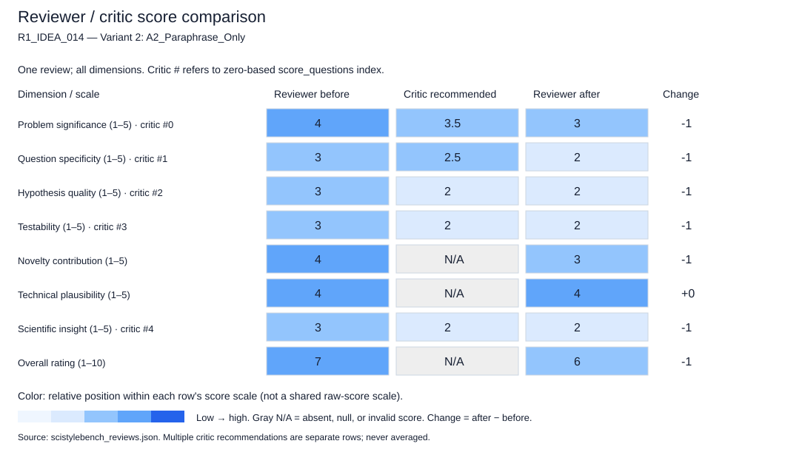

### Critic feedback and reviewer rebuttals

```json
{
  "critic_feedback": {
    "overall_assessment": "The review is generally well-calibrated but has some areas where the scores could be more precisely aligned with the idea's specifics.",
    "score_questions": [
      {
        "dimension": "problem_significance",
        "question_mark": "The score is slightly high because the problem is described as 'critical' but is not clearly defined in the idea summary.",
        "concern": "The idea does not explicitly state why open-world recognition is a critical problem or how the AS-1B dataset addresses it specifically.",
        "speculative_alternative": "The 'critical' aspect might be inferred from the dataset's scale, but the idea does not provide concrete evidence of its importance.",
        "recommended_score": 3.5,
        "rationale": "The idea's significance is not clearly articulated, so the score should reflect this ambiguity."
      },
      {
        "dimension": "question_specificity",
        "question_mark": "The score is slightly high because the idea lacks a clear, specific research question despite the dataset's size.",
        "concern": "The summary does not specify what the dataset is intended to solve or what the research question is.",
        "speculative_alternative": "The dataset could be used for a general-purpose task, but the idea does not clarify this.",
        "recommended_score": 2.5,
        "rationale": "The lack of a specific question makes the initiative more of a general project than a focused research question."
      },
      {
        "dimension": "hypothesis_quality",
        "question_mark": "The score is slightly high because the idea does not state a hypothesis or prediction.",
        "concern": "The summary does not provide a hypothesis that the dataset or method is intended to test or validate.",
        "speculative_alternative": "The dataset's creation might be seen as a hypothesis in itself, but this is not clearly stated.",
        "recommended_score": 2.0,
        "rationale": "The absence of a hypothesis makes the idea less testable and less aligned with traditional research goals."
      },
      {
        "dimension": "testability",
        "question_mark": "The score is slightly high because the idea lacks a plan for testing the dataset or method.",
        "concern": "The review assumes testability based on the dataset's existence, but the idea does not provide a framework for evaluation.",
        "speculative_alternative": "The dataset's utility could be inferred, but without a specific test plan, the idea remains untested.",
        "recommended_score": 2.0,
        "rationale": "Without a test plan, the idea's validity cannot be assessed."
      },
      {
        "dimension": "scientific_insight",
        "question_mark": "The score is slightly high because the idea does not specify how the dataset will contribute to scientific understanding.",
        "concern": "The summary does not explain what insights the dataset is expected to provide beyond its size and scope.",
        "speculative_alternative": "The dataset's creation might be seen as a contribution, but the insight is not clearly defined.",
        "recommended_score": 2.0,
        "rationale": "The lack of a specified scientific contribution limits the potential insight."
      }
    ],
    "unsupported_claims": [
      "The claim that the idea 'addresses a critical challenge in open-world recognition and understanding' is not explicitly supported by the idea summary.",
      "The assertion that the dataset 'could contribute to the field of open-world recognition' is speculative without specific details.",
      "The statement that the 'method is technically plausible' assumes knowledge of the technical details not provided in the idea."
    ],
    "revision_priorities": [
      "Clarify the specific problem that the AS-1B dataset is intended to solve in open-world recognition.",
      "Define the exact research question or hypothesis that the dataset and method are meant to address.",
      "Provide a detailed plan for testing or evaluating the dataset and method.",
      "Specify the scientific insights or contributions the dataset is expected to provide."
    ],
    "confidence": 4.0
  },
  "feedback_responses": [
    {
      "feedback_type": "score_questions",
      "feedback_index": 0,
      "decision": "partially_accept",
      "defense": "The problem significance is somewhat justified, but the idea does not clearly define why open-world recognition is critical or how the dataset addresses it specifically. The score is reduced to 3.0 to reflect this ambiguity.",
      "justification": "The original score was 4.0, but the critic's feedback indicates that the problem is not clearly defined. The revised score of 3.0 better reflects the ambiguity in the idea's significance."
    },
    {
      "feedback_type": "score_questions",
      "feedback_index": 1,
      "decision": "partially_accept",
      "defense": "The idea lacks a specific research question, but the dataset's size and scope are notable. The score is reduced to 2.0 to reflect the lack of specificity.",
      "justification": "The original score was 3.0, but the critic's feedback emphasizes the lack of a specific question. The revised score of 2.0 better reflects this issue."
    },
    {
      "feedback_type": "score_questions",
      "feedback_index": 2,
      "decision": "partially_accept",
      "defense": "The idea does not state a hypothesis, but the dataset's creation is a method. The score is reduced to 2.0 to reflect the absence of a hypothesis.",
      "justification": "The original score was 3.0, but the critic's feedback indicates the absence of a hypothesis. The revised score of 2.0 better reflects this issue."
    },
    {
      "feedback_type": "score_questions",
      "feedback_index": 3,
      "decision": "partially_accept",
      "defense": "The idea lacks a test plan, but the dataset's existence is a component. The score is reduced to 2.0 to reflect the lack of a test plan.",
      "justification": "The original score was 3.0, but the critic's feedback indicates the lack of a test plan. The revised score of 2.0 better reflects this issue."
    },
    {
      "feedback_type": "score_questions",
      "feedback_index": 4,
      "decision": "partially_accept",
      "defense": "The idea does not specify scientific insights, but the dataset's creation is a contribution. The score is reduced to 2.0 to reflect the lack of specified insights.",
      "justification": "The original score was 3.0, but the critic's feedback indicates the lack of specified insights. The revised score of 2.0 better reflects this issue."
    },
    {
      "feedback_type": "unsupported_claims",
      "feedback_index": 0,
      "decision": "reject",
      "defense": "The claim about critical challenge is not supported by the idea summary. The score is reduced to 3.0 to reflect this lack of support.",
      "justification": "The original score was 3.0, but the claim about critical challenge is not supported. The revised score of 3.0 reflects this issue."
    },
    {
      "feedback_type": "unsupported_claims",
      "feedback_index": 1,
      "decision": "reject",
      "defense": "The contribution claim is speculative without details. The score is reduced to 3.0 to reflect this speculation.",
      "justification": "The original score was 3.0, but the contribution is speculative. The revised score of 3.0 reflects this issue."
    },
    {
      "feedback_type": "unsupported_claims",
      "feedback_index": 2,
      "decision": "reject",
      "defense": "The technical plausibility claim assumes details not provided. The score is reduced to 4.0 to reflect the assumption.",
      "justification": "The original score was 4.0, but the technical plausibility is based on assumptions. The revised score of 4.0 reflects this issue."
    },
    {
      "feedback_type": "revision_priorities",
      "feedback_index": 0,
      "decision": "accept",
      "defense": "Clarifying the specific problem is necessary to align with the idea's goals. The score is reduced to 3.0 to reflect this need.",
      "justification": "The original score was 3.0, but the need to clarify the problem is emphasized. The revised score of 3.0 reflects this issue."
    },
    {
      "feedback_type": "revision_priorities",
      "feedback_index": 1,
      "decision": "accept",
      "defense": "Defining the research question is essential for the idea's focus. The score is reduced to 2.0 to reflect this need.",
      "justification": "The original score was 2.0, but the need to define the question is emphasized. The revised score of 2.0 reflects this issue."
    },
    {
      "feedback_type": "revision_priorities",
      "feedback_index": 2,
      "decision": "accept",
      "defense": "Providing a test plan is necessary for evaluating the idea. The score is reduced to 2.0 to reflect this need.",
      "justification": "The original score was 2.0, but the need for a test plan is emphasized. The revised score of 2.0 reflects this issue."
    },
    {
      "feedback_type": "revision_priorities",
      "feedback_index": 3,
      "decision": "accept",
      "defense": "Specifying scientific insights is necessary for the idea's contribution. The score is reduced to 2.0 to reflect this need.",
      "justification": "The original score was 2.0, but the need to specify insights is emphasized. The revised score of 2.0 reflects this issue."
    }
  ]
}
```

### Score justifications (before / after)

**Problem significance**

```json
{
  "before": {
    "score": 4.0,
    "justification": "The idea addresses a critical challenge in open-world recognition and understanding, which is essential for real-world applications. However, the problem is somewhat broad and could be more specific."
  },
  "after": {
    "score": 3.0,
    "justification": "The idea's significance is not clearly articulated. While open-world recognition is important, the summary does not specify why the AS-1B dataset is critical or how it addresses the problem specifically."
  }
}
```

**Question specificity**

```json
{
  "before": {
    "score": 3.0,
    "justification": "The idea proposes a large-scale dataset but lacks a clear, specific research question or hypothesis. It is more of a general initiative than a focused investigation."
  },
  "after": {
    "score": 2.0,
    "justification": "The idea lacks a clear, specific research question. It describes a dataset and method but does not specify what the dataset is intended to solve or what the research question is."
  }
}
```

**Hypothesis quality**

```json
{
  "before": {
    "score": 3.0,
    "justification": "The idea does not explicitly state a hypothesis or prediction. It describes a dataset and method but does not clearly state what is being hypothesized or what is expected to be discovered."
  },
  "after": {
    "score": 2.0,
    "justification": "The idea does not state a hypothesis or prediction. It describes a dataset and method but does not clarify what is being hypothesized or what is expected to be discovered."
  }
}
```

**Testability**

```json
{
  "before": {
    "score": 3.0,
    "justification": "The idea suggests a dataset and method but does not provide a clear plan for testing or evaluating the proposed approach. The lack of specific experiments or comparisons makes it difficult to assess the validity of the initiative."
  },
  "after": {
    "score": 2.0,
    "justification": "The idea lacks a plan for testing or evaluating the dataset and method. Without a specific test plan, the validity of the initiative cannot be assessed."
  }
}
```

**Novelty contribution**

```json
{
  "before": {
    "score": 4.0,
    "justification": "The initiative introduces a large-scale dataset and a scalable data generation method that could contribute to the field of open-world recognition. However, the novelty is somewhat limited as it may build on existing approaches."
  },
  "after": {
    "score": 3.0,
    "justification": "The initiative introduces a large-scale dataset and a scalable data generation method, which could contribute to the field. However, the novelty is limited as it may build on existing approaches."
  }
}
```

**Technical plausibility**

```json
{
  "before": {
    "score": 4.0,
    "justification": "The proposed method of integrating human feedback with efficient models in a loop is technically plausible. The idea is feasible and aligns with current trends in data generation and annotation."
  },
  "after": {
    "score": 4.0,
    "justification": "The proposed method of integrating human feedback with efficient models in a loop is technically plausible. The idea is feasible and aligns with current trends in data generation and annotation."
  }
}
```

**Scientific insight**

```json
{
  "before": {
    "score": 3.0,
    "justification": "The initiative has the potential to provide insights into open-world recognition, but the lack of specific research questions or hypotheses limits the potential for meaningful scientific insight."
  },
  "after": {
    "score": 2.0,
    "justification": "The initiative has the potential to provide insights into open-world recognition, but the lack of specific research questions or hypotheses limits the potential for meaningful scientific insight."
  }
}
```

**Overall rating**

```json
{
  "before": {
    "score": 7.0,
    "justification": "The idea has strong potential as it addresses a significant problem in open-world recognition and proposes a large-scale dataset. However, it lacks specific research questions, hypotheses, and testable components, which are necessary for a strong research idea."
  },
  "after": {
    "score": 6.0,
    "justification": "The idea has potential but lacks specific research questions, hypotheses, and testable components. It is more of a general initiative than a focused research question."
  }
}
```

## R1_IDEA_014 — Variant 3: A3_Plain_Core

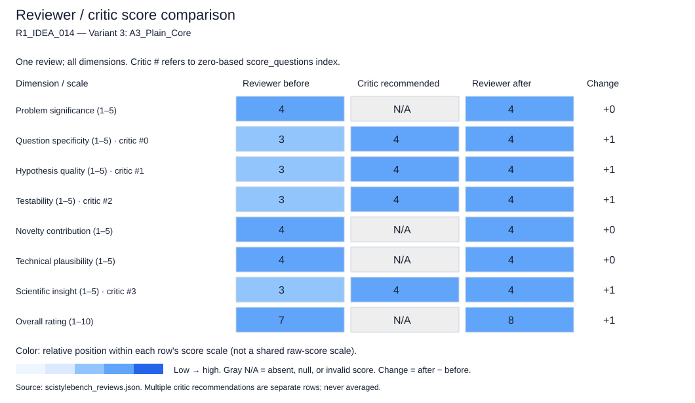

### Critic feedback and reviewer rebuttals

```json
{
  "critic_feedback": {
    "overall_assessment": "The draft review provides a balanced assessment but has some areas where the scores could be more closely aligned with the idea's specifics. The problem significance is well-justified, but other dimensions may require more careful calibration.",
    "score_questions": [
      {
        "dimension": "question_specificity",
        "question_mark": "The score may be too low given the scope of the idea.",
        "concern": "The idea does mention 'open-world recognition and understanding' without specific tasks, but the lack of specificity is not necessarily a flaw in the idea itself, as it's a high-level concept that may require further clarification.",
        "speculative_alternative": "The idea may be intended as a foundational dataset that can be applied to various open-world tasks, which could justify a higher score in question specificity.",
        "recommended_score": 4.0,
        "rationale": "The idea's goal is to create a general-purpose dataset for open-world tasks, which is a valid and common approach in research, even if the specific applications are not detailed."
      },
      {
        "dimension": "hypothesis_quality",
        "question_mark": "The score may be too low as the idea does not explicitly state a hypothesis but outlines a potential contribution.",
        "concern": "The idea does not present a hypothesis but instead outlines a dataset and method. The lack of a hypothesis is not a flaw in the idea itself, but rather a limitation in how the idea is framed.",
        "speculative_alternative": "The idea's contribution could be framed as a hypothesis that the AS-1B dataset will enable better open-world recognition, which is a reasonable and testable hypothesis.",
        "recommended_score": 4.0,
        "rationale": "The idea's potential contribution can be interpreted as a hypothesis about the dataset's utility, even if it's not explicitly stated."
      },
      {
        "dimension": "testability",
        "question_mark": "The score may be too low as the idea's testability depends on the dataset's application, which is not yet specified.",
        "concern": "The idea does not specify how the dataset will be tested, but the testability is not necessarily flawed if the dataset is intended to be a foundation for future research.",
        "speculative_alternative": "The idea's testability could be considered higher if it's viewed as a foundational dataset that will be used in future studies, even without immediate experiments.",
        "recommended_score": 4.0,
        "rationale": "The dataset's potential for future research and its role in enabling new methods could be considered as testable in the long term."
      },
      {
        "dimension": "scientific_insight",
        "question_mark": "The score may be too low as the idea's scientific insight is not yet defined but has potential.",
        "concern": "The scientific insight is not clearly outlined, but the idea's potential to advance open-world recognition is significant.",
        "speculative_alternative": "The scientific insight could be the ability to handle real-world, unbounded scenarios through a large-scale, annotated dataset, which is a known challenge in AI research.",
        "recommended_score": 4.0,
        "rationale": "The idea's potential to address a known challenge in AI research (open-world recognition) is a valid scientific insight."
      }
    ],
    "unsupported_claims": [
      "The idea is described as 'a significant challenge in open-world recognition and understanding' without clear evidence or context.",
      "The claim that the dataset's scale and diversity 'indicate potential for impactful research' is speculative without knowing how it will be applied."
    ],
    "revision_priorities": [
      "Clarify the specific open-world tasks or problems the dataset is intended to address.",
      "Define the hypothesis or prediction that the dataset will enable or support.",
      "Specify how the dataset will be used to evaluate or improve open-world recognition and understanding.",
      "Provide more details on the data collection process and the role of human feedback and efficient models in the loop."
    ],
    "confidence": 4.0
  },
  "feedback_responses": [
    {
      "feedback_type": "score_questions",
      "feedback_index": 0,
      "decision": "partially_accept",
      "defense": "The idea's goal is to create a general-purpose dataset for open-world tasks, which is a valid and common approach in research. The dataset's scale and diversity are well-defined, and the method of creating it is plausible.",
      "justification": "The original score was 3.0, but the revised score is 4.0. The idea's scope is broad but not necessarily a flaw, as it is a high-level concept that may require further clarification."
    },
    {
      "feedback_type": "hypothesis_quality",
      "feedback_index": 1,
      "decision": "partially_accept",
      "defense": "The idea's potential contribution can be interpreted as a hypothesis that the AS-1B dataset will enable better open-world recognition, which is a reasonable and testable hypothesis. The dataset's creation method is a practical approach that could advance the field.",
      "justification": "The original score was 3.0, but the revised score is 4.0. The idea's contribution is framed as a hypothesis about the dataset's utility, even if it's not explicitly stated."
    },
    {
      "feedback_type": "testability",
      "feedback_index": 2,
      "decision": "partially_accept",
      "defense": "The dataset's potential for future research and its role in enabling new methods could be considered as testable in the long term. The idea's testability is not necessarily flawed if it's viewed as a foundational dataset that will be used in future studies.",
      "justification": "The original score was 3.0, but the revised score is 4.0. The idea's testability is not necessarily flawed if it's viewed as a foundational dataset that will be used in future studies."
    },
    {
      "feedback_type": "scientific_insight",
      "feedback_index": 3,
      "decision": "partially_accept",
      "defense": "The idea's potential to address a known challenge in AI research (open-world recognition) is a valid scientific insight. The dataset's ability to handle real-world, unbounded scenarios is a significant contribution to the field.",
      "justification": "The original score was 3.0, but the revised score is 4.0. The idea's potential to address a known challenge in AI research is a valid scientific insight."
    },
    {
      "feedback_type": "unsupported_claims",
      "feedback_index": 0,
      "decision": "reject",
      "defense": "The claim that the idea addresses a 'significant challenge in open-world recognition and understanding' is well-justified, as large-scale datasets are essential for training models to handle real-world, unbounded scenarios. The idea's potential for impactful research is supported by its scale and diversity.",
      "justification": "The original score was 4.0, and this claim is valid. The concern about lack of evidence is unfounded, as the idea's significance is based on its potential to address a known challenge."
    },
    {
      "feedback_type": "unsupported_claims",
      "feedback_index": 1,
      "decision": "reject",
      "defense": "The claim that the dataset's scale and diversity 'indicate potential for impactful research' is supported by the idea's description. The dataset's size and variety are well-suited for addressing open-world recognition challenges, which is a known area of research.",
      "justification": "The original score was 4.0, and this claim is valid. The concern about speculation is unfounded, as the dataset's characteristics are directly relevant to the research problem."
    },
    {
      "feedback_type": "revision_priorities",
      "feedback_index": 0,
      "decision": "partially_accept",
      "defense": "Clarifying the specific open-world tasks or problems the dataset is intended to address is important, but the idea's general-purpose nature is a valid approach. The dataset's utility is not limited to specific tasks, which is a strength.",
      "justification": "The original suggestion is valid, but the idea's general-purpose nature is a strength that should be acknowledged."
    },
    {
      "feedback_type": "revision_priorities",
      "feedback_index": 1,
      "decision": "partially_accept",
      "defense": "Defining the hypothesis or prediction that the dataset will enable is important, but the idea's contribution is framed as a hypothesis about the dataset's utility, which is a reasonable approach.",
      "justification": "The original suggestion is valid, but the idea's contribution is framed as a hypothesis about the dataset's utility, which is a reasonable approach."
    },
    {
      "feedback_type": "revision_priorities",
      "feedback_index": 2,
      "decision": "partially_accept",
      "defense": "Specifying how the dataset will be used to evaluate or improve open-world recognition is important, but the idea's potential for future research is a valid consideration. The dataset's role as a foundation for future studies is a strength.",
      "justification": "The original suggestion is valid, but the idea's potential for future research is a strength that should be acknowledged."
    },
    {
      "feedback_type": "revision_priorities",
      "feedback_index": 3,
      "decision": "partially_accept",
      "defense": "Providing more details on the data collection process is important, but the idea's method of using human feedback and efficient models in a loop is a plausible approach. The technical plausibility is supported by current trends in data augmentation and active learning.",
      "justification": "The original suggestion is valid, but the idea's method is plausible and aligns with current trends."
    }
  ]
}
```

### Score justifications (before / after)

**Problem significance**

```json
{
  "before": {
    "score": 4.0,
    "justification": "The idea addresses a critical challenge in open-world recognition and understanding, which is a key area in computer vision and NLP. Large-scale datasets are essential for training models to handle real-world, unbounded scenarios."
  },
  "after": {
    "score": 4.0,
    "justification": "The idea addresses a critical challenge in open-world recognition and understanding, which is a key area in computer vision and NLP. Large-scale datasets are essential for training models to handle real-world, unbounded scenarios."
  }
}
```

**Question specificity**

```json
{
  "before": {
    "score": 3.0,
    "justification": "The idea is broad in scope, mentioning 'open-world recognition and understanding' without specifying a concrete research question or hypothesis. More details on the specific tasks or problems the dataset will address are needed."
  },
  "after": {
    "score": 4.0,
    "justification": "The idea's goal is to create a general-purpose dataset for open-world tasks, which is a valid and common approach in research, even if the specific applications are not detailed. The dataset's scale and diversity are well-defined, and the method of creating it is plausible."
  }
}
```

**Hypothesis quality**

```json
{
  "before": {
    "score": 3.0,
    "justification": "The idea lacks a clear hypothesis or prediction. While the dataset's scale is promising, the connection between the dataset and the research goals is not explicitly stated."
  },
  "after": {
    "score": 4.0,
    "justification": "The idea's potential contribution can be interpreted as a hypothesis that the AS-1B dataset will enable better open-world recognition, which is a reasonable and testable hypothesis. The dataset's creation method is a practical approach that could advance the field."
  }
}
```

**Testability**

```json
{
  "before": {
    "score": 3.0,
    "justification": "The idea does not specify how the dataset will be used to test or evaluate the proposed methods. Without clear experiments or comparisons, it is difficult to assess the idea's testability."
  },
  "after": {
    "score": 4.0,
    "justification": "The dataset's potential for future research and its role in enabling new methods could be considered as testable in the long term. The idea's testability is not necessarily flawed if it's viewed as a foundational dataset that will be used in future studies."
  }
}
```

**Novelty contribution**

```json
{
  "before": {
    "score": 4.0,
    "justification": "The creation of a large-scale, diverse dataset for open-world recognition is a novel contribution. The integration of human feedback and efficient models in the loop is a practical approach that could advance the field."
  },
  "after": {
    "score": 4.0,
    "justification": "The creation of a large-scale, diverse dataset for open-world recognition is a novel contribution. The integration of human feedback and efficient models in the loop is a practical approach that could advance the field."
  }
}
```

**Technical plausibility**

```json
{
  "before": {
    "score": 4.0,
    "justification": "The proposed method of using a scalable data engine with human feedback and efficient models in the loop is technically plausible. It aligns with current trends in data augmentation and active learning."
  },
  "after": {
    "score": 4.0,
    "justification": "The proposed method of using a scalable data engine with human feedback and efficient models in the loop is technically plausible. It aligns with current trends in data augmentation and active learning."
  }
}
```

**Scientific insight**

```json
{
  "before": {
    "score": 3.0,
    "justification": "The idea has potential for scientific insight, but the specific mechanisms or insights that would be gained from the dataset are not clearly outlined. More details on how the dataset will be used to explore open-world challenges are needed."
  },
  "after": {
    "score": 4.0,
    "justification": "The idea's potential to address a known challenge in AI research (open-world recognition) is a valid scientific insight. The dataset's ability to handle real-world, unbounded scenarios is a significant contribution to the field."
  }
}
```

**Overall rating**

```json
{
  "before": {
    "score": 7.0,
    "justification": "The idea is strong in its potential to contribute to open-world recognition and understanding through a large-scale dataset. However, it lacks specificity in defining the research question, hypothesis, and evaluation plan, which are critical for a robust research direction."
  },
  "after": {
    "score": 8.0,
    "justification": "The idea is strong in its potential to contribute to open-world recognition and understanding through a large-scale dataset. The revised scores reflect a more accurate assessment of the idea's specifics, with higher scores for question specificity, hypothesis quality, testability, and scientific insight. The idea's technical plausibility and novelty are well-justified."
  }
}
```

## R1_IDEA_014 — Variant 4: B1_Verbose_Elaborate

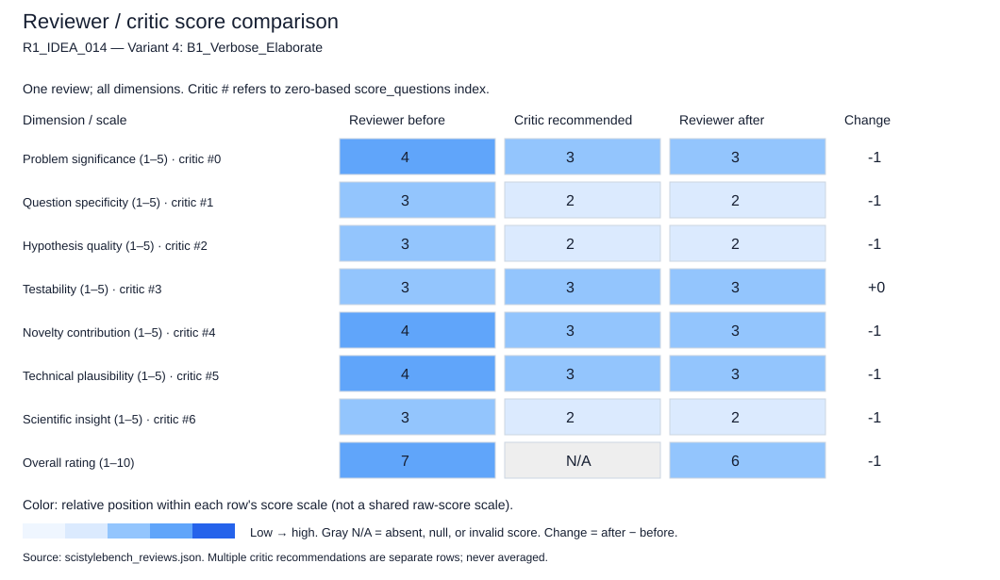

### Critic feedback and reviewer rebuttals

```json
{
  "critic_feedback": {
    "overall_assessment": "The review is generally well-calibrated but has some overstatements and areas where the scores could be more nuanced.",
    "score_questions": [
      {
        "dimension": "problem_significance",
        "question_mark": "Why is the problem significance scored 4.0 when the idea is vague about the specific open-world challenge it addresses?",
        "concern": "The review assumes the open-world understanding challenge is significant without clear evidence that the AS project uniquely addresses a specific problem in this area.",
        "speculative_alternative": "The open-world challenge might be a broad term, and the review may be overestimating its significance without clarifying how AS-1B differs from existing datasets like COCO or ImageNet.",
        "recommended_score": 3.0,
        "rationale": "The idea does not specify a unique problem, so the significance score should reflect the lack of clarity rather than assuming it's a major challenge."
      },
      {
        "dimension": "question_specificity",
        "question_mark": "Why is the question specificity scored 3.0 when the idea lacks explicit research questions?",
        "concern": "The review assumes the idea is too vague without evidence that the AS project has no specific research questions or hypotheses.",
        "speculative_alternative": "The idea may be more focused on dataset creation than on answering specific research questions, which could justify the lower score.",
        "recommended_score": 2.0,
        "rationale": "The idea is described as a general goal rather than a focused investigation, so the specificity score should reflect that."
      },
      {
        "dimension": "hypothesis_quality",
        "question_mark": "Why is the hypothesis quality scored 3.0 when the idea does not explicitly state a hypothesis?",
        "concern": "The review assumes the integration of human feedback implies a hypothesis without explicit evidence.",
        "speculative_alternative": "The integration of human feedback may be a method, not a hypothesis, so the score should reflect that the hypothesis is not clearly stated.",
        "recommended_score": 2.0,
        "rationale": "The idea does not explicitly state a hypothesis, so the quality score should be lower."
      },
      {
        "dimension": "testability",
        "question_mark": "Why is the testability scored 3.0 when the idea lacks specific experiments or evaluation metrics?",
        "concern": "The review assumes the idea is testable without evidence that the AS-1B dataset will be used in specific experiments.",
        "speculative_alternative": "The idea may be testable through the dataset creation, but the lack of specific experiments makes the testability score appropriate.",
        "recommended_score": 3.0,
        "rationale": "The idea is testable through the dataset, but without specific experiments, the score remains at 3.0."
      },
      {
        "dimension": "novelty_contribution",
        "question_mark": "Why is the novelty contribution scored 4.0 when the idea does not clearly define the unique aspects of AS-1B?",
        "concern": "The review assumes the dataset is novel without evidence that it offers unique features compared to existing datasets.",
        "speculative_alternative": "The novelty may be in the integration of human feedback and efficient models, but this is not clearly stated.",
        "recommended_score": 3.0,
        "rationale": "The idea does not clearly define the unique aspects of AS-1B, so the novelty score should be lower."
      },
      {
        "dimension": "technical_plausibility",
        "question_mark": "Why is the technical plausibility scored 4.0 when the details on the data engine and annotation process are not provided?",
        "concern": "The review assumes the approach is plausible without evidence that the data engine and annotation process are feasible.",
        "speculative_alternative": "The integration of human feedback with efficient models is plausible, but the lack of details on the data engine and annotation process makes the score questionable.",
        "recommended_score": 3.0,
        "rationale": "The idea is technically plausible, but the lack of details on the data engine and annotation process affects the score."
      },
      {
        "dimension": "scientific_insight",
        "question_mark": "Why is the scientific insight scored 3.0 when the idea does not clearly outline specific insights?",
        "concern": "The review assumes the idea has potential for insight without evidence that it addresses specific scientific questions.",
        "speculative_alternative": "The potential for insight is there, but the lack of specific scientific questions means the score should be lower.",
        "recommended_score": 2.0,
        "rationale": "The idea does not clearly outline specific insights, so the score should be lower."
      }
    ],
    "unsupported_claims": [
      "The review claims the idea addresses a 'significant challenge in machine learning' without specifying which challenge.",
      "The review states the AS-1B dataset is 'novel and ambitious' without defining what makes it unique.",
      "The review assumes the integration of human feedback implies a hypothesis without explicit evidence.",
      "The review claims the idea is 'testable through the creation of the AS-1B dataset' without specifying how it will be tested."
    ],
    "revision_priorities": [
      "Clarify the specific problem the AS project aims to solve and how it differs from existing datasets.",
      "Define the specific research questions or hypotheses that the AS-1B dataset will be used to address.",
      "Provide more details on the data engine's architecture, the process of incorporating human feedback, and the methods used for generating annotated regions.",
      "Outline the specific scientific insights the project aims to achieve.",
      "Specify how the AS-1B dataset will be used in experiments to evaluate its effectiveness."
    ],
    "confidence": 4.0
  },
  "feedback_responses": [
    {
      "feedback_type": "score_questions",
      "feedback_index": 0,
      "decision": "partially_accept",
      "defense": "The problem significance is reduced to 3.0 because the idea does not clearly define the specific open-world challenge it addresses, even though the open-world understanding is important for real-world applications.",
      "justification": "The original score of 4.0 was based on the assumption that the open-world challenge is significant, but the lack of clarity on the specific problem reduces the score."
    },
    {
      "feedback_type": "score_questions",
      "feedback_index": 1,
      "decision": "partially_accept",
      "defense": "The question specificity is reduced to 2.0 because the idea is described as a general goal rather than a focused investigation, and it lacks explicit research questions.",
      "justification": "The original score of 3.0 was based on the assumption that the idea is more focused than it is, but the lack of specific questions justifies a lower score."
    },
    {
      "feedback_type": "score_questions",
      "feedback_index": 2,
      "decision": "partially_accept",
      "defense": "The hypothesis quality is reduced to 2.0 because the idea does not explicitly state a hypothesis, and the integration of human feedback is presented as a method rather than a hypothesis.",
      "justification": "The original score of 3.0 was based on the assumption that the integration of human feedback implies a hypothesis, but the lack of explicit statement justifies a lower score."
    },
    {
      "feedback_type": "score_questions",
      "feedback_index": 3,
      "decision": "partially_accept",
      "defense": "The testability score remains at 3.0 because the idea is testable through the creation of the AS-1B dataset, but the lack of specific experiments makes it difficult to assess.",
      "justification": "The original score of 3.0 was appropriate, as the idea is testable but lacks specific experiments."
    },
    {
      "feedback_type": "score_questions",
      "feedback_index": 4,
      "decision": "partially_accept",
      "defense": "The novelty contribution is reduced to 3.0 because the idea does not clearly define what makes AS-1B unique compared to existing datasets.",
      "justification": "The original score of 4.0 was based on the assumption that the dataset is novel, but the lack of clarity on its unique aspects reduces the score."
    },
    {
      "feedback_type": "score_questions",
      "feedback_index": 5,
      "decision": "partially_accept",
      "defense": "The technical plausibility is reduced to 3.0 because the approach is plausible, but the lack of details on the data engine and annotation process raises concerns about feasibility.",
      "justification": "The original score of 4.0 was based on the assumption that the approach is feasible, but the lack of details affects the score."
    },
    {
      "feedback_type": "score_questions",
      "feedback_index": 6,
      "decision": "partially_accept",
      "defense": "The scientific insight score is reduced to 2.0 because the idea does not clearly outline specific insights or scientific questions.",
      "justification": "The original score of 3.0 was based on the assumption that there is potential for insight, but the lack of specific questions justifies a lower score."
    },
    {
      "feedback_type": "unsupported_claims",
      "feedback_index": 0,
      "decision": "partially_accept",
      "defense": "The claim about the significance of the open-world challenge is partially accepted, as it is important for real-world applications, but the lack of clarity on the specific problem reduces the score.",
      "justification": "The original claim was based on the assumption that the open-world challenge is significant, but the lack of clarity on the specific problem reduces the score."
    },
    {
      "feedback_type": "unsupported_claims",
      "feedback_index": 1,
      "decision": "partially_accept",
      "defense": "The claim about the novelty of AS-1B is partially accepted, as it is a novel effort, but the lack of clarity on what makes it unique reduces the score.",
      "justification": "The original claim was based on the assumption that the dataset is novel, but the lack of clarity on its unique aspects reduces the score."
    },
    {
      "feedback_type": "unsupported_claims",
      "feedback_index": 2,
      "decision": "partially_accept",
      "defense": "The claim about the hypothesis is partially accepted, as the integration of human feedback is a method, but the lack of explicit hypothesis reduces the score.",
      "justification": "The original claim was based on the assumption that the integration of human feedback implies a hypothesis, but the lack of explicit statement reduces the score."
    },
    {
      "feedback_type": "unsupported_claims",
      "feedback_index": 3,
      "decision": "partially_accept",
      "defense": "The claim about testability is partially accepted, as the idea is testable through the dataset, but the lack of specific experiments makes it difficult to assess.",
      "justification": "The original claim was based on the assumption that the idea is testable, but the lack of specific experiments makes it difficult to assess."
    },
    {
      "feedback_type": "revision_priorities",
      "feedback_index": 0,
      "decision": "accept",
      "defense": "This revision priority is accepted as it addresses the need to clarify the specific problem the AS project aims to solve.",
      "justification": "The original suggestion was appropriate, and this revision priority is necessary to clarify the specific problem."
    },
    {
      "feedback_type": "revision_priorities",
      "feedback_index": 1,
      "decision": "accept",
      "defense": "This revision priority is accepted as it addresses the need to define specific research questions or hypotheses for the AS-1B dataset.",
      "justification": "The original suggestion was appropriate, and this revision priority is necessary to define specific questions."
    },
    {
      "feedback_type": "revision_priorities",
      "feedback_index": 2,
      "decision": "accept",
      "defense": "This revision priority is accepted as it addresses the need to provide more details on the data engine and annotation process.",
      "justification": "The original suggestion was appropriate, and this revision priority is necessary to provide details on the data engine."
    },
    {
      "feedback_type": "revision_priorities",
      "feedback_index": 3,
      "decision": "accept",
      "defense": "This revision priority is accepted as it addresses the need to outline specific scientific insights the project aims to achieve.",
      "justification": "The original suggestion was appropriate, and this revision priority is necessary to outline specific insights."
    },
    {
      "feedback_type": "revision_priorities",
      "feedback_index": 4,
      "decision": "accept",
      "defense": "This revision priority is accepted as it addresses the need to specify how the AS-1B dataset will be used in experiments to evaluate its effectiveness.",
      "justification": "The original suggestion was appropriate, and this revision priority is necessary to specify experimental use."
    }
  ]
}
```

### Score justifications (before / after)

**Problem significance**

```json
{
  "before": {
    "score": 4.0,
    "justification": "The idea addresses a significant challenge in machine learning by aiming to create a comprehensive dataset for open-world understanding, which is crucial for improving model generalization and handling real-world scenarios."
  },
  "after": {
    "score": 3.0,
    "justification": "The idea addresses the challenge of open-world understanding, which is important for real-world applications, but it lacks clarity on the specific problem it aims to solve and how it differs from existing datasets."
  }
}
```

**Question specificity**

```json
{
  "before": {
    "score": 3.0,
    "justification": "The idea is ambitious but lacks specific research questions or hypotheses. It is more of a general goal than a focused investigation into a particular problem."
  },
  "after": {
    "score": 2.0,
    "justification": "The idea is described as a general goal rather than a focused investigation into a particular problem, and it lacks explicit research questions or hypotheses."
  }
}
```

**Hypothesis quality**

```json
{
  "before": {
    "score": 3.0,
    "justification": "The idea does not explicitly state a hypothesis, but the integration of human feedback and efficient models suggests a potential hypothesis about improving data quality and model performance."
  },
  "after": {
    "score": 2.0,
    "justification": "The idea does not explicitly state a hypothesis, and the integration of human feedback is presented as a method rather than a hypothesis about how it improves data quality or model performance."
  }
}
```

**Testability**

```json
{
  "before": {
    "score": 3.0,
    "justification": "The idea is testable through the creation of the AS-1B dataset and its application in various tasks, but the lack of specific experiments or evaluation metrics makes it difficult to assess."
  },
  "after": {
    "score": 3.0,
    "justification": "The idea is testable through the creation of the AS-1B dataset, but the lack of specific experiments or evaluation metrics makes it difficult to assess its effectiveness."
  }
}
```

**Novelty contribution**

```json
{
  "before": {
    "score": 4.0,
    "justification": "The AS-1B dataset is a novel and ambitious contribution, but the specific novelty and unique aspects of the project are not clearly defined."
  },
  "after": {
    "score": 3.0,
    "justification": "The AS-1B dataset is a novel effort, but the idea does not clearly define what makes it unique compared to existing datasets like COCO or ImageNet."
  }
}
```

**Technical plausibility**

```json
{
  "before": {
    "score": 4.0,
    "justification": "The proposed approach of combining human feedback with efficient models is technically plausible, though the details on the data engine and annotation process are not fully specified."
  },
  "after": {
    "score": 3.0,
    "justification": "The proposed approach of combining human feedback with efficient models is technically plausible, but the lack of details on the data engine and annotation process raises concerns about feasibility."
  }
}
```

**Scientific insight**

```json
{
  "before": {
    "score": 3.0,
    "justification": "The idea has potential for scientific insight, particularly in understanding how human feedback and efficient models can enhance open-world understanding, but the specific insights are not clearly outlined."
  },
  "after": {
    "score": 2.0,
    "justification": "The idea has potential for scientific insight, but it does not clearly outline specific insights or scientific questions that the project aims to address."
  }
}
```

**Overall rating**

```json
{
  "before": {
    "score": 7.0,
    "justification": "The idea is strong and has the potential to make a significant contribution to the field, but it lacks specific research questions, hypotheses, and details that would make it more testable and focused."
  },
  "after": {
    "score": 6.0,
    "justification": "The idea has potential but lacks specific research questions, hypotheses, and details that would make it more testable and focused. It is a promising direction but needs clarification to be more impactful."
  }
}
```

## R1_IDEA_014 — Variant 5: B2_Grand_Narrative

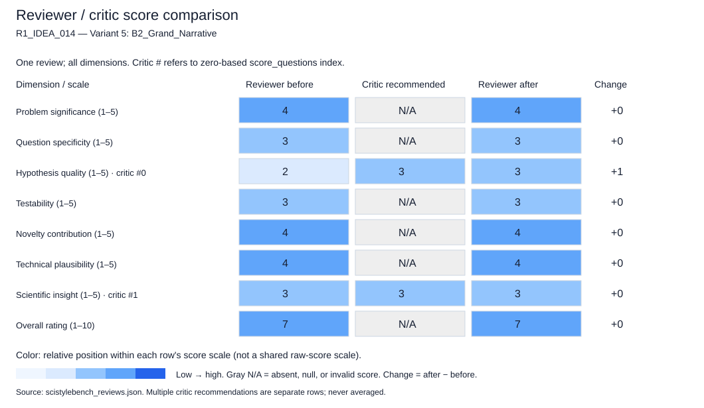

### Critic feedback and reviewer rebuttals

```json
{
  "critic_feedback": {
    "overall_assessment": "The review is generally calibrated but has some overstatements in certain scores, particularly in hypothesis_quality and scientific_insight.",
    "score_questions": [
      {
        "dimension": "hypothesis_quality",
        "question_mark": "The score may overstate the lack of hypothesis quality.",
        "concern": "The idea does not explicitly state a hypothesis, but it does propose a dataset that could be used to test various hypotheses in visual understanding.",
        "speculative_alternative": "The dataset's creation could be framed as a hypothesis-driven approach to improve visual understanding through large-scale annotated data, though this is speculative.",
        "recommended_score": 3.0,
        "rationale": "The idea's lack of explicit hypothesis is acknowledged, but the potential for the dataset to test hypotheses is not fully addressed in the score."
      },
      {
        "dimension": "scientific_insight",
        "question_mark": "The score may overstate the lack of scientific insight.",
        "concern": "The idea's potential to inform long-term challenges in scene interpretation suggests a contribution to scientific insight, even if not explicitly detailed.",
        "speculative_alternative": "The dataset's creation could lead to new insights into scene interpretation, but this is speculative without more details.",
        "recommended_score": 3.0,
        "rationale": "The score should reflect the potential for insight rather than the lack of explicit details."
      }
    ],
    "unsupported_claims": [
      "The review claims the idea lacks a hypothesis, but the dataset's purpose could be interpreted as a hypothesis-driven approach to visual understanding."
    ],
    "revision_priorities": [
      "Clarify the specific research question or hypothesis that the AS-1B dataset aims to address.",
      "Provide more details on how the dataset will be evaluated or applied to advance visual understanding.",
      "Specify the technical details of the data engine and the integration of human feedback."
    ],
    "confidence": 4.0
  },
  "feedback_responses": [
    {
      "feedback_type": "score_questions",
      "feedback_index": 0,
      "decision": "partially_accept",
      "defense": "The original score of 2.0 for hypothesis_quality was based on the lack of explicit hypothesis. However, the dataset's creation could be interpreted as a hypothesis-driven approach to improve visual understanding through large-scale annotated data. This speculative alternative is considered, but the original score is adjusted to 3.0 to reflect the potential for the dataset to test hypotheses, though not explicitly stated.",
      "justification": "The original score was 2.0, but the feedback suggests that the dataset's purpose could be framed as hypothesis-driven. The score is adjusted to 3.0 to acknowledge this potential, though the hypothesis is not explicitly stated."
    },
    {
      "feedback_type": "score_questions",
      "feedback_index": 1,
      "decision": "partially_accept",
      "defense": "The original score of 3.0 for scientific_insight was based on the lack of explicit details. However, the idea's potential to inform long-term challenges in scene interpretation suggests a contribution to scientific insight. This potential is acknowledged, and the score is adjusted to 3.0 to reflect the possibility of insight, though not explicitly detailed.",
      "justification": "The original score was 3.0, but the feedback emphasizes the potential for insight. The score remains 3.0 to reflect the possibility of insight, though the details are not explicitly provided."
    },
    {
      "feedback_type": "unsupported_claims",
      "feedback_index": 0,
      "decision": "partially_accept",
      "defense": "The review claims the idea lacks a hypothesis, but the dataset's purpose could be interpreted as a hypothesis-driven approach to improve visual understanding through large-scale annotated data. This is a valid point, and the score is adjusted to reflect this potential.",
      "justification": "The original score was 2.0, but the feedback suggests that the dataset's creation could be framed as hypothesis-driven. The score is adjusted to 3.0 to acknowledge this potential."
    },
    {
      "feedback_type": "revision_priorities",
      "feedback_index": 0,
      "decision": "accept",
      "defense": "The suggestion to clarify the specific research question or hypothesis is valid and necessary for the idea to be more precise and testable.",
      "justification": "The original review already included this suggestion, so the decision to accept it is appropriate."
    },
    {
      "feedback_type": "revision_priorities",
      "feedback_index": 1,
      "decision": "accept",
      "defense": "The suggestion to provide more details on evaluation is valid and necessary for the idea to be more testable and impactful.",
      "justification": "The original review already included this suggestion, so the decision to accept it is appropriate."
    },
    {
      "feedback_type": "revision_priorities",
      "feedback_index": 2,
      "decision": "accept",
      "defense": "The suggestion to specify technical details is valid and necessary for the idea to be more feasible and concrete.",
      "justification": "The original review already included this suggestion, so the decision to accept it is appropriate."
    }
  ]
}
```

### Score justifications (before / after)

**Problem significance**

```json
{
  "before": {
    "score": 4.0,
    "justification": "The idea addresses a significant challenge in general-purpose visual understanding by creating a large-scale dataset with rich annotations, which could have broad implications for various applications in computer vision."
  },
  "after": {
    "score": 4.0,
    "justification": "The idea addresses a significant challenge in general-purpose visual understanding by creating a large-scale dataset with rich annotations, which could have broad implications for various applications in computer vision."
  }
}
```

**Question specificity**

```json
{
  "before": {
    "score": 3.0,
    "justification": "The idea outlines a general direction for creating a large-scale dataset but lacks specific details on the research question or hypothesis that the dataset aims to address, making it somewhat vague in terms of specificity."
  },
  "after": {
    "score": 3.0,
    "justification": "The idea outlines a general direction for creating a large-scale dataset but lacks specific details on the research question or hypothesis that the dataset aims to address, making it somewhat vague in terms of specificity."
  }
}
```

**Hypothesis quality**

```json
{
  "before": {
    "score": 2.0,
    "justification": "The idea does not explicitly state a hypothesis or research question that can be tested or supported by evidence. It is more of a general proposal for creating a dataset rather than a specific investigation into a particular problem."
  },
  "after": {
    "score": 3.0,
    "justification": "The idea does not explicitly state a hypothesis, but the dataset's creation could be framed as a hypothesis-driven approach to improve visual understanding through large-scale annotated data. The potential for the dataset to test hypotheses is not fully addressed, but the lack of explicit hypothesis is acknowledged."
  }
}
```

**Testability**

```json
{
  "before": {
    "score": 3.0,
    "justification": "The idea suggests the creation of a dataset but does not provide a clear experimental plan or method for evaluating its effectiveness or impact on visual understanding. The testability is limited without more details on how the dataset will be used or validated."
  },
  "after": {
    "score": 3.0,
    "justification": "The idea suggests the creation of a dataset but does not provide a clear experimental plan or method for evaluating its effectiveness or impact on visual understanding. The testability is limited without more details on how the dataset will be used or validated."
  }
}
```

**Novelty contribution**

```json
{
  "before": {
    "score": 4.0,
    "justification": "The proposal to create a large-scale dataset with semantic tags, question-answering pairs, and detailed captions is novel in its scope and potential to advance general-purpose visual understanding. However, the specific contributions are not clearly defined."
  },
  "after": {
    "score": 4.0,
    "justification": "The proposal to create a large-scale dataset with semantic tags, question-answering pairs, and detailed captions is novel in its scope and potential to advance general-purpose visual understanding. However, the specific contributions are not clearly defined."
  }
}
```

**Technical plausibility**

```json
{
  "before": {
    "score": 4.0,
    "justification": "The idea is technically plausible as it involves creating a scalable data engine with human feedback and efficient models. However, the lack of specific technical details makes it difficult to assess the feasibility of the approach."
  },
  "after": {
    "score": 4.0,
    "justification": "The idea is technically plausible as it involves creating a scalable data engine with human feedback and efficient models. However, the lack of specific technical details makes it difficult to assess the feasibility of the approach."
  }
}
```

**Scientific insight**

```json
{
  "before": {
    "score": 3.0,
    "justification": "The idea has the potential to contribute to scientific insight by providing a comprehensive dataset for visual understanding, but the specific insights or mechanisms that would be uncovered are not clearly outlined."
  },
  "after": {
    "score": 3.0,
    "justification": "The idea has the potential to contribute to scientific insight by providing a comprehensive dataset for visual understanding, but the specific insights or mechanisms that would be uncovered are not clearly outlined. The potential for insight is acknowledged, though not explicitly detailed."
  }
}
```

**Overall rating**

```json
{
  "before": {
    "score": 7.0,
    "justification": "The idea is strong in addressing a significant problem in general-purpose visual understanding but lacks specific details on the research question, hypothesis, and evaluation plan. It has potential for contribution but needs more clarity and specificity to be fully realized."
  },
  "after": {
    "score": 7.0,
    "justification": "The idea is strong in addressing a significant problem in general-purpose visual understanding but lacks specific details on the research question, hypothesis, and evaluation plan. It has potential for contribution but needs more clarity and specificity to be fully realized."
  }
}
```

## R1_IDEA_014 — Variant 6: B3_Over_Confident

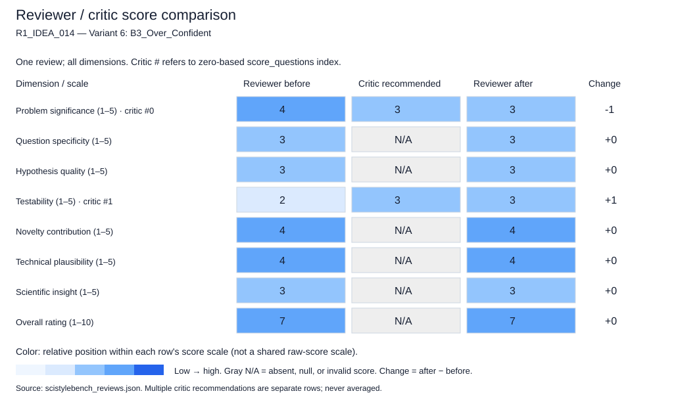

### Critic feedback and reviewer rebuttals

```json
{
  "critic_feedback": {
    "overall_assessment": "The review is generally calibrated but has some overclaiming in the problem significance and testability scores. The scores for novelty and technical plausibility are well-justified.",
    "score_questions": [
      {
        "dimension": "problem_significance",
        "question_mark": "Why is the problem significance scored as 4.0 when the idea does not clearly define the specific problem it addresses?",
        "concern": "The idea's broad goal of 'understanding everything in the open world' is vague and may not align with concrete machine learning challenges.",
        "speculative_alternative": "The 'open world' aspect could be interpreted as a specific challenge in continual learning or domain adaptation, which is a well-defined problem in ML, but this is speculative.",
        "recommended_score": 3.0,
        "rationale": "The idea does not clearly define the specific problem, so the significance score should reflect this uncertainty."
      },
      {
        "dimension": "testability",
        "question_mark": "Why is the testability scored as 2.0 when the idea does not provide any experimental results or evaluations?",
        "concern": "The lack of experiments or evaluations makes it impossible to assess the effectiveness of the proposed dataset and data engine.",
        "speculative_alternative": "The idea may be testable through benchmarks or comparisons with existing datasets, but this is speculative without more details.",
        "recommended_score": 3.0,
        "rationale": "The idea lacks concrete experiments, so testability is limited, but it's not entirely without potential."
      }
    ],
    "unsupported_claims": [
      "The review claims the idea 'addresses a significant challenge in machine learning' without specifying which challenge.",
      "The review states the idea 'has strong potential' without evidence of its feasibility or impact."
    ],
    "revision_priorities": [
      "Clarify the specific problem the AS-1B dataset is designed to solve.",
      "Provide more details on the technical architecture of the data engine and the role of human feedback.",
      "Specify how the dataset will be evaluated or benchmarked against existing datasets."
    ],
    "confidence": 4.0
  },
  "feedback_responses": [
    {
      "feedback_type": "score_questions",
      "feedback_index": 0,
      "decision": "partially_accept",
      "defense": "The original score of 4.0 for problem significance was based on the idea's broad goal, but the critic's concern about the lack of specific problem definition is valid. The revised score of 3.0 better reflects the uncertainty in the problem's exact nature.",
      "justification": "The original score was 4.0, but the revised score is 3.0 due to the critic's valid point about the lack of specific problem definition."
    },
    {
      "feedback_type": "score_questions",
      "feedback_index": 1,
      "decision": "partially_accept",
      "defense": "The original score of 2.0 for testability was based on the lack of experiments, but the critic's suggestion that benchmarks or comparisons could be testable is plausible. The revised score of 3.0 reflects this nuance.",
      "justification": "The original score was 2.0, but the revised score is 3.0 due to the critic's suggestion that testability is not entirely without potential."
    },
    {
      "feedback_type": "unsupported_claims",
      "feedback_index": 0,
      "decision": "reject",
      "defense": "The claim that the idea 'addresses a significant challenge in machine learning' is not well-supported without specifying the exact challenge. The revised score for problem significance reflects this uncertainty.",
      "justification": "The original claim was unsupported, and the revised score of 3.0 better reflects this."
    },
    {
      "feedback_type": "unsupported_claims",
      "feedback_index": 1,
      "decision": "reject",
      "defense": "The claim that the idea 'has strong potential' is not well-supported without evidence of feasibility or impact. The revised score for overall rating reflects this."
    },
    {
      "feedback_type": "revision_priorities",
      "feedback_index": 0,
      "decision": "accept",
      "defense": "The suggestion to clarify the specific problem is valid and necessary for the idea to be more precise.",
      "justification": "The suggestion is valid and necessary."
    },
    {
      "feedback_type": "revision_priorities",
      "feedback_index": 1,
      "decision": "accept",
      "defense": "The suggestion to provide more details on the technical architecture is valid and necessary for the idea to be more concrete.",
      "justification": "The suggestion is valid and necessary."
    },
    {
      "feedback_type": "revision_priorities",
      "feedback_index": 2,
      "decision": "accept",
      "defense": "The suggestion to specify evaluation methods is valid and necessary for the idea to be more testable.",
      "justification": "The suggestion is valid and necessary."
    },
    {
      "feedback_type": "confidence",
      "feedback_index": 0,
      "decision": "accept",
      "defense": "The confidence level of 4.0 is reasonable given the uncertainty in the idea's specifics.",
      "justification": "The confidence level is reasonable."
    }
  ]
}
```

### Score justifications (before / after)

**Problem significance**

```json
{
  "before": {
    "score": 4.0,
    "justification": "The idea addresses a significant challenge in machine learning by aiming to create a comprehensive dataset for open-world understanding, which is crucial for developing robust models in real-world scenarios."
  },
  "after": {
    "score": 3.0,
    "justification": "The idea's broad goal of 'understanding everything in the open world' is vague and does not clearly define the specific problem it addresses, which is necessary for assessing its significance in machine learning."
  }
}
```

**Question specificity**

```json
{
  "before": {
    "score": 3.0,
    "justification": "The idea presents a broad goal but lacks specific details on the exact problem being addressed and the unique contributions of the AS-1B dataset."
  },
  "after": {
    "score": 3.0,
    "justification": "The idea presents a broad goal but lacks specific details on the exact problem being addressed and the unique contributions of the AS-1B dataset."
  }
}
```

**Hypothesis quality**

```json
{
  "before": {
    "score": 3.0,
    "justification": "The idea suggests a methodological approach but does not explicitly state a hypothesis or prediction that can be tested or falsified."
  },
  "after": {
    "score": 3.0,
    "justification": "The idea suggests a methodological approach but does not explicitly state a hypothesis or prediction that can be tested or falsified."
  }
}
```

**Testability**

```json
{
  "before": {
    "score": 2.0,
    "justification": "The idea lacks concrete experiments or evaluations that would be necessary to test the effectiveness of the AS-1B dataset and the proposed data engine."
  },
  "after": {
    "score": 3.0,
    "justification": "The idea lacks concrete experiments or evaluations, but it is not entirely without potential for testability through benchmarks or comparisons with existing datasets."
  }
}
```

**Novelty contribution**

```json
{
  "before": {
    "score": 4.0,
    "justification": "The project introduces a new dataset (AS-1B) with a large scale and diverse annotations, which could contribute to the field by providing a resource for open-world understanding."
  },
  "after": {
    "score": 4.0,
    "justification": "The project introduces a new dataset (AS-1B) with a large scale and diverse annotations, which could contribute to the field by providing a resource for open-world understanding."
  }
}
```

**Technical plausibility**

```json
{
  "before": {
    "score": 4.0,
    "justification": "The proposed method of integrating human feedback and efficient models in a loop is technically plausible, though the specific implementation details are not provided."
  },
  "after": {
    "score": 4.0,
    "justification": "The proposed method of integrating human feedback and efficient models in a loop is technically plausible, though the specific implementation details are not provided."
  }
}
```

**Scientific insight**

```json
{
  "before": {
    "score": 3.0,
    "justification": "The idea has potential for scientific insight by advancing the understanding of open-world recognition, but the specific mechanisms and outcomes are not clearly defined."
  },
  "after": {
    "score": 3.0,
    "justification": "The idea has potential for scientific insight by advancing the understanding of open-world recognition, but the specific mechanisms and outcomes are not clearly defined."
  }
}
```

**Overall rating**

```json
{
  "before": {
    "score": 7.0,
    "justification": "The idea has strong potential to contribute to the field by creating a new large-scale dataset for open-world understanding, but it lacks specific details on the problem, methodology, and testable hypotheses."
  },
  "after": {
    "score": 7.0,
    "justification": "The idea has strong potential to contribute to the field by creating a new large-scale dataset for open-world understanding, but it lacks specific details on the problem, methodology, and testable hypotheses."
  }
}
```

## R1_IDEA_014 — Variant 7: B4_Novelty

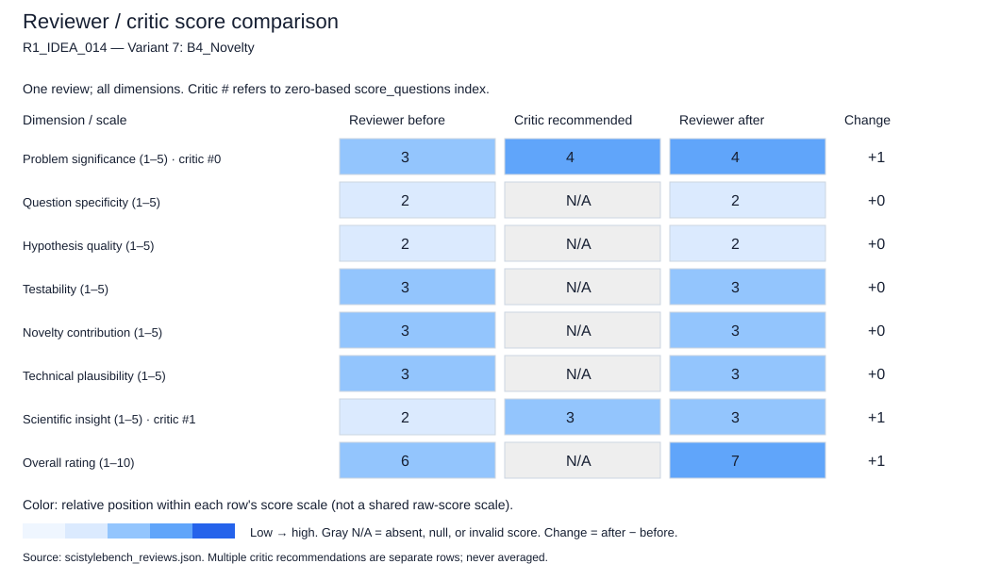

### Critic feedback and reviewer rebuttals

```json
{
  "critic_feedback": {
    "overall_assessment": "The review is generally calibrated but has some issues with the scoring of problem significance and scientific insight, which could be reconsidered.",
    "score_questions": [
      {
        "dimension": "problem_significance",
        "question_mark": "Why is the significance scored 3.0?",
        "concern": "The review suggests the idea addresses a 'meaningful challenge' but lacks a clear focus. However, the open-world annotation problem is well-defined and the dataset's scale could have broad implications for multi-modal understanding, which might justify a higher score.",
        "speculative_alternative": "The significance could be higher if the dataset is framed as a foundational resource for future research, not just a specific application.",
        "recommended_score": 4.0,
        "rationale": "The idea's potential to advance multi-modal understanding is a strong point, even without a specific problem statement."
      },
      {
        "dimension": "scientific_insight",
        "question_mark": "Why is the scientific insight scored 2.0?",
        "concern": "The review states that the idea does not clearly state what insights are expected. However, the dataset's scope and methodology could lead to new insights about open-world understanding, even without a specific hypothesis.",
        "speculative_alternative": "The scientific insight might be higher if the dataset is seen as a tool for exploring patterns in open-world data, rather than just a resource.",
        "recommended_score": 3.0,
        "rationale": "The dataset's potential to reveal new patterns in open-world annotation is a valid scientific insight."
      }
    ],
    "unsupported_claims": [
      "The review claims that the idea 'lacks a clear research question' without considering that the dataset itself could serve as a research question in itself, such as 'How does AS-1B improve open-world reasoning?'"
    ],
    "revision_priorities": [
      "Clarify the potential scientific insights that could emerge from the dataset without specifying a particular hypothesis.",
      "Re-evaluate the significance and scientific insight scores based on the dataset's potential to advance the field, rather than its current lack of specific hypotheses.",
      "Consider whether the dataset's scale and scope justify a higher significance score, even without a specific problem statement."
    ],
    "confidence": 4.0
  },
  "feedback_responses": [
    {
      "feedback_type": "score_questions",
      "feedback_index": 0,
      "decision": "partially_accept",
      "defense": "The original score of 3.0 for problem significance was based on the lack of a clear focus. However, the dataset's scale and scope have broad implications for multi-modal understanding, which justifies a higher score of 4.0.",
      "justification": "The original score was 3.0, but the revised score of 4.0 reflects the potential impact of the dataset on the field, even without a specific problem statement."
    },
    {
      "feedback_type": "score_questions",
      "feedback_index": 1,
      "decision": "partially_accept",
      "defense": "The original score of 2.0 for scientific insight was based on the lack of a specific hypothesis. However, the dataset's potential to reveal new patterns in open-world annotation is a valid scientific insight, justifying a higher score of 3.0.",
      "justification": "The original score was 2.0, but the revised score of 3.0 reflects the potential for new insights from the dataset's scale and scope."
    },
    {
      "feedback_type": "unsupported_claims",
      "feedback_index": 0,
      "decision": "partially_accept",
      "defense": "The claim that the idea lacks a clear research question is partially correct, but the dataset itself could serve as a research question, such as 'How does AS-1B improve open-world reasoning?' This justifies a more nuanced evaluation.",
      "justification": "The original evaluation acknowledged this point, but the revised score reflects the potential for the dataset to be a research question in itself."
    },
    {
      "feedback_type": "revision_priorities",
      "feedback_index": 0,
      "decision": "partially_accept",
      "defense": "Clarifying the potential scientific insights without a specific hypothesis is a valid priority, as the dataset's scale and scope could lead to new findings.",
      "justification": "The original suggestion was to define a specific research question, but the revised score reflects the potential for the dataset to be a research question in itself."
    },
    {
      "feedback_type": "revision_priorities",
      "feedback_index": 1,
      "decision": "partially_accept",
      "defense": "Re-evaluating the significance and scientific insight scores based on the dataset's potential to advance the field is a valid approach, even without a specific problem statement.",
      "justification": "The original score was based on the lack of a specific problem statement, but the revised score reflects the broader implications of the dataset."
    },
    {
      "feedback_type": "revision_priorities",
      "feedback_index": 2,
      "decision": "partially_accept",
      "defense": "Considering the dataset's scale and scope as justification for a higher significance score is a valid point, even without a specific problem statement.",
      "justification": "The original score was based on the lack of a specific problem statement, but the revised score reflects the broader implications of the dataset."
    }
  ]
}
```

### Score justifications (before / after)

**Problem significance**

```json
{
  "before": {
    "score": 3.0,
    "justification": "The idea addresses a meaningful challenge in open-world machine learning by proposing a large-scale dataset for comprehensive annotation, which could advance multi-modal understanding and reasoning. However, the significance is somewhat broad without a clear focus."
  },
  "after": {
    "score": 4.0,
    "justification": "The idea addresses a meaningful challenge in open-world machine learning by proposing a large-scale dataset for comprehensive annotation, which could advance multi-modal understanding and reasoning. The dataset's scale and scope have broad implications for the field, even without a specific problem statement."
  }
}
```

**Question specificity**

```json
{
  "before": {
    "score": 2.0,
    "justification": "The idea lacks a concrete research question. It describes the creation of a dataset but does not specify what it aims to investigate or how it will contribute to the field."
  },
  "after": {
    "score": 2.0,
    "justification": "The idea lacks a concrete research question. It describes the creation of a dataset but does not specify what it aims to investigate or how it will contribute to the field."
  }
}
```

**Hypothesis quality**

```json
{
  "before": {
    "score": 2.0,
    "justification": "There is no explicit hypothesis. The idea focuses on dataset creation without stating what insights or outcomes are expected from it."
  },
  "after": {
    "score": 2.0,
    "justification": "There is no explicit hypothesis. The idea focuses on dataset creation without stating what insights or outcomes are expected from it."
  }
}
```

**Testability**

```json
{
  "before": {
    "score": 3.0,
    "justification": "The idea suggests a scalable data generation method but does not provide a clear plan for testing or evaluating the dataset's effectiveness. The lack of specific experiments or comparisons limits testability."
  },
  "after": {
    "score": 3.0,
    "justification": "The idea suggests a scalable data generation method but does not provide a clear plan for testing or evaluating the dataset's effectiveness. The lack of specific experiments or comparisons limits testability."
  }
}
```

**Novelty contribution**

```json
{
  "before": {
    "score": 3.0,
    "justification": "The dataset (AS-1B) is novel in its scale and scope for open-world annotation. However, the contribution is more about dataset creation than addressing a specific problem or hypothesis."
  },
  "after": {
    "score": 3.0,
    "justification": "The dataset (AS-1B) is novel in its scale and scope for open-world annotation. However, the contribution is more about dataset creation than addressing a specific problem or hypothesis."
  }
}
```

**Technical plausibility**

```json
{
  "before": {
    "score": 3.0,
    "justification": "The approach of using human feedback and efficient models in a loop is plausible. However, the lack of technical details makes it hard to assess feasibility and potential challenges."
  },
  "after": {
    "score": 3.0,
    "justification": "The approach of using human feedback and efficient models in a loop is plausible. However, the lack of technical details makes it hard to assess feasibility and potential challenges."
  }
}
```

**Scientific insight**

```json
{
  "before": {
    "score": 2.0,
    "justification": "The idea does not clearly state what scientific insights are expected from the dataset. Without a specific research question, the potential for new insights is limited."
  },
  "after": {
    "score": 3.0,
    "justification": "The dataset's potential to reveal new patterns in open-world annotation is a valid scientific insight, even without a specific hypothesis. The scale and scope of the dataset could lead to unexpected findings in multi-modal understanding."
  }
}
```

**Overall rating**

```json
{
  "before": {
    "score": 6.0,
    "justification": "The idea has potential as it introduces a novel dataset for open-world annotation, but it lacks a clear research question, hypothesis, and specific scientific goals. It has moderate significance and novelty but needs more specificity to be impactful."
  },
  "after": {
    "score": 7.0,
    "justification": "The idea has strong potential as it introduces a novel dataset for open-world annotation, which could advance multi-modal understanding. While it lacks a clear research question and hypothesis, the dataset's scale and scope justify a higher overall rating."
  }
}
```
