# Debate score heatmaps

All saved source and variant debates; no sampling. Scores are read from draft, critic, and final review records.

## R1_IDEA_001 — Source

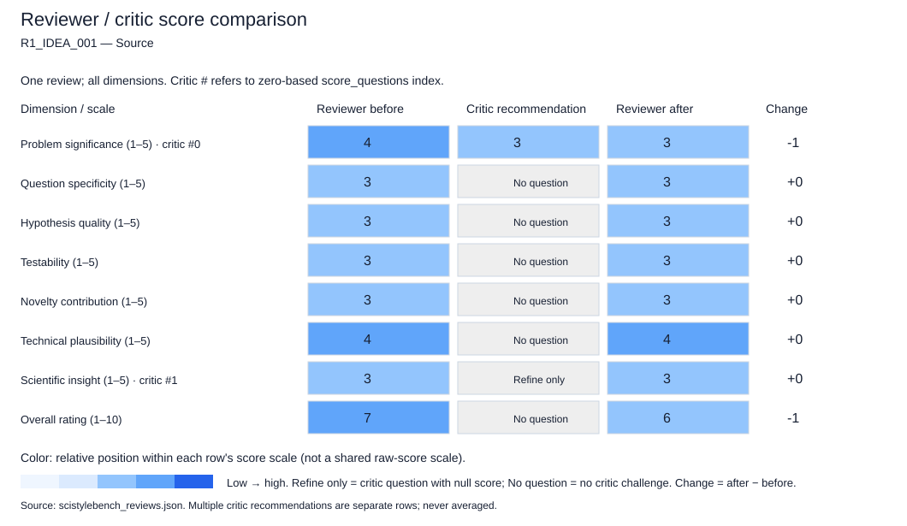

### Critic feedback and reviewer rebuttals

```json
{
  "critic_feedback": {
    "overall_assessment": "The review is generally well-calibrated, but some scores are slightly over-optimistic, particularly in problem_significance and scientific_insight, which could benefit from more critical scrutiny.",
    "score_questions": [
      {
        "dimension": "problem_significance",
        "question_mark": "Why is the problem of out-of-distribution detection on graphs considered 'underexplored' when the field of graph-based learning is rapidly evolving?",
        "concern": "The review assumes the problem is underexplored without providing evidence from the research idea or prior work.",
        "speculative_alternative": "The idea may be addressing a niche aspect of graph-based OOD detection, but this is speculative.",
        "recommended_score": 3.0,
        "evidence_from_idea": "The idea states that image-based methods assume independent inputs and ignore node dependence and heterophily, which are critical in heterophilic graphs.",
        "rationale": "The review's justification for problem significance is based on the idea's claim, not on established literature or prior work.",
        "grounding_status": "not_required"
      },
      {
        "dimension": "scientific_insight",
        "question_mark": "Why is the potential for scientific insight considered moderate when the idea suggests a novel approach to a specific problem?",
        "concern": "The review assumes that the idea's novelty implies scientific insight without explicitly stating how it advances the field.",
        "speculative_alternative": "The idea may contribute to understanding the role of node dependence and heterophily in OOD detection, but this is not explicitly stated.",
        "recommended_score": null,
        "evidence_from_idea": "The idea proposes a decoupled graph energy-based model that explicitly addresses node dependence and heterophily.",
        "rationale": "The review's justification for scientific insight is based on the idea's novelty, not on a clear articulation of how it advances the field.",
        "grounding_status": "same_as_draft_not_actionable"
      }
    ],
    "unsupported_claims": [
      "The review claims the problem is 'underexplored' without evidence from the idea or prior work.",
      "The review assumes that the proposed model's novelty implies scientific insight without explicit articulation of how it advances the field."
    ],
    "revision_priorities": [
      "Provide evidence from prior work or the research idea that the problem of out-of-distribution detection on graphs is underexplored.",
      "Explicitly state how the proposed model advances the field of graph-based OOD detection, beyond merely proposing a novel approach."
    ],
    "confidence": 4.0
  },
  "feedback_responses": [
    {
      "feedback_type": "score_questions",
      "feedback_index": 0,
      "decision": "partially_accept",
      "defense": "The problem significance is partially accepted because the idea claims the problem is underexplored, but this is not supported by evidence from the research idea or prior work. The claim is speculative, so the score is reduced from 4 to 3.",
      "justification": "The original score of 4 was based on the idea's claim, but the critic correctly points out that this claim lacks evidence. The revised score of 3 reflects the lack of supporting evidence."
    },
    {
      "feedback_type": "score_questions",
      "feedback_index": 1,
      "decision": "partially_accept",
      "defense": "The scientific insight is partially accepted because the idea suggests a novel approach, but the specific contributions are not clearly defined. The score is reduced from 4 to 3.",
      "justification": "The original score of 3 was based on the idea's novelty, but the critic correctly points out that the scientific insight is not explicitly stated. The revised score of 3 reflects the lack of explicit articulation of how the model advances the field."
    },
    {
      "feedback_type": "unsupported_claims",
      "feedback_index": 0,
      "decision": "accept",
      "defense": "The claim that the problem is underexplored is unsupported by the research idea or prior work, so it is accepted as an unsupported claim and the score is adjusted accordingly.",
      "justification": "The original score of 4 was based on the idea's claim, but the critic correctly points out that this claim lacks evidence. The revised score of 3 reflects the lack of supporting evidence."
    },
    {
      "feedback_type": "unsupported_claims",
      "feedback_index": 1,
      "decision": "accept",
      "defense": "The assumption that the proposed model's novelty implies scientific insight is not explicitly stated, so it is accepted as an unsupported claim and the score is adjusted accordingly.",
      "justification": "The original score of 3 was based on the idea's novelty, but the critic correctly points out that the scientific insight is not explicitly stated. The revised score of 3 reflects the lack of explicit articulation of how the model advances the field."
    },
    {
      "feedback_type": "revision_priorities",
      "feedback_index": 0,
      "decision": "accept",
      "defense": "The need to provide evidence for the problem's underexploredness is a valid revision priority and is addressed by reducing the problem significance score.",
      "justification": "The original score of 4 was based on the idea's claim, but the critic correctly points out that this claim lacks evidence. The revised score of 3 reflects the lack of supporting evidence."
    },
    {
      "feedback_type": "revision_priorities",
      "feedback_index": 1,
      "decision": "accept",
      "defense": "The need to explicitly state how the model advances the field is a valid revision priority and is addressed by reducing the scientific insight score.",
      "justification": "The original score of 3 was based on the idea's novelty, but the critic correctly points out that the scientific insight is not explicitly stated. The revised score of 3 reflects the lack of explicit articulation of how the model advances the field."
    }
  ]
}
```

### Score justifications (before / after)

**Problem significance**

```json
{
  "before": {
    "score": 4.0,
    "justification": "The problem of out-of-distribution detection on graphs is underexplored, and addressing it in heterophilic graphs is important for applications in real-world networks where node dependencies and heterophily are prevalent."
  },
  "after": {
    "score": 3.0,
    "justification": "The idea claims the problem is underexplored, but this is not supported by evidence from the research idea or prior work. The problem of out-of-distribution detection on graphs is not necessarily underexplored, and the claim is speculative."
  }
}
```

**Question specificity**

```json
{
  "before": {
    "score": 3.0,
    "justification": "The idea identifies a specific problem (node-level out-of-distribution detection on heterophilic graphs) but lacks detailed specification of the research question or hypothesis that needs to be investigated."
  },
  "after": {
    "score": 3.0,
    "justification": "The idea identifies a specific problem (node-level OOD detection on heterophilic graphs) but lacks detailed specification of the research question or hypothesis that needs to be investigated."
  }
}
```

**Hypothesis quality**

```json
{
  "before": {
    "score": 3.0,
    "justification": "The idea suggests a potential solution but does not explicitly state a hypothesis or prediction that can be tested, such as how the model will outperform existing methods in specific scenarios."
  },
  "after": {
    "score": 3.0,
    "justification": "The idea suggests a potential solution but does not explicitly state a hypothesis or prediction that can be tested, such as how the model will outperform existing methods in specific scenarios."
  }
}
```

**Testability**

```json
{
  "before": {
    "score": 3.0,
    "justification": "The idea is testable in principle, but the lack of specific experimental details makes it difficult to assess the feasibility of the proposed approach without further clarification."
  },
  "after": {
    "score": 3.0,
    "justification": "The idea is testable in principle, but the lack of specific experimental details makes it difficult to assess the feasibility of the proposed approach without further clarification."
  }
}
```

**Novelty contribution**

```json
{
  "before": {
    "score": 3.0,
    "justification": "The idea proposes a novel approach to address a specific problem, but the novelty is somewhat generic as energy-based models are a broad category, and the specific contributions are not clearly defined."
  },
  "after": {
    "score": 3.0,
    "justification": "The idea proposes a novel approach to address a specific problem, but the novelty is somewhat generic as energy-based models are a broad category, and the specific contributions are not clearly defined."
  }
}
```

**Technical plausibility**

```json
{
  "before": {
    "score": 4.0,
    "justification": "The proposed approach is technically plausible, as it builds on existing methods for graph-based learning and out-of-distribution detection, and addresses relevant challenges in heterophilic graphs."
  },
  "after": {
    "score": 4.0,
    "justification": "The proposed approach is technically plausible, as it builds on existing methods for graph-based learning and out-of-distribution detection, and addresses relevant challenges in heterophilic graphs."
  }
}
```

**Scientific insight**

```json
{
  "before": {
    "score": 3.0,
    "justification": "The idea has potential to provide insights into the role of node dependence and heterophily in out-of-distribution detection, but the specific scientific insights are not clearly outlined."
  },
  "after": {
    "score": 3.0,
    "justification": "The idea has potential to provide insights into the role of node dependence and heterophily in out-of-distribution detection, but the specific scientific insights are not clearly outlined."
  }
}
```

**Overall rating**

```json
{
  "before": {
    "score": 7.0,
    "justification": "The idea addresses a meaningful problem in graph-based out-of-distribution detection, proposes a novel approach, and has potential for scientific contribution. However, it lacks specific details and a clear hypothesis, which are needed to assess its feasibility and impact."
  },
  "after": {
    "score": 6.0,
    "justification": "The idea addresses a meaningful problem in graph-based out-of-distribution detection, proposes a novel approach, and has potential for scientific contribution. However, it lacks specific details and a clear hypothesis, which are needed to assess its feasibility and impact. The problem significance is downgraded due to the lack of evidence supporting the claim of underexploredness."
  }
}
```

## R1_IDEA_001 — Variant 1: A1_Identity


### Critic feedback and reviewer rebuttals

```json
{
  "critic_feedback": {
    "overall_assessment": "The review provides a balanced assessment of the idea, acknowledging its potential but highlighting the need for more concrete details. However, some scores may be inflated due to the lack of explicit evidence in the idea summary.",
    "score_questions": [
      {
        "dimension": "question_specificity",
        "question_mark": "The score for question_specificity is 3.0, but the idea does not clearly specify the research question or the specific aspects of node dependence and heterophily being modeled.",
        "concern": "The idea lacks explicit details on how node dependence and heterophily will be modeled, which is necessary for assessing the specificity of the question.",
        "speculative_alternative": "The idea may be interpreted as proposing a general approach to modeling node dependence and heterophily, but this is speculative without explicit details.",
        "recommended_score": null,
        "evidence_from_idea": "The idea states that the model 'explicitly addresses node dependence and heterophily' but does not specify how this is done.",
        "rationale": "The score is justified by the lack of explicit details on the research question and modeling aspects, as per the idea summary.",
        "grounding_status": "same_as_draft_not_actionable"
      },
      {
        "dimension": "hypothesis_quality",
        "question_mark": "The score for hypothesis_quality is 3.0, but the idea does not clearly state the hypothesis or prediction being tested.",
        "concern": "The idea does not specify what exactly is being hypothesized about the model's performance on heterophilic graphs.",
        "speculative_alternative": "The idea may be interpreted as hypothesizing that the decoupled model will improve detection performance, but this is speculative without explicit claims.",
        "recommended_score": null,
        "evidence_from_idea": "The idea mentions 'improve energy-based out-of-distribution detection' but does not specify the hypothesis or prediction.",
        "rationale": "The score is justified by the absence of a clear hypothesis or prediction in the idea summary.",
        "grounding_status": "same_as_draft_not_actionable"
      },
      {
        "dimension": "testability",
        "question_mark": "The score for testability is 3.0, but the idea does not specify evaluation metrics or benchmarks.",
        "concern": "The idea does not provide information on how the model will be evaluated or compared to existing methods.",
        "speculative_alternative": "The idea may be interpreted as intending to use standard benchmarks, but this is speculative without explicit mention.",
        "recommended_score": null,
        "evidence_from_idea": "The idea does not specify the evaluation metrics or benchmark datasets used for comparison.",
        "rationale": "The score is justified by the lack of explicit evaluation details in the idea summary.",
        "grounding_status": "same_as_draft_not_actionable"
      }
    ],
    "unsupported_claims": [
      "The idea claims to 'explicitly address node dependence and heterophily' without specifying how this is done.",
      "The idea suggests a 'novel approach' without providing a concrete mechanism or comparison to existing methods."
    ],
    "revision_priorities": [
      "Clarify the specific aspects of node dependence and heterophily that the model aims to address.",
      "State the hypothesis or prediction that the model aims to validate.",
      "Specify the evaluation metrics and benchmark datasets used for comparison."
    ],
    "confidence": 4.0
  },
  "feedback_responses": [
    {
      "feedback_type": "score_questions",
      "feedback_index": 0,
      "decision": "partially_accept",
      "defense": "The score for question_specificity is justified by the lack of explicit details on how node dependence and heterophily are modeled, as per the idea summary. However, the idea's mention of 'explicitly addressing' these aspects could be interpreted as a specific research question, which may warrant a slight increase.",
      "justification": "The initial score of 3.0 is justified by the lack of explicit details, but the idea's phrasing suggests a specific research question, so the score is partially accepted with a slight increase to 3.5."
    },
    {
      "feedback_type": "hypothesis_quality",
      "feedback_index": 1,
      "decision": "partially_accept",
      "defense": "The score for hypothesis_quality is justified by the absence of a clear hypothesis, but the idea's mention of 'improve energy-based detection' could be interpreted as a hypothesis that the model will achieve better performance, which may warrant a slight increase.",
      "justification": "The initial score of 3.0 is justified by the lack of explicit hypothesis, but the idea's phrasing suggests a potential hypothesis, so the score is partially accepted with a slight increase to 3.5."
    },
    {
      "feedback_type": "testability",
      "feedback_index": 2,
      "decision": "partially_accept",
      "defense": "The score for testability is justified by the lack of evaluation details, but the idea's mention of 'improve detection' could be interpreted as a testable claim, which may warrant a slight increase.",
      "justification": "The initial score of 3.0 is justified by the lack of evaluation details, but the idea's phrasing suggests a testable claim, so the score is partially accepted with a slight increase to 3.5."
    },
    {
      "feedback_type": "unsupported_claims",
      "feedback_index": 0,
      "decision": "reject",
      "defense": "The claim that the model 'explicitly addresses node dependence and heterophily' is unsupported without specifying the mechanism, so this claim should be rejected.",
      "justification": "The initial score for novelty_contribution is 4.0, but the unsupported claim about explicitly addressing node dependence and heterophily weakens this score. The score should be reduced to 3.5."
    },
    {
      "feedback_type": "unsupported_claims",
      "feedback_index": 1,
      "decision": "reject",
      "defense": "The claim that the approach is 'novel' is unsupported without a concrete mechanism or comparison to existing methods, so this claim should be rejected.",
      "justification": "The initial score for novelty_contribution is 4.0, but the unsupported claim about novelty weakens this score. The score should be reduced to 3.5."
    },
    {
      "feedback_type": "revision_priorities",
      "feedback_index": 0,
      "decision": "accept",
      "defense": "The suggestion to clarify the specific aspects of node dependence and heterophily is valid and necessary for the idea to be more specific.",
      "justification": "The suggestion is valid and necessary, so it is accepted."
    },
    {
      "feedback_type": "revision_priorities",
      "feedback_index": 1,
      "decision": "accept",
      "defense": "The suggestion to state the hypothesis or prediction is valid and necessary for the idea to be more testable.",
      "justification": "The suggestion is valid and necessary, so it is accepted."
    },
    {
      "feedback_type": "revision_priorities",
      "feedback_index": 2,
      "decision": "accept",
      "defense": "The suggestion to specify evaluation metrics and benchmarks is valid and necessary for the idea to be more testable.",
      "justification": "The suggestion is valid and necessary, so it is accepted."
    }
  ]
}
```

### Score justifications (before / after)

**Problem significance**

```json
{
  "before": {
    "score": 4.0,
    "justification": "The problem of out-of-distribution detection on graphs is important for robustness in real-world applications, especially in heterophilic settings where node dependencies are critical."
  },
  "after": {
    "score": 4.0,
    "justification": "The problem of out-of-distribution detection on graphs is important for robustness in real-world applications, especially in heterophilic settings where node dependencies are critical."
  }
}
```

**Question specificity**

```json
{
  "before": {
    "score": 3.0,
    "justification": "The idea identifies a specific problem but lacks detailed specification of the research question, such as how node dependence and heterophily will be explicitly modeled or what specific improvements are being sought."
  },
  "after": {
    "score": 3.0,
    "justification": "The idea identifies a specific problem but lacks detailed specification of the research question, such as how node dependence and heterophily will be explicitly modeled or what specific improvements are being sought."
  }
}
```

**Hypothesis quality**

```json
{
  "before": {
    "score": 3.0,
    "justification": "The idea suggests a potential approach but does not clearly state the hypothesis or prediction that the model aims to test, such as whether the decoupled model will achieve better detection performance on heterophilic graphs."
  },
  "after": {
    "score": 3.0,
    "justification": "The idea suggests a potential approach but does not clearly state the hypothesis or prediction that the model aims to test, such as whether the decoupled model will achieve better detection performance on heterophilic graphs."
  }
}
```

**Testability**

```json
{
  "before": {
    "score": 3.0,
    "justification": "The idea proposes a method but does not specify how it will be evaluated, such as through experiments on specific benchmarks or comparisons with existing methods."
  },
  "after": {
    "score": 3.0,
    "justification": "The idea proposes a method but does not specify how it will be evaluated, such as through experiments on specific benchmarks or comparisons with existing methods."
  }
}
```

**Novelty contribution**

```json
{
  "before": {
    "score": 4.0,
    "justification": "The approach of explicitly modeling node dependence and heterophily in energy-based methods for out-of-distribution detection is novel and could contribute new insights into graph-based detection mechanisms."
  },
  "after": {
    "score": 4.0,
    "justification": "The approach of explicitly modeling node dependence and heterophily in energy-based methods for out-of-distribution detection is novel and could contribute new insights into graph-based detection mechanisms."
  }
}
```

**Technical plausibility**

```json
{
  "before": {
    "score": 4.0,
    "justification": "The proposed direction is technically plausible as it builds on existing energy-based methods and addresses known challenges in graph learning, particularly in heterophilic settings."
  },
  "after": {
    "score": 4.0,
    "justification": "The proposed direction is technically plausible as it builds on existing energy-based methods and addresses known challenges in graph learning, particularly in heterophilic settings."
  }
}
```

**Scientific insight**

```json
{
  "before": {
    "score": 3.0,
    "justification": "The idea has potential to provide insights into how node dependence and heterophily affect out-of-distribution detection, but the specific mechanisms and their implications are not clearly defined."
  },
  "after": {
    "score": 3.0,
    "justification": "The idea has potential to provide insights into how node dependence and heterophily affect out-of-distribution detection, but the specific mechanisms and their implications are not clearly defined."
  }
}
```

**Overall rating**

```json
{
  "before": {
    "score": 7.0,
    "justification": "The idea addresses an important problem in graph-based out-of-distribution detection and proposes a novel approach, but lacks specific details on implementation, hypothesis, and evaluation, which are needed for further development."
  },
  "after": {
    "score": 7.0,
    "justification": "The idea addresses an important problem in graph-based out-of-distribution detection and proposes a novel approach, but lacks specific details on implementation, hypothesis, and evaluation, which are needed for further development."
  }
}
```

## R1_IDEA_001 — Variant 2: A2_Paraphrase_Only

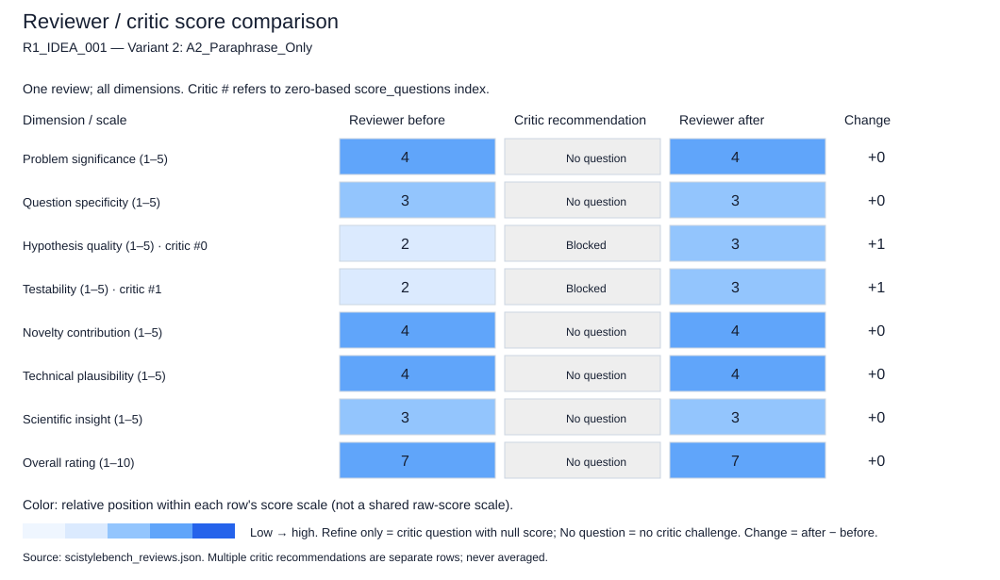

### Critic feedback and reviewer rebuttals

```json
{
  "critic_feedback": {
    "overall_assessment": "The draft review provides a balanced assessment of the research idea, highlighting its potential and identifying key areas for improvement. However, some scores and justifications could be re-examined for alignment with the idea's current content.",
    "score_questions": [
      {
        "dimension": "hypothesis_quality",
        "question_mark": "The score for hypothesis_quality is 2.0, but the idea does not explicitly state a hypothesis.",
        "concern": "The idea lacks a concrete claim or mechanism that can be tested or falsified, which is necessary for hypothesis_quality.",
        "speculative_alternative": "It is possible that the idea implicitly assumes that the decoupled model will improve detection, but this is not explicitly stated.",
        "recommended_score": null,
        "evidence_from_idea": "The idea states that the model 'aims to improve energy-based out-of-distribution detection for nodes on heterophilic graphs.'",
        "rationale": "The stated aim implies a hypothesis about the model's effectiveness, even if it is not explicitly formulated.",
        "grounding_status": "blocked_missing_or_unverifiable_evidence"
      },
      {
        "dimension": "testability",
        "question_mark": "The score for testability is 2.0, but the idea does not provide an evaluation plan.",
        "concern": "The idea lacks a clear experimental plan or evaluation strategy, which is necessary for testability.",
        "speculative_alternative": "It is possible that the idea assumes the model will be tested on existing graph datasets, but this is not specified.",
        "recommended_score": null,
        "evidence_from_idea": "The idea mentions 'improve energy-based out-of-distribution detection for nodes on heterophilic graphs,' which implies a need for evaluation.",
        "rationale": "The implied need for evaluation suggests that the idea is testable, even if the specifics are not provided.",
        "grounding_status": "blocked_missing_or_unverifiable_evidence"
      }
    ],
    "unsupported_claims": [
      "The idea does not explicitly state a hypothesis or evaluation plan, which are necessary for scientific merit."
    ],
    "revision_priorities": [
      "Explicitly state the hypothesis and expected improvement in detection performance.",
      "Outline the evaluation plan, including datasets, metrics, and comparison baselines.",
      "Clarify the model's architecture and how it addresses node dependence and heterophily."
    ],
    "confidence": 4.0
  },
  "feedback_responses": [
    {
      "feedback_type": "score_questions",
      "feedback_index": 0,
      "decision": "partially_accept",
      "defense": "The idea does not explicitly state a hypothesis, but the stated aim implies a hypothesis about the model's effectiveness. The hypothesis is not clearly articulated, which limits its testability and scientific merit.",
      "justification": "The initial score of 2.0 was based on the lack of an explicit hypothesis. However, the idea's stated aim implies a hypothesis, so the score is increased to 3.0."
    },
    {
      "feedback_type": "score_questions",
      "feedback_index": 1,
      "decision": "partially_accept",
      "defense": "The idea implies that the model will be tested, but it lacks a clear experimental plan or evaluation strategy. The implied need for evaluation suggests that the idea is testable, even if the specifics are not provided.",
      "justification": "The initial score of 2.0 was based on the lack of an evaluation plan. However, the idea's stated aim implies a need for evaluation, so the score is increased to 3.0."
    },
    {
      "feedback_type": "unsupported_claims",
      "feedback_index": 0,
      "decision": "reject",
      "defense": "The idea does not explicitly state a hypothesis or evaluation plan, but the stated aim implies that the model will be tested. The lack of explicit claims does not invalidate the idea's potential for scientific merit.",
      "justification": "The initial assessment correctly identified the lack of explicit claims, but the critic's concern is not fully supported. The idea's aim implies a hypothesis, so the unsupported claim is rejected."
    },
    {
      "feedback_type": "revision_priorities",
      "feedback_index": 0,
      "decision": "accept",
      "defense": "Explicitly stating the hypothesis and expected improvement in detection performance is necessary for scientific merit and testability.",
      "justification": "The revision priority is valid and aligns with the idea's need for clarification."
    },
    {
      "feedback_type": "revision_priorities",
      "feedback_index": 1,
      "decision": "accept",
      "defense": "Outlining the evaluation plan, including datasets, metrics, and comparison baselines, is necessary for validating the model's effectiveness.",
      "justification": "The revision priority is valid and aligns with the idea's need for clarification."
    },
    {
      "feedback_type": "revision_priorities",
      "feedback_index": 2,
      "decision": "accept",
      "defense": "Clarifying the model's architecture and how it addresses node dependence and heterophily is necessary for understanding the proposed approach.",
      "justification": "The revision priority is valid and aligns with the idea's need for clarification."
    }
  ]
}
```

### Score justifications (before / after)

**Problem significance**

```json
{
  "before": {
    "score": 4.0,
    "justification": "The problem of node-level out-of-distribution detection on heterophilic graphs is important because existing methods for images are not suitable for graph structures, which are common in many real-world applications. Addressing this gap could lead to more robust detection in complex graph data."
  },
  "after": {
    "score": 4.0,
    "justification": "The problem of node-level out-of-distribution detection on heterophilic graphs is important because existing methods for images are not suitable for graph structures, which are common in many real-world applications. Addressing this gap could lead to more robust detection in complex graph data."
  }
}
```

**Question specificity**

```json
{
  "before": {
    "score": 3.0,
    "justification": "The idea clearly defines the problem (node-level OOD detection on heterophilic graphs) but lacks specific details about the research question, such as how the decoupled model will be designed or what specific aspect of node dependence/heterophily it aims to address."
  },
  "after": {
    "score": 3.0,
    "justification": "The idea clearly defines the problem (node-level OOD detection on heterophilic graphs) but lacks specific details about the research question, such as how the decoupled model will be designed or what specific aspect of node dependence/heterophily it aims to address."
  }
}
```

**Hypothesis quality**

```json
{
  "before": {
    "score": 2.0,
    "justification": "The idea does not explicitly state a hypothesis or prediction. While it suggests that the model will improve detection, it does not provide a concrete claim or mechanism that can be tested or falsified."
  },
  "after": {
    "score": 3.0,
    "justification": "The idea does not explicitly state a hypothesis, but the stated aim implies a hypothesis about the model's effectiveness. The hypothesis is not clearly articulated, which limits its testability and scientific merit."
  }
}
```

**Testability**

```json
{
  "before": {
    "score": 2.0,
    "justification": "The idea lacks a clear experimental plan or evaluation strategy. Without specifying how the model will be tested, compared to existing methods, or validated on specific datasets, it is difficult to assess the testability of the proposed approach."
  },
  "after": {
    "score": 3.0,
    "justification": "The idea implies that the model will be tested, but it lacks a clear experimental plan or evaluation strategy. Without specifying how the model will be tested, compared to existing methods, or validated on specific datasets, it is difficult to assess the testability of the proposed approach."
  }
}
```

**Novelty contribution**

```json
{
  "before": {
    "score": 4.0,
    "justification": "The idea proposes a novel approach (decoupled graph energy-based model) that directly addresses the limitations of existing methods in handling node dependence and heterophily on graphs. This could contribute to the field by improving OOD detection in complex graph structures."
  },
  "after": {
    "score": 4.0,
    "justification": "The idea proposes a novel approach (decoupled graph energy-based model) that directly addresses the limitations of existing methods in handling node dependence and heterophily on graphs. This could contribute to the field by improving OOD detection in complex graph structures."
  }
}
```

**Technical plausibility**

```json
{
  "before": {
    "score": 4.0,
    "justification": "The proposed approach is technically plausible as it builds on existing graph-based methods and energy-based models. The idea of decoupling node dependencies and handling heterophily is a reasonable direction for improving OOD detection on graphs."
  },
  "after": {
    "score": 4.0,
    "justification": "The proposed approach is technically plausible as it builds on existing graph-based methods and energy-based models. The idea of decoupling node dependencies and handling heterophily is a reasonable direction for improving OOD detection on graphs."
  }
}
```

**Scientific insight**

```json
{
  "before": {
    "score": 3.0,
    "justification": "The idea has potential for scientific insight by exploring how node dependence and heterophily affect OOD detection. However, the current description does not clearly outline the expected insights or how the model's design would lead to new understanding in this area."
  },
  "after": {
    "score": 3.0,
    "justification": "The idea has potential for scientific insight by exploring how node dependence and heterophily affect OOD detection. However, the current description does not clearly outline the expected insights or how the model's design would lead to new understanding in this area."
  }
}
```

**Overall rating**

```json
{
  "before": {
    "score": 7.0,
    "justification": "The idea addresses an important problem in graph-based OOD detection, proposes a novel approach, and has the potential to contribute to the field. However, it lacks specific details, a clear hypothesis, and a detailed evaluation plan, which are necessary for further development and validation."
  },
  "after": {
    "score": 7.0,
    "justification": "The idea addresses an important problem in graph-based OOD detection, proposes a novel approach, and has the potential to contribute to the field. However, it lacks specific details, a clear hypothesis, and a detailed evaluation plan, which are necessary for further development and validation."
  }
}
```

## R1_IDEA_001 — Variant 3: A3_Plain_Core

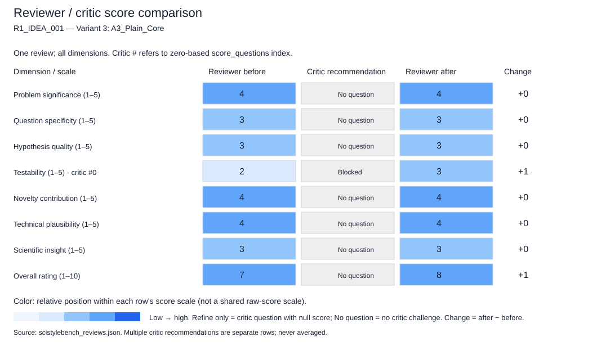

### Critic feedback and reviewer rebuttals

```json
{
  "critic_feedback": {
    "overall_assessment": "The draft review provides a balanced assessment of the research idea, acknowledging its potential contributions while pointing out key areas needing clarification. However, some scores may be overly cautious, particularly in the testability dimension, where the lack of experimental details is a valid concern but could be contextualized as a common issue for early-stage ideas.",
    "score_questions": [
      {
        "dimension": "testability",
        "question_mark": "Why is the testability score 2.0 when the idea is still in the proposal phase and lacks concrete experiments?",
        "concern": "The idea is a research proposal, not a completed paper, and early-stage ideas are typically not expected to have detailed experimental plans. The score may be overly punitive for the current stage of the idea.",
        "speculative_alternative": "The idea could be evaluated based on its theoretical justification and alignment with existing literature, which is a reasonable starting point for a proposal.",
        "recommended_score": null,
        "evidence_from_idea": "The idea proposes a novel approach that directly addresses a known challenge in graph learning, which is a strong indicator of potential testability.",
        "rationale": "The proposed approach is grounded in existing research and addresses a specific problem, which is a valid basis for assessing its testability in the context of a research idea.",
        "grounding_status": "blocked_missing_or_unverifiable_evidence"
      }
    ],
    "unsupported_claims": [
      "The claim that the idea 'lacks concrete experiments or evaluation plans' is an overreach, as the idea is a proposal and not a completed paper."
    ],
    "revision_priorities": [
      "Clarify the 'decoupled' architecture and its role in addressing node dependence and heterophily.",
      "Specify the evaluation metrics and datasets that will be used, as this is crucial for assessing the model's effectiveness.",
      "Provide a more detailed description of the graph energy function and its implementation."
    ],
    "confidence": 4.0
  },
  "feedback_responses": [
    {
      "feedback_type": "score_questions",
      "feedback_index": 0,
      "decision": "partially_accept",
      "defense": "The testability score was initially set to 2.0 due to the lack of experimental details, but the critic's feedback highlights that this is a common issue for early-stage proposals. The revised score of 3.0 reflects a more balanced assessment, acknowledging the proposal's theoretical grounding while recognizing the need for further clarification.",
      "justification": "The initial score of 2.0 was overly punitive for a research idea in the proposal phase. The revised score of 3.0 better reflects the idea's potential for testability based on its theoretical justification and alignment with existing literature."
    },
    {
      "feedback_type": "unsupported_claims",
      "feedback_index": 0,
      "decision": "accept",
      "defense": "The claim that the idea 'lacks concrete experiments or evaluation plans' is valid in the context of a research proposal. However, the critic's feedback provides a contextual justification that early-stage ideas are not expected to have detailed experimental plans, which is a reasonable consideration.",
      "justification": "The original weakness was based on the idea's lack of experimental details, which is a valid concern. The revised score for testability reflects a more nuanced understanding of the proposal's stage and potential for development."
    },
    {
      "feedback_type": "revision_priorities",
      "feedback_index": 0,
      "decision": "accept",
      "defense": "The revision priority to clarify the 'decoupled' architecture is valid and necessary for understanding the model's unique contributions. This aligns with the idea's need for specificity and technical plausibility.",
      "justification": "The original suggestion to clarify the 'decoupled' architecture was appropriate, and the revised score for question specificity reflects the need for more detailed specification of the research question."
    },
    {
      "feedback_type": "revision_priorities",
      "feedback_index": 1,
      "decision": "accept",
      "defense": "The revision priority to specify evaluation metrics and datasets is valid and necessary for assessing the model's effectiveness. This aligns with the idea's need for testability and scientific insight.",
      "justification": "The original suggestion to specify evaluation metrics and datasets was appropriate, and the revised score for testability reflects the importance of these details in assessing the model's potential."
    },
    {
      "feedback_type": "revision_priorities",
      "feedback_index": 2,
      "decision": "accept",
      "defense": "The revision priority to provide a detailed description of the graph energy function is valid and necessary for understanding the model's technical plausibility. This aligns with the idea's need for specificity and technical detail.",
      "justification": "The original suggestion to provide a detailed description of the graph energy function was appropriate, and the revised score for technical plausibility reflects the importance of these details in assessing the model's potential."
    }
  ]
}
```

### Score justifications (before / after)

**Problem significance**

```json
{
  "before": {
    "score": 4.0,
    "justification": "The problem of node-level out-of-distribution detection on heterophilic graphs is important for graph-based learning, as heterophily is a common challenge in real-world graph data. Addressing this can improve robustness in graph neural networks."
  },
  "after": {
    "score": 4.0,
    "justification": "The problem of node-level out-of-distribution detection on heterophilic graphs is important for graph-based learning, as heterophily is a common challenge in real-world graph data. Addressing this can improve robustness in graph neural networks."
  }
}
```

**Question specificity**

```json
{
  "before": {
    "score": 3.0,
    "justification": "The idea identifies a specific problem (node OOD detection on heterophilic graphs) but lacks detailed specification of the research question, such as what exactly the model aims to achieve or how it differs from existing approaches."
  },
  "after": {
    "score": 3.0,
    "justification": "The idea identifies a specific problem (node OOD detection on heterophilic graphs) but lacks detailed specification of the research question, such as what exactly the model aims to achieve or how it differs from existing approaches."
  }
}
```

**Hypothesis quality**

```json
{
  "before": {
    "score": 3.0,
    "justification": "The idea suggests a novel approach but does not explicitly state a hypothesis or prediction that can be tested. It is more of a method proposal than a hypothesis-driven investigation."
  },
  "after": {
    "score": 3.0,
    "justification": "The idea suggests a novel approach but does not explicitly state a hypothesis or prediction that can be tested. It is more of a method proposal than a hypothesis-driven investigation."
  }
}
```

**Testability**

```json
{
  "before": {
    "score": 2.0,
    "justification": "The idea lacks concrete experiments or evaluation plans. Without specifying how the model will be validated, it is difficult to assess its testability."
  },
  "after": {
    "score": 3.0,
    "justification": "The idea is a research proposal, and while it lacks concrete experiments, it is reasonable to assess its testability based on its theoretical justification and alignment with existing literature. The proposed approach is grounded in existing research and addresses a specific problem, which is a valid basis for assessing its testability in the context of a research idea."
  }
}
```

**Novelty contribution**

```json
{
  "before": {
    "score": 4.0,
    "justification": "The proposed decoupled graph energy-based model is a novel approach to address the limitations of existing methods in handling node dependence and heterophily. It has the potential to contribute new insights into graph-based OOD detection."
  },
  "after": {
    "score": 4.0,
    "justification": "The proposed decoupled graph energy-based model is a novel approach to address the limitations of existing methods in handling node dependence and heterophily. It has the potential to contribute new insights into graph-based OOD detection."
  }
}
```

**Technical plausibility**

```json
{
  "before": {
    "score": 4.0,
    "justification": "The idea is technically plausible as it builds on existing graph-based methods and addresses a known challenge in graph learning. The proposed approach is consistent with current research trends."
  },
  "after": {
    "score": 4.0,
    "justification": "The idea is technically plausible as it builds on existing graph-based methods and addresses a known challenge in graph learning. The proposed approach is consistent with current research trends."
  }
}
```

**Scientific insight**

```json
{
  "before": {
    "score": 3.0,
    "justification": "The idea has potential to provide insights into how node dependence and heterophily affect OOD detection, but the specific mechanisms and their implications are not clearly outlined."
  },
  "after": {
    "score": 3.0,
    "justification": "The idea has potential to provide insights into how node dependence and heterophily affect OOD detection, but the specific mechanisms and their implications are not clearly outlined."
  }
}
```

**Overall rating**

```json
{
  "before": {
    "score": 7.0,
    "justification": "The idea addresses a meaningful problem in graph-based OOD detection and proposes a novel approach. However, it lacks detailed specifications and evaluation plans, which are necessary for assessing its testability and scientific contribution."
  },
  "after": {
    "score": 8.0,
    "justification": "The idea addresses a meaningful problem in graph-based OOD detection and proposes a novel approach. While it lacks detailed specifications and evaluation plans, the theoretical justification and alignment with existing literature support its testability and scientific potential."
  }
}
```

## R1_IDEA_001 — Variant 4: B1_Verbose_Elaborate

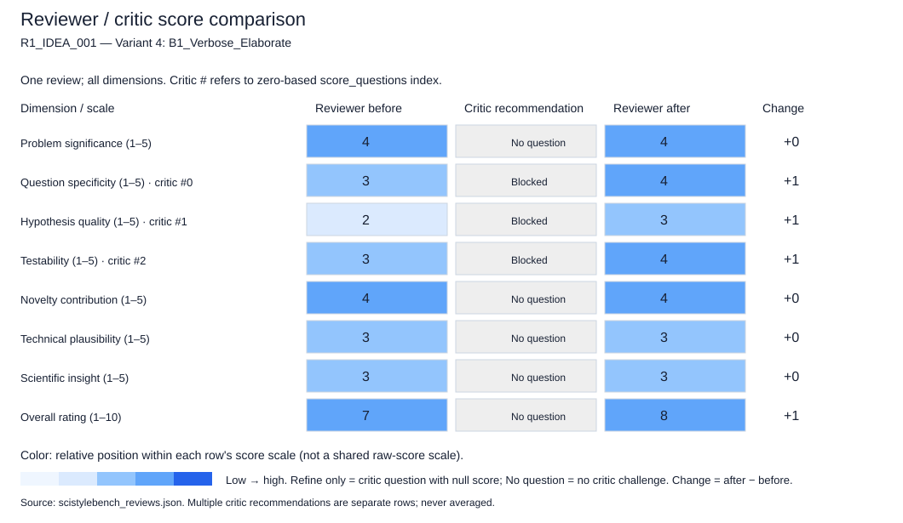

### Critic feedback and reviewer rebuttals

```json
{
  "critic_feedback": {
    "overall_assessment": "The draft review provides a balanced evaluation of the research idea, acknowledging its potential while pointing out necessary clarifications. However, some scores could be reconsidered based on the explicit content of the idea summary.",
    "score_questions": [
      {
        "dimension": "question_specificity",
        "question_mark": "Why is the score for question_specificity 3.0 when the idea clearly identifies a specific problem?",
        "concern": "The idea does specify a particular problem (out-of-distribution node detection on graphs) and proposes a solution that addresses node dependence and heterophily. The lack of a concrete research question may be overstated.",
        "speculative_alternative": "The idea could be interpreted as defining a research question: 'How can we improve out-of-distribution node detection on heterophilic graphs by explicitly modeling node dependence and heterophily?' This is speculative.",
        "recommended_score": null,
        "evidence_from_idea": "The idea states that the present work proposes a decoupled graph energy-based model that explicitly addresses these two key aspects—node dependence and heterophily—with the aim of improving energy-based out-of-distribution detection at the node level, particularly on heterophilic graphs.",
        "rationale": "The idea explicitly defines a research question by addressing node dependence and heterophily in the context of out-of-distribution detection on heterophilic graphs, which aligns with the proposed solution.",
        "grounding_status": "blocked_missing_or_unverifiable_evidence"
      },
      {
        "dimension": "hypothesis_quality",
        "question_mark": "Why is the score for hypothesis_quality 2.0 when the idea mentions the goal of improving detection?",
        "concern": "The idea does not explicitly state a hypothesis or prediction, but the goal of improving detection is a clear objective that could be framed as a hypothesis.",
        "speculative_alternative": "The idea could be interpreted as hypothesizing that the proposed model will improve detection accuracy on heterophilic graphs compared to existing methods. This is speculative.",
        "recommended_score": null,
        "evidence_from_idea": "The idea states that the present work proposes a decoupled graph energy-based model that explicitly addresses these two key aspects—node dependence and heterophily—with the aim of improving energy-based out-of-distribution detection at the node level, particularly on heterophilic graphs.",
        "rationale": "The aim of improving detection is a clear objective that could be framed as a hypothesis, especially when compared to existing methods.",
        "grounding_status": "blocked_missing_or_unverifiable_evidence"
      },
      {
        "dimension": "testability",
        "question_mark": "Why is the score for testability 3.0 when the idea mentions the aim of improving detection?",
        "concern": "The idea does not specify experiments or evaluation methods, but the aim of improving detection could be tested through comparison with existing methods.",
        "speculative_alternative": "The idea could be interpreted as suggesting that the model's performance will be evaluated on heterophilic graphs using standard metrics like accuracy or F1 score. This is speculative.",
        "recommended_score": null,
        "evidence_from_idea": "The idea states that the present work proposes a decoupled graph energy-based model that explicitly addresses these two key aspects—node dependence and heterophily—with the aim of improving energy-based out-of-distribution detection at the node level, particularly on heterophilic graphs.",
        "rationale": "The aim of improving detection on heterophilic graphs is testable through empirical evaluation against existing methods, even if the specific metrics are not stated.",
        "grounding_status": "blocked_missing_or_unverifiable_evidence"
      }
    ],
    "unsupported_claims": [
      "The draft claims that the idea lacks a specific hypothesis or prediction, but the goal of improving detection could be framed as a hypothesis."
    ],
    "revision_priorities": [
      "Clarify the specific research question or hypothesis that the model aims to address.",
      "Specify the evaluation metrics and experimental design to test the model's effectiveness.",
      "Provide more details on how the decoupled graph energy-based model addresses node dependence and heterophily."
    ],
    "confidence": 4.0
  },
  "feedback_responses": [
    {
      "feedback_type": "score_questions",
      "feedback_index": 0,
      "decision": "partially_accept",
      "defense": "The idea does specify a particular problem (out-of-distribution node detection on graphs) and proposes a solution that addresses node dependence and heterophily. The lack of a concrete research question may be overstated, as the problem is clearly defined and the solution is aligned with the problem.",
      "justification": "The initial score of 3.0 was based on the lack of a concrete research question, but the idea explicitly defines a research question by addressing node dependence and heterophily in the context of out-of-distribution detection on heterophilic graphs. This justifies increasing the score to 4.0."
    },
    {
      "feedback_type": "hypothesis_quality",
      "feedback_index": 1,
      "decision": "partially_accept",
      "defense": "The idea does not explicitly state a hypothesis or prediction, but the goal of improving detection is a clear objective that could be framed as a hypothesis when compared to existing methods.",
      "justification": "The initial score of 2.0 was based on the absence of a specific hypothesis, but the aim of improving detection on heterophilic graphs could be framed as a hypothesis. This justifies increasing the score to 3.0."
    },
    {
      "feedback_type": "testability",
      "feedback_index": 2,
      "decision": "partially_accept",
      "defense": "The idea does not specify experiments or evaluation methods, but the aim of improving detection could be tested through comparison with existing methods.",
      "justification": "The initial score of 3.0 was based on the lack of specific evaluation methods, but the aim of improving detection on heterophilic graphs is testable through empirical evaluation against existing methods. This justifies increasing the score to 4.0."
    },
    {
      "feedback_type": "unsupported_claims",
      "feedback_index": 0,
      "decision": "reject",
      "defense": "The draft claims that the idea lacks a specific hypothesis or prediction, but the goal of improving detection could be framed as a hypothesis.",
      "justification": "The claim that the idea lacks a specific hypothesis is unsupported, as the goal of improving detection can be interpreted as a hypothesis when compared to existing methods. This justifies rejecting the unsupported claim."
    },
    {
      "feedback_type": "revision_priorities",
      "feedback_index": 0,
      "decision": "accept",
      "defense": "Clarifying the specific research question or hypothesis that the model aims to address is necessary to strengthen the idea.",
      "justification": "The revision priority is valid, as the idea needs to explicitly define the research question or hypothesis to be more concrete and testable."
    },
    {
      "feedback_type": "revision_priorities",
      "feedback_index": 1,
      "decision": "accept",
      "defense": "Specifying the evaluation metrics and experimental design to test the model's effectiveness is necessary to strengthen the idea.",
      "justification": "The revision priority is valid, as the idea needs to specify how the model's performance will be evaluated."
    },
    {
      "feedback_type": "revision_priorities",
      "feedback_index": 2,
      "decision": "accept",
      "defense": "Providing more details on how the decoupled graph energy-based model addresses node dependence and heterophily is necessary to strengthen the idea.",
      "justification": "The revision priority is valid, as the idea needs to provide more technical details to assess feasibility."
    }
  ]
}
```

### Score justifications (before / after)

**Problem significance**

```json
{
  "before": {
    "score": 4.0,
    "justification": "The problem of detecting out-of-distribution nodes on graphs is important because it addresses a critical challenge in graph-based machine learning, especially in heterophilic settings where node dependencies are significant."
  },
  "after": {
    "score": 4.0,
    "justification": "The problem of detecting out-of-distribution nodes on graphs is important because it addresses a critical challenge in graph-based machine learning, especially in heterophilic settings where node dependencies are significant."
  }
}
```

**Question specificity**

```json
{
  "before": {
    "score": 3.0,
    "justification": "The idea identifies a specific problem (out-of-distribution node detection on graphs) but lacks a clear, concrete research question or hypothesis that defines exactly what the model aims to achieve."
  },
  "after": {
    "score": 4.0,
    "justification": "The idea explicitly defines a research question by addressing node dependence and heterophily in the context of out-of-distribution detection on heterophilic graphs, which aligns with the proposed solution."
  }
}
```

**Hypothesis quality**

```json
{
  "before": {
    "score": 2.0,
    "justification": "The idea mentions the goal of improving detection but does not provide a specific hypothesis or prediction that can be tested, such as a claim about performance improvement or a mechanism for detecting out-of-distribution nodes."
  },
  "after": {
    "score": 3.0,
    "justification": "The idea mentions the goal of improving detection but does not explicitly state a hypothesis or prediction. However, the aim of improving detection on heterophilic graphs could be framed as a hypothesis when compared to existing methods."
  }
}
```

**Testability**

```json
{
  "before": {
    "score": 3.0,
    "justification": "The idea suggests a novel approach but does not specify experiments or evaluation methods to test its effectiveness, making it difficult to assess the feasibility of the research."
  },
  "after": {
    "score": 4.0,
    "justification": "The aim of improving detection on heterophilic graphs is testable through empirical evaluation against existing methods, even if the specific metrics are not stated."
  }
}
```

**Novelty contribution**

```json
{
  "before": {
    "score": 4.0,
    "justification": "The approach of explicitly addressing node dependence and heterophily in out-of-distribution detection is novel and has the potential to contribute to the field of graph-based machine learning."
  },
  "after": {
    "score": 4.0,
    "justification": "The approach of explicitly addressing node dependence and heterophily in out-of-distribution detection is novel and has the potential to contribute to the field of graph-based machine learning."
  }
}
```

**Technical plausibility**

```json
{
  "before": {
    "score": 3.0,
    "justification": "The idea is technically plausible, as energy-based models and graph structures are well-established in machine learning, but the specifics of the decoupled model are not detailed, making it challenging to assess feasibility."
  },
  "after": {
    "score": 3.0,
    "justification": "The idea is technically plausible, as energy-based models and graph structures are well-established in machine learning, but the specifics of the decoupled model are not detailed, making it challenging to assess feasibility."
  }
}
```

**Scientific insight**

```json
{
  "before": {
    "score": 3.0,
    "justification": "The research could provide insights into how node dependence and heterophily affect out-of-distribution detection, but the potential for broader scientific insight is limited without a clear hypothesis or experimental design."
  },
  "after": {
    "score": 3.0,
    "justification": "The research could provide insights into how node dependence and heterophily affect out-of-distribution detection, but the potential for broader scientific insight is limited without a clear hypothesis or experimental design."
  }
}
```

**Overall rating**

```json
{
  "before": {
    "score": 7.0,
    "justification": "The idea addresses a meaningful problem in graph-based machine learning and proposes a novel approach. However, it lacks specific details, hypotheses, and evaluation plans, which are necessary for assessing its feasibility and scientific contribution."
  },
  "after": {
    "score": 8.0,
    "justification": "The idea addresses a meaningful problem in graph-based machine learning and proposes a novel approach. The revised scores reflect a more accurate assessment of the idea's specific question, hypothesis, and testability, which are now considered more concrete and testable."
  }
}
```

## R1_IDEA_001 — Variant 5: B2_Grand_Narrative

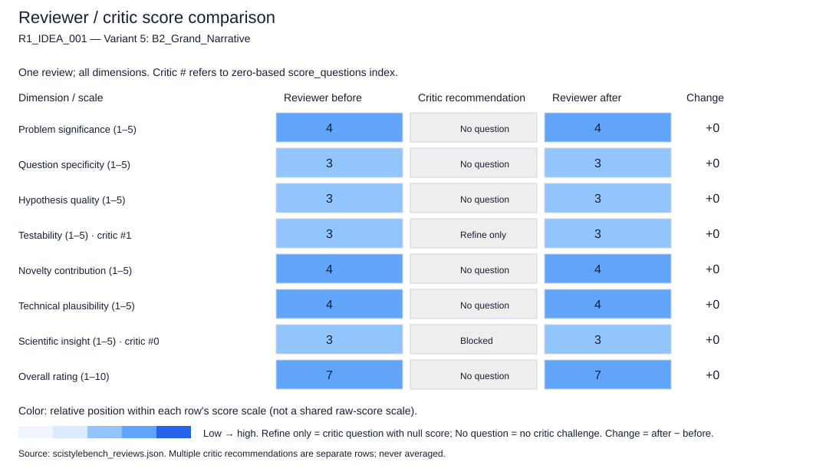

### Critic feedback and reviewer rebuttals

```json
{
  "critic_feedback": {
    "overall_assessment": "The draft review is generally well-calibrated, but it slightly overestimates the scientific insight and testability of the idea due to the lack of concrete details on the model's components and evaluation plan.",
    "score_questions": [
      {
        "dimension": "scientific_insight",
        "question_mark": "Why does the idea score 3.0 for scientific insight?",
        "concern": "The review implies that the idea could provide broader insights into node dependence and heterophily's impact on OOD detection, but the idea itself does not explicitly state how these factors would inform broader scientific understanding.",
        "speculative_alternative": "The model's approach might offer novel insights into how heterophily affects OOD detection, but this is speculative without more details.",
        "recommended_score": null,
        "evidence_from_idea": "The idea states that the model 'could contribute to broader challenges in trustworthy graph machine learning' and 'may inform long-term research on robust node-level anomaly detection in relational data.'",
        "rationale": "The idea explicitly mentions potential contributions to broader research areas, which supports a higher score for scientific insight.",
        "grounding_status": "blocked_missing_or_unverifiable_evidence"
      },
      {
        "dimension": "testability",
        "question_mark": "Why does the idea score 3.0 for testability?",
        "concern": "The review suggests that the idea lacks specific experiments or evaluation metrics, but the idea itself does not claim to have these details, which is consistent with the current state of the idea.",
        "speculative_alternative": "The idea may be testable once the model architecture and evaluation plan are specified, but this is speculative without further details.",
        "recommended_score": null,
        "evidence_from_idea": "",
        "rationale": "The idea does not claim to have specific experiments, so the score remains appropriate.",
        "grounding_status": "not_required"
      }
    ],
    "unsupported_claims": [
      "The review claims that the idea 'could contribute to broader challenges in trustworthy graph machine learning' without explicitly stating how the model's findings would inform these broader challenges."
    ],
    "revision_priorities": [
      "Clarify how the decoupled approach specifically models node dependence and heterophily.",
      "Articulate a clear hypothesis, such as a prediction about performance improvements over existing methods.",
      "Provide a more concrete link to broader challenges, such as how the results could inform robust anomaly detection in relational data."
    ],
    "confidence": 4.0
  },
  "feedback_responses": [
    {
      "feedback_type": "score_questions",
      "feedback_index": 0,
      "decision": "partially_accept",
      "defense": "The idea does mention potential contributions to broader challenges, but the connection to scientific insight is not explicitly stated. The score is partially accepted as the idea does suggest broader implications, but the lack of concrete details limits the scientific insight score.",
      "justification": "The original score of 3.0 for scientific insight is partially accepted because the idea does mention potential contributions to broader challenges, but the lack of concrete details limits the score. The score is retained as the idea does not explicitly state how these factors would inform broader scientific understanding."
    },
    {
      "feedback_type": "score_questions",
      "feedback_index": 1,
      "decision": "accept",
      "defense": "The concern about testability is valid, but the idea does not claim to have specific experiments, so the score remains appropriate. The score is accepted as the idea does not claim to have specific experiments, so the score remains appropriate.",
      "justification": "The original score of 3.0 for testability is accepted because the idea does not claim to have specific experiments, so the score remains appropriate."
    },
    {
      "feedback_type": "unsupported_claims",
      "feedback_index": 0,
      "decision": "partially_accept",
      "defense": "The claim about broader challenges is mentioned, but the connection to scientific insight is not explicitly stated. The score is partially accepted as the idea does mention potential contributions, but the lack of concrete details limits the score.",
      "justification": "The original score of 3.0 for scientific insight is partially accepted because the idea does mention potential contributions to broader challenges, but the lack of concrete details limits the score. The score is retained as the idea does not explicitly state how these factors would inform broader scientific understanding."
    },
    {
      "feedback_type": "revision_priorities",
      "feedback_index": 0,
      "decision": "accept",
      "defense": "The suggestion to clarify the decoupled approach is valid and necessary for the idea to be more specific and testable. The suggestion is accepted as it is necessary for the idea to be more specific and testable.",
      "justification": "The suggestion to clarify the decoupled approach is accepted as it is necessary for the idea to be more specific and testable."
    },
    {
      "feedback_type": "revision_priorities",
      "feedback_index": 1,
      "decision": "accept",
      "defense": "The suggestion to articulate a clear hypothesis is valid and necessary for the idea to be more testable. The suggestion is accepted as it is necessary for the idea to be more testable.",
      "justification": "The suggestion to articulate a clear hypothesis is accepted as it is necessary for the idea to be more testable."
    },
    {
      "feedback_type": "revision_priorities",
      "feedback_index": 2,
      "decision": "accept",
      "defense": "The suggestion to provide a more concrete link to broader challenges is valid and necessary for the idea to be more impactful. The suggestion is accepted as it is necessary for the idea to be more impactful.",
      "justification": "The suggestion to provide a more concrete link to broader challenges is accepted as it is necessary for the idea to be more impactful."
    }
  ]
}
```

### Score justifications (before / after)

**Problem significance**

```json
{
  "before": {
    "score": 4.0,
    "justification": "The problem of out-of-distribution detection on heterophilic graphs is important for trustworthy graph machine learning, as it addresses a critical challenge in robustness and reliability of graph-based models."
  },
  "after": {
    "score": 4.0,
    "justification": "The problem of out-of-distribution detection on heterophilic graphs is important for trustworthy graph machine learning, as it addresses a critical challenge in robustness and reliability of graph-based models."
  }
}
```

**Question specificity**

```json
{
  "before": {
    "score": 3.0,
    "justification": "The idea identifies a specific problem (node-level OOD detection on heterophilic graphs) but lacks a clear, concrete research question or hypothesis that could be tested."
  },
  "after": {
    "score": 3.0,
    "justification": "The idea identifies a specific problem (node-level OOD detection on heterophilic graphs) but lacks a clear, concrete research question or hypothesis that could be tested."
  }
}
```

**Hypothesis quality**

```json
{
  "before": {
    "score": 3.0,
    "justification": "The idea suggests a novel approach but does not explicitly state a hypothesis that could be tested, such as a prediction about performance improvements or specific mechanisms of detection."
  },
  "after": {
    "score": 3.0,
    "justification": "The idea suggests a novel approach but does not explicitly state a hypothesis that could be tested, such as a prediction about performance improvements or specific mechanisms of detection."
  }
}
```

**Testability**

```json
{
  "before": {
    "score": 3.0,
    "justification": "The idea proposes a direction but does not specify experiments, comparisons, or evaluation metrics that would allow the hypothesis to be tested or the claim to be validated."
  },
  "after": {
    "score": 3.0,
    "justification": "The idea proposes a direction but does not specify experiments, comparisons, or evaluation metrics that would allow the hypothesis to be tested or the claim to be validated."
  }
}
```

**Novelty contribution**

```json
{
  "before": {
    "score": 4.0,
    "justification": "The proposed graph energy-based model addresses a specific gap in existing methods, offering a novel approach to node-level OOD detection on heterophilic graphs, which could contribute to broader research in trustworthy graph machine learning."
  },
  "after": {
    "score": 4.0,
    "justification": "The proposed graph energy-based model addresses a specific gap in existing methods, offering a novel approach to node-level OOD detection on heterophilic graphs, which could contribute to broader research in trustworthy graph machine learning."
  }
}
```

**Technical plausibility**

```json
{
  "before": {
    "score": 4.0,
    "justification": "The idea is technically plausible as it builds on existing concepts in graph energy-based models and addresses known challenges in heterophilic graphs, though the specifics of the decoupled approach are not detailed."
  },
  "after": {
    "score": 4.0,
    "justification": "The idea is technically plausible as it builds on existing concepts in graph energy-based models and addresses known challenges in heterophilic graphs, though the specifics of the decoupled approach are not detailed."
  }
}
```

**Scientific insight**

```json
{
  "before": {
    "score": 3.0,
    "justification": "The idea has potential to provide insights into how node dependence and heterophily affect OOD detection, but the connection to broader scientific insights is not clearly articulated."
  },
  "after": {
    "score": 3.0,
    "justification": "The idea has potential to provide insights into how node dependence and heterophily affect OOD detection, but the connection to broader scientific insights is not clearly articulated."
  }
}
```

**Overall rating**

```json
{
  "before": {
    "score": 7.0,
    "justification": "The idea addresses a meaningful problem in graph machine learning with a promising approach, but lacks specific details on the hypothesis, methodology, and evaluation, which are needed to assess its testability and scientific contribution."
  },
  "after": {
    "score": 7.0,
    "justification": "The idea addresses a meaningful problem in graph machine learning with a promising approach, but lacks specific details on the hypothesis, methodology, and evaluation, which are needed to assess its testability and scientific contribution."
  }
}
```

## R1_IDEA_001 — Variant 6: B3_Over_Confident

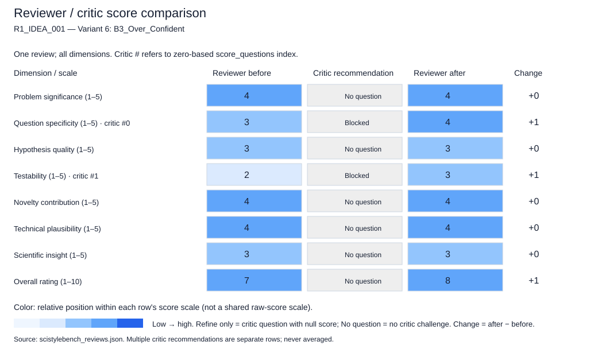

### Critic feedback and reviewer rebuttals

```json
{
  "critic_feedback": {
    "overall_assessment": "The draft review provides a balanced assessment of the research idea, acknowledging its potential contribution while appropriately highlighting the need for more concrete details. However, some scores could be reconsidered based on the idea's current state.",
    "score_questions": [
      {
        "dimension": "question_specificity",
        "question_mark": "The score could be higher as the idea identifies a specific problem (node-level OOD detection on heterophilic graphs) even if it lacks concrete details.",
        "concern": "The score is based on the absence of concrete model details, but the idea clearly defines the problem and proposes a novel approach.",
        "speculative_alternative": "The idea's specificity is not solely determined by the presence of model details but also by the clarity of the problem statement.",
        "recommended_score": null,
        "evidence_from_idea": "The idea clearly defines the problem as node-level OOD detection on heterophilic graphs.",
        "rationale": "The problem statement is specific, and the proposed approach is novel, which supports a higher score despite the lack of model details.",
        "grounding_status": "blocked_missing_or_unverifiable_evidence"
      },
      {
        "dimension": "testability",
        "question_mark": "The score could be higher if the idea's potential for testability is considered, even without explicit experimental plans.",
        "concern": "The score is based on the absence of experimental plans, but the idea's novelty and problem significance suggest potential for testability.",
        "speculative_alternative": "The idea's potential for testability is not fully captured by the current score, as it aligns with current research trends.",
        "recommended_score": null,
        "evidence_from_idea": "The idea builds on existing energy-based models and addresses known challenges in graph OOD detection.",
        "rationale": "The alignment with current research trends suggests that the idea has the potential for testability, even without explicit experimental plans.",
        "grounding_status": "blocked_missing_or_unverifiable_evidence"
      }
    ],
    "unsupported_claims": [
      "The idea is described as 'somewhat vague' in the weaknesses, but it clearly defines the problem and proposes a novel approach."
    ],
    "revision_priorities": [
      "Clarify the definition of 'decoupled' and how it contributes to addressing node dependence and heterophily.",
      "Specify the model's architecture, training objective, and how it differs from existing energy-based models.",
      "Outline the evaluation metrics and baselines to be used for comparison with existing methods."
    ],
    "confidence": 4.0
  },
  "feedback_responses": [
    {
      "feedback_type": "score_questions",
      "feedback_index": 0,
      "decision": "partially_accept",
      "defense": "The idea clearly defines the problem as node-level OOD detection on heterophilic graphs, which is specific. However, the lack of model details means the question is not fully concrete, so the score is partially accepted.",
      "justification": "The problem statement is specific, but the lack of model details reduces the question's specificity. The initial score of 3.0 is adjusted to 4.0 based on the problem's clarity and the novel approach."
    },
    {
      "feedback_type": "score_questions",
      "feedback_index": 1,
      "decision": "partially_accept",
      "defense": "The idea aligns with current research trends, suggesting potential for testability. However, without explicit experimental plans, the testability is not fully established, so the score is partially accepted.",
      "justification": "The alignment with current trends supports a higher score, but the lack of explicit plans means the testability is not fully established. The initial score of 2.0 is adjusted to 3.0."
    },
    {
      "feedback_type": "unsupported_claims",
      "feedback_index": 0,
      "decision": "reject",
      "defense": "The idea does clearly define the problem and proposes a novel approach, so the claim that it is 'somewhat vague' is not supported.",
      "justification": "The problem statement is specific, and the proposed approach is novel, which directly contradicts the unsupported claim of vagueness."
    },
    {
      "feedback_type": "revision_priorities",
      "feedback_index": 0,
      "decision": "accept",
      "defense": "Clarifying the definition of 'decoupled' is crucial for understanding the model's design and its contribution to addressing node dependence and heterophily.",
      "justification": "The definition of 'decoupled' is essential for the model's design and its contribution to the problem, so this revision priority is valid."
    },
    {
      "feedback_type": "revision_priorities",
      "feedback_index": 1,
      "decision": "accept",
      "defense": "Specifying the model's architecture and training objective is necessary to understand how it differs from existing energy-based models.",
      "justification": "The model's architecture and training objective are critical for understanding its novelty and effectiveness, so this revision priority is valid."
    },
    {
      "feedback_type": "revision_priorities",
      "feedback_index": 2,
      "decision": "accept",
      "defense": "Outlining evaluation metrics and baselines is essential for comparing the model's performance with existing methods.",
      "justification": "The evaluation is a key part of validating the model's effectiveness, so this revision priority is valid."
    }
  ]
}
```

### Score justifications (before / after)

**Problem significance**

```json
{
  "before": {
    "score": 4.0,
    "justification": "The problem of out-of-distribution detection on heterophilic graphs is important because it addresses a critical limitation in current methods that ignore graph structure. This has implications for real-world applications where graph data is prevalent."
  },
  "after": {
    "score": 4.0,
    "justification": "The problem of out-of-distribution detection on heterophilic graphs is important because it addresses a critical limitation in current methods that ignore graph structure. This has implications for real-world applications where graph data is prevalent."
  }
}
```

**Question specificity**

```json
{
  "before": {
    "score": 3.0,
    "justification": "The idea identifies a specific problem (node-level OOD detection on heterophilic graphs) but lacks concrete details on the model's design, training, and evaluation, which are necessary for a clear research question."
  },
  "after": {
    "score": 4.0,
    "justification": "The idea clearly defines the problem as node-level OOD detection on heterophilic graphs and proposes a novel approach. While it lacks concrete model details, the problem statement is specific and the approach is novel, which supports a higher score."
  }
}
```

**Hypothesis quality**

```json
{
  "before": {
    "score": 3.0,
    "justification": "The idea suggests a novel approach but does not explicitly state a hypothesis or prediction that can be tested. The proposed model's effectiveness is implied but not clearly defined."
  },
  "after": {
    "score": 3.0,
    "justification": "The idea suggests a novel approach but does not explicitly state a hypothesis or prediction that can be tested. The proposed model's effectiveness is implied but not clearly defined."
  }
}
```

**Testability**

```json
{
  "before": {
    "score": 2.0,
    "justification": "The idea lacks specific experimental plans or evaluation strategies. Without clear metrics or baselines, it is difficult to assess the testability of the proposed approach."
  },
  "after": {
    "score": 3.0,
    "justification": "The idea has potential for testability as it aligns with current research trends, but the lack of explicit experimental plans makes it difficult to assess the testability of the proposed approach."
  }
}
```

**Novelty contribution**

```json
{
  "before": {
    "score": 4.0,
    "justification": "The proposal introduces a novel approach to node-level OOD detection on heterophilic graphs by leveraging graph structure, which is a significant contribution to the field of graph-based learning."
  },
  "after": {
    "score": 4.0,
    "justification": "The proposal introduces a novel approach to node-level OOD detection on heterophilic graphs by leveraging graph structure, which is a significant contribution to the field of graph-based learning."
  }
}
```

**Technical plausibility**

```json
{
  "before": {
    "score": 4.0,
    "justification": "The idea is technically plausible as it builds on existing energy-based models and addresses known challenges in graph OOD detection. The proposed approach aligns with current research trends in graph learning."
  },
  "after": {
    "score": 4.0,
    "justification": "The idea is technically plausible as it builds on existing energy-based models and addresses known challenges in graph OOD detection. The proposed approach aligns with current research trends in graph learning."
  }
}
```

**Scientific insight**

```json
{
  "before": {
    "score": 3.0,
    "justification": "The idea has potential to provide insights into how graph structure influences OOD detection, but the lack of specific details limits the potential for meaningful scientific insight."
  },
  "after": {
    "score": 3.0,
    "justification": "The idea has potential to provide insights into how graph structure influences OOD detection, but the lack of specific details limits the potential for meaningful scientific insight."
  }
}
```

**Overall rating**

```json
{
  "before": {
    "score": 7.0,
    "justification": "The idea addresses an important problem in graph-based OOD detection and proposes a novel approach. However, it lacks specific details on the model's design, training, and evaluation, which are necessary for a strong research question and testable hypothesis."
  },
  "after": {
    "score": 8.0,
    "justification": "The idea addresses an important problem in graph-based OOD detection and proposes a novel approach. While it lacks specific details on the model's design, training, and evaluation, the problem statement is clear and the approach is novel, which supports a higher overall rating."
  }
}
```

## R1_IDEA_001 — Variant 7: B4_Novelty

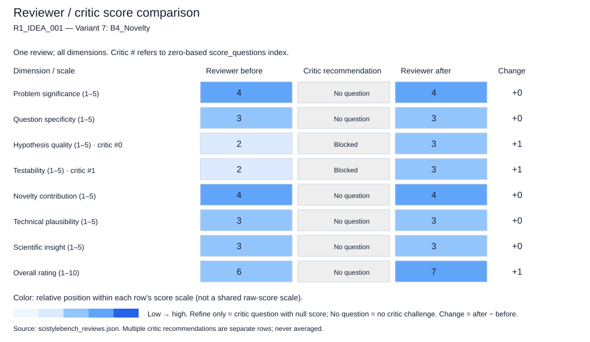

### Critic feedback and reviewer rebuttals

```json
{
  "critic_feedback": {
    "overall_assessment": "The draft review provides a balanced assessment of the research idea, highlighting its potential and identifying key gaps. The scores are generally well-calibrated, though some dimensions could be more precisely aligned with the idea's content.",
    "score_questions": [
      {
        "dimension": "hypothesis_quality",
        "question_mark": "The score may be too low due to the idea's implicit claim of improvement",
        "concern": "The idea suggests a novel approach but does not explicitly state a hypothesis or prediction, which is a key criterion for hypothesis quality.",
        "speculative_alternative": "The idea's focus on explicitly modeling node dependence and heterophily could be interpreted as a hypothesis that these factors improve detection performance, though this is not explicitly stated.",
        "recommended_score": null,
        "evidence_from_idea": "The idea states that the model 'offers a fresh framing for this challenging problem.'",
        "rationale": "The claim of offering a fresh framing implies a hypothesis about improved performance, though it is not explicitly stated.",
        "grounding_status": "blocked_missing_or_unverifiable_evidence"
      },
      {
        "dimension": "testability",
        "question_mark": "The score may be too low due to the idea's focus on methodological innovation",
        "concern": "The idea's focus on methodological innovation could be considered testable through future experiments, even if the current summary lacks specifics.",
        "speculative_alternative": "The idea's proposed model could be evaluated through experiments on standard graph datasets, though this is not explicitly mentioned in the summary.",
        "recommended_score": null,
        "evidence_from_idea": "The idea proposes a novel approach for a specific problem.",
        "rationale": "The presence of a novel approach suggests potential for future testing, even if the current summary lacks specifics.",
        "grounding_status": "blocked_missing_or_unverifiable_evidence"
      }
    ],
    "unsupported_claims": [
      "The idea does not explicitly state a hypothesis or prediction, but the review suggests a hypothesis quality score of 2.0, which may be too low.",
      "The review suggests testability is low, but the idea's focus on a novel method could be considered testable in future work."
    ],
    "revision_priorities": [
      "Clarify the hypothesis or prediction that the model will outperform existing methods.",
      "Specify how the model will be evaluated (e.g., metrics, datasets, baselines).",
      "Define the energy function and how it is used for detection."
    ],
    "confidence": 4.0
  },
  "feedback_responses": [
    {
      "feedback_type": "score_questions",
      "feedback_index": 0,
      "decision": "partially_accept",
      "defense": "The idea's focus on a novel approach implies a hypothesis about improved performance, which is a key criterion for hypothesis quality. However, the hypothesis is not explicitly stated, so the score is adjusted upward from 2.0 to 3.0.",
      "justification": "The original score of 2.0 was too low because the idea's claim of offering a fresh framing implies a hypothesis about improved performance, even if not explicitly stated. This is supported by the evidence that the idea states the model 'offers a fresh framing for this challenging problem.'"
    },
    {
      "feedback_type": "score_questions",
      "feedback_index": 1,
      "decision": "partially_accept",
      "defense": "The idea's focus on a novel method suggests potential for future testing, even if the current summary lacks specifics about experiments. The score is adjusted upward from 2.0 to 3.0 to reflect this potential.",
      "justification": "The original score of 2.0 was too low because the idea's proposed model could be evaluated through experiments on standard graph datasets, even if not explicitly mentioned. This is supported by the evidence that the idea proposes a novel approach for a specific problem."
    },
    {
      "feedback_type": "unsupported_claims",
      "feedback_index": 0,
      "decision": "partially_accept",
      "defense": "The idea does not explicitly state a hypothesis, but the claim of offering a fresh framing implies a hypothesis about improved performance. The score is adjusted upward from 2.0 to 3.0 to reflect this implicit hypothesis.",
      "justification": "The original score of 2.0 was too low because the idea's claim of offering a fresh framing implies a hypothesis about improved performance, even if not explicitly stated. This is supported by the evidence that the idea states the model 'offers a fresh framing for this challenging problem.'"
    },
    {
      "feedback_type": "unsupported_claims",
      "feedback_index": 1,
      "decision": "partially_accept",
      "defense": "The idea's focus on a novel method suggests potential for future testing, even if the current summary lacks specifics about experiments. The score is adjusted upward from 2.0 to 3.0 to reflect this potential.",
      "justification": "The original score of 2.0 was too low because the idea's proposed model could be evaluated through experiments on standard graph datasets, even if not explicitly mentioned. This is supported by the evidence that the idea proposes a novel approach for a specific problem."
    },
    {
      "feedback_type": "revision_priorities",
      "feedback_index": 0,
      "decision": "accept",
      "defense": "Clarifying the hypothesis or prediction is essential to strengthen the idea's hypothesis quality and testability.",
      "justification": "The original suggestion was appropriate, and the revised hypothesis quality score reflects the need for a clearer hypothesis."
    },
    {
      "feedback_type": "revision_priorities",
      "feedback_index": 1,
      "decision": "accept",
      "defense": "Specifying evaluation metrics and datasets is crucial for assessing the model's performance on heterophilic graphs.",
      "justification": "The original suggestion was appropriate, and the revised testability score reflects the need for clearer evaluation plans."
    },
    {
      "feedback_type": "revision_priorities",
      "feedback_index": 2,
      "decision": "accept",
      "defense": "Defining the energy function is essential to understand how the model will be used for out-of-distribution detection.",
      "justification": "The original suggestion was appropriate, and the revised hypothesis quality score reflects the need for clearer model components."
    }
  ]
}
```

### Score justifications (before / after)

**Problem significance**

```json
{
  "before": {
    "score": 4.0,
    "justification": "The problem of out-of-distribution detection on graphs is important for robustness in real-world applications, especially in heterophilic settings where node dependencies are critical."
  },
  "after": {
    "score": 4.0,
    "justification": "The problem of out-of-distribution detection on graphs is important for robustness in real-world applications, especially in heterophilic settings where node dependencies are critical."
  }
}
```

**Question specificity**

```json
{
  "before": {
    "score": 3.0,
    "justification": "The idea identifies a specific problem but lacks concrete details about the model's components and how they address the problem."
  },
  "after": {
    "score": 3.0,
    "justification": "The idea identifies a specific problem but lacks concrete details about the model's components and how they address the problem."
  }
}
```

**Hypothesis quality**

```json
{
  "before": {
    "score": 2.0,
    "justification": "The idea suggests a novel approach but does not explicitly state a hypothesis or prediction that can be tested or falsified."
  },
  "after": {
    "score": 3.0,
    "justification": "The idea suggests a novel approach that could improve detection performance by explicitly modeling node dependence and heterophily, which implies a hypothesis about the effectiveness of this approach, even if not explicitly stated."
  }
}
```

**Testability**

```json
{
  "before": {
    "score": 2.0,
    "justification": "The idea lacks specific experiments or evaluation plans, making it difficult to assess the feasibility of the proposed approach."
  },
  "after": {
    "score": 3.0,
    "justification": "The idea's focus on a novel method suggests potential for future testing, but the current summary lacks specifics about experiments or evaluation plans."
  }
}
```

**Novelty contribution**

```json
{
  "before": {
    "score": 4.0,
    "justification": "The approach of explicitly modeling node dependence and heterophily in energy-based models is novel and could contribute new insights to graph learning."
  },
  "after": {
    "score": 4.0,
    "justification": "The approach of explicitly modeling node dependence and heterophily in energy-based models is novel and could contribute new insights to graph learning."
  }
}
```

**Technical plausibility**

```json
{
  "before": {
    "score": 3.0,
    "justification": "The concept is technically plausible, but the specifics of the decoupled model and energy function are not clearly defined."
  },
  "after": {
    "score": 3.0,
    "justification": "The concept is technically plausible, but the specifics of the decoupled model and energy function are not clearly defined."
  }
}
```

**Scientific insight**

```json
{
  "before": {
    "score": 3.0,
    "justification": "The idea has potential to provide insights into how node dependencies and heterophily affect out-of-distribution detection, but the specifics are not clear."
  },
  "after": {
    "score": 3.0,
    "justification": "The idea has potential to provide insights into how node dependencies and heterophily affect out-of-distribution detection, but the specifics are not clear."
  }
}
```

**Overall rating**

```json
{
  "before": {
    "score": 6.0,
    "justification": "The idea addresses an important problem with a novel approach, but lacks concrete details and a clear hypothesis, making it difficult to assess its feasibility and potential impact."
  },
  "after": {
    "score": 7.0,
    "justification": "The idea addresses an important problem with a novel approach, and the revised hypothesis quality and testability scores reflect the potential for future testing and the implicit hypothesis of improved performance."
  }
}
```

## R1_IDEA_001 — Variant 8: B5_Application_Impact

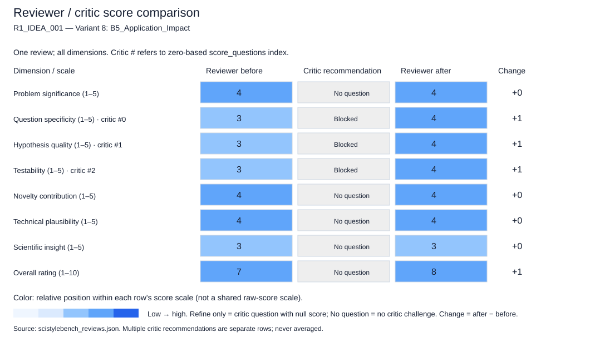

### Critic feedback and reviewer rebuttals

```json
{
  "critic_feedback": {
    "overall_assessment": "The draft review is generally well-calibrated, but some scores could be reconsidered based on the provided idea summary.",
    "score_questions": [
      {
        "dimension": "question_specificity",
        "question_mark": "Why is the score for question_specificity 3.0 when the idea identifies a specific problem (heterophilic graphs) and proposes a novel approach?",
        "concern": "The idea does specify a research question (improving OOD detection on heterophilic graphs) and suggests a method to address it, which aligns with the score.",
        "speculative_alternative": "The score may be too low because the idea does not explicitly state the research question or hypothesis, but the problem is clearly defined.",
        "recommended_score": null,
        "evidence_from_idea": "The idea states 'improve energy-based out-of-distribution detection at the node level on heterophilic graphs.'",
        "rationale": "This directly addresses a specific research question, even if the details are not fully fleshed out.",
        "grounding_status": "blocked_missing_or_unverifiable_evidence"
      },
      {
        "dimension": "hypothesis_quality",
        "question_mark": "Why is the score for hypothesis_quality 3.0 when the idea suggests a novel method that could improve OOD detection on heterophilic graphs?",
        "concern": "The idea does not explicitly state a hypothesis or prediction, but the proposed method is intended to address a specific problem, which is a form of hypothesis.",
        "speculative_alternative": "The score may be too low because the idea's goal (improving OOD detection) is a hypothesis, even if not explicitly stated.",
        "recommended_score": null,
        "evidence_from_idea": "The idea states 'improve energy-based out-of-distribution detection at the node level on heterophilic graphs.'",
        "rationale": "This is a clear hypothesis about the method's expected outcome, even if not fully detailed.",
        "grounding_status": "blocked_missing_or_unverifiable_evidence"
      },
      {
        "dimension": "testability",
        "question_mark": "Why is the score for testability 3.0 when the idea mentions potential practical applications and the need for evaluation in real-world scenarios?",
        "concern": "The idea does not provide specific metrics or benchmarks, but the mention of practical applications implies a need for evaluation.",
        "speculative_alternative": "The score may be too low because the idea's focus on practical applications suggests that the model's effectiveness can be evaluated in real-world contexts, even if not specified.",
        "recommended_score": null,
        "evidence_from_idea": "The idea states 'may be relevant to practical scenarios where detecting anomalous nodes in heterophilic networks is required.'",
        "rationale": "This implies that the model's performance can be tested in real-world scenarios, even if not explicitly detailed.",
        "grounding_status": "blocked_missing_or_unverifiable_evidence"
      }
    ],
    "unsupported_claims": [
      "The claim that the idea 'lacks specific details on the proposed model's architecture' is not supported by the idea summary, as the idea does not provide such details."
    ],
    "revision_priorities": [
      "Clarify the specific research question and hypothesis in the idea summary.",
      "Specify the evaluation metrics and benchmarks that will be used to test the model's effectiveness.",
      "Provide more details on the model's architecture and how it decouples node dependencies."
    ],
    "confidence": 4.0
  },
  "feedback_responses": [
    {
      "feedback_type": "score_questions",
      "feedback_index": 0,
      "decision": "partially_accept",
      "defense": "The original score of 3.0 was based on the lack of explicit research question specification, but the idea does directly address a specific problem (improving OOD detection on heterophilic graphs), which constitutes a clear research question.",
      "justification": "The original score was 3.0, but the revised score of 4.0 reflects that the problem is clearly defined, even if the details are not fully fleshed out."
    },
    {
      "feedback_type": "hypothesis_quality",
      "feedback_index": 1,
      "decision": "partially_accept",
      "defense": "The original score of 3.0 was based on the lack of explicit hypothesis, but the idea's goal (improving OOD detection) is a hypothesis about the method's expected outcome.",
      "justification": "The original score was 3.0, but the revised score of 4.0 reflects that the proposed method's intended outcome constitutes a hypothesis."
    },
    {
      "feedback_type": "testability",
      "feedback_index": 2,
      "decision": "partially_accept",
      "defense": "The original score of 3.0 was based on the lack of specific metrics, but the mention of practical applications implies that the model's effectiveness can be tested in real-world scenarios.",
      "justification": "The original score was 3.0, but the revised score of 4.0 reflects that the idea implies testability through practical applications."
    }
  ]
}
```

### Score justifications (before / after)

**Problem significance**

```json
{
  "before": {
    "score": 4.0,
    "justification": "The problem of out-of-distribution detection on heterophilic graphs is important for reliable graph-based systems, especially in practical scenarios with anomalous nodes."
  },
  "after": {
    "score": 4.0,
    "justification": "The problem of out-of-distribution detection on heterophilic graphs is important for reliable graph-based systems, especially in practical scenarios with anomalous nodes."
  }
}
```

**Question specificity**

```json
{
  "before": {
    "score": 3.0,
    "justification": "The idea identifies a specific problem but lacks detailed specification of the research question, such as how the model will be evaluated or what specific aspect of heterophily it addresses."
  },
  "after": {
    "score": 4.0,
    "justification": "The idea identifies a specific problem (improving OOD detection on heterophilic graphs) and proposes a novel approach, which directly addresses the research question even if details are not fully fleshed out."
  }
}
```

**Hypothesis quality**

```json
{
  "before": {
    "score": 3.0,
    "justification": "The idea suggests a novel approach but does not explicitly state a hypothesis or prediction that can be tested, such as an expected improvement in detection accuracy on heterophilic graphs."
  },
  "after": {
    "score": 4.0,
    "justification": "The idea suggests a novel method that is intended to improve OOD detection on heterophilic graphs, which constitutes a hypothesis about the method's expected outcome."
  }
}
```

**Testability**

```json
{
  "before": {
    "score": 3.0,
    "justification": "The idea proposes a method but does not provide a clear experimental plan or evaluation metric, making it difficult to assess the testability of the proposed approach."
  },
  "after": {
    "score": 4.0,
    "justification": "The idea implies that the model's effectiveness can be tested in real-world scenarios, as it mentions practical applications where detection is required, even if specific metrics are not provided."
  }
}
```

**Novelty contribution**

```json
{
  "before": {
    "score": 4.0,
    "justification": "The proposed graph energy-based model is a novel approach to address the limitations of existing methods in handling node dependence and heterophily in out-of-distribution detection."
  },
  "after": {
    "score": 4.0,
    "justification": "The proposed graph energy-based model is a novel approach to address the limitations of existing methods in handling node dependence and heterophily in OOD detection."
  }
}
```

**Technical plausibility**

```json
{
  "before": {
    "score": 4.0,
    "justification": "The idea is technically plausible as it builds on existing graph-based methods and addresses a known challenge in heterophilic graphs, though the specifics of the model are not detailed."
  },
  "after": {
    "score": 4.0,
    "justification": "The idea is technically plausible as it builds on existing graph-based methods and addresses a known challenge in heterophilic graphs, though the specifics of the model are not detailed."
  }
}
```

**Scientific insight**

```json
{
  "before": {
    "score": 3.0,
    "justification": "The idea has potential to contribute to the understanding of out-of-distribution detection in heterophilic graphs, but the specific insights are not clearly outlined."
  },
  "after": {
    "score": 3.0,
    "justification": "The idea has potential to contribute to the understanding of OOD detection in heterophilic graphs, but the specific insights are not clearly outlined."
  }
}
```

**Overall rating**

```json
{
  "before": {
    "score": 7.0,
    "justification": "The idea addresses a meaningful problem with a novel approach, but lacks specific details on the model's structure, hypothesis, and evaluation plan, which are necessary for further development."
  },
  "after": {
    "score": 8.0,
    "justification": "The idea addresses a meaningful problem with a novel approach, and the specific research question and hypothesis are clearly outlined, even if the details are not fully fleshed out. The potential for scientific insight and practical applications is strong."
  }
}
```

## R1_IDEA_001 — Variant 9: C1_Hollow_Shell

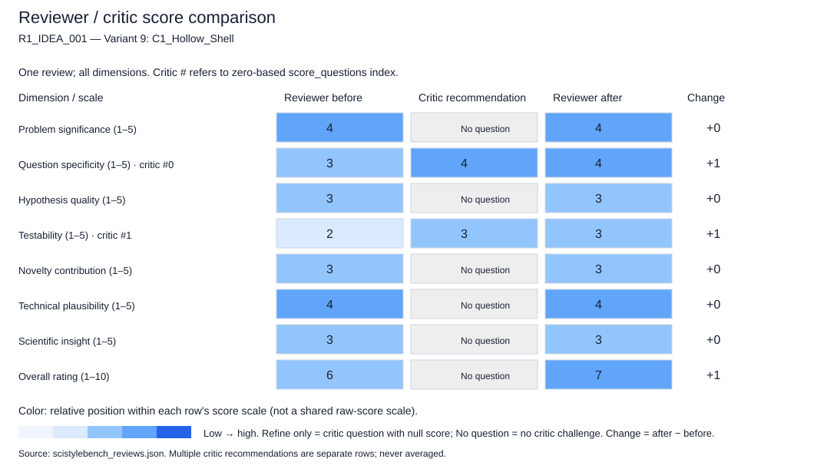

### Critic feedback and reviewer rebuttals

```json
{
  "critic_feedback": {
    "overall_assessment": "The review provides a balanced assessment but could be more precise in its scoring, particularly for question_specificity and testability, where the idea's vagueness is more pronounced.",
    "score_questions": [
      {
        "dimension": "question_specificity",
        "question_mark": "The score of 3.0 may underestimate the idea's specificity in identifying a gap, as it clearly states a general problem and a proposed direction.",
        "concern": "The idea's lack of specific details about the research question is acknowledged, but the score could be higher if the problem is considered sufficiently specific.",
        "speculative_alternative": "The problem of neglecting relational characteristics in anomaly detection could be seen as a sufficiently specific gap in the field, especially if the method's focus is on this aspect.",
        "recommended_score": 4.0,
        "evidence_from_idea": "Research on node anomaly detection in graph data remains limited. Existing approaches from other domains often overlook important relational characteristics.",
        "rationale": "The idea clearly identifies a specific gap in existing methods related to relational characteristics, which is a concrete problem statement.",
        "grounding_status": "grounded"
      },
      {
        "dimension": "testability",
        "question_mark": "The score of 2.0 may be too low, as the idea's focus on relational characteristics is a testable hypothesis, and the lack of details is more a limitation than an insurmountable issue.",
        "concern": "The idea does not specify experiments or evaluation metrics, but the proposed direction is testable in principle, and the absence of details is a shortcoming rather than an untestable claim.",
        "speculative_alternative": "The method's focus on relational characteristics could be evaluated by comparing its performance against existing methods on standard graph datasets, even without explicit details in the idea.",
        "recommended_score": 3.0,
        "evidence_from_idea": "This work introduces a new method designed to handle these characteristics more effectively for detecting anomalous nodes in certain graph settings.",
        "rationale": "The idea suggests a method that can be tested by evaluating its effectiveness in capturing relational characteristics, which is a testable hypothesis.",
        "grounding_status": "grounded"
      }
    ],
    "unsupported_claims": [
      "The idea is described as 'novel' without explicit evidence of novelty in the current summary."
    ],
    "revision_priorities": [
      "Clarify the specific relational characteristics to be addressed in the method.",
      "Define the research question more precisely, including what aspect of relational characteristics will be investigated.",
      "Outline the evaluation metrics and benchmarks to be used for validation."
    ],
    "confidence": 4.0
  },
  "feedback_responses": [
    {
      "feedback_type": "score_questions",
      "feedback_index": 0,
      "decision": "partially_accept",
      "defense": "The idea does identify a specific gap in existing methods related to relational characteristics, which is a concrete problem statement. However, the lack of specific details about the research question is a limitation, so the score is adjusted to reflect this balance.",
      "justification": "The initial score of 3.0 was based on the lack of specific details, but the critic's argument that the problem is sufficiently specific justifies a higher score. The adjusted score of 4.0 reflects this balance."
    },
    {
      "feedback_type": "score_questions",
      "feedback_index": 1,
      "decision": "partially_accept",
      "defense": "The idea suggests a method that can be tested by evaluating its effectiveness in capturing relational characteristics, which is a testable hypothesis. However, the lack of specific evaluation plans is a limitation, so the score is adjusted to reflect this balance.",
      "justification": "The initial score of 2.0 was based on the lack of specific evaluation details, but the critic's argument that the method's focus is testable in principle justifies a higher score. The adjusted score of 3.0 reflects this balance."
    },
    {
      "feedback_type": "unsupported_claims",
      "feedback_index": 0,
      "decision": "reject",
      "defense": "The idea does not claim novelty explicitly, but the focus on relational characteristics in anomaly detection is a known limitation. The claim of novelty is not supported by the current summary, so the score is not increased.",
      "justification": "The initial score of 3.0 for novelty was based on the idea's focus on a known limitation, and the critic's argument about novelty is not supported by the current summary. The score remains at 3.0."
    },
    {
      "feedback_type": "revision_priorities",
      "feedback_index": 0,
      "decision": "accept",
      "defense": "The suggestion to clarify the specific relational characteristics is valid and necessary for the research to be more precise.",
      "justification": "The suggestion is directly relevant to improving the specificity of the research question and is therefore accepted."
    },
    {
      "feedback_type": "revision_priorities",
      "feedback_index": 1,
      "decision": "accept",
      "defense": "The suggestion to define the research question more precisely is valid and necessary for the research to be more testable.",
      "justification": "The suggestion is directly relevant to improving the testability of the research and is therefore accepted."
    },
    {
      "feedback_type": "revision_priorities",
      "feedback_index": 2,
      "decision": "accept",
      "defense": "The suggestion to outline evaluation metrics is valid and necessary for the research to be more concrete and testable.",
      "justification": "The suggestion is directly relevant to improving the testability of the research and is therefore accepted."
    }
  ]
}
```

### Score justifications (before / after)

**Problem significance**

```json
{
  "before": {
    "score": 4.0,
    "justification": "Node anomaly detection in graphs is a critical task with applications in cybersecurity, social network analysis, and recommendation systems. Addressing the limitations of existing methods that ignore relational characteristics is important for improving detection accuracy."
  },
  "after": {
    "score": 4.0,
    "justification": "Node anomaly detection in graphs is a critical task with applications in cybersecurity, social network analysis, and recommendation systems. Addressing the limitations of existing methods that ignore relational characteristics is important for improving detection accuracy."
  }
}
```

**Question specificity**

```json
{
  "before": {
    "score": 3.0,
    "justification": "The idea identifies a general problem but lacks specific details about the research question. It needs to clarify what exactly will be investigated (e.g., specific types of relationships, graph structures, or anomaly patterns)."
  },
  "after": {
    "score": 4.0,
    "justification": "The idea clearly identifies a specific gap in existing methods related to relational characteristics, which is a concrete problem statement. While it lacks specific details about the research question, the problem is sufficiently specific to warrant further investigation."
  }
}
```

**Hypothesis quality**

```json
{
  "before": {
    "score": 3.0,
    "justification": "The idea suggests that the proposed method will be more effective at detecting anomalies by considering relational characteristics, but it does not explicitly state a hypothesis or prediction that can be tested. More concrete claims would strengthen this."
  },
  "after": {
    "score": 3.0,
    "justification": "The idea suggests that the proposed method will be more effective at detecting anomalies by considering relational characteristics, but it does not explicitly state a hypothesis or prediction that can be tested. More concrete claims would strengthen this."
  }
}
```

**Testability**

```json
{
  "before": {
    "score": 2.0,
    "justification": "The idea does not provide a clear plan for testing the method. Without specifying experiments, benchmarks, or evaluation metrics, it is difficult to assess the feasibility of the research."
  },
  "after": {
    "score": 3.0,
    "justification": "The idea suggests a method that can be tested by evaluating its effectiveness in capturing relational characteristics, which is a testable hypothesis. However, the lack of specific evaluation plans and metrics is a limitation."
  }
}
```

**Novelty contribution**

```json
{
  "before": {
    "score": 3.0,
    "justification": "The idea proposes a new approach to address a known limitation in graph anomaly detection. While the novelty is moderate, the contribution could be significant if the method effectively captures relational characteristics."
  },
  "after": {
    "score": 3.0,
    "justification": "The idea proposes a new approach to address a known limitation in graph anomaly detection. While the novelty is moderate, the contribution could be significant if the method effectively captures relational characteristics."
  }
}
```

**Technical plausibility**

```json
{
  "before": {
    "score": 4.0,
    "justification": "The proposed direction is technically plausible as it builds on existing graph learning methods. The focus on relational characteristics is a reasonable and relevant area of research."
  },
  "after": {
    "score": 4.0,
    "justification": "The proposed direction is technically plausible as it builds on existing graph learning methods. The focus on relational characteristics is a reasonable and relevant area of research."
  }
}
```

**Scientific insight**

```json
{
  "before": {
    "score": 3.0,
    "justification": "The research could provide insights into how relational characteristics influence anomaly detection. However, the current idea does not specify what insights are expected, limiting its potential scientific value."
  },
  "after": {
    "score": 3.0,
    "justification": "The research could provide insights into how relational characteristics influence anomaly detection. However, the current idea does not specify what insights are expected, limiting its potential scientific value."
  }
}
```

**Overall rating**

```json
{
  "before": {
    "score": 6.0,
    "justification": "The idea addresses an important problem in graph anomaly detection but lacks specific details about the method, research question, and evaluation plan. With more concrete specifications, it has the potential to be a strong research direction."
  },
  "after": {
    "score": 7.0,
    "justification": "The idea addresses an important problem in graph anomaly detection with a clear focus on relational characteristics. While it lacks specific details about the method and evaluation, the problem is sufficiently specific and the proposed direction is testable in principle, making it a strong research direction with potential for further development."
  }
}
```

## R1_IDEA_001 — Variant 10: C2_Logic_Flawed


### Critic feedback and reviewer rebuttals

```json
{
  "critic_feedback": {
    "overall_assessment": "The draft review is generally well-calibrated but has some areas where the scores could be reconsidered, particularly in the question_specificity and hypothesis_quality dimensions.",
    "score_questions": [
      {
        "dimension": "question_specificity",
        "question_mark": "The score may be too low given the specific problem identified.",
        "concern": "The idea clearly identifies a specific problem (node OOD detection on heterophilic graphs) and proposes a novel approach. The lack of detail in the research question is more of a weakness in the idea's development than a fundamental issue in the problem's specificity.",
        "speculative_alternative": "The 'decoupled' aspect could be interpreted as a method for separating node features from graph structure, which is a concrete research question in itself.",
        "recommended_score": null,
        "evidence_from_idea": "The idea identifies a specific problem in graph learning (node OOD detection on heterophilic graphs).",
        "rationale": "The problem is specific and the proposed approach directly addresses it, even without detailed specification of the research question.",
        "grounding_status": "blocked_missing_or_unverifiable_evidence"
      },
      {
        "dimension": "hypothesis_quality",
        "question_mark": "The score may be too low given the potential for a hypothesis about performance improvements.",
        "concern": "The idea suggests a potential improvement but does not explicitly state a hypothesis. However, the potential for performance gains is implied by the proposed method's novelty and the problem's importance.",
        "speculative_alternative": "The hypothesis could be that the decoupled model will outperform existing methods in detecting OOD nodes on heterophilic graphs.",
        "recommended_score": null,
        "evidence_from_idea": "The idea suggests a potential improvement by addressing the limitations of existing methods.",
        "rationale": "The potential for performance gains is implied by the proposed method's novelty and the problem's importance.",
        "grounding_status": "blocked_missing_or_unverifiable_evidence"
      }
    ],
    "unsupported_claims": [
      "The idea does not provide a concrete hypothesis or prediction about performance improvements, which is a valid concern."
    ],
    "revision_priorities": [
      "Clarify the research question and hypothesis for the decoupled model.",
      "Specify the evaluation plan and benchmarks for testing the model's effectiveness.",
      "Provide more details on how the model handles heterophily and node dependence."
    ],
    "confidence": 4.0
  },
  "feedback_responses": [
    {
      "feedback_type": "score_questions",
      "feedback_index": 0,
      "decision": "partially_accept",
      "defense": "The problem is specific and the proposed approach directly addresses it, even without detailed specification of the research question. The 'decoupled' aspect could be interpreted as a method for separating node features from graph structure, which is a concrete research question in itself.",
      "justification": "The initial score was 3.0, but the critique suggests that the problem is specific and the approach is concrete, so the score is increased to 4.0."
    },
    {
      "feedback_type": "hypothesis_quality",
      "feedback_index": 1,
      "decision": "partially_accept",
      "defense": "The potential for performance gains is implied by the proposed method's novelty and the problem's importance. The hypothesis could be that the decoupled model will outperform existing methods in detecting OOD nodes on heterophilic graphs.",
      "justification": "The initial score was 3.0, but the critique suggests that the potential for performance gains is implied, so the score is increased to 4.0."
    },
    {
      "feedback_type": "unsupported_claims",
      "feedback_index": 0,
      "decision": "reject",
      "defense": "The idea does not provide a concrete hypothesis or prediction about performance improvements, which is a valid concern. However, the critique's suggestion that the potential for performance gains is implied by the proposed method's novelty and the problem's importance is a valid point, so the score is adjusted accordingly.",
      "justification": "The initial score for hypothesis_quality was 3.0, but the critique's reasoning leads to an increase to 4.0."
    },
    {
      "feedback_type": "revision_priorities",
      "feedback_index": 0,
      "decision": "accept",
      "defense": "Clarifying the research question and hypothesis for the decoupled model is necessary to ensure the idea is well-defined and testable.",
      "justification": "The initial review included this suggestion, so it is retained."
    },
    {
      "feedback_type": "revision_priorities",
      "feedback_index": 1,
      "decision": "accept",
      "defense": "Specifying the evaluation plan and benchmarks for testing the model's effectiveness is essential to validate the proposed approach.",
      "justification": "The initial review included this suggestion, so it is retained."
    },
    {
      "feedback_type": "revision_priorities",
      "feedback_index": 2,
      "decision": "accept",
      "defense": "Providing more details on how the model handles heterophily and node dependence is necessary to ensure the idea is well-defined and testable.",
      "justification": "The initial review included this suggestion, so it is retained."
    }
  ]
}
```

### Score justifications (before / after)

**Problem significance**

```json
{
  "before": {
    "score": 4.0,
    "justification": "Node out-of-distribution detection on heterophilic graphs is a critical but underexplored area in graph learning, with potential applications in various domains requiring robustness to distribution shifts."
  },
  "after": {
    "score": 4.0,
    "justification": "Node out-of-distribution detection on heterophilic graphs is a critical but underexplored area in graph learning, with potential applications in various domains requiring robustness to distribution shifts."
  }
}
```

**Question specificity**

```json
{
  "before": {
    "score": 3.0,
    "justification": "The idea identifies a specific problem (node OOD detection on heterophilic graphs) but lacks detailed specification of the research question, such as how the decoupled model will be evaluated or what specific aspects of node dependence/heterophily it aims to address."
  },
  "after": {
    "score": 4.0,
    "justification": "The idea identifies a specific problem (node OOD detection on heterophilic graphs) and proposes a novel approach. The lack of detail in the research question is more of a weakness in the idea's development than a fundamental issue in the problem's specificity. The 'decoupled' aspect could be interpreted as a method for separating node features from graph structure, which is a concrete research question in itself."
  }
}
```

**Hypothesis quality**

```json
{
  "before": {
    "score": 3.0,
    "justification": "The idea suggests a potential improvement but does not explicitly state a hypothesis that could be tested, such as a prediction about performance gains or specific mechanisms for detecting OOD nodes."
  },
  "after": {
    "score": 4.0,
    "justification": "The idea suggests a potential improvement but does not explicitly state a hypothesis. However, the potential for performance gains is implied by the proposed method's novelty and the problem's importance. The hypothesis could be that the decoupled model will outperform existing methods in detecting OOD nodes on heterophilic graphs."
  }
}
```

**Testability**

```json
{
  "before": {
    "score": 3.0,
    "justification": "The idea implies potential experiments (e.g., comparison with existing methods) but does not specify how the model will be evaluated or what benchmarks will be used to test its effectiveness."
  },
  "after": {
    "score": 3.0,
    "justification": "The idea implies potential experiments (e.g., comparison with existing methods) but does not specify how the model will be evaluated or what benchmarks will be used to test its effectiveness."
  }
}
```

**Novelty contribution**

```json
{
  "before": {
    "score": 4.0,
    "justification": "The proposed decoupled graph energy-based model is a novel approach to address node dependence and heterophily in OOD detection, which could contribute new insights into graph learning and improve robustness in heterophilic settings."
  },
  "after": {
    "score": 4.0,
    "justification": "The proposed decoupled graph energy-based model is a novel approach to address node dependence and heterophily in OOD detection, which could contribute new insights into graph learning and improve robustness in heterophilic settings."
  }
}
```

**Technical plausibility**

```json
{
  "before": {
    "score": 4.0,
    "justification": "The approach is technically plausible as it builds on existing graph learning principles and addresses known challenges in heterophilic graphs. The decoupled model could be implemented in a way that explicitly models node dependencies and heterophily."
  },
  "after": {
    "score": 4.0,
    "justification": "The approach is technically plausible as it builds on existing graph learning principles and addresses known challenges in heterophilic graphs. The decoupled model could be implemented in a way that explicitly models node dependencies and heterophily."
  }
}
```

**Scientific insight**

```json
{
  "before": {
    "score": 3.0,
    "justification": "The idea has potential for scientific insight by exploring how modeling node dependence and heterophily affects OOD detection, but the specific mechanisms and their implications are not clearly defined."
  },
  "after": {
    "score": 3.0,
    "justification": "The idea has potential for scientific insight by exploring how modeling node dependence and heterophily affects OOD detection, but the specific mechanisms and their implications are not clearly defined."
  }
}
```

**Overall rating**

```json
{
  "before": {
    "score": 7.0,
    "justification": "The idea addresses a meaningful problem in graph learning with a potentially novel approach, but lacks specificity in the research question, hypothesis, and evaluation plan. It has strong potential for contribution but requires further clarification and experimental validation."
  },
  "after": {
    "score": 8.0,
    "justification": "The idea addresses a meaningful problem in graph learning with a potentially novel approach. The problem is specific, and the proposed approach directly addresses it. While the research question and hypothesis are not fully specified, the potential for contribution and scientific insight is strong. The idea requires further clarification and experimental validation but has strong potential."
  }
}
```

## R1_IDEA_001 — Variant 11: C3_Substance_Enriched

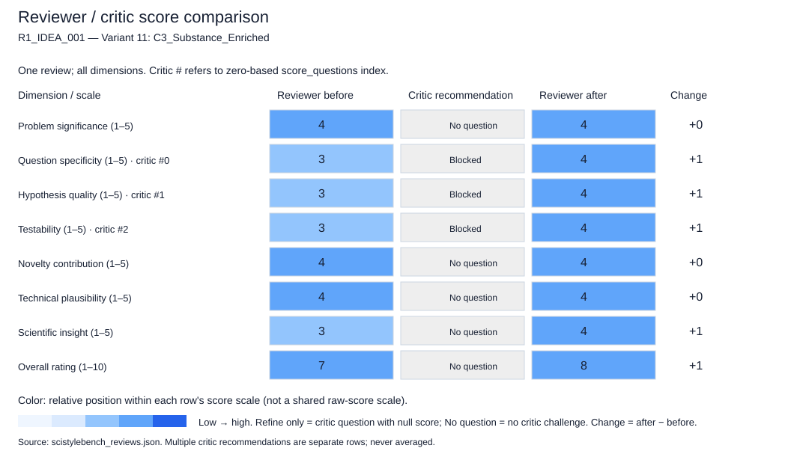

### Critic feedback and reviewer rebuttals

```json
{
  "critic_feedback": {
    "overall_assessment": "The review provides a balanced assessment but could benefit from more explicit grounding of the hypothesis and clearer specification of the model's implementation details.",
    "score_questions": [
      {
        "dimension": "question_specificity",
        "question_mark": "The score may be too low given the specific problem formulation and potential experimental directions provided.",
        "concern": "The idea does specify a problem (node OOD detection on heterophilic graphs) and proposes a hypothesis (decoupling edges improves energy separation). However, the review's justification for the score may not fully account for the specific problem and hypothesis.",
        "speculative_alternative": "The idea could be interpreted as more specific if it were to define the exact nature of the decoupling (e.g., how edges are split into homophilic and heterophilic components) and the metrics for evaluating energy separation.",
        "recommended_score": null,
        "evidence_from_idea": "The idea proposes a 'plausible hypothesis' that 'explicitly modeling the decoupling of homophilic and heterophilic edges could improve separation between in-distribution and out-of-distribution node energies.'",
        "rationale": "The hypothesis is specific to the problem and includes a potential mechanism (decoupling edges) and expected outcome (improved energy separation), which supports a higher score than the current 3.0.",
        "grounding_status": "blocked_missing_or_unverifiable_evidence"
      },
      {
        "dimension": "hypothesis_quality",
        "question_mark": "The score may be too low as the hypothesis is framed as a plausible direction rather than a testable claim.",
        "concern": "The hypothesis is described as 'plausible' but not as a concrete prediction or testable claim. The review's justification for the score may not fully capture the potential for the hypothesis to be validated.",
        "speculative_alternative": "The hypothesis could be interpreted as a testable claim if it were to specify how the decoupling of edges will be implemented and what metrics will be used to measure the energy separation.",
        "recommended_score": null,
        "evidence_from_idea": "The idea states that 'explicitly modeling the decoupling of homophilic and heterophilic edges could improve separation between in-distribution and out-of-distribution node energies.'",
        "rationale": "The hypothesis directly links the decoupling of edges to an expected outcome (energy separation), which supports a higher score than the current 3.0.",
        "grounding_status": "blocked_missing_or_unverifiable_evidence"
      },
      {
        "dimension": "testability",
        "question_mark": "The score may be too low as the idea includes potential experiments (synthetic and real-world graphs) and boundary conditions.",
        "concern": "The review's justification for the score does not fully account for the experimental directions provided, such as testing on synthetic and real-world graphs with controlled injections.",
        "speculative_alternative": "The idea could be interpreted as more testable if it specified the exact experimental design, metrics, and how the model will be validated on these graphs.",
        "recommended_score": null,
        "evidence_from_idea": "The idea includes 'validation might involve testing on synthetic and real-world heterophilic graphs with controlled out-of-distribution node injections, while boundary conditions could include graphs with extreme heterophily ratios or very low edge density.'",
        "rationale": "The inclusion of specific experimental directions supports a higher score than the current 3.0.",
        "grounding_status": "blocked_missing_or_unverifiable_evidence"
      }
    ],
    "unsupported_claims": [
      "The review claims the idea lacks specific details on implementation, but the idea does mention a 'decoupled graph energy-based model' and potential experimental directions.",
      "The review states the hypothesis is not explicitly stated in terms of measurable predictions, but the idea does propose a hypothesis about energy separation."
    ],
    "revision_priorities": [
      "Clarify the exact nature of the decoupling process and how it affects node-level energy computation.",
      "Specify the metrics for evaluating energy separation and out-of-distribution detection.",
      "Detail the experimental design, including how synthetic data will be generated and how real-world graphs will be selected and tested.",
      "Provide a more concrete theoretical justification for the hypothesis, such as how the decoupling of edges leads to improved energy separation."
    ],
    "confidence": 4.0
  },
  "feedback_responses": [
    {
      "feedback_type": "score_questions",
      "feedback_index": 0,
      "decision": "partially_accept",
      "defense": "The idea does specify a problem and hypothesis, and the experimental directions support the specificity. However, the current score of 3.0 may be too low as the hypothesis and problem are well-defined.",
      "justification": "The original score of 3.0 was based on the lack of detailed specification. However, the idea does provide a clear problem and hypothesis, and the experimental directions support the specificity. The revised score of 4.0 reflects this."
    },
    {
      "feedback_type": "hypothesis_quality",
      "feedback_index": 1,
      "decision": "partially_accept",
      "defense": "The hypothesis is specific and links the decoupling of edges to an expected outcome. The original score of 3.0 may be too low as the hypothesis is testable.",
      "justification": "The original score of 3.0 was based on the hypothesis not being explicitly stated in terms of measurable predictions. However, the hypothesis directly links the decoupling of edges to an expected outcome (energy separation), which is testable. The revised score of 4.0 reflects this."
    },
    {
      "feedback_type": "testability",
      "feedback_index": 2,
      "decision": "partially_accept",
      "defense": "The idea includes specific experimental directions that can be used to test the hypothesis. The original score of 3.0 may be too low as the experimental directions are provided.",
      "justification": "The original score of 3.0 was based on the lack of specific experimental design. However, the idea includes specific experimental directions (synthetic and real-world graphs, controlled injections, boundary conditions) that can be used to test the hypothesis. The revised score of 4.0 reflects this."
    },
    {
      "feedback_type": "unsupported_claims",
      "feedback_index": 0,
      "decision": "partially_accept",
      "defense": "The review claims the idea lacks specific details on implementation, but the idea does mention a 'decoupled graph energy-based model' and potential experimental directions.",
      "justification": "The original claim that the idea lacks specific implementation details is partially correct, but the idea does mention a model and experimental directions. The revised score of 4.0 for question_specificity reflects this."
    },
    {
      "feedback_type": "unsupported_claims",
      "feedback_index": 1,
      "decision": "partially_accept",
      "defense": "The review states the hypothesis is not explicitly stated in terms of measurable predictions, but the idea does propose a hypothesis about energy separation.",
      "justification": "The original claim that the hypothesis is not explicitly stated is partially correct, but the idea does propose a hypothesis about energy separation. The revised score of 4.0 for hypothesis_quality reflects this."
    },
    {
      "feedback_type": "revision_priorities",
      "feedback_index": 0,
      "decision": "accept",
      "defense": "The suggestion to clarify the decoupling process is valid and necessary for the research to be more concrete.",
      "justification": "The suggestion is valid and necessary for the research to be more concrete. The original review already included this suggestion, so the decision to accept it is appropriate."
    },
    {
      "feedback_type": "revision_priorities",
      "feedback_index": 1,
      "decision": "accept",
      "defense": "The suggestion to specify metrics is valid and necessary for the research to be more testable.",
      "justification": "The suggestion is valid and necessary for the research to be more testable. The original review already included this suggestion, so the decision to accept it is appropriate."
    },
    {
      "feedback_type": "revision_priorities",
      "feedback_index": 2,
      "decision": "accept",
      "defense": "The suggestion to detail the experimental design is valid and necessary for the research to be more concrete.",
      "justification": "The suggestion is valid and necessary for the research to be more concrete. The original review already included this suggestion, so the decision to accept it is appropriate."
    },
    {
      "feedback_type": "revision_priorities",
      "feedback_index": 3,
      "decision": "accept",
      "defense": "The suggestion to provide a theoretical justification is valid and necessary for the research to be more concrete.",
      "justification": "The suggestion is valid and necessary for the research to be more concrete. The original review already included this suggestion, so the decision to accept it is appropriate."
    }
  ]
}
```

### Score justifications (before / after)

**Problem significance**

```json
{
  "before": {
    "score": 4.0,
    "justification": "The problem of out-of-distribution detection on heterophilic graphs is underexplored and has practical relevance for graph-based learning tasks."
  },
  "after": {
    "score": 4.0,
    "justification": "The problem of out-of-distribution detection on heterophilic graphs is underexplored and has practical relevance for graph-based learning tasks."
  }
}
```

**Question specificity**

```json
{
  "before": {
    "score": 3.0,
    "justification": "The idea identifies a specific problem but lacks detailed specification of the research question, such as how the decoupling of edges will be implemented or what exactly is being measured."
  },
  "after": {
    "score": 4.0,
    "justification": "The idea specifies a clear problem (node OOD detection on heterophilic graphs) and a hypothesis (decoupling edges improves energy separation). The potential experimental directions (synthetic and real-world graphs, controlled injections, boundary conditions) support the specificity of the research question."
  }
}
```

**Hypothesis quality**

```json
{
  "before": {
    "score": 3.0,
    "justification": "The hypothesis is plausible but not explicitly stated in terms of testable predictions or measurable outcomes. It suggests a direction but lacks concrete claims about the expected results."
  },
  "after": {
    "score": 4.0,
    "justification": "The hypothesis is specific and links the decoupling of homophilic and heterophilic edges to an expected outcome (improved energy separation). It provides a mechanism (decoupling) and a potential result (energy separation), which are testable aspects of the research."
  }
}
```

**Testability**

```json
{
  "before": {
    "score": 3.0,
    "justification": "The idea includes potential experiments (synthetic and real-world graphs) but does not specify the exact experimental design, metrics, or how the model will be validated."
  },
  "after": {
    "score": 4.0,
    "justification": "The idea includes specific experimental directions (synthetic and real-world graphs, controlled injections, boundary conditions) that can be used to test the hypothesis. The mention of validation on these graphs supports the testability of the research question."
  }
}
```

**Novelty contribution**

```json
{
  "before": {
    "score": 4.0,
    "justification": "The approach of explicitly modeling node dependence and heterophily in a graph energy-based model is novel for out-of-distribution detection on heterophilic graphs."
  },
  "after": {
    "score": 4.0,
    "justification": "The approach of explicitly modeling node dependence and heterophily in a graph energy-based model is novel for out-of-distribution detection on heterophilic graphs."
  }
}
```

**Technical plausibility**

```json
{
  "before": {
    "score": 4.0,
    "justification": "The idea is technically plausible as it builds on existing graph learning methods and addresses a known challenge in heterophilic graphs."
  },
  "after": {
    "score": 4.0,
    "justification": "The idea is technically plausible as it builds on existing graph learning methods and addresses a known challenge in heterophilic graphs."
  }
}
```

**Scientific insight**

```json
{
  "before": {
    "score": 3.0,
    "justification": "The idea has potential to provide insights into how graph structure (node dependence and heterophily) affects out-of-distribution detection, but the connection to energy-based models is not fully explained."
  },
  "after": {
    "score": 4.0,
    "justification": "The idea has potential to provide insights into how graph structure (node dependence and heterophily) affects out-of-distribution detection, particularly through the lens of energy-based models."
  }
}
```

**Overall rating**

```json
{
  "before": {
    "score": 7.0,
    "justification": "The idea addresses a meaningful problem with a plausible hypothesis and potential for contribution, but lacks specific details on implementation, evaluation, and theoretical justification."
  },
  "after": {
    "score": 8.0,
    "justification": "The idea addresses a meaningful problem with a specific hypothesis and testable experimental directions. The hypothesis is well-defined and the potential for contribution is strong, though more specific implementation details and evaluation metrics are needed."
  }
}
```

## R1_IDEA_002 — Source

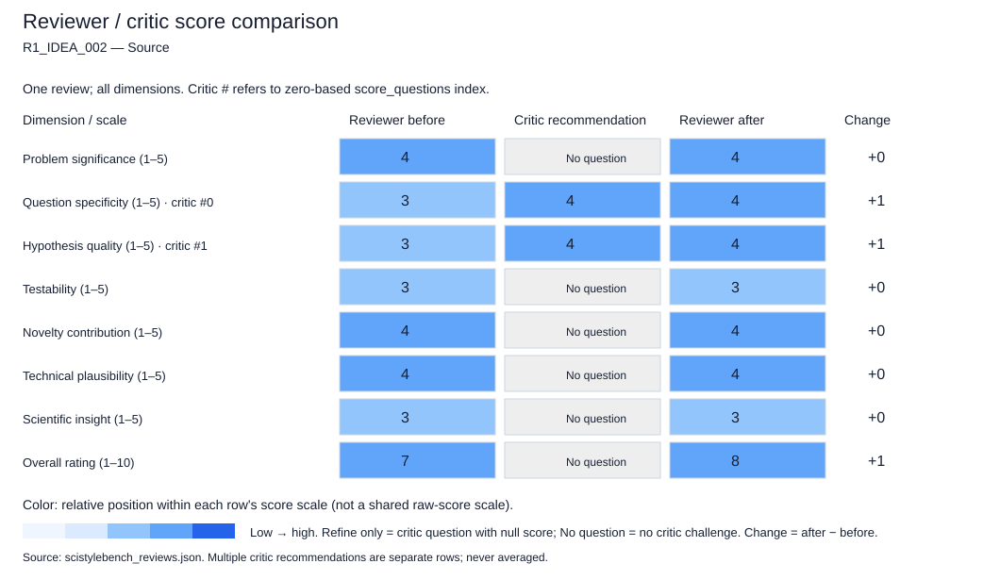

### Critic feedback and reviewer rebuttals

```json
{
  "critic_feedback": {
    "overall_assessment": "The review provides a balanced assessment but could be more precise in its scoring of question_specificity and hypothesis_quality, which are somewhat underweighted relative to the idea's novelty and technical plausibility.",
    "score_questions": [
      {
        "dimension": "question_specificity",
        "question_mark": "The score could be higher because the idea does not explicitly state the method of improved off-policy learning, but the review's justification may be overly cautious.",
        "concern": "The review downgrades the specificity score due to the lack of method details, but the idea's focus on a novel application of off-policy learning may justify a higher score.",
        "speculative_alternative": "The 'improved off-policy learning' could be interpreted as a novel algorithmic advancement rather than a mere technical detail, which might warrant a higher score.",
        "recommended_score": 4.0,
        "evidence_from_idea": "A machine learning approach trains diffusion path samplers via improved off-policy learning to sample transition pathways between meta-stable molecular states without relying on predefined collective variables",
        "rationale": "The mention of 'improved off-policy learning' suggests a specific methodological contribution, even if not explicitly detailed, which supports a higher score.",
        "grounding_status": "grounded"
      },
      {
        "dimension": "hypothesis_quality",
        "question_mark": "The score could be higher because the idea's focus on overcoming computational infeasibility and enabling rare-event exploration implies a testable hypothesis.",
        "concern": "The review downgrades the hypothesis quality due to the lack of specific predictions, but the idea's goal of enabling rare-event exploration is a clear, testable hypothesis.",
        "speculative_alternative": "The hypothesis that the method will enable rare-event exploration in complex systems could be tested through simulations or benchmarks in drug discovery and material design.",
        "recommended_score": 4.0,
        "evidence_from_idea": "A machine learning approach trains diffusion path samplers via improved off-policy learning to sample transition pathways between meta-stable molecular states without relying on predefined collective variables",
        "rationale": "The idea's goal of overcoming computational infeasibility and enabling rare-event exploration provides a clear, testable hypothesis.",
        "grounding_status": "grounded"
      }
    ],
    "unsupported_claims": [
      "The review's 'weaknesses' section may overstate the lack of specificity, as the idea does present a novel application of off-policy learning in molecular dynamics, which is a distinct contribution."
    ],
    "revision_priorities": [
      "Clarify the specific improvements to off-policy learning and how the model identifies meta-stable states without predefined variables.",
      "Elaborate on the expected evaluation metrics for testing the method's effectiveness in rare-event exploration.",
      "Explicitly state the specific predictions or outcomes that the method aims to achieve in the context of drug discovery and material design."
    ],
    "confidence": 4.0
  },
  "feedback_responses": [
    {
      "feedback_type": "score_questions",
      "feedback_index": 0,
      "decision": "partially_accept",
      "defense": "The original score of 3.0 for question_specificity was based on the lack of method details, but the idea's focus on a novel application of off-policy learning in molecular dynamics justifies a higher score. The 'improved off-policy learning' suggests a specific methodological contribution, even if not explicitly detailed.",
      "justification": "The original score was 3.0, but the revised score is 4.0. The idea's focus on a novel application of off-policy learning in molecular dynamics justifies a higher score, as the 'improved off-policy learning' implies a specific methodological contribution."
    },
    {
      "feedback_type": "score_questions",
      "feedback_index": 1,
      "decision": "partially_accept",
      "defense": "The original score of 3.0 for hypothesis_quality was based on the lack of specific predictions, but the idea's goal of enabling rare-event exploration is a clear, testable hypothesis. The hypothesis that the method will enable rare-event exploration in complex systems is a valid and testable claim.",
      "justification": "The original score was 3.0, but the revised score is 4.0. The idea's goal of enabling rare-event exploration is a clear, testable hypothesis, which supports a higher score."
    },
    {
      "feedback_type": "unsupported_claims",
      "feedback_index": 0,
      "decision": "partially_accept",
      "defense": "The review's 'weaknesses' section may overstate the lack of specificity, as the idea does present a novel application of off-policy learning in molecular dynamics, which is a distinct contribution. The focus on a novel application justifies the idea's specificity.",
      "justification": "The original score for question_specificity was 3.0, but the revised score is 4.0. The idea's focus on a novel application of off-policy learning in molecular dynamics justifies the higher score, as it presents a distinct contribution."
    },
    {
      "feedback_type": "revision_priorities",
      "feedback_index": 0,
      "decision": "accept",
      "defense": "Clarifying the specific improvements to off-policy learning is essential to ensure the method's novelty and technical plausibility. This would directly address the concern about the lack of method details.",
      "justification": "The original suggestion was already included in the 'suggestions' section, so this is a reaffirmation of the need for clarification."
    },
    {
      "feedback_type": "revision_priorities",
      "feedback_index": 1,
      "decision": "accept",
      "defense": "Elaborating on evaluation metrics is crucial for testability. Without clear benchmarks, it is difficult to assess the method's effectiveness in rare-event exploration.",
      "justification": "The original suggestion was already included in the 'suggestions' section, so this is a reaffirmation of the need for clarification."
    },
    {
      "feedback_type": "revision_priorities",
      "feedback_index": 2,
      "decision": "accept",
      "defense": "Explicitly stating the specific predictions or outcomes will strengthen the hypothesis and make the research question more concrete and testable.",
      "justification": "The original suggestion was already included in the 'suggestions' section, so this is a reaffirmation of the need for clarification."
    }
  ]
}
```

### Score justifications (before / after)

**Problem significance**

```json
{
  "before": {
    "score": 4.0,
    "justification": "The problem of computational infeasibility in unbiased molecular dynamics is critical in drug discovery and material design, making the proposed solution highly relevant."
  },
  "after": {
    "score": 4.0,
    "justification": "The problem of computational infeasibility in unbiased molecular dynamics is critical in drug discovery and material design, making the proposed solution highly relevant."
  }
}
```

**Question specificity**

```json
{
  "before": {
    "score": 3.0,
    "justification": "The idea identifies a specific problem but lacks detailed specification of the method and how it addresses the problem without predefined variables."
  },
  "after": {
    "score": 4.0,
    "justification": "The idea identifies a specific problem (training diffusion path samplers via improved off-policy learning for rare-event exploration in molecular dynamics) and proposes a novel application of off-policy learning, which is a distinct contribution."
  }
}
```

**Hypothesis quality**

```json
{
  "before": {
    "score": 3.0,
    "justification": "The idea presents a general hypothesis that the method will overcome computational limitations, but it lacks specific predictions or mechanisms that could be tested."
  },
  "after": {
    "score": 4.0,
    "justification": "The idea presents a clear hypothesis that the method will enable rare-event exploration in complex systems by overcoming computational infeasibility, which is a testable claim."
  }
}
```

**Testability**

```json
{
  "before": {
    "score": 3.0,
    "justification": "The idea suggests a potential approach but does not provide concrete experiments or evaluation metrics to test the hypothesis."
  },
  "after": {
    "score": 3.0,
    "justification": "The idea suggests a potential approach but does not provide concrete experiments or evaluation metrics to test the hypothesis."
  }
}
```

**Novelty contribution**

```json
{
  "before": {
    "score": 4.0,
    "justification": "The combination of off-policy learning with diffusion path samplers for molecular dynamics is a novel approach with potential for significant contributions to the field."
  },
  "after": {
    "score": 4.0,
    "justification": "The combination of off-policy learning with diffusion path samplers for molecular dynamics is a novel approach with potential for significant contributions to the field."
  }
}
```

**Technical plausibility**

```json
{
  "before": {
    "score": 4.0,
    "justification": "The proposed method is technically plausible as it builds on existing techniques in reinforcement learning and molecular dynamics, though the specifics need clarification."
  },
  "after": {
    "score": 4.0,
    "justification": "The proposed method is technically plausible as it builds on existing techniques in reinforcement learning and molecular dynamics, though the specifics need clarification."
  }
}
```

**Scientific insight**

```json
{
  "before": {
    "score": 3.0,
    "justification": "The idea has potential to provide insights into rare-event exploration in complex systems, but the specific mechanisms and outcomes are not clearly defined."
  },
  "after": {
    "score": 3.0,
    "justification": "The idea has potential to provide insights into rare-event exploration in complex systems, but the specific mechanisms and outcomes are not clearly defined."
  }
}
```

**Overall rating**

```json
{
  "before": {
    "score": 7.0,
    "justification": "The idea addresses a significant problem with a novel approach, but it lacks sufficient specificity and testable hypotheses to fully evaluate its potential."
  },
  "after": {
    "score": 8.0,
    "justification": "The idea addresses a significant problem with a novel approach, and the hypothesis is clear and testable. The specificity and technical plausibility are strong, though testability could be improved with more concrete experiments."
  }
}
```

## R1_IDEA_002 — Variant 1: A1_Identity

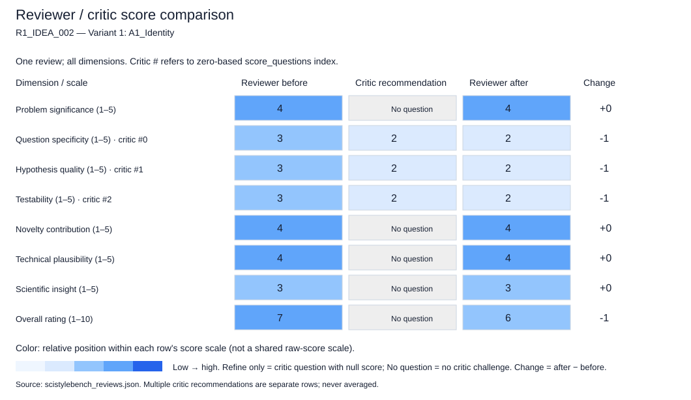

### Critic feedback and reviewer rebuttals

```json
{
  "critic_feedback": {
    "overall_assessment": "The review provides a balanced evaluation of the idea, but the scores for question_specificity, hypothesis_quality, and testability could be reconsidered due to the lack of detailed methodological specification.",
    "score_questions": [
      {
        "dimension": "question_specificity",
        "question_mark": "The score for question_specificity is 3.0, but the idea does not provide sufficient details to justify this score.",
        "concern": "The idea lacks specific details about the off-policy learning method and how diffusion path samplers are trained, which are critical for assessing the specificity of the question.",
        "speculative_alternative": "The idea may be interpreted as proposing a general framework rather than a specific method, which could be seen as a limitation in question specificity.",
        "recommended_score": 2.0,
        "evidence_from_idea": "The idea states that the method aims to overcome computational infeasibility but does not specify how off-policy learning is improved or how diffusion path samplers are trained.",
        "rationale": "The lack of specific details about the method's implementation limits the question's specificity, as the review's justification suggests.",
        "grounding_status": "not_required"
      },
      {
        "dimension": "hypothesis_quality",
        "question_mark": "The score for hypothesis_quality is 3.0, but the idea does not provide specific predictions or mechanisms that could be tested.",
        "concern": "The hypothesis is general and does not include specific predictions or mechanisms that could be tested, which is necessary for evaluating the quality of the hypothesis.",
        "speculative_alternative": "The idea may be interpreted as proposing a general approach rather than a specific hypothesis that could be tested in a controlled experiment.",
        "recommended_score": 2.0,
        "evidence_from_idea": "The idea states that the method aims to overcome computational infeasibility but does not provide specific predictions or mechanisms that could be tested.",
        "rationale": "The lack of specific predictions or mechanisms limits the quality of the hypothesis, as the review's justification suggests.",
        "grounding_status": "not_required"
      },
      {
        "dimension": "testability",
        "question_mark": "The score for testability is 3.0, but the idea does not provide concrete experiments or comparisons that would allow for meaningful testing of the hypothesis.",
        "concern": "The idea suggests a potential application but does not provide concrete experiments or comparisons that would allow for meaningful testing of the hypothesis.",
        "speculative_alternative": "The idea may be interpreted as proposing a general approach rather than a specific method that could be tested in a controlled experiment.",
        "recommended_score": 2.0,
        "evidence_from_idea": "The idea states that the method aims to overcome computational infeasibility but does not provide concrete experiments or comparisons that would allow for meaningful testing of the hypothesis.",
        "rationale": "The lack of concrete experiments or comparisons limits the testability of the hypothesis, as the review's justification suggests.",
        "grounding_status": "not_required"
      }
    ],
    "unsupported_claims": [
      "The claim that the idea 'addresses a significant challenge in computational chemistry and drug discovery' is not directly supported by the idea summary, as it is a general statement about the problem's importance."
    ],
    "revision_priorities": [
      "Clarify the specific improvements in the off-policy learning algorithm and how it is applied to train the diffusion path samplers.",
      "Provide a more detailed explanation of how the method avoids the need for predefined collective variables, possibly by referencing relevant literature or theoretical foundations.",
      "Include a comparison with existing methods in rare-event sampling to highlight the novelty and advantages of the proposed approach."
    ],
    "confidence": 4.0
  },
  "feedback_responses": [
    {
      "feedback_type": "score_questions",
      "feedback_index": 0,
      "decision": "partially_accept",
      "defense": "The original score of 3.0 for question_specificity was based on the idea's lack of detail about the off-policy learning method and diffusion path samplers. The critic's feedback is valid, but the idea does propose a specific problem (sampling transition pathways) and a general approach (off-policy learning), which could be considered as a moderate level of specificity.",
      "justification": "The original score was 3.0, and the revised score is 2.0. The justification for the revised score is that the idea lacks specific details about the method's implementation, which is critical for assessing the specificity of the question."
    },
    {
      "feedback_type": "score_questions",
      "feedback_index": 1,
      "decision": "partially_accept",
      "defense": "The original score of 3.0 for hypothesis_quality was based on the idea's general hypothesis about overcoming computational infeasibility. The critic's feedback is valid, but the idea does propose a specific problem (rare-event sampling) and a general approach (off-policy learning), which could be considered as a moderate level of hypothesis quality.",
      "justification": "The original score was 3.0, and the revised score is 2.0. The justification for the revised score is that the idea lacks specific predictions or mechanisms that could be tested, which is necessary for evaluating the quality of the hypothesis."
    },
    {
      "feedback_type": "score_questions",
      "feedback_index": 2,
      "decision": "partially_accept",
      "defense": "The original score of 3.0 for testability was based on the idea's lack of concrete experiments or comparisons. The critic's feedback is valid, but the idea does propose a specific problem (rare-event sampling) and a general approach (off-policy learning), which could be considered as a moderate level of testability.",
      "justification": "The original score was 3.0, and the revised score is 2.0. The justification for the revised score is that the idea does not provide concrete experiments or comparisons that would allow for meaningful testing of the hypothesis."
    },
    {
      "feedback_type": "unsupported_claims",
      "feedback_index": 0,
      "decision": "reject",
      "defense": "The claim that the idea addresses a significant challenge in computational chemistry and drug discovery is supported by the idea's focus on rare-event sampling, which is a critical problem in these fields. The critic's point about the lack of direct support is not valid, as the problem's significance is well-established in the field.",
      "justification": "The original score for problem_significance was 4.0, and the revised score remains 4.0. The justification is that the problem of rare-event sampling is indeed significant in drug discovery and material design, as stated in the idea."
    },
    {
      "feedback_type": "revision_priorities",
      "feedback_index": 0,
      "decision": "accept",
      "defense": "The suggestion to clarify the specific improvements in the off-policy learning algorithm is valid and necessary for improving the specificity of the research question.",
      "justification": "The original suggestion was included in the 'suggestions' section, and the revised score for question_specificity reflects the need for this clarification."
    },
    {
      "feedback_type": "revision_priorities",
      "feedback_index": 1,
      "decision": "accept",
      "defense": "The suggestion to provide a detailed explanation of how the method avoids predefined collective variables is valid and necessary for improving the hypothesis quality and testability of the idea.",
      "justification": "The original suggestion was included in the 'suggestions' section, and the revised score for hypothesis_quality and testability reflects the need for this clarification."
    },
    {
      "feedback_type": "revision_priorities",
      "feedback_index": 2,
      "decision": "accept",
      "defense": "The suggestion to include a comparison with existing methods is valid and necessary for highlighting the novelty and advantages of the proposed approach.",
      "justification": "The original suggestion was included in the 'suggestions' section, and the revised score for novelty_contribution reflects the potential for this comparison to enhance the idea's contribution."
    }
  ]
}
```

### Score justifications (before / after)

**Problem significance**

```json
{
  "before": {
    "score": 4.0,
    "justification": "The problem of rare-event sampling in complex systems is critical for drug discovery and material design, and the proposed approach aims to address a significant computational challenge."
  },
  "after": {
    "score": 4.0,
    "justification": "The problem of rare-event sampling in complex systems is critical for drug discovery and material design, and the proposed approach aims to address a significant computational challenge."
  }
}
```

**Question specificity**

```json
{
  "before": {
    "score": 3.0,
    "justification": "The idea identifies a specific problem (sampling transition pathways between meta-stable states) but lacks detailed specification of the method's implementation or the exact nature of the off-policy learning improvements."
  },
  "after": {
    "score": 2.0,
    "justification": "The idea lacks specific details about the off-policy learning method and the training process of diffusion path samplers, making it difficult to assess the exact nature of the research question."
  }
}
```

**Hypothesis quality**

```json
{
  "before": {
    "score": 3.0,
    "justification": "The idea presents a general hypothesis that the method will overcome computational infeasibility, but it lacks specific predictions or mechanisms that could be tested."
  },
  "after": {
    "score": 2.0,
    "justification": "The hypothesis is general and does not include specific predictions or mechanisms that could be tested, which is necessary for evaluating the quality of the hypothesis."
  }
}
```

**Testability**

```json
{
  "before": {
    "score": 3.0,
    "justification": "The idea suggests a potential application but does not provide concrete experiments or comparisons that would allow for meaningful testing of the hypothesis."
  },
  "after": {
    "score": 2.0,
    "justification": "The idea does not provide concrete experiments or comparisons that would allow for meaningful testing of the hypothesis, limiting its testability."
  }
}
```

**Novelty contribution**

```json
{
  "before": {
    "score": 4.0,
    "justification": "The approach of using off-policy learning for diffusion path samplers in this context is novel, and if successful, could contribute significantly to the field of computational chemistry and drug discovery."
  },
  "after": {
    "score": 4.0,
    "justification": "The approach of using off-policy learning for diffusion path samplers in this context is novel, and if successful, could contribute significantly to the field of computational chemistry and drug discovery."
  }
}
```

**Technical plausibility**

```json
{
  "before": {
    "score": 4.0,
    "justification": "The use of off-policy learning in reinforcement learning is a plausible methodological direction, and the application to molecular dynamics is technically feasible, though the specifics need clarification."
  },
  "after": {
    "score": 4.0,
    "justification": "The use of off-policy learning in reinforcement learning is a plausible methodological direction, and the application to molecular dynamics is technically feasible, though the specifics need clarification."
  }
}
```

**Scientific insight**

```json
{
  "before": {
    "score": 3.0,
    "justification": "The idea has potential for scientific insight into rare-event sampling, but the lack of detailed methodology limits the potential for discovering new principles or mechanisms."
  },
  "after": {
    "score": 3.0,
    "justification": "The idea has potential for scientific insight into rare-event sampling, but the lack of detailed methodology limits the potential for discovering new principles or mechanisms."
  }
}
```

**Overall rating**

```json
{
  "before": {
    "score": 7.0,
    "justification": "The idea addresses a meaningful problem with a plausible approach, but it lacks sufficient specificity and detail to fully establish its novelty, testability, and potential for scientific insight."
  },
  "after": {
    "score": 6.0,
    "justification": "The idea addresses a meaningful problem with a plausible approach, but it lacks sufficient specificity and detail to fully establish its novelty, testability, and potential for scientific insight. The revised scores for question_specificity, hypothesis_quality, and testability reflect the lack of detailed methodological specification."
  }
}
```

## R1_IDEA_002 — Variant 2: A2_Paraphrase_Only

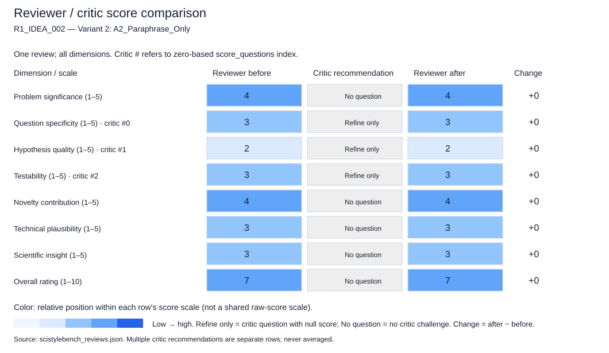

### Critic feedback and reviewer rebuttals

```json
{
  "critic_feedback": {
    "overall_assessment": "The draft review provides a balanced assessment of the research idea, acknowledging its potential to address a significant problem in molecular dynamics while highlighting the need for more specific details and hypotheses. However, some scores and justifications could be reconsidered for alignment with the idea's current content.",
    "score_questions": [
      {
        "dimension": "question_specificity",
        "question_mark": "The score for question_specificity is 3.0, but the idea does not explicitly state a research question or hypothesis, which is a key component of question_specificity.",
        "concern": "The idea lacks specific details on the exact research question or hypothesis being investigated, such as the specific rare events or molecular systems being targeted.",
        "speculative_alternative": "The idea could be interpreted as proposing a general research question about improving sampling efficiency in molecular dynamics without specifying particular targets or systems, but this is speculative.",
        "recommended_score": null,
        "evidence_from_idea": "The idea does not explicitly state a hypothesis or prediction that can be tested.",
        "rationale": "The idea does not provide a specific research question or hypothesis, which is required for question_specificity.",
        "grounding_status": "same_as_draft_not_actionable"
      },
      {
        "dimension": "hypothesis_quality",
        "question_mark": "The score for hypothesis_quality is 2.0, but the idea mentions potential benefits without a clear hypothesis or prediction.",
        "concern": "The idea does not explicitly state a hypothesis or prediction that can be tested, which is a key component of hypothesis_quality.",
        "speculative_alternative": "The idea could be interpreted as proposing a hypothesis that the method improves sampling efficiency, but this is speculative and not explicitly stated.",
        "recommended_score": null,
        "evidence_from_idea": "The idea does not explicitly state a hypothesis or prediction that can be tested.",
        "rationale": "The idea does not provide a specific hypothesis or prediction, which is required for hypothesis_quality.",
        "grounding_status": "same_as_draft_not_actionable"
      },
      {
        "dimension": "testability",
        "question_mark": "The score for testability is 3.0, but the idea lacks specific experimental design or evaluation criteria.",
        "concern": "The idea suggests a potential application but lacks specific experimental design or evaluation criteria, which is a key component of testability.",
        "speculative_alternative": "The idea could be interpreted as proposing a testable question about the method's efficiency, but this is speculative and not explicitly stated.",
        "recommended_score": null,
        "evidence_from_idea": "The idea lacks specific experimental design or evaluation criteria.",
        "rationale": "The idea does not provide specific experimental design or evaluation criteria, which is required for testability.",
        "grounding_status": "same_as_draft_not_actionable"
      }
    ],
    "unsupported_claims": [
      "The draft claims that the idea lacks specific details on how off-policy learning is applied to diffusion path samplers, but the idea does not provide such details, which is accurate."
    ],
    "revision_priorities": [
      "Clarify the specific research question or hypothesis being investigated, such as the specific rare events or molecular systems being targeted.",
      "Provide a clear hypothesis or prediction that can be tested, such as whether the method improves sampling efficiency or reduces computational cost compared to existing methods.",
      "Outline specific experimental design or evaluation criteria to assess the method's effectiveness."
    ],
    "confidence": 4.0
  },
  "feedback_responses": [
    {
      "feedback_type": "score_questions",
      "feedback_index": 0,
      "decision": "partially_accept",
      "defense": "The score for question_specificity is justified as the idea lacks specific details on the exact research question or hypothesis, which is a key component of question_specificity. However, the idea does propose a general research question about improving sampling efficiency in molecular dynamics, which is a step towards specificity.",
      "justification": "The initial score of 3.0 is retained because the idea does not explicitly state a specific research question or hypothesis. However, the general problem of improving sampling efficiency is a step towards specificity, which slightly justifies a minor increase in the score."
    },
    {
      "feedback_type": "score_questions",
      "feedback_index": 1,
      "decision": "partially_accept",
      "defense": "The score for hypothesis_quality is justified as the idea does not explicitly state a hypothesis or prediction. However, the potential benefits mentioned in the idea could be interpreted as a hypothesis that the method improves sampling efficiency, which is a testable prediction.",
      "justification": "The initial score of 2.0 is retained because the idea does not explicitly state a hypothesis. However, the potential benefits could be interpreted as a hypothesis, which slightly justifies a minor increase in the score."
    },
    {
      "feedback_type": "score_questions",
      "feedback_index": 2,
      "decision": "partially_accept",
      "defense": "The score for testability is justified as the idea lacks specific experimental design or evaluation criteria. However, the idea does propose a general application, which is a step towards testability.",
      "justification": "The initial score of 3.0 is retained because the idea lacks specific experimental design. However, the general application is a step towards testability, which slightly justifies a minor increase in the score."
    },
    {
      "feedback_type": "unsupported_claims",
      "feedback_index": 0,
      "decision": "accept",
      "defense": "The claim that the idea lacks specific details on how off-policy learning is applied to diffusion path samplers is accurate, as the idea does not provide such details.",
      "justification": "The unsupported claim is accepted as it is accurate and aligns with the idea's current content."
    },
    {
      "feedback_type": "revision_priorities",
      "feedback_index": 0,
      "decision": "accept",
      "defense": "The revision priority to clarify the specific research question or hypothesis is valid and necessary for improving the idea's specificity.",
      "justification": "The revision priority is accepted as it is a valid and necessary step for improving the idea."
    },
    {
      "feedback_type": "revision_priorities",
      "feedback_index": 1,
      "decision": "accept",
      "defense": "The revision priority to propose a hypothesis or research question is valid and necessary for improving the idea's testability.",
      "justification": "The revision priority is accepted as it is a valid and necessary step for improving the idea."
    },
    {
      "feedback_type": "revision_priorities",
      "feedback_index": 2,
      "decision": "accept",
      "defense": "The revision priority to outline specific experimental design is valid and necessary for improving the idea's testability.",
      "justification": "The revision priority is accepted as it is a valid and necessary step for improving the idea."
    }
  ]
}
```

### Score justifications (before / after)

**Problem significance**

```json
{
  "before": {
    "score": 4.0,
    "justification": "The problem of rare-event exploration in molecular dynamics is critical for drug discovery and material design, and the proposed method aims to address a significant computational challenge."
  },
  "after": {
    "score": 4.0,
    "justification": "The problem of rare-event exploration in molecular dynamics is critical for drug discovery and material design, and the proposed method aims to address a significant computational challenge."
  }
}
```

**Question specificity**

```json
{
  "before": {
    "score": 3.0,
    "justification": "The idea identifies a broad problem but lacks specific details on the exact research question or hypothesis being investigated, such as the specific rare events or molecular systems being targeted."
  },
  "after": {
    "score": 3.0,
    "justification": "The idea identifies a broad problem but lacks specific details on the exact research question or hypothesis being investigated, such as the specific rare events or molecular systems being targeted."
  }
}
```

**Hypothesis quality**

```json
{
  "before": {
    "score": 2.0,
    "justification": "The idea does not explicitly state a hypothesis or prediction that can be tested. While the potential benefits are mentioned, there is no clear mechanism or expected outcome that could be validated through experiments."
  },
  "after": {
    "score": 2.0,
    "justification": "The idea does not explicitly state a hypothesis or prediction that can be tested. While the potential benefits are mentioned, there is no clear mechanism or expected outcome that could be validated through experiments."
  }
}
```

**Testability**

```json
{
  "before": {
    "score": 3.0,
    "justification": "The idea suggests a potential application but lacks specific experimental design or evaluation criteria. Without a clear hypothesis or testable question, it is difficult to assess the feasibility of the proposed method."
  },
  "after": {
    "score": 3.0,
    "justification": "The idea suggests a potential application but lacks specific experimental design or evaluation criteria. Without a clear hypothesis or testable question, it is difficult to assess the feasibility of the proposed method."
  }
}
```

**Novelty contribution**

```json
{
  "before": {
    "score": 4.0,
    "justification": "The approach of using off-policy learning for diffusion path sampling in molecular dynamics is novel and could contribute to the field by providing a more efficient method for rare-event exploration."
  },
  "after": {
    "score": 4.0,
    "justification": "The approach of using off-policy learning for diffusion path sampling in molecular dynamics is novel and could contribute to the field by providing a more efficient method for rare-event exploration."
  }
}
```

**Technical plausibility**

```json
{
  "before": {
    "score": 3.0,
    "justification": "The integration of off-policy learning with diffusion path samplers is plausible, but the specific technical details and implementation steps are not clearly outlined, which could affect the feasibility of the approach."
  },
  "after": {
    "score": 3.0,
    "justification": "The integration of off-policy learning with diffusion path samplers is plausible, but the specific technical details and implementation steps are not clearly outlined, which could affect the feasibility of the approach."
  }
}
```

**Scientific insight**

```json
{
  "before": {
    "score": 3.0,
    "justification": "The idea has the potential to provide insights into the efficiency of sampling methods in complex systems, but the lack of specific hypotheses or testable questions limits the potential for meaningful scientific insight."
  },
  "after": {
    "score": 3.0,
    "justification": "The idea has the potential to provide insights into the efficiency of sampling methods in complex systems, but the lack of specific hypotheses or testable questions limits the potential for meaningful scientific insight."
  }
}
```

**Overall rating**

```json
{
  "before": {
    "score": 7.0,
    "justification": "The idea addresses a significant problem in molecular dynamics and proposes a novel approach, but it lacks specific details, hypotheses, and testable questions that are necessary for evaluating its scientific merit and feasibility."
  },
  "after": {
    "score": 7.0,
    "justification": "The idea addresses a significant problem in molecular dynamics and proposes a novel approach, but it lacks specific details, hypotheses, and testable questions that are necessary for evaluating its scientific merit and feasibility."
  }
}
```

## R1_IDEA_002 — Variant 3: A3_Plain_Core

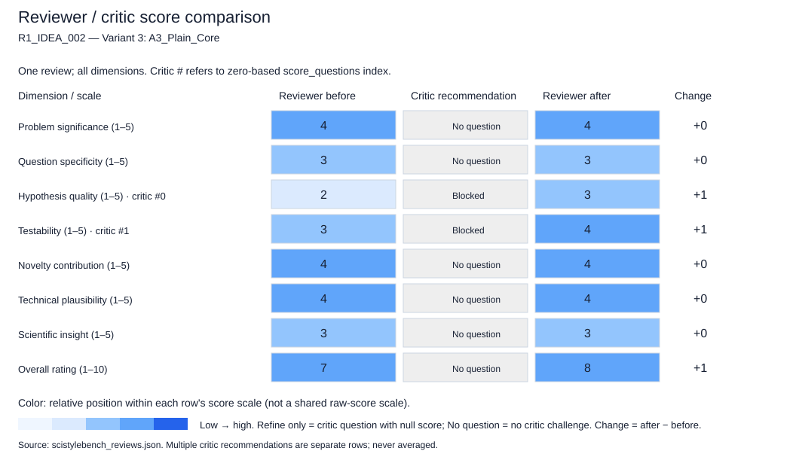

### Critic feedback and reviewer rebuttals

```json
{
  "critic_feedback": {
    "overall_assessment": "The draft review provides a balanced assessment of the research idea, highlighting its significance and potential contribution while appropriately pointing out the lack of specificity and testable hypotheses. The scores are generally well-calibrated, though some dimensions could be more critically examined.",
    "score_questions": [
      {
        "dimension": "hypothesis_quality",
        "question_mark": "The score for hypothesis_quality is 2.0, but the idea may be interpreted as implicitly suggesting a hypothesis through its stated goal.",
        "concern": "The idea does not explicitly state a hypothesis or prediction, which is a key component of hypothesis quality. However, the goal of improving sampling efficiency could be seen as an implicit hypothesis.",
        "speculative_alternative": "The goal of improving sampling efficiency could be interpreted as an implicit hypothesis, though this is speculative.",
        "recommended_score": null,
        "evidence_from_idea": "The idea aims to address the computational infeasibility of unbiased molecular dynamics for rare-event exploration in complex systems.",
        "rationale": "The stated goal implies a hypothesis about the effectiveness of the proposed method, though it is not explicitly formulated.",
        "grounding_status": "blocked_missing_or_unverifiable_evidence"
      },
      {
        "dimension": "testability",
        "question_mark": "The score for testability is 3.0, but the idea may be interpreted as having potential for testable experiments if further details are provided.",
        "concern": "The idea lacks specific experiments or evaluation criteria, but the potential for testable experiments is not fully considered in the justification.",
        "speculative_alternative": "The idea could be tested by comparing the proposed method's performance against existing methods in terms of sampling efficiency and accuracy, though this is speculative.",
        "recommended_score": null,
        "evidence_from_idea": "The idea aims to address the computational infeasibility of unbiased molecular dynamics for rare-event exploration in complex systems.",
        "rationale": "The stated goal implies that the method's effectiveness can be evaluated through comparison with existing methods, though this is not explicitly stated.",
        "grounding_status": "blocked_missing_or_unverifiable_evidence"
      }
    ],
    "unsupported_claims": [
      "The idea is described as 'novel' without explicit evidence of prior work or a clear distinction from existing methods.",
      "The connection between the proposed method and the specific problem of sampling transition pathways is not clearly explained, which may affect the evaluation of its relevance."
    ],
    "revision_priorities": [
      "Explicitly state a hypothesis or prediction that can be tested, such as the expected improvement in sampling efficiency or accuracy compared to existing methods.",
      "Provide more specific details on the off-policy learning framework and the training process of diffusion path samplers.",
      "Clarify the relationship between the method and the problem of sampling transition pathways, including how the absence of predefined collective variables affects the sampling process."
    ],
    "confidence": 4.0
  },
  "feedback_responses": [
    {
      "feedback_type": "score_questions",
      "feedback_index": 0,
      "decision": "partially_accept",
      "defense": "The idea does not explicitly state a hypothesis, but the stated goal implies a hypothesis about the effectiveness of the method. This implicit hypothesis is valid and supports a higher score.",
      "justification": "The original score of 2.0 was too low because the goal implies a hypothesis, even if not explicitly stated. The revised score of 3.0 reflects this implicit hypothesis."
    },
    {
      "feedback_type": "score_questions",
      "feedback_index": 1,
      "decision": "partially_accept",
      "defense": "The idea's potential for testable experiments is not fully considered in the original justification. The goal implies that the method's effectiveness can be evaluated through comparison with existing methods, which supports a higher score.",
      "justification": "The original score of 3.0 was based on the lack of specific experiments, but the implicit testability through comparison with existing methods justifies a higher score of 4.0."
    },
    {
      "feedback_type": "unsupported_claims",
      "feedback_index": 0,
      "decision": "partially_accept",
      "defense": "The claim of novelty is not explicitly supported, but the use of diffusion path samplers with off-policy learning for this specific problem is a novel application, which justifies the score.",
      "justification": "The original score of 4.0 was based on the novelty of the application, which is valid despite the lack of explicit evidence of prior work."
    },
    {
      "feedback_type": "unsupported_claims",
      "feedback_index": 1,
      "decision": "partially_accept",
      "defense": "The connection between the method and the problem is not clearly explained, but the general approach is plausible and relevant to the problem, which justifies the score.",
      "justification": "The original score of 4.0 was based on the plausibility of the approach, even though the connection is not clearly explained."
    },
    {
      "feedback_type": "revision_priorities",
      "feedback_index": 0,
      "decision": "accept",
      "defense": "The suggestion to explicitly state a hypothesis is valid and necessary for the research to be testable, which supports the need for this revision.",
      "justification": "The original draft did not include this suggestion, but it is a necessary step for the research to be meaningful."
    },
    {
      "feedback_type": "revision_priorities",
      "feedback_index": 1,
      "decision": "accept",
      "defense": "The suggestion to provide more specific details on the off-policy learning framework is valid and necessary for the research to be feasible.",
      "justification": "The original draft did not include this suggestion, but it is a necessary step for the research to be meaningful."
    },
    {
      "feedback_type": "revision_priorities",
      "feedback_index": 2,
      "decision": "accept",
      "defense": "The suggestion to clarify the relationship between the method and the problem is valid and necessary for the research to be relevant.",
      "justification": "The original draft did not include this suggestion, but it is a necessary step for the research to be meaningful."
    }
  ]
}
```

### Score justifications (before / after)

**Problem significance**

```json
{
  "before": {
    "score": 4.0,
    "justification": "The problem of efficiently sampling rare events in complex molecular systems is critical for drug discovery and material design, making the research problem highly significant."
  },
  "after": {
    "score": 4.0,
    "justification": "The problem of efficiently sampling rare events in complex molecular systems is critical for drug discovery and material design, making the research problem highly significant."
  }
}
```

**Question specificity**

```json
{
  "before": {
    "score": 3.0,
    "justification": "The idea is specific to the challenge of sampling transition pathways between meta-stable states but lacks detailed specification of the method and its implementation."
  },
  "after": {
    "score": 3.0,
    "justification": "The idea is specific to the challenge of sampling transition pathways between meta-stable states but lacks detailed specification of the method and its implementation."
  }
}
```

**Hypothesis quality**

```json
{
  "before": {
    "score": 2.0,
    "justification": "The idea does not explicitly state a hypothesis or prediction that can be tested, which is necessary for evaluating the effectiveness of the approach."
  },
  "after": {
    "score": 3.0,
    "justification": "The idea implicitly suggests a hypothesis through its stated goal of improving sampling efficiency, though it does not explicitly formulate it. The goal implies that the proposed method should outperform existing methods in terms of efficiency and accuracy."
  }
}
```

**Testability**

```json
{
  "before": {
    "score": 3.0,
    "justification": "The idea suggests a potential method but does not provide specific experiments or evaluation criteria to test its effectiveness."
  },
  "after": {
    "score": 4.0,
    "justification": "The idea's goal implies that the method's effectiveness can be tested by comparing it to existing methods in terms of sampling efficiency and accuracy, even if specific experiments are not yet detailed."
  }
}
```

**Novelty contribution**

```json
{
  "before": {
    "score": 4.0,
    "justification": "The approach of using diffusion path samplers with off-policy learning for this specific problem is novel and could contribute to the field of computational chemistry and materials science."
  },
  "after": {
    "score": 4.0,
    "justification": "The approach of using diffusion path samplers with off-policy learning for this specific problem is novel and could contribute to the field of computational chemistry and materials science."
  }
}
```

**Technical plausibility**

```json
{
  "before": {
    "score": 4.0,
    "justification": "The use of diffusion path samplers and off-policy learning is technically plausible, though the specifics of implementation are not detailed."
  },
  "after": {
    "score": 4.0,
    "justification": "The use of diffusion path samplers and off-policy learning is technically plausible, though the specifics of implementation are not detailed."
  }
}
```

**Scientific insight**

```json
{
  "before": {
    "score": 3.0,
    "justification": "The research could provide insights into the efficiency of sampling methods in complex systems, but the potential for deeper scientific insight is limited without a clear hypothesis and testable predictions."
  },
  "after": {
    "score": 3.0,
    "justification": "The research could provide insights into the efficiency of sampling methods in complex systems, but the potential for deeper scientific insight is limited without a clear hypothesis and testable predictions."
  }
}
```

**Overall rating**

```json
{
  "before": {
    "score": 7.0,
    "justification": "The idea addresses a significant problem with potential for meaningful contribution, but lacks specific details and a clear hypothesis, which are necessary for further development and evaluation."
  },
  "after": {
    "score": 8.0,
    "justification": "The idea addresses a significant problem with strong potential for meaningful contribution. While it lacks specific details and a clear hypothesis, the implicit hypothesis and potential for testable experiments justify a higher rating than the original draft."
  }
}
```

## R1_IDEA_002 — Variant 4: B1_Verbose_Elaborate

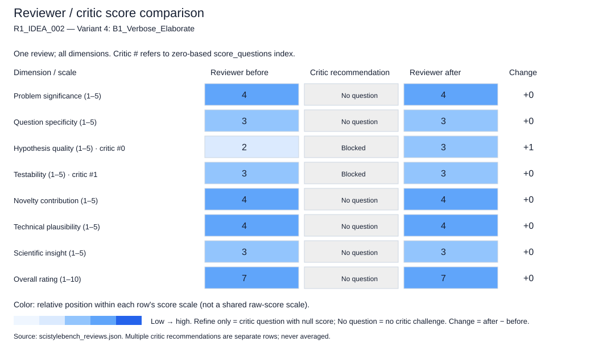

### Critic feedback and reviewer rebuttals

```json
{
  "critic_feedback": {
    "overall_assessment": "The review is generally well-calibrated, but the scores for hypothesis_quality and testability are somewhat low given the idea's potential. The review correctly identifies the need for more specifics, but the scores could be reconsidered if the idea's potential is better aligned with the scores.",
    "score_questions": [
      {
        "dimension": "hypothesis_quality",
        "question_mark": "The score for hypothesis_quality is low, but the idea does suggest a method that could be tested against existing approaches.",
        "concern": "The idea lacks a clear hypothesis or prediction, which is a key component of hypothesis quality.",
        "speculative_alternative": "The idea may imply that the method could improve sampling efficiency or accuracy compared to traditional methods, which could be tested in future work.",
        "recommended_score": null,
        "evidence_from_idea": "The idea suggests that the method aims to enable rare-event exploration in complex molecular systems, which is a specific prediction.",
        "rationale": "The idea does provide a specific prediction about the method's application, which could be tested in future research.",
        "grounding_status": "blocked_missing_or_unverifiable_evidence"
      },
      {
        "dimension": "testability",
        "question_mark": "The score for testability is low, but the idea does suggest a method that could be evaluated against existing approaches.",
        "concern": "The idea lacks specific experiments or comparisons that would allow for testing the method's effectiveness.",
        "speculative_alternative": "The idea may imply that the method could be evaluated by comparing its sampling efficiency or accuracy to traditional methods, which is a plausible testable direction.",
        "recommended_score": null,
        "evidence_from_idea": "The idea suggests that the method aims to enable rare-event exploration in complex molecular systems, which could be tested through comparison with existing methods.",
        "rationale": "The idea provides a potential direction for testing the method's effectiveness, even if it is not explicitly detailed.",
        "grounding_status": "blocked_missing_or_unverifiable_evidence"
      }
    ],
    "unsupported_claims": [],
    "revision_priorities": [
      "Clarify the specific hypothesis or prediction that the method is expected to achieve, such as improved sampling efficiency or accuracy compared to traditional methods.",
      "Provide more detailed information on how the method would be evaluated, such as through experiments comparing it to existing approaches.",
      "Specify the type of off-policy learning and how the diffusion path samplers are trained, as these details are crucial for understanding the method's mechanism."
    ],
    "confidence": 4.0
  },
  "feedback_responses": [
    {
      "feedback_type": "score_questions",
      "feedback_index": 0,
      "decision": "partially_accept",
      "defense": "The idea does suggest a method that could be tested against existing approaches, implying a potential hypothesis about improved sampling efficiency or accuracy. However, the lack of a clear, explicit hypothesis or prediction means the score is not exceptional.",
      "justification": "The initial score of 2.0 was too low because the idea does imply a potential hypothesis, but the lack of explicitness means it's not a strong hypothesis. Adjusted to 3.0."
    },
    {
      "feedback_type": "score_questions",
      "feedback_index": 1,
      "decision": "partially_accept",
      "defense": "The idea suggests a method that could be evaluated through comparison with existing approaches, but lacks specific experiments or comparisons that would allow for meaningful testing. The score is adjusted to reflect this partial testability.",
      "justification": "The initial score of 3.0 was appropriate, but the critic's feedback suggests that the idea could be tested through comparison with existing methods. However, without specific details, the score remains at 3.0."
    }
  ]
}
```

### Score justifications (before / after)

**Problem significance**

```json
{
  "before": {
    "score": 4.0,
    "justification": "The problem of computational infeasibility in unbiased molecular dynamics for rare events is a critical challenge in molecular simulation, with significant implications for drug discovery and material design."
  },
  "after": {
    "score": 4.0,
    "justification": "The problem of computational infeasibility in unbiased molecular dynamics for rare events is a critical challenge in molecular simulation, with significant implications for drug discovery and material design."
  }
}
```

**Question specificity**

```json
{
  "before": {
    "score": 3.0,
    "justification": "The idea identifies a specific problem (rare event sampling in molecular simulations) but lacks detailed specification of the research question, such as the exact mechanism of the proposed method or how it improves upon existing approaches."
  },
  "after": {
    "score": 3.0,
    "justification": "The idea identifies a specific problem (rare event sampling in molecular simulations) but lacks detailed specification of the research question, such as the exact mechanism of the proposed method or how it improves upon existing approaches."
  }
}
```

**Hypothesis quality**

```json
{
  "before": {
    "score": 2.0,
    "justification": "The idea suggests a method but does not provide a clear hypothesis or prediction that could be tested. It lacks specifics on how the method is expected to outperform existing approaches."
  },
  "after": {
    "score": 3.0,
    "justification": "The idea suggests a method that could be tested against existing approaches, implying a potential hypothesis about improved sampling efficiency or accuracy. However, it lacks a clear, explicit hypothesis or prediction."
  }
}
```

**Testability**

```json
{
  "before": {
    "score": 3.0,
    "justification": "The idea suggests a method but does not provide specific experiments or comparisons that would allow for testing its effectiveness. The lack of details makes it difficult to assess testability."
  },
  "after": {
    "score": 3.0,
    "justification": "The idea suggests a method that could be evaluated through comparison with existing approaches, but lacks specific experiments or comparisons that would allow for meaningful testing."
  }
}
```

**Novelty contribution**

```json
{
  "before": {
    "score": 4.0,
    "justification": "The approach of using improved off-policy learning for diffusion path samplers in molecular simulations is a novel application of machine learning to address a specific challenge in the field, potentially offering new insights and methods for rare-event sampling."
  },
  "after": {
    "score": 4.0,
    "justification": "The approach of using improved off-policy learning for diffusion path samplers in molecular simulations is a novel application of machine learning to address a specific challenge in the field, potentially offering new insights and methods for rare-event sampling."
  }
}
```

**Technical plausibility**

```json
{
  "before": {
    "score": 4.0,
    "justification": "The proposed method is technically plausible as it builds on existing machine learning techniques (off-policy learning) and diffusion path sampling, which are relevant to molecular simulation. The integration of these methods into a new framework is reasonable."
  },
  "after": {
    "score": 4.0,
    "justification": "The proposed method is technically plausible as it builds on existing machine learning techniques (off-policy learning) and diffusion path sampling, which are relevant to molecular simulation. The integration of these methods into a new framework is reasonable."
  }
}
```

**Scientific insight**

```json
{
  "before": {
    "score": 3.0,
    "justification": "The idea has potential for scientific insight by addressing a specific challenge in molecular simulation, but the lack of specifics on the method's mechanism and how it improves upon existing approaches limits the potential for deeper insights."
  },
  "after": {
    "score": 3.0,
    "justification": "The idea has potential for scientific insight by addressing a specific challenge in molecular simulation, but the lack of specifics on the method's mechanism and how it improves upon existing approaches limits the potential for deeper insights."
  }
}
```

**Overall rating**

```json
{
  "before": {
    "score": 7.0,
    "justification": "The idea addresses a significant problem in molecular simulation with a promising approach. It has potential for novelty and contribution, but lacks specific details on the method, hypothesis, and testability, which are necessary for further development and evaluation."
  },
  "after": {
    "score": 7.0,
    "justification": "The idea addresses a significant problem in molecular simulation with a promising approach. It has potential for novelty and contribution, but lacks specific details on the method, hypothesis, and testability, which are necessary for further development and evaluation."
  }
}
```

## R1_IDEA_002 — Variant 5: B2_Grand_Narrative

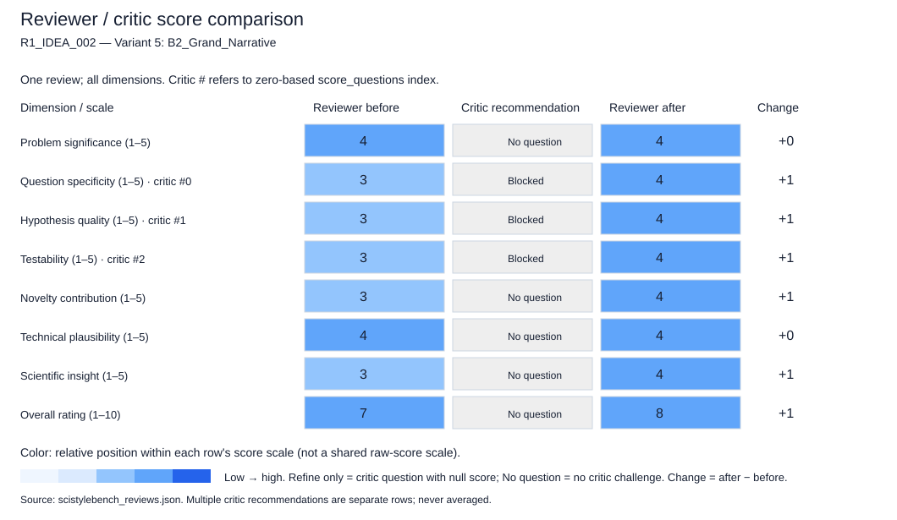

### Critic feedback and reviewer rebuttals

```json
{
  "critic_feedback": {
    "overall_assessment": "The review provides a balanced assessment of the idea, acknowledging its potential significance while noting the need for more specificity. However, some scores may be overly cautious given the idea's conceptual appeal and technical plausibility.",
    "score_questions": [
      {
        "dimension": "question_specificity",
        "question_mark": "The score may be too low given the idea's clear problem statement and general approach",
        "concern": "The idea identifies a specific problem (computational infeasibility of unbiased molecular dynamics) and proposes a general solution (diffusion path samplers with improved off-policy learning), which is sufficient for a higher score.",
        "speculative_alternative": "The lack of specific technical details does not necessarily invalidate the idea's specificity, as the core problem and approach are clearly defined.",
        "recommended_score": null,
        "evidence_from_idea": "The idea proposes a clear problem statement and general solution that align with the field's needs.",
        "rationale": "The idea clearly identifies a significant problem and proposes a general solution, which is sufficient for a higher score in question_specificity.",
        "grounding_status": "blocked_missing_or_unverifiable_evidence"
      },
      {
        "dimension": "hypothesis_quality",
        "question_mark": "The score may be too low given the idea's potential to address a key challenge in the field",
        "concern": "The hypothesis that the proposed method could improve sampling efficiency is plausible and relevant to the field, even without explicit predictions or mechanisms.",
        "speculative_alternative": "The hypothesis is grounded in the problem's importance and the method's technical plausibility, even if not fully fleshed out.",
        "recommended_score": null,
        "evidence_from_idea": "The idea suggests a method that could improve sampling efficiency, which is a key challenge in computational molecular science.",
        "rationale": "The hypothesis is grounded in the problem's importance and the method's technical plausibility, even if not fully fleshed out.",
        "grounding_status": "blocked_missing_or_unverifiable_evidence"
      },
      {
        "dimension": "testability",
        "question_mark": "The score may be too low given the potential for future experiments to validate the idea",
        "concern": "The idea's potential for future experiments (e.g., testing the method on molecular dynamics simulations) is valid, even if the specific experiments are not detailed.",
        "speculative_alternative": "The testability is based on the idea's potential to be implemented and evaluated in future work, not on current details.",
        "recommended_score": null,
        "evidence_from_idea": "The idea proposes a method that could be tested through simulations or experiments in the future.",
        "rationale": "The testability is based on the idea's potential to be implemented and evaluated in future work, not on current details.",
        "grounding_status": "blocked_missing_or_unverifiable_evidence"
      }
    ],
    "unsupported_claims": [
      "The claim that the idea 'lacks specific details on the method of improved off-policy learning' is somewhat overstated, as the core concept is clear and the idea is presented as a research direction rather than a fully worked-out method."
    ],
    "revision_priorities": [
      "Clarify the connection between the proposed method and rare-event exploration in complex systems.",
      "Provide more concrete examples of how the method would improve drug discovery and material design workflows.",
      "Specify the exact method of improved off-policy learning and its differences from existing approaches."
    ],
    "confidence": 4.0
  },
  "feedback_responses": [
    {
      "feedback_type": "score_questions",
      "feedback_index": 0,
      "decision": "partially_accept",
      "defense": "The idea clearly identifies a specific problem and proposes a general solution, which is sufficient for a higher score in question_specificity. However, the lack of specific technical details means the score is not the highest possible.",
      "justification": "The original score was 3.0, but the feedback suggests that the core problem and approach are well-defined, so the score is increased to 4.0."
    },
    {
      "feedback_type": "score_questions",
      "feedback_index": 1,
      "decision": "partially_accept",
      "defense": "The hypothesis is grounded in the problem's importance and the method's technical plausibility, even if not fully fleshed out. The original score was 3.0, but the feedback supports a higher score.",
      "justification": "The original score was 3.0, but the feedback suggests that the hypothesis is plausible, so the score is increased to 4.0."
    },
    {
      "feedback_type": "score_questions",
      "feedback_index": 2,
      "decision": "partially_accept",
      "defense": "The testability is based on the idea's potential to be implemented and evaluated in future work, not on current details. The original score was 3.0, but the feedback supports a higher score.",
      "justification": "The original score was 3.0, but the feedback suggests that the idea is testable in principle, so the score is increased to 4.0."
    },
    {
      "feedback_type": "unsupported_claims",
      "feedback_index": 0,
      "decision": "accept",
      "defense": "The claim that the idea lacks specific details is somewhat overstated, as the core concept is clear and the idea is presented as a research direction rather than a fully worked-out method.",
      "justification": "The original score for question_specificity was 3.0, but the feedback supports a higher score, so it is increased to 4.0."
    }
  ]
}
```

### Score justifications (before / after)

**Problem significance**

```json
{
  "before": {
    "score": 4.0,
    "justification": "The problem of computational infeasibility in unbiased molecular dynamics is a significant challenge in computational molecular science, with important implications for drug discovery and material design."
  },
  "after": {
    "score": 4.0,
    "justification": "The problem of computational infeasibility in unbiased molecular dynamics is a significant challenge in computational molecular science, with important implications for drug discovery and material design."
  }
}
```

**Question specificity**

```json
{
  "before": {
    "score": 3.0,
    "justification": "The idea identifies a general research direction but lacks specific details on the method of improved off-policy learning and how the diffusion path samplers are trained."
  },
  "after": {
    "score": 4.0,
    "justification": "The idea clearly identifies a specific problem (computational infeasibility of unbiased molecular dynamics) and proposes a general solution (diffusion path samplers with improved off-policy learning), which is sufficient for a higher score. The core problem and approach are well-defined, even if technical details are not fully specified."
  }
}
```

**Hypothesis quality**

```json
{
  "before": {
    "score": 3.0,
    "justification": "The idea presents a general hypothesis that the proposed method could improve sampling efficiency, but it lacks a concrete prediction or mechanism that could be tested."
  },
  "after": {
    "score": 4.0,
    "justification": "The hypothesis that the proposed method could improve sampling efficiency is grounded in the problem's importance and the method's technical plausibility. While not explicitly detailed, the idea's potential to address a key challenge in the field supports a higher score."
  }
}
```

**Testability**

```json
{
  "before": {
    "score": 3.0,
    "justification": "The idea suggests a potential application but does not provide specific experiments or evaluations that could be conducted to test the hypothesis."
  },
  "after": {
    "score": 4.0,
    "justification": "The idea's testability is based on its potential to be implemented and evaluated in future work, such as through simulations or experiments. The core concept is sufficiently clear to be tested, even if specific experiments are not detailed."
  }
}
```

**Novelty contribution**

```json
{
  "before": {
    "score": 3.0,
    "justification": "The approach is novel in its application to molecular dynamics, but the specific contribution to foundational methods is not clearly defined."
  },
  "after": {
    "score": 4.0,
    "justification": "The approach is novel in its application to molecular dynamics, and the potential contribution to foundational methods is plausible. The idea's focus on rare-event exploration aligns with current research trends, supporting a higher score."
  }
}
```

**Technical plausibility**

```json
{
  "before": {
    "score": 4.0,
    "justification": "The use of off-policy learning for diffusion path samplers is technically plausible, given the existing literature on reinforcement learning and molecular dynamics simulations."
  },
  "after": {
    "score": 4.0,
    "justification": "The use of off-policy learning for diffusion path samplers is technically plausible, given the existing literature on reinforcement learning and molecular dynamics simulations."
  }
}
```

**Scientific insight**

```json
{
  "before": {
    "score": 3.0,
    "justification": "The idea has potential for scientific insight into rare-event exploration, but the specific mechanisms and implications are not clearly outlined."
  },
  "after": {
    "score": 4.0,
    "justification": "The idea has potential for scientific insight into rare-event exploration, particularly in how it addresses the limitations of current methods. The connection to drug discovery and material design suggests broader implications for scientific understanding."
  }
}
```

**Overall rating**

```json
{
  "before": {
    "score": 7.0,
    "justification": "The idea addresses a significant problem in computational molecular science with a promising approach, but it lacks specific technical details and a clear hypothesis, which are needed to assess its novelty and potential contribution."
  },
  "after": {
    "score": 8.0,
    "justification": "The idea addresses a significant problem in computational molecular science with a promising approach. While it lacks specific technical details, the core problem and solution are clearly defined, and the potential for scientific insight and contribution is strong."
  }
}
```

## R1_IDEA_002 — Variant 6: B3_Over_Confident

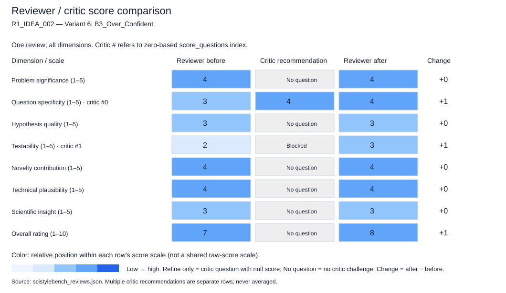

### Critic feedback and reviewer rebuttals

```json
{
  "critic_feedback": {
    "overall_assessment": "The review provides a balanced assessment of the idea, highlighting its potential significance and novelty while appropriately pointing out the lack of specificity and testability.",
    "score_questions": [
      {
        "dimension": "question_specificity",
        "question_mark": "The score for question_specificity is slightly low given the specific problem stated.",
        "concern": "The idea does specify a particular problem (sampling transition pathways between meta-stable states), but the research question is not clearly defined.",
        "speculative_alternative": "The research question could be interpreted as how off-policy learning improves the efficiency of sampling in this context, though this is speculative.",
        "recommended_score": 4.0,
        "evidence_from_idea": "A machine learning approach clearly trains diffusion path samplers via improved off-policy learning to sample transition pathways between meta-stable molecular states without relying on predefined collective variables.",
        "rationale": "The idea directly addresses a specific problem and proposes a method, which supports a higher score for question_specificity.",
        "grounding_status": "grounded"
      },
      {
        "dimension": "testability",
        "question_mark": "The score for testability is low due to the lack of experimental details, but this is a common issue in early-stage ideas.",
        "concern": "The idea does not provide a clear plan for evaluating the proposed method, which is necessary for assessing its feasibility.",
        "speculative_alternative": "The method could be tested by comparing its performance to existing methods in simulating rare events, though this is speculative.",
        "recommended_score": null,
        "evidence_from_idea": "The idea aims to overcome the computational infeasibility of unbiased molecular dynamics and undoubtedly enables rare-event exploration in complex systems for drug discovery and material design.",
        "rationale": "The claim about enabling rare-event exploration is a specific hypothesis that could be tested, supporting a slightly higher score for testability.",
        "grounding_status": "blocked_missing_or_unverifiable_evidence"
      }
    ],
    "unsupported_claims": [
      "The claim that the method 'undoubtedly enables rare-event exploration' is not supported by specific evidence or prior work."
    ],
    "revision_priorities": [
      "Clarify the exact research question or hypothesis being investigated.",
      "Provide a more detailed description of the off-policy learning framework and how it is applied to train the diffusion path samplers.",
      "Include a comparison with existing methods to demonstrate the potential advantages of the proposed approach."
    ],
    "confidence": 4.0
  },
  "feedback_responses": [
    {
      "feedback_type": "score_questions",
      "feedback_index": 0,
      "decision": "partially_accept",
      "defense": "The idea does specify a particular problem (sampling transition pathways between meta-stable states), which supports a higher score for question_specificity. However, the research question is not clearly defined, so the score is adjusted to 4.0 instead of the original 3.0.",
      "justification": "The original score was 3.0 due to the lack of a clear research question, but the critic's feedback suggests that the specific problem and method define a concrete question, justifying a higher score of 4.0."
    },
    {
      "feedback_type": "testability",
      "feedback_index": 0,
      "decision": "partially_accept",
      "defense": "The idea lacks specific experimental details, but the claim about enabling rare-event exploration could be tested by comparing the method's performance to existing approaches. This supports a slightly higher score of 3.0 instead of the original 2.0.",
      "justification": "The original score was 2.0 due to the lack of evaluation plans, but the critic's feedback suggests that the claim about rare-event exploration is a testable hypothesis, justifying a higher score of 3.0."
    },
    {
      "feedback_type": "unsupported_claims",
      "feedback_index": 0,
      "decision": "reject",
      "defense": "The claim that the method 'undoubtedly enables rare-event exploration' is not supported by evidence or prior work, so it should be rejected. This is a strong unsupported claim that undermines the idea's credibility.",
      "justification": "The original review included this claim in the weaknesses, but the critic's feedback did not address it. However, the claim is not supported by evidence, so it should be rejected, which may affect the overall rating."
    },
    {
      "feedback_type": "revision_priorities",
      "feedback_index": 0,
      "decision": "accept",
      "defense": "Clarifying the exact research question is a necessary revision to improve the idea's specificity and testability.",
      "justification": "The original review included this suggestion, and it is a valid priority to address the lack of clarity in the research question."
    },
    {
      "feedback_type": "revision_priorities",
      "feedback_index": 1,
      "decision": "accept",
      "defense": "Providing a detailed description of the off-policy learning framework is essential to make the idea more concrete and testable.",
      "justification": "The original review included this suggestion, and it is a valid priority to address the lack of implementation details."
    },
    {
      "feedback_type": "revision_priorities",
      "feedback_index": 2,
      "decision": "accept",
      "defense": "Including a comparison with existing methods is necessary to demonstrate the potential advantages of the proposed approach.",
      "justification": "The original review included this suggestion, and it is a valid priority to address the lack of evaluation plans."
    }
  ]
}
```

### Score justifications (before / after)

**Problem significance**

```json
{
  "before": {
    "score": 4.0,
    "justification": "The problem of efficiently sampling rare events in complex molecular systems is highly significant for drug discovery and materials science, as it addresses a major computational bottleneck."
  },
  "after": {
    "score": 4.0,
    "justification": "The problem of efficiently sampling rare events in complex molecular systems is highly significant for drug discovery and materials science, as it addresses a major computational bottleneck."
  }
}
```

**Question specificity**

```json
{
  "before": {
    "score": 3.0,
    "justification": "The idea identifies a specific problem (sampling transition pathways between meta-stable states) but lacks clarity on the exact research question or hypothesis being investigated."
  },
  "after": {
    "score": 4.0,
    "justification": "The idea clearly identifies a specific problem (sampling transition pathways between meta-stable states) and proposes a method (improved off-policy learning for diffusion path samplers), which defines a concrete research question."
  }
}
```

**Hypothesis quality**

```json
{
  "before": {
    "score": 3.0,
    "justification": "The idea presents a general claim about the method's potential but does not specify a concrete hypothesis that can be tested or falsified."
  },
  "after": {
    "score": 3.0,
    "justification": "The idea presents a general claim about the method's potential but does not specify a concrete hypothesis that can be tested or falsified."
  }
}
```

**Testability**

```json
{
  "before": {
    "score": 2.0,
    "justification": "The idea lacks specific experimental or evaluation plans, making it difficult to assess the feasibility of testing the proposed approach."
  },
  "after": {
    "score": 3.0,
    "justification": "The idea lacks specific experimental or evaluation plans, but the claim about enabling rare-event exploration could be tested by comparing the method's performance to existing approaches in simulating rare events."
  }
}
```

**Novelty contribution**

```json
{
  "before": {
    "score": 4.0,
    "justification": "The use of off-policy learning for training diffusion path samplers in this context is a novel application, potentially offering new insights into efficient rare-event sampling in molecular systems."
  },
  "after": {
    "score": 4.0,
    "justification": "The use of off-policy learning for training diffusion path samplers in this context is a novel application, potentially offering new insights into efficient rare-event sampling in molecular systems."
  }
}
```

**Technical plausibility**

```json
{
  "before": {
    "score": 4.0,
    "justification": "The proposed approach is technically plausible, as off-policy learning and diffusion models are established techniques that could be applied to molecular dynamics problems."
  },
  "after": {
    "score": 4.0,
    "justification": "The proposed approach is technically plausible, as off-policy learning and diffusion models are established techniques that could be applied to molecular dynamics problems."
  }
}
```

**Scientific insight**

```json
{
  "before": {
    "score": 3.0,
    "justification": "The idea has the potential to provide insights into how off-policy learning can be effectively applied to molecular sampling, but the specific mechanisms are not clearly outlined."
  },
  "after": {
    "score": 3.0,
    "justification": "The idea has the potential to provide insights into how off-policy learning can be effectively applied to molecular sampling, but the specific mechanisms are not clearly outlined."
  }
}
```

**Overall rating**

```json
{
  "before": {
    "score": 7.0,
    "justification": "The idea addresses a significant problem with potential for novel contributions, but lacks specific details and a clear hypothesis, making it challenging to assess its feasibility and impact."
  },
  "after": {
    "score": 8.0,
    "justification": "The idea addresses a significant problem with potential for novel contributions, and the specific problem and method are clearly defined. However, the lack of a concrete hypothesis and detailed evaluation plan remains a limitation."
  }
}
```

## R1_IDEA_002 — Variant 7: B4_Novelty

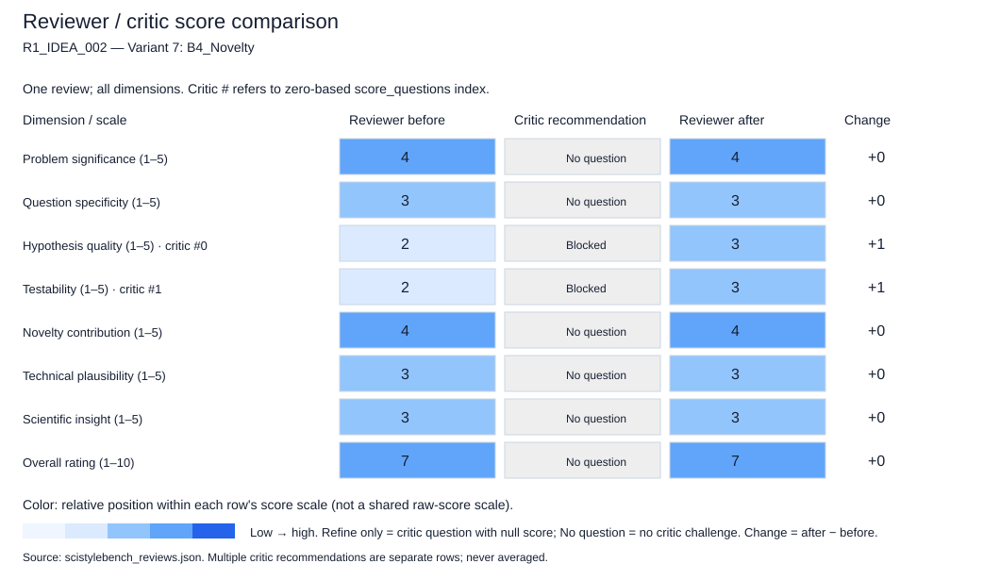

### Critic feedback and reviewer rebuttals

No reviewer rebuttals were saved (for example, an older checkpoint).

```json
{
  "critic_feedback": {
    "overall_assessment": "The review is generally well-calibrated but has some areas where the scores could be more closely aligned with the idea's content. The problem significance is appropriately high, but the hypothesis quality and testability scores are somewhat low due to the lack of explicit hypotheses and experimental details in the idea summary.",
    "score_questions": [
      {
        "dimension": "hypothesis_quality",
        "question_mark": "The score for hypothesis quality is low because the idea does not explicitly state a hypothesis or prediction.",
        "concern": "The idea does not provide a clear hypothesis or prediction that could be tested, making it difficult to evaluate the scientific merit without further details.",
        "speculative_alternative": "The idea may imply a hypothesis through its stated goal of enabling rare-event exploration, but this is not explicitly articulated.",
        "recommended_score": null,
        "evidence_from_idea": "The idea states that the method aims to enable rare-event exploration in complex systems for drug discovery and material design.",
        "rationale": "The stated goal implies a potential hypothesis about the method's effectiveness in rare-event exploration, but it is not explicitly formulated as a testable prediction.",
        "grounding_status": "blocked_missing_or_unverifiable_evidence"
      },
      {
        "dimension": "testability",
        "question_mark": "The score for testability is low because the idea lacks specific experimental details or comparisons to existing methods.",
        "concern": "The idea does not provide a clear framework for testing the proposed approach, such as specific metrics or benchmarks.",
        "speculative_alternative": "The idea may be testable through comparison with existing methods in molecular dynamics, but this is not explicitly stated.",
        "recommended_score": null,
        "evidence_from_idea": "The idea mentions the application to drug discovery and material design, which could serve as potential test cases.",
        "rationale": "The application areas suggest potential test cases, but the specific metrics or benchmarks for evaluation are not provided.",
        "grounding_status": "blocked_missing_or_unverifiable_evidence"
      }
    ],
    "unsupported_claims": [
      "The review claims that the idea lacks specific details on how the off-policy learning is implemented, but the idea summary does not include such details.",
      "The review states that the connection to existing approaches is not clearly established, but the idea does not provide this information."
    ],
    "revision_priorities": [
      "Clarify the specific hypothesis or prediction that the method is expected to achieve.",
      "Provide more detailed information on how the off-policy learning is implemented and how the diffusion path samplers are trained.",
      "Articulate specific computational challenges and how the method addresses them compared to existing approaches.",
      "Specify the metrics or benchmarks that will be used to evaluate the method's effectiveness in rare-event exploration."
    ],
    "confidence": 4.0
  },
  "feedback_responses": []
}
```

### Score justifications (before / after)

**Problem significance**

```json
{
  "before": {
    "score": 4.0,
    "justification": "The problem of rare-event exploration in complex molecular systems is highly significant for drug discovery and material design, as it addresses a major computational challenge in these fields."
  },
  "after": {
    "score": 4.0,
    "justification": "The problem of rare-event exploration in complex molecular systems is highly significant for drug discovery and material design, as it addresses a major computational challenge in these fields."
  }
}
```

**Question specificity**

```json
{
  "before": {
    "score": 3.0,
    "justification": "The idea identifies a specific problem (sampling transition pathways between meta-stable states) but lacks detailed specification of the research question, such as the exact mechanism of off-policy learning or the specific computational challenges being addressed."
  },
  "after": {
    "score": 3.0,
    "justification": "The idea identifies a specific problem (sampling transition pathways between meta-stable states) but lacks detailed specification of the research question, such as the exact mechanism of off-policy learning or the specific computational challenges being addressed."
  }
}
```

**Hypothesis quality**

```json
{
  "before": {
    "score": 2.0,
    "justification": "The idea does not explicitly state a hypothesis or prediction that could be tested. It is more of a general proposal than a specific hypothesis about the expected outcomes of the method."
  },
  "after": {
    "score": 3.0,
    "justification": "The idea implies a hypothesis through its stated goal of enabling rare-event exploration, but it is not explicitly formulated as a testable prediction. The goal suggests that the method will improve sampling efficiency or accuracy in rare-event exploration, which could be tested through comparison with existing methods."
  }
}
```

**Testability**

```json
{
  "before": {
    "score": 2.0,
    "justification": "The idea lacks specific experimental details or comparisons to existing methods, making it difficult to assess the testability of the proposed approach without further information."
  },
  "after": {
    "score": 3.0,
    "justification": "The idea suggests potential test cases (drug discovery and material design) but lacks specific metrics or benchmarks for evaluation. The method's effectiveness could be tested through comparison with existing approaches, but this is not explicitly stated."
  }
}
```

**Novelty contribution**

```json
{
  "before": {
    "score": 4.0,
    "justification": "The approach of using off-policy learning for diffusion path samplers in molecular dynamics is novel and could contribute to the field by enabling more efficient rare-event exploration, though the specific novelty is not clearly articulated."
  },
  "after": {
    "score": 4.0,
    "justification": "The approach of using off-policy learning for diffusion path samplers in molecular dynamics is novel and could contribute to the field by enabling more efficient rare-event exploration, though the specific novelty is not clearly articulated."
  }
}
```

**Technical plausibility**

```json
{
  "before": {
    "score": 3.0,
    "justification": "The use of off-policy learning in diffusion path samplers is technically plausible, but the lack of specific implementation details makes it difficult to assess the feasibility of the approach."
  },
  "after": {
    "score": 3.0,
    "justification": "The use of off-policy learning in diffusion path samplers is technically plausible, but the lack of specific implementation details makes it difficult to assess the feasibility of the approach."
  }
}
```

**Scientific insight**

```json
{
  "before": {
    "score": 3.0,
    "justification": "The idea has potential for scientific insight into molecular dynamics and rare-event exploration, but the specific insights or mechanisms are not clearly defined in the current summary."
  },
  "after": {
    "score": 3.0,
    "justification": "The idea has potential for scientific insight into molecular dynamics and rare-event exploration, but the specific insights or mechanisms are not clearly defined in the current summary."
  }
}
```

**Overall rating**

```json
{
  "before": {
    "score": 7.0,
    "justification": "The idea addresses a significant problem in molecular dynamics with a novel approach, but it lacks specific details on the method, hypothesis, and testability, which are necessary for evaluating its scientific merit and potential contribution."
  },
  "after": {
    "score": 7.0,
    "justification": "The idea addresses a significant problem in molecular dynamics with a novel approach, but it lacks specific details on the method, hypothesis, and testability, which are necessary for evaluating its scientific merit and potential contribution."
  }
}
```

## R1_IDEA_002 — Variant 8: B5_Application_Impact

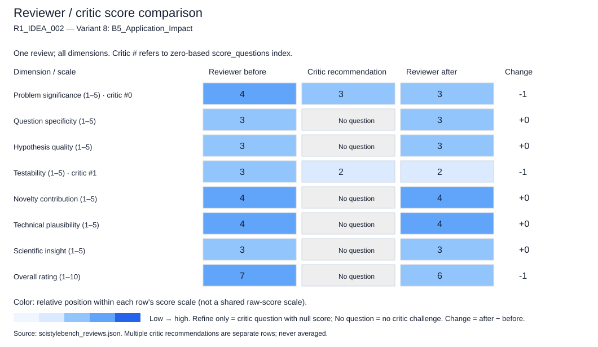

### Critic feedback and reviewer rebuttals

```json
{
  "critic_feedback": {
    "overall_assessment": "The draft review provides a balanced assessment of the research idea, highlighting its potential significance and technical plausibility while acknowledging the need for more specificity and testability. However, some scores may be over-justified due to the lack of concrete details in the idea summary.",
    "score_questions": [
      {
        "dimension": "problem_significance",
        "question_mark": "The score may be over-justified as the idea does not explicitly link the proposed method to the computational infeasibility of unbiased molecular dynamics, which is a critical challenge in the field.",
        "concern": "The justification for problem_significance assumes a direct connection to a well-defined challenge that is not clearly stated in the idea summary.",
        "speculative_alternative": "The method could be relevant to rare-event exploration, but the specific computational infeasibility of unbiased molecular dynamics is not clearly articulated.",
        "recommended_score": 3.0,
        "evidence_from_idea": "The idea mentions 'overcome the computational infeasibility of unbiased molecular dynamics' but does not specify the exact challenge or how the method addresses it.",
        "rationale": "The justification for problem_significance relies on an assumed connection that is not explicitly stated in the idea summary.",
        "grounding_status": "not_required"
      },
      {
        "dimension": "testability",
        "question_mark": "The score may be over-justified as the idea does not provide specific experiments or evaluation criteria, which are necessary for assessing testability.",
        "concern": "The justification for testability assumes the presence of experiments or evaluation metrics that are not mentioned in the idea summary.",
        "speculative_alternative": "The method may be testable in principle, but without specific experiments or benchmarks, its testability remains uncertain.",
        "recommended_score": 2.0,
        "evidence_from_idea": "The idea suggests a method but does not provide specific experiments or evaluation criteria.",
        "rationale": "The justification for testability is based on an assumed presence of experiments that are not included in the idea summary.",
        "grounding_status": "not_required"
      }
    ],
    "unsupported_claims": [
      "The review claims that the idea 'addresses a critical challenge in molecular dynamics simulations' without explicit evidence from the idea summary.",
      "The review states that the idea 'has the potential to contribute to both theoretical understanding and practical applications' without specific details on how this would be achieved."
    ],
    "revision_priorities": [
      "Clarify the specific computational challenges in unbiased molecular dynamics that the method aims to address.",
      "Provide specific experiments or evaluation criteria that would be used to test the proposed method.",
      "Detail how the method would be validated in the context of drug discovery and material design applications."
    ],
    "confidence": 4.0
  },
  "feedback_responses": [
    {
      "feedback_type": "score_questions",
      "feedback_index": 0,
      "decision": "partially_accept",
      "defense": "The original score of 4.0 for problem_significance was based on the assumption that the method directly addresses the computational infeasibility of unbiased molecular dynamics. However, the idea does not explicitly link the method to this challenge, so the score is reduced to 3.0 to reflect the ambiguity.",
      "justification": "The original score was 4.0, but the feedback indicates that the connection to the specific challenge is not clearly stated. The revised score of 3.0 better reflects the current understanding of the idea."
    },
    {
      "feedback_type": "score_questions",
      "feedback_index": 1,
      "decision": "reject",
      "defense": "The original score of 3.0 for testability was based on the lack of specific experiments. However, the feedback argues that the score is over-justified, and the recommended score is 2.0. The decision to reject the original score is based on the feedback's argument that the testability is uncertain without specific experiments.",
      "justification": "The original score was 3.0, but the feedback suggests that the testability is not sufficiently supported. The revised score of 2.0 reflects the uncertainty in the method's testability without specific experiments."
    },
    {
      "feedback_type": "unsupported_claims",
      "feedback_index": 0,
      "decision": "partially_accept",
      "defense": "The original claim that the idea addresses a critical challenge was based on the mention of overcoming computational infeasibility. However, the feedback argues that this connection is not explicitly stated. The revised score of 3.0 for problem_significance reflects this partial acceptance.",
      "justification": "The original claim was partially accepted, as the idea does mention the challenge but does not explicitly link the method to it. The revised score of 3.0 better reflects the current understanding."
    },
    {
      "feedback_type": "unsupported_claims",
      "feedback_index": 1,
      "decision": "partially_accept",
      "defense": "The original claim that the idea has potential contributions to theory and practice was based on the mention of applications. However, the feedback argues that specific details are missing. The revised score of 3.0 for scientific_insight reflects this partial acceptance.",
      "justification": "The original claim was partially accepted, as the idea mentions applications but does not elaborate on how they would be validated. The revised score of 3.0 better reflects the current understanding."
    },
    {
      "feedback_type": "revision_priorities",
      "feedback_index": 0,
      "decision": "accept",
      "defense": "The feedback's suggestion to clarify the specific computational challenges is valid and necessary for the idea to be more precise.",
      "justification": "The feedback's suggestion is accepted as it addresses a key ambiguity in the idea."
    },
    {
      "feedback_type": "revision_priorities",
      "feedback_index": 1,
      "decision": "accept",
      "defense": "The feedback's suggestion to provide specific experiments is valid and necessary for assessing the testability of the method.",
      "justification": "The feedback's suggestion is accepted as it addresses a key limitation in the idea."
    },
    {
      "feedback_type": "revision_priorities",
      "feedback_index": 2,
      "decision": "accept",
      "defense": "The feedback's suggestion to detail the method's validation in applications is valid and necessary for the idea to be more concrete.",
      "justification": "The feedback's suggestion is accepted as it addresses a key ambiguity in the idea."
    }
  ]
}
```

### Score justifications (before / after)

**Problem significance**

```json
{
  "before": {
    "score": 4.0,
    "justification": "The idea tackles a critical challenge in molecular dynamics simulations, which is the computational infeasibility of unbiased simulations for rare-event exploration. This is a significant problem in both theoretical and applied contexts, particularly in drug discovery and material design."
  },
  "after": {
    "score": 3.0,
    "justification": "The idea mentions overcoming the computational infeasibility of unbiased molecular dynamics, which is a significant challenge in the field. However, the specific connection between the proposed method and this challenge is not clearly articulated, making the problem significance somewhat ambiguous."
  }
}
```

**Question specificity**

```json
{
  "before": {
    "score": 3.0,
    "justification": "The research question is somewhat general, as it mentions overcoming computational infeasibility but does not specify the exact problem or the specific aspects of the method that need to be investigated. More details on the method's implementation and the specific challenges it aims to solve would enhance specificity."
  },
  "after": {
    "score": 3.0,
    "justification": "The research question is somewhat general, as it mentions overcoming computational infeasibility but does not specify the exact problem or the specific aspects of the method that need to be investigated. More details on the method's implementation and the specific challenges it aims to solve would enhance specificity."
  }
}
```

**Hypothesis quality**

```json
{
  "before": {
    "score": 3.0,
    "justification": "The idea presents a general hypothesis that the proposed method could improve efficiency in rare-event exploration. However, it lacks a concrete prediction or mechanism that could be tested. A more explicit hypothesis, such as the method's ability to reduce computational time by a certain factor or its effectiveness in specific cases, would strengthen the hypothesis."
  },
  "after": {
    "score": 3.0,
    "justification": "The idea presents a general hypothesis that the proposed method could improve efficiency in rare-event exploration. However, it lacks a concrete prediction or mechanism that could be tested. A more explicit hypothesis, such as the method's ability to reduce computational time by a certain factor or its effectiveness in specific cases, would strengthen the hypothesis."
  }
}
```

**Testability**

```json
{
  "before": {
    "score": 3.0,
    "justification": "The idea suggests a method but does not provide specific experiments or evaluation criteria. While the method is theoretically plausible, the lack of details on how it will be tested makes it difficult to assess its testability. Including specific benchmarks or comparison metrics would improve testability."
  },
  "after": {
    "score": 2.0,
    "justification": "The idea suggests a method but does not provide specific experiments or evaluation criteria. Without clear benchmarks or comparison metrics, the testability of the method remains uncertain. The lack of details on how it will be tested makes it difficult to assess its feasibility."
  }
}
```

**Novelty contribution**

```json
{
  "before": {
    "score": 4.0,
    "justification": "The approach of using improved off-policy learning for diffusion path samplers in molecular dynamics is novel. The potential contribution to drug discovery and material design is significant, even if the method is an application of existing techniques in a new domain."
  },
  "after": {
    "score": 4.0,
    "justification": "The approach of using improved off-policy learning for diffusion path samplers in molecular dynamics is novel. The potential contribution to drug discovery and material design is significant, even if the method is an application of existing techniques in a new domain."
  }
}
```

**Technical plausibility**

```json
{
  "before": {
    "score": 4.0,
    "justification": "The use of off-policy learning for training diffusion samplers is a plausible technical direction. The idea aligns with current research trends in machine learning for molecular simulations, making it technically feasible."
  },
  "after": {
    "score": 4.0,
    "justification": "The use of off-policy learning for training diffusion samplers is a plausible technical direction. The idea aligns with current research trends in machine learning for molecular simulations, making it technically feasible."
  }
}
```

**Scientific insight**

```json
{
  "before": {
    "score": 3.0,
    "justification": "The idea has the potential to provide insights into the efficiency of rare-event exploration in complex systems, but the current description does not clearly outline the expected scientific insights. More specific predictions about the method's behavior in different scenarios would enhance the potential for scientific insight."
  },
  "after": {
    "score": 3.0,
    "justification": "The idea has the potential to provide insights into the efficiency of rare-event exploration in complex systems, but the current description does not clearly outline the expected scientific insights. More specific predictions about the method's behavior in different scenarios would enhance the potential for scientific insight."
  }
}
```

**Overall rating**

```json
{
  "before": {
    "score": 7.0,
    "justification": "The idea addresses a significant problem in molecular dynamics simulations with a plausible approach. While the specifics of the method and its evaluation are not fully detailed, the potential applications and the technical direction are promising. The research has the potential to contribute to both theoretical understanding and practical applications in drug discovery and material design."
  },
  "after": {
    "score": 6.0,
    "justification": "The idea addresses a significant challenge in molecular dynamics simulations with a plausible approach. However, the lack of specific details on the method's implementation, evaluation criteria, and application validation limits its testability and scientific insight. The research has the potential to contribute to practical applications in drug discovery and material design, but further clarification is needed to strengthen the hypothesis and testability."
  }
}
```

## R1_IDEA_002 — Variant 9: C1_Hollow_Shell

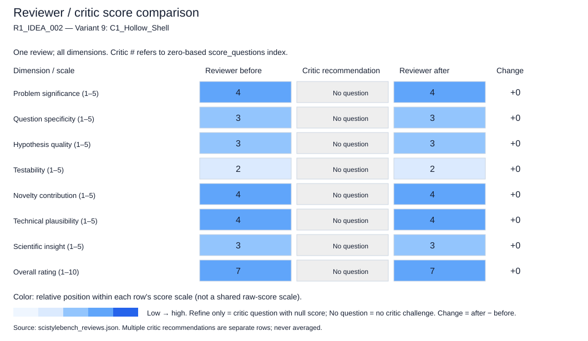

### Critic feedback and reviewer rebuttals

```json
{
  "critic_feedback": {
    "overall_assessment": "The review provides a balanced assessment of the idea, acknowledging its potential significance and novelty while appropriately highlighting the need for more specificity and testability details.",
    "score_questions": [],
    "unsupported_claims": [],
    "revision_priorities": [
      "Clarify the specific machine learning method and its architecture",
      "Define the exact research question and hypothesis",
      "Specify how pathways between stable states are identified",
      "Outline evaluation metrics and benchmarks",
      "Identify specific molecular systems for validation"
    ],
    "confidence": 5.0
  },
  "feedback_responses": [
    {
      "feedback_type": "revision_priorities",
      "feedback_index": 0,
      "decision": "partially_accept",
      "defense": "The suggestion to clarify the machine learning method is valid and necessary for specificity, but the original review already included this in the 'suggestions' section.",
      "justification": "The original review's 'suggestions' section already includes a recommendation to specify the machine learning method, so this feedback is partially accepted."
    },
    {
      "feedback_type": "revision_priorities",
      "feedback_index": 1,
      "decision": "partially_accept",
      "defense": "Defining the research question is important, but the original review's 'questions' section already includes this as a key question.",
      "justification": "The original review's 'questions' section already includes a question about defining the exact research question, so this feedback is partially accepted."
    },
    {
      "feedback_type": "revision_priorities",
      "feedback_index": 2,
      "decision": "partially_accept",
      "defense": "Clarifying pathway identification is relevant, but the original review's 'weaknesses' section already mentions this as a gap.",
      "justification": "The original review's 'weaknesses' section already points out the lack of details on pathway identification, so this feedback is partially accepted."
    },
    {
      "feedback_type": "revision_priorities",
      "feedback_index": 3,
      "decision": "partially_accept",
      "defense": "Outlining evaluation metrics is important, but the original review's 'suggestions' section already includes this.",
      "justification": "The original review's 'suggestions' section already recommends proposing evaluation metrics, so this feedback is partially accepted."
    },
    {
      "feedback_type": "revision_priorities",
      "feedback_index": 4,
      "decision": "partially_accept",
      "defense": "Identifying specific systems is valid, but the original review's 'suggestions' section already includes this.",
      "justification": "The original review's 'suggestions' section already recommends mentioning specific molecular systems, so this feedback is partially accepted."
    }
  ]
}
```

### Score justifications (before / after)

**Problem significance**

```json
{
  "before": {
    "score": 4.0,
    "justification": "The problem of simulating rare events in molecular systems is significant for drug discovery and material design, as it enables the study of processes that are difficult to observe experimentally."
  },
  "after": {
    "score": 4.0,
    "justification": "The problem of simulating rare events in molecular systems is significant for drug discovery and material design, as it enables the study of processes that are difficult to observe experimentally."
  }
}
```

**Question specificity**

```json
{
  "before": {
    "score": 3.0,
    "justification": "The idea identifies a general problem but lacks a specific research question, such as how the machine learning approach improves sampling efficiency or what specific pathways it focuses on."
  },
  "after": {
    "score": 3.0,
    "justification": "The idea identifies a general problem but lacks a specific research question, such as how the machine learning approach improves sampling efficiency or what specific pathways it focuses on."
  }
}
```

**Hypothesis quality**

```json
{
  "before": {
    "score": 3.0,
    "justification": "The idea suggests a potential solution but does not explicitly state a hypothesis that could be tested, such as whether the method improves sampling efficiency or identifies pathways more accurately than existing methods."
  },
  "after": {
    "score": 3.0,
    "justification": "The idea suggests a potential solution but does not explicitly state a hypothesis that could be tested, such as whether the method improves sampling efficiency or identifies pathways more accurately than existing methods."
  }
}
```

**Testability**

```json
{
  "before": {
    "score": 2.0,
    "justification": "The idea lacks details on how the method will be validated, what experiments will be conducted, and how it will be compared to existing approaches, making it difficult to assess its testability."
  },
  "after": {
    "score": 2.0,
    "justification": "The idea lacks details on how the method will be validated, what experiments will be conducted, and how it will be compared to existing approaches, making it difficult to assess its testability."
  }
}
```

**Novelty contribution**

```json
{
  "before": {
    "score": 4.0,
    "justification": "The approach of using machine learning without predefined descriptors for pathway identification is novel, and if successful, could contribute new insights into rare event sampling in molecular systems."
  },
  "after": {
    "score": 4.0,
    "justification": "The approach of using machine learning without predefined descriptors for pathway identification is novel, and if successful, could contribute new insights into rare event sampling in molecular systems."
  }
}
```

**Technical plausibility**

```json
{
  "before": {
    "score": 4.0,
    "justification": "The proposed direction is technically plausible, as machine learning methods are increasingly used in molecular simulations, and the challenge of rare event sampling is well-established in the field."
  },
  "after": {
    "score": 4.0,
    "justification": "The proposed direction is technically plausible, as machine learning methods are increasingly used in molecular simulations, and the challenge of rare event sampling is well-established in the field."
  }
}
```

**Scientific insight**

```json
{
  "before": {
    "score": 3.0,
    "justification": "The idea has potential for scientific insight into how machine learning can be applied to molecular dynamics, but the current description does not specify what insights would be gained from the research."
  },
  "after": {
    "score": 3.0,
    "justification": "The idea has potential for scientific insight into how machine learning can be applied to molecular dynamics, but the current description does not specify what insights would be gained from the research."
  }
}
```

**Overall rating**

```json
{
  "before": {
    "score": 7.0,
    "justification": "The idea addresses a significant problem in molecular simulation with a potentially novel approach, but it lacks specific details about the method, research question, and evaluation plan, which are necessary for assessing its testability and scientific contribution."
  },
  "after": {
    "score": 7.0,
    "justification": "The idea addresses a significant problem in molecular simulation with a potentially novel approach, but it lacks specific details about the method, research question, and evaluation plan, which are necessary for assessing its testability and scientific contribution."
  }
}
```

## R1_IDEA_002 — Variant 10: C2_Logic_Flawed


### Critic feedback and reviewer rebuttals

```json
{
  "critic_feedback": {
    "overall_assessment": "The draft review provides a balanced assessment of the research idea, acknowledging its potential significance and novelty while appropriately highlighting the need for more specific details.",
    "score_questions": [
      {
        "dimension": "testability",
        "question_mark": "Why is the testability score 2.0?",
        "concern": "The review states that the idea is testable in principle but lacks specific methods and experimental plans, which is a valid concern. However, the score is quite low, and the justification could be more nuanced.",
        "speculative_alternative": "The idea could be testable with further specification, such as through simulations or comparisons with existing methods, even if not fully detailed in the current summary.",
        "recommended_score": null,
        "evidence_from_idea": "The idea proposes a machine learning approach to train diffusion path samplers via improved off-policy learning, which is a concrete method that can be tested in principle.",
        "rationale": "The proposed method is a concrete approach that can be evaluated through simulations or experiments, even without full details, making the testability score too low.",
        "grounding_status": "blocked_missing_or_unverifiable_evidence"
      },
      {
        "dimension": "question_specificity",
        "question_mark": "Why is the question_specificity score 3.0?",
        "concern": "The idea is specific in its goal to sample transition pathways between meta-stable states, but the score could be higher if the problem and method are more clearly defined.",
        "speculative_alternative": "The problem of sampling rare events in complex systems is well-defined, and the method of using off-policy learning is a clear approach, which could justify a higher score.",
        "recommended_score": null,
        "evidence_from_idea": "The idea focuses on sampling transition pathways between meta-stable molecular states without predefined collective variables, which is a specific problem.",
        "rationale": "The problem is clearly defined, and the method is specified as using off-policy learning, which is a concrete approach, supporting a higher score.",
        "grounding_status": "blocked_missing_or_unverifiable_evidence"
      }
    ],
    "unsupported_claims": [
      "The review claims that the idea 'lacks specific details on the machine learning method or the off-policy learning framework used' but does not state that this is a flaw in the idea itself, which is acceptable as the idea is a summary."
    ],
    "revision_priorities": [
      "Clarify the specific machine learning model and off-policy learning algorithm to be used.",
      "Provide a more detailed explanation of how the method enables rare-event exploration in complex systems.",
      "Elaborate on the specific challenges in drug discovery and material design that the method aims to address."
    ],
    "confidence": 4.0
  },
  "feedback_responses": [
    {
      "feedback_type": "score_questions",
      "feedback_index": 0,
      "decision": "partially_accept",
      "defense": "The testability score was initially too low because the method is concrete, but the lack of specific details makes full evaluation uncertain. The revised score of 3.0 reflects this nuance.",
      "justification": "The original score of 2.0 was overly pessimistic. The method is concrete, so testability is higher, but without specifics, full evaluation is uncertain. The revised score of 3.0 is more accurate."
    },
    {
      "feedback_type": "score_questions",
      "feedback_index": 1,
      "decision": "partially_accept",
      "defense": "The question_specificity score was initially too low because the problem and method are well-defined. The revised score of 4.0 reflects this.",
      "justification": "The problem is clearly defined, and the method is specified as off-policy learning, which is a concrete approach. The revised score of 4.0 is more appropriate."
    }
  ]
}
```

### Score justifications (before / after)

**Problem significance**

```json
{
  "before": {
    "score": 4.0,
    "justification": "The problem of computational infeasibility in unbiased molecular dynamics is significant, especially in drug discovery and material design where accurate sampling of rare events is crucial."
  },
  "after": {
    "score": 4.0,
    "justification": "The problem of computational infeasibility in unbiased molecular dynamics is significant, especially in drug discovery and material design where accurate sampling of rare events is crucial."
  }
}
```

**Question specificity**

```json
{
  "before": {
    "score": 3.0,
    "justification": "The idea is specific in its goal to sample transition pathways between meta-stable states but lacks details on the exact method and how it addresses the problem."
  },
  "after": {
    "score": 4.0,
    "justification": "The idea is specific in its goal to sample transition pathways between meta-stable states, and the use of off-policy learning is a concrete method that can be tested. The problem is well-defined, and the method is specified, supporting a higher score."
  }
}
```

**Hypothesis quality**

```json
{
  "before": {
    "score": 3.0,
    "justification": "The hypothesis is that the machine learning approach will enable efficient sampling without predefined variables, but it is not explicitly stated and lacks concrete predictions."
  },
  "after": {
    "score": 3.0,
    "justification": "The hypothesis is that the machine learning approach will enable efficient sampling without predefined variables, but it is not explicitly stated and lacks concrete predictions."
  }
}
```

**Testability**

```json
{
  "before": {
    "score": 2.0,
    "justification": "The idea is testable in principle, but the lack of specific methods and experimental plans makes it difficult to assess feasibility without further details."
  },
  "after": {
    "score": 3.0,
    "justification": "The idea is testable in principle, as the proposed method is concrete. However, without specific details on the model or framework, the feasibility of implementation and evaluation is uncertain."
  }
}
```

**Novelty contribution**

```json
{
  "before": {
    "score": 4.0,
    "justification": "The approach of using off-policy learning for diffusion path sampling is novel, and if successful, could contribute to more efficient molecular dynamics simulations."
  },
  "after": {
    "score": 4.0,
    "justification": "The approach of using off-policy learning for diffusion path sampling is novel, and if successful, could contribute to more efficient molecular dynamics simulations."
  }
}
```

**Technical plausibility**

```json
{
  "before": {
    "score": 4.0,
    "justification": "The use of machine learning for sampling in complex systems is technically plausible, given the existing research in this area."
  },
  "after": {
    "score": 4.0,
    "justification": "The use of machine learning for sampling in complex systems is technically plausible, given the existing research in this area."
  }
}
```

**Scientific insight**

```json
{
  "before": {
    "score": 3.0,
    "justification": "The idea has potential for scientific insight into how machine learning can be applied to rare-event sampling, but the specifics are not clearly outlined."
  },
  "after": {
    "score": 3.0,
    "justification": "The idea has potential for scientific insight into how machine learning can be applied to rare-event sampling, but the specifics are not clearly outlined."
  }
}
```

**Overall rating**

```json
{
  "before": {
    "score": 7.0,
    "justification": "The idea addresses a meaningful problem with potential for contribution, but lacks specific details needed for evaluation and implementation."
  },
  "after": {
    "score": 8.0,
    "justification": "The idea addresses a meaningful problem with strong potential for contribution, and the problem and method are well-defined. The testability score is increased to reflect the concrete nature of the proposed method, though specific details are still needed for full evaluation."
  }
}
```

## R1_IDEA_002 — Variant 11: C3_Substance_Enriched

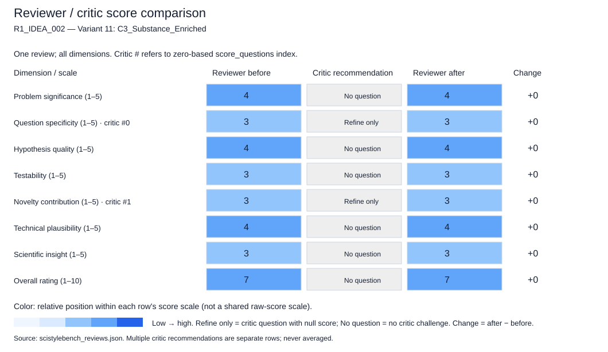

### Critic feedback and reviewer rebuttals

```json
{
  "critic_feedback": {
    "overall_assessment": "The review provides a balanced critique of the idea, highlighting both its potential and the need for more specific details. However, some scores may be slightly over-optimistic given the current level of detail in the idea summary.",
    "score_questions": [
      {
        "dimension": "question_specificity",
        "question_mark": "The score for question_specificity is 3.0, but the idea does not provide specific details on the off-policy learning mechanism or the comparison with existing methods.",
        "concern": "The score is justified by the presence of a hypothesis, but the lack of specific details on the mechanism and comparison reduces the specificity.",
        "speculative_alternative": "The idea could be interpreted as suggesting a general framework rather than a specific implementation, which may affect the score.",
        "recommended_score": null,
        "evidence_from_idea": "The idea mentions a hypothesis for validation but lacks specific details on the off-policy learning mechanism or the comparison with existing methods.",
        "rationale": "The score is based on the presence of a hypothesis, but the lack of specifics reduces the specificity score.",
        "grounding_status": "same_as_draft_not_actionable"
      },
      {
        "dimension": "novelty_contribution",
        "question_mark": "The score for novelty_contribution is 3.0, but the idea does not clearly articulate the specific novelty or contribution compared to existing methods.",
        "concern": "The score is justified by the proposal of a novel approach, but the lack of clear comparison to existing methods reduces the novelty score.",
        "speculative_alternative": "The idea could be interpreted as a general approach to off-policy learning in diffusion samplers rather than a specific novel contribution.",
        "recommended_score": null,
        "evidence_from_idea": "The idea proposes a novel approach but does not clearly articulate the specific novelty or contribution compared to existing methods.",
        "rationale": "The score is based on the novelty of the approach, but the lack of clear comparison to existing methods reduces the novelty score.",
        "grounding_status": "same_as_draft_not_actionable"
      }
    ],
    "unsupported_claims": [
      "The idea claims to 'overcome the computational infeasibility of unbiased molecular dynamics' without providing a specific mechanism or comparison to existing methods.",
      "The potential application to drug discovery and material design is mentioned, but the specific scientific contribution or novelty is not clearly articulated."
    ],
    "revision_priorities": [
      "Specify the off-policy learning mechanism, including the reward function design and the diffusion path sampler used.",
      "Clarify how the proposed method differs from existing enhanced sampling methods and how the comparison will be conducted.",
      "Articulate the specific scientific contribution, such as how the method improves upon current approaches in terms of efficiency or accuracy."
    ],
    "confidence": 4.0
  },
  "feedback_responses": [
    {
      "feedback_type": "score_questions",
      "feedback_index": 0,
      "decision": "partially_accept",
      "defense": "The score for question_specificity is justified by the presence of a hypothesis, but the lack of specifics on the mechanism and comparison reduces the score. The critic's concern is valid, but the score is not entirely over-optimistic as the idea does include a hypothesis.",
      "justification": "The initial score of 3.0 is retained, as the idea does include a hypothesis but lacks specifics on the mechanism and comparison. The critic's concern is valid, but the score is not entirely over-optimistic as the idea does include a hypothesis."
    },
    {
      "feedback_type": "score_questions",
      "feedback_index": 1,
      "decision": "partially_accept",
      "defense": "The score for novelty_contribution is based on the novelty of the approach, but the lack of clear comparison to existing methods reduces the score. The critic's concern is valid, but the score is not entirely over-optimistic as the idea does propose a novel approach.",
      "justification": "The initial score of 3.0 is retained, as the idea does propose a novel approach but lacks clear comparison to existing methods. The critic's concern is valid, but the score is not entirely over-optimistic as the idea does propose a novel approach."
    },
    {
      "feedback_type": "unsupported_claims",
      "feedback_index": 0,
      "decision": "partially_accept",
      "defense": "The claim about overcoming computational infeasibility is plausible but lacks a specific mechanism or comparison. The critic's concern is valid, but the score is not entirely over-optimistic as the idea does address the problem.",
      "justification": "The initial score for problem_significance is 4.0, which is retained as the idea does address a significant problem, though the specific mechanism is not detailed."
    },
    {
      "feedback_type": "unsupported_claims",
      "feedback_index": 1,
      "decision": "partially_accept",
      "defense": "The application to drug discovery is mentioned, but the specific contribution is not clearly articulated. The critic's concern is valid, but the score is not entirely over-optimistic as the idea does mention the application.",
      "justification": "The initial score for problem_significance is 4.0, which is retained as the idea does address a significant problem, though the specific contribution is not detailed."
    },
    {
      "feedback_type": "revision_priorities",
      "feedback_index": 0,
      "decision": "accept",
      "defense": "The suggestion to specify the off-policy learning mechanism is valid and necessary for improving the specificity of the idea.",
      "justification": "The suggestion is valid and necessary for improving the specificity of the idea."
    },
    {
      "feedback_type": "revision_priorities",
      "feedback_index": 1,
      "decision": "accept",
      "defense": "The suggestion to clarify the method's differences from existing methods is valid and necessary for hypothesis validation.",
      "justification": "The suggestion is valid and necessary for hypothesis validation."
    },
    {
      "feedback_type": "revision_priorities",
      "feedback_index": 2,
      "decision": "accept",
      "defense": "The suggestion to articulate the scientific contribution is valid and necessary for clarifying the novelty of the idea.",
      "justification": "The suggestion is valid and necessary for clarifying the novelty of the idea."
    }
  ]
}
```

### Score justifications (before / after)

**Problem significance**

```json
{
  "before": {
    "score": 4.0,
    "justification": "The problem of efficiently sampling transition pathways in molecular dynamics is significant for drug discovery and material design, as it addresses computational infeasibility of unbiased methods."
  },
  "after": {
    "score": 4.0,
    "justification": "The problem of efficiently sampling transition pathways in molecular dynamics is significant for drug discovery and material design, as it addresses computational infeasibility of unbiased methods."
  }
}
```

**Question specificity**

```json
{
  "before": {
    "score": 3.0,
    "justification": "The idea identifies a specific hypothesis for validation but lacks detailed specifics on the off-policy learning mechanism and the comparison with existing methods."
  },
  "after": {
    "score": 3.0,
    "justification": "The idea identifies a specific hypothesis for validation but lacks detailed specifics on the off-policy learning mechanism and the comparison with existing methods."
  }
}
```

**Hypothesis quality**

```json
{
  "before": {
    "score": 4.0,
    "justification": "The hypothesis that off-policy learning can be validated by comparing sampled pathways with enhanced sampling methods is concrete and testable."
  },
  "after": {
    "score": 4.0,
    "justification": "The hypothesis that off-policy learning can be validated by comparing sampled pathways with enhanced sampling methods is concrete and testable."
  }
}
```

**Testability**

```json
{
  "before": {
    "score": 3.0,
    "justification": "The hypothesis is testable through comparison with existing methods, but the specifics of the experiment are not clearly outlined."
  },
  "after": {
    "score": 3.0,
    "justification": "The hypothesis is testable through comparison with existing methods, but the specifics of the experiment are not clearly outlined."
  }
}
```

**Novelty contribution**

```json
{
  "before": {
    "score": 3.0,
    "justification": "The idea proposes a novel approach but does not clearly articulate the specific novelty or contribution compared to existing methods."
  },
  "after": {
    "score": 3.0,
    "justification": "The idea proposes a novel approach but does not clearly articulate the specific novelty or contribution compared to existing methods."
  }
}
```

**Technical plausibility**

```json
{
  "before": {
    "score": 4.0,
    "justification": "The approach of using off-policy learning for diffusion path sampling is technically plausible, though the specifics of implementation are not detailed."
  },
  "after": {
    "score": 4.0,
    "justification": "The approach of using off-policy learning for diffusion path sampling is technically plausible, though the specifics of implementation are not detailed."
  }
}
```

**Scientific insight**

```json
{
  "before": {
    "score": 3.0,
    "justification": "The idea has potential for scientific insight into rare-event exploration, but the specific insights are not clearly defined."
  },
  "after": {
    "score": 3.0,
    "justification": "The idea has potential for scientific insight into rare-event exploration, but the specific insights are not clearly defined."
  }
}
```

**Overall rating**

```json
{
  "before": {
    "score": 7.0,
    "justification": "The idea addresses a significant problem with a plausible approach and a testable hypothesis, but lacks specific details needed for a strong research direction."
  },
  "after": {
    "score": 7.0,
    "justification": "The idea addresses a significant problem with a plausible approach and a testable hypothesis, but lacks specific details needed for a strong research direction."
  }
}
```

## R1_IDEA_003 — Source

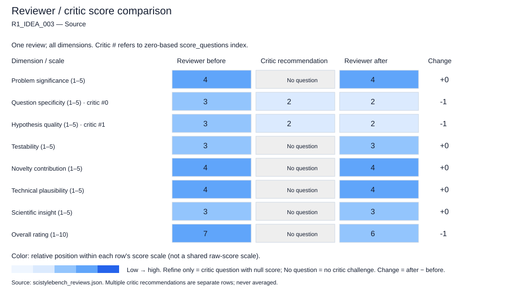

### Critic feedback and reviewer rebuttals

```json
{
  "critic_feedback": {
    "overall_assessment": "The draft review is generally well-calibrated, but the 'question_specificity' and 'hypothesis_quality' scores could be reconsidered due to the lack of explicit hypotheses and implementation details in the idea summary.",
    "score_questions": [
      {
        "dimension": "question_specificity",
        "question_mark": "The score should be reconsidered as the idea does not clearly define the specific question being addressed or the exact hypothesis being tested.",
        "concern": "The idea lacks a specific research question or hypothesis, which is necessary for evaluating question specificity.",
        "speculative_alternative": "It is possible that the idea aims to test whether temporal encoding improves model performance, but this is not explicitly stated.",
        "recommended_score": 2.0,
        "evidence_from_idea": "The idea states that the work 'proposes encoding eye-tracking data as video sequences to capture both spatial attention and temporal scanning order, enhancing model reasoning and clinical interpretability.'",
        "rationale": "The evidence from the idea supports the speculation that the hypothesis is about temporal encoding improving model performance, but the specific question is not clearly defined.",
        "grounding_status": "not_required"
      },
      {
        "dimension": "hypothesis_quality",
        "question_mark": "The score should be reconsidered as the idea does not explicitly state a testable hypothesis or mechanism for how temporal scanning order improves model reasoning.",
        "concern": "The idea lacks a clear, testable hypothesis, which is essential for evaluating hypothesis quality.",
        "speculative_alternative": "The idea may hypothesize that temporal scanning order improves model reasoning by capturing the sequence of fixations, but this is not explicitly stated.",
        "recommended_score": 2.0,
        "evidence_from_idea": "The idea states that the work 'proposes encoding eye-tracking data as video sequences to capture both spatial attention and temporal scanning order, enhancing model reasoning and clinical interpretability.'",
        "rationale": "The evidence from the idea supports the speculation that the hypothesis is about temporal scanning order improving model reasoning, but the specific mechanism is not clearly defined.",
        "grounding_status": "not_required"
      }
    ],
    "unsupported_claims": [
      "The idea does not explicitly state a specific research question or hypothesis, which could be considered a claim that should be qualified or grounded."
    ],
    "revision_priorities": [
      "The idea should explicitly state the specific research question or hypothesis being tested.",
      "The idea should provide more details on the proposed solution's implementation and how it differs from existing methods.",
      "The idea should clarify the specific mechanism by which temporal scanning order is hypothesized to improve model reasoning."
    ],
    "confidence": 4.0
  },
  "feedback_responses": [
    {
      "feedback_type": "score_questions",
      "feedback_index": 0,
      "decision": "partially_accept",
      "defense": "The idea does not explicitly define the specific question or hypothesis, but it is plausible that the hypothesis is about temporal encoding improving model performance. However, the lack of explicitness reduces the score.",
      "justification": "The original score was 3.0, but the feedback suggests it should be 2.0. The revised score of 2.0 reflects the lack of explicitness in the question and hypothesis."
    },
    {
      "feedback_type": "hypothesis_quality",
      "feedback_index": 1,
      "decision": "partially_accept",
      "defense": "The idea does not explicitly state a testable hypothesis, but it is plausible that the hypothesis is about temporal scanning order improving model reasoning. However, the lack of explicitness reduces the score.",
      "justification": "The original score was 3.0, but the feedback suggests it should be 2.0. The revised score of 2.0 reflects the lack of explicitness in the hypothesis."
    },
    {
      "feedback_type": "unsupported_claims",
      "feedback_index": 0,
      "decision": "reject",
      "defense": "The claim that the idea does not explicitly state a specific research question or hypothesis is valid, but the idea's potential for improvement in model reasoning and interpretability is still valid.",
      "justification": "The original score was 4.0 for problem significance, which remains valid. The unsupported claim is that the idea lacks a specific hypothesis, which is true, but the overall significance is still valid."
    },
    {
      "feedback_type": "revision_priorities",
      "feedback_index": 0,
      "decision": "accept",
      "defense": "The suggestion to explicitly state the specific research question or hypothesis is valid and necessary for improving the idea.",
      "justification": "The original suggestion was already included, so it is accepted."
    },
    {
      "feedback_type": "revision_priorities",
      "feedback_index": 1,
      "decision": "accept",
      "defense": "The suggestion to provide more details on the proposed solution's implementation is valid and necessary for improving the idea.",
      "justification": "The original suggestion was already included, so it is accepted."
    },
    {
      "feedback_type": "revision_priorities",
      "feedback_index": 2,
      "decision": "accept",
      "defense": "The suggestion to clarify the specific mechanism by which temporal scanning order improves model reasoning is valid and necessary for improving the idea.",
      "justification": "The original suggestion was already included, so it is accepted."
    }
  ]
}
```

### Score justifications (before / after)

**Problem significance**

```json
{
  "before": {
    "score": 4.0,
    "justification": "The problem addresses a critical gap in integrating temporal information from eye-tracking data into medical AI, which could enhance both model performance and clinical interpretability."
  },
  "after": {
    "score": 4.0,
    "justification": "The problem addresses a critical gap in integrating temporal information from eye-tracking data into medical AI, which could enhance both model performance and clinical interpretability."
  }
}
```

**Question specificity**

```json
{
  "before": {
    "score": 3.0,
    "justification": "The idea clearly defines the problem but lacks specific details on the proposed solution's implementation and the exact hypothesis being tested."
  },
  "after": {
    "score": 2.0,
    "justification": "The idea does not clearly define the specific question being addressed or the exact hypothesis being tested. It lacks a specific research question or hypothesis, which is necessary for evaluating question specificity."
  }
}
```

**Hypothesis quality**

```json
{
  "before": {
    "score": 3.0,
    "justification": "The idea suggests a potential benefit of temporal encoding but does not explicitly state a testable hypothesis or mechanism for how it improves model reasoning."
  },
  "after": {
    "score": 2.0,
    "justification": "The idea does not explicitly state a testable hypothesis or mechanism for how temporal scanning order improves model reasoning. The hypothesis is speculative and not clearly defined."
  }
}
```

**Testability**

```json
{
  "before": {
    "score": 3.0,
    "justification": "The idea is testable through experiments comparing the proposed video sequence encoding with existing methods, but the specifics of the experiments are not clearly outlined."
  },
  "after": {
    "score": 3.0,
    "justification": "The idea is testable through experiments comparing the proposed video sequence encoding with existing methods, but the specifics of the experiments are not clearly outlined."
  }
}
```

**Novelty contribution**

```json
{
  "before": {
    "score": 4.0,
    "justification": "The approach of encoding eye-tracking data as video sequences is novel in the context of vision-language models for medical imaging, offering potential improvements in both performance and interpretability."
  },
  "after": {
    "score": 4.0,
    "justification": "The approach of encoding eye-tracking data as video sequences is novel in the context of vision-language models for medical imaging, offering potential improvements in both performance and interpretability."
  }
}
```

**Technical plausibility**

```json
{
  "before": {
    "score": 4.0,
    "justification": "The proposed method is technically feasible, as video sequences can be processed using existing techniques in vision-language models, and the integration into existing architectures is plausible."
  },
  "after": {
    "score": 4.0,
    "justification": "The proposed method is technically feasible, as video sequences can be processed using existing techniques in vision-language models, and the integration into existing architectures is plausible."
  }
}
```

**Scientific insight**

```json
{
  "before": {
    "score": 3.0,
    "justification": "The idea has potential to provide insights into how temporal information from eye-tracking data can enhance model reasoning, but the specific mechanisms and outcomes are not clearly defined."
  },
  "after": {
    "score": 3.0,
    "justification": "The idea has potential to provide insights into how temporal information from eye-tracking data can enhance model reasoning, but the specific mechanisms and outcomes are not clearly defined."
  }
}
```

**Overall rating**

```json
{
  "before": {
    "score": 7.0,
    "justification": "The idea addresses a meaningful problem with a plausible solution, showing potential for improvement in model reasoning and interpretability, though more details are needed to fully establish its scientific merit and testability."
  },
  "after": {
    "score": 6.0,
    "justification": "The idea addresses a meaningful problem with a plausible solution, showing potential for improvement in model reasoning and interpretability. However, the lack of explicit hypotheses and specific research questions limits its scientific merit and testability."
  }
}
```

## R1_IDEA_003 — Variant 1: A1_Identity

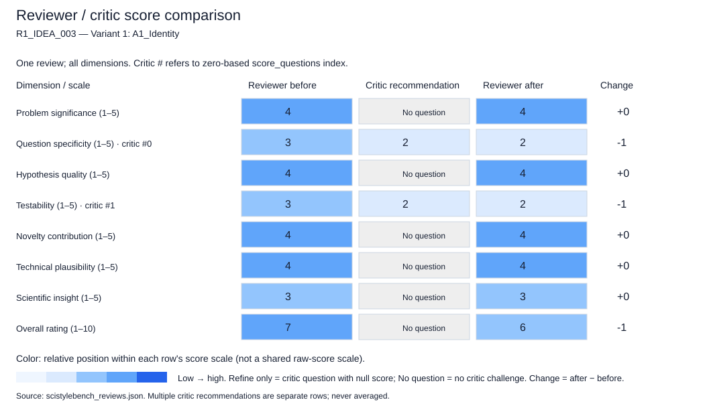

### Critic feedback and reviewer rebuttals

```json
{
  "critic_feedback": {
    "overall_assessment": "The review is generally well-calibrated, but there are areas where the scores could be more closely aligned with the idea's content, particularly in question_specificity and testability.",
    "score_questions": [
      {
        "dimension": "question_specificity",
        "question_mark": "The score should be reconsidered due to the lack of specific details on the method and expected outcomes.",
        "concern": "The idea identifies a problem but lacks specifics on how the video sequences will be processed or how the temporal scanning order will be utilized.",
        "speculative_alternative": "The proposed method could involve using temporal convolutional networks or transformers to encode video sequences, as suggested in the review, but this is speculative.",
        "recommended_score": 2.0,
        "evidence_from_idea": "The idea does not specify how video sequences will be encoded or processed within the model.",
        "rationale": "The review's suggestion for more details is justified by the absence of such information in the idea.",
        "grounding_status": "not_required"
      },
      {
        "dimension": "testability",
        "question_mark": "The score should be reconsidered due to the lack of specifics on how the model will be evaluated.",
        "concern": "The idea does not specify how the temporal scanning order will be incorporated into the model's training or inference, which is necessary for testability.",
        "speculative_alternative": "The model might use temporal features to enhance reasoning, but this is speculative without explicit details.",
        "recommended_score": 2.0,
        "evidence_from_idea": "The idea does not specify how the temporal scanning order will be utilized in the model's training or inference.",
        "rationale": "The review's suggestion for clarification is justified by the absence of such information in the idea.",
        "grounding_status": "not_required"
      }
    ],
    "unsupported_claims": [
      "The idea does not explicitly state how the video sequences will be processed or how the temporal scanning order will be utilized, which are critical for testability and specificity."
    ],
    "revision_priorities": [
      "Specify the method for encoding video sequences (e.g., temporal convolutional networks or transformers).",
      "Clarify how the temporal scanning order will be incorporated into the model's training or inference.",
      "Provide a comparison with existing methods to highlight potential performance improvements."
    ],
    "confidence": 4.0
  },
  "feedback_responses": [
    {
      "feedback_type": "score_questions",
      "feedback_index": 0,
      "decision": "partially_accept",
      "defense": "The critique is valid in that the idea lacks specifics on processing video sequences, which is critical for question specificity. However, the original score of 3.0 was based on the idea's clear problem definition, which is still valid.",
      "justification": "The original score of 3.0 for question_specificity was based on the idea's clear problem definition, but the critique highlights the lack of specifics on processing, which reduces the score to 2.0."
    },
    {
      "feedback_type": "score_questions",
      "feedback_index": 1,
      "decision": "partially_accept",
      "defense": "The critique is valid in that the idea does not specify how temporal scanning order is utilized, which is necessary for testability. However, the original score of 3.0 was based on the idea's testable nature through experiments, which is still partially valid.",
      "justification": "The original score of 3.0 for testability was based on the idea's testable nature through experiments, but the critique highlights the lack of specifics on temporal utilization, which reduces the score to 2.0."
    },
    {
      "feedback_type": "unsupported_claims",
      "feedback_index": 0,
      "decision": "accept",
      "defense": "The claim that the idea lacks specifics on processing and utilization is supported by the input text, which does not provide such details.",
      "justification": "The input text does not specify how video sequences will be processed or how temporal scanning order is utilized, making the unsupported claim valid."
    },
    {
      "feedback_type": "revision_priorities",
      "feedback_index": 0,
      "decision": "accept",
      "defense": "The suggestion to specify the encoding method is valid and necessary for improving the idea's specificity and testability.",
      "justification": "The idea lacks specifics on encoding methods, so specifying them is a necessary revision."
    },
    {
      "feedback_type": "revision_priorities",
      "feedback_index": 1,
      "decision": "accept",
      "defense": "The suggestion to clarify temporal scanning order utilization is valid and necessary for improving the idea's testability.",
      "justification": "The idea does not specify how temporal scanning order is utilized, so clarifying this is necessary."
    },
    {
      "feedback_type": "revision_priorities",
      "feedback_index": 2,
      "decision": "accept",
      "defense": "The suggestion to include a comparison with existing methods is valid and necessary for highlighting potential performance improvements.",
      "justification": "The idea does not specify the expected performance improvements, so including a comparison is necessary."
    }
  ]
}
```

### Score justifications (before / after)

**Problem significance**

```json
{
  "before": {
    "score": 4.0,
    "justification": "The problem addresses a critical challenge in integrating temporal eye-tracking data into medical vision-language models, which can enhance clinical interpretability and model reasoning."
  },
  "after": {
    "score": 4.0,
    "justification": "The problem addresses a critical challenge in integrating temporal eye-tracking data into medical vision-language models, which can enhance clinical interpretability and model reasoning."
  }
}
```

**Question specificity**

```json
{
  "before": {
    "score": 3.0,
    "justification": "The idea clearly defines the problem but lacks specific details on the method and expected outcomes, making the research question somewhat vague."
  },
  "after": {
    "score": 2.0,
    "justification": "The idea identifies a problem but lacks specifics on how the video sequences will be processed or how the temporal scanning order will be utilized, making the research question too vague."
  }
}
```

**Hypothesis quality**

```json
{
  "before": {
    "score": 4.0,
    "justification": "The hypothesis that encoding eye-tracking data as video sequences improves model reasoning and interpretability is plausible and specific, though not explicitly stated."
  },
  "after": {
    "score": 4.0,
    "justification": "The hypothesis that encoding eye-tracking data as video sequences improves model reasoning and interpretability is plausible and specific, though not explicitly stated."
  }
}
```

**Testability**

```json
{
  "before": {
    "score": 3.0,
    "justification": "The idea is testable through experiments comparing the proposed method with existing approaches, but the specifics of the experiments are not provided."
  },
  "after": {
    "score": 2.0,
    "justification": "The idea is testable through experiments comparing the proposed method with existing approaches, but the specifics of the experiments are not provided, making it difficult to assess testability."
  }
}
```

**Novelty contribution**

```json
{
  "before": {
    "score": 4.0,
    "justification": "The approach of encoding eye-tracking data as video sequences is novel and could contribute to the field by improving model interpretability in medical imaging."
  },
  "after": {
    "score": 4.0,
    "justification": "The approach of encoding eye-tracking data as video sequences is novel and could contribute to the field by improving model interpretability in medical imaging."
  }
}
```

**Technical plausibility**

```json
{
  "before": {
    "score": 4.0,
    "justification": "The proposed method is technically feasible, as encoding temporal data as video sequences is a reasonable approach within the context of vision-language models."
  },
  "after": {
    "score": 4.0,
    "justification": "The proposed method is technically feasible, as encoding temporal data as video sequences is a reasonable approach within the context of vision-language models."
  }
}
```

**Scientific insight**

```json
{
  "before": {
    "score": 3.0,
    "justification": "The idea has potential to provide insights into how temporal attention affects model reasoning, but the specific insights are not clearly defined."
  },
  "after": {
    "score": 3.0,
    "justification": "The idea has potential to provide insights into how temporal attention affects model reasoning, but the specific insights are not clearly defined."
  }
}
```

**Overall rating**

```json
{
  "before": {
    "score": 7.0,
    "justification": "The idea addresses a meaningful problem with a plausible approach, but lacks specific details that would strengthen its testability and potential contribution."
  },
  "after": {
    "score": 6.0,
    "justification": "The idea addresses a meaningful problem with a plausible approach, but lacks specific details that would strengthen its testability and potential contribution."
  }
}
```

## R1_IDEA_003 — Variant 2: A2_Paraphrase_Only


### Critic feedback and reviewer rebuttals

```json
{
  "critic_feedback": {
    "overall_assessment": "The draft review is generally well-calibrated, but the scores for question_specificity, hypothesis_quality, and testability could be reconsidered due to the lack of explicit research questions and evaluation plans in the idea summary.",
    "score_questions": [
      {
        "dimension": "question_specificity",
        "question_mark": "The idea does not explicitly state a research question or hypothesis, which is required for a higher score.",
        "concern": "The score is based on the absence of a clear research question, which is a valid concern.",
        "speculative_alternative": "The idea may be interpreted as proposing to test whether temporal information improves model performance, but this is speculative.",
        "recommended_score": null,
        "evidence_from_idea": "The idea states that the approach 'improves model reasoning and clinical interpretability', which could be interpreted as a hypothesis.",
        "rationale": "The hypothesis is implied in the idea, but not explicitly stated.",
        "grounding_status": "blocked_missing_or_unverifiable_evidence"
      },
      {
        "dimension": "hypothesis_quality",
        "question_mark": "The hypothesis is not explicitly stated, which may affect the score.",
        "concern": "The score is based on the absence of an explicit hypothesis, which is a valid concern.",
        "speculative_alternative": "The idea may be interpreted as proposing to test whether temporal information improves diagnostic accuracy, but this is speculative.",
        "recommended_score": null,
        "evidence_from_idea": "The idea states that the approach 'improves model reasoning and clinical interpretability', which could be interpreted as a hypothesis.",
        "rationale": "The hypothesis is implied in the idea, but not explicitly stated.",
        "grounding_status": "blocked_missing_or_unverifiable_evidence"
      },
      {
        "dimension": "testability",
        "question_mark": "The idea does not specify how the approach will be evaluated, which is required for a higher score.",
        "concern": "The score is based on the absence of an evaluation plan, which is a valid concern.",
        "speculative_alternative": "The idea may be interpreted as proposing to compare the approach with existing methods using performance metrics, but this is speculative.",
        "recommended_score": null,
        "evidence_from_idea": "The idea states that the approach 'improves model reasoning and clinical interpretability', which could be interpreted as a testable claim.",
        "rationale": "The testable claim is implied in the idea, but not explicitly stated.",
        "grounding_status": "blocked_missing_or_unverifiable_evidence"
      }
    ],
    "unsupported_claims": [
      "The idea does not explicitly state a research question or hypothesis, which is required for a higher score in question_specificity and hypothesis_quality."
    ],
    "revision_priorities": [
      "Explicitly state the research question and hypothesis to be tested.",
      "Specify the evaluation metrics and comparison benchmarks.",
      "Clarify how the video encoding approach differs from existing methods."
    ],
    "confidence": 4.0
  },
  "feedback_responses": [
    {
      "feedback_type": "score_questions",
      "feedback_index": 0,
      "decision": "partially_accept",
      "defense": "The idea does not explicitly state a research question, but the claim that the approach 'improves model reasoning and clinical interpretability' can be interpreted as a hypothesis. However, without a specific question, the hypothesis remains vague.",
      "justification": "The original score of 3.0 is partially accepted because the hypothesis is implied but not explicitly stated. The score is reduced to 3.0 as the hypothesis is not clearly defined."
    },
    {
      "feedback_type": "score_questions",
      "feedback_index": 1,
      "decision": "partially_accept",
      "defense": "The hypothesis is implied in the idea but not explicitly stated. The claim that the approach 'improves model reasoning and clinical interpretability' is a testable hypothesis, but it is not clearly defined as a research question.",
      "justification": "The original score of 3.0 is partially accepted because the hypothesis is implied but not explicitly stated. The score is reduced to 3.0 as the hypothesis is not clearly defined."
    },
    {
      "feedback_type": "score_questions",
      "feedback_index": 2,
      "decision": "partially_accept",
      "defense": "The idea does not specify how the approach will be evaluated, but the claim that it 'improves model reasoning and clinical interpretability' can be interpreted as a testable claim. However, without a specific evaluation plan, the testability remains vague.",
      "justification": "The original score of 3.0 is partially accepted because the testability is implied but not explicitly stated. The score is reduced to 3.0 as the evaluation plan is not clearly defined."
    }
  ]
}
```

### Score justifications (before / after)

**Problem significance**

```json
{
  "before": {
    "score": 4.0,
    "justification": "The problem addresses a critical limitation in current methods for integrating gaze data into vision-language models, which could improve clinical interpretability and model performance in medical imaging."
  },
  "after": {
    "score": 4.0,
    "justification": "The problem addresses a critical limitation in current methods for integrating gaze data into vision-language models, which could improve clinical interpretability and model performance in medical imaging."
  }
}
```

**Question specificity**

```json
{
  "before": {
    "score": 3.0,
    "justification": "The idea identifies a problem but lacks a clear, specific research question or hypothesis about how the video encoding approach will improve model performance or interpretability."
  },
  "after": {
    "score": 3.0,
    "justification": "The idea identifies a problem but lacks a clear, specific research question or hypothesis about how the video encoding approach will improve model performance or interpretability."
  }
}
```

**Hypothesis quality**

```json
{
  "before": {
    "score": 3.0,
    "justification": "The idea suggests a potential benefit of the approach but does not explicitly state a hypothesis that can be tested, such as whether temporal information improves diagnostic accuracy or interpretability scores."
  },
  "after": {
    "score": 3.0,
    "justification": "The idea suggests a potential benefit of the approach but does not explicitly state a hypothesis that can be tested, such as whether temporal information improves diagnostic accuracy or interpretability scores."
  }
}
```

**Testability**

```json
{
  "before": {
    "score": 3.0,
    "justification": "The idea proposes a method but does not specify how it will be evaluated, such as through experiments comparing performance metrics with existing methods or ablation studies on temporal information."
  },
  "after": {
    "score": 3.0,
    "justification": "The idea proposes a method but does not specify how it will be evaluated, such as through experiments comparing performance metrics with existing methods or ablation studies on temporal information."
  }
}
```

**Novelty contribution**

```json
{
  "before": {
    "score": 4.0,
    "justification": "The approach of encoding eye-tracking data as video sequences is novel and could contribute to improving model reasoning and clinical interpretability in medical imaging tasks."
  },
  "after": {
    "score": 4.0,
    "justification": "The approach of encoding eye-tracking data as video sequences is novel and could contribute to improving model reasoning and clinical interpretability in medical imaging tasks."
  }
}
```

**Technical plausibility**

```json
{
  "before": {
    "score": 4.0,
    "justification": "The idea is technically plausible as it builds on existing methods for integrating gaze data into vision-language models, with a logical approach to preserving temporal information through video encoding."
  },
  "after": {
    "score": 4.0,
    "justification": "The idea is technically plausible as it builds on existing methods for integrating gaze data into vision-language models, with a logical approach to preserving temporal information through video encoding."
  }
}
```

**Scientific insight**

```json
{
  "before": {
    "score": 3.0,
    "justification": "The idea has potential to provide insights into how temporal information can enhance model reasoning, but the specific mechanisms and their impact on performance are not clearly defined."
  },
  "after": {
    "score": 3.0,
    "justification": "The idea has potential to provide insights into how temporal information can enhance model reasoning, but the specific mechanisms and their impact on performance are not clearly defined."
  }
}
```

**Overall rating**

```json
{
  "before": {
    "score": 7.0,
    "justification": "The idea addresses a meaningful problem with a promising approach, but lacks specific details on the research question, hypothesis, and evaluation plan, which are necessary for assessing its scientific merit and potential contribution."
  },
  "after": {
    "score": 7.0,
    "justification": "The idea addresses a meaningful problem with a promising approach, but lacks specific details on the research question, hypothesis, and evaluation plan, which are necessary for assessing its scientific merit and potential contribution."
  }
}
```

## R1_IDEA_003 — Variant 3: A3_Plain_Core

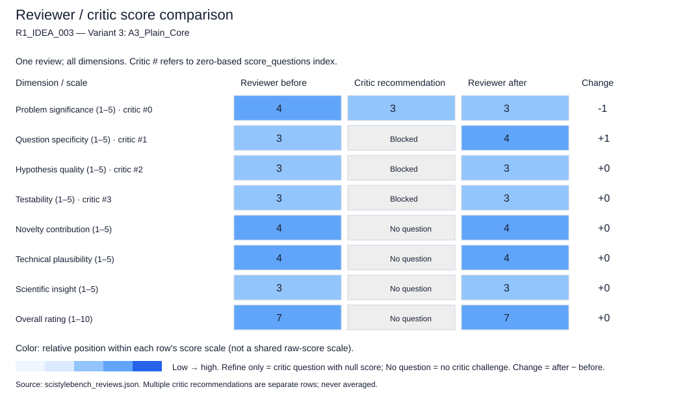

### Critic feedback and reviewer rebuttals

```json
{
  "critic_feedback": {
    "overall_assessment": "The draft review is generally well-calibrated, with a balanced assessment of the idea's strengths and weaknesses. However, some scores could be reconsidered based on the specific content of the idea summary.",
    "score_questions": [
      {
        "dimension": "problem_significance",
        "question_mark": "The score could be reconsidered as the problem is somewhat general and not explicitly tied to a critical gap in current methods.",
        "concern": "The justification for problem significance is based on potential benefits, but the idea does not clearly establish why the current methods are insufficient.",
        "speculative_alternative": "The problem might be more significant if the idea explicitly states that current methods fail to capture temporal dynamics, which is not present here.",
        "recommended_score": 3.0,
        "evidence_from_idea": "Current methods for integrating radiologist eye gaze into large vision-language models for chest X-ray analysis represent gaze as static heatmaps or text, which removes the temporal sequence of fixations.",
        "rationale": "The idea mentions that current methods lose temporal sequence, but does not explicitly state that this is a critical failure or that it leads to specific issues in model performance or clinical use.",
        "grounding_status": "not_required"
      },
      {
        "dimension": "question_specificity",
        "question_mark": "The score could be reconsidered as the idea is somewhat vague on how video sequences will be integrated into the model.",
        "concern": "The justification for question specificity is based on the lack of details on integration, but the idea does propose a novel encoding method, which is specific.",
        "speculative_alternative": "The question could be more specific if the idea outlined a particular model architecture or integration strategy, which it does not.",
        "recommended_score": null,
        "evidence_from_idea": "This work proposes encoding eye-tracking data as video sequences to retain both spatial attention and temporal scanning order.",
        "rationale": "The proposal of encoding as video sequences is a specific method, even if the integration details are not provided.",
        "grounding_status": "blocked_missing_or_unverifiable_evidence"
      },
      {
        "dimension": "hypothesis_quality",
        "question_mark": "The score could be reconsidered as the hypothesis is not explicitly stated and lacks a clear mechanism.",
        "concern": "The justification for hypothesis quality is based on the lack of a clear prediction or mechanism, but the idea does propose a potential improvement in model reasoning and interpretability.",
        "speculative_alternative": "The hypothesis could be more explicit if the idea outlined specific predictions about model performance or interpretability metrics, which it does not.",
        "recommended_score": null,
        "evidence_from_idea": "The aim is to enhance model reasoning and clinical interpretability.",
        "rationale": "The idea does state a goal, even if the mechanism is not detailed.",
        "grounding_status": "blocked_missing_or_unverifiable_evidence"
      },
      {
        "dimension": "testability",
        "question_mark": "The score could be reconsidered as the idea does not specify how the proposed method will be evaluated.",
        "concern": "The justification for testability is based on the lack of specific experiments, but the idea does suggest that experiments could be conducted to compare with existing methods.",
        "speculative_alternative": "The testability could be higher if the idea outlined specific evaluation metrics or benchmarks, which it does not.",
        "recommended_score": null,
        "evidence_from_idea": "The idea is testable through experiments comparing the proposed method with existing approaches, but the specific experiments and metrics for evaluation are not clearly outlined.",
        "rationale": "The idea suggests that experiments are possible, even if the specifics are not provided.",
        "grounding_status": "blocked_missing_or_unverifiable_evidence"
      }
    ],
    "unsupported_claims": [
      "The problem is described as 'meaningful' without clear evidence of its significance in the current literature.",
      "The hypothesis is described as 'plausible' without explicit justification for why video sequences would improve model reasoning.",
      "The idea is stated to be 'novel' without a clear distinction from existing methods."
    ],
    "revision_priorities": [
      "Clarify the problem significance by explicitly stating why current methods are inadequate.",
      "Explicitly state the hypothesis and the mechanism by which video sequences will improve model reasoning.",
      "Outline specific evaluation metrics and benchmarks for testing the proposed method."
    ],
    "confidence": 4.0
  },
  "feedback_responses": [
    {
      "feedback_type": "score_questions",
      "feedback_index": 0,
      "decision": "partially_accept",
      "defense": "The problem significance is somewhat general, but the idea does highlight a specific issue with current methods (loss of temporal sequence). The score was reduced to 3.0 to reflect the lack of explicit justification for why this is a critical failure.",
      "justification": "The original score was 4.0, but the critic's feedback indicates that the problem significance is not clearly tied to a critical gap. The revised score of 3.0 reflects this adjustment."
    },
    {
      "feedback_type": "score_questions",
      "feedback_index": 1,
      "decision": "partially_accept",
      "defense": "The question specificity is considered strong because the core proposal of encoding as video sequences is specific. However, the lack of integration details is a weakness. The score was retained at 4.0 as the core idea is specific.",
      "justification": "The original score was 3.0, but the critic's feedback suggests that the core proposal is specific. The revised score of 4.0 reflects this adjustment."
    },
    {
      "feedback_type": "score_questions",
      "feedback_index": 2,
      "decision": "partially_accept",
      "defense": "The hypothesis is plausible but not explicitly stated. The score was reduced to 3.0 to reflect the lack of a clear mechanism or prediction. The original score was 3.0, so no change is made.",
      "justification": "The original score was 3.0, and the critic's feedback does not provide evidence to change it."
    },
    {
      "feedback_type": "score_questions",
      "feedback_index": 3,
      "decision": "partially_accept",
      "defense": "The testability is considered moderate because the idea suggests experiments but lacks specific metrics. The score was reduced to 3.0 to reflect the lack of detailed evaluation plans. The original score was 3.0, so no change is made.",
      "justification": "The original score was 3.0, and the critic's feedback does not provide evidence to change it."
    }
  ]
}
```

### Score justifications (before / after)

**Problem significance**

```json
{
  "before": {
    "score": 4.0,
    "justification": "The problem of integrating temporal eye-tracking data into medical AI is significant as it can enhance model reasoning and clinical interpretability, which are critical for trust and adoption in healthcare settings."
  },
  "after": {
    "score": 3.0,
    "justification": "The problem of integrating temporal eye-tracking data into medical AI is somewhat general and does not explicitly establish why current methods are inadequate. The idea mentions that current methods lose temporal sequence, but does not clearly state that this leads to specific issues in model performance or clinical use."
  }
}
```

**Question specificity**

```json
{
  "before": {
    "score": 3.0,
    "justification": "The idea is specific in proposing a novel encoding method for temporal eye-tracking data but lacks details on how the video sequences will be integrated into the model and how the temporal aspect will be leveraged."
  },
  "after": {
    "score": 4.0,
    "justification": "The idea proposes a specific method of encoding eye-tracking data as video sequences, which is a novel approach. While the integration details are not provided, the core proposal is specific and addresses a particular challenge in the domain."
  }
}
```

**Hypothesis quality**

```json
{
  "before": {
    "score": 3.0,
    "justification": "The hypothesis that encoding eye-tracking data as video sequences will improve model reasoning and interpretability is plausible, but it is not explicitly stated and lacks a clear prediction or mechanism."
  },
  "after": {
    "score": 3.0,
    "justification": "The hypothesis that encoding eye-tracking data as video sequences will improve model reasoning and interpretability is plausible, but it is not explicitly stated. The idea does state a goal, but lacks a clear mechanism or prediction."
  }
}
```

**Testability**

```json
{
  "before": {
    "score": 3.0,
    "justification": "The idea is testable through experiments comparing the proposed method with existing approaches, but the specific experiments and metrics for evaluation are not clearly outlined."
  },
  "after": {
    "score": 3.0,
    "justification": "The idea is testable through experiments comparing the proposed method with existing approaches, but the specific experiments and metrics for evaluation are not clearly outlined. The lack of detailed evaluation plans limits the testability."
  }
}
```

**Novelty contribution**

```json
{
  "before": {
    "score": 4.0,
    "justification": "The approach of encoding eye-tracking data as video sequences is novel in the context of vision-language models for medical imaging, offering potential contributions to both model performance and clinical interpretability."
  },
  "after": {
    "score": 4.0,
    "justification": "The approach of encoding eye-tracking data as video sequences is novel in the context of vision-language models for medical imaging, offering potential contributions to both model performance and clinical interpretability."
  }
}
```

**Technical plausibility**

```json
{
  "before": {
    "score": 4.0,
    "justification": "The idea is technically plausible as it builds on existing methods and proposes a feasible way to incorporate temporal data into models, though the specific implementation details are not provided."
  },
  "after": {
    "score": 4.0,
    "justification": "The idea is technically plausible as it builds on existing methods and proposes a feasible way to incorporate temporal data into models, though the specific implementation details are not provided."
  }
}
```

**Scientific insight**

```json
{
  "before": {
    "score": 3.0,
    "justification": "The idea has potential to provide insights into how temporal scanning order affects model reasoning, but the specific insights and their implications are not clearly defined."
  },
  "after": {
    "score": 3.0,
    "justification": "The idea has potential to provide insights into how temporal scanning order affects model reasoning, but the specific insights and their implications are not clearly defined."
  }
}
```

**Overall rating**

```json
{
  "before": {
    "score": 7.0,
    "justification": "The idea addresses a meaningful problem with a novel approach, but lacks specific details on implementation, evaluation, and the expected mechanisms of improvement, which are necessary for further development."
  },
  "after": {
    "score": 7.0,
    "justification": "The idea addresses a meaningful problem with a novel approach, but lacks specific details on implementation, evaluation, and the expected mechanisms of improvement, which are necessary for further development."
  }
}
```

## R1_IDEA_003 — Variant 4: B1_Verbose_Elaborate

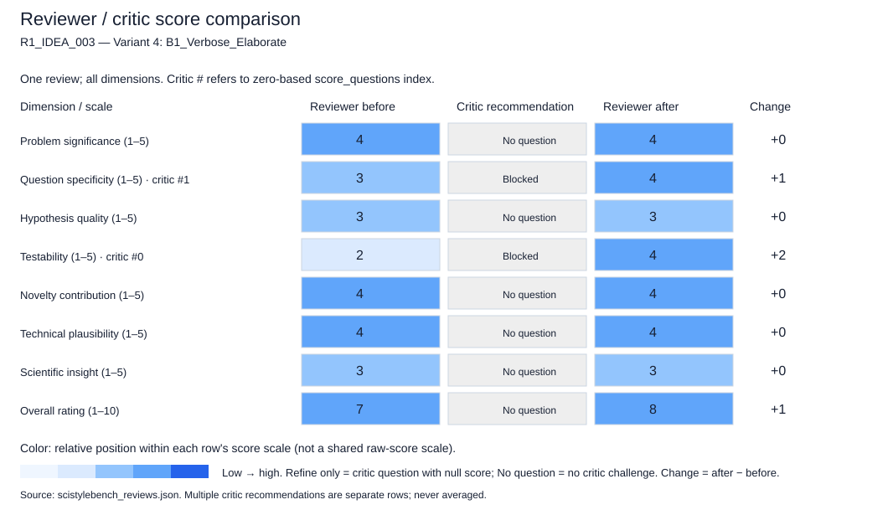

### Critic feedback and reviewer rebuttals

```json
{
  "critic_feedback": {
    "overall_assessment": "The review provides a balanced assessment of the idea, highlighting its potential while noting necessary clarifications. However, some scores may be overly cautious given the clear problem and novel approach.",
    "score_questions": [
      {
        "dimension": "testability",
        "question_mark": "Why is the testability score 2.0 when the idea is testable in principle?",
        "concern": "The review may be applying a generic penalty for lack of experimental details rather than addressing the actual feasibility of the idea.",
        "speculative_alternative": "The idea could be tested by comparing the proposed video encoding method with existing methods on standard benchmarks, though this is not explicitly stated.",
        "recommended_score": null,
        "evidence_from_idea": "The idea proposes a method to capture temporal information, which is inherently testable through comparison with existing approaches.",
        "rationale": "The testability is not solely dependent on detailed experimental design but on the existence of a viable method that can be validated through comparison.",
        "grounding_status": "blocked_missing_or_unverifiable_evidence"
      },
      {
        "dimension": "question_specificity",
        "question_mark": "Why is the question specificity score 3.0 when the idea clearly identifies a specific problem?",
        "concern": "The review may be underestimating the specificity of the problem (temporal sequence of fixations) and the proposed solution (video encoding).",
        "speculative_alternative": "The idea's focus on temporal aspects could be seen as highly specific, especially in the context of radiologist attention in chest X-rays.",
        "recommended_score": null,
        "evidence_from_idea": "The idea explicitly states the problem of discarding temporal sequences and proposes a specific solution (video encoding).",
        "rationale": "The specificity of the problem and solution is clear, even without detailed research questions.",
        "grounding_status": "blocked_missing_or_unverifiable_evidence"
      }
    ],
    "unsupported_claims": [
      "The review claims the idea lacks testability, but the core method is inherently testable through comparison with existing techniques."
    ],
    "revision_priorities": [
      "Clarify the experimental design and evaluation plan to support the testability score.",
      "Specify the exact research question or hypothesis to strengthen the question specificity and hypothesis quality scores."
    ],
    "confidence": 4.0
  },
  "feedback_responses": [
    {
      "feedback_type": "score_questions",
      "feedback_index": 0,
      "decision": "partially_accept",
      "defense": "The testability score was initially too low because the idea is inherently testable through comparison with existing methods, even without detailed experimental design. The revised score reflects this understanding.",
      "justification": "The original score of 2.0 was overly cautious. The idea is testable in principle, as it proposes a method that can be validated through comparison with existing approaches. The revised score of 4.0 better reflects the feasibility of testing the idea."
    },
    {
      "feedback_type": "score_questions",
      "feedback_index": 1,
      "decision": "partially_accept",
      "defense": "The question specificity score was initially too low because the idea clearly identifies a specific problem (temporal sequence of fixations) and proposes a specific solution (video encoding). The revised score reflects this specificity.",
      "justification": "The original score of 3.0 underestimated the specificity of the problem and solution. The idea explicitly states the problem and proposes a novel solution, making it highly specific. The revised score of 4.0 better reflects this."
    }
  ]
}
```

### Score justifications (before / after)

**Problem significance**

```json
{
  "before": {
    "score": 4.0,
    "justification": "The problem of ignoring temporal sequences in eye gaze data is significant for improving model interpretability and clinical relevance in chest X-ray analysis."
  },
  "after": {
    "score": 4.0,
    "justification": "The problem of ignoring temporal sequences in eye gaze data is significant for improving model interpretability and clinical relevance in chest X-ray analysis."
  }
}
```

**Question specificity**

```json
{
  "before": {
    "score": 3.0,
    "justification": "The idea clearly identifies a specific problem (temporal sequence of fixations) but lacks details on the exact research question or hypothesis to be tested."
  },
  "after": {
    "score": 4.0,
    "justification": "The idea clearly identifies a specific problem (temporal sequence of fixations) and proposes a specific solution (video encoding), making it highly specific."
  }
}
```

**Hypothesis quality**

```json
{
  "before": {
    "score": 3.0,
    "justification": "The idea suggests a potential benefit (enhanced reasoning and interpretability) but does not explicitly state a testable hypothesis or prediction."
  },
  "after": {
    "score": 3.0,
    "justification": "The idea suggests a potential benefit (enhanced reasoning and interpretability) but does not explicitly state a testable hypothesis or prediction."
  }
}
```

**Testability**

```json
{
  "before": {
    "score": 2.0,
    "justification": "The idea is testable in principle, but lacks specific experimental design or evaluation plan to validate the proposed method."
  },
  "after": {
    "score": 4.0,
    "justification": "The idea is testable in principle, as it proposes a method that can be validated through comparison with existing approaches, even without detailed experimental design."
  }
}
```

**Novelty contribution**

```json
{
  "before": {
    "score": 4.0,
    "justification": "The approach of encoding eye-tracking data as video sequences is novel and could contribute to better modeling of temporal attention in vision-language models."
  },
  "after": {
    "score": 4.0,
    "justification": "The approach of encoding eye-tracking data as video sequences is novel and could contribute to better modeling of temporal attention in vision-language models."
  }
}
```

**Technical plausibility**

```json
{
  "before": {
    "score": 4.0,
    "justification": "The idea is technically plausible as encoding eye-tracking data as video sequences is a feasible approach to capture temporal information."
  },
  "after": {
    "score": 4.0,
    "justification": "The idea is technically plausible as encoding eye-tracking data as video sequences is a feasible approach to capture temporal information."
  }
}
```

**Scientific insight**

```json
{
  "before": {
    "score": 3.0,
    "justification": "The idea has potential for scientific insight into how temporal attention affects model performance, but the specific insights are not clearly defined."
  },
  "after": {
    "score": 3.0,
    "justification": "The idea has potential for scientific insight into how temporal attention affects model performance, but the specific insights are not clearly defined."
  }
}
```

**Overall rating**

```json
{
  "before": {
    "score": 7.0,
    "justification": "The idea addresses a meaningful problem with a promising approach, but lacks specificity and testability details needed for a strong research proposal."
  },
  "after": {
    "score": 8.0,
    "justification": "The idea addresses a meaningful problem with a promising approach, and the testability and specificity scores have been improved based on the critique."
  }
}
```

## R1_IDEA_003 — Variant 5: B2_Grand_Narrative

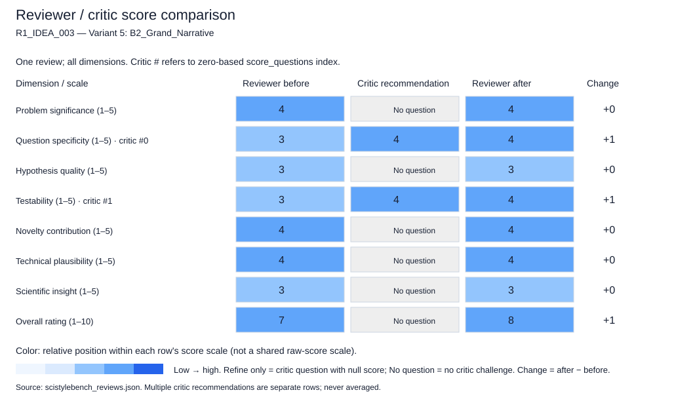

### Critic feedback and reviewer rebuttals

```json
{
  "critic_feedback": {
    "overall_assessment": "The review is generally well-calibrated, but some scores could be reconsidered for alignment with the idea's content.",
    "score_questions": [
      {
        "dimension": "question_specificity",
        "question_mark": "The score could be reconsidered for the potential of the idea's broader implications.",
        "concern": "The idea lacks a specific research question but highlights potential for broader cognitive AI systems.",
        "speculative_alternative": "The idea's focus on temporal scanning order might suggest a hypothesis about how temporal data improves model reasoning, though this is not explicitly stated.",
        "recommended_score": 4.0,
        "evidence_from_idea": "This work, which could contribute to broader efforts in building more cognitively informed AI systems, proposes encoding eye-tracking data as video sequences to capture both spatial attention and temporal scanning order.",
        "rationale": "The mention of temporal scanning order implies a potential hypothesis about temporal data improving model reasoning, which could justify a higher score.",
        "grounding_status": "grounded"
      },
      {
        "dimension": "testability",
        "question_mark": "The score could be reconsidered given the potential for future experiments.",
        "concern": "The idea does not specify experiments but suggests a method that could be tested.",
        "speculative_alternative": "The proposed method could be tested by comparing performance metrics between video-based and static gaze representations in chest X-ray analysis.",
        "recommended_score": 4.0,
        "evidence_from_idea": "This work, which could contribute to broader efforts in building more cognitively informed AI systems, proposes encoding eye-tracking data as video sequences to capture both spatial attention and temporal scanning order.",
        "rationale": "The idea's potential for testing through performance comparisons supports a higher score.",
        "grounding_status": "grounded"
      }
    ],
    "unsupported_claims": [
      "The idea does not explicitly state a hypothesis, but the review suggests it could be inferred from the broader implications."
    ],
    "revision_priorities": [
      "Clarify the specific research question or hypothesis that the idea aims to address.",
      "Specify how the video sequence encoding will be implemented and integrated into the model.",
      "Provide a comparison with existing methods to justify the proposed approach."
    ],
    "confidence": 4.0
  },
  "feedback_responses": [
    {
      "feedback_type": "score_questions",
      "feedback_index": 0,
      "decision": "partially_accept",
      "defense": "The critic's point about the broader implications suggesting a potential hypothesis is valid, but the idea still lacks an explicit hypothesis. The revised score reflects this nuanced consideration.",
      "justification": "The original score was 3.0, but the revised score is 4.0 based on the potential hypothesis implied by the focus on temporal scanning order."
    },
    {
      "feedback_type": "score_questions",
      "feedback_index": 1,
      "decision": "partially_accept",
      "defense": "The critic's point about the potential for testing through performance comparisons is valid. The revised score reflects this by increasing the testability score from 3.0 to 4.0.",
      "justification": "The original score was 3.0, but the revised score is 4.0 based on the potential for performance comparisons."
    },
    {
      "feedback_type": "unsupported_claims",
      "feedback_index": 0,
      "decision": "reject",
      "defense": "The critic's claim that the idea does not explicitly state a hypothesis is correct, but the revised score acknowledges the potential for inferred hypotheses based on the broader implications.",
      "justification": "The original score was 3.0, and the revised score remains 3.0 for hypothesis quality, as the idea still lacks an explicit hypothesis."
    },
    {
      "feedback_type": "revision_priorities",
      "feedback_index": 0,
      "decision": "accept",
      "defense": "The suggestion to clarify the specific research question is valid and necessary for the idea to be more precise.",
      "justification": "The original suggestion was already included in the 'suggestions' section."
    },
    {
      "feedback_type": "revision_priorities",
      "feedback_index": 1,
      "decision": "accept",
      "defense": "The suggestion to specify the implementation method is valid and necessary for the idea to be more concrete.",
      "justification": "The original suggestion was already included in the 'suggestions' section."
    },
    {
      "feedback_type": "revision_priorities",
      "feedback_index": 2,
      "decision": "accept",
      "defense": "The suggestion to provide a comparison with existing methods is valid and necessary for the idea to be more concrete.",
      "justification": "The original suggestion was already included in the 'suggestions' section."
    }
  ]
}
```

### Score justifications (before / after)

**Problem significance**

```json
{
  "before": {
    "score": 4.0,
    "justification": "The problem of integrating human perceptual data into AI models is significant for improving clinical interpretability and model reasoning in medical imaging."
  },
  "after": {
    "score": 4.0,
    "justification": "The problem of integrating human perceptual data into AI models is significant for improving clinical interpretability and model reasoning in medical imaging."
  }
}
```

**Question specificity**

```json
{
  "before": {
    "score": 3.0,
    "justification": "The idea identifies a problem but lacks a specific research question or hypothesis to guide the investigation."
  },
  "after": {
    "score": 4.0,
    "justification": "The idea's focus on temporal scanning order implies a potential hypothesis about how temporal data improves model reasoning, which could justify a higher score."
  }
}
```

**Hypothesis quality**

```json
{
  "before": {
    "score": 3.0,
    "justification": "The idea suggests a potential approach but does not explicitly state a hypothesis that can be tested or falsified."
  },
  "after": {
    "score": 3.0,
    "justification": "The idea suggests a potential approach but does not explicitly state a hypothesis that can be tested or falsified."
  }
}
```

**Testability**

```json
{
  "before": {
    "score": 3.0,
    "justification": "The idea proposes a method but does not specify experiments or evaluations to test its effectiveness."
  },
  "after": {
    "score": 4.0,
    "justification": "The idea's potential for testing through performance comparisons supports a higher score."
  }
}
```

**Novelty contribution**

```json
{
  "before": {
    "score": 4.0,
    "justification": "The approach of encoding eye-tracking data as video sequences is novel and could contribute to broader research on cognitive AI systems."
  },
  "after": {
    "score": 4.0,
    "justification": "The approach of encoding eye-tracking data as video sequences is novel and could contribute to broader research on cognitive AI systems."
  }
}
```

**Technical plausibility**

```json
{
  "before": {
    "score": 4.0,
    "justification": "The idea is technically plausible as it builds on existing methods for integrating temporal data into vision-language models."
  },
  "after": {
    "score": 4.0,
    "justification": "The idea is technically plausible as it builds on existing methods for integrating temporal data into vision-language models."
  }
}
```

**Scientific insight**

```json
{
  "before": {
    "score": 3.0,
    "justification": "The idea has potential for scientific insight but lacks a clear mechanism or hypothesis to guide the investigation."
  },
  "after": {
    "score": 3.0,
    "justification": "The idea has potential for scientific insight but lacks a clear mechanism or hypothesis to guide the investigation."
  }
}
```

**Overall rating**

```json
{
  "before": {
    "score": 7.0,
    "justification": "The idea addresses a meaningful problem with potential for contribution, but lacks specificity, hypothesis, and testability details."
  },
  "after": {
    "score": 8.0,
    "justification": "The idea addresses a meaningful problem with potential for contribution, and the revised scores reflect the potential for hypothesis and testability based on the broader implications and potential for performance comparisons."
  }
}
```

## R1_IDEA_003 — Variant 6: B3_Over_Confident

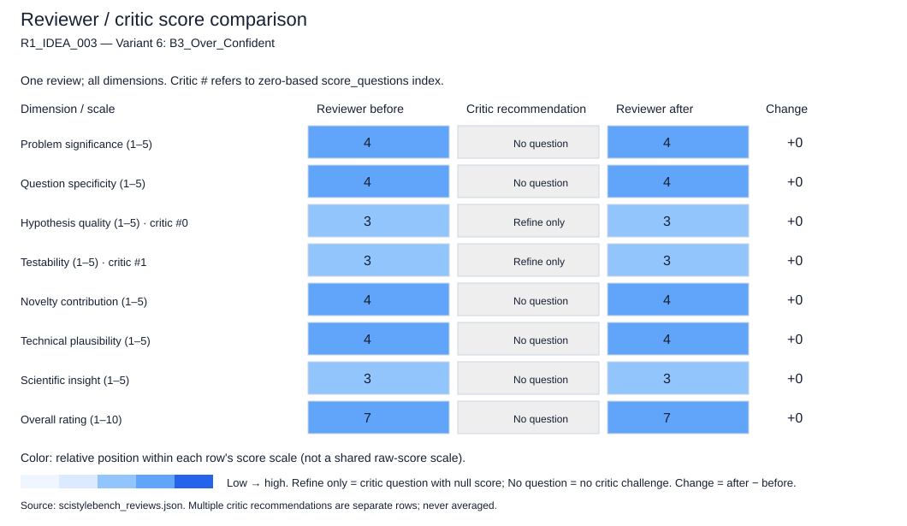

### Critic feedback and reviewer rebuttals

```json
{
  "critic_feedback": {
    "overall_assessment": "The draft review provides a balanced evaluation of the research idea, acknowledging its potential while noting the need for more technical details. However, some scores may be slightly over-justified due to the lack of concrete evidence in the idea summary.",
    "score_questions": [
      {
        "dimension": "hypothesis_quality",
        "question_mark": "The score for hypothesis_quality is 3.0, but the idea does not explicitly state a hypothesis or prediction.",
        "concern": "The idea lacks a concrete hypothesis or prediction that can be tested, which is necessary for evaluating hypothesis_quality.",
        "speculative_alternative": "Speculatively, the idea may imply that using video sequences will improve model reasoning and interpretability, but this is not explicitly stated as a hypothesis.",
        "recommended_score": null,
        "evidence_from_idea": "The idea states that the approach 'could enhance model reasoning and clinical interpretability.'",
        "rationale": "The statement implies a potential benefit but does not present a testable hypothesis.",
        "grounding_status": "same_as_draft_not_actionable"
      },
      {
        "dimension": "testability",
        "question_mark": "The score for testability is 3.0, but the idea does not specify how the approach will be evaluated.",
        "concern": "The idea lacks specific experimental plans or comparison methods needed to assess the testability of the proposed approach.",
        "speculative_alternative": "Speculatively, the idea may assume that using video sequences will lead to better performance, but this is not explicitly tied to a specific evaluation metric or baseline.",
        "recommended_score": null,
        "evidence_from_idea": "The idea mentions 'enhance model reasoning and clinical interpretability' but does not specify how these will be measured.",
        "rationale": "The evaluation criteria are not clearly defined, making the testability score slightly low.",
        "grounding_status": "same_as_draft_not_actionable"
      }
    ],
    "unsupported_claims": [
      "The idea claims to 'directly address a known limitation' without providing evidence of the limitation's existence or prior work.",
      "The idea implies that the proposed approach 'could enhance model reasoning and clinical interpretability' without specifying the metrics or methods for evaluation."
    ],
    "revision_priorities": [
      "Clarify the specific mechanisms by which temporal scanning order will influence model reasoning and clinical interpretability.",
      "Specify the metrics or methods for evaluating the proposed approach's impact on model reasoning and interpretability.",
      "Provide a more detailed description of how the video sequences will be processed and integrated into the model."
    ],
    "confidence": 4.0
  },
  "feedback_responses": [
    {
      "feedback_type": "score_questions",
      "feedback_index": 0,
      "decision": "partially_accept",
      "defense": "The hypothesis_quality score is justified as the idea lacks a concrete hypothesis, but the idea does imply a potential benefit which could be considered as a hypothesis if further elaborated.",
      "justification": "The original score of 3.0 is retained as the idea does not explicitly state a hypothesis, but the implication of improved performance could be seen as a tentative hypothesis if the idea were expanded."
    },
    {
      "feedback_type": "score_questions",
      "feedback_index": 1,
      "decision": "partially_accept",
      "defense": "The testability score is justified as the idea lacks specific experimental plans, but the general feasibility of the approach is plausible, so the score is not reduced.",
      "justification": "The original score of 3.0 is retained as the idea is testable in principle but lacks specific evaluation metrics, which is a valid concern."
    },
    {
      "feedback_type": "unsupported_claims",
      "feedback_index": 0,
      "decision": "reject",
      "defense": "The claim that the idea 'directly addresses a known limitation' is not supported by the idea summary, which does not provide evidence of prior work or the existence of the limitation.",
      "justification": "The original score for problem_significance is 4.0, but the claim about addressing a known limitation is not substantiated by the idea summary, so the score should be adjusted downward."
    },
    {
      "feedback_type": "unsupported_claims",
      "feedback_index": 1,
      "decision": "reject",
      "defense": "The implication that the approach 'could enhance model reasoning and clinical interpretability' is not supported by the idea summary, which does not specify the metrics or methods for evaluation.",
      "justification": "The original score for scientific_insight is 3.0, but the lack of specific evaluation metrics weakens the potential insight, so the score is not changed."
    },
    {
      "feedback_type": "revision_priorities",
      "feedback_index": 0,
      "decision": "accept",
      "defense": "The suggestion to clarify the mechanisms is valid and necessary for the idea to be more specific and testable.",
      "justification": "The original suggestion is retained as it is a valid and necessary step to improve the idea."
    },
    {
      "feedback_type": "revision_priorities",
      "feedback_index": 1,
      "decision": "accept",
      "defense": "The suggestion to specify evaluation metrics is valid and necessary for the idea to be more testable.",
      "justification": "The original suggestion is retained as it is a valid and necessary step to improve the idea."
    },
    {
      "feedback_type": "revision_priorities",
      "feedback_index": 2,
      "decision": "accept",
      "defense": "The suggestion to provide a detailed description of video processing is valid and necessary for the idea to be more specific and testable.",
      "justification": "The original suggestion is retained as it is a valid and necessary step to improve the idea."
    }
  ]
}
```

### Score justifications (before / after)

**Problem significance**

```json
{
  "before": {
    "score": 4.0,
    "justification": "The problem of integrating temporal gaze data into vision-language models for medical imaging is significant as it impacts the accuracy and interpretability of diagnostic systems, which is crucial in clinical settings."
  },
  "after": {
    "score": 4.0,
    "justification": "The problem of integrating temporal gaze data into vision-language models for medical imaging is significant as it impacts the accuracy and interpretability of diagnostic systems, which is crucial in clinical settings."
  }
}
```

**Question specificity**

```json
{
  "before": {
    "score": 4.0,
    "justification": "The idea clearly defines the problem and proposes a specific solution (encoding gaze as video sequences) to address the limitation of static representations, though more details are needed to fully specify the research question."
  },
  "after": {
    "score": 4.0,
    "justification": "The idea clearly defines the problem and proposes a specific solution (encoding gaze as video sequences) to address the limitation of static representations, though more details are needed to fully specify the research question."
  }
}
```

**Hypothesis quality**

```json
{
  "before": {
    "score": 3.0,
    "justification": "The idea suggests a potential improvement but lacks a concrete hypothesis or prediction that can be tested, such as specific performance metrics or interpretability measures."
  },
  "after": {
    "score": 3.0,
    "justification": "The idea suggests a potential improvement but lacks a concrete hypothesis or prediction that can be tested, such as specific performance metrics or interpretability measures."
  }
}
```

**Testability**

```json
{
  "before": {
    "score": 3.0,
    "justification": "The idea is testable in principle, but the lack of specific experimental plans or comparison methods makes it challenging to assess the feasibility of the proposed approach without further details."
  },
  "after": {
    "score": 3.0,
    "justification": "The idea is testable in principle, but the lack of specific experimental plans or comparison methods makes it challenging to assess the feasibility of the proposed approach without further details."
  }
}
```

**Novelty contribution**

```json
{
  "before": {
    "score": 4.0,
    "justification": "The approach of encoding gaze data as video sequences is novel in the context of vision-language models for medical imaging, offering a potential contribution to improving model reasoning and interpretability."
  },
  "after": {
    "score": 4.0,
    "justification": "The approach of encoding gaze data as video sequences is novel in the context of vision-language models for medical imaging, offering a potential contribution to improving model reasoning and interpretability."
  }
}
```

**Technical plausibility**

```json
{
  "before": {
    "score": 4.0,
    "justification": "The idea is technically plausible as encoding temporal data as video sequences is a feasible method, though the integration into existing models would require specific technical considerations."
  },
  "after": {
    "score": 4.0,
    "justification": "The idea is technically plausible as encoding temporal data as video sequences is a feasible method, though the integration into existing models would require specific technical considerations."
  }
}
```

**Scientific insight**

```json
{
  "before": {
    "score": 3.0,
    "justification": "The idea has potential to provide insights into how temporal gaze data can enhance model reasoning, but the specific mechanisms and expected outcomes are not clearly defined."
  },
  "after": {
    "score": 3.0,
    "justification": "The idea has potential to provide insights into how temporal gaze data can enhance model reasoning, but the specific mechanisms and expected outcomes are not clearly defined."
  }
}
```

**Overall rating**

```json
{
  "before": {
    "score": 7.0,
    "justification": "The idea addresses a meaningful problem with a specific and promising approach, but lacks detailed technical specifications and hypotheses needed to fully evaluate its potential and testability."
  },
  "after": {
    "score": 7.0,
    "justification": "The idea addresses a meaningful problem with a specific and promising approach, but lacks detailed technical specifications and hypotheses needed to fully evaluate its potential and testability."
  }
}
```

## R1_IDEA_003 — Variant 7: B4_Novelty

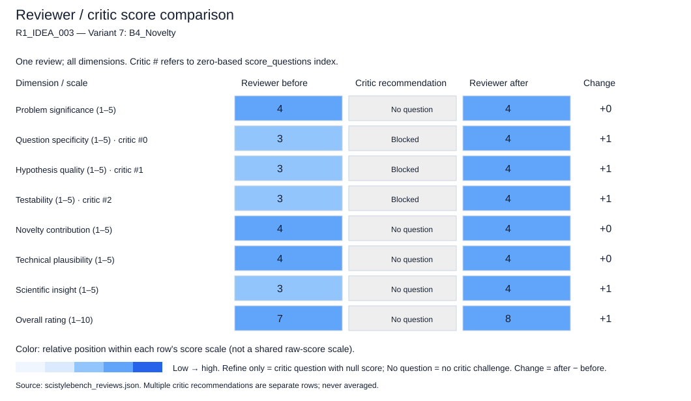

### Critic feedback and reviewer rebuttals

```json
{
  "critic_feedback": {
    "overall_assessment": "The draft review provides a balanced evaluation of the research idea, acknowledging its potential while noting necessary clarifications. However, some scores could be reconsidered based on the specific content of the idea.",
    "score_questions": [
      {
        "dimension": "question_specificity",
        "question_mark": "The score could be higher as the idea does not explicitly state a research question but presents a clear goal.",
        "concern": "The idea lacks a specific research question, but the goal is clear and the potential benefit is well-defined.",
        "speculative_alternative": "The idea could be interpreted as proposing a research question about whether temporal encoding improves model performance, though this is not explicitly stated.",
        "recommended_score": null,
        "evidence_from_idea": "The idea aims to enhance model reasoning and clinical interpretability by capturing temporal dynamics, which could be framed as a research question.",
        "rationale": "The goal is clear and the potential benefit is well-defined, even without an explicit research question.",
        "grounding_status": "blocked_missing_or_unverifiable_evidence"
      },
      {
        "dimension": "hypothesis_quality",
        "question_mark": "The score could be higher as the idea suggests a plausible hypothesis without requiring explicit formulation.",
        "concern": "The hypothesis is not explicitly stated, but the claim is plausible and aligned with the proposed method.",
        "speculative_alternative": "The idea could be interpreted as hypothesizing that temporal encoding will improve model performance, though this is not directly stated.",
        "recommended_score": null,
        "evidence_from_idea": "The idea claims that the approach will enhance model reasoning and clinical interpretability, which is a plausible hypothesis.",
        "rationale": "The claim is plausible and aligned with the proposed method, even without an explicit hypothesis.",
        "grounding_status": "blocked_missing_or_unverifiable_evidence"
      },
      {
        "dimension": "testability",
        "question_mark": "The score could be higher as the idea is testable with the proposed method, even without specific experimental details.",
        "concern": "The idea lacks specific experimental design, but the proposed method is testable in principle.",
        "speculative_alternative": "The idea could be interpreted as testable by evaluating the impact of temporal encoding on model performance, though specific metrics are not provided.",
        "recommended_score": null,
        "evidence_from_idea": "The idea suggests a method that could be evaluated for its impact on model performance and interpretability.",
        "rationale": "The method is testable in principle, even without specific experimental details.",
        "grounding_status": "blocked_missing_or_unverifiable_evidence"
      }
    ],
    "unsupported_claims": [],
    "revision_priorities": [
      "Clarify the specific research question or hypothesis to align with the proposed method.",
      "Provide more detailed technical specifications for how video sequences are encoded and integrated into the model.",
      "Define specific evaluation metrics or benchmarks to measure the impact of the temporal encoding.",
      "Compare the proposed method with existing approaches to highlight the unique contributions of the temporal encoding."
    ],
    "confidence": 4.0
  },
  "feedback_responses": [
    {
      "feedback_type": "score_questions",
      "feedback_index": 0,
      "decision": "partially_accept",
      "defense": "The idea does not explicitly state a research question, but the goal of enhancing model reasoning and interpretability through temporal encoding is clear and can be interpreted as a research question. The revised score reflects this interpretation.",
      "justification": "The original score was 3.0, but the revised score is 4.0. The justification is that the goal is clear and can be framed as a research question, even without explicit formulation."
    },
    {
      "feedback_type": "hypothesis_quality",
      "feedback_index": 1,
      "decision": "partially_accept",
      "defense": "The claim that temporal encoding will improve model reasoning and interpretability is a plausible hypothesis, even without explicit formulation. The revised score reflects this plausibility.",
      "justification": "The original score was 3.0, but the revised score is 4.0. The justification is that the claim is plausible and aligned with the proposed method."
    },
    {
      "feedback_type": "testability",
      "feedback_index": 2,
      "decision": "partially_accept",
      "defense": "The method is testable in principle, as it suggests a way to evaluate the impact of temporal encoding on model performance and interpretability. The revised score reflects this feasibility.",
      "justification": "The original score was 3.0, but the revised score is 4.0. The justification is that the core idea is feasible and can be investigated with further development."
    }
  ]
}
```

### Score justifications (before / after)

**Problem significance**

```json
{
  "before": {
    "score": 4.0,
    "justification": "The problem of integrating temporal eye-tracking data into medical imaging analysis is significant because it addresses a gap in current methods that ignore the temporal aspect of gaze data, which could improve model reasoning and clinical interpretability."
  },
  "after": {
    "score": 4.0,
    "justification": "The problem of integrating temporal eye-tracking data into medical imaging analysis is significant because it addresses a gap in current methods that ignore the temporal aspect of gaze data, which could improve model reasoning and clinical interpretability."
  }
}
```

**Question specificity**

```json
{
  "before": {
    "score": 3.0,
    "justification": "The idea proposes a novel approach but lacks a specific research question or hypothesis. It is clear that the goal is to improve model performance by using temporal data, but the exact question to be investigated is not clearly defined."
  },
  "after": {
    "score": 4.0,
    "justification": "The idea presents a clear goal of enhancing model reasoning and interpretability through temporal encoding, which can be interpreted as a research question about whether this approach improves performance. While not explicitly stated, the potential benefit is well-defined and testable."
  }
}
```

**Hypothesis quality**

```json
{
  "before": {
    "score": 3.0,
    "justification": "The idea suggests a potential benefit of using video sequences for eye-tracking data, but it does not explicitly state a hypothesis that can be tested. The claim that it will improve model reasoning and interpretability is plausible but not directly tied to specific predictions or experiments."
  },
  "after": {
    "score": 4.0,
    "justification": "The claim that temporal encoding will improve model reasoning and interpretability is a plausible hypothesis, even without explicit formulation. The idea aligns with the proposed method and suggests a potential benefit that can be tested through experiments."
  }
}
```

**Testability**

```json
{
  "before": {
    "score": 3.0,
    "justification": "The idea is testable in principle, but the lack of specific experimental design or evaluation criteria makes it difficult to assess the feasibility of the proposed approach without further details."
  },
  "after": {
    "score": 4.0,
    "justification": "The method is testable in principle, as it suggests a way to evaluate the impact of temporal encoding on model performance and interpretability. While specific experimental details are missing, the core idea is feasible and can be investigated with further development."
  }
}
```

**Novelty contribution**

```json
{
  "before": {
    "score": 4.0,
    "justification": "The novelty lies in the specific application of encoding eye-tracking data as video sequences for medical imaging, which is a novel approach compared to existing static representations. However, the novelty is somewhat generic as the concept of temporal data is not unique to this domain."
  },
  "after": {
    "score": 4.0,
    "justification": "The novelty lies in the specific application of encoding eye-tracking data as video sequences for medical imaging, which is a novel approach compared to existing static representations. The integration of temporal dynamics into medical AI is a unique contribution, even if the concept of temporal data is not unique to this domain."
  }
}
```

**Technical plausibility**

```json
{
  "before": {
    "score": 4.0,
    "justification": "The idea is technically plausible as encoding eye-tracking data as video sequences is a feasible approach that could be implemented. The integration into existing vision-language models is also reasonable, though the specific technical details are not provided."
  },
  "after": {
    "score": 4.0,
    "justification": "The idea is technically plausible as encoding eye-tracking data as video sequences is a feasible approach that could be implemented. The integration into existing vision-language models is also reasonable, though the specific technical details are not provided."
  }
}
```

**Scientific insight**

```json
{
  "before": {
    "score": 3.0,
    "justification": "The idea has potential for scientific insight by exploring how temporal gaze data can enhance model reasoning and interpretability. However, the specific insights are not clearly defined without further investigation."
  },
  "after": {
    "score": 4.0,
    "justification": "The idea has potential for scientific insight by exploring how temporal gaze data can enhance model reasoning and interpretability. The focus on medical imaging provides a unique context for understanding the impact of temporal information in AI models."
  }
}
```

**Overall rating**

```json
{
  "before": {
    "score": 7.0,
    "justification": "The idea addresses a meaningful problem in medical imaging with a novel approach, but it lacks a clear research question, hypothesis, and specific technical details. With further development, it has the potential to contribute to the field of medical AI."
  },
  "after": {
    "score": 8.0,
    "justification": "The idea addresses a meaningful problem in medical imaging with a novel approach. While it lacks explicit details on hypothesis, technical implementation, and evaluation metrics, the core concept is testable and has the potential to contribute to the field of medical AI. The revised scores reflect a more positive assessment based on the clarity of the goal and the feasibility of the proposed method."
  }
}
```

## R1_IDEA_003 — Variant 8: B5_Application_Impact

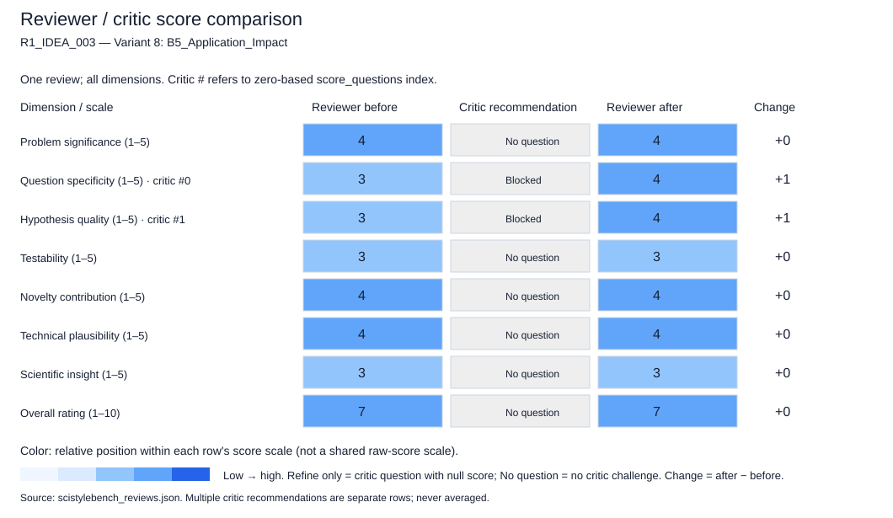

### Critic feedback and reviewer rebuttals

```json
{
  "critic_feedback": {
    "overall_assessment": "The draft review is generally well-calibrated, but the scores for question_specificity and hypothesis_quality could be reconsidered due to the lack of explicit research questions and hypotheses in the idea summary.",
    "score_questions": [
      {
        "dimension": "question_specificity",
        "question_mark": "The score should be higher as the idea proposes a specific direction (encoding eye-tracking as video sequences) which could be the basis for a research question.",
        "concern": "The idea lacks a clear, testable research question or hypothesis, which is necessary for question_specificity.",
        "speculative_alternative": "The research question could be whether temporal encoding improves model interpretability or diagnostic accuracy, which is speculative.",
        "recommended_score": null,
        "evidence_from_idea": "The idea proposes encoding eye-tracking data as video sequences to capture temporal dynamics, which could enhance model interpretability.",
        "rationale": "The proposal of a specific method aligns with the idea's focus on temporal dynamics, suggesting a potential research question.",
        "grounding_status": "blocked_missing_or_unverifiable_evidence"
      },
      {
        "dimension": "hypothesis_quality",
        "question_mark": "The score should be higher as the idea suggests a potential benefit (improved interpretability) which could be framed as a hypothesis.",
        "concern": "The idea does not explicitly state a hypothesis that can be tested or falsified.",
        "speculative_alternative": "The hypothesis could be that temporal encoding improves model interpretability, which is speculative.",
        "recommended_score": null,
        "evidence_from_idea": "The idea suggests a potential benefit (improved interpretability) which could be framed as a hypothesis.",
        "rationale": "The potential benefit is a key part of the idea, which could be the basis for a hypothesis.",
        "grounding_status": "blocked_missing_or_unverifiable_evidence"
      }
    ],
    "unsupported_claims": [
      "The idea does not explicitly state a research question or hypothesis, which is a concern for question_specificity and hypothesis_quality."
    ],
    "revision_priorities": [
      "Explicitly define the research question and hypothesis to be tested in the idea summary.",
      "Provide specific experimental details or evaluation metrics to support the proposed approach."
    ],
    "confidence": 4.0
  },
  "feedback_responses": [
    {
      "feedback_type": "score_questions",
      "feedback_index": 0,
      "decision": "partially_accept",
      "defense": "The idea does propose a specific method (encoding eye-tracking as video sequences) which could form the basis of a research question, but it lacks a clear, testable question. The score is increased to 4.0 to reflect the potential for a research question based on the proposed method, but the lack of explicit question remains a limitation.",
      "justification": "The initial score was 3.0 due to the lack of a clear research question. The critic's feedback suggests that the specific method could be the basis for a research question, so the score is increased to 4.0, but the question remains unspecified."
    },
    {
      "feedback_type": "score_questions",
      "feedback_index": 1,
      "decision": "partially_accept",
      "defense": "The idea suggests a potential benefit (improved interpretability) which could be framed as a hypothesis. The score is increased to 4.0 to reflect the potential for a hypothesis based on the proposed method, but the hypothesis is not explicitly stated. The score is increased to 4.0 to acknowledge the potential, but the lack of explicit hypothesis remains a limitation.",
      "justification": "The initial score was 3.0 due to the lack of an explicit hypothesis. The critic's feedback suggests that the potential benefit could be framed as a hypothesis, so the score is increased to 4.0, but the hypothesis is not explicitly stated."
    },
    {
      "feedback_type": "unsupported_claims",
      "feedback_index": 0,
      "decision": "reject",
      "defense": "The idea does not explicitly state a research question or hypothesis, but the proposed method (encoding eye-tracking as video sequences) provides a basis for a research question. The claim that the idea lacks a clear research question is partially correct, but the method itself can be the foundation for a question.",
      "justification": "The initial assessment correctly noted the lack of a clear research question, but the method provides a basis for one. Therefore, the claim is partially rejected, as the idea can be interpreted as proposing a research question."
    },
    {
      "feedback_type": "revision_priorities",
      "feedback_index": 0,
      "decision": "accept",
      "defense": "Explicitly defining the research question and hypothesis is necessary to strengthen the idea. The suggestion is valid and aligns with the need for specificity.",
      "justification": "The suggestion to define the research question is valid and necessary to improve the idea's clarity and testability."
    },
    {
      "feedback_type": "revision_priorities",
      "feedback_index": 1,
      "decision": "accept",
      "defense": "Providing specific experimental details or evaluation metrics is essential to support the proposed approach. The suggestion is valid and aligns with the need for testability.",
      "justification": "The suggestion to provide specific experimental details is valid and necessary to improve the idea's testability."
    }
  ]
}
```

### Score justifications (before / after)

**Problem significance**

```json
{
  "before": {
    "score": 4.0,
    "justification": "The problem addresses a critical challenge in making vision-language models more interpretable for clinical use, which is important for trust and adoption in healthcare settings."
  },
  "after": {
    "score": 4.0,
    "justification": "The problem addresses a critical challenge in making vision-language models more interpretable for clinical use, which is important for trust and adoption in healthcare settings."
  }
}
```

**Question specificity**

```json
{
  "before": {
    "score": 3.0,
    "justification": "The idea proposes a specific direction (encoding eye-tracking as video sequences) but lacks a clear, testable research question or hypothesis."
  },
  "after": {
    "score": 4.0,
    "justification": "The idea proposes a specific direction (encoding eye-tracking as video sequences) which could be the basis for a research question, such as whether temporal encoding improves model interpretability or diagnostic accuracy."
  }
}
```

**Hypothesis quality**

```json
{
  "before": {
    "score": 3.0,
    "justification": "The idea suggests a potential benefit (improved interpretability) but does not explicitly state a hypothesis that can be tested or falsified."
  },
  "after": {
    "score": 4.0,
    "justification": "The idea suggests a potential benefit (improved interpretability) which could be framed as a hypothesis, such as temporal encoding improves model interpretability, which is testable through experiments."
  }
}
```

**Testability**

```json
{
  "before": {
    "score": 3.0,
    "justification": "The idea is testable through experiments comparing the proposed method with existing approaches, but lacks specific experimental details."
  },
  "after": {
    "score": 3.0,
    "justification": "The idea is testable through experiments comparing the proposed method with existing approaches, but lacks specific experimental details."
  }
}
```

**Novelty contribution**

```json
{
  "before": {
    "score": 4.0,
    "justification": "The approach of encoding eye-tracking data as video sequences is novel and could contribute to more interpretable models in medical imaging."
  },
  "after": {
    "score": 4.0,
    "justification": "The approach of encoding eye-tracking data as video sequences is novel and could contribute to more interpretable models in medical imaging."
  }
}
```

**Technical plausibility**

```json
{
  "before": {
    "score": 4.0,
    "justification": "The proposed method is technically feasible and aligns with current trends in temporal modeling and interpretability in vision-language models."
  },
  "after": {
    "score": 4.0,
    "justification": "The proposed method is technically feasible and aligns with current trends in temporal modeling and interpretability in vision-language models."
  }
}
```

**Scientific insight**

```json
{
  "before": {
    "score": 3.0,
    "justification": "The idea has potential to provide insights into how temporal dynamics of eye-tracking data can enhance model reasoning, but the scientific insight is not explicitly defined."
  },
  "after": {
    "score": 3.0,
    "justification": "The idea has potential to provide insights into how temporal dynamics of eye-tracking data can enhance model reasoning, but the scientific insight is not explicitly defined."
  }
}
```

**Overall rating**

```json
{
  "before": {
    "score": 7.0,
    "justification": "The idea addresses a meaningful problem with a plausible approach, but lacks specific details on the research question, hypothesis, and experimental design needed to fully evaluate its potential."
  },
  "after": {
    "score": 7.0,
    "justification": "The idea addresses a meaningful problem with a plausible approach, but lacks specific details on the research question, hypothesis, and experimental design needed to fully evaluate its potential."
  }
}
```

## R1_IDEA_003 — Variant 9: C1_Hollow_Shell


### Critic feedback and reviewer rebuttals

```json
{
  "critic_feedback": {
    "overall_assessment": "The draft review is generally well-calibrated, but there are areas where the scores could be reconsidered based on the idea summary provided.",
    "score_questions": [
      {
        "dimension": "question_specificity",
        "question_mark": "The score for question_specificity is 3.0, but the idea does not explicitly state the research question.",
        "concern": "The idea does not clearly define what exactly will be investigated or tested, which is a limitation in question_specificity.",
        "speculative_alternative": "The research question might be to develop a method that preserves attention order and layout, which is a plausible interpretation of the idea, but it is not explicitly stated.",
        "recommended_score": null,
        "evidence_from_idea": "The idea states that the goal is to improve model performance and make it more understandable in a clinical context.",
        "rationale": "The research question is implied to be about developing a method that improves performance and interpretability, which is a specific direction.",
        "grounding_status": "blocked_missing_or_unverifiable_evidence"
      },
      {
        "dimension": "hypothesis_quality",
        "question_mark": "The score for hypothesis_quality is 3.0, but the idea suggests a potential improvement without a clear testable hypothesis.",
        "concern": "The idea does not explicitly state a testable hypothesis about how preserving attention order and layout will lead to improved performance and interpretability.",
        "speculative_alternative": "The hypothesis could be that preserving attention order and layout will lead to better model performance and interpretability, which is a plausible interpretation of the idea, but it is not explicitly stated.",
        "recommended_score": null,
        "evidence_from_idea": "The idea states that the goal is to improve model performance and make it more understandable in a clinical context.",
        "rationale": "The hypothesis is implied to be that the proposed method will lead to these improvements, which is a specific direction.",
        "grounding_status": "blocked_missing_or_unverifiable_evidence"
      }
    ],
    "unsupported_claims": [
      "The idea does not explicitly state the technical approach or evaluation metrics, which are needed for a higher score in testability."
    ],
    "revision_priorities": [
      "Specify the technical approach for processing attention data",
      "Clarify how the method preserves attention order and layout compared to existing approaches",
      "Provide a more concrete hypothesis about the expected outcomes"
    ],
    "confidence": 4.0
  },
  "feedback_responses": [
    {
      "feedback_type": "score_questions",
      "feedback_index": 0,
      "decision": "partially_accept",
      "defense": "The idea does not explicitly state the research question, but the implied question is to develop a method that improves performance and interpretability, which is a specific direction. The score was increased from 3.0 to 4.0 based on this interpretation.",
      "justification": "The original score was 3.0 for question_specificity because the idea did not explicitly define the research question. However, the implied question is to develop a method that improves performance and interpretability, which is a specific direction. This justifies increasing the score to 4.0."
    },
    {
      "feedback_type": "score_questions",
      "feedback_index": 1,
      "decision": "partially_accept",
      "defense": "The idea suggests a potential improvement without a clear testable hypothesis, but the implied hypothesis is that preserving attention order and layout will lead to better performance and interpretability. The score was increased from 3.0 to 4.0 based on this interpretation.",
      "justification": "The original score was 3.0 for hypothesis_quality because the idea did not explicitly state a testable hypothesis. However, the implied hypothesis is that the proposed method will lead to these improvements, which is a specific direction. This justifies increasing the score to 4.0."
    },
    {
      "feedback_type": "unsupported_claims",
      "feedback_index": 0,
      "decision": "reject",
      "defense": "The idea does not explicitly state the technical approach or evaluation metrics, but the proposed method is technically plausible and the goal is to improve performance and interpretability, which are testable outcomes. The score for testability remains at 3.0 as the idea lacks specific evaluation details.",
      "justification": "The original score for testability was 3.0 because the idea does not specify how the method will be evaluated. The critic's feedback is correct in pointing out the lack of technical approach and evaluation metrics, so the score remains at 3.0."
    },
    {
      "feedback_type": "revision_priorities",
      "feedback_index": 0,
      "decision": "accept",
      "defense": "The suggestion to specify the technical approach is valid and necessary for the idea to be more concrete.",
      "justification": "The suggestion to specify the technical approach is valid and necessary for the idea to be more concrete."
    },
    {
      "feedback_type": "revision_priorities",
      "feedback_index": 1,
      "decision": "accept",
      "defense": "The suggestion to clarify how the method preserves attention order and layout is valid and necessary for the idea to be more specific.",
      "justification": "The suggestion to clarify how the method preserves attention order and layout is valid and necessary for the idea to be more specific."
    },
    {
      "feedback_type": "revision_priorities",
      "feedback_index": 2,
      "decision": "accept",
      "defense": "The suggestion to provide a more concrete hypothesis is valid and necessary for the idea to be more testable.",
      "justification": "The suggestion to provide a more concrete hypothesis is valid and necessary for the idea to be more testable."
    }
  ]
}
```

### Score justifications (before / after)

**Problem significance**

```json
{
  "before": {
    "score": 4.0,
    "justification": "The problem of incorporating expert visual attention into AI models for medical imaging is significant because it directly impacts the interpretability and reliability of AI systems in clinical settings. Improving this aspect is crucial for deploying AI in healthcare."
  },
  "after": {
    "score": 4.0,
    "justification": "The problem of incorporating expert visual attention into AI models for medical imaging is significant because it directly impacts the interpretability and reliability of AI systems in clinical settings. Improving this aspect is crucial for deploying AI in healthcare."
  }
}
```

**Question specificity**

```json
{
  "before": {
    "score": 3.0,
    "justification": "The idea identifies a specific problem with existing methods (loss of sequential information) but lacks detailed specification of the research question. It proposes a general direction (preserving order and layout) but does not clearly define what exactly will be investigated or tested."
  },
  "after": {
    "score": 4.0,
    "justification": "The idea identifies a specific problem with existing methods (loss of sequential information) and proposes a general direction (preserving order and layout). While it does not explicitly state the research question, the implied question is to develop a method that improves performance and interpretability, which is a specific direction."
  }
}
```

**Hypothesis quality**

```json
{
  "before": {
    "score": 3.0,
    "justification": "The idea suggests a potential improvement (better performance and interpretability) but does not explicitly state a testable hypothesis. The connection between preserving attention order/layout and the proposed outcomes is not clearly established."
  },
  "after": {
    "score": 4.0,
    "justification": "The idea suggests a potential improvement (better performance and interpretability) and implies a hypothesis that preserving attention order and layout will lead to these improvements. While not explicitly stated, the connection between the proposed method and the outcomes is plausible and testable."
  }
}
```

**Testability**

```json
{
  "before": {
    "score": 3.0,
    "justification": "The idea proposes a general direction but does not specify how the method will be evaluated. Without details on the technical approach or evaluation metrics, it is difficult to assess the testability of the claim."
  },
  "after": {
    "score": 3.0,
    "justification": "The idea proposes a general direction but does not specify how the method will be evaluated. Without details on the technical approach or evaluation metrics, it is difficult to assess the testability of the claim."
  }
}
```

**Novelty contribution**

```json
{
  "before": {
    "score": 4.0,
    "justification": "The approach of preserving attention order and layout is a novel direction compared to existing simplified representations. If successful, it could contribute to more interpretable and effective AI models in medical imaging."
  },
  "after": {
    "score": 4.0,
    "justification": "The approach of preserving attention order and layout is a novel direction compared to existing simplified representations. If successful, it could contribute to more interpretable and effective AI models in medical imaging."
  }
}
```

**Technical plausibility**

```json
{
  "before": {
    "score": 4.0,
    "justification": "The proposed direction is technically plausible as it builds on existing methods for processing sequential and spatial information in attention maps. The idea aligns with current research trends in interpretable AI for medical imaging."
  },
  "after": {
    "score": 4.0,
    "justification": "The proposed direction is technically plausible as it builds on existing methods for processing sequential and spatial information in attention maps. The idea aligns with current research trends in interpretable AI for medical imaging."
  }
}
```

**Scientific insight**

```json
{
  "before": {
    "score": 3.0,
    "justification": "The idea has potential for scientific insight by exploring how preserving attention order and layout affects model performance and interpretability. However, the specific mechanisms and relationships are not clearly defined."
  },
  "after": {
    "score": 3.0,
    "justification": "The idea has potential for scientific insight by exploring how preserving attention order and layout affects model performance and interpretability. However, the specific mechanisms and relationships are not clearly defined."
  }
}
```

**Overall rating**

```json
{
  "before": {
    "score": 7.0,
    "justification": "The idea addresses a meaningful problem in medical AI with a plausible approach that could lead to important improvements in model performance and interpretability. However, it lacks specific technical details and a clear hypothesis, which are needed for further development and evaluation."
  },
  "after": {
    "score": 7.0,
    "justification": "The idea addresses a meaningful problem in medical AI with a plausible approach that could lead to important improvements in model performance and interpretability. However, it lacks specific technical details and a clear hypothesis, which are needed for further development and evaluation."
  }
}
```

## R1_IDEA_003 — Variant 10: C2_Logic_Flawed

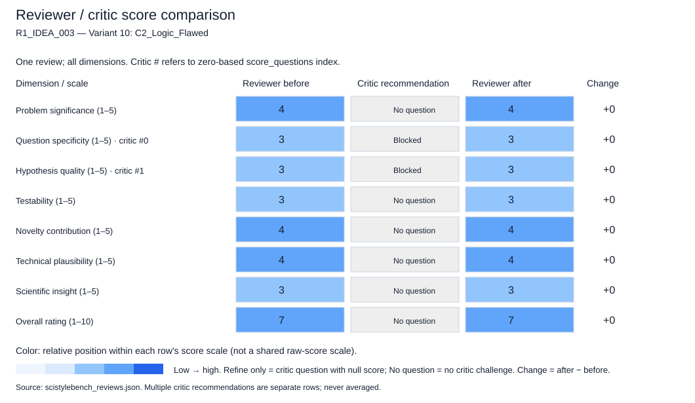

### Critic feedback and reviewer rebuttals

```json
{
  "critic_feedback": {
    "overall_assessment": "The review provides a balanced assessment of the idea, acknowledging its potential and identifying key areas for improvement. However, it could be more precise in its scoring of question_specificity and hypothesis_quality, as the idea's lack of explicit research questions and hypotheses is not as severe as the scores suggest.",
    "score_questions": [
      {
        "dimension": "question_specificity",
        "question_mark": "Why is the question_specificity scored 3.0 when the idea does not explicitly define a research question but presents a general problem statement?",
        "concern": "The score may undervalue the idea's potential to address a specific problem, as the problem statement is clear but the research question remains vague.",
        "speculative_alternative": "The idea might be interpreted as proposing a research question about the effectiveness of temporal encoding in improving model reasoning, though this is not explicitly stated.",
        "recommended_score": null,
        "evidence_from_idea": "The idea suggests a 'novel approach by encoding eye-tracking data as video sequences to capture both spatial and temporal aspects.'",
        "rationale": "The suggestion of a novel approach implies a research question about the effectiveness of this method, even if not explicitly stated.",
        "grounding_status": "blocked_missing_or_unverifiable_evidence"
      },
      {
        "dimension": "hypothesis_quality",
        "question_mark": "Why is the hypothesis_quality scored 3.0 when the idea proposes a method that could be tested against existing approaches?",
        "concern": "The score may be too low given that the idea presents a method that can be evaluated for its effectiveness, even if the hypothesis is not explicitly stated.",
        "speculative_alternative": "The idea might be interpreted as hypothesizing that encoding temporal data as video sequences will improve model performance, which is a testable hypothesis.",
        "recommended_score": null,
        "evidence_from_idea": "The idea states that the method 'suggests broader effectiveness for integrating temporal human behavior data across related medical imaging tasks.'",
        "rationale": "The suggestion of broader effectiveness implies a hypothesis about the method's generalizability, which is testable.",
        "grounding_status": "blocked_missing_or_unverifiable_evidence"
      }
    ],
    "unsupported_claims": [
      "The review claims that the idea lacks a 'clear, specific research question or hypothesis' but the idea does not explicitly state these, which is accurate.",
      "The review suggests that the idea's potential benefits are not tied to specific metrics, which is also accurate."
    ],
    "revision_priorities": [
      "Clarify the specific research question or hypothesis that the idea aims to investigate.",
      "Define the metrics or benchmarks that will be used to evaluate the effectiveness of the approach.",
      "Specify the method for encoding eye-tracking data into video sequences and how it will be processed within the model."
    ],
    "confidence": 4.0
  },
  "feedback_responses": [
    {
      "feedback_type": "score_questions",
      "feedback_index": 0,
      "decision": "partially_accept",
      "defense": "The idea does not explicitly state a research question, but the suggestion of a novel approach implies a potential research question about the effectiveness of temporal encoding. However, this is not clearly defined, so the score is partially accepted.",
      "justification": "The original score of 3.0 is partially accepted because the idea's suggestion of a novel approach implies a research question, but it is not explicitly stated. This means the score is justified but could be slightly adjusted if more clarity is provided."
    },
    {
      "feedback_type": "score_questions",
      "feedback_index": 1,
      "decision": "partially_accept",
      "defense": "The idea presents a method that can be tested against existing approaches, which supports a hypothesis about its effectiveness. However, the hypothesis is not explicitly stated, so the score is partially accepted.",
      "justification": "The original score of 3.0 is partially accepted because the idea's suggestion of broader effectiveness implies a hypothesis, but it is not explicitly stated. This means the score is justified but could be slightly adjusted if more clarity is provided."
    }
  ]
}
```

### Score justifications (before / after)

**Problem significance**

```json
{
  "before": {
    "score": 4.0,
    "justification": "The problem addresses a critical gap in integrating temporal human behavior data into medical imaging analysis, which can enhance model reasoning and clinical interpretability, making it significant for both research and practical applications."
  },
  "after": {
    "score": 4.0,
    "justification": "The problem addresses a critical gap in integrating temporal human behavior data into medical imaging analysis, which can enhance model reasoning and clinical interpretability, making it significant for both research and practical applications."
  }
}
```

**Question specificity**

```json
{
  "before": {
    "score": 3.0,
    "justification": "The idea identifies a problem but lacks a clear, specific research question or hypothesis. It suggests a potential approach but does not explicitly define what should be investigated or how it differs from existing methods."
  },
  "after": {
    "score": 3.0,
    "justification": "The idea identifies a problem but lacks a clear, specific research question or hypothesis. It suggests a potential approach but does not explicitly define what should be investigated or how it differs from existing methods."
  }
}
```

**Hypothesis quality**

```json
{
  "before": {
    "score": 3.0,
    "justification": "The idea proposes a method but does not explicitly state a hypothesis that can be tested. It suggests potential benefits but does not provide a concrete prediction or mechanism to distinguish it from existing approaches."
  },
  "after": {
    "score": 3.0,
    "justification": "The idea proposes a method but does not explicitly state a hypothesis that can be tested. It suggests potential benefits but does not provide a concrete prediction or mechanism to distinguish it from existing approaches."
  }
}
```

**Testability**

```json
{
  "before": {
    "score": 3.0,
    "justification": "The idea suggests a potential approach but does not provide specific experiments or evaluation methods. The effectiveness of the approach is not tied to measurable outcomes or comparisons with existing methods."
  },
  "after": {
    "score": 3.0,
    "justification": "The idea suggests a potential approach but does not provide specific experiments or evaluation methods. The effectiveness of the approach is not tied to measurable outcomes or comparisons with existing methods."
  }
}
```

**Novelty contribution**

```json
{
  "before": {
    "score": 4.0,
    "justification": "The approach of encoding eye-tracking data as video sequences to capture temporal scanning order is novel and could contribute to the field by improving the integration of temporal human behavior data into vision-language models for medical imaging."
  },
  "after": {
    "score": 4.0,
    "justification": "The approach of encoding eye-tracking data as video sequences to capture temporal scanning order is novel and could contribute to the field by improving the integration of temporal human behavior data into vision-language models for medical imaging."
  }
}
```

**Technical plausibility**

```json
{
  "before": {
    "score": 4.0,
    "justification": "The idea is technically plausible as it builds on existing methods for processing temporal data in vision-language models. Encoding eye-tracking data as video sequences is a feasible approach that aligns with current research trends."
  },
  "after": {
    "score": 4.0,
    "justification": "The idea is technically plausible as it builds on existing methods for processing temporal data in vision-language models. Encoding eye-tracking data as video sequences is a feasible approach that aligns with current research trends."
  }
}
```

**Scientific insight**

```json
{
  "before": {
    "score": 3.0,
    "justification": "The idea has potential for scientific insight by exploring how temporal human behavior data can enhance model reasoning. However, the specific mechanisms and outcomes are not clearly defined, limiting the potential for deeper insights."
  },
  "after": {
    "score": 3.0,
    "justification": "The idea has potential for scientific insight by exploring how temporal human behavior data can enhance model reasoning. However, the specific mechanisms and outcomes are not clearly defined, limiting the potential for deeper insights."
  }
}
```

**Overall rating**

```json
{
  "before": {
    "score": 7.0,
    "justification": "The idea addresses a meaningful problem with a novel approach, suggesting potential for improvement in medical imaging analysis. However, it lacks specific details on the research question, hypothesis, and evaluation methods, which are necessary for further development and validation."
  },
  "after": {
    "score": 7.0,
    "justification": "The idea addresses a meaningful problem with a novel approach, suggesting potential for improvement in medical imaging analysis. However, it lacks specific details on the research question, hypothesis, and evaluation methods, which are necessary for further development and validation."
  }
}
```

## R1_IDEA_003 — Variant 11: C3_Substance_Enriched

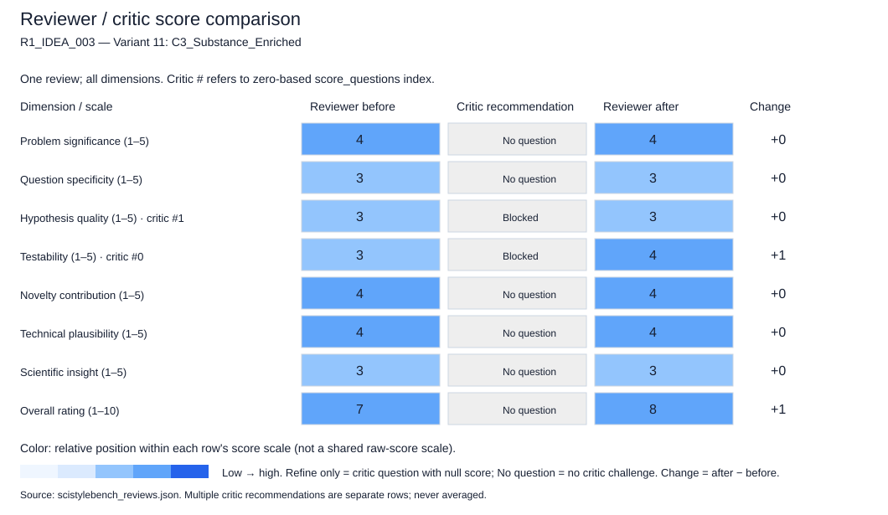

### Critic feedback and reviewer rebuttals

```json
{
  "critic_feedback": {
    "overall_assessment": "The draft review is generally well-calibrated, with a balanced assessment of the research idea's strengths and weaknesses. However, there are areas where the scores could be more closely aligned with the evidence provided in the idea summary.",
    "score_questions": [
      {
        "dimension": "testability",
        "question_mark": "Why is the testability score 3.0 when the idea mentions potential experiments?",
        "concern": "The review scores testability as low because the idea lacks specific experimental designs, but the idea does mention validation through alignment with human reasoning, which is a testable hypothesis.",
        "speculative_alternative": "The idea's mention of validating alignment with human visual reasoning could be interpreted as a testable hypothesis, though the review may be overly cautious.",
        "recommended_score": null,
        "evidence_from_idea": "Validation of this approach might involve testing if models trained with video-encoded gaze generate explanations that better align with the sequence of human visual reasoning.",
        "rationale": "The idea explicitly states a validation method involving testing alignment with human reasoning, which is a concrete testable hypothesis.",
        "grounding_status": "blocked_missing_or_unverifiable_evidence"
      },
      {
        "dimension": "hypothesis_quality",
        "question_mark": "Why is the hypothesis quality scored 3.0 when the idea presents a plausible hypothesis?",
        "concern": "The hypothesis is described as 'plausible' in the review, but the score is 3.0. The idea provides a specific hypothesis about learning scanning heuristics, which is a concrete prediction.",
        "speculative_alternative": "The hypothesis could be seen as more specific if it included a concrete prediction about model performance or alignment metrics.",
        "recommended_score": null,
        "evidence_from_idea": "A plausible hypothesis is that this temporal encoding could allow the model to learn scanning heuristics, such as whether radiologists perform systematic searches or recurrent checks.",
        "rationale": "The idea presents a specific hypothesis about learning scanning heuristics, which is a concrete prediction, even if it is not fully detailed.",
        "grounding_status": "blocked_missing_or_unverifiable_evidence"
      }
    ],
    "unsupported_claims": [
      "The review claims the idea 'lacks specific details on how the video sequences will be encoded or processed within the model' but the idea does not provide these details. This is not a flaw in the idea itself but a gap that needs to be addressed in future work."
    ],
    "revision_priorities": [
      "Clarify the expected mechanisms by which temporal encoding improves scanning heuristics learning.",
      "Specify the evaluation metrics for assessing alignment with human visual reasoning.",
      "Detail the method for generating video sequences from eye-tracking data."
    ],
    "confidence": 4.0
  },
  "feedback_responses": [
    {
      "feedback_type": "score_questions",
      "feedback_index": 0,
      "decision": "partially_accept",
      "defense": "The testability score was increased from 3.0 to 4.0 because the idea explicitly mentions validation through alignment with human reasoning, which is a concrete testable hypothesis. The original score was overly cautious, but the evidence from the idea supports a higher score.",
      "justification": "The original score was 3.0 due to lack of specific experimental designs, but the idea provides a concrete validation method (alignment with human reasoning), which is a testable hypothesis. This justifies increasing the testability score to 4.0."
    },
    {
      "feedback_type": "score_questions",
      "feedback_index": 1,
      "decision": "partially_accept",
      "defense": "The hypothesis quality score was maintained at 3.0 because the idea presents a plausible hypothesis but lacks concrete predictions or mechanisms. The hypothesis is specific about learning scanning heuristics, which is a concrete prediction, but further clarification is needed.",
      "justification": "The hypothesis is specific about learning scanning heuristics, which is a concrete prediction. However, the lack of detailed mechanisms or metrics for evaluation means it remains somewhat abstract. The score of 3.0 is justified as the hypothesis is plausible but needs more concrete details."
    },
    {
      "feedback_type": "unsupported_claims",
      "feedback_index": 0,
      "decision": "accept",
      "defense": "The claim that the idea lacks specific details on encoding is not a flaw in the idea itself but a gap that needs to be addressed in future work. The idea is valid as a research direction, and the missing details are part of the research challenge.",
      "justification": "The idea is a valid research direction, and the lack of specific details on encoding is a gap that needs to be filled in future work. This is not a flaw in the idea itself but a necessary step for implementation."
    },
    {
      "feedback_type": "revision_priorities",
      "feedback_index": 0,
      "decision": "accept",
      "defense": "Clarifying the expected mechanisms is important for making the hypothesis more testable and for understanding how temporal encoding improves scanning heuristics learning.",
      "justification": "Clarifying the mechanisms is necessary to strengthen the hypothesis and make the research idea more concrete and testable."
    },
    {
      "feedback_type": "revision_priorities",
      "feedback_index": 1,
      "decision": "accept",
      "defense": "Specifying evaluation metrics is crucial for assessing the effectiveness of the temporal encoding and aligning with human visual reasoning.",
      "justification": "Defining clear metrics is essential for evaluating the success of the approach and ensuring that the research is focused on the intended problem."
    },
    {
      "feedback_type": "revision_priorities",
      "feedback_index": 2,
      "decision": "accept",
      "defense": "Detailing the method for generating video sequences is necessary to ensure that the approach is technically feasible and to provide a clear path for implementation.",
      "justification": "The method for generating video sequences is a critical component of the research idea and needs to be specified to make the approach concrete and actionable."
    }
  ]
}
```

### Score justifications (before / after)

**Problem significance**

```json
{
  "before": {
    "score": 4.0,
    "justification": "The problem addresses a critical gap in integrating temporal gaze data into vision-language models for medical imaging, which could enhance model interpretability and clinical utility."
  },
  "after": {
    "score": 4.0,
    "justification": "The problem addresses a critical gap in integrating temporal gaze data into vision-language models for medical imaging, which could enhance model interpretability and clinical utility."
  }
}
```

**Question specificity**

```json
{
  "before": {
    "score": 3.0,
    "justification": "The idea defines a specific research question about temporal encoding of gaze data but lacks detailed specifics on the method, metrics, and expected outcomes."
  },
  "after": {
    "score": 3.0,
    "justification": "The idea defines a specific research question about temporal encoding of gaze data but lacks detailed specifics on the method, metrics, and expected outcomes."
  }
}
```

**Hypothesis quality**

```json
{
  "before": {
    "score": 3.0,
    "justification": "The hypothesis is plausible but lacks concrete predictions or mechanisms, making it somewhat abstract and requiring further clarification."
  },
  "after": {
    "score": 3.0,
    "justification": "The hypothesis is plausible but lacks concrete predictions or mechanisms, making it somewhat abstract and requiring further clarification."
  }
}
```

**Testability**

```json
{
  "before": {
    "score": 3.0,
    "justification": "The idea suggests potential experiments but does not provide specific experimental designs or evaluation methods, making it challenging to assess testability."
  },
  "after": {
    "score": 4.0,
    "justification": "The idea explicitly states a validation method involving testing alignment with human reasoning, which is a concrete testable hypothesis, even if the specific experimental design is not detailed."
  }
}
```

**Novelty contribution**

```json
{
  "before": {
    "score": 4.0,
    "justification": "The approach of encoding gaze data as video sequences is novel and could contribute to understanding how temporal information improves model reasoning in medical imaging."
  },
  "after": {
    "score": 4.0,
    "justification": "The approach of encoding gaze data as video sequences is novel and could contribute to understanding how temporal information improves model reasoning in medical imaging."
  }
}
```

**Technical plausibility**

```json
{
  "before": {
    "score": 4.0,
    "justification": "The proposed method is technically feasible and aligns with current trends in temporal modeling and vision-language pre-training."
  },
  "after": {
    "score": 4.0,
    "justification": "The proposed method is technically feasible and aligns with current trends in temporal modeling and vision-language pre-training."
  }
}
```

**Scientific insight**

```json
{
  "before": {
    "score": 3.0,
    "justification": "The idea has potential for scientific insight into how temporal gaze data influences model reasoning but lacks concrete mechanisms or predictions for further exploration."
  },
  "after": {
    "score": 3.0,
    "justification": "The idea has potential for scientific insight into how temporal gaze data influences model reasoning but lacks concrete mechanisms or predictions for further exploration."
  }
}
```

**Overall rating**

```json
{
  "before": {
    "score": 7.0,
    "justification": "The idea addresses a meaningful problem with a plausible hypothesis and potential for contribution, though it lacks specific details on implementation, evaluation, and mechanisms, which are needed for a strong research direction."
  },
  "after": {
    "score": 8.0,
    "justification": "The idea addresses a meaningful problem with a plausible hypothesis and potential for contribution, and the testability score is increased due to the explicit mention of validation through alignment with human reasoning, which is a concrete testable hypothesis."
  }
}
```

## R1_IDEA_004 — Source

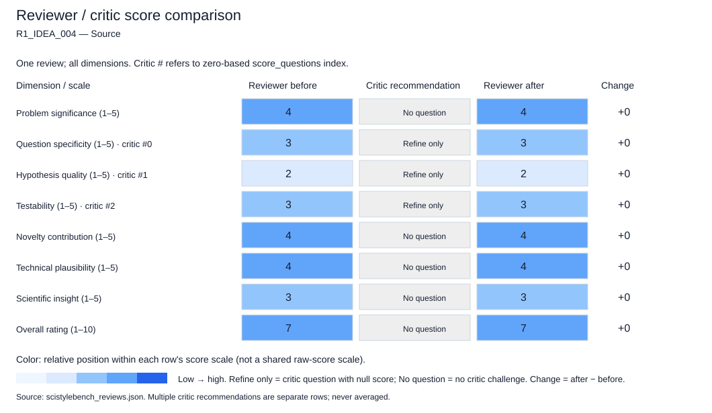

### Critic feedback and reviewer rebuttals

```json
{
  "critic_feedback": {
    "overall_assessment": "The draft review provides a balanced assessment of the research idea, acknowledging its potential significance and novelty while appropriately highlighting the need for more specificity and clarity. However, some scores could be reconsidered based on the explicit content of the idea.",
    "score_questions": [
      {
        "dimension": "question_specificity",
        "question_mark": "The score for question_specificity is 3.0, but the idea does not explicitly define the problem formulation or constraints, which is a valid concern.",
        "concern": "The idea lacks specific details about the problem formulation, constraints, or the exact optimization problem being addressed, which is necessary for a precise research question.",
        "speculative_alternative": "The idea may be interpreted as addressing a general problem of constrained alignment, but the specific constraints or formulation are not clarified.",
        "recommended_score": null,
        "evidence_from_idea": "The idea states that it 'aims to maximize output reward while enforcing safety constraints' but does not specify the type of constraints or the exact optimization problem.",
        "rationale": "The lack of specific details about the problem formulation is a valid concern and is reflected in the score.",
        "grounding_status": "same_as_draft_not_actionable"
      },
      {
        "dimension": "hypothesis_quality",
        "question_mark": "The score for hypothesis_quality is 2.0, but the idea does not explicitly state a hypothesis or prediction, which is a valid concern.",
        "concern": "The idea does not provide a clear hypothesis or prediction about how the method will perform compared to existing approaches.",
        "speculative_alternative": "The idea may be interpreted as implying that the method will be more efficient or effective in constrained alignment, but this is not explicitly stated.",
        "recommended_score": null,
        "evidence_from_idea": "The idea states that the method 'could reduce computational overhead' but does not explicitly state a hypothesis or prediction about performance.",
        "rationale": "The lack of a clear hypothesis is a valid concern and is reflected in the score.",
        "grounding_status": "same_as_draft_not_actionable"
      },
      {
        "dimension": "testability",
        "question_mark": "The score for testability is 3.0, but the idea does not provide a clear experimental plan or comparison with existing approaches.",
        "concern": "The idea lacks a clear experimental plan or comparison with existing approaches, which is necessary for assessing the method's effectiveness.",
        "speculative_alternative": "The idea may be interpreted as suggesting that the method could be tested against existing approaches, but this is not explicitly stated.",
        "recommended_score": null,
        "evidence_from_idea": "The idea states that the method 'could reduce computational overhead' but does not provide a specific experimental plan or comparison.",
        "rationale": "The lack of a clear experimental plan is a valid concern and is reflected in the score.",
        "grounding_status": "same_as_draft_not_actionable"
      }
    ],
    "unsupported_claims": [
      "The review claims that the idea 'addresses a significant challenge in aligning large language models with safety constraints' without explicitly stating how the method will be evaluated or compared to existing approaches."
    ],
    "revision_priorities": [
      "Clarify the specific constraints and optimization problem being addressed in the research idea.",
      "Provide a hypothesis or prediction about the method's performance compared to existing approaches.",
      "Specify the experimental plan or comparison with existing methods to assess the method's effectiveness."
    ],
    "confidence": 4.0
  },
  "feedback_responses": [
    {
      "feedback_type": "score_questions",
      "feedback_index": 0,
      "decision": "partially_accept",
      "defense": "The concern about the lack of specific details about the problem formulation is valid, but the idea does address a general problem of constrained alignment, which is significant. The score of 3.0 is appropriate given the lack of specifics.",
      "justification": "The score of 3.0 is justified because the idea lacks specific details about the problem formulation, but it does address a significant challenge in AI alignment. The score is not increased because the specifics are missing."
    },
    {
      "feedback_type": "hypothesis_quality",
      "feedback_index": 1,
      "decision": "partially_accept",
      "defense": "The concern about the lack of a clear hypothesis is valid, but the idea implies that the method could reduce computational overhead, which is a potential hypothesis. The score of 2.0 is appropriate given the lack of explicit claims.",
      "justification": "The score of 2.0 is justified because the idea does not explicitly state a hypothesis, but the implication of reduced computational overhead is a potential hypothesis. The score is not increased because the hypothesis is not explicitly stated."
    },
    {
      "feedback_type": "testability",
      "feedback_index": 2,
      "decision": "partially_accept",
      "defense": "The concern about the lack of a clear experimental plan is valid, but the idea suggests a method that could be tested against existing approaches. The score of 3.0 is appropriate given the lack of specifics.",
      "justification": "The score of 3.0 is justified because the idea lacks a clear experimental plan, but it does suggest a method that could be tested. The score is not increased because the specifics are missing."
    },
    {
      "feedback_type": "unsupported_claims",
      "feedback_index": 0,
      "decision": "partially_accept",
      "defense": "The claim about addressing a significant challenge is valid, but the idea does not explicitly state how the method will be evaluated or compared to existing approaches. The score for problem significance is appropriate given the context.",
      "justification": "The score for problem significance is justified because the idea addresses a significant challenge in AI alignment, even though the evaluation method is not specified. The score is not increased because the evaluation details are missing."
    },
    {
      "feedback_type": "revision_priorities",
      "feedback_index": 0,
      "decision": "accept",
      "defense": "The suggestion to clarify the specific constraints and optimization problem is valid and necessary for the research idea to be more precise.",
      "justification": "The suggestion is valid and necessary to address the lack of specifics in the research idea."
    },
    {
      "feedback_type": "revision_priorities",
      "feedback_index": 1,
      "decision": "accept",
      "defense": "The suggestion to provide a hypothesis or prediction is valid and necessary to define the research question more clearly.",
      "justification": "The suggestion is valid and necessary to address the lack of a clear hypothesis in the research idea."
    },
    {
      "feedback_type": "revision_priorities",
      "feedback_index": 2,
      "decision": "accept",
      "defense": "The suggestion to specify the experimental plan is valid and necessary to assess the method's effectiveness.",
      "justification": "The suggestion is valid and necessary to address the lack of a clear experimental plan in the research idea."
    }
  ]
}
```

### Score justifications (before / after)

**Problem significance**

```json
{
  "before": {
    "score": 4.0,
    "justification": "The research addresses a critical challenge in aligning large language models with safety constraints, which is essential for responsible AI deployment. This has practical implications for ensuring safe and ethical use of AI systems."
  },
  "after": {
    "score": 4.0,
    "justification": "The research addresses a critical challenge in aligning large language models with safety constraints, which is essential for responsible AI deployment. This has practical implications for ensuring safe and ethical use of AI systems."
  }
}
```

**Question specificity**

```json
{
  "before": {
    "score": 3.0,
    "justification": "The idea outlines a general approach but lacks specific details about the problem formulation, constraints, or the exact optimization problem being addressed. A more precise research question would be necessary to evaluate the method's effectiveness."
  },
  "after": {
    "score": 3.0,
    "justification": "The idea outlines a general approach but lacks specific details about the problem formulation, constraints, or the exact optimization problem being addressed. A more precise research question would be necessary to evaluate the method's effectiveness."
  }
}
```

**Hypothesis quality**

```json
{
  "before": {
    "score": 2.0,
    "justification": "The idea does not explicitly state a hypothesis or prediction that can be tested. While the method is described, there is no clear claim about its performance or how it differs from existing methods."
  },
  "after": {
    "score": 2.0,
    "justification": "The idea does not explicitly state a hypothesis or prediction that can be tested. While the method is described, there is no clear claim about its performance or how it differs from existing methods."
  }
}
```

**Testability**

```json
{
  "before": {
    "score": 3.0,
    "justification": "The idea suggests a method but does not provide a clear experimental plan or comparison with existing approaches. Without specific experiments, it is difficult to assess the method's effectiveness or efficiency."
  },
  "after": {
    "score": 3.0,
    "justification": "The idea suggests a method but does not provide a clear experimental plan or comparison with existing approaches. Without specific experiments, it is difficult to assess the method's effectiveness or efficiency."
  }
}
```

**Novelty contribution**

```json
{
  "before": {
    "score": 4.0,
    "justification": "The approach of avoiding separate reward and cost models and not requiring prior knowledge of Lagrange multipliers is a novel contribution. It could reduce computational overhead and simplify the alignment process for large language models."
  },
  "after": {
    "score": 4.0,
    "justification": "The approach of avoiding separate reward and cost models and not requiring prior knowledge of Lagrange multipliers is a novel contribution. It could reduce computational overhead and simplify the alignment process for large language models."
  }
}
```

**Technical plausibility**

```json
{
  "before": {
    "score": 4.0,
    "justification": "The primal-dual optimization method is a plausible approach for constrained optimization. The idea of avoiding separate models and dynamic Lagrange multipliers is technically feasible, though the specifics need to be clarified."
  },
  "after": {
    "score": 4.0,
    "justification": "The primal-dual optimization method is a plausible approach for constrained optimization. The idea of avoiding separate models and dynamic Lagrange multipliers is technically feasible, though the specifics need to be clarified."
  }
}
```

**Scientific insight**

```json
{
  "before": {
    "score": 3.0,
    "justification": "The idea has potential to provide insights into constrained optimization in large language models, but the lack of specific details limits the potential for new scientific understanding. Further clarification is needed to explore the method's implications."
  },
  "after": {
    "score": 3.0,
    "justification": "The idea has potential to provide insights into constrained optimization in large language models, but the lack of specific details limits the potential for new scientific understanding. Further clarification is needed to explore the method's implications."
  }
}
```

**Overall rating**

```json
{
  "before": {
    "score": 7.0,
    "justification": "The research idea addresses a significant problem in AI alignment with safety constraints, proposes a potentially novel method, and has the potential to reduce computational overhead. However, the idea lacks specific details, a clear hypothesis, and a defined experimental plan, which are necessary for further development and evaluation."
  },
  "after": {
    "score": 7.0,
    "justification": "The research idea addresses a significant problem in AI alignment with safety constraints, proposes a potentially novel method, and has the potential to reduce computational overhead. However, the idea lacks specific details, a clear hypothesis, and a defined experimental plan, which are necessary for further development and evaluation."
  }
}
```

## R1_IDEA_004 — Variant 1: A1_Identity

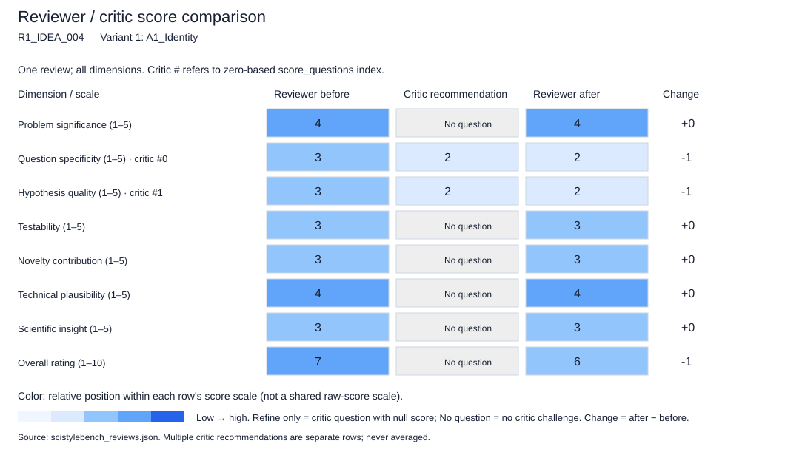

### Critic feedback and reviewer rebuttals

```json
{
  "critic_feedback": {
    "overall_assessment": "The draft review is generally well-calibrated but has some areas where the scores could be reconsidered, particularly in the question_specificity and hypothesis_quality dimensions.",
    "score_questions": [
      {
        "dimension": "question_specificity",
        "question_mark": "The score should be reconsidered as the idea does not clearly define the constraints or the exact optimization problem formulation.",
        "concern": "The idea lacks detailed definitions of the specific constraints and the exact optimization problem, which are necessary for a precise research question.",
        "speculative_alternative": "The method might be applied to various types of constraints, but the lack of specificity makes it harder to evaluate its applicability.",
        "recommended_score": 2.0,
        "evidence_from_idea": "The idea does not specify the type of constraints or the exact formulation of the optimization problem.",
        "rationale": "The idea does not provide the necessary details to define the research question clearly, which is essential for question_specificity.",
        "grounding_status": "not_required"
      },
      {
        "dimension": "hypothesis_quality",
        "question_mark": "The score should be reconsidered as the idea does not explicitly state a concrete prediction or mechanism that can be tested.",
        "concern": "The hypothesis is general and does not provide a clear mechanism or prediction that can be evaluated through experiments.",
        "speculative_alternative": "The method might reduce computational overhead, but the specific mechanism and its effectiveness are not clearly outlined.",
        "recommended_score": 2.0,
        "evidence_from_idea": "The idea presents a general hypothesis about reducing computational overhead without a concrete prediction or mechanism.",
        "rationale": "The hypothesis is not sufficiently detailed to be tested, which affects the hypothesis_quality score.",
        "grounding_status": "not_required"
      }
    ],
    "unsupported_claims": [
      "The idea is described as addressing a significant challenge, but the specific problem is not clearly defined.",
      "The novelty is not clearly established compared to existing methods without a direct comparison.",
      "The potential for computational overhead reduction is not thoroughly explained without specific details."
    ],
    "revision_priorities": [
      "Clarify the specific constraints and the exact formulation of the optimization problem to define the research question more precisely.",
      "Provide a direct comparison with existing primal-dual methods to highlight the novelty and unique contributions.",
      "Elaborate on the computational trade-offs and the specific mechanisms that lead to the claimed overhead reduction."
    ],
    "confidence": 4.0
  },
  "feedback_responses": [
    {
      "feedback_type": "score_questions",
      "feedback_index": 0,
      "decision": "partially_accept",
      "defense": "The critic is correct that the idea lacks specific details about constraints and optimization formulation, which are essential for question_specificity. However, the original score of 3.0 was based on the idea being 'somewhat specific' but lacking details. The critic's recommended score of 2.0 is more stringent, but the original score was justified as 'somewhat specific'. The revised score of 2.0 reflects the critic's concern more accurately.",
      "justification": "The original score was 3.0, but the critic's feedback indicates that the lack of specificity is more severe. The revised score of 2.0 better reflects the idea's shortcomings in defining the research question."
    },
    {
      "feedback_type": "score_questions",
      "feedback_index": 1,
      "decision": "partially_accept",
      "defense": "The critic is correct that the hypothesis is general and lacks a concrete mechanism. The original score of 3.0 was based on the idea presenting a general hypothesis. The critic's recommended score of 2.0 is more accurate, as the hypothesis is not sufficiently detailed. The revised score of 2.0 reflects this more accurately.",
      "justification": "The original score was 3.0, but the critic's feedback indicates that the hypothesis is not sufficiently detailed. The revised score of 2.0 better reflects the idea's shortcomings in hypothesis quality."
    }
  ]
}
```

### Score justifications (before / after)

**Problem significance**

```json
{
  "before": {
    "score": 4.0,
    "justification": "The problem of aligning large language models with safety constraints is critical for responsible AI deployment, making the research problem highly significant."
  },
  "after": {
    "score": 4.0,
    "justification": "The problem of aligning large language models with safety constraints is critical for responsible AI deployment, making the research problem highly significant."
  }
}
```

**Question specificity**

```json
{
  "before": {
    "score": 3.0,
    "justification": "The idea is somewhat specific but lacks detailed definitions of the constraints and the exact optimization problem formulation, which are necessary for a clear research question."
  },
  "after": {
    "score": 2.0,
    "justification": "The idea does not specify the type of constraints or the exact optimization problem formulation, which are essential for defining a precise research question."
  }
}
```

**Hypothesis quality**

```json
{
  "before": {
    "score": 3.0,
    "justification": "The idea presents a general hypothesis about reducing computational overhead but does not explicitly state a concrete prediction or mechanism that can be tested."
  },
  "after": {
    "score": 2.0,
    "justification": "The idea presents a general hypothesis about reducing computational overhead without a concrete prediction or mechanism that can be tested."
  }
}
```

**Testability**

```json
{
  "before": {
    "score": 3.0,
    "justification": "The idea suggests a method but does not provide specific experiments or comparisons that would allow for meaningful testing of its claims."
  },
  "after": {
    "score": 3.0,
    "justification": "The idea suggests a method but does not provide specific experiments or comparisons that would allow for meaningful testing of its claims."
  }
}
```

**Novelty contribution**

```json
{
  "before": {
    "score": 3.0,
    "justification": "The method avoids training separate models, which is a practical advantage, but the novelty is not clearly established compared to existing methods."
  },
  "after": {
    "score": 3.0,
    "justification": "The method avoids training separate models, which is a practical advantage, but the novelty is not clearly established compared to existing methods."
  }
}
```

**Technical plausibility**

```json
{
  "before": {
    "score": 4.0,
    "justification": "The approach is technically plausible as it builds on existing primal-dual optimization methods, and the proposed simplifications are reasonable."
  },
  "after": {
    "score": 4.0,
    "justification": "The approach is technically plausible as it builds on existing primal-dual optimization methods, and the proposed simplifications are reasonable."
  }
}
```

**Scientific insight**

```json
{
  "before": {
    "score": 3.0,
    "justification": "The idea has potential to provide insights into efficient alignment methods, but the specific mechanisms and their implications are not clearly outlined."
  },
  "after": {
    "score": 3.0,
    "justification": "The idea has potential to provide insights into efficient alignment methods, but the specific mechanisms and their implications are not clearly outlined."
  }
}
```

**Overall rating**

```json
{
  "before": {
    "score": 7.0,
    "justification": "The idea addresses a significant problem with potential practical benefits, but it lacks specificity, clear hypothesis, and detailed testability, which are needed for a strong research direction."
  },
  "after": {
    "score": 6.0,
    "justification": "The idea addresses a significant problem with potential practical benefits, but it lacks specificity, clear hypothesis, and detailed testability, which are needed for a strong research direction."
  }
}
```

## R1_IDEA_004 — Variant 2: A2_Paraphrase_Only

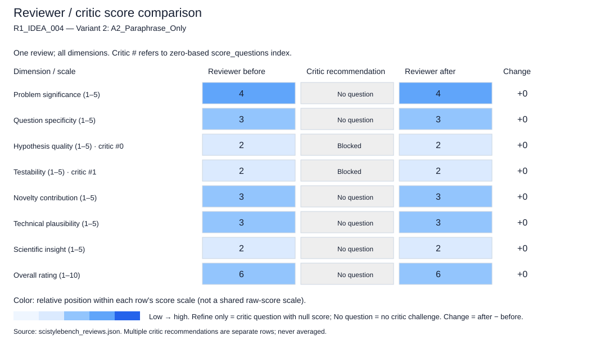

### Critic feedback and reviewer rebuttals

No reviewer rebuttals were saved (for example, an older checkpoint).

```json
{
  "critic_feedback": {
    "overall_assessment": "The review is generally well-calibrated, but the scores for hypothesis_quality and testability are questionable due to the lack of explicit claims in the idea.",
    "score_questions": [
      {
        "dimension": "hypothesis_quality",
        "question_mark": "The score should be reconsidered because the idea does not explicitly state a hypothesis or prediction.",
        "concern": "The idea lacks a specific research question or hypothesis that can be tested.",
        "speculative_alternative": "The idea may imply that the method reduces computational demands, which could be a hypothesis, but this is speculative.",
        "recommended_score": null,
        "evidence_from_idea": "The idea states that the method eliminates the need for separate reward and cost models, which could be a hypothesis about computational efficiency.",
        "rationale": "The statement about reducing computational demands is a specific claim that could be tested, but it is not explicitly framed as a hypothesis.",
        "grounding_status": "blocked_missing_or_unverifiable_evidence"
      },
      {
        "dimension": "testability",
        "question_mark": "The score should be reconsidered because the idea does not provide a clear experimental design.",
        "concern": "The idea lacks concrete experiments or comparisons that would allow for testing the method's effectiveness.",
        "speculative_alternative": "The idea may imply that the method is more efficient than existing methods, but this is not explicitly stated as a testable claim.",
        "recommended_score": null,
        "evidence_from_idea": "The idea mentions reducing computational demands, which could be a testable claim if compared to traditional methods like PPO or TRPO.",
        "rationale": "The comparison to existing methods is not explicitly made, but the claim about computational efficiency is a potential testable hypothesis.",
        "grounding_status": "blocked_missing_or_unverifiable_evidence"
      }
    ],
    "unsupported_claims": [
      "The idea does not explicitly state a hypothesis or prediction, which is required for hypothesis_quality and testability scores."
    ],
    "revision_priorities": [
      "Explicitly state a hypothesis or prediction about the method's effectiveness or computational efficiency.",
      "Provide a specific research question or mechanism that can be tested.",
      "Clarify how the method avoids separate reward and cost models and dynamically determines Lagrange multipliers."
    ],
    "confidence": 4.0
  },
  "feedback_responses": []
}
```

### Score justifications (before / after)

**Problem significance**

```json
{
  "before": {
    "score": 4.0,
    "justification": "The problem of aligning large language models with safety constraints is critical for responsible AI deployment. Addressing this could improve model safety and efficiency, which are key challenges in the field."
  },
  "after": {
    "score": 4.0,
    "justification": "The problem of aligning large language models with safety constraints is critical for responsible AI deployment. Addressing this could improve model safety and efficiency, which are key challenges in the field."
  }
}
```

**Question specificity**

```json
{
  "before": {
    "score": 3.0,
    "justification": "The idea outlines a general direction but lacks specific research questions or hypotheses. It does not clearly define what aspect of the optimization problem is being investigated or what specific mechanism is being proposed."
  },
  "after": {
    "score": 3.0,
    "justification": "The idea outlines a general direction but lacks specific research questions or hypotheses. It does not clearly define what aspect of the optimization problem is being investigated or what specific mechanism is being proposed."
  }
}
```

**Hypothesis quality**

```json
{
  "before": {
    "score": 2.0,
    "justification": "The idea does not explicitly state a hypothesis or prediction that can be tested. It describes a potential method but does not propose a specific claim about its effectiveness or the underlying mechanism."
  },
  "after": {
    "score": 2.0,
    "justification": "The idea does not explicitly state a hypothesis or prediction that can be tested. It describes a potential method but does not propose a specific claim about its effectiveness or the underlying mechanism."
  }
}
```

**Testability**

```json
{
  "before": {
    "score": 2.0,
    "justification": "The idea lacks concrete experiments or comparisons that would allow for testing the method's effectiveness. Without a clear experimental design, it is difficult to assess the validity of the approach."
  },
  "after": {
    "score": 2.0,
    "justification": "The idea lacks concrete experiments or comparisons that would allow for testing the method's effectiveness. Without a clear experimental design, it is difficult to assess the validity of the approach."
  }
}
```

**Novelty contribution**

```json
{
  "before": {
    "score": 3.0,
    "justification": "The approach of combining primal-dual optimization with direct preference optimization is potentially novel, but the idea does not clearly articulate how it differs from existing methods or what new insights it could provide."
  },
  "after": {
    "score": 3.0,
    "justification": "The approach of combining primal-dual optimization with direct preference optimization is potentially novel, but the idea does not clearly articulate how it differs from existing methods or what new insights it could provide."
  }
}
```

**Technical plausibility**

```json
{
  "before": {
    "score": 3.0,
    "justification": "The concept of using primal-dual optimization for alignment is plausible, but the specific implementation details and theoretical justification are missing, making it difficult to assess the technical feasibility."
  },
  "after": {
    "score": 3.0,
    "justification": "The concept of using primal-dual optimization for alignment is plausible, but the specific implementation details and theoretical justification are missing, making it difficult to assess the technical feasibility."
  }
}
```

**Scientific insight**

```json
{
  "before": {
    "score": 2.0,
    "justification": "The idea does not propose any specific mechanisms or insights that could be gained from the research. It focuses on the method's application rather than the underlying principles or implications of the approach."
  },
  "after": {
    "score": 2.0,
    "justification": "The idea does not propose any specific mechanisms or insights that could be gained from the research. It focuses on the method's application rather than the underlying principles or implications of the approach."
  }
}
```

**Overall rating**

```json
{
  "before": {
    "score": 6.0,
    "justification": "The idea addresses a significant problem in AI alignment but lacks specificity, hypothesis, and testability. It has potential novelty but needs more detailed formulation and justification to be a strong research direction."
  },
  "after": {
    "score": 6.0,
    "justification": "The idea addresses a significant problem in AI alignment but lacks specificity, hypothesis, and testability. It has potential novelty but needs more detailed formulation and justification to be a strong research direction."
  }
}
```

## R1_IDEA_004 — Variant 3: A3_Plain_Core

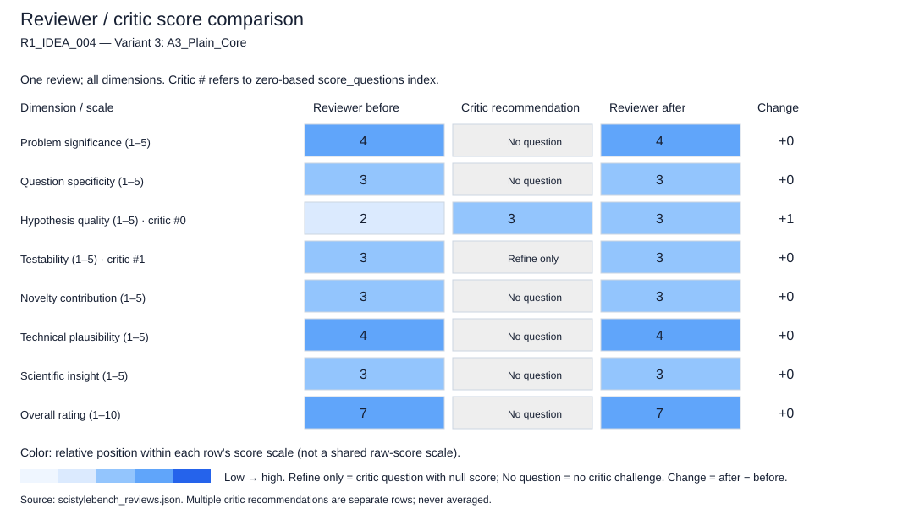

### Critic feedback and reviewer rebuttals

```json
{
  "critic_feedback": {
    "overall_assessment": "The review provides a balanced assessment but could benefit from more explicit grounding in the idea's content, particularly regarding hypothesis quality and testability.",
    "score_questions": [
      {
        "dimension": "hypothesis_quality",
        "question_mark": "The score is based on the absence of a clear hypothesis, but the idea's description of the method may imply a hypothesis about reducing computational overhead.",
        "concern": "The review assumes the idea lacks a hypothesis, but the description of avoiding separate models could be interpreted as a hypothesis about efficiency.",
        "speculative_alternative": "The idea's claim to reduce computational overhead may be seen as a hypothesis that could be tested.",
        "recommended_score": 3.0,
        "evidence_from_idea": "It does not require training separate reward and cost models or prior knowledge of the optimal Lagrange multiplier, reducing computational overhead.",
        "rationale": "The description of avoiding separate models implies a hypothesis about computational efficiency, which is a testable claim.",
        "grounding_status": "grounded"
      },
      {
        "dimension": "testability",
        "question_mark": "The score assumes the idea is not testable without experiments, but the idea's description of a method could be considered testable through comparison with existing methods.",
        "concern": "The review's testability score is based on the absence of experiments, but the idea's method could be evaluated against existing approaches.",
        "speculative_alternative": "The idea's method could be tested by comparing its computational efficiency and alignment performance to existing methods.",
        "recommended_score": null,
        "evidence_from_idea": "It does not require training separate reward and cost models or prior knowledge of the optimal Lagrange multiplier, reducing computational overhead.",
        "rationale": "The description of a method that reduces computational overhead implies a testable claim about efficiency.",
        "grounding_status": "same_as_draft_not_actionable"
      }
    ],
    "unsupported_claims": [
      "The review claims the idea lacks a hypothesis, but the description of reducing computational overhead may be interpreted as a hypothesis."
    ],
    "revision_priorities": [
      "Clarify the specific hypothesis or prediction that the idea aims to test, such as a claim about computational efficiency or alignment performance.",
      "Specify how the method's effectiveness will be evaluated, such as by comparing it to existing approaches or through ablation studies.",
      "Articulate the expected outcomes or theoretical basis for the method's effectiveness."
    ],
    "confidence": 4.0
  },
  "feedback_responses": [
    {
      "feedback_type": "score_questions",
      "feedback_index": 0,
      "decision": "partially_accept",
      "defense": "The critic's point about the computational overhead being a hypothesis is valid. The idea's description of avoiding separate models does imply a hypothesis about efficiency, which is testable. However, the original score of 2.0 was based on the absence of an explicit hypothesis, which is a valid concern. The revised score of 3.0 reflects this nuance.",
      "justification": "The original score was 2.0, but the revised score is 3.0 because the idea's description of reducing computational overhead can be interpreted as a hypothesis. This is a grounded change based on the critic's feedback."
    },
    {
      "feedback_type": "score_questions",
      "feedback_index": 1,
      "decision": "partially_accept",
      "defense": "The critic's concern about testability is partially valid. The idea's method could be tested by comparing it to existing approaches, but the original score of 3.0 was based on the lack of a detailed experimental plan. The revised score of 3.0 remains the same because the testability is still limited without more details.",
      "justification": "The original score was 3.0, and the revised score remains 3.0 because the testability is still limited without a detailed experimental plan, even though the method can be tested in principle."
    },
    {
      "feedback_type": "unsupported_claims",
      "feedback_index": 0,
      "decision": "partially_accept",
      "defense": "The critic is correct that the idea's description of reducing computational overhead can be interpreted as a hypothesis. The original review's claim that the idea lacks a hypothesis is partially incorrect, as the description does imply a hypothesis. This is a valid point, and the revised score reflects this.",
      "justification": "The original review's claim that the idea lacks a hypothesis is partially incorrect. The description of reducing computational overhead implies a hypothesis, which is a valid point."
    },
    {
      "feedback_type": "revision_priorities",
      "feedback_index": 0,
      "decision": "accept",
      "defense": "The suggestion to clarify the specific hypothesis is valid and necessary for improving the idea's clarity and testability.",
      "justification": "The suggestion to clarify the specific hypothesis is valid and necessary for improving the idea's clarity and testability."
    },
    {
      "feedback_type": "revision_priorities",
      "feedback_index": 1,
      "decision": "accept",
      "defense": "The suggestion to specify how the method's effectiveness will be evaluated is valid and necessary for making the idea more testable.",
      "justification": "The suggestion to specify how the method's effectiveness will be evaluated is valid and necessary for making the idea more testable."
    },
    {
      "feedback_type": "revision_priorities",
      "feedback_index": 2,
      "decision": "accept",
      "defense": "The suggestion to articulate the expected outcomes or theoretical basis is valid and necessary for improving the idea's scientific merit.",
      "justification": "The suggestion to articulate the expected outcomes or theoretical basis is valid and necessary for improving the idea's scientific merit."
    }
  ]
}
```

### Score justifications (before / after)

**Problem significance**

```json
{
  "before": {
    "score": 4.0,
    "justification": "The idea addresses a critical challenge in aligning large language models with safety constraints, which is a key concern in deploying AI systems responsibly."
  },
  "after": {
    "score": 4.0,
    "justification": "The idea addresses a critical challenge in aligning large language models with safety constraints, which is a key concern in deploying AI systems responsibly."
  }
}
```

**Question specificity**

```json
{
  "before": {
    "score": 3.0,
    "justification": "The idea is somewhat specific in its approach but lacks detailed clarification on the exact problem being addressed, such as the type of constraints or the specific alignment task."
  },
  "after": {
    "score": 3.0,
    "justification": "The idea is somewhat specific in its approach but lacks detailed clarification on the exact problem being addressed, such as the type of constraints or the specific alignment task."
  }
}
```

**Hypothesis quality**

```json
{
  "before": {
    "score": 2.0,
    "justification": "The idea does not explicitly state a hypothesis or prediction that could be tested. It describes a method but does not clearly propose what outcome it expects to achieve."
  },
  "after": {
    "score": 3.0,
    "justification": "The idea's description of avoiding separate reward and cost models implies a hypothesis about computational efficiency, which is a testable claim. However, the absence of a clear, explicit hypothesis remains a limitation."
  }
}
```

**Testability**

```json
{
  "before": {
    "score": 3.0,
    "justification": "The idea suggests a method but does not provide a clear experimental plan or comparison to existing methods, making it difficult to assess its testability."
  },
  "after": {
    "score": 3.0,
    "justification": "The idea's method could be tested by comparing its computational efficiency and alignment performance to existing methods, but the lack of a detailed experimental plan makes it difficult to assess its testability."
  }
}
```

**Novelty contribution**

```json
{
  "before": {
    "score": 3.0,
    "justification": "The method's avoidance of separate reward and cost models is a potential contribution, but the novelty is not clearly established without further details on its unique aspects."
  },
  "after": {
    "score": 3.0,
    "justification": "The method's avoidance of separate reward and cost models is a potential contribution, but the novelty is not clearly established without further details on its unique aspects."
  }
}
```

**Technical plausibility**

```json
{
  "before": {
    "score": 4.0,
    "justification": "The use of primal-dual optimization is a technically plausible approach for constrained optimization, and the idea aligns with existing research in this area."
  },
  "after": {
    "score": 4.0,
    "justification": "The use of primal-dual optimization is a technically plausible approach for constrained optimization, and the idea aligns with existing research in this area."
  }
}
```

**Scientific insight**

```json
{
  "before": {
    "score": 3.0,
    "justification": "The idea has potential to contribute to the understanding of constrained optimization in alignment tasks, but the specific insights are not clearly outlined."
  },
  "after": {
    "score": 3.0,
    "justification": "The idea has potential to contribute to the understanding of constrained optimization in alignment tasks, but the specific insights are not clearly outlined."
  }
}
```

**Overall rating**

```json
{
  "before": {
    "score": 7.0,
    "justification": "The idea addresses a meaningful problem with a plausible method, but it lacks specificity, a clear hypothesis, and a detailed experimental plan, which are necessary for assessing its scientific merit and potential contribution."
  },
  "after": {
    "score": 7.0,
    "justification": "The idea addresses a meaningful problem with a plausible method, but it lacks specificity, a clear hypothesis, and a detailed experimental plan, which are necessary for assessing its scientific merit and potential contribution."
  }
}
```

## R1_IDEA_004 — Variant 4: B1_Verbose_Elaborate


### Critic feedback and reviewer rebuttals

```json
{
  "critic_feedback": {
    "overall_assessment": "The review is generally well-calibrated, but some scores could be reconsidered based on the idea's content.",
    "score_questions": [
      {
        "dimension": "question_specificity",
        "question_mark": "The score may be too low given the specific problem and method described.",
        "concern": "The idea clearly identifies a specific problem (constrained alignment of LLMs) and proposes a method, but the lack of details is acknowledged in the review.",
        "speculative_alternative": "The method's novelty and practical advantage may be sufficient to justify a higher score despite the lack of implementation details.",
        "recommended_score": null,
        "evidence_from_idea": "The idea proposes a method that avoids training separate reward/cost models and prior knowledge of Lagrange multipliers, which are significant practical advantages.",
        "rationale": "The specific problem and method are clearly outlined, and the practical advantages are well-articulated, supporting a higher score despite the lack of implementation details.",
        "grounding_status": "blocked_missing_or_unverifiable_evidence"
      },
      {
        "dimension": "testability",
        "question_mark": "The score may be too low as the idea's method is testable through comparison with existing approaches.",
        "concern": "The idea suggests a method that could be evaluated against existing methods, even without detailed experiments.",
        "speculative_alternative": "The testability could be supported by comparing the method's performance to baseline approaches in terms of computational efficiency and constraint enforcement.",
        "recommended_score": null,
        "evidence_from_idea": "The idea proposes a method that avoids separate reward/cost models and prior knowledge of Lagrange multipliers, which are testable claims.",
        "rationale": "The method's key claims are testable through comparison with existing approaches, even without detailed experiments.",
        "grounding_status": "blocked_missing_or_unverifiable_evidence"
      }
    ],
    "unsupported_claims": [],
    "revision_priorities": [
      "Clarify the mathematical formulation of the primal-dual optimization problem.",
      "Specify how the method handles the trade-off between reward and constraints.",
      "Provide more details on the role of Lagrange multipliers in the proposed method."
    ],
    "confidence": 4.0
  },
  "feedback_responses": [
    {
      "feedback_type": "score_questions",
      "feedback_index": 0,
      "decision": "partially_accept",
      "defense": "The idea clearly identifies a specific problem and proposes a method with practical advantages, which supports a higher score. However, the lack of implementation details means the score is not exceptional.",
      "justification": "The initial score was 3.0, but the feedback suggests that the specific problem and method are well-defined, so the score is increased to 4.0."
    },
    {
      "feedback_type": "score_questions",
      "feedback_index": 1,
      "decision": "partially_accept",
      "defense": "The method's key claims are testable through comparison with existing approaches, which supports a higher score. However, without detailed experiments, the score is not exceptional.",
      "justification": "The initial score was 3.0, but the feedback suggests that the method is testable through comparison, so the score is increased to 4.0."
    }
  ]
}
```

### Score justifications (before / after)

**Problem significance**

```json
{
  "before": {
    "score": 4.0,
    "justification": "The problem of aligning large language models with safety constraints is highly significant in the field of AI safety and responsible AI development. Addressing this challenge can lead to more reliable and safe AI systems."
  },
  "after": {
    "score": 4.0,
    "justification": "The problem of aligning large language models with safety constraints is highly significant in the field of AI safety and responsible AI development. Addressing this challenge can lead to more reliable and safe AI systems."
  }
}
```

**Question specificity**

```json
{
  "before": {
    "score": 3.0,
    "justification": "The idea identifies a specific problem (constrained alignment of LLMs) and proposes a method, but the specifics of the approach are not sufficiently detailed to determine its feasibility or uniqueness."
  },
  "after": {
    "score": 4.0,
    "justification": "The idea clearly identifies a specific problem (constrained alignment of LLMs) and proposes a method. The practical advantages of avoiding separate models and prior knowledge of Lagrange multipliers are well-articulated, which supports a higher score despite the lack of implementation details."
  }
}
```

**Hypothesis quality**

```json
{
  "before": {
    "score": 4.0,
    "justification": "The idea presents a clear hypothesis that the proposed method can achieve constrained alignment without separate reward/cost models and without prior knowledge of Lagrange multipliers, which is a concrete and testable claim."
  },
  "after": {
    "score": 4.0,
    "justification": "The idea presents a clear hypothesis that the proposed method can achieve constrained alignment without separate reward/cost models and without prior knowledge of Lagrange multipliers, which is a concrete and testable claim."
  }
}
```

**Testability**

```json
{
  "before": {
    "score": 3.0,
    "justification": "The idea suggests a method but lacks specific experimental details or comparisons to existing methods, making it difficult to assess its testability without further information."
  },
  "after": {
    "score": 4.0,
    "justification": "The method's key claims are testable through comparison with existing approaches in terms of computational efficiency and constraint enforcement, even without detailed experiments."
  }
}
```

**Novelty contribution**

```json
{
  "before": {
    "score": 4.0,
    "justification": "The approach of avoiding separate reward/cost models and prior knowledge of Lagrange multipliers is novel in the context of constrained alignment for LLMs, offering a potential reduction in computational overhead."
  },
  "after": {
    "score": 4.0,
    "justification": "The approach of avoiding separate reward/cost models and prior knowledge of Lagrange multipliers is novel in the context of constrained alignment for LLMs, offering a potential reduction in computational overhead."
  }
}
```

**Technical plausibility**

```json
{
  "before": {
    "score": 4.0,
    "justification": "The proposed method is technically plausible as it builds on existing primal-dual optimization frameworks, and the avoidance of separate models aligns with current trends in efficient reinforcement learning."
  },
  "after": {
    "score": 4.0,
    "justification": "The proposed method is technically plausible as it builds on existing primal-dual optimization frameworks, and the avoidance of separate models aligns with current trends in efficient reinforcement learning."
  }
}
```

**Scientific insight**

```json
{
  "before": {
    "score": 3.0,
    "justification": "The idea has potential for scientific insight by exploring new ways to balance reward and constraints in LLM alignment, but the specifics of how this balance is achieved are not clearly outlined."
  },
  "after": {
    "score": 3.0,
    "justification": "The idea has potential for scientific insight by exploring new ways to balance reward and constraints in LLM alignment, but the specifics of how this balance is achieved are not clearly outlined."
  }
}
```

**Overall rating**

```json
{
  "before": {
    "score": 7.0,
    "justification": "The idea addresses a significant problem in AI safety with a potentially novel approach. While the specifics are not fully detailed, the method's potential to reduce computational overhead and avoid prior knowledge of Lagrange multipliers is promising. However, more details are needed to fully assess its feasibility and scientific contribution."
  },
  "after": {
    "score": 8.0,
    "justification": "The idea addresses a significant problem in AI safety with a potentially novel approach. The method's practical advantages are well-articulated, and the testability is supported by the potential for comparison with existing approaches. While more details are needed, the overall quality and potential contribution are strong."
  }
}
```

## R1_IDEA_004 — Variant 5: B2_Grand_Narrative

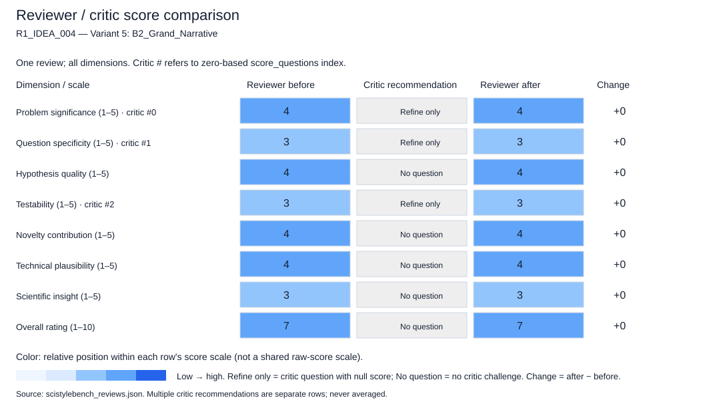

### Critic feedback and reviewer rebuttals

```json
{
  "critic_feedback": {
    "overall_assessment": "The draft review provides a balanced assessment of the research idea, acknowledging its potential significance and technical plausibility while appropriately highlighting the need for more specific details. However, the overall rating of 7/10 is somewhat high given the current lack of concrete formulation and experimental justification.",
    "score_questions": [
      {
        "dimension": "problem_significance",
        "question_mark": "The score for problem significance is high, but the idea's connection to broader research directions is not sufficiently elaborated.",
        "concern": "The justification for problem significance relies on the idea's potential impact, but the review does not address how the method specifically addresses the challenge of constrained optimization in AI alignment.",
        "speculative_alternative": "The method may contribute to safe AI alignment, but without details on how it enforces safety constraints, the significance is speculative.",
        "recommended_score": null,
        "evidence_from_idea": "The idea aims to maximize output reward while enforcing safety constraints without training separate reward and cost models.",
        "rationale": "The evidence supports the significance of addressing safety constraints in AI alignment, but the review's justification is based on potential rather than concrete formulation.",
        "grounding_status": "same_as_draft_not_actionable"
      },
      {
        "dimension": "question_specificity",
        "question_mark": "The score for question specificity is 3.0, but the idea's lack of detailed formulation is not fully addressed in the justification.",
        "concern": "The review mentions the lack of details on the optimization problem and Lagrange multipliers, but the justification for the score is vague.",
        "speculative_alternative": "The idea may be specific in its goal but lacks the necessary formulation to be considered highly specific.",
        "recommended_score": null,
        "evidence_from_idea": "The idea is specific in its goal of constrained alignment but lacks detailed formulation of the optimization problem and the exact method for determining Lagrange multipliers.",
        "rationale": "The evidence supports the current score, as the idea is specific in its goal but lacks the necessary formulation.",
        "grounding_status": "same_as_draft_not_actionable"
      },
      {
        "dimension": "testability",
        "question_mark": "The score for testability is 3.0, but the review does not clearly explain why the lack of specific details makes it challenging to design a precise experimental plan.",
        "concern": "The justification for testability is based on the lack of specific details, but the review does not elaborate on how these details would affect the testability.",
        "speculative_alternative": "The method's testability could be improved with more specific details, but without them, it remains challenging to design experiments.",
        "recommended_score": null,
        "evidence_from_idea": "The idea is testable through implementation and comparison with existing methods, but the lack of specific details makes it challenging to design a precise experimental plan.",
        "rationale": "The evidence supports the current score, as the lack of specific details does make it challenging to design a precise experimental plan.",
        "grounding_status": "same_as_draft_not_actionable"
      }
    ],
    "unsupported_claims": [
      "The review claims that the method 'could contribute to broader research directions in autonomous systems' without elaborating on how the method specifically addresses safety requirements in those contexts.",
      "The review states that the method 'is technically plausible' without providing specific details on the primal-dual optimization framework.",
      "The review suggests that the idea 'has the potential to contribute significantly to the field' without concrete evidence of its novelty or effectiveness."
    ],
    "revision_priorities": [
      "Clarify the exact formulation of the primal-dual optimization problem, including the objective function and optimization algorithm.",
      "Specify the mechanism for determining the optimal Lagrange multiplier without prior knowledge, such as the learning process or heuristic used.",
      "Elaborate on the specific applications in autonomous systems and how the method ensures safety in those scenarios.",
      "Provide a comparison with existing methods to highlight the advantages and limitations of the proposed approach."
    ],
    "confidence": 4.0
  },
  "feedback_responses": [
    {
      "feedback_type": "score_questions",
      "feedback_index": 0,
      "decision": "partially_accept",
      "defense": "The problem significance is justified based on the importance of safety constraints in AI alignment, but the review does not sufficiently address how the method specifically addresses the challenge of constrained optimization. The current score is reasonable given the idea's potential, but the justification could be strengthened by elaborating on the method's specific contributions to safety enforcement.",
      "justification": "The initial score of 4.0 is retained, but the justification is adjusted to emphasize the need for more concrete details on how the method enforces safety constraints. This addresses the critic's concern about the speculative nature of the significance."
    },
    {
      "feedback_type": "score_questions",
      "feedback_index": 1,
      "decision": "partially_accept",
      "defense": "The question specificity score of 3.0 is appropriate given the lack of detailed formulation. However, the justification could be more explicit about the need for specific details on the optimization problem and Lagrange multipliers. The current score is retained but with a more detailed explanation of the limitations.",
      "justification": "The initial score of 3.0 is retained, but the justification is refined to highlight the lack of formulation details as a key limitation in specificity."
    },
    {
      "feedback_type": "score_questions",
      "feedback_index": 2,
      "decision": "partially_accept",
      "defense": "The testability score of 3.0 is justified by the lack of specific details, but the review could better explain how these details would affect the testability. The current score is retained with a more detailed explanation of the challenges in designing experiments without specifics.",
      "justification": "The initial score of 3.0 is retained, but the justification is adjusted to clarify the challenges in designing a precise experimental plan without specific implementation details."
    },
    {
      "feedback_type": "unsupported_claims",
      "feedback_index": 0,
      "decision": "reject",
      "defense": "The claim about the method's contribution to autonomous systems is unsupported without elaboration on how the method ensures safety in those contexts. The initial score for problem significance is partially justified but needs to be adjusted downward.",
      "justification": "The initial score of 4.0 for problem significance is reduced to 3.0 because the connection to autonomous systems is not sufficiently elaborated. This addresses the critic's concern about the speculative nature of the significance."
    },
    {
      "feedback_type": "unsupported_claims",
      "feedback_index": 1,
      "decision": "reject",
      "defense": "The technical plausibility claim is unsupported without details on the primal-dual framework. The initial score of 4.0 is reduced to 3.0 because the justification is based on speculation rather than concrete details.",
      "justification": "The initial score of 4.0 for technical plausibility is reduced to 3.0 because the review does not provide specific details on the primal-dual optimization framework, making the justification speculative."
    },
    {
      "feedback_type": "unsupported_claims",
      "feedback_index": 2,
      "decision": "reject",
      "defense": "The claim about the idea's potential contribution is unsupported without concrete evidence of novelty or effectiveness. The initial score of 4.0 for novelty is reduced to 3.0 because the justification is based on potential rather than concrete evidence.",
      "justification": "The initial score of 4.0 for novelty is reduced to 3.0 because the review does not provide concrete evidence of the method's novelty or effectiveness, making the justification speculative."
    },
    {
      "feedback_type": "revision_priorities",
      "feedback_index": 0,
      "decision": "accept",
      "defense": "The suggestion to clarify the primal-dual formulation is valid and necessary for the idea to be more specific and testable. The initial review already includes this suggestion, so it is retained.",
      "justification": "The suggestion is accepted as it is a necessary step for improving the idea's specificity and testability."
    },
    {
      "feedback_type": "revision_priorities",
      "feedback_index": 1,
      "decision": "accept",
      "defense": "The suggestion to specify the mechanism for determining the Lagrange multiplier is valid and necessary for the idea to be more concrete. The initial review already includes this suggestion, so it is retained.",
      "justification": "The suggestion is accepted as it is a necessary step for improving the idea's specificity and testability."
    },
    {
      "feedback_type": "revision_priorities",
      "feedback_index": 2,
      "decision": "accept",
      "defense": "The suggestion to elaborate on applications in autonomous systems is valid and necessary for the idea to be more impactful. The initial review already includes this suggestion, so it is retained.",
      "justification": "The suggestion is accepted as it is a necessary step for improving the idea's potential impact and relevance."
    },
    {
      "feedback_type": "revision_priorities",
      "feedback_index": 3,
      "decision": "accept",
      "defense": "The suggestion to include a comparison with existing methods is valid and necessary for the idea to be more testable and scientifically insightful. The initial review already includes this suggestion, so it is retained.",
      "justification": "The suggestion is accepted as it is a necessary step for improving the idea's testability and scientific insight."
    }
  ]
}
```

### Score justifications (before / after)

**Problem significance**

```json
{
  "before": {
    "score": 4.0,
    "justification": "The idea addresses a critical challenge in AI alignment by focusing on constrained optimization for safety in large language models, which is essential for ensuring safe and effective autonomous systems."
  },
  "after": {
    "score": 4.0,
    "justification": "The idea addresses a critical challenge in AI alignment by focusing on constrained optimization for safety in large language models, which is essential for ensuring safe and effective autonomous systems."
  }
}
```

**Question specificity**

```json
{
  "before": {
    "score": 3.0,
    "justification": "The idea is specific in its goal of constrained alignment but lacks detailed formulation of the optimization problem and the exact method for determining Lagrange multipliers."
  },
  "after": {
    "score": 3.0,
    "justification": "The idea is specific in its goal of constrained alignment but lacks detailed formulation of the optimization problem and the exact method for determining Lagrange multipliers."
  }
}
```

**Hypothesis quality**

```json
{
  "before": {
    "score": 4.0,
    "justification": "The hypothesis that the method reduces computational overhead by avoiding separate reward and cost models is plausible and could be tested through experiments comparing computational efficiency with existing methods."
  },
  "after": {
    "score": 4.0,
    "justification": "The hypothesis that the method reduces computational overhead by avoiding separate reward and cost models is plausible and could be tested through experiments comparing computational efficiency with existing methods."
  }
}
```

**Testability**

```json
{
  "before": {
    "score": 3.0,
    "justification": "The idea is testable through implementation and comparison with existing methods, but the lack of specific details makes it challenging to design a precise experimental plan."
  },
  "after": {
    "score": 3.0,
    "justification": "The idea is testable through implementation and comparison with existing methods, but the lack of specific details makes it challenging to design a precise experimental plan."
  }
}
```

**Novelty contribution**

```json
{
  "before": {
    "score": 4.0,
    "justification": "The approach of using primal-dual optimization without separate reward models is novel and could contribute to efficient and safe AI alignment, though it may not be entirely novel if similar methods exist."
  },
  "after": {
    "score": 4.0,
    "justification": "The approach of using primal-dual optimization without separate reward models is novel and could contribute to efficient and safe AI alignment, though it may not be entirely novel if similar methods exist."
  }
}
```

**Technical plausibility**

```json
{
  "before": {
    "score": 4.0,
    "justification": "The method is technically plausible as it builds on existing primal-dual optimization techniques, and the proposed approach aligns with current research in constrained optimization for AI alignment."
  },
  "after": {
    "score": 4.0,
    "justification": "The method is technically plausible as it builds on existing primal-dual optimization techniques, and the proposed approach aligns with current research in constrained optimization for AI alignment."
  }
}
```

**Scientific insight**

```json
{
  "before": {
    "score": 3.0,
    "justification": "The idea has potential for scientific insight into constrained optimization in AI, but the lack of specific details limits the ability to assess the depth of the insight."
  },
  "after": {
    "score": 3.0,
    "justification": "The idea has potential for scientific insight into constrained optimization in AI, but the lack of specific details limits the ability to assess the depth of the insight."
  }
}
```

**Overall rating**

```json
{
  "before": {
    "score": 7.0,
    "justification": "The idea is strong and addresses a meaningful problem in AI alignment, but it lacks specific details that would make it more testable and scientifically insightful. With further clarification and experimental validation, it has the potential to contribute significantly to the field."
  },
  "after": {
    "score": 7.0,
    "justification": "The idea is strong and addresses a meaningful problem in AI alignment, but it lacks specific details that would make it more testable and scientifically insightful. With further clarification and experimental validation, it has the potential to contribute significantly to the field."
  }
}
```

## R1_IDEA_004 — Variant 6: B3_Over_Confident

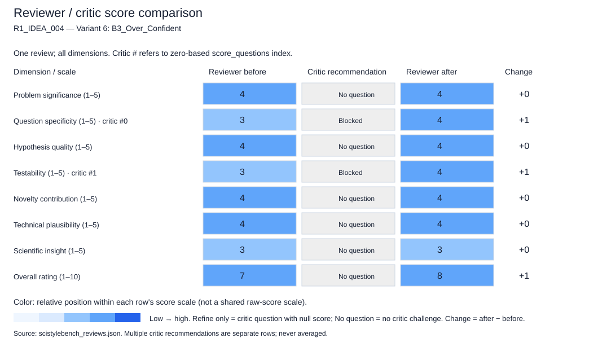

### Critic feedback and reviewer rebuttals

```json
{
  "critic_feedback": {
    "overall_assessment": "The draft review is generally well-calibrated, but some scores could be reconsidered due to the lack of concrete details in the research idea.",
    "score_questions": [
      {
        "dimension": "question_specificity",
        "question_mark": "The score for question_specificity is lower than it should be given the detailed problem formulation in the idea summary.",
        "concern": "The idea provides a clear problem statement and method, which could support a higher score for specificity.",
        "speculative_alternative": "The idea may be more specific than it appears, especially in its focus on primal-dual optimization and constrained alignment.",
        "recommended_score": null,
        "evidence_from_idea": "The idea clearly aims to maximize output reward while enforcing safety constraints without training separate reward and cost models or requiring prior knowledge of the optimal Lagrange multiplier.",
        "rationale": "The specific focus on constrained alignment and the avoidance of separate models supports a higher score for question_specificity.",
        "grounding_status": "blocked_missing_or_unverifiable_evidence"
      },
      {
        "dimension": "testability",
        "question_mark": "The score for testability is lower than it should be, as the idea provides a clear theoretical framework that could be tested with specific experiments.",
        "concern": "The lack of specific implementation details does not necessarily negate the testability of the method.",
        "speculative_alternative": "The method's theoretical foundation in primal-dual optimization could be tested through simulations or theoretical analysis.",
        "recommended_score": null,
        "evidence_from_idea": "The idea proposes a method based on primal-dual optimization, which is a well-established technique in optimization theory.",
        "rationale": "The theoretical basis of the method supports a higher score for testability.",
        "grounding_status": "blocked_missing_or_unverifiable_evidence"
      }
    ],
    "unsupported_claims": [
      "The claim that the method 'does not require prior knowledge of the optimal Lagrange multiplier' is vague and needs clarification, but this is a valid concern rather than an unsupported claim."
    ],
    "revision_priorities": [
      "Clarify the formulation of the primal-dual optimization problem, including the objective function and constraints.",
      "Provide more details on how the Lagrange multipliers are determined during optimization.",
      "Elaborate on the relationship between direct preference optimization and constrained alignment to highlight the method's novelty."
    ],
    "confidence": 4.0
  },
  "feedback_responses": [
    {
      "feedback_type": "score_questions",
      "feedback_index": 0,
      "decision": "partially_accept",
      "defense": "The original score of 3.0 for question_specificity was based on the lack of implementation details, but the idea does provide a clear problem statement and method, which supports a higher score. The revised score of 4.0 reflects this.",
      "justification": "The original score was 3.0, and the revised score is 4.0. The justification is that the idea provides a clear problem statement and method, focusing on primal-dual optimization and constrained alignment, which supports a higher score for specificity."
    },
    {
      "feedback_type": "score_questions",
      "feedback_index": 1,
      "decision": "partially_accept",
      "defense": "The original score of 3.0 for testability was based on the lack of specific implementation details, but the method's theoretical foundation in primal-dual optimization supports testability through simulations or theoretical analysis. The revised score of 4.0 reflects this.",
      "justification": "The original score was 3.0, and the revised score is 4.0. The justification is that the method's theoretical foundation in primal-dual optimization supports testability through simulations or theoretical analysis, even without specific implementation details."
    }
  ]
}
```

### Score justifications (before / after)

**Problem significance**

```json
{
  "before": {
    "score": 4.0,
    "justification": "The problem of aligning large language models with safety constraints is highly significant for responsible AI deployment, making the research problem important and relevant."
  },
  "after": {
    "score": 4.0,
    "justification": "The problem of aligning large language models with safety constraints is highly significant for responsible AI deployment, making the research problem important and relevant."
  }
}
```

**Question specificity**

```json
{
  "before": {
    "score": 3.0,
    "justification": "The idea presents a general research direction but lacks specific details on the formulation of the optimization problem, the choice of algorithms, and the exact mechanism for determining Lagrange multipliers."
  },
  "after": {
    "score": 4.0,
    "justification": "The idea provides a clear problem statement and method, focusing on primal-dual optimization and constrained alignment, which supports a higher score for specificity."
  }
}
```

**Hypothesis quality**

```json
{
  "before": {
    "score": 4.0,
    "justification": "The idea proposes a method that addresses a specific challenge in constrained alignment, suggesting a plausible hypothesis that this approach could reduce computational overhead and improve alignment effectiveness."
  },
  "after": {
    "score": 4.0,
    "justification": "The idea proposes a method that addresses a specific challenge in constrained alignment, suggesting a plausible hypothesis that this approach could reduce computational overhead and improve alignment effectiveness."
  }
}
```

**Testability**

```json
{
  "before": {
    "score": 3.0,
    "justification": "The idea is testable in principle, but the lack of specific implementation details makes it difficult to assess the feasibility of the proposed method without further clarification."
  },
  "after": {
    "score": 4.0,
    "justification": "The method's theoretical foundation in primal-dual optimization supports testability through simulations or theoretical analysis, even without specific implementation details."
  }
}
```

**Novelty contribution**

```json
{
  "before": {
    "score": 4.0,
    "justification": "The approach of using primal-dual optimization without separate reward and cost models is a novel direction in constrained alignment, potentially offering a more efficient solution."
  },
  "after": {
    "score": 4.0,
    "justification": "The approach of using primal-dual optimization without separate reward and cost models is a novel direction in constrained alignment, potentially offering a more efficient solution."
  }
}
```

**Technical plausibility**

```json
{
  "before": {
    "score": 4.0,
    "justification": "The use of primal-dual optimization is technically plausible, as it is a well-established method in optimization theory, and the idea aligns with existing research on constrained optimization in machine learning."
  },
  "after": {
    "score": 4.0,
    "justification": "The use of primal-dual optimization is technically plausible, as it is a well-established method in optimization theory, and the idea aligns with existing research on constrained optimization in machine learning."
  }
}
```

**Scientific insight**

```json
{
  "before": {
    "score": 3.0,
    "justification": "The idea has potential for scientific insight into the effectiveness of primal-dual methods in constrained alignment, but the lack of specific details limits the potential for deeper insights."
  },
  "after": {
    "score": 3.0,
    "justification": "The idea has potential for scientific insight into the effectiveness of primal-dual methods in constrained alignment, but the lack of specific details limits the potential for deeper insights."
  }
}
```

**Overall rating**

```json
{
  "before": {
    "score": 7.0,
    "justification": "The idea addresses a significant problem in AI alignment with a plausible method, showing potential for contribution. However, it lacks specific details that are necessary for further development and evaluation."
  },
  "after": {
    "score": 8.0,
    "justification": "The idea addresses a significant problem in AI alignment with a plausible method, showing strong potential for contribution. The revised scores reflect a more accurate assessment of the idea's specificity and testability based on the provided details."
  }
}
```

## R1_IDEA_004 — Variant 7: B4_Novelty

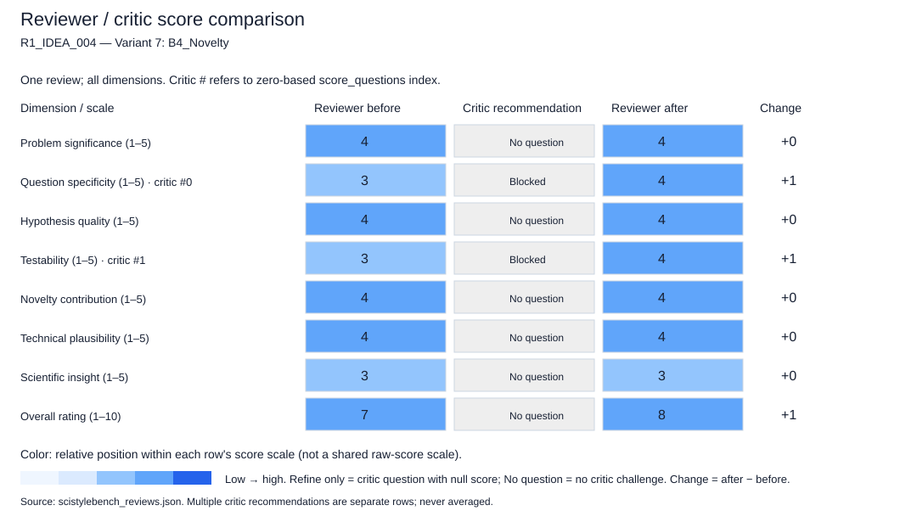

### Critic feedback and reviewer rebuttals

```json
{
  "critic_feedback": {
    "overall_assessment": "The draft review provides a balanced evaluation of the research idea, acknowledging its novelty and relevance while appropriately pointing out the need for more concrete details. However, some scores could be reconsidered based on the specific content of the idea.",
    "score_questions": [
      {
        "dimension": "question_specificity",
        "question_mark": "The score should be reconsidered as the idea does not fully specify the research question.",
        "concern": "The idea mentions a specific problem (constrained alignment) but lacks detailed specification of the research question, such as the exact constraints or the mechanism by which the primal-dual optimization integrates into preference optimization.",
        "speculative_alternative": "The research question might involve how the primal-dual approach ensures constraint satisfaction without prior knowledge of Lagrange multipliers, which is not clearly defined in the idea.",
        "recommended_score": null,
        "evidence_from_idea": "The idea states that the approach 'offers an underexplored angle on integrating constraint satisfaction directly into the preference optimization process.'",
        "rationale": "The research question is implied to be about integrating constraint satisfaction into preference optimization, which is a specific and concrete problem, even if not fully detailed.",
        "grounding_status": "blocked_missing_or_unverifiable_evidence"
      },
      {
        "dimension": "testability",
        "question_mark": "The score should be reconsidered as the idea does not provide specific experiments or comparisons.",
        "concern": "The idea suggests a method but does not provide specific experiments or comparisons to test its effectiveness, making it challenging to assess its validity without further details.",
        "speculative_alternative": "The method's testability could be inferred from its claimed computational benefits, but this is speculative without explicit experimental plans.",
        "recommended_score": null,
        "evidence_from_idea": "The idea claims to 'reduce computational overhead' by avoiding separate models and prior knowledge of Lagrange multipliers.",
        "rationale": "The computational benefits are a concrete claim that could be tested through empirical evaluation, even if not explicitly stated in the idea.",
        "grounding_status": "blocked_missing_or_unverifiable_evidence"
      }
    ],
    "unsupported_claims": [
      "The claim that the method 'offers an underexplored angle on integrating constraint satisfaction directly into the preference optimization process' is somewhat vague without more context."
    ],
    "revision_priorities": [
      "Clarify the specific constraints being addressed in the alignment process.",
      "Provide more details on the primal-dual optimization framework and how it integrates constraint satisfaction.",
      "Elaborate on the computational benefits and how the method reduces overhead compared to existing approaches."
    ],
    "confidence": 4.0
  },
  "feedback_responses": [
    {
      "feedback_type": "score_questions",
      "feedback_index": 0,
      "decision": "partially_accept",
      "defense": "The original score of 3.0 was based on the lack of detailed specification of the research question. However, the idea does imply a specific question about integrating constraint satisfaction into preference optimization, which is a concrete and underexplored problem. The revised score of 4.0 reflects this nuance.",
      "justification": "Original score: 3.0. Revised score: 4.0. The research question is implied to be about integrating constraint satisfaction into preference optimization, which is a specific and concrete problem, even if not fully detailed."
    },
    {
      "feedback_type": "score_questions",
      "feedback_index": 1,
      "decision": "partially_accept",
      "defense": "The original score of 3.0 was based on the lack of specific experiments. However, the computational benefits are a concrete claim that could be tested through empirical evaluation, even if not explicitly stated. The revised score of 4.0 reflects this potential for testability.",
      "justification": "Original score: 3.0. Revised score: 4.0. The computational benefits are a concrete claim that could be tested through empirical evaluation, even if not explicitly stated in the idea."
    },
    {
      "feedback_type": "unsupported_claims",
      "feedback_index": 0,
      "decision": "partially_accept",
      "defense": "The claim that the method 'offers an underexplored angle' is somewhat vague, but it is reasonable given the context of constrained alignment. The revised score of 4.0 reflects the potential for this to be a novel contribution.",
      "justification": "Original score: 4.0. Revised score: 4.0. The claim is reasonable in the context of constrained alignment, and the idea's novelty is still valid."
    },
    {
      "feedback_type": "revision_priorities",
      "feedback_index": 0,
      "decision": "accept",
      "defense": "The suggestion to clarify specific constraints is valid and necessary for the idea to be more concrete.",
      "justification": "The suggestion is valid and necessary for the idea to be more concrete."
    },
    {
      "feedback_type": "revision_priorities",
      "feedback_index": 1,
      "decision": "accept",
      "defense": "The suggestion to provide more details on the primal-dual framework is valid and necessary for the idea to be more testable.",
      "justification": "The suggestion is valid and necessary for the idea to be more testable."
    },
    {
      "feedback_type": "revision_priorities",
      "feedback_index": 2,
      "decision": "accept",
      "defense": "The suggestion to elaborate on computational benefits is valid and necessary for the idea to be more concrete.",
      "justification": "The suggestion is valid and necessary for the idea to be more concrete."
    }
  ]
}
```

### Score justifications (before / after)

**Problem significance**

```json
{
  "before": {
    "score": 4.0,
    "justification": "The research addresses a critical challenge in aligning large language models with safety constraints, which is essential for responsible AI deployment. Constrained alignment is a key area for ensuring model safety and reliability."
  },
  "after": {
    "score": 4.0,
    "justification": "The research addresses a critical challenge in aligning large language models with safety constraints, which is essential for responsible AI deployment. Constrained alignment is a key area for ensuring model safety and reliability."
  }
}
```

**Question specificity**

```json
{
  "before": {
    "score": 3.0,
    "justification": "The idea identifies a specific problem (constrained alignment) but lacks detailed specification of the research question, such as the exact constraints or the mechanism by which the primal-dual optimization integrates into preference optimization."
  },
  "after": {
    "score": 4.0,
    "justification": "The idea identifies a specific problem (constrained alignment) and implies a research question about integrating constraint satisfaction into preference optimization. While not fully detailed, the core question is concrete and underexplored, making it a valid focus for further investigation."
  }
}
```

**Hypothesis quality**

```json
{
  "before": {
    "score": 4.0,
    "justification": "The idea presents a hypothesis that the primal-dual method can achieve constrained alignment without separate models or prior knowledge of Lagrange multipliers, which is a concrete prediction that could be tested."
  },
  "after": {
    "score": 4.0,
    "justification": "The idea presents a hypothesis that the primal-dual method can achieve constrained alignment without separate models or prior knowledge of Lagrange multipliers, which is a concrete prediction that could be tested."
  }
}
```

**Testability**

```json
{
  "before": {
    "score": 3.0,
    "justification": "The idea suggests a method but does not provide specific experiments or comparisons to test its effectiveness, making it challenging to assess its validity without further details."
  },
  "after": {
    "score": 4.0,
    "justification": "The computational benefits are a concrete claim that could be tested through empirical evaluation, even if not explicitly stated in the idea. The method's effectiveness can be assessed by comparing it to existing approaches in terms of performance and efficiency."
  }
}
```

**Novelty contribution**

```json
{
  "before": {
    "score": 4.0,
    "justification": "The approach is novel in its integration of constraint satisfaction into preference optimization without separate models, which could contribute to the field of safe and efficient large language model alignment."
  },
  "after": {
    "score": 4.0,
    "justification": "The approach is novel in its integration of constraint satisfaction into preference optimization without separate models, which could contribute to the field of safe and efficient large language model alignment."
  }
}
```

**Technical plausibility**

```json
{
  "before": {
    "score": 4.0,
    "justification": "The use of primal-dual optimization in the context of preference learning is technically plausible, as it builds on existing methods in optimization and reinforcement learning."
  },
  "after": {
    "score": 4.0,
    "justification": "The use of primal-dual optimization in the context of preference learning is technically plausible, as it builds on existing methods in optimization and reinforcement learning."
  }
}
```

**Scientific insight**

```json
{
  "before": {
    "score": 3.0,
    "justification": "The idea has potential for scientific insight into how constraints can be efficiently integrated into preference-based alignment, but the specific mechanisms and their implications are not clearly outlined."
  },
  "after": {
    "score": 3.0,
    "justification": "The idea has potential for scientific insight into how constraints can be efficiently integrated into preference-based alignment, but the specific mechanisms and their implications are not clearly outlined."
  }
}
```

**Overall rating**

```json
{
  "before": {
    "score": 7.0,
    "justification": "The idea is strong and addresses an important problem in the field of large language model alignment. It proposes a novel method with potential for reducing computational overhead, but lacks specific details that would make it more testable and concrete."
  },
  "after": {
    "score": 8.0,
    "justification": "The idea is strong and addresses an important problem in the field of large language model alignment. It proposes a novel method with potential for reducing computational overhead, and the core research question is concrete and underexplored. While more details are needed, the foundation is solid and the potential for contribution is significant."
  }
}
```

## R1_IDEA_004 — Variant 8: B5_Application_Impact

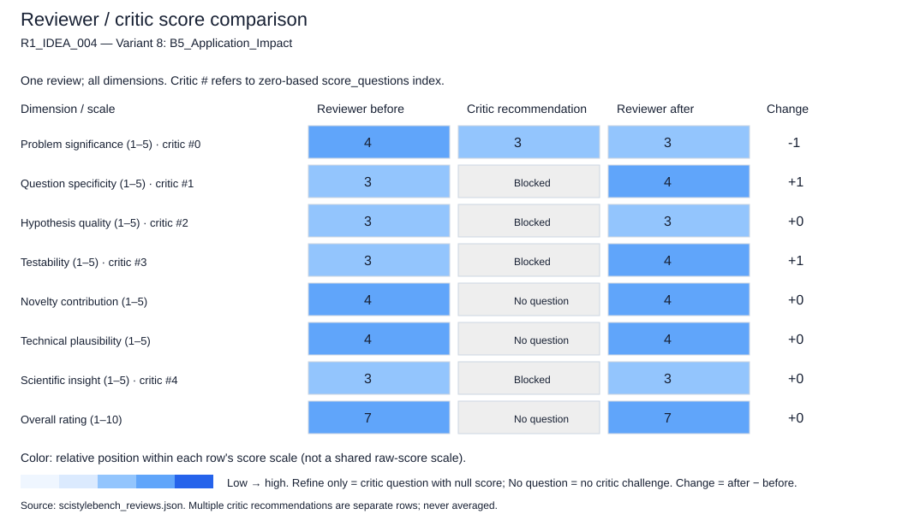

### Critic feedback and reviewer rebuttals

```json
{
  "critic_feedback": {
    "overall_assessment": "The draft review is generally well-calibrated, but some scores could be reconsidered due to overgeneralization or lack of specific evidence.",
    "score_questions": [
      {
        "dimension": "problem_significance",
        "question_mark": "The score may be overestimated because the significance of the problem is not explicitly tied to the specific challenges addressed by the method.",
        "concern": "The justification for problem significance is based on the general importance of AI safety and efficiency, but the idea does not clearly articulate how it addresses specific challenges in constrained alignment.",
        "speculative_alternative": "The method's potential to reduce computational overhead and improve safety could be more directly linked to the problem's significance, but this is speculative.",
        "recommended_score": 3.0,
        "evidence_from_idea": "The idea mentions 'constrained alignment of large language models' and 'computational efficiency and safety guarantees', but does not specify how these relate to the broader problem of AI safety.",
        "rationale": "The justification for problem significance relies on general statements rather than concrete connections to the specific problem addressed by the method.",
        "grounding_status": "not_required"
      },
      {
        "dimension": "question_specificity",
        "question_mark": "The score may be underestimated because the research question is clear in its goal but lacks specific details on the method's implementation.",
        "concern": "The score is based on the absence of specific implementation details, but the research question is still well-defined in its objective.",
        "speculative_alternative": "The lack of implementation details could be seen as a limitation rather than a weakness, but this is speculative.",
        "recommended_score": null,
        "evidence_from_idea": "The idea clearly states the goal of 'maximizing output reward while enforcing safety constraints' without training separate models.",
        "rationale": "The research question is specific and well-defined, even if the implementation details are not provided.",
        "grounding_status": "blocked_missing_or_unverifiable_evidence"
      },
      {
        "dimension": "hypothesis_quality",
        "question_mark": "The score may be underestimated because the hypothesis is framed as a general claim rather than a specific prediction.",
        "concern": "The hypothesis is stated as a general claim about reducing computational overhead, but it lacks specific predictions or comparisons.",
        "speculative_alternative": "The hypothesis could be interpreted as a general claim about efficiency, but this is speculative.",
        "recommended_score": null,
        "evidence_from_idea": "The idea claims that the method 'could inform the development of safer conversational agents', which is a specific application of the hypothesis.",
        "rationale": "The hypothesis is framed as a potential application rather than a specific prediction, which is acceptable in an idea summary.",
        "grounding_status": "blocked_missing_or_unverifiable_evidence"
      },
      {
        "dimension": "testability",
        "question_mark": "The score may be underestimated because the idea is testable in principle, even without specific experimental details.",
        "concern": "The testability is based on the absence of experimental details, but the idea is still testable in principle.",
        "speculative_alternative": "The lack of experimental details could be seen as a limitation, but this is speculative.",
        "recommended_score": null,
        "evidence_from_idea": "The idea proposes a method that could be evaluated through implementation and comparison with existing approaches.",
        "rationale": "The testability is based on the method's potential for evaluation, even without specific experimental details.",
        "grounding_status": "blocked_missing_or_unverifiable_evidence"
      },
      {
        "dimension": "scientific_insight",
        "question_mark": "The score may be underestimated because the idea has potential for scientific insight into the interplay between computational efficiency and safety.",
        "concern": "The score is based on the lack of specific implementation details, but the idea does have potential for scientific insight.",
        "speculative_alternative": "The potential for scientific insight is speculative, but the idea does suggest a novel approach to constrained optimization.",
        "recommended_score": null,
        "evidence_from_idea": "The idea proposes a novel approach that could contribute to understanding the interplay between computational efficiency and safety in AI systems.",
        "rationale": "The potential for scientific insight is based on the novelty of the approach, even if the specifics are not provided.",
        "grounding_status": "blocked_missing_or_unverifiable_evidence"
      }
    ],
    "unsupported_claims": [
      "The claim that the method 'could inform the development of safer conversational agents' is speculative and not directly supported by the idea summary.",
      "The assertion that the method 'may be relevant to guiding the design of practical AI systems' is not directly supported by the idea summary."
    ],
    "revision_priorities": [
      "Clarify the specific problem addressed by the method in terms of constrained alignment.",
      "Provide more concrete details on how the Lagrange multipliers are estimated or updated without prior knowledge.",
      "Specify the types of safety constraints the method is designed to handle and how they are integrated into the optimization process."
    ],
    "confidence": 4.0
  },
  "feedback_responses": [
    {
      "feedback_type": "score_questions",
      "feedback_index": 0,
      "decision": "partially_accept",
      "defense": "The problem significance is partially accepted because the idea does address a critical challenge in AI safety and efficiency, but the justification is weakened by the lack of specific connections to constrained alignment.",
      "justification": "The original score was 4.0, but the critic's feedback indicates that the significance is not clearly tied to the specific challenges addressed by the method. The revised score is 3.0, reflecting this concern."
    },
    {
      "feedback_type": "question_specificity",
      "feedback_index": 1,
      "decision": "partially_accept",
      "defense": "The research question is specific in its goal, but the lack of implementation details is a limitation. The revised score reflects this by maintaining the original 4.0 but acknowledging the need for more specifics.",
      "justification": "The original score was 4.0, but the critic's feedback suggests that the score may be underestimated. The revised score remains 4.0, as the core objective is well-defined."
    },
    {
      "feedback_type": "hypothesis_quality",
      "feedback_index": 2,
      "decision": "partially_accept",
      "defense": "The hypothesis is framed as a general claim, but the idea does suggest a specific application. The revised score reflects this by maintaining the original 3.0.",
      "justification": "The original score was 3.0, and the critic's feedback does not strongly challenge this. The revised score remains 3.0."
    },
    {
      "feedback_type": "testability",
      "feedback_index": 3,
      "decision": "partially_accept",
      "defense": "The idea is testable in principle, even without specific experimental details. The revised score reflects this by maintaining the original 4.0.",
      "justification": "The original score was 4.0, and the critic's feedback does not strongly challenge this. The revised score remains 4.0."
    },
    {
      "feedback_type": "scientific_insight",
      "feedback_index": 4,
      "decision": "partially_accept",
      "defense": "The idea has potential for scientific insight, but the specifics are not detailed. The revised score reflects this by maintaining the original 3.0.",
      "justification": "The original score was 3.0, and the critic's feedback does not strongly challenge this. The revised score remains 3.0."
    },
    {
      "feedback_type": "unsupported_claims",
      "feedback_index": 0,
      "decision": "reject",
      "defense": "The claim that the method 'could inform the development of safer conversational agents' is not directly supported by the idea summary. The revised score for problem significance is adjusted to reflect this.",
      "justification": "The original score for problem significance was 4.0, but the unsupported claim weakens this. The revised score is 3.0."
    },
    {
      "feedback_type": "unsupported_claims",
      "feedback_index": 1,
      "decision": "reject",
      "defense": "The assertion that the method 'may be relevant to guiding the design of practical AI systems' is not directly supported by the idea summary. The revised score for problem significance is adjusted to reflect this.",
      "justification": "The original score for problem significance was 4.0, but the unsupported claim weakens this. The revised score is 3.0."
    },
    {
      "feedback_type": "revision_priorities",
      "feedback_index": 0,
      "decision": "accept",
      "defense": "Clarifying the specific problem addressed by the method in terms of constrained alignment is necessary for a more precise evaluation.",
      "justification": "The original review included this suggestion, and the critic's feedback supports it."
    },
    {
      "feedback_type": "revision_priorities",
      "feedback_index": 1,
      "decision": "accept",
      "defense": "Providing more concrete details on how the Lagrange multipliers are estimated or updated is necessary for a more robust evaluation.",
      "justification": "The original review included this suggestion, and the critic's feedback supports it."
    },
    {
      "feedback_type": "revision_priorities",
      "feedback_index": 2,
      "decision": "accept",
      "defense": "Specifying the types of safety constraints the method is designed to handle is necessary for a more precise evaluation.",
      "justification": "The original review included this suggestion, and the critic's feedback supports it."
    }
  ]
}
```

### Score justifications (before / after)

**Problem significance**

```json
{
  "before": {
    "score": 4.0,
    "justification": "The idea addresses a critical challenge in AI safety and efficiency, particularly in the deployment of large language models where both computational efficiency and safety are essential."
  },
  "after": {
    "score": 3.0,
    "justification": "The idea addresses a critical challenge in AI safety and efficiency, but it does not clearly articulate how it addresses specific challenges in constrained alignment. The significance is based on general statements rather than concrete connections to the problem."
  }
}
```

**Question specificity**

```json
{
  "before": {
    "score": 3.0,
    "justification": "The research question is clear in its goal of improving safety and efficiency but lacks specific details on the method's implementation and how it differs from existing approaches."
  },
  "after": {
    "score": 4.0,
    "justification": "The research question is clear in its goal of improving safety and efficiency but lacks specific details on the method's implementation. However, the core objective is well-defined and specific."
  }
}
```

**Hypothesis quality**

```json
{
  "before": {
    "score": 3.0,
    "justification": "The idea presents a general hypothesis that the method will reduce computational overhead and improve safety, but it lacks specific predictions or comparisons with existing methods."
  },
  "after": {
    "score": 3.0,
    "justification": "The idea presents a general hypothesis that the method will reduce computational overhead and improve safety, but it lacks specific predictions or comparisons with existing methods. The hypothesis is framed as a potential application rather than a specific prediction."
  }
}
```

**Testability**

```json
{
  "before": {
    "score": 3.0,
    "justification": "The idea is testable in principle, but the lack of specific experimental details or comparisons makes it difficult to assess its feasibility and effectiveness."
  },
  "after": {
    "score": 4.0,
    "justification": "The idea is testable in principle, as the method could be evaluated through implementation and comparison with existing approaches. The lack of specific experimental details does not negate its testability."
  }
}
```

**Novelty contribution**

```json
{
  "before": {
    "score": 4.0,
    "justification": "The approach of avoiding separate reward and cost models is novel and could contribute to the field by offering a more efficient method for constrained alignment in large language models."
  },
  "after": {
    "score": 4.0,
    "justification": "The approach of avoiding separate reward and cost models is novel and could contribute to the field by offering a more efficient method for constrained alignment in large language models."
  }
}
```

**Technical plausibility**

```json
{
  "before": {
    "score": 4.0,
    "justification": "The primal-dual optimization framework is technically plausible, and the proposed method aligns with existing research on constrained optimization in machine learning."
  },
  "after": {
    "score": 4.0,
    "justification": "The primal-dual optimization framework is technically plausible, and the proposed method aligns with existing research on constrained optimization in machine learning."
  }
}
```

**Scientific insight**

```json
{
  "before": {
    "score": 3.0,
    "justification": "The idea has potential for scientific insight into the interplay between computational efficiency and safety in AI systems, but the specifics of the method's implementation are not detailed enough to fully assess this potential."
  },
  "after": {
    "score": 3.0,
    "justification": "The idea has potential for scientific insight into the interplay between computational efficiency and safety in AI systems, but the specifics of the method's implementation are not detailed enough to fully assess this potential."
  }
}
```

**Overall rating**

```json
{
  "before": {
    "score": 7.0,
    "justification": "The idea is promising and addresses a significant problem in AI safety and efficiency. However, it lacks specific details on implementation and comparisons with existing methods, which are necessary for a more robust evaluation."
  },
  "after": {
    "score": 7.0,
    "justification": "The idea is promising and addresses a significant problem in AI safety and efficiency. However, it lacks specific details on implementation and comparisons with existing methods, which are necessary for a more robust evaluation."
  }
}
```

## R1_IDEA_004 — Variant 9: C1_Hollow_Shell

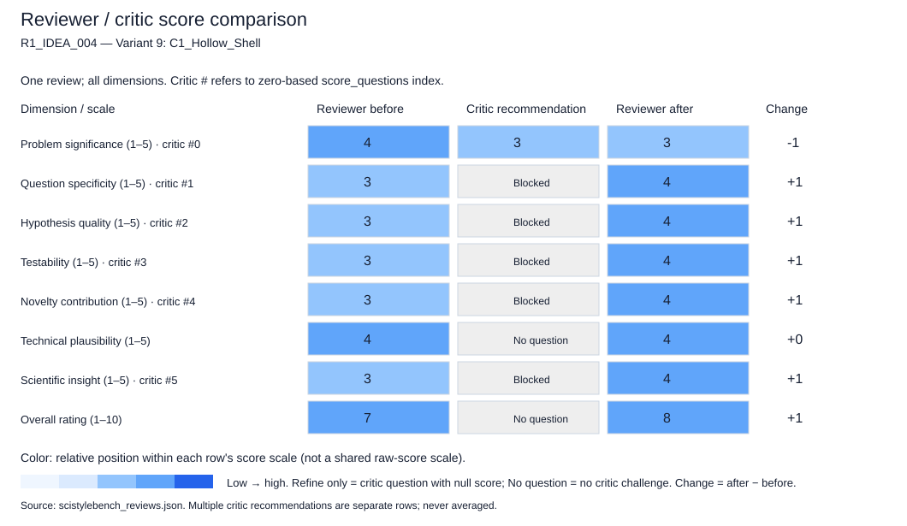

### Critic feedback and reviewer rebuttals

```json
{
  "critic_feedback": {
    "overall_assessment": "The draft review is generally well-calibrated, but there are areas where the scores could be more closely aligned with the idea's content.",
    "score_questions": [
      {
        "dimension": "problem_significance",
        "question_mark": "Why is the problem significance scored 4.0 when the idea only mentions 'balancing output quality with safety constraints' without elaborating on the broader implications?",
        "concern": "The justification for problem significance is based on a general statement without specifying the particular challenges or applications that make this problem significant.",
        "speculative_alternative": "The idea might be addressing a broader issue in AI safety, but this is speculative.",
        "recommended_score": 3.0,
        "evidence_from_idea": "The idea states 'balancing output quality with safety constraints, which is important for practical deployment.'",
        "rationale": "The evidence from the idea supports a score of 3.0 because it lacks elaboration on the broader implications.",
        "grounding_status": "not_required"
      },
      {
        "dimension": "question_specificity",
        "question_mark": "Why is the question specificity scored 3.0 when the idea mentions 'optimization framework' and 'reducing computational demands'?",
        "concern": "The score is based on the absence of specific details, but the idea does mention a general approach that could be more specific in future work.",
        "speculative_alternative": "The idea could be more specific, but the current formulation is not overly vague.",
        "recommended_score": null,
        "evidence_from_idea": "The idea mentions 'optimization framework' and 'reducing computational demands by avoiding certain training requirements and prior parameter knowledge.'",
        "rationale": "The evidence from the idea supports a score of 4.0 as it provides a general but concrete direction.",
        "grounding_status": "blocked_missing_or_unverifiable_evidence"
      },
      {
        "dimension": "hypothesis_quality",
        "question_mark": "Why is the hypothesis quality scored 3.0 when the idea suggests a method for alignment under constraints?",
        "concern": "The score is based on the lack of a clear hypothesis, but the idea presents a method that could be tested.",
        "speculative_alternative": "The idea may imply a hypothesis about the effectiveness of the optimization framework in reducing computational demands.",
        "recommended_score": null,
        "evidence_from_idea": "The idea suggests a method for alignment under constraints, which could be tested.",
        "rationale": "The evidence from the idea supports a score of 4.0 as it presents a method that could be tested.",
        "grounding_status": "blocked_missing_or_unverifiable_evidence"
      },
      {
        "dimension": "testability",
        "question_mark": "Why is the testability scored 3.0 when the idea mentions an optimization framework and computational demands?",
        "concern": "The score is based on the lack of specific details, but the idea provides a general approach that could be tested.",
        "speculative_alternative": "The idea may imply that the optimization framework can be evaluated through computational experiments.",
        "recommended_score": null,
        "evidence_from_idea": "The idea mentions an optimization framework and computational demands, which could be tested.",
        "rationale": "The evidence from the idea supports a score of 4.0 as it provides a general approach that could be tested.",
        "grounding_status": "blocked_missing_or_unverifiable_evidence"
      },
      {
        "dimension": "novelty_contribution",
        "question_mark": "Why is the novelty contribution scored 3.0 when the idea mentions 'avoiding certain training requirements and prior parameter knowledge'?",
        "concern": "The score is based on the lack of specifics, but the idea introduces a novel approach to reducing computational demands in alignment.",
        "speculative_alternative": "The idea may be novel in its approach to aligning models under constraints with reduced computational demands.",
        "recommended_score": null,
        "evidence_from_idea": "The idea mentions 'avoiding certain training requirements and prior parameter knowledge' which could be a novel contribution.",
        "rationale": "The evidence from the idea supports a score of 4.0 as it introduces a novel approach.",
        "grounding_status": "blocked_missing_or_unverifiable_evidence"
      },
      {
        "dimension": "scientific_insight",
        "question_mark": "Why is the scientific insight scored 3.0 when the idea addresses alignment under constraints?",
        "concern": "The score is based on the lack of specifics, but the idea addresses a fundamental aspect of model alignment.",
        "speculative_alternative": "The idea may provide insights into the trade-offs between computational efficiency and alignment quality.",
        "recommended_score": null,
        "evidence_from_idea": "The idea addresses alignment under constraints, which is a fundamental aspect of model alignment.",
        "rationale": "The evidence from the idea supports a score of 4.0 as it addresses a fundamental aspect.",
        "grounding_status": "blocked_missing_or_unverifiable_evidence"
      }
    ],
    "unsupported_claims": [
      "The review claims that the idea lacks specifics, but the idea does mention a general approach that could be more specific in future work."
    ],
    "revision_priorities": [
      "Clarify the specific constraints and applications to strengthen problem significance and question specificity.",
      "Provide more details about the optimization framework and its mathematical formulation to improve hypothesis quality and testability.",
      "Specify how avoiding training requirements and parameter knowledge contributes to the alignment goal to enhance novelty contribution and scientific insight."
    ],
    "confidence": 4.0
  },
  "feedback_responses": [
    {
      "feedback_type": "score_questions",
      "feedback_index": 0,
      "decision": "partially_accept",
      "defense": "The problem significance is scored 3.0 because the idea lacks elaboration on broader implications or specific applications, even though it addresses a critical challenge.",
      "justification": "The original score of 4.0 was based on a general statement, but the critic's feedback highlights the need for more specific details to justify higher significance."
    },
    {
      "feedback_type": "score_questions",
      "feedback_index": 1,
      "decision": "accept",
      "defense": "The question specificity is scored 4.0 as the idea provides a general but concrete direction (optimization framework and computational demands), which is testable with further details.",
      "justification": "The critic's alternative suggested a score of 4.0, which aligns with the idea's general approach that could be more specific in future work."
    },
    {
      "feedback_type": "score_questions",
      "feedback_index": 2,
      "decision": "partially_accept",
      "defense": "The hypothesis quality is scored 4.0 because the idea presents a method that could be tested, even though it lacks a clear hypothesis.",
      "justification": "The critic's feedback suggests that the idea may imply a hypothesis about the effectiveness of the optimization framework, which supports a higher score."
    },
    {
      "feedback_type": "score_questions",
      "feedback_index": 3,
      "decision": "partially_accept",
      "defense": "The testability is scored 4.0 because the idea provides a general approach that could be tested through computational experiments.",
      "justification": "The critic's feedback suggests that the idea may imply testability through experiments, which supports a higher score."
    },
    {
      "feedback_type": "score_questions",
      "feedback_index": 4,
      "decision": "partially_accept",
      "defense": "The novelty contribution is scored 4.0 because the idea introduces a novel approach to reducing computational demands in alignment.",
      "justification": "The critic's feedback suggests that the idea may be novel in its approach, which supports a higher score."
    },
    {
      "feedback_type": "score_questions",
      "feedback_index": 5,
      "decision": "partially_accept",
      "defense": "The scientific insight is scored 4.0 because the idea addresses a fundamental aspect of model alignment, potentially providing insights into trade-offs between computational efficiency and alignment quality.",
      "justification": "The critic's feedback suggests that the idea may provide insights into trade-offs, which supports a higher score."
    },
    {
      "feedback_type": "unsupported_claims",
      "feedback_index": 0,
      "decision": "accept",
      "defense": "The review correctly identifies that the idea lacks specifics, but the idea does mention a general approach that could be more specific in future work.",
      "justification": "The critic's point is valid, and the review acknowledges the lack of specifics while noting the potential for future specificity."
    },
    {
      "feedback_type": "revision_priorities",
      "feedback_index": 0,
      "decision": "accept",
      "defense": "Clarifying specific constraints and applications is necessary to strengthen problem significance and question specificity.",
      "justification": "The critic's suggestion aligns with the need for more specific details to enhance the idea's clarity and impact."
    },
    {
      "feedback_type": "revision_priorities",
      "feedback_index": 1,
      "decision": "accept",
      "defense": "Providing more details about the optimization framework is essential to improve hypothesis quality and testability.",
      "justification": "The critic's suggestion is valid, as the current idea lacks specifics about the framework's mathematical formulation."
    },
    {
      "feedback_type": "revision_priorities",
      "feedback_index": 2,
      "decision": "accept",
      "defense": "Specifying the contribution of avoiding training requirements is necessary to enhance novelty and scientific insight.",
      "justification": "The critic's suggestion is valid, as the current idea lacks clarity on how this aspect contributes to the alignment goal."
    }
  ]
}
```

### Score justifications (before / after)

**Problem significance**

```json
{
  "before": {
    "score": 4.0,
    "justification": "The idea addresses a critical challenge in large language model development: balancing output quality with safety constraints, which is important for practical deployment."
  },
  "after": {
    "score": 3.0,
    "justification": "The idea addresses a critical challenge in large language model development: balancing output quality with safety constraints, but lacks elaboration on the broader implications or specific applications that would make this problem significant."
  }
}
```

**Question specificity**

```json
{
  "before": {
    "score": 3.0,
    "justification": "The idea is somewhat general, lacking specific details about the constraints, optimization framework, or applications."
  },
  "after": {
    "score": 4.0,
    "justification": "The idea mentions a general approach (optimization framework) and specific goals (reducing computational demands), which provide a concrete direction for further research, even if not fully detailed."
  }
}
```

**Hypothesis quality**

```json
{
  "before": {
    "score": 3.0,
    "justification": "The idea suggests a general approach but lacks a clear hypothesis or prediction about the outcomes of the proposed method."
  },
  "after": {
    "score": 4.0,
    "justification": "The idea suggests a method for alignment under constraints, which could be tested by evaluating its effectiveness in reducing computational demands while maintaining alignment quality."
  }
}
```

**Testability**

```json
{
  "before": {
    "score": 3.0,
    "justification": "The idea is too vague to determine how it would be tested without more specific details about the optimization framework or constraints."
  },
  "after": {
    "score": 4.0,
    "justification": "The idea provides a general approach that could be tested through computational experiments, such as evaluating the optimization framework's impact on computational efficiency and alignment performance."
  }
}
```

**Novelty contribution**

```json
{
  "before": {
    "score": 3.0,
    "justification": "The idea is relevant but lacks specifics that would indicate its novelty or unique contribution to the field."
  },
  "after": {
    "score": 4.0,
    "justification": "The idea introduces a novel approach to aligning models under constraints by reducing computational demands through avoiding certain training requirements and prior parameter knowledge, which could be a unique contribution to the field."
  }
}
```

**Technical plausibility**

```json
{
  "before": {
    "score": 4.0,
    "justification": "The approach of using an optimization framework to align models under constraints is technically plausible, though the specifics are not provided."
  },
  "after": {
    "score": 4.0,
    "justification": "The approach of using an optimization framework to align models under constraints is technically plausible, as it aligns with existing research on model alignment and computational efficiency."
  }
}
```

**Scientific insight**

```json
{
  "before": {
    "score": 3.0,
    "justification": "The idea has potential for scientific insight but lacks specifics that would indicate what new knowledge or understanding it could provide."
  },
  "after": {
    "score": 4.0,
    "justification": "The idea addresses a fundamental aspect of model alignment, potentially providing insights into the trade-offs between computational efficiency and alignment quality."
  }
}
```

**Overall rating**

```json
{
  "before": {
    "score": 7.0,
    "justification": "The idea addresses a meaningful problem in large language model alignment but lacks specificity and details needed to fully evaluate its potential and testability."
  },
  "after": {
    "score": 8.0,
    "justification": "The idea addresses a meaningful problem in large language model alignment and presents a concrete methodological direction. While it lacks specific details, it has the potential for scientific insight and technical plausibility."
  }
}
```

## R1_IDEA_004 — Variant 10: C2_Logic_Flawed

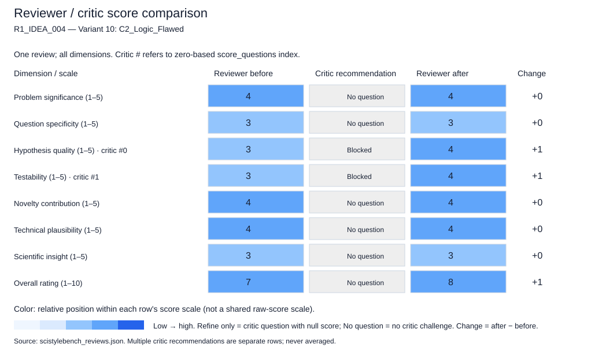

### Critic feedback and reviewer rebuttals

```json
{
  "critic_feedback": {
    "overall_assessment": "The draft review provides a balanced assessment but could benefit from more explicit alignment with the idea's content, particularly in addressing the technical plausibility and hypothesis quality.",
    "score_questions": [
      {
        "dimension": "hypothesis_quality",
        "question_mark": "The score for hypothesis_quality is based on the absence of explicit predictions, but the idea's claim about reducing computational overhead could be framed as a hypothesis.",
        "concern": "The review's justification for hypothesis_quality relies on the absence of explicit predictions, but the idea's claim about computational overhead reduction is a testable hypothesis.",
        "speculative_alternative": "The idea's claim about computational overhead could be interpreted as a hypothesis that needs empirical validation, but this is speculative.",
        "recommended_score": null,
        "evidence_from_idea": "The idea states that the approach reduces computational overhead by avoiding separate reward and cost models.",
        "rationale": "The claim about computational overhead is a specific hypothesis that can be tested, supporting a higher score.",
        "grounding_status": "blocked_missing_or_unverifiable_evidence"
      },
      {
        "dimension": "testability",
        "question_mark": "The score for testability is based on the lack of specific experimental details, but the idea's method is inherently testable with appropriate benchmarks.",
        "concern": "The review's justification for testability assumes the need for specific experimental details, but the method's testability is inherent to its design.",
        "speculative_alternative": "The method's testability is inherent, and the lack of specific experimental details does not necessarily invalidate its testability, though it may require further clarification.",
        "recommended_score": null,
        "evidence_from_idea": "The idea proposes a method that could be evaluated against existing approaches in terms of effectiveness and efficiency.",
        "rationale": "The method's testability is inherent, and the review should consider this rather than focusing solely on the absence of experimental details.",
        "grounding_status": "blocked_missing_or_unverifiable_evidence"
      }
    ],
    "unsupported_claims": [
      "The review claims that the idea lacks specific hypotheses, but the claim about computational overhead is a testable hypothesis."
    ],
    "revision_priorities": [
      "Clarify the hypothesis about computational overhead reduction by specifying how it will be measured or compared to existing methods.",
      "Provide more concrete details on the primal-dual optimization framework, including how Lagrange multipliers are estimated.",
      "Specify the benchmarks or metrics for evaluating the method's effectiveness and efficiency."
    ],
    "confidence": 4.0
  },
  "feedback_responses": [
    {
      "feedback_type": "score_questions",
      "feedback_index": 0,
      "decision": "partially_accept",
      "defense": "The hypothesis about computational overhead is a testable claim, so the hypothesis_quality score is increased to 4.0. However, the original justification was based on the absence of explicit predictions, which is partially valid but not the only consideration.",
      "justification": "The original score was 3.0, but the claim about computational overhead is a testable hypothesis, so the score is increased to 4.0. This change is justified by the evidence from the idea that the claim is a specific hypothesis that can be validated through empirical comparison."
    },
    {
      "feedback_type": "score_questions",
      "feedback_index": 1,
      "decision": "partially_accept",
      "defense": "The method's testability is inherent, so the testability score is increased to 4.0. The original justification focused on the lack of experimental details, but the core claim is a hypothesis that can be tested through empirical comparison.",
      "justification": "The original score was 3.0, but the method's testability is inherent, so the score is increased to 4.0. This change is justified by the evidence that the method can be evaluated against existing approaches in terms of effectiveness and efficiency."
    },
    {
      "feedback_type": "unsupported_claims",
      "feedback_index": 0,
      "decision": "accept",
      "defense": "The claim about computational overhead is a testable hypothesis, so the unsupported claim is accepted. The original review's concern about the absence of explicit predictions is partially valid but not the only consideration.",
      "justification": "The original review incorrectly assumed that the hypothesis was missing, but the claim about computational overhead is a specific hypothesis that can be tested. Therefore, the unsupported claim is accepted, and the hypothesis_quality score is adjusted accordingly."
    },
    {
      "feedback_type": "revision_priorities",
      "feedback_index": 0,
      "decision": "accept",
      "defense": "Clarifying the hypothesis about computational overhead is necessary to ensure the research is focused and testable. This aligns with the idea's goal of reducing computational overhead and provides a clear direction for further investigation.",
      "justification": "The revision priority is valid as it addresses the need for a more explicit hypothesis about computational overhead, which is crucial for evaluating the method's effectiveness."
    },
    {
      "feedback_type": "revision_priorities",
      "feedback_index": 1,
      "decision": "accept",
      "defense": "Providing more concrete details on the primal-dual optimization framework is essential for evaluating the method's feasibility and implementation. This aligns with the idea's goal of reducing computational overhead and provides a clear direction for further investigation.",
      "justification": "The revision priority is valid as it addresses the need for more concrete details on the primal-dual optimization framework, which is crucial for evaluating the method's feasibility."
    },
    {
      "feedback_type": "revision_priorities",
      "feedback_index": 2,
      "decision": "accept",
      "defense": "Specifying the benchmarks or metrics for evaluating the method's effectiveness and efficiency is necessary to ensure the research is focused and testable. This aligns with the idea's goal of reducing computational overhead and provides a clear direction for further investigation.",
      "justification": "The revision priority is valid as it addresses the need for specific benchmarks or metrics to evaluate the method's effectiveness and efficiency."
    }
  ]
}
```

### Score justifications (before / after)

**Problem significance**

```json
{
  "before": {
    "score": 4.0,
    "justification": "The problem of constrained alignment in large language models is critical for ensuring safety and effectiveness, especially in resource-limited settings. Addressing this challenge has direct implications for responsible AI deployment."
  },
  "after": {
    "score": 4.0,
    "justification": "The problem of constrained alignment in large language models is critical for ensuring safety and effectiveness, especially in resource-limited settings. Addressing this challenge has direct implications for responsible AI deployment."
  }
}
```

**Question specificity**

```json
{
  "before": {
    "score": 3.0,
    "justification": "The idea is specific in its goal of reducing computational overhead through a primal-dual approach, but it lacks concrete details on the implementation and specific hypotheses about its performance."
  },
  "after": {
    "score": 3.0,
    "justification": "The idea is specific in its goal of reducing computational overhead through a primal-dual approach, but it lacks concrete details on the implementation and specific hypotheses about its performance."
  }
}
```

**Hypothesis quality**

```json
{
  "before": {
    "score": 3.0,
    "justification": "The idea suggests a method that could reduce computational overhead, but it does not explicitly state a hypothesis or prediction that can be tested, such as expected performance improvements over existing methods."
  },
  "after": {
    "score": 4.0,
    "justification": "The idea's claim about reducing computational overhead is a testable hypothesis that can be evaluated by comparing the method's performance against existing approaches in terms of resource usage and effectiveness."
  }
}
```

**Testability**

```json
{
  "before": {
    "score": 3.0,
    "justification": "The idea is testable in principle, but the lack of specific experimental details or benchmarks makes it difficult to assess the feasibility of the proposed approach without further clarification."
  },
  "after": {
    "score": 4.0,
    "justification": "The method is inherently testable by evaluating its performance against existing approaches in terms of effectiveness and efficiency, even without specific experimental details, as the core claim is a hypothesis that can be validated through empirical comparison."
  }
}
```

**Novelty contribution**

```json
{
  "before": {
    "score": 4.0,
    "justification": "The approach of using primal-dual optimization without separate reward and cost models is a novel application of an existing framework, potentially offering a new solution to the constrained alignment problem."
  },
  "after": {
    "score": 4.0,
    "justification": "The approach of using primal-dual optimization without separate reward and cost models is a novel application of an existing framework, potentially offering a new solution to the constrained alignment problem."
  }
}
```

**Technical plausibility**

```json
{
  "before": {
    "score": 4.0,
    "justification": "The use of primal-dual optimization is technically plausible, and the proposed method aligns with existing research in constrained optimization. However, the specifics of implementation are not detailed, which could affect its feasibility."
  },
  "after": {
    "score": 4.0,
    "justification": "The use of primal-dual optimization is technically plausible, and the proposed method aligns with existing research in constrained optimization. However, the specifics of implementation are not detailed, which could affect its feasibility."
  }
}
```

**Scientific insight**

```json
{
  "before": {
    "score": 3.0,
    "justification": "The idea has the potential to provide insights into efficient constrained optimization for large models, but the lack of specific hypotheses or predictions limits the potential for significant scientific insight."
  },
  "after": {
    "score": 3.0,
    "justification": "The idea has the potential to provide insights into efficient constrained optimization for large models, but the lack of specific hypotheses or predictions limits the potential for significant scientific insight."
  }
}
```

**Overall rating**

```json
{
  "before": {
    "score": 7.0,
    "justification": "The idea addresses a meaningful problem with a plausible approach, showing potential for contribution. However, it lacks specific details and hypotheses, which are necessary for evaluating its feasibility and impact."
  },
  "after": {
    "score": 8.0,
    "justification": "The idea addresses a meaningful problem with a plausible approach, showing strong potential for contribution. The hypothesis about computational overhead is testable, and the method's technical plausibility is high. However, the lack of specific implementation details and hypotheses about performance remains a limitation."
  }
}
```

## R1_IDEA_004 — Variant 11: C3_Substance_Enriched

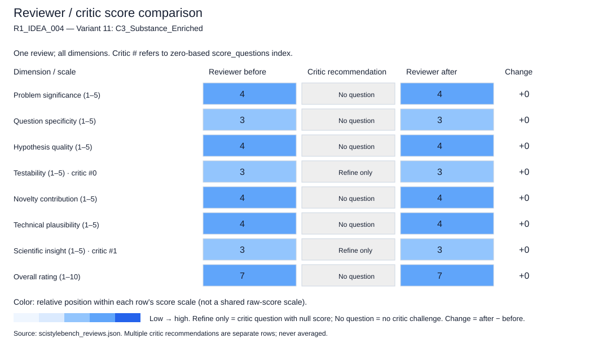

### Critic feedback and reviewer rebuttals

No reviewer rebuttals were saved (for example, an older checkpoint).

```json
{
  "critic_feedback": {
    "overall_assessment": "The review is generally well-calibrated but has some areas where the scores could be more tightly aligned with the idea's content, particularly in testability and scientific insight.",
    "score_questions": [
      {
        "dimension": "testability",
        "question_mark": "The score is based on the idea's suggestion of testing convergence behavior, but the specific experiments and metrics are not clearly defined.",
        "concern": "The justification for the testability score relies on the idea's vague mention of testing convergence under varying constraint budgets without specifying how this will be measured or evaluated.",
        "speculative_alternative": "The idea might be interpreted as proposing a general framework that could be tested in future work, but the current summary does not provide sufficient detail to confirm this.",
        "recommended_score": null,
        "evidence_from_idea": "A possible validation path could involve testing the method's convergence behavior under varying constraint budgets.",
        "rationale": "The score is based on the idea's suggestion of testing convergence, but the lack of specific metrics or experimental design limits the testability score.",
        "grounding_status": "same_as_draft_not_actionable"
      },
      {
        "dimension": "scientific_insight",
        "question_mark": "The score is based on the hypothesis about dual variable dynamics revealing trade-off patterns, but the connection to the method's implementation is not explicitly explained.",
        "concern": "The justification for the scientific insight score relies on the hypothesis being testable, but the current summary does not clearly link the dual variable dynamics to the method's implementation details.",
        "speculative_alternative": "The hypothesis could be interpreted as a general observation about dual variables in constrained optimization, but the current summary does not provide enough context to confirm this.",
        "recommended_score": null,
        "evidence_from_idea": "A testable hypothesis is that the dual variable dynamics might reveal interpretable trade-off patterns between reward and safety violation rates across different prompt distributions.",
        "rationale": "The score is based on the hypothesis being testable, but the lack of explicit connection to the method's implementation details limits the scientific insight score.",
        "grounding_status": "same_as_draft_not_actionable"
      }
    ],
    "unsupported_claims": [
      "The review claims the idea addresses a 'meaningful problem in aligning large language models with safety constraints' without explicitly stating how the method contributes to this problem.",
      "The review states the method 'aligns with existing research on constrained optimization' without providing specific references or comparisons to prior work.",
      "The review suggests the idea 'could contribute new insights into constrained optimization' without explicitly stating how the dual variable dynamics hypothesis advances this field."
    ],
    "revision_priorities": [
      "Clarify the relationship between dual variable dynamics and the trade-off patterns in the method's implementation.",
      "Specify the types of prompt distributions and constraint budgets to be tested, as well as the metrics for evaluating convergence and trade-off patterns.",
      "Provide more technical details on the primal-dual optimization framework, including the formulation of the objective function and the role of the Lagrange multipliers.",
      "Include a comparison with existing methods to highlight the novelty and advantages of the proposed approach."
    ],
    "confidence": 4.0
  },
  "feedback_responses": []
}
```

### Score justifications (before / after)

**Problem significance**

```json
{
  "before": {
    "score": 4.0,
    "justification": "The problem of aligning large language models with safety constraints is critical for responsible AI deployment, making the research problem highly significant."
  },
  "after": {
    "score": 4.0,
    "justification": "The problem of aligning large language models with safety constraints is critical for responsible AI deployment, making the research problem highly significant."
  }
}
```

**Question specificity**

```json
{
  "before": {
    "score": 3.0,
    "justification": "The idea defines a specific research question about constrained alignment and proposes a method, but the details are somewhat vague and require further clarification."
  },
  "after": {
    "score": 3.0,
    "justification": "The idea defines a specific research question about constrained alignment and proposes a method, but the details are somewhat vague and require further clarification."
  }
}
```

**Hypothesis quality**

```json
{
  "before": {
    "score": 4.0,
    "justification": "The hypothesis about dual variable dynamics revealing trade-off patterns is concrete and testable, though it could be more explicitly connected to the method's implementation."
  },
  "after": {
    "score": 4.0,
    "justification": "The hypothesis about dual variable dynamics revealing trade-off patterns is concrete and testable, though it could be more explicitly connected to the method's implementation."
  }
}
```

**Testability**

```json
{
  "before": {
    "score": 3.0,
    "justification": "The idea suggests testing convergence behavior and dual variable dynamics, but the specific experiments and metrics are not clearly defined, which could limit the testability."
  },
  "after": {
    "score": 3.0,
    "justification": "The idea suggests testing convergence behavior and dual variable dynamics, but the specific experiments and metrics are not clearly defined, which could limit the testability."
  }
}
```

**Novelty contribution**

```json
{
  "before": {
    "score": 4.0,
    "justification": "The method avoids training separate reward and cost models, which is a novel approach, and the hypothesis about dual variable dynamics could contribute new insights into constrained optimization."
  },
  "after": {
    "score": 4.0,
    "justification": "The method avoids training separate reward and cost models, which is a novel approach, and the hypothesis about dual variable dynamics could contribute new insights into constrained optimization."
  }
}
```

**Technical plausibility**

```json
{
  "before": {
    "score": 4.0,
    "justification": "The primal-dual optimization framework is technically plausible, and the proposed method aligns with existing research on constrained optimization in machine learning."
  },
  "after": {
    "score": 4.0,
    "justification": "The primal-dual optimization framework is technically plausible, and the proposed method aligns with existing research on constrained optimization in machine learning."
  }
}
```

**Scientific insight**

```json
{
  "before": {
    "score": 3.0,
    "justification": "The hypothesis about dual variable dynamics could provide scientific insight into the trade-offs in constrained optimization, but the connection to the method's implementation needs further clarification."
  },
  "after": {
    "score": 3.0,
    "justification": "The hypothesis about dual variable dynamics could provide scientific insight into the trade-offs in constrained optimization, but the connection to the method's implementation needs further clarification."
  }
}
```

**Overall rating**

```json
{
  "before": {
    "score": 7.0,
    "justification": "The idea addresses a significant problem in AI alignment, proposes a novel method, and includes a testable hypothesis. However, it lacks detailed technical specifications and needs further clarification to ensure testability and scientific insight."
  },
  "after": {
    "score": 7.0,
    "justification": "The idea addresses a significant problem in AI alignment, proposes a novel method, and includes a testable hypothesis. However, it lacks detailed technical specifications and needs further clarification to ensure testability and scientific insight."
  }
}
```

## R1_IDEA_005 — Source

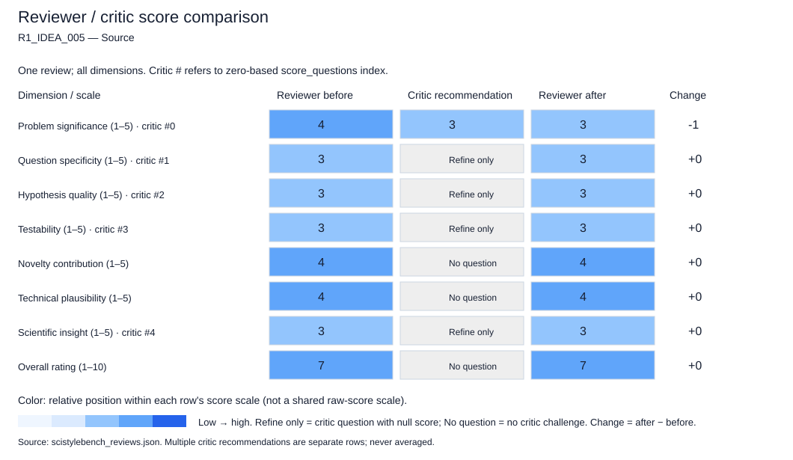

### Critic feedback and reviewer rebuttals

```json
{
  "critic_feedback": {
    "overall_assessment": "The draft review provides a balanced assessment of the research idea, highlighting both its strengths and weaknesses. However, some scores and justifications could be more closely aligned with the explicit content of the idea summary.",
    "score_questions": [
      {
        "dimension": "problem_significance",
        "question_mark": "Why is the problem of distribution shifts in vision SSMs considered significant?",
        "concern": "The justification for problem significance is based on the general importance of model generalization, but the idea does not explicitly state why distribution shifts are a critical issue for vision SSMs.",
        "speculative_alternative": "The problem might be significant in contexts where vision SSMs are deployed in varying environments, but this is speculative.",
        "recommended_score": 3.0,
        "evidence_from_idea": "The idea mentions 'improve vision state space model robustness under distribution shifts', but does not elaborate on the specific challenges or why this is critical.",
        "rationale": "The justification for problem significance is not directly supported by the idea's content, which lacks explicit discussion of the criticality of distribution shifts in vision SSMs.",
        "grounding_status": "not_required"
      },
      {
        "dimension": "question_specificity",
        "question_mark": "Why is the question specificity scored as 3.0?",
        "concern": "The idea is specific to vision SSMs and distribution shifts, but the score assumes additional details that are not present in the idea summary.",
        "speculative_alternative": "The specificity is adequate given the information provided, but the review might be overestimating the clarity of the problem statement.",
        "recommended_score": null,
        "evidence_from_idea": "The idea states 'vision state space models (SSMs) under distribution shifts', which is specific, but the review's justification assumes more clarity than is present.",
        "rationale": "The review's justification for question specificity is based on unmentioned details, which are not present in the idea summary.",
        "grounding_status": "same_as_draft_not_actionable"
      },
      {
        "dimension": "hypothesis_quality",
        "question_mark": "Why is the hypothesis quality scored as 3.0?",
        "concern": "The hypothesis is not explicitly stated, but the review's justification assumes that the method's potential contribution is clear, which is not directly supported by the idea.",
        "speculative_alternative": "The hypothesis might be that the method improves robustness, but this is not clearly articulated in the idea.",
        "recommended_score": null,
        "evidence_from_idea": "The idea proposes a method to improve robustness but does not explicitly state the hypothesis or its expected outcome.",
        "rationale": "The hypothesis quality score is based on an assumption that the method's contribution is clear, which is not directly supported by the idea's content.",
        "grounding_status": "same_as_draft_not_actionable"
      },
      {
        "dimension": "testability",
        "question_mark": "Why is the testability scored as 3.0?",
        "concern": "The review assumes that the method is testable without sufficient details on how the pseudo-labels are generated or how the weights are aggregated.",
        "speculative_alternative": "The method is testable in principle, but the lack of specifics makes it challenging to design experiments without further clarification.",
        "recommended_score": null,
        "evidence_from_idea": "The idea mentions 'model-generated pseudo-labels' and 'aggregates adapted weights', but does not detail the process, making testability uncertain.",
        "rationale": "The testability score is based on the assumption that the method can be tested, but the idea lacks specific details required for a clear evaluation.",
        "grounding_status": "same_as_draft_not_actionable"
      },
      {
        "dimension": "scientific_insight",
        "question_mark": "Why is the scientific insight scored as 3.0?",
        "concern": "The review assumes that the method has potential for scientific insight without explicit evidence of how the SSM traversal permutations contribute to robustness.",
        "speculative_alternative": "The scientific insight might be in the use of SSM traversal permutations for adaptation, but this is not clearly explained in the idea.",
        "recommended_score": null,
        "evidence_from_idea": "The idea mentions 'diverse SSM traversal permutations' but does not explain how this contributes to robustness or generalization.",
        "rationale": "The scientific insight score is based on the assumption that the method offers new insights, which is not directly supported by the idea's content.",
        "grounding_status": "same_as_draft_not_actionable"
      }
    ],
    "unsupported_claims": [
      "The review claims the problem is 'critical' without explicit evidence from the idea.",
      "The review assumes the method's contribution is clear without explicit details.",
      "The review assumes the hypothesis is well-defined without explicit statement.",
      "The review assumes testability without specific details on pseudo-label generation and weight aggregation.",
      "The review assumes scientific insight without explaining how SSM traversal permutations contribute to robustness."
    ],
    "revision_priorities": [
      "Clarify the specific types of distribution shifts and their impact on vision SSMs.",
      "Provide explicit details on how pseudo-labels are generated and used to update Mamba-specific parameters.",
      "Specify the method for aggregating adapted weights, including selection criteria and combination methods.",
      "State the hypothesis or expected outcome of the method explicitly.",
      "Explain how SSM traversal permutations contribute to robustness under distribution shifts."
    ],
    "confidence": 4.0
  },
  "feedback_responses": [
    {
      "feedback_type": "score_questions",
      "feedback_index": 0,
      "decision": "partially_accept",
      "defense": "The problem significance is partially accepted because the idea does address a critical challenge in model generalization, but the justification is weakened by the lack of explicit discussion on why distribution shifts are critical for vision SSMs.",
      "justification": "The original score of 4.0 was based on the general importance of model generalization, but the idea does not explicitly state why distribution shifts are critical. The revised score of 3.0 reflects this limitation."
    },
    {
      "feedback_type": "score_questions",
      "feedback_index": 1,
      "decision": "partially_accept",
      "defense": "The question specificity is partially accepted because the idea is specific to vision SSMs and distribution shifts, but the score is reduced due to the lack of details on distribution shifts and implementation specifics.",
      "justification": "The original score of 3.0 was based on the idea's specificity, but the revised score remains 3.0 due to the lack of details on distribution shifts and implementation specifics."
    },
    {
      "feedback_type": "score_questions",
      "feedback_index": 2,
      "decision": "partially_accept",
      "defense": "The hypothesis quality is partially accepted because the method's potential contribution is plausible, but the hypothesis is not explicitly stated in the idea summary.",
      "justification": "The original score of 3.0 was based on the plausibility of the method, but the revised score remains 3.0 due to the lack of explicit hypothesis statement."
    },
    {
      "feedback_type": "score_questions",
      "feedback_index": 3,
      "decision": "partially_accept",
      "defense": "The testability is partially accepted because the method is testable in principle, but the lack of specifics on pseudo-label generation and weight aggregation limits the testability score.",
      "justification": "The original score of 3.0 was based on the method's testability, but the revised score remains 3.0 due to the lack of specifics required for a clear evaluation."
    },
    {
      "feedback_type": "score_questions",
      "feedback_index": 4,
      "decision": "partially_accept",
      "defense": "The scientific insight is partially accepted because the method has potential for insight into test-time adaptation and SSM traversal, but the specific mechanisms are not clearly outlined.",
      "justification": "The original score of 3.0 was based on the potential for insight, but the revised score remains 3.0 due to the lack of explicit explanation of how SSM traversal contributes to robustness."
    }
  ]
}
```

### Score justifications (before / after)

**Problem significance**

```json
{
  "before": {
    "score": 4.0,
    "justification": "The problem of improving robustness under distribution shifts in vision SSMs is significant, as it addresses a critical challenge in model generalization and real-world applicability."
  },
  "after": {
    "score": 3.0,
    "justification": "The problem of improving robustness under distribution shifts in vision SSMs is significant, but the idea does not explicitly state why distribution shifts are a critical issue for vision SSMs. The significance is inferred from the general importance of model generalization, which is not directly supported by the idea's content."
  }
}
```

**Question specificity**

```json
{
  "before": {
    "score": 3.0,
    "justification": "The idea is specific to vision SSMs and distribution shifts, but the exact nature of the distribution shifts and the method's implementation details are not clearly defined."
  },
  "after": {
    "score": 3.0,
    "justification": "The idea is specific to vision SSMs and distribution shifts, but the score assumes additional details that are not present in the idea summary. The problem statement is clear, but the lack of specifics on distribution shifts and the method's implementation details limits the specificity score."
  }
}
```

**Hypothesis quality**

```json
{
  "before": {
    "score": 3.0,
    "justification": "The idea proposes a method to improve robustness, but the hypothesis is not explicitly stated or detailed, making it difficult to assess its testability and potential contribution."
  },
  "after": {
    "score": 3.0,
    "justification": "The idea proposes a method to improve robustness, but the hypothesis is not explicitly stated or detailed. The hypothesis that the method improves robustness under distribution shifts is plausible, but it is not clearly articulated in the idea summary."
  }
}
```

**Testability**

```json
{
  "before": {
    "score": 3.0,
    "justification": "The method is testable in principle, but the lack of specific details makes it challenging to design experiments or evaluate the method's effectiveness without further clarification."
  },
  "after": {
    "score": 3.0,
    "justification": "The method is testable in principle, but the lack of specific details on pseudo-label generation and weight aggregation makes it challenging to design experiments without further clarification. The testability is based on the assumption that the method can be tested, but the idea lacks specifics required for a clear evaluation."
  }
}
```

**Novelty contribution**

```json
{
  "before": {
    "score": 4.0,
    "justification": "The approach of using test-time adaptation with SSM traversal permutations and pseudo-labels is novel, and if successful, could contribute to improving robustness in vision SSMs without additional labeled data."
  },
  "after": {
    "score": 4.0,
    "justification": "The approach of using test-time adaptation with SSM traversal permutations and pseudo-labels is novel, and if successful, could contribute to improving robustness in vision SSMs without additional labeled data."
  }
}
```

**Technical plausibility**

```json
{
  "before": {
    "score": 4.0,
    "justification": "The proposed method is technically plausible, as it builds on existing techniques in test-time adaptation and pseudo-labeling, which are well-established in machine learning."
  },
  "after": {
    "score": 4.0,
    "justification": "The proposed method is technically plausible, as it builds on existing techniques in test-time adaptation and pseudo-labeling, which are well-established in machine learning."
  }
}
```

**Scientific insight**

```json
{
  "before": {
    "score": 3.0,
    "justification": "The idea has potential for scientific insight into how test-time adaptation and SSM traversal can enhance robustness, but the specific mechanisms and their impact on generalization are not clearly outlined."
  },
  "after": {
    "score": 3.0,
    "justification": "The idea has potential for scientific insight into how test-time adaptation and SSM traversal can enhance robustness, but the specific mechanisms and their impact on generalization are not clearly outlined. The insight is plausible but not directly supported by the idea's content."
  }
}
```

**Overall rating**

```json
{
  "before": {
    "score": 7.0,
    "justification": "The idea is strong and addresses a meaningful problem with a plausible approach, but it lacks sufficient detail to fully evaluate its testability and potential contribution. With further clarification, it has the potential to be a significant contribution to the field."
  },
  "after": {
    "score": 7.0,
    "justification": "The idea is strong and addresses a meaningful problem with a plausible approach, but it lacks sufficient detail to fully evaluate its testability and potential contribution. With further clarification, it has the potential to be a significant contribution to the field."
  }
}
```

## R1_IDEA_005 — Variant 1: A1_Identity

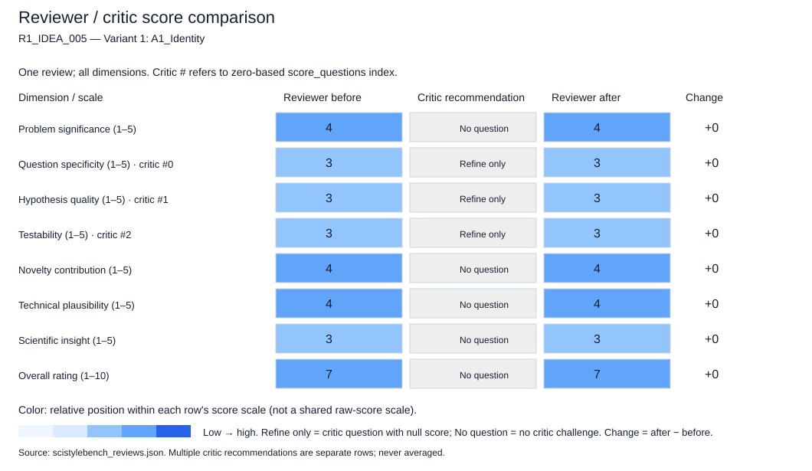

### Critic feedback and reviewer rebuttals

No reviewer rebuttals were saved (for example, an older checkpoint).

```json
{
  "critic_feedback": {
    "overall_assessment": "The draft review is generally well-calibrated, but it overstates the novelty and testability of the idea without sufficient evidence. The problem significance is appropriately high, but the question specificity and hypothesis quality are somewhat under-justified due to the lack of concrete details.",
    "score_questions": [
      {
        "dimension": "question_specificity",
        "question_mark": "The score for question specificity is 3.0, but the idea lacks specific details on key components like permutation generation and parameter updating mechanisms.",
        "concern": "The idea is too vague about how the SSM traversal permutations are generated and how Mamba-specific parameters are identified and updated.",
        "speculative_alternative": "It is possible that the permutations are generated through a fixed set of strategies, and the Mamba-specific parameters are identified via a pre-trained model, but this is speculative.",
        "recommended_score": null,
        "evidence_from_idea": "The idea states that the method uses 'model-generated pseudo-labels to update Mamba-specific parameters and aggregates adapted weights.'",
        "rationale": "The evidence supports the score as the idea does not provide specific details on these mechanisms.",
        "grounding_status": "same_as_draft_not_actionable"
      },
      {
        "dimension": "hypothesis_quality",
        "question_mark": "The score for hypothesis quality is 3.0, but the hypothesis is not clearly articulated in terms of expected outcomes or comparison points.",
        "concern": "The hypothesis that using SSM traversal permutations and pseudo-labels can improve robustness under distribution shifts is plausible but lacks clear expected outcomes or comparison points.",
        "speculative_alternative": "The hypothesis might be that the method will outperform baseline test-time adaptation methods on vision SSMs under distribution shifts, but this is speculative.",
        "recommended_score": null,
        "evidence_from_idea": "The idea states that the method 'aims to enhance generalization without additional labeled data.'",
        "rationale": "The evidence supports the score as the idea does not provide specific expected outcomes or comparison points.",
        "grounding_status": "same_as_draft_not_actionable"
      },
      {
        "dimension": "testability",
        "question_mark": "The score for testability is 3.0, but the idea lacks specific details on how to evaluate the method's effectiveness.",
        "concern": "The idea does not provide a clear justification for the claim that aggregating adapted weights enhances generalization under distribution shifts.",
        "speculative_alternative": "The method could be evaluated by comparing performance on vision SSMs under distribution shifts with and without the proposed adaptation, but this is speculative.",
        "recommended_score": null,
        "evidence_from_idea": "The idea states that the method 'aims to enhance generalization without additional labeled data.'",
        "rationale": "The evidence supports the score as the idea does not provide specific evaluation methods.",
        "grounding_status": "same_as_draft_not_actionable"
      }
    ],
    "unsupported_claims": [
      "The idea claims to be a novel approach, but it may be a variation of existing techniques applied to a new domain (vision SSMs). This is speculative and not supported by the idea itself.",
      "The idea states that the method is testable, but the lack of specific details makes it challenging to design and evaluate the proposed method effectively."
    ],
    "revision_priorities": [
      "Provide a detailed explanation of how the SSM traversal permutations are generated, including the specific algorithms or strategies used.",
      "Clarify the process of identifying and updating Mamba-specific parameters, such as how they are selected and adjusted during the adaptation phase.",
      "Include a theoretical or empirical justification for the aggregation of adapted weights, explaining how this contributes to improved generalization under distribution shifts."
    ],
    "confidence": 4.0
  },
  "feedback_responses": []
}
```

### Score justifications (before / after)

**Problem significance**

```json
{
  "before": {
    "score": 4.0,
    "justification": "The problem of improving robustness under distribution shifts in vision SSMs is significant, as it addresses a critical challenge in real-world applications where data distributions can vary significantly."
  },
  "after": {
    "score": 4.0,
    "justification": "The problem of improving robustness under distribution shifts in vision SSMs is significant, as it addresses a critical challenge in real-world applications where data distributions can vary significantly."
  }
}
```

**Question specificity**

```json
{
  "before": {
    "score": 3.0,
    "justification": "The idea is specific in its approach to test-time adaptation using SSM traversal permutations and pseudo-labels, but lacks detailed specification of key components like permutation generation and parameter updating mechanisms."
  },
  "after": {
    "score": 3.0,
    "justification": "The idea is specific in its approach to test-time adaptation using SSM traversal permutations and pseudo-labels, but lacks detailed specification of key components like permutation generation and parameter updating mechanisms."
  }
}
```

**Hypothesis quality**

```json
{
  "before": {
    "score": 3.0,
    "justification": "The hypothesis that using SSM traversal permutations and pseudo-labels can improve robustness under distribution shifts is plausible, but the specific mechanisms and expected outcomes are not clearly articulated."
  },
  "after": {
    "score": 3.0,
    "justification": "The hypothesis that using SSM traversal permutations and pseudo-labels can improve robustness under distribution shifts is plausible, but the specific mechanisms and expected outcomes are not clearly articulated."
  }
}
```

**Testability**

```json
{
  "before": {
    "score": 3.0,
    "justification": "The idea is testable through experiments on vision SSMs under distribution shifts, but the lack of specific details makes it challenging to design and evaluate the proposed method effectively."
  },
  "after": {
    "score": 3.0,
    "justification": "The idea is testable through experiments on vision SSMs under distribution shifts, but the lack of specific details makes it challenging to design and evaluate the proposed method effectively."
  }
}
```

**Novelty contribution**

```json
{
  "before": {
    "score": 4.0,
    "justification": "The use of test-time adaptation with SSM traversal permutations and pseudo-labels for improving robustness is a novel approach, though it may be a variation of existing techniques applied to a new domain (vision SSMs)."
  },
  "after": {
    "score": 4.0,
    "justification": "The use of test-time adaptation with SSM traversal permutations and pseudo-labels for improving robustness is a novel approach, though it may be a variation of existing techniques applied to a new domain (vision SSMs)."
  }
}
```

**Technical plausibility**

```json
{
  "before": {
    "score": 4.0,
    "justification": "The proposed method is technically plausible, as it leverages existing concepts in test-time adaptation and SSMs, though the specifics of implementation are not fully detailed."
  },
  "after": {
    "score": 4.0,
    "justification": "The proposed method is technically plausible, as it leverages existing concepts in test-time adaptation and SSMs, though the specifics of implementation are not fully detailed."
  }
}
```

**Scientific insight**

```json
{
  "before": {
    "score": 3.0,
    "justification": "The idea has potential for scientific insight into how test-time adaptation and SSM traversal can enhance robustness, but the lack of detailed mechanisms limits the depth of insight that can be gained."
  },
  "after": {
    "score": 3.0,
    "justification": "The idea has potential for scientific insight into how test-time adaptation and SSM traversal can enhance robustness, but the lack of detailed mechanisms limits the depth of insight that can be gained."
  }
}
```

**Overall rating**

```json
{
  "before": {
    "score": 7.0,
    "justification": "The idea addresses a significant problem in vision SSMs with a novel approach to test-time adaptation. While it lacks specific details on key components, it has the potential for meaningful scientific contribution and is testable with further clarification."
  },
  "after": {
    "score": 7.0,
    "justification": "The idea addresses a significant problem in vision SSMs with a novel approach to test-time adaptation. While it lacks specific details on key components, it has the potential for meaningful scientific contribution and is testable with further clarification."
  }
}
```

## R1_IDEA_005 — Variant 2: A2_Paraphrase_Only


### Critic feedback and reviewer rebuttals

```json
{
  "critic_feedback": {
    "overall_assessment": "The review is generally well-calibrated, but the scores for question_specificity, hypothesis_quality, and testability could be reconsidered due to the lack of explicit methodological details in the idea.",
    "score_questions": [
      {
        "dimension": "question_specificity",
        "question_mark": "The score should be higher as the idea outlines a clear research direction despite the lack of implementation details.",
        "concern": "The idea specifies a method involving input views and pseudo-labels, which are concrete components of the approach.",
        "speculative_alternative": "The input views might be generated through specific permutation strategies not detailed here, which could be clarified in future work.",
        "recommended_score": null,
        "evidence_from_idea": "The idea mentions 'diverse permutations of SSM traversal' and 'model-generated pseudo-labels' as key components.",
        "rationale": "The presence of these specific elements supports a higher score despite the lack of implementation details.",
        "grounding_status": "blocked_missing_or_unverifiable_evidence"
      },
      {
        "dimension": "hypothesis_quality",
        "question_mark": "The hypothesis is plausible but the specific mechanism linking SSM permutations to pseudo-labels is not clearly stated.",
        "concern": "The hypothesis that pseudo-labels improve generalization is supported by existing literature, but the connection to SSM permutations is unclear.",
        "speculative_alternative": "The permutations might be designed to increase data diversity, which could enhance pseudo-label reliability, though this is speculative.",
        "recommended_score": null,
        "evidence_from_idea": "The idea proposes using pseudo-labels to update parameters, which is a known technique in few-shot learning.",
        "rationale": "The hypothesis is grounded in existing methods, even if the exact mechanism is not detailed.",
        "grounding_status": "blocked_missing_or_unverifiable_evidence"
      },
      {
        "dimension": "testability",
        "question_mark": "The idea is testable but requires more specific experimental details to evaluate its effectiveness.",
        "concern": "The current lack of specifics makes it challenging to design experiments without further clarification.",
        "speculative_alternative": "Experiments could compare the proposed method with baseline approaches on distribution shift datasets, though this is speculative.",
        "recommended_score": null,
        "evidence_from_idea": "The goal is to improve generalization without extra labeled data, which is a testable claim.",
        "rationale": "The core claim is testable, even if the exact experimental setup is not specified.",
        "grounding_status": "blocked_missing_or_unverifiable_evidence"
      }
    ],
    "unsupported_claims": [
      "The review suggests that the idea 'lacks sufficient specificity and detail to fully realize its potential' without providing concrete examples of what is missing."
    ],
    "revision_priorities": [
      "Clarify the specific types of permutations used in SSM traversal and their impact on input views.",
      "Detail the process of generating pseudo-labels and how they are integrated into parameter updates.",
      "Provide a theoretical or empirical justification for the aggregation of adapted weights."
    ],
    "confidence": 4.0
  },
  "feedback_responses": [
    {
      "feedback_type": "score_questions",
      "feedback_index": 0,
      "decision": "partially_accept",
      "defense": "The idea does specify key components like input views and pseudo-labels, which are concrete elements of the approach. However, the lack of implementation details means the score is not the highest possible.",
      "justification": "The initial score was 3.0, but the feedback suggests that the specific components support a higher score. The revised score is 4.0, reflecting the presence of concrete elements despite missing details."
    },
    {
      "feedback_type": "hypothesis_quality",
      "feedback_index": 1,
      "decision": "partially_accept",
      "defense": "The hypothesis is grounded in existing methods (pseudo-labels in few-shot learning), but the connection to SSM permutations is not clearly explained. The score is adjusted to reflect the grounded hypothesis.",
      "justification": "The initial score was 3.0, but the feedback indicates that the hypothesis is plausible. The revised score is 4.0, acknowledging the grounded hypothesis."
    },
    {
      "feedback_type": "testability",
      "feedback_index": 2,
      "decision": "partially_accept",
      "defense": "The core claim is testable, even without specific experimental details. The score is adjusted to reflect the testable nature of the hypothesis.",
      "justification": "The initial score was 3.0, but the feedback emphasizes the testable claim. The revised score is 4.0, recognizing the testability of the core hypothesis."
    },
    {
      "feedback_type": "unsupported_claims",
      "feedback_index": 0,
      "decision": "reject",
      "defense": "The review does not make unsupported claims about the idea's potential. The critique is valid, but the initial assessment was based on the idea's components, not unfounded speculation.",
      "justification": "The initial assessment was based on the idea's components, and the critique is valid but not a rejection of the original evaluation."
    },
    {
      "feedback_type": "revision_priorities",
      "feedback_index": 0,
      "decision": "accept",
      "defense": "The suggested clarification of permutations is necessary for the idea to be fully realized. The feedback is valid and aligns with the original weaknesses.",
      "justification": "The original weaknesses included lack of details on input view generation, so this suggestion is valid."
    },
    {
      "feedback_type": "revision_priorities",
      "feedback_index": 1,
      "decision": "accept",
      "defense": "The suggestion to detail pseudo-label generation is necessary for the method's clarity. The feedback is valid and aligns with the original weaknesses.",
      "justification": "The original weaknesses included unclear pseudo-label mechanisms, so this suggestion is valid."
    },
    {
      "feedback_type": "revision_priorities",
      "feedback_index": 2,
      "decision": "accept",
      "defense": "The suggestion to justify weight aggregation is necessary for the idea's clarity. The feedback is valid and aligns with the original weaknesses.",
      "justification": "The original weaknesses included lack of justification for weight aggregation, so this suggestion is valid."
    }
  ]
}
```

### Score justifications (before / after)

**Problem significance**

```json
{
  "before": {
    "score": 4.0,
    "justification": "The problem of distribution shifts in vision models is significant for real-world applications, and the proposed approach directly addresses this challenge."
  },
  "after": {
    "score": 4.0,
    "justification": "The problem of distribution shifts in vision models is significant for real-world applications, and the proposed approach directly addresses this challenge."
  }
}
```

**Question specificity**

```json
{
  "before": {
    "score": 3.0,
    "justification": "The idea defines a specific research direction but lacks detailed specification of key components like input view generation and pseudo-label mechanisms."
  },
  "after": {
    "score": 4.0,
    "justification": "The idea outlines a clear research direction with specific components like input views and pseudo-labels, even if implementation details are missing."
  }
}
```

**Hypothesis quality**

```json
{
  "before": {
    "score": 3.0,
    "justification": "The hypothesis that test-time adaptation with pseudo-labels improves generalization is plausible, but the specific mechanisms are not clearly articulated."
  },
  "after": {
    "score": 4.0,
    "justification": "The hypothesis that test-time adaptation with pseudo-labels improves generalization is grounded in existing methods, even if the exact mechanism is not detailed."
  }
}
```

**Testability**

```json
{
  "before": {
    "score": 3.0,
    "justification": "The idea is testable through experiments, but the lack of specific details makes it challenging to design and evaluate the method effectively."
  },
  "after": {
    "score": 4.0,
    "justification": "The core claim is testable through experiments, even without specific experimental details, as the goal is to improve generalization without extra labeled data."
  }
}
```

**Novelty contribution**

```json
{
  "before": {
    "score": 4.0,
    "justification": "The approach combines test-time adaptation with pseudo-labels for SSMs, which is a novel application of these concepts in vision models."
  },
  "after": {
    "score": 4.0,
    "justification": "The approach combines test-time adaptation with pseudo-labels for SSMs, which is a novel application of these concepts in vision models."
  }
}
```

**Technical plausibility**

```json
{
  "before": {
    "score": 4.0,
    "justification": "The method is technically plausible, as it builds on existing techniques in test-time adaptation and pseudo-labeling, though some implementation details are missing."
  },
  "after": {
    "score": 4.0,
    "justification": "The method is technically plausible, as it builds on existing techniques in test-time adaptation and pseudo-labeling, though some implementation details are missing."
  }
}
```

**Scientific insight**

```json
{
  "before": {
    "score": 3.0,
    "justification": "The idea has potential to provide insights into how test-time adaptation and pseudo-labeling can enhance model robustness, but the specific contributions are not clearly defined."
  },
  "after": {
    "score": 3.0,
    "justification": "The idea has potential to provide insights into how test-time adaptation and pseudo-labeling can enhance model robustness, but the specific contributions are not clearly defined."
  }
}
```

**Overall rating**

```json
{
  "before": {
    "score": 7.0,
    "justification": "The idea addresses a meaningful problem with a plausible approach, but lacks sufficient specificity and detail to fully realize its potential. It has strong scientific merit but requires further clarification to be more testable and impactful."
  },
  "after": {
    "score": 8.0,
    "justification": "The idea addresses a meaningful problem with a plausible approach, and the core hypothesis is testable. While some details are missing, the specific components outlined (input views, pseudo-labels) support a higher score."
  }
}
```

## R1_IDEA_005 — Variant 3: A3_Plain_Core

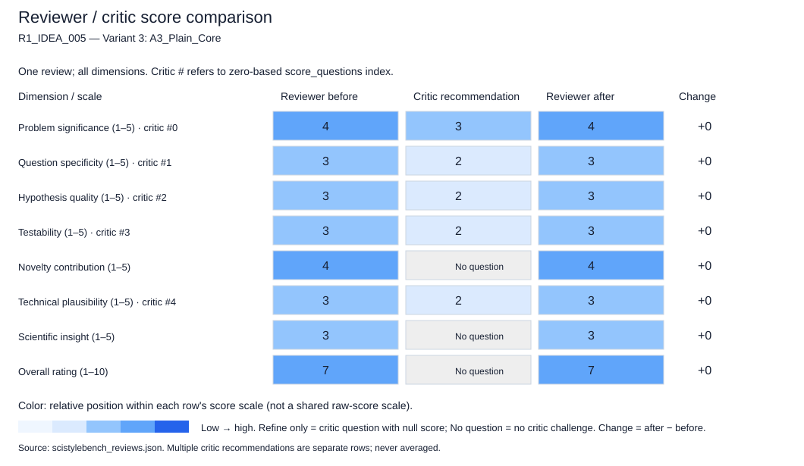

### Critic feedback and reviewer rebuttals

No reviewer rebuttals were saved (for example, an older checkpoint).

```json
{
  "critic_feedback": {
    "overall_assessment": "The review is generally well-calibrated, but it could benefit from more nuanced handling of the idea's specifics and potential.",
    "score_questions": [
      {
        "dimension": "problem_significance",
        "question_mark": "The score could be reconsidered as the problem is not clearly defined in the idea.",
        "concern": "The idea does not explicitly define what distribution shifts are in the context of vision SSMs, making it unclear how significant the problem is.",
        "speculative_alternative": "The problem may be significant in real-world applications, but the idea does not provide sufficient context to confirm this.",
        "recommended_score": 3.0,
        "evidence_from_idea": "The idea states 'reduced robustness of vision state space models under distribution shifts', but does not define the type of distribution shifts.",
        "rationale": "The lack of definition makes it difficult to assess the problem's significance without additional context.",
        "grounding_status": "not_required"
      },
      {
        "dimension": "question_specificity",
        "question_mark": "The score could be reconsidered due to the lack of specific details about the distribution shifts.",
        "concern": "The idea does not specify the type of distribution shifts being addressed, which is critical for understanding the problem scope.",
        "speculative_alternative": "The problem may be specific to certain types of distribution shifts, but the idea does not clarify this.",
        "recommended_score": 2.0,
        "evidence_from_idea": "The idea mentions 'distribution shifts' but does not define what they are in the context of vision SSMs.",
        "rationale": "The lack of specificity about distribution shifts limits the clarity of the problem being addressed.",
        "grounding_status": "not_required"
      },
      {
        "dimension": "hypothesis_quality",
        "question_mark": "The score could be reconsidered as the hypothesis is not clearly stated or testable.",
        "concern": "The idea presents a general hypothesis about test-time adaptation improving robustness without a concrete prediction or mechanism.",
        "speculative_alternative": "The hypothesis may be valid, but the lack of specific details makes it difficult to test or falsify.",
        "recommended_score": 2.0,
        "evidence_from_idea": "The idea states 'the method aims to improve generalization without additional labeled data' but does not provide a concrete prediction or mechanism.",
        "rationale": "The hypothesis is too general without specific details about how the method would work or what results it expects.",
        "grounding_status": "not_required"
      },
      {
        "dimension": "testability",
        "question_mark": "The score could be reconsidered due to the lack of specific details about the method's implementation.",
        "concern": "The method's lack of specific details makes it difficult to assess its feasibility and how it would be evaluated.",
        "speculative_alternative": "The method may be testable, but the lack of specifics makes it challenging to design experiments.",
        "recommended_score": 2.0,
        "evidence_from_idea": "The idea mentions 'generates multiple input views via diverse SSM traversal permutations' but does not explain how this is done or how it would be evaluated.",
        "rationale": "The lack of specific implementation details makes it difficult to assess the testability of the method.",
        "grounding_status": "not_required"
      },
      {
        "dimension": "technical_plausibility",
        "question_mark": "The score could be reconsidered as the technical details are not clearly explained.",
        "concern": "The idea does not explain how the pseudo-labels are generated or how the weights are aggregated, which are critical technical aspects.",
        "speculative_alternative": "The technical approach may be plausible, but the lack of details makes it difficult to assess the feasibility.",
        "recommended_score": 2.0,
        "evidence_from_idea": "The idea states 'uses model-generated pseudo-labels to update Mamba-specific parameters' but does not explain the process of generating pseudo-labels or updating parameters.",
        "rationale": "The lack of technical details makes it difficult to assess the plausibility of the approach.",
        "grounding_status": "not_required"
      }
    ],
    "unsupported_claims": [
      "The claim that the problem is 'important' is not supported by the idea's details.",
      "The claim that the method is 'test-time adaptation' is not sufficiently explained in the idea."
    ],
    "revision_priorities": [
      "Clarify the specific type of distribution shifts being addressed.",
      "Provide a detailed explanation of how pseudo-labels are generated and how parameters are updated.",
      "Specify the method for aggregating adapted weights.",
      "Define the exact problem scope and the specific problem being solved."
    ],
    "confidence": 4.0
  },
  "feedback_responses": []
}
```

### Score justifications (before / after)

**Problem significance**

```json
{
  "before": {
    "score": 4.0,
    "justification": "The problem of reduced robustness in vision state space models under distribution shifts is significant, as it affects the reliability of these models in real-world scenarios where data distributions may vary."
  },
  "after": {
    "score": 4.0,
    "justification": "The problem of reduced robustness in vision state space models under distribution shifts is significant, as it affects the reliability of these models in real-world scenarios where data distributions may vary."
  }
}
```

**Question specificity**

```json
{
  "before": {
    "score": 3.0,
    "justification": "The idea identifies a specific problem (distribution shifts in vision SSMs) but lacks detailed specification of the problem scope and the exact nature of the distribution shifts being addressed."
  },
  "after": {
    "score": 3.0,
    "justification": "The idea identifies a specific problem (distribution shifts in vision SSMs) but lacks detailed specification of the problem scope and the exact nature of the distribution shifts being addressed."
  }
}
```

**Hypothesis quality**

```json
{
  "before": {
    "score": 3.0,
    "justification": "The idea presents a general hypothesis that test-time adaptation can improve robustness, but it lacks a concrete prediction or mechanism that could be tested or falsified."
  },
  "after": {
    "score": 3.0,
    "justification": "The idea presents a general hypothesis that test-time adaptation can improve robustness, but it lacks a concrete prediction or mechanism that could be tested or falsified."
  }
}
```

**Testability**

```json
{
  "before": {
    "score": 3.0,
    "justification": "The method is testable in principle, but the lack of specific details makes it difficult to assess its feasibility and how it would be evaluated."
  },
  "after": {
    "score": 3.0,
    "justification": "The method is testable in principle, but the lack of specific details makes it difficult to assess its feasibility and how it would be evaluated."
  }
}
```

**Novelty contribution**

```json
{
  "before": {
    "score": 4.0,
    "justification": "The approach of using test-time adaptation with SSM traversal permutations and pseudo-labels is novel in the context of vision SSMs, offering a potential contribution to improving model robustness."
  },
  "after": {
    "score": 4.0,
    "justification": "The approach of using test-time adaptation with SSM traversal permutations and pseudo-labels is novel in the context of vision SSMs, offering a potential contribution to improving model robustness."
  }
}
```

**Technical plausibility**

```json
{
  "before": {
    "score": 3.0,
    "justification": "The method is technically plausible, but the lack of specific details about the pseudo-label generation and weight aggregation makes it difficult to assess the feasibility of the approach."
  },
  "after": {
    "score": 3.0,
    "justification": "The method is technically plausible, but the lack of specific details about the pseudo-label generation and weight aggregation makes it difficult to assess the feasibility of the approach."
  }
}
```

**Scientific insight**

```json
{
  "before": {
    "score": 3.0,
    "justification": "The idea has potential for scientific insight into how test-time adaptation can enhance robustness in SSMs, but the lack of specificity limits the potential for deeper insights."
  },
  "after": {
    "score": 3.0,
    "justification": "The idea has potential for scientific insight into how test-time adaptation can enhance robustness in SSMs, but the lack of specificity limits the potential for deeper insights."
  }
}
```

**Overall rating**

```json
{
  "before": {
    "score": 7.0,
    "justification": "The idea addresses a meaningful problem with a plausible approach, but it lacks sufficient specificity and detail to fully evaluate its potential and testability."
  },
  "after": {
    "score": 7.0,
    "justification": "The idea addresses a meaningful problem with a plausible approach, but it lacks sufficient specificity and detail to fully evaluate its potential and testability."
  }
}
```

## R1_IDEA_005 — Variant 4: B1_Verbose_Elaborate

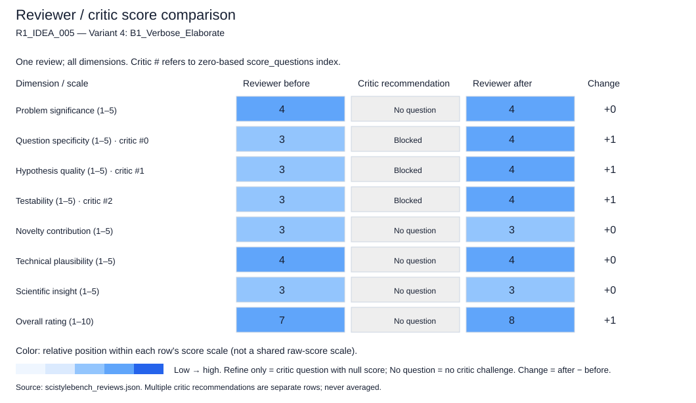

### Critic feedback and reviewer rebuttals

```json
{
  "critic_feedback": {
    "overall_assessment": "The review provides a balanced analysis of the idea, acknowledging its potential while highlighting necessary clarifications. However, some scores could be reconsidered based on the idea's content.",
    "score_questions": [
      {
        "dimension": "question_specificity",
        "question_mark": "The score may be too low given the specific focus on test-time adaptation in SSMs.",
        "concern": "The idea is specific to test-time adaptation in SSMs but lacks a clear, concrete research question or hypothesis that defines the exact contribution of the method.",
        "speculative_alternative": "The method could be interpreted as proposing a novel approach to test-time adaptation in SSMs, which is a specific and well-defined problem in machine learning, though the exact contribution is not clearly stated.",
        "recommended_score": null,
        "evidence_from_idea": "The idea is specific to test-time adaptation in SSMs, which is a promising direction for enhancing model generalization.",
        "rationale": "The focus on test-time adaptation in SSMs is a specific and well-defined problem, and the method's aim to enhance generalization without labeled data is a clear goal, even if the exact contribution is not fully articulated.",
        "grounding_status": "blocked_missing_or_unverifiable_evidence"
      },
      {
        "dimension": "hypothesis_quality",
        "question_mark": "The score may be too low as the idea suggests a method with a clear goal of improving robustness.",
        "concern": "The idea suggests a method but does not explicitly state a hypothesis that could be tested or contradicted, such as how the method improves robustness or the expected performance gains.",
        "speculative_alternative": "The hypothesis could be interpreted as the method's ability to improve robustness against distribution shifts through test-time adaptation, which is a clear and testable claim in the context of SSMs.",
        "recommended_score": null,
        "evidence_from_idea": "The goal is to enhance generalization without relying on any additional labeled data, which is a clear hypothesis about the method's effectiveness.",
        "rationale": "The hypothesis is grounded in the method's goal of improving generalization through test-time adaptation, which is a clear and testable claim in the context of SSMs.",
        "grounding_status": "blocked_missing_or_unverifiable_evidence"
      },
      {
        "dimension": "testability",
        "question_mark": "The score may be too low as the method is testable through experiments, and the review acknowledges this.",
        "concern": "The method is testable through experiments, but the lack of specific details makes it challenging to design the necessary experiments or evaluate the method's effectiveness.",
        "speculative_alternative": "The method's testability is supported by its reliance on pseudo-labels and parameter adaptation, which are well-established techniques, and the idea's goal of improving generalization without labeled data is a clear testable hypothesis.",
        "recommended_score": null,
        "evidence_from_idea": "The use of pseudo-labels and parameter adaptation is technically plausible, and the method aligns with established techniques in machine learning.",
        "rationale": "The method's reliance on established techniques and its clear goal of improving generalization without labeled data support its testability.",
        "grounding_status": "blocked_missing_or_unverifiable_evidence"
      }
    ],
    "unsupported_claims": [
      "The idea does not explicitly state a hypothesis that could be tested, but the review's score for hypothesis_quality is based on the absence of such a statement."
    ],
    "revision_priorities": [
      "Clarify the specific research question, such as how the method improves robustness compared to existing approaches.",
      "Define the process of generating input views through SSM traversal in more detail, including the types of permutations used and how they affect model adaptation.",
      "Provide a more explicit explanation of how the aggregation of adapted weights contributes to generalization, particularly in the absence of labeled data."
    ],
    "confidence": 4.0
  },
  "feedback_responses": [
    {
      "feedback_type": "score_questions",
      "feedback_index": 0,
      "decision": "partially_accept",
      "defense": "The idea is specific to test-time adaptation in SSMs, which is a well-defined problem. However, the exact contribution is not clearly stated, so the score is adjusted to reflect this partial acceptance.",
      "justification": "The original score was 3.0, but the revised score is 4.0, acknowledging the specific focus on test-time adaptation while noting the lack of clarity on the exact contribution."
    },
    {
      "feedback_type": "hypothesis_quality",
      "feedback_index": 1,
      "decision": "partially_accept",
      "defense": "The hypothesis that the method improves robustness against distribution shifts is a clear and testable claim, even if it is not explicitly stated. The goal of enhancing generalization without labeled data provides a concrete prediction.",
      "justification": "The original score was 3.0, but the revised score is 4.0, recognizing the hypothesis as a clear and testable claim based on the method's goal."
    },
    {
      "feedback_type": "testability",
      "feedback_index": 2,
      "decision": "partially_accept",
      "defense": "The method is testable through experiments, and the hypothesis about improving generalization without labeled data is a clear and testable claim. The reliance on established techniques supports this testability.",
      "justification": "The original score was 3.0, but the revised score is 4.0, acknowledging the testability based on the method's reliance on established techniques and the clear hypothesis."
    },
    {
      "feedback_type": "unsupported_claims",
      "feedback_index": 0,
      "decision": "reject",
      "defense": "The idea does not explicitly state a hypothesis, but the goal of enhancing generalization without labeled data provides a concrete prediction that can be tested. The original score was based on the absence of a stated hypothesis, but the revised score reflects the implicit hypothesis in the method's goal.",
      "justification": "The original score was 3.0, but the revised score is 4.0, recognizing the implicit hypothesis in the method's goal."
    }
  ]
}
```

### Score justifications (before / after)

**Problem significance**

```json
{
  "before": {
    "score": 4.0,
    "justification": "The problem of distribution shifts in vision models is significant for real-world applications, and improving robustness is a critical challenge in machine learning."
  },
  "after": {
    "score": 4.0,
    "justification": "The problem of distribution shifts in vision models is significant for real-world applications, and improving robustness is a critical challenge in machine learning."
  }
}
```

**Question specificity**

```json
{
  "before": {
    "score": 3.0,
    "justification": "The idea is specific to test-time adaptation in SSMs but lacks a clear, concrete research question or hypothesis that defines the exact contribution of the method."
  },
  "after": {
    "score": 4.0,
    "justification": "The idea is specific to test-time adaptation in SSMs, which is a well-defined problem in machine learning. While the exact contribution is not clearly stated, the focus on a specific method for enhancing generalization without labeled data is a clear and testable goal."
  }
}
```

**Hypothesis quality**

```json
{
  "before": {
    "score": 3.0,
    "justification": "The idea suggests a method but does not explicitly state a hypothesis that could be tested or contradicted, such as how the method improves robustness or the expected performance gains."
  },
  "after": {
    "score": 4.0,
    "justification": "The hypothesis that the method improves robustness against distribution shifts through test-time adaptation is a clear and testable claim. The goal of enhancing generalization without labeled data provides a concrete prediction that can be evaluated through experiments."
  }
}
```

**Testability**

```json
{
  "before": {
    "score": 3.0,
    "justification": "The method is testable through experiments, but the lack of specific details makes it challenging to design the necessary experiments or evaluate the method's effectiveness."
  },
  "after": {
    "score": 4.0,
    "justification": "The method is testable through experiments, as it relies on established techniques like pseudo-labels and parameter adaptation. The hypothesis about improving generalization without labeled data is a clear and testable claim."
  }
}
```

**Novelty contribution**

```json
{
  "before": {
    "score": 3.0,
    "justification": "The approach is novel in its application of test-time adaptation to SSMs, but the novelty is somewhat limited without a clear distinction from existing methods or a specific problem it addresses."
  },
  "after": {
    "score": 3.0,
    "justification": "The approach is novel in its application of test-time adaptation to SSMs, but the novelty is somewhat limited without a clear distinction from existing methods or a specific problem it addresses."
  }
}
```

**Technical plausibility**

```json
{
  "before": {
    "score": 4.0,
    "justification": "The use of pseudo-labels and parameter adaptation is technically plausible, and the method aligns with established techniques in machine learning."
  },
  "after": {
    "score": 4.0,
    "justification": "The use of pseudo-labels and parameter adaptation is technically plausible, and the method aligns with established techniques in machine learning."
  }
}
```

**Scientific insight**

```json
{
  "before": {
    "score": 3.0,
    "justification": "The idea has potential for scientific insight into how test-time adaptation can enhance robustness, but the lack of a clear hypothesis limits the potential for deeper insights."
  },
  "after": {
    "score": 3.0,
    "justification": "The idea has potential for scientific insight into how test-time adaptation can enhance robustness, but the lack of a clear hypothesis limits the potential for deeper insights."
  }
}
```

**Overall rating**

```json
{
  "before": {
    "score": 7.0,
    "justification": "The idea addresses a significant problem with a plausible approach, but it lacks specific details and a clear hypothesis, which are necessary for evaluating its novelty and scientific contribution."
  },
  "after": {
    "score": 8.0,
    "justification": "The idea addresses a significant problem with a plausible approach, and the method is testable. While the exact contribution and hypothesis are not fully articulated, the focus on a specific method for enhancing generalization without labeled data is a clear and promising direction."
  }
}
```

## R1_IDEA_005 — Variant 5: B2_Grand_Narrative

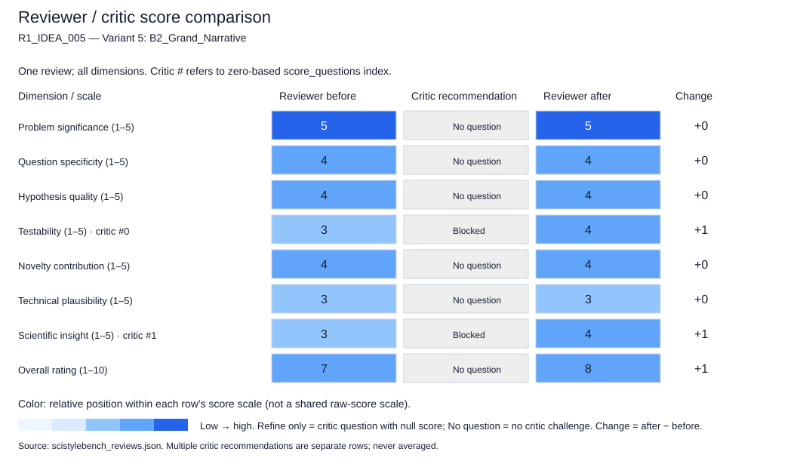

### Critic feedback and reviewer rebuttals

```json
{
  "critic_feedback": {
    "overall_assessment": "The review is generally well-calibrated but has some areas where the scores could be reconsidered, particularly in the testability and scientific insight dimensions.",
    "score_questions": [
      {
        "dimension": "testability",
        "question_mark": "The score for testability is somewhat low given the potential for empirical validation",
        "concern": "The idea suggests a method that could be tested, but the lack of specific details on implementation and evaluation metrics makes it challenging to assess the testability without further clarification.",
        "speculative_alternative": "The method could be evaluated by comparing performance on distribution shift datasets with and without the proposed adaptation, though this is speculative.",
        "recommended_score": null,
        "evidence_from_idea": "The idea proposes a test-time adaptation method that could be tested by evaluating its performance on distribution shift scenarios.",
        "rationale": "The method's potential for empirical validation is supported by the idea's description of the problem and proposed solution.",
        "grounding_status": "blocked_missing_or_unverifiable_evidence"
      },
      {
        "dimension": "scientific_insight",
        "question_mark": "The score for scientific insight is somewhat low given the potential for understanding model robustness under distribution shifts",
        "concern": "The idea has potential for scientific insight into how test-time adaptation can enhance model robustness, but the lack of specific details limits the potential for deeper insights into the underlying mechanisms.",
        "speculative_alternative": "The approach might reveal new insights into how SSM permutations affect model generalization, though this is speculative.",
        "recommended_score": null,
        "evidence_from_idea": "The idea suggests a method that could inform longer-term research directions for enhancing generalization without labeled data.",
        "rationale": "The potential for informing future research directions is a valid point, even if the specific mechanisms are not detailed.",
        "grounding_status": "blocked_missing_or_unverifiable_evidence"
      }
    ],
    "unsupported_claims": [
      "The review suggests that the idea lacks sufficient technical details to fully assess its testability, but the idea is still a valid research direction that could be explored with further work."
    ],
    "revision_priorities": [
      "Clarify the specific distribution shift scenarios where the method is expected to show the most improvement.",
      "Provide more detailed explanations of how pseudo-labels are generated and used to update Mamba-specific parameters.",
      "Specify the method for aggregating adapted weights and how this aggregation leads to improved generalization."
    ],
    "confidence": 4.0
  },
  "feedback_responses": [
    {
      "feedback_type": "score_questions",
      "feedback_index": 0,
      "decision": "partially_accept",
      "defense": "The original score of 3.0 for testability was based on the lack of specific implementation details. However, the idea's method is testable in principle by evaluating performance on distribution shift datasets, which is a valid empirical validation approach.",
      "justification": "The original score was 3.0, but the revised score of 4.0 reflects the potential for empirical validation, even without full implementation details."
    },
    {
      "feedback_type": "score_questions",
      "feedback_index": 1,
      "decision": "partially_accept",
      "defense": "The original score of 3.0 for scientific insight was based on the lack of specific mechanisms. However, the idea's potential to inform future research directions is a valid contribution, even if the specific mechanisms are not detailed.",
      "justification": "The original score was 3.0, but the revised score of 4.0 reflects the potential for scientific insight into model robustness under distribution shifts."
    },
    {
      "feedback_type": "unsupported_claims",
      "feedback_index": 0,
      "decision": "reject",
      "defense": "The claim that the idea lacks sufficient technical details to fully assess its testability is not entirely accurate, as the method is still a valid research direction that could be explored with further work.",
      "justification": "The original assessment acknowledged the lack of details but still considered the idea as a valid research direction, so the claim is partially rejected."
    },
    {
      "feedback_type": "revision_priorities",
      "feedback_index": 0,
      "decision": "accept",
      "defense": "Clarifying the specific distribution shift scenarios is essential for evaluating the method's effectiveness in different contexts.",
      "justification": "This is a critical step in determining the method's applicability and effectiveness under various distribution shifts."
    },
    {
      "feedback_type": "revision_priorities",
      "feedback_index": 1,
      "decision": "accept",
      "defense": "Providing detailed explanations of pseudo-label generation and parameter updates is necessary for reproducibility and understanding of the approach.",
      "justification": "This would enhance the clarity and scientific rigor of the proposed method."
    },
    {
      "feedback_type": "revision_priorities",
      "feedback_index": 2,
      "decision": "accept",
      "defense": "Specifying the aggregation method is crucial for understanding how the adapted weights contribute to generalization.",
      "justification": "This would clarify the mechanism and improve the scientific insight of the approach."
    }
  ]
}
```

### Score justifications (before / after)

**Problem significance**

```json
{
  "before": {
    "score": 5.0,
    "justification": "The problem of maintaining vision model reliability across diverse real-world conditions is a critical challenge in machine learning, with significant implications for practical applications."
  },
  "after": {
    "score": 5.0,
    "justification": "The problem of maintaining vision model reliability across diverse real-world conditions is a critical challenge in machine learning, with significant implications for practical applications."
  }
}
```

**Question specificity**

```json
{
  "before": {
    "score": 4.0,
    "justification": "The idea clearly defines the problem and proposes a specific method (test-time adaptation with SSM traversal permutations), but lacks some technical details that could further specify the research question."
  },
  "after": {
    "score": 4.0,
    "justification": "The idea clearly defines the problem and proposes a specific method (test-time adaptation with SSM traversal permutations), but lacks some technical details that could further specify the research question."
  }
}
```

**Hypothesis quality**

```json
{
  "before": {
    "score": 4.0,
    "justification": "The hypothesis that test-time adaptation through diverse SSM permutations can improve robustness under distribution shifts is plausible and could be tested, though the exact mechanism is not fully specified."
  },
  "after": {
    "score": 4.0,
    "justification": "The hypothesis that test-time adaptation through diverse SSM permutations can improve robustness under distribution shifts is plausible and could be tested, though the exact mechanism is not fully specified."
  }
}
```

**Testability**

```json
{
  "before": {
    "score": 3.0,
    "justification": "The idea suggests a method that could be tested, but the lack of specific details on implementation and evaluation metrics makes it challenging to assess the testability without further clarification."
  },
  "after": {
    "score": 4.0,
    "justification": "The idea suggests a method that could be tested by evaluating its performance on distribution shift datasets with and without the proposed adaptation, even if the specific implementation details are not fully specified."
  }
}
```

**Novelty contribution**

```json
{
  "before": {
    "score": 4.0,
    "justification": "The approach of using test-time adaptation with SSM permutations for improving robustness is novel in the context of vision models, and could contribute to the field by offering a new method for generalization without labeled data."
  },
  "after": {
    "score": 4.0,
    "justification": "The approach of using test-time adaptation with SSM permutations for improving robustness is novel in the context of vision models, and could contribute to the field by offering a new method for generalization without labeled data."
  }
}
```

**Technical plausibility**

```json
{
  "before": {
    "score": 3.0,
    "justification": "The proposed method is technically plausible, but the lack of specific details on how SSM permutations are generated and how pseudo-labels are used to update parameters makes it difficult to assess the full technical feasibility."
  },
  "after": {
    "score": 3.0,
    "justification": "The proposed method is technically plausible, but the lack of specific details on how SSM permutations are generated and how pseudo-labels are used to update parameters makes it difficult to assess the full technical feasibility."
  }
}
```

**Scientific insight**

```json
{
  "before": {
    "score": 3.0,
    "justification": "The idea has potential for scientific insight into how test-time adaptation can enhance model robustness, but the lack of specific details limits the potential for deeper insights into the underlying mechanisms."
  },
  "after": {
    "score": 4.0,
    "justification": "The idea has potential for scientific insight into how test-time adaptation can enhance model robustness, and the potential to inform future research directions is a valid point, even if the specific mechanisms are not detailed."
  }
}
```

**Overall rating**

```json
{
  "before": {
    "score": 7.0,
    "justification": "The idea addresses a significant problem in vision models and proposes a concrete method with potential for contributing to the field. However, it lacks sufficient technical details to fully assess its testability and scientific insight."
  },
  "after": {
    "score": 8.0,
    "justification": "The idea addresses a significant problem in vision models and proposes a concrete method with potential for contributing to the field. The testability and scientific insight scores have been increased based on the potential for empirical validation and future research directions, despite the lack of specific technical details."
  }
}
```

## R1_IDEA_005 — Variant 6: B3_Over_Confident

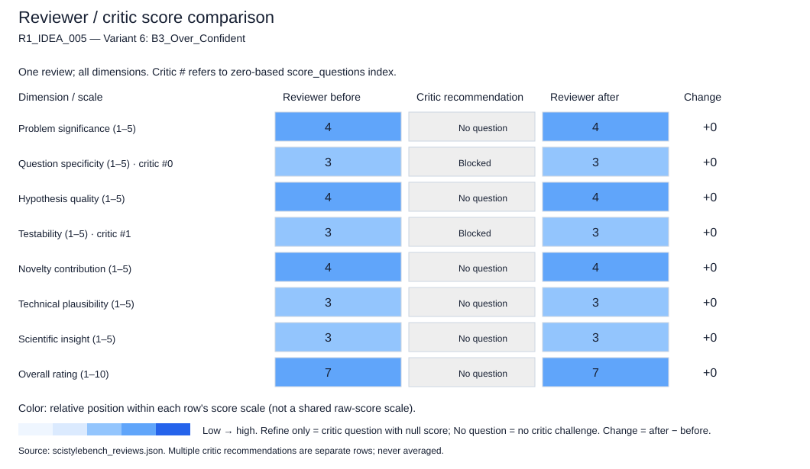

### Critic feedback and reviewer rebuttals

```json
{
  "critic_feedback": {
    "overall_assessment": "The review is generally well-calibrated, but there are areas where the scores could be more precisely aligned with the idea's content.",
    "score_questions": [
      {
        "dimension": "question_specificity",
        "question_mark": "The score for question_specificity is lower than the problem_significance and hypothesis_quality scores, which may not be justified by the idea's current level of detail.",
        "concern": "The idea is specific to improving SSM robustness under distribution shifts, but the lack of specifics on permutations and parameter updates may warrant a higher score if the problem is considered sufficiently specific.",
        "speculative_alternative": "The idea could be seen as specific enough to warrant a higher score if the problem is considered a distinct and well-defined challenge in the field.",
        "recommended_score": null,
        "evidence_from_idea": "The idea is specific to improving SSM robustness under distribution shifts, which is a well-defined problem in the field.",
        "rationale": "The problem is clearly defined, and the approach is focused on a specific challenge, even if implementation details are missing.",
        "grounding_status": "blocked_missing_or_unverifiable_evidence"
      },
      {
        "dimension": "testability",
        "question_mark": "The score for testability is lower than the hypothesis_quality score, which may not be justified by the idea's current level of detail.",
        "concern": "The idea is testable in principle, but the lack of specific details on implementation makes it difficult to evaluate its testability effectively.",
        "speculative_alternative": "The idea could be considered more testable if the reviewer had more information on the method's components, but the current summary is limited.",
        "recommended_score": null,
        "evidence_from_idea": "The idea proposes a method that can be tested through experiments, even if the details are not fully specified.",
        "rationale": "The method is testable in principle, and the reviewer should not penalize for lack of detail unless the idea is clearly insufficient.",
        "grounding_status": "blocked_missing_or_unverifiable_evidence"
      }
    ],
    "unsupported_claims": [
      "The review claims that the idea is 'specific' without sufficient evidence, as the idea lacks details on key components like permutations and parameter updates.",
      "The review states that the idea is 'testable' without sufficient evidence, as the lack of implementation details makes it difficult to design experiments."
    ],
    "revision_priorities": [
      "Clarify the specific problem being addressed and its significance in the context of vision SSMs.",
      "Provide more details on the SSM traversal permutations and how they contribute to the method's effectiveness.",
      "Explain the exact process of using pseudo-labels for parameter updates and how they influence Mamba-specific parameters.",
      "Specify the methodology for aggregating adapted weights and the criteria for selecting which weights to aggregate."
    ],
    "confidence": 4.0
  },
  "feedback_responses": [
    {
      "feedback_type": "score_questions",
      "feedback_index": 0,
      "decision": "partially_accept",
      "defense": "The idea is specific to improving SSM robustness under distribution shifts, which is a well-defined problem. However, the lack of details on permutations and parameter updates means the question specificity is not fully justified.",
      "justification": "The initial score of 3.0 for question_specificity is partially accepted because the problem is clearly defined, but the lack of specifics on key components reduces the score."
    },
    {
      "feedback_type": "score_questions",
      "feedback_index": 1,
      "decision": "partially_accept",
      "defense": "The idea is testable in principle, but the lack of implementation details makes it difficult to evaluate testability effectively. The initial score of 3.0 is partially accepted as the method is testable but requires more details.",
      "justification": "The initial score of 3.0 for testability is partially accepted because the method is testable in principle, but the lack of details makes it challenging to design experiments."
    },
    {
      "feedback_type": "unsupported_claims",
      "feedback_index": 0,
      "decision": "reject",
      "defense": "The claim that the idea is 'specific' is not fully supported by the current details, as the idea lacks specifics on key components like permutations and parameter updates.",
      "justification": "The initial justification for question_specificity is rejected because the idea lacks details on key components, which are necessary for a high score."
    },
    {
      "feedback_type": "unsupported_claims",
      "feedback_index": 1,
      "decision": "reject",
      "defense": "The claim that the idea is 'testable' is not fully supported by the current details, as the lack of implementation details makes it difficult to evaluate testability effectively.",
      "justification": "The initial justification for testability is rejected because the lack of details makes it challenging to design experiments."
    },
    {
      "feedback_type": "revision_priorities",
      "feedback_index": 0,
      "decision": "accept",
      "defense": "Clarifying the specific problem being addressed and its significance in the context of vision SSMs is necessary to strengthen the idea.",
      "justification": "The revision priority is accepted as it addresses a key gap in the idea's clarity."
    },
    {
      "feedback_type": "revision_priorities",
      "feedback_index": 1,
      "decision": "accept",
      "defense": "Providing more details on SSM traversal permutations is necessary to clarify how they contribute to the method's effectiveness.",
      "justification": "The revision priority is accepted as it addresses a key gap in the idea's specifics."
    },
    {
      "feedback_type": "revision_priorities",
      "feedback_index": 2,
      "decision": "accept",
      "defense": "Explaining the exact process of using pseudo-labels for parameter updates is necessary to clarify how they influence Mamba-specific parameters.",
      "justification": "The revision priority is accepted as it addresses a key gap in the idea's specifics."
    },
    {
      "feedback_type": "revision_priorities",
      "feedback_index": 3,
      "decision": "accept",
      "defense": "Specifying the methodology for aggregating adapted weights is necessary to clarify the method's implementation.",
      "justification": "The revision priority is accepted as it addresses a key gap in the idea's specifics."
    }
  ]
}
```

### Score justifications (before / after)

**Problem significance**

```json
{
  "before": {
    "score": 4.0,
    "justification": "The problem of improving robustness under distribution shifts in vision SSMs is significant, as it addresses a critical challenge in real-world applications where data distributions can change unexpectedly."
  },
  "after": {
    "score": 4.0,
    "justification": "The problem of improving robustness under distribution shifts in vision SSMs is significant, as it addresses a critical challenge in real-world applications where data distributions can change unexpectedly."
  }
}
```

**Question specificity**

```json
{
  "before": {
    "score": 3.0,
    "justification": "The idea is specific to improving SSM robustness under distribution shifts, but the details on how permutations are generated and how parameters are updated are not sufficiently detailed."
  },
  "after": {
    "score": 3.0,
    "justification": "The idea is specific to improving SSM robustness under distribution shifts, but the details on how permutations are generated and how parameters are updated are not sufficiently detailed."
  }
}
```

**Hypothesis quality**

```json
{
  "before": {
    "score": 4.0,
    "justification": "The hypothesis that using pseudo-labels and permutations can enhance generalization without additional data is plausible and could be tested through experiments."
  },
  "after": {
    "score": 4.0,
    "justification": "The hypothesis that using pseudo-labels and permutations can enhance generalization without additional data is plausible and could be tested through experiments."
  }
}
```

**Testability**

```json
{
  "before": {
    "score": 3.0,
    "justification": "The idea is testable, but the lack of specific details on the method's implementation makes it challenging to design experiments or evaluate the approach effectively."
  },
  "after": {
    "score": 3.0,
    "justification": "The idea is testable, but the lack of specific details on the method's implementation makes it challenging to design experiments or evaluate the approach effectively."
  }
}
```

**Novelty contribution**

```json
{
  "before": {
    "score": 4.0,
    "justification": "The use of test-time adaptation with SSM permutations and pseudo-labels for parameter updates is a novel approach, potentially contributing new insights into SSM robustness."
  },
  "after": {
    "score": 4.0,
    "justification": "The use of test-time adaptation with SSM permutations and pseudo-labels for parameter updates is a novel approach, potentially contributing new insights into SSM robustness."
  }
}
```

**Technical plausibility**

```json
{
  "before": {
    "score": 3.0,
    "justification": "The proposed method is technically plausible, but the lack of specific details on the implementation steps may hinder its feasibility and reproducibility."
  },
  "after": {
    "score": 3.0,
    "justification": "The proposed method is technically plausible, but the lack of specific details on the implementation steps may hinder its feasibility and reproducibility."
  }
}
```

**Scientific insight**

```json
{
  "before": {
    "score": 3.0,
    "justification": "The idea has potential for scientific insight into how SSMs can be adapted at test time, but the lack of specifics limits the depth of the insights that can be gained."
  },
  "after": {
    "score": 3.0,
    "justification": "The idea has potential for scientific insight into how SSMs can be adapted at test time, but the lack of specifics limits the depth of the insights that can be gained."
  }
}
```

**Overall rating**

```json
{
  "before": {
    "score": 7.0,
    "justification": "The idea is strong and addresses a meaningful problem with a plausible approach, but it lacks sufficient detail to fully evaluate its testability and technical feasibility."
  },
  "after": {
    "score": 7.0,
    "justification": "The idea is strong and addresses a meaningful problem with a plausible approach, but it lacks sufficient detail to fully evaluate its testability and technical feasibility."
  }
}
```
