# Moderated review score heatmaps

Technical and rhetoric reviews are independent; the moderator produces the final review.

## R1_IDEA_001 — Source

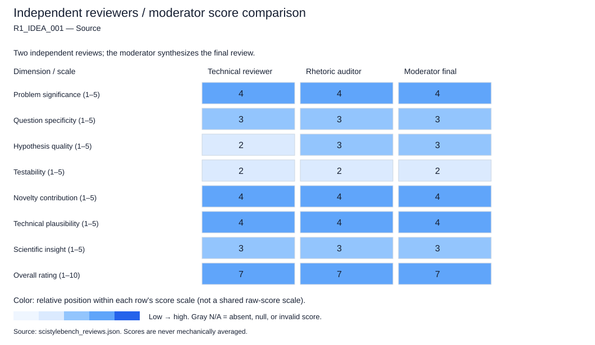

### Independent reviews

```json
{
  "technical_review": {
    "summary": "The idea proposes a decoupled graph energy-based model for node-level out-of-distribution detection on heterophilic graphs, addressing node dependence and heterophily which are ignored in image-based methods.",
    "strengths": [
      "Identifies a specific problem in graph-based out-of-distribution detection",
      "Highlights the limitations of existing image-based methods in graph contexts",
      "Proposes a novel approach that explicitly addresses key challenges in heterophilic graphs"
    ],
    "weaknesses": [
      "Lacks detailed explanation of the decoupled graph energy model",
      "Does not specify how node dependence and heterophily are addressed in the model",
      "No clear hypothesis or prediction is provided for evaluation"
    ],
    "suggestions": [
      "Provide a more detailed description of the decoupled graph energy model",
      "Clarify how the model handles node dependence and heterophily",
      "Specify the metrics or benchmarks for evaluating the model's effectiveness"
    ],
    "questions": [
      "How does the decoupled graph energy model differ from existing energy-based methods?",
      "What specific mechanisms are used to address node dependence and heterophily?",
      "What benchmarks or datasets will be used to evaluate the model's performance?"
    ],
    "problem_significance": {
      "score": 4.0,
      "justification": "The problem of out-of-distribution detection on heterophilic graphs is important for graph-based machine learning, as it addresses a critical challenge in real-world scenarios where node dependencies and heterophily are prevalent."
    },
    "question_specificity": {
      "score": 3.0,
      "justification": "The idea identifies a specific problem but lacks detailed specification of the research question, such as what exactly the model aims to detect or how it differs from existing methods."
    },
    "hypothesis_quality": {
      "score": 2.0,
      "justification": "The idea mentions addressing node dependence and heterophily but does not provide a clear hypothesis or prediction that can be tested, such as expected improvements in detection accuracy or specific metrics."
    },
    "testability": {
      "score": 2.0,
      "justification": "The idea lacks specific experiments or evaluation plans, making it difficult to assess the model's effectiveness without further details on how it will be tested."
    },
    "novelty_contribution": {
      "score": 4.0,
      "justification": "The proposed approach addresses a gap in existing methods by explicitly considering node dependence and heterophily in graph energy-based models, which could contribute new insights to the field."
    },
    "technical_plausibility": {
      "score": 4.0,
      "justification": "The idea is technically plausible as it builds on existing energy-based models and addresses known challenges in graph learning, though the specifics of the decoupled model are not detailed."
    },
    "scientific_insight": {
      "score": 3.0,
      "justification": "The idea has potential to provide insights into how node dependence and heterophily affect out-of-distribution detection, but the specific mechanisms and their implications are not clearly outlined."
    },
    "overall_rating": {
      "score": 7.0,
      "justification": "The idea addresses an important problem in graph-based out-of-distribution detection and proposes a novel approach. However, it lacks detailed specifications and clear hypotheses, which are necessary for evaluating its scientific merit and potential contribution."
    },
    "confidence": 4.0
  },
  "rhetoric_review": {
    "summary": "The research idea proposes a decoupled graph energy-based model for node-level out-of-distribution detection on heterophilic graphs, addressing the limitations of image-based methods by explicitly modeling node dependence and heterophily.",
    "strengths": [
      "Identifies a specific problem in graph-based out-of-distribution detection",
      "Proposes a novel approach that explicitly models node dependence and heterophily",
      "Highlights the underexplored nature of the problem in the graph domain"
    ],
    "weaknesses": [
      "Lacks concrete details on the proposed model's architecture or training methodology",
      "Does not specify how the decoupled graph energy-based model will be evaluated",
      "Does not provide a clear hypothesis or prediction about performance improvements"
    ],
    "suggestions": [
      "Specify the architecture of the decoupled graph energy-based model",
      "Outline the evaluation metrics and benchmarks for comparison",
      "Provide a hypothesis about how the model will outperform existing methods"
    ],
    "questions": [
      "How does the decoupled graph energy-based model differ from existing energy-based models on graphs?",
      "What specific aspects of node dependence and heterophily will the model explicitly model?",
      "How will the model's performance be evaluated on heterophilic graphs compared to image-based methods?"
    ],
    "problem_significance": {
      "score": 4.0,
      "justification": "The problem of out-of-distribution detection on heterophilic graphs is important for graph-based machine learning, as it addresses a critical challenge in handling complex dependencies and heterophily."
    },
    "question_specificity": {
      "score": 3.0,
      "justification": "The idea clearly defines the problem but lacks specific details on the research question, such as the exact mechanism for modeling node dependence and heterophily, and the specific node-level detection task."
    },
    "hypothesis_quality": {
      "score": 3.0,
      "justification": "The idea suggests a potential solution but does not explicitly state a hypothesis or prediction about performance improvements or specific mechanisms that will be tested."
    },
    "testability": {
      "score": 2.0,
      "justification": "The idea lacks concrete experimental plans or evaluation methods, making it difficult to assess the testability of the proposed approach without further details."
    },
    "novelty_contribution": {
      "score": 4.0,
      "justification": "The proposed approach addresses a specific gap in existing methods by explicitly modeling node dependence and heterophily, which is a novel contribution to graph-based out-of-distribution detection."
    },
    "technical_plausibility": {
      "score": 4.0,
      "justification": "The idea is technically plausible as it builds on existing graph-based methods and addresses a known challenge in heterophilic graphs, making it a reasonable direction for further research."
    },
    "scientific_insight": {
      "score": 3.0,
      "justification": "The idea has potential for scientific insight by exploring how explicit modeling of node dependence and heterophily affects out-of-distribution detection, but the specific insights are not clearly defined."
    },
    "overall_rating": {
      "score": 7.0,
      "justification": "The idea addresses an important problem in graph-based out-of-distribution detection and proposes a novel approach. However, it lacks concrete details on the model, evaluation, and hypothesis, which are necessary for assessing its testability and scientific contribution."
    },
    "confidence": 4.0
  },
  "generation": {
    "technical_model_name": "Qwen/Qwen3-4B",
    "rhetoric_model_name": "Qwen/Qwen3-4B",
    "moderator_model_name": "Qwen/Qwen3-4B",
    "temperature": 0.0,
    "seed": 42
  }
}
```

## R1_IDEA_001 — Variant 1: A1_Identity

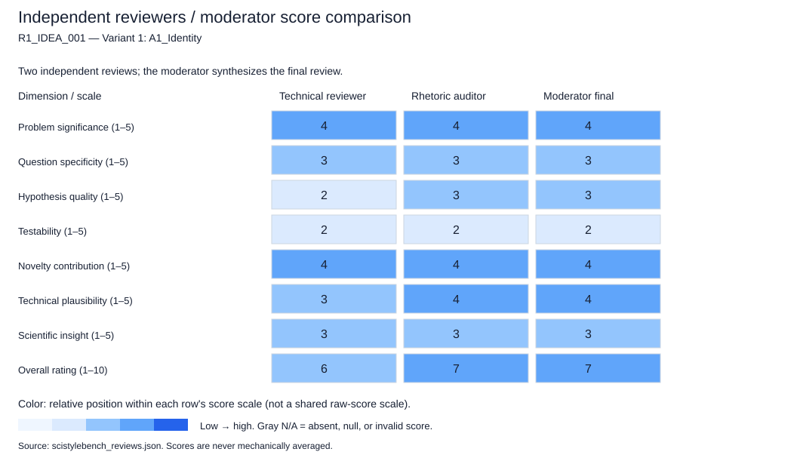

### Independent reviews

```json
{
  "technical_review": {
    "summary": "The idea proposes a decoupled graph energy-based model for node-level out-of-distribution detection on heterophilic graphs, addressing node dependence and heterophily which are ignored in image-based methods.",
    "strengths": [
      "Identifies a specific problem in graph-based out-of-distribution detection",
      "Highlights the limitations of existing image-based methods in graph contexts",
      "Proposes a novel approach that explicitly addresses key challenges in heterophilic graphs"
    ],
    "weaknesses": [
      "Lacks detailed explanation of the decoupled graph energy model",
      "Does not specify how node dependence and heterophily are addressed in the model",
      "No clear hypothesis or prediction is provided for evaluation"
    ],
    "suggestions": [
      "Provide a more detailed description of the decoupled graph energy model",
      "Specify the mechanisms for handling node dependence and heterophily",
      "Formulate a clear hypothesis about the model's performance improvements"
    ],
    "questions": [
      "How does the decoupled graph energy model specifically address node dependence and heterophily?",
      "What is the proposed method's expected performance improvement over existing approaches?",
      "How will the model's effectiveness be evaluated on heterophilic graphs?"
    ],
    "problem_significance": {
      "score": 4.0,
      "justification": "The problem of out-of-distribution detection on heterophilic graphs is important for graph-based learning, especially in scenarios where node dependencies and heterophily are significant."
    },
    "question_specificity": {
      "score": 3.0,
      "justification": "The idea identifies a specific problem but lacks detailed specification of the research question, such as the exact mechanism for addressing node dependence and heterophily."
    },
    "hypothesis_quality": {
      "score": 2.0,
      "justification": "The idea proposes a novel approach but does not explicitly state a hypothesis or prediction that can be tested, making it difficult to assess the scientific merit."
    },
    "testability": {
      "score": 2.0,
      "justification": "The idea lacks specific experimental plans or evaluation methods, making it unclear how the proposed model will be tested or validated."
    },
    "novelty_contribution": {
      "score": 4.0,
      "justification": "The approach of using a decoupled graph energy model for node-level out-of-distribution detection on heterophilic graphs is novel and addresses a specific gap in existing methods."
    },
    "technical_plausibility": {
      "score": 3.0,
      "justification": "The proposed approach is technically plausible but lacks detailed explanation of the model's components and how they address the problem."
    },
    "scientific_insight": {
      "score": 3.0,
      "justification": "The idea has potential to provide insights into how graph structures influence out-of-distribution detection, but the specific mechanisms are not clearly defined."
    },
    "overall_rating": {
      "score": 6.0,
      "justification": "The idea addresses a meaningful problem in graph-based out-of-distribution detection but lacks detailed specification of the model and hypothesis, limiting its testability and scientific clarity."
    },
    "confidence": 4.0
  },
  "rhetoric_review": {
    "summary": "The research idea proposes a decoupled graph energy-based model for node-level out-of-distribution detection on heterophilic graphs, addressing the limitations of image-based methods by explicitly modeling node dependence and heterophily.",
    "strengths": [
      "Identifies a specific problem in graph-based out-of-distribution detection",
      "Proposes a novel approach that explicitly models node dependence and heterophily",
      "Highlights the underexplored nature of the problem in the context of heterophilic graphs"
    ],
    "weaknesses": [
      "Lacks concrete details on the proposed model's architecture or training methodology",
      "Does not specify how the decoupled graph energy-based model will be evaluated or compared to existing methods",
      "The connection between the problem statement and the proposed solution is somewhat vague"
    ],
    "suggestions": [
      "Provide a more detailed description of the decoupled graph energy-based model, including its architecture and training process",
      "Specify the evaluation metrics and benchmark datasets to be used for comparison",
      "Clarify how the model addresses node dependence and heterophily in practice"
    ],
    "questions": [
      "How does the decoupled graph energy-based model specifically model node dependence and heterophily?",
      "What are the key differences between this model and existing graph-based out-of-distribution detection methods?",
      "What evaluation metrics and datasets will be used to validate the model's effectiveness?"
    ],
    "problem_significance": {
      "score": 4.0,
      "justification": "The problem of out-of-distribution detection on heterophilic graphs is important for graph-based machine learning, as heterophily is a common challenge in real-world graph data."
    },
    "question_specificity": {
      "score": 3.0,
      "justification": "The idea identifies a specific problem but lacks concrete details on the research question, such as the exact mechanism or hypothesis being tested."
    },
    "hypothesis_quality": {
      "score": 3.0,
      "justification": "The idea suggests a potential solution but does not explicitly state a hypothesis or prediction that can be tested or falsified."
    },
    "testability": {
      "score": 2.0,
      "justification": "The idea lacks specific experimental plans or evaluation methods, making it difficult to assess the testability of the proposed approach."
    },
    "novelty_contribution": {
      "score": 4.0,
      "justification": "The proposed approach addresses a specific challenge in graph-based out-of-distribution detection, which is a novel direction in the field."
    },
    "technical_plausibility": {
      "score": 4.0,
      "justification": "The idea is technically plausible as it builds on existing graph-based methods and addresses known challenges in heterophilic graphs."
    },
    "scientific_insight": {
      "score": 3.0,
      "justification": "The idea has potential for scientific insight by addressing the limitations of existing methods, but the specific mechanisms and predictions are not clearly defined."
    },
    "overall_rating": {
      "score": 7.0,
      "justification": "The idea addresses an important problem in graph-based out-of-distribution detection and proposes a novel approach. However, it lacks concrete details on the model, evaluation, and specific hypotheses, which are necessary for assessing its testability and scientific contribution."
    },
    "confidence": 4.0
  },
  "generation": {
    "technical_model_name": "Qwen/Qwen3-4B",
    "rhetoric_model_name": "Qwen/Qwen3-4B",
    "moderator_model_name": "Qwen/Qwen3-4B",
    "temperature": 0.0,
    "seed": 42
  }
}
```

## R1_IDEA_001 — Variant 2: A2_Paraphrase_Only


### Independent reviews

```json
{
  "technical_review": {
    "summary": "The research idea proposes a decoupled graph energy-based model for node-level out-of-distribution detection on heterophilic graphs, addressing the limitations of existing image-based methods that assume independent inputs and fail to account for node dependence and heterophily.",
    "strengths": [
      "Identifies a specific problem in graph-based out-of-distribution detection, particularly on heterophilic graphs where existing methods fail.",
      "Proposes a novel approach (decoupled graph energy-based model) that directly addresses the key challenges of node dependence and heterophily.",
      "Highlights the importance of adapting methods from image domains to graph domains, which is a meaningful and underexplored area."
    ],
    "weaknesses": [
      "Lacks specific details on how the decoupled graph energy-based model is designed or how it handles node dependence and heterophily explicitly.",
      "Does not clearly define the hypothesis or prediction that the model aims to test or validate.",
      "The idea is somewhat vague in terms of the evaluation plan or how the effectiveness of the model will be measured."
    ],
    "suggestions": [
      "Provide a more detailed description of the decoupled graph energy-based model, including how it handles node dependence and heterophily.",
      "Specify the hypothesis or prediction that the model aims to test, such as improved detection accuracy on heterophilic graphs compared to existing methods.",
      "Outline the evaluation plan, including the datasets used, metrics, and baseline comparisons."
    ],
    "questions": [
      "How does the decoupled graph energy-based model explicitly handle node dependence and heterophily?",
      "What is the specific hypothesis or prediction that the model aims to test?",
      "What datasets and metrics will be used to evaluate the model's effectiveness?"
    ],
    "problem_significance": {
      "score": 4.0,
      "justification": "The problem of node-level out-of-distribution detection on heterophilic graphs is underexplored and has practical implications for graph-based machine learning, especially in scenarios where node dependencies and heterophily are prevalent."
    },
    "question_specificity": {
      "score": 3.0,
      "justification": "The idea clearly identifies a specific problem (node-level OOD detection on heterophilic graphs) but lacks detailed specification of the research question or the exact mechanism being investigated."
    },
    "hypothesis_quality": {
      "score": 3.0,
      "justification": "The idea suggests a novel approach but does not explicitly state the hypothesis or prediction that the model aims to test, making it less testable without further clarification."
    },
    "testability": {
      "score": 3.0,
      "justification": "The idea is testable in principle, but the lack of specific details on the model design, evaluation plan, and hypothesis makes it difficult to assess the feasibility of the proposed research."
    },
    "novelty_contribution": {
      "score": 4.0,
      "justification": "The proposed decoupled graph energy-based model is a novel approach to address the specific challenges of node-level OOD detection on heterophilic graphs, which is an underexplored area in graph-based machine learning."
    },
    "technical_plausibility": {
      "score": 4.0,
      "justification": "The idea is technically plausible as it builds on existing energy-based models and addresses the specific challenges of heterophilic graphs, which is a reasonable direction for further research."
    },
    "scientific_insight": {
      "score": 3.0,
      "justification": "The research could provide insights into how energy-based models can be adapted to handle node dependence and heterophily in graph data, but the potential for broader scientific insight is limited without a clear hypothesis and evaluation plan."
    },
    "overall_rating": {
      "score": 7.0,
      "justification": "The idea addresses a meaningful problem in graph-based OOD detection, proposes a novel approach, and has the potential for scientific contribution. However, it lacks specific details on the model design, hypothesis, and evaluation plan, which are necessary for assessing its feasibility and impact."
    },
    "confidence": 4.0
  },
  "rhetoric_review": {
    "summary": "The research idea proposes a decoupled graph energy-based model for node-level out-of-distribution detection on heterophilic graphs, addressing the limitations of existing image-based methods that assume independent inputs and fail to account for node dependence and heterophily.",
    "strengths": [
      "Identifies a specific problem in graph-based out-of-distribution detection, particularly on heterophilic graphs where existing methods fail.",
      "Proposes a novel approach (decoupled graph energy-based model) that directly addresses the problem's core challenges (node dependence and heterophily).",
      "Highlights the gap between image-based methods and graph-specific requirements, emphasizing the need for tailored solutions."
    ],
    "weaknesses": [
      "Lacks concrete details on how the decoupled graph energy-based model is structured or how it explicitly handles node dependence and heterophily.",
      "Does not specify the evaluation metrics or benchmarks to be used for assessing the model's effectiveness.",
      "The idea is somewhat vague in terms of how it differs from existing energy-based methods on graphs."
    ],
    "suggestions": [
      "Provide a more detailed description of the decoupled graph energy-based model, including its architecture, loss function, and training procedure.",
      "Specify the datasets and evaluation metrics (e.g., AUC-ROC, F1-score) that will be used to validate the model's performance.",
      "Clarify how the proposed model addresses the limitations of existing methods, such as the handling of heterophily and node dependence."
    ],
    "questions": [
      "How does the decoupled graph energy-based model specifically account for node dependence and heterophily in the graph structure?",
      "What are the key differences between the proposed model and existing energy-based methods on graphs?",
      "What datasets and evaluation metrics will be used to validate the model's effectiveness in detecting out-of-distribution nodes?"
    ],
    "problem_significance": {
      "score": 4.0,
      "justification": "The problem of node-level out-of-distribution detection on heterophilic graphs is important because existing methods are not designed for such structures, which are common in real-world graph data. Addressing this gap could improve the robustness of graph-based models in practical applications."
    },
    "question_specificity": {
      "score": 3.0,
      "justification": "The idea clearly defines the problem (node-level OOD detection on heterophilic graphs) but lacks specific details on the research question, such as what exactly the model aims to detect, how it differs from existing methods, and what specific aspects of node dependence and heterophily it addresses."
    },
    "hypothesis_quality": {
      "score": 3.0,
      "justification": "The idea presents a general hypothesis that the proposed model will improve OOD detection on heterophilic graphs, but it does not provide a concrete prediction or mechanism that can be tested. The hypothesis is plausible but lacks specificity."
    },
    "testability": {
      "score": 2.0,
      "justification": "The idea does not specify how the model will be evaluated or what experiments will be conducted to test its effectiveness. Without clear evaluation plans, it is difficult to assess the testability of the hypothesis."
    },
    "novelty_contribution": {
      "score": 4.0,
      "justification": "The proposal of a decoupled graph energy-based model is novel in the context of node-level OOD detection on heterophilic graphs. It addresses a specific gap in existing methods and could contribute new insights into handling node dependence and heterophily in graph-based models."
    },
    "technical_plausibility": {
      "score": 4.0,
      "justification": "The idea is technically plausible as it builds on existing energy-based methods and addresses known challenges in graph-based OOD detection. The proposed approach is consistent with current research trends in graph neural networks."
    },
    "scientific_insight": {
      "score": 3.0,
      "justification": "The idea has potential for scientific insight by exploring how energy-based models can be adapted to handle heterophily and node dependence in graphs. However, the specific mechanisms and their implications for OOD detection are not clearly outlined."
    },
    "overall_rating": {
      "score": 7.0,
      "justification": "The idea addresses a meaningful problem in graph-based OOD detection, proposes a novel approach, and has the potential for scientific contribution. However, it lacks specific details on the model's structure, evaluation plan, and how it differs from existing methods, which limits its testability and clarity."
    },
    "confidence": 4.0
  },
  "generation": {
    "technical_model_name": "Qwen/Qwen3-4B",
    "rhetoric_model_name": "Qwen/Qwen3-4B",
    "moderator_model_name": "Qwen/Qwen3-4B",
    "temperature": 0.0,
    "seed": 42
  }
}
```

## R1_IDEA_001 — Variant 3: A3_Plain_Core

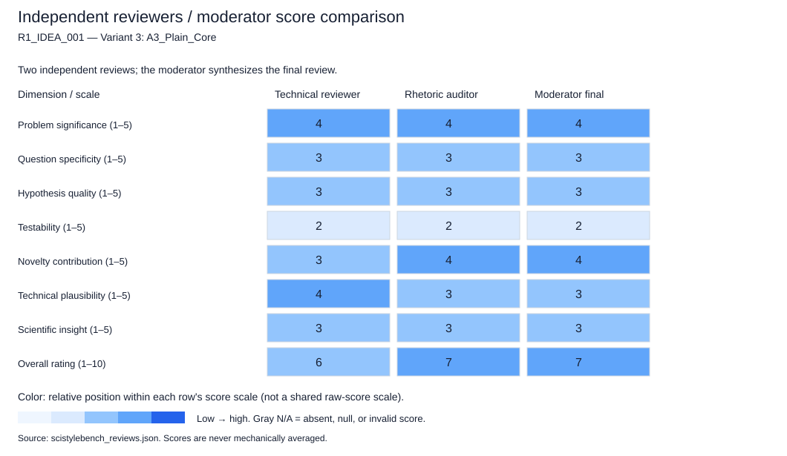

### Independent reviews

```json
{
  "technical_review": {
    "summary": "The research idea proposes a decoupled graph energy-based model for node out-of-distribution detection on heterophilic graphs, addressing the limitations of image-based methods by considering node dependence and heterophily.",
    "strengths": [
      "Identifies a specific problem in graph-based out-of-distribution detection, particularly on heterophilic graphs.",
      "Proposes a novel approach (graph energy-based model) that directly addresses the limitations of existing image-based methods.",
      "Highlights the importance of node dependence and heterophily, which are critical in graph structures.",
      "The idea is focused on a specific and relevant problem in the field of graph learning."
    ],
    "weaknesses": [
      "The idea lacks a clear definition of the 'decoupled graph energy-based model' and its specific components.",
      "The connection between the proposed model and the problem of out-of-distribution detection is not explicitly detailed.",
      "There is no mention of how the model will be evaluated or compared against existing methods.",
      "The novelty of the approach is not clearly articulated, as it is not clear how it differs from existing graph-based methods."
    ],
    "suggestions": [
      "Provide a more detailed description of the decoupled graph energy-based model, including its architecture and key components.",
      "Clarify how the model addresses node dependence and heterophily in the context of out-of-distribution detection.",
      "Specify the evaluation metrics and benchmarks that will be used to compare the proposed model with existing methods.",
      "Articulate the novelty of the approach by comparing it to existing graph-based out-of-distribution detection methods."
    ],
    "questions": [
      "What is the specific mechanism by which the decoupled graph energy-based model addresses node dependence and heterophily?",
      "How does the proposed model differ from existing graph-based out-of-distribution detection methods?",
      "What are the specific evaluation metrics and benchmarks that will be used to assess the model's performance?",
      "How does the model handle the trade-off between detection accuracy and false positive rates in heterophilic graphs?"
    ],
    "problem_significance": {
      "score": 4.0,
      "justification": "The problem of out-of-distribution detection on heterophilic graphs is important in graph learning, as it addresses a critical challenge in real-world applications where data distribution can change unexpectedly."
    },
    "question_specificity": {
      "score": 3.0,
      "justification": "The idea identifies a specific problem (node-level OOD detection on heterophilic graphs) but lacks detailed specification of the research question, such as how the decoupled graph energy-based model will be designed or evaluated."
    },
    "hypothesis_quality": {
      "score": 3.0,
      "justification": "The idea suggests a novel approach but does not explicitly state a hypothesis or prediction that can be tested, such as how the model's design will improve detection accuracy or how it will handle heterophily."
    },
    "testability": {
      "score": 2.0,
      "justification": "The idea lacks a clear plan for testing the proposed model, such as specific experiments, comparisons with existing methods, or evaluation metrics. Without these, it is difficult to assess the validity of the approach."
    },
    "novelty_contribution": {
      "score": 3.0,
      "justification": "The idea proposes a new approach for node-level OOD detection on heterophilic graphs, but the novelty is not clearly articulated. It is not clear how this model differs from existing methods or what unique contribution it offers."
    },
    "technical_plausibility": {
      "score": 4.0,
      "justification": "The proposed approach is technically plausible as it builds on existing graph learning methods and addresses known challenges in heterophilic graphs. However, the lack of specific details makes it difficult to assess the feasibility of the approach."
    },
    "scientific_insight": {
      "score": 3.0,
      "justification": "The idea has potential for scientific insight by addressing the limitations of existing methods in heterophilic graphs, but the specific insights or mechanisms are not clearly defined."
    },
    "overall_rating": {
      "score": 6.0,
      "justification": "The idea addresses a meaningful problem in graph learning and proposes a novel approach, but it lacks detailed specification, evaluation plans, and clear hypotheses, which are necessary for further development and validation."
    },
    "confidence": 4.0
  },
  "rhetoric_review": {
    "summary": "The research idea proposes a decoupled graph energy-based model for node out-of-distribution detection on heterophilic graphs, addressing the limitations of image-based methods by considering node dependence and heterophily.",
    "strengths": [
      "Identifies a specific problem in graph-based out-of-distribution detection, particularly on heterophilic graphs.",
      "Proposes a novel approach (graph energy-based model) that directly addresses the limitations of existing image-based methods.",
      "Highlights the importance of considering node dependence and heterophily, which are critical in graph structures."
    ],
    "weaknesses": [
      "Lacks a clear definition of the 'decoupled' aspect of the model, making it difficult to assess its technical plausibility.",
      "Does not specify how the model will be evaluated or compared against existing methods, which is crucial for testability.",
      "The idea is somewhat vague on the specific mechanisms or components of the graph energy-based model."
    ],
    "suggestions": [
      "Clarify the 'decoupled' aspect of the model, such as how it separates node dependencies from other components.",
      "Provide a more detailed description of the graph energy-based model, including its architecture or key components.",
      "Specify the evaluation metrics and baselines that will be used to compare the proposed model with existing methods."
    ],
    "questions": [
      "How does the decoupled graph energy-based model specifically address node dependence and heterophily?",
      "What are the key components or architecture of the graph energy-based model?",
      "What evaluation metrics and baselines will be used to validate the effectiveness of the proposed model?"
    ],
    "problem_significance": {
      "score": 4.0,
      "justification": "The problem of node out-of-distribution detection on heterophilic graphs is important in graph learning, as heterophily can lead to poor model performance and is a key challenge in graph-based tasks."
    },
    "question_specificity": {
      "score": 3.0,
      "justification": "The idea identifies a specific problem (node OOD detection on heterophilic graphs) but lacks detailed specifics on the proposed solution, such as the exact mechanism of the decoupled model or how it differs from existing methods."
    },
    "hypothesis_quality": {
      "score": 3.0,
      "justification": "The idea suggests a novel approach to address the problem but does not explicitly state a hypothesis or prediction that can be tested, such as how the model's performance will compare to existing methods on specific datasets."
    },
    "testability": {
      "score": 2.0,
      "justification": "The idea lacks a clear plan for evaluation, comparison, or experimental validation, making it difficult to assess the effectiveness of the proposed model without further details."
    },
    "novelty_contribution": {
      "score": 4.0,
      "justification": "The proposed decoupled graph energy-based model is a novel approach to address the limitations of image-based methods in graph OOD detection, potentially offering new insights into graph structure and heterophily."
    },
    "technical_plausibility": {
      "score": 3.0,
      "justification": "The idea is technically plausible as it addresses a known challenge in graph learning, but the lack of details on the 'decoupled' aspect and model architecture makes it difficult to assess the feasibility of the approach."
    },
    "scientific_insight": {
      "score": 3.0,
      "justification": "The idea has potential to contribute to the understanding of how node dependence and heterophily affect OOD detection, but the lack of specifics on the model's mechanism limits the potential for significant scientific insight."
    },
    "overall_rating": {
      "score": 7.0,
      "justification": "The idea addresses a meaningful problem in graph learning and proposes a novel approach, but it lacks sufficient details on the model's specifics, evaluation plan, and hypothesis, which are necessary for assessing its testability and scientific contribution."
    },
    "confidence": 4.0
  },
  "generation": {
    "technical_model_name": "Qwen/Qwen3-4B",
    "rhetoric_model_name": "Qwen/Qwen3-4B",
    "moderator_model_name": "Qwen/Qwen3-4B",
    "temperature": 0.0,
    "seed": 42
  }
}
```

## R1_IDEA_001 — Variant 4: B1_Verbose_Elaborate

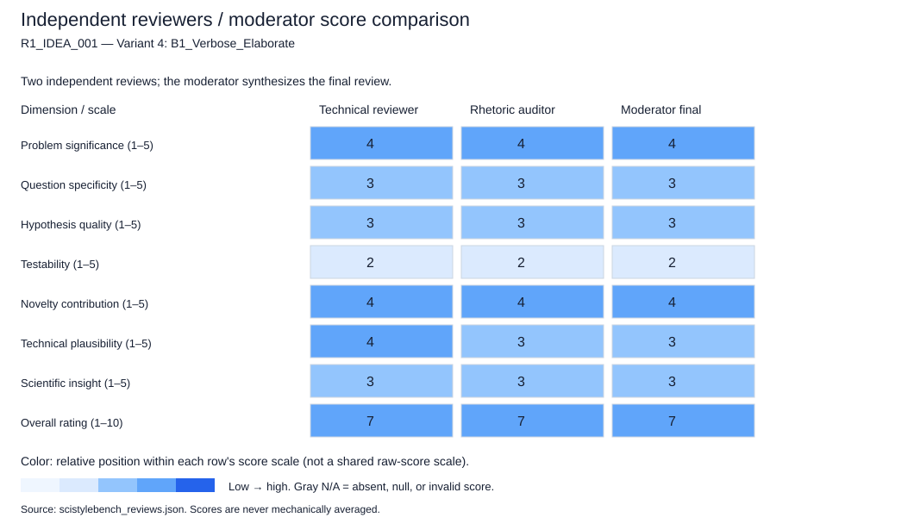

### Independent reviews

```json
{
  "technical_review": {
    "summary": "The research idea proposes a decoupled graph energy-based model to detect out-of-distribution nodes on graph-structured data, addressing node dependence and heterophily, which are often ignored in existing image-domain adapted methods.",
    "strengths": [
      "Identifies a specific problem in graph-based out-of-distribution detection that is underexplored.",
      "Highlights two key aspects (node dependence and heterophily) that existing methods neglect.",
      "Proposes a novel approach (decoupled graph energy-based model) that directly addresses these aspects.",
      "Focuses on heterophilic graphs, which are challenging and relevant in real-world scenarios."
    ],
    "weaknesses": [
      "Lacks specific details on how the decoupled graph energy-based model is designed or implemented.",
      "Does not clearly define the hypothesis or prediction that the model aims to test or validate.",
      "No mention of how the model will be evaluated or compared against existing methods.",
      "The idea is somewhat vague in terms of the technical mechanism and how it addresses node dependence and heterophily."
    ],
    "suggestions": [
      "Provide a more detailed description of the decoupled graph energy-based model, including its architecture, training objective, and how it decouples node dependencies.",
      "Specify the hypothesis or prediction that the model aims to test, such as improved detection accuracy on heterophilic graphs.",
      "Outline the evaluation metrics and baseline methods that will be used to compare the proposed model with existing approaches.",
      "Clarify how the model explicitly addresses node dependence and heterophily, including any novel components or modifications to traditional energy-based models."
    ],
    "questions": [
      "How does the decoupled graph energy-based model specifically address node dependence and heterophily?",
      "What is the proposed model's training objective and how does it differ from existing energy-based models?",
      "What are the key evaluation metrics and baseline methods that will be used to validate the model's effectiveness?",
      "How does the model handle the challenge of heterophily in graph-structured data?"
    ],
    "problem_significance": {
      "score": 4.0,
      "justification": "The problem of detecting out-of-distribution nodes on graphs is underexplored, and addressing node dependence and heterophily is crucial for improving detection in real-world heterophilic graphs."
    },
    "question_specificity": {
      "score": 3.0,
      "justification": "The idea identifies a specific problem but lacks detailed specification of the research question, such as how the model will address node dependence and heterophily, and what exactly is being tested."
    },
    "hypothesis_quality": {
      "score": 3.0,
      "justification": "The idea proposes a model but does not explicitly state a hypothesis or prediction that can be tested, such as improved detection accuracy on heterophilic graphs."
    },
    "testability": {
      "score": 2.0,
      "justification": "The idea lacks specific experimental plans or evaluation methods, making it difficult to assess the testability of the proposed approach without further details."
    },
    "novelty_contribution": {
      "score": 4.0,
      "justification": "The approach of using a decoupled graph energy-based model to address node dependence and heterophily is novel, though the exact contribution depends on the model's implementation and evaluation."
    },
    "technical_plausibility": {
      "score": 4.0,
      "justification": "The proposed direction is technically plausible, as energy-based models are used in various domains, and addressing node dependence and heterophily in graphs is a reasonable research direction."
    },
    "scientific_insight": {
      "score": 3.0,
      "justification": "The idea has potential for scientific insight by addressing underexplored aspects of graph-based out-of-distribution detection, but the specific insights depend on the model's design and evaluation."
    },
    "overall_rating": {
      "score": 7.0,
      "justification": "The idea addresses a meaningful problem in graph-based out-of-distribution detection, proposes a novel approach, and has potential for scientific contribution. However, it lacks specific details on the model's design, hypothesis, and evaluation plan, which are necessary for assessing its testability and novelty."
    },
    "confidence": 4.0
  },
  "rhetoric_review": {
    "summary": "The research idea proposes a decoupled graph energy-based model to detect out-of-distribution nodes on graph-structured data, addressing node dependence and heterophily in heterophilic graphs.",
    "strengths": [
      "Identifies a specific and underexplored problem in graph-based out-of-distribution detection.",
      "Highlights the key challenges of node dependence and heterophily in graph data.",
      "Proposes a novel approach (graph energy-based model) that directly addresses these challenges.",
      "Focuses on heterophilic graphs, which are a critical but challenging scenario in graph learning."
    ],
    "weaknesses": [
      "Lacks a clear definition of the 'decoupled' aspect of the model.",
      "Does not specify how the model will explicitly address node dependence and heterophily.",
      "No mention of how the model will be evaluated or compared to existing methods.",
      "The term 'graph energy-based model' is vague and needs clarification."
    ],
    "suggestions": [
      "Define the 'decoupled' mechanism in the model, such as how it separates node dependencies from heterophily.",
      "Specify the architecture or components of the graph energy-based model.",
      "Outline the evaluation plan, including benchmark datasets and comparison with existing methods.",
      "Clarify the concept of 'graph energy-based model' and its relation to traditional energy-based models."
    ],
    "questions": [
      "How does the decoupled mechanism work in practice?",
      "What is the specific formulation of the graph energy-based model?",
      "How will the model be evaluated on heterophilic graphs?",
      "What are the key differences between this model and existing approaches for OOD detection on graphs?"
    ],
    "problem_significance": {
      "score": 4.0,
      "justification": "The problem of detecting out-of-distribution nodes on graphs is underexplored, especially in heterophilic settings, which are common in real-world applications. Addressing this could improve robustness in graph-based learning systems."
    },
    "question_specificity": {
      "score": 3.0,
      "justification": "The idea clearly identifies the problem and the two key aspects (node dependence and heterophily) to address, but the specifics of the model's approach and evaluation are not detailed."
    },
    "hypothesis_quality": {
      "score": 3.0,
      "justification": "The idea proposes a model to address the problem, but it does not explicitly state a hypothesis or prediction that can be tested. The focus is on the model's purpose rather than a specific claim about its performance or mechanism."
    },
    "testability": {
      "score": 2.0,
      "justification": "The idea lacks a clear plan for testing the model, such as how it will be evaluated, what benchmarks will be used, or how it will be compared to existing methods. Without this, the idea is difficult to assess for its validity."
    },
    "novelty_contribution": {
      "score": 4.0,
      "justification": "The approach of using a graph energy-based model to address node dependence and heterophily in OOD detection is novel, especially in the context of heterophilic graphs. This could contribute to the field by improving robustness in graph-based learning."
    },
    "technical_plausibility": {
      "score": 3.0,
      "justification": "The idea is technically plausible, as energy-based models are used in various domains, and addressing node dependence and heterophily in graphs is a reasonable direction. However, the specifics of the model are not clear, which could affect its feasibility."
    },
    "scientific_insight": {
      "score": 3.0,
      "justification": "The idea has potential to provide insights into how node dependence and heterophily affect OOD detection on graphs. However, without a clear hypothesis or evaluation plan, the scientific insight is not fully realized."
    },
    "overall_rating": {
      "score": 7.0,
      "justification": "The idea addresses a meaningful and underexplored problem in graph-based OOD detection, proposing a novel approach. However, it lacks specific details on the model's design, evaluation plan, and hypothesis, which are necessary for assessing its scientific merit and testability."
    },
    "confidence": 4.0
  },
  "generation": {
    "technical_model_name": "Qwen/Qwen3-4B",
    "rhetoric_model_name": "Qwen/Qwen3-4B",
    "moderator_model_name": "Qwen/Qwen3-4B",
    "temperature": 0.0,
    "seed": 42
  }
}
```

## R1_IDEA_001 — Variant 5: B2_Grand_Narrative


### Independent reviews

```json
{
  "technical_review": {
    "summary": "The research idea proposes a decoupled graph energy-based model for node out-of-distribution detection on heterophilic graphs, addressing node dependence and heterophily to improve detection accuracy compared to image-based methods that assume independent inputs.",
    "strengths": [
      "Identifies a specific problem in graph-based out-of-distribution detection, particularly on heterophilic graphs where node dependencies and heterophily are significant challenges.",
      "Proposes a novel approach (graph energy-based model) that directly addresses the limitations of existing image-based methods in the graph domain.",
      "Highlights potential contributions to broader areas of trustworthy graph machine learning and robust anomaly detection in relational data."
    ],
    "weaknesses": [
      "The idea lacks a clear, specific research question or hypothesis that could be tested or falsified.",
      "The proposed method is described in a high-level manner without details on how the decoupled graph energy-based model is implemented or how it addresses node dependence and heterophily.",
      "The connection between the proposed method and the broader challenges in trustworthy graph machine learning is not explicitly detailed."
    ],
    "suggestions": [
      "Specify a concrete research question, such as whether the decoupled graph energy-based model improves out-of-distribution detection on heterophilic graphs compared to existing methods.",
      "Provide more details on the architecture of the decoupled graph energy-based model, including how it handles node dependence and heterophily.",
      "Clarify how the proposed method contributes to broader challenges in trustworthy graph machine learning, such as robustness to adversarial perturbations or data corruption."
    ],
    "questions": [
      "How does the decoupled graph energy-based model explicitly address node dependence and heterophily in the graph structure?",
      "What specific metrics or benchmarks will be used to evaluate the performance of the proposed model on heterophilic graphs?",
      "How does the proposed method differ from existing graph-based out-of-distribution detection methods in terms of handling node-level dependencies and heterophily?"
    ],
    "problem_significance": {
      "score": 4.0,
      "justification": "The problem of out-of-distribution detection on heterophilic graphs is important for trustworthy graph machine learning, as it addresses the challenge of detecting anomalies in complex relational data where node dependencies and heterophily are prevalent."
    },
    "question_specificity": {
      "score": 3.0,
      "justification": "The idea identifies a specific problem but lacks a clear, testable research question. It suggests a direction but does not explicitly define what should be investigated or how it will be evaluated."
    },
    "hypothesis_quality": {
      "score": 3.0,
      "justification": "The idea proposes a novel approach but does not provide a concrete hypothesis or prediction that could be tested. It mentions potential contributions but does not specify what the model is expected to achieve or how it will be validated."
    },
    "testability": {
      "score": 2.0,
      "justification": "The idea is somewhat testable in principle, but the lack of specific experimental design or evaluation metrics makes it difficult to assess the feasibility of testing the proposed method. The high-level description does not provide enough detail to determine how the model will be evaluated."
    },
    "novelty_contribution": {
      "score": 4.0,
      "justification": "The proposed decoupled graph energy-based model is a novel approach to addressing node dependence and heterophily in out-of-distribution detection on graphs. It has the potential to contribute to the broader field of trustworthy graph machine learning."
    },
    "technical_plausibility": {
      "score": 4.0,
      "justification": "The idea is technically plausible as it builds on existing graph-based methods and addresses known challenges in heterophilic graphs. The proposed approach is consistent with current research trends in graph machine learning."
    },
    "scientific_insight": {
      "score": 3.0,
      "justification": "The idea has potential for scientific insight by addressing the limitations of existing methods in heterophilic graphs. However, the lack of specific hypotheses or evaluation plans limits the potential for meaningful insights."
    },
    "overall_rating": {
      "score": 7.0,
      "justification": "The idea addresses an important problem in graph machine learning and proposes a novel approach. However, it lacks a clear research question, hypothesis, and evaluation plan, which are necessary for assessing its scientific merit and testability."
    },
    "confidence": 4.0
  },
  "rhetoric_review": {
    "summary": "The idea proposes a decoupled graph energy-based model for node out-of-distribution detection on heterophilic graphs, addressing node dependence and heterophily to improve detection accuracy.",
    "strengths": [
      "Identifies a specific problem in graph-based out-of-distribution detection",
      "Proposes a novel approach that explicitly addresses node dependence and heterophily",
      "Highlights potential contributions to trustworthy graph machine learning",
      "Mentions potential for long-term research on robust anomaly detection"
    ],
    "weaknesses": [
      "Lacks concrete details on the proposed model's architecture or training methodology",
      "Does not specify how the decoupled graph energy-based model will be evaluated",
      "Does not clearly define what 'heterophily' means in this context or how it will be addressed",
      "The connection to broader challenges is somewhat vague"
    ],
    "suggestions": [
      "Provide a more detailed description of the model's architecture and training process",
      "Specify the metrics and datasets that will be used for evaluation",
      "Clarify the definition of heterophily and how it will be incorporated into the model",
      "Elaborate on the specific contributions to trustworthy graph machine learning"
    ],
    "questions": [
      "How does the decoupled graph energy-based model differ from existing methods?",
      "What specific metrics will be used to evaluate the model's performance?",
      "How will the model handle heterophily in the graph structure?",
      "What are the expected improvements in out-of-distribution detection compared to existing methods?"
    ],
    "problem_significance": {
      "score": 4.0,
      "justification": "The problem of out-of-distribution detection on heterophilic graphs is important for trustworthy graph machine learning, as it addresses the challenge of detecting anomalies in complex relational data."
    },
    "question_specificity": {
      "score": 3.0,
      "justification": "The idea identifies a specific problem but lacks concrete details on the research question, such as the exact mechanism for addressing node dependence and heterophily."
    },
    "hypothesis_quality": {
      "score": 3.0,
      "justification": "The idea proposes a novel approach but does not explicitly state a hypothesis or prediction that can be tested, such as expected improvements in detection accuracy or specific performance metrics."
    },
    "testability": {
      "score": 2.0,
      "justification": "The idea lacks concrete experimental plans or evaluation methods, making it difficult to assess the testability of the proposed approach without further details."
    },
    "novelty_contribution": {
      "score": 4.0,
      "justification": "The approach of using a decoupled graph energy-based model to address node dependence and heterophily is novel, though the contribution to trustworthy graph machine learning is somewhat vague."
    },
    "technical_plausibility": {
      "score": 4.0,
      "justification": "The proposed direction is technically plausible, as it builds on existing graph-based methods and addresses known challenges in heterophilic graphs."
    },
    "scientific_insight": {
      "score": 3.0,
      "justification": "The idea has potential for scientific insight into how to improve out-of-distribution detection in complex graphs, but the specific mechanisms and expected outcomes are not clearly defined."
    },
    "overall_rating": {
      "score": 7.0,
      "justification": "The idea addresses a meaningful problem in graph machine learning and proposes a novel approach, but lacks concrete details on the model, evaluation, and specific contributions, which are necessary for assessing its testability and scientific impact."
    },
    "confidence": 4.0
  },
  "generation": {
    "technical_model_name": "Qwen/Qwen3-4B",
    "rhetoric_model_name": "Qwen/Qwen3-4B",
    "moderator_model_name": "Qwen/Qwen3-4B",
    "temperature": 0.0,
    "seed": 42
  }
}
```

## R1_IDEA_001 — Variant 6: B3_Over_Confident

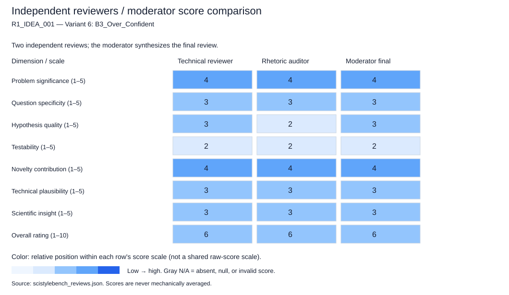

### Independent reviews

```json
{
  "technical_review": {
    "summary": "The research idea proposes a decoupled graph energy-based model for node-level out-of-distribution detection on heterophilic graphs, addressing node dependence and heterophily which are ignored in image-based methods.",
    "strengths": [
      "Identifies a critical gap in existing methods by focusing on node dependence and heterophily in graph data.",
      "Proposes a novel approach (graph energy-based model) that directly addresses the problem's unique challenges.",
      "Highlights the importance of node-level detection in heterophilic graphs, which is a challenging but meaningful problem."
    ],
    "weaknesses": [
      "Lacks specific details on the proposed model's architecture or how it decouples the graph energy.",
      "Does not clearly define what 'decoupled graph energy-based model' means or how it differs from existing methods.",
      "The idea is somewhat vague on how the model will be evaluated or validated."
    ],
    "suggestions": [
      "Clarify the definition and components of the 'decoupled graph energy-based model' to ensure it is distinct from existing approaches.",
      "Specify the metrics or benchmarks for evaluating node-level out-of-distribution detection on heterophilic graphs.",
      "Provide a more detailed explanation of how the model addresses node dependence and heterophily."
    ],
    "questions": [
      "How does the decoupled graph energy-based model differ from existing energy-based models in graph learning?",
      "What specific mechanisms are used to handle node dependence and heterophily in the proposed model?",
      "What evaluation metrics and datasets will be used to validate the effectiveness of the model?"
    ],
    "problem_significance": {
      "score": 4.0,
      "justification": "The problem of node-level out-of-distribution detection on heterophilic graphs is important because it addresses a critical challenge in graph learning, where existing methods often fail to account for node dependencies and heterophily."
    },
    "question_specificity": {
      "score": 3.0,
      "justification": "The idea identifies a specific problem (node-level OOD detection on heterophilic graphs) but lacks detailed specification of the research question, such as what exactly the model aims to detect or how it will be evaluated."
    },
    "hypothesis_quality": {
      "score": 3.0,
      "justification": "The idea suggests a novel approach but does not explicitly state a hypothesis or prediction that can be tested, such as how the model's performance will compare to existing methods or what specific improvements are expected."
    },
    "testability": {
      "score": 2.0,
      "justification": "The idea is somewhat testable, but the lack of specific evaluation metrics, benchmarks, or experimental design makes it difficult to assess the feasibility of the proposed approach without further details."
    },
    "novelty_contribution": {
      "score": 4.0,
      "justification": "The proposed approach is novel in its focus on node-level OOD detection in heterophilic graphs, which is a less explored area. It has the potential to contribute new insights into graph-based OOD detection methods."
    },
    "technical_plausibility": {
      "score": 3.0,
      "justification": "The idea is technically plausible as it builds on existing graph learning methods, but the lack of specific details on the model's architecture and how it addresses node dependence and heterophily makes it difficult to assess the feasibility of the approach."
    },
    "scientific_insight": {
      "score": 3.0,
      "justification": "The idea has potential for scientific insight by addressing a specific challenge in graph learning, but the lack of detailed mechanisms and evaluation plans limits the potential for meaningful insights."
    },
    "overall_rating": {
      "score": 6.0,
      "justification": "The idea addresses a meaningful problem in graph learning and proposes a novel approach, but it lacks specific details on the model's architecture, evaluation metrics, and how it will be validated. It has potential for contribution but needs further clarification to be more testable and impactful."
    },
    "confidence": 4.0
  },
  "rhetoric_review": {
    "summary": "The research idea proposes a decoupled graph energy-based model for node out-of-distribution detection on heterophilic graphs, addressing node dependence and heterophily to improve detection accuracy.",
    "strengths": [
      "Identifies a specific problem in graph-based out-of-distribution detection, particularly on heterophilic graphs.",
      "Proposes a novel approach (graph energy-based model) that directly addresses the challenges of node dependence and heterophily.",
      "Highlights the underexplored nature of the problem, suggesting potential for meaningful contributions.",
      "Focuses on node-level detection, which is more granular and potentially more effective than global methods."
    ],
    "weaknesses": [
      "Lacks a clear hypothesis or specific prediction about how the model will outperform existing methods.",
      "Does not specify the evaluation metrics or benchmarks to be used, making it difficult to assess the testability of the idea.",
      "The term 'decoupled graph energy-based model' is vague and needs more concrete explanation of the model's architecture or methodology.",
      "No mention of how the model will handle the heterophily and node dependence in practice, which are critical for the problem's solution."
    ],
    "suggestions": [
      "Define the specific hypothesis, such as the model's expected improvement in detection accuracy on heterophilic graphs compared to existing methods.",
      "Specify the evaluation metrics (e.g., AUC-ROC, F1-score) and datasets (e.g., Cora, CiteSeer) to be used for testing the model.",
      "Clarify the architecture of the decoupled graph energy-based model, including how node dependence and heterophily are addressed.",
      "Provide a comparison with existing methods, such as graph-based OOD detection models, to highlight the novelty and effectiveness of the proposed approach."
    ],
    "questions": [
      "What is the specific mechanism by which the decoupled graph energy-based model addresses node dependence and heterophily?",
      "How does the model handle the heterophily in the graph structure, and what is the expected impact on out-of-distribution detection?",
      "What are the expected improvements in detection accuracy compared to existing methods, and on which datasets will these be evaluated?",
      "How does the model's decoupled structure contribute to its effectiveness in node-level OOD detection?"
    ],
    "problem_significance": {
      "score": 4.0,
      "justification": "The problem of node-level out-of-distribution detection on heterophilic graphs is underexplored and has potential applications in various domains, making it a significant research challenge."
    },
    "question_specificity": {
      "score": 3.0,
      "justification": "The idea identifies a specific problem but lacks a clear, concrete research question or hypothesis that could be tested. The proposed solution is described in a general way without detailed specifics."
    },
    "hypothesis_quality": {
      "score": 2.0,
      "justification": "The idea does not explicitly state a hypothesis or prediction that can be tested. It mentions the problem and proposed solution but does not provide a clear expectation of how the model will perform or what it aims to achieve."
    },
    "testability": {
      "score": 2.0,
      "justification": "The idea lacks specific experimental plans, evaluation metrics, and benchmarks. Without these, it is difficult to assess the testability of the proposed approach."
    },
    "novelty_contribution": {
      "score": 4.0,
      "justification": "The proposed graph energy-based model is a novel approach to address node dependence and heterophily in OOD detection. It has the potential to contribute new insights into graph-based OOD detection methods."
    },
    "technical_plausibility": {
      "score": 3.0,
      "justification": "The idea is technically plausible, as it builds on existing graph-based methods and addresses known challenges in OOD detection. However, the specifics of the model's architecture and methodology are not clearly defined."
    },
    "scientific_insight": {
      "score": 3.0,
      "justification": "The idea has the potential to provide insights into how graph structures influence OOD detection, particularly in heterophilic settings. However, the lack of specific hypotheses and evaluation plans limits the potential for meaningful scientific insight."
    },
    "overall_rating": {
      "score": 6.0,
      "justification": "The idea addresses a meaningful problem in graph-based OOD detection but lacks specific hypotheses, evaluation plans, and detailed technical explanations. It has potential for contribution but needs more concrete details to be considered strong."
    },
    "confidence": 4.0
  },
  "generation": {
    "technical_model_name": "Qwen/Qwen3-4B",
    "rhetoric_model_name": "Qwen/Qwen3-4B",
    "moderator_model_name": "Qwen/Qwen3-4B",
    "temperature": 0.0,
    "seed": 42
  }
}
```

## R1_IDEA_001 — Variant 7: B4_Novelty


### Independent reviews

```json
{
  "technical_review": {
    "summary": "The research idea proposes a decoupled graph energy-based model for node-level out-of-distribution detection on heterophilic graphs, addressing node dependence and heterophily to improve detection accuracy.",
    "strengths": [
      "Identifies a specific problem in graph-based out-of-distribution detection, particularly on heterophilic graphs.",
      "Proposes a novel approach (graph energy-based model) that directly addresses the challenges of node dependence and heterophily.",
      "Offers a fresh perspective by decoupling the model to better handle the unique characteristics of graph data."
    ],
    "weaknesses": [
      "Lacks specific details on how the decoupled graph energy-based model is structured or implemented.",
      "Does not clearly define the hypothesis or prediction that the model aims to test or validate.",
      "The idea is somewhat vague on how the model will be evaluated or compared against existing methods."
    ],
    "suggestions": [
      "Provide a more detailed description of the decoupled graph energy-based model, including its architecture and key components.",
      "Specify the hypothesis or prediction that the model aims to address, such as improved detection accuracy on heterophilic graphs.",
      "Outline the evaluation metrics and comparison benchmarks to be used in the study."
    ],
    "questions": [
      "How does the decoupled graph energy-based model specifically address node dependence and heterophily?",
      "What is the theoretical basis for the model's design, and how does it differ from existing energy-based models?",
      "What are the specific evaluation metrics and datasets that will be used to validate the model's effectiveness?"
    ],
    "problem_significance": {
      "score": 4.0,
      "justification": "The problem of out-of-distribution detection on heterophilic graphs is important for graph-based machine learning, as it addresses a critical challenge in handling complex, interdependent data structures."
    },
    "question_specificity": {
      "score": 3.0,
      "justification": "The idea identifies a specific problem (node-level OOD detection on heterophilic graphs) but lacks detailed specification of the research question or hypothesis that the model aims to test."
    },
    "hypothesis_quality": {
      "score": 2.0,
      "justification": "The idea proposes a novel approach but does not explicitly state a hypothesis or prediction that can be tested or validated through experiments."
    },
    "testability": {
      "score": 3.0,
      "justification": "The idea suggests a new method but does not provide sufficient details on how it will be evaluated or compared against existing methods, making it difficult to assess its testability."
    },
    "novelty_contribution": {
      "score": 4.0,
      "justification": "The proposed decoupled graph energy-based model offers a novel approach to address node dependence and heterophily in OOD detection, which could contribute new insights to the field of graph-based machine learning."
    },
    "technical_plausibility": {
      "score": 4.0,
      "justification": "The idea is technically plausible as it builds on existing concepts in graph-based energy models and addresses known challenges in heterophilic graphs, though the specifics of the model are not detailed."
    },
    "scientific_insight": {
      "score": 3.0,
      "justification": "The idea has potential for scientific insight by exploring new ways to handle node dependence and heterophily in OOD detection, but the specific mechanisms and expected outcomes are not clearly defined."
    },
    "overall_rating": {
      "score": 7.0,
      "justification": "The idea presents a promising direction for research in graph-based OOD detection, particularly on heterophilic graphs. While it lacks specific details on the model's structure and evaluation plan, the novelty and potential contribution to the field are significant."
    },
    "confidence": 4.0
  },
  "rhetoric_review": {
    "summary": "The research idea proposes a decoupled graph energy-based model for node-level out-of-distribution detection on heterophilic graphs, addressing node dependence and heterophily to improve detection performance.",
    "strengths": [
      "Identifies a specific problem in graph-based out-of-distribution detection, particularly on heterophilic graphs.",
      "Proposes a novel approach (graph energy-based model) that directly addresses the challenges of node dependence and heterophily.",
      "Highlights the importance of considering graph structure in out-of-distribution detection, which is underexplored in existing methods."
    ],
    "weaknesses": [
      "Lacks specific details on how the decoupled graph energy-based model is implemented or how it differs from existing methods.",
      "Does not clearly define the hypothesis or prediction that the model aims to test or validate.",
      "The idea is somewhat vague in terms of the specific contributions or evaluation metrics it aims to achieve."
    ],
    "suggestions": [
      "Provide a more detailed description of the decoupled graph energy-based model, including its architecture, training objectives, and how it handles node dependence and heterophily.",
      "Clarify the hypothesis or prediction that the model aims to address, such as how it improves detection accuracy on heterophilic graphs compared to existing methods.",
      "Specify the evaluation metrics and datasets that will be used to validate the model's effectiveness."
    ],
    "questions": [
      "How does the decoupled graph energy-based model specifically address node dependence and heterophily in the context of out-of-distribution detection?",
      "What is the proposed model's architecture, and how does it differ from existing energy-based models in graph learning?",
      "What evaluation metrics and datasets will be used to validate the model's performance on heterophilic graphs?"
    ],
    "problem_significance": {
      "score": 4.0,
      "justification": "The problem of out-of-distribution detection on graphs, especially heterophilic ones, is underexplored and has practical implications for graph-based learning tasks."
    },
    "question_specificity": {
      "score": 3.0,
      "justification": "The idea identifies a specific problem but lacks detailed specification of the research question, such as how the model will be evaluated or what specific aspect of node dependence/heterophily it addresses."
    },
    "hypothesis_quality": {
      "score": 3.0,
      "justification": "The idea suggests a novel approach but does not explicitly state a hypothesis or prediction that can be tested, such as improved detection accuracy on heterophilic graphs."
    },
    "testability": {
      "score": 3.0,
      "justification": "The idea is testable in principle, but lacks specific experimental plans or evaluation metrics that would allow for meaningful validation."
    },
    "novelty_contribution": {
      "score": 4.0,
      "justification": "The proposed graph energy-based model is a novel approach to addressing node dependence and heterophily in out-of-distribution detection, which is a underexplored area."
    },
    "technical_plausibility": {
      "score": 4.0,
      "justification": "The idea is technically plausible as it builds on existing graph learning methods and addresses known challenges in out-of-distribution detection."
    },
    "scientific_insight": {
      "score": 3.0,
      "justification": "The idea has potential to provide insights into how graph structure influences out-of-distribution detection, but the specific mechanisms and contributions are not clearly defined."
    },
    "overall_rating": {
      "score": 7.0,
      "justification": "The idea addresses a meaningful problem in graph-based out-of-distribution detection and proposes a novel approach. However, it lacks specific details on the model's implementation, hypothesis, and evaluation plan, which are necessary for assessing its scientific merit and testability."
    },
    "confidence": 4.0
  },
  "generation": {
    "technical_model_name": "Qwen/Qwen3-4B",
    "rhetoric_model_name": "Qwen/Qwen3-4B",
    "moderator_model_name": "Qwen/Qwen3-4B",
    "temperature": 0.0,
    "seed": 42
  }
}
```

## R1_IDEA_001 — Variant 8: B5_Application_Impact

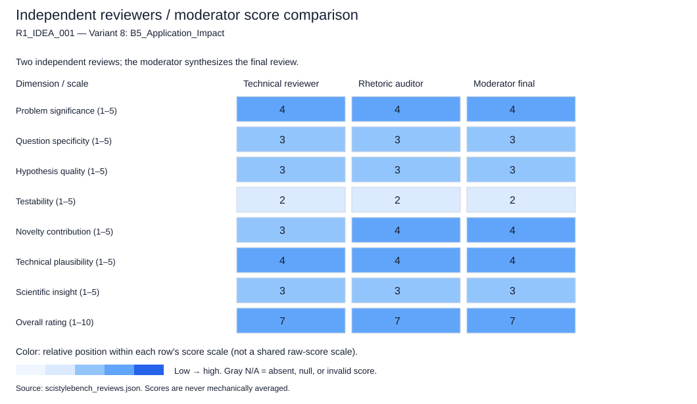

### Independent reviews

```json
{
  "technical_review": {
    "summary": "The idea proposes a decoupled graph energy-based model for node out-of-distribution detection on heterophilic graphs, addressing node dependence and heterophily to improve detection accuracy.",
    "strengths": [
      "Identifies a specific problem in graph-based out-of-distribution detection, particularly on heterophilic graphs.",
      "Proposes a novel approach (graph energy-based model) that directly addresses the limitations of image-based methods.",
      "Highlights potential practical applications in detecting anomalous nodes in real-world heterophilic networks."
    ],
    "weaknesses": [
      "Lacks specific details on the model architecture, training procedure, or evaluation metrics.",
      "The proposed method's novelty is not clearly distinguished from existing graph-based methods.",
      "The connection between the model's design and the specific challenges of heterophily is not elaborated."
    ],
    "suggestions": [
      "Provide a more detailed description of the graph energy-based model, including how it decouples node dependencies and handles heterophily.",
      "Compare the proposed method with existing approaches to highlight its unique contributions and advantages.",
      "Specify the evaluation metrics and datasets used to validate the model's effectiveness."
    ],
    "questions": [
      "How does the decoupled graph energy-based model specifically address node dependence and heterophily?",
      "What is the theoretical basis for the model's design, and how does it differ from existing graph-based energy models?",
      "What are the specific challenges in applying this model to heterophilic graphs, and how are they addressed?"
    ],
    "problem_significance": {
      "score": 4.0,
      "justification": "The problem of out-of-distribution detection on heterophilic graphs is important for reliable graph-based systems, especially in practical scenarios with anomalous nodes."
    },
    "question_specificity": {
      "score": 3.0,
      "justification": "The idea clearly defines the problem but lacks specific details on the research question, such as how the model decouples node dependencies and handles heterophily."
    },
    "hypothesis_quality": {
      "score": 3.0,
      "justification": "The idea suggests a novel approach but does not explicitly state a hypothesis or prediction that can be tested, such as improved detection accuracy on heterophilic graphs."
    },
    "testability": {
      "score": 2.0,
      "justification": "The idea lacks specific experiments or evaluation plans, making it difficult to assess the model's effectiveness without further details."
    },
    "novelty_contribution": {
      "score": 3.0,
      "justification": "The proposed graph energy-based model is novel in addressing node dependence and heterophily, but the novelty is not clearly distinguished from existing methods without more details."
    },
    "technical_plausibility": {
      "score": 4.0,
      "justification": "The approach of using a graph energy model to address node dependence and heterophily is technically plausible, though the specifics are not provided."
    },
    "scientific_insight": {
      "score": 3.0,
      "justification": "The idea has potential to provide insights into how graph-based models can be adapted for heterophilic scenarios, but the specific mechanisms are not elaborated."
    },
    "overall_rating": {
      "score": 7.0,
      "justification": "The idea addresses a meaningful problem in graph-based out-of-distribution detection, proposes a novel approach, and has potential for practical applications. However, it lacks specific details and testable hypotheses, which are needed for further development."
    },
    "confidence": 4.0
  },
  "rhetoric_review": {
    "summary": "The idea proposes a decoupled graph energy-based model for node out-of-distribution detection on heterophilic graphs, addressing node dependence and heterophily to improve detection accuracy.",
    "strengths": [
      "Identifies a specific problem in graph-based out-of-distribution detection, particularly on heterophilic graphs.",
      "Proposes a novel approach (graph energy-based model) that directly addresses the challenges of node dependence and heterophily.",
      "Highlights potential practical relevance for real-world applications involving heterophilic networks."
    ],
    "weaknesses": [
      "Lacks specific details on the model architecture, training methodology, or evaluation metrics.",
      "Does not clearly define the hypothesis or prediction that the model aims to test or validate.",
      "The connection between the proposed model and the problem of out-of-distribution detection is somewhat vague."
    ],
    "suggestions": [
      "Specify the components of the decoupled graph energy-based model, such as how node dependence and heterophily are explicitly addressed.",
      "Clarify the hypothesis, such as how the model is expected to outperform existing methods in terms of detection accuracy.",
      "Provide a more detailed description of the evaluation plan, including datasets, baselines, and metrics used."
    ],
    "questions": [
      "How does the decoupled graph energy-based model specifically account for node dependence and heterophily?",
      "What is the expected improvement in out-of-distribution detection accuracy compared to existing methods?",
      "What datasets and evaluation metrics will be used to validate the model's effectiveness?"
    ],
    "problem_significance": {
      "score": 4.0,
      "justification": "The problem of out-of-distribution detection on heterophilic graphs is important for reliable graph-based systems, especially in practical scenarios where anomalous nodes need to be detected."
    },
    "question_specificity": {
      "score": 3.0,
      "justification": "The idea identifies a specific problem (node-level OOD detection on heterophilic graphs) but lacks detailed specification of the research question or hypothesis."
    },
    "hypothesis_quality": {
      "score": 3.0,
      "justification": "The idea suggests a novel approach but does not explicitly state a hypothesis or prediction that can be tested or validated."
    },
    "testability": {
      "score": 2.0,
      "justification": "The idea lacks specific experimental details, such as evaluation metrics, datasets, or comparison methods, making it difficult to assess testability."
    },
    "novelty_contribution": {
      "score": 4.0,
      "justification": "The proposed graph energy-based model addresses a specific challenge in graph OOD detection, offering a novel approach to handle node dependence and heterophily."
    },
    "technical_plausibility": {
      "score": 4.0,
      "justification": "The approach of using a graph energy-based model to address node dependence and heterophily is technically plausible, though the specifics are not detailed."
    },
    "scientific_insight": {
      "score": 3.0,
      "justification": "The idea has potential to contribute to understanding how to effectively detect OOD nodes in heterophilic graphs, but the specific insights are not clearly outlined."
    },
    "overall_rating": {
      "score": 7.0,
      "justification": "The idea addresses a meaningful problem with a plausible approach, but lacks specific details needed for testability and hypothesis validation, which limits its current scientific potential."
    },
    "confidence": 4.0
  },
  "generation": {
    "technical_model_name": "Qwen/Qwen3-4B",
    "rhetoric_model_name": "Qwen/Qwen3-4B",
    "moderator_model_name": "Qwen/Qwen3-4B",
    "temperature": 0.0,
    "seed": 42
  }
}
```

## R1_IDEA_001 — Variant 9: C1_Hollow_Shell

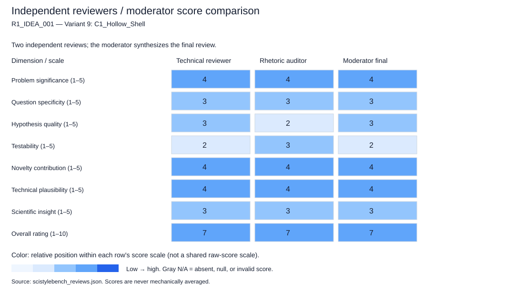

### Independent reviews

```json
{
  "technical_review": {
    "summary": "The idea proposes to address the limitations of existing node anomaly detection methods in graph data by introducing a new method that better captures relational characteristics, which are often overlooked in previous approaches from other domains.",
    "strengths": [
      "Identifies a meaningful problem in graph anomaly detection where existing methods fail to capture relational characteristics.",
      "Proposes a novel approach that directly addresses the identified limitation, suggesting potential for improvement over current methods."
    ],
    "weaknesses": [
      "Lacks specific details on the proposed method, the relational characteristics being targeted, or the specific graph settings considered.",
      "Does not clearly define the research question or hypothesis to be tested, making it difficult to assess the testability of the idea."
    ],
    "suggestions": [
      "Specify the types of relational characteristics that the method aims to capture (e.g., structural, temporal, or semantic relationships).",
      "Clarify the specific graph settings (e.g., social networks, biological networks, or other domains) where the method is intended to be applied.",
      "Define the research question or hypothesis, such as whether the new method outperforms existing methods in detecting anomalies in graphs with certain relational structures."
    ],
    "questions": [
      "What specific relational characteristics are being targeted by the new method?",
      "What are the specific graph settings where the method is intended to be applied?",
      "What is the research question or hypothesis that the new method is intended to address?",
      "How does the proposed method differ from existing approaches in capturing relational characteristics?"
    ],
    "problem_significance": {
      "score": 4.0,
      "justification": "Node anomaly detection in graphs is a critical task with applications in various domains, and the identified limitation of existing methods to capture relational characteristics is a valid and important problem."
    },
    "question_specificity": {
      "score": 3.0,
      "justification": "The idea identifies a problem but does not clearly define the specific research question or hypothesis that the new method is intended to address."
    },
    "hypothesis_quality": {
      "score": 3.0,
      "justification": "The idea suggests a potential improvement but does not explicitly state a hypothesis that can be tested or falsified."
    },
    "testability": {
      "score": 2.0,
      "justification": "The idea lacks specific experimental plans or evaluation metrics, making it difficult to assess how the proposed method would be tested or validated."
    },
    "novelty_contribution": {
      "score": 4.0,
      "justification": "The idea proposes a new method that directly addresses a known limitation in existing approaches, which could contribute to the field of graph anomaly detection."
    },
    "technical_plausibility": {
      "score": 4.0,
      "justification": "The proposed direction is technically plausible as it builds on existing methods and aims to improve them by capturing relational characteristics, which is a reasonable approach in the field."
    },
    "scientific_insight": {
      "score": 3.0,
      "justification": "The idea has potential for scientific insight by addressing a specific limitation in existing methods, but the lack of specific details makes it difficult to assess the potential for deeper insights."
    },
    "overall_rating": {
      "score": 7.0,
      "justification": "The idea addresses a meaningful problem in graph anomaly detection and proposes a novel approach to address a known limitation. However, it lacks specific details on the method, research question, and evaluation plan, which are necessary for assessing its testability and potential contribution."
    },
    "confidence": 4.0
  },
  "rhetoric_review": {
    "summary": "The research idea proposes to address the limitations of existing node anomaly detection methods in graph data by introducing a new method that better captures relational characteristics, which are often overlooked in previous approaches from other domains.",
    "strengths": [
      "Identifies a clear problem in the field of graph anomaly detection: the limitation of existing methods in capturing relational characteristics.",
      "Proposes a novel approach that directly addresses this problem by focusing on relational characteristics.",
      "Highlights the gap between current methods and the potential for improvement through a new method."
    ],
    "weaknesses": [
      "The idea is quite vague in terms of the specific method or mechanism proposed.",
      "Lacks a clear hypothesis or prediction about how the new method will perform compared to existing ones.",
      "Does not specify the graph settings or types of anomalies being targeted, which are important for evaluating the scope and applicability of the work."
    ],
    "suggestions": [
      "Specify the particular relational characteristics that the new method aims to capture, such as structural patterns, node interactions, or dynamic relationships.",
      "Provide a hypothesis about the expected performance improvement, such as better detection accuracy or robustness to certain types of anomalies.",
      "Define the specific graph settings (e.g., social networks, biological networks) and types of anomalies (e.g., stealthy, structural) that the method is designed for.",
      "Outline the evaluation plan, including benchmark datasets and comparison metrics."
    ],
    "questions": [
      "What specific relational characteristics does the new method aim to capture, and how will they be incorporated into the detection process?",
      "How does the proposed method differ from existing approaches in terms of capturing relational information?",
      "What graph settings and types of anomalies are targeted by the method, and why are they particularly challenging?",
      "What metrics and benchmarks will be used to evaluate the effectiveness of the new method?"
    ],
    "problem_significance": {
      "score": 4.0,
      "justification": "Node anomaly detection in graphs is a critical task with applications in cybersecurity, social network analysis, and recommendation systems. The identified problem of overlooked relational characteristics is a meaningful challenge that could improve the accuracy and robustness of anomaly detection in real-world scenarios."
    },
    "question_specificity": {
      "score": 3.0,
      "justification": "The idea clearly identifies a problem but lacks specific details about the relational characteristics, the method's design, and the target graph settings. More specificity would strengthen the research question."
    },
    "hypothesis_quality": {
      "score": 2.0,
      "justification": "The idea mentions a new method but does not provide a clear hypothesis or prediction about its performance or mechanism. A hypothesis would help distinguish this work from generic applications."
    },
    "testability": {
      "score": 3.0,
      "justification": "The idea suggests a new method but does not specify how it will be tested or compared to existing methods. Without a clear evaluation plan, the testability is limited."
    },
    "novelty_contribution": {
      "score": 4.0,
      "justification": "The idea proposes a novel approach to address a specific gap in existing methods. While the method itself is not detailed, the focus on relational characteristics represents a meaningful contribution to the field."
    },
    "technical_plausibility": {
      "score": 4.0,
      "justification": "The proposed direction is technically plausible as it builds on existing graph anomaly detection methods and focuses on capturing relational information, which is a reasonable and feasible approach."
    },
    "scientific_insight": {
      "score": 3.0,
      "justification": "The idea has potential for scientific insight by addressing a specific gap in relational information handling. However, without a clear hypothesis or evaluation plan, the potential for deeper insights is limited."
    },
    "overall_rating": {
      "score": 7.0,
      "justification": "The idea identifies a meaningful problem in graph anomaly detection and proposes a novel direction to address it. However, it lacks specific details about the method, hypothesis, and evaluation plan, which are necessary for a strong research idea."
    },
    "confidence": 4.0
  },
  "generation": {
    "technical_model_name": "Qwen/Qwen3-4B",
    "rhetoric_model_name": "Qwen/Qwen3-4B",
    "moderator_model_name": "Qwen/Qwen3-4B",
    "temperature": 0.0,
    "seed": 42
  }
}
```

## R1_IDEA_001 — Variant 10: C2_Logic_Flawed


### Independent reviews

```json
{
  "technical_review": {
    "summary": "The idea proposes a decoupled graph energy-based model for node-level out-of-distribution detection on heterophilic graphs, addressing node dependence and heterophily to improve detection effectiveness across related graph learning tasks.",
    "strengths": [
      "Identifies a specific problem in graph learning: node-level out-of-distribution detection on heterophilic graphs.",
      "Proposes a novel approach (graph energy-based model) that directly addresses the challenges of node dependence and heterophily.",
      "Suggests broader applicability to related graph learning tasks, indicating potential for impactful contributions."
    ],
    "weaknesses": [
      "Lacks specific details on the proposed model's architecture or how it decouples node dependencies.",
      "Does not clearly define the hypothesis or prediction to be tested (e.g., how the model improves detection compared to existing methods).",
      "The connection between addressing node dependence/heterophily and broader effectiveness in related tasks is not explicitly explained."
    ],
    "suggestions": [
      "Specify the model's architecture, including how it decouples node dependencies and incorporates heterophily.",
      "Define the hypothesis, such as a comparison with existing methods in terms of detection accuracy or F1 score.",
      "Clarify the mechanism by which the model's design leads to broader effectiveness in related tasks."
    ],
    "questions": [
      "How does the decoupled graph energy-based model specifically address node dependence and heterophily?",
      "What is the proposed hypothesis for improvement in out-of-distribution detection?",
      "How does the model's design ensure broader effectiveness in related graph learning tasks?"
    ],
    "problem_significance": {
      "score": 4.0,
      "justification": "The problem of node-level out-of-distribution detection on heterophilic graphs is important for graph learning, as heterophily is a key challenge in many real-world scenarios."
    },
    "question_specificity": {
      "score": 3.0,
      "justification": "The idea identifies a specific problem but lacks concrete details on the research question, such as the exact mechanism or comparison to existing methods."
    },
    "hypothesis_quality": {
      "score": 3.0,
      "justification": "The idea suggests a potential improvement but does not explicitly state a testable hypothesis, such as a prediction about performance metrics or specific scenarios where the model excels."
    },
    "testability": {
      "score": 3.0,
      "justification": "The idea proposes a method but does not specify experiments or evaluations to test its effectiveness, such as comparisons with existing methods or ablation studies."
    },
    "novelty_contribution": {
      "score": 4.0,
      "justification": "The approach of using a graph energy-based model to address node dependence and heterophily is novel for this specific problem, though it may not be entirely novel in the broader context of energy-based models."
    },
    "technical_plausibility": {
      "score": 4.0,
      "justification": "The proposed direction is technically plausible, as energy-based models are used in various domains, and addressing node dependence and heterophily is a reasonable challenge in graph learning."
    },
    "scientific_insight": {
      "score": 3.0,
      "justification": "The idea has potential for scientific insight by exploring how graph structure influences out-of-distribution detection, but the connection to broader tasks is not clearly established."
    },
    "overall_rating": {
      "score": 7.0,
      "justification": "The idea addresses a meaningful problem in graph learning with a plausible approach, but lacks specific details on the model, hypothesis, and evaluation plan, which are necessary for assessing its scientific merit and potential impact."
    },
    "confidence": 4.0
  },
  "rhetoric_review": {
    "summary": "The idea proposes a decoupled graph energy-based model for node-level out-of-distribution detection on heterophilic graphs, addressing node dependence and heterophily to improve detection effectiveness across related graph learning tasks.",
    "strengths": [
      "Identifies a specific problem in graph learning: node-level out-of-distribution detection on heterophilic graphs.",
      "Proposes a novel approach (decoupled graph energy-based model) that directly addresses the problem's key challenges (node dependence and heterophily).",
      "Suggests potential broader applicability to related graph learning tasks, indicating theoretical significance.",
      "Highlights the importance of considering node relationships, which is a critical aspect in graph-based methods."
    ],
    "weaknesses": [
      "Lacks concrete details on how the decoupled graph energy-based model is implemented or how it differs from existing methods.",
      "Does not specify the evaluation metrics or benchmarks used to validate the effectiveness of the proposed model.",
      "The connection between addressing node dependence/heterophily and improved out-of-distribution detection is not clearly explained.",
      "The claim of 'broader effectiveness across related tasks' is vague and lacks specific examples or justification."
    ],
    "suggestions": [
      "Provide a more detailed description of the decoupled graph energy-based model, including its architecture, training objectives, and key components.",
      "Specify the evaluation metrics (e.g., AUC-ROC, F1-score) and benchmark datasets used to assess the model's performance.",
      "Clarify the theoretical justification for how the model's design addresses node dependence and heterophily in out-of-distribution detection.",
      "Identify specific related graph learning tasks where the model's effectiveness could be tested, such as link prediction or graph classification."
    ],
    "questions": [
      "How does the decoupled graph energy-based model specifically account for node dependence and heterophily in the detection process?",
      "What are the key differences between the proposed model and existing energy-based methods for out-of-distribution detection?",
      "What evaluation metrics and datasets will be used to validate the model's effectiveness?",
      "How does the model's performance compare to state-of-the-art methods on standard graph learning tasks?"
    ],
    "problem_significance": {
      "score": 4.0,
      "justification": "The problem of node-level out-of-distribution detection on heterophilic graphs is important in graph learning, as it addresses a critical challenge in handling complex, interdependent data structures."
    },
    "question_specificity": {
      "score": 3.0,
      "justification": "The idea clearly defines the problem (node-level OOD detection on heterophilic graphs) but lacks specific details on the research question or hypothesis that would guide the investigation."
    },
    "hypothesis_quality": {
      "score": 3.0,
      "justification": "The idea suggests that the proposed model will improve detection effectiveness by addressing node dependence and heterophily, but the hypothesis is not explicitly stated or detailed enough to be testable without further specification."
    },
    "testability": {
      "score": 2.0,
      "justification": "The idea lacks concrete experimental plans or evaluation methods, making it difficult to assess the testability of the proposed approach without additional details."
    },
    "novelty_contribution": {
      "score": 4.0,
      "justification": "The proposed decoupled graph energy-based model is a novel approach to address the specific challenges of node-level OOD detection on heterophilic graphs, which could contribute to the field of graph learning."
    },
    "technical_plausibility": {
      "score": 4.0,
      "justification": "The idea is technically plausible as it builds on existing graph learning principles and addresses known challenges in heterophilic graph modeling."
    },
    "scientific_insight": {
      "score": 3.0,
      "justification": "The idea has potential for scientific insight by exploring how node dependence and heterophily affect OOD detection, but the connection to broader insights is not clearly established."
    },
    "overall_rating": {
      "score": 7.0,
      "justification": "The idea addresses a meaningful problem in graph learning with a novel approach, but lacks specific details on the research question, hypothesis, and evaluation plan, which are necessary for assessing its testability and scientific contribution."
    },
    "confidence": 4.0
  },
  "generation": {
    "technical_model_name": "Qwen/Qwen3-4B",
    "rhetoric_model_name": "Qwen/Qwen3-4B",
    "moderator_model_name": "Qwen/Qwen3-4B",
    "temperature": 0.0,
    "seed": 42
  }
}
```

## R1_IDEA_001 — Variant 11: C3_Substance_Enriched


### Independent reviews

```json
{
  "technical_review": {
    "summary": "The research idea proposes a decoupled graph energy-based model for node out-of-distribution detection on heterophilic graphs, addressing the limitations of image-based methods by explicitly modeling node dependence and heterophily.",
    "strengths": [
      "Identifies a meaningful problem in graph out-of-distribution detection, which is underexplored in the field.",
      "Proposes a specific hypothesis about decoupling homophilic and heterophilic edges to improve detection performance.",
      "Suggests concrete validation methods, including synthetic and real-world experiments with controlled conditions.",
      "Mentions boundary conditions that could reveal the model's effectiveness under extreme scenarios."
    ],
    "weaknesses": [
      "The idea lacks specific details on how the decoupled graph energy model is implemented or how node dependence and heterophily are explicitly modeled.",
      "The hypothesis is plausible but not explicitly stated as a testable claim, leaving room for ambiguity.",
      "The connection between decoupling edges and node-level energy separation is not clearly explained.",
      "The idea does not specify how the model will be evaluated beyond general validation methods."
    ],
    "suggestions": [
      "Clarify the architecture of the decoupled graph energy model, including how node dependence and heterophily are incorporated.",
      "Formulate the hypothesis as a specific prediction, such as a quantitative improvement in detection accuracy under heterophilic conditions.",
      "Provide a more detailed explanation of how node-level energy separation is achieved through edge decoupling.",
      "Specify the metrics and benchmarks for evaluating the model's performance on synthetic and real-world datasets."
    ],
    "questions": [
      "How does the decoupled graph energy model explicitly account for node dependence and heterophily?",
      "What is the specific mechanism by which decoupling homophilic and heterophilic edges improves node-level energy separation?",
      "How will the model's performance be quantitatively evaluated on synthetic and real-world datasets?",
      "What are the expected results under extreme heterophily ratios or low edge density conditions?"
    ],
    "problem_significance": {
      "score": 4.0,
      "justification": "The problem of out-of-distribution detection on heterophilic graphs is underexplored and has practical relevance for graph-based machine learning, especially in scenarios where node dependencies and heterophily are significant."
    },
    "question_specificity": {
      "score": 3.0,
      "justification": "The idea clearly defines the problem and proposes a specific hypothesis about decoupling edges, but lacks detailed specification of the model's implementation and evaluation methodology."
    },
    "hypothesis_quality": {
      "score": 3.0,
      "justification": "The hypothesis is plausible and suggests a direction for investigation, but it is not explicitly stated as a testable claim and lacks a clear prediction of outcomes."
    },
    "testability": {
      "score": 3.0,
      "justification": "The idea suggests experiments on synthetic and real-world data, but the specific experimental design, metrics, and comparison baselines are not detailed, making it challenging to assess testability."
    },
    "novelty_contribution": {
      "score": 4.0,
      "justification": "The approach of decoupling homophilic and heterophilic edges for out-of-distribution detection is novel in the context of graph-based methods, though it may build on existing energy-based models."
    },
    "technical_plausibility": {
      "score": 4.0,
      "justification": "The proposed method is technically plausible, as it addresses known challenges in graph learning, and the hypothesis aligns with existing research on heterophily and energy-based models."
    },
    "scientific_insight": {
      "score": 3.0,
      "justification": "The idea has potential to provide insights into how edge decoupling affects node-level energy separation, but the connection to broader scientific principles is not explicitly outlined."
    },
    "overall_rating": {
      "score": 7.0,
      "justification": "The idea addresses a meaningful problem with a specific hypothesis and suggests practical validation methods. However, it lacks detailed technical specifications and explicit testable claims, which are needed for a stronger research proposal."
    },
    "confidence": 4.0
  },
  "rhetoric_review": {
    "summary": "The research idea proposes a decoupled graph energy-based model for node out-of-distribution detection on heterophilic graphs, addressing the limitations of image-based methods by explicitly modeling node dependence and heterophily.",
    "strengths": [
      "Identifies a meaningful problem in graph out-of-distribution detection, which is a critical area in graph learning.",
      "Proposes a specific hypothesis about decoupling homophilic and heterophilic edges to improve detection performance.",
      "Includes potential experimental directions (synthetic and real-world tests, boundary conditions) that are testable and relevant.",
      "Highlights the importance of addressing node dependence and heterophily, which are key challenges in graph data."
    ],
    "weaknesses": [
      "The idea is somewhat vague in terms of the specific method or model architecture, which could be a limitation in testability.",
      "The hypothesis is plausible but lacks a concrete mechanism or prediction that could be directly tested without further specification.",
      "The connection between decoupling edges and node-level energy separation is not clearly explained, which may require additional clarification.",
      "The idea does not explicitly state how the model will be evaluated or what metrics will be used to measure success."
    ],
    "suggestions": [
      "Specify the decoupled graph energy model in more detail, including how homophilic and heterophilic edges are modeled and how node energies are computed.",
      "Clarify the hypothesis by explicitly stating how the decoupling of edges will lead to improved separation between in-distribution and out-of-distribution node energies.",
      "Define the evaluation metrics and baselines that will be used to compare the proposed model against existing methods.",
      "Provide more details on the synthetic data generation process and the specific real-world datasets that will be used for validation."
    ],
    "questions": [
      "How will the decoupled graph energy model specifically handle node dependence and heterophily?",
      "What is the exact mechanism by which decoupling homophilic and heterophilic edges improves node-level energy separation?",
      "What metrics will be used to evaluate the performance of the model, and how will they be compared to existing methods?",
      "How will the model be tested on graphs with extreme heterophily ratios or very low edge density?"
    ],
    "problem_significance": {
      "score": 4.0,
      "justification": "The problem of out-of-distribution detection on heterophilic graphs is important for graph learning, as it addresses a critical challenge in real-world applications where data distributions can shift."
    },
    "question_specificity": {
      "score": 3.0,
      "justification": "The idea clearly defines the problem and proposes a specific hypothesis about decoupling edges, but lacks concrete details on the model or evaluation plan, which could affect testability."
    },
    "hypothesis_quality": {
      "score": 3.0,
      "justification": "The hypothesis is plausible and suggests a direction for improvement, but it is not explicitly stated in a way that clearly predicts a specific outcome or mechanism."
    },
    "testability": {
      "score": 3.0,
      "justification": "The idea includes potential experiments and validation steps, but the specifics of the model and evaluation are not detailed enough to fully assess testability."
    },
    "novelty_contribution": {
      "score": 4.0,
      "justification": "The approach of explicitly modeling node dependence and heterophily in a graph energy-based model is novel for out-of-distribution detection, though it may not be entirely new if similar methods exist."
    },
    "technical_plausibility": {
      "score": 4.0,
      "justification": "The proposed direction is technically plausible, as it builds on existing graph learning and energy-based modeling techniques, and addresses a known challenge in the field."
    },
    "scientific_insight": {
      "score": 3.0,
      "justification": "The idea has potential to provide insights into how graph structure (node dependence and heterophily) affects out-of-distribution detection, but the specific mechanisms are not clearly outlined."
    },
    "overall_rating": {
      "score": 7.0,
      "justification": "The idea addresses a meaningful problem with a specific hypothesis and potential for contribution, though it lacks concrete details on the model and evaluation plan, which could affect its testability and novelty."
    },
    "confidence": 4.0
  },
  "generation": {
    "technical_model_name": "Qwen/Qwen3-4B",
    "rhetoric_model_name": "Qwen/Qwen3-4B",
    "moderator_model_name": "Qwen/Qwen3-4B",
    "temperature": 0.0,
    "seed": 42
  }
}
```

## R1_IDEA_002 — Source

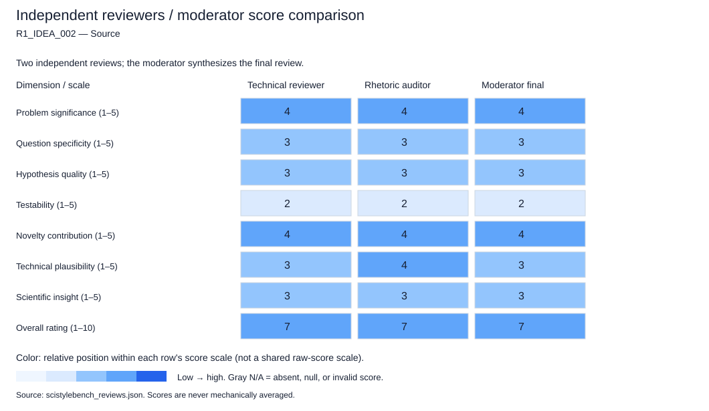

### Independent reviews

```json
{
  "technical_review": {
    "summary": "The idea proposes using improved off-policy learning to train diffusion path samplers for generating transition pathways between meta-stable molecular states, aiming to overcome the computational limitations of unbiased molecular dynamics and enable rare-event exploration in complex systems for drug discovery and material design.",
    "strengths": [
      "The idea addresses a significant challenge in computational chemistry and materials science by proposing a novel machine learning approach to overcome the computational infeasibility of unbiased molecular dynamics.",
      "The focus on rare-event exploration for drug discovery and material design highlights the potential real-world impact of the research.",
      "The use of off-policy learning suggests a methodological innovation that could lead to more efficient sampling strategies in complex systems."
    ],
    "weaknesses": [
      "The idea lacks specific details on how the off-policy learning is implemented or how the diffusion path samplers are trained, making it difficult to assess the technical feasibility.",
      "The connection between the proposed method and the specific problem of sampling transition pathways between meta-stable states is not clearly articulated.",
      "The potential benefits of the approach are not directly tied to the specific challenges of molecular dynamics or rare-event exploration without further clarification."
    ],
    "suggestions": [
      "Provide a more detailed description of the off-policy learning framework and how it is applied to train the diffusion path samplers.",
      "Clarify the relationship between the proposed method and the specific task of sampling transition pathways between meta-stable molecular states.",
      "Specify how the method addresses the computational infeasibility of unbiased molecular dynamics and how it enables rare-event exploration."
    ],
    "questions": [
      "How does the off-policy learning framework specifically contribute to the training of diffusion path samplers?",
      "What is the exact mechanism by which the method enables rare-event exploration in complex systems?",
      "How does the proposed approach compare to existing methods in terms of computational efficiency and accuracy for sampling transition pathways?"
    ],
    "problem_significance": {
      "score": 4.0,
      "justification": "The problem of efficiently sampling rare events in complex molecular systems is highly significant for drug discovery and materials science, as it addresses a major computational bottleneck in these fields."
    },
    "question_specificity": {
      "score": 3.0,
      "justification": "The idea identifies a specific problem (sampling transition pathways between meta-stable states) but lacks detailed specification of the research question, such as how off-policy learning is applied or what specific aspects of the sampling process are being improved."
    },
    "hypothesis_quality": {
      "score": 3.0,
      "justification": "The idea presents a general hypothesis that the proposed method will overcome computational infeasibility and enable rare-event exploration, but it does not provide a concrete prediction or mechanism that can be tested or falsified without further details."
    },
    "testability": {
      "score": 2.0,
      "justification": "The idea is too vague to determine how the method would be tested. Without specific experimental designs or evaluation metrics, it is unclear how to validate the claims about computational efficiency and rare-event exploration."
    },
    "novelty_contribution": {
      "score": 4.0,
      "justification": "The approach of using off-policy learning for training diffusion path samplers in the context of molecular dynamics is novel, though the exact contribution depends on the specific implementation details that are not provided."
    },
    "technical_plausibility": {
      "score": 3.0,
      "justification": "The use of off-policy learning in this context is plausible, but the technical feasibility is uncertain without more details on the implementation and how it addresses the specific challenges of molecular dynamics."
    },
    "scientific_insight": {
      "score": 3.0,
      "justification": "The idea has the potential to provide insights into efficient sampling methods for complex systems, but the specific scientific insights depend on the detailed investigation of the method's effectiveness and its impact on rare-event exploration."
    },
    "overall_rating": {
      "score": 7.0,
      "justification": "The idea addresses a significant problem in computational chemistry and materials science with a potentially novel approach. However, it lacks sufficient specificity, testability, and detailed technical description to fully assess its feasibility and scientific contribution."
    },
    "confidence": 4.0
  },
  "rhetoric_review": {
    "summary": "The research idea proposes training diffusion path samplers using improved off-policy learning to sample transition pathways between meta-stable molecular states without predefined collective variables, aiming to address computational challenges in unbiased molecular dynamics and enable rare-event exploration for drug discovery and material design.",
    "strengths": [
      "The idea addresses a significant challenge in computational chemistry and materials science by proposing a novel approach to sample rare events in complex molecular systems.",
      "The use of diffusion path samplers and off-policy learning suggests a technically plausible method for improving sampling efficiency in high-dimensional spaces.",
      "The application to drug discovery and material design highlights the potential for impactful real-world applications."
    ],
    "weaknesses": [
      "The idea lacks a clear, specific research question or hypothesis that could be tested or falsified.",
      "The connection between off-policy learning and diffusion path samplers is not sufficiently explained, making it unclear how the method would work in practice.",
      "There is no mention of how the method would be evaluated or validated, which is essential for determining its effectiveness."
    ],
    "suggestions": [
      "Define a specific research question, such as whether the proposed method can sample transition pathways more efficiently than existing methods in a controlled setting.",
      "Provide a more detailed explanation of how off-policy learning is applied to diffusion path samplers, including the specific algorithms or frameworks used.",
      "Outline a clear evaluation plan, including benchmark datasets or simulations that would be used to assess the method's performance."
    ],
    "questions": [
      "How does the proposed method ensure that the sampled pathways are accurate and representative of the true transition paths?",
      "What are the specific advantages of using off-policy learning in this context compared to other reinforcement learning or sampling techniques?",
      "How will the method be validated against existing approaches in terms of computational efficiency and accuracy?"
    ],
    "problem_significance": {
      "score": 4.0,
      "justification": "The problem of efficiently sampling rare events in complex molecular systems is critical for drug discovery and materials science, with significant practical implications."
    },
    "question_specificity": {
      "score": 3.0,
      "justification": "The idea identifies a meaningful problem but lacks a concrete, testable question that would guide the research. More specific objectives are needed."
    },
    "hypothesis_quality": {
      "score": 3.0,
      "justification": "The idea presents a general goal but does not clearly state a hypothesis that can be tested or falsified. A specific prediction about the method's performance is missing."
    },
    "testability": {
      "score": 2.0,
      "justification": "The idea does not provide a clear experimental plan or evaluation method, making it difficult to assess the feasibility of the proposed approach."
    },
    "novelty_contribution": {
      "score": 4.0,
      "justification": "The approach of using off-policy learning for diffusion path samplers in molecular dynamics is novel and could contribute new insights into efficient sampling methods."
    },
    "technical_plausibility": {
      "score": 4.0,
      "justification": "The combination of diffusion path samplers and off-policy learning is technically plausible, though the specific implementation details are not provided."
    },
    "scientific_insight": {
      "score": 3.0,
      "justification": "The idea has potential to provide insights into efficient sampling in complex systems, but the lack of specific hypotheses and evaluation plans limits the potential for scientific discovery."
    },
    "overall_rating": {
      "score": 7.0,
      "justification": "The idea addresses a significant problem with potential for impactful applications, but it lacks specific research questions, hypotheses, and evaluation plans that are necessary for further development and validation."
    },
    "confidence": 4.0
  },
  "generation": {
    "technical_model_name": "Qwen/Qwen3-4B",
    "rhetoric_model_name": "Qwen/Qwen3-4B",
    "moderator_model_name": "Qwen/Qwen3-4B",
    "temperature": 0.0,
    "seed": 42
  }
}
```

## R1_IDEA_002 — Variant 1: A1_Identity

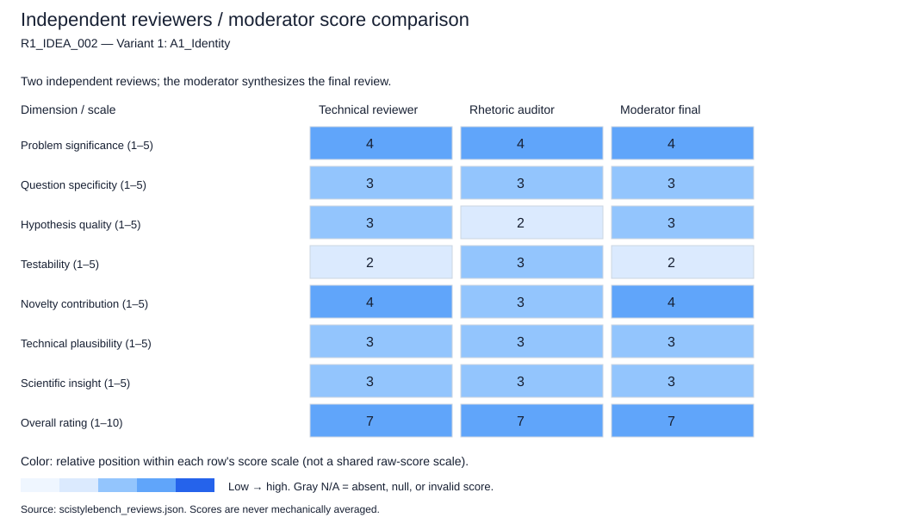

### Independent reviews

```json
{
  "technical_review": {
    "summary": "The research idea proposes using improved off-policy learning to train diffusion path samplers for generating transition pathways between meta-stable molecular states, aiming to bypass the computational limits of unbiased molecular dynamics and facilitate rare-event exploration in drug discovery and material design.",
    "strengths": [
      "The idea addresses a significant challenge in computational chemistry and materials science by proposing a novel machine learning approach to overcome the computational infeasibility of traditional methods.",
      "It introduces a specific method (improved off-policy learning) that could potentially enable efficient sampling of rare events in complex systems, which is relevant to drug discovery and material design.",
      "The focus on transition pathways between meta-stable states is a concrete and meaningful research question with potential for scientific insight."
    ],
    "weaknesses": [
      "The idea lacks specific details on how the off-policy learning is improved or what exactly constitutes the 'diffusion path samplers' in this context.",
      "The connection between the proposed method and the specific problem of rare-event exploration is not clearly articulated, making it difficult to assess the feasibility of the approach.",
      "The potential application to drug discovery and material design is mentioned, but the idea does not specify how the method would be evaluated or validated in these domains."
    ],
    "suggestions": [
      "Clarify the specifics of the off-policy learning method, including the algorithm or framework used, and how it is improved over existing approaches.",
      "Define the 'diffusion path samplers' more precisely, including their role in generating transition pathways and how they are trained.",
      "Provide a clearer link between the method and the problem of rare-event exploration, including how the method would be validated in the context of drug discovery and material design."
    ],
    "questions": [
      "What is the specific off-policy learning method being used, and how is it improved?",
      "How are the diffusion path samplers defined and trained within this approach?",
      "What metrics or benchmarks will be used to evaluate the effectiveness of the method in rare-event exploration?",
      "How does this approach compare to existing methods in terms of computational efficiency and accuracy for the target applications?"
    ],
    "problem_significance": {
      "score": 4.0,
      "justification": "The problem of efficiently exploring rare events in complex molecular systems is critical for drug discovery and material design, and the proposed approach aims to address a significant computational challenge."
    },
    "question_specificity": {
      "score": 3.0,
      "justification": "The research question is specific to training diffusion path samplers for transition pathways between meta-stable states, but the details on the method and its implementation are not sufficiently elaborated."
    },
    "hypothesis_quality": {
      "score": 3.0,
      "justification": "The idea presents a general hypothesis that the proposed method could overcome computational infeasibility, but it lacks explicit predictions or mechanisms that could be tested or falsified."
    },
    "testability": {
      "score": 2.0,
      "justification": "The idea is somewhat testable in principle, but the lack of specific experimental design or evaluation metrics makes it difficult to assess the feasibility of the approach without further details."
    },
    "novelty_contribution": {
      "score": 4.0,
      "justification": "The approach of using off-policy learning for diffusion path samplers in molecular dynamics is novel, and if successful, could contribute to more efficient rare-event exploration in complex systems."
    },
    "technical_plausibility": {
      "score": 3.0,
      "justification": "The idea is technically plausible, as off-policy learning and diffusion models are established techniques, but the specific combination and implementation details are not clearly defined."
    },
    "scientific_insight": {
      "score": 3.0,
      "justification": "The research could provide insights into the effectiveness of machine learning in simulating rare events in complex systems, but the potential for broader scientific insight is limited without further specifics."
    },
    "overall_rating": {
      "score": 7.0,
      "justification": "The idea addresses a meaningful problem with a potentially novel approach, but lacks sufficient specificity and testable hypotheses to fully assess its scientific merit and feasibility."
    },
    "confidence": 4.0
  },
  "rhetoric_review": {
    "summary": "The research idea proposes training diffusion path samplers using improved off-policy learning to sample transition pathways between meta-stable molecular states without predefined collective variables, aiming to address computational challenges in unbiased molecular dynamics and enable rare-event exploration for drug discovery and material design.",
    "strengths": [
      "The idea addresses a significant challenge in computational chemistry and materials science by proposing a novel machine learning approach to sample molecular transition pathways efficiently.",
      "The use of off-policy learning suggests a potential for more efficient and scalable training methods compared to traditional reinforcement learning approaches.",
      "The application to drug discovery and material design highlights the practical importance of the research problem."
    ],
    "weaknesses": [
      "The idea lacks a clear definition of what 'improved off-policy learning' entails, which is critical for assessing its novelty and technical feasibility.",
      "There is no explicit hypothesis or prediction provided about how the proposed method will outperform existing approaches in terms of efficiency or accuracy.",
      "The connection between diffusion path samplers and off-policy learning is not clearly explained, which may hinder the understanding of the method's technical basis."
    ],
    "suggestions": [
      "Define the specific improvements in off-policy learning that will be applied, such as algorithmic changes, loss functions, or training strategies.",
      "Provide a concrete hypothesis, such as the expectation that the method will reduce computational cost by a certain factor or improve sampling efficiency in specific scenarios.",
      "Clarify the relationship between diffusion path samplers and off-policy learning, including how the latter enhances the former's performance."
    ],
    "questions": [
      "What specific improvements in off-policy learning are being proposed, and how do they differ from existing methods?",
      "How does the proposed method ensure that the sampled transition pathways are accurate and representative of the underlying molecular dynamics?",
      "What are the expected computational benefits compared to traditional unbiased molecular dynamics or other sampling methods?"
    ],
    "problem_significance": {
      "score": 4.0,
      "justification": "The problem of efficiently sampling rare events in complex molecular systems is critical for drug discovery and materials science, with significant practical implications."
    },
    "question_specificity": {
      "score": 3.0,
      "justification": "The idea identifies a specific problem (sampling transition pathways between meta-stable states) but lacks detailed specification of the research question, such as how off-policy learning will be applied or what metrics will be used to evaluate success."
    },
    "hypothesis_quality": {
      "score": 2.0,
      "justification": "The idea suggests a potential solution but does not provide a clear, testable hypothesis about the method's performance or the specific mechanism by which it improves sampling efficiency."
    },
    "testability": {
      "score": 3.0,
      "justification": "The idea is testable in principle, but the lack of specific experimental design or evaluation metrics makes it difficult to assess the feasibility of the proposed approach without further details."
    },
    "novelty_contribution": {
      "score": 3.0,
      "justification": "The approach of using off-policy learning for diffusion path samplers is potentially novel, but the idea does not clearly distinguish it from existing methods or provide evidence of its unique contribution."
    },
    "technical_plausibility": {
      "score": 3.0,
      "justification": "The combination of diffusion path samplers and off-policy learning is plausible, but the specific technical details and how they will be implemented are not clearly outlined."
    },
    "scientific_insight": {
      "score": 3.0,
      "justification": "The idea has the potential to provide insights into efficient sampling in complex systems, but the lack of specific hypotheses or mechanisms limits the potential for new scientific understanding."
    },
    "overall_rating": {
      "score": 7.0,
      "justification": "The idea addresses a meaningful problem with a potentially novel approach, but it lacks sufficient specificity, hypothesis, and technical details to fully establish its scientific merit and testability."
    },
    "confidence": 4.0
  },
  "generation": {
    "technical_model_name": "Qwen/Qwen3-4B",
    "rhetoric_model_name": "Qwen/Qwen3-4B",
    "moderator_model_name": "Qwen/Qwen3-4B",
    "temperature": 0.0,
    "seed": 42
  }
}
```

## R1_IDEA_002 — Variant 2: A2_Paraphrase_Only

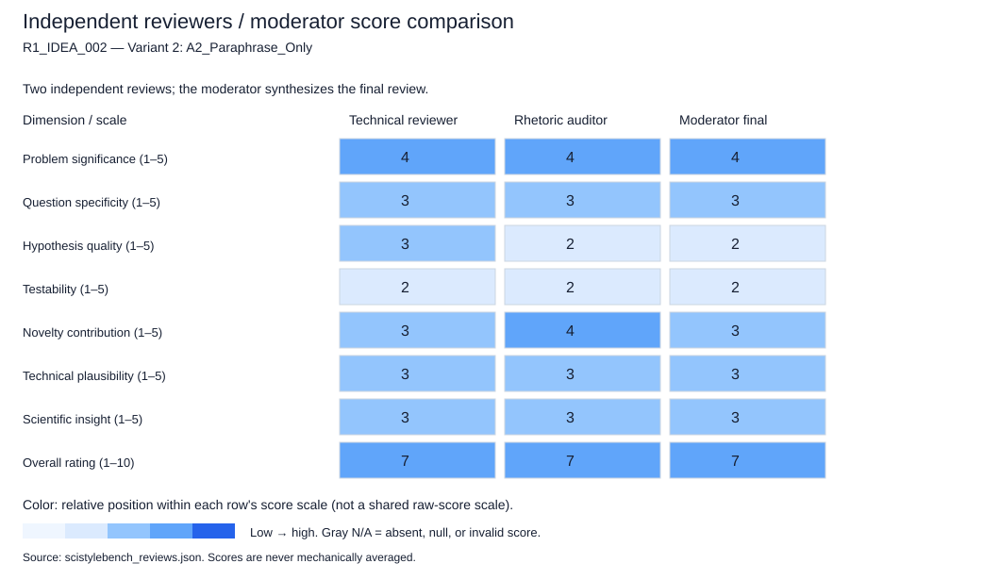

### Independent reviews

```json
{
  "technical_review": {
    "summary": "The research idea proposes using improved off-policy learning to train diffusion path samplers for sampling transition pathways between meta-stable molecular states, aiming to bypass the need for predefined collective variables and address computational challenges in unbiased molecular dynamics for drug discovery and material design.",
    "strengths": [
      "The idea addresses a significant challenge in molecular dynamics simulations by proposing a novel method to sample rare events without relying on predefined collective variables.",
      "The use of off-policy learning suggests a potential for more efficient and scalable sampling methods in complex systems.",
      "The application to drug discovery and material design highlights the practical importance of the research problem."
    ],
    "weaknesses": [
      "The idea lacks specific details on how off-policy learning is implemented or how the diffusion path samplers are trained.",
      "The connection between off-policy learning and the specific task of sampling transition pathways is not clearly explained.",
      "The potential benefits are not fully elaborated, making it difficult to assess the novelty or technical plausibility of the approach."
    ],
    "suggestions": [
      "Clarify the specific implementation of off-policy learning and how it is applied to train the diffusion path samplers.",
      "Provide a more detailed explanation of how the method avoids predefined collective variables and how it addresses computational infeasibility.",
      "Include a comparison with existing methods to highlight the novelty and potential advantages of the proposed approach."
    ],
    "questions": [
      "How does the off-policy learning framework specifically enable the sampling of transition pathways between meta-stable states?",
      "What is the mechanism by which the method bypasses the need for predefined collective variables?",
      "How does the proposed method compare in terms of computational efficiency and accuracy to existing approaches for rare-event sampling in molecular dynamics?"
    ],
    "problem_significance": {
      "score": 4.0,
      "justification": "The problem of rare-event sampling in molecular dynamics is critical for drug discovery and material design, making the research problem highly significant."
    },
    "question_specificity": {
      "score": 3.0,
      "justification": "The idea identifies a specific problem (sampling transition pathways without predefined variables) but lacks detailed specification of the research question or hypothesis."
    },
    "hypothesis_quality": {
      "score": 3.0,
      "justification": "The idea suggests a potential solution but does not explicitly state a hypothesis or prediction that can be tested or falsified."
    },
    "testability": {
      "score": 2.0,
      "justification": "The idea is somewhat testable, but the lack of specific implementation details and clear experimental design makes it difficult to assess the feasibility of testing the hypothesis."
    },
    "novelty_contribution": {
      "score": 3.0,
      "justification": "The approach of using off-policy learning for this specific task is novel, but the contribution is not clearly defined without further details on the method's implementation and comparison with existing techniques."
    },
    "technical_plausibility": {
      "score": 3.0,
      "justification": "The use of off-policy learning in this context is plausible, but the specific technical details and how they address the problem are not sufficiently explained."
    },
    "scientific_insight": {
      "score": 3.0,
      "justification": "The idea has potential for scientific insight into rare-event sampling, but the lack of specific hypotheses and mechanisms limits the potential for meaningful insights."
    },
    "overall_rating": {
      "score": 7.0,
      "justification": "The idea addresses a significant problem with potential for contribution, but lacks specific details and hypotheses that would make it more testable and scientifically insightful."
    },
    "confidence": 4.0
  },
  "rhetoric_review": {
    "summary": "The research idea proposes using improved off-policy learning to train diffusion path samplers for sampling transition pathways between meta-stable molecular states, aiming to bypass the need for predefined collective variables and address computational challenges in unbiased molecular dynamics for drug discovery and material design.",
    "strengths": [
      "The idea addresses a significant challenge in molecular dynamics simulations by proposing a novel method to sample rare events without relying on predefined collective variables.",
      "The use of off-policy learning suggests a potential for more efficient and scalable sampling methods in complex systems.",
      "The application to drug discovery and material design highlights the practical importance of the research.",
      "The approach could potentially reduce computational infeasibility associated with unbiased molecular dynamics simulations."
    ],
    "weaknesses": [
      "The idea lacks specific details on how off-policy learning is implemented or how the diffusion path samplers are trained.",
      "The connection between off-policy learning and the specific task of sampling transition pathways is not clearly explained.",
      "There is no explicit hypothesis or prediction provided that could be tested or falsified.",
      "The potential benefits are not directly tied to specific metrics or evaluation criteria that would validate the approach."
    ],
    "suggestions": [
      "Clarify the specific implementation of off-policy learning and how it is applied to train the diffusion path samplers.",
      "Provide a more detailed explanation of the relationship between off-policy learning and the task of sampling transition pathways.",
      "Formulate a hypothesis or prediction that can be tested, such as the expected improvement in sampling efficiency or accuracy compared to existing methods.",
      "Define specific metrics or benchmarks for evaluating the performance of the proposed method in the context of molecular dynamics simulations."
    ],
    "questions": [
      "How does the proposed method ensure that the sampled transition pathways are accurate and representative of the true dynamics?",
      "What is the specific role of off-policy learning in the training of the diffusion path samplers?",
      "How will the method be validated against existing approaches in terms of computational efficiency and accuracy?",
      "What are the potential limitations or boundary conditions of the approach in different molecular systems or environments?"
    ],
    "problem_significance": {
      "score": 4.0,
      "justification": "The idea addresses a critical challenge in molecular dynamics simulations, particularly the computational infeasibility of unbiased simulations for rare-event exploration, which is highly relevant to drug discovery and material design."
    },
    "question_specificity": {
      "score": 3.0,
      "justification": "The research question is clear in its goal to sample transition pathways without predefined collective variables, but the specifics of the method and its implementation are not detailed."
    },
    "hypothesis_quality": {
      "score": 2.0,
      "justification": "The idea does not explicitly state a hypothesis or prediction that can be tested. While the potential benefits are mentioned, there is no concrete claim that can be validated or refuted."
    },
    "testability": {
      "score": 2.0,
      "justification": "The idea lacks specific experimental or evaluation plans. Without clear metrics or comparisons to existing methods, it is difficult to assess the testability of the approach."
    },
    "novelty_contribution": {
      "score": 4.0,
      "justification": "The approach of using off-policy learning for sampling transition pathways in molecular dynamics is novel and could contribute to the field by providing a more efficient method for rare-event exploration."
    },
    "technical_plausibility": {
      "score": 3.0,
      "justification": "The use of off-policy learning in this context is plausible, but the specific technical details and how they are applied to the problem are not clearly outlined."
    },
    "scientific_insight": {
      "score": 3.0,
      "justification": "The idea has the potential to provide insights into the efficiency of sampling methods in complex systems, but the lack of specific hypotheses and evaluation criteria limits the potential for significant scientific insight."
    },
    "overall_rating": {
      "score": 7.0,
      "justification": "The idea addresses a significant problem in molecular dynamics simulations and proposes a novel approach. However, it lacks specific details on implementation, hypothesis, and evaluation, which are necessary for a strong research direction."
    },
    "confidence": 4.0
  },
  "generation": {
    "technical_model_name": "Qwen/Qwen3-4B",
    "rhetoric_model_name": "Qwen/Qwen3-4B",
    "moderator_model_name": "Qwen/Qwen3-4B",
    "temperature": 0.0,
    "seed": 42
  }
}
```

## R1_IDEA_002 — Variant 3: A3_Plain_Core

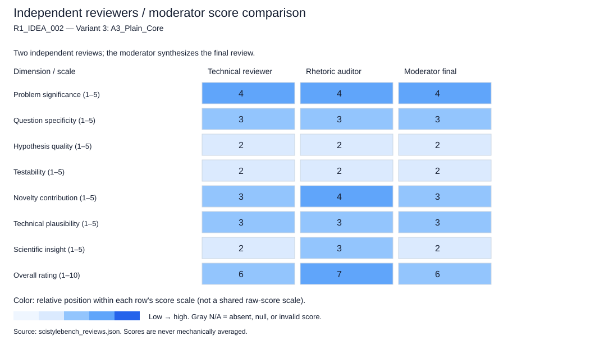

### Independent reviews

```json
{
  "technical_review": {
    "summary": "The research idea proposes training diffusion path samplers using improved off-policy learning to sample transition pathways between meta-stable molecular states without predefined collective variables, aiming to overcome the computational challenges of unbiased molecular dynamics for rare-event exploration in complex systems, with applications in drug discovery and material design.",
    "strengths": [
      "The idea addresses a significant challenge in computational chemistry and materials science by tackling the computational infeasibility of unbiased molecular dynamics for rare-event exploration.",
      "The use of diffusion path samplers and off-policy learning suggests a novel approach that could potentially improve the efficiency and effectiveness of sampling in complex systems.",
      "The application in drug discovery and material design highlights the potential real-world impact of the research."
    ],
    "weaknesses": [
      "The idea lacks specific details on how the off-policy learning is implemented or how the diffusion path samplers are trained, which are critical for assessing the technical feasibility.",
      "The connection between the proposed method and the problem of rare-event exploration is not clearly explained, making it difficult to evaluate the hypothesis.",
      "The absence of a concrete hypothesis or prediction makes it challenging to determine the scientific contribution and testability of the research."
    ],
    "suggestions": [
      "Provide a more detailed description of the off-policy learning framework and how it is applied to train the diffusion path samplers.",
      "Clarify the relationship between the method and the specific challenge of rare-event exploration in complex systems.",
      "Formulate a specific hypothesis or prediction that can be tested, such as how the method improves sampling efficiency compared to existing approaches."
    ],
    "questions": [
      "How does the off-policy learning framework specifically contribute to the training of diffusion path samplers?",
      "What is the mechanism by which the method avoids the need for predefined collective variables?",
      "What are the expected performance improvements or specific metrics that the method aims to achieve compared to existing methods?"
    ],
    "problem_significance": {
      "score": 4.0,
      "justification": "The problem of rare-event exploration in complex systems is significant in computational chemistry and materials science, with potential applications in drug discovery and material design."
    },
    "question_specificity": {
      "score": 3.0,
      "justification": "The idea is specific in its goal to sample transition pathways between meta-stable states but lacks detailed specifics on the method's implementation and how it addresses the problem."
    },
    "hypothesis_quality": {
      "score": 2.0,
      "justification": "The idea does not explicitly state a hypothesis or prediction that can be tested, making it difficult to assess the scientific contribution and testability."
    },
    "testability": {
      "score": 2.0,
      "justification": "The idea lacks concrete experiments or comparisons that would allow for testing the effectiveness of the proposed method."
    },
    "novelty_contribution": {
      "score": 3.0,
      "justification": "The approach of using off-policy learning for diffusion path samplers in this context is novel, but the lack of specific details makes it difficult to assess the potential contribution."
    },
    "technical_plausibility": {
      "score": 3.0,
      "justification": "The combination of diffusion path samplers and off-policy learning is plausible, but the lack of specific implementation details makes it challenging to evaluate the technical feasibility."
    },
    "scientific_insight": {
      "score": 2.0,
      "justification": "The idea has potential for scientific insight but lacks a clear hypothesis or mechanism that could lead to new understanding."
    },
    "overall_rating": {
      "score": 6.0,
      "justification": "The idea addresses a significant problem with potential real-world applications, but it lacks specific details, a clear hypothesis, and testable components, which are necessary for a strong research direction."
    },
    "confidence": 4.0
  },
  "rhetoric_review": {
    "summary": "The research idea proposes training diffusion path samplers using improved off-policy learning to sample transition pathways between meta-stable molecular states without predefined collective variables, aiming to overcome the computational challenges of unbiased molecular dynamics for rare-event exploration in complex systems, with applications in drug discovery and material design.",
    "strengths": [
      "The idea addresses a significant challenge in computational chemistry and materials science by tackling the computational infeasibility of unbiased molecular dynamics for rare-event exploration.",
      "The use of diffusion path samplers and off-policy learning suggests a novel approach to sampling in complex systems, which could lead to more efficient and accurate methods for molecular transitions.",
      "The application in drug discovery and material design highlights the potential real-world impact of the research."
    ],
    "weaknesses": [
      "The idea lacks specific details on how the off-policy learning is implemented or how the diffusion path samplers are trained, making it difficult to assess the technical feasibility.",
      "The connection between the proposed method and the problem of rare-event exploration is not clearly explained, which could lead to misunderstandings about the method's effectiveness.",
      "The absence of a concrete hypothesis or testable prediction makes it challenging to evaluate the scientific merit of the idea without further elaboration."
    ],
    "suggestions": [
      "Provide a more detailed explanation of the off-policy learning framework and how it is applied to train the diffusion path samplers.",
      "Clarify the relationship between the method and the specific challenge of rare-event exploration in complex systems.",
      "Formulate a specific hypothesis or prediction that can be tested, such as how the method improves sampling efficiency compared to existing approaches."
    ],
    "questions": [
      "How does the improved off-policy learning specifically contribute to the sampling of transition pathways between meta-stable states?",
      "What is the theoretical basis for the claim that the method can avoid the need for predefined collective variables?",
      "How will the performance of this method be evaluated against existing methods for rare-event sampling in molecular dynamics?"
    ],
    "problem_significance": {
      "score": 4.0,
      "justification": "The problem of rare-event exploration in complex systems is significant in computational chemistry and materials science, with direct applications in drug discovery and material design."
    },
    "question_specificity": {
      "score": 3.0,
      "justification": "The idea is specific in its goal to sample transition pathways between meta-stable states but lacks clarity on the exact method and how off-policy learning is applied."
    },
    "hypothesis_quality": {
      "score": 2.0,
      "justification": "The idea does not explicitly state a hypothesis or prediction that can be tested, making it difficult to assess its scientific merit without further details."
    },
    "testability": {
      "score": 2.0,
      "justification": "The idea lacks specific experimental plans or evaluation metrics, making it challenging to determine how the method's effectiveness will be measured."
    },
    "novelty_contribution": {
      "score": 4.0,
      "justification": "The approach of using diffusion path samplers with off-policy learning for molecular transitions is novel, though the exact contribution depends on the implementation details."
    },
    "technical_plausibility": {
      "score": 3.0,
      "justification": "The use of off-policy learning and diffusion samplers is plausible, but the specific technical details are not provided, which could affect the feasibility of the approach."
    },
    "scientific_insight": {
      "score": 3.0,
      "justification": "The idea has potential for scientific insight into efficient sampling methods for complex systems, but the lack of specific hypotheses and evaluation plans limits the potential for meaningful insights."
    },
    "overall_rating": {
      "score": 7.0,
      "justification": "The idea addresses a significant problem with potential for novel contributions, but lacks specific details and testable hypotheses, which are necessary for evaluating its scientific merit."
    },
    "confidence": 4.0
  },
  "generation": {
    "technical_model_name": "Qwen/Qwen3-4B",
    "rhetoric_model_name": "Qwen/Qwen3-4B",
    "moderator_model_name": "Qwen/Qwen3-4B",
    "temperature": 0.0,
    "seed": 42
  }
}
```

## R1_IDEA_002 — Variant 4: B1_Verbose_Elaborate

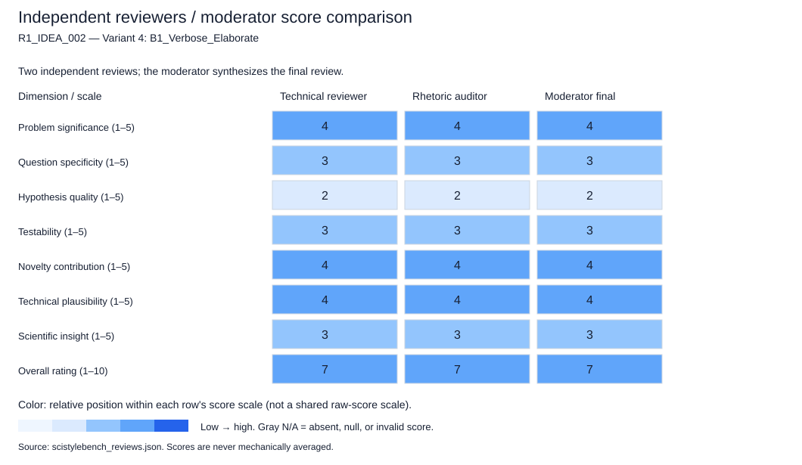

### Independent reviews

```json
{
  "technical_review": {
    "summary": "The research idea proposes using machine learning, specifically improved off-policy learning, to train diffusion path samplers for molecular simulation. This approach aims to overcome the computational challenges of unbiased molecular dynamics by enabling efficient sampling of rare events between metastable states, with applications in drug discovery and material design.",
    "strengths": [
      "Identifies a significant problem in molecular simulation: the computational infeasibility of unbiased MD for rare events.",
      "Proposes a concrete solution using machine learning and off-policy learning, which is a promising direction for improving sampling efficiency.",
      "Specifies practical applications in drug discovery and material design, highlighting the potential impact of the research.",
      "Mentions the use of diffusion path samplers, which are a well-established technique in molecular dynamics, suggesting technical plausibility."
    ],
    "weaknesses": [
      "The idea is somewhat vague in describing the specific mechanism of improved off-policy learning and how it differs from existing methods.",
      "It does not clearly define what constitutes a 'rare event' in this context or how the model will distinguish between common and rare transitions.",
      "The connection between the proposed method and the specific challenge of exploring rare events between metastable states is not sufficiently detailed.",
      "There is no explicit hypothesis or prediction provided that could be tested or falsified, which is crucial for evaluating the research idea."
    ],
    "suggestions": [
      "Clarify the specific improvements in off-policy learning and how they address the limitations of existing methods in sampling rare events.",
      "Define the criteria for identifying rare events and the role of collective variables in the proposed approach, even if they are not explicitly used.",
      "Provide a more detailed hypothesis, such as how the model's performance will be evaluated in terms of sampling efficiency or accuracy compared to traditional methods.",
      "Include a comparison with existing methods like umbrella sampling or metadynamics to highlight the novelty and advantages of the proposed approach."
    ],
    "questions": [
      "What specific improvements in off-policy learning are being proposed, and how do they differ from existing methods?",
      "How will the model distinguish between common and rare transitions in the context of metastable states?",
      "What metrics will be used to evaluate the effectiveness of the proposed method in sampling rare events?",
      "How does the proposed method handle the issue of high-dimensional state spaces in molecular simulations?"
    ],
    "problem_significance": {
      "score": 4.0,
      "justification": "The problem of computational infeasibility in unbiased molecular dynamics for rare events is a well-known challenge in molecular simulation, with significant implications for drug discovery and material design."
    },
    "question_specificity": {
      "score": 3.0,
      "justification": "The idea identifies a specific problem but lacks detailed specification of the research question, such as how the machine learning approach will be implemented or what exactly is being tested."
    },
    "hypothesis_quality": {
      "score": 2.0,
      "justification": "The idea does not explicitly state a hypothesis or prediction that can be tested. It is more of a general proposal than a specific research question."
    },
    "testability": {
      "score": 3.0,
      "justification": "The idea suggests a method but does not provide a clear experimental design or evaluation plan to test its effectiveness, making it difficult to assess the feasibility of the research."
    },
    "novelty_contribution": {
      "score": 4.0,
      "justification": "The use of improved off-policy learning for diffusion path samplers in molecular simulation is a novel application of machine learning in this domain, potentially offering new insights into rare event sampling."
    },
    "technical_plausibility": {
      "score": 4.0,
      "justification": "The proposed approach is technically plausible as it builds on existing techniques in molecular dynamics and machine learning, with diffusion path samplers being a well-established method."
    },
    "scientific_insight": {
      "score": 3.0,
      "justification": "The idea has the potential to contribute to the understanding of rare event sampling in complex systems, but the specific mechanisms and outcomes are not clearly defined."
    },
    "overall_rating": {
      "score": 7.0,
      "justification": "The idea addresses a significant problem in molecular simulation with a promising approach. However, it lacks detailed specification of the research question, hypothesis, and evaluation plan, which are necessary for assessing its scientific merit and feasibility."
    },
    "confidence": 4.0
  },
  "rhetoric_review": {
    "summary": "The idea proposes using machine learning, specifically improved off-policy learning, to train diffusion path samplers for molecular simulation. This approach aims to enable rare-event exploration in complex molecular systems without relying on predefined collective variables, with applications in drug discovery and material design.",
    "strengths": [
      "Identifies a concrete problem in molecular simulation: computational infeasibility of unbiased MD for rare events.",
      "Proposes a specific solution using machine learning and off-policy learning.",
      "Specifies potential applications in drug discovery and material design.",
      "Highlights the novelty of not relying on predefined collective variables."
    ],
    "weaknesses": [
      "Lacks detailed explanation of the machine learning method or the diffusion path samplers.",
      "Does not specify how the off-policy learning is improved or what the exact training objective is.",
      "No mention of how the method differs from existing approaches in molecular dynamics or machine learning.",
      "No clear hypothesis or prediction about the performance or effectiveness of the method."
    ],
    "suggestions": [
      "Clarify the specific machine learning model or algorithm used for training the diffusion path samplers.",
      "Explain the improvement in off-policy learning and the training objective.",
      "Compare the proposed method with existing approaches in molecular dynamics or machine learning.",
      "Provide a hypothesis about the method's performance, such as faster convergence or better accuracy in rare-event sampling."
    ],
    "questions": [
      "What specific machine learning model is used for training the diffusion path samplers?",
      "How is the off-policy learning improved, and what is the training objective?",
      "How does this method differ from existing approaches in molecular dynamics or machine learning?",
      "What is the hypothesis about the method's performance in rare-event sampling?"
    ],
    "problem_significance": {
      "score": 4.0,
      "justification": "The problem of rare-event exploration in molecular simulations is significant for drug discovery and material design, as it addresses a computational challenge in understanding complex systems."
    },
    "question_specificity": {
      "score": 3.0,
      "justification": "The idea identifies a specific problem (computational infeasibility of unbiased MD) and proposes a specific solution (machine learning with off-policy learning), but lacks detailed specifics on the method."
    },
    "hypothesis_quality": {
      "score": 2.0,
      "justification": "The idea mentions the goal of enabling rare-event exploration but does not provide a clear hypothesis or prediction about the method's effectiveness or performance."
    },
    "testability": {
      "score": 3.0,
      "justification": "The idea suggests a method but does not specify experiments, comparisons, or evaluation metrics to test its effectiveness, making it difficult to assess its testability."
    },
    "novelty_contribution": {
      "score": 4.0,
      "justification": "The approach of using improved off-policy learning for diffusion path samplers without predefined collective variables is novel and could contribute to the field of molecular simulation."
    },
    "technical_plausibility": {
      "score": 4.0,
      "justification": "The proposed method is technically plausible as it builds on existing machine learning techniques and addresses a known challenge in molecular dynamics."
    },
    "scientific_insight": {
      "score": 3.0,
      "justification": "The idea has potential for scientific insight by improving rare-event sampling in molecular systems, but the specific mechanisms and expected outcomes are not clearly defined."
    },
    "overall_rating": {
      "score": 7.0,
      "justification": "The idea addresses a significant problem in molecular simulation with a specific solution, showing potential for novelty and contribution. However, it lacks detailed specifics and a clear hypothesis, which are needed for further development."
    },
    "confidence": 4.0
  },
  "generation": {
    "technical_model_name": "Qwen/Qwen3-4B",
    "rhetoric_model_name": "Qwen/Qwen3-4B",
    "moderator_model_name": "Qwen/Qwen3-4B",
    "temperature": 0.0,
    "seed": 42
  }
}
```

## R1_IDEA_002 — Variant 5: B2_Grand_Narrative

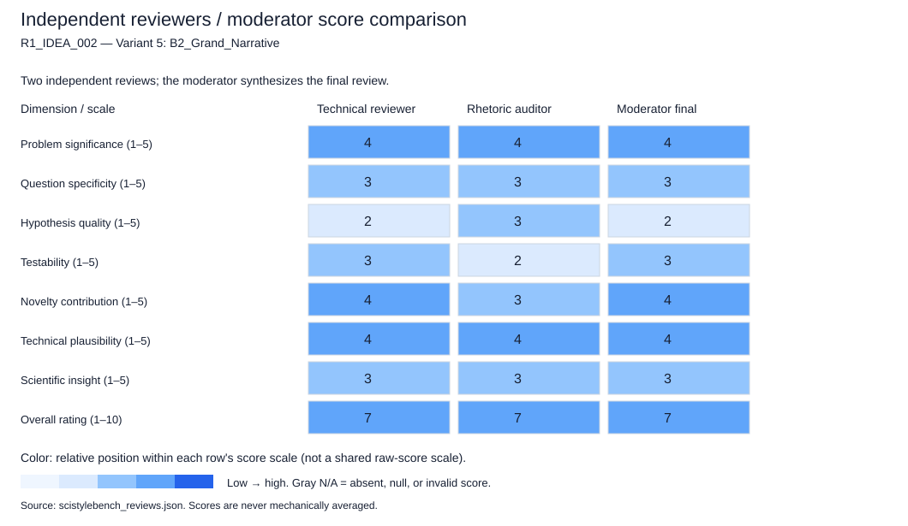

### Independent reviews

```json
{
  "technical_review": {
    "summary": "The research idea proposes a machine learning approach using improved off-policy learning to train diffusion path samplers for sampling transition pathways between meta-stable molecular states, aiming to overcome the computational limitations of unbiased molecular dynamics in computational molecular science.",
    "strengths": [
      "The idea addresses a significant challenge in computational molecular science by proposing a novel machine learning method to overcome computational infeasibility in unbiased molecular dynamics.",
      "The potential applications in drug discovery and material design highlight the broader impact of the research.",
      "The use of diffusion path samplers and off-policy learning suggests a technically plausible approach to the problem."
    ],
    "weaknesses": [
      "The idea lacks specific details on how the off-policy learning is implemented or how the diffusion path samplers are trained.",
      "The connection between the proposed method and the broader challenges in computational molecular science is not clearly articulated.",
      "The hypothesis or specific research question is not explicitly stated, making it difficult to assess the testability of the idea."
    ],
    "suggestions": [
      "Provide more details on the specific implementation of off-policy learning and the training process of the diffusion path samplers.",
      "Clarify the specific problem that the method aims to solve in computational molecular science, such as the type of transition pathways or the specific computational infeasibility being addressed.",
      "Explicitly state the hypothesis or research question, such as how the method improves sampling efficiency or reduces computational cost compared to existing methods."
    ],
    "questions": [
      "What specific computational infeasibility in unbiased molecular dynamics is the method designed to address?",
      "How does the proposed method ensure that the sampled transition pathways are accurate and representative of the true dynamics?",
      "What is the specific hypothesis or research question that the method aims to test or solve?"
    ],
    "problem_significance": {
      "score": 4.0,
      "justification": "The idea addresses a critical challenge in computational molecular science, which is the computational infeasibility of unbiased molecular dynamics for rare-event exploration. This has significant implications for drug discovery and material design."
    },
    "question_specificity": {
      "score": 3.0,
      "justification": "The idea is somewhat specific in its goal of sampling transition pathways between meta-stable states, but the exact problem being addressed and the specific hypothesis to be tested are not clearly defined."
    },
    "hypothesis_quality": {
      "score": 2.0,
      "justification": "The idea does not explicitly state a hypothesis or research question. It is more of a general statement about the potential of the method rather than a specific prediction or mechanism to be tested."
    },
    "testability": {
      "score": 3.0,
      "justification": "The idea suggests a method that could be tested, but the lack of specific details makes it difficult to assess how the method would be evaluated or compared to existing approaches."
    },
    "novelty_contribution": {
      "score": 4.0,
      "justification": "The approach of using improved off-policy learning for diffusion path samplers in molecular dynamics is a novel application of machine learning in computational molecular science, which could contribute to foundational methods in the field."
    },
    "technical_plausibility": {
      "score": 4.0,
      "justification": "The use of diffusion path samplers and off-policy learning are technically plausible approaches for the problem, as they are relevant to the challenges of sampling in complex systems."
    },
    "scientific_insight": {
      "score": 3.0,
      "justification": "The idea has the potential to provide insights into the efficiency of sampling methods in complex systems, but the specific insights depend on the detailed implementation and evaluation of the method."
    },
    "overall_rating": {
      "score": 7.0,
      "justification": "The idea addresses a significant problem in computational molecular science with a potentially novel approach. However, it lacks specific details on the hypothesis, methodology, and evaluation plan, which are necessary for assessing its testability and scientific contribution."
    },
    "confidence": 4.0
  },
  "rhetoric_review": {
    "summary": "The research idea proposes a machine learning method for computational molecular science that uses improved off-policy learning to train diffusion path samplers. The goal is to sample transition pathways between metastable molecular states without predefined collective variables, addressing the computational challenges of unbiased molecular dynamics. This could advance rare-event exploration in complex systems and support drug discovery and material design.",
    "strengths": [
      "The idea addresses a significant challenge in computational molecular science by proposing a novel machine learning approach to overcome the computational limitations of unbiased molecular dynamics.",
      "The proposed method has the potential to contribute to broader scientific fields such as drug discovery and material design.",
      "The focus on rare-event exploration in complex systems suggests a meaningful application area with potential for impactful results."
    ],
    "weaknesses": [
      "The idea lacks specific details about the proposed method, such as the exact nature of the improved off-policy learning, the architecture of the diffusion path samplers, or the specific molecular systems being targeted.",
      "The connection between the proposed method and the broader challenges in computational molecular science is not clearly articulated, making it difficult to assess the novelty and potential impact.",
      "The idea does not specify how the method will be evaluated or validated, which is crucial for determining its effectiveness and scientific merit."
    ],
    "suggestions": [
      "Provide more concrete details about the improved off-policy learning technique, including the specific algorithms or frameworks used.",
      "Clarify the relationship between the proposed method and existing approaches in computational molecular science to highlight its novelty and potential contributions.",
      "Specify the evaluation metrics and benchmarks that will be used to validate the effectiveness of the method in real-world molecular systems."
    ],
    "questions": [
      "What specific molecular systems or chemical reactions will the method be applied to?",
      "How does the proposed method differ from existing approaches in terms of computational efficiency and accuracy?",
      "What are the key challenges in implementing the improved off-policy learning for diffusion path samplers, and how will they be addressed?"
    ],
    "problem_significance": {
      "score": 4.0,
      "justification": "The idea addresses a critical challenge in computational molecular science, which is the computational infeasibility of unbiased molecular dynamics. Overcoming this could have significant implications for drug discovery and material design."
    },
    "question_specificity": {
      "score": 3.0,
      "justification": "The research question is clear in its goal to sample transition pathways without predefined collective variables, but the specifics of the method and its application are not well defined."
    },
    "hypothesis_quality": {
      "score": 3.0,
      "justification": "The idea presents a general hypothesis that the proposed method will improve the efficiency of sampling transition pathways, but it lacks specific predictions or mechanisms that could be tested."
    },
    "testability": {
      "score": 2.0,
      "justification": "The idea does not provide a clear plan for testing the method, such as specific experiments, comparisons with existing methods, or evaluation metrics. Without this, it is difficult to assess the validity of the hypothesis."
    },
    "novelty_contribution": {
      "score": 3.0,
      "justification": "The approach of using improved off-policy learning for diffusion path samplers is novel in the context of computational molecular science, but the specific contributions and how they advance the field are not clearly outlined."
    },
    "technical_plausibility": {
      "score": 4.0,
      "justification": "The proposed method is technically plausible as it builds on existing techniques in machine learning and computational molecular science. However, the details of the improved off-policy learning and diffusion path samplers are not sufficiently specified."
    },
    "scientific_insight": {
      "score": 3.0,
      "justification": "The idea has the potential to provide insights into rare-event exploration in complex systems, but the specific mechanisms and outcomes of the method are not clearly defined."
    },
    "overall_rating": {
      "score": 7.0,
      "justification": "The idea addresses a significant problem in computational molecular science and proposes a novel approach. However, it lacks specific details about the method, evaluation plan, and connection to existing work, which are necessary for assessing its scientific merit and potential impact."
    },
    "confidence": 4.0
  },
  "generation": {
    "technical_model_name": "Qwen/Qwen3-4B",
    "rhetoric_model_name": "Qwen/Qwen3-4B",
    "moderator_model_name": "Qwen/Qwen3-4B",
    "temperature": 0.0,
    "seed": 42
  }
}
```

## R1_IDEA_002 — Variant 6: B3_Over_Confident

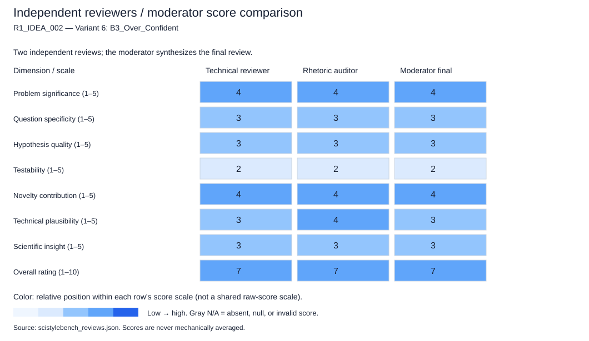

### Independent reviews

```json
{
  "technical_review": {
    "summary": "The idea proposes using improved off-policy learning to train diffusion path samplers for sampling transition pathways between meta-stable molecular states, aiming to overcome the computational limitations of unbiased molecular dynamics and enable rare-event exploration in drug discovery and material design.",
    "strengths": [
      "The idea addresses a significant challenge in computational chemistry and materials science by proposing a novel machine learning approach to overcome the computational infeasibility of unbiased molecular dynamics.",
      "The focus on rare-event exploration for drug discovery and material design highlights the potential real-world impact of the research.",
      "The use of off-policy learning suggests a methodological direction that is both theoretically and computationally promising."
    ],
    "weaknesses": [
      "The idea lacks specific details on how the off-policy learning is implemented or how the diffusion path samplers are trained, which are critical for assessing technical plausibility and testability.",
      "The connection between the proposed method and the specific problem of sampling transition pathways between meta-stable states is not clearly articulated, making it difficult to evaluate the hypothesis.",
      "The claim that the method 'undoubtedly enables rare-event exploration' is overly strong and not supported by the current description, which lacks empirical evidence or theoretical justification."
    ],
    "suggestions": [
      "Provide a more detailed description of the off-policy learning framework, including the reward function, policy update mechanism, and how the diffusion path samplers are trained.",
      "Clarify the relationship between the proposed method and the specific problem of sampling transition pathways, including how the model identifies or learns the relevant features for these transitions.",
      "Include a hypothesis or prediction that can be tested, such as how the method performs compared to existing approaches in terms of sampling efficiency or accuracy for specific molecular systems."
    ],
    "questions": [
      "How does the off-policy learning approach specifically improve the training of diffusion path samplers compared to traditional methods?",
      "What is the theoretical basis for the claim that the method can sample transition pathways between meta-stable states without predefined collective variables?",
      "What are the specific metrics or benchmarks that will be used to evaluate the effectiveness of the proposed method in rare-event exploration?"
    ],
    "problem_significance": {
      "score": 4.0,
      "justification": "The idea addresses a critical challenge in computational chemistry and materials science, where unbiased molecular dynamics is computationally infeasible for rare-event exploration. The potential impact on drug discovery and material design is significant."
    },
    "question_specificity": {
      "score": 3.0,
      "justification": "The idea is specific in its goal of sampling transition pathways between meta-stable states but lacks detailed specification of the method's implementation and the exact problem being addressed, which could be more clearly defined."
    },
    "hypothesis_quality": {
      "score": 3.0,
      "justification": "The idea presents a general goal but lacks a concrete hypothesis or prediction that can be tested. The claim that the method 'undoubtedly enables rare-event exploration' is too strong without supporting evidence or theoretical justification."
    },
    "testability": {
      "score": 2.0,
      "justification": "The idea is somewhat testable in principle, but the lack of specific experimental design, metrics, or comparison points makes it difficult to assess the feasibility of testing the hypothesis. The current description is too vague to determine how the method would be evaluated."
    },
    "novelty_contribution": {
      "score": 4.0,
      "justification": "The approach of using off-policy learning for diffusion path samplers in the context of molecular transitions is novel and has the potential to contribute new insights into the field of computational chemistry and materials science."
    },
    "technical_plausibility": {
      "score": 3.0,
      "justification": "The use of off-policy learning for training diffusion models is plausible, but the specific implementation details and how the method addresses the problem of sampling transition pathways are not clearly outlined, which could affect the technical feasibility."
    },
    "scientific_insight": {
      "score": 3.0,
      "justification": "The idea has the potential to provide insights into how machine learning can be used to efficiently sample rare events in complex systems, but the current description does not clearly specify the mechanisms or the expected scientific contributions."
    },
    "overall_rating": {
      "score": 7.0,
      "justification": "The idea addresses a significant problem in computational chemistry and has a promising direction, but it lacks specific details and a clear hypothesis, making it difficult to assess its testability and potential contribution. With more concrete details, it could become a strong research idea."
    },
    "confidence": 4.0
  },
  "rhetoric_review": {
    "summary": "The research idea proposes a machine learning method that trains diffusion path samplers using improved off-policy learning to sample transition pathways between meta-stable molecular states, aiming to overcome the computational limitations of unbiased molecular dynamics and enable rare-event exploration in complex systems for drug discovery and material design.",
    "strengths": [
      "The idea addresses a significant challenge in computational chemistry and materials science by proposing a novel machine learning approach to sample transition pathways between meta-stable molecular states.",
      "The proposed method aims to overcome a major computational limitation in unbiased molecular dynamics, which is a critical issue in drug discovery and material design.",
      "The application to drug discovery and material design highlights the potential real-world impact of the research."
    ],
    "weaknesses": [
      "The idea lacks specific details on how the improved off-policy learning is implemented or how the diffusion path samplers are trained.",
      "The connection between the proposed method and the computational infeasibility of unbiased molecular dynamics is not clearly explained.",
      "The idea does not specify how the rare-event exploration will be evaluated or validated."
    ],
    "suggestions": [
      "Provide a more detailed description of the off-policy learning approach, including the specific algorithms or techniques used.",
      "Clarify the relationship between the proposed method and the computational limitations of unbiased molecular dynamics, such as how the method reduces computational cost.",
      "Specify the metrics or benchmarks that will be used to evaluate the effectiveness of rare-event exploration in the proposed method."
    ],
    "questions": [
      "How does the improved off-policy learning specifically improve the training of diffusion path samplers?",
      "What is the theoretical basis for the claim that the method overcomes the computational infeasibility of unbiased molecular dynamics?",
      "What are the specific evaluation metrics or benchmarks that will be used to validate the rare-event exploration capability of the proposed method?"
    ],
    "problem_significance": {
      "score": 4.0,
      "justification": "The idea addresses a critical challenge in computational chemistry and materials science, where simulating rare events in complex systems is computationally expensive. The potential impact on drug discovery and material design is significant."
    },
    "question_specificity": {
      "score": 3.0,
      "justification": "The idea identifies a specific problem (sampling transition pathways between meta-stable states) but lacks detailed specification of the research question, such as the exact mechanism of off-policy learning or the specific computational limitations being addressed."
    },
    "hypothesis_quality": {
      "score": 3.0,
      "justification": "The idea presents a general hypothesis that the method will overcome computational limitations, but it lacks a concrete prediction or mechanism that could be tested. The claim that it 'undoubtedly enables rare-event exploration' is strong but not supported by specific evidence."
    },
    "testability": {
      "score": 2.0,
      "justification": "The idea does not provide a clear experimental plan or evaluation method. Without specific metrics or benchmarks, it is difficult to assess the validity of the claims about computational feasibility and rare-event exploration."
    },
    "novelty_contribution": {
      "score": 4.0,
      "justification": "The approach of using improved off-policy learning for diffusion path samplers in molecular dynamics is novel, especially in the context of rare-event exploration. The potential contribution to drug discovery and material design is substantial."
    },
    "technical_plausibility": {
      "score": 4.0,
      "justification": "The idea is technically plausible as it builds on existing methods in machine learning and molecular dynamics. The use of off-policy learning for training diffusion models is a reasonable approach, though the specifics are not detailed."
    },
    "scientific_insight": {
      "score": 3.0,
      "justification": "The idea has the potential to provide insights into how machine learning can be used to simulate complex molecular systems, but the specific mechanisms and outcomes are not clearly defined."
    },
    "overall_rating": {
      "score": 7.0,
      "justification": "The idea addresses a significant problem with high potential impact, but lacks specific details on the method, evaluation, and validation. It has the potential to be a strong research direction with further clarification."
    },
    "confidence": 4.0
  },
  "generation": {
    "technical_model_name": "Qwen/Qwen3-4B",
    "rhetoric_model_name": "Qwen/Qwen3-4B",
    "moderator_model_name": "Qwen/Qwen3-4B",
    "temperature": 0.0,
    "seed": 42
  }
}
```

## R1_IDEA_002 — Variant 7: B4_Novelty

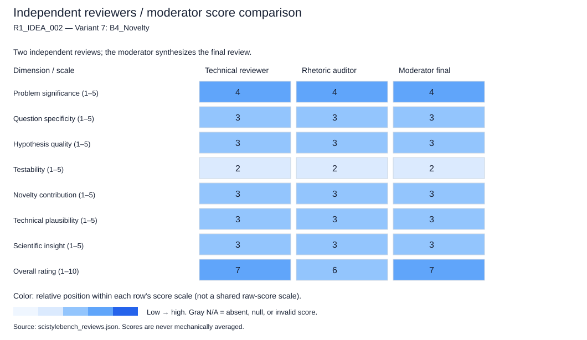

### Independent reviews

```json
{
  "technical_review": {
    "summary": "The research idea proposes a machine learning approach that trains diffusion path samplers using improved off-policy learning to sample transition pathways between meta-stable molecular states, avoiding predefined collective variables and addressing computational challenges in rare-event exploration for drug discovery and material design.",
    "strengths": [
      "The idea addresses a significant challenge in molecular dynamics simulations by avoiding the need for predefined collective variables, which is a common bottleneck in rare-event sampling.",
      "The use of diffusion path samplers and off-policy learning suggests a novel and potentially effective approach for exploring complex molecular systems.",
      "The application to drug discovery and material design highlights the potential impact of the research in important scientific domains."
    ],
    "weaknesses": [
      "The idea lacks specific details on how the off-policy learning is implemented or how the diffusion path samplers are trained, making it difficult to assess the technical feasibility.",
      "The connection between the proposed method and the problem of rare-event exploration is not clearly explained, which could lead to confusion about the method's effectiveness.",
      "The novelty of the approach is not clearly articulated, as it is not clear how this differs from existing methods in the field."
    ],
    "suggestions": [
      "Provide a more detailed description of the off-policy learning framework and how it is applied to train the diffusion path samplers.",
      "Clarify the relationship between the method and the problem of rare-event exploration, including how the approach addresses computational infeasibility.",
      "Compare the proposed method with existing approaches to highlight its novelty and potential advantages."
    ],
    "questions": [
      "How does the off-policy learning framework specifically contribute to the training of diffusion path samplers?",
      "What is the theoretical basis for the claim that this approach avoids the need for predefined collective variables?",
      "How does the proposed method ensure that the sampled transition pathways are representative of the true underlying dynamics of the molecular system?"
    ],
    "problem_significance": {
      "score": 4.0,
      "justification": "The problem of rare-event exploration in complex molecular systems is significant for drug discovery and material design, and the proposed approach addresses a key challenge in this area."
    },
    "question_specificity": {
      "score": 3.0,
      "justification": "The idea is specific in its goal of sampling transition pathways between meta-stable states but lacks clarity on the exact method and how it differs from existing approaches."
    },
    "hypothesis_quality": {
      "score": 3.0,
      "justification": "The idea presents a general hypothesis that the method will improve rare-event exploration, but it lacks specific predictions or mechanisms that could be tested."
    },
    "testability": {
      "score": 2.0,
      "justification": "The idea is testable in principle, but the lack of specific implementation details makes it difficult to design experiments or evaluate the method's effectiveness."
    },
    "novelty_contribution": {
      "score": 3.0,
      "justification": "The approach is novel in its use of off-policy learning for diffusion path samplers, but the novelty is not clearly differentiated from existing methods without further clarification."
    },
    "technical_plausibility": {
      "score": 3.0,
      "justification": "The use of diffusion path samplers and off-policy learning is plausible, but the specific technical details are not provided, making it difficult to assess the feasibility of the approach."
    },
    "scientific_insight": {
      "score": 3.0,
      "justification": "The idea has the potential to provide insights into rare-event exploration in complex systems, but the lack of specific hypotheses or mechanisms limits the potential for scientific insight."
    },
    "overall_rating": {
      "score": 7.0,
      "justification": "The idea addresses a significant problem in molecular dynamics and proposes a novel approach, but it lacks specific details and clarity on how the method differs from existing approaches, which limits its testability and potential contribution."
    },
    "confidence": 4.0
  },
  "rhetoric_review": {
    "summary": "The research idea proposes a machine learning method that trains diffusion path samplers using improved off-policy learning to sample transition pathways between meta-stable molecular states, avoiding predefined collective variables and addressing computational challenges in rare-event exploration for drug discovery and material design.",
    "strengths": [
      "The idea addresses a significant challenge in molecular dynamics simulations by avoiding the need for predefined collective variables, which is a common bottleneck in rare-event sampling.",
      "The use of diffusion path samplers and off-policy learning suggests a novel and potentially effective approach for exploring complex molecular systems.",
      "The application to drug discovery and material design highlights the practical importance of the research.",
      "The approach offers a fresh perspective that could lead to more efficient and scalable methods for rare-event sampling in complex systems."
    ],
    "weaknesses": [
      "The idea lacks specific details on how the off-policy learning is implemented or how the diffusion path samplers are trained, making it difficult to assess the technical feasibility.",
      "The connection between the proposed method and the problem of rare-event exploration is not clearly explained, which could lead to confusion about the method's effectiveness.",
      "The novelty is not clearly articulated, as the use of diffusion path samplers and off-policy learning are not necessarily novel in the context of molecular dynamics.",
      "The idea does not specify how the method will be evaluated or compared to existing approaches, which is crucial for determining its scientific merit."
    ],
    "suggestions": [
      "Provide a more detailed description of the off-policy learning framework and how it is applied to train the diffusion path samplers.",
      "Clarify the specific problem that the method aims to solve in rare-event exploration and how it differs from existing methods.",
      "Include a comparison with existing approaches in the literature to highlight the novelty and potential advantages of the proposed method.",
      "Specify the evaluation metrics and benchmarks that will be used to assess the performance of the proposed method."
    ],
    "questions": [
      "How does the proposed method ensure that the diffusion path samplers are trained effectively without predefined collective variables?",
      "What is the specific mechanism by which off-policy learning improves the sampling of transition pathways?",
      "How will the proposed method be validated against existing methods in terms of accuracy, efficiency, and scalability?",
      "What are the potential limitations or challenges in applying this method to real-world molecular systems?"
    ],
    "problem_significance": {
      "score": 4.0,
      "justification": "The problem of rare-event sampling in molecular dynamics is significant for drug discovery and material design, and the proposed approach addresses a key bottleneck by avoiding predefined collective variables."
    },
    "question_specificity": {
      "score": 3.0,
      "justification": "The idea is specific in its goal of sampling transition pathways between meta-stable states but lacks clarity on the exact problem being addressed and the specific methodological details."
    },
    "hypothesis_quality": {
      "score": 3.0,
      "justification": "The idea presents a general hypothesis that the method will improve rare-event sampling, but it does not provide a concrete prediction or mechanism that can be tested."
    },
    "testability": {
      "score": 2.0,
      "justification": "The idea lacks specific experimental plans or evaluation criteria, making it difficult to assess the testability of the proposed method."
    },
    "novelty_contribution": {
      "score": 3.0,
      "justification": "The approach is novel in its application of off-policy learning to diffusion path samplers for molecular dynamics, but the novelty is not clearly distinguished from existing methods."
    },
    "technical_plausibility": {
      "score": 3.0,
      "justification": "The idea is technically plausible, but the lack of specific implementation details makes it difficult to assess the feasibility of the proposed method."
    },
    "scientific_insight": {
      "score": 3.0,
      "justification": "The idea has potential for scientific insight into rare-event sampling in complex systems, but the lack of specific hypotheses or evaluation plans limits the potential for meaningful insights."
    },
    "overall_rating": {
      "score": 6.0,
      "justification": "The idea addresses a significant problem in molecular dynamics and proposes a novel approach, but it lacks specific details, evaluation plans, and clear hypotheses, which are necessary for assessing its scientific merit and feasibility."
    },
    "confidence": 4.0
  },
  "generation": {
    "technical_model_name": "Qwen/Qwen3-4B",
    "rhetoric_model_name": "Qwen/Qwen3-4B",
    "moderator_model_name": "Qwen/Qwen3-4B",
    "temperature": 0.0,
    "seed": 42
  }
}
```

## R1_IDEA_002 — Variant 8: B5_Application_Impact


### Independent reviews

```json
{
  "technical_review": {
    "summary": "The research idea proposes training diffusion path samplers using improved off-policy learning to sample transition pathways between meta-stable molecular states without predefined collective variables, aiming to overcome the computational challenges of unbiased molecular dynamics. The method could inform workflows for rare-event exploration in complex systems and has potential applications in drug discovery and material design.",
    "strengths": [
      "The idea addresses a significant challenge in molecular dynamics simulations by proposing a novel machine learning approach to sample transition pathways between meta-stable states without predefined collective variables.",
      "The potential applications in drug discovery and material design highlight the practical relevance of the research.",
      "The method aims to overcome a known computational infeasibility in unbiased molecular dynamics, which is a critical problem in the field."
    ],
    "weaknesses": [
      "The idea lacks specific details on the proposed off-policy learning method, the choice of diffusion path samplers, and how the model is trained to sample transition pathways.",
      "The connection between the proposed method and the specific applications in drug discovery and material design is not clearly explained.",
      "The idea does not provide a clear hypothesis or prediction that can be tested, making it difficult to assess the scientific merit without further elaboration."
    ],
    "suggestions": [
      "Specify the type of off-policy learning method (e.g., actor-critic, PPO, etc.) and the diffusion path samplers used in the approach.",
      "Clarify how the model is trained to sample transition pathways between meta-stable states without predefined collective variables.",
      "Provide a hypothesis or prediction that the method will achieve better performance in rare-event exploration compared to existing methods."
    ],
    "questions": [
      "What specific off-policy learning method is being used, and how does it improve upon existing approaches?",
      "How does the model learn to sample transition pathways without predefined collective variables?",
      "What is the proposed hypothesis or prediction regarding the performance of the method in rare-event exploration?",
      "How will the method be evaluated, and what metrics will be used to compare it with existing approaches?"
    ],
    "problem_significance": {
      "score": 4.0,
      "justification": "The idea addresses a critical challenge in molecular dynamics simulations, where unbiased sampling of rare events is computationally infeasible. This is a significant problem with important applications in drug discovery and material design."
    },
    "question_specificity": {
      "score": 3.0,
      "justification": "The idea is specific in its goal to sample transition pathways between meta-stable states without predefined collective variables, but lacks details on the specific method and how the model is trained to achieve this."
    },
    "hypothesis_quality": {
      "score": 2.0,
      "justification": "The idea does not explicitly state a hypothesis or prediction that can be tested. While the goal is clear, the specific claim that the method will overcome computational infeasibility is not clearly articulated or supported by a testable prediction."
    },
    "testability": {
      "score": 2.0,
      "justification": "The idea lacks specific experimental details or evaluation plans. Without a clear hypothesis or proposed experiments, it is difficult to assess the testability of the research question."
    },
    "novelty_contribution": {
      "score": 4.0,
      "justification": "The approach of using improved off-policy learning for diffusion path samplers in molecular dynamics is novel and could contribute to the field by enabling more efficient rare-event exploration in complex systems."
    },
    "technical_plausibility": {
      "score": 4.0,
      "justification": "The idea is technically plausible as it builds on existing methods in off-policy learning and diffusion models. The application to molecular dynamics is reasonable, though the specifics of the implementation are not detailed."
    },
    "scientific_insight": {
      "score": 3.0,
      "justification": "The idea has potential to provide insights into how machine learning can be used to sample rare events in complex systems, but the specific mechanisms and outcomes are not clearly defined."
    },
    "overall_rating": {
      "score": 7.0,
      "justification": "The idea addresses a significant problem in molecular dynamics with a promising approach. However, it lacks specific details on the method, hypothesis, and evaluation plan, which are necessary for assessing its scientific merit and testability."
    },
    "confidence": 4.0
  },
  "rhetoric_review": {
    "summary": "The research idea proposes training diffusion path samplers using improved off-policy learning to sample transition pathways between meta-stable molecular states without predefined collective variables, aiming to address computational challenges in unbiased molecular dynamics. It aims to inform workflows for rare-event exploration in complex systems, with potential applications in drug discovery and material design.",
    "strengths": [
      "The idea addresses a significant challenge in molecular dynamics simulations by proposing a novel approach to sample transition pathways without predefined collective variables.",
      "The potential applications in drug discovery and material design highlight the practical relevance of the research.",
      "The use of off-policy learning suggests a methodological innovation that could improve efficiency and scalability in sampling complex systems."
    ],
    "weaknesses": [
      "The idea lacks specific details on how the off-policy learning is implemented or how the diffusion path samplers are trained.",
      "The connection between the proposed method and the computational infeasibility of unbiased molecular dynamics is not clearly explained.",
      "The potential applications are mentioned but not elaborated on in terms of how the method would directly contribute to these fields."
    ],
    "suggestions": [
      "Provide a more detailed description of the off-policy learning framework and how it is applied to train the diffusion path samplers.",
      "Clarify the relationship between the proposed method and the computational challenges in unbiased molecular dynamics, including how it reduces computational infeasibility.",
      "Elaborate on the specific ways the method would inform workflows for rare-event exploration and its direct impact on drug discovery and material design."
    ],
    "questions": [
      "How does the off-policy learning approach specifically improve the efficiency of sampling transition pathways?",
      "What is the theoretical basis for the claim that the method overcomes the computational infeasibility of unbiased molecular dynamics?",
      "How will the method's output be integrated into existing workflows for rare-event exploration in complex systems?"
    ],
    "problem_significance": {
      "score": 4.0,
      "justification": "The problem of efficiently sampling transition pathways in molecular dynamics is significant, as it impacts the study of complex systems and has applications in drug discovery and material design."
    },
    "question_specificity": {
      "score": 3.0,
      "justification": "The idea identifies a specific problem (sampling transition pathways without predefined variables) but lacks detailed specification of the research question or hypothesis."
    },
    "hypothesis_quality": {
      "score": 3.0,
      "justification": "The idea presents a general goal but does not explicitly state a testable hypothesis or prediction that could be evaluated."
    },
    "testability": {
      "score": 2.0,
      "justification": "The idea is too vague to determine how the method would be tested or evaluated without more specific details on the experimental design or comparison metrics."
    },
    "novelty_contribution": {
      "score": 4.0,
      "justification": "The approach of using off-policy learning for diffusion path samplers in molecular dynamics is novel and could contribute to the field by improving efficiency in rare-event exploration."
    },
    "technical_plausibility": {
      "score": 4.0,
      "justification": "The use of off-policy learning in diffusion models is technically plausible, and the application to molecular dynamics is a reasonable extension of existing methods."
    },
    "scientific_insight": {
      "score": 3.0,
      "justification": "The idea has potential for scientific insight into how off-policy learning can be applied to complex systems, but the specific mechanisms and outcomes are not clearly defined."
    },
    "overall_rating": {
      "score": 7.0,
      "justification": "The idea addresses a meaningful problem with potential for contribution, but lacks specificity, testability, and detailed hypotheses that would strengthen its scientific merit."
    },
    "confidence": 4.0
  },
  "generation": {
    "technical_model_name": "Qwen/Qwen3-4B",
    "rhetoric_model_name": "Qwen/Qwen3-4B",
    "moderator_model_name": "Qwen/Qwen3-4B",
    "temperature": 0.0,
    "seed": 42
  }
}
```

## R1_IDEA_002 — Variant 9: C1_Hollow_Shell

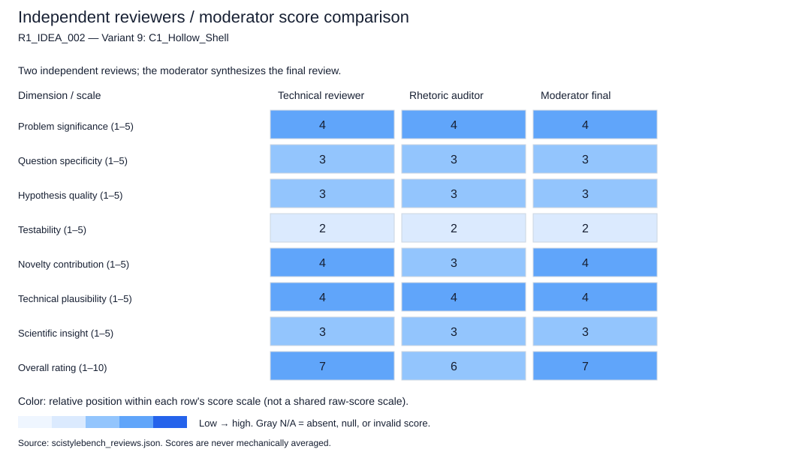

### Independent reviews

```json
{
  "technical_review": {
    "summary": "The research idea proposes a computational method using machine learning to address sampling challenges in molecular systems by focusing on pathways between stable states without predefined descriptors, aiming to improve simulation of rare events for applications in drug discovery and material design.",
    "strengths": [
      "Identifies a meaningful problem in molecular simulation and rare event sampling",
      "Proposes a novel approach using machine learning without relying on predefined descriptors",
      "Highlights potential applications in drug discovery and material design",
      "Focuses on pathways between stable states, which is a key challenge in molecular dynamics"
    ],
    "weaknesses": [
      "Lacks specific details about the machine learning method or algorithm used",
      "Does not clearly define the research question or hypothesis",
      "No mention of how the method would be evaluated or validated",
      "Does not specify the type of molecular systems or the nature of the rare events being simulated"
    ],
    "suggestions": [
      "Specify the type of machine learning method (e.g., reinforcement learning, graph neural networks) and its architecture",
      "Define the exact research question, such as how the method improves sampling efficiency compared to existing approaches",
      "Outline the evaluation metrics and benchmarks for comparing with current methods",
      "Clarify the specific molecular systems or rare events the method is intended for"
    ],
    "questions": [
      "What specific machine learning method is being proposed?",
      "How does the method distinguish between stable states and rare events?",
      "What metrics will be used to evaluate the effectiveness of the approach?",
      "What are the specific molecular systems or applications this method is intended for?"
    ],
    "problem_significance": {
      "score": 4.0,
      "justification": "The problem of simulating rare events in molecular systems is significant for drug discovery and material design, as it enables the study of processes that are difficult to observe experimentally."
    },
    "question_specificity": {
      "score": 3.0,
      "justification": "The idea identifies a general problem but lacks a specific research question, such as how the proposed method improves sampling efficiency or what specific pathways it focuses on."
    },
    "hypothesis_quality": {
      "score": 3.0,
      "justification": "The idea suggests a potential solution but does not explicitly state a hypothesis that could be tested, such as whether the method improves sampling efficiency or reduces computational cost."
    },
    "testability": {
      "score": 2.0,
      "justification": "The idea lacks details on how the method would be evaluated, what benchmarks would be used, and how the results would be compared to existing methods, making it difficult to assess testability."
    },
    "novelty_contribution": {
      "score": 4.0,
      "justification": "The approach of using machine learning without predefined descriptors is novel for this application, and if successful, could contribute to more efficient simulation methods in molecular systems."
    },
    "technical_plausibility": {
      "score": 4.0,
      "justification": "The idea is technically plausible as machine learning methods are increasingly used in molecular simulations, and focusing on pathways between stable states is a reasonable approach for addressing sampling challenges."
    },
    "scientific_insight": {
      "score": 3.0,
      "justification": "The idea has potential for scientific insight into how machine learning can improve sampling in complex systems, but the specific mechanisms and outcomes are not clearly defined."
    },
    "overall_rating": {
      "score": 7.0,
      "justification": "The idea addresses a significant problem in molecular simulation with a potentially novel approach, but lacks specific details that would make it testable and clearly define the research question and hypothesis."
    },
    "confidence": 4.0
  },
  "rhetoric_review": {
    "summary": "The research idea proposes a machine learning approach to address sampling challenges in molecular systems by focusing on pathways between stable states without predefined descriptors, aiming to simulate rare events more effectively for applications in drug discovery and material design.",
    "strengths": [
      "Identifies a meaningful problem in molecular simulation and rare event sampling",
      "Proposes a machine learning-based solution that could be applicable to complex systems",
      "Highlights potential applications in drug discovery and material design"
    ],
    "weaknesses": [
      "Lacks specific details about the machine learning method or the problem being addressed",
      "Does not clearly define the research question or hypothesis",
      "Does not specify how the method would be evaluated or validated"
    ],
    "suggestions": [
      "Specify the type of machine learning method (e.g., reinforcement learning, variational inference)",
      "Define the specific problem being addressed (e.g., transition path sampling, rare event simulation)",
      "Outline the evaluation metrics and comparison benchmarks"
    ],
    "questions": [
      "What specific rare event is the method designed to simulate?",
      "How does the method differ from existing approaches in handling pathways between stable states?",
      "What are the evaluation metrics and comparison benchmarks for the proposed method?"
    ],
    "problem_significance": {
      "score": 4.0,
      "justification": "The problem of simulating rare events in molecular systems is significant for drug discovery and material design, but the idea does not provide enough detail to assess its importance in the context of the proposed solution."
    },
    "question_specificity": {
      "score": 3.0,
      "justification": "The idea is somewhat specific in its focus on pathways between stable states but lacks a clear research question or hypothesis that could be tested."
    },
    "hypothesis_quality": {
      "score": 3.0,
      "justification": "The idea suggests a potential solution but does not provide a concrete hypothesis that could be tested or falsified."
    },
    "testability": {
      "score": 2.0,
      "justification": "The idea lacks specific experimental or evaluation plans, making it difficult to assess the testability of the proposed approach."
    },
    "novelty_contribution": {
      "score": 3.0,
      "justification": "The idea proposes a machine learning approach for a challenging problem, but the novelty is not clearly defined without more details about the method and its application."
    },
    "technical_plausibility": {
      "score": 4.0,
      "justification": "The proposed approach is technically plausible as it leverages machine learning for sampling challenges, which is a common area of research in computational chemistry."
    },
    "scientific_insight": {
      "score": 3.0,
      "justification": "The idea has potential for scientific insight but lacks the specific mechanisms or predictions that would indicate what new knowledge could be gained."
    },
    "overall_rating": {
      "score": 6.0,
      "justification": "The idea addresses a meaningful problem with a plausible approach, but it lacks specific details that would make the research question and hypothesis testable, which is necessary for a strong research direction."
    },
    "confidence": 4.0
  },
  "generation": {
    "technical_model_name": "Qwen/Qwen3-4B",
    "rhetoric_model_name": "Qwen/Qwen3-4B",
    "moderator_model_name": "Qwen/Qwen3-4B",
    "temperature": 0.0,
    "seed": 42
  }
}
```

## R1_IDEA_002 — Variant 10: C2_Logic_Flawed

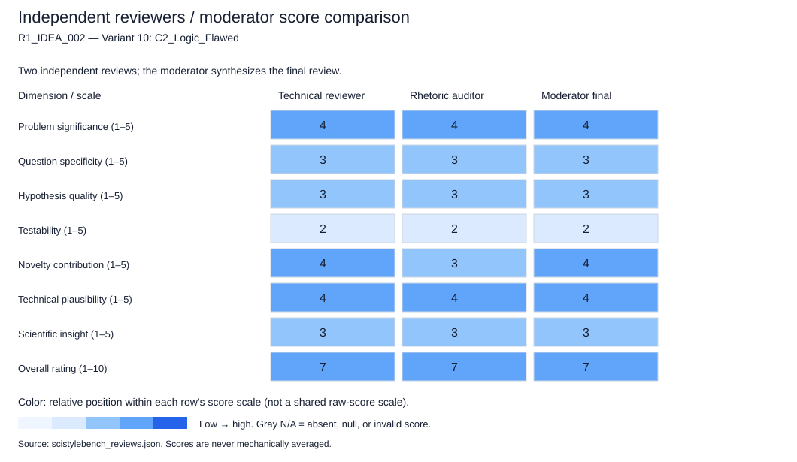

### Independent reviews

```json
{
  "technical_review": {
    "summary": "The idea proposes using improved off-policy learning to train diffusion path samplers for generating transition pathways between meta-stable molecular states in molecular dynamics simulations, without relying on predefined collective variables. The goal is to address the computational challenges of unbiased molecular dynamics and apply this approach to rare-event exploration in drug discovery and material design.",
    "strengths": [
      "The idea addresses a significant challenge in molecular dynamics simulations by proposing a novel approach to sample transition pathways between metastable states without predefined collective variables.",
      "The application to drug discovery and material design highlights the potential impact of the research in important domains.",
      "The use of off-policy learning suggests a methodological innovation that could improve the efficiency of sampling in complex systems."
    ],
    "weaknesses": [
      "The idea lacks specific details on how the off-policy learning is implemented or how the diffusion path samplers are trained.",
      "The connection between the proposed method and the broader application to rare-event exploration is not clearly explained.",
      "The computational feasibility of the approach is not thoroughly addressed, leaving room for skepticism about its practicality."
    ],
    "suggestions": [
      "Provide a more detailed description of the off-policy learning framework and how it is applied to train the diffusion path samplers.",
      "Clarify the relationship between the method and the ability to explore rare events, including how the approach handles rare transitions between metastable states.",
      "Include a comparison with existing methods to demonstrate the computational advantages of the proposed approach."
    ],
    "questions": [
      "How does the off-policy learning framework specifically contribute to the training of diffusion path samplers?",
      "What is the mechanism by which the method enables rare-event exploration in complex systems?",
      "How does the proposed approach compare in terms of computational efficiency to traditional unbiased molecular dynamics methods?"
    ],
    "problem_significance": {
      "score": 4.0,
      "justification": "The problem of efficiently sampling transition pathways in molecular dynamics is critical for drug discovery and material design, making the proposed solution highly relevant."
    },
    "question_specificity": {
      "score": 3.0,
      "justification": "The idea identifies a specific problem (sampling between metastable states without predefined variables) but lacks detailed specification of the research question or hypothesis."
    },
    "hypothesis_quality": {
      "score": 3.0,
      "justification": "The idea suggests a potential solution but does not explicitly state a testable hypothesis or prediction that could be evaluated through experiments."
    },
    "testability": {
      "score": 2.0,
      "justification": "The idea is somewhat testable, but the lack of specific implementation details and evaluation metrics makes it difficult to assess the feasibility of the proposed approach."
    },
    "novelty_contribution": {
      "score": 4.0,
      "justification": "The approach of using off-policy learning for diffusion path samplers in molecular dynamics is novel and could contribute new insights into efficient sampling methods."
    },
    "technical_plausibility": {
      "score": 4.0,
      "justification": "The combination of off-policy learning and diffusion path samplers is technically plausible, though the specific implementation details are not provided."
    },
    "scientific_insight": {
      "score": 3.0,
      "justification": "The idea has potential for scientific insight into how to efficiently explore rare events in complex systems, but the connection to broader applications is not clearly established."
    },
    "overall_rating": {
      "score": 7.0,
      "justification": "The idea addresses a significant problem with a potentially novel approach, but lacks specific details and testable hypotheses, which are needed to assess its feasibility and impact."
    },
    "confidence": 4.0
  },
  "rhetoric_review": {
    "summary": "The research idea proposes training diffusion path samplers using improved off-policy learning to sample transition pathways between meta-stable molecular states without predefined collective variables, aiming to overcome the computational challenges of unbiased molecular dynamics. It suggests broader applications in rare-event exploration for drug discovery and material design.",
    "strengths": [
      "The idea addresses a significant challenge in molecular dynamics simulations by proposing a novel approach to sample transition pathways between meta-stable states without predefined collective variables.",
      "The application to drug discovery and material design highlights the potential impact of the research in important domains.",
      "The use of off-policy learning suggests a methodological innovation that could improve the efficiency of rare-event exploration in complex systems."
    ],
    "weaknesses": [
      "The idea lacks specific details on how the diffusion path samplers are trained using improved off-policy learning, making it difficult to assess the technical feasibility or novelty of the approach.",
      "The connection between the proposed method and the broader applications in drug discovery and material design is not clearly explained, which could limit the ability to evaluate its practical relevance.",
      "The claim that the method 'overcomes the computational infeasibility of unbiased molecular dynamics' is vague and needs to be substantiated with a concrete hypothesis or prediction."
    ],
    "suggestions": [
      "Provide a more detailed description of the off-policy learning framework and how it is applied to train the diffusion path samplers.",
      "Clarify the specific computational advantages of the proposed method compared to existing approaches in unbiased molecular dynamics.",
      "Specify the types of rare events or transition pathways that the method is designed to explore and how it would be evaluated in drug discovery and material design contexts."
    ],
    "questions": [
      "How does the improved off-policy learning framework specifically enhance the sampling efficiency of diffusion path samplers?",
      "What are the key differences between the proposed method and existing approaches in unbiased molecular dynamics that make it more computationally feasible?",
      "How will the method be validated in the context of drug discovery and material design, and what metrics will be used to assess its effectiveness?"
    ],
    "problem_significance": {
      "score": 4.0,
      "justification": "The problem of efficiently sampling rare events in molecular dynamics is significant for drug discovery and material design, as it addresses a major computational challenge in these fields."
    },
    "question_specificity": {
      "score": 3.0,
      "justification": "The idea identifies a specific problem (sampling transition pathways between meta-stable states) but lacks detailed specification of the method and its expected outcomes."
    },
    "hypothesis_quality": {
      "score": 3.0,
      "justification": "The idea suggests a potential solution but does not provide a clear, testable hypothesis about how the method will improve sampling efficiency or overcome computational infeasibility."
    },
    "testability": {
      "score": 2.0,
      "justification": "The idea is somewhat testable, but the lack of specific experimental design or evaluation metrics makes it difficult to assess the validity of the proposed approach."
    },
    "novelty_contribution": {
      "score": 3.0,
      "justification": "The approach of using off-policy learning for diffusion path samplers is novel in the context of molecular dynamics, but the specific contribution and novelty are not clearly articulated."
    },
    "technical_plausibility": {
      "score": 4.0,
      "justification": "The use of off-policy learning in diffusion models is a plausible technical direction, especially given the context of rare-event sampling in complex systems."
    },
    "scientific_insight": {
      "score": 3.0,
      "justification": "The idea has potential for scientific insight into how off-policy learning can be applied to improve sampling in complex systems, but the specific insights are not clearly defined."
    },
    "overall_rating": {
      "score": 7.0,
      "justification": "The idea addresses a meaningful problem with a potentially novel approach, but it lacks specific details and testable hypotheses that would strengthen its scientific merit and feasibility."
    },
    "confidence": 4.0
  },
  "generation": {
    "technical_model_name": "Qwen/Qwen3-4B",
    "rhetoric_model_name": "Qwen/Qwen3-4B",
    "moderator_model_name": "Qwen/Qwen3-4B",
    "temperature": 0.0,
    "seed": 42
  }
}
```

## R1_IDEA_002 — Variant 11: C3_Substance_Enriched

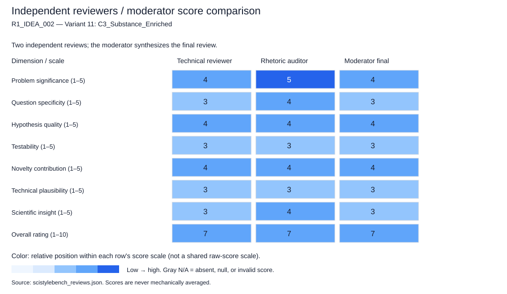

### Independent reviews

```json
{
  "technical_review": {
    "summary": "The research idea proposes training diffusion path samplers using improved off-policy learning to sample transition pathways between meta-stable molecular states without predefined collective variables, aiming to overcome the computational challenges of unbiased molecular dynamics. It hypothesizes that off-policy learning can be validated by comparing sampled pathways with those from enhanced sampling methods and explores potential boundary conditions like high-dimensional conformational changes and reward function sensitivity.",
    "strengths": [
      "The idea addresses a significant challenge in molecular dynamics simulations by proposing a novel machine learning approach to sample transition pathways between meta-stable states without predefined collective variables.",
      "It includes a specific hypothesis for validation through comparison with existing enhanced sampling methods, which provides a clear testable claim.",
      "The idea identifies potential boundary conditions (e.g., high-dimensional conformational changes, reward function sensitivity) that could guide further investigation.",
      "The application in drug discovery and material design highlights the potential impact of the research."
    ],
    "weaknesses": [
      "The idea lacks specific details on the off-policy learning method, the choice of reward function, or the specific enhanced sampling methods for comparison, which are necessary for evaluating the hypothesis.",
      "The connection between the diffusion path samplers and the off-policy learning is not clearly explained, which could affect the technical plausibility of the approach.",
      "The potential boundary conditions are mentioned but not elaborated on in terms of how they would be tested or measured.",
      "The idea does not specify how the sampled pathways will be compared to those from enhanced sampling methods, which is crucial for validating the hypothesis."
    ],
    "suggestions": [
      "Specify the off-policy learning method (e.g., DDPG, PPO) and the reward function design to clarify the technical approach.",
      "Clarify the relationship between diffusion path samplers and off-policy learning, including how the policy is updated and how transitions are sampled.",
      "Detail the specific enhanced sampling methods (e.g., umbrella sampling, metadynamics) that will be used for comparison and how the sampled pathways will be evaluated.",
      "Provide a more concrete plan for testing the boundary conditions, such as high-dimensional conformational changes, including metrics for assessing sensitivity to reward functions."
    ],
    "questions": [
      "What specific off-policy learning algorithm will be used, and how is the reward function designed to guide the sampling of transition pathways?",
      "How will the sampled pathways be compared to those from enhanced sampling methods, and what metrics will be used to evaluate the comparison?",
      "What are the specific high-dimensional conformational changes that the method is expected to handle, and how will their impact be measured?",
      "How does the proposed approach ensure that the sampled pathways are unbiased and representative of the true transition pathways?"
    ],
    "problem_significance": {
      "score": 4.0,
      "justification": "The idea addresses a critical challenge in molecular dynamics simulations, where unbiased sampling of rare events is computationally infeasible. This has significant implications for drug discovery and material design, making the problem highly relevant."
    },
    "question_specificity": {
      "score": 3.0,
      "justification": "The research question is specific in that it focuses on training diffusion path samplers via off-policy learning to sample transition pathways between meta-stable states. However, the details on the method and comparison are not sufficiently elaborated."
    },
    "hypothesis_quality": {
      "score": 4.0,
      "justification": "The hypothesis that off-policy learning can be validated by comparing sampled pathways with those from enhanced sampling methods is concrete and testable. It also identifies potential boundary conditions, which adds to the hypothesis's specificity."
    },
    "testability": {
      "score": 3.0,
      "justification": "The idea suggests a comparison with enhanced sampling methods, which is testable. However, the lack of specific details on the methods, reward functions, and evaluation metrics makes the testability somewhat limited."
    },
    "novelty_contribution": {
      "score": 4.0,
      "justification": "The approach of using off-policy learning for diffusion path samplers in molecular dynamics is novel. It aims to enable rare-event exploration in complex systems, which could contribute to the field of computational chemistry and materials science."
    },
    "technical_plausibility": {
      "score": 3.0,
      "justification": "The idea is technically plausible as it builds on existing methods in off-policy learning and diffusion models. However, the connection between the two components and the specifics of the reward function are not clearly explained, which could affect the feasibility of the approach."
    },
    "scientific_insight": {
      "score": 3.0,
      "justification": "The idea has the potential to provide insights into how off-policy learning can be effectively applied to sample rare events in complex systems. However, the current description does not provide enough detail to assess the depth of the scientific insight."
    },
    "overall_rating": {
      "score": 7.0,
      "justification": "The idea addresses a significant problem in molecular dynamics and proposes a novel approach with a clear hypothesis for validation. However, it lacks specific details on the methods and evaluation metrics, which are necessary for a more robust assessment. The potential contribution to drug discovery and material design is strong, but the technical plausibility and testability could be improved with more concrete details."
    },
    "confidence": 4.0
  },
  "rhetoric_review": {
    "summary": "The research idea proposes training diffusion path samplers using improved off-policy learning to sample transition pathways between meta-stable molecular states without predefined collective variables, aiming to overcome the computational challenges of unbiased molecular dynamics. It hypothesizes that off-policy learning can be validated by comparing sampled pathways with those from enhanced sampling methods and explores potential boundary conditions like high-dimensional conformational changes and reward function sensitivity.",
    "strengths": [
      "The idea addresses a significant challenge in molecular dynamics simulations by proposing a novel machine learning approach to sample transition pathways without predefined collective variables.",
      "It includes a specific hypothesis for validation through comparison with existing enhanced sampling methods, which provides a clear testable direction.",
      "The idea identifies potential boundary conditions (e.g., high-dimensional conformational changes, reward function sensitivity) that could guide further investigation.",
      "The application in drug discovery and material design highlights the potential real-world impact of the research."
    ],
    "weaknesses": [
      "The idea lacks specific details on the off-policy learning method, the choice of reward function, or the specific enhanced sampling methods for comparison, which are necessary for evaluating the hypothesis.",
      "The connection between the diffusion path samplers and the off-policy learning is not clearly explained, which could affect the technical plausibility of the approach.",
      "The potential boundary conditions are mentioned but not elaborated on in terms of how they would be tested or measured.",
      "The idea does not specify how the sampled pathways will be compared to those from enhanced sampling methods, which is crucial for validating the hypothesis."
    ],
    "suggestions": [
      "Specify the off-policy learning method (e.g., DDPG, PPO) and the reward function design to clarify the technical approach.",
      "Detail the enhanced sampling methods (e.g., umbrella sampling, metadynamics) that will be used for comparison to provide a concrete validation plan.",
      "Clarify the relationship between diffusion path samplers and off-policy learning, including how the policy is updated and how transitions are sampled.",
      "Outline the metrics for comparing sampled pathways with enhanced sampling methods, such as accuracy, coverage, or computational efficiency."
    ],
    "questions": [
      "What specific off-policy learning algorithm will be used, and how is the reward function designed?",
      "Which enhanced sampling methods will be used as benchmarks for comparison?",
      "How will the sampled pathways be quantitatively compared to those from enhanced sampling methods?",
      "What are the specific high-dimensional conformational changes that the method is expected to handle, and how will their sensitivity be tested?",
      "How does the proposed approach ensure that the sampled pathways are unbiased and representative of the true transition pathways?"
    ],
    "problem_significance": {
      "score": 5.0,
      "justification": "The idea addresses a critical challenge in molecular dynamics simulations, where unbiased sampling of rare events is computationally infeasible. Overcoming this would have significant implications for drug discovery and material design."
    },
    "question_specificity": {
      "score": 4.0,
      "justification": "The research question is specific, focusing on training diffusion path samplers via off-policy learning to sample transition pathways without predefined collective variables. However, some details are missing that could further specify the question."
    },
    "hypothesis_quality": {
      "score": 4.0,
      "justification": "The hypothesis that off-policy learning can be validated by comparing sampled pathways with enhanced sampling methods is concrete and testable. However, the connection between the method and the hypothesis is not fully elaborated."
    },
    "testability": {
      "score": 3.0,
      "justification": "The idea suggests a validation plan (comparing with enhanced sampling methods), but lacks specific details on how the comparison will be conducted, what metrics will be used, and how the hypothesis will be tested in practice."
    },
    "novelty_contribution": {
      "score": 4.0,
      "justification": "The approach of using off-policy learning for diffusion path samplers in molecular dynamics is novel. The potential contribution to rare-event exploration in complex systems is significant, though the novelty is somewhat limited by the lack of specific technical details."
    },
    "technical_plausibility": {
      "score": 3.0,
      "justification": "The idea is technically plausible, as off-policy learning is a well-established technique in reinforcement learning. However, the connection between diffusion path samplers and off-policy learning is not clearly explained, which could affect the feasibility of the approach."
    },
    "scientific_insight": {
      "score": 4.0,
      "justification": "The research could provide insights into the effectiveness of off-policy learning in sampling rare events and the limitations of current enhanced sampling methods. However, the potential for deeper scientific insight is somewhat limited by the lack of specific hypotheses and evaluation plans."
    },
    "overall_rating": {
      "score": 7.0,
      "justification": "The idea is strong and addresses a significant problem in molecular dynamics. It has a clear hypothesis and potential for contribution, but lacks specific technical details and evaluation plans that are necessary for a rigorous investigation."
    },
    "confidence": 4.0
  },
  "generation": {
    "technical_model_name": "Qwen/Qwen3-4B",
    "rhetoric_model_name": "Qwen/Qwen3-4B",
    "moderator_model_name": "Qwen/Qwen3-4B",
    "temperature": 0.0,
    "seed": 42
  }
}
```

## R1_IDEA_003 — Source

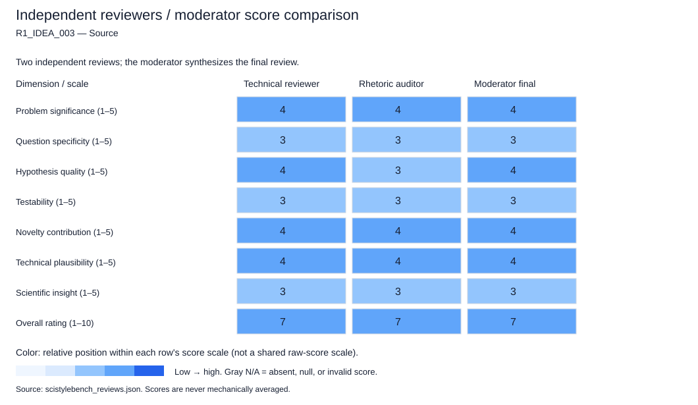

### Independent reviews

```json
{
  "technical_review": {
    "summary": "The idea proposes encoding eye-tracking data as video sequences to capture both spatial attention and temporal scanning order in large vision-language models for chest X-ray analysis, aiming to enhance model reasoning and clinical interpretability.",
    "strengths": [
      "Identifies a meaningful problem in the integration of eye gaze data into vision-language models for medical imaging.",
      "Proposes a novel approach to represent temporal sequences of fixations, which could improve model reasoning and interpretability.",
      "Addresses a specific challenge in medical imaging analysis by leveraging temporal information from eye-tracking data."
    ],
    "weaknesses": [
      "Lacks detailed explanation of how the video sequence encoding will be implemented or integrated into the existing model architecture.",
      "Does not specify the metrics or evaluation methods to assess the improvement in model reasoning and interpretability.",
      "The potential benefits are not clearly tied to existing limitations or gaps in current approaches."
    ],
    "suggestions": [
      "Provide a more detailed description of the video sequence encoding method, including how it will be integrated into the model.",
      "Specify the evaluation metrics and benchmarks to compare the proposed approach with existing methods.",
      "Clarify how the temporal scanning order contributes to improved clinical interpretability and model reasoning."
    ],
    "questions": [
      "How will the video sequence encoding be integrated into the existing vision-language model architecture?",
      "What specific metrics will be used to evaluate the improvement in model reasoning and clinical interpretability?",
      "How does the proposed approach address the limitations of current static heatmap or text representations of eye gaze data?"
    ],
    "problem_significance": {
      "score": 4.0,
      "justification": "The problem addresses a critical challenge in medical imaging analysis by improving the integration of eye gaze data, which is essential for clinical interpretability and model reasoning."
    },
    "question_specificity": {
      "score": 3.0,
      "justification": "The idea clearly defines the problem but lacks specific details on the method and evaluation, which could be elaborated for greater specificity."
    },
    "hypothesis_quality": {
      "score": 4.0,
      "justification": "The hypothesis that encoding temporal sequences improves model reasoning and interpretability is plausible and could be tested through experiments."
    },
    "testability": {
      "score": 3.0,
      "justification": "The idea is testable, but the lack of specific evaluation methods and implementation details makes it challenging to assess the feasibility of the proposed approach."
    },
    "novelty_contribution": {
      "score": 4.0,
      "justification": "The approach of encoding eye-tracking data as video sequences is novel and could contribute to the field by improving the temporal modeling of eye gaze in medical imaging."
    },
    "technical_plausibility": {
      "score": 4.0,
      "justification": "The proposed method is technically plausible, as encoding temporal data as video sequences is a feasible approach that aligns with current trends in temporal modeling."
    },
    "scientific_insight": {
      "score": 3.0,
      "justification": "The idea has potential for scientific insight but lacks details on how the temporal scanning order contributes to model reasoning and clinical interpretability."
    },
    "overall_rating": {
      "score": 7.0,
      "justification": "The idea addresses a meaningful problem with a plausible approach, but lacks specific details on implementation and evaluation, which are necessary for further development and validation."
    },
    "confidence": 4.0
  },
  "rhetoric_review": {
    "summary": "The idea proposes encoding eye-tracking data as video sequences to capture both spatial attention and temporal scanning order in large vision-language models for chest X-ray analysis, aiming to enhance model reasoning and clinical interpretability.",
    "strengths": [
      "Identifies a specific problem with current approaches to integrating eye gaze data into vision-language models.",
      "Proposes a novel method (encoding eye-tracking data as video sequences) that addresses the limitation of static representations.",
      "Highlights potential benefits (enhanced model reasoning and clinical interpretability) that align with practical applications in healthcare."
    ],
    "weaknesses": [
      "Lacks a clear hypothesis or specific research question that could be tested.",
      "Does not specify how the video sequences will be processed or integrated into the existing model architecture.",
      "Does not mention how the temporal scanning order will be modeled or what specific improvements are expected in model performance."
    ],
    "suggestions": [
      "Define a specific research question, such as whether encoding gaze as video sequences improves model performance on chest X-ray analysis compared to static heatmaps.",
      "Specify the method for processing video sequences (e.g., using temporal models like LSTMs, Transformers, or video-specific architectures).",
      "Outline how the temporal scanning order will be modeled and what metrics will be used to evaluate the improvements in model reasoning and interpretability."
    ],
    "questions": [
      "How will the video sequences be processed and integrated into the existing vision-language model architecture?",
      "What specific metrics will be used to evaluate the improvements in model reasoning and clinical interpretability?",
      "What is the expected impact on model performance compared to static heatmaps or text representations?"
    ],
    "problem_significance": {
      "score": 4.0,
      "justification": "The problem of integrating temporal eye-tracking data into vision-language models is relevant to improving clinical interpretability and model reasoning in healthcare applications, which is a meaningful challenge."
    },
    "question_specificity": {
      "score": 3.0,
      "justification": "The idea identifies a specific problem with current approaches but lacks a concrete research question or hypothesis that could be tested. It suggests a novel method but does not clearly define what is being investigated."
    },
    "hypothesis_quality": {
      "score": 3.0,
      "justification": "The idea proposes a novel method but does not explicitly state a hypothesis or prediction that could be tested. It mentions potential benefits but does not specify what outcome is expected or how it would be measured."
    },
    "testability": {
      "score": 3.0,
      "justification": "The idea suggests a method but does not provide a clear experimental plan or evaluation strategy. It is possible to test the hypothesis, but the specifics are missing."
    },
    "novelty_contribution": {
      "score": 4.0,
      "justification": "The proposal to encode eye-tracking data as video sequences is a novel approach compared to static representations. It has the potential to contribute to the field by improving model reasoning and clinical interpretability in healthcare applications."
    },
    "technical_plausibility": {
      "score": 4.0,
      "justification": "Encoding eye-tracking data as video sequences is a plausible technical approach. It builds on existing methods for handling temporal data in vision-language models and is feasible to implement."
    },
    "scientific_insight": {
      "score": 3.0,
      "justification": "The idea has potential to provide insights into how temporal scanning order affects model reasoning, but the specific mechanisms and outcomes are not clearly defined. The scientific insight would depend on the results of the experiments."
    },
    "overall_rating": {
      "score": 7.0,
      "justification": "The idea addresses a meaningful problem in the field and proposes a novel method. However, it lacks a clear research question, hypothesis, and experimental plan, which are necessary for evaluating its scientific merit and potential contribution."
    },
    "confidence": 4.0
  },
  "generation": {
    "technical_model_name": "Qwen/Qwen3-4B",
    "rhetoric_model_name": "Qwen/Qwen3-4B",
    "moderator_model_name": "Qwen/Qwen3-4B",
    "temperature": 0.0,
    "seed": 42
  }
}
```

## R1_IDEA_003 — Variant 1: A1_Identity

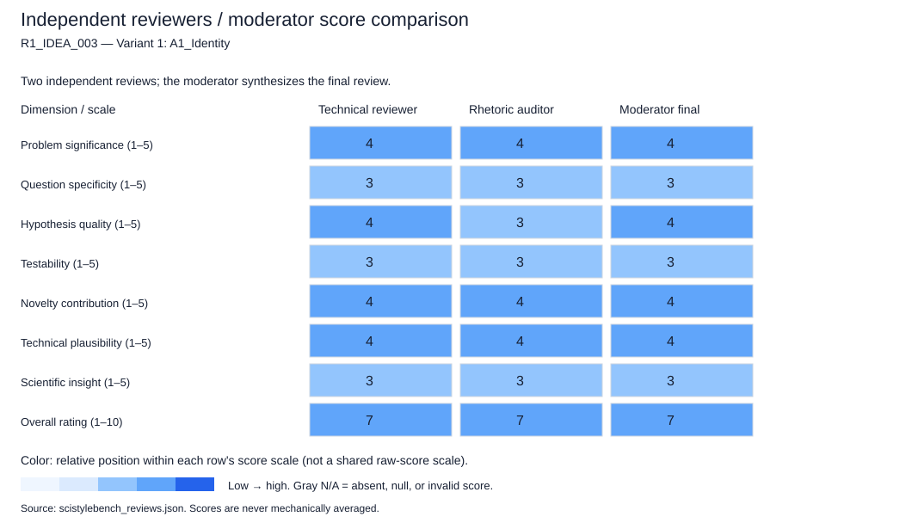

### Independent reviews

```json
{
  "technical_review": {
    "summary": "The idea proposes encoding eye-tracking data as video sequences to capture both spatial attention and temporal scanning order in large vision-language models for chest X-ray analysis, aiming to enhance model reasoning and clinical interpretability.",
    "strengths": [
      "Identifies a meaningful problem in the integration of eye gaze data into vision-language models for medical imaging.",
      "Proposes a novel approach to represent temporal sequences of fixations, which could improve model reasoning and interpretability.",
      "Addresses a practical challenge in clinical applications by enhancing model interpretability."
    ],
    "weaknesses": [
      "Lacks specific details on how the video sequences will be encoded or processed within the model.",
      "Does not specify how the temporal scanning order will be utilized or what the expected improvements are.",
      "The idea does not address potential challenges in aligning video sequences with the visual content of chest X-rays."
    ],
    "suggestions": [
      "Provide more details on the encoding method for video sequences, such as using temporal convolutional networks or transformers.",
      "Clarify how the temporal scanning order will be incorporated into the model's decision-making process.",
      "Address the challenge of aligning video sequences with the visual content of chest X-rays, such as through spatial-temporal attention mechanisms."
    ],
    "questions": [
      "How will the video sequences be encoded and processed within the vision-language model?",
      "What specific improvements in model reasoning or clinical interpretability are expected from incorporating temporal scanning order?",
      "How will the alignment between video sequences and chest X-ray visual content be handled?"
    ],
    "problem_significance": {
      "score": 4.0,
      "justification": "The problem of integrating temporal eye gaze data into medical imaging models is significant for improving model interpretability and clinical utility, especially in radiology."
    },
    "question_specificity": {
      "score": 3.0,
      "justification": "The idea is specific in proposing to encode eye-tracking data as video sequences, but lacks details on the encoding method and how temporal information will be utilized."
    },
    "hypothesis_quality": {
      "score": 4.0,
      "justification": "The hypothesis that encoding temporal eye gaze data as video sequences will enhance model reasoning and interpretability is plausible and could be tested through experiments."
    },
    "testability": {
      "score": 3.0,
      "justification": "The idea is testable through experiments comparing models with and without temporal encoding of eye gaze data, but lacks specific experimental design details."
    },
    "novelty_contribution": {
      "score": 4.0,
      "justification": "The approach of encoding eye-tracking data as video sequences is novel in the context of vision-language models for medical imaging, offering potential contributions to model interpretability and clinical applications."
    },
    "technical_plausibility": {
      "score": 4.0,
      "justification": "The proposed method is technically plausible, as encoding temporal data as video sequences is a feasible approach that could be integrated into existing vision-language models."
    },
    "scientific_insight": {
      "score": 3.0,
      "justification": "The idea has potential for scientific insight into how temporal attention patterns affect model reasoning, but the specific mechanisms and expected outcomes are not clearly defined."
    },
    "overall_rating": {
      "score": 7.0,
      "justification": "The idea addresses a meaningful problem with a plausible approach, showing potential for improving model interpretability and clinical utility, though more details are needed to fully assess its feasibility and impact."
    },
    "confidence": 4.0
  },
  "rhetoric_review": {
    "summary": "The idea proposes encoding eye-tracking data as video sequences to capture both spatial attention and temporal scanning order in large vision-language models for chest X-ray analysis, aiming to enhance model reasoning and clinical interpretability.",
    "strengths": [
      "Identifies a specific problem with current approaches to integrating eye gaze data into vision-language models.",
      "Proposes a novel method (encoding eye-tracking data as video sequences) that addresses the limitation of static representations.",
      "Highlights potential benefits (enhanced model reasoning and clinical interpretability) that align with practical applications in healthcare."
    ],
    "weaknesses": [
      "Lacks a clear hypothesis or specific research question that could be tested.",
      "Does not specify how the video sequences will be processed or integrated into the existing model architecture.",
      "Does not mention how the temporal scanning order will be modeled or what specific improvements are expected in model performance."
    ],
    "suggestions": [
      "Define a specific research question, such as whether encoding gaze as video sequences improves model performance on chest X-ray analysis compared to static heatmaps.",
      "Specify the method for processing video sequences (e.g., using temporal models like LSTMs, Transformers, or video-specific architectures).",
      "Outline how the temporal scanning order will be modeled and what metrics will be used to evaluate the improvements in model reasoning and interpretability."
    ],
    "questions": [
      "How will the video sequences be processed and integrated into the existing vision-language model architecture?",
      "What specific metrics will be used to evaluate the improvements in model reasoning and clinical interpretability?",
      "What is the expected impact on model performance compared to static heatmaps or text representations?"
    ],
    "problem_significance": {
      "score": 4.0,
      "justification": "The problem of integrating temporal eye-tracking data into vision-language models is relevant to improving clinical interpretability and model reasoning in healthcare applications, which is a meaningful challenge."
    },
    "question_specificity": {
      "score": 3.0,
      "justification": "The idea identifies a specific problem with current approaches but lacks a concrete research question or hypothesis that could be tested. It suggests a novel method but does not clearly define what is being investigated."
    },
    "hypothesis_quality": {
      "score": 3.0,
      "justification": "The idea proposes a novel method but does not explicitly state a hypothesis or prediction that could be tested. It mentions potential benefits but does not specify what outcome is expected or how it would be measured."
    },
    "testability": {
      "score": 3.0,
      "justification": "The idea suggests a method but does not provide a clear experimental plan or evaluation strategy. It is possible to test the hypothesis, but the specifics are missing."
    },
    "novelty_contribution": {
      "score": 4.0,
      "justification": "The proposal to encode eye-tracking data as video sequences is a novel approach compared to static representations. It has the potential to contribute to the field by improving model reasoning and clinical interpretability in healthcare applications."
    },
    "technical_plausibility": {
      "score": 4.0,
      "justification": "Encoding eye-tracking data as video sequences is a plausible technical approach. It builds on existing methods for handling temporal data in vision-language models and is feasible to implement."
    },
    "scientific_insight": {
      "score": 3.0,
      "justification": "The idea has potential to provide insights into how temporal scanning order affects model reasoning, but the specific mechanisms and outcomes are not clearly defined. The scientific insight would depend on the results of the experiments."
    },
    "overall_rating": {
      "score": 7.0,
      "justification": "The idea addresses a meaningful problem in the field of vision-language models for healthcare applications. It proposes a novel method that could improve model reasoning and interpretability. However, it lacks a clear hypothesis, specific research question, and detailed experimental plan, which are needed to assess its scientific merit and potential impact."
    },
    "confidence": 4.0
  },
  "generation": {
    "technical_model_name": "Qwen/Qwen3-4B",
    "rhetoric_model_name": "Qwen/Qwen3-4B",
    "moderator_model_name": "Qwen/Qwen3-4B",
    "temperature": 0.0,
    "seed": 42
  }
}
```

## R1_IDEA_003 — Variant 2: A2_Paraphrase_Only

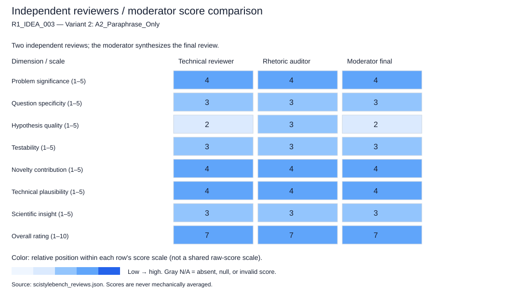

### Independent reviews

```json
{
  "technical_review": {
    "summary": "The idea proposes encoding eye-tracking data as video sequences to preserve temporal and spatial attention patterns in vision-language models for chest X-ray analysis, improving model reasoning and interpretability.",
    "strengths": [
      "Identifies a meaningful problem in existing methods for incorporating gaze data",
      "Proposes a novel approach to preserve temporal and spatial information from eye-tracking data",
      "Highlights potential improvements in model reasoning and clinical interpretability"
    ],
    "weaknesses": [
      "Lacks specific details on how video sequences will be encoded or processed",
      "Does not specify how the temporal information will be integrated into the model",
      "No clear hypothesis or prediction about performance improvements is provided"
    ],
    "suggestions": [
      "Specify the method for encoding eye-tracking data into video sequences (e.g., temporal convolution, attention mechanisms)",
      "Clarify how temporal information will be integrated into the vision-language model architecture",
      "Provide a hypothesis about how the proposed method will improve model performance or interpretability"
    ],
    "questions": [
      "How will the video sequences be encoded to capture temporal and spatial patterns?",
      "What is the proposed method for integrating temporal information into the model?",
      "What specific performance metrics or interpretability measures will be used to evaluate the approach?"
    ],
    "problem_significance": {
      "score": 4.0,
      "justification": "The problem addresses a limitation in existing methods for incorporating gaze data, which is important for improving model interpretability and clinical utility in medical imaging."
    },
    "question_specificity": {
      "score": 3.0,
      "justification": "The idea identifies a specific problem with existing methods but lacks detailed specification of the research question or hypothesis."
    },
    "hypothesis_quality": {
      "score": 2.0,
      "justification": "The idea suggests a potential solution but does not explicitly state a hypothesis or prediction that can be tested or falsified."
    },
    "testability": {
      "score": 3.0,
      "justification": "The idea proposes a method but does not specify how it will be evaluated or what experiments will be conducted to test its effectiveness."
    },
    "novelty_contribution": {
      "score": 4.0,
      "justification": "The approach of encoding eye-tracking data as video sequences is a novel way to incorporate temporal information, which could contribute to improved model reasoning and interpretability in medical imaging."
    },
    "technical_plausibility": {
      "score": 4.0,
      "justification": "The idea is technically plausible as it builds on existing methods for incorporating temporal information into vision-language models."
    },
    "scientific_insight": {
      "score": 3.0,
      "justification": "The idea has potential to provide insights into how temporal information can enhance model reasoning, but the specific mechanisms and outcomes are not clearly defined."
    },
    "overall_rating": {
      "score": 7.0,
      "justification": "The idea addresses a meaningful problem with a plausible solution, but lacks specific details on implementation, hypothesis, and evaluation methods, which are necessary for further development."
    },
    "confidence": 4.0
  },
  "rhetoric_review": {
    "summary": "The idea proposes encoding eye-tracking data as video sequences to preserve temporal and spatial attention patterns in vision-language models for chest X-ray analysis, improving model reasoning and interpretability.",
    "strengths": [
      "Identifies a specific problem with existing methods (loss of temporal order in gaze data)",
      "Proposes a concrete solution (encoding gaze as video sequences)",
      "Highlights potential benefits (improved reasoning and interpretability)",
      "Addresses a practical application in medical imaging"
    ],
    "weaknesses": [
      "Lacks details on how video encoding is implemented",
      "Does not specify how temporal information is extracted or utilized",
      "No mention of how this approach differs from existing methods in terms of architecture or training",
      "No clear hypothesis or prediction about performance improvements"
    ],
    "suggestions": [
      "Specify the video encoding method (e.g., temporal convolution, RNN, or transformer-based approaches)",
      "Clarify how temporal information is integrated into the model's architecture",
      "Provide a hypothesis about performance gains or interpretability improvements",
      "Compare with existing methods in terms of architecture and training procedures"
    ],
    "questions": [
      "How will the video encoding method be implemented and integrated into the model?",
      "What specific temporal features will be extracted and how will they be used in training?",
      "How will the proposed approach be evaluated against existing methods?",
      "What are the expected improvements in model reasoning and interpretability?"
    ],
    "problem_significance": {
      "score": 4.0,
      "justification": "The problem of losing temporal order in gaze data is significant for medical imaging applications where temporal scanning sequences are important for diagnosis. Improving model reasoning and interpretability has practical value for clinical use."
    },
    "question_specificity": {
      "score": 3.0,
      "justification": "The idea clearly defines the problem (loss of temporal order) and proposes a specific solution (video encoding), but lacks details on implementation and how the temporal information will be utilized in the model."
    },
    "hypothesis_quality": {
      "score": 3.0,
      "justification": "The idea suggests potential benefits (improved reasoning and interpretability) but does not explicitly state a testable hypothesis or prediction about performance improvements or specific mechanisms."
    },
    "testability": {
      "score": 3.0,
      "justification": "The idea proposes a solution but does not specify how it will be tested, compared to existing methods, or evaluated for performance improvements. The lack of experimental details makes it difficult to assess testability."
    },
    "novelty_contribution": {
      "score": 4.0,
      "justification": "The approach of encoding eye-tracking data as video sequences is a novel way to incorporate temporal information into vision-language models. It has the potential to contribute to both model performance and clinical interpretability in medical imaging."
    },
    "technical_plausibility": {
      "score": 4.0,
      "justification": "Encoding gaze data as video sequences is a plausible technical approach that could be implemented using existing techniques. The integration of temporal information into vision-language models is a reasonable direction for improving model reasoning."
    },
    "scientific_insight": {
      "score": 3.0,
      "justification": "The idea has potential for scientific insight into how temporal information affects model reasoning and interpretability, but the specific mechanisms and expected outcomes are not clearly defined."
    },
    "overall_rating": {
      "score": 7.0,
      "justification": "The idea addresses a meaningful problem in medical imaging with a specific solution that has potential for improving model performance and interpretability. However, it lacks details on implementation, evaluation, and specific hypotheses, which are needed for a strong research direction."
    },
    "confidence": 4.0
  },
  "generation": {
    "technical_model_name": "Qwen/Qwen3-4B",
    "rhetoric_model_name": "Qwen/Qwen3-4B",
    "moderator_model_name": "Qwen/Qwen3-4B",
    "temperature": 0.0,
    "seed": 42
  }
}
```

## R1_IDEA_003 — Variant 3: A3_Plain_Core

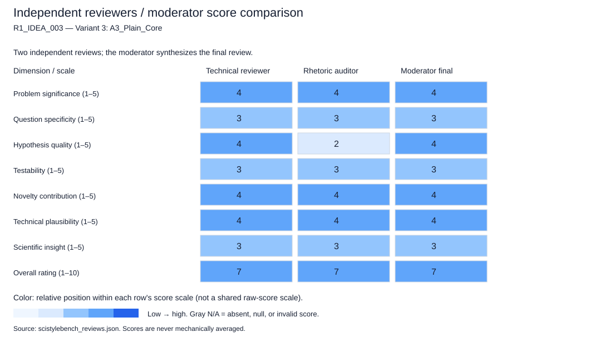

### Independent reviews

```json
{
  "technical_review": {
    "summary": "The idea proposes encoding eye-tracking data as video sequences to retain both spatial attention and temporal scanning order in large vision-language models for chest X-ray analysis, aiming to enhance model reasoning and clinical interpretability.",
    "strengths": [
      "Identifies a meaningful problem in the integration of eye gaze data into vision-language models.",
      "Proposes a novel approach to encode temporal information in eye-tracking data, which could improve model reasoning.",
      "Highlights the potential for increased clinical interpretability, which is valuable in medical applications."
    ],
    "weaknesses": [
      "Lacks specific details on how the video sequences will be encoded or processed within the model.",
      "Does not specify how the temporal scanning order will be utilized in the model's architecture or training.",
      "The idea does not address potential challenges in aligning eye-tracking data with medical imaging data."
    ],
    "suggestions": [
      "Provide more details on the encoding method for video sequences, such as using temporal convolutional networks or transformers.",
      "Clarify how the temporal scanning order will be incorporated into the model's training process.",
      "Address the alignment and synchronization of eye-tracking data with chest X-ray images."
    ],
    "questions": [
      "How will the video sequences be processed to extract temporal features?",
      "What is the specific mechanism by which temporal scanning order will enhance model reasoning?",
      "How will the model handle variations in eye-tracking data across different patients or scans?"
    ],
    "problem_significance": {
      "score": 4.0,
      "justification": "The problem of integrating temporal eye-tracking data into vision-language models is significant for improving clinical interpretability and model reasoning in medical imaging."
    },
    "question_specificity": {
      "score": 3.0,
      "justification": "The idea clearly defines the problem but lacks specific details on the method and how the temporal aspect will be utilized in the model."
    },
    "hypothesis_quality": {
      "score": 4.0,
      "justification": "The hypothesis that encoding eye-tracking data as video sequences will enhance model reasoning and interpretability is plausible and could be tested through experiments."
    },
    "testability": {
      "score": 3.0,
      "justification": "The idea is testable, but the lack of specific details makes it challenging to design experiments or evaluate the proposed approach without further clarification."
    },
    "novelty_contribution": {
      "score": 4.0,
      "justification": "The approach of encoding eye-tracking data as video sequences is novel in the context of vision-language models for medical imaging, offering potential contributions to both model performance and clinical interpretability."
    },
    "technical_plausibility": {
      "score": 4.0,
      "justification": "The proposed method is technically plausible, as encoding temporal data as video sequences is a feasible approach that aligns with current trends in temporal modeling."
    },
    "scientific_insight": {
      "score": 3.0,
      "justification": "The idea has potential for scientific insight into how temporal information can enhance model reasoning, but the specific mechanisms and their impact on model performance are not clearly defined."
    },
    "overall_rating": {
      "score": 7.0,
      "justification": "The idea addresses a meaningful problem with a plausible approach, but lacks specific details that would make it more testable and scientifically rigorous. It has potential for contribution but requires further clarification."
    },
    "confidence": 4.0
  },
  "rhetoric_review": {
    "summary": "The idea proposes encoding eye-tracking data as video sequences to retain both spatial attention and temporal scanning order in large vision-language models for chest X-ray analysis, aiming to enhance model reasoning and clinical interpretability.",
    "strengths": [
      "Identifies a meaningful problem in the integration of eye gaze data into vision-language models.",
      "Proposes a novel approach to encode eye-tracking data as video sequences to retain temporal information.",
      "Aims to improve model reasoning and clinical interpretability, which are important goals in medical AI."
    ],
    "weaknesses": [
      "Lacks specific details on how the video sequences will be encoded or processed.",
      "Does not specify how the temporal scanning order will be utilized in the model.",
      "No clear hypothesis or prediction is provided regarding the expected improvements."
    ],
    "suggestions": [
      "Specify the method for encoding eye-tracking data into video sequences (e.g., frame-based, temporal attention mechanisms).",
      "Clarify how the temporal scanning order will be incorporated into the model architecture.",
      "Provide a hypothesis about the expected performance improvements or interpretability gains."
    ],
    "questions": [
      "How will the video sequences be generated from eye-tracking data?",
      "What specific aspects of temporal scanning order will be leveraged in the model?",
      "What metrics will be used to evaluate the improvement in model reasoning and interpretability?"
    ],
    "problem_significance": {
      "score": 4.0,
      "justification": "The problem of integrating temporal eye gaze data into vision-language models is significant for improving clinical interpretability and model reasoning in medical AI."
    },
    "question_specificity": {
      "score": 3.0,
      "justification": "The idea clearly defines the problem but lacks specific details on the encoding method and how temporal information will be utilized."
    },
    "hypothesis_quality": {
      "score": 2.0,
      "justification": "The idea states a goal but does not provide a concrete hypothesis or prediction that can be tested."
    },
    "testability": {
      "score": 3.0,
      "justification": "The idea suggests a potential approach but does not specify experiments or evaluation methods to test the hypothesis."
    },
    "novelty_contribution": {
      "score": 4.0,
      "justification": "The approach of encoding eye-tracking data as video sequences is novel and could contribute to better model reasoning and interpretability in medical AI."
    },
    "technical_plausibility": {
      "score": 4.0,
      "justification": "The idea is technically plausible as encoding temporal data into video sequences is a feasible approach for retaining temporal information in models."
    },
    "scientific_insight": {
      "score": 3.0,
      "justification": "The idea has potential to provide insights into how temporal scanning order affects model reasoning, but the specific mechanisms are not detailed."
    },
    "overall_rating": {
      "score": 7.0,
      "justification": "The idea addresses a meaningful problem with a novel approach, but lacks specific details and a clear hypothesis, which are needed for further development."
    },
    "confidence": 4.0
  },
  "generation": {
    "technical_model_name": "Qwen/Qwen3-4B",
    "rhetoric_model_name": "Qwen/Qwen3-4B",
    "moderator_model_name": "Qwen/Qwen3-4B",
    "temperature": 0.0,
    "seed": 42
  }
}
```

## R1_IDEA_003 — Variant 4: B1_Verbose_Elaborate

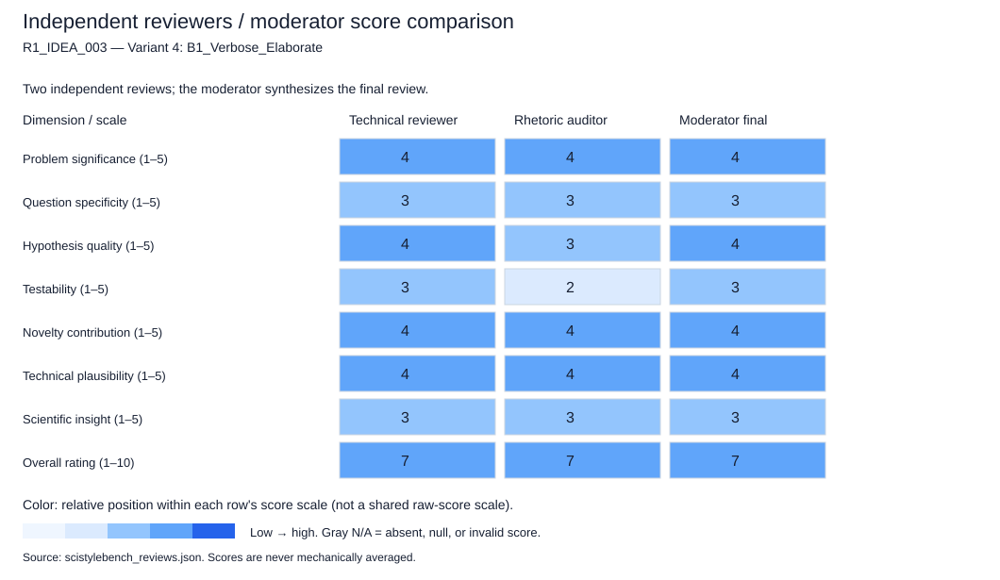

### Independent reviews

```json
{
  "technical_review": {
    "summary": "The research idea proposes encoding eye-tracking data as video sequences in chest X-ray analysis to capture both spatial and temporal aspects of radiologist attention, aiming to improve model reasoning and clinical interpretability.",
    "strengths": [
      "Identifies a specific problem in current methods of integrating eye gaze data into vision-language models.",
      "Proposes a novel approach (encoding eye-tracking as video sequences) that addresses the temporal aspect of gaze data.",
      "Highlights potential benefits (enhanced reasoning and interpretability) that align with clinical applications."
    ],
    "weaknesses": [
      "Lacks detailed explanation of how the video sequences will be processed or integrated into the model.",
      "Does not specify how the temporal aspect will be modeled (e.g., through recurrent networks, attention mechanisms, etc.).",
      "No mention of how the approach will be evaluated or compared against existing methods."
    ],
    "suggestions": [
      "Clarify the specific techniques for processing video sequences (e.g., using temporal convolution, transformers, or other methods).",
      "Specify the metrics for evaluating the model's performance and interpretability.",
      "Include a comparison with existing methods that use static heatmaps or textual descriptions."
    ],
    "questions": [
      "How will the video sequences be processed to extract temporal information?",
      "What metrics will be used to assess the improvement in model reasoning and interpretability?",
      "How does this approach compare to existing methods in terms of computational efficiency and scalability?"
    ],
    "problem_significance": {
      "score": 4.0,
      "justification": "The problem of ignoring temporal gaze data is significant in clinical applications where temporal dynamics of attention are crucial for accurate diagnosis and model interpretability."
    },
    "question_specificity": {
      "score": 3.0,
      "justification": "The idea clearly defines the problem and proposes a specific solution (video encoding), but lacks details on the implementation and evaluation methodology."
    },
    "hypothesis_quality": {
      "score": 4.0,
      "justification": "The hypothesis that encoding gaze as video sequences will improve model reasoning and interpretability is concrete and testable, though the specific mechanisms are not detailed."
    },
    "testability": {
      "score": 3.0,
      "justification": "The idea is testable, but the lack of specific evaluation plans and comparison methods limits its testability."
    },
    "novelty_contribution": {
      "score": 4.0,
      "justification": "The approach of using video sequences to capture temporal gaze data is novel and could contribute to more interpretable and accurate models in medical imaging."
    },
    "technical_plausibility": {
      "score": 4.0,
      "justification": "The proposed method is technically plausible, as encoding temporal data as video sequences is a feasible approach that can be integrated into existing vision-language models."
    },
    "scientific_insight": {
      "score": 3.0,
      "justification": "The idea has potential for scientific insight into how temporal attention affects model performance, but the specific insights depend on the implementation details."
    },
    "overall_rating": {
      "score": 7.0,
      "justification": "The idea addresses a meaningful problem with a specific solution, has potential for contribution, and is scientifically plausible, though it lacks detailed implementation and evaluation plans."
    },
    "confidence": 4.0
  },
  "rhetoric_review": {
    "summary": "The research idea proposes encoding eye-tracking data as video sequences in chest X-ray analysis to capture both spatial and temporal aspects of radiologist attention, improving model reasoning and interpretability.",
    "strengths": [
      "Identifies a specific problem in current methods of integrating eye gaze data into vision-language models.",
      "Proposes a novel approach (video encoding) that addresses the temporal aspect of eye-tracking data.",
      "Highlights potential benefits for model reasoning and clinical interpretability."
    ],
    "weaknesses": [
      "Lacks details on how the video sequences will be processed or integrated into the model.",
      "Does not specify how the temporal aspect will improve model performance or interpretability.",
      "No mention of evaluation metrics or comparison baselines."
    ],
    "suggestions": [
      "Clarify the method for processing video sequences (e.g., frame-wise attention, temporal modeling techniques).",
      "Specify how the temporal information will be used in the model (e.g., as a temporal attention module, recurrent network).",
      "Outline evaluation plans, including comparison with existing methods and metrics for interpretability."
    ],
    "questions": [
      "How will the video sequences be encoded and processed within the model?",
      "What specific aspects of temporal attention are expected to improve model performance?",
      "What metrics will be used to evaluate the impact on clinical interpretability?"
    ],
    "problem_significance": {
      "score": 4.0,
      "justification": "The problem of ignoring temporal dynamics in eye-tracking data is significant for improving model interpretability and clinical utility in chest X-ray analysis."
    },
    "question_specificity": {
      "score": 3.0,
      "justification": "The idea clearly defines the problem but lacks specifics on the method's implementation and expected outcomes."
    },
    "hypothesis_quality": {
      "score": 3.0,
      "justification": "The hypothesis that temporal encoding improves model reasoning and interpretability is plausible but not explicitly stated or tested."
    },
    "testability": {
      "score": 2.0,
      "justification": "The idea is testable in principle, but lacks details on experiments, evaluation metrics, or comparison baselines."
    },
    "novelty_contribution": {
      "score": 4.0,
      "justification": "The approach of encoding eye-tracking as video sequences is novel and could contribute to better model interpretability in medical imaging."
    },
    "technical_plausibility": {
      "score": 4.0,
      "justification": "The proposed method is technically feasible, as video encoding and temporal modeling are established techniques in machine learning."
    },
    "scientific_insight": {
      "score": 3.0,
      "justification": "The idea has potential to provide insights into how temporal attention affects model performance, but the specific mechanisms are not detailed."
    },
    "overall_rating": {
      "score": 7.0,
      "justification": "The idea addresses a meaningful problem with a plausible solution, but lacks specifics on implementation and evaluation, which are necessary for assessing its scientific merit."
    },
    "confidence": 4.0
  },
  "generation": {
    "technical_model_name": "Qwen/Qwen3-4B",
    "rhetoric_model_name": "Qwen/Qwen3-4B",
    "moderator_model_name": "Qwen/Qwen3-4B",
    "temperature": 0.0,
    "seed": 42
  }
}
```

## R1_IDEA_003 — Variant 5: B2_Grand_Narrative


### Independent reviews

```json
{
  "technical_review": {
    "summary": "The idea proposes encoding eye-tracking data as video sequences to capture both spatial attention and temporal scanning order in large vision-language models for chest X-ray analysis, aiming to improve model reasoning and clinical interpretability by integrating human perceptual processes.",
    "strengths": [
      "Identifies a meaningful problem in the integration of human gaze data into ML models",
      "Proposes a novel approach to represent temporal eye-tracking data as video sequences",
      "Highlights potential benefits for both model reasoning and clinical interpretability",
      "Suggests broader implications for cognitive AI systems"
    ],
    "weaknesses": [
      "Lacks specific research question or hypothesis",
      "Does not specify how the video sequence encoding will be implemented or integrated into the model",
      "Does not address potential challenges in temporal modeling or how to evaluate the effectiveness of the approach",
      "Does not provide a clear comparison to existing methods"
    ],
    "suggestions": [
      "Define a specific research question, such as whether temporal encoding improves model performance on chest X-ray analysis",
      "Specify the method for encoding eye-tracking data into video sequences (e.g., frame-wise representation, temporal attention mechanisms)",
      "Propose evaluation metrics and benchmarks to compare with existing static heatmap approaches",
      "Address potential challenges in temporal modeling, such as handling variable fixation durations or temporal alignment"
    ],
    "questions": [
      "What specific aspect of human gaze perception is being modeled through video sequences?",
      "How will the video sequence encoding be integrated into the existing vision-language model architecture?",
      "What metrics will be used to evaluate the effectiveness of the temporal encoding approach?",
      "How does the proposed method address limitations of static heatmap representations?"
    ],
    "problem_significance": {
      "score": 4.0,
      "justification": "The problem of integrating human perceptual processes into medical AI is significant for improving clinical interpretability and model reasoning, which are critical in healthcare applications."
    },
    "question_specificity": {
      "score": 3.0,
      "justification": "The idea identifies a problem but lacks a specific research question or hypothesis, making it somewhat vague in terms of what exactly will be investigated."
    },
    "hypothesis_quality": {
      "score": 3.0,
      "justification": "The idea suggests a potential benefit but does not explicitly state a hypothesis that can be tested, such as whether temporal encoding improves model performance or interpretability."
    },
    "testability": {
      "score": 3.0,
      "justification": "The idea proposes a method but does not specify how it will be evaluated or compared to existing approaches, making it difficult to assess its testability."
    },
    "novelty_contribution": {
      "score": 4.0,
      "justification": "The approach of encoding eye-tracking data as video sequences is novel in the context of integrating human gaze into vision-language models, offering potential contributions to both medical AI and cognitive computing."
    },
    "technical_plausibility": {
      "score": 4.0,
      "justification": "The proposed method is technically feasible, as encoding temporal data into video sequences is a plausible approach that could be implemented within existing ML frameworks."
    },
    "scientific_insight": {
      "score": 3.0,
      "justification": "The idea has potential for scientific insight into how human perceptual processes can be modeled in AI, but the specific mechanisms and their impact on model performance are not clearly defined."
    },
    "overall_rating": {
      "score": 7.0,
      "justification": "The idea addresses a meaningful problem with potential for contribution, but lacks specific research questions, hypotheses, and evaluation plans, which are necessary for a strong research direction."
    },
    "confidence": 4.0
  },
  "rhetoric_review": {
    "summary": "The idea proposes encoding eye-tracking data as video sequences to capture both spatial attention and temporal scanning order in large vision-language models for chest X-ray analysis, aiming to improve model reasoning and clinical interpretability by integrating human perceptual processes.",
    "strengths": [
      "Identifies a meaningful problem in the integration of human gaze data into vision-language models.",
      "Proposes a novel approach to represent gaze data as video sequences, which could capture temporal dynamics.",
      "Highlights potential contributions to broader research on cognitively informed AI systems and medical image analysis."
    ],
    "weaknesses": [
      "Lacks specific research question or hypothesis that could be tested.",
      "Does not specify how the video sequence encoding will be implemented or evaluated.",
      "The potential benefits are not directly tied to a concrete prediction or mechanism."
    ],
    "suggestions": [
      "Define a specific research question, such as whether video-based gaze encoding improves model performance on chest X-ray analysis.",
      "Specify the method for encoding eye-tracking data into video sequences and how it will be integrated into the existing models.",
      "Propose a comparison with existing methods (e.g., static heatmaps or text) to evaluate the effectiveness of the new approach."
    ],
    "questions": [
      "How will the video sequence encoding be implemented and integrated into the existing models?",
      "What metrics will be used to evaluate the effectiveness of the new approach compared to existing methods?",
      "What is the expected impact on model reasoning and clinical interpretability, and how will it be measured?"
    ],
    "problem_significance": {
      "score": 4.0,
      "justification": "The problem of integrating human perceptual processes into medical AI is significant for improving clinical interpretability and model reasoning, which are critical in healthcare applications."
    },
    "question_specificity": {
      "score": 3.0,
      "justification": "The idea identifies a problem but lacks a specific research question or hypothesis that could be tested. It suggests a direction but does not clearly define what should be investigated."
    },
    "hypothesis_quality": {
      "score": 3.0,
      "justification": "The idea proposes a novel approach but does not explicitly state a hypothesis or prediction that could be tested. The potential benefits are not directly tied to a concrete mechanism or comparison."
    },
    "testability": {
      "score": 3.0,
      "justification": "The idea suggests a direction but does not specify experiments, comparisons, or evaluation methods. The testability is limited without more details on how the video encoding will be implemented and evaluated."
    },
    "novelty_contribution": {
      "score": 4.0,
      "justification": "The approach of encoding eye-tracking data as video sequences is novel and could contribute to broader research on integrating human perceptual processes into AI systems, particularly in medical imaging."
    },
    "technical_plausibility": {
      "score": 4.0,
      "justification": "The idea is technically plausible as it builds on existing methods of integrating gaze data into vision-language models. Encoding gaze as video sequences is a feasible approach to capture temporal dynamics."
    },
    "scientific_insight": {
      "score": 3.0,
      "justification": "The idea has potential for scientific insight into how human perceptual processes can be integrated into AI models, but the specific mechanisms and their impact on model performance are not clearly defined."
    },
    "overall_rating": {
      "score": 7.0,
      "justification": "The idea addresses a meaningful problem with a novel approach, but it lacks specific research questions, hypotheses, and evaluation plans. It has potential for contribution to the field but requires more concrete details to be considered strong."
    },
    "confidence": 4.0
  },
  "generation": {
    "technical_model_name": "Qwen/Qwen3-4B",
    "rhetoric_model_name": "Qwen/Qwen3-4B",
    "moderator_model_name": "Qwen/Qwen3-4B",
    "temperature": 0.0,
    "seed": 42
  }
}
```

## R1_IDEA_003 — Variant 6: B3_Over_Confident


### Independent reviews

```json
{
  "technical_review": {
    "summary": "The idea proposes encoding eye-tracking data as video sequences to capture both spatial attention and temporal scanning order in large vision-language models for chest X-ray analysis, addressing the limitation of using static heatmaps or text to represent gaze data.",
    "strengths": [
      "Identifies a clear problem with current approaches to integrating eye gaze data into vision-language models.",
      "Proposes a novel solution (encoding gaze as video sequences) that directly addresses the problem.",
      "Highlights the potential benefits of the proposed method (enhanced model reasoning and clinical interpretability)."
    ],
    "weaknesses": [
      "Lacks specific details on how the video sequences will be processed or integrated into the model.",
      "Does not specify how the temporal scanning order will be modeled or what the expected improvements are.",
      "No mention of how this approach compares to existing methods or baseline experiments."
    ],
    "suggestions": [
      "Specify the method for processing video sequences (e.g., temporal modeling techniques, how they are integrated into the existing model architecture).",
      "Clarify the expected improvements in model reasoning and clinical interpretability, perhaps by referencing related work or theoretical expectations.",
      "Include a comparison with existing methods, such as static heatmaps or text, to demonstrate the novelty and effectiveness of the approach."
    ],
    "questions": [
      "How will the video sequences be processed and integrated into the vision-language model?",
      "What specific temporal modeling techniques will be used to capture the scanning order?",
      "How will the effectiveness of this approach be evaluated compared to existing methods?",
      "What are the expected improvements in model reasoning and clinical interpretability, and how do they align with current research?"
    ],
    "problem_significance": {
      "score": 4.0,
      "justification": "The problem of discarding temporal information in gaze data is significant for improving model reasoning and clinical interpretability in medical imaging, which is a critical area in machine learning applications."
    },
    "question_specificity": {
      "score": 3.0,
      "justification": "The idea clearly identifies the problem and proposes a solution, but lacks specific details on the method and expected outcomes, which could be more concrete to strengthen the question specificity."
    },
    "hypothesis_quality": {
      "score": 4.0,
      "justification": "The hypothesis that encoding gaze as video sequences will enhance model reasoning and clinical interpretability is plausible and directly addresses the problem stated, making it a strong hypothesis."
    },
    "testability": {
      "score": 3.0,
      "justification": "The idea is testable through experiments comparing the proposed method with existing approaches, but the specific experimental design and evaluation metrics are not detailed, which could be improved."
    },
    "novelty_contribution": {
      "score": 4.0,
      "justification": "The approach of encoding gaze as video sequences is novel in the context of vision-language models for medical imaging, offering a potential contribution to the field by improving model interpretability and reasoning."
    },
    "technical_plausibility": {
      "score": 4.0,
      "justification": "The proposed method is technically plausible as it builds on existing techniques for handling temporal data in vision-language models, and the integration of video sequences into the model is a feasible direction."
    },
    "scientific_insight": {
      "score": 3.0,
      "justification": "The idea has potential for scientific insight by exploring how temporal gaze data can enhance model reasoning, but more specific insights into the mechanisms and effects would be needed to strengthen this aspect."
    },
    "overall_rating": {
      "score": 7.0,
      "justification": "The idea addresses a meaningful problem with a clear and novel solution, showing potential for significant contributions. However, it lacks specific details on implementation and evaluation, which could be improved to strengthen the research direction."
    },
    "confidence": 4.0
  },
  "rhetoric_review": {
    "summary": "The idea proposes encoding eye-tracking data as video sequences to capture both spatial attention and temporal scanning order in large vision-language models for chest X-ray analysis, addressing the limitation of using static heatmaps or text to represent gaze data.",
    "strengths": [
      "Identifies a clear problem with current approaches to integrating eye gaze data into vision-language models.",
      "Proposes a novel solution (encoding gaze as video sequences) that directly addresses the problem.",
      "Highlights the potential benefits of the proposed method (enhanced model reasoning and clinical interpretability)."
    ],
    "weaknesses": [
      "Lacks specific details on how the video sequences will be processed or integrated into the model.",
      "Does not specify how the temporal scanning order will be modeled or what the expected improvements are.",
      "No mention of how this approach compares to existing methods or what baseline experiments will be conducted."
    ],
    "suggestions": [
      "Provide more details on the specific techniques for processing video sequences (e.g., temporal modeling, attention mechanisms).",
      "Clarify how the temporal scanning order will be incorporated into the model's architecture.",
      "Include a comparison with existing methods and outline baseline experiments to evaluate the proposed approach."
    ],
    "questions": [
      "How will the video sequences be processed and integrated into the vision-language model?",
      "What specific temporal modeling techniques will be used to capture the scanning order?",
      "How will the proposed method be evaluated against existing approaches, and what metrics will be used?",
      "What are the computational challenges of using video sequences, and how will they be addressed?"
    ],
    "problem_significance": {
      "score": 4.0,
      "justification": "The problem of discarding temporal information in gaze data is significant for improving model reasoning and clinical interpretability in medical imaging."
    },
    "question_specificity": {
      "score": 3.0,
      "justification": "The idea clearly defines the problem but lacks specific details on the method's implementation and evaluation plan."
    },
    "hypothesis_quality": {
      "score": 4.0,
      "justification": "The hypothesis that encoding gaze as video sequences will enhance model reasoning and interpretability is plausible and directly addresses the problem."
    },
    "testability": {
      "score": 3.0,
      "justification": "The idea is testable, but the lack of specific experiments or comparisons makes it difficult to assess the effectiveness of the proposed method."
    },
    "novelty_contribution": {
      "score": 4.0,
      "justification": "The approach of encoding gaze as video sequences is novel and has the potential to contribute to the field by improving model interpretability in medical imaging."
    },
    "technical_plausibility": {
      "score": 4.0,
      "justification": "The proposed method is technically plausible, as encoding temporal data into video sequences is a feasible approach for capturing spatial and temporal attention."
    },
    "scientific_insight": {
      "score": 3.0,
      "justification": "The idea has potential for scientific insight but lacks details on how the temporal scanning order will be modeled and what insights can be gained from the approach."
    },
    "overall_rating": {
      "score": 7.0,
      "justification": "The idea addresses a meaningful problem with a plausible solution, but lacks specific details on implementation and evaluation, which are necessary for assessing its scientific merit and potential impact."
    },
    "confidence": 4.0
  },
  "generation": {
    "technical_model_name": "Qwen/Qwen3-4B",
    "rhetoric_model_name": "Qwen/Qwen3-4B",
    "moderator_model_name": "Qwen/Qwen3-4B",
    "temperature": 0.0,
    "seed": 42
  }
}
```

## R1_IDEA_003 — Variant 7: B4_Novelty


### Independent reviews

```json
{
  "technical_review": {
    "summary": "The idea proposes encoding eye-tracking data as video sequences to capture both spatial attention and temporal scanning order in chest X-ray analysis, aiming to improve model reasoning and clinical interpretability compared to static heatmaps or text representations.",
    "strengths": [
      "Identifies a meaningful problem in the integration of eye gaze data into vision-language models for medical imaging.",
      "Proposes a novel approach by encoding eye-tracking data as video sequences, which captures temporal dynamics that are often ignored in existing methods.",
      "Highlights the potential for improved model reasoning and clinical interpretability, which are important goals in medical AI.",
      "Offers a fresh perspective that could lead to more accurate and interpretable models in clinical settings."
    ],
    "weaknesses": [
      "The idea lacks specific details on how the video sequences will be processed or integrated into the existing models.",
      "It does not clearly define the research question or hypothesis that the proposed method aims to address.",
      "The potential benefits are not directly tied to specific metrics or outcomes that can be measured in experiments.",
      "The novelty is somewhat generic and could be seen as a minor variation of existing approaches without a clear distinction."
    ],
    "suggestions": [
      "Specify how the video sequences will be encoded (e.g., using temporal models like LSTM, Transformer, or video-specific CNNs).",
      "Define the research question, such as whether temporal encoding improves diagnostic accuracy or interpretability compared to static methods.",
      "Identify specific metrics or benchmarks that will be used to evaluate the effectiveness of the approach.",
      "Clarify how the temporal aspect contributes to model reasoning and interpretability in a way that differentiates it from existing methods."
    ],
    "questions": [
      "How will the video sequences be processed and integrated into the existing vision-language models?",
      "What specific metrics will be used to evaluate the improvement in model reasoning and interpretability?",
      "How does the temporal aspect of the eye-tracking data contribute to the model's performance in a way that is distinct from static representations?",
      "What are the computational challenges or limitations of encoding eye-tracking data as video sequences?"
    ],
    "problem_significance": {
      "score": 4.0,
      "justification": "The problem of integrating temporal eye-tracking data into medical imaging models is significant as it addresses a gap in current methods that ignore the temporal dynamics of gaze, which could improve both model performance and clinical interpretability."
    },
    "question_specificity": {
      "score": 3.0,
      "justification": "The idea proposes a novel approach but lacks a clear, specific research question. It does not explicitly state what aspect of the model or task the temporal encoding is intended to improve or how it will be evaluated."
    },
    "hypothesis_quality": {
      "score": 3.0,
      "justification": "The idea suggests a potential benefit of temporal encoding but does not provide a concrete hypothesis or prediction that can be tested. It is more of a conceptual proposal than a testable hypothesis."
    },
    "testability": {
      "score": 3.0,
      "justification": "The idea is testable in principle, but the lack of specific experimental design details makes it difficult to assess the feasibility of testing the hypothesis. The proposed method would need to be implemented and evaluated on a dataset with eye-tracking data."
    },
    "novelty_contribution": {
      "score": 4.0,
      "justification": "The approach of encoding eye-tracking data as video sequences is novel in the context of medical imaging and vision-language models, offering a fresh perspective that could contribute to the field by improving model interpretability and performance."
    },
    "technical_plausibility": {
      "score": 4.0,
      "justification": "The idea is technically plausible as it builds on existing methods for processing temporal data and integrating it into vision-language models. The proposed approach is feasible given current technological capabilities."
    },
    "scientific_insight": {
      "score": 3.0,
      "justification": "The idea has potential for scientific insight by exploring how temporal dynamics of eye-tracking data affect model reasoning and interpretability. However, the specific mechanisms and contributions of the temporal aspect are not clearly defined."
    },
    "overall_rating": {
      "score": 7.0,
      "justification": "The idea addresses a meaningful problem with a novel approach that has potential for improving model performance and interpretability. However, it lacks specific details on the research question, hypothesis, and evaluation metrics, which are necessary for assessing its scientific merit and feasibility."
    },
    "confidence": 4.0
  },
  "rhetoric_review": {
    "summary": "The idea proposes encoding eye-tracking data as video sequences to capture both spatial attention and temporal scanning order in chest X-ray analysis, aiming to improve model reasoning and clinical interpretability compared to static heatmaps or text representations.",
    "strengths": [
      "Identifies a meaningful problem in the representation of eye-tracking data for medical imaging",
      "Proposes a novel approach by encoding eye-tracking data as video sequences",
      "Highlights potential benefits for model reasoning and clinical interpretability",
      "Offers a fresh perspective that could lead to new insights in the field"
    ],
    "weaknesses": [
      "Lacks specific details on how the video sequences will be processed or integrated into the model",
      "Does not clearly define the research question or hypothesis to be tested",
      "Does not specify how the proposed method will be evaluated or compared to existing approaches",
      "The novelty is somewhat generic and could be seen as a rephrasing of existing ideas"
    ],
    "suggestions": [
      "Specify the exact method for encoding eye-tracking data into video sequences and how it will be integrated into the model architecture",
      "Define the specific research question or hypothesis, such as whether temporal information improves model performance or interpretability",
      "Outline the evaluation plan, including benchmark datasets, metrics, and comparison with existing methods",
      "Clarify the unique contribution of the approach compared to static heatmaps or text representations"
    ],
    "questions": [
      "How will the video sequences be processed to extract temporal and spatial information?",
      "What specific metrics will be used to evaluate the improvement in model reasoning and interpretability?",
      "How will the proposed method be compared to existing approaches like static heatmaps or text representations?",
      "What are the potential limitations or challenges in encoding eye-tracking data as video sequences?"
    ],
    "problem_significance": {
      "score": 4.0,
      "justification": "The problem of representing eye-tracking data in medical imaging is significant as it affects model interpretability and clinical utility. Improving this representation could lead to better diagnostic tools."
    },
    "question_specificity": {
      "score": 3.0,
      "justification": "The idea identifies a problem but does not clearly define the specific research question or hypothesis. It suggests a novel approach but lacks a concrete question to investigate."
    },
    "hypothesis_quality": {
      "score": 3.0,
      "justification": "The idea proposes a novel method but does not explicitly state a hypothesis that can be tested. It suggests potential benefits but does not specify what exactly will be measured or how it will be validated."
    },
    "testability": {
      "score": 3.0,
      "justification": "The idea is testable in principle, but lacks specific details on how the method will be implemented, evaluated, or compared to existing approaches. Without these details, the testability is limited."
    },
    "novelty_contribution": {
      "score": 4.0,
      "justification": "The approach of encoding eye-tracking data as video sequences is novel in the context of medical imaging. It offers a fresh perspective that could contribute to the field by improving model interpretability and reasoning."
    },
    "technical_plausibility": {
      "score": 4.0,
      "justification": "The idea is technically plausible as encoding eye-tracking data as video sequences is a feasible approach. It builds on existing methods and could be implemented with appropriate processing techniques."
    },
    "scientific_insight": {
      "score": 3.0,
      "justification": "The idea has potential for scientific insight by exploring the impact of temporal information on model reasoning. However, without a clear hypothesis or evaluation plan, the potential insight is not fully realized."
    },
    "overall_rating": {
      "score": 7.0,
      "justification": "The idea addresses a meaningful problem with a novel approach, but lacks specific details on the research question, hypothesis, and evaluation plan. It has potential for contribution but needs further clarification to be more testable and impactful."
    },
    "confidence": 4.0
  },
  "generation": {
    "technical_model_name": "Qwen/Qwen3-4B",
    "rhetoric_model_name": "Qwen/Qwen3-4B",
    "moderator_model_name": "Qwen/Qwen3-4B",
    "temperature": 0.0,
    "seed": 42
  }
}
```

## R1_IDEA_003 — Variant 8: B5_Application_Impact

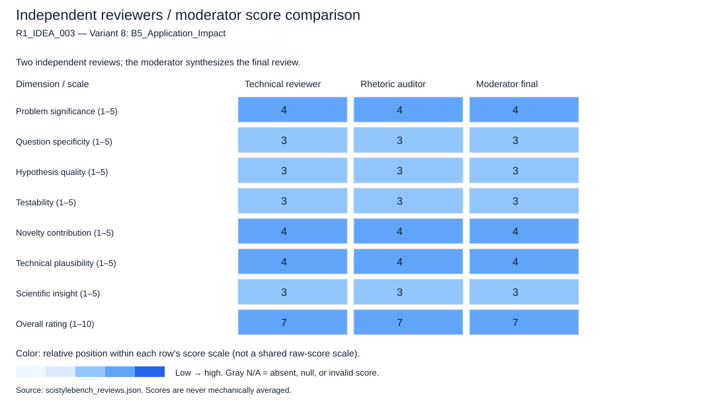

### Independent reviews

```json
{
  "technical_review": {
    "summary": "The idea proposes encoding eye-tracking data as video sequences to capture both spatial attention and temporal scanning order in large vision-language models for chest X-ray analysis, aiming to improve model interpretability and align with clinical workflows that require understanding decision paths.",
    "strengths": [
      "Identifies a meaningful problem in the integration of eye-tracking data into vision-language models for medical imaging.",
      "Proposes a novel approach to represent temporal eye-tracking data as video sequences, which could enhance model interpretability.",
      "Highlights the practical relevance to clinical workflows where understanding model decision paths is crucial."
    ],
    "weaknesses": [
      "Lacks specific details on how the video sequences will be encoded or processed within the model.",
      "Does not clearly define the research question or hypothesis to be tested.",
      "Does not specify how the proposed method will be evaluated or compared against existing approaches."
    ],
    "suggestions": [
      "Specify the method for encoding eye-tracking data into video sequences (e.g., temporal convolution, recurrent networks, or transformer-based approaches).",
      "Define the research question, such as whether temporal encoding improves model interpretability or diagnostic accuracy.",
      "Outline the evaluation metrics and baseline comparisons to assess the effectiveness of the proposed method."
    ],
    "questions": [
      "How will the video sequences be integrated into the existing vision-language model architecture?",
      "What specific metrics will be used to evaluate the improvement in interpretability and diagnostic performance?",
      "How will the proposed method be validated against existing approaches that use static heatmaps or text representations?"
    ],
    "problem_significance": {
      "score": 4.0,
      "justification": "The problem addresses a critical gap in integrating temporal eye-tracking data into medical vision-language models, which is important for improving model interpretability and clinical utility."
    },
    "question_specificity": {
      "score": 3.0,
      "justification": "The idea proposes a novel approach but lacks a clear, specific research question or hypothesis that could be tested, such as whether temporal encoding improves interpretability or diagnostic accuracy."
    },
    "hypothesis_quality": {
      "score": 3.0,
      "justification": "The idea suggests a potential benefit of temporal encoding but does not explicitly state a hypothesis that can be tested, such as a prediction about improved interpretability or performance metrics."
    },
    "testability": {
      "score": 3.0,
      "justification": "The idea is testable in principle, but lacks specific experimental design details, such as how the video sequences will be processed, what metrics will be used, and how the method will be compared to existing approaches."
    },
    "novelty_contribution": {
      "score": 4.0,
      "justification": "The approach of encoding eye-tracking data as video sequences is novel and could contribute to the development of more interpretable diagnostic support systems in medical imaging."
    },
    "technical_plausibility": {
      "score": 4.0,
      "justification": "The idea is technically plausible, as encoding temporal data as video sequences is a feasible approach that could be implemented within existing vision-language model architectures."
    },
    "scientific_insight": {
      "score": 3.0,
      "justification": "The idea has potential to provide insights into how temporal scanning order affects model reasoning, but the scientific insight is not clearly defined or specified in the current summary."
    },
    "overall_rating": {
      "score": 7.0,
      "justification": "The idea addresses a meaningful problem with a novel approach, but lacks specific details on the research question, hypothesis, and evaluation plan, which are necessary for assessing its scientific merit and potential contribution."
    },
    "confidence": 4.0
  },
  "rhetoric_review": {
    "summary": "The idea proposes encoding eye-tracking data as video sequences to capture both spatial attention and temporal scanning order in large vision-language models for chest X-ray analysis, aiming to improve model interpretability and align with clinical workflows that require understanding decision paths.",
    "strengths": [
      "Identifies a meaningful problem in the integration of eye-tracking data into vision-language models for medical imaging.",
      "Proposes a novel approach to represent temporal eye-tracking data as video sequences, which could enhance model interpretability.",
      "Highlights the potential relevance to clinical applications where understanding model decision paths is crucial."
    ],
    "weaknesses": [
      "Lacks specific details on how the video sequences will be encoded or processed within the model.",
      "Does not clearly define the research question or hypothesis to be tested.",
      "Does not specify how the proposed method will be evaluated or compared against existing approaches."
    ],
    "suggestions": [
      "Specify the method for encoding eye-tracking data into video sequences (e.g., temporal convolution, recurrent networks, or transformer-based approaches).",
      "Define the research question, such as whether temporal encoding improves model interpretability or diagnostic performance.",
      "Outline the evaluation plan, including benchmark datasets, metrics, and comparison with existing methods."
    ],
    "questions": [
      "How will the video sequences be integrated into the existing vision-language model architecture?",
      "What specific metrics will be used to evaluate the improvement in interpretability and diagnostic performance?",
      "How will the proposed method be validated against existing approaches in terms of both performance and clinical relevance?"
    ],
    "problem_significance": {
      "score": 4.0,
      "justification": "The problem of integrating temporal eye-tracking data into medical imaging models is significant for improving model interpretability and aligning with clinical needs."
    },
    "question_specificity": {
      "score": 3.0,
      "justification": "The idea proposes a novel approach but lacks a clear, specific research question or hypothesis to guide the investigation."
    },
    "hypothesis_quality": {
      "score": 3.0,
      "justification": "The idea suggests a potential benefit but does not explicitly state a testable hypothesis or prediction."
    },
    "testability": {
      "score": 3.0,
      "justification": "The idea is testable in principle, but lacks specific experimental details or evaluation plans that would make it feasible to test."
    },
    "novelty_contribution": {
      "score": 4.0,
      "justification": "The approach of encoding eye-tracking data as video sequences is novel and could contribute to more interpretable diagnostic systems in medical imaging."
    },
    "technical_plausibility": {
      "score": 4.0,
      "justification": "The idea is technically plausible as it builds on existing methods for integrating temporal data into vision-language models."
    },
    "scientific_insight": {
      "score": 3.0,
      "justification": "The idea has potential for scientific insight into how temporal attention affects model reasoning, but the specific insights are not clearly defined."
    },
    "overall_rating": {
      "score": 7.0,
      "justification": "The idea addresses a meaningful problem with a novel approach, but lacks specific details on implementation, evaluation, and hypothesis testing, which are necessary for a strong research direction."
    },
    "confidence": 4.0
  },
  "generation": {
    "technical_model_name": "Qwen/Qwen3-4B",
    "rhetoric_model_name": "Qwen/Qwen3-4B",
    "moderator_model_name": "Qwen/Qwen3-4B",
    "temperature": 0.0,
    "seed": 42
  }
}
```

## R1_IDEA_003 — Variant 9: C1_Hollow_Shell

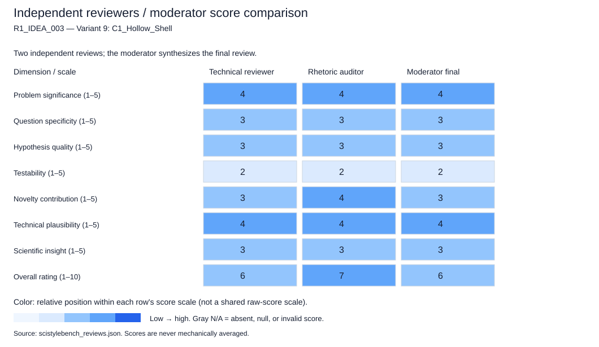

### Independent reviews

```json
{
  "technical_review": {
    "summary": "The idea proposes a method for incorporating expert visual attention into AI models for chest X-ray analysis by preserving the order and layout of attention data, aiming to improve model performance and clinical interpretability.",
    "strengths": [
      "Identifies a specific problem in existing methods for incorporating expert attention into AI models for chest X-ray analysis",
      "Presents a clear goal of improving both model performance and clinical interpretability",
      "Highlights the importance of preserving order and layout in attention data, which is a specific technical direction"
    ],
    "weaknesses": [
      "Lacks detailed description of the proposed method or technical approach",
      "Does not specify how the order and layout of attention data will be preserved",
      "Does not clarify the relationship between preserving attention order/layout and improved performance/interpretability"
    ],
    "suggestions": [
      "Specify the technical approach for preserving attention order and layout (e.g., sequence modeling, spatial attention maps, etc.)",
      "Clarify how the proposed method differs from existing approaches that lose sequential information",
      "Provide a hypothesis about how preserving attention order/layout will lead to improved performance and interpretability"
    ],
    "questions": [
      "What specific technical method will be used to preserve the order and layout of attention data?",
      "How does the proposed method ensure that the preserved attention data is effectively utilized by the AI model?",
      "What is the proposed mechanism by which preserving attention order/layout leads to improved performance and interpretability?"
    ],
    "problem_significance": {
      "score": 4.0,
      "justification": "The problem of preserving sequential information in expert attention data is relevant to improving the performance and interpretability of AI models in clinical chest X-ray analysis, which has important practical implications."
    },
    "question_specificity": {
      "score": 3.0,
      "justification": "The idea identifies a specific problem with existing methods but lacks detailed specification of the research question or technical approach that would be investigated."
    },
    "hypothesis_quality": {
      "score": 3.0,
      "justification": "The idea presents a general goal of improving performance and interpretability but does not explicitly state a testable hypothesis about how preserving attention order/layout will achieve these goals."
    },
    "testability": {
      "score": 2.0,
      "justification": "The idea lacks specific experimental design or evaluation plan, making it difficult to assess how the proposed method would be tested or validated."
    },
    "novelty_contribution": {
      "score": 3.0,
      "justification": "The idea proposes a different approach to incorporating expert attention into AI models, which could contribute to the field if the method is effective, but the novelty is not clearly established without more details."
    },
    "technical_plausibility": {
      "score": 4.0,
      "justification": "The proposed direction of preserving attention order and layout is technically plausible, as it addresses a known limitation in existing methods for incorporating expert attention into AI models."
    },
    "scientific_insight": {
      "score": 3.0,
      "justification": "The idea has potential to provide insights into how preserving attention order and layout can improve model performance and interpretability, but the specific mechanisms and relationships are not clearly defined."
    },
    "overall_rating": {
      "score": 6.0,
      "justification": "The idea addresses a meaningful problem in chest X-ray analysis with a specific goal of improving model performance and interpretability. However, it lacks detailed technical specifications and a clear hypothesis, which are necessary for assessing its testability and potential contribution."
    },
    "confidence": 4.0
  },
  "rhetoric_review": {
    "summary": "The idea proposes a new method for incorporating expert visual attention into chest X-ray AI models by preserving the order and layout of attention data, aiming to improve model performance and clinical interpretability.",
    "strengths": [
      "Identifies a specific problem in existing methods (loss of sequential information in simplified attention representations)",
      "Presents a clear goal (improve performance and clinical interpretability)",
      "Suggests a novel approach (preserving order and layout of attention data)",
      "Relevance to clinical applications makes the research problem meaningful"
    ],
    "weaknesses": [
      "Lacks specific details about the proposed method (how attention data is processed to preserve order and layout)",
      "Does not specify the evaluation metrics or comparison baselines",
      "No mention of how the model's interpretability is measured or validated",
      "No indication of how the method addresses the problem of sequential information loss"
    ],
    "suggestions": [
      "Specify the technical details of the attention processing method (e.g., sequence modeling techniques, spatial layout preservation mechanisms)",
      "Define the evaluation metrics (e.g., diagnostic accuracy, interpretability scores)",
      "Identify the baseline methods for comparison (e.g., existing attention-based models)",
      "Clarify how the model's interpretability is quantified (e.g., through attention maps, explainability metrics)"
    ],
    "questions": [
      "What specific techniques are used to preserve the order and layout of attention data?",
      "How will the proposed method be evaluated against existing approaches?",
      "What metrics will be used to assess clinical interpretability?",
      "How does the method address the issue of sequential information loss in attention representations?"
    ],
    "problem_significance": {
      "score": 4.0,
      "justification": "The problem of losing sequential information in attention representations is significant in medical imaging, as it affects model performance and interpretability. Improving chest X-ray analysis has direct clinical implications."
    },
    "question_specificity": {
      "score": 3.0,
      "justification": "The idea clearly defines the problem (loss of sequential information) and the goal (improve performance and interpretability), but lacks specific details about the method and evaluation plan."
    },
    "hypothesis_quality": {
      "score": 3.0,
      "justification": "The idea presents a general hypothesis that preserving attention order and layout will improve performance and interpretability, but does not provide specific predictions or mechanisms."
    },
    "testability": {
      "score": 2.0,
      "justification": "The idea lacks specific experiments or evaluation plans, making it difficult to assess the validity of the hypothesis without further details."
    },
    "novelty_contribution": {
      "score": 4.0,
      "justification": "The approach of preserving attention order and layout is a novel direction for chest X-ray analysis, potentially offering new insights into model interpretability and performance."
    },
    "technical_plausibility": {
      "score": 4.0,
      "justification": "The proposed method is technically plausible as it addresses a known issue in attention modeling, and the approach of preserving sequence and layout is feasible with existing techniques."
    },
    "scientific_insight": {
      "score": 3.0,
      "justification": "The idea has potential to contribute to understanding how attention mechanisms affect model performance in medical imaging, but the specific insights depend on the implementation details and evaluation methods."
    },
    "overall_rating": {
      "score": 7.0,
      "justification": "The idea addresses a meaningful problem in medical AI with a clear goal, but lacks specific technical details and evaluation plans. It has potential for contribution but needs further clarification to be fully testable."
    },
    "confidence": 4.0
  },
  "generation": {
    "technical_model_name": "Qwen/Qwen3-4B",
    "rhetoric_model_name": "Qwen/Qwen3-4B",
    "moderator_model_name": "Qwen/Qwen3-4B",
    "temperature": 0.0,
    "seed": 42
  }
}
```

## R1_IDEA_003 — Variant 10: C2_Logic_Flawed

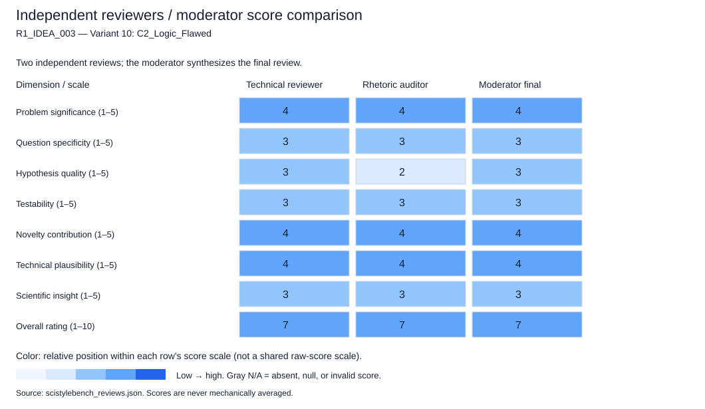

### Independent reviews

```json
{
  "technical_review": {
    "summary": "The research idea proposes encoding eye-tracking data as video sequences to capture both spatial attention and temporal scanning order in large vision-language models for chest X-ray analysis, aiming to enhance model reasoning and clinical interpretability. It also suggests broader effectiveness for integrating temporal human behavior data across related medical imaging tasks.",
    "strengths": [
      "Identifies a meaningful problem in the integration of temporal eye-tracking data into vision-language models for medical imaging.",
      "Proposes a novel approach by encoding eye-tracking data as video sequences to capture both spatial and temporal aspects.",
      "Highlights potential for broader application in integrating temporal human behavior data across medical imaging tasks."
    ],
    "weaknesses": [
      "Lacks specific details on how the video sequences will be processed or integrated into the existing models.",
      "Does not clearly define the research question or hypothesis to be tested.",
      "The broader applicability is suggested without concrete evidence or prior work to support this claim."
    ],
    "suggestions": [
      "Specify the method for encoding and processing eye-tracking data into video sequences.",
      "Define the specific research question, such as whether temporal encoding improves model performance or interpretability.",
      "Provide evidence or references to prior work that supports the claim of broader applicability in medical imaging tasks."
    ],
    "questions": [
      "How will the video sequences be processed and integrated into the existing vision-language models?",
      "What specific metrics will be used to evaluate the improvement in model reasoning and interpretability?",
      "What prior work supports the claim that temporal human behavior data can be effectively integrated into other medical imaging tasks?"
    ],
    "problem_significance": {
      "score": 4.0,
      "justification": "The problem addresses a critical gap in integrating temporal information into medical imaging analysis, which is important for improving model reasoning and clinical interpretability."
    },
    "question_specificity": {
      "score": 3.0,
      "justification": "The idea proposes a novel approach but lacks a clear, specific research question or hypothesis that could be tested."
    },
    "hypothesis_quality": {
      "score": 3.0,
      "justification": "The idea suggests a potential benefit of temporal encoding but does not explicitly state a hypothesis that can be tested or falsified."
    },
    "testability": {
      "score": 3.0,
      "justification": "The idea proposes a method but does not specify how it will be evaluated or compared to existing approaches."
    },
    "novelty_contribution": {
      "score": 4.0,
      "justification": "The approach of encoding eye-tracking data as video sequences is novel and could contribute to the integration of temporal human behavior data in medical imaging tasks."
    },
    "technical_plausibility": {
      "score": 4.0,
      "justification": "The idea is technically plausible as it builds on existing methods for integrating temporal data into vision-language models."
    },
    "scientific_insight": {
      "score": 3.0,
      "justification": "The idea has potential for scientific insight but lacks a clear mechanism or prediction that could be tested to reveal new insights."
    },
    "overall_rating": {
      "score": 7.0,
      "justification": "The idea addresses a meaningful problem with a novel approach, but lacks specific details and a clear research question, which are necessary for further development and evaluation."
    },
    "confidence": 4.0
  },
  "rhetoric_review": {
    "summary": "The idea proposes encoding eye-tracking data as video sequences to capture both spatial attention and temporal scanning order in large vision-language models for chest X-ray analysis, aiming to enhance model reasoning and clinical interpretability, and suggesting broader effectiveness for integrating temporal human behavior data in related medical imaging tasks.",
    "strengths": [
      "Identifies a specific problem with current methods of integrating eye gaze data into vision-language models, which is the lack of temporal sequence information.",
      "Proposes a novel approach to encode eye-tracking data as video sequences to capture both spatial and temporal aspects.",
      "Suggests potential broader applicability to other medical imaging tasks involving temporal human behavior data.",
      "Emphasizes the potential benefits of enhanced model reasoning and clinical interpretability."
    ],
    "weaknesses": [
      "The idea lacks a clear hypothesis or specific research question that could be tested.",
      "There is no mention of how the video sequences will be processed or integrated into the existing models.",
      "The potential broader applicability is not supported by specific evidence or reasoning.",
      "The idea does not specify how the temporal scanning order will improve model performance or clinical interpretability."
    ],
    "suggestions": [
      "Define a specific research question, such as whether encoding eye-tracking data as video sequences improves model performance on chest X-ray analysis compared to static heatmaps or text.",
      "Provide details on the method for processing video sequences, including how they will be integrated into the existing vision-language models.",
      "Clarify the mechanism by which temporal scanning order contributes to model reasoning and clinical interpretability.",
      "Include a plan for evaluating the broader applicability to other medical imaging tasks."
    ],
    "questions": [
      "How will the video sequences be processed and integrated into the existing models?",
      "What specific metrics will be used to evaluate the improvement in model reasoning and clinical interpretability?",
      "What is the proposed mechanism by which temporal scanning order enhances model performance?",
      "How will the broader applicability to other medical imaging tasks be tested or validated?"
    ],
    "problem_significance": {
      "score": 4.0,
      "justification": "The problem of not capturing temporal sequences in eye gaze data is significant in medical imaging, as it may affect the model's ability to understand the clinical reasoning process of radiologists."
    },
    "question_specificity": {
      "score": 3.0,
      "justification": "The idea identifies a problem but does not clearly define a specific research question or hypothesis that could be tested. It suggests a potential solution but lacks a concrete question to investigate."
    },
    "hypothesis_quality": {
      "score": 2.0,
      "justification": "The idea proposes a solution but does not explicitly state a hypothesis that could be tested. It suggests potential benefits but does not provide a concrete prediction or mechanism."
    },
    "testability": {
      "score": 3.0,
      "justification": "The idea suggests a method but does not provide a clear plan for testing its effectiveness. It lacks specific experiments or evaluation metrics that could be used to validate the proposed approach."
    },
    "novelty_contribution": {
      "score": 4.0,
      "justification": "The approach of encoding eye-tracking data as video sequences is novel in the context of vision-language models for medical imaging, and could contribute to the field by improving model interpretability and clinical relevance."
    },
    "technical_plausibility": {
      "score": 4.0,
      "justification": "The idea is technically plausible as it builds on existing methods of integrating temporal data into models, and the proposed approach is feasible given current capabilities in video processing and model integration."
    },
    "scientific_insight": {
      "score": 3.0,
      "justification": "The idea has potential for scientific insight by exploring how temporal scanning order affects model reasoning, but the specific mechanisms and contributions are not clearly defined."
    },
    "overall_rating": {
      "score": 7.0,
      "justification": "The idea addresses a meaningful problem in medical imaging and proposes a novel approach. However, it lacks a clear hypothesis, specific research question, and detailed evaluation plan, which are necessary for further development and validation."
    },
    "confidence": 4.0
  },
  "generation": {
    "technical_model_name": "Qwen/Qwen3-4B",
    "rhetoric_model_name": "Qwen/Qwen3-4B",
    "moderator_model_name": "Qwen/Qwen3-4B",
    "temperature": 0.0,
    "seed": 42
  }
}
```

## R1_IDEA_003 — Variant 11: C3_Substance_Enriched


### Independent reviews

```json
{
  "technical_review": {
    "summary": "The research idea proposes encoding eye-tracking data as video sequences to capture both spatial attention and temporal scanning order in large vision-language models for chest X-ray analysis, hypothesizing that this temporal encoding could help models learn scanning heuristics and improve clinical interpretability.",
    "strengths": [
      "Identifies a meaningful problem in current approaches to integrating gaze data into vision-language models.",
      "Proposes a novel method (video encoding of eye-tracking data) that addresses a specific limitation (temporal sequence of fixations).",
      "Articulates a plausible hypothesis about the potential benefits of temporal encoding for model reasoning and interpretability.",
      "Mentions a concrete validation approach (testing explanations against human visual reasoning sequences)."
    ],
    "weaknesses": [
      "Lacks specific details on how the video sequences will be processed or integrated into the model.",
      "Does not clearly define what exactly constitutes 'scanning heuristics' or how they will be measured.",
      "The hypothesis is somewhat vague and could be more explicitly tied to specific model behaviors or metrics.",
      "The boundary condition (chest X-ray analysis) is mentioned, but the broader applicability is not explored."
    ],
    "suggestions": [
      "Specify the technical details of how video sequences will be encoded (e.g., temporal attention mechanisms, video-to-text alignment strategies).",
      "Define what 'scanning heuristics' are and how they will be evaluated (e.g., through specific metrics or human annotations).",
      "Clarify the metrics for assessing model reasoning and interpretability (e.g., explanation quality, alignment with human gaze sequences).",
      "Explore the potential for generalizing the approach to other domains beyond chest X-ray analysis."
    ],
    "questions": [
      "How will the video sequences be processed and integrated into the vision-language model?",
      "What specific metrics will be used to evaluate the learning of scanning heuristics?",
      "How will the model's explanations be compared to human visual reasoning sequences?",
      "What are the potential limitations or challenges in encoding eye-tracking data as video sequences?"
    ],
    "problem_significance": {
      "score": 4.0,
      "justification": "The problem addresses a key limitation in current methods for integrating gaze data, which could improve model interpretability and clinical utility in medical imaging."
    },
    "question_specificity": {
      "score": 3.0,
      "justification": "The idea clearly defines the problem and proposes a specific solution (video encoding of gaze data), but the exact implementation details and evaluation metrics are not fully specified."
    },
    "hypothesis_quality": {
      "score": 3.0,
      "justification": "The hypothesis is plausible but lacks explicit predictions or mechanisms for how temporal encoding would influence model behavior, making it somewhat vague."
    },
    "testability": {
      "score": 3.0,
      "justification": "The idea suggests a validation approach (testing explanations against human sequences), but the specifics of the experiment (e.g., baseline comparisons, metrics) are not detailed."
    },
    "novelty_contribution": {
      "score": 4.0,
      "justification": "The approach of encoding gaze as video sequences is novel for this application, and the hypothesis about improving model reasoning is a meaningful contribution to the field."
    },
    "technical_plausibility": {
      "score": 4.0,
      "justification": "The proposed method is technically feasible, as video encoding and temporal modeling are established techniques in machine learning, and the integration into vision-language models is plausible."
    },
    "scientific_insight": {
      "score": 3.0,
      "justification": "The idea has potential to reveal insights into how models can learn from temporal gaze data, but the specific mechanisms and outcomes are not clearly defined."
    },
    "overall_rating": {
      "score": 7.0,
      "justification": "The idea addresses a meaningful problem with a plausible solution and potential for contribution, but lacks specific details on implementation and evaluation that would strengthen its testability and scientific insight."
    },
    "confidence": 4.0
  },
  "rhetoric_review": {
    "summary": "The research idea proposes encoding eye-tracking data as video sequences to capture both spatial attention and temporal scanning order in large vision-language models for chest X-ray analysis, hypothesizing that this temporal encoding could help models learn scanning heuristics and improve clinical interpretability.",
    "strengths": [
      "Identifies a meaningful problem in current approaches to integrating gaze data into vision-language models.",
      "Proposes a concrete hypothesis about the benefits of temporal encoding in gaze data.",
      "Suggests a potential application in improving model reasoning and clinical interpretability.",
      "Mentions a specific boundary condition (chest X-ray analysis) for validation."
    ],
    "weaknesses": [
      "Lacks specific details on how the video sequences will be encoded or processed.",
      "Does not clearly define the metrics or methods for evaluating the effectiveness of the temporal encoding.",
      "The hypothesis is plausible but not explicitly tied to a specific mechanism or prediction.",
      "The connection between temporal encoding and improved clinical interpretability is not fully explained."
    ],
    "suggestions": [
      "Specify the method for encoding eye-tracking data into video sequences (e.g., temporal convolution, RNNs, or transformers).",
      "Define the evaluation metrics (e.g., alignment with human gaze sequences, model performance on diagnostic tasks).",
      "Clarify the expected mechanism by which temporal encoding improves model reasoning (e.g., through temporal attention mechanisms).",
      "Provide a comparison with existing methods (e.g., static heatmaps) to highlight the novelty and benefits."
    ],
    "questions": [
      "How will the video sequences be encoded into the model's input?",
      "What specific metrics will be used to evaluate the effectiveness of temporal encoding?",
      "What is the expected mechanism by which temporal encoding improves model reasoning?",
      "How will the results be compared to existing methods like static heatmaps?"
    ],
    "problem_significance": {
      "score": 4.0,
      "justification": "The problem addresses a gap in current methods for integrating gaze data into vision-language models, which could improve model interpretability and clinical utility in medical imaging."
    },
    "question_specificity": {
      "score": 3.0,
      "justification": "The idea clearly defines the problem and hypothesis but lacks specific details on the method and evaluation plan, which are necessary for testability."
    },
    "hypothesis_quality": {
      "score": 3.0,
      "justification": "The hypothesis is plausible but not explicitly tied to a specific mechanism or prediction, making it somewhat vague."
    },
    "testability": {
      "score": 3.0,
      "justification": "The idea suggests potential validation methods but lacks specific experimental design details, such as metrics, comparisons, or ablation studies."
    },
    "novelty_contribution": {
      "score": 4.0,
      "justification": "The approach of encoding gaze data as video sequences is novel and could contribute to understanding how temporal information improves model reasoning in medical imaging."
    },
    "technical_plausibility": {
      "score": 4.0,
      "justification": "The proposed method is technically feasible and aligns with current trends in temporal modeling for vision-language tasks."
    },
    "scientific_insight": {
      "score": 3.0,
      "justification": "The idea has potential to reveal insights into how temporal scanning affects model reasoning, but the connection to clinical interpretability is not fully established."
    },
    "overall_rating": {
      "score": 7.0,
      "justification": "The idea addresses a meaningful problem with a plausible hypothesis and potential contribution, but lacks specific details on methodology and evaluation, which are necessary for testability and scientific rigor."
    },
    "confidence": 4.0
  },
  "generation": {
    "technical_model_name": "Qwen/Qwen3-4B",
    "rhetoric_model_name": "Qwen/Qwen3-4B",
    "moderator_model_name": "Qwen/Qwen3-4B",
    "temperature": 0.0,
    "seed": 42
  }
}
```

## R1_IDEA_004 — Source

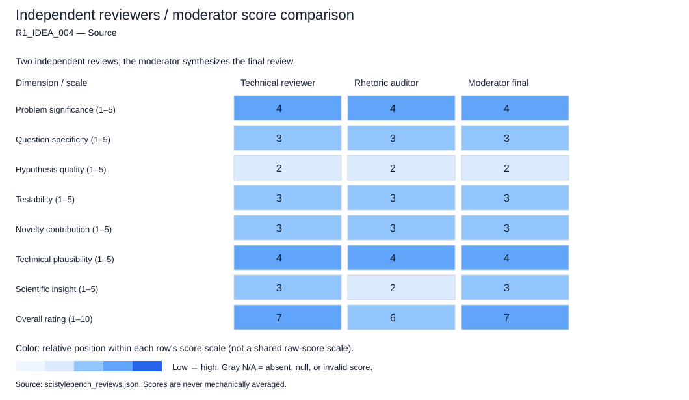

### Independent reviews

```json
{
  "technical_review": {
    "summary": "The research idea proposes a primal-dual direct preference optimization method for constrained alignment of large language models, aiming to maximize output reward while enforcing safety constraints without training separate reward and cost models or requiring prior knowledge of the optimal Lagrange multiplier, thus reducing computational overhead.",
    "strengths": [
      "The idea addresses a significant challenge in aligning large language models with safety constraints, which is crucial for responsible AI deployment.",
      "The proposed method avoids training separate reward and cost models, which could reduce computational overhead and simplify the alignment process.",
      "The approach does not require prior knowledge of the optimal Lagrange multiplier, making it more adaptable to different scenarios."
    ],
    "weaknesses": [
      "The idea lacks a clear definition of the primal-dual optimization framework and how it specifically addresses the constrained alignment problem.",
      "There is no explicit hypothesis or prediction provided about the performance or effectiveness of the method compared to existing approaches.",
      "The potential for the method to handle different types of constraints or scenarios is not clearly articulated."
    ],
    "suggestions": [
      "Clarify the specific formulation of the primal-dual optimization problem and how it enforces safety constraints.",
      "Provide a hypothesis or prediction about the method's performance in comparison to existing methods, such as PPO or TRPO.",
      "Specify the types of constraints the method is designed to handle and how it adapts to different constraint scenarios."
    ],
    "questions": [
      "How does the primal-dual framework ensure that safety constraints are enforced without prior knowledge of the optimal Lagrange multiplier?",
      "What is the theoretical basis for the claim that this method reduces computational overhead compared to existing approaches?",
      "How does the method handle varying constraint strengths or types that may not be captured by the initial formulation?"
    ],
    "problem_significance": {
      "score": 4.0,
      "justification": "The problem of aligning large language models with safety constraints is critical for responsible AI deployment, making the research problem highly significant."
    },
    "question_specificity": {
      "score": 3.0,
      "justification": "The idea is specific to constrained alignment but lacks detailed specification of the primal-dual method and its application to the problem."
    },
    "hypothesis_quality": {
      "score": 2.0,
      "justification": "The idea does not explicitly state a hypothesis or prediction that can be tested, making it difficult to assess the scientific merit without further details."
    },
    "testability": {
      "score": 3.0,
      "justification": "The idea suggests a method but does not provide a clear experimental plan or comparison to existing methods to test its effectiveness."
    },
    "novelty_contribution": {
      "score": 3.0,
      "justification": "The approach is novel in avoiding separate reward and cost models, but the novelty is somewhat limited without a clear demonstration of its advantages over existing methods."
    },
    "technical_plausibility": {
      "score": 4.0,
      "justification": "The primal-dual optimization framework is technically plausible, and the approach aligns with existing research on constrained optimization in reinforcement learning."
    },
    "scientific_insight": {
      "score": 3.0,
      "justification": "The idea has potential to provide insights into constrained optimization for alignment, but the specific mechanisms and their implications are not clearly outlined."
    },
    "overall_rating": {
      "score": 7.0,
      "justification": "The idea addresses a significant problem in AI alignment with a potentially useful approach, but it lacks detailed specification and explicit hypotheses to fully assess its scientific merit and potential contribution."
    },
    "confidence": 4.0
  },
  "rhetoric_review": {
    "summary": "The research idea proposes a primal-dual direct preference optimization method for constrained alignment of large language models, aiming to maximize output reward while enforcing safety constraints without training separate reward and cost models or requiring prior knowledge of the optimal Lagrange multiplier, thus reducing computational overhead.",
    "strengths": [
      "The idea addresses a meaningful problem in aligning large language models with safety constraints.",
      "It proposes a novel approach that avoids training separate reward and cost models, which could reduce computational overhead.",
      "The method is designed to work without prior knowledge of the optimal Lagrange multiplier, which is a practical advantage in real-world applications."
    ],
    "weaknesses": [
      "The idea lacks a clear definition of the specific problem being addressed or the exact formulation of the primal-dual optimization method.",
      "There is no explicit hypothesis or prediction provided about how the method will perform compared to existing approaches.",
      "The potential scientific insight or novelty is not clearly articulated, as the method seems to be a variation of existing optimization techniques."
    ],
    "suggestions": [
      "Clarify the specific problem formulation, including the objective function, constraints, and how the primal-dual method is applied.",
      "Provide a hypothesis or prediction about the method's performance relative to existing methods, such as in terms of computational efficiency or alignment accuracy.",
      "Articulate the potential scientific contribution, such as how this method advances the understanding of constrained optimization in large language models."
    ],
    "questions": [
      "What is the exact formulation of the primal-dual optimization problem being solved?",
      "How does this method compare to existing approaches in terms of computational efficiency and alignment performance?",
      "What are the specific constraints being enforced, and how are they incorporated into the optimization process?"
    ],
    "problem_significance": {
      "score": 4.0,
      "justification": "The idea addresses a significant challenge in aligning large language models with safety constraints, which is crucial for responsible AI deployment."
    },
    "question_specificity": {
      "score": 3.0,
      "justification": "The problem is meaningful, but the specific research question is not clearly defined, making it difficult to assess the exact focus of the investigation."
    },
    "hypothesis_quality": {
      "score": 2.0,
      "justification": "The idea suggests a potential method but lacks an explicit hypothesis or prediction that could be tested or falsified."
    },
    "testability": {
      "score": 3.0,
      "justification": "The idea is testable through experiments comparing the proposed method to existing approaches, but the specific experimental design is not detailed."
    },
    "novelty_contribution": {
      "score": 3.0,
      "justification": "The method avoids training separate reward and cost models, which is a practical advantage, but the novelty is not clearly distinguished from existing methods."
    },
    "technical_plausibility": {
      "score": 4.0,
      "justification": "The approach is technically plausible as it builds on existing primal-dual optimization techniques, and the proposed method is logically coherent."
    },
    "scientific_insight": {
      "score": 2.0,
      "justification": "The idea does not clearly articulate how the method could contribute to scientific understanding beyond computational efficiency, such as in the mechanisms of constrained optimization."
    },
    "overall_rating": {
      "score": 6.0,
      "justification": "The idea addresses a meaningful problem with a plausible approach, but lacks specificity, explicit hypotheses, and clear scientific insight, which are needed for a strong research direction."
    },
    "confidence": 4.0
  },
  "generation": {
    "technical_model_name": "Qwen/Qwen3-4B",
    "rhetoric_model_name": "Qwen/Qwen3-4B",
    "moderator_model_name": "Qwen/Qwen3-4B",
    "temperature": 0.0,
    "seed": 42
  }
}
```

## R1_IDEA_004 — Variant 1: A1_Identity

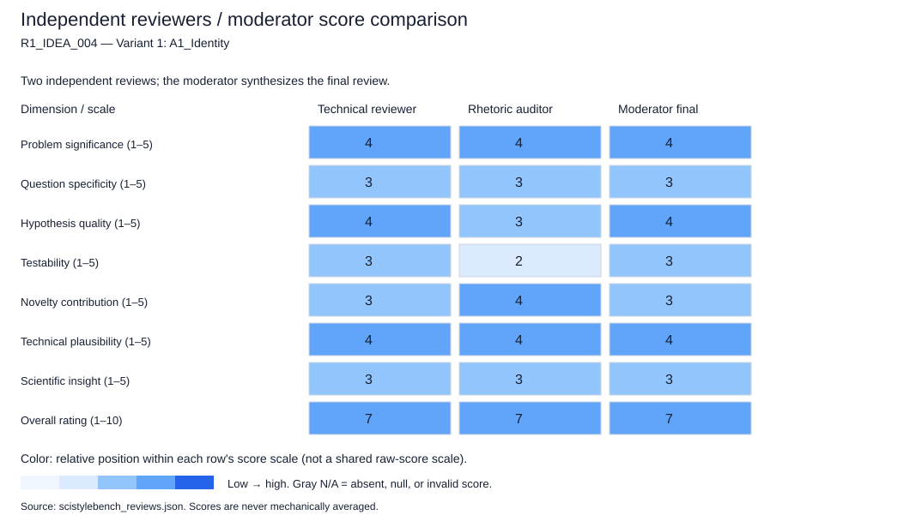

### Independent reviews

```json
{
  "technical_review": {
    "summary": "The research idea proposes a primal-dual direct preference optimization method for constrained alignment of large language models, aiming to maximize output reward while enforcing safety constraints without training separate reward and cost models or requiring prior knowledge of the optimal Lagrange multiplier, thus reducing computational overhead.",
    "strengths": [
      "The idea addresses a significant challenge in aligning large language models with safety constraints, which is crucial for responsible AI deployment.",
      "The proposed method avoids training separate reward and cost models, which could reduce computational overhead and simplify the alignment process.",
      "The focus on primal-dual optimization suggests a technically sound approach that leverages existing optimization theory for constrained optimization problems."
    ],
    "weaknesses": [
      "The idea lacks a clear definition of the specific constraints or the type of safety constraints being enforced, which is essential for evaluating the method's applicability.",
      "The absence of a detailed explanation of how the method handles the optimal Lagrange multiplier without prior knowledge may raise questions about its feasibility and effectiveness.",
      "The paper does not specify how the method will be evaluated or compared against existing approaches, which is necessary to assess its novelty and effectiveness."
    ],
    "suggestions": [
      "Clarify the specific constraints or safety conditions that the method is designed to handle, such as content safety, toxicity, or other alignment criteria.",
      "Provide a more detailed explanation of the primal-dual framework, including how the method determines the optimal Lagrange multiplier during training.",
      "Outline the evaluation plan, including benchmark datasets, comparison metrics, and baseline methods to demonstrate the method's effectiveness."
    ],
    "questions": [
      "How does the method determine the optimal Lagrange multiplier without prior knowledge?",
      "What specific safety constraints or alignment criteria will the method be evaluated on?",
      "How will the proposed method be compared to existing approaches in terms of computational efficiency and alignment performance?"
    ],
    "problem_significance": {
      "score": 4.0,
      "justification": "The problem of aligning large language models with safety constraints is critical for responsible AI deployment, making the research problem highly significant."
    },
    "question_specificity": {
      "score": 3.0,
      "justification": "The idea is specific in its goal of constrained alignment but lacks details on the exact constraints or the method's handling of Lagrange multipliers, which are necessary for a more precise research question."
    },
    "hypothesis_quality": {
      "score": 4.0,
      "justification": "The idea presents a plausible hypothesis that the primal-dual method can reduce computational overhead while enforcing safety constraints, which is testable through experiments."
    },
    "testability": {
      "score": 3.0,
      "justification": "The idea is testable in principle, but the lack of specific evaluation plans and comparison metrics makes it difficult to assess the method's effectiveness without further details."
    },
    "novelty_contribution": {
      "score": 3.0,
      "justification": "The approach is novel in its attempt to avoid separate reward and cost models, but the novelty is somewhat limited without a clear demonstration of its advantages over existing methods."
    },
    "technical_plausibility": {
      "score": 4.0,
      "justification": "The use of primal-dual optimization for constrained alignment is technically plausible, as it leverages existing optimization theory and is a reasonable approach for the stated problem."
    },
    "scientific_insight": {
      "score": 3.0,
      "justification": "The idea has potential for scientific insight into constrained optimization in AI alignment, but the lack of specific details limits the potential for deeper insights."
    },
    "overall_rating": {
      "score": 7.0,
      "justification": "The idea addresses a significant problem in AI alignment with a plausible approach, but it lacks specific details on constraints, evaluation plans, and the handling of Lagrange multipliers, which are necessary for a strong research direction."
    },
    "confidence": 4.0
  },
  "rhetoric_review": {
    "summary": "The research idea proposes a primal-dual direct preference optimization method for constrained alignment of large language models, aiming to maximize output reward while enforcing safety constraints without training separate reward and cost models or requiring prior knowledge of the optimal Lagrange multiplier, thus reducing computational overhead.",
    "strengths": [
      "The idea addresses a significant challenge in aligning large language models with safety constraints.",
      "It proposes a novel approach that avoids training separate reward and cost models, which could reduce computational overhead.",
      "The method's focus on primal-dual optimization suggests a technically plausible direction for constrained optimization in ML."
    ],
    "weaknesses": [
      "The idea lacks a clear, specific research question or hypothesis that could be tested.",
      "The proposed method is not well-defined in terms of how it avoids training separate models or determines the optimal Lagrange multiplier.",
      "There is no mention of how the method will be evaluated or compared to existing approaches."
    ],
    "suggestions": [
      "Specify the exact formulation of the primal-dual optimization problem and how the method determines the optimal Lagrange multiplier.",
      "Provide a concrete hypothesis or prediction about the performance of the method compared to existing approaches.",
      "Outline the evaluation plan, including benchmarks and metrics for comparing the method's effectiveness."
    ],
    "questions": [
      "How does the method determine the optimal Lagrange multiplier without prior knowledge?",
      "What is the specific formulation of the primal-dual optimization problem?",
      "How will the method be evaluated against existing approaches for constrained alignment?"
    ],
    "problem_significance": {
      "score": 4.0,
      "justification": "The problem of aligning large language models with safety constraints is critical in AI safety and deployment, making the research problem significant."
    },
    "question_specificity": {
      "score": 3.0,
      "justification": "The idea identifies a specific problem (constrained alignment) but lacks a clear, testable research question or hypothesis."
    },
    "hypothesis_quality": {
      "score": 3.0,
      "justification": "The idea suggests a potential method but does not explicitly state a hypothesis that could be tested or falsified."
    },
    "testability": {
      "score": 2.0,
      "justification": "The idea lacks details on how the method will be implemented, evaluated, or compared to existing methods, making it difficult to assess testability."
    },
    "novelty_contribution": {
      "score": 4.0,
      "justification": "The approach of avoiding separate reward and cost models is novel and could contribute to reducing computational overhead in constrained alignment."
    },
    "technical_plausibility": {
      "score": 4.0,
      "justification": "Primal-dual optimization is a well-established technique, and the idea is technically plausible within the domain of constrained optimization in ML."
    },
    "scientific_insight": {
      "score": 3.0,
      "justification": "The idea has potential for scientific insight into constrained optimization, but the lack of specific hypotheses or evaluation plans limits its potential."
    },
    "overall_rating": {
      "score": 7.0,
      "justification": "The idea addresses a significant problem with a potentially novel approach, but it lacks specific hypotheses, evaluation plans, and technical details that are necessary for testability and scientific contribution."
    },
    "confidence": 4.0
  },
  "generation": {
    "technical_model_name": "Qwen/Qwen3-4B",
    "rhetoric_model_name": "Qwen/Qwen3-4B",
    "moderator_model_name": "Qwen/Qwen3-4B",
    "temperature": 0.0,
    "seed": 42
  }
}
```

## R1_IDEA_004 — Variant 2: A2_Paraphrase_Only


### Independent reviews

```json
{
  "technical_review": {
    "summary": "The research idea proposes a primal-dual direct preference optimization method to align large language models under constraints, aiming to maximize reward while satisfying safety constraints without requiring separate reward/cost models or prior knowledge of optimal Lagrange multipliers, thus reducing computational demands.",
    "strengths": [
      "Introduces a novel approach to aligning large language models under constraints, which is a relevant and important problem in the field.",
      "The method avoids the need for separate reward and cost models, which could reduce computational overhead and simplify the training process.",
      "The approach eliminates the need to know the optimal Lagrange multiplier in advance, which is a significant advantage in practical applications."
    ],
    "weaknesses": [
      "The idea is quite vague and lacks specific details on how the primal-dual optimization is implemented.",
      "It does not clearly define the problem being addressed or the specific constraints that the method is designed to handle.",
      "The connection between the primal-dual optimization and the direct preference optimization is not well explained, which could lead to confusion."
    ],
    "suggestions": [
      "Provide a more detailed explanation of the primal-dual optimization framework and how it is applied to direct preference optimization.",
      "Clarify the specific constraints that the method is designed to handle and the problem it aims to solve.",
      "Include a comparison with existing methods to highlight the advantages and potential applications of the proposed approach."
    ],
    "questions": [
      "What specific constraints are being addressed in this method?",
      "How does the primal-dual optimization framework work in the context of direct preference optimization?",
      "What is the exact role of the Lagrange multipliers in this approach, and how are they handled during optimization?",
      "How does this method compare to existing approaches in terms of computational efficiency and effectiveness?"
    ],
    "problem_significance": {
      "score": 4.0,
      "justification": "The problem of aligning large language models under safety constraints is significant in the field of machine learning, particularly in applications where safety is critical. The proposed method addresses a relevant challenge by reducing computational demands."
    },
    "question_specificity": {
      "score": 3.0,
      "justification": "The idea is somewhat specific in its goal of aligning models under constraints but lacks detailed specification of the problem, the constraints, and the exact method of primal-dual optimization."
    },
    "hypothesis_quality": {
      "score": 3.0,
      "justification": "The idea presents a general hypothesis that the method will reduce computational demands and improve alignment under constraints, but it lacks specific predictions or mechanisms that could be tested."
    },
    "testability": {
      "score": 3.0,
      "justification": "The idea is testable in principle, but the lack of specific details makes it difficult to design experiments or evaluate the method's effectiveness without further clarification."
    },
    "novelty_contribution": {
      "score": 4.0,
      "justification": "The approach of using primal-dual optimization to align models under constraints without separate reward models is a novel contribution, though the novelty may be limited if similar methods exist in the literature."
    },
    "technical_plausibility": {
      "score": 4.0,
      "justification": "The use of primal-dual optimization in this context is technically plausible, as it is a well-established method in optimization. The idea of avoiding separate reward models is also reasonable and aligns with current trends in efficient reinforcement learning."
    },
    "scientific_insight": {
      "score": 3.0,
      "justification": "The idea has potential for scientific insight by exploring new ways to align models under constraints, but the lack of specific details limits the potential for deeper insights into the underlying mechanisms."
    },
    "overall_rating": {
      "score": 7.0,
      "justification": "The idea addresses a relevant and important problem in the field, proposes a novel approach with potential for reducing computational demands, and has the potential for scientific insight. However, the lack of specific details and clarity in the method makes it a moderate rather than strong research idea."
    },
    "confidence": 4.0
  },
  "rhetoric_review": {
    "summary": "The research idea proposes a primal-dual direct preference optimization method to align large language models under constraints, aiming to maximize reward while satisfying safety constraints without requiring separate reward/cost models or prior knowledge of optimal Lagrange multipliers, thus reducing computational demands.",
    "strengths": [
      "Introduces a novel approach to aligning large language models under constraints by combining primal-dual optimization with direct preference optimization.",
      "Eliminates the need for separate reward and cost models, which could reduce computational overhead and simplify the training process.",
      "Avoids the need to pre-determine optimal Lagrange multipliers, which is a significant advantage in practical applications where such parameters are unknown.",
      "Addresses a key challenge in safe reinforcement learning by integrating safety constraints directly into the optimization process.",
      "The approach has potential for practical applications in real-world scenarios where safety and reward maximization are critical."
    ],
    "weaknesses": [
      "The idea lacks a clear definition of the specific constraints being addressed or the type of safety constraints being enforced.",
      "There is no explicit hypothesis or prediction about how this method will perform compared to existing approaches, such as reward modeling or constraint-based optimization.",
      "The method's theoretical foundation is not fully explained, particularly how the primal-dual formulation is applied in this context.",
      "The idea does not specify how the optimization is implemented or how the Lagrange multipliers are handled during the optimization process.",
      "The potential benefits are not directly tied to a specific problem or application, making it difficult to assess the practical relevance."
    ],
    "suggestions": [
      "Clarify the type of constraints being addressed (e.g., safety, fairness, or other domain-specific constraints) to better define the problem scope.",
      "Provide a hypothesis comparing the performance of this method to existing approaches in terms of reward maximization, safety, and computational efficiency.",
      "Detail the theoretical framework, including how the primal-dual formulation is applied and how the Lagrange multipliers are dynamically adjusted during optimization.",
      "Specify the implementation details, such as how the optimization is carried out and how the reward and safety objectives are balanced.",
      "Identify a specific application or problem domain where this method would be particularly useful, to highlight its practical relevance."
    ],
    "questions": [
      "What specific type of constraints are being addressed in this approach?",
      "How does this method compare to existing approaches in terms of performance and computational efficiency?",
      "What is the theoretical basis for the primal-dual formulation in this context?",
      "How are the Lagrange multipliers handled during the optimization process?",
      "What specific application or problem domain would benefit most from this method?"
    ],
    "problem_significance": {
      "score": 4.0,
      "justification": "The idea addresses a significant challenge in safe reinforcement learning by integrating safety constraints directly into the optimization process, which is crucial for real-world applications of large language models."
    },
    "question_specificity": {
      "score": 3.0,
      "justification": "The idea is somewhat specific in its approach but lacks detailed definitions of the constraints and the specific problem it aims to solve, which could be clarified for better specificity."
    },
    "hypothesis_quality": {
      "score": 3.0,
      "justification": "The idea presents a novel approach but does not explicitly state a hypothesis or prediction that can be tested, such as performance comparisons with existing methods or specific outcomes in constraint satisfaction."
    },
    "testability": {
      "score": 3.0,
      "justification": "The idea is testable in principle, but lacks specific experimental plans or comparisons to existing methods, making it difficult to assess its validity without further details."
    },
    "novelty_contribution": {
      "score": 4.0,
      "justification": "The approach of combining primal-dual optimization with direct preference optimization for constraint satisfaction is novel, offering a potential reduction in computational demands and simplification of the training process."
    },
    "technical_plausibility": {
      "score": 4.0,
      "justification": "The method is technically plausible as it builds on existing optimization techniques, and the elimination of separate reward and cost models is a reasonable approach for reducing computational overhead."
    },
    "scientific_insight": {
      "score": 3.0,
      "justification": "The idea has potential for scientific insight by addressing the integration of safety constraints in large language models, but the specific mechanisms and outcomes are not clearly defined."
    },
    "overall_rating": {
      "score": 7.0,
      "justification": "The idea presents a promising direction for aligning large language models under constraints, with potential for reducing computational demands and improving safety. However, it lacks specific details on the problem scope, hypothesis, and experimental validation, which are necessary for a strong research proposal."
    },
    "confidence": 4.0
  },
  "generation": {
    "technical_model_name": "Qwen/Qwen3-4B",
    "rhetoric_model_name": "Qwen/Qwen3-4B",
    "moderator_model_name": "Qwen/Qwen3-4B",
    "temperature": 0.0,
    "seed": 42
  }
}
```

## R1_IDEA_004 — Variant 3: A3_Plain_Core

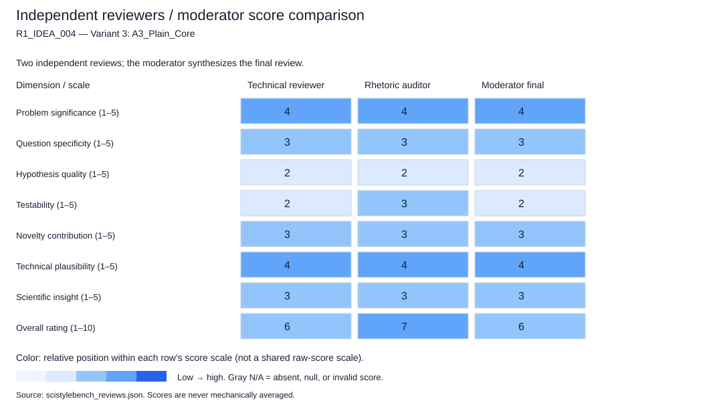

### Independent reviews

```json
{
  "technical_review": {
    "summary": "The research idea proposes a primal-dual direct preference optimization method for constrained alignment of large language models. It aims to maximize output reward while enforcing safety constraints without requiring separate reward and cost models or prior knowledge of the optimal Lagrange multiplier, thereby reducing computational overhead.",
    "strengths": [
      "The idea addresses a critical challenge in aligning large language models with safety constraints, which is important for responsible AI deployment.",
      "The method avoids the need for separate reward and cost models, which can reduce computational overhead and simplify the training process.",
      "The approach does not require prior knowledge of the optimal Lagrange multiplier, making it more adaptable to different scenarios."
    ],
    "weaknesses": [
      "The idea lacks a clear definition of the primal-dual optimization framework and how it is applied to the specific problem of constrained alignment.",
      "The method's effectiveness is not evaluated, and there is no mention of how it compares to existing methods in terms of performance or computational efficiency.",
      "The absence of a concrete hypothesis or prediction about the method's performance makes it difficult to assess its scientific merit."
    ],
    "suggestions": [
      "Provide a detailed description of the primal-dual optimization framework and how it is applied to the constrained alignment problem.",
      "Include a hypothesis or prediction about the method's performance compared to existing approaches, such as how it might reduce computational overhead or improve alignment accuracy.",
      "Conduct experiments to evaluate the method's effectiveness, including comparisons with state-of-the-art methods and analysis of computational efficiency."
    ],
    "questions": [
      "How does the primal-dual framework ensure that safety constraints are enforced while maximizing output reward?",
      "What is the specific formulation of the optimization problem, including the objective function and constraints?",
      "How does the method handle the trade-off between reward maximization and constraint enforcement?",
      "What are the computational trade-offs between this method and existing approaches for constrained alignment?"
    ],
    "problem_significance": {
      "score": 4.0,
      "justification": "The problem of aligning large language models with safety constraints is highly significant for responsible AI deployment, as it directly impacts the reliability and ethical use of AI systems."
    },
    "question_specificity": {
      "score": 3.0,
      "justification": "The idea identifies a specific problem (constrained alignment of LLMs) but lacks detailed specification of the research question, such as how the primal-dual method is applied or what specific aspects of the optimization are being addressed."
    },
    "hypothesis_quality": {
      "score": 2.0,
      "justification": "The idea does not explicitly state a hypothesis or prediction. While it suggests a potential benefit (reduced computational overhead), it does not provide a concrete claim that can be tested or falsified."
    },
    "testability": {
      "score": 2.0,
      "justification": "The idea lacks a clear experimental plan or evaluation method. Without specifying how the method will be tested against existing approaches or what metrics will be used, it is difficult to assess its testability."
    },
    "novelty_contribution": {
      "score": 3.0,
      "justification": "The idea proposes a novel approach to constrained alignment by avoiding separate reward and cost models, which could reduce computational overhead. However, the novelty is somewhat limited if the method is based on existing primal-dual optimization principles."
    },
    "technical_plausibility": {
      "score": 4.0,
      "justification": "The use of primal-dual optimization for constrained alignment is technically plausible, as it is a well-established method in optimization theory. The idea's core components (avoiding separate models, no prior knowledge of Lagrange multipliers) are feasible within this framework."
    },
    "scientific_insight": {
      "score": 3.0,
      "justification": "The idea has potential to provide insights into the trade-offs between reward maximization and constraint enforcement in large language models. However, the lack of a specific hypothesis or experimental plan limits the potential for meaningful scientific insight."
    },
    "overall_rating": {
      "score": 6.0,
      "justification": "The idea addresses a significant problem in AI alignment but lacks specificity, a clear hypothesis, and a detailed evaluation plan. It has potential for contribution but requires further development to be scientifically robust."
    },
    "confidence": 4.0
  },
  "rhetoric_review": {
    "summary": "The research idea proposes a primal-dual direct preference optimization method for constrained alignment of large language models. It aims to maximize output reward while enforcing safety constraints without requiring separate reward and cost models or prior knowledge of the optimal Lagrange multiplier, thereby reducing computational overhead.",
    "strengths": [
      "The idea addresses a meaningful problem in aligning large language models with safety constraints.",
      "It proposes a method that avoids the need for separate reward and cost models, which could reduce computational overhead.",
      "The method is based on primal-dual optimization, a well-established technique in machine learning, suggesting technical plausibility."
    ],
    "weaknesses": [
      "The idea lacks a clear definition of the specific problem being addressed or the constraints being enforced.",
      "There is no explicit hypothesis or prediction about the performance or effectiveness of the method.",
      "The proposed method's novelty is not clearly articulated, as it builds on existing optimization techniques."
    ],
    "suggestions": [
      "Specify the type of constraints (e.g., safety, fairness, or other) that the method is designed to enforce.",
      "Provide a concrete hypothesis, such as the method's effectiveness in reducing computational overhead compared to existing approaches.",
      "Clarify the novelty of the method by comparing it to existing primal-dual methods in constrained optimization."
    ],
    "questions": [
      "What specific constraints are being enforced in the alignment process?",
      "How does the proposed method compare to existing approaches in terms of computational efficiency and effectiveness?",
      "What are the theoretical guarantees or empirical evidence supporting the reduction in computational overhead?"
    ],
    "problem_significance": {
      "score": 4.0,
      "justification": "The idea addresses a critical challenge in aligning large language models with safety constraints, which is a significant problem in the field of AI safety and alignment."
    },
    "question_specificity": {
      "score": 3.0,
      "justification": "The idea is somewhat specific in proposing a method for constrained alignment, but it lacks detailed specification of the problem or the constraints being addressed."
    },
    "hypothesis_quality": {
      "score": 2.0,
      "justification": "The idea does not explicitly state a hypothesis or prediction that could be tested, making it difficult to assess the scientific merit without further details."
    },
    "testability": {
      "score": 3.0,
      "justification": "The idea suggests a method that could be tested, but it lacks specific experimental plans or comparisons to existing methods to evaluate its effectiveness."
    },
    "novelty_contribution": {
      "score": 3.0,
      "justification": "The method is based on primal-dual optimization, which is a known technique, but the specific application to constrained alignment of large language models is a novel direction."
    },
    "technical_plausibility": {
      "score": 4.0,
      "justification": "The method is grounded in primal-dual optimization, a well-established technique, and the proposed approach is technically plausible."
    },
    "scientific_insight": {
      "score": 3.0,
      "justification": "The idea has potential to contribute to the understanding of constrained optimization in large language models, but the specific insights are not clearly outlined."
    },
    "overall_rating": {
      "score": 7.0,
      "justification": "The idea addresses a significant problem in AI alignment and proposes a method that could reduce computational overhead. However, it lacks specific details on the problem, hypothesis, and experimental evaluation, which are necessary for assessing its scientific merit."
    },
    "confidence": 4.0
  },
  "generation": {
    "technical_model_name": "Qwen/Qwen3-4B",
    "rhetoric_model_name": "Qwen/Qwen3-4B",
    "moderator_model_name": "Qwen/Qwen3-4B",
    "temperature": 0.0,
    "seed": 42
  }
}
```

## R1_IDEA_004 — Variant 4: B1_Verbose_Elaborate


### Independent reviews

```json
{
  "technical_review": {
    "summary": "The research idea proposes a primal-dual direct preference optimization method for constrained alignment of large language models, aiming to maximize reward while enforcing safety constraints without training separate reward/cost models or requiring prior knowledge of optimal Lagrange multipliers.",
    "strengths": [
      "Introduces a novel approach to constrained alignment in large language models by combining primal-dual optimization with direct preference optimization.",
      "Avoids the need for separate reward and cost models, which can reduce computational overhead and simplify the training process.",
      "Eliminates the requirement for prior knowledge of optimal Lagrange multipliers, which is a significant advantage in practical applications.",
      "Focuses on a critical problem in AI safety and alignment, which has substantial real-world implications."
    ],
    "weaknesses": [
      "The idea is somewhat vague in terms of the specific formulation of the primal-dual optimization problem and how the direct preference optimization is integrated with the constraints.",
      "There is a lack of clarity on how the method handles the trade-off between reward maximization and constraint enforcement.",
      "The paper does not provide a detailed explanation of how the method avoids the need for prior knowledge of Lagrange multipliers, which is a key claim.",
      "The connection between direct preference optimization and constrained alignment is not clearly articulated, which may lead to confusion about the method's effectiveness."
    ],
    "suggestions": [
      "Provide a more detailed mathematical formulation of the primal-dual optimization problem, including the objective function and constraints.",
      "Clarify how the method handles the trade-off between reward maximization and constraint enforcement, perhaps by discussing the role of Lagrange multipliers in the optimization process.",
      "Explain the mechanism by which the method avoids the need for prior knowledge of optimal Lagrange multipliers, possibly by describing the learning process for these multipliers.",
      "Articulate the relationship between direct preference optimization and constrained alignment more explicitly, including how preferences are used to guide the optimization process."
    ],
    "questions": [
      "How is the primal-dual optimization problem specifically formulated, and what is the role of the direct preference optimization in this formulation?",
      "What is the exact mechanism by which the method avoids the need for prior knowledge of optimal Lagrange multipliers?",
      "How does the method ensure that the trade-off between reward maximization and constraint enforcement is balanced effectively?",
      "What is the theoretical basis for the claim that direct preference optimization can be used for constrained alignment without separate reward and cost models?"
    ],
    "problem_significance": {
      "score": 4.0,
      "justification": "The problem of constrained alignment in large language models is critical for AI safety and practical deployment, making the research relevant and important."
    },
    "question_specificity": {
      "score": 3.0,
      "justification": "The idea is specific to constrained alignment and primal-dual optimization, but the formulation and integration of direct preference optimization with constraints are not clearly defined."
    },
    "hypothesis_quality": {
      "score": 3.0,
      "justification": "The hypothesis that the method can achieve constrained alignment without separate models or prior knowledge of Lagrange multipliers is plausible, but the specific claims are not clearly articulated."
    },
    "testability": {
      "score": 3.0,
      "justification": "The idea is testable through experiments, but the lack of specific details makes it difficult to assess the feasibility of the proposed method."
    },
    "novelty_contribution": {
      "score": 4.0,
      "justification": "The approach combines primal-dual optimization with direct preference optimization for constrained alignment, which is a novel application of these methods in the context of large language models."
    },
    "technical_plausibility": {
      "score": 4.0,
      "justification": "The technical approach is plausible, as primal-dual optimization and direct preference optimization are established techniques that could be combined for constrained alignment."
    },
    "scientific_insight": {
      "score": 3.0,
      "justification": "The idea has potential for scientific insight into the interplay between preference optimization and constraint enforcement, but the specific mechanisms are not clearly defined."
    },
    "overall_rating": {
      "score": 7.0,
      "justification": "The idea addresses a significant problem in AI safety with a novel approach, but lacks sufficient detail to fully assess its feasibility and scientific merit."
    },
    "confidence": 4.0
  },
  "rhetoric_review": {
    "summary": "The research idea proposes a primal-dual direct preference optimization method for constrained alignment of large language models, aiming to maximize reward while enforcing safety constraints without training separate reward/cost models or requiring prior knowledge of optimal Lagrange multipliers.",
    "strengths": [
      "Introduces a novel method for constrained alignment in large language models",
      "Avoids the need for separate reward and cost models, reducing computational overhead",
      "Eliminates the requirement for prior knowledge of optimal Lagrange multipliers",
      "Focuses on a critical problem in safe AI alignment"
    ],
    "weaknesses": [
      "Lacks detailed technical description of the method",
      "No specific evaluation plan or experimental design is provided",
      "No clear hypothesis or prediction is stated",
      "Does not address how the method handles constraint violations or optimization challenges"
    ],
    "suggestions": [
      "Provide a detailed technical description of the primal-dual optimization framework",
      "Specify the evaluation metrics and datasets to be used",
      "Clarify how the method handles constraint violations and optimization challenges",
      "Include a comparison with existing methods in the literature"
    ],
    "questions": [
      "How does the method determine the optimal Lagrange multipliers during training?",
      "What is the theoretical basis for the primal-dual formulation?",
      "How does the method ensure convergence and stability in constrained optimization?",
      "What are the specific constraints being enforced and how are they defined?"
    ],
    "problem_significance": {
      "score": 4.0,
      "justification": "The problem of constrained alignment in large language models is critical for safe AI deployment, as it addresses both performance and safety requirements."
    },
    "question_specificity": {
      "score": 3.0,
      "justification": "The idea is specific to constrained alignment but lacks detailed specification of the research question or hypothesis."
    },
    "hypothesis_quality": {
      "score": 2.0,
      "justification": "The idea presents a method but does not explicitly state a hypothesis or prediction that can be tested or falsified."
    },
    "testability": {
      "score": 2.0,
      "justification": "The idea lacks a clear experimental design or evaluation plan, making it difficult to assess the method's effectiveness."
    },
    "novelty_contribution": {
      "score": 4.0,
      "justification": "The approach avoids training separate reward and cost models, which is a novel contribution in the context of constrained optimization for large language models."
    },
    "technical_plausibility": {
      "score": 4.0,
      "justification": "The method is technically plausible as it builds on existing primal-dual optimization frameworks and addresses a relevant problem in AI alignment."
    },
    "scientific_insight": {
      "score": 3.0,
      "justification": "The idea has potential for scientific insight into constrained optimization in large language models but lacks a clear mechanism or prediction for further investigation."
    },
    "overall_rating": {
      "score": 7.0,
      "justification": "The idea addresses a significant problem in AI alignment with a potentially novel approach, but lacks detailed technical description, hypothesis, and evaluation plan, which are necessary for further development."
    },
    "confidence": 4.0
  },
  "generation": {
    "technical_model_name": "Qwen/Qwen3-4B",
    "rhetoric_model_name": "Qwen/Qwen3-4B",
    "moderator_model_name": "Qwen/Qwen3-4B",
    "temperature": 0.0,
    "seed": 42
  }
}
```

## R1_IDEA_004 — Variant 5: B2_Grand_Narrative

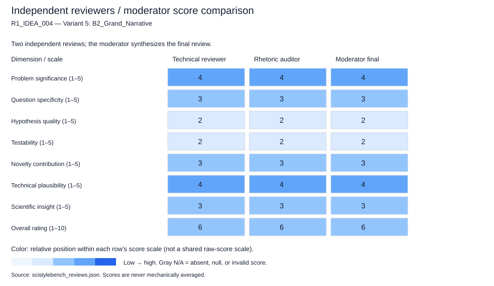

### Independent reviews

```json
{
  "technical_review": {
    "summary": "The research idea proposes a primal-dual direct preference optimization method for constrained alignment of large language models, aiming to maximize output reward while enforcing safety constraints without training separate reward and cost models or requiring prior knowledge of the optimal Lagrange multiplier, thus reducing computational overhead.",
    "strengths": [
      "The idea addresses a significant challenge in AI alignment by focusing on constrained optimization for safety and performance.",
      "The proposed method avoids training separate reward and cost models, which could reduce computational overhead and simplify implementation.",
      "The potential contribution to efficient and safe AI alignment is relevant to broader research in autonomous systems and AI safety.",
      "The method's focus on primal-dual optimization suggests a technically plausible approach to balancing objectives and constraints."
    ],
    "weaknesses": [
      "The idea lacks a clear, specific research question or hypothesis that could be tested or falsified.",
      "The method's technical details are not sufficiently elaborated, making it difficult to assess its feasibility or novelty.",
      "The claim about avoiding prior knowledge of the optimal Lagrange multiplier is vague and needs clarification.",
      "The connection to broader research directions is somewhat abstract and lacks concrete examples or justifications."
    ],
    "suggestions": [
      "Specify the exact problem being addressed, such as the type of constraints or the specific alignment task.",
      "Clarify how the method avoids training separate reward and cost models, and what the alternative approaches are.",
      "Provide a more detailed explanation of the primal-dual optimization framework and its application to the alignment problem.",
      "Identify a specific hypothesis or prediction that the method is expected to validate, such as performance improvements over existing methods.",
      "Include a comparison with existing methods to highlight the novelty and advantages of the proposed approach."
    ],
    "questions": [
      "What specific constraints are being enforced in the alignment task?",
      "How does the method ensure that the optimal Lagrange multiplier is not required, and what are the implications of this assumption?",
      "What is the exact mechanism by which the method reduces computational overhead compared to existing approaches?",
      "How does the proposed method handle the trade-off between reward maximization and safety constraints in practice?",
      "What are the limitations of the method, and under what conditions might it fail?"
    ],
    "problem_significance": {
      "score": 4.0,
      "justification": "The idea addresses a critical challenge in AI alignment by focusing on constrained optimization for safety and performance, which is important for developing reliable autonomous systems."
    },
    "question_specificity": {
      "score": 3.0,
      "justification": "The idea is relevant but lacks a clear, specific research question or hypothesis. It is more of a general direction than a concrete problem to investigate."
    },
    "hypothesis_quality": {
      "score": 2.0,
      "justification": "The idea does not explicitly state a hypothesis or prediction that can be tested. The claim about reducing computational overhead is vague and not supported by a specific mechanism or comparison."
    },
    "testability": {
      "score": 2.0,
      "justification": "The idea lacks concrete experiments or comparisons that would allow for testing the method's effectiveness. The technical details are not sufficient to assess its feasibility."
    },
    "novelty_contribution": {
      "score": 3.0,
      "justification": "The idea proposes a novel approach to constrained alignment, but the novelty is not clearly demonstrated. The contribution is more about application than discovery of new principles."
    },
    "technical_plausibility": {
      "score": 4.0,
      "justification": "The use of primal-dual optimization is a plausible technical approach, and the idea of avoiding separate reward models is consistent with current research trends in efficient reinforcement learning."
    },
    "scientific_insight": {
      "score": 3.0,
      "justification": "The idea has potential to contribute to the understanding of constrained optimization in AI alignment, but the specific insights are not clearly outlined."
    },
    "overall_rating": {
      "score": 6.0,
      "justification": "The idea is promising and addresses a significant problem in AI alignment, but it lacks specific hypotheses, testable claims, and detailed technical explanations that are necessary for further development."
    },
    "confidence": 4.0
  },
  "rhetoric_review": {
    "summary": "The research idea proposes a primal-dual direct preference optimization method for constrained alignment of large language models, aiming to maximize output reward while enforcing safety constraints without training separate reward and cost models or requiring prior knowledge of the optimal Lagrange multiplier, thus reducing computational overhead. It aims to contribute to efficient and safe AI alignment, potentially informing long-term methodologies for balancing performance with safety in autonomous systems.",
    "strengths": [
      "The idea addresses a significant challenge in AI alignment by focusing on constrained optimization for safety and performance.",
      "The proposed method avoids training separate reward and cost models, which could reduce computational overhead and improve efficiency.",
      "The potential contribution to efficient and safe AI alignment is relevant to broader research in autonomous systems and AI safety.",
      "The method's use of primal-dual optimization suggests a technically plausible approach to balancing objectives and constraints."
    ],
    "weaknesses": [
      "The idea lacks a clear, specific research question or hypothesis that could be tested or falsified.",
      "The method's technical details are not sufficiently elaborated, making it difficult to assess its feasibility or novelty.",
      "The connection between the proposed method and the broader goals of AI alignment is not explicitly detailed.",
      "The claim that it 'reduces computational overhead' is vague and not supported by specific evidence or reasoning."
    ],
    "suggestions": [
      "Specify the exact problem being addressed, such as the type of constraints or the specific scenarios where computational overhead is a concern.",
      "Provide a more detailed description of the primal-dual optimization method, including how it enforces safety constraints without separate models.",
      "Clarify the relationship between the method and existing approaches in AI alignment to highlight its novelty and potential contribution.",
      "Include a hypothesis or prediction about the method's performance compared to existing methods, such as reduced computational cost or improved safety metrics."
    ],
    "questions": [
      "What specific constraints are being addressed in the constrained alignment problem?",
      "How does the primal-dual method ensure safety constraints without training separate reward and cost models?",
      "What is the exact mechanism by which the method reduces computational overhead?",
      "How does this method compare to existing approaches in terms of computational efficiency and safety performance?"
    ],
    "problem_significance": {
      "score": 4.0,
      "justification": "The idea addresses a critical challenge in AI alignment by focusing on constrained optimization for safety and performance, which is important for autonomous systems and safe AI deployment."
    },
    "question_specificity": {
      "score": 3.0,
      "justification": "The idea identifies a relevant problem but lacks a specific research question or hypothesis that could be tested or falsified. More details are needed to define the exact problem and objectives."
    },
    "hypothesis_quality": {
      "score": 2.0,
      "justification": "The idea presents a general goal but does not provide a clear, testable hypothesis or prediction. The claim about reducing computational overhead is vague and not supported by specific reasoning."
    },
    "testability": {
      "score": 2.0,
      "justification": "The idea lacks specific experiments, comparisons, or evaluation plans that would allow the hypothesis to be tested or falsified. The technical details are insufficient to assess feasibility."
    },
    "novelty_contribution": {
      "score": 3.0,
      "justification": "The idea proposes a method that avoids training separate reward and cost models, which could be novel in the context of constrained optimization. However, the novelty is not clearly established without more details."
    },
    "technical_plausibility": {
      "score": 4.0,
      "justification": "The use of primal-dual optimization is a plausible technical approach for balancing objectives and constraints. The method's feasibility is reasonable, though the specifics are not fully elaborated."
    },
    "scientific_insight": {
      "score": 3.0,
      "justification": "The idea has potential to contribute to AI alignment but lacks a clear mechanism or insight that would be gained from successfully implementing the method. The connection to broader scientific insights is not explicitly detailed."
    },
    "overall_rating": {
      "score": 6.0,
      "justification": "The idea addresses a significant problem in AI alignment but lacks specific research questions, hypotheses, and technical details necessary for evaluation. It has potential but requires further clarification and elaboration to be considered a strong research direction."
    },
    "confidence": 4.0
  },
  "generation": {
    "technical_model_name": "Qwen/Qwen3-4B",
    "rhetoric_model_name": "Qwen/Qwen3-4B",
    "moderator_model_name": "Qwen/Qwen3-4B",
    "temperature": 0.0,
    "seed": 42
  }
}
```

## R1_IDEA_004 — Variant 6: B3_Over_Confident

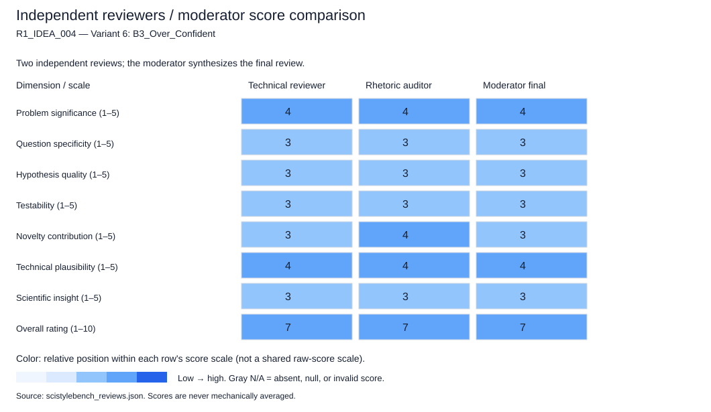

### Independent reviews

```json
{
  "technical_review": {
    "summary": "The research idea proposes a primal-dual direct preference optimization method for constrained alignment of large language models, aiming to maximize output reward while enforcing safety constraints without training separate reward and cost models or requiring prior knowledge of the optimal Lagrange multiplier, thereby addressing computational overhead.",
    "strengths": [
      "The idea addresses a significant challenge in aligning large language models with safety constraints, which is crucial for responsible AI deployment.",
      "The proposed method avoids training separate reward and cost models, which could reduce computational overhead and simplify the alignment process.",
      "The focus on primal-dual optimization suggests a technically sound approach that leverages existing optimization theory for constrained optimization problems."
    ],
    "weaknesses": [
      "The idea lacks a clear definition of the specific problem being addressed, such as the type of constraints or the exact formulation of the optimization problem.",
      "The method's novelty is not clearly articulated; it is not clear how this approach differs from existing methods in the literature.",
      "The claim that it avoids prior knowledge of the optimal Lagrange multiplier is not fully explained, raising questions about the feasibility of the approach."
    ],
    "suggestions": [
      "Clarify the specific constraints and the exact formulation of the optimization problem to define the research question more precisely.",
      "Provide a detailed comparison with existing methods to highlight the novelty and advantages of the proposed approach.",
      "Elaborate on how the method handles the determination of the optimal Lagrange multiplier without prior knowledge, including any assumptions or approximations made."
    ],
    "questions": [
      "What specific constraints are being enforced in the alignment process?",
      "How does the proposed method ensure the optimal Lagrange multiplier is determined without prior knowledge?",
      "What is the exact formulation of the primal-dual optimization problem being addressed?"
    ],
    "problem_significance": {
      "score": 4.0,
      "justification": "The problem of aligning large language models with safety constraints is critical for responsible AI deployment, making the research problem significant."
    },
    "question_specificity": {
      "score": 3.0,
      "justification": "The idea is focused on constrained alignment but lacks specific details about the problem formulation, constraints, and the exact optimization problem being addressed."
    },
    "hypothesis_quality": {
      "score": 3.0,
      "justification": "The idea presents a general hypothesis about reducing computational overhead through primal-dual optimization but lacks specific predictions or mechanisms that could be tested."
    },
    "testability": {
      "score": 3.0,
      "justification": "The idea suggests a method but does not provide a clear experimental plan or comparison with existing methods to test its effectiveness."
    },
    "novelty_contribution": {
      "score": 3.0,
      "justification": "The approach avoids training separate reward and cost models, which is a practical advantage, but the novelty is not clearly demonstrated without a detailed comparison with existing methods."
    },
    "technical_plausibility": {
      "score": 4.0,
      "justification": "The use of primal-dual optimization for constrained alignment is technically plausible, as it leverages established optimization theory."
    },
    "scientific_insight": {
      "score": 3.0,
      "justification": "The idea has potential to contribute to the field by reducing computational overhead in alignment, but the scientific insight is limited without a clear problem formulation and comparison with existing methods."
    },
    "overall_rating": {
      "score": 7.0,
      "justification": "The idea addresses a significant problem in AI alignment with a plausible technical approach, but it lacks specific details and a clear hypothesis to define the research question and test the method's effectiveness."
    },
    "confidence": 4.0
  },
  "rhetoric_review": {
    "summary": "The research idea proposes a primal-dual direct preference optimization method for constrained alignment of large language models, aiming to maximize output reward while enforcing safety constraints without training separate reward and cost models or requiring prior knowledge of the optimal Lagrange multiplier, thereby addressing computational overhead.",
    "strengths": [
      "The idea addresses a significant challenge in aligning large language models with safety constraints, which is crucial for responsible AI deployment.",
      "The proposed method avoids training separate reward and cost models, which could reduce computational overhead and simplify the alignment process.",
      "The focus on primal-dual optimization suggests a technically sound approach that leverages established optimization theory.",
      "The method does not require prior knowledge of the optimal Lagrange multiplier, which is a practical advantage in real-world applications."
    ],
    "weaknesses": [
      "The idea lacks a clear definition of the specific problem being addressed, such as the type of constraints or the exact formulation of the optimization problem.",
      "There is no explicit hypothesis or prediction provided about how the method will perform compared to existing approaches.",
      "The technical details of the primal-dual method are not specified, making it unclear how the method will be implemented or evaluated.",
      "The claim that it addresses computational overhead is not elaborated on, leaving ambiguity about the specific computational savings or efficiency gains."
    ],
    "suggestions": [
      "Define the specific constraints and optimization problem that the method is designed to solve, including the type of safety constraints and the objective function.",
      "Provide a hypothesis or prediction about the method's performance relative to existing methods, such as reduced computational cost or improved alignment accuracy.",
      "Specify the technical details of the primal-dual optimization approach, including the formulation of the problem, the choice of optimization algorithm, and the handling of the Lagrange multipliers.",
      "Elaborate on how the method addresses computational overhead, such as by reducing the number of training steps, decreasing model complexity, or improving convergence speed."
    ],
    "questions": [
      "What specific safety constraints are being addressed in the constrained alignment problem?",
      "How does the proposed method handle the optimization of the Lagrange multipliers without prior knowledge?",
      "What is the exact formulation of the primal-dual optimization problem, and how does it differ from existing methods?",
      "What are the expected computational savings or efficiency gains compared to traditional methods that require separate reward and cost models?"
    ],
    "problem_significance": {
      "score": 4.0,
      "justification": "The idea addresses a critical challenge in aligning large language models with safety constraints, which is essential for responsible AI deployment. However, the problem is somewhat broad and could be more specific in terms of the types of constraints or the exact alignment goals."
    },
    "question_specificity": {
      "score": 3.0,
      "justification": "The idea outlines a general research direction but lacks specific details about the problem formulation, the type of constraints, and the exact optimization problem being addressed. This makes the research question somewhat vague compared to more concrete formulations."
    },
    "hypothesis_quality": {
      "score": 3.0,
      "justification": "The idea suggests a method that could reduce computational overhead, but it does not provide a clear hypothesis or prediction about its performance relative to existing methods. The claim is plausible but lacks explicit testable predictions."
    },
    "testability": {
      "score": 3.0,
      "justification": "The idea is testable in principle, but the lack of specific experimental plans or evaluation metrics makes it difficult to assess the method's effectiveness. The claim about computational overhead is not elaborated on, which limits the testability of the hypothesis."
    },
    "novelty_contribution": {
      "score": 4.0,
      "justification": "The approach of using primal-dual optimization without separate reward and cost models is a novel application of optimization theory to the problem of constrained alignment. However, the novelty is somewhat limited if the method is a straightforward adaptation of existing techniques."
    },
    "technical_plausibility": {
      "score": 4.0,
      "justification": "The use of primal-dual optimization is a technically plausible approach for constrained alignment. The idea is grounded in established optimization theory, and the proposed method is logically coherent. However, the lack of technical details makes it difficult to assess the feasibility of the approach."
    },
    "scientific_insight": {
      "score": 3.0,
      "justification": "The idea has the potential to contribute to the understanding of constrained optimization in large language models, but the lack of specific problem formulation and evaluation plan limits the potential for significant scientific insight."
    },
    "overall_rating": {
      "score": 7.0,
      "justification": "The idea presents a promising direction for addressing the challenge of constrained alignment in large language models. It has the potential to contribute to the field, but the lack of specific problem formulation, hypothesis, and evaluation plan limits its scientific rigor and testability."
    },
    "confidence": 4.0
  },
  "generation": {
    "technical_model_name": "Qwen/Qwen3-4B",
    "rhetoric_model_name": "Qwen/Qwen3-4B",
    "moderator_model_name": "Qwen/Qwen3-4B",
    "temperature": 0.0,
    "seed": 42
  }
}
```

## R1_IDEA_004 — Variant 7: B4_Novelty


### Independent reviews

```json
{
  "technical_review": {
    "summary": "The research idea proposes a novel method for constrained alignment of large language models using a primal-dual direct preference optimization approach. It aims to maximize output reward while enforcing safety constraints without training separate reward and cost models or requiring prior knowledge of the optimal Lagrange multiplier, reducing computational overhead.",
    "strengths": [
      "Introduces a novel perspective on constrained alignment in large language models",
      "Proposes a method that avoids training separate reward and cost models, reducing computational overhead",
      "Focuses on integrating constraint satisfaction directly into the preference optimization process",
      "Offers an underexplored angle in the field of alignment and safety constraints"
    ],
    "weaknesses": [
      "Lacks specific details on how the primal-dual optimization is implemented",
      "Does not clearly define the problem formulation or the specific constraints being addressed",
      "No mention of how the optimal Lagrange multiplier is determined without prior knowledge",
      "The idea is somewhat vague on the exact mechanism of direct preference optimization"
    ],
    "suggestions": [
      "Provide a more detailed description of the primal-dual optimization framework and its implementation",
      "Clarify the specific constraints and problem formulation being addressed",
      "Explain the method for determining the optimal Lagrange multiplier without prior knowledge",
      "Specify the direct preference optimization process and how it integrates with constraint satisfaction"
    ],
    "questions": [
      "How is the primal-dual optimization implemented in practice?",
      "What specific constraints are being addressed in this approach?",
      "How is the optimal Lagrange multiplier determined without prior knowledge?",
      "What is the exact mechanism of direct preference optimization in this context?"
    ],
    "problem_significance": {
      "score": 4.0,
      "justification": "The problem of constrained alignment in large language models is significant as it relates to safety and reliability. Addressing this could have important implications for deploying large models in real-world applications."
    },
    "question_specificity": {
      "score": 3.0,
      "justification": "The idea presents a general direction but lacks specific details on the problem formulation, constraints, and implementation of the primal-dual method. More specificity would strengthen the research question."
    },
    "hypothesis_quality": {
      "score": 3.0,
      "justification": "The idea suggests a novel approach but does not explicitly state a hypothesis or prediction that can be tested. The claim that it reduces computational overhead is plausible but not clearly tied to a specific hypothesis."
    },
    "testability": {
      "score": 3.0,
      "justification": "The idea is testable in principle, but the lack of specific details makes it difficult to assess the feasibility of experiments. A clear experimental plan would be needed to validate the approach."
    },
    "novelty_contribution": {
      "score": 4.0,
      "justification": "The approach of integrating constraint satisfaction directly into preference optimization is underexplored. The novelty lies in avoiding separate reward and cost models, which could contribute to the field of safe and efficient alignment."
    },
    "technical_plausibility": {
      "score": 4.0,
      "justification": "The use of primal-dual optimization in the context of constrained alignment is technically plausible. The idea aligns with existing research on optimization and safety constraints in large language models."
    },
    "scientific_insight": {
      "score": 3.0,
      "justification": "The idea has potential for scientific insight by exploring new ways to integrate constraints into preference optimization. However, the lack of specific details limits the potential for deeper insights."
    },
    "overall_rating": {
      "score": 7.0,
      "justification": "The idea presents a promising direction for constrained alignment in large language models with potential for novelty and practical application. However, it lacks specific details that would make the research question more testable and the hypothesis more concrete."
    },
    "confidence": 4.0
  },
  "rhetoric_review": {
    "summary": "The research idea proposes a novel method for constrained alignment of large language models using a primal-dual direct preference optimization approach. It aims to maximize output reward while enforcing safety constraints without training separate reward and cost models or requiring prior knowledge of the optimal Lagrange multiplier, reducing computational overhead.",
    "strengths": [
      "Introduces a novel perspective on constrained alignment in large language models",
      "Proposes a method that avoids training separate reward and cost models, reducing computational overhead",
      "Focuses on integrating constraint satisfaction directly into the preference optimization process",
      "Addresses the challenge of safety constraints in alignment without prior knowledge of Lagrange multipliers"
    ],
    "weaknesses": [
      "Lacks specific details on how the primal-dual optimization is implemented",
      "Does not clearly define the problem formulation or the specific constraints being addressed",
      "No mention of how the method handles the trade-off between reward maximization and constraint enforcement",
      "No indication of how the method compares to existing approaches in terms of performance or efficiency"
    ],
    "suggestions": [
      "Provide a more detailed description of the primal-dual optimization framework and its implementation",
      "Clarify the specific constraints and problem formulation being addressed",
      "Specify how the method handles the trade-off between reward maximization and constraint enforcement",
      "Include a comparison with existing methods to demonstrate the advantages of the proposed approach"
    ],
    "questions": [
      "What is the specific problem formulation being addressed in the constrained alignment?",
      "How does the method handle the trade-off between reward maximization and constraint enforcement?",
      "What are the specific constraints being enforced in the alignment process?",
      "How does the proposed method compare to existing approaches in terms of performance and efficiency?"
    ],
    "problem_significance": {
      "score": 4.0,
      "justification": "The research addresses a critical challenge in aligning large language models with safety constraints, which is important for responsible AI deployment."
    },
    "question_specificity": {
      "score": 3.0,
      "justification": "The idea presents a novel approach but lacks specific details on the problem formulation, constraints, and implementation of the primal-dual optimization method."
    },
    "hypothesis_quality": {
      "score": 4.0,
      "justification": "The idea proposes a method that could potentially reduce computational overhead and improve safety constraint enforcement in alignment, which is a concrete hypothesis."
    },
    "testability": {
      "score": 3.0,
      "justification": "The idea suggests a method but does not provide specific experiments or comparisons to test its effectiveness or efficiency."
    },
    "novelty_contribution": {
      "score": 4.0,
      "justification": "The approach of integrating constraint satisfaction directly into preference optimization is underexplored and could contribute new insights into constrained alignment."
    },
    "technical_plausibility": {
      "score": 4.0,
      "justification": "The use of primal-dual optimization in the context of preference alignment is technically plausible, though the specific implementation details are not provided."
    },
    "scientific_insight": {
      "score": 3.0,
      "justification": "The idea has potential to provide insights into constraint satisfaction in alignment, but the specific mechanisms and outcomes are not clearly defined."
    },
    "overall_rating": {
      "score": 7.0,
      "justification": "The idea presents a promising direction for constrained alignment in large language models, with a clear problem significance and potential novelty. However, it lacks specific details and experimental validation, which are needed to fully assess its scientific merit."
    },
    "confidence": 4.0
  },
  "generation": {
    "technical_model_name": "Qwen/Qwen3-4B",
    "rhetoric_model_name": "Qwen/Qwen3-4B",
    "moderator_model_name": "Qwen/Qwen3-4B",
    "temperature": 0.0,
    "seed": 42
  }
}
```

## R1_IDEA_004 — Variant 8: B5_Application_Impact

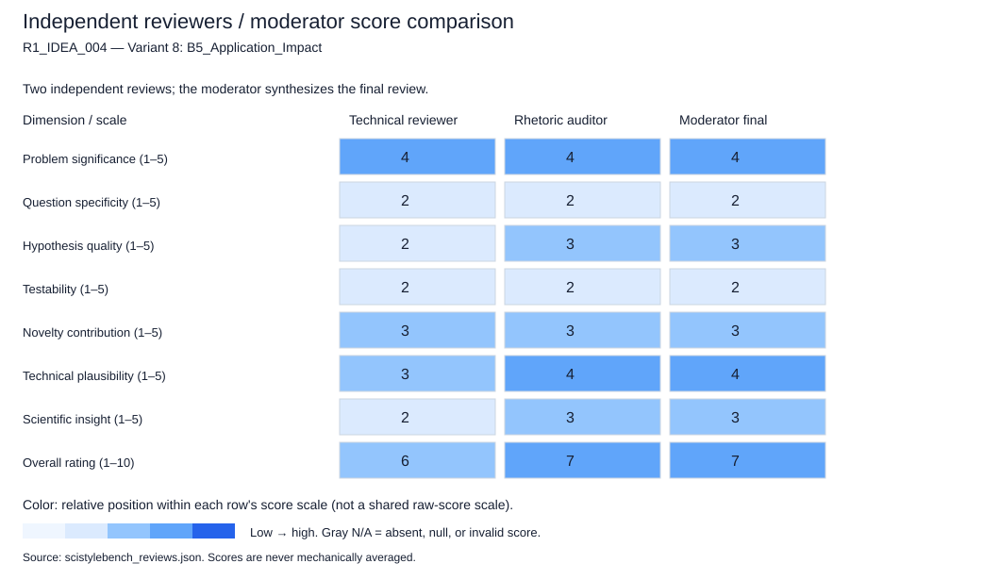

### Independent reviews

```json
{
  "technical_review": {
    "summary": "The research idea proposes a primal-dual direct preference optimization method for constrained alignment of large language models, aiming to maximize output reward while enforcing safety constraints without training separate reward and cost models or requiring prior knowledge of the optimal Lagrange multiplier, thereby reducing computational overhead. This method could inform the development of safer conversational agents and guide the design of practical AI systems where computational efficiency and safety are concurrently needed.",
    "strengths": [
      "The idea addresses a significant challenge in aligning large language models with safety constraints, which is crucial for developing reliable AI systems.",
      "The proposed method avoids training separate reward and cost models, which could reduce computational overhead and simplify the alignment process.",
      "The focus on computational efficiency and safety aligns with current needs in AI system design, making the research relevant to practical applications."
    ],
    "weaknesses": [
      "The idea lacks a clear, specific research question or hypothesis that could be tested or falsified.",
      "The method's technical details are not provided, making it difficult to assess its feasibility or novelty.",
      "The connection between the proposed method and the practical applications (e.g., safer conversational agents) is not sufficiently elaborated."
    ],
    "suggestions": [
      "Specify the exact problem that the method aims to solve, such as how the primal-dual optimization is applied in constrained alignment.",
      "Provide a more detailed description of the method, including the mathematical formulation and how the Lagrange multiplier is handled without prior knowledge.",
      "Clarify the relationship between the method and the practical applications, such as how it improves safety in conversational agents."
    ],
    "questions": [
      "What is the specific problem that the primal-dual method is designed to solve in constrained alignment?",
      "How does the method handle the Lagrange multiplier without prior knowledge, and what is the mathematical formulation?",
      "What are the specific safety constraints that the method is designed to enforce, and how does it ensure computational efficiency?"
    ],
    "problem_significance": {
      "score": 4.0,
      "justification": "The idea addresses a critical challenge in aligning large language models with safety constraints, which is essential for developing reliable and safe AI systems."
    },
    "question_specificity": {
      "score": 2.0,
      "justification": "The idea is relevant but lacks a clear, specific research question or hypothesis that could be tested or falsified."
    },
    "hypothesis_quality": {
      "score": 2.0,
      "justification": "The idea presents a general approach but does not provide a concrete hypothesis or prediction that could be tested or falsified."
    },
    "testability": {
      "score": 2.0,
      "justification": "The idea lacks specific experiments or evaluations that could be conducted to test the method's effectiveness or feasibility."
    },
    "novelty_contribution": {
      "score": 3.0,
      "justification": "The method's approach of avoiding separate reward and cost models is potentially novel, but the lack of technical details makes it difficult to assess its novelty and contribution."
    },
    "technical_plausibility": {
      "score": 3.0,
      "justification": "The idea is technically plausible, but the lack of specific details makes it challenging to assess the feasibility of the proposed method."
    },
    "scientific_insight": {
      "score": 2.0,
      "justification": "The idea has potential for scientific insight but lacks the specific mechanisms or predictions that would allow for meaningful insight."
    },
    "overall_rating": {
      "score": 6.0,
      "justification": "The idea addresses a significant problem in AI alignment but lacks specific research questions, hypotheses, and technical details necessary for evaluation. It has potential but needs further clarification and elaboration."
    },
    "confidence": 4.0
  },
  "rhetoric_review": {
    "summary": "The research idea proposes a primal-dual direct preference optimization method for constrained alignment of large language models, aiming to maximize output reward while enforcing safety constraints without training separate reward and cost models or requiring prior knowledge of the optimal Lagrange multiplier, thus reducing computational overhead. The method could inform the development of safer conversational agents and guide the design of practical AI systems where computational efficiency and safety are both needed.",
    "strengths": [
      "The idea addresses a significant challenge in aligning large language models with safety constraints, which is crucial for developing reliable AI systems.",
      "The proposed method avoids training separate reward and cost models, which could reduce computational overhead and improve efficiency.",
      "The focus on concurrent computational efficiency and safety aligns with practical needs in AI system design."
    ],
    "weaknesses": [
      "The idea lacks a clear, specific research question or hypothesis that could be tested or falsified.",
      "The method's technical details are not provided, making it difficult to assess its feasibility or novelty.",
      "The connection between the proposed method and the practical applications (e.g., safer conversational agents) is not sufficiently elaborated."
    ],
    "suggestions": [
      "Specify the exact problem being addressed, such as how the method handles constraint enforcement or what the primal-dual formulation entails.",
      "Provide a more detailed description of the method, including how the optimal Lagrange multiplier is determined or how the preference optimization is implemented.",
      "Clarify the potential benefits and how the method differs from existing approaches in terms of computational efficiency and safety guarantees."
    ],
    "questions": [
      "What is the specific problem that the primal-dual method is designed to solve in the context of constrained alignment?",
      "How does the method determine the optimal Lagrange multiplier without prior knowledge?",
      "What are the key differences between this method and existing approaches in terms of computational efficiency and safety?",
      "How does the method ensure that the safety constraints are enforced without requiring separate reward models?"
    ],
    "problem_significance": {
      "score": 4.0,
      "justification": "The idea addresses a critical challenge in aligning large language models with safety constraints, which is essential for developing reliable and safe AI systems."
    },
    "question_specificity": {
      "score": 2.0,
      "justification": "The idea is somewhat specific in its focus on constrained alignment and computational efficiency, but lacks a clear, concrete research question or hypothesis that could be tested."
    },
    "hypothesis_quality": {
      "score": 3.0,
      "justification": "The idea suggests a potential method that could reduce computational overhead, but it does not explicitly state a hypothesis that can be tested or falsified."
    },
    "testability": {
      "score": 2.0,
      "justification": "The idea is promising but lacks specific experimental plans or comparisons that would allow for testing the method's effectiveness and efficiency."
    },
    "novelty_contribution": {
      "score": 3.0,
      "justification": "The method's approach to avoiding separate reward models is novel, but the idea does not provide enough detail to assess its originality or potential contribution beyond existing methods."
    },
    "technical_plausibility": {
      "score": 4.0,
      "justification": "The proposed method is technically plausible, as primal-dual optimization is a well-established approach in optimization theory, and the idea aligns with current research trends in safe AI."
    },
    "scientific_insight": {
      "score": 3.0,
      "justification": "The idea has potential to contribute to the understanding of constrained alignment in AI, but the lack of specific details limits the insight it could provide."
    },
    "overall_rating": {
      "score": 7.0,
      "justification": "The idea addresses an important problem in AI safety and efficiency, but it lacks specific details and a clear research question, which are necessary for further development and evaluation."
    },
    "confidence": 4.0
  },
  "generation": {
    "technical_model_name": "Qwen/Qwen3-4B",
    "rhetoric_model_name": "Qwen/Qwen3-4B",
    "moderator_model_name": "Qwen/Qwen3-4B",
    "temperature": 0.0,
    "seed": 42
  }
}
```

## R1_IDEA_004 — Variant 9: C1_Hollow_Shell


### Independent reviews

```json
{
  "technical_review": {
    "summary": "The research idea proposes a method for aligning large language models under constraints, focusing on improving output quality and safety through an optimization framework that reduces computational demands by avoiding certain training requirements and prior parameter knowledge.",
    "strengths": [
      "Identifies a critical problem in aligning large language models with safety and quality constraints.",
      "Proposes a method that addresses computational efficiency, which is a key challenge in deploying large models.",
      "Highlights the importance of balancing model performance with safety, a crucial aspect in practical applications."
    ],
    "weaknesses": [
      "Lacks specific details on the optimization framework or the constraints being addressed.",
      "Does not clearly define the relationship between the proposed method and existing alignment techniques.",
      "The idea is somewhat vague on how the reduction in computational demands is achieved."
    ],
    "suggestions": [
      "Specify the type of constraints (e.g., safety, ethical, or performance) and the optimization framework used.",
      "Clarify how the method differs from existing alignment approaches and what unique contributions it offers.",
      "Provide more details on the computational efficiency improvements, such as specific techniques or metrics used."
    ],
    "questions": [
      "What specific constraints are being addressed in the alignment process?",
      "How does the proposed optimization framework differ from existing methods in terms of safety and quality?",
      "What are the exact computational efficiency gains, and how are they measured?",
      "How does the method handle scenarios where prior parameter knowledge is not available?"
    ],
    "problem_significance": {
      "score": 4.0,
      "justification": "The problem of aligning large language models with safety and quality constraints is highly relevant in practical applications, making it a significant challenge in the field."
    },
    "question_specificity": {
      "score": 3.0,
      "justification": "The idea identifies a broad problem area but lacks specific details on the constraints, optimization framework, and computational efficiency improvements, which are necessary for a precise research question."
    },
    "hypothesis_quality": {
      "score": 3.0,
      "justification": "The idea presents a general goal but does not explicitly state a hypothesis or prediction that can be tested, making it less specific in terms of what is being investigated."
    },
    "testability": {
      "score": 3.0,
      "justification": "The idea is too vague to determine how the proposed method would be tested or evaluated without more specific details on the framework, constraints, and metrics."
    },
    "novelty_contribution": {
      "score": 3.0,
      "justification": "The idea addresses a relevant problem but does not clearly define what novel contribution it offers, making it difficult to assess its potential novelty."
    },
    "technical_plausibility": {
      "score": 4.0,
      "justification": "The proposed approach of reducing computational demands through an optimization framework is technically plausible, though the specifics are not provided."
    },
    "scientific_insight": {
      "score": 3.0,
      "justification": "The idea has potential to contribute to the understanding of model alignment and efficiency, but the lack of specifics limits the potential for meaningful scientific insight."
    },
    "overall_rating": {
      "score": 7.0,
      "justification": "The idea addresses a significant problem in the field of large language model alignment, but it lacks the specificity and testable hypotheses needed to fully evaluate its potential. It has moderate scientific promise but requires more details to be considered strong."
    },
    "confidence": 4.0
  },
  "rhetoric_review": {
    "summary": "The research idea proposes a method for aligning large language models under constraints, focusing on improving output quality and safety through an optimization framework that reduces computational demands by avoiding certain training requirements and prior parameter knowledge.",
    "strengths": [
      "Identifies a critical problem in aligning large language models with safety and efficiency constraints.",
      "Proposes a method that addresses both output quality and computational efficiency.",
      "Highlights the importance of reducing training requirements and parameter knowledge, which is relevant for practical deployment."
    ],
    "weaknesses": [
      "Lacks specific details on the optimization framework or the constraints being addressed.",
      "Does not clearly define the research question or hypothesis.",
      "No mention of how the method will be evaluated or validated."
    ],
    "suggestions": [
      "Specify the type of constraints (e.g., safety, computational, data efficiency).",
      "Define the research question, such as how the optimization framework improves alignment under specific constraints.",
      "Outline the evaluation metrics and benchmarks to validate the method's effectiveness."
    ],
    "questions": [
      "What specific constraints are being addressed in the alignment process?",
      "How does the optimization framework ensure both output quality and safety?",
      "What are the computational trade-offs of avoiding certain training requirements and prior parameter knowledge?"
    ],
    "problem_significance": {
      "score": 4.0,
      "justification": "Aligning large language models with safety and efficiency is a critical challenge in practical deployment, making the problem highly significant."
    },
    "question_specificity": {
      "score": 3.0,
      "justification": "The idea identifies a relevant problem but lacks specific details on the research question or the constraints being addressed."
    },
    "hypothesis_quality": {
      "score": 3.0,
      "justification": "The idea suggests a method but does not explicitly state a hypothesis or prediction that can be tested or falsified."
    },
    "testability": {
      "score": 2.0,
      "justification": "The idea lacks specific experiments, comparisons, or evaluation plans that would allow the hypothesis to be tested or validated."
    },
    "novelty_contribution": {
      "score": 3.0,
      "justification": "The idea addresses a relevant problem but does not clearly define a novel method or contribution beyond the general approach of optimization under constraints."
    },
    "technical_plausibility": {
      "score": 4.0,
      "justification": "The proposed approach of optimizing for alignment with safety and efficiency constraints is technically plausible, though the specifics are not detailed."
    },
    "scientific_insight": {
      "score": 3.0,
      "justification": "The idea has potential for scientific insight into the trade-offs between alignment, safety, and computational efficiency but lacks concrete mechanisms or predictions."
    },
    "overall_rating": {
      "score": 7.0,
      "justification": "The idea addresses a significant problem in large language model alignment but lacks specificity, hypothesis, and evaluation details, which are necessary for a strong research direction."
    },
    "confidence": 4.0
  },
  "generation": {
    "technical_model_name": "Qwen/Qwen3-4B",
    "rhetoric_model_name": "Qwen/Qwen3-4B",
    "moderator_model_name": "Qwen/Qwen3-4B",
    "temperature": 0.0,
    "seed": 42
  }
}
```

## R1_IDEA_004 — Variant 10: C2_Logic_Flawed

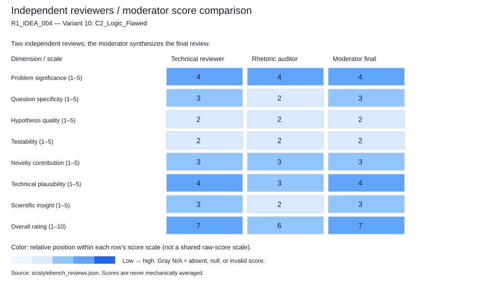

### Independent reviews

```json
{
  "technical_review": {
    "summary": "The research idea proposes a primal-dual direct preference optimization method for constrained alignment of large language models, aiming to maximize output reward while enforcing safety constraints without training separate reward and cost models or requiring prior knowledge of the optimal Lagrange multiplier, thus reducing computational overhead.",
    "strengths": [
      "The idea addresses a significant problem in model alignment, particularly in scenarios with limited computational resources.",
      "The proposed method avoids training separate reward and cost models, which could reduce computational overhead and simplify the alignment process.",
      "The focus on primal-dual optimization suggests a technically coherent approach that leverages existing optimization theory.",
      "The potential for broader applicability in resource-constrained settings is a strong motivation for further investigation."
    ],
    "weaknesses": [
      "The idea lacks a clear, specific research question or hypothesis that could be tested or falsified.",
      "The method's effectiveness is not explicitly tied to a specific problem or scenario, making it difficult to assess its novelty or practicality.",
      "The absence of a detailed explanation of how the primal-dual optimization is applied in the context of preference optimization is a gap that could hinder understanding.",
      "The claim about reducing computational overhead is not substantiated with a concrete mechanism or comparison to existing methods."
    ],
    "suggestions": [
      "Specify a concrete research question, such as whether the method outperforms existing approaches in terms of alignment accuracy or computational efficiency.",
      "Provide a detailed explanation of the primal-dual optimization framework and how it is applied to preference optimization in this context.",
      "Include a comparison with existing methods to demonstrate the computational advantages and effectiveness of the proposed approach.",
      "Clarify the role of the Lagrange multiplier and how the method avoids prior knowledge of its optimal value."
    ],
    "questions": [
      "How does the proposed method ensure that safety constraints are enforced without prior knowledge of the optimal Lagrange multiplier?",
      "What specific problem or scenario is the method designed to solve, and how does it compare to existing approaches in terms of performance and efficiency?",
      "What is the theoretical basis for the claim that the method reduces computational overhead, and how is this mechanism validated?",
      "How does the method handle cases where the optimal Lagrange multiplier might vary across different tasks or data distributions?"
    ],
    "problem_significance": {
      "score": 4.0,
      "justification": "The problem of constrained alignment in large language models is significant, especially in resource-constrained settings. The proposed method addresses a practical challenge in model alignment, which is a critical area in AI safety and deployment."
    },
    "question_specificity": {
      "score": 3.0,
      "justification": "The idea is somewhat specific in its focus on constrained alignment and computational efficiency, but it lacks a clear, testable research question. The hypothesis is not explicitly stated, making it difficult to assess the specific contribution of the method."
    },
    "hypothesis_quality": {
      "score": 2.0,
      "justification": "The idea presents a general claim about reducing computational overhead but does not provide a concrete hypothesis that can be tested or falsified. The lack of a specific prediction or mechanism weakens the hypothesis quality."
    },
    "testability": {
      "score": 2.0,
      "justification": "The idea does not provide a clear experimental plan or comparison to existing methods. Without a specific test case or evaluation metric, it is difficult to assess the method's effectiveness or computational efficiency."
    },
    "novelty_contribution": {
      "score": 3.0,
      "justification": "The method's approach to constrained alignment without separate reward models is a novel idea, but the lack of a specific problem or scenario makes it difficult to assess its novelty. The contribution is plausible but not clearly defined."
    },
    "technical_plausibility": {
      "score": 4.0,
      "justification": "The use of primal-dual optimization is a technically plausible approach, and the idea aligns with existing optimization theory. However, the application to preference optimization in the context of model alignment is not fully explained, which could be a potential issue."
    },
    "scientific_insight": {
      "score": 3.0,
      "justification": "The idea has the potential to contribute to the understanding of constrained optimization in model alignment, but the lack of a specific hypothesis or testable claim limits the potential for scientific insight."
    },
    "overall_rating": {
      "score": 7.0,
      "justification": "The idea addresses a meaningful problem in model alignment and proposes a method that could reduce computational overhead. However, it lacks a clear research question, hypothesis, and experimental plan, which are necessary for assessing its scientific merit and potential contribution."
    },
    "confidence": 4.0
  },
  "rhetoric_review": {
    "summary": "The research idea proposes a primal-dual direct preference optimization method for constrained alignment of large language models, aiming to maximize output reward while enforcing safety constraints without training separate reward and cost models or requiring prior knowledge of the optimal Lagrange multiplier, thus reducing computational overhead and suggesting broader effectiveness in resource-limited model alignment settings.",
    "strengths": [
      "The idea addresses a significant challenge in aligning large language models with safety constraints, which is crucial for responsible AI deployment.",
      "The proposed method avoids training separate reward and cost models, which could reduce computational overhead and simplify the alignment process.",
      "The efficiency of the approach suggests potential applicability in resource-constrained scenarios, which is a practical concern in real-world applications."
    ],
    "weaknesses": [
      "The idea lacks a clear, specific research question or hypothesis that could be tested or falsified.",
      "The method's technical details are not provided, making it difficult to assess its feasibility or novelty.",
      "The claim about broader effectiveness is vague and not supported by specific evidence or reasoning."
    ],
    "suggestions": [
      "Specify the exact problem being addressed, such as the type of constraints or the specific scenarios where computational resources are limited.",
      "Provide a more detailed description of the primal-dual optimization framework, including how the Lagrange multipliers are handled without prior knowledge.",
      "Include a hypothesis or prediction about the method's performance compared to existing approaches, such as in terms of computational efficiency or alignment accuracy."
    ],
    "questions": [
      "What specific constraints are being addressed in the constrained alignment problem?",
      "How does the method handle the optimization of Lagrange multipliers without prior knowledge?",
      "What is the expected performance improvement in terms of computational efficiency or alignment accuracy compared to existing methods?"
    ],
    "problem_significance": {
      "score": 4.0,
      "justification": "The problem of aligning large language models with safety constraints is critical for responsible AI deployment, making the research relevant and significant."
    },
    "question_specificity": {
      "score": 2.0,
      "justification": "The idea is somewhat specific but lacks a clear, concrete research question or hypothesis that could be tested or falsified."
    },
    "hypothesis_quality": {
      "score": 2.0,
      "justification": "The idea does not explicitly state a hypothesis or prediction that could be tested, making it difficult to assess its scientific merit."
    },
    "testability": {
      "score": 2.0,
      "justification": "The idea lacks specific experiments or evaluation plans, making it difficult to determine how the method would be tested or validated."
    },
    "novelty_contribution": {
      "score": 3.0,
      "justification": "The approach of avoiding separate reward and cost models is a novel idea, but the lack of technical details makes it difficult to assess its novelty or contribution."
    },
    "technical_plausibility": {
      "score": 3.0,
      "justification": "The idea is technically plausible, but the lack of details makes it difficult to assess the feasibility of the proposed method."
    },
    "scientific_insight": {
      "score": 2.0,
      "justification": "The idea suggests potential benefits but does not provide a clear mechanism or insight that could be gained from the research."
    },
    "overall_rating": {
      "score": 6.0,
      "justification": "The idea addresses a significant problem in AI alignment but lacks specific research questions, hypotheses, and technical details necessary for evaluation. It has potential but needs more concrete formulation."
    },
    "confidence": 4.0
  },
  "generation": {
    "technical_model_name": "Qwen/Qwen3-4B",
    "rhetoric_model_name": "Qwen/Qwen3-4B",
    "moderator_model_name": "Qwen/Qwen3-4B",
    "temperature": 0.0,
    "seed": 42
  }
}
```

## R1_IDEA_004 — Variant 11: C3_Substance_Enriched

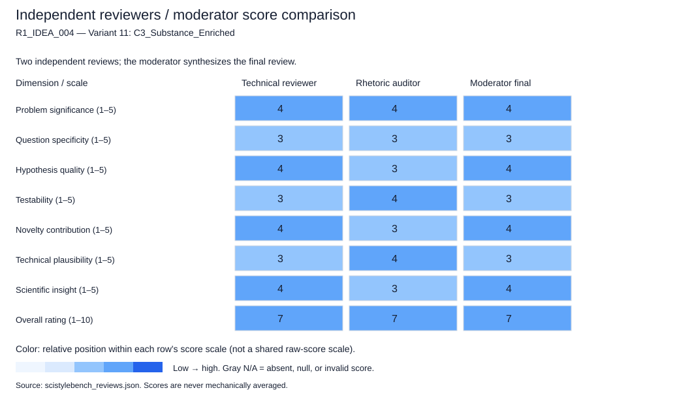

### Independent reviews

```json
{
  "technical_review": {
    "summary": "The research idea proposes a primal-dual direct preference optimization method for constrained alignment of large language models, aiming to maximize output reward while enforcing safety constraints without training separate reward and cost models or requiring prior knowledge of the optimal Lagrange multiplier. It suggests testing the method's convergence behavior under varying constraint budgets and hypothesizes that dual variable dynamics might reveal interpretable trade-off patterns between reward and safety violation rates across different prompt distributions.",
    "strengths": [
      "The idea addresses a meaningful problem in aligning large language models with safety constraints, which is crucial for responsible AI deployment.",
      "It proposes a novel method that avoids training separate reward and cost models, potentially reducing computational overhead.",
      "The hypothesis about dual variable dynamics revealing trade-off patterns is testable and offers potential scientific insight.",
      "The idea includes a specific validation path involving convergence behavior under varying constraint budgets."
    ],
    "weaknesses": [
      "The idea lacks detailed technical specifications, making it difficult to assess the feasibility of the proposed method.",
      "The connection between the primal-dual optimization and the specific constraints is not clearly explained.",
      "The hypothesis about dual variable dynamics is promising but needs more concrete justification and prior work references.",
      "The potential impact of the method on real-world applications is not explicitly discussed."
    ],
    "suggestions": [
      "Provide more technical details on the primal-dual optimization framework and how it enforces safety constraints.",
      "Clarify the relationship between the dual variables and the trade-off patterns in reward and safety violation rates.",
      "Include references to prior work on primal-dual methods in constrained optimization and alignment.",
      "Explore the method's performance on benchmark datasets or real-world tasks to validate its effectiveness."
    ],
    "questions": [
      "How does the primal-dual method specifically enforce safety constraints without prior knowledge of the optimal Lagrange multiplier?",
      "What is the theoretical basis for the hypothesis that dual variable dynamics reveal interpretable trade-off patterns?",
      "How does the method handle non-convex or complex constraint landscapes?",
      "What are the computational trade-offs between the proposed method and existing constrained optimization approaches?"
    ],
    "problem_significance": {
      "score": 4.0,
      "justification": "The problem of aligning large language models with safety constraints is critical for responsible AI deployment, making the research relevant and significant."
    },
    "question_specificity": {
      "score": 3.0,
      "justification": "The idea defines a specific research question about constrained alignment and the hypothesis regarding dual variables, but the technical details are insufficient for full evaluation."
    },
    "hypothesis_quality": {
      "score": 4.0,
      "justification": "The hypothesis about dual variable dynamics revealing trade-off patterns is testable and offers potential scientific insight, though it requires more concrete justification."
    },
    "testability": {
      "score": 3.0,
      "justification": "The idea suggests testing convergence behavior and dual variable dynamics, but the specific experiments and metrics are not detailed, limiting testability."
    },
    "novelty_contribution": {
      "score": 4.0,
      "justification": "The method avoids training separate reward and cost models, which is a novel approach, though the novelty is somewhat limited without more technical details."
    },
    "technical_plausibility": {
      "score": 3.0,
      "justification": "The primal-dual approach is technically plausible, but the specifics of how constraints are enforced and the role of dual variables are not clearly explained."
    },
    "scientific_insight": {
      "score": 4.0,
      "justification": "The hypothesis about dual variable dynamics providing interpretable trade-off patterns has potential for scientific insight, though it requires further validation."
    },
    "overall_rating": {
      "score": 7.0,
      "justification": "The idea addresses a significant problem in AI alignment, proposes a novel method with a testable hypothesis, and has potential for scientific insight. However, technical details and experimental validation are needed for a complete evaluation."
    },
    "confidence": 4.0
  },
  "rhetoric_review": {
    "summary": "The research idea proposes a primal-dual direct preference optimization method for constrained alignment of large language models, aiming to maximize output reward while enforcing safety constraints without training separate reward and cost models or requiring prior knowledge of the optimal Lagrange multiplier. It suggests testing the method's convergence behavior under varying constraint budgets and hypothesizes that dual variable dynamics might reveal interpretable trade-off patterns between reward and safety violation rates across different prompt distributions.",
    "strengths": [
      "The idea addresses a meaningful problem in aligning large language models with safety constraints, which is crucial for responsible AI deployment.",
      "It proposes a novel method that avoids training separate reward and cost models, potentially reducing computational overhead.",
      "The idea includes a testable hypothesis about dual variable dynamics and their relationship to reward-safety trade-offs, which is scientifically interesting.",
      "It suggests a validation path involving convergence behavior under varying constraint budgets, which is a concrete plan for evaluation."
    ],
    "weaknesses": [
      "The idea is somewhat vague in specifying the exact formulation of the primal-dual optimization method, which could lead to ambiguity in implementation.",
      "The hypothesis about dual variable dynamics is not clearly connected to the method's design or the problem's specifics, making it less testable without further clarification.",
      "The potential contribution is not explicitly tied to the broader field of constrained optimization in machine learning, limiting its novelty score.",
      "The idea does not provide a clear comparison to existing methods, which is important for assessing the novelty and effectiveness of the proposed approach."
    ],
    "suggestions": [
      "Clarify the exact formulation of the primal-dual optimization method, including how the constraints are incorporated into the objective function.",
      "Specify how the dual variable dynamics are expected to reveal trade-off patterns and what metrics will be used to evaluate these patterns.",
      "Compare the proposed method with existing approaches in constrained optimization to highlight its novelty and advantages.",
      "Provide a more detailed validation plan, including specific datasets or scenarios for testing convergence and trade-off patterns."
    ],
    "questions": [
      "How does the proposed method ensure that the safety constraints are enforced without prior knowledge of the optimal Lagrange multiplier?",
      "What is the specific mechanism by which the dual variable dynamics are expected to reveal trade-off patterns between reward and safety violation rates?",
      "How does the method handle the trade-off between reward maximization and constraint enforcement in different prompt distributions?",
      "What are the computational trade-offs of avoiding separate reward and cost models, and how does this affect scalability?"
    ],
    "problem_significance": {
      "score": 4.0,
      "justification": "The idea addresses a critical challenge in aligning large language models with safety constraints, which is essential for responsible AI deployment. However, the problem is somewhat broad and could be more specific in its relevance to current research."
    },
    "question_specificity": {
      "score": 3.0,
      "justification": "The research question is clear in its goal of constrained alignment but lacks specific details on the method's formulation and the exact nature of the trade-off patterns to be studied. More specificity would strengthen the question."
    },
    "hypothesis_quality": {
      "score": 3.0,
      "justification": "The hypothesis about dual variable dynamics is scientifically interesting but is not clearly connected to the method's design or the problem's specifics. Further clarification would improve its testability."
    },
    "testability": {
      "score": 4.0,
      "justification": "The idea includes a concrete validation path involving convergence behavior under varying constraint budgets and a testable hypothesis about dual variable dynamics. However, the lack of specific metrics or comparison methods limits its testability."
    },
    "novelty_contribution": {
      "score": 3.0,
      "justification": "The method avoids training separate reward and cost models, which is a novel approach, but the contribution is not clearly tied to broader implications in constrained optimization. More explicit novelty would increase the score."
    },
    "technical_plausibility": {
      "score": 4.0,
      "justification": "The proposed method is technically plausible as it builds on primal-dual optimization, which is a well-established approach in constrained optimization. However, the lack of specific details on implementation could affect its feasibility."
    },
    "scientific_insight": {
      "score": 3.0,
      "justification": "The hypothesis about dual variable dynamics offering interpretable trade-off patterns is scientifically interesting, but the connection to the method's design and the problem's specifics is not sufficiently clear. More insight would be needed to raise the score."
    },
    "overall_rating": {
      "score": 7.0,
      "justification": "The idea addresses a meaningful problem in constrained alignment of large language models and proposes a novel method with a testable hypothesis. However, it lacks specific details on the method's formulation and the exact nature of the trade-off patterns, which could limit its scientific impact and testability."
    },
    "confidence": 4.0
  },
  "generation": {
    "technical_model_name": "Qwen/Qwen3-4B",
    "rhetoric_model_name": "Qwen/Qwen3-4B",
    "moderator_model_name": "Qwen/Qwen3-4B",
    "temperature": 0.0,
    "seed": 42
  }
}
```

## R1_IDEA_005 — Source

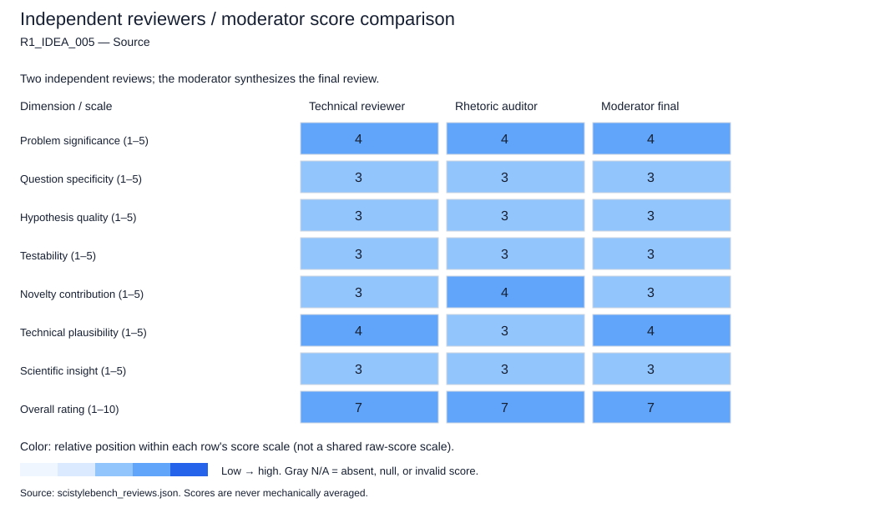

### Independent reviews

```json
{
  "technical_review": {
    "summary": "The research idea proposes a test-time adaptation method to improve the robustness of vision state space models (SSMs) under distribution shifts. It generates multiple input views through diverse SSM traversal permutations, uses model-generated pseudo-labels to update Mamba-specific parameters, and aggregates adapted weights to enhance generalization without additional labeled data.",
    "strengths": [
      "The idea addresses a specific and meaningful problem in vision state space models (SSMs) related to distribution shifts, which is a critical challenge in robustness.",
      "The proposed method uses pseudo-labels and parameter adaptation, which are well-established techniques in machine learning, suggesting a plausible approach.",
      "The goal of enhancing generalization without additional labeled data is aligned with practical and efficient learning strategies."
    ],
    "weaknesses": [
      "The idea lacks a clear definition of what 'distribution shifts' refer to in the context of vision SSMs, which is essential for evaluating the problem's significance.",
      "The mechanism of generating input views via SSM traversal permutations is not sufficiently explained, making it unclear how this contributes to robustness.",
      "The use of Mamba-specific parameters and the aggregation of adapted weights is not detailed, which could lead to ambiguity in the method's implementation."
    ],
    "suggestions": [
      "Clarify the specific types of distribution shifts targeted by the method, such as domain shifts, data distribution changes, or task variations.",
      "Provide a more detailed explanation of how SSM traversal permutations generate input views and how this process enhances robustness.",
      "Specify the criteria for selecting and aggregating adapted weights, including the role of pseudo-labels in parameter updates."
    ],
    "questions": [
      "What specific distribution shifts are being addressed in the vision SSM context?",
      "How does the generation of input views via SSM traversal permutations contribute to robustness under distribution shifts?",
      "What is the exact process for selecting and aggregating adapted weights using pseudo-labels?"
    ],
    "problem_significance": {
      "score": 4.0,
      "justification": "The problem of distribution shifts in vision SSMs is significant as it affects model robustness in real-world scenarios. However, the context of 'vision SSMs' is not clearly defined, which could limit the problem's relevance."
    },
    "question_specificity": {
      "score": 3.0,
      "justification": "The idea identifies a specific problem (distribution shifts in vision SSMs) but lacks detailed specification of the research question, such as the exact nature of the shifts or the specific mechanism for adaptation."
    },
    "hypothesis_quality": {
      "score": 3.0,
      "justification": "The idea proposes a method to improve robustness, but the hypothesis is not explicitly stated. The claim that the method enhances generalization without labeled data is plausible but lacks a concrete prediction or mechanism."
    },
    "testability": {
      "score": 3.0,
      "justification": "The method is testable through experiments, but the lack of details on input view generation and parameter adaptation makes it difficult to assess the feasibility of the approach."
    },
    "novelty_contribution": {
      "score": 3.0,
      "justification": "The idea is novel in its application of test-time adaptation to vision SSMs, but the contribution is not clearly defined. The novelty lies in the method's approach, but the potential impact is not explicitly stated."
    },
    "technical_plausibility": {
      "score": 4.0,
      "justification": "The use of pseudo-labels and parameter adaptation is technically plausible. However, the specifics of SSM traversal permutations and weight aggregation are not detailed, which could affect the method's implementation."
    },
    "scientific_insight": {
      "score": 3.0,
      "justification": "The idea has potential to provide insights into robustness under distribution shifts, but the lack of detailed mechanisms limits the potential for significant scientific insight."
    },
    "overall_rating": {
      "score": 7.0,
      "justification": "The idea addresses a meaningful problem with a plausible approach, but it lacks sufficient detail and specificity to fully evaluate its potential. The method has the potential to contribute to the field, but further clarification is needed."
    },
    "confidence": 4.0
  },
  "rhetoric_review": {
    "summary": "The research idea proposes a test-time adaptation method for improving the robustness of vision state space models (SSMs) under distribution shifts. The method generates multiple input views through diverse SSM traversal permutations, uses model-generated pseudo-labels to update Mamba-specific parameters, and aggregates adapted weights to enhance generalization without requiring additional labeled data.",
    "strengths": [
      "The idea addresses a specific and meaningful problem in vision state space models (SSMs) related to robustness under distribution shifts, which is a critical challenge in machine learning.",
      "The proposed method introduces a novel approach to test-time adaptation by generating multiple input views through SSM traversal permutations, which could potentially improve model generalization.",
      "The method aims to enhance generalization without requiring additional labeled data, which is a valuable property in practical applications where labeled data is scarce."
    ],
    "weaknesses": [
      "The idea lacks a clear definition of what 'distribution shifts' refer to in the context of vision SSMs, which is essential for understanding the problem's scope and the method's applicability.",
      "The mechanism of using model-generated pseudo-labels to update Mamba-specific parameters is not sufficiently explained, making it unclear how this process contributes to robustness under distribution shifts.",
      "The idea does not specify how the generated input views are created through SSM traversal permutations, which is a critical component of the proposed method."
    ],
    "suggestions": [
      "Clarify the definition of distribution shifts in the context of vision SSMs to ensure the problem is well-defined and the method's applicability is clear.",
      "Provide a detailed explanation of the process for generating input views through SSM traversal permutations, including the specific permutations used and how they contribute to the method's effectiveness.",
      "Elaborate on the mechanism of using model-generated pseudo-labels to update Mamba-specific parameters, including how these pseudo-labels are generated and how they influence the parameter updates."
    ],
    "questions": [
      "What specific types of distribution shifts are being addressed in the context of vision SSMs?",
      "How are the SSM traversal permutations determined, and what is the rationale for choosing these permutations?",
      "What is the exact process for generating model-generated pseudo-labels, and how are they used to update Mamba-specific parameters?",
      "How does the aggregation of adapted weights contribute to enhancing generalization under distribution shifts?"
    ],
    "problem_significance": {
      "score": 4.0,
      "justification": "The idea addresses a significant challenge in vision state space models (SSMs) related to robustness under distribution shifts, which is a critical issue in machine learning. However, the problem's scope and the method's applicability are not fully clarified."
    },
    "question_specificity": {
      "score": 3.0,
      "justification": "The research question is specific to improving robustness under distribution shifts in vision SSMs, but the details of the problem and the method's implementation are not sufficiently detailed, which could affect the clarity and testability of the question."
    },
    "hypothesis_quality": {
      "score": 3.0,
      "justification": "The idea presents a hypothesis that the proposed method will enhance generalization under distribution shifts without additional labeled data. However, the specific mechanism and the relationship between the method and the problem are not clearly articulated, making the hypothesis somewhat vague."
    },
    "testability": {
      "score": 3.0,
      "justification": "The idea suggests a method that could be tested, but the lack of specific details on how the input views are generated, how pseudo-labels are used, and how weights are aggregated makes it difficult to assess the testability of the hypothesis."
    },
    "novelty_contribution": {
      "score": 4.0,
      "justification": "The idea introduces a novel approach to test-time adaptation for vision SSMs by generating multiple input views through SSM traversal permutations. This could contribute to the field by improving robustness under distribution shifts, although the novelty is somewhat limited without more details on the method's specifics."
    },
    "technical_plausibility": {
      "score": 3.0,
      "justification": "The proposed method is technically plausible, as it involves generating input views and using pseudo-labels for parameter updates. However, the lack of specific details on the implementation makes it difficult to assess the technical feasibility and plausibility of the approach."
    },
    "scientific_insight": {
      "score": 3.0,
      "justification": "The idea has the potential to provide scientific insight into how test-time adaptation can improve robustness under distribution shifts in vision SSMs. However, the lack of specific details on the method's implementation limits the potential for meaningful scientific insight."
    },
    "overall_rating": {
      "score": 7.0,
      "justification": "The research idea addresses a meaningful problem in vision state space models (SSMs) related to robustness under distribution shifts. It proposes a novel approach to test-time adaptation, which has the potential to contribute to the field. However, the idea lacks sufficient details on the problem definition, method implementation, and the specific mechanisms involved, which could affect its testability and scientific insight."
    },
    "confidence": 4.0
  },
  "generation": {
    "technical_model_name": "Qwen/Qwen3-4B",
    "rhetoric_model_name": "Qwen/Qwen3-4B",
    "moderator_model_name": "Qwen/Qwen3-4B",
    "temperature": 0.0,
    "seed": 42
  }
}
```

## R1_IDEA_005 — Variant 1: A1_Identity

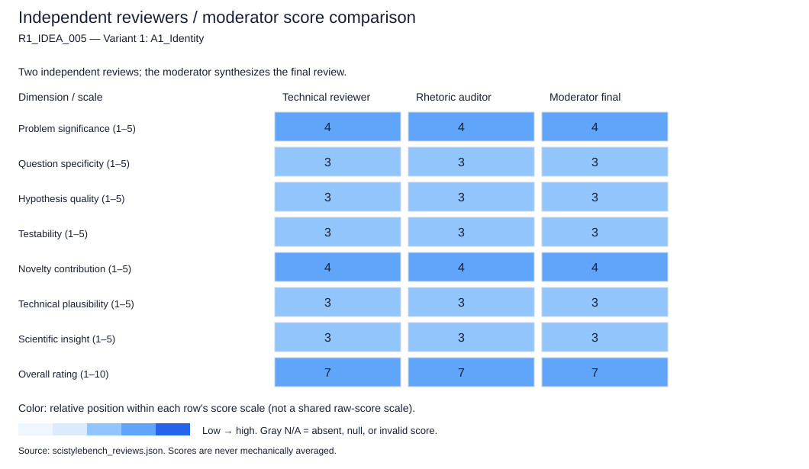

### Independent reviews

```json
{
  "technical_review": {
    "summary": "The research idea proposes a test-time adaptation method to improve the robustness of vision state space models (SSMs) under distribution shifts. It generates multiple input views through diverse SSM traversal permutations, uses model-generated pseudo-labels to update Mamba-specific parameters, and aggregates adapted weights to enhance generalization without additional labeled data.",
    "strengths": [
      "The idea addresses a specific and meaningful problem in vision state space models (SSMs) related to robustness under distribution shifts, which is a critical challenge in real-world applications.",
      "The proposed method introduces a novel approach to test-time adaptation by generating multiple input views through SSM traversal permutations, which could lead to improved generalization.",
      "The method aims to enhance generalization without requiring additional labeled data, which is a valuable property in scenarios where labeled data is scarce or expensive.",
      "The use of model-generated pseudo-labels for parameter updates suggests a data-efficient and self-supervised learning approach, which is promising for practical applications."
    ],
    "weaknesses": [
      "The idea lacks a clear definition of what 'distribution shifts' specifically refer to in the context of vision SSMs, which is necessary for evaluating the problem's significance and the method's applicability.",
      "The mechanism of generating input views through SSM traversal permutations is not well explained, making it difficult to assess the technical plausibility and feasibility of the approach.",
      "The hypothesis that the method will enhance generalization without additional labeled data is not explicitly stated or supported by a concrete prediction or comparison, which is needed for testability.",
      "The idea does not specify how the aggregated adapted weights are combined or the criteria for selecting which weights to aggregate, which could affect the method's effectiveness and implementation."
    ],
    "suggestions": [
      "Clarify the specific types of distribution shifts the method is designed to handle, such as shifts in lighting, object orientation, or scene context, to better define the problem and evaluate the method's effectiveness.",
      "Provide a detailed explanation of the SSM traversal permutations and how they generate diverse input views, including the algorithmic or heuristic approach used for permutation generation.",
      "Explicitly state the hypothesis or prediction that the method will achieve improved generalization under distribution shifts, possibly by comparing performance metrics with and without the proposed adaptation.",
      "Specify the criteria or methodology for aggregating adapted weights, such as using a weighted average, voting mechanism, or other combination strategy, to ensure the method's implementation is clear and testable."
    ],
    "questions": [
      "What specific types of distribution shifts are the vision SSMs expected to encounter, and how does the method address these shifts?",
      "How are the SSM traversal permutations generated, and what is the rationale behind choosing these permutations to create diverse input views?",
      "What is the expected improvement in generalization metrics, and how will it be measured against baseline methods?",
      "What is the methodology for aggregating adapted weights, and how does it ensure that the most beneficial parameters are retained?"
    ],
    "problem_significance": {
      "score": 4.0,
      "justification": "The idea addresses a critical challenge in vision state space models (SSMs) related to robustness under distribution shifts, which is important for real-world applications where data distributions can vary significantly. However, the specific context of 'distribution shifts' in vision SSMs is not clearly defined, which could affect the problem's relevance and the method's applicability."
    },
    "question_specificity": {
      "score": 3.0,
      "justification": "The research question is somewhat specific, as it focuses on improving robustness under distribution shifts in vision SSMs. However, the exact nature of the distribution shifts and the specific mechanism for generating input views through SSM traversal permutations are not clearly defined, which limits the specificity of the question."
    },
    "hypothesis_quality": {
      "score": 3.0,
      "justification": "The idea suggests a hypothesis that the proposed method will enhance generalization without additional labeled data, but this hypothesis is not explicitly stated or supported by a concrete prediction or comparison. The mechanism for generating input views and updating parameters is not clearly explained, which weakens the hypothesis quality."
    },
    "testability": {
      "score": 3.0,
      "justification": "The idea proposes a method but does not specify how the effectiveness of the method will be evaluated. The lack of details on how distribution shifts are defined, how input views are generated, and how generalization is measured makes it difficult to assess the testability of the hypothesis."
    },
    "novelty_contribution": {
      "score": 4.0,
      "justification": "The proposed method introduces a novel approach to test-time adaptation in vision SSMs by generating multiple input views through SSM traversal permutations. This could contribute to the field by improving the robustness of SSMs under distribution shifts, even though it is a relatively new area of research."
    },
    "technical_plausibility": {
      "score": 3.0,
      "justification": "The idea is technically plausible as it leverages existing concepts in test-time adaptation and pseudo-labeling. However, the specific mechanism of generating input views through SSM traversal permutations is not well explained, which could affect the feasibility of the approach."
    },
    "scientific_insight": {
      "score": 3.0,
      "justification": "The research could provide insights into how test-time adaptation can improve the robustness of vision SSMs under distribution shifts. However, the lack of specific details on the method's implementation and evaluation makes it difficult to assess the potential for scientific insight."
    },
    "overall_rating": {
      "score": 7.0,
      "justification": "The idea addresses a meaningful problem in vision state space models (SSMs) related to robustness under distribution shifts, which is important for real-world applications. The proposed method introduces a novel approach to test-time adaptation, but the lack of specific details on the problem definition, mechanism, and evaluation makes it challenging to assess its full potential. The idea has strong potential for contribution but requires further clarification and specification to be more testable and scientifically rigorous."
    },
    "confidence": 4.0
  },
  "rhetoric_review": {
    "summary": "The research idea proposes a test-time adaptation method for improving the robustness of vision state space models (SSMs) under distribution shifts. The method generates multiple input views through diverse SSM traversal permutations, uses model-generated pseudo-labels to update Mamba-specific parameters, and aggregates adapted weights to enhance generalization without requiring additional labeled data.",
    "strengths": [
      "The idea addresses a specific and meaningful problem in vision state space models (SSMs) related to robustness under distribution shifts, which is a critical challenge in machine learning.",
      "The proposed method introduces a novel approach to test-time adaptation by generating multiple input views through SSM traversal permutations, which could potentially improve model generalization.",
      "The method aims to enhance generalization without requiring additional labeled data, which is a valuable property in practical applications where labeled data is scarce."
    ],
    "weaknesses": [
      "The idea lacks a clear definition of what 'distribution shifts' refer to in the context of vision SSMs, which is essential for understanding the problem's scope and the method's applicability.",
      "The mechanism of using model-generated pseudo-labels to update Mamba-specific parameters is not sufficiently explained, making it unclear how this process contributes to robustness under distribution shifts.",
      "The idea does not specify how the generated input views are created through SSM traversal permutations, which is a critical component of the proposed method."
    ],
    "suggestions": [
      "Clarify the definition of distribution shifts in the context of vision SSMs to ensure the problem is well-defined and the method's applicability is clear.",
      "Provide a detailed explanation of the process for generating input views through SSM traversal permutations, including the specific permutations used and how they contribute to the method's effectiveness.",
      "Elaborate on the mechanism of using model-generated pseudo-labels to update Mamba-specific parameters, including how these pseudo-labels are generated and how they influence the parameter updates."
    ],
    "questions": [
      "What specific types of distribution shifts are being addressed in the context of vision SSMs?",
      "How are the SSM traversal permutations determined, and what is the rationale for choosing these permutations?",
      "What is the exact process for generating model-generated pseudo-labels, and how are they used to update Mamba-specific parameters?",
      "How does the aggregation of adapted weights contribute to enhancing generalization under distribution shifts?"
    ],
    "problem_significance": {
      "score": 4.0,
      "justification": "The idea addresses a significant challenge in vision state space models (SSMs) related to robustness under distribution shifts, which is a critical issue in machine learning. However, the problem's scope and the method's applicability are not fully clarified."
    },
    "question_specificity": {
      "score": 3.0,
      "justification": "The research question is specific to improving robustness under distribution shifts in vision SSMs, but the details of the problem and the method's implementation are not sufficiently detailed, which could affect the clarity and testability of the question."
    },
    "hypothesis_quality": {
      "score": 3.0,
      "justification": "The idea presents a hypothesis that the proposed method will enhance generalization under distribution shifts without additional labeled data. However, the specific mechanism and the relationship between the method and the problem are not clearly articulated, making the hypothesis somewhat vague."
    },
    "testability": {
      "score": 3.0,
      "justification": "The idea suggests a method that could be tested, but the lack of specific details on how the input views are generated, how pseudo-labels are used, and how adapted weights are aggregated makes it difficult to assess the testability of the hypothesis."
    },
    "novelty_contribution": {
      "score": 4.0,
      "justification": "The idea introduces a novel approach to test-time adaptation for vision SSMs by generating multiple input views through SSM traversal permutations. This could contribute to the field by improving robustness under distribution shifts without additional labeled data, though the novelty is somewhat limited without more details."
    },
    "technical_plausibility": {
      "score": 3.0,
      "justification": "The proposed method is technically plausible, as it leverages existing concepts like test-time adaptation and pseudo-labeling. However, the specific implementation details are not provided, which could affect the feasibility of the approach."
    },
    "scientific_insight": {
      "score": 3.0,
      "justification": "The idea has the potential to provide scientific insight into how test-time adaptation can improve robustness under distribution shifts in vision SSMs. However, the lack of specific details makes it difficult to assess the potential for new insights."
    },
    "overall_rating": {
      "score": 7.0,
      "justification": "The idea addresses a meaningful problem in vision state space models and proposes a novel approach to test-time adaptation. However, the lack of specific details on the problem definition, method implementation, and hypothesis makes it challenging to assess the full scientific potential and testability of the idea."
    },
    "confidence": 4.0
  },
  "generation": {
    "technical_model_name": "Qwen/Qwen3-4B",
    "rhetoric_model_name": "Qwen/Qwen3-4B",
    "moderator_model_name": "Qwen/Qwen3-4B",
    "temperature": 0.0,
    "seed": 42
  }
}
```

## R1_IDEA_005 — Variant 2: A2_Paraphrase_Only

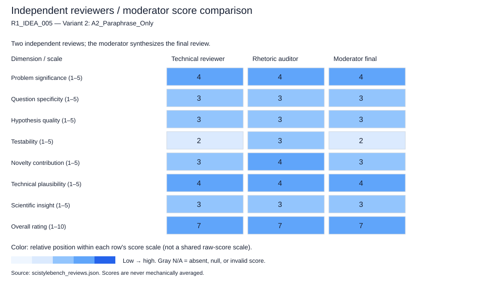

### Independent reviews

```json
{
  "technical_review": {
    "summary": "The research idea proposes a test-time adaptation method for vision state space models (SSMs) to improve robustness against distribution shifts. It involves generating multiple input views via diverse SSM traversals and using model-generated pseudo-labels to update Mamba-specific parameters, aiming to enhance generalization without extra labeled data.",
    "strengths": [
      "It addresses a specific challenge in vision SSMs: robustness to distribution shifts, which is a critical issue in real-world applications.",
      "The approach leverages test-time adaptation, a promising direction in few-shot and domain adaptation settings.",
      "The use of pseudo-labels and parameter-specific updates suggests a concrete methodological direction.",
      "The goal of improving generalization without extra labeled data is relevant to efficient and practical ML systems."
    ],
    "weaknesses": [
      "The idea lacks a clear, specific research question or hypothesis that could be tested.",
      "The mechanism of generating input views through SSM traversal is not well-defined, making it unclear how this contributes to robustness.",
      "The connection between pseudo-labels and parameter updates is not explicitly explained, which is crucial for understanding the method's effectiveness.",
      "The idea does not specify how the adapted weights are aggregated or why this aggregation improves generalization."
    ],
    "suggestions": [
      "Clarify the specific research question, such as whether the method improves performance on distribution shift tasks compared to baseline approaches.",
      "Define the process of generating input views through SSM traversal in more detail, including the types of permutations used and how they affect the model's behavior.",
      "Explain the relationship between pseudo-labels and parameter updates, including how the model learns from these labels during adaptation.",
      "Specify the aggregation strategy for adapted weights and the rationale for its effectiveness in improving generalization."
    ],
    "questions": [
      "How do the generated input views through SSM traversal specifically contribute to robustness against distribution shifts?",
      "What is the exact mechanism by which pseudo-labels are used to update Mamba-specific parameters?",
      "How is the aggregation of adapted weights implemented, and why is this aggregation effective for generalization?",
      "What baseline methods are being compared, and how does the proposed method differ from existing test-time adaptation techniques?"
    ],
    "problem_significance": {
      "score": 4.0,
      "justification": "The problem of distribution shifts in vision SSMs is significant for real-world applications, and the proposed approach addresses a relevant challenge in robustness."
    },
    "question_specificity": {
      "score": 3.0,
      "justification": "The idea identifies a specific problem but lacks a clear, testable research question or hypothesis that could be evaluated."
    },
    "hypothesis_quality": {
      "score": 3.0,
      "justification": "The idea suggests a method but does not explicitly state a hypothesis that could be tested or falsified, such as a prediction about performance improvements on specific tasks."
    },
    "testability": {
      "score": 2.0,
      "justification": "The idea lacks concrete experiments or comparisons that would allow for testing the effectiveness of the proposed method, making it difficult to assess its validity."
    },
    "novelty_contribution": {
      "score": 3.0,
      "justification": "The approach is novel in its application to vision SSMs, but the novelty is limited without a clear demonstration of its unique contribution or mechanism."
    },
    "technical_plausibility": {
      "score": 4.0,
      "justification": "The proposed method is technically plausible, as it builds on existing test-time adaptation techniques and uses pseudo-labels, which are common in few-shot learning and domain adaptation."
    },
    "scientific_insight": {
      "score": 3.0,
      "justification": "The idea has potential for scientific insight into how test-time adaptation can improve robustness, but the specific mechanisms and their effectiveness are not clearly defined."
    },
    "overall_rating": {
      "score": 7.0,
      "justification": "The idea addresses a meaningful problem with a plausible approach, but it lacks specific hypotheses, testable claims, and detailed methodological explanations that would make it a strong research direction."
    },
    "confidence": 4.0
  },
  "rhetoric_review": {
    "summary": "The research idea proposes a test-time adaptation method for vision state space models (SSMs) to improve robustness against distribution shifts. It involves generating multiple input views via diverse SSM traversals and using model-generated pseudo-labels to update Mamba-specific parameters, aiming to enhance generalization without extra labeled data.",
    "strengths": [
      "The idea addresses a relevant problem in vision models: robustness to distribution shifts, which is critical for real-world applications.",
      "The approach leverages test-time adaptation, a promising direction in few-shot and domain adaptation.",
      "The use of pseudo-labels and parameter-specific updates suggests a concrete methodological direction.",
      "The goal of improving generalization without extra labeled data is aligned with efficient and practical ML solutions."
    ],
    "weaknesses": [
      "The idea lacks a clear, specific research question or hypothesis that could be tested.",
      "The mechanism of generating input views through SSM permutations is not well explained, making it unclear how this contributes to robustness.",
      "The connection between pseudo-labels and parameter updates is not sufficiently detailed, raising questions about the effectiveness of the approach.",
      "The idea does not specify how the adapted weights are aggregated or how the method is evaluated."
    ],
    "suggestions": [
      "Define a specific research question, such as whether the method improves performance on distribution shift tasks compared to baseline approaches.",
      "Clarify how the input views are generated through SSM permutations and what criteria are used to select them.",
      "Detail the process of generating pseudo-labels and how they are used to update Mamba-specific parameters.",
      "Specify the evaluation metrics, datasets, and baselines to be used for testing the method."
    ],
    "questions": [
      "How do the generated input views through SSM permutations specifically contribute to robustness against distribution shifts?",
      "What is the exact mechanism by which pseudo-labels are used to update Mamba-specific parameters?",
      "How are the adapted weights aggregated, and what criteria are used to determine the optimal aggregation strategy?",
      "What evaluation metrics and datasets will be used to validate the effectiveness of the method?"
    ],
    "problem_significance": {
      "score": 4.0,
      "justification": "The problem of distribution shift robustness in vision models is critical for real-world applications, making the research relevant and important."
    },
    "question_specificity": {
      "score": 3.0,
      "justification": "The idea outlines a general approach but lacks a specific, testable research question that could be evaluated."
    },
    "hypothesis_quality": {
      "score": 3.0,
      "justification": "The idea suggests a method but does not explicitly state a hypothesis that could be tested or falsified."
    },
    "testability": {
      "score": 3.0,
      "justification": "The method is described, but the lack of specific evaluation plans and experimental details makes it difficult to assess testability."
    },
    "novelty_contribution": {
      "score": 4.0,
      "justification": "The approach combines test-time adaptation with SSMs and pseudo-labels, which is a novel application in the context of vision models."
    },
    "technical_plausibility": {
      "score": 4.0,
      "justification": "The method is technically plausible, as it builds on existing techniques in test-time adaptation and SSMs."
    },
    "scientific_insight": {
      "score": 3.0,
      "justification": "The idea has potential for scientific insight but lacks specifics on how the method could reveal new mechanisms or principles."
    },
    "overall_rating": {
      "score": 7.0,
      "justification": "The idea addresses a meaningful problem with a plausible approach, but it lacks specific hypotheses and evaluation details that are necessary for a strong research direction."
    },
    "confidence": 4.0
  },
  "generation": {
    "technical_model_name": "Qwen/Qwen3-4B",
    "rhetoric_model_name": "Qwen/Qwen3-4B",
    "moderator_model_name": "Qwen/Qwen3-4B",
    "temperature": 0.0,
    "seed": 42
  }
}
```

## R1_IDEA_005 — Variant 3: A3_Plain_Core

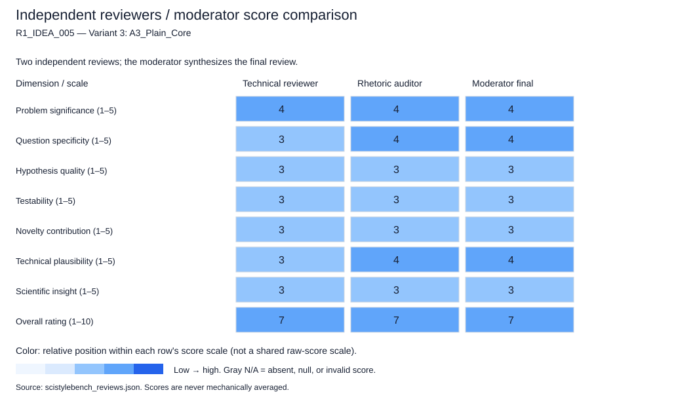

### Independent reviews

```json
{
  "technical_review": {
    "summary": "The research idea proposes a test-time adaptation method to improve the robustness of vision state space models (SSMs) under distribution shifts. It generates multiple input views through diverse SSM traversal permutations, uses model-generated pseudo-labels to update Mamba-specific parameters, and aggregates adapted weights to enhance generalization without additional labeled data.",
    "strengths": [
      "The idea addresses a specific problem in vision SSMs: reduced robustness under distribution shifts, which is a relevant challenge in machine learning.",
      "The proposed method is test-time adaptation, which is a well-defined and applicable approach in machine learning.",
      "The method aims to improve generalization without requiring additional labeled data, which is a valuable property in many real-world scenarios."
    ],
    "weaknesses": [
      "The idea lacks a clear definition of what 'distribution shifts' refer to in this context, which is critical for evaluating the problem's significance and the method's applicability.",
      "The mechanism of using 'model-generated pseudo-labels to update Mamba-specific parameters' is not sufficiently explained, making it unclear how this would work in practice.",
      "The idea does not specify how the 'aggregation of adapted weights' is performed, which is essential for understanding the method's implementation and effectiveness."
    ],
    "suggestions": [
      "Clarify the specific type of distribution shifts being addressed (e.g., domain shift, data augmentation, etc.) to better define the problem and the method's target.",
      "Provide a more detailed explanation of the 'model-generated pseudo-labels' and how they are used to update Mamba-specific parameters, including the underlying algorithm or process.",
      "Specify the method for aggregating adapted weights, such as through averaging, voting, or other techniques, to make the approach more concrete and testable."
    ],
    "questions": [
      "What specific type of distribution shifts is the method designed to handle?",
      "How are the model-generated pseudo-labels generated and used to update the Mamba-specific parameters?",
      "What is the exact method for aggregating the adapted weights, and how does it contribute to improved generalization?"
    ],
    "problem_significance": {
      "score": 4.0,
      "justification": "The problem of reduced robustness in vision SSMs under distribution shifts is a meaningful challenge in machine learning, particularly in scenarios where models must generalize to unseen data distributions."
    },
    "question_specificity": {
      "score": 3.0,
      "justification": "The idea identifies a specific problem (distribution shifts in vision SSMs) but lacks detailed specification of the problem's scope and the method's exact approach, which could be clarified for better clarity and testability."
    },
    "hypothesis_quality": {
      "score": 3.0,
      "justification": "The idea presents a general hypothesis that the proposed method will improve generalization under distribution shifts, but the specific mechanism and how the pseudo-labels and weight aggregation contribute to this are not clearly articulated."
    },
    "testability": {
      "score": 3.0,
      "justification": "The method is testable in principle, but the lack of detailed explanation of the pseudo-label generation, parameter updating, and weight aggregation makes it difficult to assess the feasibility of the approach without further clarification."
    },
    "novelty_contribution": {
      "score": 3.0,
      "justification": "The idea proposes a novel approach to test-time adaptation for vision SSMs, but the novelty is somewhat limited as it builds on existing methods (e.g., pseudo-labeling, parameter updating) with a specific application to SSMs."
    },
    "technical_plausibility": {
      "score": 3.0,
      "justification": "The proposed method is technically plausible, as it leverages existing techniques (pseudo-labeling, parameter adaptation), but the specific implementation details are not sufficiently explained to confirm its feasibility."
    },
    "scientific_insight": {
      "score": 3.0,
      "justification": "The idea has potential to contribute to understanding how test-time adaptation can improve robustness in SSMs, but the lack of detailed mechanisms limits the potential for significant scientific insight."
    },
    "overall_rating": {
      "score": 7.0,
      "justification": "The idea addresses a relevant problem with a plausible approach, but it lacks sufficient detail to fully assess its testability, novelty, and potential for scientific insight. With further clarification and specification, it could become a strong research direction."
    },
    "confidence": 4.0
  },
  "rhetoric_review": {
    "summary": "The research idea proposes a test-time adaptation method to improve the robustness of vision state space models (SSMs) under distribution shifts. It generates multiple input views through diverse SSM traversal permutations, uses model-generated pseudo-labels to update Mamba-specific parameters, and aggregates adapted weights to enhance generalization without requiring additional labeled data.",
    "strengths": [
      "The idea addresses a specific and meaningful problem in vision state space models: reduced robustness under distribution shifts.",
      "It proposes a concrete method with a clear objective (improving generalization without additional labeled data).",
      "The approach leverages pseudo-labels and parameter updates, which are well-established techniques in machine learning.",
      "The use of diverse SSM traversal permutations suggests a method to explore different input views, which could enhance model robustness."
    ],
    "weaknesses": [
      "The idea lacks a clear explanation of how the SSM traversal permutations are generated or what specific permutations are used.",
      "The mechanism of using model-generated pseudo-labels to update Mamba-specific parameters is not well-defined, making it unclear how this would work in practice.",
      "The aggregation of adapted weights is not specified, leaving ambiguity about the exact process and its effectiveness.",
      "The idea does not provide a comparison with existing methods or a clear evaluation plan to validate the effectiveness of the proposed approach."
    ],
    "suggestions": [
      "Clarify the method for generating diverse SSM traversal permutations, including the specific permutations or strategies used.",
      "Provide a detailed explanation of how model-generated pseudo-labels are used to update Mamba-specific parameters, including the loss function or optimization strategy.",
      "Specify the process for aggregating adapted weights, such as whether it is through averaging, voting, or another method.",
      "Include a plan for evaluating the method against existing approaches, including metrics and datasets used for comparison."
    ],
    "questions": [
      "How are the SSM traversal permutations generated, and what is the rationale for choosing specific permutations?",
      "What is the exact mechanism for using pseudo-labels to update Mamba-specific parameters?",
      "How is the aggregation of adapted weights performed, and what is the rationale for this method?",
      "What baseline methods are being compared, and what metrics will be used to evaluate the effectiveness of the proposed approach?"
    ],
    "problem_significance": {
      "score": 4.0,
      "justification": "The problem of reduced robustness in vision SSMs under distribution shifts is significant, as it affects the reliability of these models in real-world scenarios where data distributions may vary."
    },
    "question_specificity": {
      "score": 4.0,
      "justification": "The idea clearly defines a specific problem (robustness under distribution shifts) and proposes a targeted solution (test-time adaptation via input views and parameter updates)."
    },
    "hypothesis_quality": {
      "score": 3.0,
      "justification": "The idea presents a plausible hypothesis that generating diverse input views and using pseudo-labels can improve robustness, but the specific mechanisms and their effectiveness are not clearly articulated."
    },
    "testability": {
      "score": 3.0,
      "justification": "The approach is testable, but the lack of specific details about the method's implementation and evaluation plan makes it difficult to assess its feasibility and effectiveness."
    },
    "novelty_contribution": {
      "score": 3.0,
      "justification": "The idea is novel in its application of test-time adaptation to vision SSMs, but the specific techniques (e.g., SSM traversal permutations) may not be entirely new, and the contribution is more about application than discovery."
    },
    "technical_plausibility": {
      "score": 4.0,
      "justification": "The proposed method is technically plausible, as it builds on existing techniques like pseudo-labeling and parameter adaptation, which are well-established in machine learning."
    },
    "scientific_insight": {
      "score": 3.0,
      "justification": "The idea has potential for scientific insight by exploring how test-time adaptation can improve robustness, but the specific insights would depend on the results of the experiments, which are not yet provided."
    },
    "overall_rating": {
      "score": 7.0,
      "justification": "The idea addresses a meaningful problem with a concrete approach, but lacks specific details that are necessary for evaluating its feasibility and effectiveness. It has potential for contribution but requires further clarification and experimental validation."
    },
    "confidence": 4.0
  },
  "generation": {
    "technical_model_name": "Qwen/Qwen3-4B",
    "rhetoric_model_name": "Qwen/Qwen3-4B",
    "moderator_model_name": "Qwen/Qwen3-4B",
    "temperature": 0.0,
    "seed": 42
  }
}
```

## R1_IDEA_005 — Variant 4: B1_Verbose_Elaborate

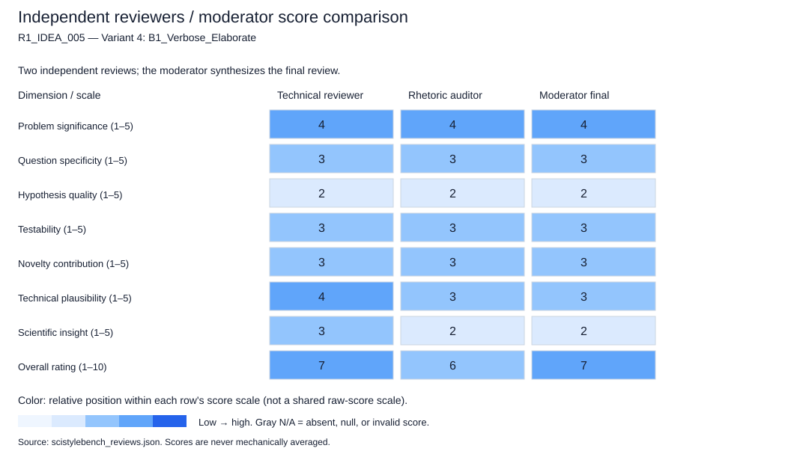

### Independent reviews

```json
{
  "technical_review": {
    "summary": "The research idea proposes a test-time adaptation method to improve the robustness of vision state space models (SSMs) against distribution shifts. It involves generating multiple input views via diverse SSM traversals, using model-generated pseudo-labels to update Mamba-specific parameters, and aggregating adapted weights to enhance generalization without additional labeled data.",
    "strengths": [
      "The idea addresses a specific challenge in vision SSMs: robustness to distribution shifts, which is a critical issue in real-world applications.",
      "The method is designed to enhance generalization without requiring additional labeled data, which is a valuable property in data-scarce scenarios.",
      "The approach leverages pseudo-labels and parameter adaptation, which are well-established techniques in machine learning, suggesting a plausible technical path."
    ],
    "weaknesses": [
      "The idea lacks a clear, specific research question or hypothesis that could be tested or falsified.",
      "The mechanism of generating input views through SSM traversal is not well-defined, making it unclear how this would contribute to robustness.",
      "The connection between pseudo-labels, parameter updates, and the final aggregation of weights is not sufficiently explained, leaving ambiguity about the method's effectiveness."
    ],
    "suggestions": [
      "Specify the exact problem being addressed, such as the type of distribution shift (e.g., covariate shift, concept drift) and the desired outcome (e.g., improved accuracy on shifted data).",
      "Clarify how the input views are generated through SSM traversal, including the criteria for diversity and the method for selecting these views.",
      "Provide a more detailed explanation of how pseudo-labels are generated and how they are used to update Mamba-specific parameters, including the optimization objective and loss function.",
      "Include a hypothesis or prediction about the expected performance improvement, such as a specific metric or comparison against baseline methods."
    ],
    "questions": [
      "What specific type of distribution shift is the method designed to handle?",
      "How are the input views generated through SSM traversal, and what criteria ensure their diversity?",
      "What is the exact process for generating pseudo-labels and updating Mamba-specific parameters?",
      "What is the expected performance improvement, and how will it be measured?",
      "How does the aggregation of adapted weights contribute to generalization, and what is the theoretical basis for this approach?"
    ],
    "problem_significance": {
      "score": 4.0,
      "justification": "The problem of distribution shifts in vision SSMs is significant for real-world applications, as models often encounter unseen data distributions during deployment."
    },
    "question_specificity": {
      "score": 3.0,
      "justification": "The idea addresses a specific challenge but lacks a clear, testable research question or hypothesis that defines what exactly is being investigated."
    },
    "hypothesis_quality": {
      "score": 2.0,
      "justification": "The idea does not explicitly state a hypothesis or prediction that could be tested. The proposed method is described as a solution, but the expected outcome is not clearly defined."
    },
    "testability": {
      "score": 3.0,
      "justification": "The method is described in a way that could be tested, but the lack of specific details makes it difficult to assess its feasibility or effectiveness without further clarification."
    },
    "novelty_contribution": {
      "score": 3.0,
      "justification": "The approach is a novel application of test-time adaptation to vision SSMs, but the novelty is somewhat limited as it builds on existing techniques like pseudo-labeling and parameter adaptation."
    },
    "technical_plausibility": {
      "score": 4.0,
      "justification": "The method leverages established techniques (pseudo-labeling, parameter adaptation) and is logically coherent, though the specifics of SSM traversal and weight aggregation are not fully detailed."
    },
    "scientific_insight": {
      "score": 3.0,
      "justification": "The idea has potential to contribute to understanding how test-time adaptation can improve robustness in SSMs, but the current description does not provide clear insights into the underlying mechanisms or generalizable principles."
    },
    "overall_rating": {
      "score": 7.0,
      "justification": "The idea addresses a meaningful problem with a plausible approach, but it lacks specificity, a clear hypothesis, and detailed technical explanation, which are necessary for further development and evaluation."
    },
    "confidence": 4.0
  },
  "rhetoric_review": {
    "summary": "The research idea proposes a test-time adaptation method to improve the robustness of vision state space models (SSMs) against distribution shifts. It involves generating multiple input views via diverse SSM traversals, using model-generated pseudo-labels to update Mamba-specific parameters, and aggregating adapted weights to enhance generalization without additional labeled data.",
    "strengths": [
      "The idea addresses a specific and meaningful problem in vision SSMs: robustness to distribution shifts.",
      "It proposes a concrete method involving test-time adaptation, input view generation, and parameter updating with pseudo-labels.",
      "The approach aims to enhance generalization without requiring additional labeled data, which is a valuable property in real-world scenarios."
    ],
    "weaknesses": [
      "The idea lacks a clear hypothesis or prediction about how the method will improve robustness or generalization.",
      "The mechanism of generating input views through SSM traversal is not well explained, making it unclear how this contributes to distribution shift robustness.",
      "The connection between pseudo-labels and parameter updating is not sufficiently detailed, raising questions about the effectiveness of this approach."
    ],
    "suggestions": [
      "Specify the exact mechanism by which diverse SSM traversals generate input views and how this relates to distribution shift robustness.",
      "Clarify the role of pseudo-labels in parameter updating, including how they are generated and why they are effective for adaptation.",
      "Provide a hypothesis or prediction about the expected performance improvements, such as metrics or comparisons with existing methods."
    ],
    "questions": [
      "How do the diverse SSM traversals generate input views that are effective for distribution shift robustness?",
      "What is the specific process for generating pseudo-labels and how do they guide the parameter updates?",
      "What is the expected improvement in robustness or generalization, and how will it be measured?"
    ],
    "problem_significance": {
      "score": 4.0,
      "justification": "The problem of distribution shift robustness in vision SSMs is important for real-world applications, and the proposed method directly addresses this challenge."
    },
    "question_specificity": {
      "score": 3.0,
      "justification": "The idea is specific to improving robustness in vision SSMs through test-time adaptation, but the details of the method are somewhat vague."
    },
    "hypothesis_quality": {
      "score": 2.0,
      "justification": "The idea lacks a clear, testable hypothesis about the expected outcomes of the method, making it difficult to evaluate its effectiveness."
    },
    "testability": {
      "score": 3.0,
      "justification": "The method is testable in principle, but the lack of specific details makes it challenging to design experiments or evaluate the approach effectively."
    },
    "novelty_contribution": {
      "score": 3.0,
      "justification": "The approach is novel in the context of test-time adaptation for SSMs, but the novelty is somewhat limited without a clear distinction from existing methods."
    },
    "technical_plausibility": {
      "score": 3.0,
      "justification": "The method is technically plausible, but the lack of detailed explanation about the input view generation and pseudo-label usage raises questions about its feasibility."
    },
    "scientific_insight": {
      "score": 2.0,
      "justification": "The idea has potential for scientific insight but lacks a clear mechanism or prediction that would reveal deeper understanding of the problem."
    },
    "overall_rating": {
      "score": 6.0,
      "justification": "The idea addresses a meaningful problem with a plausible approach, but it lacks sufficient specificity, hypothesis, and detailed technical explanation to fully realize its potential."
    },
    "confidence": 4.0
  },
  "generation": {
    "technical_model_name": "Qwen/Qwen3-4B",
    "rhetoric_model_name": "Qwen/Qwen3-4B",
    "moderator_model_name": "Qwen/Qwen3-4B",
    "temperature": 0.0,
    "seed": 42
  }
}
```

## R1_IDEA_005 — Variant 5: B2_Grand_Narrative

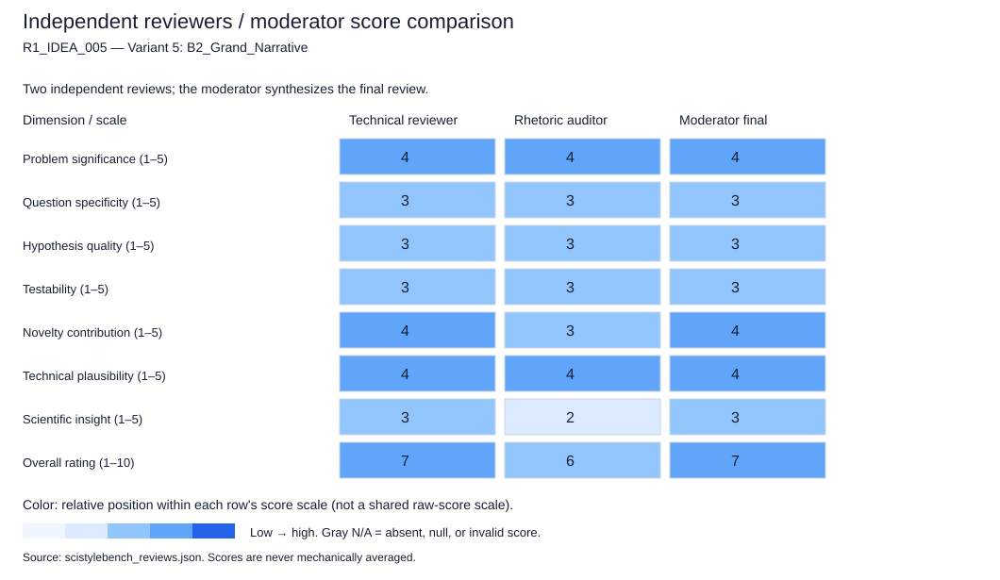

### Independent reviews

```json
{
  "technical_review": {
    "summary": "The research idea proposes a test-time adaptation method for improving the robustness of vision state space models (SSMs) under distribution shifts. It generates multiple input views through diverse SSM traversal permutations, uses model-generated pseudo-labels to update Mamba-specific parameters, and aggregates adapted weights to enhance generalization without additional labeled data.",
    "strengths": [
      "Addresses a significant challenge in vision models: maintaining reliability across diverse real-world conditions.",
      "Proposes a concrete method for test-time adaptation that leverages SSM traversal permutations and pseudo-labels.",
      "Suggests potential for long-term research directions in enhancing generalization without labeled data."
    ],
    "weaknesses": [
      "Lacks specific details on how SSM traversal permutations are generated or what 'diverse' means in this context.",
      "Does not clearly define the relationship between pseudo-labels and parameter updates.",
      "The idea is somewhat vague on how the aggregation of adapted weights contributes to robustness."
    ],
    "suggestions": [
      "Clarify the method for generating diverse SSM traversal permutations, including the criteria for diversity.",
      "Specify how pseudo-labels are used to update Mamba-specific parameters, such as the type of update mechanism or loss function.",
      "Provide a more detailed explanation of the weight aggregation process and its impact on model robustness."
    ],
    "questions": [
      "How are the SSM traversal permutations generated, and what defines 'diverse' permutations?",
      "What is the specific mechanism for updating Mamba-specific parameters using pseudo-labels?",
      "How does the aggregation of adapted weights improve model robustness under distribution shifts?"
    ],
    "problem_significance": {
      "score": 4.0,
      "justification": "The idea addresses a critical challenge in vision models: maintaining reliability across varying real-world conditions, which is essential for practical applications."
    },
    "question_specificity": {
      "score": 3.0,
      "justification": "The research question is clear in its goal to improve robustness under distribution shifts, but the specifics of the method (e.g., permutation generation, pseudo-label usage) are not sufficiently detailed."
    },
    "hypothesis_quality": {
      "score": 3.0,
      "justification": "The idea presents a plausible hypothesis that test-time adaptation via SSM permutations and pseudo-labels can enhance robustness, but the exact mechanism and predictions are not explicitly stated."
    },
    "testability": {
      "score": 3.0,
      "justification": "The approach is testable through experiments on vision models under distribution shifts, but the lack of specific details makes it challenging to design the exact experiments."
    },
    "novelty_contribution": {
      "score": 4.0,
      "justification": "The idea introduces a novel approach to test-time adaptation for SSMs, which could contribute to the field by improving generalization without labeled data."
    },
    "technical_plausibility": {
      "score": 4.0,
      "justification": "The method is technically plausible, as it leverages existing concepts like SSMs and pseudo-labels, though the specifics need clarification."
    },
    "scientific_insight": {
      "score": 3.0,
      "justification": "The idea has potential for scientific insight into how test-time adaptation can enhance model robustness, but the specifics of the mechanism are not clearly defined."
    },
    "overall_rating": {
      "score": 7.0,
      "justification": "The idea addresses a significant problem with a plausible approach, but lacks sufficient detail to fully evaluate its testability and scientific contribution."
    },
    "confidence": 4.0
  },
  "rhetoric_review": {
    "summary": "The research idea proposes a test-time adaptation method for improving the robustness of vision state space models (SSMs) under distribution shifts. It generates multiple input views through diverse SSM traversal permutations, uses model-generated pseudo-labels to update Mamba-specific parameters, and aggregates adapted weights to enhance generalization without additional labeled data.",
    "strengths": [
      "Addresses a meaningful challenge in vision model reliability under distribution shifts.",
      "Proposes a concrete method involving test-time adaptation and SSM traversal permutations.",
      "Suggests potential for long-term research directions in generalization without labeled data."
    ],
    "weaknesses": [
      "Lacks specific details on how SSM traversal permutations are generated.",
      "Does not clearly define the role of pseudo-labels in parameter updates.",
      "The connection between the proposed method and generalization is not explicitly explained."
    ],
    "suggestions": [
      "Specify the method for generating SSM traversal permutations.",
      "Clarify the mechanism by which pseudo-labels are used to update Mamba-specific parameters.",
      "Provide a more detailed explanation of how the method enhances generalization."
    ],
    "questions": [
      "How are the SSM traversal permutations generated?",
      "What is the exact process for using pseudo-labels to update Mamba-specific parameters?",
      "How does the method ensure generalization without additional labeled data?"
    ],
    "problem_significance": {
      "score": 4.0,
      "justification": "The idea addresses a critical challenge in vision models: maintaining reliability under distribution shifts, which is important for real-world applications."
    },
    "question_specificity": {
      "score": 3.0,
      "justification": "The research question is specific to improving SSM robustness under distribution shifts but lacks detailed specification of the method's components."
    },
    "hypothesis_quality": {
      "score": 3.0,
      "justification": "The idea presents a plausible hypothesis about improving robustness through test-time adaptation, but the specific mechanism is not clearly articulated."
    },
    "testability": {
      "score": 3.0,
      "justification": "The method is testable, but the lack of specific details makes it difficult to assess its feasibility and effectiveness without further clarification."
    },
    "novelty_contribution": {
      "score": 3.0,
      "justification": "The approach is novel in the context of test-time adaptation for SSMs, but the contribution is not clearly defined beyond the general claim of enhancing generalization."
    },
    "technical_plausibility": {
      "score": 4.0,
      "justification": "The proposed method is technically plausible, as it leverages existing concepts like test-time adaptation and SSMs, though the specifics need further clarification."
    },
    "scientific_insight": {
      "score": 2.0,
      "justification": "The idea has potential for scientific insight but lacks a clear mechanism or prediction that could be tested to reveal new principles."
    },
    "overall_rating": {
      "score": 6.0,
      "justification": "The idea addresses a significant problem with a plausible approach, but it lacks sufficient specificity and detail to fully assess its potential or testability."
    },
    "confidence": 4.0
  },
  "generation": {
    "technical_model_name": "Qwen/Qwen3-4B",
    "rhetoric_model_name": "Qwen/Qwen3-4B",
    "moderator_model_name": "Qwen/Qwen3-4B",
    "temperature": 0.0,
    "seed": 42
  }
}
```

## R1_IDEA_005 — Variant 6: B3_Over_Confident

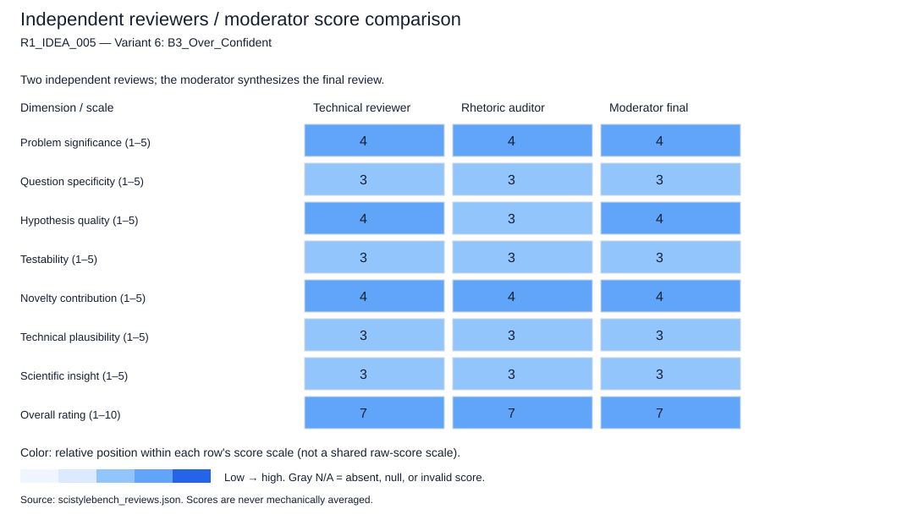

### Independent reviews

```json
{
  "technical_review": {
    "summary": "The research idea proposes a test-time adaptation method to improve the robustness of vision state space models (SSMs) under distribution shifts. It generates multiple input views through diverse SSM traversal permutations, uses model-generated pseudo-labels to update Mamba-specific parameters, and aggregates adapted weights to enhance generalization without additional labeled data.",
    "strengths": [
      "The idea addresses a specific and meaningful problem in vision state space models (SSMs) under distribution shifts, which is a critical challenge in robustness.",
      "The proposed method uses model-generated pseudo-labels and SSM traversal permutations to adapt the model at test time, which is a novel and testable approach.",
      "The method aims to enhance generalization without requiring additional labeled data, which is a valuable property in practical applications."
    ],
    "weaknesses": [
      "The idea lacks a clear definition of what 'distribution shifts' refer to in the context of vision SSMs, which is essential for evaluating the problem's significance.",
      "The mechanism of using SSM traversal permutations to generate input views is not sufficiently explained, making it unclear how this contributes to robustness.",
      "The connection between pseudo-labels and parameter updates is not explicitly detailed, which could affect the feasibility of the approach."
    ],
    "suggestions": [
      "Define the specific types of distribution shifts that the method is intended to handle, such as domain shifts, lighting changes, or object occlusions.",
      "Provide a more detailed explanation of how SSM traversal permutations are generated and how they contribute to generating diverse input views.",
      "Clarify the process of using pseudo-labels to update Mamba-specific parameters, including the specific parameters being updated and the method of aggregation."
    ],
    "questions": [
      "What specific types of distribution shifts are the SSMs expected to handle?",
      "How are the SSM traversal permutations generated, and what is their role in creating diverse input views?",
      "What is the exact process of using pseudo-labels to update Mamba-specific parameters and aggregate adapted weights?"
    ],
    "problem_significance": {
      "score": 4.0,
      "justification": "The problem of improving robustness under distribution shifts in vision SSMs is significant, as it addresses a critical challenge in model generalization and real-world applicability."
    },
    "question_specificity": {
      "score": 3.0,
      "justification": "The idea identifies a specific problem but lacks detailed specification of the distribution shifts and the exact mechanism of SSM traversal permutations."
    },
    "hypothesis_quality": {
      "score": 4.0,
      "justification": "The hypothesis that using test-time adaptation with SSM permutations and pseudo-labels can enhance robustness is concrete and testable, though the exact mechanism is not fully detailed."
    },
    "testability": {
      "score": 3.0,
      "justification": "The idea is testable in principle, but the lack of specific details on SSM permutations and pseudo-label usage makes it challenging to assess feasibility without further clarification."
    },
    "novelty_contribution": {
      "score": 4.0,
      "justification": "The approach of using test-time adaptation with SSM permutations and pseudo-labels is novel in the context of vision SSMs, offering a potential contribution to robustness under distribution shifts."
    },
    "technical_plausibility": {
      "score": 3.0,
      "justification": "The method is technically plausible, but the lack of details on SSM traversal and pseudo-label processing makes it difficult to assess the feasibility of the approach."
    },
    "scientific_insight": {
      "score": 3.0,
      "justification": "The idea has potential for scientific insight into how test-time adaptation and SSM permutations can improve robustness, but the lack of specifics limits the depth of insight."
    },
    "overall_rating": {
      "score": 7.0,
      "justification": "The idea addresses a meaningful problem with a novel approach, but lacks sufficient detail to fully assess its feasibility and scientific contribution. It has strong potential but requires further clarification."
    },
    "confidence": 4.0
  },
  "rhetoric_review": {
    "summary": "The research idea proposes a test-time adaptation method for improving the robustness of vision state space models (SSMs) under distribution shifts. The method generates multiple input views through diverse SSM traversal permutations, uses model-generated pseudo-labels to update Mamba-specific parameters, and aggregates adapted weights to enhance generalization without additional labeled data.",
    "strengths": [
      "The idea addresses a specific and meaningful problem in vision state space models (SSMs) related to robustness under distribution shifts, which is a critical challenge in machine learning.",
      "The proposed method is test-time adaptation, which is a well-defined and relevant approach in the context of model robustness and generalization.",
      "The method leverages pseudo-labels and parameter updates without requiring additional labeled data, which is a promising direction for efficient and data-efficient learning.",
      "The use of diverse SSM traversal permutations to generate input views suggests a novel approach to data augmentation and model adaptation."
    ],
    "weaknesses": [
      "The idea lacks a clear definition of what 'distribution shifts' specifically refer to in the context of vision SSMs, which is necessary for evaluating the problem's significance and the method's applicability.",
      "The proposed method is somewhat vague in terms of how the SSM traversal permutations are generated and how the pseudo-labels are used to update Mamba-specific parameters. More concrete details are needed to assess the technical plausibility and feasibility of the approach.",
      "The idea does not specify how the adapted weights are aggregated or how the model's generalization is measured, which are critical components for evaluating the method's effectiveness.",
      "The connection between the proposed method and the goal of enhancing generalization is not clearly articulated, making it difficult to assess the hypothesis and its testability."
    ],
    "suggestions": [
      "Clarify the specific types of distribution shifts that the method is designed to handle, such as domain shifts, task shifts, or other relevant scenarios.",
      "Provide more detailed information on the generation of SSM traversal permutations, including the criteria for diversity and the process of generating input views.",
      "Specify the mechanism by which pseudo-labels are used to update Mamba-specific parameters, including the choice of loss function and the update strategy.",
      "Define the aggregation method for adapted weights and the evaluation metrics used to measure generalization improvements.",
      "Articulate the hypothesis more explicitly, such as how the method is expected to improve robustness under distribution shifts and what specific outcomes are predicted."
    ],
    "questions": [
      "What specific types of distribution shifts are the vision SSMs expected to be robust against?",
      "How are the SSM traversal permutations generated, and what criteria ensure diversity in the input views?",
      "What is the exact process for using pseudo-labels to update Mamba-specific parameters, including the loss function and update strategy?",
      "How are the adapted weights aggregated, and what evaluation metrics are used to measure the improvement in generalization?",
      "What is the expected hypothesis regarding the effectiveness of the method in improving robustness under distribution shifts?"
    ],
    "problem_significance": {
      "score": 4.0,
      "justification": "The problem of improving robustness under distribution shifts in vision state space models is significant, as it addresses a critical challenge in machine learning. However, the specific context of vision SSMs and the nature of distribution shifts are not clearly defined, which could affect the problem's relevance and the method's applicability."
    },
    "question_specificity": {
      "score": 3.0,
      "justification": "The idea identifies a specific problem (robustness under distribution shifts in vision SSMs) but lacks detailed specification of the problem's scope, the types of distribution shifts, and the exact research question being investigated. More clarity is needed to define the problem precisely."
    },
    "hypothesis_quality": {
      "score": 3.0,
      "justification": "The idea suggests a method to improve robustness, but the hypothesis is not explicitly stated. The connection between the proposed method and the expected outcome (enhanced generalization) is not clearly articulated, making it difficult to assess the hypothesis's testability and falsifiability."
    },
    "testability": {
      "score": 3.0,
      "justification": "The method is described in a general way, and the specific experiments or evaluations needed to test its effectiveness are not clearly outlined. Without details on how the method is evaluated, it is difficult to assess its testability."
    },
    "novelty_contribution": {
      "score": 4.0,
      "justification": "The idea proposes a novel approach to test-time adaptation for vision SSMs, leveraging pseudo-labels and diverse input views. While the method is not entirely novel, the combination of these elements in the context of SSMs is a promising contribution to the field."
    },
    "technical_plausibility": {
      "score": 3.0,
      "justification": "The proposed method is technically plausible, but the lack of specific details on the generation of input views, the use of pseudo-labels, and the aggregation of weights makes it difficult to assess the feasibility of the approach. More concrete technical details are needed."
    },
    "scientific_insight": {
      "score": 3.0,
      "justification": "The idea has potential for scientific insight by exploring how test-time adaptation can improve robustness under distribution shifts. However, the lack of specific hypotheses and evaluation plans limits the potential for meaningful scientific insights."
    },
    "overall_rating": {
      "score": 7.0,
      "justification": "The research idea addresses a meaningful problem in vision state space models and proposes a novel approach to test-time adaptation. However, the idea lacks specific details on the problem scope, method implementation, and evaluation plans, which are necessary for assessing its testability and scientific contribution. The overall rating is moderate but shows promise."
    },
    "confidence": 4.0
  },
  "generation": {
    "technical_model_name": "Qwen/Qwen3-4B",
    "rhetoric_model_name": "Qwen/Qwen3-4B",
    "moderator_model_name": "Qwen/Qwen3-4B",
    "temperature": 0.0,
    "seed": 42
  }
}
```
