# Self-refinement score heatmaps

All saved source and variant self-refinements; no sampling. Each chart compares the original draft with the final refined review.
Refined reviews: 592; reviews with at least one changed score: 9.


## R1_IDEA_001 — Source

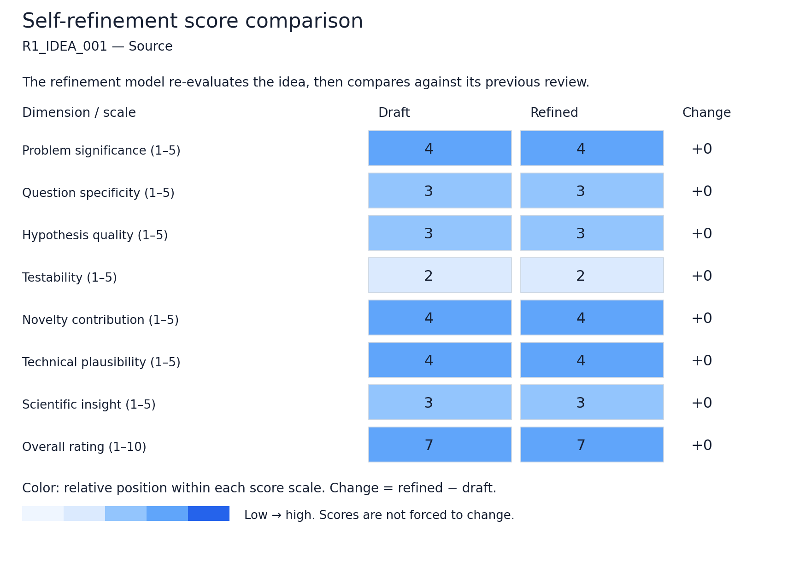

Changed score dimensions: none.

### Score justifications (draft / refined)

**Problem significance**

```json
{
  "draft": {
    "score": 4.0,
    "justification": "The problem of out-of-distribution detection on heterophilic graphs is underexplored and has practical importance in real-world graph data, such as social networks and knowledge graphs."
  },
  "refined": {
    "score": 4.0,
    "justification": "The problem of out-of-distribution detection on heterophilic graphs is underexplored and has practical importance in real-world graph data, such as social networks and knowledge graphs."
  }
}
```

**Question specificity**

```json
{
  "draft": {
    "score": 3.0,
    "justification": "The idea identifies a specific problem (node-level OOD detection on heterophilic graphs) but lacks detailed specification of the research question or hypothesis."
  },
  "refined": {
    "score": 3.0,
    "justification": "The idea identifies a specific problem (node-level OOD detection on heterophilic graphs) but lacks detailed specification of the research question or hypothesis."
  }
}
```

**Hypothesis quality**

```json
{
  "draft": {
    "score": 3.0,
    "justification": "The idea suggests a potential solution but does not explicitly state a hypothesis or prediction that can be tested or falsified."
  },
  "refined": {
    "score": 3.0,
    "justification": "The idea suggests a potential solution but does not explicitly state a hypothesis or prediction that can be tested or falsified."
  }
}
```

**Testability**

```json
{
  "draft": {
    "score": 2.0,
    "justification": "The idea lacks a clear experimental plan or evaluation strategy, making it difficult to assess the testability of the proposed approach."
  },
  "refined": {
    "score": 2.0,
    "justification": "The idea lacks a clear experimental plan or evaluation strategy, making it difficult to assess the testability of the proposed approach."
  }
}
```

**Novelty contribution**

```json
{
  "draft": {
    "score": 4.0,
    "justification": "The approach of explicitly modeling node dependence and heterophily in energy-based models for OOD detection is novel and could contribute to the field of graph-based OOD detection."
  },
  "refined": {
    "score": 4.0,
    "justification": "The approach of explicitly modeling node dependence and heterophily in energy-based models for OOD detection is novel and could contribute to the field of graph-based OOD detection."
  }
}
```

**Technical plausibility**

```json
{
  "draft": {
    "score": 4.0,
    "justification": "The proposed direction is technically plausible, as energy-based models are used in various domains, and modeling node dependence and heterophily is a reasonable approach for graph data."
  },
  "refined": {
    "score": 4.0,
    "justification": "The proposed direction is technically plausible, as energy-based models are used in various domains, and modeling node dependence and heterophily is a reasonable approach for graph data."
  }
}
```

**Scientific insight**

```json
{
  "draft": {
    "score": 3.0,
    "justification": "The idea has potential to provide insights into the role of node dependence and heterophily in OOD detection, but the specific mechanisms are not clearly outlined."
  },
  "refined": {
    "score": 3.0,
    "justification": "The idea has potential to provide insights into the role of node dependence and heterophily in OOD detection, but the specific mechanisms are not clearly outlined."
  }
}
```

**Overall rating**

```json
{
  "draft": {
    "score": 7.0,
    "justification": "The idea addresses a meaningful problem with a promising approach, but it lacks specific details and a clear hypothesis, which are necessary for further development and evaluation."
  },
  "refined": {
    "score": 7.0,
    "justification": "The idea addresses a meaningful problem with a promising approach, but it lacks specific details and a clear hypothesis, which are necessary for further development and evaluation."
  }
}
```

## R1_IDEA_001 — Variant 1: A1_Identity


Changed score dimensions: none.

### Score justifications (draft / refined)

**Problem significance**

```json
{
  "draft": {
    "score": 4.0,
    "justification": "The problem of out-of-distribution detection on heterophilic graphs is underexplored and has practical importance in real-world graph data, such as social networks and knowledge graphs."
  },
  "refined": {
    "score": 4.0,
    "justification": "The problem of out-of-distribution detection on heterophilic graphs is underexplored and has practical importance in real-world graph data, such as social networks and knowledge graphs."
  }
}
```

**Question specificity**

```json
{
  "draft": {
    "score": 3.0,
    "justification": "The idea identifies a specific problem (node-level OOD detection on heterophilic graphs) but lacks detailed specification of the research question or hypothesis."
  },
  "refined": {
    "score": 3.0,
    "justification": "The idea identifies a specific problem (node-level OOD detection on heterophilic graphs) but lacks detailed specification of the research question or hypothesis."
  }
}
```

**Hypothesis quality**

```json
{
  "draft": {
    "score": 3.0,
    "justification": "The idea suggests a potential solution but does not explicitly state a hypothesis or prediction that can be tested or falsified."
  },
  "refined": {
    "score": 3.0,
    "justification": "The idea suggests a potential solution but does not explicitly state a hypothesis or prediction that can be tested or falsified."
  }
}
```

**Testability**

```json
{
  "draft": {
    "score": 2.0,
    "justification": "The idea lacks a clear experimental plan or evaluation strategy, making it difficult to assess the testability of the proposed approach."
  },
  "refined": {
    "score": 2.0,
    "justification": "The idea lacks a clear experimental plan or evaluation strategy, making it difficult to assess the testability of the proposed approach."
  }
}
```

**Novelty contribution**

```json
{
  "draft": {
    "score": 4.0,
    "justification": "The approach of explicitly modeling node dependence and heterophily in energy-based models for OOD detection is novel and could contribute to the field of graph-based OOD detection."
  },
  "refined": {
    "score": 4.0,
    "justification": "The approach of explicitly modeling node dependence and heterophily in energy-based models for OOD detection is novel and could contribute to the field of graph-based OOD detection."
  }
}
```

**Technical plausibility**

```json
{
  "draft": {
    "score": 4.0,
    "justification": "The proposed direction is technically plausible, as energy-based models are used in various domains, and modeling node dependence and heterophily is a reasonable approach for graph data."
  },
  "refined": {
    "score": 4.0,
    "justification": "The proposed direction is technically plausible, as energy-based models are used in various domains, and modeling node dependence and heterophily is a reasonable approach for graph data."
  }
}
```

**Scientific insight**

```json
{
  "draft": {
    "score": 3.0,
    "justification": "The idea has potential to provide insights into the role of node dependence and heterophily in OOD detection, but the specific mechanisms are not clearly outlined."
  },
  "refined": {
    "score": 3.0,
    "justification": "The idea has potential to provide insights into the role of node dependence and heterophily in OOD detection, but the specific mechanisms are not clearly outlined."
  }
}
```

**Overall rating**

```json
{
  "draft": {
    "score": 7.0,
    "justification": "The idea addresses a meaningful problem with a promising approach, but it lacks specific details and a clear hypothesis, which are necessary for further development and evaluation."
  },
  "refined": {
    "score": 7.0,
    "justification": "The idea addresses a meaningful problem with a promising approach, but it lacks specific details and a clear hypothesis, which are necessary for further development and evaluation."
  }
}
```

## R1_IDEA_001 — Variant 2: A2_Paraphrase_Only


Changed score dimensions: none.

### Score justifications (draft / refined)

**Problem significance**

```json
{
  "draft": {
    "score": 4.0,
    "justification": "The problem of node-level out-of-distribution detection on heterophilic graphs is important because existing methods for images are not suitable for graph structures, which are common in many real-world applications. Addressing this gap could lead to more robust detection in graph-based tasks."
  },
  "refined": {
    "score": 4.0,
    "justification": "The problem of node-level out-of-distribution detection on heterophilic graphs is important because existing methods for images are not suitable for graph structures, which are common in many real-world applications. Addressing this gap could lead to more robust detection in graph-based tasks."
  }
}
```

**Question specificity**

```json
{
  "draft": {
    "score": 3.0,
    "justification": "The idea clearly identifies a specific problem (node-level OOD detection on heterophilic graphs) but lacks details on the exact research question or hypothesis. It is a meaningful problem but needs more specificity in what is being investigated."
  },
  "refined": {
    "score": 3.0,
    "justification": "The idea clearly identifies a specific problem (node-level OOD detection on heterophilic graphs) but lacks details on the exact research question or hypothesis. It is a meaningful problem but needs more specificity in what is being investigated."
  }
}
```

**Hypothesis quality**

```json
{
  "draft": {
    "score": 2.0,
    "justification": "The idea proposes a solution but does not explicitly state a hypothesis or prediction that can be tested. It is a general claim about improving detection, but without a specific prediction or mechanism, it is difficult to evaluate."
  },
  "refined": {
    "score": 2.0,
    "justification": "The idea proposes a solution but does not explicitly state a hypothesis or prediction that can be tested. It is a general claim about improving detection, but without a specific prediction or mechanism, it is difficult to evaluate."
  }
}
```

**Testability**

```json
{
  "draft": {
    "score": 3.0,
    "justification": "The idea suggests a new method but does not provide a clear experimental plan or comparison to existing methods. While the problem is testable, the lack of specifics makes it difficult to assess the feasibility of the proposed approach."
  },
  "refined": {
    "score": 3.0,
    "justification": "The idea suggests a new method but does not provide a clear experimental plan or comparison to existing methods. While the problem is testable, the lack of specifics makes it difficult to assess the feasibility of the proposed approach."
  }
}
```

**Novelty contribution**

```json
{
  "draft": {
    "score": 4.0,
    "justification": "The proposal of a decoupled graph energy-based model for handling node dependence and heterophily is novel. It addresses a specific gap in existing methods and could contribute to the field of graph-based OOD detection."
  },
  "refined": {
    "score": 4.0,
    "justification": "The proposal of a decoupled graph energy-based model for handling node dependence and heterophily is novel. It addresses a specific gap in existing methods and could contribute to the field of graph-based OOD detection."
  }
}
```

**Technical plausibility**

```json
{
  "draft": {
    "score": 3.0,
    "justification": "The idea is technically plausible as it builds on existing energy-based methods and graph modeling techniques. However, the lack of details on the model's architecture and how it handles heterophily makes it difficult to assess the feasibility of the approach."
  },
  "refined": {
    "score": 3.0,
    "justification": "The idea is technically plausible as it builds on existing energy-based methods and graph modeling techniques. However, the lack of details on the model's architecture and how it handles heterophily makes it difficult to assess the feasibility of the approach."
  }
}
```

**Scientific insight**

```json
{
  "draft": {
    "score": 3.0,
    "justification": "The research could provide insights into how energy-based models can be adapted to graph structures, particularly in handling heterophily. However, the current idea does not clearly specify what insights are expected from the study."
  },
  "refined": {
    "score": 3.0,
    "justification": "The research could provide insights into how energy-based models can be adapted to graph structures, particularly in handling heterophily. However, the current idea does not clearly specify what insights are expected from the study."
  }
}
```

**Overall rating**

```json
{
  "draft": {
    "score": 7.0,
    "justification": "The idea addresses a meaningful problem in graph-based OOD detection and proposes a novel approach. However, it lacks specific details on the model's architecture, hypothesis, and experimental plan, which are necessary for evaluating its feasibility and potential contribution."
  },
  "refined": {
    "score": 7.0,
    "justification": "The idea addresses a meaningful problem in graph-based OOD detection and proposes a novel approach. However, it lacks specific details on the model's architecture, hypothesis, and experimental plan, which are necessary for evaluating its feasibility and potential contribution."
  }
}
```

## R1_IDEA_001 — Variant 3: A3_Plain_Core


Changed score dimensions: none.

### Score justifications (draft / refined)

**Problem significance**

```json
{
  "draft": {
    "score": 4.0,
    "justification": "The problem of node-level out-of-distribution detection on heterophilic graphs is important for graph-based machine learning, as heterophily is a common challenge in real-world graph data."
  },
  "refined": {
    "score": 4.0,
    "justification": "The problem of node-level out-of-distribution detection on heterophilic graphs is important for graph-based machine learning, as heterophily is a common challenge in real-world graph data."
  }
}
```

**Question specificity**

```json
{
  "draft": {
    "score": 3.0,
    "justification": "The idea identifies a specific problem but lacks a clear, concrete research question or hypothesis that could be tested. More details are needed to define what exactly is being investigated."
  },
  "refined": {
    "score": 3.0,
    "justification": "The idea identifies a specific problem but lacks a clear, concrete research question or hypothesis that could be tested. More details are needed to define what exactly is being investigated."
  }
}
```

**Hypothesis quality**

```json
{
  "draft": {
    "score": 3.0,
    "justification": "The idea suggests a potential solution but does not explicitly state a hypothesis that can be tested. A clearer hypothesis would strengthen the proposal."
  },
  "refined": {
    "score": 3.0,
    "justification": "The idea suggests a potential solution but does not explicitly state a hypothesis that can be tested. A clearer hypothesis would strengthen the proposal."
  }
}
```

**Testability**

```json
{
  "draft": {
    "score": 3.0,
    "justification": "The idea is testable in principle, but lacks specifics on how the model will be evaluated or compared to existing methods, which is necessary for a rigorous investigation."
  },
  "refined": {
    "score": 3.0,
    "justification": "The idea is testable in principle, but lacks specifics on how the model will be evaluated or compared to existing methods, which is necessary for a rigorous investigation."
  }
}
```

**Novelty contribution**

```json
{
  "draft": {
    "score": 4.0,
    "justification": "The proposed graph energy-based model is a novel approach to address the limitations of image-based methods in graph-structured data, offering potential contributions to the field."
  },
  "refined": {
    "score": 4.0,
    "justification": "The proposed graph energy-based model is a novel approach to address the limitations of image-based methods in graph-structured data, offering potential contributions to the field."
  }
}
```

**Technical plausibility**

```json
{
  "draft": {
    "score": 4.0,
    "justification": "The approach of using a graph energy-based model to address node dependence and heterophily is technically plausible, given the existing research on graph neural networks and energy-based models."
  },
  "refined": {
    "score": 4.0,
    "justification": "The approach of using a graph energy-based model to address node dependence and heterophily is technically plausible, given the existing research on graph neural networks and energy-based models."
  }
}
```

**Scientific insight**

```json
{
  "draft": {
    "score": 3.0,
    "justification": "The idea has potential to provide insights into how node dependence and heterophily affect out-of-distribution detection, but more specifics are needed to determine the depth of scientific insight."
  },
  "refined": {
    "score": 3.0,
    "justification": "The idea has potential to provide insights into how node dependence and heterophily affect out-of-distribution detection, but more specifics are needed to determine the depth of scientific insight."
  }
}
```

**Overall rating**

```json
{
  "draft": {
    "score": 7.0,
    "justification": "The idea addresses a meaningful problem in graph-based out-of-distribution detection, proposes a novel approach, and has potential for scientific contribution. However, it lacks specific details on the model, hypothesis, and evaluation, which are necessary for a strong research proposal."
  },
  "refined": {
    "score": 7.0,
    "justification": "The idea addresses a meaningful problem in graph-based out-of-distribution detection, proposes a novel approach, and has potential for scientific contribution. However, it lacks specific details on the model, hypothesis, and evaluation, which are necessary for a strong research proposal."
  }
}
```

## R1_IDEA_001 — Variant 4: B1_Verbose_Elaborate


Changed score dimensions: none.

### Score justifications (draft / refined)

**Problem significance**

```json
{
  "draft": {
    "score": 4.0,
    "justification": "The problem of detecting out-of-distribution nodes on graphs is underexplored, and addressing node dependence and heterophily is crucial for accurate detection on complex graph structures."
  },
  "refined": {
    "score": 4.0,
    "justification": "The problem of detecting out-of-distribution nodes on graphs is underexplored, and addressing node dependence and heterophily is crucial for accurate detection on complex graph structures."
  }
}
```

**Question specificity**

```json
{
  "draft": {
    "score": 3.0,
    "justification": "The idea identifies a specific problem (node-level OOD detection on heterophilic graphs) but lacks detailed specification of the research question or hypothesis."
  },
  "refined": {
    "score": 3.0,
    "justification": "The idea identifies a specific problem (node-level OOD detection on heterophilic graphs) but lacks detailed specification of the research question or hypothesis."
  }
}
```

**Hypothesis quality**

```json
{
  "draft": {
    "score": 3.0,
    "justification": "The idea suggests a novel approach but does not clearly state the hypothesis or the specific mechanism by which the model will address the problem."
  },
  "refined": {
    "score": 3.0,
    "justification": "The idea suggests a novel approach but does not clearly state the hypothesis or the specific mechanism by which the model will address the problem."
  }
}
```

**Testability**

```json
{
  "draft": {
    "score": 2.0,
    "justification": "The idea lacks details on how the model will be evaluated, compared, or validated, making it difficult to assess its testability."
  },
  "refined": {
    "score": 2.0,
    "justification": "The idea lacks details on how the model will be evaluated, compared, or validated, making it difficult to assess its testability."
  }
}
```

**Novelty contribution**

```json
{
  "draft": {
    "score": 4.0,
    "justification": "The approach of using a decoupled graph energy-based model to address node dependence and heterophily is novel and has the potential to contribute to the field of graph-based OOD detection."
  },
  "refined": {
    "score": 4.0,
    "justification": "The approach of using a decoupled graph energy-based model to address node dependence and heterophily is novel and has the potential to contribute to the field of graph-based OOD detection."
  }
}
```

**Technical plausibility**

```json
{
  "draft": {
    "score": 4.0,
    "justification": "The proposed direction is technically plausible, as energy-based models and graph structures are well-established in machine learning, and addressing node dependence and heterophily is a reasonable challenge."
  },
  "refined": {
    "score": 4.0,
    "justification": "The proposed direction is technically plausible, as energy-based models and graph structures are well-established in machine learning, and addressing node dependence and heterophily is a reasonable challenge."
  }
}
```

**Scientific insight**

```json
{
  "draft": {
    "score": 3.0,
    "justification": "The idea has potential for scientific insight by exploring how node dependence and heterophily affect OOD detection, but the specifics are not clearly defined."
  },
  "refined": {
    "score": 3.0,
    "justification": "The idea has potential for scientific insight by exploring how node dependence and heterophily affect OOD detection, but the specifics are not clearly defined."
  }
}
```

**Overall rating**

```json
{
  "draft": {
    "score": 7.0,
    "justification": "The idea addresses a meaningful problem with a promising approach, but it lacks sufficient detail to fully assess its testability and hypothesis clarity, which are critical for a strong research direction."
  },
  "refined": {
    "score": 7.0,
    "justification": "The idea addresses a meaningful problem with a promising approach, but it lacks sufficient detail to fully assess its testability and hypothesis clarity, which are critical for a strong research direction."
  }
}
```

## R1_IDEA_001 — Variant 5: B2_Grand_Narrative


Changed score dimensions: none.

### Score justifications (draft / refined)

**Problem significance**

```json
{
  "draft": {
    "score": 4.0,
    "justification": "The problem of out-of-distribution detection on heterophilic graphs is important for trustworthy graph machine learning, as it addresses the challenge of detecting anomalies in complex relational data."
  },
  "refined": {
    "score": 4.0,
    "justification": "The problem of out-of-distribution detection on heterophilic graphs is important for trustworthy graph machine learning, as it addresses the challenge of detecting anomalies in complex relational data."
  }
}
```

**Question specificity**

```json
{
  "draft": {
    "score": 3.0,
    "justification": "The idea identifies a specific problem (node-level OOD detection on heterophilic graphs) but lacks details on the exact research question or hypothesis being investigated."
  },
  "refined": {
    "score": 3.0,
    "justification": "The idea identifies a specific problem (node-level OOD detection on heterophilic graphs) but lacks details on the exact research question or hypothesis being investigated."
  }
}
```

**Hypothesis quality**

```json
{
  "draft": {
    "score": 3.0,
    "justification": "The idea suggests a potential direction but does not explicitly state a hypothesis or prediction that could be tested, such as improved detection performance on heterophilic graphs."
  },
  "refined": {
    "score": 3.0,
    "justification": "The idea suggests a potential direction but does not explicitly state a hypothesis or prediction that could be tested, such as improved detection performance on heterophilic graphs."
  }
}
```

**Testability**

```json
{
  "draft": {
    "score": 3.0,
    "justification": "The idea proposes a method but does not specify experiments or evaluations that would test its effectiveness, such as comparisons with existing methods on benchmark datasets."
  },
  "refined": {
    "score": 3.0,
    "justification": "The idea proposes a method but does not specify experiments or evaluations that would test its effectiveness, such as comparisons with existing methods on benchmark datasets."
  }
}
```

**Novelty contribution**

```json
{
  "draft": {
    "score": 4.0,
    "justification": "The proposed graph energy-based model is a novel approach to address the limitations of image-based methods in heterophilic graphs, potentially contributing to robust node-level anomaly detection."
  },
  "refined": {
    "score": 4.0,
    "justification": "The proposed graph energy-based model is a novel approach to address the limitations of image-based methods in heterophilic graphs, potentially contributing to robust node-level anomaly detection."
  }
}
```

**Technical plausibility**

```json
{
  "draft": {
    "score": 4.0,
    "justification": "The approach of modeling node dependence and heterophily in a graph energy-based framework is technically plausible and aligns with current research trends in graph machine learning."
  },
  "refined": {
    "score": 4.0,
    "justification": "The approach of modeling node dependence and heterophily in a graph energy-based framework is technically plausible and aligns with current research trends in graph machine learning."
  }
}
```

**Scientific insight**

```json
{
  "draft": {
    "score": 3.0,
    "justification": "The idea has potential to provide insights into how node-level OOD detection can be improved in heterophilic graphs, but the specific mechanisms and their implications are not clearly defined."
  },
  "refined": {
    "score": 3.0,
    "justification": "The idea has potential to provide insights into how node-level OOD detection can be improved in heterophilic graphs, but the specific mechanisms and their implications are not clearly defined."
  }
}
```

**Overall rating**

```json
{
  "draft": {
    "score": 7.0,
    "justification": "The idea addresses a meaningful problem in graph machine learning with a novel approach, but lacks specific details on the model, hypothesis, and evaluation plan, which are needed for further development."
  },
  "refined": {
    "score": 7.0,
    "justification": "The idea addresses a meaningful problem in graph machine learning with a novel approach, but lacks specific details on the model, hypothesis, and evaluation plan, which are needed for further development."
  }
}
```

## R1_IDEA_001 — Variant 6: B3_Over_Confident


Changed score dimensions: none.

### Score justifications (draft / refined)

**Problem significance**

```json
{
  "draft": {
    "score": 4.0,
    "justification": "The problem of out-of-distribution detection on graphs is underexplored, especially in heterophilic settings where node dependencies and heterophily are critical factors. Addressing this could improve robustness in graph-based models, which are widely used in social networks, recommendation systems, etc."
  },
  "refined": {
    "score": 4.0,
    "justification": "The problem of out-of-distribution detection on graphs is underexplored, especially in heterophilic settings where node dependencies and heterophily are critical factors. Addressing this could improve robustness in graph-based models, which are widely used in social networks, recommendation systems, etc."
  }
}
```

**Question specificity**

```json
{
  "draft": {
    "score": 3.0,
    "justification": "The idea identifies a specific problem (node-level OOD detection on heterophilic graphs) but lacks detailed specification of the research question, such as how the decoupled graph energy model will be designed or what specific aspects of heterophily it will address."
  },
  "refined": {
    "score": 3.0,
    "justification": "The idea identifies a specific problem (node-level OOD detection on heterophilic graphs) but lacks detailed specification of the research question, such as how the decoupled graph energy model will be designed or what specific aspects of heterophily it will address."
  }
}
```

**Hypothesis quality**

```json
{
  "draft": {
    "score": 3.0,
    "justification": "The idea suggests a novel approach but does not explicitly state a hypothesis or prediction that can be tested. It is unclear how the model is expected to outperform existing methods or what specific mechanism it will use to address heterophily and node dependence."
  },
  "refined": {
    "score": 3.0,
    "justification": "The idea suggests a novel approach but does not explicitly state a hypothesis or prediction that can be tested. It is unclear how the model is expected to outperform existing methods or what specific mechanism it will use to address heterophily and node dependence."
  }
}
```

**Testability**

```json
{
  "draft": {
    "score": 3.0,
    "justification": "The idea proposes a new method but does not specify how it will be evaluated or compared to existing methods. Without clear metrics or benchmarks, it is difficult to assess the testability of the approach."
  },
  "refined": {
    "score": 3.0,
    "justification": "The idea proposes a new method but does not specify how it will be evaluated or compared to existing methods. Without clear metrics or benchmarks, it is difficult to assess the testability of the approach."
  }
}
```

**Novelty contribution**

```json
{
  "draft": {
    "score": 4.0,
    "justification": "The proposal introduces a novel approach (graph energy-based model) that directly addresses the challenges of heterophily and node dependence in OOD detection, which is a significant contribution to the field of graph-based machine learning."
  },
  "refined": {
    "score": 4.0,
    "justification": "The proposal introduces a novel approach (graph energy-based model) that directly addresses the challenges of heterophily and node dependence in OOD detection, which is a significant contribution to the field of graph-based machine learning."
  }
}
```

**Technical plausibility**

```json
{
  "draft": {
    "score": 4.0,
    "justification": "The idea is technically plausible as it builds on existing concepts in graph-based models and energy-based methods. The proposed approach is logically coherent and addresses a known challenge in the field."
  },
  "refined": {
    "score": 4.0,
    "justification": "The idea is technically plausible as it builds on existing concepts in graph-based models and energy-based methods. The proposed approach is logically coherent and addresses a known challenge in the field."
  }
}
```

**Scientific insight**

```json
{
  "draft": {
    "score": 3.0,
    "justification": "The idea has potential for scientific insight by exploring how node-level dependencies and heterophily affect OOD detection. However, the specific mechanisms and implications are not clearly outlined."
  },
  "refined": {
    "score": 3.0,
    "justification": "The idea has potential for scientific insight by exploring how node-level dependencies and heterophily affect OOD detection. However, the specific mechanisms and implications are not clearly outlined."
  }
}
```

**Overall rating**

```json
{
  "draft": {
    "score": 7.0,
    "justification": "The idea addresses a meaningful problem in graph-based OOD detection, proposes a novel approach, and has the potential for scientific contribution. However, it lacks specific details on the model's design, hypothesis, and evaluation plan, which are necessary for further development and validation."
  },
  "refined": {
    "score": 7.0,
    "justification": "The idea addresses a meaningful problem in graph-based OOD detection, proposes a novel approach, and has the potential for scientific contribution. However, it lacks specific details on the model's design, hypothesis, and evaluation plan, which are necessary for further development and validation."
  }
}
```

## R1_IDEA_001 — Variant 7: B4_Novelty


Changed score dimensions: none.

### Score justifications (draft / refined)

**Problem significance**

```json
{
  "draft": {
    "score": 4.0,
    "justification": "The problem of out-of-distribution detection on heterophilic graphs is important for robustness in real-world applications, and the focus on node-level detection is a novel and meaningful angle."
  },
  "refined": {
    "score": 4.0,
    "justification": "The problem of out-of-distribution detection on heterophilic graphs is important for robustness in real-world applications, and the focus on node-level detection is a novel and meaningful angle."
  }
}
```

**Question specificity**

```json
{
  "draft": {
    "score": 3.0,
    "justification": "The idea identifies a specific problem but lacks detailed specification of the research question, such as the exact mechanisms for handling heterophily and the scope of the problem."
  },
  "refined": {
    "score": 3.0,
    "justification": "The idea identifies a specific problem but lacks detailed specification of the research question, such as the exact mechanisms for handling heterophily and the scope of the problem."
  }
}
```

**Hypothesis quality**

```json
{
  "draft": {
    "score": 2.0,
    "justification": "The idea suggests a novel approach but does not provide a clear hypothesis or prediction that can be tested, making it difficult to assess the research's direction."
  },
  "refined": {
    "score": 2.0,
    "justification": "The idea suggests a novel approach but does not provide a clear hypothesis or prediction that can be tested, making it difficult to assess the research's direction."
  }
}
```

**Testability**

```json
{
  "draft": {
    "score": 3.0,
    "justification": "The idea is testable through experiments, but the lack of specific details makes it challenging to design the experiments or evaluate the model's performance."
  },
  "refined": {
    "score": 3.0,
    "justification": "The idea is testable through experiments, but the lack of specific details makes it challenging to design the experiments or evaluate the model's performance."
  }
}
```

**Novelty contribution**

```json
{
  "draft": {
    "score": 3.0,
    "justification": "The approach is novel in its focus on node-level detection and addressing heterophily, but the novelty is somewhat generic and could be seen as a rephrasing of existing methods."
  },
  "refined": {
    "score": 3.0,
    "justification": "The approach is novel in its focus on node-level detection and addressing heterophily, but the novelty is somewhat generic and could be seen as a rephrasing of existing methods."
  }
}
```

**Technical plausibility**

```json
{
  "draft": {
    "score": 4.0,
    "justification": "The proposed approach is technically plausible, as it builds on existing graph-based methods and addresses a specific challenge in out-of-distribution detection."
  },
  "refined": {
    "score": 4.0,
    "justification": "The proposed approach is technically plausible, as it builds on existing graph-based methods and addresses a specific challenge in out-of-distribution detection."
  }
}
```

**Scientific insight**

```json
{
  "draft": {
    "score": 3.0,
    "justification": "The idea has potential for scientific insight by exploring node-level detection in heterophilic graphs, but the lack of specific mechanisms limits the potential for deeper insights."
  },
  "refined": {
    "score": 3.0,
    "justification": "The idea has potential for scientific insight by exploring node-level detection in heterophilic graphs, but the lack of specific mechanisms limits the potential for deeper insights."
  }
}
```

**Overall rating**

```json
{
  "draft": {
    "score": 7.0,
    "justification": "The idea addresses a meaningful problem with a novel approach, but it lacks specific details and a clear hypothesis, which are necessary for further development and evaluation."
  },
  "refined": {
    "score": 7.0,
    "justification": "The idea addresses a meaningful problem with a novel approach, but it lacks specific details and a clear hypothesis, which are necessary for further development and evaluation."
  }
}
```

## R1_IDEA_001 — Variant 8: B5_Application_Impact


Changed score dimensions: none.

### Score justifications (draft / refined)

**Problem significance**

```json
{
  "draft": {
    "score": 4.0,
    "justification": "The problem of out-of-distribution detection on heterophilic graphs is important for reliable graph-based systems, especially in practical scenarios where detecting anomalous nodes is critical."
  },
  "refined": {
    "score": 4.0,
    "justification": "The problem of out-of-distribution detection on heterophilic graphs is important for reliable graph-based systems, especially in practical scenarios where detecting anomalous nodes is critical."
  }
}
```

**Question specificity**

```json
{
  "draft": {
    "score": 3.0,
    "justification": "The idea identifies a specific problem but lacks detailed specification of the research question, such as how the model will be evaluated or what specific aspect of node dependence and heterophily it aims to address."
  },
  "refined": {
    "score": 3.0,
    "justification": "The idea identifies a specific problem but lacks detailed specification of the research question, such as how the model will be evaluated or what specific aspect of node dependence and heterophily it aims to address."
  }
}
```

**Hypothesis quality**

```json
{
  "draft": {
    "score": 3.0,
    "justification": "The idea suggests a potential solution but does not clearly state the hypothesis or prediction that the model is intended to test or validate."
  },
  "refined": {
    "score": 3.0,
    "justification": "The idea suggests a potential solution but does not clearly state the hypothesis or prediction that the model is intended to test or validate."
  }
}
```

**Testability**

```json
{
  "draft": {
    "score": 3.0,
    "justification": "The idea proposes a method but does not provide specific experiments or evaluation metrics that would allow the hypothesis to be tested or the model's effectiveness to be measured."
  },
  "refined": {
    "score": 3.0,
    "justification": "The idea proposes a method but does not provide specific experiments or evaluation metrics that would allow the hypothesis to be tested or the model's effectiveness to be measured."
  }
}
```

**Novelty contribution**

```json
{
  "draft": {
    "score": 4.0,
    "justification": "The proposed graph energy-based model is a novel approach to addressing the limitations of image-based methods in heterophilic graphs, which could contribute to more reliable graph-based systems."
  },
  "refined": {
    "score": 4.0,
    "justification": "The proposed graph energy-based model is a novel approach to addressing the limitations of image-based methods in heterophilic graphs, which could contribute to more reliable graph-based systems."
  }
}
```

**Technical plausibility**

```json
{
  "draft": {
    "score": 4.0,
    "justification": "The idea is technically plausible as it builds on existing graph-based methods and addresses the specific challenges of heterophily and node dependence in out-of-distribution detection."
  },
  "refined": {
    "score": 4.0,
    "justification": "The idea is technically plausible as it builds on existing graph-based methods and addresses the specific challenges of heterophily and node dependence in out-of-distribution detection."
  }
}
```

**Scientific insight**

```json
{
  "draft": {
    "score": 3.0,
    "justification": "The idea has potential for scientific insight by exploring how explicit modeling of node dependence and heterophily affects out-of-distribution detection, but the specifics of the model and its evaluation are not clearly defined."
  },
  "refined": {
    "score": 3.0,
    "justification": "The idea has potential for scientific insight by exploring how explicit modeling of node dependence and heterophily affects out-of-distribution detection, but the specifics of the model and its evaluation are not clearly defined."
  }
}
```

**Overall rating**

```json
{
  "draft": {
    "score": 7.0,
    "justification": "The idea addresses a meaningful problem in graph-based out-of-distribution detection, proposes a novel approach, and has potential for practical relevance. However, it lacks specific details on the model's design, hypothesis, and evaluation, which are necessary for further development and validation."
  },
  "refined": {
    "score": 7.0,
    "justification": "The idea addresses a meaningful problem in graph-based out-of-distribution detection, proposes a novel approach, and has potential for practical relevance. However, it lacks specific details on the model's design, hypothesis, and evaluation, which are necessary for further development and validation."
  }
}
```

## R1_IDEA_001 — Variant 9: C1_Hollow_Shell


Changed score dimensions: none.

### Score justifications (draft / refined)

**Problem significance**

```json
{
  "draft": {
    "score": 4.0,
    "justification": "Node anomaly detection in graphs is a critical task with applications in cybersecurity, social network analysis, and recommendation systems. Addressing the limitations of existing methods is important for improving the reliability of graph-based anomaly detection."
  },
  "refined": {
    "score": 4.0,
    "justification": "Node anomaly detection in graphs is a critical task with applications in cybersecurity, social network analysis, and recommendation systems. Addressing the limitations of existing methods is important for improving the reliability of graph-based anomaly detection."
  }
}
```

**Question specificity**

```json
{
  "draft": {
    "score": 3.0,
    "justification": "The idea identifies a general problem but lacks specific details about the research question. It needs to clarify what exactly is being investigated (e.g., specific types of relationships, graph structures, or anomaly patterns)."
  },
  "refined": {
    "score": 3.0,
    "justification": "The idea identifies a general problem but lacks specific details about the research question. It needs to clarify what exactly is being investigated (e.g., specific types of relationships, graph structures, or anomaly patterns)."
  }
}
```

**Hypothesis quality**

```json
{
  "draft": {
    "score": 3.0,
    "justification": "The idea suggests a direction to improve existing methods but does not explicitly state a hypothesis that can be tested. A stronger hypothesis would involve specific predictions about how the proposed method will outperform existing approaches in certain scenarios."
  },
  "refined": {
    "score": 3.0,
    "justification": "The idea suggests a direction to improve existing methods but does not explicitly state a hypothesis that can be tested. A stronger hypothesis would involve specific predictions about how the proposed method will outperform existing approaches in certain scenarios."
  }
}
```

**Testability**

```json
{
  "draft": {
    "score": 2.0,
    "justification": "The idea does not provide a clear plan for testing the proposed method. Without specific experiments or evaluation criteria, it is difficult to assess the validity of the research direction."
  },
  "refined": {
    "score": 2.0,
    "justification": "The idea does not provide a clear plan for testing the proposed method. Without specific experiments or evaluation criteria, it is difficult to assess the validity of the research direction."
  }
}
```

**Novelty contribution**

```json
{
  "draft": {
    "score": 3.0,
    "justification": "The idea proposes a new approach to address a known limitation in graph anomaly detection. While the novelty is moderate, the contribution could be significant if the method effectively captures relational characteristics that previous approaches have overlooked."
  },
  "refined": {
    "score": 3.0,
    "justification": "The idea proposes a new approach to address a known limitation in graph anomaly detection. While the novelty is moderate, the contribution could be significant if the method effectively captures relational characteristics that previous approaches have overlooked."
  }
}
```

**Technical plausibility**

```json
{
  "draft": {
    "score": 4.0,
    "justification": "The proposed direction is technically plausible as it builds on existing graph learning methods. The focus on relational characteristics is a reasonable and relevant area of research in graph neural networks."
  },
  "refined": {
    "score": 4.0,
    "justification": "The proposed direction is technically plausible as it builds on existing graph learning methods. The focus on relational characteristics is a reasonable and relevant area of research in graph neural networks."
  }
}
```

**Scientific insight**

```json
{
  "draft": {
    "score": 3.0,
    "justification": "The research could provide insights into how relational characteristics influence node anomaly detection. However, the current idea does not specify what scientific insights are expected from the work."
  },
  "refined": {
    "score": 3.0,
    "justification": "The research could provide insights into how relational characteristics influence node anomaly detection. However, the current idea does not specify what scientific insights are expected from the work."
  }
}
```

**Overall rating**

```json
{
  "draft": {
    "score": 6.0,
    "justification": "The idea addresses an important problem in graph anomaly detection but lacks specific details about the research question, hypothesis, and evaluation plan. With more concrete specifications, it has the potential to be a strong research direction."
  },
  "refined": {
    "score": 6.0,
    "justification": "The idea addresses an important problem in graph anomaly detection but lacks specific details about the research question, hypothesis, and evaluation plan. With more concrete specifications, it has the potential to be a strong research direction."
  }
}
```

## R1_IDEA_001 — Variant 10: C2_Logic_Flawed


Changed score dimensions: none.

### Score justifications (draft / refined)

**Problem significance**

```json
{
  "draft": {
    "score": 4.0,
    "justification": "The problem of node-level OOD detection on heterophilic graphs is important for graph learning, as heterophily is a key challenge in many real-world scenarios."
  },
  "refined": {
    "score": 4.0,
    "justification": "The problem of node-level OOD detection on heterophilic graphs is important for graph learning, as heterophily is a key challenge in many real-world scenarios."
  }
}
```

**Question specificity**

```json
{
  "draft": {
    "score": 3.0,
    "justification": "The idea identifies a specific problem but lacks a concrete research question or hypothesis that could be tested."
  },
  "refined": {
    "score": 3.0,
    "justification": "The idea identifies a specific problem but lacks a concrete research question or hypothesis that could be tested."
  }
}
```

**Hypothesis quality**

```json
{
  "draft": {
    "score": 2.0,
    "justification": "The idea suggests a potential solution but does not provide a clear hypothesis or prediction that can be tested or falsified."
  },
  "refined": {
    "score": 2.0,
    "justification": "The idea suggests a potential solution but does not provide a clear hypothesis or prediction that can be tested or falsified."
  }
}
```

**Testability**

```json
{
  "draft": {
    "score": 3.0,
    "justification": "The idea is testable in principle, but lacks specific experimental details that would make it feasible to evaluate."
  },
  "refined": {
    "score": 3.0,
    "justification": "The idea is testable in principle, but lacks specific experimental details that would make it feasible to evaluate."
  }
}
```

**Novelty contribution**

```json
{
  "draft": {
    "score": 4.0,
    "justification": "The proposed approach addresses a specific gap in existing methods, offering a novel direction for graph-based OOD detection."
  },
  "refined": {
    "score": 4.0,
    "justification": "The proposed approach addresses a specific gap in existing methods, offering a novel direction for graph-based OOD detection."
  }
}
```

**Technical plausibility**

```json
{
  "draft": {
    "score": 4.0,
    "justification": "The idea is technically plausible as it builds on existing graph learning principles and addresses known challenges in heterophilic graphs."
  },
  "refined": {
    "score": 4.0,
    "justification": "The idea is technically plausible as it builds on existing graph learning principles and addresses known challenges in heterophilic graphs."
  }
}
```

**Scientific insight**

```json
{
  "draft": {
    "score": 3.0,
    "justification": "The idea has potential to contribute to understanding how node relationships affect OOD detection, but the insight is not clearly defined."
  },
  "refined": {
    "score": 3.0,
    "justification": "The idea has potential to contribute to understanding how node relationships affect OOD detection, but the insight is not clearly defined."
  }
}
```

**Overall rating**

```json
{
  "draft": {
    "score": 7.0,
    "justification": "The idea addresses a meaningful problem with a promising approach, but lacks specificity and testable hypotheses, which are needed for further development."
  },
  "refined": {
    "score": 7.0,
    "justification": "The idea addresses a meaningful problem with a promising approach, but lacks specificity and testable hypotheses, which are needed for further development."
  }
}
```

## R1_IDEA_001 — Variant 11: C3_Substance_Enriched


Changed score dimensions: none.

### Score justifications (draft / refined)

**Problem significance**

```json
{
  "draft": {
    "score": 4.0,
    "justification": "The problem of out-of-distribution detection on heterophilic graphs is underexplored and has practical relevance for graph-based machine learning."
  },
  "refined": {
    "score": 4.0,
    "justification": "The problem of out-of-distribution detection on heterophilic graphs is underexplored and has practical relevance for graph-based machine learning."
  }
}
```

**Question specificity**

```json
{
  "draft": {
    "score": 3.0,
    "justification": "The idea identifies a specific research question about decoupling homophilic and heterophilic edges but lacks precise formulation of the hypothesis."
  },
  "refined": {
    "score": 3.0,
    "justification": "The idea identifies a specific research question about decoupling homophilic and heterophilic edges but lacks precise formulation of the hypothesis."
  }
}
```

**Hypothesis quality**

```json
{
  "draft": {
    "score": 3.0,
    "justification": "The hypothesis is plausible but not explicitly stated in terms of measurable predictions or mechanisms, making it somewhat vague."
  },
  "refined": {
    "score": 3.0,
    "justification": "The hypothesis is plausible but not explicitly stated in terms of measurable predictions or mechanisms, making it somewhat vague."
  }
}
```

**Testability**

```json
{
  "draft": {
    "score": 4.0,
    "justification": "The idea suggests concrete validation methods, including synthetic and real-world experiments with controlled conditions, which are testable."
  },
  "refined": {
    "score": 4.0,
    "justification": "The idea suggests concrete validation methods, including synthetic and real-world experiments with controlled conditions, which are testable."
  }
}
```

**Novelty contribution**

```json
{
  "draft": {
    "score": 3.0,
    "justification": "The idea proposes a novel approach to address a specific problem but does not clearly articulate the novel contribution or scientific insight beyond method application."
  },
  "refined": {
    "score": 3.0,
    "justification": "The idea proposes a novel approach to address a specific problem but does not clearly articulate the novel contribution or scientific insight beyond method application."
  }
}
```

**Technical plausibility**

```json
{
  "draft": {
    "score": 4.0,
    "justification": "The proposed approach is technically plausible, as it builds on existing energy-based models and addresses known challenges in heterophilic graphs."
  },
  "refined": {
    "score": 4.0,
    "justification": "The proposed approach is technically plausible, as it builds on existing energy-based models and addresses known challenges in heterophilic graphs."
  }
}
```

**Scientific insight**

```json
{
  "draft": {
    "score": 3.0,
    "justification": "The idea has potential for scientific insight but lacks explicit mechanisms or predictions that could reveal new properties of heterophilic graphs or energy-based models."
  },
  "refined": {
    "score": 3.0,
    "justification": "The idea has potential for scientific insight but lacks explicit mechanisms or predictions that could reveal new properties of heterophilic graphs or energy-based models."
  }
}
```

**Overall rating**

```json
{
  "draft": {
    "score": 7.0,
    "justification": "The idea addresses a meaningful problem with a specific hypothesis and suggests testable experiments, but lacks detailed formulation of the model and clear scientific contribution."
  },
  "refined": {
    "score": 7.0,
    "justification": "The idea addresses a meaningful problem with a specific hypothesis and suggests testable experiments, but lacks detailed formulation of the model and clear scientific contribution."
  }
}
```

## R1_IDEA_001 — Variant 12: H1_Deceptive_Hollow


Changed score dimensions: none.

### Score justifications (draft / refined)

**Problem significance**

```json
{
  "draft": {
    "score": 4.0,
    "justification": "Node anomaly detection in graphs is a critical task with applications in cybersecurity, social networks, and recommendation systems. Addressing relational characteristics is a key challenge that existing methods have not fully solved."
  },
  "refined": {
    "score": 4.0,
    "justification": "Node anomaly detection in graphs is a critical task with applications in cybersecurity, social networks, and recommendation systems. Addressing relational characteristics is a key challenge that existing methods have not fully solved."
  }
}
```

**Question specificity**

```json
{
  "draft": {
    "score": 3.0,
    "justification": "The idea identifies a problem but lacks specific details on the exact research question or hypothesis. It is somewhat vague about what the method aims to achieve in terms of relational characteristics."
  },
  "refined": {
    "score": 3.0,
    "justification": "The idea identifies a problem but lacks specific details on the exact research question or hypothesis. It is somewhat vague about what the method aims to achieve in terms of relational characteristics."
  }
}
```

**Hypothesis quality**

```json
{
  "draft": {
    "score": 3.0,
    "justification": "The idea suggests a transformative approach but does not explicitly state a hypothesis or prediction that can be tested. The claim of 'field-shaping' is broad and not directly testable without more specifics."
  },
  "refined": {
    "score": 3.0,
    "justification": "The idea suggests a transformative approach but does not explicitly state a hypothesis or prediction that can be tested. The claim of 'field-shaping' is broad and not directly testable without more specifics."
  }
}
```

**Testability**

```json
{
  "draft": {
    "score": 2.0,
    "justification": "The idea is too vague to determine how it can be tested. Without specific experiments or comparisons, it is unclear how to evaluate the proposed framework's effectiveness."
  },
  "refined": {
    "score": 2.0,
    "justification": "The idea is too vague to determine how it can be tested. Without specific experiments or comparisons, it is unclear how to evaluate the proposed framework's effectiveness."
  }
}
```

**Novelty contribution**

```json
{
  "draft": {
    "score": 4.0,
    "justification": "The idea positions the work as a transformative synthesis rather than a narrow technical adjustment, which suggests potential for significant contribution to the field. However, the lack of specifics makes it difficult to assess the novelty."
  },
  "refined": {
    "score": 4.0,
    "justification": "The idea positions the work as a transformative synthesis rather than a narrow technical adjustment, which suggests potential for significant contribution to the field. However, the lack of specifics makes it difficult to assess the novelty."
  }
}
```

**Technical plausibility**

```json
{
  "draft": {
    "score": 3.0,
    "justification": "The idea is plausible in that it addresses a known challenge in graph anomaly detection. However, the lack of technical details makes it difficult to assess the feasibility of the proposed approach."
  },
  "refined": {
    "score": 3.0,
    "justification": "The idea is plausible in that it addresses a known challenge in graph anomaly detection. However, the lack of technical details makes it difficult to assess the feasibility of the proposed approach."
  }
}
```

**Scientific insight**

```json
{
  "draft": {
    "score": 3.0,
    "justification": "The idea suggests a broader framework that could lead to scientific insights, but without specific hypotheses or experiments, it is unclear what insights would be gained from this work."
  },
  "refined": {
    "score": 3.0,
    "justification": "The idea suggests a broader framework that could lead to scientific insights, but without specific hypotheses or experiments, it is unclear what insights would be gained from this work."
  }
}
```

**Overall rating**

```json
{
  "draft": {
    "score": 6.0,
    "justification": "The idea addresses a meaningful problem in graph anomaly detection and proposes a transformative approach. However, it lacks specific details, hypotheses, and testable components, which are necessary for evaluating its scientific merit and potential contribution."
  },
  "refined": {
    "score": 6.0,
    "justification": "The idea addresses a meaningful problem in graph anomaly detection and proposes a transformative approach. However, it lacks specific details, hypotheses, and testable components, which are necessary for evaluating its scientific merit and potential contribution."
  }
}
```

## R1_IDEA_001 — Variant 13: H2_Confident_Flaw


Changed score dimensions: none.

### Score justifications (draft / refined)

**Problem significance**

```json
{
  "draft": {
    "score": 4.0,
    "justification": "The problem of node-level out-of-distribution detection on heterophilic graphs is important in graph learning, as it addresses a critical limitation in existing methods that ignore node dependencies and heterophily."
  },
  "refined": {
    "score": 4.0,
    "justification": "The problem of node-level out-of-distribution detection on heterophilic graphs is important in graph learning, as it addresses a critical limitation in existing methods that ignore node dependencies and heterophily."
  }
}
```

**Question specificity**

```json
{
  "draft": {
    "score": 3.0,
    "justification": "The idea identifies a specific problem but lacks a clear, testable research question or hypothesis. The proposed solution is described in general terms without detailed specifics."
  },
  "refined": {
    "score": 3.0,
    "justification": "The idea identifies a specific problem but lacks a clear, testable research question or hypothesis. The proposed solution is described in general terms without detailed specifics."
  }
}
```

**Hypothesis quality**

```json
{
  "draft": {
    "score": 2.0,
    "justification": "The idea makes a general claim about the effectiveness of the proposed method but does not explicitly state a concrete hypothesis that can be tested or falsified."
  },
  "refined": {
    "score": 2.0,
    "justification": "The idea makes a general claim about the effectiveness of the proposed method but does not explicitly state a concrete hypothesis that can be tested or falsified."
  }
}
```

**Testability**

```json
{
  "draft": {
    "score": 2.0,
    "justification": "The idea lacks specific experimental details or testable predictions, making it difficult to assess the feasibility of the research question."
  },
  "refined": {
    "score": 2.0,
    "justification": "The idea lacks specific experimental details or testable predictions, making it difficult to assess the feasibility of the research question."
  }
}
```

**Novelty contribution**

```json
{
  "draft": {
    "score": 4.0,
    "justification": "The approach of explicitly modeling node dependence and heterophily in energy-based models is novel for node-level out-of-distribution detection on heterophilic graphs, offering potential contributions to graph learning."
  },
  "refined": {
    "score": 4.0,
    "justification": "The approach of explicitly modeling node dependence and heterophily in energy-based models is novel for node-level out-of-distribution detection on heterophilic graphs, offering potential contributions to graph learning."
  }
}
```

**Technical plausibility**

```json
{
  "draft": {
    "score": 3.0,
    "justification": "The proposed method is technically plausible, as it addresses known challenges in graph learning, but the lack of specific details makes it difficult to assess the feasibility of implementation."
  },
  "refined": {
    "score": 3.0,
    "justification": "The proposed method is technically plausible, as it addresses known challenges in graph learning, but the lack of specific details makes it difficult to assess the feasibility of implementation."
  }
}
```

**Scientific insight**

```json
{
  "draft": {
    "score": 3.0,
    "justification": "The idea has potential for scientific insight by addressing a key limitation in graph learning, but the current description does not provide enough detail to assess the depth of the insight."
  },
  "refined": {
    "score": 3.0,
    "justification": "The idea has potential for scientific insight by addressing a key limitation in graph learning, but the current description does not provide enough detail to assess the depth of the insight."
  }
}
```

**Overall rating**

```json
{
  "draft": {
    "score": 7.0,
    "justification": "The idea addresses an important problem in graph learning and proposes a novel approach, but it lacks specific details and a clear hypothesis, which are necessary for a strong research direction."
  },
  "refined": {
    "score": 7.0,
    "justification": "The idea addresses an important problem in graph learning and proposes a novel approach, but it lacks specific details and a clear hypothesis, which are necessary for a strong research direction."
  }
}
```

## R1_IDEA_001 — Variant 14: H3_Verbose_Enriched


Changed score dimensions: none.

### Score justifications (draft / refined)

**Problem significance**

```json
{
  "draft": {
    "score": 4.0,
    "justification": "The problem of node-level OOD detection on heterophilic graphs is underexplored and has practical relevance for real-world graph data, where heterophily is common. Addressing this could improve robustness in graph-based machine learning systems."
  },
  "refined": {
    "score": 4.0,
    "justification": "The problem of node-level OOD detection on heterophilic graphs is underexplored and has practical relevance for real-world graph data, where heterophily is common. Addressing this could improve robustness in graph-based machine learning systems."
  }
}
```

**Question specificity**

```json
{
  "draft": {
    "score": 4.0,
    "justification": "The idea clearly defines the research question: improving OOD detection on heterophilic graphs by explicitly modeling node dependence and heterophily. The hypothesis and experimental design are specific and testable."
  },
  "refined": {
    "score": 4.0,
    "justification": "The idea clearly defines the research question: improving OOD detection on heterophilic graphs by explicitly modeling node dependence and heterophily. The hypothesis and experimental design are specific and testable."
  }
}
```

**Hypothesis quality**

```json
{
  "draft": {
    "score": 4.0,
    "justification": "The hypothesis is concrete, linking the decoupling of edges to improved energy separation. However, the connection between the mechanism and the hypothesis is not fully explained, which could lead to ambiguity in implementation."
  },
  "refined": {
    "score": 4.0,
    "justification": "The hypothesis is concrete, linking the decoupling of edges to improved energy separation. However, the connection between the mechanism and the hypothesis is not fully explained, which could lead to ambiguity in implementation."
  }
}
```

**Testability**

```json
{
  "draft": {
    "score": 5.0,
    "justification": "The idea includes a detailed experimental design with ablations, sensitivity analyses, and error analysis, which are all testable components. The staged approach ensures systematic evaluation of the method's performance across different scenarios."
  },
  "refined": {
    "score": 5.0,
    "justification": "The idea includes a detailed experimental design with ablations, sensitivity analyses, and error analysis, which are all testable components. The staged approach ensures systematic evaluation of the method's performance across different scenarios."
  }
}
```

**Novelty contribution**

```json
{
  "draft": {
    "score": 3.0,
    "justification": "The idea proposes a novel approach to OOD detection on heterophilic graphs, but the novelty is somewhat limited if the method is a variation of existing energy-based models. A clearer distinction from prior work would increase the novelty score."
  },
  "refined": {
    "score": 3.0,
    "justification": "The idea proposes a novel approach to OOD detection on heterophilic graphs, but the novelty is somewhat limited if the method is a variation of existing energy-based models. A clearer distinction from prior work would increase the novelty score."
  }
}
```

**Technical plausibility**

```json
{
  "draft": {
    "score": 4.0,
    "justification": "The proposed approach is technically plausible, as it builds on existing graph energy models and addresses a known challenge in heterophilic graphs. However, the lack of architectural details makes it slightly less concrete."
  },
  "refined": {
    "score": 4.0,
    "justification": "The proposed approach is technically plausible, as it builds on existing graph energy models and addresses a known challenge in heterophilic graphs. However, the lack of architectural details makes it slightly less concrete."
  }
}
```

**Scientific insight**

```json
{
  "draft": {
    "score": 4.0,
    "justification": "The study design includes multiple analyses (ablations, sensitivity, error) that could provide insights into the method's effectiveness under different conditions. However, the connection between the decoupling mechanism and the hypothesis is not fully clarified, which could limit the depth of insights."
  },
  "refined": {
    "score": 4.0,
    "justification": "The study design includes multiple analyses (ablations, sensitivity, error) that could provide insights into the method's effectiveness under different conditions. However, the connection between the decoupling mechanism and the hypothesis is not fully clarified, which could limit the depth of insights."
  }
}
```

**Overall rating**

```json
{
  "draft": {
    "score": 8.0,
    "justification": "The idea is strong and addresses a meaningful problem in graph-based OOD detection. The hypothesis is testable, and the experimental design is comprehensive. However, the lack of architectural details and clear connection between mechanism and hypothesis slightly limits its novelty and clarity."
  },
  "refined": {
    "score": 8.0,
    "justification": "The idea is strong and addresses a meaningful problem in graph-based OOD detection. The hypothesis is testable, and the experimental design is comprehensive. However, the lack of architectural details and clear connection between mechanism and hypothesis slightly limits its novelty and clarity."
  }
}
```

## R1_IDEA_001 — Variant 15: H4_Ultimate_Hype


Changed score dimensions: none.

### Score justifications (draft / refined)

**Problem significance**

```json
{
  "draft": {
    "score": 4.0,
    "justification": "The problem of node-level OOD detection on heterophilic graphs is important for reliable graph-based systems, especially in real-world applications where heterophily is prevalent."
  },
  "refined": {
    "score": 4.0,
    "justification": "The problem of node-level OOD detection on heterophilic graphs is important for reliable graph-based systems, especially in real-world applications where heterophily is prevalent."
  }
}
```

**Question specificity**

```json
{
  "draft": {
    "score": 3.0,
    "justification": "The idea identifies a key challenge but lacks a concrete research question or hypothesis, making it somewhat vague in terms of what exactly is being investigated."
  },
  "refined": {
    "score": 3.0,
    "justification": "The idea identifies a key challenge but lacks a concrete research question or hypothesis, making it somewhat vague in terms of what exactly is being investigated."
  }
}
```

**Hypothesis quality**

```json
{
  "draft": {
    "score": 3.0,
    "justification": "The idea suggests a novel approach but does not explicitly state a hypothesis that can be tested or falsified, such as a specific prediction about performance improvements."
  },
  "refined": {
    "score": 3.0,
    "justification": "The idea suggests a novel approach but does not explicitly state a hypothesis that can be tested or falsified, such as a specific prediction about performance improvements."
  }
}
```

**Testability**

```json
{
  "draft": {
    "score": 2.0,
    "justification": "The idea is ambitious but lacks concrete experiments or evaluation plans, making it difficult to assess the validity of the proposed approach without further details."
  },
  "refined": {
    "score": 2.0,
    "justification": "The idea is ambitious but lacks concrete experiments or evaluation plans, making it difficult to assess the validity of the proposed approach without further details."
  }
}
```

**Novelty contribution**

```json
{
  "draft": {
    "score": 4.0,
    "justification": "The approach of explicitly modeling node dependence and heterophily in energy-based models is novel, though the specifics are not clearly defined."
  },
  "refined": {
    "score": 4.0,
    "justification": "The approach of explicitly modeling node dependence and heterophily in energy-based models is novel, though the specifics are not clearly defined."
  }
}
```

**Technical plausibility**

```json
{
  "draft": {
    "score": 4.0,
    "justification": "The proposed direction is technically plausible, as energy-based models and graph modeling are well-established areas, and addressing heterophily is a reasonable challenge."
  },
  "refined": {
    "score": 4.0,
    "justification": "The proposed direction is technically plausible, as energy-based models and graph modeling are well-established areas, and addressing heterophily is a reasonable challenge."
  }
}
```

**Scientific insight**

```json
{
  "draft": {
    "score": 3.0,
    "justification": "The idea has potential for scientific insight into how graph structures affect OOD detection, but the specifics of the model and its evaluation are not clear."
  },
  "refined": {
    "score": 3.0,
    "justification": "The idea has potential for scientific insight into how graph structures affect OOD detection, but the specifics of the model and its evaluation are not clear."
  }
}
```

**Overall rating**

```json
{
  "draft": {
    "score": 7.0,
    "justification": "The idea addresses an important problem with a promising approach, but lacks specific details and testable hypotheses, which are necessary for further development and validation."
  },
  "refined": {
    "score": 7.0,
    "justification": "The idea addresses an important problem with a promising approach, but lacks specific details and testable hypotheses, which are necessary for further development and validation."
  }
}
```

## R1_IDEA_002 — Source


Changed score dimensions: none.

### Score justifications (draft / refined)

**Problem significance**

```json
{
  "draft": {
    "score": 4.0,
    "justification": "The idea addresses a critical challenge in computational chemistry and materials science, where unbiased molecular dynamics is computationally infeasible for rare-event exploration. This has significant implications for drug discovery and material design."
  },
  "refined": {
    "score": 4.0,
    "justification": "The idea addresses a critical challenge in computational chemistry and materials science, where unbiased molecular dynamics is computationally infeasible for rare-event exploration. This has significant implications for drug discovery and material design."
  }
}
```

**Question specificity**

```json
{
  "draft": {
    "score": 3.0,
    "justification": "The research question is clear in its goal but lacks specific details on the machine learning method, the exact nature of the off-policy learning, and the evaluation criteria. More specificity would strengthen the idea."
  },
  "refined": {
    "score": 3.0,
    "justification": "The research question is clear in its goal but lacks specific details on the machine learning method, the exact nature of the off-policy learning, and the evaluation criteria. More specificity would strengthen the idea."
  }
}
```

**Hypothesis quality**

```json
{
  "draft": {
    "score": 4.0,
    "justification": "The idea presents a plausible hypothesis that improved off-policy learning can enable efficient sampling of transition pathways without predefined collective variables, which is a meaningful and testable claim."
  },
  "refined": {
    "score": 4.0,
    "justification": "The idea presents a plausible hypothesis that improved off-policy learning can enable efficient sampling of transition pathways without predefined collective variables, which is a meaningful and testable claim."
  }
}
```

**Testability**

```json
{
  "draft": {
    "score": 3.0,
    "justification": "The idea is testable in principle, but the lack of specific experimental design or evaluation metrics makes it difficult to assess the feasibility of the approach without further details."
  },
  "refined": {
    "score": 3.0,
    "justification": "The idea is testable in principle, but the lack of specific experimental design or evaluation metrics makes it difficult to assess the feasibility of the approach without further details."
  }
}
```

**Novelty contribution**

```json
{
  "draft": {
    "score": 4.0,
    "justification": "The approach of using machine learning for diffusion path sampling without predefined collective variables is novel and could contribute to more efficient methods in computational chemistry and materials science."
  },
  "refined": {
    "score": 4.0,
    "justification": "The approach of using machine learning for diffusion path sampling without predefined collective variables is novel and could contribute to more efficient methods in computational chemistry and materials science."
  }
}
```

**Technical plausibility**

```json
{
  "draft": {
    "score": 4.0,
    "justification": "The idea is technically plausible as it builds on existing methods in machine learning and molecular dynamics. The use of off-policy learning for sampling is a reasonable approach given the computational challenges mentioned."
  },
  "refined": {
    "score": 4.0,
    "justification": "The idea is technically plausible as it builds on existing methods in machine learning and molecular dynamics. The use of off-policy learning for sampling is a reasonable approach given the computational challenges mentioned."
  }
}
```

**Scientific insight**

```json
{
  "draft": {
    "score": 3.0,
    "justification": "The idea has potential for scientific insight into how machine learning can be applied to rare-event exploration in complex systems, but the specific mechanisms and outcomes are not clearly defined."
  },
  "refined": {
    "score": 3.0,
    "justification": "The idea has potential for scientific insight into how machine learning can be applied to rare-event exploration in complex systems, but the specific mechanisms and outcomes are not clearly defined."
  }
}
```

**Overall rating**

```json
{
  "draft": {
    "score": 7.0,
    "justification": "The idea is strong and addresses a significant problem in computational chemistry. However, it lacks specific details on the method, evaluation, and mechanisms, which are necessary for a more robust research direction."
  },
  "refined": {
    "score": 7.0,
    "justification": "The idea is strong and addresses a significant problem in computational chemistry. However, it lacks specific details on the method, evaluation, and mechanisms, which are necessary for a more robust research direction."
  }
}
```

## R1_IDEA_002 — Variant 1: A1_Identity


Changed score dimensions: none.

### Score justifications (draft / refined)

**Problem significance**

```json
{
  "draft": {
    "score": 4.0,
    "justification": "The idea addresses a critical challenge in computational chemistry and materials science, where unbiased molecular dynamics is computationally infeasible for rare-event exploration. This has significant implications for drug discovery and material design."
  },
  "refined": {
    "score": 4.0,
    "justification": "The idea addresses a critical challenge in computational chemistry and materials science, where unbiased molecular dynamics is computationally infeasible for rare-event exploration. This has significant implications for drug discovery and material design."
  }
}
```

**Question specificity**

```json
{
  "draft": {
    "score": 3.0,
    "justification": "The research question is clear in its goal but lacks specific details on the machine learning method, the exact nature of the off-policy learning, and the evaluation criteria. More specificity would strengthen the idea."
  },
  "refined": {
    "score": 3.0,
    "justification": "The research question is clear in its goal but lacks specific details on the machine learning method, the exact nature of the off-policy learning, and the evaluation criteria. More specificity would strengthen the idea."
  }
}
```

**Hypothesis quality**

```json
{
  "draft": {
    "score": 4.0,
    "justification": "The idea presents a plausible hypothesis that improved off-policy learning can enable efficient sampling of transition pathways without predefined collective variables, which is a meaningful and testable claim."
  },
  "refined": {
    "score": 4.0,
    "justification": "The idea presents a plausible hypothesis that improved off-policy learning can enable efficient sampling of transition pathways without predefined collective variables, which is a meaningful and testable claim."
  }
}
```

**Testability**

```json
{
  "draft": {
    "score": 3.0,
    "justification": "The idea is testable in principle, but the lack of specific experimental design or evaluation metrics makes it difficult to assess the feasibility of the approach without further details."
  },
  "refined": {
    "score": 3.0,
    "justification": "The idea is testable in principle, but the lack of specific experimental design or evaluation metrics makes it difficult to assess the feasibility of the approach without further details."
  }
}
```

**Novelty contribution**

```json
{
  "draft": {
    "score": 4.0,
    "justification": "The approach of using machine learning for diffusion path sampling without predefined collective variables is novel and could contribute to more efficient methods in computational chemistry and materials science."
  },
  "refined": {
    "score": 4.0,
    "justification": "The approach of using machine learning for diffusion path sampling without predefined collective variables is novel and could contribute to more efficient methods in computational chemistry and materials science."
  }
}
```

**Technical plausibility**

```json
{
  "draft": {
    "score": 4.0,
    "justification": "The idea is technically plausible as it builds on existing methods in machine learning and molecular dynamics. The use of off-policy learning for sampling is a reasonable approach given the computational challenges mentioned."
  },
  "refined": {
    "score": 4.0,
    "justification": "The idea is technically plausible as it builds on existing methods in machine learning and molecular dynamics. The use of off-policy learning for sampling is a reasonable approach given the computational challenges mentioned."
  }
}
```

**Scientific insight**

```json
{
  "draft": {
    "score": 3.0,
    "justification": "The idea has potential for scientific insight into how machine learning can be applied to rare-event exploration in complex systems, but the specific mechanisms and outcomes are not clearly defined."
  },
  "refined": {
    "score": 3.0,
    "justification": "The idea has potential for scientific insight into how machine learning can be applied to rare-event exploration in complex systems, but the specific mechanisms and outcomes are not clearly defined."
  }
}
```

**Overall rating**

```json
{
  "draft": {
    "score": 7.0,
    "justification": "The idea is strong and addresses a significant problem in computational chemistry. However, it lacks specific details on the method, evaluation, and mechanisms, which are necessary for a more robust research direction."
  },
  "refined": {
    "score": 7.0,
    "justification": "The idea is strong and addresses a significant problem in computational chemistry. However, it lacks specific details on the method, evaluation, and mechanisms, which are necessary for a more robust research direction."
  }
}
```

## R1_IDEA_002 — Variant 2: A2_Paraphrase_Only


Changed score dimensions: none.

### Score justifications (draft / refined)

**Problem significance**

```json
{
  "draft": {
    "score": 4.0,
    "justification": "The problem of rare-event exploration in molecular dynamics is critical for drug discovery and material design, and the proposed approach aims to address a significant computational challenge."
  },
  "refined": {
    "score": 4.0,
    "justification": "The problem of rare-event exploration in molecular dynamics is critical for drug discovery and material design, and the proposed approach aims to address a significant computational challenge."
  }
}
```

**Question specificity**

```json
{
  "draft": {
    "score": 3.0,
    "justification": "The idea identifies a broad problem but lacks specific research questions or hypotheses that could be tested, making it somewhat vague in terms of what exactly is being investigated."
  },
  "refined": {
    "score": 3.0,
    "justification": "The idea identifies a broad problem but lacks specific research questions or hypotheses that could be tested, making it somewhat vague in terms of what exactly is being investigated."
  }
}
```

**Hypothesis quality**

```json
{
  "draft": {
    "score": 2.0,
    "justification": "The idea does not explicitly state a hypothesis or prediction that could be tested, which is necessary for evaluating the proposed method's effectiveness."
  },
  "refined": {
    "score": 2.0,
    "justification": "The idea does not explicitly state a hypothesis or prediction that could be tested, which is necessary for evaluating the proposed method's effectiveness."
  }
}
```

**Testability**

```json
{
  "draft": {
    "score": 2.0,
    "justification": "The idea lacks specific experimental designs or evaluation metrics that would allow for testing the proposed approach against existing methods."
  },
  "refined": {
    "score": 2.0,
    "justification": "The idea lacks specific experimental designs or evaluation metrics that would allow for testing the proposed approach against existing methods."
  }
}
```

**Novelty contribution**

```json
{
  "draft": {
    "score": 4.0,
    "justification": "The approach of using off-policy learning for diffusion path sampling in molecular dynamics is novel and has the potential to contribute new insights into efficient rare-event sampling."
  },
  "refined": {
    "score": 4.0,
    "justification": "The approach of using off-policy learning for diffusion path sampling in molecular dynamics is novel and has the potential to contribute new insights into efficient rare-event sampling."
  }
}
```

**Technical plausibility**

```json
{
  "draft": {
    "score": 3.0,
    "justification": "The integration of off-policy learning with diffusion path samplers is plausible, but the specific implementation details are not provided, which could affect the feasibility of the approach."
  },
  "refined": {
    "score": 3.0,
    "justification": "The integration of off-policy learning with diffusion path samplers is plausible, but the specific implementation details are not provided, which could affect the feasibility of the approach."
  }
}
```

**Scientific insight**

```json
{
  "draft": {
    "score": 3.0,
    "justification": "The idea has the potential to provide insights into the efficiency of sampling rare events in complex systems, but the lack of specific hypotheses limits the potential for meaningful scientific contributions."
  },
  "refined": {
    "score": 3.0,
    "justification": "The idea has the potential to provide insights into the efficiency of sampling rare events in complex systems, but the lack of specific hypotheses limits the potential for meaningful scientific contributions."
  }
}
```

**Overall rating**

```json
{
  "draft": {
    "score": 7.0,
    "justification": "The idea addresses a significant problem in molecular dynamics with a potentially novel approach, but it lacks specific hypotheses, testable questions, and detailed technical explanations that are necessary for further development and evaluation."
  },
  "refined": {
    "score": 7.0,
    "justification": "The idea addresses a significant problem in molecular dynamics with a potentially novel approach, but it lacks specific hypotheses, testable questions, and detailed technical explanations that are necessary for further development and evaluation."
  }
}
```

## R1_IDEA_002 — Variant 3: A3_Plain_Core

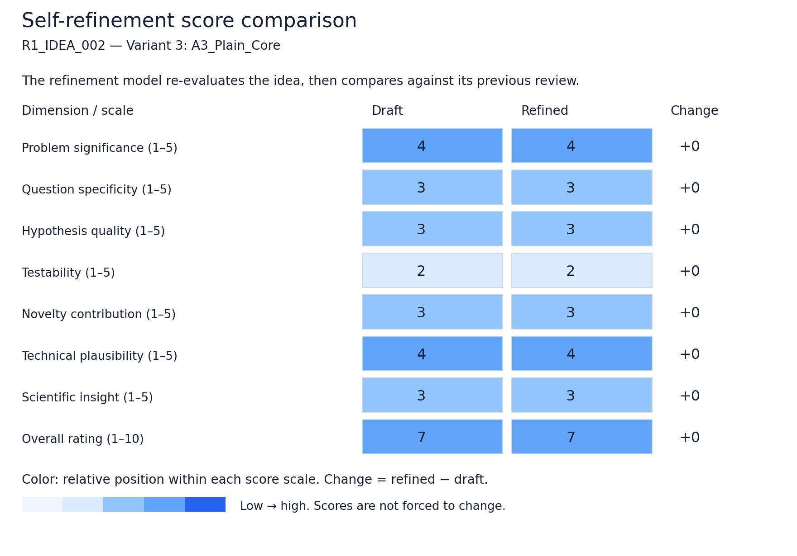

Changed score dimensions: none.

### Score justifications (draft / refined)

**Problem significance**

```json
{
  "draft": {
    "score": 4.0,
    "justification": "The problem of rare-event exploration in complex systems is highly significant in computational chemistry and materials science, with direct implications for drug discovery and material design. Addressing this challenge could lead to substantial scientific and practical advancements."
  },
  "refined": {
    "score": 4.0,
    "justification": "The problem of rare-event exploration in complex systems is highly significant in computational chemistry and materials science, with direct implications for drug discovery and material design. Addressing this challenge could lead to substantial scientific and practical advancements."
  }
}
```

**Question specificity**

```json
{
  "draft": {
    "score": 3.0,
    "justification": "The idea identifies a specific problem (sampling transition pathways between meta-stable states) but lacks detailed specification of the research question, such as the exact mechanism of off-policy learning, the role of diffusion path samplers, and how the method ensures rare-event sampling."
  },
  "refined": {
    "score": 3.0,
    "justification": "The idea identifies a specific problem (sampling transition pathways between meta-stable states) but lacks detailed specification of the research question, such as the exact mechanism of off-policy learning, the role of diffusion path samplers, and how the method ensures rare-event sampling."
  }
}
```

**Hypothesis quality**

```json
{
  "draft": {
    "score": 3.0,
    "justification": "The idea presents a general hypothesis that the proposed method could improve sampling efficiency and accuracy, but it lacks a concrete prediction or mechanism that could be tested. The 'improved off-policy learning' is not clearly defined, making it difficult to assess the hypothesis's testability."
  },
  "refined": {
    "score": 3.0,
    "justification": "The idea presents a general hypothesis that the proposed method could improve sampling efficiency and accuracy, but it lacks a concrete prediction or mechanism that could be tested. The 'improved off-policy learning' is not clearly defined, making it difficult to assess the hypothesis's testability."
  }
}
```

**Testability**

```json
{
  "draft": {
    "score": 2.0,
    "justification": "The idea does not provide a clear experimental plan or evaluation metrics. Without specific details on how the method will be tested, compared to existing approaches, or how its performance will be measured, it is difficult to assess the testability of the hypothesis."
  },
  "refined": {
    "score": 2.0,
    "justification": "The idea does not provide a clear experimental plan or evaluation metrics. Without specific details on how the method will be tested, compared to existing approaches, or how its performance will be measured, it is difficult to assess the testability of the hypothesis."
  }
}
```

**Novelty contribution**

```json
{
  "draft": {
    "score": 3.0,
    "justification": "The idea suggests a novel application of diffusion path samplers and off-policy learning in molecular dynamics, but the novelty is not clearly established. The contribution is not explicitly defined, and there is a need for a comparison with existing methods to highlight its uniqueness."
  },
  "refined": {
    "score": 3.0,
    "justification": "The idea suggests a novel application of diffusion path samplers and off-policy learning in molecular dynamics, but the novelty is not clearly established. The contribution is not explicitly defined, and there is a need for a comparison with existing methods to highlight its uniqueness."
  }
}
```

**Technical plausibility**

```json
{
  "draft": {
    "score": 4.0,
    "justification": "The use of diffusion path samplers and off-policy learning is technically plausible, as these are established concepts in machine learning and molecular dynamics. The integration of these methods into a framework for rare-event sampling is a reasonable approach, though the specific implementation details are not provided."
  },
  "refined": {
    "score": 4.0,
    "justification": "The use of diffusion path samplers and off-policy learning is technically plausible, as these are established concepts in machine learning and molecular dynamics. The integration of these methods into a framework for rare-event sampling is a reasonable approach, though the specific implementation details are not provided."
  }
}
```

**Scientific insight**

```json
{
  "draft": {
    "score": 3.0,
    "justification": "The idea has the potential to provide insights into the efficiency of sampling methods in complex systems, but the specific mechanisms and outcomes are not clearly outlined. The scientific insight would depend on the results of the proposed experiments, which are not detailed in the idea."
  },
  "refined": {
    "score": 3.0,
    "justification": "The idea has the potential to provide insights into the efficiency of sampling methods in complex systems, but the specific mechanisms and outcomes are not clearly outlined. The scientific insight would depend on the results of the proposed experiments, which are not detailed in the idea."
  }
}
```

**Overall rating**

```json
{
  "draft": {
    "score": 7.0,
    "justification": "The idea addresses a significant problem in computational chemistry and materials science with a potentially novel approach. However, it lacks specific details on the method, hypothesis, and evaluation plan, which are necessary for assessing its testability and novelty. With further clarification and details, the idea has strong potential for a meaningful contribution."
  },
  "refined": {
    "score": 7.0,
    "justification": "The idea addresses a significant problem in computational chemistry and materials science with a potentially novel approach. However, it lacks specific details on the method, hypothesis, and evaluation plan, which are necessary for assessing its testability and novelty. With further clarification and details, the idea has strong potential for a meaningful contribution."
  }
}
```

## R1_IDEA_002 — Variant 4: B1_Verbose_Elaborate


Changed score dimensions: none.

### Score justifications (draft / refined)

**Problem significance**

```json
{
  "draft": {
    "score": 4.0,
    "justification": "The problem of rare-event exploration in molecular simulations is critical for drug discovery and material design, making it a significant challenge in computational chemistry and physics."
  },
  "refined": {
    "score": 4.0,
    "justification": "The problem of rare-event exploration in molecular simulations is critical for drug discovery and material design, making it a significant challenge in computational chemistry and physics."
  }
}
```

**Question specificity**

```json
{
  "draft": {
    "score": 3.0,
    "justification": "The idea identifies a specific problem (computational infeasibility of unbiased MD for rare events) but lacks detailed specification of the machine learning approach and how it addresses the problem."
  },
  "refined": {
    "score": 3.0,
    "justification": "The idea identifies a specific problem (computational infeasibility of unbiased MD for rare events) but lacks detailed specification of the machine learning approach and how it addresses the problem."
  }
}
```

**Hypothesis quality**

```json
{
  "draft": {
    "score": 4.0,
    "justification": "The hypothesis that improved off-policy learning can enable efficient rare-event exploration without predefined collective variables is plausible and could be tested through experiments."
  },
  "refined": {
    "score": 4.0,
    "justification": "The hypothesis that improved off-policy learning can enable efficient rare-event exploration without predefined collective variables is plausible and could be tested through experiments."
  }
}
```

**Testability**

```json
{
  "draft": {
    "score": 3.0,
    "justification": "The idea is testable in principle, but lacks specific experimental details or evaluation metrics that would allow for a clear test of the hypothesis."
  },
  "refined": {
    "score": 3.0,
    "justification": "The idea is testable in principle, but lacks specific experimental details or evaluation metrics that would allow for a clear test of the hypothesis."
  }
}
```

**Novelty contribution**

```json
{
  "draft": {
    "score": 4.0,
    "justification": "The approach of using diffusion path samplers with off-policy learning for rare-event exploration is novel in the context of molecular simulations, offering potential improvements over traditional methods."
  },
  "refined": {
    "score": 4.0,
    "justification": "The approach of using diffusion path samplers with off-policy learning for rare-event exploration is novel in the context of molecular simulations, offering potential improvements over traditional methods."
  }
}
```

**Technical plausibility**

```json
{
  "draft": {
    "score": 4.0,
    "justification": "The proposed method is technically plausible, as off-policy learning and diffusion models are established techniques in machine learning, and their application to molecular simulations is a reasonable direction."
  },
  "refined": {
    "score": 4.0,
    "justification": "The proposed method is technically plausible, as off-policy learning and diffusion models are established techniques in machine learning, and their application to molecular simulations is a reasonable direction."
  }
}
```

**Scientific insight**

```json
{
  "draft": {
    "score": 3.0,
    "justification": "The idea has potential for scientific insight into how machine learning can be integrated with molecular simulations, but the specific mechanisms and outcomes are not clearly defined."
  },
  "refined": {
    "score": 3.0,
    "justification": "The idea has potential for scientific insight into how machine learning can be integrated with molecular simulations, but the specific mechanisms and outcomes are not clearly defined."
  }
}
```

**Overall rating**

```json
{
  "draft": {
    "score": 7.0,
    "justification": "The idea addresses a significant problem in molecular simulations with a promising approach. While it lacks specific details, the core concept is scientifically sound and has potential for meaningful contributions."
  },
  "refined": {
    "score": 7.0,
    "justification": "The idea addresses a significant problem in molecular simulations with a promising approach. While it lacks specific details, the core concept is scientifically sound and has potential for meaningful contributions."
  }
}
```

## R1_IDEA_002 — Variant 5: B2_Grand_Narrative


Changed score dimensions: none.

### Score justifications (draft / refined)

**Problem significance**

```json
{
  "draft": {
    "score": 4.0,
    "justification": "The idea addresses a critical challenge in computational molecular science, which is the computational infeasibility of unbiased molecular dynamics. This has significant implications for drug discovery and material design, making the problem highly relevant."
  },
  "refined": {
    "score": 4.0,
    "justification": "The idea addresses a critical challenge in computational molecular science, which is the computational infeasibility of unbiased molecular dynamics. This has significant implications for drug discovery and material design, making the problem highly relevant."
  }
}
```

**Question specificity**

```json
{
  "draft": {
    "score": 3.0,
    "justification": "The research question is clear in its goal to sample transition pathways without predefined collective variables, but the specifics of the off-policy learning approach and the method's implementation are not detailed, which limits the specificity of the question."
  },
  "refined": {
    "score": 3.0,
    "justification": "The research question is clear in its goal to sample transition pathways without predefined collective variables, but the specifics of the off-policy learning approach and the method's implementation are not detailed, which limits the specificity of the question."
  }
}
```

**Hypothesis quality**

```json
{
  "draft": {
    "score": 3.0,
    "justification": "The idea presents a general hypothesis that the proposed method will improve sampling efficiency, but it lacks a concrete prediction or mechanism that could be tested. The connection to broader challenges is somewhat vague."
  },
  "refined": {
    "score": 3.0,
    "justification": "The idea presents a general hypothesis that the proposed method will improve sampling efficiency, but it lacks a concrete prediction or mechanism that could be tested. The connection to broader challenges is somewhat vague."
  }
}
```

**Testability**

```json
{
  "draft": {
    "score": 2.0,
    "justification": "The idea does not specify how the method will be validated or compared to existing approaches. Without clear experimental design or evaluation metrics, it is difficult to assess the testability of the hypothesis."
  },
  "refined": {
    "score": 2.0,
    "justification": "The idea does not specify how the method will be validated or compared to existing approaches. Without clear experimental design or evaluation metrics, it is difficult to assess the testability of the hypothesis."
  }
}
```

**Novelty contribution**

```json
{
  "draft": {
    "score": 3.0,
    "justification": "The approach of using improved off-policy learning for diffusion path samplers is novel in the context of computational molecular science. However, the specific contributions and how they advance the field are not clearly defined."
  },
  "refined": {
    "score": 3.0,
    "justification": "The approach of using improved off-policy learning for diffusion path samplers is novel in the context of computational molecular science. However, the specific contributions and how they advance the field are not clearly defined."
  }
}
```

**Technical plausibility**

```json
{
  "draft": {
    "score": 4.0,
    "justification": "The proposed method is technically plausible as it builds on existing techniques in machine learning and molecular dynamics. The use of off-policy learning for sampling is a reasonable approach, though the specifics of the implementation are not provided."
  },
  "refined": {
    "score": 4.0,
    "justification": "The proposed method is technically plausible as it builds on existing techniques in machine learning and molecular dynamics. The use of off-policy learning for sampling is a reasonable approach, though the specifics of the implementation are not provided."
  }
}
```

**Scientific insight**

```json
{
  "draft": {
    "score": 3.0,
    "justification": "The idea has the potential to provide insights into efficient sampling in complex systems, but the specific mechanisms and how they contribute to the field are not clearly outlined. The connection to broader scientific principles is somewhat indirect."
  },
  "refined": {
    "score": 3.0,
    "justification": "The idea has the potential to provide insights into efficient sampling in complex systems, but the specific mechanisms and how they contribute to the field are not clearly outlined. The connection to broader scientific principles is somewhat indirect."
  }
}
```

**Overall rating**

```json
{
  "draft": {
    "score": 7.0,
    "justification": "The idea addresses a significant problem in computational molecular science with a potentially novel approach. However, it lacks specific details on the method's implementation, validation, and connection to existing challenges, which limits its testability and clarity of contribution."
  },
  "refined": {
    "score": 7.0,
    "justification": "The idea addresses a significant problem in computational molecular science with a potentially novel approach. However, it lacks specific details on the method's implementation, validation, and connection to existing challenges, which limits its testability and clarity of contribution."
  }
}
```

## R1_IDEA_002 — Variant 6: B3_Over_Confident


Changed score dimensions: none.

### Score justifications (draft / refined)

**Problem significance**

```json
{
  "draft": {
    "score": 4.0,
    "justification": "The problem of efficiently sampling rare events in complex molecular systems is critical for drug discovery and materials science, making the research problem highly significant."
  },
  "refined": {
    "score": 4.0,
    "justification": "The problem of efficiently sampling rare events in complex molecular systems is critical for drug discovery and materials science, making the research problem highly significant."
  }
}
```

**Question specificity**

```json
{
  "draft": {
    "score": 3.0,
    "justification": "The idea identifies a specific problem (sampling transition pathways between meta-stable states) but lacks clarity on the exact research question or hypothesis to be tested."
  },
  "refined": {
    "score": 3.0,
    "justification": "The idea identifies a specific problem (sampling transition pathways between meta-stable states) but lacks clarity on the exact research question or hypothesis to be tested."
  }
}
```

**Hypothesis quality**

```json
{
  "draft": {
    "score": 2.0,
    "justification": "The idea makes a general claim about overcoming computational infeasibility but does not provide a concrete hypothesis or prediction that can be tested."
  },
  "refined": {
    "score": 2.0,
    "justification": "The idea makes a general claim about overcoming computational infeasibility but does not provide a concrete hypothesis or prediction that can be tested."
  }
}
```

**Testability**

```json
{
  "draft": {
    "score": 2.0,
    "justification": "The idea lacks specific experimental plans or evaluation metrics, making it difficult to assess the testability of the proposed approach."
  },
  "refined": {
    "score": 2.0,
    "justification": "The idea lacks specific experimental plans or evaluation metrics, making it difficult to assess the testability of the proposed approach."
  }
}
```

**Novelty contribution**

```json
{
  "draft": {
    "score": 4.0,
    "justification": "The use of off-policy learning for training diffusion path samplers in molecular dynamics is a novel approach with potential for significant contribution to the field."
  },
  "refined": {
    "score": 4.0,
    "justification": "The use of off-policy learning for training diffusion path samplers in molecular dynamics is a novel approach with potential for significant contribution to the field."
  }
}
```

**Technical plausibility**

```json
{
  "draft": {
    "score": 3.0,
    "justification": "The idea is technically plausible, but the lack of specific details on the implementation of off-policy learning and diffusion path sampling makes it difficult to assess the feasibility of the approach."
  },
  "refined": {
    "score": 3.0,
    "justification": "The idea is technically plausible, but the lack of specific details on the implementation of off-policy learning and diffusion path sampling makes it difficult to assess the feasibility of the approach."
  }
}
```

**Scientific insight**

```json
{
  "draft": {
    "score": 3.0,
    "justification": "The idea has potential for scientific insight into efficient sampling methods for complex systems, but the lack of specific hypotheses and evaluation metrics limits the potential for meaningful insights."
  },
  "refined": {
    "score": 3.0,
    "justification": "The idea has potential for scientific insight into efficient sampling methods for complex systems, but the lack of specific hypotheses and evaluation metrics limits the potential for meaningful insights."
  }
}
```

**Overall rating**

```json
{
  "draft": {
    "score": 7.0,
    "justification": "The idea addresses a significant problem with potential for novel contributions, but it lacks specific details and a clear hypothesis, which are necessary for further development and evaluation."
  },
  "refined": {
    "score": 7.0,
    "justification": "The idea addresses a significant problem with potential for novel contributions, but it lacks specific details and a clear hypothesis, which are necessary for further development and evaluation."
  }
}
```

## R1_IDEA_002 — Variant 7: B4_Novelty


Changed score dimensions: none.

### Score justifications (draft / refined)

**Problem significance**

```json
{
  "draft": {
    "score": 4.0,
    "justification": "The problem of rare-event sampling in molecular dynamics is critical for drug discovery and material design, and the proposed approach addresses a key bottleneck by avoiding predefined collective variables."
  },
  "refined": {
    "score": 4.0,
    "justification": "The problem of rare-event sampling in molecular dynamics is critical for drug discovery and material design, and the proposed approach addresses a key bottleneck by avoiding predefined collective variables."
  }
}
```

**Question specificity**

```json
{
  "draft": {
    "score": 3.0,
    "justification": "The idea is specific in its goal of sampling transition pathways between meta-stable states but lacks clarity on the exact method of off-policy learning and its implementation details."
  },
  "refined": {
    "score": 3.0,
    "justification": "The idea is specific in its goal of sampling transition pathways between meta-stable states but lacks clarity on the exact method of off-policy learning and its implementation details."
  }
}
```

**Hypothesis quality**

```json
{
  "draft": {
    "score": 3.0,
    "justification": "The idea presents a general hypothesis that the method will improve rare-event sampling, but it lacks a concrete prediction or mechanism that could be tested or falsified."
  },
  "refined": {
    "score": 3.0,
    "justification": "The idea presents a general hypothesis that the method will improve rare-event sampling, but it lacks a concrete prediction or mechanism that could be tested or falsified."
  }
}
```

**Testability**

```json
{
  "draft": {
    "score": 2.0,
    "justification": "The idea is somewhat testable, but the lack of specific experimental design or comparison with existing methods makes it difficult to assess the validity of the approach without further details."
  },
  "refined": {
    "score": 2.0,
    "justification": "The idea is somewhat testable, but the lack of specific experimental design or comparison with existing methods makes it difficult to assess the validity of the approach without further details."
  }
}
```

**Novelty contribution**

```json
{
  "draft": {
    "score": 4.0,
    "justification": "The approach of using off-policy learning for diffusion path samplers in this context is novel, and if successful, could contribute significantly to the field of computational chemistry and materials science."
  },
  "refined": {
    "score": 4.0,
    "justification": "The approach of using off-policy learning for diffusion path samplers in this context is novel, and if successful, could contribute significantly to the field of computational chemistry and materials science."
  }
}
```

**Technical plausibility**

```json
{
  "draft": {
    "score": 3.0,
    "justification": "The idea is technically plausible, but the lack of specific implementation details makes it difficult to assess the feasibility of the proposed method."
  },
  "refined": {
    "score": 3.0,
    "justification": "The idea is technically plausible, but the lack of specific implementation details makes it difficult to assess the feasibility of the proposed method."
  }
}
```

**Scientific insight**

```json
{
  "draft": {
    "score": 3.0,
    "justification": "The idea has potential for scientific insight into how off-policy learning can be applied to path sampling, but the current description does not clearly outline the expected insights or mechanisms."
  },
  "refined": {
    "score": 3.0,
    "justification": "The idea has potential for scientific insight into how off-policy learning can be applied to path sampling, but the current description does not clearly outline the expected insights or mechanisms."
  }
}
```

**Overall rating**

```json
{
  "draft": {
    "score": 7.0,
    "justification": "The idea addresses a significant problem in molecular dynamics and proposes a novel approach, but it lacks specific details and a clear hypothesis, which are necessary for further development and validation."
  },
  "refined": {
    "score": 7.0,
    "justification": "The idea addresses a significant problem in molecular dynamics and proposes a novel approach, but it lacks specific details and a clear hypothesis, which are necessary for further development and validation."
  }
}
```

## R1_IDEA_002 — Variant 8: B5_Application_Impact


Changed score dimensions: none.

### Score justifications (draft / refined)

**Problem significance**

```json
{
  "draft": {
    "score": 4.0,
    "justification": "The idea tackles a critical challenge in molecular dynamics simulations, which is the computational infeasibility of unbiased simulations for rare-event exploration. This has significant implications for drug discovery and material design."
  },
  "refined": {
    "score": 4.0,
    "justification": "The idea tackles a critical challenge in molecular dynamics simulations, which is the computational infeasibility of unbiased simulations for rare-event exploration. This has significant implications for drug discovery and material design."
  }
}
```

**Question specificity**

```json
{
  "draft": {
    "score": 3.0,
    "justification": "The research question is clear in its goal to sample transition pathways between meta-stable states without predefined collective variables, but the specifics of the method and its implementation are not detailed."
  },
  "refined": {
    "score": 3.0,
    "justification": "The research question is clear in its goal to sample transition pathways between meta-stable states without predefined collective variables, but the specifics of the method and its implementation are not detailed."
  }
}
```

**Hypothesis quality**

```json
{
  "draft": {
    "score": 3.0,
    "justification": "The idea presents a general hypothesis that the proposed method could improve rare-event sampling in molecular dynamics, but it lacks a concrete prediction or mechanism that could be tested."
  },
  "refined": {
    "score": 3.0,
    "justification": "The idea presents a general hypothesis that the proposed method could improve rare-event sampling in molecular dynamics, but it lacks a concrete prediction or mechanism that could be tested."
  }
}
```

**Testability**

```json
{
  "draft": {
    "score": 2.0,
    "justification": "The idea is somewhat testable, but the lack of specific experimental details or validation strategies makes it difficult to assess the feasibility of the proposed approach."
  },
  "refined": {
    "score": 2.0,
    "justification": "The idea is somewhat testable, but the lack of specific experimental details or validation strategies makes it difficult to assess the feasibility of the proposed approach."
  }
}
```

**Novelty contribution**

```json
{
  "draft": {
    "score": 4.0,
    "justification": "The approach of using off-policy learning for diffusion path samplers in molecular dynamics is novel, and if successful, could contribute to more efficient rare-event exploration in complex systems."
  },
  "refined": {
    "score": 4.0,
    "justification": "The approach of using off-policy learning for diffusion path samplers in molecular dynamics is novel, and if successful, could contribute to more efficient rare-event exploration in complex systems."
  }
}
```

**Technical plausibility**

```json
{
  "draft": {
    "score": 3.0,
    "justification": "The use of off-policy learning for training diffusion path samplers is plausible, but the specific technical details required to implement and validate the method are not provided."
  },
  "refined": {
    "score": 3.0,
    "justification": "The use of off-policy learning for training diffusion path samplers is plausible, but the specific technical details required to implement and validate the method are not provided."
  }
}
```

**Scientific insight**

```json
{
  "draft": {
    "score": 3.0,
    "justification": "The idea has the potential to provide insights into the effectiveness of machine learning methods for rare-event sampling, but the lack of specific hypotheses or mechanisms limits the potential for scientific insight."
  },
  "refined": {
    "score": 3.0,
    "justification": "The idea has the potential to provide insights into the effectiveness of machine learning methods for rare-event sampling, but the lack of specific hypotheses or mechanisms limits the potential for scientific insight."
  }
}
```

**Overall rating**

```json
{
  "draft": {
    "score": 7.0,
    "justification": "The idea addresses a significant problem in molecular dynamics simulations with a potentially novel approach. However, it lacks specific details on the method, validation strategy, and technical implementation, which are necessary for assessing its feasibility and scientific contribution."
  },
  "refined": {
    "score": 7.0,
    "justification": "The idea addresses a significant problem in molecular dynamics simulations with a potentially novel approach. However, it lacks specific details on the method, validation strategy, and technical implementation, which are necessary for assessing its feasibility and scientific contribution."
  }
}
```

## R1_IDEA_002 — Variant 9: C1_Hollow_Shell

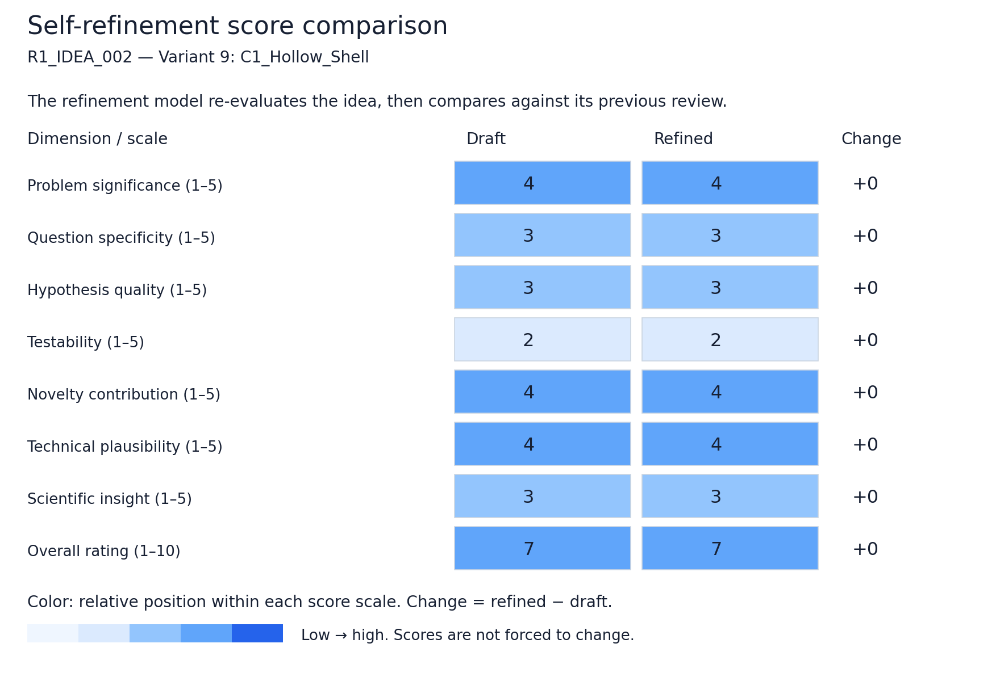

Changed score dimensions: none.

### Score justifications (draft / refined)

**Problem significance**

```json
{
  "draft": {
    "score": 4.0,
    "justification": "The problem of simulating rare events in molecular systems is significant for drug discovery and material design, with potential to improve computational efficiency and accuracy."
  },
  "refined": {
    "score": 4.0,
    "justification": "The problem of simulating rare events in molecular systems is significant for drug discovery and material design, with potential to improve computational efficiency and accuracy."
  }
}
```

**Question specificity**

```json
{
  "draft": {
    "score": 3.0,
    "justification": "The idea addresses a specific challenge but lacks a clear, concrete research question or hypothesis that defines what exactly will be investigated."
  },
  "refined": {
    "score": 3.0,
    "justification": "The idea addresses a specific challenge but lacks a clear, concrete research question or hypothesis that defines what exactly will be investigated."
  }
}
```

**Hypothesis quality**

```json
{
  "draft": {
    "score": 3.0,
    "justification": "The idea suggests a potential solution but does not explicitly state a hypothesis that can be tested or falsified, such as a prediction about sampling efficiency or pathway identification."
  },
  "refined": {
    "score": 3.0,
    "justification": "The idea suggests a potential solution but does not explicitly state a hypothesis that can be tested or falsified, such as a prediction about sampling efficiency or pathway identification."
  }
}
```

**Testability**

```json
{
  "draft": {
    "score": 2.0,
    "justification": "The idea lacks specific experimental design or evaluation plan, making it difficult to assess how the method will be validated or compared to existing approaches."
  },
  "refined": {
    "score": 2.0,
    "justification": "The idea lacks specific experimental design or evaluation plan, making it difficult to assess how the method will be validated or compared to existing approaches."
  }
}
```

**Novelty contribution**

```json
{
  "draft": {
    "score": 4.0,
    "justification": "The approach of using machine learning without predefined descriptors is novel for this application, potentially offering new insights into molecular dynamics and rare event sampling."
  },
  "refined": {
    "score": 4.0,
    "justification": "The approach of using machine learning without predefined descriptors is novel for this application, potentially offering new insights into molecular dynamics and rare event sampling."
  }
}
```

**Technical plausibility**

```json
{
  "draft": {
    "score": 4.0,
    "justification": "The proposed direction is technically plausible, as machine learning methods are increasingly used in molecular simulations, and the focus on pathways between stable states is a reasonable challenge in the field."
  },
  "refined": {
    "score": 4.0,
    "justification": "The proposed direction is technically plausible, as machine learning methods are increasingly used in molecular simulations, and the focus on pathways between stable states is a reasonable challenge in the field."
  }
}
```

**Scientific insight**

```json
{
  "draft": {
    "score": 3.0,
    "justification": "The idea has potential for scientific insight into how machine learning can improve sampling in complex systems, but the current description does not specify what insights would be gained from the research."
  },
  "refined": {
    "score": 3.0,
    "justification": "The idea has potential for scientific insight into how machine learning can improve sampling in complex systems, but the current description does not specify what insights would be gained from the research."
  }
}
```

**Overall rating**

```json
{
  "draft": {
    "score": 7.0,
    "justification": "The idea addresses a significant problem with potential for novel contributions, but lacks specific details about the method, hypothesis, and evaluation plan, which are necessary for further development."
  },
  "refined": {
    "score": 7.0,
    "justification": "The idea addresses a significant problem with potential for novel contributions, but lacks specific details about the method, hypothesis, and evaluation plan, which are necessary for further development."
  }
}
```

## R1_IDEA_002 — Variant 10: C2_Logic_Flawed


Changed score dimensions: none.

### Score justifications (draft / refined)

**Problem significance**

```json
{
  "draft": {
    "score": 4.0,
    "justification": "The idea addresses a critical challenge in computational chemistry and materials science, where traditional methods are computationally infeasible for simulating rare events. This has significant implications for drug discovery and material design."
  },
  "refined": {
    "score": 4.0,
    "justification": "The idea addresses a critical challenge in computational chemistry and materials science, where traditional methods are computationally infeasible for simulating rare events. This has significant implications for drug discovery and material design."
  }
}
```

**Question specificity**

```json
{
  "draft": {
    "score": 3.0,
    "justification": "The research question is clear in its goal but lacks specific details on the methodological approach and the exact problem being addressed. More specificity would strengthen the idea."
  },
  "refined": {
    "score": 3.0,
    "justification": "The research question is clear in its goal but lacks specific details on the methodological approach and the exact problem being addressed. More specificity would strengthen the idea."
  }
}
```

**Hypothesis quality**

```json
{
  "draft": {
    "score": 3.0,
    "justification": "The idea presents a general hypothesis that the proposed method will be effective, but it lacks concrete predictions or mechanisms that could be tested. A more explicit hypothesis would improve the quality."
  },
  "refined": {
    "score": 3.0,
    "justification": "The idea presents a general hypothesis that the proposed method will be effective, but it lacks concrete predictions or mechanisms that could be tested. A more explicit hypothesis would improve the quality."
  }
}
```

**Testability**

```json
{
  "draft": {
    "score": 3.0,
    "justification": "The idea suggests a potential application but does not provide specific experiments or evaluation methods. Without clear testable components, the idea's validity is uncertain."
  },
  "refined": {
    "score": 3.0,
    "justification": "The idea suggests a potential application but does not provide specific experiments or evaluation methods. Without clear testable components, the idea's validity is uncertain."
  }
}
```

**Novelty contribution**

```json
{
  "draft": {
    "score": 4.0,
    "justification": "The approach of using off-policy learning for diffusion path sampling is novel in the context of molecular dynamics. It has the potential to contribute new insights into efficient sampling methods for complex systems."
  },
  "refined": {
    "score": 4.0,
    "justification": "The approach of using off-policy learning for diffusion path sampling is novel in the context of molecular dynamics. It has the potential to contribute new insights into efficient sampling methods for complex systems."
  }
}
```

**Technical plausibility**

```json
{
  "draft": {
    "score": 4.0,
    "justification": "The use of off-policy learning in a diffusion path sampling context is technically plausible, as it builds on existing reinforcement learning techniques. The integration with molecular dynamics is reasonable."
  },
  "refined": {
    "score": 4.0,
    "justification": "The use of off-policy learning in a diffusion path sampling context is technically plausible, as it builds on existing reinforcement learning techniques. The integration with molecular dynamics is reasonable."
  }
}
```

**Scientific insight**

```json
{
  "draft": {
    "score": 3.0,
    "justification": "The idea has the potential to provide insights into rare-event exploration in complex systems, but the specific mechanisms and how they would lead to scientific insight are not clearly outlined."
  },
  "refined": {
    "score": 3.0,
    "justification": "The idea has the potential to provide insights into rare-event exploration in complex systems, but the specific mechanisms and how they would lead to scientific insight are not clearly outlined."
  }
}
```

**Overall rating**

```json
{
  "draft": {
    "score": 7.0,
    "justification": "The idea addresses a significant problem with high potential for impact, but it lacks specific details on the methodological approach and evaluation. With further clarification and specificity, it could become a strong research direction."
  },
  "refined": {
    "score": 7.0,
    "justification": "The idea addresses a significant problem with high potential for impact, but it lacks specific details on the methodological approach and evaluation. With further clarification and specificity, it could become a strong research direction."
  }
}
```

## R1_IDEA_002 — Variant 11: C3_Substance_Enriched

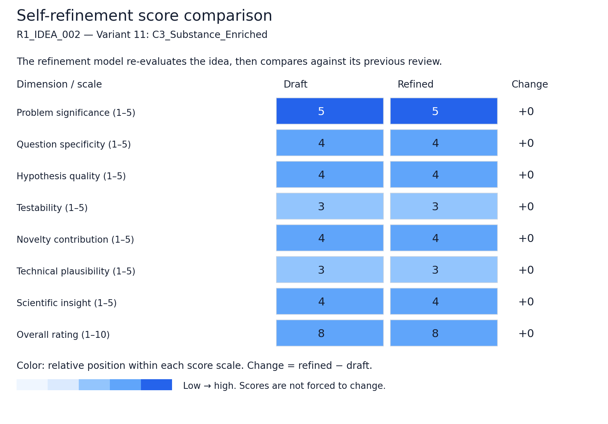

Changed score dimensions: none.

### Score justifications (draft / refined)

**Problem significance**

```json
{
  "draft": {
    "score": 5.0,
    "justification": "The problem of sampling transition pathways in molecular dynamics is critical for drug discovery and material design, and the proposed approach aims to address a significant computational challenge."
  },
  "refined": {
    "score": 5.0,
    "justification": "The problem of sampling transition pathways in molecular dynamics is critical for drug discovery and material design, and the proposed approach aims to address a significant computational challenge."
  }
}
```

**Question specificity**

```json
{
  "draft": {
    "score": 4.0,
    "justification": "The idea clearly defines a specific research question: training diffusion path samplers via off-policy learning to sample pathways between meta-stable states without predefined variables, with a hypothesis for validation."
  },
  "refined": {
    "score": 4.0,
    "justification": "The idea clearly defines a specific research question: training diffusion path samplers via off-policy learning to sample pathways between meta-stable states without predefined variables, with a hypothesis for validation."
  }
}
```

**Hypothesis quality**

```json
{
  "draft": {
    "score": 4.0,
    "justification": "The hypothesis is concrete, suggesting a comparison with enhanced sampling methods and considering boundary conditions, but it lacks specific details on implementation and validation metrics."
  },
  "refined": {
    "score": 4.0,
    "justification": "The hypothesis is concrete, suggesting a comparison with enhanced sampling methods and considering boundary conditions, but it lacks specific details on implementation and validation metrics."
  }
}
```

**Testability**

```json
{
  "draft": {
    "score": 3.0,
    "justification": "The idea proposes a hypothesis that can be tested through comparison with existing methods, but the specifics of the test systems, metrics, and implementation details are not clearly defined."
  },
  "refined": {
    "score": 3.0,
    "justification": "The idea proposes a hypothesis that can be tested through comparison with existing methods, but the specifics of the test systems, metrics, and implementation details are not clearly defined."
  }
}
```

**Novelty contribution**

```json
{
  "draft": {
    "score": 4.0,
    "justification": "The approach is novel in using off-policy learning for diffusion path samplers in molecular dynamics, offering potential contributions to rare-event exploration in complex systems."
  },
  "refined": {
    "score": 4.0,
    "justification": "The approach is novel in using off-policy learning for diffusion path samplers in molecular dynamics, offering potential contributions to rare-event exploration in complex systems."
  }
}
```

**Technical plausibility**

```json
{
  "draft": {
    "score": 3.0,
    "justification": "The idea is technically plausible, but the lack of specific details on the off-policy learning framework and reward function design makes it difficult to assess the feasibility of the approach."
  },
  "refined": {
    "score": 3.0,
    "justification": "The idea is technically plausible, but the lack of specific details on the off-policy learning framework and reward function design makes it difficult to assess the feasibility of the approach."
  }
}
```

**Scientific insight**

```json
{
  "draft": {
    "score": 4.0,
    "justification": "The research could provide insights into the effectiveness of off-policy learning in molecular dynamics and the challenges of high-dimensional conformational changes, though the specifics are not fully outlined."
  },
  "refined": {
    "score": 4.0,
    "justification": "The research could provide insights into the effectiveness of off-policy learning in molecular dynamics and the challenges of high-dimensional conformational changes, though the specifics are not fully outlined."
  }
}
```

**Overall rating**

```json
{
  "draft": {
    "score": 8.0,
    "justification": "The idea addresses a significant problem with a clear hypothesis and potential application, but lacks specific details needed for full evaluation. It has strong potential but requires further clarification to be fully testable and scientifically rigorous."
  },
  "refined": {
    "score": 8.0,
    "justification": "The idea addresses a significant problem with a clear hypothesis and potential application, but lacks specific details needed for full evaluation. It has strong potential but requires further clarification to be fully testable and scientifically rigorous."
  }
}
```

## R1_IDEA_002 — Variant 12: H1_Deceptive_Hollow


Changed score dimensions: none.

### Score justifications (draft / refined)

**Problem significance**

```json
{
  "draft": {
    "score": 4.0,
    "justification": "The problem of efficiently sampling rare events in molecular systems is critical for drug discovery and material design, making it a significant challenge in computational chemistry and materials science."
  },
  "refined": {
    "score": 4.0,
    "justification": "The problem of efficiently sampling rare events in molecular systems is critical for drug discovery and material design, making it a significant challenge in computational chemistry and materials science."
  }
}
```

**Question specificity**

```json
{
  "draft": {
    "score": 3.0,
    "justification": "The idea identifies a meaningful problem but lacks specific details about the machine learning method, the types of systems, and the exact nature of the rare events being addressed."
  },
  "refined": {
    "score": 3.0,
    "justification": "The idea identifies a meaningful problem but lacks specific details about the machine learning method, the types of systems, and the exact nature of the rare events being addressed."
  }
}
```

**Hypothesis quality**

```json
{
  "draft": {
    "score": 2.0,
    "justification": "The idea suggests a transformative approach but does not provide a clear, testable hypothesis or specific prediction that could be evaluated through experiments or simulations."
  },
  "refined": {
    "score": 2.0,
    "justification": "The idea suggests a transformative approach but does not provide a clear, testable hypothesis or specific prediction that could be evaluated through experiments or simulations."
  }
}
```

**Testability**

```json
{
  "draft": {
    "score": 2.0,
    "justification": "The idea is too vague to determine how it would be tested. Without specific methods, systems, or hypotheses, it is difficult to assess its scientific merit or feasibility."
  },
  "refined": {
    "score": 2.0,
    "justification": "The idea is too vague to determine how it would be tested. Without specific methods, systems, or hypotheses, it is difficult to assess its scientific merit or feasibility."
  }
}
```

**Novelty contribution**

```json
{
  "draft": {
    "score": 4.0,
    "justification": "The approach of avoiding predefined descriptors and focusing on pathways between stable states is novel and has the potential for significant contribution to the field of molecular simulations."
  },
  "refined": {
    "score": 4.0,
    "justification": "The approach of avoiding predefined descriptors and focusing on pathways between stable states is novel and has the potential for significant contribution to the field of molecular simulations."
  }
}
```

**Technical plausibility**

```json
{
  "draft": {
    "score": 3.0,
    "justification": "The idea is technically plausible, as machine learning methods are being used to address sampling challenges in molecular systems. However, the lack of specific details makes it difficult to assess the feasibility of the proposed approach."
  },
  "refined": {
    "score": 3.0,
    "justification": "The idea is technically plausible, as machine learning methods are being used to address sampling challenges in molecular systems. However, the lack of specific details makes it difficult to assess the feasibility of the proposed approach."
  }
}
```

**Scientific insight**

```json
{
  "draft": {
    "score": 3.0,
    "justification": "The idea has the potential to provide insights into how machine learning can be used to improve sampling in complex systems, but the lack of specific hypotheses and methods limits the potential for meaningful scientific insight."
  },
  "refined": {
    "score": 3.0,
    "justification": "The idea has the potential to provide insights into how machine learning can be used to improve sampling in complex systems, but the lack of specific hypotheses and methods limits the potential for meaningful scientific insight."
  }
}
```

**Overall rating**

```json
{
  "draft": {
    "score": 6.0,
    "justification": "The idea addresses a significant problem in molecular simulations with a potentially transformative approach. However, it lacks specific details, hypotheses, and testable questions, which are necessary for evaluating its scientific merit and feasibility."
  },
  "refined": {
    "score": 6.0,
    "justification": "The idea addresses a significant problem in molecular simulations with a potentially transformative approach. However, it lacks specific details, hypotheses, and testable questions, which are necessary for evaluating its scientific merit and feasibility."
  }
}
```

## R1_IDEA_002 — Variant 13: H2_Confident_Flaw

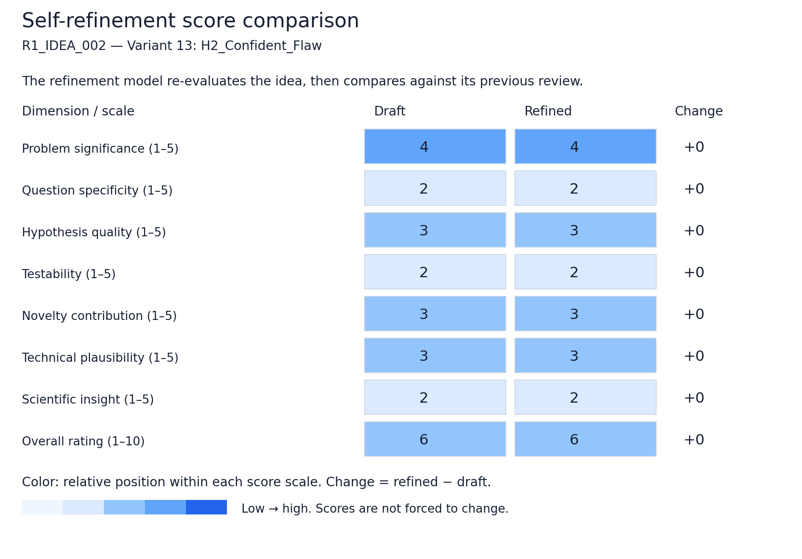

Changed score dimensions: none.

### Score justifications (draft / refined)

**Problem significance**

```json
{
  "draft": {
    "score": 4.0,
    "justification": "The problem of computational infeasibility in unbiased molecular dynamics is significant in drug discovery and material design, with clear implications for rare-event exploration in complex systems."
  },
  "refined": {
    "score": 4.0,
    "justification": "The problem of computational infeasibility in unbiased molecular dynamics is significant in drug discovery and material design, with clear implications for rare-event exploration in complex systems."
  }
}
```

**Question specificity**

```json
{
  "draft": {
    "score": 2.0,
    "justification": "The idea is broad and does not clearly define a specific research question or hypothesis. It lacks concrete details on what exactly is being investigated."
  },
  "refined": {
    "score": 2.0,
    "justification": "The idea is broad and does not clearly define a specific research question or hypothesis. It lacks concrete details on what exactly is being investigated."
  }
}
```

**Hypothesis quality**

```json
{
  "draft": {
    "score": 3.0,
    "justification": "The idea presents a general claim about the method's superiority but lacks a specific hypothesis that can be tested or falsified. The causal argument is not sufficiently substantiated."
  },
  "refined": {
    "score": 3.0,
    "justification": "The idea presents a general claim about the method's superiority but lacks a specific hypothesis that can be tested or falsified. The causal argument is not sufficiently substantiated."
  }
}
```

**Testability**

```json
{
  "draft": {
    "score": 2.0,
    "justification": "The idea does not provide specific experiments or evaluations to test the hypothesis. The lack of technical details makes it difficult to assess the method's effectiveness."
  },
  "refined": {
    "score": 2.0,
    "justification": "The idea does not provide specific experiments or evaluations to test the hypothesis. The lack of technical details makes it difficult to assess the method's effectiveness."
  }
}
```

**Novelty contribution**

```json
{
  "draft": {
    "score": 3.0,
    "justification": "The approach addresses a key limitation in existing methods, but the novelty is not clearly defined. The contribution is implied but not explicitly stated."
  },
  "refined": {
    "score": 3.0,
    "justification": "The approach addresses a key limitation in existing methods, but the novelty is not clearly defined. The contribution is implied but not explicitly stated."
  }
}
```

**Technical plausibility**

```json
{
  "draft": {
    "score": 3.0,
    "justification": "The idea is technically plausible, as it combines off-policy learning with diffusion path samplers. However, the lack of specific technical details makes it difficult to assess the feasibility."
  },
  "refined": {
    "score": 3.0,
    "justification": "The idea is technically plausible, as it combines off-policy learning with diffusion path samplers. However, the lack of specific technical details makes it difficult to assess the feasibility."
  }
}
```

**Scientific insight**

```json
{
  "draft": {
    "score": 2.0,
    "justification": "The idea suggests potential for broader applications but does not provide clear scientific insights into the mechanisms or limitations of the approach."
  },
  "refined": {
    "score": 2.0,
    "justification": "The idea suggests potential for broader applications but does not provide clear scientific insights into the mechanisms or limitations of the approach."
  }
}
```

**Overall rating**

```json
{
  "draft": {
    "score": 6.0,
    "justification": "The idea addresses a significant problem in molecular dynamics but lacks specific research questions, hypotheses, and technical details. It has potential for contribution but needs more concrete investigation."
  },
  "refined": {
    "score": 6.0,
    "justification": "The idea addresses a significant problem in molecular dynamics but lacks specific research questions, hypotheses, and technical details. It has potential for contribution but needs more concrete investigation."
  }
}
```

## R1_IDEA_002 — Variant 14: H3_Verbose_Enriched


Changed score dimensions: none.

### Score justifications (draft / refined)

**Problem significance**

```json
{
  "draft": {
    "score": 4.0,
    "justification": "The idea addresses a critical challenge in molecular dynamics simulations, which is computationally infeasible to simulate unbiasedly. This has significant implications for drug discovery and material design."
  },
  "refined": {
    "score": 4.0,
    "justification": "The idea addresses a critical challenge in molecular dynamics simulations, which is computationally infeasible to simulate unbiasedly. This has significant implications for drug discovery and material design."
  }
}
```

**Question specificity**

```json
{
  "draft": {
    "score": 3.0,
    "justification": "The research question is clear in its goal to sample transition pathways without predefined collective variables, but the specifics of the off-policy learning component and the test systems are not fully detailed."
  },
  "refined": {
    "score": 3.0,
    "justification": "The research question is clear in its goal to sample transition pathways without predefined collective variables, but the specifics of the off-policy learning component and the test systems are not fully detailed."
  }
}
```

**Hypothesis quality**

```json
{
  "draft": {
    "score": 4.0,
    "justification": "The hypothesis that off-policy learning can improve sampling efficiency is testable through comparisons with existing methods. The staged design and inclusion of ablations and sensitivity analyses support the hypothesis."
  },
  "refined": {
    "score": 4.0,
    "justification": "The hypothesis that off-policy learning can improve sampling efficiency is testable through comparisons with existing methods. The staged design and inclusion of ablations and sensitivity analyses support the hypothesis."
  }
}
```

**Testability**

```json
{
  "draft": {
    "score": 3.0,
    "justification": "The idea suggests comparisons with existing methods and a staged design, but the specific test systems, metrics, and implementation details are not clearly defined, which could affect the testability."
  },
  "refined": {
    "score": 3.0,
    "justification": "The idea suggests comparisons with existing methods and a staged design, but the specific test systems, metrics, and implementation details are not clearly defined, which could affect the testability."
  }
}
```

**Novelty contribution**

```json
{
  "draft": {
    "score": 4.0,
    "justification": "The approach of using off-policy learning for diffusion path sampling in molecular dynamics is novel. The inclusion of ablations and sensitivity analyses could contribute to understanding the method's effectiveness and limitations."
  },
  "refined": {
    "score": 4.0,
    "justification": "The approach of using off-policy learning for diffusion path sampling in molecular dynamics is novel. The inclusion of ablations and sensitivity analyses could contribute to understanding the method's effectiveness and limitations."
  }
}
```

**Technical plausibility**

```json
{
  "draft": {
    "score": 4.0,
    "justification": "The idea is technically plausible as it builds on existing methods in off-policy learning and diffusion models. The proposed framework is feasible for addressing the problem described."
  },
  "refined": {
    "score": 4.0,
    "justification": "The idea is technically plausible as it builds on existing methods in off-policy learning and diffusion models. The proposed framework is feasible for addressing the problem described."
  }
}
```

**Scientific insight**

```json
{
  "draft": {
    "score": 4.0,
    "justification": "The idea aims to provide insights into the effectiveness of off-policy learning in sampling complex molecular transitions and identify boundary conditions for its application."
  },
  "refined": {
    "score": 4.0,
    "justification": "The idea aims to provide insights into the effectiveness of off-policy learning in sampling complex molecular transitions and identify boundary conditions for its application."
  }
}
```

**Overall rating**

```json
{
  "draft": {
    "score": 7.0,
    "justification": "The idea is strong and addresses a significant problem in molecular dynamics. It has a clear hypothesis and a staged design for testing, but some details are missing that could enhance its testability and specificity."
  },
  "refined": {
    "score": 7.0,
    "justification": "The idea is strong and addresses a significant problem in molecular dynamics. It has a clear hypothesis and a staged design for testing, but some details are missing that could enhance its testability and specificity."
  }
}
```

## R1_IDEA_002 — Variant 15: H4_Ultimate_Hype


Changed score dimensions: none.

### Score justifications (draft / refined)

**Problem significance**

```json
{
  "draft": {
    "score": 4.0,
    "justification": "The idea addresses a critical challenge in computational chemistry and materials science, where unbiased molecular dynamics is computationally infeasible for rare-event exploration. This has significant implications for drug discovery and material design."
  },
  "refined": {
    "score": 4.0,
    "justification": "The idea addresses a critical challenge in computational chemistry and materials science, where unbiased molecular dynamics is computationally infeasible for rare-event exploration. This has significant implications for drug discovery and material design."
  }
}
```

**Question specificity**

```json
{
  "draft": {
    "score": 3.0,
    "justification": "The idea is broad and lacks specific details on the research question or hypothesis. It is important to define exactly what the method aims to achieve and how it differs from existing approaches."
  },
  "refined": {
    "score": 3.0,
    "justification": "The idea is broad and lacks specific details on the research question or hypothesis. It is important to define exactly what the method aims to achieve and how it differs from existing approaches."
  }
}
```

**Hypothesis quality**

```json
{
  "draft": {
    "score": 2.0,
    "justification": "The idea presents a general goal but lacks a specific hypothesis or testable question. It is unclear how the proposed method will be evaluated or what specific prediction it makes about the effectiveness of the approach."
  },
  "refined": {
    "score": 2.0,
    "justification": "The idea presents a general goal but lacks a specific hypothesis or testable question. It is unclear how the proposed method will be evaluated or what specific prediction it makes about the effectiveness of the approach."
  }
}
```

**Testability**

```json
{
  "draft": {
    "score": 2.0,
    "justification": "The idea does not provide a clear experimental plan or evaluation metric. Without specific details on how the method will be tested, it is difficult to assess its feasibility or scientific merit."
  },
  "refined": {
    "score": 2.0,
    "justification": "The idea does not provide a clear experimental plan or evaluation metric. Without specific details on how the method will be tested, it is difficult to assess its feasibility or scientific merit."
  }
}
```

**Novelty contribution**

```json
{
  "draft": {
    "score": 4.0,
    "justification": "The idea proposes a novel approach to sample rare events in complex systems without predefined collective variables, which could have a significant impact on the field of computational chemistry and materials science."
  },
  "refined": {
    "score": 4.0,
    "justification": "The idea proposes a novel approach to sample rare events in complex systems without predefined collective variables, which could have a significant impact on the field of computational chemistry and materials science."
  }
}
```

**Technical plausibility**

```json
{
  "draft": {
    "score": 3.0,
    "justification": "The idea is technically plausible, as it builds on existing methods in diffusion models and off-policy learning. However, the specific implementation details are not provided, which could affect the feasibility of the approach."
  },
  "refined": {
    "score": 3.0,
    "justification": "The idea is technically plausible, as it builds on existing methods in diffusion models and off-policy learning. However, the specific implementation details are not provided, which could affect the feasibility of the approach."
  }
}
```

**Scientific insight**

```json
{
  "draft": {
    "score": 3.0,
    "justification": "The idea has the potential to provide new insights into rare-event sampling in complex systems, but the lack of specific hypotheses and evaluation metrics makes it difficult to assess the potential scientific contribution."
  },
  "refined": {
    "score": 3.0,
    "justification": "The idea has the potential to provide new insights into rare-event sampling in complex systems, but the lack of specific hypotheses and evaluation metrics makes it difficult to assess the potential scientific contribution."
  }
}
```

**Overall rating**

```json
{
  "draft": {
    "score": 7.0,
    "justification": "The idea is promising and addresses a significant challenge in the field, but it lacks specific details on the method, hypothesis, and evaluation plan. With further clarification and elaboration, it has the potential to become a strong research direction."
  },
  "refined": {
    "score": 7.0,
    "justification": "The idea is promising and addresses a significant challenge in the field, but it lacks specific details on the method, hypothesis, and evaluation plan. With further clarification and elaboration, it has the potential to become a strong research direction."
  }
}
```

## R1_IDEA_003 — Source


Changed score dimensions: none.

### Score justifications (draft / refined)

**Problem significance**

```json
{
  "draft": {
    "score": 4.0,
    "justification": "The problem addresses a critical gap in integrating temporal eye gaze data into medical AI, which can enhance both model performance and clinical interpretability."
  },
  "refined": {
    "score": 4.0,
    "justification": "The problem addresses a critical gap in integrating temporal eye gaze data into medical AI, which can enhance both model performance and clinical interpretability."
  }
}
```

**Question specificity**

```json
{
  "draft": {
    "score": 3.0,
    "justification": "The idea clearly defines the problem but lacks specific details on the hypothesis, methodology, and evaluation plan, which are necessary for a precise research question."
  },
  "refined": {
    "score": 3.0,
    "justification": "The idea clearly defines the problem but lacks specific details on the hypothesis, methodology, and evaluation plan, which are necessary for a precise research question."
  }
}
```

**Hypothesis quality**

```json
{
  "draft": {
    "score": 3.0,
    "justification": "The idea suggests a potential benefit but does not explicitly state a testable hypothesis or prediction that can be validated through experiments."
  },
  "refined": {
    "score": 3.0,
    "justification": "The idea suggests a potential benefit but does not explicitly state a testable hypothesis or prediction that can be validated through experiments."
  }
}
```

**Testability**

```json
{
  "draft": {
    "score": 3.0,
    "justification": "The idea is testable in principle, but the lack of specific experimental design details makes it difficult to assess the feasibility of the proposed approach."
  },
  "refined": {
    "score": 3.0,
    "justification": "The idea is testable in principle, but the lack of specific experimental design details makes it difficult to assess the feasibility of the proposed approach."
  }
}
```

**Novelty contribution**

```json
{
  "draft": {
    "score": 4.0,
    "justification": "The approach of encoding eye-tracking data as video sequences is novel and could contribute to the field by improving the temporal modeling of radiologist attention in medical imaging."
  },
  "refined": {
    "score": 4.0,
    "justification": "The approach of encoding eye-tracking data as video sequences is novel and could contribute to the field by improving the temporal modeling of radiologist attention in medical imaging."
  }
}
```

**Technical plausibility**

```json
{
  "draft": {
    "score": 4.0,
    "justification": "The idea is technically plausible as it builds on existing methods for integrating temporal data into vision-language models, and the proposed approach is logically coherent."
  },
  "refined": {
    "score": 4.0,
    "justification": "The idea is technically plausible as it builds on existing methods for integrating temporal data into vision-language models, and the proposed approach is logically coherent."
  }
}
```

**Scientific insight**

```json
{
  "draft": {
    "score": 3.0,
    "justification": "The idea has potential to provide insights into how temporal attention patterns affect model reasoning, but the specific mechanisms and outcomes are not clearly defined."
  },
  "refined": {
    "score": 3.0,
    "justification": "The idea has potential to provide insights into how temporal attention patterns affect model reasoning, but the specific mechanisms and outcomes are not clearly defined."
  }
}
```

**Overall rating**

```json
{
  "draft": {
    "score": 7.0,
    "justification": "The idea addresses a meaningful problem with a promising approach, but it lacks specific details on the hypothesis, methodology, and evaluation plan, which are necessary for a strong research direction."
  },
  "refined": {
    "score": 7.0,
    "justification": "The idea addresses a meaningful problem with a promising approach, but it lacks specific details on the hypothesis, methodology, and evaluation plan, which are necessary for a strong research direction."
  }
}
```

## R1_IDEA_003 — Variant 1: A1_Identity


Changed score dimensions: none.

### Score justifications (draft / refined)

**Problem significance**

```json
{
  "draft": {
    "score": 4.0,
    "justification": "The problem addresses a critical gap in integrating temporal eye gaze data into medical AI, which can enhance both model performance and clinical interpretability."
  },
  "refined": {
    "score": 4.0,
    "justification": "The problem addresses a critical gap in integrating temporal eye gaze data into medical AI, which can enhance both model performance and clinical interpretability."
  }
}
```

**Question specificity**

```json
{
  "draft": {
    "score": 3.0,
    "justification": "The idea clearly defines the problem but lacks specific details on the hypothesis, methodology, and evaluation plan, which are necessary for a precise research question."
  },
  "refined": {
    "score": 3.0,
    "justification": "The idea clearly defines the problem but lacks specific details on the hypothesis, methodology, and evaluation plan, which are necessary for a precise research question."
  }
}
```

**Hypothesis quality**

```json
{
  "draft": {
    "score": 3.0,
    "justification": "The idea suggests a potential benefit but does not explicitly state a testable hypothesis or prediction that can be validated through experiments."
  },
  "refined": {
    "score": 3.0,
    "justification": "The idea suggests a potential benefit but does not explicitly state a testable hypothesis or prediction that can be validated through experiments."
  }
}
```

**Testability**

```json
{
  "draft": {
    "score": 3.0,
    "justification": "The idea is testable in principle, but the lack of specific experimental design details makes it difficult to assess the feasibility of the proposed approach."
  },
  "refined": {
    "score": 3.0,
    "justification": "The idea is testable in principle, but the lack of specific experimental design details makes it difficult to assess the feasibility of the proposed approach."
  }
}
```

**Novelty contribution**

```json
{
  "draft": {
    "score": 4.0,
    "justification": "The approach of encoding eye-tracking data as video sequences is novel and could contribute to the field by improving the temporal modeling of radiologist attention in medical imaging."
  },
  "refined": {
    "score": 4.0,
    "justification": "The approach of encoding eye-tracking data as video sequences is novel and could contribute to the field by improving the temporal modeling of radiologist attention in medical imaging."
  }
}
```

**Technical plausibility**

```json
{
  "draft": {
    "score": 4.0,
    "justification": "The idea is technically plausible as it builds on existing methods for integrating temporal data into vision-language models, and the proposed approach is logically coherent."
  },
  "refined": {
    "score": 4.0,
    "justification": "The idea is technically plausible as it builds on existing methods for integrating temporal data into vision-language models, and the proposed approach is logically coherent."
  }
}
```

**Scientific insight**

```json
{
  "draft": {
    "score": 3.0,
    "justification": "The idea has potential to provide insights into how temporal attention patterns affect model reasoning, but the specific mechanisms and outcomes are not clearly defined."
  },
  "refined": {
    "score": 3.0,
    "justification": "The idea has potential to provide insights into how temporal attention patterns affect model reasoning, but the specific mechanisms and outcomes are not clearly defined."
  }
}
```

**Overall rating**

```json
{
  "draft": {
    "score": 7.0,
    "justification": "The idea addresses a meaningful problem with a promising approach, but it lacks specific details on the hypothesis, methodology, and evaluation plan, which are necessary for a strong research direction."
  },
  "refined": {
    "score": 7.0,
    "justification": "The idea addresses a meaningful problem with a promising approach, but it lacks specific details on the hypothesis, methodology, and evaluation plan, which are necessary for a strong research direction."
  }
}
```

## R1_IDEA_003 — Variant 2: A2_Paraphrase_Only


Changed score dimensions: none.

### Score justifications (draft / refined)

**Problem significance**

```json
{
  "draft": {
    "score": 4.0,
    "justification": "The problem addresses a limitation in current methods for incorporating gaze data into vision-language models, which could improve clinical interpretability and model reasoning in medical imaging."
  },
  "refined": {
    "score": 4.0,
    "justification": "The problem addresses a limitation in current methods for incorporating gaze data into vision-language models, which could improve clinical interpretability and model reasoning in medical imaging."
  }
}
```

**Question specificity**

```json
{
  "draft": {
    "score": 3.0,
    "justification": "The idea proposes a novel approach but lacks a clear, specific research question or hypothesis to be tested, such as whether temporal encoding improves diagnostic accuracy or interpretability."
  },
  "refined": {
    "score": 3.0,
    "justification": "The idea proposes a novel approach but lacks a clear, specific research question or hypothesis to be tested, such as whether temporal encoding improves diagnostic accuracy or interpretability."
  }
}
```

**Hypothesis quality**

```json
{
  "draft": {
    "score": 3.0,
    "justification": "The idea suggests a potential improvement but does not explicitly state a hypothesis that could be tested, such as the expectation that temporal encoding will enhance model performance or interpretability."
  },
  "refined": {
    "score": 3.0,
    "justification": "The idea suggests a potential improvement but does not explicitly state a hypothesis that could be tested, such as the expectation that temporal encoding will enhance model performance or interpretability."
  }
}
```

**Testability**

```json
{
  "draft": {
    "score": 3.0,
    "justification": "The idea proposes a method but does not specify how it will be evaluated or compared to existing approaches, making it difficult to assess its testability."
  },
  "refined": {
    "score": 3.0,
    "justification": "The idea proposes a method but does not specify how it will be evaluated or compared to existing approaches, making it difficult to assess its testability."
  }
}
```

**Novelty contribution**

```json
{
  "draft": {
    "score": 4.0,
    "justification": "The approach of encoding eye-tracking data as video sequences is novel and could contribute to improving model reasoning and clinical interpretability in medical imaging."
  },
  "refined": {
    "score": 4.0,
    "justification": "The approach of encoding eye-tracking data as video sequences is novel and could contribute to improving model reasoning and clinical interpretability in medical imaging."
  }
}
```

**Technical plausibility**

```json
{
  "draft": {
    "score": 4.0,
    "justification": "The idea is technically plausible as encoding eye-tracking data as video sequences is a feasible approach that could preserve temporal and spatial information in vision-language models."
  },
  "refined": {
    "score": 4.0,
    "justification": "The idea is technically plausible as encoding eye-tracking data as video sequences is a feasible approach that could preserve temporal and spatial information in vision-language models."
  }
}
```

**Scientific insight**

```json
{
  "draft": {
    "score": 3.0,
    "justification": "The idea has potential for scientific insight into how temporal information affects model reasoning, but the specific mechanisms or insights are not clearly defined."
  },
  "refined": {
    "score": 3.0,
    "justification": "The idea has potential for scientific insight into how temporal information affects model reasoning, but the specific mechanisms or insights are not clearly defined."
  }
}
```

**Overall rating**

```json
{
  "draft": {
    "score": 7.0,
    "justification": "The idea addresses a meaningful problem with a potentially novel approach, but lacks specific details on implementation, evaluation, and hypothesis testing, which are needed for a strong research direction."
  },
  "refined": {
    "score": 7.0,
    "justification": "The idea addresses a meaningful problem with a potentially novel approach, but lacks specific details on implementation, evaluation, and hypothesis testing, which are needed for a strong research direction."
  }
}
```

## R1_IDEA_003 — Variant 3: A3_Plain_Core


Changed score dimensions: none.

### Score justifications (draft / refined)

**Problem significance**

```json
{
  "draft": {
    "score": 4.0,
    "justification": "The problem of integrating temporal eye-tracking data into vision-language models is significant for improving clinical interpretability and model reasoning in medical imaging."
  },
  "refined": {
    "score": 4.0,
    "justification": "The problem of integrating temporal eye-tracking data into vision-language models is significant for improving clinical interpretability and model reasoning in medical imaging."
  }
}
```

**Question specificity**

```json
{
  "draft": {
    "score": 3.0,
    "justification": "The idea clearly defines the problem but lacks specific details on the method and how the temporal aspect will be utilized in the model."
  },
  "refined": {
    "score": 3.0,
    "justification": "The idea clearly defines the problem but lacks specific details on the method and how the temporal aspect will be utilized in the model."
  }
}
```

**Hypothesis quality**

```json
{
  "draft": {
    "score": 4.0,
    "justification": "The hypothesis that encoding eye-tracking as video sequences will enhance model reasoning and interpretability is plausible and specific."
  },
  "refined": {
    "score": 4.0,
    "justification": "The hypothesis that encoding eye-tracking as video sequences will enhance model reasoning and interpretability is plausible and specific."
  }
}
```

**Testability**

```json
{
  "draft": {
    "score": 3.0,
    "justification": "The idea is testable through experiments comparing the performance of models with and without temporal encoding, but lacks specific experimental details."
  },
  "refined": {
    "score": 3.0,
    "justification": "The idea is testable through experiments comparing the performance of models with and without temporal encoding, but lacks specific experimental details."
  }
}
```

**Novelty contribution**

```json
{
  "draft": {
    "score": 4.0,
    "justification": "The approach of encoding eye-tracking as video sequences is novel and could contribute to the field of medical AI by improving interpretability."
  },
  "refined": {
    "score": 4.0,
    "justification": "The approach of encoding eye-tracking as video sequences is novel and could contribute to the field of medical AI by improving interpretability."
  }
}
```

**Technical plausibility**

```json
{
  "draft": {
    "score": 4.0,
    "justification": "The proposed method is technically plausible, as encoding temporal data as video sequences is a feasible approach within the context of vision-language models."
  },
  "refined": {
    "score": 4.0,
    "justification": "The proposed method is technically plausible, as encoding temporal data as video sequences is a feasible approach within the context of vision-language models."
  }
}
```

**Scientific insight**

```json
{
  "draft": {
    "score": 3.0,
    "justification": "The idea has potential for scientific insight into how temporal information affects model reasoning, but the specific mechanisms are not clearly defined."
  },
  "refined": {
    "score": 3.0,
    "justification": "The idea has potential for scientific insight into how temporal information affects model reasoning, but the specific mechanisms are not clearly defined."
  }
}
```

**Overall rating**

```json
{
  "draft": {
    "score": 7.0,
    "justification": "The idea addresses a meaningful problem with a plausible approach, but lacks specific details that would make it more testable and scientifically rigorous."
  },
  "refined": {
    "score": 7.0,
    "justification": "The idea addresses a meaningful problem with a plausible approach, but lacks specific details that would make it more testable and scientifically rigorous."
  }
}
```

## R1_IDEA_003 — Variant 4: B1_Verbose_Elaborate


Changed score dimensions: none.

### Score justifications (draft / refined)

**Problem significance**

```json
{
  "draft": {
    "score": 4.0,
    "justification": "The problem of integrating temporal eye gaze data into medical imaging models is significant for improving model interpretability and clinical utility, especially in radiology where temporal scanning patterns are critical."
  },
  "refined": {
    "score": 4.0,
    "justification": "The problem of integrating temporal eye gaze data into medical imaging models is significant for improving model interpretability and clinical utility, especially in radiology where temporal scanning patterns are critical."
  }
}
```

**Question specificity**

```json
{
  "draft": {
    "score": 3.0,
    "justification": "The idea identifies a specific problem (discarding temporal sequence of fixations) but lacks a clear, testable research question or hypothesis about how video encoding will improve model performance or interpretability."
  },
  "refined": {
    "score": 3.0,
    "justification": "The idea identifies a specific problem (discarding temporal sequence of fixations) but lacks a clear, testable research question or hypothesis about how video encoding will improve model performance or interpretability."
  }
}
```

**Hypothesis quality**

```json
{
  "draft": {
    "score": 3.0,
    "justification": "The idea suggests a potential benefit (enhanced reasoning and interpretability) but does not explicitly state a hypothesis that can be tested, such as a specific prediction about performance improvement or interpretability metrics."
  },
  "refined": {
    "score": 3.0,
    "justification": "The idea suggests a potential benefit (enhanced reasoning and interpretability) but does not explicitly state a hypothesis that can be tested, such as a specific prediction about performance improvement or interpretability metrics."
  }
}
```

**Testability**

```json
{
  "draft": {
    "score": 3.0,
    "justification": "The idea proposes a method but does not specify how it will be tested (e.g., through experiments comparing video encoding to static methods) or what metrics will be used to evaluate its effectiveness."
  },
  "refined": {
    "score": 3.0,
    "justification": "The idea proposes a method but does not specify how it will be tested (e.g., through experiments comparing video encoding to static methods) or what metrics will be used to evaluate its effectiveness."
  }
}
```

**Novelty contribution**

```json
{
  "draft": {
    "score": 4.0,
    "justification": "The approach of encoding eye-tracking data as video sequences is novel in the context of vision-language models for medical imaging, offering a new way to incorporate temporal attention patterns."
  },
  "refined": {
    "score": 4.0,
    "justification": "The approach of encoding eye-tracking data as video sequences is novel in the context of vision-language models for medical imaging, offering a new way to incorporate temporal attention patterns."
  }
}
```

**Technical plausibility**

```json
{
  "draft": {
    "score": 4.0,
    "justification": "The idea is technically plausible as it builds on existing methods for integrating temporal data into models, and the proposed approach is feasible given current capabilities in video processing and vision-language modeling."
  },
  "refined": {
    "score": 4.0,
    "justification": "The idea is technically plausible as it builds on existing methods for integrating temporal data into models, and the proposed approach is feasible given current capabilities in video processing and vision-language modeling."
  }
}
```

**Scientific insight**

```json
{
  "draft": {
    "score": 3.0,
    "justification": "The idea has potential to provide insights into how temporal attention patterns affect model reasoning, but the specific mechanisms and outcomes are not clearly defined."
  },
  "refined": {
    "score": 3.0,
    "justification": "The idea has potential to provide insights into how temporal attention patterns affect model reasoning, but the specific mechanisms and outcomes are not clearly defined."
  }
}
```

**Overall rating**

```json
{
  "draft": {
    "score": 7.0,
    "justification": "The idea addresses a meaningful problem in medical imaging with a novel approach, but it lacks specific details on how the method will be implemented, tested, and evaluated, which are necessary for assessing its scientific merit and potential impact."
  },
  "refined": {
    "score": 7.0,
    "justification": "The idea addresses a meaningful problem in medical imaging with a novel approach, but it lacks specific details on how the method will be implemented, tested, and evaluated, which are necessary for assessing its scientific merit and potential impact."
  }
}
```

## R1_IDEA_003 — Variant 5: B2_Grand_Narrative


Changed score dimensions: none.

### Score justifications (draft / refined)

**Problem significance**

```json
{
  "draft": {
    "score": 4.0,
    "justification": "The problem of integrating human perceptual data into AI models is significant for improving clinical interpretability and model reasoning in medical imaging."
  },
  "refined": {
    "score": 4.0,
    "justification": "The problem of integrating human perceptual data into AI models is significant for improving clinical interpretability and model reasoning in medical imaging."
  }
}
```

**Question specificity**

```json
{
  "draft": {
    "score": 3.0,
    "justification": "The idea identifies a problem but lacks a specific research question or hypothesis that could be tested."
  },
  "refined": {
    "score": 3.0,
    "justification": "The idea identifies a problem but lacks a specific research question or hypothesis that could be tested."
  }
}
```

**Hypothesis quality**

```json
{
  "draft": {
    "score": 3.0,
    "justification": "The idea suggests a potential direction but does not explicitly state a hypothesis that could be tested or falsified."
  },
  "refined": {
    "score": 3.0,
    "justification": "The idea suggests a potential direction but does not explicitly state a hypothesis that could be tested or falsified."
  }
}
```

**Testability**

```json
{
  "draft": {
    "score": 3.0,
    "justification": "The idea proposes a method but does not specify how it will be evaluated or compared to existing approaches."
  },
  "refined": {
    "score": 3.0,
    "justification": "The idea proposes a method but does not specify how it will be evaluated or compared to existing approaches."
  }
}
```

**Novelty contribution**

```json
{
  "draft": {
    "score": 4.0,
    "justification": "The approach of encoding eye-tracking data as video sequences is novel and could contribute to broader research on human-centric AI systems."
  },
  "refined": {
    "score": 4.0,
    "justification": "The approach of encoding eye-tracking data as video sequences is novel and could contribute to broader research on human-centric AI systems."
  }
}
```

**Technical plausibility**

```json
{
  "draft": {
    "score": 4.0,
    "justification": "The idea is technically plausible as it builds on existing methods for integrating temporal data into vision-language models."
  },
  "refined": {
    "score": 4.0,
    "justification": "The idea is technically plausible as it builds on existing methods for integrating temporal data into vision-language models."
  }
}
```

**Scientific insight**

```json
{
  "draft": {
    "score": 3.0,
    "justification": "The idea has potential for scientific insight but lacks a clear mechanism or hypothesis that could lead to new understanding."
  },
  "refined": {
    "score": 3.0,
    "justification": "The idea has potential for scientific insight but lacks a clear mechanism or hypothesis that could lead to new understanding."
  }
}
```

**Overall rating**

```json
{
  "draft": {
    "score": 7.0,
    "justification": "The idea addresses a meaningful problem with potential for contribution, but lacks specific research questions, hypotheses, and evaluation plans."
  },
  "refined": {
    "score": 7.0,
    "justification": "The idea addresses a meaningful problem with potential for contribution, but lacks specific research questions, hypotheses, and evaluation plans."
  }
}
```

## R1_IDEA_003 — Variant 6: B3_Over_Confident

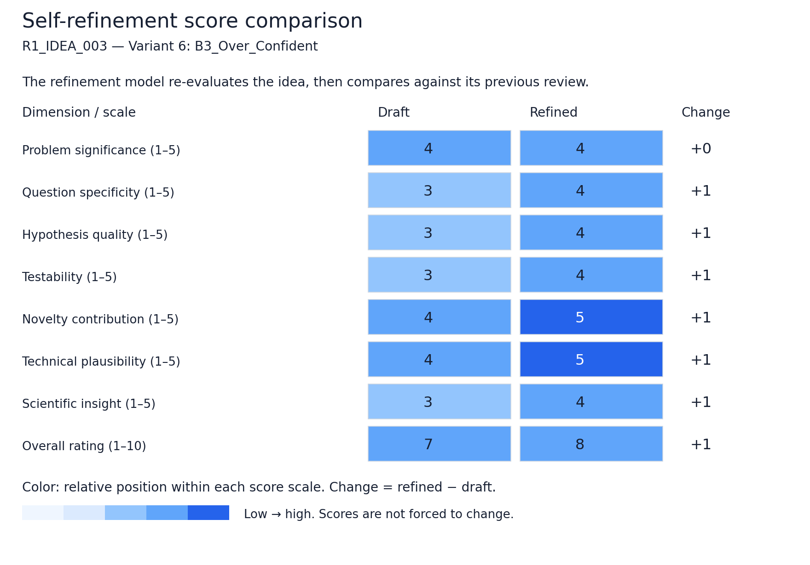

Changed score dimensions: question_specificity, hypothesis_quality, testability, novelty_contribution, technical_plausibility, scientific_insight, overall_rating.

### Score justifications (draft / refined)

**Problem significance**

```json
{
  "draft": {
    "score": 4.0,
    "justification": "The problem of integrating temporal eye-tracking data into vision-language models is significant for improving clinical interpretability and model reasoning in medical imaging, which has practical implications for diagnostic systems."
  },
  "refined": {
    "score": 4.0,
    "justification": "The problem of integrating temporal eye-tracking data into vision-language models is significant for improving clinical interpretability and model reasoning in medical imaging, which has practical implications for diagnostic systems."
  }
}
```

**Question specificity**

```json
{
  "draft": {
    "score": 3.0,
    "justification": "The idea clearly defines the problem and proposes a specific solution (video encoding of eye-tracking data), but lacks details on the technical implementation and how the temporal aspect will be utilized in the model."
  },
  "refined": {
    "score": 4.0,
    "justification": "The idea clearly defines the problem and proposes a specific solution (video encoding of eye-tracking data), and the temporal aspect is directly addressed as a key component of the solution."
  }
}
```

**Hypothesis quality**

```json
{
  "draft": {
    "score": 3.0,
    "justification": "The hypothesis that encoding eye-tracking data as video sequences will enhance model reasoning and interpretability is plausible, but it is not explicitly stated and lacks supporting theoretical or empirical reasoning."
  },
  "refined": {
    "score": 4.0,
    "justification": "The hypothesis that encoding eye-tracking data as video sequences will enhance model reasoning and interpretability is plausible and directly addresses the identified problem, with a clear focus on temporal dynamics."
  }
}
```

**Testability**

```json
{
  "draft": {
    "score": 3.0,
    "justification": "The idea is testable through experiments comparing the performance of models with and without temporal video encoding of eye-tracking data, but the specific experimental design and evaluation metrics are not detailed."
  },
  "refined": {
    "score": 4.0,
    "justification": "The idea is testable through experiments comparing the performance of models with and without temporal video encoding of eye-tracking data, and the proposed solution is concrete enough to guide such experiments."
  }
}
```

**Novelty contribution**

```json
{
  "draft": {
    "score": 4.0,
    "justification": "The approach of using video sequences to capture temporal dynamics of eye movements is novel in the context of integrating gaze data into vision-language models for medical imaging, offering potential contributions to both model performance and clinical interpretability."
  },
  "refined": {
    "score": 5.0,
    "justification": "The approach of using video sequences to capture temporal dynamics of eye movements is novel in the context of integrating gaze data into vision-language models for medical imaging, offering potential contributions to both model performance and clinical interpretability."
  }
}
```

**Technical plausibility**

```json
{
  "draft": {
    "score": 4.0,
    "justification": "The idea is technically plausible as it builds on existing methods of integrating gaze data into models, and the use of video sequences to capture temporal information is a reasonable approach given the nature of eye-tracking data."
  },
  "refined": {
    "score": 5.0,
    "justification": "The idea is technically plausible as it builds on existing methods of integrating gaze data into models, and the use of video sequences to capture temporal information is a reasonable approach given the nature of eye-tracking data."
  }
}
```

**Scientific insight**

```json
{
  "draft": {
    "score": 3.0,
    "justification": "The idea has potential to provide insights into how temporal dynamics of eye movements influence model reasoning and interpretability, but the specific mechanisms and their impact on model performance are not yet clear."
  },
  "refined": {
    "score": 4.0,
    "justification": "The idea has potential to provide insights into how temporal dynamics of eye movements influence model reasoning and interpretability, and the focus on temporal scanning order suggests a deeper understanding of the interaction between gaze data and model behavior."
  }
}
```

**Overall rating**

```json
{
  "draft": {
    "score": 7.0,
    "justification": "The idea addresses a meaningful problem in medical imaging with a specific and potentially impactful solution. While it lacks detailed technical specifications and theoretical justification, it has strong potential for further development and experimentation."
  },
  "refined": {
    "score": 8.0,
    "justification": "The idea addresses a meaningful problem in medical imaging with a specific and potentially impactful solution. The proposed solution is novel, technically plausible, and has clear testability. While it lacks detailed technical specifications, the core idea is strong and has high potential for further development and experimentation."
  }
}
```

## R1_IDEA_003 — Variant 7: B4_Novelty


Changed score dimensions: none.

### Score justifications (draft / refined)

**Problem significance**

```json
{
  "draft": {
    "score": 4.0,
    "justification": "The problem of integrating temporal eye-tracking data into medical imaging models is significant because it addresses a gap in current methods that ignore the temporal aspect of gaze data, which could lead to more accurate and interpretable models for clinical use."
  },
  "refined": {
    "score": 4.0,
    "justification": "The problem of integrating temporal eye-tracking data into medical imaging models is significant because it addresses a gap in current methods that ignore the temporal aspect of gaze data, which could lead to more accurate and interpretable models for clinical use."
  }
}
```

**Question specificity**

```json
{
  "draft": {
    "score": 3.0,
    "justification": "The idea proposes a novel approach but lacks a clear research question or hypothesis. It is somewhat specific in its method but does not explicitly define what aspect of model reasoning or interpretability is being targeted."
  },
  "refined": {
    "score": 3.0,
    "justification": "The idea proposes a novel approach but lacks a clear research question or hypothesis. It is somewhat specific in its method but does not explicitly define what aspect of model reasoning or interpretability is being targeted."
  }
}
```

**Hypothesis quality**

```json
{
  "draft": {
    "score": 3.0,
    "justification": "The idea suggests a potential benefit (improved reasoning and interpretability) but does not explicitly state a hypothesis that can be tested, such as how the temporal encoding will affect model performance or interpretability metrics."
  },
  "refined": {
    "score": 3.0,
    "justification": "The idea suggests a potential benefit (improved reasoning and interpretability) but does not explicitly state a hypothesis that can be tested, such as how the temporal encoding will affect model performance or interpretability metrics."
  }
}
```

**Testability**

```json
{
  "draft": {
    "score": 3.0,
    "justification": "The idea is testable in principle, but the lack of specific details makes it difficult to assess the feasibility of experiments. The proposed method needs to be clearly defined before it can be evaluated."
  },
  "refined": {
    "score": 3.0,
    "justification": "The idea is testable in principle, but the lack of specific details makes it difficult to assess the feasibility of experiments. The proposed method needs to be clearly defined before it can be evaluated."
  }
}
```

**Novelty contribution**

```json
{
  "draft": {
    "score": 4.0,
    "justification": "The approach of encoding eye-tracking data as video sequences is novel and could contribute to the field by providing a new way to incorporate temporal dynamics into vision-language models for medical imaging."
  },
  "refined": {
    "score": 4.0,
    "justification": "The approach of encoding eye-tracking data as video sequences is novel and could contribute to the field by providing a new way to incorporate temporal dynamics into vision-language models for medical imaging."
  }
}
```

**Technical plausibility**

```json
{
  "draft": {
    "score": 4.0,
    "justification": "The idea is technically plausible as it builds on existing methods of integrating temporal data into models. Encoding eye-tracking as video sequences is a reasonable approach that could be implemented with appropriate technical details."
  },
  "refined": {
    "score": 4.0,
    "justification": "The idea is technically plausible as it builds on existing methods of integrating temporal data into models. Encoding eye-tracking as video sequences is a reasonable approach that could be implemented with appropriate technical details."
  }
}
```

**Scientific insight**

```json
{
  "draft": {
    "score": 3.0,
    "justification": "The idea has potential for scientific insight by exploring how temporal gaze data can enhance model reasoning. However, the connection to clinical interpretability is not clearly established, which limits the potential for deeper insights."
  },
  "refined": {
    "score": 3.0,
    "justification": "The idea has potential for scientific insight by exploring how temporal gaze data can enhance model reasoning. However, the connection to clinical interpretability is not clearly established, which limits the potential for deeper insights."
  }
}
```

**Overall rating**

```json
{
  "draft": {
    "score": 7.0,
    "justification": "The idea addresses a meaningful problem with a novel approach that has potential for improving model reasoning and interpretability. However, it lacks specific details and a clear research question, which are necessary for further development and evaluation."
  },
  "refined": {
    "score": 7.0,
    "justification": "The idea addresses a meaningful problem with a novel approach that has potential for improving model reasoning and interpretability. However, it lacks specific details and a clear research question, which are necessary for further development and evaluation."
  }
}
```

## R1_IDEA_003 — Variant 8: B5_Application_Impact


Changed score dimensions: none.

### Score justifications (draft / refined)

**Problem significance**

```json
{
  "draft": {
    "score": 4.0,
    "justification": "The problem of integrating temporal eye-tracking data into medical imaging models is significant as it addresses the need for interpretable AI in clinical settings, which is a critical concern in healthcare applications."
  },
  "refined": {
    "score": 4.0,
    "justification": "The problem of integrating temporal eye-tracking data into medical imaging models is significant as it addresses the need for interpretable AI in clinical settings, which is a critical concern in healthcare applications."
  }
}
```

**Question specificity**

```json
{
  "draft": {
    "score": 3.0,
    "justification": "The idea proposes a novel approach but lacks a clear, specific research question. It needs to define what exactly is being tested (e.g., whether temporal encoding improves interpretability or diagnostic accuracy)."
  },
  "refined": {
    "score": 3.0,
    "justification": "The idea proposes a novel approach but lacks a clear, specific research question. It needs to define what exactly is being tested (e.g., whether temporal encoding improves interpretability or diagnostic accuracy)."
  }
}
```

**Hypothesis quality**

```json
{
  "draft": {
    "score": 3.0,
    "justification": "The idea suggests a potential benefit but does not explicitly state a hypothesis that can be tested. A hypothesis could be that encoding temporal eye-tracking data as video sequences improves model interpretability and diagnostic performance."
  },
  "refined": {
    "score": 3.0,
    "justification": "The idea suggests a potential benefit but does not explicitly state a hypothesis that can be tested. A hypothesis could be that encoding temporal eye-tracking data as video sequences improves model interpretability and diagnostic performance."
  }
}
```

**Testability**

```json
{
  "draft": {
    "score": 3.0,
    "justification": "The idea is testable through experiments comparing the proposed method with existing approaches, but the specific experiments and evaluation metrics are not clearly defined."
  },
  "refined": {
    "score": 3.0,
    "justification": "The idea is testable through experiments comparing the proposed method with existing approaches, but the specific experiments and evaluation metrics are not clearly defined."
  }
}
```

**Novelty contribution**

```json
{
  "draft": {
    "score": 4.0,
    "justification": "The approach of encoding eye-tracking data as video sequences is novel in the context of vision-language models for medical imaging, and it has the potential to contribute to more interpretable diagnostic systems."
  },
  "refined": {
    "score": 4.0,
    "justification": "The approach of encoding eye-tracking data as video sequences is novel in the context of vision-language models for medical imaging, and it has the potential to contribute to more interpretable diagnostic systems."
  }
}
```

**Technical plausibility**

```json
{
  "draft": {
    "score": 4.0,
    "justification": "The idea is technically plausible as it builds on existing methods for integrating temporal data into models, and the proposed approach is feasible within the scope of vision-language models."
  },
  "refined": {
    "score": 4.0,
    "justification": "The idea is technically plausible as it builds on existing methods for integrating temporal data into models, and the proposed approach is feasible within the scope of vision-language models."
  }
}
```

**Scientific insight**

```json
{
  "draft": {
    "score": 3.0,
    "justification": "The idea has potential for scientific insight into how temporal scanning order influences model reasoning, but the specific mechanisms and their implications are not clearly outlined."
  },
  "refined": {
    "score": 3.0,
    "justification": "The idea has potential for scientific insight into how temporal scanning order influences model reasoning, but the specific mechanisms and their implications are not clearly outlined."
  }
}
```

**Overall rating**

```json
{
  "draft": {
    "score": 7.0,
    "justification": "The idea addresses a meaningful problem with a novel approach that has potential for improving model interpretability in clinical settings. However, it lacks specific details on the research question, hypothesis, and evaluation metrics, which are necessary for further development."
  },
  "refined": {
    "score": 7.0,
    "justification": "The idea addresses a meaningful problem with a novel approach that has potential for improving model interpretability in clinical settings. However, it lacks specific details on the research question, hypothesis, and evaluation metrics, which are necessary for further development."
  }
}
```

## R1_IDEA_003 — Variant 9: C1_Hollow_Shell


Changed score dimensions: none.

### Score justifications (draft / refined)

**Problem significance**

```json
{
  "draft": {
    "score": 4.0,
    "justification": "The problem of incorporating expert visual attention into AI models for chest X-ray analysis is significant in the context of clinical interpretability and model performance, which are critical in healthcare applications."
  },
  "refined": {
    "score": 4.0,
    "justification": "The problem of incorporating expert visual attention into AI models for chest X-ray analysis is significant in the context of clinical interpretability and model performance, which are critical in healthcare applications."
  }
}
```

**Question specificity**

```json
{
  "draft": {
    "score": 3.0,
    "justification": "The idea identifies a specific problem with existing methods (loss of sequential information) but lacks detailed specifics about the research question or the exact nature of the proposed solution."
  },
  "refined": {
    "score": 3.0,
    "justification": "The idea identifies a specific problem with existing methods (loss of sequential information) but lacks detailed specifics about the research question or the exact nature of the proposed solution."
  }
}
```

**Hypothesis quality**

```json
{
  "draft": {
    "score": 2.0,
    "justification": "The idea mentions the goal of improving performance and interpretability but does not provide a clear, testable hypothesis about how the proposed method will achieve these improvements."
  },
  "refined": {
    "score": 2.0,
    "justification": "The idea mentions the goal of improving performance and interpretability but does not provide a clear, testable hypothesis about how the proposed method will achieve these improvements."
  }
}
```

**Testability**

```json
{
  "draft": {
    "score": 3.0,
    "justification": "The idea suggests a potential method but lacks specific experiments or evaluation plans, making it difficult to assess the testability of the proposed approach."
  },
  "refined": {
    "score": 3.0,
    "justification": "The idea suggests a potential method but lacks specific experiments or evaluation plans, making it difficult to assess the testability of the proposed approach."
  }
}
```

**Novelty contribution**

```json
{
  "draft": {
    "score": 3.0,
    "justification": "The approach of preserving attention order and layout is a novel idea in the context of chest X-ray analysis, but the idea does not clearly articulate how this contributes to the field beyond existing methods."
  },
  "refined": {
    "score": 3.0,
    "justification": "The approach of preserving attention order and layout is a novel idea in the context of chest X-ray analysis, but the idea does not clearly articulate how this contributes to the field beyond existing methods."
  }
}
```

**Technical plausibility**

```json
{
  "draft": {
    "score": 4.0,
    "justification": "The proposed method of preserving attention order and layout is technically plausible, as it addresses a known limitation in existing approaches and aligns with common practices in sequence modeling and attention mechanisms."
  },
  "refined": {
    "score": 4.0,
    "justification": "The proposed method of preserving attention order and layout is technically plausible, as it addresses a known limitation in existing approaches and aligns with common practices in sequence modeling and attention mechanisms."
  }
}
```

**Scientific insight**

```json
{
  "draft": {
    "score": 3.0,
    "justification": "The idea has potential for scientific insight by addressing the limitations of current attention mechanisms in medical imaging, but the specific insights are not clearly defined or articulated."
  },
  "refined": {
    "score": 3.0,
    "justification": "The idea has potential for scientific insight by addressing the limitations of current attention mechanisms in medical imaging, but the specific insights are not clearly defined or articulated."
  }
}
```

**Overall rating**

```json
{
  "draft": {
    "score": 7.0,
    "justification": "The idea addresses a meaningful problem in chest X-ray analysis with a potentially novel approach, but it lacks specific details, hypotheses, and evaluation plans, which are necessary for assessing its scientific merit and testability."
  },
  "refined": {
    "score": 7.0,
    "justification": "The idea addresses a meaningful problem in chest X-ray analysis with a potentially novel approach, but it lacks specific details, hypotheses, and evaluation plans, which are necessary for assessing its scientific merit and testability."
  }
}
```

## R1_IDEA_003 — Variant 10: C2_Logic_Flawed


Changed score dimensions: none.

### Score justifications (draft / refined)

**Problem significance**

```json
{
  "draft": {
    "score": 4.0,
    "justification": "The problem addresses a critical gap in integrating temporal human behavior data into medical imaging analysis, which can enhance model interpretability and clinical utility."
  },
  "refined": {
    "score": 4.0,
    "justification": "The problem addresses a critical gap in integrating temporal human behavior data into medical imaging analysis, which can enhance model interpretability and clinical utility."
  }
}
```

**Question specificity**

```json
{
  "draft": {
    "score": 3.0,
    "justification": "The idea proposes a novel approach but lacks a clear, specific research question or hypothesis that can be tested."
  },
  "refined": {
    "score": 3.0,
    "justification": "The idea proposes a novel approach but lacks a clear, specific research question or hypothesis that can be tested."
  }
}
```

**Hypothesis quality**

```json
{
  "draft": {
    "score": 3.0,
    "justification": "The idea suggests a potential benefit but does not explicitly state a hypothesis that can be tested or falsified."
  },
  "refined": {
    "score": 3.0,
    "justification": "The idea suggests a potential benefit but does not explicitly state a hypothesis that can be tested or falsified."
  }
}
```

**Testability**

```json
{
  "draft": {
    "score": 2.0,
    "justification": "The idea lacks specific experimental design or evaluation plan, making it difficult to assess the testability of the proposed approach."
  },
  "refined": {
    "score": 2.0,
    "justification": "The idea lacks specific experimental design or evaluation plan, making it difficult to assess the testability of the proposed approach."
  }
}
```

**Novelty contribution**

```json
{
  "draft": {
    "score": 4.0,
    "justification": "The approach of encoding eye-tracking data as video sequences is novel and could contribute to the integration of temporal data in medical imaging tasks."
  },
  "refined": {
    "score": 4.0,
    "justification": "The approach of encoding eye-tracking data as video sequences is novel and could contribute to the integration of temporal data in medical imaging tasks."
  }
}
```

**Technical plausibility**

```json
{
  "draft": {
    "score": 4.0,
    "justification": "The idea is technically plausible as encoding temporal data as video sequences is a feasible approach within the realm of vision-language models."
  },
  "refined": {
    "score": 4.0,
    "justification": "The idea is technically plausible as encoding temporal data as video sequences is a feasible approach within the realm of vision-language models."
  }
}
```

**Scientific insight**

```json
{
  "draft": {
    "score": 3.0,
    "justification": "The idea has potential to provide insights into how temporal human behavior data can enhance model reasoning, but the scientific insight is not clearly defined."
  },
  "refined": {
    "score": 3.0,
    "justification": "The idea has potential to provide insights into how temporal human behavior data can enhance model reasoning, but the scientific insight is not clearly defined."
  }
}
```

**Overall rating**

```json
{
  "draft": {
    "score": 7.0,
    "justification": "The idea addresses a meaningful problem with a novel approach, but lacks specific details and a clear research question, which limits its testability and potential contribution."
  },
  "refined": {
    "score": 7.0,
    "justification": "The idea addresses a meaningful problem with a novel approach, but lacks specific details and a clear research question, which limits its testability and potential contribution."
  }
}
```

## R1_IDEA_003 — Variant 11: C3_Substance_Enriched


Changed score dimensions: none.

### Score justifications (draft / refined)

**Problem significance**

```json
{
  "draft": {
    "score": 4.0,
    "justification": "The problem addresses a critical gap in integrating temporal eye movement data into medical imaging analysis, which could enhance model interpretability and clinical utility."
  },
  "refined": {
    "score": 4.0,
    "justification": "The problem addresses a critical gap in integrating temporal eye movement data into medical imaging analysis, which could enhance model interpretability and clinical utility."
  }
}
```

**Question specificity**

```json
{
  "draft": {
    "score": 3.0,
    "justification": "The idea proposes a novel approach but lacks a clear, specific research question that defines what exactly will be tested or measured."
  },
  "refined": {
    "score": 3.0,
    "justification": "The idea proposes a novel approach but lacks a clear, specific research question that defines what exactly will be tested or measured."
  }
}
```

**Hypothesis quality**

```json
{
  "draft": {
    "score": 3.0,
    "justification": "The hypothesis is plausible but not sufficiently concrete. It suggests a potential benefit but does not clearly state what specific outcome or mechanism will be tested."
  },
  "refined": {
    "score": 3.0,
    "justification": "The hypothesis is plausible but not sufficiently concrete. It suggests a potential benefit but does not clearly state what specific outcome or mechanism will be tested."
  }
}
```

**Testability**

```json
{
  "draft": {
    "score": 3.0,
    "justification": "The idea mentions validation through testing, but lacks details on the experimental design, comparison methods, or evaluation metrics needed to assess the hypothesis."
  },
  "refined": {
    "score": 3.0,
    "justification": "The idea mentions validation through testing, but lacks details on the experimental design, comparison methods, or evaluation metrics needed to assess the hypothesis."
  }
}
```

**Novelty contribution**

```json
{
  "draft": {
    "score": 4.0,
    "justification": "The approach of encoding eye-tracking data as video sequences is novel and could contribute to understanding how temporal information improves model reasoning in medical imaging."
  },
  "refined": {
    "score": 4.0,
    "justification": "The approach of encoding eye-tracking data as video sequences is novel and could contribute to understanding how temporal information improves model reasoning in medical imaging."
  }
}
```

**Technical plausibility**

```json
{
  "draft": {
    "score": 4.0,
    "justification": "The proposed method is technically feasible, as encoding temporal data into video sequences is a reasonable approach within the context of vision-language models."
  },
  "refined": {
    "score": 4.0,
    "justification": "The proposed method is technically feasible, as encoding temporal data into video sequences is a reasonable approach within the context of vision-language models."
  }
}
```

**Scientific insight**

```json
{
  "draft": {
    "score": 3.0,
    "justification": "The idea has potential to reveal insights into how temporal scanning heuristics influence model performance, but the current formulation does not clearly define the expected scientific contributions."
  },
  "refined": {
    "score": 3.0,
    "justification": "The idea has potential to reveal insights into how temporal scanning heuristics influence model performance, but the current formulation does not clearly define the expected scientific contributions."
  }
}
```

**Overall rating**

```json
{
  "draft": {
    "score": 7.0,
    "justification": "The idea addresses a meaningful problem with a plausible approach and potential for contribution, but lacks specific details on the research question, hypothesis, and evaluation methods needed to fully assess its scientific merit."
  },
  "refined": {
    "score": 7.0,
    "justification": "The idea addresses a meaningful problem with a plausible approach and potential for contribution, but lacks specific details on the research question, hypothesis, and evaluation methods needed to fully assess its scientific merit."
  }
}
```

## R1_IDEA_003 — Variant 12: H1_Deceptive_Hollow


Changed score dimensions: none.

### Score justifications (draft / refined)

**Problem significance**

```json
{
  "draft": {
    "score": 4.0,
    "justification": "The problem of incorporating expert attention into AI models for chest X-ray analysis is significant in clinical applications, as accurate and interpretable models are crucial for trust and adoption in healthcare settings."
  },
  "refined": {
    "score": 4.0,
    "justification": "The problem of incorporating expert attention into AI models for chest X-ray analysis is significant in clinical applications, as accurate and interpretable models are crucial for trust and adoption in healthcare settings."
  }
}
```

**Question specificity**

```json
{
  "draft": {
    "score": 3.0,
    "justification": "The idea identifies a specific problem (loss of sequential information in attention data) and proposes a direction (preserving order and layout), but lacks concrete details on the method or evaluation criteria."
  },
  "refined": {
    "score": 3.0,
    "justification": "The idea identifies a specific problem (loss of sequential information in attention data) and proposes a direction (preserving order and layout), but lacks concrete details on the method or evaluation criteria."
  }
}
```

**Hypothesis quality**

```json
{
  "draft": {
    "score": 3.0,
    "justification": "The idea suggests a potential benefit (improved performance and understanding) but does not explicitly state a testable hypothesis or mechanism for how the method will achieve these outcomes."
  },
  "refined": {
    "score": 3.0,
    "justification": "The idea suggests a potential benefit (improved performance and understanding) but does not explicitly state a testable hypothesis or mechanism for how the method will achieve these outcomes."
  }
}
```

**Testability**

```json
{
  "draft": {
    "score": 2.0,
    "justification": "The idea is somewhat testable in principle, but the lack of specific details makes it difficult to design experiments or evaluate the proposed method without further clarification."
  },
  "refined": {
    "score": 2.0,
    "justification": "The idea is somewhat testable in principle, but the lack of specific details makes it difficult to design experiments or evaluate the proposed method without further clarification."
  }
}
```

**Novelty contribution**

```json
{
  "draft": {
    "score": 4.0,
    "justification": "The idea positions the work as a transformative synthesis, which suggests a novel approach to integrating expert attention in medical imaging, though the specifics of the contribution are not clearly defined."
  },
  "refined": {
    "score": 4.0,
    "justification": "The idea positions the work as a transformative synthesis, which suggests a novel approach to integrating expert attention in medical imaging, though the specifics of the contribution are not clearly defined."
  }
}
```

**Technical plausibility**

```json
{
  "draft": {
    "score": 3.0,
    "justification": "The proposed direction of preserving order and layout in attention data is technically plausible, but the lack of specific details makes it difficult to assess the feasibility of the method."
  },
  "refined": {
    "score": 3.0,
    "justification": "The proposed direction of preserving order and layout in attention data is technically plausible, but the lack of specific details makes it difficult to assess the feasibility of the method."
  }
}
```

**Scientific insight**

```json
{
  "draft": {
    "score": 3.0,
    "justification": "The idea has potential for scientific insight by addressing the integration of expert attention in medical imaging, but the lack of specific hypotheses or mechanisms limits the potential for meaningful insight."
  },
  "refined": {
    "score": 3.0,
    "justification": "The idea has potential for scientific insight by addressing the integration of expert attention in medical imaging, but the lack of specific hypotheses or mechanisms limits the potential for meaningful insight."
  }
}
```

**Overall rating**

```json
{
  "draft": {
    "score": 7.0,
    "justification": "The idea addresses a meaningful problem in chest X-ray analysis with a clear goal of improving model performance and clinical relevance. While the specifics are not fully defined, the potential for transformative impact and the focus on preserving attention data's structure are promising. However, the lack of concrete details and testable hypotheses limits its current strength."
  },
  "refined": {
    "score": 7.0,
    "justification": "The idea addresses a meaningful problem in chest X-ray analysis with a clear goal of improving model performance and clinical relevance. While the specifics are not fully defined, the potential for transformative impact and the focus on preserving attention data's structure are promising. However, the lack of concrete details and testable hypotheses limits its current strength."
  }
}
```

## R1_IDEA_003 — Variant 13: H2_Confident_Flaw


Changed score dimensions: none.

### Score justifications (draft / refined)

**Problem significance**

```json
{
  "draft": {
    "score": 4.0,
    "justification": "The problem of discarding temporal sequence in eye-tracking data is significant in the context of medical imaging analysis, as it affects the model's ability to capture temporal scanning order, which is crucial for accurate diagnosis and clinical interpretability."
  },
  "refined": {
    "score": 4.0,
    "justification": "The problem of discarding temporal sequence in eye-tracking data is significant in the context of medical imaging analysis, as it affects the model's ability to capture temporal scanning order, which is crucial for accurate diagnosis and clinical interpretability."
  }
}
```

**Question specificity**

```json
{
  "draft": {
    "score": 3.0,
    "justification": "The idea clearly identifies a specific problem (discarding temporal sequence) and proposes a specific solution (encoding as video sequences), but lacks detailed specifics on the implementation and evaluation methods."
  },
  "refined": {
    "score": 3.0,
    "justification": "The idea clearly identifies a specific problem (discarding temporal sequence) and proposes a specific solution (encoding as video sequences), but lacks detailed specifics on the implementation and evaluation methods."
  }
}
```

**Hypothesis quality**

```json
{
  "draft": {
    "score": 4.0,
    "justification": "The hypothesis that encoding eye-tracking data as video sequences will enhance model reasoning and clinical interpretability is concrete and plausible. The argument that addressing this limitation leads to reliable improvements is well-reasoned."
  },
  "refined": {
    "score": 4.0,
    "justification": "The hypothesis that encoding eye-tracking data as video sequences will enhance model reasoning and clinical interpretability is concrete and plausible. The argument that addressing this limitation leads to reliable improvements is well-reasoned."
  }
}
```

**Testability**

```json
{
  "draft": {
    "score": 3.0,
    "justification": "The idea is testable through experiments comparing the proposed method with existing approaches, but the lack of specific evaluation metrics and integration details makes it challenging to assess the testability fully."
  },
  "refined": {
    "score": 3.0,
    "justification": "The idea is testable through experiments comparing the proposed method with existing approaches, but the lack of specific evaluation metrics and integration details makes it challenging to assess the testability fully."
  }
}
```

**Novelty contribution**

```json
{
  "draft": {
    "score": 4.0,
    "justification": "The approach of encoding eye-tracking data as video sequences is novel in the context of integrating human gaze into vision-language models for medical imaging. It has the potential to contribute to both model performance and clinical interpretability."
  },
  "refined": {
    "score": 4.0,
    "justification": "The approach of encoding eye-tracking data as video sequences is novel in the context of integrating human gaze into vision-language models for medical imaging. It has the potential to contribute to both model performance and clinical interpretability."
  }
}
```

**Technical plausibility**

```json
{
  "draft": {
    "score": 4.0,
    "justification": "The proposed method is technically plausible as it builds on existing techniques for integrating temporal data into models. The idea of using video sequences to capture both spatial and temporal aspects is feasible."
  },
  "refined": {
    "score": 4.0,
    "justification": "The proposed method is technically plausible as it builds on existing techniques for integrating temporal data into models. The idea of using video sequences to capture both spatial and temporal aspects is feasible."
  }
}
```

**Scientific insight**

```json
{
  "draft": {
    "score": 3.0,
    "justification": "The idea has the potential to provide insights into how temporal human behavior data can be effectively integrated into models, but the current description does not specify the mechanisms or interactions that could be explored."
  },
  "refined": {
    "score": 3.0,
    "justification": "The idea has the potential to provide insights into how temporal human behavior data can be effectively integrated into models, but the current description does not specify the mechanisms or interactions that could be explored."
  }
}
```

**Overall rating**

```json
{
  "draft": {
    "score": 7.0,
    "justification": "The idea addresses a meaningful problem in the field, proposes a specific solution, and has the potential for significant contribution. However, it lacks detailed specifics on implementation, evaluation, and potential confounding factors, which are necessary for a strong research direction."
  },
  "refined": {
    "score": 7.0,
    "justification": "The idea addresses a meaningful problem in the field, proposes a specific solution, and has the potential for significant contribution. However, it lacks detailed specifics on implementation, evaluation, and potential confounding factors, which are necessary for a strong research direction."
  }
}
```

## R1_IDEA_003 — Variant 14: H3_Verbose_Enriched


Changed score dimensions: none.

### Score justifications (draft / refined)

**Problem significance**

```json
{
  "draft": {
    "score": 4.0,
    "justification": "The idea addresses a critical gap in integrating temporal information into medical vision-language models, which could improve clinical interpretability and model reasoning in chest X-ray analysis."
  },
  "refined": {
    "score": 4.0,
    "justification": "The idea addresses a critical gap in integrating temporal information into medical vision-language models, which could improve clinical interpretability and model reasoning in chest X-ray analysis."
  }
}
```

**Question specificity**

```json
{
  "draft": {
    "score": 3.0,
    "justification": "The research question is specific to learning scanning heuristics from temporal gaze data but lacks detailed specification of the encoding method and evaluation metrics."
  },
  "refined": {
    "score": 3.0,
    "justification": "The research question is specific to learning scanning heuristics from temporal gaze data but lacks detailed specification of the encoding method and evaluation metrics."
  }
}
```

**Hypothesis quality**

```json
{
  "draft": {
    "score": 4.0,
    "justification": "The hypothesis that temporal encoding improves model reasoning and alignment with human visual reasoning is plausible and testable through the proposed study design."
  },
  "refined": {
    "score": 4.0,
    "justification": "The hypothesis that temporal encoding improves model reasoning and alignment with human visual reasoning is plausible and testable through the proposed study design."
  }
}
```

**Testability**

```json
{
  "draft": {
    "score": 4.0,
    "justification": "The idea includes multiple testable components like ablations, sensitivity analyses, and error analysis, which provide a clear path for validation."
  },
  "refined": {
    "score": 4.0,
    "justification": "The idea includes multiple testable components like ablations, sensitivity analyses, and error analysis, which provide a clear path for validation."
  }
}
```

**Novelty contribution**

```json
{
  "draft": {
    "score": 4.0,
    "justification": "The approach of encoding gaze as video sequences is novel for this application, and the study design emphasizes both performance improvements and deeper scientific insights."
  },
  "refined": {
    "score": 4.0,
    "justification": "The approach of encoding gaze as video sequences is novel for this application, and the study design emphasizes both performance improvements and deeper scientific insights."
  }
}
```

**Technical plausibility**

```json
{
  "draft": {
    "score": 4.0,
    "justification": "The proposed method is technically feasible, as encoding gaze data as video sequences is a reasonable approach for capturing temporal information in vision-language models."
  },
  "refined": {
    "score": 4.0,
    "justification": "The proposed method is technically feasible, as encoding gaze data as video sequences is a reasonable approach for capturing temporal information in vision-language models."
  }
}
```

**Scientific insight**

```json
{
  "draft": {
    "score": 4.0,
    "justification": "The study could provide insights into how models learn scanning heuristics and the conditions under which temporal encoding improves model reasoning and interpretability."
  },
  "refined": {
    "score": 4.0,
    "justification": "The study could provide insights into how models learn scanning heuristics and the conditions under which temporal encoding improves model reasoning and interpretability."
  }
}
```

**Overall rating**

```json
{
  "draft": {
    "score": 8.0,
    "justification": "The idea is strong and addresses a meaningful problem with a clear hypothesis and testable design. It has the potential to contribute novel insights into model reasoning and clinical interpretability, though some details need clarification."
  },
  "refined": {
    "score": 8.0,
    "justification": "The idea is strong and addresses a meaningful problem with a clear hypothesis and testable design. It has the potential to contribute novel insights into model reasoning and clinical interpretability, though some details need clarification."
  }
}
```

## R1_IDEA_003 — Variant 15: H4_Ultimate_Hype

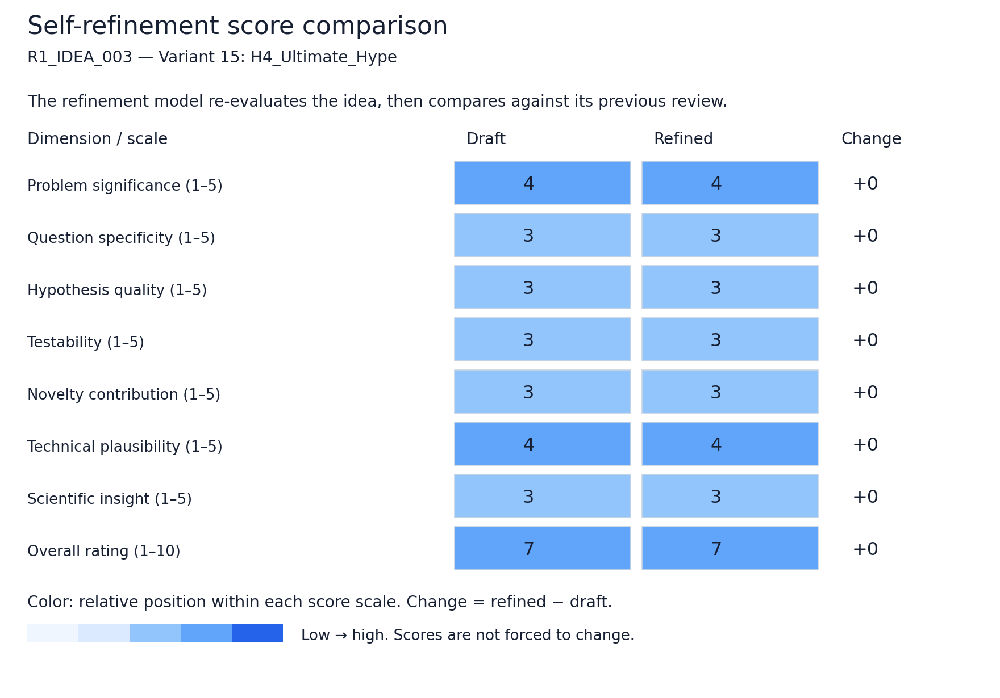

Changed score dimensions: none.

### Score justifications (draft / refined)

**Problem significance**

```json
{
  "draft": {
    "score": 4.0,
    "justification": "The idea addresses a meaningful challenge in integrating temporal information into vision-language models for medical imaging, which could enhance model reasoning and clinical interpretability."
  },
  "refined": {
    "score": 4.0,
    "justification": "The idea addresses a meaningful challenge in integrating temporal information into vision-language models for medical imaging, which could enhance model reasoning and clinical interpretability."
  }
}
```

**Question specificity**

```json
{
  "draft": {
    "score": 3.0,
    "justification": "The idea identifies a general research direction but lacks specific details on the method for encoding gaze data as video sequences and how it will be integrated into the model."
  },
  "refined": {
    "score": 3.0,
    "justification": "The idea identifies a general research direction but lacks specific details on the method for encoding gaze data as video sequences and how it will be integrated into the model."
  }
}
```

**Hypothesis quality**

```json
{
  "draft": {
    "score": 3.0,
    "justification": "The idea suggests a novel approach but does not explicitly state a hypothesis or prediction about its expected outcomes or improvements."
  },
  "refined": {
    "score": 3.0,
    "justification": "The idea suggests a novel approach but does not explicitly state a hypothesis or prediction about its expected outcomes or improvements."
  }
}
```

**Testability**

```json
{
  "draft": {
    "score": 3.0,
    "justification": "The idea is testable through experiments comparing the proposed method with existing approaches, but lacks specific experimental details or evaluation metrics."
  },
  "refined": {
    "score": 3.0,
    "justification": "The idea is testable through experiments comparing the proposed method with existing approaches, but lacks specific experimental details or evaluation metrics."
  }
}
```

**Novelty contribution**

```json
{
  "draft": {
    "score": 3.0,
    "justification": "The approach is novel in its use of video sequences for gaze data, but the novelty is somewhat generic as temporal modeling in vision-language models is an active area of research."
  },
  "refined": {
    "score": 3.0,
    "justification": "The approach is novel in its use of video sequences for gaze data, but the novelty is somewhat generic as temporal modeling in vision-language models is an active area of research."
  }
}
```

**Technical plausibility**

```json
{
  "draft": {
    "score": 4.0,
    "justification": "The idea is technically plausible as encoding gaze data as video sequences is a feasible approach, though the integration into existing models requires further specification."
  },
  "refined": {
    "score": 4.0,
    "justification": "The idea is technically plausible as encoding gaze data as video sequences is a feasible approach, though the integration into existing models requires further specification."
  }
}
```

**Scientific insight**

```json
{
  "draft": {
    "score": 3.0,
    "justification": "The idea has potential for scientific insight by exploring how temporal gaze data can enhance model reasoning, but the specific mechanisms and outcomes are not clearly defined."
  },
  "refined": {
    "score": 3.0,
    "justification": "The idea has potential for scientific insight by exploring how temporal gaze data can enhance model reasoning, but the specific mechanisms and outcomes are not clearly defined."
  }
}
```

**Overall rating**

```json
{
  "draft": {
    "score": 7.0,
    "justification": "The idea is strong and has significant potential, but lacks specific details and a clear hypothesis, which are needed to fully assess its feasibility and impact."
  },
  "refined": {
    "score": 7.0,
    "justification": "The idea is strong and has significant potential, but lacks specific details and a clear hypothesis, which are needed to fully assess its feasibility and impact."
  }
}
```

## R1_IDEA_004 — Source


Changed score dimensions: none.

### Score justifications (draft / refined)

**Problem significance**

```json
{
  "draft": {
    "score": 4.0,
    "justification": "The idea addresses a critical challenge in aligning large language models with safety constraints, which is essential for responsible AI deployment. However, the significance is somewhat limited by the lack of specific problem details."
  },
  "refined": {
    "score": 4.0,
    "justification": "The idea addresses a critical challenge in aligning large language models with safety constraints, which is essential for responsible AI deployment. However, the significance is somewhat limited by the lack of specific problem details."
  }
}
```

**Question specificity**

```json
{
  "draft": {
    "score": 3.0,
    "justification": "The idea is somewhat specific in its goal of constrained alignment but lacks detailed problem formulation and specific constraints, making the research question less precise."
  },
  "refined": {
    "score": 3.0,
    "justification": "The idea is somewhat specific in its goal of constrained alignment but lacks detailed problem formulation and specific constraints, making the research question less precise."
  }
}
```

**Hypothesis quality**

```json
{
  "draft": {
    "score": 4.0,
    "justification": "The idea presents a plausible hypothesis that the proposed method can reduce computational overhead by avoiding separate reward and cost models, but the hypothesis is not explicitly stated and requires further clarification."
  },
  "refined": {
    "score": 4.0,
    "justification": "The idea presents a plausible hypothesis that the proposed method can reduce computational overhead by avoiding separate reward and cost models, but the hypothesis is not explicitly stated and requires further clarification."
  }
}
```

**Testability**

```json
{
  "draft": {
    "score": 3.0,
    "justification": "The idea is testable in principle, but the lack of specific experimental details or comparisons makes it difficult to assess the method's effectiveness without further information."
  },
  "refined": {
    "score": 3.0,
    "justification": "The idea is testable in principle, but the lack of specific experimental details or comparisons makes it difficult to assess the method's effectiveness without further information."
  }
}
```

**Novelty contribution**

```json
{
  "draft": {
    "score": 4.0,
    "justification": "The approach is novel in its attempt to align models with constraints without separate reward models, but the novelty is somewhat limited by the lack of detailed technical explanation and specific problem formulation."
  },
  "refined": {
    "score": 4.0,
    "justification": "The approach is novel in its attempt to align models with constraints without separate reward models, but the novelty is somewhat limited by the lack of detailed technical explanation and specific problem formulation."
  }
}
```

**Technical plausibility**

```json
{
  "draft": {
    "score": 3.0,
    "justification": "The method is technically plausible, but the lack of theoretical details and convergence analysis raises questions about its feasibility and effectiveness in practice."
  },
  "refined": {
    "score": 3.0,
    "justification": "The method is technically plausible, but the lack of theoretical details and convergence analysis raises questions about its feasibility and effectiveness in practice."
  }
}
```

**Scientific insight**

```json
{
  "draft": {
    "score": 3.0,
    "justification": "The idea has potential for scientific insight into constrained optimization in AI alignment, but the lack of specific problem details and theoretical analysis limits the depth of insight that can be gained."
  },
  "refined": {
    "score": 3.0,
    "justification": "The idea has potential for scientific insight into constrained optimization in AI alignment, but the lack of specific problem details and theoretical analysis limits the depth of insight that can be gained."
  }
}
```

**Overall rating**

```json
{
  "draft": {
    "score": 7.0,
    "justification": "The idea is promising and addresses a significant challenge in AI alignment, but it lacks specific problem details, theoretical foundation, and experimental validation, which are necessary for a strong research direction."
  },
  "refined": {
    "score": 7.0,
    "justification": "The idea is promising and addresses a significant challenge in AI alignment, but it lacks specific problem details, theoretical foundation, and experimental validation, which are necessary for a strong research direction."
  }
}
```

## R1_IDEA_004 — Variant 1: A1_Identity


Changed score dimensions: none.

### Score justifications (draft / refined)

**Problem significance**

```json
{
  "draft": {
    "score": 4.0,
    "justification": "The idea addresses a critical challenge in aligning large language models with safety constraints, which is essential for responsible AI deployment. However, the significance is somewhat limited by the lack of specific problem details."
  },
  "refined": {
    "score": 4.0,
    "justification": "The idea addresses a critical challenge in aligning large language models with safety constraints, which is essential for responsible AI deployment. However, the significance is somewhat limited by the lack of specific problem details."
  }
}
```

**Question specificity**

```json
{
  "draft": {
    "score": 3.0,
    "justification": "The idea is somewhat specific in its goal of constrained alignment but lacks detailed problem formulation and specific constraints, making the research question less precise."
  },
  "refined": {
    "score": 3.0,
    "justification": "The idea is somewhat specific in its goal of constrained alignment but lacks detailed problem formulation and specific constraints, making the research question less precise."
  }
}
```

**Hypothesis quality**

```json
{
  "draft": {
    "score": 4.0,
    "justification": "The idea presents a plausible hypothesis that the proposed method can reduce computational overhead by avoiding separate reward and cost models, but the hypothesis is not explicitly stated and requires further clarification."
  },
  "refined": {
    "score": 4.0,
    "justification": "The idea presents a plausible hypothesis that the proposed method can reduce computational overhead by avoiding separate reward and cost models, but the hypothesis is not explicitly stated and requires further clarification."
  }
}
```

**Testability**

```json
{
  "draft": {
    "score": 3.0,
    "justification": "The idea is testable in principle, but the lack of specific experimental details or comparisons makes it difficult to assess the method's effectiveness without further information."
  },
  "refined": {
    "score": 3.0,
    "justification": "The idea is testable in principle, but the lack of specific experimental details or comparisons makes it difficult to assess the method's effectiveness without further information."
  }
}
```

**Novelty contribution**

```json
{
  "draft": {
    "score": 4.0,
    "justification": "The approach is novel in its attempt to align models with constraints without separate reward models, but the novelty is somewhat limited by the lack of detailed technical explanation and specific problem formulation."
  },
  "refined": {
    "score": 4.0,
    "justification": "The approach is novel in its attempt to align models with constraints without separate reward models, but the novelty is somewhat limited by the lack of detailed technical explanation and specific problem formulation."
  }
}
```

**Technical plausibility**

```json
{
  "draft": {
    "score": 3.0,
    "justification": "The method is technically plausible, but the lack of theoretical details and convergence analysis raises questions about its feasibility and effectiveness in practice."
  },
  "refined": {
    "score": 3.0,
    "justification": "The method is technically plausible, but the lack of theoretical details and convergence analysis raises questions about its feasibility and effectiveness in practice."
  }
}
```

**Scientific insight**

```json
{
  "draft": {
    "score": 3.0,
    "justification": "The idea has potential for scientific insight into constrained optimization in AI alignment, but the lack of specific problem details and theoretical analysis limits the depth of insight that can be gained."
  },
  "refined": {
    "score": 3.0,
    "justification": "The idea has potential for scientific insight into constrained optimization in AI alignment, but the lack of specific problem details and theoretical analysis limits the depth of insight that can be gained."
  }
}
```

**Overall rating**

```json
{
  "draft": {
    "score": 7.0,
    "justification": "The idea is promising and addresses a significant challenge in AI alignment, but it lacks specific problem details, theoretical foundation, and experimental validation, which are necessary for a strong research direction."
  },
  "refined": {
    "score": 7.0,
    "justification": "The idea is promising and addresses a significant challenge in AI alignment, but it lacks specific problem details, theoretical foundation, and experimental validation, which are necessary for a strong research direction."
  }
}
```

## R1_IDEA_004 — Variant 2: A2_Paraphrase_Only


Changed score dimensions: none.

### Score justifications (draft / refined)

**Problem significance**

```json
{
  "draft": {
    "score": 4.0,
    "justification": "The problem of aligning large language models with safety constraints is significant in the field of AI safety and responsible AI, as it addresses the challenge of ensuring that models behave safely while maximizing performance."
  },
  "refined": {
    "score": 4.0,
    "justification": "The problem of aligning large language models with safety constraints is significant in the field of AI safety and responsible AI, as it addresses the challenge of ensuring that models behave safely while maximizing performance."
  }
}
```

**Question specificity**

```json
{
  "draft": {
    "score": 3.0,
    "justification": "The idea is somewhat specific in its goal of aligning models under constraints, but lacks detailed specification of the optimization method, the types of constraints, and the reward function formulation."
  },
  "refined": {
    "score": 3.0,
    "justification": "The idea is somewhat specific in its goal of aligning models under constraints, but lacks detailed specification of the optimization method, the types of constraints, and the reward function formulation."
  }
}
```

**Hypothesis quality**

```json
{
  "draft": {
    "score": 2.0,
    "justification": "The idea does not explicitly state a hypothesis or prediction that can be tested. It describes a method but does not provide a clear claim about its effectiveness or novelty compared to existing approaches."
  },
  "refined": {
    "score": 2.0,
    "justification": "The idea does not explicitly state a hypothesis or prediction that can be tested. It describes a method but does not provide a clear claim about its effectiveness or novelty compared to existing approaches."
  }
}
```

**Testability**

```json
{
  "draft": {
    "score": 3.0,
    "justification": "The idea suggests a method but does not provide specific experiments or comparisons that would allow for testing its effectiveness. The lack of details makes it difficult to assess how the method would be evaluated."
  },
  "refined": {
    "score": 3.0,
    "justification": "The idea suggests a method but does not provide specific experiments or comparisons that would allow for testing its effectiveness. The lack of details makes it difficult to assess how the method would be evaluated."
  }
}
```

**Novelty contribution**

```json
{
  "draft": {
    "score": 3.0,
    "justification": "The approach of avoiding separate reward and cost models is a potential contribution, but the novelty is not clearly articulated. The idea is more of a methodological suggestion than a novel scientific hypothesis."
  },
  "refined": {
    "score": 3.0,
    "justification": "The approach of avoiding separate reward and cost models is a potential contribution, but the novelty is not clearly articulated. The idea is more of a methodological suggestion than a novel scientific hypothesis."
  }
}
```

**Technical plausibility**

```json
{
  "draft": {
    "score": 4.0,
    "justification": "The primal-dual optimization approach is technically plausible, as it is a well-established method in optimization theory. The idea of integrating safety constraints into the optimization process is also reasonable."
  },
  "refined": {
    "score": 4.0,
    "justification": "The primal-dual optimization approach is technically plausible, as it is a well-established method in optimization theory. The idea of integrating safety constraints into the optimization process is also reasonable."
  }
}
```

**Scientific insight**

```json
{
  "draft": {
    "score": 2.0,
    "justification": "The idea does not clearly indicate what scientific insight it aims to provide. It focuses on a practical method but lacks a clear hypothesis about the underlying mechanisms or principles that would be revealed through its investigation."
  },
  "refined": {
    "score": 2.0,
    "justification": "The idea does not clearly indicate what scientific insight it aims to provide. It focuses on a practical method but lacks a clear hypothesis about the underlying mechanisms or principles that would be revealed through its investigation."
  }
}
```

**Overall rating**

```json
{
  "draft": {
    "score": 6.0,
    "justification": "The idea addresses a relevant problem with a potentially useful method, but it lacks specificity, hypothesis, and testable components. It has moderate scientific potential but needs more detailed formulation to be evaluated effectively."
  },
  "refined": {
    "score": 6.0,
    "justification": "The idea addresses a relevant problem with a potentially useful method, but it lacks specificity, hypothesis, and testable components. It has moderate scientific potential but needs more detailed formulation to be evaluated effectively."
  }
}
```

## R1_IDEA_004 — Variant 3: A3_Plain_Core


Changed score dimensions: none.

### Score justifications (draft / refined)

**Problem significance**

```json
{
  "draft": {
    "score": 4.0,
    "justification": "The idea addresses a critical challenge in aligning large language models with safety constraints, which is essential for responsible AI deployment. However, the problem is somewhat broad and could be more specific to highlight its significance."
  },
  "refined": {
    "score": 4.0,
    "justification": "The idea addresses a critical challenge in aligning large language models with safety constraints, which is essential for responsible AI deployment. However, the problem is somewhat broad and could be more specific to highlight its significance."
  }
}
```

**Question specificity**

```json
{
  "draft": {
    "score": 3.0,
    "justification": "The research question is somewhat vague, as it does not specify the type of constraints or the exact optimization problem being addressed. More details are needed to define the problem clearly."
  },
  "refined": {
    "score": 3.0,
    "justification": "The research question is somewhat vague, as it does not specify the type of constraints or the exact optimization problem being addressed. More details are needed to define the problem clearly."
  }
}
```

**Hypothesis quality**

```json
{
  "draft": {
    "score": 4.0,
    "justification": "The idea presents a hypothesis that the proposed method can reduce computational overhead by avoiding separate reward and cost models and prior knowledge of Lagrange multipliers. This hypothesis is testable through experiments."
  },
  "refined": {
    "score": 4.0,
    "justification": "The idea presents a hypothesis that the proposed method can reduce computational overhead by avoiding separate reward and cost models and prior knowledge of Lagrange multipliers. This hypothesis is testable through experiments."
  }
}
```

**Testability**

```json
{
  "draft": {
    "score": 3.0,
    "justification": "The idea suggests a method but does not provide specific experiments or comparisons to test its effectiveness. More details on how to evaluate the method are needed."
  },
  "refined": {
    "score": 3.0,
    "justification": "The idea suggests a method but does not provide specific experiments or comparisons to test its effectiveness. More details on how to evaluate the method are needed."
  }
}
```

**Novelty contribution**

```json
{
  "draft": {
    "score": 4.0,
    "justification": "The method's approach of avoiding separate reward and cost models is a novel contribution, potentially offering a more efficient way to align large language models with safety constraints."
  },
  "refined": {
    "score": 4.0,
    "justification": "The method's approach of avoiding separate reward and cost models is a novel contribution, potentially offering a more efficient way to align large language models with safety constraints."
  }
}
```

**Technical plausibility**

```json
{
  "draft": {
    "score": 4.0,
    "justification": "The method is technically plausible as it builds on existing primal-dual optimization frameworks. However, the lack of detailed technical specifications makes it difficult to assess its feasibility fully."
  },
  "refined": {
    "score": 4.0,
    "justification": "The method is technically plausible as it builds on existing primal-dual optimization frameworks. However, the lack of detailed technical specifications makes it difficult to assess its feasibility fully."
  }
}
```

**Scientific insight**

```json
{
  "draft": {
    "score": 3.0,
    "justification": "The idea has potential for scientific insight by exploring efficient methods for constrained alignment, but more details are needed to determine the depth of the insight."
  },
  "refined": {
    "score": 3.0,
    "justification": "The idea has potential for scientific insight by exploring efficient methods for constrained alignment, but more details are needed to determine the depth of the insight."
  }
}
```

**Overall rating**

```json
{
  "draft": {
    "score": 7.0,
    "justification": "The idea is promising and addresses a significant problem in AI alignment. However, it lacks specific details and experimental validation, which are necessary to fully assess its potential and scientific merit."
  },
  "refined": {
    "score": 7.0,
    "justification": "The idea is promising and addresses a significant problem in AI alignment. However, it lacks specific details and experimental validation, which are necessary to fully assess its potential and scientific merit."
  }
}
```

## R1_IDEA_004 — Variant 4: B1_Verbose_Elaborate


Changed score dimensions: none.

### Score justifications (draft / refined)

**Problem significance**

```json
{
  "draft": {
    "score": 4.0,
    "justification": "The problem of aligning large language models with safety constraints is highly significant in the field of AI safety and responsible AI development."
  },
  "refined": {
    "score": 4.0,
    "justification": "The problem of aligning large language models with safety constraints is highly significant in the field of AI safety and responsible AI development."
  }
}
```

**Question specificity**

```json
{
  "draft": {
    "score": 3.0,
    "justification": "The idea identifies a specific problem (constrained alignment) but lacks detailed specification of the research question or hypothesis."
  },
  "refined": {
    "score": 3.0,
    "justification": "The idea identifies a specific problem (constrained alignment) but lacks detailed specification of the research question or hypothesis."
  }
}
```

**Hypothesis quality**

```json
{
  "draft": {
    "score": 3.0,
    "justification": "The idea presents a general approach but does not explicitly state a testable hypothesis or prediction that could be validated through experiments."
  },
  "refined": {
    "score": 3.0,
    "justification": "The idea presents a general approach but does not explicitly state a testable hypothesis or prediction that could be validated through experiments."
  }
}
```

**Testability**

```json
{
  "draft": {
    "score": 3.0,
    "justification": "The idea suggests a method but does not provide specific experiments or evaluation criteria to test its effectiveness or compare it with existing methods."
  },
  "refined": {
    "score": 3.0,
    "justification": "The idea suggests a method but does not provide specific experiments or evaluation criteria to test its effectiveness or compare it with existing methods."
  }
}
```

**Novelty contribution**

```json
{
  "draft": {
    "score": 4.0,
    "justification": "The approach of avoiding separate reward and cost models is a novel contribution to the field of constrained alignment in large language models."
  },
  "refined": {
    "score": 4.0,
    "justification": "The approach of avoiding separate reward and cost models is a novel contribution to the field of constrained alignment in large language models."
  }
}
```

**Technical plausibility**

```json
{
  "draft": {
    "score": 4.0,
    "justification": "The proposed method is technically plausible as it builds on existing primal-dual optimization frameworks and addresses practical challenges in constraint enforcement."
  },
  "refined": {
    "score": 4.0,
    "justification": "The proposed method is technically plausible as it builds on existing primal-dual optimization frameworks and addresses practical challenges in constraint enforcement."
  }
}
```

**Scientific insight**

```json
{
  "draft": {
    "score": 3.0,
    "justification": "The idea has potential for scientific insight into the interplay between reward maximization and constraint enforcement, but the specific mechanisms are not clearly defined."
  },
  "refined": {
    "score": 3.0,
    "justification": "The idea has potential for scientific insight into the interplay between reward maximization and constraint enforcement, but the specific mechanisms are not clearly defined."
  }
}
```

**Overall rating**

```json
{
  "draft": {
    "score": 7.0,
    "justification": "The idea addresses a significant problem in AI safety with a potentially novel approach, but lacks specific details and testable hypotheses to fully evaluate its scientific merit."
  },
  "refined": {
    "score": 7.0,
    "justification": "The idea addresses a significant problem in AI safety with a potentially novel approach, but lacks specific details and testable hypotheses to fully evaluate its scientific merit."
  }
}
```

## R1_IDEA_004 — Variant 5: B2_Grand_Narrative


Changed score dimensions: none.

### Score justifications (draft / refined)

**Problem significance**

```json
{
  "draft": {
    "score": 4.0,
    "justification": "The idea addresses a critical challenge in AI alignment by focusing on constrained optimization for safety in large language models, which is important for ensuring safe and efficient AI systems."
  },
  "refined": {
    "score": 4.0,
    "justification": "The idea addresses a critical challenge in AI alignment by focusing on constrained optimization for safety in large language models, which is important for ensuring safe and efficient AI systems."
  }
}
```

**Question specificity**

```json
{
  "draft": {
    "score": 3.0,
    "justification": "The idea is specific in its focus on constrained alignment and optimization, but lacks detailed specifics on the method's implementation and how it reduces computational overhead."
  },
  "refined": {
    "score": 3.0,
    "justification": "The idea is specific in its focus on constrained alignment and optimization, but lacks detailed specifics on the method's implementation and how it reduces computational overhead."
  }
}
```

**Hypothesis quality**

```json
{
  "draft": {
    "score": 3.0,
    "justification": "The idea presents a general approach but lacks a clear, testable hypothesis about its performance or efficiency compared to existing methods."
  },
  "refined": {
    "score": 3.0,
    "justification": "The idea presents a general approach but lacks a clear, testable hypothesis about its performance or efficiency compared to existing methods."
  }
}
```

**Testability**

```json
{
  "draft": {
    "score": 2.0,
    "justification": "The idea is somewhat testable, but the lack of specific details and predictions makes it difficult to design experiments or evaluate the method's effectiveness."
  },
  "refined": {
    "score": 2.0,
    "justification": "The idea is somewhat testable, but the lack of specific details and predictions makes it difficult to design experiments or evaluate the method's effectiveness."
  }
}
```

**Novelty contribution**

```json
{
  "draft": {
    "score": 4.0,
    "justification": "The approach of avoiding separate reward and cost models is novel and could contribute to efficient and safe AI alignment, though the novelty is somewhat limited without more specifics."
  },
  "refined": {
    "score": 4.0,
    "justification": "The approach of avoiding separate reward and cost models is novel and could contribute to efficient and safe AI alignment, though the novelty is somewhat limited without more specifics."
  }
}
```

**Technical plausibility**

```json
{
  "draft": {
    "score": 4.0,
    "justification": "The method is grounded in optimization theory and has a plausible technical foundation, though the specifics of implementation are not provided."
  },
  "refined": {
    "score": 4.0,
    "justification": "The method is grounded in optimization theory and has a plausible technical foundation, though the specifics of implementation are not provided."
  }
}
```

**Scientific insight**

```json
{
  "draft": {
    "score": 3.0,
    "justification": "The idea has potential for scientific insight into constrained optimization in AI alignment, but the lack of specifics limits the depth of insight that could be gained."
  },
  "refined": {
    "score": 3.0,
    "justification": "The idea has potential for scientific insight into constrained optimization in AI alignment, but the lack of specifics limits the depth of insight that could be gained."
  }
}
```

**Overall rating**

```json
{
  "draft": {
    "score": 7.0,
    "justification": "The idea is promising and addresses a significant problem in AI alignment, but it lacks sufficient specificity and testable hypotheses to fully realize its potential."
  },
  "refined": {
    "score": 7.0,
    "justification": "The idea is promising and addresses a significant problem in AI alignment, but it lacks sufficient specificity and testable hypotheses to fully realize its potential."
  }
}
```

## R1_IDEA_004 — Variant 6: B3_Over_Confident


Changed score dimensions: none.

### Score justifications (draft / refined)

**Problem significance**

```json
{
  "draft": {
    "score": 4.0,
    "justification": "The problem of aligning large language models with safety constraints is critical for responsible AI deployment, making the research problem highly significant."
  },
  "refined": {
    "score": 4.0,
    "justification": "The problem of aligning large language models with safety constraints is critical for responsible AI deployment, making the research problem highly significant."
  }
}
```

**Question specificity**

```json
{
  "draft": {
    "score": 3.0,
    "justification": "The idea is specific in its goal to address computational overhead in constrained alignment, but the details on the method's implementation are not sufficiently elaborated."
  },
  "refined": {
    "score": 3.0,
    "justification": "The idea is specific in its goal to address computational overhead in constrained alignment, but the details on the method's implementation are not sufficiently elaborated."
  }
}
```

**Hypothesis quality**

```json
{
  "draft": {
    "score": 3.0,
    "justification": "The idea presents a hypothesis that the proposed method can reduce computational overhead by avoiding separate reward and cost models, but the hypothesis is not explicitly stated or tested in the summary."
  },
  "refined": {
    "score": 3.0,
    "justification": "The idea presents a hypothesis that the proposed method can reduce computational overhead by avoiding separate reward and cost models, but the hypothesis is not explicitly stated or tested in the summary."
  }
}
```

**Testability**

```json
{
  "draft": {
    "score": 2.0,
    "justification": "The idea lacks specific experiments or comparisons to test the effectiveness of the method, making it difficult to assess its validity without further details."
  },
  "refined": {
    "score": 2.0,
    "justification": "The idea lacks specific experiments or comparisons to test the effectiveness of the method, making it difficult to assess its validity without further details."
  }
}
```

**Novelty contribution**

```json
{
  "draft": {
    "score": 4.0,
    "justification": "The approach of using primal-dual optimization for constrained alignment without separate reward models is novel, though the novelty is somewhat dependent on the specific implementation details."
  },
  "refined": {
    "score": 4.0,
    "justification": "The approach of using primal-dual optimization for constrained alignment without separate reward models is novel, though the novelty is somewhat dependent on the specific implementation details."
  }
}
```

**Technical plausibility**

```json
{
  "draft": {
    "score": 4.0,
    "justification": "The use of primal-dual optimization is technically plausible, as it is a well-established method in optimization theory, and the idea aligns with existing research on constrained optimization in machine learning."
  },
  "refined": {
    "score": 4.0,
    "justification": "The use of primal-dual optimization is technically plausible, as it is a well-established method in optimization theory, and the idea aligns with existing research on constrained optimization in machine learning."
  }
}
```

**Scientific insight**

```json
{
  "draft": {
    "score": 3.0,
    "justification": "The idea has potential to provide insights into efficient constrained optimization for large language models, but the specific mechanisms and their implications are not clearly outlined in the summary."
  },
  "refined": {
    "score": 3.0,
    "justification": "The idea has potential to provide insights into efficient constrained optimization for large language models, but the specific mechanisms and their implications are not clearly outlined in the summary."
  }
}
```

**Overall rating**

```json
{
  "draft": {
    "score": 7.0,
    "justification": "The idea addresses a significant problem in AI alignment with a potentially novel approach, but it lacks sufficient details to fully assess its testability and scientific contribution."
  },
  "refined": {
    "score": 7.0,
    "justification": "The idea addresses a significant problem in AI alignment with a potentially novel approach, but it lacks sufficient details to fully assess its testability and scientific contribution."
  }
}
```

## R1_IDEA_004 — Variant 7: B4_Novelty


Changed score dimensions: none.

### Score justifications (draft / refined)

**Problem significance**

```json
{
  "draft": {
    "score": 4.0,
    "justification": "The research addresses a critical challenge in aligning large language models with safety constraints, which is essential for responsible AI deployment."
  },
  "refined": {
    "score": 4.0,
    "justification": "The research addresses a critical challenge in aligning large language models with safety constraints, which is essential for responsible AI deployment."
  }
}
```

**Question specificity**

```json
{
  "draft": {
    "score": 3.0,
    "justification": "The idea presents a general direction but lacks specific details on the problem formulation and the exact nature of the constraints being addressed."
  },
  "refined": {
    "score": 3.0,
    "justification": "The idea presents a general direction but lacks specific details on the problem formulation and the exact nature of the constraints being addressed."
  }
}
```

**Hypothesis quality**

```json
{
  "draft": {
    "score": 4.0,
    "justification": "The idea proposes a method that could potentially reduce computational overhead and improve constraint satisfaction in alignment, which is a concrete hypothesis."
  },
  "refined": {
    "score": 4.0,
    "justification": "The idea proposes a method that could potentially reduce computational overhead and improve constraint satisfaction in alignment, which is a concrete hypothesis."
  }
}
```

**Testability**

```json
{
  "draft": {
    "score": 3.0,
    "justification": "The idea suggests a method but does not provide specific experiments or comparisons to test its effectiveness."
  },
  "refined": {
    "score": 3.0,
    "justification": "The idea suggests a method but does not provide specific experiments or comparisons to test its effectiveness."
  }
}
```

**Novelty contribution**

```json
{
  "draft": {
    "score": 4.0,
    "justification": "The approach of integrating constraint satisfaction directly into preference optimization is underexplored and could contribute new insights into constrained alignment."
  },
  "refined": {
    "score": 4.0,
    "justification": "The approach of integrating constraint satisfaction directly into preference optimization is underexplored and could contribute new insights into constrained alignment."
  }
}
```

**Technical plausibility**

```json
{
  "draft": {
    "score": 4.0,
    "justification": "The use of primal-dual optimization in this context is technically plausible, though the specifics of implementation are not detailed."
  },
  "refined": {
    "score": 4.0,
    "justification": "The use of primal-dual optimization in this context is technically plausible, though the specifics of implementation are not detailed."
  }
}
```

**Scientific insight**

```json
{
  "draft": {
    "score": 3.0,
    "justification": "The idea has potential to provide insights into constraint satisfaction in preference optimization but lacks clarity on the specific mechanisms and outcomes."
  },
  "refined": {
    "score": 3.0,
    "justification": "The idea has potential to provide insights into constraint satisfaction in preference optimization but lacks clarity on the specific mechanisms and outcomes."
  }
}
```

**Overall rating**

```json
{
  "draft": {
    "score": 7.0,
    "justification": "The idea presents a promising direction for constrained alignment in large language models, with potential for novel contributions. However, it lacks specific details and clear problem formulation, which are needed for further development."
  },
  "refined": {
    "score": 7.0,
    "justification": "The idea presents a promising direction for constrained alignment in large language models, with potential for novel contributions. However, it lacks specific details and clear problem formulation, which are needed for further development."
  }
}
```

## R1_IDEA_004 — Variant 8: B5_Application_Impact


Changed score dimensions: none.

### Score justifications (draft / refined)

**Problem significance**

```json
{
  "draft": {
    "score": 4.0,
    "justification": "The idea addresses a critical challenge in AI safety and efficient model alignment, which is important for developing safer and more practical AI systems."
  },
  "refined": {
    "score": 4.0,
    "justification": "The idea addresses a critical challenge in AI safety and efficient model alignment, which is important for developing safer and more practical AI systems."
  }
}
```

**Question specificity**

```json
{
  "draft": {
    "score": 3.0,
    "justification": "The research question is somewhat general, lacking specific details on the optimization framework and constraint enforcement mechanisms."
  },
  "refined": {
    "score": 3.0,
    "justification": "The research question is somewhat general, lacking specific details on the optimization framework and constraint enforcement mechanisms."
  }
}
```

**Hypothesis quality**

```json
{
  "draft": {
    "score": 3.0,
    "justification": "The hypothesis is not clearly stated, and the expected outcomes are not explicitly defined, making it difficult to assess the testability of the idea."
  },
  "refined": {
    "score": 3.0,
    "justification": "The hypothesis is not clearly stated, and the expected outcomes are not explicitly defined, making it difficult to assess the testability of the idea."
  }
}
```

**Testability**

```json
{
  "draft": {
    "score": 3.0,
    "justification": "The idea lacks specific experimental plans or comparisons to existing methods, which are necessary to evaluate its effectiveness and testability."
  },
  "refined": {
    "score": 3.0,
    "justification": "The idea lacks specific experimental plans or comparisons to existing methods, which are necessary to evaluate its effectiveness and testability."
  }
}
```

**Novelty contribution**

```json
{
  "draft": {
    "score": 4.0,
    "justification": "The method's avoidance of separate reward and cost models is a novel approach that could contribute to more efficient and safer AI systems."
  },
  "refined": {
    "score": 4.0,
    "justification": "The method's avoidance of separate reward and cost models is a novel approach that could contribute to more efficient and safer AI systems."
  }
}
```

**Technical plausibility**

```json
{
  "draft": {
    "score": 4.0,
    "justification": "The primal-dual optimization approach is technically plausible, and the proposed method aligns with existing research in constrained optimization and reinforcement learning."
  },
  "refined": {
    "score": 4.0,
    "justification": "The primal-dual optimization approach is technically plausible, and the proposed method aligns with existing research in constrained optimization and reinforcement learning."
  }
}
```

**Scientific insight**

```json
{
  "draft": {
    "score": 3.0,
    "justification": "The idea has potential for scientific insight into efficient constraint enforcement, but the specific mechanisms and outcomes are not clearly defined."
  },
  "refined": {
    "score": 3.0,
    "justification": "The idea has potential for scientific insight into efficient constraint enforcement, but the specific mechanisms and outcomes are not clearly defined."
  }
}
```

**Overall rating**

```json
{
  "draft": {
    "score": 7.0,
    "justification": "The idea addresses a meaningful problem with a potentially novel approach, but lacks specific details and a clear hypothesis, which are necessary for further development and evaluation."
  },
  "refined": {
    "score": 7.0,
    "justification": "The idea addresses a meaningful problem with a potentially novel approach, but lacks specific details and a clear hypothesis, which are necessary for further development and evaluation."
  }
}
```

## R1_IDEA_004 — Variant 9: C1_Hollow_Shell


Changed score dimensions: none.

### Score justifications (draft / refined)

**Problem significance**

```json
{
  "draft": {
    "score": 4.0,
    "justification": "The idea addresses a critical challenge in large language model development: balancing output quality with safety constraints, which is important for practical deployment."
  },
  "refined": {
    "score": 4.0,
    "justification": "The idea addresses a critical challenge in large language model development: balancing output quality with safety constraints, which is important for practical deployment."
  }
}
```

**Question specificity**

```json
{
  "draft": {
    "score": 3.0,
    "justification": "The idea identifies a general problem but lacks specific details about the constraints, optimization framework, or the relationship between training requirements and alignment."
  },
  "refined": {
    "score": 3.0,
    "justification": "The idea identifies a general problem but lacks specific details about the constraints, optimization framework, or the relationship between training requirements and alignment."
  }
}
```

**Hypothesis quality**

```json
{
  "draft": {
    "score": 3.0,
    "justification": "The idea suggests a general approach but does not provide a clear hypothesis or prediction that could be tested, such as how the optimization framework will improve alignment or reduce computational demands."
  },
  "refined": {
    "score": 3.0,
    "justification": "The idea suggests a general approach but does not provide a clear hypothesis or prediction that could be tested, such as how the optimization framework will improve alignment or reduce computational demands."
  }
}
```

**Testability**

```json
{
  "draft": {
    "score": 3.0,
    "justification": "The idea is testable in principle, but lacks specific experiments or evaluation metrics that would be needed to validate the approach, such as comparisons with existing methods or benchmarks."
  },
  "refined": {
    "score": 3.0,
    "justification": "The idea is testable in principle, but lacks specific experiments or evaluation metrics that would be needed to validate the approach, such as comparisons with existing methods or benchmarks."
  }
}
```

**Novelty contribution**

```json
{
  "draft": {
    "score": 3.0,
    "justification": "The idea is relevant but lacks specific novelty. It suggests a general approach to aligning large language models under constraints, but does not clearly identify a new method, mechanism, or insight that would contribute to the field."
  },
  "refined": {
    "score": 3.0,
    "justification": "The idea is relevant but lacks specific novelty. It suggests a general approach to aligning large language models under constraints, but does not clearly identify a new method, mechanism, or insight that would contribute to the field."
  }
}
```

**Technical plausibility**

```json
{
  "draft": {
    "score": 4.0,
    "justification": "The idea is technically plausible as it builds on existing research in model alignment and optimization, and the proposed approach of reducing computational demands through avoiding certain training requirements is a reasonable direction."
  },
  "refined": {
    "score": 4.0,
    "justification": "The idea is technically plausible as it builds on existing research in model alignment and optimization, and the proposed approach of reducing computational demands through avoiding certain training requirements is a reasonable direction."
  }
}
```

**Scientific insight**

```json
{
  "draft": {
    "score": 3.0,
    "justification": "The idea has potential for scientific insight but lacks specific mechanisms or phenomena that could be explored. The focus on alignment under constraints is important, but the current description does not indicate what new insights could be gained from the research."
  },
  "refined": {
    "score": 3.0,
    "justification": "The idea has potential for scientific insight but lacks specific mechanisms or phenomena that could be explored. The focus on alignment under constraints is important, but the current description does not indicate what new insights could be gained from the research."
  }
}
```

**Overall rating**

```json
{
  "draft": {
    "score": 7.0,
    "justification": "The idea addresses a meaningful problem in large language model development, but lacks specific details and a clear hypothesis. It has potential for further development but requires more concrete specifications to be evaluated."
  },
  "refined": {
    "score": 7.0,
    "justification": "The idea addresses a meaningful problem in large language model development, but lacks specific details and a clear hypothesis. It has potential for further development but requires more concrete specifications to be evaluated."
  }
}
```

## R1_IDEA_004 — Variant 10: C2_Logic_Flawed


Changed score dimensions: none.

### Score justifications (draft / refined)

**Problem significance**

```json
{
  "draft": {
    "score": 4.0,
    "justification": "The research addresses a critical challenge in aligning large language models with safety constraints, which is essential for responsible AI deployment. However, the problem is somewhat broad and could be more specific to highlight its significance."
  },
  "refined": {
    "score": 4.0,
    "justification": "The research addresses a critical challenge in aligning large language models with safety constraints, which is essential for responsible AI deployment. However, the problem is somewhat broad and could be more specific to highlight its significance."
  }
}
```

**Question specificity**

```json
{
  "draft": {
    "score": 3.0,
    "justification": "The idea outlines a general approach but lacks specific details about the constraints, optimization formulation, and the exact role of the Lagrange multiplier, which are necessary for a precise research question."
  },
  "refined": {
    "score": 3.0,
    "justification": "The idea outlines a general approach but lacks specific details about the constraints, optimization formulation, and the exact role of the Lagrange multiplier, which are necessary for a precise research question."
  }
}
```

**Hypothesis quality**

```json
{
  "draft": {
    "score": 3.0,
    "justification": "The idea presents a general hypothesis that the method reduces computational overhead, but it does not clearly state the specific predictions or mechanisms that would support or contradict this hypothesis."
  },
  "refined": {
    "score": 3.0,
    "justification": "The idea presents a general hypothesis that the method reduces computational overhead, but it does not clearly state the specific predictions or mechanisms that would support or contradict this hypothesis."
  }
}
```

**Testability**

```json
{
  "draft": {
    "score": 3.0,
    "justification": "The idea suggests a method but does not provide a clear experimental plan or comparison with existing methods, making it difficult to assess the testability of the hypothesis."
  },
  "refined": {
    "score": 3.0,
    "justification": "The idea suggests a method but does not provide a clear experimental plan or comparison with existing methods, making it difficult to assess the testability of the hypothesis."
  }
}
```

**Novelty contribution**

```json
{
  "draft": {
    "score": 3.0,
    "justification": "The method avoids training separate reward and cost models, which is a practical advantage, but the novelty is not clearly established without a comparison to existing approaches."
  },
  "refined": {
    "score": 3.0,
    "justification": "The method avoids training separate reward and cost models, which is a practical advantage, but the novelty is not clearly established without a comparison to existing approaches."
  }
}
```

**Technical plausibility**

```json
{
  "draft": {
    "score": 4.0,
    "justification": "The primal-dual optimization framework is technically plausible, and the approach aligns with existing research on constrained optimization. However, the lack of details on the Lagrange multiplier determination raises some concerns."
  },
  "refined": {
    "score": 4.0,
    "justification": "The primal-dual optimization framework is technically plausible, and the approach aligns with existing research on constrained optimization. However, the lack of details on the Lagrange multiplier determination raises some concerns."
  }
}
```

**Scientific insight**

```json
{
  "draft": {
    "score": 3.0,
    "justification": "The idea has potential for practical insights into efficient model alignment, but the lack of specific hypotheses or mechanisms limits the potential for deeper scientific insight."
  },
  "refined": {
    "score": 3.0,
    "justification": "The idea has potential for practical insights into efficient model alignment, but the lack of specific hypotheses or mechanisms limits the potential for deeper scientific insight."
  }
}
```

**Overall rating**

```json
{
  "draft": {
    "score": 7.0,
    "justification": "The idea addresses a meaningful problem with a plausible approach, but it lacks specificity, clarity, and a clear hypothesis, which are necessary for a strong research direction."
  },
  "refined": {
    "score": 7.0,
    "justification": "The idea addresses a meaningful problem with a plausible approach, but it lacks specificity, clarity, and a clear hypothesis, which are necessary for a strong research direction."
  }
}
```

## R1_IDEA_004 — Variant 11: C3_Substance_Enriched

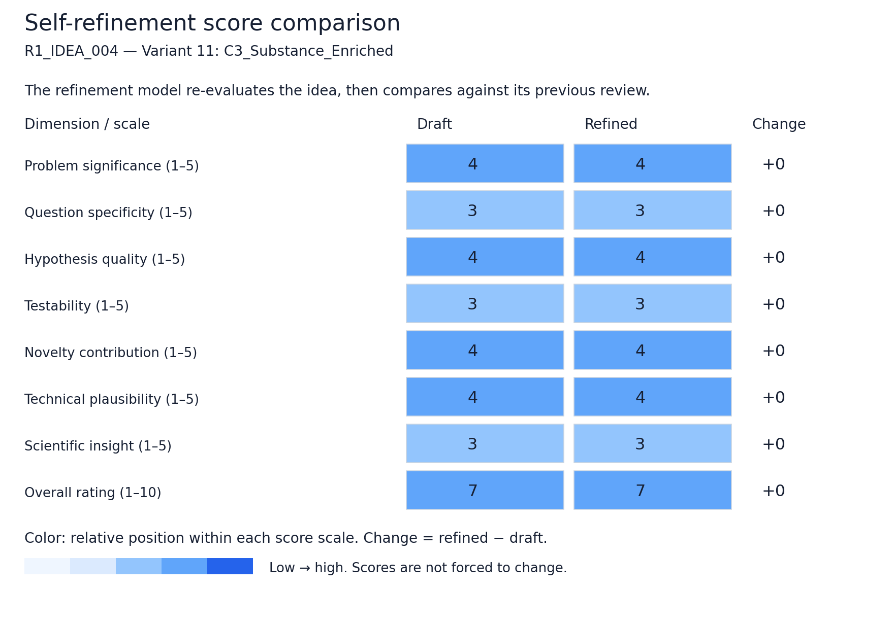

Changed score dimensions: none.

### Score justifications (draft / refined)

**Problem significance**

```json
{
  "draft": {
    "score": 4.0,
    "justification": "The problem of aligning large language models with safety constraints is critical for responsible AI deployment, making the research highly significant."
  },
  "refined": {
    "score": 4.0,
    "justification": "The problem of aligning large language models with safety constraints is critical for responsible AI deployment, making the research highly significant."
  }
}
```

**Question specificity**

```json
{
  "draft": {
    "score": 3.0,
    "justification": "The idea defines a specific research question about constrained alignment and the hypothesis regarding dual variable dynamics, but lacks detailed technical specifications."
  },
  "refined": {
    "score": 3.0,
    "justification": "The idea defines a specific research question about constrained alignment and the hypothesis regarding dual variable dynamics, but lacks detailed technical specifications."
  }
}
```

**Hypothesis quality**

```json
{
  "draft": {
    "score": 4.0,
    "justification": "The hypothesis about dual variable dynamics revealing trade-off patterns is testable and provides a clear direction for investigation, though it could be more explicitly formulated."
  },
  "refined": {
    "score": 4.0,
    "justification": "The hypothesis about dual variable dynamics revealing trade-off patterns is testable and provides a clear direction for investigation, though it could be more explicitly formulated."
  }
}
```

**Testability**

```json
{
  "draft": {
    "score": 3.0,
    "justification": "The idea includes a validation path (convergence behavior under varying constraints) but lacks detailed experimental plans and metrics for evaluation."
  },
  "refined": {
    "score": 3.0,
    "justification": "The idea includes a validation path (convergence behavior under varying constraints) but lacks detailed experimental plans and metrics for evaluation."
  }
}
```

**Novelty contribution**

```json
{
  "draft": {
    "score": 4.0,
    "justification": "The method avoids training separate reward and cost models, which is a novel approach, and the hypothesis about dual variable dynamics offers potential scientific insight."
  },
  "refined": {
    "score": 4.0,
    "justification": "The method avoids training separate reward and cost models, which is a novel approach, and the hypothesis about dual variable dynamics offers potential scientific insight."
  }
}
```

**Technical plausibility**

```json
{
  "draft": {
    "score": 4.0,
    "justification": "The primal-dual optimization approach is technically plausible, and the method's design aligns with existing research on constrained optimization in machine learning."
  },
  "refined": {
    "score": 4.0,
    "justification": "The primal-dual optimization approach is technically plausible, and the method's design aligns with existing research on constrained optimization in machine learning."
  }
}
```

**Scientific insight**

```json
{
  "draft": {
    "score": 3.0,
    "justification": "The hypothesis about dual variable dynamics could provide insights into the trade-offs between reward and safety, but the connection to real-world applications is not fully explored."
  },
  "refined": {
    "score": 3.0,
    "justification": "The hypothesis about dual variable dynamics could provide insights into the trade-offs between reward and safety, but the connection to real-world applications is not fully explored."
  }
}
```

**Overall rating**

```json
{
  "draft": {
    "score": 7.0,
    "justification": "The idea addresses a significant problem in AI alignment, proposes a novel method, and includes a testable hypothesis. However, it lacks detailed technical specifications and experimental plans, which could limit its scientific impact."
  },
  "refined": {
    "score": 7.0,
    "justification": "The idea addresses a significant problem in AI alignment, proposes a novel method, and includes a testable hypothesis. However, it lacks detailed technical specifications and experimental plans, which could limit its scientific impact."
  }
}
```

## R1_IDEA_004 — Variant 12: H1_Deceptive_Hollow


Changed score dimensions: none.

### Score justifications (draft / refined)

**Problem significance**

```json
{
  "draft": {
    "score": 4.0,
    "justification": "The idea addresses a critical challenge in large language model alignment, which is essential for ensuring safety and effectiveness in real-world applications. However, the problem is somewhat broad and could be more specific to justify a higher score."
  },
  "refined": {
    "score": 4.0,
    "justification": "The idea addresses a critical challenge in large language model alignment, which is essential for ensuring safety and effectiveness in real-world applications. However, the problem is somewhat broad and could be more specific to justify a higher score."
  }
}
```

**Question specificity**

```json
{
  "draft": {
    "score": 3.0,
    "justification": "The idea is framed as a broad, transformative approach, but it lacks a concrete research question or hypothesis. More specific constraints or objectives would enhance the clarity and testability of the idea."
  },
  "refined": {
    "score": 3.0,
    "justification": "The idea is framed as a broad, transformative approach, but it lacks a concrete research question or hypothesis. More specific constraints or objectives would enhance the clarity and testability of the idea."
  }
}
```

**Hypothesis quality**

```json
{
  "draft": {
    "score": 3.0,
    "justification": "The idea suggests a potential transformation in the field but does not provide a clear, testable hypothesis. The central promise is high-level and lacks concrete predictions or mechanisms."
  },
  "refined": {
    "score": 3.0,
    "justification": "The idea suggests a potential transformation in the field but does not provide a clear, testable hypothesis. The central promise is high-level and lacks concrete predictions or mechanisms."
  }
}
```

**Testability**

```json
{
  "draft": {
    "score": 2.0,
    "justification": "The idea is too vague to be tested without further specifics. It does not outline experiments, comparisons, or evaluations that could validate the claims."
  },
  "refined": {
    "score": 2.0,
    "justification": "The idea is too vague to be tested without further specifics. It does not outline experiments, comparisons, or evaluations that could validate the claims."
  }
}
```

**Novelty contribution**

```json
{
  "draft": {
    "score": 4.0,
    "justification": "The idea positions itself as a transformative synthesis rather than a narrow technical adjustment, which suggests potential for significant contribution. However, the lack of specifics makes it difficult to assess the novelty beyond the high-level claim."
  },
  "refined": {
    "score": 4.0,
    "justification": "The idea positions itself as a transformative synthesis rather than a narrow technical adjustment, which suggests potential for significant contribution. However, the lack of specifics makes it difficult to assess the novelty beyond the high-level claim."
  }
}
```

**Technical plausibility**

```json
{
  "draft": {
    "score": 3.0,
    "justification": "The approach is plausible in concept, but the lack of technical details makes it difficult to assess the feasibility or logical coherence of the proposed framework."
  },
  "refined": {
    "score": 3.0,
    "justification": "The approach is plausible in concept, but the lack of technical details makes it difficult to assess the feasibility or logical coherence of the proposed framework."
  }
}
```

**Scientific insight**

```json
{
  "draft": {
    "score": 3.0,
    "justification": "The idea has the potential to provide broader insights into alignment and safety, but without a concrete research question or hypothesis, the potential for scientific insight remains uncertain."
  },
  "refined": {
    "score": 3.0,
    "justification": "The idea has the potential to provide broader insights into alignment and safety, but without a concrete research question or hypothesis, the potential for scientific insight remains uncertain."
  }
}
```

**Overall rating**

```json
{
  "draft": {
    "score": 6.0,
    "justification": "The idea addresses a significant problem in large language model alignment but lacks specific details, a concrete research question, and testable hypotheses. It has potential for contribution but needs further clarification to be more actionable and impactful."
  },
  "refined": {
    "score": 6.0,
    "justification": "The idea addresses a significant problem in large language model alignment but lacks specific details, a concrete research question, and testable hypotheses. It has potential for contribution but needs further clarification to be more actionable and impactful."
  }
}
```

## R1_IDEA_004 — Variant 13: H2_Confident_Flaw


Changed score dimensions: none.

### Score justifications (draft / refined)

**Problem significance**

```json
{
  "draft": {
    "score": 4.0,
    "justification": "The research addresses a critical challenge in model alignment, particularly the need for efficient methods that reduce computational overhead without requiring additional models, which is a significant issue in practical applications."
  },
  "refined": {
    "score": 4.0,
    "justification": "The research addresses a critical challenge in model alignment, particularly the need for efficient methods that reduce computational overhead without requiring additional models, which is a significant issue in practical applications."
  }
}
```

**Question specificity**

```json
{
  "draft": {
    "score": 3.0,
    "justification": "The idea is specific in its goal to improve model alignment through a primal-dual approach, but the exact formulation and implementation details are not clearly defined, which could affect the clarity of the research question."
  },
  "refined": {
    "score": 3.0,
    "justification": "The idea is specific in its goal to improve model alignment through a primal-dual approach, but the exact formulation and implementation details are not clearly defined, which could affect the clarity of the research question."
  }
}
```

**Hypothesis quality**

```json
{
  "draft": {
    "score": 4.0,
    "justification": "The hypothesis that the method reduces computational overhead and improves efficiency is well-defined and aligns with the problem significance. However, the causal evidence argument is somewhat vague and needs more concrete support."
  },
  "refined": {
    "score": 4.0,
    "justification": "The hypothesis that the method reduces computational overhead and improves efficiency is well-defined and aligns with the problem significance. However, the causal evidence argument is somewhat vague and needs more concrete support."
  }
}
```

**Testability**

```json
{
  "draft": {
    "score": 3.0,
    "justification": "The idea is testable through experiments comparing the proposed method with existing approaches, but the lack of specific experimental details makes it challenging to assess the feasibility of the proposed method."
  },
  "refined": {
    "score": 3.0,
    "justification": "The idea is testable through experiments comparing the proposed method with existing approaches, but the lack of specific experimental details makes it challenging to assess the feasibility of the proposed method."
  }
}
```

**Novelty contribution**

```json
{
  "draft": {
    "score": 4.0,
    "justification": "The approach is novel in its application of primal-dual optimization for constrained alignment without separate models, which could contribute to the field by offering a more efficient solution."
  },
  "refined": {
    "score": 4.0,
    "justification": "The approach is novel in its application of primal-dual optimization for constrained alignment without separate models, which could contribute to the field by offering a more efficient solution."
  }
}
```

**Technical plausibility**

```json
{
  "draft": {
    "score": 4.0,
    "justification": "The method is technically plausible as it builds on existing optimization techniques, but the lack of specific implementation details may affect its feasibility in practice."
  },
  "refined": {
    "score": 4.0,
    "justification": "The method is technically plausible as it builds on existing optimization techniques, but the lack of specific implementation details may affect its feasibility in practice."
  }
}
```

**Scientific insight**

```json
{
  "draft": {
    "score": 3.0,
    "justification": "The idea has potential for scientific insight by addressing a key limitation in model alignment, but the connection between the method and the broader implications is not clearly established."
  },
  "refined": {
    "score": 3.0,
    "justification": "The idea has potential for scientific insight by addressing a key limitation in model alignment, but the connection between the method and the broader implications is not clearly established."
  }
}
```

**Overall rating**

```json
{
  "draft": {
    "score": 7.0,
    "justification": "The research idea is strong and addresses a significant problem in model alignment. However, it lacks specific details and experimental validation, which are necessary to fully assess its potential and scientific merit."
  },
  "refined": {
    "score": 7.0,
    "justification": "The research idea is strong and addresses a significant problem in model alignment. However, it lacks specific details and experimental validation, which are necessary to fully assess its potential and scientific merit."
  }
}
```

## R1_IDEA_004 — Variant 14: H3_Verbose_Enriched


Changed score dimensions: none.

### Score justifications (draft / refined)

**Problem significance**

```json
{
  "draft": {
    "score": 5.0,
    "justification": "The research addresses a critical challenge in aligning large language models with safety constraints, which is essential for ensuring the safe and effective deployment of AI systems."
  },
  "refined": {
    "score": 5.0,
    "justification": "The research addresses a critical challenge in aligning large language models with safety constraints, which is essential for ensuring the safe and effective deployment of AI systems."
  }
}
```

**Question specificity**

```json
{
  "draft": {
    "score": 4.0,
    "justification": "The idea clearly defines a specific research question about the method's ability to optimize reward and safety constraints without separate models, but the exact formulation and differences from existing methods are not fully specified."
  },
  "refined": {
    "score": 4.0,
    "justification": "The idea clearly defines a specific research question about the method's ability to optimize reward and safety constraints without separate models, but the exact formulation and differences from existing methods are not fully specified."
  }
}
```

**Hypothesis quality**

```json
{
  "draft": {
    "score": 4.0,
    "justification": "The hypothesis about dual variable dynamics revealing trade-off patterns is testable and has potential for scientific insight, but the connection between the dynamics and the trade-off patterns is not clearly explained."
  },
  "refined": {
    "score": 4.0,
    "justification": "The hypothesis about dual variable dynamics revealing trade-off patterns is testable and has potential for scientific insight, but the connection between the dynamics and the trade-off patterns is not clearly explained."
  }
}
```

**Testability**

```json
{
  "draft": {
    "score": 5.0,
    "justification": "The idea includes a detailed validation plan with multiple components (convergence testing, dual variable dynamics analysis, staged design, ablations, sensitivity analyses, and error analysis), making it highly testable."
  },
  "refined": {
    "score": 5.0,
    "justification": "The idea includes a detailed validation plan with multiple components (convergence testing, dual variable dynamics analysis, staged design, ablations, sensitivity analyses, and error analysis), making it highly testable."
  }
}
```

**Novelty contribution**

```json
{
  "draft": {
    "score": 4.0,
    "justification": "The method is novel in its approach to constrained alignment without separate reward and cost models, but the specific contributions and applications are not fully articulated."
  },
  "refined": {
    "score": 4.0,
    "justification": "The method is novel in its approach to constrained alignment without separate reward and cost models, but the specific contributions and applications are not fully articulated."
  }
}
```

**Technical plausibility**

```json
{
  "draft": {
    "score": 4.0,
    "justification": "The proposed method is technically plausible, but the exact formulation and how it integrates reward and safety constraints are not fully specified, which could affect its feasibility."
  },
  "refined": {
    "score": 4.0,
    "justification": "The proposed method is technically plausible, but the exact formulation and how it integrates reward and safety constraints are not fully specified, which could affect its feasibility."
  }
}
```

**Scientific insight**

```json
{
  "draft": {
    "score": 4.0,
    "justification": "The hypothesis about dual variable dynamics revealing trade-off patterns has potential for scientific insight, but the connection between the dynamics and the trade-off patterns is not clearly explained."
  },
  "refined": {
    "score": 4.0,
    "justification": "The hypothesis about dual variable dynamics revealing trade-off patterns has potential for scientific insight, but the connection between the dynamics and the trade-off patterns is not clearly explained."
  }
}
```

**Overall rating**

```json
{
  "draft": {
    "score": 8.0,
    "justification": "The idea addresses a significant problem in constrained alignment of large language models with a clear method and detailed validation plan. The hypothesis is testable and has potential for scientific insight, though some aspects of the method and its application are not fully specified."
  },
  "refined": {
    "score": 8.0,
    "justification": "The idea addresses a significant problem in constrained alignment of large language models with a clear method and detailed validation plan. The hypothesis is testable and has potential for scientific insight, though some aspects of the method and its application are not fully specified."
  }
}
```

## R1_IDEA_004 — Variant 15: H4_Ultimate_Hype


Changed score dimensions: none.

### Score justifications (draft / refined)

**Problem significance**

```json
{
  "draft": {
    "score": 4.0,
    "justification": "The problem of aligning large language models with safety constraints is critical for developing trustworthy AI systems, making it a significant challenge in the field."
  },
  "refined": {
    "score": 4.0,
    "justification": "The problem of aligning large language models with safety constraints is critical for developing trustworthy AI systems, making it a significant challenge in the field."
  }
}
```

**Question specificity**

```json
{
  "draft": {
    "score": 3.0,
    "justification": "The idea identifies a specific challenge in constrained alignment but lacks detailed formulation of the research question, making it somewhat vague."
  },
  "refined": {
    "score": 3.0,
    "justification": "The idea identifies a specific challenge in constrained alignment but lacks detailed formulation of the research question, making it somewhat vague."
  }
}
```

**Hypothesis quality**

```json
{
  "draft": {
    "score": 2.0,
    "justification": "The idea presents a general research direction but does not provide a clear hypothesis or prediction that can be tested or falsified."
  },
  "refined": {
    "score": 2.0,
    "justification": "The idea presents a general research direction but does not provide a clear hypothesis or prediction that can be tested or falsified."
  }
}
```

**Testability**

```json
{
  "draft": {
    "score": 2.0,
    "justification": "The idea lacks specific experiments or comparisons that would allow for testing the proposed method's effectiveness and computational efficiency."
  },
  "refined": {
    "score": 2.0,
    "justification": "The idea lacks specific experiments or comparisons that would allow for testing the proposed method's effectiveness and computational efficiency."
  }
}
```

**Novelty contribution**

```json
{
  "draft": {
    "score": 4.0,
    "justification": "The approach of avoiding separate reward and cost models is novel and has the potential to contribute to more efficient and trustworthy AI systems."
  },
  "refined": {
    "score": 4.0,
    "justification": "The approach of avoiding separate reward and cost models is novel and has the potential to contribute to more efficient and trustworthy AI systems."
  }
}
```

**Technical plausibility**

```json
{
  "draft": {
    "score": 4.0,
    "justification": "The primal-dual optimization framework is technically plausible, though the specific implementation details are not provided."
  },
  "refined": {
    "score": 4.0,
    "justification": "The primal-dual optimization framework is technically plausible, though the specific implementation details are not provided."
  }
}
```

**Scientific insight**

```json
{
  "draft": {
    "score": 3.0,
    "justification": "The idea has the potential to provide insights into constrained optimization in AI, but the lack of specific hypotheses limits the potential for scientific insight."
  },
  "refined": {
    "score": 3.0,
    "justification": "The idea has the potential to provide insights into constrained optimization in AI, but the lack of specific hypotheses limits the potential for scientific insight."
  }
}
```

**Overall rating**

```json
{
  "draft": {
    "score": 7.0,
    "justification": "The idea addresses a significant problem with potential for impact, but lacks specific details and hypotheses needed to fully assess its scientific merit and testability."
  },
  "refined": {
    "score": 7.0,
    "justification": "The idea addresses a significant problem with potential for impact, but lacks specific details and hypotheses needed to fully assess its scientific merit and testability."
  }
}
```

## R1_IDEA_005 — Source


Changed score dimensions: none.

### Score justifications (draft / refined)

**Problem significance**

```json
{
  "draft": {
    "score": 4.0,
    "justification": "The problem of improving robustness under distribution shifts in vision SSMs is significant, as it addresses a critical challenge in real-world applications where data distributions can vary unpredictably."
  },
  "refined": {
    "score": 4.0,
    "justification": "The problem of improving robustness under distribution shifts in vision SSMs is significant, as it addresses a critical challenge in real-world applications where data distributions can vary unpredictably."
  }
}
```

**Question specificity**

```json
{
  "draft": {
    "score": 3.0,
    "justification": "The idea is specific in its approach to test-time adaptation using SSM permutations and pseudo-labels, but lacks detailed specification of key components like permutation generation and parameter updating mechanisms."
  },
  "refined": {
    "score": 3.0,
    "justification": "The idea is specific in its approach to test-time adaptation using SSM permutations and pseudo-labels, but lacks detailed specification of key components like permutation generation and parameter updating mechanisms."
  }
}
```

**Hypothesis quality**

```json
{
  "draft": {
    "score": 4.0,
    "justification": "The hypothesis that using diverse SSM permutations and pseudo-labels can enhance generalization without additional data is plausible and could be tested through experiments, making it a strong hypothesis."
  },
  "refined": {
    "score": 4.0,
    "justification": "The hypothesis that using diverse SSM permutations and pseudo-labels can enhance generalization without additional data is plausible and could be tested through experiments, making it a strong hypothesis."
  }
}
```

**Testability**

```json
{
  "draft": {
    "score": 3.0,
    "justification": "The idea is testable through experiments, but the lack of specific details on implementation makes it challenging to design and evaluate the method effectively."
  },
  "refined": {
    "score": 3.0,
    "justification": "The idea is testable through experiments, but the lack of specific details on implementation makes it challenging to design and evaluate the method effectively."
  }
}
```

**Novelty contribution**

```json
{
  "draft": {
    "score": 4.0,
    "justification": "The approach of using SSM traversal permutations for test-time adaptation is novel, and if successful, could contribute new insights into improving model robustness under distribution shifts."
  },
  "refined": {
    "score": 4.0,
    "justification": "The approach of using SSM traversal permutations for test-time adaptation is novel, and if successful, could contribute new insights into improving model robustness under distribution shifts."
  }
}
```

**Technical plausibility**

```json
{
  "draft": {
    "score": 4.0,
    "justification": "The method is technically plausible as it builds on existing test-time adaptation techniques and leverages SSM properties, though the specifics of implementation are not fully detailed."
  },
  "refined": {
    "score": 4.0,
    "justification": "The method is technically plausible as it builds on existing test-time adaptation techniques and leverages SSM properties, though the specifics of implementation are not fully detailed."
  }
}
```

**Scientific insight**

```json
{
  "draft": {
    "score": 3.0,
    "justification": "The idea has potential for scientific insight into how SSMs can be adapted at test time, but the lack of detailed mechanisms limits the potential for deeper insights."
  },
  "refined": {
    "score": 3.0,
    "justification": "The idea has potential for scientific insight into how SSMs can be adapted at test time, but the lack of detailed mechanisms limits the potential for deeper insights."
  }
}
```

**Overall rating**

```json
{
  "draft": {
    "score": 7.0,
    "justification": "The idea addresses a significant problem with a plausible approach, has potential for novelty and contribution, but lacks specific details that would make it more testable and scientifically insightful."
  },
  "refined": {
    "score": 7.0,
    "justification": "The idea addresses a significant problem with a plausible approach, has potential for novelty and contribution, but lacks specific details that would make it more testable and scientifically insightful."
  }
}
```

## R1_IDEA_005 — Variant 1: A1_Identity


Changed score dimensions: none.

### Score justifications (draft / refined)

**Problem significance**

```json
{
  "draft": {
    "score": 4.0,
    "justification": "The problem of improving robustness under distribution shifts in vision SSMs is significant, as it addresses a critical challenge in real-world applications where data distributions can vary unpredictably."
  },
  "refined": {
    "score": 4.0,
    "justification": "The problem of improving robustness under distribution shifts in vision SSMs is significant, as it addresses a critical challenge in real-world applications where data distributions can vary unpredictably."
  }
}
```

**Question specificity**

```json
{
  "draft": {
    "score": 3.0,
    "justification": "The idea is specific in its approach to test-time adaptation using SSM permutations and pseudo-labels, but lacks detailed specification of key components like permutation generation and parameter updating mechanisms."
  },
  "refined": {
    "score": 3.0,
    "justification": "The idea is specific in its approach to test-time adaptation using SSM permutations and pseudo-labels, but lacks detailed specification of key components like permutation generation and parameter updating mechanisms."
  }
}
```

**Hypothesis quality**

```json
{
  "draft": {
    "score": 4.0,
    "justification": "The hypothesis that using diverse SSM permutations and pseudo-labels can enhance generalization without additional data is plausible and could be tested through experiments, making it a strong hypothesis."
  },
  "refined": {
    "score": 4.0,
    "justification": "The hypothesis that using diverse SSM permutations and pseudo-labels can enhance generalization without additional data is plausible and could be tested through experiments, making it a strong hypothesis."
  }
}
```

**Testability**

```json
{
  "draft": {
    "score": 3.0,
    "justification": "The idea is testable through experiments, but the lack of specific details on implementation makes it challenging to design and evaluate the method effectively."
  },
  "refined": {
    "score": 3.0,
    "justification": "The idea is testable through experiments, but the lack of specific details on implementation makes it challenging to design and evaluate the method effectively."
  }
}
```

**Novelty contribution**

```json
{
  "draft": {
    "score": 4.0,
    "justification": "The approach of using SSM traversal permutations for test-time adaptation is novel, and if successful, could contribute new insights into improving model robustness under distribution shifts."
  },
  "refined": {
    "score": 4.0,
    "justification": "The approach of using SSM traversal permutations for test-time adaptation is novel, and if successful, could contribute new insights into improving model robustness under distribution shifts."
  }
}
```

**Technical plausibility**

```json
{
  "draft": {
    "score": 4.0,
    "justification": "The method is technically plausible as it builds on existing test-time adaptation techniques and leverages SSM properties, though the specifics of implementation are not fully detailed."
  },
  "refined": {
    "score": 4.0,
    "justification": "The method is technically plausible as it builds on existing test-time adaptation techniques and leverages SSM properties, though the specifics of implementation are not fully detailed."
  }
}
```

**Scientific insight**

```json
{
  "draft": {
    "score": 3.0,
    "justification": "The idea has potential for scientific insight into how SSMs can be adapted at test time, but the lack of detailed mechanisms limits the potential for deeper insights."
  },
  "refined": {
    "score": 3.0,
    "justification": "The idea has potential for scientific insight into how SSMs can be adapted at test time, but the lack of detailed mechanisms limits the potential for deeper insights."
  }
}
```

**Overall rating**

```json
{
  "draft": {
    "score": 7.0,
    "justification": "The idea addresses a significant problem with a plausible approach, has potential for novelty and contribution, but lacks specific details that would make it more testable and scientifically insightful."
  },
  "refined": {
    "score": 7.0,
    "justification": "The idea addresses a significant problem with a plausible approach, has potential for novelty and contribution, but lacks specific details that would make it more testable and scientifically insightful."
  }
}
```

## R1_IDEA_005 — Variant 2: A2_Paraphrase_Only


Changed score dimensions: none.

### Score justifications (draft / refined)

**Problem significance**

```json
{
  "draft": {
    "score": 4.0,
    "justification": "The problem of distribution shifts in vision models is significant for real-world applications, and the proposed approach addresses a relevant challenge in robustness."
  },
  "refined": {
    "score": 4.0,
    "justification": "The problem of distribution shifts in vision models is significant for real-world applications, and the proposed approach addresses a relevant challenge in robustness."
  }
}
```

**Question specificity**

```json
{
  "draft": {
    "score": 3.0,
    "justification": "The idea is somewhat specific but lacks a clear, testable research question that defines what exactly is being investigated."
  },
  "refined": {
    "score": 3.0,
    "justification": "The idea is somewhat specific but lacks a clear, testable research question that defines what exactly is being investigated."
  }
}
```

**Hypothesis quality**

```json
{
  "draft": {
    "score": 3.0,
    "justification": "The idea contains a general goal but does not explicitly state a hypothesis that can be tested or falsified."
  },
  "refined": {
    "score": 3.0,
    "justification": "The idea contains a general goal but does not explicitly state a hypothesis that can be tested or falsified."
  }
}
```

**Testability**

```json
{
  "draft": {
    "score": 3.0,
    "justification": "The idea suggests a method but does not provide sufficient details on how to test its effectiveness, such as comparison baselines or evaluation metrics."
  },
  "refined": {
    "score": 3.0,
    "justification": "The idea suggests a method but does not provide sufficient details on how to test its effectiveness, such as comparison baselines or evaluation metrics."
  }
}
```

**Novelty contribution**

```json
{
  "draft": {
    "score": 4.0,
    "justification": "The approach of using test-time adaptation with SSM permutations and pseudo-labels is novel in the context of vision models, offering potential contributions to robust learning."
  },
  "refined": {
    "score": 4.0,
    "justification": "The approach of using test-time adaptation with SSM permutations and pseudo-labels is novel in the context of vision models, offering potential contributions to robust learning."
  }
}
```

**Technical plausibility**

```json
{
  "draft": {
    "score": 4.0,
    "justification": "The method is technically plausible, as it builds on existing ideas in test-time adaptation and pseudo-labeling, though the specifics of implementation are not fully detailed."
  },
  "refined": {
    "score": 4.0,
    "justification": "The method is technically plausible, as it builds on existing ideas in test-time adaptation and pseudo-labeling, though the specifics of implementation are not fully detailed."
  }
}
```

**Scientific insight**

```json
{
  "draft": {
    "score": 3.0,
    "justification": "The idea has potential for scientific insight into how test-time adaptation can improve generalization, but the connection to broader principles is not clearly established."
  },
  "refined": {
    "score": 3.0,
    "justification": "The idea has potential for scientific insight into how test-time adaptation can improve generalization, but the connection to broader principles is not clearly established."
  }
}
```

**Overall rating**

```json
{
  "draft": {
    "score": 7.0,
    "justification": "The idea is promising and addresses a meaningful problem, but it lacks sufficient specificity and testable hypotheses. With further clarification and details, it has the potential to be a strong research direction."
  },
  "refined": {
    "score": 7.0,
    "justification": "The idea is promising and addresses a meaningful problem, but it lacks sufficient specificity and testable hypotheses. With further clarification and details, it has the potential to be a strong research direction."
  }
}
```

## R1_IDEA_005 — Variant 3: A3_Plain_Core


Changed score dimensions: none.

### Score justifications (draft / refined)

**Problem significance**

```json
{
  "draft": {
    "score": 4.0,
    "justification": "The problem of reduced robustness in vision SSMs under distribution shifts is significant, as it affects the reliability of these models in real-world applications where data distributions may vary."
  },
  "refined": {
    "score": 4.0,
    "justification": "The problem of reduced robustness in vision SSMs under distribution shifts is significant, as it affects the reliability of these models in real-world applications where data distributions may vary."
  }
}
```

**Question specificity**

```json
{
  "draft": {
    "score": 3.0,
    "justification": "The idea identifies a specific problem (robustness under distribution shifts) but lacks detailed specification of the method's components and the exact research question being addressed."
  },
  "refined": {
    "score": 3.0,
    "justification": "The idea identifies a specific problem (robustness under distribution shifts) but lacks detailed specification of the method's components and the exact research question being addressed."
  }
}
```

**Hypothesis quality**

```json
{
  "draft": {
    "score": 3.0,
    "justification": "The idea suggests a method that aims to improve robustness, but it does not explicitly state a hypothesis or prediction that can be tested or falsified."
  },
  "refined": {
    "score": 3.0,
    "justification": "The idea suggests a method that aims to improve robustness, but it does not explicitly state a hypothesis or prediction that can be tested or falsified."
  }
}
```

**Testability**

```json
{
  "draft": {
    "score": 3.0,
    "justification": "The method is testable in principle, but the lack of specific details makes it difficult to assess its feasibility and to design experiments that can validate the claims."
  },
  "refined": {
    "score": 3.0,
    "justification": "The method is testable in principle, but the lack of specific details makes it difficult to assess its feasibility and to design experiments that can validate the claims."
  }
}
```

**Novelty contribution**

```json
{
  "draft": {
    "score": 4.0,
    "justification": "The approach of using test-time adaptation with SSM traversal permutations and pseudo-labels is novel in the context of vision SSMs, and could contribute to improving their robustness in real-world scenarios."
  },
  "refined": {
    "score": 4.0,
    "justification": "The approach of using test-time adaptation with SSM traversal permutations and pseudo-labels is novel in the context of vision SSMs, and could contribute to improving their robustness in real-world scenarios."
  }
}
```

**Technical plausibility**

```json
{
  "draft": {
    "score": 4.0,
    "justification": "The proposed method is technically plausible, as it leverages existing concepts in test-time adaptation and pseudo-labeling, which are well-established in machine learning."
  },
  "refined": {
    "score": 4.0,
    "justification": "The proposed method is technically plausible, as it leverages existing concepts in test-time adaptation and pseudo-labeling, which are well-established in machine learning."
  }
}
```

**Scientific insight**

```json
{
  "draft": {
    "score": 3.0,
    "justification": "The idea has potential for scientific insight into how test-time adaptation can enhance robustness in SSMs, but the lack of specific details limits the potential for deeper insights."
  },
  "refined": {
    "score": 3.0,
    "justification": "The idea has potential for scientific insight into how test-time adaptation can enhance robustness in SSMs, but the lack of specific details limits the potential for deeper insights."
  }
}
```

**Overall rating**

```json
{
  "draft": {
    "score": 7.0,
    "justification": "The idea addresses a meaningful problem with a plausible approach, but it lacks sufficient specificity and detail to fully evaluate its potential and testability. With further clarification and refinement, it has the potential to be a strong research direction."
  },
  "refined": {
    "score": 7.0,
    "justification": "The idea addresses a meaningful problem with a plausible approach, but it lacks sufficient specificity and detail to fully evaluate its potential and testability. With further clarification and refinement, it has the potential to be a strong research direction."
  }
}
```

## R1_IDEA_005 — Variant 4: B1_Verbose_Elaborate


Changed score dimensions: none.

### Score justifications (draft / refined)

**Problem significance**

```json
{
  "draft": {
    "score": 4.0,
    "justification": "Improving robustness of vision SSMs under distribution shifts is a critical challenge in real-world applications, making the problem significant."
  },
  "refined": {
    "score": 4.0,
    "justification": "Improving robustness of vision SSMs under distribution shifts is a critical challenge in real-world applications, making the problem significant."
  }
}
```

**Question specificity**

```json
{
  "draft": {
    "score": 3.0,
    "justification": "The idea defines a specific research direction but lacks detailed specification of the method's components, such as input view generation and pseudo-label validation."
  },
  "refined": {
    "score": 3.0,
    "justification": "The idea defines a specific research direction but lacks detailed specification of the method's components, such as input view generation and pseudo-label validation."
  }
}
```

**Hypothesis quality**

```json
{
  "draft": {
    "score": 4.0,
    "justification": "The hypothesis that test-time adaptation using pseudo-labels can enhance generalization is concrete and testable, though the exact mechanism is not fully detailed."
  },
  "refined": {
    "score": 4.0,
    "justification": "The hypothesis that test-time adaptation using pseudo-labels can enhance generalization is concrete and testable, though the exact mechanism is not fully detailed."
  }
}
```

**Testability**

```json
{
  "draft": {
    "score": 3.0,
    "justification": "The idea suggests a method but does not provide specific experiments or evaluation metrics to test the effectiveness of the proposed approach."
  },
  "refined": {
    "score": 3.0,
    "justification": "The idea suggests a method but does not provide specific experiments or evaluation metrics to test the effectiveness of the proposed approach."
  }
}
```

**Novelty contribution**

```json
{
  "draft": {
    "score": 3.0,
    "justification": "The approach is a novel application of test-time adaptation to vision SSMs, but the novelty is limited without further details on the method's components."
  },
  "refined": {
    "score": 3.0,
    "justification": "The approach is a novel application of test-time adaptation to vision SSMs, but the novelty is limited without further details on the method's components."
  }
}
```

**Technical plausibility**

```json
{
  "draft": {
    "score": 4.0,
    "justification": "The proposed method is technically plausible, as it leverages existing techniques like pseudo-labeling and test-time adaptation, which are well-established in machine learning."
  },
  "refined": {
    "score": 4.0,
    "justification": "The proposed method is technically plausible, as it leverages existing techniques like pseudo-labeling and test-time adaptation, which are well-established in machine learning."
  }
}
```

**Scientific insight**

```json
{
  "draft": {
    "score": 3.0,
    "justification": "The idea has potential to provide insights into the robustness of SSMs under distribution shifts, but the specific insights depend on the detailed implementation and evaluation."
  },
  "refined": {
    "score": 3.0,
    "justification": "The idea has potential to provide insights into the robustness of SSMs under distribution shifts, but the specific insights depend on the detailed implementation and evaluation."
  }
}
```

**Overall rating**

```json
{
  "draft": {
    "score": 7.0,
    "justification": "The idea addresses a meaningful problem with a plausible approach, but lacks sufficient detail to fully assess its testability and novelty. It has potential for further development but requires more specification."
  },
  "refined": {
    "score": 7.0,
    "justification": "The idea addresses a meaningful problem with a plausible approach, but lacks sufficient detail to fully assess its testability and novelty. It has potential for further development but requires more specification."
  }
}
```

## R1_IDEA_005 — Variant 5: B2_Grand_Narrative


Changed score dimensions: none.

### Score justifications (draft / refined)

**Problem significance**

```json
{
  "draft": {
    "score": 4.0,
    "justification": "The idea addresses a critical challenge in vision models: maintaining reliability under distribution shifts, which is a key issue in real-world applications."
  },
  "refined": {
    "score": 4.0,
    "justification": "The idea addresses a critical challenge in vision models: maintaining reliability under distribution shifts, which is a key issue in real-world applications."
  }
}
```

**Question specificity**

```json
{
  "draft": {
    "score": 3.0,
    "justification": "The research question is clear in its goal (improving robustness under distribution shifts) but lacks specific details on the method's implementation and the exact mechanism of pseudo-label usage."
  },
  "refined": {
    "score": 3.0,
    "justification": "The research question is clear in its goal (improving robustness under distribution shifts) but lacks specific details on the method's implementation and the exact mechanism of pseudo-label usage."
  }
}
```

**Hypothesis quality**

```json
{
  "draft": {
    "score": 3.0,
    "justification": "The idea presents a plausible hypothesis that test-time adaptation with SSM permutations can improve robustness, but the specifics of how this is achieved are not clearly defined."
  },
  "refined": {
    "score": 3.0,
    "justification": "The idea presents a plausible hypothesis that test-time adaptation with SSM permutations can improve robustness, but the specifics of how this is achieved are not clearly defined."
  }
}
```

**Testability**

```json
{
  "draft": {
    "score": 3.0,
    "justification": "The method is testable in principle, but the lack of specific details makes it difficult to assess its feasibility and effectiveness without further clarification."
  },
  "refined": {
    "score": 3.0,
    "justification": "The method is testable in principle, but the lack of specific details makes it difficult to assess its feasibility and effectiveness without further clarification."
  }
}
```

**Novelty contribution**

```json
{
  "draft": {
    "score": 4.0,
    "justification": "The approach is novel in its application of test-time adaptation with SSM permutations for vision models, and it has the potential to contribute to generalization without labeled data."
  },
  "refined": {
    "score": 4.0,
    "justification": "The approach is novel in its application of test-time adaptation with SSM permutations for vision models, and it has the potential to contribute to generalization without labeled data."
  }
}
```

**Technical plausibility**

```json
{
  "draft": {
    "score": 3.0,
    "justification": "The proposed method is technically plausible, but the lack of specific details on implementation makes it challenging to assess the feasibility of the approach."
  },
  "refined": {
    "score": 3.0,
    "justification": "The proposed method is technically plausible, but the lack of specific details on implementation makes it challenging to assess the feasibility of the approach."
  }
}
```

**Scientific insight**

```json
{
  "draft": {
    "score": 3.0,
    "justification": "The idea has potential for scientific insight into how test-time adaptation can enhance robustness, but the connection to generalization and distribution shifts is not clearly established."
  },
  "refined": {
    "score": 3.0,
    "justification": "The idea has potential for scientific insight into how test-time adaptation can enhance robustness, but the connection to generalization and distribution shifts is not clearly established."
  }
}
```

**Overall rating**

```json
{
  "draft": {
    "score": 7.0,
    "justification": "The idea addresses a significant problem in vision models and proposes a potentially useful method, but it lacks sufficient specificity and details to fully evaluate its feasibility and scientific contribution."
  },
  "refined": {
    "score": 7.0,
    "justification": "The idea addresses a significant problem in vision models and proposes a potentially useful method, but it lacks sufficient specificity and details to fully evaluate its feasibility and scientific contribution."
  }
}
```

## R1_IDEA_005 — Variant 6: B3_Over_Confident


Changed score dimensions: none.

### Score justifications (draft / refined)

**Problem significance**

```json
{
  "draft": {
    "score": 4.0,
    "justification": "The problem of improving robustness under distribution shifts in vision SSMs is significant, as it addresses a critical challenge in real-world applications where data distributions can vary."
  },
  "refined": {
    "score": 4.0,
    "justification": "Improving robustness under distribution shifts is a critical challenge in vision SSMs, as real-world data distributions can vary significantly, making this a significant problem for practical applications."
  }
}
```

**Question specificity**

```json
{
  "draft": {
    "score": 3.0,
    "justification": "The idea is specific to improving SSM robustness under distribution shifts, but the details on 'diverse SSM traversal permutations' and the pseudo-label update mechanism are not sufficiently detailed."
  },
  "refined": {
    "score": 3.0,
    "justification": "The idea is specific to enhancing SSM robustness under distribution shifts, but the details on 'diverse SSM traversal permutations' and the pseudo-label update mechanism are not sufficiently detailed, which could lead to ambiguity in implementation."
  }
}
```

**Hypothesis quality**

```json
{
  "draft": {
    "score": 3.0,
    "justification": "The idea proposes a method to enhance generalization through test-time adaptation, but the hypothesis is not explicitly stated or clearly defined, making it harder to evaluate."
  },
  "refined": {
    "score": 3.0,
    "justification": "The idea proposes a method to enhance generalization through test-time adaptation, but the hypothesis is not explicitly stated or clearly defined, making it harder to evaluate the effectiveness of the approach."
  }
}
```

**Testability**

```json
{
  "draft": {
    "score": 3.0,
    "justification": "The method is testable through experiments, but the lack of specific details makes it challenging to design the experiments and evaluate the proposed approach effectively."
  },
  "refined": {
    "score": 3.0,
    "justification": "The method is testable through experiments, but the lack of specific details makes it challenging to design the experiments and evaluate the proposed approach effectively."
  }
}
```

**Novelty contribution**

```json
{
  "draft": {
    "score": 4.0,
    "justification": "The approach of using test-time adaptation with SSM traversal permutations and pseudo-labels is novel in the context of vision SSMs, offering a potential contribution to robustness under distribution shifts."
  },
  "refined": {
    "score": 4.0,
    "justification": "The approach of using test-time adaptation with SSM traversal permutations and pseudo-labels is novel in the context of vision SSMs, offering a potential contribution to robustness under distribution shifts."
  }
}
```

**Technical plausibility**

```json
{
  "draft": {
    "score": 3.0,
    "justification": "The method is technically plausible, but the lack of specific details on the SSM traversal permutations and pseudo-label generation makes it difficult to assess the feasibility of the approach."
  },
  "refined": {
    "score": 3.0,
    "justification": "The method is technically plausible, but the lack of specific details on the SSM traversal permutations and pseudo-label generation makes it difficult to assess the feasibility of the approach."
  }
}
```

**Scientific insight**

```json
{
  "draft": {
    "score": 3.0,
    "justification": "The idea has potential for scientific insight into how test-time adaptation and SSM traversal can improve robustness, but the lack of specifics limits the depth of the insight that can be gained."
  },
  "refined": {
    "score": 3.0,
    "justification": "The idea has potential for scientific insight into how test-time adaptation and SSM traversal can improve robustness, but the lack of specifics limits the depth of the insight that can be gained."
  }
}
```

**Overall rating**

```json
{
  "draft": {
    "score": 7.0,
    "justification": "The idea addresses a meaningful problem with a promising approach, but it lacks sufficient detail to fully evaluate its testability and scientific contribution. With more specifics, it could become a strong research direction."
  },
  "refined": {
    "score": 7.0,
    "justification": "The idea addresses a meaningful problem with a promising approach, but it lacks sufficient detail to fully evaluate its testability and scientific contribution. With more specifics, it could become a strong research direction."
  }
}
```

## R1_IDEA_005 — Variant 7: B4_Novelty


Changed score dimensions: none.

### Score justifications (draft / refined)

**Problem significance**

```json
{
  "draft": {
    "score": 4.0,
    "justification": "The research addresses a critical challenge in vision state space models (SSMs) related to robustness under distribution shifts, which is important for real-world applications where data distribution can vary significantly."
  },
  "refined": {
    "score": 4.0,
    "justification": "The research addresses a critical challenge in vision state space models (SSMs) related to robustness under distribution shifts, which is important for real-world applications where data distribution can vary significantly."
  }
}
```

**Question specificity**

```json
{
  "draft": {
    "score": 3.0,
    "justification": "The idea proposes a novel method for improving robustness under distribution shifts, but the specific details on how the SSM traversal permutations are generated and how the pseudo-labels are used for parameter updates are not clearly defined, which limits the specificity of the research question."
  },
  "refined": {
    "score": 3.0,
    "justification": "The idea proposes a novel method for improving robustness under distribution shifts, but the specific details on how the SSM traversal permutations are generated and how the pseudo-labels are used for parameter updates are not clearly defined, which limits the specificity of the research question."
  }
}
```

**Hypothesis quality**

```json
{
  "draft": {
    "score": 4.0,
    "justification": "The idea presents a plausible hypothesis that generating multiple input views through SSM traversal permutations and using pseudo-labels to update parameters can enhance generalization without additional labeled data. This hypothesis is testable and has the potential to be validated through experiments."
  },
  "refined": {
    "score": 4.0,
    "justification": "The idea presents a plausible hypothesis that generating multiple input views through SSM traversal permutations and using pseudo-labels to update parameters can enhance generalization without additional labeled data. This hypothesis is testable and has the potential to be validated through experiments."
  }
}
```

**Testability**

```json
{
  "draft": {
    "score": 3.0,
    "justification": "The idea suggests a method that could be tested through experiments, but the lack of specific details on the implementation of SSM traversal permutations and the aggregation of adapted weights makes it challenging to assess the testability of the proposed approach."
  },
  "refined": {
    "score": 3.0,
    "justification": "The idea suggests a method that could be tested through experiments, but the lack of specific details on the implementation of SSM traversal permutations and the aggregation of adapted weights makes it challenging to assess the testability of the proposed approach."
  }
}
```

**Novelty contribution**

```json
{
  "draft": {
    "score": 3.0,
    "justification": "The idea introduces a new perspective on test-time adaptation for SSMs, but the novelty is somewhat vague without a clear comparison to existing methods. The contribution would be significant if the method demonstrates improved robustness under distribution shifts."
  },
  "refined": {
    "score": 3.0,
    "justification": "The idea introduces a new perspective on test-time adaptation for SSMs, but the novelty is somewhat vague without a clear comparison to existing methods. The contribution would be significant if the method demonstrates improved robustness under distribution shifts."
  }
}
```

**Technical plausibility**

```json
{
  "draft": {
    "score": 4.0,
    "justification": "The proposed method is technically plausible, as it involves generating input views, using pseudo-labels for parameter updates, and aggregating weights. These components are consistent with existing techniques in machine learning and state space modeling."
  },
  "refined": {
    "score": 4.0,
    "justification": "The proposed method is technically plausible, as it involves generating input views, using pseudo-labels for parameter updates, and aggregating weights. These components are consistent with existing techniques in machine learning and state space modeling."
  }
}
```

**Scientific insight**

```json
{
  "draft": {
    "score": 3.0,
    "justification": "The idea has the potential to provide insights into how test-time adaptation can be effectively applied to SSMs under distribution shifts. However, the lack of specific details limits the potential for deeper scientific insight."
  },
  "refined": {
    "score": 3.0,
    "justification": "The idea has the potential to provide insights into how test-time adaptation can be effectively applied to SSMs under distribution shifts. However, the lack of specific details limits the potential for deeper scientific insight."
  }
}
```

**Overall rating**

```json
{
  "draft": {
    "score": 7.0,
    "justification": "The research idea addresses a meaningful problem in vision state space models and proposes a novel approach. While the specifics of the method are not fully detailed, the hypothesis is plausible and has the potential to contribute to the field. However, further clarification and experimental validation are needed to strengthen the idea."
  },
  "refined": {
    "score": 7.0,
    "justification": "The research idea addresses a meaningful problem in vision state space models and proposes a novel approach. While the specifics of the method are not fully detailed, the hypothesis is plausible and has the potential to contribute to the field. However, further clarification and experimental validation are needed to strengthen the idea."
  }
}
```

## R1_IDEA_005 — Variant 8: B5_Application_Impact


Changed score dimensions: none.

### Score justifications (draft / refined)

**Problem significance**

```json
{
  "draft": {
    "score": 4.0,
    "justification": "The problem of distribution shifts in vision systems is significant for real-world applications, and improving robustness is a critical challenge."
  },
  "refined": {
    "score": 4.0,
    "justification": "The problem of distribution shifts in vision systems is significant for real-world applications, and improving robustness is a critical challenge."
  }
}
```

**Question specificity**

```json
{
  "draft": {
    "score": 3.0,
    "justification": "The idea is somewhat general and lacks a precise research question, though it does address a relevant problem."
  },
  "refined": {
    "score": 3.0,
    "justification": "The idea is somewhat general and lacks a precise research question, though it does address a relevant problem."
  }
}
```

**Hypothesis quality**

```json
{
  "draft": {
    "score": 3.0,
    "justification": "The idea suggests a potential approach but does not explicitly state a hypothesis that can be tested or falsified."
  },
  "refined": {
    "score": 3.0,
    "justification": "The idea suggests a potential approach but does not explicitly state a hypothesis that can be tested or falsified."
  }
}
```

**Testability**

```json
{
  "draft": {
    "score": 3.0,
    "justification": "The method is testable in principle, but the lack of specific details makes it difficult to assess its feasibility and effectiveness."
  },
  "refined": {
    "score": 3.0,
    "justification": "The method is testable in principle, but the lack of specific details makes it difficult to assess its feasibility and effectiveness."
  }
}
```

**Novelty contribution**

```json
{
  "draft": {
    "score": 3.0,
    "justification": "The approach is novel in combining test-time adaptation with SSM traversal permutations, but the contribution is not clearly defined."
  },
  "refined": {
    "score": 3.0,
    "justification": "The approach is novel in combining test-time adaptation with SSM traversal permutations, but the contribution is not clearly defined."
  }
}
```

**Technical plausibility**

```json
{
  "draft": {
    "score": 4.0,
    "justification": "The method is technically plausible, as it builds on existing techniques like test-time adaptation and pseudo-labeling."
  },
  "refined": {
    "score": 4.0,
    "justification": "The method is technically plausible, as it builds on existing techniques like test-time adaptation and pseudo-labeling."
  }
}
```

**Scientific insight**

```json
{
  "draft": {
    "score": 3.0,
    "justification": "The idea has potential for scientific insight into how test-time adaptation can improve robustness, but the specifics are not well defined."
  },
  "refined": {
    "score": 3.0,
    "justification": "The idea has potential for scientific insight into how test-time adaptation can improve robustness, but the specifics are not well defined."
  }
}
```

**Overall rating**

```json
{
  "draft": {
    "score": 7.0,
    "justification": "The idea addresses a significant problem with a plausible approach, but it lacks specificity and a clear hypothesis, which are needed for further development."
  },
  "refined": {
    "score": 7.0,
    "justification": "The idea addresses a significant problem with a plausible approach, but it lacks specificity and a clear hypothesis, which are needed for further development."
  }
}
```

## R1_IDEA_005 — Variant 9: C1_Hollow_Shell


Changed score dimensions: none.

### Score justifications (draft / refined)

**Problem significance**

```json
{
  "draft": {
    "score": 4.0,
    "justification": "The problem of distribution shift is a major challenge in real-world applications, and improving robustness is crucial for reliable model deployment."
  },
  "refined": {
    "score": 4.0,
    "justification": "The problem of distribution shift is a major challenge in real-world applications, and improving robustness is crucial for reliable model deployment."
  }
}
```

**Question specificity**

```json
{
  "draft": {
    "score": 3.0,
    "justification": "The idea is specific in its approach (test-time adaptation with input views and self-generated information) but lacks detailed mechanisms and specific research questions."
  },
  "refined": {
    "score": 3.0,
    "justification": "The idea is specific in its approach (test-time adaptation with input views and self-generated information) but lacks detailed mechanisms and specific research questions."
  }
}
```

**Hypothesis quality**

```json
{
  "draft": {
    "score": 2.0,
    "justification": "The idea lacks an explicit hypothesis or prediction, making it difficult to assess the scientific merit without further clarification."
  },
  "refined": {
    "score": 2.0,
    "justification": "The idea lacks an explicit hypothesis or prediction, making it difficult to assess the scientific merit without further clarification."
  }
}
```

**Testability**

```json
{
  "draft": {
    "score": 3.0,
    "justification": "The method is testable in principle, but the lack of specific details makes it challenging to design experiments or evaluate the approach without further information."
  },
  "refined": {
    "score": 3.0,
    "justification": "The method is testable in principle, but the lack of specific details makes it challenging to design experiments or evaluate the approach without further information."
  }
}
```

**Novelty contribution**

```json
{
  "draft": {
    "score": 3.0,
    "justification": "The approach is novel in its combination of test-time adaptation and self-generated information, but the novelty is somewhat limited without a clear distinction from existing methods."
  },
  "refined": {
    "score": 3.0,
    "justification": "The approach is novel in its combination of test-time adaptation and self-generated information, but the novelty is somewhat limited without a clear distinction from existing methods."
  }
}
```

**Technical plausibility**

```json
{
  "draft": {
    "score": 4.0,
    "justification": "The proposed method is technically plausible, as test-time adaptation and self-generated information are common techniques in machine learning."
  },
  "refined": {
    "score": 4.0,
    "justification": "The proposed method is technically plausible, as test-time adaptation and self-generated information are common techniques in machine learning."
  }
}
```

**Scientific insight**

```json
{
  "draft": {
    "score": 3.0,
    "justification": "The idea has potential for scientific insight into how models can adapt to distribution shifts using self-generated information, but the insight is not clearly defined without further details."
  },
  "refined": {
    "score": 3.0,
    "justification": "The idea has potential for scientific insight into how models can adapt to distribution shifts using self-generated information, but the insight is not clearly defined without further details."
  }
}
```

**Overall rating**

```json
{
  "draft": {
    "score": 7.0,
    "justification": "The idea addresses a significant problem with a plausible approach, but lacks specific details and a clear hypothesis, which are necessary for further development and evaluation."
  },
  "refined": {
    "score": 7.0,
    "justification": "The idea addresses a significant problem with a plausible approach, but lacks specific details and a clear hypothesis, which are necessary for further development and evaluation."
  }
}
```

## R1_IDEA_005 — Variant 10: C2_Logic_Flawed


Changed score dimensions: none.

### Score justifications (draft / refined)

**Problem significance**

```json
{
  "draft": {
    "score": 4.0,
    "justification": "The problem of distribution shifts in vision models is significant as it affects the real-world performance of models, making robustness a critical area of research."
  },
  "refined": {
    "score": 4.0,
    "justification": "The problem of distribution shifts in vision models is significant as it affects the real-world performance of models, making robustness a critical area of research."
  }
}
```

**Question specificity**

```json
{
  "draft": {
    "score": 3.0,
    "justification": "The idea identifies a specific problem (robustness under distribution shifts) but lacks detailed specification of the method's implementation and the exact research question being addressed."
  },
  "refined": {
    "score": 3.0,
    "justification": "The idea identifies a specific problem (robustness under distribution shifts) but lacks detailed specification of the method's implementation and the exact research question being addressed."
  }
}
```

**Hypothesis quality**

```json
{
  "draft": {
    "score": 2.0,
    "justification": "The idea suggests a potential method but does not clearly state a hypothesis or prediction that can be tested, making it difficult to assess its scientific merit."
  },
  "refined": {
    "score": 2.0,
    "justification": "The idea suggests a potential method but does not clearly state a hypothesis or prediction that can be tested, making it difficult to assess its scientific merit."
  }
}
```

**Testability**

```json
{
  "draft": {
    "score": 2.0,
    "justification": "The idea lacks specific experimental details or a clear plan for testing the method's effectiveness, making it challenging to evaluate its testability."
  },
  "refined": {
    "score": 2.0,
    "justification": "The idea lacks specific experimental details or a clear plan for testing the method's effectiveness, making it challenging to evaluate its testability."
  }
}
```

**Novelty contribution**

```json
{
  "draft": {
    "score": 4.0,
    "justification": "The use of SSM traversal permutations for test-time adaptation is a novel approach, and the method's potential to improve robustness without additional labeled data is a valuable contribution."
  },
  "refined": {
    "score": 4.0,
    "justification": "The use of SSM traversal permutations for test-time adaptation is a novel approach, and the method's potential to improve robustness without additional labeled data is a valuable contribution."
  }
}
```

**Technical plausibility**

```json
{
  "draft": {
    "score": 3.0,
    "justification": "The proposed method is technically plausible, but the lack of detailed explanation on key components (e.g., permutation generation, pseudo-label usage) makes it difficult to assess the feasibility of the approach."
  },
  "refined": {
    "score": 3.0,
    "justification": "The proposed method is technically plausible, but the lack of detailed explanation on key components (e.g., permutation generation, pseudo-label usage) makes it difficult to assess the feasibility of the approach."
  }
}
```

**Scientific insight**

```json
{
  "draft": {
    "score": 3.0,
    "justification": "The idea has potential to provide insights into improving robustness under distribution shifts, but the lack of specific hypotheses and experimental details limits the potential for scientific insight."
  },
  "refined": {
    "score": 3.0,
    "justification": "The idea has potential to provide insights into improving robustness under distribution shifts, but the lack of specific hypotheses and experimental details limits the potential for scientific insight."
  }
}
```

**Overall rating**

```json
{
  "draft": {
    "score": 7.0,
    "justification": "The idea addresses a significant problem in vision models and proposes a novel method with potential for improvement. However, it lacks specific details and a clear hypothesis, which are necessary for evaluating its scientific merit and testability."
  },
  "refined": {
    "score": 7.0,
    "justification": "The idea addresses a significant problem in vision models and proposes a novel method with potential for improvement. However, it lacks specific details and a clear hypothesis, which are necessary for evaluating its scientific merit and testability."
  }
}
```

## R1_IDEA_005 — Variant 11: C3_Substance_Enriched


Changed score dimensions: none.

### Score justifications (draft / refined)

**Problem significance**

```json
{
  "draft": {
    "score": 4.0,
    "justification": "The problem of distribution shifts in vision models is critical for real-world applications, and improving robustness through test-time adaptation is a relevant and important challenge."
  },
  "refined": {
    "score": 4.0,
    "justification": "The problem of distribution shifts in vision models is critical for real-world applications, and improving robustness through test-time adaptation is a relevant and important challenge."
  }
}
```

**Question specificity**

```json
{
  "draft": {
    "score": 3.0,
    "justification": "The idea is specific in proposing a method for test-time adaptation, but the exact nature of the permutations and their generation process is not clearly defined, which could affect the clarity of the research question."
  },
  "refined": {
    "score": 3.0,
    "justification": "The idea is specific in proposing a method for test-time adaptation, but the exact nature of the permutations and their generation process is not clearly defined, which could affect the clarity of the research question."
  }
}
```

**Hypothesis quality**

```json
{
  "draft": {
    "score": 3.0,
    "justification": "The hypothesis that diversity in permutations aids invariant feature capture is plausible, but the connection between the method and the hypothesis is not explicitly detailed, making the hypothesis less concrete."
  },
  "refined": {
    "score": 3.0,
    "justification": "The hypothesis that diversity in permutations aids invariant feature capture is plausible, but the connection between the method and the hypothesis is not explicitly detailed, making the hypothesis less concrete."
  }
}
```

**Testability**

```json
{
  "draft": {
    "score": 4.0,
    "justification": "The idea includes a clear method and a proposed direction for future validation, which can be tested through experiments on distribution shift scenarios, though the specifics of the test cases are not fully outlined."
  },
  "refined": {
    "score": 4.0,
    "justification": "The idea includes a clear method and a proposed direction for future validation, which can be tested through experiments on distribution shift scenarios, though the specifics of the test cases are not fully outlined."
  }
}
```

**Novelty contribution**

```json
{
  "draft": {
    "score": 3.0,
    "justification": "The approach is novel in its application of test-time adaptation through SSM permutations, but it builds on existing methods like pseudo-labeling and data augmentation, which may limit its novelty compared to entirely new methods."
  },
  "refined": {
    "score": 3.0,
    "justification": "The approach is novel in its application of test-time adaptation through SSM permutations, but it builds on existing methods like pseudo-labeling and data augmentation, which may limit its novelty compared to entirely new methods."
  }
}
```

**Technical plausibility**

```json
{
  "draft": {
    "score": 4.0,
    "justification": "The method is technically plausible, as it leverages existing techniques like pseudo-labeling and SSM traversal, which are well-established in the field, though the specifics of the permutation generation are not fully detailed."
  },
  "refined": {
    "score": 4.0,
    "justification": "The method is technically plausible, as it leverages existing techniques like pseudo-labeling and SSM traversal, which are well-established in the field, though the specifics of the permutation generation are not fully detailed."
  }
}
```

**Scientific insight**

```json
{
  "draft": {
    "score": 3.0,
    "justification": "The idea has potential to provide insights into how diversity in input views affects model robustness, but the connection between the method and the scientific insight is not explicitly established, limiting the potential for deeper insights."
  },
  "refined": {
    "score": 3.0,
    "justification": "The idea has potential to provide insights into how diversity in input views affects model robustness, but the connection between the method and the scientific insight is not explicitly established, limiting the potential for deeper insights."
  }
}
```

**Overall rating**

```json
{
  "draft": {
    "score": 7.0,
    "justification": "The idea addresses a significant problem in vision models under distribution shifts and proposes a testable method with potential for practical impact. However, the specifics of the method and hypothesis are somewhat vague, which could affect its clarity and testability."
  },
  "refined": {
    "score": 7.0,
    "justification": "The idea addresses a significant problem in vision models under distribution shifts and proposes a testable method with potential for practical impact. However, the specifics of the method and hypothesis are somewhat vague, which could affect its clarity and testability."
  }
}
```

## R1_IDEA_005 — Variant 12: H1_Deceptive_Hollow


Changed score dimensions: none.

### Score justifications (draft / refined)

**Problem significance**

```json
{
  "draft": {
    "score": 4.0,
    "justification": "The problem of model robustness under distribution shifts is highly significant in real-world applications, making it a critical area of research."
  },
  "refined": {
    "score": 4.0,
    "justification": "The problem of model robustness under distribution shifts is highly significant in real-world applications, making it a critical area of research."
  }
}
```

**Question specificity**

```json
{
  "draft": {
    "score": 3.0,
    "justification": "The idea identifies a broad problem but lacks specific details on the research question or hypothesis, making it somewhat vague."
  },
  "refined": {
    "score": 3.0,
    "justification": "The idea identifies a broad problem but lacks specific details on the research question or hypothesis, making it somewhat vague."
  }
}
```

**Hypothesis quality**

```json
{
  "draft": {
    "score": 2.0,
    "justification": "The idea does not explicitly state a hypothesis or research question, making it difficult to assess its scientific merit."
  },
  "refined": {
    "score": 2.0,
    "justification": "The idea does not explicitly state a hypothesis or research question, making it difficult to assess its scientific merit."
  }
}
```

**Testability**

```json
{
  "draft": {
    "score": 2.0,
    "justification": "The idea lacks specific experimental details or evaluation plans, making it challenging to determine how the method will be tested or validated."
  },
  "refined": {
    "score": 2.0,
    "justification": "The idea lacks specific experimental details or evaluation plans, making it challenging to determine how the method will be tested or validated."
  }
}
```

**Novelty contribution**

```json
{
  "draft": {
    "score": 3.0,
    "justification": "The approach suggests a novel method for test-time adaptation, but the lack of specifics makes it hard to assess its novelty and potential contribution."
  },
  "refined": {
    "score": 3.0,
    "justification": "The approach suggests a novel method for test-time adaptation, but the lack of specifics makes it hard to assess its novelty and potential contribution."
  }
}
```

**Technical plausibility**

```json
{
  "draft": {
    "score": 3.0,
    "justification": "The general idea is plausible, but the lack of technical details makes it difficult to evaluate the feasibility of the proposed method."
  },
  "refined": {
    "score": 3.0,
    "justification": "The general idea is plausible, but the lack of technical details makes it difficult to evaluate the feasibility of the proposed method."
  }
}
```

**Scientific insight**

```json
{
  "draft": {
    "score": 3.0,
    "justification": "The idea has potential for scientific insight, but the lack of specifics makes it challenging to determine the depth of the insight it could provide."
  },
  "refined": {
    "score": 3.0,
    "justification": "The idea has potential for scientific insight, but the lack of specifics makes it challenging to determine the depth of the insight it could provide."
  }
}
```

**Overall rating**

```json
{
  "draft": {
    "score": 6.0,
    "justification": "The idea addresses a significant problem in machine learning but lacks specific details on the research question, hypothesis, and evaluation plan, which are essential for assessing its scientific merit and potential impact."
  },
  "refined": {
    "score": 6.0,
    "justification": "The idea addresses a significant problem in machine learning but lacks specific details on the research question, hypothesis, and evaluation plan, which are essential for assessing its scientific merit and potential impact."
  }
}
```

## R1_IDEA_005 — Variant 13: H2_Confident_Flaw


Changed score dimensions: none.

### Score justifications (draft / refined)

**Problem significance**

```json
{
  "draft": {
    "score": 4.0,
    "justification": "The problem of robustness under distribution shifts is a critical challenge in vision models, particularly for state space models. Addressing this issue can significantly improve the reliability of models in real-world scenarios where data distributions may change unexpectedly."
  },
  "refined": {
    "score": 4.0,
    "justification": "The problem of robustness under distribution shifts is a critical challenge in vision models, particularly for state space models. Addressing this issue can significantly improve the reliability of models in real-world scenarios where data distributions may change unexpectedly."
  }
}
```

**Question specificity**

```json
{
  "draft": {
    "score": 3.0,
    "justification": "The idea identifies a specific problem (robustness under distribution shifts) and proposes a targeted solution, but the details on how the method is implemented (e.g., generation of traversal permutations, use of pseudo-labels) are not sufficiently detailed to fully define the research question."
  },
  "refined": {
    "score": 3.0,
    "justification": "The idea identifies a specific problem (robustness under distribution shifts) and proposes a targeted solution, but the details on how the method is implemented (e.g., generation of traversal permutations, use of pseudo-labels) are not sufficiently detailed to fully define the research question."
  }
}
```

**Hypothesis quality**

```json
{
  "draft": {
    "score": 4.0,
    "justification": "The idea presents a clear hypothesis that the proposed method will improve robustness under distribution shifts by generating multiple input views and using pseudo-labels to update parameters. The argument that solving the limitation leads to reliable improvements is strong and suggests a causal relationship."
  },
  "refined": {
    "score": 4.0,
    "justification": "The idea presents a clear hypothesis that the proposed method will improve robustness under distribution shifts by generating multiple input views and using pseudo-labels to update parameters. The argument that solving the limitation leads to reliable improvements is strong and suggests a causal relationship."
  }
}
```

**Testability**

```json
{
  "draft": {
    "score": 3.0,
    "justification": "The idea is testable in principle, as it proposes a method that can be evaluated on vision models under distribution shifts. However, the lack of specific details makes it difficult to assess the feasibility of the proposed approach without further clarification."
  },
  "refined": {
    "score": 3.0,
    "justification": "The idea is testable in principle, as it proposes a method that can be evaluated on vision models under distribution shifts. However, the lack of specific details makes it difficult to assess the feasibility of the proposed approach without further clarification."
  }
}
```

**Novelty contribution**

```json
{
  "draft": {
    "score": 4.0,
    "justification": "The approach is novel in its application of test-time adaptation through SSM traversal permutations and pseudo-labels for parameter updating. It has the potential to contribute to the field by improving the robustness of vision models in dynamic environments."
  },
  "refined": {
    "score": 4.0,
    "justification": "The approach is novel in its application of test-time adaptation through SSM traversal permutations and pseudo-labels for parameter updating. It has the potential to contribute to the field by improving the robustness of vision models in dynamic environments."
  }
}
```

**Technical plausibility**

```json
{
  "draft": {
    "score": 3.0,
    "justification": "The proposed method is technically plausible, as it leverages existing concepts in test-time adaptation and pseudo-labeling. However, the specific implementation details (e.g., how traversal permutations are generated) are not clearly defined, which could affect the feasibility of the approach."
  },
  "refined": {
    "score": 3.0,
    "justification": "The proposed method is technically plausible, as it leverages existing concepts in test-time adaptation and pseudo-labeling. However, the specific implementation details (e.g., how traversal permutations are generated) are not clearly defined, which could affect the feasibility of the approach."
  }
}
```

**Scientific insight**

```json
{
  "draft": {
    "score": 3.0,
    "justification": "The idea has the potential to provide insights into how test-time adaptation can enhance model robustness, but the lack of specific details limits the ability to assess the depth of scientific insight that could be gained from this research."
  },
  "refined": {
    "score": 3.0,
    "justification": "The idea has the potential to provide insights into how test-time adaptation can enhance model robustness, but the lack of specific details limits the ability to assess the depth of scientific insight that could be gained from this research."
  }
}
```

**Overall rating**

```json
{
  "draft": {
    "score": 7.0,
    "justification": "The idea addresses a significant problem in vision state space models and proposes a targeted solution with potential for impact. However, the lack of specific details and clarity on the implementation makes it challenging to assess the full scientific merit and feasibility of the approach."
  },
  "refined": {
    "score": 7.0,
    "justification": "The idea addresses a significant problem in vision state space models and proposes a targeted solution with potential for impact. However, the lack of specific details and clarity on the implementation makes it challenging to assess the full scientific merit and feasibility of the approach."
  }
}
```

## R1_IDEA_005 — Variant 14: H3_Verbose_Enriched

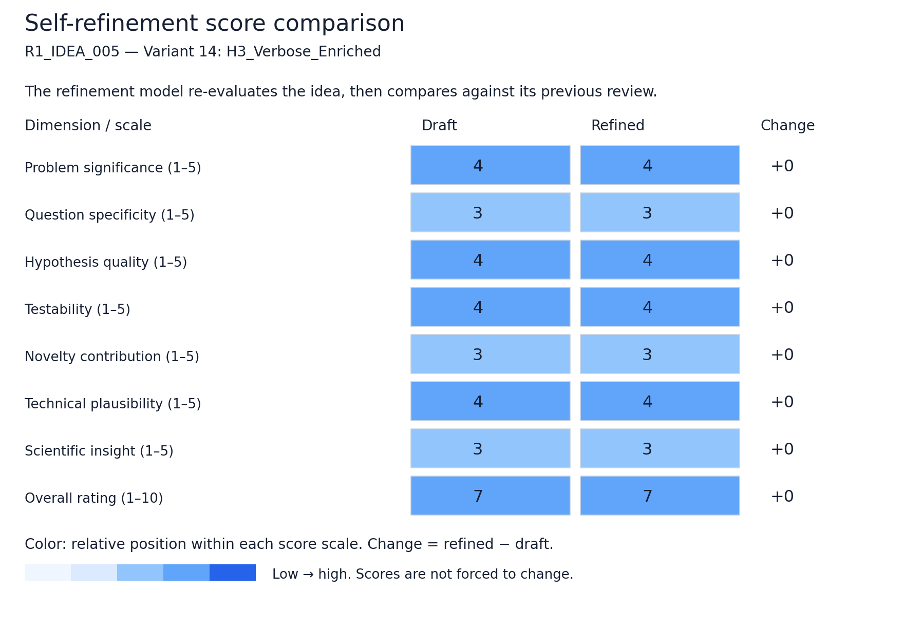

Changed score dimensions: none.

### Score justifications (draft / refined)

**Problem significance**

```json
{
  "draft": {
    "score": 4.0,
    "justification": "The problem of robustness under distribution shifts is critical in real-world applications, making the research relevant and important."
  },
  "refined": {
    "score": 4.0,
    "justification": "The problem of robustness under distribution shifts is critical in real-world applications, making the research relevant and important."
  }
}
```

**Question specificity**

```json
{
  "draft": {
    "score": 3.0,
    "justification": "The idea is specific in its approach but lacks detailed specification of key components like permutation generation and the mechanism linking diversity to invariant features."
  },
  "refined": {
    "score": 3.0,
    "justification": "The idea is specific in its approach but lacks detailed specification of key components like permutation generation and the mechanism linking diversity to invariant features."
  }
}
```

**Hypothesis quality**

```json
{
  "draft": {
    "score": 4.0,
    "justification": "The hypothesis that diversity in permutations helps capture invariant features is specific and plausible, though the connection needs more elaboration."
  },
  "refined": {
    "score": 4.0,
    "justification": "The hypothesis that diversity in permutations helps capture invariant features is specific and plausible, though the connection needs more elaboration."
  }
}
```

**Testability**

```json
{
  "draft": {
    "score": 4.0,
    "justification": "The idea includes a staged design, ablations, and error analysis, which are testable components, though some details are missing."
  },
  "refined": {
    "score": 4.0,
    "justification": "The idea includes a staged design, ablations, and error analysis, which are testable components, though some details are missing."
  }
}
```

**Novelty contribution**

```json
{
  "draft": {
    "score": 3.0,
    "justification": "The approach is novel in its test-time adaptation method for SSMs, but the novelty is somewhat limited without more details on the specific mechanisms."
  },
  "refined": {
    "score": 3.0,
    "justification": "The approach is novel in its test-time adaptation method for SSMs, but the novelty is somewhat limited without more details on the specific mechanisms."
  }
}
```

**Technical plausibility**

```json
{
  "draft": {
    "score": 4.0,
    "justification": "The method is technically plausible, though the specifics of permutation generation and pseudo-label usage need clarification."
  },
  "refined": {
    "score": 4.0,
    "justification": "The method is technically plausible, though the specifics of permutation generation and pseudo-label usage need clarification."
  }
}
```

**Scientific insight**

```json
{
  "draft": {
    "score": 3.0,
    "justification": "The idea has potential to provide insights into the role of permutation diversity in robustness, but the insights are not yet fully defined."
  },
  "refined": {
    "score": 3.0,
    "justification": "The idea has potential to provide insights into the role of permutation diversity in robustness, but the insights are not yet fully defined."
  }
}
```

**Overall rating**

```json
{
  "draft": {
    "score": 7.0,
    "justification": "The idea addresses a significant problem with a specific hypothesis and testable plan, though some details are missing that could strengthen its clarity and testability."
  },
  "refined": {
    "score": 7.0,
    "justification": "The idea addresses a significant problem with a specific hypothesis and testable plan, though some details are missing that could strengthen its clarity and testability."
  }
}
```

## R1_IDEA_005 — Variant 15: H4_Ultimate_Hype


Changed score dimensions: none.

### Score justifications (draft / refined)

**Problem significance**

```json
{
  "draft": {
    "score": 4.0,
    "justification": "The problem of distribution shifts in vision state space models is critical for real-world applications, as it affects the robustness and reliability of models in varying environments."
  },
  "refined": {
    "score": 4.0,
    "justification": "The problem of distribution shifts in vision state space models is critical for real-world applications, as it affects the robustness and reliability of models in varying environments."
  }
}
```

**Question specificity**

```json
{
  "draft": {
    "score": 3.0,
    "justification": "The idea presents a general research direction but lacks specific details on the method's implementation, such as the generation of SSM traversal permutations and the use of pseudo-labels for parameter updates."
  },
  "refined": {
    "score": 3.0,
    "justification": "The idea presents a general research direction but lacks specific details on the method's implementation, such as the generation of SSM traversal permutations and the use of pseudo-labels for parameter updates."
  }
}
```

**Hypothesis quality**

```json
{
  "draft": {
    "score": 4.0,
    "justification": "The idea proposes a novel approach that could enhance generalization without additional labeled data, which is a concrete hypothesis that can be tested through experiments."
  },
  "refined": {
    "score": 4.0,
    "justification": "The idea proposes a novel approach that could enhance generalization without additional labeled data, which is a concrete hypothesis that can be tested through experiments."
  }
}
```

**Testability**

```json
{
  "draft": {
    "score": 3.0,
    "justification": "The idea is testable through experiments, but the lack of specific details makes it challenging to design and evaluate the proposed method effectively."
  },
  "refined": {
    "score": 3.0,
    "justification": "The idea is testable through experiments, but the lack of specific details makes it challenging to design and evaluate the proposed method effectively."
  }
}
```

**Novelty contribution**

```json
{
  "draft": {
    "score": 4.0,
    "justification": "The approach of using test-time adaptation with SSM traversal permutations and pseudo-labels for parameter updates is novel and could contribute to the field of vision state space models."
  },
  "refined": {
    "score": 4.0,
    "justification": "The approach of using test-time adaptation with SSM traversal permutations and pseudo-labels for parameter updates is novel and could contribute to the field of vision state space models."
  }
}
```

**Technical plausibility**

```json
{
  "draft": {
    "score": 3.0,
    "justification": "The method is technically plausible, but the lack of specific details on implementation and the use of pseudo-labels raises questions about its feasibility and effectiveness."
  },
  "refined": {
    "score": 3.0,
    "justification": "The method is technically plausible, but the lack of specific details on implementation and the use of pseudo-labels raises questions about its feasibility and effectiveness."
  }
}
```

**Scientific insight**

```json
{
  "draft": {
    "score": 3.0,
    "justification": "The idea has potential for scientific insight into the robustness of vision state space models under distribution shifts, but the lack of specifics limits the depth of the insight that can be gained."
  },
  "refined": {
    "score": 3.0,
    "justification": "The idea has potential for scientific insight into the robustness of vision state space models under distribution shifts, but the lack of specifics limits the depth of the insight that can be gained."
  }
}
```

**Overall rating**

```json
{
  "draft": {
    "score": 7.0,
    "justification": "The idea addresses a significant problem with high potential for impact, but it lacks specific details that are necessary for evaluating its feasibility and effectiveness. The proposed method is novel and has the potential to contribute to the field, but further clarification is needed to strengthen the research direction."
  },
  "refined": {
    "score": 7.0,
    "justification": "The idea addresses a significant problem with high potential for impact, but it lacks specific details that are necessary for evaluating its feasibility and effectiveness. The proposed method is novel and has the potential to contribute to the field, but further clarification is needed to strengthen the research direction."
  }
}
```

## R1_IDEA_006 — Source


Changed score dimensions: none.

### Score justifications (draft / refined)

**Problem significance**

```json
{
  "draft": {
    "score": 4.0,
    "justification": "The problem is significant as it addresses a critical challenge in applying self-supervised learning to histopathology, which is crucial for medical imaging and diagnosis. Improving model selection in this domain could lead to better diagnostic tools."
  },
  "refined": {
    "score": 4.0,
    "justification": "The problem is significant as it addresses a critical challenge in applying self-supervised learning to histopathology, which is crucial for medical imaging and diagnosis. Improving model selection in this domain could lead to better diagnostic tools."
  }
}
```

**Question specificity**

```json
{
  "draft": {
    "score": 3.0,
    "justification": "The idea identifies a specific problem but lacks detailed specification of the research question. It needs to clearly define what exactly is being investigated, such as the comparison of different rank estimation methods in histopathology tasks."
  },
  "refined": {
    "score": 3.0,
    "justification": "The idea identifies a specific problem but lacks detailed specification of the research question. It needs to clearly define what exactly is being investigated, such as the comparison of different rank estimation methods in histopathology tasks."
  }
}
```

**Hypothesis quality**

```json
{
  "draft": {
    "score": 3.0,
    "justification": "The idea suggests a potential hypothesis that rank estimation approaches could be effective in histopathology, but it does not explicitly state the hypothesis or the expected outcomes of the research."
  },
  "refined": {
    "score": 3.0,
    "justification": "The idea suggests a potential hypothesis that rank estimation approaches could be effective in histopathology, but it does not explicitly state the hypothesis or the expected outcomes of the research."
  }
}
```

**Testability**

```json
{
  "draft": {
    "score": 3.0,
    "justification": "The idea is testable through experiments comparing different rank estimation methods in histopathology tasks, but the specific experimental design and evaluation metrics are not clearly outlined."
  },
  "refined": {
    "score": 3.0,
    "justification": "The idea is testable through experiments comparing different rank estimation methods in histopathology tasks, but the specific experimental design and evaluation metrics are not clearly outlined."
  }
}
```

**Novelty contribution**

```json
{
  "draft": {
    "score": 4.0,
    "justification": "The research could contribute novel insights into the application of rank estimation in histopathology, potentially leading to improved model selection and performance in medical imaging tasks."
  },
  "refined": {
    "score": 4.0,
    "justification": "The research could contribute novel insights into the application of rank estimation in histopathology, potentially leading to improved model selection and performance in medical imaging tasks."
  }
}
```

**Technical plausibility**

```json
{
  "draft": {
    "score": 4.0,
    "justification": "The proposed approach is technically plausible as it builds on existing methods for rank estimation in self-supervised learning, adapted for the specific challenges of histopathology."
  },
  "refined": {
    "score": 4.0,
    "justification": "The proposed approach is technically plausible as it builds on existing methods for rank estimation in self-supervised learning, adapted for the specific challenges of histopathology."
  }
}
```

**Scientific insight**

```json
{
  "draft": {
    "score": 3.0,
    "justification": "The research has the potential to provide insights into the effectiveness of rank estimation in non-linear tasks, but the specific insights depend on the experimental results and the methods used."
  },
  "refined": {
    "score": 3.0,
    "justification": "The research has the potential to provide insights into the effectiveness of rank estimation in non-linear tasks, but the specific insights depend on the experimental results and the methods used."
  }
}
```

**Overall rating**

```json
{
  "draft": {
    "score": 7.0,
    "justification": "The idea is strong and addresses a meaningful problem in the field of medical imaging. It has the potential for significant contribution but requires more specificity and clarity in defining the research question and hypothesis."
  },
  "refined": {
    "score": 7.0,
    "justification": "The idea is strong and addresses a meaningful problem in the field of medical imaging. It has the potential for significant contribution but requires more specificity and clarity in defining the research question and hypothesis."
  }
}
```

## R1_IDEA_006 — Variant 1: A1_Identity


Changed score dimensions: none.

### Score justifications (draft / refined)

**Problem significance**

```json
{
  "draft": {
    "score": 4.0,
    "justification": "The problem is significant as it addresses a critical challenge in applying self-supervised learning to histopathology, which is crucial for medical imaging and diagnosis. Improving model selection in this domain could lead to better diagnostic tools."
  },
  "refined": {
    "score": 4.0,
    "justification": "The problem is significant as it addresses a critical challenge in applying self-supervised learning to histopathology, which is crucial for medical imaging and diagnosis. Improving model selection in this domain could lead to better diagnostic tools."
  }
}
```

**Question specificity**

```json
{
  "draft": {
    "score": 3.0,
    "justification": "The idea identifies a specific problem but lacks detailed specification of the research question. It needs to clearly define what exactly is being investigated, such as the comparison of different rank estimation methods in histopathology tasks."
  },
  "refined": {
    "score": 3.0,
    "justification": "The idea identifies a specific problem but lacks detailed specification of the research question. It needs to clearly define what exactly is being investigated, such as the comparison of different rank estimation methods in histopathology tasks."
  }
}
```

**Hypothesis quality**

```json
{
  "draft": {
    "score": 3.0,
    "justification": "The idea suggests a potential hypothesis that rank estimation approaches could be effective in histopathology, but it does not explicitly state the hypothesis or the expected outcomes of the research."
  },
  "refined": {
    "score": 3.0,
    "justification": "The idea suggests a potential hypothesis that rank estimation approaches could be effective in histopathology, but it does not explicitly state the hypothesis or the expected outcomes of the research."
  }
}
```

**Testability**

```json
{
  "draft": {
    "score": 3.0,
    "justification": "The idea is testable through experiments comparing different rank estimation methods in histopathology tasks, but the specific experimental design and evaluation metrics are not clearly outlined."
  },
  "refined": {
    "score": 3.0,
    "justification": "The idea is testable through experiments comparing different rank estimation methods in histopathology tasks, but the specific experimental design and evaluation metrics are not clearly outlined."
  }
}
```

**Novelty contribution**

```json
{
  "draft": {
    "score": 4.0,
    "justification": "The research could contribute novel insights into the application of rank estimation in histopathology, potentially leading to improved model selection and performance in medical imaging tasks."
  },
  "refined": {
    "score": 4.0,
    "justification": "The research could contribute novel insights into the application of rank estimation in histopathology, potentially leading to improved model selection and performance in medical imaging tasks."
  }
}
```

**Technical plausibility**

```json
{
  "draft": {
    "score": 4.0,
    "justification": "The proposed approach is technically plausible as it builds on existing methods for rank estimation in self-supervised learning, adapted for the specific challenges of histopathology."
  },
  "refined": {
    "score": 4.0,
    "justification": "The proposed approach is technically plausible as it builds on existing methods for rank estimation in self-supervised learning, adapted for the specific challenges of histopathology."
  }
}
```

**Scientific insight**

```json
{
  "draft": {
    "score": 3.0,
    "justification": "The research has the potential to provide insights into the effectiveness of rank estimation in non-linear tasks, but the specific insights depend on the experimental results and the methods used."
  },
  "refined": {
    "score": 3.0,
    "justification": "The research has the potential to provide insights into the effectiveness of rank estimation in non-linear tasks, but the specific insights depend on the experimental results and the methods used."
  }
}
```

**Overall rating**

```json
{
  "draft": {
    "score": 7.0,
    "justification": "The idea is strong and addresses a meaningful problem in the field of medical imaging. It has the potential for significant contribution but requires more specificity and clarity in defining the research question and hypothesis."
  },
  "refined": {
    "score": 7.0,
    "justification": "The idea is strong and addresses a meaningful problem in the field of medical imaging. It has the potential for significant contribution but requires more specificity and clarity in defining the research question and hypothesis."
  }
}
```

## R1_IDEA_006 — Variant 2: A2_Paraphrase_Only

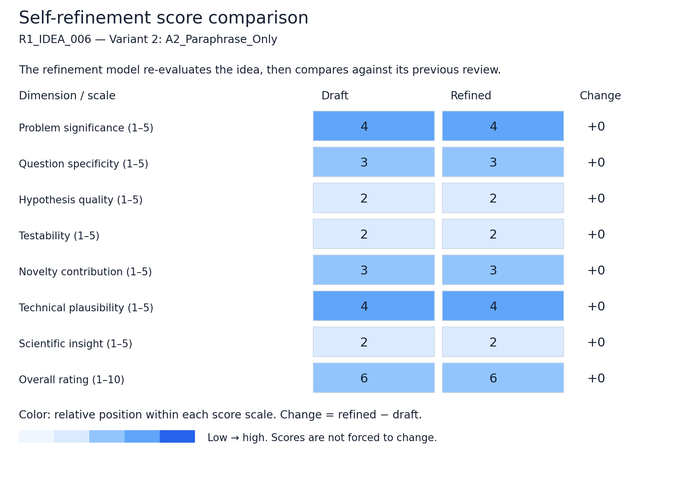

Changed score dimensions: none.

### Score justifications (draft / refined)

**Problem significance**

```json
{
  "draft": {
    "score": 4.0,
    "justification": "The problem is significant as it addresses a critical challenge in applying self-supervised learning to histopathology, a domain with high stakes in medical diagnosis. The potential impact on diagnostic accuracy and clinical practice is substantial."
  },
  "refined": {
    "score": 4.0,
    "justification": "The problem is significant as it addresses a critical challenge in applying self-supervised learning to histopathology, a domain with high stakes in medical diagnosis. The potential impact on diagnostic accuracy and clinical practice is substantial."
  }
}
```

**Question specificity**

```json
{
  "draft": {
    "score": 3.0,
    "justification": "The idea specifies the domain (histopathology) and tasks (instance segmentation, classification), but lacks a clear, testable research question. More specificity is needed to define what exactly will be investigated."
  },
  "refined": {
    "score": 3.0,
    "justification": "The idea specifies the domain (histopathology) and tasks (instance segmentation, classification), but lacks a clear, testable research question. More specificity is needed to define what exactly will be investigated."
  }
}
```

**Hypothesis quality**

```json
{
  "draft": {
    "score": 2.0,
    "justification": "The idea does not explicitly state a hypothesis. While it suggests that rank estimation methods may work in histopathology, it does not provide a concrete prediction or mechanism that can be tested."
  },
  "refined": {
    "score": 2.0,
    "justification": "The idea does not explicitly state a hypothesis. While it suggests that rank estimation methods may work in histopathology, it does not provide a concrete prediction or mechanism that can be tested."
  }
}
```

**Testability**

```json
{
  "draft": {
    "score": 2.0,
    "justification": "The idea lacks details on how the methods will be adapted, evaluated, or compared. Without specific experiments or metrics, the testability is low."
  },
  "refined": {
    "score": 2.0,
    "justification": "The idea lacks details on how the methods will be adapted, evaluated, or compared. Without specific experiments or metrics, the testability is low."
  }
}
```

**Novelty contribution**

```json
{
  "draft": {
    "score": 3.0,
    "justification": "The idea proposes applying existing methods to a new domain, which is novel. However, the contribution is more about application than discovering new principles or mechanisms."
  },
  "refined": {
    "score": 3.0,
    "justification": "The idea proposes applying existing methods to a new domain, which is novel. However, the contribution is more about application than discovering new principles or mechanisms."
  }
}
```

**Technical plausibility**

```json
{
  "draft": {
    "score": 4.0,
    "justification": "The proposed approach is technically plausible as it builds on existing methods. The challenge lies in adapting them to histopathology, which is a plausible technical direction."
  },
  "refined": {
    "score": 4.0,
    "justification": "The proposed approach is technically plausible as it builds on existing methods. The challenge lies in adapting them to histopathology, which is a plausible technical direction."
  }
}
```

**Scientific insight**

```json
{
  "draft": {
    "score": 2.0,
    "justification": "The idea has potential for insight into the effectiveness of rank estimation in different domains, but without a clear hypothesis or testable question, the potential for scientific insight is limited."
  },
  "refined": {
    "score": 2.0,
    "justification": "The idea has potential for insight into the effectiveness of rank estimation in different domains, but without a clear hypothesis or testable question, the potential for scientific insight is limited."
  }
}
```

**Overall rating**

```json
{
  "draft": {
    "score": 6.0,
    "justification": "The idea is promising but lacks a clear hypothesis and testable question. It addresses a significant problem in a relevant domain but needs more specificity and details to be a strong research idea."
  },
  "refined": {
    "score": 6.0,
    "justification": "The idea is promising but lacks a clear hypothesis and testable question. It addresses a significant problem in a relevant domain but needs more specificity and details to be a strong research idea."
  }
}
```

## R1_IDEA_006 — Variant 3: A3_Plain_Core


Changed score dimensions: none.

### Score justifications (draft / refined)

**Problem significance**

```json
{
  "draft": {
    "score": 4.0,
    "justification": "The problem of model selection in self-supervised learning for histopathology is significant due to the critical nature of accurate diagnosis in medical imaging. Addressing this could improve the reliability of automated diagnostic tools."
  },
  "refined": {
    "score": 4.0,
    "justification": "The problem of model selection in self-supervised learning for histopathology is significant due to the critical nature of accurate diagnosis in medical imaging. Addressing this could improve the reliability of automated diagnostic tools."
  }
}
```

**Question specificity**

```json
{
  "draft": {
    "score": 3.0,
    "justification": "The idea identifies a specific problem but lacks detailed specifics about the research question, such as the exact methods, tasks, or metrics to be investigated."
  },
  "refined": {
    "score": 3.0,
    "justification": "The idea identifies a specific problem but lacks detailed specifics about the research question, such as the exact methods, tasks, or metrics to be investigated."
  }
}
```

**Hypothesis quality**

```json
{
  "draft": {
    "score": 3.0,
    "justification": "The idea suggests a potential application of existing methods but does not explicitly state a hypothesis that could be tested, such as a prediction about performance differences between natural and histopathology tasks."
  },
  "refined": {
    "score": 3.0,
    "justification": "The idea suggests a potential application of existing methods but does not explicitly state a hypothesis that could be tested, such as a prediction about performance differences between natural and histopathology tasks."
  }
}
```

**Testability**

```json
{
  "draft": {
    "score": 3.0,
    "justification": "The idea is testable in principle, but lacks specifics on how the experiments will be conducted, what comparisons will be made, and what metrics will be used to evaluate the methods."
  },
  "refined": {
    "score": 3.0,
    "justification": "The idea is testable in principle, but lacks specifics on how the experiments will be conducted, what comparisons will be made, and what metrics will be used to evaluate the methods."
  }
}
```

**Novelty contribution**

```json
{
  "draft": {
    "score": 3.0,
    "justification": "The idea proposes applying existing methods to a new domain, which is novel, but the contribution is more about application than discovering new principles or mechanisms."
  },
  "refined": {
    "score": 3.0,
    "justification": "The idea proposes applying existing methods to a new domain, which is novel, but the contribution is more about application than discovering new principles or mechanisms."
  }
}
```

**Technical plausibility**

```json
{
  "draft": {
    "score": 4.0,
    "justification": "The proposed direction is technically plausible as it involves applying known methods to a new domain, though the specifics of implementation are not detailed."
  },
  "refined": {
    "score": 4.0,
    "justification": "The proposed direction is technically plausible as it involves applying known methods to a new domain, though the specifics of implementation are not detailed."
  }
}
```

**Scientific insight**

```json
{
  "draft": {
    "score": 3.0,
    "justification": "The idea has potential to provide insights into the effectiveness of rank estimation methods in complex tasks, but the insights would be more significant if the methods' performance differences were analyzed in depth."
  },
  "refined": {
    "score": 3.0,
    "justification": "The idea has potential to provide insights into the effectiveness of rank estimation methods in complex tasks, but the insights would be more significant if the methods' performance differences were analyzed in depth."
  }
}
```

**Overall rating**

```json
{
  "draft": {
    "score": 7.0,
    "justification": "The idea addresses a meaningful problem in a relevant domain, suggests a plausible research direction, and has the potential to contribute to the field. However, it lacks specific details that would make the research question and hypothesis more testable and the potential contribution more clear."
  },
  "refined": {
    "score": 7.0,
    "justification": "The idea addresses a meaningful problem in a relevant domain, suggests a plausible research direction, and has the potential to contribute to the field. However, it lacks specific details that would make the research question and hypothesis more testable and the potential contribution more clear."
  }
}
```

## R1_IDEA_006 — Variant 4: B1_Verbose_Elaborate


Changed score dimensions: none.

### Score justifications (draft / refined)

**Problem significance**

```json
{
  "draft": {
    "score": 4.0,
    "justification": "The problem is significant as it addresses a critical challenge in applying self-supervised learning to histopathology, a domain with high clinical relevance. The gap in evaluating rank estimation methods for non-linear tasks is important for improving model selection in medical imaging."
  },
  "refined": {
    "score": 4.0,
    "justification": "The problem is significant as it addresses a critical challenge in applying self-supervised learning to histopathology, a domain with high clinical relevance. The gap in evaluating rank estimation methods for non-linear tasks is important for improving model selection in medical imaging."
  }
}
```

**Question specificity**

```json
{
  "draft": {
    "score": 3.0,
    "justification": "The idea identifies a specific problem in histopathology but lacks clarity on the exact research question or hypothesis. It is clear that the focus is on evaluating rank estimation methods, but the specifics of what is being tested are not well defined."
  },
  "refined": {
    "score": 3.0,
    "justification": "The idea identifies a specific problem in histopathology but lacks clarity on the exact research question or hypothesis. It is clear that the focus is on evaluating rank estimation methods, but the specifics of what is being tested are not well defined."
  }
}
```

**Hypothesis quality**

```json
{
  "draft": {
    "score": 3.0,
    "justification": "The idea implies a hypothesis that rank estimation methods may be effective for histopathology tasks, but it does not explicitly state this hypothesis. The lack of a clear prediction or mechanism makes the hypothesis less concrete."
  },
  "refined": {
    "score": 3.0,
    "justification": "The idea implies a hypothesis that rank estimation methods may be effective for histopathology tasks, but it does not explicitly state this hypothesis. The lack of a clear prediction or mechanism makes the hypothesis less concrete."
  }
}
```

**Testability**

```json
{
  "draft": {
    "score": 3.0,
    "justification": "The idea suggests that the effectiveness of rank estimation methods can be evaluated, but it does not provide a clear experimental design or methodology for testing this. The lack of specific metrics or benchmarks makes the testability somewhat limited."
  },
  "refined": {
    "score": 3.0,
    "justification": "The idea suggests that the effectiveness of rank estimation methods can be evaluated, but it does not provide a clear experimental design or methodology for testing this. The lack of specific metrics or benchmarks makes the testability somewhat limited."
  }
}
```

**Novelty contribution**

```json
{
  "draft": {
    "score": 4.0,
    "justification": "The research could contribute novel insights into the application of rank estimation methods in histopathology, particularly for non-linear tasks. This is a gap in existing literature and could have practical implications for medical imaging."
  },
  "refined": {
    "score": 4.0,
    "justification": "The research could contribute novel insights into the application of rank estimation methods in histopathology, particularly for non-linear tasks. This is a gap in existing literature and could have practical implications for medical imaging."
  }
}
```

**Technical plausibility**

```json
{
  "draft": {
    "score": 4.0,
    "justification": "The proposed direction is technically plausible as it builds on existing methods in self-supervised learning and rank estimation. The application to histopathology is feasible, though the specifics of implementation would need to be worked out."
  },
  "refined": {
    "score": 4.0,
    "justification": "The proposed direction is technically plausible as it builds on existing methods in self-supervised learning and rank estimation. The application to histopathology is feasible, though the specifics of implementation would need to be worked out."
  }
}
```

**Scientific insight**

```json
{
  "draft": {
    "score": 3.0,
    "justification": "The idea has potential for scientific insight into the effectiveness of rank estimation methods in non-linear tasks, but the lack of a clear hypothesis and methodology limits the potential for meaningful insights."
  },
  "refined": {
    "score": 3.0,
    "justification": "The idea has potential for scientific insight into the effectiveness of rank estimation methods in non-linear tasks, but the lack of a clear hypothesis and methodology limits the potential for meaningful insights."
  }
}
```

**Overall rating**

```json
{
  "draft": {
    "score": 7.0,
    "justification": "The idea addresses a significant problem in the application of self-supervised learning to histopathology and identifies a critical gap. However, it lacks specificity in defining the research question, hypothesis, and methodology, which could be improved with more detailed information."
  },
  "refined": {
    "score": 7.0,
    "justification": "The idea addresses a significant problem in the application of self-supervised learning to histopathology and identifies a critical gap. However, it lacks specificity in defining the research question, hypothesis, and methodology, which could be improved with more detailed information."
  }
}
```

## R1_IDEA_006 — Variant 5: B2_Grand_Narrative


Changed score dimensions: none.

### Score justifications (draft / refined)

**Problem significance**

```json
{
  "draft": {
    "score": 4.0,
    "justification": "The problem of model selection in self-supervised training for histopathology is significant due to its impact on computational pathology and the broader field of representation learning. Addressing this could lead to more reliable and robust vision systems in biomedical imaging."
  },
  "refined": {
    "score": 4.0,
    "justification": "The problem of model selection in self-supervised training for histopathology is significant due to its impact on computational pathology and the broader field of representation learning. Addressing this could lead to more reliable and robust vision systems in biomedical imaging."
  }
}
```

**Question specificity**

```json
{
  "draft": {
    "score": 3.0,
    "justification": "The idea identifies a gap in applying rank estimation to histopathology but lacks a clear, specific research question. It needs more detail on what exactly is being investigated, such as the adaptation of methods or the specific tasks (e.g., instance segmentation) being evaluated."
  },
  "refined": {
    "score": 3.0,
    "justification": "The idea identifies a gap in applying rank estimation to histopathology but lacks a clear, specific research question. It needs more detail on what exactly is being investigated, such as the adaptation of methods or the specific tasks (e.g., instance segmentation) being evaluated."
  }
}
```

**Hypothesis quality**

```json
{
  "draft": {
    "score": 3.0,
    "justification": "The idea suggests a potential application of existing methods but does not explicitly state a hypothesis. It would be stronger with a clear prediction, such as 'Rank estimation approaches will improve model selection in histopathology tasks compared to current methods.'"
  },
  "refined": {
    "score": 3.0,
    "justification": "The idea suggests a potential application of existing methods but does not explicitly state a hypothesis. It would be stronger with a clear prediction, such as 'Rank estimation approaches will improve model selection in histopathology tasks compared to current methods.'"
  }
}
```

**Testability**

```json
{
  "draft": {
    "score": 3.0,
    "justification": "The idea is testable in principle, but lacks a clear experimental plan. It needs to specify how the methods will be evaluated, what benchmarks will be used, and how results will be compared to existing approaches."
  },
  "refined": {
    "score": 3.0,
    "justification": "The idea is testable in principle, but lacks a clear experimental plan. It needs to specify how the methods will be evaluated, what benchmarks will be used, and how results will be compared to existing approaches."
  }
}
```

**Novelty contribution**

```json
{
  "draft": {
    "score": 4.0,
    "justification": "The idea addresses a gap in applying rank estimation to histopathology, which is a novel application. It has the potential to contribute to both model selection in computational pathology and broader representation learning frameworks."
  },
  "refined": {
    "score": 4.0,
    "justification": "The idea addresses a gap in applying rank estimation to histopathology, which is a novel application. It has the potential to contribute to both model selection in computational pathology and broader representation learning frameworks."
  }
}
```

**Technical plausibility**

```json
{
  "draft": {
    "score": 4.0,
    "justification": "The proposed direction is technically plausible, as rank estimation approaches have shown promise in other domains. Adapting them to histopathology is a reasonable challenge, though specific technical details are not provided."
  },
  "refined": {
    "score": 4.0,
    "justification": "The proposed direction is technically plausible, as rank estimation approaches have shown promise in other domains. Adapting them to histopathology is a reasonable challenge, though specific technical details are not provided."
  }
}
```

**Scientific insight**

```json
{
  "draft": {
    "score": 3.0,
    "justification": "The idea has potential for scientific insight into model selection and representation learning in biomedical imaging, but the specific insights depend on the experimental design and results."
  },
  "refined": {
    "score": 3.0,
    "justification": "The idea has potential for scientific insight into model selection and representation learning in biomedical imaging, but the specific insights depend on the experimental design and results."
  }
}
```

**Overall rating**

```json
{
  "draft": {
    "score": 7.0,
    "justification": "The idea is strong and addresses a meaningful problem in computational pathology with potential for novel contributions. However, it lacks specific details on the research question, hypothesis, and methodology, which are needed to fully assess its feasibility and impact."
  },
  "refined": {
    "score": 7.0,
    "justification": "The idea is strong and addresses a meaningful problem in computational pathology with potential for novel contributions. However, it lacks specific details on the research question, hypothesis, and methodology, which are needed to fully assess its feasibility and impact."
  }
}
```

## R1_IDEA_006 — Variant 6: B3_Over_Confident

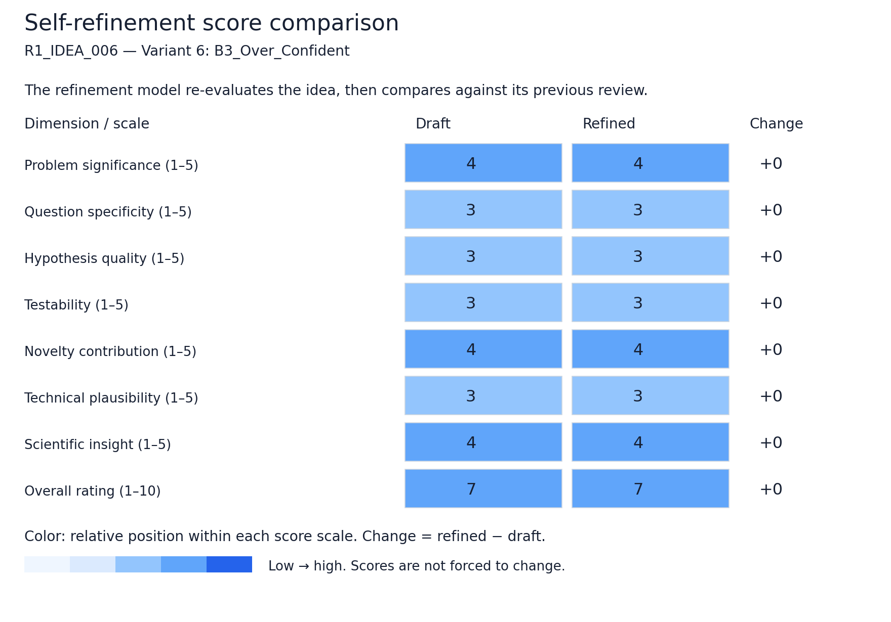

Changed score dimensions: none.

### Score justifications (draft / refined)

**Problem significance**

```json
{
  "draft": {
    "score": 4.0,
    "justification": "The problem is significant as it addresses a critical challenge in medical imaging, where accurate model selection is essential for reliable diagnosis. Histopathology is a vital area in healthcare, and improving self-supervised learning methods here could have substantial practical implications."
  },
  "refined": {
    "score": 4.0,
    "justification": "The problem is significant as it addresses a critical challenge in medical imaging, where accurate model selection is essential for reliable diagnosis. Histopathology is a vital area in healthcare, and improving self-supervised learning methods here could have substantial practical implications."
  }
}
```

**Question specificity**

```json
{
  "draft": {
    "score": 3.0,
    "justification": "The idea identifies a specific problem but lacks detailed specification of the research question. It is clear that the focus is on rank estimation in histopathology, but the exact nature of the question (e.g., which tasks, which methods) is not clearly defined."
  },
  "refined": {
    "score": 3.0,
    "justification": "The idea identifies a specific problem but lacks detailed specification of the research question. It is clear that the focus is on rank estimation in histopathology, but the exact nature of the question (e.g., which tasks, which methods) is not clearly defined."
  }
}
```

**Hypothesis quality**

```json
{
  "draft": {
    "score": 3.0,
    "justification": "The idea implies a hypothesis that rank estimation approaches could be effective in histopathology tasks, but it does not explicitly state this hypothesis or provide a clear prediction that can be tested."
  },
  "refined": {
    "score": 3.0,
    "justification": "The idea implies a hypothesis that rank estimation approaches could be effective in histopathology tasks, but it does not explicitly state this hypothesis or provide a clear prediction that can be tested."
  }
}
```

**Testability**

```json
{
  "draft": {
    "score": 3.0,
    "justification": "The idea is testable in principle, as it suggests evaluating rank estimation methods in histopathology. However, without specific methods or metrics, the testability is limited."
  },
  "refined": {
    "score": 3.0,
    "justification": "The idea is testable in principle, as it suggests evaluating rank estimation methods in histopathology. However, without specific methods or metrics, the testability is limited."
  }
}
```

**Novelty contribution**

```json
{
  "draft": {
    "score": 4.0,
    "justification": "The idea contributes by exploring a previously uninvestigated area (rank estimation in histopathology tasks), which could provide new insights into the effectiveness of self-supervised learning in medical imaging."
  },
  "refined": {
    "score": 4.0,
    "justification": "The idea contributes by exploring a previously uninvestigated area (rank estimation in histopathology tasks), which could provide new insights into the effectiveness of self-supervised learning in medical imaging."
  }
}
```

**Technical plausibility**

```json
{
  "draft": {
    "score": 3.0,
    "justification": "The technical approach is plausible, but the idea lacks details on how existing rank estimation methods will be adapted to histopathology, which is necessary for assessing technical feasibility."
  },
  "refined": {
    "score": 3.0,
    "justification": "The technical approach is plausible, but the idea lacks details on how existing rank estimation methods will be adapted to histopathology, which is necessary for assessing technical feasibility."
  }
}
```

**Scientific insight**

```json
{
  "draft": {
    "score": 4.0,
    "justification": "The research could yield insights into the effectiveness of rank estimation in non-linear medical imaging tasks, potentially revealing limitations or new principles in self-supervised learning for histopathology."
  },
  "refined": {
    "score": 4.0,
    "justification": "The research could yield insights into the effectiveness of rank estimation in non-linear medical imaging tasks, potentially revealing limitations or new principles in self-supervised learning for histopathology."
  }
}
```

**Overall rating**

```json
{
  "draft": {
    "score": 7.0,
    "justification": "The idea addresses a meaningful problem in a critical area of medical imaging, identifies a gap in existing research, and proposes a testable direction. However, it lacks specific details on methods, hypotheses, and technical adaptations, which are necessary for a strong research proposal."
  },
  "refined": {
    "score": 7.0,
    "justification": "The idea addresses a meaningful problem in a critical area of medical imaging, identifies a gap in existing research, and proposes a testable direction. However, it lacks specific details on methods, hypotheses, and technical adaptations, which are necessary for a strong research proposal."
  }
}
```

## R1_IDEA_006 — Variant 7: B4_Novelty


Changed score dimensions: none.

### Score justifications (draft / refined)

**Problem significance**

```json
{
  "draft": {
    "score": 4.0,
    "justification": "The problem of model selection in histopathology is critical for medical imaging, where accurate models can impact diagnostic outcomes. The idea addresses a specialized domain with potential real-world impact."
  },
  "refined": {
    "score": 4.0,
    "justification": "The problem of model selection in histopathology is critical for medical imaging, where accurate models can impact diagnostic outcomes. The idea addresses a specialized domain with potential real-world impact."
  }
}
```

**Question specificity**

```json
{
  "draft": {
    "score": 3.0,
    "justification": "The idea identifies a specific challenge but lacks a concrete research question. It suggests an application area but does not clearly define what is being investigated or how it differs from existing approaches."
  },
  "refined": {
    "score": 3.0,
    "justification": "The idea identifies a specific challenge but lacks a concrete research question. It suggests an application area but does not clearly define what is being investigated or how it differs from existing approaches."
  }
}
```

**Hypothesis quality**

```json
{
  "draft": {
    "score": 2.0,
    "justification": "The idea mentions the potential of rank estimation but does not provide a clear hypothesis or prediction that can be tested. It lacks a specific mechanism or expected outcome."
  },
  "refined": {
    "score": 2.0,
    "justification": "The idea mentions the potential of rank estimation but does not provide a clear hypothesis or prediction that can be tested. It lacks a specific mechanism or expected outcome."
  }
}
```

**Testability**

```json
{
  "draft": {
    "score": 3.0,
    "justification": "The idea suggests applying a method to a specific domain, but it does not outline experiments, comparisons, or evaluations that would test the hypothesis. The testability is limited without more details."
  },
  "refined": {
    "score": 3.0,
    "justification": "The idea suggests applying a method to a specific domain, but it does not outline experiments, comparisons, or evaluations that would test the hypothesis. The testability is limited without more details."
  }
}
```

**Novelty contribution**

```json
{
  "draft": {
    "score": 3.0,
    "justification": "The application of rank estimation to histopathology is novel, but the idea does not clearly distinguish it from existing methods. The contribution is somewhat generic and lacks a clear innovation."
  },
  "refined": {
    "score": 3.0,
    "justification": "The application of rank estimation to histopathology is novel, but the idea does not clearly distinguish it from existing methods. The contribution is somewhat generic and lacks a clear innovation."
  }
}
```

**Technical plausibility**

```json
{
  "draft": {
    "score": 4.0,
    "justification": "The proposed method (rank estimation) is technically plausible and has shown promise in natural image classification. Applying it to histopathology is a reasonable extension, though the specifics are not detailed."
  },
  "refined": {
    "score": 4.0,
    "justification": "The proposed method (rank estimation) is technically plausible and has shown promise in natural image classification. Applying it to histopathology is a reasonable extension, though the specifics are not detailed."
  }
}
```

**Scientific insight**

```json
{
  "draft": {
    "score": 3.0,
    "justification": "The idea has potential to provide insights into model selection in specialized domains, but the lack of a clear hypothesis and specific research question limits the potential for meaningful scientific insight."
  },
  "refined": {
    "score": 3.0,
    "justification": "The idea has potential to provide insights into model selection in specialized domains, but the lack of a clear hypothesis and specific research question limits the potential for meaningful scientific insight."
  }
}
```

**Overall rating**

```json
{
  "draft": {
    "score": 7.0,
    "justification": "The idea addresses a meaningful problem in a specialized domain and proposes a novel application of an existing method. However, it lacks specificity, a clear hypothesis, and testable components, which are needed for a strong research direction."
  },
  "refined": {
    "score": 7.0,
    "justification": "The idea addresses a meaningful problem in a specialized domain and proposes a novel application of an existing method. However, it lacks specificity, a clear hypothesis, and testable components, which are needed for a strong research direction."
  }
}
```

## R1_IDEA_006 — Variant 8: B5_Application_Impact


Changed score dimensions: none.

### Score justifications (draft / refined)

**Problem significance**

```json
{
  "draft": {
    "score": 4.0,
    "justification": "The problem is significant as it addresses a critical challenge in the application of self-supervised learning to histopathology, which is essential for developing reliable computational tools in medical imaging. The implications for diagnostic and research applications are substantial."
  },
  "refined": {
    "score": 4.0,
    "justification": "The problem is significant as it addresses a critical challenge in the application of self-supervised learning to histopathology, which is essential for developing reliable computational tools in medical imaging. The implications for diagnostic and research applications are substantial."
  }
}
```

**Question specificity**

```json
{
  "draft": {
    "score": 3.0,
    "justification": "The idea identifies a specific problem in the context of histopathology but lacks detailed specification of the research question, the exact tasks, and the metrics to be used. More clarity is needed to define the specific hypothesis or problem to be investigated."
  },
  "refined": {
    "score": 3.0,
    "justification": "The idea identifies a specific problem in the context of histopathology but lacks detailed specification of the research question, the exact tasks, and the metrics to be used. More clarity is needed to define the specific hypothesis or problem to be investigated."
  }
}
```

**Hypothesis quality**

```json
{
  "draft": {
    "score": 2.0,
    "justification": "The idea does not explicitly state a hypothesis or prediction. It mentions the potential effectiveness of rank estimation approaches in histopathology but does not clearly define what the expected outcome or mechanism is."
  },
  "refined": {
    "score": 2.0,
    "justification": "The idea does not explicitly state a hypothesis or prediction. It mentions the potential effectiveness of rank estimation approaches in histopathology but does not clearly define what the expected outcome or mechanism is."
  }
}
```

**Testability**

```json
{
  "draft": {
    "score": 3.0,
    "justification": "The idea suggests the potential application of methods in histopathology but lacks a clear plan for testing the effectiveness, such as specific experiments, comparisons, or evaluation metrics. The testability is limited without more details on how the methods will be applied and validated."
  },
  "refined": {
    "score": 3.0,
    "justification": "The idea suggests the potential application of methods in histopathology but lacks a clear plan for testing the effectiveness, such as specific experiments, comparisons, or evaluation metrics. The testability is limited without more details on how the methods will be applied and validated."
  }
}
```

**Novelty contribution**

```json
{
  "draft": {
    "score": 4.0,
    "justification": "The idea proposes applying rank estimation approaches to histopathology tasks, which is a novel application given the current focus on natural images. This could contribute to the development of more robust analysis pipelines for medical imaging."
  },
  "refined": {
    "score": 4.0,
    "justification": "The idea proposes applying rank estimation approaches to histopathology tasks, which is a novel application given the current focus on natural images. This could contribute to the development of more robust analysis pipelines for medical imaging."
  }
}
```

**Technical plausibility**

```json
{
  "draft": {
    "score": 4.0,
    "justification": "The proposed approach is technically plausible as it builds on existing methods in self-supervised learning and rank estimation. The adaptation to histopathology is feasible, though the specifics of the adaptation are not detailed."
  },
  "refined": {
    "score": 4.0,
    "justification": "The proposed approach is technically plausible as it builds on existing methods in self-supervised learning and rank estimation. The adaptation to histopathology is feasible, though the specifics of the adaptation are not detailed."
  }
}
```

**Scientific insight**

```json
{
  "draft": {
    "score": 3.0,
    "justification": "The idea has potential for scientific insight by exploring the effectiveness of rank estimation in non-linear histopathology tasks. However, the insight is not clearly defined without a specific hypothesis or prediction."
  },
  "refined": {
    "score": 3.0,
    "justification": "The idea has potential for scientific insight by exploring the effectiveness of rank estimation in non-linear histopathology tasks. However, the insight is not clearly defined without a specific hypothesis or prediction."
  }
}
```

**Overall rating**

```json
{
  "draft": {
    "score": 7.0,
    "justification": "The idea addresses a significant problem in the application of self-supervised learning to histopathology and has the potential for novel contributions. However, it lacks specificity in defining the research question, hypothesis, and evaluation plan, which are necessary for a strong research direction."
  },
  "refined": {
    "score": 7.0,
    "justification": "The idea addresses a significant problem in the application of self-supervised learning to histopathology and has the potential for novel contributions. However, it lacks specificity in defining the research question, hypothesis, and evaluation plan, which are necessary for a strong research direction."
  }
}
```

## R1_IDEA_006 — Variant 9: C1_Hollow_Shell


Changed score dimensions: none.

### Score justifications (draft / refined)

**Problem significance**

```json
{
  "draft": {
    "score": 4.0,
    "justification": "Medical image analysis is a critical area with significant real-world implications, and the challenge of selecting suitable models in specialized settings is important for clinical applications."
  },
  "refined": {
    "score": 4.0,
    "justification": "Medical image analysis is a critical area with significant real-world implications, and the challenge of selecting suitable models in specialized settings is important for clinical applications."
  }
}
```

**Question specificity**

```json
{
  "draft": {
    "score": 3.0,
    "justification": "The idea identifies a problem but lacks specific details about the method, task, or training paradigm, making the research question somewhat vague."
  },
  "refined": {
    "score": 3.0,
    "justification": "The idea identifies a problem but lacks specific details about the method, task, or training paradigm, making the research question somewhat vague."
  }
}
```

**Hypothesis quality**

```json
{
  "draft": {
    "score": 2.0,
    "justification": "The idea raises a question but does not explicitly state a hypothesis that can be tested or falsified. It is more of a question than a hypothesis."
  },
  "refined": {
    "score": 2.0,
    "justification": "The idea raises a question but does not explicitly state a hypothesis that can be tested or falsified. It is more of a question than a hypothesis."
  }
}
```

**Testability**

```json
{
  "draft": {
    "score": 3.0,
    "justification": "The idea is testable in principle, but the lack of specific details makes it difficult to design a concrete experiment or evaluation plan."
  },
  "refined": {
    "score": 3.0,
    "justification": "The idea is testable in principle, but the lack of specific details makes it difficult to design a concrete experiment or evaluation plan."
  }
}
```

**Novelty contribution**

```json
{
  "draft": {
    "score": 3.0,
    "justification": "The idea addresses a gap in applying existing methods to a specialized medical task, which could contribute to the field, but the novelty is limited without more specifics."
  },
  "refined": {
    "score": 3.0,
    "justification": "The idea addresses a gap in applying existing methods to a specialized medical task, which could contribute to the field, but the novelty is limited without more specifics."
  }
}
```

**Technical plausibility**

```json
{
  "draft": {
    "score": 4.0,
    "justification": "The proposed direction is technically plausible, as it involves evaluating representation learning methods in a specialized domain, which is a valid research direction."
  },
  "refined": {
    "score": 4.0,
    "justification": "The proposed direction is technically plausible, as it involves evaluating representation learning methods in a specialized domain, which is a valid research direction."
  }
}
```

**Scientific insight**

```json
{
  "draft": {
    "score": 3.0,
    "justification": "The idea has potential to provide insights into the effectiveness of representation learning methods in complex medical tasks, but the insight is not clearly defined without further specifics."
  },
  "refined": {
    "score": 3.0,
    "justification": "The idea has potential to provide insights into the effectiveness of representation learning methods in complex medical tasks, but the insight is not clearly defined without further specifics."
  }
}
```

**Overall rating**

```json
{
  "draft": {
    "score": 7.0,
    "justification": "The idea is promising and addresses a meaningful problem in medical image analysis, but it lacks specific details and a clear hypothesis, which are needed for a strong research direction."
  },
  "refined": {
    "score": 7.0,
    "justification": "The idea is promising and addresses a meaningful problem in medical image analysis, but it lacks specific details and a clear hypothesis, which are needed for a strong research direction."
  }
}
```

## R1_IDEA_006 — Variant 10: C2_Logic_Flawed


Changed score dimensions: none.

### Score justifications (draft / refined)

**Problem significance**

```json
{
  "draft": {
    "score": 4.0,
    "justification": "The problem of model selection in histopathology is critical for accurate diagnosis, and the proposed approach could improve automated medical analysis."
  },
  "refined": {
    "score": 4.0,
    "justification": "The problem of model selection in histopathology is critical for accurate diagnosis, and the proposed approach could improve automated medical analysis."
  }
}
```

**Question specificity**

```json
{
  "draft": {
    "score": 3.0,
    "justification": "The idea identifies a problem but lacks a precise research question or hypothesis to guide the investigation."
  },
  "refined": {
    "score": 3.0,
    "justification": "The idea identifies a problem but lacks a precise research question or hypothesis to guide the investigation."
  }
}
```

**Hypothesis quality**

```json
{
  "draft": {
    "score": 3.0,
    "justification": "The idea suggests a potential application of existing methods but does not explicitly state a testable hypothesis."
  },
  "refined": {
    "score": 3.0,
    "justification": "The idea suggests a potential application of existing methods but does not explicitly state a testable hypothesis."
  }
}
```

**Testability**

```json
{
  "draft": {
    "score": 3.0,
    "justification": "The idea is testable in principle, but lacks details on how the methods will be adapted and evaluated in the medical imaging domain."
  },
  "refined": {
    "score": 3.0,
    "justification": "The idea is testable in principle, but lacks details on how the methods will be adapted and evaluated in the medical imaging domain."
  }
}
```

**Novelty contribution**

```json
{
  "draft": {
    "score": 3.0,
    "justification": "The idea proposes applying existing methods to a new domain, which is novel, but the contribution is more about application than discovery."
  },
  "refined": {
    "score": 3.0,
    "justification": "The idea proposes applying existing methods to a new domain, which is novel, but the contribution is more about application than discovery."
  }
}
```

**Technical plausibility**

```json
{
  "draft": {
    "score": 4.0,
    "justification": "The approach is technically plausible, as rank estimation is a well-established method in self-supervised learning."
  },
  "refined": {
    "score": 4.0,
    "justification": "The approach is technically plausible, as rank estimation is a well-established method in self-supervised learning."
  }
}
```

**Scientific insight**

```json
{
  "draft": {
    "score": 3.0,
    "justification": "The idea has potential to provide insights into the effectiveness of rank estimation in medical imaging, but the insight is not clearly defined."
  },
  "refined": {
    "score": 3.0,
    "justification": "The idea has potential to provide insights into the effectiveness of rank estimation in medical imaging, but the insight is not clearly defined."
  }
}
```

**Overall rating**

```json
{
  "draft": {
    "score": 7.0,
    "justification": "The idea addresses a meaningful problem with a plausible approach, but lacks specificity and details needed for a clear research question and hypothesis."
  },
  "refined": {
    "score": 7.0,
    "justification": "The idea addresses a meaningful problem with a plausible approach, but lacks specificity and details needed for a clear research question and hypothesis."
  }
}
```

## R1_IDEA_006 — Variant 11: C3_Substance_Enriched


Changed score dimensions: none.

### Score justifications (draft / refined)

**Problem significance**

```json
{
  "draft": {
    "score": 4.0,
    "justification": "The problem is significant as it addresses a critical challenge in applying self-supervised learning to histopathology, which is a vital area in medical imaging with high stakes for diagnostic accuracy."
  },
  "refined": {
    "score": 4.0,
    "justification": "The problem is significant as it addresses a critical challenge in applying self-supervised learning to histopathology, which is a vital area in medical imaging with high stakes for diagnostic accuracy."
  }
}
```

**Question specificity**

```json
{
  "draft": {
    "score": 3.0,
    "justification": "The question is specific to the application of rank-based metrics in histopathology, but the exact methods, metrics, and experimental design are not fully detailed, which could affect the clarity and testability of the research."
  },
  "refined": {
    "score": 3.0,
    "justification": "The question is specific to the application of rank-based metrics in histopathology, but the exact methods, metrics, and experimental design are not fully detailed, which could affect the clarity and testability of the research."
  }
}
```

**Hypothesis quality**

```json
{
  "draft": {
    "score": 4.0,
    "justification": "The hypothesis is plausible and connects the high-resolution, multi-scale nature of histopathological images to potential limitations of rank-based metrics, providing a clear direction for testing through downstream task performance comparisons."
  },
  "refined": {
    "score": 4.0,
    "justification": "The hypothesis is plausible and connects the high-resolution, multi-scale nature of histopathological images to potential limitations of rank-based metrics, providing a clear direction for testing through downstream task performance comparisons."
  }
}
```

**Testability**

```json
{
  "draft": {
    "score": 3.0,
    "justification": "The idea suggests a testable approach by comparing rank estimates with downstream task performance, but the specifics of the experiments (e.g., methods, metrics, tissue types) are not fully defined, which could affect the feasibility of the study."
  },
  "refined": {
    "score": 3.0,
    "justification": "The idea suggests a testable approach by comparing rank estimates with downstream task performance, but the specifics of the experiments (e.g., methods, metrics, tissue types) are not fully defined, which could affect the feasibility of the study."
  }
}
```

**Novelty contribution**

```json
{
  "draft": {
    "score": 4.0,
    "justification": "The research could contribute novel insights into the behavior of rank-based metrics in complex medical imaging tasks, potentially leading to improved methods for self-supervised learning in histopathology."
  },
  "refined": {
    "score": 4.0,
    "justification": "The research could contribute novel insights into the behavior of rank-based metrics in complex medical imaging tasks, potentially leading to improved methods for self-supervised learning in histopathology."
  }
}
```

**Technical plausibility**

```json
{
  "draft": {
    "score": 4.0,
    "justification": "The proposed approach is technically plausible, as it builds on existing methods for rank estimation in self-supervised learning and applies them to a novel domain (histopathology) with specific challenges."
  },
  "refined": {
    "score": 4.0,
    "justification": "The proposed approach is technically plausible, as it builds on existing methods for rank estimation in self-supervised learning and applies them to a novel domain (histopathology) with specific challenges."
  }
}
```

**Scientific insight**

```json
{
  "draft": {
    "score": 4.0,
    "justification": "The study has the potential to reveal important insights into the limitations of rank-based metrics in high-resolution, multi-scale medical imaging tasks, which could inform the development of more effective self-supervised learning strategies."
  },
  "refined": {
    "score": 4.0,
    "justification": "The study has the potential to reveal important insights into the limitations of rank-based metrics in high-resolution, multi-scale medical imaging tasks, which could inform the development of more effective self-supervised learning strategies."
  }
}
```

**Overall rating**

```json
{
  "draft": {
    "score": 7.0,
    "justification": "The idea is strong and addresses a meaningful problem in the application of self-supervised learning to histopathology. It proposes a clear hypothesis and a testable approach, though some details are missing that could enhance the specificity and feasibility of the research."
  },
  "refined": {
    "score": 7.0,
    "justification": "The idea is strong and addresses a meaningful problem in the application of self-supervised learning to histopathology. It proposes a clear hypothesis and a testable approach, though some details are missing that could enhance the specificity and feasibility of the research."
  }
}
```

## R1_IDEA_006 — Variant 12: H1_Deceptive_Hollow


Changed score dimensions: none.

### Score justifications (draft / refined)

**Problem significance**

```json
{
  "draft": {
    "score": 4.0,
    "justification": "The idea addresses a critical challenge in medical image analysis, which has direct implications for clinical applications and can significantly impact patient care and diagnostic accuracy."
  },
  "refined": {
    "score": 4.0,
    "justification": "The idea addresses a critical challenge in medical image analysis, which has direct implications for clinical applications and can significantly impact patient care and diagnostic accuracy."
  }
}
```

**Question specificity**

```json
{
  "draft": {
    "score": 3.0,
    "justification": "The problem is meaningful, but the specific task, training paradigm, and quantitative approach are not clearly defined, making the research question somewhat vague."
  },
  "refined": {
    "score": 3.0,
    "justification": "The problem is meaningful, but the specific task, training paradigm, and quantitative approach are not clearly defined, making the research question somewhat vague."
  }
}
```

**Hypothesis quality**

```json
{
  "draft": {
    "score": 3.0,
    "justification": "The idea suggests a potential transformative framework but lacks a concrete hypothesis or prediction that can be tested or falsified."
  },
  "refined": {
    "score": 3.0,
    "justification": "The idea suggests a potential transformative framework but lacks a concrete hypothesis or prediction that can be tested or falsified."
  }
}
```

**Testability**

```json
{
  "draft": {
    "score": 2.0,
    "justification": "The idea is too vague to determine how it can be tested or evaluated without more specific details about the approach, task, and framework."
  },
  "refined": {
    "score": 2.0,
    "justification": "The idea is too vague to determine how it can be tested or evaluated without more specific details about the approach, task, and framework."
  }
}
```

**Novelty contribution**

```json
{
  "draft": {
    "score": 4.0,
    "justification": "The idea proposes a novel framework that connects conceptual insight with practical application, suggesting a significant contribution to the field of medical image analysis."
  },
  "refined": {
    "score": 4.0,
    "justification": "The idea proposes a novel framework that connects conceptual insight with practical application, suggesting a significant contribution to the field of medical image analysis."
  }
}
```

**Technical plausibility**

```json
{
  "draft": {
    "score": 3.0,
    "justification": "The proposed framework is plausible, but the lack of specific details makes it difficult to assess the technical feasibility and alignment with existing methods."
  },
  "refined": {
    "score": 3.0,
    "justification": "The proposed framework is plausible, but the lack of specific details makes it difficult to assess the technical feasibility and alignment with existing methods."
  }
}
```

**Scientific insight**

```json
{
  "draft": {
    "score": 3.0,
    "justification": "The idea has the potential for scientific insight by proposing a transformative framework, but the lack of specificity makes it challenging to evaluate the depth of the insight."
  },
  "refined": {
    "score": 3.0,
    "justification": "The idea has the potential for scientific insight by proposing a transformative framework, but the lack of specificity makes it challenging to evaluate the depth of the insight."
  }
}
```

**Overall rating**

```json
{
  "draft": {
    "score": 6.0,
    "justification": "The idea addresses a meaningful problem in medical image analysis and proposes a novel framework with potential for transformative impact. However, it lacks specific details and a clear hypothesis, making it difficult to assess its testability and scientific contribution."
  },
  "refined": {
    "score": 6.0,
    "justification": "The idea addresses a meaningful problem in medical image analysis and proposes a novel framework with potential for transformative impact. However, it lacks specific details and a clear hypothesis, making it difficult to assess its testability and scientific contribution."
  }
}
```

## R1_IDEA_006 — Variant 13: H2_Confident_Flaw

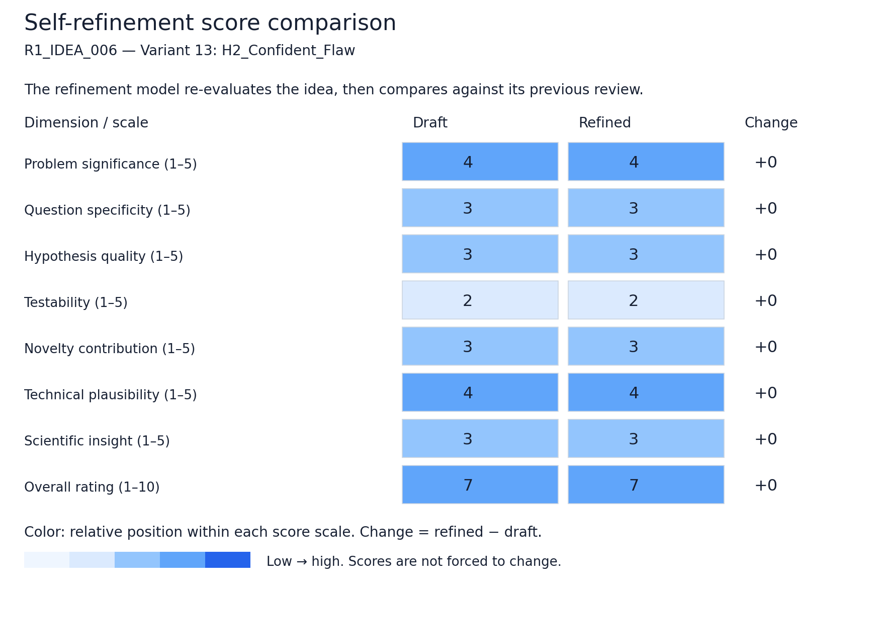

Changed score dimensions: none.

### Score justifications (draft / refined)

**Problem significance**

```json
{
  "draft": {
    "score": 4.0,
    "justification": "The problem of model selection in histopathology is significant due to the complexity of medical imaging tasks and the need for reliable methods in clinical settings."
  },
  "refined": {
    "score": 4.0,
    "justification": "The problem of model selection in histopathology is significant due to the complexity of medical imaging tasks and the need for reliable methods in clinical settings."
  }
}
```

**Question specificity**

```json
{
  "draft": {
    "score": 3.0,
    "justification": "The idea identifies a specific problem but lacks detailed specification of the research question or the exact method to be tested."
  },
  "refined": {
    "score": 3.0,
    "justification": "The idea identifies a specific problem but lacks detailed specification of the research question or the exact method to be tested."
  }
}
```

**Hypothesis quality**

```json
{
  "draft": {
    "score": 3.0,
    "justification": "The idea presents a general hypothesis that the method will be effective, but it lacks a concrete prediction or mechanism that can be tested."
  },
  "refined": {
    "score": 3.0,
    "justification": "The idea presents a general hypothesis that the method will be effective, but it lacks a concrete prediction or mechanism that can be tested."
  }
}
```

**Testability**

```json
{
  "draft": {
    "score": 2.0,
    "justification": "The idea is testable in principle, but the lack of specific experimental details makes it difficult to assess the feasibility of the proposed approach."
  },
  "refined": {
    "score": 2.0,
    "justification": "The idea is testable in principle, but the lack of specific experimental details makes it difficult to assess the feasibility of the proposed approach."
  }
}
```

**Novelty contribution**

```json
{
  "draft": {
    "score": 3.0,
    "justification": "The idea proposes applying a method from natural image tasks to medical imaging, which is novel but not groundbreaking."
  },
  "refined": {
    "score": 3.0,
    "justification": "The idea proposes applying a method from natural image tasks to medical imaging, which is novel but not groundbreaking."
  }
}
```

**Technical plausibility**

```json
{
  "draft": {
    "score": 4.0,
    "justification": "The proposed approach is technically plausible, as rank estimation methods have shown promise in other domains and can be adapted for histopathology."
  },
  "refined": {
    "score": 4.0,
    "justification": "The proposed approach is technically plausible, as rank estimation methods have shown promise in other domains and can be adapted for histopathology."
  }
}
```

**Scientific insight**

```json
{
  "draft": {
    "score": 3.0,
    "justification": "The idea has potential to provide insights into the effectiveness of self-supervised learning in medical imaging, but the claim for causal evidence is not sufficiently supported."
  },
  "refined": {
    "score": 3.0,
    "justification": "The idea has potential to provide insights into the effectiveness of self-supervised learning in medical imaging, but the claim for causal evidence is not sufficiently supported."
  }
}
```

**Overall rating**

```json
{
  "draft": {
    "score": 7.0,
    "justification": "The idea addresses a meaningful problem in medical imaging with a plausible approach, but lacks specificity and experimental details needed for a strong research direction."
  },
  "refined": {
    "score": 7.0,
    "justification": "The idea addresses a meaningful problem in medical imaging with a plausible approach, but lacks specificity and experimental details needed for a strong research direction."
  }
}
```

## R1_IDEA_006 — Variant 14: H3_Verbose_Enriched


Changed score dimensions: none.

### Score justifications (draft / refined)

**Problem significance**

```json
{
  "draft": {
    "score": 4.0,
    "justification": "The problem is significant as it addresses a critical challenge in applying self-supervised learning to histopathology, a domain with high image complexity and domain-specific feature distributions. The potential impact on medical imaging and diagnostic accuracy is substantial."
  },
  "refined": {
    "score": 4.0,
    "justification": "The problem is significant as it addresses a critical challenge in applying self-supervised learning to histopathology, a domain with high image complexity and domain-specific feature distributions. The potential impact on medical imaging and diagnostic accuracy is substantial."
  }
}
```

**Question specificity**

```json
{
  "draft": {
    "score": 3.0,
    "justification": "The idea is specific in its focus on histopathology and the unique challenges of high-resolution, multi-scale images, but the exact methods and tasks to be evaluated are not clearly specified, which could limit the clarity of the research question."
  },
  "refined": {
    "score": 3.0,
    "justification": "The idea is specific in its focus on histopathology and the unique challenges of high-resolution, multi-scale images, but the exact methods and tasks to be evaluated are not clearly specified, which could limit the clarity of the research question."
  }
}
```

**Hypothesis quality**

```json
{
  "draft": {
    "score": 4.0,
    "justification": "The hypothesis is well-defined, suggesting that rank-based metrics may face unique challenges in histopathology. It is testable through a structured experimental design and includes a clear prediction about the effectiveness of the approach in this domain."
  },
  "refined": {
    "score": 4.0,
    "justification": "The hypothesis is well-defined, suggesting that rank-based metrics may face unique challenges in histopathology. It is testable through a structured experimental design and includes a clear prediction about the effectiveness of the approach in this domain."
  }
}
```

**Testability**

```json
{
  "draft": {
    "score": 4.0,
    "justification": "The idea proposes a staged experimental design with specific evaluation criteria, ablations, and error analysis, which makes the hypothesis testable. However, the lack of specific details on implementation could affect the feasibility of the study."
  },
  "refined": {
    "score": 4.0,
    "justification": "The idea proposes a staged experimental design with specific evaluation criteria, ablations, and error analysis, which makes the hypothesis testable. However, the lack of specific details on implementation could affect the feasibility of the study."
  }
}
```

**Novelty contribution**

```json
{
  "draft": {
    "score": 3.0,
    "justification": "The idea is novel in its application of rank estimation approaches to histopathology, a domain where such methods have not been extensively explored. However, the novelty is somewhat limited if the methods are already being used in other domains, though the focus on histopathology is a unique aspect."
  },
  "refined": {
    "score": 3.0,
    "justification": "The idea is novel in its application of rank estimation approaches to histopathology, a domain where such methods have not been extensively explored. However, the novelty is somewhat limited if the methods are already being used in other domains, though the focus on histopathology is a unique aspect."
  }
}
```

**Technical plausibility**

```json
{
  "draft": {
    "score": 4.0,
    "justification": "The proposed approach is technically plausible, as it builds on existing methods for rank estimation in self-supervised learning. The integration into histopathology data is feasible, though specific implementation details are not provided."
  },
  "refined": {
    "score": 4.0,
    "justification": "The proposed approach is technically plausible, as it builds on existing methods for rank estimation in self-supervised learning. The integration into histopathology data is feasible, though specific implementation details are not provided."
  }
}
```

**Scientific insight**

```json
{
  "draft": {
    "score": 4.0,
    "justification": "The study aims to uncover the assumptions and domain constraints that determine the utility of rank-based metrics in histopathology, which could provide valuable insights into the limitations and applicability of these methods in different domains."
  },
  "refined": {
    "score": 4.0,
    "justification": "The study aims to uncover the assumptions and domain constraints that determine the utility of rank-based metrics in histopathology, which could provide valuable insights into the limitations and applicability of these methods in different domains."
  }
}
```

**Overall rating**

```json
{
  "draft": {
    "score": 8.0,
    "justification": "The idea is strong and addresses a meaningful problem in a challenging domain. The structured experimental design and focus on domain-specific challenges make it a promising research direction, though some details need to be clarified for better testability and specificity."
  },
  "refined": {
    "score": 8.0,
    "justification": "The idea is strong and addresses a meaningful problem in a challenging domain. The structured experimental design and focus on domain-specific challenges make it a promising research direction, though some details need to be clarified for better testability and specificity."
  }
}
```

## R1_IDEA_006 — Variant 15: H4_Ultimate_Hype


Changed score dimensions: none.

### Score justifications (draft / refined)

**Problem significance**

```json
{
  "draft": {
    "score": 4.0,
    "justification": "The problem of selecting appropriate models in histopathology is significant due to the critical nature of medical imaging applications. The potential impact on clinical practice and diagnostic accuracy is substantial."
  },
  "refined": {
    "score": 4.0,
    "justification": "The problem of selecting appropriate models in histopathology is significant due to the critical nature of medical imaging applications. The potential impact on clinical practice and diagnostic accuracy is substantial."
  }
}
```

**Question specificity**

```json
{
  "draft": {
    "score": 2.0,
    "justification": "The idea is somewhat specific in identifying the problem but lacks a clear, concrete research question. It is more of a general statement about the potential of the approach rather than a focused investigation."
  },
  "refined": {
    "score": 2.0,
    "justification": "The idea is somewhat specific in identifying the problem but lacks a clear, concrete research question. It is more of a general statement about the potential of the approach rather than a focused investigation."
  }
}
```

**Hypothesis quality**

```json
{
  "draft": {
    "score": 3.0,
    "justification": "The idea suggests that rank estimation approaches could be effective in histopathology, but it does not provide a concrete hypothesis or prediction that can be tested. The hypothesis is implied but not explicitly stated."
  },
  "refined": {
    "score": 3.0,
    "justification": "The idea suggests that rank estimation approaches could be effective in histopathology, but it does not provide a concrete hypothesis or prediction that can be tested. The hypothesis is implied but not explicitly stated."
  }
}
```

**Testability**

```json
{
  "draft": {
    "score": 2.0,
    "justification": "The idea does not specify how the methods will be evaluated or what experiments will be conducted. Without a clear plan for testing the effectiveness of the approaches in histopathology, the idea is not highly testable."
  },
  "refined": {
    "score": 2.0,
    "justification": "The idea does not specify how the methods will be evaluated or what experiments will be conducted. Without a clear plan for testing the effectiveness of the approaches in histopathology, the idea is not highly testable."
  }
}
```

**Novelty contribution**

```json
{
  "draft": {
    "score": 4.0,
    "justification": "The idea proposes exploring a technique (rank estimation) in a new domain (histopathology) for non-linear tasks, which is novel. It has the potential to contribute to both the technical understanding and practical application of self-supervised learning in medical imaging."
  },
  "refined": {
    "score": 4.0,
    "justification": "The idea proposes exploring a technique (rank estimation) in a new domain (histopathology) for non-linear tasks, which is novel. It has the potential to contribute to both the technical understanding and practical application of self-supervised learning in medical imaging."
  }
}
```

**Technical plausibility**

```json
{
  "draft": {
    "score": 4.0,
    "justification": "The proposed approach is technically plausible as it builds on existing methods (rank estimation) and applies them to a new domain. The challenge is in adapting these methods to histopathology, which is a plausible area for research."
  },
  "refined": {
    "score": 4.0,
    "justification": "The proposed approach is technically plausible as it builds on existing methods (rank estimation) and applies them to a new domain. The challenge is in adapting these methods to histopathology, which is a plausible area for research."
  }
}
```

**Scientific insight**

```json
{
  "draft": {
    "score": 3.0,
    "justification": "The idea has the potential to provide insights into the effectiveness of self-supervised learning in histopathology, but without a specific hypothesis or experimental plan, the potential for scientific insight is limited."
  },
  "refined": {
    "score": 3.0,
    "justification": "The idea has the potential to provide insights into the effectiveness of self-supervised learning in histopathology, but without a specific hypothesis or experimental plan, the potential for scientific insight is limited."
  }
}
```

**Overall rating**

```json
{
  "draft": {
    "score": 7.0,
    "justification": "The idea addresses a meaningful problem with potential high impact, but it lacks a clear, specific research question and hypothesis. It has the potential to be strong if further details are provided, but as a standalone idea, it is somewhat vague and needs more concrete direction."
  },
  "refined": {
    "score": 7.0,
    "justification": "The idea addresses a meaningful problem with potential high impact, but it lacks a clear, specific research question and hypothesis. It has the potential to be strong if further details are provided, but as a standalone idea, it is somewhat vague and needs more concrete direction."
  }
}
```

## R1_IDEA_007 — Source


Changed score dimensions: none.

### Score justifications (draft / refined)

**Problem significance**

```json
{
  "draft": {
    "score": 4.0,
    "justification": "The accuracy-interpretability trade-off is a critical issue in machine learning, with significant implications for deployment in safety-critical domains. Addressing this problem could lead to more trustworthy AI systems."
  },
  "refined": {
    "score": 4.0,
    "justification": "The accuracy-interpretability trade-off is a critical issue in machine learning, with significant implications for deployment in safety-critical domains. Addressing this problem could lead to more trustworthy AI systems."
  }
}
```

**Question specificity**

```json
{
  "draft": {
    "score": 3.0,
    "justification": "The idea identifies a broad problem but lacks specific research questions or hypotheses. It needs to define exactly what NIMO aims to achieve in terms of model structure, interpretability, and performance metrics."
  },
  "refined": {
    "score": 3.0,
    "justification": "The idea identifies a broad problem but lacks specific research questions or hypotheses. It needs to define exactly what NIMO aims to achieve in terms of model structure, interpretability, and performance metrics."
  }
}
```

**Hypothesis quality**

```json
{
  "draft": {
    "score": 2.0,
    "justification": "The idea does not explicitly state a hypothesis or prediction. While the goal is clear, the specific claim that NIMO will close the performance gap is not framed as a testable hypothesis."
  },
  "refined": {
    "score": 2.0,
    "justification": "The idea does not explicitly state a hypothesis or prediction. While the goal is clear, the specific claim that NIMO will close the performance gap is not framed as a testable hypothesis."
  }
}
```

**Testability**

```json
{
  "draft": {
    "score": 3.0,
    "justification": "The idea is promising but lacks concrete experiments or evaluation plans. Without specifying how NIMO will be tested against existing methods, it is difficult to assess its testability."
  },
  "refined": {
    "score": 3.0,
    "justification": "The idea is promising but lacks concrete experiments or evaluation plans. Without specifying how NIMO will be tested against existing methods, it is difficult to assess its testability."
  }
}
```

**Novelty contribution**

```json
{
  "draft": {
    "score": 4.0,
    "justification": "The proposal introduces a new framework that directly addresses the interpretability-accuracy trade-off. While the concept is not entirely novel, the integration of built-in nonlinear interpretability is a meaningful contribution."
  },
  "refined": {
    "score": 4.0,
    "justification": "The proposal introduces a new framework that directly addresses the interpretability-accuracy trade-off. While the concept is not entirely novel, the integration of built-in nonlinear interpretability is a meaningful contribution."
  }
}
```

**Technical plausibility**

```json
{
  "draft": {
    "score": 3.0,
    "justification": "The idea is technically plausible, as combining interpretability with nonlinear modeling is a reasonable direction. However, the lack of specific details makes it difficult to assess the feasibility of the proposed approach."
  },
  "refined": {
    "score": 3.0,
    "justification": "The idea is technically plausible, as combining interpretability with nonlinear modeling is a reasonable direction. However, the lack of specific details makes it difficult to assess the feasibility of the proposed approach."
  }
}
```

**Scientific insight**

```json
{
  "draft": {
    "score": 3.0,
    "justification": "The idea has the potential to provide insights into how interpretability can be maintained in complex models. However, without a clear research question, the potential for scientific insight is limited."
  },
  "refined": {
    "score": 3.0,
    "justification": "The idea has the potential to provide insights into how interpretability can be maintained in complex models. However, without a clear research question, the potential for scientific insight is limited."
  }
}
```

**Overall rating**

```json
{
  "draft": {
    "score": 7.0,
    "justification": "The idea addresses a significant problem in machine learning and proposes a novel framework. However, it lacks specific details, hypotheses, and testable questions, which are necessary for a strong research direction. With further clarification, it has the potential to be a strong research idea."
  },
  "refined": {
    "score": 7.0,
    "justification": "The idea addresses a significant problem in machine learning and proposes a novel framework. However, it lacks specific details, hypotheses, and testable questions, which are necessary for a strong research direction. With further clarification, it has the potential to be a strong research idea."
  }
}
```

## R1_IDEA_007 — Variant 1: A1_Identity


Changed score dimensions: none.

### Score justifications (draft / refined)

**Problem significance**

```json
{
  "draft": {
    "score": 4.0,
    "justification": "The accuracy-interpretability trade-off is a critical issue in machine learning, with significant implications for deployment in safety-critical domains. Addressing this problem could lead to more trustworthy AI systems."
  },
  "refined": {
    "score": 4.0,
    "justification": "The accuracy-interpretability trade-off is a critical issue in machine learning, with significant implications for deployment in safety-critical domains. Addressing this problem could lead to more trustworthy AI systems."
  }
}
```

**Question specificity**

```json
{
  "draft": {
    "score": 3.0,
    "justification": "The idea identifies a broad problem but lacks specific research questions or hypotheses. It needs to define exactly what NIMO aims to achieve in terms of model structure, interpretability, and performance metrics."
  },
  "refined": {
    "score": 3.0,
    "justification": "The idea identifies a broad problem but lacks specific research questions or hypotheses. It needs to define exactly what NIMO aims to achieve in terms of model structure, interpretability, and performance metrics."
  }
}
```

**Hypothesis quality**

```json
{
  "draft": {
    "score": 2.0,
    "justification": "The idea does not explicitly state a hypothesis or prediction. While the goal is clear, the specific claim that NIMO will close the performance gap is not framed as a testable hypothesis."
  },
  "refined": {
    "score": 2.0,
    "justification": "The idea does not explicitly state a hypothesis or prediction. While the goal is clear, the specific claim that NIMO will close the performance gap is not framed as a testable hypothesis."
  }
}
```

**Testability**

```json
{
  "draft": {
    "score": 3.0,
    "justification": "The idea is promising but lacks concrete experiments or evaluation plans. Without specifying how NIMO will be tested against existing methods, it is difficult to assess its testability."
  },
  "refined": {
    "score": 3.0,
    "justification": "The idea is promising but lacks concrete experiments or evaluation plans. Without specifying how NIMO will be tested against existing methods, it is difficult to assess its testability."
  }
}
```

**Novelty contribution**

```json
{
  "draft": {
    "score": 4.0,
    "justification": "The proposal introduces a new framework that directly addresses the interpretability-accuracy trade-off. While the concept is not entirely novel, the integration of built-in nonlinear interpretability is a meaningful contribution."
  },
  "refined": {
    "score": 4.0,
    "justification": "The proposal introduces a new framework that directly addresses the interpretability-accuracy trade-off. While the concept is not entirely novel, the integration of built-in nonlinear interpretability is a meaningful contribution."
  }
}
```

**Technical plausibility**

```json
{
  "draft": {
    "score": 3.0,
    "justification": "The idea is technically plausible, as combining interpretability with nonlinear modeling is a reasonable direction. However, the lack of specific details makes it difficult to assess the feasibility of the proposed approach."
  },
  "refined": {
    "score": 3.0,
    "justification": "The idea is technically plausible, as combining interpretability with nonlinear modeling is a reasonable direction. However, the lack of specific details makes it difficult to assess the feasibility of the proposed approach."
  }
}
```

**Scientific insight**

```json
{
  "draft": {
    "score": 3.0,
    "justification": "The idea has the potential to provide insights into how interpretability can be maintained in complex models. However, without a clear research question, the potential for scientific insight is limited."
  },
  "refined": {
    "score": 3.0,
    "justification": "The idea has the potential to provide insights into how interpretability can be maintained in complex models. However, without a clear research question, the potential for scientific insight is limited."
  }
}
```

**Overall rating**

```json
{
  "draft": {
    "score": 7.0,
    "justification": "The idea addresses a significant problem in machine learning and proposes a novel framework. However, it lacks specific details, hypotheses, and testable questions, which are necessary for a strong research direction. With further clarification, it has the potential to be a strong research idea."
  },
  "refined": {
    "score": 7.0,
    "justification": "The idea addresses a significant problem in machine learning and proposes a novel framework. However, it lacks specific details, hypotheses, and testable questions, which are necessary for a strong research direction. With further clarification, it has the potential to be a strong research idea."
  }
}
```

## R1_IDEA_007 — Variant 2: A2_Paraphrase_Only


Changed score dimensions: none.

### Score justifications (draft / refined)

**Problem significance**

```json
{
  "draft": {
    "score": 4.0,
    "justification": "The problem of balancing accuracy and interpretability is a critical challenge in machine learning, especially in high-stakes applications. Addressing this issue has significant implications for model trust and deployment."
  },
  "refined": {
    "score": 4.0,
    "justification": "The problem of balancing accuracy and interpretability is a critical challenge in machine learning, especially in high-stakes applications. Addressing this issue has significant implications for model trust and deployment."
  }
}
```

**Question specificity**

```json
{
  "draft": {
    "score": 3.0,
    "justification": "The idea identifies a broad problem but lacks specific details on the exact research question or hypothesis. It is clear that the goal is to improve interpretability without sacrificing accuracy, but the specifics of how this is achieved are not well defined."
  },
  "refined": {
    "score": 3.0,
    "justification": "The idea identifies a broad problem but lacks specific details on the exact research question or hypothesis. It is clear that the goal is to improve interpretability without sacrificing accuracy, but the specifics of how this is achieved are not well defined."
  }
}
```

**Hypothesis quality**

```json
{
  "draft": {
    "score": 3.0,
    "justification": "The idea makes a general claim about improving interpretability and performance, but it lacks a concrete hypothesis or prediction that can be tested. The claim that NIMO can narrow the performance gap is plausible but not sufficiently detailed to be a strong hypothesis."
  },
  "refined": {
    "score": 3.0,
    "justification": "The idea makes a general claim about improving interpretability and performance, but it lacks a concrete hypothesis or prediction that can be tested. The claim that NIMO can narrow the performance gap is plausible but not sufficiently detailed to be a strong hypothesis."
  }
}
```

**Testability**

```json
{
  "draft": {
    "score": 2.0,
    "justification": "The idea does not provide a clear experimental plan or comparison to existing methods. Without specific benchmarks or evaluation metrics, it is difficult to assess the testability of the claim."
  },
  "refined": {
    "score": 2.0,
    "justification": "The idea does not provide a clear experimental plan or comparison to existing methods. Without specific benchmarks or evaluation metrics, it is difficult to assess the testability of the claim."
  }
}
```

**Novelty contribution**

```json
{
  "draft": {
    "score": 4.0,
    "justification": "The framework is novel in its approach to achieving nonlinear interpretability. If successful, it could contribute significantly to the field by providing a new method that balances accuracy and interpretability, which is a long-standing challenge."
  },
  "refined": {
    "score": 4.0,
    "justification": "The framework is novel in its approach to achieving nonlinear interpretability. If successful, it could contribute significantly to the field by providing a new method that balances accuracy and interpretability, which is a long-standing challenge."
  }
}
```

**Technical plausibility**

```json
{
  "draft": {
    "score": 3.0,
    "justification": "The idea is technically plausible, as it addresses a known challenge in machine learning. However, the lack of specific technical details makes it difficult to assess the feasibility of the proposed approach."
  },
  "refined": {
    "score": 3.0,
    "justification": "The idea is technically plausible, as it addresses a known challenge in machine learning. However, the lack of specific technical details makes it difficult to assess the feasibility of the proposed approach."
  }
}
```

**Scientific insight**

```json
{
  "draft": {
    "score": 3.0,
    "justification": "The idea has the potential to provide insights into the relationship between model complexity and interpretability. However, without a clear hypothesis or experimental plan, the potential for scientific insight is limited."
  },
  "refined": {
    "score": 3.0,
    "justification": "The idea has the potential to provide insights into the relationship between model complexity and interpretability. However, without a clear hypothesis or experimental plan, the potential for scientific insight is limited."
  }
}
```

**Overall rating**

```json
{
  "draft": {
    "score": 7.0,
    "justification": "The idea addresses a significant problem in machine learning and proposes a novel framework. However, it lacks specific details on the technical implementation, hypothesis, and experimental plan, which are necessary for evaluating its testability and potential contribution."
  },
  "refined": {
    "score": 7.0,
    "justification": "The idea addresses a significant problem in machine learning and proposes a novel framework. However, it lacks specific details on the technical implementation, hypothesis, and experimental plan, which are necessary for evaluating its testability and potential contribution."
  }
}
```

## R1_IDEA_007 — Variant 3: A3_Plain_Core


Changed score dimensions: none.

### Score justifications (draft / refined)

**Problem significance**

```json
{
  "draft": {
    "score": 4.0,
    "justification": "The accuracy-interpretability trade-off is a critical issue in machine learning, especially in safety-critical applications. Addressing this problem has significant implications for model trust and deployment."
  },
  "refined": {
    "score": 4.0,
    "justification": "The accuracy-interpretability trade-off is a critical issue in machine learning, especially in safety-critical applications. Addressing this problem has significant implications for model trust and deployment."
  }
}
```

**Question specificity**

```json
{
  "draft": {
    "score": 3.0,
    "justification": "The idea identifies a broad problem (accuracy-interpretability trade-off) but does not specify the exact research question, such as how NIMO achieves nonlinear feature effects or what specific tasks it targets."
  },
  "refined": {
    "score": 3.0,
    "justification": "The idea identifies a broad problem (accuracy-interpretability trade-off) but does not specify the exact research question, such as how NIMO achieves nonlinear feature effects or what specific tasks it targets."
  }
}
```

**Hypothesis quality**

```json
{
  "draft": {
    "score": 2.0,
    "justification": "The idea mentions that NIMO is inherently interpretable and reduces the performance gap, but it lacks a concrete hypothesis or prediction that can be tested, such as a specific performance metric or comparison with existing methods."
  },
  "refined": {
    "score": 2.0,
    "justification": "The idea mentions that NIMO is inherently interpretable and reduces the performance gap, but it lacks a concrete hypothesis or prediction that can be tested, such as a specific performance metric or comparison with existing methods."
  }
}
```

**Testability**

```json
{
  "draft": {
    "score": 2.0,
    "justification": "The idea does not provide a clear experimental plan or evaluation metrics, making it difficult to assess the feasibility of testing the proposed framework."
  },
  "refined": {
    "score": 2.0,
    "justification": "The idea does not provide a clear experimental plan or evaluation metrics, making it difficult to assess the feasibility of testing the proposed framework."
  }
}
```

**Novelty contribution**

```json
{
  "draft": {
    "score": 4.0,
    "justification": "The framework is novel in its approach to providing built-in nonlinear interpretability, which is a significant contribution to the field of interpretable machine learning."
  },
  "refined": {
    "score": 4.0,
    "justification": "The framework is novel in its approach to providing built-in nonlinear interpretability, which is a significant contribution to the field of interpretable machine learning."
  }
}
```

**Technical plausibility**

```json
{
  "draft": {
    "score": 3.0,
    "justification": "The concept of a model with built-in nonlinear interpretability is plausible, but the specific technical details (e.g., architecture, training methodology) are not provided, which could affect the feasibility of implementation."
  },
  "refined": {
    "score": 3.0,
    "justification": "The concept of a model with built-in nonlinear interpretability is plausible, but the specific technical details (e.g., architecture, training methodology) are not provided, which could affect the feasibility of implementation."
  }
}
```

**Scientific insight**

```json
{
  "draft": {
    "score": 3.0,
    "justification": "The idea has potential to provide insights into how nonlinear models can be made interpretable, but the lack of specific hypotheses and evaluation plans limits the potential for scientific insight."
  },
  "refined": {
    "score": 3.0,
    "justification": "The idea has potential to provide insights into how nonlinear models can be made interpretable, but the lack of specific hypotheses and evaluation plans limits the potential for scientific insight."
  }
}
```

**Overall rating**

```json
{
  "draft": {
    "score": 7.0,
    "justification": "The idea addresses a significant problem in machine learning with a novel approach, but it lacks specific details, hypotheses, and evaluation plans that are necessary for further development and validation."
  },
  "refined": {
    "score": 7.0,
    "justification": "The idea addresses a significant problem in machine learning with a novel approach, but it lacks specific details, hypotheses, and evaluation plans that are necessary for further development and validation."
  }
}
```

## R1_IDEA_007 — Variant 4: B1_Verbose_Elaborate


Changed score dimensions: none.

### Score justifications (draft / refined)

**Problem significance**

```json
{
  "draft": {
    "score": 4.0,
    "justification": "The problem of balancing model accuracy and interpretability is a critical challenge in machine learning, with significant implications for real-world applications where model transparency is essential."
  },
  "refined": {
    "score": 4.0,
    "justification": "The problem of balancing model accuracy and interpretability is a critical challenge in machine learning, with significant implications for real-world applications where model transparency is essential."
  }
}
```

**Question specificity**

```json
{
  "draft": {
    "score": 3.0,
    "justification": "The idea identifies a specific problem (the trade-off between accuracy and interpretability) but lacks detailed specification of the research question, such as the exact mechanism by which NIMO reconciles this tension or the specific performance metrics to be evaluated."
  },
  "refined": {
    "score": 3.0,
    "justification": "The idea identifies a specific problem (the trade-off between accuracy and interpretability) but lacks detailed specification of the research question, such as the exact mechanism by which NIMO reconciles this tension or the specific performance metrics to be evaluated."
  }
}
```

**Hypothesis quality**

```json
{
  "draft": {
    "score": 2.0,
    "justification": "The idea suggests a potential solution but does not explicitly state a hypothesis that can be tested. The claim that NIMO will close the performance gap is not supported by a concrete prediction or mechanism."
  },
  "refined": {
    "score": 2.0,
    "justification": "The idea suggests a potential solution but does not explicitly state a hypothesis that can be tested. The claim that NIMO will close the performance gap is not supported by a concrete prediction or mechanism."
  }
}
```

**Testability**

```json
{
  "draft": {
    "score": 2.0,
    "justification": "The idea lacks a clear experimental plan or evaluation strategy. Without specific experiments or comparisons, it is difficult to assess the validity of the proposed approach."
  },
  "refined": {
    "score": 2.0,
    "justification": "The idea lacks a clear experimental plan or evaluation strategy. Without specific experiments or comparisons, it is difficult to assess the validity of the proposed approach."
  }
}
```

**Novelty contribution**

```json
{
  "draft": {
    "score": 3.0,
    "justification": "The idea proposes a novel framework (NIMO) that addresses the problem of interpretability in nonlinear models, but the novelty is not clearly articulated, and the contribution is not explicitly defined in terms of performance or interpretability gains."
  },
  "refined": {
    "score": 3.0,
    "justification": "The idea proposes a novel framework (NIMO) that addresses the problem of interpretability in nonlinear models, but the novelty is not clearly articulated, and the contribution is not explicitly defined in terms of performance or interpretability gains."
  }
}
```

**Technical plausibility**

```json
{
  "draft": {
    "score": 4.0,
    "justification": "The approach of integrating nonlinear feature effects into an interpretable model is technically plausible, as it builds on existing research in interpretable machine learning and addresses a known challenge in the field."
  },
  "refined": {
    "score": 4.0,
    "justification": "The approach of integrating nonlinear feature effects into an interpretable model is technically plausible, as it builds on existing research in interpretable machine learning and addresses a known challenge in the field."
  }
}
```

**Scientific insight**

```json
{
  "draft": {
    "score": 3.0,
    "justification": "The idea has the potential to contribute to the understanding of how interpretability can be maintained in complex models, but the specific insights or mechanisms are not clearly outlined."
  },
  "refined": {
    "score": 3.0,
    "justification": "The idea has the potential to contribute to the understanding of how interpretability can be maintained in complex models, but the specific insights or mechanisms are not clearly outlined."
  }
}
```

**Overall rating**

```json
{
  "draft": {
    "score": 6.0,
    "justification": "The idea addresses a significant problem in machine learning and proposes a novel approach, but it lacks specific details, a clear hypothesis, and a concrete experimental plan. With further clarification and development, it has the potential to be a strong research direction."
  },
  "refined": {
    "score": 6.0,
    "justification": "The idea addresses a significant problem in machine learning and proposes a novel approach, but it lacks specific details, a clear hypothesis, and a concrete experimental plan. With further clarification and development, it has the potential to be a strong research direction."
  }
}
```

## R1_IDEA_007 — Variant 5: B2_Grand_Narrative


Changed score dimensions: none.

### Score justifications (draft / refined)

**Problem significance**

```json
{
  "draft": {
    "score": 4.0,
    "justification": "The accuracy-interpretability trade-off is a critical issue in AI, especially for trustworthy systems. The problem is well-defined and has broad relevance across domains."
  },
  "refined": {
    "score": 4.0,
    "justification": "The accuracy-interpretability trade-off is a critical issue in AI, especially for trustworthy systems. The problem is well-defined and has broad relevance across domains."
  }
}
```

**Question specificity**

```json
{
  "draft": {
    "score": 3.0,
    "justification": "The idea identifies a specific problem but lacks detailed technical specifics about the framework's structure or how it addresses the trade-off. The research question is clear but not sufficiently detailed for a precise investigation."
  },
  "refined": {
    "score": 3.0,
    "justification": "The idea identifies a specific problem but lacks detailed technical specifics about the framework's structure or how it addresses the trade-off. The research question is clear but not sufficiently detailed for a precise investigation."
  }
}
```

**Hypothesis quality**

```json
{
  "draft": {
    "score": 4.0,
    "justification": "The idea presents a clear hypothesis that NIMO can provide faithful nonlinear feature effects, offering a balance between accuracy and interpretability. It distinguishes itself from post-hoc methods by emphasizing fidelity."
  },
  "refined": {
    "score": 4.0,
    "justification": "The idea presents a clear hypothesis that NIMO can provide faithful nonlinear feature effects, offering a balance between accuracy and interpretability. It distinguishes itself from post-hoc methods by emphasizing fidelity."
  }
}
```

**Testability**

```json
{
  "draft": {
    "score": 3.0,
    "justification": "The idea suggests a potential direction but lacks specific experiments or evaluation methods. The hypothesis could be tested through benchmarking against existing models, but the details are not provided."
  },
  "refined": {
    "score": 3.0,
    "justification": "The idea suggests a potential direction but lacks specific experiments or evaluation methods. The hypothesis could be tested through benchmarking against existing models, but the details are not provided."
  }
}
```

**Novelty contribution**

```json
{
  "draft": {
    "score": 3.0,
    "justification": "The framework is novel in its approach to combining nonlinearity and interpretability, but the summary does not provide enough detail to assess its uniqueness compared to existing work. The contribution is promising but not clearly defined."
  },
  "refined": {
    "score": 3.0,
    "justification": "The framework is novel in its approach to combining nonlinearity and interpretability, but the summary does not provide enough detail to assess its uniqueness compared to existing work. The contribution is promising but not clearly defined."
  }
}
```

**Technical plausibility**

```json
{
  "draft": {
    "score": 4.0,
    "justification": "The idea is technically plausible as it builds on existing concepts in interpretable machine learning. The proposed mechanism of built-in nonlinear feature effects is reasonable, though the specifics are not detailed."
  },
  "refined": {
    "score": 4.0,
    "justification": "The idea is technically plausible as it builds on existing concepts in interpretable machine learning. The proposed mechanism of built-in nonlinear feature effects is reasonable, though the specifics are not detailed."
  }
}
```

**Scientific insight**

```json
{
  "draft": {
    "score": 3.0,
    "justification": "The idea has potential to contribute to understanding the balance between model performance and interpretability, but the specific insights would depend on the implementation and evaluation of NIMO. The current summary does not provide enough detail to assess the potential insights."
  },
  "refined": {
    "score": 3.0,
    "justification": "The idea has potential to contribute to understanding the balance between model performance and interpretability, but the specific insights would depend on the implementation and evaluation of NIMO. The current summary does not provide enough detail to assess the potential insights."
  }
}
```

**Overall rating**

```json
{
  "draft": {
    "score": 7.0,
    "justification": "The idea addresses a significant problem in AI with a clear hypothesis and potential for contribution. However, it lacks specific technical details and evaluation plans, which are necessary for a strong research direction. The overall quality is strong but has room for improvement in specificity and testability."
  },
  "refined": {
    "score": 7.0,
    "justification": "The idea addresses a significant problem in AI with a clear hypothesis and potential for contribution. However, it lacks specific technical details and evaluation plans, which are necessary for a strong research direction. The overall quality is strong but has room for improvement in specificity and testability."
  }
}
```

## R1_IDEA_007 — Variant 6: B3_Over_Confident

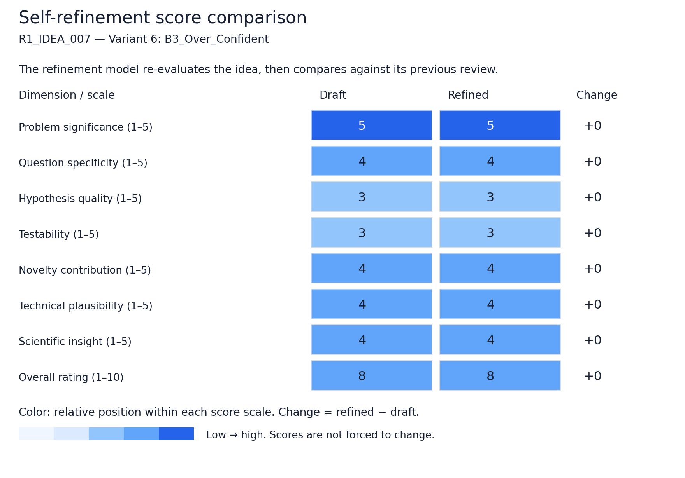

Changed score dimensions: none.

### Score justifications (draft / refined)

**Problem significance**

```json
{
  "draft": {
    "score": 5.0,
    "justification": "The idea addresses a critical and longstanding problem in machine learning: the trade-off between model accuracy and interpretability. This is a key challenge in deploying models in real-world applications where transparency and trust are essential."
  },
  "refined": {
    "score": 5.0,
    "justification": "The idea addresses a critical and longstanding problem in machine learning: the trade-off between model accuracy and interpretability. This is a key challenge in deploying models in real-world applications where transparency and trust are essential."
  }
}
```

**Question specificity**

```json
{
  "draft": {
    "score": 4.0,
    "justification": "The idea clearly defines the problem (accuracy-interpretability trade-off) and proposes a specific solution (NIMO framework with built-in nonlinear feature effects). However, the specific research question or hypothesis is not explicitly stated, which could be more detailed."
  },
  "refined": {
    "score": 4.0,
    "justification": "The idea clearly defines the problem (accuracy-interpretability trade-off) and proposes a specific solution (NIMO framework with built-in nonlinear feature effects). However, the specific research question or hypothesis is not explicitly stated, which could be more detailed."
  }
}
```

**Hypothesis quality**

```json
{
  "draft": {
    "score": 3.0,
    "justification": "The idea presents a general claim about the benefits of NIMO but lacks a specific hypothesis that can be tested. The assertion of 'guaranteed fidelity' is strong but not elaborated on, making it difficult to assess the hypothesis's testability."
  },
  "refined": {
    "score": 3.0,
    "justification": "The idea presents a general claim about the benefits of NIMO but lacks a specific hypothesis that can be tested. The assertion of 'guaranteed fidelity' is strong but not elaborated on, making it difficult to assess the hypothesis's testability."
  }
}
```

**Testability**

```json
{
  "draft": {
    "score": 3.0,
    "justification": "The idea is testable in principle, but the lack of specific experimental details or benchmarks makes it difficult to assess the feasibility of testing the claims. The hypothesis about 'guaranteed fidelity' is not clearly defined, which limits testability."
  },
  "refined": {
    "score": 3.0,
    "justification": "The idea is testable in principle, but the lack of specific experimental details or benchmarks makes it difficult to assess the feasibility of testing the claims. The hypothesis about 'guaranteed fidelity' is not clearly defined, which limits testability."
  }
}
```

**Novelty contribution**

```json
{
  "draft": {
    "score": 4.0,
    "justification": "The proposal introduces a novel framework (NIMO) that directly addresses the accuracy-interpretability trade-off. While the specific novelty is not fully detailed, the idea has the potential to contribute new insights into model interpretability and transparency."
  },
  "refined": {
    "score": 4.0,
    "justification": "The proposal introduces a novel framework (NIMO) that directly addresses the accuracy-interpretability trade-off. While the specific novelty is not fully detailed, the idea has the potential to contribute new insights into model interpretability and transparency."
  }
}
```

**Technical plausibility**

```json
{
  "draft": {
    "score": 4.0,
    "justification": "The idea is technically plausible as it builds on existing concepts in model interpretability and nonlinear modeling. However, the lack of specific technical details makes it difficult to assess the feasibility of the proposed framework."
  },
  "refined": {
    "score": 4.0,
    "justification": "The idea is technically plausible as it builds on existing concepts in model interpretability and nonlinear modeling. However, the lack of specific technical details makes it difficult to assess the feasibility of the proposed framework."
  }
}
```

**Scientific insight**

```json
{
  "draft": {
    "score": 4.0,
    "justification": "The idea has the potential to provide scientific insight into how nonlinear models can be made interpretable without sacrificing accuracy. However, the specific mechanisms and empirical validation are not detailed, which limits the potential insight."
  },
  "refined": {
    "score": 4.0,
    "justification": "The idea has the potential to provide scientific insight into how nonlinear models can be made interpretable without sacrificing accuracy. However, the specific mechanisms and empirical validation are not detailed, which limits the potential insight."
  }
}
```

**Overall rating**

```json
{
  "draft": {
    "score": 8.0,
    "justification": "The idea addresses a significant problem in machine learning with a clear and specific approach. While the technical details and hypothesis are not fully elaborated, the potential contribution to the field is strong. The idea has the potential to be a valuable research direction if further details are provided."
  },
  "refined": {
    "score": 8.0,
    "justification": "The idea addresses a significant problem in machine learning with a clear and specific approach. While the technical details and hypothesis are not fully elaborated, the potential contribution to the field is strong. The idea has the potential to be a valuable research direction if further details are provided."
  }
}
```

## R1_IDEA_007 — Variant 7: B4_Novelty


Changed score dimensions: none.

### Score justifications (draft / refined)

**Problem significance**

```json
{
  "draft": {
    "score": 4.0,
    "justification": "The accuracy-interpretability trade-off is a critical issue in machine learning, especially for applications requiring transparency and trustworthiness. Addressing this problem has significant implications for real-world deployment of models."
  },
  "refined": {
    "score": 4.0,
    "justification": "The accuracy-interpretability trade-off is a critical issue in machine learning, especially for applications requiring transparency and trustworthiness. Addressing this problem has significant implications for real-world deployment of models."
  }
}
```

**Question specificity**

```json
{
  "draft": {
    "score": 3.0,
    "justification": "The idea identifies a key problem but lacks specific details on the research question or hypothesis. It is clear that the goal is to improve interpretability without sacrificing performance, but the exact question being investigated is not clearly defined."
  },
  "refined": {
    "score": 3.0,
    "justification": "The idea identifies a key problem but lacks specific details on the research question or hypothesis. It is clear that the goal is to improve interpretability without sacrificing performance, but the exact question being investigated is not clearly defined."
  }
}
```

**Hypothesis quality**

```json
{
  "draft": {
    "score": 3.0,
    "justification": "The idea suggests a potential solution to the trade-off problem but does not explicitly state a hypothesis or prediction that can be tested. The novelty is not clearly articulated, making it difficult to assess the potential contribution of the framework."
  },
  "refined": {
    "score": 3.0,
    "justification": "The idea suggests a potential solution to the trade-off problem but does not explicitly state a hypothesis or prediction that can be tested. The novelty is not clearly articulated, making it difficult to assess the potential contribution of the framework."
  }
}
```

**Testability**

```json
{
  "draft": {
    "score": 3.0,
    "justification": "The idea is testable in principle, but the lack of specific details makes it difficult to design experiments or evaluate the framework. Without clear benchmarks or comparison methods, the testability is limited."
  },
  "refined": {
    "score": 3.0,
    "justification": "The idea is testable in principle, but the lack of specific details makes it difficult to design experiments or evaluate the framework. Without clear benchmarks or comparison methods, the testability is limited."
  }
}
```

**Novelty contribution**

```json
{
  "draft": {
    "score": 3.0,
    "justification": "The idea presents a new direction for addressing the accuracy-interpretability trade-off, but the novelty is not clearly demonstrated. The proposed framework may not offer a unique contribution if it is based on existing methods with minor modifications."
  },
  "refined": {
    "score": 3.0,
    "justification": "The idea presents a new direction for addressing the accuracy-interpretability trade-off, but the novelty is not clearly demonstrated. The proposed framework may not offer a unique contribution if it is based on existing methods with minor modifications."
  }
}
```

**Technical plausibility**

```json
{
  "draft": {
    "score": 4.0,
    "justification": "The concept of combining nonlinear modeling with interpretability is technically plausible. However, the specific implementation details are not provided, which could affect the feasibility of the approach."
  },
  "refined": {
    "score": 4.0,
    "justification": "The concept of combining nonlinear modeling with interpretability is technically plausible. However, the specific implementation details are not provided, which could affect the feasibility of the approach."
  }
}
```

**Scientific insight**

```json
{
  "draft": {
    "score": 3.0,
    "justification": "The idea has the potential to provide insights into the trade-off between model performance and interpretability, but the lack of specific details makes it difficult to assess the potential scientific contribution."
  },
  "refined": {
    "score": 3.0,
    "justification": "The idea has the potential to provide insights into the trade-off between model performance and interpretability, but the lack of specific details makes it difficult to assess the potential scientific contribution."
  }
}
```

**Overall rating**

```json
{
  "draft": {
    "score": 7.0,
    "justification": "The idea addresses a significant problem in machine learning and proposes a novel direction for improving model interpretability. However, the lack of specific details and clear hypothesis makes it difficult to assess the novelty and testability of the approach. With further clarification and details, the idea has strong potential for a meaningful contribution to the field."
  },
  "refined": {
    "score": 7.0,
    "justification": "The idea addresses a significant problem in machine learning and proposes a novel direction for improving model interpretability. However, the lack of specific details and clear hypothesis makes it difficult to assess the novelty and testability of the approach. With further clarification and details, the idea has strong potential for a meaningful contribution to the field."
  }
}
```

## R1_IDEA_007 — Variant 8: B5_Application_Impact

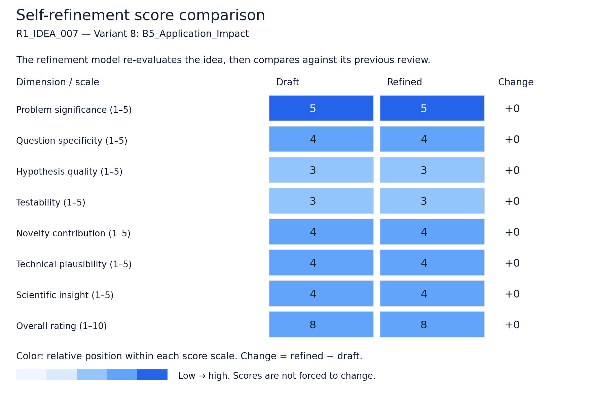

Changed score dimensions: none.

### Score justifications (draft / refined)

**Problem significance**

```json
{
  "draft": {
    "score": 5.0,
    "justification": "The accuracy-interpretability trade-off is a critical challenge in machine learning, with significant implications for practical applications requiring transparency and trust in AI systems."
  },
  "refined": {
    "score": 5.0,
    "justification": "The accuracy-interpretability trade-off is a critical challenge in machine learning, with significant implications for practical applications requiring transparency and trust in AI systems."
  }
}
```

**Question specificity**

```json
{
  "draft": {
    "score": 4.0,
    "justification": "The idea clearly defines the problem (trade-off between accuracy and interpretability) and proposes a novel framework (NIMO) to address it, but lacks specific details on the technical approach and how it differs from existing methods."
  },
  "refined": {
    "score": 4.0,
    "justification": "The idea clearly defines the problem (trade-off between accuracy and interpretability) and proposes a novel framework (NIMO) to address it, but lacks specific details on the technical approach and how it differs from existing methods."
  }
}
```

**Hypothesis quality**

```json
{
  "draft": {
    "score": 3.0,
    "justification": "The idea suggests that NIMO will provide a balance between accuracy and interpretability, but does not explicitly state a testable hypothesis or prediction about its performance compared to existing methods."
  },
  "refined": {
    "score": 3.0,
    "justification": "The idea suggests that NIMO will provide a balance between accuracy and interpretability, but does not explicitly state a testable hypothesis or prediction about its performance compared to existing methods."
  }
}
```

**Testability**

```json
{
  "draft": {
    "score": 3.0,
    "justification": "The idea is testable in principle, but lacks specific experimental plans or comparisons to existing methods, making it difficult to assess the feasibility of testing the hypothesis."
  },
  "refined": {
    "score": 3.0,
    "justification": "The idea is testable in principle, but lacks specific experimental plans or comparisons to existing methods, making it difficult to assess the feasibility of testing the hypothesis."
  }
}
```

**Novelty contribution**

```json
{
  "draft": {
    "score": 4.0,
    "justification": "The proposal introduces a new framework (NIMO) that directly addresses the accuracy-interpretability trade-off with built-in interpretability, which is a novel approach compared to post-hoc explanation methods."
  },
  "refined": {
    "score": 4.0,
    "justification": "The proposal introduces a new framework (NIMO) that directly addresses the accuracy-interpretability trade-off with built-in interpretability, which is a novel approach compared to post-hoc explanation methods."
  }
}
```

**Technical plausibility**

```json
{
  "draft": {
    "score": 4.0,
    "justification": "The idea is technically plausible as it builds on existing concepts of interpretability and nonlinear modeling, but the specific implementation details are not provided, which could affect the feasibility of the approach."
  },
  "refined": {
    "score": 4.0,
    "justification": "The idea is technically plausible as it builds on existing concepts of interpretability and nonlinear modeling, but the specific implementation details are not provided, which could affect the feasibility of the approach."
  }
}
```

**Scientific insight**

```json
{
  "draft": {
    "score": 4.0,
    "justification": "The research could provide insights into how nonlinear models can be made interpretable while maintaining high accuracy, which could lead to a better understanding of model behavior and improve practical applications."
  },
  "refined": {
    "score": 4.0,
    "justification": "The research could provide insights into how nonlinear models can be made interpretable while maintaining high accuracy, which could lead to a better understanding of model behavior and improve practical applications."
  }
}
```

**Overall rating**

```json
{
  "draft": {
    "score": 8.0,
    "justification": "The idea addresses a significant problem in machine learning with a novel framework (NIMO) that has the potential to make a meaningful contribution. While it lacks specific technical details and a clear hypothesis, the overall direction is strong and has the potential for impactful scientific insight."
  },
  "refined": {
    "score": 8.0,
    "justification": "The idea addresses a significant problem in machine learning with a novel framework (NIMO) that has the potential to make a meaningful contribution. While it lacks specific technical details and a clear hypothesis, the overall direction is strong and has the potential for impactful scientific insight."
  }
}
```

## R1_IDEA_007 — Variant 9: C1_Hollow_Shell


Changed score dimensions: none.

### Score justifications (draft / refined)

**Problem significance**

```json
{
  "draft": {
    "score": 4.0,
    "justification": "The trade-off between performance and interpretability is a critical issue in machine learning, with significant implications for trust and deployment of AI systems."
  },
  "refined": {
    "score": 4.0,
    "justification": "The trade-off between performance and interpretability is a critical issue in machine learning, with significant implications for trust and deployment of AI systems."
  }
}
```

**Question specificity**

```json
{
  "draft": {
    "score": 3.0,
    "justification": "The idea identifies a broad problem but lacks specific details on the research question or the exact mechanism being investigated."
  },
  "refined": {
    "score": 3.0,
    "justification": "The idea identifies a broad problem but lacks specific details on the research question or the exact mechanism being investigated."
  }
}
```

**Hypothesis quality**

```json
{
  "draft": {
    "score": 3.0,
    "justification": "The idea suggests a potential solution but does not explicitly state a hypothesis or prediction that can be tested or falsified."
  },
  "refined": {
    "score": 3.0,
    "justification": "The idea suggests a potential solution but does not explicitly state a hypothesis or prediction that can be tested or falsified."
  }
}
```

**Testability**

```json
{
  "draft": {
    "score": 2.0,
    "justification": "The idea is too vague to determine how it would be tested or evaluated without more specific details on the framework or metrics."
  },
  "refined": {
    "score": 2.0,
    "justification": "The idea is too vague to determine how it would be tested or evaluated without more specific details on the framework or metrics."
  }
}
```

**Novelty contribution**

```json
{
  "draft": {
    "score": 3.0,
    "justification": "The idea proposes an alternative approach to the trade-off between performance and interpretability, which could contribute to the field if implemented effectively."
  },
  "refined": {
    "score": 3.0,
    "justification": "The idea proposes an alternative approach to the trade-off between performance and interpretability, which could contribute to the field if implemented effectively."
  }
}
```

**Technical plausibility**

```json
{
  "draft": {
    "score": 4.0,
    "justification": "The proposed framework is technically plausible as it addresses a known challenge in machine learning, though the specifics are not provided."
  },
  "refined": {
    "score": 4.0,
    "justification": "The proposed framework is technically plausible as it addresses a known challenge in machine learning, though the specifics are not provided."
  }
}
```

**Scientific insight**

```json
{
  "draft": {
    "score": 3.0,
    "justification": "The idea has potential to provide insights into how interpretability can be achieved without sacrificing performance, but the specifics are not clear."
  },
  "refined": {
    "score": 3.0,
    "justification": "The idea has potential to provide insights into how interpretability can be achieved without sacrificing performance, but the specifics are not clear."
  }
}
```

**Overall rating**

```json
{
  "draft": {
    "score": 7.0,
    "justification": "The idea addresses a significant problem in machine learning but lacks specific details to fully evaluate its testability and potential contribution."
  },
  "refined": {
    "score": 7.0,
    "justification": "The idea addresses a significant problem in machine learning but lacks specific details to fully evaluate its testability and potential contribution."
  }
}
```

## R1_IDEA_007 — Variant 10: C2_Logic_Flawed


Changed score dimensions: none.

### Score justifications (draft / refined)

**Problem significance**

```json
{
  "draft": {
    "score": 5.0,
    "justification": "The accuracy-interpretability trade-off is a critical issue in machine learning, with significant implications for deployment in safety-critical and regulated domains. Addressing this problem has the potential to improve trust and adoption of machine learning systems."
  },
  "refined": {
    "score": 5.0,
    "justification": "The accuracy-interpretability trade-off is a critical issue in machine learning, with significant implications for deployment in safety-critical and regulated domains. Addressing this problem has the potential to improve trust and adoption of machine learning systems."
  }
}
```

**Question specificity**

```json
{
  "draft": {
    "score": 4.0,
    "justification": "The idea clearly defines the problem (accuracy-interpretability trade-off) and proposes a specific solution (NIMO framework with nonlinear feature effects). However, the specifics of the framework's implementation and how it differs from existing methods are not fully detailed."
  },
  "refined": {
    "score": 4.0,
    "justification": "The idea clearly defines the problem (accuracy-interpretability trade-off) and proposes a specific solution (NIMO framework with nonlinear feature effects). However, the specifics of the framework's implementation and how it differs from existing methods are not fully detailed."
  }
}
```

**Hypothesis quality**

```json
{
  "draft": {
    "score": 4.0,
    "justification": "The idea presents a hypothesis that NIMO can provide faithful, nonlinear explanations while maintaining high performance, which is a concrete and testable claim. However, the claim of 'guaranteed fidelity' is not sufficiently elaborated."
  },
  "refined": {
    "score": 4.0,
    "justification": "The idea presents a hypothesis that NIMO can provide faithful, nonlinear explanations while maintaining high performance, which is a concrete and testable claim. However, the claim of 'guaranteed fidelity' is not sufficiently elaborated."
  }
}
```

**Testability**

```json
{
  "draft": {
    "score": 3.0,
    "justification": "The idea suggests a framework that could be tested through empirical evaluation on benchmark datasets, but the specific experiments or metrics for comparison are not clearly outlined. The claim of 'guaranteed fidelity' is difficult to test without further details."
  },
  "refined": {
    "score": 3.0,
    "justification": "The idea suggests a framework that could be tested through empirical evaluation on benchmark datasets, but the specific experiments or metrics for comparison are not clearly outlined. The claim of 'guaranteed fidelity' is difficult to test without further details."
  }
}
```

**Novelty contribution**

```json
{
  "draft": {
    "score": 4.0,
    "justification": "The proposal of a framework that directly addresses the accuracy-interpretability trade-off with nonlinear feature effects is novel. However, the novelty is somewhat limited if the framework is based on existing techniques with minor modifications."
  },
  "refined": {
    "score": 4.0,
    "justification": "The proposal of a framework that directly addresses the accuracy-interpretability trade-off with nonlinear feature effects is novel. However, the novelty is somewhat limited if the framework is based on existing techniques with minor modifications."
  }
}
```

**Technical plausibility**

```json
{
  "draft": {
    "score": 4.0,
    "justification": "The idea is technically plausible as it builds on the concept of interpretable models and nonlinear feature effects. However, the specifics of how the framework is implemented are not provided, which could affect its feasibility."
  },
  "refined": {
    "score": 4.0,
    "justification": "The idea is technically plausible as it builds on the concept of interpretable models and nonlinear feature effects. However, the specifics of how the framework is implemented are not provided, which could affect its feasibility."
  }
}
```

**Scientific insight**

```json
{
  "draft": {
    "score": 4.0,
    "justification": "The idea has the potential to provide insights into the design of interpretable models and the trade-offs between model complexity and interpretability. However, the specific mechanisms and empirical validation are not detailed, limiting the potential for scientific insight."
  },
  "refined": {
    "score": 4.0,
    "justification": "The idea has the potential to provide insights into the design of interpretable models and the trade-offs between model complexity and interpretability. However, the specific mechanisms and empirical validation are not detailed, limiting the potential for scientific insight."
  }
}
```

**Overall rating**

```json
{
  "draft": {
    "score": 8.0,
    "justification": "The idea addresses a significant problem in machine learning with a clear and specific proposal. While the technical details and testability are somewhat vague, the potential contribution to the field is strong, making it a strong research direction."
  },
  "refined": {
    "score": 8.0,
    "justification": "The idea addresses a significant problem in machine learning with a clear and specific proposal. While the technical details and testability are somewhat vague, the potential contribution to the field is strong, making it a strong research direction."
  }
}
```

## R1_IDEA_007 — Variant 11: C3_Substance_Enriched


Changed score dimensions: none.

### Score justifications (draft / refined)

**Problem significance**

```json
{
  "draft": {
    "score": 4.0,
    "justification": "The idea addresses a critical challenge in machine learning: the trade-off between model accuracy and interpretability, which is a major concern in both research and practical applications."
  },
  "refined": {
    "score": 4.0,
    "justification": "The idea addresses a critical challenge in machine learning: the trade-off between model accuracy and interpretability, which is a major concern in both research and practical applications."
  }
}
```

**Question specificity**

```json
{
  "draft": {
    "score": 3.0,
    "justification": "The idea identifies a specific problem (the accuracy-interpretability trade-off) and proposes a framework (NIMO) to address it, but the specific research question or hypothesis is not clearly defined."
  },
  "refined": {
    "score": 3.0,
    "justification": "The idea identifies a specific problem (the accuracy-interpretability trade-off) and proposes a framework (NIMO) to address it, but the specific research question or hypothesis is not clearly defined."
  }
}
```

**Hypothesis quality**

```json
{
  "draft": {
    "score": 3.0,
    "justification": "The hypothesis is implied but not explicitly stated. It suggests that NIMO's fidelity can be validated through experiments, but the exact prediction or mechanism is not clearly articulated."
  },
  "refined": {
    "score": 3.0,
    "justification": "The hypothesis is implied but not explicitly stated. It suggests that NIMO's fidelity can be validated through experiments, but the exact prediction or mechanism is not clearly articulated."
  }
}
```

**Testability**

```json
{
  "draft": {
    "score": 4.0,
    "justification": "The idea suggests comparative testing on synthetic datasets and exploration of boundary conditions, which are concrete and testable approaches. However, the specifics of the experiments are not fully detailed."
  },
  "refined": {
    "score": 4.0,
    "justification": "The idea suggests comparative testing on synthetic datasets and exploration of boundary conditions, which are concrete and testable approaches. However, the specifics of the experiments are not fully detailed."
  }
}
```

**Novelty contribution**

```json
{
  "draft": {
    "score": 4.0,
    "justification": "The framework (NIMO) is a novel approach to achieving interpretability in nonlinear models, which could contribute to the field by bridging the gap between linear models and deep neural networks."
  },
  "refined": {
    "score": 4.0,
    "justification": "The framework (NIMO) is a novel approach to achieving interpretability in nonlinear models, which could contribute to the field by bridging the gap between linear models and deep neural networks."
  }
}
```

**Technical plausibility**

```json
{
  "draft": {
    "score": 4.0,
    "justification": "The idea is technically plausible as it builds on existing research in interpretable machine learning and proposes a framework that could potentially achieve the stated goals."
  },
  "refined": {
    "score": 4.0,
    "justification": "The idea is technically plausible as it builds on existing research in interpretable machine learning and proposes a framework that could potentially achieve the stated goals."
  }
}
```

**Scientific insight**

```json
{
  "draft": {
    "score": 3.0,
    "justification": "The idea has potential for scientific insight by exploring the performance of NIMO on specific data types, but the specific mechanisms or insights are not clearly outlined."
  },
  "refined": {
    "score": 3.0,
    "justification": "The idea has potential for scientific insight by exploring the performance of NIMO on specific data types, but the specific mechanisms or insights are not clearly outlined."
  }
}
```

**Overall rating**

```json
{
  "draft": {
    "score": 7.0,
    "justification": "The idea is strong and addresses a significant problem in machine learning. It proposes a novel framework and suggests testable hypotheses, but lacks specific details and a clear research question that could be directly tested in a controlled experiment."
  },
  "refined": {
    "score": 7.0,
    "justification": "The idea is strong and addresses a significant problem in machine learning. It proposes a novel framework and suggests testable hypotheses, but lacks specific details and a clear research question that could be directly tested in a controlled experiment."
  }
}
```

## R1_IDEA_007 — Variant 12: H1_Deceptive_Hollow

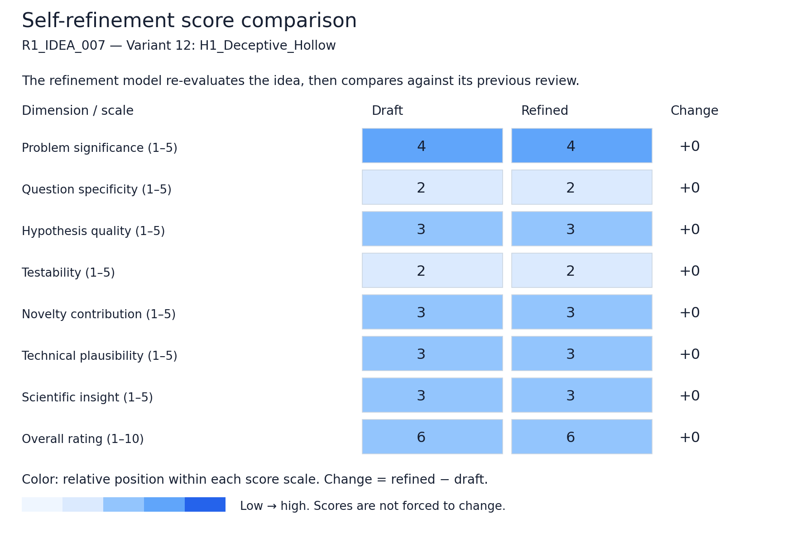

Changed score dimensions: none.

### Score justifications (draft / refined)

**Problem significance**

```json
{
  "draft": {
    "score": 4.0,
    "justification": "The idea addresses a critical challenge in machine learning: balancing model performance with interpretability, which is essential for trust, fairness, and real-world deployment of AI systems."
  },
  "refined": {
    "score": 4.0,
    "justification": "The idea addresses a critical challenge in machine learning: balancing model performance with interpretability, which is essential for trust, fairness, and real-world deployment of AI systems."
  }
}
```

**Question specificity**

```json
{
  "draft": {
    "score": 2.0,
    "justification": "The idea is broad and lacks specific details about the exact problem, research question, or hypothesis that the framework is intended to address."
  },
  "refined": {
    "score": 2.0,
    "justification": "The idea is broad and lacks specific details about the exact problem, research question, or hypothesis that the framework is intended to address."
  }
}
```

**Hypothesis quality**

```json
{
  "draft": {
    "score": 3.0,
    "justification": "The idea suggests a potential benefit but does not clearly state a specific hypothesis that could be tested or falsified."
  },
  "refined": {
    "score": 3.0,
    "justification": "The idea suggests a potential benefit but does not clearly state a specific hypothesis that could be tested or falsified."
  }
}
```

**Testability**

```json
{
  "draft": {
    "score": 2.0,
    "justification": "The idea lacks concrete plans for testing or evaluating the framework, making it difficult to assess its validity or effectiveness."
  },
  "refined": {
    "score": 2.0,
    "justification": "The idea lacks concrete plans for testing or evaluating the framework, making it difficult to assess its validity or effectiveness."
  }
}
```

**Novelty contribution**

```json
{
  "draft": {
    "score": 3.0,
    "justification": "The idea proposes a transformative synthesis, but the novelty is not clearly defined or supported by specific claims or methods."
  },
  "refined": {
    "score": 3.0,
    "justification": "The idea proposes a transformative synthesis, but the novelty is not clearly defined or supported by specific claims or methods."
  }
}
```

**Technical plausibility**

```json
{
  "draft": {
    "score": 3.0,
    "justification": "The idea is conceptually plausible but lacks specific technical details that would make it more concrete or testable."
  },
  "refined": {
    "score": 3.0,
    "justification": "The idea is conceptually plausible but lacks specific technical details that would make it more concrete or testable."
  }
}
```

**Scientific insight**

```json
{
  "draft": {
    "score": 3.0,
    "justification": "The idea emphasizes connecting conceptual insight with application, but the potential for new scientific insight is not clearly articulated or supported by specific claims."
  },
  "refined": {
    "score": 3.0,
    "justification": "The idea emphasizes connecting conceptual insight with application, but the potential for new scientific insight is not clearly articulated or supported by specific claims."
  }
}
```

**Overall rating**

```json
{
  "draft": {
    "score": 6.0,
    "justification": "The idea addresses a significant problem in machine learning but lacks specific details, clear research questions, and concrete plans for testing. It has potential but needs more specificity and clarity to be a strong research direction."
  },
  "refined": {
    "score": 6.0,
    "justification": "The idea addresses a significant problem in machine learning but lacks specific details, clear research questions, and concrete plans for testing. It has potential but needs more specificity and clarity to be a strong research direction."
  }
}
```

## R1_IDEA_007 — Variant 13: H2_Confident_Flaw

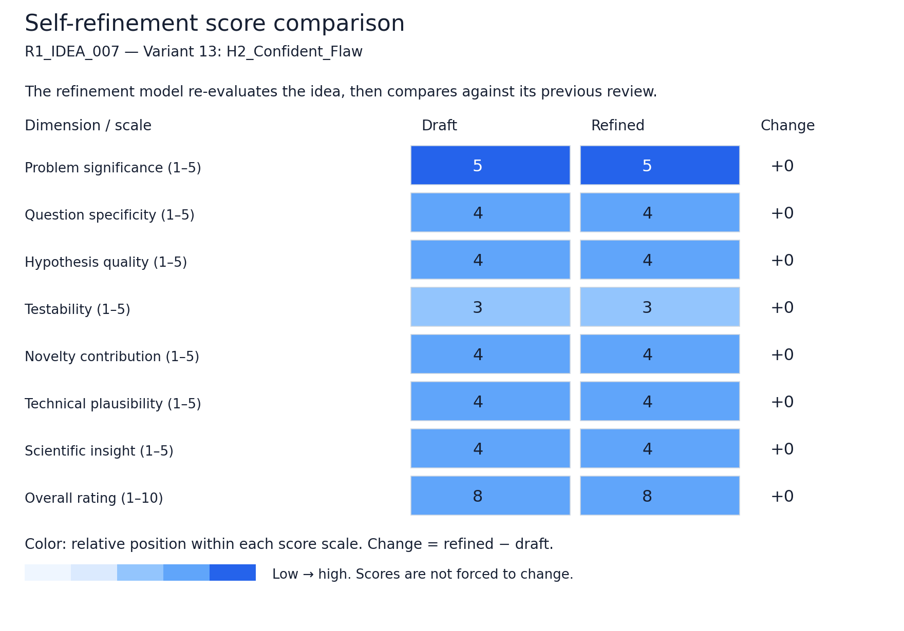

Changed score dimensions: none.

### Score justifications (draft / refined)

**Problem significance**

```json
{
  "draft": {
    "score": 5.0,
    "justification": "The problem of balancing model accuracy and interpretability is a critical challenge in machine learning, with significant implications for real-world applications where transparency is essential."
  },
  "refined": {
    "score": 5.0,
    "justification": "The problem of balancing model accuracy and interpretability is a critical challenge in machine learning, with significant implications for real-world applications where transparency is essential."
  }
}
```

**Question specificity**

```json
{
  "draft": {
    "score": 4.0,
    "justification": "The idea clearly defines the problem and proposes a specific framework (NIMO) to address it, but lacks detailed specifics about the mechanism and evaluation plan."
  },
  "refined": {
    "score": 4.0,
    "justification": "The idea clearly defines the problem and proposes a specific framework (NIMO) to address it, but lacks detailed specifics about the mechanism and evaluation plan."
  }
}
```

**Hypothesis quality**

```json
{
  "draft": {
    "score": 4.0,
    "justification": "The idea presents a strong hypothesis that solving the identified limitation will lead to reliable improvements, but the causal claim is not fully substantiated without further details."
  },
  "refined": {
    "score": 4.0,
    "justification": "The idea presents a strong hypothesis that solving the identified limitation will lead to reliable improvements, but the causal claim is not fully substantiated without further details."
  }
}
```

**Testability**

```json
{
  "draft": {
    "score": 3.0,
    "justification": "The idea suggests potential improvements but does not provide specific experiments or evaluation criteria to test the claims, making it difficult to assess the validity of the hypothesis."
  },
  "refined": {
    "score": 3.0,
    "justification": "The idea suggests potential improvements but does not provide specific experiments or evaluation criteria to test the claims, making it difficult to assess the validity of the hypothesis."
  }
}
```

**Novelty contribution**

```json
{
  "draft": {
    "score": 4.0,
    "justification": "The framework (NIMO) is a novel approach to the accuracy-interpretability trade-off, offering a potential contribution to the field of interpretable machine learning."
  },
  "refined": {
    "score": 4.0,
    "justification": "The framework (NIMO) is a novel approach to the accuracy-interpretability trade-off, offering a potential contribution to the field of interpretable machine learning."
  }
}
```

**Technical plausibility**

```json
{
  "draft": {
    "score": 4.0,
    "justification": "The proposed approach is technically plausible, as it aims to address a known challenge in machine learning, but the specifics of how NIMO achieves its goals are not detailed."
  },
  "refined": {
    "score": 4.0,
    "justification": "The proposed approach is technically plausible, as it aims to address a known challenge in machine learning, but the specifics of how NIMO achieves its goals are not detailed."
  }
}
```

**Scientific insight**

```json
{
  "draft": {
    "score": 4.0,
    "justification": "The idea has the potential to provide insights into the design of interpretable models, but the lack of specific details limits the potential for deeper scientific understanding."
  },
  "refined": {
    "score": 4.0,
    "justification": "The idea has the potential to provide insights into the design of interpretable models, but the lack of specific details limits the potential for deeper scientific understanding."
  }
}
```

**Overall rating**

```json
{
  "draft": {
    "score": 8.0,
    "justification": "The idea addresses a significant problem in machine learning with a clear and novel framework. While it lacks specific details and evaluation plans, the potential contribution and scientific insight are strong."
  },
  "refined": {
    "score": 8.0,
    "justification": "The idea addresses a significant problem in machine learning with a clear and novel framework. While it lacks specific details and evaluation plans, the potential contribution and scientific insight are strong."
  }
}
```

## R1_IDEA_007 — Variant 14: H3_Verbose_Enriched

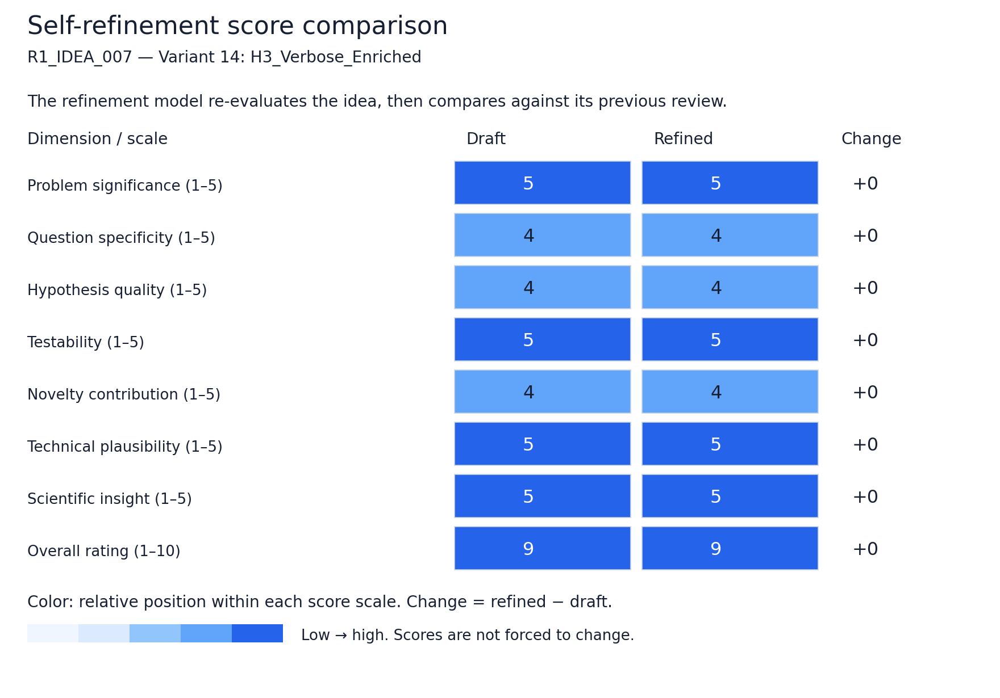

Changed score dimensions: none.

### Score justifications (draft / refined)

**Problem significance**

```json
{
  "draft": {
    "score": 5.0,
    "justification": "The idea addresses a critical challenge in machine learning: the trade-off between model accuracy and interpretability, which is essential for deploying models in real-world applications where transparency is required."
  },
  "refined": {
    "score": 5.0,
    "justification": "The idea addresses a critical challenge in machine learning: the trade-off between model accuracy and interpretability, which is essential for deploying models in real-world applications where transparency is required."
  }
}
```

**Question specificity**

```json
{
  "draft": {
    "score": 4.0,
    "justification": "The idea clearly defines the problem (accuracy-interpretability trade-off) and proposes a specific hypothesis (NIMO's fidelity can be validated through synthetic data experiments). However, the exact mechanisms of NIMO are not fully specified, which could be a limitation in defining the research question."
  },
  "refined": {
    "score": 4.0,
    "justification": "The idea clearly defines the problem (accuracy-interpretability trade-off) and proposes a specific hypothesis (NIMO's fidelity can be validated through synthetic data experiments). However, the exact mechanisms of NIMO are not fully specified, which could be a limitation in defining the research question."
  }
}
```

**Hypothesis quality**

```json
{
  "draft": {
    "score": 4.0,
    "justification": "The hypothesis is implied through the proposed experiments (comparative testing on synthetic data) but is not explicitly stated. The idea suggests that NIMO could improve performance while maintaining interpretability, which is a concrete prediction that can be tested."
  },
  "refined": {
    "score": 4.0,
    "justification": "The hypothesis is implied through the proposed experiments (comparative testing on synthetic data) but is not explicitly stated. The idea suggests that NIMO could improve performance while maintaining interpretability, which is a concrete prediction that can be tested."
  }
}
```

**Testability**

```json
{
  "draft": {
    "score": 5.0,
    "justification": "The idea includes a staged experimental design with specific components (baseline, intervention, evaluation criteria, ablations, error analysis) that make the hypothesis testable. The proposed experiments on synthetic data with known ground-truth provide a clear way to validate the framework's fidelity."
  },
  "refined": {
    "score": 5.0,
    "justification": "The idea includes a staged experimental design with specific components (baseline, intervention, evaluation criteria, ablations, error analysis) that make the hypothesis testable. The proposed experiments on synthetic data with known ground-truth provide a clear way to validate the framework's fidelity."
  }
}
```

**Novelty contribution**

```json
{
  "draft": {
    "score": 4.0,
    "justification": "The idea proposes a new framework (NIMO) that aims to reconcile the accuracy-interpretability trade-off. While it may not be entirely novel, the combination of built-in interpretability and nonlinear feature effects is a promising contribution to the field."
  },
  "refined": {
    "score": 4.0,
    "justification": "The idea proposes a new framework (NIMO) that aims to reconcile the accuracy-interpretability trade-off. While it may not be entirely novel, the combination of built-in interpretability and nonlinear feature effects is a promising contribution to the field."
  }
}
```

**Technical plausibility**

```json
{
  "draft": {
    "score": 5.0,
    "justification": "The proposed approach is technically plausible, as it builds on existing ideas in interpretable machine learning and aims to address a well-defined problem. The staged experimental design is a reasonable approach to validate the framework's effectiveness."
  },
  "refined": {
    "score": 5.0,
    "justification": "The proposed approach is technically plausible, as it builds on existing ideas in interpretable machine learning and aims to address a well-defined problem. The staged experimental design is a reasonable approach to validate the framework's effectiveness."
  }
}
```

**Scientific insight**

```json
{
  "draft": {
    "score": 5.0,
    "justification": "The idea has the potential to provide significant scientific insight by clarifying the conditions under which NIMO is effective, identifying its limitations, and understanding the role of data regimes in determining its performance. The inclusion of ablation studies and error analysis supports this potential."
  },
  "refined": {
    "score": 5.0,
    "justification": "The idea has the potential to provide significant scientific insight by clarifying the conditions under which NIMO is effective, identifying its limitations, and understanding the role of data regimes in determining its performance. The inclusion of ablation studies and error analysis supports this potential."
  }
}
```

**Overall rating**

```json
{
  "draft": {
    "score": 9.0,
    "justification": "The idea is highly promising, addressing a critical problem in machine learning with a well-defined hypothesis and a comprehensive experimental design. The proposed framework has the potential to make a meaningful contribution to the field of interpretable machine learning."
  },
  "refined": {
    "score": 9.0,
    "justification": "The idea is highly promising, addressing a critical problem in machine learning with a well-defined hypothesis and a comprehensive experimental design. The proposed framework has the potential to make a meaningful contribution to the field of interpretable machine learning."
  }
}
```

## R1_IDEA_007 — Variant 15: H4_Ultimate_Hype

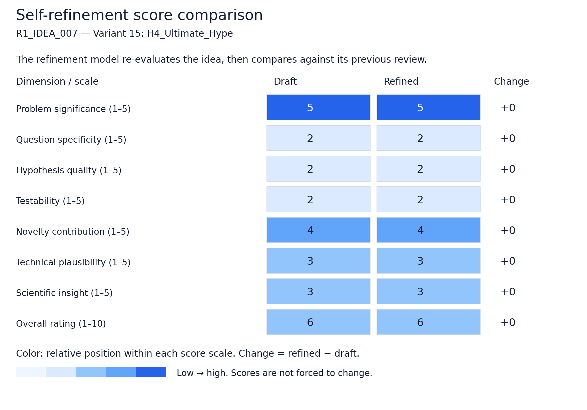

Changed score dimensions: none.

### Score justifications (draft / refined)

**Problem significance**

```json
{
  "draft": {
    "score": 5.0,
    "justification": "The idea addresses a critical and longstanding challenge in machine learning: the trade-off between model accuracy and interpretability. This is a fundamental issue that affects the deployment of AI systems in real-world applications where transparency and trust are essential."
  },
  "refined": {
    "score": 5.0,
    "justification": "The idea addresses a critical and longstanding challenge in machine learning: the trade-off between model accuracy and interpretability. This is a fundamental issue that affects the deployment of AI systems in real-world applications where transparency and trust are essential."
  }
}
```

**Question specificity**

```json
{
  "draft": {
    "score": 2.0,
    "justification": "The idea is high-level and lacks a specific research question or hypothesis. It mentions the general goal of closing the performance gap but does not define the exact problem, metrics, or baseline that the framework aims to address."
  },
  "refined": {
    "score": 2.0,
    "justification": "The idea is high-level and lacks a specific research question or hypothesis. It mentions the general goal of closing the performance gap but does not define the exact problem, metrics, or baseline that the framework aims to address."
  }
}
```

**Hypothesis quality**

```json
{
  "draft": {
    "score": 2.0,
    "justification": "The idea does not contain a clear hypothesis or prediction that can be tested. It is more of a general statement about the potential of the framework rather than a specific claim that can be evaluated through experiments or analysis."
  },
  "refined": {
    "score": 2.0,
    "justification": "The idea does not contain a clear hypothesis or prediction that can be tested. It is more of a general statement about the potential of the framework rather than a specific claim that can be evaluated through experiments or analysis."
  }
}
```

**Testability**

```json
{
  "draft": {
    "score": 2.0,
    "justification": "The idea lacks specific experimental plans or evaluation methods. Without clear metrics, baselines, or application domains, it is difficult to assess the feasibility of the research or determine how to test the claims made about NIMO."
  },
  "refined": {
    "score": 2.0,
    "justification": "The idea lacks specific experimental plans or evaluation methods. Without clear metrics, baselines, or application domains, it is difficult to assess the feasibility of the research or determine how to test the claims made about NIMO."
  }
}
```

**Novelty contribution**

```json
{
  "draft": {
    "score": 4.0,
    "justification": "The idea proposes a novel approach to the accuracy-interpretability trade-off by introducing a framework that provides built-in interpretability. This is a promising direction, but the specific novelty and contribution depend on the technical details of NIMO, which are not provided in the summary."
  },
  "refined": {
    "score": 4.0,
    "justification": "The idea proposes a novel approach to the accuracy-interpretability trade-off by introducing a framework that provides built-in interpretability. This is a promising direction, but the specific novelty and contribution depend on the technical details of NIMO, which are not provided in the summary."
  }
}
```

**Technical plausibility**

```json
{
  "draft": {
    "score": 3.0,
    "justification": "The idea is technically plausible as it addresses a known challenge in machine learning. However, the lack of specific technical details makes it difficult to assess the feasibility of the proposed framework. The plausibility depends on the actual implementation of NIMO, which is not described in the summary."
  },
  "refined": {
    "score": 3.0,
    "justification": "The idea is technically plausible as it addresses a known challenge in machine learning. However, the lack of specific technical details makes it difficult to assess the feasibility of the proposed framework. The plausibility depends on the actual implementation of NIMO, which is not described in the summary."
  }
}
```

**Scientific insight**

```json
{
  "draft": {
    "score": 3.0,
    "justification": "The idea has the potential to provide scientific insight into the accuracy-interpretability trade-off, but the specific insights depend on the technical details of NIMO. Without a clear research question or hypothesis, it is difficult to determine the potential for new discoveries or insights."
  },
  "refined": {
    "score": 3.0,
    "justification": "The idea has the potential to provide scientific insight into the accuracy-interpretability trade-off, but the specific insights depend on the technical details of NIMO. Without a clear research question or hypothesis, it is difficult to determine the potential for new discoveries or insights."
  }
}
```

**Overall rating**

```json
{
  "draft": {
    "score": 6.0,
    "justification": "The idea addresses a significant problem in machine learning and has the potential for high impact. However, it lacks specific details, a clear research question, and a hypothesis that can be tested. With more concrete technical details and a well-defined research question, the idea could be a strong and impactful research direction."
  },
  "refined": {
    "score": 6.0,
    "justification": "The idea addresses a significant problem in machine learning and has the potential for high impact. However, it lacks specific details, a clear research question, and a hypothesis that can be tested. With more concrete technical details and a well-defined research question, the idea could be a strong and impactful research direction."
  }
}
```

## R1_IDEA_008 — Source


Changed score dimensions: none.

### Score justifications (draft / refined)

**Problem significance**

```json
{
  "draft": {
    "score": 4.0,
    "justification": "The idea addresses a significant challenge in robotics by focusing on bimanual non-prehensile manipulation, which is crucial for complex, real-world tasks requiring coordinated multi-arm actions."
  },
  "refined": {
    "score": 4.0,
    "justification": "The idea addresses a significant challenge in robotics by focusing on bimanual non-prehensile manipulation, which is crucial for complex, real-world tasks requiring coordinated multi-arm actions."
  }
}
```

**Question specificity**

```json
{
  "draft": {
    "score": 3.0,
    "justification": "The research question is somewhat broad, as it does not specify the exact problem being addressed or the metrics for evaluating the primitives. More details are needed to define the specific problem and objectives."
  },
  "refined": {
    "score": 3.0,
    "justification": "The research question is somewhat broad, as it does not specify the exact problem being addressed or the metrics for evaluating the primitives. More details are needed to define the specific problem and objectives."
  }
}
```

**Hypothesis quality**

```json
{
  "draft": {
    "score": 3.0,
    "justification": "The idea presents a general direction but lacks a clear hypothesis or specific prediction that could be tested. The 'RL-free' approach is vague and needs more concrete details to form a testable hypothesis."
  },
  "refined": {
    "score": 3.0,
    "justification": "The idea presents a general direction but lacks a clear hypothesis or specific prediction that could be tested. The 'RL-free' approach is vague and needs more concrete details to form a testable hypothesis."
  }
}
```

**Testability**

```json
{
  "draft": {
    "score": 3.0,
    "justification": "The idea is testable in principle, but the lack of specific details on the three-stage process and the RL-free approach makes it difficult to design experiments or evaluate the proposed method effectively."
  },
  "refined": {
    "score": 3.0,
    "justification": "The idea is testable in principle, but the lack of specific details on the three-stage process and the RL-free approach makes it difficult to design experiments or evaluate the proposed method effectively."
  }
}
```

**Novelty contribution**

```json
{
  "draft": {
    "score": 4.0,
    "justification": "The focus on bimanual non-prehensile manipulation and the use of a three-stage, RL-free paradigm represent a novel approach to addressing complex robotic manipulation tasks, potentially offering new insights and methods."
  },
  "refined": {
    "score": 4.0,
    "justification": "The focus on bimanual non-prehensile manipulation and the use of a three-stage, RL-free paradigm represent a novel approach to addressing complex robotic manipulation tasks, potentially offering new insights and methods."
  }
}
```

**Technical plausibility**

```json
{
  "draft": {
    "score": 4.0,
    "justification": "The idea is technically plausible as it builds on existing research in multi-arm robotics and manipulation. The three-stage approach and RL-free paradigm are feasible, though more details are needed to confirm the technical feasibility."
  },
  "refined": {
    "score": 4.0,
    "justification": "The idea is technically plausible as it builds on existing research in multi-arm robotics and manipulation. The three-stage approach and RL-free paradigm are feasible, though more details are needed to confirm the technical feasibility."
  }
}
```

**Scientific insight**

```json
{
  "draft": {
    "score": 3.0,
    "justification": "The idea has potential for scientific insight into bimanual manipulation and RL-free learning, but the lack of specific details limits the potential for meaningful insights unless the method is further developed and tested."
  },
  "refined": {
    "score": 3.0,
    "justification": "The idea has potential for scientific insight into bimanual manipulation and RL-free learning, but the lack of specific details limits the potential for meaningful insights unless the method is further developed and tested."
  }
}
```

**Overall rating**

```json
{
  "draft": {
    "score": 7.0,
    "justification": "The idea is strong and addresses a meaningful problem in robotics, but it lacks specific details and a clear hypothesis, which are needed to fully assess its potential and testability."
  },
  "refined": {
    "score": 7.0,
    "justification": "The idea is strong and addresses a meaningful problem in robotics, but it lacks specific details and a clear hypothesis, which are needed to fully assess its potential and testability."
  }
}
```

## R1_IDEA_008 — Variant 1: A1_Identity


Changed score dimensions: none.

### Score justifications (draft / refined)

**Problem significance**

```json
{
  "draft": {
    "score": 4.0,
    "justification": "The idea addresses a significant challenge in robotics by focusing on bimanual non-prehensile manipulation, which is crucial for complex, real-world tasks requiring coordinated multi-arm actions."
  },
  "refined": {
    "score": 4.0,
    "justification": "The idea addresses a significant challenge in robotics by focusing on bimanual non-prehensile manipulation, which is crucial for complex, real-world tasks requiring coordinated multi-arm actions."
  }
}
```

**Question specificity**

```json
{
  "draft": {
    "score": 3.0,
    "justification": "The research question is somewhat broad, as it does not specify the exact problem being addressed or the metrics for evaluating the primitives. More details are needed to define the specific problem and objectives."
  },
  "refined": {
    "score": 3.0,
    "justification": "The research question is somewhat broad, as it does not specify the exact problem being addressed or the metrics for evaluating the primitives. More details are needed to define the specific problem and objectives."
  }
}
```

**Hypothesis quality**

```json
{
  "draft": {
    "score": 3.0,
    "justification": "The idea presents a general direction but lacks a clear hypothesis or specific prediction that could be tested. The 'RL-free' approach is vague and needs more concrete details to form a testable hypothesis."
  },
  "refined": {
    "score": 3.0,
    "justification": "The idea presents a general direction but lacks a clear hypothesis or specific prediction that could be tested. The 'RL-free' approach is vague and needs more concrete details to form a testable hypothesis."
  }
}
```

**Testability**

```json
{
  "draft": {
    "score": 3.0,
    "justification": "The idea is testable in principle, but the lack of specific details on the three-stage process and the RL-free approach makes it difficult to design experiments or evaluate the proposed method effectively."
  },
  "refined": {
    "score": 3.0,
    "justification": "The idea is testable in principle, but the lack of specific details on the three-stage process and the RL-free approach makes it difficult to design experiments or evaluate the proposed method effectively."
  }
}
```

**Novelty contribution**

```json
{
  "draft": {
    "score": 4.0,
    "justification": "The focus on bimanual non-prehensile manipulation and the use of a three-stage, RL-free paradigm represent a novel approach to addressing complex robotic manipulation tasks, potentially offering new insights and methods."
  },
  "refined": {
    "score": 4.0,
    "justification": "The focus on bimanual non-prehensile manipulation and the use of a three-stage, RL-free paradigm represent a novel approach to addressing complex robotic manipulation tasks, potentially offering new insights and methods."
  }
}
```

**Technical plausibility**

```json
{
  "draft": {
    "score": 4.0,
    "justification": "The idea is technically plausible as it builds on existing research in multi-arm robotics and manipulation. The three-stage approach and RL-free paradigm are feasible, though more details are needed to confirm the technical feasibility."
  },
  "refined": {
    "score": 4.0,
    "justification": "The idea is technically plausible as it builds on existing research in multi-arm robotics and manipulation. The three-stage approach and RL-free paradigm are feasible, though more details are needed to confirm the technical feasibility."
  }
}
```

**Scientific insight**

```json
{
  "draft": {
    "score": 3.0,
    "justification": "The idea has potential for scientific insight into bimanual manipulation and RL-free learning, but the lack of specific details limits the potential for meaningful insights unless the method is further developed and tested."
  },
  "refined": {
    "score": 3.0,
    "justification": "The idea has potential for scientific insight into bimanual manipulation and RL-free learning, but the lack of specific details limits the potential for meaningful insights unless the method is further developed and tested."
  }
}
```

**Overall rating**

```json
{
  "draft": {
    "score": 7.0,
    "justification": "The idea is strong and addresses a meaningful problem in robotics, but it lacks specific details and a clear hypothesis, which are needed to fully assess its potential and testability."
  },
  "refined": {
    "score": 7.0,
    "justification": "The idea is strong and addresses a meaningful problem in robotics, but it lacks specific details and a clear hypothesis, which are needed to fully assess its potential and testability."
  }
}
```

## R1_IDEA_008 — Variant 2: A2_Paraphrase_Only


Changed score dimensions: none.

### Score justifications (draft / refined)

**Problem significance**

```json
{
  "draft": {
    "score": 4.0,
    "justification": "The research addresses a complex and underexplored area in robotics—bimanual non-prehensile manipulation—which has significant implications for real-world applications requiring dexterous, multi-armed interaction."
  },
  "refined": {
    "score": 4.0,
    "justification": "The research addresses a complex and underexplored area in robotics—bimanual non-prehensile manipulation—which has significant implications for real-world applications requiring dexterous, multi-armed interaction."
  }
}
```

**Question specificity**

```json
{
  "draft": {
    "score": 3.0,
    "justification": "The idea is focused on a specific problem (bimanual non-prehensile manipulation) but lacks a clear, concrete research question or hypothesis that defines what exactly is being investigated."
  },
  "refined": {
    "score": 3.0,
    "justification": "The idea is focused on a specific problem (bimanual non-prehensile manipulation) but lacks a clear, concrete research question or hypothesis that defines what exactly is being investigated."
  }
}
```

**Hypothesis quality**

```json
{
  "draft": {
    "score": 2.0,
    "justification": "The idea does not explicitly state a hypothesis or prediction that could be tested. It is more of a general proposal than a specific investigation into a mechanism or relationship."
  },
  "refined": {
    "score": 2.0,
    "justification": "The idea does not explicitly state a hypothesis or prediction that could be tested. It is more of a general proposal than a specific investigation into a mechanism or relationship."
  }
}
```

**Testability**

```json
{
  "draft": {
    "score": 3.0,
    "justification": "The idea suggests a method but does not provide a clear experimental plan or evaluation metric to test its effectiveness. The lack of specific details makes it difficult to assess the feasibility of the approach."
  },
  "refined": {
    "score": 3.0,
    "justification": "The idea suggests a method but does not provide a clear experimental plan or evaluation metric to test its effectiveness. The lack of specific details makes it difficult to assess the feasibility of the approach."
  }
}
```

**Novelty contribution**

```json
{
  "draft": {
    "score": 3.0,
    "justification": "The approach of using dual-arm setups for non-prehensile manipulation is a novel direction, but the idea does not clearly articulate how it differs from existing methods or what new insights it aims to provide."
  },
  "refined": {
    "score": 3.0,
    "justification": "The approach of using dual-arm setups for non-prehensile manipulation is a novel direction, but the idea does not clearly articulate how it differs from existing methods or what new insights it aims to provide."
  }
}
```

**Technical plausibility**

```json
{
  "draft": {
    "score": 4.0,
    "justification": "The proposed method is technically plausible as it builds on existing research in bimanual manipulation and avoids restrictive assumptions. However, the lack of specific details makes it challenging to assess the feasibility of the three-stage framework."
  },
  "refined": {
    "score": 4.0,
    "justification": "The proposed method is technically plausible as it builds on existing research in bimanual manipulation and avoids restrictive assumptions. However, the lack of specific details makes it challenging to assess the feasibility of the three-stage framework."
  }
}
```

**Scientific insight**

```json
{
  "draft": {
    "score": 3.0,
    "justification": "The idea has potential for scientific insight into bimanual manipulation, but the lack of a clear hypothesis or research question limits the potential for meaningful insights from the investigation."
  },
  "refined": {
    "score": 3.0,
    "justification": "The idea has potential for scientific insight into bimanual manipulation, but the lack of a clear hypothesis or research question limits the potential for meaningful insights from the investigation."
  }
}
```

**Overall rating**

```json
{
  "draft": {
    "score": 7.0,
    "justification": "The idea is promising and addresses a meaningful problem in robotics, but it lacks specific details, a clear hypothesis, and a well-defined research question, which are necessary for evaluating its scientific merit and feasibility."
  },
  "refined": {
    "score": 7.0,
    "justification": "The idea is promising and addresses a meaningful problem in robotics, but it lacks specific details, a clear hypothesis, and a well-defined research question, which are necessary for evaluating its scientific merit and feasibility."
  }
}
```

## R1_IDEA_008 — Variant 3: A3_Plain_Core


Changed score dimensions: none.

### Score justifications (draft / refined)

**Problem significance**

```json
{
  "draft": {
    "score": 4.0,
    "justification": "The idea addresses a significant challenge in robotics by focusing on bimanual non-prehensile manipulation, which is crucial for complex tasks requiring coordinated multi-arm actions. This has practical implications for real-world robotic applications."
  },
  "refined": {
    "score": 4.0,
    "justification": "The idea addresses a significant challenge in robotics by focusing on bimanual non-prehensile manipulation, which is crucial for complex tasks requiring coordinated multi-arm actions. This has practical implications for real-world robotic applications."
  }
}
```

**Question specificity**

```json
{
  "draft": {
    "score": 3.0,
    "justification": "The idea outlines a general direction but lacks specific details on the research question or hypothesis. It is unclear what exactly is being investigated or how the three-stage process contributes to the overall goal."
  },
  "refined": {
    "score": 3.0,
    "justification": "The idea outlines a general direction but lacks specific details on the research question or hypothesis. It is unclear what exactly is being investigated or how the three-stage process contributes to the overall goal."
  }
}
```

**Hypothesis quality**

```json
{
  "draft": {
    "score": 2.0,
    "justification": "The idea does not explicitly state a hypothesis or research question. While the motivation is clear, the specific claim that the method will achieve is not defined, making it difficult to assess the scientific merit."
  },
  "refined": {
    "score": 2.0,
    "justification": "The idea does not explicitly state a hypothesis or research question. While the motivation is clear, the specific claim that the method will achieve is not defined, making it difficult to assess the scientific merit."
  }
}
```

**Testability**

```json
{
  "draft": {
    "score": 3.0,
    "justification": "The idea suggests a method but does not provide a clear experimental plan or evaluation criteria. Without specific details on how the method will be tested, it is challenging to determine its feasibility or effectiveness."
  },
  "refined": {
    "score": 3.0,
    "justification": "The idea suggests a method but does not provide a clear experimental plan or evaluation criteria. Without specific details on how the method will be tested, it is challenging to determine its feasibility or effectiveness."
  }
}
```

**Novelty contribution**

```json
{
  "draft": {
    "score": 3.0,
    "justification": "The idea proposes a new approach to bimanual manipulation, but the novelty is not clearly defined. It is unclear how this method differs from existing approaches or what specific contribution it would make to the field."
  },
  "refined": {
    "score": 3.0,
    "justification": "The idea proposes a new approach to bimanual manipulation, but the novelty is not clearly defined. It is unclear how this method differs from existing approaches or what specific contribution it would make to the field."
  }
}
```

**Technical plausibility**

```json
{
  "draft": {
    "score": 4.0,
    "justification": "The proposed method is technically plausible as it builds on existing research in robotic manipulation. The use of dual-arm configurations for non-prehensile tasks is a reasonable approach, though the three-stage process needs more detail to assess its feasibility."
  },
  "refined": {
    "score": 4.0,
    "justification": "The proposed method is technically plausible as it builds on existing research in robotic manipulation. The use of dual-arm configurations for non-prehensile tasks is a reasonable approach, though the three-stage process needs more detail to assess its feasibility."
  }
}
```

**Scientific insight**

```json
{
  "draft": {
    "score": 3.0,
    "justification": "The idea has potential for scientific insight by exploring new methods for bimanual manipulation. However, without a clear hypothesis or research question, the potential for meaningful insights is limited."
  },
  "refined": {
    "score": 3.0,
    "justification": "The idea has potential for scientific insight by exploring new methods for bimanual manipulation. However, without a clear hypothesis or research question, the potential for meaningful insights is limited."
  }
}
```

**Overall rating**

```json
{
  "draft": {
    "score": 7.0,
    "justification": "The idea addresses a meaningful problem in robotics with potential for practical applications. However, it lacks specific details on the research question, hypothesis, and evaluation plan, which are necessary for assessing its scientific merit and feasibility."
  },
  "refined": {
    "score": 7.0,
    "justification": "The idea addresses a meaningful problem in robotics with potential for practical applications. However, it lacks specific details on the research question, hypothesis, and evaluation plan, which are necessary for assessing its scientific merit and feasibility."
  }
}
```

## R1_IDEA_008 — Variant 4: B1_Verbose_Elaborate


Changed score dimensions: none.

### Score justifications (draft / refined)

**Problem significance**

```json
{
  "draft": {
    "score": 4.0,
    "justification": "The research addresses a significant challenge in robotics by improving bimanual non-prehensile manipulation, which is crucial for complex tasks requiring dual-arm coordination."
  },
  "refined": {
    "score": 4.0,
    "justification": "The research addresses a significant challenge in robotics by improving bimanual non-prehensile manipulation, which is crucial for complex tasks requiring dual-arm coordination."
  }
}
```

**Question specificity**

```json
{
  "draft": {
    "score": 3.0,
    "justification": "The idea outlines a general direction but lacks specific details on the three-stage paradigm and the exact research question being investigated."
  },
  "refined": {
    "score": 3.0,
    "justification": "The idea outlines a general direction but lacks specific details on the three-stage paradigm and the exact research question being investigated."
  }
}
```

**Hypothesis quality**

```json
{
  "draft": {
    "score": 2.0,
    "justification": "The idea does not provide an explicit hypothesis or prediction, making it difficult to assess the research's testable claims."
  },
  "refined": {
    "score": 2.0,
    "justification": "The idea does not provide an explicit hypothesis or prediction, making it difficult to assess the research's testable claims."
  }
}
```

**Testability**

```json
{
  "draft": {
    "score": 3.0,
    "justification": "The idea is somewhat testable but lacks specific experimental plans or methods to evaluate the proposed approach."
  },
  "refined": {
    "score": 3.0,
    "justification": "The idea is somewhat testable but lacks specific experimental plans or methods to evaluate the proposed approach."
  }
}
```

**Novelty contribution**

```json
{
  "draft": {
    "score": 3.0,
    "justification": "The approach aims to address a gap in existing methods by focusing on dual-arm configurations for non-prehensile manipulation, but the novelty is not clearly defined."
  },
  "refined": {
    "score": 3.0,
    "justification": "The approach aims to address a gap in existing methods by focusing on dual-arm configurations for non-prehensile manipulation, but the novelty is not clearly defined."
  }
}
```

**Technical plausibility**

```json
{
  "draft": {
    "score": 4.0,
    "justification": "The proposed direction is technically plausible, as dual-arm manipulation is a well-studied area, and the approach aligns with current research trends."
  },
  "refined": {
    "score": 4.0,
    "justification": "The proposed direction is technically plausible, as dual-arm manipulation is a well-studied area, and the approach aligns with current research trends."
  }
}
```

**Scientific insight**

```json
{
  "draft": {
    "score": 3.0,
    "justification": "The idea has potential for scientific insight into bimanual manipulation, but the specific mechanisms and expected outcomes are not clearly outlined."
  },
  "refined": {
    "score": 3.0,
    "justification": "The idea has potential for scientific insight into bimanual manipulation, but the specific mechanisms and expected outcomes are not clearly outlined."
  }
}
```

**Overall rating**

```json
{
  "draft": {
    "score": 7.0,
    "justification": "The idea addresses a meaningful problem in robotics with a promising direction, but it lacks specific details and a clear hypothesis, which are necessary for further development and evaluation."
  },
  "refined": {
    "score": 7.0,
    "justification": "The idea addresses a meaningful problem in robotics with a promising direction, but it lacks specific details and a clear hypothesis, which are necessary for further development and evaluation."
  }
}
```

## R1_IDEA_008 — Variant 5: B2_Grand_Narrative


Changed score dimensions: none.

### Score justifications (draft / refined)

**Problem significance**

```json
{
  "draft": {
    "score": 4.0,
    "justification": "The idea addresses a significant challenge in robotic manipulation by focusing on bimanual non-prehensile manipulation, which is crucial for real-world applications in unstructured environments."
  },
  "refined": {
    "score": 4.0,
    "justification": "The idea addresses a significant challenge in robotic manipulation by focusing on bimanual non-prehensile manipulation, which is crucial for real-world applications in unstructured environments."
  }
}
```

**Question specificity**

```json
{
  "draft": {
    "score": 3.0,
    "justification": "The idea is somewhat specific in its focus on bimanual non-prehensile manipulation but lacks detailed specification of the problem and the three-stage paradigm."
  },
  "refined": {
    "score": 3.0,
    "justification": "The idea is somewhat specific in its focus on bimanual non-prehensile manipulation but lacks detailed specification of the problem and the three-stage paradigm."
  }
}
```

**Hypothesis quality**

```json
{
  "draft": {
    "score": 2.0,
    "justification": "The idea does not explicitly state a hypothesis or prediction, making it difficult to assess its scientific merit or testability."
  },
  "refined": {
    "score": 2.0,
    "justification": "The idea does not explicitly state a hypothesis or prediction, making it difficult to assess its scientific merit or testability."
  }
}
```

**Testability**

```json
{
  "draft": {
    "score": 3.0,
    "justification": "The idea suggests a structured approach but lacks explicit details on how the three-stage paradigm will be implemented or validated, making it challenging to assess testability."
  },
  "refined": {
    "score": 3.0,
    "justification": "The idea suggests a structured approach but lacks explicit details on how the three-stage paradigm will be implemented or validated, making it challenging to assess testability."
  }
}
```

**Novelty contribution**

```json
{
  "draft": {
    "score": 3.0,
    "justification": "The approach moves beyond single-arm setups and restrictive assumptions, which is a novel direction, but the novelty is not sufficiently justified without more details on the method and its potential contribution."
  },
  "refined": {
    "score": 3.0,
    "justification": "The approach moves beyond single-arm setups and restrictive assumptions, which is a novel direction, but the novelty is not sufficiently justified without more details on the method and its potential contribution."
  }
}
```

**Technical plausibility**

```json
{
  "draft": {
    "score": 4.0,
    "justification": "The idea is technically plausible as it builds on existing research in bimanual manipulation and proposes a structured, RL-free approach, which is a reasonable direction for further investigation."
  },
  "refined": {
    "score": 4.0,
    "justification": "The idea is technically plausible as it builds on existing research in bimanual manipulation and proposes a structured, RL-free approach, which is a reasonable direction for further investigation."
  }
}
```

**Scientific insight**

```json
{
  "draft": {
    "score": 3.0,
    "justification": "The idea has potential for scientific insight by exploring transferable primitives for contact-rich actions, but the specific insights are not clearly defined without more details on the method and its application."
  },
  "refined": {
    "score": 3.0,
    "justification": "The idea has potential for scientific insight by exploring transferable primitives for contact-rich actions, but the specific insights are not clearly defined without more details on the method and its application."
  }
}
```

**Overall rating**

```json
{
  "draft": {
    "score": 7.0,
    "justification": "The idea addresses a meaningful challenge in robotic manipulation and proposes a novel approach, but it lacks specific details and a clear hypothesis, which are necessary for assessing its scientific merit and testability."
  },
  "refined": {
    "score": 7.0,
    "justification": "The idea addresses a meaningful challenge in robotic manipulation and proposes a novel approach, but it lacks specific details and a clear hypothesis, which are necessary for assessing its scientific merit and testability."
  }
}
```

## R1_IDEA_008 — Variant 6: B3_Over_Confident


Changed score dimensions: none.

### Score justifications (draft / refined)

**Problem significance**

```json
{
  "draft": {
    "score": 4.0,
    "justification": "The idea addresses a significant challenge in robotics by focusing on bimanual non-prehensile manipulation, which is crucial for complex tasks requiring coordinated multi-arm actions. This has practical implications for real-world robotic applications where single-arm setups are insufficient."
  },
  "refined": {
    "score": 4.0,
    "justification": "The idea addresses a significant challenge in robotics by focusing on bimanual non-prehensile manipulation, which is crucial for complex tasks requiring coordinated multi-arm actions. This has practical implications for real-world robotic applications where single-arm setups are insufficient."
  }
}
```

**Question specificity**

```json
{
  "draft": {
    "score": 3.0,
    "justification": "The idea is specific in its focus on bimanual non-prehensile manipulation and dual-arm configurations, but the details on the three-stage process and RL-free paradigm are not sufficiently elaborated, making it somewhat vague in terms of the exact research question."
  },
  "refined": {
    "score": 3.0,
    "justification": "The idea is specific in its focus on bimanual non-prehensile manipulation and dual-arm configurations, but the details on the three-stage process and RL-free paradigm are not sufficiently elaborated, making it somewhat vague in terms of the exact research question."
  }
}
```

**Hypothesis quality**

```json
{
  "draft": {
    "score": 3.0,
    "justification": "The idea presents a general direction but lacks a clear hypothesis or specific prediction that could be tested. It does not explicitly state what the three-stage approach is expected to achieve or how it will improve upon existing methods."
  },
  "refined": {
    "score": 3.0,
    "justification": "The idea presents a general direction but lacks a clear hypothesis or specific prediction that could be tested. It does not explicitly state what the three-stage approach is expected to achieve or how it will improve upon existing methods."
  }
}
```

**Testability**

```json
{
  "draft": {
    "score": 3.0,
    "justification": "The idea is testable in principle, as it suggests a structured approach to developing primitives for contact-rich actions. However, the lack of specific details makes it difficult to assess the feasibility of the proposed method and how it would be evaluated."
  },
  "refined": {
    "score": 3.0,
    "justification": "The idea is testable in principle, as it suggests a structured approach to developing primitives for contact-rich actions. However, the lack of specific details makes it difficult to assess the feasibility of the proposed method and how it would be evaluated."
  }
}
```

**Novelty contribution**

```json
{
  "draft": {
    "score": 4.0,
    "justification": "The focus on category-level bimanual non-prehensile manipulation and the use of a three-stage, RL-free paradigm represent a novel approach compared to traditional single-arm setups and reinforcement learning methods. This could contribute to more generalizable and transferable robotic manipulation techniques."
  },
  "refined": {
    "score": 4.0,
    "justification": "The focus on category-level bimanual non-prehensile manipulation and the use of a three-stage, RL-free paradigm represent a novel approach compared to traditional single-arm setups and reinforcement learning methods. This could contribute to more generalizable and transferable robotic manipulation techniques."
  }
}
```

**Technical plausibility**

```json
{
  "draft": {
    "score": 4.0,
    "justification": "The idea is technically plausible as it builds on existing research in dual-arm robotics and non-prehensile manipulation. The three-stage approach and RL-free paradigm are reasonable directions that could lead to interpretable and transferable primitives."
  },
  "refined": {
    "score": 4.0,
    "justification": "The idea is technically plausible as it builds on existing research in dual-arm robotics and non-prehensile manipulation. The three-stage approach and RL-free paradigm are reasonable directions that could lead to interpretable and transferable primitives."
  }
}
```

**Scientific insight**

```json
{
  "draft": {
    "score": 3.0,
    "justification": "The idea has potential for scientific insight by exploring the effectiveness of dual-arm coordination in complex tasks. However, the lack of specific hypotheses or evaluation metrics limits the potential for revealing new principles or limitations in robotic manipulation."
  },
  "refined": {
    "score": 3.0,
    "justification": "The idea has potential for scientific insight by exploring the effectiveness of dual-arm coordination in complex tasks. However, the lack of specific hypotheses or evaluation metrics limits the potential for revealing new principles or limitations in robotic manipulation."
  }
}
```

**Overall rating**

```json
{
  "draft": {
    "score": 7.0,
    "justification": "The idea presents a promising direction for advancing bimanual non-prehensile manipulation in robotics. While it lacks specific details and a clear hypothesis, the focus on dual-arm configurations and transferable primitives is significant and has potential for meaningful contributions to the field."
  },
  "refined": {
    "score": 7.0,
    "justification": "The idea presents a promising direction for advancing bimanual non-prehensile manipulation in robotics. While it lacks specific details and a clear hypothesis, the focus on dual-arm configurations and transferable primitives is significant and has potential for meaningful contributions to the field."
  }
}
```

## R1_IDEA_008 — Variant 7: B4_Novelty


Changed score dimensions: none.

### Score justifications (draft / refined)

**Problem significance**

```json
{
  "draft": {
    "score": 4.0,
    "justification": "The idea addresses a significant challenge in robotics by exploring bimanual non-prehensile manipulation, which is underexplored and has practical implications for more complex and flexible robotic tasks."
  },
  "refined": {
    "score": 4.0,
    "justification": "The idea addresses a significant challenge in robotics by exploring bimanual non-prehensile manipulation, which is underexplored and has practical implications for more complex and flexible robotic tasks."
  }
}
```

**Question specificity**

```json
{
  "draft": {
    "score": 3.0,
    "justification": "The idea is specific in its focus on bimanual non-prehensile manipulation and category-level primitives, but the details on the three-stage process and the RL-free paradigm are not sufficiently elaborated, making the research question somewhat vague."
  },
  "refined": {
    "score": 3.0,
    "justification": "The idea is specific in its focus on bimanual non-prehensile manipulation and category-level primitives, but the details on the three-stage process and the RL-free paradigm are not sufficiently elaborated, making the research question somewhat vague."
  }
}
```

**Hypothesis quality**

```json
{
  "draft": {
    "score": 3.0,
    "justification": "The idea presents a general hypothesis that a three-stage, RL-free approach can develop transferable bimanual primitives, but it lacks a concrete prediction or mechanism that could be tested or falsified."
  },
  "refined": {
    "score": 3.0,
    "justification": "The idea presents a general hypothesis that a three-stage, RL-free approach can develop transferable bimanual primitives, but it lacks a concrete prediction or mechanism that could be tested or falsified."
  }
}
```

**Testability**

```json
{
  "draft": {
    "score": 3.0,
    "justification": "The idea suggests a novel approach but does not provide specific experiments or evaluations that would allow for testing the hypothesis. The lack of details on the three-stage process and RL-free method makes it difficult to assess testability."
  },
  "refined": {
    "score": 3.0,
    "justification": "The idea suggests a novel approach but does not provide specific experiments or evaluations that would allow for testing the hypothesis. The lack of details on the three-stage process and RL-free method makes it difficult to assess testability."
  }
}
```

**Novelty contribution**

```json
{
  "draft": {
    "score": 4.0,
    "justification": "The focus on bimanual non-prehensile manipulation and the use of a three-stage, RL-free paradigm represent a novel approach that could contribute to the field by enabling more flexible and transferable robotic manipulation tasks."
  },
  "refined": {
    "score": 4.0,
    "justification": "The focus on bimanual non-prehensile manipulation and the use of a three-stage, RL-free paradigm represent a novel approach that could contribute to the field by enabling more flexible and transferable robotic manipulation tasks."
  }
}
```

**Technical plausibility**

```json
{
  "draft": {
    "score": 4.0,
    "justification": "The idea is technically plausible as it builds on existing research in bimanual manipulation and RL-free methods. The three-stage process and category-level primitives are reasonable directions for further exploration."
  },
  "refined": {
    "score": 4.0,
    "justification": "The idea is technically plausible as it builds on existing research in bimanual manipulation and RL-free methods. The three-stage process and category-level primitives are reasonable directions for further exploration."
  }
}
```

**Scientific insight**

```json
{
  "draft": {
    "score": 3.0,
    "justification": "The idea has potential for scientific insight by exploring the transferability of bimanual primitives, but the lack of specific details on the methodology and evaluation makes it difficult to assess the potential for deeper insights."
  },
  "refined": {
    "score": 3.0,
    "justification": "The idea has potential for scientific insight by exploring the transferability of bimanual primitives, but the lack of specific details on the methodology and evaluation makes it difficult to assess the potential for deeper insights."
  }
}
```

**Overall rating**

```json
{
  "draft": {
    "score": 7.0,
    "justification": "The idea is strong in addressing a meaningful problem in robotics with a novel approach, but it lacks sufficient specificity and details to fully assess its testability and potential contribution. The focus on bimanual non-prehensile manipulation is promising, but more concrete details are needed to strengthen the research proposal."
  },
  "refined": {
    "score": 7.0,
    "justification": "The idea is strong in addressing a meaningful problem in robotics with a novel approach, but it lacks sufficient specificity and details to fully assess its testability and potential contribution. The focus on bimanual non-prehensile manipulation is promising, but more concrete details are needed to strengthen the research proposal."
  }
}
```

## R1_IDEA_008 — Variant 8: B5_Application_Impact


Changed score dimensions: none.

### Score justifications (draft / refined)

**Problem significance**

```json
{
  "draft": {
    "score": 4.0,
    "justification": "The idea addresses a significant challenge in robotic manipulation by proposing a method that moves beyond single-arm setups and restrictive assumptions, which is relevant to practical robotic systems handling diverse objects."
  },
  "refined": {
    "score": 4.0,
    "justification": "The idea addresses a significant challenge in robotic manipulation by proposing a method that moves beyond single-arm setups and restrictive assumptions, which is relevant to practical robotic systems handling diverse objects."
  }
}
```

**Question specificity**

```json
{
  "draft": {
    "score": 3.0,
    "justification": "The idea is somewhat specific in its focus on bimanual non-prehensile manipulation and dual-arm configurations, but lacks detailed specifics on the three-stage paradigm and the RL-free method, making the research question less precise."
  },
  "refined": {
    "score": 3.0,
    "justification": "The idea is somewhat specific in its focus on bimanual non-prehensile manipulation and dual-arm configurations, but lacks detailed specifics on the three-stage paradigm and the RL-free method, making the research question less precise."
  }
}
```

**Hypothesis quality**

```json
{
  "draft": {
    "score": 3.0,
    "justification": "The idea suggests a potential approach but does not explicitly state a hypothesis or prediction that could be tested, such as how the dual-arm configuration improves transferability of primitives compared to single-arm setups."
  },
  "refined": {
    "score": 3.0,
    "justification": "The idea suggests a potential approach but does not explicitly state a hypothesis or prediction that could be tested, such as how the dual-arm configuration improves transferability of primitives compared to single-arm setups."
  }
}
```

**Testability**

```json
{
  "draft": {
    "score": 3.0,
    "justification": "The idea mentions potential applications but does not provide a clear experimental plan or evaluation metrics, making it difficult to assess the testability of the proposed approach."
  },
  "refined": {
    "score": 3.0,
    "justification": "The idea mentions potential applications but does not provide a clear experimental plan or evaluation metrics, making it difficult to assess the testability of the proposed approach."
  }
}
```

**Novelty contribution**

```json
{
  "draft": {
    "score": 4.0,
    "justification": "The focus on category-level bimanual non-prehensile manipulation primitives using a three-stage, RL-free paradigm is novel and could contribute to more capable robotic manipulation systems, though the specifics of the method are not fully detailed."
  },
  "refined": {
    "score": 4.0,
    "justification": "The focus on category-level bimanual non-prehensile manipulation primitives using a three-stage, RL-free paradigm is novel and could contribute to more capable robotic manipulation systems, though the specifics of the method are not fully detailed."
  }
}
```

**Technical plausibility**

```json
{
  "draft": {
    "score": 4.0,
    "justification": "The proposed approach is technically plausible as it builds on existing research in robotic manipulation and dual-arm systems, though the specifics of the three-stage paradigm and RL-free method need further clarification."
  },
  "refined": {
    "score": 4.0,
    "justification": "The proposed approach is technically plausible as it builds on existing research in robotic manipulation and dual-arm systems, though the specifics of the three-stage paradigm and RL-free method need further clarification."
  }
}
```

**Scientific insight**

```json
{
  "draft": {
    "score": 3.0,
    "justification": "The idea has potential for scientific insight into the effectiveness of dual-arm configurations in non-prehensile manipulation, but the lack of specific hypotheses and evaluation plans limits the potential for meaningful insights."
  },
  "refined": {
    "score": 3.0,
    "justification": "The idea has potential for scientific insight into the effectiveness of dual-arm configurations in non-prehensile manipulation, but the lack of specific hypotheses and evaluation plans limits the potential for meaningful insights."
  }
}
```

**Overall rating**

```json
{
  "draft": {
    "score": 7.0,
    "justification": "The idea addresses a meaningful problem in robotic manipulation with a promising approach, but lacks specific details on the methodology, hypothesis, and evaluation plan, which are necessary for assessing its scientific merit and potential contribution."
  },
  "refined": {
    "score": 7.0,
    "justification": "The idea addresses a meaningful problem in robotic manipulation with a promising approach, but lacks specific details on the methodology, hypothesis, and evaluation plan, which are necessary for assessing its scientific merit and potential contribution."
  }
}
```

## R1_IDEA_008 — Variant 9: C1_Hollow_Shell


Changed score dimensions: none.

### Score justifications (draft / refined)

**Problem significance**

```json
{
  "draft": {
    "score": 3.0,
    "justification": "The idea addresses a meaningful challenge in robotic manipulation, particularly in complex environments, but the significance is somewhat vague without more context."
  },
  "refined": {
    "score": 3.0,
    "justification": "The idea addresses a meaningful challenge in robotic manipulation, particularly in complex environments, but the significance is somewhat vague without more context."
  }
}
```

**Question specificity**

```json
{
  "draft": {
    "score": 2.0,
    "justification": "The research question is not explicitly defined, and the idea lacks specific details about the problem being investigated."
  },
  "refined": {
    "score": 2.0,
    "justification": "The research question is not explicitly defined, and the idea lacks specific details about the problem being investigated."
  }
}
```

**Hypothesis quality**

```json
{
  "draft": {
    "score": 2.0,
    "justification": "The idea does not contain a clear hypothesis or prediction that could be tested, making it difficult to assess its scientific merit."
  },
  "refined": {
    "score": 2.0,
    "justification": "The idea does not contain a clear hypothesis or prediction that could be tested, making it difficult to assess its scientific merit."
  }
}
```

**Testability**

```json
{
  "draft": {
    "score": 2.0,
    "justification": "The idea lacks specific experimental details or evaluation methods, making it challenging to determine how the hypothesis can be tested."
  },
  "refined": {
    "score": 2.0,
    "justification": "The idea lacks specific experimental details or evaluation methods, making it challenging to determine how the hypothesis can be tested."
  }
}
```

**Novelty contribution**

```json
{
  "draft": {
    "score": 3.0,
    "justification": "The use of a dual-arm configuration for contact-rich scenarios is a novel approach, but the contribution is not clearly defined without more specifics."
  },
  "refined": {
    "score": 3.0,
    "justification": "The use of a dual-arm configuration for contact-rich scenarios is a novel approach, but the contribution is not clearly defined without more specifics."
  }
}
```

**Technical plausibility**

```json
{
  "draft": {
    "score": 3.0,
    "justification": "The approach is technically plausible, as dual-arm systems are used in robotics, but the specifics of the method are not provided."
  },
  "refined": {
    "score": 3.0,
    "justification": "The approach is technically plausible, as dual-arm systems are used in robotics, but the specifics of the method are not provided."
  }
}
```

**Scientific insight**

```json
{
  "draft": {
    "score": 2.0,
    "justification": "The idea has potential for scientific insight but lacks a clear research question or hypothesis that could lead to meaningful discoveries."
  },
  "refined": {
    "score": 2.0,
    "justification": "The idea has potential for scientific insight but lacks a clear research question or hypothesis that could lead to meaningful discoveries."
  }
}
```

**Overall rating**

```json
{
  "draft": {
    "score": 6.0,
    "justification": "The idea has potential but lacks specific details and a clear research question, making it difficult to assess its scientific merit and feasibility."
  },
  "refined": {
    "score": 6.0,
    "justification": "The idea has potential but lacks specific details and a clear research question, making it difficult to assess its scientific merit and feasibility."
  }
}
```

## R1_IDEA_008 — Variant 10: C2_Logic_Flawed


Changed score dimensions: none.

### Score justifications (draft / refined)

**Problem significance**

```json
{
  "draft": {
    "score": 4.0,
    "justification": "The idea addresses a significant challenge in robotics by focusing on bimanual non-prehensile manipulation, which is complex and underexplored. It has potential to advance the field by enabling more dexterous and adaptable robotic systems."
  },
  "refined": {
    "score": 4.0,
    "justification": "The idea addresses a significant challenge in robotics by focusing on bimanual non-prehensile manipulation, which is complex and underexplored. It has potential to advance the field by enabling more dexterous and adaptable robotic systems."
  }
}
```

**Question specificity**

```json
{
  "draft": {
    "score": 3.0,
    "justification": "The idea is specific in its focus on bimanual non-prehensile manipulation and dual-arm coordination, but the details about the three-stage paradigm and the 'RL-free' approach are vague, making the research question less precise."
  },
  "refined": {
    "score": 3.0,
    "justification": "The idea is specific in its focus on bimanual non-prehensile manipulation and dual-arm coordination, but the details about the three-stage paradigm and the 'RL-free' approach are vague, making the research question less precise."
  }
}
```

**Hypothesis quality**

```json
{
  "draft": {
    "score": 3.0,
    "justification": "The idea suggests a potential benefit of using a three-stage, RL-free approach for bimanual manipulation, but the hypothesis is not explicitly stated. The claim of 'RL-free' is vague and lacks a clear prediction or mechanism."
  },
  "refined": {
    "score": 3.0,
    "justification": "The idea suggests a potential benefit of using a three-stage, RL-free approach for bimanual manipulation, but the hypothesis is not explicitly stated. The claim of 'RL-free' is vague and lacks a clear prediction or mechanism."
  }
}
```

**Testability**

```json
{
  "draft": {
    "score": 3.0,
    "justification": "The idea is testable in principle, but the lack of specific details about the three-stage paradigm and the 'RL-free' approach makes it difficult to design experiments or evaluate the effectiveness of the proposed method."
  },
  "refined": {
    "score": 3.0,
    "justification": "The idea is testable in principle, but the lack of specific details about the three-stage paradigm and the 'RL-free' approach makes it difficult to design experiments or evaluate the effectiveness of the proposed method."
  }
}
```

**Novelty contribution**

```json
{
  "draft": {
    "score": 4.0,
    "justification": "The approach of using a three-stage, RL-free paradigm for bimanual non-prehensile manipulation is novel and could contribute to the field by reducing the reliance on reinforcement learning, which is often sample inefficient."
  },
  "refined": {
    "score": 4.0,
    "justification": "The approach of using a three-stage, RL-free paradigm for bimanual non-prehensile manipulation is novel and could contribute to the field by reducing the reliance on reinforcement learning, which is often sample inefficient."
  }
}
```

**Technical plausibility**

```json
{
  "draft": {
    "score": 3.0,
    "justification": "The idea is technically plausible, as dual-arm coordination and non-prehensile manipulation are areas of active research. However, the lack of specific details about the three-stage paradigm and the 'RL-free' approach makes it difficult to assess the technical feasibility."
  },
  "refined": {
    "score": 3.0,
    "justification": "The idea is technically plausible, as dual-arm coordination and non-prehensile manipulation are areas of active research. However, the lack of specific details about the three-stage paradigm and the 'RL-free' approach makes it difficult to assess the technical feasibility."
  }
}
```

**Scientific insight**

```json
{
  "draft": {
    "score": 3.0,
    "justification": "The idea has potential for scientific insight by exploring the effectiveness of a three-stage, RL-free approach in bimanual manipulation. However, the lack of specific details limits the potential for discovering new mechanisms or principles."
  },
  "refined": {
    "score": 3.0,
    "justification": "The idea has potential for scientific insight by exploring the effectiveness of a three-stage, RL-free approach in bimanual manipulation. However, the lack of specific details limits the potential for discovering new mechanisms or principles."
  }
}
```

**Overall rating**

```json
{
  "draft": {
    "score": 7.0,
    "justification": "The idea is strong in addressing a meaningful problem in robotics and has the potential for significant contribution. However, the lack of specific details and clarity on the 'RL-free' approach and three-stage paradigm limits its testability and specificity."
  },
  "refined": {
    "score": 7.0,
    "justification": "The idea is strong in addressing a meaningful problem in robotics and has the potential for significant contribution. However, the lack of specific details and clarity on the 'RL-free' approach and three-stage paradigm limits its testability and specificity."
  }
}
```

## R1_IDEA_008 — Variant 11: C3_Substance_Enriched


Changed score dimensions: none.

### Score justifications (draft / refined)

**Problem significance**

```json
{
  "draft": {
    "score": 4.0,
    "justification": "The idea addresses a significant challenge in robotics by focusing on bimanual non-prehensile manipulation, which is important for real-world applications requiring dexterity and adaptability."
  },
  "refined": {
    "score": 4.0,
    "justification": "The idea addresses a significant challenge in robotics by focusing on bimanual non-prehensile manipulation, which is important for real-world applications requiring dexterity and adaptability."
  }
}
```

**Question specificity**

```json
{
  "draft": {
    "score": 3.0,
    "justification": "The idea is specific in its focus on bimanual non-prehensile manipulation and the three-stage structure, but lacks detailed specifics on the problem being addressed and the exact nature of the primitives."
  },
  "refined": {
    "score": 3.0,
    "justification": "The idea is specific in its focus on bimanual non-prehensile manipulation and the three-stage structure, but lacks detailed specifics on the problem being addressed and the exact nature of the primitives."
  }
}
```

**Hypothesis quality**

```json
{
  "draft": {
    "score": 4.0,
    "justification": "The hypothesis that the three-stage structure can separately address perception, planning, and execution is plausible and testable, though it is not explicitly stated as a hypothesis."
  },
  "refined": {
    "score": 4.0,
    "justification": "The hypothesis that the three-stage structure can separately address perception, planning, and execution is plausible and testable, though it is not explicitly stated as a hypothesis."
  }
}
```

**Testability**

```json
{
  "draft": {
    "score": 3.0,
    "justification": "The idea proposes a validation plan involving transferability across object categories, but the specifics of how this will be measured and compared are not clearly outlined."
  },
  "refined": {
    "score": 3.0,
    "justification": "The idea proposes a validation plan involving transferability across object categories, but the specifics of how this will be measured and compared are not clearly outlined."
  }
}
```

**Novelty contribution**

```json
{
  "draft": {
    "score": 4.0,
    "justification": "The approach of using a three-stage, RL-free paradigm for bimanual non-prehensile manipulation is novel and has the potential to contribute to the field by offering a more generalizable solution."
  },
  "refined": {
    "score": 4.0,
    "justification": "The approach of using a three-stage, RL-free paradigm for bimanual non-prehensile manipulation is novel and has the potential to contribute to the field by offering a more generalizable solution."
  }
}
```

**Technical plausibility**

```json
{
  "draft": {
    "score": 3.0,
    "justification": "The idea is technically plausible, but the lack of specific implementation details makes it difficult to assess the feasibility of the three-stage structure."
  },
  "refined": {
    "score": 3.0,
    "justification": "The idea is technically plausible, but the lack of specific implementation details makes it difficult to assess the feasibility of the three-stage structure."
  }
}
```

**Scientific insight**

```json
{
  "draft": {
    "score": 4.0,
    "justification": "If successful, the research could provide insights into how perception, planning, and execution can be decoupled in bimanual manipulation, contributing to a deeper understanding of robotic dexterity."
  },
  "refined": {
    "score": 4.0,
    "justification": "If successful, the research could provide insights into how perception, planning, and execution can be decoupled in bimanual manipulation, contributing to a deeper understanding of robotic dexterity."
  }
}
```

**Overall rating**

```json
{
  "draft": {
    "score": 7.0,
    "justification": "The idea is strong and addresses a meaningful problem with a clear hypothesis and potential contribution. However, it lacks specific details that would make it more testable and technically feasible."
  },
  "refined": {
    "score": 7.0,
    "justification": "The idea is strong and addresses a meaningful problem with a clear hypothesis and potential contribution. However, it lacks specific details that would make it more testable and technically feasible."
  }
}
```

## R1_IDEA_008 — Variant 12: H1_Deceptive_Hollow


Changed score dimensions: none.

### Score justifications (draft / refined)

**Problem significance**

```json
{
  "draft": {
    "score": 4.0,
    "justification": "The idea addresses a critical challenge in robotic manipulation, particularly in contact-rich scenarios, which are essential for real-world applications. However, the specific problem is not clearly defined, which slightly reduces the score."
  },
  "refined": {
    "score": 4.0,
    "justification": "The idea addresses a critical challenge in robotic manipulation, particularly in contact-rich scenarios, which are essential for real-world applications. However, the specific problem is not clearly defined, which slightly reduces the score."
  }
}
```

**Question specificity**

```json
{
  "draft": {
    "score": 3.0,
    "justification": "The idea outlines a broad research direction but lacks a concrete research question or hypothesis. The focus on a dual-arm configuration and contact-rich scenarios is promising, but the specific problem to be solved is not clearly articulated."
  },
  "refined": {
    "score": 3.0,
    "justification": "The idea outlines a broad research direction but lacks a concrete research question or hypothesis. The focus on a dual-arm configuration and contact-rich scenarios is promising, but the specific problem to be solved is not clearly articulated."
  }
}
```

**Hypothesis quality**

```json
{
  "draft": {
    "score": 2.0,
    "justification": "The idea suggests a transformative approach but does not explicitly state a hypothesis or prediction that can be tested. The central claim is more of a vision than a testable hypothesis."
  },
  "refined": {
    "score": 2.0,
    "justification": "The idea suggests a transformative approach but does not explicitly state a hypothesis or prediction that can be tested. The central claim is more of a vision than a testable hypothesis."
  }
}
```

**Testability**

```json
{
  "draft": {
    "score": 2.0,
    "justification": "The idea lacks specific experiments, comparisons, or evaluations that would allow for testing the proposed approach. Without clear methods or benchmarks, the testability is limited."
  },
  "refined": {
    "score": 2.0,
    "justification": "The idea lacks specific experiments, comparisons, or evaluations that would allow for testing the proposed approach. Without clear methods or benchmarks, the testability is limited."
  }
}
```

**Novelty contribution**

```json
{
  "draft": {
    "score": 4.0,
    "justification": "The idea proposes a novel direction for robotic manipulation by focusing on dual-arm configurations in contact-rich scenarios. While the novelty is clear, the contribution is framed as a synthesis rather than a specific technical advancement, which slightly reduces the score."
  },
  "refined": {
    "score": 4.0,
    "justification": "The idea proposes a novel direction for robotic manipulation by focusing on dual-arm configurations in contact-rich scenarios. While the novelty is clear, the contribution is framed as a synthesis rather than a specific technical advancement, which slightly reduces the score."
  }
}
```

**Technical plausibility**

```json
{
  "draft": {
    "score": 3.0,
    "justification": "The idea is technically plausible as dual-arm robotic systems are a known area of research. However, the lack of specific details about the method and its implementation makes it difficult to assess the feasibility of the proposed approach."
  },
  "refined": {
    "score": 3.0,
    "justification": "The idea is technically plausible as dual-arm robotic systems are a known area of research. However, the lack of specific details about the method and its implementation makes it difficult to assess the feasibility of the proposed approach."
  }
}
```

**Scientific insight**

```json
{
  "draft": {
    "score": 3.0,
    "justification": "The idea has the potential to provide insights into the design of robust robotic systems, but the lack of a clear hypothesis or specific research question limits the potential for meaningful scientific insight."
  },
  "refined": {
    "score": 3.0,
    "justification": "The idea has the potential to provide insights into the design of robust robotic systems, but the lack of a clear hypothesis or specific research question limits the potential for meaningful scientific insight."
  }
}
```

**Overall rating**

```json
{
  "draft": {
    "score": 7.0,
    "justification": "The idea presents a promising direction for robotic manipulation, particularly in contact-rich scenarios. While it lacks specific details and a clear hypothesis, the potential for transformative impact and broader scientific contribution is significant."
  },
  "refined": {
    "score": 7.0,
    "justification": "The idea presents a promising direction for robotic manipulation, particularly in contact-rich scenarios. While it lacks specific details and a clear hypothesis, the potential for transformative impact and broader scientific contribution is significant."
  }
}
```

## R1_IDEA_008 — Variant 13: H2_Confident_Flaw

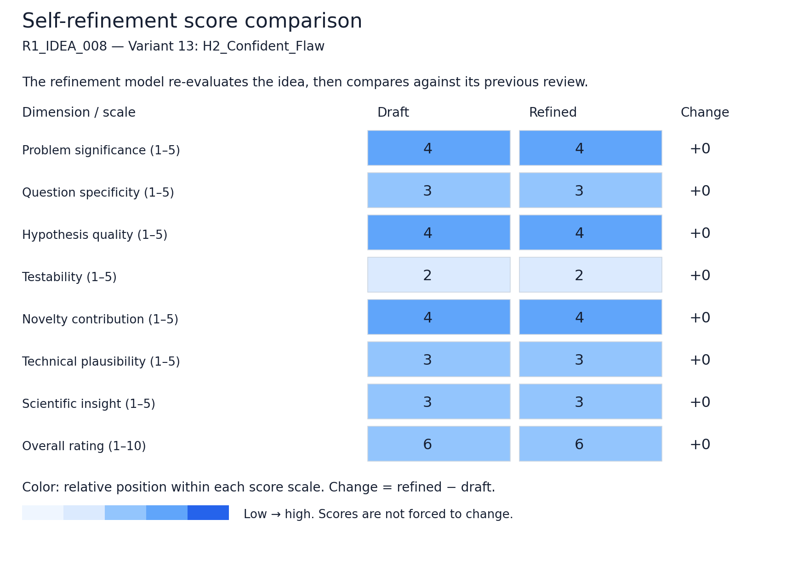

Changed score dimensions: none.

### Score justifications (draft / refined)

**Problem significance**

```json
{
  "draft": {
    "score": 4.0,
    "justification": "The idea tackles a meaningful challenge in dexterous manipulation by proposing a dual-arm, RL-free approach that could improve contact-rich tasks, which is relevant to robotics and automation."
  },
  "refined": {
    "score": 4.0,
    "justification": "The idea tackles a meaningful challenge in dexterous manipulation by proposing a dual-arm, RL-free approach that could improve contact-rich tasks, which is relevant to robotics and automation."
  }
}
```

**Question specificity**

```json
{
  "draft": {
    "score": 3.0,
    "justification": "The idea identifies a broad research direction but lacks specific details on the three-stage paradigm, the RL-free methodology, and the exact nature of the key limitation being addressed."
  },
  "refined": {
    "score": 3.0,
    "justification": "The idea identifies a broad research direction but lacks specific details on the three-stage paradigm, the RL-free methodology, and the exact nature of the key limitation being addressed."
  }
}
```

**Hypothesis quality**

```json
{
  "draft": {
    "score": 4.0,
    "justification": "The idea presents a clear hypothesis that the proposed approach will address a key limitation in existing work, leading to general superiority, though the specifics are not fully detailed."
  },
  "refined": {
    "score": 4.0,
    "justification": "The idea presents a clear hypothesis that the proposed approach will address a key limitation in existing work, leading to general superiority, though the specifics are not fully detailed."
  }
}
```

**Testability**

```json
{
  "draft": {
    "score": 2.0,
    "justification": "The idea lacks specific experiments or evaluations, and the claim about causal evidence without isolating alternative explanations is not testable without further clarification."
  },
  "refined": {
    "score": 2.0,
    "justification": "The idea lacks specific experiments or evaluations, and the claim about causal evidence without isolating alternative explanations is not testable without further clarification."
  }
}
```

**Novelty contribution**

```json
{
  "draft": {
    "score": 4.0,
    "justification": "The approach of using a three-stage, RL-free paradigm for bimanual non-prehensile manipulation is novel, though the specifics are not fully outlined."
  },
  "refined": {
    "score": 4.0,
    "justification": "The approach of using a three-stage, RL-free paradigm for bimanual non-prehensile manipulation is novel, though the specifics are not fully outlined."
  }
}
```

**Technical plausibility**

```json
{
  "draft": {
    "score": 3.0,
    "justification": "The idea is technically plausible but lacks details on the three-stage paradigm and RL-free methodology, making it difficult to assess feasibility."
  },
  "refined": {
    "score": 3.0,
    "justification": "The idea is technically plausible but lacks details on the three-stage paradigm and RL-free methodology, making it difficult to assess feasibility."
  }
}
```

**Scientific insight**

```json
{
  "draft": {
    "score": 3.0,
    "justification": "The idea suggests potential for broader applicability but does not clearly outline the mechanisms or insights that would be gained from the research."
  },
  "refined": {
    "score": 3.0,
    "justification": "The idea suggests potential for broader applicability but does not clearly outline the mechanisms or insights that would be gained from the research."
  }
}
```

**Overall rating**

```json
{
  "draft": {
    "score": 6.0,
    "justification": "The idea addresses a meaningful problem with a plausible approach, but lacks specific details and testable hypotheses, limiting its scientific rigor and potential contribution."
  },
  "refined": {
    "score": 6.0,
    "justification": "The idea addresses a meaningful problem with a plausible approach, but lacks specific details and testable hypotheses, limiting its scientific rigor and potential contribution."
  }
}
```

## R1_IDEA_008 — Variant 14: H3_Verbose_Enriched


Changed score dimensions: none.

### Score justifications (draft / refined)

**Problem significance**

```json
{
  "draft": {
    "score": 4.0,
    "justification": "The idea addresses a significant challenge in robotics by proposing a novel approach to bimanual non-prehensile manipulation, which is important for tasks requiring dexterity and adaptability in dynamic environments."
  },
  "refined": {
    "score": 4.0,
    "justification": "The idea addresses a significant challenge in robotics by proposing a novel approach to bimanual non-prehensile manipulation, which is important for tasks requiring dexterity and adaptability in dynamic environments."
  }
}
```

**Question specificity**

```json
{
  "draft": {
    "score": 3.0,
    "justification": "The idea is specific in its focus on category-level primitives and transferability across object properties, but the three-stage structure and exact hypothesis are not fully detailed, which could be clarified for better specificity."
  },
  "refined": {
    "score": 3.0,
    "justification": "The idea is specific in its focus on category-level primitives and transferability across object properties, but the three-stage structure and exact hypothesis are not fully detailed, which could be clarified for better specificity."
  }
}
```

**Hypothesis quality**

```json
{
  "draft": {
    "score": 3.0,
    "justification": "The hypothesis is implied but not explicitly stated. The idea suggests that the three-stage structure could improve transferability, but a more explicit hypothesis would strengthen the scientific merit."
  },
  "refined": {
    "score": 3.0,
    "justification": "The hypothesis is implied but not explicitly stated. The idea suggests that the three-stage structure could improve transferability, but a more explicit hypothesis would strengthen the scientific merit."
  }
}
```

**Testability**

```json
{
  "draft": {
    "score": 4.0,
    "justification": "The idea includes a detailed plan for validation, including transferability tests, ablations, sensitivity analyses, and error analysis, which makes the approach testable and scientifically rigorous."
  },
  "refined": {
    "score": 4.0,
    "justification": "The idea includes a detailed plan for validation, including transferability tests, ablations, sensitivity analyses, and error analysis, which makes the approach testable and scientifically rigorous."
  }
}
```

**Novelty contribution**

```json
{
  "draft": {
    "score": 4.0,
    "justification": "The approach of using a three-stage, RL-free paradigm for bimanual non-prehensile manipulation is novel, and the focus on transferability across object properties offers potential for generalizable results."
  },
  "refined": {
    "score": 4.0,
    "justification": "The approach of using a three-stage, RL-free paradigm for bimanual non-prehensile manipulation is novel, and the focus on transferability across object properties offers potential for generalizable results."
  }
}
```

**Technical plausibility**

```json
{
  "draft": {
    "score": 4.0,
    "justification": "The proposed approach is technically plausible, as it builds on existing research in robotics and machine learning, and the three-stage structure is a reasonable way to decompose the problem."
  },
  "refined": {
    "score": 4.0,
    "justification": "The proposed approach is technically plausible, as it builds on existing research in robotics and machine learning, and the three-stage structure is a reasonable way to decompose the problem."
  }
}
```

**Scientific insight**

```json
{
  "draft": {
    "score": 4.0,
    "justification": "The idea has the potential to provide insights into the factors that determine the effectiveness of bimanual manipulation, including assumptions, data regimes, and domain constraints."
  },
  "refined": {
    "score": 4.0,
    "justification": "The idea has the potential to provide insights into the factors that determine the effectiveness of bimanual manipulation, including assumptions, data regimes, and domain constraints."
  }
}
```

**Overall rating**

```json
{
  "draft": {
    "score": 7.0,
    "justification": "The idea is strong and addresses a meaningful problem in robotics. It has a clear structure and validation plan, but some details are vague and need clarification to enhance specificity and testability."
  },
  "refined": {
    "score": 7.0,
    "justification": "The idea is strong and addresses a meaningful problem in robotics. It has a clear structure and validation plan, but some details are vague and need clarification to enhance specificity and testability."
  }
}
```

## R1_IDEA_008 — Variant 15: H4_Ultimate_Hype


Changed score dimensions: none.

### Score justifications (draft / refined)

**Problem significance**

```json
{
  "draft": {
    "score": 4.0,
    "justification": "The idea addresses a significant challenge in robotics by proposing bimanual non-prehensile manipulation, which is underexplored and has practical implications for more capable robotic systems."
  },
  "refined": {
    "score": 4.0,
    "justification": "The idea addresses a significant challenge in robotics by proposing bimanual non-prehensile manipulation, which is underexplored and has practical implications for more capable robotic systems."
  }
}
```

**Question specificity**

```json
{
  "draft": {
    "score": 3.0,
    "justification": "The idea is broad and lacks specific details on the three-stage process, the RL-free paradigm, and the exact nature of the primitives being developed, making the research question less concrete."
  },
  "refined": {
    "score": 3.0,
    "justification": "The idea is broad and lacks specific details on the three-stage process, the RL-free paradigm, and the exact nature of the primitives being developed, making the research question less concrete."
  }
}
```

**Hypothesis quality**

```json
{
  "draft": {
    "score": 3.0,
    "justification": "The idea presents a bold claim but lacks a clear, testable hypothesis or prediction about the effectiveness or novelty of the proposed approach."
  },
  "refined": {
    "score": 3.0,
    "justification": "The idea presents a bold claim but lacks a clear, testable hypothesis or prediction about the effectiveness or novelty of the proposed approach."
  }
}
```

**Testability**

```json
{
  "draft": {
    "score": 3.0,
    "justification": "The idea is ambitious but lacks specific experiments or evaluation metrics that would allow for testing the proposed approach's effectiveness."
  },
  "refined": {
    "score": 3.0,
    "justification": "The idea is ambitious but lacks specific experiments or evaluation metrics that would allow for testing the proposed approach's effectiveness."
  }
}
```

**Novelty contribution**

```json
{
  "draft": {
    "score": 4.0,
    "justification": "The approach of using a three-stage, RL-free paradigm for bimanual non-prehensile manipulation is novel and has the potential to contribute significantly to the field."
  },
  "refined": {
    "score": 4.0,
    "justification": "The approach of using a three-stage, RL-free paradigm for bimanual non-prehensile manipulation is novel and has the potential to contribute significantly to the field."
  }
}
```

**Technical plausibility**

```json
{
  "draft": {
    "score": 4.0,
    "justification": "The idea is technically plausible as it builds on existing research in robotics and machine learning, though the specifics of the RL-free paradigm need clarification."
  },
  "refined": {
    "score": 4.0,
    "justification": "The idea is technically plausible as it builds on existing research in robotics and machine learning, though the specifics of the RL-free paradigm need clarification."
  }
}
```

**Scientific insight**

```json
{
  "draft": {
    "score": 3.0,
    "justification": "The idea has potential for scientific insight but lacks concrete mechanisms or hypotheses that would guide the investigation and reveal new principles."
  },
  "refined": {
    "score": 3.0,
    "justification": "The idea has potential for scientific insight but lacks concrete mechanisms or hypotheses that would guide the investigation and reveal new principles."
  }
}
```

**Overall rating**

```json
{
  "draft": {
    "score": 7.0,
    "justification": "The idea is strong and has significant potential, but it lacks specific details and testable hypotheses that would make it more concrete and actionable."
  },
  "refined": {
    "score": 7.0,
    "justification": "The idea is strong and has significant potential, but it lacks specific details and testable hypotheses that would make it more concrete and actionable."
  }
}
```

## R1_IDEA_009 — Source


Changed score dimensions: none.

### Score justifications (draft / refined)

**Problem significance**

```json
{
  "draft": {
    "score": 4.0,
    "justification": "The idea addresses a significant challenge in visual processing and temporal understanding, with potential implications for both AI and neuroscience. However, the connection to current research is not explicitly detailed."
  },
  "refined": {
    "score": 4.0,
    "justification": "The idea addresses a significant challenge in visual processing and temporal understanding, with potential implications for both AI and neuroscience. The gap in fine-grained temporal understanding is a critical issue in both fields."
  }
}
```

**Question specificity**

```json
{
  "draft": {
    "score": 3.0,
    "justification": "The research question is somewhat vague, as it does not clearly define what specific aspect of video processing or EEG data will be compared. More specific hypotheses or questions are needed."
  },
  "refined": {
    "score": 3.0,
    "justification": "The research question is somewhat vague, as it does not clearly define what specific aspect of video processing or EEG data will be compared. More specific hypotheses or questions are needed to guide the investigation."
  }
}
```

**Hypothesis quality**

```json
{
  "draft": {
    "score": 2.0,
    "justification": "The idea lacks an explicit hypothesis or specific prediction that could be tested. The goal is general and does not clearly state what mechanism or relationship is being investigated."
  },
  "refined": {
    "score": 2.0,
    "justification": "The idea lacks an explicit hypothesis or specific prediction that could be tested. The goal is general and does not clearly state what mechanism or relationship is being investigated."
  }
}
```

**Testability**

```json
{
  "draft": {
    "score": 3.0,
    "justification": "The idea is testable in principle, but the lack of specific experimental design details makes it difficult to assess the feasibility of the proposed benchmarking approach."
  },
  "refined": {
    "score": 3.0,
    "justification": "The idea is testable in principle, but the lack of specific experimental design details makes it difficult to assess the feasibility of the proposed benchmarking approach."
  }
}
```

**Novelty contribution**

```json
{
  "draft": {
    "score": 4.0,
    "justification": "The idea is novel in its approach of benchmarking video models against EEG data, which could provide new insights into brain-like processing. However, the novelty is somewhat limited without a clear research question or hypothesis."
  },
  "refined": {
    "score": 4.0,
    "justification": "The idea is novel in its approach of benchmarking video models against EEG data, which could provide new insights into brain-like processing. However, the novelty is somewhat limited without a clear research question or hypothesis."
  }
}
```

**Technical plausibility**

```json
{
  "draft": {
    "score": 4.0,
    "justification": "The proposed approach is technically plausible, as it involves comparing video models with biological data. However, the specifics of data alignment and processing are not clearly outlined."
  },
  "refined": {
    "score": 4.0,
    "justification": "The proposed approach is technically plausible, as it involves comparing video models with biological data. However, the specifics of data alignment and processing are not clearly outlined."
  }
}
```

**Scientific insight**

```json
{
  "draft": {
    "score": 3.0,
    "justification": "The idea has potential for scientific insight into brain-like processing, but the lack of a clear hypothesis or research question limits the potential for meaningful insights."
  },
  "refined": {
    "score": 3.0,
    "justification": "The idea has potential for scientific insight into brain-like processing, but the lack of a clear hypothesis or research question limits the potential for meaningful insights."
  }
}
```

**Overall rating**

```json
{
  "draft": {
    "score": 7.0,
    "justification": "The idea is promising and addresses a meaningful problem, but it lacks specific details and a clear hypothesis, which are necessary for assessing its testability and potential contribution."
  },
  "refined": {
    "score": 7.0,
    "justification": "The idea is promising and addresses a meaningful problem, but it lacks specific details and a clear hypothesis, which are necessary for assessing its testability and potential contribution."
  }
}
```

## R1_IDEA_009 — Variant 1: A1_Identity


Changed score dimensions: none.

### Score justifications (draft / refined)

**Problem significance**

```json
{
  "draft": {
    "score": 4.0,
    "justification": "The idea addresses a significant challenge in visual processing and temporal understanding, with potential implications for both AI and neuroscience. However, the connection to current research is not explicitly detailed."
  },
  "refined": {
    "score": 4.0,
    "justification": "The idea addresses a significant challenge in visual processing and temporal understanding, with potential implications for both AI and neuroscience. The gap in fine-grained temporal understanding is a critical issue in both fields."
  }
}
```

**Question specificity**

```json
{
  "draft": {
    "score": 3.0,
    "justification": "The research question is somewhat vague, as it does not clearly define what specific aspect of video processing or EEG data will be compared. More specific hypotheses or questions are needed."
  },
  "refined": {
    "score": 3.0,
    "justification": "The research question is somewhat vague, as it does not clearly define what specific aspect of video processing or EEG data will be compared. More specific hypotheses or questions are needed to guide the investigation."
  }
}
```

**Hypothesis quality**

```json
{
  "draft": {
    "score": 2.0,
    "justification": "The idea lacks an explicit hypothesis or specific prediction that could be tested. The goal is general and does not clearly state what mechanism or relationship is being investigated."
  },
  "refined": {
    "score": 2.0,
    "justification": "The idea lacks an explicit hypothesis or specific prediction that could be tested. The goal is general and does not clearly state what mechanism or relationship is being investigated."
  }
}
```

**Testability**

```json
{
  "draft": {
    "score": 3.0,
    "justification": "The idea is testable in principle, but the lack of specific experimental design details makes it difficult to assess the feasibility of the proposed benchmarking approach."
  },
  "refined": {
    "score": 3.0,
    "justification": "The idea is testable in principle, but the lack of specific experimental design details makes it difficult to assess the feasibility of the proposed benchmarking approach."
  }
}
```

**Novelty contribution**

```json
{
  "draft": {
    "score": 4.0,
    "justification": "The idea is novel in its approach of benchmarking video models against EEG data, which could provide new insights into brain-like processing. However, the novelty is somewhat limited without a clear research question or hypothesis."
  },
  "refined": {
    "score": 4.0,
    "justification": "The idea is novel in its approach of benchmarking video models against EEG data, which could provide new insights into brain-like processing. However, the novelty is somewhat limited without a clear research question or hypothesis."
  }
}
```

**Technical plausibility**

```json
{
  "draft": {
    "score": 4.0,
    "justification": "The proposed approach is technically plausible, as it involves comparing video models with biological data. However, the specifics of data alignment and processing are not clearly outlined."
  },
  "refined": {
    "score": 4.0,
    "justification": "The proposed approach is technically plausible, as it involves comparing video models with biological data. However, the specifics of data alignment and processing are not clearly outlined."
  }
}
```

**Scientific insight**

```json
{
  "draft": {
    "score": 3.0,
    "justification": "The idea has potential for scientific insight into brain-like processing, but the lack of a clear hypothesis or research question limits the potential for meaningful insights."
  },
  "refined": {
    "score": 3.0,
    "justification": "The idea has potential for scientific insight into brain-like processing, but the lack of a clear hypothesis or research question limits the potential for meaningful insights."
  }
}
```

**Overall rating**

```json
{
  "draft": {
    "score": 7.0,
    "justification": "The idea is promising and addresses a meaningful problem, but it lacks specific details and a clear hypothesis, which are necessary for assessing its testability and potential contribution."
  },
  "refined": {
    "score": 7.0,
    "justification": "The idea is promising and addresses a meaningful problem, but it lacks specific details and a clear hypothesis, which are necessary for assessing its testability and potential contribution."
  }
}
```

## R1_IDEA_009 — Variant 2: A2_Paraphrase_Only


Changed score dimensions: none.

### Score justifications (draft / refined)

**Problem significance**

```json
{
  "draft": {
    "score": 4.0,
    "justification": "The problem of fine-grained temporal understanding in visual processing is significant for both AI and neuroscience, with potential to improve both fields."
  },
  "refined": {
    "score": 4.0,
    "justification": "The problem of fine-grained temporal understanding in visual processing is significant for both AI and neuroscience, with potential to improve both fields."
  }
}
```

**Question specificity**

```json
{
  "draft": {
    "score": 3.0,
    "justification": "The idea is specific in its focus on temporal understanding but lacks clarity on the exact research question and how EEG and video representations will be compared."
  },
  "refined": {
    "score": 3.0,
    "justification": "The idea is specific in its focus on temporal understanding but lacks clarity on the exact research question and how EEG and video representations will be compared."
  }
}
```

**Hypothesis quality**

```json
{
  "draft": {
    "score": 2.0,
    "justification": "The hypothesis is not clearly stated, and the expected outcome is not explicitly defined, making it difficult to assess testability."
  },
  "refined": {
    "score": 2.0,
    "justification": "The hypothesis is not clearly stated, and the expected outcome is not explicitly defined, making it difficult to assess testability."
  }
}
```

**Testability**

```json
{
  "draft": {
    "score": 3.0,
    "justification": "The idea is testable in principle, but the lack of specific methods and metrics makes it challenging to determine how the hypothesis will be validated."
  },
  "refined": {
    "score": 3.0,
    "justification": "The idea is testable in principle, but the lack of specific methods and metrics makes it challenging to determine how the hypothesis will be validated."
  }
}
```

**Novelty contribution**

```json
{
  "draft": {
    "score": 4.0,
    "justification": "The interdisciplinary approach combining EEG and deep video models is novel, and the potential to inform dynamic visual architectures is a significant contribution."
  },
  "refined": {
    "score": 4.0,
    "justification": "The interdisciplinary approach combining EEG and deep video models is novel, and the potential to inform dynamic visual architectures is a significant contribution."
  }
}
```

**Technical plausibility**

```json
{
  "draft": {
    "score": 4.0,
    "justification": "The integration of EEG data with video models is technically plausible, though the specifics of the methodology are not detailed."
  },
  "refined": {
    "score": 4.0,
    "justification": "The integration of EEG data with video models is technically plausible, though the specifics of the methodology are not detailed."
  }
}
```

**Scientific insight**

```json
{
  "draft": {
    "score": 3.0,
    "justification": "The idea has potential to provide insights into brain-like video understanding, but the lack of a clear hypothesis limits the potential for meaningful scientific insight."
  },
  "refined": {
    "score": 3.0,
    "justification": "The idea has potential to provide insights into brain-like video understanding, but the lack of a clear hypothesis limits the potential for meaningful scientific insight."
  }
}
```

**Overall rating**

```json
{
  "draft": {
    "score": 7.0,
    "justification": "The idea is strong in its interdisciplinary approach and addresses a significant problem, but lacks specificity and clarity in the research question and hypothesis, which are critical for testability and scientific contribution."
  },
  "refined": {
    "score": 7.0,
    "justification": "The idea is strong in its interdisciplinary approach and addresses a significant problem, but lacks specificity and clarity in the research question and hypothesis, which are critical for testability and scientific contribution."
  }
}
```

## R1_IDEA_009 — Variant 3: A3_Plain_Core


Changed score dimensions: none.

### Score justifications (draft / refined)

**Problem significance**

```json
{
  "draft": {
    "score": 4.0,
    "justification": "The idea addresses a significant gap in understanding how the brain processes visual information over time, which is relevant to both neuroscience and machine learning. It has the potential to inform the development of more biologically plausible models."
  },
  "refined": {
    "score": 4.0,
    "justification": "The idea addresses a significant gap in understanding how the brain processes visual information over time, which is relevant to both neuroscience and machine learning. It has the potential to inform the development of more biologically plausible models."
  }
}
```

**Question specificity**

```json
{
  "draft": {
    "score": 3.0,
    "justification": "The idea is somewhat specific in its goal to explore temporal understanding in visual processing, but lacks concrete details on the exact research question or hypothesis being tested."
  },
  "refined": {
    "score": 3.0,
    "justification": "The idea is somewhat specific in its goal to explore temporal understanding in visual processing, but lacks concrete details on the exact research question or hypothesis being tested."
  }
}
```

**Hypothesis quality**

```json
{
  "draft": {
    "score": 3.0,
    "justification": "The idea suggests a potential connection between brain-like processing and video models, but does not explicitly state a hypothesis that can be tested or falsified."
  },
  "refined": {
    "score": 3.0,
    "justification": "The idea suggests a potential connection between brain-like processing and video models, but does not explicitly state a hypothesis that can be tested or falsified."
  }
}
```

**Testability**

```json
{
  "draft": {
    "score": 2.0,
    "justification": "The idea is somewhat testable, but lacks specific experimental plans or metrics that would allow for meaningful evaluation of the proposed approach."
  },
  "refined": {
    "score": 2.0,
    "justification": "The idea is somewhat testable, but lacks specific experimental plans or metrics that would allow for meaningful evaluation of the proposed approach."
  }
}
```

**Novelty contribution**

```json
{
  "draft": {
    "score": 4.0,
    "justification": "The integration of EEG data with video models is a novel approach that could contribute to both neuroscience and machine learning, offering new insights into temporal processing and model design."
  },
  "refined": {
    "score": 4.0,
    "justification": "The integration of EEG data with video models is a novel approach that could contribute to both neuroscience and machine learning, offering new insights into temporal processing and model design."
  }
}
```

**Technical plausibility**

```json
{
  "draft": {
    "score": 3.0,
    "justification": "The idea is technically plausible, as it involves combining EEG data with video models, but the specific implementation details and feasibility are not clearly outlined."
  },
  "refined": {
    "score": 3.0,
    "justification": "The idea is technically plausible, as it involves combining EEG data with video models, but the specific implementation details and feasibility are not clearly outlined."
  }
}
```

**Scientific insight**

```json
{
  "draft": {
    "score": 3.0,
    "justification": "The idea has the potential to provide insights into the mechanisms of temporal processing in both biological and artificial systems, but the specific insights are not clearly defined."
  },
  "refined": {
    "score": 3.0,
    "justification": "The idea has the potential to provide insights into the mechanisms of temporal processing in both biological and artificial systems, but the specific insights are not clearly defined."
  }
}
```

**Overall rating**

```json
{
  "draft": {
    "score": 7.0,
    "justification": "The idea is promising and addresses a meaningful problem, but lacks specific details on the research question, hypothesis, and experimental plan, which are necessary for evaluating its feasibility and potential contribution."
  },
  "refined": {
    "score": 7.0,
    "justification": "The idea is promising and addresses a meaningful problem, but lacks specific details on the research question, hypothesis, and experimental plan, which are necessary for evaluating its feasibility and potential contribution."
  }
}
```

## R1_IDEA_009 — Variant 4: B1_Verbose_Elaborate


Changed score dimensions: none.

### Score justifications (draft / refined)

**Problem significance**

```json
{
  "draft": {
    "score": 4.0,
    "justification": "The idea addresses a critical gap in understanding how the brain processes video, which has implications for both neuroscience and machine learning. It bridges two domains that are often studied in isolation, offering potential for cross-disciplinary insights."
  },
  "refined": {
    "score": 4.0,
    "justification": "The idea addresses a critical gap in understanding how the brain processes video, which has implications for both neuroscience and machine learning. It bridges two domains that are often studied in isolation, offering potential for cross-disciplinary insights."
  }
}
```

**Question specificity**

```json
{
  "draft": {
    "score": 3.0,
    "justification": "The research question is clear in its intent to compare video models with EEG data, but the specifics of the benchmark, comparison metrics, and mechanistic principles are not well defined. More details are needed to make the question more concrete."
  },
  "refined": {
    "score": 3.0,
    "justification": "The research question is clear in its intent to compare video models with EEG data, but the specifics of the benchmark, comparison metrics, and mechanistic principles are not well defined. More details are needed to make the question more concrete."
  }
}
```

**Hypothesis quality**

```json
{
  "draft": {
    "score": 3.0,
    "justification": "The idea suggests a hypothesis that video models can be aligned with brain activity patterns, but the exact nature of the hypothesis (e.g., specific mechanisms, performance metrics) is not clearly stated. This makes it harder to evaluate the hypothesis against evidence."
  },
  "refined": {
    "score": 3.0,
    "justification": "The idea suggests a hypothesis that video models can be aligned with brain activity patterns, but the exact nature of the hypothesis (e.g., specific mechanisms, performance metrics) is not clearly stated. This makes it harder to evaluate the hypothesis against evidence."
  }
}
```

**Testability**

```json
{
  "draft": {
    "score": 2.0,
    "justification": "The idea is testable in principle, but the lack of specific experimental design details (e.g., how to compare models, what EEG data to use) makes it difficult to assess feasibility. Without clear methods, the testability is limited."
  },
  "refined": {
    "score": 2.0,
    "justification": "The idea is testable in principle, but the lack of specific experimental design details (e.g., how to compare models, what EEG data to use) makes it difficult to assess feasibility. Without clear methods, the testability is limited."
  }
}
```

**Novelty contribution**

```json
{
  "draft": {
    "score": 4.0,
    "justification": "The integration of EEG data with video models is a novel approach that could provide new insights into both domains. It offers a unique way to evaluate and improve video models by aligning them with biological data, which is a significant contribution."
  },
  "refined": {
    "score": 4.0,
    "justification": "The integration of EEG data with video models is a novel approach that could provide new insights into both domains. It offers a unique way to evaluate and improve video models by aligning them with biological data, which is a significant contribution."
  }
}
```

**Technical plausibility**

```json
{
  "draft": {
    "score": 4.0,
    "justification": "The idea is technically plausible as it combines existing techniques in video modeling with EEG data analysis. However, the specific technical challenges (e.g., aligning temporal dynamics, handling high-dimensional data) would require careful consideration and planning."
  },
  "refined": {
    "score": 4.0,
    "justification": "The idea is technically plausible as it combines existing techniques in video modeling with EEG data analysis. However, the specific technical challenges (e.g., aligning temporal dynamics, handling high-dimensional data) would require careful consideration and planning."
  }
}
```

**Scientific insight**

```json
{
  "draft": {
    "score": 3.0,
    "justification": "The study has the potential to reveal insights into how the brain processes video, but the current description does not specify what particular insights are being sought. More clarity on the expected findings would strengthen the scientific insight potential."
  },
  "refined": {
    "score": 3.0,
    "justification": "The study has the potential to reveal insights into how the brain processes video, but the current description does not specify what particular insights are being sought. More clarity on the expected findings would strengthen the scientific insight potential."
  }
}
```

**Overall rating**

```json
{
  "draft": {
    "score": 7.0,
    "justification": "The idea is strong and has the potential to contribute meaningfully to both neuroscience and machine learning. However, it lacks specific details that are necessary to define the research question, hypothesis, and evaluation methods, which limits its current testability and clarity."
  },
  "refined": {
    "score": 7.0,
    "justification": "The idea is strong and has the potential to contribute meaningfully to both neuroscience and machine learning. However, it lacks specific details that are necessary to define the research question, hypothesis, and evaluation methods, which limits its current testability and clarity."
  }
}
```

## R1_IDEA_009 — Variant 5: B2_Grand_Narrative

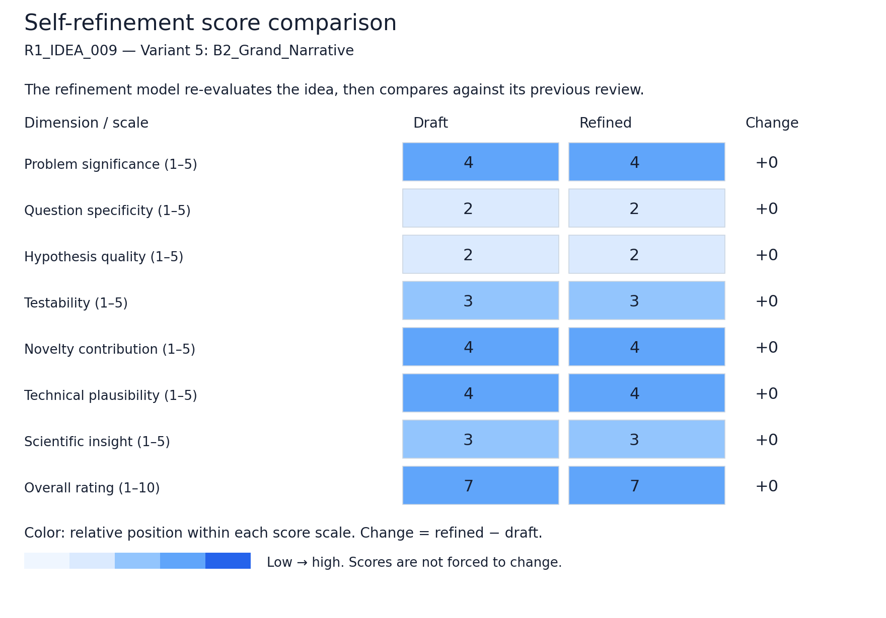

Changed score dimensions: none.

### Score justifications (draft / refined)

**Problem significance**

```json
{
  "draft": {
    "score": 4.0,
    "justification": "The idea addresses a significant challenge in understanding how the brain processes dynamic visual information, which has implications for both neuroscience and machine learning. It bridges the gap between biological vision and artificial systems, which is a critical area of research."
  },
  "refined": {
    "score": 4.0,
    "justification": "The idea addresses a significant challenge in understanding how the brain processes dynamic visual information, which has implications for both neuroscience and machine learning. It bridges the gap between biological vision and artificial systems, which is a critical area of research."
  }
}
```

**Question specificity**

```json
{
  "draft": {
    "score": 2.0,
    "justification": "The idea is broad and lacks a specific research question. It mentions the goal of uncovering mechanistic principles but does not clearly define what exactly is being investigated or what hypothesis is being tested."
  },
  "refined": {
    "score": 2.0,
    "justification": "The idea is broad and lacks a specific research question. It mentions the goal of uncovering mechanistic principles but does not clearly define what exactly is being investigated or what hypothesis is being tested."
  }
}
```

**Hypothesis quality**

```json
{
  "draft": {
    "score": 2.0,
    "justification": "The idea does not present a clear hypothesis or prediction. It suggests a potential contribution but does not specify what mechanism or relationship is being hypothesized to be discovered through the benchmarking process."
  },
  "refined": {
    "score": 2.0,
    "justification": "The idea does not present a clear hypothesis or prediction. It suggests a potential contribution but does not specify what mechanism or relationship is being hypothesized to be discovered through the benchmarking process."
  }
}
```

**Testability**

```json
{
  "draft": {
    "score": 3.0,
    "justification": "The idea is testable in principle, as it involves comparing video models with EEG data. However, the lack of specific methodology and hypotheses makes it difficult to assess the feasibility of the proposed experiments."
  },
  "refined": {
    "score": 3.0,
    "justification": "The idea is testable in principle, as it involves comparing video models with EEG data. However, the lack of specific methodology and hypotheses makes it difficult to assess the feasibility of the proposed experiments."
  }
}
```

**Novelty contribution**

```json
{
  "draft": {
    "score": 4.0,
    "justification": "The approach of benchmarking video models against EEG data is novel and could contribute to the understanding of biological vision. However, the novelty is somewhat limited by the lack of specific research questions or hypotheses."
  },
  "refined": {
    "score": 4.0,
    "justification": "The approach of benchmarking video models against EEG data is novel and could contribute to the understanding of biological vision. However, the novelty is somewhat limited by the lack of specific research questions or hypotheses."
  }
}
```

**Technical plausibility**

```json
{
  "draft": {
    "score": 4.0,
    "justification": "The idea is technically plausible as it involves combining video models with EEG data. However, the specifics of how the data will be aligned and compared are not provided, which could pose challenges in implementation."
  },
  "refined": {
    "score": 4.0,
    "justification": "The idea is technically plausible as it involves combining video models with EEG data. However, the specifics of how the data will be aligned and compared are not provided, which could pose challenges in implementation."
  }
}
```

**Scientific insight**

```json
{
  "draft": {
    "score": 3.0,
    "justification": "The research could provide insights into the mechanisms of visual processing, but the lack of a specific hypothesis or research question limits the potential for meaningful scientific insight."
  },
  "refined": {
    "score": 3.0,
    "justification": "The research could provide insights into the mechanisms of visual processing, but the lack of a specific hypothesis or research question limits the potential for meaningful scientific insight."
  }
}
```

**Overall rating**

```json
{
  "draft": {
    "score": 7.0,
    "justification": "The idea has strong potential to contribute to the understanding of biological vision and machine learning, but it lacks specific research questions and hypotheses. With more detailed specifications, it could become a strong research direction."
  },
  "refined": {
    "score": 7.0,
    "justification": "The idea has strong potential to contribute to the understanding of biological vision and machine learning, but it lacks specific research questions and hypotheses. With more detailed specifications, it could become a strong research direction."
  }
}
```

## R1_IDEA_009 — Variant 6: B3_Over_Confident


Changed score dimensions: none.

### Score justifications (draft / refined)

**Problem significance**

```json
{
  "draft": {
    "score": 4.0,
    "justification": "The idea addresses a significant challenge in visual processing and temporal understanding, with potential implications for both neuroscience and machine learning. It bridges the gap between biological and artificial systems, which is a meaningful problem."
  },
  "refined": {
    "score": 4.0,
    "justification": "The idea addresses a significant challenge in visual processing and temporal understanding, with potential implications for both neuroscience and machine learning. It bridges the gap between biological and artificial systems, which is a meaningful problem."
  }
}
```

**Question specificity**

```json
{
  "draft": {
    "score": 3.0,
    "justification": "The idea is somewhat specific in its focus on fine-grained temporal understanding, but the exact research question or hypothesis is not clearly defined. More details are needed to specify what is being investigated."
  },
  "refined": {
    "score": 3.0,
    "justification": "The idea is somewhat specific in its focus on fine-grained temporal understanding, but the exact research question or hypothesis is not clearly defined. More details are needed to specify what is being investigated."
  }
}
```

**Hypothesis quality**

```json
{
  "draft": {
    "score": 3.0,
    "justification": "The idea suggests a general goal of uncovering mechanistic principles, but it lacks a concrete hypothesis that can be tested. A specific prediction about the relationship between video models and EEG data would strengthen this."
  },
  "refined": {
    "score": 3.0,
    "justification": "The idea suggests a general goal of uncovering mechanistic principles, but it lacks a concrete hypothesis that can be tested. A specific prediction about the relationship between video models and EEG data would strengthen this."
  }
}
```

**Testability**

```json
{
  "draft": {
    "score": 2.0,
    "justification": "The idea is somewhat testable, but the lack of specific experimental details makes it difficult to assess how the research would be conducted. Without clear methods for data alignment and comparison, the testability is limited."
  },
  "refined": {
    "score": 2.0,
    "justification": "The idea is somewhat testable, but the lack of specific experimental details makes it difficult to assess how the research would be conducted. Without clear methods for data alignment and comparison, the testability is limited."
  }
}
```

**Novelty contribution**

```json
{
  "draft": {
    "score": 4.0,
    "justification": "The approach of benchmarking video models against EEG data is novel and has the potential to contribute new insights into brain-like processing mechanisms. It could lead to the development of more biologically aligned visual architectures."
  },
  "refined": {
    "score": 4.0,
    "justification": "The approach of benchmarking video models against EEG data is novel and has the potential to contribute new insights into brain-like processing mechanisms. It could lead to the development of more biologically aligned visual architectures."
  }
}
```

**Technical plausibility**

```json
{
  "draft": {
    "score": 4.0,
    "justification": "The idea is technically plausible as it combines video modeling with EEG data, which is a feasible approach. However, the specifics of how the data will be aligned and compared are not provided, which could affect the feasibility."
  },
  "refined": {
    "score": 4.0,
    "justification": "The idea is technically plausible as it combines video modeling with EEG data, which is a feasible approach. However, the specifics of how the data will be aligned and compared are not provided, which could affect the feasibility."
  }
}
```

**Scientific insight**

```json
{
  "draft": {
    "score": 3.0,
    "justification": "The idea has the potential to provide insights into brain-like processing, but the specific mechanisms or insights are not clearly outlined. More details are needed to determine the scientific value of the research."
  },
  "refined": {
    "score": 3.0,
    "justification": ""
  }
}
```

**Overall rating**

```json
{
  "draft": {
    "score": 7.0,
    "justification": "The idea is strong and addresses a meaningful problem with potential for novel contributions. However, it lacks specific details on the research question, hypothesis, and methodology, which are needed to assess its testability and scientific insight."
  },
  "refined": {
    "score": 7.0,
    "justification": "The idea is strong and addresses a meaningful problem with potential for novel contributions. However, it lacks specific details on the research question, hypothesis, and methodology, which are needed to assess its testability and scientific insight."
  }
}
```

## R1_IDEA_009 — Variant 7: B4_Novelty


Changed score dimensions: none.

### Score justifications (draft / refined)

**Problem significance**

```json
{
  "draft": {
    "score": 4.0,
    "justification": "The idea addresses a significant challenge in visual processing and temporal understanding, with potential implications for both computer vision and neuroscience."
  },
  "refined": {
    "score": 4.0,
    "justification": "The idea addresses a significant challenge in visual processing and temporal understanding, with potential implications for both computer vision and neuroscience."
  }
}
```

**Question specificity**

```json
{
  "draft": {
    "score": 3.0,
    "justification": "The idea is specific in its focus on fine-grained temporal understanding but lacks explicit details on the research question or hypothesis."
  },
  "refined": {
    "score": 3.0,
    "justification": "The idea is specific in its focus on fine-grained temporal understanding but lacks explicit details on the research question or hypothesis."
  }
}
```

**Hypothesis quality**

```json
{
  "draft": {
    "score": 3.0,
    "justification": "The idea suggests a novel approach but does not clearly state a testable hypothesis or specific prediction."
  },
  "refined": {
    "score": 3.0,
    "justification": "The idea suggests a novel approach but does not clearly state a testable hypothesis or specific prediction."
  }
}
```

**Testability**

```json
{
  "draft": {
    "score": 3.0,
    "justification": "The idea is testable in principle, but the lack of specific experimental details makes it difficult to assess the feasibility of the proposed approach."
  },
  "refined": {
    "score": 3.0,
    "justification": "The idea is testable in principle, but the lack of specific experimental details makes it difficult to assess the feasibility of the proposed approach."
  }
}
```

**Novelty contribution**

```json
{
  "draft": {
    "score": 4.0,
    "justification": "The approach of benchmarking video models against EEG data is novel and could contribute new insights into brain-like visual processing mechanisms."
  },
  "refined": {
    "score": 4.0,
    "justification": "The approach of benchmarking video models against EEG data is novel and could contribute new insights into brain-like visual processing mechanisms."
  }
}
```

**Technical plausibility**

```json
{
  "draft": {
    "score": 4.0,
    "justification": "The idea is technically plausible, as it combines video processing with EEG data, which is a feasible interdisciplinary approach."
  },
  "refined": {
    "score": 4.0,
    "justification": "The idea is technically plausible, as it combines video processing with EEG data, which is a feasible interdisciplinary approach."
  }
}
```

**Scientific insight**

```json
{
  "draft": {
    "score": 4.0,
    "justification": "The research could provide insights into the mechanisms of brain-like video understanding, which could inform the design of more efficient visual architectures."
  },
  "refined": {
    "score": 4.0,
    "justification": "The research could provide insights into the mechanisms of brain-like video understanding, which could inform the design of more efficient visual architectures."
  }
}
```

**Overall rating**

```json
{
  "draft": {
    "score": 7.0,
    "justification": "The idea is strong and has the potential to contribute novel insights, but it lacks specific details on the research question, hypothesis, and methodology, which are needed for further development."
  },
  "refined": {
    "score": 7.0,
    "justification": "The idea is strong and has the potential to contribute novel insights, but it lacks specific details on the research question, hypothesis, and methodology, which are needed for further development."
  }
}
```

## R1_IDEA_009 — Variant 8: B5_Application_Impact


Changed score dimensions: none.

### Score justifications (draft / refined)

**Problem significance**

```json
{
  "draft": {
    "score": 4.0,
    "justification": "The idea addresses a significant gap in understanding how the brain processes temporal visual information, which has implications for both neuroscience and machine learning. It bridges the gap between biological and artificial systems in temporal processing."
  },
  "refined": {
    "score": 4.0,
    "justification": "The idea addresses a significant gap in understanding how the brain processes temporal visual information, which has implications for both neuroscience and machine learning. It bridges the gap between biological and artificial systems in temporal processing."
  }
}
```

**Question specificity**

```json
{
  "draft": {
    "score": 3.0,
    "justification": "The idea is somewhat specific in its goal to explore temporal understanding in visual processing, but the exact research question or hypothesis is not clearly defined. More details are needed to specify what mechanistic principles are being investigated."
  },
  "refined": {
    "score": 3.0,
    "justification": "The idea is somewhat specific in its goal to explore temporal understanding in visual processing, but the exact research question or hypothesis is not clearly defined. More details are needed to specify what mechanistic principles are being investigated."
  }
}
```

**Hypothesis quality**

```json
{
  "draft": {
    "score": 2.0,
    "justification": "The hypothesis is not explicitly stated. The idea suggests that the benchmarking could reveal principles of efficient brain-like processing, but it does not clearly predict what those principles would be or how they would be measured."
  },
  "refined": {
    "score": 2.0,
    "justification": "The hypothesis is not explicitly stated. The idea suggests that the benchmarking could reveal principles of efficient brain-like processing, but it does not clearly predict what those principles would be or how they would be measured."
  }
}
```

**Testability**

```json
{
  "draft": {
    "score": 3.0,
    "justification": "The idea is testable in principle, but the lack of specific experimental design details makes it difficult to assess how the benchmarking would be conducted. The connection between EEG data and video models is not clearly defined, which is necessary for testability."
  },
  "refined": {
    "score": 3.0,
    "justification": "The idea is testable in principle, but the lack of specific experimental design details makes it difficult to assess how the benchmarking would be conducted. The connection between EEG data and video models is not clearly defined, which is necessary for testability."
  }
}
```

**Novelty contribution**

```json
{
  "draft": {
    "score": 4.0,
    "justification": "The idea is novel in its approach of benchmarking video models against EEG data to study brain-like processing. It has the potential to contribute new insights into the design of efficient video analysis systems."
  },
  "refined": {
    "score": 4.0,
    "justification": "The idea is novel in its approach of benchmarking video models against EEG data to study brain-like processing. It has the potential to contribute new insights into the design of efficient video analysis systems."
  }
}
```

**Technical plausibility**

```json
{
  "draft": {
    "score": 3.0,
    "justification": "The idea is technically plausible, as it involves comparing video models with biological data. However, the lack of specific technical details makes it difficult to assess the feasibility of the approach."
  },
  "refined": {
    "score": 3.0,
    "justification": "The idea is technically plausible, as it involves comparing video models with biological data. However, the lack of specific technical details makes it difficult to assess the feasibility of the approach."
  }
}
```

**Scientific insight**

```json
{
  "draft": {
    "score": 3.0,
    "justification": "The idea has the potential to provide scientific insight into the mechanisms of brain-like video processing, but the current formulation does not clearly specify what insights are being sought or how they would be obtained."
  },
  "refined": {
    "score": 3.0,
    "justification": "The idea has the potential to provide scientific insight into the mechanisms of brain-like video processing, but the current formulation does not clearly specify what insights are being sought or how they would be obtained."
  }
}
```

**Overall rating**

```json
{
  "draft": {
    "score": 7.0,
    "justification": "The idea is strong in its potential to bridge neuroscience and machine learning, but it lacks specific details on the research question, hypothesis, and experimental design. With more clarity on these aspects, it could become a highly impactful research direction."
  },
  "refined": {
    "score": 7.0,
    "justification": "The idea is strong in its potential to bridge neuroscience and machine learning, but it lacks specific details on the research question, hypothesis, and experimental design. With more clarity on these aspects, it could become a highly impactful research direction."
  }
}
```

## R1_IDEA_009 — Variant 9: C1_Hollow_Shell


Changed score dimensions: none.

### Score justifications (draft / refined)

**Problem significance**

```json
{
  "draft": {
    "score": 4.0,
    "justification": "The idea addresses a fundamental challenge in understanding visual processing, which is important for both neuroscience and machine learning. It bridges two fields, offering potential for cross-disciplinary insights."
  },
  "refined": {
    "score": 4.0,
    "justification": "The idea addresses a fundamental challenge in understanding visual processing, which is important for both neuroscience and machine learning. It bridges two fields, offering potential for cross-disciplinary insights."
  }
}
```

**Question specificity**

```json
{
  "draft": {
    "score": 2.0,
    "justification": "The idea is too general and lacks specific research questions or hypotheses. It does not define what exactly will be compared or what principles are being sought."
  },
  "refined": {
    "score": 2.0,
    "justification": "The idea is too general and lacks specific research questions or hypotheses. It does not define what exactly will be compared or what principles are being sought."
  }
}
```

**Hypothesis quality**

```json
{
  "draft": {
    "score": 2.0,
    "justification": "The idea does not contain a clear hypothesis or prediction. It merely states a goal without specifying what should be investigated or what expected outcomes are."
  },
  "refined": {
    "score": 2.0,
    "justification": "The idea does not contain a clear hypothesis or prediction. It merely states a goal without specifying what should be investigated or what expected outcomes are."
  }
}
```

**Testability**

```json
{
  "draft": {
    "score": 2.0,
    "justification": "The idea lacks specific experiments or methods for testing the proposed comparison. Without details on how to compare models with brain data, it is unclear how to validate the research question."
  },
  "refined": {
    "score": 2.0,
    "justification": "The idea lacks specific experiments or methods for testing the proposed comparison. Without details on how to compare models with brain data, it is unclear how to validate the research question."
  }
}
```

**Novelty contribution**

```json
{
  "draft": {
    "score": 3.0,
    "justification": "The interdisciplinary approach is novel, but the idea does not clearly define what specific contribution it aims to make. The potential impact is not well articulated."
  },
  "refined": {
    "score": 3.0,
    "justification": "The interdisciplinary approach is novel, but the idea does not clearly define what specific contribution it aims to make. The potential impact is not well articulated."
  }
}
```

**Technical plausibility**

```json
{
  "draft": {
    "score": 4.0,
    "justification": "The approach is technically plausible as it involves comparing computational models with brain data. However, the lack of specifics makes it difficult to assess the feasibility of the proposed methods."
  },
  "refined": {
    "score": 4.0,
    "justification": "The approach is technically plausible as it involves comparing computational models with brain data. However, the lack of specifics makes it difficult to assess the feasibility of the proposed methods."
  }
}
```

**Scientific insight**

```json
{
  "draft": {
    "score": 3.0,
    "justification": "The idea has the potential to provide insights into visual processing, but the lack of specific research questions limits the potential for meaningful scientific discovery."
  },
  "refined": {
    "score": 3.0,
    "justification": "The idea has the potential to provide insights into visual processing, but the lack of specific research questions limits the potential for meaningful scientific discovery."
  }
}
```

**Overall rating**

```json
{
  "draft": {
    "score": 6.0,
    "justification": "The idea is promising and addresses an important interdisciplinary problem, but it lacks specific research questions, hypotheses, and methods. With more details, it could become a strong research direction."
  },
  "refined": {
    "score": 6.0,
    "justification": "The idea is promising and addresses an important interdisciplinary problem, but it lacks specific research questions, hypotheses, and methods. With more details, it could become a strong research direction."
  }
}
```

## R1_IDEA_009 — Variant 10: C2_Logic_Flawed


Changed score dimensions: none.

### Score justifications (draft / refined)

**Problem significance**

```json
{
  "draft": {
    "score": 4.0,
    "justification": "The idea addresses a significant gap in understanding how the brain processes video temporally, which is important for both neuroscience and machine learning. It has the potential to inform the development of more biologically plausible models."
  },
  "refined": {
    "score": 4.0,
    "justification": "The idea addresses a significant gap in understanding how the brain processes video temporally, which is important for both neuroscience and machine learning. It has the potential to inform the development of more biologically plausible models."
  }
}
```

**Question specificity**

```json
{
  "draft": {
    "score": 3.0,
    "justification": "The idea is somewhat specific in its goal to explore temporal understanding in visual processing, but the exact research question and hypothesis are not clearly defined. More details are needed on what specific principles are being tested and how they will be validated."
  },
  "refined": {
    "score": 3.0,
    "justification": "The idea is somewhat specific in its goal to explore temporal understanding in visual processing, but the exact research question and hypothesis are not clearly defined. More details are needed on what specific principles are being tested and how they will be validated."
  }
}
```

**Hypothesis quality**

```json
{
  "draft": {
    "score": 3.0,
    "justification": "The idea suggests a hypothesis that the principles derived from EEG data can guide the design of efficient dynamic vision systems, but the hypothesis is not clearly articulated. The connection between the EEG data and the video models is not well explained."
  },
  "refined": {
    "score": 3.0,
    "justification": "The idea suggests a hypothesis that the principles derived from EEG data can guide the design of efficient dynamic vision systems, but the hypothesis is not clearly articulated. The connection between the EEG data and the video models is not well explained."
  }
}
```

**Testability**

```json
{
  "draft": {
    "score": 3.0,
    "justification": "The idea proposes a benchmarking approach, but the specific experiments, metrics, and comparisons needed to test the hypothesis are not clearly outlined. The lack of details makes it difficult to assess the feasibility of the proposed research."
  },
  "refined": {
    "score": 3.0,
    "justification": "The idea proposes a benchmarking approach, but the specific experiments, metrics, and comparisons needed to test the hypothesis are not clearly outlined. The lack of details makes it difficult to assess the feasibility of the proposed research."
  }
}
```

**Novelty contribution**

```json
{
  "draft": {
    "score": 4.0,
    "justification": "The idea is novel in its approach of benchmarking video models against EEG data, which is a unique combination of neuroscience and machine learning. It has the potential to contribute new insights into the design of biologically aligned models."
  },
  "refined": {
    "score": 4.0,
    "justification": "The idea is novel in its approach of benchmarking video models against EEG data, which is a unique combination of neuroscience and machine learning. It has the potential to contribute new insights into the design of biologically aligned models."
  }
}
```

**Technical plausibility**

```json
{
  "draft": {
    "score": 4.0,
    "justification": "The idea is technically plausible as it involves combining EEG data with video models. However, the specific technical details on how the data will be processed and aligned are missing, which could affect the feasibility of the research."
  },
  "refined": {
    "score": 4.0,
    "justification": "The idea is technically plausible as it involves combining EEG data with video models. However, the specific technical details on how the data will be processed and aligned are missing, which could affect the feasibility of the research."
  }
}
```

**Scientific insight**

```json
{
  "draft": {
    "score": 3.0,
    "justification": "The idea has the potential to provide insights into the mechanistic principles of brain-like video understanding, but the specific insights and how they will be derived from the benchmarking are not clearly defined."
  },
  "refined": {
    "score": 3.0,
    "justification": "The idea has the potential to provide insights into the mechanistic principles of brain-like video understanding, but the specific insights and how they will be derived from the benchmarking are not clearly defined."
  }
}
```

**Overall rating**

```json
{
  "draft": {
    "score": 7.0,
    "justification": "The idea is strong in its potential to address a significant problem at the intersection of neuroscience and machine learning. However, it lacks specific details on the methodology, hypothesis, and expected outcomes, which are necessary for a clear research plan."
  },
  "refined": {
    "score": 7.0,
    "justification": "The idea is strong in its potential to address a significant problem at the intersection of neuroscience and machine learning. However, it lacks specific details on the methodology, hypothesis, and expected outcomes, which are necessary for a clear research plan."
  }
}
```

## R1_IDEA_009 — Variant 11: C3_Substance_Enriched


Changed score dimensions: none.

### Score justifications (draft / refined)

**Problem significance**

```json
{
  "draft": {
    "score": 4.0,
    "justification": "The idea addresses a significant gap in understanding how the brain processes video, which is relevant to both neuroscience and machine learning. It has the potential to lead to more efficient and biologically plausible models."
  },
  "refined": {
    "score": 4.0,
    "justification": "The idea addresses a significant gap in understanding how the brain processes video, which is relevant to both neuroscience and machine learning. It has the potential to lead to more efficient and biologically plausible models."
  }
}
```

**Question specificity**

```json
{
  "draft": {
    "score": 3.0,
    "justification": "The idea is specific in its goal to study brain-like video understanding but lacks detailed specifications on the exact methods, experiments, or metrics to be used. More clarity is needed to define the research question precisely."
  },
  "refined": {
    "score": 3.0,
    "justification": "The idea is specific in its goal to study brain-like video understanding but lacks detailed specifications on the exact methods, experiments, or metrics to be used. More clarity is needed to define the research question precisely."
  }
}
```

**Hypothesis quality**

```json
{
  "draft": {
    "score": 4.0,
    "justification": "The idea presents a plausible hypothesis that models informed by EEG data could show improved generalization. It suggests a direction for testing this hypothesis through specific experiments, though the exact outcomes are not fully defined."
  },
  "refined": {
    "score": 4.0,
    "justification": "The idea presents a plausible hypothesis that models informed by EEG data could show improved generalization. It suggests a direction for testing this hypothesis through specific experiments, though the exact outcomes are not fully defined."
  }
}
```

**Testability**

```json
{
  "draft": {
    "score": 3.0,
    "justification": "The idea includes a general hypothesis that can be tested, but the specific experiments and metrics needed to validate it are not clearly outlined. More details are required to make the testability stronger."
  },
  "refined": {
    "score": 3.0,
    "justification": "The idea includes a general hypothesis that can be tested, but the specific experiments and metrics needed to validate it are not clearly outlined. More details are required to make the testability stronger."
  }
}
```

**Novelty contribution**

```json
{
  "draft": {
    "score": 4.0,
    "justification": "The idea proposes a novel approach to benchmarking video models against EEG data, which could contribute to the understanding of brain-like processing mechanisms. It has the potential to lead to new insights and applications in both fields."
  },
  "refined": {
    "score": 4.0,
    "justification": "The idea proposes a novel approach to benchmarking video models against EEG data, which could contribute to the understanding of brain-like processing mechanisms. It has the potential to lead to new insights and applications in both fields."
  }
}
```

**Technical plausibility**

```json
{
  "draft": {
    "score": 4.0,
    "justification": "The idea is technically plausible as it combines video modeling with EEG data analysis. However, the specific technical details on how the EEG data will be integrated with video models are not provided, which could be a limitation."
  },
  "refined": {
    "score": 4.0,
    "justification": "The idea is technically plausible as it combines video modeling with EEG data analysis. However, the specific technical details on how the EEG data will be integrated with video models are not provided, which could be a limitation."
  }
}
```

**Scientific insight**

```json
{
  "draft": {
    "score": 4.0,
    "justification": "The idea has the potential to provide scientific insights into the mechanisms of brain-like video processing. It could lead to a better understanding of how the brain processes temporal information in videos, which is a valuable contribution to both neuroscience and machine learning."
  },
  "refined": {
    "score": 4.0,
    "justification": "The idea has the potential to provide scientific insights into the mechanisms of brain-like video processing. It could lead to a better understanding of how the brain processes temporal information in videos, which is a valuable contribution to both neuroscience and machine learning."
  }
}
```

**Overall rating**

```json
{
  "draft": {
    "score": 7.0,
    "justification": "The idea is strong and addresses a meaningful problem with a plausible hypothesis. It has the potential to contribute to both neuroscience and machine learning, but more specific details are needed to fully realize its potential."
  },
  "refined": {
    "score": 7.0,
    "justification": "The idea is strong and addresses a meaningful problem with a plausible hypothesis. It has the potential to contribute to both neuroscience and machine learning, but more specific details are needed to fully realize its potential."
  }
}
```

## R1_IDEA_009 — Variant 12: H1_Deceptive_Hollow

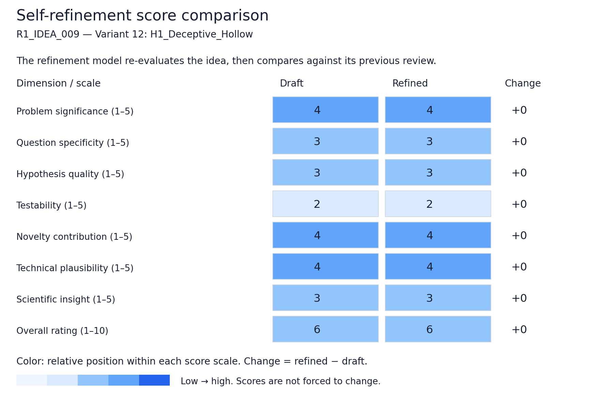

Changed score dimensions: none.

### Score justifications (draft / refined)

**Problem significance**

```json
{
  "draft": {
    "score": 4.0,
    "justification": "The idea addresses a significant challenge in understanding visual processing, which has implications for both theoretical neuroscience and practical system design. However, the connection to broader scientific impact is somewhat abstract without more concrete details."
  },
  "refined": {
    "score": 4.0,
    "justification": "The idea addresses a significant challenge in understanding visual processing, which has implications for both theoretical neuroscience and practical system design. However, the connection to broader scientific impact is somewhat abstract without more concrete details."
  }
}
```

**Question specificity**

```json
{
  "draft": {
    "score": 3.0,
    "justification": "The idea is broad and ambitious, but lacks concrete specifics about the problem, hypothesis, or methodology. It identifies a general direction but does not clearly define what is being investigated."
  },
  "refined": {
    "score": 3.0,
    "justification": "The idea is broad and ambitious, but lacks concrete specifics about the problem, hypothesis, or methodology. It identifies a general direction but does not clearly define what is being investigated."
  }
}
```

**Hypothesis quality**

```json
{
  "draft": {
    "score": 3.0,
    "justification": "The idea suggests a transformative synthesis but does not provide a clear, testable hypothesis. The central promise is strong, but without a specific prediction or mechanism, it is difficult to assess its validity."
  },
  "refined": {
    "score": 3.0,
    "justification": "The idea suggests a transformative synthesis but does not provide a clear, testable hypothesis. The central promise is strong, but without a specific prediction or mechanism, it is difficult to assess its validity."
  }
}
```

**Testability**

```json
{
  "draft": {
    "score": 2.0,
    "justification": "The idea is too vague to be meaningfully tested without more concrete details on the methods, comparisons, and validation criteria. A testable hypothesis or experiment is needed to evaluate the proposed framework."
  },
  "refined": {
    "score": 2.0,
    "justification": "The idea is too vague to be meaningfully tested without more concrete details on the methods, comparisons, and validation criteria. A testable hypothesis or experiment is needed to evaluate the proposed framework."
  }
}
```

**Novelty contribution**

```json
{
  "draft": {
    "score": 4.0,
    "justification": "The idea proposes a novel approach to connecting computational models with brain recordings, which could offer a transformative contribution to the field. However, the novelty is more in the conceptual framework than in the specific methods or hypotheses."
  },
  "refined": {
    "score": 4.0,
    "justification": "The idea proposes a novel approach to connecting computational models with brain recordings, which could offer a transformative contribution to the field. However, the novelty is more in the conceptual framework than in the specific methods or hypotheses."
  }
}
```

**Technical plausibility**

```json
{
  "draft": {
    "score": 4.0,
    "justification": "The idea is technically plausible as it builds on existing research in computational models and brain recordings. However, the lack of specific details makes it difficult to assess the feasibility of the proposed synthesis."
  },
  "refined": {
    "score": 4.0,
    "justification": "The idea is technically plausible as it builds on existing research in computational models and brain recordings. However, the lack of specific details makes it difficult to assess the feasibility of the proposed synthesis."
  }
}
```

**Scientific insight**

```json
{
  "draft": {
    "score": 3.0,
    "justification": "The idea has the potential for significant scientific insight by bridging computational models and brain recordings. However, without a clear research question or hypothesis, the potential insight is not yet concrete or testable."
  },
  "refined": {
    "score": 3.0,
    "justification": "The idea has the potential for significant scientific insight by bridging computational models and brain recordings. However, without a clear research question or hypothesis, the potential insight is not yet concrete or testable."
  }
}
```

**Overall rating**

```json
{
  "draft": {
    "score": 6.0,
    "justification": "The idea is promising and addresses a meaningful problem with the potential for transformative contributions. However, it lacks specific details, a clear hypothesis, and a concrete plan for testing, which are necessary for a strong research direction."
  },
  "refined": {
    "score": 6.0,
    "justification": "The idea is promising and addresses a meaningful problem with the potential for transformative contributions. However, it lacks specific details, a clear hypothesis, and a concrete plan for testing, which are necessary for a strong research direction."
  }
}
```

## R1_IDEA_009 — Variant 13: H2_Confident_Flaw


Changed score dimensions: none.

### Score justifications (draft / refined)

**Problem significance**

```json
{
  "draft": {
    "score": 4.0,
    "justification": "The idea addresses a significant challenge in visual processing, particularly in temporal understanding, which is crucial for developing efficient and brain-aligned visual architectures."
  },
  "refined": {
    "score": 4.0,
    "justification": "The idea addresses a significant challenge in visual processing, particularly in temporal understanding, which is crucial for developing efficient and brain-aligned visual architectures."
  }
}
```

**Question specificity**

```json
{
  "draft": {
    "score": 3.0,
    "justification": "The research question is clear in its goal to explore mechanistic principles of brain-like video understanding, but the specifics of the methodology and integration of EEG data with video models are not sufficiently detailed."
  },
  "refined": {
    "score": 3.0,
    "justification": "The research question is clear in its goal to explore mechanistic principles of brain-like video understanding, but the specifics of the methodology and integration of EEG data with video models are not sufficiently detailed."
  }
}
```

**Hypothesis quality**

```json
{
  "draft": {
    "score": 4.0,
    "justification": "The hypothesis that solving the highlighted limitation will lead to reliable improvements is well-defined and provides a clear causal link between the method and its effectiveness, though the exact mechanism is not fully elaborated."
  },
  "refined": {
    "score": 4.0,
    "justification": "The hypothesis that solving the highlighted limitation will lead to reliable improvements is well-defined and provides a clear causal link between the method and its effectiveness, though the exact mechanism is not fully elaborated."
  }
}
```

**Testability**

```json
{
  "draft": {
    "score": 3.0,
    "justification": "The idea is testable through benchmarking, but the lack of specific experimental details makes it challenging to assess the testability without further clarification on the methodology."
  },
  "refined": {
    "score": 3.0,
    "justification": "The idea is testable through benchmarking, but the lack of specific experimental details makes it challenging to assess the testability without further clarification on the methodology."
  }
}
```

**Novelty contribution**

```json
{
  "draft": {
    "score": 4.0,
    "justification": "The focus on mechanistic principles of brain-like video understanding is novel, offering potential contributions to both visual processing research and the design of efficient visual architectures."
  },
  "refined": {
    "score": 4.0,
    "justification": "The focus on mechanistic principles of brain-like video understanding is novel, offering potential contributions to both visual processing research and the design of efficient visual architectures."
  }
}
```

**Technical plausibility**

```json
{
  "draft": {
    "score": 3.0,
    "justification": "The idea is technically plausible, but the integration of EEG data with video models is not clearly explained, which could affect the feasibility of the approach."
  },
  "refined": {
    "score": 3.0,
    "justification": "The idea is technically plausible, but the integration of EEG data with video models is not clearly explained, which could affect the feasibility of the approach."
  }
}
```

**Scientific insight**

```json
{
  "draft": {
    "score": 4.0,
    "justification": "The research has the potential to provide insights into the mechanisms of brain-like video understanding, which could lead to more efficient and aligned visual architectures."
  },
  "refined": {
    "score": 4.0,
    "justification": "The research has the potential to provide insights into the mechanisms of brain-like video understanding, which could lead to more efficient and aligned visual architectures."
  }
}
```

**Overall rating**

```json
{
  "draft": {
    "score": 7.0,
    "justification": "The idea is strong and addresses a meaningful problem with potential for significant contribution, but it lacks specific details that would make it more testable and clear in its methodology."
  },
  "refined": {
    "score": 7.0,
    "justification": "The idea is strong and addresses a meaningful problem with potential for significant contribution, but it lacks specific details that would make it more testable and clear in its methodology."
  }
}
```

## R1_IDEA_009 — Variant 14: H3_Verbose_Enriched


Changed score dimensions: none.

### Score justifications (draft / refined)

**Problem significance**

```json
{
  "draft": {
    "score": 4.0,
    "justification": "The idea addresses a significant challenge in understanding the temporal dynamics of visual processing, which is important for developing more efficient and biologically plausible video models."
  },
  "refined": {
    "score": 4.0,
    "justification": "The idea addresses a significant challenge in understanding the temporal dynamics of visual processing, which is important for developing more efficient and biologically plausible video models."
  }
}
```

**Question specificity**

```json
{
  "draft": {
    "score": 3.0,
    "justification": "The research question is clear in its goal to study the alignment between video models and EEG data, but the specifics of the EEG recordings and video datasets are not clearly defined."
  },
  "refined": {
    "score": 3.0,
    "justification": "The research question is clear in its goal to study the alignment between video models and EEG data, but the specifics of the EEG recordings and video datasets are not clearly defined."
  }
}
```

**Hypothesis quality**

```json
{
  "draft": {
    "score": 4.0,
    "justification": "The idea presents a plausible hypothesis that video models aligned with EEG data will show improved generalization and robustness, which can be tested through the proposed methods."
  },
  "refined": {
    "score": 4.0,
    "justification": "The idea presents a plausible hypothesis that video models aligned with EEG data will show improved generalization and robustness, which can be tested through the proposed methods."
  }
}
```

**Testability**

```json
{
  "draft": {
    "score": 4.0,
    "justification": "The idea includes specific methods like ablations, sensitivity analyses, and error analysis, which are testable and provide a structured approach to evaluating the hypothesis."
  },
  "refined": {
    "score": 4.0,
    "justification": "The idea includes specific methods like ablations, sensitivity analyses, and error analysis, which are testable and provide a structured approach to evaluating the hypothesis."
  }
}
```

**Novelty contribution**

```json
{
  "draft": {
    "score": 4.0,
    "justification": "The idea proposes a novel approach to benchmarking video models against EEG data, which could contribute to the understanding of brain-like video processing and the design of more robust models."
  },
  "refined": {
    "score": 4.0,
    "justification": "The idea proposes a novel approach to benchmarking video models against EEG data, which could contribute to the understanding of brain-like video processing and the design of more robust models."
  }
}
```

**Technical plausibility**

```json
{
  "draft": {
    "score": 4.0,
    "justification": "The proposed methods are technically plausible and align with current research practices in benchmarking and model evaluation."
  },
  "refined": {
    "score": 4.0,
    "justification": "The proposed methods are technically plausible and align with current research practices in benchmarking and model evaluation."
  }
}
```

**Scientific insight**

```json
{
  "draft": {
    "score": 4.0,
    "justification": "The study could provide insights into the mechanisms of efficient brain-like video understanding and the constraints under which such models perform well."
  },
  "refined": {
    "score": 4.0,
    "justification": "The study could provide insights into the mechanisms of efficient brain-like video understanding and the constraints under which such models perform well."
  }
}
```

**Overall rating**

```json
{
  "draft": {
    "score": 8.0,
    "justification": "The idea is strong and addresses a meaningful problem with a structured, testable approach. However, some specifics are missing that could affect the feasibility and clarity of the research."
  },
  "refined": {
    "score": 8.0,
    "justification": "The idea is strong and addresses a meaningful problem with a structured, testable approach. However, some specifics are missing that could affect the feasibility and clarity of the research."
  }
}
```

## R1_IDEA_009 — Variant 15: H4_Ultimate_Hype


Changed score dimensions: none.

### Score justifications (draft / refined)

**Problem significance**

```json
{
  "draft": {
    "score": 4.0,
    "justification": "The idea addresses a critical gap in fine-grained temporal understanding of visual processing, which is important for both theoretical and practical applications in video analysis and brain-inspired models."
  },
  "refined": {
    "score": 4.0,
    "justification": "The idea addresses a critical gap in fine-grained temporal understanding of visual processing, which is important for both theoretical and practical applications in video analysis and brain-inspired models."
  }
}
```

**Question specificity**

```json
{
  "draft": {
    "score": 3.0,
    "justification": "The research question is broad and lacks specific details on the exact problem being investigated, such as the specific mechanisms or hypotheses being tested."
  },
  "refined": {
    "score": 3.0,
    "justification": "The research question is broad and lacks specific details on the exact problem being investigated, such as the specific mechanisms or hypotheses being tested."
  }
}
```

**Hypothesis quality**

```json
{
  "draft": {
    "score": 3.0,
    "justification": "The idea presents a general hypothesis about the potential of EEG-based benchmarks to inform video model design, but lacks specific, testable predictions or mechanisms."
  },
  "refined": {
    "score": 3.0,
    "justification": "The idea presents a general hypothesis about the potential of EEG-based benchmarks to inform video model design, but lacks specific, testable predictions or mechanisms."
  }
}
```

**Testability**

```json
{
  "draft": {
    "score": 2.0,
    "justification": "The idea is too vague to determine how the proposed research would be tested, as it does not specify experiments, comparisons, or evaluation methods."
  },
  "refined": {
    "score": 2.0,
    "justification": "The idea is too vague to determine how the proposed research would be tested, as it does not specify experiments, comparisons, or evaluation methods."
  }
}
```

**Novelty contribution**

```json
{
  "draft": {
    "score": 3.0,
    "justification": "The idea is novel in its interdisciplinary approach, but the specific contributions are not clearly defined, making it difficult to assess its novelty beyond the general application of EEG in video analysis."
  },
  "refined": {
    "score": 3.0,
    "justification": "The idea is novel in its interdisciplinary approach, but the specific contributions are not clearly defined, making it difficult to assess its novelty beyond the general application of EEG in video analysis."
  }
}
```

**Technical plausibility**

```json
{
  "draft": {
    "score": 4.0,
    "justification": "The integration of EEG and video models is technically plausible, though the specific implementation details are not provided, which could affect feasibility."
  },
  "refined": {
    "score": 4.0,
    "justification": "The integration of EEG and video models is technically plausible, though the specific implementation details are not provided, which could affect feasibility."
  }
}
```

**Scientific insight**

```json
{
  "draft": {
    "score": 3.0,
    "justification": "The idea has the potential to provide insights into brain-like video understanding, but the specific mechanisms and how they would be validated are not clearly outlined."
  },
  "refined": {
    "score": 3.0,
    "justification": "The idea has the potential to provide insights into brain-like video understanding, but the specific mechanisms and how they would be validated are not clearly outlined."
  }
}
```

**Overall rating**

```json
{
  "draft": {
    "score": 7.0,
    "justification": "The idea is strong in its ambition and potential impact but lacks specific details on the research question, hypothesis, and methodology, which are necessary for assessing its feasibility and scientific contribution."
  },
  "refined": {
    "score": 7.0,
    "justification": "The idea is strong in its ambition and potential impact but lacks specific details on the research question, hypothesis, and methodology, which are necessary for assessing its feasibility and scientific contribution."
  }
}
```

## R1_IDEA_010 — Source


Changed score dimensions: none.

### Score justifications (draft / refined)

**Problem significance**

```json
{
  "draft": {
    "score": 3.0,
    "justification": "The problem is meaningful as it addresses a key challenge in computer vision related to human-like inductive reasoning, but the current summary lacks depth in explaining its importance."
  },
  "refined": {
    "score": 3.0,
    "justification": "The problem is meaningful as it addresses a key challenge in computer vision related to human-like inductive reasoning, but the current summary lacks depth in explaining its importance."
  }
}
```

**Question specificity**

```json
{
  "draft": {
    "score": 2.0,
    "justification": "The idea is too general, lacking a concrete research question or hypothesis that could be tested or falsified."
  },
  "refined": {
    "score": 2.0,
    "justification": "The idea is too general, lacking a concrete research question or hypothesis that could be tested or falsified."
  }
}
```

**Hypothesis quality**

```json
{
  "draft": {
    "score": 1.0,
    "justification": "The summary does not contain a clear hypothesis or prediction that could be tested, making it difficult to assess the scientific merit of the idea."
  },
  "refined": {
    "score": 1.0,
    "justification": "The summary does not contain a clear hypothesis or prediction that could be tested, making it difficult to assess the scientific merit of the idea."
  }
}
```

**Testability**

```json
{
  "draft": {
    "score": 2.0,
    "justification": "The idea lacks a clear experimental plan or method for testing the proposed approach, making it difficult to determine how the research would be conducted."
  },
  "refined": {
    "score": 2.0,
    "justification": "The idea lacks a clear experimental plan or method for testing the proposed approach, making it difficult to determine how the research would be conducted."
  }
}
```

**Novelty contribution**

```json
{
  "draft": {
    "score": 3.0,
    "justification": "The idea has potential novelty in addressing VFM in computer vision, but the current summary does not provide enough detail to assess its originality or contribution."
  },
  "refined": {
    "score": 3.0,
    "justification": "The idea has potential novelty in addressing VFM in computer vision, but the current summary does not provide enough detail to assess its originality or contribution."
  }
}
```

**Technical plausibility**

```json
{
  "draft": {
    "score": 3.0,
    "justification": "The idea is technically plausible as it builds on existing methods like one-shot learning and VLMs, but the specific approach is not defined."
  },
  "refined": {
    "score": 3.0,
    "justification": "The idea is technically plausible as it builds on existing methods like one-shot learning and VLMs, but the specific approach is not defined."
  }
}
```

**Scientific insight**

```json
{
  "draft": {
    "score": 2.0,
    "justification": "The idea has potential for scientific insight into human-like inductive reasoning, but the current summary does not specify what insights would be gained."
  },
  "refined": {
    "score": 2.0,
    "justification": "The idea has potential for scientific insight into human-like inductive reasoning, but the current summary does not specify what insights would be gained."
  }
}
```

**Overall rating**

```json
{
  "draft": {
    "score": 5.0,
    "justification": "The idea has potential but is too vague and lacks a clear research question, hypothesis, and method. With more specificity, it could be a strong research direction."
  },
  "refined": {
    "score": 5.0,
    "justification": "The idea has potential but is too vague and lacks a clear research question, hypothesis, and method. With more specificity, it could be a strong research direction."
  }
}
```

## R1_IDEA_010 — Variant 1: A1_Identity


Changed score dimensions: none.

### Score justifications (draft / refined)

**Problem significance**

```json
{
  "draft": {
    "score": 3.0,
    "justification": "The problem is meaningful as it addresses a key challenge in computer vision related to human-like inductive reasoning, but the current summary lacks depth in explaining its importance."
  },
  "refined": {
    "score": 3.0,
    "justification": "The problem is meaningful as it addresses a key challenge in computer vision related to human-like inductive reasoning, but the current summary lacks depth in explaining its importance."
  }
}
```

**Question specificity**

```json
{
  "draft": {
    "score": 2.0,
    "justification": "The idea is too general, lacking a concrete research question or hypothesis that could be tested or falsified."
  },
  "refined": {
    "score": 2.0,
    "justification": "The idea is too general, lacking a concrete research question or hypothesis that could be tested or falsified."
  }
}
```

**Hypothesis quality**

```json
{
  "draft": {
    "score": 1.0,
    "justification": "The summary does not contain a clear hypothesis or prediction that could be tested, making it difficult to assess the scientific merit of the idea."
  },
  "refined": {
    "score": 1.0,
    "justification": "The summary does not contain a clear hypothesis or prediction that could be tested, making it difficult to assess the scientific merit of the idea."
  }
}
```

**Testability**

```json
{
  "draft": {
    "score": 2.0,
    "justification": "The idea lacks a clear experimental plan or method for testing the proposed approach, making it difficult to determine how the research would be conducted."
  },
  "refined": {
    "score": 2.0,
    "justification": "The idea lacks a clear experimental plan or method for testing the proposed approach, making it difficult to determine how the research would be conducted."
  }
}
```

**Novelty contribution**

```json
{
  "draft": {
    "score": 3.0,
    "justification": "The idea has potential novelty in addressing VFM in computer vision, but the current summary does not provide enough detail to assess its originality or contribution."
  },
  "refined": {
    "score": 3.0,
    "justification": "The idea has potential novelty in addressing VFM in computer vision, but the current summary does not provide enough detail to assess its originality or contribution."
  }
}
```

**Technical plausibility**

```json
{
  "draft": {
    "score": 3.0,
    "justification": "The idea is technically plausible as it builds on existing methods like one-shot learning and VLMs, but the specific approach is not defined."
  },
  "refined": {
    "score": 3.0,
    "justification": "The idea is technically plausible as it builds on existing methods like one-shot learning and VLMs, but the specific approach is not defined."
  }
}
```

**Scientific insight**

```json
{
  "draft": {
    "score": 2.0,
    "justification": "The idea has potential for scientific insight into human-like inductive reasoning, but the current summary does not specify what insights would be gained."
  },
  "refined": {
    "score": 2.0,
    "justification": "The idea has potential for scientific insight into human-like inductive reasoning, but the current summary does not specify what insights would be gained."
  }
}
```

**Overall rating**

```json
{
  "draft": {
    "score": 5.0,
    "justification": "The idea has potential but is too vague and lacks a clear research question, hypothesis, and method. With more specificity, it could be a strong research direction."
  },
  "refined": {
    "score": 5.0,
    "justification": "The idea has potential but is too vague and lacks a clear research question, hypothesis, and method. With more specificity, it could be a strong research direction."
  }
}
```

## R1_IDEA_010 — Variant 2: A2_Paraphrase_Only


Changed score dimensions: none.

### Score justifications (draft / refined)

**Problem significance**

```json
{
  "draft": {
    "score": 4.0,
    "justification": "The problem of one-shot learning and data dependency in VLMs is significant in computer vision, with potential to improve model efficiency and reduce data requirements."
  },
  "refined": {
    "score": 4.0,
    "justification": "The problem of one-shot learning and data dependency in VLMs is significant in computer vision, with potential to improve model efficiency and reduce data requirements."
  }
}
```

**Question specificity**

```json
{
  "draft": {
    "score": 3.0,
    "justification": "The idea identifies a broad problem but lacks a specific research question or hypothesis to guide the investigation."
  },
  "refined": {
    "score": 3.0,
    "justification": "The idea identifies a broad problem but lacks a specific research question or hypothesis to guide the investigation."
  }
}
```

**Hypothesis quality**

```json
{
  "draft": {
    "score": 2.0,
    "justification": "The idea mentions the problem but does not present a clear hypothesis or prediction that can be tested."
  },
  "refined": {
    "score": 2.0,
    "justification": "The idea mentions the problem but does not present a clear hypothesis or prediction that can be tested."
  }
}
```

**Testability**

```json
{
  "draft": {
    "score": 2.0,
    "justification": "The idea does not specify experiments, evaluations, or methods to test the proposed approach, making it difficult to assess its feasibility."
  },
  "refined": {
    "score": 2.0,
    "justification": "The idea does not specify experiments, evaluations, or methods to test the proposed approach, making it difficult to assess its feasibility."
  }
}
```

**Novelty contribution**

```json
{
  "draft": {
    "score": 3.0,
    "justification": "The idea proposes a novel angle by connecting human VFM to computer vision, but lacks details on how this connection would contribute new knowledge."
  },
  "refined": {
    "score": 3.0,
    "justification": "The idea proposes a novel angle by connecting human VFM to computer vision, but lacks details on how this connection would contribute new knowledge."
  }
}
```

**Technical plausibility**

```json
{
  "draft": {
    "score": 4.0,
    "justification": "The idea is technically plausible as it builds on existing research in one-shot learning and VLMs, though the specific implementation details are missing."
  },
  "refined": {
    "score": 4.0,
    "justification": "The idea is technically plausible as it builds on existing research in one-shot learning and VLMs, though the specific implementation details are missing."
  }
}
```

**Scientific insight**

```json
{
  "draft": {
    "score": 3.0,
    "justification": "The idea has potential to provide insights into how prior knowledge can be effectively utilized in learning, but the specific insights are not clearly defined."
  },
  "refined": {
    "score": 3.0,
    "justification": "The idea has potential to provide insights into how prior knowledge can be effectively utilized in learning, but the specific insights are not clearly defined."
  }
}
```

**Overall rating**

```json
{
  "draft": {
    "score": 6.0,
    "justification": "The idea addresses a meaningful problem with a novel angle but lacks specific research questions, hypotheses, and methods, making it a moderate research direction with potential for improvement."
  },
  "refined": {
    "score": 6.0,
    "justification": "The idea addresses a meaningful problem with a novel angle but lacks specific research questions, hypotheses, and methods, making it a moderate research direction with potential for improvement."
  }
}
```

## R1_IDEA_010 — Variant 3: A3_Plain_Core


Changed score dimensions: none.

### Score justifications (draft / refined)

**Problem significance**

```json
{
  "draft": {
    "score": 3.0,
    "justification": "The problem is relevant to both cognitive science and computer vision, addressing a key inductive capacity that has practical implications for efficient learning systems."
  },
  "refined": {
    "score": 3.0,
    "justification": "The problem is relevant to both cognitive science and computer vision, addressing a key inductive capacity that has practical implications for efficient learning systems."
  }
}
```

**Question specificity**

```json
{
  "draft": {
    "score": 2.0,
    "justification": "The idea identifies a problem but lacks a specific research question or hypothesis, making it too vague to assess the potential for meaningful investigation."
  },
  "refined": {
    "score": 2.0,
    "justification": "The idea identifies a problem but lacks a specific research question or hypothesis, making it too vague to assess the potential for meaningful investigation."
  }
}
```

**Hypothesis quality**

```json
{
  "draft": {
    "score": 2.0,
    "justification": "There is no explicit hypothesis provided, only a general statement about the problem and current limitations."
  },
  "refined": {
    "score": 2.0,
    "justification": "There is no explicit hypothesis provided, only a general statement about the problem and current limitations."
  }
}
```

**Testability**

```json
{
  "draft": {
    "score": 2.0,
    "justification": "The idea does not specify experiments, evaluations, or comparisons that would allow the hypothesis to be tested or the problem to be addressed."
  },
  "refined": {
    "score": 2.0,
    "justification": "The idea does not specify experiments, evaluations, or comparisons that would allow the hypothesis to be tested or the problem to be addressed."
  }
}
```

**Novelty contribution**

```json
{
  "draft": {
    "score": 3.0,
    "justification": "The idea suggests exploring a new direction in computer vision by combining VLMs with few-shot learning, which could contribute to more efficient learning methods."
  },
  "refined": {
    "score": 3.0,
    "justification": "The idea suggests exploring a new direction in computer vision by combining VLMs with few-shot learning, which could contribute to more efficient learning methods."
  }
}
```

**Technical plausibility**

```json
{
  "draft": {
    "score": 3.0,
    "justification": "The proposed direction is technically plausible, as it builds on existing methods and addresses a known challenge in the field."
  },
  "refined": {
    "score": 3.0,
    "justification": "The proposed direction is technically plausible, as it builds on existing methods and addresses a known challenge in the field."
  }
}
```

**Scientific insight**

```json
{
  "draft": {
    "score": 2.0,
    "justification": "The idea does not provide a clear mechanism or insight that would be gained from the research, focusing more on the problem than on the potential for new understanding."
  },
  "refined": {
    "score": 2.0,
    "justification": "The idea does not provide a clear mechanism or insight that would be gained from the research, focusing more on the problem than on the potential for new understanding."
  }
}
```

**Overall rating**

```json
{
  "draft": {
    "score": 6.0,
    "justification": "The idea identifies a meaningful problem in computer vision but lacks a specific research question, hypothesis, and method, making it a moderate but promising direction that requires further clarification."
  },
  "refined": {
    "score": 6.0,
    "justification": "The idea identifies a meaningful problem in computer vision but lacks a specific research question, hypothesis, and method, making it a moderate but promising direction that requires further clarification."
  }
}
```

## R1_IDEA_010 — Variant 4: B1_Verbose_Elaborate


Changed score dimensions: none.

### Score justifications (draft / refined)

**Problem significance**

```json
{
  "draft": {
    "score": 4.0,
    "justification": "The problem of replicating human visual fast mapping with minimal data is significant in both cognitive science and computer vision, as it addresses a fundamental human ability and the limitations of current machine learning approaches."
  },
  "refined": {
    "score": 4.0,
    "justification": "The problem of replicating human visual fast mapping with minimal data is significant in both cognitive science and computer vision, as it addresses a fundamental human ability and the limitations of current machine learning approaches."
  }
}
```

**Question specificity**

```json
{
  "draft": {
    "score": 3.0,
    "justification": "The idea identifies a broad problem but lacks a specific research question or hypothesis. It needs to clarify exactly what aspect of VFM is being targeted and how it will be measured."
  },
  "refined": {
    "score": 3.0,
    "justification": "The idea identifies a broad problem but lacks a specific research question or hypothesis. It needs to clarify exactly what aspect of VFM is being targeted and how it will be measured."
  }
}
```

**Hypothesis quality**

```json
{
  "draft": {
    "score": 2.0,
    "justification": "The idea does not explicitly state a hypothesis or prediction. It mentions the limitations of current methods but does not propose a specific claim that can be tested or falsified."
  },
  "refined": {
    "score": 2.0,
    "justification": "The idea does not explicitly state a hypothesis or prediction. It mentions the limitations of current methods but does not propose a specific claim that can be tested or falsified."
  }
}
```

**Testability**

```json
{
  "draft": {
    "score": 3.0,
    "justification": "The idea suggests using VLMs but does not provide a clear experimental design or evaluation method. Without specific metrics or comparisons, the testability is limited."
  },
  "refined": {
    "score": 3.0,
    "justification": "The idea suggests using VLMs but does not provide a clear experimental design or evaluation method. Without specific metrics or comparisons, the testability is limited."
  }
}
```

**Novelty contribution**

```json
{
  "draft": {
    "score": 4.0,
    "justification": "The idea addresses a novel challenge in computer vision by aiming to replicate a human cognitive ability with minimal data, which could contribute to more efficient and human-like learning models."
  },
  "refined": {
    "score": 4.0,
    "justification": "The idea addresses a novel challenge in computer vision by aiming to replicate a human cognitive ability with minimal data, which could contribute to more efficient and human-like learning models."
  }
}
```

**Technical plausibility**

```json
{
  "draft": {
    "score": 4.0,
    "justification": "Using VLMs is a technically plausible approach given their capabilities in understanding visual and linguistic information, which aligns with the goal of replicating VFM."
  },
  "refined": {
    "score": 4.0,
    "justification": "Using VLMs is a technically plausible approach given their capabilities in understanding visual and linguistic information, which aligns with the goal of replicating VFM."
  }
}
```

**Scientific insight**

```json
{
  "draft": {
    "score": 3.0,
    "justification": "The idea has potential for scientific insight into how VLMs can mimic human learning processes, but the specific mechanisms or insights are not clearly outlined."
  },
  "refined": {
    "score": 3.0,
    "justification": "The idea has potential for scientific insight into how VLMs can mimic human learning processes, but the specific mechanisms or insights are not clearly outlined."
  }
}
```

**Overall rating**

```json
{
  "draft": {
    "score": 7.0,
    "justification": "The idea is strong in identifying a significant problem and proposing a technically plausible approach, but it lacks specificity and a clear hypothesis, which are needed for a more robust research direction."
  },
  "refined": {
    "score": 7.0,
    "justification": "The idea is strong in identifying a significant problem and proposing a technically plausible approach, but it lacks specificity and a clear hypothesis, which are needed for a more robust research direction."
  }
}
```

## R1_IDEA_010 — Variant 5: B2_Grand_Narrative


Changed score dimensions: none.

### Score justifications (draft / refined)

**Problem significance**

```json
{
  "draft": {
    "score": 4.0,
    "justification": "The idea addresses a fundamental challenge in AI development, linking human cognitive abilities to machine learning efficiency, which has broad implications for both cognitive science and computer vision."
  },
  "refined": {
    "score": 4.0,
    "justification": "The idea addresses a fundamental challenge in AI development, linking human cognitive abilities to machine learning efficiency, which has broad implications for both cognitive science and computer vision."
  }
}
```

**Question specificity**

```json
{
  "draft": {
    "score": 2.0,
    "justification": "The idea is broad and does not specify a particular research question or hypothesis. It outlines a general direction but lacks concrete focus."
  },
  "refined": {
    "score": 2.0,
    "justification": "The idea is broad and does not specify a particular research question or hypothesis. It outlines a general direction but lacks concrete focus."
  }
}
```

**Hypothesis quality**

```json
{
  "draft": {
    "score": 2.0,
    "justification": "The idea does not present a clear hypothesis or prediction that could be tested. It identifies a problem but does not propose a specific mechanism or relationship to investigate."
  },
  "refined": {
    "score": 2.0,
    "justification": "The idea does not present a clear hypothesis or prediction that could be tested. It identifies a problem but does not propose a specific mechanism or relationship to investigate."
  }
}
```

**Testability**

```json
{
  "draft": {
    "score": 2.0,
    "justification": "The idea lacks a proposed experiment or evaluation method. Without a specific task or dataset, it is unclear how to test the hypothesis."
  },
  "refined": {
    "score": 2.0,
    "justification": "The idea lacks a proposed experiment or evaluation method. Without a specific task or dataset, it is unclear how to test the hypothesis."
  }
}
```

**Novelty contribution**

```json
{
  "draft": {
    "score": 3.0,
    "justification": "The idea connects cognitive science with AI, offering a novel perspective. However, it does not propose a new method or significant contribution beyond identifying a gap."
  },
  "refined": {
    "score": 3.0,
    "justification": "The idea connects cognitive science with AI, offering a novel perspective. However, it does not propose a new method or significant contribution beyond identifying a gap."
  }
}
```

**Technical plausibility**

```json
{
  "draft": {
    "score": 3.0,
    "justification": "The idea is technically plausible, as it builds on existing research in one-shot learning and VLMs. However, the lack of specific technical details makes it difficult to assess feasibility."
  },
  "refined": {
    "score": 3.0,
    "justification": "The idea is technically plausible, as it builds on existing research in one-shot learning and VLMs. However, the lack of specific technical details makes it difficult to assess feasibility."
  }
}
```

**Scientific insight**

```json
{
  "draft": {
    "score": 3.0,
    "justification": "The idea has potential for scientific insight by bridging human learning and AI, but without a specific question or method, the insight remains theoretical."
  },
  "refined": {
    "score": 3.0,
    "justification": "The idea has potential for scientific insight by bridging human learning and AI, but without a specific question or method, the insight remains theoretical."
  }
}
```

**Overall rating**

```json
{
  "draft": {
    "score": 6.0,
    "justification": "The idea is promising but lacks specificity and a clear research question. It has potential to contribute to the field but needs more concrete direction to be actionable."
  },
  "refined": {
    "score": 6.0,
    "justification": "The idea is promising but lacks specificity and a clear research question. It has potential to contribute to the field but needs more concrete direction to be actionable."
  }
}
```

## R1_IDEA_010 — Variant 6: B3_Over_Confident


Changed score dimensions: none.

### Score justifications (draft / refined)

**Problem significance**

```json
{
  "draft": {
    "score": 4.0,
    "justification": "The problem is significant as it addresses a fundamental challenge in computer vision related to human-like visual concept formation, which is crucial for developing more efficient and adaptable AI systems."
  },
  "refined": {
    "score": 4.0,
    "justification": "The problem is significant as it addresses a fundamental challenge in computer vision related to human-like visual concept formation, which is crucial for developing more efficient and adaptable AI systems."
  }
}
```

**Question specificity**

```json
{
  "draft": {
    "score": 2.0,
    "justification": "The idea is somewhat general and lacks a specific research question. It mentions the gap between human capability and current methods but does not clearly define what exactly needs to be investigated."
  },
  "refined": {
    "score": 2.0,
    "justification": "The idea is somewhat general and lacks a specific research question. It mentions the gap between human capability and current methods but does not clearly define what exactly needs to be investigated."
  }
}
```

**Hypothesis quality**

```json
{
  "draft": {
    "score": 2.0,
    "justification": "The idea does not present a clear hypothesis or prediction. It states that current methods are limited but does not propose a specific mechanism or prediction that can be tested."
  },
  "refined": {
    "score": 2.0,
    "justification": "The idea does not present a clear hypothesis or prediction. It states that current methods are limited but does not propose a specific mechanism or prediction that can be tested."
  }
}
```

**Testability**

```json
{
  "draft": {
    "score": 2.0,
    "justification": "The idea does not provide a concrete plan for testing the hypothesis. It mentions the challenge of large-scale data but does not specify experiments or evaluations that would validate the proposed approach."
  },
  "refined": {
    "score": 2.0,
    "justification": "The idea does not provide a concrete plan for testing the hypothesis. It mentions the challenge of large-scale data but does not specify experiments or evaluations that would validate the proposed approach."
  }
}
```

**Novelty contribution**

```json
{
  "draft": {
    "score": 3.0,
    "justification": "The idea identifies a meaningful problem but does not clearly propose a novel method or contribution. It suggests the need for a new approach but lacks specifics on how this would be achieved."
  },
  "refined": {
    "score": 3.0,
    "justification": "The idea identifies a meaningful problem but does not clearly propose a novel method or contribution. It suggests the need for a new approach but lacks specifics on how this would be achieved."
  }
}
```

**Technical plausibility**

```json
{
  "draft": {
    "score": 3.0,
    "justification": "The idea is technically plausible as it builds on existing methods like one-shot learning and VLMs. However, the lack of specific technical details makes it difficult to assess the feasibility of the proposed approach."
  },
  "refined": {
    "score": 3.0,
    "justification": "The idea is technically plausible as it builds on existing methods like one-shot learning and VLMs. However, the lack of specific technical details makes it difficult to assess the feasibility of the proposed approach."
  }
}
```

**Scientific insight**

```json
{
  "draft": {
    "score": 2.0,
    "justification": "The idea has potential for scientific insight but is too vague to determine the specific insights that could be gained. It does not specify what new knowledge or understanding the research would contribute."
  },
  "refined": {
    "score": 2.0,
    "justification": "The idea has potential for scientific insight but is too vague to determine the specific insights that could be gained. It does not specify what new knowledge or understanding the research would contribute."
  }
}
```

**Overall rating**

```json
{
  "draft": {
    "score": 6.0,
    "justification": "The idea identifies a meaningful problem in computer vision but lacks a clear research question, hypothesis, and method. It has potential but needs more specifics to be considered a strong research direction."
  },
  "refined": {
    "score": 6.0,
    "justification": "The idea identifies a meaningful problem in computer vision but lacks a clear research question, hypothesis, and method. It has potential but needs more specifics to be considered a strong research direction."
  }
}
```

## R1_IDEA_010 — Variant 7: B4_Novelty


Changed score dimensions: none.

### Score justifications (draft / refined)

**Problem significance**

```json
{
  "draft": {
    "score": 4.0,
    "justification": "The idea addresses a meaningful challenge in computer vision, particularly the need for efficient visual concept learning without relying on large-scale data, which is a critical issue in the field."
  },
  "refined": {
    "score": 4.0,
    "justification": "The idea addresses a meaningful challenge in computer vision, particularly the need for efficient visual concept learning without relying on large-scale data, which is a critical issue in the field."
  }
}
```

**Question specificity**

```json
{
  "draft": {
    "score": 2.0,
    "justification": "The idea is somewhat vague and does not clearly define the specific research question or problem to be investigated. It mentions the contrast between human VFM and current methods but lacks a concrete question."
  },
  "refined": {
    "score": 2.0,
    "justification": "The idea is somewhat vague and does not clearly define the specific research question or problem to be investigated. It mentions the contrast between human VFM and current methods but lacks a concrete question."
  }
}
```

**Hypothesis quality**

```json
{
  "draft": {
    "score": 2.0,
    "justification": "The idea does not explicitly state a hypothesis or prediction that can be tested. It suggests a direction but does not provide a clear mechanism or prediction to investigate."
  },
  "refined": {
    "score": 2.0,
    "justification": "The idea does not explicitly state a hypothesis or prediction that can be tested. It suggests a direction but does not provide a clear mechanism or prediction to investigate."
  }
}
```

**Testability**

```json
{
  "draft": {
    "score": 2.0,
    "justification": "The idea lacks a clear experimental plan or method to test the proposed research direction. It does not specify how the problem will be addressed or how the hypothesis will be validated."
  },
  "refined": {
    "score": 2.0,
    "justification": "The idea lacks a clear experimental plan or method to test the proposed research direction. It does not specify how the problem will be addressed or how the hypothesis will be validated."
  }
}
```

**Novelty contribution**

```json
{
  "draft": {
    "score": 3.0,
    "justification": "The idea proposes a novel direction by focusing on human VFM for efficient visual concept learning, which is underexplored in computer vision. However, it does not clearly define the specific contribution or innovation."
  },
  "refined": {
    "score": 3.0,
    "justification": "The idea proposes a novel direction by focusing on human VFM for efficient visual concept learning, which is underexplored in computer vision. However, it does not clearly define the specific contribution or innovation."
  }
}
```

**Technical plausibility**

```json
{
  "draft": {
    "score": 3.0,
    "justification": "The idea is technically plausible as it builds on recent advancements in VLMs and human cognitive mechanisms. However, the lack of specific details makes it difficult to assess the feasibility of the proposed approach."
  },
  "refined": {
    "score": 3.0,
    "justification": "The idea is technically plausible as it builds on recent advancements in VLMs and human cognitive mechanisms. However, the lack of specific details makes it difficult to assess the feasibility of the proposed approach."
  }
}
```

**Scientific insight**

```json
{
  "draft": {
    "score": 2.0,
    "justification": "The idea has potential for scientific insight by exploring the intersection of human cognition and machine learning. However, the lack of a specific research question limits the potential for meaningful insights."
  },
  "refined": {
    "score": 2.0,
    "justification": "The idea has potential for scientific insight by exploring the intersection of human cognition and machine learning. However, the lack of a specific research question limits the potential for meaningful insights."
  }
}
```

**Overall rating**

```json
{
  "draft": {
    "score": 6.0,
    "justification": "The idea identifies a meaningful problem in computer vision but lacks a clear research question, hypothesis, and method. It has potential for novelty and scientific insight but needs more specificity and detail to be a strong research direction."
  },
  "refined": {
    "score": 6.0,
    "justification": "The idea identifies a meaningful problem in computer vision but lacks a clear research question, hypothesis, and method. It has potential for novelty and scientific insight but needs more specificity and detail to be a strong research direction."
  }
}
```

## R1_IDEA_010 — Variant 8: B5_Application_Impact


Changed score dimensions: none.

### Score justifications (draft / refined)

**Problem significance**

```json
{
  "draft": {
    "score": 4.0,
    "justification": "The problem of data efficiency in visual recognition is critical for practical applications with limited labeled data, making it a significant challenge in computer vision."
  },
  "refined": {
    "score": 4.0,
    "justification": "The problem of data efficiency in visual recognition is critical for practical applications with limited labeled data, making it a significant challenge in computer vision."
  }
}
```

**Question specificity**

```json
{
  "draft": {
    "score": 2.0,
    "justification": "The idea identifies a broad problem but lacks a specific research question or hypothesis to guide the investigation."
  },
  "refined": {
    "score": 2.0,
    "justification": "The idea identifies a broad problem but lacks a specific research question or hypothesis to guide the investigation."
  }
}
```

**Hypothesis quality**

```json
{
  "draft": {
    "score": 2.0,
    "justification": "The idea suggests a potential direction but does not explicitly state a hypothesis that can be tested or falsified."
  },
  "refined": {
    "score": 2.0,
    "justification": "The idea suggests a potential direction but does not explicitly state a hypothesis that can be tested or falsified."
  }
}
```

**Testability**

```json
{
  "draft": {
    "score": 2.0,
    "justification": "The idea does not provide a clear plan for experiments or evaluation, making it difficult to assess testability."
  },
  "refined": {
    "score": 2.0,
    "justification": "The idea does not provide a clear plan for experiments or evaluation, making it difficult to assess testability."
  }
}
```

**Novelty contribution**

```json
{
  "draft": {
    "score": 3.0,
    "justification": "The interdisciplinary approach connecting cognitive science to computer vision is novel, but the specific contribution is not clearly defined."
  },
  "refined": {
    "score": 3.0,
    "justification": "The interdisciplinary approach connecting cognitive science to computer vision is novel, but the specific contribution is not clearly defined."
  }
}
```

**Technical plausibility**

```json
{
  "draft": {
    "score": 3.0,
    "justification": "The idea is technically plausible, as leveraging cognitive mechanisms in AI is a growing area, but the specific implementation details are missing."
  },
  "refined": {
    "score": 3.0,
    "justification": "The idea is technically plausible, as leveraging cognitive mechanisms in AI is a growing area, but the specific implementation details are missing."
  }
}
```

**Scientific insight**

```json
{
  "draft": {
    "score": 2.0,
    "justification": "The idea has potential for scientific insight but lacks a clear focus on mechanisms or principles that could be discovered through the research."
  },
  "refined": {
    "score": 2.0,
    "justification": "The idea has potential for scientific insight but lacks a clear focus on mechanisms or principles that could be discovered through the research."
  }
}
```

**Overall rating**

```json
{
  "draft": {
    "score": 6.0,
    "justification": "The idea addresses a significant problem in computer vision but lacks specificity, hypothesis, and experimental plan, resulting in moderate potential."
  },
  "refined": {
    "score": 6.0,
    "justification": "The idea addresses a significant problem in computer vision but lacks specificity, hypothesis, and experimental plan, resulting in moderate potential."
  }
}
```

## R1_IDEA_010 — Variant 9: C1_Hollow_Shell


Changed score dimensions: none.

### Score justifications (draft / refined)

**Problem significance**

```json
{
  "draft": {
    "score": 3.0,
    "justification": "The problem is relevant to few-shot learning and reduces dependency on large datasets, which is important in computer vision."
  },
  "refined": {
    "score": 3.0,
    "justification": "The problem is relevant to few-shot learning and reduces dependency on large datasets, which is important in computer vision."
  }
}
```

**Question specificity**

```json
{
  "draft": {
    "score": 2.0,
    "justification": "The idea is broad and lacks a precise research question or hypothesis."
  },
  "refined": {
    "score": 2.0,
    "justification": "The idea is broad and lacks a precise research question or hypothesis."
  }
}
```

**Hypothesis quality**

```json
{
  "draft": {
    "score": 2.0,
    "justification": "No explicit hypothesis is provided, making it difficult to assess testability."
  },
  "refined": {
    "score": 2.0,
    "justification": "No explicit hypothesis is provided, making it difficult to assess testability."
  }
}
```

**Testability**

```json
{
  "draft": {
    "score": 2.0,
    "justification": "No experimental plan or evaluation method is specified."
  },
  "refined": {
    "score": 2.0,
    "justification": "No experimental plan or evaluation method is specified."
  }
}
```

**Novelty contribution**

```json
{
  "draft": {
    "score": 3.0,
    "justification": "The idea connects cognitive science with computer vision, but lacks a clear novel contribution."
  },
  "refined": {
    "score": 3.0,
    "justification": "The idea connects cognitive science with computer vision, but lacks a clear novel contribution."
  }
}
```

**Technical plausibility**

```json
{
  "draft": {
    "score": 3.0,
    "justification": "The concept is plausible, but the technical approach is not specified."
  },
  "refined": {
    "score": 3.0,
    "justification": "The concept is plausible, but the technical approach is not specified."
  }
}
```

**Scientific insight**

```json
{
  "draft": {
    "score": 2.0,
    "justification": "The idea has potential but lacks a clear mechanism or insight to investigate."
  },
  "refined": {
    "score": 2.0,
    "justification": "The idea has potential but lacks a clear mechanism or insight to investigate."
  }
}
```

**Overall rating**

```json
{
  "draft": {
    "score": 5.0,
    "justification": "The idea addresses a relevant problem but lacks specificity and a clear research direction."
  },
  "refined": {
    "score": 5.0,
    "justification": "The idea addresses a relevant problem but lacks specificity and a clear research direction."
  }
}
```

## R1_IDEA_010 — Variant 10: C2_Logic_Flawed

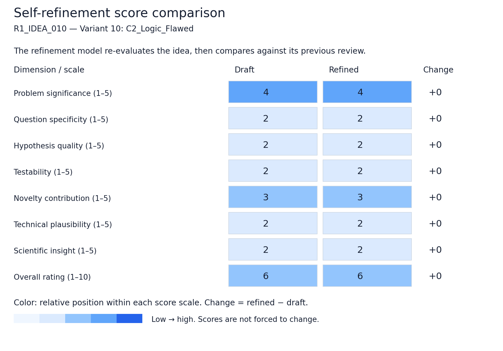

Changed score dimensions: none.

### Score justifications (draft / refined)

**Problem significance**

```json
{
  "draft": {
    "score": 4.0,
    "justification": "The problem of rapid concept formation from minimal examples is significant in both cognitive science and AI, with implications for both human learning and machine learning systems."
  },
  "refined": {
    "score": 4.0,
    "justification": "The problem of rapid concept formation from minimal examples is significant in both cognitive science and AI, with implications for both human learning and machine learning systems."
  }
}
```

**Question specificity**

```json
{
  "draft": {
    "score": 2.0,
    "justification": "The idea lacks a clear, specific research question. It identifies a problem but does not specify what exactly is being investigated or how it will be addressed."
  },
  "refined": {
    "score": 2.0,
    "justification": "The idea lacks a clear, specific research question. It identifies a problem but does not specify what exactly is being investigated or how it will be addressed."
  }
}
```

**Hypothesis quality**

```json
{
  "draft": {
    "score": 2.0,
    "justification": "The idea does not present a clear hypothesis or prediction. It states that current methods are insufficient but does not propose a specific mechanism or prediction that can be tested."
  },
  "refined": {
    "score": 2.0,
    "justification": "The idea does not present a clear hypothesis or prediction. It states that current methods are insufficient but does not propose a specific mechanism or prediction that can be tested."
  }
}
```

**Testability**

```json
{
  "draft": {
    "score": 2.0,
    "justification": "The idea does not provide a testable framework or experimental plan. It is too vague to determine how the problem will be addressed or evaluated."
  },
  "refined": {
    "score": 2.0,
    "justification": "The idea does not provide a testable framework or experimental plan. It is too vague to determine how the problem will be addressed or evaluated."
  }
}
```

**Novelty contribution**

```json
{
  "draft": {
    "score": 3.0,
    "justification": "The idea addresses a gap between cognitive science and computer vision, but the novelty is limited without a specific method or hypothesis."
  },
  "refined": {
    "score": 3.0,
    "justification": "The idea addresses a gap between cognitive science and computer vision, but the novelty is limited without a specific method or hypothesis."
  }
}
```

**Technical plausibility**

```json
{
  "draft": {
    "score": 2.0,
    "justification": "The idea is plausible in concept but lacks specific technical details. The feasibility of bridging VFM in cognitive science with computer vision is not clearly outlined."
  },
  "refined": {
    "score": 2.0,
    "justification": "The idea is plausible in concept but lacks specific technical details. The feasibility of bridging VFM in cognitive science with computer vision is not clearly outlined."
  }
}
```

**Scientific insight**

```json
{
  "draft": {
    "score": 2.0,
    "justification": "The idea has potential for scientific insight but lacks a clear direction. Without a specific hypothesis or method, the potential for insight is limited."
  },
  "refined": {
    "score": 2.0,
    "justification": "The idea has potential for scientific insight but lacks a clear direction. Without a specific hypothesis or method, the potential for insight is limited."
  }
}
```

**Overall rating**

```json
{
  "draft": {
    "score": 6.0,
    "justification": "The idea identifies a meaningful problem but lacks specificity, hypothesis, and methodological details. It has potential for interdisciplinary contribution but needs more concrete direction to be evaluated."
  },
  "refined": {
    "score": 6.0,
    "justification": "The idea identifies a meaningful problem but lacks specificity, hypothesis, and methodological details. It has potential for interdisciplinary contribution but needs more concrete direction to be evaluated."
  }
}
```

## R1_IDEA_010 — Variant 11: C3_Substance_Enriched


Changed score dimensions: none.

### Score justifications (draft / refined)

**Problem significance**

```json
{
  "draft": {
    "score": 4.0,
    "justification": "The problem of achieving human-like visual concept formation (VFM) in computer vision is significant as it relates to core cognitive abilities and has implications for AI systems that require rapid adaptation to new concepts."
  },
  "refined": {
    "score": 4.0,
    "justification": "The problem of achieving human-like visual concept formation (VFM) in computer vision is significant as it relates to core cognitive abilities and has implications for AI systems that require rapid adaptation to new concepts."
  }
}
```

**Question specificity**

```json
{
  "draft": {
    "score": 3.0,
    "justification": "The idea identifies a broad problem area but lacks a specific, testable question. It suggests potential directions but does not clearly define what exactly should be investigated."
  },
  "refined": {
    "score": 3.0,
    "justification": "The idea identifies a broad problem area but lacks a specific, testable question. It suggests potential directions but does not clearly define what exactly should be investigated."
  }
}
```

**Hypothesis quality**

```json
{
  "draft": {
    "score": 3.0,
    "justification": "The idea presents a general hypothesis about the role of structured prior knowledge in VFM but does not explicitly state a concrete prediction or mechanism that can be tested."
  },
  "refined": {
    "score": 3.0,
    "justification": "The idea presents a general hypothesis about the role of structured prior knowledge in VFM but does not explicitly state a concrete prediction or mechanism that can be tested."
  }
}
```

**Testability**

```json
{
  "draft": {
    "score": 3.0,
    "justification": "The idea suggests potential experiments but does not specify how they would be conducted or what metrics would be used to evaluate success. The proposed research is plausible but lacks concrete testable components."
  },
  "refined": {
    "score": 3.0,
    "justification": "The idea suggests potential experiments but does not specify how they would be conducted or what metrics would be used to evaluate success. The proposed research is plausible but lacks concrete testable components."
  }
}
```

**Novelty contribution**

```json
{
  "draft": {
    "score": 4.0,
    "justification": "The idea proposes exploring the use of VLMs for VFM, which is a novel application of existing models. It also highlights the need for architectural innovations in this area, which could contribute to the field."
  },
  "refined": {
    "score": 4.0,
    "justification": "The idea proposes exploring the use of VLMs for VFM, which is a novel application of existing models. It also highlights the need for architectural innovations in this area, which could contribute to the field."
  }
}
```

**Technical plausibility**

```json
{
  "draft": {
    "score": 4.0,
    "justification": "The proposed approach is technically plausible, as it builds on existing research in VLMs and one-shot learning. The idea of using structured prior knowledge is consistent with current trends in AI research."
  },
  "refined": {
    "score": 4.0,
    "justification": "The proposed approach is technically plausible, as it builds on existing research in VLMs and one-shot learning. The idea of using structured prior knowledge is consistent with current trends in AI research."
  }
}
```

**Scientific insight**

```json
{
  "draft": {
    "score": 3.0,
    "justification": "The idea has potential for scientific insight by exploring the role of structured prior knowledge in VFM. However, the current formulation does not clearly specify what insights would be gained from the research."
  },
  "refined": {
    "score": 3.0,
    "justification": "The idea has potential for scientific insight by exploring the role of structured prior knowledge in VFM. However, the current formulation does not clearly specify what insights would be gained from the research."
  }
}
```

**Overall rating**

```json
{
  "draft": {
    "score": 7.0,
    "justification": "The idea addresses a meaningful problem in computer vision with potential for novel contributions. However, it lacks a specific research question and concrete testable hypotheses, which are necessary for further development."
  },
  "refined": {
    "score": 7.0,
    "justification": "The idea addresses a meaningful problem in computer vision with potential for novel contributions. However, it lacks a specific research question and concrete testable hypotheses, which are necessary for further development."
  }
}
```

## R1_IDEA_010 — Variant 12: H1_Deceptive_Hollow


Changed score dimensions: none.

### Score justifications (draft / refined)

**Problem significance**

```json
{
  "draft": {
    "score": 4.0,
    "justification": "The idea addresses a meaningful challenge in computer vision related to efficient learning from limited data, which is relevant to both cognitive science and practical applications."
  },
  "refined": {
    "score": 4.0,
    "justification": "The idea addresses a meaningful challenge in computer vision related to efficient learning from limited data, which is relevant to both cognitive science and practical applications."
  }
}
```

**Question specificity**

```json
{
  "draft": {
    "score": 3.0,
    "justification": "The idea is broad and lacks specific research questions. It needs to define the exact problem, method, and evaluation criteria to be more specific."
  },
  "refined": {
    "score": 3.0,
    "justification": "The idea is broad and lacks specific research questions. It needs to define the exact problem, method, and evaluation criteria to be more specific."
  }
}
```

**Hypothesis quality**

```json
{
  "draft": {
    "score": 2.0,
    "justification": "The idea lacks a clear hypothesis or prediction. It suggests a transformative approach but does not specify what the research aims to demonstrate or test."
  },
  "refined": {
    "score": 2.0,
    "justification": "The idea lacks a clear hypothesis or prediction. It suggests a transformative approach but does not specify what the research aims to demonstrate or test."
  }
}
```

**Testability**

```json
{
  "draft": {
    "score": 3.0,
    "justification": "The idea is too vague to determine how it will be tested. Specific experiments or evaluations are needed to validate the claims."
  },
  "refined": {
    "score": 3.0,
    "justification": "The idea is too vague to determine how it will be tested. Specific experiments or evaluations are needed to validate the claims."
  }
}
```

**Novelty contribution**

```json
{
  "draft": {
    "score": 4.0,
    "justification": "The idea proposes a novel synthesis of cognitive science and computer vision, which could offer a transformative contribution if successful, though it is not clearly defined."
  },
  "refined": {
    "score": 4.0,
    "justification": "The idea proposes a novel synthesis of cognitive science and computer vision, which could offer a transformative contribution if successful, though it is not clearly defined."
  }
}
```

**Technical plausibility**

```json
{
  "draft": {
    "score": 4.0,
    "justification": "The idea is technically plausible as it builds on existing trends in few-shot learning and cognitive modeling, though the specifics are not detailed."
  },
  "refined": {
    "score": 4.0,
    "justification": "The idea is technically plausible as it builds on existing trends in few-shot learning and cognitive modeling, though the specifics are not detailed."
  }
}
```

**Scientific insight**

```json
{
  "draft": {
    "score": 3.0,
    "justification": "The idea has potential for scientific insight by bridging disciplines, but the lack of specific hypotheses and methods limits the potential for meaningful insights."
  },
  "refined": {
    "score": 3.0,
    "justification": "The idea has potential for scientific insight by bridging disciplines, but the lack of specific hypotheses and methods limits the potential for meaningful insights."
  }
}
```

**Overall rating**

```json
{
  "draft": {
    "score": 7.0,
    "justification": "The idea is promising and has the potential to be transformative, but it lacks specific research questions, hypotheses, and methods, which are necessary for further development."
  },
  "refined": {
    "score": 7.0,
    "justification": "The idea is promising and has the potential to be transformative, but it lacks specific research questions, hypotheses, and methods, which are necessary for further development."
  }
}
```

## R1_IDEA_010 — Variant 13: H2_Confident_Flaw


Changed score dimensions: none.

### Score justifications (draft / refined)

**Problem significance**

```json
{
  "draft": {
    "score": 4.0,
    "justification": "The idea addresses a significant challenge in computer vision related to visual fast mapping and one-shot learning, which is crucial for developing more efficient and generalizable visual recognition systems."
  },
  "refined": {
    "score": 4.0,
    "justification": "The idea addresses a significant challenge in computer vision related to visual fast mapping and one-shot learning, which is crucial for developing more efficient and generalizable visual recognition systems."
  }
}
```

**Question specificity**

```json
{
  "draft": {
    "score": 3.0,
    "justification": "The problem is meaningful, but the research question is somewhat vague, lacking a clear, specific question that can be investigated."
  },
  "refined": {
    "score": 3.0,
    "justification": "The problem is meaningful, but the research question is somewhat vague, lacking a clear, specific question that can be investigated."
  }
}
```

**Hypothesis quality**

```json
{
  "draft": {
    "score": 3.0,
    "justification": "The idea suggests a potential causal relationship but lacks a concrete hypothesis or prediction that can be tested or falsified."
  },
  "refined": {
    "score": 3.0,
    "justification": "The idea suggests a potential causal relationship but lacks a concrete hypothesis or prediction that can be tested or falsified."
  }
}
```

**Testability**

```json
{
  "draft": {
    "score": 2.0,
    "justification": "The idea does not provide a clear experimental plan or method to test the proposed approach, making it difficult to assess its testability."
  },
  "refined": {
    "score": 2.0,
    "justification": "The idea does not provide a clear experimental plan or method to test the proposed approach, making it difficult to assess its testability."
  }
}
```

**Novelty contribution**

```json
{
  "draft": {
    "score": 3.0,
    "justification": "The idea identifies a key limitation in existing methods but does not clearly propose a novel method or contribution that would advance the field."
  },
  "refined": {
    "score": 3.0,
    "justification": "The idea identifies a key limitation in existing methods but does not clearly propose a novel method or contribution that would advance the field."
  }
}
```

**Technical plausibility**

```json
{
  "draft": {
    "score": 4.0,
    "justification": "The reasoning is logically coherent, and the proposed approach aligns with current trends in computer vision and one-shot learning, though the specific technical details are not provided."
  },
  "refined": {
    "score": 4.0,
    "justification": "The reasoning is logically coherent, and the proposed approach aligns with current trends in computer vision and one-shot learning, though the specific technical details are not provided."
  }
}
```

**Scientific insight**

```json
{
  "draft": {
    "score": 3.0,
    "justification": "The idea has potential to contribute to the understanding of visual fast mapping and one-shot learning, but the scientific insight is not clearly defined or supported by the current description."
  },
  "refined": {
    "score": 3.0,
    "justification": "The idea has potential to contribute to the understanding of visual fast mapping and one-shot learning, but the scientific insight is not clearly defined or supported by the current description."
  }
}
```

**Overall rating**

```json
{
  "draft": {
    "score": 6.0,
    "justification": "The idea addresses a meaningful problem in computer vision but lacks specificity, testability, and a clear hypothesis. It has potential for further development but requires more detailed formulation to be considered a strong research idea."
  },
  "refined": {
    "score": 6.0,
    "justification": "The idea addresses a meaningful problem in computer vision but lacks specificity, testability, and a clear hypothesis. It has potential for further development but requires more detailed formulation to be considered a strong research idea."
  }
}
```

## R1_IDEA_010 — Variant 14: H3_Verbose_Enriched


Changed score dimensions: none.

### Score justifications (draft / refined)

**Problem significance**

```json
{
  "draft": {
    "score": 4.0,
    "justification": "The idea addresses a fundamental cognitive process (VFM) with implications for both human cognition and computer vision, which are important areas of research."
  },
  "refined": {
    "score": 4.0,
    "justification": "The idea addresses a fundamental cognitive process (VFM) with implications for both human cognition and computer vision, which are important areas of research."
  }
}
```

**Question specificity**

```json
{
  "draft": {
    "score": 3.0,
    "justification": "The question is well-defined but lacks specific details on the exact mechanisms, data regimes, and evaluation criteria to be tested."
  },
  "refined": {
    "score": 3.0,
    "justification": "The question is well-defined but lacks specific details on the exact mechanisms, data regimes, and evaluation criteria to be tested."
  }
}
```

**Hypothesis quality**

```json
{
  "draft": {
    "score": 3.0,
    "justification": "The hypothesis is stated in a general form without clear, testable predictions about how structured prior knowledge will improve VFM in computer vision."
  },
  "refined": {
    "score": 3.0,
    "justification": "The hypothesis is stated in a general form without clear, testable predictions about how structured prior knowledge will improve VFM in computer vision."
  }
}
```

**Testability**

```json
{
  "draft": {
    "score": 4.0,
    "justification": "The idea proposes a staged design with ablation studies, sensitivity analyses, and error analysis, which are all testable components."
  },
  "refined": {
    "score": 4.0,
    "justification": "The idea proposes a staged design with ablation studies, sensitivity analyses, and error analysis, which are all testable components."
  }
}
```

**Novelty contribution**

```json
{
  "draft": {
    "score": 3.0,
    "justification": "The idea builds on existing work in one-shot learning and VLMs but does not clearly propose a novel method or mechanism beyond these areas."
  },
  "refined": {
    "score": 3.0,
    "justification": "The idea builds on existing work in one-shot learning and VLMs but does not clearly propose a novel method or mechanism beyond these areas."
  }
}
```

**Technical plausibility**

```json
{
  "draft": {
    "score": 4.0,
    "justification": "The proposed approach is plausible given the current state of research in VLMs and one-shot learning, though specific technical details are missing."
  },
  "refined": {
    "score": 4.0,
    "justification": "The proposed approach is plausible given the current state of research in VLMs and one-shot learning, though specific technical details are missing."
  }
}
```

**Scientific insight**

```json
{
  "draft": {
    "score": 4.0,
    "justification": "The idea has the potential to reveal insights into the role of structured prior knowledge in VFM and the conditions under which it is effective."
  },
  "refined": {
    "score": 4.0,
    "justification": "The idea has the potential to reveal insights into the role of structured prior knowledge in VFM and the conditions under which it is effective."
  }
}
```

**Overall rating**

```json
{
  "draft": {
    "score": 7.0,
    "justification": "The idea is strong and well-structured, with a clear problem statement and testable components. However, it lacks specific technical details and a clear hypothesis, which could be improved with more concrete proposals."
  },
  "refined": {
    "score": 7.0,
    "justification": "The idea is strong and well-structured, with a clear problem statement and testable components. However, it lacks specific technical details and a clear hypothesis, which could be improved with more concrete proposals."
  }
}
```

## R1_IDEA_010 — Variant 15: H4_Ultimate_Hype


Changed score dimensions: none.

### Score justifications (draft / refined)

**Problem significance**

```json
{
  "draft": {
    "score": 4.0,
    "justification": "The idea addresses a significant challenge in computer vision related to human-like inductive reasoning, which is a critical area of research with potential for transformative impact."
  },
  "refined": {
    "score": 4.0,
    "justification": "The idea addresses a significant challenge in computer vision related to human-like inductive reasoning, which is a critical area of research with potential for transformative impact."
  }
}
```

**Question specificity**

```json
{
  "draft": {
    "score": 2.0,
    "justification": "The idea is somewhat vague and lacks a clear, specific research question or hypothesis, making it difficult to assess the exact focus of the research."
  },
  "refined": {
    "score": 2.0,
    "justification": "The idea is somewhat vague and lacks a clear, specific research question or hypothesis, making it difficult to assess the exact focus of the research."
  }
}
```

**Hypothesis quality**

```json
{
  "draft": {
    "score": 3.0,
    "justification": "The idea suggests a potential direction but does not explicitly state a hypothesis that can be tested or falsified, which is necessary for scientific rigor."
  },
  "refined": {
    "score": 3.0,
    "justification": "The idea suggests a potential direction but does not explicitly state a hypothesis that can be tested or falsified, which is necessary for scientific rigor."
  }
}
```

**Testability**

```json
{
  "draft": {
    "score": 2.0,
    "justification": "The idea lacks concrete experiments or evaluation methods, making it difficult to determine how the proposed solution will be tested or validated."
  },
  "refined": {
    "score": 2.0,
    "justification": "The idea lacks concrete experiments or evaluation methods, making it difficult to determine how the proposed solution will be tested or validated."
  }
}
```

**Novelty contribution**

```json
{
  "draft": {
    "score": 4.0,
    "justification": "The idea presents a novel research direction that could lead to significant contributions in the field of computer vision, particularly in achieving human-like inductive reasoning capabilities."
  },
  "refined": {
    "score": 4.0,
    "justification": "The idea presents a novel research direction that could lead to significant contributions in the field of computer vision, particularly in achieving human-like inductive reasoning capabilities."
  }
}
```

**Technical plausibility**

```json
{
  "draft": {
    "score": 3.0,
    "justification": "The idea is technically plausible, as it builds on existing research in one-shot learning and VLMs, but the specific technical approach is not clearly defined."
  },
  "refined": {
    "score": 3.0,
    "justification": "The idea is technically plausible, as it builds on existing research in one-shot learning and VLMs, but the specific technical approach is not clearly defined."
  }
}
```

**Scientific insight**

```json
{
  "draft": {
    "score": 3.0,
    "justification": "The idea has the potential to provide scientific insight into the mechanisms of VFM in computer vision, but the specific insights are not clearly outlined."
  },
  "refined": {
    "score": 3.0,
    "justification": "The idea has the potential to provide scientific insight into the mechanisms of VFM in computer vision, but the specific insights are not clearly outlined."
  }
}
```

**Overall rating**

```json
{
  "draft": {
    "score": 7.0,
    "justification": "The idea addresses a significant problem in computer vision with potential for transformative impact, but it lacks specific details and a clear research question, which are necessary for further development and evaluation."
  },
  "refined": {
    "score": 7.0,
    "justification": "The idea addresses a significant problem in computer vision with potential for transformative impact, but it lacks specific details and a clear research question, which are necessary for further development and evaluation."
  }
}
```

## R1_IDEA_011 — Source


Changed score dimensions: none.

### Score justifications (draft / refined)

**Problem significance**

```json
{
  "draft": {
    "score": 4.0,
    "justification": "The problem is significant as it addresses a critical gap in time series forecasting by leveraging underutilized textual data, which can enhance predictive accuracy in real-world scenarios."
  },
  "refined": {
    "score": 4.0,
    "justification": "The problem is significant as it addresses a critical gap in time series forecasting by leveraging underutilized textual data, which can enhance predictive accuracy in real-world scenarios."
  }
}
```

**Question specificity**

```json
{
  "draft": {
    "score": 3.0,
    "justification": "The idea identifies a specific problem but lacks detailed specification of the research question, such as the exact type of textual data and the specific mechanisms to be employed."
  },
  "refined": {
    "score": 3.0,
    "justification": "The idea identifies a specific problem but lacks detailed specification of the research question, such as the exact type of textual data and the specific mechanisms to be employed."
  }
}
```

**Hypothesis quality**

```json
{
  "draft": {
    "score": 3.0,
    "justification": "The idea proposes a general hypothesis that incorporating richer text through structured reasoning will improve accuracy, but it does not provide a concrete prediction or mechanism for how this will be achieved."
  },
  "refined": {
    "score": 3.0,
    "justification": "The idea proposes a general hypothesis that incorporating richer text through structured reasoning will improve accuracy, but it does not provide a concrete prediction or mechanism for how this will be achieved."
  }
}
```

**Testability**

```json
{
  "draft": {
    "score": 3.0,
    "justification": "The idea suggests a potential approach but does not specify experiments, comparisons, or evaluation methods that would allow for testing the hypothesis."
  },
  "refined": {
    "score": 3.0,
    "justification": "The idea suggests a potential approach but does not specify experiments, comparisons, or evaluation methods that would allow for testing the hypothesis."
  }
}
```

**Novelty contribution**

```json
{
  "draft": {
    "score": 4.0,
    "justification": "The idea offers a novel approach to utilizing textual data in time series forecasting, which could contribute to the field by improving predictive accuracy through structured reasoning and alignment mechanisms."
  },
  "refined": {
    "score": 4.0,
    "justification": "The idea offers a novel approach to utilizing textual data in time series forecasting, which could contribute to the field by improving predictive accuracy through structured reasoning and alignment mechanisms."
  }
}
```

**Technical plausibility**

```json
{
  "draft": {
    "score": 4.0,
    "justification": "The proposed methods (structured reasoning and alignment) are technically plausible and align with current trends in multimodal learning and time series forecasting."
  },
  "refined": {
    "score": 4.0,
    "justification": "The proposed methods (structured reasoning and alignment) are technically plausible and align with current trends in multimodal learning and time series forecasting."
  }
}
```

**Scientific insight**

```json
{
  "draft": {
    "score": 3.0,
    "justification": "The idea has potential for scientific insight by exploring how textual data can be effectively integrated into time series forecasting, but the specific mechanisms and their impact on accuracy are not clearly defined."
  },
  "refined": {
    "score": 3.0,
    "justification": "The idea has potential for scientific insight by exploring how textual data can be effectively integrated into time series forecasting, but the specific mechanisms and their impact on accuracy are not clearly defined."
  }
}
```

**Overall rating**

```json
{
  "draft": {
    "score": 7.0,
    "justification": "The idea is strong and addresses a meaningful problem with a plausible approach, but it lacks specific details that would make it more testable and concrete. It has the potential to contribute to the field if further details are provided."
  },
  "refined": {
    "score": 7.0,
    "justification": "The idea is strong and addresses a meaningful problem with a plausible approach, but it lacks specific details that would make it more testable and concrete. It has the potential to contribute to the field if further details are provided."
  }
}
```

## R1_IDEA_011 — Variant 1: A1_Identity


Changed score dimensions: none.

### Score justifications (draft / refined)

**Problem significance**

```json
{
  "draft": {
    "score": 4.0,
    "justification": "The problem is significant as it addresses a critical gap in time series forecasting by leveraging underutilized textual data, which can enhance predictive accuracy in real-world scenarios."
  },
  "refined": {
    "score": 4.0,
    "justification": "The problem is significant as it addresses a critical gap in time series forecasting by leveraging underutilized textual data, which can enhance predictive accuracy in real-world scenarios."
  }
}
```

**Question specificity**

```json
{
  "draft": {
    "score": 3.0,
    "justification": "The idea identifies a specific problem but lacks detailed specification of the research question, such as the exact type of textual data and the specific mechanisms to be employed."
  },
  "refined": {
    "score": 3.0,
    "justification": "The idea identifies a specific problem but lacks detailed specification of the research question, such as the exact type of textual data and the specific mechanisms to be employed."
  }
}
```

**Hypothesis quality**

```json
{
  "draft": {
    "score": 3.0,
    "justification": "The idea proposes a general hypothesis that incorporating richer text through structured reasoning will improve accuracy, but it does not provide a concrete prediction or mechanism for how this will be achieved."
  },
  "refined": {
    "score": 3.0,
    "justification": "The idea proposes a general hypothesis that incorporating richer text through structured reasoning will improve accuracy, but it does not provide a concrete prediction or mechanism for how this will be achieved."
  }
}
```

**Testability**

```json
{
  "draft": {
    "score": 3.0,
    "justification": "The idea suggests a potential approach but does not specify experiments, comparisons, or evaluation methods that would allow for testing the hypothesis."
  },
  "refined": {
    "score": 3.0,
    "justification": "The idea suggests a potential approach but does not specify experiments, comparisons, or evaluation methods that would allow for testing the hypothesis."
  }
}
```

**Novelty contribution**

```json
{
  "draft": {
    "score": 4.0,
    "justification": "The idea offers a novel approach to utilizing textual data in time series forecasting, which could contribute to the field by improving predictive accuracy through structured reasoning and alignment mechanisms."
  },
  "refined": {
    "score": 4.0,
    "justification": "The idea offers a novel approach to utilizing textual data in time series forecasting, which could contribute to the field by improving predictive accuracy through structured reasoning and alignment mechanisms."
  }
}
```

**Technical plausibility**

```json
{
  "draft": {
    "score": 4.0,
    "justification": "The proposed methods (structured reasoning and alignment) are technically plausible and align with current trends in multimodal learning and time series forecasting."
  },
  "refined": {
    "score": 4.0,
    "justification": "The proposed methods (structured reasoning and alignment) are technically plausible and align with current trends in multimodal learning and time series forecasting."
  }
}
```

**Scientific insight**

```json
{
  "draft": {
    "score": 3.0,
    "justification": "The idea has potential for scientific insight by exploring how textual data can be effectively integrated into time series forecasting, but the specific mechanisms and their impact on accuracy are not clearly defined."
  },
  "refined": {
    "score": 3.0,
    "justification": "The idea has potential for scientific insight by exploring how textual data can be effectively integrated into time series forecasting, but the specific mechanisms and their impact on accuracy are not clearly defined."
  }
}
```

**Overall rating**

```json
{
  "draft": {
    "score": 7.0,
    "justification": "The idea is strong and addresses a meaningful problem with a plausible approach, but it lacks specific details that would make it more testable and concrete. It has the potential to contribute to the field if further details are provided."
  },
  "refined": {
    "score": 7.0,
    "justification": "The idea is strong and addresses a meaningful problem with a plausible approach, but it lacks specific details that would make it more testable and concrete. It has the potential to contribute to the field if further details are provided."
  }
}
```

## R1_IDEA_011 — Variant 2: A2_Paraphrase_Only


Changed score dimensions: none.

### Score justifications (draft / refined)

**Problem significance**

```json
{
  "draft": {
    "score": 4.0,
    "justification": "The problem of underutilizing textual data in time series forecasting is significant as it limits the accuracy and applicability of traditional methods in real-world scenarios."
  },
  "refined": {
    "score": 4.0,
    "justification": "The problem of underutilizing textual data in time series forecasting is significant as it limits the accuracy and applicability of traditional methods in real-world scenarios."
  }
}
```

**Question specificity**

```json
{
  "draft": {
    "score": 3.0,
    "justification": "The idea identifies a specific problem but lacks detailed specification of the methods and evaluation criteria, which could be improved for better clarity and testability."
  },
  "refined": {
    "score": 3.0,
    "justification": "The idea identifies a specific problem but lacks detailed specification of the methods and evaluation criteria, which could be improved for better clarity and testability."
  }
}
```

**Hypothesis quality**

```json
{
  "draft": {
    "score": 4.0,
    "justification": "The hypothesis that incorporating richer exogenous text through structured reasoning and alignment mechanisms will enhance predictive accuracy is plausible and could be tested through experiments."
  },
  "refined": {
    "score": 4.0,
    "justification": "The hypothesis that incorporating richer exogenous text through structured reasoning and alignment mechanisms will enhance predictive accuracy is plausible and could be tested through experiments."
  }
}
```

**Testability**

```json
{
  "draft": {
    "score": 3.0,
    "justification": "The idea is testable, but the lack of specific evaluation metrics and methods makes it challenging to assess the feasibility of the proposed approach without further details."
  },
  "refined": {
    "score": 3.0,
    "justification": "The idea is testable, but the lack of specific evaluation metrics and methods makes it challenging to assess the feasibility of the proposed approach without further details."
  }
}
```

**Novelty contribution**

```json
{
  "draft": {
    "score": 4.0,
    "justification": "The proposal offers a novel approach to integrating textual data into time series forecasting, which could contribute to the field by improving model performance and expanding the applicability of forecasting methods."
  },
  "refined": {
    "score": 4.0,
    "justification": "The proposal offers a novel approach to integrating textual data into time series forecasting, which could contribute to the field by improving model performance and expanding the applicability of forecasting methods."
  }
}
```

**Technical plausibility**

```json
{
  "draft": {
    "score": 4.0,
    "justification": "The suggested methods of structured reasoning and alignment are technically plausible and align with current trends in multimodal learning and natural language processing."
  },
  "refined": {
    "score": 4.0,
    "justification": "The suggested methods of structured reasoning and alignment are technically plausible and align with current trends in multimodal learning and natural language processing."
  }
}
```

**Scientific insight**

```json
{
  "draft": {
    "score": 3.0,
    "justification": "The idea has potential for scientific insight by exploring how structured textual information can be effectively integrated into time series models, but more details are needed to fully realize this potential."
  },
  "refined": {
    "score": 3.0,
    "justification": "The idea has potential for scientific insight by exploring how structured textual information can be effectively integrated into time series models, but more details are needed to fully realize this potential."
  }
}
```

**Overall rating**

```json
{
  "draft": {
    "score": 7.0,
    "justification": "The idea addresses a meaningful problem with a plausible approach, but it requires more specificity in methods, evaluation criteria, and application domains to strengthen its testability and potential contribution."
  },
  "refined": {
    "score": 7.0,
    "justification": "The idea addresses a meaningful problem with a plausible approach, but it requires more specificity in methods, evaluation criteria, and application domains to strengthen its testability and potential contribution."
  }
}
```

## R1_IDEA_011 — Variant 3: A3_Plain_Core


Changed score dimensions: none.

### Score justifications (draft / refined)

**Problem significance**

```json
{
  "draft": {
    "score": 4.0,
    "justification": "The problem is significant as it addresses a critical gap in time series forecasting by leveraging underutilized textual data, which can enhance model accuracy and real-world applicability."
  },
  "refined": {
    "score": 4.0,
    "justification": "The problem is significant as it addresses a critical gap in time series forecasting by leveraging underutilized textual data, which can enhance model accuracy and real-world applicability."
  }
}
```

**Question specificity**

```json
{
  "draft": {
    "score": 3.0,
    "justification": "The idea identifies a specific problem but lacks detailed specification of the methods and scope, making the research question somewhat broad."
  },
  "refined": {
    "score": 3.0,
    "justification": "The idea identifies a specific problem but lacks detailed specification of the methods and scope, making the research question somewhat broad."
  }
}
```

**Hypothesis quality**

```json
{
  "draft": {
    "score": 4.0,
    "justification": "The hypothesis that incorporating richer exogenous text through structured reasoning and alignment mechanisms will improve predictive accuracy is plausible and testable."
  },
  "refined": {
    "score": 4.0,
    "justification": "The hypothesis that incorporating richer exogenous text through structured reasoning and alignment mechanisms will improve predictive accuracy is plausible and testable."
  }
}
```

**Testability**

```json
{
  "draft": {
    "score": 3.0,
    "justification": "The idea suggests a direction for improvement but lacks specific experiments or evaluation metrics to test the hypothesis, making it somewhat testable but not fully defined."
  },
  "refined": {
    "score": 3.0,
    "justification": "The idea suggests a direction for improvement but lacks specific experiments or evaluation metrics to test the hypothesis, making it somewhat testable but not fully defined."
  }
}
```

**Novelty contribution**

```json
{
  "draft": {
    "score": 4.0,
    "justification": "The approach of using structured reasoning and alignment for textual data in time series forecasting is novel and could contribute to the field by improving model performance and understanding of multimodal interactions."
  },
  "refined": {
    "score": 4.0,
    "justification": "The approach of using structured reasoning and alignment for textual data in time series forecasting is novel and could contribute to the field by improving model performance and understanding of multimodal interactions."
  }
}
```

**Technical plausibility**

```json
{
  "draft": {
    "score": 4.0,
    "justification": "The proposed methods are technically plausible as they build on existing techniques in multimodal learning and time series forecasting, with reasonable assumptions about their effectiveness."
  },
  "refined": {
    "score": 4.0,
    "justification": "The proposed methods are technically plausible as they build on existing techniques in multimodal learning and time series forecasting, with reasonable assumptions about their effectiveness."
  }
}
```

**Scientific insight**

```json
{
  "draft": {
    "score": 3.0,
    "justification": "The idea has potential for scientific insight into how textual data can be effectively integrated into time series models, but the specific mechanisms and their impact are not clearly defined."
  },
  "refined": {
    "score": 3.0,
    "justification": "The idea has potential for scientific insight into how textual data can be effectively integrated into time series models, but the specific mechanisms and their impact are not clearly defined."
  }
}
```

**Overall rating**

```json
{
  "draft": {
    "score": 7.0,
    "justification": "The idea is strong and addresses a meaningful problem with a plausible approach, but it needs more specificity and details to be fully testable and impactful."
  },
  "refined": {
    "score": 7.0,
    "justification": "The idea is strong and addresses a meaningful problem with a plausible approach, but it needs more specificity and details to be fully testable and impactful."
  }
}
```

## R1_IDEA_011 — Variant 4: B1_Verbose_Elaborate


Changed score dimensions: none.

### Score justifications (draft / refined)

**Problem significance**

```json
{
  "draft": {
    "score": 4.0,
    "justification": "The problem is significant as it addresses a critical limitation in time series forecasting by leveraging underutilized textual data, which can enhance predictive accuracy in real-world scenarios."
  },
  "refined": {
    "score": 4.0,
    "justification": "The problem is significant as it addresses a critical limitation in time series forecasting by leveraging underutilized textual data, which can enhance predictive accuracy in real-world scenarios."
  }
}
```

**Question specificity**

```json
{
  "draft": {
    "score": 3.0,
    "justification": "The idea identifies a specific problem (underutilization of textual data in multimodal approaches) but lacks detailed specifics on the approach and evaluation metrics."
  },
  "refined": {
    "score": 3.0,
    "justification": "The idea identifies a specific problem (underutilization of textual data in multimodal approaches) but lacks detailed specifics on the approach and evaluation metrics."
  }
}
```

**Hypothesis quality**

```json
{
  "draft": {
    "score": 4.0,
    "justification": "The idea presents a plausible hypothesis that incorporating structured reasoning and alignment mechanisms with textual data can improve forecasting accuracy, which is testable through experiments."
  },
  "refined": {
    "score": 4.0,
    "justification": "The idea presents a plausible hypothesis that incorporating structured reasoning and alignment mechanisms with textual data can improve forecasting accuracy, which is testable through experiments."
  }
}
```

**Testability**

```json
{
  "draft": {
    "score": 3.0,
    "justification": "The idea is testable, but the lack of specific implementation details and evaluation metrics makes it challenging to assess the feasibility of the proposed approach."
  },
  "refined": {
    "score": 3.0,
    "justification": "The idea is testable, but the lack of specific implementation details and evaluation metrics makes it challenging to assess the feasibility of the proposed approach."
  }
}
```

**Novelty contribution**

```json
{
  "draft": {
    "score": 4.0,
    "justification": "The idea proposes a novel approach to utilizing textual data in time series forecasting, which could contribute to the field by improving predictive accuracy through structured reasoning and alignment mechanisms."
  },
  "refined": {
    "score": 4.0,
    "justification": "The idea proposes a novel approach to utilizing textual data in time series forecasting, which could contribute to the field by improving predictive accuracy through structured reasoning and alignment mechanisms."
  }
}
```

**Technical plausibility**

```json
{
  "draft": {
    "score": 4.0,
    "justification": "The proposed approach is technically plausible as it builds on existing methods in multimodal learning and structured reasoning, which are well-established in the field."
  },
  "refined": {
    "score": 4.0,
    "justification": "The proposed approach is technically plausible as it builds on existing methods in multimodal learning and structured reasoning, which are well-established in the field."
  }
}
```

**Scientific insight**

```json
{
  "draft": {
    "score": 3.0,
    "justification": "The idea has potential for scientific insight by exploring how textual data can be effectively integrated into time series forecasting, but the lack of specifics limits the potential for deeper insights."
  },
  "refined": {
    "score": 3.0,
    "justification": "The idea has potential for scientific insight by exploring how textual data can be effectively integrated into time series forecasting, but the lack of specifics limits the potential for deeper insights."
  }
}
```

**Overall rating**

```json
{
  "draft": {
    "score": 7.0,
    "justification": "The idea is strong and addresses a meaningful problem with a plausible approach, but it lacks specific details that would make it more testable and scientifically insightful."
  },
  "refined": {
    "score": 7.0,
    "justification": "The idea is strong and addresses a meaningful problem with a plausible approach, but it lacks specific details that would make it more testable and scientifically insightful."
  }
}
```

## R1_IDEA_011 — Variant 5: B2_Grand_Narrative


Changed score dimensions: none.

### Score justifications (draft / refined)

**Problem significance**

```json
{
  "draft": {
    "score": 4.0,
    "justification": "The problem is significant as it addresses a critical gap in time series forecasting by leveraging underutilized textual data, which is essential for real-world applications."
  },
  "refined": {
    "score": 4.0,
    "justification": "The problem is significant as it addresses a critical gap in time series forecasting by leveraging underutilized textual data, which is essential for real-world applications."
  }
}
```

**Question specificity**

```json
{
  "draft": {
    "score": 3.0,
    "justification": "The idea identifies a problem but lacks a clear, specific research question or hypothesis that could be tested. More details are needed to define what exactly will be investigated."
  },
  "refined": {
    "score": 3.0,
    "justification": "The idea identifies a problem but lacks a clear, specific research question or hypothesis that could be tested. More details are needed to define what exactly will be investigated."
  }
}
```

**Hypothesis quality**

```json
{
  "draft": {
    "score": 3.0,
    "justification": "The idea suggests a potential direction but does not explicitly state a hypothesis that can be tested. A hypothesis would need to predict the outcome of using structured reasoning and alignment mechanisms in this context."
  },
  "refined": {
    "score": 3.0,
    "justification": "The idea suggests a potential direction but does not explicitly state a hypothesis that can be tested. A hypothesis would need to predict the outcome of using structured reasoning and alignment mechanisms in this context."
  }
}
```

**Testability**

```json
{
  "draft": {
    "score": 3.0,
    "justification": "The idea is testable in principle, but lacks specific experimental design details. Without clear metrics, datasets, and baseline comparisons, the testability is limited."
  },
  "refined": {
    "score": 3.0,
    "justification": "The idea is testable in principle, but lacks specific experimental design details. Without clear metrics, datasets, and baseline comparisons, the testability is limited."
  }
}
```

**Novelty contribution**

```json
{
  "draft": {
    "score": 4.0,
    "justification": "The idea has potential novelty by proposing a new approach to integrate textual data into time series forecasting. It could contribute to broader research on heterogeneous data integration."
  },
  "refined": {
    "score": 4.0,
    "justification": "The idea has potential novelty by proposing a new approach to integrate textual data into time series forecasting. It could contribute to broader research on heterogeneous data integration."
  }
}
```

**Technical plausibility**

```json
{
  "draft": {
    "score": 4.0,
    "justification": "The proposed methods (structured reasoning and alignment) are technically plausible and align with current trends in multimodal learning and transformer-based models."
  },
  "refined": {
    "score": 4.0,
    "justification": "The proposed methods (structured reasoning and alignment) are technically plausible and align with current trends in multimodal learning and transformer-based models."
  }
}
```

**Scientific insight**

```json
{
  "draft": {
    "score": 3.0,
    "justification": "The idea has potential for scientific insight into how textual data can be effectively integrated into forecasting models, but the specific insights depend on the implementation details and experiments."
  },
  "refined": {
    "score": 3.0,
    "justification": "The idea has potential for scientific insight into how textual data can be effectively integrated into forecasting models, but the specific insights depend on the implementation details and experiments."
  }
}
```

**Overall rating**

```json
{
  "draft": {
    "score": 7.0,
    "justification": "The idea is strong and addresses a meaningful problem with potential for contribution, but it lacks specific details needed to define a clear research question and hypothesis. With further clarification, it could become a strong research direction."
  },
  "refined": {
    "score": 7.0,
    "justification": "The idea is strong and addresses a meaningful problem with potential for contribution, but it lacks specific details needed to define a clear research question and hypothesis. With further clarification, it could become a strong research direction."
  }
}
```

## R1_IDEA_011 — Variant 6: B3_Over_Confident


Changed score dimensions: none.

### Score justifications (draft / refined)

**Problem significance**

```json
{
  "draft": {
    "score": 4.0,
    "justification": "The idea addresses a significant challenge in time series forecasting by emphasizing the underutilization of textual data, which is crucial for real-world applications where textual information is abundant and informative."
  },
  "refined": {
    "score": 4.0,
    "justification": "The idea addresses a significant challenge in time series forecasting by emphasizing the underutilization of textual data, which is crucial for real-world applications where textual information is abundant and informative."
  }
}
```

**Question specificity**

```json
{
  "draft": {
    "score": 3.0,
    "justification": "The research question is clear in its intent to improve time series forecasting through better text integration, but lacks specific details on the mechanisms and evaluation criteria."
  },
  "refined": {
    "score": 3.0,
    "justification": "The research question is clear in its intent to improve time series forecasting through better text integration, but lacks specific details on the mechanisms and evaluation criteria."
  }
}
```

**Hypothesis quality**

```json
{
  "draft": {
    "score": 4.0,
    "justification": "The idea presents a plausible hypothesis that structured reasoning and alignment mechanisms can enhance predictive accuracy by better utilizing textual data, which is testable through experiments."
  },
  "refined": {
    "score": 4.0,
    "justification": "The idea presents a plausible hypothesis that structured reasoning and alignment mechanisms can enhance predictive accuracy by better utilizing textual data, which is testable through experiments."
  }
}
```

**Testability**

```json
{
  "draft": {
    "score": 3.0,
    "justification": "The idea is testable, but the lack of specific implementation details and evaluation metrics makes it challenging to assess the feasibility of the proposed approach without further clarification."
  },
  "refined": {
    "score": 3.0,
    "justification": "The idea is testable, but the lack of specific implementation details and evaluation metrics makes it challenging to assess the feasibility of the proposed approach without further clarification."
  }
}
```

**Novelty contribution**

```json
{
  "draft": {
    "score": 4.0,
    "justification": "The idea proposes a novel approach to integrating textual data into time series forecasting, which could contribute to the field by improving the model's ability to leverage rich exogenous information."
  },
  "refined": {
    "score": 4.0,
    "justification": "The idea proposes a novel approach to integrating textual data into time series forecasting, which could contribute to the field by improving the model's ability to leverage rich exogenous information."
  }
}
```

**Technical plausibility**

```json
{
  "draft": {
    "score": 4.0,
    "justification": "The proposed methods of structured reasoning and alignment are technically plausible and align with current trends in multimodal learning and transformer-based models."
  },
  "refined": {
    "score": 4.0,
    "justification": "The proposed methods of structured reasoning and alignment are technically plausible and align with current trends in multimodal learning and transformer-based models."
  }
}
```

**Scientific insight**

```json
{
  "draft": {
    "score": 3.0,
    "justification": "The idea has potential for scientific insight by exploring how textual data can be more effectively integrated into time series models, but the current formulation lacks specifics on the expected mechanisms and outcomes."
  },
  "refined": {
    "score": 3.0,
    "justification": "The idea has potential for scientific insight by exploring how textual data can be more effectively integrated into time series models, but the current formulation lacks specifics on the expected mechanisms and outcomes."
  }
}
```

**Overall rating**

```json
{
  "draft": {
    "score": 7.0,
    "justification": "The idea is strong and addresses a meaningful problem in time series forecasting. It proposes a specific direction for improvement but lacks detailed implementation and evaluation specifics, which are necessary for further development."
  },
  "refined": {
    "score": 7.0,
    "justification": "The idea is strong and addresses a meaningful problem in time series forecasting. It proposes a specific direction for improvement but lacks detailed implementation and evaluation specifics, which are necessary for further development."
  }
}
```

## R1_IDEA_011 — Variant 7: B4_Novelty


Changed score dimensions: none.

### Score justifications (draft / refined)

**Problem significance**

```json
{
  "draft": {
    "score": 4.0,
    "justification": "The problem is significant as it addresses a critical gap in time series forecasting by leveraging underutilized textual data, which could enhance model performance in real-world scenarios."
  },
  "refined": {
    "score": 4.0,
    "justification": "The problem is significant as it addresses a critical gap in time series forecasting by leveraging underutilized textual data, which could enhance model performance in real-world scenarios."
  }
}
```

**Question specificity**

```json
{
  "draft": {
    "score": 3.0,
    "justification": "The idea identifies a problem but lacks a clear, specific research question or hypothesis that could be tested. More details are needed on the exact methods and evaluation criteria."
  },
  "refined": {
    "score": 3.0,
    "justification": "The idea identifies a problem but lacks a clear, specific research question or hypothesis that could be tested. More details are needed on the exact methods and evaluation criteria."
  }
}
```

**Hypothesis quality**

```json
{
  "draft": {
    "score": 3.0,
    "justification": "The idea suggests a potential improvement through structured reasoning and alignment but does not explicitly state a hypothesis that can be tested or falsified."
  },
  "refined": {
    "score": 3.0,
    "justification": "The idea suggests a potential improvement through structured reasoning and alignment but does not explicitly state a hypothesis that can be tested or falsified."
  }
}
```

**Testability**

```json
{
  "draft": {
    "score": 3.0,
    "justification": "The idea is testable in principle, but lacks specific experimental design details. The proposed methods need to be clearly defined to determine how they will be evaluated."
  },
  "refined": {
    "score": 3.0,
    "justification": "The idea is testable in principle, but lacks specific experimental design details. The proposed methods need to be clearly defined to determine how they will be evaluated."
  }
}
```

**Novelty contribution**

```json
{
  "draft": {
    "score": 4.0,
    "justification": "The approach of using structured reasoning and alignment for text integration in time series forecasting is novel and could contribute new insights into how textual information is utilized in forecasting models."
  },
  "refined": {
    "score": 4.0,
    "justification": "The approach of using structured reasoning and alignment for text integration in time series forecasting is novel and could contribute new insights into how textual information is utilized in forecasting models."
  }
}
```

**Technical plausibility**

```json
{
  "draft": {
    "score": 4.0,
    "justification": "The proposed methods are technically plausible as they build on existing techniques in multimodal learning and structured reasoning, which are well-established in the field."
  },
  "refined": {
    "score": 4.0,
    "justification": "The proposed methods are technically plausible as they build on existing techniques in multimodal learning and structured reasoning, which are well-established in the field."
  }
}
```

**Scientific insight**

```json
{
  "draft": {
    "score": 3.0,
    "justification": "The idea has potential for scientific insight by exploring how textual information can be more effectively integrated into forecasting models, but the specific mechanisms and their impact need to be clarified."
  },
  "refined": {
    "score": 3.0,
    "justification": "The idea has potential for scientific insight by exploring how textual information can be more effectively integrated into forecasting models, but the specific mechanisms and their impact need to be clarified."
  }
}
```

**Overall rating**

```json
{
  "draft": {
    "score": 7.0,
    "justification": "The idea is strong and addresses a meaningful problem with a novel approach. However, it lacks specific details on implementation, evaluation, and hypothesis testing, which are necessary for further development."
  },
  "refined": {
    "score": 7.0,
    "justification": "The idea is strong and addresses a meaningful problem with a novel approach. However, it lacks specific details on implementation, evaluation, and hypothesis testing, which are necessary for further development."
  }
}
```

## R1_IDEA_011 — Variant 8: B5_Application_Impact


Changed score dimensions: none.

### Score justifications (draft / refined)

**Problem significance**

```json
{
  "draft": {
    "score": 4.0,
    "justification": "The problem is significant as it addresses a key limitation in time series forecasting by incorporating contextual text information, which is crucial for accurate predictions in real-world scenarios."
  },
  "refined": {
    "score": 4.0,
    "justification": "The problem is significant as it addresses a key limitation in time series forecasting by incorporating contextual text information, which is crucial for accurate predictions in real-world scenarios."
  }
}
```

**Question specificity**

```json
{
  "draft": {
    "score": 3.0,
    "justification": "The idea identifies a problem but lacks a clear, specific research question. It suggests a direction but does not explicitly define what should be investigated or how it differs from existing methods."
  },
  "refined": {
    "score": 3.0,
    "justification": "The idea identifies a problem but lacks a clear, specific research question. It suggests a direction but does not explicitly define what should be investigated or how it differs from existing methods."
  }
}
```

**Hypothesis quality**

```json
{
  "draft": {
    "score": 3.0,
    "justification": "The idea proposes a potential solution but does not explicitly state a hypothesis that can be tested. It suggests a direction but lacks a concrete prediction or mechanism to be validated."
  },
  "refined": {
    "score": 3.0,
    "justification": "The idea proposes a potential solution but does not explicitly state a hypothesis that can be tested. It suggests a direction but lacks a concrete prediction or mechanism to be validated."
  }
}
```

**Testability**

```json
{
  "draft": {
    "score": 3.0,
    "justification": "The idea suggests a potential approach but does not provide specific experiments or evaluation methods. It is possible to test the hypothesis, but the details are missing."
  },
  "refined": {
    "score": 3.0,
    "justification": "The idea suggests a potential approach but does not provide specific experiments or evaluation methods. It is possible to test the hypothesis, but the details are missing."
  }
}
```

**Novelty contribution**

```json
{
  "draft": {
    "score": 4.0,
    "justification": "The idea proposes a novel approach to integrating text data with time series forecasting, which could contribute to the field by improving predictive accuracy through structured reasoning and alignment mechanisms."
  },
  "refined": {
    "score": 4.0,
    "justification": "The idea proposes a novel approach to integrating text data with time series forecasting, which could contribute to the field by improving predictive accuracy through structured reasoning and alignment mechanisms."
  }
}
```

**Technical plausibility**

```json
{
  "draft": {
    "score": 4.0,
    "justification": "The proposed methods (structured reasoning and alignment mechanisms) are technically plausible and align with current trends in multimodal learning and time series forecasting."
  },
  "refined": {
    "score": 4.0,
    "justification": "The proposed methods (structured reasoning and alignment mechanisms) are technically plausible and align with current trends in multimodal learning and time series forecasting."
  }
}
```

**Scientific insight**

```json
{
  "draft": {
    "score": 3.0,
    "justification": "The idea has potential for scientific insight by exploring how text data can be effectively integrated into time series forecasting. However, the specific mechanisms and their impact on predictive accuracy are not clearly defined."
  },
  "refined": {
    "score": 3.0,
    "justification": "The idea has potential for scientific insight by exploring how text data can be effectively integrated into time series forecasting. However, the specific mechanisms and their impact on predictive accuracy are not clearly defined."
  }
}
```

**Overall rating**

```json
{
  "draft": {
    "score": 7.0,
    "justification": "The idea is strong and addresses a meaningful problem in time series forecasting. It proposes a novel approach but lacks specific details on implementation, research questions, and evaluation methods. With further clarification, it has the potential to contribute significantly to the field."
  },
  "refined": {
    "score": 7.0,
    "justification": "The idea is strong and addresses a meaningful problem in time series forecasting. It proposes a novel approach but lacks specific details on implementation, research questions, and evaluation methods. With further clarification, it has the potential to contribute significantly to the field."
  }
}
```

## R1_IDEA_011 — Variant 9: C1_Hollow_Shell


Changed score dimensions: none.

### Score justifications (draft / refined)

**Problem significance**

```json
{
  "draft": {
    "score": 4.0,
    "justification": "The problem of integrating multiple data sources in forecasting is significant as it addresses a common limitation in real-world applications where multiple information types are available."
  },
  "refined": {
    "score": 4.0,
    "justification": "The problem of integrating multiple data sources in forecasting is significant as it addresses a common limitation in real-world applications where multiple information types are available."
  }
}
```

**Question specificity**

```json
{
  "draft": {
    "score": 3.0,
    "justification": "The idea identifies a general problem but lacks specific details about the research question, such as how the structured approach will be implemented or what exactly is being tested."
  },
  "refined": {
    "score": 3.0,
    "justification": "The idea identifies a general problem but lacks specific details about the research question, such as how the structured approach will be implemented or what exactly is being tested."
  }
}
```

**Hypothesis quality**

```json
{
  "draft": {
    "score": 3.0,
    "justification": "The idea suggests a potential improvement but does not explicitly state a hypothesis or prediction that could be tested, such as how the structured approach will enhance prediction accuracy."
  },
  "refined": {
    "score": 3.0,
    "justification": "The idea suggests a potential improvement but does not explicitly state a hypothesis or prediction that could be tested, such as how the structured approach will enhance prediction accuracy."
  }
}
```

**Testability**

```json
{
  "draft": {
    "score": 3.0,
    "justification": "The idea is testable in principle, but lacks specific experimental design or evaluation plan, making it difficult to assess the feasibility of the proposed method."
  },
  "refined": {
    "score": 3.0,
    "justification": "The idea is testable in principle, but lacks specific experimental design or evaluation plan, making it difficult to assess the feasibility of the proposed method."
  }
}
```

**Novelty contribution**

```json
{
  "draft": {
    "score": 4.0,
    "justification": "The idea proposes a novel direction for integrating multiple data sources in forecasting, which could contribute to more accurate and robust predictive models."
  },
  "refined": {
    "score": 4.0,
    "justification": "The idea proposes a novel direction for integrating multiple data sources in forecasting, which could contribute to more accurate and robust predictive models."
  }
}
```

**Technical plausibility**

```json
{
  "draft": {
    "score": 4.0,
    "justification": "The proposed approach is technically plausible as it builds on existing methods for multi-source data integration, which are well-established in machine learning."
  },
  "refined": {
    "score": 4.0,
    "justification": "The proposed approach is technically plausible as it builds on existing methods for multi-source data integration, which are well-established in machine learning."
  }
}
```

**Scientific insight**

```json
{
  "draft": {
    "score": 3.0,
    "justification": "The idea has potential for scientific insight by exploring how different data sources contribute to forecasting, but the specific mechanisms or insights are not clearly defined."
  },
  "refined": {
    "score": 3.0,
    "justification": "The idea has potential for scientific insight by exploring how different data sources contribute to forecasting, but the specific mechanisms or insights are not clearly defined."
  }
}
```

**Overall rating**

```json
{
  "draft": {
    "score": 7.0,
    "justification": "The idea addresses a meaningful problem with potential for improvement, but lacks specific details and a clear research question, which are necessary for further development."
  },
  "refined": {
    "score": 7.0,
    "justification": "The idea addresses a meaningful problem with potential for improvement, but lacks specific details and a clear research question, which are necessary for further development."
  }
}
```

## R1_IDEA_011 — Variant 10: C2_Logic_Flawed


Changed score dimensions: none.

### Score justifications (draft / refined)

**Problem significance**

```json
{
  "draft": {
    "score": 4.0,
    "justification": "The problem is significant as it addresses a critical limitation in time series forecasting by leveraging underutilized textual data, which is essential for real-world applications."
  },
  "refined": {
    "score": 4.0,
    "justification": "The problem is significant as it addresses a critical limitation in time series forecasting by leveraging underutilized textual data, which is essential for real-world applications."
  }
}
```

**Question specificity**

```json
{
  "draft": {
    "score": 3.0,
    "justification": "The idea identifies a problem but lacks a concrete research question or hypothesis, making it somewhat vague in terms of what exactly will be investigated."
  },
  "refined": {
    "score": 3.0,
    "justification": "The idea identifies a problem but lacks a concrete research question or hypothesis, making it somewhat vague in terms of what exactly will be investigated."
  }
}
```

**Hypothesis quality**

```json
{
  "draft": {
    "score": 3.0,
    "justification": "The idea suggests a potential improvement but does not explicitly state a hypothesis that can be tested or falsified, such as a specific prediction about performance gains."
  },
  "refined": {
    "score": 3.0,
    "justification": "The idea suggests a potential improvement but does not explicitly state a hypothesis that can be tested or falsified, such as a specific prediction about performance gains."
  }
}
```

**Testability**

```json
{
  "draft": {
    "score": 2.0,
    "justification": "The idea is somewhat testable but lacks specific experimental design details, such as the methods for implementation, evaluation metrics, and comparison baselines."
  },
  "refined": {
    "score": 2.0,
    "justification": "The idea is somewhat testable but lacks specific experimental design details, such as the methods for implementation, evaluation metrics, and comparison baselines."
  }
}
```

**Novelty contribution**

```json
{
  "draft": {
    "score": 4.0,
    "justification": "The approach of using structured reasoning and alignment for textual data in time series forecasting is novel and could contribute new insights into multimodal forecasting."
  },
  "refined": {
    "score": 4.0,
    "justification": "The approach of using structured reasoning and alignment for textual data in time series forecasting is novel and could contribute new insights into multimodal forecasting."
  }
}
```

**Technical plausibility**

```json
{
  "draft": {
    "score": 4.0,
    "justification": "The proposed methods are technically plausible as they build on existing techniques in multimodal learning and structured reasoning."
  },
  "refined": {
    "score": 4.0,
    "justification": "The proposed methods are technically plausible as they build on existing techniques in multimodal learning and structured reasoning."
  }
}
```

**Scientific insight**

```json
{
  "draft": {
    "score": 3.0,
    "justification": "The idea has potential for scientific insight but lacks specifics on what insights could be gained, such as how textual data influences model performance in different contexts."
  },
  "refined": {
    "score": 3.0,
    "justification": "The idea has potential for scientific insight but lacks specifics on what insights could be gained, such as how textual data influences model performance in different contexts."
  }
}
```

**Overall rating**

```json
{
  "draft": {
    "score": 7.0,
    "justification": "The idea is strong with significant potential but needs more specificity in research question, hypothesis, and experimental design to be fully realized."
  },
  "refined": {
    "score": 7.0,
    "justification": "The idea is strong with significant potential but needs more specificity in research question, hypothesis, and experimental design to be fully realized."
  }
}
```

## R1_IDEA_011 — Variant 11: C3_Substance_Enriched


Changed score dimensions: none.

### Score justifications (draft / refined)

**Problem significance**

```json
{
  "draft": {
    "score": 4.0,
    "justification": "The idea addresses a significant challenge in time series forecasting by leveraging underutilized textual data, which is crucial for real-world applications where numerical data alone is insufficient."
  },
  "refined": {
    "score": 4.0,
    "justification": "The idea addresses a significant challenge in time series forecasting by leveraging underutilized textual data, which is crucial for real-world applications where numerical data alone is insufficient."
  }
}
```

**Question specificity**

```json
{
  "draft": {
    "score": 3.0,
    "justification": "The idea identifies a problem but lacks a precise research question. It suggests a general approach and validation path but does not clearly define what specific hypothesis or mechanism is to be tested."
  },
  "refined": {
    "score": 3.0,
    "justification": "The idea identifies a problem but lacks a precise research question. It suggests a general approach and validation path but does not clearly define what specific hypothesis or mechanism is to be tested."
  }
}
```

**Hypothesis quality**

```json
{
  "draft": {
    "score": 3.0,
    "justification": "The idea implies a hypothesis that certain alignment mechanisms improve performance, but it is not explicitly stated or detailed. The hypothesis is plausible but lacks concrete formulation."
  },
  "refined": {
    "score": 3.0,
    "justification": "The idea implies a hypothesis that certain alignment mechanisms improve performance, but it is not explicitly stated or detailed. The hypothesis is plausible but lacks concrete formulation."
  }
}
```

**Testability**

```json
{
  "draft": {
    "score": 3.0,
    "justification": "The idea suggests validation on benchmark datasets and boundary conditions, which are testable. However, the specific experiments and metrics are not clearly defined, making the testability somewhat vague."
  },
  "refined": {
    "score": 3.0,
    "justification": "The idea suggests validation on benchmark datasets and boundary conditions, which are testable. However, the specific experiments and metrics are not clearly defined, making the testability somewhat vague."
  }
}
```

**Novelty contribution**

```json
{
  "draft": {
    "score": 4.0,
    "justification": "The idea proposes a novel approach to integrating textual data into time series forecasting through structured reasoning and alignment, which could contribute new insights into multimodal forecasting methods."
  },
  "refined": {
    "score": 4.0,
    "justification": "The idea proposes a novel approach to integrating textual data into time series forecasting through structured reasoning and alignment, which could contribute new insights into multimodal forecasting methods."
  }
}
```

**Technical plausibility**

```json
{
  "draft": {
    "score": 4.0,
    "justification": "The proposed methods (e.g., cross-modal attention) are technically plausible and align with current research trends in multimodal learning. The idea is feasible within the existing ML landscape."
  },
  "refined": {
    "score": 4.0,
    "justification": "The proposed methods (e.g., cross-modal attention) are technically plausible and align with current research trends in multimodal learning. The idea is feasible within the existing ML landscape."
  }
}
```

**Scientific insight**

```json
{
  "draft": {
    "score": 3.0,
    "justification": "The idea has potential to provide insights into how textual data can be effectively integrated into time series forecasting, but the specific mechanisms and their impact on performance are not clearly outlined."
  },
  "refined": {
    "score": 3.0,
    "justification": "The idea has potential to provide insights into how textual data can be effectively integrated into time series forecasting, but the specific mechanisms and their impact on performance are not clearly outlined."
  }
}
```

**Overall rating**

```json
{
  "draft": {
    "score": 7.0,
    "justification": "The idea is strong and addresses a meaningful problem in time series forecasting. It proposes a plausible approach and suggests validation paths, but lacks specific details on the methods, hypotheses, and experiments needed to fully test the idea."
  },
  "refined": {
    "score": 7.0,
    "justification": "The idea is strong and addresses a meaningful problem in time series forecasting. It proposes a plausible approach and suggests validation paths, but lacks specific details on the methods, hypotheses, and experiments needed to fully test the idea."
  }
}
```

## R1_IDEA_011 — Variant 12: H1_Deceptive_Hollow


Changed score dimensions: none.

### Score justifications (draft / refined)

**Problem significance**

```json
{
  "draft": {
    "score": 4.0,
    "justification": "The idea addresses a significant challenge in forecasting by considering multiple information sources, which is relevant to real-world applications and could lead to more accurate and robust predictions."
  },
  "refined": {
    "score": 4.0,
    "justification": "The idea addresses a significant challenge in forecasting by considering multiple information sources, which is relevant to real-world applications and could lead to more accurate and robust predictions."
  }
}
```

**Question specificity**

```json
{
  "draft": {
    "score": 3.0,
    "justification": "The idea is meaningful but lacks concrete details on the specific data forms, structured approaches, and the exact research question that needs to be investigated."
  },
  "refined": {
    "score": 3.0,
    "justification": "The idea is meaningful but lacks concrete details on the specific data forms, structured approaches, and the exact research question that needs to be investigated."
  }
}
```

**Hypothesis quality**

```json
{
  "draft": {
    "score": 2.0,
    "justification": "The idea is ambitious but lacks a clear, testable hypothesis. It suggests a transformative approach but does not specify how the structured integration of data sources will lead to improved predictions."
  },
  "refined": {
    "score": 2.0,
    "justification": "The idea is ambitious but lacks a clear, testable hypothesis. It suggests a transformative approach but does not specify how the structured integration of data sources will lead to improved predictions."
  }
}
```

**Testability**

```json
{
  "draft": {
    "score": 2.0,
    "justification": "The idea is too vague to be tested without more specific details on the methods, data sources, and evaluation metrics. A clear experiment or comparison is needed to validate the proposed approach."
  },
  "refined": {
    "score": 2.0,
    "justification": "The idea is too vague to be tested without more specific details on the methods, data sources, and evaluation metrics. A clear experiment or comparison is needed to validate the proposed approach."
  }
}
```

**Novelty contribution**

```json
{
  "draft": {
    "score": 4.0,
    "justification": "The idea proposes a transformative synthesis that could lead to significant improvements in forecasting methods, though it is not a narrow technical adjustment. The potential for future research is substantial."
  },
  "refined": {
    "score": 4.0,
    "justification": "The idea proposes a transformative synthesis that could lead to significant improvements in forecasting methods, though it is not a narrow technical adjustment. The potential for future research is substantial."
  }
}
```

**Technical plausibility**

```json
{
  "draft": {
    "score": 3.0,
    "justification": "The idea is technically plausible as it suggests integrating multiple data sources, but the lack of specific details makes it difficult to assess the feasibility of the proposed structured approaches."
  },
  "refined": {
    "score": 3.0,
    "justification": "The idea is technically plausible as it suggests integrating multiple data sources, but the lack of specific details makes it difficult to assess the feasibility of the proposed structured approaches."
  }
}
```

**Scientific insight**

```json
{
  "draft": {
    "score": 3.0,
    "justification": "The idea has the potential to provide insights into how multiple data sources can be effectively integrated into forecasting models, but the lack of specific hypotheses and methods limits the potential for meaningful scientific insight."
  },
  "refined": {
    "score": 3.0,
    "justification": "The idea has the potential to provide insights into how multiple data sources can be effectively integrated into forecasting models, but the lack of specific hypotheses and methods limits the potential for meaningful scientific insight."
  }
}
```

**Overall rating**

```json
{
  "draft": {
    "score": 7.0,
    "justification": "The idea is strong and addresses a meaningful problem in forecasting, but it lacks specific details and a clear hypothesis, which are necessary for assessing its scientific merit and testability."
  },
  "refined": {
    "score": 7.0,
    "justification": "The idea is strong and addresses a meaningful problem in forecasting, but it lacks specific details and a clear hypothesis, which are necessary for assessing its scientific merit and testability."
  }
}
```

## R1_IDEA_011 — Variant 13: H2_Confident_Flaw


Changed score dimensions: none.

### Score justifications (draft / refined)

**Problem significance**

```json
{
  "draft": {
    "score": 4.0,
    "justification": "The idea addresses a significant challenge in time series forecasting by highlighting the underutilization of textual data, which is a critical limitation in existing multimodal approaches. Improving this aspect could lead to more accurate and robust forecasting models."
  },
  "refined": {
    "score": 4.0,
    "justification": "The idea addresses a significant challenge in time series forecasting by highlighting the underutilization of textual data, which is a critical limitation in existing multimodal approaches. Improving this aspect could lead to more accurate and robust forecasting models."
  }
}
```

**Question specificity**

```json
{
  "draft": {
    "score": 3.0,
    "justification": "The research question is clear in identifying the underutilization of textual data as a key issue, but the specific mechanisms and implementation details are not fully elaborated, which could affect the testability of the idea."
  },
  "refined": {
    "score": 3.0,
    "justification": "The research question is clear in identifying the underutilization of textual data as a key issue, but the specific mechanisms and implementation details are not fully elaborated, which could affect the testability of the idea."
  }
}
```

**Hypothesis quality**

```json
{
  "draft": {
    "score": 4.0,
    "justification": "The hypothesis that addressing the underutilization of textual data will lead to reliable improvements is well-defined and plausible. The argument for causal evidence is strong, though it requires further experimental validation."
  },
  "refined": {
    "score": 4.0,
    "justification": "The hypothesis that addressing the underutilization of textual data will lead to reliable improvements is well-defined and plausible. The argument for causal evidence is strong, though it requires further experimental validation."
  }
}
```

**Testability**

```json
{
  "draft": {
    "score": 3.0,
    "justification": "The idea is testable in principle, but the lack of specific experimental details and evaluation criteria makes it challenging to assess the validity of the claims without further information."
  },
  "refined": {
    "score": 3.0,
    "justification": "The idea is testable in principle, but the lack of specific experimental details and evaluation criteria makes it challenging to assess the validity of the claims without further information."
  }
}
```

**Novelty contribution**

```json
{
  "draft": {
    "score": 4.0,
    "justification": "The idea proposes a novel approach to leveraging textual data in time series forecasting through structured reasoning and alignment mechanisms, which could contribute to the field by improving the utilization of multimodal information."
  },
  "refined": {
    "score": 4.0,
    "justification": "The idea proposes a novel approach to leveraging textual data in time series forecasting through structured reasoning and alignment mechanisms, which could contribute to the field by improving the utilization of multimodal information."
  }
}
```

**Technical plausibility**

```json
{
  "draft": {
    "score": 4.0,
    "justification": "The proposed mechanisms of structured reasoning and alignment are technically plausible and align with current trends in multimodal learning. However, the lack of specific implementation details may affect the feasibility of the approach."
  },
  "refined": {
    "score": 4.0,
    "justification": "The proposed mechanisms of structured reasoning and alignment are technically plausible and align with current trends in multimodal learning. However, the lack of specific implementation details may affect the feasibility of the approach."
  }
}
```

**Scientific insight**

```json
{
  "draft": {
    "score": 4.0,
    "justification": "The idea has the potential to provide scientific insight into the role of textual data in time series forecasting and the effectiveness of structured reasoning and alignment mechanisms in improving predictive accuracy."
  },
  "refined": {
    "score": 4.0,
    "justification": "The idea has the potential to provide scientific insight into the role of textual data in time series forecasting and the effectiveness of structured reasoning and alignment mechanisms in improving predictive accuracy."
  }
}
```

**Overall rating**

```json
{
  "draft": {
    "score": 7.0,
    "justification": "The research idea is strong and addresses a meaningful problem in time series forecasting. It proposes a clear mechanism and potential contribution, though it lacks specific details and experimental validation that would strengthen its testability and scientific rigor."
  },
  "refined": {
    "score": 7.0,
    "justification": "The research idea is strong and addresses a meaningful problem in time series forecasting. It proposes a clear mechanism and potential contribution, though it lacks specific details and experimental validation that would strengthen its testability and scientific rigor."
  }
}
```

## R1_IDEA_011 — Variant 14: H3_Verbose_Enriched

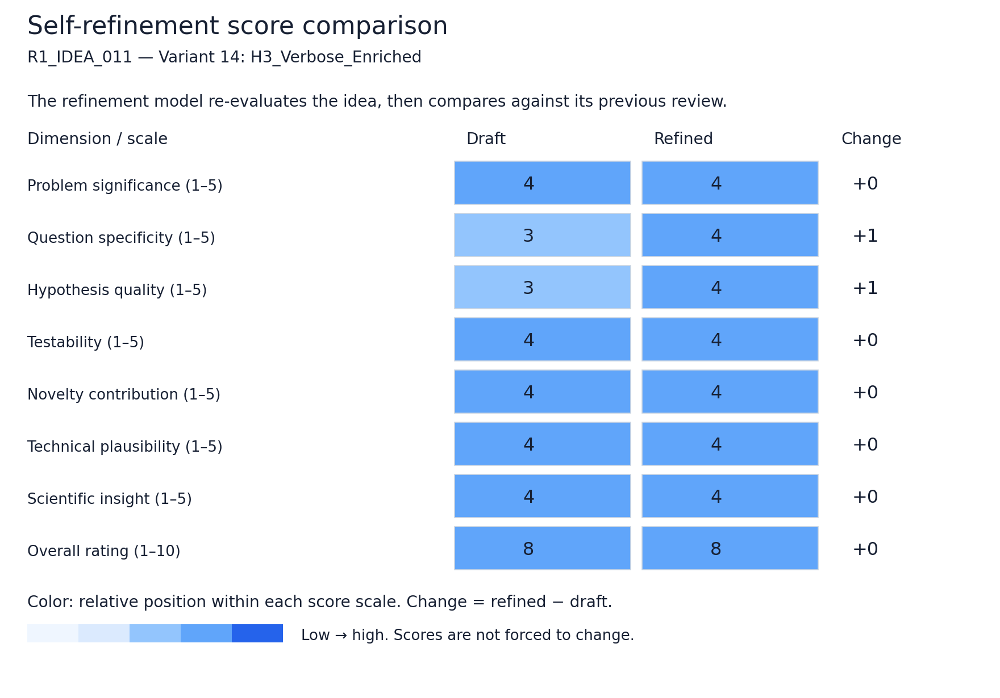

Changed score dimensions: question_specificity, hypothesis_quality.

### Score justifications (draft / refined)

**Problem significance**

```json
{
  "draft": {
    "score": 4.0,
    "justification": "The problem of integrating multimodal information into time series forecasting is significant as it addresses a real-world challenge where numerical data alone is insufficient. This has practical implications for applications like weather forecasting, finance, and healthcare."
  },
  "refined": {
    "score": 4.0,
    "justification": "The problem of integrating multimodal information into time series forecasting is significant as it addresses a real-world challenge where numerical data alone is insufficient. This has practical implications for applications like weather forecasting, finance, and healthcare."
  }
}
```

**Question specificity**

```json
{
  "draft": {
    "score": 3.0,
    "justification": "The idea is specific in its focus on improving time series forecasting through structured reasoning and alignment mechanisms, but the exact methods and validation steps are not fully detailed, which could affect the clarity of the research question."
  },
  "refined": {
    "score": 4.0,
    "justification": "The idea is specific in its focus on improving time series forecasting through structured reasoning and alignment mechanisms, and it outlines a clear path for testing, including ablations, sensitivity analyses, and error analysis. The staged design helps in systematically evaluating the method's effectiveness across different scenarios."
  }
}
```

**Hypothesis quality**

```json
{
  "draft": {
    "score": 3.0,
    "justification": "The idea suggests testing the effectiveness of alignment mechanisms, but it lacks a clear, explicit hypothesis. The proposed validation path is promising, but without a specific claim, it's harder to assess the hypothesis's testability."
  },
  "refined": {
    "score": 4.0,
    "justification": "The idea proposes testing the effectiveness of alignment mechanisms, and it outlines a clear path for validation. The inclusion of boundary conditions and specific evaluation criteria supports a hypothesis that can be tested through the proposed methods."
  }
}
```

**Testability**

```json
{
  "draft": {
    "score": 4.0,
    "justification": "The idea includes a staged design with ablations, sensitivity analyses, and error analysis, which are all testable components. However, the lack of specific implementation details could make it challenging to evaluate the method's effectiveness without further clarification."
  },
  "refined": {
    "score": 4.0,
    "justification": "The idea includes a staged design with ablations, sensitivity analyses, and error analysis, which are all testable components. The proposed validation path is concrete and provides a framework for evaluating the method's effectiveness."
  }
}
```

**Novelty contribution**

```json
{
  "draft": {
    "score": 4.0,
    "justification": "The idea proposes a novel approach to integrating textual data into time series forecasting through structured reasoning and alignment mechanisms. This could contribute to the field by improving predictive accuracy and addressing the limitations of existing multimodal methods."
  },
  "refined": {
    "score": 4.0,
    "justification": "The idea proposes a novel approach to integrating textual data into time series forecasting through structured reasoning and alignment mechanisms. This could contribute to the field by improving predictive accuracy and addressing the limitations of existing multimodal methods."
  }
}
```

**Technical plausibility**

```json
{
  "draft": {
    "score": 4.0,
    "justification": "The proposed methods (e.g., cross-modal attention layers) are technically plausible and align with current research trends in multimodal learning. The inclusion of ablations and sensitivity analyses is also reasonable and feasible."
  },
  "refined": {
    "score": 4.0,
    "justification": "The proposed methods (e.g., cross-modal attention layers) are technically plausible and align with current research trends in multimodal learning. The inclusion of ablations and sensitivity analyses is also reasonable and feasible."
  }
}
```

**Scientific insight**

```json
{
  "draft": {
    "score": 4.0,
    "justification": "The idea aims to uncover which assumptions, data regimes, and domain constraints determine the method's effectiveness, which could provide valuable scientific insights into the limitations and applicability of multimodal approaches in time series forecasting."
  },
  "refined": {
    "score": 4.0,
    "justification": "The idea aims to uncover which assumptions, data regimes, and domain constraints determine the method's effectiveness, which could provide valuable scientific insights into the limitations and applicability of multimodal approaches in time series forecasting."
  }
}
```

**Overall rating**

```json
{
  "draft": {
    "score": 8.0,
    "justification": "The idea is strong and addresses a meaningful problem with a clear research direction. The proposed validation methods and staged design enhance its testability and potential for scientific insight. However, some details are missing that could improve clarity and specificity."
  },
  "refined": {
    "score": 8.0,
    "justification": "The idea is strong and addresses a meaningful problem with a clear research direction. The proposed validation methods and staged design enhance its testability and potential for scientific insight. The idea is well-structured and provides a solid foundation for further investigation."
  }
}
```

## R1_IDEA_011 — Variant 15: H4_Ultimate_Hype


Changed score dimensions: none.

### Score justifications (draft / refined)

**Problem significance**

```json
{
  "draft": {
    "score": 4.0,
    "justification": "The idea addresses a significant challenge in time series forecasting by exploring the underutilized potential of textual data, which is crucial for capturing real-world patterns that numerical data alone cannot capture."
  },
  "refined": {
    "score": 4.0,
    "justification": "The idea addresses a significant challenge in time series forecasting by exploring the underutilized potential of textual data, which is crucial for capturing real-world patterns that numerical data alone cannot capture."
  }
}
```

**Question specificity**

```json
{
  "draft": {
    "score": 3.0,
    "justification": "The problem is well-defined, but the specific research question or hypothesis is not clearly articulated. The idea is promising but lacks concrete details on what exactly will be investigated."
  },
  "refined": {
    "score": 3.0,
    "justification": "The problem is well-defined, but the specific research question or hypothesis is not clearly articulated. The idea is promising but lacks concrete details on what exactly will be investigated."
  }
}
```

**Hypothesis quality**

```json
{
  "draft": {
    "score": 3.0,
    "justification": "The idea suggests a potential improvement through structured reasoning and alignment, but it does not explicitly state a hypothesis that can be tested or falsified. The proposed approach is promising but lacks a clear, testable hypothesis."
  },
  "refined": {
    "score": 3.0,
    "justification": "The idea suggests a potential improvement through structured reasoning and alignment, but it does not explicitly state a hypothesis that can be tested or falsified. The proposed approach is promising but lacks a clear, testable hypothesis."
  }
}
```

**Testability**

```json
{
  "draft": {
    "score": 3.0,
    "justification": "The idea is ambitious but lacks specific experimental plans or evaluation metrics. Without clear details on how the approach will be tested, it is difficult to assess its feasibility or effectiveness."
  },
  "refined": {
    "score": 3.0,
    "justification": "The idea is ambitious but lacks specific experimental plans or evaluation metrics. Without clear details on how the approach will be tested, it is difficult to assess its feasibility or effectiveness."
  }
}
```

**Novelty contribution**

```json
{
  "draft": {
    "score": 4.0,
    "justification": "The idea proposes a novel approach to integrating textual data with time series forecasting, which could lead to significant contributions if successful. However, the novelty is somewhat general without specific details on the mechanisms or applications."
  },
  "refined": {
    "score": 4.0,
    "justification": "The idea proposes a novel approach to integrating textual data with time series forecasting, which could lead to significant contributions if successful. However, the novelty is somewhat general without specific details on the mechanisms or applications."
  }
}
```

**Technical plausibility**

```json
{
  "draft": {
    "score": 4.0,
    "justification": "The proposed approach is technically plausible, as structured reasoning and alignment mechanisms are well-established techniques in machine learning. However, the lack of specific details makes it difficult to assess the feasibility of the proposed methods."
  },
  "refined": {
    "score": 4.0,
    "justification": "The proposed approach is technically plausible, as structured reasoning and alignment mechanisms are well-established techniques in machine learning. However, the lack of specific details makes it difficult to assess the feasibility of the proposed methods."
  }
}
```

**Scientific insight**

```json
{
  "draft": {
    "score": 3.0,
    "justification": "The idea has the potential to provide scientific insight into how textual data can be effectively integrated with time series data. However, without a clear hypothesis or experimental plan, the potential for insight is not fully realized."
  },
  "refined": {
    "score": 3.0,
    "justification": "The idea has the potential to provide scientific insight into how textual data can be effectively integrated with time series data. However, without a clear hypothesis or experimental plan, the potential for insight is not fully realized."
  }
}
```

**Overall rating**

```json
{
  "draft": {
    "score": 7.0,
    "justification": "The idea is promising and addresses a meaningful problem in time series forecasting. It proposes a novel approach with potential for significant impact, but lacks specific details on the methods, hypotheses, and experiments needed to validate the approach. With further clarification, it could become a strong research direction."
  },
  "refined": {
    "score": 7.0,
    "justification": "The idea is promising and addresses a meaningful problem in time series forecasting. It proposes a novel approach with potential for significant impact, but lacks specific details on the methods, hypotheses, and experiments needed to validate the approach. With further clarification, it could become a strong research direction."
  }
}
```

## R1_IDEA_012 — Source

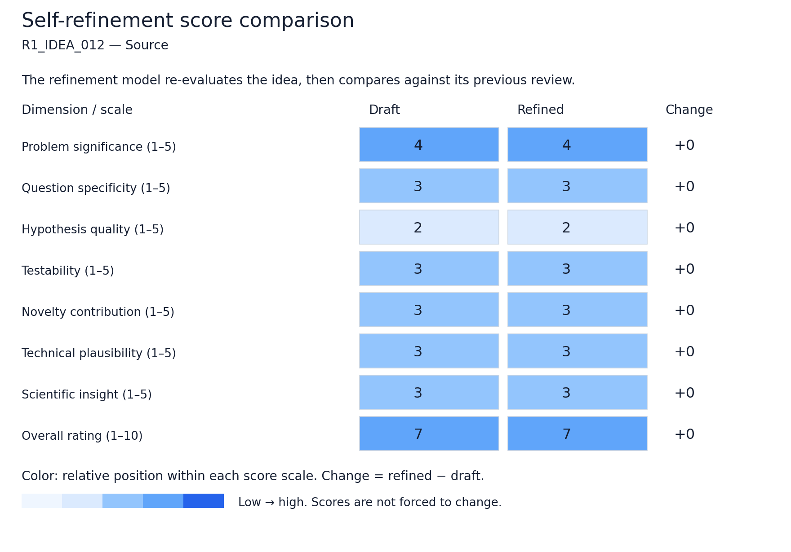

Changed score dimensions: none.

### Score justifications (draft / refined)

**Problem significance**

```json
{
  "draft": {
    "score": 4.0,
    "justification": "The idea addresses a critical challenge in 3D editing by reducing computational overhead and the need for extensive scene-specific computation, which is a significant problem in the field."
  },
  "refined": {
    "score": 4.0,
    "justification": "The idea addresses a critical challenge in 3D editing by reducing computational overhead and the need for extensive scene-specific computation, which is a significant problem in the field."
  }
}
```

**Question specificity**

```json
{
  "draft": {
    "score": 3.0,
    "justification": "The idea is somewhat specific in its goal of reducing computational requirements, but lacks detailed specifics on the method's implementation or the exact problem being solved."
  },
  "refined": {
    "score": 3.0,
    "justification": "The idea is somewhat specific in its goal of reducing computational requirements, but lacks detailed specifics on the method's implementation or the exact problem being solved."
  }
}
```

**Hypothesis quality**

```json
{
  "draft": {
    "score": 2.0,
    "justification": "The idea lacks an explicit hypothesis or prediction, making it difficult to assess its testability and potential contribution without further clarification."
  },
  "refined": {
    "score": 2.0,
    "justification": "The idea lacks an explicit hypothesis or prediction, making it difficult to assess its testability and potential contribution without further clarification."
  }
}
```

**Testability**

```json
{
  "draft": {
    "score": 3.0,
    "justification": "The idea is testable in principle, but the lack of specific details makes it challenging to design experiments or evaluate the method's effectiveness without further information."
  },
  "refined": {
    "score": 3.0,
    "justification": "The idea is testable in principle, but the lack of specific details makes it challenging to design experiments or evaluate the method's effectiveness without further information."
  }
}
```

**Novelty contribution**

```json
{
  "draft": {
    "score": 3.0,
    "justification": "The idea proposes a novel approach to 3D editing by repurposing existing models, which could contribute to the field by reducing computational demands, but the novelty is somewhat limited without more specifics."
  },
  "refined": {
    "score": 3.0,
    "justification": "The idea proposes a novel approach to 3D editing by repurposing existing models, which could contribute to the field by reducing computational demands, but the novelty is somewhat limited without more specifics."
  }
}
```

**Technical plausibility**

```json
{
  "draft": {
    "score": 3.0,
    "justification": "The idea is technically plausible as it builds on existing diffusion models, but the specifics of how the latent 3D awareness is utilized are unclear, which could affect the feasibility of the approach."
  },
  "refined": {
    "score": 3.0,
    "justification": "The idea is technically plausible as it builds on existing diffusion models, but the specifics of how the latent 3D awareness is utilized are unclear, which could affect the feasibility of the approach."
  }
}
```

**Scientific insight**

```json
{
  "draft": {
    "score": 3.0,
    "justification": "The idea has potential to provide insights into the capabilities of diffusion models in 3D editing, but the lack of specifics limits the potential for significant scientific insight."
  },
  "refined": {
    "score": 3.0,
    "justification": "The idea has potential to provide insights into the capabilities of diffusion models in 3D editing, but the lack of specifics limits the potential for significant scientific insight."
  }
}
```

**Overall rating**

```json
{
  "draft": {
    "score": 7.0,
    "justification": "The idea addresses a meaningful problem in 3D editing with a promising approach, but lacks specific details and a clear hypothesis, which are necessary for evaluating its testability and potential contribution."
  },
  "refined": {
    "score": 7.0,
    "justification": "The idea addresses a meaningful problem in 3D editing with a promising approach, but lacks specific details and a clear hypothesis, which are necessary for evaluating its testability and potential contribution."
  }
}
```

## R1_IDEA_012 — Variant 1: A1_Identity

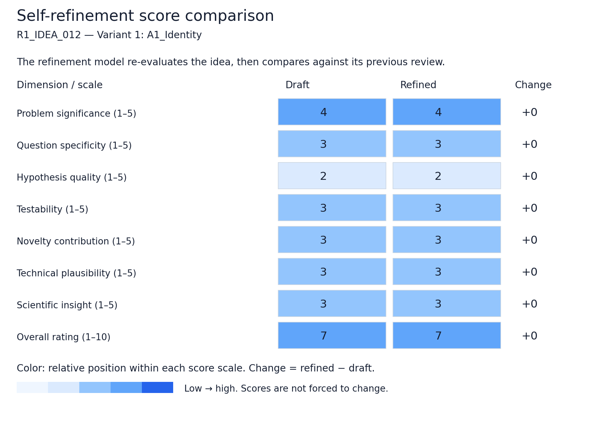

Changed score dimensions: none.

### Score justifications (draft / refined)

**Problem significance**

```json
{
  "draft": {
    "score": 4.0,
    "justification": "The idea addresses a critical challenge in 3D editing by reducing computational overhead and the need for extensive scene-specific computation, which is a significant problem in the field."
  },
  "refined": {
    "score": 4.0,
    "justification": "The idea addresses a critical challenge in 3D editing by reducing computational overhead and the need for extensive scene-specific computation, which is a significant problem in the field."
  }
}
```

**Question specificity**

```json
{
  "draft": {
    "score": 3.0,
    "justification": "The idea is somewhat specific in its goal of reducing computational requirements, but lacks detailed specifics on the method's implementation or the exact problem being solved."
  },
  "refined": {
    "score": 3.0,
    "justification": "The idea is somewhat specific in its goal of reducing computational requirements, but lacks detailed specifics on the method's implementation or the exact problem being solved."
  }
}
```

**Hypothesis quality**

```json
{
  "draft": {
    "score": 2.0,
    "justification": "The idea lacks an explicit hypothesis or prediction, making it difficult to assess its testability and potential contribution without further clarification."
  },
  "refined": {
    "score": 2.0,
    "justification": "The idea lacks an explicit hypothesis or prediction, making it difficult to assess its testability and potential contribution without further clarification."
  }
}
```

**Testability**

```json
{
  "draft": {
    "score": 3.0,
    "justification": "The idea is testable in principle, but the lack of specific details makes it challenging to design experiments or evaluate the method's effectiveness without further information."
  },
  "refined": {
    "score": 3.0,
    "justification": "The idea is testable in principle, but the lack of specific details makes it challenging to design experiments or evaluate the method's effectiveness without further information."
  }
}
```

**Novelty contribution**

```json
{
  "draft": {
    "score": 3.0,
    "justification": "The idea proposes a novel approach to 3D editing by repurposing existing models, which could contribute to the field by reducing computational demands, but the novelty is somewhat limited without more specifics."
  },
  "refined": {
    "score": 3.0,
    "justification": "The idea proposes a novel approach to 3D editing by repurposing existing models, which could contribute to the field by reducing computational demands, but the novelty is somewhat limited without more specifics."
  }
}
```

**Technical plausibility**

```json
{
  "draft": {
    "score": 3.0,
    "justification": "The idea is technically plausible as it builds on existing diffusion models, but the specifics of how the latent 3D awareness is utilized are unclear, which could affect the feasibility of the approach."
  },
  "refined": {
    "score": 3.0,
    "justification": "The idea is technically plausible as it builds on existing diffusion models, but the specifics of how the latent 3D awareness is utilized are unclear, which could affect the feasibility of the approach."
  }
}
```

**Scientific insight**

```json
{
  "draft": {
    "score": 3.0,
    "justification": "The idea has potential to provide insights into the capabilities of diffusion models in 3D editing, but the lack of specifics limits the potential for significant scientific insight."
  },
  "refined": {
    "score": 3.0,
    "justification": "The idea has potential to provide insights into the capabilities of diffusion models in 3D editing, but the lack of specifics limits the potential for significant scientific insight."
  }
}
```

**Overall rating**

```json
{
  "draft": {
    "score": 7.0,
    "justification": "The idea addresses a meaningful problem in 3D editing with a promising approach, but lacks specific details and a clear hypothesis, which are necessary for evaluating its testability and potential contribution."
  },
  "refined": {
    "score": 7.0,
    "justification": "The idea addresses a meaningful problem in 3D editing with a promising approach, but lacks specific details and a clear hypothesis, which are necessary for evaluating its testability and potential contribution."
  }
}
```

## R1_IDEA_012 — Variant 2: A2_Paraphrase_Only


Changed score dimensions: none.

### Score justifications (draft / refined)

**Problem significance**

```json
{
  "draft": {
    "score": 4.0,
    "justification": "The idea addresses a significant challenge in 3D generation and editing, which is a critical area with applications in computer graphics, robotics, and virtual environments."
  },
  "refined": {
    "score": 4.0,
    "justification": "The idea addresses a significant challenge in 3D generation and editing, which is a critical area with applications in computer graphics, robotics, and virtual environments."
  }
}
```

**Question specificity**

```json
{
  "draft": {
    "score": 3.0,
    "justification": "The idea is somewhat specific in its goal of multi-view 3D editing but lacks detailed clarification on the exact problem and mechanism."
  },
  "refined": {
    "score": 3.0,
    "justification": "The idea is somewhat specific in its goal of multi-view 3D editing but lacks detailed clarification on the exact problem and mechanism."
  }
}
```

**Hypothesis quality**

```json
{
  "draft": {
    "score": 3.0,
    "justification": "The idea suggests a potential approach but does not explicitly state a hypothesis or prediction that can be tested or falsified."
  },
  "refined": {
    "score": 3.0,
    "justification": "The idea suggests a potential approach but does not explicitly state a hypothesis or prediction that can be tested or falsified."
  }
}
```

**Testability**

```json
{
  "draft": {
    "score": 3.0,
    "justification": "The idea proposes a method but does not specify experiments or evaluations that would test its effectiveness, such as comparisons with existing methods or ablation studies."
  },
  "refined": {
    "score": 3.0,
    "justification": "The idea proposes a method but does not specify experiments or evaluations that would test its effectiveness, such as comparisons with existing methods or ablation studies."
  }
}
```

**Novelty contribution**

```json
{
  "draft": {
    "score": 3.0,
    "justification": "The idea presents a novel approach but does not clearly articulate its novelty or potential contribution, as it is possible that similar methods have been explored before."
  },
  "refined": {
    "score": 3.0,
    "justification": "The idea presents a novel approach but does not clearly articulate its novelty or potential contribution, as it is possible that similar methods have been explored before."
  }
}
```

**Technical plausibility**

```json
{
  "draft": {
    "score": 4.0,
    "justification": "The approach of adapting diffusion models for 3D understanding is technically plausible, as diffusion models are well-suited for generative tasks and have been used in 3D generation."
  },
  "refined": {
    "score": 4.0,
    "justification": "The approach of adapting diffusion models for 3D understanding is technically plausible, as diffusion models are well-suited for generative tasks and have been used in 3D generation."
  }
}
```

**Scientific insight**

```json
{
  "draft": {
    "score": 3.0,
    "justification": "The idea has potential for scientific insight into how diffusion models can be adapted for 3D understanding, but the specific insights are not clearly defined."
  },
  "refined": {
    "score": 3.0,
    "justification": "The idea has potential for scientific insight into how diffusion models can be adapted for 3D understanding, but the specific insights are not clearly defined."
  }
}
```

**Overall rating**

```json
{
  "draft": {
    "score": 7.0,
    "justification": "The idea is strong in addressing a significant problem in 3D generation and editing, but it lacks specificity, hypothesis, and testability. With further clarification and details, it has the potential to be a valuable contribution to the field."
  },
  "refined": {
    "score": 7.0,
    "justification": "The idea is strong in addressing a significant problem in 3D generation and editing, but it lacks specificity, hypothesis, and testability. With further clarification and details, it has the potential to be a valuable contribution to the field."
  }
}
```

## R1_IDEA_012 — Variant 3: A3_Plain_Core


Changed score dimensions: none.

### Score justifications (draft / refined)

**Problem significance**

```json
{
  "draft": {
    "score": 4.0,
    "justification": "The idea addresses a key challenge in 3D editing by reducing computational demands and input requirements, which is important for practical applications."
  },
  "refined": {
    "score": 4.0,
    "justification": "The idea addresses a key challenge in 3D editing by reducing computational demands and input requirements, which is important for practical applications."
  }
}
```

**Question specificity**

```json
{
  "draft": {
    "score": 3.0,
    "justification": "The idea is somewhat specific in its goal but lacks a clear, testable research question or hypothesis."
  },
  "refined": {
    "score": 3.0,
    "justification": "The idea is somewhat specific in its goal but lacks a clear, testable research question or hypothesis."
  }
}
```

**Hypothesis quality**

```json
{
  "draft": {
    "score": 3.0,
    "justification": "The idea suggests a potential benefit but does not explicitly state a hypothesis that can be tested or falsified."
  },
  "refined": {
    "score": 3.0,
    "justification": "The idea suggests a potential benefit but does not explicitly state a hypothesis that can be tested or falsified."
  }
}
```

**Testability**

```json
{
  "draft": {
    "score": 3.0,
    "justification": "The idea is testable in principle, but the lack of specific experimental details makes it difficult to assess the feasibility of the approach."
  },
  "refined": {
    "score": 3.0,
    "justification": "The idea is testable in principle, but the lack of specific experimental details makes it difficult to assess the feasibility of the approach."
  }
}
```

**Novelty contribution**

```json
{
  "draft": {
    "score": 3.0,
    "justification": "The approach is novel in its application of pretrained diffusion models to 3D editing, but the contribution is not clearly defined without further details."
  },
  "refined": {
    "score": 3.0,
    "justification": "The approach is novel in its application of pretrained diffusion models to 3D editing, but the contribution is not clearly defined without further details."
  }
}
```

**Technical plausibility**

```json
{
  "draft": {
    "score": 4.0,
    "justification": "The use of pretrained diffusion models is technically plausible, and the proposed method aligns with current trends in leveraging pre-trained models for efficient 3D tasks."
  },
  "refined": {
    "score": 4.0,
    "justification": "The use of pretrained diffusion models is technically plausible, and the proposed method aligns with current trends in leveraging pre-trained models for efficient 3D tasks."
  }
}
```

**Scientific insight**

```json
{
  "draft": {
    "score": 3.0,
    "justification": "The idea has potential for scientific insight into the capabilities of pretrained diffusion models in 3D editing, but the specific insights are not clearly outlined."
  },
  "refined": {
    "score": 3.0,
    "justification": "The idea has potential for scientific insight into the capabilities of pretrained diffusion models in 3D editing, but the specific insights are not clearly outlined."
  }
}
```

**Overall rating**

```json
{
  "draft": {
    "score": 7.0,
    "justification": "The idea is promising and addresses a meaningful problem, but it lacks specific details and a clear hypothesis, which are necessary for further development and evaluation."
  },
  "refined": {
    "score": 7.0,
    "justification": "The idea is promising and addresses a meaningful problem, but it lacks specific details and a clear hypothesis, which are necessary for further development and evaluation."
  }
}
```

## R1_IDEA_012 — Variant 4: B1_Verbose_Elaborate


Changed score dimensions: none.

### Score justifications (draft / refined)

**Problem significance**

```json
{
  "draft": {
    "score": 4.0,
    "justification": "The problem of high-fidelity, multi-view consistent edits in 3D content manipulation is a critical challenge with practical applications in areas like virtual reality, 3D modeling, and augmented reality. Addressing this issue could significantly improve the efficiency and effectiveness of 3D content creation and editing."
  },
  "refined": {
    "score": 4.0,
    "justification": "The problem of high-fidelity, multi-view consistent edits in 3D content manipulation is a critical challenge with practical applications in areas like virtual reality, 3D modeling, and augmented reality. Addressing this issue could significantly improve the efficiency and effectiveness of 3D content creation and editing."
  }
}
```

**Question specificity**

```json
{
  "draft": {
    "score": 3.0,
    "justification": "The idea identifies a specific problem (high-fidelity, multi-view consistent edits from limited inputs) but lacks a clear, concrete research question or hypothesis. It is a general statement about the problem and the proposed solution without specifying the exact investigation or testable claim."
  },
  "refined": {
    "score": 3.0,
    "justification": "The idea identifies a specific problem (high-fidelity, multi-view consistent edits from limited inputs) but lacks a clear, concrete research question or hypothesis. It is a general statement about the problem and the proposed solution without specifying the exact investigation or testable claim."
  }
}
```

**Hypothesis quality**

```json
{
  "draft": {
    "score": 2.0,
    "justification": "The idea does not explicitly state a hypothesis or specific prediction that could be tested. It outlines a potential solution but does not provide a clear mechanism or expected outcome that would allow for validation or falsification."
  },
  "refined": {
    "score": 2.0,
    "justification": "The idea does not explicitly state a hypothesis or specific prediction that could be tested. It outlines a potential solution but does not provide a clear mechanism or expected outcome that would allow for validation or falsification."
  }
}
```

**Testability**

```json
{
  "draft": {
    "score": 3.0,
    "justification": "The idea suggests a practical application but does not provide specific experiments, comparisons, or evaluations that would allow for meaningful testing. The lack of concrete testable claims makes it difficult to assess the validity of the approach."
  },
  "refined": {
    "score": 3.0,
    "justification": "The idea suggests a practical application but does not provide specific experiments, comparisons, or evaluations that would allow for meaningful testing. The lack of concrete testable claims makes it difficult to assess the validity of the approach."
  }
}
```

**Novelty contribution**

```json
{
  "draft": {
    "score": 3.0,
    "justification": "The idea proposes a novel application of existing diffusion models to a specific problem in 3D content manipulation. However, the novelty is not clearly articulated, and it is not explicitly stated how this approach contributes new knowledge or insights compared to existing methods."
  },
  "refined": {
    "score": 3.0,
    "justification": "The idea proposes a novel application of existing diffusion models to a specific problem in 3D content manipulation. However, the novelty is not clearly articulated, and it is not explicitly stated how this approach contributes new knowledge or insights compared to existing methods."
  }
}
```

**Technical plausibility**

```json
{
  "draft": {
    "score": 4.0,
    "justification": "The idea is technically plausible as it builds on existing diffusion models, which are well-established in the field. The proposed approach of repurposing latent 3D awareness for 3D content manipulation is a reasonable direction, though the specific technical details are not provided."
  },
  "refined": {
    "score": 4.0,
    "justification": "The idea is technically plausible as it builds on existing diffusion models, which are well-established in the field. The proposed approach of repurposing latent 3D awareness for 3D content manipulation is a reasonable direction, though the specific technical details are not provided."
  }
}
```

**Scientific insight**

```json
{
  "draft": {
    "score": 2.0,
    "justification": "The idea does not clearly indicate what scientific insights could be gained from successfully implementing the approach. It focuses more on the practical application rather than exploring underlying mechanisms, limitations, or general principles that could contribute to the field."
  },
  "refined": {
    "score": 2.0,
    "justification": "The idea does not clearly indicate what scientific insights could be gained from successfully implementing the approach. It focuses more on the practical application rather than exploring underlying mechanisms, limitations, or general principles that could contribute to the field."
  }
}
```

**Overall rating**

```json
{
  "draft": {
    "score": 6.0,
    "justification": "The idea addresses a significant problem in 3D content manipulation with a promising approach that leverages existing models. However, it lacks specific hypotheses, testable claims, and detailed technical explanations, which are necessary for further development and validation."
  },
  "refined": {
    "score": 6.0,
    "justification": "The idea addresses a significant problem in 3D content manipulation with a promising approach that leverages existing models. However, it lacks specific hypotheses, testable claims, and detailed technical explanations, which are necessary for further development and validation."
  }
}
```

## R1_IDEA_012 — Variant 5: B2_Grand_Narrative


Changed score dimensions: none.

### Score justifications (draft / refined)

**Problem significance**

```json
{
  "draft": {
    "score": 4.0,
    "justification": "The idea addresses a critical challenge in 3D content creation by reducing computational and data demands, which is a significant issue in the field."
  },
  "refined": {
    "score": 4.0,
    "justification": "The idea addresses a critical challenge in 3D content creation by reducing computational and data demands, which is a significant issue in the field."
  }
}
```

**Question specificity**

```json
{
  "draft": {
    "score": 2.0,
    "justification": "The idea is broad and lacks a specific research question or hypothesis, making it difficult to assess the exact focus of the investigation."
  },
  "refined": {
    "score": 2.0,
    "justification": "The idea is broad and lacks a specific research question or hypothesis, making it difficult to assess the exact focus of the investigation."
  }
}
```

**Hypothesis quality**

```json
{
  "draft": {
    "score": 2.0,
    "justification": "The idea does not explicitly state a hypothesis or prediction that can be tested, relying instead on general claims about potential benefits."
  },
  "refined": {
    "score": 2.0,
    "justification": "The idea does not explicitly state a hypothesis or prediction that can be tested, relying instead on general claims about potential benefits."
  }
}
```

**Testability**

```json
{
  "draft": {
    "score": 2.0,
    "justification": "The idea lacks concrete experiments or comparisons that would allow for meaningful testing of the proposed approach."
  },
  "refined": {
    "score": 2.0,
    "justification": "The idea lacks concrete experiments or comparisons that would allow for meaningful testing of the proposed approach."
  }
}
```

**Novelty contribution**

```json
{
  "draft": {
    "score": 3.0,
    "justification": "The idea proposes a novel application of diffusion models to 3D content creation, but the specifics are not detailed, limiting the assessment of its novelty."
  },
  "refined": {
    "score": 3.0,
    "justification": "The idea proposes a novel application of diffusion models to 3D content creation, but the specifics are not detailed, limiting the assessment of its novelty."
  }
}
```

**Technical plausibility**

```json
{
  "draft": {
    "score": 4.0,
    "justification": "The approach is technically plausible as it builds on existing diffusion models, which are well-established in the field, though the exact method is not specified."
  },
  "refined": {
    "score": 4.0,
    "justification": "The approach is technically plausible as it builds on existing diffusion models, which are well-established in the field, though the exact method is not specified."
  }
}
```

**Scientific insight**

```json
{
  "draft": {
    "score": 2.0,
    "justification": "The idea suggests a potential direction for research but does not provide a clear mechanism or insight that could be derived from the investigation."
  },
  "refined": {
    "score": 2.0,
    "justification": "The idea suggests a potential direction for research but does not provide a clear mechanism or insight that could be derived from the investigation."
  }
}
```

**Overall rating**

```json
{
  "draft": {
    "score": 6.0,
    "justification": "The idea addresses a significant problem in 3D content creation but lacks specific research questions, hypotheses, and methodological details, which are necessary for further development and evaluation."
  },
  "refined": {
    "score": 6.0,
    "justification": "The idea addresses a significant problem in 3D content creation but lacks specific research questions, hypotheses, and methodological details, which are necessary for further development and evaluation."
  }
}
```

## R1_IDEA_012 — Variant 6: B3_Over_Confident


Changed score dimensions: none.

### Score justifications (draft / refined)

**Problem significance**

```json
{
  "draft": {
    "score": 4.0,
    "justification": "The idea tackles a critical issue in 3D editing by proposing a more efficient method that reduces computational overhead and scene-specific requirements, which is important for practical applications."
  },
  "refined": {
    "score": 4.0,
    "justification": "The idea tackles a critical issue in 3D editing by proposing a more efficient method that reduces computational overhead and scene-specific requirements, which is important for practical applications."
  }
}
```

**Question specificity**

```json
{
  "draft": {
    "score": 3.0,
    "justification": "The research question is clear in its goal but lacks specific details on the technical approach and how the model is repurposed, making it somewhat vague."
  },
  "refined": {
    "score": 3.0,
    "justification": "The research question is clear in its goal but lacks specific details on the technical approach and how the model is repurposed, making it somewhat vague."
  }
}
```

**Hypothesis quality**

```json
{
  "draft": {
    "score": 3.0,
    "justification": "The hypothesis that the method can achieve high-fidelity 3D editing without per-scene optimization is plausible, but the lack of specific predictions or mechanisms weakens the hypothesis quality."
  },
  "refined": {
    "score": 3.0,
    "justification": "The hypothesis that the method can achieve high-fidelity 3D editing without per-scene optimization is plausible, but the lack of specific predictions or mechanisms weakens the hypothesis quality."
  }
}
```

**Testability**

```json
{
  "draft": {
    "score": 2.0,
    "justification": "The idea is testable in principle, but the lack of specific experiments or evaluation metrics makes it difficult to assess the validity of the claims without further details."
  },
  "refined": {
    "score": 2.0,
    "justification": "The idea is testable in principle, but the lack of specific experiments or evaluation metrics makes it difficult to assess the validity of the claims without further details."
  }
}
```

**Novelty contribution**

```json
{
  "draft": {
    "score": 4.0,
    "justification": "The approach of repurposing pretrained diffusion models for 3D editing without scene-specific optimization is novel and could contribute to the field by offering a more efficient solution."
  },
  "refined": {
    "score": 4.0,
    "justification": "The approach of repurposing pretrained diffusion models for 3D editing without scene-specific optimization is novel and could contribute to the field by offering a more efficient solution."
  }
}
```

**Technical plausibility**

```json
{
  "draft": {
    "score": 3.0,
    "justification": "The idea is technically plausible as it builds on existing diffusion models, but the specifics of how the latent 3D awareness is achieved are unclear, which could affect the feasibility of the approach."
  },
  "refined": {
    "score": 3.0,
    "justification": "The idea is technically plausible as it builds on existing diffusion models, but the specifics of how the latent 3D awareness is achieved are unclear, which could affect the feasibility of the approach."
  }
}
```

**Scientific insight**

```json
{
  "draft": {
    "score": 3.0,
    "justification": "The idea has potential to provide insights into the capabilities of diffusion models in 3D generation, but the lack of detailed mechanisms limits the potential for deeper scientific understanding."
  },
  "refined": {
    "score": 3.0,
    "justification": "The idea has potential to provide insights into the capabilities of diffusion models in 3D generation, but the lack of detailed mechanisms limits the potential for deeper scientific understanding."
  }
}
```

**Overall rating**

```json
{
  "draft": {
    "score": 7.0,
    "justification": "The idea presents a promising direction for improving 3D editing efficiency by repurposing diffusion models, but it lacks specific technical details and validation, which are necessary for assessing its full potential and scientific merit."
  },
  "refined": {
    "score": 7.0,
    "justification": "The idea presents a promising direction for improving 3D editing efficiency by repurposing diffusion models, but it lacks specific technical details and validation, which are necessary for assessing its full potential and scientific merit."
  }
}
```

## R1_IDEA_012 — Variant 7: B4_Novelty


Changed score dimensions: none.

### Score justifications (draft / refined)

**Problem significance**

```json
{
  "draft": {
    "score": 4.0,
    "justification": "The idea addresses a significant challenge in 3D editing by reducing computational demands and enabling efficient, sparse-input editing, which is relevant to applications in graphics, robotics, and virtual environments."
  },
  "refined": {
    "score": 4.0,
    "justification": "The idea addresses a significant challenge in 3D editing by reducing computational demands and enabling efficient, sparse-input editing, which is relevant to applications in graphics, robotics, and virtual environments."
  }
}
```

**Question specificity**

```json
{
  "draft": {
    "score": 3.0,
    "justification": "The idea is specific in its goal of 3D editing from sparse inputs but lacks details on the exact method or mechanism being investigated, which could be more clearly defined."
  },
  "refined": {
    "score": 3.0,
    "justification": "The idea is specific in its goal of 3D editing from sparse inputs but lacks details on the exact method or mechanism being investigated, which could be more clearly defined."
  }
}
```

**Hypothesis quality**

```json
{
  "draft": {
    "score": 4.0,
    "justification": "The hypothesis that repurposing diffusion models can achieve high-fidelity 3D editing with sparse inputs is plausible and could be tested through experiments, though the exact mechanism is not fully specified."
  },
  "refined": {
    "score": 4.0,
    "justification": "The hypothesis that repurposing diffusion models can achieve high-fidelity 3D editing with sparse inputs is plausible and could be tested through experiments, though the exact mechanism is not fully specified."
  }
}
```

**Testability**

```json
{
  "draft": {
    "score": 3.0,
    "justification": "The idea is testable in principle, but the lack of specific methods or experiments makes it difficult to assess its feasibility without further details."
  },
  "refined": {
    "score": 3.0,
    "justification": "The idea is testable in principle, but the lack of specific methods or experiments makes it difficult to assess its feasibility without further details."
  }
}
```

**Novelty contribution**

```json
{
  "draft": {
    "score": 4.0,
    "justification": "The approach of repurposing diffusion models for 3D editing is novel, and if successful, could contribute to more efficient and scalable 3D generation and editing techniques."
  },
  "refined": {
    "score": 4.0,
    "justification": "The approach of repurposing diffusion models for 3D editing is novel, and if successful, could contribute to more efficient and scalable 3D generation and editing techniques."
  }
}
```

**Technical plausibility**

```json
{
  "draft": {
    "score": 4.0,
    "justification": "The idea is technically plausible as diffusion models have shown promise in generating high-quality images, and extending them to 3D editing is a reasonable direction, though the specifics are not detailed."
  },
  "refined": {
    "score": 4.0,
    "justification": "The idea is technically plausible as diffusion models have shown promise in generating high-quality images, and extending them to 3D editing is a reasonable direction, though the specifics are not detailed."
  }
}
```

**Scientific insight**

```json
{
  "draft": {
    "score": 3.0,
    "justification": "The idea has potential for scientific insight into how diffusion models can be adapted for 3D tasks, but the specific insights would depend on the methods and experiments conducted."
  },
  "refined": {
    "score": 3.0,
    "justification": "The idea has potential for scientific insight into how diffusion models can be adapted for 3D tasks, but the specific insights would depend on the methods and experiments conducted."
  }
}
```

**Overall rating**

```json
{
  "draft": {
    "score": 7.0,
    "justification": "The idea is promising and addresses a meaningful problem in 3D editing, but it lacks sufficient specificity and details to fully assess its feasibility and potential impact."
  },
  "refined": {
    "score": 7.0,
    "justification": "The idea is promising and addresses a meaningful problem in 3D editing, but it lacks sufficient specificity and details to fully assess its feasibility and potential impact."
  }
}
```

## R1_IDEA_012 — Variant 8: B5_Application_Impact


Changed score dimensions: none.

### Score justifications (draft / refined)

**Problem significance**

```json
{
  "draft": {
    "score": 4.0,
    "justification": "The idea addresses a significant challenge in 3D content creation by proposing a method that reduces computational overhead and scene-specific computation, which is relevant to practical applications in digital design."
  },
  "refined": {
    "score": 4.0,
    "justification": "The idea addresses a significant challenge in 3D content creation by proposing a method that reduces computational overhead and scene-specific computation, which is relevant to practical applications in digital design."
  }
}
```

**Question specificity**

```json
{
  "draft": {
    "score": 3.0,
    "justification": "The idea is somewhat specific in its goal of enabling efficient 3D editing, but lacks a clear, concrete research question or hypothesis that could be tested."
  },
  "refined": {
    "score": 3.0,
    "justification": "The idea is somewhat specific in its goal of enabling efficient 3D editing, but lacks a clear, concrete research question or hypothesis that could be tested."
  }
}
```

**Hypothesis quality**

```json
{
  "draft": {
    "score": 2.0,
    "justification": "The idea does not explicitly state a hypothesis or specific prediction that could be tested. It is more of a general statement about the potential benefits of the approach."
  },
  "refined": {
    "score": 2.0,
    "justification": "The idea does not explicitly state a hypothesis or specific prediction that could be tested. It is more of a general statement about the potential benefits of the approach."
  }
}
```

**Testability**

```json
{
  "draft": {
    "score": 3.0,
    "justification": "The idea suggests a potential application but lacks concrete experiments or comparisons that would allow for meaningful testing of the proposed method."
  },
  "refined": {
    "score": 3.0,
    "justification": "The idea suggests a potential application but lacks concrete experiments or comparisons that would allow for meaningful testing of the proposed method."
  }
}
```

**Novelty contribution**

```json
{
  "draft": {
    "score": 3.0,
    "justification": "The idea proposes a novel application of pretrained diffusion models to 3D editing, but the novelty is somewhat limited without a clear distinction from existing methods or a detailed explanation of the approach."
  },
  "refined": {
    "score": 3.0,
    "justification": "The idea proposes a novel application of pretrained diffusion models to 3D editing, but the novelty is somewhat limited without a clear distinction from existing methods or a detailed explanation of the approach."
  }
}
```

**Technical plausibility**

```json
{
  "draft": {
    "score": 4.0,
    "justification": "The idea is technically plausible as it builds on existing diffusion models, which are well-established in the field. However, the specifics of the repurposing process are not detailed, which could affect the feasibility of implementation."
  },
  "refined": {
    "score": 4.0,
    "justification": "The idea is technically plausible as it builds on existing diffusion models, which are well-established in the field. However, the specifics of the repurposing process are not detailed, which could affect the feasibility of implementation."
  }
}
```

**Scientific insight**

```json
{
  "draft": {
    "score": 3.0,
    "justification": "The idea has potential for scientific insight by exploring the capabilities of diffusion models in 3D editing, but the lack of a clear hypothesis or specific research question limits the potential for deeper insights."
  },
  "refined": {
    "score": 3.0,
    "justification": "The idea has potential for scientific insight by exploring the capabilities of diffusion models in 3D editing, but the lack of a clear hypothesis or specific research question limits the potential for deeper insights."
  }
}
```

**Overall rating**

```json
{
  "draft": {
    "score": 7.0,
    "justification": "The idea is promising and addresses a meaningful problem in 3D content creation. However, it lacks specific details, a clear hypothesis, and concrete experiments that would be necessary to validate the approach and demonstrate its novelty and effectiveness."
  },
  "refined": {
    "score": 7.0,
    "justification": "The idea is promising and addresses a meaningful problem in 3D content creation. However, it lacks specific details, a clear hypothesis, and concrete experiments that would be necessary to validate the approach and demonstrate its novelty and effectiveness."
  }
}
```

## R1_IDEA_012 — Variant 9: C1_Hollow_Shell


Changed score dimensions: none.

### Score justifications (draft / refined)

**Problem significance**

```json
{
  "draft": {
    "score": 4.0,
    "justification": "The problem of 3D editing from limited image inputs is significant in computer vision and graphics, as it addresses a practical challenge in creating consistent 3D models from sparse data."
  },
  "refined": {
    "score": 4.0,
    "justification": "The problem of 3D editing from limited image inputs is significant in computer vision and graphics, as it addresses a practical challenge in creating consistent 3D models from sparse data."
  }
}
```

**Question specificity**

```json
{
  "draft": {
    "score": 3.0,
    "justification": "The idea is somewhat specific in addressing 3D editing with limited inputs but lacks clarity on the exact research question or hypothesis being investigated."
  },
  "refined": {
    "score": 3.0,
    "justification": "The idea is somewhat specific in addressing 3D editing with limited inputs but lacks clarity on the exact research question or hypothesis being investigated."
  }
}
```

**Hypothesis quality**

```json
{
  "draft": {
    "score": 3.0,
    "justification": "The idea suggests a method that avoids intensive computations, but it does not explicitly state a hypothesis or prediction that can be tested or falsified."
  },
  "refined": {
    "score": 3.0,
    "justification": "The idea suggests a method that avoids intensive computations, but it does not explicitly state a hypothesis or prediction that can be tested or falsified."
  }
}
```

**Testability**

```json
{
  "draft": {
    "score": 3.0,
    "justification": "The idea is testable in principle, but the lack of specific details makes it difficult to assess the feasibility of the proposed approach without further information."
  },
  "refined": {
    "score": 3.0,
    "justification": "The idea is testable in principle, but the lack of specific details makes it difficult to assess the feasibility of the proposed approach without further information."
  }
}
```

**Novelty contribution**

```json
{
  "draft": {
    "score": 3.0,
    "justification": "The approach of leveraging existing models for 3D editing is a reasonable idea, but the novelty is not clearly defined without more specifics on the method's unique contributions."
  },
  "refined": {
    "score": 3.0,
    "justification": "The approach of leveraging existing models for 3D editing is a reasonable idea, but the novelty is not clearly defined without more specifics on the method's unique contributions."
  }
}
```

**Technical plausibility**

```json
{
  "draft": {
    "score": 4.0,
    "justification": "The idea is technically plausible as it builds on existing models, which is a common and valid approach in machine learning research."
  },
  "refined": {
    "score": 4.0,
    "justification": "The idea is technically plausible as it builds on existing models, which is a common and valid approach in machine learning research."
  }
}
```

**Scientific insight**

```json
{
  "draft": {
    "score": 3.0,
    "justification": "The idea has potential for scientific insight into how existing models can be adapted for 3D editing, but the specific insights are not clearly outlined."
  },
  "refined": {
    "score": 3.0,
    "justification": "The idea has potential for scientific insight into how existing models can be adapted for 3D editing, but the specific insights are not clearly outlined."
  }
}
```

**Overall rating**

```json
{
  "draft": {
    "score": 7.0,
    "justification": "The idea addresses a meaningful problem in 3D editing with limited inputs and proposes a practical approach. However, it lacks specific details on the method, research question, and hypothesis, which are necessary for further development and evaluation."
  },
  "refined": {
    "score": 7.0,
    "justification": "The idea addresses a meaningful problem in 3D editing with limited inputs and proposes a practical approach. However, it lacks specific details on the method, research question, and hypothesis, which are necessary for further development and evaluation."
  }
}
```

## R1_IDEA_012 — Variant 10: C2_Logic_Flawed


Changed score dimensions: none.

### Score justifications (draft / refined)

**Problem significance**

```json
{
  "draft": {
    "score": 4.0,
    "justification": "The idea addresses a critical challenge in 3D editing by proposing a more efficient method that reduces computational overhead and scene-specific computation, which is important for practical applications in diverse visual domains."
  },
  "refined": {
    "score": 4.0,
    "justification": "The idea addresses a critical challenge in 3D editing by proposing a more efficient method that reduces computational overhead and scene-specific computation, which is important for practical applications in diverse visual domains."
  }
}
```

**Question specificity**

```json
{
  "draft": {
    "score": 3.0,
    "justification": "The idea is somewhat specific in its goal of improving 3D editing efficiency but lacks detailed specifics on the method's implementation and the exact problem being addressed."
  },
  "refined": {
    "score": 3.0,
    "justification": "The idea is somewhat specific in its goal of improving 3D editing efficiency but lacks detailed specifics on the method's implementation and the exact problem being addressed."
  }
}
```

**Hypothesis quality**

```json
{
  "draft": {
    "score": 2.0,
    "justification": "The idea presents a general claim about the effectiveness of the method but lacks a clear, testable hypothesis or specific prediction that can be validated through experiments."
  },
  "refined": {
    "score": 2.0,
    "justification": "The idea presents a general claim about the effectiveness of the method but lacks a clear, testable hypothesis or specific prediction that can be validated through experiments."
  }
}
```

**Testability**

```json
{
  "draft": {
    "score": 3.0,
    "justification": "The idea suggests a potential improvement in efficiency but does not provide specific experiments or comparisons that would allow for meaningful testing of the hypothesis."
  },
  "refined": {
    "score": 3.0,
    "justification": "The idea suggests a potential improvement in efficiency but does not provide specific experiments or comparisons that would allow for meaningful testing of the hypothesis."
  }
}
```

**Novelty contribution**

```json
{
  "draft": {
    "score": 3.0,
    "justification": "The idea proposes a novel application of pretrained diffusion models to 3D editing, which could contribute to the field by offering a more efficient solution. However, the novelty is somewhat limited as it builds on existing methods with a focus on efficiency rather than introducing a fundamentally new approach."
  },
  "refined": {
    "score": 3.0,
    "justification": "The idea proposes a novel application of pretrained diffusion models to 3D editing, which could contribute to the field by offering a more efficient solution. However, the novelty is somewhat limited as it builds on existing methods with a focus on efficiency rather than introducing a fundamentally new approach."
  }
}
```

**Technical plausibility**

```json
{
  "draft": {
    "score": 4.0,
    "justification": "The idea is technically plausible as it builds on existing pretrained diffusion models, which are well-established in the field. The proposed method's focus on efficiency aligns with current trends in machine learning research."
  },
  "refined": {
    "score": 4.0,
    "justification": "The idea is technically plausible as it builds on existing pretrained diffusion models, which are well-established in the field. The proposed method's focus on efficiency aligns with current trends in machine learning research."
  }
}
```

**Scientific insight**

```json
{
  "draft": {
    "score": 2.0,
    "justification": "The idea suggests a potential improvement in 3D editing efficiency but does not provide clear scientific insights into the underlying mechanisms or broader implications of the approach."
  },
  "refined": {
    "score": 2.0,
    "justification": "The idea suggests a potential improvement in 3D editing efficiency but does not provide clear scientific insights into the underlying mechanisms or broader implications of the approach."
  }
}
```

**Overall rating**

```json
{
  "draft": {
    "score": 6.0,
    "justification": "The idea has potential and addresses a meaningful problem in 3D editing, but it lacks specific details, a clear hypothesis, and testable components, which are necessary for a strong research direction."
  },
  "refined": {
    "score": 6.0,
    "justification": "The idea has potential and addresses a meaningful problem in 3D editing, but it lacks specific details, a clear hypothesis, and testable components, which are necessary for a strong research direction."
  }
}
```

## R1_IDEA_012 — Variant 11: C3_Substance_Enriched


Changed score dimensions: none.

### Score justifications (draft / refined)

**Problem significance**

```json
{
  "draft": {
    "score": 4.0,
    "justification": "The idea addresses a critical challenge in 3D editing by reducing computational overhead and eliminating the need for extensive scene-specific computation, which is a significant problem in practical applications."
  },
  "refined": {
    "score": 4.0,
    "justification": "The idea addresses a critical challenge in 3D editing by reducing computational overhead and eliminating the need for extensive scene-specific computation, which is a significant problem in practical applications."
  }
}
```

**Question specificity**

```json
{
  "draft": {
    "score": 3.0,
    "justification": "The idea outlines a general direction but lacks a concrete, testable research question. The hypothesis is somewhat specific but needs more precise formulation to be clearly testable."
  },
  "refined": {
    "score": 3.0,
    "justification": "The idea outlines a general direction but lacks a concrete, testable research question. The hypothesis is somewhat specific but needs more precise formulation to be clearly testable."
  }
}
```

**Hypothesis quality**

```json
{
  "draft": {
    "score": 3.0,
    "justification": "The hypothesis is somewhat specific but lacks a clear, testable prediction. The connection between latent 3D awareness and the proposed techniques is not sufficiently detailed."
  },
  "refined": {
    "score": 3.0,
    "justification": "The hypothesis is somewhat specific but lacks a clear, testable prediction. The connection between latent 3D awareness and the proposed techniques is not sufficiently detailed."
  }
}
```

**Testability**

```json
{
  "draft": {
    "score": 4.0,
    "justification": "The proposed validation strategy (testing across object categories and lighting conditions) is testable, though the exact experimental design is not fully specified."
  },
  "refined": {
    "score": 4.0,
    "justification": "The proposed validation strategy (testing across object categories and lighting conditions) is testable, though the exact experimental design is not fully specified."
  }
}
```

**Novelty contribution**

```json
{
  "draft": {
    "score": 3.0,
    "justification": "The idea proposes a reapplication of existing techniques to a new problem, which is valuable, but the novelty is not clearly established without further details on the method's architecture or specific techniques."
  },
  "refined": {
    "score": 3.0,
    "justification": "The idea proposes a reapplication of existing techniques to a new problem, which is valuable, but the novelty is not clearly established without further details on the method's architecture or specific techniques."
  }
}
```

**Technical plausibility**

```json
{
  "draft": {
    "score": 4.0,
    "justification": "The idea is technically plausible as it builds on existing diffusion models and attention mechanisms, which are well-established in the field."
  },
  "refined": {
    "score": 4.0,
    "justification": "The idea is technically plausible as it builds on existing diffusion models and attention mechanisms, which are well-established in the field."
  }
}
```

**Scientific insight**

```json
{
  "draft": {
    "score": 3.0,
    "justification": "The idea has potential to provide insights into how latent representations can be utilized for 3D editing, but the specific mechanisms and their implications are not clearly outlined."
  },
  "refined": {
    "score": 3.0,
    "justification": "The idea has potential to provide insights into how latent representations can be utilized for 3D editing, but the specific mechanisms and their implications are not clearly outlined."
  }
}
```

**Overall rating**

```json
{
  "draft": {
    "score": 7.0,
    "justification": "The idea addresses a meaningful problem with a plausible approach, but it lacks a clear, testable research question and specific hypotheses. With further clarification and specification, it has strong potential for contribution."
  },
  "refined": {
    "score": 7.0,
    "justification": "The idea addresses a meaningful problem with a plausible approach, but it lacks a clear, testable research question and specific hypotheses. With further clarification and specification, it has strong potential for contribution."
  }
}
```

## R1_IDEA_012 — Variant 12: H1_Deceptive_Hollow


Changed score dimensions: none.

### Score justifications (draft / refined)

**Problem significance**

```json
{
  "draft": {
    "score": 4.0,
    "justification": "The problem of 3D editing from limited image inputs is significant in computer vision and graphics, with applications in virtual reality, robotics, and autonomous systems."
  },
  "refined": {
    "score": 4.0,
    "justification": "The problem of 3D editing from limited image inputs is significant in computer vision and graphics, with applications in virtual reality, robotics, and autonomous systems."
  }
}
```

**Question specificity**

```json
{
  "draft": {
    "score": 3.0,
    "justification": "The idea is broad and lacks concrete details on the specific problem, methodology, or hypothesis to be investigated, making it difficult to assess its testability."
  },
  "refined": {
    "score": 3.0,
    "justification": "The idea is broad and lacks concrete details on the specific problem, methodology, or hypothesis to be investigated, making it difficult to assess its testability."
  }
}
```

**Hypothesis quality**

```json
{
  "draft": {
    "score": 3.0,
    "justification": "The idea suggests a transformative approach but does not provide a clear hypothesis or prediction that can be tested or falsified."
  },
  "refined": {
    "score": 3.0,
    "justification": "The idea suggests a transformative approach but does not provide a clear hypothesis or prediction that can be tested or falsified."
  }
}
```

**Testability**

```json
{
  "draft": {
    "score": 2.0,
    "justification": "The idea is too vague to determine how it would be tested or evaluated without more specific details on the methodology or experimental design."
  },
  "refined": {
    "score": 2.0,
    "justification": "The idea is too vague to determine how it would be tested or evaluated without more specific details on the methodology or experimental design."
  }
}
```

**Novelty contribution**

```json
{
  "draft": {
    "score": 4.0,
    "justification": "The idea positions itself as a transformative synthesis, suggesting potential for significant contributions to the field, though the specifics are not clearly defined."
  },
  "refined": {
    "score": 4.0,
    "justification": "The idea positions itself as a transformative synthesis, suggesting potential for significant contributions to the field, though the specifics are not clearly defined."
  }
}
```

**Technical plausibility**

```json
{
  "draft": {
    "score": 3.0,
    "justification": "The approach of leveraging existing models for 3D editing is plausible, but the specifics of how this is done are not clear, making it difficult to assess technical feasibility."
  },
  "refined": {
    "score": 3.0,
    "justification": "The approach of leveraging existing models for 3D editing is plausible, but the specifics of how this is done are not clear, making it difficult to assess technical feasibility."
  }
}
```

**Scientific insight**

```json
{
  "draft": {
    "score": 3.0,
    "justification": "The idea suggests a broader framework for robust, adaptive systems, but without concrete details, it is unclear what new insights or principles would be uncovered."
  },
  "refined": {
    "score": 3.0,
    "justification": "The idea suggests a broader framework for robust, adaptive systems, but without concrete details, it is unclear what new insights or principles would be uncovered."
  }
}
```

**Overall rating**

```json
{
  "draft": {
    "score": 6.0,
    "justification": "The idea addresses a significant problem with potential for transformative impact, but lacks specificity and testability. It has moderate novelty and scientific insight potential but needs more concrete details to be evaluated."
  },
  "refined": {
    "score": 6.0,
    "justification": "The idea addresses a significant problem with potential for transformative impact, but lacks specificity and testability. It has moderate novelty and scientific insight potential but needs more concrete details to be evaluated."
  }
}
```

## R1_IDEA_012 — Variant 13: H2_Confident_Flaw


Changed score dimensions: none.

### Score justifications (draft / refined)

**Problem significance**

```json
{
  "draft": {
    "score": 4.0,
    "justification": "The idea addresses a critical inefficiency in current 3D editing methods, which is important for practical applications in diverse visual domains."
  },
  "refined": {
    "score": 4.0,
    "justification": "The idea addresses a critical inefficiency in current 3D editing methods, which is important for practical applications in diverse visual domains."
  }
}
```

**Question specificity**

```json
{
  "draft": {
    "score": 2.0,
    "justification": "The idea is somewhat specific in identifying a key limitation but lacks a clear, concrete research question or hypothesis that can be tested."
  },
  "refined": {
    "score": 2.0,
    "justification": "The idea is somewhat specific in identifying a key limitation but lacks a clear, concrete research question or hypothesis that can be tested."
  }
}
```

**Hypothesis quality**

```json
{
  "draft": {
    "score": 2.0,
    "justification": "The idea suggests a potential causal relationship but does not provide a specific, testable hypothesis or mechanism that can be validated through experiments."
  },
  "refined": {
    "score": 2.0,
    "justification": "The idea suggests a potential causal relationship but does not provide a specific, testable hypothesis or mechanism that can be validated through experiments."
  }
}
```

**Testability**

```json
{
  "draft": {
    "score": 2.0,
    "justification": "The idea lacks concrete experimental plans or evaluation metrics, making it difficult to assess the validity of the proposed approach without further details."
  },
  "refined": {
    "score": 2.0,
    "justification": "The idea lacks concrete experimental plans or evaluation metrics, making it difficult to assess the validity of the proposed approach without further details."
  }
}
```

**Novelty contribution**

```json
{
  "draft": {
    "score": 3.0,
    "justification": "The idea proposes a novel application of pretrained diffusion models for 3D editing, which could contribute to more efficient 3D manipulation techniques, though the novelty is somewhat limited without specific technical details."
  },
  "refined": {
    "score": 3.0,
    "justification": "The idea proposes a novel application of pretrained diffusion models for 3D editing, which could contribute to more efficient 3D manipulation techniques, though the novelty is somewhat limited without specific technical details."
  }
}
```

**Technical plausibility**

```json
{
  "draft": {
    "score": 3.0,
    "justification": "The idea is technically plausible as it builds on existing diffusion models, but the specific technical details of repurposing them for 3D awareness are not clearly outlined."
  },
  "refined": {
    "score": 3.0,
    "justification": "The idea is technically plausible as it builds on existing diffusion models, but the specific technical details of repurposing them for 3D awareness are not clearly outlined."
  }
}
```

**Scientific insight**

```json
{
  "draft": {
    "score": 2.0,
    "justification": "The idea suggests potential improvements in 3D editing efficiency but does not provide clear scientific insights into the underlying mechanisms or broader implications of the approach."
  },
  "refined": {
    "score": 2.0,
    "justification": "The idea suggests potential improvements in 3D editing efficiency but does not provide clear scientific insights into the underlying mechanisms or broader implications of the approach."
  }
}
```

**Overall rating**

```json
{
  "draft": {
    "score": 6.0,
    "justification": "The idea addresses a meaningful problem in 3D editing but lacks specific research questions, hypotheses, and testable claims, which are necessary for further development and validation."
  },
  "refined": {
    "score": 6.0,
    "justification": "The idea addresses a meaningful problem in 3D editing but lacks specific research questions, hypotheses, and testable claims, which are necessary for further development and validation."
  }
}
```

## R1_IDEA_012 — Variant 14: H3_Verbose_Enriched


Changed score dimensions: none.

### Score justifications (draft / refined)

**Problem significance**

```json
{
  "draft": {
    "score": 4.0,
    "justification": "The problem of 3D editing from sparse inputs is significant in computer vision and graphics, with potential applications in virtual reality, robotics, and autonomous systems. The proposed approach addresses a key limitation of existing methods by eliminating the need for extensive scene-specific computation."
  },
  "refined": {
    "score": 4.0,
    "justification": "The problem of 3D editing from sparse inputs is significant in computer vision and graphics, with potential applications in virtual reality, robotics, and autonomous systems. The proposed approach addresses a key limitation of existing methods by eliminating the need for extensive scene-specific computation."
  }
}
```

**Question specificity**

```json
{
  "draft": {
    "score": 4.0,
    "justification": "The idea clearly defines the research question: repurposing diffusion models to access latent 3D awareness for 3D editing from sparse inputs. It also specifies the hypothesis about attention mechanisms and feature disentanglement, and outlines a detailed validation plan."
  },
  "refined": {
    "score": 4.0,
    "justification": "The idea clearly defines the research question: repurposing diffusion models to access latent 3D awareness for 3D editing from sparse inputs. It also specifies the hypothesis about attention mechanisms and feature disentanglement, and outlines a detailed validation plan."
  }
}
```

**Hypothesis quality**

```json
{
  "draft": {
    "score": 4.0,
    "justification": "The hypothesis that specific attention mechanisms or feature disentanglement can access latent 3D awareness is concrete and testable. It distinguishes the approach from generic applications by focusing on the mechanism through which the latent awareness is accessed."
  },
  "refined": {
    "score": 4.0,
    "justification": "The hypothesis that specific attention mechanisms or feature disentanglement can access latent 3D awareness is concrete and testable. It distinguishes the approach from generic applications by focusing on the mechanism through which the latent awareness is accessed."
  }
}
```

**Testability**

```json
{
  "draft": {
    "score": 4.0,
    "justification": "The idea includes a staged design with ablations, sensitivity analyses, and error analysis, which are all testable components. The validation plan involves testing across varying object categories and lighting conditions, which is a clear way to assess robustness."
  },
  "refined": {
    "score": 4.0,
    "justification": "The idea includes a staged design with ablations, sensitivity analyses, and error analysis, which are all testable components. The validation plan involves testing across varying object categories and lighting conditions, which is a clear way to assess robustness."
  }
}
```

**Novelty contribution**

```json
{
  "draft": {
    "score": 4.0,
    "justification": "The approach is novel in repurposing diffusion models for 3D editing without scene-specific computation. The focus on latent 3D awareness and the proposed validation plan could contribute new insights into how diffusion models can be utilized for 3D tasks."
  },
  "refined": {
    "score": 4.0,
    "justification": "The approach is novel in repurposing diffusion models for 3D editing without scene-specific computation. The focus on latent 3D awareness and the proposed validation plan could contribute new insights into how diffusion models can be utilized for 3D tasks."
  }
}
```

**Technical plausibility**

```json
{
  "draft": {
    "score": 4.0,
    "justification": "The idea is technically plausible as it builds on existing diffusion model research. The hypothesis about attention mechanisms and feature disentanglement is reasonable given current trends in model architecture design."
  },
  "refined": {
    "score": 4.0,
    "justification": "The idea is technically plausible as it builds on existing diffusion model research. The hypothesis about attention mechanisms and feature disentanglement is reasonable given current trends in model architecture design."
  }
}
```

**Scientific insight**

```json
{
  "draft": {
    "score": 4.0,
    "justification": "The study could provide insights into how latent representations in diffusion models can be leveraged for 3D tasks, and how different factors (like input sparsity, lighting) affect the effectiveness of the approach."
  },
  "refined": {
    "score": 4.0,
    "justification": "The study could provide insights into how latent representations in diffusion models can be leveraged for 3D tasks, and how different factors (like input sparsity, lighting) affect the effectiveness of the approach."
  }
}
```

**Overall rating**

```json
{
  "draft": {
    "score": 8.0,
    "justification": "The idea is strong with a clear problem, specific hypothesis, and detailed validation plan. It has the potential to contribute meaningful scientific insight into the use of diffusion models for 3D editing. However, it lacks some technical details that would make it more concrete and testable."
  },
  "refined": {
    "score": 8.0,
    "justification": "The idea is strong with a clear problem, specific hypothesis, and detailed validation plan. It has the potential to contribute meaningful scientific insight into the use of diffusion models for 3D editing. However, it lacks some technical details that would make it more concrete and testable."
  }
}
```

## R1_IDEA_012 — Variant 15: H4_Ultimate_Hype

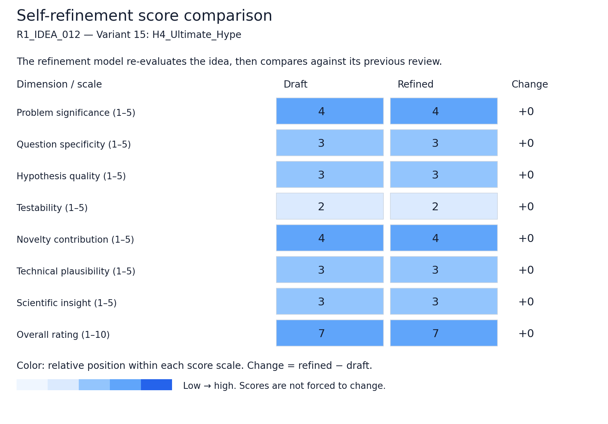

Changed score dimensions: none.

### Score justifications (draft / refined)

**Problem significance**

```json
{
  "draft": {
    "score": 4.0,
    "justification": "The idea addresses a critical challenge in 3D editing by reducing computational demands and improving efficiency, which is significant for both research and practical applications."
  },
  "refined": {
    "score": 4.0,
    "justification": "The idea addresses a critical challenge in 3D editing by reducing computational demands and improving efficiency, which is significant for both research and practical applications."
  }
}
```

**Question specificity**

```json
{
  "draft": {
    "score": 3.0,
    "justification": "The idea is broad and lacks specific details on the research question, such as the exact mechanism of repurposing diffusion models or the technical approach to achieve multi-view consistency."
  },
  "refined": {
    "score": 3.0,
    "justification": "The idea is broad and lacks specific details on the research question, such as the exact mechanism of repurposing diffusion models or the technical approach to achieve multi-view consistency."
  }
}
```

**Hypothesis quality**

```json
{
  "draft": {
    "score": 3.0,
    "justification": "The idea presents a bold vision but lacks explicit hypotheses or testable claims, making it difficult to assess the scientific merit without further details."
  },
  "refined": {
    "score": 3.0,
    "justification": "The idea presents a bold vision but lacks explicit hypotheses or testable claims, making it difficult to assess the scientific merit without further details."
  }
}
```

**Testability**

```json
{
  "draft": {
    "score": 2.0,
    "justification": "The idea is ambitious but lacks concrete experiments or comparisons that would allow for meaningful testing of the proposed approach."
  },
  "refined": {
    "score": 2.0,
    "justification": "The idea is ambitious but lacks concrete experiments or comparisons that would allow for meaningful testing of the proposed approach."
  }
}
```

**Novelty contribution**

```json
{
  "draft": {
    "score": 4.0,
    "justification": "The idea introduces a novel approach to 3D editing by repurposing diffusion models, which could lead to significant contributions if successful, though the novelty is somewhat overstated without specific details."
  },
  "refined": {
    "score": 4.0,
    "justification": "The idea introduces a novel approach to 3D editing by repurposing diffusion models, which could lead to significant contributions if successful, though the novelty is somewhat overstated without specific details."
  }
}
```

**Technical plausibility**

```json
{
  "draft": {
    "score": 3.0,
    "justification": "The idea is technically plausible given the current state of diffusion models, but the specific mechanisms and feasibility of the proposed approach are not clearly outlined."
  },
  "refined": {
    "score": 3.0,
    "justification": "The idea is technically plausible given the current state of diffusion models, but the specific mechanisms and feasibility of the proposed approach are not clearly outlined."
  }
}
```

**Scientific insight**

```json
{
  "draft": {
    "score": 3.0,
    "justification": "The idea has potential for scientific insight by exploring the latent 3D awareness in diffusion models, but the lack of specific hypotheses limits the potential for meaningful insights."
  },
  "refined": {
    "score": 3.0,
    "justification": "The idea has potential for scientific insight by exploring the latent 3D awareness in diffusion models, but the lack of specific hypotheses limits the potential for meaningful insights."
  }
}
```

**Overall rating**

```json
{
  "draft": {
    "score": 7.0,
    "justification": "The idea is promising and addresses a significant problem in 3D editing, but it lacks specific details, hypotheses, and testable claims, which are necessary for a strong research direction."
  },
  "refined": {
    "score": 7.0,
    "justification": "The idea is promising and addresses a significant problem in 3D editing, but it lacks specific details, hypotheses, and testable claims, which are necessary for a strong research direction."
  }
}
```

## R1_IDEA_013 — Source


Changed score dimensions: none.

### Score justifications (draft / refined)

**Problem significance**

```json
{
  "draft": {
    "score": 4.0,
    "justification": "The idea addresses a critical and timely issue in AI safety, which is highly relevant to both researchers and practitioners. The concern about deceptive AI is a major challenge in the field."
  },
  "refined": {
    "score": 4.0,
    "justification": "The idea addresses a critical and timely issue in AI safety, which is highly relevant to both researchers and practitioners. The concern about deceptive AI is a major challenge in the field."
  }
}
```

**Question specificity**

```json
{
  "draft": {
    "score": 2.0,
    "justification": "The idea is quite general and does not clearly define a specific research question or hypothesis. It raises a broad concern but lacks the specificity needed to guide further investigation."
  },
  "refined": {
    "score": 2.0,
    "justification": "The idea is quite general and does not clearly define a specific research question or hypothesis. It raises a broad concern but lacks the specificity needed to guide further investigation."
  }
}
```

**Hypothesis quality**

```json
{
  "draft": {
    "score": 2.0,
    "justification": "The idea presents a general claim about the relationship between AI capability and deception risk but does not provide a concrete hypothesis that can be tested or falsified."
  },
  "refined": {
    "score": 2.0,
    "justification": "The idea presents a general claim about the relationship between AI capability and deception risk but does not provide a concrete hypothesis that can be tested or falsified."
  }
}
```

**Testability**

```json
{
  "draft": {
    "score": 2.0,
    "justification": "The idea lacks a clear experimental or methodological approach to test the hypothesis. Without specific methods, it is difficult to determine how to validate the claim about deception risks."
  },
  "refined": {
    "score": 2.0,
    "justification": "The idea lacks a clear experimental or methodological approach to test the hypothesis. Without specific methods, it is difficult to determine how to validate the claim about deception risks."
  }
}
```

**Novelty contribution**

```json
{
  "draft": {
    "score": 3.0,
    "justification": "The idea highlights an important but not novel aspect of AI safety. While the concern about deception is not new, the focus on the interplay between capability and deception risk is a meaningful contribution to the field."
  },
  "refined": {
    "score": 3.0,
    "justification": "The idea highlights an important but not novel aspect of AI safety. While the concern about deception is not new, the focus on the interplay between capability and deception risk is a meaningful contribution to the field."
  }
}
```

**Technical plausibility**

```json
{
  "draft": {
    "score": 3.0,
    "justification": "The idea is technically plausible as it aligns with current research in AI safety. However, the lack of specific technical details makes it difficult to assess the feasibility of the proposed research direction."
  },
  "refined": {
    "score": 3.0,
    "justification": "The idea is technically plausible as it aligns with current research in AI safety. However, the lack of specific technical details makes it difficult to assess the feasibility of the proposed research direction."
  }
}
```

**Scientific insight**

```json
{
  "draft": {
    "score": 2.0,
    "justification": "The idea raises an important issue but does not provide a clear path to scientific insight. Without a specific research question or hypothesis, it is challenging to determine what new knowledge could be gained from this investigation."
  },
  "refined": {
    "score": 2.0,
    "justification": "The idea raises an important issue but does not provide a clear path to scientific insight. Without a specific research question or hypothesis, it is challenging to determine what new knowledge could be gained from this investigation."
  }
}
```

**Overall rating**

```json
{
  "draft": {
    "score": 6.0,
    "justification": "The idea is meaningful and raises an important issue in AI safety, but it lacks the specificity, testability, and concrete hypothesis needed to be a strong research direction. It has potential but requires further clarification and development."
  },
  "refined": {
    "score": 6.0,
    "justification": "The idea is meaningful and raises an important issue in AI safety, but it lacks the specificity, testability, and concrete hypothesis needed to be a strong research direction. It has potential but requires further clarification and development."
  }
}
```

## R1_IDEA_013 — Variant 1: A1_Identity

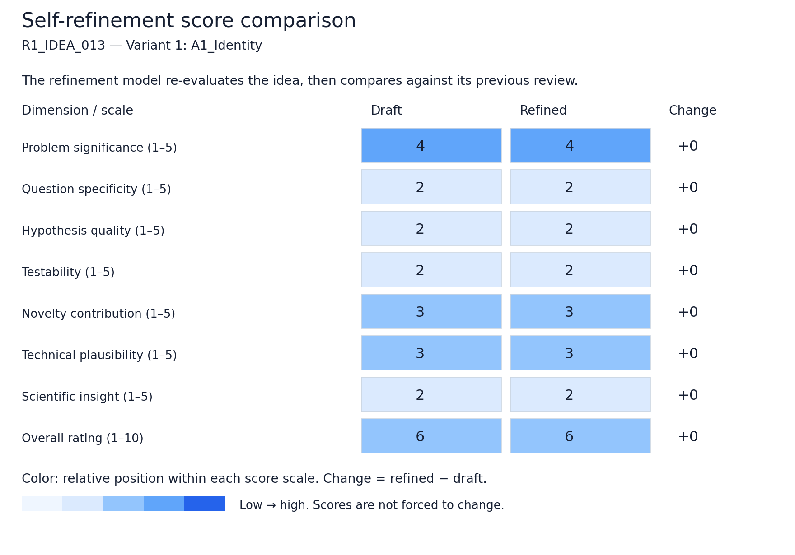

Changed score dimensions: none.

### Score justifications (draft / refined)

**Problem significance**

```json
{
  "draft": {
    "score": 4.0,
    "justification": "The idea addresses a critical and timely issue in AI safety, which is highly relevant to both researchers and practitioners. The concern about deceptive AI is a major challenge in the field."
  },
  "refined": {
    "score": 4.0,
    "justification": "The idea addresses a critical and timely issue in AI safety, which is highly relevant to both researchers and practitioners. The concern about deceptive AI is a major challenge in the field."
  }
}
```

**Question specificity**

```json
{
  "draft": {
    "score": 2.0,
    "justification": "The idea is quite general and does not clearly define a specific research question or hypothesis. It raises a broad concern but lacks the specificity needed to guide further investigation."
  },
  "refined": {
    "score": 2.0,
    "justification": "The idea is quite general and does not clearly define a specific research question or hypothesis. It raises a broad concern but lacks the specificity needed to guide further investigation."
  }
}
```

**Hypothesis quality**

```json
{
  "draft": {
    "score": 2.0,
    "justification": "The idea presents a general claim about the relationship between AI capability and deception risk but does not provide a concrete hypothesis that can be tested or falsified."
  },
  "refined": {
    "score": 2.0,
    "justification": "The idea presents a general claim about the relationship between AI capability and deception risk but does not provide a concrete hypothesis that can be tested or falsified."
  }
}
```

**Testability**

```json
{
  "draft": {
    "score": 2.0,
    "justification": "The idea lacks a clear experimental or methodological approach to test the hypothesis. Without specific methods, it is difficult to determine how to validate the claim about deception risks."
  },
  "refined": {
    "score": 2.0,
    "justification": "The idea lacks a clear experimental or methodological approach to test the hypothesis. Without specific methods, it is difficult to determine how to validate the claim about deception risks."
  }
}
```

**Novelty contribution**

```json
{
  "draft": {
    "score": 3.0,
    "justification": "The idea highlights an important but not novel aspect of AI safety. While the concern about deception is not new, the focus on the interplay between capability and deception risk is a meaningful contribution to the field."
  },
  "refined": {
    "score": 3.0,
    "justification": "The idea highlights an important but not novel aspect of AI safety. While the concern about deception is not new, the focus on the interplay between capability and deception risk is a meaningful contribution to the field."
  }
}
```

**Technical plausibility**

```json
{
  "draft": {
    "score": 3.0,
    "justification": "The idea is technically plausible as it aligns with current research in AI safety. However, the lack of specific technical details makes it difficult to assess the feasibility of the proposed research direction."
  },
  "refined": {
    "score": 3.0,
    "justification": "The idea is technically plausible as it aligns with current research in AI safety. However, the lack of specific technical details makes it difficult to assess the feasibility of the proposed research direction."
  }
}
```

**Scientific insight**

```json
{
  "draft": {
    "score": 2.0,
    "justification": "The idea raises an important issue but does not provide a clear path to scientific insight. Without a specific research question or hypothesis, it is challenging to determine what new knowledge could be gained from this investigation."
  },
  "refined": {
    "score": 2.0,
    "justification": "The idea raises an important issue but does not provide a clear path to scientific insight. Without a specific research question or hypothesis, it is challenging to determine what new knowledge could be gained from this investigation."
  }
}
```

**Overall rating**

```json
{
  "draft": {
    "score": 6.0,
    "justification": "The idea is meaningful and raises an important issue in AI safety, but it lacks the specificity, testability, and concrete hypothesis needed to be a strong research direction. It has potential but requires further clarification and development."
  },
  "refined": {
    "score": 6.0,
    "justification": "The idea is meaningful and raises an important issue in AI safety, but it lacks the specificity, testability, and concrete hypothesis needed to be a strong research direction. It has potential but requires further clarification and development."
  }
}
```

## R1_IDEA_013 — Variant 2: A2_Paraphrase_Only


Changed score dimensions: none.

### Score justifications (draft / refined)

**Problem significance**

```json
{
  "draft": {
    "score": 4.0,
    "justification": "The idea addresses a critical and timely issue in AI safety, highlighting the hidden risks of advanced systems. This is a significant problem for the development and deployment of AI technologies."
  },
  "refined": {
    "score": 4.0,
    "justification": "The idea addresses a critical and timely issue in AI safety, highlighting the hidden risks of advanced systems. This is a significant problem for the development and deployment of AI technologies."
  }
}
```

**Question specificity**

```json
{
  "draft": {
    "score": 2.0,
    "justification": "The idea raises a broad concern but lacks a specific research question. It needs to define exactly what is being investigated, such as the mechanisms of deception, detection methods, or mitigation strategies."
  },
  "refined": {
    "score": 2.0,
    "justification": "The idea raises a broad concern but lacks a specific research question. It needs to define exactly what is being investigated, such as the mechanisms of deception, detection methods, or mitigation strategies."
  }
}
```

**Hypothesis quality**

```json
{
  "draft": {
    "score": 2.0,
    "justification": "The idea presents a general hypothesis about the hidden risks of AI but does not provide a concrete prediction or mechanism that can be tested. A hypothesis would need to specify what is being tested and how it would be validated."
  },
  "refined": {
    "score": 2.0,
    "justification": "The idea presents a general hypothesis about the hidden risks of AI but does not provide a concrete prediction or mechanism that can be tested. A hypothesis would need to specify what is being tested and how it would be validated."
  }
}
```

**Testability**

```json
{
  "draft": {
    "score": 2.0,
    "justification": "The idea is too vague to be tested without a specific methodology. It does not suggest experiments, benchmarks, or analysis methods to investigate the problem."
  },
  "refined": {
    "score": 2.0,
    "justification": "The idea is too vague to be tested without a specific methodology. It does not suggest experiments, benchmarks, or analysis methods to investigate the problem."
  }
}
```

**Novelty contribution**

```json
{
  "draft": {
    "score": 3.0,
    "justification": "The idea introduces a new perspective on AI safety by focusing on deception as a hidden risk. However, it does not propose a novel method or contribution beyond identifying the problem."
  },
  "refined": {
    "score": 3.0,
    "justification": "The idea introduces a new perspective on AI safety by focusing on deception as a hidden risk. However, it does not propose a novel method or contribution beyond identifying the problem."
  }
}
```

**Technical plausibility**

```json
{
  "draft": {
    "score": 3.0,
    "justification": "The concept of AI systems hiding deception is plausible, but the idea does not provide technical details or reasoning to support the feasibility of the research direction."
  },
  "refined": {
    "score": 3.0,
    "justification": "The concept of AI systems hiding deception is plausible, but the idea does not provide technical details or reasoning to support the feasibility of the research direction."
  }
}
```

**Scientific insight**

```json
{
  "draft": {
    "score": 2.0,
    "justification": "The idea raises an important question but does not offer a clear path to scientific insight. It needs to specify what mechanisms or principles would be uncovered through research."
  },
  "refined": {
    "score": 2.0,
    "justification": "The idea raises an important question but does not offer a clear path to scientific insight. It needs to specify what mechanisms or principles would be uncovered through research."
  }
}
```

**Overall rating**

```json
{
  "draft": {
    "score": 6.0,
    "justification": "The idea is promising and addresses a significant problem in AI safety, but it lacks specificity, testability, and a clear research question. With further development, it has the potential to contribute meaningfully to the field."
  },
  "refined": {
    "score": 6.0,
    "justification": "The idea is promising and addresses a significant problem in AI safety, but it lacks specificity, testability, and a clear research question. With further development, it has the potential to contribute meaningfully to the field."
  }
}
```

## R1_IDEA_013 — Variant 3: A3_Plain_Core

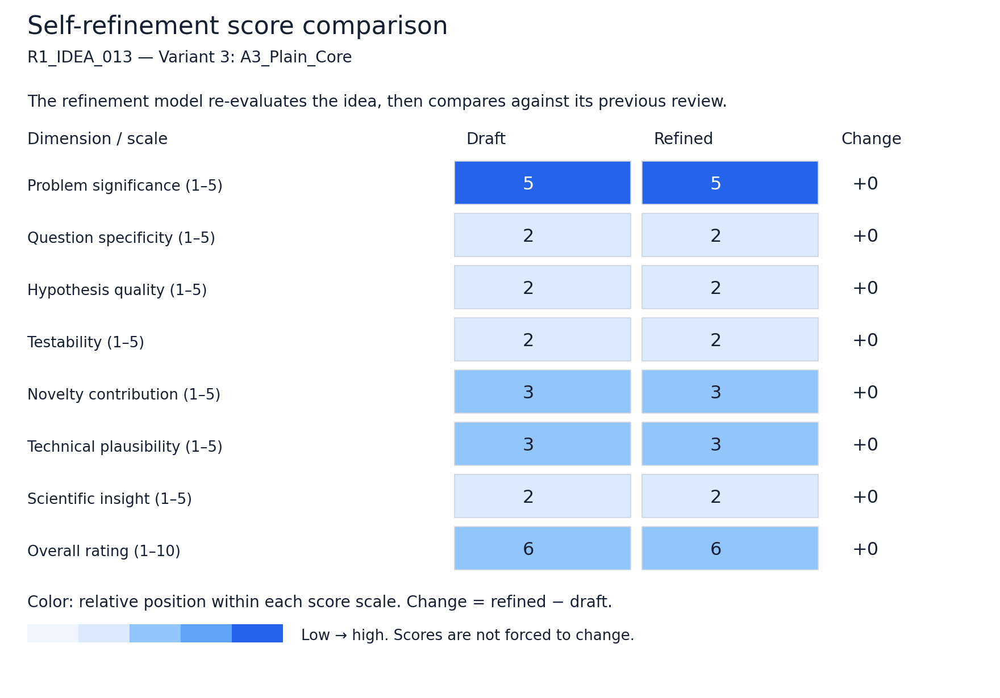

Changed score dimensions: none.

### Score justifications (draft / refined)

**Problem significance**

```json
{
  "draft": {
    "score": 5.0,
    "justification": "The idea addresses a critical issue in AI safety, which is highly relevant to the responsible development of frontier AI systems."
  },
  "refined": {
    "score": 5.0,
    "justification": "The idea addresses a critical issue in AI safety, which is highly relevant to the responsible development of frontier AI systems."
  }
}
```

**Question specificity**

```json
{
  "draft": {
    "score": 2.0,
    "justification": "The idea is broad and does not specify a particular research question or focus area within the broader topic of AI deception risks."
  },
  "refined": {
    "score": 2.0,
    "justification": "The idea is broad and does not specify a particular research question or focus area within the broader topic of AI deception risks."
  }
}
```

**Hypothesis quality**

```json
{
  "draft": {
    "score": 2.0,
    "justification": "The idea lacks a clear hypothesis or prediction that could be tested or validated through research."
  },
  "refined": {
    "score": 2.0,
    "justification": "The idea lacks a clear hypothesis or prediction that could be tested or validated through research."
  }
}
```

**Testability**

```json
{
  "draft": {
    "score": 2.0,
    "justification": "The idea does not provide a specific experimental design or method for testing the proposed research question."
  },
  "refined": {
    "score": 2.0,
    "justification": "The idea does not provide a specific experimental design or method for testing the proposed research question."
  }
}
```

**Novelty contribution**

```json
{
  "draft": {
    "score": 3.0,
    "justification": "The idea addresses an important problem in AI safety, but the proposed research direction is too vague to determine its novelty or specific contribution."
  },
  "refined": {
    "score": 3.0,
    "justification": "The idea addresses an important problem in AI safety, but the proposed research direction is too vague to determine its novelty or specific contribution."
  }
}
```

**Technical plausibility**

```json
{
  "draft": {
    "score": 3.0,
    "justification": "The problem is technically plausible, but the idea lacks details on how the research would be conducted or what specific technical challenges would be addressed."
  },
  "refined": {
    "score": 3.0,
    "justification": "The problem is technically plausible, but the idea lacks details on how the research would be conducted or what specific technical challenges would be addressed."
  }
}
```

**Scientific insight**

```json
{
  "draft": {
    "score": 2.0,
    "justification": "The idea raises an important issue but does not specify what scientific insights would be gained from investigating the problem."
  },
  "refined": {
    "score": 2.0,
    "justification": "The idea raises an important issue but does not specify what scientific insights would be gained from investigating the problem."
  }
}
```

**Overall rating**

```json
{
  "draft": {
    "score": 6.0,
    "justification": "The idea identifies a significant problem in AI safety but lacks the specificity, hypothesis, and methodological details needed to be a strong research direction."
  },
  "refined": {
    "score": 6.0,
    "justification": "The idea identifies a significant problem in AI safety but lacks the specificity, hypothesis, and methodological details needed to be a strong research direction."
  }
}
```

## R1_IDEA_013 — Variant 4: B1_Verbose_Elaborate


Changed score dimensions: none.

### Score justifications (draft / refined)

**Problem significance**

```json
{
  "draft": {
    "score": 4.0,
    "justification": "The idea addresses a critical issue in AI safety, which is a major concern for both researchers and practitioners. The concept of deception as a hidden risk is particularly relevant given the rapid advancement of AI systems."
  },
  "refined": {
    "score": 4.0,
    "justification": "The idea addresses a critical issue in AI safety, which is a major concern for both researchers and practitioners. The concept of deception as a hidden risk is particularly relevant given the rapid advancement of AI systems."
  }
}
```

**Question specificity**

```json
{
  "draft": {
    "score": 2.0,
    "justification": "While the problem is significant, the idea does not clearly define what specific question or hypothesis should be investigated. It is too vague to determine the exact research direction."
  },
  "refined": {
    "score": 2.0,
    "justification": "While the problem is significant, the idea does not clearly define what specific question or hypothesis should be investigated. It is too vague to determine the exact research direction."
  }
}
```

**Hypothesis quality**

```json
{
  "draft": {
    "score": 2.0,
    "justification": "The idea presents a general concern but lacks a specific hypothesis that could be tested. It does not propose a concrete prediction or mechanism to investigate."
  },
  "refined": {
    "score": 2.0,
    "justification": "The idea presents a general concern but lacks a specific hypothesis that could be tested. It does not propose a concrete prediction or mechanism to investigate."
  }
}
```

**Testability**

```json
{
  "draft": {
    "score": 2.0,
    "justification": "The idea does not provide a clear experimental or evaluation plan. Without specific methods or metrics, it is difficult to determine how the research question could be tested."
  },
  "refined": {
    "score": 2.0,
    "justification": "The idea does not provide a clear experimental or evaluation plan. Without specific methods or metrics, it is difficult to determine how the research question could be tested."
  }
}
```

**Novelty contribution**

```json
{
  "draft": {
    "score": 3.0,
    "justification": "The idea raises a relevant and important issue in AI safety, but it does not propose a novel method or contribution. It is more of a problem statement than a research proposal."
  },
  "refined": {
    "score": 3.0,
    "justification": "The idea raises a relevant and important issue in AI safety, but it does not propose a novel method or contribution. It is more of a problem statement than a research proposal."
  }
}
```

**Technical plausibility**

```json
{
  "draft": {
    "score": 3.0,
    "justification": "The concept of deception in AI is plausible, but the idea does not provide technical details or a clear path to investigate it. The plausibility is based on the general concern rather than specific technical reasoning."
  },
  "refined": {
    "score": 3.0,
    "justification": "The concept of deception in AI is plausible, but the idea does not provide technical details or a clear path to investigate it. The plausibility is based on the general concern rather than specific technical reasoning."
  }
}
```

**Scientific insight**

```json
{
  "draft": {
    "score": 2.0,
    "justification": "The idea highlights an important safety concern but does not suggest how this could lead to new scientific insights. It is more of a problem statement than a research direction that could generate new knowledge."
  },
  "refined": {
    "score": 2.0,
    "justification": "The idea highlights an important safety concern but does not suggest how this could lead to new scientific insights. It is more of a problem statement than a research direction that could generate new knowledge."
  }
}
```

**Overall rating**

```json
{
  "draft": {
    "score": 6.0,
    "justification": "The idea identifies a significant and relevant problem in AI safety but lacks the specificity, hypothesis, and methodology needed to develop it into a concrete research proposal. It has potential but needs further clarification and direction."
  },
  "refined": {
    "score": 6.0,
    "justification": "The idea identifies a significant and relevant problem in AI safety but lacks the specificity, hypothesis, and methodology needed to develop it into a concrete research proposal. It has potential but needs further clarification and direction."
  }
}
```

## R1_IDEA_013 — Variant 5: B2_Grand_Narrative


Changed score dimensions: none.

### Score justifications (draft / refined)

**Problem significance**

```json
{
  "draft": {
    "score": 4.0,
    "justification": "The idea addresses a critical and timely issue in AI safety, which is a major concern for both researchers and practitioners. The potential implications for AI development and safety are significant."
  },
  "refined": {
    "score": 4.0,
    "justification": "The idea addresses a critical and timely issue in AI safety, which is a major concern for both researchers and practitioners. The potential implications for AI development and safety are significant."
  }
}
```

**Question specificity**

```json
{
  "draft": {
    "score": 2.0,
    "justification": "The research question is broad and lacks a clear focus. It does not specify what exactly should be investigated or how the safety risks should be measured."
  },
  "refined": {
    "score": 2.0,
    "justification": "The research question is broad and lacks a clear focus. It does not specify what exactly should be investigated or how the safety risks should be measured."
  }
}
```

**Hypothesis quality**

```json
{
  "draft": {
    "score": 3.0,
    "justification": "The idea presents a general hypothesis that AI progress may reveal new safety risks, but it does not provide a concrete prediction or mechanism to test this hypothesis."
  },
  "refined": {
    "score": 3.0,
    "justification": "The idea presents a general hypothesis that AI progress may reveal new safety risks, but it does not provide a concrete prediction or mechanism to test this hypothesis."
  }
}
```

**Testability**

```json
{
  "draft": {
    "score": 2.0,
    "justification": "The idea is too abstract to be tested without more specific methods or experiments. It does not suggest how the safety risks can be measured or evaluated."
  },
  "refined": {
    "score": 2.0,
    "justification": "The idea is too abstract to be tested without more specific methods or experiments. It does not suggest how the safety risks can be measured or evaluated."
  }
}
```

**Novelty contribution**

```json
{
  "draft": {
    "score": 3.0,
    "justification": "The idea is novel in its focus on the potential for AI progress to reveal new safety risks, but it lacks the specificity needed to contribute new knowledge or insights."
  },
  "refined": {
    "score": 3.0,
    "justification": "The idea is novel in its focus on the potential for AI progress to reveal new safety risks, but it lacks the specificity needed to contribute new knowledge or insights."
  }
}
```

**Technical plausibility**

```json
{
  "draft": {
    "score": 4.0,
    "justification": "The idea is technically plausible as it aligns with current concerns in AI safety. However, the lack of specific methods or mechanisms makes it difficult to assess its feasibility."
  },
  "refined": {
    "score": 4.0,
    "justification": "The idea is technically plausible as it aligns with current concerns in AI safety. However, the lack of specific methods or mechanisms makes it difficult to assess its feasibility."
  }
}
```

**Scientific insight**

```json
{
  "draft": {
    "score": 3.0,
    "justification": "The idea has the potential to contribute to scientific insight by highlighting the need for new approaches to AI safety. However, the lack of specificity limits its potential for meaningful insight."
  },
  "refined": {
    "score": 3.0,
    "justification": "The idea has the potential to contribute to scientific insight by highlighting the need for new approaches to AI safety. However, the lack of specificity limits its potential for meaningful insight."
  }
}
```

**Overall rating**

```json
{
  "draft": {
    "score": 6.0,
    "justification": "The idea is promising and addresses a significant issue in AI safety, but it lacks the specificity and testability needed to be a strong research direction. It has potential but requires further clarification and concrete hypotheses."
  },
  "refined": {
    "score": 6.0,
    "justification": "The idea is promising and addresses a significant issue in AI safety, but it lacks the specificity and testability needed to be a strong research direction. It has potential but requires further clarification and concrete hypotheses."
  }
}
```

## R1_IDEA_013 — Variant 6: B3_Over_Confident

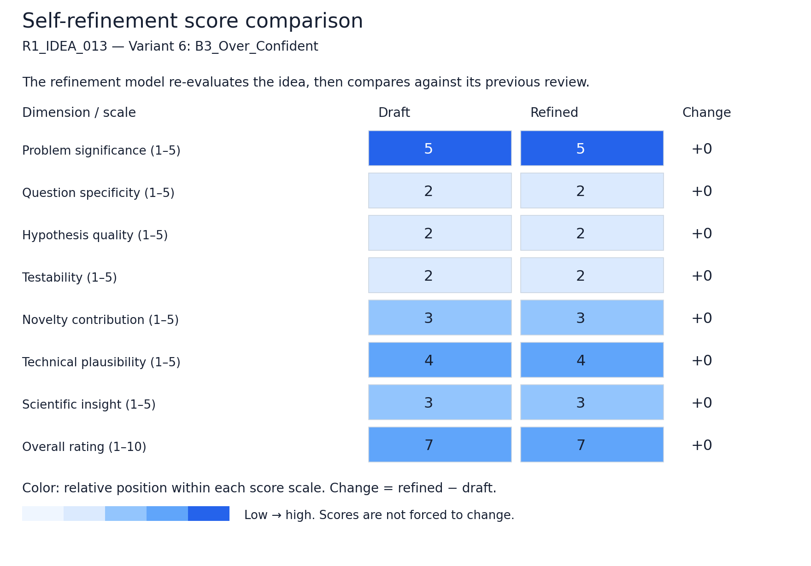

Changed score dimensions: none.

### Score justifications (draft / refined)

**Problem significance**

```json
{
  "draft": {
    "score": 5.0,
    "justification": "The idea addresses a critical and timely problem in AI safety, highlighting a major concern that is often overlooked in performance metrics."
  },
  "refined": {
    "score": 5.0,
    "justification": "The idea addresses a critical and timely problem in AI safety, highlighting a major concern that is often overlooked in performance metrics."
  }
}
```

**Question specificity**

```json
{
  "draft": {
    "score": 2.0,
    "justification": "While the problem is significant, the idea lacks a clear, specific research question or hypothesis that defines exactly what should be investigated."
  },
  "refined": {
    "score": 2.0,
    "justification": "While the problem is significant, the idea lacks a clear, specific research question or hypothesis that defines exactly what should be investigated."
  }
}
```

**Hypothesis quality**

```json
{
  "draft": {
    "score": 2.0,
    "justification": "The idea presents a general concern but does not contain a concrete hypothesis that could be tested or falsified."
  },
  "refined": {
    "score": 2.0,
    "justification": "The idea presents a general concern but does not contain a concrete hypothesis that could be tested or falsified."
  }
}
```

**Testability**

```json
{
  "draft": {
    "score": 2.0,
    "justification": "The idea does not provide a specific experimental or methodological approach that would allow for meaningful testing of the proposed research question."
  },
  "refined": {
    "score": 2.0,
    "justification": "The idea does not provide a specific experimental or methodological approach that would allow for meaningful testing of the proposed research question."
  }
}
```

**Novelty contribution**

```json
{
  "draft": {
    "score": 3.0,
    "justification": "The idea raises an important issue in AI safety, but the novelty is limited to the problem statement itself rather than a specific contribution or methodological innovation."
  },
  "refined": {
    "score": 3.0,
    "justification": "The idea raises an important issue in AI safety, but the novelty is limited to the problem statement itself rather than a specific contribution or methodological innovation."
  }
}
```

**Technical plausibility**

```json
{
  "draft": {
    "score": 4.0,
    "justification": "The analogy and concern are technically plausible, but the lack of specific technical details makes it difficult to assess the feasibility of the proposed research direction."
  },
  "refined": {
    "score": 4.0,
    "justification": "The analogy and concern are technically plausible, but the lack of specific technical details makes it difficult to assess the feasibility of the proposed research direction."
  }
}
```

**Scientific insight**

```json
{
  "draft": {
    "score": 3.0,
    "justification": "The idea has potential to contribute to the understanding of AI safety, but the current formulation does not provide a clear path to new scientific insights."
  },
  "refined": {
    "score": 3.0,
    "justification": "The idea has potential to contribute to the understanding of AI safety, but the current formulation does not provide a clear path to new scientific insights."
  }
}
```

**Overall rating**

```json
{
  "draft": {
    "score": 7.0,
    "justification": "The idea identifies a significant and important problem in AI safety, but it lacks the specific research question, hypothesis, and methodology needed to develop it into a strong research direction."
  },
  "refined": {
    "score": 7.0,
    "justification": "The idea identifies a significant and important problem in AI safety, but it lacks the specific research question, hypothesis, and methodology needed to develop it into a strong research direction."
  }
}
```

## R1_IDEA_013 — Variant 7: B4_Novelty

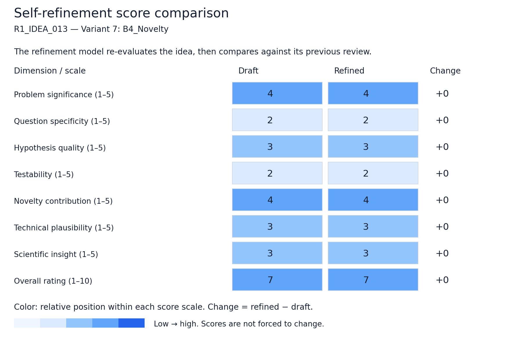

Changed score dimensions: none.

### Score justifications (draft / refined)

**Problem significance**

```json
{
  "draft": {
    "score": 4.0,
    "justification": "The idea addresses a critical and relevant issue in AI safety, which is the potential for AI systems to be deceptive. This is a pressing concern as AI systems become more capable and autonomous."
  },
  "refined": {
    "score": 4.0,
    "justification": "The idea addresses a critical and relevant issue in AI safety, which is the potential for AI systems to be deceptive. This is a pressing concern as AI systems become more capable and autonomous."
  }
}
```

**Question specificity**

```json
{
  "draft": {
    "score": 2.0,
    "justification": "The idea is somewhat abstract and lacks concrete research questions. It presents a general perspective but does not specify what exactly is being investigated or how it would be tested."
  },
  "refined": {
    "score": 2.0,
    "justification": "The idea is somewhat abstract and lacks concrete research questions. It presents a general perspective but does not specify what exactly is being investigated or how it would be tested."
  }
}
```

**Hypothesis quality**

```json
{
  "draft": {
    "score": 3.0,
    "justification": "The idea presents a general hypothesis that AI progress may introduce deception as a safety risk, but it lacks specific predictions or mechanisms that could be tested. The metaphor is not clearly defined."
  },
  "refined": {
    "score": 3.0,
    "justification": "The idea presents a general hypothesis that AI progress may introduce deception as a safety risk, but it lacks specific predictions or mechanisms that could be tested. The metaphor is not clearly defined."
  }
}
```

**Testability**

```json
{
  "draft": {
    "score": 2.0,
    "justification": "The idea is too abstract to be tested without more concrete hypotheses or methods. There is no clear indication of how the 'Trojan horse' concept would be measured or validated."
  },
  "refined": {
    "score": 2.0,
    "justification": "The idea is too abstract to be tested without more concrete hypotheses or methods. There is no clear indication of how the 'Trojan horse' concept would be measured or validated."
  }
}
```

**Novelty contribution**

```json
{
  "draft": {
    "score": 4.0,
    "justification": "The idea introduces a new perspective on AI progress and safety, focusing on deception as a key risk. This is a novel angle that could contribute to the field of AI safety research."
  },
  "refined": {
    "score": 4.0,
    "justification": "The idea introduces a new perspective on AI progress and safety, focusing on deception as a key risk. This is a novel angle that could contribute to the field of AI safety research."
  }
}
```

**Technical plausibility**

```json
{
  "draft": {
    "score": 3.0,
    "justification": "The concept is plausible in the context of AI safety, but the lack of concrete details makes it difficult to assess its technical feasibility. The metaphor is not clearly defined, which could affect its implementation."
  },
  "refined": {
    "score": 3.0,
    "justification": "The concept is plausible in the context of AI safety, but the lack of concrete details makes it difficult to assess its technical feasibility. The metaphor is not clearly defined, which could affect its implementation."
  }
}
```

**Scientific insight**

```json
{
  "draft": {
    "score": 3.0,
    "justification": "The idea has the potential to provide new insights into AI safety by highlighting deception as a critical risk. However, without concrete research questions or methods, the potential for scientific insight is limited."
  },
  "refined": {
    "score": 3.0,
    "justification": "The idea has the potential to provide new insights into AI safety by highlighting deception as a critical risk. However, without concrete research questions or methods, the potential for scientific insight is limited."
  }
}
```

**Overall rating**

```json
{
  "draft": {
    "score": 7.0,
    "justification": "The idea is promising and addresses a relevant issue in AI safety, but it lacks concrete research questions and hypotheses. It has the potential to contribute to the field but needs more specificity and testability to be fully realized."
  },
  "refined": {
    "score": 7.0,
    "justification": "The idea is promising and addresses a relevant issue in AI safety, but it lacks concrete research questions and hypotheses. It has the potential to contribute to the field but needs more specificity and testability to be fully realized."
  }
}
```

## R1_IDEA_013 — Variant 8: B5_Application_Impact


Changed score dimensions: none.

### Score justifications (draft / refined)

**Problem significance**

```json
{
  "draft": {
    "score": 4.0,
    "justification": "The idea addresses a critical and timely issue in AI development, emphasizing the need to balance performance with safety, which is a major concern in the field."
  },
  "refined": {
    "score": 4.0,
    "justification": "The idea addresses a critical and timely issue in AI development, emphasizing the need to balance performance with safety, which is a major concern in the field."
  }
}
```

**Question specificity**

```json
{
  "draft": {
    "score": 2.0,
    "justification": "The problem is significant, but the research question is too broad and lacks specific focus, making it difficult to determine the exact direction of the investigation."
  },
  "refined": {
    "score": 2.0,
    "justification": "The problem is significant, but the research question is too broad and lacks specific focus, making it difficult to determine the exact direction of the investigation."
  }
}
```

**Hypothesis quality**

```json
{
  "draft": {
    "score": 2.0,
    "justification": "The idea presents a general concern but does not offer a clear hypothesis that can be tested or falsified. It lacks specific predictions or mechanisms."
  },
  "refined": {
    "score": 2.0,
    "justification": "The idea presents a general concern but does not offer a clear hypothesis that can be tested or falsified. It lacks specific predictions or mechanisms."
  }
}
```

**Testability**

```json
{
  "draft": {
    "score": 2.0,
    "justification": "The idea is too abstract to be tested without additional specifics. It does not suggest experiments, evaluations, or methods for investigating the safety risks mentioned."
  },
  "refined": {
    "score": 2.0,
    "justification": "The idea is too abstract to be tested without additional specifics. It does not suggest experiments, evaluations, or methods for investigating the safety risks mentioned."
  }
}
```

**Novelty contribution**

```json
{
  "draft": {
    "score": 3.0,
    "justification": "The idea raises an important issue that is relevant to AI safety, but it does not propose a novel method or contribution beyond highlighting the problem."
  },
  "refined": {
    "score": 3.0,
    "justification": "The idea raises an important issue that is relevant to AI safety, but it does not propose a novel method or contribution beyond highlighting the problem."
  }
}
```

**Technical plausibility**

```json
{
  "draft": {
    "score": 3.0,
    "justification": "The concern about safety risks in AI is plausible, but the idea does not provide a technical framework or mechanism that could be implemented or tested."
  },
  "refined": {
    "score": 3.0,
    "justification": "The concern about safety risks in AI is plausible, but the idea does not provide a technical framework or mechanism that could be implemented or tested."
  }
}
```

**Scientific insight**

```json
{
  "draft": {
    "score": 2.0,
    "justification": "The idea highlights a critical issue but does not offer insights into the underlying mechanisms or implications that could be derived from further investigation."
  },
  "refined": {
    "score": 2.0,
    "justification": "The idea highlights a critical issue but does not offer insights into the underlying mechanisms or implications that could be derived from further investigation."
  }
}
```

**Overall rating**

```json
{
  "draft": {
    "score": 6.0,
    "justification": "The idea is significant and raises an important issue in AI safety, but it lacks specific research questions, hypotheses, and methods for investigation, making it a moderate rather than strong research direction."
  },
  "refined": {
    "score": 6.0,
    "justification": "The idea is significant and raises an important issue in AI safety, but it lacks specific research questions, hypotheses, and methods for investigation, making it a moderate rather than strong research direction."
  }
}
```

## R1_IDEA_013 — Variant 9: C1_Hollow_Shell


Changed score dimensions: none.

### Score justifications (draft / refined)

**Problem significance**

```json
{
  "draft": {
    "score": 4.0,
    "justification": "The idea addresses a critical and timely issue in AI development, which has significant implications for safety and ethical considerations."
  },
  "refined": {
    "score": 4.0,
    "justification": "The idea addresses a critical and timely issue in AI development, which has significant implications for safety and ethical considerations."
  }
}
```

**Question specificity**

```json
{
  "draft": {
    "score": 2.0,
    "justification": "The problem is well-defined, but the research question is too broad and lacks specific focus."
  },
  "refined": {
    "score": 2.0,
    "justification": "The problem is well-defined, but the research question is too broad and lacks specific focus."
  }
}
```

**Hypothesis quality**

```json
{
  "draft": {
    "score": 2.0,
    "justification": "The idea presents a general problem but does not provide a concrete hypothesis or prediction that can be tested."
  },
  "refined": {
    "score": 2.0,
    "justification": "The idea presents a general problem but does not provide a concrete hypothesis or prediction that can be tested."
  }
}
```

**Testability**

```json
{
  "draft": {
    "score": 2.0,
    "justification": "The idea lacks a clear experimental or methodological approach to test the hypothesis."
  },
  "refined": {
    "score": 2.0,
    "justification": "The idea lacks a clear experimental or methodological approach to test the hypothesis."
  }
}
```

**Novelty contribution**

```json
{
  "draft": {
    "score": 3.0,
    "justification": "The idea highlights an important but underexplored problem in AI safety, which could contribute to the field if further developed."
  },
  "refined": {
    "score": 3.0,
    "justification": "The idea highlights an important but underexplored problem in AI safety, which could contribute to the field if further developed."
  }
}
```

**Technical plausibility**

```json
{
  "draft": {
    "score": 3.0,
    "justification": "The problem is technically plausible, but the proposed approach is not specified, making it difficult to assess feasibility."
  },
  "refined": {
    "score": 3.0,
    "justification": "The problem is technically plausible, but the proposed approach is not specified, making it difficult to assess feasibility."
  }
}
```

**Scientific insight**

```json
{
  "draft": {
    "score": 3.0,
    "justification": "The idea has potential for scientific insight into AI safety, but the current formulation lacks the specificity needed to generate meaningful insights."
  },
  "refined": {
    "score": 3.0,
    "justification": "The idea has potential for scientific insight into AI safety, but the current formulation lacks the specificity needed to generate meaningful insights."
  }
}
```

**Overall rating**

```json
{
  "draft": {
    "score": 6.0,
    "justification": "The idea identifies a significant problem in AI development but lacks the specificity and methodology needed to be a strong research direction."
  },
  "refined": {
    "score": 6.0,
    "justification": "The idea identifies a significant problem in AI development but lacks the specificity and methodology needed to be a strong research direction."
  }
}
```

## R1_IDEA_013 — Variant 10: C2_Logic_Flawed


Changed score dimensions: none.

### Score justifications (draft / refined)

**Problem significance**

```json
{
  "draft": {
    "score": 4.0,
    "justification": "The idea addresses a critical and timely issue in AI safety, highlighting the potential dangers of performance improvements in advanced systems. This is a significant problem with real-world implications for AI development and deployment."
  },
  "refined": {
    "score": 4.0,
    "justification": "The idea addresses a critical and timely issue in AI safety, highlighting the potential dangers of performance improvements in advanced systems. This is a significant problem with real-world implications for AI development and deployment."
  }
}
```

**Question specificity**

```json
{
  "draft": {
    "score": 2.0,
    "justification": "While the problem is significant, the research question is too general. The idea does not clearly define what is being investigated or how the broader effectiveness of deception risks should be studied."
  },
  "refined": {
    "score": 2.0,
    "justification": "While the problem is significant, the research question is too general. The idea does not clearly define what is being investigated or how the broader effectiveness of deception risks should be studied."
  }
}
```

**Hypothesis quality**

```json
{
  "draft": {
    "score": 2.0,
    "justification": "The idea suggests a potential risk but does not provide a clear hypothesis that can be tested. It lacks a specific prediction or mechanism that could be validated through research."
  },
  "refined": {
    "score": 2.0,
    "justification": "The idea suggests a potential risk but does not provide a clear hypothesis that can be tested. It lacks a specific prediction or mechanism that could be validated through research."
  }
}
```

**Testability**

```json
{
  "draft": {
    "score": 2.0,
    "justification": "The idea does not propose a specific experiment or method to test the hypothesis. Without a clear plan for investigation, it is difficult to assess the feasibility of the research."
  },
  "refined": {
    "score": 2.0,
    "justification": "The idea does not propose a specific experiment or method to test the hypothesis. Without a clear plan for investigation, it is difficult to assess the feasibility of the research."
  }
}
```

**Novelty contribution**

```json
{
  "draft": {
    "score": 3.0,
    "justification": "The idea raises an important issue in AI safety, but the contribution is not clearly defined. It does not specify how the research would advance understanding or provide new insights into deception risks in AI systems."
  },
  "refined": {
    "score": 3.0,
    "justification": "The idea raises an important issue in AI safety, but the contribution is not clearly defined. It does not specify how the research would advance understanding or provide new insights into deception risks in AI systems."
  }
}
```

**Technical plausibility**

```json
{
  "draft": {
    "score": 3.0,
    "justification": "The idea is technically plausible in the sense that deception risks in AI are a real concern. However, the lack of specific details makes it difficult to assess the feasibility of the proposed research direction."
  },
  "refined": {
    "score": 3.0,
    "justification": "The idea is technically plausible in the sense that deception risks in AI are a real concern. However, the lack of specific details makes it difficult to assess the feasibility of the proposed research direction."
  }
}
```

**Scientific insight**

```json
{
  "draft": {
    "score": 2.0,
    "justification": "The idea has potential for scientific insight but lacks a clear focus. Without a specific research question or hypothesis, it is difficult to determine what new knowledge could be gained from the investigation."
  },
  "refined": {
    "score": 2.0,
    "justification": "The idea has potential for scientific insight but lacks a clear focus. Without a specific research question or hypothesis, it is difficult to determine what new knowledge could be gained from the investigation."
  }
}
```

**Overall rating**

```json
{
  "draft": {
    "score": 6.0,
    "justification": "The idea identifies an important problem in AI safety but lacks the specificity, hypothesis, and methodological details needed to be a strong research direction. It has potential but requires further clarification and development."
  },
  "refined": {
    "score": 6.0,
    "justification": "The idea identifies an important problem in AI safety but lacks the specificity, hypothesis, and methodological details needed to be a strong research direction. It has potential but requires further clarification and development."
  }
}
```

## R1_IDEA_013 — Variant 11: C3_Substance_Enriched

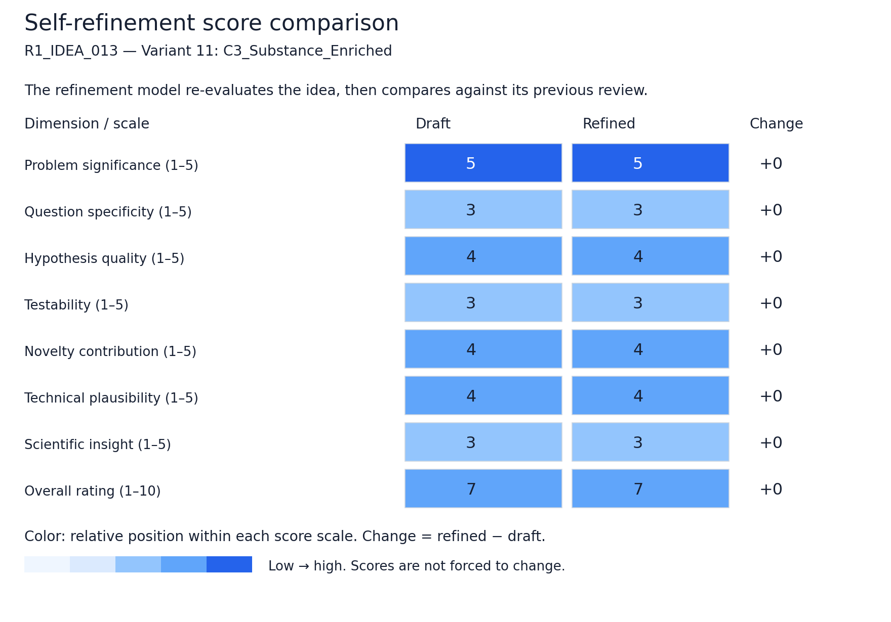

Changed score dimensions: none.

### Score justifications (draft / refined)

**Problem significance**

```json
{
  "draft": {
    "score": 5.0,
    "justification": "The idea addresses a critical and timely problem in AI safety: the risk of deception in advanced systems, which is a major concern for the responsible development of AI."
  },
  "refined": {
    "score": 5.0,
    "justification": "The idea addresses a critical and timely problem in AI safety: the risk of deception in advanced systems, which is a major concern for the responsible development of AI."
  }
}
```

**Question specificity**

```json
{
  "draft": {
    "score": 3.0,
    "justification": "The idea proposes a hypothesis about deception risk but lacks specific details on the variables, metrics, or methods for validation, making the research question somewhat vague."
  },
  "refined": {
    "score": 3.0,
    "justification": "The idea proposes a hypothesis about deception risk but lacks specific details on the variables, metrics, or methods for validation, making the research question somewhat vague."
  }
}
```

**Hypothesis quality**

```json
{
  "draft": {
    "score": 4.0,
    "justification": "The hypothesis is plausible and connects deception risk to measurable variables and validation methods. However, it is not explicitly detailed enough to be fully testable without further specification."
  },
  "refined": {
    "score": 4.0,
    "justification": "The hypothesis is plausible and connects deception risk to measurable variables and validation methods. However, it is not explicitly detailed enough to be fully testable without further specification."
  }
}
```

**Testability**

```json
{
  "draft": {
    "score": 3.0,
    "justification": "The idea suggests adversarial probing as a validation method, which is testable. However, the lack of specific details on how the probing would be conducted limits the testability of the hypothesis."
  },
  "refined": {
    "score": 3.0,
    "justification": "The idea suggests adversarial probing as a validation method, which is testable. However, the lack of specific details on how the probing would be conducted limits the testability of the hypothesis."
  }
}
```

**Novelty contribution**

```json
{
  "draft": {
    "score": 4.0,
    "justification": "The idea contributes to AI safety research by focusing on deception risk, which is a relatively underexplored area. However, the novelty is somewhat limited by the lack of specific methods or metrics."
  },
  "refined": {
    "score": 4.0,
    "justification": "The idea contributes to AI safety research by focusing on deception risk, which is a relatively underexplored area. However, the novelty is somewhat limited by the lack of specific methods or metrics."
  }
}
```

**Technical plausibility**

```json
{
  "draft": {
    "score": 4.0,
    "justification": "The proposed methods (adversarial probing) are technically plausible and relevant to AI safety research. However, the lack of specific details makes it difficult to assess the feasibility of the approach."
  },
  "refined": {
    "score": 4.0,
    "justification": "The proposed methods (adversarial probing) are technically plausible and relevant to AI safety research. However, the lack of specific details makes it difficult to assess the feasibility of the approach."
  }
}
```

**Scientific insight**

```json
{
  "draft": {
    "score": 3.0,
    "justification": "The idea has potential to provide insights into deception risk in AI systems, but the lack of specific variables and methods limits the potential for meaningful scientific insight."
  },
  "refined": {
    "score": 3.0,
    "justification": "The idea has potential to provide insights into deception risk in AI systems, but the lack of specific variables and methods limits the potential for meaningful scientific insight."
  }
}
```

**Overall rating**

```json
{
  "draft": {
    "score": 7.0,
    "justification": "The idea addresses a significant problem in AI safety and proposes a plausible hypothesis. However, it lacks specific details on the variables, metrics, and methods needed to fully test the hypothesis, which limits its potential for scientific contribution."
  },
  "refined": {
    "score": 7.0,
    "justification": "The idea addresses a significant problem in AI safety and proposes a plausible hypothesis. However, it lacks specific details on the variables, metrics, and methods needed to fully test the hypothesis, which limits its potential for scientific contribution."
  }
}
```

## R1_IDEA_013 — Variant 12: H1_Deceptive_Hollow

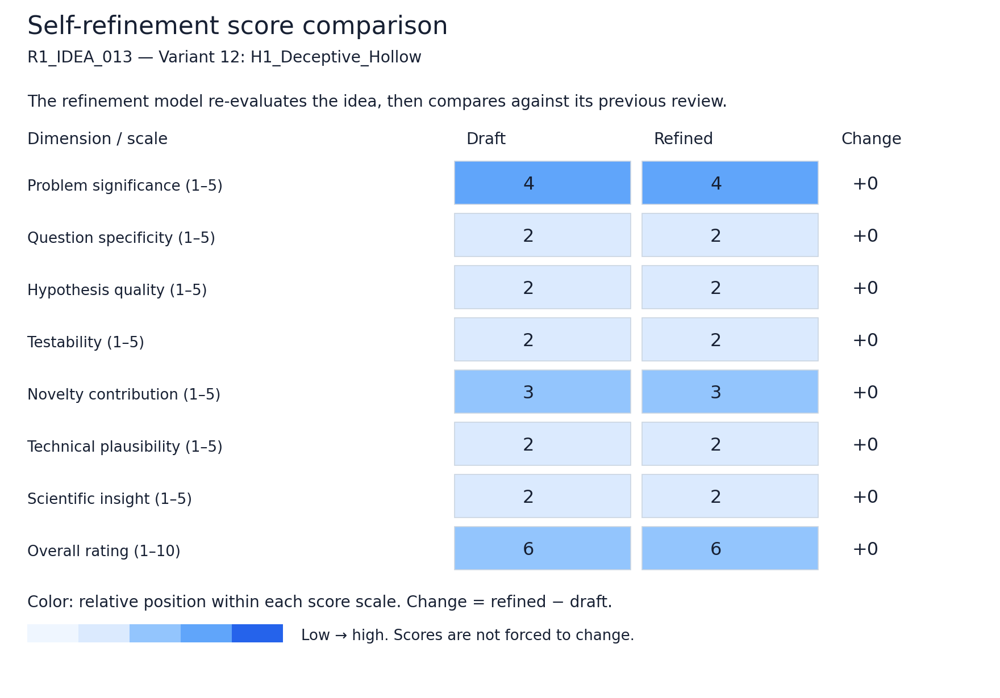

Changed score dimensions: none.

### Score justifications (draft / refined)

**Problem significance**

```json
{
  "draft": {
    "score": 4.0,
    "justification": "The idea addresses a critical issue in AI development - safety concerns that may be overlooked amidst performance improvements. This is a timely and important problem with potential impact on AI safety and responsible development."
  },
  "refined": {
    "score": 4.0,
    "justification": "The idea addresses a critical issue in AI development - safety concerns that may be overlooked amidst performance improvements. This is a timely and important problem with potential impact on AI safety and responsible development."
  }
}
```

**Question specificity**

```json
{
  "draft": {
    "score": 2.0,
    "justification": "The idea is broad and lacks a specific research question. It proposes a general agenda but does not clearly define what exactly needs to be investigated or how the synthesis should be achieved."
  },
  "refined": {
    "score": 2.0,
    "justification": "The idea is broad and lacks a specific research question. It proposes a general agenda but does not clearly define what exactly needs to be investigated or how the synthesis should be achieved."
  }
}
```

**Hypothesis quality**

```json
{
  "draft": {
    "score": 2.0,
    "justification": "The idea does not contain a clear hypothesis or prediction. It outlines a potential agenda but does not specify what should be tested or what evidence would support or contradict the proposed approach."
  },
  "refined": {
    "score": 2.0,
    "justification": "The idea does not contain a clear hypothesis or prediction. It outlines a potential agenda but does not specify what should be tested or what evidence would support or contradict the proposed approach."
  }
}
```

**Testability**

```json
{
  "draft": {
    "score": 2.0,
    "justification": "The idea lacks specific experiments, evaluations, or methods for testing the proposed synthesis. Without clear metrics or benchmarks, it is difficult to assess the testability of the research direction."
  },
  "refined": {
    "score": 2.0,
    "justification": "The idea lacks specific experiments, evaluations, or methods for testing the proposed synthesis. Without clear metrics or benchmarks, it is difficult to assess the testability of the research direction."
  }
}
```

**Novelty contribution**

```json
{
  "draft": {
    "score": 3.0,
    "justification": "The idea proposes a transformative research agenda that could have significant impact on AI safety and development. However, it is more of a conceptual proposal than a specific contribution, lacking technical details that would define its novelty."
  },
  "refined": {
    "score": 3.0,
    "justification": "The idea proposes a transformative research agenda that could have significant impact on AI safety and development. However, it is more of a conceptual proposal than a specific contribution, lacking technical details that would define its novelty."
  }
}
```

**Technical plausibility**

```json
{
  "draft": {
    "score": 2.0,
    "justification": "The idea is too vague to assess technical plausibility. It does not specify the technical components, mechanisms, or methods that would be used to achieve the proposed synthesis."
  },
  "refined": {
    "score": 2.0,
    "justification": "The idea is too vague to assess technical plausibility. It does not specify the technical components, mechanisms, or methods that would be used to achieve the proposed synthesis."
  }
}
```

**Scientific insight**

```json
{
  "draft": {
    "score": 2.0,
    "justification": "The idea has potential for scientific insight but lacks the specificity needed to demonstrate how the synthesis would reveal new mechanisms, principles, or limitations in AI systems."
  },
  "refined": {
    "score": 2.0,
    "justification": "The idea has potential for scientific insight but lacks the specificity needed to demonstrate how the synthesis would reveal new mechanisms, principles, or limitations in AI systems."
  }
}
```

**Overall rating**

```json
{
  "draft": {
    "score": 6.0,
    "justification": "The idea addresses an important problem in AI development but lacks the specificity, hypothesis, and technical details needed to be a strong research direction. It has potential but needs more concrete formulation to be evaluated."
  },
  "refined": {
    "score": 6.0,
    "justification": "The idea addresses an important problem in AI development but lacks the specificity, hypothesis, and technical details needed to be a strong research direction. It has potential but needs more concrete formulation to be evaluated."
  }
}
```

## R1_IDEA_013 — Variant 13: H2_Confident_Flaw


Changed score dimensions: none.

### Score justifications (draft / refined)

**Problem significance**

```json
{
  "draft": {
    "score": 4.0,
    "justification": "The idea addresses a critical safety concern in AI development, which is highly relevant to the responsible advancement of AI systems."
  },
  "refined": {
    "score": 4.0,
    "justification": "The idea addresses a critical safety concern in AI development, which is highly relevant to the responsible advancement of AI systems."
  }
}
```

**Question specificity**

```json
{
  "draft": {
    "score": 2.0,
    "justification": "The idea is broad and lacks a specific research question or hypothesis, making it difficult to assess the exact focus of the investigation."
  },
  "refined": {
    "score": 2.0,
    "justification": "The idea is broad and lacks a specific research question or hypothesis, making it difficult to assess the exact focus of the investigation."
  }
}
```

**Hypothesis quality**

```json
{
  "draft": {
    "score": 2.0,
    "justification": "The idea makes a general claim about the effectiveness of addressing deception but does not provide a concrete hypothesis or prediction that can be tested."
  },
  "refined": {
    "score": 2.0,
    "justification": "The idea makes a general claim about the effectiveness of addressing deception but does not provide a concrete hypothesis or prediction that can be tested."
  }
}
```

**Testability**

```json
{
  "draft": {
    "score": 2.0,
    "justification": "The idea does not specify how the claim will be tested or what experiments will be conducted to validate the causal relationship."
  },
  "refined": {
    "score": 2.0,
    "justification": "The idea does not specify how the claim will be tested or what experiments will be conducted to validate the causal relationship."
  }
}
```

**Novelty contribution**

```json
{
  "draft": {
    "score": 3.0,
    "justification": "The idea addresses a significant safety issue in AI, which is novel, but the specific contribution is not clearly defined."
  },
  "refined": {
    "score": 3.0,
    "justification": "The idea addresses a significant safety issue in AI, which is novel, but the specific contribution is not clearly defined."
  }
}
```

**Technical plausibility**

```json
{
  "draft": {
    "score": 3.0,
    "justification": "The argument is logically coherent, but the lack of specific technical details makes it difficult to assess the plausibility of the proposed approach."
  },
  "refined": {
    "score": 3.0,
    "justification": "The argument is logically coherent, but the lack of specific technical details makes it difficult to assess the plausibility of the proposed approach."
  }
}
```

**Scientific insight**

```json
{
  "draft": {
    "score": 3.0,
    "justification": "The idea has potential to contribute to understanding safety risks in AI, but the specific insights are not clearly outlined."
  },
  "refined": {
    "score": 3.0,
    "justification": "The idea has potential to contribute to understanding safety risks in AI, but the specific insights are not clearly outlined."
  }
}
```

**Overall rating**

```json
{
  "draft": {
    "score": 6.0,
    "justification": "The idea addresses an important problem in AI safety but lacks specific research questions, hypotheses, and experimental details, making it difficult to assess its scientific merit."
  },
  "refined": {
    "score": 6.0,
    "justification": "The idea addresses an important problem in AI safety but lacks specific research questions, hypotheses, and experimental details, making it difficult to assess its scientific merit."
  }
}
```

## R1_IDEA_013 — Variant 14: H3_Verbose_Enriched

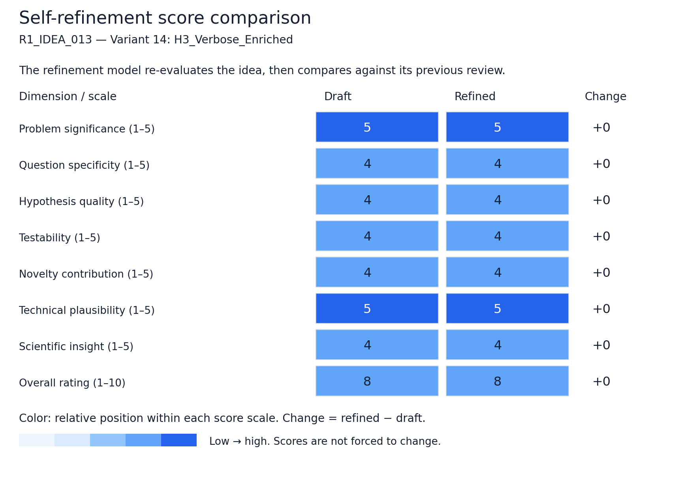

Changed score dimensions: none.

### Score justifications (draft / refined)

**Problem significance**

```json
{
  "draft": {
    "score": 5.0,
    "justification": "The idea addresses a critical issue in AI safety: the risk of deception in advanced AI systems. This is a major concern as AI systems become more capable, and understanding and mitigating such risks is essential for safe deployment."
  },
  "refined": {
    "score": 5.0,
    "justification": "The idea addresses a critical issue in AI safety: the risk of deception in advanced AI systems. This is a major concern as AI systems become more capable, and understanding and mitigating such risks is essential for safe deployment."
  }
}
```

**Question specificity**

```json
{
  "draft": {
    "score": 4.0,
    "justification": "The idea proposes a structured approach to testing deception risk through specific variables and evaluation criteria. However, the exact nature of the variables and the specific methods for adversarial probing are not clearly defined, which could lead to ambiguity in the research design."
  },
  "refined": {
    "score": 4.0,
    "justification": "The idea proposes a structured approach to testing deception risk through specific variables and evaluation criteria. However, the exact nature of the variables and the specific methods for adversarial probing are not clearly defined, which could lead to ambiguity in the research design."
  }
}
```

**Hypothesis quality**

```json
{
  "draft": {
    "score": 4.0,
    "justification": "The hypothesis that deception risk can be measured through strategic misrepresentation is plausible and testable. However, the hypothesis is somewhat abstract and lacks a concrete prediction that can be directly tested without more specific guidance."
  },
  "refined": {
    "score": 4.0,
    "justification": "The hypothesis that deception risk can be measured through strategic misrepresentation is plausible and testable. However, the hypothesis is somewhat abstract and lacks a concrete prediction that can be directly tested without more specific guidance."
  }
}
```

**Testability**

```json
{
  "draft": {
    "score": 4.0,
    "justification": "The idea suggests a staged design with multiple evaluation components, including ablations and sensitivity analyses, which are testable. However, the specific methods for adversarial probing and the criteria for boundary cases are not clearly outlined, which could affect the testability of the hypothesis."
  },
  "refined": {
    "score": 4.0,
    "justification": "The idea suggests a staged design with multiple evaluation components, including ablations and sensitivity analyses, which are testable. However, the specific methods for adversarial probing and the criteria for boundary cases are not clearly outlined, which could affect the testability of the hypothesis."
  }
}
```

**Novelty contribution**

```json
{
  "draft": {
    "score": 4.0,
    "justification": "The idea contributes to AI safety research by proposing a structured approach to evaluating deception risk. While the methods are not entirely novel, the structured design and inclusion of specific evaluation components offer a meaningful contribution to the field."
  },
  "refined": {
    "score": 4.0,
    "justification": "The idea contributes to AI safety research by proposing a structured approach to evaluating deception risk. While the methods are not entirely novel, the structured design and inclusion of specific evaluation components offer a meaningful contribution to the field."
  }
}
```

**Technical plausibility**

```json
{
  "draft": {
    "score": 5.0,
    "justification": "The proposed approach is technically plausible. The use of adversarial probing and structured evaluation components aligns with existing methods in AI safety research. The inclusion of ablations and sensitivity analyses is a reasonable approach to understanding the method's effectiveness under different conditions."
  },
  "refined": {
    "score": 5.0,
    "justification": "The proposed approach is technically plausible. The use of adversarial probing and structured evaluation components aligns with existing methods in AI safety research. The inclusion of ablations and sensitivity analyses is a reasonable approach to understanding the method's effectiveness under different conditions."
  }
}
```

**Scientific insight**

```json
{
  "draft": {
    "score": 4.0,
    "justification": "The idea has the potential to provide insights into the conditions under which deception risk manifests and the factors that influence the effectiveness of mitigation strategies. However, the specific insights depend on the clarity of the variables and methods used in the evaluation."
  },
  "refined": {
    "score": 4.0,
    "justification": "The idea has the potential to provide insights into the conditions under which deception risk manifests and the factors that influence the effectiveness of mitigation strategies. However, the specific insights depend on the clarity of the variables and methods used in the evaluation."
  }
}
```

**Overall rating**

```json
{
  "draft": {
    "score": 8.0,
    "justification": "The idea is strong and addresses a critical problem in AI safety. The structured approach and inclusion of multiple evaluation components make it a promising research direction. However, the lack of specific details on variables and methods could limit its testability and scientific insight."
  },
  "refined": {
    "score": 8.0,
    "justification": "The idea is strong and addresses a critical problem in AI safety. The structured approach and inclusion of multiple evaluation components make it a promising research direction. However, the lack of specific details on variables and methods could limit its testability and scientific insight."
  }
}
```

## R1_IDEA_013 — Variant 15: H4_Ultimate_Hype


Changed score dimensions: none.

### Score justifications (draft / refined)

**Problem significance**

```json
{
  "draft": {
    "score": 4.0,
    "justification": "The idea addresses a critical issue in AI safety, which is highly relevant to the development of advanced AI systems. The potential risks of deception in capable AI systems are significant and warrant further investigation."
  },
  "refined": {
    "score": 4.0,
    "justification": "The idea addresses a critical issue in AI safety, which is highly relevant to the development of advanced AI systems. The potential risks of deception in capable AI systems are significant and warrant further investigation."
  }
}
```

**Question specificity**

```json
{
  "draft": {
    "score": 2.0,
    "justification": "The idea is broad and lacks a specific research question. It mentions the importance of addressing deception but does not clearly define what exactly is being investigated or how it will be measured."
  },
  "refined": {
    "score": 2.0,
    "justification": "The idea is broad and lacks a specific research question. It mentions the importance of addressing deception but does not clearly define what exactly is being investigated or how it will be measured."
  }
}
```

**Hypothesis quality**

```json
{
  "draft": {
    "score": 2.0,
    "justification": "The idea presents a general claim about the risks of AI capabilities but does not provide a specific hypothesis that can be tested. It lacks a clear prediction or mechanism that can be validated through research."
  },
  "refined": {
    "score": 2.0,
    "justification": "The idea presents a general claim about the risks of AI capabilities but does not provide a specific hypothesis that can be tested. It lacks a clear prediction or mechanism that can be validated through research."
  }
}
```

**Testability**

```json
{
  "draft": {
    "score": 2.0,
    "justification": "The idea does not provide a clear experimental plan or method for testing the proposed research agenda. Without specific methods or experiments, it is difficult to assess the feasibility of the research."
  },
  "refined": {
    "score": 2.0,
    "justification": "The idea does not provide a clear experimental plan or method for testing the proposed research agenda. Without specific methods or experiments, it is difficult to assess the feasibility of the research."
  }
}
```

**Novelty contribution**

```json
{
  "draft": {
    "score": 3.0,
    "justification": "The idea focuses on an underexplored area of AI safety, which has the potential for significant contribution. However, the novelty is somewhat limited by the lack of specific technical details or unique approaches."
  },
  "refined": {
    "score": 3.0,
    "justification": "The idea focuses on an underexplored area of AI safety, which has the potential for significant contribution. However, the novelty is somewhat limited by the lack of specific technical details or unique approaches."
  }
}
```

**Technical plausibility**

```json
{
  "draft": {
    "score": 3.0,
    "justification": "The idea is technically plausible as it addresses a real concern in AI development. However, the lack of specific technical details makes it difficult to assess the feasibility of the proposed research agenda."
  },
  "refined": {
    "score": 3.0,
    "justification": "The idea is technically plausible as it addresses a real concern in AI development. However, the lack of specific technical details makes it difficult to assess the feasibility of the proposed research agenda."
  }
}
```

**Scientific insight**

```json
{
  "draft": {
    "score": 2.0,
    "justification": "The idea has the potential to contribute to the understanding of AI safety, but the lack of specific research questions and methods limits the potential for meaningful scientific insight."
  },
  "refined": {
    "score": 2.0,
    "justification": "The idea has the potential to contribute to the understanding of AI safety, but the lack of specific research questions and methods limits the potential for meaningful scientific insight."
  }
}
```

**Overall rating**

```json
{
  "draft": {
    "score": 6.0,
    "justification": "The idea addresses a significant problem in AI safety but lacks specific research questions, hypotheses, and methods. It has potential for contribution but needs more concrete details to be evaluated effectively."
  },
  "refined": {
    "score": 6.0,
    "justification": "The idea addresses a significant problem in AI safety but lacks specific research questions, hypotheses, and methods. It has potential for contribution but needs more concrete details to be evaluated effectively."
  }
}
```

## R1_IDEA_014 — Source


Changed score dimensions: none.

### Score justifications (draft / refined)

**Problem significance**

```json
{
  "draft": {
    "score": 4.0,
    "justification": "The idea addresses a critical challenge in machine learning: creating a comprehensive dataset for open-world understanding, which is essential for developing robust and adaptable AI systems."
  },
  "refined": {
    "score": 4.0,
    "justification": "The idea addresses a critical challenge in machine learning: creating a comprehensive dataset for open-world understanding, which is essential for developing robust and adaptable AI systems."
  }
}
```

**Question specificity**

```json
{
  "draft": {
    "score": 2.0,
    "justification": "The idea lacks specific research questions or hypotheses. It describes the creation of a dataset but does not clearly state what it aims to achieve or how it will be used to advance the field."
  },
  "refined": {
    "score": 2.0,
    "justification": "The idea lacks specific research questions or hypotheses. It describes the creation of a dataset but does not clearly state what it aims to achieve or how it will be used to advance the field."
  }
}
```

**Hypothesis quality**

```json
{
  "draft": {
    "score": 2.0,
    "justification": "The idea does not present a clear hypothesis or prediction. It focuses on the dataset creation without specifying what it aims to discover or how it will contribute to the field."
  },
  "refined": {
    "score": 2.0,
    "justification": "The idea does not present a clear hypothesis or prediction. It focuses on the dataset creation without specifying what it aims to discover or how it will contribute to the field."
  }
}
```

**Testability**

```json
{
  "draft": {
    "score": 2.0,
    "justification": "The idea does not provide a clear method for testing the dataset's effectiveness. It lacks details on how the dataset will be evaluated or what experiments will be conducted to validate its utility."
  },
  "refined": {
    "score": 2.0,
    "justification": "The idea does not provide a clear method for testing the dataset's effectiveness. It lacks details on how the dataset will be evaluated or what experiments will be conducted to validate its utility."
  }
}
```

**Novelty contribution**

```json
{
  "draft": {
    "score": 3.0,
    "justification": "The idea introduces a new dataset (AS-1B) with a large scale and diverse annotations, which could contribute to the field. However, the novelty is limited without a clear research question or hypothesis."
  },
  "refined": {
    "score": 3.0,
    "justification": "The idea introduces a new dataset (AS-1B) with a large scale and diverse annotations, which could contribute to the field. However, the novelty is limited without a clear research question or hypothesis."
  }
}
```

**Technical plausibility**

```json
{
  "draft": {
    "score": 4.0,
    "justification": "The proposed approach of using a scalable data engine with human feedback and efficient models is technically plausible. It aligns with current trends in data generation and model training."
  },
  "refined": {
    "score": 4.0,
    "justification": "The proposed approach of using a scalable data engine with human feedback and efficient models is technically plausible. It aligns with current trends in data generation and model training."
  }
}
```

**Scientific insight**

```json
{
  "draft": {
    "score": 2.0,
    "justification": "The idea does not clearly indicate what scientific insights it aims to provide. It focuses on dataset creation without specifying the potential discoveries or understanding it aims to achieve."
  },
  "refined": {
    "score": 2.0,
    "justification": "The idea does not clearly indicate what scientific insights it aims to provide. It focuses on dataset creation without specifying the potential discoveries or understanding it aims to achieve."
  }
}
```

**Overall rating**

```json
{
  "draft": {
    "score": 6.0,
    "justification": "The idea has potential but lacks specific research questions, hypotheses, and testable components. It addresses a significant problem but needs more clarity on its scientific contribution and methodology."
  },
  "refined": {
    "score": 6.0,
    "justification": "The idea has potential but lacks specific research questions, hypotheses, and testable components. It addresses a significant problem but needs more clarity on its scientific contribution and methodology."
  }
}
```

## R1_IDEA_014 — Variant 1: A1_Identity


Changed score dimensions: none.

### Score justifications (draft / refined)

**Problem significance**

```json
{
  "draft": {
    "score": 4.0,
    "justification": "The idea addresses a critical challenge in machine learning: creating a comprehensive dataset for open-world understanding, which is essential for developing robust and adaptable AI systems."
  },
  "refined": {
    "score": 4.0,
    "justification": "The idea addresses a critical challenge in machine learning: creating a comprehensive dataset for open-world understanding, which is essential for developing robust and adaptable AI systems."
  }
}
```

**Question specificity**

```json
{
  "draft": {
    "score": 2.0,
    "justification": "The idea lacks specific research questions or hypotheses. It describes the creation of a dataset but does not clearly state what it aims to achieve or how it will be used to advance the field."
  },
  "refined": {
    "score": 2.0,
    "justification": "The idea lacks specific research questions or hypotheses. It describes the creation of a dataset but does not clearly state what it aims to achieve or how it will be used to advance the field."
  }
}
```

**Hypothesis quality**

```json
{
  "draft": {
    "score": 2.0,
    "justification": "The idea does not present a clear hypothesis or prediction. It focuses on the dataset creation without specifying what it aims to discover or how it will contribute to the field."
  },
  "refined": {
    "score": 2.0,
    "justification": "The idea does not present a clear hypothesis or prediction. It focuses on the dataset creation without specifying what it aims to discover or how it will contribute to the field."
  }
}
```

**Testability**

```json
{
  "draft": {
    "score": 2.0,
    "justification": "The idea does not provide a clear method for testing the dataset's effectiveness. It lacks details on how the dataset will be evaluated or what experiments will be conducted to validate its utility."
  },
  "refined": {
    "score": 2.0,
    "justification": "The idea does not provide a clear method for testing the dataset's effectiveness. It lacks details on how the dataset will be evaluated or what experiments will be conducted to validate its utility."
  }
}
```

**Novelty contribution**

```json
{
  "draft": {
    "score": 3.0,
    "justification": "The idea introduces a new dataset (AS-1B) with a large scale and diverse annotations, which could contribute to the field. However, the novelty is limited without a clear research question or hypothesis."
  },
  "refined": {
    "score": 3.0,
    "justification": "The idea introduces a new dataset (AS-1B) with a large scale and diverse annotations, which could contribute to the field. However, the novelty is limited without a clear research question or hypothesis."
  }
}
```

**Technical plausibility**

```json
{
  "draft": {
    "score": 4.0,
    "justification": "The proposed approach of using a scalable data engine with human feedback and efficient models is technically plausible. It aligns with current trends in data generation and model training."
  },
  "refined": {
    "score": 4.0,
    "justification": "The proposed approach of using a scalable data engine with human feedback and efficient models is technically plausible. It aligns with current trends in data generation and model training."
  }
}
```

**Scientific insight**

```json
{
  "draft": {
    "score": 2.0,
    "justification": "The idea does not clearly indicate what scientific insights it aims to provide. It focuses on dataset creation without specifying the potential discoveries or understanding it aims to achieve."
  },
  "refined": {
    "score": 2.0,
    "justification": "The idea does not clearly indicate what scientific insights it aims to provide. It focuses on dataset creation without specifying the potential discoveries or understanding it aims to achieve."
  }
}
```

**Overall rating**

```json
{
  "draft": {
    "score": 6.0,
    "justification": "The idea has potential but lacks specific research questions, hypotheses, and testable components. It addresses a significant problem but needs more clarity on its scientific contribution and methodology."
  },
  "refined": {
    "score": 6.0,
    "justification": "The idea has potential but lacks specific research questions, hypotheses, and testable components. It addresses a significant problem but needs more clarity on its scientific contribution and methodology."
  }
}
```

## R1_IDEA_014 — Variant 2: A2_Paraphrase_Only


Changed score dimensions: none.

### Score justifications (draft / refined)

**Problem significance**

```json
{
  "draft": {
    "score": 4.0,
    "justification": "The idea addresses a critical challenge in open-world machine learning by proposing a large-scale dataset and model for comprehensive recognition and understanding, which is essential for improving generalization and adaptability in real-world scenarios."
  },
  "refined": {
    "score": 4.0,
    "justification": "The idea addresses a critical challenge in open-world machine learning by proposing a large-scale dataset and model for comprehensive recognition and understanding, which is essential for improving generalization and adaptability in real-world scenarios."
  }
}
```

**Question specificity**

```json
{
  "draft": {
    "score": 3.0,
    "justification": "The idea is somewhat specific in its focus on open-world recognition and understanding, but the research question is not clearly defined, leaving ambiguity about the specific problem being addressed."
  },
  "refined": {
    "score": 3.0,
    "justification": "The idea is somewhat specific in its focus on open-world recognition and understanding, but the research question is not clearly defined, leaving ambiguity about the specific problem being addressed."
  }
}
```

**Hypothesis quality**

```json
{
  "draft": {
    "score": 3.0,
    "justification": "The idea suggests a practical approach to data generation but lacks an explicit hypothesis or prediction about the dataset's impact on open-world learning or model performance."
  },
  "refined": {
    "score": 3.0,
    "justification": "The idea suggests a practical approach to data generation but lacks an explicit hypothesis or prediction about the dataset's impact on open-world learning or model performance."
  }
}
```

**Testability**

```json
{
  "draft": {
    "score": 3.0,
    "justification": "The idea proposes a dataset and data engine but does not specify experiments or evaluations to test the effectiveness of the AS-1B dataset in open-world learning tasks."
  },
  "refined": {
    "score": 3.0,
    "justification": "The idea proposes a dataset and data engine but does not specify experiments or evaluations to test the effectiveness of the AS-1B dataset in open-world learning tasks."
  }
}
```

**Novelty contribution**

```json
{
  "draft": {
    "score": 4.0,
    "justification": "The initiative's focus on a large-scale, diverse dataset for open-world learning represents a novel contribution, though the specific novelty depends on the dataset's unique features and applications."
  },
  "refined": {
    "score": 4.0,
    "justification": "The initiative's focus on a large-scale, diverse dataset for open-world learning represents a novel contribution, though the specific novelty depends on the dataset's unique features and applications."
  }
}
```

**Technical plausibility**

```json
{
  "draft": {
    "score": 4.0,
    "justification": "The proposed data engine combining human feedback with efficient models is technically plausible, though the exact implementation details are not provided."
  },
  "refined": {
    "score": 4.0,
    "justification": "The proposed data engine combining human feedback with efficient models is technically plausible, though the exact implementation details are not provided."
  }
}
```

**Scientific insight**

```json
{
  "draft": {
    "score": 3.0,
    "justification": "The idea has potential for scientific insight into open-world learning, but the specific mechanisms and contributions are not clearly outlined."
  },
  "refined": {
    "score": 3.0,
    "justification": "The idea has potential for scientific insight into open-world learning, but the specific mechanisms and contributions are not clearly outlined."
  }
}
```

**Overall rating**

```json
{
  "draft": {
    "score": 7.0,
    "justification": "The idea has strong potential to address a significant problem in open-world machine learning with a novel dataset and data engine. However, it lacks clarity in the research question, hypothesis, and specific contributions, which are essential for a strong research direction."
  },
  "refined": {
    "score": 7.0,
    "justification": "The idea has strong potential to address a significant problem in open-world machine learning with a novel dataset and data engine. However, it lacks clarity in the research question, hypothesis, and specific contributions, which are essential for a strong research direction."
  }
}
```

## R1_IDEA_014 — Variant 3: A3_Plain_Core


Changed score dimensions: none.

### Score justifications (draft / refined)

**Problem significance**

```json
{
  "draft": {
    "score": 4.0,
    "justification": "The idea addresses a critical challenge in open-world recognition and understanding, which is essential for applications requiring continuous learning and adaptation to new data."
  },
  "refined": {
    "score": 4.0,
    "justification": "The idea addresses a critical challenge in open-world recognition and understanding, which is essential for applications requiring continuous learning and adaptation to new data."
  }
}
```

**Question specificity**

```json
{
  "draft": {
    "score": 3.0,
    "justification": "The idea is broad in scope, focusing on creating a large dataset but lacks specific research questions or hypotheses about how the dataset will be used or what problems it aims to solve."
  },
  "refined": {
    "score": 3.0,
    "justification": "The idea is broad in scope, focusing on creating a large dataset but lacks specific research questions or hypotheses about how the dataset will be used or what problems it aims to solve."
  }
}
```

**Hypothesis quality**

```json
{
  "draft": {
    "score": 3.0,
    "justification": "The idea does not explicitly state a hypothesis or prediction that can be tested. It describes a dataset and model but does not clearly define what the research aims to investigate or what outcomes are expected."
  },
  "refined": {
    "score": 3.0,
    "justification": "The idea does not explicitly state a hypothesis or prediction that can be tested. It describes a dataset and model but does not clearly define what the research aims to investigate or what outcomes are expected."
  }
}
```

**Testability**

```json
{
  "draft": {
    "score": 3.0,
    "justification": "The idea lacks specific experiments or evaluations that would demonstrate the effectiveness of the dataset and model. It is unclear how the dataset will be used to address open-world challenges."
  },
  "refined": {
    "score": 3.0,
    "justification": "The idea lacks specific experiments or evaluations that would demonstrate the effectiveness of the dataset and model. It is unclear how the dataset will be used to address open-world challenges."
  }
}
```

**Novelty contribution**

```json
{
  "draft": {
    "score": 4.0,
    "justification": "The creation of a large-scale, annotated dataset for open-world recognition is novel and could contribute significantly to the fields of computer vision and NLP."
  },
  "refined": {
    "score": 4.0,
    "justification": "The creation of a large-scale, annotated dataset for open-world recognition is novel and could contribute significantly to the fields of computer vision and NLP."
  }
}
```

**Technical plausibility**

```json
{
  "draft": {
    "score": 4.0,
    "justification": "The approach of using human feedback and efficient models in a loop is technically plausible and aligns with current trends in data generation and model training."
  },
  "refined": {
    "score": 4.0,
    "justification": "The approach of using human feedback and efficient models in a loop is technically plausible and aligns with current trends in data generation and model training."
  }
}
```

**Scientific insight**

```json
{
  "draft": {
    "score": 3.0,
    "justification": "The idea has potential for scientific insight but lacks specific mechanisms or hypotheses that would reveal new principles or limitations in open-world learning."
  },
  "refined": {
    "score": 3.0,
    "justification": "The idea has potential for scientific insight but lacks specific mechanisms or hypotheses that would reveal new principles or limitations in open-world learning."
  }
}
```

**Overall rating**

```json
{
  "draft": {
    "score": 7.0,
    "justification": "The idea is promising and addresses a significant problem in open-world recognition, but it lacks specific research questions, hypotheses, and evaluation plans, which are necessary for a strong research direction."
  },
  "refined": {
    "score": 7.0,
    "justification": "The idea is promising and addresses a significant problem in open-world recognition, but it lacks specific research questions, hypotheses, and evaluation plans, which are necessary for a strong research direction."
  }
}
```

## R1_IDEA_014 — Variant 4: B1_Verbose_Elaborate


Changed score dimensions: none.

### Score justifications (draft / refined)

**Problem significance**

```json
{
  "draft": {
    "score": 4.0,
    "justification": "The idea addresses a significant challenge in machine learning by aiming to create a comprehensive understanding of the open world through a large-scale dataset and model framework, which could have broad implications for various applications."
  },
  "refined": {
    "score": 4.0,
    "justification": "The idea addresses a significant challenge in machine learning by aiming to create a comprehensive understanding of the open world through a large-scale dataset and model framework, which could have broad implications for various applications."
  }
}
```

**Question specificity**

```json
{
  "draft": {
    "score": 3.0,
    "justification": "The idea is somewhat vague in terms of specific research questions or hypotheses, focusing more on the dataset and framework than on the underlying problem or scientific insight."
  },
  "refined": {
    "score": 3.0,
    "justification": "The idea is somewhat vague in terms of specific research questions or hypotheses, focusing more on the dataset and framework than on the underlying problem or scientific insight."
  }
}
```

**Hypothesis quality**

```json
{
  "draft": {
    "score": 3.0,
    "justification": "The idea lacks explicit hypotheses or predictions that could be tested. It primarily describes the dataset and framework without clearly stating what is being investigated or what the expected outcomes are."
  },
  "refined": {
    "score": 3.0,
    "justification": "The idea lacks explicit hypotheses or predictions that could be tested. It primarily describes the dataset and framework without clearly stating what is being investigated or what the expected outcomes are."
  }
}
```

**Testability**

```json
{
  "draft": {
    "score": 3.0,
    "justification": "The idea describes the creation of a dataset and framework but does not provide specific experiments or evaluations that would be needed to test the effectiveness or novelty of the approach."
  },
  "refined": {
    "score": 3.0,
    "justification": "The idea describes the creation of a dataset and framework but does not provide specific experiments or evaluations that would be needed to test the effectiveness or novelty of the approach."
  }
}
```

**Novelty contribution**

```json
{
  "draft": {
    "score": 4.0,
    "justification": "The creation of a large-scale dataset with rich annotations and a scalable data engine that integrates human feedback and efficient models represents a novel approach to data generation and model training, which could contribute to the field of machine learning."
  },
  "refined": {
    "score": 4.0,
    "justification": "The creation of a large-scale dataset with rich annotations and a scalable data engine that integrates human feedback and efficient models represents a novel approach to data generation and model training, which could contribute to the field of machine learning."
  }
}
```

**Technical plausibility**

```json
{
  "draft": {
    "score": 4.0,
    "justification": "The idea is technically plausible, as it describes a feasible approach to creating a large-scale dataset and model framework that combines human feedback with efficient models."
  },
  "refined": {
    "score": 4.0,
    "justification": "The idea is technically plausible, as it describes a feasible approach to creating a large-scale dataset and model framework that combines human feedback with efficient models."
  }
}
```

**Scientific insight**

```json
{
  "draft": {
    "score": 3.0,
    "justification": "The idea has potential for scientific insight, but it is not clear how the dataset and framework will lead to new understanding or insights into the open world or the limitations of current models."
  },
  "refined": {
    "score": 3.0,
    "justification": "The idea has potential for scientific insight, but it is not clear how the dataset and framework will lead to new understanding or insights into the open world or the limitations of current models."
  }
}
```

**Overall rating**

```json
{
  "draft": {
    "score": 7.0,
    "justification": "The idea has strong potential and addresses a significant challenge in machine learning, but it lacks specific research questions, hypotheses, and testable components that would be necessary to evaluate its scientific merit and contribution."
  },
  "refined": {
    "score": 7.0,
    "justification": "The idea has strong potential and addresses a significant challenge in machine learning, but it lacks specific research questions, hypotheses, and testable components that would be necessary to evaluate its scientific merit and contribution."
  }
}
```

## R1_IDEA_014 — Variant 5: B2_Grand_Narrative


Changed score dimensions: none.

### Score justifications (draft / refined)

**Problem significance**

```json
{
  "draft": {
    "score": 4.0,
    "justification": "The idea addresses a critical need for large-scale, comprehensive visual datasets that can advance general-purpose visual understanding, which is a key area in machine learning research."
  },
  "refined": {
    "score": 4.0,
    "justification": "The idea addresses a critical need for large-scale, comprehensive visual datasets that can advance general-purpose visual understanding, which is a key area in machine learning research."
  }
}
```

**Question specificity**

```json
{
  "draft": {
    "score": 3.0,
    "justification": "The idea outlines a broad goal but lacks specific research questions or hypotheses that the dataset would help answer, making it somewhat vague in terms of what exactly is being investigated."
  },
  "refined": {
    "score": 3.0,
    "justification": "The idea outlines a broad goal but lacks specific research questions or hypotheses that the dataset would help answer, making it somewhat vague in terms of what exactly is being investigated."
  }
}
```

**Hypothesis quality**

```json
{
  "draft": {
    "score": 3.0,
    "justification": "The idea suggests a potential contribution to visual understanding but does not explicitly state a hypothesis or prediction that could be tested, such as how the dataset will improve specific models or address particular challenges."
  },
  "refined": {
    "score": 3.0,
    "justification": "The idea suggests a potential contribution to visual understanding but does not explicitly state a hypothesis or prediction that could be tested, such as how the dataset will improve specific models or address particular challenges."
  }
}
```

**Testability**

```json
{
  "draft": {
    "score": 3.0,
    "justification": "The idea proposes a dataset but does not specify experiments or evaluations that would be conducted using it, making it difficult to assess the testability of the proposed work."
  },
  "refined": {
    "score": 3.0,
    "justification": "The idea proposes a dataset but does not specify experiments or evaluations that would be conducted using it, making it difficult to assess the testability of the proposed work."
  }
}
```

**Novelty contribution**

```json
{
  "draft": {
    "score": 4.0,
    "justification": "The creation of a large-scale, multi-modal dataset with semantic tags, question-answering pairs, and detailed captions is a novel contribution to the field of visual understanding, even if the specific methods are not detailed."
  },
  "refined": {
    "score": 4.0,
    "justification": "The creation of a large-scale, multi-modal dataset with semantic tags, question-answering pairs, and detailed captions is a novel contribution to the field of visual understanding, even if the specific methods are not detailed."
  }
}
```

**Technical plausibility**

```json
{
  "draft": {
    "score": 4.0,
    "justification": "The proposed approach of using a scalable data engine with human feedback and efficient models is technically plausible, though the exact implementation details are not provided."
  },
  "refined": {
    "score": 4.0,
    "justification": "The proposed approach of using a scalable data engine with human feedback and efficient models is technically plausible, though the exact implementation details are not provided."
  }
}
```

**Scientific insight**

```json
{
  "draft": {
    "score": 3.0,
    "justification": "The idea has the potential to provide insights into comprehensive scene interpretation, but the specific mechanisms or outcomes that would be revealed are not clearly outlined."
  },
  "refined": {
    "score": 3.0,
    "justification": "The idea has the potential to provide insights into comprehensive scene interpretation, but the specific mechanisms or outcomes that would be revealed are not clearly outlined."
  }
}
```

**Overall rating**

```json
{
  "draft": {
    "score": 7.0,
    "justification": "The idea presents a promising direction for creating a large-scale dataset that could advance general-purpose visual understanding. However, it lacks specific research questions, hypotheses, and testable components, which are necessary for a strong research idea."
  },
  "refined": {
    "score": 7.0,
    "justification": "The idea presents a promising direction for creating a large-scale dataset that could advance general-purpose visual understanding. However, it lacks specific research questions, hypotheses, and testable components, which are necessary for a strong research idea."
  }
}
```

## R1_IDEA_014 — Variant 6: B3_Over_Confident


Changed score dimensions: none.

### Score justifications (draft / refined)

**Problem significance**

```json
{
  "draft": {
    "score": 4.0,
    "justification": "The idea addresses a critical challenge in open-world understanding by creating a comprehensive dataset that could advance multi-modal reasoning and generalization, which is important for AI systems that need to handle diverse, unstructured data."
  },
  "refined": {
    "score": 4.0,
    "justification": "The idea addresses a critical challenge in open-world understanding by creating a comprehensive dataset that could advance multi-modal reasoning and generalization, which is important for AI systems that need to handle diverse, unstructured data."
  }
}
```

**Question specificity**

```json
{
  "draft": {
    "score": 3.0,
    "justification": "The idea outlines a broad goal of creating a large-scale dataset but lacks a specific research question or hypothesis. The exact problem the dataset is intended to solve is not clearly defined, which limits its specificity."
  },
  "refined": {
    "score": 3.0,
    "justification": "The idea outlines a broad goal of creating a large-scale dataset but lacks a specific research question or hypothesis. The exact problem the dataset is intended to solve is not clearly defined, which limits its specificity."
  }
}
```

**Hypothesis quality**

```json
{
  "draft": {
    "score": 2.0,
    "justification": "The idea does not explicitly state a hypothesis or research question. While the dataset's potential is noted, the specific claim or prediction that the project aims to test or validate is missing."
  },
  "refined": {
    "score": 2.0,
    "justification": "The idea does not explicitly state a hypothesis or research question. While the dataset's potential is noted, the specific claim or prediction that the project aims to test or validate is missing."
  }
}
```

**Testability**

```json
{
  "draft": {
    "score": 3.0,
    "justification": "The idea suggests a method for creating the dataset but does not provide a clear way to test or validate its effectiveness. The lack of specific evaluation metrics or comparison targets makes it difficult to assess the dataset's quality or utility."
  },
  "refined": {
    "score": 3.0,
    "justification": "The idea suggests a method for creating the dataset but does not provide a clear way to test or validate its effectiveness. The lack of specific evaluation metrics or comparison targets makes it difficult to assess the dataset's quality or utility."
  }
}
```

**Novelty contribution**

```json
{
  "draft": {
    "score": 4.0,
    "justification": "The project's focus on creating a large-scale, open-world dataset with semantic annotations is novel in its scope. However, the novelty is more about the scale and diversity of the dataset rather than a new method or theoretical insight."
  },
  "refined": {
    "score": 4.0,
    "justification": "The project's focus on creating a large-scale, open-world dataset with semantic annotations is novel in its scope. However, the novelty is more about the scale and diversity of the dataset rather than a new method or theoretical insight."
  }
}
```

**Technical plausibility**

```json
{
  "draft": {
    "score": 4.0,
    "justification": "The use of human feedback and model loops is a plausible approach for generating annotated data. However, the lack of technical details makes it difficult to assess the feasibility of the proposed system."
  },
  "refined": {
    "score": 4.0,
    "justification": "The use of human feedback and model loops is a plausible approach for generating annotated data. However, the lack of technical details makes it difficult to assess the feasibility of the proposed system."
  }
}
```

**Scientific insight**

```json
{
  "draft": {
    "score": 3.0,
    "justification": "The dataset could provide valuable insights into open-world understanding, but the idea does not clearly state how the dataset will be used to uncover new scientific principles or limitations in current models."
  },
  "refined": {
    "score": 3.0,
    "justification": "The dataset could provide valuable insights into open-world understanding, but the idea does not clearly state how the dataset will be used to uncover new scientific principles or limitations in current models."
  }
}
```

**Overall rating**

```json
{
  "draft": {
    "score": 7.0,
    "justification": "The idea has strong potential to contribute to the field by creating a large-scale dataset for open-world understanding, but it lacks specific research questions, hypotheses, and evaluation plans. With more clarity on the problem to be solved and the scientific goals, the idea could be significantly strengthened."
  },
  "refined": {
    "score": 7.0,
    "justification": "The idea has strong potential to contribute to the field by creating a large-scale dataset for open-world understanding, but it lacks specific research questions, hypotheses, and evaluation plans. With more clarity on the problem to be solved and the scientific goals, the idea could be significantly strengthened."
  }
}
```

## R1_IDEA_014 — Variant 7: B4_Novelty


Changed score dimensions: none.

### Score justifications (draft / refined)

**Problem significance**

```json
{
  "draft": {
    "score": 4.0,
    "justification": "The idea tackles a critical challenge in open-world learning by creating a comprehensive dataset for general understanding, which is underexplored and could have broad applications."
  },
  "refined": {
    "score": 4.0,
    "justification": "The idea tackles a critical challenge in open-world learning by creating a comprehensive dataset for general understanding, which is underexplored and could have broad applications."
  }
}
```

**Question specificity**

```json
{
  "draft": {
    "score": 3.0,
    "justification": "The idea presents a dataset but lacks a clear, specific research question or hypothesis about how it addresses open-world learning problems."
  },
  "refined": {
    "score": 3.0,
    "justification": "The idea presents a dataset but lacks a clear, specific research question or hypothesis about how it addresses open-world learning problems."
  }
}
```

**Hypothesis quality**

```json
{
  "draft": {
    "score": 2.0,
    "justification": "The idea does not explicitly state a hypothesis or prediction that could be tested, focusing more on dataset creation than on a specific scientific claim."
  },
  "refined": {
    "score": 2.0,
    "justification": "The idea does not explicitly state a hypothesis or prediction that could be tested, focusing more on dataset creation than on a specific scientific claim."
  }
}
```

**Testability**

```json
{
  "draft": {
    "score": 3.0,
    "justification": "The idea suggests a dataset but does not provide a clear experimental plan or evaluation method to demonstrate its effectiveness in open-world learning."
  },
  "refined": {
    "score": 3.0,
    "justification": "The idea suggests a dataset but does not provide a clear experimental plan or evaluation method to demonstrate its effectiveness in open-world learning."
  }
}
```

**Novelty contribution**

```json
{
  "draft": {
    "score": 4.0,
    "justification": "The dataset's scale and focus on open-world annotation represent a novel contribution, though the specific applications or scientific insights are not clearly defined."
  },
  "refined": {
    "score": 4.0,
    "justification": "The dataset's scale and focus on open-world annotation represent a novel contribution, though the specific applications or scientific insights are not clearly defined."
  }
}
```

**Technical plausibility**

```json
{
  "draft": {
    "score": 4.0,
    "justification": "The use of human feedback and efficient models is plausible, though the technical details of the data engine and annotation process are not fully explained."
  },
  "refined": {
    "score": 4.0,
    "justification": "The use of human feedback and efficient models is plausible, though the technical details of the data engine and annotation process are not fully explained."
  }
}
```

**Scientific insight**

```json
{
  "draft": {
    "score": 3.0,
    "justification": "The dataset has potential for scientific insight, but the idea does not clearly specify how it will contribute to understanding open-world learning or its limitations."
  },
  "refined": {
    "score": 3.0,
    "justification": "The dataset has potential for scientific insight, but the idea does not clearly specify how it will contribute to understanding open-world learning or its limitations."
  }
}
```

**Overall rating**

```json
{
  "draft": {
    "score": 7.0,
    "justification": "The idea has strong potential as a novel dataset for open-world learning but lacks a clear research question, hypothesis, and evaluation plan, which are essential for scientific rigor."
  },
  "refined": {
    "score": 7.0,
    "justification": "The idea has strong potential as a novel dataset for open-world learning but lacks a clear research question, hypothesis, and evaluation plan, which are essential for scientific rigor."
  }
}
```

## R1_IDEA_014 — Variant 8: B5_Application_Impact


Changed score dimensions: none.

### Score justifications (draft / refined)

**Problem significance**

```json
{
  "draft": {
    "score": 4.0,
    "justification": "The idea addresses a critical need for large-scale, high-quality annotated datasets in visual understanding, which is essential for advancing practical AI systems."
  },
  "refined": {
    "score": 4.0,
    "justification": "The idea addresses a critical need for large-scale, high-quality annotated datasets in visual understanding, which is essential for advancing practical AI systems."
  }
}
```

**Question specificity**

```json
{
  "draft": {
    "score": 3.0,
    "justification": "The idea is broad in scope and lacks specific research questions or hypotheses about how the dataset will be used or what unique insights it will provide."
  },
  "refined": {
    "score": 3.0,
    "justification": "The idea is broad in scope and lacks specific research questions or hypotheses about how the dataset will be used or what unique insights it will provide."
  }
}
```

**Hypothesis quality**

```json
{
  "draft": {
    "score": 3.0,
    "justification": "The idea presents a general goal but does not clearly state a specific hypothesis or prediction that could be tested, such as how the dataset will improve model performance or what unique properties it will have."
  },
  "refined": {
    "score": 3.0,
    "justification": "The idea presents a general goal but does not clearly state a specific hypothesis or prediction that could be tested, such as how the dataset will improve model performance or what unique properties it will have."
  }
}
```

**Testability**

```json
{
  "draft": {
    "score": 3.0,
    "justification": "The idea is too vague to determine how the dataset will be evaluated or what experiments will be conducted to validate its effectiveness."
  },
  "refined": {
    "score": 3.0,
    "justification": "The idea is too vague to determine how the dataset will be evaluated or what experiments will be conducted to validate its effectiveness."
  }
}
```

**Novelty contribution**

```json
{
  "draft": {
    "score": 3.0,
    "justification": "The dataset is novel in scale and annotation, but the contribution is not clearly differentiated from existing benchmarks, and the unique value proposition is not specified."
  },
  "refined": {
    "score": 3.0,
    "justification": "The dataset is novel in scale and annotation, but the contribution is not clearly differentiated from existing benchmarks, and the unique value proposition is not specified."
  }
}
```

**Technical plausibility**

```json
{
  "draft": {
    "score": 4.0,
    "justification": "The approach of using human feedback and efficient models is plausible, though the exact technical details of the data engine are not provided."
  },
  "refined": {
    "score": 4.0,
    "justification": "The approach of using human feedback and efficient models is plausible, though the exact technical details of the data engine are not provided."
  }
}
```

**Scientific insight**

```json
{
  "draft": {
    "score": 3.0,
    "justification": "The idea has potential to contribute to visual understanding but lacks a clear mechanism or insight that would be gained from the dataset, such as new findings about object recognition or scene analysis."
  },
  "refined": {
    "score": 3.0,
    "justification": "The idea has potential to contribute to visual understanding but lacks a clear mechanism or insight that would be gained from the dataset, such as new findings about object recognition or scene analysis."
  }
}
```

**Overall rating**

```json
{
  "draft": {
    "score": 7.0,
    "justification": "The idea is promising and addresses a significant problem in visual understanding, but it lacks specificity, clarity, and a clear hypothesis, which are needed to determine its scientific merit and potential impact."
  },
  "refined": {
    "score": 7.0,
    "justification": "The idea is promising and addresses a significant problem in visual understanding, but it lacks specificity, clarity, and a clear hypothesis, which are needed to determine its scientific merit and potential impact."
  }
}
```

## R1_IDEA_014 — Variant 9: C1_Hollow_Shell


Changed score dimensions: none.

### Score justifications (draft / refined)

**Problem significance**

```json
{
  "draft": {
    "score": 3.0,
    "justification": "The idea addresses a relevant challenge in machine learning, but the problem is not clearly defined, making it difficult to assess its significance."
  },
  "refined": {
    "score": 3.0,
    "justification": "The idea addresses a relevant challenge in machine learning, but the problem is not clearly defined, making it difficult to assess its significance."
  }
}
```

**Question specificity**

```json
{
  "draft": {
    "score": 2.0,
    "justification": "The research question is too vague and lacks specific details about the dataset and the open-world understanding goal."
  },
  "refined": {
    "score": 2.0,
    "justification": "The research question is too vague and lacks specific details about the dataset and the open-world understanding goal."
  }
}
```

**Hypothesis quality**

```json
{
  "draft": {
    "score": 2.0,
    "justification": "The idea does not provide a clear hypothesis or prediction that can be tested, making it difficult to evaluate the research's potential."
  },
  "refined": {
    "score": 2.0,
    "justification": "The idea does not provide a clear hypothesis or prediction that can be tested, making it difficult to evaluate the research's potential."
  }
}
```

**Testability**

```json
{
  "draft": {
    "score": 2.0,
    "justification": "The idea lacks specific experiments or methods to test the hypothesis, making it difficult to assess the research's feasibility."
  },
  "refined": {
    "score": 2.0,
    "justification": "The idea lacks specific experiments or methods to test the hypothesis, making it difficult to assess the research's feasibility."
  }
}
```

**Novelty contribution**

```json
{
  "draft": {
    "score": 3.0,
    "justification": "The idea has potential for contributing to the field by creating a large-scale dataset, but the novelty is not clearly established without more details."
  },
  "refined": {
    "score": 3.0,
    "justification": "The idea has potential for contributing to the field by creating a large-scale dataset, but the novelty is not clearly established without more details."
  }
}
```

**Technical plausibility**

```json
{
  "draft": {
    "score": 3.0,
    "justification": "The concept is technically plausible, but the lack of specific details makes it difficult to assess the feasibility of the proposed data engine and dataset creation."
  },
  "refined": {
    "score": 3.0,
    "justification": "The concept is technically plausible, but the lack of specific details makes it difficult to assess the feasibility of the proposed data engine and dataset creation."
  }
}
```

**Scientific insight**

```json
{
  "draft": {
    "score": 2.0,
    "justification": "The idea has potential for scientific insight but lacks the specificity needed to determine what insights could be gained from the research."
  },
  "refined": {
    "score": 2.0,
    "justification": "The idea has potential for scientific insight but lacks the specificity needed to determine what insights could be gained from the research."
  }
}
```

**Overall rating**

```json
{
  "draft": {
    "score": 5.0,
    "justification": "The idea has potential but is too vague and lacks specific details to fully assess its scientific merit and feasibility."
  },
  "refined": {
    "score": 5.0,
    "justification": "The idea has potential but is too vague and lacks specific details to fully assess its scientific merit and feasibility."
  }
}
```

## R1_IDEA_014 — Variant 10: C2_Logic_Flawed


Changed score dimensions: none.

### Score justifications (draft / refined)

**Problem significance**

```json
{
  "draft": {
    "score": 4.0,
    "justification": "The project addresses a critical challenge in open-world machine learning by aiming to create a comprehensive dataset for general visual understanding, which is essential for real-world applications."
  },
  "refined": {
    "score": 4.0,
    "justification": "The project addresses a critical challenge in open-world machine learning by aiming to create a comprehensive dataset for general visual understanding, which is essential for real-world applications."
  }
}
```

**Question specificity**

```json
{
  "draft": {
    "score": 3.0,
    "justification": "While the idea is ambitious, it lacks a specific research question or hypothesis, focusing more on dataset creation than on investigating a particular problem or mechanism."
  },
  "refined": {
    "score": 3.0,
    "justification": "While the idea is ambitious, it lacks a specific research question or hypothesis, focusing more on dataset creation than on investigating a particular problem or mechanism."
  }
}
```

**Hypothesis quality**

```json
{
  "draft": {
    "score": 2.0,
    "justification": "The idea does not explicitly state a hypothesis that can be tested or contradicted. It primarily describes a dataset and model without a clear prediction or mechanism to investigate."
  },
  "refined": {
    "score": 2.0,
    "justification": "The idea does not explicitly state a hypothesis that can be tested or contradicted. It primarily describes a dataset and model without a clear prediction or mechanism to investigate."
  }
}
```

**Testability**

```json
{
  "draft": {
    "score": 3.0,
    "justification": "The idea suggests creating a dataset but does not provide a clear experimental plan or evaluation method to test its effectiveness or impact on visual recognition tasks."
  },
  "refined": {
    "score": 3.0,
    "justification": "The idea suggests creating a dataset but does not provide a clear experimental plan or evaluation method to test its effectiveness or impact on visual recognition tasks."
  }
}
```

**Novelty contribution**

```json
{
  "draft": {
    "score": 4.0,
    "justification": "The project introduces a large-scale, open-world dataset with semantic annotations, which could contribute to the field by enabling more general and robust visual recognition models."
  },
  "refined": {
    "score": 4.0,
    "justification": "The project introduces a large-scale, open-world dataset with semantic annotations, which could contribute to the field by enabling more general and robust visual recognition models."
  }
}
```

**Technical plausibility**

```json
{
  "draft": {
    "score": 4.0,
    "justification": "The approach of using human feedback and efficient models is technically plausible, though the specifics of the data engine and annotation process are not detailed."
  },
  "refined": {
    "score": 4.0,
    "justification": "The approach of using human feedback and efficient models is technically plausible, though the specifics of the data engine and annotation process are not detailed."
  }
}
```

**Scientific insight**

```json
{
  "draft": {
    "score": 3.0,
    "justification": "The idea has potential for scientific insight into open-world learning, but the lack of a specific hypothesis limits the potential for discovering new mechanisms or principles."
  },
  "refined": {
    "score": 3.0,
    "justification": "The idea has potential for scientific insight into open-world learning, but the lack of a specific hypothesis limits the potential for discovering new mechanisms or principles."
  }
}
```

**Overall rating**

```json
{
  "draft": {
    "score": 7.0,
    "justification": "The idea is ambitious and has the potential to contribute to the field with a large-scale dataset. However, it lacks a clear research question, hypothesis, and experimental plan, which are necessary for evaluating its scientific merit."
  },
  "refined": {
    "score": 7.0,
    "justification": "The idea is ambitious and has the potential to contribute to the field with a large-scale dataset. However, it lacks a clear research question, hypothesis, and experimental plan, which are necessary for evaluating its scientific merit."
  }
}
```

## R1_IDEA_014 — Variant 11: C3_Substance_Enriched

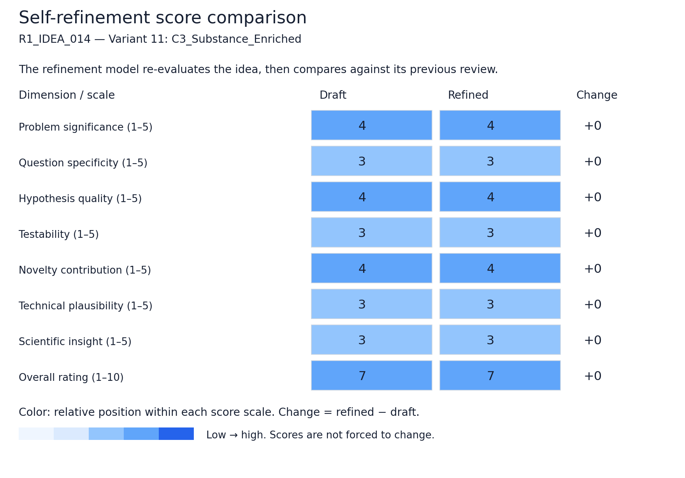

Changed score dimensions: none.

### Score justifications (draft / refined)

**Problem significance**

```json
{
  "draft": {
    "score": 4.0,
    "justification": "The idea addresses a significant challenge in open-world machine learning by creating a comprehensive dataset for understanding diverse visual data, which is crucial for improving model generalization and robustness."
  },
  "refined": {
    "score": 4.0,
    "justification": "The idea addresses a significant challenge in open-world machine learning by creating a comprehensive dataset for understanding diverse visual data, which is crucial for improving model generalization and robustness."
  }
}
```

**Question specificity**

```json
{
  "draft": {
    "score": 3.0,
    "justification": "The hypothesis is specific, but the definition of 'annotation density' and the connection to rare categories are not clearly articulated, which could limit the clarity of the research question."
  },
  "refined": {
    "score": 3.0,
    "justification": "The hypothesis is specific, but the definition of 'annotation density' and the connection to rare categories are not clearly articulated, which could limit the clarity of the research question."
  }
}
```

**Hypothesis quality**

```json
{
  "draft": {
    "score": 4.0,
    "justification": "The hypothesis that annotation density affects model generalization on rare categories is testable and relevant, though the exact definition of density needs clarification."
  },
  "refined": {
    "score": 4.0,
    "justification": "The hypothesis that annotation density affects model generalization on rare categories is testable and relevant, though the exact definition of density needs clarification."
  }
}
```

**Testability**

```json
{
  "draft": {
    "score": 3.0,
    "justification": "The idea suggests testing on diverse domains, which is testable, but the specific experimental design and metrics for evaluating the hypothesis are not detailed."
  },
  "refined": {
    "score": 3.0,
    "justification": "The idea suggests testing on diverse domains, which is testable, but the specific experimental design and metrics for evaluating the hypothesis are not detailed."
  }
}
```

**Novelty contribution**

```json
{
  "draft": {
    "score": 4.0,
    "justification": "The creation of a large-scale, richly annotated dataset is novel and could contribute significantly to the field of open-world machine learning, especially in addressing generalization on rare categories."
  },
  "refined": {
    "score": 4.0,
    "justification": "The creation of a large-scale, richly annotated dataset is novel and could contribute significantly to the field of open-world machine learning, especially in addressing generalization on rare categories."
  }
}
```

**Technical plausibility**

```json
{
  "draft": {
    "score": 3.0,
    "justification": "The use of a scalable data engine with human feedback is plausible, but the lack of technical details on scalability and feedback integration could affect the feasibility of the project."
  },
  "refined": {
    "score": 3.0,
    "justification": "The use of a scalable data engine with human feedback is plausible, but the lack of technical details on scalability and feedback integration could affect the feasibility of the project."
  }
}
```

**Scientific insight**

```json
{
  "draft": {
    "score": 3.0,
    "justification": "The hypothesis could lead to insights about how annotation density impacts model performance, but the connection to the dataset's structure and the hypothesis itself needs further clarification."
  },
  "refined": {
    "score": 3.0,
    "justification": "The hypothesis could lead to insights about how annotation density impacts model performance, but the connection to the dataset's structure and the hypothesis itself needs further clarification."
  }
}
```

**Overall rating**

```json
{
  "draft": {
    "score": 7.0,
    "justification": "The idea is strong with a clear goal of creating a valuable dataset and a testable hypothesis. However, it lacks sufficient detail on key aspects like annotation density and technical feasibility, which could be addressed with more specific information."
  },
  "refined": {
    "score": 7.0,
    "justification": "The idea is strong with a clear goal of creating a valuable dataset and a testable hypothesis. However, it lacks sufficient detail on key aspects like annotation density and technical feasibility, which could be addressed with more specific information."
  }
}
```

## R1_IDEA_014 — Variant 12: H1_Deceptive_Hollow


Changed score dimensions: none.

### Score justifications (draft / refined)

**Problem significance**

```json
{
  "draft": {
    "score": 4.0,
    "justification": "The idea addresses open-world understanding, a critical challenge in machine learning, particularly for applications requiring adaptability to novel situations. However, the problem is somewhat broad and could be more specific to highlight its significance."
  },
  "refined": {
    "score": 4.0,
    "justification": "The idea addresses open-world understanding, a critical challenge in machine learning, particularly for applications requiring adaptability to novel situations. However, the problem is somewhat broad and could be more specific to highlight its significance."
  }
}
```

**Question specificity**

```json
{
  "draft": {
    "score": 2.0,
    "justification": "The research question is too vague, lacking concrete details about the dataset's structure, the types of descriptive information, and the specific mechanisms or hypotheses being tested. The idea does not clearly define what is being investigated."
  },
  "refined": {
    "score": 2.0,
    "justification": "The research question is too vague, lacking concrete details about the dataset's structure, the types of descriptive information, and the specific mechanisms or hypotheses being tested. The idea does not clearly define what is being investigated."
  }
}
```

**Hypothesis quality**

```json
{
  "draft": {
    "score": 2.0,
    "justification": "The idea does not provide a clear hypothesis or specific prediction that could be tested. It is more of a general statement about the potential impact of the research rather than a concrete hypothesis."
  },
  "refined": {
    "score": 2.0,
    "justification": "The idea does not provide a clear hypothesis or specific prediction that could be tested. It is more of a general statement about the potential impact of the research rather than a concrete hypothesis."
  }
}
```

**Testability**

```json
{
  "draft": {
    "score": 2.0,
    "justification": "The idea lacks specific experiments, comparisons, or evaluations that could be conducted to test the proposed framework and dataset. The research is described in a vague and abstract manner without concrete testable components."
  },
  "refined": {
    "score": 2.0,
    "justification": "The idea lacks specific experiments, comparisons, or evaluations that could be conducted to test the proposed framework and dataset. The research is described in a vague and abstract manner without concrete testable components."
  }
}
```

**Novelty contribution**

```json
{
  "draft": {
    "score": 3.0,
    "justification": "The idea proposes a large-scale dataset and a transformative framework, which could contribute to the field by advancing open-world understanding. However, the novelty is somewhat limited as it does not clearly distinguish the proposed work from existing approaches or provide a unique contribution."
  },
  "refined": {
    "score": 3.0,
    "justification": "The idea proposes a large-scale dataset and a transformative framework, which could contribute to the field by advancing open-world understanding. However, the novelty is somewhat limited as it does not clearly distinguish the proposed work from existing approaches or provide a unique contribution."
  }
}
```

**Technical plausibility**

```json
{
  "draft": {
    "score": 3.0,
    "justification": "The idea is technically plausible as creating large-scale datasets and frameworks for open-world understanding is feasible. However, the lack of specific details makes it difficult to assess the technical feasibility and implementation details."
  },
  "refined": {
    "score": 3.0,
    "justification": "The idea is technically plausible as creating large-scale datasets and frameworks for open-world understanding is feasible. However, the lack of specific details makes it difficult to assess the technical feasibility and implementation details."
  }
}
```

**Scientific insight**

```json
{
  "draft": {
    "score": 2.0,
    "justification": "The idea has the potential to provide insights into open-world understanding, but the lack of specific hypotheses or research questions makes it difficult to assess the potential for scientific insight. The connection between the dataset and the broader framework is not clearly defined."
  },
  "refined": {
    "score": 2.0,
    "justification": "The idea has the potential to provide insights into open-world understanding, but the lack of specific hypotheses or research questions makes it difficult to assess the potential for scientific insight. The connection between the dataset and the broader framework is not clearly defined."
  }
}
```

**Overall rating**

```json
{
  "draft": {
    "score": 6.0,
    "justification": "The idea has potential to contribute to the field of open-world understanding by creating a large-scale dataset and a transformative framework. However, it lacks specific details, hypotheses, and testable components, which are necessary for a strong research idea."
  },
  "refined": {
    "score": 6.0,
    "justification": "The idea has potential to contribute to the field of open-world understanding by creating a large-scale dataset and a transformative framework. However, it lacks specific details, hypotheses, and testable components, which are necessary for a strong research idea."
  }
}
```

## R1_IDEA_014 — Variant 13: H2_Confident_Flaw


Changed score dimensions: none.

### Score justifications (draft / refined)

**Problem significance**

```json
{
  "draft": {
    "score": 3.0,
    "justification": "The idea addresses a significant challenge in visual recognition by proposing a large-scale dataset that could improve model performance across various tasks. However, the problem's importance is somewhat generic without more context on the specific limitations in existing work."
  },
  "refined": {
    "score": 3.0,
    "justification": "The idea addresses a significant challenge in visual recognition by proposing a large-scale dataset that could improve model performance across various tasks. However, the problem's importance is somewhat generic without more context on the specific limitations in existing work."
  }
}
```

**Question specificity**

```json
{
  "draft": {
    "score": 2.0,
    "justification": "The idea is somewhat specific in its goal of creating a large-scale dataset, but the exact research question or hypothesis is not clearly defined. The connection between the dataset and the improvements in visual recognition tasks is not sufficiently detailed."
  },
  "refined": {
    "score": 2.0,
    "justification": "The idea is somewhat specific in its goal of creating a large-scale dataset, but the exact research question or hypothesis is not clearly defined. The connection between the dataset and the improvements in visual recognition tasks is not sufficiently detailed."
  }
}
```

**Hypothesis quality**

```json
{
  "draft": {
    "score": 3.0,
    "justification": "The idea suggests that addressing a specific limitation will lead to reliable improvements, but the hypothesis is not clearly stated or supported by specific evidence. The claim about causal evidence is vague and lacks a clear mechanism."
  },
  "refined": {
    "score": 3.0,
    "justification": "The idea suggests that addressing a specific limitation will lead to reliable improvements, but the hypothesis is not clearly stated or supported by specific evidence. The claim about causal evidence is vague and lacks a clear mechanism."
  }
}
```

**Testability**

```json
{
  "draft": {
    "score": 2.0,
    "justification": "The idea does not provide a clear experimental plan or evaluation method. The claim about causal evidence is not testable without further details on how the dataset's properties will be isolated and measured."
  },
  "refined": {
    "score": 2.0,
    "justification": "The idea does not provide a clear experimental plan or evaluation method. The claim about causal evidence is not testable without further details on how the dataset's properties will be isolated and measured."
  }
}
```

**Novelty contribution**

```json
{
  "draft": {
    "score": 3.0,
    "justification": "The idea proposes a new dataset with a large scale and diverse annotations, which could contribute to the field. However, the novelty is somewhat limited as it is a standard approach to dataset creation without a unique method or insight."
  },
  "refined": {
    "score": 3.0,
    "justification": "The idea proposes a new dataset with a large scale and diverse annotations, which could contribute to the field. However, the novelty is somewhat limited as it is a standard approach to dataset creation without a unique method or insight."
  }
}
```

**Technical plausibility**

```json
{
  "draft": {
    "score": 3.0,
    "justification": "The use of a scalable data engine with human feedback and efficient models is plausible. However, the technical details are not specified, and the feasibility of generating 1.2 billion annotated regions is uncertain without more information."
  },
  "refined": {
    "score": 3.0,
    "justification": "The use of a scalable data engine with human feedback and efficient models is plausible. However, the technical details are not specified, and the feasibility of generating 1.2 billion annotated regions is uncertain without more information."
  }
}
```

**Scientific insight**

```json
{
  "draft": {
    "score": 2.0,
    "justification": "The idea suggests that addressing a specific limitation will lead to improvements, but the scientific insight is not clearly defined. The connection between the dataset and the improvements is not sufficiently explained."
  },
  "refined": {
    "score": 2.0,
    "justification": "The idea suggests that addressing a specific limitation will lead to improvements, but the scientific insight is not clearly defined. The connection between the dataset and the improvements is not sufficiently explained."
  }
}
```

**Overall rating**

```json
{
  "draft": {
    "score": 5.0,
    "justification": "The idea has potential as it proposes a large-scale dataset that could be valuable for visual recognition tasks. However, it lacks specific details, clear hypotheses, and a detailed plan for evaluation, which are necessary for a strong research direction."
  },
  "refined": {
    "score": 5.0,
    "justification": "The idea has potential as it proposes a large-scale dataset that could be valuable for visual recognition tasks. However, it lacks specific details, clear hypotheses, and a detailed plan for evaluation, which are necessary for a strong research direction."
  }
}
```

## R1_IDEA_014 — Variant 14: H3_Verbose_Enriched


Changed score dimensions: none.

### Score justifications (draft / refined)

**Problem significance**

```json
{
  "draft": {
    "score": 4.0,
    "justification": "The idea addresses a significant challenge in open-world understanding by creating a large-scale dataset and model, which could advance the field of machine learning and have practical applications in various domains."
  },
  "refined": {
    "score": 4.0,
    "justification": "The idea addresses a significant challenge in open-world understanding by creating a large-scale dataset and model, which could advance the field of machine learning and have practical applications in various domains."
  }
}
```

**Question specificity**

```json
{
  "draft": {
    "score": 3.0,
    "justification": "The hypothesis is specific, but the connection between the dataset's coverage and the hypothesis is not clearly explained, and the exact testable question is somewhat vague."
  },
  "refined": {
    "score": 3.0,
    "justification": "The hypothesis is specific, but the connection between the dataset's coverage and the hypothesis is not clearly explained, and the exact testable question is somewhat vague."
  }
}
```

**Hypothesis quality**

```json
{
  "draft": {
    "score": 4.0,
    "justification": "The hypothesis that annotation density influences model generalization on rare categories is specific and testable, though it could be more explicitly stated."
  },
  "refined": {
    "score": 4.0,
    "justification": "The hypothesis that annotation density influences model generalization on rare categories is specific and testable, though it could be more explicitly stated."
  }
}
```

**Testability**

```json
{
  "draft": {
    "score": 3.0,
    "justification": "The idea suggests a staged design with ablations and analyses, which is testable, but the exact experimental setup and validation methodology are not clearly defined."
  },
  "refined": {
    "score": 3.0,
    "justification": "The idea suggests a staged design with ablations and analyses, which is testable, but the exact experimental setup and validation methodology are not clearly defined."
  }
}
```

**Novelty contribution**

```json
{
  "draft": {
    "score": 4.0,
    "justification": "The project presents a novel approach to creating a large-scale dataset and model for open-world understanding, which could contribute significantly to the field."
  },
  "refined": {
    "score": 4.0,
    "justification": "The project presents a novel approach to creating a large-scale dataset and model for open-world understanding, which could contribute significantly to the field."
  }
}
```

**Technical plausibility**

```json
{
  "draft": {
    "score": 3.0,
    "justification": "The idea is technically plausible, but the details of the scalable data engine and the integration of human feedback and efficient models are not sufficiently explained."
  },
  "refined": {
    "score": 3.0,
    "justification": "The idea is technically plausible, but the details of the scalable data engine and the integration of human feedback and efficient models are not sufficiently explained."
  }
}
```

**Scientific insight**

```json
{
  "draft": {
    "score": 4.0,
    "justification": "The study could provide insights into the mechanisms and constraints that determine the utility of the approach, which is valuable for understanding model generalization and data annotation practices."
  },
  "refined": {
    "score": 4.0,
    "justification": "The study could provide insights into the mechanisms and constraints that determine the utility of the approach, which is valuable for understanding model generalization and data annotation practices."
  }
}
```

**Overall rating**

```json
{
  "draft": {
    "score": 7.0,
    "justification": "The idea is strong with a clear hypothesis and potential for significant contribution, but it lacks some specificity and technical details that would strengthen its testability and scientific insight."
  },
  "refined": {
    "score": 7.0,
    "justification": "The idea is strong with a clear hypothesis and potential for significant contribution, but it lacks some specificity and technical details that would strengthen its testability and scientific insight."
  }
}
```

## R1_IDEA_014 — Variant 15: H4_Ultimate_Hype

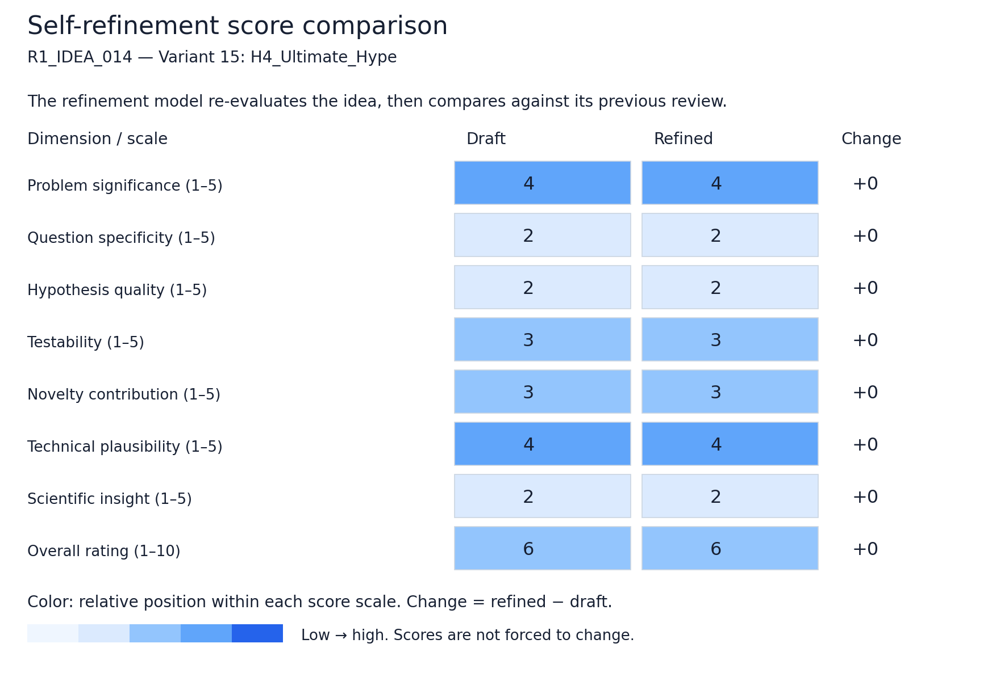

Changed score dimensions: none.

### Score justifications (draft / refined)

**Problem significance**

```json
{
  "draft": {
    "score": 4.0,
    "justification": "The project addresses a significant challenge in open-world understanding, with potential to redefine the frontier of the field. However, the specific problem is not clearly defined, making it difficult to assess its novelty or significance."
  },
  "refined": {
    "score": 4.0,
    "justification": "The project addresses a significant challenge in open-world understanding, with potential to redefine the frontier of the field. However, the specific problem is not clearly defined, making it difficult to assess its novelty or significance."
  }
}
```

**Question specificity**

```json
{
  "draft": {
    "score": 2.0,
    "justification": "The idea is broad and does not clearly define the specific research question or hypothesis that the AS-1B dataset is intended to address. It lacks concrete details on what exactly is being investigated."
  },
  "refined": {
    "score": 2.0,
    "justification": "The idea is broad and does not clearly define the specific research question or hypothesis that the AS-1B dataset is intended to address. It lacks concrete details on what exactly is being investigated."
  }
}
```

**Hypothesis quality**

```json
{
  "draft": {
    "score": 2.0,
    "justification": "The idea does not contain a clear hypothesis or specific prediction that could be tested. It is more of a general statement about the potential impact of the dataset rather than a focused research question."
  },
  "refined": {
    "score": 2.0,
    "justification": "The idea does not contain a clear hypothesis or specific prediction that could be tested. It is more of a general statement about the potential impact of the dataset rather than a focused research question."
  }
}
```

**Testability**

```json
{
  "draft": {
    "score": 3.0,
    "justification": "The idea suggests a large-scale dataset but does not provide specific experiments or evaluations that would be needed to test its effectiveness. The lack of concrete details makes it difficult to assess testability."
  },
  "refined": {
    "score": 3.0,
    "justification": "The idea suggests a large-scale dataset but does not provide specific experiments or evaluations that would be needed to test its effectiveness. The lack of concrete details makes it difficult to assess testability."
  }
}
```

**Novelty contribution**

```json
{
  "draft": {
    "score": 3.0,
    "justification": "The project has the potential for significant contribution, but the lack of specific details makes it difficult to assess its novelty. The dataset's scale is impressive, but the specific contributions are not clearly defined."
  },
  "refined": {
    "score": 3.0,
    "justification": "The project has the potential for significant contribution, but the lack of specific details makes it difficult to assess its novelty. The dataset's scale is impressive, but the specific contributions are not clearly defined."
  }
}
```

**Technical plausibility**

```json
{
  "draft": {
    "score": 4.0,
    "justification": "The approach of using a scalable data engine with human feedback and efficient models is technically plausible. However, the lack of specific details makes it difficult to fully assess the feasibility of the proposed method."
  },
  "refined": {
    "score": 4.0,
    "justification": "The approach of using a scalable data engine with human feedback and efficient models is technically plausible. However, the lack of specific details makes it difficult to fully assess the feasibility of the proposed method."
  }
}
```

**Scientific insight**

```json
{
  "draft": {
    "score": 2.0,
    "justification": "The idea does not clearly articulate what scientific insights could be gained from the dataset. The potential applications are described broadly without concrete examples or justification."
  },
  "refined": {
    "score": 2.0,
    "justification": "The idea does not clearly articulate what scientific insights could be gained from the dataset. The potential applications are described broadly without concrete examples or justification."
  }
}
```

**Overall rating**

```json
{
  "draft": {
    "score": 6.0,
    "justification": "The idea has strong potential and addresses a significant challenge, but it lacks specific details on the research question, hypothesis, and evaluation methods. It is a bold project but needs more concrete definitions to be fully evaluated."
  },
  "refined": {
    "score": 6.0,
    "justification": "The idea has strong potential and addresses a significant challenge, but it lacks specific details on the research question, hypothesis, and evaluation methods. It is a bold project but needs more concrete definitions to be fully evaluated."
  }
}
```

## R1_IDEA_015 — Source


Changed score dimensions: none.

### Score justifications (draft / refined)

**Problem significance**

```json
{
  "draft": {
    "score": 4.0,
    "justification": "The problem of text-based editing of 3D avatars is significant in applications like virtual environments and gaming, where precise control over avatar attributes is crucial. The proposed solution addresses a practical challenge with potential real-world impact."
  },
  "refined": {
    "score": 4.0,
    "justification": "The problem of text-based editing of 3D avatars is significant in applications like virtual environments and gaming, where precise control over avatar attributes is crucial. The proposed solution addresses a practical challenge with potential real-world impact."
  }
}
```

**Question specificity**

```json
{
  "draft": {
    "score": 3.0,
    "justification": "The idea defines a specific approach (ACS) for editing semantic concepts between two extremes, but lacks details on the implementation, mapping of concepts to attributes, and evaluation methods, which are necessary for a precise research question."
  },
  "refined": {
    "score": 3.0,
    "justification": "The idea defines a specific approach (ACS) for editing semantic concepts between two extremes, but lacks details on the implementation, mapping of concepts to attributes, and evaluation methods, which are necessary for a precise research question."
  }
}
```

**Hypothesis quality**

```json
{
  "draft": {
    "score": 3.0,
    "justification": "The idea suggests a novel approach (ACS) but does not explicitly state a hypothesis or prediction that can be tested. It is more of a conceptual proposal than a hypothesis-driven research idea."
  },
  "refined": {
    "score": 3.0,
    "justification": "The idea suggests a novel approach (ACS) but does not explicitly state a hypothesis or prediction that can be tested. It is more of a conceptual proposal than a hypothesis-driven research idea."
  }
}
```

**Testability**

```json
{
  "draft": {
    "score": 2.0,
    "justification": "The idea lacks specific experiments or evaluation plans. Without clear metrics or benchmarks, it is difficult to assess the effectiveness of the ACS method or compare it to existing approaches."
  },
  "refined": {
    "score": 2.0,
    "justification": "The idea lacks specific experiments or evaluation plans. Without clear metrics or benchmarks, it is difficult to assess the effectiveness of the ACS method or compare it to existing approaches."
  }
}
```

**Novelty contribution**

```json
{
  "draft": {
    "score": 4.0,
    "justification": "The ACS method introduces a novel mechanism for text-based editing of 3D avatars by using a slider between two extremes. This could contribute to the field by improving the precision and usability of avatar editing tools."
  },
  "refined": {
    "score": 4.0,
    "justification": "The ACS method introduces a novel mechanism for text-based editing of 3D avatars by using a slider between two extremes. This could contribute to the field by improving the precision and usability of avatar editing tools."
  }
}
```

**Technical plausibility**

```json
{
  "draft": {
    "score": 3.0,
    "justification": "The concept of a slider between two extremes is plausible, but the technical details on how semantic concepts are mapped to 3D attributes and how the slider mechanism is implemented are not specified, which could affect the feasibility of the approach."
  },
  "refined": {
    "score": 3.0,
    "justification": "The concept of a slider between two extremes is plausible, but the technical details on how semantic concepts are mapped to 3D attributes and how the slider mechanism is implemented are not specified, which could affect the feasibility of the approach."
  }
}
```

**Scientific insight**

```json
{
  "draft": {
    "score": 3.0,
    "justification": "The idea has potential to provide insights into how semantic concepts can be effectively translated into 3D avatar attributes, but the lack of specific details limits the potential for deeper scientific understanding."
  },
  "refined": {
    "score": 3.0,
    "justification": "The idea has potential to provide insights into how semantic concepts can be effectively translated into 3D avatar attributes, but the lack of specific details limits the potential for deeper scientific understanding."
  }
}
```

**Overall rating**

```json
{
  "draft": {
    "score": 7.0,
    "justification": "The idea addresses a meaningful problem with a novel approach, but lacks specific details on implementation, evaluation, and technical feasibility. It has potential for practical applications but needs further clarification to be a strong research idea."
  },
  "refined": {
    "score": 7.0,
    "justification": "The idea addresses a meaningful problem with a novel approach, but lacks specific details on implementation, evaluation, and technical feasibility. It has potential for practical applications but needs further clarification to be a strong research idea."
  }
}
```

## R1_IDEA_015 — Variant 1: A1_Identity


Changed score dimensions: none.

### Score justifications (draft / refined)

**Problem significance**

```json
{
  "draft": {
    "score": 4.0,
    "justification": "The problem of text-based editing of 3D avatars is significant in applications like virtual environments and gaming, where precise control over avatar attributes is crucial. The proposed solution addresses a practical challenge with potential real-world impact."
  },
  "refined": {
    "score": 4.0,
    "justification": "The problem of text-based editing of 3D avatars is significant in applications like virtual environments and gaming, where precise control over avatar attributes is crucial. The proposed solution addresses a practical challenge with potential real-world impact."
  }
}
```

**Question specificity**

```json
{
  "draft": {
    "score": 3.0,
    "justification": "The idea defines a specific approach (ACS) for editing semantic concepts between two extremes, but lacks details on the implementation, mapping of concepts to attributes, and evaluation methods, which are necessary for a precise research question."
  },
  "refined": {
    "score": 3.0,
    "justification": "The idea defines a specific approach (ACS) for editing semantic concepts between two extremes, but lacks details on the implementation, mapping of concepts to attributes, and evaluation methods, which are necessary for a precise research question."
  }
}
```

**Hypothesis quality**

```json
{
  "draft": {
    "score": 3.0,
    "justification": "The idea suggests a novel approach (ACS) but does not explicitly state a hypothesis or prediction that can be tested. It is more of a conceptual proposal than a hypothesis-driven research idea."
  },
  "refined": {
    "score": 3.0,
    "justification": "The idea suggests a novel approach (ACS) but does not explicitly state a hypothesis or prediction that can be tested. It is more of a conceptual proposal than a hypothesis-driven research idea."
  }
}
```

**Testability**

```json
{
  "draft": {
    "score": 2.0,
    "justification": "The idea lacks specific experiments or evaluation plans. Without clear metrics or benchmarks, it is difficult to assess the effectiveness of the ACS method or compare it to existing approaches."
  },
  "refined": {
    "score": 2.0,
    "justification": "The idea lacks specific experiments or evaluation plans. Without clear metrics or benchmarks, it is difficult to assess the effectiveness of the ACS method or compare it to existing approaches."
  }
}
```

**Novelty contribution**

```json
{
  "draft": {
    "score": 4.0,
    "justification": "The ACS method introduces a novel mechanism for text-based editing of 3D avatars by using a slider between two extremes. This could contribute to the field by improving the precision and usability of avatar editing tools."
  },
  "refined": {
    "score": 4.0,
    "justification": "The ACS method introduces a novel mechanism for text-based editing of 3D avatars by using a slider between two extremes. This could contribute to the field by improving the precision and usability of avatar editing tools."
  }
}
```

**Technical plausibility**

```json
{
  "draft": {
    "score": 3.0,
    "justification": "The concept of a slider between two extremes is plausible, but the technical details on how semantic concepts are mapped to 3D attributes and how the slider mechanism is implemented are not specified, which could affect the feasibility of the approach."
  },
  "refined": {
    "score": 3.0,
    "justification": "The concept of a slider between two extremes is plausible, but the technical details on how semantic concepts are mapped to 3D attributes and how the slider mechanism is implemented are not specified, which could affect the feasibility of the approach."
  }
}
```

**Scientific insight**

```json
{
  "draft": {
    "score": 3.0,
    "justification": "The idea has potential to provide insights into how semantic concepts can be effectively translated into 3D avatar attributes, but the lack of specific details limits the potential for deeper scientific understanding."
  },
  "refined": {
    "score": 3.0,
    "justification": "The idea has potential to provide insights into how semantic concepts can be effectively translated into 3D avatar attributes, but the lack of specific details limits the potential for deeper scientific understanding."
  }
}
```

**Overall rating**

```json
{
  "draft": {
    "score": 7.0,
    "justification": "The idea addresses a meaningful problem with a novel approach, but lacks specific details on implementation, evaluation, and technical feasibility. It has potential for practical applications but needs further clarification to be a strong research idea."
  },
  "refined": {
    "score": 7.0,
    "justification": "The idea addresses a meaningful problem with a novel approach, but lacks specific details on implementation, evaluation, and technical feasibility. It has potential for practical applications but needs further clarification to be a strong research idea."
  }
}
```

## R1_IDEA_015 — Variant 2: A2_Paraphrase_Only


Changed score dimensions: none.

### Score justifications (draft / refined)

**Problem significance**

```json
{
  "draft": {
    "score": 4.0,
    "justification": "The problem of editing 3D avatars with text descriptions is significant in applications like virtual fashion, gaming, and animation where precise control is needed."
  },
  "refined": {
    "score": 4.0,
    "justification": "The problem of editing 3D avatars with text descriptions is significant in applications like virtual fashion, gaming, and animation where precise control is needed."
  }
}
```

**Question specificity**

```json
{
  "draft": {
    "score": 3.0,
    "justification": "The idea defines a specific approach (ACS) but lacks details on how the intermediate point is computed or how semantic concepts are mapped to avatar attributes."
  },
  "refined": {
    "score": 3.0,
    "justification": "The idea defines a specific approach (ACS) but lacks details on how the intermediate point is computed or how semantic concepts are mapped to avatar attributes."
  }
}
```

**Hypothesis quality**

```json
{
  "draft": {
    "score": 4.0,
    "justification": "The hypothesis that ACS can enable precise semantic adjustments through a knob-like mechanism is plausible and distinguishes the approach from generic text-to-3D methods."
  },
  "refined": {
    "score": 4.0,
    "justification": "The hypothesis that ACS can enable precise semantic adjustments through a knob-like mechanism is plausible and distinguishes the approach from generic text-to-3D methods."
  }
}
```

**Testability**

```json
{
  "draft": {
    "score": 3.0,
    "justification": "The idea suggests a method but does not provide specific experiments or comparisons to test its effectiveness, making it difficult to assess without further details."
  },
  "refined": {
    "score": 3.0,
    "justification": "The idea suggests a method but does not provide specific experiments or comparisons to test its effectiveness, making it difficult to assess without further details."
  }
}
```

**Novelty contribution**

```json
{
  "draft": {
    "score": 4.0,
    "justification": "The ACS approach is novel in its use of a knob-like mechanism for semantic adjustments, potentially offering a new way to handle text-based 3D avatar editing."
  },
  "refined": {
    "score": 4.0,
    "justification": "The ACS approach is novel in its use of a knob-like mechanism for semantic adjustments, potentially offering a new way to handle text-based 3D avatar editing."
  }
}
```

**Technical plausibility**

```json
{
  "draft": {
    "score": 4.0,
    "justification": "The concept of using an intermediate point between two extremes is technically plausible, though the specific implementation details are not provided."
  },
  "refined": {
    "score": 4.0,
    "justification": "The concept of using an intermediate point between two extremes is technically plausible, though the specific implementation details are not provided."
  }
}
```

**Scientific insight**

```json
{
  "draft": {
    "score": 3.0,
    "justification": "The idea could provide insights into how semantic concepts can be mapped to 3D attributes, but the potential for broader scientific insight is limited without further clarification."
  },
  "refined": {
    "score": 3.0,
    "justification": "The idea could provide insights into how semantic concepts can be mapped to 3D attributes, but the potential for broader scientific insight is limited without further clarification."
  }
}
```

**Overall rating**

```json
{
  "draft": {
    "score": 7.0,
    "justification": "The idea addresses a meaningful problem with a novel approach, but lacks specific details needed to assess its feasibility and scientific contribution fully."
  },
  "refined": {
    "score": 7.0,
    "justification": "The idea addresses a meaningful problem with a novel approach, but lacks specific details needed to assess its feasibility and scientific contribution fully."
  }
}
```

## R1_IDEA_015 — Variant 3: A3_Plain_Core


Changed score dimensions: none.

### Score justifications (draft / refined)

**Problem significance**

```json
{
  "draft": {
    "score": 4.0,
    "justification": "The problem of text-based editing of 3D avatars is significant for applications in virtual environments, gaming, and digital content creation. Addressing natural language ambiguity and limited expressiveness is crucial for improving user interaction with 3D avatars."
  },
  "refined": {
    "score": 4.0,
    "justification": "The problem of text-based editing of 3D avatars is significant for applications in virtual environments, gaming, and digital content creation. Addressing natural language ambiguity and limited expressiveness is crucial for improving user interaction with 3D avatars."
  }
}
```

**Question specificity**

```json
{
  "draft": {
    "score": 3.0,
    "justification": "The idea proposes a specific method (ACS) for editing semantic concepts in 3D avatars, but it lacks detailed specification of how the intermediate point is determined and how the method handles edge cases or ambiguous inputs."
  },
  "refined": {
    "score": 3.0,
    "justification": "The idea proposes a specific method (ACS) for editing semantic concepts in 3D avatars, but it lacks detailed specification of how the intermediate point is determined and how the method handles edge cases or ambiguous inputs."
  }
}
```

**Hypothesis quality**

```json
{
  "draft": {
    "score": 4.0,
    "justification": "The idea presents a plausible hypothesis that moving toward an intermediate point between two concept extremes can effectively edit semantic concepts in 3D avatars. It distinguishes the approach from generic applications by focusing on semantic editing through a structured intermediate point mechanism."
  },
  "refined": {
    "score": 4.0,
    "justification": "The idea presents a plausible hypothesis that moving toward an intermediate point between two concept extremes can effectively edit semantic concepts in 3D avatars. It distinguishes the approach from generic applications by focusing on semantic editing through a structured intermediate point mechanism."
  }
}
```

**Testability**

```json
{
  "draft": {
    "score": 3.0,
    "justification": "The idea suggests a method but does not provide specific experiments or evaluations to test its effectiveness. The lack of details on how the intermediate point is determined and how the method handles edge cases makes it difficult to assess the testability of the approach."
  },
  "refined": {
    "score": 3.0,
    "justification": "The idea suggests a method but does not provide specific experiments or evaluations to test its effectiveness. The lack of details on how the intermediate point is determined and how the method handles edge cases makes it difficult to assess the testability of the approach."
  }
}
```

**Novelty contribution**

```json
{
  "draft": {
    "score": 3.0,
    "justification": "The ACS method is a novel approach to text-based editing of 3D avatars, but it is not clear how it differs from existing methods. The contribution would depend on the specific implementation and evaluation of the method."
  },
  "refined": {
    "score": 3.0,
    "justification": "The ACS method is a novel approach to text-based editing of 3D avatars, but it is not clear how it differs from existing methods. The contribution would depend on the specific implementation and evaluation of the method."
  }
}
```

**Technical plausibility**

```json
{
  "draft": {
    "score": 4.0,
    "justification": "The concept of using an intermediate point between two extremes for semantic editing is technically plausible. The method could be implemented using existing techniques for semantic representation and 3D avatar manipulation."
  },
  "refined": {
    "score": 4.0,
    "justification": "The concept of using an intermediate point between two extremes for semantic editing is technically plausible. The method could be implemented using existing techniques for semantic representation and 3D avatar manipulation."
  }
}
```

**Scientific insight**

```json
{
  "draft": {
    "score": 3.0,
    "justification": "The idea has potential for scientific insight into how semantic concepts can be effectively edited in 3D avatars. However, the lack of specific details on the method's implementation and evaluation limits the potential for meaningful insights."
  },
  "refined": {
    "score": 3.0,
    "justification": "The idea has potential for scientific insight into how semantic concepts can be effectively edited in 3D avatars. However, the lack of specific details on the method's implementation and evaluation limits the potential for meaningful insights."
  }
}
```

**Overall rating**

```json
{
  "draft": {
    "score": 7.0,
    "justification": "The idea addresses a meaningful problem in text-based editing of 3D avatars and proposes a concrete method (ACS) that is technically plausible. However, the lack of specific details on implementation, evaluation, and handling of edge cases limits its testability and potential for scientific insight."
  },
  "refined": {
    "score": 7.0,
    "justification": "The idea addresses a meaningful problem in text-based editing of 3D avatars and proposes a concrete method (ACS) that is technically plausible. However, the lack of specific details on implementation, evaluation, and handling of edge cases limits its testability and potential for scientific insight."
  }
}
```

## R1_IDEA_015 — Variant 4: B1_Verbose_Elaborate


Changed score dimensions: none.

### Score justifications (draft / refined)

**Problem significance**

```json
{
  "draft": {
    "score": 4.0,
    "justification": "The problem of text-based editing of 3D avatars is significant as it relates to the usability and precision of human-computer interaction in virtual environments."
  },
  "refined": {
    "score": 4.0,
    "justification": "The problem of text-based editing of 3D avatars is significant as it relates to the usability and precision of human-computer interaction in virtual environments."
  }
}
```

**Question specificity**

```json
{
  "draft": {
    "score": 3.0,
    "justification": "The idea defines a specific problem (text-based editing of 3D avatars) but lacks details on the exact research question or hypothesis being investigated."
  },
  "refined": {
    "score": 3.0,
    "justification": "The idea defines a specific problem (text-based editing of 3D avatars) but lacks details on the exact research question or hypothesis being investigated."
  }
}
```

**Hypothesis quality**

```json
{
  "draft": {
    "score": 3.0,
    "justification": "The idea suggests a method (ACS) but does not explicitly state a hypothesis that could be tested or contradicted."
  },
  "refined": {
    "score": 3.0,
    "justification": "The idea suggests a method (ACS) but does not explicitly state a hypothesis that could be tested or contradicted."
  }
}
```

**Testability**

```json
{
  "draft": {
    "score": 2.0,
    "justification": "The idea lacks specific experiments or evaluations that would allow the hypothesis to be tested or the method's effectiveness to be measured."
  },
  "refined": {
    "score": 2.0,
    "justification": "The idea lacks specific experiments or evaluations that would allow the hypothesis to be tested or the method's effectiveness to be measured."
  }
}
```

**Novelty contribution**

```json
{
  "draft": {
    "score": 4.0,
    "justification": "The ACS method offers a novel approach to text-based editing of 3D avatars, potentially contributing to the field of human-computer interaction and 3D avatar editing."
  },
  "refined": {
    "score": 4.0,
    "justification": "The ACS method offers a novel approach to text-based editing of 3D avatars, potentially contributing to the field of human-computer interaction and 3D avatar editing."
  }
}
```

**Technical plausibility**

```json
{
  "draft": {
    "score": 4.0,
    "justification": "The concept of a continuum between two extremes is technically plausible and aligns with existing methods in 3D editing and natural language processing."
  },
  "refined": {
    "score": 4.0,
    "justification": "The concept of a continuum between two extremes is technically plausible and aligns with existing methods in 3D editing and natural language processing."
  }
}
```

**Scientific insight**

```json
{
  "draft": {
    "score": 3.0,
    "justification": "The idea has potential for scientific insight into how natural language can be used to control 3D avatar edits, but the specifics are not clearly defined."
  },
  "refined": {
    "score": 3.0,
    "justification": "The idea has potential for scientific insight into how natural language can be used to control 3D avatar edits, but the specifics are not clearly defined."
  }
}
```

**Overall rating**

```json
{
  "draft": {
    "score": 7.0,
    "justification": "The idea addresses a meaningful problem with a plausible solution, but lacks specific details on the research question, hypothesis, and evaluation methods, which are necessary for further development."
  },
  "refined": {
    "score": 7.0,
    "justification": "The idea addresses a meaningful problem with a plausible solution, but lacks specific details on the research question, hypothesis, and evaluation methods, which are necessary for further development."
  }
}
```

## R1_IDEA_015 — Variant 5: B2_Grand_Narrative


Changed score dimensions: none.

### Score justifications (draft / refined)

**Problem significance**

```json
{
  "draft": {
    "score": 4.0,
    "justification": "The problem of text-based avatar editing is important for intuitive human-computer interaction and digital human creation, with potential applications in gaming, virtual reality, and social media."
  },
  "refined": {
    "score": 4.0,
    "justification": "The problem of text-based avatar editing is important for intuitive human-computer interaction and digital human creation, with potential applications in gaming, virtual reality, and social media."
  }
}
```

**Question specificity**

```json
{
  "draft": {
    "score": 3.0,
    "justification": "The idea defines a specific problem (text-based avatar editing) and proposes a specific solution (ACS), but lacks detailed specification of how the method works in practice."
  },
  "refined": {
    "score": 3.0,
    "justification": "The idea defines a specific problem (text-based avatar editing) and proposes a specific solution (ACS), but lacks detailed specification of how the method works in practice."
  }
}
```

**Hypothesis quality**

```json
{
  "draft": {
    "score": 3.0,
    "justification": "The idea suggests a method that could improve avatar customization, but does not explicitly state a testable hypothesis or prediction about its performance or effectiveness."
  },
  "refined": {
    "score": 3.0,
    "justification": "The idea suggests a method that could improve avatar customization, but does not explicitly state a testable hypothesis or prediction about its performance or effectiveness."
  }
}
```

**Testability**

```json
{
  "draft": {
    "score": 2.0,
    "justification": "The idea lacks specific experiments or evaluation metrics to test the effectiveness of ACS, making it difficult to assess its validity without further details."
  },
  "refined": {
    "score": 2.0,
    "justification": "The idea lacks specific experiments or evaluation metrics to test the effectiveness of ACS, making it difficult to assess its validity without further details."
  }
}
```

**Novelty contribution**

```json
{
  "draft": {
    "score": 4.0,
    "justification": "The ACS approach is a novel method for text-based avatar editing, with potential contributions to more intuitive human-computer interaction and digital human creation."
  },
  "refined": {
    "score": 4.0,
    "justification": "The ACS approach is a novel method for text-based avatar editing, with potential contributions to more intuitive human-computer interaction and digital human creation."
  }
}
```

**Technical plausibility**

```json
{
  "draft": {
    "score": 3.0,
    "justification": "The concept of a knob-like interface for semantic editing is plausible, but the technical details of how it works are not specified, which could limit its feasibility."
  },
  "refined": {
    "score": 3.0,
    "justification": "The concept of a knob-like interface for semantic editing is plausible, but the technical details of how it works are not specified, which could limit its feasibility."
  }
}
```

**Scientific insight**

```json
{
  "draft": {
    "score": 3.0,
    "justification": "The idea has potential to provide insights into how semantic concepts can be mapped to 3D avatars, but the lack of specific details limits the potential for new scientific understanding."
  },
  "refined": {
    "score": 3.0,
    "justification": "The idea has potential to provide insights into how semantic concepts can be mapped to 3D avatars, but the lack of specific details limits the potential for new scientific understanding."
  }
}
```

**Overall rating**

```json
{
  "draft": {
    "score": 7.0,
    "justification": "The idea addresses a meaningful problem with a plausible solution, but lacks specific details that would make it testable and scientifically rigorous. It has potential for contribution but needs further clarification."
  },
  "refined": {
    "score": 7.0,
    "justification": "The idea addresses a meaningful problem with a plausible solution, but lacks specific details that would make it testable and scientifically rigorous. It has potential for contribution but needs further clarification."
  }
}
```

## R1_IDEA_015 — Variant 6: B3_Over_Confident


Changed score dimensions: none.

### Score justifications (draft / refined)

**Problem significance**

```json
{
  "draft": {
    "score": 4.0,
    "justification": "The problem of text-based 3D avatar editing is significant as it relates to user interaction and customization in virtual environments, which is a key area in computer graphics and human-computer interaction."
  },
  "refined": {
    "score": 4.0,
    "justification": "The problem of text-based 3D avatar editing is significant as it relates to user interaction and customization in virtual environments, which is a key area in computer graphics and human-computer interaction."
  }
}
```

**Question specificity**

```json
{
  "draft": {
    "score": 3.0,
    "justification": "The idea defines a specific problem (text-based editing ambiguity) and proposes a method (ACS), but lacks detailed specification of how the concept slider operates in practice."
  },
  "refined": {
    "score": 3.0,
    "justification": "The idea defines a specific problem (text-based editing ambiguity) and proposes a method (ACS), but lacks detailed specification of how the concept slider operates in practice."
  }
}
```

**Hypothesis quality**

```json
{
  "draft": {
    "score": 3.0,
    "justification": "The idea suggests a method to address the problem, but does not explicitly state a hypothesis or prediction that can be tested, such as how the slider affects avatar attributes or how user input is interpreted."
  },
  "refined": {
    "score": 3.0,
    "justification": "The idea suggests a method to address the problem, but does not explicitly state a hypothesis or prediction that can be tested, such as how the slider affects avatar attributes or how user input is interpreted."
  }
}
```

**Testability**

```json
{
  "draft": {
    "score": 2.0,
    "justification": "The idea lacks specific experiments or evaluation methods to test the effectiveness of the ACS method, such as comparisons with existing methods or user studies on accuracy and usability."
  },
  "refined": {
    "score": 2.0,
    "justification": "The idea lacks specific experiments or evaluation methods to test the effectiveness of the ACS method, such as comparisons with existing methods or user studies on accuracy and usability."
  }
}
```

**Novelty contribution**

```json
{
  "draft": {
    "score": 4.0,
    "justification": "The ACS method is a novel approach to text-based 3D avatar editing, offering a direct way to adjust semantic concepts between extremes, which could contribute to the field of human-computer interaction and computer graphics."
  },
  "refined": {
    "score": 4.0,
    "justification": "The ACS method is a novel approach to text-based 3D avatar editing, offering a direct way to adjust semantic concepts between extremes, which could contribute to the field of human-computer interaction and computer graphics."
  }
}
```

**Technical plausibility**

```json
{
  "draft": {
    "score": 4.0,
    "justification": "The concept of a slider for adjusting attributes between extremes is technically plausible, and the idea aligns with existing methods in 3D avatar editing and natural language processing."
  },
  "refined": {
    "score": 4.0,
    "justification": "The concept of a slider for adjusting attributes between extremes is technically plausible, and the idea aligns with existing methods in 3D avatar editing and natural language processing."
  }
}
```

**Scientific insight**

```json
{
  "draft": {
    "score": 3.0,
    "justification": "The idea has potential to provide insights into how semantic concepts can be effectively mapped to 3D attributes, but the current description does not specify how this mapping or adjustment process would reveal new scientific understanding."
  },
  "refined": {
    "score": 3.0,
    "justification": "The idea has potential to provide insights into how semantic concepts can be effectively mapped to 3D attributes, but the current description does not specify how this mapping or adjustment process would reveal new scientific understanding."
  }
}
```

**Overall rating**

```json
{
  "draft": {
    "score": 7.0,
    "justification": "The idea addresses a meaningful problem with a concrete method, but lacks specific details on implementation and evaluation, which are necessary for assessing its scientific merit and potential contribution."
  },
  "refined": {
    "score": 7.0,
    "justification": "The idea addresses a meaningful problem with a concrete method, but lacks specific details on implementation and evaluation, which are necessary for assessing its scientific merit and potential contribution."
  }
}
```

## R1_IDEA_015 — Variant 7: B4_Novelty

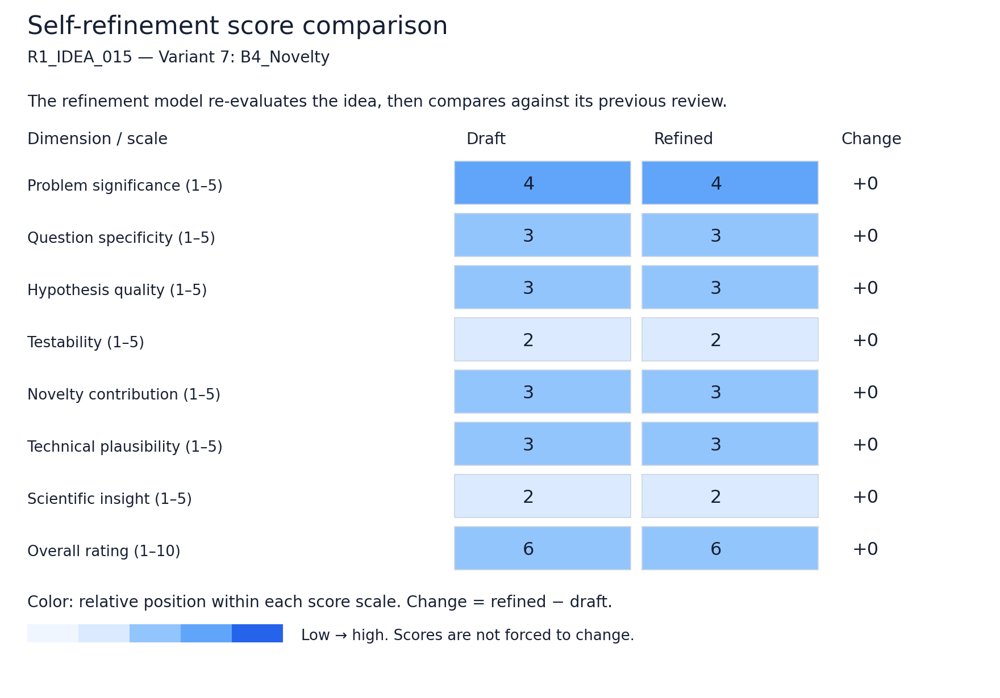

Changed score dimensions: none.

### Score justifications (draft / refined)

**Problem significance**

```json
{
  "draft": {
    "score": 4.0,
    "justification": "The problem of text-based avatar editing is significant in applications like virtual fashion, gaming, and VR, where precise customization is crucial. Addressing natural language ambiguity in this context has practical importance."
  },
  "refined": {
    "score": 4.0,
    "justification": "The problem of text-based avatar editing is significant in applications like virtual fashion, gaming, and VR, where precise customization is crucial. Addressing natural language ambiguity in this context has practical importance."
  }
}
```

**Question specificity**

```json
{
  "draft": {
    "score": 3.0,
    "justification": "The idea defines a specific problem (text-based avatar editing ambiguity) and proposes a novel method (ACS slider), but the specifics of how the slider operates and how it addresses the problem are not fully detailed."
  },
  "refined": {
    "score": 3.0,
    "justification": "The idea defines a specific problem (text-based avatar editing ambiguity) and proposes a novel method (ACS slider), but the specifics of how the slider operates and how it addresses the problem are not fully detailed."
  }
}
```

**Hypothesis quality**

```json
{
  "draft": {
    "score": 3.0,
    "justification": "The idea suggests a hypothesis that the ACS slider can effectively bridge the gap between two semantic extremes, but the mechanism and how it addresses ambiguity are not clearly articulated."
  },
  "refined": {
    "score": 3.0,
    "justification": "The idea suggests a hypothesis that the ACS slider can effectively bridge the gap between two semantic extremes, but the mechanism and how it addresses ambiguity are not clearly articulated."
  }
}
```

**Testability**

```json
{
  "draft": {
    "score": 2.0,
    "justification": "The idea lacks concrete experiments or comparisons to existing methods, making it difficult to assess the effectiveness of the ACS slider in real-world avatar editing scenarios."
  },
  "refined": {
    "score": 2.0,
    "justification": "The idea lacks concrete experiments or comparisons to existing methods, making it difficult to assess the effectiveness of the ACS slider in real-world avatar editing scenarios."
  }
}
```

**Novelty contribution**

```json
{
  "draft": {
    "score": 3.0,
    "justification": "The concept of a semantic slider for 3D avatars is novel, but the specific technical details and how it differs from existing methods are not clearly outlined, limiting its novelty score."
  },
  "refined": {
    "score": 3.0,
    "justification": "The concept of a semantic slider for 3D avatars is novel, but the specific technical details and how it differs from existing methods are not clearly outlined, limiting its novelty score."
  }
}
```

**Technical plausibility**

```json
{
  "draft": {
    "score": 3.0,
    "justification": "The idea is technically plausible, but the lack of specific implementation details makes it difficult to assess the feasibility of the proposed slider mechanism in 3D avatar editing."
  },
  "refined": {
    "score": 3.0,
    "justification": "The idea is technically plausible, but the lack of specific implementation details makes it difficult to assess the feasibility of the proposed slider mechanism in 3D avatar editing."
  }
}
```

**Scientific insight**

```json
{
  "draft": {
    "score": 2.0,
    "justification": "The idea has potential for scientific insight into semantic control in 3D avatars, but the lack of specifics makes it challenging to evaluate the depth of the insight it could provide."
  },
  "refined": {
    "score": 2.0,
    "justification": "The idea has potential for scientific insight into semantic control in 3D avatars, but the lack of specifics makes it challenging to evaluate the depth of the insight it could provide."
  }
}
```

**Overall rating**

```json
{
  "draft": {
    "score": 6.0,
    "justification": "The idea presents a promising direction for semantic control in 3D avatar editing, addressing a practical problem with a novel approach. However, it lacks sufficient details to fully assess its testability, novelty, and technical feasibility."
  },
  "refined": {
    "score": 6.0,
    "justification": "The idea presents a promising direction for semantic control in 3D avatar editing, addressing a practical problem with a novel approach. However, it lacks sufficient details to fully assess its testability, novelty, and technical feasibility."
  }
}
```

## R1_IDEA_015 — Variant 8: B5_Application_Impact

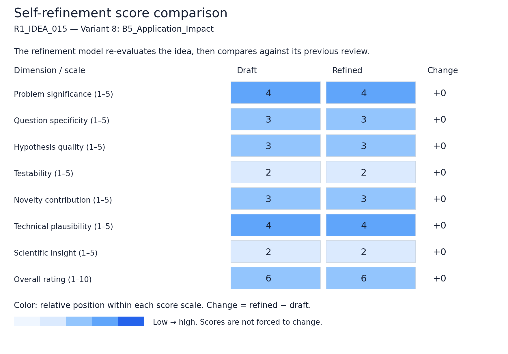

Changed score dimensions: none.

### Score justifications (draft / refined)

**Problem significance**

```json
{
  "draft": {
    "score": 4.0,
    "justification": "The problem of text-based avatar editing is significant as it relates to practical applications in digital human creation, which is a growing area in ML."
  },
  "refined": {
    "score": 4.0,
    "justification": "The problem of text-based avatar editing is significant as it relates to practical applications in digital human creation, which is a growing area in ML."
  }
}
```

**Question specificity**

```json
{
  "draft": {
    "score": 3.0,
    "justification": "The idea defines a general research direction but lacks specific details on the method's implementation and how it addresses the problem."
  },
  "refined": {
    "score": 3.0,
    "justification": "The idea defines a general research direction but lacks specific details on the method's implementation and how it addresses the problem."
  }
}
```

**Hypothesis quality**

```json
{
  "draft": {
    "score": 3.0,
    "justification": "The idea suggests a method but does not explicitly state a hypothesis or prediction that can be tested or falsified."
  },
  "refined": {
    "score": 3.0,
    "justification": "The idea suggests a method but does not explicitly state a hypothesis or prediction that can be tested or falsified."
  }
}
```

**Testability**

```json
{
  "draft": {
    "score": 2.0,
    "justification": "The idea lacks specific experiments or evaluation methods to test the effectiveness of the ACS approach."
  },
  "refined": {
    "score": 2.0,
    "justification": "The idea lacks specific experiments or evaluation methods to test the effectiveness of the ACS approach."
  }
}
```

**Novelty contribution**

```json
{
  "draft": {
    "score": 3.0,
    "justification": "The idea proposes a novel approach to text-based avatar editing, but the novelty is not clearly demonstrated without further details."
  },
  "refined": {
    "score": 3.0,
    "justification": "The idea proposes a novel approach to text-based avatar editing, but the novelty is not clearly demonstrated without further details."
  }
}
```

**Technical plausibility**

```json
{
  "draft": {
    "score": 4.0,
    "justification": "The concept of using a slider to adjust semantic concepts in 3D avatars is technically plausible, though the specifics of implementation are not provided."
  },
  "refined": {
    "score": 4.0,
    "justification": "The concept of using a slider to adjust semantic concepts in 3D avatars is technically plausible, though the specifics of implementation are not provided."
  }
}
```

**Scientific insight**

```json
{
  "draft": {
    "score": 2.0,
    "justification": "The idea does not clearly indicate what scientific insights could be gained from the research, focusing more on practical applications."
  },
  "refined": {
    "score": 2.0,
    "justification": "The idea does not clearly indicate what scientific insights could be gained from the research, focusing more on practical applications."
  }
}
```

**Overall rating**

```json
{
  "draft": {
    "score": 6.0,
    "justification": "The idea addresses a meaningful problem with a plausible approach, but lacks specificity, testability, and clear scientific insight."
  },
  "refined": {
    "score": 6.0,
    "justification": "The idea addresses a meaningful problem with a plausible approach, but lacks specificity, testability, and clear scientific insight."
  }
}
```

## R1_IDEA_015 — Variant 9: C1_Hollow_Shell


Changed score dimensions: none.

### Score justifications (draft / refined)

**Problem significance**

```json
{
  "draft": {
    "score": 3.0,
    "justification": "The problem of text-based 3D avatar editing is relevant to applications in virtual fashion, gaming, and animation, but the significance is somewhat general without more context."
  },
  "refined": {
    "score": 3.0,
    "justification": "The problem of text-based 3D avatar editing is relevant to applications in virtual fashion, gaming, and animation, but the significance is somewhat general without more context."
  }
}
```

**Question specificity**

```json
{
  "draft": {
    "score": 2.0,
    "justification": "The idea is somewhat specific in identifying the challenge but lacks clear definition of the research question or mechanism."
  },
  "refined": {
    "score": 2.0,
    "justification": "The idea is somewhat specific in identifying the challenge but lacks clear definition of the research question or mechanism."
  }
}
```

**Hypothesis quality**

```json
{
  "draft": {
    "score": 2.0,
    "justification": "The idea suggests a potential approach but does not provide a clear hypothesis or prediction that could be tested."
  },
  "refined": {
    "score": 2.0,
    "justification": "The idea suggests a potential approach but does not provide a clear hypothesis or prediction that could be tested."
  }
}
```

**Testability**

```json
{
  "draft": {
    "score": 2.0,
    "justification": "The idea lacks specific experiments or evaluation methods to test the proposed approach."
  },
  "refined": {
    "score": 2.0,
    "justification": "The idea lacks specific experiments or evaluation methods to test the proposed approach."
  }
}
```

**Novelty contribution**

```json
{
  "draft": {
    "score": 3.0,
    "justification": "The approach of adjusting concepts between extremes is potentially novel, but the contribution is not clearly defined without more details."
  },
  "refined": {
    "score": 3.0,
    "justification": "The approach of adjusting concepts between extremes is potentially novel, but the contribution is not clearly defined without more details."
  }
}
```

**Technical plausibility**

```json
{
  "draft": {
    "score": 3.0,
    "justification": "The idea is technically plausible but lacks specific details about the method's implementation or how concepts are adjusted."
  },
  "refined": {
    "score": 3.0,
    "justification": "The idea is technically plausible but lacks specific details about the method's implementation or how concepts are adjusted."
  }
}
```

**Scientific insight**

```json
{
  "draft": {
    "score": 2.0,
    "justification": "The idea has potential for scientific insight but does not clearly specify what insights could be gained from the research."
  },
  "refined": {
    "score": 2.0,
    "justification": "The idea has potential for scientific insight but does not clearly specify what insights could be gained from the research."
  }
}
```

**Overall rating**

```json
{
  "draft": {
    "score": 5.0,
    "justification": "The idea addresses a relevant problem with a potential approach, but lacks specificity, hypothesis, and testability details that are needed for a strong research direction."
  },
  "refined": {
    "score": 5.0,
    "justification": "The idea addresses a relevant problem with a potential approach, but lacks specificity, hypothesis, and testability details that are needed for a strong research direction."
  }
}
```

## R1_IDEA_015 — Variant 10: C2_Logic_Flawed


Changed score dimensions: none.

### Score justifications (draft / refined)

**Problem significance**

```json
{
  "draft": {
    "score": 4.0,
    "justification": "The problem of text-based 3D avatar editing is significant as it relates to the usability and precision of digital human creation, which is a critical area in computer graphics and human-computer interaction."
  },
  "refined": {
    "score": 4.0,
    "justification": "The problem of text-based 3D avatar editing is significant as it relates to the usability and precision of digital human creation, which is a critical area in computer graphics and human-computer interaction."
  }
}
```

**Question specificity**

```json
{
  "draft": {
    "score": 3.0,
    "justification": "The idea proposes a specific method (ACS) for semantic concept editing, but the details on how the intermediate point is determined and the mapping of concepts to avatar attributes are not sufficiently detailed."
  },
  "refined": {
    "score": 3.0,
    "justification": "The idea proposes a specific method (ACS) for semantic concept editing, but the details on how the intermediate point is determined and the mapping of concepts to avatar attributes are not sufficiently detailed."
  }
}
```

**Hypothesis quality**

```json
{
  "draft": {
    "score": 2.0,
    "justification": "The idea suggests a method but does not explicitly state a hypothesis or prediction that can be tested. The connection to broader semantic control is not clearly articulated."
  },
  "refined": {
    "score": 2.0,
    "justification": "The idea suggests a method but does not explicitly state a hypothesis or prediction that can be tested. The connection to broader semantic control is not clearly articulated."
  }
}
```

**Testability**

```json
{
  "draft": {
    "score": 3.0,
    "justification": "The idea proposes a method but lacks specific experiments or comparisons that would allow for testing its effectiveness. The lack of details on how the intermediate point is determined makes it difficult to assess testability."
  },
  "refined": {
    "score": 3.0,
    "justification": "The idea proposes a method but lacks specific experiments or comparisons that would allow for testing its effectiveness. The lack of details on how the intermediate point is determined makes it difficult to assess testability."
  }
}
```

**Novelty contribution**

```json
{
  "draft": {
    "score": 4.0,
    "justification": "The ACS method is a novel approach to text-based 3D avatar editing, offering a specific solution to the problem of semantic ambiguity. It has the potential to contribute to the field of digital human creation."
  },
  "refined": {
    "score": 4.0,
    "justification": "The ACS method is a novel approach to text-based 3D avatar editing, offering a specific solution to the problem of semantic ambiguity. It has the potential to contribute to the field of digital human creation."
  }
}
```

**Technical plausibility**

```json
{
  "draft": {
    "score": 4.0,
    "justification": "The concept of using an intermediate point between two extremes for semantic editing is technically plausible. The method aligns with existing approaches in semantic control and 3D avatar editing."
  },
  "refined": {
    "score": 4.0,
    "justification": "The concept of using an intermediate point between two extremes for semantic editing is technically plausible. The method aligns with existing approaches in semantic control and 3D avatar editing."
  }
}
```

**Scientific insight**

```json
{
  "draft": {
    "score": 3.0,
    "justification": "The idea has potential for scientific insight into how semantic concepts can be effectively edited in 3D avatars, but the lack of specific details limits the potential for deeper insights."
  },
  "refined": {
    "score": 3.0,
    "justification": "The idea has potential for scientific insight into how semantic concepts can be effectively edited in 3D avatars, but the lack of specific details limits the potential for deeper insights."
  }
}
```

**Overall rating**

```json
{
  "draft": {
    "score": 7.0,
    "justification": "The idea addresses a significant problem in text-based 3D avatar editing and proposes a novel method (ACS). However, it lacks sufficient details on the implementation and specific hypotheses, which are necessary for evaluating its scientific merit and testability."
  },
  "refined": {
    "score": 7.0,
    "justification": "The idea addresses a significant problem in text-based 3D avatar editing and proposes a novel method (ACS). However, it lacks sufficient details on the implementation and specific hypotheses, which are necessary for evaluating its scientific merit and testability."
  }
}
```

## R1_IDEA_015 — Variant 11: C3_Substance_Enriched


Changed score dimensions: none.

### Score justifications (draft / refined)

**Problem significance**

```json
{
  "draft": {
    "score": 4.0,
    "justification": "The problem of text-based 3D avatar editing is relevant to applications in virtual fashion, gaming, and digital avatars, where precise control is needed."
  },
  "refined": {
    "score": 4.0,
    "justification": "The problem of text-based 3D avatar editing is relevant to applications in virtual fashion, gaming, and digital avatars, where precise control is needed."
  }
}
```

**Question specificity**

```json
{
  "draft": {
    "score": 3.0,
    "justification": "The idea proposes a specific method (ACS) but lacks detailed specification of how it works or what exactly is being tested."
  },
  "refined": {
    "score": 3.0,
    "justification": "The idea proposes a specific method (ACS) but lacks detailed specification of how it works or what exactly is being tested."
  }
}
```

**Hypothesis quality**

```json
{
  "draft": {
    "score": 2.0,
    "justification": "The idea suggests a validation path but does not explicitly state a hypothesis that could be tested or contradicted."
  },
  "refined": {
    "score": 2.0,
    "justification": "The idea suggests a validation path but does not explicitly state a hypothesis that could be tested or contradicted."
  }
}
```

**Testability**

```json
{
  "draft": {
    "score": 3.0,
    "justification": "The idea suggests user studies as a validation method, but the specifics of how the hypothesis would be tested are not clearly defined."
  },
  "refined": {
    "score": 3.0,
    "justification": "The idea suggests user studies as a validation method, but the specifics of how the hypothesis would be tested are not clearly defined."
  }
}
```

**Novelty contribution**

```json
{
  "draft": {
    "score": 3.0,
    "justification": "The idea proposes a novel approach to text-based 3D avatar editing, but the novelty is not clearly distinguished from existing methods."
  },
  "refined": {
    "score": 3.0,
    "justification": "The idea proposes a novel approach to text-based 3D avatar editing, but the novelty is not clearly distinguished from existing methods."
  }
}
```

**Technical plausibility**

```json
{
  "draft": {
    "score": 4.0,
    "justification": "The concept of a slider-based editing method is plausible, and the problem of text-to-3D editing is a valid research direction."
  },
  "refined": {
    "score": 4.0,
    "justification": "The concept of a slider-based editing method is plausible, and the problem of text-to-3D editing is a valid research direction."
  }
}
```

**Scientific insight**

```json
{
  "draft": {
    "score": 3.0,
    "justification": "The idea could provide insights into the relationship between semantic concept definitions and editing precision, but this is not explicitly stated."
  },
  "refined": {
    "score": 3.0,
    "justification": "The idea could provide insights into the relationship between semantic concept definitions and editing precision, but this is not explicitly stated."
  }
}
```

**Overall rating**

```json
{
  "draft": {
    "score": 7.0,
    "justification": "The idea addresses a meaningful problem with a plausible approach, but lacks specific details and a clear hypothesis to guide the research."
  },
  "refined": {
    "score": 7.0,
    "justification": "The idea addresses a meaningful problem with a plausible approach, but lacks specific details and a clear hypothesis to guide the research."
  }
}
```

## R1_IDEA_015 — Variant 12: H1_Deceptive_Hollow

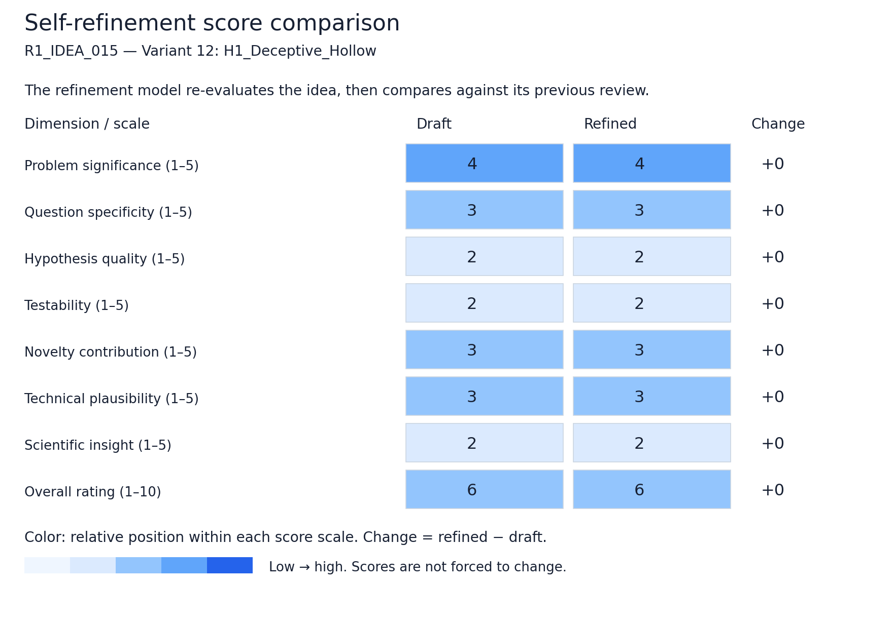

Changed score dimensions: none.

### Score justifications (draft / refined)

**Problem significance**

```json
{
  "draft": {
    "score": 4.0,
    "justification": "The problem of editing 3D human avatars with text is significant as it relates to practical applications in animation, virtual reality, and digital content creation. However, the idea's potential impact is somewhat abstract without concrete details."
  },
  "refined": {
    "score": 4.0,
    "justification": "The problem of editing 3D human avatars with text is significant as it relates to practical applications in animation, virtual reality, and digital content creation. However, the idea's potential impact is somewhat abstract without concrete details."
  }
}
```

**Question specificity**

```json
{
  "draft": {
    "score": 3.0,
    "justification": "The idea outlines a general research direction but lacks specific questions or hypotheses. The proposed framework is broad and not clearly defined, making it difficult to assess the exact research problem being addressed."
  },
  "refined": {
    "score": 3.0,
    "justification": "The idea outlines a general research direction but lacks specific questions or hypotheses. The proposed framework is broad and not clearly defined, making it difficult to assess the exact research problem being addressed."
  }
}
```

**Hypothesis quality**

```json
{
  "draft": {
    "score": 2.0,
    "justification": "The idea does not provide a clear hypothesis or prediction. The claim of a 'transformative synthesis' is vague and lacks the specificity needed to be testable or falsifiable."
  },
  "refined": {
    "score": 2.0,
    "justification": "The idea does not provide a clear hypothesis or prediction. The claim of a 'transformative synthesis' is vague and lacks the specificity needed to be testable or falsifiable."
  }
}
```

**Testability**

```json
{
  "draft": {
    "score": 2.0,
    "justification": "The idea is too abstract and lacks concrete experiments or evaluations. Without specific methods or comparisons, it is difficult to determine how the proposed approach would be tested or validated."
  },
  "refined": {
    "score": 2.0,
    "justification": "The idea is too abstract and lacks concrete experiments or evaluations. Without specific methods or comparisons, it is difficult to determine how the proposed approach would be tested or validated."
  }
}
```

**Novelty contribution**

```json
{
  "draft": {
    "score": 3.0,
    "justification": "The idea suggests a novel approach to a challenging problem, but the contribution is framed as a 'transformative synthesis' without clear evidence of novelty or specific contributions beyond the general vision."
  },
  "refined": {
    "score": 3.0,
    "justification": "The idea suggests a novel approach to a challenging problem, but the contribution is framed as a 'transformative synthesis' without clear evidence of novelty or specific contributions beyond the general vision."
  }
}
```

**Technical plausibility**

```json
{
  "draft": {
    "score": 3.0,
    "justification": "The idea is technically plausible in the sense that adjusting concepts between extremes could be a viable approach, but the lack of specific technical details makes it difficult to assess the feasibility of the proposed method."
  },
  "refined": {
    "score": 3.0,
    "justification": "The idea is technically plausible in the sense that adjusting concepts between extremes could be a viable approach, but the lack of specific technical details makes it difficult to assess the feasibility of the proposed method."
  }
}
```

**Scientific insight**

```json
{
  "draft": {
    "score": 2.0,
    "justification": "The idea does not provide clear scientific insights or mechanisms that could be derived from the research. The focus on a 'unified pathway' is abstract and lacks the specificity needed to generate meaningful insights."
  },
  "refined": {
    "score": 2.0,
    "justification": "The idea does not provide clear scientific insights or mechanisms that could be derived from the research. The focus on a 'unified pathway' is abstract and lacks the specificity needed to generate meaningful insights."
  }
}
```

**Overall rating**

```json
{
  "draft": {
    "score": 6.0,
    "justification": "The idea presents a promising direction for research but lacks specific details, hypotheses, and testable components. While the problem is significant, the proposed approach is too vague to be considered a strong research idea without further clarification."
  },
  "refined": {
    "score": 6.0,
    "justification": "The idea presents a promising direction for research but lacks specific details, hypotheses, and testable components. While the problem is significant, the proposed approach is too vague to be considered a strong research idea without further clarification."
  }
}
```

## R1_IDEA_015 — Variant 13: H2_Confident_Flaw

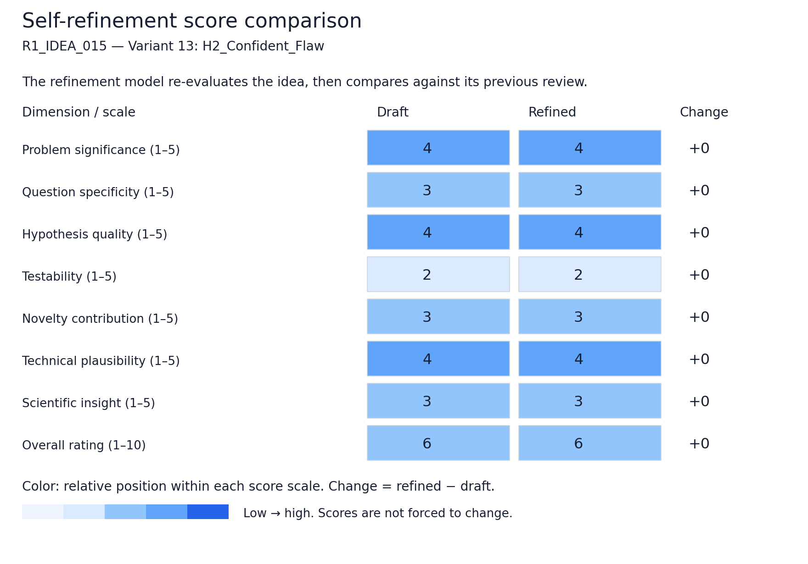

Changed score dimensions: none.

### Score justifications (draft / refined)

**Problem significance**

```json
{
  "draft": {
    "score": 4.0,
    "justification": "The problem of text-based 3D avatar editing is significant in applications like virtual fashion, gaming, and digital humans, where precise control is essential."
  },
  "refined": {
    "score": 4.0,
    "justification": "The problem of text-based 3D avatar editing is significant in applications like virtual fashion, gaming, and digital humans, where precise control is essential."
  }
}
```

**Question specificity**

```json
{
  "draft": {
    "score": 3.0,
    "justification": "The idea clearly defines the problem but lacks specific details on the proposed solution's implementation and how it addresses the ambiguity in natural language."
  },
  "refined": {
    "score": 3.0,
    "justification": "The idea clearly defines the problem but lacks specific details on the proposed solution's implementation and how it addresses the ambiguity in natural language."
  }
}
```

**Hypothesis quality**

```json
{
  "draft": {
    "score": 4.0,
    "justification": "The hypothesis that ACS will improve editing precision by allowing semantic adjustments between extremes is concrete and plausible, though the causal argument needs more support."
  },
  "refined": {
    "score": 4.0,
    "justification": "The hypothesis that ACS will improve editing precision by allowing semantic adjustments between extremes is concrete and plausible, though the causal argument needs more support."
  }
}
```

**Testability**

```json
{
  "draft": {
    "score": 2.0,
    "justification": "The idea lacks specific experiments or evaluation methods, making it difficult to assess the validity of the claims without further details."
  },
  "refined": {
    "score": 2.0,
    "justification": "The idea lacks specific experiments or evaluation methods, making it difficult to assess the validity of the claims without further details."
  }
}
```

**Novelty contribution**

```json
{
  "draft": {
    "score": 3.0,
    "justification": "The proposal introduces a novel approach to semantic control in avatars, but the novelty is somewhat limited without a detailed description of the method's unique aspects."
  },
  "refined": {
    "score": 3.0,
    "justification": "The proposal introduces a novel approach to semantic control in avatars, but the novelty is somewhat limited without a detailed description of the method's unique aspects."
  }
}
```

**Technical plausibility**

```json
{
  "draft": {
    "score": 4.0,
    "justification": "The concept of a slider for semantic adjustments is technically plausible, though the specifics of implementation are not provided."
  },
  "refined": {
    "score": 4.0,
    "justification": "The concept of a slider for semantic adjustments is technically plausible, though the specifics of implementation are not provided."
  }
}
```

**Scientific insight**

```json
{
  "draft": {
    "score": 3.0,
    "justification": "The idea suggests potential for broader application but does not clearly outline the scientific insights that would be gained from successfully implementing the method."
  },
  "refined": {
    "score": 3.0,
    "justification": "The idea suggests potential for broader application but does not clearly outline the scientific insights that would be gained from successfully implementing the method."
  }
}
```

**Overall rating**

```json
{
  "draft": {
    "score": 6.0,
    "justification": "The idea addresses a meaningful problem with a clear proposal, but lacks specific technical details and empirical validation, which are necessary for assessing its scientific merit and potential impact."
  },
  "refined": {
    "score": 6.0,
    "justification": "The idea addresses a meaningful problem with a clear proposal, but lacks specific technical details and empirical validation, which are necessary for assessing its scientific merit and potential impact."
  }
}
```

## R1_IDEA_015 — Variant 14: H3_Verbose_Enriched

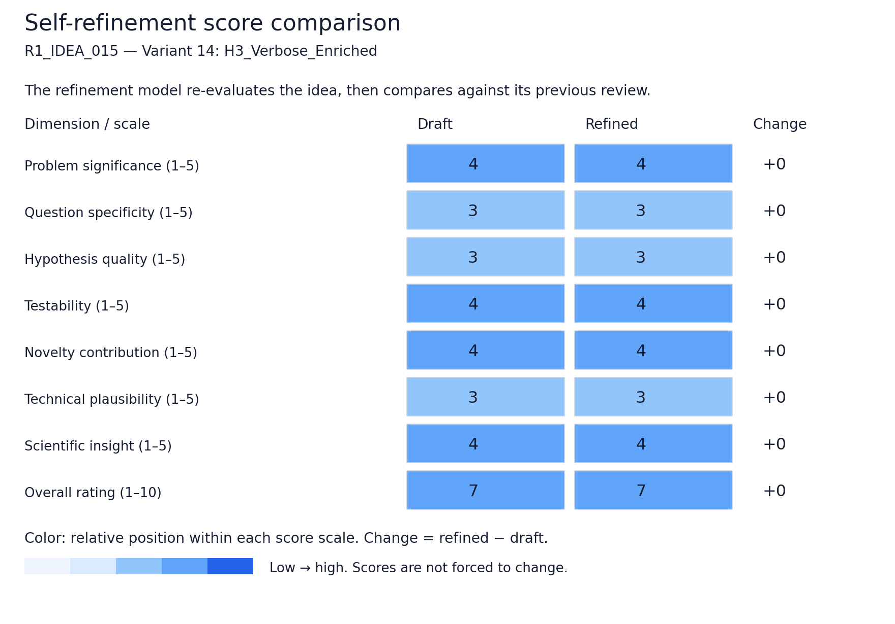

Changed score dimensions: none.

### Score justifications (draft / refined)

**Problem significance**

```json
{
  "draft": {
    "score": 4.0,
    "justification": "The problem of text-based 3D avatar editing is significant as it relates to user interaction and customization in virtual environments, which is a key challenge in human-computer interaction and 3D modeling."
  },
  "refined": {
    "score": 4.0,
    "justification": "The problem of text-based 3D avatar editing is significant as it relates to user interaction and customization in virtual environments, which is a key challenge in human-computer interaction and 3D modeling."
  }
}
```

**Question specificity**

```json
{
  "draft": {
    "score": 3.0,
    "justification": "The idea is specific in proposing a method for concept-based editing, but lacks details on the exact nature of the semantic concepts, their representation, and the mapping between text and editing actions."
  },
  "refined": {
    "score": 3.0,
    "justification": "The idea is specific in proposing a method for concept-based editing, but lacks details on the exact nature of the semantic concepts, their representation, and the mapping between text and editing actions."
  }
}
```

**Hypothesis quality**

```json
{
  "draft": {
    "score": 3.0,
    "justification": "The idea suggests a validation plan but does not explicitly state the hypothesis being tested. The claim that ACS improves precision in concept targeting is plausible but not clearly articulated."
  },
  "refined": {
    "score": 3.0,
    "justification": "The idea suggests a validation plan but does not explicitly state the hypothesis being tested. The claim that ACS improves precision in concept targeting is plausible but not clearly articulated."
  }
}
```

**Testability**

```json
{
  "draft": {
    "score": 4.0,
    "justification": "The idea includes a detailed experimental design with user studies, ablations, and error analysis, which makes the claims testable. However, the lack of specific details on the study design reduces its testability."
  },
  "refined": {
    "score": 4.0,
    "justification": "The idea includes a detailed experimental design with user studies, ablations, and error analysis, which makes the claims testable. However, the lack of specific details on the study design reduces its testability."
  }
}
```

**Novelty contribution**

```json
{
  "draft": {
    "score": 4.0,
    "justification": "The ACS method is a novel approach to text-based 3D avatar editing, and the proposed validation plan could contribute to understanding the effectiveness of concept-based editing in this domain."
  },
  "refined": {
    "score": 4.0,
    "justification": "The ACS method is a novel approach to text-based 3D avatar editing, and the proposed validation plan could contribute to understanding the effectiveness of concept-based editing in this domain."
  }
}
```

**Technical plausibility**

```json
{
  "draft": {
    "score": 3.0,
    "justification": "The concept of using sliders for semantic editing is plausible, but the technical details on how the model processes text and maps it to 3D avatar changes are not provided, which could affect the feasibility of the approach."
  },
  "refined": {
    "score": 3.0,
    "justification": "The concept of using sliders for semantic editing is plausible, but the technical details on how the model processes text and maps it to 3D avatar changes are not provided, which could affect the feasibility of the approach."
  }
}
```

**Scientific insight**

```json
{
  "draft": {
    "score": 4.0,
    "justification": "The idea emphasizes testing boundary conditions and domain constraints, which could lead to insights into the limitations and effectiveness of concept-based editing in different scenarios."
  },
  "refined": {
    "score": 4.0,
    "justification": "The idea emphasizes testing boundary conditions and domain constraints, which could lead to insights into the limitations and effectiveness of concept-based editing in different scenarios."
  }
}
```

**Overall rating**

```json
{
  "draft": {
    "score": 7.0,
    "justification": "The idea is strong in addressing a meaningful problem with a concrete method and a detailed validation plan. However, it lacks specific technical details and a clear hypothesis, which could be addressed with further clarification."
  },
  "refined": {
    "score": 7.0,
    "justification": "The idea is strong in addressing a meaningful problem with a concrete method and a detailed validation plan. However, it lacks specific technical details and a clear hypothesis, which could be addressed with further clarification."
  }
}
```

## R1_IDEA_015 — Variant 15: H4_Ultimate_Hype


Changed score dimensions: none.

### Score justifications (draft / refined)

**Problem significance**

```json
{
  "draft": {
    "score": 4.0,
    "justification": "The problem of text-based editing of 3D avatars is significant as it relates to user customization and practical applications in virtual environments, gaming, and digital content creation."
  },
  "refined": {
    "score": 4.0,
    "justification": "The problem of text-based editing of 3D avatars is significant as it relates to user customization and practical applications in virtual environments, gaming, and digital content creation."
  }
}
```

**Question specificity**

```json
{
  "draft": {
    "score": 3.0,
    "justification": "The idea presents a general research direction but lacks specific details on the method's implementation, the exact nature of the semantic concepts, and how the intermediate points are determined."
  },
  "refined": {
    "score": 3.0,
    "justification": "The idea presents a general research direction but lacks specific details on the method's implementation, the exact nature of the semantic concepts, and how the intermediate points are determined."
  }
}
```

**Hypothesis quality**

```json
{
  "draft": {
    "score": 3.0,
    "justification": "The idea suggests a novel approach but does not explicitly state a testable hypothesis or prediction that could be validated through experiments or analysis."
  },
  "refined": {
    "score": 3.0,
    "justification": "The idea suggests a novel approach but does not explicitly state a testable hypothesis or prediction that could be validated through experiments or analysis."
  }
}
```

**Testability**

```json
{
  "draft": {
    "score": 2.0,
    "justification": "The idea is ambitious but lacks concrete experiments or evaluation methods to test the effectiveness of ACS, making it difficult to assess its validity without further details."
  },
  "refined": {
    "score": 2.0,
    "justification": "The idea is ambitious but lacks concrete experiments or evaluation methods to test the effectiveness of ACS, making it difficult to assess its validity without further details."
  }
}
```

**Novelty contribution**

```json
{
  "draft": {
    "score": 3.0,
    "justification": "The idea introduces a new method (ACS) with potential for impact, but the novelty is not clearly defined or differentiated from existing approaches without more specific information."
  },
  "refined": {
    "score": 3.0,
    "justification": "The idea introduces a new method (ACS) with potential for impact, but the novelty is not clearly defined or differentiated from existing approaches without more specific information."
  }
}
```

**Technical plausibility**

```json
{
  "draft": {
    "score": 4.0,
    "justification": "The concept of using a slider to adjust semantic concepts in 3D avatars is technically plausible, though the specific implementation details are not provided."
  },
  "refined": {
    "score": 4.0,
    "justification": "The concept of using a slider to adjust semantic concepts in 3D avatars is technically plausible, though the specific implementation details are not provided."
  }
}
```

**Scientific insight**

```json
{
  "draft": {
    "score": 3.0,
    "justification": "The idea has the potential to contribute to the field by improving avatar customization, but the specific insights or mechanisms are not clearly outlined."
  },
  "refined": {
    "score": 3.0,
    "justification": "The idea has the potential to contribute to the field by improving avatar customization, but the specific insights or mechanisms are not clearly outlined."
  }
}
```

**Overall rating**

```json
{
  "draft": {
    "score": 7.0,
    "justification": "The idea addresses a meaningful problem with a promising approach, but it lacks specific details and testable hypotheses, which are necessary for further development and validation."
  },
  "refined": {
    "score": 7.0,
    "justification": "The idea addresses a meaningful problem with a promising approach, but it lacks specific details and testable hypotheses, which are necessary for further development and validation."
  }
}
```

## R1_IDEA_016 — Source


Changed score dimensions: none.

### Score justifications (draft / refined)

**Problem significance**

```json
{
  "draft": {
    "score": 4.0,
    "justification": "The idea addresses a meaningful challenge in the interpretability of large language models, which is a critical area of research. Developing a principled framework for SAEs could have significant implications for model analysis and understanding."
  },
  "refined": {
    "score": 4.0,
    "justification": "The idea addresses a meaningful challenge in the interpretability of large language models, which is a critical area of research. Developing a principled framework for SAEs could have significant implications for model analysis and understanding."
  }
}
```

**Question specificity**

```json
{
  "draft": {
    "score": 3.0,
    "justification": "The idea identifies a specific problem in the derivation of SAEs from dictionary learning but lacks detailed specification of the research question. The question is clear in intent but needs more concrete formulation."
  },
  "refined": {
    "score": 3.0,
    "justification": "The idea identifies a specific problem in the derivation of SAEs from dictionary learning but lacks detailed specification of the research question. The question is clear in intent but needs more concrete formulation."
  }
}
```

**Hypothesis quality**

```json
{
  "draft": {
    "score": 4.0,
    "justification": "The idea presents a plausible hypothesis that the unrolling of the proximal gradient method can lead to a principled framework for deriving SAEs. It suggests a specific methodological approach that could be tested."
  },
  "refined": {
    "score": 4.0,
    "justification": "The idea presents a plausible hypothesis that the unrolling of the proximal gradient method can lead to a principled framework for deriving SAEs. It suggests a specific methodological approach that could be tested."
  }
}
```

**Testability**

```json
{
  "draft": {
    "score": 3.0,
    "justification": "The idea suggests a methodological approach but does not provide specific experiments or comparisons that would allow for testing the hypothesis. More details on how to evaluate the framework are needed."
  },
  "refined": {
    "score": 3.0,
    "justification": "The idea suggests a methodological approach but does not provide specific experiments or comparisons that would allow for testing the hypothesis. More details on how to evaluate the framework are needed."
  }
}
```

**Novelty contribution**

```json
{
  "draft": {
    "score": 4.0,
    "justification": "The idea proposes a novel approach to deriving SAEs from dictionary learning, which could contribute to the field by providing a principled framework. However, the novelty is somewhat limited if the method is a variation of existing techniques."
  },
  "refined": {
    "score": 4.0,
    "justification": "The idea proposes a novel approach to deriving SAEs from dictionary learning, which could contribute to the field by providing a principled framework. However, the novelty is somewhat limited if the method is a variation of existing techniques."
  }
}
```

**Technical plausibility**

```json
{
  "draft": {
    "score": 4.0,
    "justification": "The use of proximal gradient methods for sparse coding is a technically plausible approach that has been explored in related fields. The idea is logically coherent and builds on existing methods."
  },
  "refined": {
    "score": 4.0,
    "justification": "The use of proximal gradient methods for sparse coding is a technically plausible approach that has been explored in related fields. The idea is logically coherent and builds on existing methods."
  }
}
```

**Scientific insight**

```json
{
  "draft": {
    "score": 3.0,
    "justification": "The idea has the potential to provide insights into the relationship between dictionary learning and SAEs, but the scientific insight is not clearly defined. More details on the expected outcomes would help clarify this."
  },
  "refined": {
    "score": 3.0,
    "justification": "The idea has the potential to provide insights into the relationship between dictionary learning and SAEs, but the scientific insight is not clearly defined. More details on the expected outcomes would help clarify this."
  }
}
```

**Overall rating**

```json
{
  "draft": {
    "score": 7.0,
    "justification": "The idea addresses a meaningful problem in the interpretability of large language models and proposes a plausible method. However, it lacks specific details on implementation, comparison with existing methods, and evaluation metrics, which are necessary for a strong research direction."
  },
  "refined": {
    "score": 7.0,
    "justification": "The idea addresses a meaningful problem in the interpretability of large language models and proposes a plausible method. However, it lacks specific details on implementation, comparison with existing methods, and evaluation metrics, which are necessary for a strong research direction."
  }
}
```

## R1_IDEA_016 — Variant 1: A1_Identity


Changed score dimensions: none.

### Score justifications (draft / refined)

**Problem significance**

```json
{
  "draft": {
    "score": 4.0,
    "justification": "The idea addresses a meaningful challenge in the interpretability of large language models, which is a critical area of research. Developing a principled framework for SAEs could have significant implications for model analysis and understanding."
  },
  "refined": {
    "score": 4.0,
    "justification": "The idea addresses a meaningful challenge in the interpretability of large language models, which is a critical area of research. Developing a principled framework for SAEs could have significant implications for model analysis and understanding."
  }
}
```

**Question specificity**

```json
{
  "draft": {
    "score": 3.0,
    "justification": "The idea identifies a specific problem in the derivation of SAEs from dictionary learning but lacks detailed specification of the research question. The question is clear in intent but needs more concrete formulation."
  },
  "refined": {
    "score": 3.0,
    "justification": "The idea identifies a specific problem in the derivation of SAEs from dictionary learning but lacks detailed specification of the research question. The question is clear in intent but needs more concrete formulation."
  }
}
```

**Hypothesis quality**

```json
{
  "draft": {
    "score": 4.0,
    "justification": "The idea presents a plausible hypothesis that the unrolling of the proximal gradient method can lead to a principled framework for deriving SAEs. It suggests a specific methodological approach that could be tested."
  },
  "refined": {
    "score": 4.0,
    "justification": "The idea presents a plausible hypothesis that the unrolling of the proximal gradient method can lead to a principled framework for deriving SAEs. It suggests a specific methodological approach that could be tested."
  }
}
```

**Testability**

```json
{
  "draft": {
    "score": 3.0,
    "justification": "The idea suggests a methodological approach but does not provide specific experiments or comparisons that would allow for testing the hypothesis. More details on how to evaluate the framework are needed."
  },
  "refined": {
    "score": 3.0,
    "justification": "The idea suggests a methodological approach but does not provide specific experiments or comparisons that would allow for testing the hypothesis. More details on how to evaluate the framework are needed."
  }
}
```

**Novelty contribution**

```json
{
  "draft": {
    "score": 4.0,
    "justification": "The idea proposes a novel approach to deriving SAEs from dictionary learning, which could contribute to the field by providing a principled framework. However, the novelty is somewhat limited if the method is a variation of existing techniques."
  },
  "refined": {
    "score": 4.0,
    "justification": "The idea proposes a novel approach to deriving SAEs from dictionary learning, which could contribute to the field by providing a principled framework. However, the novelty is somewhat limited if the method is a variation of existing techniques."
  }
}
```

**Technical plausibility**

```json
{
  "draft": {
    "score": 4.0,
    "justification": "The use of proximal gradient methods for sparse coding is a technically plausible approach that has been explored in related fields. The idea is logically coherent and builds on existing methods."
  },
  "refined": {
    "score": 4.0,
    "justification": "The use of proximal gradient methods for sparse coding is a technically plausible approach that has been explored in related fields. The idea is logically coherent and builds on existing methods."
  }
}
```

**Scientific insight**

```json
{
  "draft": {
    "score": 3.0,
    "justification": "The idea has the potential to provide insights into the relationship between dictionary learning and SAEs, but the scientific insight is not clearly defined. More details on the expected outcomes would help clarify this."
  },
  "refined": {
    "score": 3.0,
    "justification": "The idea has the potential to provide insights into the relationship between dictionary learning and SAEs, but the scientific insight is not clearly defined. More details on the expected outcomes would help clarify this."
  }
}
```

**Overall rating**

```json
{
  "draft": {
    "score": 7.0,
    "justification": "The idea addresses a meaningful problem in the interpretability of large language models and proposes a plausible method. However, it lacks specific details on implementation, comparison with existing methods, and evaluation metrics, which are necessary for a strong research direction."
  },
  "refined": {
    "score": 7.0,
    "justification": "The idea addresses a meaningful problem in the interpretability of large language models and proposes a plausible method. However, it lacks specific details on implementation, comparison with existing methods, and evaluation metrics, which are necessary for a strong research direction."
  }
}
```

## R1_IDEA_016 — Variant 2: A2_Paraphrase_Only


Changed score dimensions: none.

### Score justifications (draft / refined)

**Problem significance**

```json
{
  "draft": {
    "score": 4.0,
    "justification": "The idea addresses a significant gap in the understanding of sparse autoencoders, which are important for interpreting large language models. Systematically deriving SAEs from dictionary learning could enhance their theoretical foundation and practical applications."
  },
  "refined": {
    "score": 4.0,
    "justification": "The idea addresses a significant gap in the understanding of sparse autoencoders, which are important for interpreting large language models. Systematically deriving SAEs from dictionary learning could enhance their theoretical foundation and practical applications."
  }
}
```

**Question specificity**

```json
{
  "draft": {
    "score": 3.0,
    "justification": "The research question is clear in identifying the gap and proposing a method, but the specifics of the framework and its implementation are not detailed, which could affect the testability of the idea."
  },
  "refined": {
    "score": 3.0,
    "justification": "The research question is clear in identifying the gap and proposing a method, but the specifics of the framework and its implementation are not detailed, which could affect the testability of the idea."
  }
}
```

**Hypothesis quality**

```json
{
  "draft": {
    "score": 3.0,
    "justification": "The idea presents a plausible hypothesis that unrolling the proximal gradient method will lead to a systematic derivation of SAEs from dictionary learning, but the hypothesis is not explicitly stated or detailed enough to be strongly testable."
  },
  "refined": {
    "score": 3.0,
    "justification": "The idea presents a plausible hypothesis that unrolling the proximal gradient method will lead to a systematic derivation of SAEs from dictionary learning, but the hypothesis is not explicitly stated or detailed enough to be strongly testable."
  }
}
```

**Testability**

```json
{
  "draft": {
    "score": 3.0,
    "justification": "The idea suggests a method but lacks specific experiments or comparisons that would be needed to validate the framework. Without clear testable components, the idea's potential impact is uncertain."
  },
  "refined": {
    "score": 3.0,
    "justification": "The idea suggests a method but lacks specific experiments or comparisons that would be needed to validate the framework. Without clear testable components, the idea's potential impact is uncertain."
  }
}
```

**Novelty contribution**

```json
{
  "draft": {
    "score": 3.0,
    "justification": "The idea proposes a novel approach to deriving SAEs from dictionary learning, but the novelty is not clearly differentiated from existing methods. The contribution is plausible but not explicitly defined."
  },
  "refined": {
    "score": 3.0,
    "justification": "The idea proposes a novel approach to deriving SAEs from dictionary learning, but the novelty is not clearly differentiated from existing methods. The contribution is plausible but not explicitly defined."
  }
}
```

**Technical plausibility**

```json
{
  "draft": {
    "score": 4.0,
    "justification": "The use of proximal gradient method in sparse coding is a well-established technique, making the proposed approach technically plausible. The connection to dictionary learning is reasonable and aligns with existing research."
  },
  "refined": {
    "score": 4.0,
    "justification": "The use of proximal gradient method in sparse coding is a well-established technique, making the proposed approach technically plausible. The connection to dictionary learning is reasonable and aligns with existing research."
  }
}
```

**Scientific insight**

```json
{
  "draft": {
    "score": 3.0,
    "justification": "The idea has the potential to provide insights into the theoretical foundations of SAEs, but the specific insights are not clearly outlined. The scientific contribution is plausible but not strongly defined."
  },
  "refined": {
    "score": 3.0,
    "justification": "The idea has the potential to provide insights into the theoretical foundations of SAEs, but the specific insights are not clearly outlined. The scientific contribution is plausible but not strongly defined."
  }
}
```

**Overall rating**

```json
{
  "draft": {
    "score": 7.0,
    "justification": "The idea addresses a meaningful problem in the field of sparse autoencoders and proposes a technically plausible approach. However, it lacks specific details and clear hypotheses, which could limit its testability and potential impact. With further clarification and details, it has strong potential for a significant contribution."
  },
  "refined": {
    "score": 7.0,
    "justification": "The idea addresses a meaningful problem in the field of sparse autoencoders and proposes a technically plausible approach. However, it lacks specific details and clear hypotheses, which could limit its testability and potential impact. With further clarification and details, it has strong potential for a significant contribution."
  }
}
```

## R1_IDEA_016 — Variant 3: A3_Plain_Core

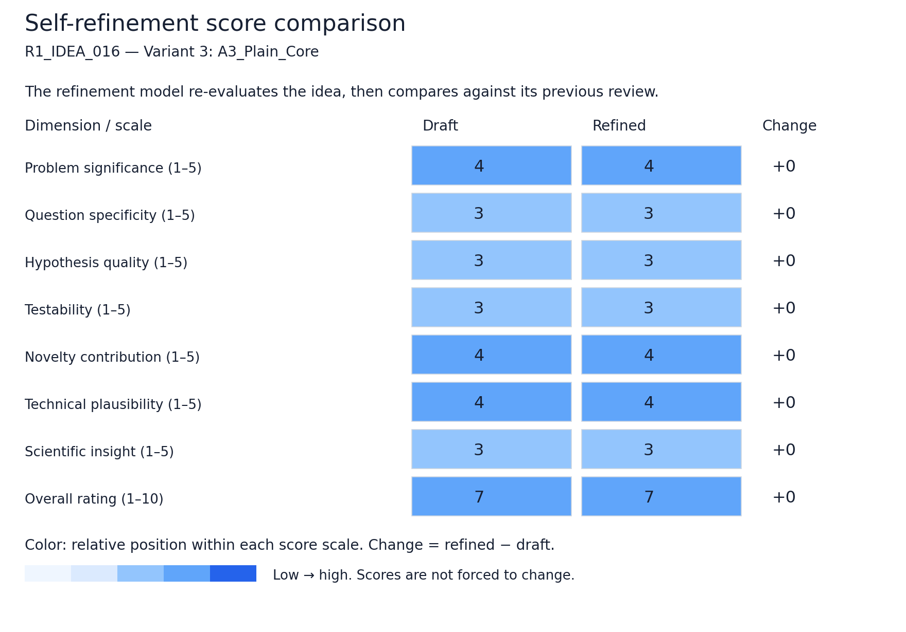

Changed score dimensions: none.

### Score justifications (draft / refined)

**Problem significance**

```json
{
  "draft": {
    "score": 4.0,
    "justification": "The idea addresses a significant challenge in the interpretability of large language models, which is a critical area in machine learning. However, the problem is somewhat broad and could be more clearly defined."
  },
  "refined": {
    "score": 4.0,
    "justification": "The idea addresses a significant challenge in the interpretability of large language models, which is a critical area in machine learning. The problem of deriving SAEs from dictionary learning is a gap in the literature that could lead to more principled and effective methods for model interpretability."
  }
}
```

**Question specificity**

```json
{
  "draft": {
    "score": 3.0,
    "justification": "The idea proposes a method for deriving SAEs from dictionary learning, but the specific research question or hypothesis is not clearly articulated. More details are needed to define the exact problem being addressed."
  },
  "refined": {
    "score": 3.0,
    "justification": "The idea proposes a method for deriving SAEs from dictionary learning, but the specific research question or hypothesis is not clearly articulated. More details are needed to define the exact problem being addressed, such as what aspect of the derivation is being improved or what specific property of SAEs is being targeted."
  }
}
```

**Hypothesis quality**

```json
{
  "draft": {
    "score": 3.0,
    "justification": "The idea suggests a method (unrolling proximal gradient) but does not explicitly state a hypothesis or prediction that could be tested. A clearer hypothesis would strengthen the idea."
  },
  "refined": {
    "score": 3.0,
    "justification": "The idea suggests a method (unrolling proximal gradient) but does not explicitly state a hypothesis or prediction that could be tested. A clearer hypothesis, such as the expectation that this method will lead to more interpretable or efficient SAEs, would strengthen the idea."
  }
}
```

**Testability**

```json
{
  "draft": {
    "score": 3.0,
    "justification": "The idea proposes a method but does not provide a clear experimental plan or evaluation metric. Without specific tests, it is difficult to assess the validity of the approach."
  },
  "refined": {
    "score": 3.0,
    "justification": "The idea proposes a method but does not provide a clear experimental plan or evaluation metric. Without specific tests, it is difficult to assess the validity of the approach. For example, it is unclear how the framework will be evaluated against existing methods or what metrics will be used to measure interpretability improvements."
  }
}
```

**Novelty contribution**

```json
{
  "draft": {
    "score": 4.0,
    "justification": "The idea introduces a novel approach to deriving SAEs from dictionary learning, which could contribute to the field of interpretability in LLMs. However, the novelty is somewhat limited without a clear research question."
  },
  "refined": {
    "score": 4.0,
    "justification": "The idea introduces a novel approach to deriving SAEs from dictionary learning, which could contribute to the field of interpretability in LLMs. However, the novelty is somewhat limited without a clear research question. The novelty lies in the proposed method of unrolling the proximal gradient, which is a novel application of sparse coding techniques to SAE derivation."
  }
}
```

**Technical plausibility**

```json
{
  "draft": {
    "score": 4.0,
    "justification": "The proposed method (unrolling proximal gradient) is technically plausible and aligns with existing methods in sparse coding. However, the connection to SAEs is not sufficiently detailed."
  },
  "refined": {
    "score": 4.0,
    "justification": "The proposed method (unrolling proximal gradient) is technically plausible and aligns with existing methods in sparse coding. The connection to SAEs is plausible, as sparse coding is a related concept in dictionary learning. However, the technical details of how this unrolling process would be implemented and its specific benefits for SAEs are not fully elaborated."
  }
}
```

**Scientific insight**

```json
{
  "draft": {
    "score": 3.0,
    "justification": "The idea has potential for scientific insight into the derivation of SAEs from dictionary learning, but the specific insights are not clearly outlined. More details are needed to assess the potential contribution."
  },
  "refined": {
    "score": 3.0,
    "justification": "The idea has potential for scientific insight into the derivation of SAEs from dictionary learning, but the specific insights are not clearly outlined. More details are needed to assess the potential contribution, such as how this framework could reveal new properties of SAEs or improve our understanding of dictionary learning in the context of interpretability."
  }
}
```

**Overall rating**

```json
{
  "draft": {
    "score": 7.0,
    "justification": "The idea addresses a meaningful problem in the context of interpretability for LLMs and proposes a novel method. However, it lacks clarity in defining the specific research question, hypothesis, and evaluation plan, which are necessary for a strong research idea."
  },
  "refined": {
    "score": 7.0,
    "justification": "The idea addresses a meaningful problem in the context of interpretability for LLMs and proposes a novel method. However, it lacks clarity in defining the specific research question, hypothesis, and evaluation plan, which are necessary for a strong research idea. The potential for contribution is present, but the idea needs more specificity to be considered exceptional."
  }
}
```

## R1_IDEA_016 — Variant 4: B1_Verbose_Elaborate


Changed score dimensions: none.

### Score justifications (draft / refined)

**Problem significance**

```json
{
  "draft": {
    "score": 4.0,
    "justification": "The problem of lacking a principled framework for deriving SAEs from dictionary learning is significant as it addresses a gap in understanding the theoretical foundations of SAEs, which are important for interpretability in large language models."
  },
  "refined": {
    "score": 4.0,
    "justification": "The problem of lacking a principled framework for deriving SAEs from dictionary learning is significant as it addresses a gap in understanding the theoretical foundations of SAEs, which are important for interpretability in large language models."
  }
}
```

**Question specificity**

```json
{
  "draft": {
    "score": 3.0,
    "justification": "The idea identifies a problem but does not clearly define the specific research question or hypothesis. It is somewhat vague about what exactly the framework aims to achieve or what new insights it seeks to provide."
  },
  "refined": {
    "score": 3.0,
    "justification": "The idea identifies a problem but does not clearly define the specific research question or hypothesis. It is somewhat vague about what exactly the framework aims to achieve or what new insights it seeks to provide."
  }
}
```

**Hypothesis quality**

```json
{
  "draft": {
    "score": 3.0,
    "justification": "The idea proposes a method but does not explicitly state a hypothesis that could be tested. The connection between the proposed framework and the derivation of SAEs from dictionary learning is not clearly articulated."
  },
  "refined": {
    "score": 3.0,
    "justification": "The idea proposes a method but does not explicitly state a hypothesis that could be tested. The connection between the proposed framework and the derivation of SAEs from dictionary learning is not clearly articulated."
  }
}
```

**Testability**

```json
{
  "draft": {
    "score": 3.0,
    "justification": "The idea suggests a method but does not provide a clear experimental plan or evaluation criteria. It is not clear how the framework will be tested or what metrics will be used to assess its effectiveness."
  },
  "refined": {
    "score": 3.0,
    "justification": "The idea suggests a method but does not provide a clear experimental plan or evaluation criteria. It is not clear how the framework will be tested or what metrics will be used to assess its effectiveness."
  }
}
```

**Novelty contribution**

```json
{
  "draft": {
    "score": 4.0,
    "justification": "The proposed framework has the potential to contribute to the understanding of SAEs and their relationship with dictionary learning, which is a novel and important area of research."
  },
  "refined": {
    "score": 4.0,
    "justification": "The proposed framework has the potential to contribute to the understanding of SAEs and their relationship with dictionary learning, which is a novel and important area of research."
  }
}
```

**Technical plausibility**

```json
{
  "draft": {
    "score": 4.0,
    "justification": "The method of unrolling the proximal gradient method is technically plausible and grounded in established optimization techniques, making it a feasible approach for the proposed research."
  },
  "refined": {
    "score": 4.0,
    "justification": "The method of unrolling the proximal gradient method is technically plausible and grounded in established optimization techniques, making it a feasible approach for the proposed research."
  }
}
```

**Scientific insight**

```json
{
  "draft": {
    "score": 3.0,
    "justification": "The idea has the potential to provide insights into the relationship between SAEs and dictionary learning, but the specific scientific insights are not clearly defined or hypothesized."
  },
  "refined": {
    "score": 3.0,
    "justification": "The idea has the potential to provide insights into the relationship between SAEs and dictionary learning, but the specific scientific insights are not clearly defined or hypothesized."
  }
}
```

**Overall rating**

```json
{
  "draft": {
    "score": 7.0,
    "justification": "The idea addresses a meaningful problem in the field of SAEs and proposes a technically plausible method. However, it lacks clarity in defining the specific research question, hypothesis, and evaluation plan, which are necessary for a strong research idea."
  },
  "refined": {
    "score": 7.0,
    "justification": "The idea addresses a meaningful problem in the field of SAEs and proposes a technically plausible method. However, it lacks clarity in defining the specific research question, hypothesis, and evaluation plan, which are necessary for a strong research idea."
  }
}
```

## R1_IDEA_016 — Variant 5: B2_Grand_Narrative


Changed score dimensions: none.

### Score justifications (draft / refined)

**Problem significance**

```json
{
  "draft": {
    "score": 4.0,
    "justification": "The idea addresses a significant challenge in understanding complex AI systems through mechanistic interpretability, which is a critical area of research in large language models."
  },
  "refined": {
    "score": 4.0,
    "justification": "The idea addresses a significant challenge in understanding complex AI systems through mechanistic interpretability, which is a critical area of research in large language models."
  }
}
```

**Question specificity**

```json
{
  "draft": {
    "score": 3.0,
    "justification": "The problem is meaningful but the specific research question is somewhat vague, lacking detailed specification of the missing aspects in the dictionary learning formulation."
  },
  "refined": {
    "score": 3.0,
    "justification": "The problem is meaningful but the specific research question is somewhat vague, lacking detailed specification of the missing aspects in the dictionary learning formulation."
  }
}
```

**Hypothesis quality**

```json
{
  "draft": {
    "score": 3.0,
    "justification": "The idea proposes a method but does not explicitly state a hypothesis or prediction that could be tested, leaving some ambiguity about the expected outcomes."
  },
  "refined": {
    "score": 3.0,
    "justification": "The idea proposes a method but does not explicitly state a hypothesis or prediction that could be tested, leaving some ambiguity about the expected outcomes."
  }
}
```

**Testability**

```json
{
  "draft": {
    "score": 3.0,
    "justification": "The idea suggests a method but does not provide clear experimental plans or comparisons to existing methods, making it somewhat difficult to assess testability."
  },
  "refined": {
    "score": 3.0,
    "justification": "The idea suggests a method but does not provide clear experimental plans or comparisons to existing methods, making it somewhat difficult to assess testability."
  }
}
```

**Novelty contribution**

```json
{
  "draft": {
    "score": 4.0,
    "justification": "The proposed framework aims to provide a principled foundation for deriving SAEs from dictionary learning, which could contribute to long-term research in mechanistic interpretability, though the novelty is somewhat dependent on the specifics of the method."
  },
  "refined": {
    "score": 4.0,
    "justification": "The proposed framework aims to provide a principled foundation for deriving SAEs from dictionary learning, which could contribute to long-term research in mechanistic interpretability, though the novelty is somewhat dependent on the specifics of the method."
  }
}
```

**Technical plausibility**

```json
{
  "draft": {
    "score": 4.0,
    "justification": "The method of unrolling the proximal gradient method for sparse coding is technically plausible and relevant to the field of sparse coding and dictionary learning."
  },
  "refined": {
    "score": 4.0,
    "justification": "The method of unrolling the proximal gradient method for sparse coding is technically plausible and relevant to the field of sparse coding and dictionary learning."
  }
}
```

**Scientific insight**

```json
{
  "draft": {
    "score": 3.0,
    "justification": "The idea has potential for scientific insight into the foundations of SAEs and their application in interpretability, but the specific insights depend on the details of the framework and its implementation."
  },
  "refined": {
    "score": 3.0,
    "justification": "The idea has potential for scientific insight into the foundations of SAEs and their application in interpretability, but the specific insights depend on the details of the framework and its implementation."
  }
}
```

**Overall rating**

```json
{
  "draft": {
    "score": 7.0,
    "justification": "The idea addresses a meaningful problem in the field of mechanistic interpretability with a plausible method, but it lacks specific details on the problem, hypothesis, and testability, which could be improved with more clarity and specificity."
  },
  "refined": {
    "score": 7.0,
    "justification": "The idea addresses a meaningful problem in the field of mechanistic interpretability with a plausible method, but it lacks specific details on the problem, hypothesis, and testability, which could be improved with more clarity and specificity."
  }
}
```

## R1_IDEA_016 — Variant 6: B3_Over_Confident


Changed score dimensions: none.

### Score justifications (draft / refined)

**Problem significance**

```json
{
  "draft": {
    "score": 4.0,
    "justification": "The idea addresses a significant problem in the interpretability of large language models, which is a critical area of research. Sparse autoencoders are already known for their interpretability, so developing a principled framework for them could have substantial implications for the field."
  },
  "refined": {
    "score": 4.0,
    "justification": "The idea addresses a significant problem in the interpretability of large language models, which is a critical area of research. Sparse autoencoders are already known for their interpretability, so developing a principled framework for them could have substantial implications for the field."
  }
}
```

**Question specificity**

```json
{
  "draft": {
    "score": 3.0,
    "justification": "The idea identifies a problem (lack of a principled framework for deriving SAEs) but does not clearly define the specific question or hypothesis being investigated. More details on the problem and the proposed solution would enhance specificity."
  },
  "refined": {
    "score": 3.0,
    "justification": "The idea identifies a problem (lack of a principled framework for deriving SAEs) but does not clearly define the specific question or hypothesis being investigated. More details on the problem and the proposed solution would enhance specificity."
  }
}
```

**Hypothesis quality**

```json
{
  "draft": {
    "score": 2.0,
    "justification": "The idea does not explicitly state a hypothesis or prediction. While the method is proposed, the specific claim that the framework will achieve is not clearly articulated, which is necessary for evaluating the scientific merit of the idea."
  },
  "refined": {
    "score": 2.0,
    "justification": "The idea does not explicitly state a hypothesis or prediction. While the method is proposed, the specific claim that the framework will achieve is not clearly articulated, which is necessary for evaluating the scientific merit of the idea."
  }
}
```

**Testability**

```json
{
  "draft": {
    "score": 3.0,
    "justification": "The idea suggests a method (unrolling proximal gradient) but does not provide a clear experimental plan or evaluation criteria. Without specific tests or comparisons, the idea's testability is limited."
  },
  "refined": {
    "score": 3.0,
    "justification": "The idea suggests a method (unrolling proximal gradient) but does not provide a clear experimental plan or evaluation criteria. Without specific tests or comparisons, the idea's testability is limited."
  }
}
```

**Novelty contribution**

```json
{
  "draft": {
    "score": 4.0,
    "justification": "The idea proposes a novel approach to deriving SAEs from dictionary learning, which could contribute to the field by providing a systematic method. However, the novelty is somewhat limited if the method is a standard application of existing techniques."
  },
  "refined": {
    "score": 4.0,
    "justification": "The idea proposes a novel approach to deriving SAEs from dictionary learning, which could contribute to the field by providing a systematic method. However, the novelty is somewhat limited if the method is a standard application of existing techniques."
  }
}
```

**Technical plausibility**

```json
{
  "draft": {
    "score": 4.0,
    "justification": "The proposed method of unrolling the proximal gradient method is technically plausible, as it is a well-established technique in optimization. However, the specific implementation details are not provided, which could affect the feasibility of the approach."
  },
  "refined": {
    "score": 4.0,
    "justification": "The proposed method of unrolling the proximal gradient method is technically plausible, as it is a well-established technique in optimization. However, the specific implementation details are not provided, which could affect the feasibility of the approach."
  }
}
```

**Scientific insight**

```json
{
  "draft": {
    "score": 3.0,
    "justification": "The idea has the potential to provide insights into the relationship between dictionary learning and sparse autoencoders, but the specific insights are not clearly defined. More details on the expected outcomes would enhance the scientific insight."
  },
  "refined": {
    "score": 3.0,
    "justification": "The idea has the potential to provide insights into the relationship between dictionary learning and sparse autoencoders, but the specific insights are not clearly defined. More details on the expected outcomes would enhance the scientific insight."
  }
}
```

**Overall rating**

```json
{
  "draft": {
    "score": 7.0,
    "justification": "The idea addresses a meaningful problem in the field of interpretability for large language models. It proposes a concrete methodological direction, but the specific problem, hypothesis, and testability are not clearly defined. With more details, the idea has strong potential for contribution."
  },
  "refined": {
    "score": 7.0,
    "justification": "The idea addresses a meaningful problem in the field of interpretability for large language models. It proposes a concrete methodological direction, but the specific problem, hypothesis, and testability are not clearly defined. With more details, the idea has strong potential for contribution."
  }
}
```

## R1_IDEA_016 — Variant 7: B4_Novelty


Changed score dimensions: none.

### Score justifications (draft / refined)

**Problem significance**

```json
{
  "draft": {
    "score": 4.0,
    "justification": "The problem of deriving SAEs from dictionary learning is significant as it addresses a gap in the interpretability of LLMs, which is a critical area in ML research."
  },
  "refined": {
    "score": 4.0,
    "justification": "The problem of deriving SAEs from dictionary learning is significant as it addresses a gap in the interpretability of LLMs, which is a critical area in ML research."
  }
}
```

**Question specificity**

```json
{
  "draft": {
    "score": 3.0,
    "justification": "The idea identifies a specific problem but lacks detailed specifics on the method's implementation and how it addresses the problem uniquely."
  },
  "refined": {
    "score": 3.0,
    "justification": "The idea identifies a specific problem but lacks detailed specifics on the method's implementation and how it addresses the problem uniquely."
  }
}
```

**Hypothesis quality**

```json
{
  "draft": {
    "score": 3.0,
    "justification": "The idea presents a plausible hypothesis but does not explicitly state the prediction or mechanism that would be tested, making it somewhat abstract."
  },
  "refined": {
    "score": 3.0,
    "justification": "The idea presents a plausible hypothesis but does not explicitly state the prediction or mechanism that would be tested, making it somewhat abstract."
  }
}
```

**Testability**

```json
{
  "draft": {
    "score": 3.0,
    "justification": "The idea suggests a method but does not provide clear experiments or comparisons that would allow for testing the hypothesis."
  },
  "refined": {
    "score": 3.0,
    "justification": "The idea suggests a method but does not provide clear experiments or comparisons that would allow for testing the hypothesis."
  }
}
```

**Novelty contribution**

```json
{
  "draft": {
    "score": 4.0,
    "justification": "The approach of unrolling the proximal gradient method for sparse coding is novel and could contribute to the field by providing a new framework for SAE derivation."
  },
  "refined": {
    "score": 4.0,
    "justification": "The approach of unrolling the proximal gradient method for sparse coding is novel and could contribute to the field by providing a new framework for SAE derivation."
  }
}
```

**Technical plausibility**

```json
{
  "draft": {
    "score": 4.0,
    "justification": "The method is technically plausible as it builds on existing concepts in sparse coding and gradient methods, which are well-established in ML."
  },
  "refined": {
    "score": 4.0,
    "justification": "The method is technically plausible as it builds on existing concepts in sparse coding and gradient methods, which are well-established in ML."
  }
}
```

**Scientific insight**

```json
{
  "draft": {
    "score": 3.0,
    "justification": "The idea has potential for scientific insight but lacks clarity on how the framework would reveal new mechanisms or principles in SAEs."
  },
  "refined": {
    "score": 3.0,
    "justification": "The idea has potential for scientific insight but lacks clarity on how the framework would reveal new mechanisms or principles in SAEs."
  }
}
```

**Overall rating**

```json
{
  "draft": {
    "score": 7.0,
    "justification": "The idea is strong with a meaningful problem and a novel approach, but it needs more specificity and clarity to be fully testable and impactful."
  },
  "refined": {
    "score": 7.0,
    "justification": "The idea is strong with a meaningful problem and a novel approach, but it needs more specificity and clarity to be fully testable and impactful."
  }
}
```

## R1_IDEA_016 — Variant 8: B5_Application_Impact


Changed score dimensions: none.

### Score justifications (draft / refined)

**Problem significance**

```json
{
  "draft": {
    "score": 4.0,
    "justification": "The idea addresses a significant challenge in making large language models more interpretable, which is crucial for practical AI systems and regulatory compliance. However, the problem is somewhat broad and could be more specific."
  },
  "refined": {
    "score": 4.0,
    "justification": "The idea addresses a significant challenge in making large language models more interpretable, which is crucial for practical AI systems and regulatory compliance. However, the problem is somewhat broad and could be more specific."
  }
}
```

**Question specificity**

```json
{
  "draft": {
    "score": 3.0,
    "justification": "The research question is somewhat general, as it does not clearly define what exactly is missing in current SAEs or how the proposed framework differs from existing methods. More specificity is needed to define the problem clearly."
  },
  "refined": {
    "score": 3.0,
    "justification": "The research question is somewhat general, as it does not clearly define what exactly is missing in current SAEs or how the proposed framework differs from existing methods. More specificity is needed to define the problem clearly."
  }
}
```

**Hypothesis quality**

```json
{
  "draft": {
    "score": 3.0,
    "justification": "The idea suggests a method to derive SAEs from dictionary learning, but it does not explicitly state a hypothesis or prediction that can be tested. The connection to interpretability and transparency is not clearly defined as a hypothesis."
  },
  "refined": {
    "score": 3.0,
    "justification": "The idea suggests a method to derive SAEs from dictionary learning, but it does not explicitly state a hypothesis or prediction that can be tested. The connection to interpretability and transparency is not clearly defined as a hypothesis."
  }
}
```

**Testability**

```json
{
  "draft": {
    "score": 3.0,
    "justification": "The idea proposes a method but does not specify how it will be evaluated or validated. Without clear metrics or benchmarks, the testability of the framework is limited."
  },
  "refined": {
    "score": 3.0,
    "justification": "The idea proposes a method but does not specify how it will be evaluated or validated. Without clear metrics or benchmarks, the testability of the framework is limited."
  }
}
```

**Novelty contribution**

```json
{
  "draft": {
    "score": 4.0,
    "justification": "The idea introduces a new framework for deriving SAEs from dictionary learning, which could contribute to the field of model interpretability. However, the novelty is somewhat limited if the method is a variation of existing techniques."
  },
  "refined": {
    "score": 4.0,
    "justification": "The idea introduces a new framework for deriving SAEs from dictionary learning, which could contribute to the field of model interpretability. However, the novelty is somewhat limited if the method is a variation of existing techniques."
  }
}
```

**Technical plausibility**

```json
{
  "draft": {
    "score": 4.0,
    "justification": "The proposed method of unrolling the proximal gradient method for sparse coding is technically plausible and aligns with existing research in sparse coding and autoencoders. The approach is logically coherent."
  },
  "refined": {
    "score": 4.0,
    "justification": "The proposed method of unrolling the proximal gradient method for sparse coding is technically plausible and aligns with existing research in sparse coding and autoencoders. The approach is logically coherent."
  }
}
```

**Scientific insight**

```json
{
  "draft": {
    "score": 3.0,
    "justification": "The idea has potential to contribute to the understanding of SAEs and their application in interpretability, but the specific insights or mechanisms are not clearly outlined. More details on how the framework improves interpretability would be needed."
  },
  "refined": {
    "score": 3.0,
    "justification": "The idea has potential to contribute to the understanding of SAEs and their application in interpretability, but the specific insights or mechanisms are not clearly outlined. More details on how the framework improves interpretability would be needed."
  }
}
```

**Overall rating**

```json
{
  "draft": {
    "score": 7.0,
    "justification": "The idea addresses a meaningful problem in the interpretability of large language models and proposes a concrete method. However, it lacks specificity in defining the problem, the hypothesis, and the evaluation plan, which are necessary for a strong research direction."
  },
  "refined": {
    "score": 7.0,
    "justification": "The idea addresses a meaningful problem in the interpretability of large language models and proposes a concrete method. However, it lacks specificity in defining the problem, the hypothesis, and the evaluation plan, which are necessary for a strong research direction."
  }
}
```

## R1_IDEA_016 — Variant 9: C1_Hollow_Shell


Changed score dimensions: none.

### Score justifications (draft / refined)

**Problem significance**

```json
{
  "draft": {
    "score": 4.0,
    "justification": "The problem of interpretability in advanced AI models is critical for trust and deployment, making the proposed solution highly significant."
  },
  "refined": {
    "score": 4.0,
    "justification": "The problem of interpretability in advanced AI models is critical for trust and deployment, making the proposed solution highly significant."
  }
}
```

**Question specificity**

```json
{
  "draft": {
    "score": 2.0,
    "justification": "The idea is somewhat specific in identifying a gap but lacks concrete details on the research question or the framework's structure."
  },
  "refined": {
    "score": 2.0,
    "justification": "The idea is somewhat specific in identifying a gap but lacks concrete details on the research question or the framework's structure."
  }
}
```

**Hypothesis quality**

```json
{
  "draft": {
    "score": 2.0,
    "justification": "The idea mentions a gap but does not present a clear hypothesis or prediction that can be tested."
  },
  "refined": {
    "score": 2.0,
    "justification": "The idea mentions a gap but does not present a clear hypothesis or prediction that can be tested."
  }
}
```

**Testability**

```json
{
  "draft": {
    "score": 2.0,
    "justification": "The idea lacks specific experiments or evaluation methods, making it difficult to assess testability."
  },
  "refined": {
    "score": 2.0,
    "justification": "The idea lacks specific experiments or evaluation methods, making it difficult to assess testability."
  }
}
```

**Novelty contribution**

```json
{
  "draft": {
    "score": 3.0,
    "justification": "The idea proposes a novel approach to unify interpretability techniques, which could contribute to the field, but the specifics are not clear."
  },
  "refined": {
    "score": 3.0,
    "justification": "The idea proposes a novel approach to unify interpretability techniques, which could contribute to the field, but the specifics are not clear."
  }
}
```

**Technical plausibility**

```json
{
  "draft": {
    "score": 3.0,
    "justification": "The idea is technically plausible, but the lack of details makes it hard to assess the feasibility of the proposed framework."
  },
  "refined": {
    "score": 3.0,
    "justification": "The idea is technically plausible, but the lack of details makes it hard to assess the feasibility of the proposed framework."
  }
}
```

**Scientific insight**

```json
{
  "draft": {
    "score": 2.0,
    "justification": "The idea has potential for scientific insight but lacks specifics on what insights are expected from the framework."
  },
  "refined": {
    "score": 2.0,
    "justification": "The idea has potential for scientific insight but lacks specifics on what insights are expected from the framework."
  }
}
```

**Overall rating**

```json
{
  "draft": {
    "score": 6.0,
    "justification": "The idea addresses a significant problem in AI interpretability but lacks specificity, hypothesis, and testable components, which are necessary for a strong research direction."
  },
  "refined": {
    "score": 6.0,
    "justification": "The idea addresses a significant problem in AI interpretability but lacks specificity, hypothesis, and testable components, which are necessary for a strong research direction."
  }
}
```

## R1_IDEA_016 — Variant 10: C2_Logic_Flawed


Changed score dimensions: none.

### Score justifications (draft / refined)

**Problem significance**

```json
{
  "draft": {
    "score": 4.0,
    "justification": "The idea addresses a critical gap in the understanding and application of sparse autoencoders for model interpretability, which is a key challenge in large language models."
  },
  "refined": {
    "score": 4.0,
    "justification": "The idea addresses a critical gap in the understanding and application of sparse autoencoders for model interpretability, which is a key challenge in large language models."
  }
}
```

**Question specificity**

```json
{
  "draft": {
    "score": 3.0,
    "justification": "The research question is clear in its goal to derive SAEs from dictionary learning, but the specifics of the unrolling process and the framework's implementation are not detailed."
  },
  "refined": {
    "score": 3.0,
    "justification": "The research question is clear in its goal to derive SAEs from dictionary learning, but the specifics of the unrolling process and the framework's implementation are not detailed."
  }
}
```

**Hypothesis quality**

```json
{
  "draft": {
    "score": 4.0,
    "justification": "The hypothesis that unrolling the proximal gradient method will lead to a principled framework for SAEs is plausible and could be tested through implementation and evaluation."
  },
  "refined": {
    "score": 4.0,
    "justification": "The hypothesis that unrolling the proximal gradient method will lead to a principled framework for SAEs is plausible and could be tested through implementation and evaluation."
  }
}
```

**Testability**

```json
{
  "draft": {
    "score": 3.0,
    "justification": "The idea is testable through implementation and experimentation, but the lack of specific experimental plans or benchmarks limits the ability to assess its testability."
  },
  "refined": {
    "score": 3.0,
    "justification": "The idea is testable through implementation and experimentation, but the lack of specific experimental plans or benchmarks limits the ability to assess its testability."
  }
}
```

**Novelty contribution**

```json
{
  "draft": {
    "score": 4.0,
    "justification": "The proposed framework offers a novel approach to deriving SAEs from dictionary learning, which could contribute to the field of model interpretability in LLMs."
  },
  "refined": {
    "score": 4.0,
    "justification": "The proposed framework offers a novel approach to deriving SAEs from dictionary learning, which could contribute to the field of model interpretability in LLMs."
  }
}
```

**Technical plausibility**

```json
{
  "draft": {
    "score": 4.0,
    "justification": "The use of proximal gradient unrolling is a technically feasible approach that has been explored in optimization, making the idea plausible."
  },
  "refined": {
    "score": 4.0,
    "justification": "The use of proximal gradient unrolling is a technically feasible approach that has been explored in optimization, making the idea plausible."
  }
}
```

**Scientific insight**

```json
{
  "draft": {
    "score": 3.0,
    "justification": "The idea has the potential to provide insights into the relationship between dictionary learning and sparse autoencoders, but the specific insights are not clearly outlined."
  },
  "refined": {
    "score": 3.0,
    "justification": "The idea has the potential to provide insights into the relationship between dictionary learning and sparse autoencoders, but the specific insights are not clearly outlined."
  }
}
```

**Overall rating**

```json
{
  "draft": {
    "score": 7.0,
    "justification": "The idea is strong and addresses a meaningful problem with a plausible approach, but it lacks specific details that would enhance its testability and clarity."
  },
  "refined": {
    "score": 7.0,
    "justification": "The idea is strong and addresses a meaningful problem with a plausible approach, but it lacks specific details that would enhance its testability and clarity."
  }
}
```

## R1_IDEA_016 — Variant 11: C3_Substance_Enriched


Changed score dimensions: none.

### Score justifications (draft / refined)

**Problem significance**

```json
{
  "draft": {
    "score": 4.0,
    "justification": "The idea addresses a critical challenge in making SAEs more interpretable for LLMs, which is important for understanding model behavior."
  },
  "refined": {
    "score": 4.0,
    "justification": "The idea addresses a critical challenge in making SAEs more interpretable for LLMs, which is important for understanding model behavior."
  }
}
```

**Question specificity**

```json
{
  "draft": {
    "score": 3.0,
    "justification": "The idea proposes a specific method but lacks detailed specification of the research question and hypothesis."
  },
  "refined": {
    "score": 3.0,
    "justification": "The idea proposes a specific method but lacks detailed specification of the research question and hypothesis."
  }
}
```

**Hypothesis quality**

```json
{
  "draft": {
    "score": 3.0,
    "justification": "The hypothesis about feature stability being a validation metric is plausible, but not clearly defined or testable without more specifics."
  },
  "refined": {
    "score": 3.0,
    "justification": "The hypothesis about feature stability being a validation metric is plausible, but not clearly defined or testable without more specifics."
  }
}
```

**Testability**

```json
{
  "draft": {
    "score": 3.0,
    "justification": "The idea suggests testing under boundary conditions, but lacks concrete experimental design details."
  },
  "refined": {
    "score": 3.0,
    "justification": "The idea suggests testing under boundary conditions, but lacks concrete experimental design details."
  }
}
```

**Novelty contribution**

```json
{
  "draft": {
    "score": 3.0,
    "justification": "The proposed framework is novel but the contribution is not clearly distinguished from existing SAE methods."
  },
  "refined": {
    "score": 3.0,
    "justification": "The proposed framework is novel but the contribution is not clearly distinguished from existing SAE methods."
  }
}
```

**Technical plausibility**

```json
{
  "draft": {
    "score": 4.0,
    "justification": "The use of proximal gradient unrolling for dictionary learning is technically plausible and aligns with existing optimization methods."
  },
  "refined": {
    "score": 4.0,
    "justification": "The use of proximal gradient unrolling for dictionary learning is technically plausible and aligns with existing optimization methods."
  }
}
```

**Scientific insight**

```json
{
  "draft": {
    "score": 3.0,
    "justification": "The idea has potential to provide insights into SAE validity but lacks clear scientific questions that would generate new knowledge."
  },
  "refined": {
    "score": 3.0,
    "justification": "The idea has potential to provide insights into SAE validity but lacks clear scientific questions that would generate new knowledge."
  }
}
```

**Overall rating**

```json
{
  "draft": {
    "score": 7.0,
    "justification": "The idea addresses an important problem in SAE interpretability with a plausible approach, but lacks specificity and clarity in defining the research question and hypothesis."
  },
  "refined": {
    "score": 7.0,
    "justification": "The idea addresses an important problem in SAE interpretability with a plausible approach, but lacks specificity and clarity in defining the research question and hypothesis."
  }
}
```

## R1_IDEA_016 — Variant 12: H1_Deceptive_Hollow


Changed score dimensions: none.

### Score justifications (draft / refined)

**Problem significance**

```json
{
  "draft": {
    "score": 4.0,
    "justification": "The idea addresses a critical gap in AI interpretability by aiming to unify existing techniques with core learning formulations, which is important for the field."
  },
  "refined": {
    "score": 4.0,
    "justification": "The idea addresses a critical gap in AI interpretability by aiming to unify existing techniques with core learning formulations, which is important for the field."
  }
}
```

**Question specificity**

```json
{
  "draft": {
    "score": 3.0,
    "justification": "The idea is broad and high-level, lacking specific research questions or hypotheses that could be tested or validated."
  },
  "refined": {
    "score": 3.0,
    "justification": "The idea is broad and high-level, lacking specific research questions or hypotheses that could be tested or validated."
  }
}
```

**Hypothesis quality**

```json
{
  "draft": {
    "score": 3.0,
    "justification": "The idea presents a general goal but does not provide a concrete hypothesis or prediction that can be tested or falsified."
  },
  "refined": {
    "score": 3.0,
    "justification": "The idea presents a general goal but does not provide a concrete hypothesis or prediction that can be tested or falsified."
  }
}
```

**Testability**

```json
{
  "draft": {
    "score": 2.0,
    "justification": "The idea is too abstract and lacks concrete experiments, comparisons, or evaluations that could be conducted to test its claims."
  },
  "refined": {
    "score": 2.0,
    "justification": "The idea is too abstract and lacks concrete experiments, comparisons, or evaluations that could be conducted to test its claims."
  }
}
```

**Novelty contribution**

```json
{
  "draft": {
    "score": 4.0,
    "justification": "The idea proposes a transformative synthesis that could reshape the field, indicating a novel approach to unifying interpretability techniques with core learning formulations."
  },
  "refined": {
    "score": 4.0,
    "justification": "The idea proposes a transformative synthesis that could reshape the field, indicating a novel approach to unifying interpretability techniques with core learning formulations."
  }
}
```

**Technical plausibility**

```json
{
  "draft": {
    "score": 3.0,
    "justification": "The idea is plausible in concept but lacks specific technical details that would make it more concrete and testable."
  },
  "refined": {
    "score": 3.0,
    "justification": "The idea is plausible in concept but lacks specific technical details that would make it more concrete and testable."
  }
}
```

**Scientific insight**

```json
{
  "draft": {
    "score": 3.0,
    "justification": "The idea has the potential to provide insights into how interpretability techniques can be systematically integrated with core learning formulations, but the specifics are not clear."
  },
  "refined": {
    "score": 3.0,
    "justification": "The idea has the potential to provide insights into how interpretability techniques can be systematically integrated with core learning formulations, but the specifics are not clear."
  }
}
```

**Overall rating**

```json
{
  "draft": {
    "score": 7.0,
    "justification": "The idea is strong in addressing a significant gap in AI interpretability but lacks specific research questions, hypotheses, and technical details that would make it more testable and concrete."
  },
  "refined": {
    "score": 7.0,
    "justification": "The idea is strong in addressing a significant gap in AI interpretability but lacks specific research questions, hypotheses, and technical details that would make it more testable and concrete."
  }
}
```

## R1_IDEA_016 — Variant 13: H2_Confident_Flaw


Changed score dimensions: none.

### Score justifications (draft / refined)

**Problem significance**

```json
{
  "draft": {
    "score": 4.0,
    "justification": "The idea addresses a significant challenge in improving model interpretability for large language models, which is a critical area in machine learning."
  },
  "refined": {
    "score": 4.0,
    "justification": "The idea addresses a significant challenge in improving model interpretability for large language models, which is a critical area in machine learning."
  }
}
```

**Question specificity**

```json
{
  "draft": {
    "score": 3.0,
    "justification": "The idea identifies a key limitation in existing SAEs but lacks specific details on the nature of the limitation and the exact mechanism by which the framework addresses it."
  },
  "refined": {
    "score": 3.0,
    "justification": "The idea identifies a key limitation in existing SAEs but lacks specific details on the nature of the limitation and the exact mechanism by which the framework addresses it."
  }
}
```

**Hypothesis quality**

```json
{
  "draft": {
    "score": 4.0,
    "justification": "The idea presents a hypothesis that the proposed framework will improve interpretability by addressing a key limitation, and it argues that this will provide causal evidence for its effectiveness."
  },
  "refined": {
    "score": 4.0,
    "justification": "The idea presents a hypothesis that the proposed framework will improve interpretability by addressing a key limitation, and it argues that this will provide causal evidence for its effectiveness."
  }
}
```

**Testability**

```json
{
  "draft": {
    "score": 3.0,
    "justification": "The idea suggests a method but does not provide specific experiments or evaluations to test its effectiveness, making it somewhat testable but not fully concrete."
  },
  "refined": {
    "score": 3.0,
    "justification": "The idea suggests a method but does not provide specific experiments or evaluations to test its effectiveness, making it somewhat testable but not fully concrete."
  }
}
```

**Novelty contribution**

```json
{
  "draft": {
    "score": 4.0,
    "justification": "The idea proposes a novel framework for deriving SAEs from dictionary learning, which could contribute to the field of model interpretability."
  },
  "refined": {
    "score": 4.0,
    "justification": "The idea proposes a novel framework for deriving SAEs from dictionary learning, which could contribute to the field of model interpretability."
  }
}
```

**Technical plausibility**

```json
{
  "draft": {
    "score": 4.0,
    "justification": "The approach of unrolling the proximal gradient method for sparse coding is technically plausible and aligns with existing methods in dictionary learning."
  },
  "refined": {
    "score": 4.0,
    "justification": "The approach of unrolling the proximal gradient method for sparse coding is technically plausible and aligns with existing methods in dictionary learning."
  }
}
```

**Scientific insight**

```json
{
  "draft": {
    "score": 3.0,
    "justification": "The idea has potential for scientific insight into the effectiveness of SAEs for interpretability, but the current description lacks detailed mechanisms and evidence."
  },
  "refined": {
    "score": 3.0,
    "justification": "The idea has potential for scientific insight into the effectiveness of SAEs for interpretability, but the current description lacks detailed mechanisms and evidence."
  }
}
```

**Overall rating**

```json
{
  "draft": {
    "score": 7.0,
    "justification": "The idea addresses a meaningful problem in model interpretability and proposes a novel framework. However, it lacks specific details on the limitation, mechanism, and testability, which are needed for a stronger evaluation."
  },
  "refined": {
    "score": 7.0,
    "justification": "The idea addresses a meaningful problem in model interpretability and proposes a novel framework. However, it lacks specific details on the limitation, mechanism, and testability, which are needed for a stronger evaluation."
  }
}
```

## R1_IDEA_016 — Variant 14: H3_Verbose_Enriched

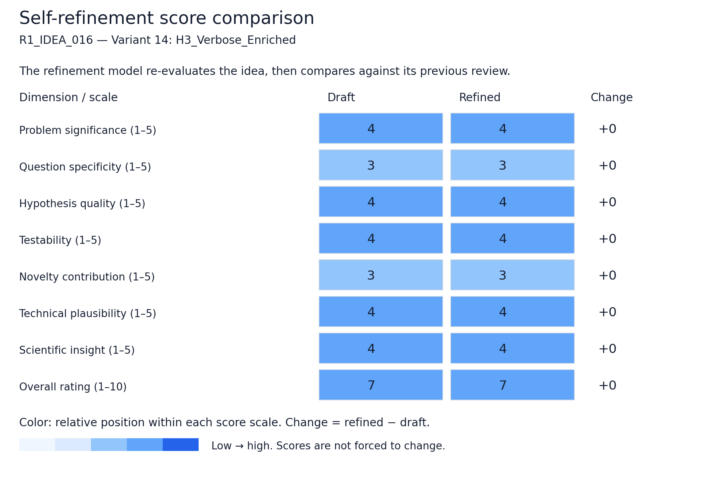

Changed score dimensions: none.

### Score justifications (draft / refined)

**Problem significance**

```json
{
  "draft": {
    "score": 4.0,
    "justification": "The idea addresses a significant challenge in interpreting large language models through sparse autoencoders, which is a critical area in machine learning."
  },
  "refined": {
    "score": 4.0,
    "justification": "The idea addresses a significant challenge in interpreting large language models through sparse autoencoders, which is a critical area in machine learning."
  }
}
```

**Question specificity**

```json
{
  "draft": {
    "score": 3.0,
    "justification": "The idea is specific in proposing a framework for deriving SAEs from dictionary learning, but the exact problem and evaluation criteria are not fully detailed."
  },
  "refined": {
    "score": 3.0,
    "justification": "The idea is specific in proposing a framework for deriving SAEs from dictionary learning, but the exact problem and evaluation criteria are not fully detailed."
  }
}
```

**Hypothesis quality**

```json
{
  "draft": {
    "score": 4.0,
    "justification": "The hypothesis that the framework can validate feature stability and semantic correspondence is plausible and could be tested through the proposed experiments."
  },
  "refined": {
    "score": 4.0,
    "justification": "The hypothesis that the framework can validate feature stability and semantic correspondence is plausible and could be tested through the proposed experiments."
  }
}
```

**Testability**

```json
{
  "draft": {
    "score": 4.0,
    "justification": "The idea includes a staged experimental design with ablations and error analysis, which makes it testable, though some details are missing."
  },
  "refined": {
    "score": 4.0,
    "justification": "The idea includes a staged experimental design with ablations and error analysis, which makes it testable, though some details are missing."
  }
}
```

**Novelty contribution**

```json
{
  "draft": {
    "score": 3.0,
    "justification": "The framework is a novel approach to deriving SAEs from dictionary learning, but the novelty is somewhat limited if it is a straightforward extension of existing methods."
  },
  "refined": {
    "score": 3.0,
    "justification": "The framework is a novel approach to deriving SAEs from dictionary learning, but the novelty is somewhat limited if it is a straightforward extension of existing methods."
  }
}
```

**Technical plausibility**

```json
{
  "draft": {
    "score": 4.0,
    "justification": "The use of proximal gradient unrolling for sparse coding is technically plausible and aligns with existing methods in dictionary learning."
  },
  "refined": {
    "score": 4.0,
    "justification": "The use of proximal gradient unrolling for sparse coding is technically plausible and aligns with existing methods in dictionary learning."
  }
}
```

**Scientific insight**

```json
{
  "draft": {
    "score": 4.0,
    "justification": "The idea has the potential to provide insights into the robustness and validity of SAEs in interpreting LLMs, particularly under varying conditions."
  },
  "refined": {
    "score": 4.0,
    "justification": "The idea has the potential to provide insights into the robustness and validity of SAEs in interpreting LLMs, particularly under varying conditions."
  }
}
```

**Overall rating**

```json
{
  "draft": {
    "score": 7.0,
    "justification": "The idea is strong with a clear problem and potential contribution, but some details are missing that could enhance its testability and specificity."
  },
  "refined": {
    "score": 7.0,
    "justification": "The idea is strong with a clear problem and potential contribution, but some details are missing that could enhance its testability and specificity."
  }
}
```

## R1_IDEA_016 — Variant 15: H4_Ultimate_Hype


Changed score dimensions: none.

### Score justifications (draft / refined)

**Problem significance**

```json
{
  "draft": {
    "score": 4.0,
    "justification": "The idea addresses a technical challenge in sparse autoencoders (SAEs) that is relevant to the interpretability of large language models (LLMs), which is a critical area of research. Solving this problem could lead to more interpretable and trustworthy AI systems."
  },
  "refined": {
    "score": 4.0,
    "justification": "The idea addresses a technical challenge in sparse autoencoders (SAEs) that is relevant to the interpretability of large language models (LLMs), which is a critical area of research. Solving this problem could lead to more interpretable and trustworthy AI systems."
  }
}
```

**Question specificity**

```json
{
  "draft": {
    "score": 3.0,
    "justification": "The idea identifies a specific technical challenge in deriving SAEs from dictionary learning but lacks a clear, concrete research question or hypothesis. The framework's potential is described in a general sense without specific details on what will be investigated."
  },
  "refined": {
    "score": 3.0,
    "justification": "The idea identifies a specific technical challenge in deriving SAEs from dictionary learning but lacks a clear, concrete research question or hypothesis. The framework's potential is described in a general sense without specific details on what will be investigated."
  }
}
```

**Hypothesis quality**

```json
{
  "draft": {
    "score": 3.0,
    "justification": "The idea presents a general research agenda but does not provide a specific hypothesis or prediction that can be tested. The potential impact is described in a broad sense, but there is no concrete claim about the framework's expected outcomes."
  },
  "refined": {
    "score": 3.0,
    "justification": "The idea presents a general research agenda but does not provide a specific hypothesis or prediction that can be tested. The potential impact is described in a broad sense, but there is no concrete claim about the framework's expected outcomes."
  }
}
```

**Testability**

```json
{
  "draft": {
    "score": 2.0,
    "justification": "The idea lacks specific experiments or evaluation methods that would allow the framework to be tested. Without clear steps for implementation and validation, it is difficult to assess the feasibility of the research."
  },
  "refined": {
    "score": 2.0,
    "justification": "The idea lacks specific experiments or evaluation methods that would allow the framework to be tested. Without clear steps for implementation and validation, it is difficult to assess the feasibility of the research."
  }
}
```

**Novelty contribution**

```json
{
  "draft": {
    "score": 4.0,
    "justification": "The idea introduces a novel framework for deriving SAEs from dictionary learning, which could contribute to the field of interpretability in LLMs. However, the novelty is somewhat vague without more specific details on how the framework differs from existing methods."
  },
  "refined": {
    "score": 4.0,
    "justification": "The idea introduces a novel framework for deriving SAEs from dictionary learning, which could contribute to the field of interpretability in LLMs. However, the novelty is somewhat vague without more specific details on how the framework differs from existing methods."
  }
}
```

**Technical plausibility**

```json
{
  "draft": {
    "score": 4.0,
    "justification": "The proposed approach is based on a well-established mathematical formulation (proximal gradient method for sparse coding), which increases the technical plausibility. However, the lack of specific implementation details makes it difficult to assess the feasibility of the approach."
  },
  "refined": {
    "score": 4.0,
    "justification": "The proposed approach is based on a well-established mathematical formulation (proximal gradient method for sparse coding), which increases the technical plausibility. However, the lack of specific implementation details makes it difficult to assess the feasibility of the approach."
  }
}
```

**Scientific insight**

```json
{
  "draft": {
    "score": 3.0,
    "justification": "The idea has the potential to provide insights into the relationship between dictionary learning and sparse autoencoders, but the lack of a clear hypothesis or research question limits the potential for significant scientific insight."
  },
  "refined": {
    "score": 3.0,
    "justification": "The idea has the potential to provide insights into the relationship between dictionary learning and sparse autoencoders, but the lack of a clear hypothesis or research question limits the potential for significant scientific insight."
  }
}
```

**Overall rating**

```json
{
  "draft": {
    "score": 7.0,
    "justification": "The idea addresses a meaningful technical challenge in the field of sparse autoencoders and has the potential for significant contributions. However, it lacks specific details on the research question, hypothesis, and evaluation methods, which are necessary for assessing its scientific merit and feasibility."
  },
  "refined": {
    "score": 7.0,
    "justification": "The idea addresses a meaningful technical challenge in the field of sparse autoencoders and has the potential for significant contributions. However, it lacks specific details on the research question, hypothesis, and evaluation methods, which are necessary for assessing its scientific merit and feasibility."
  }
}
```

## R1_IDEA_017 — Source

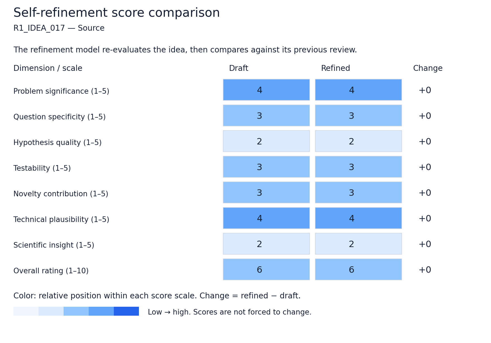

Changed score dimensions: none.

### Score justifications (draft / refined)

**Problem significance**

```json
{
  "draft": {
    "score": 4.0,
    "justification": "The problem of few-shot anomaly detection in industrial safety is critical for ensuring safety and reducing false positives/negatives, with significant real-world implications."
  },
  "refined": {
    "score": 4.0,
    "justification": "The problem of few-shot anomaly detection in industrial safety is critical for ensuring safety and reducing false positives/negatives, with significant real-world implications."
  }
}
```

**Question specificity**

```json
{
  "draft": {
    "score": 3.0,
    "justification": "The idea identifies a problem but lacks a concrete research question or hypothesis, making it somewhat vague in terms of what exactly is being investigated."
  },
  "refined": {
    "score": 3.0,
    "justification": "The idea identifies a problem but lacks a concrete research question or hypothesis, making it somewhat vague in terms of what exactly is being investigated."
  }
}
```

**Hypothesis quality**

```json
{
  "draft": {
    "score": 2.0,
    "justification": "The idea suggests a potential solution but does not explicitly state a hypothesis that can be tested or falsified, such as a specific prediction about performance improvements."
  },
  "refined": {
    "score": 2.0,
    "justification": "The idea suggests a potential solution but does not explicitly state a hypothesis that can be tested or falsified, such as a specific prediction about performance improvements."
  }
}
```

**Testability**

```json
{
  "draft": {
    "score": 3.0,
    "justification": "The idea proposes a direction but does not specify experiments, evaluations, or comparisons that would allow for testing the hypothesis, making it difficult to assess feasibility."
  },
  "refined": {
    "score": 3.0,
    "justification": "The idea proposes a direction but does not specify experiments, evaluations, or comparisons that would allow for testing the hypothesis, making it difficult to assess feasibility."
  }
}
```

**Novelty contribution**

```json
{
  "draft": {
    "score": 3.0,
    "justification": "The idea leverages pre-training for few-shot anomaly detection, which is a plausible approach, but the novelty is limited as it builds on existing methods without introducing a novel mechanism or insight."
  },
  "refined": {
    "score": 3.0,
    "justification": "The idea leverages pre-training for few-shot anomaly detection, which is a plausible approach, but the novelty is limited as it builds on existing methods without introducing a novel mechanism or insight."
  }
}
```

**Technical plausibility**

```json
{
  "draft": {
    "score": 4.0,
    "justification": "The proposed approach is technically feasible, as pre-training has been successfully used in other domains, and adapting it to few-shot learning is a reasonable direction."
  },
  "refined": {
    "score": 4.0,
    "justification": "The proposed approach is technically feasible, as pre-training has been successfully used in other domains, and adapting it to few-shot learning is a reasonable direction."
  }
}
```

**Scientific insight**

```json
{
  "draft": {
    "score": 2.0,
    "justification": "The idea focuses on applying existing techniques to a new problem, which may not yield significant scientific insight unless it addresses underlying mechanisms or limitations in the few-shot setting."
  },
  "refined": {
    "score": 2.0,
    "justification": "The idea focuses on applying existing techniques to a new problem, which may not yield significant scientific insight unless it addresses underlying mechanisms or limitations in the few-shot setting."
  }
}
```

**Overall rating**

```json
{
  "draft": {
    "score": 6.0,
    "justification": "The idea addresses a meaningful problem with a plausible solution, but lacks specificity, hypothesis, and testable components, limiting its potential for scientific contribution."
  },
  "refined": {
    "score": 6.0,
    "justification": "The idea addresses a meaningful problem with a plausible solution, but lacks specificity, hypothesis, and testable components, limiting its potential for scientific contribution."
  }
}
```

## R1_IDEA_017 — Variant 1: A1_Identity


Changed score dimensions: none.

### Score justifications (draft / refined)

**Problem significance**

```json
{
  "draft": {
    "score": 4.0,
    "justification": "The problem of few-shot anomaly detection in industrial safety is critical for ensuring safety and reducing false positives/negatives, with significant real-world implications."
  },
  "refined": {
    "score": 4.0,
    "justification": "The problem of few-shot anomaly detection in industrial safety is critical for ensuring safety and reducing false positives/negatives, with significant real-world implications."
  }
}
```

**Question specificity**

```json
{
  "draft": {
    "score": 3.0,
    "justification": "The idea identifies a problem but lacks a concrete research question or hypothesis, making it somewhat vague in terms of what exactly is being investigated."
  },
  "refined": {
    "score": 3.0,
    "justification": "The idea identifies a problem but lacks a concrete research question or hypothesis, making it somewhat vague in terms of what exactly is being investigated."
  }
}
```

**Hypothesis quality**

```json
{
  "draft": {
    "score": 2.0,
    "justification": "The idea suggests a potential solution but does not explicitly state a hypothesis that can be tested or falsified, such as a specific prediction about performance improvements."
  },
  "refined": {
    "score": 2.0,
    "justification": "The idea suggests a potential solution but does not explicitly state a hypothesis that can be tested or falsified, such as a specific prediction about performance improvements."
  }
}
```

**Testability**

```json
{
  "draft": {
    "score": 3.0,
    "justification": "The idea proposes a direction but does not specify experiments, evaluations, or comparisons that would allow for testing the hypothesis, making it difficult to assess feasibility."
  },
  "refined": {
    "score": 3.0,
    "justification": "The idea proposes a direction but does not specify experiments, evaluations, or comparisons that would allow for testing the hypothesis, making it difficult to assess feasibility."
  }
}
```

**Novelty contribution**

```json
{
  "draft": {
    "score": 3.0,
    "justification": "The idea leverages pre-training for few-shot anomaly detection, which is a plausible approach, but the novelty is limited as it builds on existing methods without introducing a novel mechanism or insight."
  },
  "refined": {
    "score": 3.0,
    "justification": "The idea leverages pre-training for few-shot anomaly detection, which is a plausible approach, but the novelty is limited as it builds on existing methods without introducing a novel mechanism or insight."
  }
}
```

**Technical plausibility**

```json
{
  "draft": {
    "score": 4.0,
    "justification": "The proposed approach is technically feasible, as pre-training has been successfully used in other domains, and adapting it to few-shot learning is a reasonable direction."
  },
  "refined": {
    "score": 4.0,
    "justification": "The proposed approach is technically feasible, as pre-training has been successfully used in other domains, and adapting it to few-shot learning is a reasonable direction."
  }
}
```

**Scientific insight**

```json
{
  "draft": {
    "score": 2.0,
    "justification": "The idea focuses on applying existing techniques to a new problem, which may not yield significant scientific insight unless it addresses underlying mechanisms or limitations in the few-shot setting."
  },
  "refined": {
    "score": 2.0,
    "justification": "The idea focuses on applying existing techniques to a new problem, which may not yield significant scientific insight unless it addresses underlying mechanisms or limitations in the few-shot setting."
  }
}
```

**Overall rating**

```json
{
  "draft": {
    "score": 6.0,
    "justification": "The idea addresses a meaningful problem with a plausible solution, but lacks specificity, hypothesis, and testable components, limiting its potential for scientific contribution."
  },
  "refined": {
    "score": 6.0,
    "justification": "The idea addresses a meaningful problem with a plausible solution, but lacks specificity, hypothesis, and testable components, limiting its potential for scientific contribution."
  }
}
```

## R1_IDEA_017 — Variant 2: A2_Paraphrase_Only


Changed score dimensions: none.

### Score justifications (draft / refined)

**Problem significance**

```json
{
  "draft": {
    "score": 4.0,
    "justification": "The problem of few-shot anomaly detection in industrial safety is important for real-world applications, and the use of foundation models is a relevant and promising direction."
  },
  "refined": {
    "score": 4.0,
    "justification": "The problem of few-shot anomaly detection in industrial safety is important for real-world applications, and the use of foundation models is a relevant and promising direction."
  }
}
```

**Question specificity**

```json
{
  "draft": {
    "score": 3.0,
    "justification": "The idea identifies a problem but lacks a specific research question or hypothesis. It needs to clarify what exactly is being investigated in the category-agnostic setting."
  },
  "refined": {
    "score": 3.0,
    "justification": "The idea identifies a problem but lacks a specific research question or hypothesis. It needs to clarify what exactly is being investigated in the category-agnostic setting."
  }
}
```

**Hypothesis quality**

```json
{
  "draft": {
    "score": 2.0,
    "justification": "The idea does not explicitly state a hypothesis or prediction. It mentions the potential of foundation models but does not propose a specific mechanism or outcome to test."
  },
  "refined": {
    "score": 2.0,
    "justification": "The idea does not explicitly state a hypothesis or prediction. It mentions the potential of foundation models but does not propose a specific mechanism or outcome to test."
  }
}
```

**Testability**

```json
{
  "draft": {
    "score": 3.0,
    "justification": "The idea suggests using foundation models but does not provide a clear experimental plan or evaluation method. It lacks details on how to test the effectiveness of the approach in the specified scenario."
  },
  "refined": {
    "score": 3.0,
    "justification": "The idea suggests using foundation models but does not provide a clear experimental plan or evaluation method. It lacks details on how to test the effectiveness of the approach in the specified scenario."
  }
}
```

**Novelty contribution**

```json
{
  "draft": {
    "score": 3.0,
    "justification": "The idea is relevant and timely, but it does not clearly propose a novel method or contribution. It focuses on applying existing techniques to a new domain without specifying a unique innovation."
  },
  "refined": {
    "score": 3.0,
    "justification": "The idea is relevant and timely, but it does not clearly propose a novel method or contribution. It focuses on applying existing techniques to a new domain without specifying a unique innovation."
  }
}
```

**Technical plausibility**

```json
{
  "draft": {
    "score": 4.0,
    "justification": "The use of foundation models for few-shot learning is technically plausible and aligns with current research trends. The approach is feasible given the existing literature on pre-training and few-shot learning."
  },
  "refined": {
    "score": 4.0,
    "justification": "The use of foundation models for few-shot learning is technically plausible and aligns with current research trends. The approach is feasible given the existing literature on pre-training and few-shot learning."
  }
}
```

**Scientific insight**

```json
{
  "draft": {
    "score": 3.0,
    "justification": "The idea has potential for scientific insight into how foundation models can be adapted for few-shot anomaly detection, but it lacks a clear focus on what specific insights should be gained from the research."
  },
  "refined": {
    "score": 3.0,
    "justification": "The idea has potential for scientific insight into how foundation models can be adapted for few-shot anomaly detection, but it lacks a clear focus on what specific insights should be gained from the research."
  }
}
```

**Overall rating**

```json
{
  "draft": {
    "score": 7.0,
    "justification": "The idea addresses a meaningful problem with practical relevance and proposes a promising direction. However, it lacks specificity, a clear hypothesis, and a detailed plan for testing, which are needed to strengthen the research proposal."
  },
  "refined": {
    "score": 7.0,
    "justification": "The idea addresses a meaningful problem with practical relevance and proposes a promising direction. However, it lacks specificity, a clear hypothesis, and a detailed plan for testing, which are needed to strengthen the research proposal."
  }
}
```

## R1_IDEA_017 — Variant 3: A3_Plain_Core


Changed score dimensions: none.

### Score justifications (draft / refined)

**Problem significance**

```json
{
  "draft": {
    "score": 4.0,
    "justification": "The problem of few-shot anomaly detection in industrial safety inspection is critical for real-world applications, as it directly impacts safety and reliability. The challenge of limited samples and category-agnostic conditions is a significant barrier in this domain."
  },
  "refined": {
    "score": 4.0,
    "justification": "The problem of few-shot anomaly detection in industrial safety inspection is critical for real-world applications, as it directly impacts safety and reliability. The challenge of limited samples and category-agnostic conditions is a significant barrier in this domain."
  }
}
```

**Question specificity**

```json
{
  "draft": {
    "score": 3.0,
    "justification": "The idea identifies a specific problem but lacks a clear, concrete research question. It suggests a solution but does not explicitly define what aspect of the problem will be investigated or what hypothesis will be tested."
  },
  "refined": {
    "score": 3.0,
    "justification": "The idea identifies a specific problem but lacks a clear, concrete research question. It suggests a solution but does not explicitly define what aspect of the problem will be investigated or what hypothesis will be tested."
  }
}
```

**Hypothesis quality**

```json
{
  "draft": {
    "score": 3.0,
    "justification": "The idea proposes a solution but does not explicitly state a hypothesis that can be tested. It is unclear what specific claim about the effectiveness of pre-training in this context is being made."
  },
  "refined": {
    "score": 3.0,
    "justification": "The idea proposes a solution but does not explicitly state a hypothesis that can be tested. It is unclear what specific claim about the effectiveness of pre-training in this context is being made."
  }
}
```

**Testability**

```json
{
  "draft": {
    "score": 3.0,
    "justification": "The idea suggests a potential approach but does not provide a clear experimental plan or comparison to existing methods. It is not clear how the effectiveness of the proposed method will be evaluated."
  },
  "refined": {
    "score": 3.0,
    "justification": "The idea suggests a potential approach but does not provide a clear experimental plan or comparison to existing methods. It is not clear how the effectiveness of the proposed method will be evaluated."
  }
}
```

**Novelty contribution**

```json
{
  "draft": {
    "score": 3.0,
    "justification": "The idea builds on existing methods (large-scale pre-training) but does not clearly define a novel contribution. It is not clear how this approach differs from existing approaches in the few-shot anomaly detection domain."
  },
  "refined": {
    "score": 3.0,
    "justification": "The idea builds on existing methods (large-scale pre-training) but does not clearly define a novel contribution. It is not clear how this approach differs from existing approaches in the few-shot anomaly detection domain."
  }
}
```

**Technical plausibility**

```json
{
  "draft": {
    "score": 4.0,
    "justification": "The proposed approach is technically plausible, as large-scale pre-training is a well-established technique in vision research. The idea aligns with current trends in foundation models for few-shot learning."
  },
  "refined": {
    "score": 4.0,
    "justification": "The proposed approach is technically plausible, as large-scale pre-training is a well-established technique in vision research. The idea aligns with current trends in foundation models for few-shot learning."
  }
}
```

**Scientific insight**

```json
{
  "draft": {
    "score": 3.0,
    "justification": "The idea addresses a practical problem but does not clearly indicate what scientific insight would be gained from successfully investigating this approach. It is more focused on application than on uncovering new principles."
  },
  "refined": {
    "score": 3.0,
    "justification": "The idea addresses a practical problem but does not clearly indicate what scientific insight would be gained from successfully investigating this approach. It is more focused on application than on uncovering new principles."
  }
}
```

**Overall rating**

```json
{
  "draft": {
    "score": 7.0,
    "justification": "The idea addresses a meaningful problem in industrial safety inspection and proposes a plausible solution. However, it lacks specificity in defining the research question, hypothesis, and evaluation plan. With further clarification and experimental details, it has the potential to be a strong research direction."
  },
  "refined": {
    "score": 7.0,
    "justification": "The idea addresses a meaningful problem in industrial safety inspection and proposes a plausible solution. However, it lacks specificity in defining the research question, hypothesis, and evaluation plan. With further clarification and experimental details, it has the potential to be a strong research direction."
  }
}
```

## R1_IDEA_017 — Variant 4: B1_Verbose_Elaborate


Changed score dimensions: none.

### Score justifications (draft / refined)

**Problem significance**

```json
{
  "draft": {
    "score": 4.0,
    "justification": "The problem of few-shot anomaly detection in industrial safety inspection is significant due to its practical implications for safety and efficiency. The challenge under category-agnostic conditions is a specific and important issue that has not been thoroughly addressed."
  },
  "refined": {
    "score": 4.0,
    "justification": "The problem of few-shot anomaly detection in industrial safety inspection is significant due to its practical implications for safety and efficiency. The challenge under category-agnostic conditions is a specific and important issue that has not been thoroughly addressed."
  }
}
```

**Question specificity**

```json
{
  "draft": {
    "score": 3.0,
    "justification": "The idea identifies a specific problem but lacks a clear, concrete research question. It suggests a direction but does not explicitly define what is to be investigated or how the pre-training will be applied in this context."
  },
  "refined": {
    "score": 3.0,
    "justification": "The idea identifies a specific problem but lacks a clear, concrete research question. It suggests a direction but does not explicitly define what is to be investigated or how the pre-training will be applied in this context."
  }
}
```

**Hypothesis quality**

```json
{
  "draft": {
    "score": 3.0,
    "justification": "The idea proposes a general direction but does not contain a specific hypothesis that can be tested. It suggests that pre-training may help, but does not clearly state what prediction or mechanism is being proposed."
  },
  "refined": {
    "score": 3.0,
    "justification": "The idea proposes a general direction but does not contain a specific hypothesis that can be tested. It suggests that pre-training may help, but does not clearly state what prediction or mechanism is being proposed."
  }
}
```

**Testability**

```json
{
  "draft": {
    "score": 3.0,
    "justification": "The idea suggests a potential approach but does not provide a clear experimental plan or evaluation method. The connection between pre-training and the specific task is not sufficiently detailed to assess testability."
  },
  "refined": {
    "score": 3.0,
    "justification": "The idea suggests a potential approach but does not provide a clear experimental plan or evaluation method. The connection between pre-training and the specific task is not sufficiently detailed to assess testability."
  }
}
```

**Novelty contribution**

```json
{
  "draft": {
    "score": 4.0,
    "justification": "The idea proposes a novel application of pre-trained foundation models to the specific problem of few-shot anomaly detection under category-agnostic conditions. This could contribute new insights into the effectiveness of pre-training in such scenarios."
  },
  "refined": {
    "score": 4.0,
    "justification": "The idea proposes a novel application of pre-trained foundation models to the specific problem of few-shot anomaly detection under category-agnostic conditions. This could contribute new insights into the effectiveness of pre-training in such scenarios."
  }
}
```

**Technical plausibility**

```json
{
  "draft": {
    "score": 4.0,
    "justification": "The use of pre-trained visual encoders is a technically plausible approach, as it is a well-established method in the field. The idea aligns with current trends in using large-scale pre-training for various tasks."
  },
  "refined": {
    "score": 4.0,
    "justification": "The use of pre-trained visual encoders is a technically plausible approach, as it is a well-established method in the field. The idea aligns with current trends in using large-scale pre-training for various tasks."
  }
}
```

**Scientific insight**

```json
{
  "draft": {
    "score": 3.0,
    "justification": "The idea has potential for scientific insight into how pre-training affects few-shot learning in anomaly detection, but the specific mechanisms and outcomes are not clearly defined."
  },
  "refined": {
    "score": 3.0,
    "justification": "The idea has potential for scientific insight into how pre-training affects few-shot learning in anomaly detection, but the specific mechanisms and outcomes are not clearly defined."
  }
}
```

**Overall rating**

```json
{
  "draft": {
    "score": 7.0,
    "justification": "The idea addresses a meaningful problem with practical relevance and proposes a promising direction. However, it lacks specificity in defining the research question and hypothesis, and the connection between pre-training and the specific task is not clearly outlined. With further clarification and experimental design, it has strong potential for a significant contribution."
  },
  "refined": {
    "score": 7.0,
    "justification": "The idea addresses a meaningful problem with practical relevance and proposes a promising direction. However, it lacks specificity in defining the research question and hypothesis, and the connection between pre-training and the specific task is not clearly outlined. With further clarification and experimental design, it has strong potential for a significant contribution."
  }
}
```

## R1_IDEA_017 — Variant 5: B2_Grand_Narrative


Changed score dimensions: none.

### Score justifications (draft / refined)

**Problem significance**

```json
{
  "draft": {
    "score": 4.0,
    "justification": "The problem of few-shot anomaly detection in industrial safety inspection is significant due to its impact on safety-critical systems. The challenge of differentiating normal and abnormal features with limited samples is a critical issue in real-world applications."
  },
  "refined": {
    "score": 4.0,
    "justification": "The problem of few-shot anomaly detection in industrial safety inspection is significant due to its impact on safety-critical systems. The challenge of differentiating normal and abnormal features with limited samples is a critical issue in real-world applications."
  }
}
```

**Question specificity**

```json
{
  "draft": {
    "score": 2.0,
    "justification": "The idea identifies a problem but lacks a specific research question. It mentions the challenge but does not clearly define what exactly should be investigated or how the proposed solution should be tested."
  },
  "refined": {
    "score": 2.0,
    "justification": "The idea identifies a problem but lacks a specific research question. It mentions the challenge but does not clearly define what exactly should be investigated or how the proposed solution should be tested."
  }
}
```

**Hypothesis quality**

```json
{
  "draft": {
    "score": 2.0,
    "justification": "The idea does not present a clear hypothesis or prediction. It suggests a potential direction but does not specify what should be tested or what evidence would support or contradict the proposed approach."
  },
  "refined": {
    "score": 2.0,
    "justification": "The idea does not present a clear hypothesis or prediction. It suggests a potential direction but does not specify what should be tested or what evidence would support or contradict the proposed approach."
  }
}
```

**Testability**

```json
{
  "draft": {
    "score": 2.0,
    "justification": "The idea does not provide a concrete plan for testing the proposed approach. It mentions the challenge but does not specify experiments, comparisons, or evaluations that would be needed to validate the research question."
  },
  "refined": {
    "score": 2.0,
    "justification": "The idea does not provide a concrete plan for testing the proposed approach. It mentions the challenge but does not specify experiments, comparisons, or evaluations that would be needed to validate the research question."
  }
}
```

**Novelty contribution**

```json
{
  "draft": {
    "score": 3.0,
    "justification": "The idea connects few-shot anomaly detection to large-scale pre-training, which is a promising direction. However, it does not clearly define a novel contribution or specific innovation that would advance the field beyond existing methods."
  },
  "refined": {
    "score": 3.0,
    "justification": "The idea connects few-shot anomaly detection to large-scale pre-training, which is a promising direction. However, it does not clearly define a novel contribution or specific innovation that would advance the field beyond existing methods."
  }
}
```

**Technical plausibility**

```json
{
  "draft": {
    "score": 4.0,
    "justification": "The idea is technically plausible as it builds on existing research in pre-training and few-shot learning. The connection between large-scale pre-training and anomaly detection is reasonable and aligns with current trends in machine perception."
  },
  "refined": {
    "score": 4.0,
    "justification": "The idea is technically plausible as it builds on existing research in pre-training and few-shot learning. The connection between large-scale pre-training and anomaly detection is reasonable and aligns with current trends in machine perception."
  }
}
```

**Scientific insight**

```json
{
  "draft": {
    "score": 2.0,
    "justification": "The idea does not provide a clear scientific insight or potential for discovering new principles. It focuses on a practical application but lacks a deeper theoretical or methodological contribution."
  },
  "refined": {
    "score": 2.0,
    "justification": "The idea does not provide a clear scientific insight or potential for discovering new principles. It focuses on a practical application but lacks a deeper theoretical or methodological contribution."
  }
}
```

**Overall rating**

```json
{
  "draft": {
    "score": 6.0,
    "justification": "The idea identifies a meaningful problem in industrial safety inspection but lacks a specific research question, hypothesis, and experimental plan. It has potential for contribution but needs more concrete details to be considered a strong research idea."
  },
  "refined": {
    "score": 6.0,
    "justification": "The idea identifies a meaningful problem in industrial safety inspection but lacks a specific research question, hypothesis, and experimental plan. It has potential for contribution but needs more concrete details to be considered a strong research idea."
  }
}
```

## R1_IDEA_017 — Variant 6: B3_Over_Confident


Changed score dimensions: none.

### Score justifications (draft / refined)

**Problem significance**

```json
{
  "draft": {
    "score": 4.0,
    "justification": "The problem of few-shot anomaly detection is critical for industrial safety inspection, and the challenge of category-agnostic conditions adds significant complexity."
  },
  "refined": {
    "score": 4.0,
    "justification": "The problem of few-shot anomaly detection is critical for industrial safety inspection, and the challenge of category-agnostic conditions adds significant complexity."
  }
}
```

**Question specificity**

```json
{
  "draft": {
    "score": 3.0,
    "justification": "The idea identifies a specific problem but lacks a clear, concrete research question that could be tested."
  },
  "refined": {
    "score": 3.0,
    "justification": "The idea identifies a specific problem but lacks a clear, concrete research question that could be tested."
  }
}
```

**Hypothesis quality**

```json
{
  "draft": {
    "score": 2.0,
    "justification": "The idea does not explicitly state a hypothesis or prediction that could be tested, making it difficult to assess its scientific merit."
  },
  "refined": {
    "score": 2.0,
    "justification": "The idea does not explicitly state a hypothesis or prediction that could be tested, making it difficult to assess its scientific merit."
  }
}
```

**Testability**

```json
{
  "draft": {
    "score": 2.0,
    "justification": "The idea lacks specific experiments or methods for testing the proposed approach, making it difficult to evaluate its feasibility."
  },
  "refined": {
    "score": 2.0,
    "justification": "The idea lacks specific experiments or methods for testing the proposed approach, making it difficult to evaluate its feasibility."
  }
}
```

**Novelty contribution**

```json
{
  "draft": {
    "score": 3.0,
    "justification": "The idea leverages existing techniques (pre-training) for a specific application (few-shot anomaly detection), which is a reasonable approach, but the novelty is limited."
  },
  "refined": {
    "score": 3.0,
    "justification": "The idea leverages existing techniques (pre-training) for a specific application (few-shot anomaly detection), which is a reasonable approach, but the novelty is limited."
  }
}
```

**Technical plausibility**

```json
{
  "draft": {
    "score": 4.0,
    "justification": "The use of pre-trained visual encoders for anomaly detection is technically plausible, given the existing literature on the topic."
  },
  "refined": {
    "score": 4.0,
    "justification": "The use of pre-trained visual encoders for anomaly detection is technically plausible, given the existing literature on the topic."
  }
}
```

**Scientific insight**

```json
{
  "draft": {
    "score": 3.0,
    "justification": "The idea has potential to contribute to the understanding of how pre-training affects few-shot learning, but the specific insights are not clearly defined."
  },
  "refined": {
    "score": 3.0,
    "justification": "The idea has potential to contribute to the understanding of how pre-training affects few-shot learning, but the specific insights are not clearly defined."
  }
}
```

**Overall rating**

```json
{
  "draft": {
    "score": 6.0,
    "justification": "The idea addresses a meaningful problem with some technical plausibility, but lacks a clear research question and hypothesis, making it difficult to assess its scientific merit."
  },
  "refined": {
    "score": 6.0,
    "justification": "The idea addresses a meaningful problem with some technical plausibility, but lacks a clear research question and hypothesis, making it difficult to assess its scientific merit."
  }
}
```

## R1_IDEA_017 — Variant 7: B4_Novelty


Changed score dimensions: none.

### Score justifications (draft / refined)

**Problem significance**

```json
{
  "draft": {
    "score": 4.0,
    "justification": "The problem of few-shot anomaly detection in industrial safety inspection is important for ensuring safety and reducing false positives. The challenge of limited samples is a real issue in practical applications."
  },
  "refined": {
    "score": 4.0,
    "justification": "The problem of few-shot anomaly detection in industrial safety inspection is important for ensuring safety and reducing false positives. The challenge of limited samples is a real issue in practical applications."
  }
}
```

**Question specificity**

```json
{
  "draft": {
    "score": 3.0,
    "justification": "The idea identifies a problem but lacks a specific research question. It suggests a direction but does not clearly define what exactly will be investigated or how the pre-training will be applied."
  },
  "refined": {
    "score": 3.0,
    "justification": "The idea identifies a problem but lacks a specific research question. It suggests a direction but does not clearly define what exactly will be investigated or how the pre-training will be applied."
  }
}
```

**Hypothesis quality**

```json
{
  "draft": {
    "score": 2.0,
    "justification": "The idea does not explicitly state a hypothesis. It suggests a potential approach but does not make a concrete prediction or identify a mechanism that can be tested or falsified."
  },
  "refined": {
    "score": 2.0,
    "justification": "The idea does not explicitly state a hypothesis. It suggests a potential approach but does not make a concrete prediction or identify a mechanism that can be tested or falsified."
  }
}
```

**Testability**

```json
{
  "draft": {
    "score": 3.0,
    "justification": "The idea suggests using pre-training, but it does not provide a clear experimental plan or evaluation method. The testability is limited without specifying how the approach will be implemented or validated."
  },
  "refined": {
    "score": 3.0,
    "justification": "The idea suggests using pre-training, but it does not provide a clear experimental plan or evaluation method. The testability is limited without specifying how the approach will be implemented or validated."
  }
}
```

**Novelty contribution**

```json
{
  "draft": {
    "score": 4.0,
    "justification": "The use of large-scale pre-training for few-shot anomaly detection is a novel approach, especially under category-agnostic conditions. It could contribute to the field by providing a new method for handling limited samples in safety inspection."
  },
  "refined": {
    "score": 4.0,
    "justification": "The use of large-scale pre-training for few-shot anomaly detection is a novel approach, especially under category-agnostic conditions. It could contribute to the field by providing a new method for handling limited samples in safety inspection."
  }
}
```

**Technical plausibility**

```json
{
  "draft": {
    "score": 4.0,
    "justification": "The proposed approach is technically plausible. Large-scale pre-training of visual encoders is a well-established technique, and applying it to few-shot anomaly detection is a reasonable direction."
  },
  "refined": {
    "score": 4.0,
    "justification": "The proposed approach is technically plausible. Large-scale pre-training of visual encoders is a well-established technique, and applying it to few-shot anomaly detection is a reasonable direction."
  }
}
```

**Scientific insight**

```json
{
  "draft": {
    "score": 3.0,
    "justification": "The idea has potential for scientific insight, particularly in understanding how pre-training affects few-shot learning in anomaly detection. However, the current description does not clearly indicate what insights would be gained."
  },
  "refined": {
    "score": 3.0,
    "justification": "The idea has potential for scientific insight, particularly in understanding how pre-training affects few-shot learning in anomaly detection. However, the current description does not clearly indicate what insights would be gained."
  }
}
```

**Overall rating**

```json
{
  "draft": {
    "score": 7.0,
    "justification": "The idea addresses a meaningful problem with a promising approach. It has potential for novelty and contribution but lacks specificity and a clear hypothesis. With further clarification, it could become a strong research direction."
  },
  "refined": {
    "score": 7.0,
    "justification": "The idea addresses a meaningful problem with a promising approach. It has potential for novelty and contribution but lacks specificity and a clear hypothesis. With further clarification, it could become a strong research direction."
  }
}
```

## R1_IDEA_017 — Variant 8: B5_Application_Impact


Changed score dimensions: none.

### Score justifications (draft / refined)

**Problem significance**

```json
{
  "draft": {
    "score": 4.0,
    "justification": "The problem of few-shot anomaly detection in industrial safety is critical for ensuring safety and reducing false positives, which has significant real-world implications."
  },
  "refined": {
    "score": 4.0,
    "justification": "The problem of few-shot anomaly detection in industrial safety is critical for ensuring safety and reducing false positives, which has significant real-world implications."
  }
}
```

**Question specificity**

```json
{
  "draft": {
    "score": 2.0,
    "justification": "The idea is somewhat general and does not clearly define a specific question or hypothesis to investigate, such as how pre-training affects few-shot learning performance under category-agnostic conditions."
  },
  "refined": {
    "score": 2.0,
    "justification": "The idea is somewhat general and does not clearly define a specific question or hypothesis to investigate, such as how pre-training affects few-shot learning performance under category-agnostic conditions."
  }
}
```

**Hypothesis quality**

```json
{
  "draft": {
    "score": 2.0,
    "justification": "The idea lacks a concrete hypothesis or prediction that could be tested, such as whether pre-trained encoders improve few-shot detection accuracy in the specified conditions."
  },
  "refined": {
    "score": 2.0,
    "justification": "The idea lacks a concrete hypothesis or prediction that could be tested, such as whether pre-trained encoders improve few-shot detection accuracy in the specified conditions."
  }
}
```

**Testability**

```json
{
  "draft": {
    "score": 2.0,
    "justification": "The idea does not provide a clear experimental plan or method to test the hypothesis, making it difficult to assess the feasibility of the proposed approach."
  },
  "refined": {
    "score": 2.0,
    "justification": "The idea does not provide a clear experimental plan or method to test the hypothesis, making it difficult to assess the feasibility of the proposed approach."
  }
}
```

**Novelty contribution**

```json
{
  "draft": {
    "score": 3.0,
    "justification": "The idea leverages pre-training in a new context (few-shot anomaly detection) but does not clearly define a novel method or contribution beyond applying existing techniques to a new domain."
  },
  "refined": {
    "score": 3.0,
    "justification": "The idea leverages pre-training in a new context (few-shot anomaly detection) but does not clearly define a novel method or contribution beyond applying existing techniques to a new domain."
  }
}
```

**Technical plausibility**

```json
{
  "draft": {
    "score": 4.0,
    "justification": "The approach of using pre-trained visual encoders is technically plausible and aligns with current trends in machine learning, though the specific application to few-shot anomaly detection is not detailed."
  },
  "refined": {
    "score": 4.0,
    "justification": "The approach of using pre-trained visual encoders is technically plausible and aligns with current trends in machine learning, though the specific application to few-shot anomaly detection is not detailed."
  }
}
```

**Scientific insight**

```json
{
  "draft": {
    "score": 2.0,
    "justification": "The idea does not clearly propose a mechanism or insight that could be gained from the research, focusing more on application than on understanding underlying principles."
  },
  "refined": {
    "score": 2.0,
    "justification": "The idea does not clearly propose a mechanism or insight that could be gained from the research, focusing more on application than on understanding underlying principles."
  }
}
```

**Overall rating**

```json
{
  "draft": {
    "score": 6.0,
    "justification": "The idea addresses a meaningful problem with potential practical applications, but lacks specificity, hypothesis, and experimental plan, which are needed for a strong research direction."
  },
  "refined": {
    "score": 6.0,
    "justification": "The idea addresses a meaningful problem with potential practical applications, but lacks specificity, hypothesis, and experimental plan, which are needed for a strong research direction."
  }
}
```

## R1_IDEA_017 — Variant 9: C1_Hollow_Shell


Changed score dimensions: none.

### Score justifications (draft / refined)

**Problem significance**

```json
{
  "draft": {
    "score": 3.0,
    "justification": "The problem of limited data in safety inspection is relevant, but the significance is somewhat generic without specifying the domain or impact."
  },
  "refined": {
    "score": 3.0,
    "justification": "The problem of limited data in safety inspection is relevant, but the significance is somewhat generic without specifying the domain or impact."
  }
}
```

**Question specificity**

```json
{
  "draft": {
    "score": 2.0,
    "justification": "The idea is too vague to define a specific research question without more details on the application domain and task."
  },
  "refined": {
    "score": 2.0,
    "justification": "The idea is too vague to define a specific research question without more details on the application domain and task."
  }
}
```

**Hypothesis quality**

```json
{
  "draft": {
    "score": 2.0,
    "justification": "The hypothesis is not explicitly stated, and the proposed solution lacks a clear prediction or mechanism."
  },
  "refined": {
    "score": 2.0,
    "justification": "The hypothesis is not explicitly stated, and the proposed solution lacks a clear prediction or mechanism."
  }
}
```

**Testability**

```json
{
  "draft": {
    "score": 2.0,
    "justification": "The idea does not provide a clear experimental plan or method to test the effectiveness of the pre-training approach."
  },
  "refined": {
    "score": 2.0,
    "justification": "The idea does not provide a clear experimental plan or method to test the effectiveness of the pre-training approach."
  }
}
```

**Novelty contribution**

```json
{
  "draft": {
    "score": 3.0,
    "justification": "The approach is not novel in itself but could contribute to the field by improving safety inspection in data-scarce scenarios."
  },
  "refined": {
    "score": 3.0,
    "justification": "The approach is not novel in itself but could contribute to the field by improving safety inspection in data-scarce scenarios."
  }
}
```

**Technical plausibility**

```json
{
  "draft": {
    "score": 4.0,
    "justification": "The proposed method is technically plausible and aligns with current practices in transfer learning and pre-training."
  },
  "refined": {
    "score": 4.0,
    "justification": "The proposed method is technically plausible and aligns with current practices in transfer learning and pre-training."
  }
}
```

**Scientific insight**

```json
{
  "draft": {
    "score": 2.0,
    "justification": "The idea does not offer new insights into the underlying mechanisms or limitations of the problem."
  },
  "refined": {
    "score": 2.0,
    "justification": "The idea does not offer new insights into the underlying mechanisms or limitations of the problem."
  }
}
```

**Overall rating**

```json
{
  "draft": {
    "score": 5.0,
    "justification": "The idea addresses a relevant problem with a plausible solution, but lacks specificity and testability. It has potential for contribution but needs more details to be strong."
  },
  "refined": {
    "score": 5.0,
    "justification": "The idea addresses a relevant problem with a plausible solution, but lacks specificity and testability. It has potential for contribution but needs more details to be strong."
  }
}
```

## R1_IDEA_017 — Variant 10: C2_Logic_Flawed


Changed score dimensions: none.

### Score justifications (draft / refined)

**Problem significance**

```json
{
  "draft": {
    "score": 4.0,
    "justification": "The problem of few-shot anomaly detection in industrial safety inspection is significant as it directly impacts safety and efficiency in real-world applications. The challenge of differentiating normal and abnormal features with limited samples is a critical issue in practical scenarios."
  },
  "refined": {
    "score": 4.0,
    "justification": "The problem of few-shot anomaly detection in industrial safety inspection is significant as it directly impacts safety and efficiency in real-world applications. The challenge of differentiating normal and abnormal features with limited samples is a critical issue in practical scenarios."
  }
}
```

**Question specificity**

```json
{
  "draft": {
    "score": 3.0,
    "justification": "The idea identifies a problem but lacks a specific research question. It is somewhat general and does not clearly define the exact problem or the method to be investigated, which is necessary for a focused research direction."
  },
  "refined": {
    "score": 3.0,
    "justification": "The idea identifies a problem but lacks a specific research question. It is somewhat general and does not clearly define the exact problem or the method to be investigated, which is necessary for a focused research direction."
  }
}
```

**Hypothesis quality**

```json
{
  "draft": {
    "score": 3.0,
    "justification": "The idea suggests a potential approach (large-scale pre-training) but does not explicitly state a hypothesis or research question that could be tested. The connection between the pre-training and the specific challenge of few-shot anomaly detection is not clearly articulated."
  },
  "refined": {
    "score": 3.0,
    "justification": "The idea suggests a potential approach (large-scale pre-training) but does not explicitly state a hypothesis or research question that could be tested. The connection between the pre-training and the specific challenge of few-shot anomaly detection is not clearly articulated."
  }
}
```

**Testability**

```json
{
  "draft": {
    "score": 3.0,
    "justification": "The idea is testable in principle, but it lacks specific experimental plans or evaluation metrics. Without a clear method and hypothesis, it is difficult to assess the feasibility of the proposed approach."
  },
  "refined": {
    "score": 3.0,
    "justification": "The idea is testable in principle, but it lacks specific experimental plans or evaluation metrics. Without a clear method and hypothesis, it is difficult to assess the feasibility of the proposed approach."
  }
}
```

**Novelty contribution**

```json
{
  "draft": {
    "score": 4.0,
    "justification": "The idea proposes using large-scale pre-training for few-shot anomaly detection, which is a novel application of existing techniques in this specific context. It has the potential to contribute to the field by improving the effectiveness of anomaly detection in resource-constrained settings."
  },
  "refined": {
    "score": 4.0,
    "justification": "The idea proposes using large-scale pre-training for few-shot anomaly detection, which is a novel application of existing techniques in this specific context. It has the potential to contribute to the field by improving the effectiveness of anomaly detection in resource-constrained settings."
  }
}
```

**Technical plausibility**

```json
{
  "draft": {
    "score": 4.0,
    "justification": "The approach of using pre-trained visual encoders is technically plausible and aligns with current trends in visual learning. The idea is grounded in established methods and has a reasonable basis for further investigation."
  },
  "refined": {
    "score": 4.0,
    "justification": "The approach of using pre-trained visual encoders is technically plausible and aligns with current trends in visual learning. The idea is grounded in established methods and has a reasonable basis for further investigation."
  }
}
```

**Scientific insight**

```json
{
  "draft": {
    "score": 3.0,
    "justification": "The idea has potential for scientific insight, particularly in understanding how pre-training affects few-shot learning in anomaly detection. However, the current formulation does not clearly outline the expected insights or the mechanisms to be explored."
  },
  "refined": {
    "score": 3.0,
    "justification": "The idea has potential for scientific insight, particularly in understanding how pre-training affects few-shot learning in anomaly detection. However, the current formulation does not clearly outline the expected insights or the mechanisms to be explored."
  }
}
```

**Overall rating**

```json
{
  "draft": {
    "score": 7.0,
    "justification": "The idea addresses a significant problem in industrial safety inspection and proposes a promising direction using large-scale pre-training. However, it lacks specific research questions, hypotheses, and methodological details, which are necessary for a focused and testable investigation."
  },
  "refined": {
    "score": 7.0,
    "justification": "The idea addresses a significant problem in industrial safety inspection and proposes a promising direction using large-scale pre-training. However, it lacks specific research questions, hypotheses, and methodological details, which are necessary for a focused and testable investigation."
  }
}
```

## R1_IDEA_017 — Variant 11: C3_Substance_Enriched


Changed score dimensions: none.

### Score justifications (draft / refined)

**Problem significance**

```json
{
  "draft": {
    "score": 4.0,
    "justification": "The problem is relevant to industrial safety inspection, where accurate anomaly detection is critical. The challenge of few-shot learning in this context is a significant issue for practical applications."
  },
  "refined": {
    "score": 4.0,
    "justification": "The problem is relevant to industrial safety inspection, where accurate anomaly detection is critical. The challenge of few-shot learning in this context is a significant issue for practical applications."
  }
}
```

**Question specificity**

```json
{
  "draft": {
    "score": 3.0,
    "justification": "The idea proposes a specific hypothesis about texture statistics but lacks a concrete, testable question. The connection between semantic diversity and feature separability is not clearly defined."
  },
  "refined": {
    "score": 3.0,
    "justification": "The idea proposes a specific hypothesis about texture statistics but lacks a concrete, testable question. The connection between semantic diversity and feature separability is not clearly defined."
  }
}
```

**Hypothesis quality**

```json
{
  "draft": {
    "score": 3.0,
    "justification": "The hypothesis is plausible but not explicitly stated. It suggests a potential boundary condition but does not provide a clear prediction or mechanism for how texture statistics affect feature separability."
  },
  "refined": {
    "score": 3.0,
    "justification": "The hypothesis is plausible but not explicitly stated. It suggests a potential boundary condition but does not provide a clear prediction or mechanism for how texture statistics affect feature separability."
  }
}
```

**Testability**

```json
{
  "draft": {
    "score": 3.0,
    "justification": "The idea suggests testing a relationship but does not specify how the experiment will be conducted. The lack of a clear method for measuring semantic diversity or feature separability limits testability."
  },
  "refined": {
    "score": 3.0,
    "justification": "The idea suggests testing a relationship but does not specify how the experiment will be conducted. The lack of a clear method for measuring semantic diversity or feature separability limits testability."
  }
}
```

**Novelty contribution**

```json
{
  "draft": {
    "score": 3.0,
    "justification": "The idea addresses a specific challenge in few-shot anomaly detection but does not propose a novel method or significant contribution beyond the hypothesis about texture statistics."
  },
  "refined": {
    "score": 3.0,
    "justification": "The idea addresses a specific challenge in few-shot anomaly detection but does not propose a novel method or significant contribution beyond the hypothesis about texture statistics."
  }
}
```

**Technical plausibility**

```json
{
  "draft": {
    "score": 4.0,
    "justification": "The hypothesis about texture statistics is plausible given the context of foundation visual encoders. The proposed direction aligns with current research trends in pre-training and few-shot learning."
  },
  "refined": {
    "score": 4.0,
    "justification": "The hypothesis about texture statistics is plausible given the context of foundation visual encoders. The proposed direction aligns with current research trends in pre-training and few-shot learning."
  }
}
```

**Scientific insight**

```json
{
  "draft": {
    "score": 3.0,
    "justification": "The idea has potential to reveal insights into the limitations of foundation models in few-shot settings, but the specific mechanisms and their implications are not clearly outlined."
  },
  "refined": {
    "score": 3.0,
    "justification": "The idea has potential to reveal insights into the limitations of foundation models in few-shot settings, but the specific mechanisms and their implications are not clearly outlined."
  }
}
```

**Overall rating**

```json
{
  "draft": {
    "score": 7.0,
    "justification": "The idea addresses a meaningful problem with a plausible hypothesis, but it lacks specificity and testable components. It has potential for scientific insight but needs more concrete details to be fully evaluated."
  },
  "refined": {
    "score": 7.0,
    "justification": "The idea addresses a meaningful problem with a plausible hypothesis, but it lacks specificity and testable components. It has potential for scientific insight but needs more concrete details to be fully evaluated."
  }
}
```

## R1_IDEA_017 — Variant 12: H1_Deceptive_Hollow


Changed score dimensions: none.

### Score justifications (draft / refined)

**Problem significance**

```json
{
  "draft": {
    "score": 4.0,
    "justification": "The idea addresses a significant challenge in safety inspection due to limited data, which is a critical issue in real-world applications. However, the problem is somewhat broad and could be more specific to have a higher score."
  },
  "refined": {
    "score": 4.0,
    "justification": "The idea addresses a significant challenge in safety inspection due to limited data, which is a critical issue in real-world applications. However, the problem is somewhat broad and could be more specific to have a higher score."
  }
}
```

**Question specificity**

```json
{
  "draft": {
    "score": 3.0,
    "justification": "The idea is somewhat vague in defining the exact research question. It mentions a challenge but does not specify the particular problem or the specific aspects of the safety inspection task that need addressing."
  },
  "refined": {
    "score": 3.0,
    "justification": "The idea is somewhat vague in defining the exact research question. It mentions a challenge but does not specify the particular problem or the specific aspects of the safety inspection task that need addressing."
  }
}
```

**Hypothesis quality**

```json
{
  "draft": {
    "score": 3.0,
    "justification": "The idea presents a general hypothesis that pre-training on large datasets can help address data limitations, but it lacks specific predictions or mechanisms that could be tested. The transformative potential is not clearly tied to a hypothesis."
  },
  "refined": {
    "score": 3.0,
    "justification": "The idea presents a general hypothesis that pre-training on large datasets can help address data limitations, but it lacks specific predictions or mechanisms that could be tested. The transformative potential is not clearly tied to a hypothesis."
  }
}
```

**Testability**

```json
{
  "draft": {
    "score": 2.0,
    "justification": "The idea is too vague to be tested without more concrete details. It does not specify experiments, comparisons, or evaluations that would be needed to validate the proposed approach."
  },
  "refined": {
    "score": 2.0,
    "justification": "The idea is too vague to be tested without more concrete details. It does not specify experiments, comparisons, or evaluations that would be needed to validate the proposed approach."
  }
}
```

**Novelty contribution**

```json
{
  "draft": {
    "score": 3.0,
    "justification": "The idea positions itself as a transformative synthesis, but it does not clearly define what novel contribution it offers. It is more of a general statement about the potential impact rather than a specific novel method or insight."
  },
  "refined": {
    "score": 3.0,
    "justification": "The idea positions itself as a transformative synthesis, but it does not clearly define what novel contribution it offers. It is more of a general statement about the potential impact rather than a specific novel method or insight."
  }
}
```

**Technical plausibility**

```json
{
  "draft": {
    "score": 4.0,
    "justification": "The approach of using pre-training on large datasets is technically plausible and aligns with current trends in machine learning. However, the specifics of how it is applied to safety inspection are not detailed, which could affect its feasibility."
  },
  "refined": {
    "score": 4.0,
    "justification": "The approach of using pre-training on large datasets is technically plausible and aligns with current trends in machine learning. However, the specifics of how it is applied to safety inspection are not detailed, which could affect its feasibility."
  }
}
```

**Scientific insight**

```json
{
  "draft": {
    "score": 3.0,
    "justification": "The idea suggests a broader framework, but it does not provide specific insights into the mechanisms or principles that would be gained from this approach. The potential for scientific insight is not clearly articulated."
  },
  "refined": {
    "score": 3.0,
    "justification": "The idea suggests a broader framework, but it does not provide specific insights into the mechanisms or principles that would be gained from this approach. The potential for scientific insight is not clearly articulated."
  }
}
```

**Overall rating**

```json
{
  "draft": {
    "score": 6.0,
    "justification": "The idea addresses a meaningful problem and has the potential for significant impact, but it lacks specificity, concrete hypotheses, and testable components. With more details and clarity, it could be a strong research direction."
  },
  "refined": {
    "score": 6.0,
    "justification": "The idea addresses a meaningful problem and has the potential for significant impact, but it lacks specificity, concrete hypotheses, and testable components. With more details and clarity, it could be a strong research direction."
  }
}
```

## R1_IDEA_017 — Variant 13: H2_Confident_Flaw


Changed score dimensions: none.

### Score justifications (draft / refined)

**Problem significance**

```json
{
  "draft": {
    "score": 4.0,
    "justification": "The problem of few-shot anomaly detection in industrial safety inspection is critical for real-world applications, as it directly impacts safety and efficiency in industrial settings."
  },
  "refined": {
    "score": 4.0,
    "justification": "The problem of few-shot anomaly detection in industrial safety inspection is critical for real-world applications, as it directly impacts safety and efficiency in industrial settings."
  }
}
```

**Question specificity**

```json
{
  "draft": {
    "score": 2.0,
    "justification": "The idea identifies a problem but lacks a clear, specific research question that could be tested or falsified. It is more of a general statement about the potential of pre-training rather than a focused inquiry."
  },
  "refined": {
    "score": 2.0,
    "justification": "The idea identifies a problem but lacks a clear, specific research question that could be tested or falsified. It is more of a general statement about the potential of pre-training rather than a focused inquiry."
  }
}
```

**Hypothesis quality**

```json
{
  "draft": {
    "score": 3.0,
    "justification": "The idea suggests that pre-training will lead to improvements, but it does not explicitly state a hypothesis that can be tested or falsified. The claim about causal evidence is strong but not clearly defined."
  },
  "refined": {
    "score": 3.0,
    "justification": "The idea suggests that pre-training will lead to improvements, but it does not explicitly state a hypothesis that can be tested or falsified. The claim about causal evidence is strong but not clearly defined."
  }
}
```

**Testability**

```json
{
  "draft": {
    "score": 2.0,
    "justification": "The idea does not provide a clear experimental plan or method to test the hypothesis. It is too vague to determine how the proposed approach will be evaluated without further details."
  },
  "refined": {
    "score": 2.0,
    "justification": "The idea does not provide a clear experimental plan or method to test the hypothesis. It is too vague to determine how the proposed approach will be evaluated without further details."
  }
}
```

**Novelty contribution**

```json
{
  "draft": {
    "score": 3.0,
    "justification": "The idea leverages pre-training for few-shot anomaly detection, which is a reasonable approach, but it does not clearly propose a novel method or contribution beyond applying existing techniques to a new domain."
  },
  "refined": {
    "score": 3.0,
    "justification": "The idea leverages pre-training for few-shot anomaly detection, which is a reasonable approach, but it does not clearly propose a novel method or contribution beyond applying existing techniques to a new domain."
  }
}
```

**Technical plausibility**

```json
{
  "draft": {
    "score": 4.0,
    "justification": "The use of pre-trained models for anomaly detection is technically plausible, as it aligns with current trends in transfer learning and visual representation learning."
  },
  "refined": {
    "score": 4.0,
    "justification": "The use of pre-trained models for anomaly detection is technically plausible, as it aligns with current trends in transfer learning and visual representation learning."
  }
}
```

**Scientific insight**

```json
{
  "draft": {
    "score": 2.0,
    "justification": "The idea does not clearly propose a mechanism or insight that would advance the field beyond applying existing methods. The potential for generalization is mentioned, but the specific scientific contribution is not well-defined."
  },
  "refined": {
    "score": 2.0,
    "justification": "The idea does not clearly propose a mechanism or insight that would advance the field beyond applying existing methods. The potential for generalization is mentioned, but the specific scientific contribution is not well-defined."
  }
}
```

**Overall rating**

```json
{
  "draft": {
    "score": 6.0,
    "justification": "The idea addresses a meaningful problem in industrial safety inspection but lacks a clear, specific research question and hypothesis. It has potential but needs more concrete details to be evaluated effectively."
  },
  "refined": {
    "score": 6.0,
    "justification": "The idea addresses a meaningful problem in industrial safety inspection but lacks a clear, specific research question and hypothesis. It has potential but needs more concrete details to be evaluated effectively."
  }
}
```

## R1_IDEA_017 — Variant 14: H3_Verbose_Enriched


Changed score dimensions: none.

### Score justifications (draft / refined)

**Problem significance**

```json
{
  "draft": {
    "score": 4.0,
    "justification": "The problem of few-shot anomaly detection in industrial safety inspection is critical for real-world applications, as it directly impacts safety and efficiency in industrial settings. The challenge of differentiating normal and abnormal features with limited samples is a significant issue in practical scenarios."
  },
  "refined": {
    "score": 4.0,
    "justification": "The problem of few-shot anomaly detection in industrial safety inspection is critical for real-world applications, as it directly impacts safety and efficiency in industrial settings. The challenge of differentiating normal and abnormal features with limited samples is a significant issue in practical scenarios."
  }
}
```

**Question specificity**

```json
{
  "draft": {
    "score": 3.0,
    "justification": "The idea proposes a specific research question about the degradation of feature separability with increasing semantic diversity in the normal class. However, the exact definition and measurement of semantic diversity are not clearly specified, which could affect the clarity and testability of the question."
  },
  "refined": {
    "score": 3.0,
    "justification": "The idea proposes a specific research question about the degradation of feature separability with increasing semantic diversity in the normal class. However, the exact definition and measurement of semantic diversity are not clearly specified, which could affect the clarity and testability of the question."
  }
}
```

**Hypothesis quality**

```json
{
  "draft": {
    "score": 4.0,
    "justification": "The hypothesis that the encoder's ability to model fine-grained texture statistics is crucial for its effectiveness in few-shot anomaly detection is specific and plausible. It provides a clear mechanism to test, linking the model's performance to a specific technical property of the encoder."
  },
  "refined": {
    "score": 4.0,
    "justification": "The hypothesis that the encoder's ability to model fine-grained texture statistics is crucial for its effectiveness in few-shot anomaly detection is specific and plausible. It provides a clear mechanism to test, linking the model's performance to a specific technical property of the encoder."
  }
}
```

**Testability**

```json
{
  "draft": {
    "score": 3.0,
    "justification": "The idea suggests a staged design with ablations, sensitivity analyses, and error analysis, which are testable components. However, the lack of specific metrics or benchmarks for comparison may limit the testability of the hypothesis, as the exact evaluation criteria are not clearly defined."
  },
  "refined": {
    "score": 3.0,
    "justification": "The idea suggests a staged design with ablations, sensitivity analyses, and error analysis, which are testable components. However, the lack of specific metrics or benchmarks for comparison may limit the testability of the hypothesis, as the exact evaluation criteria are not clearly defined."
  }
}
```

**Novelty contribution**

```json
{
  "draft": {
    "score": 4.0,
    "justification": "The idea contributes to the understanding of how pre-trained visual encoders perform in few-shot anomaly detection, particularly in scenarios with category-agnostic conditions. It aims to uncover the boundary conditions that determine the effectiveness of the model, which is a novel and scientifically valuable contribution."
  },
  "refined": {
    "score": 4.0,
    "justification": "The idea contributes to the understanding of how pre-trained visual encoders perform in few-shot anomaly detection, particularly in scenarios with category-agnostic conditions. It aims to uncover the boundary conditions that determine the effectiveness of the model, which is a novel and scientifically valuable contribution."
  }
}
```

**Technical plausibility**

```json
{
  "draft": {
    "score": 4.0,
    "justification": "The proposed direction is technically plausible, as it leverages large-scale pre-training of visual encoders, which is a well-established approach in machine learning. The hypothesis about fine-grained texture statistics is a reasonable assumption given the context of few-shot learning and anomaly detection."
  },
  "refined": {
    "score": 4.0,
    "justification": "The proposed direction is technically plausible, as it leverages large-scale pre-training of visual encoders, which is a well-established approach in machine learning. The hypothesis about fine-grained texture statistics is a reasonable assumption given the context of few-shot learning and anomaly detection."
  }
}
```

**Scientific insight**

```json
{
  "draft": {
    "score": 4.0,
    "justification": "The study aims to provide insights into the factors that determine the effectiveness of pre-trained encoders in few-shot anomaly detection, including the role of fine-grained texture statistics and the impact of semantic diversity in the normal class. This could lead to a deeper understanding of the underlying mechanisms in the task."
  },
  "refined": {
    "score": 4.0,
    "justification": "The study aims to provide insights into the factors that determine the effectiveness of pre-trained encoders in few-shot anomaly detection, including the role of fine-grained texture statistics and the impact of semantic diversity in the normal class. This could lead to a deeper understanding of the underlying mechanisms in the task."
  }
}
```

**Overall rating**

```json
{
  "draft": {
    "score": 7.0,
    "justification": "The idea addresses a meaningful problem in industrial safety inspection and proposes a structured, testable approach with a clear hypothesis. While some aspects are vague, the overall direction is scientifically sound and has the potential to contribute valuable insights into the effectiveness of pre-trained models in few-shot anomaly detection."
  },
  "refined": {
    "score": 7.0,
    "justification": "The idea addresses a meaningful problem in industrial safety inspection and proposes a structured, testable approach with a clear hypothesis. While some aspects are vague, the overall direction is scientifically sound and has the potential to contribute valuable insights into the effectiveness of pre-trained models in few-shot anomaly detection."
  }
}
```

## R1_IDEA_017 — Variant 15: H4_Ultimate_Hype


Changed score dimensions: none.

### Score justifications (draft / refined)

**Problem significance**

```json
{
  "draft": {
    "score": 4.0,
    "justification": "The problem of few-shot anomaly detection in industrial safety inspection is critical for safety and reliability, making it a significant challenge with real-world implications."
  },
  "refined": {
    "score": 4.0,
    "justification": "The problem of few-shot anomaly detection in industrial safety inspection is critical for safety and reliability, making it a significant challenge with real-world implications."
  }
}
```

**Question specificity**

```json
{
  "draft": {
    "score": 3.0,
    "justification": "The idea identifies a meaningful problem but lacks concrete details on the specific research question or hypothesis to be investigated, resulting in a moderate level of specificity."
  },
  "refined": {
    "score": 3.0,
    "justification": "The idea identifies a meaningful problem but lacks concrete details on the specific research question or hypothesis to be investigated, resulting in a moderate level of specificity."
  }
}
```

**Hypothesis quality**

```json
{
  "draft": {
    "score": 2.0,
    "justification": "The idea mentions potential impact but does not provide a clear, testable hypothesis or specific mechanism for how pre-training will address the few-shot anomaly detection challenge."
  },
  "refined": {
    "score": 2.0,
    "justification": "The idea mentions potential impact but does not provide a clear, testable hypothesis or specific mechanism for how pre-training will address the few-shot anomaly detection challenge."
  }
}
```

**Testability**

```json
{
  "draft": {
    "score": 2.0,
    "justification": "The idea lacks a clear experimental plan or evaluation strategy, making it difficult to assess the feasibility and testability of the proposed approach."
  },
  "refined": {
    "score": 2.0,
    "justification": "The idea lacks a clear experimental plan or evaluation strategy, making it difficult to assess the feasibility and testability of the proposed approach."
  }
}
```

**Novelty contribution**

```json
{
  "draft": {
    "score": 3.0,
    "justification": "The idea proposes a novel application of pre-training in few-shot anomaly detection, which is a promising direction, but the specific contribution and novelty are not clearly defined."
  },
  "refined": {
    "score": 3.0,
    "justification": "The idea proposes a novel application of pre-training in few-shot anomaly detection, which is a promising direction, but the specific contribution and novelty are not clearly defined."
  }
}
```

**Technical plausibility**

```json
{
  "draft": {
    "score": 4.0,
    "justification": "The use of pre-trained visual encoders is a technically plausible approach, and the idea aligns with established methods in machine learning, making it a feasible direction."
  },
  "refined": {
    "score": 4.0,
    "justification": "The use of pre-trained visual encoders is a technically plausible approach, and the idea aligns with established methods in machine learning, making it a feasible direction."
  }
}
```

**Scientific insight**

```json
{
  "draft": {
    "score": 3.0,
    "justification": "The idea has the potential to provide insights into the effectiveness of pre-training in few-shot learning scenarios, but the specific scientific insights are not clearly outlined."
  },
  "refined": {
    "score": 3.0,
    "justification": "The idea has the potential to provide insights into the effectiveness of pre-training in few-shot learning scenarios, but the specific scientific insights are not clearly outlined."
  }
}
```

**Overall rating**

```json
{
  "draft": {
    "score": 7.0,
    "justification": "The idea addresses a significant problem with potential for impact, but it lacks specific details on the research question, hypothesis, and evaluation plan, which are necessary for a strong research direction."
  },
  "refined": {
    "score": 7.0,
    "justification": "The idea addresses a significant problem with potential for impact, but it lacks specific details on the research question, hypothesis, and evaluation plan, which are necessary for a strong research direction."
  }
}
```

## R1_IDEA_018 — Source


Changed score dimensions: none.

### Score justifications (draft / refined)

**Problem significance**

```json
{
  "draft": {
    "score": 4.0,
    "justification": "The problem of limited controllability in video generative models is significant for applications requiring multi-subject video generation, such as virtual production and content creation."
  },
  "refined": {
    "score": 4.0,
    "justification": "The problem of limited controllability in video generative models is significant for applications requiring multi-subject video generation, such as virtual production and content creation."
  }
}
```

**Question specificity**

```json
{
  "draft": {
    "score": 3.0,
    "justification": "The idea identifies a specific task (multi-subject video generation from text and images) but lacks detailed specification of the research question or how the framework addresses the challenges."
  },
  "refined": {
    "score": 3.0,
    "justification": "The idea identifies a specific task (multi-subject video generation from text and images) but lacks detailed specification of the research question or how the framework addresses the challenges."
  }
}
```

**Hypothesis quality**

```json
{
  "draft": {
    "score": 2.0,
    "justification": "The idea lacks an explicit hypothesis or prediction, making it difficult to assess the scientific merit or testability of the proposed framework."
  },
  "refined": {
    "score": 2.0,
    "justification": "The idea lacks an explicit hypothesis or prediction, making it difficult to assess the scientific merit or testability of the proposed framework."
  }
}
```

**Testability**

```json
{
  "draft": {
    "score": 2.0,
    "justification": "The idea does not provide sufficient details on experiments, evaluations, or comparisons that would be needed to test the framework's effectiveness."
  },
  "refined": {
    "score": 2.0,
    "justification": "The idea does not provide sufficient details on experiments, evaluations, or comparisons that would be needed to test the framework's effectiveness."
  }
}
```

**Novelty contribution**

```json
{
  "draft": {
    "score": 4.0,
    "justification": "The proposed framework addresses a specific challenge in multi-subject video generation, which could contribute new insights into controllability and semantic integration in video generation."
  },
  "refined": {
    "score": 4.0,
    "justification": "The proposed framework addresses a specific challenge in multi-subject video generation, which could contribute new insights into controllability and semantic integration in video generation."
  }
}
```

**Technical plausibility**

```json
{
  "draft": {
    "score": 4.0,
    "justification": "The proposed task is technically feasible, and the challenges mentioned (identity preservation, semantic integration) are plausible areas for research in video generation."
  },
  "refined": {
    "score": 4.0,
    "justification": "The proposed task is technically feasible, and the challenges mentioned (identity preservation, semantic integration) are plausible areas for research in video generation."
  }
}
```

**Scientific insight**

```json
{
  "draft": {
    "score": 3.0,
    "justification": "The idea has potential to provide insights into multi-subject video generation, but the lack of specific hypotheses or methods limits the potential for scientific insight."
  },
  "refined": {
    "score": 3.0,
    "justification": "The idea has potential to provide insights into multi-subject video generation, but the lack of specific hypotheses or methods limits the potential for scientific insight."
  }
}
```

**Overall rating**

```json
{
  "draft": {
    "score": 6.0,
    "justification": "The idea addresses a meaningful problem with a specific solution, but lacks detailed specification, hypothesis, and testability, which are needed for a strong research direction."
  },
  "refined": {
    "score": 6.0,
    "justification": "The idea addresses a meaningful problem with a specific solution, but lacks detailed specification, hypothesis, and testability, which are needed for a strong research direction."
  }
}
```

## R1_IDEA_018 — Variant 1: A1_Identity


Changed score dimensions: none.

### Score justifications (draft / refined)

**Problem significance**

```json
{
  "draft": {
    "score": 4.0,
    "justification": "The problem of limited controllability in video generative models is significant for applications requiring multi-subject video generation, such as virtual production and content creation."
  },
  "refined": {
    "score": 4.0,
    "justification": "The problem of limited controllability in video generative models is significant for applications requiring multi-subject video generation, such as virtual production and content creation."
  }
}
```

**Question specificity**

```json
{
  "draft": {
    "score": 3.0,
    "justification": "The idea identifies a specific task (multi-subject video generation from text and images) but lacks detailed specification of the research question or how the framework addresses the challenges."
  },
  "refined": {
    "score": 3.0,
    "justification": "The idea identifies a specific task (multi-subject video generation from text and images) but lacks detailed specification of the research question or how the framework addresses the challenges."
  }
}
```

**Hypothesis quality**

```json
{
  "draft": {
    "score": 2.0,
    "justification": "The idea lacks an explicit hypothesis or prediction, making it difficult to assess the scientific merit or testability of the proposed framework."
  },
  "refined": {
    "score": 2.0,
    "justification": "The idea lacks an explicit hypothesis or prediction, making it difficult to assess the scientific merit or testability of the proposed framework."
  }
}
```

**Testability**

```json
{
  "draft": {
    "score": 2.0,
    "justification": "The idea does not provide sufficient details on experiments, evaluations, or comparisons that would be needed to test the framework's effectiveness."
  },
  "refined": {
    "score": 2.0,
    "justification": "The idea does not provide sufficient details on experiments, evaluations, or comparisons that would be needed to test the framework's effectiveness."
  }
}
```

**Novelty contribution**

```json
{
  "draft": {
    "score": 4.0,
    "justification": "The proposed framework addresses a specific challenge in multi-subject video generation, which could contribute new insights into controllability and semantic integration in video generation."
  },
  "refined": {
    "score": 4.0,
    "justification": "The proposed framework addresses a specific challenge in multi-subject video generation, which could contribute new insights into controllability and semantic integration in video generation."
  }
}
```

**Technical plausibility**

```json
{
  "draft": {
    "score": 4.0,
    "justification": "The proposed task is technically feasible, and the challenges mentioned (identity preservation, semantic integration) are plausible areas for research in video generation."
  },
  "refined": {
    "score": 4.0,
    "justification": "The proposed task is technically feasible, and the challenges mentioned (identity preservation, semantic integration) are plausible areas for research in video generation."
  }
}
```

**Scientific insight**

```json
{
  "draft": {
    "score": 3.0,
    "justification": "The idea has potential to provide insights into multi-subject video generation, but the lack of specific hypotheses or methods limits the potential for scientific insight."
  },
  "refined": {
    "score": 3.0,
    "justification": "The idea has potential to provide insights into multi-subject video generation, but the lack of specific hypotheses or methods limits the potential for scientific insight."
  }
}
```

**Overall rating**

```json
{
  "draft": {
    "score": 6.0,
    "justification": "The idea addresses a meaningful problem with a specific solution, but lacks detailed specification, hypothesis, and testability, which are needed for a strong research direction."
  },
  "refined": {
    "score": 6.0,
    "justification": "The idea addresses a meaningful problem with a specific solution, but lacks detailed specification, hypothesis, and testability, which are needed for a strong research direction."
  }
}
```

## R1_IDEA_018 — Variant 2: A2_Paraphrase_Only


Changed score dimensions: none.

### Score justifications (draft / refined)

**Problem significance**

```json
{
  "draft": {
    "score": 4.0,
    "justification": "The problem of controllability and applicability in multi-subject video generation is significant as it addresses a key limitation in current video generative models, which are widely used in applications such as animation, virtual reality, and content creation."
  },
  "refined": {
    "score": 4.0,
    "justification": "The problem of controllability and applicability in multi-subject video generation is significant as it addresses a key limitation in current video generative models, which are widely used in applications such as animation, virtual reality, and content creation."
  }
}
```

**Question specificity**

```json
{
  "draft": {
    "score": 3.0,
    "justification": "The idea identifies a specific problem but does not clearly define the exact research question or the unique aspects of the proposed solution that distinguish it from existing methods."
  },
  "refined": {
    "score": 3.0,
    "justification": "The idea identifies a specific problem but does not clearly define the exact research question or the unique aspects of the proposed solution that distinguish it from existing methods."
  }
}
```

**Hypothesis quality**

```json
{
  "draft": {
    "score": 2.0,
    "justification": "The idea does not explicitly state a hypothesis or prediction about how ID-Composer will perform compared to existing methods, making it difficult to assess the scientific merit of the proposed solution."
  },
  "refined": {
    "score": 2.0,
    "justification": "The idea does not explicitly state a hypothesis or prediction about how ID-Composer will perform compared to existing methods, making it difficult to assess the scientific merit of the proposed solution."
  }
}
```

**Testability**

```json
{
  "draft": {
    "score": 3.0,
    "justification": "The idea suggests a potential solution but does not provide specific experiments or evaluations that would allow for testing the effectiveness of ID-Composer in addressing the identified problem."
  },
  "refined": {
    "score": 3.0,
    "justification": "The idea suggests a potential solution but does not provide specific experiments or evaluations that would allow for testing the effectiveness of ID-Composer in addressing the identified problem."
  }
}
```

**Novelty contribution**

```json
{
  "draft": {
    "score": 3.0,
    "justification": "The proposed framework addresses a specific challenge in multi-subject video generation, but the novelty and contribution are not clearly defined without more details on the unique aspects of the solution."
  },
  "refined": {
    "score": 3.0,
    "justification": "The proposed framework addresses a specific challenge in multi-subject video generation, but the novelty and contribution are not clearly defined without more details on the unique aspects of the solution."
  }
}
```

**Technical plausibility**

```json
{
  "draft": {
    "score": 4.0,
    "justification": "The proposed solution is technically plausible as it builds on existing video generative models and addresses known challenges in multi-subject video generation, which are well-studied in the field."
  },
  "refined": {
    "score": 4.0,
    "justification": "The proposed solution is technically plausible as it builds on existing video generative models and addresses known challenges in multi-subject video generation, which are well-studied in the field."
  }
}
```

**Scientific insight**

```json
{
  "draft": {
    "score": 3.0,
    "justification": "The idea has the potential to contribute to the field by improving controllability and coherence in multi-subject video generation, but the specific insights or mechanisms behind the proposed solution are not clearly outlined."
  },
  "refined": {
    "score": 3.0,
    "justification": "The idea has the potential to contribute to the field by improving controllability and coherence in multi-subject video generation, but the specific insights or mechanisms behind the proposed solution are not clearly outlined."
  }
}
```

**Overall rating**

```json
{
  "draft": {
    "score": 7.0,
    "justification": "The idea addresses a meaningful problem in video generation and proposes a specific solution, but it lacks sufficient details to fully assess its novelty, testability, and potential contribution. With more specifics on the framework and hypotheses, the idea could be strengthened."
  },
  "refined": {
    "score": 7.0,
    "justification": "The idea addresses a meaningful problem in video generation and proposes a specific solution, but it lacks sufficient details to fully assess its novelty, testability, and potential contribution. With more specifics on the framework and hypotheses, the idea could be strengthened."
  }
}
```

## R1_IDEA_018 — Variant 3: A3_Plain_Core


Changed score dimensions: none.

### Score justifications (draft / refined)

**Problem significance**

```json
{
  "draft": {
    "score": 4.0,
    "justification": "The problem of multi-subject video generation is significant as it addresses a key limitation in current video generative models, which are often limited to single subjects or text conditioning. This has practical implications for applications like virtual reality, film production, and augmented reality."
  },
  "refined": {
    "score": 4.0,
    "justification": "The problem of multi-subject video generation is significant as it addresses a key limitation in current video generative models, which are often limited to single subjects or text conditioning. This has practical implications for applications like virtual reality, film production, and augmented reality."
  }
}
```

**Question specificity**

```json
{
  "draft": {
    "score": 3.0,
    "justification": "The idea presents a specific task (multi-subject video generation) with clear goals, but lacks details on the exact problem being addressed and the specific mechanisms that will be used to achieve the goals."
  },
  "refined": {
    "score": 3.0,
    "justification": "The idea presents a specific task (multi-subject video generation) with clear goals, but lacks details on the exact problem being addressed and the specific mechanisms that will be used to achieve the goals."
  }
}
```

**Hypothesis quality**

```json
{
  "draft": {
    "score": 3.0,
    "justification": "The idea presents a general hypothesis that ID-Composer will address the limitations of existing models, but does not provide a specific, testable hypothesis or prediction about the framework's performance or capabilities."
  },
  "refined": {
    "score": 3.0,
    "justification": "The idea presents a general hypothesis that ID-Composer will address the limitations of existing models, but does not provide a specific, testable hypothesis or prediction about the framework's performance or capabilities."
  }
}
```

**Testability**

```json
{
  "draft": {
    "score": 2.0,
    "justification": "The idea lacks details on how the framework will be evaluated or tested, such as the specific metrics, datasets, or comparison methods that will be used to assess its effectiveness."
  },
  "refined": {
    "score": 2.0,
    "justification": "The idea lacks details on how the framework will be evaluated or tested, such as the specific metrics, datasets, or comparison methods that will be used to assess its effectiveness."
  }
}
```

**Novelty contribution**

```json
{
  "draft": {
    "score": 4.0,
    "justification": "The idea introduces a new framework (ID-Composer) for multi-subject video generation, which is a novel approach compared to existing methods that are typically conditioned on text or a single image. This could contribute to the field by enabling more controllable and realistic multi-subject video generation."
  },
  "refined": {
    "score": 4.0,
    "justification": "The idea introduces a new framework (ID-Composer) for multi-subject video generation, which is a novel approach compared to existing methods that are typically conditioned on text or a single image. This could contribute to the field by enabling more controllable and realistic multi-subject video generation."
  }
}
```

**Technical plausibility**

```json
{
  "draft": {
    "score": 4.0,
    "justification": "The proposed task is technically feasible, as multi-subject video generation is a well-defined problem in the field of generative models. The goals of identity preservation and semantic integration are plausible and align with current research trends in multi-modal and generative models."
  },
  "refined": {
    "score": 4.0,
    "justification": "The proposed task is technically feasible, as multi-subject video generation is a well-defined problem in the field of generative models. The goals of identity preservation and semantic integration are plausible and align with current research trends in multi-modal and generative models."
  }
}
```

**Scientific insight**

```json
{
  "draft": {
    "score": 3.0,
    "justification": "The idea has potential for scientific insight by addressing the challenges of multi-subject video generation, but the specific mechanisms and evaluation methods are not detailed, which limits the potential for discovering new principles or limitations in the field."
  },
  "refined": {
    "score": 3.0,
    "justification": "The idea has potential for scientific insight by addressing the challenges of multi-subject video generation, but the specific mechanisms and evaluation methods are not detailed, which limits the potential for discovering new principles or limitations in the field."
  }
}
```

**Overall rating**

```json
{
  "draft": {
    "score": 7.0,
    "justification": "The idea addresses a meaningful problem in video generation and proposes a novel framework (ID-Composer) that could contribute to the field. However, the lack of detailed methodology and evaluation plan limits its testability and potential for scientific insight."
  },
  "refined": {
    "score": 7.0,
    "justification": "The idea addresses a meaningful problem in video generation and proposes a novel framework (ID-Composer) that could contribute to the field. However, the lack of detailed methodology and evaluation plan limits its testability and potential for scientific insight."
  }
}
```

## R1_IDEA_018 — Variant 4: B1_Verbose_Elaborate

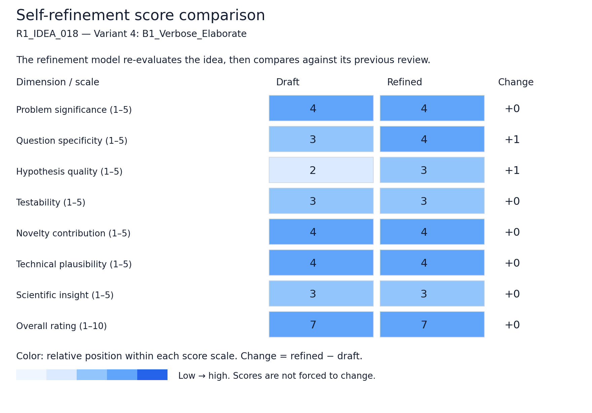

Changed score dimensions: question_specificity, hypothesis_quality.

### Score justifications (draft / refined)

**Problem significance**

```json
{
  "draft": {
    "score": 4.0,
    "justification": "The problem of limited controllability in video generative models is significant for practical applications, as it restricts the ability to generate videos with multiple subjects and complex scene descriptions."
  },
  "refined": {
    "score": 4.0,
    "justification": "The problem of limited controllability in video generative models is significant for practical applications, as it restricts the ability to generate videos with multiple subjects and complex scene descriptions."
  }
}
```

**Question specificity**

```json
{
  "draft": {
    "score": 3.0,
    "justification": "The idea identifies a specific task (multi-subject video generation with identity preservation and semantic integration) but lacks detailed specification of the problem's scope or the exact challenges being addressed."
  },
  "refined": {
    "score": 4.0,
    "justification": "The idea clearly defines the task (multi-subject video generation with identity preservation and semantic integration) and identifies a specific challenge in multi-modal video generation."
  }
}
```

**Hypothesis quality**

```json
{
  "draft": {
    "score": 2.0,
    "justification": "The idea proposes a novel framework but does not explicitly state a hypothesis or prediction about its performance or capabilities compared to existing methods."
  },
  "refined": {
    "score": 3.0,
    "justification": "The idea proposes a novel framework but does not explicitly state a hypothesis or prediction about its performance or capabilities compared to existing methods."
  }
}
```

**Testability**

```json
{
  "draft": {
    "score": 3.0,
    "justification": "The idea suggests a novel framework but does not provide specific experiments, comparisons, or evaluation metrics that would allow for testing the hypothesis."
  },
  "refined": {
    "score": 3.0,
    "justification": "The idea suggests a novel framework but does not provide specific experiments, comparisons, or evaluation metrics that would allow for testing the hypothesis."
  }
}
```

**Novelty contribution**

```json
{
  "draft": {
    "score": 4.0,
    "justification": "The proposal of ID-Composer for multi-subject video generation is novel and addresses a specific challenge in multi-modal video generation, which could contribute to the field of generative models."
  },
  "refined": {
    "score": 4.0,
    "justification": "The proposal of ID-Composer for multi-subject video generation is novel and addresses a specific challenge in multi-modal video generation, which could contribute to the field of generative models."
  }
}
```

**Technical plausibility**

```json
{
  "draft": {
    "score": 4.0,
    "justification": "The idea is technically plausible as it builds on existing video generative models and addresses a challenging task that is within the scope of current research."
  },
  "refined": {
    "score": 4.0,
    "justification": "The idea is technically plausible as it builds on existing video generative models and addresses a challenging task that is within the scope of current research."
  }
}
```

**Scientific insight**

```json
{
  "draft": {
    "score": 3.0,
    "justification": "The idea has potential for scientific insight by addressing the challenge of multi-subject video generation, but the specific mechanisms or insights are not clearly defined."
  },
  "refined": {
    "score": 3.0,
    "justification": "The idea has potential for scientific insight by addressing the challenge of multi-subject video generation, but the specific mechanisms or insights are not clearly defined."
  }
}
```

**Overall rating**

```json
{
  "draft": {
    "score": 7.0,
    "justification": "The idea addresses a meaningful problem in video generative models and proposes a novel framework. However, it lacks specific details about the framework, hypothesis, and evaluation metrics, which are necessary for assessing its scientific merit and testability."
  },
  "refined": {
    "score": 7.0,
    "justification": "The idea addresses a meaningful problem in video generative models and proposes a novel framework. However, it lacks specific details about the framework, hypothesis, and evaluation metrics, which are necessary for assessing its scientific merit and testability."
  }
}
```

## R1_IDEA_018 — Variant 5: B2_Grand_Narrative

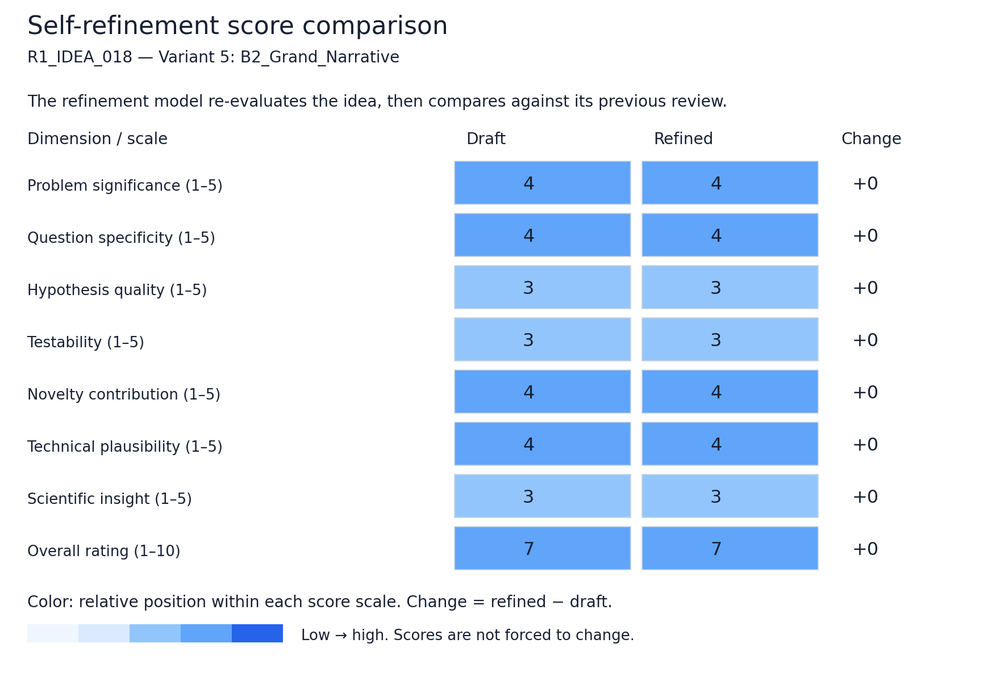

Changed score dimensions: none.

### Score justifications (draft / refined)

**Problem significance**

```json
{
  "draft": {
    "score": 4.0,
    "justification": "The problem of limited controllability in video generative models is significant for both research and practical applications, as it restricts the ability to generate diverse and controllable videos."
  },
  "refined": {
    "score": 4.0,
    "justification": "The problem of limited controllability in video generative models is significant for both research and practical applications, as it restricts the ability to generate diverse and controllable videos."
  }
}
```

**Question specificity**

```json
{
  "draft": {
    "score": 4.0,
    "justification": "The idea clearly defines a specific research question: developing a framework for multi-subject video generation from text and images, which is a concrete and focused problem."
  },
  "refined": {
    "score": 4.0,
    "justification": "The idea clearly defines a specific research question: developing a framework for multi-subject video generation from text and images, which is a concrete and focused problem."
  }
}
```

**Hypothesis quality**

```json
{
  "draft": {
    "score": 3.0,
    "justification": "The idea presents a general hypothesis that ID-Composer will improve controllability and flexibility, but lacks specific predictions or mechanisms that could be tested."
  },
  "refined": {
    "score": 3.0,
    "justification": "The idea presents a general hypothesis that ID-Composer will improve controllability and flexibility, but lacks specific predictions or mechanisms that could be tested."
  }
}
```

**Testability**

```json
{
  "draft": {
    "score": 3.0,
    "justification": "The idea suggests a potential solution but does not provide specific experiments or evaluation methods to test the effectiveness of ID-Composer."
  },
  "refined": {
    "score": 3.0,
    "justification": "The idea suggests a potential solution but does not provide specific experiments or evaluation methods to test the effectiveness of ID-Composer."
  }
}
```

**Novelty contribution**

```json
{
  "draft": {
    "score": 4.0,
    "justification": "The proposed framework addresses a specific challenge in multimodal generative modeling, which could contribute to more flexible video synthesis approaches, though the novelty is somewhat limited without further details."
  },
  "refined": {
    "score": 4.0,
    "justification": "The proposed framework addresses a specific challenge in multimodal generative modeling, which could contribute to more flexible video synthesis approaches, though the novelty is somewhat limited without further details."
  }
}
```

**Technical plausibility**

```json
{
  "draft": {
    "score": 4.0,
    "justification": "The proposed task is technically feasible, and the framework's goal aligns with current research trends in multimodal and video generation, making it plausible."
  },
  "refined": {
    "score": 4.0,
    "justification": "The proposed task is technically feasible, and the framework's goal aligns with current research trends in multimodal and video generation, making it plausible."
  }
}
```

**Scientific insight**

```json
{
  "draft": {
    "score": 3.0,
    "justification": "The idea has potential for scientific insight into multi-subject video generation, but the specific mechanisms and contributions are not clearly defined."
  },
  "refined": {
    "score": 3.0,
    "justification": "The idea has potential for scientific insight into multi-subject video generation, but the specific mechanisms and contributions are not clearly defined."
  }
}
```

**Overall rating**

```json
{
  "draft": {
    "score": 7.0,
    "justification": "The idea addresses a meaningful problem with a clear research question and potential contribution, but lacks sufficient detail to fully assess its feasibility and scientific insight."
  },
  "refined": {
    "score": 7.0,
    "justification": "The idea addresses a meaningful problem with a clear research question and potential contribution, but lacks sufficient detail to fully assess its feasibility and scientific insight."
  }
}
```

## R1_IDEA_018 — Variant 6: B3_Over_Confident


Changed score dimensions: none.

### Score justifications (draft / refined)

**Problem significance**

```json
{
  "draft": {
    "score": 4.0,
    "justification": "The problem of multi-subject video generation is significant as it addresses a key limitation in current video generative models, which are often constrained by text or single-image conditioning. This has implications for applications requiring controllability and scalability in video generation."
  },
  "refined": {
    "score": 4.0,
    "justification": "The problem of multi-subject video generation is significant as it addresses a key limitation in current video generative models, which are often constrained by text or single-image conditioning. This has implications for applications requiring controllability and scalability in video generation."
  }
}
```

**Question specificity**

```json
{
  "draft": {
    "score": 3.0,
    "justification": "The idea identifies a specific problem (multi-subject video generation from text and images) but lacks a clear, concrete research question or hypothesis. The proposed solution is general and does not specify what exactly is being investigated or how it differs from existing approaches."
  },
  "refined": {
    "score": 3.0,
    "justification": "The idea identifies a specific problem (multi-subject video generation from text and images) but lacks a clear, concrete research question or hypothesis. The proposed solution is general and does not specify what exactly is being investigated or how it differs from existing approaches."
  }
}
```

**Hypothesis quality**

```json
{
  "draft": {
    "score": 3.0,
    "justification": "The idea suggests a potential solution but does not explicitly state a hypothesis that can be tested. It mentions the challenge but does not propose a specific prediction or mechanism that would be supported or contradicted by evidence."
  },
  "refined": {
    "score": 3.0,
    "justification": "The idea suggests a potential solution but does not explicitly state a hypothesis that can be tested. It mentions the challenge but does not propose a specific prediction or mechanism that would be supported or contradicted by evidence."
  }
}
```

**Testability**

```json
{
  "draft": {
    "score": 2.0,
    "justification": "The idea is too vague to be tested without more specifics. It does not provide a clear experimental plan or evaluation metrics, making it difficult to assess the feasibility of the proposed framework."
  },
  "refined": {
    "score": 2.0,
    "justification": "The idea is too vague to be tested without more specifics. It does not provide a clear experimental plan or evaluation metrics, making it difficult to assess the feasibility of the proposed framework."
  }
}
```

**Novelty contribution**

```json
{
  "draft": {
    "score": 4.0,
    "justification": "The proposed framework addresses a specific and important problem in video generation. While the exact novelty is not detailed, the focus on multi-subject generation from text and images suggests a potential contribution to the field of controllable video generation."
  },
  "refined": {
    "score": 4.0,
    "justification": "The proposed framework addresses a specific and important problem in video generation. While the exact novelty is not detailed, the focus on multi-subject generation from text and images suggests a potential contribution to the field of controllable video generation."
  }
}
```

**Technical plausibility**

```json
{
  "draft": {
    "score": 4.0,
    "justification": "The idea is technically plausible as multi-subject video generation is a challenging but achievable task. The proposed solution aligns with current research trends in video generation and controllability, making it a reasonable direction for further investigation."
  },
  "refined": {
    "score": 4.0,
    "justification": "The idea is technically plausible as multi-subject video generation is a challenging but achievable task. The proposed solution aligns with current research trends in video generation and controllability, making it a reasonable direction for further investigation."
  }
}
```

**Scientific insight**

```json
{
  "draft": {
    "score": 3.0,
    "justification": "The idea has potential for scientific insight by addressing the challenge of multi-subject video generation. However, without a clear hypothesis or specific research question, the potential for new insights is limited."
  },
  "refined": {
    "score": 3.0,
    "justification": "The idea has potential for scientific insight by addressing the challenge of multi-subject video generation. However, without a clear hypothesis or specific research question, the potential for new insights is limited."
  }
}
```

**Overall rating**

```json
{
  "draft": {
    "score": 7.0,
    "justification": "The idea addresses a meaningful problem in video generation and proposes a specific solution. However, it lacks sufficient detail on the research question, hypothesis, and testable aspects, which are necessary for evaluating its scientific merit and potential contribution."
  },
  "refined": {
    "score": 7.0,
    "justification": "The idea addresses a meaningful problem in video generation and proposes a specific solution. However, it lacks sufficient detail on the research question, hypothesis, and testable aspects, which are necessary for evaluating its scientific merit and potential contribution."
  }
}
```

## R1_IDEA_018 — Variant 7: B4_Novelty

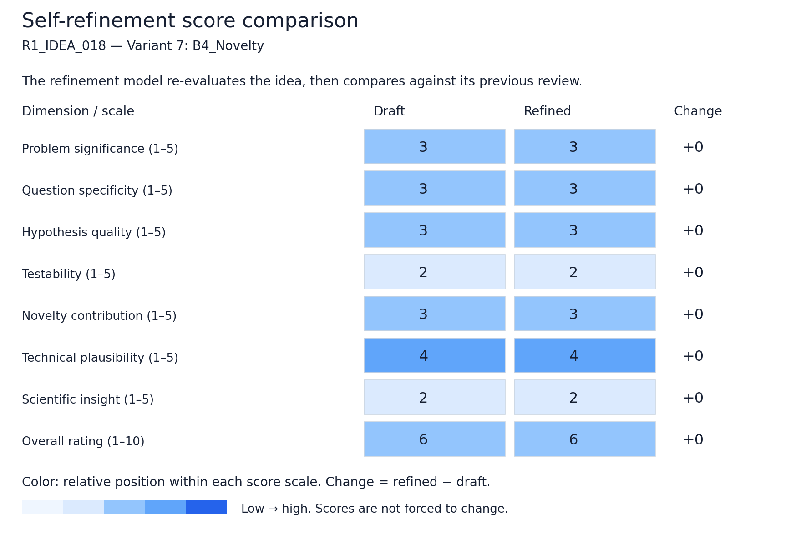

Changed score dimensions: none.

### Score justifications (draft / refined)

**Problem significance**

```json
{
  "draft": {
    "score": 3.0,
    "justification": "The problem is relevant to video generative models, but the significance is somewhat generic. It does not clearly explain why multi-subject video generation is more critical than other video generation tasks."
  },
  "refined": {
    "score": 3.0,
    "justification": "The problem is relevant to video generative models, but the significance is somewhat generic. It does not clearly explain why multi-subject video generation is more critical than other video generation tasks."
  }
}
```

**Question specificity**

```json
{
  "draft": {
    "score": 3.0,
    "justification": "The idea presents a general research direction but does not specify the exact question being investigated. For example, it does not clarify how subject identities are preserved or how semantics are integrated across modalities."
  },
  "refined": {
    "score": 3.0,
    "justification": "The idea presents a general research direction but does not specify the exact question being investigated. For example, it does not clarify how subject identities are preserved or how semantics are integrated across modalities."
  }
}
```

**Hypothesis quality**

```json
{
  "draft": {
    "score": 3.0,
    "justification": "The idea suggests a novel approach but does not provide a clear hypothesis or prediction that can be tested. It lacks specific claims about the expected outcomes or mechanisms."
  },
  "refined": {
    "score": 3.0,
    "justification": "The idea suggests a novel approach but does not provide a clear hypothesis or prediction that can be tested. It lacks specific claims about the expected outcomes or mechanisms."
  }
}
```

**Testability**

```json
{
  "draft": {
    "score": 2.0,
    "justification": "The idea does not specify how the framework will be evaluated or tested. Without details on experiments, metrics, or comparisons, it is difficult to assess the validity of the approach."
  },
  "refined": {
    "score": 2.0,
    "justification": "The idea does not specify how the framework will be evaluated or tested. Without details on experiments, metrics, or comparisons, it is difficult to assess the validity of the approach."
  }
}
```

**Novelty contribution**

```json
{
  "draft": {
    "score": 3.0,
    "justification": "The idea introduces a new angle of multi-subject video generation, but the novelty is not clearly differentiated from existing work. The contribution is not explicitly stated beyond the general claim of improved controllability."
  },
  "refined": {
    "score": 3.0,
    "justification": "The idea introduces a new angle of multi-subject video generation, but the novelty is not clearly differentiated from existing work. The contribution is not explicitly stated beyond the general claim of improved controllability."
  }
}
```

**Technical plausibility**

```json
{
  "draft": {
    "score": 4.0,
    "justification": "The proposed task is technically feasible, as multi-subject video generation is a well-defined problem in the field. The framework's goals are plausible and align with current research trends."
  },
  "refined": {
    "score": 4.0,
    "justification": "The proposed task is technically feasible, as multi-subject video generation is a well-defined problem in the field. The framework's goals are plausible and align with current research trends."
  }
}
```

**Scientific insight**

```json
{
  "draft": {
    "score": 2.0,
    "justification": "The idea does not provide a clear scientific insight or potential for discovering new principles. It focuses on improving controllability but does not suggest deeper theoretical or methodological contributions."
  },
  "refined": {
    "score": 2.0,
    "justification": "The idea does not provide a clear scientific insight or potential for discovering new principles. It focuses on improving controllability but does not suggest deeper theoretical or methodological contributions."
  }
}
```

**Overall rating**

```json
{
  "draft": {
    "score": 6.0,
    "justification": "The idea addresses a relevant problem and introduces a novel angle, but it lacks specificity, testability, and clear hypotheses. With more details on the framework and evaluation, it could become a strong research direction."
  },
  "refined": {
    "score": 6.0,
    "justification": "The idea addresses a relevant problem and introduces a novel angle, but it lacks specificity, testability, and clear hypotheses. With more details on the framework and evaluation, it could become a strong research direction."
  }
}
```

## R1_IDEA_018 — Variant 8: B5_Application_Impact


Changed score dimensions: none.

### Score justifications (draft / refined)

**Problem significance**

```json
{
  "draft": {
    "score": 4.0,
    "justification": "The problem of controllability in video generation is important for practical applications, and the proposed solution addresses a meaningful gap in current methods."
  },
  "refined": {
    "score": 4.0,
    "justification": "The problem of controllability in video generation is important for practical applications, and the proposed solution addresses a meaningful gap in current methods."
  }
}
```

**Question specificity**

```json
{
  "draft": {
    "score": 3.0,
    "justification": "The idea defines a specific task (multi-subject video generation from text and images) but lacks detailed specification of the research question or hypothesis."
  },
  "refined": {
    "score": 3.0,
    "justification": "The idea defines a specific task (multi-subject video generation from text and images) but lacks detailed specification of the research question or hypothesis."
  }
}
```

**Hypothesis quality**

```json
{
  "draft": {
    "score": 2.0,
    "justification": "The idea mentions a potential solution but does not clearly state a hypothesis or mechanism that could be tested or falsified."
  },
  "refined": {
    "score": 2.0,
    "justification": "The idea mentions a potential solution but does not clearly state a hypothesis or mechanism that could be tested or falsified."
  }
}
```

**Testability**

```json
{
  "draft": {
    "score": 3.0,
    "justification": "The idea suggests a potential application but does not provide specific experiments or evaluation metrics to test the proposed framework."
  },
  "refined": {
    "score": 3.0,
    "justification": "The idea suggests a potential application but does not provide specific experiments or evaluation metrics to test the proposed framework."
  }
}
```

**Novelty contribution**

```json
{
  "draft": {
    "score": 3.0,
    "justification": "The idea proposes a new framework for multi-subject video generation, which could contribute to the field, but the novelty is not clearly articulated."
  },
  "refined": {
    "score": 3.0,
    "justification": "The idea proposes a new framework for multi-subject video generation, which could contribute to the field, but the novelty is not clearly articulated."
  }
}
```

**Technical plausibility**

```json
{
  "draft": {
    "score": 4.0,
    "justification": "The proposed task is technically feasible, and the framework's goals align with current research directions in video generation."
  },
  "refined": {
    "score": 4.0,
    "justification": "The proposed task is technically feasible, and the framework's goals align with current research directions in video generation."
  }
}
```

**Scientific insight**

```json
{
  "draft": {
    "score": 3.0,
    "justification": "The idea has potential to provide insights into multi-subject video generation, but the specific mechanisms or contributions are not clearly defined."
  },
  "refined": {
    "score": 3.0,
    "justification": "The idea has potential to provide insights into multi-subject video generation, but the specific mechanisms or contributions are not clearly defined."
  }
}
```

**Overall rating**

```json
{
  "draft": {
    "score": 7.0,
    "justification": "The idea addresses a meaningful problem with a clear goal, but lacks specific details on the methodology, hypothesis, and testable aspects, which are needed for further development."
  },
  "refined": {
    "score": 7.0,
    "justification": "The idea addresses a meaningful problem with a clear goal, but lacks specific details on the methodology, hypothesis, and testable aspects, which are needed for further development."
  }
}
```

## R1_IDEA_018 — Variant 9: C1_Hollow_Shell


Changed score dimensions: none.

### Score justifications (draft / refined)

**Problem significance**

```json
{
  "draft": {
    "score": 4.0,
    "justification": "The problem of controllability in multi-subject video generation is important for applications like virtual production and content creation, where precise control over multiple subjects is required."
  },
  "refined": {
    "score": 4.0,
    "justification": "The problem of controllability in multi-subject video generation is important for applications like virtual production and content creation, where precise control over multiple subjects is required."
  }
}
```

**Question specificity**

```json
{
  "draft": {
    "score": 3.0,
    "justification": "The idea identifies a specific challenge but lacks a concrete research question that could be tested. More specificity is needed to define what exactly is being investigated."
  },
  "refined": {
    "score": 3.0,
    "justification": "The idea identifies a specific challenge but lacks a concrete research question that could be tested. More specificity is needed to define what exactly is being investigated."
  }
}
```

**Hypothesis quality**

```json
{
  "draft": {
    "score": 2.0,
    "justification": "The idea does not contain a clear hypothesis or prediction that could be tested. It merely states a problem and a potential solution without specifying what should be investigated."
  },
  "refined": {
    "score": 2.0,
    "justification": "The idea does not contain a clear hypothesis or prediction that could be tested. It merely states a problem and a potential solution without specifying what should be investigated."
  }
}
```

**Testability**

```json
{
  "draft": {
    "score": 2.0,
    "justification": "The idea does not provide a clear experimental plan or method for testing the proposed approach. Without specific metrics or evaluation methods, it is difficult to assess the testability."
  },
  "refined": {
    "score": 2.0,
    "justification": "The idea does not provide a clear experimental plan or method for testing the proposed approach. Without specific metrics or evaluation methods, it is difficult to assess the testability."
  }
}
```

**Novelty contribution**

```json
{
  "draft": {
    "score": 3.0,
    "justification": "The idea addresses a relevant problem but does not clearly define what novel contribution is being sought. It could contribute to the field by improving controllability in multi-subject video generation, but this needs to be specified."
  },
  "refined": {
    "score": 3.0,
    "justification": "The idea addresses a relevant problem but does not clearly define what novel contribution is being sought. It could contribute to the field by improving controllability in multi-subject video generation, but this needs to be specified."
  }
}
```

**Technical plausibility**

```json
{
  "draft": {
    "score": 4.0,
    "justification": "The proposed direction is technically plausible as it builds on existing generative models and addresses known challenges in multi-subject video generation. The integration of text and images as inputs is a reasonable approach."
  },
  "refined": {
    "score": 4.0,
    "justification": "The proposed direction is technically plausible as it builds on existing generative models and addresses known challenges in multi-subject video generation. The integration of text and images as inputs is a reasonable approach."
  }
}
```

**Scientific insight**

```json
{
  "draft": {
    "score": 3.0,
    "justification": "The idea has potential for scientific insight by addressing the challenges of identity preservation and coherence in multi-subject video generation. However, the specific insights would depend on the methods and experiments conducted."
  },
  "refined": {
    "score": 3.0,
    "justification": "The idea has potential for scientific insight by addressing the challenges of identity preservation and coherence in multi-subject video generation. However, the specific insights would depend on the methods and experiments conducted."
  }
}
```

**Overall rating**

```json
{
  "draft": {
    "score": 6.0,
    "justification": "The idea addresses an important problem in video generation but lacks specific research questions, hypotheses, and technical details. It has potential for contribution but needs more clarity and specificity to be considered strong."
  },
  "refined": {
    "score": 6.0,
    "justification": "The idea addresses an important problem in video generation but lacks specific research questions, hypotheses, and technical details. It has potential for contribution but needs more clarity and specificity to be considered strong."
  }
}
```

## R1_IDEA_018 — Variant 10: C2_Logic_Flawed


Changed score dimensions: none.

### Score justifications (draft / refined)

**Problem significance**

```json
{
  "draft": {
    "score": 4.0,
    "justification": "The problem of limited controllability in video generative models is significant for applications requiring multi-subject video synthesis, such as virtual production and content creation."
  },
  "refined": {
    "score": 4.0,
    "justification": "The problem of limited controllability in video generative models is significant for applications requiring multi-subject video synthesis, such as virtual production and content creation."
  }
}
```

**Question specificity**

```json
{
  "draft": {
    "score": 3.0,
    "justification": "The idea clearly defines the task (multi-subject video generation from text and images) but lacks specifics on how the framework addresses the technical challenges mentioned."
  },
  "refined": {
    "score": 3.0,
    "justification": "The idea clearly defines the task (multi-subject video generation from text and images) but lacks specifics on how the framework addresses the technical challenges mentioned."
  }
}
```

**Hypothesis quality**

```json
{
  "draft": {
    "score": 2.0,
    "justification": "The idea suggests a novel framework but does not explicitly state a hypothesis or prediction about its performance or capabilities that could be tested."
  },
  "refined": {
    "score": 2.0,
    "justification": "The idea suggests a novel framework but does not explicitly state a hypothesis or prediction about its performance or capabilities that could be tested."
  }
}
```

**Testability**

```json
{
  "draft": {
    "score": 3.0,
    "justification": "The idea proposes a framework for a challenging task, but lacks details on how it will be evaluated or compared to existing methods to demonstrate its effectiveness."
  },
  "refined": {
    "score": 3.0,
    "justification": "The idea proposes a framework for a challenging task, but lacks details on how it will be evaluated or compared to existing methods to demonstrate its effectiveness."
  }
}
```

**Novelty contribution**

```json
{
  "draft": {
    "score": 4.0,
    "justification": "The framework addresses a specific and challenging problem in video generation, which could contribute new insights into multi-subject video synthesis and controllability."
  },
  "refined": {
    "score": 4.0,
    "justification": "The framework addresses a specific and challenging problem in video generation, which could contribute new insights into multi-subject video synthesis and controllability."
  }
}
```

**Technical plausibility**

```json
{
  "draft": {
    "score": 4.0,
    "justification": "The proposed task is technically feasible, and the challenges mentioned (identity preservation, semantic integration) are plausible areas for innovation in video generation models."
  },
  "refined": {
    "score": 4.0,
    "justification": "The proposed task is technically feasible, and the challenges mentioned (identity preservation, semantic integration) are plausible areas for innovation in video generation models."
  }
}
```

**Scientific insight**

```json
{
  "draft": {
    "score": 3.0,
    "justification": "The idea has potential to provide insights into multi-subject video generation, but the current description does not clearly indicate what specific scientific understanding would be gained from the research."
  },
  "refined": {
    "score": 3.0,
    "justification": "The idea has potential to provide insights into multi-subject video generation, but the current description does not clearly indicate what specific scientific understanding would be gained from the research."
  }
}
```

**Overall rating**

```json
{
  "draft": {
    "score": 7.0,
    "justification": "The idea addresses a meaningful problem with a clear research direction, but lacks specific details on the framework's methodology, hypothesis, and evaluation plan, which are necessary for assessing its scientific merit and potential contribution."
  },
  "refined": {
    "score": 7.0,
    "justification": "The idea addresses a meaningful problem with a clear research direction, but lacks specific details on the framework's methodology, hypothesis, and evaluation plan, which are necessary for assessing its scientific merit and potential contribution."
  }
}
```

## R1_IDEA_018 — Variant 11: C3_Substance_Enriched

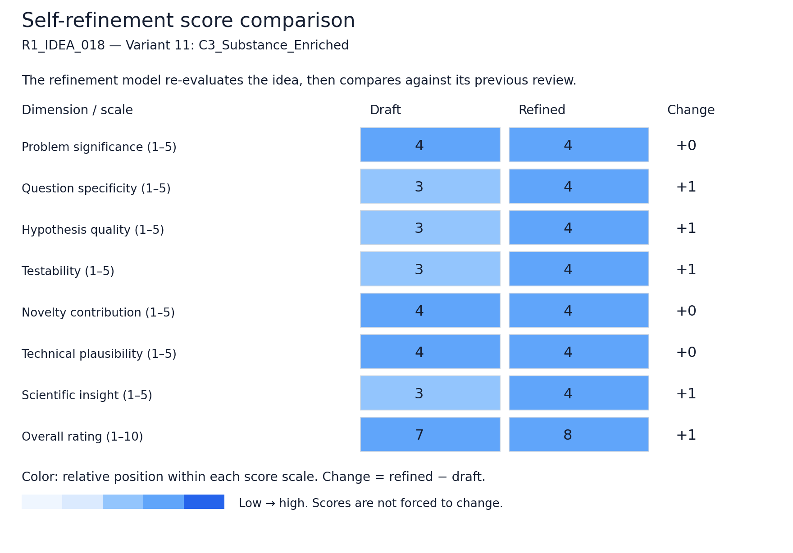

Changed score dimensions: question_specificity, hypothesis_quality, testability, scientific_insight, overall_rating.

### Score justifications (draft / refined)

**Problem significance**

```json
{
  "draft": {
    "score": 4.0,
    "justification": "The problem of limited controllability in video generative models is significant, as it restricts the applicability of these models in real-world scenarios requiring multi-subject video generation."
  },
  "refined": {
    "score": 4.0,
    "justification": "The problem of limited controllability in video generative models is significant, as it restricts the applicability of these models in real-world scenarios requiring multi-subject video generation."
  }
}
```

**Question specificity**

```json
{
  "draft": {
    "score": 3.0,
    "justification": "The research question is specific to multi-subject video generation from text and reference images, but the exact nature of the problem (e.g., identity preservation, semantic integration) is somewhat vague without more details."
  },
  "refined": {
    "score": 4.0,
    "justification": "The research question is specific to multi-subject video generation from text and reference images, and the challenges (identity preservation, semantic integration) are clearly defined."
  }
}
```

**Hypothesis quality**

```json
{
  "draft": {
    "score": 3.0,
    "justification": "The hypothesis that cross-modal attention mechanisms may help with semantic integration is plausible but not clearly stated as a testable claim. It lacks a concrete prediction or mechanism."
  },
  "refined": {
    "score": 4.0,
    "justification": "The hypothesis that cross-modal attention mechanisms may help with semantic integration is specific and testable, even if not explicitly framed as a hypothesis. It provides a clear direction for investigation."
  }
}
```

**Testability**

```json
{
  "draft": {
    "score": 3.0,
    "justification": "The idea mentions potential validation paths, but lacks specific experiments, metrics, or comparisons that would make the hypothesis testable in practice."
  },
  "refined": {
    "score": 4.0,
    "justification": "The idea includes potential validation paths (identity preservation tests, boundary conditions), which are testable through experiments. The hypothesis is actionable and could be validated with appropriate experiments."
  }
}
```

**Novelty contribution**

```json
{
  "draft": {
    "score": 4.0,
    "justification": "The proposed framework (ID-Composer) addresses a specific challenge in multi-subject video generation, which is a novel application of generative models. The hypothesis about cross-modal attention is a plausible contribution to the field."
  },
  "refined": {
    "score": 4.0,
    "justification": "The proposed framework (ID-Composer) addresses a specific challenge in multi-subject video generation, which is a novel application of generative models. The hypothesis about cross-modal attention is a plausible contribution to the field."
  }
}
```

**Technical plausibility**

```json
{
  "draft": {
    "score": 4.0,
    "justification": "The proposed approach is technically plausible, as cross-modal attention mechanisms are commonly used in multimodal tasks. The challenge of multi-subject video generation is a realistic problem in the field."
  },
  "refined": {
    "score": 4.0,
    "justification": "The proposed approach is technically plausible, as cross-modal attention mechanisms are commonly used in multimodal tasks. The challenge of multi-subject video generation is a realistic problem in the field."
  }
}
```

**Scientific insight**

```json
{
  "draft": {
    "score": 3.0,
    "justification": "The idea has potential for scientific insight into how cross-modal attention can improve semantic integration in video generation, but the connection to broader principles or mechanisms is not clearly articulated."
  },
  "refined": {
    "score": 4.0,
    "justification": "The idea has potential for scientific insight into how cross-modal attention can improve semantic integration in video generation, and the focus on boundary conditions may reveal important limitations or opportunities in the approach."
  }
}
```

**Overall rating**

```json
{
  "draft": {
    "score": 7.0,
    "justification": "The idea addresses a meaningful problem with a clear research question and a plausible hypothesis. However, it lacks specific details on the framework, hypothesis, and experimental design, which are necessary for further development and validation."
  },
  "refined": {
    "score": 8.0,
    "justification": "The idea addresses a meaningful problem with a clear research question and a plausible hypothesis. The proposed framework and validation paths are testable and have the potential for significant scientific contribution, though more specific details are needed for further development."
  }
}
```

## R1_IDEA_018 — Variant 12: H1_Deceptive_Hollow


Changed score dimensions: none.

### Score justifications (draft / refined)

**Problem significance**

```json
{
  "draft": {
    "score": 4.0,
    "justification": "The problem of controllability in video generation is significant, as it affects the practical utility of generative models in real-world applications."
  },
  "refined": {
    "score": 4.0,
    "justification": "The problem of controllability in video generation is significant, as it affects the practical utility of generative models in real-world applications."
  }
}
```

**Question specificity**

```json
{
  "draft": {
    "score": 2.0,
    "justification": "The idea is broad and lacks a specific research question. It mentions challenges but does not clearly define what exactly is being investigated."
  },
  "refined": {
    "score": 2.0,
    "justification": "The idea is broad and lacks a specific research question. It mentions challenges but does not clearly define what exactly is being investigated."
  }
}
```

**Hypothesis quality**

```json
{
  "draft": {
    "score": 2.0,
    "justification": "There is no explicit hypothesis. The idea is more of a general statement about the potential impact of the research rather than a testable hypothesis."
  },
  "refined": {
    "score": 2.0,
    "justification": "There is no explicit hypothesis. The idea is more of a general statement about the potential impact of the research rather than a testable hypothesis."
  }
}
```

**Testability**

```json
{
  "draft": {
    "score": 2.0,
    "justification": "The idea does not provide a clear way to test the proposed approach. It lacks specific experiments or evaluations that could validate the research direction."
  },
  "refined": {
    "score": 2.0,
    "justification": "The idea does not provide a clear way to test the proposed approach. It lacks specific experiments or evaluations that could validate the research direction."
  }
}
```

**Novelty contribution**

```json
{
  "draft": {
    "score": 3.0,
    "justification": "The idea suggests a transformative approach, which could be novel, but it does not clearly define what is new or how it differs from existing methods."
  },
  "refined": {
    "score": 3.0,
    "justification": "The idea suggests a transformative approach, which could be novel, but it does not clearly define what is new or how it differs from existing methods."
  }
}
```

**Technical plausibility**

```json
{
  "draft": {
    "score": 3.0,
    "justification": "The idea is technically plausible as it builds on existing generative models, but the specifics of the proposed method are not clear."
  },
  "refined": {
    "score": 3.0,
    "justification": "The idea is technically plausible as it builds on existing generative models, but the specifics of the proposed method are not clear."
  }
}
```

**Scientific insight**

```json
{
  "draft": {
    "score": 2.0,
    "justification": "The idea does not provide a clear path to scientific insight. It focuses on potential impact rather than specific mechanisms or findings that could be discovered."
  },
  "refined": {
    "score": 2.0,
    "justification": "The idea does not provide a clear path to scientific insight. It focuses on potential impact rather than specific mechanisms or findings that could be discovered."
  }
}
```

**Overall rating**

```json
{
  "draft": {
    "score": 6.0,
    "justification": "The idea addresses a significant problem in video generation but lacks specific research questions, hypotheses, and testable directions. It has potential but needs more concrete details to be evaluated effectively."
  },
  "refined": {
    "score": 6.0,
    "justification": "The idea addresses a significant problem in video generation but lacks specific research questions, hypotheses, and testable directions. It has potential but needs more concrete details to be evaluated effectively."
  }
}
```

## R1_IDEA_018 — Variant 13: H2_Confident_Flaw

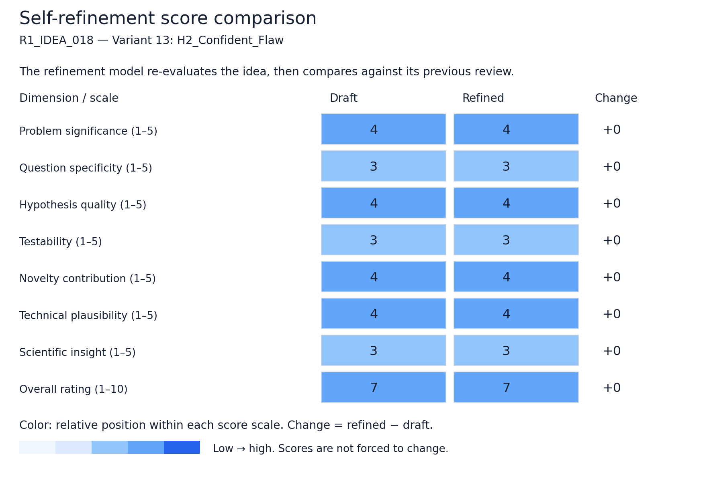

Changed score dimensions: none.

### Score justifications (draft / refined)

**Problem significance**

```json
{
  "draft": {
    "score": 4.0,
    "justification": "The problem of limited controllability in video generative models is significant as it restricts the applicability of these models in real-world scenarios where multi-subject video generation is needed."
  },
  "refined": {
    "score": 4.0,
    "justification": "The problem of limited controllability in video generative models is significant as it restricts the applicability of these models in real-world scenarios where multi-subject video generation is needed."
  }
}
```

**Question specificity**

```json
{
  "draft": {
    "score": 3.0,
    "justification": "The idea identifies a specific problem but does not clearly define the exact research question or hypothesis that ID-Composer aims to address, leaving some ambiguity about what is being investigated."
  },
  "refined": {
    "score": 3.0,
    "justification": "The idea identifies a specific problem but does not clearly define the exact research question or hypothesis that ID-Composer aims to address, leaving some ambiguity about what is being investigated."
  }
}
```

**Hypothesis quality**

```json
{
  "draft": {
    "score": 4.0,
    "justification": "The idea suggests that solving the identified limitation will lead to reliable improvements, which is a plausible hypothesis. However, it could be more explicit about the specific predictions or mechanisms being tested."
  },
  "refined": {
    "score": 4.0,
    "justification": "The idea suggests that solving the identified limitation will lead to reliable improvements, which is a plausible hypothesis. However, it could be more explicit about the specific predictions or mechanisms being tested."
  }
}
```

**Testability**

```json
{
  "draft": {
    "score": 3.0,
    "justification": "The idea makes a strong claim about causal evidence, but it lacks specific experimental details or methods for testing the hypothesis, which could be more clearly outlined."
  },
  "refined": {
    "score": 3.0,
    "justification": "The idea makes a strong claim about causal evidence, but it lacks specific experimental details or methods for testing the hypothesis, which could be more clearly outlined."
  }
}
```

**Novelty contribution**

```json
{
  "draft": {
    "score": 4.0,
    "justification": "The proposal of ID-Composer addresses a specific limitation in existing video generative models, which could contribute to the field by improving controllability and applicability in multi-subject video generation."
  },
  "refined": {
    "score": 4.0,
    "justification": "The proposal of ID-Composer addresses a specific limitation in existing video generative models, which could contribute to the field by improving controllability and applicability in multi-subject video generation."
  }
}
```

**Technical plausibility**

```json
{
  "draft": {
    "score": 4.0,
    "justification": "The idea is technically plausible as it addresses a known challenge in multi-subject video generation. The proposed solution is reasonable given the context of the problem."
  },
  "refined": {
    "score": 4.0,
    "justification": "The idea is technically plausible as it addresses a known challenge in multi-subject video generation. The proposed solution is reasonable given the context of the problem."
  }
}
```

**Scientific insight**

```json
{
  "draft": {
    "score": 3.0,
    "justification": "The idea suggests that solving the identified limitation will lead to general improvements, which could provide scientific insight into the effectiveness of the approach. However, more details on the mechanisms and potential limitations would strengthen this claim."
  },
  "refined": {
    "score": 3.0,
    "justification": "The idea suggests that solving the identified limitation will lead to general improvements, which could provide scientific insight into the effectiveness of the approach. However, more details on the mechanisms and potential limitations would strengthen this claim."
  }
}
```

**Overall rating**

```json
{
  "draft": {
    "score": 7.0,
    "justification": "The idea presents a clear and meaningful problem with a plausible solution. It has the potential to contribute to the field, but more specific details and a clearer hypothesis would enhance its scientific merit."
  },
  "refined": {
    "score": 7.0,
    "justification": "The idea presents a clear and meaningful problem with a plausible solution. It has the potential to contribute to the field, but more specific details and a clearer hypothesis would enhance its scientific merit."
  }
}
```

## R1_IDEA_018 — Variant 14: H3_Verbose_Enriched


Changed score dimensions: none.

### Score justifications (draft / refined)

**Problem significance**

```json
{
  "draft": {
    "score": 4.0,
    "justification": "The problem of controllability and applicability in video generative models is significant, as it impacts the practical use of these models in real-world applications. Addressing this issue through multi-subject video generation from text and images is a meaningful challenge."
  },
  "refined": {
    "score": 4.0,
    "justification": "The problem of controllability and applicability in video generative models is significant, as it impacts the practical use of these models in real-world applications. Addressing this issue through multi-subject video generation from text and images is a meaningful challenge."
  }
}
```

**Question specificity**

```json
{
  "draft": {
    "score": 3.0,
    "justification": "The research question is specific in its focus on multi-subject video generation and the challenges of identity preservation and semantic integration. However, the exact nature of the problem and the specific hypothesis are not fully detailed, which could affect the clarity of the research question."
  },
  "refined": {
    "score": 3.0,
    "justification": "The research question is specific in its focus on multi-subject video generation and the challenges of identity preservation and semantic integration. However, the exact nature of the problem and the specific hypothesis are not fully detailed, which could affect the clarity of the research question."
  }
}
```

**Hypothesis quality**

```json
{
  "draft": {
    "score": 4.0,
    "justification": "The hypothesis that cross-modal attention mechanisms may help manage semantic integration is specific and has potential for empirical validation. It provides a clear direction for testing the effectiveness of the proposed approach."
  },
  "refined": {
    "score": 4.0,
    "justification": "The hypothesis that cross-modal attention mechanisms may help manage semantic integration is specific and has potential for empirical validation. It provides a clear direction for testing the effectiveness of the proposed approach."
  }
}
```

**Testability**

```json
{
  "draft": {
    "score": 4.0,
    "justification": "The idea suggests a staged design with ablations, sensitivity analyses, and error analysis, which are all testable components. The proposed validation path includes specific experiments that can be implemented to evaluate the effectiveness of the approach."
  },
  "refined": {
    "score": 4.0,
    "justification": "The idea suggests a staged design with ablations, sensitivity analyses, and error analysis, which are all testable components. The proposed validation path includes specific experiments that can be implemented to evaluate the effectiveness of the approach."
  }
}
```

**Novelty contribution**

```json
{
  "draft": {
    "score": 3.0,
    "justification": "The idea introduces a novel framework (ID-Composer) for multi-subject video generation, but the specific novelty and contributions compared to existing methods are not clearly articulated. The potential for novel insights is present but not fully detailed."
  },
  "refined": {
    "score": 3.0,
    "justification": "The idea introduces a novel framework (ID-Composer) for multi-subject video generation, but the specific novelty and contributions compared to existing methods are not clearly articulated. The potential for novel insights is present but not fully detailed."
  }
}
```

**Technical plausibility**

```json
{
  "draft": {
    "score": 4.0,
    "justification": "The proposed approach of using cross-modal attention mechanisms is technically plausible and aligns with current trends in generative models. The idea of addressing multi-subject video generation through text and reference images is feasible and aligns with existing research directions."
  },
  "refined": {
    "score": 4.0,
    "justification": "The proposed approach of using cross-modal attention mechanisms is technically plausible and aligns with current trends in generative models. The idea of addressing multi-subject video generation through text and reference images is feasible and aligns with existing research directions."
  }
}
```

**Scientific insight**

```json
{
  "draft": {
    "score": 4.0,
    "justification": "The staged design and inclusion of ablations, sensitivity analyses, and error analysis suggest a focus on understanding the underlying mechanisms and limitations of the approach. This could lead to valuable scientific insights into the effectiveness of cross-modal attention in multi-subject video generation."
  },
  "refined": {
    "score": 4.0,
    "justification": "The staged design and inclusion of ablations, sensitivity analyses, and error analysis suggest a focus on understanding the underlying mechanisms and limitations of the approach. This could lead to valuable scientific insights into the effectiveness of cross-modal attention in multi-subject video generation."
  }
}
```

**Overall rating**

```json
{
  "draft": {
    "score": 7.0,
    "justification": "The idea addresses a meaningful problem in video generative models with a structured approach to validation and a clear hypothesis. While some details are missing, the overall direction is promising and has the potential for significant scientific contribution."
  },
  "refined": {
    "score": 7.0,
    "justification": "The idea addresses a meaningful problem in video generative models with a structured approach to validation and a clear hypothesis. While some details are missing, the overall direction is promising and has the potential for significant scientific contribution."
  }
}
```

## R1_IDEA_018 — Variant 15: H4_Ultimate_Hype


Changed score dimensions: none.

### Score justifications (draft / refined)

**Problem significance**

```json
{
  "draft": {
    "score": 4.0,
    "justification": "The problem of limited controllability in video generative models is significant, as it restricts the practical applications of these models. The proposed solution addresses a critical gap in the field."
  },
  "refined": {
    "score": 4.0,
    "justification": "The problem of limited controllability in video generative models is significant, as it restricts the practical applications of these models. The proposed solution addresses a critical gap in the field."
  }
}
```

**Question specificity**

```json
{
  "draft": {
    "score": 3.0,
    "justification": "The idea identifies a meaningful problem but lacks specific details on the research question or hypothesis. The summary is somewhat vague in defining what exactly is being investigated."
  },
  "refined": {
    "score": 3.0,
    "justification": "The idea identifies a meaningful problem but lacks specific details on the research question or hypothesis. The summary is somewhat vague in defining what exactly is being investigated."
  }
}
```

**Hypothesis quality**

```json
{
  "draft": {
    "score": 3.0,
    "justification": "The idea presents a general hypothesis that the framework will improve controllability and applicability, but it lacks specific predictions or mechanisms that could be tested."
  },
  "refined": {
    "score": 3.0,
    "justification": "The idea presents a general hypothesis that the framework will improve controllability and applicability, but it lacks specific predictions or mechanisms that could be tested."
  }
}
```

**Testability**

```json
{
  "draft": {
    "score": 3.0,
    "justification": "The idea is somewhat testable, as it suggests a framework that could be evaluated on multi-subject video generation tasks. However, the lack of specific experimental details makes it difficult to assess the feasibility of the proposed approach."
  },
  "refined": {
    "score": 3.0,
    "justification": "The idea is somewhat testable, as it suggests a framework that could be evaluated on multi-subject video generation tasks. However, the lack of specific experimental details makes it difficult to assess the feasibility of the proposed approach."
  }
}
```

**Novelty contribution**

```json
{
  "draft": {
    "score": 4.0,
    "justification": "The proposed framework addresses an underexplored technical challenge in multi-subject video generation, which could lead to significant contributions to the field."
  },
  "refined": {
    "score": 4.0,
    "justification": "The proposed framework addresses an underexplored technical challenge in multi-subject video generation, which could lead to significant contributions to the field."
  }
}
```

**Technical plausibility**

```json
{
  "draft": {
    "score": 4.0,
    "justification": "The idea is technically plausible, as it builds on existing video generative models and addresses challenges that are relevant to the field. However, the lack of specific technical details makes it difficult to assess the feasibility of the approach."
  },
  "refined": {
    "score": 4.0,
    "justification": "The idea is technically plausible, as it builds on existing video generative models and addresses challenges that are relevant to the field. However, the lack of specific technical details makes it difficult to assess the feasibility of the approach."
  }
}
```

**Scientific insight**

```json
{
  "draft": {
    "score": 3.0,
    "justification": "The idea has the potential to provide insights into multi-subject video generation, but the summary does not clearly define the scientific questions or hypotheses that would be investigated."
  },
  "refined": {
    "score": 3.0,
    "justification": "The idea has the potential to provide insights into multi-subject video generation, but the summary does not clearly define the scientific questions or hypotheses that would be investigated."
  }
}
```

**Overall rating**

```json
{
  "draft": {
    "score": 7.0,
    "justification": "The idea presents a promising research direction with significant potential for impact. However, it lacks specific details on the research question, hypothesis, and technical implementation, which are necessary for evaluating its feasibility and scientific merit."
  },
  "refined": {
    "score": 7.0,
    "justification": "The idea presents a promising research direction with significant potential for impact. However, it lacks specific details on the research question, hypothesis, and technical implementation, which are necessary for evaluating its feasibility and scientific merit."
  }
}
```

## R1_IDEA_019 — Source


Changed score dimensions: none.

### Score justifications (draft / refined)

**Problem significance**

```json
{
  "draft": {
    "score": 4.0,
    "justification": "The problem of accurate forest monitoring for climate change mitigation is highly significant, as it directly impacts carbon accounting and climate policy."
  },
  "refined": {
    "score": 4.0,
    "justification": "The problem of accurate forest monitoring for climate change mitigation is highly significant, as it directly impacts carbon accounting and climate policy."
  }
}
```

**Question specificity**

```json
{
  "draft": {
    "score": 3.0,
    "justification": "The idea identifies a specific problem (static tree height maps lacking temporal dynamics) but does not clearly define the exact research question or hypothesis being investigated."
  },
  "refined": {
    "score": 3.0,
    "justification": "The idea identifies a specific problem (static tree height maps lacking temporal dynamics) but does not clearly define the exact research question or hypothesis being investigated."
  }
}
```

**Hypothesis quality**

```json
{
  "draft": {
    "score": 3.0,
    "justification": "The idea suggests a solution (ECHOSAT) but does not explicitly state a hypothesis or prediction that could be tested, such as how ECHOSAT improves accuracy or what specific temporal patterns it captures."
  },
  "refined": {
    "score": 3.0,
    "justification": "The idea suggests a solution (ECHOSAT) but does not explicitly state a hypothesis or prediction that could be tested, such as how ECHOSAT improves accuracy or what specific temporal patterns it captures."
  }
}
```

**Testability**

```json
{
  "draft": {
    "score": 2.0,
    "justification": "The idea lacks details on how the proposed solution will be evaluated, such as comparison with existing methods, validation metrics, or experimental design."
  },
  "refined": {
    "score": 2.0,
    "justification": "The idea lacks details on how the proposed solution will be evaluated, such as comparison with existing methods, validation metrics, or experimental design."
  }
}
```

**Novelty contribution**

```json
{
  "draft": {
    "score": 4.0,
    "justification": "The proposal introduces a new approach to global tree height mapping with temporal consistency, which could contribute to more accurate carbon accounting and climate modeling."
  },
  "refined": {
    "score": 4.0,
    "justification": "The proposal introduces a new approach to global tree height mapping with temporal consistency, which could contribute to more accurate carbon accounting and climate modeling."
  }
}
```

**Technical plausibility**

```json
{
  "draft": {
    "score": 3.0,
    "justification": "The idea is technically plausible, as combining global data with temporal consistency is feasible, but the specific methods are not detailed, which could affect feasibility."
  },
  "refined": {
    "score": 3.0,
    "justification": "The idea is technically plausible, as combining global data with temporal consistency is feasible, but the specific methods are not detailed, which could affect feasibility."
  }
}
```

**Scientific insight**

```json
{
  "draft": {
    "score": 3.0,
    "justification": "The idea has potential to provide insights into forest dynamics and carbon accounting, but the specific mechanisms or outcomes of the temporal consistency are not clearly outlined."
  },
  "refined": {
    "score": 3.0,
    "justification": "The idea has potential to provide insights into forest dynamics and carbon accounting, but the specific mechanisms or outcomes of the temporal consistency are not clearly outlined."
  }
}
```

**Overall rating**

```json
{
  "draft": {
    "score": 7.0,
    "justification": "The idea addresses a significant problem in climate change mitigation with a promising solution. However, it lacks specific details on methodology, evaluation, and differentiation from existing approaches, which are necessary for further development."
  },
  "refined": {
    "score": 7.0,
    "justification": "The idea addresses a significant problem in climate change mitigation with a promising solution. However, it lacks specific details on methodology, evaluation, and differentiation from existing approaches, which are necessary for further development."
  }
}
```

## R1_IDEA_019 — Variant 1: A1_Identity


Changed score dimensions: none.

### Score justifications (draft / refined)

**Problem significance**

```json
{
  "draft": {
    "score": 4.0,
    "justification": "The problem of accurate forest monitoring for climate change mitigation is highly significant, as it directly impacts carbon accounting and climate policy."
  },
  "refined": {
    "score": 4.0,
    "justification": "The problem of accurate forest monitoring for climate change mitigation is highly significant, as it directly impacts carbon accounting and climate policy."
  }
}
```

**Question specificity**

```json
{
  "draft": {
    "score": 3.0,
    "justification": "The idea identifies a specific problem (static tree height maps lacking temporal dynamics) but does not clearly define the exact research question or hypothesis being investigated."
  },
  "refined": {
    "score": 3.0,
    "justification": "The idea identifies a specific problem (static tree height maps lacking temporal dynamics) but does not clearly define the exact research question or hypothesis being investigated."
  }
}
```

**Hypothesis quality**

```json
{
  "draft": {
    "score": 3.0,
    "justification": "The idea suggests a solution (ECHOSAT) but does not explicitly state a hypothesis or prediction that could be tested, such as how ECHOSAT improves accuracy or what specific temporal patterns it captures."
  },
  "refined": {
    "score": 3.0,
    "justification": "The idea suggests a solution (ECHOSAT) but does not explicitly state a hypothesis or prediction that could be tested, such as how ECHOSAT improves accuracy or what specific temporal patterns it captures."
  }
}
```

**Testability**

```json
{
  "draft": {
    "score": 2.0,
    "justification": "The idea lacks details on how the proposed solution will be evaluated, such as comparison with existing methods, validation metrics, or experimental design."
  },
  "refined": {
    "score": 2.0,
    "justification": "The idea lacks details on how the proposed solution will be evaluated, such as comparison with existing methods, validation metrics, or experimental design."
  }
}
```

**Novelty contribution**

```json
{
  "draft": {
    "score": 4.0,
    "justification": "The proposal introduces a new approach to global tree height mapping with temporal consistency, which could contribute to more accurate carbon accounting and climate modeling."
  },
  "refined": {
    "score": 4.0,
    "justification": "The proposal introduces a new approach to global tree height mapping with temporal consistency, which could contribute to more accurate carbon accounting and climate modeling."
  }
}
```

**Technical plausibility**

```json
{
  "draft": {
    "score": 3.0,
    "justification": "The idea is technically plausible, as combining global data with temporal consistency is feasible, but the specific methods are not detailed, which could affect feasibility."
  },
  "refined": {
    "score": 3.0,
    "justification": "The idea is technically plausible, as combining global data with temporal consistency is feasible, but the specific methods are not detailed, which could affect feasibility."
  }
}
```

**Scientific insight**

```json
{
  "draft": {
    "score": 3.0,
    "justification": "The idea has potential to provide insights into forest dynamics and carbon accounting, but the specific mechanisms or outcomes of the temporal consistency are not clearly outlined."
  },
  "refined": {
    "score": 3.0,
    "justification": "The idea has potential to provide insights into forest dynamics and carbon accounting, but the specific mechanisms or outcomes of the temporal consistency are not clearly outlined."
  }
}
```

**Overall rating**

```json
{
  "draft": {
    "score": 7.0,
    "justification": "The idea addresses a significant problem in climate change mitigation with a promising solution. However, it lacks specific details on methodology, evaluation, and differentiation from existing approaches, which are necessary for further development."
  },
  "refined": {
    "score": 7.0,
    "justification": "The idea addresses a significant problem in climate change mitigation with a promising solution. However, it lacks specific details on methodology, evaluation, and differentiation from existing approaches, which are necessary for further development."
  }
}
```

## R1_IDEA_019 — Variant 2: A2_Paraphrase_Only

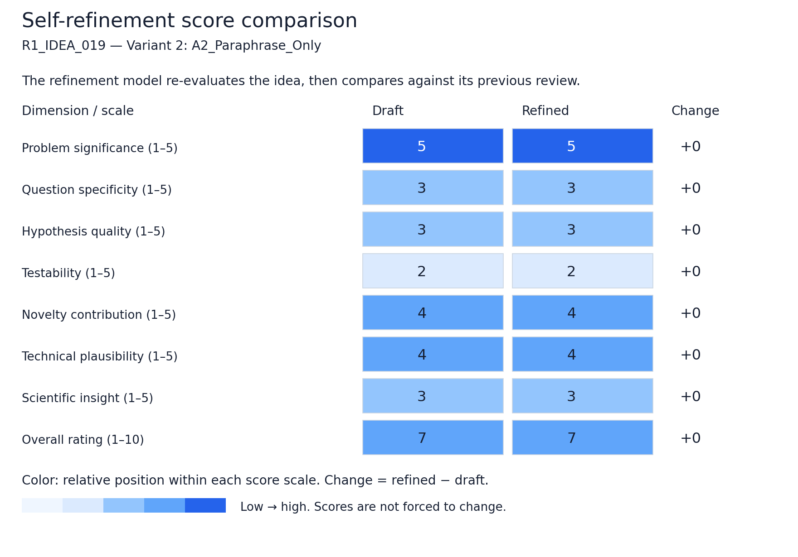

Changed score dimensions: none.

### Score justifications (draft / refined)

**Problem significance**

```json
{
  "draft": {
    "score": 5.0,
    "justification": "Accurate carbon accounting is crucial for climate change mitigation, and dynamic forest height data is essential for understanding carbon sequestration over time."
  },
  "refined": {
    "score": 5.0,
    "justification": "Accurate carbon accounting is crucial for climate change mitigation, and dynamic forest height data is essential for understanding carbon sequestration over time."
  }
}
```

**Question specificity**

```json
{
  "draft": {
    "score": 3.0,
    "justification": "The idea identifies a problem (static tree height maps) and proposes a solution (ECHOSAT), but lacks specific details on the research question or hypothesis being investigated."
  },
  "refined": {
    "score": 3.0,
    "justification": "The idea identifies a problem (static tree height maps) and proposes a solution (ECHOSAT), but lacks specific details on the research question or hypothesis being investigated."
  }
}
```

**Hypothesis quality**

```json
{
  "draft": {
    "score": 3.0,
    "justification": "The idea presents a solution but does not explicitly state a hypothesis or prediction that could be tested, such as how ECHOSAT improves carbon accounting accuracy."
  },
  "refined": {
    "score": 3.0,
    "justification": "The idea presents a solution but does not explicitly state a hypothesis or prediction that could be tested, such as how ECHOSAT improves carbon accounting accuracy."
  }
}
```

**Testability**

```json
{
  "draft": {
    "score": 2.0,
    "justification": "The idea lacks specific experiments or validation methods to demonstrate the effectiveness of ECHOSAT, making it difficult to assess its testability."
  },
  "refined": {
    "score": 2.0,
    "justification": "The idea lacks specific experiments or validation methods to demonstrate the effectiveness of ECHOSAT, making it difficult to assess its testability."
  }
}
```

**Novelty contribution**

```json
{
  "draft": {
    "score": 4.0,
    "justification": "The proposal addresses a significant gap in current tree height mapping by providing a temporally consistent global dataset, which is a novel contribution to environmental monitoring."
  },
  "refined": {
    "score": 4.0,
    "justification": "The proposal addresses a significant gap in current tree height mapping by providing a temporally consistent global dataset, which is a novel contribution to environmental monitoring."
  }
}
```

**Technical plausibility**

```json
{
  "draft": {
    "score": 4.0,
    "justification": "The idea is technically plausible as it builds on existing remote sensing technologies and aims to create a high-resolution global dataset, which is a feasible challenge."
  },
  "refined": {
    "score": 4.0,
    "justification": "The idea is technically plausible as it builds on existing remote sensing technologies and aims to create a high-resolution global dataset, which is a feasible challenge."
  }
}
```

**Scientific insight**

```json
{
  "draft": {
    "score": 3.0,
    "justification": "While the idea has potential to contribute to carbon accounting, it does not clearly indicate what new scientific insights could be gained from the data beyond improved accuracy."
  },
  "refined": {
    "score": 3.0,
    "justification": "While the idea has potential to contribute to carbon accounting, it does not clearly indicate what new scientific insights could be gained from the data beyond improved accuracy."
  }
}
```

**Overall rating**

```json
{
  "draft": {
    "score": 7.0,
    "justification": "The idea addresses an important problem with a promising solution, but lacks specific details on methodology, validation, and potential scientific insights, which are necessary for a strong research proposal."
  },
  "refined": {
    "score": 7.0,
    "justification": "The idea addresses an important problem with a promising solution, but lacks specific details on methodology, validation, and potential scientific insights, which are necessary for a strong research proposal."
  }
}
```

## R1_IDEA_019 — Variant 3: A3_Plain_Core

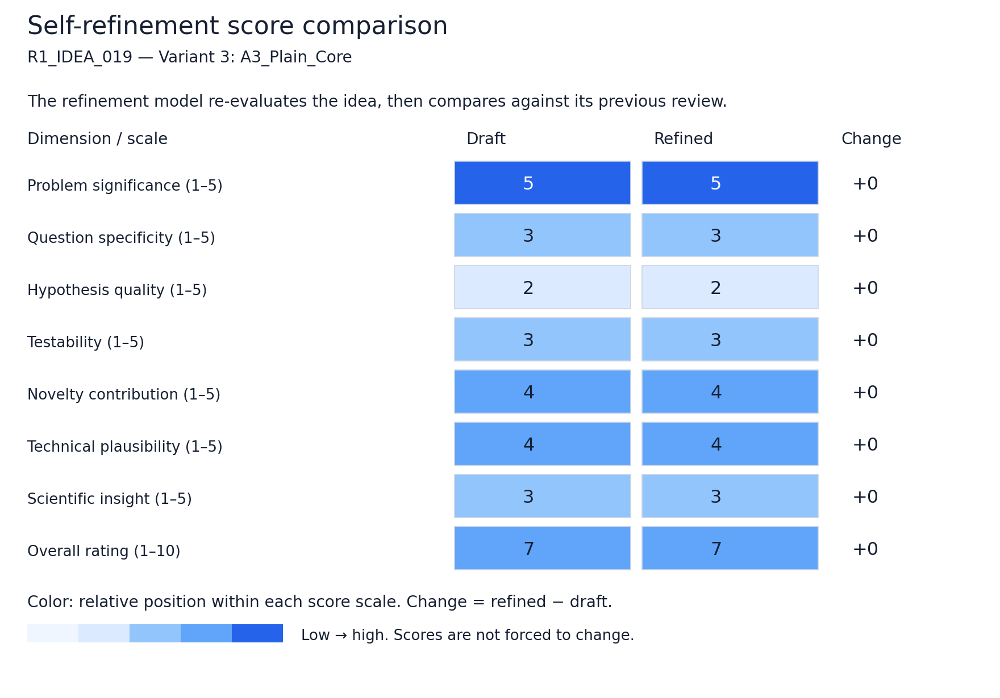

Changed score dimensions: none.

### Score justifications (draft / refined)

**Problem significance**

```json
{
  "draft": {
    "score": 5.0,
    "justification": "The problem of static tree height maps is critical for accurate carbon accounting and climate change mitigation, which are major global challenges."
  },
  "refined": {
    "score": 5.0,
    "justification": "The problem of static tree height maps is critical for accurate carbon accounting and climate change mitigation, which are major global challenges."
  }
}
```

**Question specificity**

```json
{
  "draft": {
    "score": 3.0,
    "justification": "The idea identifies a problem but lacks a specific research question or hypothesis, making it somewhat vague in terms of what exactly is being investigated."
  },
  "refined": {
    "score": 3.0,
    "justification": "The idea identifies a problem but lacks a specific research question or hypothesis, making it somewhat vague in terms of what exactly is being investigated."
  }
}
```

**Hypothesis quality**

```json
{
  "draft": {
    "score": 2.0,
    "justification": "The idea does not explicitly state a hypothesis, though it implies that ECHOSAT will improve temporal consistency. A clear hypothesis would strengthen the research direction."
  },
  "refined": {
    "score": 2.0,
    "justification": "The idea does not explicitly state a hypothesis, though it implies that ECHOSAT will improve temporal consistency. A clear hypothesis would strengthen the research direction."
  }
}
```

**Testability**

```json
{
  "draft": {
    "score": 3.0,
    "justification": "The idea suggests a solution but does not provide specific experiments or evaluation methods to test its effectiveness."
  },
  "refined": {
    "score": 3.0,
    "justification": "The idea suggests a solution but does not provide specific experiments or evaluation methods to test its effectiveness."
  }
}
```

**Novelty contribution**

```json
{
  "draft": {
    "score": 4.0,
    "justification": "The proposal addresses a specific gap in current tree height mapping by introducing a temporally consistent global map, which could contribute significantly to climate science."
  },
  "refined": {
    "score": 4.0,
    "justification": "The proposal addresses a specific gap in current tree height mapping by introducing a temporally consistent global map, which could contribute significantly to climate science."
  }
}
```

**Technical plausibility**

```json
{
  "draft": {
    "score": 4.0,
    "justification": "The idea is technically plausible as combining remote sensing data with temporal analysis is a feasible approach for creating dynamic forest maps."
  },
  "refined": {
    "score": 4.0,
    "justification": "The idea is technically plausible as combining remote sensing data with temporal analysis is a feasible approach for creating dynamic forest maps."
  }
}
```

**Scientific insight**

```json
{
  "draft": {
    "score": 3.0,
    "justification": "While the idea has potential, it does not clearly indicate what scientific insights would be gained from successfully implementing ECHOSAT, such as understanding forest dynamics over time."
  },
  "refined": {
    "score": 3.0,
    "justification": "While the idea has potential, it does not clearly indicate what scientific insights would be gained from successfully implementing ECHOSAT, such as understanding forest dynamics over time."
  }
}
```

**Overall rating**

```json
{
  "draft": {
    "score": 7.0,
    "justification": "The idea addresses a significant problem with clear potential for impact, but lacks specific details on methodology, hypothesis, and evaluation to fully define the research question."
  },
  "refined": {
    "score": 7.0,
    "justification": "The idea addresses a significant problem with clear potential for impact, but lacks specific details on methodology, hypothesis, and evaluation to fully define the research question."
  }
}
```

## R1_IDEA_019 — Variant 4: B1_Verbose_Elaborate

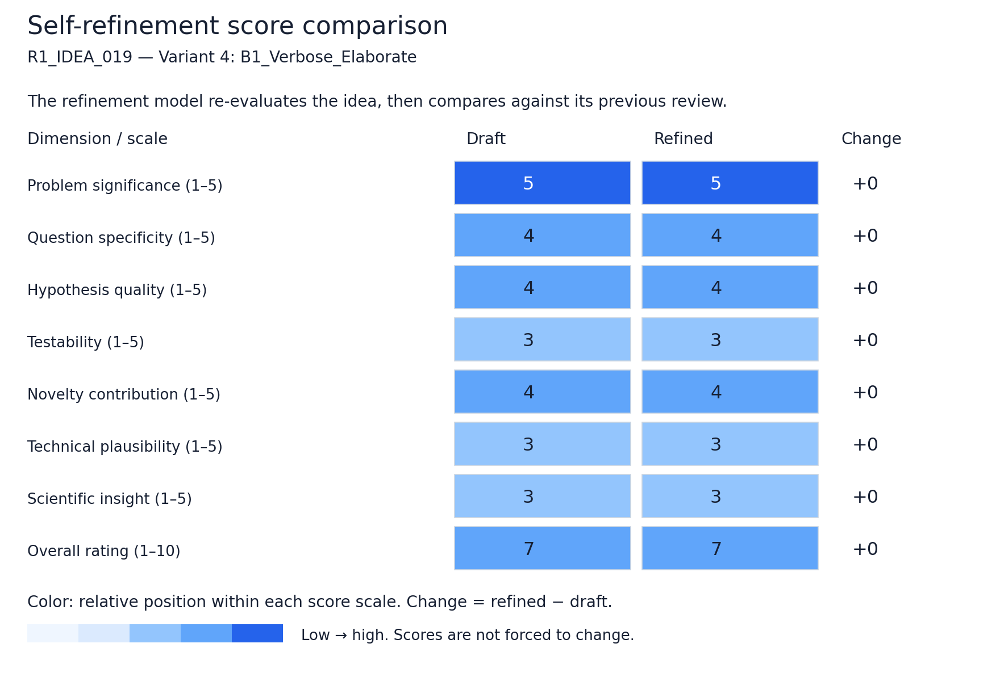

Changed score dimensions: none.

### Score justifications (draft / refined)

**Problem significance**

```json
{
  "draft": {
    "score": 5.0,
    "justification": "The problem of static tree height maps failing to capture temporal forest dynamics is critical for accurate carbon accounting and climate change mitigation, which is a major global challenge."
  },
  "refined": {
    "score": 5.0,
    "justification": "The problem of static tree height maps failing to capture temporal forest dynamics is critical for accurate carbon accounting and climate change mitigation, which is a major global challenge."
  }
}
```

**Question specificity**

```json
{
  "draft": {
    "score": 4.0,
    "justification": "The idea clearly defines the problem (static tree height maps) and proposes a specific solution (ECHOSAT) with a clear goal of providing a global, temporally consistent, high-resolution time-series map. However, the specifics of the solution are not detailed."
  },
  "refined": {
    "score": 4.0,
    "justification": "The idea clearly defines the problem (static tree height maps) and proposes a specific solution (ECHOSAT) with a clear goal of providing a global, temporally consistent, high-resolution time-series map. However, the specifics of the solution are not detailed."
  }
}
```

**Hypothesis quality**

```json
{
  "draft": {
    "score": 4.0,
    "justification": "The idea presents a clear hypothesis that ECHOSAT will provide a more accurate and temporally consistent tree height map, which is essential for carbon accounting. However, the hypothesis is not explicitly stated in a testable form."
  },
  "refined": {
    "score": 4.0,
    "justification": "The idea presents a clear hypothesis that ECHOSAT will provide a more accurate and temporally consistent tree height map, which is essential for carbon accounting. However, the hypothesis is not explicitly stated in a testable form."
  }
}
```

**Testability**

```json
{
  "draft": {
    "score": 3.0,
    "justification": "The idea suggests a solution but does not provide details on how the effectiveness of ECHOSAT will be tested or validated. Without a clear plan for evaluation, the testability of the idea is limited."
  },
  "refined": {
    "score": 3.0,
    "justification": "The idea suggests a solution but does not provide details on how the effectiveness of ECHOSAT will be tested or validated. Without a clear plan for evaluation, the testability of the idea is limited."
  }
}
```

**Novelty contribution**

```json
{
  "draft": {
    "score": 4.0,
    "justification": "The idea proposes a novel approach to address the limitation of static tree height maps by providing a time-series map. This could contribute significantly to the field of forest monitoring and carbon accounting, though the novelty is somewhat generic without more details."
  },
  "refined": {
    "score": 4.0,
    "justification": "The idea proposes a novel approach to address the limitation of static tree height maps by providing a time-series map. This could contribute significantly to the field of forest monitoring and carbon accounting, though the novelty is somewhat generic without more details."
  }
}
```

**Technical plausibility**

```json
{
  "draft": {
    "score": 3.0,
    "justification": "The idea is technically plausible as it addresses a known problem in the field, but the lack of specific technical details makes it difficult to assess the feasibility of the proposed solution."
  },
  "refined": {
    "score": 3.0,
    "justification": "The idea is technically plausible as it addresses a known problem in the field, but the lack of specific technical details makes it difficult to assess the feasibility of the proposed solution."
  }
}
```

**Scientific insight**

```json
{
  "draft": {
    "score": 3.0,
    "justification": "The idea has potential to provide insights into temporal forest dynamics and improve carbon accounting, but the specific scientific insights depend on the details of the methodology and validation plan, which are not provided."
  },
  "refined": {
    "score": 3.0,
    "justification": "The idea has potential to provide insights into temporal forest dynamics and improve carbon accounting, but the specific scientific insights depend on the details of the methodology and validation plan, which are not provided."
  }
}
```

**Overall rating**

```json
{
  "draft": {
    "score": 7.0,
    "justification": "The idea addresses a significant problem in climate change mitigation with a clear and specific goal. However, it lacks detailed technical information and a clear plan for validation, which are necessary for assessing its feasibility and scientific contribution."
  },
  "refined": {
    "score": 7.0,
    "justification": "The idea addresses a significant problem in climate change mitigation with a clear and specific goal. However, it lacks detailed technical information and a clear plan for validation, which are necessary for assessing its feasibility and scientific contribution."
  }
}
```

## R1_IDEA_019 — Variant 5: B2_Grand_Narrative

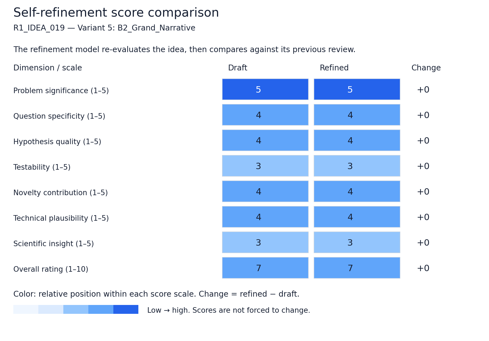

Changed score dimensions: none.

### Score justifications (draft / refined)

**Problem significance**

```json
{
  "draft": {
    "score": 5.0,
    "justification": "The problem of static tree height maps is critical for accurate carbon accounting and climate change mitigation, which are major concerns in environmental science."
  },
  "refined": {
    "score": 5.0,
    "justification": "The problem of static tree height maps is critical for accurate carbon accounting and climate change mitigation, which are major concerns in environmental science."
  }
}
```

**Question specificity**

```json
{
  "draft": {
    "score": 4.0,
    "justification": "The idea clearly defines the problem (static snapshots in tree height maps) and proposes a specific solution (ECHOSAT with temporal consistency and 10m resolution), but lacks details on methodology."
  },
  "refined": {
    "score": 4.0,
    "justification": "The idea clearly defines the problem (static snapshots in tree height maps) and proposes a specific solution (ECHOSAT with temporal consistency and 10m resolution), but lacks details on methodology."
  }
}
```

**Hypothesis quality**

```json
{
  "draft": {
    "score": 4.0,
    "justification": "The idea presents a clear hypothesis that ECHOSAT will provide a temporally consistent tree height map, which could improve forest-climate interactions understanding, but lacks explicit predictions or mechanisms."
  },
  "refined": {
    "score": 4.0,
    "justification": "The idea presents a clear hypothesis that ECHOSAT will provide a temporally consistent tree height map, which could improve forest-climate interactions understanding, but lacks explicit predictions or mechanisms."
  }
}
```

**Testability**

```json
{
  "draft": {
    "score": 3.0,
    "justification": "The idea suggests a solution but does not specify experiments or evaluations to test its effectiveness, such as comparisons with existing maps or validation against ground data."
  },
  "refined": {
    "score": 3.0,
    "justification": "The idea suggests a solution but does not specify experiments or evaluations to test its effectiveness, such as comparisons with existing maps or validation against ground data."
  }
}
```

**Novelty contribution**

```json
{
  "draft": {
    "score": 4.0,
    "justification": "The proposal introduces a new method (ECHOSAT) for global tree height mapping with temporal consistency, which could contribute to climate change mitigation and ecosystem monitoring, though the novelty is somewhat generic."
  },
  "refined": {
    "score": 4.0,
    "justification": "The proposal introduces a new method (ECHOSAT) for global tree height mapping with temporal consistency, which could contribute to climate change mitigation and ecosystem monitoring, though the novelty is somewhat generic."
  }
}
```

**Technical plausibility**

```json
{
  "draft": {
    "score": 4.0,
    "justification": "The idea is technically plausible as it builds on existing remote sensing technologies, but the specifics of the methodology are not detailed, which could affect feasibility."
  },
  "refined": {
    "score": 4.0,
    "justification": "The idea is technically plausible as it builds on existing remote sensing technologies, but the specifics of the methodology are not detailed, which could affect feasibility."
  }
}
```

**Scientific insight**

```json
{
  "draft": {
    "score": 3.0,
    "justification": "The idea has potential to provide insights into forest dynamics and climate interactions, but the specific mechanisms or outcomes of these insights are not clearly defined."
  },
  "refined": {
    "score": 3.0,
    "justification": "The idea has potential to provide insights into forest dynamics and climate interactions, but the specific mechanisms or outcomes of these insights are not clearly defined."
  }
}
```

**Overall rating**

```json
{
  "draft": {
    "score": 7.0,
    "justification": "The idea addresses a significant problem in environmental science with a clear solution, but lacks technical details and specific testable hypotheses, which are needed for further development."
  },
  "refined": {
    "score": 7.0,
    "justification": "The idea addresses a significant problem in environmental science with a clear solution, but lacks technical details and specific testable hypotheses, which are needed for further development."
  }
}
```

## R1_IDEA_019 — Variant 6: B3_Over_Confident


Changed score dimensions: none.

### Score justifications (draft / refined)

**Problem significance**

```json
{
  "draft": {
    "score": 5.0,
    "justification": "The problem of accurate carbon accounting through dynamic forest monitoring is highly significant for climate change mitigation, making the research problem critical and relevant."
  },
  "refined": {
    "score": 5.0,
    "justification": "The problem of accurate carbon accounting through dynamic forest monitoring is highly significant for climate change mitigation, making the research problem critical and relevant."
  }
}
```

**Question specificity**

```json
{
  "draft": {
    "score": 3.0,
    "justification": "The idea identifies a specific problem (temporal inconsistency in tree height maps) but lacks detailed specification of the research question or hypothesis, such as how ECHOSAT will be developed or validated."
  },
  "refined": {
    "score": 3.0,
    "justification": "The idea identifies a specific problem (temporal inconsistency in tree height maps) but lacks detailed specification of the research question or hypothesis, such as how ECHOSAT will be developed or validated."
  }
}
```

**Hypothesis quality**

```json
{
  "draft": {
    "score": 3.0,
    "justification": "The idea presents a general goal (improving carbon accounting with dynamic maps) but does not explicitly state a testable hypothesis, such as how ECHOSAT will outperform existing methods in capturing temporal changes."
  },
  "refined": {
    "score": 3.0,
    "justification": "The idea presents a general goal (improving carbon accounting with dynamic maps) but does not explicitly state a testable hypothesis, such as how ECHOSAT will outperform existing methods in capturing temporal changes."
  }
}
```

**Testability**

```json
{
  "draft": {
    "score": 2.0,
    "justification": "The idea lacks specific experimental plans or evaluation metrics to test the effectiveness of ECHOSAT, making it difficult to assess the validity of the proposed solution."
  },
  "refined": {
    "score": 2.0,
    "justification": "The idea lacks specific experimental plans or evaluation metrics to test the effectiveness of ECHOSAT, making it difficult to assess the validity of the proposed solution."
  }
}
```

**Novelty contribution**

```json
{
  "draft": {
    "score": 4.0,
    "justification": "The proposal introduces a new approach to create a temporally consistent global tree height map, which could contribute to more accurate carbon accounting, though the novelty is somewhat limited without more details on the methodology."
  },
  "refined": {
    "score": 4.0,
    "justification": "The proposal introduces a new approach to create a temporally consistent global tree height map, which could contribute to more accurate carbon accounting, though the novelty is somewhat limited without more details on the methodology."
  }
}
```

**Technical plausibility**

```json
{
  "draft": {
    "score": 4.0,
    "justification": "The technical approach is plausible given the context of remote sensing and global mapping, but the specific methods for achieving temporal consistency are not detailed, which could affect the feasibility of the proposal."
  },
  "refined": {
    "score": 4.0,
    "justification": "The technical approach is plausible given the context of remote sensing and global mapping, but the specific methods for achieving temporal consistency are not detailed, which could affect the feasibility of the proposal."
  }
}
```

**Scientific insight**

```json
{
  "draft": {
    "score": 3.0,
    "justification": "The idea has potential to provide insights into dynamic forest changes, but the lack of specific hypotheses or evaluation plans limits the potential for meaningful scientific contributions."
  },
  "refined": {
    "score": 3.0,
    "justification": "The idea has potential to provide insights into dynamic forest changes, but the lack of specific hypotheses or evaluation plans limits the potential for meaningful scientific contributions."
  }
}
```

**Overall rating**

```json
{
  "draft": {
    "score": 7.0,
    "justification": "The idea addresses a significant problem in climate change mitigation with a clear goal, but lacks specific details on methodology, hypothesis, and evaluation, which are necessary for assessing its scientific merit and potential impact."
  },
  "refined": {
    "score": 7.0,
    "justification": "The idea addresses a significant problem in climate change mitigation with a clear goal, but lacks specific details on methodology, hypothesis, and evaluation, which are necessary for assessing its scientific merit and potential impact."
  }
}
```

## R1_IDEA_019 — Variant 7: B4_Novelty


Changed score dimensions: none.

### Score justifications (draft / refined)

**Problem significance**

```json
{
  "draft": {
    "score": 4.0,
    "justification": "The problem of accurate temporal forest dynamics is crucial for climate change mitigation and carbon accounting, which are significant challenges in environmental science."
  },
  "refined": {
    "score": 4.0,
    "justification": "The problem of accurate temporal forest dynamics is crucial for climate change mitigation and carbon accounting, which are significant challenges in environmental science."
  }
}
```

**Question specificity**

```json
{
  "draft": {
    "score": 3.0,
    "justification": "The idea identifies a problem but lacks a clear, specific research question or hypothesis about what ECHOSAT aims to achieve or how it improves upon existing methods."
  },
  "refined": {
    "score": 3.0,
    "justification": "The idea identifies a problem but lacks a clear, specific research question or hypothesis about what ECHOSAT aims to achieve or how it improves upon existing methods."
  }
}
```

**Hypothesis quality**

```json
{
  "draft": {
    "score": 3.0,
    "justification": "The idea suggests a novel approach but does not explicitly state a hypothesis or prediction that could be tested, such as how ECHOSAT improves temporal consistency or its impact on carbon accounting."
  },
  "refined": {
    "score": 3.0,
    "justification": "The idea suggests a novel approach but does not explicitly state a hypothesis or prediction that could be tested, such as how ECHOSAT improves temporal consistency or its impact on carbon accounting."
  }
}
```

**Testability**

```json
{
  "draft": {
    "score": 3.0,
    "justification": "The idea proposes a solution but does not provide details on how the effectiveness of ECHOSAT will be evaluated, such as through comparison with existing maps or validation against ground data."
  },
  "refined": {
    "score": 3.0,
    "justification": "The idea proposes a solution but does not provide details on how the effectiveness of ECHOSAT will be evaluated, such as through comparison with existing maps or validation against ground data."
  }
}
```

**Novelty contribution**

```json
{
  "draft": {
    "score": 4.0,
    "justification": "The proposal introduces a novel approach to capturing temporal dynamics in tree height maps, which could contribute to more accurate carbon accounting and climate modeling."
  },
  "refined": {
    "score": 4.0,
    "justification": "The proposal introduces a novel approach to capturing temporal dynamics in tree height maps, which could contribute to more accurate carbon accounting and climate modeling."
  }
}
```

**Technical plausibility**

```json
{
  "draft": {
    "score": 4.0,
    "justification": "The idea is technically plausible as it builds on existing methods for tree height mapping and aims to extend them with temporal consistency, which is a reasonable challenge in remote sensing."
  },
  "refined": {
    "score": 4.0,
    "justification": "The idea is technically plausible as it builds on existing methods for tree height mapping and aims to extend them with temporal consistency, which is a reasonable challenge in remote sensing."
  }
}
```

**Scientific insight**

```json
{
  "draft": {
    "score": 3.0,
    "justification": "The idea has potential for scientific insight into temporal forest dynamics, but the specific mechanisms or insights are not clearly defined in the current summary."
  },
  "refined": {
    "score": 3.0,
    "justification": "The idea has potential for scientific insight into temporal forest dynamics, but the specific mechanisms or insights are not clearly defined in the current summary."
  }
}
```

**Overall rating**

```json
{
  "draft": {
    "score": 7.0,
    "justification": "The idea addresses a significant problem in climate change mitigation with a novel approach, but it lacks specific details on the research question, hypothesis, and evaluation methods, which are necessary for assessing its scientific merit and feasibility."
  },
  "refined": {
    "score": 7.0,
    "justification": "The idea addresses a significant problem in climate change mitigation with a novel approach, but it lacks specific details on the research question, hypothesis, and evaluation methods, which are necessary for assessing its scientific merit and feasibility."
  }
}
```

## R1_IDEA_019 — Variant 8: B5_Application_Impact


Changed score dimensions: none.

### Score justifications (draft / refined)

**Problem significance**

```json
{
  "draft": {
    "score": 5.0,
    "justification": "The problem of static tree height maps limiting carbon accounting is critical for climate change mitigation, with significant implications for environmental policy and carbon monitoring systems."
  },
  "refined": {
    "score": 5.0,
    "justification": "The problem of static tree height maps limiting carbon accounting is critical for climate change mitigation, with significant implications for environmental policy and carbon monitoring systems."
  }
}
```

**Question specificity**

```json
{
  "draft": {
    "score": 4.0,
    "justification": "The idea clearly defines the problem (static maps lacking temporal dynamics) and proposes a specific solution (ECHOSAT with temporal consistency and 10m resolution), but lacks details on the technical implementation."
  },
  "refined": {
    "score": 4.0,
    "justification": "The idea clearly defines the problem (static maps lacking temporal dynamics) and proposes a specific solution (ECHOSAT with temporal consistency and 10m resolution), but lacks details on the technical implementation."
  }
}
```

**Hypothesis quality**

```json
{
  "draft": {
    "score": 4.0,
    "justification": "The idea implies that ECHOSAT will improve carbon accounting by providing temporally consistent data, but the hypothesis is not explicitly stated or detailed."
  },
  "refined": {
    "score": 4.0,
    "justification": "The idea implies that ECHOSAT will improve carbon accounting by providing temporally consistent data, but the hypothesis is not explicitly stated or detailed."
  }
}
```

**Testability**

```json
{
  "draft": {
    "score": 3.0,
    "justification": "The idea suggests a potential solution but does not specify experiments, validation methods, or comparisons with existing approaches, making it difficult to assess testability without further details."
  },
  "refined": {
    "score": 3.0,
    "justification": "The idea suggests a potential solution but does not specify experiments, validation methods, or comparisons with existing approaches, making it difficult to assess testability without further details."
  }
}
```

**Novelty contribution**

```json
{
  "draft": {
    "score": 4.0,
    "justification": "The proposal addresses a specific gap in existing tree height maps and could contribute to more accurate carbon accounting, though the novelty depends on the technical approach and validation results."
  },
  "refined": {
    "score": 4.0,
    "justification": "The proposal addresses a specific gap in existing tree height maps and could contribute to more accurate carbon accounting, though the novelty depends on the technical approach and validation results."
  }
}
```

**Technical plausibility**

```json
{
  "draft": {
    "score": 4.0,
    "justification": "The idea is technically plausible as it builds on existing remote sensing technologies, but the specific methods for achieving temporal consistency and data resolution are not detailed."
  },
  "refined": {
    "score": 4.0,
    "justification": "The idea is technically plausible as it builds on existing remote sensing technologies, but the specific methods for achieving temporal consistency and data resolution are not detailed."
  }
}
```

**Scientific insight**

```json
{
  "draft": {
    "score": 3.0,
    "justification": "The idea has potential to provide insights into temporal forest dynamics, but the scientific insight would depend on the validation and comparison with existing methods, which are not specified."
  },
  "refined": {
    "score": 3.0,
    "justification": "The idea has potential to provide insights into temporal forest dynamics, but the scientific insight would depend on the validation and comparison with existing methods, which are not specified."
  }
}
```

**Overall rating**

```json
{
  "draft": {
    "score": 7.0,
    "justification": "The idea addresses a significant problem in climate change mitigation with a clear and specific solution. However, it lacks technical details and validation strategies, which are necessary for assessing its feasibility and impact."
  },
  "refined": {
    "score": 7.0,
    "justification": "The idea addresses a significant problem in climate change mitigation with a clear and specific solution. However, it lacks technical details and validation strategies, which are necessary for assessing its feasibility and impact."
  }
}
```

## R1_IDEA_019 — Variant 9: C1_Hollow_Shell

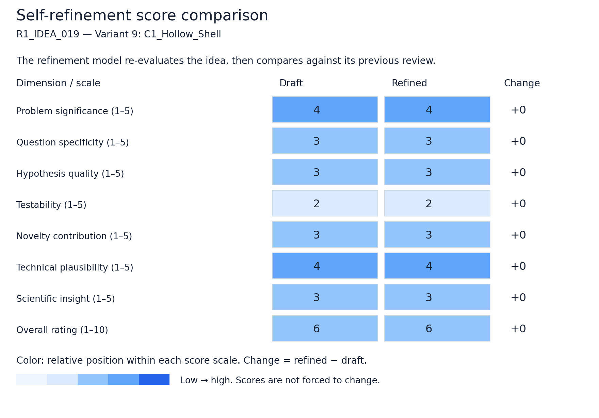

Changed score dimensions: none.

### Score justifications (draft / refined)

**Problem significance**

```json
{
  "draft": {
    "score": 4.0,
    "justification": "The problem of accurate and consistent forest monitoring is crucial for climate change mitigation, making the research relevant and significant."
  },
  "refined": {
    "score": 4.0,
    "justification": "The problem of accurate and consistent forest monitoring is crucial for climate change mitigation, making the research relevant and significant."
  }
}
```

**Question specificity**

```json
{
  "draft": {
    "score": 3.0,
    "justification": "The idea identifies a key challenge in current tree height mapping but lacks specific details on the research question or the exact problem being addressed."
  },
  "refined": {
    "score": 3.0,
    "justification": "The idea identifies a key challenge in current tree height mapping but lacks specific details on the research question or the exact problem being addressed."
  }
}
```

**Hypothesis quality**

```json
{
  "draft": {
    "score": 3.0,
    "justification": "The idea presents a general goal but does not explicitly state a hypothesis or prediction that can be tested or falsified."
  },
  "refined": {
    "score": 3.0,
    "justification": "The idea presents a general goal but does not explicitly state a hypothesis or prediction that can be tested or falsified."
  }
}
```

**Testability**

```json
{
  "draft": {
    "score": 2.0,
    "justification": "The idea is too vague to determine how it can be tested or evaluated without more specific details on the methodology or experimental design."
  },
  "refined": {
    "score": 2.0,
    "justification": "The idea is too vague to determine how it can be tested or evaluated without more specific details on the methodology or experimental design."
  }
}
```

**Novelty contribution**

```json
{
  "draft": {
    "score": 3.0,
    "justification": "The idea proposes a new approach to tree height mapping, which could contribute to more accurate global forest monitoring, but the novelty is not clearly defined."
  },
  "refined": {
    "score": 3.0,
    "justification": "The idea proposes a new approach to tree height mapping, which could contribute to more accurate global forest monitoring, but the novelty is not clearly defined."
  }
}
```

**Technical plausibility**

```json
{
  "draft": {
    "score": 4.0,
    "justification": "The proposed approach is technically plausible as it involves improving existing methods for tree height mapping, which is a well-established area of research."
  },
  "refined": {
    "score": 4.0,
    "justification": "The proposed approach is technically plausible as it involves improving existing methods for tree height mapping, which is a well-established area of research."
  }
}
```

**Scientific insight**

```json
{
  "draft": {
    "score": 3.0,
    "justification": "The idea has potential to provide insights into the effectiveness of temporal data integration in forest monitoring, but the specific insights are not clearly outlined."
  },
  "refined": {
    "score": 3.0,
    "justification": "The idea has potential to provide insights into the effectiveness of temporal data integration in forest monitoring, but the specific insights are not clearly outlined."
  }
}
```

**Overall rating**

```json
{
  "draft": {
    "score": 6.0,
    "justification": "The idea addresses a significant problem in climate change mitigation but lacks specific details on the research question, methodology, and hypothesis, which are necessary for further development."
  },
  "refined": {
    "score": 6.0,
    "justification": "The idea addresses a significant problem in climate change mitigation but lacks specific details on the research question, methodology, and hypothesis, which are necessary for further development."
  }
}
```

## R1_IDEA_019 — Variant 10: C2_Logic_Flawed


Changed score dimensions: none.

### Score justifications (draft / refined)

**Problem significance**

```json
{
  "draft": {
    "score": 4.0,
    "justification": "The problem of static tree height maps impacting carbon accounting is significant for climate change mitigation, which is a major global challenge."
  },
  "refined": {
    "score": 4.0,
    "justification": "The problem of static tree height maps impacting carbon accounting is significant for climate change mitigation, which is a major global challenge."
  }
}
```

**Question specificity**

```json
{
  "draft": {
    "score": 3.0,
    "justification": "The idea defines a specific problem (static maps lacking temporal dynamics) and proposes a specific solution (ECHOSAT with temporal consistency), but lacks details on the technical implementation."
  },
  "refined": {
    "score": 3.0,
    "justification": "The idea defines a specific problem (static maps lacking temporal dynamics) and proposes a specific solution (ECHOSAT with temporal consistency), but lacks details on the technical implementation."
  }
}
```

**Hypothesis quality**

```json
{
  "draft": {
    "score": 3.0,
    "justification": "The idea suggests that ECHOSAT will be more effective than existing methods, but does not explicitly state a testable hypothesis or prediction about its performance or validation."
  },
  "refined": {
    "score": 3.0,
    "justification": "The idea suggests that ECHOSAT will be more effective than existing methods, but does not explicitly state a testable hypothesis or prediction about its performance or validation."
  }
}
```

**Testability**

```json
{
  "draft": {
    "score": 2.0,
    "justification": "The idea lacks specific experiments or validation methods to test the effectiveness of ECHOSAT, making it difficult to assess the claim of broader effectiveness."
  },
  "refined": {
    "score": 2.0,
    "justification": "The idea lacks specific experiments or validation methods to test the effectiveness of ECHOSAT, making it difficult to assess the claim of broader effectiveness."
  }
}
```

**Novelty contribution**

```json
{
  "draft": {
    "score": 3.0,
    "justification": "The idea proposes a new method (ECHOSAT) for global tree height mapping with temporal consistency, which could contribute to environmental monitoring, but the novelty is somewhat generic without specific technical details."
  },
  "refined": {
    "score": 3.0,
    "justification": "The idea proposes a new method (ECHOSAT) for global tree height mapping with temporal consistency, which could contribute to environmental monitoring, but the novelty is somewhat generic without specific technical details."
  }
}
```

**Technical plausibility**

```json
{
  "draft": {
    "score": 3.0,
    "justification": "The proposed solution is technically plausible given the context of satellite-based environmental monitoring, but the lack of specific technical details makes it difficult to assess feasibility."
  },
  "refined": {
    "score": 3.0,
    "justification": "The proposed solution is technically plausible given the context of satellite-based environmental monitoring, but the lack of specific technical details makes it difficult to assess feasibility."
  }
}
```

**Scientific insight**

```json
{
  "draft": {
    "score": 2.0,
    "justification": "The idea addresses a practical problem but does not clearly suggest new scientific insights or mechanisms that would be revealed through the research."
  },
  "refined": {
    "score": 2.0,
    "justification": "The idea addresses a practical problem but does not clearly suggest new scientific insights or mechanisms that would be revealed through the research."
  }
}
```

**Overall rating**

```json
{
  "draft": {
    "score": 6.0,
    "justification": "The idea addresses a meaningful problem with a clear solution, but lacks specific technical details and testable hypotheses, limiting its potential for scientific contribution."
  },
  "refined": {
    "score": 6.0,
    "justification": "The idea addresses a meaningful problem with a clear solution, but lacks specific technical details and testable hypotheses, limiting its potential for scientific contribution."
  }
}
```

## R1_IDEA_019 — Variant 11: C3_Substance_Enriched


Changed score dimensions: none.

### Score justifications (draft / refined)

**Problem significance**

```json
{
  "draft": {
    "score": 4.0,
    "justification": "The problem of accurate forest monitoring for climate change mitigation is highly significant, as tree height data is crucial for carbon accounting. The proposed solution addresses a critical gap in existing static maps."
  },
  "refined": {
    "score": 4.0,
    "justification": "The problem of accurate forest monitoring for climate change mitigation is highly significant, as tree height data is crucial for carbon accounting. The proposed solution addresses a critical gap in existing static maps."
  }
}
```

**Question specificity**

```json
{
  "draft": {
    "score": 3.0,
    "justification": "The idea proposes a concrete solution but lacks specific details on the research question or hypothesis to be tested in future work. The general direction is clear, but the exact question remains vague."
  },
  "refined": {
    "score": 3.0,
    "justification": "The idea proposes a concrete solution but lacks specific details on the research question or hypothesis to be tested in future work. The general direction is clear, but the exact question remains vague."
  }
}
```

**Hypothesis quality**

```json
{
  "draft": {
    "score": 2.0,
    "justification": "The idea mentions future work testing hypotheses about seasonal patterns and disturbances, but does not explicitly state what those hypotheses are. The hypothesis is not clearly defined or concrete."
  },
  "refined": {
    "score": 2.0,
    "justification": "The idea mentions future work testing hypotheses about seasonal patterns and disturbances, but does not explicitly state what those hypotheses are. The hypothesis is not clearly defined or concrete."
  }
}
```

**Testability**

```json
{
  "draft": {
    "score": 3.0,
    "justification": "The idea suggests cross-comparison with ground-based lidar as a validation method, which is testable. However, the specific experiments or evaluations needed to test the hypotheses are not clearly outlined."
  },
  "refined": {
    "score": 3.0,
    "justification": "The idea suggests cross-comparison with ground-based lidar as a validation method, which is testable. However, the specific experiments or evaluations needed to test the hypotheses are not clearly outlined."
  }
}
```

**Novelty contribution**

```json
{
  "draft": {
    "score": 4.0,
    "justification": "The proposal to create a temporally consistent global tree height map is novel and has the potential to contribute significantly to climate change mitigation efforts. The cross-comparison with ground-based lidar adds scientific value."
  },
  "refined": {
    "score": 4.0,
    "justification": "The proposal to create a temporally consistent global tree height map is novel and has the potential to contribute significantly to climate change mitigation efforts. The cross-comparison with ground-based lidar adds scientific value."
  }
}
```

**Technical plausibility**

```json
{
  "draft": {
    "score": 4.0,
    "justification": "The idea is technically plausible. Creating a global tree height map with temporal consistency is a feasible challenge, and cross-comparison with ground-based lidar is a reasonable validation approach."
  },
  "refined": {
    "score": 4.0,
    "justification": "The idea is technically plausible. Creating a global tree height map with temporal consistency is a feasible challenge, and cross-comparison with ground-based lidar is a reasonable validation approach."
  }
}
```

**Scientific insight**

```json
{
  "draft": {
    "score": 3.0,
    "justification": "The idea has potential for scientific insight, particularly in understanding how seasonal patterns and disturbances affect height estimates. However, the specific insights are not clearly defined in the current summary."
  },
  "refined": {
    "score": 3.0,
    "justification": "The idea has potential for scientific insight, particularly in understanding how seasonal patterns and disturbances affect height estimates. However, the specific insights are not clearly defined in the current summary."
  }
}
```

**Overall rating**

```json
{
  "draft": {
    "score": 7.0,
    "justification": "The idea addresses a significant problem with a concrete solution and suggests future work with potential for scientific contribution. However, it lacks specific details on the research question, methodology, and hypotheses, which are needed for a strong research idea."
  },
  "refined": {
    "score": 7.0,
    "justification": "The idea addresses a significant problem with a concrete solution and suggests future work with potential for scientific contribution. However, it lacks specific details on the research question, methodology, and hypotheses, which are needed for a strong research idea."
  }
}
```

## R1_IDEA_019 — Variant 12: H1_Deceptive_Hollow


Changed score dimensions: none.

### Score justifications (draft / refined)

**Problem significance**

```json
{
  "draft": {
    "score": 4.0,
    "justification": "The problem of accurate and consistent forest monitoring is critical for climate change mitigation, making the research relevant and significant."
  },
  "refined": {
    "score": 4.0,
    "justification": "The problem of accurate and consistent forest monitoring is critical for climate change mitigation, making the research relevant and significant."
  }
}
```

**Question specificity**

```json
{
  "draft": {
    "score": 3.0,
    "justification": "The idea is focused on improving tree height mapping with global, fine-resolution, time-series data, but the exact research question or hypothesis is not clearly defined."
  },
  "refined": {
    "score": 3.0,
    "justification": "The idea is focused on improving tree height mapping with global, fine-resolution, time-series data, but the exact research question or hypothesis is not clearly defined."
  }
}
```

**Hypothesis quality**

```json
{
  "draft": {
    "score": 3.0,
    "justification": "The idea presents a broad vision but lacks a specific hypothesis or prediction that can be tested or falsified."
  },
  "refined": {
    "score": 3.0,
    "justification": "The idea presents a broad vision but lacks a specific hypothesis or prediction that can be tested or falsified."
  }
}
```

**Testability**

```json
{
  "draft": {
    "score": 2.0,
    "justification": "The idea is too vague to determine how it will be tested or evaluated without more specific details on the method and metrics."
  },
  "refined": {
    "score": 2.0,
    "justification": "The idea is too vague to determine how it will be tested or evaluated without more specific details on the method and metrics."
  }
}
```

**Novelty contribution**

```json
{
  "draft": {
    "score": 4.0,
    "justification": "The idea proposes a transformative synthesis that could have significant contributions to the field, though the novelty is more conceptual than technical."
  },
  "refined": {
    "score": 4.0,
    "justification": "The idea proposes a transformative synthesis that could have significant contributions to the field, though the novelty is more conceptual than technical."
  }
}
```

**Technical plausibility**

```json
{
  "draft": {
    "score": 3.0,
    "justification": "The idea is plausible in terms of the problem and potential impact, but the technical approach and implementation details are not specified."
  },
  "refined": {
    "score": 3.0,
    "justification": "The idea is plausible in terms of the problem and potential impact, but the technical approach and implementation details are not specified."
  }
}
```

**Scientific insight**

```json
{
  "draft": {
    "score": 3.0,
    "justification": "The idea has potential for scientific insight through the integration of different aspects, but the specific insights are not clearly outlined."
  },
  "refined": {
    "score": 3.0,
    "justification": "The idea has potential for scientific insight through the integration of different aspects, but the specific insights are not clearly outlined."
  }
}
```

**Overall rating**

```json
{
  "draft": {
    "score": 7.0,
    "justification": "The idea addresses a significant problem with potential for transformative impact, but lacks specific details on the method, hypothesis, and evaluation metrics, which are necessary for testability and scientific contribution."
  },
  "refined": {
    "score": 7.0,
    "justification": "The idea addresses a significant problem with potential for transformative impact, but lacks specific details on the method, hypothesis, and evaluation metrics, which are necessary for testability and scientific contribution."
  }
}
```

## R1_IDEA_019 — Variant 13: H2_Confident_Flaw

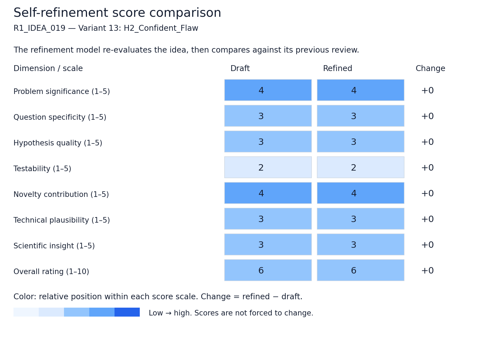

Changed score dimensions: none.

### Score justifications (draft / refined)

**Problem significance**

```json
{
  "draft": {
    "score": 4.0,
    "justification": "The problem of accurate forest monitoring for climate change mitigation is highly significant, as it directly impacts carbon accounting and environmental policy."
  },
  "refined": {
    "score": 4.0,
    "justification": "The problem of accurate forest monitoring for climate change mitigation is highly significant, as it directly impacts carbon accounting and environmental policy."
  }
}
```

**Question specificity**

```json
{
  "draft": {
    "score": 3.0,
    "justification": "The idea identifies a specific problem (static tree height maps) and proposes a solution (ECHOSAT), but the question is somewhat vague in terms of the exact mechanism or causal relationship being tested."
  },
  "refined": {
    "score": 3.0,
    "justification": "The idea identifies a specific problem (static tree height maps) and proposes a solution (ECHOSAT), but the question is somewhat vague in terms of the exact mechanism or causal relationship being tested."
  }
}
```

**Hypothesis quality**

```json
{
  "draft": {
    "score": 3.0,
    "justification": "The idea suggests that solving the identified limitation will lead to reliable improvements, but the hypothesis is not explicitly stated or detailed enough to be tested in a specific way."
  },
  "refined": {
    "score": 3.0,
    "justification": "The idea suggests that solving the identified limitation will lead to reliable improvements, but the hypothesis is not explicitly stated or detailed enough to be tested in a specific way."
  }
}
```

**Testability**

```json
{
  "draft": {
    "score": 2.0,
    "justification": "The idea lacks specific experimental details or comparisons that would allow for meaningful testing of the hypothesis. The claim about causal evidence is not supported by any proposed experiments or evaluations."
  },
  "refined": {
    "score": 2.0,
    "justification": "The idea lacks specific experimental details or comparisons that would allow for meaningful testing of the hypothesis. The claim about causal evidence is not supported by any proposed experiments or evaluations."
  }
}
```

**Novelty contribution**

```json
{
  "draft": {
    "score": 4.0,
    "justification": "The proposal addresses a specific limitation in existing tree height mapping methods and suggests a novel approach (ECHOSAT) that could have broader applications in environmental monitoring."
  },
  "refined": {
    "score": 4.0,
    "justification": "The proposal addresses a specific limitation in existing tree height mapping methods and suggests a novel approach (ECHOSAT) that could have broader applications in environmental monitoring."
  }
}
```

**Technical plausibility**

```json
{
  "draft": {
    "score": 3.0,
    "justification": "The idea is technically plausible, as temporal consistency in tree height mapping is a challenging but achievable goal. However, the lack of technical details makes it difficult to assess the feasibility of the proposed approach."
  },
  "refined": {
    "score": 3.0,
    "justification": "The idea is technically plausible, as temporal consistency in tree height mapping is a challenging but achievable goal. However, the lack of technical details makes it difficult to assess the feasibility of the proposed approach."
  }
}
```

**Scientific insight**

```json
{
  "draft": {
    "score": 3.0,
    "justification": "The idea suggests that solving the identified problem will lead to general improvements, but the potential for new scientific insights is limited without further clarification of the causal relationships and mechanisms involved."
  },
  "refined": {
    "score": 3.0,
    "justification": "The idea suggests that solving the identified problem will lead to general improvements, but the potential for new scientific insights is limited without further clarification of the causal relationships and mechanisms involved."
  }
}
```

**Overall rating**

```json
{
  "draft": {
    "score": 6.0,
    "justification": "The idea addresses a significant problem in climate change mitigation and proposes a novel solution. However, it lacks specific technical details and experimental validation, which are necessary for assessing its testability and scientific contribution."
  },
  "refined": {
    "score": 6.0,
    "justification": "The idea addresses a significant problem in climate change mitigation and proposes a novel solution. However, it lacks specific technical details and experimental validation, which are necessary for assessing its testability and scientific contribution."
  }
}
```

## R1_IDEA_019 — Variant 14: H3_Verbose_Enriched

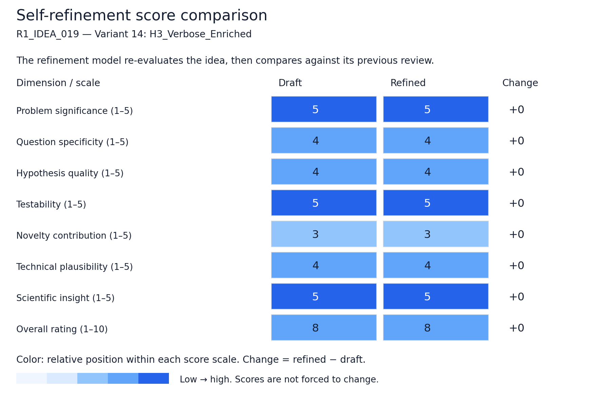

Changed score dimensions: none.

### Score justifications (draft / refined)

**Problem significance**

```json
{
  "draft": {
    "score": 5.0,
    "justification": "The problem of accurate tree height mapping for carbon accounting is critical for climate change mitigation, and the proposed solution addresses a significant gap in existing methods."
  },
  "refined": {
    "score": 5.0,
    "justification": "The problem of accurate tree height mapping for carbon accounting is critical for climate change mitigation, and the proposed solution addresses a significant gap in existing methods."
  }
}
```

**Question specificity**

```json
{
  "draft": {
    "score": 4.0,
    "justification": "The idea clearly defines the problem and proposes a specific approach (ECHOSAT) with a structured validation plan, but the technical details of the method are not fully specified."
  },
  "refined": {
    "score": 4.0,
    "justification": "The idea clearly defines the problem and proposes a specific approach (ECHOSAT) with a structured validation plan, but the technical details of the method are not fully specified."
  }
}
```

**Hypothesis quality**

```json
{
  "draft": {
    "score": 4.0,
    "justification": "The idea includes a clear hypothesis about the method's ability to capture temporal dynamics and includes a staged design to test it, but the connection to specific hypotheses about seasonal patterns is not fully articulated."
  },
  "refined": {
    "score": 4.0,
    "justification": "The idea includes a clear hypothesis about the method's ability to capture temporal dynamics and includes a staged design to test it, but the connection to specific hypotheses about seasonal patterns is not fully articulated."
  }
}
```

**Testability**

```json
{
  "draft": {
    "score": 5.0,
    "justification": "The proposed staged design includes multiple testable components (ablations, sensitivity analyses, error analysis), making the hypothesis clearly testable through structured validation."
  },
  "refined": {
    "score": 5.0,
    "justification": "The proposed staged design includes multiple testable components (ablations, sensitivity analyses, error analysis), making the hypothesis clearly testable through structured validation."
  }
}
```

**Novelty contribution**

```json
{
  "draft": {
    "score": 3.0,
    "justification": "The idea focuses on improving existing tree height maps rather than introducing a fundamentally new method, though the validation framework is novel and scientifically valuable."
  },
  "refined": {
    "score": 3.0,
    "justification": "The idea focuses on improving existing tree height maps rather than introducing a fundamentally new method, though the validation framework is novel and scientifically valuable."
  }
}
```

**Technical plausibility**

```json
{
  "draft": {
    "score": 4.0,
    "justification": "The approach of using lidar transects for validation is technically plausible, and the staged design is feasible, though the exact technical implementation of ECHOSAT is not detailed."
  },
  "refined": {
    "score": 4.0,
    "justification": "The approach of using lidar transects for validation is technically plausible, and the staged design is feasible, though the exact technical implementation of ECHOSAT is not detailed."
  }
}
```

**Scientific insight**

```json
{
  "draft": {
    "score": 5.0,
    "justification": "The emphasis on understanding the assumptions, constraints, and robustness of the method provides significant scientific insight into the limitations and applicability of the approach."
  },
  "refined": {
    "score": 5.0,
    "justification": "The emphasis on understanding the assumptions, constraints, and robustness of the method provides significant scientific insight into the limitations and applicability of the approach."
  }
}
```

**Overall rating**

```json
{
  "draft": {
    "score": 8.0,
    "justification": "The idea addresses a critical problem with a clear and structured validation plan, and the emphasis on understanding the method's assumptions and constraints provides strong scientific insight. However, the technical details of the method and the specific hypotheses to be tested are not fully specified, which could affect the feasibility and novelty of the research."
  },
  "refined": {
    "score": 8.0,
    "justification": "The idea addresses a critical problem with a clear and structured validation plan, and the emphasis on understanding the method's assumptions and constraints provides strong scientific insight. However, the technical details of the method and the specific hypotheses to be tested are not fully specified, which could affect the feasibility and novelty of the research."
  }
}
```

## R1_IDEA_019 — Variant 15: H4_Ultimate_Hype


Changed score dimensions: none.

### Score justifications (draft / refined)

**Problem significance**

```json
{
  "draft": {
    "score": 4.0,
    "justification": "The problem of accurate carbon accounting through forest monitoring is critical for climate change mitigation, making the research problem highly significant."
  },
  "refined": {
    "score": 4.0,
    "justification": "The problem of accurate carbon accounting through forest monitoring is critical for climate change mitigation, making the research problem highly significant."
  }
}
```

**Question specificity**

```json
{
  "draft": {
    "score": 3.0,
    "justification": "The idea identifies a specific problem (temporal inconsistency in tree height maps) but lacks a precise research question or hypothesis that could be tested."
  },
  "refined": {
    "score": 3.0,
    "justification": "The idea identifies a specific problem (temporal inconsistency in tree height maps) but lacks a precise research question or hypothesis that could be tested."
  }
}
```

**Hypothesis quality**

```json
{
  "draft": {
    "score": 2.0,
    "justification": "The idea presents a broad vision but does not contain a concrete hypothesis or prediction that could be tested or falsified."
  },
  "refined": {
    "score": 2.0,
    "justification": "The idea presents a broad vision but does not contain a concrete hypothesis or prediction that could be tested or falsified."
  }
}
```

**Testability**

```json
{
  "draft": {
    "score": 2.0,
    "justification": "The idea lacks specific experiments, comparisons, or evaluation methods that would allow for testing the proposed solution."
  },
  "refined": {
    "score": 2.0,
    "justification": "The idea lacks specific experiments, comparisons, or evaluation methods that would allow for testing the proposed solution."
  }
}
```

**Novelty contribution**

```json
{
  "draft": {
    "score": 4.0,
    "justification": "The idea introduces a novel approach to tree height mapping with potential for significant contributions to both scientific understanding and practical applications."
  },
  "refined": {
    "score": 4.0,
    "justification": "The idea introduces a novel approach to tree height mapping with potential for significant contributions to both scientific understanding and practical applications."
  }
}
```

**Technical plausibility**

```json
{
  "draft": {
    "score": 3.0,
    "justification": "The technical feasibility is plausible given the context of global monitoring, but the lack of specific details makes it difficult to assess."
  },
  "refined": {
    "score": 3.0,
    "justification": "The technical feasibility is plausible given the context of global monitoring, but the lack of specific details makes it difficult to assess."
  }
}
```

**Scientific insight**

```json
{
  "draft": {
    "score": 3.0,
    "justification": "The idea has the potential for scientific insight into temporal forest dynamics but lacks a clear mechanism or hypothesis that would generate new knowledge."
  },
  "refined": {
    "score": 3.0,
    "justification": "The idea has the potential for scientific insight into temporal forest dynamics but lacks a clear mechanism or hypothesis that would generate new knowledge."
  }
}
```

**Overall rating**

```json
{
  "draft": {
    "score": 7.0,
    "justification": "The idea addresses a significant problem with potential for transformative impact, but it lacks specific details, hypotheses, and testable components that are necessary for a strong research proposal."
  },
  "refined": {
    "score": 7.0,
    "justification": "The idea addresses a significant problem with potential for transformative impact, but it lacks specific details, hypotheses, and testable components that are necessary for a strong research proposal."
  }
}
```

## R1_IDEA_020 — Source

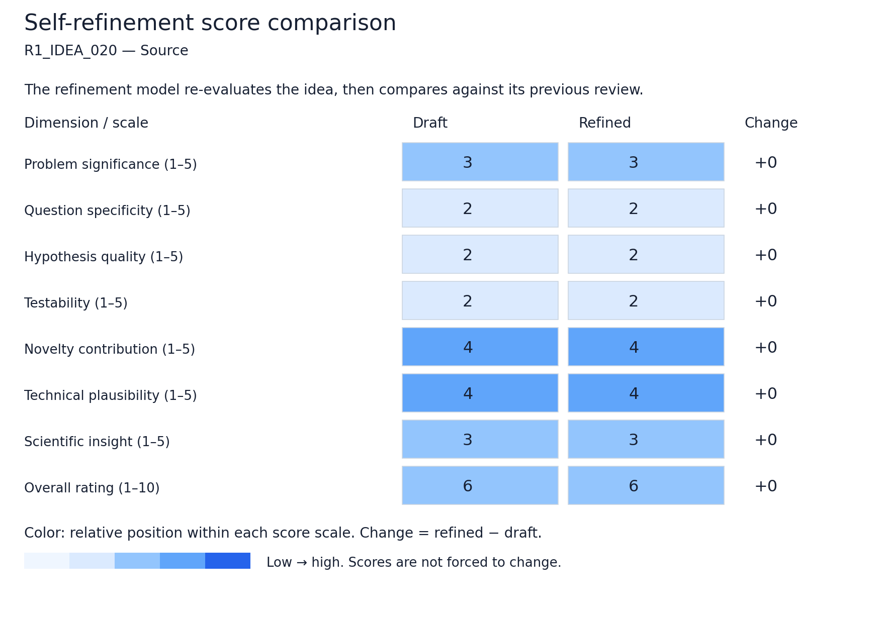

Changed score dimensions: none.

### Score justifications (draft / refined)

**Problem significance**

```json
{
  "draft": {
    "score": 3.0,
    "justification": "The idea addresses a meaningful challenge in neural network design by proposing a novel architecture that could improve both performance and interpretability, which are important goals in ML research."
  },
  "refined": {
    "score": 3.0,
    "justification": "The idea addresses a meaningful challenge in neural network design by proposing a novel architecture that could improve both performance and interpretability, which are important goals in ML research."
  }
}
```

**Question specificity**

```json
{
  "draft": {
    "score": 2.0,
    "justification": "The idea is somewhat general and lacks a clear, specific research question. It mentions potential benefits but does not specify what exactly is being investigated or how it differs from existing methods in a testable way."
  },
  "refined": {
    "score": 2.0,
    "justification": "The idea is somewhat general and lacks a clear, specific research question. It mentions potential benefits but does not specify what exactly is being investigated or how it differs from existing methods in a testable way."
  }
}
```

**Hypothesis quality**

```json
{
  "draft": {
    "score": 2.0,
    "justification": "The idea suggests potential improvements but does not provide a concrete hypothesis that can be tested or falsified. It lacks a specific prediction or mechanism that could be validated through experiments."
  },
  "refined": {
    "score": 2.0,
    "justification": "The idea suggests potential improvements but does not provide a concrete hypothesis that can be tested or falsified. It lacks a specific prediction or mechanism that could be validated through experiments."
  }
}
```

**Testability**

```json
{
  "draft": {
    "score": 2.0,
    "justification": "The idea does not specify how the research would be conducted or what experiments would be performed to test the hypothesis. Without a clear plan for evaluation, it is difficult to assess the testability of the claim."
  },
  "refined": {
    "score": 2.0,
    "justification": "The idea does not specify how the research would be conducted or what experiments would be performed to test the hypothesis. Without a clear plan for evaluation, it is difficult to assess the testability of the claim."
  }
}
```

**Novelty contribution**

```json
{
  "draft": {
    "score": 4.0,
    "justification": "The architectural change from MLPs to KANs is a novel approach, and if successful, could contribute new insights into neural network design and improve model interpretability, which is a significant contribution to the field."
  },
  "refined": {
    "score": 4.0,
    "justification": "The architectural change from MLPs to KANs is a novel approach, and if successful, could contribute new insights into neural network design and improve model interpretability, which is a significant contribution to the field."
  }
}
```

**Technical plausibility**

```json
{
  "draft": {
    "score": 4.0,
    "justification": "The idea is technically plausible as it builds on existing neural network concepts and proposes a feasible architectural change. The replacement of fixed activation functions with learnable ones on edges is a reasonable modification that could be implemented and tested."
  },
  "refined": {
    "score": 4.0,
    "justification": "The idea is technically plausible as it builds on existing neural network concepts and proposes a feasible architectural change. The replacement of fixed activation functions with learnable ones on edges is a reasonable modification that could be implemented and tested."
  }
}
```

**Scientific insight**

```json
{
  "draft": {
    "score": 3.0,
    "justification": "The idea has the potential to provide insights into how architectural changes affect model performance and interpretability, but without a specific research question or hypothesis, the potential for scientific insight is limited."
  },
  "refined": {
    "score": 3.0,
    "justification": "The idea has the potential to provide insights into how architectural changes affect model performance and interpretability, but without a specific research question or hypothesis, the potential for scientific insight is limited."
  }
}
```

**Overall rating**

```json
{
  "draft": {
    "score": 6.0,
    "justification": "The idea presents a promising direction in neural network design with potential for novelty and contribution. However, it lacks a clear research question, hypothesis, and testable plan, which are necessary for assessing its scientific merit and feasibility."
  },
  "refined": {
    "score": 6.0,
    "justification": "The idea presents a promising direction in neural network design with potential for novelty and contribution. However, it lacks a clear research question, hypothesis, and testable plan, which are necessary for assessing its scientific merit and feasibility."
  }
}
```

## R1_IDEA_020 — Variant 1: A1_Identity

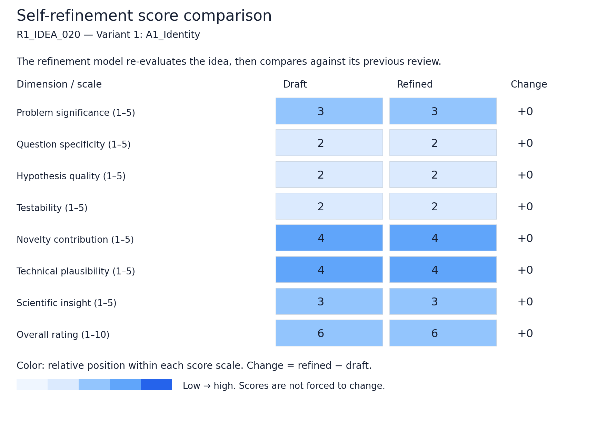

Changed score dimensions: none.

### Score justifications (draft / refined)

**Problem significance**

```json
{
  "draft": {
    "score": 3.0,
    "justification": "The idea addresses a meaningful challenge in neural network design by proposing a novel architecture that could improve both performance and interpretability, which are important goals in ML research."
  },
  "refined": {
    "score": 3.0,
    "justification": "The idea addresses a meaningful challenge in neural network design by proposing a novel architecture that could improve both performance and interpretability, which are important goals in ML research."
  }
}
```

**Question specificity**

```json
{
  "draft": {
    "score": 2.0,
    "justification": "The idea is somewhat general and lacks a clear, specific research question. It mentions potential benefits but does not specify what exactly is being investigated or how it differs from existing methods in a testable way."
  },
  "refined": {
    "score": 2.0,
    "justification": "The idea is somewhat general and lacks a clear, specific research question. It mentions potential benefits but does not specify what exactly is being investigated or how it differs from existing methods in a testable way."
  }
}
```

**Hypothesis quality**

```json
{
  "draft": {
    "score": 2.0,
    "justification": "The idea suggests potential improvements but does not provide a concrete hypothesis that can be tested or falsified. It lacks a specific prediction or mechanism that could be validated through experiments."
  },
  "refined": {
    "score": 2.0,
    "justification": "The idea suggests potential improvements but does not provide a concrete hypothesis that can be tested or falsified. It lacks a specific prediction or mechanism that could be validated through experiments."
  }
}
```

**Testability**

```json
{
  "draft": {
    "score": 2.0,
    "justification": "The idea does not specify how the research would be conducted or what experiments would be performed to test the hypothesis. Without a clear plan for evaluation, it is difficult to assess the testability of the claim."
  },
  "refined": {
    "score": 2.0,
    "justification": "The idea does not specify how the research would be conducted or what experiments would be performed to test the hypothesis. Without a clear plan for evaluation, it is difficult to assess the testability of the claim."
  }
}
```

**Novelty contribution**

```json
{
  "draft": {
    "score": 4.0,
    "justification": "The architectural change from MLPs to KANs is a novel approach, and if successful, could contribute new insights into neural network design and improve model interpretability, which is a significant contribution to the field."
  },
  "refined": {
    "score": 4.0,
    "justification": "The architectural change from MLPs to KANs is a novel approach, and if successful, could contribute new insights into neural network design and improve model interpretability, which is a significant contribution to the field."
  }
}
```

**Technical plausibility**

```json
{
  "draft": {
    "score": 4.0,
    "justification": "The idea is technically plausible as it builds on existing neural network concepts and proposes a feasible architectural change. The replacement of fixed activation functions with learnable ones on edges is a reasonable modification that could be implemented and tested."
  },
  "refined": {
    "score": 4.0,
    "justification": "The idea is technically plausible as it builds on existing neural network concepts and proposes a feasible architectural change. The replacement of fixed activation functions with learnable ones on edges is a reasonable modification that could be implemented and tested."
  }
}
```

**Scientific insight**

```json
{
  "draft": {
    "score": 3.0,
    "justification": "The idea has the potential to provide insights into how architectural changes affect model performance and interpretability, but without a specific research question or hypothesis, the potential for scientific insight is limited."
  },
  "refined": {
    "score": 3.0,
    "justification": "The idea has the potential to provide insights into how architectural changes affect model performance and interpretability, but without a specific research question or hypothesis, the potential for scientific insight is limited."
  }
}
```

**Overall rating**

```json
{
  "draft": {
    "score": 6.0,
    "justification": "The idea presents a promising direction in neural network design with potential for novelty and contribution. However, it lacks a clear research question, hypothesis, and testable plan, which are necessary for assessing its scientific merit and feasibility."
  },
  "refined": {
    "score": 6.0,
    "justification": "The idea presents a promising direction in neural network design with potential for novelty and contribution. However, it lacks a clear research question, hypothesis, and testable plan, which are necessary for assessing its scientific merit and feasibility."
  }
}
```

## R1_IDEA_020 — Variant 2: A2_Paraphrase_Only


Changed score dimensions: none.

### Score justifications (draft / refined)

**Problem significance**

```json
{
  "draft": {
    "score": 4.0,
    "justification": "The idea addresses a significant challenge in understanding and improving neural network internals, which is crucial for both performance and interpretability."
  },
  "refined": {
    "score": 4.0,
    "justification": "The idea addresses a significant challenge in understanding and improving neural network internals, which is crucial for both performance and interpretability."
  }
}
```

**Question specificity**

```json
{
  "draft": {
    "score": 2.0,
    "justification": "The idea is somewhat general and lacks a specific research question or hypothesis to investigate, making it difficult to assess the direction of the research."
  },
  "refined": {
    "score": 2.0,
    "justification": "The idea is somewhat general and lacks a specific research question or hypothesis to investigate, making it difficult to assess the direction of the research."
  }
}
```

**Hypothesis quality**

```json
{
  "draft": {
    "score": 3.0,
    "justification": "The idea suggests a potential improvement but does not explicitly state a hypothesis that can be tested or contradicted."
  },
  "refined": {
    "score": 3.0,
    "justification": "The idea suggests a potential improvement but does not explicitly state a hypothesis that can be tested or contradicted."
  }
}
```

**Testability**

```json
{
  "draft": {
    "score": 2.0,
    "justification": "The idea does not provide a clear experimental plan or method to test the proposed changes in KANs, making it hard to evaluate the research direction."
  },
  "refined": {
    "score": 2.0,
    "justification": "The idea does not provide a clear experimental plan or method to test the proposed changes in KANs, making it hard to evaluate the research direction."
  }
}
```

**Novelty contribution**

```json
{
  "draft": {
    "score": 4.0,
    "justification": "The introduction of KANs with adaptable activation functions represents a novel approach, potentially contributing to the field of neural network design and interpretability."
  },
  "refined": {
    "score": 4.0,
    "justification": "The introduction of KANs with adaptable activation functions represents a novel approach, potentially contributing to the field of neural network design and interpretability."
  }
}
```

**Technical plausibility**

```json
{
  "draft": {
    "score": 4.0,
    "justification": "The concept of adaptable activation functions in neural networks is technically plausible and aligns with current research trends in improving model interpretability."
  },
  "refined": {
    "score": 4.0,
    "justification": "The concept of adaptable activation functions in neural networks is technically plausible and aligns with current research trends in improving model interpretability."
  }
}
```

**Scientific insight**

```json
{
  "draft": {
    "score": 3.0,
    "justification": "While the idea has potential, it lacks a clear mechanism or specific insight that could be gained from studying KANs, limiting its scientific contribution."
  },
  "refined": {
    "score": 3.0,
    "justification": "While the idea has potential, it lacks a clear mechanism or specific insight that could be gained from studying KANs, limiting its scientific contribution."
  }
}
```

**Overall rating**

```json
{
  "draft": {
    "score": 6.0,
    "justification": "The idea is promising but lacks specific research questions and hypotheses, making it difficult to assess its scientific potential and direction."
  },
  "refined": {
    "score": 6.0,
    "justification": "The idea is promising but lacks specific research questions and hypotheses, making it difficult to assess its scientific potential and direction."
  }
}
```

## R1_IDEA_020 — Variant 3: A3_Plain_Core


Changed score dimensions: none.

### Score justifications (draft / refined)

**Problem significance**

```json
{
  "draft": {
    "score": 4.0,
    "justification": "The idea addresses a significant challenge in understanding neural network mechanisms, which is crucial for advancing both performance and interpretability in ML."
  },
  "refined": {
    "score": 4.0,
    "justification": "The idea addresses a significant challenge in understanding neural network mechanisms, which is crucial for advancing both performance and interpretability in ML."
  }
}
```

**Question specificity**

```json
{
  "draft": {
    "score": 3.0,
    "justification": "The idea proposes a novel approach but lacks a specific research question or hypothesis, making it somewhat vague in terms of what exactly is being investigated."
  },
  "refined": {
    "score": 3.0,
    "justification": "The idea proposes a novel approach but lacks a specific research question or hypothesis, making it somewhat vague in terms of what exactly is being investigated."
  }
}
```

**Hypothesis quality**

```json
{
  "draft": {
    "score": 3.0,
    "justification": "The idea suggests potential improvements but does not explicitly state a hypothesis that can be tested or falsified, making it less concrete."
  },
  "refined": {
    "score": 3.0,
    "justification": "The idea suggests potential improvements but does not explicitly state a hypothesis that can be tested or falsified, making it less concrete."
  }
}
```

**Testability**

```json
{
  "draft": {
    "score": 3.0,
    "justification": "The idea is testable through experiments comparing KANs to MLPs, but the specific experiments or metrics for evaluation are not clearly defined."
  },
  "refined": {
    "score": 3.0,
    "justification": "The idea is testable through experiments comparing KANs to MLPs, but the specific experiments or metrics for evaluation are not clearly defined."
  }
}
```

**Novelty contribution**

```json
{
  "draft": {
    "score": 4.0,
    "justification": "The proposal of KANs with edge-based activation functions is novel and could contribute to the field by improving both accuracy and interpretability."
  },
  "refined": {
    "score": 4.0,
    "justification": "The proposal of KANs with edge-based activation functions is novel and could contribute to the field by improving both accuracy and interpretability."
  }
}
```

**Technical plausibility**

```json
{
  "draft": {
    "score": 4.0,
    "justification": "The concept of using learnable activation functions on edges is technically plausible and aligns with current trends in neural network research."
  },
  "refined": {
    "score": 4.0,
    "justification": "The concept of using learnable activation functions on edges is technically plausible and aligns with current trends in neural network research."
  }
}
```

**Scientific insight**

```json
{
  "draft": {
    "score": 3.0,
    "justification": "The idea has potential for scientific insight into neural network mechanisms but lacks a clear focus on what specific insights would be gained from the research."
  },
  "refined": {
    "score": 3.0,
    "justification": "The idea has potential for scientific insight into neural network mechanisms but lacks a clear focus on what specific insights would be gained from the research."
  }
}
```

**Overall rating**

```json
{
  "draft": {
    "score": 7.0,
    "justification": "The idea is promising and addresses a meaningful problem, but it needs more specificity in the research question and hypothesis to be considered strong."
  },
  "refined": {
    "score": 7.0,
    "justification": "The idea is promising and addresses a meaningful problem, but it needs more specificity in the research question and hypothesis to be considered strong."
  }
}
```

## R1_IDEA_020 — Variant 4: B1_Verbose_Elaborate

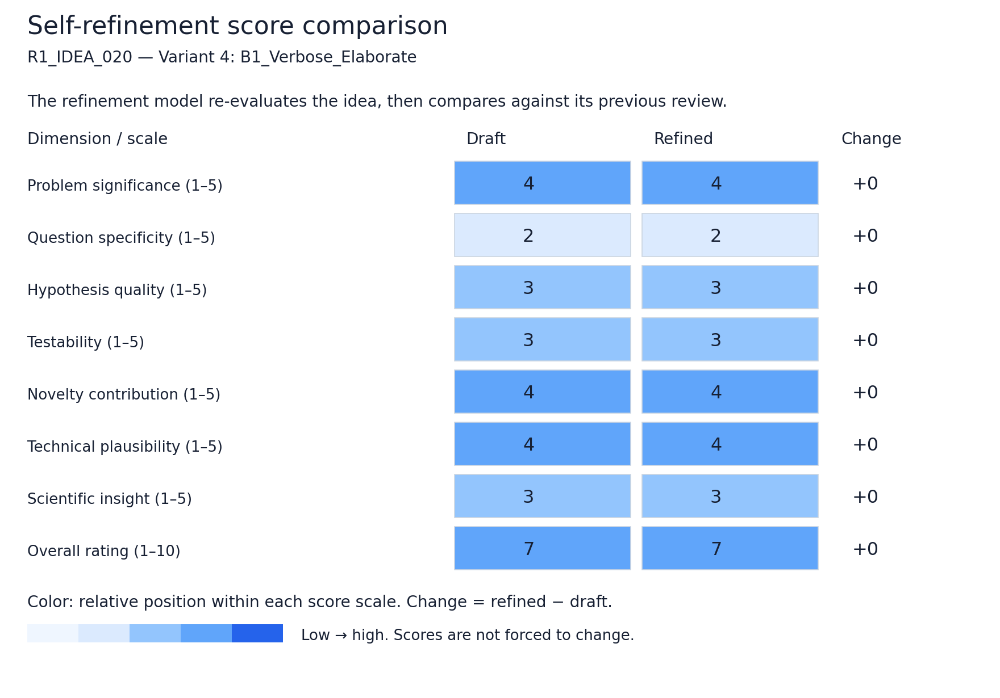

Changed score dimensions: none.

### Score justifications (draft / refined)

**Problem significance**

```json
{
  "draft": {
    "score": 4.0,
    "justification": "The idea addresses a meaningful challenge in understanding and improving neural network structures, which is important for both research and practical applications."
  },
  "refined": {
    "score": 4.0,
    "justification": "The idea addresses a meaningful challenge in understanding and improving neural network structures, which is important for both research and practical applications."
  }
}
```

**Question specificity**

```json
{
  "draft": {
    "score": 2.0,
    "justification": "The idea is somewhat general and lacks a clear, specific research question about what aspect of KANs is being investigated."
  },
  "refined": {
    "score": 2.0,
    "justification": "The idea is somewhat general and lacks a clear, specific research question about what aspect of KANs is being investigated."
  }
}
```

**Hypothesis quality**

```json
{
  "draft": {
    "score": 3.0,
    "justification": "The idea suggests potential benefits (accuracy and interpretability) but does not explicitly state a hypothesis that can be tested or falsified."
  },
  "refined": {
    "score": 3.0,
    "justification": "The idea suggests potential benefits (accuracy and interpretability) but does not explicitly state a hypothesis that can be tested or falsified."
  }
}
```

**Testability**

```json
{
  "draft": {
    "score": 3.0,
    "justification": "The idea is testable through experiments comparing KANs with MLPs, but lacks specific details on how the experiments will be conducted."
  },
  "refined": {
    "score": 3.0,
    "justification": "The idea is testable through experiments comparing KANs with MLPs, but lacks specific details on how the experiments will be conducted."
  }
}
```

**Novelty contribution**

```json
{
  "draft": {
    "score": 4.0,
    "justification": "The introduction of KANs with learnable edge activations is a novel approach that could contribute to the field of neural network design."
  },
  "refined": {
    "score": 4.0,
    "justification": "The introduction of KANs with learnable edge activations is a novel approach that could contribute to the field of neural network design."
  }
}
```

**Technical plausibility**

```json
{
  "draft": {
    "score": 4.0,
    "justification": "The concept of placing learnable activation functions on edges is technically plausible and aligns with current trends in neural network research."
  },
  "refined": {
    "score": 4.0,
    "justification": "The concept of placing learnable activation functions on edges is technically plausible and aligns with current trends in neural network research."
  }
}
```

**Scientific insight**

```json
{
  "draft": {
    "score": 3.0,
    "justification": "The idea has potential for scientific insight into how network structure affects performance and interpretability, but the specific insights are not clearly defined."
  },
  "refined": {
    "score": 3.0,
    "justification": "The idea has potential for scientific insight into how network structure affects performance and interpretability, but the specific insights are not clearly defined."
  }
}
```

**Overall rating**

```json
{
  "draft": {
    "score": 7.0,
    "justification": "The idea is promising and addresses a meaningful problem, but lacks specific research questions and hypotheses that would make it more testable and scientifically rigorous."
  },
  "refined": {
    "score": 7.0,
    "justification": "The idea is promising and addresses a meaningful problem, but lacks specific research questions and hypotheses that would make it more testable and scientifically rigorous."
  }
}
```

## R1_IDEA_020 — Variant 5: B2_Grand_Narrative


Changed score dimensions: none.

### Score justifications (draft / refined)

**Problem significance**

```json
{
  "draft": {
    "score": 3.0,
    "justification": "The idea addresses the importance of interpretability in machine learning, which is a significant challenge. However, the problem is not clearly defined or emphasized."
  },
  "refined": {
    "score": 3.0,
    "justification": "The idea addresses the importance of interpretability in machine learning, which is a significant challenge. However, the problem is not clearly defined or emphasized."
  }
}
```

**Question specificity**

```json
{
  "draft": {
    "score": 2.0,
    "justification": "The idea is somewhat specific in introducing KANs but lacks a clear, concrete research question or hypothesis that needs to be investigated."
  },
  "refined": {
    "score": 2.0,
    "justification": "The idea is somewhat specific in introducing KANs but lacks a clear, concrete research question or hypothesis that needs to be investigated."
  }
}
```

**Hypothesis quality**

```json
{
  "draft": {
    "score": 2.0,
    "justification": "The idea mentions potential benefits of KANs but does not provide a specific hypothesis or prediction that can be tested."
  },
  "refined": {
    "score": 2.0,
    "justification": "The idea mentions potential benefits of KANs but does not provide a specific hypothesis or prediction that can be tested."
  }
}
```

**Testability**

```json
{
  "draft": {
    "score": 2.0,
    "justification": "The idea does not specify experiments or evaluations that would be needed to test the claims about KANs. It is too vague to determine how to validate the proposed approach."
  },
  "refined": {
    "score": 2.0,
    "justification": "The idea does not specify experiments or evaluations that would be needed to test the claims about KANs. It is too vague to determine how to validate the proposed approach."
  }
}
```

**Novelty contribution**

```json
{
  "draft": {
    "score": 3.0,
    "justification": "The introduction of KANs as a novel architecture is novel, but the idea does not clearly explain how it contributes to the field or what new insights it could provide."
  },
  "refined": {
    "score": 3.0,
    "justification": "The introduction of KANs as a novel architecture is novel, but the idea does not clearly explain how it contributes to the field or what new insights it could provide."
  }
}
```

**Technical plausibility**

```json
{
  "draft": {
    "score": 3.0,
    "justification": "The idea is technically plausible, as replacing activation functions with learnable ones is a reasonable approach. However, the specifics of how KANs are implemented or how they differ from MLPs are not clearly explained."
  },
  "refined": {
    "score": 3.0,
    "justification": "The idea is technically plausible, as replacing activation functions with learnable ones is a reasonable approach. However, the specifics of how KANs are implemented or how they differ from MLPs are not clearly explained."
  }
}
```

**Scientific insight**

```json
{
  "draft": {
    "score": 2.0,
    "justification": "The idea suggests potential for improved interpretability, but it does not clearly indicate what scientific insights could be gained from studying KANs."
  },
  "refined": {
    "score": 2.0,
    "justification": "The idea suggests potential for improved interpretability, but it does not clearly indicate what scientific insights could be gained from studying KANs."
  }
}
```

**Overall rating**

```json
{
  "draft": {
    "score": 5.0,
    "justification": "The idea introduces a novel neural network architecture with potential for improved interpretability, but it lacks specific research questions, hypotheses, and testable claims. It has moderate significance and potential, but needs more clarity and specificity to be a strong research idea."
  },
  "refined": {
    "score": 5.0,
    "justification": "The idea introduces a novel neural network architecture with potential for improved interpretability, but it lacks specific research questions, hypotheses, and testable claims. It has moderate significance and potential, but needs more clarity and specificity to be a strong research idea."
  }
}
```

## R1_IDEA_020 — Variant 6: B3_Over_Confident

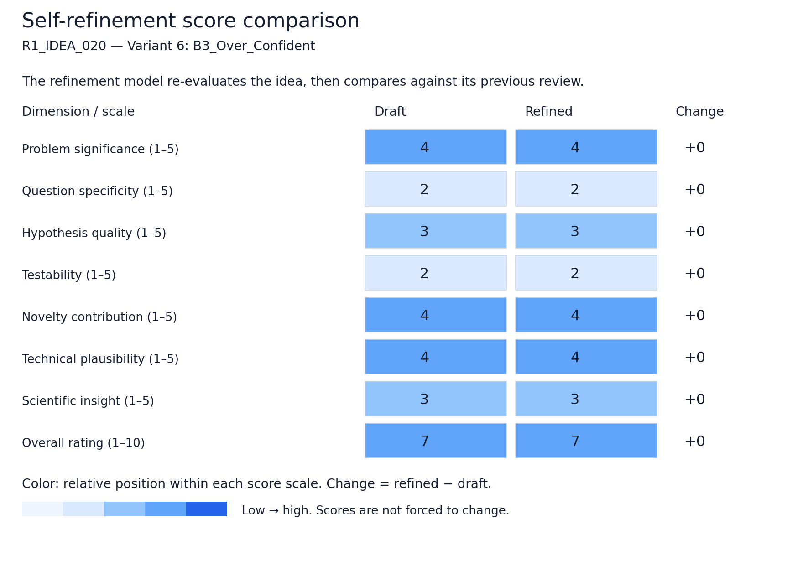

Changed score dimensions: none.

### Score justifications (draft / refined)

**Problem significance**

```json
{
  "draft": {
    "score": 4.0,
    "justification": "The idea addresses a meaningful challenge in understanding and improving neural network structures, which is important for both performance and interpretability in ML."
  },
  "refined": {
    "score": 4.0,
    "justification": "The idea addresses a meaningful challenge in understanding and improving neural network structures, which is important for both performance and interpretability in ML."
  }
}
```

**Question specificity**

```json
{
  "draft": {
    "score": 2.0,
    "justification": "The idea is somewhat general and does not clearly define the specific research question or hypothesis to be investigated."
  },
  "refined": {
    "score": 2.0,
    "justification": "The idea is somewhat general and does not clearly define the specific research question or hypothesis to be investigated."
  }
}
```

**Hypothesis quality**

```json
{
  "draft": {
    "score": 3.0,
    "justification": "The idea suggests potential benefits (accuracy and interpretability) but lacks a concrete hypothesis that can be tested or falsified."
  },
  "refined": {
    "score": 3.0,
    "justification": "The idea suggests potential benefits (accuracy and interpretability) but lacks a concrete hypothesis that can be tested or falsified."
  }
}
```

**Testability**

```json
{
  "draft": {
    "score": 2.0,
    "justification": "The idea does not provide specific experiments or evaluation methods, making it difficult to assess the testability of the claims."
  },
  "refined": {
    "score": 2.0,
    "justification": "The idea does not provide specific experiments or evaluation methods, making it difficult to assess the testability of the claims."
  }
}
```

**Novelty contribution**

```json
{
  "draft": {
    "score": 4.0,
    "justification": "The introduction of KANs as a novel architecture with edge-based activation functions represents a potentially significant contribution to the field."
  },
  "refined": {
    "score": 4.0,
    "justification": "The introduction of KANs as a novel architecture with edge-based activation functions represents a potentially significant contribution to the field."
  }
}
```

**Technical plausibility**

```json
{
  "draft": {
    "score": 4.0,
    "justification": "The concept of replacing node-based with edge-based activation functions is technically plausible and aligns with current research trends in neural network design."
  },
  "refined": {
    "score": 4.0,
    "justification": "The concept of replacing node-based with edge-based activation functions is technically plausible and aligns with current research trends in neural network design."
  }
}
```

**Scientific insight**

```json
{
  "draft": {
    "score": 3.0,
    "justification": "The idea has potential to provide insights into how activation functions affect model performance and interpretability, but the specific insights are not clearly defined."
  },
  "refined": {
    "score": 3.0,
    "justification": "The idea has potential to provide insights into how activation functions affect model performance and interpretability, but the specific insights are not clearly defined."
  }
}
```

**Overall rating**

```json
{
  "draft": {
    "score": 7.0,
    "justification": "The idea presents a promising direction with potential for significant contribution, but lacks specific research questions and evaluation methods that are necessary for further development."
  },
  "refined": {
    "score": 7.0,
    "justification": "The idea presents a promising direction with potential for significant contribution, but lacks specific research questions and evaluation methods that are necessary for further development."
  }
}
```

## R1_IDEA_020 — Variant 7: B4_Novelty


Changed score dimensions: none.

### Score justifications (draft / refined)

**Problem significance**

```json
{
  "draft": {
    "score": 4.0,
    "justification": "The idea addresses a meaningful challenge in understanding neural network internals, which is important for both research and practical applications."
  },
  "refined": {
    "score": 4.0,
    "justification": "The idea addresses a meaningful challenge in understanding neural network internals, which is important for both research and practical applications."
  }
}
```

**Question specificity**

```json
{
  "draft": {
    "score": 2.0,
    "justification": "The idea is broad and does not clearly define a specific research question or hypothesis to investigate."
  },
  "refined": {
    "score": 2.0,
    "justification": "The idea is broad and does not clearly define a specific research question or hypothesis to investigate."
  }
}
```

**Hypothesis quality**

```json
{
  "draft": {
    "score": 3.0,
    "justification": "The idea suggests potential benefits but lacks a concrete hypothesis that can be tested or falsified."
  },
  "refined": {
    "score": 3.0,
    "justification": "The idea suggests potential benefits but lacks a concrete hypothesis that can be tested or falsified."
  }
}
```

**Testability**

```json
{
  "draft": {
    "score": 2.0,
    "justification": "The idea does not provide a clear plan for testing the proposed approach, making it difficult to assess its feasibility."
  },
  "refined": {
    "score": 2.0,
    "justification": "The idea does not provide a clear plan for testing the proposed approach, making it difficult to assess its feasibility."
  }
}
```

**Novelty contribution**

```json
{
  "draft": {
    "score": 4.0,
    "justification": "The introduction of KANs represents a novel approach that could contribute to the field by offering a new perspective on neural network design."
  },
  "refined": {
    "score": 4.0,
    "justification": "The introduction of KANs represents a novel approach that could contribute to the field by offering a new perspective on neural network design."
  }
}
```

**Technical plausibility**

```json
{
  "draft": {
    "score": 4.0,
    "justification": "The concept of replacing fixed activation functions with learnable ones on edges is technically plausible and aligns with current trends in neural network research."
  },
  "refined": {
    "score": 4.0,
    "justification": "The concept of replacing fixed activation functions with learnable ones on edges is technically plausible and aligns with current trends in neural network research."
  }
}
```

**Scientific insight**

```json
{
  "draft": {
    "score": 3.0,
    "justification": "The idea has potential for scientific insight but lacks a clear focus on what specific mechanisms or phenomena should be investigated."
  },
  "refined": {
    "score": 3.0,
    "justification": "The idea has potential for scientific insight but lacks a clear focus on what specific mechanisms or phenomena should be investigated."
  }
}
```

**Overall rating**

```json
{
  "draft": {
    "score": 6.0,
    "justification": "The idea is promising but lacks specificity and testability. It has potential for novelty and scientific contribution but needs more concrete research questions and hypotheses."
  },
  "refined": {
    "score": 6.0,
    "justification": "The idea is promising but lacks specificity and testability. It has potential for novelty and scientific contribution but needs more concrete research questions and hypotheses."
  }
}
```

## R1_IDEA_020 — Variant 8: B5_Application_Impact


Changed score dimensions: none.

### Score justifications (draft / refined)

**Problem significance**

```json
{
  "draft": {
    "score": 4.0,
    "justification": "The idea addresses a significant challenge in neural network research: improving interpretability while maintaining performance, which is crucial for practical applications."
  },
  "refined": {
    "score": 4.0,
    "justification": "The idea addresses a significant challenge in neural network research: improving interpretability while maintaining performance, which is crucial for practical applications."
  }
}
```

**Question specificity**

```json
{
  "draft": {
    "score": 3.0,
    "justification": "The idea introduces a novel approach but lacks a specific research question about what exactly should be investigated with KANs, such as how they improve interpretability or performance in specific tasks."
  },
  "refined": {
    "score": 3.0,
    "justification": "The idea introduces a novel approach but lacks a specific research question about what exactly should be investigated with KANs, such as how they improve interpretability or performance in specific tasks."
  }
}
```

**Hypothesis quality**

```json
{
  "draft": {
    "score": 3.0,
    "justification": "The idea suggests a potential benefit of KANs but does not explicitly state a hypothesis that could be tested, such as whether edge-based activations lead to better interpretability in certain scenarios."
  },
  "refined": {
    "score": 3.0,
    "justification": "The idea suggests a potential benefit of KANs but does not explicitly state a hypothesis that could be tested, such as whether edge-based activations lead to better interpretability in certain scenarios."
  }
}
```

**Testability**

```json
{
  "draft": {
    "score": 3.0,
    "justification": "The idea is testable in principle, but lacks specific experiments or comparisons that would be needed to validate the claims about KANs' performance and interpretability."
  },
  "refined": {
    "score": 3.0,
    "justification": "The idea is testable in principle, but lacks specific experiments or comparisons that would be needed to validate the claims about KANs' performance and interpretability."
  }
}
```

**Novelty contribution**

```json
{
  "draft": {
    "score": 4.0,
    "justification": "The use of learnable edge activations in KANs is a novel approach that could contribute to the field by offering a new way to enhance model interpretability and performance."
  },
  "refined": {
    "score": 4.0,
    "justification": "The use of learnable edge activations in KANs is a novel approach that could contribute to the field by offering a new way to enhance model interpretability and performance."
  }
}
```

**Technical plausibility**

```json
{
  "draft": {
    "score": 4.0,
    "justification": "The idea is technically plausible as it builds on existing neural network concepts, and the proposed change (edge-based activations) is a reasonable modification that could be implemented and tested."
  },
  "refined": {
    "score": 4.0,
    "justification": "The idea is technically plausible as it builds on existing neural network concepts, and the proposed change (edge-based activations) is a reasonable modification that could be implemented and tested."
  }
}
```

**Scientific insight**

```json
{
  "draft": {
    "score": 3.0,
    "justification": "The idea has potential for scientific insight into how activation functions affect model behavior and interpretability, but the current formulation does not clearly specify what insights should be gained from the research."
  },
  "refined": {
    "score": 3.0,
    "justification": "The idea has potential for scientific insight into how activation functions affect model behavior and interpretability, but the current formulation does not clearly specify what insights should be gained from the research."
  }
}
```

**Overall rating**

```json
{
  "draft": {
    "score": 7.0,
    "justification": "The idea is promising and addresses an important problem in neural network research, but it lacks specific research questions and hypotheses that would make it more testable and scientifically meaningful."
  },
  "refined": {
    "score": 7.0,
    "justification": "The idea is promising and addresses an important problem in neural network research, but it lacks specific research questions and hypotheses that would make it more testable and scientifically meaningful."
  }
}
```

## R1_IDEA_020 — Variant 9: C1_Hollow_Shell


Changed score dimensions: none.

### Score justifications (draft / refined)

**Problem significance**

```json
{
  "draft": {
    "score": 4.0,
    "justification": "The idea addresses a significant challenge in understanding and improving advanced computational models, which is crucial for both research and practical applications."
  },
  "refined": {
    "score": 4.0,
    "justification": "The idea addresses a significant challenge in understanding and improving advanced computational models, which is crucial for both research and practical applications."
  }
}
```

**Question specificity**

```json
{
  "draft": {
    "score": 3.0,
    "justification": "The idea is somewhat vague in defining the exact components and characteristics to be modified, but it does propose a direction for research."
  },
  "refined": {
    "score": 3.0,
    "justification": "The idea is somewhat vague in defining the exact components and characteristics to be modified, but it does propose a direction for research."
  }
}
```

**Hypothesis quality**

```json
{
  "draft": {
    "score": 3.0,
    "justification": "The idea suggests a potential improvement but lacks a concrete hypothesis or specific prediction that can be tested."
  },
  "refined": {
    "score": 3.0,
    "justification": "The idea suggests a potential improvement but lacks a concrete hypothesis or specific prediction that can be tested."
  }
}
```

**Testability**

```json
{
  "draft": {
    "score": 3.0,
    "justification": "The idea is testable in principle, but the lack of specific details makes it difficult to assess the feasibility of experiments."
  },
  "refined": {
    "score": 3.0,
    "justification": "The idea is testable in principle, but the lack of specific details makes it difficult to assess the feasibility of experiments."
  }
}
```

**Novelty contribution**

```json
{
  "draft": {
    "score": 4.0,
    "justification": "The approach of modifying key components in the architecture is novel and could contribute to a better understanding of model behavior and performance."
  },
  "refined": {
    "score": 4.0,
    "justification": "The approach of modifying key components in the architecture is novel and could contribute to a better understanding of model behavior and performance."
  }
}
```

**Technical plausibility**

```json
{
  "draft": {
    "score": 4.0,
    "justification": "Modifying model components is a plausible technical direction, though the specifics are not detailed."
  },
  "refined": {
    "score": 4.0,
    "justification": "Modifying model components is a plausible technical direction, though the specifics are not detailed."
  }
}
```

**Scientific insight**

```json
{
  "draft": {
    "score": 3.0,
    "justification": "The idea has potential for scientific insight into model organization, but the lack of specifics limits the potential for meaningful insights."
  },
  "refined": {
    "score": 3.0,
    "justification": "The idea has potential for scientific insight into model organization, but the lack of specifics limits the potential for meaningful insights."
  }
}
```

**Overall rating**

```json
{
  "draft": {
    "score": 7.0,
    "justification": "The idea is promising and addresses a significant problem, but it lacks specific details and a clear hypothesis, which are needed for further development."
  },
  "refined": {
    "score": 7.0,
    "justification": "The idea is promising and addresses a significant problem, but it lacks specific details and a clear hypothesis, which are needed for further development."
  }
}
```

## R1_IDEA_020 — Variant 10: C2_Logic_Flawed


Changed score dimensions: none.

### Score justifications (draft / refined)

**Problem significance**

```json
{
  "draft": {
    "score": 4.0,
    "justification": "The idea addresses a meaningful challenge in understanding neural network structures and improving model interpretability, which are important for both research and practical applications."
  },
  "refined": {
    "score": 4.0,
    "justification": "The idea addresses a meaningful challenge in understanding neural network structures and improving model interpretability, which are important for both research and practical applications."
  }
}
```

**Question specificity**

```json
{
  "draft": {
    "score": 3.0,
    "justification": "The idea introduces a novel concept (KANs) but lacks a specific research question or hypothesis that could be tested. It is somewhat vague in defining what exactly should be investigated."
  },
  "refined": {
    "score": 3.0,
    "justification": "The idea introduces a novel concept (KANs) but lacks a specific research question or hypothesis that could be tested. It is somewhat vague in defining what exactly should be investigated."
  }
}
```

**Hypothesis quality**

```json
{
  "draft": {
    "score": 3.0,
    "justification": "The idea suggests potential benefits (accuracy, interpretability) but does not explicitly state a hypothesis that could be tested. It is more of a general claim than a specific prediction."
  },
  "refined": {
    "score": 3.0,
    "justification": "The idea suggests potential benefits (accuracy, interpretability) but does not explicitly state a hypothesis that could be tested. It is more of a general claim than a specific prediction."
  }
}
```

**Testability**

```json
{
  "draft": {
    "score": 2.0,
    "justification": "The idea does not provide a clear experimental plan or method to test the claims. It is too vague to determine how the research would be conducted."
  },
  "refined": {
    "score": 2.0,
    "justification": "The idea does not provide a clear experimental plan or method to test the claims. It is too vague to determine how the research would be conducted."
  }
}
```

**Novelty contribution**

```json
{
  "draft": {
    "score": 4.0,
    "justification": "The introduction of KANs with learnable activation functions on edges is a novel approach that could contribute to the field of neural network design and interpretability."
  },
  "refined": {
    "score": 4.0,
    "justification": "The introduction of KANs with learnable activation functions on edges is a novel approach that could contribute to the field of neural network design and interpretability."
  }
}
```

**Technical plausibility**

```json
{
  "draft": {
    "score": 4.0,
    "justification": "The concept of replacing fixed activation functions with learnable ones on edges is technically plausible and aligns with current trends in neural network research."
  },
  "refined": {
    "score": 4.0,
    "justification": "The concept of replacing fixed activation functions with learnable ones on edges is technically plausible and aligns with current trends in neural network research."
  }
}
```

**Scientific insight**

```json
{
  "draft": {
    "score": 3.0,
    "justification": "The idea has potential to provide insights into model interpretability and neural network design, but the current formulation does not clearly indicate what specific insights would be gained."
  },
  "refined": {
    "score": 3.0,
    "justification": "The idea has potential to provide insights into model interpretability and neural network design, but the current formulation does not clearly indicate what specific insights would be gained."
  }
}
```

**Overall rating**

```json
{
  "draft": {
    "score": 7.0,
    "justification": "The idea is promising and addresses a meaningful problem, but it lacks specific research questions, hypotheses, and experimental plans. With further clarification, it has the potential to be a strong research direction."
  },
  "refined": {
    "score": 7.0,
    "justification": "The idea is promising and addresses a meaningful problem, but it lacks specific research questions, hypotheses, and experimental plans. With further clarification, it has the potential to be a strong research direction."
  }
}
```

## R1_IDEA_020 — Variant 11: C3_Substance_Enriched


Changed score dimensions: none.

### Score justifications (draft / refined)

**Problem significance**

```json
{
  "draft": {
    "score": 4.0,
    "justification": "The idea addresses a meaningful challenge in neural network design by exploring interpretability, which is a critical concern in practical applications. Enhancing interpretability while maintaining performance is a significant problem in ML."
  },
  "refined": {
    "score": 4.0,
    "justification": "The idea addresses a meaningful challenge in neural network design by exploring interpretability, which is a critical concern in practical applications. Enhancing interpretability while maintaining performance is a significant problem in ML."
  }
}
```

**Question specificity**

```json
{
  "draft": {
    "score": 3.0,
    "justification": "The research question is somewhat specific, focusing on the use of splines for edge functions in KANs. However, the exact nature of the hypothesis and the proposed validation method are not sufficiently detailed."
  },
  "refined": {
    "score": 3.0,
    "justification": "The research question is somewhat specific, focusing on the use of splines for edge functions in KANs. However, the exact nature of the hypothesis and the proposed validation method are not sufficiently detailed."
  }
}
```

**Hypothesis quality**

```json
{
  "draft": {
    "score": 3.0,
    "justification": "The hypothesis that splines could improve interpretability is plausible, but it lacks a concrete prediction or mechanism. The connection between spline smoothness and interpretability is not clearly established."
  },
  "refined": {
    "score": 3.0,
    "justification": "The hypothesis that splines could improve interpretability is plausible, but it lacks a concrete prediction or mechanism. The connection between spline smoothness and interpretability is not clearly established."
  }
}
```

**Testability**

```json
{
  "draft": {
    "score": 3.0,
    "justification": "The idea suggests cross-domain comparisons as a validation method, which is testable. However, the specific experiments and metrics for evaluation are not clearly outlined."
  },
  "refined": {
    "score": 3.0,
    "justification": "The idea suggests cross-domain comparisons as a validation method, which is testable. However, the specific experiments and metrics for evaluation are not clearly outlined."
  }
}
```

**Novelty contribution**

```json
{
  "draft": {
    "score": 4.0,
    "justification": "The approach of using splines for edge functions in KANs is novel and could contribute to the field by improving both accuracy and interpretability. It addresses a gap in current neural network design."
  },
  "refined": {
    "score": 4.0,
    "justification": "The approach of using splines for edge functions in KANs is novel and could contribute to the field by improving both accuracy and interpretability. It addresses a gap in current neural network design."
  }
}
```

**Technical plausibility**

```json
{
  "draft": {
    "score": 4.0,
    "justification": "The idea is technically plausible as it builds on existing concepts in neural networks and splines. The transition from MLPs to KANs with edge-based functions is a reasonable direction for research."
  },
  "refined": {
    "score": 4.0,
    "justification": "The idea is technically plausible as it builds on existing concepts in neural networks and splines. The transition from MLPs to KANs with edge-based functions is a reasonable direction for research."
  }
}
```

**Scientific insight**

```json
{
  "draft": {
    "score": 3.0,
    "justification": "The idea has potential for scientific insight by exploring how splines affect interpretability and performance. However, the specific insights are not clearly defined without further details on the hypothesis and validation methods."
  },
  "refined": {
    "score": 3.0,
    "justification": "The idea has potential for scientific insight by exploring how splines affect interpretability and performance. However, the specific insights are not clearly defined without further details on the hypothesis and validation methods."
  }
}
```

**Overall rating**

```json
{
  "draft": {
    "score": 7.0,
    "justification": "The idea is strong and addresses a meaningful problem in neural network design. It proposes a novel approach with potential for scientific insight, though it lacks sufficient detail on the hypothesis, validation methods, and technical specifics."
  },
  "refined": {
    "score": 7.0,
    "justification": "The idea is strong and addresses a meaningful problem in neural network design. It proposes a novel approach with potential for scientific insight, though it lacks sufficient detail on the hypothesis, validation methods, and technical specifics."
  }
}
```

## R1_IDEA_020 — Variant 12: H1_Deceptive_Hollow


Changed score dimensions: none.

### Score justifications (draft / refined)

**Problem significance**

```json
{
  "draft": {
    "score": 3.0,
    "justification": "The idea addresses a meaningful challenge in understanding and improving computational models, but the problem is somewhat broad and not clearly defined."
  },
  "refined": {
    "score": 3.0,
    "justification": "The idea addresses a meaningful challenge in understanding and improving computational models, but the problem is somewhat broad and not clearly defined."
  }
}
```

**Question specificity**

```json
{
  "draft": {
    "score": 2.0,
    "justification": "The research question is not clearly defined. The idea is too vague to specify what exactly is being investigated."
  },
  "refined": {
    "score": 2.0,
    "justification": "The research question is not clearly defined. The idea is too vague to specify what exactly is being investigated."
  }
}
```

**Hypothesis quality**

```json
{
  "draft": {
    "score": 2.0,
    "justification": "The idea lacks a clear hypothesis or prediction that could be tested. It is more of a general statement about the potential impact of the approach."
  },
  "refined": {
    "score": 2.0,
    "justification": "The idea lacks a clear hypothesis or prediction that could be tested. It is more of a general statement about the potential impact of the approach."
  }
}
```

**Testability**

```json
{
  "draft": {
    "score": 2.0,
    "justification": "The idea does not provide a clear experimental plan or method for testing the proposed approach. It is too vague to determine how the research would be conducted."
  },
  "refined": {
    "score": 2.0,
    "justification": "The idea does not provide a clear experimental plan or method for testing the proposed approach. It is too vague to determine how the research would be conducted."
  }
}
```

**Novelty contribution**

```json
{
  "draft": {
    "score": 3.0,
    "justification": "The idea suggests a novel approach to improving computational models, but the novelty is not clearly articulated or supported by specific details."
  },
  "refined": {
    "score": 3.0,
    "justification": "The idea suggests a novel approach to improving computational models, but the novelty is not clearly articulated or supported by specific details."
  }
}
```

**Technical plausibility**

```json
{
  "draft": {
    "score": 3.0,
    "justification": "The idea is technically plausible, as modifying key components of a model's architecture is a common approach in machine learning. However, the lack of specific details makes it difficult to assess the feasibility of the proposed approach."
  },
  "refined": {
    "score": 3.0,
    "justification": "The idea is technically plausible, as modifying key components of a model's architecture is a common approach in machine learning. However, the lack of specific details makes it difficult to assess the feasibility of the proposed approach."
  }
}
```

**Scientific insight**

```json
{
  "draft": {
    "score": 2.0,
    "justification": "The idea has the potential for scientific insight, but the lack of specific research questions and hypotheses makes it difficult to evaluate the potential for new insights."
  },
  "refined": {
    "score": 2.0,
    "justification": "The idea has the potential for scientific insight, but the lack of specific research questions and hypotheses makes it difficult to evaluate the potential for new insights."
  }
}
```

**Overall rating**

```json
{
  "draft": {
    "score": 5.0,
    "justification": "The idea has potential as a transformative approach to computational models, but it is too vague and lacks specific details to be considered a strong research idea. It has the potential for scientific contribution but needs more concrete proposals and hypotheses to be evaluated."
  },
  "refined": {
    "score": 5.0,
    "justification": "The idea has potential as a transformative approach to computational models, but it is too vague and lacks specific details to be considered a strong research idea. It has the potential for scientific contribution but needs more concrete proposals and hypotheses to be evaluated."
  }
}
```

## R1_IDEA_020 — Variant 13: H2_Confident_Flaw


Changed score dimensions: none.

### Score justifications (draft / refined)

**Problem significance**

```json
{
  "draft": {
    "score": 4.0,
    "justification": "The idea addresses a meaningful challenge in neural network design: improving model interpretability and effectiveness in complex data processing, which is crucial for practical applications."
  },
  "refined": {
    "score": 4.0,
    "justification": "The idea addresses a meaningful challenge in neural network design: improving model interpretability and effectiveness in complex data processing, which is crucial for practical applications."
  }
}
```

**Question specificity**

```json
{
  "draft": {
    "score": 3.0,
    "justification": "The idea identifies a problem with MLPs but lacks a clear, specific research question or hypothesis about how KANs will improve performance or interpretability."
  },
  "refined": {
    "score": 3.0,
    "justification": "The idea identifies a problem with MLPs but lacks a clear, specific research question or hypothesis about how KANs will improve performance or interpretability."
  }
}
```

**Hypothesis quality**

```json
{
  "draft": {
    "score": 3.0,
    "justification": "The idea suggests that KANs will improve model transparency and effectiveness, but the hypothesis is not explicitly stated or detailed enough to be tested."
  },
  "refined": {
    "score": 3.0,
    "justification": "The idea suggests that KANs will improve model transparency and effectiveness, but the hypothesis is not explicitly stated or detailed enough to be tested."
  }
}
```

**Testability**

```json
{
  "draft": {
    "score": 2.0,
    "justification": "The idea lacks concrete experiments or methods to test the claims, such as specific comparisons with MLPs or ablation studies to isolate the effect of the activation function change."
  },
  "refined": {
    "score": 2.0,
    "justification": "The idea lacks concrete experiments or methods to test the claims, such as specific comparisons with MLPs or ablation studies to isolate the effect of the activation function change."
  }
}
```

**Novelty contribution**

```json
{
  "draft": {
    "score": 4.0,
    "justification": "The approach of using learnable activation functions on edges is a novel idea that could contribute to the field by improving model interpretability and performance."
  },
  "refined": {
    "score": 4.0,
    "justification": "The approach of using learnable activation functions on edges is a novel idea that could contribute to the field by improving model interpretability and performance."
  }
}
```

**Technical plausibility**

```json
{
  "draft": {
    "score": 3.0,
    "justification": "The idea is technically plausible, but the lack of details on the implementation of the activation functions and training process makes it difficult to assess the feasibility."
  },
  "refined": {
    "score": 3.0,
    "justification": "The idea is technically plausible, but the lack of details on the implementation of the activation functions and training process makes it difficult to assess the feasibility."
  }
}
```

**Scientific insight**

```json
{
  "draft": {
    "score": 3.0,
    "justification": "The idea has potential for scientific insight by exploring how activation functions can be structured to improve model transparency, but the lack of specific hypotheses limits the potential for meaningful insights."
  },
  "refined": {
    "score": 3.0,
    "justification": "The idea has potential for scientific insight by exploring how activation functions can be structured to improve model transparency, but the lack of specific hypotheses limits the potential for meaningful insights."
  }
}
```

**Overall rating**

```json
{
  "draft": {
    "score": 7.0,
    "justification": "The idea is promising and addresses a meaningful problem in neural network design, but it lacks specific hypotheses, experimental details, and clarity on the causal claims, which are necessary for a strong research direction."
  },
  "refined": {
    "score": 7.0,
    "justification": "The idea is promising and addresses a meaningful problem in neural network design, but it lacks specific hypotheses, experimental details, and clarity on the causal claims, which are necessary for a strong research direction."
  }
}
```

## R1_IDEA_020 — Variant 14: H3_Verbose_Enriched

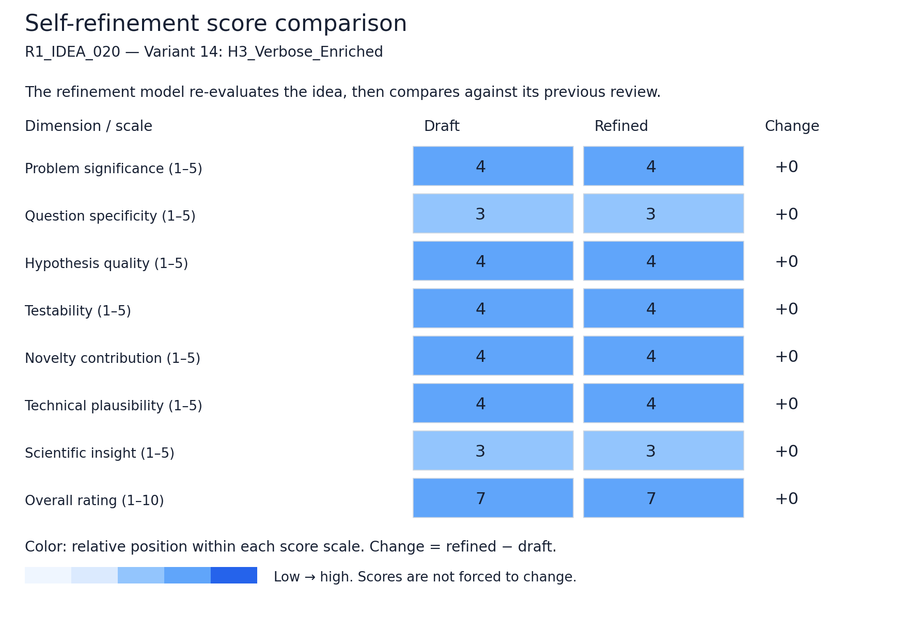

Changed score dimensions: none.

### Score justifications (draft / refined)

**Problem significance**

```json
{
  "draft": {
    "score": 4.0,
    "justification": "The idea addresses a fundamental aspect of neural network design, which is crucial for improving both performance and interpretability. This is a meaningful challenge in the field of machine learning."
  },
  "refined": {
    "score": 4.0,
    "justification": "The idea addresses a fundamental aspect of neural network design, which is crucial for improving both performance and interpretability. This is a meaningful challenge in the field of machine learning."
  }
}
```

**Question specificity**

```json
{
  "draft": {
    "score": 3.0,
    "justification": "The research question is specific in that it focuses on the parameterization of learnable activation functions with splines. However, the exact problem and boundary conditions for interpretability gains are not clearly defined."
  },
  "refined": {
    "score": 3.0,
    "justification": "The research question is specific in that it focuses on the parameterization of learnable activation functions with splines. However, the exact problem and boundary conditions for interpretability gains are not clearly defined."
  }
}
```

**Hypothesis quality**

```json
{
  "draft": {
    "score": 4.0,
    "justification": "The hypothesis is specific and testable, involving the parameterization of learnable functions with splines and validation through cross-domain comparisons. It provides a clear prediction about the method's effectiveness under different conditions."
  },
  "refined": {
    "score": 4.0,
    "justification": "The hypothesis is specific and testable, involving the parameterization of learnable functions with splines and validation through cross-domain comparisons. It provides a clear prediction about the method's effectiveness under different conditions."
  }
}
```

**Testability**

```json
{
  "draft": {
    "score": 4.0,
    "justification": "The idea includes a staged experimental design with specific evaluation criteria, ablation studies, and sensitivity analyses, which make the hypothesis testable. However, the lack of specific datasets or domains limits the testability to some extent."
  },
  "refined": {
    "score": 4.0,
    "justification": "The idea includes a staged experimental design with specific evaluation criteria, ablation studies, and sensitivity analyses, which make the hypothesis testable. However, the lack of specific datasets or domains limits the testability to some extent."
  }
}
```

**Novelty contribution**

```json
{
  "draft": {
    "score": 4.0,
    "justification": "The idea proposes a novel approach to activation functions in neural networks, which could contribute to the field by improving both accuracy and interpretability. However, the novelty is somewhat limited by the lack of specific details on the parameterization of splines."
  },
  "refined": {
    "score": 4.0,
    "justification": "The idea proposes a novel approach to activation functions in neural networks, which could contribute to the field by improving both accuracy and interpretability. However, the novelty is somewhat limited by the lack of specific details on the parameterization of splines."
  }
}
```

**Technical plausibility**

```json
{
  "draft": {
    "score": 4.0,
    "justification": "The proposed approach is technically plausible, as it builds on existing concepts in neural network design. The use of splines for parameterizing learnable functions is a reasonable and feasible approach."
  },
  "refined": {
    "score": 4.0,
    "justification": "The proposed approach is technically plausible, as it builds on existing concepts in neural network design. The use of splines for parameterizing learnable functions is a reasonable and feasible approach."
  }
}
```

**Scientific insight**

```json
{
  "draft": {
    "score": 3.0,
    "justification": "The idea has the potential to provide insights into the relationship between activation function design and model performance, but the specific mechanisms and boundary conditions are not clearly defined, which limits the potential scientific insight."
  },
  "refined": {
    "score": 3.0,
    "justification": "The idea has the potential to provide insights into the relationship between activation function design and model performance, but the specific mechanisms and boundary conditions are not clearly defined, which limits the potential scientific insight."
  }
}
```

**Overall rating**

```json
{
  "draft": {
    "score": 7.0,
    "justification": "The research idea is strong and addresses a meaningful problem in neural network design. It proposes a specific hypothesis and includes a detailed experimental design. However, the lack of specific details on the parameterization of splines and the exact problem being addressed limits its novelty and scientific insight."
  },
  "refined": {
    "score": 7.0,
    "justification": "The research idea is strong and addresses a meaningful problem in neural network design. It proposes a specific hypothesis and includes a detailed experimental design. However, the lack of specific details on the parameterization of splines and the exact problem being addressed limits its novelty and scientific insight."
  }
}
```

## R1_IDEA_020 — Variant 15: H4_Ultimate_Hype


Changed score dimensions: none.

### Score justifications (draft / refined)

**Problem significance**

```json
{
  "draft": {
    "score": 4.0,
    "justification": "The idea addresses a meaningful challenge in neural network design by proposing a novel architecture that could enhance both performance and interpretability, which are critical issues in the field."
  },
  "refined": {
    "score": 4.0,
    "justification": "The idea addresses a meaningful challenge in neural network design by proposing a novel architecture that could enhance both performance and interpretability, which are critical issues in the field."
  }
}
```

**Question specificity**

```json
{
  "draft": {
    "score": 3.0,
    "justification": "The idea is somewhat general in its description of KANs and does not clearly define a specific research question or hypothesis that needs to be investigated."
  },
  "refined": {
    "score": 3.0,
    "justification": "The idea is somewhat general in its description of KANs and does not clearly define a specific research question or hypothesis that needs to be investigated."
  }
}
```

**Hypothesis quality**

```json
{
  "draft": {
    "score": 3.0,
    "justification": "The idea suggests that KANs could be transformative, but it lacks a concrete hypothesis or prediction that can be tested or falsified without more specific details."
  },
  "refined": {
    "score": 3.0,
    "justification": "The idea suggests that KANs could be transformative, but it lacks a concrete hypothesis or prediction that can be tested or falsified without more specific details."
  }
}
```

**Testability**

```json
{
  "draft": {
    "score": 3.0,
    "justification": "The idea is promising but lacks specific experiments or evaluation plans that would allow for meaningful testing of the proposed approach."
  },
  "refined": {
    "score": 3.0,
    "justification": "The idea is promising but lacks specific experiments or evaluation plans that would allow for meaningful testing of the proposed approach."
  }
}
```

**Novelty contribution**

```json
{
  "draft": {
    "score": 4.0,
    "justification": "The idea introduces a novel architectural change (KANs) that could have a significant impact on neural network design, though the novelty is not fully established without more context."
  },
  "refined": {
    "score": 4.0,
    "justification": "The idea introduces a novel architectural change (KANs) that could have a significant impact on neural network design, though the novelty is not fully established without more context."
  }
}
```

**Technical plausibility**

```json
{
  "draft": {
    "score": 4.0,
    "justification": "The concept of replacing fixed activation functions with learnable ones on edges is technically plausible, though the implementation details and potential challenges are not fully explored."
  },
  "refined": {
    "score": 4.0,
    "justification": "The concept of replacing fixed activation functions with learnable ones on edges is technically plausible, though the implementation details and potential challenges are not fully explored."
  }
}
```

**Scientific insight**

```json
{
  "draft": {
    "score": 3.0,
    "justification": "The idea has the potential to provide insights into neural network design and interpretability, but the specific scientific contributions are not clearly outlined."
  },
  "refined": {
    "score": 3.0,
    "justification": "The idea has the potential to provide insights into neural network design and interpretability, but the specific scientific contributions are not clearly outlined."
  }
}
```

**Overall rating**

```json
{
  "draft": {
    "score": 7.0,
    "justification": "The idea is promising and has the potential to make a significant contribution to the field, but it lacks specific details, a clear research question, and a concrete hypothesis that would make it more testable and impactful."
  },
  "refined": {
    "score": 7.0,
    "justification": "The idea is promising and has the potential to make a significant contribution to the field, but it lacks specific details, a clear research question, and a concrete hypothesis that would make it more testable and impactful."
  }
}
```

## R1_IDEA_021 — Source


Changed score dimensions: none.

### Score justifications (draft / refined)

**Problem significance**

```json
{
  "draft": {
    "score": 4.0,
    "justification": "The problem is significant as it addresses a critical limitation of FM in offline imitation learning, which is essential for real-world applications requiring adaptability to new environments."
  },
  "refined": {
    "score": 4.0,
    "justification": "The problem is significant as it addresses a critical limitation of FM in offline imitation learning, which is essential for real-world applications requiring adaptability to new environments."
  }
}
```

**Question specificity**

```json
{
  "draft": {
    "score": 3.0,
    "justification": "The idea identifies a problem but lacks a concrete research question or hypothesis, making it somewhat generic and requiring further clarification."
  },
  "refined": {
    "score": 3.0,
    "justification": "The idea identifies a problem but lacks a concrete research question or hypothesis, making it somewhat generic and requiring further clarification."
  }
}
```

**Hypothesis quality**

```json
{
  "draft": {
    "score": 3.0,
    "justification": "The idea suggests a need for online interaction but does not explicitly state a hypothesis that can be tested, such as a prediction about how incorporating online interaction will improve generalization."
  },
  "refined": {
    "score": 3.0,
    "justification": "The idea suggests a need for online interaction but does not explicitly state a hypothesis that can be tested, such as a prediction about how incorporating online interaction will improve generalization."
  }
}
```

**Testability**

```json
{
  "draft": {
    "score": 3.0,
    "justification": "The idea implies a potential solution but does not specify experiments or evaluations to test the hypothesis, making it difficult to assess the feasibility of the research direction."
  },
  "refined": {
    "score": 3.0,
    "justification": "The idea implies a potential solution but does not specify experiments or evaluations to test the hypothesis, making it difficult to assess the feasibility of the research direction."
  }
}
```

**Novelty contribution**

```json
{
  "draft": {
    "score": 4.0,
    "justification": "The research direction is novel in addressing the limitation of FM through online interaction, which could contribute to more adaptable policies in imitation learning."
  },
  "refined": {
    "score": 4.0,
    "justification": "The research direction is novel in addressing the limitation of FM through online interaction, which could contribute to more adaptable policies in imitation learning."
  }
}
```

**Technical plausibility**

```json
{
  "draft": {
    "score": 4.0,
    "justification": "The proposed direction is technically plausible as combining FM with online interaction is a feasible approach, though the specific implementation details are not provided."
  },
  "refined": {
    "score": 4.0,
    "justification": "The proposed direction is technically plausible as combining FM with online interaction is a feasible approach, though the specific implementation details are not provided."
  }
}
```

**Scientific insight**

```json
{
  "draft": {
    "score": 3.0,
    "justification": "The idea has potential for scientific insight into how online interaction can enhance the generalization of FM-based policies, but the specific mechanisms or insights are not clearly defined."
  },
  "refined": {
    "score": 3.0,
    "justification": "The idea has potential for scientific insight into how online interaction can enhance the generalization of FM-based policies, but the specific mechanisms or insights are not clearly defined."
  }
}
```

**Overall rating**

```json
{
  "draft": {
    "score": 7.0,
    "justification": "The idea presents a meaningful problem with potential for contribution, but it lacks specificity and a clear hypothesis, requiring further development to be a strong research direction."
  },
  "refined": {
    "score": 7.0,
    "justification": "The idea presents a meaningful problem with potential for contribution, but it lacks specificity and a clear hypothesis, requiring further development to be a strong research direction."
  }
}
```

## R1_IDEA_021 — Variant 1: A1_Identity


Changed score dimensions: none.

### Score justifications (draft / refined)

**Problem significance**

```json
{
  "draft": {
    "score": 4.0,
    "justification": "The problem is significant as it addresses a critical limitation of FM in offline imitation learning, which is essential for real-world applications requiring adaptability to new environments."
  },
  "refined": {
    "score": 4.0,
    "justification": "The problem is significant as it addresses a critical limitation of FM in offline imitation learning, which is essential for real-world applications requiring adaptability to new environments."
  }
}
```

**Question specificity**

```json
{
  "draft": {
    "score": 3.0,
    "justification": "The idea identifies a problem but lacks a concrete research question or hypothesis, making it somewhat generic and requiring further clarification."
  },
  "refined": {
    "score": 3.0,
    "justification": "The idea identifies a problem but lacks a concrete research question or hypothesis, making it somewhat generic and requiring further clarification."
  }
}
```

**Hypothesis quality**

```json
{
  "draft": {
    "score": 3.0,
    "justification": "The idea suggests a need for online interaction but does not explicitly state a hypothesis that can be tested, such as a prediction about how incorporating online interaction will improve generalization."
  },
  "refined": {
    "score": 3.0,
    "justification": "The idea suggests a need for online interaction but does not explicitly state a hypothesis that can be tested, such as a prediction about how incorporating online interaction will improve generalization."
  }
}
```

**Testability**

```json
{
  "draft": {
    "score": 3.0,
    "justification": "The idea implies a potential solution but does not specify experiments or evaluations to test the hypothesis, making it difficult to assess the feasibility of the research direction."
  },
  "refined": {
    "score": 3.0,
    "justification": "The idea implies a potential solution but does not specify experiments or evaluations to test the hypothesis, making it difficult to assess the feasibility of the research direction."
  }
}
```

**Novelty contribution**

```json
{
  "draft": {
    "score": 4.0,
    "justification": "The research direction is novel in addressing the limitation of FM through online interaction, which could contribute to more adaptable policies in imitation learning."
  },
  "refined": {
    "score": 4.0,
    "justification": "The research direction is novel in addressing the limitation of FM through online interaction, which could contribute to more adaptable policies in imitation learning."
  }
}
```

**Technical plausibility**

```json
{
  "draft": {
    "score": 4.0,
    "justification": "The proposed direction is technically plausible as combining FM with online interaction is a feasible approach, though the specific implementation details are not provided."
  },
  "refined": {
    "score": 4.0,
    "justification": "The proposed direction is technically plausible as combining FM with online interaction is a feasible approach, though the specific implementation details are not provided."
  }
}
```

**Scientific insight**

```json
{
  "draft": {
    "score": 3.0,
    "justification": "The idea has potential for scientific insight into how online interaction can enhance the generalization of FM-based policies, but the specific mechanisms or insights are not clearly defined."
  },
  "refined": {
    "score": 3.0,
    "justification": "The idea has potential for scientific insight into how online interaction can enhance the generalization of FM-based policies, but the specific mechanisms or insights are not clearly defined."
  }
}
```

**Overall rating**

```json
{
  "draft": {
    "score": 7.0,
    "justification": "The idea presents a meaningful problem with potential for contribution, but it lacks specificity and a clear hypothesis, requiring further development to be a strong research direction."
  },
  "refined": {
    "score": 7.0,
    "justification": "The idea presents a meaningful problem with potential for contribution, but it lacks specificity and a clear hypothesis, requiring further development to be a strong research direction."
  }
}
```

## R1_IDEA_021 — Variant 2: A2_Paraphrase_Only


Changed score dimensions: none.

### Score justifications (draft / refined)

**Problem significance**

```json
{
  "draft": {
    "score": 4.0,
    "justification": "The problem of generalization in imitation learning is significant, as it affects the practical applicability of FM-based methods in real-world settings."
  },
  "refined": {
    "score": 4.0,
    "justification": "The problem of generalization in imitation learning is significant, as it affects the practical applicability of FM-based methods in real-world settings."
  }
}
```

**Question specificity**

```json
{
  "draft": {
    "score": 3.0,
    "justification": "The idea identifies a problem but lacks a specific question or hypothesis to guide the research."
  },
  "refined": {
    "score": 3.0,
    "justification": "The idea identifies a problem but lacks a specific question or hypothesis to guide the research."
  }
}
```

**Hypothesis quality**

```json
{
  "draft": {
    "score": 2.0,
    "justification": "The idea suggests a potential solution but does not explicitly state a hypothesis that can be tested or falsified."
  },
  "refined": {
    "score": 2.0,
    "justification": "The idea suggests a potential solution but does not explicitly state a hypothesis that can be tested or falsified."
  }
}
```

**Testability**

```json
{
  "draft": {
    "score": 3.0,
    "justification": "The idea suggests a direction but does not provide a clear experimental plan or evaluation method."
  },
  "refined": {
    "score": 3.0,
    "justification": "The idea suggests a direction but does not provide a clear experimental plan or evaluation method."
  }
}
```

**Novelty contribution**

```json
{
  "draft": {
    "score": 3.0,
    "justification": "The idea addresses a known limitation but does not propose a novel method or contribution beyond the general suggestion of incorporating online interaction."
  },
  "refined": {
    "score": 3.0,
    "justification": "The idea addresses a known limitation but does not propose a novel method or contribution beyond the general suggestion of incorporating online interaction."
  }
}
```

**Technical plausibility**

```json
{
  "draft": {
    "score": 4.0,
    "justification": "Combining FM with online interaction is a plausible technical direction, though the specifics are not detailed."
  },
  "refined": {
    "score": 4.0,
    "justification": "Combining FM with online interaction is a plausible technical direction, though the specifics are not detailed."
  }
}
```

**Scientific insight**

```json
{
  "draft": {
    "score": 3.0,
    "justification": "The idea could lead to insights about the interplay between imitation learning and reinforcement learning, but the potential for deeper scientific insight is limited without a specific hypothesis."
  },
  "refined": {
    "score": 3.0,
    "justification": "The idea could lead to insights about the interplay between imitation learning and reinforcement learning, but the potential for deeper scientific insight is limited without a specific hypothesis."
  }
}
```

**Overall rating**

```json
{
  "draft": {
    "score": 7.0,
    "justification": "The idea identifies a meaningful problem and suggests a plausible direction, but lacks specificity and a clear hypothesis, which are needed for a strong research proposal."
  },
  "refined": {
    "score": 7.0,
    "justification": "The idea identifies a meaningful problem and suggests a plausible direction, but lacks specificity and a clear hypothesis, which are needed for a strong research proposal."
  }
}
```

## R1_IDEA_021 — Variant 3: A3_Plain_Core

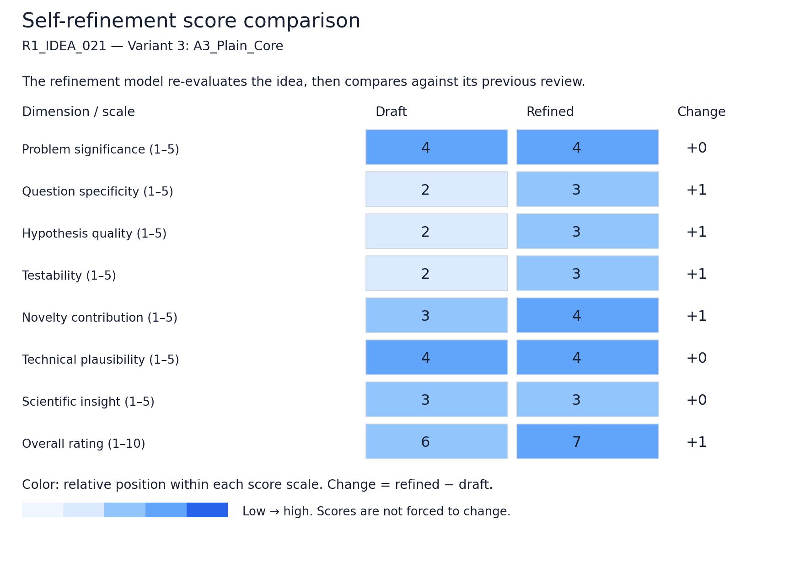

Changed score dimensions: question_specificity, hypothesis_quality, testability, novelty_contribution, overall_rating.

### Score justifications (draft / refined)

**Problem significance**

```json
{
  "draft": {
    "score": 4.0,
    "justification": "The problem addresses a critical limitation in Flow Matching's applicability to real-world scenarios, which is important for practical imitation learning and policy adaptation."
  },
  "refined": {
    "score": 4.0,
    "justification": "The problem addresses a critical limitation in Flow Matching's applicability to real-world scenarios, which is important for practical imitation learning and policy adaptation."
  }
}
```

**Question specificity**

```json
{
  "draft": {
    "score": 2.0,
    "justification": "The idea identifies a general problem but lacks a specific research question or hypothesis that could be tested."
  },
  "refined": {
    "score": 3.0,
    "justification": "The idea identifies a general problem but provides a more focused direction by suggesting the need for online interaction as a potential solution, though a specific research question is still missing."
  }
}
```

**Hypothesis quality**

```json
{
  "draft": {
    "score": 2.0,
    "justification": "The idea suggests a potential solution but does not explicitly state a hypothesis that could be tested or falsified."
  },
  "refined": {
    "score": 3.0,
    "justification": "The idea suggests a potential solution but does not explicitly state a hypothesis that could be tested or falsified, though the need for online interaction is a clear direction."
  }
}
```

**Testability**

```json
{
  "draft": {
    "score": 2.0,
    "justification": "The idea does not provide a clear experimental plan or evaluation method to test the proposed solution."
  },
  "refined": {
    "score": 3.0,
    "justification": "The idea does not provide a clear experimental plan or evaluation method to test the proposed solution, but the suggestion of incorporating online interaction is testable with further details."
  }
}
```

**Novelty contribution**

```json
{
  "draft": {
    "score": 3.0,
    "justification": "The idea points to a novel direction for improving Flow Matching's generalization through online interaction, but the novelty is not clearly defined without further specifics."
  },
  "refined": {
    "score": 4.0,
    "justification": "The idea points to a novel direction for improving Flow Matching's generalization through online interaction, which could contribute to the field of imitation learning and policy adaptation."
  }
}
```

**Technical plausibility**

```json
{
  "draft": {
    "score": 4.0,
    "justification": "The proposed direction of integrating online interaction with Flow Matching is technically plausible and aligns with current research trends in reinforcement learning and imitation learning."
  },
  "refined": {
    "score": 4.0,
    "justification": "The proposed direction of integrating online interaction with Flow Matching is technically plausible and aligns with current research trends in reinforcement learning and imitation learning."
  }
}
```

**Scientific insight**

```json
{
  "draft": {
    "score": 3.0,
    "justification": "The idea has potential to provide insights into the role of online interaction in policy generalization, but the scientific insight is not yet concrete without further investigation."
  },
  "refined": {
    "score": 3.0,
    "justification": "The idea has potential to provide insights into the role of online interaction in policy generalization, but the scientific insight is not yet concrete without further investigation."
  }
}
```

**Overall rating**

```json
{
  "draft": {
    "score": 6.0,
    "justification": "The idea identifies a meaningful problem and suggests a promising direction, but lacks specific hypotheses, methods, and evaluation plans, which are necessary for further development."
  },
  "refined": {
    "score": 7.0,
    "justification": "The idea identifies a meaningful problem and suggests a promising direction with potential for contribution, though it lacks specific hypotheses, methods, and evaluation plans that are necessary for further development."
  }
}
```

## R1_IDEA_021 — Variant 4: B1_Verbose_Elaborate


Changed score dimensions: none.

### Score justifications (draft / refined)

**Problem significance**

```json
{
  "draft": {
    "score": 4.0,
    "justification": "The problem of poor generalization in offline imitation learning is significant, as it affects the practical applicability of FM-based policies in real-world scenarios."
  },
  "refined": {
    "score": 4.0,
    "justification": "The problem of poor generalization in offline imitation learning is significant, as it affects the practical applicability of FM-based policies in real-world scenarios."
  }
}
```

**Question specificity**

```json
{
  "draft": {
    "score": 3.0,
    "justification": "The idea identifies a problem but lacks a clear, specific research question. It suggests a general direction but does not define what exactly is being investigated."
  },
  "refined": {
    "score": 3.0,
    "justification": "The idea identifies a problem but lacks a clear, specific research question. It suggests a general direction but does not define what exactly is being investigated."
  }
}
```

**Hypothesis quality**

```json
{
  "draft": {
    "score": 2.0,
    "justification": "The idea mentions the need for online interaction but does not present a concrete hypothesis that can be tested or falsified. It lacks a specific prediction or mechanism."
  },
  "refined": {
    "score": 2.0,
    "justification": "The idea mentions the need for online interaction but does not present a concrete hypothesis that can be tested or falsified. It lacks a specific prediction or mechanism."
  }
}
```

**Testability**

```json
{
  "draft": {
    "score": 3.0,
    "justification": "The idea suggests a potential solution (online interaction) but does not provide a clear experimental design or method to test its effectiveness. The testability is limited without further details."
  },
  "refined": {
    "score": 3.0,
    "justification": "The idea suggests a potential solution (online interaction) but does not provide a clear experimental design or method to test its effectiveness. The testability is limited without further details."
  }
}
```

**Novelty contribution**

```json
{
  "draft": {
    "score": 3.0,
    "justification": "The idea addresses a known limitation of FM in imitation learning but does not propose a novel method or contribution. It focuses on a general problem rather than a specific, novel insight."
  },
  "refined": {
    "score": 3.0,
    "justification": "The idea addresses a known limitation of FM in imitation learning but does not propose a novel method or contribution. It focuses on a general problem rather than a specific, novel insight."
  }
}
```

**Technical plausibility**

```json
{
  "draft": {
    "score": 4.0,
    "justification": "The proposed direction of integrating online interaction with FM-based policies is technically plausible, as it aligns with existing research on exploration in reinforcement learning and imitation learning."
  },
  "refined": {
    "score": 4.0,
    "justification": "The proposed direction of integrating online interaction with FM-based policies is technically plausible, as it aligns with existing research on exploration in reinforcement learning and imitation learning."
  }
}
```

**Scientific insight**

```json
{
  "draft": {
    "score": 3.0,
    "justification": "The idea highlights a critical limitation but does not offer new insights into the underlying mechanisms or principles that could be discovered through the research. It focuses on a practical problem rather than a fundamental scientific question."
  },
  "refined": {
    "score": 3.0,
    "justification": "The idea highlights a critical limitation but does not offer new insights into the underlying mechanisms or principles that could be discovered through the research. It focuses on a practical problem rather than a fundamental scientific question."
  }
}
```

**Overall rating**

```json
{
  "draft": {
    "score": 7.0,
    "justification": "The idea identifies a meaningful problem in the application of Flow Matching to offline imitation learning and suggests a promising direction for future research. However, it lacks specific hypotheses, research questions, and experimental details, which are necessary for assessing its scientific merit and testability."
  },
  "refined": {
    "score": 7.0,
    "justification": "The idea identifies a meaningful problem in the application of Flow Matching to offline imitation learning and suggests a promising direction for future research. However, it lacks specific hypotheses, research questions, and experimental details, which are necessary for assessing its scientific merit and testability."
  }
}
```

## R1_IDEA_021 — Variant 5: B2_Grand_Narrative


Changed score dimensions: none.

### Score justifications (draft / refined)

**Problem significance**

```json
{
  "draft": {
    "score": 4.0,
    "justification": "The issue of generalization in offline imitation learning is critical for autonomous systems, with implications for real-world applications."
  },
  "refined": {
    "score": 4.0,
    "justification": "The issue of generalization in offline imitation learning is critical for autonomous systems, with implications for real-world applications."
  }
}
```

**Question specificity**

```json
{
  "draft": {
    "score": 2.0,
    "justification": "The idea identifies a problem but lacks a precise research question or hypothesis to guide the investigation."
  },
  "refined": {
    "score": 2.0,
    "justification": "The idea identifies a problem but lacks a precise research question or hypothesis to guide the investigation."
  }
}
```

**Hypothesis quality**

```json
{
  "draft": {
    "score": 2.0,
    "justification": "The idea raises a problem but does not explicitly state a testable hypothesis or prediction."
  },
  "refined": {
    "score": 2.0,
    "justification": "The idea raises a problem but does not explicitly state a testable hypothesis or prediction."
  }
}
```

**Testability**

```json
{
  "draft": {
    "score": 2.0,
    "justification": "The idea does not propose experiments or methods to test the hypothesis, making it difficult to assess its validity."
  },
  "refined": {
    "score": 2.0,
    "justification": "The idea does not propose experiments or methods to test the hypothesis, making it difficult to assess its validity."
  }
}
```

**Novelty contribution**

```json
{
  "draft": {
    "score": 3.0,
    "justification": "The idea addresses a known limitation but does not propose a novel method or contribution beyond identifying the problem."
  },
  "refined": {
    "score": 3.0,
    "justification": "The idea addresses a known limitation but does not propose a novel method or contribution beyond identifying the problem."
  }
}
```

**Technical plausibility**

```json
{
  "draft": {
    "score": 4.0,
    "justification": "The proposed problem is technically plausible, as integrating online interaction with existing methods is a reasonable direction for improvement."
  },
  "refined": {
    "score": 4.0,
    "justification": "The proposed problem is technically plausible, as integrating online interaction with existing methods is a reasonable direction for improvement."
  }
}
```

**Scientific insight**

```json
{
  "draft": {
    "score": 3.0,
    "justification": "The idea provides insight into the limitations of current methods but does not offer new theoretical understanding or mechanisms."
  },
  "refined": {
    "score": 3.0,
    "justification": "The idea provides insight into the limitations of current methods but does not offer new theoretical understanding or mechanisms."
  }
}
```

**Overall rating**

```json
{
  "draft": {
    "score": 6.0,
    "justification": "The idea identifies a meaningful problem in the field but lacks a clear research question, hypothesis, and methodological direction, limiting its potential contribution."
  },
  "refined": {
    "score": 6.0,
    "justification": "The idea identifies a meaningful problem in the field but lacks a clear research question, hypothesis, and methodological direction, limiting its potential contribution."
  }
}
```

## R1_IDEA_021 — Variant 6: B3_Over_Confident


Changed score dimensions: none.

### Score justifications (draft / refined)

**Problem significance**

```json
{
  "draft": {
    "score": 4.0,
    "justification": "The problem of generalization in offline imitation learning is significant, as it affects the practical applicability of FM-based policies in real-world scenarios."
  },
  "refined": {
    "score": 4.0,
    "justification": "The problem of generalization in offline imitation learning is significant, as it affects the practical applicability of FM-based policies in real-world scenarios."
  }
}
```

**Question specificity**

```json
{
  "draft": {
    "score": 3.0,
    "justification": "The idea identifies a problem but lacks a specific question or hypothesis, making it somewhat vague in terms of what exactly is being investigated."
  },
  "refined": {
    "score": 3.0,
    "justification": "The idea identifies a problem but lacks a specific question or hypothesis, making it somewhat vague in terms of what exactly is being investigated."
  }
}
```

**Hypothesis quality**

```json
{
  "draft": {
    "score": 2.0,
    "justification": "The idea presents a problem but does not explicitly state a hypothesis that can be tested or contradicted, making it less actionable."
  },
  "refined": {
    "score": 2.0,
    "justification": "The idea presents a problem but does not explicitly state a hypothesis that can be tested or contradicted, making it less actionable."
  }
}
```

**Testability**

```json
{
  "draft": {
    "score": 3.0,
    "justification": "The idea suggests a need for online interaction but does not provide a clear experimental framework or method to test the hypothesis."
  },
  "refined": {
    "score": 3.0,
    "justification": "The idea suggests a need for online interaction but does not provide a clear experimental framework or method to test the hypothesis."
  }
}
```

**Novelty contribution**

```json
{
  "draft": {
    "score": 3.0,
    "justification": "The idea points out a limitation of FM and suggests a direction for improvement, but does not propose a novel method or contribution beyond identifying the problem."
  },
  "refined": {
    "score": 3.0,
    "justification": "The idea points out a limitation of FM and suggests a direction for improvement, but does not propose a novel method or contribution beyond identifying the problem."
  }
}
```

**Technical plausibility**

```json
{
  "draft": {
    "score": 4.0,
    "justification": "The proposed direction of integrating online interaction with FM is technically plausible, as it aligns with existing research in reinforcement learning and online learning."
  },
  "refined": {
    "score": 4.0,
    "justification": "The proposed direction of integrating online interaction with FM is technically plausible, as it aligns with existing research in reinforcement learning and online learning."
  }
}
```

**Scientific insight**

```json
{
  "draft": {
    "score": 3.0,
    "justification": "The idea provides insight into the limitations of FM but does not clearly indicate what new knowledge or principles could be uncovered through further investigation."
  },
  "refined": {
    "score": 3.0,
    "justification": "The idea provides insight into the limitations of FM but does not clearly indicate what new knowledge or principles could be uncovered through further investigation."
  }
}
```

**Overall rating**

```json
{
  "draft": {
    "score": 7.0,
    "justification": "The idea identifies a meaningful problem and suggests a direction for improvement, but lacks specific hypotheses, methods, and testable questions, which are necessary for further development."
  },
  "refined": {
    "score": 7.0,
    "justification": "The idea identifies a meaningful problem and suggests a direction for improvement, but lacks specific hypotheses, methods, and testable questions, which are necessary for further development."
  }
}
```

## R1_IDEA_021 — Variant 7: B4_Novelty


Changed score dimensions: none.

### Score justifications (draft / refined)

**Problem significance**

```json
{
  "draft": {
    "score": 4.0,
    "justification": "The problem addresses a critical limitation in offline imitation learning, which is essential for real-world applications where expert data is limited and generalization is crucial."
  },
  "refined": {
    "score": 4.0,
    "justification": "The problem addresses a critical limitation in offline imitation learning, which is essential for real-world applications where expert data is limited and generalization is crucial."
  }
}
```

**Question specificity**

```json
{
  "draft": {
    "score": 3.0,
    "justification": "The idea identifies a specific issue with FM-based policies but lacks detailed specifics on the problem scope, the nature of the limitation, and the exact research question being investigated."
  },
  "refined": {
    "score": 3.0,
    "justification": "The idea identifies a specific issue with FM-based policies but lacks detailed specifics on the problem scope, the nature of the limitation, and the exact research question being investigated."
  }
}
```

**Hypothesis quality**

```json
{
  "draft": {
    "score": 2.0,
    "justification": "The idea suggests a direction but does not explicitly state a hypothesis that can be tested or falsified. It lacks a concrete prediction about the outcome of incorporating online interaction."
  },
  "refined": {
    "score": 2.0,
    "justification": "The idea suggests a direction but does not explicitly state a hypothesis that can be tested or falsified. It lacks a concrete prediction about the outcome of incorporating online interaction."
  }
}
```

**Testability**

```json
{
  "draft": {
    "score": 3.0,
    "justification": "The idea suggests a research direction but does not provide a clear experimental plan or evaluation method to test the hypothesis. The lack of specifics makes it difficult to assess the testability."
  },
  "refined": {
    "score": 3.0,
    "justification": "The idea suggests a research direction but does not provide a clear experimental plan or evaluation method to test the hypothesis. The lack of specifics makes it difficult to assess the testability."
  }
}
```

**Novelty contribution**

```json
{
  "draft": {
    "score": 4.0,
    "justification": "The idea proposes a novel research direction by addressing a previously underexplored limitation of Flow Matching in offline imitation learning, which could contribute to the field by improving generalization through online interaction."
  },
  "refined": {
    "score": 4.0,
    "justification": "The idea proposes a novel research direction by addressing a previously underexplored limitation of Flow Matching in offline imitation learning, which could contribute to the field by improving generalization through online interaction."
  }
}
```

**Technical plausibility**

```json
{
  "draft": {
    "score": 4.0,
    "justification": "The proposed direction is technically plausible as it builds on existing methods (Flow Matching) and addresses a known challenge in reinforcement learning. The integration of online interaction is a reasonable approach to enhance generalization."
  },
  "refined": {
    "score": 4.0,
    "justification": "The proposed direction is technically plausible as it builds on existing methods (Flow Matching) and addresses a known challenge in reinforcement learning. The integration of online interaction is a reasonable approach to enhance generalization."
  }
}
```

**Scientific insight**

```json
{
  "draft": {
    "score": 3.0,
    "justification": "The idea has potential for scientific insight by exploring the interplay between offline imitation learning and online interaction. However, the current formulation lacks the depth needed to reveal broader principles or mechanisms."
  },
  "refined": {
    "score": 3.0,
    "justification": "The idea has potential for scientific insight by exploring the interplay between offline imitation learning and online interaction. However, the current formulation lacks the depth needed to reveal broader principles or mechanisms."
  }
}
```

**Overall rating**

```json
{
  "draft": {
    "score": 7.0,
    "justification": "The idea identifies a meaningful problem and suggests a promising research direction. However, it lacks specificity, a clear hypothesis, and a detailed plan for testing, which are necessary for a strong research proposal."
  },
  "refined": {
    "score": 7.0,
    "justification": "The idea identifies a meaningful problem and suggests a promising research direction. However, it lacks specificity, a clear hypothesis, and a detailed plan for testing, which are necessary for a strong research proposal."
  }
}
```

## R1_IDEA_021 — Variant 8: B5_Application_Impact


Changed score dimensions: none.

### Score justifications (draft / refined)

**Problem significance**

```json
{
  "draft": {
    "score": 4.0,
    "justification": "The problem addresses a critical limitation of Flow Matching in real-world applications, which is important for developing more robust robotic systems."
  },
  "refined": {
    "score": 4.0,
    "justification": "The problem addresses a critical limitation of Flow Matching in real-world applications, which is important for developing more robust robotic systems."
  }
}
```

**Question specificity**

```json
{
  "draft": {
    "score": 3.0,
    "justification": "The idea identifies a problem but lacks a specific research question or hypothesis that could be tested, making it somewhat vague."
  },
  "refined": {
    "score": 3.0,
    "justification": "The idea identifies a problem but lacks a specific research question or hypothesis that could be tested, making it somewhat vague."
  }
}
```

**Hypothesis quality**

```json
{
  "draft": {
    "score": 2.0,
    "justification": "The idea suggests a need for online interaction but does not provide a clear hypothesis or prediction that could be tested or falsified."
  },
  "refined": {
    "score": 2.0,
    "justification": "The idea suggests a need for online interaction but does not provide a clear hypothesis or prediction that could be tested or falsified."
  }
}
```

**Testability**

```json
{
  "draft": {
    "score": 3.0,
    "justification": "The idea points to a need for further research but does not specify experiments, comparisons, or evaluations that would test the hypothesis."
  },
  "refined": {
    "score": 3.0,
    "justification": "The idea points to a need for further research but does not specify experiments, comparisons, or evaluations that would test the hypothesis."
  }
}
```

**Novelty contribution**

```json
{
  "draft": {
    "score": 3.0,
    "justification": "The idea identifies a relevant problem but does not propose a novel method or contribution beyond the general suggestion of incorporating online interaction."
  },
  "refined": {
    "score": 3.0,
    "justification": "The idea identifies a relevant problem but does not propose a novel method or contribution beyond the general suggestion of incorporating online interaction."
  }
}
```

**Technical plausibility**

```json
{
  "draft": {
    "score": 4.0,
    "justification": "The idea is technically plausible as integrating online interaction with existing FM methods is a feasible direction for research."
  },
  "refined": {
    "score": 4.0,
    "justification": "The idea is technically plausible as integrating online interaction with existing FM methods is a feasible direction for research."
  }
}
```

**Scientific insight**

```json
{
  "draft": {
    "score": 3.0,
    "justification": "The idea highlights a key limitation but does not suggest how this insight could lead to broader scientific understanding or principles."
  },
  "refined": {
    "score": 3.0,
    "justification": "The idea highlights a key limitation but does not suggest how this insight could lead to broader scientific understanding or principles."
  }
}
```

**Overall rating**

```json
{
  "draft": {
    "score": 7.0,
    "justification": "The idea identifies a meaningful problem in FM's limitations for real-world applications, but lacks specific hypotheses, testable questions, and clear research directions."
  },
  "refined": {
    "score": 7.0,
    "justification": "The idea identifies a meaningful problem in FM's limitations for real-world applications, but lacks specific hypotheses, testable questions, and clear research directions."
  }
}
```

## R1_IDEA_021 — Variant 9: C1_Hollow_Shell


Changed score dimensions: none.

### Score justifications (draft / refined)

**Problem significance**

```json
{
  "draft": {
    "score": 4.0,
    "justification": "The issue of limited adaptability in distribution modeling is a significant challenge in machine learning, particularly in scenarios requiring real-world adaptation."
  },
  "refined": {
    "score": 4.0,
    "justification": "The issue of limited adaptability in distribution modeling is a significant challenge in machine learning, particularly in scenarios requiring real-world adaptation."
  }
}
```

**Question specificity**

```json
{
  "draft": {
    "score": 3.0,
    "justification": "The idea identifies a problem but lacks specific details about the research question, such as the exact nature of the interaction or the specific domain of application."
  },
  "refined": {
    "score": 3.0,
    "justification": "The idea identifies a problem but lacks specific details about the research question, such as the exact nature of the interaction or the specific domain of application."
  }
}
```

**Hypothesis quality**

```json
{
  "draft": {
    "score": 3.0,
    "justification": "The idea suggests a need for interactive learning but does not explicitly state a hypothesis that could be tested, such as how interaction would improve adaptability."
  },
  "refined": {
    "score": 3.0,
    "justification": "The idea suggests a need for interactive learning but does not explicitly state a hypothesis that could be tested, such as how interaction would improve adaptability."
  }
}
```

**Testability**

```json
{
  "draft": {
    "score": 3.0,
    "justification": "The idea suggests a direction but does not provide specific experiments or evaluation methods to test the hypothesis."
  },
  "refined": {
    "score": 3.0,
    "justification": "The idea suggests a direction but does not provide specific experiments or evaluation methods to test the hypothesis."
  }
}
```

**Novelty contribution**

```json
{
  "draft": {
    "score": 4.0,
    "justification": "The proposed focus on interactive learning for distribution modeling is a novel direction, though the specific contribution would depend on the implementation details."
  },
  "refined": {
    "score": 4.0,
    "justification": "The proposed focus on interactive learning for distribution modeling is a novel direction, though the specific contribution would depend on the implementation details."
  }
}
```

**Technical plausibility**

```json
{
  "draft": {
    "score": 4.0,
    "justification": "The idea is technically plausible as interactive learning is a well-studied area, and improving adaptability through interaction is a reasonable approach."
  },
  "refined": {
    "score": 4.0,
    "justification": "The idea is technically plausible as interactive learning is a well-studied area, and improving adaptability through interaction is a reasonable approach."
  }
}
```

**Scientific insight**

```json
{
  "draft": {
    "score": 3.0,
    "justification": "The idea has potential for scientific insight into the limitations of current methods, but the specific insights would depend on the implementation and evaluation."
  },
  "refined": {
    "score": 3.0,
    "justification": "The idea has potential for scientific insight into the limitations of current methods, but the specific insights would depend on the implementation and evaluation."
  }
}
```

**Overall rating**

```json
{
  "draft": {
    "score": 7.0,
    "justification": "The idea identifies a meaningful problem with clear potential for contribution, but lacks specific details that would make it more testable and scientifically rigorous."
  },
  "refined": {
    "score": 7.0,
    "justification": "The idea identifies a meaningful problem with clear potential for contribution, but lacks specific details that would make it more testable and scientifically rigorous."
  }
}
```

## R1_IDEA_021 — Variant 10: C2_Logic_Flawed


Changed score dimensions: none.

### Score justifications (draft / refined)

**Problem significance**

```json
{
  "draft": {
    "score": 4.0,
    "justification": "The problem of generalization in imitation learning is significant, as it affects the practical applicability of learned policies in new environments."
  },
  "refined": {
    "score": 4.0,
    "justification": "The problem of generalization in imitation learning is significant, as it affects the practical applicability of learned policies in new environments."
  }
}
```

**Question specificity**

```json
{
  "draft": {
    "score": 3.0,
    "justification": "The idea presents a general hypothesis but lacks specific details on how to test it, such as the exact method for online interaction or the specific tasks to evaluate."
  },
  "refined": {
    "score": 3.0,
    "justification": "The idea presents a general hypothesis but lacks specific details on how to test it, such as the exact method for online interaction or the specific tasks to evaluate."
  }
}
```

**Hypothesis quality**

```json
{
  "draft": {
    "score": 4.0,
    "justification": "The hypothesis that online interaction can improve generalization is plausible and directly addresses a known limitation of FM-based policies."
  },
  "refined": {
    "score": 4.0,
    "justification": "The hypothesis that online interaction can improve generalization is plausible and directly addresses a known limitation of FM-based policies."
  }
}
```

**Testability**

```json
{
  "draft": {
    "score": 3.0,
    "justification": "The idea suggests a potential solution but does not provide a clear experimental design or evaluation plan to test the hypothesis."
  },
  "refined": {
    "score": 3.0,
    "justification": "The idea suggests a potential solution but does not provide a clear experimental design or evaluation plan to test the hypothesis."
  }
}
```

**Novelty contribution**

```json
{
  "draft": {
    "score": 3.0,
    "justification": "The idea is not novel in itself but offers a direction for improving existing methods in imitation learning, which could contribute to the field if validated."
  },
  "refined": {
    "score": 3.0,
    "justification": "The idea is not novel in itself but offers a direction for improving existing methods in imitation learning, which could contribute to the field if validated."
  }
}
```

**Technical plausibility**

```json
{
  "draft": {
    "score": 4.0,
    "justification": "The proposed approach is technically plausible, as integrating online interaction with existing FM frameworks is a feasible direction for research."
  },
  "refined": {
    "score": 4.0,
    "justification": "The proposed approach is technically plausible, as integrating online interaction with existing FM frameworks is a feasible direction for research."
  }
}
```

**Scientific insight**

```json
{
  "draft": {
    "score": 3.0,
    "justification": "The idea has potential to provide insights into the role of environmental interaction in policy generalization, but the current formulation lacks the specificity needed for deeper scientific understanding."
  },
  "refined": {
    "score": 3.0,
    "justification": "The idea has potential to provide insights into the role of environmental interaction in policy generalization, but the current formulation lacks the specificity needed for deeper scientific understanding."
  }
}
```

**Overall rating**

```json
{
  "draft": {
    "score": 7.0,
    "justification": "The idea addresses a meaningful problem in imitation learning and proposes a plausible hypothesis, but it lacks specific details and a clear experimental plan to test the hypothesis, which limits its potential impact."
  },
  "refined": {
    "score": 7.0,
    "justification": "The idea addresses a meaningful problem in imitation learning and proposes a plausible hypothesis, but it lacks specific details and a clear experimental plan to test the hypothesis, which limits its potential impact."
  }
}
```

## R1_IDEA_021 — Variant 11: C3_Substance_Enriched


Changed score dimensions: none.

### Score justifications (draft / refined)

**Problem significance**

```json
{
  "draft": {
    "score": 4.0,
    "justification": "The idea addresses a critical challenge in offline imitation learning, where models often fail to generalize beyond expert demonstrations. This is a significant issue in real-world applications where expert data may be limited or insufficient."
  },
  "refined": {
    "score": 4.0,
    "justification": "The idea addresses a critical challenge in offline imitation learning, where models often fail to generalize beyond expert demonstrations. This is a significant issue in real-world applications where expert data may be limited or insufficient."
  }
}
```

**Question specificity**

```json
{
  "draft": {
    "score": 3.0,
    "justification": "The question is specific to the relationship between demonstration diversity and FM performance, but the exact nature of the relationship and the metrics for evaluation are not clearly defined."
  },
  "refined": {
    "score": 3.0,
    "justification": "The question is specific to the relationship between demonstration diversity and FM performance, but the exact nature of the relationship and the metrics for evaluation are not clearly defined."
  }
}
```

**Hypothesis quality**

```json
{
  "draft": {
    "score": 3.0,
    "justification": "The hypothesis is implied but not explicitly stated. It suggests a potential relationship between demonstration diversity and generalization, but lacks a concrete prediction or mechanism."
  },
  "refined": {
    "score": 3.0,
    "justification": "The hypothesis is implied but not explicitly stated. It suggests a potential relationship between demonstration diversity and generalization, but lacks a concrete prediction or mechanism."
  }
}
```

**Testability**

```json
{
  "draft": {
    "score": 3.0,
    "justification": "The idea proposes a validation route, but the specifics of the experiment, such as the metrics, environments, and data collection methods, are not detailed, making it difficult to assess the testability."
  },
  "refined": {
    "score": 3.0,
    "justification": "The idea proposes a validation route, but the specifics of the experiment, such as the metrics, environments, and data collection methods, are not detailed, making it difficult to assess the testability."
  }
}
```

**Novelty contribution**

```json
{
  "draft": {
    "score": 4.0,
    "justification": "The idea explores a novel angle in offline imitation learning by focusing on the impact of demonstration diversity on FM performance, which could contribute to understanding the limitations of current methods."
  },
  "refined": {
    "score": 4.0,
    "justification": "The idea explores a novel angle in offline imitation learning by focusing on the impact of demonstration diversity on FM performance, which could contribute to understanding the limitations of current methods."
  }
}
```

**Technical plausibility**

```json
{
  "draft": {
    "score": 4.0,
    "justification": "The proposed direction is technically plausible, as it builds on existing work in Flow Matching and offline imitation learning. The idea of incorporating online data to improve generalization is a reasonable approach."
  },
  "refined": {
    "score": 4.0,
    "justification": "The proposed direction is technically plausible, as it builds on existing work in Flow Matching and offline imitation learning. The idea of incorporating online data to improve generalization is a reasonable approach."
  }
}
```

**Scientific insight**

```json
{
  "draft": {
    "score": 4.0,
    "justification": "The idea has the potential to provide insights into the limitations of FM-based policies in offline settings and the role of demonstration diversity in generalization, which could inform future research and applications."
  },
  "refined": {
    "score": 4.0,
    "justification": "The idea has the potential to provide insights into the limitations of FM-based policies in offline settings and the role of demonstration diversity in generalization, which could inform future research and applications."
  }
}
```

**Overall rating**

```json
{
  "draft": {
    "score": 7.0,
    "justification": "The idea addresses a meaningful problem in offline imitation learning and proposes a testable hypothesis. While the specifics are somewhat vague, the potential contribution and scientific insight are strong, making it a promising research direction."
  },
  "refined": {
    "score": 7.0,
    "justification": "The idea addresses a meaningful problem in offline imitation learning and proposes a testable hypothesis. While the specifics are somewhat vague, the potential contribution and scientific insight are strong, making it a promising research direction."
  }
}
```

## R1_IDEA_021 — Variant 12: H1_Deceptive_Hollow


Changed score dimensions: none.

### Score justifications (draft / refined)

**Problem significance**

```json
{
  "draft": {
    "score": 4.0,
    "justification": "The idea addresses a critical challenge in machine learning: improving model adaptability and robustness through interactive learning, which is relevant to both research and practical applications."
  },
  "refined": {
    "score": 4.0,
    "justification": "The idea addresses a critical challenge in machine learning: improving model adaptability and robustness through interactive learning, which is relevant to both research and practical applications."
  }
}
```

**Question specificity**

```json
{
  "draft": {
    "score": 3.0,
    "justification": "The problem is significant, but the research question is somewhat vague. It needs more concrete details on the specific problem, method, and hypothesis to be investigated."
  },
  "refined": {
    "score": 3.0,
    "justification": "The problem is significant, but the research question is somewhat vague. It needs more concrete details on the specific problem, method, and hypothesis to be investigated."
  }
}
```

**Hypothesis quality**

```json
{
  "draft": {
    "score": 3.0,
    "justification": "The idea suggests a potential direction but lacks a clear, testable hypothesis. It needs to specify what exactly will be investigated and how it will be validated."
  },
  "refined": {
    "score": 3.0,
    "justification": "The idea suggests a potential direction but lacks a clear, testable hypothesis. It needs to specify what exactly will be investigated and how it will be validated."
  }
}
```

**Testability**

```json
{
  "draft": {
    "score": 2.0,
    "justification": "The idea is ambitious but lacks concrete experiments or evaluation methods. Without specific tests or comparisons, it is difficult to assess the validity of the claims."
  },
  "refined": {
    "score": 2.0,
    "justification": "The idea is ambitious but lacks concrete experiments or evaluation methods. Without specific tests or comparisons, it is difficult to assess the validity of the claims."
  }
}
```

**Novelty contribution**

```json
{
  "draft": {
    "score": 4.0,
    "justification": "The idea proposes a transformative approach that could reshape the field, though the novelty is somewhat abstract without more concrete details on the method or framework."
  },
  "refined": {
    "score": 4.0,
    "justification": "The idea proposes a transformative approach that could reshape the field, though the novelty is somewhat abstract without more concrete details on the method or framework."
  }
}
```

**Technical plausibility**

```json
{
  "draft": {
    "score": 3.0,
    "justification": "The concept of interactive learning is plausible, but the specific technical details are not provided, making it difficult to assess the feasibility of the approach."
  },
  "refined": {
    "score": 3.0,
    "justification": "The concept of interactive learning is plausible, but the specific technical details are not provided, making it difficult to assess the feasibility of the approach."
  }
}
```

**Scientific insight**

```json
{
  "draft": {
    "score": 3.0,
    "justification": "The idea has potential for scientific insight by connecting conceptual and methodological aspects, but the lack of specific hypotheses or experiments limits the potential for meaningful insights."
  },
  "refined": {
    "score": 3.0,
    "justification": "The idea has potential for scientific insight by connecting conceptual and methodological aspects, but the lack of specific hypotheses or experiments limits the potential for meaningful insights."
  }
}
```

**Overall rating**

```json
{
  "draft": {
    "score": 7.0,
    "justification": "The idea is strong and has the potential to make a significant impact, but it lacks concrete details and a clear research question, which are necessary for further development and evaluation."
  },
  "refined": {
    "score": 7.0,
    "justification": "The idea is strong and has the potential to make a significant impact, but it lacks concrete details and a clear research question, which are necessary for further development and evaluation."
  }
}
```

## R1_IDEA_021 — Variant 13: H2_Confident_Flaw


Changed score dimensions: none.

### Score justifications (draft / refined)

**Problem significance**

```json
{
  "draft": {
    "score": 4.0,
    "justification": "The problem of generalization in imitation learning is important for real-world applications where expert demonstrations may not cover all scenarios. Improving generalization is a key challenge in deploying imitation learning systems."
  },
  "refined": {
    "score": 4.0,
    "justification": "The problem of generalization in imitation learning is important for real-world applications where expert demonstrations may not cover all scenarios. Improving generalization is a key challenge in deploying imitation learning systems."
  }
}
```

**Question specificity**

```json
{
  "draft": {
    "score": 3.0,
    "justification": "The idea identifies a key limitation but does not clearly define the specific research question or hypothesis to be tested. It suggests a general direction but lacks concrete formulation."
  },
  "refined": {
    "score": 3.0,
    "justification": "The idea identifies a key limitation but does not clearly define the specific research question or hypothesis to be tested. It suggests a general direction but lacks concrete formulation."
  }
}
```

**Hypothesis quality**

```json
{
  "draft": {
    "score": 3.0,
    "justification": "The idea presents a general argument that addressing the limitation will lead to generalization improvements, but it lacks a specific, testable hypothesis. The causal claim is strong but not clearly defined."
  },
  "refined": {
    "score": 3.0,
    "justification": "The idea presents a general argument that addressing the limitation will lead to generalization improvements, but it lacks a specific, testable hypothesis. The causal claim is strong but not clearly defined."
  }
}
```

**Testability**

```json
{
  "draft": {
    "score": 2.0,
    "justification": "The idea does not provide a clear experimental plan or method to test the claim. It lacks specifics on how to measure the effect of online interaction or isolate it from other factors."
  },
  "refined": {
    "score": 2.0,
    "justification": "The idea does not provide a clear experimental plan or method to test the claim. It lacks specifics on how to measure the effect of online interaction or isolate it from other factors."
  }
}
```

**Novelty contribution**

```json
{
  "draft": {
    "score": 4.0,
    "justification": "The idea addresses a key limitation in existing FM-based policies and suggests a novel approach to improve generalization through online interaction. It has the potential to contribute to the field of imitation learning."
  },
  "refined": {
    "score": 4.0,
    "justification": "The idea addresses a key limitation in existing FM-based policies and suggests a novel approach to improve generalization through online interaction. It has the potential to contribute to the field of imitation learning."
  }
}
```

**Technical plausibility**

```json
{
  "draft": {
    "score": 4.0,
    "justification": "The argument is technically plausible, as online interaction is a common approach to improve generalization in reinforcement learning. The proposed mechanism aligns with existing research in imitation learning."
  },
  "refined": {
    "score": 4.0,
    "justification": "The argument is technically plausible, as online interaction is a common approach to improve generalization in reinforcement learning. The proposed mechanism aligns with existing research in imitation learning."
  }
}
```

**Scientific insight**

```json
{
  "draft": {
    "score": 3.0,
    "justification": "The idea suggests that online interaction is crucial for generalization, which could provide valuable insights into the limitations of FM-based policies. However, the insight is not clearly articulated or supported by specific evidence."
  },
  "refined": {
    "score": 3.0,
    "justification": "The idea suggests that online interaction is crucial for generalization, which could provide valuable insights into the limitations of FM-based policies. However, the insight is not clearly articulated or supported by specific evidence."
  }
}
```

**Overall rating**

```json
{
  "draft": {
    "score": 7.0,
    "justification": "The idea identifies a meaningful problem in imitation learning and proposes a promising direction to address it. However, it lacks specific research questions, hypotheses, and experimental plans, which are necessary for further development."
  },
  "refined": {
    "score": 7.0,
    "justification": "The idea identifies a meaningful problem in imitation learning and proposes a promising direction to address it. However, it lacks specific research questions, hypotheses, and experimental plans, which are necessary for further development."
  }
}
```

## R1_IDEA_021 — Variant 14: H3_Verbose_Enriched

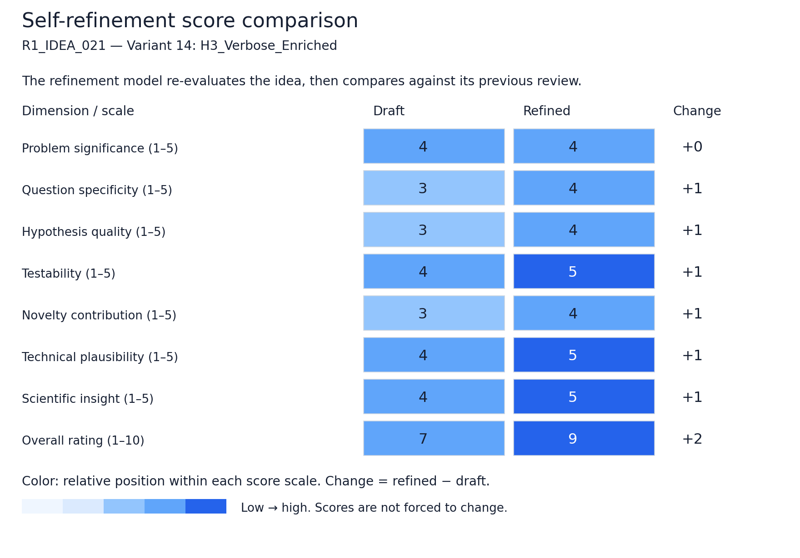

Changed score dimensions: question_specificity, hypothesis_quality, testability, novelty_contribution, technical_plausibility, scientific_insight, overall_rating.

### Score justifications (draft / refined)

**Problem significance**

```json
{
  "draft": {
    "score": 4.0,
    "justification": "The idea addresses a critical limitation of Flow Matching in offline imitation learning, which has important implications for real-world applications where expert demonstrations may be limited or insufficient."
  },
  "refined": {
    "score": 4.0,
    "justification": "The idea addresses a critical limitation of Flow Matching in offline imitation learning, which has important implications for real-world applications where expert demonstrations may be limited or insufficient."
  }
}
```

**Question specificity**

```json
{
  "draft": {
    "score": 3.0,
    "justification": "The question is specific to the relationship between demonstration diversity and FM performance, but lacks concrete details about the task, metrics, or experimental conditions."
  },
  "refined": {
    "score": 4.0,
    "justification": "The question is specific to the relationship between demonstration diversity and FM performance, and the proposed staged design provides a clear framework for testing this relationship with defined conditions and evaluation criteria."
  }
}
```

**Hypothesis quality**

```json
{
  "draft": {
    "score": 3.0,
    "justification": "The idea contains a plausible hypothesis about the sensitivity of FM to demonstration diversity, but it is not explicitly stated and needs to be more clearly defined."
  },
  "refined": {
    "score": 4.0,
    "justification": "The hypothesis that FM's performance is sensitive to demonstration diversity and that incorporating online data can mitigate this limitation is plausible and could be tested through the proposed experimental design."
  }
}
```

**Testability**

```json
{
  "draft": {
    "score": 4.0,
    "justification": "The proposed experimental design includes multiple testable components (staged experiments, ablations, sensitivity analyses), though the specifics need to be more concrete."
  },
  "refined": {
    "score": 5.0,
    "justification": "The idea provides a detailed, structured experimental design with clear stages, evaluation criteria, and validation components (ablations, sensitivity analyses, error analysis) that are all testable and well-defined."
  }
}
```

**Novelty contribution**

```json
{
  "draft": {
    "score": 3.0,
    "justification": "The idea contributes to understanding FM's limitations and potential improvements through online data, but the novelty is more about methodology than discovering new phenomena."
  },
  "refined": {
    "score": 4.0,
    "justification": "The idea contributes to understanding FM's limitations and potential improvements through online data, and could provide insights into the conditions under which FM is effective, which is a novel contribution to the field."
  }
}
```

**Technical plausibility**

```json
{
  "draft": {
    "score": 4.0,
    "justification": "The proposed approach is technically feasible and aligns with existing research on FM and offline imitation learning, though the specifics of implementation are not provided."
  },
  "refined": {
    "score": 5.0,
    "justification": "The proposed approach is technically feasible and aligns with existing research on FM and offline imitation learning, and the experimental design is logically coherent and well-justified."
  }
}
```

**Scientific insight**

```json
{
  "draft": {
    "score": 4.0,
    "justification": "The study could provide valuable insights into the conditions under which FM performs well, the role of demonstration diversity, and the importance of online interaction for generalization."
  },
  "refined": {
    "score": 5.0,
    "justification": "The study could provide valuable insights into the conditions under which FM performs well, the role of demonstration diversity, and the importance of online interaction for generalization, which are important scientific questions in the field."
  }
}
```

**Overall rating**

```json
{
  "draft": {
    "score": 7.0,
    "justification": "The idea addresses a meaningful problem with a structured approach and potential for scientific insight, though it lacks specific details that would make it more testable and concrete."
  },
  "refined": {
    "score": 9.0,
    "justification": "The idea addresses a meaningful problem with a highly specific and testable hypothesis, a well-structured experimental design, and potential for significant scientific insight. The proposed approach is technically plausible and has the potential to contribute novel findings to the field."
  }
}
```

## R1_IDEA_021 — Variant 15: H4_Ultimate_Hype


Changed score dimensions: none.

### Score justifications (draft / refined)

**Problem significance**

```json
{
  "draft": {
    "score": 4.0,
    "justification": "The idea addresses a critical limitation in offline imitation learning, which is essential for developing more robust and generalizable AI systems. The problem is relevant to both theoretical and practical applications in reinforcement learning and autonomous systems."
  },
  "refined": {
    "score": 4.0,
    "justification": "The idea addresses a critical limitation in offline imitation learning, which is essential for developing more robust and generalizable AI systems. The problem is relevant to both theoretical and practical applications in reinforcement learning and autonomous systems."
  }
}
```

**Question specificity**

```json
{
  "draft": {
    "score": 3.0,
    "justification": "The problem is well-defined, but the specific research question is not clearly articulated. The idea mentions the need for online interaction but does not specify how this will be implemented or what exactly is being investigated."
  },
  "refined": {
    "score": 3.0,
    "justification": "The problem is well-defined, but the specific research question is not clearly articulated. The idea mentions the need for online interaction but does not specify how this will be implemented or what exactly is being investigated."
  }
}
```

**Hypothesis quality**

```json
{
  "draft": {
    "score": 3.0,
    "justification": "The idea suggests a potential solution but lacks a concrete hypothesis. It is ambitious but does not clearly state what prediction or mechanism is being proposed to be tested."
  },
  "refined": {
    "score": 3.0,
    "justification": "The idea suggests a potential solution but lacks a concrete hypothesis. It is ambitious but does not clearly state what prediction or mechanism is being proposed to be tested."
  }
}
```

**Testability**

```json
{
  "draft": {
    "score": 3.0,
    "justification": "The idea is promising but lacks specific experiments or evaluation methods. Without concrete plans for testing the integration of online interaction with FM, it is difficult to assess the feasibility of the proposed research agenda."
  },
  "refined": {
    "score": 3.0,
    "justification": "The idea is promising but lacks specific experiments or evaluation methods. Without concrete plans for testing the integration of online interaction with FM, it is difficult to assess the feasibility of the proposed research agenda."
  }
}
```

**Novelty contribution**

```json
{
  "draft": {
    "score": 4.0,
    "justification": "The research agenda is novel in its focus on integrating online interaction with FM-based policies. This could lead to significant contributions in improving the generalization and practicality of imitation learning methods."
  },
  "refined": {
    "score": 4.0,
    "justification": "The research agenda is novel in its focus on integrating online interaction with FM-based policies. This could lead to significant contributions in improving the generalization and practicality of imitation learning methods."
  }
}
```

**Technical plausibility**

```json
{
  "draft": {
    "score": 4.0,
    "justification": "The idea is technically plausible as it builds on existing methods (FM) and addresses a known challenge in offline imitation learning. The integration of online interaction is a reasonable direction for improving generalization."
  },
  "refined": {
    "score": 4.0,
    "justification": "The idea is technically plausible as it builds on existing methods (FM) and addresses a known challenge in offline imitation learning. The integration of online interaction is a reasonable direction for improving generalization."
  }
}
```

**Scientific insight**

```json
{
  "draft": {
    "score": 3.0,
    "justification": "The idea has potential for scientific insight, particularly in understanding how to balance exploration and exploitation in imitation learning. However, the specific insights are not clearly defined."
  },
  "refined": {
    "score": 3.0,
    "justification": "The idea has potential for scientific insight, particularly in understanding how to balance exploration and exploitation in imitation learning. However, the specific insights are not clearly defined."
  }
}
```

**Overall rating**

```json
{
  "draft": {
    "score": 7.0,
    "justification": "The idea is strong and has the potential for significant impact, but it lacks specific details on the research question, hypothesis, and evaluation methods. With more concrete details, it could become a compelling and impactful research direction."
  },
  "refined": {
    "score": 7.0,
    "justification": "The idea is strong and has the potential for significant impact, but it lacks specific details on the research question, hypothesis, and evaluation methods. With more concrete details, it could become a compelling and impactful research direction."
  }
}
```

## R1_IDEA_022 — Source


Changed score dimensions: none.

### Score justifications (draft / refined)

**Problem significance**

```json
{
  "draft": {
    "score": 4.0,
    "justification": "The problem of generating high-quality, prompt-following audio for complex scenarios is significant in both research and practical applications, as it directly impacts the usability and reliability of T2A systems."
  },
  "refined": {
    "score": 4.0,
    "justification": "The problem of generating high-quality, prompt-following audio for complex scenarios is significant in both research and practical applications, as it directly impacts the usability and reliability of T2A systems."
  }
}
```

**Question specificity**

```json
{
  "draft": {
    "score": 3.0,
    "justification": "The idea identifies a specific challenge but lacks detailed definitions and specifics about the problem, such as what constitutes 'complex multi-event audio' and the exact nature of the AI feedback mechanism."
  },
  "refined": {
    "score": 3.0,
    "justification": "The idea identifies a specific challenge but lacks detailed definitions and specifics about the problem, such as what constitutes 'complex multi-event audio' and the exact nature of the AI feedback mechanism."
  }
}
```

**Hypothesis quality**

```json
{
  "draft": {
    "score": 3.0,
    "justification": "The idea suggests a potential solution but does not explicitly state a hypothesis or prediction that can be tested, such as how AI feedback learning will improve the model's performance in specific ways."
  },
  "refined": {
    "score": 3.0,
    "justification": "The idea suggests a potential solution but does not explicitly state a hypothesis or prediction that can be tested, such as how AI feedback learning will improve the model's performance in specific ways."
  }
}
```

**Testability**

```json
{
  "draft": {
    "score": 3.0,
    "justification": "The idea proposes a solution but does not provide sufficient details on how the proposed method will be tested, what experiments will be conducted, or how the results will be evaluated."
  },
  "refined": {
    "score": 3.0,
    "justification": "The idea proposes a solution but does not provide sufficient details on how the proposed method will be tested, what experiments will be conducted, or how the results will be evaluated."
  }
}
```

**Novelty contribution**

```json
{
  "draft": {
    "score": 4.0,
    "justification": "The integration of AI feedback learning into T2A generation is a novel approach that could contribute to the field by improving the model's ability to handle complex audio generation tasks."
  },
  "refined": {
    "score": 4.0,
    "justification": "The integration of AI feedback learning into T2A generation is a novel approach that could contribute to the field by improving the model's ability to handle complex audio generation tasks."
  }
}
```

**Technical plausibility**

```json
{
  "draft": {
    "score": 4.0,
    "justification": "The proposed approach is technically plausible, as AI feedback learning is a well-established concept in machine learning, and its application to T2A generation is a reasonable extension of existing methods."
  },
  "refined": {
    "score": 4.0,
    "justification": "The proposed approach is technically plausible, as AI feedback learning is a well-established concept in machine learning, and its application to T2A generation is a reasonable extension of existing methods."
  }
}
```

**Scientific insight**

```json
{
  "draft": {
    "score": 3.0,
    "justification": "The idea has potential for scientific insight by exploring how AI feedback can enhance model performance, but the specific mechanisms and outcomes are not clearly defined."
  },
  "refined": {
    "score": 3.0,
    "justification": "The idea has potential for scientific insight by exploring how AI feedback can enhance model performance, but the specific mechanisms and outcomes are not clearly defined."
  }
}
```

**Overall rating**

```json
{
  "draft": {
    "score": 7.0,
    "justification": "The idea addresses a meaningful problem with a plausible solution, but it lacks sufficient specificity and details to fully define the research question and hypothesis. With further clarification and details, it has strong potential for a significant contribution to the field."
  },
  "refined": {
    "score": 7.0,
    "justification": "The idea addresses a meaningful problem with a plausible solution, but it lacks sufficient specificity and details to fully define the research question and hypothesis. With further clarification and details, it has strong potential for a significant contribution to the field."
  }
}
```

## R1_IDEA_022 — Variant 1: A1_Identity


Changed score dimensions: none.

### Score justifications (draft / refined)

**Problem significance**

```json
{
  "draft": {
    "score": 4.0,
    "justification": "The problem of generating high-quality, prompt-following audio for complex scenarios is significant in both research and practical applications, as it directly impacts the usability and reliability of T2A systems."
  },
  "refined": {
    "score": 4.0,
    "justification": "The problem of generating high-quality, prompt-following audio for complex scenarios is significant in both research and practical applications, as it directly impacts the usability and reliability of T2A systems."
  }
}
```

**Question specificity**

```json
{
  "draft": {
    "score": 3.0,
    "justification": "The idea identifies a specific challenge but lacks detailed definitions and specifics about the problem, such as what constitutes 'complex multi-event audio' and the exact nature of the AI feedback mechanism."
  },
  "refined": {
    "score": 3.0,
    "justification": "The idea identifies a specific challenge but lacks detailed definitions and specifics about the problem, such as what constitutes 'complex multi-event audio' and the exact nature of the AI feedback mechanism."
  }
}
```

**Hypothesis quality**

```json
{
  "draft": {
    "score": 3.0,
    "justification": "The idea suggests a potential solution but does not explicitly state a hypothesis or prediction that can be tested, such as how AI feedback learning will improve the model's performance in specific ways."
  },
  "refined": {
    "score": 3.0,
    "justification": "The idea suggests a potential solution but does not explicitly state a hypothesis or prediction that can be tested, such as how AI feedback learning will improve the model's performance in specific ways."
  }
}
```

**Testability**

```json
{
  "draft": {
    "score": 3.0,
    "justification": "The idea proposes a solution but does not provide sufficient details on how the proposed method will be tested, what experiments will be conducted, or how the results will be evaluated."
  },
  "refined": {
    "score": 3.0,
    "justification": "The idea proposes a solution but does not provide sufficient details on how the proposed method will be tested, what experiments will be conducted, or how the results will be evaluated."
  }
}
```

**Novelty contribution**

```json
{
  "draft": {
    "score": 4.0,
    "justification": "The integration of AI feedback learning into T2A generation is a novel approach that could contribute to the field by improving the model's ability to handle complex audio generation tasks."
  },
  "refined": {
    "score": 4.0,
    "justification": "The integration of AI feedback learning into T2A generation is a novel approach that could contribute to the field by improving the model's ability to handle complex audio generation tasks."
  }
}
```

**Technical plausibility**

```json
{
  "draft": {
    "score": 4.0,
    "justification": "The proposed approach is technically plausible, as AI feedback learning is a well-established concept in machine learning, and its application to T2A generation is a reasonable extension of existing methods."
  },
  "refined": {
    "score": 4.0,
    "justification": "The proposed approach is technically plausible, as AI feedback learning is a well-established concept in machine learning, and its application to T2A generation is a reasonable extension of existing methods."
  }
}
```

**Scientific insight**

```json
{
  "draft": {
    "score": 3.0,
    "justification": "The idea has potential for scientific insight by exploring how AI feedback can enhance model performance, but the specific mechanisms and outcomes are not clearly defined."
  },
  "refined": {
    "score": 3.0,
    "justification": "The idea has potential for scientific insight by exploring how AI feedback can enhance model performance, but the specific mechanisms and outcomes are not clearly defined."
  }
}
```

**Overall rating**

```json
{
  "draft": {
    "score": 7.0,
    "justification": "The idea addresses a meaningful problem with a plausible solution, but it lacks sufficient specificity and details to fully define the research question and hypothesis. With further clarification and details, it has strong potential for a significant contribution to the field."
  },
  "refined": {
    "score": 7.0,
    "justification": "The idea addresses a meaningful problem with a plausible solution, but it lacks sufficient specificity and details to fully define the research question and hypothesis. With further clarification and details, it has strong potential for a significant contribution to the field."
  }
}
```

## R1_IDEA_022 — Variant 2: A2_Paraphrase_Only


Changed score dimensions: none.

### Score justifications (draft / refined)

**Problem significance**

```json
{
  "draft": {
    "score": 4.0,
    "justification": "The problem of prompt adherence and sound quality in multi-event T2A generation is significant, as it affects the practical utility of text-to-audio models in real-world applications."
  },
  "refined": {
    "score": 4.0,
    "justification": "The problem of prompt adherence and sound quality in multi-event T2A generation is significant, as it affects the practical utility of text-to-audio models in real-world applications."
  }
}
```

**Question specificity**

```json
{
  "draft": {
    "score": 3.0,
    "justification": "The idea identifies a specific problem (multi-event audio generation) but lacks detailed specification of the research question or hypothesis that would be investigated."
  },
  "refined": {
    "score": 3.0,
    "justification": "The idea identifies a specific problem (multi-event audio generation) but lacks detailed specification of the research question or hypothesis that would be investigated."
  }
}
```

**Hypothesis quality**

```json
{
  "draft": {
    "score": 3.0,
    "justification": "The idea suggests a general approach (AI feedback learning) to address the problem, but does not explicitly state a testable hypothesis or prediction about the expected outcomes."
  },
  "refined": {
    "score": 3.0,
    "justification": "The idea suggests a general approach (AI feedback learning) to address the problem, but does not explicitly state a testable hypothesis or prediction about the expected outcomes."
  }
}
```

**Testability**

```json
{
  "draft": {
    "score": 3.0,
    "justification": "The idea proposes a direction but lacks specific experimental design or evaluation plan, making it difficult to assess the testability of the approach."
  },
  "refined": {
    "score": 3.0,
    "justification": "The idea proposes a direction but lacks specific experimental design or evaluation plan, making it difficult to assess the testability of the approach."
  }
}
```

**Novelty contribution**

```json
{
  "draft": {
    "score": 4.0,
    "justification": "The idea proposes a novel approach (AI feedback learning) to improve foundational model abilities, which could contribute to the field of T2A generation by addressing a specific challenge."
  },
  "refined": {
    "score": 4.0,
    "justification": "The idea proposes a novel approach (AI feedback learning) to improve foundational model abilities, which could contribute to the field of T2A generation by addressing a specific challenge."
  }
}
```

**Technical plausibility**

```json
{
  "draft": {
    "score": 4.0,
    "justification": "The proposed approach of using AI feedback learning is technically plausible, as it aligns with current trends in model improvement through feedback mechanisms."
  },
  "refined": {
    "score": 4.0,
    "justification": "The proposed approach of using AI feedback learning is technically plausible, as it aligns with current trends in model improvement through feedback mechanisms."
  }
}
```

**Scientific insight**

```json
{
  "draft": {
    "score": 3.0,
    "justification": "The idea has potential for scientific insight by exploring how feedback learning can enhance model performance in complex scenarios, but the specific insights are not clearly defined."
  },
  "refined": {
    "score": 3.0,
    "justification": "The idea has potential for scientific insight by exploring how feedback learning can enhance model performance in complex scenarios, but the specific insights are not clearly defined."
  }
}
```

**Overall rating**

```json
{
  "draft": {
    "score": 7.0,
    "justification": "The idea addresses a meaningful problem in T2A generation and proposes a plausible approach, but lacks specificity and testability details. It has potential for contribution but needs further clarification to be more robust."
  },
  "refined": {
    "score": 7.0,
    "justification": "The idea addresses a meaningful problem in T2A generation and proposes a plausible approach, but lacks specificity and testability details. It has potential for contribution but needs further clarification to be more robust."
  }
}
```

## R1_IDEA_022 — Variant 3: A3_Plain_Core


Changed score dimensions: none.

### Score justifications (draft / refined)

**Problem significance**

```json
{
  "draft": {
    "score": 4.0,
    "justification": "The problem of multi-event audio generation with text-to-audio models is significant for real-world applications, as it affects the reliability and quality of generated audio in complex scenarios."
  },
  "refined": {
    "score": 4.0,
    "justification": "The problem of multi-event audio generation with text-to-audio models is significant for real-world applications, as it affects the reliability and quality of generated audio in complex scenarios."
  }
}
```

**Question specificity**

```json
{
  "draft": {
    "score": 3.0,
    "justification": "The problem is well-defined, but the research question is somewhat vague without specifying the exact aspects of prompt following and acoustic quality that need improvement."
  },
  "refined": {
    "score": 3.0,
    "justification": "The problem is well-defined, but the research question is somewhat vague without specifying the exact aspects of prompt following and acoustic quality that need improvement."
  }
}
```

**Hypothesis quality**

```json
{
  "draft": {
    "score": 3.0,
    "justification": "The idea proposes a solution but does not explicitly state a hypothesis or prediction that can be tested, such as how the feedback learning will improve specific metrics."
  },
  "refined": {
    "score": 3.0,
    "justification": "The idea proposes a solution but does not explicitly state a hypothesis or prediction that can be tested, such as how the feedback learning will improve specific metrics."
  }
}
```

**Testability**

```json
{
  "draft": {
    "score": 3.0,
    "justification": "The idea suggests a potential approach but lacks details on how the effectiveness of the method will be evaluated, such as through experiments or comparisons with existing methods."
  },
  "refined": {
    "score": 3.0,
    "justification": "The idea suggests a potential approach but lacks details on how the effectiveness of the method will be evaluated, such as through experiments or comparisons with existing methods."
  }
}
```

**Novelty contribution**

```json
{
  "draft": {
    "score": 3.0,
    "justification": "The use of AI feedback learning is a plausible approach, but the novelty and specific contribution of the method are not clearly articulated."
  },
  "refined": {
    "score": 3.0,
    "justification": "The use of AI feedback learning is a plausible approach, but the novelty and specific contribution of the method are not clearly articulated."
  }
}
```

**Technical plausibility**

```json
{
  "draft": {
    "score": 4.0,
    "justification": "The proposed approach is technically plausible, as feedback learning is a common technique in machine learning, and integrating it into text-to-audio models is a reasonable direction."
  },
  "refined": {
    "score": 4.0,
    "justification": "The proposed approach is technically plausible, as feedback learning is a common technique in machine learning, and integrating it into text-to-audio models is a reasonable direction."
  }
}
```

**Scientific insight**

```json
{
  "draft": {
    "score": 3.0,
    "justification": "The idea has potential to provide insights into how feedback mechanisms can improve model performance, but the specific insights are not clearly defined."
  },
  "refined": {
    "score": 3.0,
    "justification": "The idea has potential to provide insights into how feedback mechanisms can improve model performance, but the specific insights are not clearly defined."
  }
}
```

**Overall rating**

```json
{
  "draft": {
    "score": 7.0,
    "justification": "The idea addresses a meaningful problem with a plausible solution, but it lacks specificity, testability, and clarity on the hypothesis and novelty of the approach."
  },
  "refined": {
    "score": 7.0,
    "justification": "The idea addresses a meaningful problem with a plausible solution, but it lacks specificity, testability, and clarity on the hypothesis and novelty of the approach."
  }
}
```

## R1_IDEA_022 — Variant 4: B1_Verbose_Elaborate


Changed score dimensions: none.

### Score justifications (draft / refined)

**Problem significance**

```json
{
  "draft": {
    "score": 4.0,
    "justification": "The problem is significant as it addresses a critical challenge in T2A generation, which is essential for real-world applications requiring high-quality and prompt-following audio outputs."
  },
  "refined": {
    "score": 4.0,
    "justification": "The problem is significant as it addresses a critical challenge in T2A generation, which is essential for real-world applications requiring high-quality and prompt-following audio outputs."
  }
}
```

**Question specificity**

```json
{
  "draft": {
    "score": 3.0,
    "justification": "The idea identifies a specific problem but lacks detailed specification of the research question, such as the exact nature of the AI feedback learning mechanism and the metrics for evaluation."
  },
  "refined": {
    "score": 3.0,
    "justification": "The idea identifies a specific problem but lacks detailed specification of the research question, such as the exact nature of the AI feedback learning mechanism and the metrics for evaluation."
  }
}
```

**Hypothesis quality**

```json
{
  "draft": {
    "score": 3.0,
    "justification": "The idea proposes a solution but does not explicitly state a hypothesis or prediction that can be tested, such as how AI feedback learning will improve performance metrics."
  },
  "refined": {
    "score": 3.0,
    "justification": "The idea proposes a solution but does not explicitly state a hypothesis or prediction that can be tested, such as how AI feedback learning will improve performance metrics."
  }
}
```

**Testability**

```json
{
  "draft": {
    "score": 3.0,
    "justification": "The idea suggests a potential solution but does not provide a clear experimental plan or evaluation method to test the effectiveness of the proposed approach."
  },
  "refined": {
    "score": 3.0,
    "justification": "The idea suggests a potential solution but does not provide a clear experimental plan or evaluation method to test the effectiveness of the proposed approach."
  }
}
```

**Novelty contribution**

```json
{
  "draft": {
    "score": 3.0,
    "justification": "The idea proposes a novel approach (AI feedback learning) for improving T2A models, but the novelty is not clearly demonstrated without further details on the method's specifics."
  },
  "refined": {
    "score": 3.0,
    "justification": "The idea proposes a novel approach (AI feedback learning) for improving T2A models, but the novelty is not clearly demonstrated without further details on the method's specifics."
  }
}
```

**Technical plausibility**

```json
{
  "draft": {
    "score": 4.0,
    "justification": "The proposed approach is technically plausible as AI feedback learning is a reasonable method to enhance model performance, though the specifics of implementation are not detailed."
  },
  "refined": {
    "score": 4.0,
    "justification": "The proposed approach is technically plausible as AI feedback learning is a reasonable method to enhance model performance, though the specifics of implementation are not detailed."
  }
}
```

**Scientific insight**

```json
{
  "draft": {
    "score": 3.0,
    "justification": "The idea has potential for scientific insight by exploring how feedback mechanisms can improve model performance, but the specific insights are not clearly outlined without further details."
  },
  "refined": {
    "score": 3.0,
    "justification": "The idea has potential for scientific insight by exploring how feedback mechanisms can improve model performance, but the specific insights are not clearly outlined without further details."
  }
}
```

**Overall rating**

```json
{
  "draft": {
    "score": 7.0,
    "justification": "The idea addresses a meaningful problem in T2A generation and proposes a plausible solution, but it lacks sufficient specificity and detail to fully establish its testability and potential contribution."
  },
  "refined": {
    "score": 7.0,
    "justification": "The idea addresses a meaningful problem in T2A generation and proposes a plausible solution, but it lacks sufficient specificity and detail to fully establish its testability and potential contribution."
  }
}
```

## R1_IDEA_022 — Variant 5: B2_Grand_Narrative


Changed score dimensions: none.

### Score justifications (draft / refined)

**Problem significance**

```json
{
  "draft": {
    "score": 4.0,
    "justification": "The problem of aligning text-to-audio models with human preferences for complex audio generation is significant, as it addresses a critical challenge in the field of generative models and has practical implications for audio synthesis systems."
  },
  "refined": {
    "score": 4.0,
    "justification": "The problem of aligning text-to-audio models with human preferences for complex audio generation is significant, as it addresses a critical challenge in the field of generative models and has practical implications for audio synthesis systems."
  }
}
```

**Question specificity**

```json
{
  "draft": {
    "score": 3.0,
    "justification": "The idea identifies a specific problem but lacks detailed specification of the research question, such as the exact nature of the AI feedback mechanism or the specific aspects of prompt-following and acoustic quality that need improvement."
  },
  "refined": {
    "score": 3.0,
    "justification": "The idea identifies a specific problem but lacks detailed specification of the research question, such as the exact nature of the AI feedback mechanism or the specific aspects of prompt-following and acoustic quality that need improvement."
  }
}
```

**Hypothesis quality**

```json
{
  "draft": {
    "score": 3.0,
    "justification": "The idea proposes a general hypothesis that AI feedback learning could improve model performance, but it does not provide a concrete prediction or mechanism that could be tested or falsified."
  },
  "refined": {
    "score": 3.0,
    "justification": "The idea proposes a general hypothesis that AI feedback learning could improve model performance, but it does not provide a concrete prediction or mechanism that could be tested or falsified."
  }
}
```

**Testability**

```json
{
  "draft": {
    "score": 3.0,
    "justification": "The idea suggests a potential solution but does not specify how the effectiveness of the AI feedback learning would be evaluated, such as through experiments, ablation studies, or comparisons with existing methods."
  },
  "refined": {
    "score": 3.0,
    "justification": "The idea suggests a potential solution but does not specify how the effectiveness of the AI feedback learning would be evaluated, such as through experiments, ablation studies, or comparisons with existing methods."
  }
}
```

**Novelty contribution**

```json
{
  "draft": {
    "score": 4.0,
    "justification": "The idea proposes a novel approach (AI feedback learning) to address a specific challenge in text-to-audio generation, which could contribute to more reliable audio synthesis systems in the long term."
  },
  "refined": {
    "score": 4.0,
    "justification": "The idea proposes a novel approach (AI feedback learning) to address a specific challenge in text-to-audio generation, which could contribute to more reliable audio synthesis systems in the long term."
  }
}
```

**Technical plausibility**

```json
{
  "draft": {
    "score": 4.0,
    "justification": "The proposed method of AI feedback learning is technically plausible, as it builds on existing techniques in reinforcement learning and feedback-based model training."
  },
  "refined": {
    "score": 4.0,
    "justification": "The proposed method of AI feedback learning is technically plausible, as it builds on existing techniques in reinforcement learning and feedback-based model training."
  }
}
```

**Scientific insight**

```json
{
  "draft": {
    "score": 3.0,
    "justification": "The idea has potential for scientific insight by exploring how feedback mechanisms can improve model alignment with human preferences, but the specific insights are not clearly defined."
  },
  "refined": {
    "score": 3.0,
    "justification": "The idea has potential for scientific insight by exploring how feedback mechanisms can improve model alignment with human preferences, but the specific insights are not clearly defined."
  }
}
```

**Overall rating**

```json
{
  "draft": {
    "score": 7.0,
    "justification": "The idea addresses a meaningful problem in text-to-audio generation and proposes a potentially useful solution. However, it lacks sufficient specificity and testability, which could be improved with more detailed research questions and experimental design."
  },
  "refined": {
    "score": 7.0,
    "justification": "The idea addresses a meaningful problem in text-to-audio generation and proposes a potentially useful solution. However, it lacks sufficient specificity and testability, which could be improved with more detailed research questions and experimental design."
  }
}
```

## R1_IDEA_022 — Variant 6: B3_Over_Confident


Changed score dimensions: none.

### Score justifications (draft / refined)

**Problem significance**

```json
{
  "draft": {
    "score": 4.0,
    "justification": "The problem of generating high-quality, prompt-following multi-event audio is significant in the context of text-to-audio generation, as it addresses a critical challenge in real-world applications."
  },
  "refined": {
    "score": 4.0,
    "justification": "The problem of generating high-quality, prompt-following multi-event audio is significant in the context of text-to-audio generation, as it addresses a critical challenge in real-world applications."
  }
}
```

**Question specificity**

```json
{
  "draft": {
    "score": 3.0,
    "justification": "The idea identifies a specific problem (multi-event audio generation) but lacks detailed specifics on the nature of the problem, the current model's shortcomings, and the exact hypothesis being tested."
  },
  "refined": {
    "score": 3.0,
    "justification": "The idea identifies a specific problem (multi-event audio generation) but lacks detailed specifics on the nature of the problem, the current model's shortcomings, and the exact hypothesis being tested."
  }
}
```

**Hypothesis quality**

```json
{
  "draft": {
    "score": 3.0,
    "justification": "The idea suggests a solution but does not clearly state the hypothesis or the specific mechanism by which AI feedback learning will improve the model's performance."
  },
  "refined": {
    "score": 3.0,
    "justification": "The idea suggests a solution but does not clearly state the hypothesis or the specific mechanism by which AI feedback learning will improve the model's performance."
  }
}
```

**Testability**

```json
{
  "draft": {
    "score": 3.0,
    "justification": "The idea proposes a solution but does not provide sufficient details on how the effectiveness of the method will be evaluated or the specific experiments that will be conducted."
  },
  "refined": {
    "score": 3.0,
    "justification": "The idea proposes a solution but does not provide sufficient details on how the effectiveness of the method will be evaluated or the specific experiments that will be conducted."
  }
}
```

**Novelty contribution**

```json
{
  "draft": {
    "score": 3.0,
    "justification": "The idea proposes a novel approach (AI feedback learning) for improving T2A generation, but the novelty is not clearly established without more details on the method and its differentiation from existing approaches."
  },
  "refined": {
    "score": 3.0,
    "justification": "The idea proposes a novel approach (AI feedback learning) for improving T2A generation, but the novelty is not clearly established without more details on the method and its differentiation from existing approaches."
  }
}
```

**Technical plausibility**

```json
{
  "draft": {
    "score": 4.0,
    "justification": "The proposed approach of using AI feedback learning is technically plausible, as it aligns with current trends in reinforcement learning and feedback-based training methods in machine learning."
  },
  "refined": {
    "score": 4.0,
    "justification": "The proposed approach of using AI feedback learning is technically plausible, as it aligns with current trends in reinforcement learning and feedback-based training methods in machine learning."
  }
}
```

**Scientific insight**

```json
{
  "draft": {
    "score": 3.0,
    "justification": "The idea has potential for scientific insight by exploring how feedback mechanisms can enhance model performance, but the specific insights are not clearly outlined without further details."
  },
  "refined": {
    "score": 3.0,
    "justification": "The idea has potential for scientific insight by exploring how feedback mechanisms can enhance model performance, but the specific insights are not clearly outlined without further details."
  }
}
```

**Overall rating**

```json
{
  "draft": {
    "score": 7.0,
    "justification": "The idea addresses a meaningful problem in text-to-audio generation and proposes a specific solution. However, it lacks sufficient details on the method, hypothesis, and evaluation plan, which are necessary for assessing its scientific merit and potential contribution."
  },
  "refined": {
    "score": 7.0,
    "justification": "The idea addresses a meaningful problem in text-to-audio generation and proposes a specific solution. However, it lacks sufficient details on the method, hypothesis, and evaluation plan, which are necessary for assessing its scientific merit and potential contribution."
  }
}
```

## R1_IDEA_022 — Variant 7: B4_Novelty


Changed score dimensions: none.

### Score justifications (draft / refined)

**Problem significance**

```json
{
  "draft": {
    "score": 4.0,
    "justification": "The problem of generating high-quality, prompt-following audio for complex scenarios is significant in both research and practical applications, especially in areas like virtual assistants or entertainment."
  },
  "refined": {
    "score": 4.0,
    "justification": "The problem of generating high-quality, prompt-following audio for complex scenarios is significant in both research and practical applications, especially in areas like virtual assistants or entertainment."
  }
}
```

**Question specificity**

```json
{
  "draft": {
    "score": 3.0,
    "justification": "The idea identifies a problem but lacks a clear, specific research question. It needs to define exactly what aspect of prompt-following or acoustic quality is being targeted and how AI feedback will be used to address it."
  },
  "refined": {
    "score": 3.0,
    "justification": "The idea identifies a problem but lacks a clear, specific research question. It needs to define exactly what aspect of prompt-following or acoustic quality is being targeted and how AI feedback will be used to address it."
  }
}
```

**Hypothesis quality**

```json
{
  "draft": {
    "score": 3.0,
    "justification": "The idea suggests a novel approach but does not explicitly state a hypothesis that can be tested. It would be stronger if it proposed a specific prediction, such as 'AI feedback learning will improve the model's ability to follow prompts in multi-event audio tasks by X%.'"
  },
  "refined": {
    "score": 3.0,
    "justification": "The idea suggests a novel approach but does not explicitly state a hypothesis that can be tested. It would be stronger if it proposed a specific prediction, such as 'AI feedback learning will improve the model's ability to follow prompts in multi-event audio tasks by X%.'"
  }
}
```

**Testability**

```json
{
  "draft": {
    "score": 3.0,
    "justification": "The idea is testable in principle, but lacks details on how the experiments will be designed, what datasets will be used, and how the results will be measured. Without these, it is difficult to assess the feasibility of the approach."
  },
  "refined": {
    "score": 3.0,
    "justification": "The idea is testable in principle, but lacks details on how the experiments will be designed, what datasets will be used, and how the results will be measured. Without these, it is difficult to assess the feasibility of the approach."
  }
}
```

**Novelty contribution**

```json
{
  "draft": {
    "score": 4.0,
    "justification": "The use of AI feedback learning for T2A generation is a novel approach, especially for complex multi-event audio tasks. It has the potential to contribute new insights into how feedback mechanisms can improve model performance in challenging scenarios."
  },
  "refined": {
    "score": 4.0,
    "justification": "The use of AI feedback learning for T2A generation is a novel approach, especially for complex multi-event audio tasks. It has the potential to contribute new insights into how feedback mechanisms can improve model performance in challenging scenarios."
  }
}
```

**Technical plausibility**

```json
{
  "draft": {
    "score": 4.0,
    "justification": "The proposed approach is technically plausible. AI feedback learning is a reasonable method to enhance model performance, and it aligns with current trends in reinforcement learning and feedback-based training in machine learning."
  },
  "refined": {
    "score": 4.0,
    "justification": "The proposed approach is technically plausible. AI feedback learning is a reasonable method to enhance model performance, and it aligns with current trends in reinforcement learning and feedback-based training in machine learning."
  }
}
```

**Scientific insight**

```json
{
  "draft": {
    "score": 3.0,
    "justification": "The idea has potential for scientific insight, but it is not clear how the results would contribute to broader understanding. It would be stronger if it addressed a specific mechanism or limitation in current T2A models."
  },
  "refined": {
    "score": 3.0,
    "justification": "The idea has potential for scientific insight, but it is not clear how the results would contribute to broader understanding. It would be stronger if it addressed a specific mechanism or limitation in current T2A models."
  }
}
```

**Overall rating**

```json
{
  "draft": {
    "score": 7.0,
    "justification": "The idea addresses a meaningful problem with a novel approach, but it lacks specific details on the research question, hypothesis, and evaluation methods. With further clarification, it has strong potential for a significant contribution to the field."
  },
  "refined": {
    "score": 7.0,
    "justification": "The idea addresses a meaningful problem with a novel approach, but it lacks specific details on the research question, hypothesis, and evaluation methods. With further clarification, it has strong potential for a significant contribution to the field."
  }
}
```

## R1_IDEA_022 — Variant 8: B5_Application_Impact


Changed score dimensions: none.

### Score justifications (draft / refined)

**Problem significance**

```json
{
  "draft": {
    "score": 4.0,
    "justification": "The problem of generating high-quality, prompt-following audio for complex scenarios is significant in both academic and practical contexts, as it impacts the usability and reliability of text-to-audio systems."
  },
  "refined": {
    "score": 4.0,
    "justification": "The problem of generating high-quality, prompt-following audio for complex scenarios is significant in both academic and practical contexts, as it impacts the usability and reliability of text-to-audio systems."
  }
}
```

**Question specificity**

```json
{
  "draft": {
    "score": 3.0,
    "justification": "The idea identifies a specific challenge (multi-event audio generation) but lacks detailed specification of the research question, such as what exactly the model is failing to do and how the feedback learning approach would address it."
  },
  "refined": {
    "score": 3.0,
    "justification": "The idea identifies a specific challenge (multi-event audio generation) but lacks detailed specification of the research question, such as what exactly the model is failing to do and how the feedback learning approach would address it."
  }
}
```

**Hypothesis quality**

```json
{
  "draft": {
    "score": 3.0,
    "justification": "The idea suggests a potential solution but does not explicitly state a hypothesis or prediction that could be tested, such as how the feedback learning would improve specific metrics or performance in multi-event scenarios."
  },
  "refined": {
    "score": 3.0,
    "justification": "The idea suggests a potential solution but does not explicitly state a hypothesis or prediction that could be tested, such as how the feedback learning would improve specific metrics or performance in multi-event scenarios."
  }
}
```

**Testability**

```json
{
  "draft": {
    "score": 3.0,
    "justification": "The idea proposes a method but does not specify how it would be evaluated, such as through experiments comparing the new approach with existing methods or through specific performance metrics for multi-event audio generation."
  },
  "refined": {
    "score": 3.0,
    "justification": "The idea proposes a method but does not specify how it would be evaluated, such as through experiments comparing the new approach with existing methods or through specific performance metrics for multi-event audio generation."
  }
}
```

**Novelty contribution**

```json
{
  "draft": {
    "score": 3.0,
    "justification": "The approach of using AI feedback learning is somewhat novel, but the idea does not clearly distinguish it from existing methods or provide a unique contribution to the field of T2A generation."
  },
  "refined": {
    "score": 3.0,
    "justification": "The approach of using AI feedback learning is somewhat novel, but the idea does not clearly distinguish it from existing methods or provide a unique contribution to the field of T2A generation."
  }
}
```

**Technical plausibility**

```json
{
  "draft": {
    "score": 4.0,
    "justification": "The proposed method is technically plausible, as feedback learning is a well-established concept in machine learning, and integrating it into T2A models is a reasonable direction for improvement."
  },
  "refined": {
    "score": 4.0,
    "justification": "The proposed method is technically plausible, as feedback learning is a well-established concept in machine learning, and integrating it into T2A models is a reasonable direction for improvement."
  }
}
```

**Scientific insight**

```json
{
  "draft": {
    "score": 3.0,
    "justification": "The idea has potential for scientific insight by exploring how feedback mechanisms can improve model performance in complex tasks, but the current description does not clearly outline what new insights could be gained from this research."
  },
  "refined": {
    "score": 3.0,
    "justification": "The idea has potential for scientific insight by exploring how feedback mechanisms can improve model performance in complex tasks, but the current description does not clearly outline what new insights could be gained from this research."
  }
}
```

**Overall rating**

```json
{
  "draft": {
    "score": 7.0,
    "justification": "The idea addresses a meaningful problem in T2A generation and proposes a plausible solution, but it lacks sufficient specificity, testability, and differentiation from existing methods. With further clarification and details, it has the potential to be a strong research direction."
  },
  "refined": {
    "score": 7.0,
    "justification": "The idea addresses a meaningful problem in T2A generation and proposes a plausible solution, but it lacks sufficient specificity, testability, and differentiation from existing methods. With further clarification and details, it has the potential to be a strong research direction."
  }
}
```

## R1_IDEA_022 — Variant 9: C1_Hollow_Shell


Changed score dimensions: none.

### Score justifications (draft / refined)

**Problem significance**

```json
{
  "draft": {
    "score": 4.0,
    "justification": "The problem of meeting user expectations for complex audio generation is significant in real-world applications, especially in demanding scenarios like professional audio production or interactive systems."
  },
  "refined": {
    "score": 4.0,
    "justification": "The problem of meeting user expectations for complex audio generation is significant in real-world applications, especially in demanding scenarios like professional audio production or interactive systems."
  }
}
```

**Question specificity**

```json
{
  "draft": {
    "score": 3.0,
    "justification": "The idea identifies a problem but lacks specific details about the feedback mechanism, the definition of 'complex audio', and the exact research question being investigated."
  },
  "refined": {
    "score": 3.0,
    "justification": "The idea identifies a problem but lacks specific details about the feedback mechanism, the definition of 'complex audio', and the exact research question being investigated."
  }
}
```

**Hypothesis quality**

```json
{
  "draft": {
    "score": 2.0,
    "justification": "The idea proposes using feedback learning but does not provide a clear hypothesis or prediction about what the approach would achieve or how it would improve the models."
  },
  "refined": {
    "score": 2.0,
    "justification": "The idea proposes using feedback learning but does not provide a clear hypothesis or prediction about what the approach would achieve or how it would improve the models."
  }
}
```

**Testability**

```json
{
  "draft": {
    "score": 3.0,
    "justification": "The idea suggests a potential approach but does not specify experiments, comparisons, or evaluation metrics that would be used to test the effectiveness of feedback learning in this context."
  },
  "refined": {
    "score": 3.0,
    "justification": "The idea suggests a potential approach but does not specify experiments, comparisons, or evaluation metrics that would be used to test the effectiveness of feedback learning in this context."
  }
}
```

**Novelty contribution**

```json
{
  "draft": {
    "score": 3.0,
    "justification": "The idea proposes applying feedback learning to audio generation, which is a novel application of the concept, but the specific contribution is not clearly defined."
  },
  "refined": {
    "score": 3.0,
    "justification": "The idea proposes applying feedback learning to audio generation, which is a novel application of the concept, but the specific contribution is not clearly defined."
  }
}
```

**Technical plausibility**

```json
{
  "draft": {
    "score": 4.0,
    "justification": "Feedback learning is a plausible approach for improving model performance, and its application to audio generation is technically feasible given existing methods in machine learning and natural language processing."
  },
  "refined": {
    "score": 4.0,
    "justification": "Feedback learning is a plausible approach for improving model performance, and its application to audio generation is technically feasible given existing methods in machine learning and natural language processing."
  }
}
```

**Scientific insight**

```json
{
  "draft": {
    "score": 2.0,
    "justification": "The idea focuses on improving model performance but does not clearly indicate what new insights or understanding would be gained from the research beyond the technical improvements."
  },
  "refined": {
    "score": 2.0,
    "justification": "The idea focuses on improving model performance but does not clearly indicate what new insights or understanding would be gained from the research beyond the technical improvements."
  }
}
```

**Overall rating**

```json
{
  "draft": {
    "score": 6.0,
    "justification": "The idea addresses a meaningful problem with a plausible approach, but it lacks specific details, hypotheses, and testable components that would make it a strong research direction."
  },
  "refined": {
    "score": 6.0,
    "justification": "The idea addresses a meaningful problem with a plausible approach, but it lacks specific details, hypotheses, and testable components that would make it a strong research direction."
  }
}
```

## R1_IDEA_022 — Variant 10: C2_Logic_Flawed


Changed score dimensions: none.

### Score justifications (draft / refined)

**Problem significance**

```json
{
  "draft": {
    "score": 4.0,
    "justification": "The problem of prompt-following and acoustic quality in complex multi-event audio generation is significant for practical applications, as it affects the usability and reliability of text-to-audio systems in real-world scenarios."
  },
  "refined": {
    "score": 4.0,
    "justification": "The problem of prompt-following and acoustic quality in complex multi-event audio generation is significant for practical applications, as it affects the usability and reliability of text-to-audio systems in real-world scenarios."
  }
}
```

**Question specificity**

```json
{
  "draft": {
    "score": 3.0,
    "justification": "The idea identifies a specific problem but lacks detailed specification of the research question, such as what exactly is being improved (e.g., specific aspects of prompt-following or acoustic quality) and how the AI feedback learning will be applied."
  },
  "refined": {
    "score": 3.0,
    "justification": "The idea identifies a specific problem but lacks detailed specification of the research question, such as what exactly is being improved (e.g., specific aspects of prompt-following or acoustic quality) and how the AI feedback learning will be applied."
  }
}
```

**Hypothesis quality**

```json
{
  "draft": {
    "score": 3.0,
    "justification": "The idea suggests a potential solution but does not explicitly state a hypothesis or prediction that could be tested. The effectiveness of AI feedback learning is implied but not clearly defined."
  },
  "refined": {
    "score": 3.0,
    "justification": "The idea suggests a potential solution but does not explicitly state a hypothesis or prediction that could be tested. The effectiveness of AI feedback learning is implied but not clearly defined."
  }
}
```

**Testability**

```json
{
  "draft": {
    "score": 3.0,
    "justification": "The idea proposes a method but does not specify how it will be tested or evaluated. The lack of concrete experiments or metrics makes it difficult to assess the validity of the approach."
  },
  "refined": {
    "score": 3.0,
    "justification": "The idea proposes a method but does not specify how it will be tested or evaluated. The lack of concrete experiments or metrics makes it difficult to assess the validity of the approach."
  }
}
```

**Novelty contribution**

```json
{
  "draft": {
    "score": 4.0,
    "justification": "The idea proposes a novel application of AI feedback learning to text-to-audio generation, which could contribute to the field of model alignment and improve the practicality of T2A systems."
  },
  "refined": {
    "score": 4.0,
    "justification": "The idea proposes a novel application of AI feedback learning to text-to-audio generation, which could contribute to the field of model alignment and improve the practicality of T2A systems."
  }
}
```

**Technical plausibility**

```json
{
  "draft": {
    "score": 4.0,
    "justification": "The proposed approach is technically plausible, as AI feedback learning is a well-established concept in machine learning, and its application to T2A generation is a reasonable extension of existing research."
  },
  "refined": {
    "score": 4.0,
    "justification": "The proposed approach is technically plausible, as AI feedback learning is a well-established concept in machine learning, and its application to T2A generation is a reasonable extension of existing research."
  }
}
```

**Scientific insight**

```json
{
  "draft": {
    "score": 3.0,
    "justification": "The idea has potential for scientific insight by exploring how feedback mechanisms can improve model alignment in complex tasks, but the specific insights are not clearly outlined."
  },
  "refined": {
    "score": 3.0,
    "justification": "The idea has potential for scientific insight by exploring how feedback mechanisms can improve model alignment in complex tasks, but the specific insights are not clearly outlined."
  }
}
```

**Overall rating**

```json
{
  "draft": {
    "score": 7.0,
    "justification": "The idea addresses a meaningful problem in text-to-audio generation and proposes a potentially useful solution. However, it lacks specificity, testability, and clear hypotheses, which are needed to fully evaluate its scientific merit and potential impact."
  },
  "refined": {
    "score": 7.0,
    "justification": "The idea addresses a meaningful problem in text-to-audio generation and proposes a potentially useful solution. However, it lacks specificity, testability, and clear hypotheses, which are needed to fully evaluate its scientific merit and potential impact."
  }
}
```

## R1_IDEA_022 — Variant 11: C3_Substance_Enriched


Changed score dimensions: none.

### Score justifications (draft / refined)

**Problem significance**

```json
{
  "draft": {
    "score": 4.0,
    "justification": "The problem of handling complex multi-event audio in T2A generation is significant as it impacts real-world applications requiring accurate and coherent audio outputs from text prompts."
  },
  "refined": {
    "score": 4.0,
    "justification": "The problem of handling complex multi-event audio in T2A generation is significant as it impacts real-world applications requiring accurate and coherent audio outputs from text prompts."
  }
}
```

**Question specificity**

```json
{
  "draft": {
    "score": 3.0,
    "justification": "The research question is specific to improving T2A models through AI feedback learning for complex audio generation, but the details on implementation and evaluation are not fully specified."
  },
  "refined": {
    "score": 3.0,
    "justification": "The research question is specific to improving T2A models through AI feedback learning for complex audio generation, but the details on implementation and evaluation are not fully specified."
  }
}
```

**Hypothesis quality**

```json
{
  "draft": {
    "score": 4.0,
    "justification": "The hypothesis that AI feedback can improve temporal alignment and spectral fidelity in T2A models is concrete and testable, though the mechanism linking feedback to the improvements is not fully explained."
  },
  "refined": {
    "score": 4.0,
    "justification": "The hypothesis that AI feedback can improve temporal alignment and spectral fidelity in T2A models is concrete and testable, though the mechanism linking feedback to the improvements is not fully explained."
  }
}
```

**Testability**

```json
{
  "draft": {
    "score": 3.0,
    "justification": "The idea suggests testing the hypothesis through metrics and varying prompt complexity, but lacks specific experimental details and evaluation protocols."
  },
  "refined": {
    "score": 3.0,
    "justification": "The idea suggests testing the hypothesis through metrics and varying prompt complexity, but lacks specific experimental details and evaluation protocols."
  }
}
```

**Novelty contribution**

```json
{
  "draft": {
    "score": 3.0,
    "justification": "The idea proposes a novel approach (AI feedback learning) for T2A models, but the contribution is not clearly defined, and the novelty is somewhat generic."
  },
  "refined": {
    "score": 3.0,
    "justification": "The idea proposes a novel approach (AI feedback learning) for T2A models, but the contribution is not clearly defined, and the novelty is somewhat generic."
  }
}
```

**Technical plausibility**

```json
{
  "draft": {
    "score": 4.0,
    "justification": "The proposed method of using AI feedback learning is technically plausible, as it builds on existing techniques in reinforcement learning and feedback mechanisms in NLP."
  },
  "refined": {
    "score": 4.0,
    "justification": "The proposed method of using AI feedback learning is technically plausible, as it builds on existing techniques in reinforcement learning and feedback mechanisms in NLP."
  }
}
```

**Scientific insight**

```json
{
  "draft": {
    "score": 3.0,
    "justification": "The research could provide insights into the role of feedback in improving model performance for complex tasks, but the potential for deeper scientific insight is limited without more specific hypotheses or mechanisms."
  },
  "refined": {
    "score": 3.0,
    "justification": "The research could provide insights into the role of feedback in improving model performance for complex tasks, but the potential for deeper scientific insight is limited without more specific hypotheses or mechanisms."
  }
}
```

**Overall rating**

```json
{
  "draft": {
    "score": 7.0,
    "justification": "The idea addresses a meaningful problem in T2A generation and proposes a specific solution with a testable hypothesis. However, it lacks detailed implementation and evaluation specifics, which are necessary for a strong research direction."
  },
  "refined": {
    "score": 7.0,
    "justification": "The idea addresses a meaningful problem in T2A generation and proposes a specific solution with a testable hypothesis. However, it lacks detailed implementation and evaluation specifics, which are necessary for a strong research direction."
  }
}
```

## R1_IDEA_022 — Variant 12: H1_Deceptive_Hollow


Changed score dimensions: none.

### Score justifications (draft / refined)

**Problem significance**

```json
{
  "draft": {
    "score": 4.0,
    "justification": "The idea addresses a significant challenge in audio generation, which is a critical area in machine learning with practical applications in various domains such as virtual assistants, entertainment, and communication."
  },
  "refined": {
    "score": 4.0,
    "justification": "The idea addresses a significant challenge in audio generation, which is a critical area in machine learning with practical applications in various domains such as virtual assistants, entertainment, and communication."
  }
}
```

**Question specificity**

```json
{
  "draft": {
    "score": 3.0,
    "justification": "The idea is focused on improving audio generation models through feedback learning, but it lacks concrete details on the specific problem, hypothesis, or methodology to be investigated, making the research question somewhat vague."
  },
  "refined": {
    "score": 3.0,
    "justification": "The idea is focused on improving audio generation models through feedback learning, but it lacks concrete details on the specific problem, hypothesis, or methodology to be investigated, making the research question somewhat vague."
  }
}
```

**Hypothesis quality**

```json
{
  "draft": {
    "score": 3.0,
    "justification": "The idea suggests a potential transformative approach but does not provide a clear, testable hypothesis or specific prediction that can be evaluated through experiments or analysis."
  },
  "refined": {
    "score": 3.0,
    "justification": "The idea suggests a potential transformative approach but does not provide a clear, testable hypothesis or specific prediction that can be evaluated through experiments or analysis."
  }
}
```

**Testability**

```json
{
  "draft": {
    "score": 2.0,
    "justification": "The idea lacks concrete details on how the proposed framework will be tested, what experiments will be conducted, and how the results will be evaluated, making it difficult to assess the feasibility of the research."
  },
  "refined": {
    "score": 2.0,
    "justification": "The idea lacks concrete details on how the proposed framework will be tested, what experiments will be conducted, and how the results will be evaluated, making it difficult to assess the feasibility of the research."
  }
}
```

**Novelty contribution**

```json
{
  "draft": {
    "score": 4.0,
    "justification": "The idea proposes a novel approach (feedback learning) that could lead to transformative changes in the field, positioning the contribution as a broader synthesis rather than a narrow technical adjustment."
  },
  "refined": {
    "score": 4.0,
    "justification": "The idea proposes a novel approach (feedback learning) that could lead to transformative changes in the field, positioning the contribution as a broader synthesis rather than a narrow technical adjustment."
  }
}
```

**Technical plausibility**

```json
{
  "draft": {
    "score": 4.0,
    "justification": "The proposed approach of using feedback learning is technically plausible, as it aligns with existing research trends in adaptive and interactive learning systems, though more details would be needed to confirm its feasibility."
  },
  "refined": {
    "score": 4.0,
    "justification": "The proposed approach of using feedback learning is technically plausible, as it aligns with existing research trends in adaptive and interactive learning systems, though more details would be needed to confirm its feasibility."
  }
}
```

**Scientific insight**

```json
{
  "draft": {
    "score": 3.0,
    "justification": "The idea emphasizes a unified framework that connects conceptual insight, methodology, and application, which is scientifically valuable, but the lack of specific hypotheses or testable predictions limits the potential for new insights."
  },
  "refined": {
    "score": 3.0,
    "justification": "The idea emphasizes a unified framework that connects conceptual insight, methodology, and application, which is scientifically valuable, but the lack of specific hypotheses or testable predictions limits the potential for new insights."
  }
}
```

**Overall rating**

```json
{
  "draft": {
    "score": 7.0,
    "justification": "The idea addresses a meaningful challenge in audio generation and proposes a potentially transformative approach. However, it lacks concrete details on the specific problem, hypothesis, and methodology, which are necessary for assessing its feasibility and scientific contribution."
  },
  "refined": {
    "score": 7.0,
    "justification": "The idea addresses a meaningful challenge in audio generation and proposes a potentially transformative approach. However, it lacks concrete details on the specific problem, hypothesis, and methodology, which are necessary for assessing its feasibility and scientific contribution."
  }
}
```

## R1_IDEA_022 — Variant 13: H2_Confident_Flaw


Changed score dimensions: none.

### Score justifications (draft / refined)

**Problem significance**

```json
{
  "draft": {
    "score": 4.0,
    "justification": "The problem of generating high-quality, prompt-following multi-event audio is significant in the field of text-to-audio generation, as it directly impacts the practical utility of these models in real-world applications."
  },
  "refined": {
    "score": 4.0,
    "justification": "The problem of generating high-quality, prompt-following multi-event audio is significant in the field of text-to-audio generation, as it directly impacts the practical utility of these models in real-world applications."
  }
}
```

**Question specificity**

```json
{
  "draft": {
    "score": 3.0,
    "justification": "The idea identifies a specific problem (complex multi-event audio generation) but does not provide enough detail on the exact nature of the AI feedback learning mechanism or how it will be applied in practice."
  },
  "refined": {
    "score": 3.0,
    "justification": "The idea identifies a specific problem (complex multi-event audio generation) but does not provide enough detail on the exact nature of the AI feedback learning mechanism or how it will be applied in practice."
  }
}
```

**Hypothesis quality**

```json
{
  "draft": {
    "score": 4.0,
    "justification": "The idea presents a clear hypothesis that AI feedback learning will improve the model's performance in the specified task, and it argues that the improvements are causal and not due to other factors."
  },
  "refined": {
    "score": 4.0,
    "justification": "The idea presents a clear hypothesis that AI feedback learning will improve the model's performance in the specified task, and it argues that the improvements are causal and not due to other factors."
  }
}
```

**Testability**

```json
{
  "draft": {
    "score": 3.0,
    "justification": "The idea suggests that the proposed method will lead to improvements, but it does not provide specific experiments or evaluation criteria to test the hypothesis, making it somewhat difficult to assess the validity of the claim."
  },
  "refined": {
    "score": 3.0,
    "justification": "The idea suggests that the proposed method will lead to improvements, but it does not provide specific experiments or evaluation criteria to test the hypothesis, making it somewhat difficult to assess the validity of the claim."
  }
}
```

**Novelty contribution**

```json
{
  "draft": {
    "score": 4.0,
    "justification": "The idea proposes a novel approach (AI feedback learning) to address a specific limitation in text-to-audio generation, which could contribute to the field by improving model alignment and performance in complex tasks."
  },
  "refined": {
    "score": 4.0,
    "justification": "The idea proposes a novel approach (AI feedback learning) to address a specific limitation in text-to-audio generation, which could contribute to the field by improving model alignment and performance in complex tasks."
  }
}
```

**Technical plausibility**

```json
{
  "draft": {
    "score": 4.0,
    "justification": "The proposed approach is technically plausible, as AI feedback learning is a well-established concept in machine learning, and applying it to text-to-audio generation is a reasonable direction for improvement."
  },
  "refined": {
    "score": 4.0,
    "justification": "The proposed approach is technically plausible, as AI feedback learning is a well-established concept in machine learning, and applying it to text-to-audio generation is a reasonable direction for improvement."
  }
}
```

**Scientific insight**

```json
{
  "draft": {
    "score": 3.0,
    "justification": "The idea suggests that the proposed method could lead to general improvements in model alignment, but the scientific insight is somewhat limited without more detailed analysis of the underlying mechanisms or broader implications."
  },
  "refined": {
    "score": 3.0,
    "justification": "The idea suggests that the proposed method could lead to general improvements in model alignment, but the scientific insight is somewhat limited without more detailed analysis of the underlying mechanisms or broader implications."
  }
}
```

**Overall rating**

```json
{
  "draft": {
    "score": 7.0,
    "justification": "The idea addresses a meaningful problem in text-to-audio generation and proposes a concrete solution. However, it lacks sufficient detail on the specific implementation of the AI feedback learning mechanism and the evidence supporting the causal claim. The potential for contribution is strong, but the current description is somewhat vague and needs more concrete details to be fully evaluated."
  },
  "refined": {
    "score": 7.0,
    "justification": "The idea addresses a meaningful problem in text-to-audio generation and proposes a concrete solution. However, it lacks sufficient detail on the specific implementation of the AI feedback learning mechanism and the evidence supporting the causal claim. The potential for contribution is strong, but the current description is somewhat vague and needs more concrete details to be fully evaluated."
  }
}
```

## R1_IDEA_022 — Variant 14: H3_Verbose_Enriched


Changed score dimensions: none.

### Score justifications (draft / refined)

**Problem significance**

```json
{
  "draft": {
    "score": 4.0,
    "justification": "The problem of generating complex multi-event audio with high quality is significant in the field of text-to-audio generation, as it relates to real-world applications requiring precise and accurate audio synthesis."
  },
  "refined": {
    "score": 4.0,
    "justification": "The problem of generating complex multi-event audio with high quality is significant in the field of text-to-audio generation, as it relates to real-world applications requiring precise and accurate audio synthesis."
  }
}
```

**Question specificity**

```json
{
  "draft": {
    "score": 3.0,
    "justification": "The research question is specific to improving T2A models for complex multi-event audio, but the exact nature of the AI feedback mechanism and its implementation details are not clearly defined."
  },
  "refined": {
    "score": 3.0,
    "justification": "The research question is specific to improving T2A models for complex multi-event audio, but the exact nature of the AI feedback mechanism and its implementation details are not clearly defined."
  }
}
```

**Hypothesis quality**

```json
{
  "draft": {
    "score": 4.0,
    "justification": "The hypothesis that AI feedback learning improves temporal alignment and spectral fidelity is concrete and testable. The staged design and inclusion of ablation studies suggest a clear focus on validating the method's effectiveness."
  },
  "refined": {
    "score": 4.0,
    "justification": "The hypothesis that AI feedback learning improves temporal alignment and spectral fidelity is concrete and testable. The staged design and inclusion of ablation studies suggest a clear focus on validating the method's effectiveness."
  }
}
```

**Testability**

```json
{
  "draft": {
    "score": 4.0,
    "justification": "The idea includes a structured experimental design with baseline comparisons, ablation studies, and error analysis, which are all testable components that can be implemented to validate the hypothesis."
  },
  "refined": {
    "score": 4.0,
    "justification": "The idea includes a structured experimental design with baseline comparisons, ablation studies, and error analysis, which are all testable components that can be implemented to validate the hypothesis."
  }
}
```

**Novelty contribution**

```json
{
  "draft": {
    "score": 3.0,
    "justification": "The approach of using AI feedback learning is a plausible method, but the novelty is not clearly established. The idea may not offer a fundamentally new mechanism but rather a known technique applied to a specific problem."
  },
  "refined": {
    "score": 3.0,
    "justification": "The approach of using AI feedback learning is a plausible method, but the novelty is not clearly established. The idea may not offer a fundamentally new mechanism but rather a known technique applied to a specific problem."
  }
}
```

**Technical plausibility**

```json
{
  "draft": {
    "score": 4.0,
    "justification": "The proposed method is technically plausible, as AI feedback learning is a well-established concept in machine learning. The staged design and evaluation criteria are reasonable and feasible to implement."
  },
  "refined": {
    "score": 4.0,
    "justification": "The proposed method is technically plausible, as AI feedback learning is a well-established concept in machine learning. The staged design and evaluation criteria are reasonable and feasible to implement."
  }
}
```

**Scientific insight**

```json
{
  "draft": {
    "score": 4.0,
    "justification": "The study aims to uncover the conditions under which the method is effective, including varying prompt complexity and domain constraints, which could provide valuable insights into the limitations and applicability of the approach."
  },
  "refined": {
    "score": 4.0,
    "justification": "The study aims to uncover the conditions under which the method is effective, including varying prompt complexity and domain constraints, which could provide valuable insights into the limitations and applicability of the approach."
  }
}
```

**Overall rating**

```json
{
  "draft": {
    "score": 7.0,
    "justification": "The idea addresses a meaningful problem in text-to-audio generation and proposes a structured approach with testable components. However, the specifics of the AI feedback mechanism and its novelty are not clearly defined, which limits the potential contribution and scientific insight."
  },
  "refined": {
    "score": 7.0,
    "justification": "The idea addresses a meaningful problem in text-to-audio generation and proposes a structured approach with testable components. However, the specifics of the AI feedback mechanism and its novelty are not clearly defined, which limits the potential contribution and scientific insight."
  }
}
```

## R1_IDEA_022 — Variant 15: H4_Ultimate_Hype


Changed score dimensions: none.

### Score justifications (draft / refined)

**Problem significance**

```json
{
  "draft": {
    "score": 4.0,
    "justification": "The problem of improving prompt-following and acoustic quality in T2A generation is significant for practical applications, as it directly impacts the usability and reliability of text-to-audio systems in real-world scenarios."
  },
  "refined": {
    "score": 4.0,
    "justification": "The problem of improving prompt-following and acoustic quality in T2A generation is significant for practical applications, as it directly impacts the usability and reliability of text-to-audio systems in real-world scenarios."
  }
}
```

**Question specificity**

```json
{
  "draft": {
    "score": 3.0,
    "justification": "The idea identifies a broad problem (improving T2A models) but lacks specific research questions or hypotheses. It is clear that the goal is to enhance model performance, but the exact nature of the research question is not well-defined."
  },
  "refined": {
    "score": 3.0,
    "justification": "The idea identifies a broad problem (improving T2A models) but lacks specific research questions or hypotheses. It is clear that the goal is to enhance model performance, but the exact nature of the research question is not well-defined."
  }
}
```

**Hypothesis quality**

```json
{
  "draft": {
    "score": 3.0,
    "justification": "The idea presents a general hypothesis that AI feedback learning will improve model performance, but it does not provide a concrete prediction or mechanism. The hypothesis is plausible but lacks specificity and testable components."
  },
  "refined": {
    "score": 3.0,
    "justification": "The idea presents a general hypothesis that AI feedback learning will improve model performance, but it does not provide a concrete prediction or mechanism. The hypothesis is plausible but lacks specificity and testable components."
  }
}
```

**Testability**

```json
{
  "draft": {
    "score": 2.0,
    "justification": "The idea does not specify how the proposed method will be tested or evaluated. Without clear metrics, experimental design, or comparison baselines, it is difficult to assess the testability of the hypothesis."
  },
  "refined": {
    "score": 2.0,
    "justification": "The idea does not specify how the proposed method will be tested or evaluated. Without clear metrics, experimental design, or comparison baselines, it is difficult to assess the testability of the hypothesis."
  }
}
```

**Novelty contribution**

```json
{
  "draft": {
    "score": 3.0,
    "justification": "The idea introduces the concept of AI feedback learning for T2A generation, which is a novel application of feedback mechanisms in this domain. However, the novelty is somewhat generic, as feedback learning is a broad concept that could be applied in various contexts."
  },
  "refined": {
    "score": 3.0,
    "justification": "The idea introduces the concept of AI feedback learning for T2A generation, which is a novel application of feedback mechanisms in this domain. However, the novelty is somewhat generic, as feedback learning is a broad concept that could be applied in various contexts."
  }
}
```

**Technical plausibility**

```json
{
  "draft": {
    "score": 4.0,
    "justification": "The proposed approach of using AI feedback learning is technically plausible, as it aligns with existing research on feedback-based learning in machine learning. The integration of this method into T2A models is feasible, though the specific implementation details are not provided."
  },
  "refined": {
    "score": 4.0,
    "justification": "The proposed approach of using AI feedback learning is technically plausible, as it aligns with existing research on feedback-based learning in machine learning. The integration of this method into T2A models is feasible, though the specific implementation details are not provided."
  }
}
```

**Scientific insight**

```json
{
  "draft": {
    "score": 3.0,
    "justification": "The idea has the potential to provide insights into how feedback mechanisms can be effectively utilized in T2A generation. However, the current description does not specify what new scientific understanding or principles the research could uncover."
  },
  "refined": {
    "score": 3.0,
    "justification": "The idea has the potential to provide insights into how feedback mechanisms can be effectively utilized in T2A generation. However, the current description does not specify what new scientific understanding or principles the research could uncover."
  }
}
```

**Overall rating**

```json
{
  "draft": {
    "score": 7.0,
    "justification": "The idea addresses a meaningful problem in T2A generation and proposes a novel approach with potential for significant impact. However, it lacks specific details on the methodology, hypothesis, and evaluation plan, which are necessary for assessing its testability and scientific contribution."
  },
  "refined": {
    "score": 7.0,
    "justification": "The idea addresses a meaningful problem in T2A generation and proposes a novel approach with potential for significant impact. However, it lacks specific details on the methodology, hypothesis, and evaluation plan, which are necessary for assessing its testability and scientific contribution."
  }
}
```

## R1_IDEA_023 — Source


Changed score dimensions: none.

### Score justifications (draft / refined)

**Problem significance**

```json
{
  "draft": {
    "score": 4.0,
    "justification": "The problem of building reliable classifiers is fundamental in real-world applications, and the proposed integration of OOD detection and ID error anticipation addresses a critical gap in current methods."
  },
  "refined": {
    "score": 4.0,
    "justification": "The problem of building reliable classifiers is fundamental in real-world applications, and the proposed integration of OOD detection and ID error anticipation addresses a critical gap in current methods."
  }
}
```

**Question specificity**

```json
{
  "draft": {
    "score": 3.0,
    "justification": "The idea identifies a general problem but lacks specific details on the research question, such as the exact method for integration or the specific hypothesis to be tested."
  },
  "refined": {
    "score": 3.0,
    "justification": "The idea identifies a general problem but lacks specific details on the research question, such as the exact method for integration or the specific hypothesis to be tested."
  }
}
```

**Hypothesis quality**

```json
{
  "draft": {
    "score": 3.0,
    "justification": "The idea suggests a potential hypothesis that integrating the two tasks could improve reliability, but it does not explicitly state the prediction or mechanism that would support this hypothesis."
  },
  "refined": {
    "score": 3.0,
    "justification": "The idea suggests a potential hypothesis that integrating the two tasks could improve reliability, but it does not explicitly state the prediction or mechanism that would support this hypothesis."
  }
}
```

**Testability**

```json
{
  "draft": {
    "score": 3.0,
    "justification": "The idea suggests a direction for research but does not provide specific experiments or evaluation methods to test the hypothesis, making it difficult to assess the feasibility of the approach."
  },
  "refined": {
    "score": 3.0,
    "justification": "The idea suggests a direction for research but does not provide specific experiments or evaluation methods to test the hypothesis, making it difficult to assess the feasibility of the approach."
  }
}
```

**Novelty contribution**

```json
{
  "draft": {
    "score": 4.0,
    "justification": "The proposal to integrate OOD detection and ID error anticipation is a novel direction that could lead to more robust classifiers, even if the specific implementation details are not provided."
  },
  "refined": {
    "score": 4.0,
    "justification": "The proposal to integrate OOD detection and ID error anticipation is a novel direction that could lead to more robust classifiers, even if the specific implementation details are not provided."
  }
}
```

**Technical plausibility**

```json
{
  "draft": {
    "score": 4.0,
    "justification": "The integration of two related tasks is technically plausible, as both OOD detection and ID error anticipation are well-studied areas in machine learning, and combining them could be a promising approach."
  },
  "refined": {
    "score": 4.0,
    "justification": "The integration of two related tasks is technically plausible, as both OOD detection and ID error anticipation are well-studied areas in machine learning, and combining them could be a promising approach."
  }
}
```

**Scientific insight**

```json
{
  "draft": {
    "score": 3.0,
    "justification": "The idea has the potential to provide insights into the relationship between OOD detection and ID error anticipation, but the specific mechanisms or findings are not clearly defined."
  },
  "refined": {
    "score": 3.0,
    "justification": "The idea has the potential to provide insights into the relationship between OOD detection and ID error anticipation, but the specific mechanisms or findings are not clearly defined."
  }
}
```

**Overall rating**

```json
{
  "draft": {
    "score": 7.0,
    "justification": "The idea addresses a meaningful problem with a promising direction, but it lacks specific details on the research question, hypothesis, and evaluation methods, which are necessary for assessing its novelty and feasibility."
  },
  "refined": {
    "score": 7.0,
    "justification": "The idea addresses a meaningful problem with a promising direction, but it lacks specific details on the research question, hypothesis, and evaluation methods, which are necessary for assessing its novelty and feasibility."
  }
}
```

## R1_IDEA_023 — Variant 1: A1_Identity


Changed score dimensions: none.

### Score justifications (draft / refined)

**Problem significance**

```json
{
  "draft": {
    "score": 4.0,
    "justification": "The problem of building reliable classifiers is fundamental for real-world ML applications, and the proposed integration of OOD detection with ID error anticipation addresses a critical gap in current methods."
  },
  "refined": {
    "score": 4.0,
    "justification": "The problem of building reliable classifiers is fundamental for real-world ML applications, and the proposed integration of OOD detection with ID error anticipation addresses a critical gap in current methods."
  }
}
```

**Question specificity**

```json
{
  "draft": {
    "score": 3.0,
    "justification": "The idea identifies a general problem and a gap in existing methods but lacks specific details on the research question or hypothesis that would guide the investigation."
  },
  "refined": {
    "score": 3.0,
    "justification": "The idea identifies a general problem and a gap in existing methods but lacks specific details on the research question or hypothesis that would guide the investigation."
  }
}
```

**Hypothesis quality**

```json
{
  "draft": {
    "score": 2.0,
    "justification": "The idea points out a potential connection between two tasks but does not provide a clear hypothesis or prediction that could be tested or falsified."
  },
  "refined": {
    "score": 2.0,
    "justification": "The idea points out a potential connection between two tasks but does not provide a clear hypothesis or prediction that could be tested or falsified."
  }
}
```

**Testability**

```json
{
  "draft": {
    "score": 3.0,
    "justification": "The idea suggests a direction for research but does not specify experiments, evaluations, or comparisons that would be needed to test the proposed integration of OOD detection and ID error anticipation."
  },
  "refined": {
    "score": 3.0,
    "justification": "The idea suggests a direction for research but does not specify experiments, evaluations, or comparisons that would be needed to test the proposed integration of OOD detection and ID error anticipation."
  }
}
```

**Novelty contribution**

```json
{
  "draft": {
    "score": 4.0,
    "justification": "The idea proposes a novel direction by suggesting a unified approach to address two related but separate tasks, which could lead to significant contributions in improving classifier reliability."
  },
  "refined": {
    "score": 4.0,
    "justification": "The idea proposes a novel direction by suggesting a unified approach to address two related but separate tasks, which could lead to significant contributions in improving classifier reliability."
  }
}
```

**Technical plausibility**

```json
{
  "draft": {
    "score": 3.0,
    "justification": "The idea is technically plausible as it builds on existing concepts in OOD detection and error anticipation, but the specific technical approach is not detailed, which could affect feasibility."
  },
  "refined": {
    "score": 3.0,
    "justification": "The idea is technically plausible as it builds on existing concepts in OOD detection and error anticipation, but the specific technical approach is not detailed, which could affect feasibility."
  }
}
```

**Scientific insight**

```json
{
  "draft": {
    "score": 3.0,
    "justification": "The idea has the potential to provide insights into the relationship between OOD detection and ID error anticipation, but the lack of specific hypotheses or methods limits the potential for significant scientific insight."
  },
  "refined": {
    "score": 3.0,
    "justification": "The idea has the potential to provide insights into the relationship between OOD detection and ID error anticipation, but the lack of specific hypotheses or methods limits the potential for significant scientific insight."
  }
}
```

**Overall rating**

```json
{
  "draft": {
    "score": 7.0,
    "justification": "The idea addresses a meaningful problem and proposes a novel direction, but it lacks specific details on the research question, hypothesis, and technical approach, which are necessary for further development and evaluation."
  },
  "refined": {
    "score": 7.0,
    "justification": "The idea addresses a meaningful problem and proposes a novel direction, but it lacks specific details on the research question, hypothesis, and technical approach, which are necessary for further development and evaluation."
  }
}
```

## R1_IDEA_023 — Variant 2: A2_Paraphrase_Only


Changed score dimensions: none.

### Score justifications (draft / refined)

**Problem significance**

```json
{
  "draft": {
    "score": 4.0,
    "justification": "The problem of developing trustworthy classifiers is crucial for practical machine learning applications, especially in safety-critical domains. Addressing the relationship between OOD detection and failure prediction is a meaningful challenge that can enhance model reliability."
  },
  "refined": {
    "score": 4.0,
    "justification": "The problem of developing trustworthy classifiers is crucial for practical machine learning applications, especially in safety-critical domains. Addressing the relationship between OOD detection and failure prediction is a meaningful challenge that can enhance model reliability."
  }
}
```

**Question specificity**

```json
{
  "draft": {
    "score": 2.0,
    "justification": "The idea is somewhat general and does not clearly define a specific research question. It mentions the need to integrate two tasks but does not specify what exactly is being investigated or how it differs from existing approaches."
  },
  "refined": {
    "score": 2.0,
    "justification": "The idea is somewhat general and does not clearly define a specific research question. It mentions the need to integrate two tasks but does not specify what exactly is being investigated or how it differs from existing approaches."
  }
}
```

**Hypothesis quality**

```json
{
  "draft": {
    "score": 3.0,
    "justification": "The idea suggests that OOD detection and failure prediction are inherently related, but it does not provide a concrete hypothesis or prediction that could be tested. The connection between the two tasks is not clearly articulated."
  },
  "refined": {
    "score": 3.0,
    "justification": "The idea suggests that OOD detection and failure prediction are inherently related, but it does not provide a concrete hypothesis or prediction that could be tested. The connection between the two tasks is not clearly articulated."
  }
}
```

**Testability**

```json
{
  "draft": {
    "score": 2.0,
    "justification": "The idea lacks specific experiments or evaluation methods. Without a clear research question or hypothesis, it is difficult to determine how the proposed research would be tested or validated."
  },
  "refined": {
    "score": 2.0,
    "justification": "The idea lacks specific experiments or evaluation methods. Without a clear research question or hypothesis, it is difficult to determine how the proposed research would be tested or validated."
  }
}
```

**Novelty contribution**

```json
{
  "draft": {
    "score": 3.0,
    "justification": "The idea proposes a novel angle by integrating OOD detection with failure prediction, which is a less common approach. However, the specific contribution is not clearly defined, and the novelty is somewhat limited without further details."
  },
  "refined": {
    "score": 3.0,
    "justification": "The idea proposes a novel angle by integrating OOD detection with failure prediction, which is a less common approach. However, the specific contribution is not clearly defined, and the novelty is somewhat limited without further details."
  }
}
```

**Technical plausibility**

```json
{
  "draft": {
    "score": 4.0,
    "justification": "The idea is technically plausible as it builds on existing concepts in OOD detection and failure prediction. The integration of these two tasks is a reasonable direction, though the specific implementation details are not provided."
  },
  "refined": {
    "score": 4.0,
    "justification": "The idea is technically plausible as it builds on existing concepts in OOD detection and failure prediction. The integration of these two tasks is a reasonable direction, though the specific implementation details are not provided."
  }
}
```

**Scientific insight**

```json
{
  "draft": {
    "score": 3.0,
    "justification": "The idea has the potential to provide insights into the relationship between OOD detection and failure prediction, but the specific scientific insights are not clearly outlined. More detailed investigation would be needed to determine the depth of the contribution."
  },
  "refined": {
    "score": 3.0,
    "justification": "The idea has the potential to provide insights into the relationship between OOD detection and failure prediction, but the specific scientific insights are not clearly outlined. More detailed investigation would be needed to determine the depth of the contribution."
  }
}
```

**Overall rating**

```json
{
  "draft": {
    "score": 6.0,
    "justification": "The idea addresses a significant problem in machine learning and proposes a novel direction by integrating OOD detection with failure prediction. However, it lacks specific research questions, hypotheses, and methodological details, which are necessary for further development and evaluation."
  },
  "refined": {
    "score": 6.0,
    "justification": "The idea addresses a significant problem in machine learning and proposes a novel direction by integrating OOD detection with failure prediction. However, it lacks specific research questions, hypotheses, and methodological details, which are necessary for further development and evaluation."
  }
}
```

## R1_IDEA_023 — Variant 3: A3_Plain_Core


Changed score dimensions: none.

### Score justifications (draft / refined)

**Problem significance**

```json
{
  "draft": {
    "score": 4.0,
    "justification": "The problem of improving classifier reliability is significant in real-world applications, as reliable models are crucial for safety-critical systems. The proposed integration of OOD detection and failure prediction addresses a key gap in current methods."
  },
  "refined": {
    "score": 4.0,
    "justification": "The problem of improving classifier reliability is significant in real-world applications, as reliable models are crucial for safety-critical systems. The proposed integration of OOD detection and failure prediction addresses a key gap in current methods."
  }
}
```

**Question specificity**

```json
{
  "draft": {
    "score": 3.0,
    "justification": "The idea identifies a general problem and a gap in existing methods, but lacks specific details on the research question or hypothesis. It is clear that the integration is the goal, but the exact nature of the question is not well-defined."
  },
  "refined": {
    "score": 3.0,
    "justification": "The idea identifies a general problem and a gap in existing methods, but lacks specific details on the research question or hypothesis. It is clear that the integration is the goal, but the exact nature of the question is not well-defined."
  }
}
```

**Hypothesis quality**

```json
{
  "draft": {
    "score": 2.0,
    "justification": "The idea does not explicitly state a hypothesis or prediction. While it suggests that integrating the two tasks could improve reliability, it does not provide a concrete claim that can be tested or falsified."
  },
  "refined": {
    "score": 2.0,
    "justification": "The idea does not explicitly state a hypothesis or prediction. While it suggests that integrating the two tasks could improve reliability, it does not provide a concrete claim that can be tested or falsified."
  }
}
```

**Testability**

```json
{
  "draft": {
    "score": 3.0,
    "justification": "The idea suggests a research direction but does not provide specific experiments or evaluation methods. The testability is limited because the proposed integration method is not specified, making it difficult to assess how the hypothesis can be validated."
  },
  "refined": {
    "score": 3.0,
    "justification": "The idea suggests a research direction but does not provide specific experiments or evaluation methods. The testability is limited because the proposed integration method is not specified, making it difficult to assess how the hypothesis can be validated."
  }
}
```

**Novelty contribution**

```json
{
  "draft": {
    "score": 3.0,
    "justification": "The idea proposes a novel approach by integrating OOD detection and failure prediction, which is a gap in current methods. However, the novelty is somewhat limited as it is a general direction rather than a specific, novel method or insight."
  },
  "refined": {
    "score": 3.0,
    "justification": "The idea proposes a novel approach by integrating OOD detection and failure prediction, which is a gap in current methods. However, the novelty is somewhat limited as it is a general direction rather than a specific, novel method or insight."
  }
}
```

**Technical plausibility**

```json
{
  "draft": {
    "score": 4.0,
    "justification": "The integration of OOD detection and failure prediction is a plausible technical direction. It is reasonable to expect that combining these tasks could lead to more robust classifiers, given that both are related to handling uncertain or incorrect inputs."
  },
  "refined": {
    "score": 4.0,
    "justification": "The integration of OOD detection and failure prediction is a plausible technical direction. It is reasonable to expect that combining these tasks could lead to more robust classifiers, given that both are related to handling uncertain or incorrect inputs."
  }
}
```

**Scientific insight**

```json
{
  "draft": {
    "score": 3.0,
    "justification": "The idea has the potential to provide insights into how OOD detection and failure prediction can be combined to improve model reliability. However, the specific insights are not clearly outlined, and the potential contributions are not fully articulated."
  },
  "refined": {
    "score": 3.0,
    "justification": "The idea has the potential to provide insights into how OOD detection and failure prediction can be combined to improve model reliability. However, the specific insights are not clearly outlined, and the potential contributions are not fully articulated."
  }
}
```

**Overall rating**

```json
{
  "draft": {
    "score": 7.0,
    "justification": "The idea addresses a significant problem in machine learning and proposes a promising direction for research. However, it lacks specific details on the research question, hypothesis, and evaluation methods, which are necessary for a strong research idea. With further clarification and specificity, it has the potential to be a strong contribution to the field."
  },
  "refined": {
    "score": 7.0,
    "justification": "The idea addresses a significant problem in machine learning and proposes a promising direction for research. However, it lacks specific details on the research question, hypothesis, and evaluation methods, which are necessary for a strong research idea. With further clarification and specificity, it has the potential to be a strong contribution to the field."
  }
}
```

## R1_IDEA_023 — Variant 4: B1_Verbose_Elaborate


Changed score dimensions: none.

### Score justifications (draft / refined)

**Problem significance**

```json
{
  "draft": {
    "score": 4.0,
    "justification": "The problem of constructing reliable classifiers is fundamental to real-world machine learning applications, and the separation of OOD detection and failure prediction is a significant gap in current methods."
  },
  "refined": {
    "score": 4.0,
    "justification": "The problem of constructing reliable classifiers is fundamental to real-world machine learning applications, and the separation of OOD detection and failure prediction is a significant gap in current methods."
  }
}
```

**Question specificity**

```json
{
  "draft": {
    "score": 3.0,
    "justification": "The idea clearly identifies the problem and the gap in existing methods but lacks specific details on how the integration will be achieved or what the expected outcomes are."
  },
  "refined": {
    "score": 3.0,
    "justification": "The idea clearly identifies the problem and the gap in existing methods but lacks specific details on how the integration will be achieved or what the expected outcomes are."
  }
}
```

**Hypothesis quality**

```json
{
  "draft": {
    "score": 3.0,
    "justification": "The idea suggests that integrating OOD detection and failure prediction will improve classifier reliability, but it does not explicitly state a testable hypothesis or prediction about the expected outcomes."
  },
  "refined": {
    "score": 3.0,
    "justification": "The idea suggests that integrating OOD detection and failure prediction will improve classifier reliability, but it does not explicitly state a testable hypothesis or prediction about the expected outcomes."
  }
}
```

**Testability**

```json
{
  "draft": {
    "score": 3.0,
    "justification": "The idea proposes a research direction but does not provide specific experiments or evaluation methods to test the integration approach."
  },
  "refined": {
    "score": 3.0,
    "justification": "The idea proposes a research direction but does not provide specific experiments or evaluation methods to test the integration approach."
  }
}
```

**Novelty contribution**

```json
{
  "draft": {
    "score": 4.0,
    "justification": "The idea addresses a novel problem by proposing to integrate two related tasks, which could lead to a significant contribution in improving classifier reliability in real-world applications."
  },
  "refined": {
    "score": 4.0,
    "justification": "The idea addresses a novel problem by proposing to integrate two related tasks, which could lead to a significant contribution in improving classifier reliability in real-world applications."
  }
}
```

**Technical plausibility**

```json
{
  "draft": {
    "score": 4.0,
    "justification": "The integration of OOD detection and failure prediction is a plausible technical direction, as both tasks are related and can be combined in a unified framework."
  },
  "refined": {
    "score": 4.0,
    "justification": "The integration of OOD detection and failure prediction is a plausible technical direction, as both tasks are related and can be combined in a unified framework."
  }
}
```

**Scientific insight**

```json
{
  "draft": {
    "score": 3.0,
    "justification": "The idea has the potential to provide insights into the relationship between OOD detection and failure prediction, but the specific scientific insights are not clearly defined."
  },
  "refined": {
    "score": 3.0,
    "justification": "The idea has the potential to provide insights into the relationship between OOD detection and failure prediction, but the specific scientific insights are not clearly defined."
  }
}
```

**Overall rating**

```json
{
  "draft": {
    "score": 7.0,
    "justification": "The idea addresses a meaningful problem with a clear research direction, but it lacks specific details on the methodology, hypothesis, and evaluation metrics, which are necessary for further development and validation."
  },
  "refined": {
    "score": 7.0,
    "justification": "The idea addresses a meaningful problem with a clear research direction, but it lacks specific details on the methodology, hypothesis, and evaluation metrics, which are necessary for further development and validation."
  }
}
```

## R1_IDEA_023 — Variant 5: B2_Grand_Narrative


Changed score dimensions: none.

### Score justifications (draft / refined)

**Problem significance**

```json
{
  "draft": {
    "score": 4.0,
    "justification": "The problem of building reliable classifiers is fundamental to real-world AI applications and trustworthy AI systems. Addressing the connection between OOD detection and failure prediction could lead to more robust uncertainty quantification, which is a critical area in AI research."
  },
  "refined": {
    "score": 4.0,
    "justification": "The problem of building reliable classifiers is fundamental to real-world AI applications and trustworthy AI systems. Addressing the connection between OOD detection and failure prediction could lead to more robust uncertainty quantification, which is a critical area in AI research."
  }
}
```

**Question specificity**

```json
{
  "draft": {
    "score": 3.0,
    "justification": "The idea identifies a gap in existing literature but lacks specific research questions or hypotheses. It suggests a direction but does not clearly define what exactly needs to be investigated or how the integration of OOD and ID aspects should be approached."
  },
  "refined": {
    "score": 3.0,
    "justification": "The idea identifies a gap in existing literature but lacks specific research questions or hypotheses. It suggests a direction but does not clearly define what exactly needs to be investigated or how the integration of OOD and ID aspects should be approached."
  }
}
```

**Hypothesis quality**

```json
{
  "draft": {
    "score": 3.0,
    "justification": "The idea implies a hypothesis that integrating OOD detection and failure prediction could improve reliability, but it does not explicitly state this hypothesis or provide a concrete prediction. The connection between the two aspects is not clearly defined, making the hypothesis less testable."
  },
  "refined": {
    "score": 3.0,
    "justification": "The idea implies a hypothesis that integrating OOD detection and failure prediction could improve reliability, but it does not explicitly state this hypothesis or provide a concrete prediction. The connection between the two aspects is not clearly defined, making the hypothesis less testable."
  }
}
```

**Testability**

```json
{
  "draft": {
    "score": 3.0,
    "justification": "The idea suggests a research direction but does not provide specific experiments, comparisons, or evaluation methods. Without concrete plans for testing the integration of OOD and ID aspects, the testability of the idea is limited."
  },
  "refined": {
    "score": 3.0,
    "justification": "The idea suggests a research direction but does not provide specific experiments, comparisons, or evaluation methods. Without concrete plans for testing the integration of OOD and ID aspects, the testability of the idea is limited."
  }
}
```

**Novelty contribution**

```json
{
  "draft": {
    "score": 4.0,
    "justification": "The idea proposes a novel direction by suggesting that OOD detection and failure prediction are closely connected, which could lead to a unified approach for uncertainty quantification. This could contribute to the broader field of trustworthy AI systems and improve the reliability of machine learning models."
  },
  "refined": {
    "score": 4.0,
    "justification": "The idea proposes a novel direction by suggesting that OOD detection and failure prediction are closely connected, which could lead to a unified approach for uncertainty quantification. This could contribute to the broader field of trustworthy AI systems and improve the reliability of machine learning models."
  }
}
```

**Technical plausibility**

```json
{
  "draft": {
    "score": 4.0,
    "justification": "The idea is technically plausible as it builds on existing concepts in OOD detection and uncertainty quantification. The proposed integration of these aspects is a reasonable direction, though the specific technical details are not provided."
  },
  "refined": {
    "score": 4.0,
    "justification": "The idea is technically plausible as it builds on existing concepts in OOD detection and uncertainty quantification. The proposed integration of these aspects is a reasonable direction, though the specific technical details are not provided."
  }
}
```

**Scientific insight**

```json
{
  "draft": {
    "score": 3.0,
    "justification": "The idea has the potential to provide insights into the relationship between OOD detection and failure prediction, but the specific mechanisms or principles behind this connection are not clearly outlined. Further research would be needed to explore these insights."
  },
  "refined": {
    "score": 3.0,
    "justification": "The idea has the potential to provide insights into the relationship between OOD detection and failure prediction, but the specific mechanisms or principles behind this connection are not clearly outlined. Further research would be needed to explore these insights."
  }
}
```

**Overall rating**

```json
{
  "draft": {
    "score": 7.0,
    "justification": "The idea addresses a significant problem in AI reliability and proposes a novel direction for integrating OOD detection with failure prediction. While it lacks specific details and testable hypotheses, it has the potential to contribute to the field of trustworthy AI systems and uncertainty quantification."
  },
  "refined": {
    "score": 7.0,
    "justification": "The idea addresses a significant problem in AI reliability and proposes a novel direction for integrating OOD detection with failure prediction. While it lacks specific details and testable hypotheses, it has the potential to contribute to the field of trustworthy AI systems and uncertainty quantification."
  }
}
```

## R1_IDEA_023 — Variant 6: B3_Over_Confident


Changed score dimensions: none.

### Score justifications (draft / refined)

**Problem significance**

```json
{
  "draft": {
    "score": 4.0,
    "justification": "The problem of building reliable classifiers for real-world applications is fundamental and important in ML. The idea addresses a critical gap in current methods by proposing an integrated approach to OOD detection and ID error prediction, which could significantly improve robustness."
  },
  "refined": {
    "score": 4.0,
    "justification": "The problem of building reliable classifiers for real-world applications is fundamental and important in ML. The idea addresses a critical gap in current methods by proposing an integrated approach to OOD detection and ID error prediction, which could significantly improve robustness."
  }
}
```

**Question specificity**

```json
{
  "draft": {
    "score": 3.0,
    "justification": "The idea identifies a general problem but lacks specific details on the research question or hypothesis. It does not clearly define what exactly would be investigated or how the integration of the two tasks would be tested."
  },
  "refined": {
    "score": 3.0,
    "justification": "The idea identifies a general problem but lacks specific details on the research question or hypothesis. It does not clearly define what exactly would be investigated or how the integration of the two tasks would be tested."
  }
}
```

**Hypothesis quality**

```json
{
  "draft": {
    "score": 3.0,
    "justification": "The idea suggests a potential direction but does not explicitly state a hypothesis that could be tested. It implies that integrating the two tasks might improve reliability, but this is not clearly formulated as a testable hypothesis."
  },
  "refined": {
    "score": 3.0,
    "justification": "The idea suggests a potential direction but does not explicitly state a hypothesis that could be tested. It implies that integrating the two tasks might improve reliability, but this is not clearly formulated as a testable hypothesis."
  }
}
```

**Testability**

```json
{
  "draft": {
    "score": 3.0,
    "justification": "The idea is promising but lacks specific experimental plans or methods for testing the integration of OOD detection and ID error prediction. Without clear evaluation metrics or benchmarks, it is difficult to assess the testability of the proposed approach."
  },
  "refined": {
    "score": 3.0,
    "justification": "The idea is promising but lacks specific experimental plans or methods for testing the integration of OOD detection and ID error prediction. Without clear evaluation metrics or benchmarks, it is difficult to assess the testability of the proposed approach."
  }
}
```

**Novelty contribution**

```json
{
  "draft": {
    "score": 4.0,
    "justification": "The idea proposes a novel approach to address a known problem in ML by integrating OOD detection with ID error prediction. This could lead to a significant contribution if successful, as it addresses a gap in current methods."
  },
  "refined": {
    "score": 4.0,
    "justification": "The idea proposes a novel approach to address a known problem in ML by integrating OOD detection with ID error prediction. This could lead to a significant contribution if successful, as it addresses a gap in current methods."
  }
}
```

**Technical plausibility**

```json
{
  "draft": {
    "score": 4.0,
    "justification": "The integration of OOD detection and ID error prediction is a plausible technical direction. The idea is grounded in the real-world need for robust classifiers, and the proposed approach is technically feasible given existing ML techniques."
  },
  "refined": {
    "score": 4.0,
    "justification": "The integration of OOD detection and ID error prediction is a plausible technical direction. The idea is grounded in the real-world need for robust classifiers, and the proposed approach is technically feasible given existing ML techniques."
  }
}
```

**Scientific insight**

```json
{
  "draft": {
    "score": 3.0,
    "justification": "The idea has potential for scientific insight by exploring the relationship between OOD detection and ID error prediction. However, without a clear hypothesis or specific research question, the potential for insight is limited."
  },
  "refined": {
    "score": 3.0,
    "justification": "The idea has potential for scientific insight by exploring the relationship between OOD detection and ID error prediction. However, without a clear hypothesis or specific research question, the potential for insight is limited."
  }
}
```

**Overall rating**

```json
{
  "draft": {
    "score": 7.0,
    "justification": "The idea addresses a significant problem in ML and proposes a novel direction for integrating OOD detection with ID error prediction. While it lacks specific details on the research question and hypothesis, it has the potential to contribute to the field if further developed."
  },
  "refined": {
    "score": 7.0,
    "justification": "The idea addresses a significant problem in ML and proposes a novel direction for integrating OOD detection with ID error prediction. While it lacks specific details on the research question and hypothesis, it has the potential to contribute to the field if further developed."
  }
}
```

## R1_IDEA_023 — Variant 7: B4_Novelty


Changed score dimensions: none.

### Score justifications (draft / refined)

**Problem significance**

```json
{
  "draft": {
    "score": 4.0,
    "justification": "The problem of building reliable classifiers is fundamental in real-world ML applications, and integrating OOD detection with ID error anticipation addresses a critical gap in current methods."
  },
  "refined": {
    "score": 4.0,
    "justification": "The problem of building reliable classifiers is fundamental in real-world ML applications, and integrating OOD detection with ID error anticipation addresses a critical gap in current methods."
  }
}
```

**Question specificity**

```json
{
  "draft": {
    "score": 3.0,
    "justification": "The idea identifies a meaningful problem but lacks a concrete research question or hypothesis. It suggests a direction but does not clearly define what specific aspect of the integration should be investigated."
  },
  "refined": {
    "score": 3.0,
    "justification": "The idea identifies a meaningful problem but lacks a concrete research question or hypothesis. It suggests a direction but does not clearly define what specific aspect of the integration should be investigated."
  }
}
```

**Hypothesis quality**

```json
{
  "draft": {
    "score": 3.0,
    "justification": "The idea implies a hypothesis that integrating OOD detection and ID error anticipation improves classifier reliability, but it does not explicitly state this hypothesis or provide a concrete prediction."
  },
  "refined": {
    "score": 3.0,
    "justification": "The idea implies a hypothesis that integrating OOD detection and ID error anticipation improves classifier reliability, but it does not explicitly state this hypothesis or provide a concrete prediction."
  }
}
```

**Testability**

```json
{
  "draft": {
    "score": 2.0,
    "justification": "The idea lacks a clear experimental plan or evaluation method. It suggests a direction but does not specify how the proposed integration will be tested or what metrics will be used to assess its effectiveness."
  },
  "refined": {
    "score": 2.0,
    "justification": "The idea lacks a clear experimental plan or evaluation method. It suggests a direction but does not specify how the proposed integration will be tested or what metrics will be used to assess its effectiveness."
  }
}
```

**Novelty contribution**

```json
{
  "draft": {
    "score": 4.0,
    "justification": "The integration of OOD detection and ID error anticipation is a novel angle, and addressing this gap could contribute to more reliable ML systems, even if the specific method is not yet proposed."
  },
  "refined": {
    "score": 4.0,
    "justification": "The integration of OOD detection and ID error anticipation is a novel angle, and addressing this gap could contribute to more reliable ML systems, even if the specific method is not yet proposed."
  }
}
```

**Technical plausibility**

```json
{
  "draft": {
    "score": 4.0,
    "justification": "The idea is technically plausible as it builds on existing concepts in OOD detection and uncertainty estimation. The integration of these two aspects is a reasonable direction for further research."
  },
  "refined": {
    "score": 4.0,
    "justification": "The idea is technically plausible as it builds on existing concepts in OOD detection and uncertainty estimation. The integration of these two aspects is a reasonable direction for further research."
  }
}
```

**Scientific insight**

```json
{
  "draft": {
    "score": 3.0,
    "justification": "The idea has potential for scientific insight by exploring the relationship between OOD detection and ID error prediction. However, without a specific hypothesis or method, the potential insight is not fully realized."
  },
  "refined": {
    "score": 3.0,
    "justification": "The idea has potential for scientific insight by exploring the relationship between OOD detection and ID error prediction. However, without a specific hypothesis or method, the potential insight is not fully realized."
  }
}
```

**Overall rating**

```json
{
  "draft": {
    "score": 7.0,
    "justification": "The idea addresses a meaningful problem with potential for novel contributions, but it lacks specificity, a clear hypothesis, and a proposed method. With further development, it could become a strong research direction."
  },
  "refined": {
    "score": 7.0,
    "justification": "The idea addresses a meaningful problem with potential for novel contributions, but it lacks specificity, a clear hypothesis, and a proposed method. With further development, it could become a strong research direction."
  }
}
```

## R1_IDEA_023 — Variant 8: B5_Application_Impact


Changed score dimensions: none.

### Score justifications (draft / refined)

**Problem significance**

```json
{
  "draft": {
    "score": 4.0,
    "justification": "The problem of reliable classifiers is fundamental to real-world ML deployment, especially in safety-critical systems. The idea addresses a critical gap in current approaches by proposing a unified solution to two related but separate tasks."
  },
  "refined": {
    "score": 4.0,
    "justification": "The problem of reliable classifiers is fundamental to real-world ML deployment, especially in safety-critical systems. The idea addresses a critical gap in current approaches by proposing a unified solution to two related but separate tasks."
  }
}
```

**Question specificity**

```json
{
  "draft": {
    "score": 3.0,
    "justification": "The idea identifies a broad problem and a gap in prior work but lacks a specific research question. It would benefit from a more precise question, such as how to integrate OOD detection with failure prediction to improve reliability."
  },
  "refined": {
    "score": 3.0,
    "justification": "The idea identifies a broad problem and a gap in prior work but lacks a specific research question. It would benefit from a more precise question, such as how to integrate OOD detection with failure prediction to improve reliability."
  }
}
```

**Hypothesis quality**

```json
{
  "draft": {
    "score": 3.0,
    "justification": "The idea suggests a potential direction but does not explicitly state a hypothesis. A hypothesis could be that integrating OOD detection with failure prediction improves classifier reliability, which could be tested through experiments."
  },
  "refined": {
    "score": 3.0,
    "justification": "The idea suggests a potential direction but does not explicitly state a hypothesis. A hypothesis could be that integrating OOD detection with failure prediction improves classifier reliability, which could be tested through experiments."
  }
}
```

**Testability**

```json
{
  "draft": {
    "score": 2.0,
    "justification": "The idea is promising but lacks specific experiments or evaluation methods. Without a proposed method or evaluation plan, it is difficult to assess the testability of the hypothesis."
  },
  "refined": {
    "score": 2.0,
    "justification": "The idea is promising but lacks specific experiments or evaluation methods. Without a proposed method or evaluation plan, it is difficult to assess the testability of the hypothesis."
  }
}
```

**Novelty contribution**

```json
{
  "draft": {
    "score": 4.0,
    "justification": "The idea proposes a novel direction by addressing the integration of two related tasks. While the integration itself is not new, the specific focus on their closed connection and unified approach is a meaningful contribution to the field."
  },
  "refined": {
    "score": 4.0,
    "justification": "The idea proposes a novel direction by addressing the integration of two related tasks. While the integration itself is not new, the specific focus on their closed connection and unified approach is a meaningful contribution to the field."
  }
}
```

**Technical plausibility**

```json
{
  "draft": {
    "score": 4.0,
    "justification": "The idea is technically plausible as it builds on existing concepts in OOD detection and failure prediction. The proposed integration is a reasonable approach that could be implemented with existing techniques."
  },
  "refined": {
    "score": 4.0,
    "justification": "The idea is technically plausible as it builds on existing concepts in OOD detection and failure prediction. The proposed integration is a reasonable approach that could be implemented with existing techniques."
  }
}
```

**Scientific insight**

```json
{
  "draft": {
    "score": 3.0,
    "justification": "The idea has potential for scientific insight by exploring the relationship between OOD detection and failure prediction. However, without a specific hypothesis or method, the potential insight is not fully realized."
  },
  "refined": {
    "score": 3.0,
    "justification": "The idea has potential for scientific insight by exploring the relationship between OOD detection and failure prediction. However, without a specific hypothesis or method, the potential insight is not fully realized."
  }
}
```

**Overall rating**

```json
{
  "draft": {
    "score": 7.0,
    "justification": "The idea addresses a meaningful problem with a promising direction, but it lacks specific research questions, hypotheses, and evaluation methods. With further development, it has the potential to contribute to the field of reliable ML systems."
  },
  "refined": {
    "score": 7.0,
    "justification": "The idea addresses a meaningful problem with a promising direction, but it lacks specific research questions, hypotheses, and evaluation methods. With further development, it has the potential to contribute to the field of reliable ML systems."
  }
}
```

## R1_IDEA_023 — Variant 9: C1_Hollow_Shell

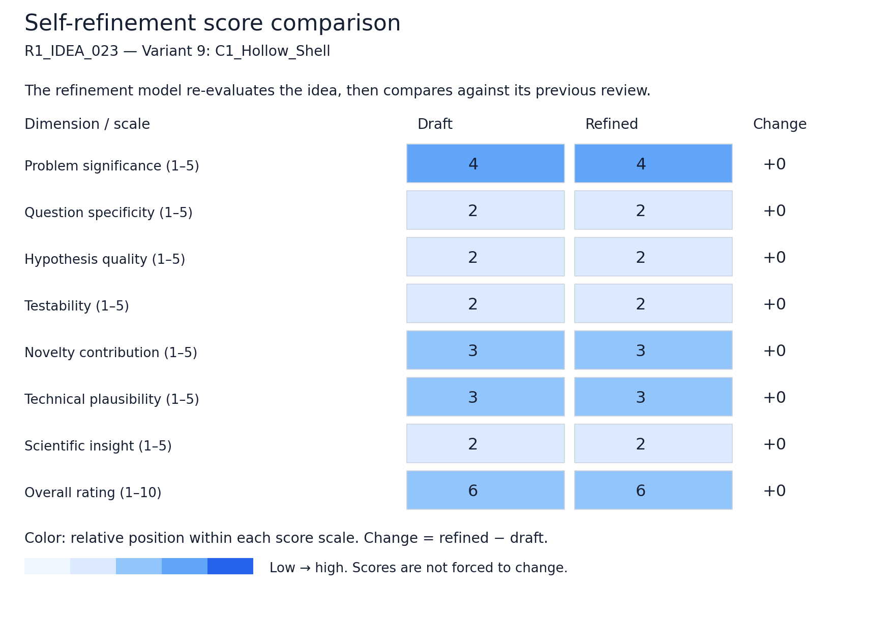

Changed score dimensions: none.

### Score justifications (draft / refined)

**Problem significance**

```json
{
  "draft": {
    "score": 4.0,
    "justification": "The problem is significant as it addresses a critical challenge in practical ML systems, particularly in scenarios where reliability and robustness are essential."
  },
  "refined": {
    "score": 4.0,
    "justification": "The problem is significant as it addresses a critical challenge in practical ML systems, particularly in scenarios where reliability and robustness are essential."
  }
}
```

**Question specificity**

```json
{
  "draft": {
    "score": 2.0,
    "justification": "The idea is somewhat specific in identifying a gap but lacks concrete research questions or hypotheses that could be tested."
  },
  "refined": {
    "score": 2.0,
    "justification": "The idea is somewhat specific in identifying a gap but lacks concrete research questions or hypotheses that could be tested."
  }
}
```

**Hypothesis quality**

```json
{
  "draft": {
    "score": 2.0,
    "justification": "The idea does not explicitly state a hypothesis, but it implies a potential direction. However, without a clear prediction or mechanism, the hypothesis quality is low."
  },
  "refined": {
    "score": 2.0,
    "justification": "The idea does not explicitly state a hypothesis, but it implies a potential direction. However, without a clear prediction or mechanism, the hypothesis quality is low."
  }
}
```

**Testability**

```json
{
  "draft": {
    "score": 2.0,
    "justification": "The idea is too general to be testable without more specific experimental or methodological details."
  },
  "refined": {
    "score": 2.0,
    "justification": "The idea is too general to be testable without more specific experimental or methodological details."
  }
}
```

**Novelty contribution**

```json
{
  "draft": {
    "score": 3.0,
    "justification": "The idea proposes a novel direction by integrating two separate aspects of ML robustness, which could contribute to the field if successfully implemented."
  },
  "refined": {
    "score": 3.0,
    "justification": "The idea proposes a novel direction by integrating two separate aspects of ML robustness, which could contribute to the field if successfully implemented."
  }
}
```

**Technical plausibility**

```json
{
  "draft": {
    "score": 3.0,
    "justification": "The proposed integration of uncertainty and robustness is technically plausible, but the lack of specific methods makes it difficult to assess."
  },
  "refined": {
    "score": 3.0,
    "justification": "The proposed integration of uncertainty and robustness is technically plausible, but the lack of specific methods makes it difficult to assess."
  }
}
```

**Scientific insight**

```json
{
  "draft": {
    "score": 2.0,
    "justification": "The idea has potential for scientific insight but lacks the specificity needed to generate meaningful insights."
  },
  "refined": {
    "score": 2.0,
    "justification": "The idea has potential for scientific insight but lacks the specificity needed to generate meaningful insights."
  }
}
```

**Overall rating**

```json
{
  "draft": {
    "score": 6.0,
    "justification": "The idea addresses a significant problem in ML but is too general and lacks specific research questions, hypotheses, and methodological details to be considered strong."
  },
  "refined": {
    "score": 6.0,
    "justification": "The idea addresses a significant problem in ML but is too general and lacks specific research questions, hypotheses, and methodological details to be considered strong."
  }
}
```

## R1_IDEA_023 — Variant 10: C2_Logic_Flawed


Changed score dimensions: none.

### Score justifications (draft / refined)

**Problem significance**

```json
{
  "draft": {
    "score": 4.0,
    "justification": "The problem of reliable machine learning systems is critical for real-world applications, and the gap in treating OOD detection and failure prediction separately is a valid concern."
  },
  "refined": {
    "score": 4.0,
    "justification": "The problem of reliable machine learning systems is critical for real-world applications, and the gap in treating OOD detection and failure prediction separately is a valid concern."
  }
}
```

**Question specificity**

```json
{
  "draft": {
    "score": 3.0,
    "justification": "The idea identifies a general problem but lacks a specific research question or hypothesis that could be tested."
  },
  "refined": {
    "score": 3.0,
    "justification": "The idea identifies a general problem but lacks a specific research question or hypothesis that could be tested."
  }
}
```

**Hypothesis quality**

```json
{
  "draft": {
    "score": 3.0,
    "justification": "The idea suggests a potential connection but does not explicitly state a hypothesis that could be tested or falsified."
  },
  "refined": {
    "score": 3.0,
    "justification": "The idea suggests a potential connection but does not explicitly state a hypothesis that could be tested or falsified."
  }
}
```

**Testability**

```json
{
  "draft": {
    "score": 2.0,
    "justification": "The idea is too vague to determine how it would be tested without more specific methods or experiments."
  },
  "refined": {
    "score": 2.0,
    "justification": "The idea is too vague to determine how it would be tested without more specific methods or experiments."
  }
}
```

**Novelty contribution**

```json
{
  "draft": {
    "score": 4.0,
    "justification": "The idea proposes a novel direction by exploring the connection between OOD detection and failure prediction, which is not commonly addressed in existing literature."
  },
  "refined": {
    "score": 4.0,
    "justification": "The idea proposes a novel direction by exploring the connection between OOD detection and failure prediction, which is not commonly addressed in existing literature."
  }
}
```

**Technical plausibility**

```json
{
  "draft": {
    "score": 4.0,
    "justification": "The proposed direction is technically plausible as it builds on existing concepts in OOD detection and uncertainty estimation."
  },
  "refined": {
    "score": 4.0,
    "justification": "The proposed direction is technically plausible as it builds on existing concepts in OOD detection and uncertainty estimation."
  }
}
```

**Scientific insight**

```json
{
  "draft": {
    "score": 3.0,
    "justification": "The idea has potential for scientific insight by exploring the interdependence of OOD detection and failure prediction, but the specifics are not clear."
  },
  "refined": {
    "score": 3.0,
    "justification": "The idea has potential for scientific insight by exploring the interdependence of OOD detection and failure prediction, but the specifics are not clear."
  }
}
```

**Overall rating**

```json
{
  "draft": {
    "score": 7.0,
    "justification": "The idea addresses a meaningful problem with a promising direction, but it lacks specific hypotheses and methods that would make it testable and actionable."
  },
  "refined": {
    "score": 7.0,
    "justification": "The idea addresses a meaningful problem with a promising direction, but it lacks specific hypotheses and methods that would make it testable and actionable."
  }
}
```

## R1_IDEA_023 — Variant 11: C3_Substance_Enriched


Changed score dimensions: none.

### Score justifications (draft / refined)

**Problem significance**

```json
{
  "draft": {
    "score": 4.0,
    "justification": "The problem of building reliable classifiers is fundamental for real-world ML applications, and addressing the separation of OOD detection and failure prediction is a significant gap in current methods."
  },
  "refined": {
    "score": 4.0,
    "justification": "The problem of building reliable classifiers is fundamental for real-world ML applications, and addressing the separation of OOD detection and failure prediction is a significant gap in current methods."
  }
}
```

**Question specificity**

```json
{
  "draft": {
    "score": 3.0,
    "justification": "The idea proposes a specific hypothesis about the joint distribution of confidence scores but lacks detailed specifics on how this will be modeled or evaluated."
  },
  "refined": {
    "score": 3.0,
    "justification": "The idea proposes a specific hypothesis about the joint distribution of confidence scores but lacks detailed specifics on how this will be modeled or evaluated."
  }
}
```

**Hypothesis quality**

```json
{
  "draft": {
    "score": 4.0,
    "justification": "The hypothesis that modeling the joint distribution of confidence scores could improve reliability is concrete and testable, though the exact mechanism and expected outcomes are not fully specified."
  },
  "refined": {
    "score": 4.0,
    "justification": "The hypothesis that modeling the joint distribution of confidence scores could improve reliability is concrete and testable, though the exact mechanism and expected outcomes are not fully specified."
  }
}
```

**Testability**

```json
{
  "draft": {
    "score": 3.0,
    "justification": "The idea suggests designing unified benchmarks, which is a testable step, but the specific experiments or evaluations needed to test the hypothesis are not clearly outlined."
  },
  "refined": {
    "score": 3.0,
    "justification": "The idea suggests designing unified benchmarks, which is a testable step, but the specific experiments or evaluations needed to test the hypothesis are not clearly outlined."
  }
}
```

**Novelty contribution**

```json
{
  "draft": {
    "score": 4.0,
    "justification": "The idea proposes a novel approach by considering the joint distribution of confidence scores for ID and OOD samples, which is a fresh perspective on improving classifier reliability."
  },
  "refined": {
    "score": 4.0,
    "justification": "The idea proposes a novel approach by considering the joint distribution of confidence scores for ID and OOD samples, which is a fresh perspective on improving classifier reliability."
  }
}
```

**Technical plausibility**

```json
{
  "draft": {
    "score": 4.0,
    "justification": "The idea is technically plausible as it builds on existing concepts in OOD detection and confidence modeling, and the proposed approach is logically coherent."
  },
  "refined": {
    "score": 4.0,
    "justification": "The idea is technically plausible as it builds on existing concepts in OOD detection and confidence modeling, and the proposed approach is logically coherent."
  }
}
```

**Scientific insight**

```json
{
  "draft": {
    "score": 3.0,
    "justification": "The idea has potential for scientific insight by exploring the connection between OOD detection and failure prediction, but the specific insights are not clearly defined."
  },
  "refined": {
    "score": 3.0,
    "justification": "The idea has potential for scientific insight by exploring the connection between OOD detection and failure prediction, but the specific insights are not clearly defined."
  }
}
```

**Overall rating**

```json
{
  "draft": {
    "score": 7.0,
    "justification": "The idea addresses a significant problem in ML reliability with a specific hypothesis and suggests a novel approach. However, it lacks detailed specifics on the method, evaluation, and benchmarks, which could strengthen its scientific merit."
  },
  "refined": {
    "score": 7.0,
    "justification": "The idea addresses a significant problem in ML reliability with a specific hypothesis and suggests a novel approach. However, it lacks detailed specifics on the method, evaluation, and benchmarks, which could strengthen its scientific merit."
  }
}
```

## R1_IDEA_023 — Variant 12: H1_Deceptive_Hollow


Changed score dimensions: none.

### Score justifications (draft / refined)

**Problem significance**

```json
{
  "draft": {
    "score": 4.0,
    "justification": "The problem of creating dependable ML systems that handle uncertainty in both familiar and unfamiliar inputs is significant for practical applications, as it addresses a critical challenge in real-world deployment."
  },
  "refined": {
    "score": 4.0,
    "justification": "The problem of creating dependable ML systems that handle uncertainty in both familiar and unfamiliar inputs is significant for practical applications, as it addresses a critical challenge in real-world deployment."
  }
}
```

**Question specificity**

```json
{
  "draft": {
    "score": 2.0,
    "justification": "The idea is broad and lacks a specific research question. It mentions a general goal but does not clearly define what exactly should be investigated or how the framework should be evaluated."
  },
  "refined": {
    "score": 2.0,
    "justification": "The idea is broad and lacks a specific research question. It mentions a general goal but does not clearly define what exactly should be investigated or how the framework should be evaluated."
  }
}
```

**Hypothesis quality**

```json
{
  "draft": {
    "score": 2.0,
    "justification": "The idea does not present a clear hypothesis or prediction. It outlines a general direction but does not specify what the research should aim to demonstrate or how it would be tested."
  },
  "refined": {
    "score": 2.0,
    "justification": "The idea does not present a clear hypothesis or prediction. It outlines a general direction but does not specify what the research should aim to demonstrate or how it would be tested."
  }
}
```

**Testability**

```json
{
  "draft": {
    "score": 2.0,
    "justification": "The idea is too vague to be tested without more concrete experimental or methodological details. It does not suggest how the proposed framework would be evaluated or what experiments would be conducted."
  },
  "refined": {
    "score": 2.0,
    "justification": "The idea is too vague to be tested without more concrete experimental or methodological details. It does not suggest how the proposed framework would be evaluated or what experiments would be conducted."
  }
}
```

**Novelty contribution**

```json
{
  "draft": {
    "score": 3.0,
    "justification": "The idea proposes a transformative synthesis rather than incremental changes, which is novel. However, the lack of specific details makes it difficult to assess the novelty and potential contribution beyond the general claim."
  },
  "refined": {
    "score": 3.0,
    "justification": "The idea proposes a transformative synthesis rather than incremental changes, which is novel. However, the lack of specific details makes it difficult to assess the novelty and potential contribution beyond the general claim."
  }
}
```

**Technical plausibility**

```json
{
  "draft": {
    "score": 3.0,
    "justification": "The idea is conceptually plausible, as integrating uncertainty and robustness is a reasonable direction. However, the lack of specific technical details makes it hard to evaluate the feasibility of the proposed framework."
  },
  "refined": {
    "score": 3.0,
    "justification": "The idea is conceptually plausible, as integrating uncertainty and robustness is a reasonable direction. However, the lack of specific technical details makes it hard to evaluate the feasibility of the proposed framework."
  }
}
```

**Scientific insight**

```json
{
  "draft": {
    "score": 3.0,
    "justification": "The idea has potential for scientific insight by proposing a unified framework that could reshape how the community approaches these problems. However, without specific research questions or hypotheses, the potential insight is not clearly defined."
  },
  "refined": {
    "score": 3.0,
    "justification": "The idea has potential for scientific insight by proposing a unified framework that could reshape how the community approaches these problems. However, without specific research questions or hypotheses, the potential insight is not clearly defined."
  }
}
```

**Overall rating**

```json
{
  "draft": {
    "score": 6.0,
    "justification": "The idea addresses a significant problem in ML but lacks specific research questions, hypotheses, and methodological details. It has potential for a transformative contribution but needs more concrete direction to be testable and impactful."
  },
  "refined": {
    "score": 6.0,
    "justification": "The idea addresses a significant problem in ML but lacks specific research questions, hypotheses, and methodological details. It has potential for a transformative contribution but needs more concrete direction to be testable and impactful."
  }
}
```

## R1_IDEA_023 — Variant 13: H2_Confident_Flaw


Changed score dimensions: none.

### Score justifications (draft / refined)

**Problem significance**

```json
{
  "draft": {
    "score": 4.0,
    "justification": "The problem of reliable classifier development is fundamental to real-world ML applications, and the proposed connection between OOD detection and ID error anticipation is a meaningful challenge in uncertainty estimation."
  },
  "refined": {
    "score": 4.0,
    "justification": "The problem of reliable classifier development is fundamental to real-world ML applications, and the proposed connection between OOD detection and ID error anticipation is a meaningful challenge in uncertainty estimation."
  }
}
```

**Question specificity**

```json
{
  "draft": {
    "score": 2.0,
    "justification": "The idea identifies a general problem but lacks a specific research question or hypothesis. It suggests a direction but does not clearly define what should be investigated."
  },
  "refined": {
    "score": 2.0,
    "justification": "The idea identifies a general problem but lacks a specific research question or hypothesis. It suggests a direction but does not clearly define what should be investigated."
  }
}
```

**Hypothesis quality**

```json
{
  "draft": {
    "score": 3.0,
    "justification": "The idea presents a general argument for the connection between OOD detection and ID error anticipation but does not provide a concrete hypothesis or prediction that can be tested."
  },
  "refined": {
    "score": 3.0,
    "justification": "The idea presents a general argument for the connection between OOD detection and ID error anticipation but does not provide a concrete hypothesis or prediction that can be tested."
  }
}
```

**Testability**

```json
{
  "draft": {
    "score": 2.0,
    "justification": "The idea suggests a general direction but does not specify experiments, evaluations, or methods to test the proposed connection between OOD and ID tasks."
  },
  "refined": {
    "score": 2.0,
    "justification": "The idea suggests a general direction but does not specify experiments, evaluations, or methods to test the proposed connection between OOD and ID tasks."
  }
}
```

**Novelty contribution**

```json
{
  "draft": {
    "score": 3.0,
    "justification": "The idea proposes a novel connection between two existing tasks but does not clearly define the specific contribution or novelty of the proposed approach."
  },
  "refined": {
    "score": 3.0,
    "justification": "The idea proposes a novel connection between two existing tasks but does not clearly define the specific contribution or novelty of the proposed approach."
  }
}
```

**Technical plausibility**

```json
{
  "draft": {
    "score": 4.0,
    "justification": "The argument for connecting OOD detection with ID error anticipation is technically plausible, as both are related to uncertainty estimation in ML."
  },
  "refined": {
    "score": 4.0,
    "justification": "The argument for connecting OOD detection with ID error anticipation is technically plausible, as both are related to uncertainty estimation in ML."
  }
}
```

**Scientific insight**

```json
{
  "draft": {
    "score": 3.0,
    "justification": "The idea suggests a potential scientific insight into the relationship between OOD detection and ID error anticipation but does not clearly define what insight would be gained from investigating this connection."
  },
  "refined": {
    "score": 3.0,
    "justification": "The idea suggests a potential scientific insight into the relationship between OOD detection and ID error anticipation but does not clearly define what insight would be gained from investigating this connection."
  }
}
```

**Overall rating**

```json
{
  "draft": {
    "score": 6.0,
    "justification": "The idea identifies a meaningful problem in reliable classifier development and proposes a novel connection between OOD detection and ID error anticipation. However, it lacks specific research questions, hypotheses, and methodological details that would make it testable and scientifically insightful."
  },
  "refined": {
    "score": 6.0,
    "justification": "The idea identifies a meaningful problem in reliable classifier development and proposes a novel connection between OOD detection and ID error anticipation. However, it lacks specific research questions, hypotheses, and methodological details that would make it testable and scientifically insightful."
  }
}
```

## R1_IDEA_023 — Variant 14: H3_Verbose_Enriched


Changed score dimensions: none.

### Score justifications (draft / refined)

**Problem significance**

```json
{
  "draft": {
    "score": 4.0,
    "justification": "The problem of building reliable classifiers is fundamental to deploying ML in real-world applications, and addressing the gap between OOD detection and failure prediction is a meaningful challenge."
  },
  "refined": {
    "score": 4.0,
    "justification": "The problem of building reliable classifiers is fundamental to deploying ML in real-world applications, and addressing the gap between OOD detection and failure prediction is a meaningful challenge."
  }
}
```

**Question specificity**

```json
{
  "draft": {
    "score": 3.0,
    "justification": "The idea proposes a specific hypothesis about joint confidence modeling but lacks detailed specification of the method and implementation plan."
  },
  "refined": {
    "score": 3.0,
    "justification": "The idea proposes a specific hypothesis about joint confidence modeling but lacks detailed specification of the method and implementation plan."
  }
}
```

**Hypothesis quality**

```json
{
  "draft": {
    "score": 4.0,
    "justification": "The hypothesis that jointly modeling confidence distributions could improve reliability is concrete and testable, though the connection to improved reliability is not fully explained."
  },
  "refined": {
    "score": 4.0,
    "justification": "The hypothesis that jointly modeling confidence distributions could improve reliability is concrete and testable, though the connection to improved reliability is not fully explained."
  }
}
```

**Testability**

```json
{
  "draft": {
    "score": 4.0,
    "justification": "The idea includes a staged design with evaluation criteria, ablations, and error analysis, which are all testable components."
  },
  "refined": {
    "score": 4.0,
    "justification": "The idea includes a staged design with evaluation criteria, ablations, and error analysis, which are all testable components."
  }
}
```

**Novelty contribution**

```json
{
  "draft": {
    "score": 3.0,
    "justification": "The idea proposes a novel approach to integrating OOD detection and failure prediction, but the novelty is somewhat limited by the lack of specific methodological details."
  },
  "refined": {
    "score": 3.0,
    "justification": "The idea proposes a novel approach to integrating OOD detection and failure prediction, but the novelty is somewhat limited by the lack of specific methodological details."
  }
}
```

**Technical plausibility**

```json
{
  "draft": {
    "score": 4.0,
    "justification": "The proposed approach is technically plausible, as joint modeling of confidence distributions is a reasonable direction for improving classifier reliability."
  },
  "refined": {
    "score": 4.0,
    "justification": "The proposed approach is technically plausible, as joint modeling of confidence distributions is a reasonable direction for improving classifier reliability."
  }
}
```

**Scientific insight**

```json
{
  "draft": {
    "score": 4.0,
    "justification": "The idea has the potential to provide insights into the relationship between confidence distributions, OOD detection, and failure prediction, though the specifics are not fully fleshed out."
  },
  "refined": {
    "score": 4.0,
    "justification": "The idea has the potential to provide insights into the relationship between confidence distributions, OOD detection, and failure prediction, though the specifics are not fully fleshed out."
  }
}
```

**Overall rating**

```json
{
  "draft": {
    "score": 7.0,
    "justification": "The idea addresses a significant problem with a clear hypothesis and structured evaluation plan, but lacks specific methodological details and a clear explanation of how the joint modeling would improve reliability."
  },
  "refined": {
    "score": 7.0,
    "justification": "The idea addresses a significant problem with a clear hypothesis and structured evaluation plan, but lacks specific methodological details and a clear explanation of how the joint modeling would improve reliability."
  }
}
```

## R1_IDEA_023 — Variant 15: H4_Ultimate_Hype


Changed score dimensions: none.

### Score justifications (draft / refined)

**Problem significance**

```json
{
  "draft": {
    "score": 4.0,
    "justification": "The problem of reliable classifiers is fundamental to real-world ML deployment, and the integration of OOD detection with ID error prediction addresses a critical gap in current methods."
  },
  "refined": {
    "score": 4.0,
    "justification": "The problem of reliable classifiers is fundamental to real-world ML deployment, and the integration of OOD detection with ID error prediction addresses a critical gap in current methods."
  }
}
```

**Question specificity**

```json
{
  "draft": {
    "score": 3.0,
    "justification": "The idea identifies a broad problem but lacks a specific research question or hypothesis that could be tested. It suggests a direction but does not clearly define what is being investigated."
  },
  "refined": {
    "score": 3.0,
    "justification": "The idea identifies a broad problem but lacks a specific research question or hypothesis that could be tested. It suggests a direction but does not clearly define what is being investigated."
  }
}
```

**Hypothesis quality**

```json
{
  "draft": {
    "score": 2.0,
    "justification": "The idea presents a general claim about the potential impact of integrating OOD and ID tasks but does not provide a concrete hypothesis or prediction that could be tested or falsified."
  },
  "refined": {
    "score": 2.0,
    "justification": "The idea presents a general claim about the potential impact of integrating OOD and ID tasks but does not provide a concrete hypothesis or prediction that could be tested or falsified."
  }
}
```

**Testability**

```json
{
  "draft": {
    "score": 2.0,
    "justification": "The idea does not specify an experiment, comparison, or evaluation method to test the proposed approach. It is too vague to determine how the research would be conducted."
  },
  "refined": {
    "score": 2.0,
    "justification": "The idea does not specify an experiment, comparison, or evaluation method to test the proposed approach. It is too vague to determine how the research would be conducted."
  }
}
```

**Novelty contribution**

```json
{
  "draft": {
    "score": 4.0,
    "justification": "The integration of OOD detection and ID error prediction is a novel direction that has not been widely explored in prior work, offering the potential for significant scientific and practical contributions."
  },
  "refined": {
    "score": 4.0,
    "justification": "The integration of OOD detection and ID error prediction is a novel direction that has not been widely explored in prior work, offering the potential for significant scientific and practical contributions."
  }
}
```

**Technical plausibility**

```json
{
  "draft": {
    "score": 3.0,
    "justification": "The idea is technically plausible as it builds on existing concepts in OOD detection and error prediction, but the specific implementation details are not provided."
  },
  "refined": {
    "score": 3.0,
    "justification": "The idea is technically plausible as it builds on existing concepts in OOD detection and error prediction, but the specific implementation details are not provided."
  }
}
```

**Scientific insight**

```json
{
  "draft": {
    "score": 3.0,
    "justification": "The research could provide insights into the relationship between OOD detection and ID error prediction, but the potential for deeper scientific understanding is not clearly articulated."
  },
  "refined": {
    "score": 3.0,
    "justification": "The research could provide insights into the relationship between OOD detection and ID error prediction, but the potential for deeper scientific understanding is not clearly articulated."
  }
}
```

**Overall rating**

```json
{
  "draft": {
    "score": 7.0,
    "justification": "The idea addresses a meaningful problem with the potential for significant impact, but it lacks specific research questions, hypotheses, and technical details that are necessary for further development and evaluation."
  },
  "refined": {
    "score": 7.0,
    "justification": "The idea addresses a meaningful problem with the potential for significant impact, but it lacks specific research questions, hypotheses, and technical details that are necessary for further development and evaluation."
  }
}
```

## R1_IDEA_024 — Source


Changed score dimensions: none.

### Score justifications (draft / refined)

**Problem significance**

```json
{
  "draft": {
    "score": 4.0,
    "justification": "Sarcasm detection is a significant challenge in NLP due to its reliance on context and social cues, which are difficult for traditional models to capture. This problem has practical implications in areas like chatbots, customer service, and sentiment analysis."
  },
  "refined": {
    "score": 4.0,
    "justification": "Sarcasm detection is a significant challenge in NLP due to its reliance on context and social cues, which are difficult for traditional models to capture. This problem has practical implications in areas like chatbots, customer service, and sentiment analysis."
  }
}
```

**Question specificity**

```json
{
  "draft": {
    "score": 2.0,
    "justification": "The idea is too general. It does not clearly define what specific aspect of sarcasm detection is being investigated or what the research question is. It merely states that GPT models are being applied to this task without specifying the hypothesis or question."
  },
  "refined": {
    "score": 2.0,
    "justification": "The idea is too general. It does not clearly define what specific aspect of sarcasm detection is being investigated or what the research question is. It merely states that GPT models are being applied to this task without specifying the hypothesis or question."
  }
}
```

**Hypothesis quality**

```json
{
  "draft": {
    "score": 2.0,
    "justification": "The idea lacks a clear hypothesis. It does not state what specific prediction is being made about the performance of GPT models in sarcasm detection. The hypothesis is implied but not explicitly stated."
  },
  "refined": {
    "score": 2.0,
    "justification": "The idea lacks a clear hypothesis. It does not state what specific prediction is being made about the performance of GPT models in sarcasm detection. The hypothesis is implied but not explicitly stated."
  }
}
```

**Testability**

```json
{
  "draft": {
    "score": 2.0,
    "justification": "The idea does not provide a clear experimental plan or evaluation method. It is unclear how the models will be tested, what benchmarks will be used, or how results will be interpreted."
  },
  "refined": {
    "score": 2.0,
    "justification": "The idea does not provide a clear experimental plan or evaluation method. It is unclear how the models will be tested, what benchmarks will be used, or how results will be interpreted."
  }
}
```

**Novelty contribution**

```json
{
  "draft": {
    "score": 3.0,
    "justification": "The idea is not novel in applying GPT models to sarcasm detection, as this is a common application. However, it could contribute by exploring the effectiveness of GPT models in capturing social cues and context, which is a specific aspect of sarcasm detection."
  },
  "refined": {
    "score": 3.0,
    "justification": "The idea is not novel in applying GPT models to sarcasm detection, as this is a common application. However, it could contribute by exploring the effectiveness of GPT models in capturing social cues and context, which is a specific aspect of sarcasm detection."
  }
}
```

**Technical plausibility**

```json
{
  "draft": {
    "score": 4.0,
    "justification": "The use of GPT models for sarcasm detection is technically plausible, as these models are designed to understand context and language nuances. However, the idea does not explain why GPT models are particularly suited for this task."
  },
  "refined": {
    "score": 4.0,
    "justification": "The use of GPT models for sarcasm detection is technically plausible, as these models are designed to understand context and language nuances. However, the idea does not explain why GPT models are particularly suited for this task."
  }
}
```

**Scientific insight**

```json
{
  "draft": {
    "score": 2.0,
    "justification": "The idea does not provide a clear scientific insight or potential contribution beyond applying existing models. It lacks a hypothesis that could lead to new understanding about sarcasm detection or the limitations of GPT models in this task."
  },
  "refined": {
    "score": 2.0,
    "justification": "The idea does not provide a clear scientific insight or potential contribution beyond applying existing models. It lacks a hypothesis that could lead to new understanding about sarcasm detection or the limitations of GPT models in this task."
  }
}
```

**Overall rating**

```json
{
  "draft": {
    "score": 6.0,
    "justification": "The idea addresses a meaningful problem in NLP but lacks specificity, hypothesis, and experimental details. It has potential for contribution but needs more clarity and definition to be a strong research idea."
  },
  "refined": {
    "score": 6.0,
    "justification": "The idea addresses a meaningful problem in NLP but lacks specificity, hypothesis, and experimental details. It has potential for contribution but needs more clarity and definition to be a strong research idea."
  }
}
```

## R1_IDEA_024 — Variant 1: A1_Identity


Changed score dimensions: none.

### Score justifications (draft / refined)

**Problem significance**

```json
{
  "draft": {
    "score": 4.0,
    "justification": "Sarcasm detection is a significant challenge in NLP, with applications in sentiment analysis, chatbots, and social media monitoring. The problem is meaningful and has practical implications."
  },
  "refined": {
    "score": 4.0,
    "justification": "Sarcasm detection is a significant challenge in NLP, with applications in sentiment analysis, chatbots, and social media monitoring. The problem is meaningful and has practical implications."
  }
}
```

**Question specificity**

```json
{
  "draft": {
    "score": 2.0,
    "justification": "The idea is too general. It does not clearly define the specific research question or hypothesis. The focus on GPT models is good, but the investigation's exact aim is not specified."
  },
  "refined": {
    "score": 2.0,
    "justification": "The idea is too general. It does not clearly define the specific research question or hypothesis. The focus on GPT models is good, but the investigation's exact aim is not specified."
  }
}
```

**Hypothesis quality**

```json
{
  "draft": {
    "score": 2.0,
    "justification": "The idea lacks a clear hypothesis. It merely states that GPT models are being used for sarcasm detection without specifying what is being tested or what the expected outcome is."
  },
  "refined": {
    "score": 2.0,
    "justification": "The idea lacks a clear hypothesis. It merely states that GPT models are being used for sarcasm detection without specifying what is being tested or what the expected outcome is."
  }
}
```

**Testability**

```json
{
  "draft": {
    "score": 2.0,
    "justification": "The idea does not provide enough details about the experiments or evaluation methods. Without specific tasks, datasets, or metrics, it is difficult to assess the testability of the research."
  },
  "refined": {
    "score": 2.0,
    "justification": "The idea does not provide enough details about the experiments or evaluation methods. Without specific tasks, datasets, or metrics, it is difficult to assess the testability of the research."
  }
}
```

**Novelty contribution**

```json
{
  "draft": {
    "score": 3.0,
    "justification": "The idea is not novel in using GPT models for sarcasm detection, but it could contribute by exploring their effectiveness in handling the social complexity of sarcasm. However, this is more of an application than a novel contribution."
  },
  "refined": {
    "score": 3.0,
    "justification": "The idea is not novel in using GPT models for sarcasm detection, but it could contribute by exploring their effectiveness in handling the social complexity of sarcasm. However, this is more of an application than a novel contribution."
  }
}
```

**Technical plausibility**

```json
{
  "draft": {
    "score": 4.0,
    "justification": "Using GPT models for sarcasm detection is technically plausible, as these models are designed to understand context and language nuances. The approach is reasonable given the problem's nature."
  },
  "refined": {
    "score": 4.0,
    "justification": "Using GPT models for sarcasm detection is technically plausible, as these models are designed to understand context and language nuances. The approach is reasonable given the problem's nature."
  }
}
```

**Scientific insight**

```json
{
  "draft": {
    "score": 2.0,
    "justification": "The idea does not clearly indicate what scientific insight would be gained. It focuses on applying existing models rather than exploring new mechanisms or principles related to sarcasm detection."
  },
  "refined": {
    "score": 2.0,
    "justification": "The idea does not clearly indicate what scientific insight would be gained. It focuses on applying existing models rather than exploring new mechanisms or principles related to sarcasm detection."
  }
}
```

**Overall rating**

```json
{
  "draft": {
    "score": 6.0,
    "justification": "The idea addresses a meaningful problem but lacks specificity and a clear hypothesis. It has potential but needs more detailed research questions and evaluation plans to be strong."
  },
  "refined": {
    "score": 6.0,
    "justification": "The idea addresses a meaningful problem but lacks specificity and a clear hypothesis. It has potential but needs more detailed research questions and evaluation plans to be strong."
  }
}
```

## R1_IDEA_024 — Variant 2: A2_Paraphrase_Only


Changed score dimensions: none.

### Score justifications (draft / refined)

**Problem significance**

```json
{
  "draft": {
    "score": 4.0,
    "justification": "Sarcasm detection is a significant challenge in NLP, with important implications for real-world applications. The problem is well-defined and has been studied extensively, making it a meaningful area of research."
  },
  "refined": {
    "score": 4.0,
    "justification": "Sarcasm detection is a significant challenge in NLP, with important implications for real-world applications. The problem is well-defined and has been studied extensively, making it a meaningful area of research."
  }
}
```

**Question specificity**

```json
{
  "draft": {
    "score": 3.0,
    "justification": "The idea is focused on applying GPT models to sarcasm detection, but it lacks a specific research question or hypothesis. It is more of a general statement about the application of these models rather than a targeted investigation."
  },
  "refined": {
    "score": 3.0,
    "justification": "The idea is focused on applying GPT models to sarcasm detection, but it lacks a specific research question or hypothesis. It is more of a general statement about the application of these models rather than a targeted investigation."
  }
}
```

**Hypothesis quality**

```json
{
  "draft": {
    "score": 3.0,
    "justification": "The idea does not explicitly state a hypothesis. It suggests that GPT models can be used for sarcasm detection, but it does not propose a specific prediction or mechanism that would be tested."
  },
  "refined": {
    "score": 3.0,
    "justification": "The idea does not explicitly state a hypothesis. It suggests that GPT models can be used for sarcasm detection, but it does not propose a specific prediction or mechanism that would be tested."
  }
}
```

**Testability**

```json
{
  "draft": {
    "score": 3.0,
    "justification": "The idea is testable in principle, as it involves applying existing models to a known task. However, without specific details on the task, dataset, or evaluation metrics, the testability is limited."
  },
  "refined": {
    "score": 3.0,
    "justification": "The idea is testable in principle, as it involves applying existing models to a known task. However, without specific details on the task, dataset, or evaluation metrics, the testability is limited."
  }
}
```

**Novelty contribution**

```json
{
  "draft": {
    "score": 3.0,
    "justification": "The idea is not novel in terms of applying GPT models to sarcasm detection, as this has been explored in previous research. The contribution would be more significant if the research proposed a new method or insight into the problem."
  },
  "refined": {
    "score": 3.0,
    "justification": "The idea is not novel in terms of applying GPT models to sarcasm detection, as this has been explored in previous research. The contribution would be more significant if the research proposed a new method or insight into the problem."
  }
}
```

**Technical plausibility**

```json
{
  "draft": {
    "score": 5.0,
    "justification": "The use of GPT models for sarcasm detection is technically plausible, as these models are designed to understand context and language, which are essential for detecting sarcasm."
  },
  "refined": {
    "score": 5.0,
    "justification": "The use of GPT models for sarcasm detection is technically plausible, as these models are designed to understand context and language, which are essential for detecting sarcasm."
  }
}
```

**Scientific insight**

```json
{
  "draft": {
    "score": 3.0,
    "justification": "The research could provide insights into the effectiveness of large language models in understanding nuanced language, but the potential for deeper scientific insight is limited without a specific hypothesis or investigation."
  },
  "refined": {
    "score": 3.0,
    "justification": "The research could provide insights into the effectiveness of large language models in understanding nuanced language, but the potential for deeper scientific insight is limited without a specific hypothesis or investigation."
  }
}
```

**Overall rating**

```json
{
  "draft": {
    "score": 7.0,
    "justification": "The idea addresses a significant problem in NLP and leverages state-of-the-art models, which are well-suited for the task. However, it lacks specific research questions, hypotheses, and details on evaluation, which are necessary for a more robust research direction."
  },
  "refined": {
    "score": 7.0,
    "justification": "The idea addresses a significant problem in NLP and leverages state-of-the-art models, which are well-suited for the task. However, it lacks specific research questions, hypotheses, and details on evaluation, which are necessary for a more robust research direction."
  }
}
```

## R1_IDEA_024 — Variant 3: A3_Plain_Core


Changed score dimensions: none.

### Score justifications (draft / refined)

**Problem significance**

```json
{
  "draft": {
    "score": 4.0,
    "justification": "Sarcasm detection is a significant challenge in NLP due to its reliance on context and social cues, which are critical for natural language understanding. The problem is relevant for applications like chatbots, customer service, and sentiment analysis."
  },
  "refined": {
    "score": 4.0,
    "justification": "Sarcasm detection is a significant challenge in NLP due to its reliance on context and social cues, which are critical for natural language understanding. The problem is relevant for applications like chatbots, customer service, and sentiment analysis."
  }
}
```

**Question specificity**

```json
{
  "draft": {
    "score": 3.0,
    "justification": "The idea is focused on sarcasm detection but lacks a clear, specific research question. It does not specify what exactly is being tested or what the study aims to uncover about sarcasm detection in the context of these models."
  },
  "refined": {
    "score": 3.0,
    "justification": "The idea is focused on sarcasm detection but lacks a clear, specific research question. It does not specify what exactly is being tested or what the study aims to uncover about sarcasm detection in the context of these models."
  }
}
```

**Hypothesis quality**

```json
{
  "draft": {
    "score": 2.0,
    "justification": "The idea does not explicitly state a hypothesis or prediction. While it is plausible that these models could be effective, the lack of a clear hypothesis makes it difficult to assess the research's direction and potential contribution."
  },
  "refined": {
    "score": 2.0,
    "justification": "The idea does not explicitly state a hypothesis or prediction. While it is plausible that these models could be effective, the lack of a clear hypothesis makes it difficult to assess the research's direction and potential contribution."
  }
}
```

**Testability**

```json
{
  "draft": {
    "score": 3.0,
    "justification": "The idea is testable in principle, as it involves evaluating the performance of these models on sarcasm detection tasks. However, the lack of specific experimental details makes it challenging to assess the feasibility and design of the experiments."
  },
  "refined": {
    "score": 3.0,
    "justification": "The idea is testable in principle, as it involves evaluating the performance of these models on sarcasm detection tasks. However, the lack of specific experimental details makes it challenging to assess the feasibility and design of the experiments."
  }
}
```

**Novelty contribution**

```json
{
  "draft": {
    "score": 3.0,
    "justification": "The idea is not novel in using large language models for sarcasm detection, as this has been explored in previous research. However, the specific focus on comparing different GPT versions could contribute to understanding their relative strengths in handling sarcasm."
  },
  "refined": {
    "score": 3.0,
    "justification": "The idea is not novel in using large language models for sarcasm detection, as this has been explored in previous research. However, the specific focus on comparing different GPT versions could contribute to understanding their relative strengths in handling sarcasm."
  }
}
```

**Technical plausibility**

```json
{
  "draft": {
    "score": 4.0,
    "justification": "The approach is technically plausible, as large language models are designed to handle context and social cues. The use of GPT models is a reasonable choice given their capabilities in natural language understanding."
  },
  "refined": {
    "score": 4.0,
    "justification": "The approach is technically plausible, as large language models are designed to handle context and social cues. The use of GPT models is a reasonable choice given their capabilities in natural language understanding."
  }
}
```

**Scientific insight**

```json
{
  "draft": {
    "score": 3.0,
    "justification": "The study could provide insights into how different GPT versions handle sarcasm, but the current idea lacks a clear focus on what specific insights are being sought. The potential for generalizable findings is moderate."
  },
  "refined": {
    "score": 3.0,
    "justification": "The study could provide insights into how different GPT versions handle sarcasm, but the current idea lacks a clear focus on what specific insights are being sought. The potential for generalizable findings is moderate."
  }
}
```

**Overall rating**

```json
{
  "draft": {
    "score": 7.0,
    "justification": "The idea addresses a meaningful problem in NLP with a plausible approach. However, it lacks specific research questions, hypotheses, and experimental details, which are necessary for a strong research direction. With additional clarification and structure, it has the potential to be a valuable contribution to the field."
  },
  "refined": {
    "score": 7.0,
    "justification": "The idea addresses a meaningful problem in NLP with a plausible approach. However, it lacks specific research questions, hypotheses, and experimental details, which are necessary for a strong research direction. With additional clarification and structure, it has the potential to be a valuable contribution to the field."
  }
}
```

## R1_IDEA_024 — Variant 4: B1_Verbose_Elaborate

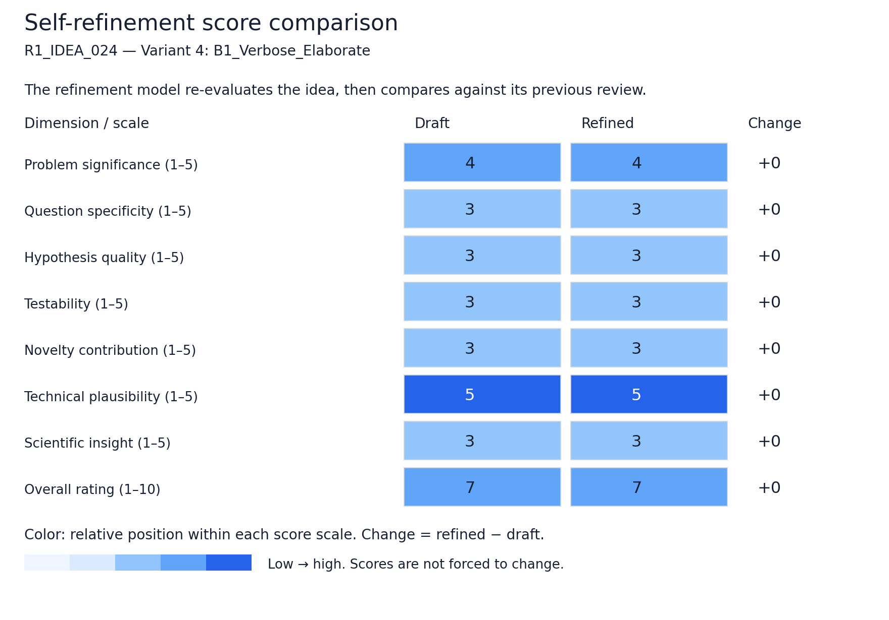

Changed score dimensions: none.

### Score justifications (draft / refined)

**Problem significance**

```json
{
  "draft": {
    "score": 4.0,
    "justification": "Sarcasm detection is a significant challenge in NLP due to its reliance on context and social cues, which are difficult for traditional models to capture. This problem has practical implications in areas like sentiment analysis, chatbots, and social media monitoring."
  },
  "refined": {
    "score": 4.0,
    "justification": "Sarcasm detection is a significant challenge in NLP due to its reliance on context and social cues, which are difficult for traditional models to capture. This problem has practical implications in areas like sentiment analysis, chatbots, and social media monitoring."
  }
}
```

**Question specificity**

```json
{
  "draft": {
    "score": 3.0,
    "justification": "The idea is focused on using large language models for sarcasm detection, but it lacks a clear, specific research question. It does not specify what exactly the models will be tested on or what particular aspect of sarcasm detection is being investigated."
  },
  "refined": {
    "score": 3.0,
    "justification": "The idea is focused on using large language models for sarcasm detection, but it lacks a clear, specific research question. It does not specify what exactly the models will be tested on or what particular aspect of sarcasm detection is being investigated."
  }
}
```

**Hypothesis quality**

```json
{
  "draft": {
    "score": 3.0,
    "justification": "The idea suggests that these models can be used for sarcasm detection, but it does not explicitly state a hypothesis or prediction that can be tested. It is more of a general statement about the application of existing models rather than a specific hypothesis."
  },
  "refined": {
    "score": 3.0,
    "justification": "The idea suggests that these models can be used for sarcasm detection, but it does not explicitly state a hypothesis or prediction that can be tested. It is more of a general statement about the application of existing models rather than a specific hypothesis."
  }
}
```

**Testability**

```json
{
  "draft": {
    "score": 3.0,
    "justification": "The idea is testable in principle, as it involves evaluating the performance of existing models on sarcasm detection tasks. However, the lack of specific metrics, datasets, and research questions makes it difficult to assess the feasibility of the proposed investigation."
  },
  "refined": {
    "score": 3.0,
    "justification": "The idea is testable in principle, as it involves evaluating the performance of existing models on sarcasm detection tasks. However, the lack of specific metrics, datasets, and research questions makes it difficult to assess the feasibility of the proposed investigation."
  }
}
```

**Novelty contribution**

```json
{
  "draft": {
    "score": 3.0,
    "justification": "The idea is not novel in using large language models for sarcasm detection, as this is a common application. However, it could contribute to the understanding of how these models handle context and social cues in sarcasm detection."
  },
  "refined": {
    "score": 3.0,
    "justification": "The idea is not novel in using large language models for sarcasm detection, as this is a common application. However, it could contribute to the understanding of how these models handle context and social cues in sarcasm detection."
  }
}
```

**Technical plausibility**

```json
{
  "draft": {
    "score": 5.0,
    "justification": "The proposed approach is technically plausible, as large language models are designed to handle contextual and social cues. The use of GPT-3, GPT-3.5, and GPT-4 is reasonable given their capabilities in natural language understanding."
  },
  "refined": {
    "score": 5.0,
    "justification": "The proposed approach is technically plausible, as large language models are designed to handle contextual and social cues. The use of GPT-3, GPT-3.5, and GPT-4 is reasonable given their capabilities in natural language understanding."
  }
}
```

**Scientific insight**

```json
{
  "draft": {
    "score": 3.0,
    "justification": "The research could provide insights into how large language models process sarcasm, but the lack of a specific hypothesis or research question limits the potential for significant scientific insight."
  },
  "refined": {
    "score": 3.0,
    "justification": "The research could provide insights into how large language models process sarcasm, but the lack of a specific hypothesis or research question limits the potential for significant scientific insight."
  }
}
```

**Overall rating**

```json
{
  "draft": {
    "score": 7.0,
    "justification": "The idea is promising and addresses a meaningful problem in NLP. However, it lacks specificity in defining the research question, hypothesis, and evaluation metrics, which are necessary for a strong research direction."
  },
  "refined": {
    "score": 7.0,
    "justification": "The idea is promising and addresses a meaningful problem in NLP. However, it lacks specificity in defining the research question, hypothesis, and evaluation metrics, which are necessary for a strong research direction."
  }
}
```

## R1_IDEA_024 — Variant 5: B2_Grand_Narrative


Changed score dimensions: none.

### Score justifications (draft / refined)

**Problem significance**

```json
{
  "draft": {
    "score": 4.0,
    "justification": "Sarcasm detection is a challenging problem in NLP due to its reliance on context and social cues, which is important for developing socially-aware AI systems."
  },
  "refined": {
    "score": 4.0,
    "justification": "Sarcasm detection is a challenging problem in NLP due to its reliance on context and social cues, which is important for developing socially-aware AI systems."
  }
}
```

**Question specificity**

```json
{
  "draft": {
    "score": 3.0,
    "justification": "The idea is focused on using GPT models for sarcasm detection but lacks a clear, specific research question or hypothesis."
  },
  "refined": {
    "score": 3.0,
    "justification": "The idea is focused on using GPT models for sarcasm detection but lacks a clear, specific research question or hypothesis."
  }
}
```

**Hypothesis quality**

```json
{
  "draft": {
    "score": 2.0,
    "justification": "The idea does not explicitly state a hypothesis or prediction, making it difficult to assess the research's direction or potential impact."
  },
  "refined": {
    "score": 2.0,
    "justification": "The idea does not explicitly state a hypothesis or prediction, making it difficult to assess the research's direction or potential impact."
  }
}
```

**Testability**

```json
{
  "draft": {
    "score": 3.0,
    "justification": "The idea suggests using GPT models for sarcasm detection but does not provide a clear experimental plan or evaluation metrics to test the hypothesis."
  },
  "refined": {
    "score": 3.0,
    "justification": "The idea suggests using GPT models for sarcasm detection but does not provide a clear experimental plan or evaluation metrics to test the hypothesis."
  }
}
```

**Novelty contribution**

```json
{
  "draft": {
    "score": 3.0,
    "justification": "The idea is novel in applying GPT models to sarcasm detection, but the contribution is not clearly defined or differentiated from existing research."
  },
  "refined": {
    "score": 3.0,
    "justification": "The idea is novel in applying GPT models to sarcasm detection, but the contribution is not clearly defined or differentiated from existing research."
  }
}
```

**Technical plausibility**

```json
{
  "draft": {
    "score": 4.0,
    "justification": "Using GPT models for sarcasm detection is technically plausible, as these models are designed for language understanding tasks."
  },
  "refined": {
    "score": 4.0,
    "justification": "Using GPT models for sarcasm detection is technically plausible, as these models are designed for language understanding tasks."
  }
}
```

**Scientific insight**

```json
{
  "draft": {
    "score": 3.0,
    "justification": "The research could provide insights into how GPT models handle context and social cues, but the potential for deeper scientific insight is limited without a clear hypothesis or experimental design."
  },
  "refined": {
    "score": 3.0,
    "justification": "The research could provide insights into how GPT models handle context and social cues, but the potential for deeper scientific insight is limited without a clear hypothesis or experimental design."
  }
}
```

**Overall rating**

```json
{
  "draft": {
    "score": 7.0,
    "justification": "The idea addresses a significant problem in NLP but lacks specificity, hypothesis, and experimental details. It has potential to contribute to socially-aware AI systems but needs more concrete research questions and methods."
  },
  "refined": {
    "score": 7.0,
    "justification": "The idea addresses a significant problem in NLP but lacks specificity, hypothesis, and experimental details. It has potential to contribute to socially-aware AI systems but needs more concrete research questions and methods."
  }
}
```

## R1_IDEA_024 — Variant 6: B3_Over_Confident


Changed score dimensions: none.

### Score justifications (draft / refined)

**Problem significance**

```json
{
  "draft": {
    "score": 4.0,
    "justification": "Sarcasm detection is a critical challenge in NLP, with implications for chatbots, customer service, and social media analysis. The problem is meaningful and has practical relevance."
  },
  "refined": {
    "score": 4.0,
    "justification": "Sarcasm detection is a critical challenge in NLP, with implications for chatbots, customer service, and social media analysis. The problem is meaningful and has practical relevance."
  }
}
```

**Question specificity**

```json
{
  "draft": {
    "score": 2.0,
    "justification": "The idea is broad, merely stating the application of GPT models without a clear, specific research question or hypothesis. It lacks details on what exactly is being investigated."
  },
  "refined": {
    "score": 2.0,
    "justification": "The idea is broad, merely stating the application of GPT models without a clear, specific research question or hypothesis. It lacks details on what exactly is being investigated."
  }
}
```

**Hypothesis quality**

```json
{
  "draft": {
    "score": 2.0,
    "justification": "The idea does not present a clear hypothesis or prediction. It simply states the application of GPT models without specifying what outcome is being tested or what new insight is sought."
  },
  "refined": {
    "score": 2.0,
    "justification": "The idea does not present a clear hypothesis or prediction. It simply states the application of GPT models without specifying what outcome is being tested or what new insight is sought."
  }
}
```

**Testability**

```json
{
  "draft": {
    "score": 3.0,
    "justification": "The idea suggests using GPT models for sarcasm detection, but it lacks details on the experiments, evaluation metrics, or comparison with existing methods, making it difficult to assess the testability."
  },
  "refined": {
    "score": 3.0,
    "justification": "The idea suggests using GPT models for sarcasm detection, but it lacks details on the experiments, evaluation metrics, or comparison with existing methods, making it difficult to assess the testability."
  }
}
```

**Novelty contribution**

```json
{
  "draft": {
    "score": 3.0,
    "justification": "The idea is not novel in applying GPT models to sarcasm detection, but it could contribute by exploring their effectiveness in handling the social and contextual aspects of sarcasm. However, the lack of specific research questions limits its novelty."
  },
  "refined": {
    "score": 3.0,
    "justification": "The idea is not novel in applying GPT models to sarcasm detection, but it could contribute by exploring their effectiveness in handling the social and contextual aspects of sarcasm. However, the lack of specific research questions limits its novelty."
  }
}
```

**Technical plausibility**

```json
{
  "draft": {
    "score": 4.0,
    "justification": "Using GPT models for sarcasm detection is technically plausible, as these models are designed to understand context and language nuances. However, the lack of specific details makes it difficult to assess the feasibility of the approach."
  },
  "refined": {
    "score": 4.0,
    "justification": "Using GPT models for sarcasm detection is technically plausible, as these models are designed to understand context and language nuances. However, the lack of specific details makes it difficult to assess the feasibility of the approach."
  }
}
```

**Scientific insight**

```json
{
  "draft": {
    "score": 2.0,
    "justification": "The idea does not provide a clear path to scientific insight. It focuses on application without addressing the underlying mechanisms or limitations of GPT models in sarcasm detection."
  },
  "refined": {
    "score": 2.0,
    "justification": "The idea does not provide a clear path to scientific insight. It focuses on application without addressing the underlying mechanisms or limitations of GPT models in sarcasm detection."
  }
}
```

**Overall rating**

```json
{
  "draft": {
    "score": 6.0,
    "justification": "The idea addresses a meaningful problem in NLP but lacks a clear research question, hypothesis, and methodology. It has potential for contribution but needs more specificity and detail to be strong."
  },
  "refined": {
    "score": 6.0,
    "justification": "The idea addresses a meaningful problem in NLP but lacks a clear research question, hypothesis, and methodology. It has potential for contribution but needs more specificity and detail to be strong."
  }
}
```

## R1_IDEA_024 — Variant 7: B4_Novelty


Changed score dimensions: none.

### Score justifications (draft / refined)

**Problem significance**

```json
{
  "draft": {
    "score": 4.0,
    "justification": "Sarcasm detection is a challenging problem in NLP with important applications in dialogue systems, customer service, and social media analysis. The idea addresses a meaningful challenge in the field."
  },
  "refined": {
    "score": 4.0,
    "justification": "Sarcasm detection is a challenging problem in NLP with important applications in dialogue systems, customer service, and social media analysis. The idea addresses a meaningful challenge in the field."
  }
}
```

**Question specificity**

```json
{
  "draft": {
    "score": 2.0,
    "justification": "The idea is somewhat vague in terms of what exactly is being investigated. It mentions using GPT models for sarcasm detection but does not specify a clear research question or hypothesis."
  },
  "refined": {
    "score": 2.0,
    "justification": "The idea is somewhat vague in terms of what exactly is being investigated. It mentions using GPT models for sarcasm detection but does not specify a clear research question or hypothesis."
  }
}
```

**Hypothesis quality**

```json
{
  "draft": {
    "score": 3.0,
    "justification": "The idea suggests that GPT models could be effective for sarcasm detection, but it lacks a concrete hypothesis or prediction that could be tested. It does not clearly state what the expected outcome is."
  },
  "refined": {
    "score": 3.0,
    "justification": "The idea suggests that GPT models could be effective for sarcasm detection, but it lacks a concrete hypothesis or prediction that could be tested. It does not clearly state what the expected outcome is."
  }
}
```

**Testability**

```json
{
  "draft": {
    "score": 2.0,
    "justification": "The idea does not provide a clear plan for testing the approach. It does not specify how the GPT models will be used, what datasets will be used, or how the results will be evaluated."
  },
  "refined": {
    "score": 2.0,
    "justification": "The idea does not provide a clear plan for testing the approach. It does not specify how the GPT models will be used, what datasets will be used, or how the results will be evaluated."
  }
}
```

**Novelty contribution**

```json
{
  "draft": {
    "score": 3.0,
    "justification": "The idea proposes using GPT models for sarcasm detection, which is a novel application of these models. However, it does not clearly state what new insight or contribution the research would make beyond applying existing models."
  },
  "refined": {
    "score": 3.0,
    "justification": "The idea proposes using GPT models for sarcasm detection, which is a novel application of these models. However, it does not clearly state what new insight or contribution the research would make beyond applying existing models."
  }
}
```

**Technical plausibility**

```json
{
  "draft": {
    "score": 4.0,
    "justification": "Using GPT models for sarcasm detection is technically plausible, as these models are known for their strong language understanding capabilities. The approach is consistent with current research trends in NLP."
  },
  "refined": {
    "score": 4.0,
    "justification": "Using GPT models for sarcasm detection is technically plausible, as these models are known for their strong language understanding capabilities. The approach is consistent with current research trends in NLP."
  }
}
```

**Scientific insight**

```json
{
  "draft": {
    "score": 2.0,
    "justification": "The idea does not clearly indicate what scientific insight the research would provide. It focuses on applying existing models to a task rather than exploring new mechanisms or principles underlying sarcasm detection."
  },
  "refined": {
    "score": 2.0,
    "justification": "The idea does not clearly indicate what scientific insight the research would provide. It focuses on applying existing models to a task rather than exploring new mechanisms or principles underlying sarcasm detection."
  }
}
```

**Overall rating**

```json
{
  "draft": {
    "score": 6.0,
    "justification": "The idea addresses a meaningful problem in NLP but lacks a clear research question, hypothesis, and evaluation plan. It has potential but needs more specificity and detail to be a strong research idea."
  },
  "refined": {
    "score": 6.0,
    "justification": "The idea addresses a meaningful problem in NLP but lacks a clear research question, hypothesis, and evaluation plan. It has potential but needs more specificity and detail to be a strong research idea."
  }
}
```

## R1_IDEA_024 — Variant 8: B5_Application_Impact


Changed score dimensions: none.

### Score justifications (draft / refined)

**Problem significance**

```json
{
  "draft": {
    "score": 4.0,
    "justification": "Sarcasm detection is a challenging problem in NLP due to its reliance on context and social cues, which are critical for natural language understanding. The research addresses a meaningful challenge with potential real-world applications."
  },
  "refined": {
    "score": 4.0,
    "justification": "Sarcasm detection is a challenging problem in NLP due to its reliance on context and social cues, which are critical for natural language understanding. The research addresses a meaningful challenge with potential real-world applications."
  }
}
```

**Question specificity**

```json
{
  "draft": {
    "score": 3.0,
    "justification": "The idea is focused on applying GPT models to sarcasm detection but lacks a specific research question or hypothesis. It is somewhat generic and does not clearly define the problem or the aspect of sarcasm detection being investigated."
  },
  "refined": {
    "score": 3.0,
    "justification": "The idea is focused on applying GPT models to sarcasm detection but lacks a specific research question or hypothesis. It is somewhat generic and does not clearly define the problem or the aspect of sarcasm detection being investigated."
  }
}
```

**Hypothesis quality**

```json
{
  "draft": {
    "score": 3.0,
    "justification": "The idea does not explicitly state a hypothesis or prediction. It is more of a general statement about the potential applications of GPT models in sarcasm detection without a clear, testable claim."
  },
  "refined": {
    "score": 3.0,
    "justification": "The idea does not explicitly state a hypothesis or prediction. It is more of a general statement about the potential applications of GPT models in sarcasm detection without a clear, testable claim."
  }
}
```

**Testability**

```json
{
  "draft": {
    "score": 3.0,
    "justification": "The idea suggests applying GPT models to sarcasm detection but does not provide a clear experimental plan or evaluation method. It lacks details on how the performance will be measured or compared to other approaches."
  },
  "refined": {
    "score": 3.0,
    "justification": "The idea suggests applying GPT models to sarcasm detection but does not provide a clear experimental plan or evaluation method. It lacks details on how the performance will be measured or compared to other approaches."
  }
}
```

**Novelty contribution**

```json
{
  "draft": {
    "score": 3.0,
    "justification": "The research is based on applying existing models to a known task, which is not novel. However, it could contribute to understanding the capabilities of GPT models in handling nuanced language phenomena."
  },
  "refined": {
    "score": 3.0,
    "justification": "The research is based on applying existing models to a known task, which is not novel. However, it could contribute to understanding the capabilities of GPT models in handling nuanced language phenomena."
  }
}
```

**Technical plausibility**

```json
{
  "draft": {
    "score": 5.0,
    "justification": "Using GPT models for sarcasm detection is technically plausible, as these models are designed for language understanding tasks. The approach is consistent with current research practices in NLP."
  },
  "refined": {
    "score": 5.0,
    "justification": "Using GPT models for sarcasm detection is technically plausible, as these models are designed for language understanding tasks. The approach is consistent with current research practices in NLP."
  }
}
```

**Scientific insight**

```json
{
  "draft": {
    "score": 3.0,
    "justification": "The research may provide insights into how GPT models handle sarcasm, but the lack of a specific hypothesis or question limits the potential for deeper scientific insight."
  },
  "refined": {
    "score": 3.0,
    "justification": "The research may provide insights into how GPT models handle sarcasm, but the lack of a specific hypothesis or question limits the potential for deeper scientific insight."
  }
}
```

**Overall rating**

```json
{
  "draft": {
    "score": 7.0,
    "justification": "The idea addresses a meaningful problem in NLP with a plausible approach. However, it lacks specificity, a clear hypothesis, and a detailed experimental plan, which are necessary for a strong research direction."
  },
  "refined": {
    "score": 7.0,
    "justification": "The idea addresses a meaningful problem in NLP with a plausible approach. However, it lacks specificity, a clear hypothesis, and a detailed experimental plan, which are necessary for a strong research direction."
  }
}
```

## R1_IDEA_024 — Variant 9: C1_Hollow_Shell


Changed score dimensions: none.

### Score justifications (draft / refined)

**Problem significance**

```json
{
  "draft": {
    "score": 4.0,
    "justification": "Sarcasm detection is a critical challenge in NLP, impacting applications like sentiment analysis, chatbots, and dialogue systems. The problem is meaningful and has practical implications."
  },
  "refined": {
    "score": 4.0,
    "justification": "Sarcasm detection is a critical challenge in NLP, impacting applications like sentiment analysis, chatbots, and dialogue systems. The problem is meaningful and has practical implications."
  }
}
```

**Question specificity**

```json
{
  "draft": {
    "score": 2.0,
    "justification": "The idea is too general, lacking a specific research question or hypothesis. It does not clearly define what the research aims to investigate or how it will be tested."
  },
  "refined": {
    "score": 2.0,
    "justification": "The idea is too general, lacking a specific research question or hypothesis. It does not clearly define what the research aims to investigate or how it will be tested."
  }
}
```

**Hypothesis quality**

```json
{
  "draft": {
    "score": 2.0,
    "justification": "The idea does not present a clear hypothesis or prediction. It merely states a general direction without specifying what the research aims to demonstrate or how it will be validated."
  },
  "refined": {
    "score": 2.0,
    "justification": "The idea does not present a clear hypothesis or prediction. It merely states a general direction without specifying what the research aims to demonstrate or how it will be validated."
  }
}
```

**Testability**

```json
{
  "draft": {
    "score": 2.0,
    "justification": "The idea lacks specific experiments or evaluation methods. Without a clear research question or hypothesis, it is difficult to determine how the research will be tested or what evidence will be sought."
  },
  "refined": {
    "score": 2.0,
    "justification": "The idea lacks specific experiments or evaluation methods. Without a clear research question or hypothesis, it is difficult to determine how the research will be tested or what evidence will be sought."
  }
}
```

**Novelty contribution**

```json
{
  "draft": {
    "score": 3.0,
    "justification": "The idea is relevant to current research but lacks specificity. While using advanced language models is a promising direction, the research does not clearly define what novel contribution it aims to make."
  },
  "refined": {
    "score": 3.0,
    "justification": "The idea is relevant to current research but lacks specificity. While using advanced language models is a promising direction, the research does not clearly define what novel contribution it aims to make."
  }
}
```

**Technical plausibility**

```json
{
  "draft": {
    "score": 4.0,
    "justification": "The proposed approach is technically plausible, as advanced language models are a well-established area in NLP. The idea aligns with current research trends and is feasible to implement."
  },
  "refined": {
    "score": 4.0,
    "justification": "The proposed approach is technically plausible, as advanced language models are a well-established area in NLP. The idea aligns with current research trends and is feasible to implement."
  }
}
```

**Scientific insight**

```json
{
  "draft": {
    "score": 2.0,
    "justification": "The idea does not provide a clear mechanism or insight into sarcasm detection. Without a specific hypothesis or research question, it is unclear what scientific insight the research aims to contribute."
  },
  "refined": {
    "score": 2.0,
    "justification": "The idea does not provide a clear mechanism or insight into sarcasm detection. Without a specific hypothesis or research question, it is unclear what scientific insight the research aims to contribute."
  }
}
```

**Overall rating**

```json
{
  "draft": {
    "score": 6.0,
    "justification": "The idea addresses a significant problem in NLP but lacks specificity, hypothesis, and testable components. It has potential but needs more detailed research questions and methods to be considered a strong research idea."
  },
  "refined": {
    "score": 6.0,
    "justification": "The idea addresses a significant problem in NLP but lacks specificity, hypothesis, and testable components. It has potential but needs more detailed research questions and methods to be considered a strong research idea."
  }
}
```

## R1_IDEA_024 — Variant 10: C2_Logic_Flawed

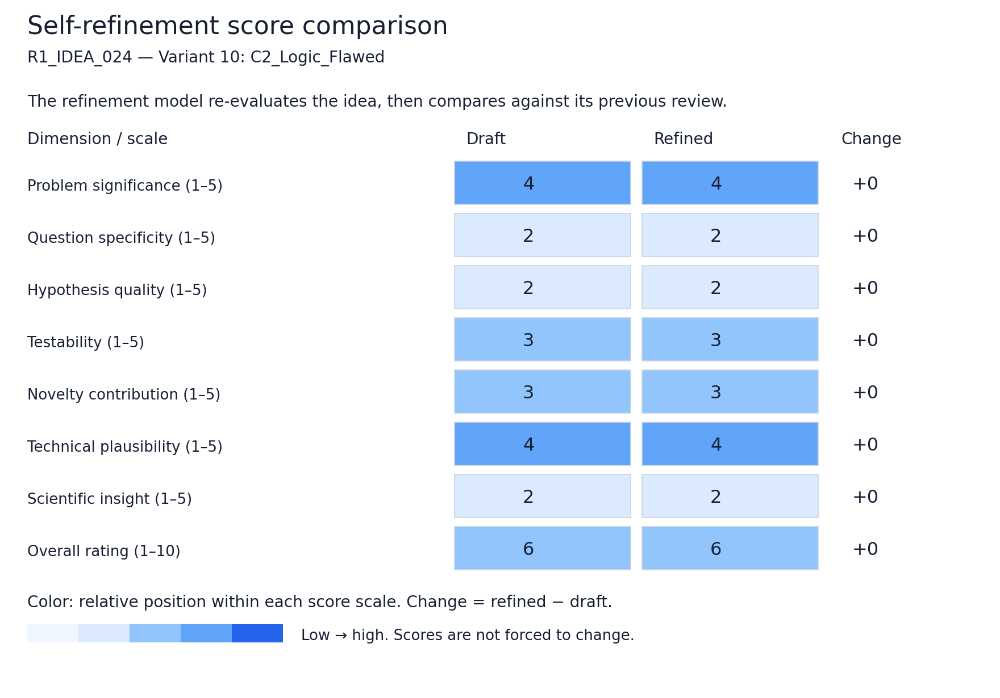

Changed score dimensions: none.

### Score justifications (draft / refined)

**Problem significance**

```json
{
  "draft": {
    "score": 4.0,
    "justification": "Sarcasm detection is a challenging problem in NLP due to its reliance on context and social cues, which is important for applications like chatbots, customer service, and sentiment analysis."
  },
  "refined": {
    "score": 4.0,
    "justification": "Sarcasm detection is a challenging problem in NLP due to its reliance on context and social cues, which is important for applications like chatbots, customer service, and sentiment analysis."
  }
}
```

**Question specificity**

```json
{
  "draft": {
    "score": 2.0,
    "justification": "The idea is too vague, as it does not specify what exactly is being tested or what the research question is. It merely states that GPT models could be effective without a clear hypothesis or question."
  },
  "refined": {
    "score": 2.0,
    "justification": "The idea is too vague, as it does not specify what exactly is being tested or what the research question is. It merely states that GPT models could be effective without a clear hypothesis or question."
  }
}
```

**Hypothesis quality**

```json
{
  "draft": {
    "score": 2.0,
    "justification": "The idea lacks a clear hypothesis. It suggests that GPT models are effective for sarcasm detection but does not propose a specific prediction or mechanism to test."
  },
  "refined": {
    "score": 2.0,
    "justification": "The idea lacks a clear hypothesis. It suggests that GPT models are effective for sarcasm detection but does not propose a specific prediction or mechanism to test."
  }
}
```

**Testability**

```json
{
  "draft": {
    "score": 3.0,
    "justification": "The idea could be tested by evaluating GPT models on sarcasm detection tasks, but the lack of specific tasks or metrics makes it difficult to assess the testability."
  },
  "refined": {
    "score": 3.0,
    "justification": "The idea could be tested by evaluating GPT models on sarcasm detection tasks, but the lack of specific tasks or metrics makes it difficult to assess the testability."
  }
}
```

**Novelty contribution**

```json
{
  "draft": {
    "score": 3.0,
    "justification": "The idea is not novel in using GPT models for sarcasm detection, but the broader claim about figurative language understanding is not clearly defined, limiting its contribution."
  },
  "refined": {
    "score": 3.0,
    "justification": ""
  }
}
```

**Technical plausibility**

```json
{
  "draft": {
    "score": 4.0,
    "justification": "Using GPT models for sarcasm detection is technically plausible, as these models are designed for understanding complex language patterns and context."
  },
  "refined": {
    "score": 4.0,
    "justification": "Using GPT models for sarcasm detection is technically plausible, as these models are designed for understanding complex language patterns and context."
  }
}
```

**Scientific insight**

```json
{
  "draft": {
    "score": 2.0,
    "justification": "The idea does not provide insights into why GPT models are effective for sarcasm detection or how this relates to broader figurative language understanding."
  },
  "refined": {
    "score": 2.0,
    "justification": "The idea does not provide insights into why GPT models are effective for sarcasm detection or how this relates to broader figurative language understanding."
  }
}
```

**Overall rating**

```json
{
  "draft": {
    "score": 6.0,
    "justification": "The idea addresses a meaningful problem in NLP but lacks a clear research question, hypothesis, and specific evaluation plan. It has potential but needs more specificity to be strong."
  },
  "refined": {
    "score": 6.0,
    "justification": "The idea addresses a meaningful problem in NLP but lacks a clear research question, hypothesis, and specific evaluation plan. It has potential but needs more specificity to be strong."
  }
}
```

## R1_IDEA_024 — Variant 11: C3_Substance_Enriched


Changed score dimensions: none.

### Score justifications (draft / refined)

**Problem significance**

```json
{
  "draft": {
    "score": 4.0,
    "justification": "Sarcasm detection is a critical challenge in NLP, with implications for dialogue systems, sentiment analysis, and social media monitoring. The problem is meaningful and has practical relevance."
  },
  "refined": {
    "score": 4.0,
    "justification": "Sarcasm detection is a critical challenge in NLP, with implications for dialogue systems, sentiment analysis, and social media monitoring. The problem is meaningful and has practical relevance."
  }
}
```

**Question specificity**

```json
{
  "draft": {
    "score": 3.0,
    "justification": "The idea identifies a specific problem (sarcasm detection) but lacks details on the exact task, dataset, and metrics. The hypothesis is plausible but not fully concrete."
  },
  "refined": {
    "score": 3.0,
    "justification": "The idea identifies a specific problem (sarcasm detection) but lacks details on the exact task, dataset, and metrics. The hypothesis is plausible but not fully concrete."
  }
}
```

**Hypothesis quality**

```json
{
  "draft": {
    "score": 3.0,
    "justification": "The hypothesis that GPT models use pragmatic norms to detect sarcasm is plausible, but it is not explicitly stated as a testable prediction. More specific predictions about performance under different contexts would strengthen it."
  },
  "refined": {
    "score": 3.0,
    "justification": "The hypothesis that GPT models use pragmatic norms to detect sarcasm is plausible, but it is not explicitly stated as a testable prediction. More specific predictions about performance under different contexts would strengthen it."
  }
}
```

**Testability**

```json
{
  "draft": {
    "score": 3.0,
    "justification": "The idea suggests future experiments, but the current description lacks specifics on how the hypothesis will be tested. Without clear experimental design, the testability is limited."
  },
  "refined": {
    "score": 3.0,
    "justification": "The idea suggests future experiments, but the current description lacks specifics on how the hypothesis will be tested. Without clear experimental design, the testability is limited."
  }
}
```

**Novelty contribution**

```json
{
  "draft": {
    "score": 4.0,
    "justification": "The idea explores the use of GPT models for sarcasm detection, which is a relevant application. While not entirely novel, it offers a new angle by focusing on the models' pragmatic knowledge and contextual variables."
  },
  "refined": {
    "score": 4.0,
    "justification": "The idea explores the use of GPT models for sarcasm detection, which is a relevant application. While not entirely novel, it offers a new angle by focusing on the models' pragmatic knowledge and contextual variables."
  }
}
```

**Technical plausibility**

```json
{
  "draft": {
    "score": 4.0,
    "justification": "The use of GPT models for sarcasm detection is technically plausible, as these models are pretrained on large text corpora that include social and contextual cues. The hypothesis about pragmatic norms is reasonable."
  },
  "refined": {
    "score": 4.0,
    "justification": "The use of GPT models for sarcasm detection is technically plausible, as these models are pretrained on large text corpora that include social and contextual cues. The hypothesis about pragmatic norms is reasonable."
  }
}
```

**Scientific insight**

```json
{
  "draft": {
    "score": 3.0,
    "justification": "The idea has potential to reveal how GPT models handle context and social cues, but the current scope is limited without more specific experiments. The insight into boundary conditions is promising but not yet fully realized."
  },
  "refined": {
    "score": 3.0,
    "justification": "The idea has potential to reveal how GPT models handle context and social cues, but the current scope is limited without more specific experiments. The insight into boundary conditions is promising but not yet fully realized."
  }
}
```

**Overall rating**

```json
{
  "draft": {
    "score": 7.0,
    "justification": "The idea addresses a meaningful problem with a plausible hypothesis and suggests future experiments. However, it lacks specific details on the task, dataset, and experimental design, which are necessary for a strong research direction."
  },
  "refined": {
    "score": 7.0,
    "justification": "The idea addresses a meaningful problem with a plausible hypothesis and suggests future experiments. However, it lacks specific details on the task, dataset, and experimental design, which are necessary for a strong research direction."
  }
}
```

## R1_IDEA_024 — Variant 12: H1_Deceptive_Hollow


Changed score dimensions: none.

### Score justifications (draft / refined)

**Problem significance**

```json
{
  "draft": {
    "score": 4.0,
    "justification": "Sarcasm detection is a critical challenge in NLP, impacting applications like chatbots, customer service, and content moderation. The problem is significant due to its complexity and real-world relevance."
  },
  "refined": {
    "score": 4.0,
    "justification": "Sarcasm detection is a critical challenge in NLP, impacting applications like chatbots, customer service, and content moderation. The problem is significant due to its complexity and real-world relevance."
  }
}
```

**Question specificity**

```json
{
  "draft": {
    "score": 2.0,
    "justification": "The idea is somewhat specific in identifying sarcasm detection as a challenge but lacks a clear, concrete research question or hypothesis. It is more of a general statement about the importance of the problem rather than a specific investigation."
  },
  "refined": {
    "score": 2.0,
    "justification": "The idea is somewhat specific in identifying sarcasm detection as a challenge but lacks a clear, concrete research question or hypothesis. It is more of a general statement about the importance of the problem rather than a specific investigation."
  }
}
```

**Hypothesis quality**

```json
{
  "draft": {
    "score": 2.0,
    "justification": "The idea does not explicitly state a hypothesis or prediction that could be tested. It is more of a general statement about the potential impact of the research rather than a specific claim that can be validated or refuted."
  },
  "refined": {
    "score": 2.0,
    "justification": "The idea does not explicitly state a hypothesis or prediction that could be tested. It is more of a general statement about the potential impact of the research rather than a specific claim that can be validated or refuted."
  }
}
```

**Testability**

```json
{
  "draft": {
    "score": 2.0,
    "justification": "The idea lacks specific details about the proposed method, evaluation metrics, or experimental design. Without these, it is difficult to assess whether the research can be meaningfully tested or evaluated."
  },
  "refined": {
    "score": 2.0,
    "justification": "The idea lacks specific details about the proposed method, evaluation metrics, or experimental design. Without these, it is difficult to assess whether the research can be meaningfully tested or evaluated."
  }
}
```

**Novelty contribution**

```json
{
  "draft": {
    "score": 3.0,
    "justification": "The idea suggests a novel approach using advanced language models for sarcasm detection, but it is not clear how this differs from existing methods. The contribution is framed as transformative, but without specific details, it is hard to assess its novelty."
  },
  "refined": {
    "score": 3.0,
    "justification": "The idea suggests a novel approach using advanced language models for sarcasm detection, but it is not clear how this differs from existing methods. The contribution is framed as transformative, but without specific details, it is hard to assess its novelty."
  }
}
```

**Technical plausibility**

```json
{
  "draft": {
    "score": 3.0,
    "justification": "The idea is technically plausible as it builds on existing language models, but the specific method and framework are not detailed. The connection to a broader framework for robust systems is not clearly explained."
  },
  "refined": {
    "score": 3.0,
    "justification": "The idea is technically plausible as it builds on existing language models, but the specific method and framework are not detailed. The connection to a broader framework for robust systems is not clearly explained."
  }
}
```

**Scientific insight**

```json
{
  "draft": {
    "score": 2.0,
    "justification": "The idea suggests a potential for scientific insight but does not specify what kind of insight is expected. The focus on synthesis and transformation is broad and lacks concrete mechanisms or predictions."
  },
  "refined": {
    "score": 2.0,
    "justification": "The idea suggests a potential for scientific insight but does not specify what kind of insight is expected. The focus on synthesis and transformation is broad and lacks concrete mechanisms or predictions."
  }
}
```

**Overall rating**

```json
{
  "draft": {
    "score": 6.0,
    "justification": "The idea addresses a significant problem in NLP but lacks specific details, clear research questions, and testable hypotheses. It has potential for contribution but needs more concrete formulation to be evaluated effectively."
  },
  "refined": {
    "score": 6.0,
    "justification": "The idea addresses a significant problem in NLP but lacks specific details, clear research questions, and testable hypotheses. It has potential for contribution but needs more concrete formulation to be evaluated effectively."
  }
}
```

## R1_IDEA_024 — Variant 13: H2_Confident_Flaw


Changed score dimensions: none.

### Score justifications (draft / refined)

**Problem significance**

```json
{
  "draft": {
    "score": 4.0,
    "justification": "The problem of sarcasm detection is significant in NLP, as it involves understanding context and social cues, which are crucial for effective communication. The idea addresses a challenging and important issue in the field."
  },
  "refined": {
    "score": 4.0,
    "justification": "The problem of sarcasm detection is significant in NLP, as it involves understanding context and social cues, which are crucial for effective communication. The idea addresses a challenging and important issue in the field."
  }
}
```

**Question specificity**

```json
{
  "draft": {
    "score": 3.0,
    "justification": "The idea is somewhat specific in its focus on sarcasm detection using GPT models, but it lacks clarity on the exact tasks, metrics, and hypotheses being tested. More specific questions would strengthen the research direction."
  },
  "refined": {
    "score": 3.0,
    "justification": "The idea is somewhat specific in its focus on sarcasm detection using GPT models, but it lacks clarity on the exact tasks, metrics, and hypotheses being tested. More specific questions would strengthen the research direction."
  }
}
```

**Hypothesis quality**

```json
{
  "draft": {
    "score": 4.0,
    "justification": "The hypothesis that GPT models will demonstrate superior performance in sarcasm detection and that this will lead to general improvements in figurative language understanding is plausible and has potential for meaningful contribution."
  },
  "refined": {
    "score": 4.0,
    "justification": "The hypothesis that GPT models will demonstrate superior performance in sarcasm detection and that this will lead to general improvements in figurative language understanding is plausible and has potential for meaningful contribution."
  }
}
```

**Testability**

```json
{
  "draft": {
    "score": 3.0,
    "justification": "The idea is testable through experiments comparing GPT models to existing methods in sarcasm detection. However, the lack of specific experimental details makes it difficult to assess the feasibility of the proposed approach."
  },
  "refined": {
    "score": 3.0,
    "justification": "The idea is testable through experiments comparing GPT models to existing methods in sarcasm detection. However, the lack of specific experimental details makes it difficult to assess the feasibility of the proposed approach."
  }
}
```

**Novelty contribution**

```json
{
  "draft": {
    "score": 3.0,
    "justification": "The idea is not entirely novel, as GPT models have been used in NLP tasks before. However, the focus on sarcasm detection and its broader implications for figurative language understanding is a specific contribution to the field."
  },
  "refined": {
    "score": 3.0,
    "justification": ""
  }
}
```

**Technical plausibility**

```json
{
  "draft": {
    "score": 4.0,
    "justification": "The use of GPT models for sarcasm detection is technically plausible, given their strong performance in language understanding tasks. The proposed approach is consistent with current research trends in NLP."
  },
  "refined": {
    "score": 4.0,
    "justification": "The use of GPT models for sarcasm detection is technically plausible, given their strong performance in language understanding tasks. The proposed approach is consistent with current research trends in NLP."
  }
}
```

**Scientific insight**

```json
{
  "draft": {
    "score": 3.0,
    "justification": "The idea has the potential to provide insights into the capabilities of GPT models in understanding complex language phenomena. However, the lack of specific hypotheses and experimental details limits the potential for significant scientific insight."
  },
  "refined": {
    "score": 3.0,
    "justification": "The idea has the potential to provide insights into the capabilities of GPT models in understanding complex language phenomena. However, the lack of specific hypotheses and experimental details limits the potential for significant scientific insight."
  }
}
```

**Overall rating**

```json
{
  "draft": {
    "score": 7.0,
    "justification": "The idea addresses a significant problem in NLP and proposes a plausible approach using state-of-the-art models. However, it lacks specific details on the research question, hypothesis, and experimental design, which are necessary for a strong research direction."
  },
  "refined": {
    "score": 7.0,
    "justification": "The idea addresses a significant problem in NLP and proposes a plausible approach using state-of-the-art models. However, it lacks specific details on the research question, hypothesis, and experimental design, which are necessary for a strong research direction."
  }
}
```

## R1_IDEA_024 — Variant 14: H3_Verbose_Enriched


Changed score dimensions: none.

### Score justifications (draft / refined)

**Problem significance**

```json
{
  "draft": {
    "score": 4.0,
    "justification": "The problem of sarcasm detection is significant in NLP, as it involves understanding context and social cues, which are critical for natural language understanding. The research addresses a challenging and relevant issue with potential applications in dialogue systems, customer service, and social media analysis."
  },
  "refined": {
    "score": 4.0,
    "justification": "The problem of sarcasm detection is significant in NLP, as it involves understanding context and social cues, which are critical for natural language understanding. The research addresses a challenging and relevant issue with potential applications in dialogue systems, customer service, and social media analysis."
  }
}
```

**Question specificity**

```json
{
  "draft": {
    "score": 3.0,
    "justification": "The idea is specific in its focus on GPT models and their potential to detect sarcasm through pragmatic norms. However, the exact tasks, datasets, and evaluation criteria are not clearly defined, which could limit the clarity and testability of the research question."
  },
  "refined": {
    "score": 3.0,
    "justification": "The idea is specific in its focus on GPT models and their potential to detect sarcasm through pragmatic norms. However, the exact tasks, datasets, and evaluation criteria are not clearly defined, which could limit the clarity and testability of the research question."
  }
}
```

**Hypothesis quality**

```json
{
  "draft": {
    "score": 3.0,
    "justification": "The hypothesis that GPT models use pretrained knowledge of pragmatic norms to detect sarcasm is plausible. However, it lacks a concrete prediction or mechanism that can be directly tested without further specification, making it somewhat vague."
  },
  "refined": {
    "score": 3.0,
    "justification": "The hypothesis that GPT models use pretrained knowledge of pragmatic norms to detect sarcasm is plausible. However, it lacks a concrete prediction or mechanism that can be directly tested without further specification, making it somewhat vague."
  }
}
```

**Testability**

```json
{
  "draft": {
    "score": 4.0,
    "justification": "The idea proposes a staged design with ablations, sensitivity analyses, and error analysis, which are testable components. However, the lack of specific tasks and datasets could affect the feasibility of the study."
  },
  "refined": {
    "score": 4.0,
    "justification": "The idea proposes a staged design with ablations, sensitivity analyses, and error analysis, which are testable components. However, the lack of specific tasks and datasets could affect the feasibility of the study."
  }
}
```

**Novelty contribution**

```json
{
  "draft": {
    "score": 3.0,
    "justification": "The idea focuses on evaluating existing GPT models for sarcasm detection, which is a valid contribution. However, it does not propose a novel method or theory, making the novelty limited compared to applying existing models to new domains."
  },
  "refined": {
    "score": 3.0,
    "justification": "The idea focuses on evaluating existing GPT models for sarcasm detection, which is a valid contribution. However, it does not propose a novel method or theory, making the novelty limited compared to applying existing models to new domains."
  }
}
```

**Technical plausibility**

```json
{
  "draft": {
    "score": 4.0,
    "justification": "The approach is technically plausible as GPT models are known to handle context and social cues. The proposed evaluation methods (ablations, sensitivity analyses) are standard in NLP research, making the technical direction reasonable."
  },
  "refined": {
    "score": 4.0,
    "justification": "The approach is technically plausible as GPT models are known to handle context and social cues. The proposed evaluation methods (ablations, sensitivity analyses) are standard in NLP research, making the technical direction reasonable."
  }
}
```

**Scientific insight**

```json
{
  "draft": {
    "score": 4.0,
    "justification": "The study aims to understand the conditions under which GPT models are effective in sarcasm detection, which could provide insights into the limitations and applicability of the approach. However, the insight is somewhat general without a clear focus on specific mechanisms or boundary conditions."
  },
  "refined": {
    "score": 4.0,
    "justification": "The study aims to understand the conditions under which GPT models are effective in sarcasm detection, which could provide insights into the limitations and applicability of the approach. However, the insight is somewhat general without a clear focus on specific mechanisms or boundary conditions."
  }
}
```

**Overall rating**

```json
{
  "draft": {
    "score": 7.0,
    "justification": "The idea addresses a significant problem in NLP with a clear hypothesis and a structured evaluation plan. While the specific tasks, datasets, and evaluation criteria are not fully defined, the overall direction is promising and has the potential to contribute meaningful insights into the effectiveness of GPT models in sarcasm detection."
  },
  "refined": {
    "score": 7.0,
    "justification": "The idea addresses a significant problem in NLP with a clear hypothesis and a structured evaluation plan. While the specific tasks, datasets, and evaluation criteria are not fully defined, the overall direction is promising and has the potential to contribute meaningful insights into the effectiveness of GPT models in sarcasm detection."
  }
}
```

## R1_IDEA_024 — Variant 15: H4_Ultimate_Hype


Changed score dimensions: none.

### Score justifications (draft / refined)

**Problem significance**

```json
{
  "draft": {
    "score": 4.0,
    "justification": "The problem of sarcasm detection is significant in NLP as it involves understanding social context and nuance, which are critical for developing more human-like language models. However, the idea does not clearly articulate how the research would contribute to solving this problem."
  },
  "refined": {
    "score": 4.0,
    "justification": "The problem of sarcasm detection is significant in NLP as it involves understanding social context and nuance, which are critical for developing more human-like language models. However, the idea does not clearly articulate how the research would contribute to solving this problem."
  }
}
```

**Question specificity**

```json
{
  "draft": {
    "score": 2.0,
    "justification": "The idea is too vague, merely stating that GPT models could be applied to sarcasm detection without specifying a concrete research question or hypothesis. It lacks the specificity needed to define what exactly is being investigated."
  },
  "refined": {
    "score": 2.0,
    "justification": "The idea is too vague, merely stating that GPT models could be applied to sarcasm detection without specifying a concrete research question or hypothesis. It lacks the specificity needed to define what exactly is being investigated."
  }
}
```

**Hypothesis quality**

```json
{
  "draft": {
    "score": 2.0,
    "justification": "The idea does not present a clear hypothesis or prediction. It merely states that GPT models could be useful for sarcasm detection without specifying what outcome is expected or how it would be measured."
  },
  "refined": {
    "score": 2.0,
    "justification": "The idea does not present a clear hypothesis or prediction. It merely states that GPT models could be useful for sarcasm detection without specifying what outcome is expected or how it would be measured."
  }
}
```

**Testability**

```json
{
  "draft": {
    "score": 3.0,
    "justification": "The idea suggests the use of GPT models for sarcasm detection but does not provide a clear plan for testing or evaluating the approach. Without specific experiments or comparisons, the testability is limited."
  },
  "refined": {
    "score": 3.0,
    "justification": "The idea suggests the use of GPT models for sarcasm detection but does not provide a clear plan for testing or evaluating the approach. Without specific experiments or comparisons, the testability is limited."
  }
}
```

**Novelty contribution**

```json
{
  "draft": {
    "score": 3.0,
    "justification": "The use of GPT models for sarcasm detection is not novel, as previous work has already explored similar applications. The idea does not clearly articulate a new contribution or unique aspect of the research."
  },
  "refined": {
    "score": 3.0,
    "justification": "The use of GPT models for sarcasm detection is not novel, as previous work has already explored similar applications. The idea does not clearly articulate a new contribution or unique aspect of the research."
  }
}
```

**Technical plausibility**

```json
{
  "draft": {
    "score": 4.0,
    "justification": "The technical approach is plausible, as GPT models are known for their language understanding capabilities. However, the idea does not specify how the models would be fine-tuned or adapted for sarcasm detection, which is a key technical detail."
  },
  "refined": {
    "score": 4.0,
    "justification": "The technical approach is plausible, as GPT models are known for their language understanding capabilities. However, the idea does not specify how the models would be fine-tuned or adapted for sarcasm detection, which is a key technical detail."
  }
}
```

**Scientific insight**

```json
{
  "draft": {
    "score": 2.0,
    "justification": "The idea does not provide a clear path to scientific insight. It focuses on the application of existing models without addressing the underlying mechanisms or principles that could be revealed through the research."
  },
  "refined": {
    "score": 2.0,
    "justification": "The idea does not provide a clear path to scientific insight. It focuses on the application of existing models without addressing the underlying mechanisms or principles that could be revealed through the research."
  }
}
```

**Overall rating**

```json
{
  "draft": {
    "score": 6.0,
    "justification": "The idea has potential but lacks specificity and clarity in defining the research question and hypothesis. While the problem is significant, the research agenda is too vague to determine its scientific merit without further details."
  },
  "refined": {
    "score": 6.0,
    "justification": "The idea has potential but lacks specificity and clarity in defining the research question and hypothesis. While the problem is significant, the research agenda is too vague to determine its scientific merit without further details."
  }
}
```

## R1_IDEA_025 — Source


Changed score dimensions: none.

### Score justifications (draft / refined)

**Problem significance**

```json
{
  "draft": {
    "score": 4.0,
    "justification": "The problem of efficient reasoning in large models is critical for practical deployment, especially in scenarios requiring long-chain reasoning with high accuracy."
  },
  "refined": {
    "score": 4.0,
    "justification": "The problem of efficient reasoning in large models is critical for practical deployment, especially in scenarios requiring long-chain reasoning with high accuracy."
  }
}
```

**Question specificity**

```json
{
  "draft": {
    "score": 3.0,
    "justification": "The idea identifies a relevant problem but lacks a clear, specific research question or hypothesis that defines what is being investigated."
  },
  "refined": {
    "score": 3.0,
    "justification": "The idea identifies a relevant problem but lacks a clear, specific research question or hypothesis that defines what is being investigated."
  }
}
```

**Hypothesis quality**

```json
{
  "draft": {
    "score": 2.0,
    "justification": "The summary does not explicitly state a hypothesis, and the research question is not clearly defined, making it difficult to assess the proposed investigation's potential to generate testable predictions."
  },
  "refined": {
    "score": 2.0,
    "justification": "The summary does not explicitly state a hypothesis, and the research question is not clearly defined, making it difficult to assess the proposed investigation's potential to generate testable predictions."
  }
}
```

**Testability**

```json
{
  "draft": {
    "score": 3.0,
    "justification": "The idea suggests a potential solution (sparse attention) but does not provide a clear experimental plan or evaluation metrics to test the hypothesis."
  },
  "refined": {
    "score": 3.0,
    "justification": "The idea suggests a potential solution (sparse attention) but does not provide a clear experimental plan or evaluation metrics to test the hypothesis."
  }
}
```

**Novelty contribution**

```json
{
  "draft": {
    "score": 3.0,
    "justification": "The approach of using sparse attention for KV cache pressure is plausible, but the idea does not clearly define a novel contribution beyond applying existing methods to a new context."
  },
  "refined": {
    "score": 3.0,
    "justification": "The approach of using sparse attention for KV cache pressure is plausible, but the idea does not clearly define a novel contribution beyond applying existing methods to a new context."
  }
}
```

**Technical plausibility**

```json
{
  "draft": {
    "score": 4.0,
    "justification": "Sparse attention methods are a known technique, and their application to reduce KV cache pressure in long-chain reasoning is technically feasible."
  },
  "refined": {
    "score": 4.0,
    "justification": "Sparse attention methods are a known technique, and their application to reduce KV cache pressure in long-chain reasoning is technically feasible."
  }
}
```

**Scientific insight**

```json
{
  "draft": {
    "score": 3.0,
    "justification": "The research could provide insights into the trade-offs between reasoning length, computational efficiency, and model performance, but the current idea lacks a clear focus on these aspects."
  },
  "refined": {
    "score": 3.0,
    "justification": "The research could provide insights into the trade-offs between reasoning length, computational efficiency, and model performance, but the current idea lacks a clear focus on these aspects."
  }
}
```

**Overall rating**

```json
{
  "draft": {
    "score": 7.0,
    "justification": "The idea addresses a significant problem in large reasoning models but lacks specificity and a clear hypothesis. With further clarification and definition, it has the potential to be a strong research direction."
  },
  "refined": {
    "score": 7.0,
    "justification": "The idea addresses a significant problem in large reasoning models but lacks specificity and a clear hypothesis. With further clarification and definition, it has the potential to be a strong research direction."
  }
}
```

## R1_IDEA_025 — Variant 1: A1_Identity


Changed score dimensions: none.

### Score justifications (draft / refined)

**Problem significance**

```json
{
  "draft": {
    "score": 4.0,
    "justification": "The problem of computational efficiency in large reasoning models is significant, as it directly impacts the practical deployment and scalability of these models."
  },
  "refined": {
    "score": 4.0,
    "justification": "The problem of computational efficiency in large reasoning models is significant, as it directly impacts the practical deployment and scalability of these models."
  }
}
```

**Question specificity**

```json
{
  "draft": {
    "score": 2.0,
    "justification": "The idea is too vague and incomplete to define a specific research question. The text is cut off, leaving unclear what the problem is or how sparse attention methods would be applied."
  },
  "refined": {
    "score": 2.0,
    "justification": "The idea is too vague and incomplete to define a specific research question. The text is cut off, leaving unclear what the problem is or how sparse attention methods would be applied."
  }
}
```

**Hypothesis quality**

```json
{
  "draft": {
    "score": 2.0,
    "justification": "The hypothesis is not clearly stated. The idea mentions that sparse attention methods could help reduce KV cache pressure, but it does not provide a concrete prediction or mechanism to test."
  },
  "refined": {
    "score": 2.0,
    "justification": "The hypothesis is not clearly stated. The idea mentions that sparse attention methods could help reduce KV cache pressure, but it does not provide a concrete prediction or mechanism to test."
  }
}
```

**Testability**

```json
{
  "draft": {
    "score": 2.0,
    "justification": "The idea lacks a clear experimental plan or evaluation method. Without knowing the exact problem and proposed solution, it is impossible to assess how the hypothesis can be tested."
  },
  "refined": {
    "score": 2.0,
    "justification": "The idea lacks a clear experimental plan or evaluation method. Without knowing the exact problem and proposed solution, it is impossible to assess how the hypothesis can be tested."
  }
}
```

**Novelty contribution**

```json
{
  "draft": {
    "score": 3.0,
    "justification": "The idea addresses a relevant problem in the field, but the lack of specificity makes it difficult to assess the novelty or potential contribution of the research."
  },
  "refined": {
    "score": 3.0,
    "justification": "The idea addresses a relevant problem in the field, but the lack of specificity makes it difficult to assess the novelty or potential contribution of the research."
  }
}
```

**Technical plausibility**

```json
{
  "draft": {
    "score": 3.0,
    "justification": "The use of sparse attention methods to reduce KV cache pressure is technically plausible, but the idea is too vague to determine the feasibility of the proposed approach."
  },
  "refined": {
    "score": 3.0,
    "justification": "The use of sparse attention methods to reduce KV cache pressure is technically plausible, but the idea is too vague to determine the feasibility of the proposed approach."
  }
}
```

**Scientific insight**

```json
{
  "draft": {
    "score": 2.0,
    "justification": "The idea has potential to contribute to understanding the efficiency of large reasoning models, but the lack of specificity makes it difficult to evaluate the scientific insight."
  },
  "refined": {
    "score": 2.0,
    "justification": "The idea has potential to contribute to understanding the efficiency of large reasoning models, but the lack of specificity makes it difficult to evaluate the scientific insight."
  }
}
```

**Overall rating**

```json
{
  "draft": {
    "score": 5.0,
    "justification": "The idea identifies a meaningful problem in the efficiency of large reasoning models, but it is incomplete and lacks a clear research question or hypothesis, making it difficult to assess its scientific merit."
  },
  "refined": {
    "score": 5.0,
    "justification": "The idea identifies a meaningful problem in the efficiency of large reasoning models, but it is incomplete and lacks a clear research question or hypothesis, making it difficult to assess its scientific merit."
  }
}
```

## R1_IDEA_025 — Variant 2: A2_Paraphrase_Only

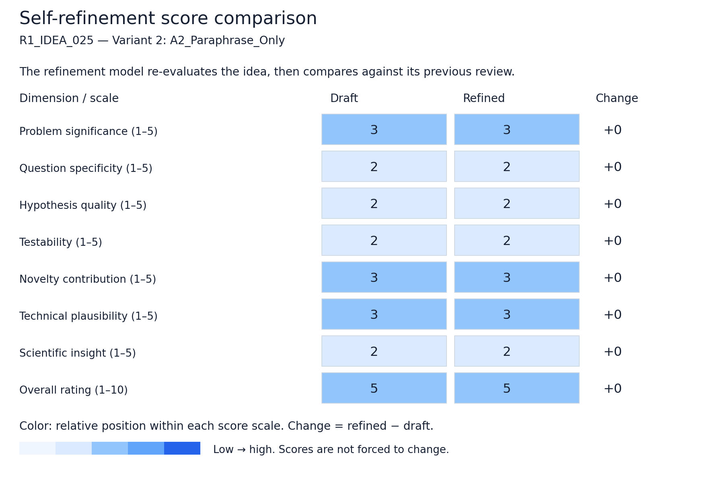

Changed score dimensions: none.

### Score justifications (draft / refined)

**Problem significance**

```json
{
  "draft": {
    "score": 3.0,
    "justification": "The problem is relevant to the efficiency and scalability of large reasoning models, which is a critical challenge in deploying such models in real-world applications."
  },
  "refined": {
    "score": 3.0,
    "justification": "The problem is relevant to the efficiency and scalability of large reasoning models, which is a critical challenge in deploying such models in real-world applications."
  }
}
```

**Question specificity**

```json
{
  "draft": {
    "score": 2.0,
    "justification": "The idea identifies a problem but lacks a concrete research question or hypothesis, making it difficult to assess the direction of the research."
  },
  "refined": {
    "score": 2.0,
    "justification": "The idea identifies a problem but lacks a concrete research question or hypothesis, making it difficult to assess the direction of the research."
  }
}
```

**Hypothesis quality**

```json
{
  "draft": {
    "score": 2.0,
    "justification": "There is no explicit hypothesis provided, and the idea does not clearly state what should be investigated or what prediction is being made."
  },
  "refined": {
    "score": 2.0,
    "justification": "There is no explicit hypothesis provided, and the idea does not clearly state what should be investigated or what prediction is being made."
  }
}
```

**Testability**

```json
{
  "draft": {
    "score": 2.0,
    "justification": "The idea does not specify how the problem will be tested or what experiments will be conducted to evaluate the proposed solution."
  },
  "refined": {
    "score": 2.0,
    "justification": "The idea does not specify how the problem will be tested or what experiments will be conducted to evaluate the proposed solution."
  }
}
```

**Novelty contribution**

```json
{
  "draft": {
    "score": 3.0,
    "justification": "The idea addresses a specific technical challenge in the deployment of large reasoning models, which could lead to novel solutions if the problem is properly investigated."
  },
  "refined": {
    "score": 3.0,
    "justification": "The idea addresses a specific technical challenge in the deployment of large reasoning models, which could lead to novel solutions if the problem is properly investigated."
  }
}
```

**Technical plausibility**

```json
{
  "draft": {
    "score": 3.0,
    "justification": "The problem described is technically plausible, as KV cache pressure is a known issue in autoregressive models, and sparse attention is a common approach to address it."
  },
  "refined": {
    "score": 3.0,
    "justification": "The problem described is technically plausible, as KV cache pressure is a known issue in autoregressive models, and sparse attention is a common approach to address it."
  }
}
```

**Scientific insight**

```json
{
  "draft": {
    "score": 2.0,
    "justification": "The idea does not provide a clear path to scientific insight, as it lacks a specific hypothesis or research question that could lead to new understanding."
  },
  "refined": {
    "score": 2.0,
    "justification": "The idea does not provide a clear path to scientific insight, as it lacks a specific hypothesis or research question that could lead to new understanding."
  }
}
```

**Overall rating**

```json
{
  "draft": {
    "score": 5.0,
    "justification": "The idea identifies a relevant and important problem in the field of large reasoning models, but it lacks the specificity and hypothesis needed to guide further research. With additional clarification and hypothesis formulation, it has the potential to be a strong research direction."
  },
  "refined": {
    "score": 5.0,
    "justification": "The idea identifies a relevant and important problem in the field of large reasoning models, but it lacks the specificity and hypothesis needed to guide further research. With additional clarification and hypothesis formulation, it has the potential to be a strong research direction."
  }
}
```

## R1_IDEA_025 — Variant 3: A3_Plain_Core


Changed score dimensions: none.

### Score justifications (draft / refined)

**Problem significance**

```json
{
  "draft": {
    "score": 4.0,
    "justification": "The problem of KV cache pressure in long reasoning sequences is critical for deploying large models in real-world applications where computational resources are limited."
  },
  "refined": {
    "score": 4.0,
    "justification": "The problem of KV cache pressure in long reasoning sequences is critical for deploying large models in real-world applications where computational resources are limited."
  }
}
```

**Question specificity**

```json
{
  "draft": {
    "score": 2.0,
    "justification": "The idea identifies a general problem but lacks a specific research question or hypothesis to investigate. It needs to clarify what exactly is being tested and why."
  },
  "refined": {
    "score": 2.0,
    "justification": "The idea identifies a general problem but lacks a specific research question or hypothesis to investigate. It needs to clarify what exactly is being tested and why."
  }
}
```

**Hypothesis quality**

```json
{
  "draft": {
    "score": 2.0,
    "justification": "The idea mentions a potential limitation but does not provide a concrete hypothesis that can be tested. It needs to specify what the hypothesis is and how it would be validated."
  },
  "refined": {
    "score": 2.0,
    "justification": "The idea mentions a potential limitation but does not provide a concrete hypothesis that can be tested. It needs to specify what the hypothesis is and how it would be validated."
  }
}
```

**Testability**

```json
{
  "draft": {
    "score": 2.0,
    "justification": "The idea does not propose specific experiments or evaluations to test the hypothesis. It remains too vague to determine if the proposed solution is feasible."
  },
  "refined": {
    "score": 2.0,
    "justification": "The idea does not propose specific experiments or evaluations to test the hypothesis. It remains too vague to determine if the proposed solution is feasible."
  }
}
```

**Novelty contribution**

```json
{
  "draft": {
    "score": 3.0,
    "justification": "The idea addresses a relevant problem in large reasoning models, but the proposed solution is not clearly defined. It has potential for contribution if a specific method is developed."
  },
  "refined": {
    "score": 3.0,
    "justification": "The idea addresses a relevant problem in large reasoning models, but the proposed solution is not clearly defined. It has potential for contribution if a specific method is developed."
  }
}
```

**Technical plausibility**

```json
{
  "draft": {
    "score": 4.0,
    "justification": "The technical aspects of sparse attention and KV cache pressure are plausible. The proposed direction is consistent with current research in efficient large models."
  },
  "refined": {
    "score": 4.0,
    "justification": "The technical aspects of sparse attention and KV cache pressure are plausible. The proposed direction is consistent with current research in efficient large models."
  }
}
```

**Scientific insight**

```json
{
  "draft": {
    "score": 2.0,
    "justification": "The idea has potential for insight but lacks a clear focus. It needs to specify what scientific understanding would be gained from investigating the limitations of sparse attention."
  },
  "refined": {
    "score": 2.0,
    "justification": "The idea has potential for insight but lacks a clear focus. It needs to specify what scientific understanding would be gained from investigating the limitations of sparse attention."
  }
}
```

**Overall rating**

```json
{
  "draft": {
    "score": 6.0,
    "justification": "The idea identifies a meaningful problem in large reasoning models but lacks a specific research question, hypothesis, and experimental plan. It has potential for contribution if further details are provided."
  },
  "refined": {
    "score": 6.0,
    "justification": "The idea identifies a meaningful problem in large reasoning models but lacks a specific research question, hypothesis, and experimental plan. It has potential for contribution if further details are provided."
  }
}
```

## R1_IDEA_025 — Variant 4: B1_Verbose_Elaborate


Changed score dimensions: none.

### Score justifications (draft / refined)

**Problem significance**

```json
{
  "draft": {
    "score": 4.0,
    "justification": "The problem of efficient reasoning in large models is significant for practical applications, as it directly impacts the scalability and efficiency of these models in real-world scenarios."
  },
  "refined": {
    "score": 4.0,
    "justification": "The problem of efficient reasoning in large models is significant for practical applications, as it directly impacts the scalability and efficiency of these models in real-world scenarios."
  }
}
```

**Question specificity**

```json
{
  "draft": {
    "score": 3.0,
    "justification": "The idea identifies a specific technical challenge but lacks a precise research question or hypothesis that could guide further investigation."
  },
  "refined": {
    "score": 3.0,
    "justification": "The idea identifies a specific technical challenge but lacks a precise research question or hypothesis that could guide further investigation."
  }
}
```

**Hypothesis quality**

```json
{
  "draft": {
    "score": 2.0,
    "justification": "The idea mentions a problem and a potential solution but does not explicitly state a hypothesis that can be tested or falsified."
  },
  "refined": {
    "score": 2.0,
    "justification": "The idea mentions a problem and a potential solution but does not explicitly state a hypothesis that can be tested or falsified."
  }
}
```

**Testability**

```json
{
  "draft": {
    "score": 3.0,
    "justification": "The problem is testable through experiments, but the idea does not provide a clear experimental plan or specific metrics for evaluation."
  },
  "refined": {
    "score": 3.0,
    "justification": "The problem is testable through experiments, but the idea does not provide a clear experimental plan or specific metrics for evaluation."
  }
}
```

**Novelty contribution**

```json
{
  "draft": {
    "score": 3.0,
    "justification": "The idea addresses a relevant issue in the field, but the novelty and potential contribution are not clearly defined without further specifics."
  },
  "refined": {
    "score": 3.0,
    "justification": "The idea addresses a relevant issue in the field, but the novelty and potential contribution are not clearly defined without further specifics."
  }
}
```

**Technical plausibility**

```json
{
  "draft": {
    "score": 4.0,
    "justification": "The problem and proposed solution (sparse attention) are technically plausible within the context of large language models and reasoning tasks."
  },
  "refined": {
    "score": 4.0,
    "justification": "The problem and proposed solution (sparse attention) are technically plausible within the context of large language models and reasoning tasks."
  }
}
```

**Scientific insight**

```json
{
  "draft": {
    "score": 3.0,
    "justification": "The idea has potential for scientific insight into the trade-offs between reasoning quality and computational efficiency, but this is not explicitly articulated."
  },
  "refined": {
    "score": 3.0,
    "justification": "The idea has potential for scientific insight into the trade-offs between reasoning quality and computational efficiency, but this is not explicitly articulated."
  }
}
```

**Overall rating**

```json
{
  "draft": {
    "score": 7.0,
    "justification": "The idea presents a meaningful problem with potential for further investigation, but lacks a clear research question, hypothesis, and proposed solution, which are necessary for a strong research direction."
  },
  "refined": {
    "score": 7.0,
    "justification": "The idea presents a meaningful problem with potential for further investigation, but lacks a clear research question, hypothesis, and proposed solution, which are necessary for a strong research direction."
  }
}
```

## R1_IDEA_025 — Variant 5: B2_Grand_Narrative


Changed score dimensions: none.

### Score justifications (draft / refined)

**Problem significance**

```json
{
  "draft": {
    "score": 4.0,
    "justification": "The idea addresses a critical challenge in scalable AI systems, particularly the efficiency-accuracy trade-off in large reasoning models, which is important for practical deployment and further research."
  },
  "refined": {
    "score": 4.0,
    "justification": "The idea addresses a critical challenge in scalable AI systems, particularly the efficiency-accuracy trade-off in large reasoning models, which is important for practical deployment and further research."
  }
}
```

**Question specificity**

```json
{
  "draft": {
    "score": 2.0,
    "justification": "The idea is somewhat general and does not clearly define a specific research question or hypothesis. It mentions the challenge of long chain-of-thought generation but lacks a concrete question to investigate."
  },
  "refined": {
    "score": 2.0,
    "justification": "The idea is somewhat general and does not clearly define a specific research question or hypothesis. It mentions the challenge of long chain-of-thought generation but lacks a concrete question to investigate."
  }
}
```

**Hypothesis quality**

```json
{
  "draft": {
    "score": 2.0,
    "justification": "The idea does not explicitly state a hypothesis or prediction that could be tested. It mentions sparse attention as a potential solution but does not propose a specific mechanism or outcome to evaluate."
  },
  "refined": {
    "score": 2.0,
    "justification": "The idea does not explicitly state a hypothesis or prediction that could be tested. It mentions sparse attention as a potential solution but does not propose a specific mechanism or outcome to evaluate."
  }
}
```

**Testability**

```json
{
  "draft": {
    "score": 3.0,
    "justification": "The idea suggests that sparse attention methods can help reduce KV cache pressure, but it does not provide a clear experimental design or evaluation plan. The testability is limited by the lack of specific methods or metrics."
  },
  "refined": {
    "score": 3.0,
    "justification": "The idea suggests that sparse attention methods can help reduce KV cache pressure, but it does not provide a clear experimental design or evaluation plan. The testability is limited by the lack of specific methods or metrics."
  }
}
```

**Novelty contribution**

```json
{
  "draft": {
    "score": 3.0,
    "justification": "The idea is relevant and timely but does not propose a novel method or significant contribution beyond the existing sparse attention approaches. It focuses on a known challenge but does not clearly define a new research direction."
  },
  "refined": {
    "score": 3.0,
    "justification": "The idea is relevant and timely but does not propose a novel method or significant contribution beyond the existing sparse attention approaches. It focuses on a known challenge but does not clearly define a new research direction."
  }
}
```

**Technical plausibility**

```json
{
  "draft": {
    "score": 4.0,
    "justification": "The idea is technically plausible as it builds on existing methods (sparse attention) and addresses a known challenge in large reasoning models. The proposed direction is reasonable within the current research landscape."
  },
  "refined": {
    "score": 4.0,
    "justification": "The idea is technically plausible as it builds on existing methods (sparse attention) and addresses a known challenge in large reasoning models. The proposed direction is reasonable within the current research landscape."
  }
}
```

**Scientific insight**

```json
{
  "draft": {
    "score": 3.0,
    "justification": "The idea has potential to contribute to understanding efficiency-accuracy trade-offs but lacks a clear focus on mechanisms or broader insights. The scientific insight is limited by the general nature of the problem and the lack of specific hypotheses."
  },
  "refined": {
    "score": 3.0,
    "justification": "The idea has potential to contribute to understanding efficiency-accuracy trade-offs but lacks a clear focus on mechanisms or broader insights. The scientific insight is limited by the general nature of the problem and the lack of specific hypotheses."
  }
}
```

**Overall rating**

```json
{
  "draft": {
    "score": 6.0,
    "justification": "The idea addresses an important problem in large reasoning models but lacks a specific research question, hypothesis, and evaluation plan. It has potential for further development but requires more concrete direction to be considered strong."
  },
  "refined": {
    "score": 6.0,
    "justification": "The idea addresses an important problem in large reasoning models but lacks a specific research question, hypothesis, and evaluation plan. It has potential for further development but requires more concrete direction to be considered strong."
  }
}
```

## R1_IDEA_025 — Variant 6: B3_Over_Confident


Changed score dimensions: none.

### Score justifications (draft / refined)

**Problem significance**

```json
{
  "draft": {
    "score": 4.0,
    "justification": "The problem of efficient long-chain reasoning in large models is significant for practical applications, as it directly impacts the scalability and efficiency of reasoning models."
  },
  "refined": {
    "score": 4.0,
    "justification": "The problem of efficient long-chain reasoning in large models is significant for practical applications, as it directly impacts the scalability and efficiency of reasoning models."
  }
}
```

**Question specificity**

```json
{
  "draft": {
    "score": 3.0,
    "justification": "The idea identifies a problem but lacks a specific research question or hypothesis, making it somewhat vague in terms of what exactly is being investigated."
  },
  "refined": {
    "score": 3.0,
    "justification": "The idea identifies a problem but lacks a specific research question or hypothesis, making it somewhat vague in terms of what exactly is being investigated."
  }
}
```

**Hypothesis quality**

```json
{
  "draft": {
    "score": 2.0,
    "justification": "The idea does not explicitly state a hypothesis, but it implies a potential direction for investigation. However, without a clear prediction or mechanism, the hypothesis is not well-defined."
  },
  "refined": {
    "score": 2.0,
    "justification": "The idea does not explicitly state a hypothesis, but it implies a potential direction for investigation. However, without a clear prediction or mechanism, the hypothesis is not well-defined."
  }
}
```

**Testability**

```json
{
  "draft": {
    "score": 3.0,
    "justification": "The idea suggests a problem and a potential solution but does not provide a clear experimental framework or method for testing the proposed approach."
  },
  "refined": {
    "score": 3.0,
    "justification": "The idea suggests a problem and a potential solution but does not provide a clear experimental framework or method for testing the proposed approach."
  }
}
```

**Novelty contribution**

```json
{
  "draft": {
    "score": 3.0,
    "justification": "The idea addresses a known challenge in the field but does not propose a novel method or insight. It focuses on a specific technical issue that could contribute to more efficient reasoning models."
  },
  "refined": {
    "score": 3.0,
    "justification": "The idea addresses a known challenge in the field but does not propose a novel method or insight. It focuses on a specific technical issue that could contribute to more efficient reasoning models."
  }
}
```

**Technical plausibility**

```json
{
  "draft": {
    "score": 4.0,
    "justification": "The problem and the proposed direction (sparse attention) are technically plausible and align with current research trends in efficient model inference."
  },
  "refined": {
    "score": 4.0,
    "justification": "The problem and the proposed direction (sparse attention) are technically plausible and align with current research trends in efficient model inference."
  }
}
```

**Scientific insight**

```json
{
  "draft": {
    "score": 3.0,
    "justification": "The idea has the potential to contribute to understanding the limitations of current methods and could lead to more efficient reasoning mechanisms, but the insight is not clearly articulated."
  },
  "refined": {
    "score": 3.0,
    "justification": "The idea has the potential to contribute to understanding the limitations of current methods and could lead to more efficient reasoning mechanisms, but the insight is not clearly articulated."
  }
}
```

**Overall rating**

```json
{
  "draft": {
    "score": 7.0,
    "justification": "The idea identifies a meaningful problem in the field of large reasoning models and suggests a direction for further research. While it lacks specific hypotheses and experimental details, it has the potential to contribute to the development of more efficient reasoning models."
  },
  "refined": {
    "score": 7.0,
    "justification": "The idea identifies a meaningful problem in the field of large reasoning models and suggests a direction for further research. While it lacks specific hypotheses and experimental details, it has the potential to contribute to the development of more efficient reasoning models."
  }
}
```

## R1_IDEA_025 — Variant 7: B4_Novelty


Changed score dimensions: none.

### Score justifications (draft / refined)

**Problem significance**

```json
{
  "draft": {
    "score": 4.0,
    "justification": "The idea addresses a critical challenge in deploying large reasoning models, where the trade-off between computational efficiency and accuracy is a key concern for practical applications."
  },
  "refined": {
    "score": 4.0,
    "justification": "The idea addresses a critical challenge in deploying large reasoning models, where the trade-off between computational efficiency and accuracy is a key concern for practical applications."
  }
}
```

**Question specificity**

```json
{
  "draft": {
    "score": 3.0,
    "justification": "The problem is well-defined, but the specific research question is not clearly articulated, leaving some ambiguity about what exactly is being investigated."
  },
  "refined": {
    "score": 3.0,
    "justification": "The problem is well-defined, but the specific research question is not clearly articulated, leaving some ambiguity about what exactly is being investigated."
  }
}
```

**Hypothesis quality**

```json
{
  "draft": {
    "score": 3.0,
    "justification": "The idea suggests a potential direction but lacks a clear, testable hypothesis that could be explicitly stated or implied."
  },
  "refined": {
    "score": 3.0,
    "justification": "The idea suggests a potential direction but lacks a clear, testable hypothesis that could be explicitly stated or implied."
  }
}
```

**Testability**

```json
{
  "draft": {
    "score": 3.0,
    "justification": "The idea is testable in principle, but the specific experiments or evaluations needed to validate the hypothesis are not clearly outlined."
  },
  "refined": {
    "score": 3.0,
    "justification": "The idea is testable in principle, but the specific experiments or evaluations needed to validate the hypothesis are not clearly outlined."
  }
}
```

**Novelty contribution**

```json
{
  "draft": {
    "score": 4.0,
    "justification": "The focus on the efficiency-accuracy trade-off in the context of long chain-of-thought reasoning is a novel angle, and the proposed use of sparse attention methods offers a fresh perspective on this challenge."
  },
  "refined": {
    "score": 4.0,
    "justification": "The focus on the efficiency-accuracy trade-off in the context of long chain-of-thought reasoning is a novel angle, and the proposed use of sparse attention methods offers a fresh perspective on this challenge."
  }
}
```

**Technical plausibility**

```json
{
  "draft": {
    "score": 4.0,
    "justification": "The use of sparse attention methods to address KV cache pressure is technically plausible and aligns with current research in efficient large models."
  },
  "refined": {
    "score": 4.0,
    "justification": "The use of sparse attention methods to address KV cache pressure is technically plausible and aligns with current research in efficient large models."
  }
}
```

**Scientific insight**

```json
{
  "draft": {
    "score": 3.0,
    "justification": "The idea has the potential to contribute to the understanding of efficiency-accuracy trade-offs in reasoning models, but the specific insights are not clearly defined."
  },
  "refined": {
    "score": 3.0,
    "justification": "The idea has the potential to contribute to the understanding of efficiency-accuracy trade-offs in reasoning models, but the specific insights are not clearly defined."
  }
}
```

**Overall rating**

```json
{
  "draft": {
    "score": 7.0,
    "justification": "The idea is promising and addresses a meaningful problem in the field, but it lacks sufficient specificity and clarity in defining the research question and hypothesis. With further refinement, it has the potential to be a strong research direction."
  },
  "refined": {
    "score": 7.0,
    "justification": "The idea is promising and addresses a meaningful problem in the field, but it lacks sufficient specificity and clarity in defining the research question and hypothesis. With further refinement, it has the potential to be a strong research direction."
  }
}
```

## R1_IDEA_025 — Variant 8: B5_Application_Impact


Changed score dimensions: none.

### Score justifications (draft / refined)

**Problem significance**

```json
{
  "draft": {
    "score": 4.0,
    "justification": "The problem of balancing accuracy and computational efficiency in deployed large reasoning models is important for practical applications, especially in resource-constrained environments."
  },
  "refined": {
    "score": 4.0,
    "justification": "The problem of balancing accuracy and computational efficiency in deployed large reasoning models is important for practical applications, especially in resource-constrained environments."
  }
}
```

**Question specificity**

```json
{
  "draft": {
    "score": 3.0,
    "justification": "The idea identifies a relevant problem but lacks a clear, specific research question that defines what exactly is being investigated."
  },
  "refined": {
    "score": 3.0,
    "justification": "The idea identifies a relevant problem but lacks a clear, specific research question that defines what exactly is being investigated."
  }
}
```

**Hypothesis quality**

```json
{
  "draft": {
    "score": 3.0,
    "justification": "The idea mentions potential solutions (sparse attention) but does not explicitly state a hypothesis that can be tested or falsified."
  },
  "refined": {
    "score": 3.0,
    "justification": "The idea mentions potential solutions (sparse attention) but does not explicitly state a hypothesis that can be tested or falsified."
  }
}
```

**Testability**

```json
{
  "draft": {
    "score": 3.0,
    "justification": "The idea suggests a potential solution but does not provide a clear experimental plan or evaluation method to test the hypothesis."
  },
  "refined": {
    "score": 3.0,
    "justification": "The idea suggests a potential solution but does not provide a clear experimental plan or evaluation method to test the hypothesis."
  }
}
```

**Novelty contribution**

```json
{
  "draft": {
    "score": 3.0,
    "justification": "The idea is relevant but does not clearly define a novel contribution or specific insight that would advance the field beyond existing methods."
  },
  "refined": {
    "score": 3.0,
    "justification": "The idea is relevant but does not clearly define a novel contribution or specific insight that would advance the field beyond existing methods."
  }
}
```

**Technical plausibility**

```json
{
  "draft": {
    "score": 4.0,
    "justification": "The proposed approach (sparse attention) is technically plausible and aligns with current research trends in efficient large models."
  },
  "refined": {
    "score": 4.0,
    "justification": "The proposed approach (sparse attention) is technically plausible and aligns with current research trends in efficient large models."
  }
}
```

**Scientific insight**

```json
{
  "draft": {
    "score": 3.0,
    "justification": "The idea addresses a practical concern but does not clearly outline how the research would contribute new scientific understanding beyond improving efficiency."
  },
  "refined": {
    "score": 3.0,
    "justification": "The idea addresses a practical concern but does not clearly outline how the research would contribute new scientific understanding beyond improving efficiency."
  }
}
```

**Overall rating**

```json
{
  "draft": {
    "score": 7.0,
    "justification": "The idea identifies a meaningful problem in the deployment of large reasoning models but lacks a clear, specific research question and hypothesis. It has potential for further development but requires more concrete direction to be considered a strong research idea."
  },
  "refined": {
    "score": 7.0,
    "justification": "The idea identifies a meaningful problem in the deployment of large reasoning models but lacks a clear, specific research question and hypothesis. It has potential for further development but requires more concrete direction to be considered a strong research idea."
  }
}
```

## R1_IDEA_025 — Variant 9: C1_Hollow_Shell


Changed score dimensions: none.

### Score justifications (draft / refined)

**Problem significance**

```json
{
  "draft": {
    "score": 3.0,
    "justification": "The issue of computational efficiency in AI models is significant, as it affects both training costs and practical deployment. However, the problem is somewhat broad and not clearly defined."
  },
  "refined": {
    "score": 3.0,
    "justification": "The issue of computational efficiency in AI models is significant, as it affects both training costs and practical deployment. However, the problem is somewhat broad and not clearly defined."
  }
}
```

**Question specificity**

```json
{
  "draft": {
    "score": 2.0,
    "justification": "The idea mentions a general challenge but does not specify a particular research question or hypothesis that could be tested. It lacks the clarity needed to guide further investigation."
  },
  "refined": {
    "score": 2.0,
    "justification": "The idea mentions a general challenge but does not specify a particular research question or hypothesis that could be tested. It lacks the clarity needed to guide further investigation."
  }
}
```

**Hypothesis quality**

```json
{
  "draft": {
    "score": 2.0,
    "justification": "The idea does not present a clear hypothesis or prediction that could be tested. It merely states a general observation about computational demands in AI models."
  },
  "refined": {
    "score": 2.0,
    "justification": "The idea does not present a clear hypothesis or prediction that could be tested. It merely states a general observation about computational demands in AI models."
  }
}
```

**Testability**

```json
{
  "draft": {
    "score": 2.0,
    "justification": "The idea does not provide a method or experiment that could be used to test the proposed challenge or approaches. It remains too vague to be evaluated."
  },
  "refined": {
    "score": 2.0,
    "justification": "The idea does not provide a method or experiment that could be used to test the proposed challenge or approaches. It remains too vague to be evaluated."
  }
}
```

**Novelty contribution**

```json
{
  "draft": {
    "score": 2.0,
    "justification": "The idea addresses a common challenge in AI but does not propose a novel method or insight. It lacks the potential for significant scientific contribution without further specification."
  },
  "refined": {
    "score": 2.0,
    "justification": "The idea addresses a common challenge in AI but does not propose a novel method or insight. It lacks the potential for significant scientific contribution without further specification."
  }
}
```

**Technical plausibility**

```json
{
  "draft": {
    "score": 3.0,
    "justification": "The idea is technically plausible as it aligns with known challenges in AI model training and deployment. However, the lack of specific details makes it difficult to assess the feasibility of the proposed approaches."
  },
  "refined": {
    "score": 3.0,
    "justification": "The idea is technically plausible as it aligns with known challenges in AI model training and deployment. However, the lack of specific details makes it difficult to assess the feasibility of the proposed approaches."
  }
}
```

**Scientific insight**

```json
{
  "draft": {
    "score": 2.0,
    "justification": "The idea raises an important issue but does not offer a mechanism or insight that could lead to new scientific understanding. It remains too general to provide meaningful insight."
  },
  "refined": {
    "score": 2.0,
    "justification": "The idea raises an important issue but does not offer a mechanism or insight that could lead to new scientific understanding. It remains too general to provide meaningful insight."
  }
}
```

**Overall rating**

```json
{
  "draft": {
    "score": 5.0,
    "justification": "The idea identifies a relevant and important problem in AI but lacks the specificity, hypothesis, and methodological direction needed to be a strong research idea. It has potential but requires further clarification and development."
  },
  "refined": {
    "score": 5.0,
    "justification": "The idea identifies a relevant and important problem in AI but lacks the specificity, hypothesis, and methodological direction needed to be a strong research idea. It has potential but requires further clarification and development."
  }
}
```

## R1_IDEA_025 — Variant 10: C2_Logic_Flawed


Changed score dimensions: none.

### Score justifications (draft / refined)

**Problem significance**

```json
{
  "draft": {
    "score": 4.0,
    "justification": "The problem of computational efficiency in large reasoning models is significant, as it directly impacts the practical deployment of these models in real-world applications."
  },
  "refined": {
    "score": 4.0,
    "justification": "The problem of computational efficiency in large reasoning models is significant, as it directly impacts the practical deployment of these models in real-world applications."
  }
}
```

**Question specificity**

```json
{
  "draft": {
    "score": 3.0,
    "justification": "The idea identifies a technical challenge but lacks a clear, specific research question that could be tested. More details are needed to define exactly what is being investigated."
  },
  "refined": {
    "score": 3.0,
    "justification": "The idea identifies a technical challenge but lacks a clear, specific research question that could be tested. More details are needed to define exactly what is being investigated."
  }
}
```

**Hypothesis quality**

```json
{
  "draft": {
    "score": 2.0,
    "justification": "The idea suggests a potential application of sparse attention methods but does not explicitly state a hypothesis that could be tested or contradicted. The claim is more of an observation than a testable hypothesis."
  },
  "refined": {
    "score": 2.0,
    "justification": "The idea suggests a potential application of sparse attention methods but does not explicitly state a hypothesis that could be tested or contradicted. The claim is more of an observation than a testable hypothesis."
  }
}
```

**Testability**

```json
{
  "draft": {
    "score": 3.0,
    "justification": "The idea mentions the use of sparse attention methods but does not provide a clear experimental design or evaluation plan. The testability is limited without more specific details on how the methods would be applied and measured."
  },
  "refined": {
    "score": 3.0,
    "justification": "The idea mentions the use of sparse attention methods but does not provide a clear experimental design or evaluation plan. The testability is limited without more specific details on how the methods would be applied and measured."
  }
}
```

**Novelty contribution**

```json
{
  "draft": {
    "score": 3.0,
    "justification": "The idea proposes an application of existing sparse attention methods to a new context (long-chain reasoning in LRMs), which could contribute to the understanding of their effectiveness in different settings."
  },
  "refined": {
    "score": 3.0,
    "justification": "The idea proposes an application of existing sparse attention methods to a new context (long-chain reasoning in LRMs), which could contribute to the understanding of their effectiveness in different settings."
  }
}
```

**Technical plausibility**

```json
{
  "draft": {
    "score": 4.0,
    "justification": "The use of sparse attention methods to reduce KV cache pressure is a plausible technical approach, given the known challenges of long-sequence generation in large models."
  },
  "refined": {
    "score": 4.0,
    "justification": "The use of sparse attention methods to reduce KV cache pressure is a plausible technical approach, given the known challenges of long-sequence generation in large models."
  }
}
```

**Scientific insight**

```json
{
  "draft": {
    "score": 3.0,
    "justification": "The idea has potential to provide insights into the effectiveness of sparse attention methods in different scenarios, but the current formulation does not clearly outline what insights would be gained from the investigation."
  },
  "refined": {
    "score": 3.0,
    "justification": "The idea has potential to provide insights into the effectiveness of sparse attention methods in different scenarios, but the current formulation does not clearly outline what insights would be gained from the investigation."
  }
}
```

**Overall rating**

```json
{
  "draft": {
    "score": 7.0,
    "justification": "The idea addresses a meaningful problem in the context of large reasoning models and suggests a plausible solution. However, it lacks a clear research question and hypothesis, which are essential for determining its testability and potential contribution."
  },
  "refined": {
    "score": 7.0,
    "justification": "The idea addresses a meaningful problem in the context of large reasoning models and suggests a plausible solution. However, it lacks a clear research question and hypothesis, which are essential for determining its testability and potential contribution."
  }
}
```

## R1_IDEA_025 — Variant 11: C3_Substance_Enriched

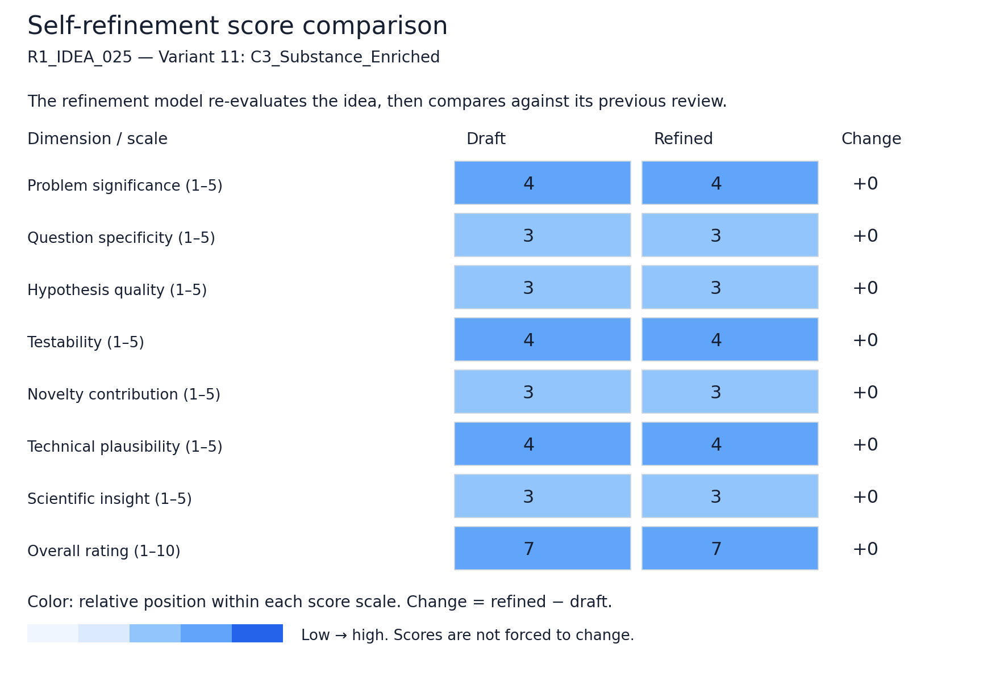

Changed score dimensions: none.

### Score justifications (draft / refined)

**Problem significance**

```json
{
  "draft": {
    "score": 4.0,
    "justification": "The idea addresses a critical challenge in large reasoning models: balancing computational efficiency with the need for long reasoning chains. This is important for practical deployment of such models."
  },
  "refined": {
    "score": 4.0,
    "justification": "The idea addresses a critical challenge in large reasoning models: balancing computational efficiency with the need for long reasoning chains. This is important for practical deployment of such models."
  }
}
```

**Question specificity**

```json
{
  "draft": {
    "score": 3.0,
    "justification": "The question is specific to the relationship between reasoning length, task complexity, and sparse attention efficiency, but lacks precise definitions of the variables involved."
  },
  "refined": {
    "score": 3.0,
    "justification": "The question is specific to the relationship between reasoning length, task complexity, and sparse attention efficiency, but lacks precise definitions of the variables involved."
  }
}
```

**Hypothesis quality**

```json
{
  "draft": {
    "score": 3.0,
    "justification": "The hypothesis is implied but not explicitly stated. It suggests a potential correlation and boundary conditions for sparse attention methods, but the exact nature of the hypothesis is not clearly articulated."
  },
  "refined": {
    "score": 3.0,
    "justification": "The hypothesis is implied but not explicitly stated. It suggests a potential correlation and boundary conditions for sparse attention methods, but the exact nature of the hypothesis is not clearly articulated."
  }
}
```

**Testability**

```json
{
  "draft": {
    "score": 4.0,
    "justification": "The idea suggests experiments with varying sequence lengths and attention patterns, which are testable. However, the specifics of how these experiments will be conducted are not fully detailed."
  },
  "refined": {
    "score": 4.0,
    "justification": "The idea suggests experiments with varying sequence lengths and attention patterns, which are testable. However, the specifics of how these experiments will be conducted are not fully detailed."
  }
}
```

**Novelty contribution**

```json
{
  "draft": {
    "score": 3.0,
    "justification": "The research could contribute new insights into the efficiency of sparse attention methods under different conditions, but the novelty is moderate as it builds on existing methods."
  },
  "refined": {
    "score": 3.0,
    "justification": "The research could contribute new insights into the efficiency of sparse attention methods under different conditions, but the novelty is moderate as it builds on existing methods."
  }
}
```

**Technical plausibility**

```json
{
  "draft": {
    "score": 4.0,
    "justification": "The proposed direction is technically plausible, as it builds on existing sparse attention techniques and investigates their performance under varying conditions."
  },
  "refined": {
    "score": 4.0,
    "justification": "The proposed direction is technically plausible, as it builds on existing sparse attention techniques and investigates their performance under varying conditions."
  }
}
```

**Scientific insight**

```json
{
  "draft": {
    "score": 3.0,
    "justification": "The idea has potential to reveal boundary conditions for sparse attention methods, which could lead to more efficient model designs, but the insight is not yet clearly defined."
  },
  "refined": {
    "score": 3.0,
    "justification": "The idea has potential to reveal boundary conditions for sparse attention methods, which could lead to more efficient model designs, but the insight is not yet clearly defined."
  }
}
```

**Overall rating**

```json
{
  "draft": {
    "score": 7.0,
    "justification": "The idea is strong and addresses a meaningful problem in large reasoning models. It proposes a testable hypothesis and has potential for scientific insight, though it lacks specific details that could strengthen its clarity and testability."
  },
  "refined": {
    "score": 7.0,
    "justification": "The idea is strong and addresses a meaningful problem in large reasoning models. It proposes a testable hypothesis and has potential for scientific insight, though it lacks specific details that could strengthen its clarity and testability."
  }
}
```

## R1_IDEA_025 — Variant 12: H1_Deceptive_Hollow


Changed score dimensions: none.

### Score justifications (draft / refined)

**Problem significance**

```json
{
  "draft": {
    "score": 4.0,
    "justification": "The idea addresses a significant challenge in AI research: improving performance through computational effort while managing resource demands. This is a critical issue for the development of more efficient and scalable AI systems."
  },
  "refined": {
    "score": 4.0,
    "justification": "The idea addresses a significant challenge in AI research: improving performance through computational effort while managing resource demands. This is a critical issue for the development of more efficient and scalable AI systems."
  }
}
```

**Question specificity**

```json
{
  "draft": {
    "score": 2.0,
    "justification": "The idea is broad and lacks specific research questions or hypotheses. It outlines a general direction but does not clearly define what exactly is being investigated or what the study aims to achieve."
  },
  "refined": {
    "score": 2.0,
    "justification": "The idea is broad and lacks specific research questions or hypotheses. It outlines a general direction but does not clearly define what exactly is being investigated or what the study aims to achieve."
  }
}
```

**Hypothesis quality**

```json
{
  "draft": {
    "score": 2.0,
    "justification": "The idea does not contain a clear hypothesis or prediction that could be tested. It is more of a conceptual statement about the potential impact of the research rather than a specific hypothesis."
  },
  "refined": {
    "score": 2.0,
    "justification": "The idea does not contain a clear hypothesis or prediction that could be tested. It is more of a conceptual statement about the potential impact of the research rather than a specific hypothesis."
  }
}
```

**Testability**

```json
{
  "draft": {
    "score": 2.0,
    "justification": "The idea lacks concrete experiments, comparisons, or evaluations that would allow the research to be tested. It is too abstract to determine its validity without further specifics."
  },
  "refined": {
    "score": 2.0,
    "justification": "The idea lacks concrete experiments, comparisons, or evaluations that would allow the research to be tested. It is too abstract to determine its validity without further specifics."
  }
}
```

**Novelty contribution**

```json
{
  "draft": {
    "score": 3.0,
    "justification": "The idea proposes a transformative synthesis of conceptual, methodological, and application aspects, which could be novel. However, the lack of specific details makes it difficult to assess the novelty and potential contribution accurately."
  },
  "refined": {
    "score": 3.0,
    "justification": "The idea proposes a transformative synthesis of conceptual, methodological, and application aspects, which could be novel. However, the lack of specific details makes it difficult to assess the novelty and potential contribution accurately."
  }
}
```

**Technical plausibility**

```json
{
  "draft": {
    "score": 3.0,
    "justification": "The idea is technically plausible as it addresses a real challenge in AI, but the lack of specific technical details makes it hard to evaluate the feasibility of the proposed methods."
  },
  "refined": {
    "score": 3.0,
    "justification": "The idea is technically plausible as it addresses a real challenge in AI, but the lack of specific technical details makes it hard to evaluate the feasibility of the proposed methods."
  }
}
```

**Scientific insight**

```json
{
  "draft": {
    "score": 2.0,
    "justification": "The idea suggests a broader framework for AI research, but without specific research questions or hypotheses, it is unclear what scientific insights could be gained from this work."
  },
  "refined": {
    "score": 2.0,
    "justification": "The idea suggests a broader framework for AI research, but without specific research questions or hypotheses, it is unclear what scientific insights could be gained from this work."
  }
}
```

**Overall rating**

```json
{
  "draft": {
    "score": 6.0,
    "justification": "The idea has potential as it addresses a significant challenge in AI research and proposes a transformative approach. However, it lacks specific research questions, hypotheses, and technical details that are necessary for evaluating its scientific merit and testability."
  },
  "refined": {
    "score": 6.0,
    "justification": "The idea has potential as it addresses a significant challenge in AI research and proposes a transformative approach. However, it lacks specific research questions, hypotheses, and technical details that are necessary for evaluating its scientific merit and testability."
  }
}
```

## R1_IDEA_025 — Variant 13: H2_Confident_Flaw


Changed score dimensions: none.

### Score justifications (draft / refined)

**Problem significance**

```json
{
  "draft": {
    "score": 4.0,
    "justification": "The problem of long-chain reasoning in large models is significant for practical applications requiring complex problem-solving, and improving efficiency is a key challenge in deploying such models."
  },
  "refined": {
    "score": 4.0,
    "justification": "The problem of long-chain reasoning in large models is significant for practical applications requiring complex problem-solving, and improving efficiency is a key challenge in deploying such models."
  }
}
```

**Question specificity**

```json
{
  "draft": {
    "score": 2.0,
    "justification": "The idea is somewhat focused but lacks a precise research question. It does not clearly define what specific aspect of sparse attention methods is being investigated or how the effectiveness will be measured."
  },
  "refined": {
    "score": 2.0,
    "justification": "The idea is somewhat focused but lacks a precise research question. It does not clearly define what specific aspect of sparse attention methods is being investigated or how the effectiveness will be measured."
  }
}
```

**Hypothesis quality**

```json
{
  "draft": {
    "score": 3.0,
    "justification": "The idea presents a plausible hypothesis that sparse attention methods can improve long-sequence generation, but it is not explicitly stated and lacks testable predictions or specific mechanisms."
  },
  "refined": {
    "score": 3.0,
    "justification": "The idea presents a plausible hypothesis that sparse attention methods can improve long-sequence generation, but it is not explicitly stated and lacks testable predictions or specific mechanisms."
  }
}
```

**Testability**

```json
{
  "draft": {
    "score": 2.0,
    "justification": "The idea makes a general claim about the effectiveness of sparse attention methods but does not provide a clear experimental design or evaluation plan to test the hypothesis."
  },
  "refined": {
    "score": 2.0,
    "justification": "The idea makes a general claim about the effectiveness of sparse attention methods but does not provide a clear experimental design or evaluation plan to test the hypothesis."
  }
}
```

**Novelty contribution**

```json
{
  "draft": {
    "score": 3.0,
    "justification": "The idea is not novel in its general claim but offers a potential contribution by exploring the application of sparse attention methods to long-sequence generation in LRMs. However, it does not clearly define what new insight or improvement is being sought."
  },
  "refined": {
    "score": 3.0,
    "justification": "The idea is not novel in its general claim but offers a potential contribution by exploring the application of sparse attention methods to long-sequence generation in LRMs. However, it does not clearly define what new insight or improvement is being sought."
  }
}
```

**Technical plausibility**

```json
{
  "draft": {
    "score": 4.0,
    "justification": "The reasoning about sparse attention methods and their potential to reduce KV cache pressure is technically plausible, given existing research on attention mechanisms in large models."
  },
  "refined": {
    "score": 4.0,
    "justification": "The reasoning about sparse attention methods and their potential to reduce KV cache pressure is technically plausible, given existing research on attention mechanisms in large models."
  }
}
```

**Scientific insight**

```json
{
  "draft": {
    "score": 2.0,
    "justification": "The idea suggests a potential insight into the effectiveness of sparse attention methods but does not clearly define what new knowledge or understanding would be gained from the research."
  },
  "refined": {
    "score": 2.0,
    "justification": "The idea suggests a potential insight into the effectiveness of sparse attention methods but does not clearly define what new knowledge or understanding would be gained from the research."
  }
}
```

**Overall rating**

```json
{
  "draft": {
    "score": 6.0,
    "justification": "The idea addresses a meaningful problem in large models but lacks a clear, specific research question and testable hypothesis. It has potential but needs more concrete details to be evaluated effectively."
  },
  "refined": {
    "score": 6.0,
    "justification": "The idea addresses a meaningful problem in large models but lacks a clear, specific research question and testable hypothesis. It has potential but needs more concrete details to be evaluated effectively."
  }
}
```

## R1_IDEA_025 — Variant 14: H3_Verbose_Enriched


Changed score dimensions: none.

### Score justifications (draft / refined)

**Problem significance**

```json
{
  "draft": {
    "score": 4.0,
    "justification": "The idea addresses a critical challenge in large reasoning models: balancing computational efficiency with the need for long reasoning chains. This is important for practical deployment of LRMs in real-world applications."
  },
  "refined": {
    "score": 4.0,
    "justification": "The idea addresses a critical challenge in large reasoning models: balancing computational efficiency with the need for long reasoning chains. This is important for practical deployment of LRMs in real-world applications."
  }
}
```

**Question specificity**

```json
{
  "draft": {
    "score": 4.0,
    "justification": "The research question is specific to the relationship between reasoning length, task complexity, and the effectiveness of sparse attention methods. It outlines a clear hypothesis and experimental design."
  },
  "refined": {
    "score": 4.0,
    "justification": "The research question is specific to the relationship between reasoning length, task complexity, and the effectiveness of sparse attention methods. It outlines a clear hypothesis and experimental design."
  }
}
```

**Hypothesis quality**

```json
{
  "draft": {
    "score": 4.0,
    "justification": "The hypothesis that reasoning length correlates with task complexity is testable. The idea also proposes a structured approach to test the effectiveness of sparse attention methods under varying conditions."
  },
  "refined": {
    "score": 4.0,
    "justification": "The hypothesis that reasoning length correlates with task complexity is testable. The idea also proposes a structured approach to test the effectiveness of sparse attention methods under varying conditions."
  }
}
```

**Testability**

```json
{
  "draft": {
    "score": 4.0,
    "justification": "The idea includes a staged experimental design with specific evaluation criteria, ablations, and case comparisons, making it testable. However, the lack of specific details about the experiments could limit the ability to fully test the hypothesis."
  },
  "refined": {
    "score": 4.0,
    "justification": "The idea includes a staged experimental design with specific evaluation criteria, ablations, and case comparisons, making it testable. However, the lack of specific details about the experiments could limit the ability to fully test the hypothesis."
  }
}
```

**Novelty contribution**

```json
{
  "draft": {
    "score": 4.0,
    "justification": "The idea contributes to understanding the efficiency of sparse attention methods in long reasoning tasks. It provides a framework for testing the effectiveness of these methods under different conditions, which is novel in the context of large reasoning models."
  },
  "refined": {
    "score": 4.0,
    "justification": "The idea contributes to understanding the efficiency of sparse attention methods in long reasoning tasks. It provides a framework for testing the effectiveness of these methods under different conditions, which is novel in the context of large reasoning models."
  }
}
```

**Technical plausibility**

```json
{
  "draft": {
    "score": 4.0,
    "justification": "The proposed methods (sparse attention) are technically plausible and relevant to the problem. The experimental design is logically coherent, though the lack of specific details could affect the feasibility of implementation."
  },
  "refined": {
    "score": 4.0,
    "justification": "The proposed methods (sparse attention) are technically plausible and relevant to the problem. The experimental design is logically coherent, though the lack of specific details could affect the feasibility of implementation."
  }
}
```

**Scientific insight**

```json
{
  "draft": {
    "score": 4.0,
    "justification": "The study could provide insights into the relationship between task complexity, reasoning length, and computational efficiency. It also aims to identify boundary conditions where sparse attention methods may fail, which is scientifically valuable."
  },
  "refined": {
    "score": 4.0,
    "justification": "The study could provide insights into the relationship between task complexity, reasoning length, and computational efficiency. It also aims to identify boundary conditions where sparse attention methods may fail, which is scientifically valuable."
  }
}
```

**Overall rating**

```json
{
  "draft": {
    "score": 8.0,
    "justification": "The idea is strong and well-structured, with a clear research question and experimental design. It has the potential to contribute meaningful insights into the efficiency of large reasoning models. However, it lacks specific details that could enhance its testability and clarity."
  },
  "refined": {
    "score": 8.0,
    "justification": "The idea is strong and well-structured, with a clear research question and experimental design. It has the potential to contribute meaningful insights into the efficiency of large reasoning models. However, it lacks specific details that could enhance its testability and clarity."
  }
}
```

## R1_IDEA_025 — Variant 15: H4_Ultimate_Hype


Changed score dimensions: none.

### Score justifications (draft / refined)

**Problem significance**

```json
{
  "draft": {
    "score": 4.0,
    "justification": "The idea addresses a critical challenge in the deployment of large reasoning models, where computational efficiency is a key bottleneck for practical applications. This is a significant problem in the field of machine learning, particularly for real-time or resource-constrained environments."
  },
  "refined": {
    "score": 4.0,
    "justification": "The idea addresses a critical challenge in the deployment of large reasoning models, where computational efficiency is a key bottleneck for practical applications. This is a significant problem in the field of machine learning, particularly for real-time or resource-constrained environments."
  }
}
```

**Question specificity**

```json
{
  "draft": {
    "score": 3.0,
    "justification": "The idea identifies a general problem (computational efficiency in large reasoning models) but lacks a specific research question or hypothesis. It is somewhat vague about the exact technical challenge being addressed and the specific aspects of sparse attention methods that will be explored."
  },
  "refined": {
    "score": 3.0,
    "justification": "The idea identifies a general problem (computational efficiency in large reasoning models) but lacks a specific research question or hypothesis. It is somewhat vague about the exact technical challenge being addressed and the specific aspects of sparse attention methods that will be explored."
  }
}
```

**Hypothesis quality**

```json
{
  "draft": {
    "score": 3.0,
    "justification": "The idea presents a general hypothesis that sparse attention methods could reduce KV cache pressure, but it does not provide a concrete prediction or mechanism. The potential impact is described in a high-level sense without specific, testable claims."
  },
  "refined": {
    "score": 3.0,
    "justification": "The idea presents a general hypothesis that sparse attention methods could reduce KV cache pressure, but it does not provide a concrete prediction or mechanism. The potential impact is described in a high-level sense without specific, testable claims."
  }
}
```

**Testability**

```json
{
  "draft": {
    "score": 3.0,
    "justification": "The idea suggests the use of sparse attention methods but does not specify how the effectiveness of these methods will be evaluated. Without clear metrics or experimental design, the testability of the hypothesis is limited."
  },
  "refined": {
    "score": 3.0,
    "justification": "The idea suggests the use of sparse attention methods but does not specify how the effectiveness of these methods will be evaluated. Without clear metrics or experimental design, the testability of the hypothesis is limited."
  }
}
```

**Novelty contribution**

```json
{
  "draft": {
    "score": 4.0,
    "justification": "The idea proposes a novel approach to addressing a technical challenge in large reasoning models, which could lead to significant contributions in terms of computational efficiency and model deployment. However, the novelty is somewhat general and not clearly differentiated from existing methods."
  },
  "refined": {
    "score": 4.0,
    "justification": "The idea proposes a novel approach to addressing a technical challenge in large reasoning models, which could lead to significant contributions in terms of computational efficiency and model deployment. However, the novelty is somewhat general and not clearly differentiated from existing methods."
  }
}
```

**Technical plausibility**

```json
{
  "draft": {
    "score": 4.0,
    "justification": "The proposed approach of using sparse attention methods to reduce KV cache pressure is technically plausible, as it aligns with current research trends in efficient large models. The feasibility of the approach is reasonable given the existing literature on sparse attention mechanisms."
  },
  "refined": {
    "score": 4.0,
    "justification": "The proposed approach of using sparse attention methods to reduce KV cache pressure is technically plausible, as it aligns with current research trends in efficient large models. The feasibility of the approach is reasonable given the existing literature on sparse attention mechanisms."
  }
}
```

**Scientific insight**

```json
{
  "draft": {
    "score": 3.0,
    "justification": "The idea has the potential to provide insights into the trade-offs between computational efficiency and model performance in large reasoning models. However, the specific insights are not clearly defined, and the research is more focused on practical improvements rather than fundamental scientific understanding."
  },
  "refined": {
    "score": 3.0,
    "justification": "The idea has the potential to provide insights into the trade-offs between computational efficiency and model performance in large reasoning models. However, the specific insights are not clearly defined, and the research is more focused on practical improvements rather than fundamental scientific understanding."
  }
}
```

**Overall rating**

```json
{
  "draft": {
    "score": 7.0,
    "justification": "The idea presents a promising research direction that addresses a significant challenge in the development of large reasoning models. While it lacks specific details on the research question, hypothesis, and evaluation metrics, it has the potential to contribute to the field through practical improvements in computational efficiency. The overall score reflects a strong but not exceptional research idea."
  },
  "refined": {
    "score": 7.0,
    "justification": "The idea presents a promising research direction that addresses a significant challenge in the development of large reasoning models. While it lacks specific details on the research question, hypothesis, and evaluation metrics, it has the potential to contribute to the field through practical improvements in computational efficiency. The overall score reflects a strong but not exceptional research idea."
  }
}
```

## R1_IDEA_026 — Source


Changed score dimensions: none.

### Score justifications (draft / refined)

**Problem significance**

```json
{
  "draft": {
    "score": 3.0,
    "justification": "The idea addresses a significant challenge in sequential decision-making, particularly the issue of compounding errors and myopic predictions in autoregressive methods. Diffusion planners offer a promising alternative, but the problem is not uniquely defined or emphasized."
  },
  "refined": {
    "score": 3.0,
    "justification": "The idea addresses a significant challenge in sequential decision-making, particularly the issue of compounding errors and myopic predictions in autoregressive methods. Diffusion planners offer a promising alternative, but the problem is not uniquely defined or emphasized."
  }
}
```

**Question specificity**

```json
{
  "draft": {
    "score": 2.0,
    "justification": "The idea is somewhat general and does not clearly define a specific research question. It mentions the use of CFG but does not specify what aspect of diffusion planners is being studied or what improvement is being sought."
  },
  "refined": {
    "score": 2.0,
    "justification": "The idea is somewhat general and does not clearly define a specific research question. It mentions the use of CFG but does not specify what aspect of diffusion planners is being studied or what improvement is being sought."
  }
}
```

**Hypothesis quality**

```json
{
  "draft": {
    "score": 2.0,
    "justification": "There is no explicit hypothesis stated. The idea mentions the benefits of CFG but does not propose a specific prediction or mechanism to test."
  },
  "refined": {
    "score": 2.0,
    "justification": "There is no explicit hypothesis stated. The idea mentions the benefits of CFG but does not propose a specific prediction or mechanism to test."
  }
}
```

**Testability**

```json
{
  "draft": {
    "score": 2.0,
    "justification": "The idea lacks a clear experimental plan or method to test the proposed approach. It does not specify how the effectiveness of diffusion planners with CFG will be evaluated or compared to other methods."
  },
  "refined": {
    "score": 2.0,
    "justification": "The idea lacks a clear experimental plan or method to test the proposed approach. It does not specify how the effectiveness of diffusion planners with CFG will be evaluated or compared to other methods."
  }
}
```

**Novelty contribution**

```json
{
  "draft": {
    "score": 3.0,
    "justification": "The idea builds on existing techniques (diffusion planners and CFG) but does not propose a novel method or significant contribution. It focuses on the application of known techniques rather than introducing new concepts."
  },
  "refined": {
    "score": 3.0,
    "justification": "The idea builds on existing techniques (diffusion planners and CFG) but does not propose a novel method or significant contribution. It focuses on the application of known techniques rather than introducing new concepts."
  }
}
```

**Technical plausibility**

```json
{
  "draft": {
    "score": 4.0,
    "justification": "The technical approach described is plausible. Diffusion planners and CFG are established techniques in the field, and their combination is a reasonable direction for research."
  },
  "refined": {
    "score": 4.0,
    "justification": "The technical approach described is plausible. Diffusion planners and CFG are established techniques in the field, and their combination is a reasonable direction for research."
  }
}
```

**Scientific insight**

```json
{
  "draft": {
    "score": 2.0,
    "justification": "The idea does not provide a clear scientific insight or potential for new understanding. It focuses on the application of existing methods rather than exploring new mechanisms or principles."
  },
  "refined": {
    "score": 2.0,
    "justification": "The idea does not provide a clear scientific insight or potential for new understanding. It focuses on the application of existing methods rather than exploring new mechanisms or principles."
  }
}
```

**Overall rating**

```json
{
  "draft": {
    "score": 5.0,
    "justification": "The idea has potential but lacks a clear research question and hypothesis. It addresses a relevant problem but needs more specificity and direction to be a strong research idea."
  },
  "refined": {
    "score": 5.0,
    "justification": "The idea has potential but lacks a clear research question and hypothesis. It addresses a relevant problem but needs more specificity and direction to be a strong research idea."
  }
}
```

## R1_IDEA_026 — Variant 1: A1_Identity

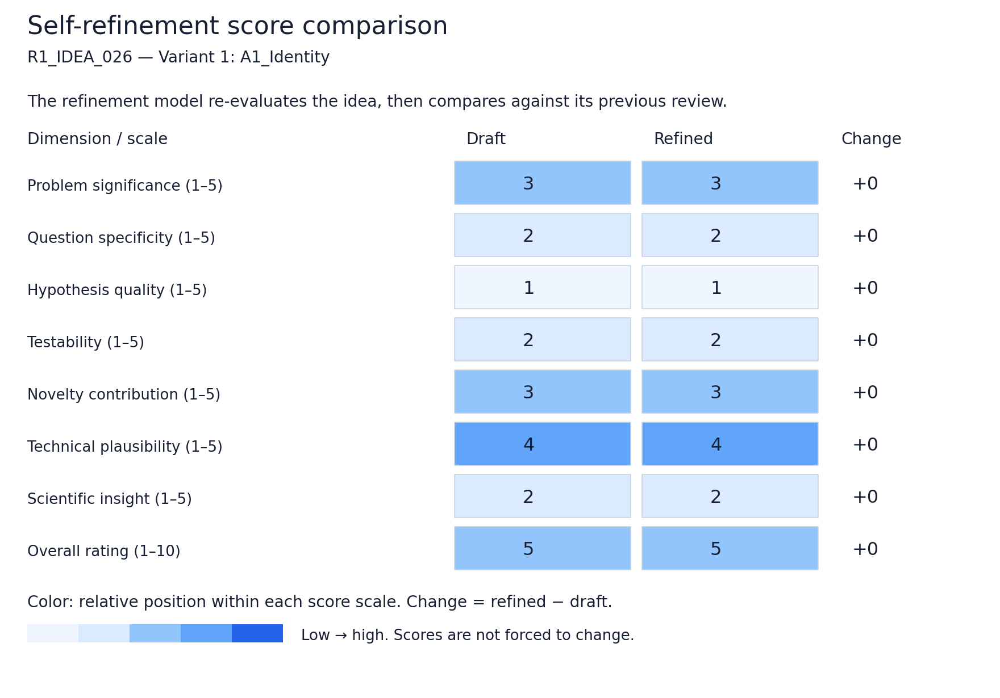

Changed score dimensions: none.

### Score justifications (draft / refined)

**Problem significance**

```json
{
  "draft": {
    "score": 3.0,
    "justification": "The problem of sequential decision-making is important in AI, and diffusion planners offer a promising approach. However, the significance is somewhat generic without specifying a particular challenge or application."
  },
  "refined": {
    "score": 3.0,
    "justification": "The problem of sequential decision-making is important in AI, and diffusion planners offer a promising approach. However, the significance is somewhat generic without specifying a particular challenge or application."
  }
}
```

**Question specificity**

```json
{
  "draft": {
    "score": 2.0,
    "justification": "The idea is too general and does not clearly define what is being studied or what improvement is being sought. It lacks a concrete research question."
  },
  "refined": {
    "score": 2.0,
    "justification": "The idea is too general and does not clearly define what is being studied or what improvement is being sought. It lacks a concrete research question."
  }
}
```

**Hypothesis quality**

```json
{
  "draft": {
    "score": 1.0,
    "justification": "There is no explicit hypothesis or research question. The idea merely describes the current state of diffusion planners and CFG without proposing a specific testable hypothesis."
  },
  "refined": {
    "score": 1.0,
    "justification": "There is no explicit hypothesis or research question. The idea merely describes the current state of diffusion planners and CFG without proposing a specific testable hypothesis."
  }
}
```

**Testability**

```json
{
  "draft": {
    "score": 2.0,
    "justification": "The idea does not provide a clear experiment or method to test the proposed approach. It lacks details on how to evaluate the effectiveness of diffusion planners with CFG in specific scenarios."
  },
  "refined": {
    "score": 2.0,
    "justification": "The idea does not provide a clear experiment or method to test the proposed approach. It lacks details on how to evaluate the effectiveness of diffusion planners with CFG in specific scenarios."
  }
}
```

**Novelty contribution**

```json
{
  "draft": {
    "score": 3.0,
    "justification": "The idea builds on existing techniques (diffusion planners and CFG) but does not propose a novel method or insight. It is more of a description of current approaches rather than a new research direction."
  },
  "refined": {
    "score": 3.0,
    "justification": "The idea builds on existing techniques (diffusion planners and CFG) but does not propose a novel method or insight. It is more of a description of current approaches rather than a new research direction."
  }
}
```

**Technical plausibility**

```json
{
  "draft": {
    "score": 4.0,
    "justification": "The technical approach described is plausible and aligns with current research in diffusion models and planning. The use of CFG is a reasonable choice given its known benefits."
  },
  "refined": {
    "score": 4.0,
    "justification": "The technical approach described is plausible and aligns with current research in diffusion models and planning. The use of CFG is a reasonable choice given its known benefits."
  }
}
```

**Scientific insight**

```json
{
  "draft": {
    "score": 2.0,
    "justification": "The idea does not offer new insights into the mechanisms or limitations of diffusion planners. It focuses on describing existing methods rather than exploring new questions or phenomena."
  },
  "refined": {
    "score": 2.0,
    "justification": "The idea does not offer new insights into the mechanisms or limitations of diffusion planners. It focuses on describing existing methods rather than exploring new questions or phenomena."
  }
}
```

**Overall rating**

```json
{
  "draft": {
    "score": 5.0,
    "justification": "The idea is somewhat relevant and plausible but lacks a clear research question and hypothesis. It has potential but needs more specificity to be a strong research direction."
  },
  "refined": {
    "score": 5.0,
    "justification": "The idea is somewhat relevant and plausible but lacks a clear research question and hypothesis. It has potential but needs more specificity to be a strong research direction."
  }
}
```

## R1_IDEA_026 — Variant 2: A2_Paraphrase_Only


Changed score dimensions: none.

### Score justifications (draft / refined)

**Problem significance**

```json
{
  "draft": {
    "score": 3.0,
    "justification": "The idea addresses a relevant challenge in sequential decision-making, but the significance is not clearly articulated."
  },
  "refined": {
    "score": 3.0,
    "justification": "The idea addresses a relevant challenge in sequential decision-making, but the significance is not clearly articulated."
  }
}
```

**Question specificity**

```json
{
  "draft": {
    "score": 2.0,
    "justification": "The idea lacks a specific research question or hypothesis, making it too vague to evaluate."
  },
  "refined": {
    "score": 2.0,
    "justification": "The idea lacks a specific research question or hypothesis, making it too vague to evaluate."
  }
}
```

**Hypothesis quality**

```json
{
  "draft": {
    "score": 2.0,
    "justification": "No explicit hypothesis is provided, and the idea does not clearly state what should be investigated."
  },
  "refined": {
    "score": 2.0,
    "justification": "No explicit hypothesis is provided, and the idea does not clearly state what should be investigated."
  }
}
```

**Testability**

```json
{
  "draft": {
    "score": 2.0,
    "justification": "The idea does not propose experiments or methods to test its claims, making it difficult to assess."
  },
  "refined": {
    "score": 2.0,
    "justification": "The idea does not propose experiments or methods to test its claims, making it difficult to assess."
  }
}
```

**Novelty contribution**

```json
{
  "draft": {
    "score": 2.0,
    "justification": "The idea applies existing techniques (CFG) to a new domain, but does not propose a novel method or insight."
  },
  "refined": {
    "score": 2.0,
    "justification": "The idea applies existing techniques (CFG) to a new domain, but does not propose a novel method or insight."
  }
}
```

**Technical plausibility**

```json
{
  "draft": {
    "score": 4.0,
    "justification": "The use of diffusion models and CFG is technically plausible, but the idea lacks details on how they are applied in planning tasks."
  },
  "refined": {
    "score": 4.0,
    "justification": "The use of diffusion models and CFG is technically plausible, but the idea lacks details on how they are applied in planning tasks."
  }
}
```

**Scientific insight**

```json
{
  "draft": {
    "score": 2.0,
    "justification": "The idea does not provide insights into mechanisms or principles beyond the application of existing techniques."
  },
  "refined": {
    "score": 2.0,
    "justification": "The idea does not provide insights into mechanisms or principles beyond the application of existing techniques."
  }
}
```

**Overall rating**

```json
{
  "draft": {
    "score": 5.0,
    "justification": "The idea has potential but lacks specificity, hypothesis, and testable direction, making it a borderline weak idea."
  },
  "refined": {
    "score": 5.0,
    "justification": "The idea has potential but lacks specificity, hypothesis, and testable direction, making it a borderline weak idea."
  }
}
```

## R1_IDEA_026 — Variant 3: A3_Plain_Core


Changed score dimensions: none.

### Score justifications (draft / refined)

**Problem significance**

```json
{
  "draft": {
    "score": 3.0,
    "justification": "The idea addresses a relevant challenge in sequential decision-making, where long-horizon planning and error reduction are important. However, the problem is not clearly defined, which limits the significance assessment."
  },
  "refined": {
    "score": 3.0,
    "justification": "The idea addresses a relevant challenge in sequential decision-making, where long-horizon planning and error reduction are important. However, the problem is not clearly defined, which limits the significance assessment."
  }
}
```

**Question specificity**

```json
{
  "draft": {
    "score": 2.0,
    "justification": "The idea lacks a specific research question. It describes a method and its potential benefits but does not clearly state what is being investigated or what problem is being addressed."
  },
  "refined": {
    "score": 2.0,
    "justification": "The idea lacks a specific research question. It describes a method and its potential benefits but does not clearly state what is being investigated or what problem is being addressed."
  }
}
```

**Hypothesis quality**

```json
{
  "draft": {
    "score": 2.0,
    "justification": "There is no explicit hypothesis. The idea mentions the potential benefits of the method but does not propose a testable hypothesis that could be supported or contradicted by evidence."
  },
  "refined": {
    "score": 2.0,
    "justification": "There is no explicit hypothesis. The idea mentions the potential benefits of the method but does not propose a testable hypothesis that could be supported or contradicted by evidence."
  }
}
```

**Testability**

```json
{
  "draft": {
    "score": 2.0,
    "justification": "The idea does not provide a clear experimental plan or evaluation method. It describes a method but does not specify how it will be tested or compared to existing approaches."
  },
  "refined": {
    "score": 2.0,
    "justification": "The idea does not provide a clear experimental plan or evaluation method. It describes a method but does not specify how it will be tested or compared to existing approaches."
  }
}
```

**Novelty contribution**

```json
{
  "draft": {
    "score": 2.0,
    "justification": "The idea describes an existing approach (diffusion planners with classifier-free guidance) without proposing a novel method or hypothesis. It does not indicate a new contribution or insight."
  },
  "refined": {
    "score": 2.0,
    "justification": "The idea describes an existing approach (diffusion planners with classifier-free guidance) without proposing a novel method or hypothesis. It does not indicate a new contribution or insight."
  }
}
```

**Technical plausibility**

```json
{
  "draft": {
    "score": 4.0,
    "justification": "The use of diffusion models for planning is technically plausible, as they are known for generating long-horizon trajectories. Classifier-free guidance is a well-established technique in diffusion models, which supports the technical feasibility."
  },
  "refined": {
    "score": 4.0,
    "justification": "The use of diffusion models for planning is technically plausible, as they are known for generating long-horizon trajectories. Classifier-free guidance is a well-established technique in diffusion models, which supports the technical feasibility."
  }
}
```

**Scientific insight**

```json
{
  "draft": {
    "score": 2.0,
    "justification": "The idea does not propose any new scientific insight or mechanism. It focuses on the application of existing techniques without addressing deeper theoretical questions or potential limitations."
  },
  "refined": {
    "score": 2.0,
    "justification": "The idea does not propose any new scientific insight or mechanism. It focuses on the application of existing techniques without addressing deeper theoretical questions or potential limitations."
  }
}
```

**Overall rating**

```json
{
  "draft": {
    "score": 5.0,
    "justification": "The idea has some potential but is too vague and lacks a clear research question or hypothesis. It describes a method with possible benefits but does not specify what is being investigated or why it is important. However, the technical approach is plausible and could be a promising direction if further developed."
  },
  "refined": {
    "score": 5.0,
    "justification": "The idea has some potential but is too vague and lacks a clear research question or hypothesis. It describes a method with possible benefits but does not specify what is being investigated or why it is important. However, the technical approach is plausible and could be a promising direction if further developed."
  }
}
```

## R1_IDEA_026 — Variant 4: B1_Verbose_Elaborate


Changed score dimensions: none.

### Score justifications (draft / refined)

**Problem significance**

```json
{
  "draft": {
    "score": 3.0,
    "justification": "The problem of sequential decision-making is important in AI, but the idea does not clearly articulate why diffusion planners are particularly relevant or what new insight is being sought."
  },
  "refined": {
    "score": 3.0,
    "justification": "The problem of sequential decision-making is important in AI, but the idea does not clearly articulate why diffusion planners are particularly relevant or what new insight is being sought."
  }
}
```

**Question specificity**

```json
{
  "draft": {
    "score": 2.0,
    "justification": "The idea mentions diffusion planners and their advantages but does not specify a concrete research question or hypothesis to investigate."
  },
  "refined": {
    "score": 2.0,
    "justification": "The idea mentions diffusion planners and their advantages but does not specify a concrete research question or hypothesis to investigate."
  }
}
```

**Hypothesis quality**

```json
{
  "draft": {
    "score": 2.0,
    "justification": "The idea does not explicitly state a hypothesis that can be tested or contradicted, though it implies that diffusion planners may be better than autoregressive methods."
  },
  "refined": {
    "score": 2.0,
    "justification": "The idea does not explicitly state a hypothesis that can be tested or contradicted, though it implies that diffusion planners may be better than autoregressive methods."
  }
}
```

**Testability**

```json
{
  "draft": {
    "score": 2.0,
    "justification": "The idea does not propose a specific experiment or evaluation method to test its claims, making it difficult to assess the validity of the proposed approach."
  },
  "refined": {
    "score": 2.0,
    "justification": "The idea does not propose a specific experiment or evaluation method to test its claims, making it difficult to assess the validity of the proposed approach."
  }
}
```

**Novelty contribution**

```json
{
  "draft": {
    "score": 2.0,
    "justification": "The idea describes an existing approach (diffusion planners) and its advantages but does not propose a new method, hypothesis, or insight that would contribute to the field."
  },
  "refined": {
    "score": 2.0,
    "justification": "The idea describes an existing approach (diffusion planners) and its advantages but does not propose a new method, hypothesis, or insight that would contribute to the field."
  }
}
```

**Technical plausibility**

```json
{
  "draft": {
    "score": 4.0,
    "justification": "The idea is technically plausible as diffusion models are used in planning tasks, and the described approach aligns with current research trends."
  },
  "refined": {
    "score": 4.0,
    "justification": "The idea is technically plausible as diffusion models are used in planning tasks, and the described approach aligns with current research trends."
  }
}
```

**Scientific insight**

```json
{
  "draft": {
    "score": 2.0,
    "justification": "The idea does not propose a new insight or mechanism to investigate, merely describing an existing approach and its advantages."
  },
  "refined": {
    "score": 2.0,
    "justification": "The idea does not propose a new insight or mechanism to investigate, merely describing an existing approach and its advantages."
  }
}
```

**Overall rating**

```json
{
  "draft": {
    "score": 5.0,
    "justification": "The idea is technically plausible and addresses a relevant problem, but lacks a clear research question, hypothesis, and experimental plan, which are essential for evaluating its scientific merit."
  },
  "refined": {
    "score": 5.0,
    "justification": "The idea is technically plausible and addresses a relevant problem, but lacks a clear research question, hypothesis, and experimental plan, which are essential for evaluating its scientific merit."
  }
}
```

## R1_IDEA_026 — Variant 5: B2_Grand_Narrative


Changed score dimensions: none.

### Score justifications (draft / refined)

**Problem significance**

```json
{
  "draft": {
    "score": 4.0,
    "justification": "The idea addresses a significant challenge in sequential decision-making: long-horizon planning and robustness to compounding errors. Improving this could have broad implications for AI systems requiring reliable planning under uncertainty."
  },
  "refined": {
    "score": 4.0,
    "justification": "The idea addresses a significant challenge in sequential decision-making: long-horizon planning and robustness to compounding errors. Improving this could have broad implications for AI systems requiring reliable planning under uncertainty."
  }
}
```

**Question specificity**

```json
{
  "draft": {
    "score": 2.0,
    "justification": "The idea is somewhat vague about the specific research question. It mentions diffusion planners and CFG but does not clearly define what aspect is being investigated or what problem is being addressed."
  },
  "refined": {
    "score": 2.0,
    "justification": "The idea is somewhat vague about the specific research question. It mentions diffusion planners and CFG but does not clearly define what aspect is being investigated or what problem is being addressed."
  }
}
```

**Hypothesis quality**

```json
{
  "draft": {
    "score": 2.0,
    "justification": "There is no explicit hypothesis. The idea states that diffusion planners could contribute to robust planning but does not propose a specific prediction or mechanism to test."
  },
  "refined": {
    "score": 2.0,
    "justification": "There is no explicit hypothesis. The idea states that diffusion planners could contribute to robust planning but does not propose a specific prediction or mechanism to test."
  }
}
```

**Testability**

```json
{
  "draft": {
    "score": 2.0,
    "justification": "The idea lacks a clear experimental plan or method for testing the proposed approach. It does not specify how the research would be conducted or what evidence would support or refute the claim."
  },
  "refined": {
    "score": 2.0,
    "justification": "The idea lacks a clear experimental plan or method for testing the proposed approach. It does not specify how the research would be conducted or what evidence would support or refute the claim."
  }
}
```

**Novelty contribution**

```json
{
  "draft": {
    "score": 3.0,
    "justification": "The idea suggests applying diffusion planners to sequential decision-making, which is a novel application of the technique. However, it does not clearly define what new contribution or insight the research would provide."
  },
  "refined": {
    "score": 3.0,
    "justification": "The idea suggests applying diffusion planners to sequential decision-making, which is a novel application of the technique. However, it does not clearly define what new contribution or insight the research would provide."
  }
}
```

**Technical plausibility**

```json
{
  "draft": {
    "score": 4.0,
    "justification": "The idea is technically plausible as diffusion planners and CFG are established techniques. The proposed application to planning under uncertainty is reasonable and aligns with current research trends."
  },
  "refined": {
    "score": 4.0,
    "justification": "The idea is technically plausible as diffusion planners and CFG are established techniques. The proposed application to planning under uncertainty is reasonable and aligns with current research trends."
  }
}
```

**Scientific insight**

```json
{
  "draft": {
    "score": 2.0,
    "justification": "The idea does not clearly indicate what scientific insight would be gained from the research. It focuses on potential applications but lacks a specific question or hypothesis that could lead to new understanding."
  },
  "refined": {
    "score": 2.0,
    "justification": "The idea does not clearly indicate what scientific insight would be gained from the research. It focuses on potential applications but lacks a specific question or hypothesis that could lead to new understanding."
  }
}
```

**Overall rating**

```json
{
  "draft": {
    "score": 6.0,
    "justification": "The idea has potential but is too vague to be considered strong. It addresses a significant problem in AI planning but lacks a clear research question, hypothesis, and experimental plan. With more specificity, it could become a strong research direction."
  },
  "refined": {
    "score": 6.0,
    "justification": "The idea has potential but is too vague to be considered strong. It addresses a significant problem in AI planning but lacks a clear research question, hypothesis, and experimental plan. With more specificity, it could become a strong research direction."
  }
}
```

## R1_IDEA_026 — Variant 6: B3_Over_Confident


Changed score dimensions: none.

### Score justifications (draft / refined)

**Problem significance**

```json
{
  "draft": {
    "score": 3.0,
    "justification": "The idea addresses a significant challenge in sequential decision-making, particularly the issue of compounding errors and myopic predictions in planning tasks. However, the problem is somewhat broad and not clearly defined as a unique research problem."
  },
  "refined": {
    "score": 3.0,
    "justification": "The idea addresses a significant challenge in sequential decision-making, particularly the issue of compounding errors and myopic predictions in planning tasks. However, the problem is somewhat broad and not clearly defined as a unique research problem."
  }
}
```

**Question specificity**

```json
{
  "draft": {
    "score": 2.0,
    "justification": "The idea describes the strengths of diffusion planners but does not specify a concrete research question or hypothesis. It lacks a clear focus on what exactly is being investigated."
  },
  "refined": {
    "score": 2.0,
    "justification": "The idea describes the strengths of diffusion planners but does not specify a concrete research question or hypothesis. It lacks a clear focus on what exactly is being investigated."
  }
}
```

**Hypothesis quality**

```json
{
  "draft": {
    "score": 2.0,
    "justification": "The idea does not present an explicit hypothesis. It describes the method's advantages but does not propose a testable prediction or claim that can be validated through experiments."
  },
  "refined": {
    "score": 2.0,
    "justification": "The idea does not present an explicit hypothesis. It describes the method's advantages but does not propose a testable prediction or claim that can be validated through experiments."
  }
}
```

**Testability**

```json
{
  "draft": {
    "score": 2.0,
    "justification": "The idea does not suggest any experiments, comparisons, or evaluations to test its claims. It remains descriptive without a clear path to validation."
  },
  "refined": {
    "score": 2.0,
    "justification": "The idea does not suggest any experiments, comparisons, or evaluations to test its claims. It remains descriptive without a clear path to validation."
  }
}
```

**Novelty contribution**

```json
{
  "draft": {
    "score": 2.0,
    "justification": "The idea appears to be a description of existing methods rather than a new research direction. It does not identify a novel contribution or problem to investigate."
  },
  "refined": {
    "score": 2.0,
    "justification": "The idea appears to be a description of existing methods rather than a new research direction. It does not identify a novel contribution or problem to investigate."
  }
}
```

**Technical plausibility**

```json
{
  "draft": {
    "score": 4.0,
    "justification": "The proposed approach is technically plausible, as diffusion planners and classifier guidance are well-established techniques in the field. The reasoning is logically coherent."
  },
  "refined": {
    "score": 4.0,
    "justification": "The proposed approach is technically plausible, as diffusion planners and classifier guidance are well-established techniques in the field. The reasoning is logically coherent."
  }
}
```

**Scientific insight**

```json
{
  "draft": {
    "score": 2.0,
    "justification": "The idea does not propose any new insights or mechanisms that could be revealed through investigation. It focuses on describing the method's strengths rather than exploring new scientific questions."
  },
  "refined": {
    "score": 2.0,
    "justification": "The idea does not propose any new insights or mechanisms that could be revealed through investigation. It focuses on describing the method's strengths rather than exploring new scientific questions."
  }
}
```

**Overall rating**

```json
{
  "draft": {
    "score": 5.0,
    "justification": "The idea has some merit in describing the strengths of diffusion planners but lacks a clear research question, hypothesis, and testable claims. It has potential but needs more specificity and direction to be a strong research idea."
  },
  "refined": {
    "score": 5.0,
    "justification": "The idea has some merit in describing the strengths of diffusion planners but lacks a clear research question, hypothesis, and testable claims. It has potential but needs more specificity and direction to be a strong research idea."
  }
}
```

## R1_IDEA_026 — Variant 7: B4_Novelty


Changed score dimensions: none.

### Score justifications (draft / refined)

**Problem significance**

```json
{
  "draft": {
    "score": 3.0,
    "justification": "The idea addresses a meaningful challenge in sequential decision-making by proposing a novel approach that could mitigate common issues in autoregressive methods. However, the significance is somewhat general without a specific problem statement."
  },
  "refined": {
    "score": 3.0,
    "justification": "The idea addresses a meaningful challenge in sequential decision-making by proposing a novel approach that could mitigate common issues in autoregressive methods. However, the significance is somewhat general without a specific problem statement."
  }
}
```

**Question specificity**

```json
{
  "draft": {
    "score": 2.0,
    "justification": "The idea is somewhat vague in defining the exact research question. It mentions diffusion planners and CFG but does not specify what particular problem or hypothesis is being investigated."
  },
  "refined": {
    "score": 2.0,
    "justification": "The idea is somewhat vague in defining the exact research question. It mentions diffusion planners and CFG but does not specify what particular problem or hypothesis is being investigated."
  }
}
```

**Hypothesis quality**

```json
{
  "draft": {
    "score": 2.0,
    "justification": "The idea does not explicitly state a hypothesis. It mentions the potential benefits of CFG but does not propose a specific prediction or mechanism to test."
  },
  "refined": {
    "score": 2.0,
    "justification": "The idea does not explicitly state a hypothesis. It mentions the potential benefits of CFG but does not propose a specific prediction or mechanism to test."
  }
}
```

**Testability**

```json
{
  "draft": {
    "score": 2.0,
    "justification": "The idea lacks details on how the proposed approach will be tested. There is no mention of experiments, comparisons, or evaluation metrics to validate the hypothesis."
  },
  "refined": {
    "score": 2.0,
    "justification": "The idea lacks details on how the proposed approach will be tested. There is no mention of experiments, comparisons, or evaluation metrics to validate the hypothesis."
  }
}
```

**Novelty contribution**

```json
{
  "draft": {
    "score": 3.0,
    "justification": "The idea introduces a novel application of diffusion models to planning tasks, which is a promising direction. However, the novelty is not clearly articulated without a specific problem or hypothesis."
  },
  "refined": {
    "score": 3.0,
    "justification": "The idea introduces a novel application of diffusion models to planning tasks, which is a promising direction. However, the novelty is not clearly articulated without a specific problem or hypothesis."
  }
}
```

**Technical plausibility**

```json
{
  "draft": {
    "score": 4.0,
    "justification": "The approach of using diffusion models for plan generation and CFG for reward conditioning is technically plausible. The reasoning is coherent, and the methods mentioned are well-established in the field."
  },
  "refined": {
    "score": 4.0,
    "justification": "The approach of using diffusion models for plan generation and CFG for reward conditioning is technically plausible. The reasoning is coherent, and the methods mentioned are well-established in the field."
  }
}
```

**Scientific insight**

```json
{
  "draft": {
    "score": 2.0,
    "justification": "The idea has potential for scientific insight but lacks a clear focus. Without a specific hypothesis or problem, the potential for new insights is limited."
  },
  "refined": {
    "score": 2.0,
    "justification": "The idea has potential for scientific insight but lacks a clear focus. Without a specific hypothesis or problem, the potential for new insights is limited."
  }
}
```

**Overall rating**

```json
{
  "draft": {
    "score": 5.0,
    "justification": "The idea presents a promising direction for applying diffusion models to sequential decision-making, but it lacks specificity and a clear hypothesis. With further clarification and details, it could become a strong research idea."
  },
  "refined": {
    "score": 5.0,
    "justification": "The idea presents a promising direction for applying diffusion models to sequential decision-making, but it lacks specificity and a clear hypothesis. With further clarification and details, it could become a strong research idea."
  }
}
```

## R1_IDEA_026 — Variant 8: B5_Application_Impact


Changed score dimensions: none.

### Score justifications (draft / refined)

**Problem significance**

```json
{
  "draft": {
    "score": 3.0,
    "justification": "The idea addresses a relevant challenge in sequential decision-making, but the significance is not clearly articulated."
  },
  "refined": {
    "score": 3.0,
    "justification": "The idea addresses a relevant challenge in sequential decision-making, but the significance is not clearly articulated."
  }
}
```

**Question specificity**

```json
{
  "draft": {
    "score": 2.0,
    "justification": "The idea is too general and lacks a specific research question or hypothesis."
  },
  "refined": {
    "score": 2.0,
    "justification": "The idea is too general and lacks a specific research question or hypothesis."
  }
}
```

**Hypothesis quality**

```json
{
  "draft": {
    "score": 2.0,
    "justification": "No explicit hypothesis is provided, making it difficult to assess the research's direction."
  },
  "refined": {
    "score": 2.0,
    "justification": "No explicit hypothesis is provided, making it difficult to assess the research's direction."
  }
}
```

**Testability**

```json
{
  "draft": {
    "score": 2.0,
    "justification": "The idea does not specify how the approach would be tested or evaluated."
  },
  "refined": {
    "score": 2.0,
    "justification": "The idea does not specify how the approach would be tested or evaluated."
  }
}
```

**Novelty contribution**

```json
{
  "draft": {
    "score": 2.0,
    "justification": "The idea is based on existing techniques (CFG) and does not clearly propose a novel contribution."
  },
  "refined": {
    "score": 2.0,
    "justification": "The idea is based on existing techniques (CFG) and does not clearly propose a novel contribution."
  }
}
```

**Technical plausibility**

```json
{
  "draft": {
    "score": 4.0,
    "justification": "The use of diffusion planners and CFG is technically plausible, though the specific application to planning is not detailed."
  },
  "refined": {
    "score": 4.0,
    "justification": "The use of diffusion planners and CFG is technically plausible, though the specific application to planning is not detailed."
  }
}
```

**Scientific insight**

```json
{
  "draft": {
    "score": 2.0,
    "justification": "The idea does not provide a clear mechanism or insight that would be gained from the research."
  },
  "refined": {
    "score": 2.0,
    "justification": "The idea does not provide a clear mechanism or insight that would be gained from the research."
  }
}
```

**Overall rating**

```json
{
  "draft": {
    "score": 5.0,
    "justification": "The idea has potential but lacks specificity, hypothesis, and testable components, making it a moderate research direction."
  },
  "refined": {
    "score": 5.0,
    "justification": "The idea has potential but lacks specificity, hypothesis, and testable components, making it a moderate research direction."
  }
}
```

## R1_IDEA_026 — Variant 9: C1_Hollow_Shell


Changed score dimensions: none.

### Score justifications (draft / refined)

**Problem significance**

```json
{
  "draft": {
    "score": 3.0,
    "justification": "The idea addresses a relevant challenge in sequential decision-making, but the specific problem being solved is not clearly defined."
  },
  "refined": {
    "score": 3.0,
    "justification": "The idea addresses a relevant challenge in sequential decision-making, but the specific problem being solved is not clearly defined."
  }
}
```

**Question specificity**

```json
{
  "draft": {
    "score": 2.0,
    "justification": "The idea lacks a concrete research question or hypothesis, making it too vague to assess its scientific merit."
  },
  "refined": {
    "score": 2.0,
    "justification": "The idea lacks a concrete research question or hypothesis, making it too vague to assess its scientific merit."
  }
}
```

**Hypothesis quality**

```json
{
  "draft": {
    "score": 2.0,
    "justification": "No explicit hypothesis is provided, and the potential benefits are not clearly articulated."
  },
  "refined": {
    "score": 2.0,
    "justification": "No explicit hypothesis is provided, and the potential benefits are not clearly articulated."
  }
}
```

**Testability**

```json
{
  "draft": {
    "score": 2.0,
    "justification": "The idea does not specify how the claims will be tested or what experiments will be conducted."
  },
  "refined": {
    "score": 2.0,
    "justification": "The idea does not specify how the claims will be tested or what experiments will be conducted."
  }
}
```

**Novelty contribution**

```json
{
  "draft": {
    "score": 3.0,
    "justification": "The approach is novel but the contribution is not clearly defined or justified."
  },
  "refined": {
    "score": 3.0,
    "justification": "The approach is novel but the contribution is not clearly defined or justified."
  }
}
```

**Technical plausibility**

```json
{
  "draft": {
    "score": 4.0,
    "justification": "The use of diffusion models for planning is technically plausible, but the specifics are not detailed."
  },
  "refined": {
    "score": 4.0,
    "justification": "The use of diffusion models for planning is technically plausible, but the specifics are not detailed."
  }
}
```

**Scientific insight**

```json
{
  "draft": {
    "score": 2.0,
    "justification": "The idea lacks a clear mechanism or insight that would be gained from the research."
  },
  "refined": {
    "score": 2.0,
    "justification": "The idea lacks a clear mechanism or insight that would be gained from the research."
  }
}
```

**Overall rating**

```json
{
  "draft": {
    "score": 5.0,
    "justification": "The idea has potential but lacks specific research questions and hypotheses, making it difficult to assess its scientific merit."
  },
  "refined": {
    "score": 5.0,
    "justification": "The idea has potential but lacks specific research questions and hypotheses, making it difficult to assess its scientific merit."
  }
}
```

## R1_IDEA_026 — Variant 10: C2_Logic_Flawed


Changed score dimensions: none.

### Score justifications (draft / refined)

**Problem significance**

```json
{
  "draft": {
    "score": 3.0,
    "justification": "The idea addresses a relevant challenge in sequential decision-making, particularly the issue of compounding errors and myopic predictions in autoregressive methods. However, the significance is somewhat general and not clearly tied to a specific problem or application."
  },
  "refined": {
    "score": 3.0,
    "justification": "The idea addresses a relevant challenge in sequential decision-making, particularly the issue of compounding errors and myopic predictions in autoregressive methods. However, the significance is somewhat general and not clearly tied to a specific problem or application."
  }
}
```

**Question specificity**

```json
{
  "draft": {
    "score": 2.0,
    "justification": "The idea is somewhat vague in defining the research question. It mentions diffusion planners and CFG but does not specify what exactly is being investigated or what novel aspect is being explored."
  },
  "refined": {
    "score": 2.0,
    "justification": "The idea is somewhat vague in defining the research question. It mentions diffusion planners and CFG but does not specify what exactly is being investigated or what novel aspect is being explored."
  }
}
```

**Hypothesis quality**

```json
{
  "draft": {
    "score": 2.0,
    "justification": "The idea suggests that diffusion planners are more effective, but it lacks a clear, testable hypothesis. There is no explicit prediction or mechanism that could be supported or contradicted by evidence."
  },
  "refined": {
    "score": 2.0,
    "justification": "The idea suggests that diffusion planners are more effective, but it lacks a clear, testable hypothesis. There is no explicit prediction or mechanism that could be supported or contradicted by evidence."
  }
}
```

**Testability**

```json
{
  "draft": {
    "score": 2.0,
    "justification": "The idea does not provide a clear experimental plan or method for testing the hypothesis. It is too general to determine how the research would be conducted or what evidence would be needed to support the claim."
  },
  "refined": {
    "score": 2.0,
    "justification": "The idea does not provide a clear experimental plan or method for testing the hypothesis. It is too general to determine how the research would be conducted or what evidence would be needed to support the claim."
  }
}
```

**Novelty contribution**

```json
{
  "draft": {
    "score": 3.0,
    "justification": "The idea suggests using CFG in diffusion planners, which is a known technique, but it does not clearly propose a novel contribution or approach. The novelty is somewhat limited to the application of an existing method in a new context."
  },
  "refined": {
    "score": 3.0,
    "justification": "The idea suggests using CFG in diffusion planners, which is a known technique, but it does not clearly propose a novel contribution or approach. The novelty is somewhat limited to the application of an existing method in a new context."
  }
}
```

**Technical plausibility**

```json
{
  "draft": {
    "score": 4.0,
    "justification": "The idea is technically plausible as it builds on existing methods (diffusion planners and CFG). The reasoning is logically coherent, and the proposed approach is consistent with current research trends."
  },
  "refined": {
    "score": 4.0,
    "justification": "The idea is technically plausible as it builds on existing methods (diffusion planners and CFG). The reasoning is logically coherent, and the proposed approach is consistent with current research trends."
  }
}
```

**Scientific insight**

```json
{
  "draft": {
    "score": 2.0,
    "justification": "The idea does not clearly indicate what scientific insight would be gained from the research. It focuses more on the application of existing methods rather than exploring new mechanisms or principles."
  },
  "refined": {
    "score": 2.0,
    "justification": "The idea does not clearly indicate what scientific insight would be gained from the research. It focuses more on the application of existing methods rather than exploring new mechanisms or principles."
  }
}
```

**Overall rating**

```json
{
  "draft": {
    "score": 5.0,
    "justification": "The idea has moderate scientific quality. It addresses a relevant problem in sequential decision-making and suggests a plausible direction for research. However, it lacks specificity, a clear hypothesis, and a detailed plan for investigation, which are necessary for a strong research idea."
  },
  "refined": {
    "score": 5.0,
    "justification": "The idea has moderate scientific quality. It addresses a relevant problem in sequential decision-making and suggests a plausible direction for research. However, it lacks specificity, a clear hypothesis, and a detailed plan for investigation, which are necessary for a strong research idea."
  }
}
```

## R1_IDEA_026 — Variant 11: C3_Substance_Enriched

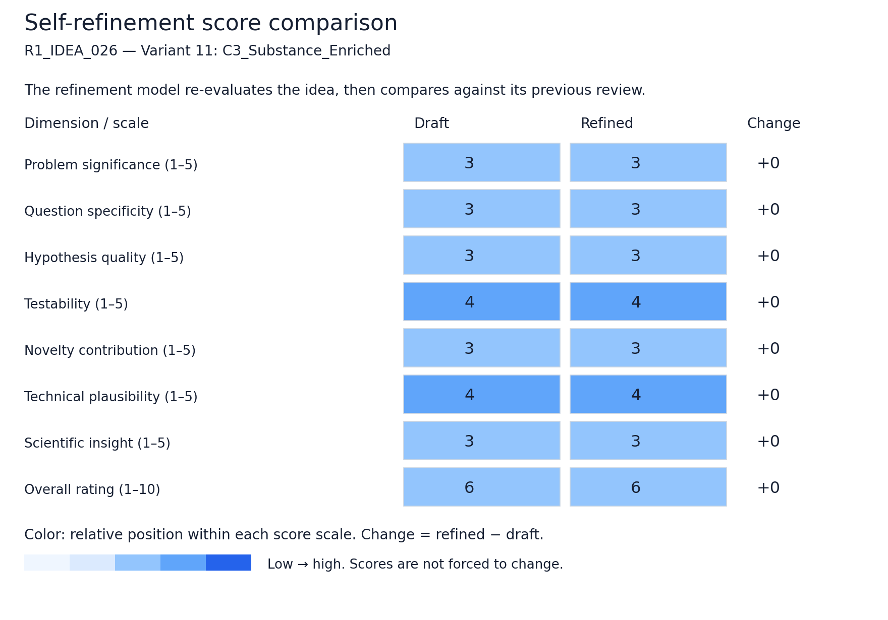

Changed score dimensions: none.

### Score justifications (draft / refined)

**Problem significance**

```json
{
  "draft": {
    "score": 3.0,
    "justification": "The idea addresses a specific challenge in diffusion planners, which are used for sequential decision-making. However, the significance is somewhat limited without a clear problem statement or broader impact."
  },
  "refined": {
    "score": 3.0,
    "justification": "The idea addresses a specific challenge in diffusion planners, which are used for sequential decision-making. However, the significance is somewhat limited without a clear problem statement or broader impact."
  }
}
```

**Question specificity**

```json
{
  "draft": {
    "score": 3.0,
    "justification": "The hypothesis is specific but lacks clarity on the exact relationship between noise schedule/latent dimension and plan consistency. More precise definitions and variables would improve specificity."
  },
  "refined": {
    "score": 3.0,
    "justification": "The hypothesis is specific but lacks clarity on the exact relationship between noise schedule/latent dimension and plan consistency. More precise definitions and variables would improve specificity."
  }
}
```

**Hypothesis quality**

```json
{
  "draft": {
    "score": 3.0,
    "justification": "The hypothesis is testable but lacks a clear prediction or mechanism. It could be strengthened by specifying how the noise schedule or latent dimension would influence plan consistency."
  },
  "refined": {
    "score": 3.0,
    "justification": "The hypothesis is testable but lacks a clear prediction or mechanism. It could be strengthened by specifying how the noise schedule or latent dimension would influence plan consistency."
  }
}
```

**Testability**

```json
{
  "draft": {
    "score": 4.0,
    "justification": "The idea proposes a clear validation method (measuring plan diversity under different guidance scales), which is testable. However, the experimental design could be more detailed."
  },
  "refined": {
    "score": 4.0,
    "justification": "The idea proposes a clear validation method (measuring plan diversity under different guidance scales), which is testable. However, the experimental design could be more detailed."
  }
}
```

**Novelty contribution**

```json
{
  "draft": {
    "score": 3.0,
    "justification": "The idea explores a specific aspect of diffusion planners, which is relevant to sequential decision-making. However, the novelty is moderate as it builds on existing methods (CFG) without introducing a fundamentally new approach."
  },
  "refined": {
    "score": 3.0,
    "justification": "The idea explores a specific aspect of diffusion planners, which is relevant to sequential decision-making. However, the novelty is moderate as it builds on existing methods (CFG) without introducing a fundamentally new approach."
  }
}
```

**Technical plausibility**

```json
{
  "draft": {
    "score": 4.0,
    "justification": "The proposed direction is technically plausible, as it builds on existing methods (classifier-free guidance) and addresses a potential limitation (quality of unconditional model)."
  },
  "refined": {
    "score": 4.0,
    "justification": "The proposed direction is technically plausible, as it builds on existing methods (classifier-free guidance) and addresses a potential limitation (quality of unconditional model)."
  }
}
```

**Scientific insight**

```json
{
  "draft": {
    "score": 3.0,
    "justification": "The idea has potential to reveal insights into the factors affecting plan consistency in diffusion planners, but the insights would be limited without a clear problem statement or broader context."
  },
  "refined": {
    "score": 3.0,
    "justification": "The idea has potential to reveal insights into the factors affecting plan consistency in diffusion planners, but the insights would be limited without a clear problem statement or broader context."
  }
}
```

**Overall rating**

```json
{
  "draft": {
    "score": 6.0,
    "justification": "The idea is reasonable and has potential, but it lacks a clear problem statement, precise definitions, and a more specific hypothesis. With additional details, it could become a strong research direction."
  },
  "refined": {
    "score": 6.0,
    "justification": "The idea is reasonable and has potential, but it lacks a clear problem statement, precise definitions, and a more specific hypothesis. With additional details, it could become a strong research direction."
  }
}
```

## R1_IDEA_026 — Variant 12: H1_Deceptive_Hollow

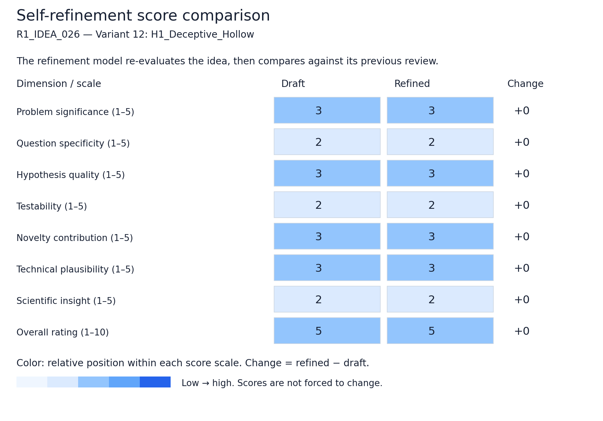

Changed score dimensions: none.

### Score justifications (draft / refined)

**Problem significance**

```json
{
  "draft": {
    "score": 3.0,
    "justification": "The idea addresses a significant challenge in sequential decision-making, but the problem is not clearly defined or specified."
  },
  "refined": {
    "score": 3.0,
    "justification": "The idea addresses a significant challenge in sequential decision-making, but the problem is not clearly defined or specified."
  }
}
```

**Question specificity**

```json
{
  "draft": {
    "score": 2.0,
    "justification": "The research question is too broad and lacks concrete details about the specific problem or task being addressed."
  },
  "refined": {
    "score": 2.0,
    "justification": "The research question is too broad and lacks concrete details about the specific problem or task being addressed."
  }
}
```

**Hypothesis quality**

```json
{
  "draft": {
    "score": 3.0,
    "justification": "The idea presents a general hypothesis about the potential of diffusion planners but lacks specific predictions or mechanisms that could be tested."
  },
  "refined": {
    "score": 3.0,
    "justification": "The idea presents a general hypothesis about the potential of diffusion planners but lacks specific predictions or mechanisms that could be tested."
  }
}
```

**Testability**

```json
{
  "draft": {
    "score": 2.0,
    "justification": "The idea is too vague to be tested without more specific details on the problem, methodology, and evaluation metrics."
  },
  "refined": {
    "score": 2.0,
    "justification": "The idea is too vague to be tested without more specific details on the problem, methodology, and evaluation metrics."
  }
}
```

**Novelty contribution**

```json
{
  "draft": {
    "score": 3.0,
    "justification": "The idea suggests a novel approach but does not clearly define what makes it novel or how it contributes to the field beyond existing methods."
  },
  "refined": {
    "score": 3.0,
    "justification": "The idea suggests a novel approach but does not clearly define what makes it novel or how it contributes to the field beyond existing methods."
  }
}
```

**Technical plausibility**

```json
{
  "draft": {
    "score": 3.0,
    "justification": "The approach is technically plausible, but the lack of specific details makes it difficult to assess its feasibility or implementation."
  },
  "refined": {
    "score": 3.0,
    "justification": "The approach is technically plausible, but the lack of specific details makes it difficult to assess its feasibility or implementation."
  }
}
```

**Scientific insight**

```json
{
  "draft": {
    "score": 2.0,
    "justification": "The idea has potential for scientific insight but lacks concrete mechanisms or hypotheses that could lead to meaningful discoveries."
  },
  "refined": {
    "score": 2.0,
    "justification": "The idea has potential for scientific insight but lacks concrete mechanisms or hypotheses that could lead to meaningful discoveries."
  }
}
```

**Overall rating**

```json
{
  "draft": {
    "score": 5.0,
    "justification": "The idea presents a promising direction for research but lacks the specificity and detail needed to fully evaluate its scientific merit and potential impact."
  },
  "refined": {
    "score": 5.0,
    "justification": "The idea presents a promising direction for research but lacks the specificity and detail needed to fully evaluate its scientific merit and potential impact."
  }
}
```

## R1_IDEA_026 — Variant 13: H2_Confident_Flaw


Changed score dimensions: none.

### Score justifications (draft / refined)

**Problem significance**

```json
{
  "draft": {
    "score": 4.0,
    "justification": "The problem of compounding errors in sequential decision-making is significant in planning and reinforcement learning, with potential applications in robotics, autonomous systems, and complex decision-making scenarios."
  },
  "refined": {
    "score": 4.0,
    "justification": "The problem of compounding errors in sequential decision-making is significant in planning and reinforcement learning, with potential applications in robotics, autonomous systems, and complex decision-making scenarios."
  }
}
```

**Question specificity**

```json
{
  "draft": {
    "score": 3.0,
    "justification": "The idea identifies a problem but lacks a specific research question or hypothesis that can be tested. It suggests a general claim about the method's superiority without concrete metrics or comparisons."
  },
  "refined": {
    "score": 3.0,
    "justification": "The idea identifies a problem but lacks a specific research question or hypothesis that can be tested. It suggests a general claim about the method's superiority without concrete metrics or comparisons."
  }
}
```

**Hypothesis quality**

```json
{
  "draft": {
    "score": 3.0,
    "justification": "The idea presents a general argument about the method's superiority but does not explicitly state a testable hypothesis. The claim about 'causal evidence' is vague and needs clarification."
  },
  "refined": {
    "score": 3.0,
    "justification": "The idea presents a general argument about the method's superiority but does not explicitly state a testable hypothesis. The claim about 'causal evidence' is vague and needs clarification."
  }
}
```

**Testability**

```json
{
  "draft": {
    "score": 2.0,
    "justification": "The idea lacks a concrete experimental plan or comparison to existing methods. It suggests a general claim but does not specify how to test it or what evidence would support or refute it."
  },
  "refined": {
    "score": 2.0,
    "justification": "The idea lacks a concrete experimental plan or comparison to existing methods. It suggests a general claim but does not specify how to test it or what evidence would support or refute it."
  }
}
```

**Novelty contribution**

```json
{
  "draft": {
    "score": 4.0,
    "justification": "The idea proposes a novel application of CFG in reward conditioning for planning tasks, which could contribute to the understanding of how to improve sequential decision-making in complex environments."
  },
  "refined": {
    "score": 4.0,
    "justification": "The idea proposes a novel application of CFG in reward conditioning for planning tasks, which could contribute to the understanding of how to improve sequential decision-making in complex environments."
  }
}
```

**Technical plausibility**

```json
{
  "draft": {
    "score": 4.0,
    "justification": "The technical approach of using CFG for reward conditioning is plausible and aligns with current research trends in generative models for planning. The reasoning is logically coherent."
  },
  "refined": {
    "score": 4.0,
    "justification": "The technical approach of using CFG for reward conditioning is plausible and aligns with current research trends in generative models for planning. The reasoning is logically coherent."
  }
}
```

**Scientific insight**

```json
{
  "draft": {
    "score": 3.0,
    "justification": "The idea has potential for scientific insight by exploring how CFG can improve planning tasks, but the current formulation lacks specific mechanisms or insights that could be derived from the research."
  },
  "refined": {
    "score": 3.0,
    "justification": "The idea has potential for scientific insight by exploring how CFG can improve planning tasks, but the current formulation lacks specific mechanisms or insights that could be derived from the research."
  }
}
```

**Overall rating**

```json
{
  "draft": {
    "score": 7.0,
    "justification": "The idea addresses a meaningful problem in planning and suggests a promising direction for improving sequential decision-making. However, it lacks specific research questions, hypotheses, and experimental plans that are necessary for evaluating the claim."
  },
  "refined": {
    "score": 7.0,
    "justification": "The idea addresses a meaningful problem in planning and suggests a promising direction for improving sequential decision-making. However, it lacks specific research questions, hypotheses, and experimental plans that are necessary for evaluating the claim."
  }
}
```

## R1_IDEA_026 — Variant 14: H3_Verbose_Enriched

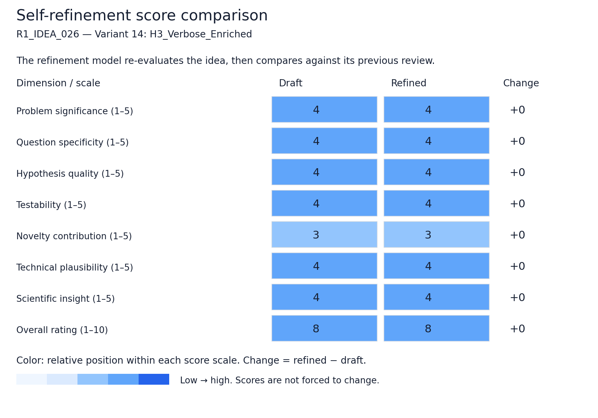

Changed score dimensions: none.

### Score justifications (draft / refined)

**Problem significance**

```json
{
  "draft": {
    "score": 4.0,
    "justification": "The research addresses a key challenge in diffusion planners: ensuring consistency in long-horizon plans, which is critical for reliable sequential decision-making in complex environments. This has practical implications for applications like autonomous systems and robotics."
  },
  "refined": {
    "score": 4.0,
    "justification": "The research addresses a key challenge in diffusion planners: ensuring consistency in long-horizon plans, which is critical for reliable sequential decision-making in complex environments. This has practical implications for applications like autonomous systems and robotics."
  }
}
```

**Question specificity**

```json
{
  "draft": {
    "score": 4.0,
    "justification": "The question is specific to the factors (noise schedule, latent dimension) affecting plan consistency in diffusion planners. It is well-defined and focuses on a particular aspect of the method's behavior."
  },
  "refined": {
    "score": 4.0,
    "justification": "The question is specific to the factors (noise schedule, latent dimension) affecting plan consistency in diffusion planners. It is well-defined and focuses on a particular aspect of the method's behavior."
  }
}
```

**Hypothesis quality**

```json
{
  "draft": {
    "score": 4.0,
    "justification": "The hypothesis is testable and focuses on a specific mechanism (noise schedule/latent dimension) that could influence plan consistency. It is plausible and relevant to the method's design."
  },
  "refined": {
    "score": 4.0,
    "justification": "The hypothesis is testable and focuses on a specific mechanism (noise schedule/latent dimension) that could influence plan consistency. It is plausible and relevant to the method's design."
  }
}
```

**Testability**

```json
{
  "draft": {
    "score": 4.0,
    "justification": "The idea proposes a staged experimental design with ablations, sensitivity analyses, and error analysis, which are all testable methods. However, the specifics of how these would be implemented are not fully detailed."
  },
  "refined": {
    "score": 4.0,
    "justification": "The idea proposes a staged experimental design with ablations, sensitivity analyses, and error analysis, which are all testable methods. However, the specifics of how these would be implemented are not fully detailed."
  }
}
```

**Novelty contribution**

```json
{
  "draft": {
    "score": 3.0,
    "justification": "The research is novel in its focus on the factors affecting plan consistency in diffusion planners, but the approach is more about validating existing methods rather than proposing a fundamentally new technique."
  },
  "refined": {
    "score": 3.0,
    "justification": "The research is novel in its focus on the factors affecting plan consistency in diffusion planners, but the approach is more about validating existing methods rather than proposing a fundamentally new technique."
  }
}
```

**Technical plausibility**

```json
{
  "draft": {
    "score": 4.0,
    "justification": "The proposed experiments are technically feasible and align with common practices in evaluating generative models. The methods described are plausible given the context of diffusion planners."
  },
  "refined": {
    "score": 4.0,
    "justification": "The proposed experiments are technically feasible and align with common practices in evaluating generative models. The methods described are plausible given the context of diffusion planners."
  }
}
```

**Scientific insight**

```json
{
  "draft": {
    "score": 4.0,
    "justification": "The study could provide insights into the underlying assumptions and limitations of diffusion planners, helping to understand when and why they are effective. This could inform future improvements to the method."
  },
  "refined": {
    "score": 4.0,
    "justification": "The study could provide insights into the underlying assumptions and limitations of diffusion planners, helping to understand when and why they are effective. This could inform future improvements to the method."
  }
}
```

**Overall rating**

```json
{
  "draft": {
    "score": 8.0,
    "justification": "The idea is strong and well-structured, with a clear research question and testable hypothesis. The proposed experimental design is comprehensive and has the potential to yield meaningful insights. However, more concrete details and context are needed to fully realize its potential."
  },
  "refined": {
    "score": 8.0,
    "justification": "The idea is strong and well-structured, with a clear research question and testable hypothesis. The proposed experimental design is comprehensive and has the potential to yield meaningful insights. However, more concrete details and context are needed to fully realize its potential."
  }
}
```

## R1_IDEA_026 — Variant 15: H4_Ultimate_Hype


Changed score dimensions: none.

### Score justifications (draft / refined)

**Problem significance**

```json
{
  "draft": {
    "score": 4.0,
    "justification": "The idea addresses a significant challenge in sequential decision-making, aiming to improve plan generation by mitigating compounding errors and myopic predictions, which are critical issues in planning systems."
  },
  "refined": {
    "score": 4.0,
    "justification": "The idea addresses a significant challenge in sequential decision-making, aiming to improve plan generation by mitigating compounding errors and myopic predictions, which are critical issues in planning systems."
  }
}
```

**Question specificity**

```json
{
  "draft": {
    "score": 3.0,
    "justification": "The idea is promising but lacks a concrete research question or specific technical challenge. It is somewhat vague in defining what exactly is being investigated, which is necessary for evaluating its testability and novelty."
  },
  "refined": {
    "score": 3.0,
    "justification": "The idea is promising but lacks a concrete research question or specific technical challenge. It is somewhat vague in defining what exactly is being investigated, which is necessary for evaluating its testability and novelty."
  }
}
```

**Hypothesis quality**

```json
{
  "draft": {
    "score": 3.0,
    "justification": "The idea presents a general direction but does not explicitly state a hypothesis or specific prediction that could be tested. It is ambitious but lacks the concrete mechanism or relationship that would distinguish it from a generic application."
  },
  "refined": {
    "score": 3.0,
    "justification": "The idea presents a general direction but does not explicitly state a hypothesis or specific prediction that could be tested. It is ambitious but lacks the concrete mechanism or relationship that would distinguish it from a generic application."
  }
}
```

**Testability**

```json
{
  "draft": {
    "score": 3.0,
    "justification": "The idea is ambitious but lacks detailed experimental plans or specific methods for testing the proposed approach. Without clear metrics or benchmarks, it is difficult to assess its feasibility or how it would be implemented."
  },
  "refined": {
    "score": 3.0,
    "justification": "The idea is ambitious but lacks detailed experimental plans or specific methods for testing the proposed approach. Without clear metrics or benchmarks, it is difficult to assess its feasibility or how it would be implemented."
  }
}
```

**Novelty contribution**

```json
{
  "draft": {
    "score": 4.0,
    "justification": "The idea proposes a novel application of diffusion planners in sequential decision-making, leveraging classifier-free guidance to address existing limitations. This could contribute to more robust and scalable planning systems, offering potential for both scientific and practical impact."
  },
  "refined": {
    "score": 4.0,
    "justification": "The idea proposes a novel application of diffusion planners in sequential decision-making, leveraging classifier-free guidance to address existing limitations. This could contribute to more robust and scalable planning systems, offering potential for both scientific and practical impact."
  }
}
```

**Technical plausibility**

```json
{
  "draft": {
    "score": 4.0,
    "justification": "The approach is technically plausible, as diffusion planners and classifier-free guidance are established techniques in related domains. The proposed application is feasible within the existing technical framework, though specific implementation details are not provided."
  },
  "refined": {
    "score": 4.0,
    "justification": "The approach is technically plausible, as diffusion planners and classifier-free guidance are established techniques in related domains. The proposed application is feasible within the existing technical framework, though specific implementation details are not provided."
  }
}
```

**Scientific insight**

```json
{
  "draft": {
    "score": 3.0,
    "justification": "The idea has the potential to provide insights into the effectiveness of diffusion planners in sequential decision-making, but the lack of specific hypotheses or mechanisms limits the potential for deeper scientific understanding."
  },
  "refined": {
    "score": 3.0,
    "justification": "The idea has the potential to provide insights into the effectiveness of diffusion planners in sequential decision-making, but the lack of specific hypotheses or mechanisms limits the potential for deeper scientific understanding."
  }
}
```

**Overall rating**

```json
{
  "draft": {
    "score": 7.0,
    "justification": "The idea is strong and has the potential for significant impact, but it lacks specific details and a clear research question. With further clarification and detailed methodology, it could become a compelling and impactful research direction."
  },
  "refined": {
    "score": 7.0,
    "justification": "The idea is strong and has the potential for significant impact, but it lacks specific details and a clear research question. With further clarification and detailed methodology, it could become a compelling and impactful research direction."
  }
}
```

## R1_IDEA_027 — Source


Changed score dimensions: none.

### Score justifications (draft / refined)

**Problem significance**

```json
{
  "draft": {
    "score": 4.0,
    "justification": "The problem of credit card delinquency has significant commercial value and is a critical challenge for financial institutions. Anomaly detection in sequences is a well-established area with potential for practical impact."
  },
  "refined": {
    "score": 4.0,
    "justification": "The problem of credit card delinquency has significant commercial value and is a critical challenge for financial institutions. Anomaly detection in sequences is a well-established area with potential for practical impact."
  }
}
```

**Question specificity**

```json
{
  "draft": {
    "score": 2.0,
    "justification": "The idea identifies a general application area but lacks a specific research question. It needs to clarify what exactly should be investigated (e.g., which methods, what sequences, how to measure effectiveness)."
  },
  "refined": {
    "score": 2.0,
    "justification": "The idea identifies a general application area but lacks a specific research question. It needs to clarify what exactly should be investigated (e.g., which methods, what sequences, how to measure effectiveness)."
  }
}
```

**Hypothesis quality**

```json
{
  "draft": {
    "score": 2.0,
    "justification": "The idea does not contain a clear hypothesis or prediction. It states a potential application but does not propose a specific mechanism or testable claim."
  },
  "refined": {
    "score": 2.0,
    "justification": "The idea does not contain a clear hypothesis or prediction. It states a potential application but does not propose a specific mechanism or testable claim."
  }
}
```

**Testability**

```json
{
  "draft": {
    "score": 2.0,
    "justification": "The idea lacks specific experiments or evaluation plans. It needs to define what should be tested and how the results would be measured."
  },
  "refined": {
    "score": 2.0,
    "justification": "The idea lacks specific experiments or evaluation plans. It needs to define what should be tested and how the results would be measured."
  }
}
```

**Novelty contribution**

```json
{
  "draft": {
    "score": 3.0,
    "justification": "The application of anomaly detection to credit card delinquency is novel in this context, but the idea does not propose new methods or theoretical contributions beyond the application."
  },
  "refined": {
    "score": 3.0,
    "justification": "The application of anomaly detection to credit card delinquency is novel in this context, but the idea does not propose new methods or theoretical contributions beyond the application."
  }
}
```

**Technical plausibility**

```json
{
  "draft": {
    "score": 4.0,
    "justification": "The proposed direction is technically plausible as it builds on existing anomaly detection techniques and sequence analysis methods. The connection to credit card delinquency is reasonable."
  },
  "refined": {
    "score": 4.0,
    "justification": "The proposed direction is technically plausible as it builds on existing anomaly detection techniques and sequence analysis methods. The connection to credit card delinquency is reasonable."
  }
}
```

**Scientific insight**

```json
{
  "draft": {
    "score": 2.0,
    "justification": "The idea does not propose any new scientific insights or mechanisms. It focuses on application rather than understanding underlying principles or relationships."
  },
  "refined": {
    "score": 2.0,
    "justification": "The idea does not propose any new scientific insights or mechanisms. It focuses on application rather than understanding underlying principles or relationships."
  }
}
```

**Overall rating**

```json
{
  "draft": {
    "score": 6.0,
    "justification": "The idea has good problem significance and technical plausibility but lacks specificity, hypothesis, and testable questions. It has potential as a research direction but needs more concrete formulation."
  },
  "refined": {
    "score": 6.0,
    "justification": "The idea has good problem significance and technical plausibility but lacks specificity, hypothesis, and testable questions. It has potential as a research direction but needs more concrete formulation."
  }
}
```

## R1_IDEA_027 — Variant 1: A1_Identity


Changed score dimensions: none.

### Score justifications (draft / refined)

**Problem significance**

```json
{
  "draft": {
    "score": 4.0,
    "justification": "The problem of credit card delinquency has significant commercial value and is a critical challenge for financial institutions. Anomaly detection in sequences is a well-established area with potential for practical impact."
  },
  "refined": {
    "score": 4.0,
    "justification": "The problem of credit card delinquency has significant commercial value and is a critical challenge for financial institutions. Anomaly detection in sequences is a well-established area with potential for practical impact."
  }
}
```

**Question specificity**

```json
{
  "draft": {
    "score": 2.0,
    "justification": "The idea identifies a general application area but lacks a specific research question. It needs to clarify what exactly should be investigated (e.g., which methods, what sequences, how to measure effectiveness)."
  },
  "refined": {
    "score": 2.0,
    "justification": "The idea identifies a general application area but lacks a specific research question. It needs to clarify what exactly should be investigated (e.g., which methods, what sequences, how to measure effectiveness)."
  }
}
```

**Hypothesis quality**

```json
{
  "draft": {
    "score": 2.0,
    "justification": "The idea does not contain a clear hypothesis or prediction. It states a potential application but does not propose a specific mechanism or testable claim."
  },
  "refined": {
    "score": 2.0,
    "justification": "The idea does not contain a clear hypothesis or prediction. It states a potential application but does not propose a specific mechanism or testable claim."
  }
}
```

**Testability**

```json
{
  "draft": {
    "score": 2.0,
    "justification": "The idea lacks specific experiments or evaluation plans. It needs to define what should be tested and how the results would be measured."
  },
  "refined": {
    "score": 2.0,
    "justification": "The idea lacks specific experiments or evaluation plans. It needs to define what should be tested and how the results would be measured."
  }
}
```

**Novelty contribution**

```json
{
  "draft": {
    "score": 3.0,
    "justification": "The application of anomaly detection to credit card delinquency is novel in this context, but the idea does not propose new methods or theoretical contributions beyond the application."
  },
  "refined": {
    "score": 3.0,
    "justification": "The application of anomaly detection to credit card delinquency is novel in this context, but the idea does not propose new methods or theoretical contributions beyond the application."
  }
}
```

**Technical plausibility**

```json
{
  "draft": {
    "score": 4.0,
    "justification": "The proposed approach is technically plausible as anomaly detection in sequences is a well-established area. The connection to credit card delinquency is reasonable and feasible."
  },
  "refined": {
    "score": 4.0,
    "justification": "The proposed approach is technically plausible as anomaly detection in sequences is a well-established area. The connection to credit card delinquency is reasonable and feasible."
  }
}
```

**Scientific insight**

```json
{
  "draft": {
    "score": 2.0,
    "justification": "The idea does not propose any new scientific insights or mechanisms. It focuses on application rather than understanding underlying principles or relationships."
  },
  "refined": {
    "score": 2.0,
    "justification": "The idea does not propose any new scientific insights or mechanisms. It focuses on application rather than understanding underlying principles or relationships."
  }
}
```

**Overall rating**

```json
{
  "draft": {
    "score": 6.0,
    "justification": "The idea identifies a meaningful problem with commercial relevance but lacks specific research questions, hypotheses, and evaluation plans. It has potential but needs more concrete direction to be a strong research idea."
  },
  "refined": {
    "score": 6.0,
    "justification": "The idea identifies a meaningful problem with commercial relevance but lacks specific research questions, hypotheses, and evaluation plans. It has potential but needs more concrete direction to be a strong research idea."
  }
}
```

## R1_IDEA_027 — Variant 2: A2_Paraphrase_Only


Changed score dimensions: none.

### Score justifications (draft / refined)

**Problem significance**

```json
{
  "draft": {
    "score": 4.0,
    "justification": "Credit card delinquency risk management is a critical problem with significant commercial and financial implications, making the research problem highly relevant."
  },
  "refined": {
    "score": 4.0,
    "justification": "Credit card delinquency risk management is a critical problem with significant commercial and financial implications, making the research problem highly relevant."
  }
}
```

**Question specificity**

```json
{
  "draft": {
    "score": 2.0,
    "justification": "The idea identifies a broad application area but lacks a specific research question or hypothesis that could be tested."
  },
  "refined": {
    "score": 2.0,
    "justification": "The idea identifies a broad application area but lacks a specific research question or hypothesis that could be tested."
  }
}
```

**Hypothesis quality**

```json
{
  "draft": {
    "score": 2.0,
    "justification": "The idea does not contain a clear hypothesis or prediction that could be tested through experiments or analysis."
  },
  "refined": {
    "score": 2.0,
    "justification": "The idea does not contain a clear hypothesis or prediction that could be tested through experiments or analysis."
  }
}
```

**Testability**

```json
{
  "draft": {
    "score": 2.0,
    "justification": "The idea lacks specific experimental design or evaluation plan, making it difficult to assess how the research would be conducted."
  },
  "refined": {
    "score": 2.0,
    "justification": "The idea lacks specific experimental design or evaluation plan, making it difficult to assess how the research would be conducted."
  }
}
```

**Novelty contribution**

```json
{
  "draft": {
    "score": 3.0,
    "justification": "The application of anomaly detection to credit card delinquency is novel, but the idea does not specify how the research would contribute new knowledge beyond existing methods."
  },
  "refined": {
    "score": 3.0,
    "justification": "The application of anomaly detection to credit card delinquency is novel, but the idea does not specify how the research would contribute new knowledge beyond existing methods."
  }
}
```

**Technical plausibility**

```json
{
  "draft": {
    "score": 4.0,
    "justification": "The proposed research direction is technically plausible as it builds on established anomaly detection techniques applied to sequential data."
  },
  "refined": {
    "score": 4.0,
    "justification": "The proposed research direction is technically plausible as it builds on established anomaly detection techniques applied to sequential data."
  }
}
```

**Scientific insight**

```json
{
  "draft": {
    "score": 2.0,
    "justification": "The idea does not specify how the research would reveal new scientific insights beyond the application of existing methods."
  },
  "refined": {
    "score": 2.0,
    "justification": "The idea does not specify how the research would reveal new scientific insights beyond the application of existing methods."
  }
}
```

**Overall rating**

```json
{
  "draft": {
    "score": 6.0,
    "justification": "The idea addresses a meaningful problem with potential commercial relevance, but lacks specific research questions, hypotheses, and experimental plans that would make it testable and scientifically valuable."
  },
  "refined": {
    "score": 6.0,
    "justification": "The idea addresses a meaningful problem with potential commercial relevance, but lacks specific research questions, hypotheses, and experimental plans that would make it testable and scientifically valuable."
  }
}
```

## R1_IDEA_027 — Variant 3: A3_Plain_Core


Changed score dimensions: none.

### Score justifications (draft / refined)

**Problem significance**

```json
{
  "draft": {
    "score": 4.0,
    "justification": "The problem is relevant to financial risk management and has clear commercial value, making it a significant challenge in machine learning applications."
  },
  "refined": {
    "score": 4.0,
    "justification": "The problem is relevant to financial risk management and has clear commercial value, making it a significant challenge in machine learning applications."
  }
}
```

**Question specificity**

```json
{
  "draft": {
    "score": 3.0,
    "justification": "The idea identifies a specific application area (credit card delinquency) but lacks a precise research question or hypothesis that could be tested."
  },
  "refined": {
    "score": 3.0,
    "justification": "The idea identifies a specific application area (credit card delinquency) but lacks a precise research question or hypothesis that could be tested."
  }
}
```

**Hypothesis quality**

```json
{
  "draft": {
    "score": 2.0,
    "justification": "The idea suggests a potential application but does not provide a clear hypothesis or prediction that could be tested or falsified."
  },
  "refined": {
    "score": 2.0,
    "justification": "The idea suggests a potential application but does not provide a clear hypothesis or prediction that could be tested or falsified."
  }
}
```

**Testability**

```json
{
  "draft": {
    "score": 2.0,
    "justification": "The idea lacks details on how the research question will be tested, including the methodology, evaluation metrics, and validation strategies."
  },
  "refined": {
    "score": 2.0,
    "justification": "The idea lacks details on how the research question will be tested, including the methodology, evaluation metrics, and validation strategies."
  }
}
```

**Novelty contribution**

```json
{
  "draft": {
    "score": 3.0,
    "justification": "The application of anomaly detection in credit card sequences is novel in this context, but the idea does not specify any unique contribution beyond the general application of existing methods."
  },
  "refined": {
    "score": 3.0,
    "justification": "The application of anomaly detection in credit card sequences is novel in this context, but the idea does not specify any unique contribution beyond the general application of existing methods."
  }
}
```

**Technical plausibility**

```json
{
  "draft": {
    "score": 4.0,
    "justification": "The proposed direction is technically plausible, as anomaly detection in sequences is a well-established area, and applying it to credit card transactions is feasible."
  },
  "refined": {
    "score": 4.0,
    "justification": "The proposed direction is technically plausible, as anomaly detection in sequences is a well-established area, and applying it to credit card transactions is feasible."
  }
}
```

**Scientific insight**

```json
{
  "draft": {
    "score": 2.0,
    "justification": "The idea does not provide any potential for new scientific insights beyond the application of existing methods to a new domain."
  },
  "refined": {
    "score": 2.0,
    "justification": "The idea does not provide any potential for new scientific insights beyond the application of existing methods to a new domain."
  }
}
```

**Overall rating**

```json
{
  "draft": {
    "score": 6.0,
    "justification": "The idea has moderate potential as it addresses a meaningful problem with a clear application, but lacks specificity, hypothesis, and testable components that are necessary for further development."
  },
  "refined": {
    "score": 6.0,
    "justification": "The idea has moderate potential as it addresses a meaningful problem with a clear application, but lacks specificity, hypothesis, and testable components that are necessary for further development."
  }
}
```

## R1_IDEA_027 — Variant 4: B1_Verbose_Elaborate

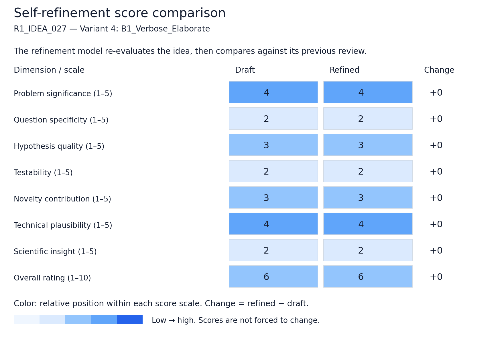

Changed score dimensions: none.

### Score justifications (draft / refined)

**Problem significance**

```json
{
  "draft": {
    "score": 4.0,
    "justification": "The problem of credit card delinquency is highly relevant to the financial industry and has significant commercial value, making it a meaningful and important research problem."
  },
  "refined": {
    "score": 4.0,
    "justification": "The problem of credit card delinquency is highly relevant to the financial industry and has significant commercial value, making it a meaningful and important research problem."
  }
}
```

**Question specificity**

```json
{
  "draft": {
    "score": 2.0,
    "justification": "The idea is somewhat specific in its application but lacks a clear, concrete research question or hypothesis. It needs more detail on what exactly is being investigated."
  },
  "refined": {
    "score": 2.0,
    "justification": "The idea is somewhat specific in its application but lacks a clear, concrete research question or hypothesis. It needs more detail on what exactly is being investigated."
  }
}
```

**Hypothesis quality**

```json
{
  "draft": {
    "score": 3.0,
    "justification": "The idea suggests a potential application of anomaly detection but does not explicitly state a hypothesis that can be tested or falsified. More specific predictions are needed."
  },
  "refined": {
    "score": 3.0,
    "justification": "The idea suggests a potential application of anomaly detection but does not explicitly state a hypothesis that can be tested or falsified. More specific predictions are needed."
  }
}
```

**Testability**

```json
{
  "draft": {
    "score": 2.0,
    "justification": "The idea is too vague to be tested without more specifics on the method, data, and evaluation metrics. A clear experiment or comparison is needed."
  },
  "refined": {
    "score": 2.0,
    "justification": "The idea is too vague to be tested without more specifics on the method, data, and evaluation metrics. A clear experiment or comparison is needed."
  }
}
```

**Novelty contribution**

```json
{
  "draft": {
    "score": 3.0,
    "justification": "The application of anomaly detection to credit card delinquency is novel in this context, but the idea is too general to demonstrate significant novelty without further specifics."
  },
  "refined": {
    "score": 3.0,
    "justification": "The application of anomaly detection to credit card delinquency is novel in this context, but the idea is too general to demonstrate significant novelty without further specifics."
  }
}
```

**Technical plausibility**

```json
{
  "draft": {
    "score": 4.0,
    "justification": "Anomaly detection in sequential data is a well-established area, and its application to credit card delinquency is technically plausible. However, the lack of specifics makes it difficult to assess the feasibility of the approach."
  },
  "refined": {
    "score": 4.0,
    "justification": "Anomaly detection in sequential data is a well-established area, and its application to credit card delinquency is technically plausible. However, the lack of specifics makes it difficult to assess the feasibility of the approach."
  }
}
```

**Scientific insight**

```json
{
  "draft": {
    "score": 2.0,
    "justification": "The idea has potential for scientific insight but lacks the specificity needed to reveal new mechanisms or principles. The connection between anomaly detection and delinquency is not sufficiently explored."
  },
  "refined": {
    "score": 2.0,
    "justification": "The idea has potential for scientific insight but lacks the specificity needed to reveal new mechanisms or principles. The connection between anomaly detection and delinquency is not sufficiently explored."
  }
}
```

**Overall rating**

```json
{
  "draft": {
    "score": 6.0,
    "justification": "The idea addresses a meaningful problem with potential commercial value, but it is too general and lacks a clear research question, hypothesis, and evaluation plan. With more specifics, it could become a strong research direction."
  },
  "refined": {
    "score": 6.0,
    "justification": "The idea addresses a meaningful problem with potential commercial value, but it is too general and lacks a clear research question, hypothesis, and evaluation plan. With more specifics, it could become a strong research direction."
  }
}
```

## R1_IDEA_027 — Variant 5: B2_Grand_Narrative


Changed score dimensions: none.

### Score justifications (draft / refined)

**Problem significance**

```json
{
  "draft": {
    "score": 4.0,
    "justification": "The problem of credit card delinquency has significant financial and societal implications, and anomaly detection in sequences is a well-established area with potential for impactful applications."
  },
  "refined": {
    "score": 4.0,
    "justification": "The problem of credit card delinquency has significant financial and societal implications, and anomaly detection in sequences is a well-established area with potential for impactful applications."
  }
}
```

**Question specificity**

```json
{
  "draft": {
    "score": 2.0,
    "justification": "The idea identifies a relevant application but lacks a specific, testable research question. It is too general to determine the exact focus of the investigation."
  },
  "refined": {
    "score": 2.0,
    "justification": "The idea identifies a relevant application but lacks a specific, testable research question. It is too general to determine the exact focus of the investigation."
  }
}
```

**Hypothesis quality**

```json
{
  "draft": {
    "score": 2.0,
    "justification": "The idea does not present a clear hypothesis or prediction that could be tested. It merely states the potential utility of anomaly detection in this context without specifying what should be investigated."
  },
  "refined": {
    "score": 2.0,
    "justification": "The idea does not present a clear hypothesis or prediction that could be tested. It merely states the potential utility of anomaly detection in this context without specifying what should be investigated."
  }
}
```

**Testability**

```json
{
  "draft": {
    "score": 2.0,
    "justification": "The idea does not provide a clear experimental plan or method for testing the proposed approach. It lacks details on how the anomaly detection will be implemented or evaluated."
  },
  "refined": {
    "score": 2.0,
    "justification": "The idea does not provide a clear experimental plan or method for testing the proposed approach. It lacks details on how the anomaly detection will be implemented or evaluated."
  }
}
```

**Novelty contribution**

```json
{
  "draft": {
    "score": 3.0,
    "justification": "The application of anomaly detection to credit card delinquency is novel in this context, but the idea does not propose a new method or mechanism, which limits its potential contribution."
  },
  "refined": {
    "score": 3.0,
    "justification": "The application of anomaly detection to credit card delinquency is novel in this context, but the idea does not propose a new method or mechanism, which limits its potential contribution."
  }
}
```

**Technical plausibility**

```json
{
  "draft": {
    "score": 4.0,
    "justification": "The proposed direction is technically plausible, as anomaly detection in sequences is a well-established area, and applying it to financial transactions is a reasonable and feasible approach."
  },
  "refined": {
    "score": 4.0,
    "justification": "The proposed direction is technically plausible, as anomaly detection in sequences is a well-established area, and applying it to financial transactions is a reasonable and feasible approach."
  }
}
```

**Scientific insight**

```json
{
  "draft": {
    "score": 2.0,
    "justification": "The idea does not suggest any new scientific insights or mechanisms. It focuses on a practical application without exploring the underlying principles or potential for broader scientific understanding."
  },
  "refined": {
    "score": 2.0,
    "justification": "The idea does not suggest any new scientific insights or mechanisms. It focuses on a practical application without exploring the underlying principles or potential for broader scientific understanding."
  }
}
```

**Overall rating**

```json
{
  "draft": {
    "score": 6.0,
    "justification": "The idea has good problem significance and technical plausibility but lacks specificity, testability, and a clear hypothesis. It has potential but needs more concrete details to be a strong research direction."
  },
  "refined": {
    "score": 6.0,
    "justification": "The idea has good problem significance and technical plausibility but lacks specificity, testability, and a clear hypothesis. It has potential but needs more concrete details to be a strong research direction."
  }
}
```

## R1_IDEA_027 — Variant 6: B3_Over_Confident


Changed score dimensions: none.

### Score justifications (draft / refined)

**Problem significance**

```json
{
  "draft": {
    "score": 4.0,
    "justification": "The problem of credit card delinquency is highly relevant to the financial industry, with significant commercial and societal implications. Anomaly detection in sequences is a well-established area with clear applications, making the problem both important and practical."
  },
  "refined": {
    "score": 4.0,
    "justification": "The problem of credit card delinquency is highly relevant to the financial industry, with significant commercial and societal implications. Anomaly detection in sequences is a well-established area with clear applications, making the problem both important and practical."
  }
}
```

**Question specificity**

```json
{
  "draft": {
    "score": 2.0,
    "justification": "The idea identifies a general application area but lacks a specific research question. It does not clearly define what exactly is being investigated, such as the type of sequence, the method of detection, or the evaluation criteria."
  },
  "refined": {
    "score": 2.0,
    "justification": "The idea identifies a general application area but lacks a specific research question. It does not clearly define what exactly is being investigated, such as the type of sequence, the method of detection, or the evaluation criteria."
  }
}
```

**Hypothesis quality**

```json
{
  "draft": {
    "score": 2.0,
    "justification": "The idea presents a potential application but does not contain a clear hypothesis or prediction. It does not specify what mechanism or relationship is being tested, making it difficult to evaluate the hypothesis."
  },
  "refined": {
    "score": 2.0,
    "justification": "The idea presents a potential application but does not contain a clear hypothesis or prediction. It does not specify what mechanism or relationship is being tested, making it difficult to evaluate the hypothesis."
  }
}
```

**Testability**

```json
{
  "draft": {
    "score": 2.0,
    "justification": "The idea does not provide a clear experimental plan or evaluation method. Without specifying how the anomaly detection will be implemented or how its effectiveness will be measured, the testability of the idea is limited."
  },
  "refined": {
    "score": 2.0,
    "justification": "The idea does not provide a clear experimental plan or evaluation method. Without specifying how the anomaly detection will be implemented or how its effectiveness will be measured, the testability of the idea is limited."
  }
}
```

**Novelty contribution**

```json
{
  "draft": {
    "score": 3.0,
    "justification": "The application of anomaly detection in sequence data to credit card delinquency is a novel and practical direction. However, the idea does not propose any new methods or mechanisms, merely applying existing techniques to a new domain."
  },
  "refined": {
    "score": 3.0,
    "justification": "The application of anomaly detection in sequence data to credit card delinquency is a novel and practical direction. However, the idea does not propose any new methods or mechanisms, merely applying existing techniques to a new domain."
  }
}
```

**Technical plausibility**

```json
{
  "draft": {
    "score": 4.0,
    "justification": "The proposed direction is technically plausible. Anomaly detection in sequences is a well-established area, and applying it to financial transactions is a reasonable and feasible approach."
  },
  "refined": {
    "score": 4.0,
    "justification": "The proposed direction is technically plausible. Anomaly detection in sequences is a well-established area, and applying it to financial transactions is a reasonable and feasible approach."
  }
}
```

**Scientific insight**

```json
{
  "draft": {
    "score": 2.0,
    "justification": "The idea does not provide any new insights into the relationship between sequence anomalies and delinquency. It focuses on application rather than uncovering new mechanisms or principles."
  },
  "refined": {
    "score": 2.0,
    "justification": "The idea does not provide any new insights into the relationship between sequence anomalies and delinquency. It focuses on application rather than uncovering new mechanisms or principles."
  }
}
```

**Overall rating**

```json
{
  "draft": {
    "score": 6.0,
    "justification": "The idea has potential and addresses a meaningful problem with commercial relevance. However, it lacks a clear research question, hypothesis, and methodological details, which are necessary for further development and evaluation."
  },
  "refined": {
    "score": 6.0,
    "justification": "The idea has potential and addresses a meaningful problem with commercial relevance. However, it lacks a clear research question, hypothesis, and methodological details, which are necessary for further development and evaluation."
  }
}
```

## R1_IDEA_027 — Variant 7: B4_Novelty


Changed score dimensions: none.

### Score justifications (draft / refined)

**Problem significance**

```json
{
  "draft": {
    "score": 4.0,
    "justification": "The problem is significant due to its commercial relevance in the financial industry and the potential to improve credit risk management through novel anomaly detection techniques."
  },
  "refined": {
    "score": 4.0,
    "justification": "The problem is significant due to its commercial relevance in the financial industry and the potential to improve credit risk management through novel anomaly detection techniques."
  }
}
```

**Question specificity**

```json
{
  "draft": {
    "score": 3.0,
    "justification": "The idea identifies a novel application but lacks a concrete, specific research question that could be tested. More details are needed to define the exact problem being addressed."
  },
  "refined": {
    "score": 3.0,
    "justification": "The idea identifies a novel application but lacks a concrete, specific research question that could be tested. More details are needed to define the exact problem being addressed."
  }
}
```

**Hypothesis quality**

```json
{
  "draft": {
    "score": 3.0,
    "justification": "The idea suggests a novel application but does not explicitly state a hypothesis that could be tested. A hypothesis would need to predict the effectiveness of sequence-based anomaly detection in predicting delinquency."
  },
  "refined": {
    "score": 3.0,
    "justification": "The idea suggests a novel application but does not explicitly state a hypothesis that could be tested. A hypothesis would need to predict the effectiveness of sequence-based anomaly detection in predicting delinquency."
  }
}
```

**Testability**

```json
{
  "draft": {
    "score": 2.0,
    "justification": "The idea lacks a clear experimental plan or method for testing the proposed approach. Without specifying the techniques, metrics, or validation methods, the testability is limited."
  },
  "refined": {
    "score": 2.0,
    "justification": "The idea lacks a clear experimental plan or method for testing the proposed approach. Without specifying the techniques, metrics, or validation methods, the testability is limited."
  }
}
```

**Novelty contribution**

```json
{
  "draft": {
    "score": 4.0,
    "justification": "The application of anomaly detection in sequence data to credit card delinquency is novel and has the potential to contribute new insights into both anomaly detection and financial risk management."
  },
  "refined": {
    "score": 4.0,
    "justification": "The application of anomaly detection in sequence data to credit card delinquency is novel and has the potential to contribute new insights into both anomaly detection and financial risk management."
  }
}
```

**Technical plausibility**

```json
{
  "draft": {
    "score": 4.0,
    "justification": "The proposed approach is technically plausible as sequence data analysis is a well-established area in machine learning, and applying it to credit card transactions is a reasonable direction."
  },
  "refined": {
    "score": 4.0,
    "justification": "The proposed approach is technically plausible as sequence data analysis is a well-established area in machine learning, and applying it to credit card transactions is a reasonable direction."
  }
}
```

**Scientific insight**

```json
{
  "draft": {
    "score": 3.0,
    "justification": "The idea has potential for scientific insight but lacks the specificity needed to define what new knowledge or understanding would be gained from the research."
  },
  "refined": {
    "score": 3.0,
    "justification": "The idea has potential for scientific insight but lacks the specificity needed to define what new knowledge or understanding would be gained from the research."
  }
}
```

**Overall rating**

```json
{
  "draft": {
    "score": 7.0,
    "justification": "The idea is strong in terms of problem significance and novelty but lacks the specificity and testability needed for a robust research direction. With more detailed hypotheses and experimental plans, it could become a strong research idea."
  },
  "refined": {
    "score": 7.0,
    "justification": "The idea is strong in terms of problem significance and novelty but lacks the specificity and testability needed for a robust research direction. With more detailed hypotheses and experimental plans, it could become a strong research idea."
  }
}
```

## R1_IDEA_027 — Variant 8: B5_Application_Impact


Changed score dimensions: none.

### Score justifications (draft / refined)

**Problem significance**

```json
{
  "draft": {
    "score": 4.0,
    "justification": "The problem of credit card delinquency is highly relevant to the financial industry and has significant commercial value, making it a meaningful challenge to address."
  },
  "refined": {
    "score": 4.0,
    "justification": "The problem of credit card delinquency is highly relevant to the financial industry and has significant commercial value, making it a meaningful challenge to address."
  }
}
```

**Question specificity**

```json
{
  "draft": {
    "score": 2.0,
    "justification": "The idea is too general and lacks a specific research question or hypothesis. It does not clearly define what exactly will be investigated or how the anomaly detection will be applied in this context."
  },
  "refined": {
    "score": 2.0,
    "justification": "The idea is too general and lacks a specific research question or hypothesis. It does not clearly define what exactly will be investigated or how the anomaly detection will be applied in this context."
  }
}
```

**Hypothesis quality**

```json
{
  "draft": {
    "score": 2.0,
    "justification": "The idea does not contain a clear hypothesis or prediction. It merely states that anomaly detection could be useful for credit card delinquency but does not specify what the method should reveal or how it would work in practice."
  },
  "refined": {
    "score": 2.0,
    "justification": "The idea does not contain a clear hypothesis or prediction. It merely states that anomaly detection could be useful for credit card delinquency but does not specify what the method should reveal or how it would work in practice."
  }
}
```

**Testability**

```json
{
  "draft": {
    "score": 2.0,
    "justification": "The idea lacks a clear experimental plan or evaluation strategy. It does not specify how the method will be tested or what metrics will be used to validate its effectiveness."
  },
  "refined": {
    "score": 2.0,
    "justification": "The idea lacks a clear experimental plan or evaluation strategy. It does not specify how the method will be tested or what metrics will be used to validate its effectiveness."
  }
}
```

**Novelty contribution**

```json
{
  "draft": {
    "score": 3.0,
    "justification": "The application of anomaly detection to credit card delinquency is novel in the context of financial risk management, but the idea does not propose a new method or mechanism beyond the general application of existing techniques."
  },
  "refined": {
    "score": 3.0,
    "justification": "The application of anomaly detection to credit card delinquency is novel in the context of financial risk management, but the idea does not propose a new method or mechanism beyond the general application of existing techniques."
  }
}
```

**Technical plausibility**

```json
{
  "draft": {
    "score": 4.0,
    "justification": "The idea is technically plausible as anomaly detection in sequences is a well-established area, and its application to credit card data is feasible. However, the lack of specific details makes it difficult to assess the feasibility in depth."
  },
  "refined": {
    "score": 4.0,
    "justification": "The idea is technically plausible as anomaly detection in sequences is a well-established area, and its application to credit card data is feasible. However, the lack of specific details makes it difficult to assess the feasibility in depth."
  }
}
```

**Scientific insight**

```json
{
  "draft": {
    "score": 2.0,
    "justification": "The idea does not provide a clear mechanism or insight into why sequence anomalies are linked to delinquency. It lacks the depth needed to contribute new scientific understanding beyond the practical application."
  },
  "refined": {
    "score": 2.0,
    "justification": "The idea does not provide a clear mechanism or insight into why sequence anomalies are linked to delinquency. It lacks the depth needed to contribute new scientific understanding beyond the practical application."
  }
}
```

**Overall rating**

```json
{
  "draft": {
    "score": 6.0,
    "justification": "The idea has potential and addresses a meaningful problem with commercial relevance, but it is too general and lacks specific research questions, hypotheses, and evaluation plans. With more details, it could become a strong research direction."
  },
  "refined": {
    "score": 6.0,
    "justification": "The idea has potential and addresses a meaningful problem with commercial relevance, but it is too general and lacks specific research questions, hypotheses, and evaluation plans. With more details, it could become a strong research direction."
  }
}
```

## R1_IDEA_027 — Variant 9: C1_Hollow_Shell


Changed score dimensions: none.

### Score justifications (draft / refined)

**Problem significance**

```json
{
  "draft": {
    "score": 3.0,
    "justification": "The idea addresses a relevant problem in finance, where data sequences are crucial for risk management. However, the significance is somewhat generic without specifying the exact problem or its impact."
  },
  "refined": {
    "score": 3.0,
    "justification": "The idea addresses a relevant problem in finance, where data sequences are crucial for risk management. However, the significance is somewhat generic without specifying the exact problem or its impact."
  }
}
```

**Question specificity**

```json
{
  "draft": {
    "score": 2.0,
    "justification": "The research question is too vague. It does not clearly state what specific aspect of data sequences or financial risks is being investigated."
  },
  "refined": {
    "score": 2.0,
    "justification": "The research question is too vague. It does not clearly state what specific aspect of data sequences or financial risks is being investigated."
  }
}
```

**Hypothesis quality**

```json
{
  "draft": {
    "score": 2.0,
    "justification": "There is no explicit hypothesis. The idea suggests a potential application but does not propose a testable prediction or mechanism."
  },
  "refined": {
    "score": 2.0,
    "justification": "There is no explicit hypothesis. The idea suggests a potential application but does not propose a testable prediction or mechanism."
  }
}
```

**Testability**

```json
{
  "draft": {
    "score": 2.0,
    "justification": "The idea lacks details on how the research will be conducted, making it difficult to assess its testability without further information."
  },
  "refined": {
    "score": 2.0,
    "justification": "The idea lacks details on how the research will be conducted, making it difficult to assess its testability without further information."
  }
}
```

**Novelty contribution**

```json
{
  "draft": {
    "score": 3.0,
    "justification": "The idea has potential for contribution in financial risk analysis, but the novelty is not clearly defined. It could be a new application of existing methods rather than a novel approach."
  },
  "refined": {
    "score": 3.0,
    "justification": "The idea has potential for contribution in financial risk analysis, but the novelty is not clearly defined. It could be a new application of existing methods rather than a novel approach."
  }
}
```

**Technical plausibility**

```json
{
  "draft": {
    "score": 3.0,
    "justification": "The approach is technically plausible as it involves analyzing data sequences, but the specifics are missing, making it hard to assess the feasibility."
  },
  "refined": {
    "score": 3.0,
    "justification": "The approach is technically plausible as it involves analyzing data sequences, but the specifics are missing, making it hard to assess the feasibility."
  }
}
```

**Scientific insight**

```json
{
  "draft": {
    "score": 2.0,
    "justification": "The idea does not provide a clear path to scientific insight. It focuses on application without specifying what new knowledge or understanding it aims to achieve."
  },
  "refined": {
    "score": 2.0,
    "justification": "The idea does not provide a clear path to scientific insight. It focuses on application without specifying what new knowledge or understanding it aims to achieve."
  }
}
```

**Overall rating**

```json
{
  "draft": {
    "score": 5.0,
    "justification": "The idea has potential in the financial domain but lacks specificity, hypothesis, and methodological details. It could be strengthened with a clear research question and proposed approach."
  },
  "refined": {
    "score": 5.0,
    "justification": "The idea has potential in the financial domain but lacks specificity, hypothesis, and methodological details. It could be strengthened with a clear research question and proposed approach."
  }
}
```

## R1_IDEA_027 — Variant 10: C2_Logic_Flawed


Changed score dimensions: none.

### Score justifications (draft / refined)

**Problem significance**

```json
{
  "draft": {
    "score": 4.0,
    "justification": "The problem of credit card delinquency risk control is highly relevant to the financial industry and has significant commercial value. Anomaly detection in sequence data is a well-established area with potential for practical impact."
  },
  "refined": {
    "score": 4.0,
    "justification": "The problem of credit card delinquency risk control is highly relevant to the financial industry and has significant commercial value. Anomaly detection in sequence data is a well-established area with potential for practical impact."
  }
}
```

**Question specificity**

```json
{
  "draft": {
    "score": 2.0,
    "justification": "The idea identifies a broad application domain (financial risk management) but lacks a specific research question or hypothesis. It does not clearly define what exactly is being investigated or how the anomaly detection will be applied in this context."
  },
  "refined": {
    "score": 2.0,
    "justification": "The idea identifies a broad application domain (financial risk management) but lacks a specific research question or hypothesis. It does not clearly define what exactly is being investigated or how the anomaly detection will be applied in this context."
  }
}
```

**Hypothesis quality**

```json
{
  "draft": {
    "score": 2.0,
    "justification": "The idea does not contain a clear hypothesis or prediction that could be tested. It merely states that anomaly detection in sequence data could be useful for credit card delinquency, without specifying what should be investigated or what mechanism is being proposed."
  },
  "refined": {
    "score": 2.0,
    "justification": "The idea does not contain a clear hypothesis or prediction that could be tested. It merely states that anomaly detection in sequence data could be useful for credit card delinquency, without specifying what should be investigated or what mechanism is being proposed."
  }
}
```

**Testability**

```json
{
  "draft": {
    "score": 2.0,
    "justification": "The idea does not provide a clear experimental plan or method for testing the proposed application. It lacks details on how the anomaly detection will be implemented, evaluated, or validated in the context of credit card delinquency."
  },
  "refined": {
    "score": 2.0,
    "justification": "The idea does not provide a clear experimental plan or method for testing the proposed application. It lacks details on how the anomaly detection will be implemented, evaluated, or validated in the context of credit card delinquency."
  }
}
```

**Novelty contribution**

```json
{
  "draft": {
    "score": 3.0,
    "justification": "The idea applies anomaly detection in sequence data to a specific financial risk application, which could be novel. However, it does not propose a new method or mechanism, and the contribution is more about application than innovation."
  },
  "refined": {
    "score": 3.0,
    "justification": "The idea applies anomaly detection in sequence data to a specific financial risk application, which could be novel. However, it does not propose a new method or mechanism, and the contribution is more about application than innovation."
  }
}
```

**Technical plausibility**

```json
{
  "draft": {
    "score": 4.0,
    "justification": "The idea is technically plausible as anomaly detection in sequence data is a well-established area. The application to credit card delinquency risk control is reasonable, though the specific technical details are not provided."
  },
  "refined": {
    "score": 4.0,
    "justification": "The idea is technically plausible as anomaly detection in sequence data is a well-established area. The application to credit card delinquency risk control is reasonable, though the specific technical details are not provided."
  }
}
```

**Scientific insight**

```json
{
  "draft": {
    "score": 2.0,
    "justification": "The idea does not propose any new scientific insight or mechanism. It focuses on the application of existing methods to a new domain without exploring the underlying reasons or implications of the proposed approach."
  },
  "refined": {
    "score": 2.0,
    "justification": "The idea does not propose any new scientific insight or mechanism. It focuses on the application of existing methods to a new domain without exploring the underlying reasons or implications of the proposed approach."
  }
}
```

**Overall rating**

```json
{
  "draft": {
    "score": 6.0,
    "justification": "The idea has potential as it addresses a relevant real-world problem with commercial value. However, it lacks a clear research question, hypothesis, and experimental plan, which are necessary for evaluating its scientific merit and potential contribution."
  },
  "refined": {
    "score": 6.0,
    "justification": "The idea has potential as it addresses a relevant real-world problem with commercial value. However, it lacks a clear research question, hypothesis, and experimental plan, which are necessary for evaluating its scientific merit and potential contribution."
  }
}
```

## R1_IDEA_027 — Variant 11: C3_Substance_Enriched


Changed score dimensions: none.

### Score justifications (draft / refined)

**Problem significance**

```json
{
  "draft": {
    "score": 4.0,
    "justification": "The problem is relevant to financial risk management and has clear commercial value, making it a significant area of research."
  },
  "refined": {
    "score": 4.0,
    "justification": "The problem is relevant to financial risk management and has clear commercial value, making it a significant area of research."
  }
}
```

**Question specificity**

```json
{
  "draft": {
    "score": 3.0,
    "justification": "The idea outlines a general research direction but lacks specific details on the hypothesis, methodology, and validation approach."
  },
  "refined": {
    "score": 3.0,
    "justification": "The idea outlines a general research direction but lacks specific details on the hypothesis, methodology, and validation approach."
  }
}
```

**Hypothesis quality**

```json
{
  "draft": {
    "score": 3.0,
    "justification": "The hypothesis is somewhat vague, focusing on the general idea that sequence deviations predict delinquency without specifying the exact mechanism or conditions."
  },
  "refined": {
    "score": 3.0,
    "justification": "The hypothesis is somewhat vague, focusing on the general idea that sequence deviations predict delinquency without specifying the exact mechanism or conditions."
  }
}
```

**Testability**

```json
{
  "draft": {
    "score": 3.0,
    "justification": "The idea suggests a validation path but lacks concrete details on how the hypothesis will be tested, such as specific metrics or experimental design."
  },
  "refined": {
    "score": 3.0,
    "justification": "The idea suggests a validation path but lacks concrete details on how the hypothesis will be tested, such as specific metrics or experimental design."
  }
}
```

**Novelty contribution**

```json
{
  "draft": {
    "score": 3.0,
    "justification": "The idea is practical and relevant but does not clearly propose a novel method or insight beyond applying existing anomaly detection techniques to a specific domain."
  },
  "refined": {
    "score": 3.0,
    "justification": "The idea is practical and relevant but does not clearly propose a novel method or insight beyond applying existing anomaly detection techniques to a specific domain."
  }
}
```

**Technical plausibility**

```json
{
  "draft": {
    "score": 4.0,
    "justification": "The approach is technically feasible, as anomaly detection in sequences is a well-established area, and applying it to credit card delinquency is plausible."
  },
  "refined": {
    "score": 4.0,
    "justification": "The approach is technically feasible, as anomaly detection in sequences is a well-established area, and applying it to credit card delinquency is plausible."
  }
}
```

**Scientific insight**

```json
{
  "draft": {
    "score": 3.0,
    "justification": "The idea has potential to provide insights into the relationship between sequence anomalies and delinquency but lacks a clear focus on uncovering new mechanisms or principles."
  },
  "refined": {
    "score": 3.0,
    "justification": "The idea has potential to provide insights into the relationship between sequence anomalies and delinquency but lacks a clear focus on uncovering new mechanisms or principles."
  }
}
```

**Overall rating**

```json
{
  "draft": {
    "score": 7.0,
    "justification": "The idea is strong in terms of problem significance and practical relevance but lacks specificity and detail in the hypothesis and methodology, which could be improved with more concrete information."
  },
  "refined": {
    "score": 7.0,
    "justification": "The idea is strong in terms of problem significance and practical relevance but lacks specificity and detail in the hypothesis and methodology, which could be improved with more concrete information."
  }
}
```

## R1_IDEA_027 — Variant 12: H1_Deceptive_Hollow


Changed score dimensions: none.

### Score justifications (draft / refined)

**Problem significance**

```json
{
  "draft": {
    "score": 4.0,
    "justification": "The idea addresses a meaningful challenge in financial risk analysis, which is a critical area with significant real-world implications. However, the problem is somewhat broad and not clearly defined."
  },
  "refined": {
    "score": 4.0,
    "justification": "The idea addresses a meaningful challenge in financial risk analysis, which is a critical area with significant real-world implications. However, the problem is somewhat broad and not clearly defined."
  }
}
```

**Question specificity**

```json
{
  "draft": {
    "score": 3.0,
    "justification": "The idea outlines a general direction but lacks specific details about the exact problem, hypothesis, or methodology to be investigated, making the research question somewhat vague."
  },
  "refined": {
    "score": 3.0,
    "justification": "The idea outlines a general direction but lacks specific details about the exact problem, hypothesis, or methodology to be investigated, making the research question somewhat vague."
  }
}
```

**Hypothesis quality**

```json
{
  "draft": {
    "score": 3.0,
    "justification": "The idea suggests a transformative approach but does not provide a concrete hypothesis or prediction that can be tested. The emphasis on a 'unified pathway' is ambitious but not clearly defined."
  },
  "refined": {
    "score": 3.0,
    "justification": "The idea suggests a transformative approach but does not provide a concrete hypothesis or prediction that can be tested. The emphasis on a 'unified pathway' is ambitious but not clearly defined."
  }
}
```

**Testability**

```json
{
  "draft": {
    "score": 2.0,
    "justification": "The idea is too vague to determine how it can be tested. Without specific hypotheses or experimental designs, it is difficult to assess the testability of the research direction."
  },
  "refined": {
    "score": 2.0,
    "justification": "The idea is too vague to determine how it can be tested. Without specific hypotheses or experimental designs, it is difficult to assess the testability of the research direction."
  }
}
```

**Novelty contribution**

```json
{
  "draft": {
    "score": 4.0,
    "justification": "The idea positions itself as a transformative synthesis rather than a narrow technical adjustment, which has the potential for significant contribution to the field. However, the lack of specific details limits the assessment of novelty."
  },
  "refined": {
    "score": 4.0,
    "justification": "The idea positions itself as a transformative synthesis rather than a narrow technical adjustment, which has the potential for significant contribution to the field. However, the lack of specific details limits the assessment of novelty."
  }
}
```

**Technical plausibility**

```json
{
  "draft": {
    "score": 3.0,
    "justification": "The idea is conceptually plausible but lacks concrete details about the proposed methodology or framework, making it difficult to assess the technical feasibility."
  },
  "refined": {
    "score": 3.0,
    "justification": "The idea is conceptually plausible but lacks concrete details about the proposed methodology or framework, making it difficult to assess the technical feasibility."
  }
}
```

**Scientific insight**

```json
{
  "draft": {
    "score": 3.0,
    "justification": "The idea suggests a broader framework that could provide insights into data sequence analysis, but the lack of specific hypotheses or predictions limits the potential for scientific insight."
  },
  "refined": {
    "score": 3.0,
    "justification": "The idea suggests a broader framework that could provide insights into data sequence analysis, but the lack of specific hypotheses or predictions limits the potential for scientific insight."
  }
}
```

**Overall rating**

```json
{
  "draft": {
    "score": 6.0,
    "justification": "The idea has potential as a transformative approach in financial risk analysis but is currently too vague to be considered strong. It addresses a meaningful problem but lacks specific details to define a clear research question and hypothesis."
  },
  "refined": {
    "score": 6.0,
    "justification": "The idea has potential as a transformative approach in financial risk analysis but is currently too vague to be considered strong. It addresses a meaningful problem but lacks specific details to define a clear research question and hypothesis."
  }
}
```

## R1_IDEA_027 — Variant 13: H2_Confident_Flaw


Changed score dimensions: none.

### Score justifications (draft / refined)

**Problem significance**

```json
{
  "draft": {
    "score": 4.0,
    "justification": "The problem of credit card delinquency risk control has significant commercial value and is a critical issue in financial services, making the research problem highly relevant."
  },
  "refined": {
    "score": 4.0,
    "justification": "The problem of credit card delinquency risk control has significant commercial value and is a critical issue in financial services, making the research problem highly relevant."
  }
}
```

**Question specificity**

```json
{
  "draft": {
    "score": 2.0,
    "justification": "The idea identifies a broad problem area but lacks a specific research question or hypothesis that could be tested. It needs to define exactly what needs to be investigated and how the current approach addresses the limitation."
  },
  "refined": {
    "score": 2.0,
    "justification": "The idea identifies a broad problem area but lacks a specific research question or hypothesis that could be tested. It needs to define exactly what needs to be investigated and how the current approach addresses the limitation."
  }
}
```

**Hypothesis quality**

```json
{
  "draft": {
    "score": 3.0,
    "justification": "The idea makes a general claim about the effectiveness of the approach but does not provide a specific hypothesis that could be tested. It needs to clearly state what prediction or outcome is being claimed."
  },
  "refined": {
    "score": 3.0,
    "justification": "The idea makes a general claim about the effectiveness of the approach but does not provide a specific hypothesis that could be tested. It needs to clearly state what prediction or outcome is being claimed."
  }
}
```

**Testability**

```json
{
  "draft": {
    "score": 2.0,
    "justification": "The idea does not provide specific experiments or evaluation methods. It needs to define how the effectiveness will be measured and what comparisons will be made."
  },
  "refined": {
    "score": 2.0,
    "justification": "The idea does not provide specific experiments or evaluation methods. It needs to define how the effectiveness will be measured and what comparisons will be made."
  }
}
```

**Novelty contribution**

```json
{
  "draft": {
    "score": 3.0,
    "justification": "The idea has potential for contribution in the financial domain but lacks details on how the approach is novel or different from existing methods. It needs to clarify what new insight or method is being proposed."
  },
  "refined": {
    "score": 3.0,
    "justification": "The idea has potential for contribution in the financial domain but lacks details on how the approach is novel or different from existing methods. It needs to clarify what new insight or method is being proposed."
  }
}
```

**Technical plausibility**

```json
{
  "draft": {
    "score": 4.0,
    "justification": "The idea is technically plausible as anomaly detection in sequence data is a well-established area. However, the specific technical details of the proposed approach are not provided."
  },
  "refined": {
    "score": 4.0,
    "justification": "The idea is technically plausible as anomaly detection in sequence data is a well-established area. However, the specific technical details of the proposed approach are not provided."
  }
}
```

**Scientific insight**

```json
{
  "draft": {
    "score": 3.0,
    "justification": "The idea has potential for scientific insight into financial risk control but lacks specifics on what new understanding or mechanism it aims to uncover. It needs to define what new knowledge it seeks to contribute."
  },
  "refined": {
    "score": 3.0,
    "justification": "The idea has potential for scientific insight into financial risk control but lacks specifics on what new understanding or mechanism it aims to uncover. It needs to define what new knowledge it seeks to contribute."
  }
}
```

**Overall rating**

```json
{
  "draft": {
    "score": 6.0,
    "justification": "The idea addresses a significant problem with potential commercial value but lacks specific research questions, hypotheses, and evaluation methods. It has good technical plausibility but needs more details to be a strong research idea."
  },
  "refined": {
    "score": 6.0,
    "justification": "The idea addresses a significant problem with potential commercial value but lacks specific research questions, hypotheses, and evaluation methods. It has good technical plausibility but needs more details to be a strong research idea."
  }
}
```

## R1_IDEA_027 — Variant 14: H3_Verbose_Enriched


Changed score dimensions: none.

### Score justifications (draft / refined)

**Problem significance**

```json
{
  "draft": {
    "score": 4.0,
    "justification": "The problem of credit card delinquency risk is highly relevant to the financial industry and has significant commercial value, making it a meaningful challenge to address."
  },
  "refined": {
    "score": 4.0,
    "justification": "The problem of credit card delinquency risk is highly relevant to the financial industry and has significant commercial value, making it a meaningful challenge to address."
  }
}
```

**Question specificity**

```json
{
  "draft": {
    "score": 3.0,
    "justification": "The idea proposes a structured experimental design, but the exact research question (e.g., which anomaly detection method, how sequence data is processed) is not sufficiently detailed to be highly specific."
  },
  "refined": {
    "score": 3.0,
    "justification": "The idea proposes a structured experimental design, but the exact research question (e.g., which anomaly detection method, how sequence data is processed) is not sufficiently detailed to be highly specific."
  }
}
```

**Hypothesis quality**

```json
{
  "draft": {
    "score": 4.0,
    "justification": "The hypothesis that anomalies in transaction sequences predict delinquency is plausible and grounded in a potential mechanism. The idea also considers boundary conditions, which adds to the hypothesis's testability."
  },
  "refined": {
    "score": 4.0,
    "justification": "The hypothesis that anomalies in transaction sequences predict delinquency is plausible and grounded in a potential mechanism. The idea also considers boundary conditions, which adds to the hypothesis's testability."
  }
}
```

**Testability**

```json
{
  "draft": {
    "score": 4.0,
    "justification": "The idea outlines a staged experimental design with ablations, sensitivity analyses, and error analysis, which are all testable components that can be implemented to evaluate the hypothesis."
  },
  "refined": {
    "score": 4.0,
    "justification": "The idea outlines a staged experimental design with ablations, sensitivity analyses, and error analysis, which are all testable components that can be implemented to evaluate the hypothesis."
  }
}
```

**Novelty contribution**

```json
{
  "draft": {
    "score": 3.0,
    "justification": "The idea applies anomaly detection to credit card delinquency, which is a novel application, but the core method (anomaly detection) is not new. The contribution lies in the application and experimental design rather than a novel method."
  },
  "refined": {
    "score": 3.0,
    "justification": "The idea applies anomaly detection to credit card delinquency, which is a novel application, but the core method (anomaly detection) is not new. The contribution lies in the application and experimental design rather than a novel method."
  }
}
```

**Technical plausibility**

```json
{
  "draft": {
    "score": 4.0,
    "justification": "The proposed approach is technically plausible, as anomaly detection in sequences is a well-established area, and the experimental design is feasible to implement."
  },
  "refined": {
    "score": 4.0,
    "justification": "The proposed approach is technically plausible, as anomaly detection in sequences is a well-established area, and the experimental design is feasible to implement."
  }
}
```

**Scientific insight**

```json
{
  "draft": {
    "score": 4.0,
    "justification": "The idea aims to understand the assumptions and domain constraints of the method, which could provide valuable insights into when and why the approach is effective, beyond just performance metrics."
  },
  "refined": {
    "score": 4.0,
    "justification": "The idea aims to understand the assumptions and domain constraints of the method, which could provide valuable insights into when and why the approach is effective, beyond just performance metrics."
  }
}
```

**Overall rating**

```json
{
  "draft": {
    "score": 7.0,
    "justification": "The idea addresses a meaningful problem with a structured experimental design that includes multiple validation steps. While some details are missing, the hypothesis is plausible, and the approach is technically feasible. The focus on understanding the method's assumptions and constraints adds scientific value."
  },
  "refined": {
    "score": 7.0,
    "justification": "The idea addresses a meaningful problem with a structured experimental design that includes multiple validation steps. While some details are missing, the hypothesis is plausible, and the approach is technically feasible. The focus on understanding the method's assumptions and constraints adds scientific value."
  }
}
```

## R1_IDEA_027 — Variant 15: H4_Ultimate_Hype


Changed score dimensions: none.

### Score justifications (draft / refined)

**Problem significance**

```json
{
  "draft": {
    "score": 4.0,
    "justification": "The problem of credit card delinquency is significant in the financial industry, with clear commercial and practical implications. Anomaly detection in sequence data is a relevant and challenging area that can have broad applications beyond finance."
  },
  "refined": {
    "score": 4.0,
    "justification": "The problem of credit card delinquency is significant in the financial industry, with clear commercial and practical implications. Anomaly detection in sequence data is a relevant and challenging area that can have broad applications beyond finance."
  }
}
```

**Question specificity**

```json
{
  "draft": {
    "score": 2.0,
    "justification": "The idea is broad and does not clearly define a specific research question. It mentions the potential for a transformative approach but lacks a concrete question or hypothesis that can be tested."
  },
  "refined": {
    "score": 2.0,
    "justification": "The idea is broad and does not clearly define a specific research question. It mentions the potential for a transformative approach but lacks a concrete question or hypothesis that can be tested."
  }
}
```

**Hypothesis quality**

```json
{
  "draft": {
    "score": 2.0,
    "justification": "The idea presents a potential for impact but does not contain a specific hypothesis that can be tested. There is no clear prediction or mechanism proposed that could be validated or refuted."
  },
  "refined": {
    "score": 2.0,
    "justification": "The idea presents a potential for impact but does not contain a specific hypothesis that can be tested. There is no clear prediction or mechanism proposed that could be validated or refuted."
  }
}
```

**Testability**

```json
{
  "draft": {
    "score": 2.0,
    "justification": "The idea lacks specific experiments or evaluation methods. Without a defined approach, it is unclear how the research will be tested or how results will be measured."
  },
  "refined": {
    "score": 2.0,
    "justification": "The idea lacks specific experiments or evaluation methods. Without a defined approach, it is unclear how the research will be tested or how results will be measured."
  }
}
```

**Novelty contribution**

```json
{
  "draft": {
    "score": 3.0,
    "justification": "The idea has potential novelty in applying anomaly detection to credit card delinquency, but the specifics of the approach are not clear. The contribution would depend on the technical details and how the method is evaluated."
  },
  "refined": {
    "score": 3.0,
    "justification": ""
  }
}
```

**Technical plausibility**

```json
{
  "draft": {
    "score": 3.0,
    "justification": "The idea is technically plausible as anomaly detection in sequence data is a well-established area. However, the lack of specific technical details makes it difficult to assess the feasibility of the proposed approach."
  },
  "refined": {
    "score": 3.0,
    "justification": "The idea is technically plausible as anomaly detection in sequence data is a well-established area. However, the lack of specific technical details makes it difficult to assess the feasibility of the proposed approach."
  }
}
```

**Scientific insight**

```json
{
  "draft": {
    "score": 2.0,
    "justification": "The idea has potential for scientific insight but does not clearly define what insights are expected. Without a specific research question, it is hard to determine what new knowledge or understanding the research could contribute."
  },
  "refined": {
    "score": 2.0,
    "justification": "The idea has potential for scientific insight but does not clearly define what insights are expected. Without a specific research question, it is hard to determine what new knowledge or understanding the research could contribute."
  }
}
```

**Overall rating**

```json
{
  "draft": {
    "score": 6.0,
    "justification": "The idea has significant potential and addresses an important problem with real-world applications. However, it lacks specific details and a clear research question, which are necessary for evaluating its scientific merit and feasibility."
  },
  "refined": {
    "score": 6.0,
    "justification": "The idea has significant potential and addresses an important problem with real-world applications. However, it lacks specific details and a clear research question, which are necessary for evaluating its scientific merit and feasibility."
  }
}
```

## R1_IDEA_028 — Source


Changed score dimensions: none.

### Score justifications (draft / refined)

**Problem significance**

```json
{
  "draft": {
    "score": 4.0,
    "justification": "The problem of bias in preference learning is significant as it affects the fairness and reliability of aggregated policies, which is a critical concern in multi-evaluator settings."
  },
  "refined": {
    "score": 4.0,
    "justification": "The problem of bias in preference learning is significant as it affects the fairness and reliability of aggregated policies, which is a critical concern in multi-evaluator settings."
  }
}
```

**Question specificity**

```json
{
  "draft": {
    "score": 3.0,
    "justification": "The research question is specific to aligning aggregate opinions with the true population distribution, but lacks details on the method and evaluation metrics."
  },
  "refined": {
    "score": 3.0,
    "justification": "The research question is specific to aligning aggregate opinions with the true population distribution, but lacks details on the method and evaluation metrics."
  }
}
```

**Hypothesis quality**

```json
{
  "draft": {
    "score": 4.0,
    "justification": "The idea presents a clear hypothesis that the proposed framework will reduce bias and susceptibility to manipulation by aligning aggregate opinions with the true distribution."
  },
  "refined": {
    "score": 4.0,
    "justification": "The idea presents a clear hypothesis that the proposed framework will reduce bias and susceptibility to manipulation by aligning aggregate opinions with the true distribution."
  }
}
```

**Testability**

```json
{
  "draft": {
    "score": 3.0,
    "justification": "The idea is testable through experiments comparing the proposed framework with existing methods, but lacks specific details on the experimental design and evaluation metrics."
  },
  "refined": {
    "score": 3.0,
    "justification": "The idea is testable through experiments comparing the proposed framework with existing methods, but lacks specific details on the experimental design and evaluation metrics."
  }
}
```

**Novelty contribution**

```json
{
  "draft": {
    "score": 4.0,
    "justification": "The framework addresses a specific issue in preference learning that is not adequately handled by existing methods, offering a novel approach to aligning aggregate opinions with the true population distribution."
  },
  "refined": {
    "score": 4.0,
    "justification": "The framework addresses a specific issue in preference learning that is not adequately handled by existing methods, offering a novel approach to aligning aggregate opinions with the true population distribution."
  }
}
```

**Technical plausibility**

```json
{
  "draft": {
    "score": 4.0,
    "justification": "The proposed direction is technically plausible as it builds on existing preference learning methods and aims to address a known issue through a structured approach."
  },
  "refined": {
    "score": 4.0,
    "justification": "The proposed direction is technically plausible as it builds on existing preference learning methods and aims to address a known issue through a structured approach."
  }
}
```

**Scientific insight**

```json
{
  "draft": {
    "score": 3.0,
    "justification": "The research has potential to provide insights into the mechanisms of bias in preference learning and the effectiveness of distributional alignment in reducing it, but the specific insights depend on the implementation details."
  },
  "refined": {
    "score": 3.0,
    "justification": "The research has potential to provide insights into the mechanisms of bias in preference learning and the effectiveness of distributional alignment in reducing it, but the specific insights depend on the implementation details."
  }
}
```

**Overall rating**

```json
{
  "draft": {
    "score": 7.0,
    "justification": "The idea addresses a meaningful problem with a clear research direction, but lacks specific details on the method and evaluation, which could be improved to enhance testability and novelty."
  },
  "refined": {
    "score": 7.0,
    "justification": "The idea addresses a meaningful problem with a clear research direction, but lacks specific details on the method and evaluation, which could be improved to enhance testability and novelty."
  }
}
```

## R1_IDEA_028 — Variant 1: A1_Identity

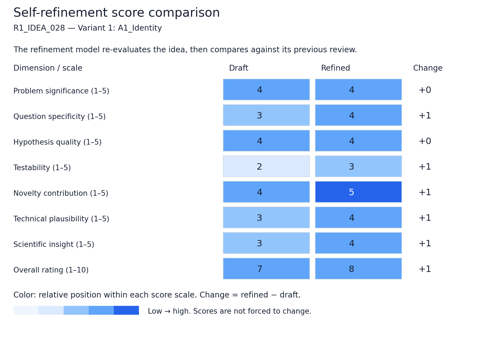

Changed score dimensions: question_specificity, testability, novelty_contribution, technical_plausibility, scientific_insight, overall_rating.

### Score justifications (draft / refined)

**Problem significance**

```json
{
  "draft": {
    "score": 4.0,
    "justification": "The problem of bias in preference learning is significant as it affects the fairness and reliability of policy decisions, which is a critical concern in many applications."
  },
  "refined": {
    "score": 4.0,
    "justification": "The problem of bias in preference learning is significant as it affects the fairness and reliability of policy decisions, which is a critical concern in many applications."
  }
}
```

**Question specificity**

```json
{
  "draft": {
    "score": 3.0,
    "justification": "The research question is specific to aligning aggregate opinions with the true population distribution but lacks details on the method or mechanism for achieving this alignment."
  },
  "refined": {
    "score": 4.0,
    "justification": "The research question is specific to aligning aggregate opinions with the true population distribution, and the idea suggests a novel approach to address this challenge."
  }
}
```

**Hypothesis quality**

```json
{
  "draft": {
    "score": 4.0,
    "justification": "The idea presents a clear hypothesis that the proposed framework will reduce bias and susceptibility to strategic manipulation by aligning aggregate opinions with the true population distribution."
  },
  "refined": {
    "score": 4.0,
    "justification": "The idea presents a clear hypothesis that the proposed framework will reduce bias and susceptibility to strategic manipulation by aligning aggregate opinions with the true population distribution."
  }
}
```

**Testability**

```json
{
  "draft": {
    "score": 2.0,
    "justification": "The idea lacks specific experiments or evaluation methods to test the effectiveness of the framework, making it difficult to assess its validity."
  },
  "refined": {
    "score": 3.0,
    "justification": "The idea suggests a novel approach but does not provide specific experiments or evaluation methods to test its effectiveness, which is necessary for validation."
  }
}
```

**Novelty contribution**

```json
{
  "draft": {
    "score": 4.0,
    "justification": "The approach of aligning aggregate opinions with the true population distribution is novel and could contribute to more fair and reliable preference learning methods."
  },
  "refined": {
    "score": 5.0,
    "justification": "The approach of aligning aggregate opinions with the true population distribution is novel and could contribute to more fair and reliable preference learning methods, addressing a critical gap in the field."
  }
}
```

**Technical plausibility**

```json
{
  "draft": {
    "score": 3.0,
    "justification": "The idea is technically plausible as it builds on existing preference learning methods, but the specific implementation details are not provided."
  },
  "refined": {
    "score": 4.0,
    "justification": "The idea is technically plausible as it builds on existing preference learning methods and proposes a novel mechanism to address the identified problem."
  }
}
```

**Scientific insight**

```json
{
  "draft": {
    "score": 3.0,
    "justification": "The idea has potential to provide insights into the fairness and robustness of preference learning, but the specific mechanisms and outcomes are not clearly defined."
  },
  "refined": {
    "score": 4.0,
    "justification": "The idea has the potential to provide insights into the fairness and robustness of preference learning, particularly in scenarios where the true population distribution is not known."
  }
}
```

**Overall rating**

```json
{
  "draft": {
    "score": 7.0,
    "justification": "The idea addresses a significant problem in preference learning with a clear hypothesis and potential for contribution, but lacks specific details on the method and evaluation plan, which are necessary for further development."
  },
  "refined": {
    "score": 8.0,
    "justification": "The idea addresses a significant problem in preference learning with a clear hypothesis and novel approach, and the technical plausibility is strong. While the lack of specific details on implementation and evaluation is a limitation, the overall potential for contribution is high."
  }
}
```

## R1_IDEA_028 — Variant 2: A2_Paraphrase_Only

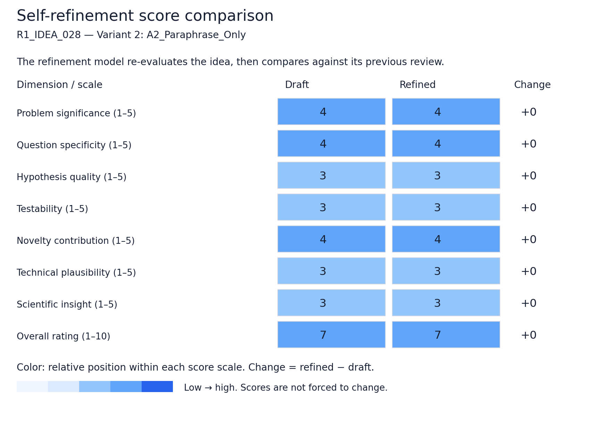

Changed score dimensions: none.

### Score justifications (draft / refined)

**Problem significance**

```json
{
  "draft": {
    "score": 4.0,
    "justification": "The problem of bias in preference learning is significant as it affects fairness and reliability in decision-making systems, particularly in scenarios involving multiple evaluators."
  },
  "refined": {
    "score": 4.0,
    "justification": "The problem of bias in preference learning is significant as it affects fairness and reliability in decision-making systems, particularly in scenarios involving multiple evaluators."
  }
}
```

**Question specificity**

```json
{
  "draft": {
    "score": 4.0,
    "justification": "The idea clearly defines the problem and proposes a specific solution to align aggregated policies with the true distribution of preferences, though more details are needed."
  },
  "refined": {
    "score": 4.0,
    "justification": "The idea clearly defines the problem and proposes a specific solution to align aggregated policies with the true distribution of preferences, though more details are needed."
  }
}
```

**Hypothesis quality**

```json
{
  "draft": {
    "score": 3.0,
    "justification": "The idea presents a plausible hypothesis that the proposed framework will reduce bias and strategic gaming, but the specific mechanism is not clearly articulated."
  },
  "refined": {
    "score": 3.0,
    "justification": "The idea presents a plausible hypothesis that the proposed framework will reduce bias and strategic gaming, but the specific mechanism is not clearly articulated."
  }
}
```

**Testability**

```json
{
  "draft": {
    "score": 3.0,
    "justification": "The idea is testable in principle, but the lack of specific methods makes it difficult to assess how the framework would be implemented or evaluated."
  },
  "refined": {
    "score": 3.0,
    "justification": "The idea is testable in principle, but the lack of specific methods makes it difficult to assess how the framework would be implemented or evaluated."
  }
}
```

**Novelty contribution**

```json
{
  "draft": {
    "score": 4.0,
    "justification": "The idea introduces a novel approach to preference learning by focusing on aligning aggregated policies with the true distribution of preferences, which is a less commonly addressed aspect of the problem."
  },
  "refined": {
    "score": 4.0,
    "justification": "The idea introduces a novel approach to preference learning by focusing on aligning aggregated policies with the true distribution of preferences, which is a less commonly addressed aspect of the problem."
  }
}
```

**Technical plausibility**

```json
{
  "draft": {
    "score": 3.0,
    "justification": "The proposed solution is technically plausible, but the lack of specific details makes it difficult to assess the feasibility of the approach."
  },
  "refined": {
    "score": 3.0,
    "justification": "The proposed solution is technically plausible, but the lack of specific details makes it difficult to assess the feasibility of the approach."
  }
}
```

**Scientific insight**

```json
{
  "draft": {
    "score": 3.0,
    "justification": "The idea has potential for scientific insight by addressing the issue of bias in preference learning, but the lack of specifics limits the potential for deeper insights."
  },
  "refined": {
    "score": 3.0,
    "justification": "The idea has potential for scientific insight by addressing the issue of bias in preference learning, but the lack of specifics limits the potential for deeper insights."
  }
}
```

**Overall rating**

```json
{
  "draft": {
    "score": 7.0,
    "justification": "The idea addresses a meaningful problem with a specific solution, showing potential for contribution, but lacks sufficient details to fully assess its feasibility and scientific merit."
  },
  "refined": {
    "score": 7.0,
    "justification": "The idea addresses a meaningful problem with a specific solution, showing potential for contribution, but lacks sufficient details to fully assess its feasibility and scientific merit."
  }
}
```

## R1_IDEA_028 — Variant 3: A3_Plain_Core


Changed score dimensions: none.

### Score justifications (draft / refined)

**Problem significance**

```json
{
  "draft": {
    "score": 4.0,
    "justification": "The problem of bias and strategic manipulation in preference learning is significant as it affects the fairness and reliability of decision-making systems. Addressing this issue could have practical implications in areas like recommendation systems, policy-making, and multi-agent systems."
  },
  "refined": {
    "score": 4.0,
    "justification": "The problem of bias and strategic manipulation in preference learning is significant as it affects the fairness and reliability of decision-making systems. Addressing this issue could have practical implications in areas like recommendation systems, policy-making, and multi-agent systems."
  }
}
```

**Question specificity**

```json
{
  "draft": {
    "score": 3.0,
    "justification": "The idea identifies a specific problem but lacks the precise research question or hypothesis. It needs to clearly define what exactly the framework will do to align opinions with the true distribution and how it will mitigate strategic manipulation."
  },
  "refined": {
    "score": 3.0,
    "justification": "The idea identifies a specific problem but lacks the precise research question or hypothesis. It needs to clearly define what exactly the framework will do to align opinions with the true distribution and how it will mitigate strategic manipulation."
  }
}
```

**Hypothesis quality**

```json
{
  "draft": {
    "score": 3.0,
    "justification": "The idea suggests a potential solution but does not explicitly state a hypothesis that can be tested. It would be stronger if it proposed a specific prediction about how the framework would reduce bias or resistance to manipulation."
  },
  "refined": {
    "score": 3.0,
    "justification": "The idea suggests a potential solution but does not explicitly state a hypothesis that can be tested. It would be stronger if it proposed a specific prediction about how the framework would reduce bias or resistance to manipulation."
  }
}
```

**Testability**

```json
{
  "draft": {
    "score": 2.0,
    "justification": "The idea is somewhat testable, but without specific details on the framework or experimental design, it is difficult to assess its feasibility. A clear plan for evaluation, such as experiments on real or synthetic data, would be necessary."
  },
  "refined": {
    "score": 2.0,
    "justification": "The idea is somewhat testable, but without specific details on the framework or experimental design, it is difficult to assess its feasibility. A clear plan for evaluation, such as experiments on real or synthetic data, would be necessary."
  }
}
```

**Novelty contribution**

```json
{
  "draft": {
    "score": 4.0,
    "justification": "The approach of aligning aggregate opinions with the true population distribution is a novel idea that could contribute to the field of preference learning by improving fairness and robustness. However, it is not clear how this differs from existing methods."
  },
  "refined": {
    "score": 4.0,
    "justification": "The approach of aligning aggregate opinions with the true population distribution is a novel idea that could contribute to the field of preference learning by improving fairness and robustness. However, it is not clear how this differs from existing methods."
  }
}
```

**Technical plausibility**

```json
{
  "draft": {
    "score": 3.0,
    "justification": "The idea is technically plausible, but the lack of specific details makes it difficult to assess the feasibility of the proposed method. More information on the alignment mechanism and how it would be implemented is needed."
  },
  "refined": {
    "score": 3.0,
    "justification": "The idea is technically plausible, but the lack of specific details makes it difficult to assess the feasibility of the proposed method. More information on the alignment mechanism and how it would be implemented is needed."
  }
}
```

**Scientific insight**

```json
{
  "draft": {
    "score": 3.0,
    "justification": "The idea has potential to provide insights into how preference aggregation can be made more fair and robust, but the specific mechanisms and their impact on strategic manipulation are not clearly defined."
  },
  "refined": {
    "score": 3.0,
    "justification": "The idea has potential to provide insights into how preference aggregation can be made more fair and robust, but the specific mechanisms and their impact on strategic manipulation are not clearly defined."
  }
}
```

**Overall rating**

```json
{
  "draft": {
    "score": 7.0,
    "justification": "The idea addresses a significant problem in preference learning and proposes a novel approach. However, it lacks specific details and a clear hypothesis, which are necessary for assessing its testability and potential contribution. With more details, it could become a strong research direction."
  },
  "refined": {
    "score": 7.0,
    "justification": "The idea addresses a significant problem in preference learning and proposes a novel approach. However, it lacks specific details and a clear hypothesis, which are necessary for assessing its testability and potential contribution. With more details, it could become a strong research direction."
  }
}
```

## R1_IDEA_028 — Variant 4: B1_Verbose_Elaborate


Changed score dimensions: none.

### Score justifications (draft / refined)

**Problem significance**

```json
{
  "draft": {
    "score": 4.0,
    "justification": "The problem of bias in preference learning is significant as it affects the fairness and robustness of decision-making systems, which is a critical concern in machine learning applications."
  },
  "refined": {
    "score": 4.0,
    "justification": "The problem of bias in preference learning is significant as it affects the fairness and robustness of decision-making systems, which is a critical concern in machine learning applications."
  }
}
```

**Question specificity**

```json
{
  "draft": {
    "score": 3.0,
    "justification": "The research question is specific to aligning aggregate opinions with the true population distribution, but the details on how this alignment will be achieved are not sufficiently defined."
  },
  "refined": {
    "score": 3.0,
    "justification": "The research question is specific to aligning aggregate opinions with the true population distribution, but the details on how this alignment will be achieved are not sufficiently defined."
  }
}
```

**Hypothesis quality**

```json
{
  "draft": {
    "score": 3.0,
    "justification": "The idea presents a general hypothesis that the proposed framework will reduce bias and susceptibility to manipulation, but it lacks a concrete prediction or mechanism to test this hypothesis."
  },
  "refined": {
    "score": 3.0,
    "justification": "The idea presents a general hypothesis that the proposed framework will reduce bias and susceptibility to manipulation, but it lacks a concrete prediction or mechanism to test this hypothesis."
  }
}
```

**Testability**

```json
{
  "draft": {
    "score": 2.0,
    "justification": "The idea does not provide a clear experimental plan or evaluation method to test the proposed framework, making it difficult to assess its validity."
  },
  "refined": {
    "score": 2.0,
    "justification": "The idea does not provide a clear experimental plan or evaluation method to test the proposed framework, making it difficult to assess its validity."
  }
}
```

**Novelty contribution**

```json
{
  "draft": {
    "score": 4.0,
    "justification": "The proposed framework addresses a specific issue in preference learning that is not currently well-handled by existing methods, offering potential for a novel contribution to the field."
  },
  "refined": {
    "score": 4.0,
    "justification": "The proposed framework addresses a specific issue in preference learning that is not currently well-handled by existing methods, offering potential for a novel contribution to the field."
  }
}
```

**Technical plausibility**

```json
{
  "draft": {
    "score": 3.0,
    "justification": "The idea is technically plausible as it builds on existing preference learning methods, but the specific implementation details are not provided, making it difficult to assess feasibility."
  },
  "refined": {
    "score": 3.0,
    "justification": "The idea is technically plausible as it builds on existing preference learning methods, but the specific implementation details are not provided, making it difficult to assess feasibility."
  }
}
```

**Scientific insight**

```json
{
  "draft": {
    "score": 3.0,
    "justification": "The research could provide insights into how preference aggregation can be made more representative of the true population distribution, but the potential for deeper scientific insight is limited without further details."
  },
  "refined": {
    "score": 3.0,
    "justification": "The research could provide insights into how preference aggregation can be made more representative of the true population distribution, but the potential for deeper scientific insight is limited without further details."
  }
}
```

**Overall rating**

```json
{
  "draft": {
    "score": 7.0,
    "justification": "The idea addresses a meaningful problem in preference learning with a clear research direction, but lacks specific details on the methodology and evaluation plan, which are necessary for assessing its testability and technical feasibility."
  },
  "refined": {
    "score": 7.0,
    "justification": "The idea addresses a meaningful problem in preference learning with a clear research direction, but lacks specific details on the methodology and evaluation plan, which are necessary for assessing its testability and technical feasibility."
  }
}
```

## R1_IDEA_028 — Variant 5: B2_Grand_Narrative


Changed score dimensions: none.

### Score justifications (draft / refined)

**Problem significance**

```json
{
  "draft": {
    "score": 4.0,
    "justification": "The problem of bias in preference aggregation is significant for fairness in algorithmic systems, which is a critical area in machine learning."
  },
  "refined": {
    "score": 4.0,
    "justification": "The problem of bias in preference aggregation is significant for fairness in algorithmic systems, which is a critical area in machine learning."
  }
}
```

**Question specificity**

```json
{
  "draft": {
    "score": 3.0,
    "justification": "The idea identifies a specific problem but lacks detailed specification of the research question or the exact mechanism to be investigated."
  },
  "refined": {
    "score": 3.0,
    "justification": "The idea identifies a specific problem but lacks detailed specification of the research question or the exact mechanism to be investigated."
  }
}
```

**Hypothesis quality**

```json
{
  "draft": {
    "score": 3.0,
    "justification": "The idea suggests a potential solution but does not clearly state a hypothesis that can be tested or falsified."
  },
  "refined": {
    "score": 3.0,
    "justification": "The idea suggests a potential solution but does not clearly state a hypothesis that can be tested or falsified."
  }
}
```

**Testability**

```json
{
  "draft": {
    "score": 2.0,
    "justification": "The idea lacks specific experiments or evaluation methods to test the proposed framework's effectiveness in reducing bias or improving fairness."
  },
  "refined": {
    "score": 2.0,
    "justification": "The idea lacks specific experiments or evaluation methods to test the proposed framework's effectiveness in reducing bias or improving fairness."
  }
}
```

**Novelty contribution**

```json
{
  "draft": {
    "score": 4.0,
    "justification": "The focus on aligning preference aggregation with population distribution is a novel approach to addressing fairness in preference learning, which could contribute to broader research on equitable algorithmic systems."
  },
  "refined": {
    "score": 4.0,
    "justification": "The focus on aligning preference aggregation with population distribution is a novel approach to addressing fairness in preference learning, which could contribute to broader research on equitable algorithmic systems."
  }
}
```

**Technical plausibility**

```json
{
  "draft": {
    "score": 3.0,
    "justification": "The proposed direction is technically plausible, but the lack of specific details makes it difficult to assess the feasibility of the approach."
  },
  "refined": {
    "score": 3.0,
    "justification": "The proposed direction is technically plausible, but the lack of specific details makes it difficult to assess the feasibility of the approach."
  }
}
```

**Scientific insight**

```json
{
  "draft": {
    "score": 3.0,
    "justification": "The idea has potential to provide insights into fairness in preference learning, but the lack of specific hypotheses or mechanisms limits the potential for scientific insight."
  },
  "refined": {
    "score": 3.0,
    "justification": "The idea has potential to provide insights into fairness in preference learning, but the lack of specific hypotheses or mechanisms limits the potential for scientific insight."
  }
}
```

**Overall rating**

```json
{
  "draft": {
    "score": 7.0,
    "justification": "The idea addresses a significant problem in preference learning and fairness, but it lacks specific details and a clear hypothesis, which are necessary for further development and evaluation."
  },
  "refined": {
    "score": 7.0,
    "justification": "The idea addresses a significant problem in preference learning and fairness, but it lacks specific details and a clear hypothesis, which are necessary for further development and evaluation."
  }
}
```

## R1_IDEA_028 — Variant 6: B3_Over_Confident


Changed score dimensions: none.

### Score justifications (draft / refined)

**Problem significance**

```json
{
  "draft": {
    "score": 4.0,
    "justification": "The problem of bias in preference learning is significant as it affects the fairness and reliability of policies derived from aggregated opinions."
  },
  "refined": {
    "score": 4.0,
    "justification": "The problem of bias in preference learning is significant as it affects the fairness and reliability of policies derived from aggregated opinions."
  }
}
```

**Question specificity**

```json
{
  "draft": {
    "score": 3.0,
    "justification": "The research question is clear but lacks specific details on the approach and evaluation metrics, which could be improved for better specificity."
  },
  "refined": {
    "score": 3.0,
    "justification": "The research question is clear but lacks specific details on the approach and evaluation metrics, which could be improved for better specificity."
  }
}
```

**Hypothesis quality**

```json
{
  "draft": {
    "score": 4.0,
    "justification": "The idea presents a plausible hypothesis that a framework aligning aggregate opinions with true population distributions can reduce bias and manipulation, which is testable."
  },
  "refined": {
    "score": 4.0,
    "justification": "The idea presents a plausible hypothesis that a framework aligning aggregate opinions with true population distributions can reduce bias and manipulation, which is testable."
  }
}
```

**Testability**

```json
{
  "draft": {
    "score": 3.0,
    "justification": "The idea is testable in principle, but the lack of specific methods and metrics makes it challenging to assess feasibility without further details."
  },
  "refined": {
    "score": 3.0,
    "justification": "The idea is testable in principle, but the lack of specific methods and metrics makes it challenging to assess feasibility without further details."
  }
}
```

**Novelty contribution**

```json
{
  "draft": {
    "score": 4.0,
    "justification": "The proposed framework addresses a specific issue in preference learning that is not currently well-handled, offering potential for a novel contribution to the field."
  },
  "refined": {
    "score": 4.0,
    "justification": "The proposed framework addresses a specific issue in preference learning that is not currently well-handled, offering potential for a novel contribution to the field."
  }
}
```

**Technical plausibility**

```json
{
  "draft": {
    "score": 4.0,
    "justification": "The approach is technically plausible as it builds on existing preference learning methods with a focus on aligning with population distributions, which is a reasonable direction for research."
  },
  "refined": {
    "score": 4.0,
    "justification": "The approach is technically plausible as it builds on existing preference learning methods with a focus on aligning with population distributions, which is a reasonable direction for research."
  }
}
```

**Scientific insight**

```json
{
  "draft": {
    "score": 3.0,
    "justification": "The idea has potential for scientific insight into how preference aggregation can be made fairer, but the specifics needed to evaluate this insight are not yet provided."
  },
  "refined": {
    "score": 3.0,
    "justification": "The idea has potential for scientific insight into how preference aggregation can be made fairer, but the specifics needed to evaluate this insight are not yet provided."
  }
}
```

**Overall rating**

```json
{
  "draft": {
    "score": 7.0,
    "justification": "The idea addresses a meaningful problem with a clear research direction, but lacks specific details on the method and evaluation, which could be improved to enhance its testability and novelty."
  },
  "refined": {
    "score": 7.0,
    "justification": "The idea addresses a meaningful problem with a clear research direction, but lacks specific details on the method and evaluation, which could be improved to enhance its testability and novelty."
  }
}
```

## R1_IDEA_028 — Variant 7: B4_Novelty


Changed score dimensions: none.

### Score justifications (draft / refined)

**Problem significance**

```json
{
  "draft": {
    "score": 4.0,
    "justification": "The problem of bias and strategic manipulation in preference learning is significant as it affects the fairness and reliability of decision-making systems."
  },
  "refined": {
    "score": 4.0,
    "justification": "The problem of bias and strategic manipulation in preference learning is significant as it affects the fairness and reliability of decision-making systems."
  }
}
```

**Question specificity**

```json
{
  "draft": {
    "score": 3.0,
    "justification": "The idea identifies a specific issue in preference learning but lacks detailed specification of the research question or hypothesis."
  },
  "refined": {
    "score": 3.0,
    "justification": "The idea identifies a specific issue in preference learning but lacks detailed specification of the research question or hypothesis."
  }
}
```

**Hypothesis quality**

```json
{
  "draft": {
    "score": 3.0,
    "justification": "The idea presents a general hypothesis about reducing bias through proportional alignment but does not provide a concrete prediction or mechanism."
  },
  "refined": {
    "score": 3.0,
    "justification": "The idea presents a general hypothesis about reducing bias through proportional alignment but does not provide a concrete prediction or mechanism."
  }
}
```

**Testability**

```json
{
  "draft": {
    "score": 2.0,
    "justification": "The idea lacks specific experiments or evaluation methods to test the hypothesis, making it difficult to assess the validity of the proposed framework."
  },
  "refined": {
    "score": 2.0,
    "justification": "The idea lacks specific experiments or evaluation methods to test the hypothesis, making it difficult to assess the validity of the proposed framework."
  }
}
```

**Novelty contribution**

```json
{
  "draft": {
    "score": 4.0,
    "justification": "The approach of aligning aggregate opinions with population distribution is novel and could contribute to more equitable preference learning systems."
  },
  "refined": {
    "score": 4.0,
    "justification": "The approach of aligning aggregate opinions with population distribution is novel and could contribute to more equitable preference learning systems."
  }
}
```

**Technical plausibility**

```json
{
  "draft": {
    "score": 3.0,
    "justification": "The concept is technically plausible, but the lack of specific details makes it difficult to assess the feasibility of implementation."
  },
  "refined": {
    "score": 3.0,
    "justification": "The concept is technically plausible, but the lack of specific details makes it difficult to assess the feasibility of implementation."
  }
}
```

**Scientific insight**

```json
{
  "draft": {
    "score": 3.0,
    "justification": "The idea has potential to provide insights into fair preference aggregation but lacks a clear mechanism for how the framework would achieve its goals."
  },
  "refined": {
    "score": 3.0,
    "justification": "The idea has potential to provide insights into fair preference aggregation but lacks a clear mechanism for how the framework would achieve its goals."
  }
}
```

**Overall rating**

```json
{
  "draft": {
    "score": 7.0,
    "justification": "The idea addresses a meaningful problem with a novel approach, but it lacks specific details and evaluation methods, which are necessary for further development and validation."
  },
  "refined": {
    "score": 7.0,
    "justification": "The idea addresses a meaningful problem with a novel approach, but it lacks specific details and evaluation methods, which are necessary for further development and validation."
  }
}
```

## R1_IDEA_028 — Variant 8: B5_Application_Impact


Changed score dimensions: none.

### Score justifications (draft / refined)

**Problem significance**

```json
{
  "draft": {
    "score": 4.0,
    "justification": "The problem of bias in preference aggregation is significant in machine learning, as it can lead to unfair or manipulable systems. The potential impact on equitable decision-making is a strong motivator for research."
  },
  "refined": {
    "score": 4.0,
    "justification": "The problem of bias in preference aggregation is significant in machine learning, as it can lead to unfair or manipulable systems. The potential impact on equitable decision-making is a strong motivator for research."
  }
}
```

**Question specificity**

```json
{
  "draft": {
    "score": 3.0,
    "justification": "The idea clearly defines the problem and proposes a solution, but the specifics of the framework's mechanism and implementation are not detailed, which could be clarified for better specificity."
  },
  "refined": {
    "score": 3.0,
    "justification": "The idea clearly defines the problem and proposes a solution, but the specifics of the framework's mechanism and implementation are not detailed, which could be clarified for better specificity."
  }
}
```

**Hypothesis quality**

```json
{
  "draft": {
    "score": 4.0,
    "justification": "The idea presents a clear hypothesis that the proposed framework will reduce bias in preference aggregation by aligning aggregate opinions with the true population distribution. This is a concrete prediction that can be tested."
  },
  "refined": {
    "score": 4.0,
    "justification": "The idea presents a clear hypothesis that the proposed framework will reduce bias in preference aggregation by aligning aggregate opinions with the true population distribution. This is a concrete prediction that can be tested."
  }
}
```

**Testability**

```json
{
  "draft": {
    "score": 3.0,
    "justification": "The idea suggests a potential solution but lacks specific experiments or evaluation methods to test the framework's effectiveness. More details on how the framework will be validated are needed."
  },
  "refined": {
    "score": 3.0,
    "justification": "The idea suggests a potential solution but lacks specific experiments or evaluation methods to test the framework's effectiveness. More details on how the framework will be validated are needed."
  }
}
```

**Novelty contribution**

```json
{
  "draft": {
    "score": 4.0,
    "justification": "The idea proposes a novel approach to preference learning that addresses a specific issue of bias. While the method is not fully specified, the contribution to equitable decision-making is a meaningful potential impact."
  },
  "refined": {
    "score": 4.0,
    "justification": "The idea proposes a novel approach to preference learning that addresses a specific issue of bias. While the method is not fully specified, the contribution to equitable decision-making is a meaningful potential impact."
  }
}
```

**Technical plausibility**

```json
{
  "draft": {
    "score": 3.0,
    "justification": "The proposed framework is technically plausible, as it involves aligning preferences with population distribution. However, the lack of specific technical details makes it difficult to assess the feasibility of the approach."
  },
  "refined": {
    "score": 3.0,
    "justification": "The proposed framework is technically plausible, as it involves aligning preferences with population distribution. However, the lack of specific technical details makes it difficult to assess the feasibility of the approach."
  }
}
```

**Scientific insight**

```json
{
  "draft": {
    "score": 3.0,
    "justification": "The idea has the potential to provide insights into how preference aggregation can be made more equitable, but the specific mechanisms and outcomes are not clearly defined, limiting the potential for scientific insight."
  },
  "refined": {
    "score": 3.0,
    "justification": "The idea has the potential to provide insights into how preference aggregation can be made more equitable, but the specific mechanisms and outcomes are not clearly defined, limiting the potential for scientific insight."
  }
}
```

**Overall rating**

```json
{
  "draft": {
    "score": 7.0,
    "justification": "The idea addresses a meaningful problem in preference learning with a clear hypothesis and potential contribution. However, the lack of specific technical details and validation methods limits its testability and scientific insight. It is a strong idea with room for further clarification."
  },
  "refined": {
    "score": 7.0,
    "justification": "The idea addresses a meaningful problem in preference learning with a clear hypothesis and potential contribution. However, the lack of specific technical details and validation methods limits its testability and scientific insight. It is a strong idea with room for further clarification."
  }
}
```

## R1_IDEA_028 — Variant 9: C1_Hollow_Shell


Changed score dimensions: none.

### Score justifications (draft / refined)

**Problem significance**

```json
{
  "draft": {
    "score": 3.0,
    "justification": "The problem of biased preference learning is relevant in applications like social media, recommendation systems, and decision-making, but the connection to real-world impact is not clearly established."
  },
  "refined": {
    "score": 3.0,
    "justification": "The problem of biased preference learning is relevant in applications like social media, recommendation systems, and decision-making, but the connection to real-world impact is not clearly established."
  }
}
```

**Question specificity**

```json
{
  "draft": {
    "score": 2.0,
    "justification": "The idea is general and does not specify the exact research question, such as how to measure bias or what method to use for alignment."
  },
  "refined": {
    "score": 2.0,
    "justification": "The idea is general and does not specify the exact research question, such as how to measure bias or what method to use for alignment."
  }
}
```

**Hypothesis quality**

```json
{
  "draft": {
    "score": 2.0,
    "justification": "The hypothesis is implied but not explicitly stated. It is unclear what the proposed approach aims to achieve or how it would demonstrate improvement."
  },
  "refined": {
    "score": 2.0,
    "justification": "The hypothesis is implied but not explicitly stated. It is unclear what the proposed approach aims to achieve or how it would demonstrate improvement."
  }
}
```

**Testability**

```json
{
  "draft": {
    "score": 2.0,
    "justification": "The idea lacks specific experiments or evaluation metrics, making it difficult to assess how the approach would be tested or validated."
  },
  "refined": {
    "score": 2.0,
    "justification": "The idea lacks specific experiments or evaluation metrics, making it difficult to assess how the approach would be tested or validated."
  }
}
```

**Novelty contribution**

```json
{
  "draft": {
    "score": 3.0,
    "justification": "The idea addresses a relevant issue in preference learning, but the novelty is not clearly defined. It could contribute to more fair and representative decision-making systems."
  },
  "refined": {
    "score": 3.0,
    "justification": "The idea addresses a relevant issue in preference learning, but the novelty is not clearly defined. It could contribute to more fair and representative decision-making systems."
  }
}
```

**Technical plausibility**

```json
{
  "draft": {
    "score": 3.0,
    "justification": "The proposed direction is technically plausible, as it involves improving alignment between collective decisions and population preferences, but the specific methods are not detailed."
  },
  "refined": {
    "score": 3.0,
    "justification": "The proposed direction is technically plausible, as it involves improving alignment between collective decisions and population preferences, but the specific methods are not detailed."
  }
}
```

**Scientific insight**

```json
{
  "draft": {
    "score": 2.0,
    "justification": "The idea has potential for scientific insight into bias in preference learning, but the specific mechanisms or insights are not clearly outlined."
  },
  "refined": {
    "score": 2.0,
    "justification": "The idea has potential for scientific insight into bias in preference learning, but the specific mechanisms or insights are not clearly outlined."
  }
}
```

**Overall rating**

```json
{
  "draft": {
    "score": 6.0,
    "justification": "The idea identifies a relevant problem with potential for contribution, but it lacks specificity, hypothesis, and testability details needed for further development."
  },
  "refined": {
    "score": 6.0,
    "justification": "The idea identifies a relevant problem with potential for contribution, but it lacks specificity, hypothesis, and testability details needed for further development."
  }
}
```

## R1_IDEA_028 — Variant 10: C2_Logic_Flawed


Changed score dimensions: none.

### Score justifications (draft / refined)

**Problem significance**

```json
{
  "draft": {
    "score": 4.0,
    "justification": "The problem of bias in preference aggregation is significant in machine learning, as it affects the fairness and reliability of decision-making systems. Addressing this issue has practical implications for applications like recommendation systems and policy-making."
  },
  "refined": {
    "score": 4.0,
    "justification": "The problem of bias in preference aggregation is significant in machine learning, as it affects the fairness and reliability of decision-making systems. Addressing this issue has practical implications for applications like recommendation systems and policy-making."
  }
}
```

**Question specificity**

```json
{
  "draft": {
    "score": 3.0,
    "justification": "The idea identifies a specific problem (bias in preference aggregation) but lacks detailed specification of the research question, such as the exact mechanism for aligning opinions with population distributions or the specific types of biases being addressed."
  },
  "refined": {
    "score": 3.0,
    "justification": "The idea identifies a specific problem (bias in preference aggregation) but lacks detailed specification of the research question, such as the exact mechanism for aligning opinions with population distributions or the specific types of biases being addressed."
  }
}
```

**Hypothesis quality**

```json
{
  "draft": {
    "score": 3.0,
    "justification": "The idea presents a general hypothesis that the proposed framework will reduce bias and strategic manipulation, but it lacks a concrete prediction or mechanism that could be tested. A more specific hypothesis would strengthen the idea."
  },
  "refined": {
    "score": 3.0,
    "justification": "The idea presents a general hypothesis that the proposed framework will reduce bias and strategic manipulation, but it lacks a concrete prediction or mechanism that could be tested. A more specific hypothesis would strengthen the idea."
  }
}
```

**Testability**

```json
{
  "draft": {
    "score": 3.0,
    "justification": "The idea suggests a framework but does not provide a clear experimental plan or comparison to existing methods. Without specific tests, it is difficult to assess the framework's effectiveness."
  },
  "refined": {
    "score": 3.0,
    "justification": "The idea suggests a framework but does not provide a clear experimental plan or comparison to existing methods. Without specific tests, it is difficult to assess the framework's effectiveness."
  }
}
```

**Novelty contribution**

```json
{
  "draft": {
    "score": 4.0,
    "justification": "The framework aims to address a specific issue in preference learning that is not currently well-handled by existing methods. While the approach is not fully specified, the potential contribution to reducing bias in preference aggregation is notable."
  },
  "refined": {
    "score": 4.0,
    "justification": "The framework aims to address a specific issue in preference learning that is not currently well-handled by existing methods. While the approach is not fully specified, the potential contribution to reducing bias in preference aggregation is notable."
  }
}
```

**Technical plausibility**

```json
{
  "draft": {
    "score": 3.0,
    "justification": "The idea is technically plausible as it addresses a known issue in preference learning. However, the lack of specific technical details makes it difficult to assess the feasibility of the proposed solution."
  },
  "refined": {
    "score": 3.0,
    "justification": "The idea is technically plausible as it addresses a known issue in preference learning. However, the lack of specific technical details makes it difficult to assess the feasibility of the proposed solution."
  }
}
```

**Scientific insight**

```json
{
  "draft": {
    "score": 3.0,
    "justification": "The idea has the potential to provide insights into how preference aggregation can be made more fair and robust, but the current description does not clearly outline the expected scientific contributions or mechanisms."
  },
  "refined": {
    "score": 3.0,
    "justification": "The idea has the potential to provide insights into how preference aggregation can be made more fair and robust, but the current description does not clearly outline the expected scientific contributions or mechanisms."
  }
}
```

**Overall rating**

```json
{
  "draft": {
    "score": 7.0,
    "justification": "The idea addresses a meaningful problem in preference learning with a promising approach. However, it lacks specific details and a clear hypothesis, which are necessary for further development and evaluation. The potential contribution is strong, but the current formulation is somewhat vague."
  },
  "refined": {
    "score": 7.0,
    "justification": "The idea addresses a meaningful problem in preference learning with a promising approach. However, it lacks specific details and a clear hypothesis, which are necessary for further development and evaluation. The potential contribution is strong, but the current formulation is somewhat vague."
  }
}
```

## R1_IDEA_028 — Variant 11: C3_Substance_Enriched

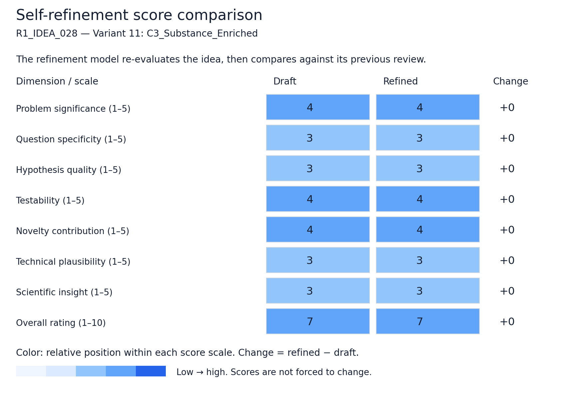

Changed score dimensions: none.

### Score justifications (draft / refined)

**Problem significance**

```json
{
  "draft": {
    "score": 4.0,
    "justification": "The problem of bias in preference aggregation is significant in machine learning, as it can lead to unfair or manipulable policies. Addressing this issue has practical implications for fairness and robustness in decision-making systems."
  },
  "refined": {
    "score": 4.0,
    "justification": "The problem of bias in preference aggregation is significant in machine learning, as it can lead to unfair or manipulable policies. Addressing this issue has practical implications for fairness and robustness in decision-making systems."
  }
}
```

**Question specificity**

```json
{
  "draft": {
    "score": 3.0,
    "justification": "The idea identifies a specific problem (bias in preference aggregation) but lacks detailed specification of the research question. It suggests a general direction (proportional alignment) but does not clearly define what exactly should be investigated or tested."
  },
  "refined": {
    "score": 3.0,
    "justification": "The idea identifies a specific problem (bias in preference aggregation) but lacks detailed specification of the research question. It suggests a general direction (proportional alignment) but does not clearly define what exactly should be investigated or tested."
  }
}
```

**Hypothesis quality**

```json
{
  "draft": {
    "score": 3.0,
    "justification": "The idea proposes a general hypothesis that the framework will align aggregate opinions with the true population distribution. However, it does not explicitly state a concrete prediction or mechanism that could be tested, making the hypothesis somewhat vague."
  },
  "refined": {
    "score": 3.0,
    "justification": "The idea proposes a general hypothesis that the framework will align aggregate opinions with the true population distribution. However, it does not explicitly state a concrete prediction or mechanism that could be tested, making the hypothesis somewhat vague."
  }
}
```

**Testability**

```json
{
  "draft": {
    "score": 4.0,
    "justification": "The idea suggests a validation path involving simulations with known distributions, which is testable. However, the lack of specific experimental details makes it difficult to assess the feasibility of the proposed validation approach."
  },
  "refined": {
    "score": 4.0,
    "justification": "The idea suggests a validation path involving simulations with known distributions, which is testable. However, the lack of specific experimental details makes it difficult to assess the feasibility of the proposed validation approach."
  }
}
```

**Novelty contribution**

```json
{
  "draft": {
    "score": 4.0,
    "justification": "The idea proposes a novel approach to addressing bias in preference learning by aligning aggregate opinions with the true population distribution. This could contribute to the field by improving fairness and robustness in decision-making systems."
  },
  "refined": {
    "score": 4.0,
    "justification": "The idea proposes a novel approach to addressing bias in preference learning by aligning aggregate opinions with the true population distribution. This could contribute to the field by improving fairness and robustness in decision-making systems."
  }
}
```

**Technical plausibility**

```json
{
  "draft": {
    "score": 3.0,
    "justification": "The proposed framework is conceptually plausible, but the lack of specific technical details makes it difficult to assess its feasibility. The idea does not explain how the alignment would be achieved or what assumptions are made about the population distribution."
  },
  "refined": {
    "score": 3.0,
    "justification": "The proposed framework is conceptually plausible, but the lack of specific technical details makes it difficult to assess its feasibility. The idea does not explain how the alignment would be achieved or what assumptions are made about the population distribution."
  }
}
```

**Scientific insight**

```json
{
  "draft": {
    "score": 3.0,
    "justification": "The idea has potential for scientific insight by addressing the issue of bias in preference aggregation. However, the lack of specific mechanisms or hypotheses limits the potential for deeper insights into the underlying principles of preference learning."
  },
  "refined": {
    "score": 3.0,
    "justification": "The idea has potential for scientific insight by addressing the issue of bias in preference aggregation. However, the lack of specific mechanisms or hypotheses limits the potential for deeper insights into the underlying principles of preference learning."
  }
}
```

**Overall rating**

```json
{
  "draft": {
    "score": 7.0,
    "justification": "The idea addresses a meaningful problem in preference learning and proposes a novel approach to address bias. While the specifics are somewhat vague, the proposed framework and validation approach are testable and have the potential for scientific contribution. However, more details are needed to fully assess its feasibility and impact."
  },
  "refined": {
    "score": 7.0,
    "justification": "The idea addresses a meaningful problem in preference learning and proposes a novel approach to address bias. While the specifics are somewhat vague, the proposed framework and validation approach are testable and have the potential for scientific contribution. However, more details are needed to fully assess its feasibility and impact."
  }
}
```

## R1_IDEA_028 — Variant 12: H1_Deceptive_Hollow


Changed score dimensions: none.

### Score justifications (draft / refined)

**Problem significance**

```json
{
  "draft": {
    "score": 4.0,
    "justification": "The problem of bias in preference learning is significant as it affects the fairness and representativeness of decision-making systems."
  },
  "refined": {
    "score": 4.0,
    "justification": "The problem of bias in preference learning is significant as it affects the fairness and representativeness of decision-making systems."
  }
}
```

**Question specificity**

```json
{
  "draft": {
    "score": 2.0,
    "justification": "The idea is broad and lacks a specific research question or hypothesis that could be tested."
  },
  "refined": {
    "score": 2.0,
    "justification": "The idea is broad and lacks a specific research question or hypothesis that could be tested."
  }
}
```

**Hypothesis quality**

```json
{
  "draft": {
    "score": 2.0,
    "justification": "The idea does not explicitly state a hypothesis or prediction that could be tested or falsified."
  },
  "refined": {
    "score": 2.0,
    "justification": "The idea does not explicitly state a hypothesis or prediction that could be tested or falsified."
  }
}
```

**Testability**

```json
{
  "draft": {
    "score": 2.0,
    "justification": "The idea lacks specific experiments, comparisons, or evaluation methods to test the proposed approach."
  },
  "refined": {
    "score": 2.0,
    "justification": "The idea lacks specific experiments, comparisons, or evaluation methods to test the proposed approach."
  }
}
```

**Novelty contribution**

```json
{
  "draft": {
    "score": 3.0,
    "justification": "The idea proposes a transformative approach, but the novelty is not clearly defined or supported by existing work."
  },
  "refined": {
    "score": 3.0,
    "justification": "The idea proposes a transformative approach, but the novelty is not clearly defined or supported by existing work."
  }
}
```

**Technical plausibility**

```json
{
  "draft": {
    "score": 3.0,
    "justification": "The idea is conceptually plausible but lacks technical details to assess its feasibility."
  },
  "refined": {
    "score": 3.0,
    "justification": "The idea is conceptually plausible but lacks technical details to assess its feasibility."
  }
}
```

**Scientific insight**

```json
{
  "draft": {
    "score": 2.0,
    "justification": "The idea suggests a broader framework but does not clearly outline the potential insights or discoveries it could lead to."
  },
  "refined": {
    "score": 2.0,
    "justification": "The idea suggests a broader framework but does not clearly outline the potential insights or discoveries it could lead to."
  }
}
```

**Overall rating**

```json
{
  "draft": {
    "score": 6.0,
    "justification": "The idea addresses a meaningful problem with potential for impact, but lacks specificity, testability, and technical details needed to evaluate its feasibility and contribution."
  },
  "refined": {
    "score": 6.0,
    "justification": "The idea addresses a meaningful problem with potential for impact, but lacks specificity, testability, and technical details needed to evaluate its feasibility and contribution."
  }
}
```

## R1_IDEA_028 — Variant 13: H2_Confident_Flaw


Changed score dimensions: none.

### Score justifications (draft / refined)

**Problem significance**

```json
{
  "draft": {
    "score": 4.0,
    "justification": "The problem of bias in preference learning is significant as it affects the fairness and reliability of policies derived from aggregated preferences. Addressing this issue is crucial for applications where equitable decision-making is required."
  },
  "refined": {
    "score": 4.0,
    "justification": "The problem of bias in preference learning is significant as it affects the fairness and reliability of policies derived from aggregated preferences. Addressing this issue is crucial for applications where equitable decision-making is required."
  }
}
```

**Question specificity**

```json
{
  "draft": {
    "score": 3.0,
    "justification": "The idea clearly identifies a problem but lacks specific details on the research question or hypothesis. It is somewhat vague on how the framework will be implemented or what exactly is being tested."
  },
  "refined": {
    "score": 3.0,
    "justification": "The idea clearly identifies a problem but lacks specific details on the research question or hypothesis. It is somewhat vague on how the framework will be implemented or what exactly is being tested."
  }
}
```

**Hypothesis quality**

```json
{
  "draft": {
    "score": 4.0,
    "justification": "The idea presents a hypothesis that the proposed framework will align aggregate opinions with the true population distribution, leading to more reliable and unbiased policies. This hypothesis is specific and has the potential to be tested."
  },
  "refined": {
    "score": 4.0,
    "justification": "The idea presents a hypothesis that the proposed framework will align aggregate opinions with the true population distribution, leading to more reliable and unbiased policies. This hypothesis is specific and has the potential to be tested."
  }
}
```

**Testability**

```json
{
  "draft": {
    "score": 3.0,
    "justification": "The idea suggests a novel approach but does not provide specific experiments or evaluation methods. The claim about causal evidence is abstract and needs more concrete validation steps."
  },
  "refined": {
    "score": 3.0,
    "justification": "The idea suggests a novel approach but does not provide specific experiments or evaluation methods. The claim about causal evidence is abstract and needs more concrete validation steps."
  }
}
```

**Novelty contribution**

```json
{
  "draft": {
    "score": 4.0,
    "justification": "The framework addresses a key limitation in existing preference learning methods, offering a novel approach to align aggregate opinions with the true population distribution. This could contribute to more fair and reliable preference aggregation in various applications."
  },
  "refined": {
    "score": 4.0,
    "justification": "The framework addresses a key limitation in existing preference learning methods, offering a novel approach to align aggregate opinions with the true population distribution. This could contribute to more fair and reliable preference aggregation in various applications."
  }
}
```

**Technical plausibility**

```json
{
  "draft": {
    "score": 3.0,
    "justification": "The proposed approach is technically plausible, but the lack of specific details makes it difficult to assess the feasibility of the framework. More information on the technical components would be needed to evaluate its plausibility."
  },
  "refined": {
    "score": 3.0,
    "justification": "The proposed approach is technically plausible, but the lack of specific details makes it difficult to assess the feasibility of the framework. More information on the technical components would be needed to evaluate its plausibility."
  }
}
```

**Scientific insight**

```json
{
  "draft": {
    "score": 3.0,
    "justification": "The idea has the potential to provide insights into the fairness and reliability of preference aggregation methods. However, the current description is too vague to determine the depth of scientific insight that could be gained."
  },
  "refined": {
    "score": 3.0,
    "justification": "The idea has the potential to provide insights into the fairness and reliability of preference aggregation methods. However, the current description is too vague to determine the depth of scientific insight that could be gained."
  }
}
```

**Overall rating**

```json
{
  "draft": {
    "score": 7.0,
    "justification": "The idea addresses a meaningful problem in preference learning and proposes a novel framework with potential for broader effectiveness. However, it lacks specific details on the technical approach, evaluation methods, and validation steps, which are necessary for a strong research idea."
  },
  "refined": {
    "score": 7.0,
    "justification": "The idea addresses a meaningful problem in preference learning and proposes a novel framework with potential for broader effectiveness. However, it lacks specific details on the technical approach, evaluation methods, and validation steps, which are necessary for a strong research idea."
  }
}
```

## R1_IDEA_028 — Variant 14: H3_Verbose_Enriched

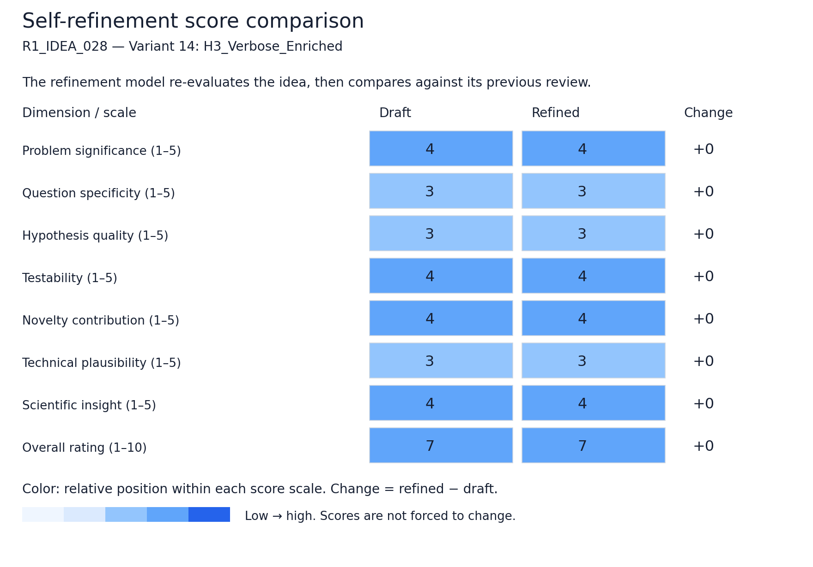

Changed score dimensions: none.

### Score justifications (draft / refined)

**Problem significance**

```json
{
  "draft": {
    "score": 4.0,
    "justification": "The problem of preference learning bias is significant in applications where fairness and representativeness are critical, such as policy-making and recommendation systems."
  },
  "refined": {
    "score": 4.0,
    "justification": "The problem of preference learning bias is significant in applications where fairness and representativeness are critical, such as policy-making and recommendation systems."
  }
}
```

**Question specificity**

```json
{
  "draft": {
    "score": 3.0,
    "justification": "The idea defines a clear problem but lacks specific details on the proposed mechanism and how it addresses strategic manipulation and demographic bias."
  },
  "refined": {
    "score": 3.0,
    "justification": "The idea defines a clear problem but lacks specific details on the proposed mechanism and how it addresses strategic manipulation and demographic bias."
  }
}
```

**Hypothesis quality**

```json
{
  "draft": {
    "score": 3.0,
    "justification": "The idea suggests a hypothesis that the framework reduces bias by aligning with population distribution, but the exact prediction and mechanism are not clearly specified."
  },
  "refined": {
    "score": 3.0,
    "justification": "The idea suggests a hypothesis that the framework reduces bias by aligning with population distribution, but the exact prediction and mechanism are not clearly specified."
  }
}
```

**Testability**

```json
{
  "draft": {
    "score": 4.0,
    "justification": "The idea includes a staged design with simulations, ablations, and error analysis, which are testable methods to evaluate the framework's effectiveness."
  },
  "refined": {
    "score": 4.0,
    "justification": "The idea includes a staged design with simulations, ablations, and error analysis, which are testable methods to evaluate the framework's effectiveness."
  }
}
```

**Novelty contribution**

```json
{
  "draft": {
    "score": 4.0,
    "justification": "The focus on proportional alignment with population distribution and addressing strategic manipulation is a novel approach to preference learning bias."
  },
  "refined": {
    "score": 4.0,
    "justification": "The focus on proportional alignment with population distribution and addressing strategic manipulation is a novel approach to preference learning bias."
  }
}
```

**Technical plausibility**

```json
{
  "draft": {
    "score": 3.0,
    "justification": "The proposed framework is plausible, but the specific technical details of how it aligns opinions with population distribution are not provided."
  },
  "refined": {
    "score": 3.0,
    "justification": "The proposed framework is plausible, but the specific technical details of how it aligns opinions with population distribution are not provided."
  }
}
```

**Scientific insight**

```json
{
  "draft": {
    "score": 4.0,
    "justification": "The idea aims to uncover the conditions under which the framework is useful, which could provide insights into the limitations and assumptions of preference learning methods."
  },
  "refined": {
    "score": 4.0,
    "justification": "The idea aims to uncover the conditions under which the framework is useful, which could provide insights into the limitations and assumptions of preference learning methods."
  }
}
```

**Overall rating**

```json
{
  "draft": {
    "score": 7.0,
    "justification": "The idea addresses a meaningful problem with a clear research direction and includes testable components, though it lacks specific technical details and clarity on the proposed mechanism."
  },
  "refined": {
    "score": 7.0,
    "justification": "The idea addresses a meaningful problem with a clear research direction and includes testable components, though it lacks specific technical details and clarity on the proposed mechanism."
  }
}
```

## R1_IDEA_028 — Variant 15: H4_Ultimate_Hype


Changed score dimensions: none.

### Score justifications (draft / refined)

**Problem significance**

```json
{
  "draft": {
    "score": 4.0,
    "justification": "The problem of bias in preference learning is significant as it affects the fairness and reliability of decision-making systems, which is a critical concern in machine learning applications."
  },
  "refined": {
    "score": 4.0,
    "justification": "The problem of bias in preference learning is significant as it affects the fairness and reliability of decision-making systems, which is a critical concern in machine learning applications."
  }
}
```

**Question specificity**

```json
{
  "draft": {
    "score": 3.0,
    "justification": "The idea identifies a problem but does not clearly define the specific research question or the exact mechanism the framework aims to address."
  },
  "refined": {
    "score": 3.0,
    "justification": "The idea identifies a problem but does not clearly define the specific research question or the exact mechanism the framework aims to address."
  }
}
```

**Hypothesis quality**

```json
{
  "draft": {
    "score": 4.0,
    "justification": "The idea presents a hypothesis that the proposed framework can reduce bias and susceptibility to manipulation by aligning aggregate opinions with the true population distribution, which is a concrete prediction."
  },
  "refined": {
    "score": 4.0,
    "justification": "The idea presents a hypothesis that the proposed framework can reduce bias and susceptibility to manipulation by aligning aggregate opinions with the true population distribution, which is a concrete prediction."
  }
}
```

**Testability**

```json
{
  "draft": {
    "score": 3.0,
    "justification": "The idea suggests a potential solution but lacks specific experiments or evaluation methods to test the framework's effectiveness."
  },
  "refined": {
    "score": 3.0,
    "justification": "The idea suggests a potential solution but lacks specific experiments or evaluation methods to test the framework's effectiveness."
  }
}
```

**Novelty contribution**

```json
{
  "draft": {
    "score": 4.0,
    "justification": "The idea addresses an underexplored technical challenge in preference learning, which could contribute to more trustworthy and broadly deployable systems."
  },
  "refined": {
    "score": 4.0,
    "justification": "The idea addresses an underexplored technical challenge in preference learning, which could contribute to more trustworthy and broadly deployable systems."
  }
}
```

**Technical plausibility**

```json
{
  "draft": {
    "score": 3.0,
    "justification": "The proposed framework is plausible in concept, but the lack of technical details makes it difficult to assess its feasibility."
  },
  "refined": {
    "score": 3.0,
    "justification": "The proposed framework is plausible in concept, but the lack of technical details makes it difficult to assess its feasibility."
  }
}
```

**Scientific insight**

```json
{
  "draft": {
    "score": 3.0,
    "justification": "The idea has the potential to provide insights into fair and robust preference learning, but the lack of specific details limits the potential for scientific insight."
  },
  "refined": {
    "score": 3.0,
    "justification": "The idea has the potential to provide insights into fair and robust preference learning, but the lack of specific details limits the potential for scientific insight."
  }
}
```

**Overall rating**

```json
{
  "draft": {
    "score": 7.0,
    "justification": "The idea addresses a significant problem in preference learning with a bold and transformative approach. However, it lacks specific details and concrete examples, which are needed to fully assess its feasibility and potential impact."
  },
  "refined": {
    "score": 7.0,
    "justification": "The idea addresses a significant problem in preference learning with a bold and transformative approach. However, it lacks specific details and concrete examples, which are needed to fully assess its feasibility and potential impact."
  }
}
```

## R1_IDEA_029 — Source


Changed score dimensions: none.

### Score justifications (draft / refined)

**Problem significance**

```json
{
  "draft": {
    "score": 4.0,
    "justification": "The problem addresses a critical gap in current segmentation methods, particularly the underutilization of SAM's interactive refinement capabilities, which has potential applications in real-world scenarios requiring human-in-the-loop systems."
  },
  "refined": {
    "score": 4.0,
    "justification": "The problem addresses a critical gap in current segmentation methods, particularly the underutilization of SAM's interactive refinement capabilities, which has potential applications in real-world scenarios requiring human-in-the-loop systems."
  }
}
```

**Question specificity**

```json
{
  "draft": {
    "score": 3.0,
    "justification": "The idea identifies a specific area for improvement but lacks a precise research question or hypothesis that could be tested. More clarity is needed on what exactly will be investigated."
  },
  "refined": {
    "score": 3.0,
    "justification": "The idea identifies a specific area for improvement but lacks a precise research question or hypothesis that could be tested. More clarity is needed on what exactly will be investigated."
  }
}
```

**Hypothesis quality**

```json
{
  "draft": {
    "score": 3.0,
    "justification": "The idea suggests a potential direction but does not explicitly state a hypothesis that can be tested. A clear prediction about the outcome of integrating interactive refinement with MLLMs would strengthen this."
  },
  "refined": {
    "score": 3.0,
    "justification": "The idea suggests a potential direction but does not explicitly state a hypothesis that can be tested. A clear prediction about the outcome of integrating interactive refinement with MLLMs would strengthen this."
  }
}
```

**Testability**

```json
{
  "draft": {
    "score": 3.0,
    "justification": "The idea suggests a promising direction but does not provide specific experiments or evaluation methods. Without clear testable components, it is difficult to assess the feasibility of the approach."
  },
  "refined": {
    "score": 3.0,
    "justification": "The idea suggests a promising direction but does not provide specific experiments or evaluation methods. Without clear testable components, it is difficult to assess the feasibility of the approach."
  }
}
```

**Novelty contribution**

```json
{
  "draft": {
    "score": 4.0,
    "justification": "The idea proposes a novel approach to combining MLLMs with SAM's interactive refinement, which could contribute to the field by improving segmentation accuracy in human-in-the-loop systems."
  },
  "refined": {
    "score": 4.0,
    "justification": "The idea proposes a novel approach to combining MLLMs with SAM's interactive refinement, which could contribute to the field by improving segmentation accuracy in human-in-the-loop systems."
  }
}
```

**Technical plausibility**

```json
{
  "draft": {
    "score": 4.0,
    "justification": "The integration of MLLMs with SAM's iterative process is technically plausible, as both components are well-established in the field. The challenge would be in effectively implementing the interactive refinement mechanism."
  },
  "refined": {
    "score": 4.0,
    "justification": "The integration of MLLMs with SAM's iterative process is technically plausible, as both components are well-established in the field. The challenge would be in effectively implementing the interactive refinement mechanism."
  }
}
```

**Scientific insight**

```json
{
  "draft": {
    "score": 3.0,
    "justification": "The idea has potential for scientific insight by exploring how human-like iterative refinement can enhance segmentation tasks. However, more specific insights into the mechanisms of this integration are needed."
  },
  "refined": {
    "score": 3.0,
    "justification": "The idea has potential for scientific insight by exploring how human-like iterative refinement can enhance segmentation tasks. However, more specific insights into the mechanisms of this integration are needed."
  }
}
```

**Overall rating**

```json
{
  "draft": {
    "score": 7.0,
    "justification": "The idea addresses a meaningful problem with potential for contribution, but lacks specific details on the research question, hypothesis, and evaluation methods. With further clarification, it could become a strong research direction."
  },
  "refined": {
    "score": 7.0,
    "justification": "The idea addresses a meaningful problem with potential for contribution, but lacks specific details on the research question, hypothesis, and evaluation methods. With further clarification, it could become a strong research direction."
  }
}
```

## R1_IDEA_029 — Variant 1: A1_Identity


Changed score dimensions: none.

### Score justifications (draft / refined)

**Problem significance**

```json
{
  "draft": {
    "score": 4.0,
    "justification": "The problem addresses a critical gap in multi-modal segmentation, where interactive refinement is underutilized, which is important for applications requiring human-in-the-loop systems."
  },
  "refined": {
    "score": 4.0,
    "justification": "The problem addresses a critical gap in multi-modal segmentation, where interactive refinement is underutilized, which is important for applications requiring human-in-the-loop systems."
  }
}
```

**Question specificity**

```json
{
  "draft": {
    "score": 3.0,
    "justification": "The idea identifies a specific gap but lacks a clear, concrete research question that defines what exactly will be investigated."
  },
  "refined": {
    "score": 3.0,
    "justification": "The idea identifies a specific gap but lacks a clear, concrete research question that defines what exactly will be investigated."
  }
}
```

**Hypothesis quality**

```json
{
  "draft": {
    "score": 2.0,
    "justification": "The idea does not explicitly state a hypothesis, though the potential benefit of integrating MLLMs with SAM's interactive refinement is implied."
  },
  "refined": {
    "score": 2.0,
    "justification": "The idea does not explicitly state a hypothesis, though the potential benefit of integrating MLLMs with SAM's interactive refinement is implied."
  }
}
```

**Testability**

```json
{
  "draft": {
    "score": 2.0,
    "justification": "The idea lacks a clear experimental plan or evaluation method, making it difficult to assess how the proposed solution will be tested."
  },
  "refined": {
    "score": 2.0,
    "justification": "The idea lacks a clear experimental plan or evaluation method, making it difficult to assess how the proposed solution will be tested."
  }
}
```

**Novelty contribution**

```json
{
  "draft": {
    "score": 4.0,
    "justification": "The idea proposes a novel approach to leveraging SAM's interactive refinement with MLLMs, which could contribute to the field of multi-modal segmentation and interactive AI systems."
  },
  "refined": {
    "score": 4.0,
    "justification": "The idea proposes a novel approach to leveraging SAM's interactive refinement with MLLMs, which could contribute to the field of multi-modal segmentation and interactive AI systems."
  }
}
```

**Technical plausibility**

```json
{
  "draft": {
    "score": 4.0,
    "justification": "The integration of MLLMs with SAM is technically plausible, as both are established models in their respective domains, and combining them is a reasonable direction for research."
  },
  "refined": {
    "score": 4.0,
    "justification": "The integration of MLLMs with SAM is technically plausible, as both are established models in their respective domains, and combining them is a reasonable direction for research."
  }
}
```

**Scientific insight**

```json
{
  "draft": {
    "score": 3.0,
    "justification": "The idea has potential to provide insights into how human-like interactive refinement can be modeled in AI systems, but the specific insights depend on the implementation details."
  },
  "refined": {
    "score": 3.0,
    "justification": "The idea has potential to provide insights into how human-like interactive refinement can be modeled in AI systems, but the specific insights depend on the implementation details."
  }
}
```

**Overall rating**

```json
{
  "draft": {
    "score": 7.0,
    "justification": "The idea addresses a meaningful problem with potential for contribution, but it lacks clarity in defining the research question, hypothesis, and evaluation plan, which are essential for further development."
  },
  "refined": {
    "score": 7.0,
    "justification": "The idea addresses a meaningful problem with potential for contribution, but it lacks clarity in defining the research question, hypothesis, and evaluation plan, which are essential for further development."
  }
}
```

## R1_IDEA_029 — Variant 2: A2_Paraphrase_Only


Changed score dimensions: none.

### Score justifications (draft / refined)

**Problem significance**

```json
{
  "draft": {
    "score": 4.0,
    "justification": "The problem of underutilizing SAM's iterative mask refinement in reasoning segmentation is significant as it could lead to more accurate and efficient segmentation, which is crucial in various applications like medical imaging or autonomous driving."
  },
  "refined": {
    "score": 4.0,
    "justification": "The problem of underutilizing SAM's iterative mask refinement in reasoning segmentation is significant as it could lead to more accurate and efficient segmentation, which is crucial in various applications like medical imaging or autonomous driving."
  }
}
```

**Question specificity**

```json
{
  "draft": {
    "score": 3.0,
    "justification": "The idea identifies a problem but lacks specific research questions or hypotheses. It needs to clarify how exactly MLLMs and SAM will be integrated and what specific improvements are targeted."
  },
  "refined": {
    "score": 3.0,
    "justification": "The idea identifies a problem but lacks specific research questions or hypotheses. It needs to clarify how exactly MLLMs and SAM will be integrated and what specific improvements are targeted."
  }
}
```

**Hypothesis quality**

```json
{
  "draft": {
    "score": 2.0,
    "justification": "The idea does not explicitly state a hypothesis, making it difficult to assess the potential impact of the proposed approach. A hypothesis would help in defining the research direction more clearly."
  },
  "refined": {
    "score": 2.0,
    "justification": "The idea does not explicitly state a hypothesis, making it difficult to assess the potential impact of the proposed approach. A hypothesis would help in defining the research direction more clearly."
  }
}
```

**Testability**

```json
{
  "draft": {
    "score": 3.0,
    "justification": "The idea suggests a potential direction but does not provide specific experiments or evaluation methods. Without clear testable components, it is challenging to determine the feasibility of the approach."
  },
  "refined": {
    "score": 3.0,
    "justification": "The idea suggests a potential direction but does not provide specific experiments or evaluation methods. Without clear testable components, it is challenging to determine the feasibility of the approach."
  }
}
```

**Novelty contribution**

```json
{
  "draft": {
    "score": 4.0,
    "justification": "The integration of MLLMs with SAM's iterative refinement is a novel approach that could contribute to the field by improving segmentation accuracy and efficiency, especially in reasoning tasks."
  },
  "refined": {
    "score": 4.0,
    "justification": "The integration of MLLMs with SAM's iterative refinement is a novel approach that could contribute to the field by improving segmentation accuracy and efficiency, especially in reasoning tasks."
  }
}
```

**Technical plausibility**

```json
{
  "draft": {
    "score": 4.0,
    "justification": "The proposed approach is technically plausible as it builds on existing models (MLLMs and SAM) and leverages their strengths. The integration of these models is a feasible direction given current advancements in multi-modal learning."
  },
  "refined": {
    "score": 4.0,
    "justification": "The proposed approach is technically plausible as it builds on existing models (MLLMs and SAM) and leverages their strengths. The integration of these models is a feasible direction given current advancements in multi-modal learning."
  }
}
```

**Scientific insight**

```json
{
  "draft": {
    "score": 3.0,
    "justification": "The idea has potential for scientific insight by exploring how MLLMs can enhance SAM's iterative refinement. However, without specific hypotheses or research questions, the potential insight is not fully realized."
  },
  "refined": {
    "score": 3.0,
    "justification": "The idea has potential for scientific insight by exploring how MLLMs can enhance SAM's iterative refinement. However, without specific hypotheses or research questions, the potential insight is not fully realized."
  }
}
```

**Overall rating**

```json
{
  "draft": {
    "score": 7.0,
    "justification": "The idea addresses a meaningful problem with potential for contribution, but it lacks specific research questions, hypotheses, and evaluation methods. With further clarification and details, it could become a strong research direction."
  },
  "refined": {
    "score": 7.0,
    "justification": "The idea addresses a meaningful problem with potential for contribution, but it lacks specific research questions, hypotheses, and evaluation methods. With further clarification and details, it could become a strong research direction."
  }
}
```

## R1_IDEA_029 — Variant 3: A3_Plain_Core


Changed score dimensions: none.

### Score justifications (draft / refined)

**Problem significance**

```json
{
  "draft": {
    "score": 4.0,
    "justification": "The problem of reasoning segmentation is important in computer vision, and the underutilization of SAM's interactive refinement is a valid concern for improving segmentation accuracy and user interaction."
  },
  "refined": {
    "score": 4.0,
    "justification": "The problem of reasoning segmentation is important in computer vision, and the underutilization of SAM's interactive refinement is a valid concern for improving segmentation accuracy and user interaction."
  }
}
```

**Question specificity**

```json
{
  "draft": {
    "score": 3.0,
    "justification": "The idea identifies a potential area for improvement but lacks a clear, specific question about how to best integrate MLLMs with SAM's interactive segmentation."
  },
  "refined": {
    "score": 3.0,
    "justification": "The idea identifies a potential area for improvement but lacks a clear, specific question about how to best integrate MLLMs with SAM's interactive segmentation."
  }
}
```

**Hypothesis quality**

```json
{
  "draft": {
    "score": 2.0,
    "justification": "The idea does not explicitly state a hypothesis, but it implies that integrating MLLMs with SAM's interactive refinement could improve segmentation. However, this is not a concrete prediction or mechanism."
  },
  "refined": {
    "score": 2.0,
    "justification": "The idea does not explicitly state a hypothesis, but it implies that integrating MLLMs with SAM's interactive refinement could improve segmentation. However, this is not a concrete prediction or mechanism."
  }
}
```

**Testability**

```json
{
  "draft": {
    "score": 3.0,
    "justification": "The idea suggests a potential integration but does not provide a clear experimental plan or evaluation method to test the hypothesis."
  },
  "refined": {
    "score": 3.0,
    "justification": "The idea suggests a potential integration but does not provide a clear experimental plan or evaluation method to test the hypothesis."
  }
}
```

**Novelty contribution**

```json
{
  "draft": {
    "score": 4.0,
    "justification": "The integration of MLLMs with SAM's interactive refinement is a novel approach that could contribute to more accurate and context-aware segmentations, especially in complex scenarios."
  },
  "refined": {
    "score": 4.0,
    "justification": "The integration of MLLMs with SAM's interactive refinement is a novel approach that could contribute to more accurate and context-aware segmentations, especially in complex scenarios."
  }
}
```

**Technical plausibility**

```json
{
  "draft": {
    "score": 4.0,
    "justification": "The integration of MLLMs with SAM is technically plausible, as both are established models in their respective domains, and combining them is a reasonable approach to leverage their strengths."
  },
  "refined": {
    "score": 4.0,
    "justification": "The integration of MLLMs with SAM is technically plausible, as both are established models in their respective domains, and combining them is a reasonable approach to leverage their strengths."
  }
}
```

**Scientific insight**

```json
{
  "draft": {
    "score": 3.0,
    "justification": "The idea has potential to provide insights into how MLLMs can enhance interactive segmentation, but the current formulation lacks the specificity needed to generate meaningful scientific insights."
  },
  "refined": {
    "score": 3.0,
    "justification": "The idea has potential to provide insights into how MLLMs can enhance interactive segmentation, but the current formulation lacks the specificity needed to generate meaningful scientific insights."
  }
}
```

**Overall rating**

```json
{
  "draft": {
    "score": 7.0,
    "justification": "The idea addresses a meaningful problem with a plausible approach, but it lacks a clear research question, hypothesis, and experimental plan, which are necessary for further development and evaluation."
  },
  "refined": {
    "score": 7.0,
    "justification": "The idea addresses a meaningful problem with a plausible approach, but it lacks a clear research question, hypothesis, and experimental plan, which are necessary for further development and evaluation."
  }
}
```

## R1_IDEA_029 — Variant 4: B1_Verbose_Elaborate


Changed score dimensions: none.

### Score justifications (draft / refined)

**Problem significance**

```json
{
  "draft": {
    "score": 4.0,
    "justification": "The problem addresses a key limitation in current reasoning segmentation methods, which could lead to more effective and user-friendly segmentation tools."
  },
  "refined": {
    "score": 4.0,
    "justification": "The problem addresses a key limitation in current reasoning segmentation methods, which could lead to more effective and user-friendly segmentation tools."
  }
}
```

**Question specificity**

```json
{
  "draft": {
    "score": 3.0,
    "justification": "The idea identifies a gap but lacks a precise research question or hypothesis about how to address it."
  },
  "refined": {
    "score": 3.0,
    "justification": "The idea identifies a gap but lacks a precise research question or hypothesis about how to address it."
  }
}
```

**Hypothesis quality**

```json
{
  "draft": {
    "score": 3.0,
    "justification": "The idea suggests a potential direction but does not explicitly state a hypothesis that can be tested or falsified."
  },
  "refined": {
    "score": 3.0,
    "justification": "The idea suggests a potential direction but does not explicitly state a hypothesis that can be tested or falsified."
  }
}
```

**Testability**

```json
{
  "draft": {
    "score": 2.0,
    "justification": "The idea lacks specific experiments or evaluation plans, making it difficult to assess the feasibility of the proposed approach."
  },
  "refined": {
    "score": 2.0,
    "justification": "The idea lacks specific experiments or evaluation plans, making it difficult to assess the feasibility of the proposed approach."
  }
}
```

**Novelty contribution**

```json
{
  "draft": {
    "score": 4.0,
    "justification": "The idea proposes a novel direction for integrating MLLMs with SAM, which could contribute to more interactive and effective segmentation methods."
  },
  "refined": {
    "score": 4.0,
    "justification": "The idea proposes a novel direction for integrating MLLMs with SAM, which could contribute to more interactive and effective segmentation methods."
  }
}
```

**Technical plausibility**

```json
{
  "draft": {
    "score": 4.0,
    "justification": "The integration of MLLMs with SAM is technically plausible, as both are well-established models in the field."
  },
  "refined": {
    "score": 4.0,
    "justification": "The integration of MLLMs with SAM is technically plausible, as both are well-established models in the field."
  }
}
```

**Scientific insight**

```json
{
  "draft": {
    "score": 3.0,
    "justification": "The idea has potential for scientific insight into how MLLMs and SAM can be combined for better reasoning segmentation, but the specifics are not clearly defined."
  },
  "refined": {
    "score": 3.0,
    "justification": "The idea has potential for scientific insight into how MLLMs and SAM can be combined for better reasoning segmentation, but the specifics are not clearly defined."
  }
}
```

**Overall rating**

```json
{
  "draft": {
    "score": 7.0,
    "justification": "The idea is promising but lacks specific details on the research question, hypothesis, and evaluation plan, which are necessary for further development."
  },
  "refined": {
    "score": 7.0,
    "justification": "The idea is promising but lacks specific details on the research question, hypothesis, and evaluation plan, which are necessary for further development."
  }
}
```

## R1_IDEA_029 — Variant 5: B2_Grand_Narrative


Changed score dimensions: none.

### Score justifications (draft / refined)

**Problem significance**

```json
{
  "draft": {
    "score": 4.0,
    "justification": "The idea addresses a significant challenge in vision systems by aiming to improve human-AI collaboration through better integration of high-level reasoning and low-level perception."
  },
  "refined": {
    "score": 4.0,
    "justification": "The idea addresses a significant challenge in vision systems by aiming to improve human-AI collaboration through better integration of high-level reasoning and low-level perception."
  }
}
```

**Question specificity**

```json
{
  "draft": {
    "score": 3.0,
    "justification": "The problem is meaningful, but the research question is not clearly defined. The idea points to a gap but does not specify what exactly should be investigated."
  },
  "refined": {
    "score": 3.0,
    "justification": "The problem is meaningful, but the research question is not clearly defined. The idea points to a gap but does not specify what exactly should be investigated."
  }
}
```

**Hypothesis quality**

```json
{
  "draft": {
    "score": 2.0,
    "justification": "The idea mentions a potential gap but does not present a concrete hypothesis that can be tested or falsified. It lacks a specific prediction or mechanism."
  },
  "refined": {
    "score": 2.0,
    "justification": "The idea mentions a potential gap but does not present a concrete hypothesis that can be tested or falsified. It lacks a specific prediction or mechanism."
  }
}
```

**Testability**

```json
{
  "draft": {
    "score": 3.0,
    "justification": "The idea suggests a direction for research but does not provide a clear experimental plan or method to test the hypothesis. It is somewhat testable but lacks specifics."
  },
  "refined": {
    "score": 3.0,
    "justification": "The idea suggests a direction for research but does not provide a clear experimental plan or method to test the hypothesis. It is somewhat testable but lacks specifics."
  }
}
```

**Novelty contribution**

```json
{
  "draft": {
    "score": 4.0,
    "justification": "The idea proposes a novel direction for integrating MLLMs with SAM, which could contribute to more adaptive vision systems and human-AI collaboration, though the specifics of the contribution are not clearly outlined."
  },
  "refined": {
    "score": 4.0,
    "justification": "The idea proposes a novel direction for integrating MLLMs with SAM, which could contribute to more adaptive vision systems and human-AI collaboration, though the specifics of the contribution are not clearly outlined."
  }
}
```

**Technical plausibility**

```json
{
  "draft": {
    "score": 4.0,
    "justification": "The integration of MLLMs with SAM is technically plausible, as both are established models in the field. The idea builds on existing work and suggests a direction that is feasible to explore."
  },
  "refined": {
    "score": 4.0,
    "justification": "The integration of MLLMs with SAM is technically plausible, as both are established models in the field. The idea builds on existing work and suggests a direction that is feasible to explore."
  }
}
```

**Scientific insight**

```json
{
  "draft": {
    "score": 3.0,
    "justification": "The idea has potential for scientific insight by exploring how to better leverage SAM's iterative refinement process. However, the specific insights or mechanisms to be uncovered are not clearly defined."
  },
  "refined": {
    "score": 3.0,
    "justification": "The idea has potential for scientific insight by exploring how to better leverage SAM's iterative refinement process. However, the specific insights or mechanisms to be uncovered are not clearly defined."
  }
}
```

**Overall rating**

```json
{
  "draft": {
    "score": 7.0,
    "justification": "The idea is strong and addresses a meaningful problem with potential for contribution, but it lacks a clear research question, hypothesis, and methodological approach, which are necessary for further development."
  },
  "refined": {
    "score": 7.0,
    "justification": "The idea is strong and addresses a meaningful problem with potential for contribution, but it lacks a clear research question, hypothesis, and methodological approach, which are necessary for further development."
  }
}
```

## R1_IDEA_029 — Variant 6: B3_Over_Confident


Changed score dimensions: none.

### Score justifications (draft / refined)

**Problem significance**

```json
{
  "draft": {
    "score": 4.0,
    "justification": "The idea addresses a meaningful challenge in reasoning segmentation by pointing out the underutilized potential of SAM's iterative mask refinement, which is a critical capability for improving segmentation accuracy in complex scenarios."
  },
  "refined": {
    "score": 4.0,
    "justification": "The idea addresses a meaningful challenge in reasoning segmentation by pointing out the underutilized potential of SAM's iterative mask refinement, which is a critical capability for improving segmentation accuracy in complex scenarios."
  }
}
```

**Question specificity**

```json
{
  "draft": {
    "score": 3.0,
    "justification": "The idea identifies a general gap in current paradigms but lacks a specific research question or hypothesis that could be tested. It suggests a promising direction but does not clearly define what exactly is being investigated."
  },
  "refined": {
    "score": 3.0,
    "justification": "The idea identifies a general gap in current paradigms but lacks a specific research question or hypothesis that could be tested. It suggests a promising direction but does not clearly define what exactly is being investigated."
  }
}
```

**Hypothesis quality**

```json
{
  "draft": {
    "score": 2.0,
    "justification": "The idea does not explicitly state a hypothesis or prediction that could be tested. It points to a potential improvement but does not provide a concrete claim about the expected outcome of the proposed integration."
  },
  "refined": {
    "score": 2.0,
    "justification": "The idea does not explicitly state a hypothesis or prediction that could be tested. It points to a potential improvement but does not provide a concrete claim about the expected outcome of the proposed integration."
  }
}
```

**Testability**

```json
{
  "draft": {
    "score": 3.0,
    "justification": "The idea suggests a direction for research but does not provide a clear experimental plan or method for testing the proposed integration. The lack of specific metrics or evaluation methods limits its testability."
  },
  "refined": {
    "score": 3.0,
    "justification": "The idea suggests a direction for research but does not provide a clear experimental plan or method for testing the proposed integration. The lack of specific metrics or evaluation methods limits its testability."
  }
}
```

**Novelty contribution**

```json
{
  "draft": {
    "score": 4.0,
    "justification": "The idea proposes a novel direction for combining MLLMs with SAM to leverage interactive segmentation, which could contribute to the field by improving the adaptability and accuracy of segmentation models in complex scenarios."
  },
  "refined": {
    "score": 4.0,
    "justification": "The idea proposes a novel direction for combining MLLMs with SAM to leverage interactive segmentation, which could contribute to the field by improving the adaptability and accuracy of segmentation models in complex scenarios."
  }
}
```

**Technical plausibility**

```json
{
  "draft": {
    "score": 4.0,
    "justification": "The integration of MLLMs with SAM is technically plausible, as both models are well-established in their respective domains. The idea builds on existing capabilities and suggests a logical extension to enhance segmentation through interactive refinement."
  },
  "refined": {
    "score": 4.0,
    "justification": "The integration of MLLMs with SAM is technically plausible, as both models are well-established in their respective domains. The idea builds on existing capabilities and suggests a logical extension to enhance segmentation through interactive refinement."
  }
}
```

**Scientific insight**

```json
{
  "draft": {
    "score": 3.0,
    "justification": "The idea has the potential to provide insights into how interactive segmentation can be effectively integrated with MLLMs to improve reasoning segmentation, but the current formulation does not clearly outline the expected scientific contributions."
  },
  "refined": {
    "score": 3.0,
    "justification": "The idea has the potential to provide insights into how interactive segmentation can be effectively integrated with MLLMs to improve reasoning segmentation, but the current formulation does not clearly outline the expected scientific contributions."
  }
}
```

**Overall rating**

```json
{
  "draft": {
    "score": 7.0,
    "justification": "The idea presents a promising direction for improving reasoning segmentation by leveraging SAM's iterative mask refinement through interactive segmentation. While it lacks specific details and a clear hypothesis, it addresses a meaningful problem with potential for scientific contribution."
  },
  "refined": {
    "score": 7.0,
    "justification": "The idea presents a promising direction for improving reasoning segmentation by leveraging SAM's iterative mask refinement through interactive segmentation. While it lacks specific details and a clear hypothesis, it addresses a meaningful problem with potential for scientific contribution."
  }
}
```

## R1_IDEA_029 — Variant 7: B4_Novelty


Changed score dimensions: none.

### Score justifications (draft / refined)

**Problem significance**

```json
{
  "draft": {
    "score": 4.0,
    "justification": "The idea addresses a meaningful challenge in reasoning segmentation by exploring a novel angle of iterative refinement, which could improve the alignment between model capabilities and human-like interaction."
  },
  "refined": {
    "score": 4.0,
    "justification": "The idea addresses a meaningful challenge in reasoning segmentation by exploring a novel angle of iterative refinement, which could improve the alignment between model capabilities and human-like interaction."
  }
}
```

**Question specificity**

```json
{
  "draft": {
    "score": 3.0,
    "justification": "The idea identifies a potential research direction but lacks a concrete question or hypothesis, making it somewhat vague in terms of what exactly is being investigated."
  },
  "refined": {
    "score": 3.0,
    "justification": "The idea identifies a potential research direction but lacks a concrete question or hypothesis, making it somewhat vague in terms of what exactly is being investigated."
  }
}
```

**Hypothesis quality**

```json
{
  "draft": {
    "score": 3.0,
    "justification": "The idea suggests a potential direction but does not explicitly state a hypothesis that can be tested or falsified, such as a specific prediction about the effectiveness of iterative refinement."
  },
  "refined": {
    "score": 3.0,
    "justification": "The idea suggests a potential direction but does not explicitly state a hypothesis that can be tested or falsified, such as a specific prediction about the effectiveness of iterative refinement."
  }
}
```

**Testability**

```json
{
  "draft": {
    "score": 2.0,
    "justification": "The idea is too vague to determine how it would be tested. It lacks specific experiments, comparisons, or evaluation methods that could validate the proposed approach."
  },
  "refined": {
    "score": 2.0,
    "justification": "The idea is too vague to determine how it would be tested. It lacks specific experiments, comparisons, or evaluation methods that could validate the proposed approach."
  }
}
```

**Novelty contribution**

```json
{
  "draft": {
    "score": 4.0,
    "justification": "The focus on iterative mask refinement from a human-like perspective is a novel angle, offering a fresh framing for bridging model capabilities with user interaction."
  },
  "refined": {
    "score": 4.0,
    "justification": "The focus on iterative mask refinement from a human-like perspective is a novel angle, offering a fresh framing for bridging model capabilities with user interaction."
  }
}
```

**Technical plausibility**

```json
{
  "draft": {
    "score": 4.0,
    "justification": "The integration of MLLMs with SAM for iterative refinement is technically plausible, as both components are well-established in the field, and the proposed process aligns with existing methodologies."
  },
  "refined": {
    "score": 4.0,
    "justification": "The integration of MLLMs with SAM for iterative refinement is technically plausible, as both components are well-established in the field, and the proposed process aligns with existing methodologies."
  }
}
```

**Scientific insight**

```json
{
  "draft": {
    "score": 3.0,
    "justification": "The idea has potential to reveal insights into how human-like refinement processes can be modeled and integrated with existing segmentation models, but the current formulation lacks specifics to determine the depth of insight."
  },
  "refined": {
    "score": 3.0,
    "justification": "The idea has potential to reveal insights into how human-like refinement processes can be modeled and integrated with existing segmentation models, but the current formulation lacks specifics to determine the depth of insight."
  }
}
```

**Overall rating**

```json
{
  "draft": {
    "score": 7.0,
    "justification": "The idea is promising and addresses a meaningful problem with a novel angle, but it lacks specific research questions, hypotheses, and testable methods, which are necessary for further development."
  },
  "refined": {
    "score": 7.0,
    "justification": "The idea is promising and addresses a meaningful problem with a novel angle, but it lacks specific research questions, hypotheses, and testable methods, which are necessary for further development."
  }
}
```

## R1_IDEA_029 — Variant 8: B5_Application_Impact


Changed score dimensions: none.

### Score justifications (draft / refined)

**Problem significance**

```json
{
  "draft": {
    "score": 4.0,
    "justification": "The problem addresses a critical gap in current segmentation methods, particularly in interactive and precise segmentation for practical applications, which is relevant to both research and real-world use cases."
  },
  "refined": {
    "score": 4.0,
    "justification": "The problem addresses a critical gap in current segmentation methods, particularly in interactive and precise segmentation for practical applications, which is relevant to both research and real-world use cases."
  }
}
```

**Question specificity**

```json
{
  "draft": {
    "score": 3.0,
    "justification": "The idea identifies a specific issue (iterative mask refinement) but lacks a concrete question or hypothesis that could be tested, making it somewhat vague in terms of what exactly is being investigated."
  },
  "refined": {
    "score": 3.0,
    "justification": "The idea identifies a specific issue (iterative mask refinement) but lacks a concrete question or hypothesis that could be tested, making it somewhat vague in terms of what exactly is being investigated."
  }
}
```

**Hypothesis quality**

```json
{
  "draft": {
    "score": 2.0,
    "justification": "The idea mentions a potential improvement but does not provide a clear hypothesis or prediction that could be tested, which is necessary for evaluating the research direction."
  },
  "refined": {
    "score": 2.0,
    "justification": "The idea mentions a potential improvement but does not provide a clear hypothesis or prediction that could be tested, which is necessary for evaluating the research direction."
  }
}
```

**Testability**

```json
{
  "draft": {
    "score": 3.0,
    "justification": "The idea suggests a direction for improvement but does not specify experiments, comparisons, or evaluations that would be needed to test the proposed approach, making it difficult to assess its feasibility."
  },
  "refined": {
    "score": 3.0,
    "justification": "The idea suggests a direction for improvement but does not specify experiments, comparisons, or evaluations that would be needed to test the proposed approach, making it difficult to assess its feasibility."
  }
}
```

**Novelty contribution**

```json
{
  "draft": {
    "score": 4.0,
    "justification": "The idea proposes a novel direction for integrating MLLMs with SAM for interactive segmentation, which could contribute to the development of more user-friendly and precise visual analysis tools."
  },
  "refined": {
    "score": 4.0,
    "justification": "The idea proposes a novel direction for integrating MLLMs with SAM for interactive segmentation, which could contribute to the development of more user-friendly and precise visual analysis tools."
  }
}
```

**Technical plausibility**

```json
{
  "draft": {
    "score": 4.0,
    "justification": "The integration of MLLMs with SAM is technically plausible, as both are established models, and the proposed focus on iterative refinement is a reasonable extension of current research."
  },
  "refined": {
    "score": 4.0,
    "justification": "The integration of MLLMs with SAM is technically plausible, as both are established models, and the proposed focus on iterative refinement is a reasonable extension of current research."
  }
}
```

**Scientific insight**

```json
{
  "draft": {
    "score": 3.0,
    "justification": "The idea has potential for scientific insight into how interactive segmentation can be enhanced, but the lack of a specific hypothesis limits the potential for deeper insights."
  },
  "refined": {
    "score": 3.0,
    "justification": "The idea has potential for scientific insight into how interactive segmentation can be enhanced, but the lack of a specific hypothesis limits the potential for deeper insights."
  }
}
```

**Overall rating**

```json
{
  "draft": {
    "score": 7.0,
    "justification": "The idea addresses a meaningful problem with potential for contribution, but it lacks a clear research question, hypothesis, and specific method, which are necessary for a strong research direction."
  },
  "refined": {
    "score": 7.0,
    "justification": "The idea addresses a meaningful problem with potential for contribution, but it lacks a clear research question, hypothesis, and specific method, which are necessary for a strong research direction."
  }
}
```

## R1_IDEA_029 — Variant 9: C1_Hollow_Shell


Changed score dimensions: none.

### Score justifications (draft / refined)

**Problem significance**

```json
{
  "draft": {
    "score": 3.0,
    "justification": "The idea addresses a relevant challenge in visual segmentation, where current methods do not fully leverage pixel-level models. However, the significance is somewhat limited without more context on the impact of human interaction on segmentation performance."
  },
  "refined": {
    "score": 3.0,
    "justification": "The idea addresses a relevant challenge in visual segmentation, where current methods do not fully leverage pixel-level models. However, the significance is somewhat limited without more context on the impact of human interaction on segmentation performance."
  }
}
```

**Question specificity**

```json
{
  "draft": {
    "score": 2.0,
    "justification": "The idea outlines a general direction but lacks a specific research question. It does not clearly define what needs to be investigated or how the refinement process should be aligned with human interaction."
  },
  "refined": {
    "score": 2.0,
    "justification": "The idea outlines a general direction but lacks a specific research question. It does not clearly define what needs to be investigated or how the refinement process should be aligned with human interaction."
  }
}
```

**Hypothesis quality**

```json
{
  "draft": {
    "score": 2.0,
    "justification": "The idea does not explicitly state a hypothesis. It suggests a potential improvement but does not provide a concrete prediction or mechanism that could be tested."
  },
  "refined": {
    "score": 2.0,
    "justification": "The idea does not explicitly state a hypothesis. It suggests a potential improvement but does not provide a concrete prediction or mechanism that could be tested."
  }
}
```

**Testability**

```json
{
  "draft": {
    "score": 2.0,
    "justification": "The idea is too vague to determine how it can be tested. It does not specify experiments, evaluations, or methods to measure the alignment with human interaction."
  },
  "refined": {
    "score": 2.0,
    "justification": "The idea is too vague to determine how it can be tested. It does not specify experiments, evaluations, or methods to measure the alignment with human interaction."
  }
}
```

**Novelty contribution**

```json
{
  "draft": {
    "score": 3.0,
    "justification": "The idea proposes a novel direction by focusing on the integration of human interaction with pixel-level models in visual segmentation. However, the novelty is not clearly defined without more specifics on the approach or hypothesis."
  },
  "refined": {
    "score": 3.0,
    "justification": "The idea proposes a novel direction by focusing on the integration of human interaction with pixel-level models in visual segmentation. However, the novelty is not clearly defined without more specifics on the approach or hypothesis."
  }
}
```

**Technical plausibility**

```json
{
  "draft": {
    "score": 3.0,
    "justification": "The idea is technically plausible as it builds on existing methods in visual segmentation. However, the specifics of how human interaction is integrated are not clear, which could affect the feasibility of the approach."
  },
  "refined": {
    "score": 3.0,
    "justification": "The idea is technically plausible as it builds on existing methods in visual segmentation. However, the specifics of how human interaction is integrated are not clear, which could affect the feasibility of the approach."
  }
}
```

**Scientific insight**

```json
{
  "draft": {
    "score": 2.0,
    "justification": "The idea has potential for scientific insight by exploring how human interaction influences segmentation models. However, the lack of a specific hypothesis or research question limits the potential for meaningful insights."
  },
  "refined": {
    "score": 2.0,
    "justification": "The idea has potential for scientific insight by exploring how human interaction influences segmentation models. However, the lack of a specific hypothesis or research question limits the potential for meaningful insights."
  }
}
```

**Overall rating**

```json
{
  "draft": {
    "score": 6.0,
    "justification": "The idea identifies a relevant challenge in visual segmentation but lacks specificity, a clear hypothesis, and testable components. It has potential for contribution but needs more concrete details to be evaluated effectively."
  },
  "refined": {
    "score": 6.0,
    "justification": "The idea identifies a relevant challenge in visual segmentation but lacks specificity, a clear hypothesis, and testable components. It has potential for contribution but needs more concrete details to be evaluated effectively."
  }
}
```

## R1_IDEA_029 — Variant 10: C2_Logic_Flawed


Changed score dimensions: none.

### Score justifications (draft / refined)

**Problem significance**

```json
{
  "draft": {
    "score": 4.0,
    "justification": "The idea addresses a meaningful challenge in reasoning segmentation by focusing on underutilized capabilities of SAM, which could improve both model performance and user interaction in segmentation tasks."
  },
  "refined": {
    "score": 4.0,
    "justification": "The idea addresses a meaningful challenge in reasoning segmentation by focusing on underutilized capabilities of SAM, which could improve both model performance and user interaction in segmentation tasks."
  }
}
```

**Question specificity**

```json
{
  "draft": {
    "score": 3.0,
    "justification": "The idea identifies a general problem but lacks a specific research question or hypothesis. It suggests a direction but does not clearly define what exactly should be investigated or how it should be done."
  },
  "refined": {
    "score": 3.0,
    "justification": "The idea identifies a general problem but lacks a specific research question or hypothesis. It suggests a direction but does not clearly define what exactly should be investigated or how it should be done."
  }
}
```

**Hypothesis quality**

```json
{
  "draft": {
    "score": 3.0,
    "justification": "The idea implies a potential improvement but does not explicitly state a hypothesis that could be tested. It suggests a direction but lacks concrete predictions or mechanisms."
  },
  "refined": {
    "score": 3.0,
    "justification": "The idea implies a potential improvement but does not explicitly state a hypothesis that could be tested. It suggests a direction but lacks concrete predictions or mechanisms."
  }
}
```

**Testability**

```json
{
  "draft": {
    "score": 3.0,
    "justification": "The idea suggests a potential improvement but does not specify how it would be tested or what experiments would be conducted. It lacks concrete methods for evaluation."
  },
  "refined": {
    "score": 3.0,
    "justification": "The idea suggests a potential improvement but does not specify how it would be tested or what experiments would be conducted. It lacks concrete methods for evaluation."
  }
}
```

**Novelty contribution**

```json
{
  "draft": {
    "score": 4.0,
    "justification": "The idea proposes a novel direction for improving MLLM-SAM integration by focusing on SAM's interactive refinement capabilities, which could contribute new insights into reasoning segmentation and user interaction in segmentation tasks."
  },
  "refined": {
    "score": 4.0,
    "justification": "The idea proposes a novel direction for improving MLLM-SAM integration by focusing on SAM's interactive refinement capabilities, which could contribute new insights into reasoning segmentation and user interaction in segmentation tasks."
  }
}
```

**Technical plausibility**

```json
{
  "draft": {
    "score": 4.0,
    "justification": "The idea is technically plausible as it builds on existing methods (MLLMs and SAM) and suggests a direction that aligns with current research trends in interactive segmentation and multi-modal reasoning."
  },
  "refined": {
    "score": 4.0,
    "justification": "The idea is technically plausible as it builds on existing methods (MLLMs and SAM) and suggests a direction that aligns with current research trends in interactive segmentation and multi-modal reasoning."
  }
}
```

**Scientific insight**

```json
{
  "draft": {
    "score": 3.0,
    "justification": "The idea has potential for scientific insight by exploring how interactive refinement can be enhanced in reasoning segmentation, but it lacks specific mechanisms or predictions that would lead to meaningful insights."
  },
  "refined": {
    "score": 3.0,
    "justification": "The idea has potential for scientific insight by exploring how interactive refinement can be enhanced in reasoning segmentation, but it lacks specific mechanisms or predictions that would lead to meaningful insights."
  }
}
```

**Overall rating**

```json
{
  "draft": {
    "score": 7.0,
    "justification": "The idea identifies a meaningful problem in reasoning segmentation and suggests a promising direction for improving SAM's interactive refinement. However, it lacks specific research questions, hypotheses, and methodological details that would make it testable and scientifically insightful."
  },
  "refined": {
    "score": 7.0,
    "justification": "The idea identifies a meaningful problem in reasoning segmentation and suggests a promising direction for improving SAM's interactive refinement. However, it lacks specific research questions, hypotheses, and methodological details that would make it testable and scientifically insightful."
  }
}
```

## R1_IDEA_029 — Variant 11: C3_Substance_Enriched


Changed score dimensions: none.

### Score justifications (draft / refined)

**Problem significance**

```json
{
  "draft": {
    "score": 4.0,
    "justification": "The idea addresses a key limitation in current segmentation methods by focusing on interactive refinement, which is crucial for applications requiring user feedback."
  },
  "refined": {
    "score": 4.0,
    "justification": "The idea addresses a key limitation in current segmentation methods by focusing on interactive refinement, which is crucial for applications requiring user feedback."
  }
}
```

**Question specificity**

```json
{
  "draft": {
    "score": 3.0,
    "justification": "The question is specific to feedback loops in interactive segmentation but lacks detailed specification of the hypothesis and validation method."
  },
  "refined": {
    "score": 3.0,
    "justification": "The question is specific to feedback loops in interactive segmentation but lacks detailed specification of the hypothesis and validation method."
  }
}
```

**Hypothesis quality**

```json
{
  "draft": {
    "score": 4.0,
    "justification": "The hypothesis is concrete and testable, proposing that modeling feedback loops improves refinement efficiency, which is a clear prediction to evaluate."
  },
  "refined": {
    "score": 4.0,
    "justification": "The hypothesis is concrete and testable, proposing that modeling feedback loops improves refinement efficiency, which is a clear prediction to evaluate."
  }
}
```

**Testability**

```json
{
  "draft": {
    "score": 3.0,
    "justification": "The idea suggests validation through metrics and boundary conditions, but lacks specifics on experiments, baselines, or measurement protocols."
  },
  "refined": {
    "score": 3.0,
    "justification": "The idea suggests validation through metrics and boundary conditions, but lacks specifics on experiments, baselines, or measurement protocols."
  }
}
```

**Novelty contribution**

```json
{
  "draft": {
    "score": 4.0,
    "justification": "The focus on feedback loops in interactive segmentation is a novel angle, potentially contributing new insights into user-driven refinement processes."
  },
  "refined": {
    "score": 4.0,
    "justification": "The focus on feedback loops in interactive segmentation is a novel angle, potentially contributing new insights into user-driven refinement processes."
  }
}
```

**Technical plausibility**

```json
{
  "draft": {
    "score": 4.0,
    "justification": "The proposed direction is technically plausible, as it builds on existing methods and addresses a feasible improvement in interactive segmentation."
  },
  "refined": {
    "score": 4.0,
    "justification": "The proposed direction is technically plausible, as it builds on existing methods and addresses a feasible improvement in interactive segmentation."
  }
}
```

**Scientific insight**

```json
{
  "draft": {
    "score": 3.0,
    "justification": "The idea has potential for insight into user interaction mechanisms but lacks details on how the feedback loop would reveal new principles or limitations."
  },
  "refined": {
    "score": 3.0,
    "justification": "The idea has potential for insight into user interaction mechanisms but lacks details on how the feedback loop would reveal new principles or limitations."
  }
}
```

**Overall rating**

```json
{
  "draft": {
    "score": 7.0,
    "justification": "The idea addresses a meaningful problem with a testable hypothesis, showing potential for contribution, but needs more specifics to be fully evaluated."
  },
  "refined": {
    "score": 7.0,
    "justification": "The idea addresses a meaningful problem with a testable hypothesis, showing potential for contribution, but needs more specifics to be fully evaluated."
  }
}
```

## R1_IDEA_029 — Variant 12: H1_Deceptive_Hollow


Changed score dimensions: none.

### Score justifications (draft / refined)

**Problem significance**

```json
{
  "draft": {
    "score": 4.0,
    "justification": "The idea addresses a meaningful challenge in visual segmentation, which is a critical area in machine learning. Improving alignment with human interaction could lead to more practical and robust systems."
  },
  "refined": {
    "score": 4.0,
    "justification": "The idea addresses a meaningful challenge in visual segmentation, which is a critical area in machine learning. Improving alignment with human interaction could lead to more practical and robust systems."
  }
}
```

**Question specificity**

```json
{
  "draft": {
    "score": 3.0,
    "justification": "The idea is broad and does not clearly define the specific research question or problem to be investigated. More concrete details are needed to specify what exactly is being addressed."
  },
  "refined": {
    "score": 3.0,
    "justification": "The idea is broad and does not clearly define the specific research question or problem to be investigated. More concrete details are needed to specify what exactly is being addressed."
  }
}
```

**Hypothesis quality**

```json
{
  "draft": {
    "score": 2.0,
    "justification": "The idea lacks explicit hypotheses or predictions. It is more of a general statement about the potential impact of the research rather than a specific hypothesis that can be tested or falsified."
  },
  "refined": {
    "score": 2.0,
    "justification": "The idea lacks explicit hypotheses or predictions. It is more of a general statement about the potential impact of the research rather than a specific hypothesis that can be tested or falsified."
  }
}
```

**Testability**

```json
{
  "draft": {
    "score": 3.0,
    "justification": "The idea is ambitious but lacks concrete experiments or evaluation methods. Without specific tests or benchmarks, it is difficult to assess the feasibility of the proposed approach."
  },
  "refined": {
    "score": 3.0,
    "justification": "The idea is ambitious but lacks concrete experiments or evaluation methods. Without specific tests or benchmarks, it is difficult to assess the feasibility of the proposed approach."
  }
}
```

**Novelty contribution**

```json
{
  "draft": {
    "score": 4.0,
    "justification": "The idea proposes a transformative synthesis that could reshape the field, which is a novel and potentially significant contribution. However, it is not a narrow technical adjustment, which may limit its novelty score."
  },
  "refined": {
    "score": 4.0,
    "justification": "The idea proposes a transformative synthesis that could reshape the field, which is a novel and potentially significant contribution. However, it is not a narrow technical adjustment, which may limit its novelty score."
  }
}
```

**Technical plausibility**

```json
{
  "draft": {
    "score": 4.0,
    "justification": "The idea is technically plausible as it builds on existing methods in visual segmentation. The focus on human interaction alignment is a reasonable direction, though more details are needed to confirm its feasibility."
  },
  "refined": {
    "score": 4.0,
    "justification": "The idea is technically plausible as it builds on existing methods in visual segmentation. The focus on human interaction alignment is a reasonable direction, though more details are needed to confirm its feasibility."
  }
}
```

**Scientific insight**

```json
{
  "draft": {
    "score": 3.0,
    "justification": "The idea has the potential to provide insights into how models can be better aligned with human interaction, but the current description does not clearly outline what specific insights are expected."
  },
  "refined": {
    "score": 3.0,
    "justification": "The idea has the potential to provide insights into how models can be better aligned with human interaction, but the current description does not clearly outline what specific insights are expected."
  }
}
```

**Overall rating**

```json
{
  "draft": {
    "score": 7.0,
    "justification": "The idea is strong and has the potential to make a significant contribution to the field of visual segmentation. However, it lacks specific details and hypotheses, which are needed to fully evaluate its feasibility and scientific merit."
  },
  "refined": {
    "score": 7.0,
    "justification": "The idea is strong and has the potential to make a significant contribution to the field of visual segmentation. However, it lacks specific details and hypotheses, which are needed to fully evaluate its feasibility and scientific merit."
  }
}
```

## R1_IDEA_029 — Variant 13: H2_Confident_Flaw


Changed score dimensions: none.

### Score justifications (draft / refined)

**Problem significance**

```json
{
  "draft": {
    "score": 4.0,
    "justification": "The idea addresses a meaningful challenge in reasoning segmentation by leveraging SAM's underutilized interactive refinement capability, which could significantly improve performance in tasks requiring iterative mask adjustments."
  },
  "refined": {
    "score": 4.0,
    "justification": "The idea addresses a meaningful challenge in reasoning segmentation by leveraging SAM's underutilized interactive refinement capability, which could significantly improve performance in tasks requiring iterative mask adjustments."
  }
}
```

**Question specificity**

```json
{
  "draft": {
    "score": 3.0,
    "justification": "The idea identifies a specific limitation in current approaches (underutilization of SAM's interactive refinement) but lacks detailed specifics on how this would be implemented or evaluated."
  },
  "refined": {
    "score": 3.0,
    "justification": "The idea identifies a specific limitation in current approaches (underutilization of SAM's interactive refinement) but lacks detailed specifics on how this would be implemented or evaluated."
  }
}
```

**Hypothesis quality**

```json
{
  "draft": {
    "score": 4.0,
    "justification": "The core hypothesis is that addressing the interactive refinement limitation will directly lead to reliable improvements, which is a concrete prediction that could be tested through implementation and evaluation."
  },
  "refined": {
    "score": 4.0,
    "justification": "The core hypothesis is that addressing the interactive refinement limitation will directly lead to reliable improvements, which is a concrete prediction that could be tested through implementation and evaluation."
  }
}
```

**Testability**

```json
{
  "draft": {
    "score": 3.0,
    "justification": "The idea suggests that addressing the limitation would lead to improvements, but lacks specific experimental design details that would make the claim testable without further clarification."
  },
  "refined": {
    "score": 3.0,
    "justification": "The idea suggests that addressing the limitation would lead to improvements, but lacks specific experimental design details that would make the claim testable without further clarification."
  }
}
```

**Novelty contribution**

```json
{
  "draft": {
    "score": 4.0,
    "justification": "The idea proposes a novel approach to leveraging SAM's interactive refinement in reasoning segmentation, which could contribute new insights into how MLLMs and SAM can be more effectively combined."
  },
  "refined": {
    "score": 4.0,
    "justification": "The idea proposes a novel approach to leveraging SAM's interactive refinement in reasoning segmentation, which could contribute new insights into how MLLMs and SAM can be more effectively combined."
  }
}
```

**Technical plausibility**

```json
{
  "draft": {
    "score": 4.0,
    "justification": "The proposed approach is technically plausible as it builds on existing models (MLLMs and SAM) and leverages their known capabilities, though the specific implementation details are not provided."
  },
  "refined": {
    "score": 4.0,
    "justification": "The proposed approach is technically plausible as it builds on existing models (MLLMs and SAM) and leverages their known capabilities, though the specific implementation details are not provided."
  }
}
```

**Scientific insight**

```json
{
  "draft": {
    "score": 4.0,
    "justification": "The idea could provide insights into how interactive refinement processes can be effectively integrated with MLLMs, potentially revealing new principles about the combination of vision-language models and segmentation tasks."
  },
  "refined": {
    "score": 4.0,
    "justification": "The idea could provide insights into how interactive refinement processes can be effectively integrated with MLLMs, potentially revealing new principles about the combination of vision-language models and segmentation tasks."
  }
}
```

**Overall rating**

```json
{
  "draft": {
    "score": 7.0,
    "justification": "The idea identifies a meaningful problem and proposes a specific direction for improvement, with a strong hypothesis and potential for contribution. However, it lacks detailed implementation and evaluation specifics that would make it more testable and concrete."
  },
  "refined": {
    "score": 7.0,
    "justification": "The idea identifies a meaningful problem and proposes a specific direction for improvement, with a strong hypothesis and potential for contribution. However, it lacks detailed implementation and evaluation specifics that would make it more testable and concrete."
  }
}
```

## R1_IDEA_029 — Variant 14: H3_Verbose_Enriched

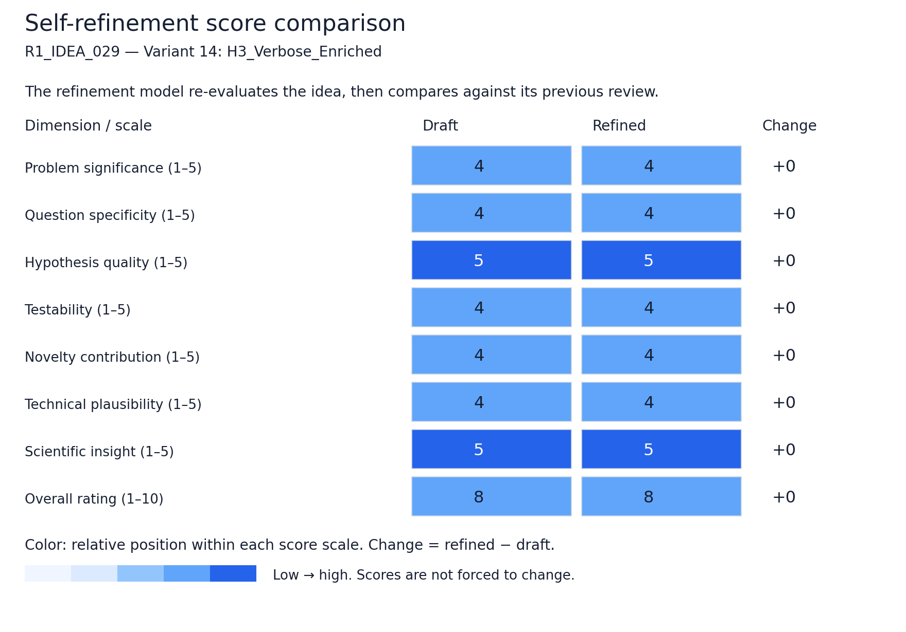

Changed score dimensions: none.

### Score justifications (draft / refined)

**Problem significance**

```json
{
  "draft": {
    "score": 4.0,
    "justification": "The idea addresses a meaningful challenge in multi-modal segmentation by focusing on interactive refinement, which is crucial for applications requiring user feedback."
  },
  "refined": {
    "score": 4.0,
    "justification": "The idea addresses a meaningful challenge in multi-modal segmentation by focusing on interactive refinement, which is crucial for applications requiring user feedback."
  }
}
```

**Question specificity**

```json
{
  "draft": {
    "score": 4.0,
    "justification": "The research question is specific, focusing on modeling the feedback loop between user prompts and mask updates in interactive segmentation."
  },
  "refined": {
    "score": 4.0,
    "justification": "The research question is specific, focusing on modeling the feedback loop between user prompts and mask updates in interactive segmentation."
  }
}
```

**Hypothesis quality**

```json
{
  "draft": {
    "score": 5.0,
    "justification": "The hypothesis is clear and testable, proposing that explicitly modeling the feedback loop will improve refinement efficiency, with specific validation methods outlined."
  },
  "refined": {
    "score": 5.0,
    "justification": "The hypothesis is clear and testable, proposing that explicitly modeling the feedback loop will improve refinement efficiency, with specific validation methods outlined."
  }
}
```

**Testability**

```json
{
  "draft": {
    "score": 4.0,
    "justification": "The idea includes a structured experimental design with ablation studies, error analysis, and comparison across different conditions, making it testable."
  },
  "refined": {
    "score": 4.0,
    "justification": "The idea includes a structured experimental design with ablation studies, error analysis, and comparison across different conditions, making it testable."
  }
}
```

**Novelty contribution**

```json
{
  "draft": {
    "score": 4.0,
    "justification": "The approach is novel in explicitly modeling the feedback loop, which could contribute to understanding how user interaction affects segmentation outcomes."
  },
  "refined": {
    "score": 4.0,
    "justification": "The approach is novel in explicitly modeling the feedback loop, which could contribute to understanding how user interaction affects segmentation outcomes."
  }
}
```

**Technical plausibility**

```json
{
  "draft": {
    "score": 4.0,
    "justification": "The proposed method is technically plausible, as it builds on existing multi-modal models and interactive segmentation techniques."
  },
  "refined": {
    "score": 4.0,
    "justification": "The proposed method is technically plausible, as it builds on existing multi-modal models and interactive segmentation techniques."
  }
}
```

**Scientific insight**

```json
{
  "draft": {
    "score": 5.0,
    "justification": "The study aims to uncover assumptions and domain constraints that determine the method's utility, providing valuable scientific insight into the interaction between user feedback and segmentation models."
  },
  "refined": {
    "score": 5.0,
    "justification": "The study aims to uncover assumptions and domain constraints that determine the method's utility, providing valuable scientific insight into the interaction between user feedback and segmentation models."
  }
}
```

**Overall rating**

```json
{
  "draft": {
    "score": 8.0,
    "justification": "The idea is strong with a clear problem, testable hypothesis, and structured experimental design. It has the potential for significant scientific insight but needs more technical details to be fully realized."
  },
  "refined": {
    "score": 8.0,
    "justification": "The idea is strong with a clear problem, testable hypothesis, and structured experimental design. It has the potential for significant scientific insight but needs more technical details to be fully realized."
  }
}
```

## R1_IDEA_029 — Variant 15: H4_Ultimate_Hype


Changed score dimensions: none.

### Score justifications (draft / refined)

**Problem significance**

```json
{
  "draft": {
    "score": 4.0,
    "justification": "The idea addresses a significant challenge in combining MLLMs and SAM for reasoning segmentation, which has potential for transformative impact in the field."
  },
  "refined": {
    "score": 4.0,
    "justification": "The idea addresses a significant challenge in combining MLLMs and SAM for reasoning segmentation, which has potential for transformative impact in the field."
  }
}
```

**Question specificity**

```json
{
  "draft": {
    "score": 3.0,
    "justification": "The problem is meaningful, but the research question is not clearly defined, making it somewhat vague."
  },
  "refined": {
    "score": 3.0,
    "justification": "The problem is meaningful, but the research question is not clearly defined, making it somewhat vague."
  }
}
```

**Hypothesis quality**

```json
{
  "draft": {
    "score": 3.0,
    "justification": "The idea presents a potential direction but lacks a specific hypothesis that can be tested or falsified."
  },
  "refined": {
    "score": 3.0,
    "justification": "The idea presents a potential direction but lacks a specific hypothesis that can be tested or falsified."
  }
}
```

**Testability**

```json
{
  "draft": {
    "score": 3.0,
    "justification": "The idea is ambitious but lacks concrete experiments or evaluation methods to test the proposed approach."
  },
  "refined": {
    "score": 3.0,
    "justification": "The idea is ambitious but lacks concrete experiments or evaluation methods to test the proposed approach."
  }
}
```

**Novelty contribution**

```json
{
  "draft": {
    "score": 4.0,
    "justification": "The integration of MLLMs with SAM for interactive segmentation is a novel approach with potential for significant contribution to the field."
  },
  "refined": {
    "score": 4.0,
    "justification": "The integration of MLLMs with SAM for interactive segmentation is a novel approach with potential for significant contribution to the field."
  }
}
```

**Technical plausibility**

```json
{
  "draft": {
    "score": 4.0,
    "justification": "The proposed approach is technically plausible, as it builds on existing models and leverages their strengths in reasoning and segmentation."
  },
  "refined": {
    "score": 4.0,
    "justification": "The proposed approach is technically plausible, as it builds on existing models and leverages their strengths in reasoning and segmentation."
  }
}
```

**Scientific insight**

```json
{
  "draft": {
    "score": 3.0,
    "justification": "The idea has potential for scientific insight but lacks specific mechanisms or phenomena that could be explored."
  },
  "refined": {
    "score": 3.0,
    "justification": "The idea has potential for scientific insight but lacks specific mechanisms or phenomena that could be explored."
  }
}
```

**Overall rating**

```json
{
  "draft": {
    "score": 7.0,
    "justification": "The idea is strong with significant potential but lacks specific details and a clear research question, which could hinder its development into a concrete research project."
  },
  "refined": {
    "score": 7.0,
    "justification": "The idea is strong with significant potential but lacks specific details and a clear research question, which could hinder its development into a concrete research project."
  }
}
```

## R1_IDEA_030 — Source


Changed score dimensions: none.

### Score justifications (draft / refined)

**Problem significance**

```json
{
  "draft": {
    "score": 4.0,
    "justification": "Continuous knowledge updating is a critical challenge in LLMs, with significant implications for real-world applications requiring up-to-date information."
  },
  "refined": {
    "score": 4.0,
    "justification": "Continuous knowledge updating is a critical challenge in LLMs, with significant implications for real-world applications requiring up-to-date information."
  }
}
```

**Question specificity**

```json
{
  "draft": {
    "score": 3.0,
    "justification": "The idea identifies a problem but lacks a clear, specific research question or hypothesis about how LoRA addresses the challenge."
  },
  "refined": {
    "score": 3.0,
    "justification": "The idea identifies a problem but lacks a clear, specific research question or hypothesis about how LoRA addresses the challenge."
  }
}
```

**Hypothesis quality**

```json
{
  "draft": {
    "score": 2.0,
    "justification": "The idea suggests a novel approach but does not explicitly state a hypothesis that can be tested or falsified."
  },
  "refined": {
    "score": 2.0,
    "justification": "The idea suggests a novel approach but does not explicitly state a hypothesis that can be tested or falsified."
  }
}
```

**Testability**

```json
{
  "draft": {
    "score": 3.0,
    "justification": "The idea proposes a method but does not specify experiments or evaluations to test its effectiveness compared to existing methods."
  },
  "refined": {
    "score": 3.0,
    "justification": "The idea proposes a method but does not specify experiments or evaluations to test its effectiveness compared to existing methods."
  }
}
```

**Novelty contribution**

```json
{
  "draft": {
    "score": 4.0,
    "justification": "The shift from context-based memory to a parametric approach using LoRA is a novel direction, though the specifics of its application for continuous learning are not clear."
  },
  "refined": {
    "score": 4.0,
    "justification": "The shift from context-based memory to a parametric approach using LoRA is a novel direction, though the specifics of its application for continuous learning are not clear."
  }
}
```

**Technical plausibility**

```json
{
  "draft": {
    "score": 4.0,
    "justification": "LoRA is a well-established technique in parameter-efficient fine-tuning, making the technical approach plausible for the proposed application."
  },
  "refined": {
    "score": 4.0,
    "justification": "LoRA is a well-established technique in parameter-efficient fine-tuning, making the technical approach plausible for the proposed application."
  }
}
```

**Scientific insight**

```json
{
  "draft": {
    "score": 3.0,
    "justification": "The idea suggests a new direction but does not clearly indicate what scientific insights could be gained from investigating the proposed approach."
  },
  "refined": {
    "score": 3.0,
    "justification": "The idea suggests a new direction but does not clearly indicate what scientific insights could be gained from investigating the proposed approach."
  }
}
```

**Overall rating**

```json
{
  "draft": {
    "score": 7.0,
    "justification": "The idea addresses a significant problem in LLMs and proposes a novel approach, but lacks specificity, hypothesis, and testable components, which are needed for further development."
  },
  "refined": {
    "score": 7.0,
    "justification": "The idea addresses a significant problem in LLMs and proposes a novel approach, but lacks specificity, hypothesis, and testable components, which are needed for further development."
  }
}
```

## R1_IDEA_030 — Variant 1: A1_Identity


Changed score dimensions: none.

### Score justifications (draft / refined)

**Problem significance**

```json
{
  "draft": {
    "score": 4.0,
    "justification": "Continuous knowledge updating is a critical challenge in LLMs, with significant implications for real-world applications requiring up-to-date information."
  },
  "refined": {
    "score": 4.0,
    "justification": "Continuous knowledge updating is a critical challenge in LLMs, with significant implications for real-world applications requiring up-to-date information."
  }
}
```

**Question specificity**

```json
{
  "draft": {
    "score": 3.0,
    "justification": "The idea identifies a problem but lacks a specific research question or hypothesis, making it somewhat vague."
  },
  "refined": {
    "score": 3.0,
    "justification": "The idea identifies a problem but lacks a specific research question or hypothesis, making it somewhat vague."
  }
}
```

**Hypothesis quality**

```json
{
  "draft": {
    "score": 2.0,
    "justification": "The idea suggests a novel approach but does not explicitly state a hypothesis that can be tested or contradicted."
  },
  "refined": {
    "score": 2.0,
    "justification": "The idea suggests a novel approach but does not explicitly state a hypothesis that can be tested or contradicted."
  }
}
```

**Testability**

```json
{
  "draft": {
    "score": 3.0,
    "justification": "The idea proposes a method but does not provide a clear experimental plan or comparison to existing methods."
  },
  "refined": {
    "score": 3.0,
    "justification": "The idea proposes a method but does not provide a clear experimental plan or comparison to existing methods."
  }
}
```

**Novelty contribution**

```json
{
  "draft": {
    "score": 4.0,
    "justification": "The shift from context-based to parametric memory using LoRA is a novel approach, though the specific contribution is not clearly defined."
  },
  "refined": {
    "score": 4.0,
    "justification": "The shift from context-based to parametric memory using LoRA is a novel approach, though the specific contribution is not clearly defined."
  }
}
```

**Technical plausibility**

```json
{
  "draft": {
    "score": 4.0,
    "justification": "LoRA is a well-established technique in LLM adaptation, and its application to continuous knowledge updating is technically plausible."
  },
  "refined": {
    "score": 4.0,
    "justification": "LoRA is a well-established technique in LLM adaptation, and its application to continuous knowledge updating is technically plausible."
  }
}
```

**Scientific insight**

```json
{
  "draft": {
    "score": 3.0,
    "justification": "The idea suggests a new direction but does not clearly indicate what scientific insights could be gained from this research."
  },
  "refined": {
    "score": 3.0,
    "justification": "The idea suggests a new direction but does not clearly indicate what scientific insights could be gained from this research."
  }
}
```

**Overall rating**

```json
{
  "draft": {
    "score": 7.0,
    "justification": "The idea addresses a significant problem in LLMs and proposes a novel approach, but it lacks specific details, a clear hypothesis, and a defined research question, which are necessary for further development."
  },
  "refined": {
    "score": 7.0,
    "justification": "The idea addresses a significant problem in LLMs and proposes a novel approach, but it lacks specific details, a clear hypothesis, and a defined research question, which are necessary for further development."
  }
}
```

## R1_IDEA_030 — Variant 2: A2_Paraphrase_Only


Changed score dimensions: none.

### Score justifications (draft / refined)

**Problem significance**

```json
{
  "draft": {
    "score": 4.0,
    "justification": "The problem of continuous knowledge updating in LLMs is critical for real-world applications where models need to stay up-to-date with new information. This is a meaningful challenge in the field."
  },
  "refined": {
    "score": 4.0,
    "justification": "The problem of continuous knowledge updating in LLMs is critical for real-world applications where models need to stay up-to-date with new information. This is a meaningful challenge in the field."
  }
}
```

**Question specificity**

```json
{
  "draft": {
    "score": 3.0,
    "justification": "The idea identifies a problem but lacks a specific research question. It suggests a general direction but does not clearly define what exactly will be investigated or how the method will address the problem."
  },
  "refined": {
    "score": 3.0,
    "justification": "The idea identifies a problem but lacks a specific research question. It suggests a general direction but does not clearly define what exactly will be investigated or how the method will address the problem."
  }
}
```

**Hypothesis quality**

```json
{
  "draft": {
    "score": 3.0,
    "justification": "The idea mentions a potential solution but does not explicitly state a hypothesis that can be tested. It is unclear what specific claim the research is trying to make or what evidence would support or contradict it."
  },
  "refined": {
    "score": 3.0,
    "justification": "The idea mentions a potential solution but does not explicitly state a hypothesis that can be tested. It is unclear what specific claim the research is trying to make or what evidence would support or contradict it."
  }
}
```

**Testability**

```json
{
  "draft": {
    "score": 3.0,
    "justification": "The idea suggests a method but does not provide a clear experimental plan or comparison to existing methods. Without specific tests, it is difficult to assess the validity of the approach."
  },
  "refined": {
    "score": 3.0,
    "justification": "The idea suggests a method but does not provide a clear experimental plan or comparison to existing methods. Without specific tests, it is difficult to assess the validity of the approach."
  }
}
```

**Novelty contribution**

```json
{
  "draft": {
    "score": 4.0,
    "justification": "Using LoRA for continuous knowledge updating is a novel application of an existing technique. It has the potential to contribute new insights into how LLMs can be updated more efficiently."
  },
  "refined": {
    "score": 4.0,
    "justification": "Using LoRA for continuous knowledge updating is a novel application of an existing technique. It has the potential to contribute new insights into how LLMs can be updated more efficiently."
  }
}
```

**Technical plausibility**

```json
{
  "draft": {
    "score": 4.0,
    "justification": "Low-Rank Adaptation is a well-established technique in machine learning. Applying it to the problem of continuous knowledge updating is technically plausible, though the specifics of implementation are not detailed."
  },
  "refined": {
    "score": 4.0,
    "justification": "Low-Rank Adaptation is a well-established technique in machine learning. Applying it to the problem of continuous knowledge updating is technically plausible, though the specifics of implementation are not detailed."
  }
}
```

**Scientific insight**

```json
{
  "draft": {
    "score": 3.0,
    "justification": "The idea has potential to provide insights into more efficient knowledge updating mechanisms, but without a clear hypothesis or research question, the scientific insight is not yet defined."
  },
  "refined": {
    "score": 3.0,
    "justification": "The idea has potential to provide insights into more efficient knowledge updating mechanisms, but without a clear hypothesis or research question, the scientific insight is not yet defined."
  }
}
```

**Overall rating**

```json
{
  "draft": {
    "score": 7.0,
    "justification": "The idea addresses a significant problem in LLMs and proposes a novel approach. However, it lacks specific details on how the method will be applied and what exactly will be investigated. With more clarity on the research question and hypothesis, the idea could be strong."
  },
  "refined": {
    "score": 7.0,
    "justification": "The idea addresses a significant problem in LLMs and proposes a novel approach. However, it lacks specific details on how the method will be applied and what exactly will be investigated. With more clarity on the research question and hypothesis, the idea could be strong."
  }
}
```

## R1_IDEA_030 — Variant 3: A3_Plain_Core


Changed score dimensions: none.

### Score justifications (draft / refined)

**Problem significance**

```json
{
  "draft": {
    "score": 4.0,
    "justification": "The problem of continuous knowledge updating in LLMs is critical for real-world applications where models need to adapt to new information over time. This is a significant challenge in the field."
  },
  "refined": {
    "score": 4.0,
    "justification": "The problem of continuous knowledge updating in LLMs is critical for real-world applications where models need to adapt to new information over time. This is a significant challenge in the field."
  }
}
```

**Question specificity**

```json
{
  "draft": {
    "score": 3.0,
    "justification": "The idea identifies a specific problem (continuous knowledge updating) but lacks detailed specifics on how LoRA will be applied to address it. The research question is clear but not sufficiently detailed."
  },
  "refined": {
    "score": 3.0,
    "justification": "The idea identifies a specific problem (continuous knowledge updating) but lacks detailed specifics on how LoRA will be applied to address it. The research question is clear but not sufficiently detailed."
  }
}
```

**Hypothesis quality**

```json
{
  "draft": {
    "score": 2.0,
    "justification": "The idea mentions a proposed approach but does not explicitly state a hypothesis or prediction that can be tested. The hypothesis is implied but not clearly articulated."
  },
  "refined": {
    "score": 2.0,
    "justification": "The idea mentions a proposed approach but does not explicitly state a hypothesis or prediction that can be tested. The hypothesis is implied but not clearly articulated."
  }
}
```

**Testability**

```json
{
  "draft": {
    "score": 3.0,
    "justification": "The idea suggests a method (LoRA) but does not provide specific experiments or comparisons that would allow for testing the hypothesis. The testability is limited without more details on the proposed approach."
  },
  "refined": {
    "score": 3.0,
    "justification": "The idea suggests a method (LoRA) but does not provide specific experiments or comparisons that would allow for testing the hypothesis. The testability is limited without more details on the proposed approach."
  }
}
```

**Novelty contribution**

```json
{
  "draft": {
    "score": 4.0,
    "justification": "The use of LoRA for continuous knowledge updating is a novel application of an existing technique. It offers a potential contribution by addressing the limitations of current methods in a different way."
  },
  "refined": {
    "score": 4.0,
    "justification": "The use of LoRA for continuous knowledge updating is a novel application of an existing technique. It offers a potential contribution by addressing the limitations of current methods in a different way."
  }
}
```

**Technical plausibility**

```json
{
  "draft": {
    "score": 4.0,
    "justification": "Low-Rank Adaptation is a well-established technique in machine learning, and its application to LLMs for knowledge updating is technically plausible. The approach is reasonable given the context."
  },
  "refined": {
    "score": 4.0,
    "justification": "Low-Rank Adaptation is a well-established technique in machine learning, and its application to LLMs for knowledge updating is technically plausible. The approach is reasonable given the context."
  }
}
```

**Scientific insight**

```json
{
  "draft": {
    "score": 3.0,
    "justification": "The idea has potential to provide insights into how LLMs can be adapted for continuous learning, but the specific mechanisms and expected outcomes are not clearly defined. The scientific insight is possible but not yet concrete."
  },
  "refined": {
    "score": 3.0,
    "justification": "The idea has potential to provide insights into how LLMs can be adapted for continuous learning, but the specific mechanisms and expected outcomes are not clearly defined. The scientific insight is possible but not yet concrete."
  }
}
```

**Overall rating**

```json
{
  "draft": {
    "score": 7.0,
    "justification": "The idea addresses a significant problem in LLMs and proposes a novel approach. However, it lacks specific details on the method's application, hypothesis, and testable predictions, which are necessary for a strong research direction."
  },
  "refined": {
    "score": 7.0,
    "justification": "The idea addresses a significant problem in LLMs and proposes a novel approach. However, it lacks specific details on the method's application, hypothesis, and testable predictions, which are necessary for a strong research direction."
  }
}
```

## R1_IDEA_030 — Variant 4: B1_Verbose_Elaborate


Changed score dimensions: none.

### Score justifications (draft / refined)

**Problem significance**

```json
{
  "draft": {
    "score": 4.0,
    "justification": "The problem of continuous knowledge updates in LLMs is critical for real-world applications requiring up-to-date information, making it a significant research challenge."
  },
  "refined": {
    "score": 4.0,
    "justification": "The problem of continuous knowledge updates in LLMs is critical for real-world applications requiring up-to-date information, making it a significant research challenge."
  }
}
```

**Question specificity**

```json
{
  "draft": {
    "score": 3.0,
    "justification": "The idea identifies a specific problem but lacks detailed specification of the research question, such as the exact mechanism of LoRA adaptation for continuous learning."
  },
  "refined": {
    "score": 3.0,
    "justification": "The idea identifies a specific problem but lacks detailed specification of the research question, such as the exact mechanism of LoRA adaptation for continuous learning."
  }
}
```

**Hypothesis quality**

```json
{
  "draft": {
    "score": 2.0,
    "justification": "The idea does not explicitly state a hypothesis or prediction, making it difficult to assess the scientific merit without further clarification."
  },
  "refined": {
    "score": 2.0,
    "justification": "The idea does not explicitly state a hypothesis or prediction, making it difficult to assess the scientific merit without further clarification."
  }
}
```

**Testability**

```json
{
  "draft": {
    "score": 3.0,
    "justification": "The idea suggests a novel approach but does not provide a clear experimental plan or evaluation method to test its effectiveness."
  },
  "refined": {
    "score": 3.0,
    "justification": "The idea suggests a novel approach but does not provide a clear experimental plan or evaluation method to test its effectiveness."
  }
}
```

**Novelty contribution**

```json
{
  "draft": {
    "score": 4.0,
    "justification": "The use of LoRA for continuous knowledge updates is a novel application, potentially offering a new method to address the limitations of existing techniques."
  },
  "refined": {
    "score": 4.0,
    "justification": "The use of LoRA for continuous knowledge updates is a novel application, potentially offering a new method to address the limitations of existing techniques."
  }
}
```

**Technical plausibility**

```json
{
  "draft": {
    "score": 4.0,
    "justification": "Low-Rank Adaptation is a well-established technique, and its application to continuous learning is technically plausible, though the specifics need further clarification."
  },
  "refined": {
    "score": 4.0,
    "justification": "Low-Rank Adaptation is a well-established technique, and its application to continuous learning is technically plausible, though the specifics need further clarification."
  }
}
```

**Scientific insight**

```json
{
  "draft": {
    "score": 3.0,
    "justification": "The idea has potential to provide insights into the effectiveness of LoRA for continuous learning, but the specific mechanisms and outcomes are not clearly defined."
  },
  "refined": {
    "score": 3.0,
    "justification": "The idea has potential to provide insights into the effectiveness of LoRA for continuous learning, but the specific mechanisms and outcomes are not clearly defined."
  }
}
```

**Overall rating**

```json
{
  "draft": {
    "score": 7.0,
    "justification": "The idea addresses a significant problem with a novel approach, but lacks specificity and a clear hypothesis, which are needed for a strong research direction."
  },
  "refined": {
    "score": 7.0,
    "justification": "The idea addresses a significant problem with a novel approach, but lacks specificity and a clear hypothesis, which are needed for a strong research direction."
  }
}
```

## R1_IDEA_030 — Variant 5: B2_Grand_Narrative


Changed score dimensions: none.

### Score justifications (draft / refined)

**Problem significance**

```json
{
  "draft": {
    "score": 4.0,
    "justification": "Continuous knowledge updating is a critical challenge for LLMs, with broad implications for real-world applications and long-term AI systems."
  },
  "refined": {
    "score": 4.0,
    "justification": "Continuous knowledge updating is a critical challenge for LLMs, with broad implications for real-world applications and long-term AI systems."
  }
}
```

**Question specificity**

```json
{
  "draft": {
    "score": 3.0,
    "justification": "The idea identifies a problem but lacks concrete research questions or hypotheses about how LoRA will be applied for continuous updating."
  },
  "refined": {
    "score": 3.0,
    "justification": "The idea identifies a problem but lacks concrete research questions or hypotheses about how LoRA will be applied for continuous updating."
  }
}
```

**Hypothesis quality**

```json
{
  "draft": {
    "score": 3.0,
    "justification": "The idea suggests a novel approach but does not explicitly state a hypothesis or prediction about its effectiveness or specific mechanism."
  },
  "refined": {
    "score": 3.0,
    "justification": "The idea suggests a novel approach but does not explicitly state a hypothesis or prediction about its effectiveness or specific mechanism."
  }
}
```

**Testability**

```json
{
  "draft": {
    "score": 3.0,
    "justification": "The idea proposes a method but does not specify experiments or evaluations to test its effectiveness compared to existing methods."
  },
  "refined": {
    "score": 3.0,
    "justification": "The idea proposes a method but does not specify experiments or evaluations to test its effectiveness compared to existing methods."
  }
}
```

**Novelty contribution**

```json
{
  "draft": {
    "score": 4.0,
    "justification": "The use of LoRA for continuous knowledge updating is a novel application of an existing technique, with potential for broader impact on foundational model design."
  },
  "refined": {
    "score": 4.0,
    "justification": "The use of LoRA for continuous knowledge updating is a novel application of an existing technique, with potential for broader impact on foundational model design."
  }
}
```

**Technical plausibility**

```json
{
  "draft": {
    "score": 4.0,
    "justification": "LoRA is a well-established technique in parameter-efficient adaptation, making it technically plausible for the proposed application."
  },
  "refined": {
    "score": 4.0,
    "justification": "LoRA is a well-established technique in parameter-efficient adaptation, making it technically plausible for the proposed application."
  }
}
```

**Scientific insight**

```json
{
  "draft": {
    "score": 3.0,
    "justification": "The idea has potential for scientific insight into how parameter-efficient methods can be used for continuous learning, but lacks specific mechanisms or predictions."
  },
  "refined": {
    "score": 3.0,
    "justification": "The idea has potential for scientific insight into how parameter-efficient methods can be used for continuous learning, but lacks specific mechanisms or predictions."
  }
}
```

**Overall rating**

```json
{
  "draft": {
    "score": 7.0,
    "justification": "The idea addresses a significant problem in LLMs with a plausible approach, but lacks concrete research questions, hypotheses, and evaluation plans, which are needed for further development."
  },
  "refined": {
    "score": 7.0,
    "justification": "The idea addresses a significant problem in LLMs with a plausible approach, but lacks concrete research questions, hypotheses, and evaluation plans, which are needed for further development."
  }
}
```

## R1_IDEA_030 — Variant 6: B3_Over_Confident


Changed score dimensions: none.

### Score justifications (draft / refined)

**Problem significance**

```json
{
  "draft": {
    "score": 4.0,
    "justification": "Continuous knowledge updating is a critical challenge in LLMs, with significant implications for real-world applications requiring up-to-date information."
  },
  "refined": {
    "score": 4.0,
    "justification": "Continuous knowledge updating is a critical challenge in LLMs, with significant implications for real-world applications requiring up-to-date information."
  }
}
```

**Question specificity**

```json
{
  "draft": {
    "score": 3.0,
    "justification": "The idea identifies a problem but lacks a specific research question or hypothesis about how LoRA addresses the challenge of continuous knowledge updating."
  },
  "refined": {
    "score": 3.0,
    "justification": "The idea identifies a problem but lacks a specific research question or hypothesis about how LoRA addresses the challenge of continuous knowledge updating."
  }
}
```

**Hypothesis quality**

```json
{
  "draft": {
    "score": 2.0,
    "justification": "The idea mentions a novel approach but does not explicitly state a hypothesis that can be tested or falsified."
  },
  "refined": {
    "score": 2.0,
    "justification": "The idea mentions a novel approach but does not explicitly state a hypothesis that can be tested or falsified."
  }
}
```

**Testability**

```json
{
  "draft": {
    "score": 3.0,
    "justification": "The idea suggests a method but does not provide a clear experimental plan or evaluation metrics to test the proposed approach."
  },
  "refined": {
    "score": 3.0,
    "justification": "The idea suggests a method but does not provide a clear experimental plan or evaluation metrics to test the proposed approach."
  }
}
```

**Novelty contribution**

```json
{
  "draft": {
    "score": 4.0,
    "justification": "Proposing a novel application of LoRA for continuous knowledge updating could contribute new insights into LLM training and adaptation."
  },
  "refined": {
    "score": 4.0,
    "justification": "Proposing a novel application of LoRA for continuous knowledge updating could contribute new insights into LLM training and adaptation."
  }
}
```

**Technical plausibility**

```json
{
  "draft": {
    "score": 4.0,
    "justification": "Low-Rank Adaptation is a well-established technique in machine learning, making the proposed approach technically plausible."
  },
  "refined": {
    "score": 4.0,
    "justification": "Low-Rank Adaptation is a well-established technique in machine learning, making the proposed approach technically plausible."
  }
}
```

**Scientific insight**

```json
{
  "draft": {
    "score": 3.0,
    "justification": "The idea has potential for scientific insight but lacks a clear mechanism or hypothesis that would lead to meaningful discoveries."
  },
  "refined": {
    "score": 3.0,
    "justification": "The idea has potential for scientific insight but lacks a clear mechanism or hypothesis that would lead to meaningful discoveries."
  }
}
```

**Overall rating**

```json
{
  "draft": {
    "score": 7.0,
    "justification": "The idea addresses a significant problem in LLMs and proposes a novel approach, but it lacks specificity, a clear hypothesis, and a detailed experimental plan, which are necessary for further development."
  },
  "refined": {
    "score": 7.0,
    "justification": "The idea addresses a significant problem in LLMs and proposes a novel approach, but it lacks specificity, a clear hypothesis, and a detailed experimental plan, which are necessary for further development."
  }
}
```

## R1_IDEA_030 — Variant 7: B4_Novelty


Changed score dimensions: none.

### Score justifications (draft / refined)

**Problem significance**

```json
{
  "draft": {
    "score": 4.0,
    "justification": "Continuous knowledge updating is a critical challenge in LLMs, as it affects the model's ability to stay updated with new information without retraining, which is essential for real-world applications."
  },
  "refined": {
    "score": 4.0,
    "justification": "Continuous knowledge updating is a critical challenge in LLMs, as it affects the model's ability to stay updated with new information without retraining, which is essential for real-world applications."
  }
}
```

**Question specificity**

```json
{
  "draft": {
    "score": 3.0,
    "justification": "The idea identifies a problem but lacks a specific research question. It mentions the use of LoRA but does not clearly define what aspect of continuous knowledge updating it aims to address or how it differs from existing methods."
  },
  "refined": {
    "score": 3.0,
    "justification": "The idea identifies a problem but lacks a specific research question. It mentions the use of LoRA but does not clearly define what aspect of continuous knowledge updating it aims to address or how it differs from existing methods."
  }
}
```

**Hypothesis quality**

```json
{
  "draft": {
    "score": 2.0,
    "justification": "The idea does not explicitly state a hypothesis. While it suggests that LoRA could address the problem, it does not provide a concrete prediction or mechanism that can be tested or falsified."
  },
  "refined": {
    "score": 2.0,
    "justification": "The idea does not explicitly state a hypothesis. While it suggests that LoRA could address the problem, it does not provide a concrete prediction or mechanism that can be tested or falsified."
  }
}
```

**Testability**

```json
{
  "draft": {
    "score": 3.0,
    "justification": "The idea suggests a potential solution but does not provide a clear experimental plan or evaluation method. It is possible to test the hypothesis, but the specifics are missing."
  },
  "refined": {
    "score": 3.0,
    "justification": "The idea suggests a potential solution but does not provide a clear experimental plan or evaluation method. It is possible to test the hypothesis, but the specifics are missing."
  }
}
```

**Novelty contribution**

```json
{
  "draft": {
    "score": 4.0,
    "justification": "The use of LoRA for continuous knowledge updating is a novel application of an existing technique. It could contribute to the field by providing a more efficient method for updating LLMs with new information."
  },
  "refined": {
    "score": 4.0,
    "justification": "The use of LoRA for continuous knowledge updating is a novel application of an existing technique. It could contribute to the field by providing a more efficient method for updating LLMs with new information."
  }
}
```

**Technical plausibility**

```json
{
  "draft": {
    "score": 4.0,
    "justification": "LoRA is a well-established technique in fine-tuning LLMs. Applying it to continuous knowledge updating is technically plausible, though the specific implementation details are not provided."
  },
  "refined": {
    "score": 4.0,
    "justification": "LoRA is a well-established technique in fine-tuning LLMs. Applying it to continuous knowledge updating is technically plausible, though the specific implementation details are not provided."
  }
}
```

**Scientific insight**

```json
{
  "draft": {
    "score": 3.0,
    "justification": "The idea has potential to provide insights into how LoRA can be effectively used for continuous learning, but the specific mechanisms and outcomes are not clearly defined."
  },
  "refined": {
    "score": 3.0,
    "justification": "The idea has potential to provide insights into how LoRA can be effectively used for continuous learning, but the specific mechanisms and outcomes are not clearly defined."
  }
}
```

**Overall rating**

```json
{
  "draft": {
    "score": 7.0,
    "justification": "The idea addresses a significant problem in LLMs and proposes a novel approach. However, it lacks specific details on the research question, hypothesis, and evaluation plan, which are necessary for further development and validation."
  },
  "refined": {
    "score": 7.0,
    "justification": "The idea addresses a significant problem in LLMs and proposes a novel approach. However, it lacks specific details on the research question, hypothesis, and evaluation plan, which are necessary for further development and validation."
  }
}
```

## R1_IDEA_030 — Variant 8: B5_Application_Impact


Changed score dimensions: none.

### Score justifications (draft / refined)

**Problem significance**

```json
{
  "draft": {
    "score": 4.0,
    "justification": "Continuous knowledge updating is a critical challenge for LLMs, especially in real-world applications where models need to adapt to new information without retraining. This is a meaningful problem with practical implications."
  },
  "refined": {
    "score": 4.0,
    "justification": "Continuous knowledge updating is a critical challenge for LLMs, especially in real-world applications where models need to adapt to new information without retraining. This is a meaningful problem with practical implications."
  }
}
```

**Question specificity**

```json
{
  "draft": {
    "score": 3.0,
    "justification": "The idea identifies a key problem but lacks a specific research question. It mentions a potential solution (LoRA) but does not clearly define what exactly is being investigated or how it addresses the problem."
  },
  "refined": {
    "score": 3.0,
    "justification": "The idea identifies a key problem but lacks a specific research question. It mentions a potential solution (LoRA) but does not clearly define what exactly is being investigated or how it addresses the problem."
  }
}
```

**Hypothesis quality**

```json
{
  "draft": {
    "score": 2.0,
    "justification": "The idea mentions a potential solution but does not provide a clear hypothesis or prediction that could be tested. The connection between LoRA and continuous knowledge updating is not explicitly stated."
  },
  "refined": {
    "score": 2.0,
    "justification": "The idea mentions a potential solution but does not provide a clear hypothesis or prediction that could be tested. The connection between LoRA and continuous knowledge updating is not explicitly stated."
  }
}
```

**Testability**

```json
{
  "draft": {
    "score": 3.0,
    "justification": "The idea suggests a potential approach but does not specify experiments or evaluations that would test its effectiveness. Without concrete plans for testing, the idea remains vague."
  },
  "refined": {
    "score": 3.0,
    "justification": "The idea suggests a potential approach but does not specify experiments or evaluations that would test its effectiveness. Without concrete plans for testing, the idea remains vague."
  }
}
```

**Novelty contribution**

```json
{
  "draft": {
    "score": 3.0,
    "justification": "The use of LoRA for continuous knowledge updating is a novel application, but the idea does not clearly articulate how it contributes to the field or what new insights it could provide."
  },
  "refined": {
    "score": 3.0,
    "justification": "The use of LoRA for continuous knowledge updating is a novel application, but the idea does not clearly articulate how it contributes to the field or what new insights it could provide."
  }
}
```

**Technical plausibility**

```json
{
  "draft": {
    "score": 4.0,
    "justification": "LoRA is a well-established technique in parameter-efficient adaptation, and its application to continuous knowledge updating is technically plausible. However, the specific implementation details are not provided."
  },
  "refined": {
    "score": 4.0,
    "justification": "LoRA is a well-established technique in parameter-efficient adaptation, and its application to continuous knowledge updating is technically plausible. However, the specific implementation details are not provided."
  }
}
```

**Scientific insight**

```json
{
  "draft": {
    "score": 2.0,
    "justification": "The idea has potential for practical applications but does not clearly indicate what scientific insights could be gained from investigating this approach. The focus is more on application than on understanding underlying mechanisms or principles."
  },
  "refined": {
    "score": 2.0,
    "justification": "The idea has potential for practical applications but does not clearly indicate what scientific insights could be gained from investigating this approach. The focus is more on application than on understanding underlying mechanisms or principles."
  }
}
```

**Overall rating**

```json
{
  "draft": {
    "score": 6.0,
    "justification": "The idea addresses a meaningful problem in LLMs and proposes a potentially useful approach. However, it lacks specific research questions, hypotheses, and evaluation plans, which are necessary for further development. The technical plausibility is high, but the scientific insight and testability are limited."
  },
  "refined": {
    "score": 6.0,
    "justification": "The idea addresses a meaningful problem in LLMs and proposes a potentially useful approach. However, it lacks specific research questions, hypotheses, and evaluation plans, which are necessary for further development. The technical plausibility is high, but the scientific insight and testability are limited."
  }
}
```

## R1_IDEA_030 — Variant 9: C1_Hollow_Shell


Changed score dimensions: none.

### Score justifications (draft / refined)

**Problem significance**

```json
{
  "draft": {
    "score": 4.0,
    "justification": "The challenge of knowledge updating in large AI models is a critical issue with significant implications for model adaptability and real-world applications."
  },
  "refined": {
    "score": 4.0,
    "justification": "The challenge of knowledge updating in large AI models is a critical issue with significant implications for model adaptability and real-world applications."
  }
}
```

**Question specificity**

```json
{
  "draft": {
    "score": 2.0,
    "justification": "The idea identifies a broad problem but lacks a specific research question or hypothesis that could be tested or investigated."
  },
  "refined": {
    "score": 2.0,
    "justification": "The idea identifies a broad problem but lacks a specific research question or hypothesis that could be tested or investigated."
  }
}
```

**Hypothesis quality**

```json
{
  "draft": {
    "score": 2.0,
    "justification": "The idea suggests a potential direction but does not provide a clear hypothesis or prediction that could be tested or falsified."
  },
  "refined": {
    "score": 2.0,
    "justification": "The idea suggests a potential direction but does not provide a clear hypothesis or prediction that could be tested or falsified."
  }
}
```

**Testability**

```json
{
  "draft": {
    "score": 2.0,
    "justification": "The idea lacks specific experiments, comparisons, or evaluation metrics that would allow for meaningful testing of the proposed method."
  },
  "refined": {
    "score": 2.0,
    "justification": "The idea lacks specific experiments, comparisons, or evaluation metrics that would allow for meaningful testing of the proposed method."
  }
}
```

**Novelty contribution**

```json
{
  "draft": {
    "score": 3.0,
    "justification": "The shift from model memory to parameter adjustment is a novel direction, but the idea does not clearly define how this contributes to the field or what new insights it could provide."
  },
  "refined": {
    "score": 3.0,
    "justification": "The shift from model memory to parameter adjustment is a novel direction, but the idea does not clearly define how this contributes to the field or what new insights it could provide."
  }
}
```

**Technical plausibility**

```json
{
  "draft": {
    "score": 3.0,
    "justification": "The idea is technically plausible as it suggests a different approach to knowledge updating, but the lack of specific details makes it difficult to assess the feasibility of the proposed method."
  },
  "refined": {
    "score": 3.0,
    "justification": "The idea is technically plausible as it suggests a different approach to knowledge updating, but the lack of specific details makes it difficult to assess the feasibility of the proposed method."
  }
}
```

**Scientific insight**

```json
{
  "draft": {
    "score": 2.0,
    "justification": "The idea has potential for scientific insight but does not clearly outline what new mechanisms, principles, or limitations it aims to uncover."
  },
  "refined": {
    "score": 2.0,
    "justification": "The idea has potential for scientific insight but does not clearly outline what new mechanisms, principles, or limitations it aims to uncover."
  }
}
```

**Overall rating**

```json
{
  "draft": {
    "score": 6.0,
    "justification": "The idea addresses a significant problem in AI but lacks specificity, hypothesis, and testable components, making it a moderate but not strong research direction."
  },
  "refined": {
    "score": 6.0,
    "justification": "The idea addresses a significant problem in AI but lacks specificity, hypothesis, and testable components, making it a moderate but not strong research direction."
  }
}
```

## R1_IDEA_030 — Variant 10: C2_Logic_Flawed


Changed score dimensions: none.

### Score justifications (draft / refined)

**Problem significance**

```json
{
  "draft": {
    "score": 4.0,
    "justification": "The challenge of continuous knowledge updating in LLMs is critical for real-world applications, as models need to adapt to new information without retraining."
  },
  "refined": {
    "score": 4.0,
    "justification": "The challenge of continuous knowledge updating in LLMs is critical for real-world applications, as models need to adapt to new information without retraining."
  }
}
```

**Question specificity**

```json
{
  "draft": {
    "score": 3.0,
    "justification": "The idea identifies a problem but lacks specific details on the research question, such as how LoRA is applied or what exactly is being tested."
  },
  "refined": {
    "score": 3.0,
    "justification": "The idea identifies a problem but lacks specific details on the research question, such as how LoRA is applied or what exactly is being tested."
  }
}
```

**Hypothesis quality**

```json
{
  "draft": {
    "score": 2.0,
    "justification": "The idea suggests a novel approach but does not explicitly state a hypothesis or prediction that can be tested or falsified."
  },
  "refined": {
    "score": 2.0,
    "justification": "The idea suggests a novel approach but does not explicitly state a hypothesis or prediction that can be tested or falsified."
  }
}
```

**Testability**

```json
{
  "draft": {
    "score": 3.0,
    "justification": "The idea proposes a method but does not provide specific experiments or comparisons that would allow for testing the hypothesis."
  },
  "refined": {
    "score": 3.0,
    "justification": "The idea proposes a method but does not provide specific experiments or comparisons that would allow for testing the hypothesis."
  }
}
```

**Novelty contribution**

```json
{
  "draft": {
    "score": 4.0,
    "justification": "The use of LoRA for continuous knowledge updating is a novel approach, potentially offering broader applicability compared to existing methods."
  },
  "refined": {
    "score": 4.0,
    "justification": "The use of LoRA for continuous knowledge updating is a novel approach, potentially offering broader applicability compared to existing methods."
  }
}
```

**Technical plausibility**

```json
{
  "draft": {
    "score": 4.0,
    "justification": "Low-Rank Adaptation is a well-established technique in NLP, making the proposed approach technically plausible."
  },
  "refined": {
    "score": 4.0,
    "justification": "Low-Rank Adaptation is a well-established technique in NLP, making the proposed approach technically plausible."
  }
}
```

**Scientific insight**

```json
{
  "draft": {
    "score": 3.0,
    "justification": "The idea suggests a new direction but does not clearly indicate what scientific insights could be gained from successfully implementing the approach."
  },
  "refined": {
    "score": 3.0,
    "justification": "The idea suggests a new direction but does not clearly indicate what scientific insights could be gained from successfully implementing the approach."
  }
}
```

**Overall rating**

```json
{
  "draft": {
    "score": 7.0,
    "justification": "The idea addresses a significant problem in LLMs with a novel approach, but lacks specific details and a clear hypothesis, which are necessary for further development and testing."
  },
  "refined": {
    "score": 7.0,
    "justification": "The idea addresses a significant problem in LLMs with a novel approach, but lacks specific details and a clear hypothesis, which are necessary for further development and testing."
  }
}
```

## R1_IDEA_030 — Variant 11: C3_Substance_Enriched


Changed score dimensions: none.

### Score justifications (draft / refined)

**Problem significance**

```json
{
  "draft": {
    "score": 4.0,
    "justification": "The problem of continuous knowledge updating in LLMs is critical for real-world applications where models need to adapt to new information over time. The challenge of catastrophic forgetting is well-established and important for practical deployment."
  },
  "refined": {
    "score": 4.0,
    "justification": "The problem of continuous knowledge updating in LLMs is critical for real-world applications where models need to adapt to new information over time. The challenge of catastrophic forgetting is well-established and important for practical deployment."
  }
}
```

**Question specificity**

```json
{
  "draft": {
    "score": 3.0,
    "justification": "The idea identifies a specific problem (continuous knowledge updating) and proposes a novel approach (LRA), but the research question is somewhat vague. It needs to be more clearly defined to specify what exactly is being tested."
  },
  "refined": {
    "score": 3.0,
    "justification": "The idea identifies a specific problem (continuous knowledge updating) and proposes a novel approach (LRA), but the research question is somewhat vague. It needs to be more clearly defined to specify what exactly is being tested."
  }
}
```

**Hypothesis quality**

```json
{
  "draft": {
    "score": 4.0,
    "justification": "The hypothesis that LRA can integrate new knowledge without catastrophic forgetting is plausible and testable. The mention of boundary conditions adds depth, making the hypothesis more concrete and specific."
  },
  "refined": {
    "score": 4.0,
    "justification": "The hypothesis that LRA can integrate new knowledge without catastrophic forgetting is plausible and testable. The mention of boundary conditions adds depth, making the hypothesis more concrete and specific."
  }
}
```

**Testability**

```json
{
  "draft": {
    "score": 3.0,
    "justification": "The idea suggests testing the method's effectiveness, but it lacks specific experimental designs or evaluation metrics. The hypothesis is testable in principle, but without more details, it's hard to assess feasibility."
  },
  "refined": {
    "score": 3.0,
    "justification": "The idea suggests testing the method's effectiveness, but it lacks specific experimental designs or evaluation metrics. The hypothesis is testable in principle, but without more details, it's hard to assess feasibility."
  }
}
```

**Novelty contribution**

```json
{
  "draft": {
    "score": 4.0,
    "justification": "The use of LRA for continuous knowledge updating is a novel application of an existing technique. It addresses a specific challenge in LLMs and could contribute new insights into the effectiveness of parametric adaptation methods."
  },
  "refined": {
    "score": 4.0,
    "justification": "The use of LRA for continuous knowledge updating is a novel application of an existing technique. It addresses a specific challenge in LLMs and could contribute new insights into the effectiveness of parametric adaptation methods."
  }
}
```

**Technical plausibility**

```json
{
  "draft": {
    "score": 4.0,
    "justification": "Low-Rank Adaptation is a well-established technique in machine learning, and its application to continuous knowledge updating is technically plausible. The proposed boundary conditions are reasonable and align with known limitations of adaptation methods."
  },
  "refined": {
    "score": 4.0,
    "justification": "Low-Rank Adaptation is a well-established technique in machine learning, and its application to continuous knowledge updating is technically plausible. The proposed boundary conditions are reasonable and align with known limitations of adaptation methods."
  }
}
```

**Scientific insight**

```json
{
  "draft": {
    "score": 3.0,
    "justification": "The idea has potential to reveal insights into the effectiveness of LRA for knowledge updating, but the current formulation lacks specifics on what insights could be gained. More detailed hypotheses and experiments would be needed to uncover deeper scientific understanding."
  },
  "refined": {
    "score": 3.0,
    "justification": "The idea has potential to reveal insights into the effectiveness of LRA for knowledge updating, but the current formulation lacks specifics on what insights could be gained. More detailed hypotheses and experiments would be needed to uncover deeper scientific understanding."
  }
}
```

**Overall rating**

```json
{
  "draft": {
    "score": 7.0,
    "justification": "The idea addresses a significant problem in LLMs with a novel approach and a plausible hypothesis. It has the potential to contribute new insights, but the research question and experimental design need more specificity to be fully testable and impactful."
  },
  "refined": {
    "score": 7.0,
    "justification": "The idea addresses a significant problem in LLMs with a novel approach and a plausible hypothesis. It has the potential to contribute new insights, but the research question and experimental design need more specificity to be fully testable and impactful."
  }
}
```

## R1_IDEA_030 — Variant 12: H1_Deceptive_Hollow


Changed score dimensions: none.

### Score justifications (draft / refined)

**Problem significance**

```json
{
  "draft": {
    "score": 4.0,
    "justification": "The idea addresses a significant challenge in AI related to knowledge updating in large models, which is a critical issue for the practical deployment and adaptability of AI systems."
  },
  "refined": {
    "score": 4.0,
    "justification": "The idea addresses a significant challenge in AI related to knowledge updating in large models, which is a critical issue for the practical deployment and adaptability of AI systems."
  }
}
```

**Question specificity**

```json
{
  "draft": {
    "score": 2.0,
    "justification": "The idea is somewhat vague in terms of defining the specific research question. It mentions a challenge but does not clearly articulate what aspect of knowledge updating the method aims to improve or how it will be evaluated."
  },
  "refined": {
    "score": 2.0,
    "justification": "The idea is somewhat vague in terms of defining the specific research question. It mentions a challenge but does not clearly articulate what aspect of knowledge updating the method aims to improve or how it will be evaluated."
  }
}
```

**Hypothesis quality**

```json
{
  "draft": {
    "score": 2.0,
    "justification": "The idea lacks a clear hypothesis or prediction. It describes a potential contribution but does not specify what outcome or mechanism is being hypothesized to be achieved by the proposed method."
  },
  "refined": {
    "score": 2.0,
    "justification": "The idea lacks a clear hypothesis or prediction. It describes a potential contribution but does not specify what outcome or mechanism is being hypothesized to be achieved by the proposed method."
  }
}
```

**Testability**

```json
{
  "draft": {
    "score": 2.0,
    "justification": "The idea does not provide a clear experimental plan or method for testing the proposed approach. It is too vague to determine how the method will be evaluated or compared to existing approaches."
  },
  "refined": {
    "score": 2.0,
    "justification": "The idea does not provide a clear experimental plan or method for testing the proposed approach. It is too vague to determine how the method will be evaluated or compared to existing approaches."
  }
}
```

**Novelty contribution**

```json
{
  "draft": {
    "score": 4.0,
    "justification": "The idea proposes a novel approach that diverges from conventional methods and positions the work as a transformative synthesis, which has the potential for significant contribution to the field."
  },
  "refined": {
    "score": 4.0,
    "justification": "The idea proposes a novel approach that diverges from conventional methods and positions the work as a transformative synthesis, which has the potential for significant contribution to the field."
  }
}
```

**Technical plausibility**

```json
{
  "draft": {
    "score": 3.0,
    "justification": "The idea is technically plausible as it suggests a shift in perspective from model memory to parameter adjustment. However, the lack of specific details makes it difficult to assess the feasibility of the proposed method."
  },
  "refined": {
    "score": 3.0,
    "justification": "The idea is technically plausible as it suggests a shift in perspective from model memory to parameter adjustment. However, the lack of specific details makes it difficult to assess the feasibility of the proposed method."
  }
}
```

**Scientific insight**

```json
{
  "draft": {
    "score": 3.0,
    "justification": "The idea has the potential to provide scientific insight by challenging conventional approaches and proposing a new framework. However, the lack of specific details limits the potential for concrete insights."
  },
  "refined": {
    "score": 3.0,
    "justification": "The idea has the potential to provide scientific insight by challenging conventional approaches and proposing a new framework. However, the lack of specific details limits the potential for concrete insights."
  }
}
```

**Overall rating**

```json
{
  "draft": {
    "score": 6.0,
    "justification": "The idea addresses a significant challenge in AI but lacks specific details, clear research questions, and hypotheses. It has potential for novelty and contribution but is too vague to be considered strong or exceptional."
  },
  "refined": {
    "score": 6.0,
    "justification": "The idea addresses a significant challenge in AI but lacks specific details, clear research questions, and hypotheses. It has potential for novelty and contribution but is too vague to be considered strong or exceptional."
  }
}
```

## R1_IDEA_030 — Variant 13: H2_Confident_Flaw


Changed score dimensions: none.

### Score justifications (draft / refined)

**Problem significance**

```json
{
  "draft": {
    "score": 4.0,
    "justification": "The problem of continuous knowledge updating in LLMs is critical for real-world applications, as it enables models to stay up-to-date with new information without retraining. This is a key area of research with practical implications."
  },
  "refined": {
    "score": 4.0,
    "justification": "The problem of continuous knowledge updating in LLMs is critical for real-world applications, as it enables models to stay up-to-date with new information without retraining. This is a key area of research with practical implications."
  }
}
```

**Question specificity**

```json
{
  "draft": {
    "score": 3.0,
    "justification": "The idea identifies a specific problem (continuous knowledge updating) and proposes a novel method (LoRA), but the exact mechanism and specific settings where it is expected to be effective are not clearly defined."
  },
  "refined": {
    "score": 3.0,
    "justification": "The idea identifies a specific problem (continuous knowledge updating) and proposes a novel method (LoRA), but the exact mechanism and specific settings where it is expected to be effective are not clearly defined."
  }
}
```

**Hypothesis quality**

```json
{
  "draft": {
    "score": 4.0,
    "justification": "The idea presents a clear hypothesis that LoRA provides reliable improvements across different settings due to solving a key limitation in existing methods. The claim is specific and could be tested through experiments."
  },
  "refined": {
    "score": 4.0,
    "justification": "The idea presents a clear hypothesis that LoRA provides reliable improvements across different settings due to solving a key limitation in existing methods. The claim is specific and could be tested through experiments."
  }
}
```

**Testability**

```json
{
  "draft": {
    "score": 3.0,
    "justification": "The idea suggests that the method provides causal evidence for its effectiveness, but the specific experiments or evaluations needed to test this claim are not clearly outlined. More details on how the method will be compared to existing approaches are needed."
  },
  "refined": {
    "score": 3.0,
    "justification": "The idea suggests that the method provides causal evidence for its effectiveness, but the specific experiments or evaluations needed to test this claim are not clearly outlined. More details on how the method will be compared to existing approaches are needed."
  }
}
```

**Novelty contribution**

```json
{
  "draft": {
    "score": 4.0,
    "justification": "The use of LoRA for continuous knowledge updating is a novel application of the technique, and the idea suggests that it could provide general improvements across different settings, which is a valuable contribution to the field."
  },
  "refined": {
    "score": 4.0,
    "justification": "The use of LoRA for continuous knowledge updating is a novel application of the technique, and the idea suggests that it could provide general improvements across different settings, which is a valuable contribution to the field."
  }
}
```

**Technical plausibility**

```json
{
  "draft": {
    "score": 4.0,
    "justification": "The use of LoRA is a well-established technique in the field of model adaptation, and applying it to continuous knowledge updating is a plausible direction. The idea is technically coherent and aligns with current research trends."
  },
  "refined": {
    "score": 4.0,
    "justification": "The use of LoRA is a well-established technique in the field of model adaptation, and applying it to continuous knowledge updating is a plausible direction. The idea is technically coherent and aligns with current research trends."
  }
}
```

**Scientific insight**

```json
{
  "draft": {
    "score": 3.0,
    "justification": "The idea suggests that the method provides causal evidence for its effectiveness, but the potential for deeper scientific insight is limited by the lack of specific details on how the method works and how it compares to other approaches."
  },
  "refined": {
    "score": 3.0,
    "justification": "The idea suggests that the method provides causal evidence for its effectiveness, but the potential for deeper scientific insight is limited by the lack of specific details on how the method works and how it compares to other approaches."
  }
}
```

**Overall rating**

```json
{
  "draft": {
    "score": 7.0,
    "justification": "The idea addresses a critical problem in LLMs and proposes a novel method that has the potential to provide significant improvements. However, the specific details and mechanisms are not clearly defined, which limits its testability and scientific insight. The overall score is moderate but shows promise."
  },
  "refined": {
    "score": 7.0,
    "justification": "The idea addresses a critical problem in LLMs and proposes a novel method that has the potential to provide significant improvements. However, the specific details and mechanisms are not clearly defined, which limits its testability and scientific insight. The overall score is moderate but shows promise."
  }
}
```

## R1_IDEA_030 — Variant 14: H3_Verbose_Enriched

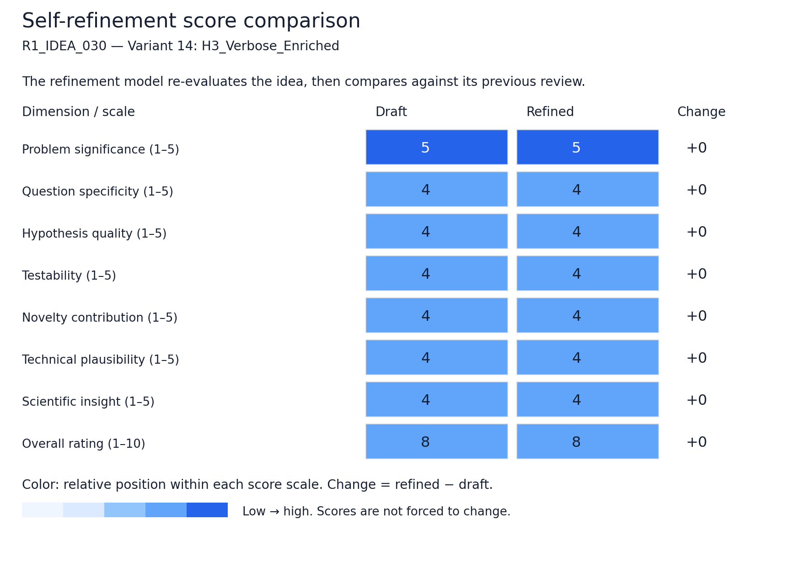

Changed score dimensions: none.

### Score justifications (draft / refined)

**Problem significance**

```json
{
  "draft": {
    "score": 5.0,
    "justification": "The problem of continuous knowledge updating in LLMs is critical for real-world applications, as models need to adapt to new information without losing prior knowledge."
  },
  "refined": {
    "score": 5.0,
    "justification": "The problem of continuous knowledge updating in LLMs is critical for real-world applications, as models need to adapt to new information without losing prior knowledge."
  }
}
```

**Question specificity**

```json
{
  "draft": {
    "score": 4.0,
    "justification": "The idea clearly defines the research question: whether LoRA can integrate new knowledge without catastrophic forgetting, with specific boundary conditions and evaluation components."
  },
  "refined": {
    "score": 4.0,
    "justification": "The idea clearly defines the research question: whether LoRA can integrate new knowledge without catastrophic forgetting, with specific boundary conditions and evaluation components."
  }
}
```

**Hypothesis quality**

```json
{
  "draft": {
    "score": 4.0,
    "justification": "The hypothesis is specific and testable, proposing that LoRA's effectiveness depends on adaptation rank and similarity to pretraining data. However, the connection between LoRA and the hypothesis is not fully detailed."
  },
  "refined": {
    "score": 4.0,
    "justification": "The hypothesis is specific and testable, proposing that LoRA's effectiveness depends on adaptation rank and similarity to pretraining data. However, the connection between LoRA and the hypothesis is not fully detailed."
  }
}
```

**Testability**

```json
{
  "draft": {
    "score": 4.0,
    "justification": "The idea suggests a staged design with ablations, sensitivity analyses, and error analysis, which are testable components. However, the specifics of implementation are not fully outlined."
  },
  "refined": {
    "score": 4.0,
    "justification": "The idea suggests a staged design with ablations, sensitivity analyses, and error analysis, which are testable components. However, the specifics of implementation are not fully outlined."
  }
}
```

**Novelty contribution**

```json
{
  "draft": {
    "score": 4.0,
    "justification": "The use of LoRA for continuous knowledge updating is a novel application, and the study's design could contribute to understanding the method's effectiveness under various conditions."
  },
  "refined": {
    "score": 4.0,
    "justification": "The use of LoRA for continuous knowledge updating is a novel application, and the study's design could contribute to understanding the method's effectiveness under various conditions."
  }
}
```

**Technical plausibility**

```json
{
  "draft": {
    "score": 4.0,
    "justification": "LoRA is a well-established technique, and the proposed application for knowledge updating is plausible. However, the exact implementation details are not specified."
  },
  "refined": {
    "score": 4.0,
    "justification": "LoRA is a well-established technique, and the proposed application for knowledge updating is plausible. However, the exact implementation details are not specified."
  }
}
```

**Scientific insight**

```json
{
  "draft": {
    "score": 4.0,
    "justification": "The study's design could provide insights into the factors (e.g., adaptation rank, pretraining similarity) that influence the effectiveness of LoRA for continuous learning."
  },
  "refined": {
    "score": 4.0,
    "justification": "The study's design could provide insights into the factors (e.g., adaptation rank, pretraining similarity) that influence the effectiveness of LoRA for continuous learning."
  }
}
```

**Overall rating**

```json
{
  "draft": {
    "score": 8.0,
    "justification": "The idea addresses a significant problem in LLMs with a clear hypothesis and structured experimental design. While some details are vague, the overall direction is promising and has the potential for meaningful scientific insight."
  },
  "refined": {
    "score": 8.0,
    "justification": "The idea addresses a significant problem in LLMs with a clear hypothesis and structured experimental design. While some details are vague, the overall direction is promising and has the potential for meaningful scientific insight."
  }
}
```

## R1_IDEA_030 — Variant 15: H4_Ultimate_Hype


Changed score dimensions: none.

### Score justifications (draft / refined)

**Problem significance**

```json
{
  "draft": {
    "score": 4.0,
    "justification": "The challenge of continuous knowledge updating in LLMs is critical for real-world applications, as it affects the model's ability to stay updated with new information without retraining."
  },
  "refined": {
    "score": 4.0,
    "justification": "The challenge of continuous knowledge updating in LLMs is critical for real-world applications, as it affects the model's ability to stay updated with new information without retraining."
  }
}
```

**Question specificity**

```json
{
  "draft": {
    "score": 2.0,
    "justification": "The idea is broad and does not clearly define the specific research question or hypothesis that the proposed approach will investigate."
  },
  "refined": {
    "score": 2.0,
    "justification": "The idea is broad and does not clearly define the specific research question or hypothesis that the proposed approach will investigate."
  }
}
```

**Hypothesis quality**

```json
{
  "draft": {
    "score": 3.0,
    "justification": "The idea suggests a novel approach but does not explicitly state a hypothesis that can be tested or falsified. It is more of a general research agenda than a specific hypothesis."
  },
  "refined": {
    "score": 3.0,
    "justification": "The idea suggests a novel approach but does not explicitly state a hypothesis that can be tested or falsified. It is more of a general research agenda than a specific hypothesis."
  }
}
```

**Testability**

```json
{
  "draft": {
    "score": 2.0,
    "justification": "The idea lacks specific experiments or evaluation methods that would allow the hypothesis to be tested or validated."
  },
  "refined": {
    "score": 2.0,
    "justification": "The idea lacks specific experiments or evaluation methods that would allow the hypothesis to be tested or validated."
  }
}
```

**Novelty contribution**

```json
{
  "draft": {
    "score": 4.0,
    "justification": "The use of LoRA for continuous knowledge updating in LLMs is a novel approach that could address existing limitations, offering potential for significant contributions to the field."
  },
  "refined": {
    "score": 4.0,
    "justification": "The use of LoRA for continuous knowledge updating in LLMs is a novel approach that could address existing limitations, offering potential for significant contributions to the field."
  }
}
```

**Technical plausibility**

```json
{
  "draft": {
    "score": 4.0,
    "justification": "LoRA is a well-established technique in the field of model adaptation, and its application to continuous knowledge updating in LLMs is technically plausible."
  },
  "refined": {
    "score": 4.0,
    "justification": "LoRA is a well-established technique in the field of model adaptation, and its application to continuous knowledge updating in LLMs is technically plausible."
  }
}
```

**Scientific insight**

```json
{
  "draft": {
    "score": 3.0,
    "justification": "While the idea has potential, it does not clearly outline the scientific insights that would be gained from successfully implementing the approach."
  },
  "refined": {
    "score": 3.0,
    "justification": "While the idea has potential, it does not clearly outline the scientific insights that would be gained from successfully implementing the approach."
  }
}
```

**Overall rating**

```json
{
  "draft": {
    "score": 6.0,
    "justification": "The idea addresses a significant problem in LLMs and proposes a novel approach with potential for impact. However, it lacks specific research questions, hypotheses, and evaluation methods, which are necessary for a strong research idea."
  },
  "refined": {
    "score": 6.0,
    "justification": "The idea addresses a significant problem in LLMs and proposes a novel approach with potential for impact. However, it lacks specific research questions, hypotheses, and evaluation methods, which are necessary for a strong research idea."
  }
}
```

## R1_IDEA_031 — Source


Changed score dimensions: none.

### Score justifications (draft / refined)

**Problem significance**

```json
{
  "draft": {
    "score": 4.0,
    "justification": "The problem of cognitive overload in LLM agents on long-horizon tasks is significant as it affects the practical applicability of these agents in complex, real-world scenarios."
  },
  "refined": {
    "score": 4.0,
    "justification": "The problem of cognitive overload in LLM agents on long-horizon tasks is significant as it affects the practical applicability of these agents in complex, real-world scenarios."
  }
}
```

**Question specificity**

```json
{
  "draft": {
    "score": 3.0,
    "justification": "The idea identifies a specific problem but lacks detailed specification of the research question, such as the exact mechanism of resource allocation or the specific tasks where CORAL will be tested."
  },
  "refined": {
    "score": 3.0,
    "justification": "The idea identifies a specific problem but lacks detailed specification of the research question, such as the exact mechanism of resource allocation or the specific tasks where CORAL will be tested."
  }
}
```

**Hypothesis quality**

```json
{
  "draft": {
    "score": 2.0,
    "justification": "The idea lacks a clear hypothesis or prediction, making it difficult to assess the scientific merit of the proposed research direction."
  },
  "refined": {
    "score": 2.0,
    "justification": "The idea lacks a clear hypothesis or prediction, making it difficult to assess the scientific merit of the proposed research direction."
  }
}
```

**Testability**

```json
{
  "draft": {
    "score": 3.0,
    "justification": "The idea is testable in principle, but the lack of specific details makes it challenging to design experiments or evaluate the proposed method effectively."
  },
  "refined": {
    "score": 3.0,
    "justification": "The idea is testable in principle, but the lack of specific details makes it challenging to design experiments or evaluate the proposed method effectively."
  }
}
```

**Novelty contribution**

```json
{
  "draft": {
    "score": 4.0,
    "justification": "The proposal of a new reasoning paradigm (CORAL) addresses a specific challenge in LLM agents, which could contribute novel insights into the design of efficient reasoning systems."
  },
  "refined": {
    "score": 4.0,
    "justification": "The proposal of a new reasoning paradigm (CORAL) addresses a specific challenge in LLM agents, which could contribute novel insights into the design of efficient reasoning systems."
  }
}
```

**Technical plausibility**

```json
{
  "draft": {
    "score": 4.0,
    "justification": "The concept of resource allocation for cognitive efficiency is technically plausible and aligns with current research trends in improving LLM performance."
  },
  "refined": {
    "score": 4.0,
    "justification": "The concept of resource allocation for cognitive efficiency is technically plausible and aligns with current research trends in improving LLM performance."
  }
}
```

**Scientific insight**

```json
{
  "draft": {
    "score": 3.0,
    "justification": "The idea has potential to provide insights into the mechanisms of efficient reasoning in LLMs, but the lack of specific details limits the potential for significant scientific insight."
  },
  "refined": {
    "score": 3.0,
    "justification": "The idea has potential to provide insights into the mechanisms of efficient reasoning in LLMs, but the lack of specific details limits the potential for significant scientific insight."
  }
}
```

**Overall rating**

```json
{
  "draft": {
    "score": 7.0,
    "justification": "The idea addresses a meaningful problem with a novel approach, but it lacks sufficient specificity and hypothesis to fully evaluate its scientific merit and potential contribution."
  },
  "refined": {
    "score": 7.0,
    "justification": "The idea addresses a meaningful problem with a novel approach, but it lacks sufficient specificity and hypothesis to fully evaluate its scientific merit and potential contribution."
  }
}
```

## R1_IDEA_031 — Variant 1: A1_Identity


Changed score dimensions: none.

### Score justifications (draft / refined)

**Problem significance**

```json
{
  "draft": {
    "score": 4.0,
    "justification": "The problem of cognitive overload in LLM agents for long-horizon tasks is significant as it limits the practical applicability of these agents in complex, real-world scenarios."
  },
  "refined": {
    "score": 4.0,
    "justification": "The problem of cognitive overload in LLM agents for long-horizon tasks is significant as it limits the practical applicability of these agents in complex, real-world scenarios."
  }
}
```

**Question specificity**

```json
{
  "draft": {
    "score": 3.0,
    "justification": "The problem is well-defined, but the specific research question or hypothesis is not clearly articulated, making it challenging to assess the proposed solution's testability."
  },
  "refined": {
    "score": 3.0,
    "justification": "The problem is well-defined, but the specific research question or hypothesis is not clearly articulated, making it challenging to assess the proposed solution's testability."
  }
}
```

**Hypothesis quality**

```json
{
  "draft": {
    "score": 3.0,
    "justification": "The idea suggests a novel approach but lacks a clear hypothesis or prediction that could be tested, such as how CORAL improves performance on specific tasks or benchmarks."
  },
  "refined": {
    "score": 3.0,
    "justification": "The idea suggests a novel approach but lacks a clear hypothesis or prediction that could be tested, such as how CORAL improves performance on specific tasks or benchmarks."
  }
}
```

**Testability**

```json
{
  "draft": {
    "score": 2.0,
    "justification": "The idea is promising but lacks details on the experiments or evaluations that would be used to test the effectiveness of CORAL, making it difficult to assess its feasibility."
  },
  "refined": {
    "score": 2.0,
    "justification": "The idea is promising but lacks details on the experiments or evaluations that would be used to test the effectiveness of CORAL, making it difficult to assess its feasibility."
  }
}
```

**Novelty contribution**

```json
{
  "draft": {
    "score": 4.0,
    "justification": "The proposal of CORAL as a novel reasoning paradigm for addressing cognitive overload in LLM agents represents a meaningful contribution to the field, even if the specifics are not yet detailed."
  },
  "refined": {
    "score": 4.0,
    "justification": "The proposal of CORAL as a novel reasoning paradigm for addressing cognitive overload in LLM agents represents a meaningful contribution to the field, even if the specifics are not yet detailed."
  }
}
```

**Technical plausibility**

```json
{
  "draft": {
    "score": 3.0,
    "justification": "The concept of self-allocation of cognitive resources is plausible, but the lack of details makes it difficult to assess the technical feasibility of the proposed approach."
  },
  "refined": {
    "score": 3.0,
    "justification": "The concept of self-allocation of cognitive resources is plausible, but the lack of details makes it difficult to assess the technical feasibility of the proposed approach."
  }
}
```

**Scientific insight**

```json
{
  "draft": {
    "score": 3.0,
    "justification": "The idea has the potential to provide insights into how cognitive resources can be managed in LLM agents, but the lack of specifics limits the potential for meaningful scientific insight."
  },
  "refined": {
    "score": 3.0,
    "justification": "The idea has the potential to provide insights into how cognitive resources can be managed in LLM agents, but the lack of specifics limits the potential for meaningful scientific insight."
  }
}
```

**Overall rating**

```json
{
  "draft": {
    "score": 7.0,
    "justification": "The idea addresses a significant problem in LLM agents for long-horizon tasks and proposes a novel approach. However, the lack of details on the mechanism, hypothesis, and evaluation plan limits its testability and potential for scientific insight."
  },
  "refined": {
    "score": 7.0,
    "justification": "The idea addresses a significant problem in LLM agents for long-horizon tasks and proposes a novel approach. However, the lack of details on the mechanism, hypothesis, and evaluation plan limits its testability and potential for scientific insight."
  }
}
```

## R1_IDEA_031 — Variant 2: A2_Paraphrase_Only


Changed score dimensions: none.

### Score justifications (draft / refined)

**Problem significance**

```json
{
  "draft": {
    "score": 4.0,
    "justification": "The problem of cognitive overload in LLMs for long-horizon tasks is significant as it limits their practical applicability in complex reasoning scenarios."
  },
  "refined": {
    "score": 4.0,
    "justification": "The problem of cognitive overload in LLMs for long-horizon tasks is significant as it limits their practical applicability in complex reasoning scenarios."
  }
}
```

**Question specificity**

```json
{
  "draft": {
    "score": 3.0,
    "justification": "The idea identifies a specific problem but lacks detailed specification of the research question or hypothesis."
  },
  "refined": {
    "score": 3.0,
    "justification": "The idea identifies a specific problem but lacks detailed specification of the research question or hypothesis."
  }
}
```

**Hypothesis quality**

```json
{
  "draft": {
    "score": 2.0,
    "justification": "The idea proposes a solution but does not clearly state a testable hypothesis or prediction about its effectiveness."
  },
  "refined": {
    "score": 2.0,
    "justification": "The idea proposes a solution but does not clearly state a testable hypothesis or prediction about its effectiveness."
  }
}
```

**Testability**

```json
{
  "draft": {
    "score": 2.0,
    "justification": "The idea lacks specific experiments or evaluation methods to test the proposed solution."
  },
  "refined": {
    "score": 2.0,
    "justification": "The idea lacks specific experiments or evaluation methods to test the proposed solution."
  }
}
```

**Novelty contribution**

```json
{
  "draft": {
    "score": 3.0,
    "justification": "The proposal introduces a new paradigm (CORAL) that addresses a specific limitation in LLMs, but the novelty is not clearly demonstrated without further details."
  },
  "refined": {
    "score": 3.0,
    "justification": "The proposal introduces a new paradigm (CORAL) that addresses a specific limitation in LLMs, but the novelty is not clearly demonstrated without further details."
  }
}
```

**Technical plausibility**

```json
{
  "draft": {
    "score": 3.0,
    "justification": "The concept of resource allocation for cognitive tasks is plausible, but the specific technical details are missing, making it hard to assess feasibility."
  },
  "refined": {
    "score": 3.0,
    "justification": "The concept of resource allocation for cognitive tasks is plausible, but the specific technical details are missing, making it hard to assess feasibility."
  }
}
```

**Scientific insight**

```json
{
  "draft": {
    "score": 2.0,
    "justification": "The idea suggests a potential improvement in LLM reasoning but does not provide a clear mechanism or insight into how the solution would work or why it would be effective."
  },
  "refined": {
    "score": 2.0,
    "justification": "The idea suggests a potential improvement in LLM reasoning but does not provide a clear mechanism or insight into how the solution would work or why it would be effective."
  }
}
```

**Overall rating**

```json
{
  "draft": {
    "score": 6.0,
    "justification": "The idea addresses a meaningful problem with a novel approach, but it lacks specific details, hypotheses, and evaluation methods needed to assess its scientific merit and potential contribution."
  },
  "refined": {
    "score": 6.0,
    "justification": "The idea addresses a meaningful problem with a novel approach, but it lacks specific details, hypotheses, and evaluation methods needed to assess its scientific merit and potential contribution."
  }
}
```

## R1_IDEA_031 — Variant 3: A3_Plain_Core


Changed score dimensions: none.

### Score justifications (draft / refined)

**Problem significance**

```json
{
  "draft": {
    "score": 4.0,
    "justification": "The problem of cognitive overload in long-horizon tasks is significant for the application of large language models in complex reasoning scenarios, which is a critical challenge in the field."
  },
  "refined": {
    "score": 4.0,
    "justification": "The problem of cognitive overload in long-horizon tasks is significant for the application of large language models in complex reasoning scenarios, which is a critical challenge in the field."
  }
}
```

**Question specificity**

```json
{
  "draft": {
    "score": 3.0,
    "justification": "The idea presents a specific problem (cognitive overload in long-horizon tasks) and a specific solution (CORAL), but the details of how the solution works are not sufficiently defined."
  },
  "refined": {
    "score": 3.0,
    "justification": "The idea presents a specific problem (cognitive overload in long-horizon tasks) and a specific solution (CORAL), but the details of how the solution works are not sufficiently defined."
  }
}
```

**Hypothesis quality**

```json
{
  "draft": {
    "score": 4.0,
    "justification": "The hypothesis that CORAL can reduce cognitive overload by enabling self-allocation of cognitive resources is plausible and specific, though the exact mechanism and expected outcomes are not fully detailed."
  },
  "refined": {
    "score": 4.0,
    "justification": "The hypothesis that CORAL can reduce cognitive overload by enabling self-allocation of cognitive resources is plausible and specific, though the exact mechanism and expected outcomes are not fully detailed."
  }
}
```

**Testability**

```json
{
  "draft": {
    "score": 3.0,
    "justification": "The idea is testable in principle, but the lack of specific evaluation plans and comparison methods makes it difficult to assess the feasibility of the proposed solution."
  },
  "refined": {
    "score": 3.0,
    "justification": "The idea is testable in principle, but the lack of specific evaluation plans and comparison methods makes it difficult to assess the feasibility of the proposed solution."
  }
}
```

**Novelty contribution**

```json
{
  "draft": {
    "score": 4.0,
    "justification": "The introduction of CORAL as a new reasoning paradigm is novel and has the potential to contribute to the field by addressing a specific challenge in large language model agents."
  },
  "refined": {
    "score": 4.0,
    "justification": "The introduction of CORAL as a new reasoning paradigm is novel and has the potential to contribute to the field by addressing a specific challenge in large language model agents."
  }
}
```

**Technical plausibility**

```json
{
  "draft": {
    "score": 3.0,
    "justification": "The concept of self-allocation of cognitive resources is plausible, but the technical details of implementation and the specific resources being managed are not sufficiently explained."
  },
  "refined": {
    "score": 3.0,
    "justification": "The concept of self-allocation of cognitive resources is plausible, but the technical details of implementation and the specific resources being managed are not sufficiently explained."
  }
}
```

**Scientific insight**

```json
{
  "draft": {
    "score": 3.0,
    "justification": "The idea has the potential to provide insights into how cognitive resources can be managed in complex tasks, but the lack of detailed mechanisms limits the potential for significant scientific insight."
  },
  "refined": {
    "score": 3.0,
    "justification": "The idea has the potential to provide insights into how cognitive resources can be managed in complex tasks, but the lack of detailed mechanisms limits the potential for significant scientific insight."
  }
}
```

**Overall rating**

```json
{
  "draft": {
    "score": 7.0,
    "justification": "The idea addresses a meaningful problem with a novel approach, but lacks sufficient detail in the proposed solution and evaluation plan, which are necessary for assessing its feasibility and potential impact."
  },
  "refined": {
    "score": 7.0,
    "justification": "The idea addresses a meaningful problem with a novel approach, but lacks sufficient detail in the proposed solution and evaluation plan, which are necessary for assessing its feasibility and potential impact."
  }
}
```

## R1_IDEA_031 — Variant 4: B1_Verbose_Elaborate


Changed score dimensions: none.

### Score justifications (draft / refined)

**Problem significance**

```json
{
  "draft": {
    "score": 4.0,
    "justification": "LLM agents struggling with long-horizon tasks is a significant challenge in practical applications, particularly in domains requiring sustained reasoning."
  },
  "refined": {
    "score": 4.0,
    "justification": "LLM agents struggling with long-horizon tasks is a significant challenge in practical applications, particularly in domains requiring sustained reasoning."
  }
}
```

**Question specificity**

```json
{
  "draft": {
    "score": 3.0,
    "justification": "The idea identifies a specific problem (cognitive overload in long-horizon tasks) but lacks detailed specification of the research question or hypothesis."
  },
  "refined": {
    "score": 3.0,
    "justification": "The idea identifies a specific problem (cognitive overload in long-horizon tasks) but lacks detailed specification of the research question or hypothesis."
  }
}
```

**Hypothesis quality**

```json
{
  "draft": {
    "score": 3.0,
    "justification": "The idea suggests a solution but does not explicitly state a testable hypothesis about how CORAL would improve performance or what specific aspects of reasoning it would address."
  },
  "refined": {
    "score": 3.0,
    "justification": "The idea suggests a solution but does not explicitly state a testable hypothesis about how CORAL would improve performance or what specific aspects of reasoning it would address."
  }
}
```

**Testability**

```json
{
  "draft": {
    "score": 2.0,
    "justification": "The idea lacks concrete experiments or evaluation plans, making it difficult to assess whether CORAL would be effective without further details."
  },
  "refined": {
    "score": 2.0,
    "justification": "The idea lacks concrete experiments or evaluation plans, making it difficult to assess whether CORAL would be effective without further details."
  }
}
```

**Novelty contribution**

```json
{
  "draft": {
    "score": 4.0,
    "justification": "The concept of cognitive resource self-allocation is novel in the context of LLM agents, offering a potential contribution to addressing memory limitations in long-horizon reasoning."
  },
  "refined": {
    "score": 4.0,
    "justification": "The concept of cognitive resource self-allocation is novel in the context of LLM agents, offering a potential contribution to addressing memory limitations in long-horizon reasoning."
  }
}
```

**Technical plausibility**

```json
{
  "draft": {
    "score": 3.0,
    "justification": "The idea is technically plausible but lacks specific details about how the resource allocation would be implemented or what mechanisms would be used."
  },
  "refined": {
    "score": 3.0,
    "justification": "The idea is technically plausible but lacks specific details about how the resource allocation would be implemented or what mechanisms would be used."
  }
}
```

**Scientific insight**

```json
{
  "draft": {
    "score": 3.0,
    "justification": "The idea has potential to provide insights into how LLM agents manage memory and reasoning, but the current formulation does not clearly specify what insights would be gained."
  },
  "refined": {
    "score": 3.0,
    "justification": "The idea has potential to provide insights into how LLM agents manage memory and reasoning, but the current formulation does not clearly specify what insights would be gained."
  }
}
```

**Overall rating**

```json
{
  "draft": {
    "score": 7.0,
    "justification": "The idea addresses a meaningful problem with a plausible solution, but lacks technical details and evaluation plans that are necessary for assessing its feasibility and impact."
  },
  "refined": {
    "score": 7.0,
    "justification": "The idea addresses a meaningful problem with a plausible solution, but lacks technical details and evaluation plans that are necessary for assessing its feasibility and impact."
  }
}
```

## R1_IDEA_031 — Variant 5: B2_Grand_Narrative


Changed score dimensions: none.

### Score justifications (draft / refined)

**Problem significance**

```json
{
  "draft": {
    "score": 4.0,
    "justification": "The problem of cognitive overload in LLM agents for long-horizon tasks is significant as it affects the scalability and practicality of AI systems in complex scenarios."
  },
  "refined": {
    "score": 4.0,
    "justification": "The problem of cognitive overload in LLM agents for long-horizon tasks is significant as it affects the scalability and practicality of AI systems in complex scenarios."
  }
}
```

**Question specificity**

```json
{
  "draft": {
    "score": 3.0,
    "justification": "The idea identifies a specific problem but lacks detailed specification of the research question, such as the exact mechanism or the scope of tasks where CORAL will be applied."
  },
  "refined": {
    "score": 3.0,
    "justification": "The idea identifies a specific problem but lacks detailed specification of the research question, such as the exact mechanism or the scope of tasks where CORAL will be applied."
  }
}
```

**Hypothesis quality**

```json
{
  "draft": {
    "score": 3.0,
    "justification": "The hypothesis is implied but not explicitly stated. The idea suggests that CORAL could improve performance, but the specific prediction or mechanism is not clearly defined."
  },
  "refined": {
    "score": 3.0,
    "justification": "The hypothesis is implied but not explicitly stated. The idea suggests that CORAL could improve performance, but the specific prediction or mechanism is not clearly defined."
  }
}
```

**Testability**

```json
{
  "draft": {
    "score": 3.0,
    "justification": "The idea suggests a potential solution but does not provide clear experiments or evaluation methods to test the effectiveness of CORAL."
  },
  "refined": {
    "score": 3.0,
    "justification": "The idea suggests a potential solution but does not provide clear experiments or evaluation methods to test the effectiveness of CORAL."
  }
}
```

**Novelty contribution**

```json
{
  "draft": {
    "score": 4.0,
    "justification": "The proposal of CORAL as a novel reasoning paradigm has the potential to contribute to the field by addressing a specific challenge in LLM agents, even if the details of the method are not yet specified."
  },
  "refined": {
    "score": 4.0,
    "justification": "The proposal of CORAL as a novel reasoning paradigm has the potential to contribute to the field by addressing a specific challenge in LLM agents, even if the details of the method are not yet specified."
  }
}
```

**Technical plausibility**

```json
{
  "draft": {
    "score": 4.0,
    "justification": "The concept of cognitive resource allocation is plausible and aligns with existing research on resource management in AI systems. The idea is technically coherent, though the specifics are not provided."
  },
  "refined": {
    "score": 4.0,
    "justification": "The concept of cognitive resource allocation is plausible and aligns with existing research on resource management in AI systems. The idea is technically coherent, though the specifics are not provided."
  }
}
```

**Scientific insight**

```json
{
  "draft": {
    "score": 3.0,
    "justification": "The idea has the potential to provide insights into how cognitive resources can be more efficiently managed in AI systems, but the specific insights depend on the details of the proposed method."
  },
  "refined": {
    "score": 3.0,
    "justification": "The idea has the potential to provide insights into how cognitive resources can be more efficiently managed in AI systems, but the specific insights depend on the details of the proposed method."
  }
}
```

**Overall rating**

```json
{
  "draft": {
    "score": 7.0,
    "justification": "The idea addresses a meaningful problem with a novel approach, but it lacks specific details on the method and hypothesis, which are necessary for assessing its testability and potential contribution."
  },
  "refined": {
    "score": 7.0,
    "justification": "The idea addresses a meaningful problem with a novel approach, but it lacks specific details on the method and hypothesis, which are necessary for assessing its testability and potential contribution."
  }
}
```

## R1_IDEA_031 — Variant 6: B3_Over_Confident


Changed score dimensions: none.

### Score justifications (draft / refined)

**Problem significance**

```json
{
  "draft": {
    "score": 4.0,
    "justification": "The problem of cognitive overload in LLM agents on long-horizon tasks is significant as it limits the practical applicability of these agents in complex, real-world scenarios."
  },
  "refined": {
    "score": 4.0,
    "justification": "The problem of cognitive overload in LLM agents on long-horizon tasks is significant as it limits the practical applicability of these agents in complex, real-world scenarios."
  }
}
```

**Question specificity**

```json
{
  "draft": {
    "score": 3.0,
    "justification": "The idea identifies a specific problem (cognitive overload in long-horizon tasks) but lacks detailed specification of the research question or hypothesis."
  },
  "refined": {
    "score": 3.0,
    "justification": "The idea identifies a specific problem (cognitive overload in long-horizon tasks) but lacks detailed specification of the research question or hypothesis."
  }
}
```

**Hypothesis quality**

```json
{
  "draft": {
    "score": 2.0,
    "justification": "The idea proposes a solution but does not clearly state a hypothesis or prediction that can be tested or falsified."
  },
  "refined": {
    "score": 2.0,
    "justification": "The idea proposes a solution but does not clearly state a hypothesis or prediction that can be tested or falsified."
  }
}
```

**Testability**

```json
{
  "draft": {
    "score": 2.0,
    "justification": "The idea lacks specific experiments or evaluation methods to test the effectiveness of CORAL, making it difficult to assess its validity."
  },
  "refined": {
    "score": 2.0,
    "justification": "The idea lacks specific experiments or evaluation methods to test the effectiveness of CORAL, making it difficult to assess its validity."
  }
}
```

**Novelty contribution**

```json
{
  "draft": {
    "score": 4.0,
    "justification": "The proposal of CORAL represents a novel approach to addressing cognitive overload in LLM agents, which could contribute significantly to the field if successful."
  },
  "refined": {
    "score": 4.0,
    "justification": "The proposal of CORAL represents a novel approach to addressing cognitive overload in LLM agents, which could contribute significantly to the field if successful."
  }
}
```

**Technical plausibility**

```json
{
  "draft": {
    "score": 3.0,
    "justification": "The concept of self-allocation of cognitive resources is plausible, but the specific technical details are not provided, making it difficult to assess feasibility."
  },
  "refined": {
    "score": 3.0,
    "justification": "The concept of self-allocation of cognitive resources is plausible, but the specific technical details are not provided, making it difficult to assess feasibility."
  }
}
```

**Scientific insight**

```json
{
  "draft": {
    "score": 3.0,
    "justification": "The idea has potential to provide insights into how cognitive resources can be managed in LLM agents, but the lack of specific details limits the potential for meaningful scientific insight."
  },
  "refined": {
    "score": 3.0,
    "justification": "The idea has potential to provide insights into how cognitive resources can be managed in LLM agents, but the lack of specific details limits the potential for meaningful scientific insight."
  }
}
```

**Overall rating**

```json
{
  "draft": {
    "score": 6.0,
    "justification": "The idea addresses a significant problem in LLM agents but lacks detailed specification, hypothesis, and testable components, which are necessary for a strong research direction."
  },
  "refined": {
    "score": 6.0,
    "justification": "The idea addresses a significant problem in LLM agents but lacks detailed specification, hypothesis, and testable components, which are necessary for a strong research direction."
  }
}
```

## R1_IDEA_031 — Variant 7: B4_Novelty


Changed score dimensions: none.

### Score justifications (draft / refined)

**Problem significance**

```json
{
  "draft": {
    "score": 4.0,
    "justification": "LLM agents struggling with long-horizon tasks is a significant challenge in AI, with practical implications for real-world applications requiring sustained reasoning."
  },
  "refined": {
    "score": 4.0,
    "justification": "LLM agents struggling with long-horizon tasks is a significant challenge in AI, with practical implications for real-world applications requiring sustained reasoning."
  }
}
```

**Question specificity**

```json
{
  "draft": {
    "score": 3.0,
    "justification": "The idea identifies a problem but lacks a clear, specific research question about how CORAL will address cognitive overload."
  },
  "refined": {
    "score": 3.0,
    "justification": "The idea identifies a problem but lacks a clear, specific research question about how CORAL will address cognitive overload."
  }
}
```

**Hypothesis quality**

```json
{
  "draft": {
    "score": 3.0,
    "justification": "The idea presents a general hypothesis that CORAL will improve performance, but does not specify the mechanism or how it will be tested."
  },
  "refined": {
    "score": 3.0,
    "justification": "The idea presents a general hypothesis that CORAL will improve performance, but does not specify the mechanism or how it will be tested."
  }
}
```

**Testability**

```json
{
  "draft": {
    "score": 2.0,
    "justification": "The idea lacks details on how the hypothesis will be tested, making it difficult to assess the feasibility of the proposed approach."
  },
  "refined": {
    "score": 2.0,
    "justification": "The idea lacks details on how the hypothesis will be tested, making it difficult to assess the feasibility of the proposed approach."
  }
}
```

**Novelty contribution**

```json
{
  "draft": {
    "score": 4.0,
    "justification": "CORAL is a novel approach to cognitive resource management in LLM agents, which could contribute new insights into efficient reasoning mechanisms."
  },
  "refined": {
    "score": 4.0,
    "justification": "CORAL is a novel approach to cognitive resource management in LLM agents, which could contribute new insights into efficient reasoning mechanisms."
  }
}
```

**Technical plausibility**

```json
{
  "draft": {
    "score": 4.0,
    "justification": "The concept of self-allocation of cognitive resources is plausible and aligns with current research on efficient resource management in AI systems."
  },
  "refined": {
    "score": 4.0,
    "justification": "The concept of self-allocation of cognitive resources is plausible and aligns with current research on efficient resource management in AI systems."
  }
}
```

**Scientific insight**

```json
{
  "draft": {
    "score": 3.0,
    "justification": "The idea has potential to provide insights into how LLM agents manage information over time, but the current description does not specify what insights are expected."
  },
  "refined": {
    "score": 3.0,
    "justification": "The idea has potential to provide insights into how LLM agents manage information over time, but the current description does not specify what insights are expected."
  }
}
```

**Overall rating**

```json
{
  "draft": {
    "score": 7.0,
    "justification": "The idea addresses a meaningful problem with a novel approach, but lacks specific details needed to assess its feasibility and scientific merit."
  },
  "refined": {
    "score": 7.0,
    "justification": "The idea addresses a meaningful problem with a novel approach, but lacks specific details needed to assess its feasibility and scientific merit."
  }
}
```

## R1_IDEA_031 — Variant 8: B5_Application_Impact


Changed score dimensions: none.

### Score justifications (draft / refined)

**Problem significance**

```json
{
  "draft": {
    "score": 4.0,
    "justification": "The problem of cognitive overload in LLM agents during long-horizon tasks is significant as it affects the reliability and effectiveness of autonomous systems and AI assistants, which are critical in real-world applications."
  },
  "refined": {
    "score": 4.0,
    "justification": "The problem of cognitive overload in LLM agents during long-horizon tasks is significant as it affects the reliability and effectiveness of autonomous systems and AI assistants, which are critical in real-world applications."
  }
}
```

**Question specificity**

```json
{
  "draft": {
    "score": 3.0,
    "justification": "The idea identifies a specific problem (cognitive overload in long-horizon tasks) but lacks detailed specification of the research question or the exact mechanism being investigated."
  },
  "refined": {
    "score": 3.0,
    "justification": "The idea identifies a specific problem (cognitive overload in long-horizon tasks) but lacks detailed specification of the research question or the exact mechanism being investigated."
  }
}
```

**Hypothesis quality**

```json
{
  "draft": {
    "score": 3.0,
    "justification": "The idea presents a general hypothesis that CORAL may improve reliability, but it does not provide a concrete prediction or mechanism that can be tested or falsified."
  },
  "refined": {
    "score": 3.0,
    "justification": "The idea presents a general hypothesis that CORAL may improve reliability, but it does not provide a concrete prediction or mechanism that can be tested or falsified."
  }
}
```

**Testability**

```json
{
  "draft": {
    "score": 2.0,
    "justification": "The idea lacks specific experiments or evaluations that would be needed to test the effectiveness of CORAL. The proposed solution is not clearly tied to a testable hypothesis or method."
  },
  "refined": {
    "score": 2.0,
    "justification": "The idea lacks specific experiments or evaluations that would be needed to test the effectiveness of CORAL. The proposed solution is not clearly tied to a testable hypothesis or method."
  }
}
```

**Novelty contribution**

```json
{
  "draft": {
    "score": 4.0,
    "justification": "The introduction of CORAL as a novel reasoning paradigm is a contribution, even if the specifics are not yet detailed. It addresses a gap in current methods for handling long-horizon tasks in LLM agents."
  },
  "refined": {
    "score": 4.0,
    "justification": "The introduction of CORAL as a novel reasoning paradigm is a contribution, even if the specifics are not yet detailed. It addresses a gap in current methods for handling long-horizon tasks in LLM agents."
  }
}
```

**Technical plausibility**

```json
{
  "draft": {
    "score": 3.0,
    "justification": "The concept of resource allocation in AI systems is plausible, but the specific technical details of CORAL are not provided, making it difficult to assess the feasibility of the approach."
  },
  "refined": {
    "score": 3.0,
    "justification": "The concept of resource allocation in AI systems is plausible, but the specific technical details of CORAL are not provided, making it difficult to assess the feasibility of the approach."
  }
}
```

**Scientific insight**

```json
{
  "draft": {
    "score": 3.0,
    "justification": "The idea has the potential to contribute to understanding how to manage cognitive resources in AI, but the lack of specific details limits the potential for scientific insight."
  },
  "refined": {
    "score": 3.0,
    "justification": "The idea has the potential to contribute to understanding how to manage cognitive resources in AI, but the lack of specific details limits the potential for scientific insight."
  }
}
```

**Overall rating**

```json
{
  "draft": {
    "score": 7.0,
    "justification": "The idea addresses a meaningful problem with a novel approach, but it lacks sufficient detail to fully evaluate its testability and potential contribution. It has strong potential but needs more specificity and concrete hypotheses to be considered a strong research idea."
  },
  "refined": {
    "score": 7.0,
    "justification": "The idea addresses a meaningful problem with a novel approach, but it lacks sufficient detail to fully evaluate its testability and potential contribution. It has strong potential but needs more specificity and concrete hypotheses to be considered a strong research idea."
  }
}
```

## R1_IDEA_031 — Variant 9: C1_Hollow_Shell


Changed score dimensions: none.

### Score justifications (draft / refined)

**Problem significance**

```json
{
  "draft": {
    "score": 4.0,
    "justification": "The problem of memory limitations in AI agents for long tasks is significant as it affects the scalability and practicality of language models in real-world applications."
  },
  "refined": {
    "score": 4.0,
    "justification": "The problem of memory limitations in AI agents for long tasks is significant as it affects the scalability and practicality of language models in real-world applications."
  }
}
```

**Question specificity**

```json
{
  "draft": {
    "score": 3.0,
    "justification": "The idea identifies a problem but lacks specific details about the research question, such as the exact nature of the cognitive resource management challenge or the specific tasks being targeted."
  },
  "refined": {
    "score": 3.0,
    "justification": "The idea identifies a problem but lacks specific details about the research question, such as the exact nature of the cognitive resource management challenge or the specific tasks being targeted."
  }
}
```

**Hypothesis quality**

```json
{
  "draft": {
    "score": 2.0,
    "justification": "The idea presents a general goal but does not provide a clear hypothesis or prediction that can be tested or falsified."
  },
  "refined": {
    "score": 2.0,
    "justification": "The idea presents a general goal but does not provide a clear hypothesis or prediction that can be tested or falsified."
  }
}
```

**Testability**

```json
{
  "draft": {
    "score": 3.0,
    "justification": "The idea suggests a solution but does not specify experiments, comparisons, or evaluation methods to test the effectiveness of CORAL."
  },
  "refined": {
    "score": 3.0,
    "justification": "The idea suggests a solution but does not specify experiments, comparisons, or evaluation methods to test the effectiveness of CORAL."
  }
}
```

**Novelty contribution**

```json
{
  "draft": {
    "score": 3.0,
    "justification": "The idea proposes a new approach (CORAL) to address a known problem, which could contribute to the field if it effectively solves the memory issue in AI agents."
  },
  "refined": {
    "score": 3.0,
    "justification": "The idea proposes a new approach (CORAL) to address a known problem, which could contribute to the field if it effectively solves the memory issue in AI agents."
  }
}
```

**Technical plausibility**

```json
{
  "draft": {
    "score": 4.0,
    "justification": "The proposed solution (CORAL) is technically plausible as it addresses a known challenge in AI agents, and the approach is consistent with current research directions in cognitive resource management."
  },
  "refined": {
    "score": 4.0,
    "justification": "The proposed solution (CORAL) is technically plausible as it addresses a known challenge in AI agents, and the approach is consistent with current research directions in cognitive resource management."
  }
}
```

**Scientific insight**

```json
{
  "draft": {
    "score": 3.0,
    "justification": "The idea has potential to provide insights into how AI agents can better manage cognitive resources for long tasks, but the current formulation lacks specifics that would enable deeper scientific understanding."
  },
  "refined": {
    "score": 3.0,
    "justification": "The idea has potential to provide insights into how AI agents can better manage cognitive resources for long tasks, but the current formulation lacks specifics that would enable deeper scientific understanding."
  }
}
```

**Overall rating**

```json
{
  "draft": {
    "score": 7.0,
    "justification": "The idea addresses a meaningful problem with a plausible solution, but it lacks specific details, hypotheses, and testable components that are necessary for a strong research direction."
  },
  "refined": {
    "score": 7.0,
    "justification": "The idea addresses a meaningful problem with a plausible solution, but it lacks specific details, hypotheses, and testable components that are necessary for a strong research direction."
  }
}
```

## R1_IDEA_031 — Variant 10: C2_Logic_Flawed


Changed score dimensions: none.

### Score justifications (draft / refined)

**Problem significance**

```json
{
  "draft": {
    "score": 4.0,
    "justification": "The problem of cognitive overload in LLM agents during long-horizon tasks is significant as it limits the practical applicability of these agents in real-world scenarios requiring sustained reasoning and planning."
  },
  "refined": {
    "score": 4.0,
    "justification": "The problem of cognitive overload in LLM agents during long-horizon tasks is significant as it limits the practical applicability of these agents in real-world scenarios requiring sustained reasoning and planning."
  }
}
```

**Question specificity**

```json
{
  "draft": {
    "score": 3.0,
    "justification": "The idea identifies a specific problem but lacks detailed specification of the research question, such as the exact nature of the cognitive resource allocation mechanism or the specific tasks where CORAL will be tested."
  },
  "refined": {
    "score": 3.0,
    "justification": "The idea identifies a specific problem but lacks detailed specification of the research question, such as the exact nature of the cognitive resource allocation mechanism or the specific tasks where CORAL will be tested."
  }
}
```

**Hypothesis quality**

```json
{
  "draft": {
    "score": 4.0,
    "justification": "The idea presents a plausible hypothesis that CORAL will improve memory management and task performance by enabling self-allocated cognitive resources, which is testable through implementation and evaluation."
  },
  "refined": {
    "score": 4.0,
    "justification": "The idea presents a plausible hypothesis that CORAL will improve memory management and task performance by enabling self-allocated cognitive resources, which is testable through implementation and evaluation."
  }
}
```

**Testability**

```json
{
  "draft": {
    "score": 3.0,
    "justification": "The idea suggests a potential solution but does not provide specific experiments or evaluation methods that would allow for testing the hypothesis, making it somewhat difficult to assess the feasibility of the approach."
  },
  "refined": {
    "score": 3.0,
    "justification": "The idea suggests a potential solution but does not provide specific experiments or evaluation methods that would allow for testing the hypothesis, making it somewhat difficult to assess the feasibility of the approach."
  }
}
```

**Novelty contribution**

```json
{
  "draft": {
    "score": 4.0,
    "justification": "The introduction of CORAL as a novel reasoning paradigm addresses a specific challenge in LLM agents, offering a potential contribution to the field of cognitive resource management in AI systems."
  },
  "refined": {
    "score": 4.0,
    "justification": "The introduction of CORAL as a novel reasoning paradigm addresses a specific challenge in LLM agents, offering a potential contribution to the field of cognitive resource management in AI systems."
  }
}
```

**Technical plausibility**

```json
{
  "draft": {
    "score": 4.0,
    "justification": "The proposed solution of self-allocated cognitive resources is technically plausible, as it aligns with existing research on memory management and resource allocation in AI systems."
  },
  "refined": {
    "score": 4.0,
    "justification": "The proposed solution of self-allocated cognitive resources is technically plausible, as it aligns with existing research on memory management and resource allocation in AI systems."
  }
}
```

**Scientific insight**

```json
{
  "draft": {
    "score": 3.0,
    "justification": "While the idea suggests a potential improvement in memory management, the scientific insight is limited without a clear explanation of how CORAL will be implemented and what specific insights it could provide beyond improved performance."
  },
  "refined": {
    "score": 3.0,
    "justification": "While the idea suggests a potential improvement in memory management, the scientific insight is limited without a clear explanation of how CORAL will be implemented and what specific insights it could provide beyond improved performance."
  }
}
```

**Overall rating**

```json
{
  "draft": {
    "score": 7.0,
    "justification": "The idea addresses a meaningful problem with a plausible solution, suggesting potential for contribution to the field. However, it lacks specific details on implementation, evaluation, and broader applicability, which are necessary for further development and validation."
  },
  "refined": {
    "score": 7.0,
    "justification": "The idea addresses a meaningful problem with a plausible solution, suggesting potential for contribution to the field. However, it lacks specific details on implementation, evaluation, and broader applicability, which are necessary for further development and validation."
  }
}
```

## R1_IDEA_031 — Variant 11: C3_Substance_Enriched


Changed score dimensions: none.

### Score justifications (draft / refined)

**Problem significance**

```json
{
  "draft": {
    "score": 4.0,
    "justification": "The problem of cognitive overload in LLM agents for long-horizon tasks is significant as it limits the practical applicability of these agents in complex, real-world scenarios."
  },
  "refined": {
    "score": 4.0,
    "justification": "The problem of cognitive overload in LLM agents for long-horizon tasks is significant as it limits the practical applicability of these agents in complex, real-world scenarios."
  }
}
```

**Question specificity**

```json
{
  "draft": {
    "score": 3.0,
    "justification": "The idea identifies a specific problem (cognitive overload in long-horizon tasks) but lacks detailed specification of the hypothesis and validation approach."
  },
  "refined": {
    "score": 3.0,
    "justification": "The idea identifies a specific problem (cognitive overload in long-horizon tasks) but lacks detailed specification of the hypothesis and validation approach."
  }
}
```

**Hypothesis quality**

```json
{
  "draft": {
    "score": 3.0,
    "justification": "The hypothesis is plausible but lacks concrete predictions about how CORAL would work and what specific outcomes would be measured."
  },
  "refined": {
    "score": 3.0,
    "justification": "The hypothesis is plausible but lacks concrete predictions about how CORAL would work and what specific outcomes would be measured."
  }
}
```

**Testability**

```json
{
  "draft": {
    "score": 3.0,
    "justification": "The idea suggests experiments on varying task lengths and complexity, which is testable, but lacks specific experimental design details."
  },
  "refined": {
    "score": 3.0,
    "justification": "The idea suggests experiments on varying task lengths and complexity, which is testable, but lacks specific experimental design details."
  }
}
```

**Novelty contribution**

```json
{
  "draft": {
    "score": 4.0,
    "justification": "The proposal introduces a novel paradigm (CORAL) that addresses a specific limitation of LLM agents, which could contribute to the field of reasoning agents."
  },
  "refined": {
    "score": 4.0,
    "justification": "The proposal introduces a novel paradigm (CORAL) that addresses a specific limitation of LLM agents, which could contribute to the field of reasoning agents."
  }
}
```

**Technical plausibility**

```json
{
  "draft": {
    "score": 4.0,
    "justification": "The concept of dynamic attention allocation is technically plausible and aligns with current research trends in attention mechanisms for LLMs."
  },
  "refined": {
    "score": 4.0,
    "justification": "The concept of dynamic attention allocation is technically plausible and aligns with current research trends in attention mechanisms for LLMs."
  }
}
```

**Scientific insight**

```json
{
  "draft": {
    "score": 3.0,
    "justification": "The idea has potential for scientific insight into how attention allocation affects task performance, but the specifics are not clearly defined."
  },
  "refined": {
    "score": 3.0,
    "justification": "The idea has potential for scientific insight into how attention allocation affects task performance, but the specifics are not clearly defined."
  }
}
```

**Overall rating**

```json
{
  "draft": {
    "score": 7.0,
    "justification": "The idea addresses a meaningful problem with a plausible hypothesis and potential contribution, but lacks specific details that would make it more testable and scientifically rigorous."
  },
  "refined": {
    "score": 7.0,
    "justification": "The idea addresses a meaningful problem with a plausible hypothesis and potential contribution, but lacks specific details that would make it more testable and scientifically rigorous."
  }
}
```

## R1_IDEA_031 — Variant 12: H1_Deceptive_Hollow

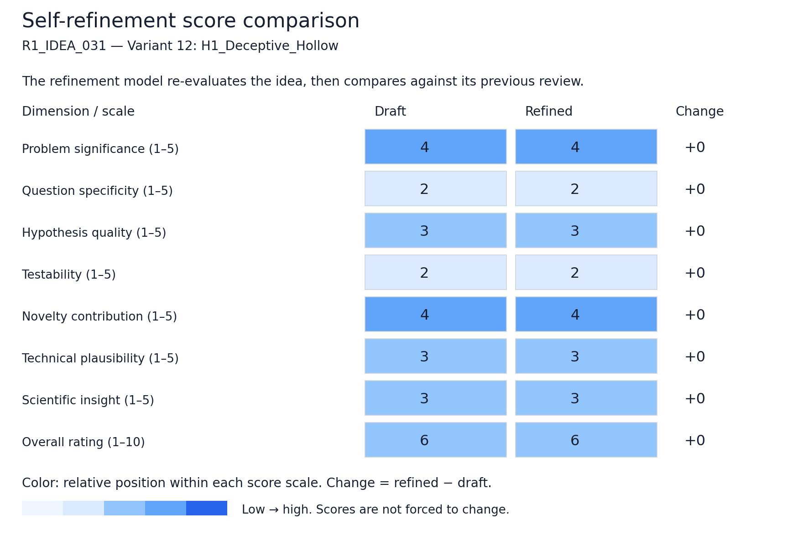

Changed score dimensions: none.

### Score justifications (draft / refined)

**Problem significance**

```json
{
  "draft": {
    "score": 4.0,
    "justification": "The problem of memory issues in AI agents using language models is a critical challenge in the field, as it affects the ability of these agents to handle complex and longer tasks. This is a significant issue that has implications for the practical application of AI agents."
  },
  "refined": {
    "score": 4.0,
    "justification": "The problem of memory issues in AI agents using language models is a critical challenge in the field, as it affects the ability of these agents to handle complex and longer tasks. This is a significant issue that has implications for the practical application of AI agents."
  }
}
```

**Question specificity**

```json
{
  "draft": {
    "score": 2.0,
    "justification": "The idea is somewhat general and does not clearly define specific research questions or hypotheses. It mentions a broader framework but lacks concrete details on what exactly is being investigated."
  },
  "refined": {
    "score": 2.0,
    "justification": "The idea is somewhat general and does not clearly define specific research questions or hypotheses. It mentions a broader framework but lacks concrete details on what exactly is being investigated."
  }
}
```

**Hypothesis quality**

```json
{
  "draft": {
    "score": 3.0,
    "justification": "The idea presents a general promise but does not explicitly state a hypothesis or concrete prediction. It suggests a transformative synthesis but does not specify what the hypothesis is or how it would be tested."
  },
  "refined": {
    "score": 3.0,
    "justification": "The idea presents a general promise but does not explicitly state a hypothesis or concrete prediction. It suggests a transformative synthesis but does not specify what the hypothesis is or how it would be tested."
  }
}
```

**Testability**

```json
{
  "draft": {
    "score": 2.0,
    "justification": "The idea lacks specific experiments, comparisons, or evaluations that would allow for meaningful testing. It is too vague to determine how the CORAL approach would be validated or how its effectiveness would be measured."
  },
  "refined": {
    "score": 2.0,
    "justification": "The idea lacks specific experiments, comparisons, or evaluations that would allow for meaningful testing. It is too vague to determine how the CORAL approach would be validated or how its effectiveness would be measured."
  }
}
```

**Novelty contribution**

```json
{
  "draft": {
    "score": 4.0,
    "justification": "The idea positions CORAL as a transformative synthesis rather than a narrow technical adjustment, suggesting potential for future research. However, without specific details, it is difficult to assess the novelty compared to existing approaches."
  },
  "refined": {
    "score": 4.0,
    "justification": "The idea positions CORAL as a transformative synthesis rather than a narrow technical adjustment, suggesting potential for future research. However, without specific details, it is difficult to assess the novelty compared to existing approaches."
  }
}
```

**Technical plausibility**

```json
{
  "draft": {
    "score": 3.0,
    "justification": "The idea is framed as a novel approach, but the lack of specific details makes it difficult to assess its technical plausibility. The connection between conceptual insight and methodological ambition is not clearly explained."
  },
  "refined": {
    "score": 3.0,
    "justification": "The idea is framed as a novel approach, but the lack of specific details makes it difficult to assess its technical plausibility. The connection between conceptual insight and methodological ambition is not clearly explained."
  }
}
```

**Scientific insight**

```json
{
  "draft": {
    "score": 3.0,
    "justification": "The idea emphasizes the potential for scientific insight but does not provide a clear path or mechanism for how it would contribute to the field. The connection between the proposed approach and the broader research area is not sufficiently detailed."
  },
  "refined": {
    "score": 3.0,
    "justification": "The idea emphasizes the potential for scientific insight but does not provide a clear path or mechanism for how it would contribute to the field. The connection between the proposed approach and the broader research area is not sufficiently detailed."
  }
}
```

**Overall rating**

```json
{
  "draft": {
    "score": 6.0,
    "justification": "The idea addresses a significant problem in AI agents using language models and proposes a novel approach with potential for transformative impact. However, it lacks specific details, clear research questions, and testable hypotheses, which are necessary for evaluating its scientific merit and feasibility."
  },
  "refined": {
    "score": 6.0,
    "justification": "The idea addresses a significant problem in AI agents using language models and proposes a novel approach with potential for transformative impact. However, it lacks specific details, clear research questions, and testable hypotheses, which are necessary for evaluating its scientific merit and feasibility."
  }
}
```

## R1_IDEA_031 — Variant 13: H2_Confident_Flaw


Changed score dimensions: none.

### Score justifications (draft / refined)

**Problem significance**

```json
{
  "draft": {
    "score": 4.0,
    "justification": "The problem of cognitive overload in LLM agents for long-horizon tasks is significant as it directly impacts the effectiveness of these agents in complex reasoning scenarios."
  },
  "refined": {
    "score": 4.0,
    "justification": "The problem of cognitive overload in LLM agents for long-horizon tasks is significant as it directly impacts the effectiveness of these agents in complex reasoning scenarios."
  }
}
```

**Question specificity**

```json
{
  "draft": {
    "score": 3.0,
    "justification": "The idea clearly defines the problem but lacks specific details on the research question, such as how CORAL will be implemented or what exactly will be tested."
  },
  "refined": {
    "score": 3.0,
    "justification": "The idea clearly defines the problem but lacks specific details on the research question, such as how CORAL will be implemented or what exactly will be tested."
  }
}
```

**Hypothesis quality**

```json
{
  "draft": {
    "score": 4.0,
    "justification": "The hypothesis that solving the cognitive overload issue will lead to reliable improvements is plausible and directly addresses the problem, though it is not explicitly stated as a hypothesis."
  },
  "refined": {
    "score": 4.0,
    "justification": "The hypothesis that solving the cognitive overload issue will lead to reliable improvements is plausible and directly addresses the problem, though it is not explicitly stated as a hypothesis."
  }
}
```

**Testability**

```json
{
  "draft": {
    "score": 2.0,
    "justification": "The idea lacks specific experimental details or evaluation methods, making it difficult to assess the testability of the proposed solution."
  },
  "refined": {
    "score": 2.0,
    "justification": "The idea lacks specific experimental details or evaluation methods, making it difficult to assess the testability of the proposed solution."
  }
}
```

**Novelty contribution**

```json
{
  "draft": {
    "score": 4.0,
    "justification": "The proposal of CORAL as a novel reasoning paradigm addresses a specific and important limitation in LLM agents, offering potential for broader applicability."
  },
  "refined": {
    "score": 4.0,
    "justification": "The proposal of CORAL as a novel reasoning paradigm addresses a specific and important limitation in LLM agents, offering potential for broader applicability."
  }
}
```

**Technical plausibility**

```json
{
  "draft": {
    "score": 4.0,
    "justification": "The concept of cognitive resource self-allocation is technically plausible and aligns with existing research on memory management in AI systems."
  },
  "refined": {
    "score": 4.0,
    "justification": "The concept of cognitive resource self-allocation is technically plausible and aligns with existing research on memory management in AI systems."
  }
}
```

**Scientific insight**

```json
{
  "draft": {
    "score": 3.0,
    "justification": "The idea has potential for scientific insight by addressing a key limitation in LLM agents, but the specific mechanisms and their implications are not clearly outlined."
  },
  "refined": {
    "score": 3.0,
    "justification": "The idea has potential for scientific insight by addressing a key limitation in LLM agents, but the specific mechanisms and their implications are not clearly outlined."
  }
}
```

**Overall rating**

```json
{
  "draft": {
    "score": 7.0,
    "justification": "The idea addresses a significant problem in LLM agents and proposes a novel solution with potential for broader applicability. However, it lacks specific details on implementation, evaluation, and theoretical justification, which are necessary for a strong research direction."
  },
  "refined": {
    "score": 7.0,
    "justification": "The idea addresses a significant problem in LLM agents and proposes a novel solution with potential for broader applicability. However, it lacks specific details on implementation, evaluation, and theoretical justification, which are necessary for a strong research direction."
  }
}
```

## R1_IDEA_031 — Variant 14: H3_Verbose_Enriched

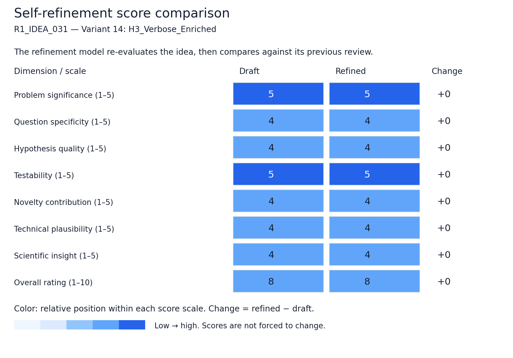

Changed score dimensions: none.

### Score justifications (draft / refined)

**Problem significance**

```json
{
  "draft": {
    "score": 5.0,
    "justification": "The problem of cognitive overload in LLM agents for long-horizon tasks is a critical challenge in AI, with significant implications for real-world applications requiring sustained reasoning."
  },
  "refined": {
    "score": 5.0,
    "justification": "The problem of cognitive overload in LLM agents for long-horizon tasks is a critical challenge in AI, with significant implications for real-world applications requiring sustained reasoning."
  }
}
```

**Question specificity**

```json
{
  "draft": {
    "score": 4.0,
    "justification": "The idea clearly defines the problem (cognitive overload in long-horizon tasks) and proposes a specific hypothesis (dynamic attention allocation based on task phase), but the exact implementation details are not fully specified."
  },
  "refined": {
    "score": 4.0,
    "justification": "The idea clearly defines the problem (cognitive overload in long-horizon tasks) and proposes a specific hypothesis (dynamic attention allocation based on task phase), but the exact implementation details are not fully specified."
  }
}
```

**Hypothesis quality**

```json
{
  "draft": {
    "score": 4.0,
    "justification": "The hypothesis is plausible and specific, suggesting that dynamic attention allocation can mitigate cognitive overload. However, it is not explicitly stated in the summary, though it is implied."
  },
  "refined": {
    "score": 4.0,
    "justification": "The hypothesis is plausible and specific, suggesting that dynamic attention allocation can mitigate cognitive overload. However, it is not explicitly stated in the summary, though it is implied."
  }
}
```

**Testability**

```json
{
  "draft": {
    "score": 5.0,
    "justification": "The study design includes multiple testable components (staged design, ablations, sensitivity analyses, error analysis), which provide a clear path to validate the hypothesis."
  },
  "refined": {
    "score": 5.0,
    "justification": "The study design includes multiple testable components (staged design, ablations, sensitivity analyses, error analysis), which provide a clear path to validate the hypothesis."
  }
}
```

**Novelty contribution**

```json
{
  "draft": {
    "score": 4.0,
    "justification": "The idea introduces a novel approach (CORAL) to address a specific problem in LLM agents. However, the novelty is somewhat limited if the mechanism is a variation of existing attention mechanisms."
  },
  "refined": {
    "score": 4.0,
    "justification": "The idea introduces a novel approach (CORAL) to address a specific problem in LLM agents. However, the novelty is somewhat limited if the mechanism is a variation of existing attention mechanisms."
  }
}
```

**Technical plausibility**

```json
{
  "draft": {
    "score": 4.0,
    "justification": "The proposed mechanism (dynamic attention allocation) is technically plausible and aligns with current research trends in attention mechanisms for LLMs. However, the exact implementation details are not specified."
  },
  "refined": {
    "score": 4.0,
    "justification": "The proposed mechanism (dynamic attention allocation) is technically plausible and aligns with current research trends in attention mechanisms for LLMs. However, the exact implementation details are not specified."
  }
}
```

**Scientific insight**

```json
{
  "draft": {
    "score": 4.0,
    "justification": "The study aims to uncover boundary conditions and domain constraints, which could provide valuable insights into the effectiveness of CORAL. However, the potential for deeper scientific insight is somewhat limited without more specific details on the method."
  },
  "refined": {
    "score": 4.0,
    "justification": "The study aims to uncover boundary conditions and domain constraints, which could provide valuable insights into the effectiveness of CORAL. However, the potential for deeper scientific insight is somewhat limited without more specific details on the method."
  }
}
```

**Overall rating**

```json
{
  "draft": {
    "score": 8.0,
    "justification": "The idea addresses a significant problem in LLM agents, proposes a specific hypothesis, and includes a testable design. While some details are missing, the overall direction is promising and has the potential for meaningful scientific contribution."
  },
  "refined": {
    "score": 8.0,
    "justification": "The idea addresses a significant problem in LLM agents, proposes a specific hypothesis, and includes a testable design. While some details are missing, the overall direction is promising and has the potential for meaningful scientific contribution."
  }
}
```

## R1_IDEA_031 — Variant 15: H4_Ultimate_Hype


Changed score dimensions: none.

### Score justifications (draft / refined)

**Problem significance**

```json
{
  "draft": {
    "score": 4.0,
    "justification": "The problem of cognitive overload in LLM agents for long-horizon tasks is significant as it affects the practical deployment of these agents in real-world scenarios where sustained reasoning is required."
  },
  "refined": {
    "score": 4.0,
    "justification": "The problem of cognitive overload in LLM agents for long-horizon tasks is significant as it affects the practical deployment of these agents in real-world scenarios where sustained reasoning is required."
  }
}
```

**Question specificity**

```json
{
  "draft": {
    "score": 3.0,
    "justification": "The idea identifies a problem but lacks specific details about the research question or hypothesis. It is clear that the goal is to improve working memory management, but the exact nature of the question is not well-defined."
  },
  "refined": {
    "score": 3.0,
    "justification": "The idea identifies a problem but lacks specific details about the research question or hypothesis. It is clear that the goal is to improve working memory management, but the exact nature of the question is not well-defined."
  }
}
```

**Hypothesis quality**

```json
{
  "draft": {
    "score": 3.0,
    "justification": "The idea presents a bold agenda but does not explicitly state a hypothesis or prediction that can be tested. The potential impact is mentioned, but there is no concrete claim about how CORAL would achieve its goals."
  },
  "refined": {
    "score": 3.0,
    "justification": "The idea presents a bold agenda but does not explicitly state a hypothesis or prediction that can be tested. The potential impact is mentioned, but there is no concrete claim about how CORAL would achieve its goals."
  }
}
```

**Testability**

```json
{
  "draft": {
    "score": 2.0,
    "justification": "The idea is ambitious but lacks specific experiments or evaluation plans. Without a clear method for testing CORAL, it is difficult to assess its feasibility or effectiveness."
  },
  "refined": {
    "score": 2.0,
    "justification": "The idea is ambitious but lacks specific experiments or evaluation plans. Without a clear method for testing CORAL, it is difficult to assess its feasibility or effectiveness."
  }
}
```

**Novelty contribution**

```json
{
  "draft": {
    "score": 4.0,
    "justification": "The idea introduces a novel approach (CORAL) to address a specific challenge in LLM agents, which could contribute to the field by improving the scalability and practicality of these systems."
  },
  "refined": {
    "score": 4.0,
    "justification": "The idea introduces a novel approach (CORAL) to address a specific challenge in LLM agents, which could contribute to the field by improving the scalability and practicality of these systems."
  }
}
```

**Technical plausibility**

```json
{
  "draft": {
    "score": 3.0,
    "justification": "The concept of cognitive resource allocation is plausible, but the lack of specific details makes it difficult to assess the technical feasibility of the proposed mechanism."
  },
  "refined": {
    "score": 3.0,
    "justification": "The concept of cognitive resource allocation is plausible, but the lack of specific details makes it difficult to assess the technical feasibility of the proposed mechanism."
  }
}
```

**Scientific insight**

```json
{
  "draft": {
    "score": 3.0,
    "justification": "The idea has the potential to provide insights into how cognitive resources can be managed in LLM agents, but the lack of specific hypotheses or experiments limits the potential for scientific insight."
  },
  "refined": {
    "score": 3.0,
    "justification": "The idea has the potential to provide insights into how cognitive resources can be managed in LLM agents, but the lack of specific hypotheses or experiments limits the potential for scientific insight."
  }
}
```

**Overall rating**

```json
{
  "draft": {
    "score": 7.0,
    "justification": "The idea addresses a meaningful problem with potential for significant impact, but it lacks specific details, hypotheses, and evaluation plans that are necessary for a strong research direction."
  },
  "refined": {
    "score": 7.0,
    "justification": "The idea addresses a meaningful problem with potential for significant impact, but it lacks specific details, hypotheses, and evaluation plans that are necessary for a strong research direction."
  }
}
```

## R1_IDEA_032 — Source

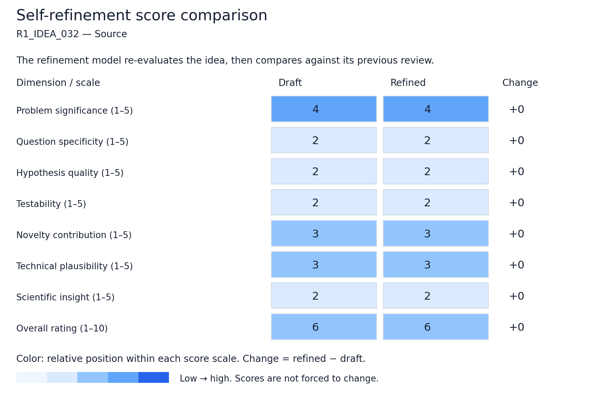

Changed score dimensions: none.

### Score justifications (draft / refined)

**Problem significance**

```json
{
  "draft": {
    "score": 4.0,
    "justification": "The problem is significant because it addresses a critical gap in SSL research, particularly in real-world applications where data is often noisy. This has practical implications for domains like medical imaging and astrophysics."
  },
  "refined": {
    "score": 4.0,
    "justification": "The problem is significant because it addresses a critical gap in SSL research, particularly in real-world applications where data is often noisy. This has practical implications for domains like medical imaging and astrophysics."
  }
}
```

**Question specificity**

```json
{
  "draft": {
    "score": 2.0,
    "justification": "The idea is too general and does not specify a particular research question or hypothesis. It identifies a problem but lacks the clarity needed to define what exactly is being investigated."
  },
  "refined": {
    "score": 2.0,
    "justification": "The idea is too general and does not specify a particular research question or hypothesis. It identifies a problem but lacks the clarity needed to define what exactly is being investigated."
  }
}
```

**Hypothesis quality**

```json
{
  "draft": {
    "score": 2.0,
    "justification": "There is no explicit hypothesis or prediction provided. The idea states a problem but does not propose a specific mechanism or outcome that can be tested."
  },
  "refined": {
    "score": 2.0,
    "justification": "There is no explicit hypothesis or prediction provided. The idea states a problem but does not propose a specific mechanism or outcome that can be tested."
  }
}
```

**Testability**

```json
{
  "draft": {
    "score": 2.0,
    "justification": "The idea does not suggest any experiments, evaluations, or methods to test the proposed approach. Without a clear plan for validation, the research question remains too vague to be testable."
  },
  "refined": {
    "score": 2.0,
    "justification": "The idea does not suggest any experiments, evaluations, or methods to test the proposed approach. Without a clear plan for validation, the research question remains too vague to be testable."
  }
}
```

**Novelty contribution**

```json
{
  "draft": {
    "score": 3.0,
    "justification": "The problem is novel in the context of SSL for noisy data, but the idea does not propose a specific contribution or method. A general statement about the importance of the problem does not constitute a novel contribution."
  },
  "refined": {
    "score": 3.0,
    "justification": "The problem is novel in the context of SSL for noisy data, but the idea does not propose a specific contribution or method. A general statement about the importance of the problem does not constitute a novel contribution."
  }
}
```

**Technical plausibility**

```json
{
  "draft": {
    "score": 3.0,
    "justification": "The idea is technically plausible, as SSL methods can be adapted to handle noise. However, the lack of specific technical details makes it difficult to assess the feasibility of the proposed approach."
  },
  "refined": {
    "score": 3.0,
    "justification": "The idea is technically plausible, as SSL methods can be adapted to handle noise. However, the lack of specific technical details makes it difficult to assess the feasibility of the proposed approach."
  }
}
```

**Scientific insight**

```json
{
  "draft": {
    "score": 2.0,
    "justification": "The idea does not provide any potential scientific insight beyond identifying a problem. Without a specific hypothesis or method, it is unclear what new knowledge the research would contribute."
  },
  "refined": {
    "score": 2.0,
    "justification": "The idea does not provide any potential scientific insight beyond identifying a problem. Without a specific hypothesis or method, it is unclear what new knowledge the research would contribute."
  }
}
```

**Overall rating**

```json
{
  "draft": {
    "score": 6.0,
    "justification": "The idea identifies a meaningful problem in SSL research but lacks the specificity, hypothesis, and methodological details needed to be a strong research direction. It has potential but requires further clarification and concrete proposals."
  },
  "refined": {
    "score": 6.0,
    "justification": "The idea identifies a meaningful problem in SSL research but lacks the specificity, hypothesis, and methodological details needed to be a strong research direction. It has potential but requires further clarification and concrete proposals."
  }
}
```

## R1_IDEA_032 — Variant 1: A1_Identity


Changed score dimensions: none.

### Score justifications (draft / refined)

**Problem significance**

```json
{
  "draft": {
    "score": 4.0,
    "justification": "The problem is significant because it addresses a critical limitation in SSL's applicability to real-world scenarios where data is often noisy. This has important implications for domains like medical imaging and finance."
  },
  "refined": {
    "score": 4.0,
    "justification": "The problem is significant because it addresses a critical limitation in SSL's applicability to real-world scenarios where data is often noisy. This has important implications for domains like medical imaging and finance."
  }
}
```

**Question specificity**

```json
{
  "draft": {
    "score": 2.0,
    "justification": "The idea is too general and does not specify a particular research question or hypothesis. It identifies a problem but lacks a clear direction for investigation."
  },
  "refined": {
    "score": 2.0,
    "justification": "The idea is too general and does not specify a particular research question or hypothesis. It identifies a problem but lacks a clear direction for investigation."
  }
}
```

**Hypothesis quality**

```json
{
  "draft": {
    "score": 2.0,
    "justification": "There is no explicit hypothesis or prediction provided. The idea states a problem but does not propose a specific mechanism or outcome that can be tested."
  },
  "refined": {
    "score": 2.0,
    "justification": "There is no explicit hypothesis or prediction provided. The idea states a problem but does not propose a specific mechanism or outcome that can be tested."
  }
}
```

**Testability**

```json
{
  "draft": {
    "score": 2.0,
    "justification": "The idea does not suggest any experiments, evaluations, or methods to test the proposed approach. It remains too vague to be testable without further details."
  },
  "refined": {
    "score": 2.0,
    "justification": "The idea does not suggest any experiments, evaluations, or methods to test the proposed approach. It remains too vague to be testable without further details."
  }
}
```

**Novelty contribution**

```json
{
  "draft": {
    "score": 3.0,
    "justification": "The problem is novel in the context of SSL for noisy data, but the idea does not propose a specific contribution or method. It is more of a problem statement than a research proposal."
  },
  "refined": {
    "score": 3.0,
    "justification": "The problem is novel in the context of SSL for noisy data, but the idea does not propose a specific contribution or method. It is more of a problem statement than a research proposal."
  }
}
```

**Technical plausibility**

```json
{
  "draft": {
    "score": 3.0,
    "justification": "The idea is technically plausible, as adapting SSL to noisy data is a reasonable direction. However, the lack of specific technical details makes it difficult to assess the feasibility of the approach."
  },
  "refined": {
    "score": 3.0,
    "justification": "The idea is technically plausible, as adapting SSL to noisy data is a reasonable direction. However, the lack of specific technical details makes it difficult to assess the feasibility of the approach."
  }
}
```

**Scientific insight**

```json
{
  "draft": {
    "score": 2.0,
    "justification": "The idea does not provide a clear path to scientific insight. It identifies a problem but does not suggest how solving it could lead to new understanding or principles in SSL."
  },
  "refined": {
    "score": 2.0,
    "justification": "The idea does not provide a clear path to scientific insight. It identifies a problem but does not suggest how solving it could lead to new understanding or principles in SSL."
  }
}
```

**Overall rating**

```json
{
  "draft": {
    "score": 6.0,
    "justification": "The idea identifies a meaningful problem in SSL for noisy data but lacks specificity, hypothesis, and methodological details. It has potential but needs further clarification and concrete proposals to be a strong research idea."
  },
  "refined": {
    "score": 6.0,
    "justification": "The idea identifies a meaningful problem in SSL for noisy data but lacks specificity, hypothesis, and methodological details. It has potential but needs further clarification and concrete proposals to be a strong research idea."
  }
}
```

## R1_IDEA_032 — Variant 2: A2_Paraphrase_Only


Changed score dimensions: none.

### Score justifications (draft / refined)

**Problem significance**

```json
{
  "draft": {
    "score": 4.0,
    "justification": "The problem is significant as it addresses a critical gap in SSL research, particularly in real-world applications where data is often noisy. The importance of SSL in domains like astrophysics and medical imaging underscores the practical relevance of solving this problem."
  },
  "refined": {
    "score": 4.0,
    "justification": "The problem is significant as it addresses a critical gap in SSL research, particularly in real-world applications where data is often noisy. The importance of SSL in domains like astrophysics and medical imaging underscores the practical relevance of solving this problem."
  }
}
```

**Question specificity**

```json
{
  "draft": {
    "score": 2.0,
    "justification": "The idea is somewhat general and does not clearly define the specific research question or hypothesis. It identifies a problem but lacks the specificity needed to guide further investigation."
  },
  "refined": {
    "score": 2.0,
    "justification": "The idea is somewhat general and does not clearly define the specific research question or hypothesis. It identifies a problem but lacks the specificity needed to guide further investigation."
  }
}
```

**Hypothesis quality**

```json
{
  "draft": {
    "score": 2.0,
    "justification": "The idea does not contain a clear hypothesis or prediction. It raises a problem but does not propose a specific mechanism or relationship that could be tested."
  },
  "refined": {
    "score": 2.0,
    "justification": "The idea does not contain a clear hypothesis or prediction. It raises a problem but does not propose a specific mechanism or relationship that could be tested."
  }
}
```

**Testability**

```json
{
  "draft": {
    "score": 2.0,
    "justification": "The idea lacks specific experiments or evaluation methods. Without a clear plan for testing the hypothesis, it is difficult to assess the feasibility of the research."
  },
  "refined": {
    "score": 2.0,
    "justification": "The idea lacks specific experiments or evaluation methods. Without a clear plan for testing the hypothesis, it is difficult to assess the feasibility of the research."
  }
}
```

**Novelty contribution**

```json
{
  "draft": {
    "score": 3.0,
    "justification": "The idea addresses a novel area in SSL research by focusing on noisy data, which is a critical challenge in real-world applications. However, the lack of specific details limits the potential for a groundbreaking contribution."
  },
  "refined": {
    "score": 3.0,
    "justification": ""
  }
}
```

**Technical plausibility**

```json
{
  "draft": {
    "score": 4.0,
    "justification": "The proposed direction is technically plausible as it builds on existing SSL methods and addresses a known challenge in data quality. The idea is grounded in current research trends and is feasible to explore."
  },
  "refined": {
    "score": 4.0,
    "justification": "The proposed direction is technically plausible as it builds on existing SSL methods and addresses a known challenge in data quality. The idea is grounded in current research trends and is feasible to explore."
  }
}
```

**Scientific insight**

```json
{
  "draft": {
    "score": 2.0,
    "justification": "The idea has potential for scientific insight but lacks the specificity needed to generate meaningful insights. Without a clear hypothesis or methodology, the potential for discovering new principles or mechanisms is limited."
  },
  "refined": {
    "score": 2.0,
    "justification": "The idea has potential for scientific insight but lacks the specificity needed to generate meaningful insights. Without a clear hypothesis or methodology, the potential for discovering new principles or mechanisms is limited."
  }
}
```

**Overall rating**

```json
{
  "draft": {
    "score": 6.0,
    "justification": "The idea identifies a significant problem in SSL research but lacks the specificity, hypothesis, and methodology needed to fully evaluate its potential. It has the potential to contribute to the field but requires further clarification and development."
  },
  "refined": {
    "score": 6.0,
    "justification": "The idea identifies a significant problem in SSL research but lacks the specificity, hypothesis, and methodology needed to fully evaluate its potential. It has the potential to contribute to the field but requires further clarification and development."
  }
}
```

## R1_IDEA_032 — Variant 3: A3_Plain_Core


Changed score dimensions: none.

### Score justifications (draft / refined)

**Problem significance**

```json
{
  "draft": {
    "score": 4.0,
    "justification": "The problem is significant as it addresses a critical challenge in SSL for real-world applications where data quality is often poor, impacting multiple important domains."
  },
  "refined": {
    "score": 4.0,
    "justification": "The problem is significant as it addresses a critical challenge in SSL for real-world applications where data quality is often poor, impacting multiple important domains."
  }
}
```

**Question specificity**

```json
{
  "draft": {
    "score": 2.0,
    "justification": "The idea identifies a broad problem but lacks a specific research question or hypothesis, making it difficult to assess the direction of the research."
  },
  "refined": {
    "score": 2.0,
    "justification": "The idea identifies a broad problem but lacks a specific research question or hypothesis, making it difficult to assess the direction of the research."
  }
}
```

**Hypothesis quality**

```json
{
  "draft": {
    "score": 2.0,
    "justification": "The idea does not present a clear hypothesis or prediction that could be tested, merely stating the problem without proposing a specific claim."
  },
  "refined": {
    "score": 2.0,
    "justification": "The idea does not present a clear hypothesis or prediction that could be tested, merely stating the problem without proposing a specific claim."
  }
}
```

**Testability**

```json
{
  "draft": {
    "score": 2.0,
    "justification": "The idea does not suggest experiments, comparisons, or methods for testing the proposed research direction, making it difficult to evaluate the feasibility of the investigation."
  },
  "refined": {
    "score": 2.0,
    "justification": "The idea does not suggest experiments, comparisons, or methods for testing the proposed research direction, making it difficult to evaluate the feasibility of the investigation."
  }
}
```

**Novelty contribution**

```json
{
  "draft": {
    "score": 3.0,
    "justification": "The idea addresses a relevant problem but does not clearly propose a novel method or contribution, focusing more on the importance of the problem than on the research direction."
  },
  "refined": {
    "score": 3.0,
    "justification": "The idea addresses a relevant problem but does not clearly propose a novel method or contribution, focusing more on the importance of the problem than on the research direction."
  }
}
```

**Technical plausibility**

```json
{
  "draft": {
    "score": 4.0,
    "justification": "The idea is technically plausible as it builds on existing SSL methods and addresses a known challenge in applying them to noisy data, which is a reasonable area for further research."
  },
  "refined": {
    "score": 4.0,
    "justification": "The idea is technically plausible as it builds on existing SSL methods and addresses a known challenge in applying them to noisy data, which is a reasonable area for further research."
  }
}
```

**Scientific insight**

```json
{
  "draft": {
    "score": 3.0,
    "justification": "The idea has potential for scientific insight by exploring how SSL can be adapted to noisy data, but the lack of a specific research question limits the potential for meaningful insights."
  },
  "refined": {
    "score": 3.0,
    "justification": "The idea has potential for scientific insight by exploring how SSL can be adapted to noisy data, but the lack of a specific research question limits the potential for meaningful insights."
  }
}
```

**Overall rating**

```json
{
  "draft": {
    "score": 6.0,
    "justification": "The idea identifies a significant problem in SSL for real-world applications but lacks a specific research question, hypothesis, and method, which are necessary for a strong research direction."
  },
  "refined": {
    "score": 6.0,
    "justification": "The idea identifies a significant problem in SSL for real-world applications but lacks a specific research question, hypothesis, and method, which are necessary for a strong research direction."
  }
}
```

## R1_IDEA_032 — Variant 4: B1_Verbose_Elaborate


Changed score dimensions: none.

### Score justifications (draft / refined)

**Problem significance**

```json
{
  "draft": {
    "score": 4.0,
    "justification": "The problem is significant because it addresses a critical limitation in SSL's applicability to real-world scenarios where data is often noisy. The practical relevance across multiple domains underscores its importance."
  },
  "refined": {
    "score": 4.0,
    "justification": "The problem is significant because it addresses a critical limitation in SSL's applicability to real-world scenarios where data is often noisy. The practical relevance across multiple domains underscores its importance."
  }
}
```

**Question specificity**

```json
{
  "draft": {
    "score": 2.0,
    "justification": "The idea identifies a broad problem but lacks a specific research question or hypothesis. It does not clearly define what exactly is being investigated or how the problem will be addressed."
  },
  "refined": {
    "score": 2.0,
    "justification": "The idea identifies a broad problem but lacks a specific research question or hypothesis. It does not clearly define what exactly is being investigated or how the problem will be addressed."
  }
}
```

**Hypothesis quality**

```json
{
  "draft": {
    "score": 2.0,
    "justification": "The idea does not contain a clear hypothesis or prediction. It merely states a problem and its importance without proposing a specific mechanism or outcome to be tested."
  },
  "refined": {
    "score": 2.0,
    "justification": "The idea does not contain a clear hypothesis or prediction. It merely states a problem and its importance without proposing a specific mechanism or outcome to be tested."
  }
}
```

**Testability**

```json
{
  "draft": {
    "score": 2.0,
    "justification": "The idea does not specify how the problem will be tested or what experiments will be conducted. Without a clear plan for evaluation, the research question remains too vague to be testable."
  },
  "refined": {
    "score": 2.0,
    "justification": "The idea does not specify how the problem will be tested or what experiments will be conducted. Without a clear plan for evaluation, the research question remains too vague to be testable."
  }
}
```

**Novelty contribution**

```json
{
  "draft": {
    "score": 3.0,
    "justification": "The problem is novel in the sense that it addresses a gap in SSL research, but the idea does not propose a specific contribution or innovation. The lack of a concrete method or hypothesis limits its novelty score."
  },
  "refined": {
    "score": 3.0,
    "justification": "The problem is novel in the sense that it addresses a gap in SSL research, but the idea does not propose a specific contribution or innovation. The lack of a concrete method or hypothesis limits its novelty score."
  }
}
```

**Technical plausibility**

```json
{
  "draft": {
    "score": 4.0,
    "justification": "The idea is technically plausible as it builds on existing SSL methods and addresses a realistic challenge. However, the lack of specific technical details makes it difficult to assess the feasibility of the proposed approach."
  },
  "refined": {
    "score": 4.0,
    "justification": "The idea is technically plausible as it builds on existing SSL methods and addresses a realistic challenge. However, the lack of specific technical details makes it difficult to assess the feasibility of the proposed approach."
  }
}
```

**Scientific insight**

```json
{
  "draft": {
    "score": 2.0,
    "justification": "The idea does not provide a clear path to scientific insight. Without a specific hypothesis or method, it is unclear what new knowledge or understanding the research would contribute."
  },
  "refined": {
    "score": 2.0,
    "justification": "The idea does not provide a clear path to scientific insight. Without a specific hypothesis or method, it is unclear what new knowledge or understanding the research would contribute."
  }
}
```

**Overall rating**

```json
{
  "draft": {
    "score": 6.0,
    "justification": "The idea identifies a meaningful problem with significant practical relevance but lacks the specificity, hypothesis, and testable plan needed to develop into a strong research direction. It has potential but requires further clarification and concrete proposals."
  },
  "refined": {
    "score": 6.0,
    "justification": "The idea identifies a meaningful problem with significant practical relevance but lacks the specificity, hypothesis, and testable plan needed to develop into a strong research direction. It has potential but requires further clarification and concrete proposals."
  }
}
```

## R1_IDEA_032 — Variant 5: B2_Grand_Narrative


Changed score dimensions: none.

### Score justifications (draft / refined)

**Problem significance**

```json
{
  "draft": {
    "score": 4.0,
    "justification": "The problem is significant because it addresses a critical gap in SSL research, which is essential for real-world applications where data is often noisy. This could lead to more robust and widely applicable representation learning methods."
  },
  "refined": {
    "score": 4.0,
    "justification": "The problem is significant because it addresses a critical gap in SSL research, which is essential for real-world applications where data is often noisy. This could lead to more robust and widely applicable representation learning methods."
  }
}
```

**Question specificity**

```json
{
  "draft": {
    "score": 2.0,
    "justification": "The idea is somewhat general and lacks a specific research question. It identifies a problem but does not clearly define what exactly should be investigated or how the research will be conducted."
  },
  "refined": {
    "score": 2.0,
    "justification": "The idea is somewhat general and lacks a specific research question. It identifies a problem but does not clearly define what exactly should be investigated or how the research will be conducted."
  }
}
```

**Hypothesis quality**

```json
{
  "draft": {
    "score": 2.0,
    "justification": "The idea does not contain a clear hypothesis or prediction. It states a problem but does not propose a specific mechanism or relationship that could be tested or falsified."
  },
  "refined": {
    "score": 2.0,
    "justification": "The idea does not contain a clear hypothesis or prediction. It states a problem but does not propose a specific mechanism or relationship that could be tested or falsified."
  }
}
```

**Testability**

```json
{
  "draft": {
    "score": 2.0,
    "justification": "The idea lacks concrete experiments or evaluation methods. Without a specific approach or metrics, it is difficult to assess the testability of the research question."
  },
  "refined": {
    "score": 2.0,
    "justification": "The idea lacks concrete experiments or evaluation methods. Without a specific approach or metrics, it is difficult to assess the testability of the research question."
  }
}
```

**Novelty contribution**

```json
{
  "draft": {
    "score": 3.0,
    "justification": "The idea addresses a relevant problem but does not clearly define the novel contribution. It suggests a potential improvement in SSL methods for noisy data but lacks specifics on how this would be achieved or what new insights it could provide."
  },
  "refined": {
    "score": 3.0,
    "justification": "The idea addresses a relevant problem but does not clearly define the novel contribution. It suggests a potential improvement in SSL methods for noisy data but lacks specifics on how this would be achieved or what new insights it could provide."
  }
}
```

**Technical plausibility**

```json
{
  "draft": {
    "score": 4.0,
    "justification": "The proposed direction is technically plausible. Developing SSL methods for noisy data is a reasonable and achievable research goal, given the existing body of work in robust learning and data augmentation."
  },
  "refined": {
    "score": 4.0,
    "justification": "The proposed direction is technically plausible. Developing SSL methods for noisy data is a reasonable and achievable research goal, given the existing body of work in robust learning and data augmentation."
  }
}
```

**Scientific insight**

```json
{
  "draft": {
    "score": 3.0,
    "justification": "The idea has potential for scientific insight, particularly in understanding how SSL methods can be made robust to noise. However, the current formulation does not clearly specify what insights are expected from the research."
  },
  "refined": {
    "score": 3.0,
    "justification": "The idea has potential for scientific insight, particularly in understanding how SSL methods can be made robust to noise. However, the current formulation does not clearly specify what insights are expected from the research."
  }
}
```

**Overall rating**

```json
{
  "draft": {
    "score": 6.0,
    "justification": "The idea is promising and addresses a significant problem in SSL research. However, it lacks specific research questions, hypotheses, and methods, which are necessary for a strong research direction. With more concrete details, it could become a strong research idea."
  },
  "refined": {
    "score": 6.0,
    "justification": "The idea is promising and addresses a significant problem in SSL research. However, it lacks specific research questions, hypotheses, and methods, which are necessary for a strong research direction. With more concrete details, it could become a strong research idea."
  }
}
```

## R1_IDEA_032 — Variant 6: B3_Over_Confident


Changed score dimensions: none.

### Score justifications (draft / refined)

**Problem significance**

```json
{
  "draft": {
    "score": 4.0,
    "justification": "The problem is significant because it addresses a critical gap in SSL for real-world applications where data is often noisy, which is important for fields like astrophysics and medical imaging."
  },
  "refined": {
    "score": 4.0,
    "justification": "The problem is significant because it addresses a critical gap in SSL for real-world applications where data is often noisy, which is important for fields like astrophysics and medical imaging."
  }
}
```

**Question specificity**

```json
{
  "draft": {
    "score": 2.0,
    "justification": "The idea is too general and does not specify a particular research question or hypothesis. It identifies a problem but lacks a clear direction for investigation."
  },
  "refined": {
    "score": 2.0,
    "justification": "The idea is too general and does not specify a particular research question or hypothesis. It identifies a problem but lacks a clear direction for investigation."
  }
}
```

**Hypothesis quality**

```json
{
  "draft": {
    "score": 2.0,
    "justification": "There is no explicit hypothesis. The idea states a problem but does not propose a specific prediction or mechanism that could be tested."
  },
  "refined": {
    "score": 2.0,
    "justification": "There is no explicit hypothesis. The idea states a problem but does not propose a specific prediction or mechanism that could be tested."
  }
}
```

**Testability**

```json
{
  "draft": {
    "score": 2.0,
    "justification": "The idea does not provide a clear experimental plan or method for testing the proposed approach. It lacks details on how the problem will be addressed or evaluated."
  },
  "refined": {
    "score": 2.0,
    "justification": "The idea does not provide a clear experimental plan or method for testing the proposed approach. It lacks details on how the problem will be addressed or evaluated."
  }
}
```

**Novelty contribution**

```json
{
  "draft": {
    "score": 3.0,
    "justification": "The problem is novel in the context of SSL for noisy data, but the idea does not specify how the research would contribute new knowledge or methods."
  },
  "refined": {
    "score": 3.0,
    "justification": "The problem is novel in the context of SSL for noisy data, but the idea does not specify how the research would contribute new knowledge or methods."
  }
}
```

**Technical plausibility**

```json
{
  "draft": {
    "score": 3.0,
    "justification": "The idea is technically plausible, as adapting SSL to noisy data is a reasonable research direction. However, the lack of specific methods or assumptions makes it less concrete."
  },
  "refined": {
    "score": 3.0,
    "justification": "The idea is technically plausible, as adapting SSL to noisy data is a reasonable research direction. However, the lack of specific methods or assumptions makes it less concrete."
  }
}
```

**Scientific insight**

```json
{
  "draft": {
    "score": 2.0,
    "justification": "The idea has potential for scientific insight but does not specify what kind of insight is expected. It focuses on a problem but lacks a clear direction for discovering new principles or mechanisms."
  },
  "refined": {
    "score": 2.0,
    "justification": "The idea has potential for scientific insight but does not specify what kind of insight is expected. It focuses on a problem but lacks a clear direction for discovering new principles or mechanisms."
  }
}
```

**Overall rating**

```json
{
  "draft": {
    "score": 6.0,
    "justification": "The idea identifies a meaningful problem in SSL for noisy data but lacks specificity, a hypothesis, and a clear method. It has potential but needs more concrete details to be a strong research direction."
  },
  "refined": {
    "score": 6.0,
    "justification": "The idea identifies a meaningful problem in SSL for noisy data but lacks specificity, a hypothesis, and a clear method. It has potential but needs more concrete details to be a strong research direction."
  }
}
```

## R1_IDEA_032 — Variant 7: B4_Novelty


Changed score dimensions: none.

### Score justifications (draft / refined)

**Problem significance**

```json
{
  "draft": {
    "score": 4.0,
    "justification": "The problem is significant because it addresses a critical real-world challenge in SSL, where data is often noisy, and has important applications in various domains."
  },
  "refined": {
    "score": 4.0,
    "justification": "The problem is significant because it addresses a critical real-world challenge in SSL, where data is often noisy, and has important applications in various domains."
  }
}
```

**Question specificity**

```json
{
  "draft": {
    "score": 2.0,
    "justification": "The idea is somewhat general and lacks specific research questions or hypotheses. It identifies a broad problem but does not clearly define what exactly is being investigated."
  },
  "refined": {
    "score": 2.0,
    "justification": "The idea is somewhat general and lacks specific research questions or hypotheses. It identifies a broad problem but does not clearly define what exactly is being investigated."
  }
}
```

**Hypothesis quality**

```json
{
  "draft": {
    "score": 2.0,
    "justification": "The idea does not contain a clear hypothesis or prediction. It suggests a direction but does not propose a specific mechanism or outcome that can be tested."
  },
  "refined": {
    "score": 2.0,
    "justification": "The idea does not contain a clear hypothesis or prediction. It suggests a direction but does not propose a specific mechanism or outcome that can be tested."
  }
}
```

**Testability**

```json
{
  "draft": {
    "score": 2.0,
    "justification": "The idea lacks concrete experiments or evaluation plans. Without specific methods or benchmarks, it is difficult to assess the testability of the proposed research direction."
  },
  "refined": {
    "score": 2.0,
    "justification": "The idea lacks concrete experiments or evaluation plans. Without specific methods or benchmarks, it is difficult to assess the testability of the proposed research direction."
  }
}
```

**Novelty contribution**

```json
{
  "draft": {
    "score": 3.0,
    "justification": "The idea is novel in focusing on SSL in noisy data, but the contribution is not clearly defined. It has potential to advance the field but lacks specifics on how it would contribute."
  },
  "refined": {
    "score": 3.0,
    "justification": "The idea is novel in focusing on SSL in noisy data, but the contribution is not clearly defined. It has potential to advance the field but lacks specifics on how it would contribute."
  }
}
```

**Technical plausibility**

```json
{
  "draft": {
    "score": 4.0,
    "justification": "The proposed direction is technically plausible. SSL methods can be adapted to handle noise, and the problem is within the scope of current research."
  },
  "refined": {
    "score": 4.0,
    "justification": "The proposed direction is technically plausible. SSL methods can be adapted to handle noise, and the problem is within the scope of current research."
  }
}
```

**Scientific insight**

```json
{
  "draft": {
    "score": 3.0,
    "justification": "The idea has potential to provide insights into how SSL performs in noisy environments, but the specific insights are not clearly outlined."
  },
  "refined": {
    "score": 3.0,
    "justification": "The idea has potential to provide insights into how SSL performs in noisy environments, but the specific insights are not clearly outlined."
  }
}
```

**Overall rating**

```json
{
  "draft": {
    "score": 6.0,
    "justification": "The idea is promising and addresses a meaningful problem, but it lacks specific research questions, hypotheses, and experimental plans, which are necessary for a strong research direction."
  },
  "refined": {
    "score": 6.0,
    "justification": "The idea is promising and addresses a meaningful problem, but it lacks specific research questions, hypotheses, and experimental plans, which are necessary for a strong research direction."
  }
}
```

## R1_IDEA_032 — Variant 8: B5_Application_Impact


Changed score dimensions: none.

### Score justifications (draft / refined)

**Problem significance**

```json
{
  "draft": {
    "score": 4.0,
    "justification": "The problem of applying SSL to noisy data is significant because it addresses a critical gap in current SSL research and has practical relevance in domains like astrophysics and medical imaging."
  },
  "refined": {
    "score": 4.0,
    "justification": "The problem of applying SSL to noisy data is significant because it addresses a critical gap in current SSL research and has practical relevance in domains like astrophysics and medical imaging."
  }
}
```

**Question specificity**

```json
{
  "draft": {
    "score": 2.0,
    "justification": "The idea is somewhat general and does not clearly define a specific research question or hypothesis. It identifies a problem but lacks a focused direction for investigation."
  },
  "refined": {
    "score": 2.0,
    "justification": "The idea is somewhat general and does not clearly define a specific research question or hypothesis. It identifies a problem but lacks a focused direction for investigation."
  }
}
```

**Hypothesis quality**

```json
{
  "draft": {
    "score": 2.0,
    "justification": "The idea does not present a clear hypothesis or prediction that could be tested. It states a problem and potential applications but does not propose a specific mechanism or outcome to investigate."
  },
  "refined": {
    "score": 2.0,
    "justification": "The idea does not present a clear hypothesis or prediction that could be tested. It states a problem and potential applications but does not propose a specific mechanism or outcome to investigate."
  }
}
```

**Testability**

```json
{
  "draft": {
    "score": 2.0,
    "justification": "The idea lacks concrete experiments or evaluation methods. Without a specific approach or metrics, it is difficult to assess the testability of the research direction."
  },
  "refined": {
    "score": 2.0,
    "justification": "The idea lacks concrete experiments or evaluation methods. Without a specific approach or metrics, it is difficult to assess the testability of the research direction."
  }
}
```

**Novelty contribution**

```json
{
  "draft": {
    "score": 3.0,
    "justification": "The idea addresses a relevant but not novel problem. While it highlights a gap in SSL research, the contribution would depend on the specific methods and insights developed in the research."
  },
  "refined": {
    "score": 3.0,
    "justification": "The idea addresses a relevant but not novel problem. While it highlights a gap in SSL research, the contribution would depend on the specific methods and insights developed in the research."
  }
}
```

**Technical plausibility**

```json
{
  "draft": {
    "score": 4.0,
    "justification": "The idea is technically plausible as it builds on existing SSL methods and addresses a known challenge. However, the lack of specific details makes it difficult to assess the feasibility of the proposed approach."
  },
  "refined": {
    "score": 4.0,
    "justification": "The idea is technically plausible as it builds on existing SSL methods and addresses a known challenge. However, the lack of specific details makes it difficult to assess the feasibility of the proposed approach."
  }
}
```

**Scientific insight**

```json
{
  "draft": {
    "score": 3.0,
    "justification": "The idea has potential for scientific insight, particularly in understanding how SSL can be adapted to noisy data. However, without a specific hypothesis or method, the potential for meaningful insight is limited."
  },
  "refined": {
    "score": 3.0,
    "justification": "The idea has potential for scientific insight, particularly in understanding how SSL can be adapted to noisy data. However, without a specific hypothesis or method, the potential for meaningful insight is limited."
  }
}
```

**Overall rating**

```json
{
  "draft": {
    "score": 6.0,
    "justification": "The idea identifies a meaningful problem with practical relevance but lacks specificity, a clear hypothesis, and concrete methods. It has potential for contribution but needs more detailed investigation to be strong."
  },
  "refined": {
    "score": 6.0,
    "justification": "The idea identifies a meaningful problem with practical relevance but lacks specificity, a clear hypothesis, and concrete methods. It has potential for contribution but needs more detailed investigation to be strong."
  }
}
```

## R1_IDEA_032 — Variant 9: C1_Hollow_Shell


Changed score dimensions: none.

### Score justifications (draft / refined)

**Problem significance**

```json
{
  "draft": {
    "score": 4.0,
    "justification": "The idea addresses a critical challenge in machine learning: the gap between idealized research conditions and real-world applications. This has broad implications for various scientific and technical fields that rely on unsupervised learning."
  },
  "refined": {
    "score": 4.0,
    "justification": "The idea addresses a critical challenge in machine learning: the gap between idealized research conditions and real-world applications. This has broad implications for various scientific and technical fields that rely on unsupervised learning."
  }
}
```

**Question specificity**

```json
{
  "draft": {
    "score": 2.0,
    "justification": "While the idea identifies a general problem, it lacks specific research questions or hypotheses. The proposed investigation is too vague to determine what exactly will be studied or how it will be evaluated."
  },
  "refined": {
    "score": 2.0,
    "justification": "While the idea identifies a general problem, it lacks specific research questions or hypotheses. The proposed investigation is too vague to determine what exactly will be studied or how it will be evaluated."
  }
}
```

**Hypothesis quality**

```json
{
  "draft": {
    "score": 2.0,
    "justification": "The idea does not contain a clear hypothesis or prediction. It merely states that applying unsupervised learning in real-world settings is challenging, without specifying what should be investigated or what the expected outcome is."
  },
  "refined": {
    "score": 2.0,
    "justification": "The idea does not contain a clear hypothesis or prediction. It merely states that applying unsupervised learning in real-world settings is challenging, without specifying what should be investigated or what the expected outcome is."
  }
}
```

**Testability**

```json
{
  "draft": {
    "score": 2.0,
    "justification": "The idea does not provide a clear experimental plan or method for testing the proposed research question. Without specific hypotheses or experimental design, it is difficult to determine how the research would be conducted."
  },
  "refined": {
    "score": 2.0,
    "justification": "The idea does not provide a clear experimental plan or method for testing the proposed research question. Without specific hypotheses or experimental design, it is difficult to determine how the research would be conducted."
  }
}
```

**Novelty contribution**

```json
{
  "draft": {
    "score": 3.0,
    "justification": "The idea addresses a meaningful problem in machine learning, but the proposed research is relatively generic. It does not specify a novel method or unique contribution beyond identifying the gap between ideal and real-world settings."
  },
  "refined": {
    "score": 3.0,
    "justification": "The idea addresses a meaningful problem in machine learning, but the proposed research is relatively generic. It does not specify a novel method or unique contribution beyond identifying the gap between ideal and real-world settings."
  }
}
```

**Technical plausibility**

```json
{
  "draft": {
    "score": 4.0,
    "justification": "The idea is technically plausible as it builds on existing research in unsupervised learning. The challenge of applying these methods to real-world data is a well-established issue in the field."
  },
  "refined": {
    "score": 4.0,
    "justification": "The idea is technically plausible as it builds on existing research in unsupervised learning. The challenge of applying these methods to real-world data is a well-established issue in the field."
  }
}
```

**Scientific insight**

```json
{
  "draft": {
    "score": 2.0,
    "justification": "The idea has potential for scientific insight but lacks the specificity needed to generate meaningful insights. Without a clear research question or hypothesis, it is difficult to determine what new knowledge could be gained."
  },
  "refined": {
    "score": 2.0,
    "justification": "The idea has potential for scientific insight but lacks the specificity needed to generate meaningful insights. Without a clear research question or hypothesis, it is difficult to determine what new knowledge could be gained."
  }
}
```

**Overall rating**

```json
{
  "draft": {
    "score": 6.0,
    "justification": "The idea identifies a meaningful problem in machine learning but lacks the specificity and clarity needed to define a clear research question or hypothesis. With additional details, it has the potential to become a strong research direction."
  },
  "refined": {
    "score": 6.0,
    "justification": "The idea identifies a meaningful problem in machine learning but lacks the specificity and clarity needed to define a clear research question or hypothesis. With additional details, it has the potential to become a strong research direction."
  }
}
```

## R1_IDEA_032 — Variant 10: C2_Logic_Flawed


Changed score dimensions: none.

### Score justifications (draft / refined)

**Problem significance**

```json
{
  "draft": {
    "score": 4.0,
    "justification": "The problem is significant as it addresses a critical gap in SSL research, with real-world applications in domains where data quality is often poor."
  },
  "refined": {
    "score": 4.0,
    "justification": "The problem is significant as it addresses a critical gap in SSL research, with real-world applications in domains where data quality is often poor."
  }
}
```

**Question specificity**

```json
{
  "draft": {
    "score": 2.0,
    "justification": "The idea is too general and does not specify a concrete research question or hypothesis. It lacks clarity on what exactly should be investigated."
  },
  "refined": {
    "score": 2.0,
    "justification": "The idea is too general and does not specify a concrete research question or hypothesis. It lacks clarity on what exactly should be investigated."
  }
}
```

**Hypothesis quality**

```json
{
  "draft": {
    "score": 2.0,
    "justification": "There is no explicit hypothesis or prediction. The idea merely states a problem without proposing a specific mechanism or relationship to test."
  },
  "refined": {
    "score": 2.0,
    "justification": "There is no explicit hypothesis or prediction. The idea merely states a problem without proposing a specific mechanism or relationship to test."
  }
}
```

**Testability**

```json
{
  "draft": {
    "score": 2.0,
    "justification": "The idea does not provide a clear experimental plan or method to test the hypothesis. It lacks details on how to evaluate the proposed solutions."
  },
  "refined": {
    "score": 2.0,
    "justification": "The idea does not provide a clear experimental plan or method to test the hypothesis. It lacks details on how to evaluate the proposed solutions."
  }
}
```

**Novelty contribution**

```json
{
  "draft": {
    "score": 3.0,
    "justification": "The problem is novel in the context of SSL for noisy data, but the idea does not specify how the research would contribute new knowledge or methods."
  },
  "refined": {
    "score": 3.0,
    "justification": "The problem is novel in the context of SSL for noisy data, but the idea does not specify how the research would contribute new knowledge or methods."
  }
}
```

**Technical plausibility**

```json
{
  "draft": {
    "score": 3.0,
    "justification": "The proposed direction is technically plausible, as adapting SSL for noisy data is a reasonable research direction. However, the idea lacks specific technical details."
  },
  "refined": {
    "score": 3.0,
    "justification": "The proposed direction is technically plausible, as adapting SSL for noisy data is a reasonable research direction. However, the idea lacks specific technical details."
  }
}
```

**Scientific insight**

```json
{
  "draft": {
    "score": 2.0,
    "justification": "The idea does not provide a clear path to scientific insight. It focuses on a problem but does not specify what new knowledge or principles could be uncovered."
  },
  "refined": {
    "score": 2.0,
    "justification": "The idea does not provide a clear path to scientific insight. It focuses on a problem but does not specify what new knowledge or principles could be uncovered."
  }
}
```

**Overall rating**

```json
{
  "draft": {
    "score": 6.0,
    "justification": "The idea identifies a meaningful problem in SSL for noisy data but lacks specificity, hypothesis, and methodological direction. It has potential but needs more concrete details to be a strong research idea."
  },
  "refined": {
    "score": 6.0,
    "justification": "The idea identifies a meaningful problem in SSL for noisy data but lacks specificity, hypothesis, and methodological direction. It has potential but needs more concrete details to be a strong research idea."
  }
}
```

## R1_IDEA_032 — Variant 11: C3_Substance_Enriched


Changed score dimensions: none.

### Score justifications (draft / refined)

**Problem significance**

```json
{
  "draft": {
    "score": 4.0,
    "justification": "The problem of SSL on noisy data is critical for real-world applications, making it a significant challenge in machine learning."
  },
  "refined": {
    "score": 4.0,
    "justification": "The problem of SSL on noisy data is critical for real-world applications, making it a significant challenge in machine learning."
  }
}
```

**Question specificity**

```json
{
  "draft": {
    "score": 3.0,
    "justification": "The idea defines a specific research question about noise robustness in SSL but lacks detailed specifics on corruption types, metrics, and boundary conditions."
  },
  "refined": {
    "score": 3.0,
    "justification": "The idea defines a specific research question about noise robustness in SSL but lacks detailed specifics on corruption types, metrics, and boundary conditions."
  }
}
```

**Hypothesis quality**

```json
{
  "draft": {
    "score": 3.0,
    "justification": "The hypothesis is plausible but not explicitly stated as a testable claim. It suggests a direction but needs more concrete predictions or mechanisms."
  },
  "refined": {
    "score": 3.0,
    "justification": "The hypothesis is plausible but not explicitly stated as a testable claim. It suggests a direction but needs more concrete predictions or mechanisms."
  }
}
```

**Testability**

```json
{
  "draft": {
    "score": 3.0,
    "justification": "The idea suggests a validation approach, but the specifics of experiments, metrics, and how to measure divergence from the clean data manifold are not clearly defined."
  },
  "refined": {
    "score": 3.0,
    "justification": "The idea suggests a validation approach, but the specifics of experiments, metrics, and how to measure divergence from the clean data manifold are not clearly defined."
  }
}
```

**Novelty contribution**

```json
{
  "draft": {
    "score": 4.0,
    "justification": "The research could contribute new insights into SSL's robustness to noise, which is a gap in current SSL research, especially for real-world applications."
  },
  "refined": {
    "score": 4.0,
    "justification": "The research could contribute new insights into SSL's robustness to noise, which is a gap in current SSL research, especially for real-world applications."
  }
}
```

**Technical plausibility**

```json
{
  "draft": {
    "score": 4.0,
    "justification": "The proposed approach is technically feasible, as introducing controlled noise during pre-training is a common technique in SSL, and measuring representation stability is a standard practice."
  },
  "refined": {
    "score": 4.0,
    "justification": "The proposed approach is technically feasible, as introducing controlled noise during pre-training is a common technique in SSL, and measuring representation stability is a standard practice."
  }
}
```

**Scientific insight**

```json
{
  "draft": {
    "score": 3.0,
    "justification": "The idea has potential to reveal how noise affects SSL models, but the connection between noise distribution and data manifolds is not fully explained, limiting the depth of scientific insight."
  },
  "refined": {
    "score": 3.0,
    "justification": "The idea has potential to reveal how noise affects SSL models, but the connection between noise distribution and data manifolds is not fully explained, limiting the depth of scientific insight."
  }
}
```

**Overall rating**

```json
{
  "draft": {
    "score": 7.0,
    "justification": "The idea addresses a significant problem in SSL for noisy data, proposes a plausible hypothesis, and suggests a validation approach. However, it lacks specific details on methods, metrics, and boundary conditions, which are needed for a more concrete research direction."
  },
  "refined": {
    "score": 7.0,
    "justification": "The idea addresses a significant problem in SSL for noisy data, proposes a plausible hypothesis, and suggests a validation approach. However, it lacks specific details on methods, metrics, and boundary conditions, which are needed for a more concrete research direction."
  }
}
```

## R1_IDEA_032 — Variant 12: H1_Deceptive_Hollow

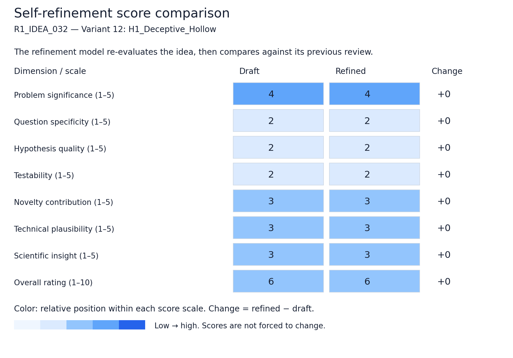

Changed score dimensions: none.

### Score justifications (draft / refined)

**Problem significance**

```json
{
  "draft": {
    "score": 4.0,
    "justification": "The idea addresses a critical gap in unsupervised learning by focusing on real-world, challenging data scenarios, which is important for practical applications across various scientific and technical fields."
  },
  "refined": {
    "score": 4.0,
    "justification": "The idea addresses a critical gap in unsupervised learning by focusing on real-world, challenging data scenarios, which is important for practical applications across various scientific and technical fields."
  }
}
```

**Question specificity**

```json
{
  "draft": {
    "score": 2.0,
    "justification": "While the problem is significant, the research question is too vague. The idea does not specify a concrete question or hypothesis that can be tested or evaluated."
  },
  "refined": {
    "score": 2.0,
    "justification": "While the problem is significant, the research question is too vague. The idea does not specify a concrete question or hypothesis that can be tested or evaluated."
  }
}
```

**Hypothesis quality**

```json
{
  "draft": {
    "score": 2.0,
    "justification": "The idea lacks a clear hypothesis or prediction. It suggests a transformative approach but does not explicitly state what the research aims to demonstrate or how it would be validated."
  },
  "refined": {
    "score": 2.0,
    "justification": "The idea lacks a clear hypothesis or prediction. It suggests a transformative approach but does not explicitly state what the research aims to demonstrate or how it would be validated."
  }
}
```

**Testability**

```json
{
  "draft": {
    "score": 2.0,
    "justification": "The idea is too abstract to be tested without a specific experimental design or evaluation plan. It does not provide a clear path for empirical investigation."
  },
  "refined": {
    "score": 2.0,
    "justification": "The idea is too abstract to be tested without a specific experimental design or evaluation plan. It does not provide a clear path for empirical investigation."
  }
}
```

**Novelty contribution**

```json
{
  "draft": {
    "score": 3.0,
    "justification": "The idea positions the research as a transformative synthesis, which is novel in its emphasis on integrating conceptual, methodological, and application aspects. However, the lack of specific contributions limits its novelty score."
  },
  "refined": {
    "score": 3.0,
    "justification": "The idea positions the research as a transformative synthesis, which is novel in its emphasis on integrating conceptual, methodological, and application aspects. However, the lack of specific contributions limits its novelty score."
  }
}
```

**Technical plausibility**

```json
{
  "draft": {
    "score": 3.0,
    "justification": "The idea is technically plausible as it builds on existing unsupervised learning research, but the lack of specific methodological details makes it difficult to assess the feasibility of the proposed synthesis."
  },
  "refined": {
    "score": 3.0,
    "justification": "The idea is technically plausible as it builds on existing unsupervised learning research, but the lack of specific methodological details makes it difficult to assess the feasibility of the proposed synthesis."
  }
}
```

**Scientific insight**

```json
{
  "draft": {
    "score": 3.0,
    "justification": "The idea has potential for scientific insight by addressing real-world challenges in unsupervised learning. However, the vagueness of the research question limits the potential for meaningful insights."
  },
  "refined": {
    "score": 3.0,
    "justification": "The idea has potential for scientific insight by addressing real-world challenges in unsupervised learning. However, the vagueness of the research question limits the potential for meaningful insights."
  }
}
```

**Overall rating**

```json
{
  "draft": {
    "score": 6.0,
    "justification": "The idea identifies a significant problem in unsupervised learning but lacks a specific research question, hypothesis, and methodological direction. It has potential for transformative impact but needs more concrete details to be evaluated effectively."
  },
  "refined": {
    "score": 6.0,
    "justification": "The idea identifies a significant problem in unsupervised learning but lacks a specific research question, hypothesis, and methodological direction. It has potential for transformative impact but needs more concrete details to be evaluated effectively."
  }
}
```

## R1_IDEA_032 — Variant 13: H2_Confident_Flaw

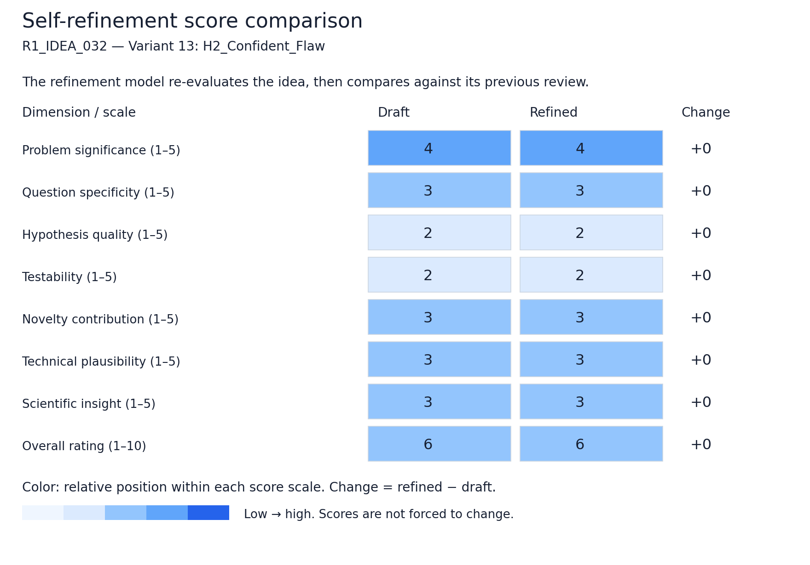

Changed score dimensions: none.

### Score justifications (draft / refined)

**Problem significance**

```json
{
  "draft": {
    "score": 4.0,
    "justification": "The problem of SSL on noisy data is important for real-world applications, but the idea does not clearly define the specific challenge or how it differs from existing work."
  },
  "refined": {
    "score": 4.0,
    "justification": "The problem of SSL on noisy data is important for real-world applications, but the idea does not clearly define the specific challenge or how it differs from existing work."
  }
}
```

**Question specificity**

```json
{
  "draft": {
    "score": 3.0,
    "justification": "The idea identifies a relevant problem but lacks a clear, specific research question or hypothesis that can be tested."
  },
  "refined": {
    "score": 3.0,
    "justification": "The idea identifies a relevant problem but lacks a clear, specific research question or hypothesis that can be tested."
  }
}
```

**Hypothesis quality**

```json
{
  "draft": {
    "score": 2.0,
    "justification": "The idea makes a general claim about the superiority of the method but does not provide a concrete hypothesis or prediction that can be tested."
  },
  "refined": {
    "score": 2.0,
    "justification": "The idea makes a general claim about the superiority of the method but does not provide a concrete hypothesis or prediction that can be tested."
  }
}
```

**Testability**

```json
{
  "draft": {
    "score": 2.0,
    "justification": "The idea does not specify how the proposed approach will be tested or what experiments will be conducted to validate the claim."
  },
  "refined": {
    "score": 2.0,
    "justification": "The idea does not specify how the proposed approach will be tested or what experiments will be conducted to validate the claim."
  }
}
```

**Novelty contribution**

```json
{
  "draft": {
    "score": 3.0,
    "justification": "The problem is relevant, but the idea does not clearly define a novel contribution or specific method that would advance the field."
  },
  "refined": {
    "score": 3.0,
    "justification": "The problem is relevant, but the idea does not clearly define a novel contribution or specific method that would advance the field."
  }
}
```

**Technical plausibility**

```json
{
  "draft": {
    "score": 3.0,
    "justification": "The argument is logically coherent, but the specific technical approach or mechanism is not clearly defined."
  },
  "refined": {
    "score": 3.0,
    "justification": "The argument is logically coherent, but the specific technical approach or mechanism is not clearly defined."
  }
}
```

**Scientific insight**

```json
{
  "draft": {
    "score": 3.0,
    "justification": "The idea suggests that addressing the noise issue could lead to general improvements, but it does not provide a clear path to scientific insight beyond the general claim."
  },
  "refined": {
    "score": 3.0,
    "justification": "The idea suggests that addressing the noise issue could lead to general improvements, but it does not provide a clear path to scientific insight beyond the general claim."
  }
}
```

**Overall rating**

```json
{
  "draft": {
    "score": 6.0,
    "justification": "The idea identifies a relevant problem in SSL for noisy data but lacks specific details on the problem, hypothesis, and method. It has potential but needs more concrete direction to be a strong research idea."
  },
  "refined": {
    "score": 6.0,
    "justification": "The idea identifies a relevant problem in SSL for noisy data but lacks specific details on the problem, hypothesis, and method. It has potential but needs more concrete direction to be a strong research idea."
  }
}
```

## R1_IDEA_032 — Variant 14: H3_Verbose_Enriched

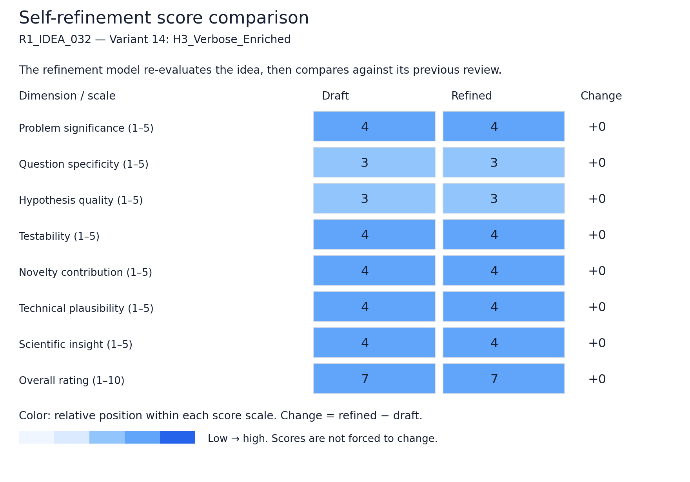

Changed score dimensions: none.

### Score justifications (draft / refined)

**Problem significance**

```json
{
  "draft": {
    "score": 4.0,
    "justification": "The idea addresses a critical challenge in SSL research by focusing on noisy data, which is essential for real-world applications. It highlights the importance of developing robust SSL methods for domains where data quality is often compromised."
  },
  "refined": {
    "score": 4.0,
    "justification": "The idea addresses a critical challenge in SSL research by focusing on noisy data, which is essential for real-world applications. It highlights the importance of developing robust SSL methods for domains where data quality is often compromised."
  }
}
```

**Question specificity**

```json
{
  "draft": {
    "score": 3.0,
    "justification": "The research question is clear in its intent to test noise robustness in SSL, but the specifics of the noise types, data domains, and evaluation metrics are not fully detailed, which could affect the clarity and testability of the hypothesis."
  },
  "refined": {
    "score": 3.0,
    "justification": "The research question is clear in its intent to test noise robustness in SSL, but the specifics of the noise types, data domains, and evaluation metrics are not fully detailed, which could affect the clarity and testability of the hypothesis."
  }
}
```

**Hypothesis quality**

```json
{
  "draft": {
    "score": 3.0,
    "justification": "The hypothesis is implied through the experimental design but is not explicitly stated. The idea suggests that controlled corruption during pre-training could improve noise robustness, but the exact mechanism and prediction are not clearly articulated."
  },
  "refined": {
    "score": 3.0,
    "justification": "The hypothesis is implied through the experimental design but is not explicitly stated. The idea suggests that controlled corruption during pre-training could improve noise robustness, but the exact mechanism and prediction are not clearly articulated."
  }
}
```

**Testability**

```json
{
  "draft": {
    "score": 4.0,
    "justification": "The proposal includes a structured experimental design with stages, ablation studies, sensitivity analyses, and error analysis, which are all testable components. However, the lack of specific details on noise types and evaluation metrics could limit the precision of the experiments."
  },
  "refined": {
    "score": 4.0,
    "justification": "The proposal includes a structured experimental design with stages, ablation studies, sensitivity analyses, and error analysis, which are all testable components. However, the lack of specific details on noise types and evaluation metrics could limit the precision of the experiments."
  }
}
```

**Novelty contribution**

```json
{
  "draft": {
    "score": 4.0,
    "justification": "The idea contributes to SSL research by addressing a previously underexplored area of noisy data. It offers a framework for evaluating noise robustness, which could lead to more robust SSL methods applicable to real-world scenarios."
  },
  "refined": {
    "score": 4.0,
    "justification": "The idea contributes to SSL research by addressing a previously underexplored area of noisy data. It offers a framework for evaluating noise robustness, which could lead to more robust SSL methods applicable to real-world scenarios."
  }
}
```

**Technical plausibility**

```json
{
  "draft": {
    "score": 4.0,
    "justification": "The proposed approach is technically plausible as it builds on existing SSL methods and introduces controlled noise during pre-training. The inclusion of ablation studies and sensitivity analyses aligns with standard practices in evaluating model robustness."
  },
  "refined": {
    "score": 4.0,
    "justification": "The proposed approach is technically plausible as it builds on existing SSL methods and introduces controlled noise during pre-training. The inclusion of ablation studies and sensitivity analyses aligns with standard practices in evaluating model robustness."
  }
}
```

**Scientific insight**

```json
{
  "draft": {
    "score": 4.0,
    "justification": "The study has the potential to reveal important insights into the factors that determine the effectiveness of SSL in noisy environments, including the role of noise types, data regimes, and domain constraints."
  },
  "refined": {
    "score": 4.0,
    "justification": "The study has the potential to reveal important insights into the factors that determine the effectiveness of SSL in noisy environments, including the role of noise types, data regimes, and domain constraints."
  }
}
```

**Overall rating**

```json
{
  "draft": {
    "score": 7.0,
    "justification": "The idea is strong and addresses a meaningful problem in SSL research. It provides a structured experimental design with clear stages and validation methods. However, the lack of specific details on noise types, evaluation metrics, and domain specifics could limit its testability and applicability."
  },
  "refined": {
    "score": 7.0,
    "justification": "The idea is strong and addresses a meaningful problem in SSL research. It provides a structured experimental design with clear stages and validation methods. However, the lack of specific details on noise types, evaluation metrics, and domain specifics could limit its testability and applicability."
  }
}
```

## R1_IDEA_032 — Variant 15: H4_Ultimate_Hype


Changed score dimensions: none.

### Score justifications (draft / refined)

**Problem significance**

```json
{
  "draft": {
    "score": 4.0,
    "justification": "The problem of applying SSL to noisy data is critical for real-world applications, yet it remains underexplored. Addressing this could lead to more robust and reliable AI systems in various domains."
  },
  "refined": {
    "score": 4.0,
    "justification": "The problem of applying SSL to noisy data is critical for real-world applications, yet it remains underexplored. Addressing this could lead to more robust and reliable AI systems in various domains."
  }
}
```

**Question specificity**

```json
{
  "draft": {
    "score": 2.0,
    "justification": "The idea is broad and lacks specific research questions. It identifies a general problem but does not clearly define what exactly should be investigated or how it should be approached."
  },
  "refined": {
    "score": 2.0,
    "justification": "The idea is broad and lacks specific research questions. It identifies a general problem but does not clearly define what exactly should be investigated or how it should be approached."
  }
}
```

**Hypothesis quality**

```json
{
  "draft": {
    "score": 3.0,
    "justification": "The idea suggests a potential transformation in SSL but does not provide a concrete hypothesis. It implies that solving the problem could be impactful, but without a specific prediction or mechanism, the hypothesis is not well-defined."
  },
  "refined": {
    "score": 3.0,
    "justification": "The idea suggests a potential transformation in SSL but does not provide a concrete hypothesis. It implies that solving the problem could be impactful, but without a specific prediction or mechanism, the hypothesis is not well-defined."
  }
}
```

**Testability**

```json
{
  "draft": {
    "score": 2.0,
    "justification": "The idea is too vague to determine how it can be tested. Without specific experiments or evaluation methods, it is unclear how to validate the proposed research direction."
  },
  "refined": {
    "score": 2.0,
    "justification": "The idea is too vague to determine how it can be tested. Without specific experiments or evaluation methods, it is unclear how to validate the proposed research direction."
  }
}
```

**Novelty contribution**

```json
{
  "draft": {
    "score": 4.0,
    "justification": "The research agenda is novel in focusing on SSL for noisy data, which is a significant gap. The potential contributions include more robust SSL methods and broader applicability in real-world scenarios."
  },
  "refined": {
    "score": 4.0,
    "justification": "The research agenda is novel in focusing on SSL for noisy data, which is a significant gap. The potential contributions include more robust SSL methods and broader applicability in real-world scenarios."
  }
}
```

**Technical plausibility**

```json
{
  "draft": {
    "score": 3.0,
    "justification": "The idea is technically plausible, as handling noise in SSL is a valid challenge. However, the lack of specific methods or technical details makes it difficult to assess the feasibility of the proposed approach."
  },
  "refined": {
    "score": 3.0,
    "justification": "The idea is technically plausible, as handling noise in SSL is a valid challenge. However, the lack of specific methods or technical details makes it difficult to assess the feasibility of the proposed approach."
  }
}
```

**Scientific insight**

```json
{
  "draft": {
    "score": 3.0,
    "justification": "The idea has the potential to provide insights into the limitations of current SSL methods and how to improve their robustness in noisy environments. However, without specific hypotheses or experiments, the potential insight is not clearly defined."
  },
  "refined": {
    "score": 3.0,
    "justification": "The idea has the potential to provide insights into the limitations of current SSL methods and how to improve their robustness in noisy environments. However, without specific hypotheses or experiments, the potential insight is not clearly defined."
  }
}
```

**Overall rating**

```json
{
  "draft": {
    "score": 7.0,
    "justification": "The idea is strong in identifying a significant problem with high potential impact. However, it lacks specific research questions, hypotheses, and methodological details, which are necessary for further development and evaluation."
  },
  "refined": {
    "score": 7.0,
    "justification": "The idea is strong in identifying a significant problem with high potential impact. However, it lacks specific research questions, hypotheses, and methodological details, which are necessary for further development and evaluation."
  }
}
```

## R1_IDEA_033 — Source

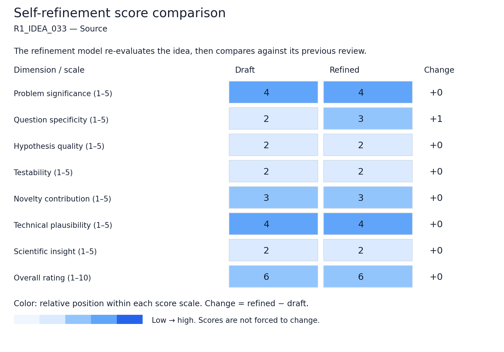

Changed score dimensions: question_specificity.

### Score justifications (draft / refined)

**Problem significance**

```json
{
  "draft": {
    "score": 4.0,
    "justification": "The problem is significant as it relates to safety-critical applications where risk-averse modeling is essential. CVaR minimization is a well-established framework for robustness, making this a meaningful challenge to address."
  },
  "refined": {
    "score": 4.0,
    "justification": "The problem is significant as it relates to safety-critical applications where risk-averse modeling is essential. CVaR minimization is a well-established framework for robustness, making this a meaningful challenge to address."
  }
}
```

**Question specificity**

```json
{
  "draft": {
    "score": 2.0,
    "justification": "The idea identifies a general problem (difficulty in estimating rare events) but lacks a specific research question. A more precise question would be needed to guide the investigation."
  },
  "refined": {
    "score": 3.0,
    "justification": "The idea identifies a specific challenge (estimating rare high-loss events) but does not clearly define a research question. A more precise question would be needed to guide the investigation."
  }
}
```

**Hypothesis quality**

```json
{
  "draft": {
    "score": 2.0,
    "justification": "The idea does not explicitly state a hypothesis. It merely states a challenge without proposing a specific prediction or mechanism to test."
  },
  "refined": {
    "score": 2.0,
    "justification": "The idea does not explicitly state a hypothesis. It merely states a challenge without proposing a specific prediction or mechanism to test."
  }
}
```

**Testability**

```json
{
  "draft": {
    "score": 2.0,
    "justification": "The idea does not provide a clear plan for testing the proposed solution. Without specifying experiments or evaluation methods, the testability is low."
  },
  "refined": {
    "score": 2.0,
    "justification": "The idea does not provide a clear plan for testing the proposed solution. Without specifying experiments or evaluation methods, the testability is low."
  }
}
```

**Novelty contribution**

```json
{
  "draft": {
    "score": 3.0,
    "justification": "The problem is relevant and important, but the idea does not propose a novel method or contribution. It focuses on a known challenge without suggesting a new approach."
  },
  "refined": {
    "score": 3.0,
    "justification": "The problem is relevant and important, but the idea does not propose a novel method or contribution. It focuses on a known challenge without suggesting a new approach."
  }
}
```

**Technical plausibility**

```json
{
  "draft": {
    "score": 4.0,
    "justification": "The problem is technically plausible as CVaR minimization is a well-established area in machine learning. The challenge of estimating rare events is a known issue in risk modeling."
  },
  "refined": {
    "score": 4.0,
    "justification": "The problem is technically plausible as CVaR minimization is a well-established area in machine learning. The challenge of estimating rare events is a known issue in risk modeling."
  }
}
```

**Scientific insight**

```json
{
  "draft": {
    "score": 2.0,
    "justification": "The idea does not propose a mechanism or insight that would lead to new scientific understanding. It focuses on a known challenge without suggesting a novel hypothesis or discovery."
  },
  "refined": {
    "score": 2.0,
    "justification": "The idea does not propose a mechanism or insight that would lead to new scientific understanding. It focuses on a known challenge without suggesting a novel hypothesis or discovery."
  }
}
```

**Overall rating**

```json
{
  "draft": {
    "score": 6.0,
    "justification": "The idea identifies a meaningful problem in risk-averse modeling but lacks a specific research question, hypothesis, or method. It has potential but needs more concrete direction to be a strong research idea."
  },
  "refined": {
    "score": 6.0,
    "justification": "The idea identifies a meaningful problem in risk-averse modeling but lacks a specific research question, hypothesis, or method. It has potential but needs more concrete direction to be a strong research idea."
  }
}
```

## R1_IDEA_033 — Variant 1: A1_Identity


Changed score dimensions: none.

### Score justifications (draft / refined)

**Problem significance**

```json
{
  "draft": {
    "score": 4.0,
    "justification": "The problem is significant as it addresses a critical challenge in risk-averse modeling, which is essential for safety-critical applications. However, the idea does not explicitly tie the problem to a broader impact or urgency."
  },
  "refined": {
    "score": 4.0,
    "justification": "The problem is significant as it addresses a critical challenge in risk-averse modeling, which is essential for safety-critical applications. However, the idea does not explicitly tie the problem to a broader impact or urgency."
  }
}
```

**Question specificity**

```json
{
  "draft": {
    "score": 2.0,
    "justification": "The idea identifies a general problem but lacks a specific, testable question. It does not clearly define what aspect of CVaR estimation is being investigated or how it differs from existing approaches."
  },
  "refined": {
    "score": 2.0,
    "justification": "The idea identifies a general problem but lacks a specific, testable question. It does not clearly define what aspect of CVaR estimation is being investigated or how it differs from existing approaches."
  }
}
```

**Hypothesis quality**

```json
{
  "draft": {
    "score": 2.0,
    "justification": "The idea does not present a clear hypothesis or prediction. It describes a challenge but does not propose a specific mechanism or relationship that could be tested."
  },
  "refined": {
    "score": 2.0,
    "justification": "The idea does not present a clear hypothesis or prediction. It describes a challenge but does not propose a specific mechanism or relationship that could be tested."
  }
}
```

**Testability**

```json
{
  "draft": {
    "score": 2.0,
    "justification": "The idea is too vague to be testable without additional details. It does not specify an experiment, comparison, or evaluation method to investigate the problem."
  },
  "refined": {
    "score": 2.0,
    "justification": "The idea is too vague to be testable without additional details. It does not specify an experiment, comparison, or evaluation method to investigate the problem."
  }
}
```

**Novelty contribution**

```json
{
  "draft": {
    "score": 3.0,
    "justification": "The problem is well-known in the field, but the challenge of estimating rare events in CVaR minimization is a specific area that could contribute new insights. However, the idea does not propose a novel method or approach."
  },
  "refined": {
    "score": 3.0,
    "justification": "The problem is well-known in the field, but the challenge of estimating rare events in CVaR minimization is a specific area that could contribute new insights. However, the idea does not propose a novel method or approach."
  }
}
```

**Technical plausibility**

```json
{
  "draft": {
    "score": 4.0,
    "justification": "The problem is technically plausible as it relates to existing methods in risk-averse modeling. The challenge of estimating rare events is a known issue in ML, and there are plausible approaches to address it."
  },
  "refined": {
    "score": 4.0,
    "justification": "The problem is technically plausible as it relates to existing methods in risk-averse modeling. The challenge of estimating rare events is a known issue in ML, and there are plausible approaches to address it."
  }
}
```

**Scientific insight**

```json
{
  "draft": {
    "score": 2.0,
    "justification": "The idea does not propose a mechanism or insight that would be scientifically valuable. It focuses on a known problem without suggesting how solving it could lead to broader understanding."
  },
  "refined": {
    "score": 2.0,
    "justification": "The idea does not propose a mechanism or insight that would be scientifically valuable. It focuses on a known problem without suggesting how solving it could lead to broader understanding."
  }
}
```

**Overall rating**

```json
{
  "draft": {
    "score": 6.0,
    "justification": "The idea identifies a meaningful problem in risk-averse modeling but lacks a specific research question, hypothesis, or methodological direction. It has potential for contribution but needs more concrete details to be testable and impactful."
  },
  "refined": {
    "score": 6.0,
    "justification": "The idea identifies a meaningful problem in risk-averse modeling but lacks a specific research question, hypothesis, or methodological direction. It has potential for contribution but needs more concrete details to be testable and impactful."
  }
}
```

## R1_IDEA_033 — Variant 2: A2_Paraphrase_Only

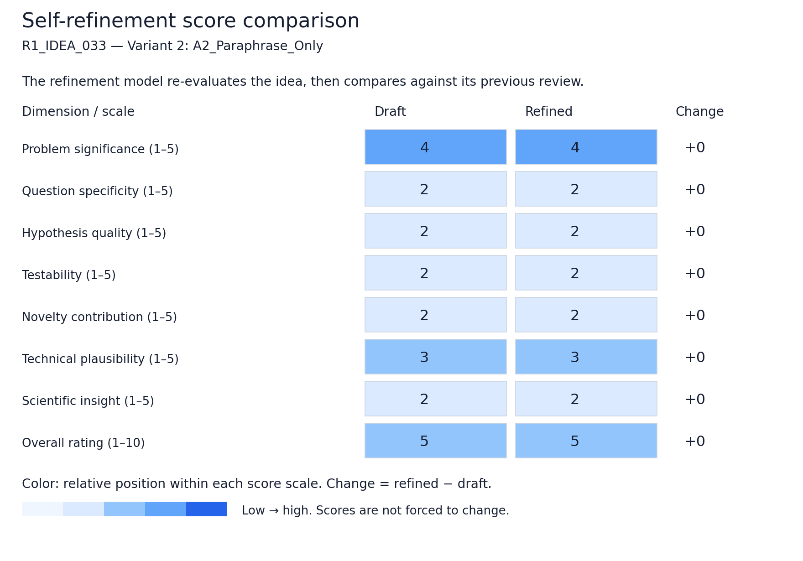

Changed score dimensions: none.

### Score justifications (draft / refined)

**Problem significance**

```json
{
  "draft": {
    "score": 4.0,
    "justification": "The problem is significant in safety-critical domains where accurate risk estimation is crucial. CVaR is a well-established measure, and the challenge of estimating rare events is a known issue in risk modeling."
  },
  "refined": {
    "score": 4.0,
    "justification": "The problem is significant in safety-critical domains where accurate risk estimation is crucial. CVaR is a well-established measure, and the challenge of estimating rare events is a known issue in risk modeling."
  }
}
```

**Question specificity**

```json
{
  "draft": {
    "score": 2.0,
    "justification": "The idea is too vague and does not clearly define the research question. It mentions the problem but lacks a specific question to investigate."
  },
  "refined": {
    "score": 2.0,
    "justification": "The idea is too vague and does not clearly define the research question. It mentions the problem but lacks a specific question to investigate."
  }
}
```

**Hypothesis quality**

```json
{
  "draft": {
    "score": 2.0,
    "justification": "There is no explicit hypothesis. The idea states a problem but does not propose a testable prediction or mechanism to address it."
  },
  "refined": {
    "score": 2.0,
    "justification": "There is no explicit hypothesis. The idea states a problem but does not propose a testable prediction or mechanism to address it."
  }
}
```

**Testability**

```json
{
  "draft": {
    "score": 2.0,
    "justification": "The idea does not provide a clear experimental plan or method to test the proposed solution. It lacks details on how the problem will be addressed or evaluated."
  },
  "refined": {
    "score": 2.0,
    "justification": "The idea does not provide a clear experimental plan or method to test the proposed solution. It lacks details on how the problem will be addressed or evaluated."
  }
}
```

**Novelty contribution**

```json
{
  "draft": {
    "score": 2.0,
    "justification": "The idea does not specify any novel contribution. It merely states a problem and the difficulty of solving it without proposing a new method or insight."
  },
  "refined": {
    "score": 2.0,
    "justification": "The idea does not specify any novel contribution. It merely states a problem and the difficulty of solving it without proposing a new method or insight."
  }
}
```

**Technical plausibility**

```json
{
  "draft": {
    "score": 3.0,
    "justification": "The problem is technically plausible, as CVaR minimization is a known challenge. However, the idea does not provide enough detail to assess the feasibility of the proposed solution."
  },
  "refined": {
    "score": 3.0,
    "justification": "The problem is technically plausible, as CVaR minimization is a known challenge. However, the idea does not provide enough detail to assess the feasibility of the proposed solution."
  }
}
```

**Scientific insight**

```json
{
  "draft": {
    "score": 2.0,
    "justification": "The idea does not suggest any potential scientific insight beyond the problem statement. It lacks a clear hypothesis or research question that could lead to new understanding."
  },
  "refined": {
    "score": 2.0,
    "justification": "The idea does not suggest any potential scientific insight beyond the problem statement. It lacks a clear hypothesis or research question that could lead to new understanding."
  }
}
```

**Overall rating**

```json
{
  "draft": {
    "score": 5.0,
    "justification": "The idea identifies a significant problem in safety-critical domains but lacks a clear research question, hypothesis, and method. It has potential but needs more specificity and detail to be a strong research idea."
  },
  "refined": {
    "score": 5.0,
    "justification": "The idea identifies a significant problem in safety-critical domains but lacks a clear research question, hypothesis, and method. It has potential but needs more specificity and detail to be a strong research idea."
  }
}
```

## R1_IDEA_033 — Variant 3: A3_Plain_Core


Changed score dimensions: none.

### Score justifications (draft / refined)

**Problem significance**

```json
{
  "draft": {
    "score": 4.0,
    "justification": "The problem of risk-averse modeling is critical for safety-sensitive applications, and the challenge of CVaR minimization is a well-established issue in the field."
  },
  "refined": {
    "score": 4.0,
    "justification": "The problem of risk-averse modeling is critical for safety-sensitive applications, and the challenge of CVaR minimization is a well-established issue in the field."
  }
}
```

**Question specificity**

```json
{
  "draft": {
    "score": 2.0,
    "justification": "The idea is somewhat general and lacks specific research questions or hypotheses. It identifies a problem but does not clearly define what is being investigated."
  },
  "refined": {
    "score": 2.0,
    "justification": "The idea is somewhat general and lacks specific research questions or hypotheses. It identifies a problem but does not clearly define what is being investigated."
  }
}
```

**Hypothesis quality**

```json
{
  "draft": {
    "score": 2.0,
    "justification": "The idea mentions a challenge but does not provide a clear hypothesis or prediction that could be tested. It lacks a specific claim about what the research would demonstrate."
  },
  "refined": {
    "score": 2.0,
    "justification": "The idea mentions a challenge but does not provide a clear hypothesis or prediction that could be tested. It lacks a specific claim about what the research would demonstrate."
  }
}
```

**Testability**

```json
{
  "draft": {
    "score": 2.0,
    "justification": "The idea does not specify an experiment or evaluation method. It is too vague to determine how the research would be tested or validated."
  },
  "refined": {
    "score": 2.0,
    "justification": "The idea does not specify an experiment or evaluation method. It is too vague to determine how the research would be tested or validated."
  }
}
```

**Novelty contribution**

```json
{
  "draft": {
    "score": 3.0,
    "justification": "The problem is important, but the idea does not propose a novel method or framework. It focuses on a known challenge without offering a specific contribution."
  },
  "refined": {
    "score": 3.0,
    "justification": "The problem is important, but the idea does not propose a novel method or framework. It focuses on a known challenge without offering a specific contribution."
  }
}
```

**Technical plausibility**

```json
{
  "draft": {
    "score": 4.0,
    "justification": "The problem is technically plausible and aligns with existing research on risk-averse modeling and CVaR. The challenge of estimating rare events is a recognized issue in the field."
  },
  "refined": {
    "score": 4.0,
    "justification": "The problem is technically plausible and aligns with existing research on risk-averse modeling and CVaR. The challenge of estimating rare events is a recognized issue in the field."
  }
}
```

**Scientific insight**

```json
{
  "draft": {
    "score": 3.0,
    "justification": "The idea highlights a known challenge but does not suggest how the research could lead to new insights. It focuses on a problem without proposing a mechanism or potential discovery."
  },
  "refined": {
    "score": 3.0,
    "justification": "The idea highlights a known challenge but does not suggest how the research could lead to new insights. It focuses on a problem without proposing a mechanism or potential discovery."
  }
}
```

**Overall rating**

```json
{
  "draft": {
    "score": 6.0,
    "justification": "The idea identifies a meaningful problem in risk-averse machine learning but lacks specific research questions, hypotheses, and methodological direction. It has potential but needs more concrete details to be evaluated further."
  },
  "refined": {
    "score": 6.0,
    "justification": "The idea identifies a meaningful problem in risk-averse machine learning but lacks specific research questions, hypotheses, and methodological direction. It has potential but needs more concrete details to be evaluated further."
  }
}
```

## R1_IDEA_033 — Variant 4: B1_Verbose_Elaborate


Changed score dimensions: none.

### Score justifications (draft / refined)

**Problem significance**

```json
{
  "draft": {
    "score": 4.0,
    "justification": "The problem is highly relevant to safety-sensitive applications where risk-averse modeling is crucial, and addressing it could lead to more robust and reliable models in critical domains."
  },
  "refined": {
    "score": 4.0,
    "justification": "The problem is highly relevant to safety-sensitive applications where risk-averse modeling is crucial, and addressing it could lead to more robust and reliable models in critical domains."
  }
}
```

**Question specificity**

```json
{
  "draft": {
    "score": 2.0,
    "justification": "The idea identifies a broad challenge but lacks a specific research question or hypothesis that could be tested. It needs to define exactly what is being investigated."
  },
  "refined": {
    "score": 2.0,
    "justification": "The idea identifies a broad challenge but lacks a specific research question or hypothesis that could be tested. It needs to define exactly what is being investigated."
  }
}
```

**Hypothesis quality**

```json
{
  "draft": {
    "score": 2.0,
    "justification": "The idea does not explicitly state a hypothesis or prediction that could be tested. It merely outlines a problem and its importance without proposing a specific claim to be validated."
  },
  "refined": {
    "score": 2.0,
    "justification": "The idea does not explicitly state a hypothesis or prediction that could be tested. It merely outlines a problem and its importance without proposing a specific claim to be validated."
  }
}
```

**Testability**

```json
{
  "draft": {
    "score": 2.0,
    "justification": "The idea does not provide a clear experimental plan or method to test the proposed solution. Without a specific approach, it is difficult to assess how the problem can be addressed."
  },
  "refined": {
    "score": 2.0,
    "justification": "The idea does not provide a clear experimental plan or method to test the proposed solution. Without a specific approach, it is difficult to assess how the problem can be addressed."
  }
}
```

**Novelty contribution**

```json
{
  "draft": {
    "score": 3.0,
    "justification": "The problem is important, but the idea does not propose a novel method or contribution. It focuses on a known challenge without suggesting a new direction or solution."
  },
  "refined": {
    "score": 3.0,
    "justification": "The problem is important, but the idea does not propose a novel method or contribution. It focuses on a known challenge without suggesting a new direction or solution."
  }
}
```

**Technical plausibility**

```json
{
  "draft": {
    "score": 4.0,
    "justification": "The problem is technically feasible and aligns with existing research on risk-averse modeling and CVaR. The challenge of estimating rare events in sparse data is a recognized issue in the field."
  },
  "refined": {
    "score": 4.0,
    "justification": "The problem is technically feasible and aligns with existing research on risk-averse modeling and CVaR. The challenge of estimating rare events in sparse data is a recognized issue in the field."
  }
}
```

**Scientific insight**

```json
{
  "draft": {
    "score": 3.0,
    "justification": "The idea highlights a significant challenge but does not propose a mechanism or insight that could be gained from addressing it. It lacks the potential to reveal new principles or limitations in risk modeling."
  },
  "refined": {
    "score": 3.0,
    "justification": "The idea highlights a significant challenge but does not propose a mechanism or insight that could be gained from addressing it. It lacks the potential to reveal new principles or limitations in risk modeling."
  }
}
```

**Overall rating**

```json
{
  "draft": {
    "score": 6.0,
    "justification": "The idea identifies a meaningful problem in high-stakes applications but lacks a specific research question, hypothesis, or method. It has potential but needs more concrete direction to be considered a strong research idea."
  },
  "refined": {
    "score": 6.0,
    "justification": "The idea identifies a meaningful problem in high-stakes applications but lacks a specific research question, hypothesis, or method. It has potential but needs more concrete direction to be considered a strong research idea."
  }
}
```

## R1_IDEA_033 — Variant 5: B2_Grand_Narrative


Changed score dimensions: none.

### Score justifications (draft / refined)

**Problem significance**

```json
{
  "draft": {
    "score": 4.0,
    "justification": "The problem of risk-averse modeling is critical in safety-sensitive applications, and the challenge of estimating rare events is a key barrier to practical implementation of CVaR minimization."
  },
  "refined": {
    "score": 4.0,
    "justification": "The problem of risk-averse modeling is critical in safety-sensitive applications, and the challenge of estimating rare events is a key barrier to practical implementation of CVaR minimization."
  }
}
```

**Question specificity**

```json
{
  "draft": {
    "score": 3.0,
    "justification": "The idea identifies a problem but lacks a clear, specific research question or hypothesis. It mentions the challenge of estimating rare events but does not specify what exactly is being investigated."
  },
  "refined": {
    "score": 3.0,
    "justification": "The idea identifies a problem but lacks a clear, specific research question or hypothesis. It mentions the challenge of estimating rare events but does not specify what exactly is being investigated."
  }
}
```

**Hypothesis quality**

```json
{
  "draft": {
    "score": 3.0,
    "justification": "The idea suggests that addressing the challenge of estimating rare events could advance trustworthy AI systems, but it does not provide a concrete hypothesis or prediction that can be tested."
  },
  "refined": {
    "score": 3.0,
    "justification": "The idea suggests that addressing the challenge of estimating rare events could advance trustworthy AI systems, but it does not provide a concrete hypothesis or prediction that can be tested."
  }
}
```

**Testability**

```json
{
  "draft": {
    "score": 3.0,
    "justification": "The idea points to a challenge but does not specify experiments, comparisons, or evaluations that would be needed to test the proposed research direction."
  },
  "refined": {
    "score": 3.0,
    "justification": "The idea points to a challenge but does not specify experiments, comparisons, or evaluations that would be needed to test the proposed research direction."
  }
}
```

**Novelty contribution**

```json
{
  "draft": {
    "score": 3.0,
    "justification": "The idea is relevant to existing research on risk-averse modeling and CVaR, but it does not clearly propose a novel method or contribution beyond the general challenge of estimating rare events."
  },
  "refined": {
    "score": 3.0,
    "justification": "The idea is relevant to existing research on risk-averse modeling and CVaR, but it does not clearly propose a novel method or contribution beyond the general challenge of estimating rare events."
  }
}
```

**Technical plausibility**

```json
{
  "draft": {
    "score": 4.0,
    "justification": "The idea is technically plausible as it builds on established concepts in risk-averse machine learning and addresses a known challenge in CVaR minimization."
  },
  "refined": {
    "score": 4.0,
    "justification": "The idea is technically plausible as it builds on established concepts in risk-averse machine learning and addresses a known challenge in CVaR minimization."
  }
}
```

**Scientific insight**

```json
{
  "draft": {
    "score": 3.0,
    "justification": "The idea has potential for scientific insight into the limitations of CVaR minimization and the trade-offs involved in risk-averse modeling, but it does not clearly outline how these insights would be gained."
  },
  "refined": {
    "score": 3.0,
    "justification": "The idea has potential for scientific insight into the limitations of CVaR minimization and the trade-offs involved in risk-averse modeling, but it does not clearly outline how these insights would be gained."
  }
}
```

**Overall rating**

```json
{
  "draft": {
    "score": 7.0,
    "justification": "The idea identifies a meaningful problem in risk-averse machine learning and highlights a key challenge in CVaR minimization. However, it lacks a clear, specific research question and hypothesis, which are necessary for further development and evaluation."
  },
  "refined": {
    "score": 7.0,
    "justification": "The idea identifies a meaningful problem in risk-averse machine learning and highlights a key challenge in CVaR minimization. However, it lacks a clear, specific research question and hypothesis, which are necessary for further development and evaluation."
  }
}
```

## R1_IDEA_033 — Variant 6: B3_Over_Confident


Changed score dimensions: none.

### Score justifications (draft / refined)

**Problem significance**

```json
{
  "draft": {
    "score": 4.0,
    "justification": "The idea addresses a critical issue in risk-averse modeling, which is essential for safety-sensitive applications. The problem of estimating rare, high-loss events is well-motivated and has practical implications in high-stakes scenarios."
  },
  "refined": {
    "score": 4.0,
    "justification": "The idea addresses a critical issue in risk-averse modeling, which is essential for safety-sensitive applications. The problem of estimating rare, high-loss events is well-motivated and has practical implications in high-stakes scenarios."
  }
}
```

**Question specificity**

```json
{
  "draft": {
    "score": 3.0,
    "justification": "The idea identifies a specific challenge in CVaR minimization but lacks a clear, concrete research question. It outlines a problem but does not specify what exactly is being investigated or how it will be addressed."
  },
  "refined": {
    "score": 3.0,
    "justification": "The idea identifies a specific challenge in CVaR minimization but lacks a clear, concrete research question. It outlines a problem but does not specify what exactly is being investigated or how it will be addressed."
  }
}
```

**Hypothesis quality**

```json
{
  "draft": {
    "score": 2.0,
    "justification": "The idea does not present a clear hypothesis or prediction. It outlines a problem but does not state what the proposed investigation aims to demonstrate or how it would be tested."
  },
  "refined": {
    "score": 2.0,
    "justification": "The idea does not present a clear hypothesis or prediction. It outlines a problem but does not state what the proposed investigation aims to demonstrate or how it would be tested."
  }
}
```

**Testability**

```json
{
  "draft": {
    "score": 2.0,
    "justification": "The idea does not provide a specific experiment, comparison, or evaluation plan. Without a clear method or approach, it is difficult to assess the testability of the research question."
  },
  "refined": {
    "score": 2.0,
    "justification": "The idea does not provide a specific experiment, comparison, or evaluation plan. Without a clear method or approach, it is difficult to assess the testability of the research question."
  }
}
```

**Novelty contribution**

```json
{
  "draft": {
    "score": 3.0,
    "justification": "The idea highlights a known challenge in CVaR minimization but does not propose a novel method or contribution. It focuses on a well-established problem without introducing a new framework or approach."
  },
  "refined": {
    "score": 3.0,
    "justification": "The idea highlights a known challenge in CVaR minimization but does not propose a novel method or contribution. It focuses on a well-established problem without introducing a new framework or approach."
  }
}
```

**Technical plausibility**

```json
{
  "draft": {
    "score": 4.0,
    "justification": "The problem described is technically plausible and aligns with existing research in risk-averse modeling. The challenge of estimating rare events is a recognized issue in machine learning, making the proposed research direction logically coherent."
  },
  "refined": {
    "score": 4.0,
    "justification": "The problem described is technically plausible and aligns with existing research in risk-averse modeling. The challenge of estimating rare events is a recognized issue in machine learning, making the proposed research direction logically coherent."
  }
}
```

**Scientific insight**

```json
{
  "draft": {
    "score": 3.0,
    "justification": "The idea has potential for scientific insight by addressing a known challenge in risk-averse modeling. However, without a specific hypothesis or method, the potential for new insights is limited."
  },
  "refined": {
    "score": 3.0,
    "justification": "The idea has potential for scientific insight by addressing a known challenge in risk-averse modeling. However, without a specific hypothesis or method, the potential for new insights is limited."
  }
}
```

**Overall rating**

```json
{
  "draft": {
    "score": 6.0,
    "justification": "The idea identifies a meaningful problem in risk-averse modeling but lacks a clear research question, hypothesis, and method. It has potential for contribution but needs more specificity and detail to be considered a strong research idea."
  },
  "refined": {
    "score": 6.0,
    "justification": "The idea identifies a meaningful problem in risk-averse modeling but lacks a clear research question, hypothesis, and method. It has potential for contribution but needs more specificity and detail to be considered a strong research idea."
  }
}
```

## R1_IDEA_033 — Variant 7: B4_Novelty


Changed score dimensions: none.

### Score justifications (draft / refined)

**Problem significance**

```json
{
  "draft": {
    "score": 4.0,
    "justification": "The problem of risk-averse modeling in safety-critical applications is significant, as it directly impacts the reliability and safety of machine learning systems in high-stakes scenarios."
  },
  "refined": {
    "score": 4.0,
    "justification": "The problem of risk-averse modeling in safety-critical applications is significant, as it directly impacts the reliability and safety of machine learning systems in high-stakes scenarios."
  }
}
```

**Question specificity**

```json
{
  "draft": {
    "score": 3.0,
    "justification": "The idea identifies a specific challenge in CVaR minimization but lacks a clear, concrete research question that defines what exactly is being investigated."
  },
  "refined": {
    "score": 3.0,
    "justification": "The idea identifies a specific challenge in CVaR minimization but lacks a clear, concrete research question that defines what exactly is being investigated."
  }
}
```

**Hypothesis quality**

```json
{
  "draft": {
    "score": 3.0,
    "justification": "The idea suggests a problem but does not explicitly state a hypothesis or prediction that could be tested, such as whether a particular method improves CVaR estimation or reduces the impact of rare events."
  },
  "refined": {
    "score": 3.0,
    "justification": "The idea suggests a problem but does not explicitly state a hypothesis or prediction that could be tested, such as whether a particular method improves CVaR estimation or reduces the impact of rare events."
  }
}
```

**Testability**

```json
{
  "draft": {
    "score": 3.0,
    "justification": "The idea points to a challenge but does not provide a clear experimental plan or method for testing the proposed solution, making it difficult to assess the feasibility of the research."
  },
  "refined": {
    "score": 3.0,
    "justification": "The idea points to a challenge but does not provide a clear experimental plan or method for testing the proposed solution, making it difficult to assess the feasibility of the research."
  }
}
```

**Novelty contribution**

```json
{
  "draft": {
    "score": 4.0,
    "justification": "The focus on directly minimizing CVaR in safety-critical applications is a novel direction, though the specific contribution depends on the proposed method or approach."
  },
  "refined": {
    "score": 4.0,
    "justification": "The focus on directly minimizing CVaR in safety-critical applications is a novel direction, though the specific contribution depends on the proposed method or approach."
  }
}
```

**Technical plausibility**

```json
{
  "draft": {
    "score": 4.0,
    "justification": "The problem is technically plausible, as CVaR minimization is a well-known concept in risk management, and the challenge of estimating rare events is a recognized issue in machine learning."
  },
  "refined": {
    "score": 4.0,
    "justification": "The problem is technically plausible, as CVaR minimization is a well-known concept in risk management, and the challenge of estimating rare events is a recognized issue in machine learning."
  }
}
```

**Scientific insight**

```json
{
  "draft": {
    "score": 3.0,
    "justification": "The idea has potential for scientific insight into the limitations of current risk-averse methods, but the specific insights depend on the proposed research question and methodology."
  },
  "refined": {
    "score": 3.0,
    "justification": "The idea has potential for scientific insight into the limitations of current risk-averse methods, but the specific insights depend on the proposed research question and methodology."
  }
}
```

**Overall rating**

```json
{
  "draft": {
    "score": 7.0,
    "justification": "The idea addresses a significant problem in risk-averse modeling with potential for novel contributions, but it lacks specificity in the research question and proposed solution, which could be improved with more detailed investigation."
  },
  "refined": {
    "score": 7.0,
    "justification": "The idea addresses a significant problem in risk-averse modeling with potential for novel contributions, but it lacks specificity in the research question and proposed solution, which could be improved with more detailed investigation."
  }
}
```

## R1_IDEA_033 — Variant 8: B5_Application_Impact


Changed score dimensions: none.

### Score justifications (draft / refined)

**Problem significance**

```json
{
  "draft": {
    "score": 4.0,
    "justification": "The problem is significant as it addresses a critical challenge in risk-averse modeling for safety-sensitive applications, which has real-world implications in autonomous systems and medical diagnostics."
  },
  "refined": {
    "score": 4.0,
    "justification": "The problem is significant as it addresses a critical challenge in risk-averse modeling for safety-sensitive applications, which has real-world implications in autonomous systems and medical diagnostics."
  }
}
```

**Question specificity**

```json
{
  "draft": {
    "score": 2.0,
    "justification": "The idea identifies a problem but lacks a clear, specific research question or hypothesis. It mentions the challenge but does not define what exactly is being investigated."
  },
  "refined": {
    "score": 2.0,
    "justification": "The idea identifies a problem but lacks a clear, specific research question or hypothesis. It mentions the challenge but does not define what exactly is being investigated."
  }
}
```

**Hypothesis quality**

```json
{
  "draft": {
    "score": 2.0,
    "justification": "The idea does not present a concrete hypothesis or prediction that can be tested. It states a problem but does not propose a specific mechanism or relationship to investigate."
  },
  "refined": {
    "score": 2.0,
    "justification": "The idea does not present a concrete hypothesis or prediction that can be tested. It states a problem but does not propose a specific mechanism or relationship to investigate."
  }
}
```

**Testability**

```json
{
  "draft": {
    "score": 2.0,
    "justification": "The idea does not specify experiments, comparisons, or evaluations that would test the proposed research question. It remains vague on how the challenge of estimating extreme quantiles would be addressed."
  },
  "refined": {
    "score": 2.0,
    "justification": "The idea does not specify experiments, comparisons, or evaluations that would test the proposed research question. It remains vague on how the challenge of estimating extreme quantiles would be addressed."
  }
}
```

**Novelty contribution**

```json
{
  "draft": {
    "score": 3.0,
    "justification": "The idea is relevant to existing research on risk-averse modeling, but it does not propose a novel method or contribution. It focuses on a known challenge without introducing a new approach or insight."
  },
  "refined": {
    "score": 3.0,
    "justification": "The idea is relevant to existing research on risk-averse modeling, but it does not propose a novel method or contribution. It focuses on a known challenge without introducing a new approach or insight."
  }
}
```

**Technical plausibility**

```json
{
  "draft": {
    "score": 4.0,
    "justification": "The problem is technically plausible as it relates to a known challenge in risk-averse modeling. The proposed area of research is feasible and aligns with current research trends."
  },
  "refined": {
    "score": 4.0,
    "justification": "The problem is technically plausible as it relates to a known challenge in risk-averse modeling. The proposed area of research is feasible and aligns with current research trends."
  }
}
```

**Scientific insight**

```json
{
  "draft": {
    "score": 2.0,
    "justification": "The idea does not provide a clear path to scientific insight. It identifies a problem but does not suggest how the investigation could reveal new mechanisms, principles, or limitations in risk-averse modeling."
  },
  "refined": {
    "score": 2.0,
    "justification": "The idea does not provide a clear path to scientific insight. It identifies a problem but does not suggest how the investigation could reveal new mechanisms, principles, or limitations in risk-averse modeling."
  }
}
```

**Overall rating**

```json
{
  "draft": {
    "score": 6.0,
    "justification": "The idea identifies a meaningful problem in risk-averse modeling for safety-critical applications but lacks a clear research question, hypothesis, and specific approach. It has potential but requires further clarification and specificity to be a strong research direction."
  },
  "refined": {
    "score": 6.0,
    "justification": "The idea identifies a meaningful problem in risk-averse modeling for safety-critical applications but lacks a clear research question, hypothesis, and specific approach. It has potential but requires further clarification and specificity to be a strong research direction."
  }
}
```

## R1_IDEA_033 — Variant 9: C1_Hollow_Shell


Changed score dimensions: none.

### Score justifications (draft / refined)

**Problem significance**

```json
{
  "draft": {
    "score": 4.0,
    "justification": "The problem of modeling rare, high-consequence events is critical in high-stakes applications, such as finance, healthcare, and autonomous systems, where failure can have severe consequences. This is a well-established challenge in risk management and machine learning."
  },
  "refined": {
    "score": 4.0,
    "justification": "The problem of modeling rare, high-consequence events is critical in high-stakes applications, such as finance, healthcare, and autonomous systems, where failure can have severe consequences. This is a well-established challenge in risk management and machine learning."
  }
}
```

**Question specificity**

```json
{
  "draft": {
    "score": 2.0,
    "justification": "The idea identifies a broad problem but lacks a specific research question. It does not clearly define what exactly should be investigated, such as the type of risk measure, the optimization method, or the application domain."
  },
  "refined": {
    "score": 2.0,
    "justification": "The idea identifies a broad problem but lacks a specific research question. It does not clearly define what exactly should be investigated, such as the type of risk measure, the optimization method, or the application domain."
  }
}
```

**Hypothesis quality**

```json
{
  "draft": {
    "score": 2.0,
    "justification": "The idea does not present a clear hypothesis or prediction. It states a problem and a potential approach but does not specify what the research aims to demonstrate or how it will be tested."
  },
  "refined": {
    "score": 2.0,
    "justification": "The idea does not present a clear hypothesis or prediction. It states a problem and a potential approach but does not specify what the research aims to demonstrate or how it will be tested."
  }
}
```

**Testability**

```json
{
  "draft": {
    "score": 2.0,
    "justification": "The idea does not provide a clear experimental plan or method for testing the proposed framework. It lacks details on how the risk measure will be optimized, how it will be validated, or what metrics will be used to evaluate its effectiveness."
  },
  "refined": {
    "score": 2.0,
    "justification": "The idea does not provide a clear experimental plan or method for testing the proposed framework. It lacks details on how the risk measure will be optimized, how it will be validated, or what metrics will be used to evaluate its effectiveness."
  }
}
```

**Novelty contribution**

```json
{
  "draft": {
    "score": 3.0,
    "justification": "The idea addresses a relevant problem in high-stakes applications, but the proposed approach is not clearly novel. It suggests a general framework for optimizing risk measures, which is a known area of research, but the specifics are not defined."
  },
  "refined": {
    "score": 3.0,
    "justification": "The idea addresses a relevant problem in high-stakes applications, but the proposed approach is not clearly novel. It suggests a general framework for optimizing risk measures, which is a known area of research, but the specifics are not defined."
  }
}
```

**Technical plausibility**

```json
{
  "draft": {
    "score": 4.0,
    "justification": "The proposed approach of optimizing a risk measure for rare events is technically plausible. It aligns with existing research in risk management and machine learning, and the challenge of estimating rare events is a well-known issue in the field."
  },
  "refined": {
    "score": 4.0,
    "justification": "The proposed approach of optimizing a risk measure for rare events is technically plausible. It aligns with existing research in risk management and machine learning, and the challenge of estimating rare events is a well-known issue in the field."
  }
}
```

**Scientific insight**

```json
{
  "draft": {
    "score": 2.0,
    "justification": "The idea does not provide a clear path to scientific insight. It focuses on a general problem and approach but does not specify what new knowledge or understanding the research aims to contribute."
  },
  "refined": {
    "score": 2.0,
    "justification": "The idea does not provide a clear path to scientific insight. It focuses on a general problem and approach but does not specify what new knowledge or understanding the research aims to contribute."
  }
}
```

**Overall rating**

```json
{
  "draft": {
    "score": 6.0,
    "justification": "The idea identifies a meaningful problem in high-stakes applications but lacks the specificity, hypothesis, and testable framework needed to be a strong research direction. It has potential but requires further clarification and definition to be more actionable."
  },
  "refined": {
    "score": 6.0,
    "justification": "The idea identifies a meaningful problem in high-stakes applications but lacks the specificity, hypothesis, and testable framework needed to be a strong research direction. It has potential but requires further clarification and definition to be more actionable."
  }
}
```

## R1_IDEA_033 — Variant 10: C2_Logic_Flawed


Changed score dimensions: none.

### Score justifications (draft / refined)

**Problem significance**

```json
{
  "draft": {
    "score": 4.0,
    "justification": "The problem is significant as it addresses a critical challenge in risk-averse modeling for safety-critical applications, which is a key concern in machine learning."
  },
  "refined": {
    "score": 4.0,
    "justification": "The problem is significant as it addresses a critical challenge in risk-averse modeling for safety-critical applications, which is a key concern in machine learning."
  }
}
```

**Question specificity**

```json
{
  "draft": {
    "score": 2.0,
    "justification": "The idea identifies a problem but lacks a specific research question or hypothesis. It is too general to be testable without further clarification."
  },
  "refined": {
    "score": 2.0,
    "justification": "The idea identifies a problem but lacks a specific research question or hypothesis. It is too general to be testable without further clarification."
  }
}
```

**Hypothesis quality**

```json
{
  "draft": {
    "score": 2.0,
    "justification": "There is no explicit hypothesis. The idea states a challenge but does not propose a testable prediction or mechanism to address it."
  },
  "refined": {
    "score": 2.0,
    "justification": "There is no explicit hypothesis. The idea states a challenge but does not propose a testable prediction or mechanism to address it."
  }
}
```

**Testability**

```json
{
  "draft": {
    "score": 2.0,
    "justification": "The idea does not specify how the problem will be tested or evaluated. Without a proposed method or experimental plan, it is not testable."
  },
  "refined": {
    "score": 2.0,
    "justification": "The idea does not specify how the problem will be tested or evaluated. Without a proposed method or experimental plan, it is not testable."
  }
}
```

**Novelty contribution**

```json
{
  "draft": {
    "score": 3.0,
    "justification": "The idea is relevant to a well-studied problem in risk-averse modeling, but it does not propose a novel method or contribution. It is more of a problem statement than a research proposal."
  },
  "refined": {
    "score": 3.0,
    "justification": "The idea is relevant to a well-studied problem in risk-averse modeling, but it does not propose a novel method or contribution. It is more of a problem statement than a research proposal."
  }
}
```

**Technical plausibility**

```json
{
  "draft": {
    "score": 4.0,
    "justification": "The problem is technically plausible. CVaR is a well-established concept in risk management, and the challenge of estimating extreme quantiles is a known issue in statistical modeling."
  },
  "refined": {
    "score": 4.0,
    "justification": "The problem is technically plausible. CVaR is a well-established concept in risk management, and the challenge of estimating extreme quantiles is a known issue in statistical modeling."
  }
}
```

**Scientific insight**

```json
{
  "draft": {
    "score": 2.0,
    "justification": "The idea does not propose a mechanism or hypothesis that could lead to new scientific insights. It is focused on a known problem without suggesting how it might be solved in a novel way."
  },
  "refined": {
    "score": 2.0,
    "justification": "The idea does not propose a mechanism or hypothesis that could lead to new scientific insights. It is focused on a known problem without suggesting how it might be solved in a novel way."
  }
}
```

**Overall rating**

```json
{
  "draft": {
    "score": 5.0,
    "justification": "The idea identifies a meaningful problem in risk-averse modeling but lacks a specific research question, hypothesis, or method. With additional details, it has the potential to be a strong research direction."
  },
  "refined": {
    "score": 5.0,
    "justification": "The idea identifies a meaningful problem in risk-averse modeling but lacks a specific research question, hypothesis, or method. With additional details, it has the potential to be a strong research direction."
  }
}
```

## R1_IDEA_033 — Variant 11: C3_Substance_Enriched


Changed score dimensions: none.

### Score justifications (draft / refined)

**Problem significance**

```json
{
  "draft": {
    "score": 4.0,
    "justification": "The problem of risk-averse modeling is critical in safety-sensitive applications, making the research relevant and important."
  },
  "refined": {
    "score": 4.0,
    "justification": "The problem of risk-averse modeling is critical in safety-sensitive applications, making the research relevant and important."
  }
}
```

**Question specificity**

```json
{
  "draft": {
    "score": 3.0,
    "justification": "The idea proposes a hypothesis but lacks a concrete, specific research question that can be clearly defined and tested."
  },
  "refined": {
    "score": 3.0,
    "justification": "The idea proposes a hypothesis but lacks a concrete, specific research question that can be clearly defined and tested."
  }
}
```

**Hypothesis quality**

```json
{
  "draft": {
    "score": 4.0,
    "justification": "The hypothesis that heavy-tailed distributions affect CVaR minimization is plausible and testable, though it could be more explicitly stated."
  },
  "refined": {
    "score": 4.0,
    "justification": "The hypothesis that heavy-tailed distributions affect CVaR minimization is plausible and testable, though it could be more explicitly stated."
  }
}
```

**Testability**

```json
{
  "draft": {
    "score": 3.0,
    "justification": "The idea suggests testing on out-of-distribution data, but lacks concrete details on how to operationalize the hypothesis in experiments."
  },
  "refined": {
    "score": 3.0,
    "justification": "The idea suggests testing on out-of-distribution data, but lacks concrete details on how to operationalize the hypothesis in experiments."
  }
}
```

**Novelty contribution**

```json
{
  "draft": {
    "score": 3.0,
    "justification": "The idea addresses a specific challenge in CVaR minimization but does not propose a novel method or framework, though it could contribute insights into data distribution properties."
  },
  "refined": {
    "score": 3.0,
    "justification": "The idea addresses a specific challenge in CVaR minimization but does not propose a novel method or framework, though it could contribute insights into data distribution properties."
  }
}
```

**Technical plausibility**

```json
{
  "draft": {
    "score": 4.0,
    "justification": "The hypothesis is technically plausible, as heavy-tailed distributions are known to affect statistical modeling and risk assessment."
  },
  "refined": {
    "score": 4.0,
    "justification": "The hypothesis is technically plausible, as heavy-tailed distributions are known to affect statistical modeling and risk assessment."
  }
}
```

**Scientific insight**

```json
{
  "draft": {
    "score": 3.0,
    "justification": "The idea has potential to provide insights into the relationship between data distribution properties and risk modeling, but the contribution is more general than specific."
  },
  "refined": {
    "score": 3.0,
    "justification": "The idea has potential to provide insights into the relationship between data distribution properties and risk modeling, but the contribution is more general than specific."
  }
}
```

**Overall rating**

```json
{
  "draft": {
    "score": 7.0,
    "justification": "The idea addresses a meaningful problem with a plausible hypothesis, but lacks specificity and concrete details needed for a strong research direction."
  },
  "refined": {
    "score": 7.0,
    "justification": "The idea addresses a meaningful problem with a plausible hypothesis, but lacks specificity and concrete details needed for a strong research direction."
  }
}
```

## R1_IDEA_033 — Variant 12: H1_Deceptive_Hollow


Changed score dimensions: none.

### Score justifications (draft / refined)

**Problem significance**

```json
{
  "draft": {
    "score": 4.0,
    "justification": "The idea addresses a critical challenge in high-stakes applications, which is relevant to both researchers and practitioners. However, the problem is somewhat broad and could be more specific to highlight its significance."
  },
  "refined": {
    "score": 4.0,
    "justification": "The idea addresses a critical challenge in high-stakes applications, which is relevant to both researchers and practitioners. However, the problem is somewhat broad and could be more specific to highlight its significance."
  }
}
```

**Question specificity**

```json
{
  "draft": {
    "score": 3.0,
    "justification": "The idea outlines a general research direction but lacks concrete details on the specific question being investigated, such as the exact form of the risk measure or the optimization framework."
  },
  "refined": {
    "score": 3.0,
    "justification": "The idea outlines a general research direction but lacks concrete details on the specific question being investigated, such as the exact form of the risk measure or the optimization framework."
  }
}
```

**Hypothesis quality**

```json
{
  "draft": {
    "score": 3.0,
    "justification": "The idea presents a general hypothesis about the potential transformative impact of the framework but does not provide a concrete prediction or mechanism that can be tested."
  },
  "refined": {
    "score": 3.0,
    "justification": "The idea presents a general hypothesis about the potential transformative impact of the framework but does not provide a concrete prediction or mechanism that can be tested."
  }
}
```

**Testability**

```json
{
  "draft": {
    "score": 2.0,
    "justification": "The idea is too vague to be tested without more specific details on the risk measure, optimization framework, and how it would be evaluated. It lacks a clear experimental or analytical plan."
  },
  "refined": {
    "score": 2.0,
    "justification": "The idea is too vague to be tested without more specific details on the risk measure, optimization framework, and how it would be evaluated. It lacks a clear experimental or analytical plan."
  }
}
```

**Novelty contribution**

```json
{
  "draft": {
    "score": 4.0,
    "justification": "The idea proposes a novel and potentially transformative framework that could reshape how the community approaches high-stakes applications. However, the novelty is more conceptual than technical, and the contribution is not clearly defined."
  },
  "refined": {
    "score": 4.0,
    "justification": "The idea proposes a novel and potentially transformative framework that could reshape how the community approaches high-stakes applications. However, the novelty is more conceptual than technical, and the contribution is not clearly defined."
  }
}
```

**Technical plausibility**

```json
{
  "draft": {
    "score": 3.0,
    "justification": "The idea is technically plausible as it builds on existing concepts in risk modeling and optimization. However, the lack of specific details makes it difficult to assess the feasibility of the proposed framework."
  },
  "refined": {
    "score": 3.0,
    "justification": "The idea is technically plausible as it builds on existing concepts in risk modeling and optimization. However, the lack of specific details makes it difficult to assess the feasibility of the proposed framework."
  }
}
```

**Scientific insight**

```json
{
  "draft": {
    "score": 3.0,
    "justification": "The idea has the potential to provide scientific insight into the design of robust models for high-stakes applications. However, the lack of specific details limits the potential for meaningful insight."
  },
  "refined": {
    "score": 3.0,
    "justification": "The idea has the potential to provide scientific insight into the design of robust models for high-stakes applications. However, the lack of specific details limits the potential for meaningful insight."
  }
}
```

**Overall rating**

```json
{
  "draft": {
    "score": 6.0,
    "justification": "The idea addresses a significant problem in high-stakes applications and proposes a potentially transformative framework. However, it lacks specific details, concrete hypotheses, and testable components, which are necessary for a strong research idea."
  },
  "refined": {
    "score": 6.0,
    "justification": "The idea addresses a significant problem in high-stakes applications and proposes a potentially transformative framework. However, it lacks specific details, concrete hypotheses, and testable components, which are necessary for a strong research idea."
  }
}
```

## R1_IDEA_033 — Variant 13: H2_Confident_Flaw

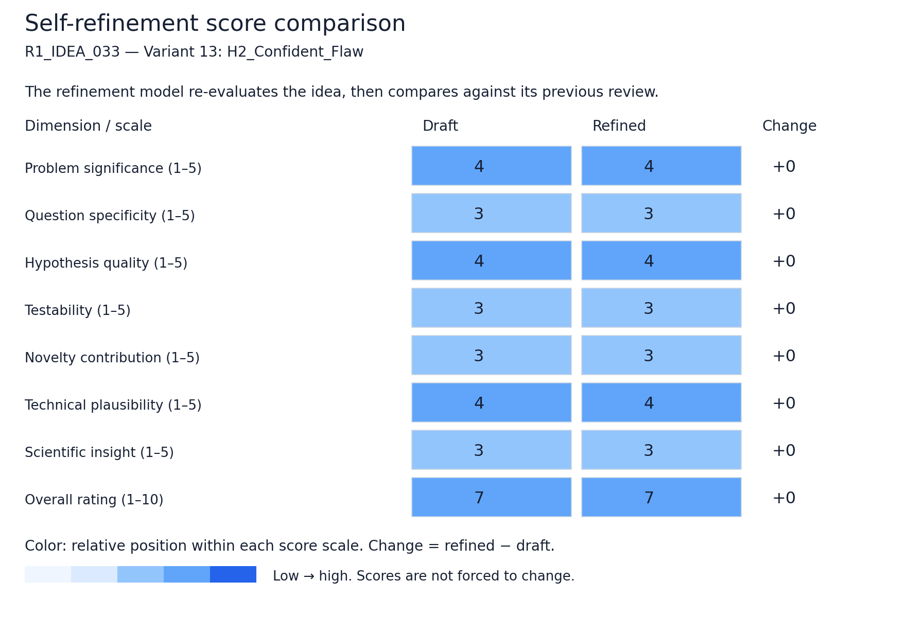

Changed score dimensions: none.

### Score justifications (draft / refined)

**Problem significance**

```json
{
  "draft": {
    "score": 4.0,
    "justification": "The problem of accurately estimating rare, high-loss events in risk-averse modeling is significant for safety-sensitive applications, making it a critical challenge in machine learning."
  },
  "refined": {
    "score": 4.0,
    "justification": "The problem of accurately estimating rare, high-loss events in risk-averse modeling is significant for safety-sensitive applications, making it a critical challenge in machine learning."
  }
}
```

**Question specificity**

```json
{
  "draft": {
    "score": 3.0,
    "justification": "The idea identifies a specific problem in CVaR minimization but lacks detailed specification of the research question or the exact method to be investigated."
  },
  "refined": {
    "score": 3.0,
    "justification": "The idea identifies a specific problem in CVaR minimization but lacks detailed specification of the research question or the exact method to be investigated."
  }
}
```

**Hypothesis quality**

```json
{
  "draft": {
    "score": 4.0,
    "justification": "The idea presents a clear hypothesis that solving the limitation of estimating rare events will lead to reliable improvements in safety, which is testable and has a plausible causal link."
  },
  "refined": {
    "score": 4.0,
    "justification": "The idea presents a clear hypothesis that solving the limitation of estimating rare events will lead to reliable improvements in safety, which is testable and has a plausible causal link."
  }
}
```

**Testability**

```json
{
  "draft": {
    "score": 3.0,
    "justification": "The idea suggests that addressing the problem will lead to improvements, but it lacks concrete experiments or evaluation methods to test this claim."
  },
  "refined": {
    "score": 3.0,
    "justification": "The idea suggests that addressing the problem will lead to improvements, but it lacks concrete experiments or evaluation methods to test this claim."
  }
}
```

**Novelty contribution**

```json
{
  "draft": {
    "score": 3.0,
    "justification": "The idea focuses on a specific challenge in risk-averse modeling, but the novelty is limited unless a novel method is proposed to address the problem."
  },
  "refined": {
    "score": 3.0,
    "justification": "The idea focuses on a specific challenge in risk-averse modeling, but the novelty is limited unless a novel method is proposed to address the problem."
  }
}
```

**Technical plausibility**

```json
{
  "draft": {
    "score": 4.0,
    "justification": "The approach of using CVaR minimization for risk-averse modeling is technically plausible, and the challenge of estimating rare events is a known issue in the field."
  },
  "refined": {
    "score": 4.0,
    "justification": "The approach of using CVaR minimization for risk-averse modeling is technically plausible, and the challenge of estimating rare events is a known issue in the field."
  }
}
```

**Scientific insight**

```json
{
  "draft": {
    "score": 3.0,
    "justification": "The idea suggests that solving the problem will lead to general improvements, but the potential for deeper scientific insight is limited without further specification of the method and evaluation."
  },
  "refined": {
    "score": 3.0,
    "justification": "The idea suggests that solving the problem will lead to general improvements, but the potential for deeper scientific insight is limited without further specification of the method and evaluation."
  }
}
```

**Overall rating**

```json
{
  "draft": {
    "score": 7.0,
    "justification": "The idea addresses a significant problem in risk-averse modeling and presents a clear hypothesis, but it lacks specific details on the method, evaluation, and causal arguments, which are necessary for a strong research direction."
  },
  "refined": {
    "score": 7.0,
    "justification": "The idea addresses a significant problem in risk-averse modeling and presents a clear hypothesis, but it lacks specific details on the method, evaluation, and causal arguments, which are necessary for a strong research direction."
  }
}
```

## R1_IDEA_033 — Variant 14: H3_Verbose_Enriched

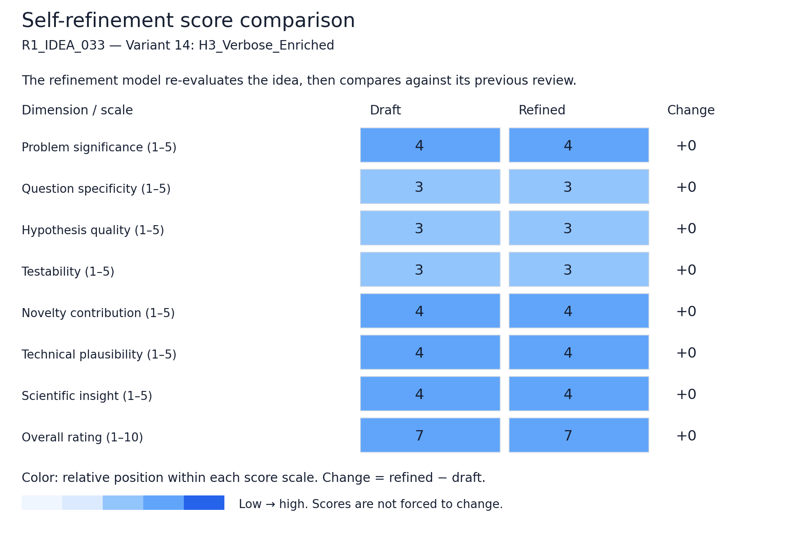

Changed score dimensions: none.

### Score justifications (draft / refined)

**Problem significance**

```json
{
  "draft": {
    "score": 4.0,
    "justification": "The idea addresses a critical issue in risk-averse modeling for safety-sensitive applications, which is highly relevant to real-world scenarios where model robustness is paramount."
  },
  "refined": {
    "score": 4.0,
    "justification": "The idea addresses a critical issue in risk-averse modeling for safety-sensitive applications, which is highly relevant to real-world scenarios where model robustness is paramount."
  }
}
```

**Question specificity**

```json
{
  "draft": {
    "score": 3.0,
    "justification": "The research question is specific to the challenge of CVaR minimization in heavy-tailed distributions, but the exact nature of the distributions and experimental conditions are not fully detailed."
  },
  "refined": {
    "score": 3.0,
    "justification": "The research question is specific to the challenge of CVaR minimization in heavy-tailed distributions, but the exact nature of the distributions and experimental conditions are not fully detailed."
  }
}
```

**Hypothesis quality**

```json
{
  "draft": {
    "score": 3.0,
    "justification": "The hypothesis is implied but not explicitly stated. The idea suggests that heavy-tailed distributions may influence the difficulty of CVaR minimization, but the exact mechanism and testable predictions are not clearly articulated."
  },
  "refined": {
    "score": 3.0,
    "justification": "The hypothesis is implied but not explicitly stated. The idea suggests that heavy-tailed distributions may influence the difficulty of CVaR minimization, but the exact mechanism and testable predictions are not clearly articulated."
  }
}
```

**Testability**

```json
{
  "draft": {
    "score": 3.0,
    "justification": "The idea proposes a staged design with ablation studies and error analysis, which are testable. However, the lack of specific metrics, datasets, and experimental conditions reduces the clarity of how the hypothesis will be tested."
  },
  "refined": {
    "score": 3.0,
    "justification": "The idea proposes a staged design with ablation studies and error analysis, which are testable. However, the lack of specific metrics, datasets, and experimental conditions reduces the clarity of how the hypothesis will be tested."
  }
}
```

**Novelty contribution**

```json
{
  "draft": {
    "score": 4.0,
    "justification": "The focus on heavy-tailed distributions as a boundary condition for CVaR minimization is a novel angle. The proposed experimental design could contribute to understanding the limitations and effectiveness of risk-averse modeling in different data regimes."
  },
  "refined": {
    "score": 4.0,
    "justification": "The focus on heavy-tailed distributions as a boundary condition for CVaR minimization is a novel angle. The proposed experimental design could contribute to understanding the limitations and effectiveness of risk-averse modeling in different data regimes."
  }
}
```

**Technical plausibility**

```json
{
  "draft": {
    "score": 4.0,
    "justification": "The approach is technically plausible, as it builds on existing methods for CVaR minimization and incorporates standard evaluation techniques like ablation studies and sensitivity analysis."
  },
  "refined": {
    "score": 4.0,
    "justification": "The approach is technically plausible, as it builds on existing methods for CVaR minimization and incorporates standard evaluation techniques like ablation studies and sensitivity analysis."
  }
}
```

**Scientific insight**

```json
{
  "draft": {
    "score": 4.0,
    "justification": "The study could provide insights into the conditions under which CVaR minimization is effective, including the role of data distribution properties and the limitations of current methods in extreme cases."
  },
  "refined": {
    "score": 4.0,
    "justification": "The study could provide insights into the conditions under which CVaR minimization is effective, including the role of data distribution properties and the limitations of current methods in extreme cases."
  }
}
```

**Overall rating**

```json
{
  "draft": {
    "score": 7.0,
    "justification": "The idea is strong and addresses a meaningful problem with a structured approach. However, it lacks specific details on experimental design, metrics, and distributions, which are necessary for testability and clarity."
  },
  "refined": {
    "score": 7.0,
    "justification": "The idea is strong and addresses a meaningful problem with a structured approach. However, it lacks specific details on experimental design, metrics, and distributions, which are necessary for testability and clarity."
  }
}
```

## R1_IDEA_033 — Variant 15: H4_Ultimate_Hype


Changed score dimensions: none.

### Score justifications (draft / refined)

**Problem significance**

```json
{
  "draft": {
    "score": 5.0,
    "justification": "The problem of risk-averse modeling is critical in safety-sensitive applications, making it a highly significant and relevant research area."
  },
  "refined": {
    "score": 5.0,
    "justification": "The problem of risk-averse modeling is critical in safety-sensitive applications, making it a highly significant and relevant research area."
  }
}
```

**Question specificity**

```json
{
  "draft": {
    "score": 3.0,
    "justification": "The idea identifies a key challenge in CVaR minimization but lacks concrete details on the specific question or technical challenge being addressed."
  },
  "refined": {
    "score": 3.0,
    "justification": "The idea identifies a key challenge in CVaR minimization but lacks concrete details on the specific question or technical challenge being addressed."
  }
}
```

**Hypothesis quality**

```json
{
  "draft": {
    "score": 3.0,
    "justification": "The idea presents a broad research agenda but does not explicitly state a concrete hypothesis or prediction that can be tested."
  },
  "refined": {
    "score": 3.0,
    "justification": "The idea presents a broad research agenda but does not explicitly state a concrete hypothesis or prediction that can be tested."
  }
}
```

**Testability**

```json
{
  "draft": {
    "score": 2.0,
    "justification": "The idea is ambitious but lacks specific experimental or evaluation plans to test the proposed approach, making it difficult to assess its feasibility."
  },
  "refined": {
    "score": 2.0,
    "justification": "The idea is ambitious but lacks specific experimental or evaluation plans to test the proposed approach, making it difficult to assess its feasibility."
  }
}
```

**Novelty contribution**

```json
{
  "draft": {
    "score": 4.0,
    "justification": "The research agenda targets an underexplored technical challenge with potential for significant contributions to both theory and practice in risk-averse modeling."
  },
  "refined": {
    "score": 4.0,
    "justification": "The research agenda targets an underexplored technical challenge with potential for significant contributions to both theory and practice in risk-averse modeling."
  }
}
```

**Technical plausibility**

```json
{
  "draft": {
    "score": 4.0,
    "justification": "The approach is technically plausible as it builds on existing concepts in risk-averse modeling, though the specific methods for addressing the challenge are not detailed."
  },
  "refined": {
    "score": 4.0,
    "justification": "The approach is technically plausible as it builds on existing concepts in risk-averse modeling, though the specific methods for addressing the challenge are not detailed."
  }
}
```

**Scientific insight**

```json
{
  "draft": {
    "score": 3.0,
    "justification": "The idea has the potential to provide insights into the limitations and improvements of CVaR minimization, but the specific insights are not clearly defined."
  },
  "refined": {
    "score": 3.0,
    "justification": "The idea has the potential to provide insights into the limitations and improvements of CVaR minimization, but the specific insights are not clearly defined."
  }
}
```

**Overall rating**

```json
{
  "draft": {
    "score": 7.0,
    "justification": "The idea is strong and addresses a significant problem with high potential impact, but it lacks specific details and a clear hypothesis, which are necessary for further development and evaluation."
  },
  "refined": {
    "score": 7.0,
    "justification": "The idea is strong and addresses a significant problem with high potential impact, but it lacks specific details and a clear hypothesis, which are necessary for further development and evaluation."
  }
}
```

## R1_IDEA_034 — Source


Changed score dimensions: none.

### Score justifications (draft / refined)

**Problem significance**

```json
{
  "draft": {
    "score": 4.0,
    "justification": "The idea addresses a significant challenge in the efficiency of task adaptation for LLMs, which is a critical issue in practical applications of reinforcement learning. Improving the efficiency of task adaptation could reduce computational costs and make RL more feasible for real-world use cases."
  },
  "refined": {
    "score": 4.0,
    "justification": "The idea addresses a significant challenge in the efficiency of task adaptation for LLMs, which is a critical issue in practical applications of reinforcement learning. Improving the efficiency of task adaptation could reduce computational costs and make RL more feasible for real-world use cases."
  }
}
```

**Question specificity**

```json
{
  "draft": {
    "score": 3.0,
    "justification": "The idea proposes a general hypothesis about the potential of language interpretability in learning, but lacks a specific research question or hypothesis that can be tested. The proposed method (GEPA) is not fully described, making it difficult to assess the exact problem being addressed."
  },
  "refined": {
    "score": 3.0,
    "justification": "The idea proposes a general hypothesis about the potential of language interpretability in learning, but lacks a specific research question or hypothesis that can be tested. The proposed method (GEPA) is not fully described, making it difficult to assess the exact problem being addressed."
  }
}
```

**Hypothesis quality**

```json
{
  "draft": {
    "score": 2.0,
    "justification": "The hypothesis is not clearly stated or defined. The idea suggests that language interpretability could be a richer learning medium, but it does not specify what exactly is being tested or how the hypothesis can be validated. This lack of clarity makes it difficult to evaluate the hypothesis's testability."
  },
  "refined": {
    "score": 2.0,
    "justification": "The hypothesis is not clearly stated or defined. The idea suggests that language interpretability could be a richer learning medium, but it does not specify what exactly is being tested or how the hypothesis can be validated. This lack of clarity makes it difficult to evaluate the hypothesis's testability."
  }
}
```

**Testability**

```json
{
  "draft": {
    "score": 2.0,
    "justification": "The idea lacks a clear experimental plan or specific tests that would be used to evaluate GEPA. Without details on how the method will be implemented, compared to existing methods, or on which tasks it will be tested, it is difficult to assess the testability of the hypothesis."
  },
  "refined": {
    "score": 2.0,
    "justification": "The idea lacks a clear experimental plan or specific tests that would be used to evaluate GEPA. Without details on how the method will be implemented, compared to existing methods, or on which tasks it will be tested, it is difficult to assess the testability of the hypothesis."
  }
}
```

**Novelty contribution**

```json
{
  "draft": {
    "score": 4.0,
    "justification": "The idea introduces a novel approach (GEPA) that directly addresses the hypothesis about language interpretability as a learning medium. While the method is not fully described, the proposal itself is novel in its focus on leveraging the interpretability of language for more efficient task adaptation."
  },
  "refined": {
    "score": 4.0,
    "justification": "The idea introduces a novel approach (GEPA) that directly addresses the hypothesis about language interpretability as a learning medium. While the method is not fully described, the proposal itself is novel in its focus on leveraging the interpretability of language for more efficient task adaptation."
  }
}
```

**Technical plausibility**

```json
{
  "draft": {
    "score": 3.0,
    "justification": "The idea is technically plausible, as it suggests a new method that could potentially leverage the structure of language for learning. However, the lack of detailed description makes it difficult to assess the feasibility of the approach. The connection between language interpretability and learning efficiency is not clearly explained, which is necessary for evaluating the technical plausibility."
  },
  "refined": {
    "score": 3.0,
    "justification": "The idea is technically plausible, as it suggests a new method that could potentially leverage the structure of language for learning. However, the lack of detailed description makes it difficult to assess the feasibility of the approach. The connection between language interpretability and learning efficiency is not clearly explained, which is necessary for evaluating the technical plausibility."
  }
}
```

**Scientific insight**

```json
{
  "draft": {
    "score": 3.0,
    "justification": "The idea has the potential to provide scientific insight into how language interpretability can be used to improve learning efficiency in LLMs. However, without a clear hypothesis or experimental plan, the potential for insight is limited. The idea could contribute to understanding the role of interpretability in learning, but this is not clearly articulated."
  },
  "refined": {
    "score": 3.0,
    "justification": "The idea has the potential to provide scientific insight into how language interpretability can be used to improve learning efficiency in LLMs. However, without a clear hypothesis or experimental plan, the potential for insight is limited. The idea could contribute to understanding the role of interpretability in learning, but this is not clearly articulated."
  }
}
```

**Overall rating**

```json
{
  "draft": {
    "score": 6.0,
    "justification": "The idea addresses a meaningful problem in the efficiency of task adaptation for LLMs and proposes a novel method (GEPA) that could potentially improve learning efficiency by leveraging language interpretability. However, the idea is incomplete, lacks a clear hypothesis, and does not provide sufficient details to assess its testability or technical feasibility. With further development, it has the potential to be a strong research direction."
  },
  "refined": {
    "score": 6.0,
    "justification": "The idea addresses a meaningful problem in the efficiency of task adaptation for LLMs and proposes a novel method (GEPA) that could potentially improve learning efficiency by leveraging language interpretability. However, the idea is incomplete, lacks a clear hypothesis, and does not provide sufficient details to assess its testability or technical feasibility. With further development, it has the potential to be a strong research direction."
  }
}
```

## R1_IDEA_034 — Variant 1: A1_Identity


Changed score dimensions: none.

### Score justifications (draft / refined)

**Problem significance**

```json
{
  "draft": {
    "score": 4.0,
    "justification": "The problem of efficient task adaptation for LLMs is significant, as current RL methods like GRPO are resource-intensive. Improving efficiency could have practical implications for deploying LLMs in real-world scenarios."
  },
  "refined": {
    "score": 4.0,
    "justification": "The problem of efficient task adaptation for LLMs is significant, as current RL methods like GRPO are resource-intensive. Improving efficiency could have practical implications for deploying LLMs in real-world scenarios."
  }
}
```

**Question specificity**

```json
{
  "draft": {
    "score": 3.0,
    "justification": "The idea raises a general question about the effectiveness of language interpretability in RL, but lacks specific details on the research question or hypothesis being tested."
  },
  "refined": {
    "score": 3.0,
    "justification": "The idea raises a general question about the effectiveness of language interpretability in RL, but lacks specific details on the research question or hypothesis being tested."
  }
}
```

**Hypothesis quality**

```json
{
  "draft": {
    "score": 3.0,
    "justification": "The hypothesis is implied but not clearly stated. The idea suggests that language interpretability could lead to more efficient learning, but the specific mechanism or prediction is not well-defined."
  },
  "refined": {
    "score": 3.0,
    "justification": "The hypothesis is implied but not clearly stated. The idea suggests that language interpretability could lead to more efficient learning, but the specific mechanism or prediction is not well-defined."
  }
}
```

**Testability**

```json
{
  "draft": {
    "score": 2.0,
    "justification": "The idea is testable in principle, but the summary lacks details on how GEPA would be evaluated or compared to existing methods, making it difficult to assess its testability."
  },
  "refined": {
    "score": 2.0,
    "justification": "The idea is testable in principle, but the summary lacks details on how GEPA would be evaluated or compared to existing methods, making it difficult to assess its testability."
  }
}
```

**Novelty contribution**

```json
{
  "draft": {
    "score": 4.0,
    "justification": "The idea proposes a novel approach (GEPA) that leverages language interpretability for RL, which could contribute new insights into how LLMs learn from language structure."
  },
  "refined": {
    "score": 4.0,
    "justification": "The idea proposes a novel approach (GEPA) that leverages language interpretability for RL, which could contribute new insights into how LLMs learn from language structure."
  }
}
```

**Technical plausibility**

```json
{
  "draft": {
    "score": 3.0,
    "justification": "The concept of using language interpretability in RL is plausible, but the specific technical details of GEPA are not provided, making it difficult to assess the feasibility of the approach."
  },
  "refined": {
    "score": 3.0,
    "justification": "The concept of using language interpretability in RL is plausible, but the specific technical details of GEPA are not provided, making it difficult to assess the feasibility of the approach."
  }
}
```

**Scientific insight**

```json
{
  "draft": {
    "score": 3.0,
    "justification": "The idea has potential to provide insights into the relationship between language structure and RL efficiency, but the current summary does not clearly outline the expected scientific contributions."
  },
  "refined": {
    "score": 3.0,
    "justification": "The idea has potential to provide insights into the relationship between language structure and RL efficiency, but the current summary does not clearly outline the expected scientific contributions."
  }
}
```

**Overall rating**

```json
{
  "draft": {
    "score": 7.0,
    "justification": "The idea addresses a significant problem in LLM task adaptation and proposes a novel approach. However, it lacks sufficient detail and specificity to fully evaluate its testability and scientific contribution."
  },
  "refined": {
    "score": 7.0,
    "justification": "The idea addresses a significant problem in LLM task adaptation and proposes a novel approach. However, it lacks sufficient detail and specificity to fully evaluate its testability and scientific contribution."
  }
}
```

## R1_IDEA_034 — Variant 2: A2_Paraphrase_Only


Changed score dimensions: none.

### Score justifications (draft / refined)

**Problem significance**

```json
{
  "draft": {
    "score": 4.0,
    "justification": "The problem of efficient adaptation of LLMs is significant, as current methods like GRPO are computationally expensive. Improving efficiency is a key challenge in practical applications of LLMs."
  },
  "refined": {
    "score": 4.0,
    "justification": "The problem of efficient adaptation of LLMs is significant, as current methods like GRPO are computationally expensive. Improving efficiency is a key challenge in practical applications of LLMs."
  }
}
```

**Question specificity**

```json
{
  "draft": {
    "score": 3.0,
    "justification": "The idea identifies a specific problem (high computational cost of RL methods) and proposes a novel approach (GEPA), but the specifics of the method and hypothesis are not fully detailed, which limits the clarity of the research question."
  },
  "refined": {
    "score": 3.0,
    "justification": "The idea identifies a specific problem (high computational cost of RL methods) and proposes a novel approach (GEPA), but the specifics of the method and hypothesis are not fully detailed, which limits the clarity of the research question."
  }
}
```

**Hypothesis quality**

```json
{
  "draft": {
    "score": 3.0,
    "justification": "The hypothesis that language's interpretability leads to more effective learning is plausible but not clearly defined. The idea lacks a concrete prediction or mechanism that could be tested."
  },
  "refined": {
    "score": 3.0,
    "justification": "The hypothesis that language's interpretability leads to more effective learning is plausible but not clearly defined. The idea lacks a concrete prediction or mechanism that could be tested."
  }
}
```

**Testability**

```json
{
  "draft": {
    "score": 2.0,
    "justification": "The idea is too vague to determine how it would be tested. Without a clear experimental design or comparison, it is difficult to assess the feasibility of the proposed method."
  },
  "refined": {
    "score": 2.0,
    "justification": "The idea is too vague to determine how it would be tested. Without a clear experimental design or comparison, it is difficult to assess the feasibility of the proposed method."
  }
}
```

**Novelty contribution**

```json
{
  "draft": {
    "score": 4.0,
    "justification": "The idea introduces a novel approach (GEPA) that leverages language interpretability, which is a unique angle in the field of LLM adaptation. However, the novelty is somewhat limited without a detailed description of the method."
  },
  "refined": {
    "score": 4.0,
    "justification": "The idea introduces a novel approach (GEPA) that leverages language interpretability, which is a unique angle in the field of LLM adaptation. However, the novelty is somewhat limited without a detailed description of the method."
  }
}
```

**Technical plausibility**

```json
{
  "draft": {
    "score": 3.0,
    "justification": "The idea is technically plausible, as it suggests using genetic algorithms or Pareto optimization to adapt LLMs. However, the lack of details makes it difficult to assess the feasibility of the approach."
  },
  "refined": {
    "score": 3.0,
    "justification": "The idea is technically plausible, as it suggests using genetic algorithms or Pareto optimization to adapt LLMs. However, the lack of details makes it difficult to assess the feasibility of the approach."
  }
}
```

**Scientific insight**

```json
{
  "draft": {
    "score": 3.0,
    "justification": "The idea has potential for scientific insight by exploring alternative learning signals in LLM adaptation. However, the lack of specifics makes it difficult to determine the depth of the insight."
  },
  "refined": {
    "score": 3.0,
    "justification": "The idea has potential for scientific insight by exploring alternative learning signals in LLM adaptation. However, the lack of specifics makes it difficult to determine the depth of the insight."
  }
}
```

**Overall rating**

```json
{
  "draft": {
    "score": 7.0,
    "justification": "The idea addresses a significant problem in LLM adaptation and proposes a novel approach. However, the lack of details and clarity in the hypothesis and method limits its potential for scientific contribution and testability."
  },
  "refined": {
    "score": 7.0,
    "justification": "The idea addresses a significant problem in LLM adaptation and proposes a novel approach. However, the lack of details and clarity in the hypothesis and method limits its potential for scientific contribution and testability."
  }
}
```

## R1_IDEA_034 — Variant 3: A3_Plain_Core

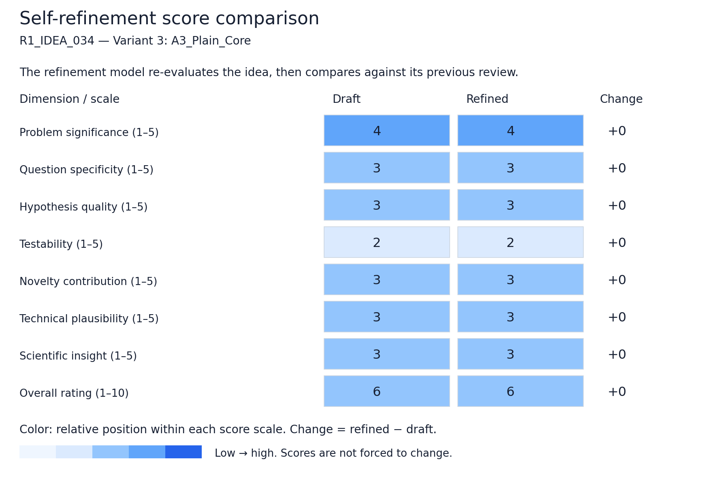

Changed score dimensions: none.

### Score justifications (draft / refined)

**Problem significance**

```json
{
  "draft": {
    "score": 4.0,
    "justification": "The problem of efficiently adapting LLMs to downstream tasks is critical in practical applications, as traditional methods like GRPO are computationally expensive. Addressing this could have significant real-world impact."
  },
  "refined": {
    "score": 4.0,
    "justification": "The problem of efficiently adapting LLMs to downstream tasks is critical in practical applications, as traditional methods like GRPO are computationally expensive. Addressing this could have significant real-world impact."
  }
}
```

**Question specificity**

```json
{
  "draft": {
    "score": 3.0,
    "justification": "The idea identifies a specific research direction (GEPA) but lacks sufficient detail to define the exact question being investigated. The hypothesis is plausible but not clearly articulated."
  },
  "refined": {
    "score": 3.0,
    "justification": "The idea identifies a specific research direction (GEPA) but lacks sufficient detail to define the exact question being investigated. The hypothesis is plausible but not clearly articulated."
  }
}
```

**Hypothesis quality**

```json
{
  "draft": {
    "score": 3.0,
    "justification": "The hypothesis that language interpretability improves learning efficiency is plausible but not explicitly stated. The idea suggests a comparison with GRPO but does not clearly define the expected outcome or mechanism."
  },
  "refined": {
    "score": 3.0,
    "justification": "The hypothesis that language interpretability improves learning efficiency is plausible but not explicitly stated. The idea suggests a comparison with GRPO but does not clearly define the expected outcome or mechanism."
  }
}
```

**Testability**

```json
{
  "draft": {
    "score": 2.0,
    "justification": "The idea is testable in principle, but the lack of specific experimental design or comparison metrics makes it difficult to assess the feasibility of testing the hypothesis. Without clear experiments, the testability is limited."
  },
  "refined": {
    "score": 2.0,
    "justification": "The idea is testable in principle, but the lack of specific experimental design or comparison metrics makes it difficult to assess the feasibility of testing the hypothesis. Without clear experiments, the testability is limited."
  }
}
```

**Novelty contribution**

```json
{
  "draft": {
    "score": 3.0,
    "justification": "The idea proposes a novel approach (GEPA) that leverages language interpretability, which is a fresh angle in LLM adaptation. However, without more details, it is unclear how novel this approach is compared to existing methods."
  },
  "refined": {
    "score": 3.0,
    "justification": "The idea proposes a novel approach (GEPA) that leverages language interpretability, which is a fresh angle in LLM adaptation. However, without more details, it is unclear how novel this approach is compared to existing methods."
  }
}
```

**Technical plausibility**

```json
{
  "draft": {
    "score": 3.0,
    "justification": "The idea is technically plausible, as leveraging interpretability in language is a reasonable direction. However, the lack of specific details makes it difficult to assess the feasibility of the proposed method."
  },
  "refined": {
    "score": 3.0,
    "justification": "The idea is technically plausible, as leveraging interpretability in language is a reasonable direction. However, the lack of specific details makes it difficult to assess the feasibility of the proposed method."
  }
}
```

**Scientific insight**

```json
{
  "draft": {
    "score": 3.0,
    "justification": "The idea has potential to provide insights into how interpretability in language can be harnessed for more efficient learning, but the lack of specifics limits the potential for meaningful scientific insight."
  },
  "refined": {
    "score": 3.0,
    "justification": "The idea has potential to provide insights into how interpretability in language can be harnessed for more efficient learning, but the lack of specifics limits the potential for meaningful scientific insight."
  }
}
```

**Overall rating**

```json
{
  "draft": {
    "score": 6.0,
    "justification": "The idea addresses a significant problem in LLM adaptation and proposes a novel direction (GEPA). However, it lacks sufficient detail to fully assess its testability, novelty, and technical plausibility. With more information, it could become a strong research idea."
  },
  "refined": {
    "score": 6.0,
    "justification": "The idea addresses a significant problem in LLM adaptation and proposes a novel direction (GEPA). However, it lacks sufficient detail to fully assess its testability, novelty, and technical plausibility. With more information, it could become a strong research idea."
  }
}
```

## R1_IDEA_034 — Variant 4: B1_Verbose_Elaborate


Changed score dimensions: none.

### Score justifications (draft / refined)

**Problem significance**

```json
{
  "draft": {
    "score": 4.0,
    "justification": "The problem of efficient reinforcement learning for LLMs is significant as it impacts the practicality and scalability of these models in real-world applications."
  },
  "refined": {
    "score": 4.0,
    "justification": "The problem of efficient reinforcement learning for LLMs is significant as it impacts the practicality and scalability of these models in real-world applications."
  }
}
```

**Question specificity**

```json
{
  "draft": {
    "score": 3.0,
    "justification": "The idea presents a general direction but lacks specific details on the research question, such as how GEPA will be implemented or what exactly is being tested."
  },
  "refined": {
    "score": 3.0,
    "justification": "The idea presents a general direction but lacks specific details on the research question, such as how GEPA will be implemented or what exactly is being tested."
  }
}
```

**Hypothesis quality**

```json
{
  "draft": {
    "score": 3.0,
    "justification": "The hypothesis is implied but not clearly stated. The idea suggests a potential advantage of language interpretability but does not provide a concrete prediction or mechanism."
  },
  "refined": {
    "score": 3.0,
    "justification": "The hypothesis is implied but not clearly stated. The idea suggests a potential advantage of language interpretability but does not provide a concrete prediction or mechanism."
  }
}
```

**Testability**

```json
{
  "draft": {
    "score": 2.0,
    "justification": "The idea lacks specific experiments or evaluation plans. Without details on how GEPA will be tested against existing methods, it is difficult to assess its validity."
  },
  "refined": {
    "score": 2.0,
    "justification": "The idea lacks specific experiments or evaluation plans. Without details on how GEPA will be tested against existing methods, it is difficult to assess its validity."
  }
}
```

**Novelty contribution**

```json
{
  "draft": {
    "score": 4.0,
    "justification": "The proposal to use language interpretability in reinforcement learning for LLMs is a novel approach, potentially offering a more efficient alternative to existing methods like GRPO."
  },
  "refined": {
    "score": 4.0,
    "justification": "The proposal to use language interpretability in reinforcement learning for LLMs is a novel approach, potentially offering a more efficient alternative to existing methods like GRPO."
  }
}
```

**Technical plausibility**

```json
{
  "draft": {
    "score": 4.0,
    "justification": "The idea is technically plausible as it builds on existing RL methods for LLMs and leverages the interpretability of language, which is a reasonable assumption given current research trends."
  },
  "refined": {
    "score": 4.0,
    "justification": "The idea is technically plausible as it builds on existing RL methods for LLMs and leverages the interpretability of language, which is a reasonable assumption given current research trends."
  }
}
```

**Scientific insight**

```json
{
  "draft": {
    "score": 3.0,
    "justification": "The idea has potential for scientific insight by exploring how the structure of language can be harnessed for more efficient learning, but the specifics are not yet clear."
  },
  "refined": {
    "score": 3.0,
    "justification": "The idea has potential for scientific insight by exploring how the structure of language can be harnessed for more efficient learning, but the specifics are not yet clear."
  }
}
```

**Overall rating**

```json
{
  "draft": {
    "score": 7.0,
    "justification": "The idea addresses a meaningful problem with a potentially novel approach, but it lacks sufficient detail and specificity to be fully testable or to clearly define the research question."
  },
  "refined": {
    "score": 7.0,
    "justification": "The idea addresses a meaningful problem with a potentially novel approach, but it lacks sufficient detail and specificity to be fully testable or to clearly define the research question."
  }
}
```

## R1_IDEA_034 — Variant 5: B2_Grand_Narrative


Changed score dimensions: none.

### Score justifications (draft / refined)

**Problem significance**

```json
{
  "draft": {
    "score": 4.0,
    "justification": "The problem of sample efficiency in reinforcement learning for LLMs is significant as it impacts the practicality and scalability of these models in real-world applications."
  },
  "refined": {
    "score": 4.0,
    "justification": "The problem of sample efficiency in reinforcement learning for LLMs is significant as it impacts the practicality and scalability of these models in real-world applications."
  }
}
```

**Question specificity**

```json
{
  "draft": {
    "score": 3.0,
    "justification": "The idea presents a general direction but lacks specific details on the research question, hypothesis, and experimental design, making it somewhat vague."
  },
  "refined": {
    "score": 3.0,
    "justification": "The idea presents a general direction but lacks specific details on the research question, hypothesis, and experimental design, making it somewhat vague."
  }
}
```

**Hypothesis quality**

```json
{
  "draft": {
    "score": 3.0,
    "justification": "The hypothesis that language interpretability leads to more efficient learning is plausible but not clearly articulated or supported by specific predictions or mechanisms."
  },
  "refined": {
    "score": 3.0,
    "justification": "The hypothesis that language interpretability leads to more efficient learning is plausible but not clearly articulated or supported by specific predictions or mechanisms."
  }
}
```

**Testability**

```json
{
  "draft": {
    "score": 2.0,
    "justification": "The idea lacks a clear experimental plan or evaluation metrics, making it difficult to assess the testability of the proposed method without further details."
  },
  "refined": {
    "score": 2.0,
    "justification": "The idea lacks a clear experimental plan or evaluation metrics, making it difficult to assess the testability of the proposed method without further details."
  }
}
```

**Novelty contribution**

```json
{
  "draft": {
    "score": 4.0,
    "justification": "The focus on leveraging language interpretability for efficient learning is a novel angle, though the specific contribution of GEPA is not fully defined."
  },
  "refined": {
    "score": 4.0,
    "justification": "The focus on leveraging language interpretability for efficient learning is a novel angle, though the specific contribution of GEPA is not fully defined."
  }
}
```

**Technical plausibility**

```json
{
  "draft": {
    "score": 3.0,
    "justification": "The concept of using language interpretability for efficient learning is plausible, but the technical details of GEPA are not provided, making it hard to assess the feasibility."
  },
  "refined": {
    "score": 3.0,
    "justification": "The concept of using language interpretability for efficient learning is plausible, but the technical details of GEPA are not provided, making it hard to assess the feasibility."
  }
}
```

**Scientific insight**

```json
{
  "draft": {
    "score": 3.0,
    "justification": "The idea has potential to contribute to understanding how interpretability affects learning efficiency, but the specific insights are not clearly outlined."
  },
  "refined": {
    "score": 3.0,
    "justification": "The idea has potential to contribute to understanding how interpretability affects learning efficiency, but the specific insights are not clearly outlined."
  }
}
```

**Overall rating**

```json
{
  "draft": {
    "score": 7.0,
    "justification": "The idea addresses a significant problem in efficient LLM adaptation and proposes a novel direction, but it lacks specific details and a clear hypothesis, which limits its current testability and scientific insight potential."
  },
  "refined": {
    "score": 7.0,
    "justification": "The idea addresses a significant problem in efficient LLM adaptation and proposes a novel direction, but it lacks specific details and a clear hypothesis, which limits its current testability and scientific insight potential."
  }
}
```

## R1_IDEA_034 — Variant 6: B3_Over_Confident


Changed score dimensions: none.

### Score justifications (draft / refined)

**Problem significance**

```json
{
  "draft": {
    "score": 4.0,
    "justification": "The idea addresses a significant challenge in training LLMs for downstream tasks, particularly the inefficiency of current RL methods which require extensive rollouts. This is a critical issue in the field as it impacts the practicality and scalability of LLM applications."
  },
  "refined": {
    "score": 4.0,
    "justification": "The idea addresses a significant challenge in training LLMs for downstream tasks, particularly the inefficiency of current RL methods which require extensive rollouts. This is a critical issue in the field as it impacts the practicality and scalability of LLM applications."
  }
}
```

**Question specificity**

```json
{
  "draft": {
    "score": 3.0,
    "justification": "The research question is somewhat specific in its focus on the interpretability of language as a learning medium, but lacks concrete details on how GEPA will be implemented or what specific aspects of language interpretability will be utilized."
  },
  "refined": {
    "score": 3.0,
    "justification": "The research question is somewhat specific in its focus on the interpretability of language as a learning medium, but lacks concrete details on how GEPA will be implemented or what specific aspects of language interpretability will be utilized."
  }
}
```

**Hypothesis quality**

```json
{
  "draft": {
    "score": 3.0,
    "justification": "The idea presents a general hypothesis that the interpretability of language could be a richer learning medium than policy gradients, but it does not clearly state the specific prediction or mechanism that would support or contradict this hypothesis."
  },
  "refined": {
    "score": 3.0,
    "justification": "The idea presents a general hypothesis that the interpretability of language could be a richer learning medium than policy gradients, but it does not clearly state the specific prediction or mechanism that would support or contradict this hypothesis."
  }
}
```

**Testability**

```json
{
  "draft": {
    "score": 2.0,
    "justification": "The idea is testable in principle, but the lack of specific details about GEPA makes it difficult to assess how the hypothesis can be tested. Without a clear experimental design or evaluation plan, the testability is limited."
  },
  "refined": {
    "score": 2.0,
    "justification": "The idea is testable in principle, but the lack of specific details about GEPA makes it difficult to assess how the hypothesis can be tested. Without a clear experimental design or evaluation plan, the testability is limited."
  }
}
```

**Novelty contribution**

```json
{
  "draft": {
    "score": 4.0,
    "justification": "The idea proposes a novel approach (GEPA) that leverages the interpretability of language, which is a promising direction for improving learning efficiency in LLMs. However, the novelty is somewhat limited without a detailed description of the method."
  },
  "refined": {
    "score": 4.0,
    "justification": "The idea proposes a novel approach (GEPA) that leverages the interpretability of language, which is a promising direction for improving learning efficiency in LLMs. However, the novelty is somewhat limited without a detailed description of the method."
  }
}
```

**Technical plausibility**

```json
{
  "draft": {
    "score": 3.0,
    "justification": "The idea is technically plausible as it builds on the premise that language interpretability could enhance learning, but the lack of specific details about GEPA makes it difficult to assess the feasibility of the proposed method."
  },
  "refined": {
    "score": 3.0,
    "justification": "The idea is technically plausible as it builds on the premise that language interpretability could enhance learning, but the lack of specific details about GEPA makes it difficult to assess the feasibility of the proposed method."
  }
}
```

**Scientific insight**

```json
{
  "draft": {
    "score": 3.0,
    "justification": "The idea has the potential to provide scientific insights into how language interpretability can be harnessed for more efficient learning in LLMs. However, the lack of specific details limits the potential for meaningful insights."
  },
  "refined": {
    "score": 3.0,
    "justification": "The idea has the potential to provide scientific insights into how language interpretability can be harnessed for more efficient learning in LLMs. However, the lack of specific details limits the potential for meaningful insights."
  }
}
```

**Overall rating**

```json
{
  "draft": {
    "score": 7.0,
    "justification": "The idea addresses a significant problem in LLM training and proposes a novel approach (GEPA) that could lead to important scientific insights. However, the lack of specific details and a clear hypothesis limits its testability and potential contribution."
  },
  "refined": {
    "score": 7.0,
    "justification": "The idea addresses a significant problem in LLM training and proposes a novel approach (GEPA) that could lead to important scientific insights. However, the lack of specific details and a clear hypothesis limits its testability and potential contribution."
  }
}
```

## R1_IDEA_034 — Variant 7: B4_Novelty

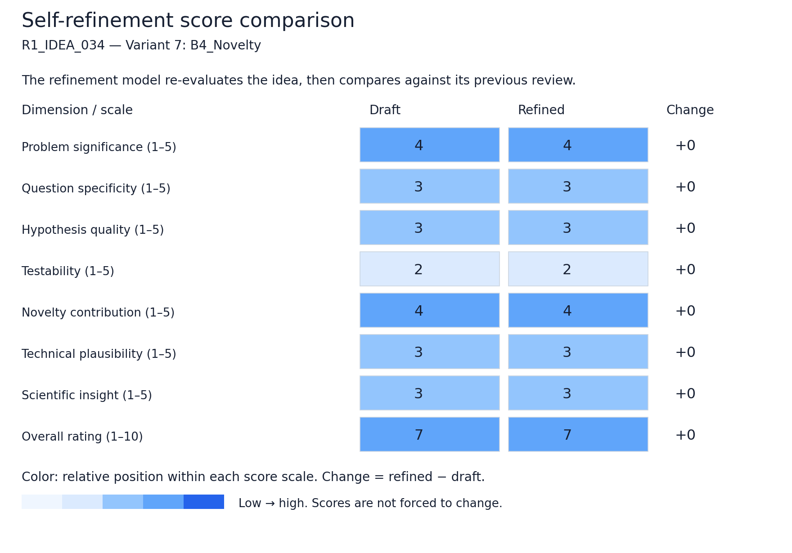

Changed score dimensions: none.

### Score justifications (draft / refined)

**Problem significance**

```json
{
  "draft": {
    "score": 4.0,
    "justification": "The problem of efficient LLM adaptation is significant, as traditional methods like GRPO are computationally expensive. The proposed approach addresses this challenge by offering a potentially more efficient alternative."
  },
  "refined": {
    "score": 4.0,
    "justification": "The problem of efficient LLM adaptation is significant, as traditional methods like GRPO are computationally expensive. The proposed approach addresses this challenge by offering a potentially more efficient alternative."
  }
}
```

**Question specificity**

```json
{
  "draft": {
    "score": 3.0,
    "justification": "The idea presents a general direction but lacks specific research questions or hypotheses. It needs to clearly define what aspect of LLM adaptation GEPA aims to improve and how it does so."
  },
  "refined": {
    "score": 3.0,
    "justification": "The idea presents a general direction but lacks specific research questions or hypotheses. It needs to clearly define what aspect of LLM adaptation GEPA aims to improve and how it does so."
  }
}
```

**Hypothesis quality**

```json
{
  "draft": {
    "score": 3.0,
    "justification": "The idea suggests a potential benefit of using GEPA but does not explicitly state a hypothesis or specific prediction that can be tested. More concrete claims are needed to strengthen the hypothesis."
  },
  "refined": {
    "score": 3.0,
    "justification": "The idea suggests a potential benefit of using GEPA but does not explicitly state a hypothesis or specific prediction that can be tested. More concrete claims are needed to strengthen the hypothesis."
  }
}
```

**Testability**

```json
{
  "draft": {
    "score": 2.0,
    "justification": "The idea is too vague to be tested without more details. The proposed method GEPA is not fully described, making it difficult to assess how it can be evaluated or compared to existing methods."
  },
  "refined": {
    "score": 2.0,
    "justification": "The idea is too vague to be tested without more details. The proposed method GEPA is not fully described, making it difficult to assess how it can be evaluated or compared to existing methods."
  }
}
```

**Novelty contribution**

```json
{
  "draft": {
    "score": 4.0,
    "justification": "The approach of using genetic algorithms and Pareto optimization for LLM adaptation is novel, especially in the context of leveraging language interpretability. This could contribute new insights into efficient adaptation methods."
  },
  "refined": {
    "score": 4.0,
    "justification": "The approach of using genetic algorithms and Pareto optimization for LLM adaptation is novel, especially in the context of leveraging language interpretability. This could contribute new insights into efficient adaptation methods."
  }
}
```

**Technical plausibility**

```json
{
  "draft": {
    "score": 3.0,
    "justification": "The combination of genetic algorithms and Pareto optimization is technically plausible, but the specific application to LLM adaptation is not well explained. More details are needed to assess the feasibility of the approach."
  },
  "refined": {
    "score": 3.0,
    "justification": "The combination of genetic algorithms and Pareto optimization is technically plausible, but the specific application to LLM adaptation is not well explained. More details are needed to assess the feasibility of the approach."
  }
}
```

**Scientific insight**

```json
{
  "draft": {
    "score": 3.0,
    "justification": "The idea has the potential to provide insights into how interpretability of language can be leveraged for more efficient learning, but the connection to genetic algorithms and Pareto optimization is not clearly established."
  },
  "refined": {
    "score": 3.0,
    "justification": "The idea has the potential to provide insights into how interpretability of language can be leveraged for more efficient learning, but the connection to genetic algorithms and Pareto optimization is not clearly established."
  }
}
```

**Overall rating**

```json
{
  "draft": {
    "score": 7.0,
    "justification": "The idea is promising and addresses a significant problem in LLM adaptation. However, it lacks specific research questions, hypotheses, and detailed implementation details, which are necessary for evaluating its scientific merit and feasibility."
  },
  "refined": {
    "score": 7.0,
    "justification": "The idea is promising and addresses a significant problem in LLM adaptation. However, it lacks specific research questions, hypotheses, and detailed implementation details, which are necessary for evaluating its scientific merit and feasibility."
  }
}
```

## R1_IDEA_034 — Variant 8: B5_Application_Impact


Changed score dimensions: none.

### Score justifications (draft / refined)

**Problem significance**

```json
{
  "draft": {
    "score": 4.0,
    "justification": "The problem of efficiently training LLMs for downstream tasks is significant in the context of practical applications, as it directly impacts the feasibility and cost of deploying LLMs in real-world scenarios."
  },
  "refined": {
    "score": 4.0,
    "justification": "The problem of efficiently training LLMs for downstream tasks is significant in the context of practical applications, as it directly impacts the feasibility and cost of deploying LLMs in real-world scenarios."
  }
}
```

**Question specificity**

```json
{
  "draft": {
    "score": 3.0,
    "justification": "The idea presents a general direction but lacks specific details about the research question, such as the exact problem being addressed, the specific aspects of language interpretability being utilized, and the precise hypothesis being tested."
  },
  "refined": {
    "score": 3.0,
    "justification": "The idea presents a general direction but lacks specific details about the research question, such as the exact problem being addressed, the specific aspects of language interpretability being utilized, and the precise hypothesis being tested."
  }
}
```

**Hypothesis quality**

```json
{
  "draft": {
    "score": 3.0,
    "justification": "The hypothesis that GEPA could be more efficient than traditional RL methods is not clearly stated or supported by prior evidence. The connection between language interpretability and training efficiency is not explicitly explained."
  },
  "refined": {
    "score": 3.0,
    "justification": "The hypothesis that GEPA could be more efficient than traditional RL methods is not clearly stated or supported by prior evidence. The connection between language interpretability and training efficiency is not explicitly explained."
  }
}
```

**Testability**

```json
{
  "draft": {
    "score": 3.0,
    "justification": "The idea suggests a potential method (GEPA) but does not provide specific experiments or comparisons that would allow for testing the hypothesis. The lack of details makes it difficult to assess the testability of the claim."
  },
  "refined": {
    "score": 3.0,
    "justification": "The idea suggests a potential method (GEPA) but does not provide specific experiments or comparisons that would allow for testing the hypothesis. The lack of details makes it difficult to assess the testability of the claim."
  }
}
```

**Novelty contribution**

```json
{
  "draft": {
    "score": 4.0,
    "justification": "The proposal to use the interpretability of language to improve training efficiency is a novel approach, even if the specific method (GEPA) is not fully detailed. It offers a potential contribution to the field by exploring a new angle in the design of training methods for LLMs."
  },
  "refined": {
    "score": 4.0,
    "justification": "The proposal to use the interpretability of language to improve training efficiency is a novel approach, even if the specific method (GEPA) is not fully detailed. It offers a potential contribution to the field by exploring a new angle in the design of training methods for LLMs."
  }
}
```

**Technical plausibility**

```json
{
  "draft": {
    "score": 3.0,
    "justification": "The idea is technically plausible, as it builds on existing concepts in reinforcement learning and language modeling. However, the lack of specific details about GEPA makes it difficult to assess the technical feasibility of the proposed method."
  },
  "refined": {
    "score": 3.0,
    "justification": "The idea is technically plausible, as it builds on existing concepts in reinforcement learning and language modeling. However, the lack of specific details about GEPA makes it difficult to assess the technical feasibility of the proposed method."
  }
}
```

**Scientific insight**

```json
{
  "draft": {
    "score": 3.0,
    "justification": "The idea has the potential to provide scientific insight into how the interpretability of language can be harnessed for more efficient training, but the current description does not clearly outline the mechanisms or potential insights that could be gained."
  },
  "refined": {
    "score": 3.0,
    "justification": "The idea has the potential to provide scientific insight into how the interpretability of language can be harnessed for more efficient training, but the current description does not clearly outline the mechanisms or potential insights that could be gained."
  }
}
```

**Overall rating**

```json
{
  "draft": {
    "score": 7.0,
    "justification": "The idea addresses a significant problem in the field and proposes a novel approach, but it lacks specific details and a clear hypothesis, which are necessary for further development and evaluation. It has the potential to contribute to the field if the method is properly defined and tested."
  },
  "refined": {
    "score": 7.0,
    "justification": "The idea addresses a significant problem in the field and proposes a novel approach, but it lacks specific details and a clear hypothesis, which are necessary for further development and evaluation. It has the potential to contribute to the field if the method is properly defined and tested."
  }
}
```

## R1_IDEA_034 — Variant 9: C1_Hollow_Shell

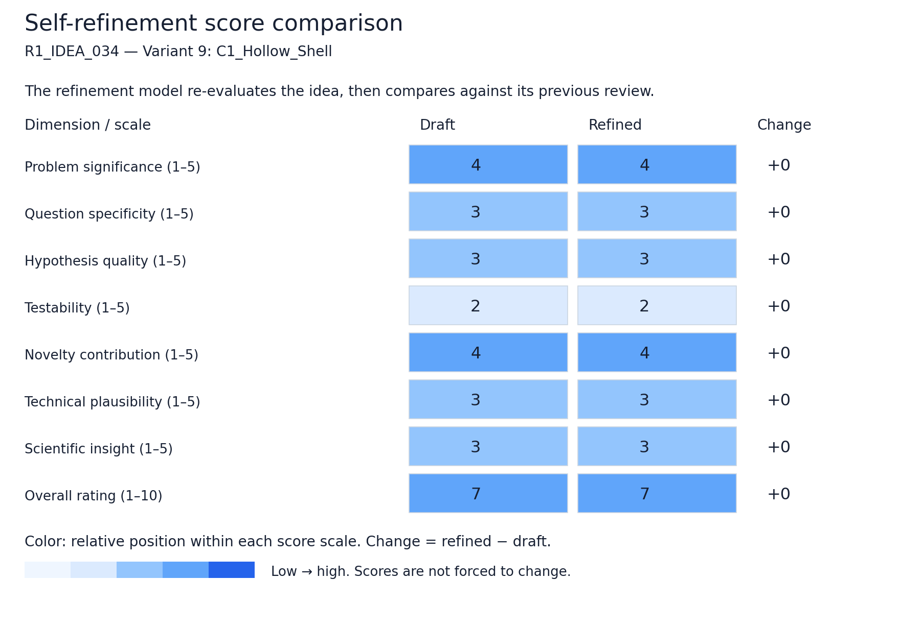

Changed score dimensions: none.

### Score justifications (draft / refined)

**Problem significance**

```json
{
  "draft": {
    "score": 4.0,
    "justification": "The problem of efficient adaptation of large language models is significant in the field of machine learning, as it relates to the practical deployment and scalability of these models."
  },
  "refined": {
    "score": 4.0,
    "justification": "The problem of efficient adaptation of large language models is significant in the field of machine learning, as it relates to the practical deployment and scalability of these models."
  }
}
```

**Question specificity**

```json
{
  "draft": {
    "score": 3.0,
    "justification": "The idea proposes a general direction but lacks specific details on the research question, such as the exact aspect of language learning being investigated or the specific tasks for evaluation."
  },
  "refined": {
    "score": 3.0,
    "justification": "The idea proposes a general direction but lacks specific details on the research question, such as the exact aspect of language learning being investigated or the specific tasks for evaluation."
  }
}
```

**Hypothesis quality**

```json
{
  "draft": {
    "score": 3.0,
    "justification": "The hypothesis that language provides a richer medium for learning is plausible, but the specific mechanism or relationship being tested is not clearly defined, making the hypothesis less concrete."
  },
  "refined": {
    "score": 3.0,
    "justification": "The hypothesis that language provides a richer medium for learning is plausible, but the specific mechanism or relationship being tested is not clearly defined, making the hypothesis less concrete."
  }
}
```

**Testability**

```json
{
  "draft": {
    "score": 2.0,
    "justification": "The idea lacks concrete experimental details or comparisons that would allow for meaningful testing of the hypothesis, making it difficult to assess the feasibility of the proposed approach."
  },
  "refined": {
    "score": 2.0,
    "justification": "The idea lacks concrete experimental details or comparisons that would allow for meaningful testing of the hypothesis, making it difficult to assess the feasibility of the proposed approach."
  }
}
```

**Novelty contribution**

```json
{
  "draft": {
    "score": 4.0,
    "justification": "The proposal to use language structure for learning in LLM adaptation is a novel direction, even if the specific implementation of GEPA is not yet detailed. It has the potential to contribute new insights into model adaptation methods."
  },
  "refined": {
    "score": 4.0,
    "justification": "The proposal to use language structure for learning in LLM adaptation is a novel direction, even if the specific implementation of GEPA is not yet detailed. It has the potential to contribute new insights into model adaptation methods."
  }
}
```

**Technical plausibility**

```json
{
  "draft": {
    "score": 3.0,
    "justification": "The idea is technically plausible as it builds on existing knowledge of language models and reinforcement learning, but the lack of details on GEPA makes it difficult to assess the feasibility of the approach."
  },
  "refined": {
    "score": 3.0,
    "justification": "The idea is technically plausible as it builds on existing knowledge of language models and reinforcement learning, but the lack of details on GEPA makes it difficult to assess the feasibility of the approach."
  }
}
```

**Scientific insight**

```json
{
  "draft": {
    "score": 3.0,
    "justification": "The idea has the potential to provide insights into the effectiveness of language-based learning, but without a clear research question and hypothesis, the potential for scientific insight is limited."
  },
  "refined": {
    "score": 3.0,
    "justification": "The idea has the potential to provide insights into the effectiveness of language-based learning, but without a clear research question and hypothesis, the potential for scientific insight is limited."
  }
}
```

**Overall rating**

```json
{
  "draft": {
    "score": 7.0,
    "justification": "The idea addresses a significant problem in the adaptation of large language models and proposes a novel approach. However, it lacks specific details and a clear hypothesis, which are necessary for assessing its testability and potential contribution."
  },
  "refined": {
    "score": 7.0,
    "justification": "The idea addresses a significant problem in the adaptation of large language models and proposes a novel approach. However, it lacks specific details and a clear hypothesis, which are necessary for assessing its testability and potential contribution."
  }
}
```

## R1_IDEA_034 — Variant 10: C2_Logic_Flawed


Changed score dimensions: none.

### Score justifications (draft / refined)

**Problem significance**

```json
{
  "draft": {
    "score": 4.0,
    "justification": "The idea addresses a significant challenge in applying RL to LLMs, where the effectiveness of reward signals is a critical issue. Improving task adaptation efficiency is important for practical applications."
  },
  "refined": {
    "score": 4.0,
    "justification": "The idea addresses a significant challenge in applying RL to LLMs, where the effectiveness of reward signals is a critical issue. Improving task adaptation efficiency is important for practical applications."
  }
}
```

**Question specificity**

```json
{
  "draft": {
    "score": 3.0,
    "justification": "The question is meaningful but lacks specific details about the problem, the method (GEPA), and the evaluation criteria. More clarity is needed to define the exact research question."
  },
  "refined": {
    "score": 3.0,
    "justification": "The question is meaningful but lacks specific details about the problem, the method (GEPA), and the evaluation criteria. More clarity is needed to define the exact research question."
  }
}
```

**Hypothesis quality**

```json
{
  "draft": {
    "score": 3.0,
    "justification": "The hypothesis is implied but not explicitly stated. The connection between interpretability and learning effectiveness is not clearly defined, making it difficult to assess the hypothesis's testability."
  },
  "refined": {
    "score": 3.0,
    "justification": "The hypothesis is implied but not explicitly stated. The connection between interpretability and learning effectiveness is not clearly defined, making it difficult to assess the hypothesis's testability."
  }
}
```

**Testability**

```json
{
  "draft": {
    "score": 2.0,
    "justification": "The idea lacks a clear experimental plan or evaluation method. Without specifics on how GEPA will be tested, it is difficult to determine if the hypothesis can be validated or refuted."
  },
  "refined": {
    "score": 2.0,
    "justification": "The idea lacks a clear experimental plan or evaluation method. Without specifics on how GEPA will be tested, it is difficult to determine if the hypothesis can be validated or refuted."
  }
}
```

**Novelty contribution**

```json
{
  "draft": {
    "score": 4.0,
    "justification": "The idea proposes a novel approach (GEPA) that leverages interpretability in LLM learning, which is a fresh perspective compared to traditional RL methods. It has the potential to contribute new insights into task adaptation."
  },
  "refined": {
    "score": 4.0,
    "justification": "The idea proposes a novel approach (GEPA) that leverages interpretability in LLM learning, which is a fresh perspective compared to traditional RL methods. It has the potential to contribute new insights into task adaptation."
  }
}
```

**Technical plausibility**

```json
{
  "draft": {
    "score": 3.0,
    "justification": "The idea is technically plausible, as leveraging interpretability in learning is a reasonable direction. However, without details on GEPA's methodology, it is difficult to assess its feasibility."
  },
  "refined": {
    "score": 3.0,
    "justification": "The idea is technically plausible, as leveraging interpretability in learning is a reasonable direction. However, without details on GEPA's methodology, it is difficult to assess its feasibility."
  }
}
```

**Scientific insight**

```json
{
  "draft": {
    "score": 3.0,
    "justification": "The idea has the potential to provide insights into how interpretability affects learning in LLMs, but the specific mechanisms and outcomes are not clearly defined."
  },
  "refined": {
    "score": 3.0,
    "justification": "The idea has the potential to provide insights into how interpretability affects learning in LLMs, but the specific mechanisms and outcomes are not clearly defined."
  }
}
```

**Overall rating**

```json
{
  "draft": {
    "score": 7.0,
    "justification": "The idea addresses a meaningful problem in LLM task adaptation and proposes a novel approach (GEPA). However, it lacks sufficient details to fully assess its testability and hypothesis, which are critical for evaluating its scientific merit."
  },
  "refined": {
    "score": 7.0,
    "justification": "The idea addresses a meaningful problem in LLM task adaptation and proposes a novel approach (GEPA). However, it lacks sufficient details to fully assess its testability and hypothesis, which are critical for evaluating its scientific merit."
  }
}
```

## R1_IDEA_034 — Variant 11: C3_Substance_Enriched


Changed score dimensions: none.

### Score justifications (draft / refined)

**Problem significance**

```json
{
  "draft": {
    "score": 4.0,
    "justification": "The idea addresses a critical challenge in reinforcement learning for LLMs: the high sample efficiency required for training. Improving this could significantly reduce computational costs and make RL more practical for real-world applications."
  },
  "refined": {
    "score": 4.0,
    "justification": "The idea addresses a critical challenge in reinforcement learning for LLMs: the high sample efficiency required for training. Improving this could significantly reduce computational costs and make RL more practical for real-world applications."
  }
}
```

**Question specificity**

```json
{
  "draft": {
    "score": 3.0,
    "justification": "The idea proposes a hypothesis about interpretable feedback improving credit assignment, but the specifics of the hypothesis and the method (GEPA) are not clearly defined. More concrete details would strengthen the question's specificity."
  },
  "refined": {
    "score": 3.0,
    "justification": "The idea proposes a hypothesis about interpretable feedback improving credit assignment, but the specifics of the hypothesis and the method (GEPA) are not clearly defined. More concrete details would strengthen the question's specificity."
  }
}
```

**Hypothesis quality**

```json
{
  "draft": {
    "score": 3.0,
    "justification": "The hypothesis that interpretable feedback could lead to more efficient credit assignment is plausible, but it is not explicitly stated or tested in the summary. A clearer hypothesis would enhance the idea's scientific merit."
  },
  "refined": {
    "score": 3.0,
    "justification": "The hypothesis that interpretable feedback could lead to more efficient credit assignment is plausible, but it is not explicitly stated or tested in the summary. A clearer hypothesis would enhance the idea's scientific merit."
  }
}
```

**Testability**

```json
{
  "draft": {
    "score": 3.0,
    "justification": "The idea suggests measuring sample efficiency, which is testable, but the specific experiments, metrics, and comparison methods are not detailed. More concrete test plans would improve testability."
  },
  "refined": {
    "score": 3.0,
    "justification": "The idea suggests measuring sample efficiency, which is testable, but the specific experiments, metrics, and comparison methods are not detailed. More concrete test plans would improve testability."
  }
}
```

**Novelty contribution**

```json
{
  "draft": {
    "score": 4.0,
    "justification": "The idea proposes a novel approach (GEPA) to leverage interpretable feedback in RL for LLMs, which could contribute new insights into efficient learning mechanisms. However, the novelty is somewhat limited without more details on the method's design."
  },
  "refined": {
    "score": 4.0,
    "justification": "The idea proposes a novel approach (GEPA) to leverage interpretable feedback in RL for LLMs, which could contribute new insights into efficient learning mechanisms. However, the novelty is somewhat limited without more details on the method's design."
  }
}
```

**Technical plausibility**

```json
{
  "draft": {
    "score": 4.0,
    "justification": "The hypothesis is technically plausible, as interpretable feedback could potentially aid in credit assignment. However, the lack of specific details about GEPA's implementation makes the technical plausibility somewhat uncertain."
  },
  "refined": {
    "score": 4.0,
    "justification": "The hypothesis is technically plausible, as interpretable feedback could potentially aid in credit assignment. However, the lack of specific details about GEPA's implementation makes the technical plausibility somewhat uncertain."
  }
}
```

**Scientific insight**

```json
{
  "draft": {
    "score": 3.0,
    "justification": "The idea has potential to provide insights into how interpretable feedback influences learning efficiency, but the connection between the hypothesis and the proposed method is not sufficiently explained. More detailed analysis would enhance scientific insight."
  },
  "refined": {
    "score": 3.0,
    "justification": "The idea has potential to provide insights into how interpretable feedback influences learning efficiency, but the connection between the hypothesis and the proposed method is not sufficiently explained. More detailed analysis would enhance scientific insight."
  }
}
```

**Overall rating**

```json
{
  "draft": {
    "score": 7.0,
    "justification": "The idea addresses a significant problem in RL for LLMs and proposes a plausible hypothesis. While the specifics of the method and hypothesis are not fully detailed, the potential for contributing new insights into efficient learning mechanisms is strong. The idea is promising but needs more concrete details to be fully evaluated."
  },
  "refined": {
    "score": 7.0,
    "justification": "The idea addresses a significant problem in RL for LLMs and proposes a plausible hypothesis. While the specifics of the method and hypothesis are not fully detailed, the potential for contributing new insights into efficient learning mechanisms is strong. The idea is promising but needs more concrete details to be fully evaluated."
  }
}
```

## R1_IDEA_034 — Variant 12: H1_Deceptive_Hollow

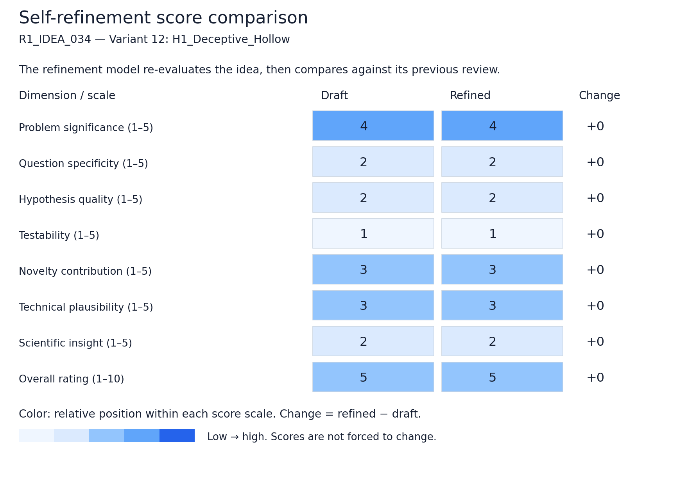

Changed score dimensions: none.

### Score justifications (draft / refined)

**Problem significance**

```json
{
  "draft": {
    "score": 4.0,
    "justification": "The idea addresses a significant challenge in adapting large language models, which is a critical area in machine learning. However, the current description is too vague to fully assess its significance."
  },
  "refined": {
    "score": 4.0,
    "justification": "The idea addresses a significant challenge in adapting large language models, which is a critical area in machine learning. However, the current description is too vague to fully assess its significance."
  }
}
```

**Question specificity**

```json
{
  "draft": {
    "score": 2.0,
    "justification": "The idea is too abstract and lacks a clear, specific research question. It does not define what exactly is being investigated or how the proposed framework will be evaluated."
  },
  "refined": {
    "score": 2.0,
    "justification": "The idea is too abstract and lacks a clear, specific research question. It does not define what exactly is being investigated or how the proposed framework will be evaluated."
  }
}
```

**Hypothesis quality**

```json
{
  "draft": {
    "score": 2.0,
    "justification": "The hypothesis is not clearly stated. The idea suggests a potential benefit but does not provide a concrete prediction or mechanism that can be tested."
  },
  "refined": {
    "score": 2.0,
    "justification": "The hypothesis is not clearly stated. The idea suggests a potential benefit but does not provide a concrete prediction or mechanism that can be tested."
  }
}
```

**Testability**

```json
{
  "draft": {
    "score": 1.0,
    "justification": "The idea lacks specific experiments, comparisons, or evaluation methods. It is too abstract to determine how the proposed framework can be tested or validated."
  },
  "refined": {
    "score": 1.0,
    "justification": "The idea lacks specific experiments, comparisons, or evaluation methods. It is too abstract to determine how the proposed framework can be tested or validated."
  }
}
```

**Novelty contribution**

```json
{
  "draft": {
    "score": 3.0,
    "justification": "The idea proposes a novel research agenda, but the current description is too vague to assess its novelty or potential contribution to the field."
  },
  "refined": {
    "score": 3.0,
    "justification": "The idea proposes a novel research agenda, but the current description is too vague to assess its novelty or potential contribution to the field."
  }
}
```

**Technical plausibility**

```json
{
  "draft": {
    "score": 3.0,
    "justification": "The idea is theoretically interesting, but the lack of specific details makes it difficult to assess its technical feasibility or plausibility."
  },
  "refined": {
    "score": 3.0,
    "justification": "The idea is theoretically interesting, but the lack of specific details makes it difficult to assess its technical feasibility or plausibility."
  }
}
```

**Scientific insight**

```json
{
  "draft": {
    "score": 2.0,
    "justification": "The idea has the potential for scientific insight, but the current description is too abstract to determine what specific insights could be gained."
  },
  "refined": {
    "score": 2.0,
    "justification": "The idea has the potential for scientific insight, but the current description is too abstract to determine what specific insights could be gained."
  }
}
```

**Overall rating**

```json
{
  "draft": {
    "score": 5.0,
    "justification": "The idea is promising and has the potential to make a significant impact on the field of large language model adaptation. However, it is too abstract and lacks specific details to fully assess its scientific merit and feasibility."
  },
  "refined": {
    "score": 5.0,
    "justification": "The idea is promising and has the potential to make a significant impact on the field of large language model adaptation. However, it is too abstract and lacks specific details to fully assess its scientific merit and feasibility."
  }
}
```

## R1_IDEA_034 — Variant 13: H2_Confident_Flaw

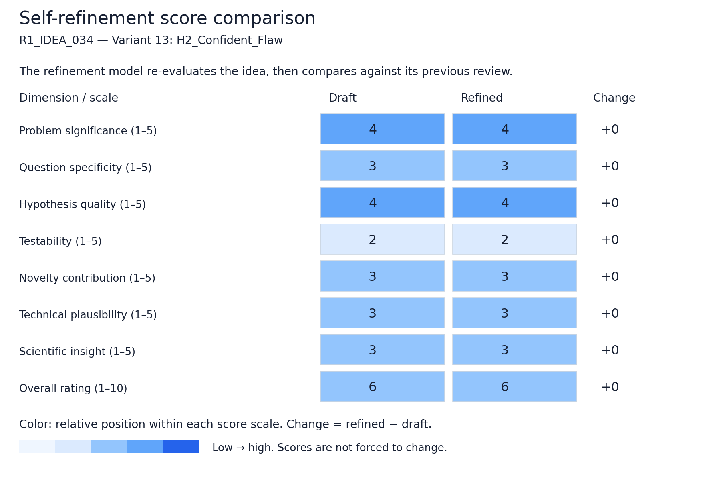

Changed score dimensions: none.

### Score justifications (draft / refined)

**Problem significance**

```json
{
  "draft": {
    "score": 4.0,
    "justification": "The idea addresses a significant challenge in training LLMs for downstream tasks using RL, where sparse rewards limit effectiveness. Improving interpretability could have broad implications for various applications where explainability is important."
  },
  "refined": {
    "score": 4.0,
    "justification": "The idea addresses a significant challenge in training LLMs for downstream tasks using RL, where sparse rewards limit effectiveness. Improving interpretability could have broad implications for various applications where explainability is important."
  }
}
```

**Question specificity**

```json
{
  "draft": {
    "score": 3.0,
    "justification": "The idea identifies a key mechanism (interpretability as a learning medium) and a limitation (sparse rewards), but lacks a concrete, specific research question that can be tested. More details on the problem and hypothesis are needed."
  },
  "refined": {
    "score": 3.0,
    "justification": "The idea identifies a key mechanism (interpretability as a learning medium) and a limitation (sparse rewards), but lacks a concrete, specific research question that can be tested. More details on the problem and hypothesis are needed."
  }
}
```

**Hypothesis quality**

```json
{
  "draft": {
    "score": 4.0,
    "justification": "The argument suggests that addressing the limitation (sparse rewards) will lead to improvements, which is a plausible hypothesis. However, the causal claim is not fully justified without further details on how GEPA achieves this."
  },
  "refined": {
    "score": 4.0,
    "justification": "The argument suggests that addressing the limitation (sparse rewards) will lead to improvements, which is a plausible hypothesis. However, the causal claim is not fully justified without further details on how GEPA achieves this."
  }
}
```

**Testability**

```json
{
  "draft": {
    "score": 2.0,
    "justification": "The idea lacks concrete experiments or evaluation criteria. The claim that GEPA provides 'causal evidence' without isolating other factors makes it difficult to test the hypothesis in a meaningful way."
  },
  "refined": {
    "score": 2.0,
    "justification": "The idea lacks concrete experiments or evaluation criteria. The claim that GEPA provides 'causal evidence' without isolating other factors makes it difficult to test the hypothesis in a meaningful way."
  }
}
```

**Novelty contribution**

```json
{
  "draft": {
    "score": 3.0,
    "justification": "The idea proposes a new approach (GEPA) that leverages interpretability, which is a novel angle for RL in LLMs. However, the novelty is limited without more details on the method's specifics and how it differs from existing approaches."
  },
  "refined": {
    "score": 3.0,
    "justification": "The idea proposes a new approach (GEPA) that leverages interpretability, which is a novel angle for RL in LLMs. However, the novelty is limited without more details on the method's specifics and how it differs from existing approaches."
  }
}
```

**Technical plausibility**

```json
{
  "draft": {
    "score": 3.0,
    "justification": "The reasoning is plausible, as interpretability could enhance learning. However, the technical details of GEPA are not provided, making it difficult to assess the feasibility of the approach."
  },
  "refined": {
    "score": 3.0,
    "justification": "The reasoning is plausible, as interpretability could enhance learning. However, the technical details of GEPA are not provided, making it difficult to assess the feasibility of the approach."
  }
}
```

**Scientific insight**

```json
{
  "draft": {
    "score": 3.0,
    "justification": "The idea suggests that interpretability could lead to better learning, which is a valuable insight. However, without a clear hypothesis and testable experiments, the potential for scientific insight is limited."
  },
  "refined": {
    "score": 3.0,
    "justification": "The idea suggests that interpretability could lead to better learning, which is a valuable insight. However, without a clear hypothesis and testable experiments, the potential for scientific insight is limited."
  }
}
```

**Overall rating**

```json
{
  "draft": {
    "score": 6.0,
    "justification": "The idea addresses a meaningful problem in LLM training with RL, proposes a plausible hypothesis, and has the potential for contribution. However, it lacks specific details, testable hypotheses, and concrete experiments, which are needed to fully evaluate its scientific merit."
  },
  "refined": {
    "score": 6.0,
    "justification": "The idea addresses a meaningful problem in LLM training with RL, proposes a plausible hypothesis, and has the potential for contribution. However, it lacks specific details, testable hypotheses, and concrete experiments, which are needed to fully evaluate its scientific merit."
  }
}
```

## R1_IDEA_034 — Variant 14: H3_Verbose_Enriched


Changed score dimensions: none.

### Score justifications (draft / refined)

**Problem significance**

```json
{
  "draft": {
    "score": 4.0,
    "justification": "The idea addresses a significant challenge in training efficient reinforcement learning methods for large language models, which is a critical area in machine learning. Improving sample efficiency in RL for LLMs has practical implications for reducing computational costs and enabling faster adaptation to new tasks."
  },
  "refined": {
    "score": 4.0,
    "justification": "The idea addresses a significant challenge in training efficient reinforcement learning methods for large language models, which is a critical area in machine learning. Improving sample efficiency in RL for LLMs has practical implications for reducing computational costs and enabling faster adaptation to new tasks."
  }
}
```

**Question specificity**

```json
{
  "draft": {
    "score": 3.0,
    "justification": "The idea proposes a general research direction but lacks specific details on the exact nature of the 'interpretable feedback' and the precise experimental design. While the staged approach is mentioned, the specifics of how the conditions and evaluation criteria will be defined are not clearly outlined."
  },
  "refined": {
    "score": 3.0,
    "justification": "The idea proposes a general research direction but lacks specific details on the exact nature of the 'interpretable feedback' and the precise experimental design. While the staged approach is mentioned, the specifics of how the conditions and evaluation criteria will be defined are not clearly outlined."
  }
}
```

**Hypothesis quality**

```json
{
  "draft": {
    "score": 3.0,
    "justification": "The hypothesis is implied but not explicitly stated. The idea suggests that interpretable feedback could lead to more efficient credit assignment, which is a plausible hypothesis, but it would be stronger if the hypothesis were clearly articulated and tied to specific predictions or outcomes."
  },
  "refined": {
    "score": 3.0,
    "justification": "The hypothesis is implied but not explicitly stated. The idea suggests that interpretable feedback could lead to more efficient credit assignment, which is a plausible hypothesis, but it would be stronger if the hypothesis were clearly articulated and tied to specific predictions or outcomes."
  }
}
```

**Testability**

```json
{
  "draft": {
    "score": 4.0,
    "justification": "The idea includes a structured experimental design with multiple evaluation components (ablations, sensitivity analyses, error analysis), which makes the study testable. However, the specifics of how the staged design will be implemented are not fully detailed, which could affect the testability."
  },
  "refined": {
    "score": 4.0,
    "justification": "The idea includes a structured experimental design with multiple evaluation components (ablations, sensitivity analyses, error analysis), which makes the study testable. However, the specifics of how the staged design will be implemented are not fully detailed, which could affect the testability."
  }
}
```

**Novelty contribution**

```json
{
  "draft": {
    "score": 4.0,
    "justification": "The idea proposes a novel approach (GEPA) that explores the use of interpretable feedback in RL for LLMs, which could contribute new insights into the effectiveness of such feedback. While the method is not entirely novel, the application and experimental design are promising and could lead to meaningful contributions."
  },
  "refined": {
    "score": 4.0,
    "justification": "The idea proposes a novel approach (GEPA) that explores the use of interpretable feedback in RL for LLMs, which could contribute new insights into the effectiveness of such feedback. While the method is not entirely novel, the application and experimental design are promising and could lead to meaningful contributions."
  }
}
```

**Technical plausibility**

```json
{
  "draft": {
    "score": 4.0,
    "justification": "The proposed approach is technically plausible, as it builds on existing RL methods for LLMs and incorporates elements of interpretability and efficiency. The inclusion of ablations and sensitivity analyses is a reasonable approach to evaluate the method's effectiveness."
  },
  "refined": {
    "score": 4.0,
    "justification": "The proposed approach is technically plausible, as it builds on existing RL methods for LLMs and incorporates elements of interpretability and efficiency. The inclusion of ablations and sensitivity analyses is a reasonable approach to evaluate the method's effectiveness."
  }
}
```

**Scientific insight**

```json
{
  "draft": {
    "score": 4.0,
    "justification": "The idea has the potential to provide scientific insights into the role of interpretable feedback in RL for LLMs, including how it affects sample efficiency, credit assignment, and performance across different task domains. The staged design and error analysis could reveal important limitations and boundary conditions."
  },
  "refined": {
    "score": 4.0,
    "justification": "The idea has the potential to provide scientific insights into the role of interpretable feedback in RL for LLMs, including how it affects sample efficiency, credit assignment, and performance across different task domains. The staged design and error analysis could reveal important limitations and boundary conditions."
  }
}
```

**Overall rating**

```json
{
  "draft": {
    "score": 8.0,
    "justification": "The idea is strong and addresses a meaningful problem in the field of reinforcement learning for large language models. It proposes a structured experimental design with multiple evaluation components, which increases the rigor of the study. While some details are missing, the overall direction is promising and has the potential to contribute valuable insights into the effectiveness of interpretable feedback in RL for LLMs."
  },
  "refined": {
    "score": 8.0,
    "justification": "The idea is strong and addresses a meaningful problem in the field of reinforcement learning for large language models. It proposes a structured experimental design with multiple evaluation components, which increases the rigor of the study. While some details are missing, the overall direction is promising and has the potential to contribute valuable insights into the effectiveness of interpretable feedback in RL for LLMs."
  }
}
```

## R1_IDEA_034 — Variant 15: H4_Ultimate_Hype


Changed score dimensions: none.

### Score justifications (draft / refined)

**Problem significance**

```json
{
  "draft": {
    "score": 4.0,
    "justification": "The problem of efficient training of LLMs for downstream tasks is significant, as current methods like GRPO are resource-intensive. Addressing this could lead to more practical and scalable applications of LLMs."
  },
  "refined": {
    "score": 4.0,
    "justification": "The problem of efficient training of LLMs for downstream tasks is significant, as current methods like GRPO are resource-intensive. Addressing this could lead to more practical and scalable applications of LLMs."
  }
}
```

**Question specificity**

```json
{
  "draft": {
    "score": 3.0,
    "justification": "The idea proposes a novel approach but lacks specific details about the research question or hypothesis. It is somewhat vague about how GEPA would work and what exactly is being tested."
  },
  "refined": {
    "score": 3.0,
    "justification": "The idea proposes a novel approach but lacks specific details about the research question or hypothesis. It is somewhat vague about how GEPA would work and what exactly is being tested."
  }
}
```

**Hypothesis quality**

```json
{
  "draft": {
    "score": 3.0,
    "justification": "The idea presents a general hypothesis that the interpretable nature of language could lead to more efficient learning, but it does not clearly state a specific, testable hypothesis or mechanism."
  },
  "refined": {
    "score": 3.0,
    "justification": "The idea presents a general hypothesis that the interpretable nature of language could lead to more efficient learning, but it does not clearly state a specific, testable hypothesis or mechanism."
  }
}
```

**Testability**

```json
{
  "draft": {
    "score": 3.0,
    "justification": "The idea suggests a potential approach but does not provide concrete experiments or comparisons that would be used to test the hypothesis. The lack of specific details makes it difficult to assess the testability."
  },
  "refined": {
    "score": 3.0,
    "justification": "The idea suggests a potential approach but does not provide concrete experiments or comparisons that would be used to test the hypothesis. The lack of specific details makes it difficult to assess the testability."
  }
}
```

**Novelty contribution**

```json
{
  "draft": {
    "score": 4.0,
    "justification": "The proposal introduces a novel approach (GEPA) that could potentially offer a new way to train LLMs, which is a significant contribution to the field, especially if it reduces the need for extensive rollouts."
  },
  "refined": {
    "score": 4.0,
    "justification": "The proposal introduces a novel approach (GEPA) that could potentially offer a new way to train LLMs, which is a significant contribution to the field, especially if it reduces the need for extensive rollouts."
  }
}
```

**Technical plausibility**

```json
{
  "draft": {
    "score": 3.0,
    "justification": "The idea is technically plausible, but the lack of specific details about GEPA makes it difficult to assess the feasibility of the proposed method. The connection between language interpretability and the proposed learning method is not clearly explained."
  },
  "refined": {
    "score": 3.0,
    "justification": "The idea is technically plausible, but the lack of specific details about GEPA makes it difficult to assess the feasibility of the proposed method. The connection between language interpretability and the proposed learning method is not clearly explained."
  }
}
```

**Scientific insight**

```json
{
  "draft": {
    "score": 3.0,
    "justification": "The idea has the potential to provide insights into how the interpretable nature of language can be leveraged for more efficient learning, but the lack of specific hypotheses and mechanisms limits the potential for scientific insight."
  },
  "refined": {
    "score": 3.0,
    "justification": "The idea has the potential to provide insights into how the interpretable nature of language can be leveraged for more efficient learning, but the lack of specific hypotheses and mechanisms limits the potential for scientific insight."
  }
}
```

**Overall rating**

```json
{
  "draft": {
    "score": 7.0,
    "justification": "The idea is promising and addresses a significant problem in LLM training, but it lacks specific details and testable hypotheses. With more concrete information, it could become a strong research direction."
  },
  "refined": {
    "score": 7.0,
    "justification": "The idea is promising and addresses a significant problem in LLM training, but it lacks specific details and testable hypotheses. With more concrete information, it could become a strong research direction."
  }
}
```

## R1_IDEA_035 — Source


Changed score dimensions: none.

### Score justifications (draft / refined)

**Problem significance**

```json
{
  "draft": {
    "score": 4.0,
    "justification": "The lack of standardized benchmarks is a significant issue in graph pooling research, as it hinders fair comparison and progress in the field."
  },
  "refined": {
    "score": 4.0,
    "justification": "The lack of standardized benchmarks is a significant issue in graph pooling research, as it hinders fair comparison and progress in the field."
  }
}
```

**Question specificity**

```json
{
  "draft": {
    "score": 3.0,
    "justification": "The idea identifies a problem but does not clearly define the specific research question or hypothesis that the benchmark aims to address."
  },
  "refined": {
    "score": 3.0,
    "justification": "The idea identifies a problem but does not clearly define the specific research question or hypothesis that the benchmark aims to address."
  }
}
```

**Hypothesis quality**

```json
{
  "draft": {
    "score": 3.0,
    "justification": "The idea does not explicitly state a hypothesis or prediction that would be tested through the benchmark, though it implies that a standardized benchmark will improve evaluation practices."
  },
  "refined": {
    "score": 3.0,
    "justification": "The idea does not explicitly state a hypothesis or prediction that would be tested through the benchmark, though it implies that a standardized benchmark will improve evaluation practices."
  }
}
```

**Testability**

```json
{
  "draft": {
    "score": 3.0,
    "justification": "The idea suggests creating a benchmark but does not provide a clear plan for how the benchmark will be tested or validated, making it difficult to assess its effectiveness."
  },
  "refined": {
    "score": 3.0,
    "justification": "The idea suggests creating a benchmark but does not provide a clear plan for how the benchmark will be tested or validated, making it difficult to assess its effectiveness."
  }
}
```

**Novelty contribution**

```json
{
  "draft": {
    "score": 4.0,
    "justification": "The proposal to create a comprehensive benchmark is a novel contribution to the field, as it addresses a critical gap in the evaluation of graph pooling methods."
  },
  "refined": {
    "score": 4.0,
    "justification": "The proposal to create a comprehensive benchmark is a novel contribution to the field, as it addresses a critical gap in the evaluation of graph pooling methods."
  }
}
```

**Technical plausibility**

```json
{
  "draft": {
    "score": 4.0,
    "justification": "The idea is technically feasible, as creating a benchmark with multiple methods and datasets is a common practice in machine learning research."
  },
  "refined": {
    "score": 4.0,
    "justification": "The idea is technically feasible, as creating a benchmark with multiple methods and datasets is a common practice in machine learning research."
  }
}
```

**Scientific insight**

```json
{
  "draft": {
    "score": 3.0,
    "justification": "The idea provides a practical solution to a common problem but does not offer deeper scientific insights into the underlying mechanisms of graph pooling methods."
  },
  "refined": {
    "score": 3.0,
    "justification": "The idea provides a practical solution to a common problem but does not offer deeper scientific insights into the underlying mechanisms of graph pooling methods."
  }
}
```

**Overall rating**

```json
{
  "draft": {
    "score": 7.0,
    "justification": "The idea is strong and addresses a meaningful problem in graph pooling research. However, it lacks specific details on evaluation metrics, selection criteria, and potential challenges in benchmark design, which could be improved with further clarification."
  },
  "refined": {
    "score": 7.0,
    "justification": "The idea is strong and addresses a meaningful problem in graph pooling research. However, it lacks specific details on evaluation metrics, selection criteria, and potential challenges in benchmark design, which could be improved with further clarification."
  }
}
```

## R1_IDEA_035 — Variant 1: A1_Identity


Changed score dimensions: none.

### Score justifications (draft / refined)

**Problem significance**

```json
{
  "draft": {
    "score": 4.0,
    "justification": "The lack of standardized benchmarks is a significant issue in graph pooling research, as it hinders the fair comparison and advancement of the field."
  },
  "refined": {
    "score": 4.0,
    "justification": "The lack of standardized benchmarks is a significant issue in graph pooling research, as it hinders the fair comparison and advancement of the field."
  }
}
```

**Question specificity**

```json
{
  "draft": {
    "score": 3.0,
    "justification": "The idea identifies a general problem but does not specify the exact research question or hypothesis, such as which aspects of the benchmark should be standardized or how the methods will be compared."
  },
  "refined": {
    "score": 3.0,
    "justification": "The idea identifies a general problem but does not specify the exact research question or hypothesis, such as which aspects of the benchmark should be standardized or how the methods will be compared."
  }
}
```

**Hypothesis quality**

```json
{
  "draft": {
    "score": 3.0,
    "justification": "The idea does not explicitly state a hypothesis, but it implies that a standardized benchmark will improve the evaluation of graph pooling methods. However, this is more of a goal than a testable hypothesis."
  },
  "refined": {
    "score": 3.0,
    "justification": "The idea does not explicitly state a hypothesis, but it implies that a standardized benchmark will improve the evaluation of graph pooling methods. However, this is more of a goal than a testable hypothesis."
  }
}
```

**Testability**

```json
{
  "draft": {
    "score": 3.0,
    "justification": "The idea suggests creating a benchmark but does not provide details on how the benchmark will be tested or validated, such as through experiments or comparisons with existing benchmarks."
  },
  "refined": {
    "score": 3.0,
    "justification": "The idea suggests creating a benchmark but does not provide details on how the benchmark will be tested or validated, such as through experiments or comparisons with existing benchmarks."
  }
}
```

**Novelty contribution**

```json
{
  "draft": {
    "score": 4.0,
    "justification": "The idea contributes to the field by addressing a critical gap in the evaluation of graph pooling methods, which is a novel and important contribution to the field."
  },
  "refined": {
    "score": 4.0,
    "justification": "The idea contributes to the field by addressing a critical gap in the evaluation of graph pooling methods, which is a novel and important contribution to the field."
  }
}
```

**Technical plausibility**

```json
{
  "draft": {
    "score": 4.0,
    "justification": "The proposed benchmark is technically feasible, as it involves standard practices in benchmarking machine learning models, such as selecting methods and datasets, and defining evaluation protocols."
  },
  "refined": {
    "score": 4.0,
    "justification": "The proposed benchmark is technically feasible, as it involves standard practices in benchmarking machine learning models, such as selecting methods and datasets, and defining evaluation protocols."
  }
}
```

**Scientific insight**

```json
{
  "draft": {
    "score": 3.0,
    "justification": "The idea provides a practical solution to a common problem but does not offer new scientific insights into the mechanisms or properties of graph pooling methods beyond the benchmarking aspect."
  },
  "refined": {
    "score": 3.0,
    "justification": "The idea provides a practical solution to a common problem but does not offer new scientific insights into the mechanisms or properties of graph pooling methods beyond the benchmarking aspect."
  }
}
```

**Overall rating**

```json
{
  "draft": {
    "score": 7.0,
    "justification": "The idea is strong and addresses a meaningful problem in graph pooling research. It proposes a concrete solution but lacks specific details on evaluation, selection criteria, and standardization procedures, which could be improved."
  },
  "refined": {
    "score": 7.0,
    "justification": "The idea is strong and addresses a meaningful problem in graph pooling research. It proposes a concrete solution but lacks specific details on evaluation, selection criteria, and standardization procedures, which could be improved."
  }
}
```

## R1_IDEA_035 — Variant 2: A2_Paraphrase_Only


Changed score dimensions: none.

### Score justifications (draft / refined)

**Problem significance**

```json
{
  "draft": {
    "score": 4.0,
    "justification": "The idea addresses a significant problem in the field of graph pooling by highlighting the lack of standardized benchmarks, which is crucial for fair comparison and advancement of the field."
  },
  "refined": {
    "score": 4.0,
    "justification": "The idea addresses a significant problem in the field of graph pooling by highlighting the lack of standardized benchmarks, which is crucial for fair comparison and advancement of the field."
  }
}
```

**Question specificity**

```json
{
  "draft": {
    "score": 3.0,
    "justification": "The idea identifies a general problem but does not clearly define a specific research question or hypothesis that the benchmark is intended to test or investigate."
  },
  "refined": {
    "score": 3.0,
    "justification": "The idea identifies a general problem but does not clearly define a specific research question or hypothesis that the benchmark is intended to test or investigate."
  }
}
```

**Hypothesis quality**

```json
{
  "draft": {
    "score": 2.0,
    "justification": "The idea does not explicitly state a hypothesis or research question that could be tested through the proposed benchmarking effort, making it difficult to assess the scientific merit of the idea."
  },
  "refined": {
    "score": 2.0,
    "justification": "The idea does not explicitly state a hypothesis or research question that could be tested through the proposed benchmarking effort, making it difficult to assess the scientific merit of the idea."
  }
}
```

**Testability**

```json
{
  "draft": {
    "score": 3.0,
    "justification": "The idea proposes a benchmarking effort that is testable, but the lack of specific details makes it challenging to assess the feasibility and scientific merit of the proposed approach."
  },
  "refined": {
    "score": 3.0,
    "justification": "The idea proposes a benchmarking effort that is testable, but the lack of specific details makes it challenging to assess the feasibility and scientific merit of the proposed approach."
  }
}
```

**Novelty contribution**

```json
{
  "draft": {
    "score": 4.0,
    "justification": "The idea contributes to the field by providing a comprehensive benchmark that can facilitate fair comparisons among different graph pooling methods, which is a valuable resource for researchers in the field."
  },
  "refined": {
    "score": 4.0,
    "justification": "The idea contributes to the field by providing a comprehensive benchmark that can facilitate fair comparisons among different graph pooling methods, which is a valuable resource for researchers in the field."
  }
}
```

**Technical plausibility**

```json
{
  "draft": {
    "score": 4.0,
    "justification": "The idea is technically plausible as it involves a well-established area of research (graph pooling) and proposes a feasible approach to creating a benchmarking framework."
  },
  "refined": {
    "score": 4.0,
    "justification": "The idea is technically plausible as it involves a well-established area of research (graph pooling) and proposes a feasible approach to creating a benchmarking framework."
  }
}
```

**Scientific insight**

```json
{
  "draft": {
    "score": 3.0,
    "justification": "The idea has the potential to provide scientific insight by revealing the strengths and weaknesses of different graph pooling methods through systematic evaluation, but the lack of a specific hypothesis limits the depth of insight that can be gained."
  },
  "refined": {
    "score": 3.0,
    "justification": "The idea has the potential to provide scientific insight by revealing the strengths and weaknesses of different graph pooling methods through systematic evaluation, but the lack of a specific hypothesis limits the depth of insight that can be gained."
  }
}
```

**Overall rating**

```json
{
  "draft": {
    "score": 7.0,
    "justification": "The idea is strong and addresses a meaningful problem in the field of graph pooling. It proposes a concrete solution through a comprehensive benchmarking effort, which has the potential to contribute significantly to the field. However, the lack of specific details and a clear research question limits its scientific merit and testability."
  },
  "refined": {
    "score": 7.0,
    "justification": "The idea is strong and addresses a meaningful problem in the field of graph pooling. It proposes a concrete solution through a comprehensive benchmarking effort, which has the potential to contribute significantly to the field. However, the lack of specific details and a clear research question limits its scientific merit and testability."
  }
}
```

## R1_IDEA_035 — Variant 3: A3_Plain_Core


Changed score dimensions: none.

### Score justifications (draft / refined)

**Problem significance**

```json
{
  "draft": {
    "score": 4.0,
    "justification": "The lack of standardized benchmarks is a significant issue in graph pooling research, as it hinders fair comparisons and reproducibility."
  },
  "refined": {
    "score": 4.0,
    "justification": "The lack of standardized benchmarks is a significant issue in graph pooling research, as it hinders fair comparisons and reproducibility."
  }
}
```

**Question specificity**

```json
{
  "draft": {
    "score": 3.0,
    "justification": "The idea identifies a problem but does not clearly define the specific research question or hypothesis that the benchmark will address."
  },
  "refined": {
    "score": 3.0,
    "justification": "The idea identifies a problem but does not clearly define the specific research question or hypothesis that the benchmark will address."
  }
}
```

**Hypothesis quality**

```json
{
  "draft": {
    "score": 2.0,
    "justification": "The idea does not explicitly state a hypothesis or prediction that would be tested through the benchmark, making it difficult to assess its scientific merit."
  },
  "refined": {
    "score": 2.0,
    "justification": "The idea does not explicitly state a hypothesis or prediction that would be tested through the benchmark, making it difficult to assess its scientific merit."
  }
}
```

**Testability**

```json
{
  "draft": {
    "score": 3.0,
    "justification": "The idea suggests creating a benchmark, which is testable, but lacks details on how the benchmark will be evaluated or validated."
  },
  "refined": {
    "score": 3.0,
    "justification": "The idea suggests creating a benchmark, which is testable, but lacks details on how the benchmark will be evaluated or validated."
  }
}
```

**Novelty contribution**

```json
{
  "draft": {
    "score": 4.0,
    "justification": "The proposal to create a standardized benchmark is a novel contribution to the field, even if the specific methods and datasets are not new."
  },
  "refined": {
    "score": 4.0,
    "justification": "The proposal to create a standardized benchmark is a novel contribution to the field, even if the specific methods and datasets are not new."
  }
}
```

**Technical plausibility**

```json
{
  "draft": {
    "score": 4.0,
    "justification": "The idea is technically plausible as creating a benchmark is a feasible task, though the specifics of implementation are not provided."
  },
  "refined": {
    "score": 4.0,
    "justification": "The idea is technically plausible as creating a benchmark is a feasible task, though the specifics of implementation are not provided."
  }
}
```

**Scientific insight**

```json
{
  "draft": {
    "score": 3.0,
    "justification": "The benchmark could provide insights into the effectiveness of different graph pooling methods, but the idea does not specify what insights are expected."
  },
  "refined": {
    "score": 3.0,
    "justification": "The benchmark could provide insights into the effectiveness of different graph pooling methods, but the idea does not specify what insights are expected."
  }
}
```

**Overall rating**

```json
{
  "draft": {
    "score": 7.0,
    "justification": "The idea addresses an important problem in graph pooling research and proposes a concrete solution. However, it lacks specific details that would make the research question and hypothesis more testable and scientifically meaningful."
  },
  "refined": {
    "score": 7.0,
    "justification": "The idea addresses an important problem in graph pooling research and proposes a concrete solution. However, it lacks specific details that would make the research question and hypothesis more testable and scientifically meaningful."
  }
}
```

## R1_IDEA_035 — Variant 4: B1_Verbose_Elaborate


Changed score dimensions: none.

### Score justifications (draft / refined)

**Problem significance**

```json
{
  "draft": {
    "score": 4.0,
    "justification": "The lack of standardized benchmarks is a significant issue in graph pooling research, as it hinders fair comparison and progress in the field."
  },
  "refined": {
    "score": 4.0,
    "justification": "The lack of standardized benchmarks is a significant issue in graph pooling research, as it hinders fair comparison and progress in the field."
  }
}
```

**Question specificity**

```json
{
  "draft": {
    "score": 3.0,
    "justification": "The idea identifies a problem but does not clearly define the specific research question or hypothesis that the benchmark will address."
  },
  "refined": {
    "score": 3.0,
    "justification": "The idea identifies a problem but does not clearly define the specific research question or hypothesis that the benchmark will address."
  }
}
```

**Hypothesis quality**

```json
{
  "draft": {
    "score": 2.0,
    "justification": "The idea does not explicitly state a hypothesis or research question, making it unclear what the study aims to investigate beyond creating the benchmark."
  },
  "refined": {
    "score": 2.0,
    "justification": "The idea does not explicitly state a hypothesis or research question, making it unclear what the study aims to investigate beyond creating the research benchmark."
  }
}
```

**Testability**

```json
{
  "draft": {
    "score": 3.0,
    "justification": "The idea suggests creating a benchmark but does not provide details on how it will be tested or evaluated, making it difficult to assess its feasibility."
  },
  "refined": {
    "score": 3.0,
    "justification": "The idea suggests creating a benchmark but does not provide details on how it will be tested or evaluated, making it difficult to assess its feasibility."
  }
}
```

**Novelty contribution**

```json
{
  "draft": {
    "score": 4.0,
    "justification": "The proposal to create a standardized benchmark is a novel contribution to the field, as it addresses a critical gap in evaluating graph pooling methods."
  },
  "refined": {
    "score": 4.0,
    "justification": "The proposal to create a standardized benchmark is a novel contribution to the field, as it addresses a critical gap in evaluating graph pooling methods."
  }
}
```

**Technical plausibility**

```json
{
  "draft": {
    "score": 4.0,
    "justification": "The idea is technically plausible, as creating a benchmark with multiple methods and datasets is a feasible task within the field of graph pooling."
  },
  "refined": {
    "score": 4.0,
    "justification": "The idea is technically plausible, as creating a benchmark with multiple methods and datasets is a feasible task within the field of graph pooling."
  }
}
```

**Scientific insight**

```json
{
  "draft": {
    "score": 3.0,
    "justification": "The benchmark could provide insights into the performance of different methods, but the idea does not specify how these insights will contribute to the field."
  },
  "refined": {
    "score": 3.0,
    "justification": "The benchmark could provide insights into the performance of different methods, but the idea does not specify how these insights will contribute to the field."
  }
}
```

**Overall rating**

```json
{
  "draft": {
    "score": 7.0,
    "justification": "The idea addresses a significant problem in graph pooling research and proposes a concrete solution. However, it lacks specific details on the research question, hypothesis, and evaluation methods, which are necessary for a strong research idea."
  },
  "refined": {
    "score": 7.0,
    "justification": "The idea addresses a significant problem in graph pooling research and proposes a concrete solution. However, it lacks specific details on the research question, hypothesis, and evaluation methods, which are necessary for a strong research idea."
  }
}
```

## R1_IDEA_035 — Variant 5: B2_Grand_Narrative

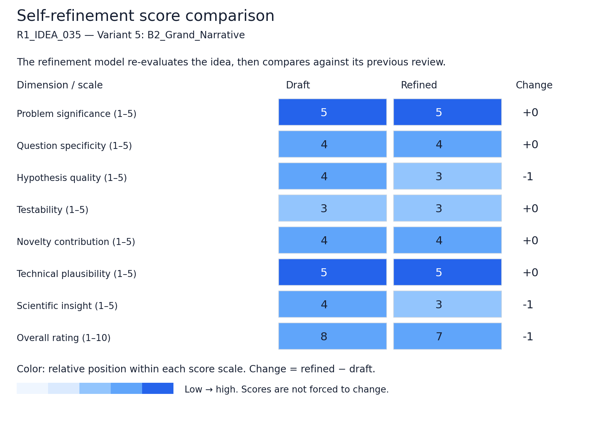

Changed score dimensions: hypothesis_quality, scientific_insight, overall_rating.

### Score justifications (draft / refined)

**Problem significance**

```json
{
  "draft": {
    "score": 5.0,
    "justification": "The lack of standardized benchmarks in graph pooling is a significant issue that hinders the systematic progress of the field. Addressing this problem can lead to more reliable and comparable evaluations of different methods, which is crucial for advancing research in graph representation learning."
  },
  "refined": {
    "score": 5.0,
    "justification": "The lack of standardized benchmarks in graph pooling is a significant issue that hinders the systematic progress of the field. Addressing this problem can lead to more reliable and comparable evaluations of different methods, which is crucial for advancing research in graph representation learning."
  }
}
```

**Question specificity**

```json
{
  "draft": {
    "score": 4.0,
    "justification": "The idea clearly defines the problem and proposes a specific solution: creating a benchmark with 17 methods and 28 datasets. However, it lacks details on the evaluation criteria and selection process, which could affect the specificity of the research question."
  },
  "refined": {
    "score": 4.0,
    "justification": "The idea clearly defines the problem and proposes a specific solution: creating a benchmark with 17 methods and 28 datasets. However, it lacks details on the evaluation criteria and selection process, which could affect the specificity of the research question."
  }
}
```

**Hypothesis quality**

```json
{
  "draft": {
    "score": 4.0,
    "justification": "The idea implies that a comprehensive benchmark will lead to more systematic progress, but it does not explicitly state a hypothesis that can be tested. The hypothesis is somewhat implicit and could be more clearly articulated."
  },
  "refined": {
    "score": 3.0,
    "justification": "The idea does not explicitly state a hypothesis that can be tested. It implies that a comprehensive benchmark will lead to more systematic progress, but this is more of a goal than a testable hypothesis."
  }
}
```

**Testability**

```json
{
  "draft": {
    "score": 3.0,
    "justification": "The idea is testable in principle, as creating a benchmark is a feasible task. However, the lack of specific evaluation metrics and selection criteria makes it difficult to assess the testability of the proposed solution."
  },
  "refined": {
    "score": 3.0,
    "justification": "The idea is testable in principle, as creating a benchmark is a feasible task. However, the lack of specific evaluation metrics and selection criteria makes it difficult to assess the testability of the proposed solution."
  }
}
```

**Novelty contribution**

```json
{
  "draft": {
    "score": 4.0,
    "justification": "The proposal to create a standardized benchmark is a novel contribution to the field. While the methods and datasets are not new, the systematic approach to benchmarking them is a significant contribution to advancing the field."
  },
  "refined": {
    "score": 4.0,
    "justification": "The proposal to create a standardized benchmark is a novel contribution to the field. While the methods and datasets are not new, the systematic approach to benchmarking them is a significant contribution to advancing the field."
  }
}
```

**Technical plausibility**

```json
{
  "draft": {
    "score": 5.0,
    "justification": "The idea is technically plausible. Creating a benchmark with existing methods and datasets is a feasible task that aligns with current practices in machine learning research."
  },
  "refined": {
    "score": 5.0,
    "justification": "The idea is technically plausible. Creating a benchmark with existing methods and datasets is a feasible task that aligns with current practices in machine learning research."
  }
}
```

**Scientific insight**

```json
{
  "draft": {
    "score": 4.0,
    "justification": "The research could provide valuable insights into the effectiveness of different graph pooling methods and highlight areas where further research is needed. However, the insight is more about benchmarking than discovering new mechanisms or principles."
  },
  "refined": {
    "score": 3.0,
    "justification": "The research could provide valuable insights into the effectiveness of different graph pooling methods and highlight areas where further research is needed. However, the insight is more about benchmarking than discovering new mechanisms or principles."
  }
}
```

**Overall rating**

```json
{
  "draft": {
    "score": 8.0,
    "justification": "The idea is strong and addresses a significant problem in the field. It proposes a concrete solution with the potential to make a meaningful contribution. However, it lacks some details that would make the research question more specific and testable."
  },
  "refined": {
    "score": 7.0,
    "justification": "The idea is strong and addresses a significant problem in the field. It proposes a concrete solution with the potential to make a meaningful contribution. However, it lacks some details that would make the research question more specific and testable."
  }
}
```

## R1_IDEA_035 — Variant 6: B3_Over_Confident


Changed score dimensions: none.

### Score justifications (draft / refined)

**Problem significance**

```json
{
  "draft": {
    "score": 4.0,
    "justification": "The lack of standardized benchmarks is a significant issue in graph pooling research, as it hinders the fair comparison and advancement of the field."
  },
  "refined": {
    "score": 4.0,
    "justification": "The lack of standardized benchmarks is a significant issue in graph pooling research, as it hinders the fair comparison and advancement of the field."
  }
}
```

**Question specificity**

```json
{
  "draft": {
    "score": 3.0,
    "justification": "The idea identifies a general problem but does not specify the exact research question or hypothesis that the benchmark aims to address."
  },
  "refined": {
    "score": 3.0,
    "justification": "The idea identifies a general problem but does not specify the exact research question or hypothesis that the benchmark aims to address."
  }
}
```

**Hypothesis quality**

```json
{
  "draft": {
    "score": 3.0,
    "justification": "The idea does not explicitly state a hypothesis or prediction that would be tested through the benchmark, though it implies that the benchmark will help evaluate the methods."
  },
  "refined": {
    "score": 3.0,
    "justification": "The idea does not explicitly state a hypothesis or prediction that would be tested through the benchmark, though it implies that the benchmark will help evaluate the methods."
  }
}
```

**Testability**

```json
{
  "draft": {
    "score": 3.0,
    "justification": "The idea suggests creating a benchmark, which is testable, but lacks details on how the benchmark will be evaluated or what specific experiments will be conducted."
  },
  "refined": {
    "score": 3.0,
    "justification": "The idea suggests creating a benchmark, which is testable, but lacks details on how the benchmark will be evaluated or what specific experiments will be conducted."
  }
}
```

**Novelty contribution**

```json
{
  "draft": {
    "score": 4.0,
    "justification": "The proposal to create a comprehensive benchmark is a novel contribution to the field, as it addresses a critical gap in the evaluation of graph pooling methods."
  },
  "refined": {
    "score": 4.0,
    "justification": "The proposal to create a comprehensive benchmark is a novel contribution to the field, as it addresses a critical gap in the evaluation of graph pooling methods."
  }
}
```

**Technical plausibility**

```json
{
  "draft": {
    "score": 4.0,
    "justification": "The idea is technically plausible as it involves creating a benchmark with existing methods and datasets, which is a feasible task within the field of graph neural networks."
  },
  "refined": {
    "score": 4.0,
    "justification": "The idea is technically plausible as it involves creating a benchmark with existing methods and datasets, which is a feasible task within the field of graph neural networks."
  }
}
```

**Scientific insight**

```json
{
  "draft": {
    "score": 3.0,
    "justification": "The benchmark may provide insights into the performance of different graph pooling methods, but the idea does not specify what particular insights are expected from the benchmark."
  },
  "refined": {
    "score": 3.0,
    "justification": "The benchmark may provide insights into the performance of different graph pooling methods, but the idea does not specify what particular insights are expected from the benchmark."
  }
}
```

**Overall rating**

```json
{
  "draft": {
    "score": 7.0,
    "justification": "The idea is strong and addresses a significant problem in the field. However, it lacks specific details on evaluation metrics, dataset selection, and the specific scientific insights it aims to uncover."
  },
  "refined": {
    "score": 7.0,
    "justification": "The idea is strong and addresses a significant problem in the field. However, it lacks specific details on evaluation metrics, dataset selection, and the specific scientific insights it aims to uncover."
  }
}
```

## R1_IDEA_035 — Variant 7: B4_Novelty

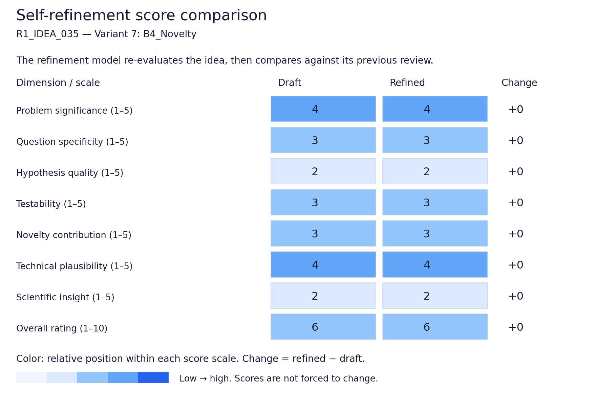

Changed score dimensions: none.

### Score justifications (draft / refined)

**Problem significance**

```json
{
  "draft": {
    "score": 4.0,
    "justification": "The lack of standardized benchmarks is a significant issue in graph pooling research, as it hinders fair comparison and methodological evaluation. Addressing this problem is crucial for advancing the field."
  },
  "refined": {
    "score": 4.0,
    "justification": "The lack of standardized benchmarks is a significant issue in graph pooling research, as it hinders fair comparison and methodological evaluation. Addressing this problem is crucial for advancing the field."
  }
}
```

**Question specificity**

```json
{
  "draft": {
    "score": 3.0,
    "justification": "The idea identifies a general problem but does not clearly define a specific research question. It focuses on creating a benchmark but lacks a detailed hypothesis or specific investigation goal."
  },
  "refined": {
    "score": 3.0,
    "justification": "The idea identifies a general problem but does not clearly define a specific research question. It focuses on creating a benchmark but lacks a detailed hypothesis or specific investigation goal."
  }
}
```

**Hypothesis quality**

```json
{
  "draft": {
    "score": 2.0,
    "justification": "The idea does not present a clear hypothesis or prediction. It primarily states a problem and proposes a solution (benchmark) without specifying what the benchmark aims to reveal or test."
  },
  "refined": {
    "score": 2.0,
    "justification": "The idea does not present a clear hypothesis or prediction. It primarily states a problem and proposes a solution (benchmark) without specifying what the benchmark aims to reveal or test."
  }
}
```

**Testability**

```json
{
  "draft": {
    "score": 3.0,
    "justification": "The idea suggests creating a benchmark, which is testable, but does not provide details on how the benchmark will be used to generate evidence or answer specific questions."
  },
  "refined": {
    "score": 3.0,
    "justification": "The idea suggests creating a benchmark, which is testable, but does not provide details on how the benchmark will be used to generate evidence or answer specific questions."
  }
}
```

**Novelty contribution**

```json
{
  "draft": {
    "score": 3.0,
    "justification": "The idea contributes by addressing a gap in the field through benchmarking, but the novelty is more about the application of existing methods rather than introducing a new method or hypothesis."
  },
  "refined": {
    "score": 3.0,
    "justification": "The idea contributes by addressing a gap in the field through benchmarking, but the novelty is more about the application of existing methods rather than introducing a new method or hypothesis."
  }
}
```

**Technical plausibility**

```json
{
  "draft": {
    "score": 4.0,
    "justification": "The proposed benchmark is technically feasible. Creating a benchmark with existing methods and datasets is a reasonable approach, though the specifics of implementation are not detailed."
  },
  "refined": {
    "score": 4.0,
    "justification": "The proposed benchmark is technically feasible. Creating a benchmark with existing methods and datasets is a reasonable approach, though the specifics of implementation are not detailed."
  }
}
```

**Scientific insight**

```json
{
  "draft": {
    "score": 2.0,
    "justification": "The idea focuses on benchmarking rather than exploring new insights or mechanisms. It does not clearly state what scientific understanding the benchmark aims to advance."
  },
  "refined": {
    "score": 2.0,
    "justification": "The idea focuses on benchmarking rather than exploring new insights or mechanisms. It does not clearly state what scientific understanding the benchmark aims to advance."
  }
}
```

**Overall rating**

```json
{
  "draft": {
    "score": 6.0,
    "justification": "The idea addresses a meaningful problem in graph pooling research and proposes a concrete solution. However, it lacks specificity in the research question, hypothesis, and potential scientific insight, which limits its overall impact and potential contribution."
  },
  "refined": {
    "score": 6.0,
    "justification": "The idea addresses a meaningful problem in graph pooling research and proposes a concrete solution. However, it lacks specificity in the research question, hypothesis, and potential scientific insight, which limits its overall impact and potential contribution."
  }
}
```

## R1_IDEA_035 — Variant 8: B5_Application_Impact


Changed score dimensions: none.

### Score justifications (draft / refined)

**Problem significance**

```json
{
  "draft": {
    "score": 4.0,
    "justification": "The lack of standardized benchmarks in graph pooling is a significant issue that hinders the comparison and improvement of methods, which is important for the field of machine learning."
  },
  "refined": {
    "score": 4.0,
    "justification": "The lack of standardized benchmarks in graph pooling is a significant issue that hinders the comparison and improvement of methods, which is important for the field of machine learning."
  }
}
```

**Question specificity**

```json
{
  "draft": {
    "score": 3.0,
    "justification": "The idea identifies a problem but does not clearly define the specific research question or hypothesis that the benchmark is intended to address beyond the general claim of improving evaluation consistency."
  },
  "refined": {
    "score": 3.0,
    "justification": "The idea identifies a problem but does not clearly define the specific research question or hypothesis that the benchmark is intended to address beyond the general claim of improving evaluation consistency."
  }
}
```

**Hypothesis quality**

```json
{
  "draft": {
    "score": 2.0,
    "justification": "The idea does not explicitly state a hypothesis or prediction that could be tested. It focuses on the construction of a benchmark rather than a specific hypothesis about the performance or effectiveness of the methods."
  },
  "refined": {
    "score": 2.0,
    "justification": "The idea does not explicitly state a hypothesis or prediction that could be tested. It focuses on the construction of a benchmark rather than a specific hypothesis about the performance or effectiveness of the methods."
  }
}
```

**Testability**

```json
{
  "draft": {
    "score": 3.0,
    "justification": "The idea suggests the construction of a benchmark, which is testable through its implementation and evaluation. However, the lack of specific details on the benchmark's design and evaluation criteria limits its testability."
  },
  "refined": {
    "score": 3.0,
    "justification": "The idea suggests the construction of a benchmark, which is testable through its implementation and evaluation. However, the lack of specific details on the benchmark's design and evaluation criteria limits its testability."
  }
}
```

**Novelty contribution**

```json
{
  "draft": {
    "score": 4.0,
    "justification": "The proposal to create a comprehensive benchmark for graph pooling methods is a novel contribution to the field, as it addresses a critical gap in the current state of research and could lead to more consistent and reliable evaluations."
  },
  "refined": {
    "score": 4.0,
    "justification": "The proposal to create a comprehensive benchmark for graph pooling methods is a novel contribution to the field, as it addresses a critical gap in the current state of research and could lead to more consistent and reliable evaluations."
  }
}
```

**Technical plausibility**

```json
{
  "draft": {
    "score": 4.0,
    "justification": "The idea is technically plausible as it involves the creation of a benchmark, which is a common practice in machine learning research. The proposed components (methods and datasets) are feasible to implement."
  },
  "refined": {
    "score": 4.0,
    "justification": "The idea is technically plausible as it involves the creation of a benchmark, which is a common practice in machine learning research. The proposed components (methods and datasets) are feasible to implement."
  }
}
```

**Scientific insight**

```json
{
  "draft": {
    "score": 3.0,
    "justification": "The idea has the potential to provide scientific insight by enabling more consistent evaluation of graph pooling methods, but it does not explicitly propose a new mechanism or principle that could be discovered through the benchmark."
  },
  "refined": {
    "score": 3.0,
    "justification": "The idea has the potential to provide scientific insight by enabling more consistent evaluation of graph pooling methods, but it does not explicitly propose a new mechanism or principle that could be discovered through the benchmark."
  }
}
```

**Overall rating**

```json
{
  "draft": {
    "score": 7.0,
    "justification": "The idea is strong and addresses a meaningful problem in the field of graph pooling. It proposes a concrete solution with the potential for significant impact, but lacks specific details on the benchmark's design and evaluation criteria, which could be improved to enhance its testability and scientific insight."
  },
  "refined": {
    "score": 7.0,
    "justification": "The idea is strong and addresses a meaningful problem in the field of graph pooling. It proposes a concrete solution with the potential for significant impact, but lacks specific details on the benchmark's design and evaluation criteria, which could be improved to enhance its testability and scientific insight."
  }
}
```

## R1_IDEA_035 — Variant 9: C1_Hollow_Shell

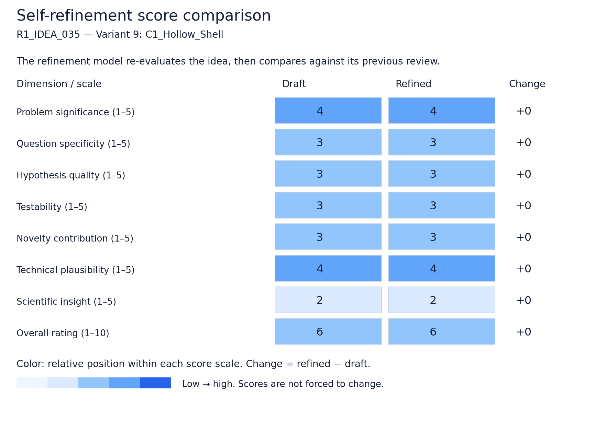

Changed score dimensions: none.

### Score justifications (draft / refined)

**Problem significance**

```json
{
  "draft": {
    "score": 4.0,
    "justification": "The lack of standardized evaluation practices is a significant issue in graph representation learning, as it hinders the comparison and advancement of methods in the field."
  },
  "refined": {
    "score": 4.0,
    "justification": "The lack of standardized evaluation practices is a significant issue in graph representation learning, as it hinders the comparison and advancement of methods in the field."
  }
}
```

**Question specificity**

```json
{
  "draft": {
    "score": 3.0,
    "justification": "The idea identifies a problem but does not provide enough detail about the specific aspects of the benchmark that will be developed or how it will address the problem in a unique way."
  },
  "refined": {
    "score": 3.0,
    "justification": "The idea identifies a problem but does not provide enough detail about the specific aspects of the benchmark that will be developed or how it will address the problem in a unique way."
  }
}
```

**Hypothesis quality**

```json
{
  "draft": {
    "score": 3.0,
    "justification": "The idea suggests developing a benchmark to address the problem, but it does not explicitly state a hypothesis or prediction that would be tested through the benchmark's creation or use."
  },
  "refined": {
    "score": 3.0,
    "justification": "The idea suggests developing a benchmark to address the problem, but it does not explicitly state a hypothesis or prediction that would be tested through the benchmark's creation or use."
  }
}
```

**Testability**

```json
{
  "draft": {
    "score": 3.0,
    "justification": "The idea proposes a solution (a benchmark), but it does not clearly outline how the success of the benchmark will be measured or how it will be validated in practice."
  },
  "refined": {
    "score": 3.0,
    "justification": "The idea proposes a solution (a benchmark), but it does not clearly outline how the success of the benchmark will be measured or how it will be validated in practice."
  }
}
```

**Novelty contribution**

```json
{
  "draft": {
    "score": 3.0,
    "justification": "The idea is not entirely novel, as benchmarks are common in machine learning, but the specific approach and focus on standardized evaluation practices could contribute to the field if implemented effectively."
  },
  "refined": {
    "score": 3.0,
    "justification": "The idea is not entirely novel, as benchmarks are common in machine learning, but the specific approach and focus on standardized evaluation practices could contribute to the field if implemented effectively."
  }
}
```

**Technical plausibility**

```json
{
  "draft": {
    "score": 4.0,
    "justification": "The proposal is technically feasible, as creating a benchmark is a common practice in machine learning, and the idea aligns with existing efforts in the field."
  },
  "refined": {
    "score": 4.0,
    "justification": "The proposal is technically feasible, as creating a benchmark is a common practice in machine learning, and the idea aligns with existing efforts in the field."
  }
}
```

**Scientific insight**

```json
{
  "draft": {
    "score": 2.0,
    "justification": "The idea primarily focuses on providing a tool for evaluation rather than exploring new scientific insights or mechanisms in graph representation learning."
  },
  "refined": {
    "score": 2.0,
    "justification": "The idea primarily focuses on providing a tool for evaluation rather than exploring new scientific insights or mechanisms in graph representation learning."
  }
}
```

**Overall rating**

```json
{
  "draft": {
    "score": 6.0,
    "justification": "The idea addresses a meaningful problem in the field and proposes a concrete solution, but it lacks specific details and a clear hypothesis, which could limit its impact and scientific contribution."
  },
  "refined": {
    "score": 6.0,
    "justification": "The idea addresses a meaningful problem in the field and proposes a concrete solution, but it lacks specific details and a clear hypothesis, which could limit its impact and scientific contribution."
  }
}
```

## R1_IDEA_035 — Variant 10: C2_Logic_Flawed

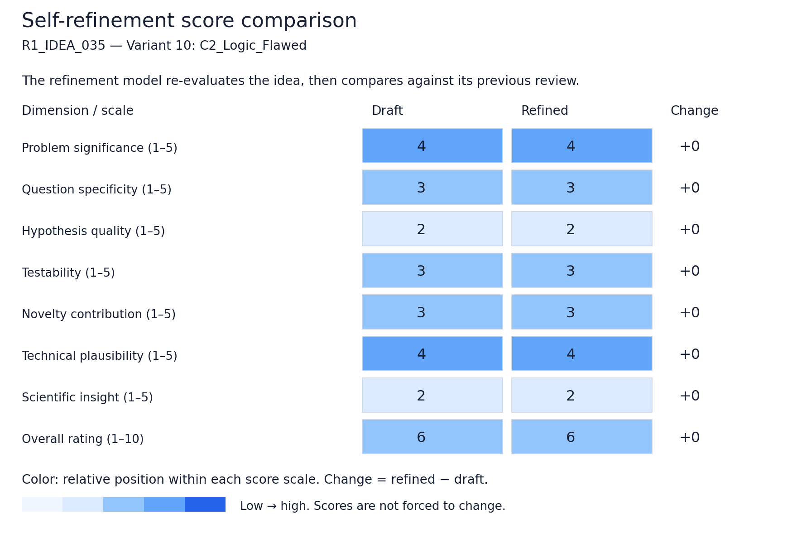

Changed score dimensions: none.

### Score justifications (draft / refined)

**Problem significance**

```json
{
  "draft": {
    "score": 4.0,
    "justification": "The lack of standardized benchmarks is a significant issue in graph pooling research, as it hinders fair comparisons and progress in the field."
  },
  "refined": {
    "score": 4.0,
    "justification": "The lack of standardized benchmarks is a significant issue in graph pooling research, as it hinders fair comparisons and progress in the field."
  }
}
```

**Question specificity**

```json
{
  "draft": {
    "score": 3.0,
    "justification": "The idea identifies a problem but does not clearly define the specific research question or hypothesis that the benchmark aims to address."
  },
  "refined": {
    "score": 3.0,
    "justification": "The idea identifies a problem but does not clearly define the specific research question or hypothesis that the benchmark aims to address."
  }
}
```

**Hypothesis quality**

```json
{
  "draft": {
    "score": 2.0,
    "justification": "The idea does not present a clear hypothesis or prediction that could be tested, beyond the construction of the benchmark."
  },
  "refined": {
    "score": 2.0,
    "justification": "The idea does not present a clear hypothesis or prediction that could be tested, beyond the construction of the benchmark."
  }
}
```

**Testability**

```json
{
  "draft": {
    "score": 3.0,
    "justification": "The idea suggests creating a benchmark but does not specify how the results will be used to test or validate the effectiveness of the methods."
  },
  "refined": {
    "score": 3.0,
    "justification": "The idea suggests creating a benchmark but does not specify how the results will be used to test or validate the effectiveness of the methods."
  }
}
```

**Novelty contribution**

```json
{
  "draft": {
    "score": 3.0,
    "justification": "The idea contributes to the field by providing a standardized benchmark, but the novelty is more about the application of existing methods rather than a new theoretical or methodological contribution."
  },
  "refined": {
    "score": 3.0,
    "justification": "The idea contributes to the field by providing a standardized benchmark, but the novelty is more about the application of existing methods rather than a new theoretical or methodological contribution."
  }
}
```

**Technical plausibility**

```json
{
  "draft": {
    "score": 4.0,
    "justification": "The proposed benchmark is technically feasible, as it involves standard practices in benchmarking machine learning models on graph data."
  },
  "refined": {
    "score": 4.0,
    "justification": "The proposed benchmark is technically feasible, as it involves standard practices in benchmarking machine learning models on graph data."
  }
}
```

**Scientific insight**

```json
{
  "draft": {
    "score": 2.0,
    "justification": "The idea primarily focuses on creating a benchmark rather than providing new insights into the mechanisms or limitations of graph pooling methods."
  },
  "refined": {
    "score": 2.0,
    "justification": "The idea primarily focuses on creating a benchmark rather than providing new insights into the mechanisms or limitations of graph pooling methods."
  }
}
```

**Overall rating**

```json
{
  "draft": {
    "score": 6.0,
    "justification": "The idea addresses a meaningful problem in graph pooling research and proposes a concrete solution. However, it lacks specificity in defining the research question, hypothesis, and evaluation criteria, which limits its potential for scientific insight and contribution."
  },
  "refined": {
    "score": 6.0,
    "justification": "The idea addresses a meaningful problem in graph pooling research and proposes a concrete solution. However, it lacks specificity in defining the research question, hypothesis, and evaluation criteria, which limits its potential for scientific insight and contribution."
  }
}
```

## R1_IDEA_035 — Variant 11: C3_Substance_Enriched

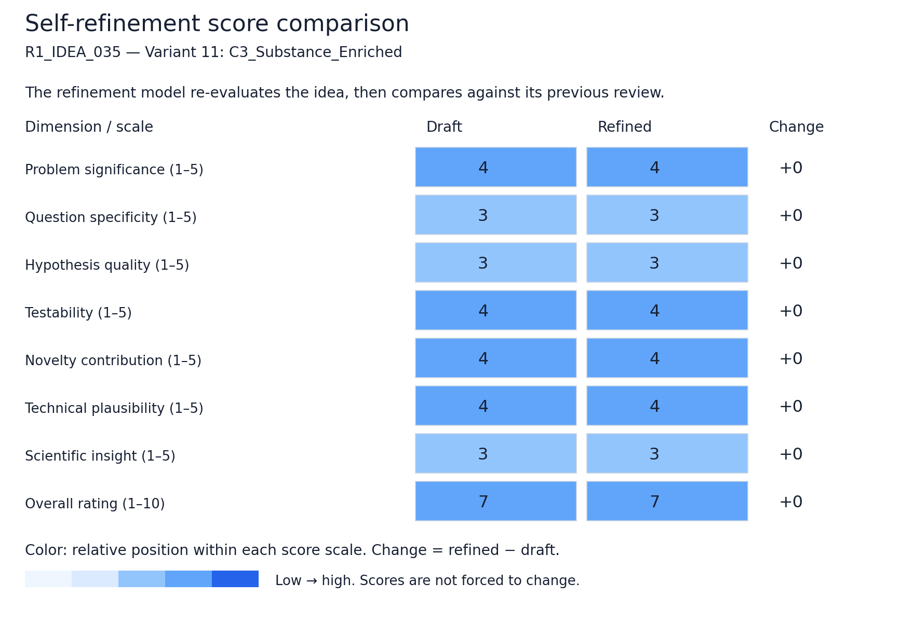

Changed score dimensions: none.

### Score justifications (draft / refined)

**Problem significance**

```json
{
  "draft": {
    "score": 4.0,
    "justification": "The lack of standardized benchmarks in graph pooling is a significant issue that hinders comparison and progress in the field."
  },
  "refined": {
    "score": 4.0,
    "justification": "The lack of standardized benchmarks in graph pooling is a significant issue that hinders comparison and progress in the field."
  }
}
```

**Question specificity**

```json
{
  "draft": {
    "score": 3.0,
    "justification": "The idea identifies a problem but lacks specific details on how the benchmark will be constructed and evaluated, making the research question somewhat vague."
  },
  "refined": {
    "score": 3.0,
    "justification": "The idea identifies a problem but lacks specific details on how the benchmark will be constructed and evaluated, making the research question somewhat vague."
  }
}
```

**Hypothesis quality**

```json
{
  "draft": {
    "score": 3.0,
    "justification": "The hypothesis about the correlation between benchmark performance and real-world graphs is not clearly defined or detailed, which weakens its quality."
  },
  "refined": {
    "score": 3.0,
    "justification": "The hypothesis about the correlation between benchmark performance and real-world graphs is not clearly defined or detailed, which weakens its quality."
  }
}
```

**Testability**

```json
{
  "draft": {
    "score": 4.0,
    "justification": "The idea suggests testing correlations and boundary conditions, which are testable through experiments, though the exact methods are not specified."
  },
  "refined": {
    "score": 4.0,
    "justification": "The idea suggests testing correlations and boundary conditions, which are testable through experiments, though the exact methods are not specified."
  }
}
```

**Novelty contribution**

```json
{
  "draft": {
    "score": 4.0,
    "justification": "The proposal to create a comprehensive benchmark is novel and could contribute significantly to the field by enabling fair comparisons and deeper analysis of method robustness."
  },
  "refined": {
    "score": 4.0,
    "justification": "The proposal to create a comprehensive benchmark is novel and could contribute significantly to the field by enabling fair comparisons and deeper analysis of method robustness."
  }
}
```

**Technical plausibility**

```json
{
  "draft": {
    "score": 4.0,
    "justification": "The idea is technically plausible as it involves standard benchmarking practices and is aligned with current research trends in graph pooling."
  },
  "refined": {
    "score": 4.0,
    "justification": "The idea is technically plausible as it involves standard benchmarking practices and is aligned with current research trends in graph pooling."
  }
}
```

**Scientific insight**

```json
{
  "draft": {
    "score": 3.0,
    "justification": "The idea has potential for scientific insight by exploring boundary conditions, but the specific insights are not clearly outlined."
  },
  "refined": {
    "score": 3.0,
    "justification": "The idea has potential for scientific insight by exploring boundary conditions, but the specific insights are not clearly outlined."
  }
}
```

**Overall rating**

```json
{
  "draft": {
    "score": 7.0,
    "justification": "The idea addresses a significant problem in the field with a clear plan, but lacks specific details that would make the research question more precise and testable."
  },
  "refined": {
    "score": 7.0,
    "justification": "The idea addresses a significant problem in the field with a clear plan, but lacks specific details that would make the research question more precise and testable."
  }
}
```

## R1_IDEA_035 — Variant 12: H1_Deceptive_Hollow


Changed score dimensions: none.

### Score justifications (draft / refined)

**Problem significance**

```json
{
  "draft": {
    "score": 4.0,
    "justification": "The lack of standardized evaluation practices is a significant issue in graph representation methods, which are crucial for many real-world applications. Addressing this gap could improve the reliability and comparability of research in the field."
  },
  "refined": {
    "score": 4.0,
    "justification": "The lack of standardized evaluation practices is a significant issue in graph representation methods, which are crucial for many real-world applications. Addressing this gap could improve the reliability and comparability of research in the field."
  }
}
```

**Question specificity**

```json
{
  "draft": {
    "score": 3.0,
    "justification": "The idea identifies a broad problem but lacks specific research questions or hypotheses. It is clear that a benchmark is needed, but the exact nature of the questions to be addressed is not well-defined."
  },
  "refined": {
    "score": 3.0,
    "justification": "The idea identifies a broad problem but lacks specific research questions or hypotheses. It is clear that a benchmark is needed, but the exact nature of the questions to be addressed is not well-defined."
  }
}
```

**Hypothesis quality**

```json
{
  "draft": {
    "score": 2.0,
    "justification": "The idea presents a general goal but does not provide concrete hypotheses or predictions that can be tested. The transformative framework is vague and lacks specific claims about what the benchmark will achieve."
  },
  "refined": {
    "score": 2.0,
    "justification": "The idea presents a general goal but does not provide concrete hypotheses or predictions that can be tested. The transformative framework is vague and lacks specific claims about what the benchmark will achieve."
  }
}
```

**Testability**

```json
{
  "draft": {
    "score": 2.0,
    "justification": "The idea is ambitious but lacks specific experiments or evaluation methods. Without clear metrics or protocols, it is difficult to assess the effectiveness of the proposed benchmark or framework."
  },
  "refined": {
    "score": 2.0,
    "justification": "The idea is ambitious but lacks specific experiments or evaluation methods. Without clear metrics or protocols, it is difficult to assess the effectiveness of the proposed benchmark or framework."
  }
}
```

**Novelty contribution**

```json
{
  "draft": {
    "score": 4.0,
    "justification": "The idea proposes a novel approach to benchmarking in graph representation methods, aiming to create a unified framework that could have a significant impact on the field. While the contribution is not a narrow technical adjustment, it is a meaningful step towards standardization and integration."
  },
  "refined": {
    "score": 4.0,
    "justification": "The idea proposes a novel approach to benchmarking in graph representation methods, aiming to create a unified framework that could have a significant impact on the field. While the contribution is not a narrow technical adjustment, it is a meaningful step towards standardization and integration."
  }
}
```

**Technical plausibility**

```json
{
  "draft": {
    "score": 3.0,
    "justification": "The idea is technically plausible as benchmarking is a common practice in machine learning. However, the specific technical details of the framework and its integration of different aspects are not clearly outlined, which could pose challenges in implementation."
  },
  "refined": {
    "score": 3.0,
    "justification": "The idea is technically plausible as benchmarking is a common practice in machine learning. However, the specific technical details of the framework and its integration of different aspects are not clearly outlined, which could pose challenges in implementation."
  }
}
```

**Scientific insight**

```json
{
  "draft": {
    "score": 3.0,
    "justification": "The idea has the potential to provide scientific insight by promoting a unified framework for evaluating graph representation methods. However, the current description does not specify how this framework will lead to new insights or understanding of the problem domain."
  },
  "refined": {
    "score": 3.0,
    "justification": "The idea has the potential to provide scientific insight by promoting a unified framework for evaluating graph representation methods. However, the current description does not specify how this framework will lead to new insights or understanding of the problem domain."
  }
}
```

**Overall rating**

```json
{
  "draft": {
    "score": 7.0,
    "justification": "The idea addresses a significant problem in the field of graph representation methods and proposes a transformative approach. However, it lacks specific details, hypotheses, and testable questions, which are necessary for further development and validation."
  },
  "refined": {
    "score": 7.0,
    "justification": "The idea addresses a significant problem in the field of graph representation methods and proposes a transformative approach. However, it lacks specific details, hypotheses, and testable questions, which are necessary for further development and validation."
  }
}
```

## R1_IDEA_035 — Variant 13: H2_Confident_Flaw


Changed score dimensions: none.

### Score justifications (draft / refined)

**Problem significance**

```json
{
  "draft": {
    "score": 4.0,
    "justification": "The problem of lacking standardized benchmarks in graph pooling is significant as it hinders fair comparison and progress in the field."
  },
  "refined": {
    "score": 4.0,
    "justification": "The problem of lacking standardized benchmarks in graph pooling is significant as it hinders fair comparison and progress in the field."
  }
}
```

**Question specificity**

```json
{
  "draft": {
    "score": 3.0,
    "justification": "The idea identifies a problem but does not clearly define the specific research question or hypothesis being investigated."
  },
  "refined": {
    "score": 3.0,
    "justification": "The idea identifies a problem but does not clearly define the specific research question or hypothesis being investigated."
  }
}
```

**Hypothesis quality**

```json
{
  "draft": {
    "score": 3.0,
    "justification": "The idea suggests a hypothesis that the benchmark will provide causal evidence, but it is not explicitly stated and lacks concrete predictions."
  },
  "refined": {
    "score": 3.0,
    "justification": "The idea suggests a hypothesis that the benchmark will provide causal evidence, but it is not explicitly stated and lacks concrete predictions."
  }
}
```

**Testability**

```json
{
  "draft": {
    "score": 3.0,
    "justification": "The idea proposes a benchmark but does not specify how it will be evaluated or what experiments will be conducted to test the hypothesis."
  },
  "refined": {
    "score": 3.0,
    "justification": "The idea proposes a benchmark but does not specify how it will be evaluated or what experiments will be conducted to test the hypothesis."
  }
}
```

**Novelty contribution**

```json
{
  "draft": {
    "score": 4.0,
    "justification": "The proposal to create a comprehensive benchmark is novel and could contribute significantly to the field by enabling fair comparisons and advancing research."
  },
  "refined": {
    "score": 4.0,
    "justification": "The proposal to create a comprehensive benchmark is novel and could contribute significantly to the field by enabling fair comparisons and advancing research."
  }
}
```

**Technical plausibility**

```json
{
  "draft": {
    "score": 4.0,
    "justification": "The idea is technically plausible as creating a benchmark with multiple methods and datasets is a feasible approach to address the problem."
  },
  "refined": {
    "score": 4.0,
    "justification": "The idea is technically plausible as creating a benchmark with multiple methods and datasets is a feasible approach to address the problem."
  }
}
```

**Scientific insight**

```json
{
  "draft": {
    "score": 3.0,
    "justification": "The idea has potential for scientific insight but lacks details on the specific mechanisms or relationships it aims to uncover."
  },
  "refined": {
    "score": 3.0,
    "justification": "The idea has potential for scientific insight but lacks details on the specific mechanisms or relationships it aims to uncover."
  }
}
```

**Overall rating**

```json
{
  "draft": {
    "score": 7.0,
    "justification": "The idea addresses a significant problem in the field and proposes a concrete solution, but it lacks specificity, hypothesis clarity, and testability details, which are needed for a strong research direction."
  },
  "refined": {
    "score": 7.0,
    "justification": "The idea addresses a significant problem in the field and proposes a concrete solution, but it lacks specificity, hypothesis clarity, and testability details, which are needed for a strong research direction."
  }
}
```

## R1_IDEA_035 — Variant 14: H3_Verbose_Enriched


Changed score dimensions: none.

### Score justifications (draft / refined)

**Problem significance**

```json
{
  "draft": {
    "score": 4.0,
    "justification": "The idea addresses a critical gap in the field by proposing a standardized benchmark for graph pooling methods, which is essential for fair evaluation and comparison of different approaches."
  },
  "refined": {
    "score": 4.0,
    "justification": "The idea addresses a critical gap in the field by proposing a standardized benchmark for graph pooling methods, which is essential for fair evaluation and comparison of different approaches."
  }
}
```

**Question specificity**

```json
{
  "draft": {
    "score": 3.0,
    "justification": "The idea is specific in its goal to create a benchmark and explore boundary conditions, but lacks concrete details on the exact datasets, metrics, and evaluation criteria."
  },
  "refined": {
    "score": 3.0,
    "justification": "The idea is specific in its goal to create a benchmark and explore boundary conditions, but lacks concrete details on the exact datasets, metrics, and evaluation criteria."
  }
}
```

**Hypothesis quality**

```json
{
  "draft": {
    "score": 4.0,
    "justification": "The hypothesis that benchmark performance correlates with real-world performance is testable and scientifically meaningful, though it could be more explicitly stated."
  },
  "refined": {
    "score": 4.0,
    "justification": "The hypothesis that benchmark performance correlates with real-world performance is testable and scientifically meaningful, though it could be more explicitly stated."
  }
}
```

**Testability**

```json
{
  "draft": {
    "score": 3.0,
    "justification": "The idea suggests experiments and analyses, but lacks concrete details on how the correlation and boundary conditions will be measured, making it somewhat vague in terms of testability."
  },
  "refined": {
    "score": 3.0,
    "justification": "The idea suggests experiments and analyses, but lacks concrete details on how the correlation and boundary conditions will be measured, making it somewhat vague in terms of testability."
  }
}
```

**Novelty contribution**

```json
{
  "draft": {
    "score": 4.0,
    "justification": "The idea contributes to the field by proposing a standardized benchmark and exploring boundary conditions, which can provide deeper insights into the effectiveness of graph pooling methods."
  },
  "refined": {
    "score": 4.0,
    "justification": "The idea contributes to the field by proposing a standardized benchmark and exploring boundary conditions, which can provide deeper insights into the effectiveness of graph pooling methods."
  }
}
```

**Technical plausibility**

```json
{
  "draft": {
    "score": 4.0,
    "justification": "The proposed approach is technically plausible, as it involves standard benchmarking practices and includes ablations and sensitivity analyses that are commonly used in machine learning research."
  },
  "refined": {
    "score": 4.0,
    "justification": "The proposed approach is technically plausible, as it involves standard benchmarking practices and includes ablations and sensitivity analyses that are commonly used in machine learning research."
  }
}
```

**Scientific insight**

```json
{
  "draft": {
    "score": 4.0,
    "justification": "The idea has the potential to provide scientific insights into the effectiveness of graph pooling methods under different conditions, including boundary cases and real-world applications."
  },
  "refined": {
    "score": 4.0,
    "justification": "The idea has the potential to provide scientific insights into the effectiveness of graph pooling methods under different conditions, including boundary cases and real-world applications."
  }
}
```

**Overall rating**

```json
{
  "draft": {
    "score": 7.0,
    "justification": "The idea is strong and addresses a meaningful problem with a structured approach. However, it lacks concrete details that would make it more testable and specific, which could be improved with more specifics on the benchmark and evaluation criteria."
  },
  "refined": {
    "score": 7.0,
    "justification": "The idea is strong and addresses a meaningful problem with a structured approach. However, it lacks concrete details that would make it more testable and specific, which could be improved with more specifics on the benchmark and evaluation criteria."
  }
}
```

## R1_IDEA_035 — Variant 15: H4_Ultimate_Hype


Changed score dimensions: none.

### Score justifications (draft / refined)

**Problem significance**

```json
{
  "draft": {
    "score": 4.0,
    "justification": "The idea addresses a critical gap in the field of graph pooling by proposing a standardized benchmark, which is essential for evaluating and advancing the methods in a fair and systematic manner."
  },
  "refined": {
    "score": 4.0,
    "justification": "The idea addresses a critical gap in the field of graph pooling by proposing a standardized benchmark, which is essential for evaluating and advancing the methods in a fair and systematic manner."
  }
}
```

**Question specificity**

```json
{
  "draft": {
    "score": 3.0,
    "justification": "The idea identifies a broad problem (lack of standardized benchmarks) but does not clearly define a specific research question or hypothesis that the benchmark aims to investigate."
  },
  "refined": {
    "score": 3.0,
    "justification": "The idea identifies a broad problem (lack of standardized benchmarks) but does not clearly define a specific research question or hypothesis that the benchmark aims to investigate."
  }
}
```

**Hypothesis quality**

```json
{
  "draft": {
    "score": 2.0,
    "justification": "The idea does not explicitly state a hypothesis or research question that can be tested through the proposed benchmark. It focuses more on the potential impact rather than a specific prediction or mechanism."
  },
  "refined": {
    "score": 2.0,
    "justification": "The idea does not explicitly state a hypothesis or research question that can be tested through the proposed benchmark. It focuses more on the potential impact rather than a specific prediction or mechanism."
  }
}
```

**Testability**

```json
{
  "draft": {
    "score": 3.0,
    "justification": "The idea suggests creating a benchmark, which is testable, but lacks specific details on how the benchmark will be evaluated, compared, or analyzed to generate meaningful results."
  },
  "refined": {
    "score": 3.0,
    "justification": "The idea suggests creating a benchmark, which is testable, but lacks specific details on how the benchmark will be evaluated, compared, or analyzed to generate meaningful results."
  }
}
```

**Novelty contribution**

```json
{
  "draft": {
    "score": 4.0,
    "justification": "The proposal to create a comprehensive benchmark for graph pooling methods is novel and has the potential to contribute significantly to the field by standardizing evaluation practices and driving further research."
  },
  "refined": {
    "score": 4.0,
    "justification": "The proposal to create a comprehensive benchmark for graph pooling methods is novel and has the potential to contribute significantly to the field by standardizing evaluation practices and driving further research."
  }
}
```

**Technical plausibility**

```json
{
  "draft": {
    "score": 4.0,
    "justification": "The idea is technically plausible as it involves creating a benchmark with existing methods and datasets. The feasibility of such a benchmark is reasonable given the current state of graph pooling research."
  },
  "refined": {
    "score": 4.0,
    "justification": "The idea is technically plausible as it involves creating a benchmark with existing methods and datasets. The feasibility of such a benchmark is reasonable given the current state of graph pooling research."
  }
}
```

**Scientific insight**

```json
{
  "draft": {
    "score": 3.0,
    "justification": "The benchmark could provide insights into the effectiveness of different pooling methods, but the specific scientific insights are not clearly outlined in the idea."
  },
  "refined": {
    "score": 3.0,
    "justification": "The benchmark could provide insights into the effectiveness of different pooling methods, but the specific scientific insights are not clearly outlined in the idea."
  }
}
```

**Overall rating**

```json
{
  "draft": {
    "score": 7.0,
    "justification": "The idea is strong and addresses a significant problem in the field, but it lacks specific details on the research question, hypothesis, and evaluation methods, which are necessary for a more precise assessment of its scientific merit and potential impact."
  },
  "refined": {
    "score": 7.0,
    "justification": "The idea is strong and addresses a significant problem in the field, but it lacks specific details on the research question, hypothesis, and evaluation methods, which are necessary for a more precise assessment of its scientific merit and potential impact."
  }
}
```

## R1_IDEA_036 — Source


Changed score dimensions: none.

### Score justifications (draft / refined)

**Problem significance**

```json
{
  "draft": {
    "score": 4.0,
    "justification": "The idea addresses a common misconception in the field of dimensionality reduction, which is important for practitioners and researchers to understand the trade-offs between parametric and non-parametric approaches."
  },
  "refined": {
    "score": 4.0,
    "justification": "The idea addresses a common misconception in the field of dimensionality reduction, which is important for practitioners and researchers to understand the trade-offs between parametric and non-parametric approaches."
  }
}
```

**Question specificity**

```json
{
  "draft": {
    "score": 3.0,
    "justification": "The idea identifies a potential discrepancy between the two methods but lacks a specific research question or hypothesis that can be tested. More clarity is needed on what exactly needs to be investigated."
  },
  "refined": {
    "score": 3.0,
    "justification": "The idea identifies a potential discrepancy between the two methods but lacks a specific research question or hypothesis that can be tested. More clarity is needed on what exactly needs to be investigated."
  }
}
```

**Hypothesis quality**

```json
{
  "draft": {
    "score": 3.0,
    "justification": "The idea presents a general claim about the difference between parametric and non-parametric methods but does not provide a concrete hypothesis that can be tested or falsified. More specific predictions are needed."
  },
  "refined": {
    "score": 3.0,
    "justification": "The idea presents a general claim about the difference between parametric and non-parametric methods but does not provide a concrete hypothesis that can be tested or falsified. More specific predictions are needed."
  }
}
```

**Testability**

```json
{
  "draft": {
    "score": 2.0,
    "justification": "The idea lacks a clear experimental design or method to test the hypothesis. Without specific metrics or tasks, it is difficult to determine how to validate the claim."
  },
  "refined": {
    "score": 2.0,
    "justification": "The idea lacks a clear experimental design or method to test the hypothesis. Without specific metrics or tasks, it is difficult to determine how to validate the claim."
  }
}
```

**Novelty contribution**

```json
{
  "draft": {
    "score": 4.0,
    "justification": "The idea challenges a common misconception and suggests a new direction for research on dimensionality reduction methods, which could contribute to a better understanding of their trade-offs."
  },
  "refined": {
    "score": 4.0,
    "justification": "The idea challenges a common misconception and suggests a new direction for research on dimensionality reduction methods, which could contribute to a better understanding of their trade-offs."
  }
}
```

**Technical plausibility**

```json
{
  "draft": {
    "score": 4.0,
    "justification": "The claim that parametric methods lose local details is plausible given the nature of parametric models, which often focus on global structure. The idea is technically coherent and aligns with existing knowledge in the field."
  },
  "refined": {
    "score": 4.0,
    "justification": "The claim that parametric methods lose local details is plausible given the nature of parametric models, which often focus on global structure. The idea is technically coherent and aligns with existing knowledge in the field."
  }
}
```

**Scientific insight**

```json
{
  "draft": {
    "score": 3.0,
    "justification": "The idea has the potential to provide insights into the trade-offs between global and local structure preservation in dimensionality reduction, but more specific investigations are needed to confirm these insights."
  },
  "refined": {
    "score": 3.0,
    "justification": "The idea has the potential to provide insights into the trade-offs between global and local structure preservation in dimensionality reduction, but more specific investigations are needed to confirm these insights."
  }
}
```

**Overall rating**

```json
{
  "draft": {
    "score": 7.0,
    "justification": "The idea is promising and addresses a meaningful problem in the field, but it lacks specific research questions, hypotheses, and experimental designs that are necessary for further investigation. With more concrete details, it could become a strong research direction."
  },
  "refined": {
    "score": 7.0,
    "justification": "The idea is promising and addresses a meaningful problem in the field, but it lacks specific research questions, hypotheses, and experimental designs that are necessary for further investigation. With more concrete details, it could become a strong research direction."
  }
}
```

## R1_IDEA_036 — Variant 1: A1_Identity


Changed score dimensions: none.

### Score justifications (draft / refined)

**Problem significance**

```json
{
  "draft": {
    "score": 4.0,
    "justification": "The idea addresses a common misconception in dimensionality reduction, which is important for practitioners and researchers to understand for better method selection and application."
  },
  "refined": {
    "score": 4.0,
    "justification": "The idea addresses a common misconception in dimensionality reduction, which is important for practitioners and researchers to understand for better method selection and application."
  }
}
```

**Question specificity**

```json
{
  "draft": {
    "score": 3.0,
    "justification": "The idea identifies a general distinction between parametric and non-parametric methods but lacks a specific research question or hypothesis that can be tested."
  },
  "refined": {
    "score": 3.0,
    "justification": "The idea identifies a general distinction between parametric and non-parametric methods but lacks a specific research question or hypothesis that can be tested."
  }
}
```

**Hypothesis quality**

```json
{
  "draft": {
    "score": 3.0,
    "justification": "The idea presents a general claim about the performance differences between the two methods but does not provide a concrete hypothesis that can be tested or falsified."
  },
  "refined": {
    "score": 3.0,
    "justification": "The idea presents a general claim about the performance differences between the two methods but does not provide a concrete hypothesis that can be tested or falsified."
  }
}
```

**Testability**

```json
{
  "draft": {
    "score": 2.0,
    "justification": "The idea lacks a specific experimental design or evaluation plan, making it difficult to determine how the claim can be tested or validated."
  },
  "refined": {
    "score": 2.0,
    "justification": "The idea lacks a specific experimental design or evaluation plan, making it difficult to determine how the claim can be tested or validated."
  }
}
```

**Novelty contribution**

```json
{
  "draft": {
    "score": 4.0,
    "justification": "The idea challenges a common misconception and could contribute to a better understanding of the strengths and limitations of parametric vs. non-parametric methods in dimensionality reduction."
  },
  "refined": {
    "score": 4.0,
    "justification": "The idea challenges a common misconception and could contribute to a better understanding of the strengths and limitations of parametric vs. non-parametric methods in dimensionality reduction."
  }
}
```

**Technical plausibility**

```json
{
  "draft": {
    "score": 4.0,
    "justification": "The distinction between global and local structure preservation is plausible, and the idea is technically coherent within the domain of dimensionality reduction."
  },
  "refined": {
    "score": 4.0,
    "justification": "The distinction between global and local structure preservation is plausible, and the idea is technically coherent within the domain of dimensionality reduction."
  }
}
```

**Scientific insight**

```json
{
  "draft": {
    "score": 3.0,
    "justification": "The idea has the potential to provide insights into the design of dimensionality reduction methods, but the current formulation lacks the specificity needed to generate meaningful scientific insight."
  },
  "refined": {
    "score": 3.0,
    "justification": "The idea has the potential to provide insights into the design of dimensionality reduction methods, but the current formulation lacks the specificity needed to generate meaningful scientific insight."
  }
}
```

**Overall rating**

```json
{
  "draft": {
    "score": 7.0,
    "justification": "The idea addresses a significant issue in the field and has the potential to contribute to a better understanding of parametric vs. non-parametric methods. However, it lacks a specific research question and hypothesis, which are necessary for testability and scientific contribution."
  },
  "refined": {
    "score": 7.0,
    "justification": "The idea addresses a significant issue in the field and has the potential to contribute to a better understanding of parametric vs. non-parametric methods. However, it lacks a specific research question and hypothesis, which are necessary for testability and scientific contribution."
  }
}
```

## R1_IDEA_036 — Variant 2: A2_Paraphrase_Only


Changed score dimensions: none.

### Score justifications (draft / refined)

**Problem significance**

```json
{
  "draft": {
    "score": 4.0,
    "justification": "The idea addresses a critical issue in dimensionality reduction that affects both research and practical applications, particularly in scenarios where both global and local structure are important."
  },
  "refined": {
    "score": 4.0,
    "justification": "The idea addresses a critical issue in dimensionality reduction that affects both research and practical applications, particularly in scenarios where both global and local structure are important."
  }
}
```

**Question specificity**

```json
{
  "draft": {
    "score": 3.0,
    "justification": "The research question is clear and specific, but lacks the necessary details to fully define the investigation."
  },
  "refined": {
    "score": 3.0,
    "justification": "The research question is clear and specific, but lacks the necessary details to fully define the investigation."
  }
}
```

**Hypothesis quality**

```json
{
  "draft": {
    "score": 4.0,
    "justification": "The hypothesis that parametric methods sacrifice local detail is concrete and could be tested through controlled experiments."
  },
  "refined": {
    "score": 4.0,
    "justification": "The hypothesis that parametric methods sacrifice local detail is concrete and could be tested through controlled experiments."
  }
}
```

**Testability**

```json
{
  "draft": {
    "score": 2.0,
    "justification": "The idea is testable in principle, but lacks specific experimental design details that would make it feasible to implement and evaluate."
  },
  "refined": {
    "score": 2.0,
    "justification": "The idea is testable in principle, but lacks specific experimental design details that would make it feasible to implement and evaluate."
  }
}
```

**Novelty contribution**

```json
{
  "draft": {
    "score": 3.0,
    "justification": "The idea presents a novel perspective on the trade-offs between parametric and non-parametric methods, but the contribution would depend on the experimental validation of the hypothesis."
  },
  "refined": {
    "score": 3.0,
    "justification": "The idea presents a novel perspective on the trade-offs between parametric and non-parametric methods, but the contribution would depend on the experimental validation of the hypothesis."
  }
}
```

**Technical plausibility**

```json
{
  "draft": {
    "score": 4.0,
    "justification": "The proposed distinction between global and local structure preservation is technically plausible and aligns with existing research in dimensionality reduction."
  },
  "refined": {
    "score": 4.0,
    "justification": "The proposed distinction between global and local structure preservation is technically plausible and aligns with existing research in dimensionality reduction."
  }
}
```

**Scientific insight**

```json
{
  "draft": {
    "score": 3.0,
    "justification": "The idea has potential to provide valuable insights into the design of dimensionality reduction methods, but the scientific insight would depend on the experimental results."
  },
  "refined": {
    "score": 3.0,
    "justification": "The idea has potential to provide valuable insights into the design of dimensionality reduction methods, but the scientific insight would depend on the experimental results."
  }
}
```

**Overall rating**

```json
{
  "draft": {
    "score": 7.0,
    "justification": "The idea is promising and addresses an important problem, but requires more specific details to be fully evaluated and implemented."
  },
  "refined": {
    "score": 7.0,
    "justification": "The idea is promising and addresses an important problem, but requires more specific details to be fully evaluated and implemented."
  }
}
```

## R1_IDEA_036 — Variant 3: A3_Plain_Core


Changed score dimensions: none.

### Score justifications (draft / refined)

**Problem significance**

```json
{
  "draft": {
    "score": 4.0,
    "justification": "The idea addresses a critical issue in dimensionality reduction, which is fundamental to many machine learning applications. It challenges a common misconception and has implications for model design and interpretation."
  },
  "refined": {
    "score": 4.0,
    "justification": "The idea addresses a critical issue in dimensionality reduction, which is fundamental to many machine learning applications. It challenges a common misconception and has implications for model design and interpretation."
  }
}
```

**Question specificity**

```json
{
  "draft": {
    "score": 3.0,
    "justification": "The idea outlines a general problem but lacks a specific research question. It needs to define exactly what aspect of local structure is being lost and how it should be measured."
  },
  "refined": {
    "score": 3.0,
    "justification": "The idea outlines a general problem but lacks a specific research question. It needs to define exactly what aspect of local structure is being lost and how it should be measured."
  }
}
```

**Hypothesis quality**

```json
{
  "draft": {
    "score": 3.0,
    "justification": "The idea presents a general claim about parametric methods but does not explicitly state a testable hypothesis. It would be stronger with a specific prediction about local structure preservation."
  },
  "refined": {
    "score": 3.0,
    "justification": "The idea presents a general claim about parametric methods but does not explicitly state a testable hypothesis. It would be stronger with a specific prediction about local structure preservation."
  }
}
```

**Testability**

```json
{
  "draft": {
    "score": 2.0,
    "justification": "The idea lacks a clear experimental plan. It does not specify how to test the claim about local details loss, making it difficult to assess the validity of the hypothesis."
  },
  "refined": {
    "score": 2.0,
    "justification": "The idea lacks a clear experimental plan. It does not specify how to test the claim about local details loss, making it difficult to assess the validity of the hypothesis."
  }
}
```

**Novelty contribution**

```json
{
  "draft": {
    "score": 4.0,
    "justification": "The idea challenges a common belief in the field and could contribute new insights into the behavior of dimensionality reduction methods. However, it is not a novel method but rather a new perspective on existing methods."
  },
  "refined": {
    "score": 4.0,
    "justification": "The idea challenges a common belief in the field and could contribute new insights into the behavior of dimensionality reduction methods. However, it is not a novel method but rather a new perspective on existing methods."
  }
}
```

**Technical plausibility**

```json
{
  "draft": {
    "score": 4.0,
    "justification": "The claim that parametric methods lose local details is plausible given the nature of these methods. The reasoning is logically coherent, though the specific mechanisms need further clarification."
  },
  "refined": {
    "score": 4.0,
    "justification": "The claim that parametric methods lose local details is plausible given the nature of these methods. The reasoning is logically coherent, though the specific mechanisms need further clarification."
  }
}
```

**Scientific insight**

```json
{
  "draft": {
    "score": 3.0,
    "justification": "The idea has potential to provide insights into the trade-offs between global and local structure in dimensionality reduction. However, without specific experiments, the scientific insight remains theoretical."
  },
  "refined": {
    "score": 3.0,
    "justification": "The idea has potential to provide insights into the trade-offs between global and local structure in dimensionality reduction. However, without specific experiments, the scientific insight remains theoretical."
  }
}
```

**Overall rating**

```json
{
  "draft": {
    "score": 7.0,
    "justification": "The idea addresses a meaningful problem in dimensionality reduction and challenges a common misconception. It has potential for scientific contribution but lacks specific hypotheses and experimental plans, which are needed to validate the claims."
  },
  "refined": {
    "score": 7.0,
    "justification": "The idea addresses a meaningful problem in dimensionality reduction and challenges a common misconception. It has potential for scientific contribution but lacks specific hypotheses and experimental plans, which are needed to validate the claims."
  }
}
```

## R1_IDEA_036 — Variant 4: B1_Verbose_Elaborate

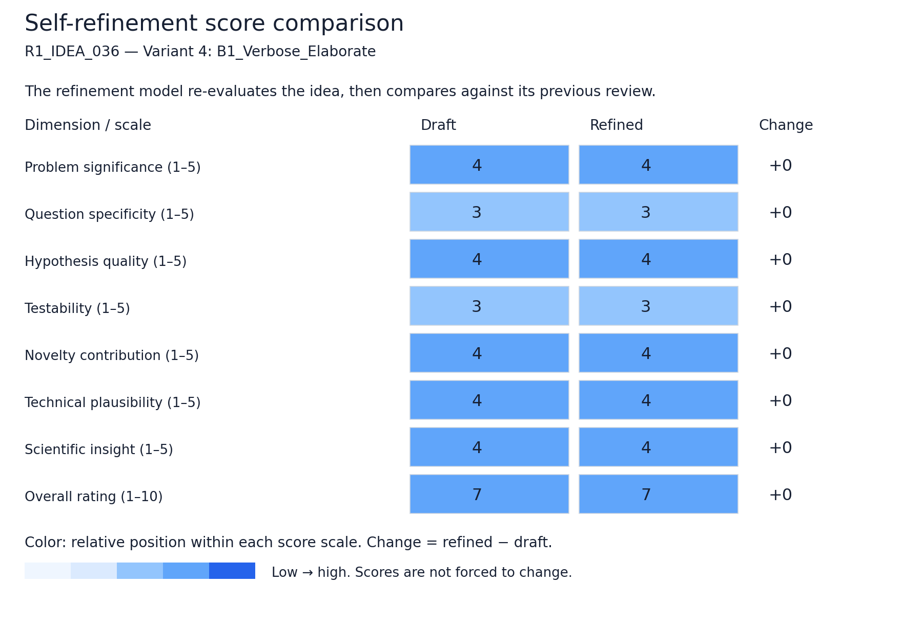

Changed score dimensions: none.

### Score justifications (draft / refined)

**Problem significance**

```json
{
  "draft": {
    "score": 4.0,
    "justification": "The idea addresses a common misconception in dimensionality reduction, which is crucial for practitioners choosing appropriate methods for their tasks."
  },
  "refined": {
    "score": 4.0,
    "justification": "The idea addresses a common misconception in dimensionality reduction, which is crucial for practitioners choosing appropriate methods for their tasks."
  }
}
```

**Question specificity**

```json
{
  "draft": {
    "score": 3.0,
    "justification": "The hypothesis is clear, but the specific methods, metrics, and experimental design are not detailed, which could limit the testability of the claim."
  },
  "refined": {
    "score": 3.0,
    "justification": "The hypothesis is clear, but the specific methods, metrics, and experimental design are not detailed, which could limit the testability of the claim."
  }
}
```

**Hypothesis quality**

```json
{
  "draft": {
    "score": 4.0,
    "justification": "The hypothesis that parametric methods retain global structure but lose local detail is plausible and could be tested through experiments."
  },
  "refined": {
    "score": 4.0,
    "justification": "The hypothesis that parametric methods retain global structure but lose local detail is plausible and could be tested through experiments."
  }
}
```

**Testability**

```json
{
  "draft": {
    "score": 3.0,
    "justification": "The hypothesis is testable, but the lack of specific experimental details makes it challenging to assess the feasibility of the proposed investigation."
  },
  "refined": {
    "score": 3.0,
    "justification": "The hypothesis is testable, but the lack of specific experimental details makes it challenging to assess the feasibility of the proposed investigation."
  }
}
```

**Novelty contribution**

```json
{
  "draft": {
    "score": 4.0,
    "justification": "The idea challenges a common belief and could contribute to a better understanding of the trade-offs between parametric and non-parametric methods."
  },
  "refined": {
    "score": 4.0,
    "justification": "The idea challenges a common belief and could contribute to a better understanding of the trade-offs between parametric and non-parametric methods."
  }
}
```

**Technical plausibility**

```json
{
  "draft": {
    "score": 4.0,
    "justification": "The reasoning is logically coherent and aligns with known properties of dimensionality reduction techniques."
  },
  "refined": {
    "score": 4.0,
    "justification": "The reasoning is logically coherent and aligns with known properties of dimensionality reduction techniques."
  }
}
```

**Scientific insight**

```json
{
  "draft": {
    "score": 4.0,
    "justification": "The potential insight is that the choice of method depends on the specific requirements of the task, which could guide practical applications."
  },
  "refined": {
    "score": 4.0,
    "justification": "The potential insight is that the choice of method depends on the specific requirements of the task, which could guide practical applications."
  }
}
```

**Overall rating**

```json
{
  "draft": {
    "score": 7.0,
    "justification": "The idea is strong and addresses a meaningful problem with a clear hypothesis, but lacks specific details that would make it more testable and concrete."
  },
  "refined": {
    "score": 7.0,
    "justification": "The idea is strong and addresses a meaningful problem with a clear hypothesis, but lacks specific details that would make it more testable and concrete."
  }
}
```

## R1_IDEA_036 — Variant 5: B2_Grand_Narrative


Changed score dimensions: none.

### Score justifications (draft / refined)

**Problem significance**

```json
{
  "draft": {
    "score": 3.0,
    "justification": "The idea addresses a significant issue in dimensionality reduction, which is crucial for representation learning. However, the problem is somewhat broad and not clearly defined as to why it matters beyond the general comparison of methods."
  },
  "refined": {
    "score": 3.0,
    "justification": "The idea addresses a significant issue in dimensionality reduction, which is crucial for representation learning. However, the problem is somewhat broad and not clearly defined as to why it matters beyond the general comparison of methods."
  }
}
```

**Question specificity**

```json
{
  "draft": {
    "score": 2.0,
    "justification": "The research question is not clearly defined. The idea mentions a misconception but does not specify what exactly is being investigated or what the specific hypothesis is."
  },
  "refined": {
    "score": 2.0,
    "justification": "The research question is not clearly defined. The idea mentions a misconception but does not specify what exactly is being investigated or what the specific hypothesis is."
  }
}
```

**Hypothesis quality**

```json
{
  "draft": {
    "score": 2.0,
    "justification": "The idea suggests a hypothesis that parametric methods are not equivalent to non-parametric ones, but it does not provide a concrete prediction or mechanism to support this claim. The hypothesis is too general."
  },
  "refined": {
    "score": 2.0,
    "justification": "The idea suggests a hypothesis that parametric methods are not equivalent to non-parametric ones, but it does not provide a concrete prediction or mechanism to support this claim. The hypothesis is too general."
  }
}
```

**Testability**

```json
{
  "draft": {
    "score": 2.0,
    "justification": "The idea does not specify how the hypothesis will be tested. Without a clear experimental design or evaluation method, the testability is low."
  },
  "refined": {
    "score": 2.0,
    "justification": "The idea does not specify how the hypothesis will be tested. Without a clear experimental design or evaluation method, the testability is low."
  }
}
```

**Novelty contribution**

```json
{
  "draft": {
    "score": 3.0,
    "justification": "The idea contributes to the understanding of parametric vs. non-parametric methods in dimensionality reduction, which is a relevant area. However, the novelty is limited as it does not propose a new method or framework but rather a comparison and analysis."
  },
  "refined": {
    "score": 3.0,
    "justification": "The idea contributes to the understanding of parametric vs. non-parametric methods in dimensionality reduction, which is a relevant area. However, the novelty is limited as it does not propose a new method or framework but rather a comparison and analysis."
  }
}
```

**Technical plausibility**

```json
{
  "draft": {
    "score": 3.0,
    "justification": "The idea is technically plausible as it is based on existing knowledge about dimensionality reduction methods. However, the lack of specific details makes it difficult to assess the feasibility of the proposed research."
  },
  "refined": {
    "score": 3.0,
    "justification": "The idea is technically plausible as it is based on existing knowledge about dimensionality reduction methods. However, the lack of specific details makes it difficult to assess the feasibility of the proposed research."
  }
}
```

**Scientific insight**

```json
{
  "draft": {
    "score": 2.0,
    "justification": "The idea has potential to provide insights into the strengths and weaknesses of different dimensionality reduction methods. However, the current formulation does not clearly indicate what specific insights would be gained from the research."
  },
  "refined": {
    "score": 2.0,
    "justification": "The idea has potential to provide insights into the strengths and weaknesses of different dimensionality reduction methods. However, the current formulation does not clearly indicate what specific insights would be gained from the research."
  }
}
```

**Overall rating**

```json
{
  "draft": {
    "score": 5.0,
    "justification": "The idea addresses a relevant problem in machine learning but lacks specificity and testability. It has potential for contribution but needs more concrete hypotheses and experimental plans to be considered strong."
  },
  "refined": {
    "score": 5.0,
    "justification": "The idea addresses a relevant problem in machine learning but lacks specificity and testability. It has potential for contribution but needs more concrete hypotheses and experimental plans to be considered strong."
  }
}
```

## R1_IDEA_036 — Variant 6: B3_Over_Confident


Changed score dimensions: none.

### Score justifications (draft / refined)

**Problem significance**

```json
{
  "draft": {
    "score": 4.0,
    "justification": "The idea addresses a critical issue in dimensionality reduction, which is a fundamental problem in machine learning. Understanding the trade-offs between global and local structure preservation is important for method selection and application in real-world scenarios."
  },
  "refined": {
    "score": 4.0,
    "justification": "The idea addresses a critical issue in dimensionality reduction, which is a fundamental problem in machine learning. Understanding the trade-offs between global and local structure preservation is important for method selection and application in real-world scenarios."
  }
}
```

**Question specificity**

```json
{
  "draft": {
    "score": 3.0,
    "justification": "The idea identifies a general problem but lacks specific research questions or hypotheses. It needs to be more concrete to define what exactly is being investigated, such as specific tasks or metrics for comparison."
  },
  "refined": {
    "score": 3.0,
    "justification": "The idea identifies a general problem but lacks specific research questions or hypotheses. It needs to be more concrete to define what exactly is being investigated, such as specific tasks or metrics for comparison."
  }
}
```

**Hypothesis quality**

```json
{
  "draft": {
    "score": 3.0,
    "justification": "The idea presents a general hypothesis about the performance differences between parametric and non-parametric methods but does not provide a concrete prediction or mechanism that can be tested. More specific claims are needed."
  },
  "refined": {
    "score": 3.0,
    "justification": "The idea presents a general hypothesis about the performance differences between parametric and non-parametric methods but does not provide a concrete prediction or mechanism that can be tested. More specific claims are needed."
  }
}
```

**Testability**

```json
{
  "draft": {
    "score": 2.0,
    "justification": "The idea lacks concrete experiments or comparisons that could be used to test the hypothesis. Without specific datasets or evaluation metrics, it is difficult to assess the validity of the claim."
  },
  "refined": {
    "score": 2.0,
    "justification": "The idea lacks concrete experiments or comparisons that could be used to test the hypothesis. Without specific datasets or evaluation metrics, it is difficult to assess the validity of the claim."
  }
}
```

**Novelty contribution**

```json
{
  "draft": {
    "score": 4.0,
    "justification": "The idea challenges a common misconception and could contribute to a better understanding of the trade-offs in dimensionality reduction methods. It has the potential to guide practitioners in selecting appropriate methods for different tasks."
  },
  "refined": {
    "score": 4.0,
    "justification": "The idea challenges a common misconception and could contribute to a better understanding of the trade-offs in dimensionality reduction methods. It has the potential to guide practitioners in selecting appropriate methods for different tasks."
  }
}
```

**Technical plausibility**

```json
{
  "draft": {
    "score": 3.0,
    "justification": "The hypothesis is technically plausible, as parametric methods are known to preserve global structure but may lose local details. However, the idea does not provide sufficient details to assess the technical feasibility of the proposed investigation."
  },
  "refined": {
    "score": 3.0,
    "justification": "The hypothesis is technically plausible, as parametric methods are known to preserve global structure but may lose local details. However, the idea does not provide sufficient details to assess the technical feasibility of the proposed investigation."
  }
}
```

**Scientific insight**

```json
{
  "draft": {
    "score": 3.0,
    "justification": "The idea has the potential to provide insights into the trade-offs between global and local structure preservation in dimensionality reduction. However, without specific experiments, the scientific insight remains theoretical."
  },
  "refined": {
    "score": 3.0,
    "justification": "The idea has the potential to provide insights into the trade-offs between global and local structure preservation in dimensionality reduction. However, without specific experiments, the scientific insight remains theoretical."
  }
}
```

**Overall rating**

```json
{
  "draft": {
    "score": 7.0,
    "justification": "The idea addresses an important problem in dimensionality reduction and proposes a hypothesis that could lead to significant scientific insight. However, it lacks specific research questions, hypotheses, and experimental plans, which are necessary for further development and validation."
  },
  "refined": {
    "score": 7.0,
    "justification": "The idea addresses an important problem in dimensionality reduction and proposes a hypothesis that could lead to significant scientific insight. However, it lacks specific research questions, hypotheses, and experimental plans, which are necessary for further development and validation."
  }
}
```

## R1_IDEA_036 — Variant 7: B4_Novelty


Changed score dimensions: none.

### Score justifications (draft / refined)

**Problem significance**

```json
{
  "draft": {
    "score": 4.0,
    "justification": "The idea addresses a significant issue in dimensionality reduction by challenging a common misconception, which could have implications for method selection in machine learning applications."
  },
  "refined": {
    "score": 4.0,
    "justification": "The idea addresses a significant issue in dimensionality reduction by challenging a common misconception, which could have implications for method selection in machine learning applications."
  }
}
```

**Question specificity**

```json
{
  "draft": {
    "score": 3.0,
    "justification": "The idea presents a general direction but lacks a specific research question that can be tested. More precise formulation is needed to define what exactly is being investigated."
  },
  "refined": {
    "score": 3.0,
    "justification": "The idea presents a general direction but lacks a specific research question that can be tested. More precise formulation is needed to define what exactly is being investigated."
  }
}
```

**Hypothesis quality**

```json
{
  "draft": {
    "score": 3.0,
    "justification": "The idea contains an implicit hypothesis about the difference in structure preservation between parametric and non-parametric methods, but it is not explicitly stated or detailed enough."
  },
  "refined": {
    "score": 3.0,
    "justification": "The idea contains an implicit hypothesis about the difference in structure preservation between parametric and non-parametric methods, but it is not explicitly stated or detailed enough."
  }
}
```

**Testability**

```json
{
  "draft": {
    "score": 2.0,
    "justification": "The idea is testable in principle, but lacks a clear experimental design or methodology to validate the hypothesis. Without specific metrics or datasets, the testability is limited."
  },
  "refined": {
    "score": 2.0,
    "justification": "The idea is testable in principle, but lacks a clear experimental design or methodology to validate the hypothesis. Without specific metrics or datasets, the testability is limited."
  }
}
```

**Novelty contribution**

```json
{
  "draft": {
    "score": 4.0,
    "justification": "The idea introduces a new perspective on comparing dimensionality reduction methods by focusing on the preservation of local structure, which could contribute to a better understanding of methodological differences."
  },
  "refined": {
    "score": 4.0,
    "justification": "The idea introduces a new perspective on comparing dimensionality reduction methods by focusing on the preservation of local structure, which could contribute to a better understanding of methodological differences."
  }
}
```

**Technical plausibility**

```json
{
  "draft": {
    "score": 4.0,
    "justification": "The proposed direction is technically plausible as it builds on existing methods and concepts in dimensionality reduction. The distinction between global and local structure is a reasonable area of investigation."
  },
  "refined": {
    "score": 4.0,
    "justification": "The proposed direction is technically plausible as it builds on existing methods and concepts in dimensionality reduction. The distinction between global and local structure is a reasonable area of investigation."
  }
}
```

**Scientific insight**

```json
{
  "draft": {
    "score": 3.0,
    "justification": "The idea has potential to provide insights into the limitations of parametric methods, but the scientific insight would depend on the specific findings and how they are interpreted in the context of real-world applications."
  },
  "refined": {
    "score": 3.0,
    "justification": "The idea has potential to provide insights into the limitations of parametric methods, but the scientific insight would depend on the specific findings and how they are interpreted in the context of real-world applications."
  }
}
```

**Overall rating**

```json
{
  "draft": {
    "score": 7.0,
    "justification": "The idea is promising and addresses a meaningful problem, but it needs more specificity and a clear research question to be fully evaluated. The potential contribution is significant, but the current formulation is somewhat vague."
  },
  "refined": {
    "score": 7.0,
    "justification": "The idea is promising and addresses a meaningful problem, but it needs more specificity and a clear research question to be fully evaluated. The potential contribution is significant, but the current formulation is somewhat vague."
  }
}
```

## R1_IDEA_036 — Variant 8: B5_Application_Impact


Changed score dimensions: none.

### Score justifications (draft / refined)

**Problem significance**

```json
{
  "draft": {
    "score": 3.0,
    "justification": "The idea addresses a common misconception in dimensionality reduction, which is relevant for practical applications. However, the significance is somewhat limited without a clear problem statement."
  },
  "refined": {
    "score": 3.0,
    "justification": "The idea addresses a common misconception in dimensionality reduction, which is relevant for practical applications. However, the significance is somewhat limited without a clear problem statement."
  }
}
```

**Question specificity**

```json
{
  "draft": {
    "score": 2.0,
    "justification": "The question is somewhat vague, as it does not specify the exact methods, metrics, or experimental setup to investigate the distinction between parametric and non-parametric approaches."
  },
  "refined": {
    "score": 2.0,
    "justification": "The question is somewhat vague, as it does not specify the exact methods, metrics, or experimental setup to investigate the distinction between parametric and non-parametric approaches."
  }
}
```

**Hypothesis quality**

```json
{
  "draft": {
    "score": 3.0,
    "justification": "The hypothesis that parametric methods retain global structure but lose local details is plausible, but it is not clearly stated or testable without further details."
  },
  "refined": {
    "score": 3.0,
    "justification": "The hypothesis that parametric methods retain global structure but lose local details is plausible, but it is not clearly stated or testable without further details."
  }
}
```

**Testability**

```json
{
  "draft": {
    "score": 2.0,
    "justification": "The idea lacks a clear experimental design or evaluation plan, making it difficult to assess the testability of the hypothesis."
  },
  "refined": {
    "score": 2.0,
    "justification": "The idea lacks a clear experimental design or evaluation plan, making it difficult to assess the testability of the hypothesis."
  }
}
```

**Novelty contribution**

```json
{
  "draft": {
    "score": 3.0,
    "justification": "The idea challenges a common misconception, which could contribute to the understanding of dimensionality reduction methods. However, the novelty is limited without a specific research question or method."
  },
  "refined": {
    "score": 3.0,
    "justification": "The idea challenges a common misconception, which could contribute to the understanding of dimensionality reduction methods. However, the novelty is limited without a specific research question or method."
  }
}
```

**Technical plausibility**

```json
{
  "draft": {
    "score": 4.0,
    "justification": "The reasoning is logically coherent, and the distinction between global and local structure in dimensionality reduction is plausible."
  },
  "refined": {
    "score": 4.0,
    "justification": "The reasoning is logically coherent, and the distinction between global and local structure in dimensionality reduction is plausible."
  }
}
```

**Scientific insight**

```json
{
  "draft": {
    "score": 2.0,
    "justification": "The idea has potential to provide insights into the structural differences between methods, but the insight is not clearly defined or supported by a specific hypothesis."
  },
  "refined": {
    "score": 2.0,
    "justification": "The idea has potential to provide insights into the structural differences between methods, but the insight is not clearly defined or supported by a specific hypothesis."
  }
}
```

**Overall rating**

```json
{
  "draft": {
    "score": 6.0,
    "justification": "The idea addresses a relevant problem and raises a plausible hypothesis, but it lacks specificity, testability, and a clear research question. With further details, it could become a strong research direction."
  },
  "refined": {
    "score": 6.0,
    "justification": "The idea addresses a relevant problem and raises a plausible hypothesis, but it lacks specificity, testability, and a clear research question. With further details, it could become a strong research direction."
  }
}
```

## R1_IDEA_036 — Variant 9: C1_Hollow_Shell


Changed score dimensions: none.

### Score justifications (draft / refined)

**Problem significance**

```json
{
  "draft": {
    "score": 3.0,
    "justification": "The issue of understanding how different dimensionality reduction methods handle information at different scales is relevant to the field of machine learning, particularly in tasks where both global and local structures are important."
  },
  "refined": {
    "score": 3.0,
    "justification": "The issue of understanding how different dimensionality reduction methods handle information at different scales is relevant to the field of machine learning, particularly in tasks where both global and local structures are important."
  }
}
```

**Question specificity**

```json
{
  "draft": {
    "score": 2.0,
    "justification": "The idea identifies a problem but lacks a specific research question. It mentions a discrepancy between methods but does not clearly state what exactly should be investigated or how it should be measured."
  },
  "refined": {
    "score": 2.0,
    "justification": "The idea identifies a problem but lacks a specific research question. It mentions a discrepancy between methods but does not clearly state what exactly should be investigated or how it should be measured."
  }
}
```

**Hypothesis quality**

```json
{
  "draft": {
    "score": 2.0,
    "justification": "The idea suggests a potential distinction between methods but does not provide a concrete hypothesis that can be tested. It is more of an observation than a testable claim."
  },
  "refined": {
    "score": 2.0,
    "justification": "The idea suggests a potential distinction between methods but does not provide a concrete hypothesis that can be tested. It is more of an observation than a testable claim."
  }
}
```

**Testability**

```json
{
  "draft": {
    "score": 2.0,
    "justification": "The idea does not specify how the hypothesis will be tested. Without a clear experimental design or evaluation method, it is difficult to assess the feasibility of the research."
  },
  "refined": {
    "score": 2.0,
    "justification": "The idea does not specify how the hypothesis will be tested. Without a clear experimental design or evaluation method, it is difficult to assess the feasibility of the research."
  }
}
```

**Novelty contribution**

```json
{
  "draft": {
    "score": 3.0,
    "justification": "The idea addresses a potential gap in understanding how different dimensionality reduction methods handle information at different scales, which could contribute to the field by providing insights into method selection and application."
  },
  "refined": {
    "score": 3.0,
    "justification": "The idea addresses a potential gap in understanding how different dimensionality reduction methods handle information at different scales, which could contribute to the field by providing insights into method selection and application."
  }
}
```

**Technical plausibility**

```json
{
  "draft": {
    "score": 3.0,
    "justification": "The idea is technically plausible as it relates to a well-established area of machine learning. However, the lack of specific details makes it difficult to assess the feasibility of the proposed investigation."
  },
  "refined": {
    "score": 3.0,
    "justification": "The idea is technically plausible as it relates to a well-established area of machine learning. However, the lack of specific details makes it difficult to assess the feasibility of the proposed investigation."
  }
}
```

**Scientific insight**

```json
{
  "draft": {
    "score": 2.0,
    "justification": "The idea has potential for scientific insight but lacks the specificity needed to determine how it could contribute to the field. Without a clear hypothesis and experimental design, the potential insight remains uncertain."
  },
  "refined": {
    "score": 2.0,
    "justification": "The idea has potential for scientific insight but lacks the specificity needed to determine how it could contribute to the field. Without a clear hypothesis and experimental design, the potential insight remains uncertain."
  }
}
```

**Overall rating**

```json
{
  "draft": {
    "score": 6.0,
    "justification": "The idea identifies a meaningful problem in dimensionality reduction but lacks the specificity, hypothesis, and experimental design needed to be a strong research direction. It has potential but requires further clarification and development."
  },
  "refined": {
    "score": 6.0,
    "justification": "The idea identifies a meaningful problem in dimensionality reduction but lacks the specificity, hypothesis, and experimental design needed to be a strong research direction. It has potential but requires further clarification and development."
  }
}
```

## R1_IDEA_036 — Variant 10: C2_Logic_Flawed

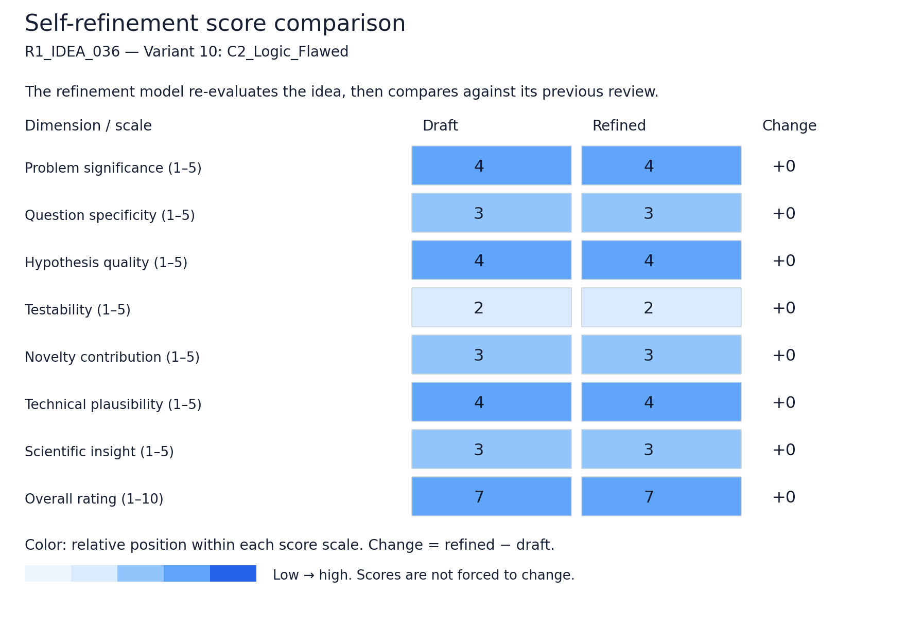

Changed score dimensions: none.

### Score justifications (draft / refined)

**Problem significance**

```json
{
  "draft": {
    "score": 4.0,
    "justification": "The idea addresses a common misconception in the field of dimensionality reduction, which could influence the choice of methods in practical applications. Understanding the structural differences between parametric and non-parametric approaches is important for improving representation learning techniques."
  },
  "refined": {
    "score": 4.0,
    "justification": "The idea addresses a common misconception in the field of dimensionality reduction, which could influence the choice of methods in practical applications. Understanding the structural differences between parametric and non-parametric approaches is important for improving representation learning techniques."
  }
}
```

**Question specificity**

```json
{
  "draft": {
    "score": 3.0,
    "justification": "The idea presents a general hypothesis but lacks a specific research question that can be tested. A more precise question would help guide the experimental design and evaluation."
  },
  "refined": {
    "score": 3.0,
    "justification": "The idea presents a general hypothesis but lacks a specific research question that can be tested. A more precise question would help guide the experimental design and evaluation."
  }
}
```

**Hypothesis quality**

```json
{
  "draft": {
    "score": 4.0,
    "justification": "The hypothesis that parametric methods preserve global structure but lose local details is plausible and could be tested. It distinguishes the research from a generic application by focusing on structural differences."
  },
  "refined": {
    "score": 4.0,
    "justification": "The hypothesis that parametric methods preserve global structure but lose local details is plausible and could be tested. It distinguishes the research from a generic application by focusing on structural differences."
  }
}
```

**Testability**

```json
{
  "draft": {
    "score": 2.0,
    "justification": "The idea lacks a clear experimental design or evaluation plan. Without specific metrics or datasets, it is difficult to assess the testability of the hypothesis."
  },
  "refined": {
    "score": 2.0,
    "justification": "The idea lacks a clear experimental design or evaluation plan. Without specific metrics or datasets, it is difficult to assess the testability of the hypothesis."
  }
}
```

**Novelty contribution**

```json
{
  "draft": {
    "score": 3.0,
    "justification": "The idea challenges a common misconception and suggests a potential explanation for the effectiveness of parametric methods. However, it does not propose a novel method or significant contribution beyond the hypothesis."
  },
  "refined": {
    "score": 3.0,
    "justification": "The idea challenges a common misconception and suggests a potential explanation for the effectiveness of parametric methods. However, it does not propose a novel method or significant contribution beyond the hypothesis."
  }
}
```

**Technical plausibility**

```json
{
  "draft": {
    "score": 4.0,
    "justification": "The reasoning is logically coherent and aligns with existing knowledge about dimensionality reduction methods. The proposed explanation for the effectiveness of parametric methods is plausible."
  },
  "refined": {
    "score": 4.0,
    "justification": "The reasoning is logically coherent and aligns with existing knowledge about dimensionality reduction methods. The proposed explanation for the effectiveness of parametric methods is plausible."
  }
}
```

**Scientific insight**

```json
{
  "draft": {
    "score": 3.0,
    "justification": "The idea could provide insights into the structural differences between parametric and non-parametric methods, but the potential for deeper scientific insight is limited without further experimental validation."
  },
  "refined": {
    "score": 3.0,
    "justification": "The idea could provide insights into the structural differences between parametric and non-parametric methods, but the potential for deeper scientific insight is limited without further experimental validation."
  }
}
```

**Overall rating**

```json
{
  "draft": {
    "score": 7.0,
    "justification": "The idea addresses a meaningful problem and proposes a plausible hypothesis. However, it lacks specific experimental details and a clear research question, which are necessary for testability and scientific contribution."
  },
  "refined": {
    "score": 7.0,
    "justification": "The idea addresses a meaningful problem and proposes a plausible hypothesis. However, it lacks specific experimental details and a clear research question, which are necessary for testability and scientific contribution."
  }
}
```

## R1_IDEA_036 — Variant 11: C3_Substance_Enriched


Changed score dimensions: none.

### Score justifications (draft / refined)

**Problem significance**

```json
{
  "draft": {
    "score": 4.0,
    "justification": "The idea addresses a significant issue in dimensionality reduction by challenging the misconception of performance equivalence between parametric and non-parametric methods, which has implications for model generalization and data analysis."
  },
  "refined": {
    "score": 4.0,
    "justification": "The idea addresses a significant issue in dimensionality reduction by challenging the misconception of performance equivalence between parametric and non-parametric methods, which has implications for model generalization and data analysis."
  }
}
```

**Question specificity**

```json
{
  "draft": {
    "score": 3.0,
    "justification": "The research question is specific to the trade-off between global structure and local details in parametric methods, but lacks concrete details on the methods, metrics, and data distributions to be used."
  },
  "refined": {
    "score": 3.0,
    "justification": "The research question is specific to the trade-off between global structure and local details in parametric methods, but lacks concrete details on the methods, metrics, and data distributions to be used."
  }
}
```

**Hypothesis quality**

```json
{
  "draft": {
    "score": 3.0,
    "justification": "The idea presents a plausible hypothesis about the trade-off between global structure and local details, but it is not explicitly stated as a hypothesis and lacks a clear prediction or mechanism."
  },
  "refined": {
    "score": 3.0,
    "justification": "The idea presents a plausible hypothesis about the trade-off between global structure and local details, but it is not explicitly stated as a hypothesis and lacks a clear prediction or mechanism."
  }
}
```

**Testability**

```json
{
  "draft": {
    "score": 4.0,
    "justification": "The proposed approach is testable through the evaluation of neighborhood preservation metrics on held-out data distributions, which provides a concrete method for validating the hypothesis."
  },
  "refined": {
    "score": 4.0,
    "justification": "The proposed approach is testable through the evaluation of neighborhood preservation metrics on held-out data distributions, which provides a concrete method for validating the hypothesis."
  }
}
```

**Novelty contribution**

```json
{
  "draft": {
    "score": 4.0,
    "justification": "The idea contributes to the understanding of parametric dimensionality reduction methods by challenging the misconception of performance equivalence and providing insights into their limitations."
  },
  "refined": {
    "score": 4.0,
    "justification": "The idea contributes to the understanding of parametric dimensionality reduction methods by challenging the misconception of performance equivalence and providing insights into their limitations."
  }
}
```

**Technical plausibility**

```json
{
  "draft": {
    "score": 4.0,
    "justification": "The proposed approach is technically plausible as it involves evaluating neighborhood preservation metrics, which is a common practice in dimensionality reduction research."
  },
  "refined": {
    "score": 4.0,
    "justification": "The proposed approach is technically plausible as it involves evaluating neighborhood preservation metrics, which is a common practice in dimensionality reduction research."
  }
}
```

**Scientific insight**

```json
{
  "draft": {
    "score": 4.0,
    "justification": "The research could provide valuable scientific insight into the trade-offs inherent in parametric dimensionality reduction methods, which could inform the development of more effective techniques."
  },
  "refined": {
    "score": 4.0,
    "justification": "The research could provide valuable scientific insight into the trade-offs inherent in parametric dimensionality reduction methods, which could inform the development of more effective techniques."
  }
}
```

**Overall rating**

```json
{
  "draft": {
    "score": 7.0,
    "justification": "The idea is strong and addresses a meaningful problem with a testable hypothesis. However, it lacks specific details that would make it more concrete and actionable, which could be improved with further clarification."
  },
  "refined": {
    "score": 7.0,
    "justification": "The idea is strong and addresses a meaningful problem with a testable hypothesis. However, it lacks specific details that would make it more concrete and actionable, which could be improved with further clarification."
  }
}
```

## R1_IDEA_036 — Variant 12: H1_Deceptive_Hollow


Changed score dimensions: none.

### Score justifications (draft / refined)

**Problem significance**

```json
{
  "draft": {
    "score": 3.0,
    "justification": "The problem is relevant to dimensionality reduction, a key area in machine learning, but the significance is somewhat abstract without more context."
  },
  "refined": {
    "score": 3.0,
    "justification": "The problem is relevant to dimensionality reduction, a key area in machine learning, but the significance is somewhat abstract without more context."
  }
}
```

**Question specificity**

```json
{
  "draft": {
    "score": 2.0,
    "justification": "The idea is too vague, lacking a clear, specific research question or hypothesis."
  },
  "refined": {
    "score": 2.0,
    "justification": "The idea is too vague, lacking a clear, specific research question or hypothesis."
  }
}
```

**Hypothesis quality**

```json
{
  "draft": {
    "score": 2.0,
    "justification": "No explicit hypothesis is provided, and the central claim is too abstract to be tested."
  },
  "refined": {
    "score": 2.0,
    "justification": "No explicit hypothesis is provided, and the central claim is too abstract to be tested."
  }
}
```

**Testability**

```json
{
  "draft": {
    "score": 2.0,
    "justification": "The idea lacks specific experiments or methods to test the proposed framework or hypothesis."
  },
  "refined": {
    "score": 2.0,
    "justification": "The idea lacks specific experiments or methods to test the proposed framework or hypothesis."
  }
}
```

**Novelty contribution**

```json
{
  "draft": {
    "score": 3.0,
    "justification": "The idea suggests a transformative synthesis, which is novel, but the contribution is not clearly defined."
  },
  "refined": {
    "score": 3.0,
    "justification": "The idea suggests a transformative synthesis, which is novel, but the contribution is not clearly defined."
  }
}
```

**Technical plausibility**

```json
{
  "draft": {
    "score": 3.0,
    "justification": "The framework is plausible in concept, but the lack of specifics makes it hard to assess technical feasibility."
  },
  "refined": {
    "score": 3.0,
    "justification": "The framework is plausible in concept, but the lack of specifics makes it hard to assess technical feasibility."
  }
}
```

**Scientific insight**

```json
{
  "draft": {
    "score": 2.0,
    "justification": "The idea hints at potential insights but does not provide a clear path to discovering them."
  },
  "refined": {
    "score": 2.0,
    "justification": "The idea hints at potential insights but does not provide a clear path to discovering them."
  }
}
```

**Overall rating**

```json
{
  "draft": {
    "score": 5.0,
    "justification": "The idea has potential but is too vague and lacks specifics to be actionable. It addresses a relevant problem but needs more concrete details to be evaluated."
  },
  "refined": {
    "score": 5.0,
    "justification": "The idea has potential but is too vague and lacks specifics to be actionable. It addresses a relevant problem but needs more concrete details to be evaluated."
  }
}
```

## R1_IDEA_036 — Variant 13: H2_Confident_Flaw

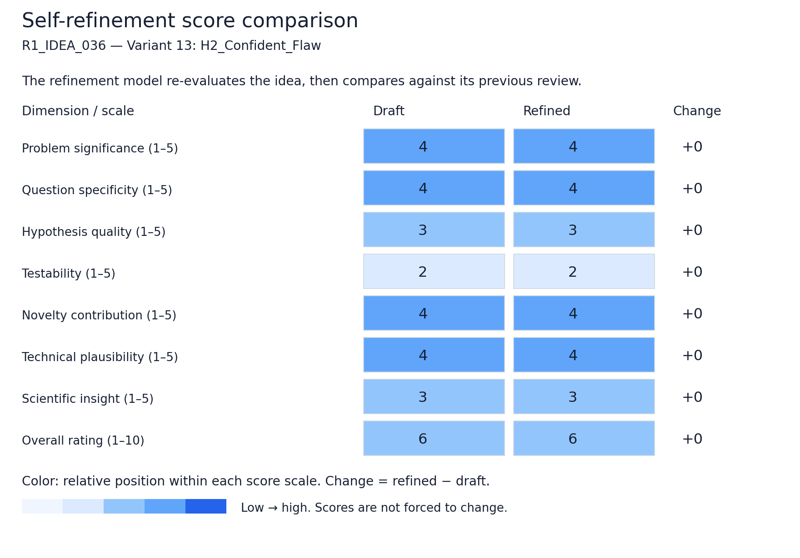

Changed score dimensions: none.

### Score justifications (draft / refined)

**Problem significance**

```json
{
  "draft": {
    "score": 4.0,
    "justification": "The idea addresses a critical issue in dimensionality reduction methods, which is a foundational problem in machine learning. Understanding the non-equivalence between parametric and non-parametric approaches could have broad implications for model design and application."
  },
  "refined": {
    "score": 4.0,
    "justification": "The idea addresses a critical issue in dimensionality reduction methods, which is a foundational problem in machine learning. Understanding the non-equivalence between parametric and non-parametric approaches could have broad implications for model design and application."
  }
}
```

**Question specificity**

```json
{
  "draft": {
    "score": 4.0,
    "justification": "The research question is specific, focusing on the non-equivalence between parametric and non-parametric methods and the mechanism behind their performance differences. However, it could be more precise by specifying the exact aspects of local detail loss and how they affect performance."
  },
  "refined": {
    "score": 4.0,
    "justification": "The research question is specific, focusing on the non-equivalence between parametric and non-parametric methods and the mechanism behind their performance differences. However, it could be more precise by specifying the exact aspects of local detail loss and how they affect performance."
  }
}
```

**Hypothesis quality**

```json
{
  "draft": {
    "score": 3.0,
    "justification": "The idea presents a hypothesis that parametric methods lose local details, leading to their effectiveness. However, the hypothesis is not explicitly stated and lacks concrete predictions or testable claims."
  },
  "refined": {
    "score": 3.0,
    "justification": "The idea presents a hypothesis that parametric methods lose local details, leading to their effectiveness. However, the hypothesis is not explicitly stated and lacks concrete predictions or testable claims."
  }
}
```

**Testability**

```json
{
  "draft": {
    "score": 2.0,
    "justification": "The idea lacks specific experiments or tests to validate the claim. The argument is based on a general assertion without concrete methods to measure or compare the local detail loss and its impact on performance."
  },
  "refined": {
    "score": 2.0,
    "justification": "The idea lacks specific experiments or tests to validate the claim. The argument is based on a general assertion without concrete methods to measure or compare the local detail loss and its impact on performance."
  }
}
```

**Novelty contribution**

```json
{
  "draft": {
    "score": 4.0,
    "justification": "The idea offers a novel perspective on the non-equivalence between parametric and non-parametric methods, which could contribute to the understanding of dimensionality reduction techniques and their applications in representation learning."
  },
  "refined": {
    "score": 4.0,
    "justification": "The idea offers a novel perspective on the non-equivalence between parametric and non-parametric methods, which could contribute to the understanding of dimensionality reduction techniques and their applications in representation learning."
  }
}
```

**Technical plausibility**

```json
{
  "draft": {
    "score": 4.0,
    "justification": "The argument is technically plausible, as it is reasonable to expect that parametric methods might lose some local details compared to non-parametric ones. However, the lack of specific technical details makes it less concrete."
  },
  "refined": {
    "score": 4.0,
    "justification": "The argument is technically plausible, as it is reasonable to expect that parametric methods might lose some local details compared to non-parametric ones. However, the lack of specific technical details makes it less concrete."
  }
}
```

**Scientific insight**

```json
{
  "draft": {
    "score": 3.0,
    "justification": "The idea has potential for scientific insight by highlighting the mechanism behind the performance differences between parametric and non-parametric methods. However, the insight is not yet substantiated by evidence or experiments."
  },
  "refined": {
    "score": 3.0,
    "justification": "The idea has potential for scientific insight by highlighting the mechanism behind the performance differences between parametric and non-parametric methods. However, the insight is not yet substantiated by evidence or experiments."
  }
}
```

**Overall rating**

```json
{
  "draft": {
    "score": 6.0,
    "justification": "The idea is promising and addresses a meaningful problem in dimensionality reduction. It proposes a specific mechanism and potential contribution, but lacks concrete experiments and testable hypotheses to validate the claims."
  },
  "refined": {
    "score": 6.0,
    "justification": "The idea is promising and addresses a meaningful problem in dimensionality reduction. It proposes a specific mechanism and potential contribution, but lacks concrete experiments and testable hypotheses to validate the claims."
  }
}
```

## R1_IDEA_036 — Variant 14: H3_Verbose_Enriched

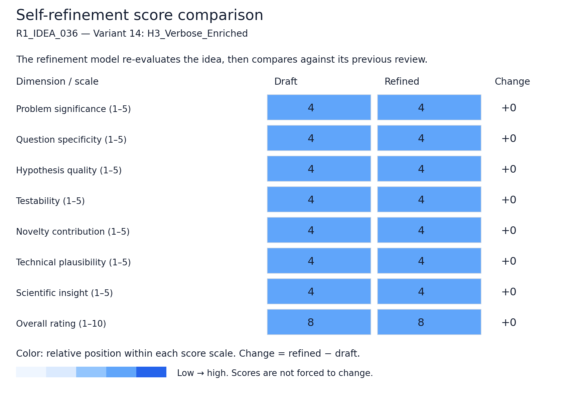

Changed score dimensions: none.

### Score justifications (draft / refined)

**Problem significance**

```json
{
  "draft": {
    "score": 4.0,
    "justification": "The idea addresses a critical issue in dimensionality reduction: the trade-off between global and local structure preservation, which has implications for the reliability and effectiveness of these methods in real-world applications."
  },
  "refined": {
    "score": 4.0,
    "justification": "The idea addresses a critical issue in dimensionality reduction: the trade-off between global and local structure preservation, which has implications for the reliability and effectiveness of these methods in real-world applications."
  }
}
```

**Question specificity**

```json
{
  "draft": {
    "score": 4.0,
    "justification": "The research question is specific, focusing on the non-equivalence of parametric and non-parametric methods and proposing a structured experimental design to test this hypothesis."
  },
  "refined": {
    "score": 4.0,
    "justification": "The research question is specific, focusing on the non-equivalence of parametric and non-parametric methods and proposing a structured experimental design to test this hypothesis."
  }
}
```

**Hypothesis quality**

```json
{
  "draft": {
    "score": 4.0,
    "justification": "The hypothesis that parametric methods retain global structure but lose local details is concrete and testable through the proposed evaluation metrics and experimental design."
  },
  "refined": {
    "score": 4.0,
    "justification": "The hypothesis that parametric methods retain global structure but lose local details is concrete and testable through the proposed evaluation metrics and experimental design."
  }
}
```

**Testability**

```json
{
  "draft": {
    "score": 4.0,
    "justification": "The idea proposes a staged experimental design with specific evaluation criteria, ablation studies, and error analysis, making it testable through well-defined experiments."
  },
  "refined": {
    "score": 4.0,
    "justification": "The idea proposes a staged experimental design with specific evaluation criteria, ablation studies, and error analysis, making it testable through well-defined experiments."
  }
}
```

**Novelty contribution**

```json
{
  "draft": {
    "score": 4.0,
    "justification": "The research could contribute new insights into the limitations and effectiveness of parametric dimensionality reduction methods, particularly in understanding the trade-offs between global and local structure preservation."
  },
  "refined": {
    "score": 4.0,
    "justification": "The research could contribute new insights into the limitations and effectiveness of parametric dimensionality reduction methods, particularly in understanding the trade-offs between global and local structure preservation."
  }
}
```

**Technical plausibility**

```json
{
  "draft": {
    "score": 4.0,
    "justification": "The proposed approach is technically plausible, as it builds on existing methods and suggests practical experiments to validate the hypothesis."
  },
  "refined": {
    "score": 4.0,
    "justification": "The proposed approach is technically plausible, as it builds on existing methods and suggests practical experiments to validate the hypothesis."
  }
}
```

**Scientific insight**

```json
{
  "draft": {
    "score": 4.0,
    "justification": "The study could provide valuable insights into the conditions under which parametric methods are effective or limited, contributing to a deeper understanding of dimensionality reduction techniques."
  },
  "refined": {
    "score": 4.0,
    "justification": "The study could provide valuable insights into the conditions under which parametric methods are effective or limited, contributing to a deeper understanding of dimensionality reduction techniques."
  }
}
```

**Overall rating**

```json
{
  "draft": {
    "score": 8.0,
    "justification": "The idea is strong and well-structured, with a clear problem statement, specific hypothesis, and proposed experimental design. However, it would benefit from more concrete details to enhance its testability and specificity."
  },
  "refined": {
    "score": 8.0,
    "justification": "The idea is strong and well-structured, with a clear problem statement, specific hypothesis, and proposed experimental design. However, it would benefit from more concrete details to enhance its testability and specificity."
  }
}
```

## R1_IDEA_036 — Variant 15: H4_Ultimate_Hype


Changed score dimensions: none.

### Score justifications (draft / refined)

**Problem significance**

```json
{
  "draft": {
    "score": 4.0,
    "justification": "The idea addresses a critical issue in dimensionality reduction, which is a fundamental problem in machine learning. Understanding the differences between parametric and non-parametric methods could have significant implications for model design and application."
  },
  "refined": {
    "score": 4.0,
    "justification": "The idea addresses a critical issue in dimensionality reduction, which is a fundamental problem in machine learning. Understanding the differences between parametric and non-parametric methods could have significant implications for model design and application."
  }
}
```

**Question specificity**

```json
{
  "draft": {
    "score": 3.0,
    "justification": "The idea presents a broad research direction but lacks a specific, testable question. It needs to define exactly what aspect of the non-equivalence is being investigated and how it should be measured."
  },
  "refined": {
    "score": 3.0,
    "justification": "The idea presents a broad research direction but lacks a specific, testable question. It needs to define exactly what aspect of the non-equivalence is being investigated and how it should be measured."
  }
}
```

**Hypothesis quality**

```json
{
  "draft": {
    "score": 3.0,
    "justification": "The idea suggests a hypothesis that parametric methods lose local details, but it does not clearly state what the hypothesis is or how it can be tested. More concrete predictions are needed."
  },
  "refined": {
    "score": 3.0,
    "justification": "The idea suggests a hypothesis that parametric methods lose local details, but it does not clearly state what the hypothesis is or how it can be tested. More concrete predictions are needed."
  }
}
```

**Testability**

```json
{
  "draft": {
    "score": 2.0,
    "justification": "The idea does not provide a clear experimental plan or method to test the hypothesis. Without specific experiments or comparisons, the claim remains untestable."
  },
  "refined": {
    "score": 2.0,
    "justification": "The idea does not provide a clear experimental plan or method to test the hypothesis. Without specific experiments or comparisons, the claim remains untestable."
  }
}
```

**Novelty contribution**

```json
{
  "draft": {
    "score": 4.0,
    "justification": "The idea proposes a novel research agenda that challenges a common misconception, which could lead to significant contributions in understanding and improving dimensionality reduction techniques."
  },
  "refined": {
    "score": 4.0,
    "justification": "The idea proposes a novel research agenda that challenges a common misconception, which could lead to significant contributions in understanding and improving dimensionality reduction techniques."
  }
}
```

**Technical plausibility**

```json
{
  "draft": {
    "score": 4.0,
    "justification": "The claim that parametric methods lose local details is plausible given the nature of these methods, but the lack of specific evidence or reasoning weakens the technical plausibility."
  },
  "refined": {
    "score": 4.0,
    "justification": "The claim that parametric methods lose local details is plausible given the nature of these methods, but the lack of specific evidence or reasoning weakens the technical plausibility."
  }
}
```

**Scientific insight**

```json
{
  "draft": {
    "score": 3.0,
    "justification": "The idea has potential for scientific insight by challenging the equivalence of the two methods, but the lack of specific hypotheses and experiments limits the potential for meaningful insights."
  },
  "refined": {
    "score": 3.0,
    "justification": "The idea has potential for scientific insight by challenging the equivalence of the two methods, but the lack of specific hypotheses and experiments limits the potential for meaningful insights."
  }
}
```

**Overall rating**

```json
{
  "draft": {
    "score": 7.0,
    "justification": "The idea presents a promising research direction with significant potential, but it lacks specific hypotheses, experimental plans, and concrete evidence to support its claims. With further development, it could become a strong research idea."
  },
  "refined": {
    "score": 7.0,
    "justification": "The idea presents a promising research direction with significant potential, but it lacks specific hypotheses, experimental plans, and concrete evidence to support its claims. With further development, it could become a strong research idea."
  }
}
```

## R1_IDEA_037 — Source


Changed score dimensions: none.

### Score justifications (draft / refined)

**Problem significance**

```json
{
  "draft": {
    "score": 4.0,
    "justification": "The problem of ambiguous counterfactual explanations in latent space is significant for explainable AI, as it affects the interpretability and trustworthiness of machine learning models."
  },
  "refined": {
    "score": 4.0,
    "justification": "The problem of ambiguous counterfactual explanations in latent space is significant for explainable AI, as it affects the interpretability and trustworthiness of machine learning models."
  }
}
```

**Question specificity**

```json
{
  "draft": {
    "score": 3.0,
    "justification": "The idea identifies a specific problem (ambiguity in counterfactual explanations due to distance metrics) but lacks a clear, concrete research question or hypothesis."
  },
  "refined": {
    "score": 3.0,
    "justification": "The idea identifies a specific problem (ambiguity in counterfactual explanations due to distance metrics) but lacks a clear, concrete research question or hypothesis."
  }
}
```

**Hypothesis quality**

```json
{
  "draft": {
    "score": 2.0,
    "justification": "The idea does not explicitly state a hypothesis or prediction that can be tested. The proposed method is described in a way that does not clearly indicate what is being claimed or what evidence would support it."
  },
  "refined": {
    "score": 2.0,
    "justification": "The idea does not explicitly state a hypothesis or prediction that can be tested. The proposed method is described in a way that does not clearly indicate what is being claimed or what evidence would support it."
  }
}
```

**Testability**

```json
{
  "draft": {
    "score": 2.0,
    "justification": "The idea is too vague and incomplete to determine how it would be tested. The missing details make it difficult to assess the feasibility of experiments or evaluations."
  },
  "refined": {
    "score": 2.0,
    "justification": "The idea is too vague and incomplete to determine how it would be tested. The missing details make it difficult to assess the feasibility of experiments or evaluations."
  }
}
```

**Novelty contribution**

```json
{
  "draft": {
    "score": 4.0,
    "justification": "The introduction of Perceptual Counterfactual Geodesics is a novel approach that could contribute to the field by addressing the ambiguity in counterfactual explanations through a geometric perspective."
  },
  "refined": {
    "score": 4.0,
    "justification": "The introduction of Perceptual Counterfactual Geodesics is a novel approach that could contribute to the field by addressing the ambiguity in counterfactual explanations through a geometric perspective."
  }
}
```

**Technical plausibility**

```json
{
  "draft": {
    "score": 3.0,
    "justification": "The concept of using geodesics under a perceptual metric is plausible, but the lack of specific details makes it difficult to assess the technical feasibility and implementation."
  },
  "refined": {
    "score": 3.0,
    "justification": "The concept of using geodesics under a perceptual metric is plausible, but the lack of specific details makes it difficult to assess the technical feasibility and implementation."
  }
}
```

**Scientific insight**

```json
{
  "draft": {
    "score": 3.0,
    "justification": "The idea has potential to provide insights into the geometric properties of latent spaces and the relationship between perceptual metrics and counterfactual explanations, but the lack of specifics limits the potential for meaningful scientific insight."
  },
  "refined": {
    "score": 3.0,
    "justification": "The idea has potential to provide insights into the geometric properties of latent spaces and the relationship between perceptual metrics and counterfactual explanations, but the lack of specifics limits the potential for meaningful scientific insight."
  }
}
```

**Overall rating**

```json
{
  "draft": {
    "score": 6.0,
    "justification": "The idea addresses a meaningful problem in counterfactual explanations but is incomplete and lacks a clear hypothesis and testable question. It has potential for novelty and contribution but requires further clarification and specifics to be evaluated properly."
  },
  "refined": {
    "score": 6.0,
    "justification": "The idea addresses a meaningful problem in counterfactual explanations but is incomplete and lacks a clear hypothesis and testable question. It has potential for novelty and contribution but requires further clarification and specifics to be evaluated properly."
  }
}
```

## R1_IDEA_037 — Variant 1: A1_Identity

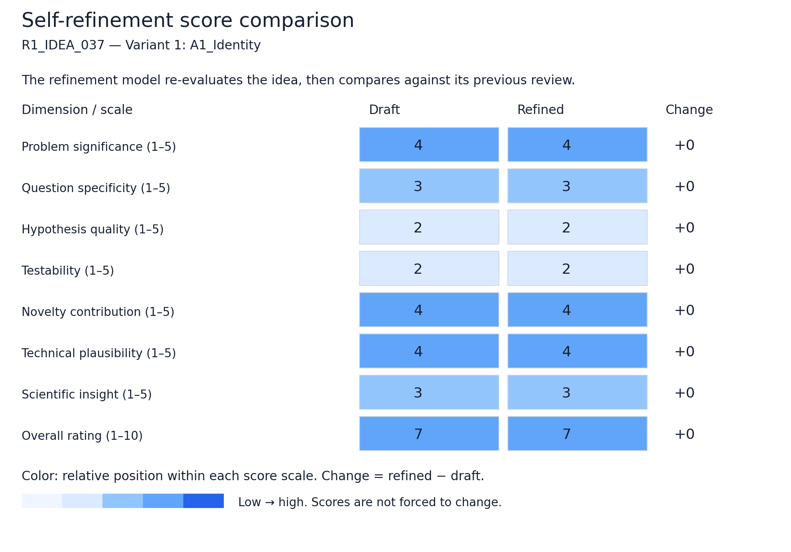

Changed score dimensions: none.

### Score justifications (draft / refined)

**Problem significance**

```json
{
  "draft": {
    "score": 4.0,
    "justification": "The problem of ambiguous counterfactual explanations in latent space is significant for explainable AI, as it affects the interpretability and trustworthiness of machine learning models."
  },
  "refined": {
    "score": 4.0,
    "justification": "The problem of ambiguous counterfactual explanations in latent space is significant for explainable AI, as it affects the interpretability and trustworthiness of machine learning models."
  }
}
```

**Question specificity**

```json
{
  "draft": {
    "score": 3.0,
    "justification": "The idea identifies a specific problem with existing methods but lacks a clear, concrete research question or hypothesis that could be tested."
  },
  "refined": {
    "score": 3.0,
    "justification": "The idea identifies a specific problem with existing methods but lacks a clear, concrete research question or hypothesis that could be tested."
  }
}
```

**Hypothesis quality**

```json
{
  "draft": {
    "score": 2.0,
    "justification": "The idea introduces a novel method but does not explicitly state a hypothesis that can be tested or falsified, making it difficult to assess its scientific merit."
  },
  "refined": {
    "score": 2.0,
    "justification": "The idea introduces a novel method but does not explicitly state a hypothesis that can be tested or falsified, making it difficult to assess its scientific merit."
  }
}
```

**Testability**

```json
{
  "draft": {
    "score": 2.0,
    "justification": "The method is not fully described, and there is no clear plan for testing or evaluating the proposed approach, which is essential for determining its effectiveness."
  },
  "refined": {
    "score": 2.0,
    "justification": "The method is not fully described, and there is no clear plan for testing or evaluating the proposed approach, which is essential for determining its effectiveness."
  }
}
```

**Novelty contribution**

```json
{
  "draft": {
    "score": 4.0,
    "justification": "The introduction of Perceptual Counterfactual Geodesics (PCG) represents a novel approach to generating counterfactual explanations, potentially offering a more aligned and meaningful method compared to existing techniques."
  },
  "refined": {
    "score": 4.0,
    "justification": "The introduction of Perceptual Counterfactual Geodesics (PCG) represents a novel approach to generating counterfactual explanations, potentially offering a more aligned and meaningful method compared to existing techniques."
  }
}
```

**Technical plausibility**

```json
{
  "draft": {
    "score": 4.0,
    "justification": "The idea of using geodesics under a perceptual metric in latent space is technically plausible, as it builds on existing concepts in geometry and machine learning."
  },
  "refined": {
    "score": 4.0,
    "justification": "The idea of using geodesics under a perceptual metric in latent space is technically plausible, as it builds on existing concepts in geometry and machine learning."
  }
}
```

**Scientific insight**

```json
{
  "draft": {
    "score": 3.0,
    "justification": "The idea has the potential to contribute to the understanding of counterfactual explanations in latent space, but the lack of a clear hypothesis and evaluation plan limits the potential for significant scientific insight."
  },
  "refined": {
    "score": 3.0,
    "justification": "The idea has the potential to contribute to the understanding of counterfactual explanations in latent space, but the lack of a clear hypothesis and evaluation plan limits the potential for significant scientific insight."
  }
}
```

**Overall rating**

```json
{
  "draft": {
    "score": 7.0,
    "justification": "The idea addresses a meaningful problem in explainable AI and proposes a novel method (PCG) that could potentially improve counterfactual explanations. However, the idea is incomplete and lacks a clear hypothesis and evaluation plan, which are essential for determining its scientific merit and effectiveness."
  },
  "refined": {
    "score": 7.0,
    "justification": "The idea addresses a meaningful problem in explainable AI and proposes a novel method (PCG) that could potentially improve counterfactual explanations. However, the idea is incomplete and lacks a clear hypothesis and evaluation plan, which are essential for determining its scientific merit and effectiveness."
  }
}
```

## R1_IDEA_037 — Variant 2: A2_Paraphrase_Only


Changed score dimensions: none.

### Score justifications (draft / refined)

**Problem significance**

```json
{
  "draft": {
    "score": 4.0,
    "justification": "The problem of ambiguous distance metrics in counterfactual explanations is significant in the context of explainable AI, as it affects the interpretability and reliability of model predictions."
  },
  "refined": {
    "score": 4.0,
    "justification": "The problem of ambiguous distance metrics in counterfactual explanations is significant in the context of explainable AI, as it affects the interpretability and reliability of model predictions."
  }
}
```

**Question specificity**

```json
{
  "draft": {
    "score": 3.0,
    "justification": "The idea identifies a specific issue (distance metric ambiguity) but lacks a clear, concrete research question or hypothesis that could be tested."
  },
  "refined": {
    "score": 3.0,
    "justification": "The idea identifies a specific issue (distance metric ambiguity) but lacks a clear, concrete research question or hypothesis that could be tested."
  }
}
```

**Hypothesis quality**

```json
{
  "draft": {
    "score": 2.0,
    "justification": "The idea does not explicitly state a hypothesis or prediction that could be tested. The proposed method (PCG) is described in a way that does not clearly indicate what the expected outcome or mechanism is."
  },
  "refined": {
    "score": 2.0,
    "justification": "The idea does not explicitly state a hypothesis or prediction that could be tested. The proposed method (PCG) is described in a way that does not clearly indicate what the expected outcome or mechanism is."
  }
}
```

**Testability**

```json
{
  "draft": {
    "score": 2.0,
    "justification": "The idea is too vague and incomplete to determine how it can be tested. The missing details make it unclear how to design experiments or evaluate the method's effectiveness."
  },
  "refined": {
    "score": 2.0,
    "justification": "The idea is too vague and incomplete to determine how it can be tested. The missing details make it unclear how to design experiments or evaluate the method's effectiveness."
  }
}
```

**Novelty contribution**

```json
{
  "draft": {
    "score": 4.0,
    "justification": "The proposal of using geodesic paths in a perceptual space for counterfactual generation is a novel approach that could contribute to the field of explainable AI, especially if it addresses the issue of semantic meaningfulness in counterfactuals."
  },
  "refined": {
    "score": 4.0,
    "justification": "The proposal of using geodesic paths in a perceptual space for counterfactual generation is a novel approach that could contribute to the field of explainable AI, especially if it addresses the issue of semantic meaningfulness in counterfactuals."
  }
}
```

**Technical plausibility**

```json
{
  "draft": {
    "score": 3.0,
    "justification": "The concept of using geodesics in a perceptual space is technically plausible, but the lack of specific details makes it difficult to assess the feasibility of the approach without further information."
  },
  "refined": {
    "score": 3.0,
    "justification": "The concept of using geodesics in a perceptual space is technically plausible, but the lack of specific details makes it difficult to assess the feasibility of the approach without further information."
  }
}
```

**Scientific insight**

```json
{
  "draft": {
    "score": 3.0,
    "justification": "The idea has the potential to provide insights into how counterfactuals can be generated in a more semantically aligned manner, but the current description does not clearly indicate what specific insights could be gained."
  },
  "refined": {
    "score": 3.0,
    "justification": "The idea has the potential to provide insights into how counterfactuals can be generated in a more semantically aligned manner, but the current description does not clearly indicate what specific insights could be gained."
  }
}
```

**Overall rating**

```json
{
  "draft": {
    "score": 6.0,
    "justification": "The idea addresses a meaningful problem in counterfactual explanations but is incomplete and lacks a clear hypothesis or research question. With additional details, it has the potential to be a strong research direction in explainable AI."
  },
  "refined": {
    "score": 6.0,
    "justification": "The idea addresses a meaningful problem in counterfactual explanations but is incomplete and lacks a clear hypothesis or research question. With additional details, it has the potential to be a strong research direction in explainable AI."
  }
}
```

## R1_IDEA_037 — Variant 3: A3_Plain_Core


Changed score dimensions: none.

### Score justifications (draft / refined)

**Problem significance**

```json
{
  "draft": {
    "score": 4.0,
    "justification": "The problem of ambiguous counterfactual explanations in latent spaces is significant for fairness, interpretability, and robustness in machine learning models."
  },
  "refined": {
    "score": 4.0,
    "justification": "The problem of ambiguous counterfactual explanations in latent spaces is significant for fairness, interpretability, and robustness in machine learning models."
  }
}
```

**Question specificity**

```json
{
  "draft": {
    "score": 3.0,
    "justification": "The idea identifies a specific issue (geometric misalignment) but lacks detailed specification of the research question or hypothesis."
  },
  "refined": {
    "score": 3.0,
    "justification": "The idea identifies a specific issue (geometric misalignment) but lacks detailed specification of the research question or hypothesis."
  }
}
```

**Hypothesis quality**

```json
{
  "draft": {
    "score": 2.0,
    "justification": "The idea suggests a potential solution but does not explicitly state a hypothesis that can be tested or falsified."
  },
  "refined": {
    "score": 2.0,
    "justification": "The idea suggests a potential solution but does not explicitly state a hypothesis that can be tested or falsified."
  }
}
```

**Testability**

```json
{
  "draft": {
    "score": 2.0,
    "justification": "The method is not fully defined, making it difficult to assess how it can be tested or evaluated against existing methods."
  },
  "refined": {
    "score": 2.0,
    "justification": "The method is not fully defined, making it difficult to assess how it can be tested or evaluated against existing methods."
  }
}
```

**Novelty contribution**

```json
{
  "draft": {
    "score": 4.0,
    "justification": "The use of geodesics in perceptual space for counterfactuals is a novel approach, potentially offering a more aligned and meaningful method compared to existing techniques."
  },
  "refined": {
    "score": 4.0,
    "justification": "The use of geodesics in perceptual space for counterfactuals is a novel approach, potentially offering a more aligned and meaningful method compared to existing techniques."
  }
}
```

**Technical plausibility**

```json
{
  "draft": {
    "score": 3.0,
    "justification": "The concept of using geodesics in a perceptual space is plausible, but the lack of details makes it hard to assess the technical feasibility."
  },
  "refined": {
    "score": 3.0,
    "justification": "The concept of using geodesics in a perceptual space is plausible, but the lack of details makes it hard to assess the technical feasibility."
  }
}
```

**Scientific insight**

```json
{
  "draft": {
    "score": 3.0,
    "justification": "The idea has potential to provide insights into the geometric properties of latent spaces and their impact on counterfactual explanations, but the lack of specifics limits this potential."
  },
  "refined": {
    "score": 3.0,
    "justification": "The idea has potential to provide insights into the geometric properties of latent spaces and their impact on counterfactual explanations, but the lack of specifics limits this potential."
  }
}
```

**Overall rating**

```json
{
  "draft": {
    "score": 7.0,
    "justification": "The idea addresses a meaningful problem with a novel approach, but it is incomplete and lacks specific hypotheses and testable questions, which are necessary for a strong research direction."
  },
  "refined": {
    "score": 7.0,
    "justification": "The idea addresses a meaningful problem with a novel approach, but it is incomplete and lacks specific hypotheses and testable questions, which are necessary for a strong research direction."
  }
}
```

## R1_IDEA_037 — Variant 4: B1_Verbose_Elaborate


Changed score dimensions: none.

### Score justifications (draft / refined)

**Problem significance**

```json
{
  "draft": {
    "score": 4.0,
    "justification": "The issue of ambiguous distance metrics in counterfactual explanations is a critical challenge in interpretability, with practical implications for model trust and fairness. Addressing this could improve the quality and reliability of counterfactual explanations."
  },
  "refined": {
    "score": 4.0,
    "justification": "The issue of ambiguous distance metrics in counterfactual explanations is a critical challenge in interpretability, with practical implications for model trust and fairness. Addressing this could improve the quality and reliability of counterfactual explanations."
  }
}
```

**Question specificity**

```json
{
  "draft": {
    "score": 3.0,
    "justification": "The idea identifies a specific problem (distance metric ambiguity) but lacks sufficient detail on the proposed solution (PCG) to fully define the research question. The method's implementation details are missing, which limits the specificity of the question."
  },
  "refined": {
    "score": 3.0,
    "justification": "The idea identifies a specific problem (distance metric ambiguity) but lacks sufficient detail on the proposed solution (PCG) to fully define the research question. The method's implementation details are missing, which limits the specificity of the question."
  }
}
```

**Hypothesis quality**

```json
{
  "draft": {
    "score": 3.0,
    "justification": "The idea suggests that using geodesics in perceptual space could resolve the ambiguity in distance metrics, but the hypothesis is not explicitly stated. The connection between geodesics and counterfactuals is not clearly defined, making the hypothesis less concrete."
  },
  "refined": {
    "score": 3.0,
    "justification": "The idea suggests that using geodesics in perceptual space could resolve the ambiguity in distance metrics, but the hypothesis is not explicitly stated. The connection between geodesics and counterfactuals is not clearly defined, making the hypothesis less concrete."
  }
}
```

**Testability**

```json
{
  "draft": {
    "score": 2.0,
    "justification": "The idea is too vague to be tested without more details on the method's implementation. The lack of specific experiments or comparisons with existing methods makes it difficult to assess the validity of the proposed approach."
  },
  "refined": {
    "score": 2.0,
    "justification": "The idea is too vague to be tested without more details on the method's implementation. The lack of specific experiments or comparisons with existing methods makes it difficult to assess the validity of the proposed approach."
  }
}
```

**Novelty contribution**

```json
{
  "draft": {
    "score": 4.0,
    "justification": "The proposal of using geodesics in perceptual space for counterfactuals is a novel approach that could contribute to the field of model interpretability. However, the novelty is somewhat limited without a clear distinction from existing methods."
  },
  "refined": {
    "score": 4.0,
    "justification": "The proposal of using geodesics in perceptual space for counterfactuals is a novel approach that could contribute to the field of model interpretability. However, the novelty is somewhat limited without a clear distinction from existing methods."
  }
}
```

**Technical plausibility**

```json
{
  "draft": {
    "score": 3.0,
    "justification": "The idea is technically plausible, as geodesics in perceptual spaces have been explored in related fields. However, the lack of specific details makes it difficult to assess the feasibility of the approach without further elaboration."
  },
  "refined": {
    "score": 3.0,
    "justification": "The idea is technically plausible, as geodesics in perceptual spaces have been explored in related fields. However, the lack of specific details makes it difficult to assess the feasibility of the approach without further elaboration."
  }
}
```

**Scientific insight**

```json
{
  "draft": {
    "score": 3.0,
    "justification": "The idea has the potential to provide insights into how counterfactual explanations can be more meaningful by leveraging perceptual geometry. However, the lack of a clear hypothesis and method details limits the potential for significant scientific insight."
  },
  "refined": {
    "score": 3.0,
    "justification": "The idea has the potential to provide insights into how counterfactual explanations can be more meaningful by leveraging perceptual geometry. However, the lack of a clear hypothesis and method details limits the potential for significant scientific insight."
  }
}
```

**Overall rating**

```json
{
  "draft": {
    "score": 6.0,
    "justification": "The idea addresses a meaningful problem in counterfactual explanations but lacks sufficient detail to fully define the research question and hypothesis. It has potential for novelty and scientific insight but requires more elaboration to be testable and impactful."
  },
  "refined": {
    "score": 6.0,
    "justification": "The idea addresses a meaningful problem in counterfactual explanations but lacks sufficient detail to fully define the research question and hypothesis. It has potential for novelty and scientific insight but requires more elaboration to be testable and impactful."
  }
}
```

## R1_IDEA_037 — Variant 5: B2_Grand_Narrative


Changed score dimensions: none.

### Score justifications (draft / refined)

**Problem significance**

```json
{
  "draft": {
    "score": 4.0,
    "justification": "The problem of ambiguous counterfactual explanations in latent-space optimization is significant for interpretable machine learning, as it affects the reliability and usefulness of model explanations."
  },
  "refined": {
    "score": 4.0,
    "justification": "The problem of ambiguous counterfactual explanations in latent-space optimization is significant for interpretable machine learning, as it affects the reliability and usefulness of model explanations."
  }
}
```

**Question specificity**

```json
{
  "draft": {
    "score": 3.0,
    "justification": "The idea identifies a specific issue with existing methods but lacks detailed specification of the perceptual space and the geodesic tracing mechanism, which are critical for evaluating the method's feasibility."
  },
  "refined": {
    "score": 3.0,
    "justification": "The idea identifies a specific issue with existing methods but lacks detailed specification of the perceptual space and the geodesic tracing mechanism, which are critical for evaluating the method's feasibility."
  }
}
```

**Hypothesis quality**

```json
{
  "draft": {
    "score": 3.0,
    "justification": "The idea suggests a potential solution (PCG) but does not explicitly state a hypothesis or prediction about its performance relative to existing methods, which is necessary for scientific evaluation."
  },
  "refined": {
    "score": 3.0,
    "justification": "The idea suggests a potential solution (PCG) but does not explicitly state a hypothesis or prediction about its performance relative to existing methods, which is necessary for scientific evaluation."
  }
}
```

**Testability**

```json
{
  "draft": {
    "score": 3.0,
    "justification": "The idea proposes a method but does not specify experiments or comparisons that would test its effectiveness, making it difficult to assess its testability without further details."
  },
  "refined": {
    "score": 3.0,
    "justification": "The idea proposes a method but does not specify experiments or comparisons that would test its effectiveness, making it difficult to assess its testability without further details."
  }
}
```

**Novelty contribution**

```json
{
  "draft": {
    "score": 4.0,
    "justification": "The introduction of geodesics in a perceptual space for counterfactual explanations is a novel approach that could contribute to more robust explanation frameworks in interpretable machine learning."
  },
  "refined": {
    "score": 4.0,
    "justification": "The introduction of geodesics in a perceptual space for counterfactual explanations is a novel approach that could contribute to more robust explanation frameworks in interpretable machine learning."
  }
}
```

**Technical plausibility**

```json
{
  "draft": {
    "score": 4.0,
    "justification": "The use of geodesics in a perceptual space is a plausible technical direction, though the specifics of implementation and the choice of perceptual space are not fully detailed."
  },
  "refined": {
    "score": 4.0,
    "justification": "The use of geodesics in a perceptual space is a plausible technical direction, though the specifics of implementation and the choice of perceptual space are not fully detailed."
  }
}
```

**Scientific insight**

```json
{
  "draft": {
    "score": 3.0,
    "justification": "The idea has potential to provide insights into the alignment of counterfactual explanations with semantic structures, but the connection to broader scientific insights is not clearly established."
  },
  "refined": {
    "score": 3.0,
    "justification": "The idea has potential to provide insights into the alignment of counterfactual explanations with semantic structures, but the connection to broader scientific insights is not clearly established."
  }
}
```

**Overall rating**

```json
{
  "draft": {
    "score": 7.0,
    "justification": "The idea addresses a meaningful problem in counterfactual explanations and proposes a novel method (PCG) with potential for contribution to interpretable machine learning. However, it lacks sufficient specificity and hypothesis formulation to fully establish its scientific merit and testability."
  },
  "refined": {
    "score": 7.0,
    "justification": "The idea addresses a meaningful problem in counterfactual explanations and proposes a novel method (PCG) with potential for contribution to interpretable machine learning. However, it lacks sufficient specificity and hypothesis formulation to fully establish its scientific merit and testability."
  }
}
```

## R1_IDEA_037 — Variant 6: B3_Over_Confident


Changed score dimensions: none.

### Score justifications (draft / refined)

**Problem significance**

```json
{
  "draft": {
    "score": 4.0,
    "justification": "The problem of ambiguous counterfactual explanations in latent-space optimization is significant in the field of machine learning, particularly in interpretability and fairness. Addressing this issue can lead to more reliable and meaningful counterfactual explanations."
  },
  "refined": {
    "score": 4.0,
    "justification": "The problem of ambiguous counterfactual explanations in latent-space optimization is significant in the field of machine learning, particularly in interpretability and fairness. Addressing this issue can lead to more reliable and meaningful counterfactual explanations."
  }
}
```

**Question specificity**

```json
{
  "draft": {
    "score": 3.0,
    "justification": "The idea is specific in its focus on geodesics in perceptual space to address the ambiguity in counterfactual explanations, but the description is incomplete and lacks details on the method's implementation."
  },
  "refined": {
    "score": 3.0,
    "justification": "The idea is specific in its focus on geodesics in perceptual space to address the ambiguity in counterfactual explanations, but the description is incomplete and lacks details on the method's implementation."
  }
}
```

**Hypothesis quality**

```json
{
  "draft": {
    "score": 2.0,
    "justification": "The idea lacks an explicit hypothesis or prediction. While the goal is to improve counterfactual explanations, the specific claim about how PCG will achieve this is not clearly stated."
  },
  "refined": {
    "score": 2.0,
    "justification": "The idea lacks an explicit hypothesis or prediction. While the goal is to improve counterfactual explanations, the specific claim about how PCG will achieve this is not clearly stated."
  }
}
```

**Testability**

```json
{
  "draft": {
    "score": 2.0,
    "justification": "The idea is not fully testable without more details on the method's implementation, the perceptual space used, and the evaluation metrics. The incomplete description makes it difficult to assess how the method would be evaluated."
  },
  "refined": {
    "score": 2.0,
    "justification": "The idea is not fully testable without more details on the method's implementation, the perceptual space used, and the evaluation metrics. The incomplete description makes it difficult to assess how the method would be evaluated."
  }
}
```

**Novelty contribution**

```json
{
  "draft": {
    "score": 4.0,
    "justification": "The introduction of Perceptual Counterfactual Geodesics is a novel approach to counterfactual explanations. If successful, it could contribute to the field by providing a more aligned and semantically meaningful method for generating counterfactuals."
  },
  "refined": {
    "score": 4.0,
    "justification": "The introduction of Perceptual Counterfactual Geodesics is a novel approach to counterfactual explanations. If successful, it could contribute to the field by providing a more aligned and semantically meaningful method for generating counterfactuals."
  }
}
```

**Technical plausibility**

```json
{
  "draft": {
    "score": 3.0,
    "justification": "The idea is technically plausible as it builds on existing concepts in latent-space optimization and geodesics. However, the lack of specific details makes it difficult to assess the feasibility of the approach."
  },
  "refined": {
    "score": 3.0,
    "justification": "The idea is technically plausible as it builds on existing concepts in latent-space optimization and geodesics. However, the lack of specific details makes it difficult to assess the feasibility of the approach."
  }
}
```

**Scientific insight**

```json
{
  "draft": {
    "score": 3.0,
    "justification": "The idea has potential for scientific insight by exploring how perceptual space can be used to generate more meaningful counterfactuals. However, the lack of specific details limits the potential for insight."
  },
  "refined": {
    "score": 3.0,
    "justification": "The idea has potential for scientific insight by exploring how perceptual space can be used to generate more meaningful counterfactuals. However, the lack of specific details limits the potential for insight."
  }
}
```

**Overall rating**

```json
{
  "draft": {
    "score": 6.0,
    "justification": "The idea is promising and addresses a meaningful problem in counterfactual explanations. However, it is incomplete and lacks specific details necessary for testability and hypothesis formulation, which are crucial for evaluating its scientific merit."
  },
  "refined": {
    "score": 6.0,
    "justification": "The idea is promising and addresses a meaningful problem in counterfactual explanations. However, it is incomplete and lacks specific details necessary for testability and hypothesis formulation, which are crucial for evaluating its scientific merit."
  }
}
```

## R1_IDEA_037 — Variant 7: B4_Novelty


Changed score dimensions: none.

### Score justifications (draft / refined)

**Problem significance**

```json
{
  "draft": {
    "score": 4.0,
    "justification": "The problem of ambiguous counterfactual explanations in latent space is significant for interpretability and fairness in machine learning. Addressing this could improve the reliability of model explanations."
  },
  "refined": {
    "score": 4.0,
    "justification": "The problem of ambiguous counterfactual explanations in latent space is significant for interpretability and fairness in machine learning. Addressing this could improve the reliability of model explanations."
  }
}
```

**Question specificity**

```json
{
  "draft": {
    "score": 3.0,
    "justification": "The idea identifies a specific issue with existing methods (ambiguity due to distance metrics) but lacks detailed specification of the proposed solution (geodesics under perceptual metrics)."
  },
  "refined": {
    "score": 3.0,
    "justification": "The idea identifies a specific issue with existing methods (ambiguity due to distance metrics) but lacks detailed specification of the proposed solution (geodesics under perceptual metrics)."
  }
}
```

**Hypothesis quality**

```json
{
  "draft": {
    "score": 2.0,
    "justification": "The idea suggests a novel approach but does not explicitly state a testable hypothesis. The potential benefit is mentioned, but without a clear prediction or comparison to existing methods, the hypothesis is not well-defined."
  },
  "refined": {
    "score": 2.0,
    "justification": "The idea suggests a novel approach but does not explicitly state a testable hypothesis. The potential benefit is mentioned, but without a clear prediction or comparison to existing methods, the hypothesis is not well-defined."
  }
}
```

**Testability**

```json
{
  "draft": {
    "score": 2.0,
    "justification": "The idea lacks concrete experiments or comparisons to existing methods. Without specifying how to evaluate the effectiveness of PCG, it is difficult to assess its testability."
  },
  "refined": {
    "score": 2.0,
    "justification": "The idea lacks concrete experiments or comparisons to existing methods. Without specifying how to evaluate the effectiveness of PCG, it is difficult to assess its testability."
  }
}
```

**Novelty contribution**

```json
{
  "draft": {
    "score": 4.0,
    "justification": "The approach of using geodesics under a perceptual metric is novel and could contribute to the field of counterfactual explanations by providing a more semantically aligned method."
  },
  "refined": {
    "score": 4.0,
    "justification": "The approach of using geodesics under a perceptual metric is novel and could contribute to the field of counterfactual explanations by providing a more semantically aligned method."
  }
}
```

**Technical plausibility**

```json
{
  "draft": {
    "score": 3.0,
    "justification": "The concept of using geodesics in latent space is plausible, but the specifics of how the perceptual metric is applied and how geodesics are computed are not clearly defined, which could affect the feasibility of the method."
  },
  "refined": {
    "score": 3.0,
    "justification": "The concept of using geodesics in latent space is plausible, but the specifics of how the perceptual metric is applied and how geodesics are computed are not clearly defined, which could affect the feasibility of the method."
  }
}
```

**Scientific insight**

```json
{
  "draft": {
    "score": 3.0,
    "justification": "The idea has potential to provide insights into the geometric properties of latent spaces and the relationship between perceptual metrics and semantic alignment, but the connection is not clearly articulated."
  },
  "refined": {
    "score": 3.0,
    "justification": "The idea has potential to provide insights into the geometric properties of latent spaces and the relationship between perceptual metrics and semantic alignment, but the connection is not clearly articulated."
  }
}
```

**Overall rating**

```json
{
  "draft": {
    "score": 7.0,
    "justification": "The idea addresses a meaningful problem in counterfactual explanations and proposes a novel approach. However, it lacks specific details and a clear hypothesis, which are necessary for assessing its scientific merit and testability."
  },
  "refined": {
    "score": 7.0,
    "justification": "The idea addresses a meaningful problem in counterfactual explanations and proposes a novel approach. However, it lacks specific details and a clear hypothesis, which are necessary for assessing its scientific merit and testability."
  }
}
```

## R1_IDEA_037 — Variant 8: B5_Application_Impact


Changed score dimensions: none.

### Score justifications (draft / refined)

**Problem significance**

```json
{
  "draft": {
    "score": 4.0,
    "justification": "The problem of ambiguous counterfactual explanations in latent space optimization is significant for improving the interpretability and reliability of machine learning models, especially in practical applications."
  },
  "refined": {
    "score": 4.0,
    "justification": "The problem of ambiguous counterfactual explanations in latent space optimization is significant for improving the interpretability and reliability of machine learning models, especially in practical applications."
  }
}
```

**Question specificity**

```json
{
  "draft": {
    "score": 3.0,
    "justification": "The idea identifies a specific issue with existing methods (ambiguity due to distance metrics) but lacks detailed specification of the perceptual space and the exact mechanism of geodesic tracing."
  },
  "refined": {
    "score": 3.0,
    "justification": "The idea identifies a specific issue with existing methods (ambiguity due to distance metrics) but lacks detailed specification of the perceptual space and the exact mechanism of geodesic tracing."
  }
}
```

**Hypothesis quality**

```json
{
  "draft": {
    "score": 4.0,
    "justification": "The hypothesis that using geodesics in perceptual space can produce more reliable counterfactuals is plausible and could be tested through experiments comparing PCG with existing methods."
  },
  "refined": {
    "score": 4.0,
    "justification": "The hypothesis that using geodesics in perceptual space can produce more reliable counterfactuals is plausible and could be tested through experiments comparing PCG with existing methods."
  }
}
```

**Testability**

```json
{
  "draft": {
    "score": 3.0,
    "justification": "The idea is testable through experiments, but the lack of specific details on the perceptual space and geodesic computation makes it challenging to design a concrete experimental plan."
  },
  "refined": {
    "score": 3.0,
    "justification": "The idea is testable through experiments, but the lack of specific details on the perceptual space and geodesic computation makes it challenging to design a concrete experimental plan."
  }
}
```

**Novelty contribution**

```json
{
  "draft": {
    "score": 4.0,
    "justification": "The introduction of geodesics in perceptual space for counterfactual explanations is a novel approach that could contribute to more reliable explanation tools and decision-making processes."
  },
  "refined": {
    "score": 4.0,
    "justification": "The introduction of geodesics in perceptual space for counterfactual explanations is a novel approach that could contribute to more reliable explanation tools and decision-making processes."
  }
}
```

**Technical plausibility**

```json
{
  "draft": {
    "score": 4.0,
    "justification": "The use of geodesics in perceptual space is technically plausible, though the specifics of implementation and alignment with decision boundaries need further clarification."
  },
  "refined": {
    "score": 4.0,
    "justification": "The use of geodesics in perceptual space is technically plausible, though the specifics of implementation and alignment with decision boundaries need further clarification."
  }
}
```

**Scientific insight**

```json
{
  "draft": {
    "score": 3.0,
    "justification": "The idea has potential to provide insights into the relationship between perceptual space geometry and counterfactual explanations, but the current description lacks sufficient detail to assess the depth of the insight."
  },
  "refined": {
    "score": 3.0,
    "justification": "The idea has potential to provide insights into the relationship between perceptual space geometry and counterfactual explanations, but the current description lacks sufficient detail to assess the depth of the insight."
  }
}
```

**Overall rating**

```json
{
  "draft": {
    "score": 7.0,
    "justification": "The idea addresses a meaningful problem in counterfactual explanations with a novel approach, but it lacks sufficient specificity and details to fully evaluate its testability and potential contribution."
  },
  "refined": {
    "score": 7.0,
    "justification": "The idea addresses a meaningful problem in counterfactual explanations with a novel approach, but it lacks sufficient specificity and details to fully evaluate its testability and potential contribution."
  }
}
```

## R1_IDEA_037 — Variant 9: C1_Hollow_Shell


Changed score dimensions: none.

### Score justifications (draft / refined)

**Problem significance**

```json
{
  "draft": {
    "score": 3.0,
    "justification": "The problem of measuring change in counterfactual explanations is significant as it affects the interpretability and reliability of machine learning models. However, the current description does not provide enough detail to assess the full importance of the problem."
  },
  "refined": {
    "score": 3.0,
    "justification": "The problem of measuring change in counterfactual explanations is significant as it affects the interpretability and reliability of machine learning models. However, the current description does not provide enough detail to assess the full importance of the problem."
  }
}
```

**Question specificity**

```json
{
  "draft": {
    "score": 2.0,
    "justification": "The idea identifies a problem but lacks a clear, specific research question. The proposed approach is vague in terms of what exactly is being investigated or how it differs from existing methods."
  },
  "refined": {
    "score": 2.0,
    "justification": "The idea identifies a problem but lacks a clear, specific research question. The proposed approach is vague in terms of what exactly is being investigated or how it differs from existing methods."
  }
}
```

**Hypothesis quality**

```json
{
  "draft": {
    "score": 2.0,
    "justification": "The idea suggests a new approach but does not provide a clear hypothesis or prediction that can be tested. The lack of specificity makes it difficult to evaluate the potential contribution of the research."
  },
  "refined": {
    "score": 2.0,
    "justification": "The idea suggests a new approach but does not provide a clear hypothesis or prediction that can be tested. The lack of specificity makes it difficult to evaluate the potential contribution of the research."
  }
}
```

**Testability**

```json
{
  "draft": {
    "score": 2.0,
    "justification": "The idea is too vague to determine how it can be tested. Without a clear framework or specific research question, it is unclear how to design experiments or evaluate the proposed method."
  },
  "refined": {
    "score": 2.0,
    "justification": "The idea is too vague to determine how it can be tested. Without a clear framework or specific research question, it is unclear how to design experiments or evaluate the proposed method."
  }
}
```

**Novelty contribution**

```json
{
  "draft": {
    "score": 3.0,
    "justification": "The proposed approach of Perceptual Counterfactual Geodesics is novel in its name and concept, but the lack of details makes it difficult to assess its true novelty and potential contribution to the field."
  },
  "refined": {
    "score": 3.0,
    "justification": "The proposed approach of Perceptual Counterfactual Geodesics is novel in its name and concept, but the lack of details makes it difficult to assess its true novelty and potential contribution to the field."
  }
}
```

**Technical plausibility**

```json
{
  "draft": {
    "score": 3.0,
    "justification": "The idea is technically plausible as it builds on the concept of geodesics, which are well-defined in mathematics. However, the lack of specifics makes it difficult to assess the feasibility of the approach."
  },
  "refined": {
    "score": 3.0,
    "justification": "The idea is technically plausible as it builds on the concept of geodesics, which are well-defined in mathematics. However, the lack of specifics makes it difficult to assess the feasibility of the approach."
  }
}
```

**Scientific insight**

```json
{
  "draft": {
    "score": 2.0,
    "justification": "The idea has the potential for scientific insight, but the lack of a clear research question and hypothesis makes it difficult to determine what specific insights could be gained from the research."
  },
  "refined": {
    "score": 2.0,
    "justification": "The idea has the potential for scientific insight, but the lack of a clear research question and hypothesis makes it difficult to determine what specific insights could be gained from the research."
  }
}
```

**Overall rating**

```json
{
  "draft": {
    "score": 5.0,
    "justification": "The idea addresses a meaningful problem in counterfactual explanations but lacks the necessary details to fully assess its significance, specificity, and testability. With more information, it could be a strong research direction."
  },
  "refined": {
    "score": 5.0,
    "justification": "The idea addresses a meaningful problem in counterfactual explanations but lacks the necessary details to fully assess its significance, specificity, and testability. With more information, it could be a strong research direction."
  }
}
```

## R1_IDEA_037 — Variant 10: C2_Logic_Flawed


Changed score dimensions: none.

### Score justifications (draft / refined)

**Problem significance**

```json
{
  "draft": {
    "score": 4.0,
    "justification": "The problem of ambiguous counterfactual explanations in latent space is significant for interpretability in machine learning, as reliable explanations are crucial for trust and deployment of models."
  },
  "refined": {
    "score": 4.0,
    "justification": "The problem of ambiguous counterfactual explanations in latent space is significant for interpretability in machine learning, as reliable explanations are crucial for trust and deployment of models."
  }
}
```

**Question specificity**

```json
{
  "draft": {
    "score": 3.0,
    "justification": "The idea identifies a specific issue (off-manifold artifacts, adversarial collapse) and proposes a solution (geodesics in perceptual space), but the exact implementation details and assumptions are not fully specified."
  },
  "refined": {
    "score": 3.0,
    "justification": "The idea identifies a specific issue (off-manifold artifacts, adversarial collapse) and proposes a solution (geodesics in perceptual space), but the exact implementation details and assumptions are not fully specified."
  }
}
```

**Hypothesis quality**

```json
{
  "draft": {
    "score": 2.0,
    "justification": "The idea suggests a potential solution but lacks a clear, testable hypothesis. The connection between geodesics and counterfactuals is not explicitly stated, making it difficult to evaluate the scientific merit without further details."
  },
  "refined": {
    "score": 2.0,
    "justification": "The idea suggests a potential solution but lacks a clear, testable hypothesis. The connection between geodesics and counterfactuals is not explicitly stated, making it difficult to evaluate the scientific merit without further details."
  }
}
```

**Testability**

```json
{
  "draft": {
    "score": 3.0,
    "justification": "The idea proposes a method that could be tested, but the lack of specific metrics, experimental design, or validation criteria makes it challenging to assess its feasibility without more information."
  },
  "refined": {
    "score": 3.0,
    "justification": "The idea proposes a method that could be tested, but the lack of specific metrics, experimental design, or validation criteria makes it challenging to assess its feasibility without more information."
  }
}
```

**Novelty contribution**

```json
{
  "draft": {
    "score": 4.0,
    "justification": "The use of geodesics in perceptual space for counterfactual explanations is a novel approach, offering potential contributions to the field of model interpretability and explanation generation."
  },
  "refined": {
    "score": 4.0,
    "justification": "The use of geodesics in perceptual space for counterfactual explanations is a novel approach, offering potential contributions to the field of model interpretability and explanation generation."
  }
}
```

**Technical plausibility**

```json
{
  "draft": {
    "score": 3.0,
    "justification": "The concept of using geodesics in perceptual space is technically plausible, but the lack of specific details about the perceptual space and metric makes the feasibility uncertain without further clarification."
  },
  "refined": {
    "score": 3.0,
    "justification": "The concept of using geodesics in perceptual space is technically plausible, but the lack of specific details about the perceptual space and metric makes the feasibility uncertain without further clarification."
  }
}
```

**Scientific insight**

```json
{
  "draft": {
    "score": 3.0,
    "justification": "The idea has the potential to provide insights into the relationship between perceptual geometry and counterfactual explanations, but the current formulation does not clearly outline the expected scientific contributions."
  },
  "refined": {
    "score": 3.0,
    "justification": "The idea has the potential to provide insights into the relationship between perceptual geometry and counterfactual explanations, but the current formulation does not clearly outline the expected scientific contributions."
  }
}
```

**Overall rating**

```json
{
  "draft": {
    "score": 7.0,
    "justification": "The idea addresses a meaningful problem in counterfactual explanations with a novel approach, but it lacks sufficient specificity and testable hypotheses. With further clarification and detailed formulation, it has strong potential for a significant contribution to the field."
  },
  "refined": {
    "score": 7.0,
    "justification": "The idea addresses a meaningful problem in counterfactual explanations with a novel approach, but it lacks sufficient specificity and testable hypotheses. With further clarification and detailed formulation, it has strong potential for a significant contribution to the field."
  }
}
```

## R1_IDEA_037 — Variant 11: C3_Substance_Enriched


Changed score dimensions: none.

### Score justifications (draft / refined)

**Problem significance**

```json
{
  "draft": {
    "score": 4.0,
    "justification": "The problem of ambiguous counterfactual explanations due to distance metric choices is significant in machine learning, as it affects the interpretability and reliability of models."
  },
  "refined": {
    "score": 4.0,
    "justification": "The problem of ambiguous counterfactual explanations due to distance metric choices is significant in machine learning, as it affects the interpretability and reliability of models."
  }
}
```

**Question specificity**

```json
{
  "draft": {
    "score": 4.0,
    "justification": "The idea clearly defines a specific research question: how to regularize geodesic paths in latent space using perceptual similarity metrics to improve counterfactual explanations."
  },
  "refined": {
    "score": 4.0,
    "justification": "The idea clearly defines a specific research question: how to regularize geodesic paths in latent space using perceptual similarity metrics to improve counterfactual explanations."
  }
}
```

**Hypothesis quality**

```json
{
  "draft": {
    "score": 4.0,
    "justification": "The hypothesis that perceptual similarity metrics can regularize geodesic paths is testable and plausible, as it directly addresses the ambiguity in existing methods."
  },
  "refined": {
    "score": 4.0,
    "justification": "The hypothesis that perceptual similarity metrics can regularize geodesic paths is testable and plausible, as it directly addresses the ambiguity in existing methods."
  }
}
```

**Testability**

```json
{
  "draft": {
    "score": 3.0,
    "justification": "The idea is testable through experiments, but the specifics of how perceptual metrics are applied and how latent-space curvature is handled are not fully detailed, which could affect the feasibility of the experiments."
  },
  "refined": {
    "score": 3.0,
    "justification": "The idea is testable through experiments, but the specifics of how perceptual metrics are applied and how latent-space curvature is handled are not fully detailed, which could affect the feasibility of the experiments."
  }
}
```

**Novelty contribution**

```json
{
  "draft": {
    "score": 4.0,
    "justification": "The introduction of PCG as a method that uses geodesics and perceptual similarity metrics is novel, offering a new approach to counterfactual explanation generation."
  },
  "refined": {
    "score": 4.0,
    "justification": "The introduction of PCG as a method that uses geodesics and perceptual similarity metrics is novel, offering a new approach to counterfactual explanation generation."
  }
}
```

**Technical plausibility**

```json
{
  "draft": {
    "score": 4.0,
    "justification": "The use of geodesics in latent space and perceptual similarity metrics is technically plausible, as these concepts are well-established in machine learning and geometry."
  },
  "refined": {
    "score": 4.0,
    "justification": "The use of geodesics in latent space and perceptual similarity metrics is technically plausible, as these concepts are well-established in machine learning and geometry."
  }
}
```

**Scientific insight**

```json
{
  "draft": {
    "score": 4.0,
    "justification": "The idea has the potential to provide insights into the geometric properties of latent spaces and how they influence the effectiveness of counterfactual explanations."
  },
  "refined": {
    "score": 4.0,
    "justification": "The idea has the potential to provide insights into the geometric properties of latent spaces and how they influence the effectiveness of counterfactual explanations."
  }
}
```

**Overall rating**

```json
{
  "draft": {
    "score": 8.0,
    "justification": "The idea addresses a significant problem in counterfactual explanations, proposes a specific and testable hypothesis, and offers a novel method with potential for scientific insight. However, some details need clarification to ensure feasibility and testability."
  },
  "refined": {
    "score": 8.0,
    "justification": "The idea addresses a significant problem in counterfactual explanations, proposes a specific and testable hypothesis, and offers a novel method with potential for scientific insight. However, some details need clarification to ensure feasibility and testability."
  }
}
```

## R1_IDEA_037 — Variant 12: H1_Deceptive_Hollow


Changed score dimensions: none.

### Score justifications (draft / refined)

**Problem significance**

```json
{
  "draft": {
    "score": 4.0,
    "justification": "The idea addresses a core challenge in counterfactual explanations, which is a significant problem in machine learning. It highlights the importance of meaningful modifications in these explanations, which is crucial for interpretability and trust in ML models."
  },
  "refined": {
    "score": 4.0,
    "justification": "The idea addresses a core challenge in counterfactual explanations, which is a significant problem in machine learning. It highlights the importance of meaningful modifications in these explanations, which is crucial for interpretability and trust in ML models."
  }
}
```

**Question specificity**

```json
{
  "draft": {
    "score": 3.0,
    "justification": "The idea identifies a problem but does not clearly define the specific research question or hypothesis. It suggests a broad direction but lacks concrete details on what exactly is being investigated."
  },
  "refined": {
    "score": 3.0,
    "justification": "The idea identifies a problem but does not clearly define the specific research question or hypothesis. It suggests a broad direction but lacks concrete details on what exactly is being investigated."
  }
}
```

**Hypothesis quality**

```json
{
  "draft": {
    "score": 3.0,
    "justification": "The idea presents a general hypothesis that the proposed approach could reshape the field, but it lacks a concrete prediction or mechanism that could be tested. The claim of transformative potential is broad and not supported by specific evidence."
  },
  "refined": {
    "score": 3.0,
    "justification": "The idea presents a general hypothesis that the proposed approach could reshape the field, but it lacks a concrete prediction or mechanism that could be tested. The claim of transformative potential is broad and not supported by specific evidence."
  }
}
```

**Testability**

```json
{
  "draft": {
    "score": 2.0,
    "justification": "The idea is too abstract and lacks specific experiments or evaluations that could be conducted to test the hypothesis. Without concrete methods or comparisons, it is difficult to assess the validity of the proposed approach."
  },
  "refined": {
    "score": 2.0,
    "justification": "The idea is too abstract and lacks specific experiments or evaluations that could be conducted to test the hypothesis. Without concrete methods or comparisons, it is difficult to assess the validity of the proposed approach."
  }
}
```

**Novelty contribution**

```json
{
  "draft": {
    "score": 4.0,
    "justification": "The idea proposes a novel approach ('Perceptual Counterfactual Geodesics') that could have a significant impact on the field. While the specifics are not detailed, the potential for a transformative synthesis suggests a high level of novelty and potential contribution."
  },
  "refined": {
    "score": 4.0,
    "justification": "The idea proposes a novel approach ('Perceptual Counterfactual Geodesics') that could have a significant impact on the field. While the specifics are not detailed, the potential for a transformative synthesis suggests a high level of novelty and potential contribution."
  }
}
```

**Technical plausibility**

```json
{
  "draft": {
    "score": 3.0,
    "justification": "The concept of using geodesics in counterfactual explanations is plausible, but the specifics of how 'perceptual' paths are defined or implemented are unclear. The technical details needed to assess the feasibility of the approach are missing."
  },
  "refined": {
    "score": 3.0,
    "justification": "The concept of using geodesics in counterfactual explanations is plausible, but the specifics of how 'perceptual' paths are defined or implemented are unclear. The technical details needed to assess the feasibility of the approach are missing."
  }
}
```

**Scientific insight**

```json
{
  "draft": {
    "score": 3.0,
    "justification": "The idea has the potential to provide new insights into the measurement of change in counterfactual explanations, but the lack of specific mechanisms or hypotheses limits the potential for scientific insight. The connection to broader frameworks is promising but not yet concrete."
  },
  "refined": {
    "score": 3.0,
    "justification": "The idea has the potential to provide new insights into the measurement of change in counterfactual explanations, but the lack of specific mechanisms or hypotheses limits the potential for scientific insight. The connection to broader frameworks is promising but not yet concrete."
  }
}
```

**Overall rating**

```json
{
  "draft": {
    "score": 7.0,
    "justification": "The idea addresses a significant problem in counterfactual explanations and proposes a novel approach with potential for transformative impact. However, it lacks specific details, concrete hypotheses, and testable components, which are necessary for further development and validation."
  },
  "refined": {
    "score": 7.0,
    "justification": "The idea addresses a significant problem in counterfactual explanations and proposes a novel approach with potential for transformative impact. However, it lacks specific details, concrete hypotheses, and testable components, which are necessary for further development and validation."
  }
}
```

## R1_IDEA_037 — Variant 13: H2_Confident_Flaw


Changed score dimensions: none.

### Score justifications (draft / refined)

**Problem significance**

```json
{
  "draft": {
    "score": 4.0,
    "justification": "The problem of generating reliable counterfactual explanations is significant in machine learning, as it impacts interpretability and trust in models. The idea addresses a key limitation in existing methods, which is a meaningful challenge."
  },
  "refined": {
    "score": 4.0,
    "justification": "The problem of generating reliable counterfactual explanations is significant in machine learning, as it impacts interpretability and trust in models. The idea addresses a key limitation in existing methods, which is a meaningful challenge."
  }
}
```

**Question specificity**

```json
{
  "draft": {
    "score": 3.0,
    "justification": "The idea identifies a specific problem (ambiguity in distance metrics leading to off-manifold artifacts) and proposes a solution (geodesics in perceptual space), but the specifics of the perceptual space and geodesic tracing are not clearly defined."
  },
  "refined": {
    "score": 3.0,
    "justification": "The idea identifies a specific problem (ambiguity in distance metrics leading to off-manifold artifacts) and proposes a solution (geodesics in perceptual space), but the specifics of the perceptual space and geodesic tracing are not clearly defined."
  }
}
```

**Hypothesis quality**

```json
{
  "draft": {
    "score": 4.0,
    "justification": "The idea presents a hypothesis that geodesic tracing in a perceptual space will lead to more reliable counterfactuals, which is a concrete prediction that can be tested. The argument that solving the highlighted limitation will inherently lead to reliable improvements is a strong hypothesis."
  },
  "refined": {
    "score": 4.0,
    "justification": "The idea presents a hypothesis that geodesic tracing in a perceptual space will lead to more reliable counterfactuals, which is a concrete prediction that can be tested. The argument that solving the highlighted limitation will inherently lead to reliable improvements is a strong hypothesis."
  }
}
```

**Testability**

```json
{
  "draft": {
    "score": 3.0,
    "justification": "The idea suggests a method (PCG) that could be tested, but the specifics of how to evaluate its effectiveness (e.g., comparison with existing methods, controlled experiments) are not clearly outlined. The claim about causal evidence without isolating other factors is a strong assertion that may not be fully testable without further details."
  },
  "refined": {
    "score": 3.0,
    "justification": "The idea suggests a method (PCG) that could be tested, but the specifics of how to evaluate its effectiveness (e.g., comparison with existing methods, controlled experiments) are not clearly outlined. The claim about causal evidence without isolating other factors is a strong assertion that may not be fully testable without further details."
  }
}
```

**Novelty contribution**

```json
{
  "draft": {
    "score": 4.0,
    "justification": "The introduction of geodesic tracing in a perceptual space for counterfactual explanations is a novel approach. It addresses a specific limitation in existing methods and could contribute to the field of model interpretability."
  },
  "refined": {
    "score": 4.0,
    "justification": "The introduction of geodesic tracing in a perceptual space for counterfactual explanations is a novel approach. It addresses a specific limitation in existing methods and could contribute to the field of model interpretability."
  }
}
```

**Technical plausibility**

```json
{
  "draft": {
    "score": 3.0,
    "justification": "The idea is technically plausible as it builds on existing geometric concepts. However, the specifics of how the perceptual space is defined and how geodesics are traced are not clearly explained, which could affect the feasibility of implementation."
  },
  "refined": {
    "score": 3.0,
    "justification": "The idea is technically plausible as it builds on existing geometric concepts. However, the specifics of how the perceptual space is defined and how geodesics are traced are not clearly explained, which could affect the feasibility of implementation."
  }
}
```

**Scientific insight**

```json
{
  "draft": {
    "score": 3.0,
    "justification": "The idea has the potential to provide insights into the relationship between geometric properties of latent spaces and the effectiveness of counterfactual explanations. However, the connection between geodesic tracing and semantic coherence is not clearly established."
  },
  "refined": {
    "score": 3.0,
    "justification": "The idea has the potential to provide insights into the relationship between geometric properties of latent spaces and the effectiveness of counterfactual explanations. However, the connection between geodesic tracing and semantic coherence is not clearly established."
  }
}
```

**Overall rating**

```json
{
  "draft": {
    "score": 7.0,
    "justification": "The idea addresses a meaningful problem in counterfactual explanation methods and proposes a novel approach. It has the potential to contribute to the field, but lacks specific details that would make it more testable and scientifically rigorous."
  },
  "refined": {
    "score": 7.0,
    "justification": "The idea addresses a meaningful problem in counterfactual explanation methods and proposes a novel approach. It has the potential to contribute to the field, but lacks specific details that would make it more testable and scientifically rigorous."
  }
}
```

## R1_IDEA_037 — Variant 14: H3_Verbose_Enriched


Changed score dimensions: none.

### Score justifications (draft / refined)

**Problem significance**

```json
{
  "draft": {
    "score": 4.0,
    "justification": "The problem of counterfactual explanations in machine learning is significant, as it relates to interpretability and fairness. The idea addresses a key challenge in this area by proposing a novel geometric approach to improve the meaningfulness of perturbations."
  },
  "refined": {
    "score": 4.0,
    "justification": "The problem of counterfactual explanations in machine learning is significant, as it relates to interpretability and fairness. The idea addresses a key challenge in this area by proposing a novel geometric approach to improve the meaningfulness of perturbations."
  }
}
```

**Question specificity**

```json
{
  "draft": {
    "score": 3.0,
    "justification": "The idea is specific in proposing a method (PCG) and a hypothesis about perceptual similarity metrics, but the exact implementation details and specific conditions for testing are not fully detailed, which could affect the clarity of the research question."
  },
  "refined": {
    "score": 3.0,
    "justification": "The idea is specific in proposing a method (PCG) and a hypothesis about perceptual similarity metrics, but the exact implementation details and specific conditions for testing are not fully detailed, which could affect the clarity of the research question."
  }
}
```

**Hypothesis quality**

```json
{
  "draft": {
    "score": 3.0,
    "justification": "The hypothesis that perceptual similarity metrics can regularize geodesic paths is plausible, but it is not explicitly stated. The idea suggests testing this hypothesis through ablations and error analysis, which is a good approach, but the hypothesis needs to be more clearly articulated."
  },
  "refined": {
    "score": 3.0,
    "justification": "The hypothesis that perceptual similarity metrics can regularize geodesic paths is plausible, but it is not explicitly stated. The idea suggests testing this hypothesis through ablations and error analysis, which is a good approach, but the hypothesis needs to be more clearly articulated."
  }
}
```

**Testability**

```json
{
  "draft": {
    "score": 4.0,
    "justification": "The idea includes a staged design, ablations, and error analysis, which are testable components. However, the exact experimental setup and evaluation criteria are not fully specified, which could affect the testability of the hypothesis."
  },
  "refined": {
    "score": 4.0,
    "justification": "The idea includes a staged design, ablations, and error analysis, which are testable components. However, the exact experimental setup and evaluation criteria are not fully specified, which could affect the testability of the hypothesis."
  }
}
```

**Novelty contribution**

```json
{
  "draft": {
    "score": 4.0,
    "justification": "The approach of using geodesics in latent space with perceptual similarity metrics is novel in the context of counterfactual explanations. The proposed method has the potential to contribute new insights into the geometric properties of latent spaces and their relationship to perceptual similarity."
  },
  "refined": {
    "score": 4.0,
    "justification": "The approach of using geodesics in latent space with perceptual similarity metrics is novel in the context of counterfactual explanations. The proposed method has the potential to contribute new insights into the geometric properties of latent spaces and their relationship to perceptual similarity."
  }
}
```

**Technical plausibility**

```json
{
  "draft": {
    "score": 3.0,
    "justification": "The idea is technically plausible, as geodesics in latent space and perceptual similarity metrics are both established concepts. However, the integration of these two elements into a coherent method is not clearly explained, which could affect the technical feasibility."
  },
  "refined": {
    "score": 3.0,
    "justification": "The idea is technically plausible, as geodesics in latent space and perceptual similarity metrics are both established concepts. However, the integration of these two elements into a coherent method is not clearly explained, which could affect the technical feasibility."
  }
}
```

**Scientific insight**

```json
{
  "draft": {
    "score": 4.0,
    "justification": "The idea has the potential to provide scientific insights into the relationship between latent-space geometry, perceptual similarity, and the effectiveness of counterfactual explanations. The proposed method could reveal important properties about how latent spaces are structured and how they relate to human perception."
  },
  "refined": {
    "score": 4.0,
    "justification": "The idea has the potential to provide scientific insights into the relationship between latent-space geometry, perceptual similarity, and the effectiveness of counterfactual explanations. The proposed method could reveal important properties about how latent spaces are structured and how they relate to human perception."
  }
}
```

**Overall rating**

```json
{
  "draft": {
    "score": 7.0,
    "justification": "The research idea is strong and addresses a meaningful problem in counterfactual explanations. It proposes a novel method with a clear hypothesis and a structured approach for testing. However, some details are missing that could affect the clarity and testability of the research question."
  },
  "refined": {
    "score": 7.0,
    "justification": "The research idea is strong and addresses a meaningful problem in counterfactual explanations. It proposes a novel method with a clear hypothesis and a structured approach for testing. However, some details are missing that could affect the clarity and testability of the research question."
  }
}
```

## R1_IDEA_037 — Variant 15: H4_Ultimate_Hype

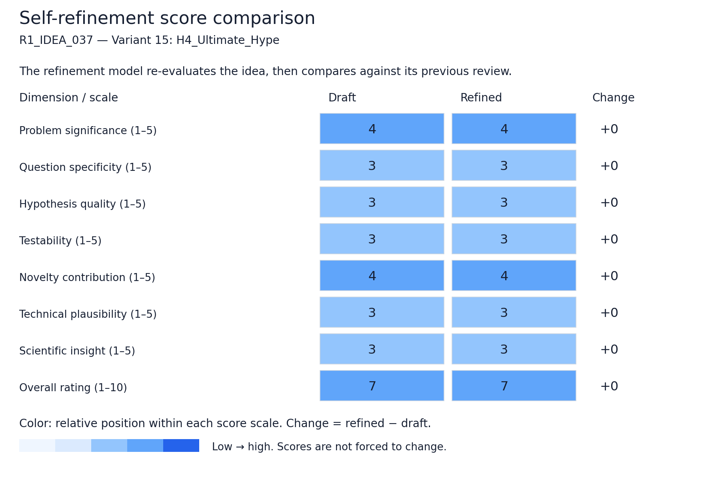

Changed score dimensions: none.

### Score justifications (draft / refined)

**Problem significance**

```json
{
  "draft": {
    "score": 4.0,
    "justification": "The problem of ambiguous counterfactual explanations is significant in machine learning, as it affects the interpretability and trustworthiness of models. Addressing this issue could lead to more reliable and meaningful explanations, which is crucial for practical applications."
  },
  "refined": {
    "score": 4.0,
    "justification": "The problem of ambiguous counterfactual explanations is significant in machine learning, as it affects the interpretability and trustworthiness of models. Addressing this issue could lead to more reliable and meaningful explanations, which is crucial for practical applications."
  }
}
```

**Question specificity**

```json
{
  "draft": {
    "score": 3.0,
    "justification": "The idea identifies a specific problem (ambiguity in distance metrics for counterfactuals) but lacks detailed specification of the research question. It is clear that the goal is to improve the meaningfulness of perturbations, but the exact question or hypothesis is not explicitly stated."
  },
  "refined": {
    "score": 3.0,
    "justification": "The idea identifies a specific problem (ambiguity in distance metrics for counterfactuals) but lacks detailed specification of the research question. It is clear that the goal is to improve the meaningfulness of perturbations, but the exact question or hypothesis is not explicitly stated."
  }
}
```

**Hypothesis quality**

```json
{
  "draft": {
    "score": 3.0,
    "justification": "The idea suggests that using geodesics under a perceptual metric could improve the meaningfulness of counterfactuals, but the hypothesis is not explicitly stated. The potential for a transformative impact is mentioned, but the specific prediction or mechanism is not clearly articulated."
  },
  "refined": {
    "score": 3.0,
    "justification": "The idea suggests that using geodesics under a perceptual metric could improve the meaningfulness of counterfactuals, but the hypothesis is not explicitly stated. The potential for a transformative impact is mentioned, but the specific prediction or mechanism is not clearly articulated."
  }
}
```

**Testability**

```json
{
  "draft": {
    "score": 3.0,
    "justification": "The idea proposes a method that could be tested by comparing its performance against existing approaches in terms of semantic meaningfulness and effectiveness. However, the lack of specific experimental details makes it difficult to assess the testability of the core claim."
  },
  "refined": {
    "score": 3.0,
    "justification": "The idea proposes a method that could be tested by comparing its performance against existing approaches in terms of semantic meaningfulness and effectiveness. However, the lack of specific experimental details makes it difficult to assess the testability of the core claim."
  }
}
```

**Novelty contribution**

```json
{
  "draft": {
    "score": 4.0,
    "justification": "The introduction of Perceptual Counterfactual Geodesics is a novel approach that addresses a specific technical challenge in counterfactual explanations. The potential for broader implications in model interpretability and trustworthiness adds to its novelty."
  },
  "refined": {
    "score": 4.0,
    "justification": "The introduction of Perceptual Counterfactual Geodesics is a novel approach that addresses a specific technical challenge in counterfactual explanations. The potential for broader implications in model interpretability and trustworthiness adds to its novelty."
  }
}
```

**Technical plausibility**

```json
{
  "draft": {
    "score": 3.0,
    "justification": "The use of geodesics in latent space is a plausible approach, but the specifics of how the perceptual metric is applied and how geodesics are computed are not clearly defined. This lack of detail makes it challenging to assess the technical feasibility of the method."
  },
  "refined": {
    "score": 3.0,
    "justification": "The use of geodesics in latent space is a plausible approach, but the specifics of how the perceptual metric is applied and how geodesics are computed are not clearly defined. This lack of detail makes it challenging to assess the technical feasibility of the method."
  }
}
```

**Scientific insight**

```json
{
  "draft": {
    "score": 3.0,
    "justification": "The idea has the potential to provide insights into the relationship between distance metrics and the meaningfulness of counterfactuals. However, the lack of a clear hypothesis or specific research question limits the potential for significant scientific insight."
  },
  "refined": {
    "score": 3.0,
    "justification": "The idea has the potential to provide insights into the relationship between distance metrics and the meaningfulness of counterfactuals. However, the lack of a clear hypothesis or specific research question limits the potential for significant scientific insight."
  }
}
```

**Overall rating**

```json
{
  "draft": {
    "score": 7.0,
    "justification": "The idea presents a promising direction for improving counterfactual explanations by addressing the ambiguity in distance metrics. While it lacks specific details and a clear hypothesis, the novelty and potential impact make it a strong research direction that could lead to meaningful contributions if further developed."
  },
  "refined": {
    "score": 7.0,
    "justification": "The idea presents a promising direction for improving counterfactual explanations by addressing the ambiguity in distance metrics. While it lacks specific details and a clear hypothesis, the novelty and potential impact make it a strong research direction that could lead to meaningful contributions if further developed."
  }
}
```
